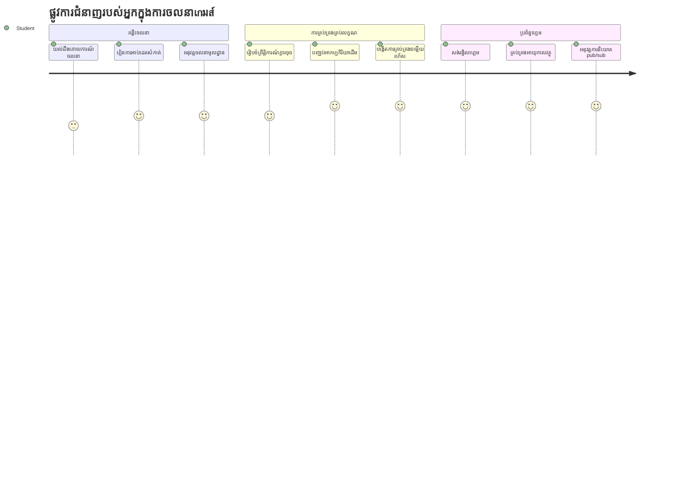
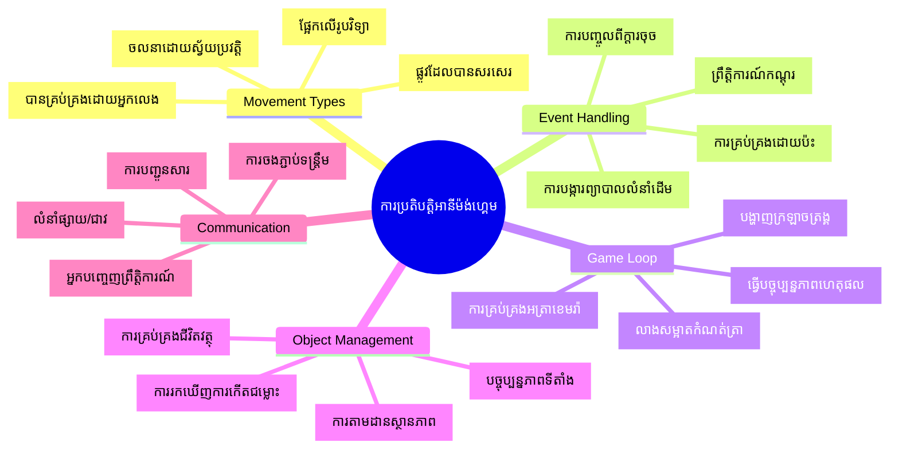
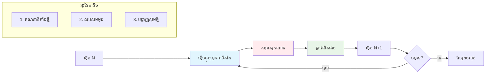
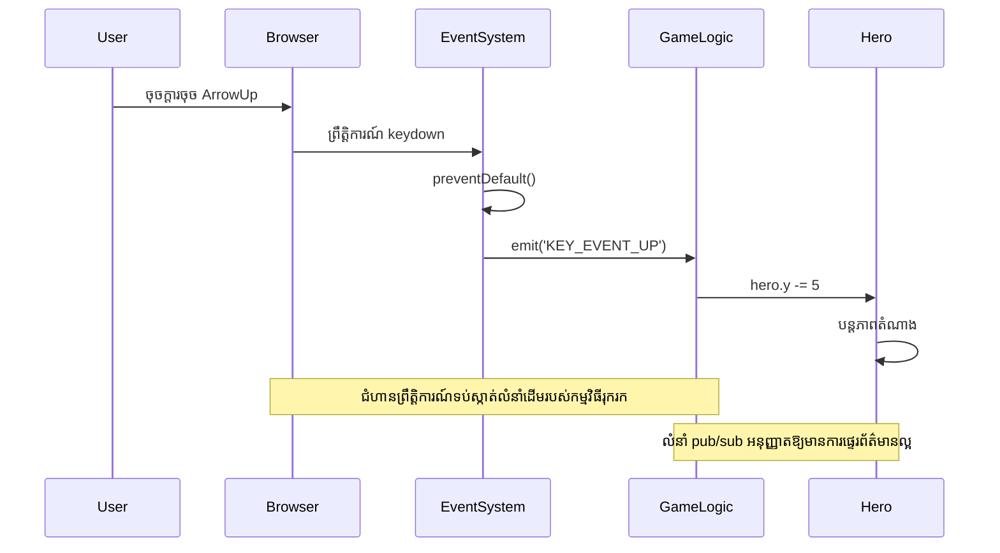
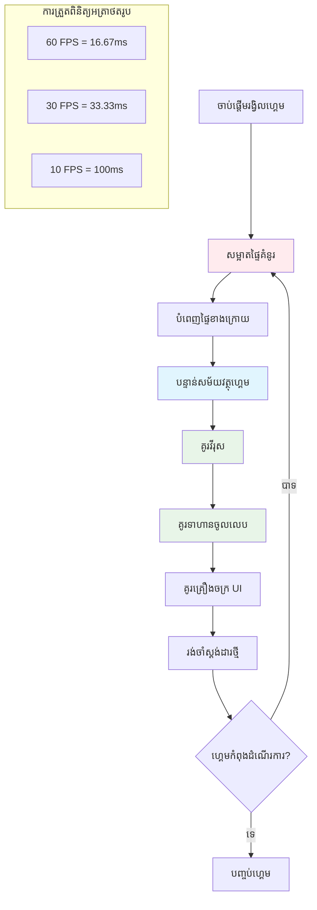
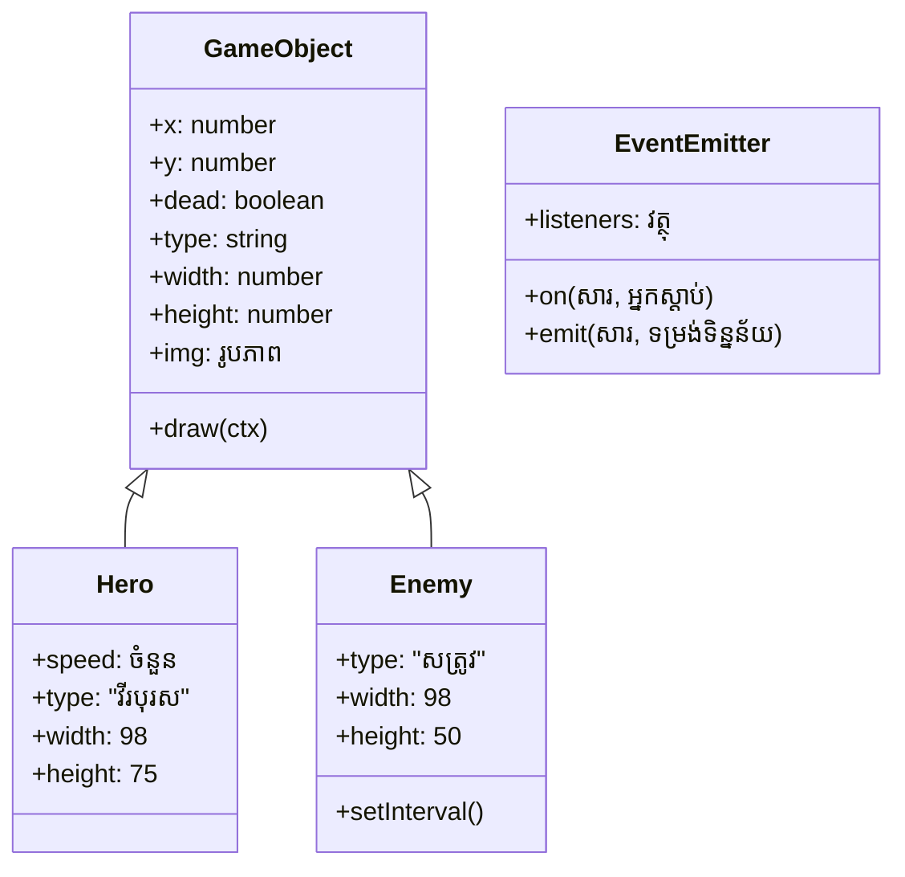
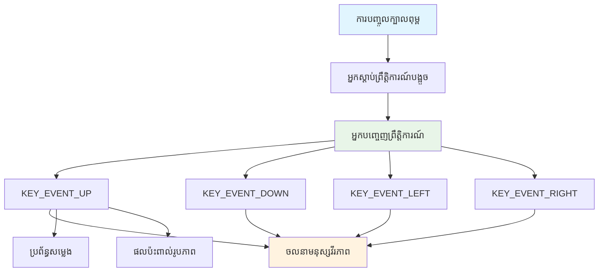

# សាងសង់ហ្គេមអាកាសយាន Part 3: បន្ថែមចលនា


គិតអំពីហ្គេមដែលអ្នកចូលចិត្តបំផុត – អ្វីដែលធ្វើអោយវាគួរឲ្យទាក់ទាញមិនមែនមានតែក្រាហ្វិកស្រស់ស្អាតណាមួយទេ វាជារបៀបដែលគ្រប់យ៉ាងផ្លាស់ទី និងឆ្លើយតបនឹងសកម្មភាពរបស់អ្នក។ ពេលនេះហ្គេមអាកាសយានរបស់អ្នកដូចជារូបភាពស្អាតមួយ ប៉ុន្តាយើងត្រៀមបន្ថែមចលនាដែលនាំឲ្យវាមានជីវិត។

ពេលវិស្វកររបស់ NASA បង្កើតកម្មវិធីកុំព្យូទ័រណែនាំសម្រាប់បេសកកម្ម Apollo ពួកគេបានប្រឈមមុខនឹងបញ្ហាដូចគ្នាមួយ៖ តើធ្វើដូចម្តេចឲ្យយន្តហោះចរណ៍ឆ្លើយតបនឹងបញ្ចូលពីអ្នកបើកបរ ខណៈដែលរក្សាការកែតម្រូវទិសដៅដោយស្វ័យប្រវត្តិ? គន្លឹះដែលយើងនឹងរៀនថ្ងៃនេះមានសំឡេងដូចគ្នានឹងគំនិតទាំងនោះ – គ្រប់គ្រងចលនាដែលត្រូវបានគ្រប់គ្រងដោយអ្នកលេងរួមជាមួយអាកម្មវិធីប្រព័ន្ធដោយស្វ័យប្រវត្តិ។

ក្នុងមេរៀននេះ អ្នកនឹងរៀនពីរបៀបធ្វើឲ្យយន្តហោះអាកាសរត់ផ្លាស់ទីនៅលើអេក្រង់ ឆ្លើយតបនឹងពាក្យបញ្ជារបស់អ្នកលេង និងបង្កើតរបៀបចលនាត្រង់សុភាព។ យើងនឹងបំបែកគ្រប់យ៉ាងទៅជាគំនិតដែលអាចគ្រប់គ្រងបាន ដែលចុះសារពើភ័ណ្ឌគ្នាដោយធម្មតា។

នៅចុងមេរៀន អ្នកនឹងមានអ្នកលេងបង្វៀនយន្តហោះចម្ងាយរបស់ពួកគេនៅលើអេក្រង់ ខណៈដែលនាវាសត្រូវកំពុងបញ្ចុះមេឃមើលថែទាំ។​ សំខាន់ជាងនេះ អ្នកនឹងយល់ស្រាប់ពីគន្លឹះសំខាន់នៃប្រព័ន្ធចលនាហ្គេម។


## សំណួរពីមុនមេរៀន

[សំណួរពីមុនមេរៀន](https://ff-quizzes.netlify.app/web/quiz/33)

## ការយល់ដឹងពីចលនាហ្គេម

ហ្គេមមានជីវិតនៅពេលវាផ្លាស់ទីជុំវិញ ហើយមានពីរប្រភេទទាំងមូលដែលវាផ្លាស់ទី៖

- **ចលនាដោយអ្នកលេងគ្រប់គ្រង**៖ ពេលអ្នកចុចក្តារចុច ឬចុចម៉ៅស៍ អ្វីមួយចលនា។ នេះគឺជាការភ្ជាប់ដោយផ្ទាល់រវាងអ្នក និងពិភពហ្គេមរបស់អ្នក។
- **ចលនាដោយស្វ័យប្រវត្តិ**៖ ពេលហ្គេមនៅជាគម្រោងចលនាអ្វីមួយ – ដូចជានាវាសត្រូវដែលត្រូវបន្តបើកដំណើរកម្សាន្តលើអេក្រង់ ព្រោះអ្នកមិនបានធ្វើអ្វីទេក៏ដោយ។

ការធ្វើអោយវត្ថុផ្លាស់ទីលើអេក្រង់កុំព្យូទ័រងាយស្រួលជាងមើលមួយ។ ចងចាំកូអរដោនេ x និង y ពីថ្នាក់គណិតវិទ្យាដែរឬ? នេះគឺជាម៉ាស៊ីនដែលយើងកំពុងប្រើប្រាស់នៅទីនេះ។ ពេល Galileo តាមដានព្រះច័ន្ទរបស់ Jupiter នៅឆ្នាំ 1610 គាត់គឺកំពុងធ្វើដូចគ្នា – គំនិតតម្លែងទីតាំងអំឡុងពេលដើម្បីយល់ពីរបៀបចលនា។

ការផ្លាស់ទីវត្ថុលើអេក្រង់ដូចជាធ្វើអាណីម៉េសិនសៀវភៅបង្វិល – អ្នកត្រូវតែអនុវត្តតាមជំហ៊ានសាមញ្ញទាំងបីដូចខាងក្រោម៖


1. **ធ្វើបច្ចុប្បន្នភាពទីតាំង** – ប្ដូរទីតាំងដែលវត្ថុរបស់អ្នកគួរតែស្ថិតនៅ (ប្រហែលបញ្ចូនវាចូលទៅខាងស្តាំ 5 ភិកសែល)
2. **លុបទំព័រចាស់** – សម្អាតអេក្រង់ឲ្យមិនឲ្យឃើញក្ដោបដូចសត្វភ្លើង និងស្នាមដែលនៅជុំវិញ
3. **គូរទំព័រថ្មី** – ដាក់វត្ថុនៅក្នុងទីតាំងថ្មីរបស់វា

ធ្វើរហ័សត្រឹមគ្រប់គ្រាន់ ហើយហ្នឹង! អ្នកបានចលនាដែលរលូនហើយមានអារម្មណ៍ធម្មជាតិសម្រាប់អ្នកលេង។

នេះគឺជារូបមន្តដែលវាអាចមើលឃើញបានក្នុងកូដ៖

```javascript
// កំណត់ទីតាំងរបស់វីរៈតួ
hero.x += 5;
// សម្អាតចតុកោណដែលផ្ទុកវីរៈតួ
ctx.clearRect(0, 0, canvas.width, canvas.height);
// ផ្ដល់គំនូរជាមួយផ្ទៃខាងក្រោយនៃហ្គេម និងវីរៈតួឡើងវិញ
ctx.fillRect(0, 0, canvas.width, canvas.height);
ctx.fillStyle = "black";
ctx.drawImage(heroImg, hero.x, hero.y);
```

**នេះជារឿងដែលកូដនេះធ្វើ:**
- **ធ្វើបច្ចុប្បន្នភាព** លេខកូអរដោនេ x របស់វិរុទ្ធដោយ 5 ភិកសែល ក្នុងការផ្លាស់ទីឱ្យចំហៀង
- **សម្អាត** សៀវភៅសនៅមូលដ្ឋានរុំជាមួយប្រអប់ទាំងមូលដើម្បីលុបបំបាត់ទំព័រមុន
- **បំពេញ** សៀវភៅសដោយពណ៌ខ្មៅផ្ទៃខាងក្រោយ
- **គូរ​** រូបភាពរបស់វិរុទ្ធនៅទីតាំងថ្មីរបស់វា

✅ តើអ្នកអាចគិតបានហេតុអ្វីមួយដែលការគូរវិរុទ្ធជាប្រព័ន្ធរាប់សំណុំគ្រប់ៗគ្នារក្សាទុកអាចបង្កឲ្យមានការចំណាយប្រសិទ្ធភាពខ្ពស់? អានអំពី [ជម្រើសជំនួសនៃលំនាំនេះ](https://developer.mozilla.org/en-US/docs/Web/API/Canvas_API/Tutorial/Optimizing_canvas)។

## គ្រប់គ្រងព្រឹត្តិការណ៍ផ្ទាំងក្តារចុច

នេះគឺជាកន្លែងដែលយើងភ្ជាប់ការបញ្ចូលពីអ្នកលេងទៅសកម្មភាពហ្គេម។ ពេលនរណាម្នាក់ចុច spacebar ដើម្បីបាញ់កាំភ្លើង ឬប៉ះក្តារចុចមុំដើម្បីជៀសវាងត្មួយផ្កាយ យើងត្រូវការឲ្យហ្គេមចាប់សញ្ញានិងឆ្លើយតបនឹងការបញ្ចូលនោះ។

ព្រឹត្តិការណ៍ក្តារចុចកើតឡើងនៅលើបិទបើកវីនដោ (window) មានន័យថាវីនដោកំណត់តម្រូវគ្រប់គ្រងនូវព្រឹត្តិការណ៍ទាំងនោះទាំងមូល។ ចុចម៉ៅស៍ផ្ទាល់ត្រូវបានភ្ជាប់ទៅធាតុជាក់លាក់ទេ (ដូចការចុចប៊ូតុងមួួយ)។ សម្រាប់ហ្គេមអាកាសយានរបស់យើង យើងនឹងផ្តោតទៅលើការគ្រប់គ្រងតាមរយៈក្តារចុចពីព្រោះវ៉ាអាចផ្តល់អារម្មណ៍ហ្គេម arcade ដោយសារៈសំខាន់ដល់អ្នកលេង។

វាបម្រាមជួយជំរាបថាការចុចក្តារចុចមានអត្ថន័យដូចការប្រែសំឡេង ម៉ូស៍កូដ (Morse code) ដែលអ្នកប្រើtelegramនៅសតវត្សទី១៩ត្រូវបម្លែងវាទៅជាសារសំខាន់ៗ – យើងកំពុងធ្វើអ្វីដូចគ្នា សន្ទស្សន៏ក្តារចុចទៅជាពាក្យបញ្ជាហ្គេម។

ដើម្បីគ្រប់គ្រងព្រឹត្តិការណ៍ អ្នកត្រូវប្រើវិធីសាស្រ្ត `addEventListener()` របស់វីនដោ ហើយផ្តល់ឲ្យវាជាមួយប៉ារ៉ាម៉ែត្រពីរពីការបញ្ចូល។ ប៉ារ៉ាម៉ែត្រដំបូងគឺឈ្មោះព្រឹត្តិការណ៍ ចំ. `keyup`។ ប៉ារ៉ាម៉ែត្រទីពីរគឺមុខងារដែលត្រូវចាប់អ្វីមួយខណៈពេលព្រឹត្តិការណ៍កើតមាន។

ឧទាហរណ៍ខាងក្រោម៖

```javascript
window.addEventListener('keyup', (evt) => {
  // evt.key = ការប្រតិបត្តិជាស្រមោលសរសេររបស់ក្តារចុច
  if (evt.key === 'ArrowUp') {
    // ធ្វើអ្វីមួយ
  }
});
```

**បំបែកអ្វីកើតឡើងនៅទីនេះ៖**
- **ស្តាប់** ព្រឹត្តិការណ៍ក្តារចុចនៅលើវីនដោទាំងមូល
- **ចាប់យក** វត្ថុព្រឹត្តិការណ៍ ដែលមានព័ត៌មានអំពីលេខកូដដែលត្រូវបានចុច
- **ពិនិត្យ** ថាតើប៊ូតុងមួយៗដែលត្រូវបានចុចផ្គូផ្គងគ្នាជាមួយប៊ូតុងជាក់លាក់ឬនៅ (នៅក្នុងករណីនេះ គឺស៊ុមលើ)
- **អនុវត្ត** កូដនៅពេលលក្ខខណ្ឌត្រូវគ្នា

សម្រាប់ព្រឹត្តិការណ៍ក្តារចុច មានលក្ខណៈពិសេសពីរដែលអ្នកអាចប្រើដើម្បីមើលថាតើប៊ូតុងណាត្រូវបានចុច៖

- `key` -នេះជាជួរខ្សែតំណាងឱ្យប៊ូតុងដែលត្រូវបានចុច ឧ. `'ArrowUp'`
- `keyCode` -នេះជាការតំណាងជាលេខ, ឧ. `37`, តំណាងនៅ `ArrowLeft`

✅ ការគ្រប់គ្រងព្រឹត្តិការណ៍ក្តារចុចមានប្រយោជន៍នៅខាងក្រៅការអភិវឌ្ឍហ្គេម។ តើអ្នកអាចគិតបានប្រើប្រាស់ផ្សេងៗជាអ្វីសម្រាប់បច្ចេកទេសនេះ?


### ប៊ូតុងពិសេស៖ ការពារជាប្រយ័ត្ន!

ខ្លះៗមានរបៀបធ្វើបែបខ្លួនឯងក្នុងកម្មវិធីរុករកដែលអាចបញ្ហាជាមួយហ្គេមរបស់អ្នក។ ប៊ូតុងព្រួញស្លាបផ្ដួលទំព័រ និងប៊ូតុង spacebar លោតចុះ – របៀបដែលអ្នកមិនចង់ឲ្យកើតឡើងពេលនរណាម្នាក់កំពុងបើកបរ យន្តហោះរបស់ពួកគេ។

យើងអាចរារាំងរបៀបតាមលំនាំដើមទាំងនេះ ហើយឲ្យហ្គេមរបស់យើងគ្រប់គ្រងចូលខ្ទង់វិញ។ នេះដូចជាពេលអ្នកសរសេរកម្មវិធីកុំព្យូទ័រដ៏ដំបូងត្រូវរារាំងការជ្រៀតចូលមិនគួរឱ្យមាន ពីប្រព័ន្ធ ដើម្បីបង្កើតអាកប្បកិច្ចផ្ទាល់ខ្លួន – យើងក៏កំពុងធ្វើបែបនោះនៅកម្រិតកម្មវិធីរុករក។ វាជារបៀបដូចខាងក្រោម៖

```javascript
const onKeyDown = function (e) {
  console.log(e.keyCode);
  switch (e.keyCode) {
    case 37:
    case 39:
    case 38:
    case 40: // សោរចំណុចបូមុន
    case 32:
      e.preventDefault();
      break; // ចន្លោះ
    default:
      break; // កុំរារាំងកូនសោផ្សេងទៀត
  }
};

window.addEventListener('keydown', onKeyDown);
```

**យល់ដឹងពីកូដរារាំងនេះ៖**
- **ពិនិត្យ** រកលេខកូដប៊ូតុងជាក់លាក់ដែលអាចបង្កការប្រើប្រាស់មិនចង់បានក្នុងកម្មវិធីរុករក
- **រារាំង** សកម្មភាពលំនាំដើមសម្រាប់ប៊ូតុងព្រួញ និង spacebar
- **អនុញ្ញាត** ប៊ូតុងផ្សេងទៀតដើរតួធម្មតា
- **ប្រើ** `e.preventDefault()` ដើម្បីបញ្ឈប់អាកប្បកិច្ចរបស់កម្មវិធីរុករក

### 🔄 **ការត្រួតពិនិត្យផ្នែកសិក្សា**
**ការយល់ដឹងពីការគ្រប់គ្រងព្រឹត្តិការណ៍**៖ មុនរំពឹងចូលចលនាស្វ័យប្រវត្តិ សូមប្រាកដថាអ្នកអាច៖
- ✅ ពន្យល់ភាពខុសគ្នារវាងព្រឹត្តិការណ៍ `keydown` និង `keyup`
- ✅ យល់ថាប៉ុណ្ណាដូចម្តេចយើងរារាំងអាកប្បកម្មរុករកលំនាំដើម
- ✅ ពិពណ៌នាថាលដ្ឋានព្រឹត្តិការណ៍ភ្ជាប់ការបញ្ចូលអ្នកប្រើទៅលើផ្លូវហ្គេម
- ✅ កំណត់ថាប៊ូតុងណាដែលអាចបញ្ហាជាមួយការគ្រប់គ្រងហ្គេម

**តេស្តខ្លីមួយ**៖ តង្វើអ្វីប្រសិនបើអ្នកមិនរារាំងអាកប្បកម្មលំនាំដើមសម្រាប់ប៊ូតុងព្រួញ?  
*ចម្លើយ៖ កម្មវិធីរុករកនឹងរំកិលទំព័រ ប៉ះបញ្ហាចលនាហ្គេម*

**រចនាសម្ព័ន្ធប្រព័ន្ធព្រឹត្តិការណ៍**៖ ឥឡូវនេះ អ្នកយល់ថា៖
- **ស្ដាប់ព្រឹត្តិការណ៍នៅកម្រិតវីនដោ**៖ ចាប់ព្រឹត្តិការណ៍នៅកម្រិតកម្មវិធីរុករក
- **លក្ខណៈវត្ថុព្រឹត្តិការណ៍**៖ ខ្សែអក្សរសម្រាប់ `key` ទល់នឹងលេខសម្រាប់ `keyCode`
- **ការរារាំងលំនាំដើម**៖ បោះបង់អាកប្បកម្មរុករកមិនចង់បាន
- **យុទ្ធសាស្ត្រកំណត់លក្ខខណ្ឌ**៖ ឆ្លើយតបនៅលើប៊ូតុងជាក់លាក់

## ចលនាដែលហ្គេមបង្កើតហើយ

ឥឡូវនេះ យើងនិយាយអំពីវត្ថុដែលផ្លាស់ទីដោយគ្មានការបញ្ចូលពីអ្នកលេង។ គិតអំពីនាវាសត្រូវហោះបេីកលើអេក្រង់, កាំភ្លើងប៊ុល្លេតហោះជាន់ត្រង់ ឬពពកហោះផ្លាស់ទីនៅក្រោយ។ ចលនាស្វ័យប្រវត្តិនេះធ្វើឲ្យពិភពហ្គេមរបស់អ្នកមានជីវិតទើបមិនថានរណាម្នាក់អាចប៉ះពាល់ការគ្រប់គ្រងក៏ដោយ។

យើងប្រើម៉ោងរាប់វិនាទីដែលបានបង្កើតរួចក្នុង JavaScript ដើម្បីធ្វើបច្ចុប្បន្នភាពទីតាំងជាប្រចាំ។ គំនិតនេះស្រដៀងនឹងម៉ោងជណ្តើរទឹក – ប្រព័ន្ធធម្មតាមួយដែលបញ្ចេញសកម្មភាពគ្រប់គ្រងរយៈពេលជាប្រចាំ។ ខាងក្រោមជារបៀបដែលវាសាមញ្ញ៖

```javascript
const id = setInterval(() => {
  // បញ្ជូនសត្រូវទៅលើអ័ក្ស y
  enemy.y += 10;
}, 100);
```

**នេះជារឿងដែលកូដចលនានេះធ្វើ:**
- **បង្កើត** ម៉ោងរាប់វិនាទីដែលដំណើរការជារៀងរាល់ 100 មីលីវិនាទី
- **ធ្វើបច្ចុប្បន្នភាព** លេខកូអរដោនេ y របស់សត្រូវដោយ 10 ភិកសែលគ្រប់ពេល
- **រក្សា** លេខសម្គាល់រង្វាស់ម៉ោងនោះ ដើម្បីបញ្ឈប់វាបានបន្ទាប់ប្រសិនបើចាំបាច់
- **ផ្លាស់ទី** សត្រូវចុះក្រោមអេក្រង់ដោយស្វ័យប្រវត្តិ

## រង្វង់ហ្គេម

នេះជាគំនិតដែលភ្ជាប់គ្រប់យ៉ាងទាំងអស់ – រង្វង់ហ្គេម។ ប្រសិនបើហ្គេមរបស់អ្នកជាផលិតកម្មភាពយន្ត រង្វង់ហ្គេមនឹងជាឧបករណ៍បញ្ចាំងទាំងអស់ បង្ហាញទំព័រតាមទំព័រយ៉ាងរហ័សទាំងដែលឲ្យមើលឃើញចលនាត្រង់សុភាព។

គ្រប់ហ្គេមមានរង្វង់បែបនេះដែលដំណើរការក្រោយឆatem។ វាជាមុខងារដែលធ្វើបច្ចុប្បន្នភាពវត្ថុរបស់ហ្គេមទាំងអស់ គូរឡើងវិញអេក្រង់ និងធ្វើឡើងម្ដងម្កាលជាបន្តបន្ទាប់។ វាអាចតាមដានវិរុទ្ធរបស់អ្នក រួមទាំងសត្រូវ ទាំងកាំភ្លើង និងសភាពហ្គេមទាំងមូល។

គំនិតនេះធ្វើឲ្យចង្អុលបង្ហាញពីរបៀបដែលអ្នកគូរអាណីម៉េត័រប្រទេសដើមជាមួយ Walt Disney ជាលំដាប់ផ្ទាល់ដោយគូរតួអង្គមួយៗជាទំព័រដើម្បីបង្កើតអារម្មណ៍ចលនា។ យើងកំពុងធ្វើដូចគ្នា តែប្រើកូដជំនួសថែមពីនខ្មៅ។

នេះជារូបមន្តមួយសម្រាប់រង្វង់ហ្គេម ដាក់ជាកូដ៖


```javascript
const gameLoopId = setInterval(() => {
  function gameLoop() {
    ctx.clearRect(0, 0, canvas.width, canvas.height);
    ctx.fillStyle = "black";
    ctx.fillRect(0, 0, canvas.width, canvas.height);
    drawHero();
    drawEnemies();
    drawStaticObjects();
  }
  gameLoop();
}, 200);
```

**យល់ដឹងពីរចនាសម្ព័ន្ធរង្វង់ហ្គេម៖**
- **សម្អាត** សៀវភៅសទាំងមូលដើម្បីលុបតំបន់យោងមុន
- **បំពេញ** ផ្ទៃខាងក្រោយជាពណ៌រឹងមាំ
- **គូរ** វត្ថុហ្គេមទាំងអស់នៅទីតាំងបច្ចុប្បន្នរបស់ពួកវា
- **ធ្វើឡើងម្ដងម្កាល** ជារៀងរាល់ 200 មីលីវិនាទី ដើម្បីបង្កើតអាណីម៉េសិនរលូន
- **គ្រប់គ្រង** ល្បឿនបង្ហាញពីរបៀបគ្រប់គ្រងរយៈពេលរង្វង់

## បន្តហ្គេមអាកាសយាន

ឥឡូវយើងនឹងបន្ថែមចលនាចូលទៅក្នុងទេសភាពស្ងាត់ដែលអ្នកបានបង្កើតមុននេះ។ យើងនឹងបម្លែងវាពីរូបភាពថតទៅជាបទពិសោធន៍អន្តរកម្ម។ យើងនឹងធ្វើការដោយជំហាន តាមដានត្រឹមត្រូវទៅជាគ្នា។

ទាញយកកូដពីកន្លែងដែលយើងបានរួចនៅមេរៀនមុន (ឬចាប់ផ្តើមជាមួយកូដក្នុងថត [Part II- starter](../../../../6-space-game/3-moving-elements-around/your-work) ប្រសិនបើអ្នកត្រូវការចាប់ផ្តើមថ្មី)។

**នេះគឺអ្វីដែលយើងកំពុងសាងសង់ថ្ងៃនេះ៖**
- **ការគ្រប់គ្រងវិរុទ្ធ**៖ ប៊ូតុងព្រួញនឹងបើកបរ យន្តហោះរបស់អ្នកនៅរង្វង់អេក្រង់
- **ចលនាសត្រូវ**៖ នាវាអ alien នឹងចាប់ផ្តើមចាក់ដំណើរការ

ចាប់ផ្តើមអនុវត្តលក្ខណះទាំងនេះ។

## ជំហានដែលសូមណែនាំ

ស្វែងរកឯកសារដែលបានបង្កើតសម្រាប់អ្នកក្នុងថត `your-work`។ វាគួរតែមានអ្វីខាងក្រោម៖

```bash
-| assets
  -| enemyShip.png
  -| player.png
-| index.html
-| app.js
-| package.json
```

អ្នកចាប់ផ្តើមគម្រោងរបស់អ្នកនៅក្នុងថត `your-work` ដោយវាយបញ្ជា៖

```bash
cd your-work
npm start
```

**អ្វីដែលពាក្យបញ្ជានេះធ្វើ:**
- **ចូលទៅថតគម្រោងរបស់អ្នក**
- **ចាប់ផ្តើម** ម៉ាស៊ីនមេ HTTP នៅអាសយដ្ឋាន `http://localhost:5000`
- **បម្រើ** ឯកសារហ្គេមរបស់អ្នក ដើម្បីអ្នកអាចសាកល្បងក្នុងកម្មវិធីរុករក

ខាងលើនឹងចាប់ផ្តើមម៉ាស៊ីនមេ HTTP នៅអាសយដ្ឋាន `http://localhost:5000`។ បើកកម្មវិធីរុករក ហើយបញ្ចូលអាសយដ្ឋាននោះ ឥឡូវវាគួរតែបង្ហាញវិរុទ្ធ និងសត្រូវទាំងអស់; មិនមានអ្វីផ្លាស់ទីទេ - រហូតដល់ឥឡូវ!

### បន្ថែមកូដ

1. **បន្ថែមវត្ថុផ្តល់ការ** សម្រាប់ `hero` និង `enemy` និង `game object` ពួកវាគួរតែមានគុណលក្ខណៈ `x` និង `y`។ (ចងចាំផ្នែក [Inheritance ឬ composition](../README.md))។

   *សំគាល់* `game object` គួរតែជាវត្តុដែលមាន `x` និង `y` និងមានសមត្ថភាពគូរទៅ canvas។

   > **ជំនួយ**៖ ចាប់ផ្តើមដោយបន្ថែមថ្នាក់ `GameObject` ថ្មីដែលមាន constructor ដូចខាងក្រោម ហើយបន្ទាប់មកគូរវាទៅ canvas៖

    ```javascript
    class GameObject {
      constructor(x, y) {
        this.x = x;
        this.y = y;
        this.dead = false;
        this.type = "";
        this.width = 0;
        this.height = 0;
        this.img = undefined;
      }
    
      draw(ctx) {
        ctx.drawImage(this.img, this.x, this.y, this.width, this.height);
      }
    }
    ```

    **យល់ដឹងពីថ្នាក់មូលដ្ឋាននេះ:**
    - **កំណត់** គុណលក្ខណៈសមរម្យដែលវត្ថុហ្គេមទាំងអស់ប្រើរួមគ្នា (ទីតាំង, ទំហំ, រូបភាព)
    - **រួមបញ្ចូល** ទង់ស្លា `dead` ដើម្បីតាមដានថាវត្ថុនោះគួរតែបានលុបចោលឬយ៉ាងណា
    - **ផ្តល់** មុខងារ `draw()` ដែលគូរវត្ថុទៅលើ canvas
    - **កំណត់** តម្លៃលំនាំដើមសម្រាប់គុណលក្ខណៈទាំងអស់ដែលថ្នាក់កូនអាចលើកឡើងបាន


    ឥឡូវនេះ បន្ថែមពីថ្នាក់ `GameObject` ដើម្បីបង្កើត `Hero` និង `Enemy`៖
    
    ```javascript
    class Hero extends GameObject {
      constructor(x, y) {
        super(x, y);
        this.width = 98;
        this.height = 75;
        this.type = "Hero";
        this.speed = 5;
      }
    }
    ```

    ```javascript
    class Enemy extends GameObject {
      constructor(x, y) {
        super(x, y);
        this.width = 98;
        this.height = 50;
        this.type = "Enemy";
        const id = setInterval(() => {
          if (this.y < canvas.height - this.height) {
            this.y += 5;
          } else {
            console.log('Stopped at', this.y);
            clearInterval(id);
          }
        }, 300);
      }
    }
    ```

    **គំនិតសំខាន់ក្នុងថ្នាក់ទាំងនេះ៖**
    - **ទទួលបន្លាស់** ពី `GameObject` ដោយប្រើពាក្យគន្លង `extends`
    - **ហៅ** កំណត់ constructor ប៉ារ៉េនត៍ជាមួយ `super(x, y)`
    - **កំណត់** ទំហំនិងគុណលក្ខណៈជាក់លាក់ សម្រាប់វត្ថុបែបផ្សេងៗ
    - **អនុវត្ត** ចលនាស្វ័យប្រវត្តិសម្រាប់សត្រូវដោយប្រើ `setInterval()`

2. **បន្ថែមអ្នកចាប់ព្រឹត្តិការណ៍គ្រប់គ្រង key-event** សម្រាប់គ្រប់គ្រងការត្រួតពិនិត្យក្តារចុច (ចលាវិរុទ្ធឡើង/ចុះឆ្វេង/ស្តាំ)

   *ចងចាំ* វាជាប្រព័ន្ធកាតេស៊្យាន(top-left ជា `0,0`) ហើយចងចាំបន្ថែមកូដដើម្បីបញ្ឈប់ *អាកប្បកម្មលំនាំដើម*

   > **ជំនួយ**៖ បង្កើតមុខងារ `onKeyDown` របស់អ្នក ហើយភ្ជាប់ចូលទៅកាន់វីនដោ៖

   ```javascript
   const onKeyDown = function (e) {
     console.log(e.keyCode);
     // បន្ថែមកូដពីមេរៀនខាងលើដើម្បីបញ្ឈប់អាកប្បកិរិយាដើម
     switch (e.keyCode) {
       case 37:
       case 39:
       case 38:
       case 40: // ចំណុចមួយៗជំរុញ
       case 32:
         e.preventDefault();
         break; // កន្លែងទទេ
       default:
         break; // កុំបិទខ្ទប់កូនសោផ្សេងទៀត
     }
   };

   window.addEventListener("keydown", onKeyDown);
   ```
    
   **អ្វីដែលអ្នកគ្រប់គ្រងព្រឹត្តិការណ៍នេះធ្វើ:**
   - **ស្តាប់** ព្រឹត្តិការណ៍ keydown នៅលើវីនដោទាំងមូល
   - **កត់ត្រា** លេខកូដប៊ូតុង ដើម្បីជួយអ្នករកកំហុស ថាតើប៊ូតុងណាត្រូវបានចុច
   - **រារាំង** អាកប្បកម្មលំនាំដើមសម្រាប់ប៊ូតុងព្រួញនិង spacebar
   - **អនុញ្ញាត** ប៊ូតុងផ្សេងៗដើរតួធម្មតា
   
   ពិនិត្យកុងសូលកម្មវិធីរុករករបស់អ្នកនៅពេលនេះ ហើយមើលកំណត់ត្រាការចុចចុច។

3. **អនុវត្តន៍** លំនាំ [Pub sub](../README.md) pattern ដែលនឹងគ្រប់គ្រងកូដរបស់អ្នកឱ្យស្អាតពេលអ្នកធ្វើតាមផ្នែកដែលនៅសល់។

   លំនាំ Publish-Subscribe ជួយរៀបចំកូដរបស់អ្នកដោយបំបែកការចាប់សញ្ញាព្រឹត្តិការណ៍ពីការគ្រប់គ្រង ព្រមទាំងធ្វើឲ្យកូដរបស់អ្នកគឺមានម៉ូឌុល និងងាយស្រួលថែរក្សា។

   ដើម្បីធ្វើផ្នែកចុងក្រោយនេះ អ្នកអាច៖

   1. **បន្ថែមអ្នកស្តាប់ព្រឹត្តិការណ៍** នៅលើវីនដោ៖

       ```javascript
       window.addEventListener("keyup", (evt) => {
         if (evt.key === "ArrowUp") {
           eventEmitter.emit(Messages.KEY_EVENT_UP);
         } else if (evt.key === "ArrowDown") {
           eventEmitter.emit(Messages.KEY_EVENT_DOWN);
         } else if (evt.key === "ArrowLeft") {
           eventEmitter.emit(Messages.KEY_EVENT_LEFT);
         } else if (evt.key === "ArrowRight") {
           eventEmitter.emit(Messages.KEY_EVENT_RIGHT);
         }
       });
       ```

   **អ្វីដែលប្រព័ន្ធព្រឹត្តិការណ៍នេះធ្វើ:**
   - **ចាប់** ការបញ្ចូលពីក្តារចុច និងបម្លែងវាទៅជាព្រឹត្តិការណ៍ហ្គេមផ្ទាល់ខ្លួន
   - **បំបែក** ការចាប់សញ្ញាពីផ្លូវហ្គេម
   - **ធ្វើឲ្យ** ប្រែប្រួលការគ្រប់គ្រងបានយ៉ាងងាយស្រួលក្រោយពេលនេះដោយមិនប៉ះពាល់កូដហ្គេម
   - **អនុញ្ញាត** ប្រព័ន្ធច្រើនឆ្លើយតបនឹងដំណើរការ តែមួយសញ្ញា


   2. **បង្កើតថ្នាក់ EventEmitter** ដើម្បីបោះពុម្ពផ្សាយ និងចុះជាវ ការប្រាស្រ័យទាក់ទង៖

       ```javascript
       class EventEmitter {
         constructor() {
           this.listeners = {};
         }
       
         on(message, listener) {
           if (!this.listeners[message]) {
             this.listeners[message] = [];
           }
           this.listeners[message].push(listener);
         }
       
   3. **បន្ថែមអថេរ** និងរៀបចំ EventEmitter៖

       ```javascript
       const Messages = {
         KEY_EVENT_UP: "KEY_EVENT_UP",
         KEY_EVENT_DOWN: "KEY_EVENT_DOWN",
         KEY_EVENT_LEFT: "KEY_EVENT_LEFT",
         KEY_EVENT_RIGHT: "KEY_EVENT_RIGHT",
       };
       
       let heroImg, 
           enemyImg, 
           laserImg,
           canvas, ctx, 
           gameObjects = [], 
           hero, 
           eventEmitter = new EventEmitter();
       ```

   **យល់ដឹងអំពីការរៀបចំ:**
   - **កំណត់** អថេរពាក្យសារ ដើម្បីជៀសវាងកំហុសហ្រ្វាំ និងងាយស្រួលកែលម្អ
   - **ប្រកាស** អថេររូបភាព, context canvas និងស្ថានភាពហ្គេម
   - **បង្កើត** រង្វង់ព្រឹត្តិការណ៍សកលសំរាប់ប្រព័ន្ធ pub-sub
   - **ចាប់ផ្តើម** អារេ ដែលផ្ទុកវត្ថុហ្គេមទាំងអស់

   4. **ចាប់ផ្តើមហ្គេម**
       ```javascript
       function initGame() {
         gameObjects = [];
         createEnemies();
         createHero();
       
         eventEmitter.on(Messages.KEY_EVENT_UP, () => {
           hero.y -= 5;
         });
       
         eventEmitter.on(Messages.KEY_EVENT_DOWN, () => {
           hero.y += 5;
         });
       
         eventEmitter.on(Messages.KEY_EVENT_LEFT, () => {
           hero.x -= 5;
         });
       
4. **រៀបចំ លំហូរ​ហ្គេម**

   បម្លែងមុខងារ `window.onload` ដើម្បីចាប់ផ្ដើមហ្គេម និងរៀបចំលំហូរ​ហ្គេមនៅលើចន្លោះពេលល្អមួយ។ អ្នកនឹងបន្ថែមកាំភ្លើងលេស័រមួយផងដែរ៖

    ```javascript
    window.onload = async () => {
      canvas = document.getElementById("canvas");
      ctx = canvas.getContext("2d");
      heroImg = await loadTexture("assets/player.png");
      enemyImg = await loadTexture("assets/enemyShip.png");
      laserImg = await loadTexture("assets/laserRed.png");
    
      initGame();
      const gameLoopId = setInterval(() => {
        ctx.clearRect(0, 0, canvas.width, canvas.height);
        ctx.fillStyle = "black";
        ctx.fillRect(0, 0, canvas.width, canvas.height);
        drawGameObjects(ctx);
      }, 100);
    };
    ```

   **យល់ដឹងអំពីការរៀបចំហ្គេម៖**
   - **រង់ចាំ** ទំព័រត្រូវបានផ្ទុកពេញលេញមុនចាប់ផ្ដើម
   - **យក** ធាតុ canvas និង context សំរាប់គំនូរ 2D របស់វា
   - **ផ្ទុក** រូបភាពទាំងអស់យ៉ាងអាស៊ីនខណៈដោយប្រើ `await`
   - **ចាប់ផ្ដើម** លំហូរហ្គេមដែលរត់ជាប្រក្រឹត់លើចន្លោះ 100ms (10 FPS)
   - **សំអាត** និងគូរសារឡើងវិញអេក្រង់ទាំងមូលក្នុងរាល់ខ្ទង់ពេល

5. **បន្ថែមកូដ** ដើម្បីផ្លាស់ទីសត្រូវនៅចន្លោះពេលជាក់លាក់

    បម្លែងមុខងារ `createEnemies()` ដើម្បីបង្កើតសត្រូវ និងដាក់ពួកវាទៅក្នុងថ្នាក់ gameObjects ថ្មី៖

    ```javascript
    function createEnemies() {
      const MONSTER_TOTAL = 5;
      const MONSTER_WIDTH = MONSTER_TOTAL * 98;
      const START_X = (canvas.width - MONSTER_WIDTH) / 2;
      const STOP_X = START_X + MONSTER_WIDTH;
    
      for (let x = START_X; x < STOP_X; x += 98) {
        for (let y = 0; y < 50 * 5; y += 50) {
          const enemy = new Enemy(x, y);
          enemy.img = enemyImg;
          gameObjects.push(enemy);
        }
      }
    }
    ```

    **អ្វីដែលការបង្កើតសត្រូវធ្វើ៖**
    - **គណនាបរិយាកាស** ដើម្បីមធ្យមសត្រូវនៅលើអេក្រង់
    - **បង្កើត** បណ្តាញសត្រូវដោយប្រើរបៀបរំលងស្រួចៗ
    - **ផ្ដល់** រូបភាពសត្រូវទៅគ្រប់វត្ថុសត្រូវ
    - **បន្ថែម** គ្រប់សត្រូវចូលទៅក្នុងអារ​យ៉ាងលំដាប់លំដោយតាមកូដប្រព័ន្ធសកល
    
    ហើយបន្ថែមមុខងារ `createHero()` ដើម្បីធ្វើដូចគ្នាសម្រាប់វីរបុរស។

    ```javascript
    function createHero() {
      hero = new Hero(
        canvas.width / 2 - 45,
        canvas.height - canvas.height / 4
      );
      hero.img = heroImg;
      gameObjects.push(hero);
    }
    ```

    **អ្វីដែលការបង្កើតវីរបុរសធ្វើ៖**
    - **ចាក់ទីតាំង** វីរបុរសនៅចំណុចខាងក្រោមកណ្ដាលអេក្រង់
    - **ផ្ដល់** រូបភាពវីរបុរសទៅវត្ថុវីរបុរស
    - **បន្ថែម** វីរបុរសទៅក្នុងអារ game objects សម្រាប់គំនូរ

    ហើយចុងបញ្ចប់ បន្ថែមមុខងារ `drawGameObjects()` ដើម្បីចាប់ផ្ដើមគូរវត្ថុ:

    ```javascript
    function drawGameObjects(ctx) {
      gameObjects.forEach(go => go.draw(ctx));
    }
    ```

    **យល់ដឹងអំពីមុខងារគូរ៖**
    - **ធ្វើបន្ទាត់** តាមរយៈវត្ថុំហ្គេមទាំងអស់ក្នុងអារ
    - **ហៅ** មុខងារ `draw()` លើគ្រប់វត្ថុ
    - **ផ្ដល់** context canvas ដូច្នេះវត្ថុអាចគូរផ្ទាល់ខ្លួន

    ### 🔄 **ពិនិត្យការយល់ដឹង​ចំណេះដឹង**
    **យល់ដឹងឆ្លាតវៃអំពីប្រព័ន្ធហ្គេមសរុប**៖ ពិនិត្យការយល់ដឹងរបស់អ្នកអំពីសំណង់ទាំងមូល៖
    - ✅ តើការចិញ្ចើមធ្វើឲ្យ Hero និង Enemy ចែករំលែកលក្ខណៈ GameObject យ៉ាងដូចម្តេច?
    - ✅ ហេតុអ្វីបានជា​របៀប pub/sub ធ្វើឲ្យកូដរបស់អ្នកអាចថែរក្សาง่ายជាងមុន?
    - ✅ តើលំហូរហ្គេមមានតួនាទីអ្វីក្នុងការបង្កើតអង់ម៉ាស៊ីនរលូន?
    - ✅ តើអ្នកស្ដាប់ព្រឹតិ្តការណ៍ភ្ជាប់ការបញ្ចូលរបស់អ្នកប្រើទៅនឹងអាកប្បកិរិយាវត្ថុហ្គេមដូចម្តេច?

    **ការរួមបញ្ចូលប្រព័ន្ធ**៖ ហ្គេមរបស់អ្នកឥឡូវនេះបង្ហាញថា៖
    - **រចនាបថអចិន្រ្តៃយ៍**៖ ថ្នាក់មូលដ្ឋានដែលមានការចិញ្ចើមជាពិសេស
    - **សំណង់លើព្រឹតិ្តការណ៍**៖ របៀប pub/sub សម្រាប់ការតភ្ជាប់បន្តួយៗ
    - **ស៊ុមខ្សែអនុភាព**៖ លំហូរហ្គេមដែលមានការអាប់ដេតថេរៗ
    - **សម្ភារៈបញ្ចូល**៖ ព្រឹតិ្តការណ៍ក្តារចុចជាមួយការព្រមានលំនាំដើម
    - **គ្រប់គ្រងទ្រព្យសម្បត្តិ**៖ ការផ្ទុករូបភាព និងគូរបង្ហាញ sprites

    **គំរូវិជ្ជាជីវៈ**៖ អ្នកបានអនុវត្ត៖
    - **បំបែកការទំនួលខុសត្រូវ**៖ បញ្ចូល, តុល្យភាព និងគំនូរត្រូវបានបំបែក
    - **ពហុរាង**៖ គ្រប់វត្ថុហ្គេមចែករំលែកផ្ទាំងតំណាងគូរ
    - **ផ្លូវសារ**៖ ការប្រាស្រ័យទាក់ទងស្អាតរវាងក្រុមផ្សេងៗ
    - **គ្រប់គ្រងធនធាន**៖ ការគ្រប់គ្រងស្ព្រាយ និងអនុភាពមានប្រសិទ្ធិភាព

    សត្រូវរបស់អ្នកគួរតែចាប់ផ្ដើមរំកិលទៅលើកប៉ាល់មហានៅរបស់អ្នកហើយ!
      }
    }
    ```
    
    and add a `createHero()` function to do a similar process for the hero.
    
    ```javascript
    function createHero() {
      hero = new Hero(
        canvas.width / 2 - 45,
        canvas.height - canvas.height / 4
      );
      hero.img = heroImg;
      gameObjects.push(hero);
    }
    ```

    ហើយចុងបញ្ចប់ បន្ថែមមុខងារ `drawGameObjects()` ដើម្បីចាប់ផ្ដើមគូរវត្ថុ:

    ```javascript
    function drawGameObjects(ctx) {
      gameObjects.forEach(go => go.draw(ctx));
    }
    ```

    សត្រូវរបស់អ្នកគួរតែចាប់ផ្ដើមរំកិលទៅលើកប៉ាល់មហានៅរបស់អ្នកហើយ!

---

## ការប្រកួត GitHub Copilot Agent 🚀

នេះជាការប្រកួតមួយដែលនឹងធ្វើឲ្យហ្គេមរបស់អ្នកមានភាពរលោងជាងមុន៖ បន្ថែមដែនកំណត់ និងការគ្រប់គ្រងរលូន។ នៅពេលនេះ វីរបុរសរបស់អ្នកអាចហោះទៅខាងក្រៅអេក្រង់ ហើយក៏ចលនាក៏អាចមានអារម្មណ៍ថា មិនរលោងទេ។

**បេសកកម្មរបស់អ្នក៖** ធ្វើឲ្យកប៉ាល់មហានៅរបស់អ្នកមានអារម្មណ៍ស្របតាមការពិតជាងមុន ដោយអនុវត្តដែនកំណត់អេក្រង់ និងចលនារលូន។ វានៅស្រដៀងនឹងប្រព័ន្ធគ្រប់គ្រងបញ្ជាការហោះហើររបស់ NASA ដែលការពារកាឡាក់ភ័ឡង់ពីការលំលងចំណុចប្រតិបត្តិការដែលមានសុវត្ថិភាព។

**អ្វីដែលត្រូវបង្កើត៖** បង្កើតប្រព័ន្ធដែលរក្សាវីរបុរសរបស់អ្នកនៅលើអេក្រង់ ហើយធ្វើឲ្យការគ្រប់គ្រងមានភាពរលោង។ នៅពេលអ្នកលេងចុចរាល់លើប៊ូតុងអក្សរបស់ភ្លើងដែលចុច។ កប៉ាល់គួរជ្រេបទៅមុខបន្តបន្ទាប់ មិនមែនផ្លាស់ទីតាមជំហានតែមួយៗទេ។ ពិចារណាបន្ថែមមាតិកាដែលបង្ហាញរូបភាពពេលកប៉ាល់ដល់ដែនកំណត់អេក្រង់ — ប្រហែលជា​អេហ្វធីតតូចៗមួយដើម្បីបង្ហាញដែនលេង។

​សូមស្វែងយល់បន្ថែមអំពី [ម៉ូដ​ក្នុង​តំណាង](https://code.visualstudio.com/blogs/2025/02/24/introducing-copilot-agent-mode) នៅទីនេះ។

## 🚀 ការប្រកួត

ការរៀបចំកូដកាន់តែមានសារៈសំខាន់បន្ថែមឡើងពេលគម្រោងធំឡើង។ អ្នកអាចមានមើលឃើញថា​ឯកសាររបស់អ្នកពោរពេញដោយមុខងារ អថេរ និងថ្នាក់។ វាជារៀនសូត្រដូចជាអ្នកវិស្វករសម្រាប់ការរៀបចំកូដភាគច្រើនដែលក្រុមនានាត្រូវបានធ្វើការជាមួយគ្នា។

**បេសកកម្មរបស់អ្នក៖**
គិតដូចជាវិស្វករពហុកម្មវិធី។ តើអ្នកនឹងរៀបចំកូដរបស់អ្នកដូចម្តេច ដើម្បីឲ្យប្រាំមួយខែទៀត អ្នកឬសមាជិកក្រុមអាចយល់ពីអ្វីកំពុងកើតឡើង? ទោះបីឯកសារទាំងអស់នៅក្នុងឯកសារមួយ ក៏អ្នកអាចបង្កើតការរៀបចំដែលល្អជាងនេះ៖

- **ក្រុមមុខងារពាក់ព័ន្ធគ្នា** ជាមួយក្បួនមតិការអធិប្បាយច្បាស់លាស់
- **បំបែកការទំនួលខុសត្រូវ** - រក្សាគ្រប់គ្រងហ្គេមពីការជួរមុខគំនូរ
- **ប្រើកំណត់ឈ្មោះយ៉ាងត្រឹមត្រូវ** សម្រាប់អថេរ និងមុខងារ
- **បង្កើតម៉ូឌុល** ឬ namespace ដើម្បីរៀបចំផ្នែកផ្សេងៗក្នុងហ្គេម
- **បន្ថែមឯកសារសង្ខេប** ដែលពន្យល់ពីគោលបំណងនៃផ្នែកធម្មតាៗ

**សំណួរពិចារណា៖**
- តើផ្នែកណានៃកូដរបស់អ្នកពិបាកយល់បំផុត នៅពេលអ្នកត្រឡប់មកវិញ?
- តើអ្នកអាចរៀបចំកូដរបស់អ្នកដូចម្តេច ដើម្បីធ្វើឲ្យមនុស្សផ្សេងទៀតអាចរួមចំណែកបានកាន់តែងាយស្រួល?
- តើអ្វីនឹងកើតឡើង ប្រសិនបើអ្នកចង់បន្ថែមមុខងារថ្មីៗ ដូចជាពូម៉ឺ up ឬ ប្រភេទសត្រូវផ្សេងទៀត?

## សំនួរប្រឡងបន្ទាប់ពីមេរៀន

[សំនួរប្រឡងបន្ទាប់ពីមេរៀន](https://ff-quizzes.netlify.app/web/quiz/34)

## ពិនិត្យឡើងវិញ & ការសិក្សាឯករាជ្យ

យើងបានបង្កើតគ្រប់អ្វីពីដើម ដែលវាអស្ចារ្យសម្រាប់ការរៀន ប៉ុន្តែល្អប្រសើរជាងនេះ មាន框架 JavaScript ខ្លះៗដែលអាចធ្វើការទាញទំនិញធ្ងន់ធ្ងរច្រើនសម្រាប់អ្នក។ បន្ទាប់ពីអ្នកមានអារម្មណ៍ស្រួលល្អជាមួយមូលដ្ឋានយើងបានគ្រប់ដ្ឋាន អ្នកគួរតែ [ស្វែងយល់វត្ថុដែលអាចប្រើបាន](https://github.com/collections/javascript-game-engines)។

គិតថា 框架ដូចជា ប្រដាប់ឧបករណ៍ដែលមានឧបករណ៍ពេញលេញជំនួសអំពីការធ្វើឧបករណ៍ដោយដៃ។ វាអាចដោះស្រាយបញ្ហានៃការរៀបចំកូដយើងបាននិយាយ និងផ្តល់លក្ខណៈពិសេសដែលត្រូវការពេលប៉ុន្មានសប្តាហ៍ដើម្បីបង្កើតដោយខ្លួនឯង។

**រឿងដែលគួរនៅស្វែងយល់៖**
- របៀបដែលហ្គេមម៉ាស៊ីនរៀបចំកូដ - អ្នកនឹងភ្ញាក់ផ្អើលពីគំរូវៃឆ្លាតដែលពួកគេប្រើ
- ល្បិចប្រសិទ្ធភាពសម្រាប់ធ្វើឲ្យហ្គេម canvas រត់រលូន
- លក្ខណៈពិសេស JavaScript សម័យថ្មីដែលអាចធ្វើឲ្យកូដអ្នកស្អាតនិងថែទាំបានងាយ
- មធ្យោបាយផ្សេងៗក្នុងការគ្រប់គ្រងវត្ថុហ្គេម និងទំនាក់ទំនងរបស់ពួកវា

## 🎯 របៀបម៉ាស៊ីនរូបភាពហ្គេមរបស់អ្នក

```mermaid
timeline
    title ការរៀនអំពីផ្នែកចលនា និងអន្តរការ ឯកទេសហ្គេម
    
    section មូលដ្ឋានចលនា (២០ នាទី)
        គោលការណ៍ អ្នកចលនា: ស៊េរីឯកសារជារូបភាព
                            : ការអាប់ដេតទីតាំង
                            : ប្រព័ន្ធកូអរដោនេ이트
                            : ចលនារលូន
        
    section ប្រព័ន្ធព្រឹត្តិការណ៍ (២៥ នាទី)
        បញ្ចូលអ្នកប្រើ: ការគ្រប់គ្រងព្រឹត្តិការណ៍ក្តាស់ក្លាវ
                      : ការកាត់បន្ថយការជីកអោយមានការសកម្មឯកសារ
                      : លក្ខណៈព្រឹត្តិការណ៍វត្ថុ
                      : ការស្តាប់នៅលើបន្ទាត់បង្អួច
        
    section រចនាសម្ព័ន្ធហ្គេម (៣០ នាទី)
        ការរចនាវត្ថុ: រចនាបថបInheritance
                     : បង្កើតថ្នាក់មេ
                     : អាកប្បកិរិយាពិសេស
                     : ចំណុចប្រទាក់ងាយបម្លែង
        
    section រចនាបទការទំនាក់ទំនង (៣៥ នាទី)
        ការអនុវត្ត Pub/Sub: អ្នកបញ្ចេញព្រឹត្តិការណ៍
                            : អចលនាប័ណ្ណសារ
                            : ការតភ្ជាប់រាបសារ
                            : ការរួមបញ្ចូលប្រព័ន្ធ
        
    section ជំនាញវដ្តហ្គេម (៤០ នាទី)
        ប្រព័ន្ធពេលពិត: ការគ្រប់គ្រងអត្រារ៉េម
                         : វដ្តកែប្រែ/បង្ហាញ
                         : ការគ្រប់គ្រងស្ថានភាព
                         : បង្កើនប្រសិទ្ធភាព
        
    section បច្ចេកទេសខ្ពស់ (៤៥ នាទី)
        លក្ខណៈជំនាញ: ការរកឃើញការប៉ះទង្គិច
                         : ការសំឡេងហ័រ
                         : ម៉ាស៊ីនស្ថានភាព
                         : ប្រព័ន្ធបន្ទុក
        
    section គំនិតម៉ាស៊ីនហ្គេម (១ សប្តាហ៍)
        ការយល់ដឹងស៊េរី: ប្រព័ន្ធអង្គភាព-ផ្សេងៗ
                           : ក្រាហ្វភីបន្ទះ
                           : បណ្តោយទ្រព្យសម្បត្តិ
                           : ការវាយតម្លៃប្រសិទ្ធភាព
        
    section ជំនាញផលិតកម្ម (១ ខែ)
        ការអភិវឌ្ឍជំនាញ: ការរៀបចំកូដ
                            : ការសហការជាក្រុម
                            :យុទ្ធសាស្រ្តការប្រមូលផ្តុំនូវតេស្ត
                            : ការបង្កើនប្រសិទ្ធភាពដាក់បញ្ចេញ
```
### 🛠️ សង្ខេបប្រដាប់សម្រាប់អភិវឌ្ឍហ្គេមរបស់អ្នក

បន្ទាប់ពីបញ្ចប់មេរៀននេះ អ្នកបានទទួលជំនាញ៖
- **គោលការណ៍អនុភាព**៖ ចលនាដោយខ្ទង់ និងការប្រែប្រួលរលូន
- **កម្មវិធីផ្អែកលើព្រឹតិ្តការណ៍**៖ ការគ្រប់គ្រងបញ្ចូលពីក្តារចុច ជាមួយការគ្រប់គ្រងព្រឹតិ្តការណ៍ត្រឹមត្រូវ
- **រចនាបថអចិន្រ្តៃយ៍**៖ ការចិញ្ចើមរៀងៗខ្លួន និងផ្ទាំងតំណាងភាគីជាច្រើនរាង
- **គំរូការប្រាស្រ័យ**៖ សំណង់ pub/sub សម្រាប់កូដងាយថែរក្សា
- **សំណង់លំហូរហ្គេម**៖ ការអាប់ដេត និងគំនូរផ្សេងៗទាន់ពេលវេលា
- **ប្រព័ន្ធបញ្ចូល**៖ ការច្រកការគ្រប់គ្រងអ្នកប្រើជាមួយការព្រមានលំនាំដើម
- **គ្រប់គ្រងទ្រព្យសម្បត្តិ**៖ ការផ្ទុកស្ព្រាយ និងការគូរបង្ហាញប្រសិទ្ធិភាព

### ⚡ **អ្វីដែលអ្នកអាចធ្វើបានក្នុង 5 នាទីបន្ទាប់**
- [ ] បើក consoleក្នុងbrowser ហើយសាកល្បង `addEventListener('keydown', console.log)` ដើម្បីមើលព្រឹតិ្តការណ៍ក្តារចុច
- [ ] បង្កើតធាតុ div សាមញ្ញ និងផ្លាស់ទីវាដោយប្រើក្តារចុចបង្ខូច
- [ ] សាកល្បង `setInterval` ដើម្បីបង្កើតចលនាបន្ត
- [ ] ព្យាយាមការពារលំនាំដើម​ដោយ `event.preventDefault()`

### 🎯 **អ្វីដែលអ្នកអាចសម្រេចបានក្នុងម៉ោងនេះ**
- [ ] បញ្ចប់សំណួរប្រឡងបន្ទាប់ពីមេរៀន និងយល់ដឹងកម្មវិធីផ្អែកលើព្រឹតិ្តការណ៍
- [ ] បង្កើតកប៉ាល់វីរបុរសចលនាជាមួយការគ្រប់គ្រងក្តារចុចពេញលេញ
- [ ] អនុវត្តលំនាំចលនាសត្រូវទន់Smooth
- [ ] បន្ថែមដែនកំណត់ដើម្បីរារាំងវត្ថុហ្គេមចេញពីអេក្រង់
- [ ] បង្កើតការស្កេនករណីជួបប្រទៈមូលដ្ឋានរវាងវត្ថុហ្គេម

### 📅 **ការធ្វើដំណើរអនុភាពរបស់អ្នកក្នុងមួយសប្តាហ៍**
- [ ] បញ្ចប់ហ្គេមអាកាសពេញលេញជាមួយចលនាបន្លឺ និងអថេរភាព
- [ ] បន្ថែមលំនាំចលនាជ្រៅដូចជា​ខ្សែ, បន្ទុះ, និងរូបវិទ្យា
- [ ] អនុវត្តពន្លឺរលោង និងមុខងារជ្រេបរលាក
- [ ] បង្កើតប៉ាត្រិច និងប្រព័ន្ធត្រួតពិនិត្យរូបភាព
- [ ] បង្កើតប្រសិទ្ធភាពហ្គេមសម្រាប់ការរត់រលូន 60fps
- [ ] បន្ថែមការគ្រប់គ្រងប៉ះជាមួយទូរស័ព្ទ និងរចនាប័ទ្មឆ្លាត

### 🌟 **ការអភិវឌ្ឍរបស់អ្នកក្នុងមួយខែ**
- [ ] បង្កើតកម្មវិធីអន្តរជាតិកាន់តែស្មុគស្មាញជាមួយប្រព័ន្ធអនុភាពជ្រៅ
- [ ] រៀនបណ្ណាល័យអនុភាពដូចជា GSAP ឬបង្កើតម៉ាស៊ីនអនុភាពដោយខ្លួនឯង
- [ ] ធ្វើឲ្យមានការរួមចំណែកទៅព្រឹត្តិការណ៍កូដហ្គេម និងអនុភាពអន្តរជាតិ
- [ ] ជំនាញបង្កើតអតិថិជនប្រសិទ្ធិភាពសម្រាប់កម្មវិធីក្រាហ្វិកខ្ពស់
- [ ] បង្កើតមាតិកាសិក្សា​ជំនាញ​អំពីអភិវឌ្ឍហ្គេម និងអនុភាព
- [ ] បង្កើតផត្រិយូដែលបង្ហាញជំនាញកម្មវិធីអន្តរជាតិ

**កម្មវិធីពិតប្រាកដក្នុងជីវិត**៖ ជំនាញអនុភាពហ្គេមរបស់អ្នកអាចប្រើបានដោយផ្ទាល់សម្រាប់៖
- **កម្មវិធីវិបអន្តរជាតិ**៖ ផ្ទាំងគ្រប់គ្រងប្រតិបត្តិការ និងអ៊ីនធឺហ្វេសថេលើពេលពិត
- **ការបង្ហាញទិន្នន័យ**៖ តារាងអនុភាព និងក្រាហ្វិកអន្តរជាតិ
- **កម្មវិធីអប់រំ**៖ សមិទ្ធផលអន្តរជាតិ និងឧបករណ៍រៀនសូត្រ
- **ការអភិវឌ្ឍទូរស័ព្ទ**៖ ហ្គេមរើសទំងន់ និងការគ្រប់គ្រងចលនា
- **កម្មវិធីមានតំឡើងក្នុងកុំព្យូទ័រ**៖ កម្មវិធី Electron ជាមួយអនុភាពរលោង
- **អនុភាពវិប**៖ បណ្ណាល័យ CSS និង JavaScript សម្រាប់អនុភាព

**ជំនាញវិជ្ជាជីវៈដែលទទួលបាន**៖ អ្នកឥឡូវនេះអាចៈ
- **សំណង់** ប្រព័ន្ធផ្អែកលើព្រឹតិ្តការណ៍ដែលធំឡើងជាមួយភាពស្មុគស្មាញ
- **អនុវត្ត** អនុភាពរលោងដោយគោលការណ៍គណិតវិទ្យា
- **តម្រាម** ប្រព័ន្ធអន្តរកម្មស្មុគស្មាញដោយប្រើឧបករណ៍អភិវឌ្ឍប្រេាហ្សើរ
- **បង្កើនប្រសិទ្ធភាព** ហ្គេមសម្រាប់ឧបករណ៍និងប្រេាហ្សើរផ្សេងៗ
- **រចនា** រចនាសម្ព័ន្ធកូដងាយថែរក្សាប្រើគំរូដែលបានគាំទ្រ

**មេត្តាធ្វើការបរាជ័យក្នុងការអភិវឌ្ឍហ្គេម**៖
- **គ្រប់គ្រងល្បឿនផ្ទាំង**៖ យល់ដឹងពី FPS និងការគ្រប់គ្រងពេលវេលា
- **ការគ្រប់គ្រងបញ្ចូល**៖ ក្តារចុច និងប្រព័ន្ធព្រឹតិ្តការណ៍ឆ្លងកាត់វេទិកា
- **ជីវិតវត្ថុ**៖ ការបង្កើត, ការអាប់ដេត, និងគំរូបំផ្លាញ
- **ការសំភាសន៍ស្ថិតិ**៖ រក្សារដ្ឋហ្គេមឲ្យស្ថិតស្ថេរ​ជួរ​ខ្ទង់​ពេល
- **សំណង់ព្រឹតិ្តការណ៍**៖ ការប្រាស្រ័យបញ្ចេញៗជាលក្ខណៈបំភ្លឺរវាងប្រព័ន្ធហ្គេម។

**កម្រិតបន្ទាប់**៖ អ្នករួចរាល់ក្នុងការបន្ថែមវាយតម្លៃជួបប្រទៈ ការគិតពិន្ទុ, សូរិយភព, ឬស្វែងយល់ខ្លឹមសារហ្គេមសម័យថ្មីដូចជា Phaser ឬ Three.js!

🌟 **ការសម្រេចបាន**៖ អ្នកបានបង្កើតប្រព័ន្ធហ្គេមអន្តរជាតិកម្មពេញលេញជាមួយសំណង់វិជ្ជាជីវៈ!

## ការងារ

[យោបល់អំពីកូដរបស់អ្នក](assignment.md)

---

<!-- CO-OP TRANSLATOR DISCLAIMER START -->
**ការបញ្ជាក់**៖  
ឯកសារនេះត្រូវបានបកប្រែដោយប្រើសេវាកម្មបកប្រែ AI [Co-op Translator](https://github.com/Azure/co-op-translator)។ ខណៈពេលដែលយើងខិតខំឲ្យបានភាពត្រឹមត្រូវ សូមដឹងថាការបកប្រែម៉ាស៊ីនអាចមានកំហុសឬភាពមិនត្រឹមត្រូវ។ ឯកសារដើមនៅក្នុងភាសាទ្រព្យសម្បត្តិគួរត្រូវបានគេទុកចិត្តជាគោលដៅសំខាន់។ សម្រាប់ព័ត៌មានសំខាន់ៗ សូមផ្តល់អាទិភាពការបកប្រែដោយអ្នកជំនាញមនុស្ស។ យើងមិនទទួលខុសត្រូវចំពោះការយល់ច្រឡំ ឬការប្រែក្លាយច្រឡំណាមួយមានមូលដ្ឋានចេញពីការប្រើប្រាស់ការបកប្រែនេះឡើយ។
<!-- CO-OP TRANSLATOR DISCLAIMER END -->