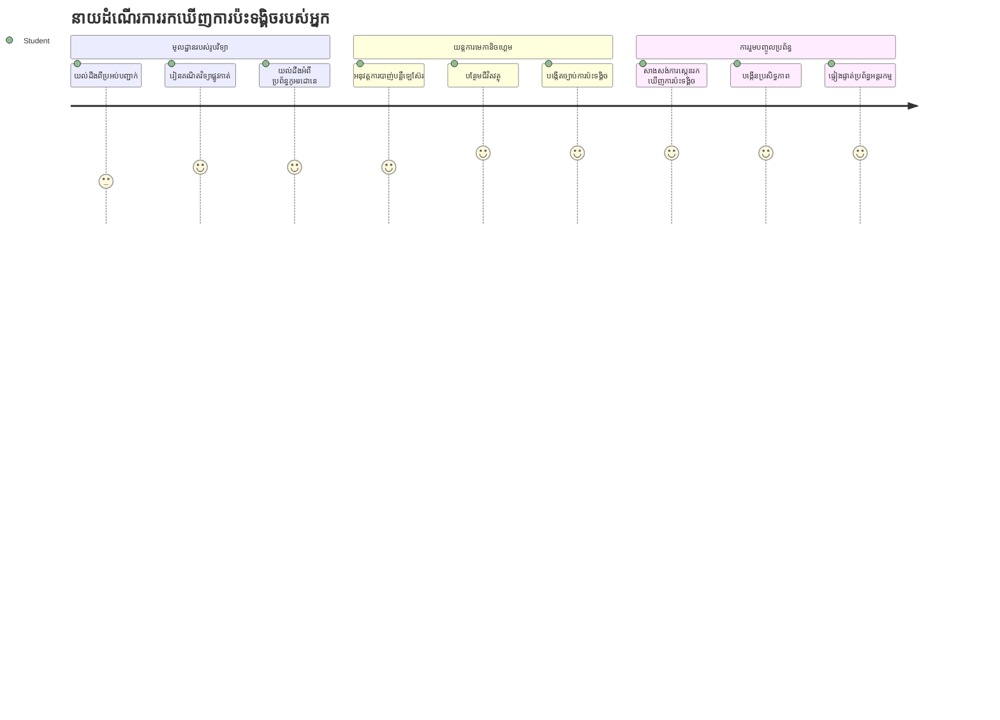
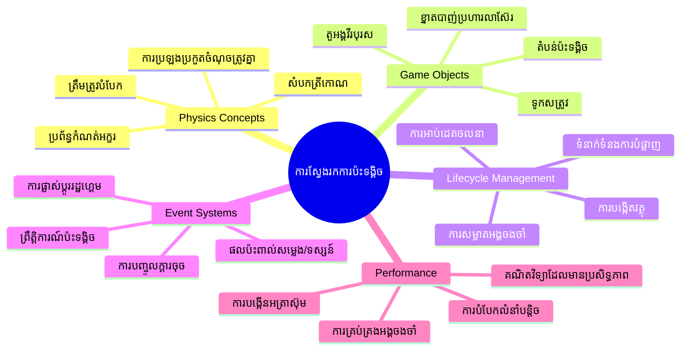
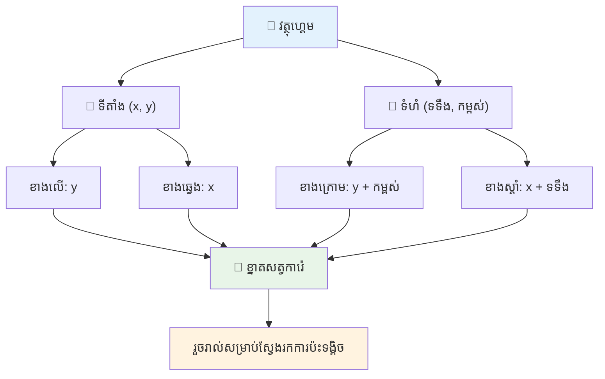
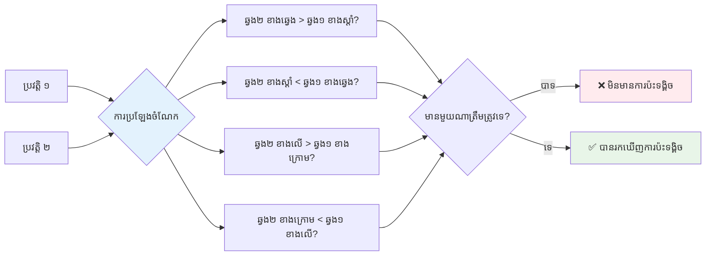
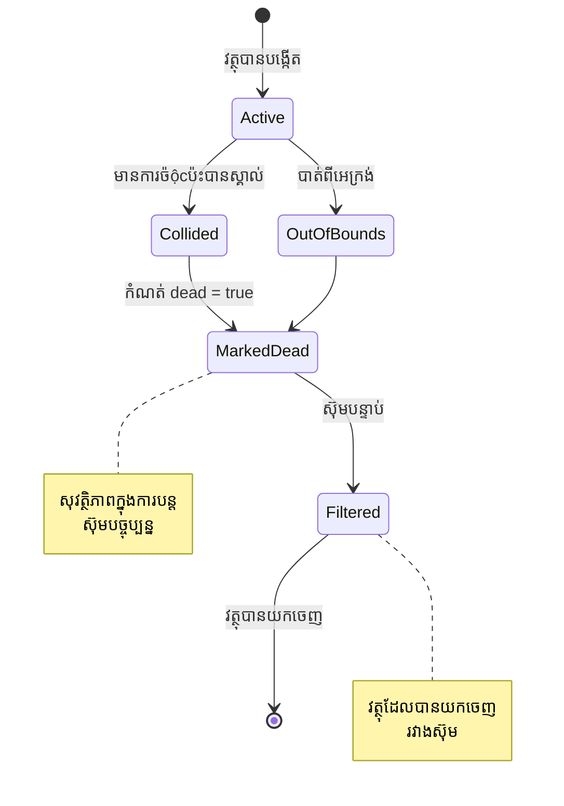
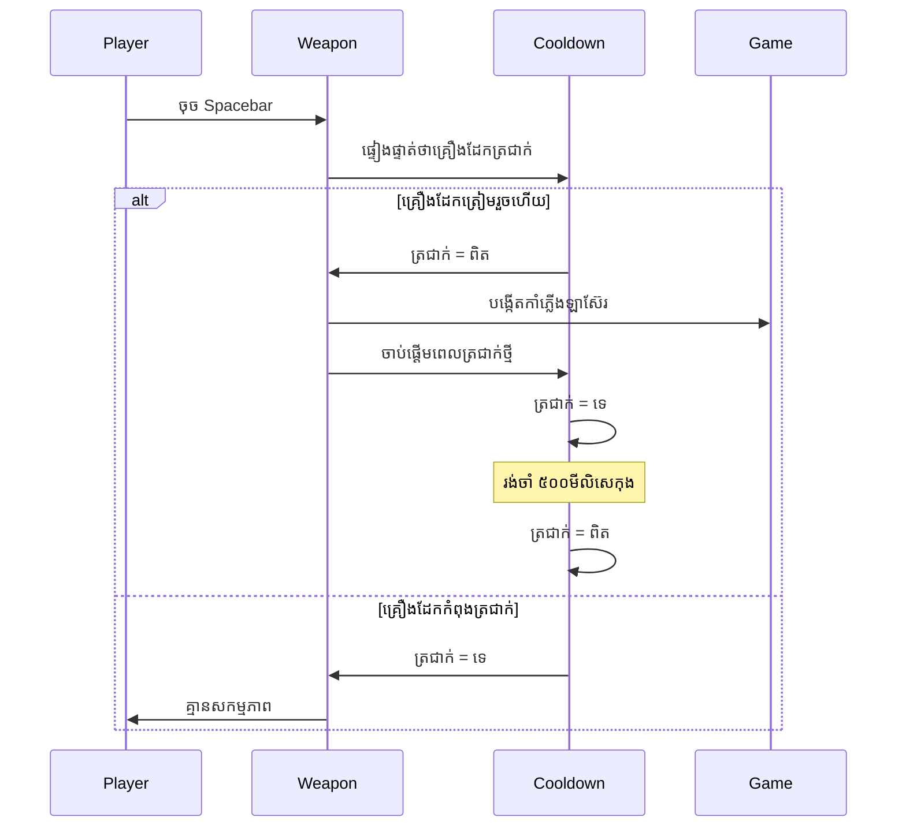
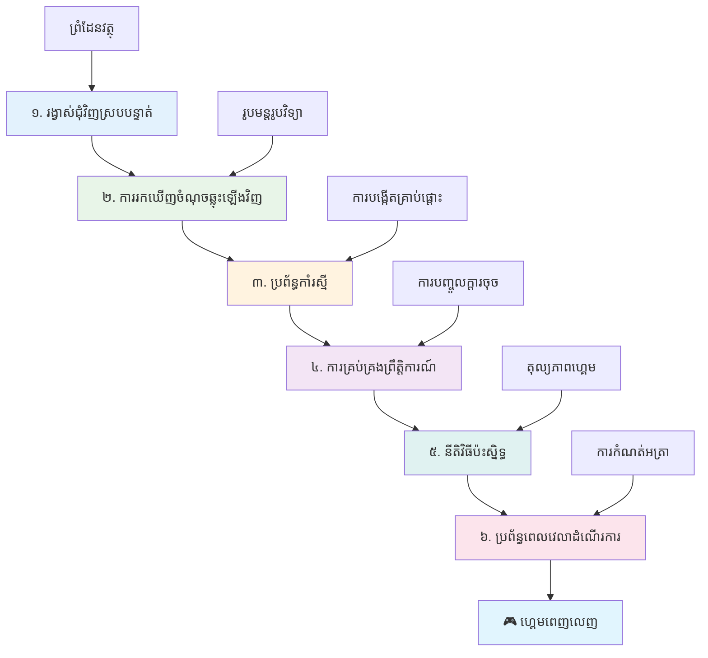
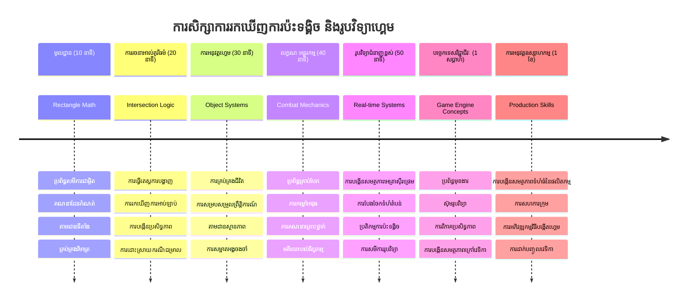

# រៀបចំហ្គេមអាកាស Part 4: បន្ថែមកាំភ្លើងឡាស៊ែរ និងរកមើលការប៉ះទង្គิច


## ប្រឡងមុនម៉ោងបង្រៀន

[ប្រឡងមុនម៉ោងបង្រៀន](https://ff-quizzes.netlify.app/web/quiz/35)

គិតអំពីវិនាទីនៅក្នុងរឿង Star Wars ពេលដែលមុទ្ទផលិតផលប្រូតុងរបស់ Luke ប្រហែស ទៅកាន់ទីតាំងដំណក់ដង្ហើមនៃ Death Star។ ការរកឃើញប៉ះទង្គិចច្បាស់លាស់នេះបានប្តូរទិស នៃจักรวាល! ក្នុងហ្គេម ការរកឃើញប៉ះទង្គិចមានដំណើរការដូចគ្នា - វាកំណត់ថា ពេលណាឯកតានានាផ្គូរផ្គងគ្នា ហើយអ្វីដែលត្រូវធ្វើបន្ទាប់។

នៅមេរៀននេះ អ្នកនឹងបន្ថែមអាវុធឡាស៊ែរ ទៅក្នុងហ្គេមអាកាសរបស់អ្នក និងអនុវត្តការរកឃើញប៉ះទង្គិច ដូចជាអ្នករៀបចំ បេសកកម្ម NASA គណនាផ្លូវគណនាកាននៃយានយន្តដើម្បីជៀសវាងសំណល់ អ្នកនឹងរៀនដឹងពីពេលណាឯកតានានាទៅប៉ះគ្នា។ យើងនឹងបំបែកដំណើរការនេះជាជំហ៊ានតូចៗដែលត្រូវចាំបាច់រួមគ្នា។

នៅចុងមេរៀន អ្នកនឹងមានប្រព័ន្ធការប្រយុទ្ធដែលដំណើរការ ដោយកាំភ្លើងឡាស៊ែរ សំរាកភ្លើងសត្រូវ ហើយការប៉ះទង្គិចបណ្តាលឲ្យមានព្រឹត្តិការណ៍ហ្គេម។ 원칙ការរកមើលប៉ះទង្គិចទាំងនេះក៏ត្រូវបានប្រើប្រាស់ក្នុងអ្វីគ្រប់យ៉ាងចាប់ពីសម្រង់ផ្នែករូបវិទ្យាដល់ចំណុចបញ្ចូលគេហទំព័របង្រៀន។


✅ ស្វែងយល់បន្តិចអំពីហ្គេមកុំព្យូទ័រដំបូងបំផុតដែលបានសរសេរ។ តើមុខងារ​របស់វាជាអ្វី?

## ការរកមើលប៉ះទង្គិច

ការរកឃើញប៉ះទង្គិចដំណើរការដូចឧបករណ៍ចុះជិតនៅលើយានអូរ Apollo - វាប្រមានចម្ងាយជាប្រចាំ ហើយបញ្ចាប់សញ្ញាប្រការណ៍ពេលវត្ថុទៅចំណីជិតគ្នា។ ក្នុងហ្គេម ប្រព័ន្ធនេះកំណត់ពេលណាឯកតានានាប៉ះគ្នា ហើយអ្វីគួរធ្វើបន្ទាប់។

វិធីសាស្ត្រដែលយើងប្រើ គឺកំណត់គ្រប់ឯកតាហ្គេមជា ដុំពត់សមមាត្រជាការ​ដូចពណ៌មួយ ស្រដៀងនឹងប្រព័ន្ធគ្រប់គ្រងចរាចរណាក្នុងយន្តហោះ ដែលប្រើរាងកៅស៊ូសាមញ្ញក្នុងការតាមដានយន្តហោះ។ វិធីនេះមើលទៅមូលដ្ឋាន ប៉ុន្តែមានប្រសិទ្ធភាពគណនា និង ធ្វើការ​បានល្អសម្រាប់ស្ថានភាពហ្គេមភាគច្រើន។

### តំណាងរូបត្រីកោណ

គ្រប់ឯកតាហ្គេមត្រូវការបណ្តោយកំណត់តួអង្គ ដូចដូចរថយន្ត Mars Pathfinder ដែលបានបញ្ជាក់ទីតាំងនៅផ្ទៃដីភពភាគច្រើន។ នេះជាទីតាំងបណ្តោយទាំងនេះ:


```javascript
rectFromGameObject() {
  return {
    top: this.y,
    left: this.x,
    bottom: this.y + this.height,
    right: this.x + this.width
  }
}
```

**យើងបំបែកនេះ៖**
- **គូសខាងលើ**: នេះគឺជាទីតាំងចាប់ផ្តើមនៃវត្ថុរបស់អ្នកនៅផ្ទាល់ទ្រង់ទ្រាយការឆ្វេង (ទីតាំង y)
- **គូសខាងឆ្វេង**: ទីតាំងចាប់ផ្តើមនៅផ្ទាំងរយ (ទីតាំង x)
- **គូសខាងក្រោម**: បូកទទឹងជាមួយទីតាំង y ដើម្បីដឹងទីតាំងបញ្ចប់!
- **គូសខាងស្ដាំ**: បូកទទឹងជាមួយទីតាំង x ដើម្បីមានដែនកំណត់ពេញលេញ

### អាល់ហ្គរីធម៍ទំនាក់ទំនង

ការរកធ្ងន់ធ្ងរសៀគ្វីដុំពត់ប្រើហើបឡេ Hubble ដើម្បីកំណត់ថាវត្ថុក្រោមព្រមានឬទេក្នុងដែនមេឃរបស់វា។ អាល់ហ្គរីធម៍ពិនិត្យការផ្ទុះចេញ:


```javascript
function intersectRect(r1, r2) {
  return !(r2.left > r1.right ||
    r2.right < r1.left ||
    r2.top > r1.bottom ||
    r2.bottom < r1.top);
}
```

**ការតេស្តការបំបែកដូចប្រព័ន្ធរ៉ាឌាដូចជា:**
- តើដុំពត់ទី២ ស្ថិតនៅស្ដាំយ៉ាងសុពលភាព នៃដុំពត់ទី១?
- តើដុំពត់ទី២ ស្ថិតនៅឆ្វេងយ៉ាងសុពលភាព នៃដុំពត់ទី១?
- តើដុំពត់ទី២ ស្ថិតនៅខាងក្រោមយ៉ាងសុពលភាព នៃដុំពត់ទី១?
- តើដុំពត់ទី២ ស្ថិតនៅខាងលើយ៉ាងសុពលភាព នៃដុំពត់ទី១?

ប្រសិនបើគ្មានលក្ខខណ្ឌណាដូចខាងលើមួយណានោះទេ ដុំពត់ទាំងពីរត្រូវមានការប៉ះទង្គិចគ្នា។ វិធីនេះស្រដៀងនឹងការបុគ្គលិករ៉ាឌាដែលកំណត់ថាតើយន្តហោះពីរមានចម្ងាយគ្រប់គ្រាន់ទេទេ។

## គ្រប់គ្រងវដ្តវត្ថុ

ពេលកាំភ្លើងឡាស៊ែរជ្រុះលើសត្រូវ វត្ថុទាំងពីរត្រូវបានលុបចេញពីហ្គេម។ ទោះជាយ៉ាងណា ការលុបវត្ថុកណ្តាលវដ្តអាចបណ្តាលឲ្យបញ្ហាហួសប្រើ - ជាបទពិសោធន៍ពីប្រព័ន្ធកុំព្យូទ័រដូច Apollo Guidance Computer ។ ជំនួស យើងប្រើវិធី "សម្គាល់សម្រាប់លុប" ដែលលុបវត្ថុដោយសុវត្ថិភាពនៅចន្លោះវដ្ត។


នេះជាវិធីសម្គាល់របស់យើងសម្រាប់លុបមួយវត្ថុ:

```javascript
// សម្គាល់វត្ថុសម្រាប់ការដកចេញ
enemy.dead = true;
```

**ហេតុអ្វីបានជាវិធីនេះបានល្អ:**
- យើងសម្គាល់វត្ថុជា "ស្លាប់" ប៉ុន្តែមិនលុបវានោះទេ
- វាអនុញ្ញាតឲ្យវដ្តហ្គេមបច្ចុប្បន្នបញ្ចប់ដោយសុវត្ថិភាព
- គ្មានការបញ្ហាហួសប្រើ ពីការប្រើវត្ថុដែលបានទៅរួចហើយ!

បន្ទាប់មកច្រកយកវត្ថុដែលមិនត្រូវបានសម្គាល់សម្រាប់លុបមុនម៉ោងបង្ហាញបន្ទាប់:

```javascript
gameObjects = gameObjects.filter(go => !go.dead);
```

**ការចំនេញនេះធ្វើដូចជា:**
- បង្កើតបញ្ជីថ្មីមានតែនៅវត្ថុ "រស់"
- បាត់បង់វត្ថុដែលសម្គាល់សម្រាប់លុប
- រក្សាហ្គេមរបស់អ្នកឲ្យរលូន
- ការពារបញ្ហាស្តុកម៉េម៉ូរីពីវត្ថុដែលខូចខាត និងចំណុះជាច្រើន

## អនុវត្តមេកានិចឡាស៊ែរ

គ្រាប់កាំភ្លើងឡាស៊ែរ ក្នុងហ្គេមដើរតាមគោលការណ៍ដូចទូតភីតុងក្នុង Star Trek - វាជាវត្ថុបាត់បង់ដែលធ្វើដំណើរជាលំនាំត្រង់រហូតដល់វាប៉ះភាគីណាមួយ។ រាល់ការចុច spacebar បង្កើតវត្ថុលាស៊ែរ ថ្មីមួយ ដែលផ្លាស់ទីលើអេក្រង់។

ដើម្បីឲ្យវាដំណើរការ យើងត្រូវសម្របសម្រួលប៉ុន្មានផ្នែកផ្សេងៗ៖

**បន្ទាប់បន្សំគួររៀន:**
- **បង្កើត** អ្នកតំណាងឡាស៊ែរ ដែលផលិតពីទីតាំងវីរបុរស
- **គ្រប់គ្រង** ការបញ្ចូលក្តារចុច ដើម្បីបង្កើតឡាស៊ែរ
- **គ្រប់គ្រង** ចលនា និងវដ្តជីវិតឡាស៊ែរ
- **បង្កើត** ការពិពណ៌នាភ្នែកងាររបស់គ្រាប់បែកឡាស៊ែរ

## អនុវត្តការត្រួតពិនិត្យអត្រាវាយបាញ់

អត្រាវាយបាញ់មិនមានកំណត់នឹងទំនាក់ទំនងម៉ាស៊ីនហ្គេម ហើយធ្វើឲ្យហ្គេមងាយពេកក្នុងការលេង។ ប្រព័ន្ធអាវុធពិតប្រាកដក៏មានកំណត់ដូចគ្នា - បែបផែនកាំភ្លើង phaser នៃ USS Enterprise ត្រូវពេលឆក់ថ្មម្ដងម្កាល។

យើងនឹងអនុវត្តប្រព័ន្ធ cooldown ដែលបញ្ឈប់ការបាញ់ដ៏រហ័សរហួន ក្នុងខណៈដែលរក្សាការត្រួតពិនិត្យឆ្លើយតបបាន៖


```javascript
class Cooldown {
  constructor(time) {
    this.cool = false;
    setTimeout(() => {
      this.cool = true;
    }, time);
  }
}

class Weapon {
  constructor() {
    this.cooldown = null;
  }
  
  fire() {
    if (!this.cooldown || this.cooldown.cool) {
      // បង្កើតគ្រាប់ពន្លឺឡាស៊ែរ
      this.cooldown = new Cooldown(500);
    } else {
      // អាវុធកំពុងត្រជាក់ទៅវិញ
    }
  }
}
```

**របៀប cooldown ដំណើរការ:**
- នៅពេលបង្កើត សំពាធសញ្ជាតិ "ក្តៅ" (មិនអាចបាញ់បានទេ)
- បន្ទាប់ពីពេលវេលាបញ្ចប់ វាប្រែទៅ "ត្រជាក់" (រួចរាល់បាញ់)
- មុនពេលបាញ់ យើងពិនិត្យថា: "អាវុធត្រជាក់ទេ?"
- វាបញ្ឈប់ការចុចតែច្រើនបន្ទាន់ ប៉ុន្តែក៏រក្សាការត្រួតពិនិត្យឆ្លើយតបបាន

✅ អនុវត្តទៅមេរៀនទី 1 ក្នុងបណ្ដុំហ្គេមអាកាស ដើម្បីចងចាំអំពី cooldowns។

## រៀបចំប្រព័ន្ធប៉ះទង្គិច

អ្នកនឹងពង្រីកកូដហ្គេមអាកាសដែលមានរួចជាមួយប្រព័ន្ធសម្គាល់ប៉ះទង្គិច។ ដូចប្រព័ន្ធជៀសវាងប៉ះទង្គិចស្វ័យប្រវត្តិ​នៃស្ថានីយអាកាសអន្តរជាតិ កម្មវិធីហ្គេមរបស់អ្នក នឹងត្រួតពិនិត្យទីតាំងវត្ថុជាបន្តបន្ទាប់ ហើយឆ្លើយតបពេលមានការប៉ះទង្គិច។

ចាប់ផ្តើមពីកូដមេរៀនមុន អ្នកនឹងបន្ថែមការសម្គាល់ប៉ះទង្គិចជាមួយនឹងច្បាប់បញ្ជាក់ដែលគ្រប់គ្រងការផ្គួផ្គងវត្ថុ។

> 💡 **ចំណាត់ថ្នាក់ជំនាញ**: រូបតំណាងឡាស៊ែរ មានរួចក្នុងថត assets របស់អ្នកហើយបានយោងក្នុងកូដរបស់អ្នក រៀបចំរួចហើយសម្រាប់អនុវត្ត។

### ច្បាប់ប៉ះទង្គិចដែលត្រូវអនុវត្ត

**មេកានិកហ្គេមដែលត្រូវបន្ថែម:**
1. **ឡាស៊ែរ​ផៅសត្រូវ**: វត្ថុសត្រូវត្រូវបានបំបែកនៅពេលបាញ់ដោយគ្រាប់ឡាស៊ែរ
2. **ឡាស៊ែរ​ផៅដែនអេក្រង់**: ដុតកាំភ្លើងឡាស៊ែរ ត្រូវបានដកចេញ នៅពេលពួកវាទៅដល់កំពូលអេក្រង់
3. **ប៉ះទង្គិចសត្រូវ និងវីរបុរស**: វត្ថុទាំងពីរត្រូវបំបែក នៅពេលប៉ះគ្នា
4. **សត្រូវមកដល់ផ្ទៃក្រោម**: ថ្ងៃបញ្ចប់ហ្គេមនៅពេលសត្រូវដល់ផ្ទៃក្រោមអេក្រង់

### 🔄 **ការត្រួតពិនិត្យផ្នែកបង្រៀន**
**មូលដ្ឋានការរកមើលប៉ះទង្គិច**៖ មុនអនុវត្ត ប្រាកដថាអ្នកយល់ពី៖
- ✅ របៀបកំណត់ដែនកំណត់ដុំពត់
- ✅ មូលហេតុដែលការ​តេស្ត​បំបែក​លឿនជាងគណនា​ចំណុច​ឆ្លង
- ✅ សារៈសំខាន់នៃការគ្រប់គ្រងវដ្តវត្ថុក្នុងល្បែង
- ✅ របៀប​ការត្រួតពិនិត្យសកម្មភាពត្រូវរួមគ្នា

**តេស្តមួយទឹក**៖ តើអ្វីនឹងកើតឡើងប្រសិនបើអ្នកលុបវត្ថុភ្លាមៗវិញមិនបានសម្គាល់?
*ចម្លើយ៖ ការលុបកណ្តាលវដ្តអាចបណ្តាលឲ្យប្រព័ន្ធផ្ទាំងខូចពីរបៀបឬរំលងម្ដងទៀត*

**ការយល់ដឹងពីរូបវិទ្យា**៖ អ្នកឥឡូវនេះយល់ពី
- **ប្រព័ន្ធតម្រុយ**៖ របៀបកំណត់ទីតាំងនិងទំហំក្នុងដែនកំណត់
- **ហេតុផលចំណុចឆ្លង**៖ គោលការណ៍គណិតវិទ្យាមូលដ្ឋានសម្រាប់ការសម្គាល់ប៉ះទង្គិច
- **បង្កើនប្រសិទ្ធភាព**៖ ហេតុអ្វីការវិភាគលឿនមានសារៈសំខាន់នៅប្រព័ន្ធពេលតែមួយ
- **គ្រប់គ្រងម៉េម៉ូរី**៖ លំនាំប្រព័ន្ធរបស់វត្ថុសម្រាប់សុវត្ថិភាព

## រៀបចំបរិយាកាសអភិវឌ្ឍន៍របស់អ្នក

ដំណឹងល្អ - យើងបានរៀបចំផ្ទៃក្រោមសម្រាប់អ្នករួចហើយ! គ្រប់គ្រងហ្គេម និងរចនាសម្ព័ន្ធមូលដ្ឋានរបស់អ្នករង់ចាំនៅក្នុងថត `your-work` ហើយរួចរាល់សម្រាប់អ្នកបន្ថែមលក្ខណៈប៉ះទង្គិចបែបថ្មី។

### រចនាសម្ព័ន្ធគម្រោង

```bash
-| assets
  -| enemyShip.png
  -| player.png
  -| laserRed.png
-| index.html
-| app.js
-| package.json
```

**ការយល់ពីរចនាសម្ព័ន្ធឯកសារ៖**
- **រួមមាន** រូបភាព sprite ទាំងអស់ដែលត្រូវការសម្រាប់វត្ថុហ្គេម
- **រួមបញ្ចូល** ឯកសារ HTML មេ និងឯកសារកម្មវិធី JavaScript
- **ផ្ដល់** កម្មវិធីកំណត់កញ្ចប់សម្រាប់ម៉ាស៊ីនបម្រើអភិវឌ្ឍន៍ក្នុងមូលដ្ឋាន

### ចាប់ផ្តើមម៉ាស៊ីនបម្រើអភិវឌ្ឍន៍

ចូលទៅក្នុងថតគម្រោងហើយចាប់ផ្តើមម៉ាស៊ីនបម្រើក្នុងមូលដ្ឋាន៖

```bash
cd your-work
npm start
```

**សំណុំបញ្ជា​នេះ៖**
- **ប្ដូរទីតាំងទៅ** ថតគម្រោងរបស់អ្នក
- **ចាប់ផ្តើម** ម៉ាស៊ីនបម្រើ HTTP ក្នុងផ្ទៃក្នុង `http://localhost:5000`
- **បម្រើ** ឯកសារហ្គេមរបស់អ្នក សម្រាប់ការធ្វើតេស្ត និងអភិវឌ្ឍន៍
- **បើក** អភិវឌ្ឍន៍បន្តពេលវេលាដោយឡើយបិទកំណត់

បើកកម្មវិធីរុករកហើយចូលទៅកាន់ `http://localhost:5000` ដើម្បីមើលស្ថានភាពហ្គេមបច្ចុប្បន្ន ដែលមានវីរបុរស និងសត្រូវបង្ហាញលើអេក្រង់។

### អនុវត្តជំហាន​ដោយ​ជំហាន

ដូចយុទ្ធសាស្រ្ត NASA បញ្ចូលកម្មវិធី Voyager រៀបចំយ៉ាងយកចិត្តទុកដាក់ យើងនឹងអនុវត្តការរកមើលប៉ះទង្គិច ដំណើរការជាជំហ៊ានតូចៗ។


#### 1. បន្ថែមដែនកំណត់ដុំពត់

ជាមុនសិន យើងចង់បង្រៀនឲ្យវត្ថុហ្គេមអធិប្បាយពីដែនកំណត់របស់វា។ បន្ថែមវិធីសាស្រ្តនេះទៅថ្នាក់ `GameObject` របស់អ្នក៖

```javascript
rectFromGameObject() {
    return {
      top: this.y,
      left: this.x,
      bottom: this.y + this.height,
      right: this.x + this.width,
    };
  }
```

**វិធីសាស្រ្តនេះធ្វើការ:**
- **បង្កើត** វត្ថុដុំពត់ដែលមានតំណាងទំហំដែនកំណត់ច្បាស់លាស់
- **គណនា** គូសខាងក្រោម និងស្ដាំដោយគិតទីតាំង និងទំហំ
- **ត្រឡប់** វត្ថុដែលមានសម្រាប់អាល់ហ្គរីធម៍សម្គាល់ប៉ះទង្គិច
- **ផ្ដល់** ចំណុចប្រទាក់ផ្ទាល់កំណត់សម្រាប់គ្រប់វត្ថុនៅក្នុងហ្គេម

#### 2. អនុវត្តការសម្គាល់ការប៉ះពាល់

ឥឡូវនេះ អ្នកត្រូវបង្កើតឱ្យមានមូលដ្ឋានសម្គាល់ប៉ះទង្គិច - មុខងារ​ដែលស្គាល់ពេលឯកតាដុំពត់ពីរប៉ះទំនាក់ទំនងគ្នា៖

```javascript
function intersectRect(r1, r2) {
  return !(
    r2.left > r1.right ||
    r2.right < r1.left ||
    r2.top > r1.bottom ||
    r2.bottom < r1.top
  );
}
```

**អាល់ហ្គរីធម៍នេះធ្វើការ:**
- **តេស្ត** លក្ខខណ្ឌបំបែកចំនួនបួន រវាងដុំពត់ទាំងពីរ
- **ត្រឡប** `false` ប្រសិនបើលក្ខខណ្ឌបំបែកណាមួយមានសុពលភាព
- **បញ្ជាក់** ករណីប៉ះទង្គិច ពេលគ្មានការបំបែក
- **ប្រើ** យុទ្ធសាស្ត្របដិសេធសំណួរ សម្រាប់ការរកដំណើរការលឿន

#### 3. អនុវត្តប្រព័ន្ធបាញ់កាំភ្លើងឡាស៊ែរ

នេះជាពេលវេលាទីកន្លែងរំភើប! គេរៀបចំប្រព័ន្ធបាញ់កាំភ្លើងឡាស៊ែរ។

##### អថេរចំណារផ្ញើសារ

ជាមុនសិន ចង់កំណត់ប្រភេទសារជាច្រើន ដើម្បីផ្នែកផ្សេងៗនៃហ្គេមរបស់យើងអាចផ្ញើការប្រាស្រ័យទាក់ទងគ្នា៖

```javascript
KEY_EVENT_SPACE: "KEY_EVENT_SPACE",
COLLISION_ENEMY_LASER: "COLLISION_ENEMY_LASER",
COLLISION_ENEMY_HERO: "COLLISION_ENEMY_HERO",
```

**អថេរចំណារទាំងនេះផ្ដល់:**
- **ធម្មតា** ឈ្មោះព្រឹត្តិការណ៍សកលទូទាំងកម្មវិធី
- **អនុញ្ញាត** ការប្រាស្រ័យទាក់ទងដោយរលូនរវាងប្រព័ន្ធហ្គេម
- **ការពារជៀសវាង** អក្សរពិចារណារហូតក្នុងការចុចចំរស់

##### ការគ្រប់គ្រងការបញ្ចូលដោយក្តារចុច

បន្ថែមការស្គាល់ចុច space នៅក្នុងអ្នកស្តាប់ព្រឹត្តិការណ៍ក្តារចុច៖

```javascript
} else if(evt.keyCode === 32) {
  eventEmitter.emit(Messages.KEY_EVENT_SPACE);
}
```

**អ្នកដំណើរការបញ្ចូលនេះ:**
- **រកឃើញ** ការចុច space key ដោយប្រើ keyCode 32
- **បញ្ចូន** សារព្រឹត្តិការណ៍ប្រកបដោយស្តង់ដា
- **អនុញ្ញាត** ការបាញ់ដោយគ្មានការទំនាក់ទំនងផ្ទាល់លើក្តារចុច

##### ការចុះបញ្ជីអ្នកស្ដាប់ព្រឹត្តិការណ៍

ចុះបញ្ជីការបាញ់នៅក្នុងមុខងារ `initGame()` របស់អ្នក៖

```javascript
eventEmitter.on(Messages.KEY_EVENT_SPACE, () => {
 if (hero.canFire()) {
   hero.fire();
 }
});
```

**អ្នកស្ដាប់ព្រឹត្តិការណ៍នេះ:**
- **ឆ្លើយតប** ការចុចក្តារតំណាក់តួសម្រាប់ space key
- **ពិនិត្យ** ស្ថានភាព cooldown មុនពេលអនុញ្ញាតបាញ់
- **បញ្ចេញ** ការបង្កើតឡាស៊ែរ នៅពេលអនុញ្ញាត

បន្ថែមការគ្រប់គ្រងប៉ះទង្គិចសម្រាប់ឡាស៊ែរ និងសត្រូវ:

```javascript
eventEmitter.on(Messages.COLLISION_ENEMY_LASER, (_, { first, second }) => {
  first.dead = true;
  second.dead = true;
});
```

**អ្នកគ្រប់គ្រងប៉ះទង្គិចនេះ:**
- **ទទួលយក** ទិន្នន័យព្រឹត្តិការណ៍ប៉ះទង្គិច មានវត្ថុទាំងពីរ
- **សម្គាល់** វត្ថុទាំងពីរឲ្យលុប
- **ធានា** ការសម្អាតត្រឹមត្រូវបន្ទាប់ពីប៉ះទង្គិច

#### 4. បង្កើតថ្នាក់ Laser

អនុវត្តគ្រាប់បាញ់ឡាស៊ែរ ដែលផ្លាស់ទីទៅលើ និងគ្រប់គ្រងវដ្តជីវិតរបស់វា៖

```javascript
class Laser extends GameObject {
  constructor(x, y) {
    super(x, y);
    this.width = 9;
    this.height = 33;
    this.type = 'Laser';
    this.img = laserImg;
    
    let id = setInterval(() => {
      if (this.y > 0) {
        this.y -= 15;
      } else {
        this.dead = true;
        clearInterval(id);
      }
    }, 100);
  }
}
```

**ការអនុវត្តថ្នាក់នេះ:**
- **បន្ត** ពីថ្នាក់ GameObject ដើម្បីទទួលកម្មវិធីមូលដ្ឋាន
- **កំណត់** ទំហំសមរម្យសម្រាប់រូបតំណាងឡាស៊ែរ
- **បង្កើត** ចលនាឡើងជាប្រចាំដោយប្រើ `setInterval()`
- **គ្រប់គ្រង** ការរំលាយខ្លួនឯងនៅពេលទៅដល់កំពូលអេក្រង់
- **គ្រប់គ្រង** ពេលវេលាអនុវត្តន៍និងការសម្អាត

#### 5. អនុវត្តប្រព័ន្ធសម្គាល់ប៉ះទង្គិច

បង្កើតមុខងារសម្គាល់ប៉ះទង្គិចសរុប៖

```javascript
function updateGameObjects() {
  const enemies = gameObjects.filter(go => go.type === 'Enemy');
  const lasers = gameObjects.filter(go => go.type === "Laser");
  
  // សាកល្បងការប៉ះទង្គិចរវាងបាញ់វាយសត្រូវ
  lasers.forEach((laser) => {
    enemies.forEach((enemy) => {
      if (intersectRect(laser.rectFromGameObject(), enemy.rectFromGameObject())) {
        eventEmitter.emit(Messages.COLLISION_ENEMY_LASER, {
          first: laser,
          second: enemy,
        });
      }
    });
  });

  // ហែកវត្ថុដែលបានបំផ្លាញ
  gameObjects = gameObjects.filter(go => !go.dead);
}
```

**ប្រព័ន្ធប៉ះទង្គិចនេះ:**
- **ត្រង់** វត្ថុហ្គេមតាមប្រភេទ ដើម្បីធ្វើតេស្តបានលឿន
- **តេស្ត** គ្រប់ឡាស៊ែរ ទល់នឹងសត្រូវសម្រាប់ចំណុចឆ្លង
- **បញ្ចេញ** ព្រឹត្តិការណ៍ប៉ះទង្គិច នៅពេលរកឃើញការ​ឆ្លង
- **សម្អាត** វត្ថុដែលបំផ្លាញបន្ទាប់ពីដំណើរការប៉ះទង្គិច

> ⚠️ **សំខាន់**៖ បន្ថែម `updateGameObjects()` ទៅវដ្តហ្គេមសំខាន់នៅក្នុង `window.onload` ដើម្បីបើកចំហប្រព័ន្ធសម្គាល់ប៉ះទង្គិច។

#### 6. បន្ថែមប្រព័ន្ធ cooldown ទៅថ្នាក់ Hero

បង្កើនថ្នាក់ Hero ជាមួយមេកានិចការបាញ់ និងការកំណត់អត្រា៖

```javascript
class Hero extends GameObject {
  constructor(x, y) {
    super(x, y);
    this.width = 99;
    this.height = 75;
    this.type = "Hero";
    this.speed = { x: 0, y: 0 };
    this.cooldown = 0;
  }
  
  fire() {
    gameObjects.push(new Laser(this.x + 45, this.y - 10));
    this.cooldown = 500;

    let id = setInterval(() => {
      if (this.cooldown > 0) {
        this.cooldown -= 100;
      } else {
        clearInterval(id);
      }
    }, 200);
  }
  
  canFire() {
    return this.cooldown === 0;
  }
}
```

**ការយល់ពីថ្នាក់ Hero បានបង្កើន:**
- **ចាប់ផ្ដើម** ម៉ោង cooldown ជាសូន្យ (រួចរាល់បាញ់)
- **បង្កើត** វត្ថុលាស៊ែរ ដែលមានទីតាំងលើទូកវីរបុរស
- **កំណត់** ពេល cooldown ដើម្បីទប់ស្កាត់ការបាញ់ឡើងលឿនពេក
- **កាត់បន្ថយ** ម៉ោង cooldown ដោយការអាប់ដេតប្រក្រតី
- **ផ្ដល់** មុខងារ `canFire()` សម្រាប់ពិនិត្យស្ថានភាពបាញ់

### 🔄 **ការត្រួតពិនិត្យផ្នែកបង្រៀន**
**ការយល់ដឹងសរុប**៖ ប្រាកដថាអ្នកចេះគ្រប់គ្រងប្រព័ន្ធប៉ះទង្គិច ៖
- ✅ របៀបដែនកំណត់ដុំពត់ជួយការសម្គាល់ប៉ះទង្គិចបានលឿន?
- ✅ ហេតុអ្វីការគ្រប់គ្រងវដ្តវត្ថុមានសារៈសំខាន់សម្រាប់ស្ថិរភាពហ្គេម?
- ✅ មុខងារ cooldown ព្យាបាលបញ្ហាប្រសិទ្ធភាពយ៉ាងដូចម្តេច?
- ✅ តើស្ថាបត្យកម្មធ្វើម៉េច គ្រប់គ្រងការឆ្លើយតបប៉ះទង្គិច?

**ការសម្របសម្រួលប្រព័ន្ធ**៖ អ្នកអាចបង្ហាញ៖
- **ភាពត្រឹមត្រូវគណិតវិទ្យា**៖ អាល់ហ្គរីធម៍ចំណុចឆ្លងដុំពត់
- **បង្កើនប្រសិទ្ធភាព**៖ រចនាសម្ព័ន្ធធ្វើតេស្តប៉ះទង្គិចលឿន
- **គ្រប់គ្រងម៉េម៉ូរី**៖ លំនាំសុវត្ថិភាពក្នុងការបង្កើតនិងបំផ្លាញវត្ថុ
- **ការត្រួតពិនិត្យឯកត្តកម្ម**៖ ការទាក់ទងគ្មានការចងខ្សែបន្ទាត់
- **ដំណើរការតាមពេលពិត**៖ ការអាប់ដេតប្រក្រតីចំពោះវដ្តហ្គេម

**លំនាំអាជីព**៖ អ្នកបានអនុវត្ត៖
- **ការបែងចែកភារកិច្ច**៖ ផ្នែករូបវិទ្យា ការបង្ហាញចេញ និងបញ្ចូល
- **រចនាមានវត្ថុអចិន្រ្តៃយ៍**៖ ការពង្រីក និងពហុរាង
- **ការគ្រប់គ្រងស្ថានភាព**៖ ការត្រួតពិនិត្យវដ្តជីវិតវត្ថុ និងស្ថានភាពហ្គេម
- **បង្កើនប្រសិទ្ធភាព**៖ អាល់ហ្គរីធម៍សម្រាប់ប្រព័ន្ធគំរូពេលវេលាពិត

### ពិនិត្យការអនុវត្តរបស់អ្នក

ហ្គេមអាកាសរបស់អ្នកឥឡូវ មានប្រព័ន្ធសម្គាល់ប៉ះទង្គិច និងមេកានិចប្រយុទ្ធល្អត្រង់។ 🚀 ថតសាកល្បងលទ្ធផលថ្មីៗនេះ៖
- **រុំរើ** ជាមួយក្តារចុចព្រួយដើម្បីពិនិត្យការគ្រប់គ្រងចលនា
- **បាញ់ឡាស៊ែរ** ជាមួយ spacebar - លាតត្រដាងថា cooldown​ ទប់ស្កាត់ការចុចហួសពេក
- **មើលការប៉ះទង្គិច** កាលណាកាំភ្លើងបាញ់សត្រូវ រំលាយវា
- **បញ្ជាក់ការសម្អាត** ពេលវត្ថុខូចភាពបាត់ពីហ្គេម

អ្នកបានអនុវត្តប្រព័ន្ធសម្គាល់ប៉ះទង្គិចដោយប្រើគោលការណ៍គណិតវិទ្យា ដូចកាលភាពដឹកនាំយានយន្តអាកាស និងរ៉ូបូទីក។

### ⚡ **អ្វីដែលអ្នកអាចធ្វើបានក្នុង 5 នាទីបន្ទាប់**
- [ ] បើក DevTools ខ្សែទាញចំណុចបំបែកក្នុងមុខងារសម្គាល់ប៉ះទង្គិចរបស់អ្នក
- [ ] សាកល្បងកំឡាំងល្បឿនឡាស៊ែរ ឬចលនាសត្រូវ ដើម្បីមើលផលប៉ះទង្គិច
- [ ] សាកល្បងតម្លៃ cooldown ផ្សេងៗ ដើម្បីតេស្តអត្រាបាញ់កាំភ្លើង
- [ ] បន្ថែម `console.log` ដើម្បីតាមដានព្រឹត្តិការណ៍ប៉ះទង្គិចពិតពេល

### 🎯 **អ្វីដែលអ្នកអាចសម្រេចបានក្នុងមួយម៉ោងនេះ**
- [ ] បញ្ចប់ប្រលងបន្ទាប់ពីមេរៀន និងយល់ដឹងអំពីអាល់ក្រីធម៍រកឃើញការប៉ះទង្គិច
- [ ] បន្ថែមអំពើវិជ្ជមានដូចជា​ភ្លើង​ផ្ទុះ​នៅពេលមានការប៉ះទង្គិច
- [ ] អនុវត្តប្រភេទគ្រាប់ផ្លេកផ្សេងៗដែលមានលក្ខណៈខុសគ្នា
- [ ] បង្កើតអំណាចបន្ថែមដែលបង្កើនសមត្ថភាពអ្នកលេងជាបណ្តោះអាសន្ន
- [ ] បន្ថែមសំឡេងផលប៉ះពាល់ដើម្បីធ្វើឲ្យការប៉ះទង្គិចមានភាពរំភើប

### 📅 **កម្មវិធីកម្មវិធីហ្គេមផ្ទាល់ខ្លួនរយៈពេលមួយសប្ដាហ៍**
- [ ] បញ្ចប់ហ្គេមខាងក្នុងផ្ទុយបរិយាយដោយប្រើប្រព័ន្ធប៉ះទង្គិចបានល្អ
- [ ] អនុវត្តរាងកាយប៉ះទង្គិចច្រើនជាងប្រអប់ (មូល, ភាគបន្ទាត់)
- [ ] បន្ថែមប្រព័ន្ធគ partículas សម្រាប់ប្រតិកម្មភ្លើងផ្ទុះមានភាពពិតប្រាកដ
- [ ] បង្កើតប្រព្រឹត្តិការណ៍គូប្រឆាំងស្មុគស្មាញដោយជៀសវាងការប៉ះទង្គិច
- [ ] បង្កើនប្រសិទ្ធភាពការរកឃើញការប៉ះទង្គិចសម្រាប់ការអនុវត្តមានវត្ថុជាច្រើន
- [ ] បន្ថែមការស្ទួចសំលេងដូចជាម៉ូម៉ង់តូម និងចលនាមានភាពពិតប្រាកដ

### 🌟 **ជំនាញហ្គេមផ្ទៃក្នុងខែរបស់អ្នក**
- [ ] បង្កើតហ្គេមជាមួយវិញ្ញាសា​ឧបករណ៍​បច្ចេកវិទ្យាឧបករណ៍ និងការស្ទួចសំលេងមានភាពពិតប្រាកដ
- [ ] រៀនអាល់ក្រីធម៍រកឃើញការប៉ះទង្គិច 3D និងការបែងចែកលំនៅទីតាំង
- [ ] មានចំណេះដឹងចូលរួមជួយឱ្យក្រុមបណ្តាញសៀវភៅហ្គេមនិងបណ្ណាល័យឧបករណ៍ប្រើប្រាស់សេរី
- [ ] ជំនាញបង្កើនប្រសិទ្ធភាពសម្រាប់កម្មវិធីផ្ទាំងក្រាហ្វិចច្របូកច្របល់
- [ ] បង្កើតមាតិកាសិក្សាអំពីហ្គេមផ្ទៃក្នុងនិងការរកឃើញការប៉ះទង្គិច
- [ ] បង្កើតកុងតាក់​តាម​បែបportfolio ដើម្បីបង្ហាញជំនាញកម្មវិធីហ្គេមជំនាញខ្ពស់

## 🎯 កាលវិភាគជំនាញការរកឃើញការប៉ះទង្គិចរបស់អ្នក


### 🛠️ សង្ខេបឧបករណ៍ហ្គេមផ្ទៃក្នុងរបស់អ្នក

បន្ទាប់ពីបញ្ចប់មេរៀននេះ អ្នកគឺជាម្ចាស់ជំនាញ:
- **គណិតវិទ្យាអំពីការប៉ះទង្គិច**: អាល់ក្រីធម៍ប៉ះទង្គិចប្រអប់និងប្រព័ន្ធទិសដៅ
- **ការបង្កើនប្រសិទ្ធភាព**: ការរកឃើញការប៉ះទង្គិចមានប្រសិទ្ធភាពសម្រាប់កម្មវិធី Real-time
- **ការគ្រប់គ្រងអាយុកាលវត្ថុ**: ការបង្កើតប្រាកដ, ការអាប់ដេត និងគំរាមកំហែង
- **ស្ថាបត្យកម្មផ្អែកលើព្រឹត្តិការណ៍**: ប្រព័ន្ធផ្អែកព្រឹត្តិការណ៍ជាការបញ្ចាក់ចំណាច់ការប៉ះទង្គិច
- **ការរួមបញ្ចូលក្នុង Game Loop**: ការអាប់ដេតហើយត្រូវបានសម្រួលនឹងការផ្ទាំងឡើងវិញនៅក្នុងប្រព័ន្ធហ្គេម
- **ប្រព័ន្ធបញ្ចូលព័ត៌មាន**: ការត្រួតពិនិត្យឆ្លើយតបជាមួយកំណត់អត្រា និងមតិយោបល់
- **ការគ្រប់គ្រងចងចាំ**: ការប្រើប្រាស់ម៉ាស៊ីនផ្លាស់ប្តូរគោលនយោបាយ និងវិធីសាស្រ្តសម្អាត

**ការអនុវត្តក្នុងពិភពលោកពិត**: ជំនាញរកឃើញការប៉ះទង្គិចរបស់អ្នកអាចអនុវត្តទៅ:
- **ការស្ទួចសំលេងបន្តផ្ទាល់**: គំរូវិទ្យាសាស្រ្ត និងឧបករណ៍សិក្សា
- **ការរចនាផ្ទាំងប្រើប្រាស់**: ការចញ្ចឹម និងការរកមើលនៅលើទូរស័ព្ទ
- **ការសង្ហារឹមទិន្នន័យ**: បង្ហាញតារាងប្រតិបត្តិការមានអន្តរជាតិ និងធាតុចុចបាន
- **ការអភិវឌ្ឍទូរស័ព្ទ**: ការទទួលស្គាល់ចលនា និងការគ្រប់គ្រងការប៉ះទង្គិច
- **កម្មវិធីរ៉ូបូត**: ការធ្វើផែនទីផ្លូវ និងជៀសវាងឧបសគ្គ
- **ក្រាហ្វិចកុំព្យូទ័រ**: ការតាមដានកាំរស្មី និងអាល់ក្រិធម៍លំនៅទីតាំង

**ជំនាញវិជ្ជាជីវៈទទួលបាន**: ឥឡូវនេះអ្នកអាច:
- **រចនា** អាល់ក្រីធម៍មានប្រសិទ្ធភាពសម្រាប់ការរកឃើញការប៉ះទង្គិច Real-time
- **អនុវត្ត** ប្រព័ន្ធហ្គេមដែលពឹងផ្អែកលើហ្វីសិកសម្រាប់វត្ថុស្មុគស្មាញ
- **ធ្វើដំណោះស្រាយកំហុស** ប្រព័ន្ធអន្តរកម្មស្មុគស្មាញដោយប្រើគោលការណ៍គណិតវិទ្យា
- **បង្កើនប្រសិទ្ធភាព** សម្រាប់សមត្ថភាពរបស់សំភារៈ និងកម្មវិធីរុករក
- **ស្ថាបនាស្ថាពរកម្មវិធីហ្គេម** ដោយប្រើបែបបទរចនាដែលបានភ្ជាប់មក

**គំនិតអភិវឌ្ឍហ្គេមបានរៀន**:
- **ការស្ទួចសំលេងហ្គេម**: ការរកឃើញការប៉ះទង្គិច និងការឆ្លើយតប
- **ការអប់រំនៅឡើងវិញ**: អាល់ក្រីធម៍អាប់តុទបន្ទាន់សម្រាប់កម្មវិធីដែលមានអន្តរកម្ម
- **ប្រព័ន្ធព្រឹត្តិការណ៍**: និងកាសង្កត់ផ្សារជាមួយបំណែកហ្គេម
- **ការគ្រប់គ្រងវត្ថុ**: វិធីសាស្រ្តអាយុកាលប្រាកដសម្រាប់មាតិកាចល័ត
- **ការគ្រប់គ្រងបញ្ចូលព័ត៌មាន**: ត្រួតពិនិត្យឆ្លើយតបជាមួយមតិយោបល់សមស្រប

**ជំហានបន្ទាប់**: អ្នករួចរាល់រួចទៅទស្សនាវិញ្ញាសា​ឧបករណ៍ Matter.js លក្ខណៈខ្ពស់, អនុវត្តការរកឃើញការប៉ះទង្គិច 3D, ឬបង្កើតប្រព័ន្ធក្រ partículas ស្មុគស្មាញ!

🌟 **ការសម្រេចបាន**: អ្នកបានបង្កើតប្រព័ន្ធអន្តរកម្មផ្អែកលើហ្វីសិកសម្រាប់ការរកឃើញការប៉ះទង្គិចជាចំនួនដែលមានគុណភាពវិជ្ជាជីវៈ!

## GitHub Copilot Agent Challenge 🚀

ប្រើម៉ូដ Agent ដើម្បីបញ្ចប់បញ្ហាខាងក្រោម៖

**ការពិពណ៌នា:** បង្កើនប្រព័ន្ធការរកឃើញការប៉ះទង្គិចដោយអនុវត្តអំណាចបន្ថែមដែលបង្កើតឡើងដោយចៃដន្យ និងផ្តល់សមត្ថភាពបណ្តោះអាសន្ននៅពេលបានប្រមូលប៊ិចស៊ី

**ការបង្ហាញ:** បង្កើតថ្នាក់ PowerUp ដែលពង្រឹង GameObject ហើយអនុវត្តការរកឃើញការប៉ះទង្គិចរវាងវត្ថុហេរ៉ូ និងអំណាចបន្ថែម។ បន្ថែមប្រភេទ PowerUp យ៉ាងហោចណាស់ពីរប្រភេទ៖ មួយសម្រាប់បង្កើនអត្រាស្ទះភ្លើង (បន្ថយពេលឈប់), និងមួយសម្រាប់បង្កើតថ្នាំការពារបណ្តោះអាសន្ន។ រួមបញ្ចូលគន្លងបង្កើតដែលបង្កើត PowerUp នៅពេលចៃដន្យនិងទីតាំងចៃដន្យ។

---


## 🚀 បញ្ហា

បន្ថែមភ្លើងផ្ទុះ! សូមមើលឯកសារហ្គេមនៅក្នុង [the Space Art repo](../../../../6-space-game/solution/spaceArt/readme.txt) ហើយព្យាយាមបន្ថែមភ្លើងផ្ទុះពេលថ្លើមឡាស៊ែរ​ប៉ះបាញ់តួអាឡឺន

## ប្រលងបន្ទាប់ពីមេរៀន

[Post-lecture quiz](https://ff-quizzes.netlify.app/web/quiz/36)

## ការពិនិត្យឡើងវិញ និងសិក្សាឯកឯង

សាកល្បងការប្រែប្រួលចន្លោះពេលនៅក្នុងហ្គេមរបស់អ្នកបច្ចុប្បន្ន។ តើមានអ្វីកើតឡើងពេលអ្នកផ្លាស់ប្ដូរពេល? សូមអានបន្ថែមអំពី [JavaScript timing events](https://www.freecodecamp.org/news/javascript-timing-events-settimeout-and-setinterval/)។

## មុខងារ

[Explore collisions](assignment.md)

---

<!-- CO-OP TRANSLATOR DISCLAIMER START -->
**ការប្រកាសបដិសេធ**៖
ឯកសារនេះត្រូវបានបកប្រែដោយប្រើសេវាបកប្រែ AI [Co-op Translator](https://github.com/Azure/co-op-translator)។ ខណៈពេលយើងខិតខំគិតទៅរកភាពត្រឹមត្រូវ សូមជម្រាបឲ្យដឹងថាការបកប្រែដោយយន្តមayមានកំហុសឬភាពមិនត្រឹមត្រូវ។ ឯកសារដើមនៅភាសារបស់ខ្លួនគួរត្រូវបានគិតថាជា ប្រភពដើមដែលមានអំណាច។ សម្រាប់ព័ត៌មានសំខាន់ៗ សូមផ្ដល់អនុសាសន៍ឲ្យមានការបកប្រែដោយមនុស្សជំនាញ។ យើងមិនទទួលខុសត្រូវចំពោះការយល់ច្រឡំ ឬការបកស្រាយខុសពីការប្រើប្រាស់ការបកប្រែនេះទេ។
<!-- CO-OP TRANSLATOR DISCLAIMER END -->