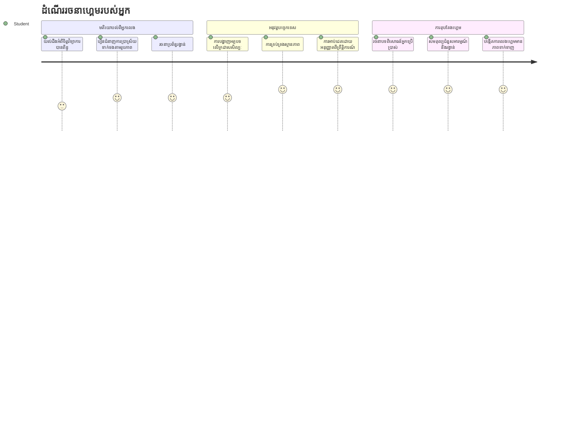
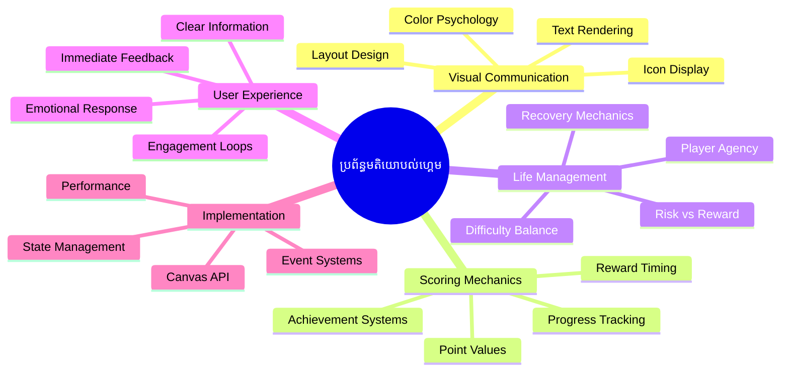
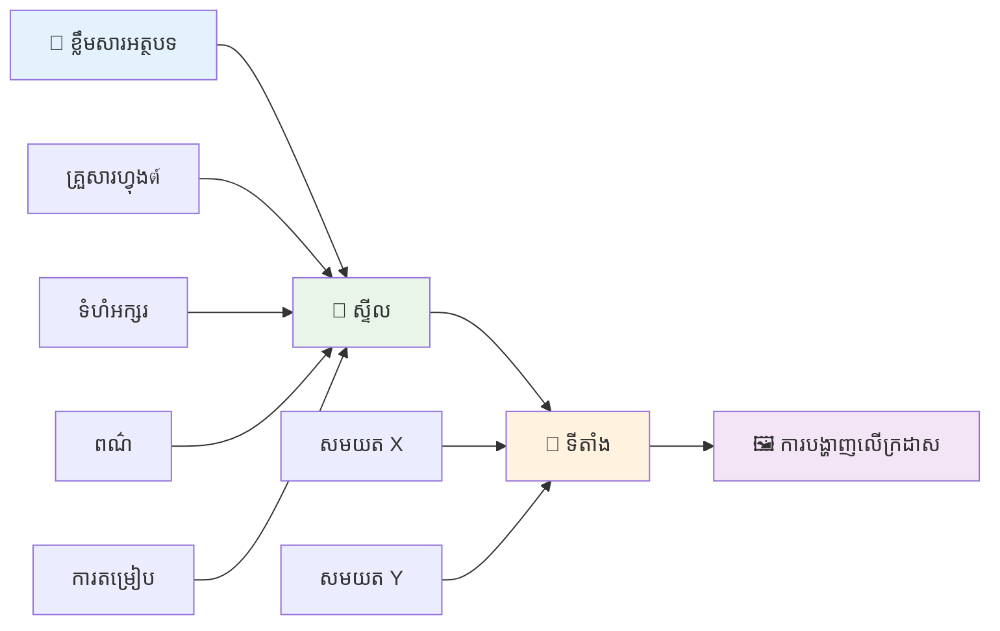
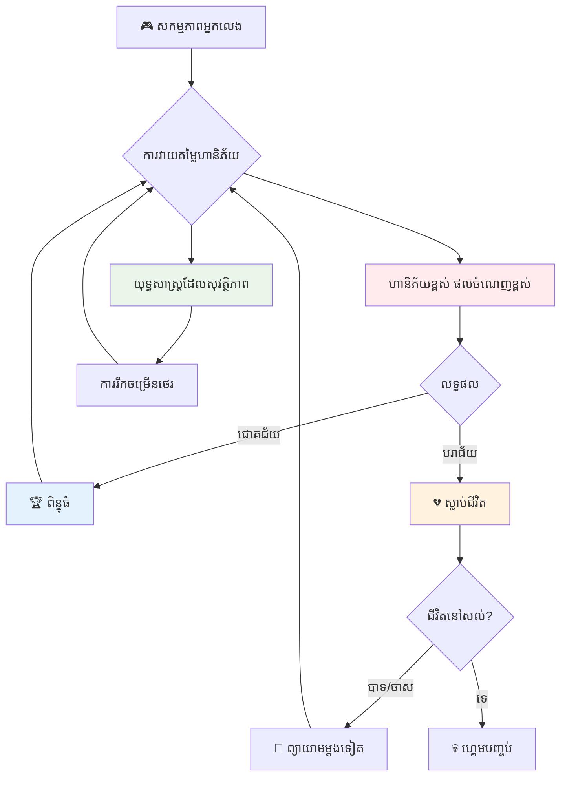
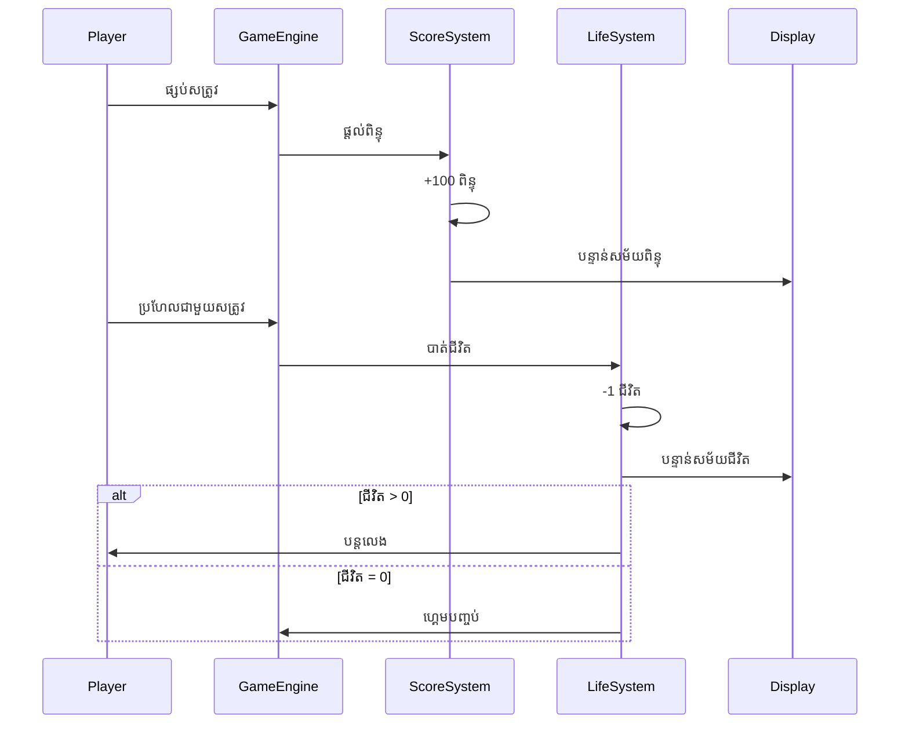
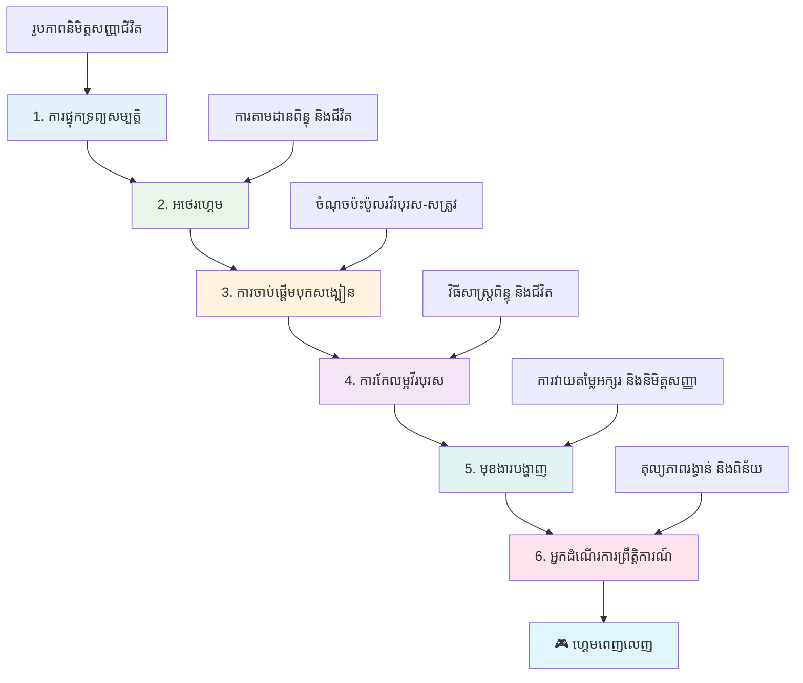
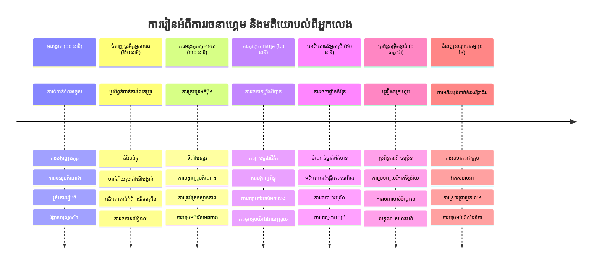

# ការសាងសង់ហ្គេមអាកាសចរណ៍ ផ្នែក 5៖ ការគណនា​ពិន្ទុ និងជីវិត


## សំណួរពីមុន​មេរៀន

[សំណួរពីមុនមេរៀន](https://ff-quizzes.netlify.app/web/quiz/37)

តើអ្នករួចរាល់ក្នុងការធ្វើឲ្យហ្គេមអាកាសចរណ៍របស់អ្នកមានអារម្មណ៍ដូចជាហ្គេមពិតមែនទេ? ចូរយើងបន្ថែមការគណនាពិន្ទុ និងការគ្រប់គ្រងជីវិត - គន្លងលេខស្នូលដែលបានបម្លែងហ្គេមអាកាតដំបូងដូចជា Space Invaders ពីការបង្ហាញធម្មតាទៅជាការកំសាន្តដែលទាក់ទាញ។ នេះគឺជាកន្លែងដែលហ្គេមរបស់អ្នកក្លាយជារឿងលេងបានពិតប្រាកដ។


## គូរអក្សរលើអេក្រង់ - សំលេងរបស់ហ្គេមរបស់អ្នក

ដើម្បីបង្ហាញពិន្ទុរបស់អ្នក យើងត្រូវចេះរបៀបគូរអក្សរលើកង់វ៉ាស។ វិធីសាស្ត្រ `fillText()` គឺជាកម្មន្តសំខាន់បំផុតរបស់អ្នកសម្រាប់ការនេះ - វាជាវិធីសាស្ត្រដ៏ដូចគ្នា ដែលបានប្រើក្នុងហ្គេមអាកាតដំបូងដើម្បីបង្ហាញពិន្ទុ និងព័ត៌មានស្ថានភាព។


អ្នកមានការត្រួតពិនិត្យពេញលេញលើរូបរាងអក្សរ៖

```javascript
ctx.font = "30px Arial";
ctx.fillStyle = "red";
ctx.textAlign = "right";
ctx.fillText("show this on the screen", 0, 0);
```

✅ ជ្រាបជិតស្ទាល់អំពី [ការបន្ថែមអក្សរដល់កង់វ៉ាស](https://developer.mozilla.org/docs/Web/API/Canvas_API/Tutorial/Drawing_text) - អ្នកប្រហែលជារំភើបចិត្តថាតើ អ្នកអាចសហការជាមួយហ្វូន និងលំនាំបែបយ៉ាងណា!

## ជីវិត - មិនមែនត្រឹមតែជាចំនួនប៉ុណ្ណោះទេ

ក្នុងការរចនាហ្គេម "ជីវិត" ជាលក្ខណៈបង្ហាញពីកម្រិតកំហុសដែលកីឡាករសម្របសម្រួលបាន។ គំនិតនេះចាប់ពីម៉ាស៊ីន pinball ដែលអ្នកទទួលបានបាល់ច្រើនសម្រាប់លេង។ ក្នុងហ្គេមវីដេអូដំបូងដូចជា Asteroids ជីវិតផ្តល់ឱ្យកីឡាករអំណាចក្នុងការយកចិត្តទុកដាក់ និងរៀនពីកំហុស។


ការបង្ហាញរូបភាពមានសារៈសំខាន់ខ្លាំង - ការបង្ហាញរូបតំណាងទូកវិញមិនមែនត្រឹមតែ "ជីវិត៖ ៣" ប៉ុណ្ណោះទេ គឺបង្កើតការទទួលស្គាល់វិដេអូភ្លាមៗ ដូចជាកាស៊ីណូអាកាតដំបូងដែលប្រើរូបតំណាងដើម្បីទំនាក់ទំនងជាសកល ។

## ការសង់ប្រព័ន្ធរង្វាន់របស់ហ្គេមរបស់អ្នក

ឥឡូវនេះយើងនឹងអនុវត្តប្រព័ន្ធមូលដ្ឋានប្រតិកម្មដែលរក្សាការចូលរួមរបស់កីឡាករ៖


- **ប្រព័ន្ធគណនាពិន្ទុ**៖ ទូកមិត្តរួចបំផ្លាញមួយនាក់នឹងទទួលបានចំណាត់ថ្នាក់ ១០០ ពិន្ទុ (ចំនួនវិសមភាពងាយស្រួលសម្រាប់កីឡាករគិតនិយម)។ ពិន្ទុបង្ហាញនៅចំណុចខាង​ក្រោម​ផ្នែកឆ្វេង។
- **កូឡាក់ជីវិត**៖ វីរបុរសរបស់អ្នកចាប់ផ្តើមជាមួយជីវិតបី - ជារបៀបស្តង់ដារដែលបានស្ថាបនាឡើងដោយហ្គេមអាកាតដំបូងដើម្បីតុល្យភាពបញ្ហា និងការលេង។ រាល់ការប៉ះទង្គិចជាមួយសត្រូវនឹងបាត់ជីវិតមួយគ្រាប់។ យើងនឹងបង្ហាញជីវិតនៅខាងក្រោមផ្នែកស្ដាំដោយប្រើរូបតំណាងទូក ។

## តោះចាប់ផ្តើមសង់!

ដំបូងត្រួតពិនិត្យទីតាំងការងាររបស់អ្នក។ ចូលទៅក្នុងថតកប្រែក្នុង `your-work`។ អ្នកគួរតែឃើញឯកសារទាំងនេះ៖

```bash
-| assets
  -| enemyShip.png
  -| player.png
  -| laserRed.png
-| index.html
-| app.js
-| package.json
```

ដើម្បីសាកល្បងហ្គេមរបស់អ្នក ចាប់ផ្តើមម៉ាស៊ីនបម្រើអភិវឌ្ឍន៍ពីថត `your_work`៖

```bash
cd your-work
npm start
```

វាជាម៉ាស៊ីនបម្រើក្នុងកន្លែងនៅ `http://localhost:5000`។ បើកអាសយដ្ឋាននេះក្នុងអ្នកស្វែងរករបស់អ្នកដើម្បីមើលហ្គេមរបស់អ្នក។ សាកល្បងការគ្រប់គ្រងដោយក្តារចុចស្លាបព្រិល និងព្យាយាមបាញ់សត្រូវដើម្បីធានាថាអ្វីៗដំណើរការល្អ។


### ពេលវេលាសម្រាប់បញ្ចូលកូដ!

1. **យកទ្រព្យសម្បត្តិរូបភាពដែលអ្នកចាំបាច់**។ ចម្លងទ្រព្យសម្បត្តិ `life.png` ពីថត `solution/assets/` ទៅក្នុងថត `your-work` របស់អ្នក។ បន្ទាប់មកបន្ថែម lifeImg ទៅក្នុងមុខងារ window.onload របស់អ្នក៖

    ```javascript
    lifeImg = await loadTexture("assets/life.png");
    ```

1. កុំភ្លេចបន្ថែម `lifeImg` ទៅក្នុងបញ្ជីទ្រព្យសម្បត្តិរបស់អ្នក៖

    ```javascript
    let heroImg,
    ...
    lifeImg,
    ...
    eventEmitter = new EventEmitter();
    ```
  
2. **តម្លើងអថេរហ្គេមរបស់អ្នក**។ បន្ថែមកូដសម្រាប់តាមដានចំនួនពិន្ទុសរុប (ចាប់ផ្តើមពី 0) និងជីវិតនៅសល់ (ចាប់ផ្តើមពី 3)។ យើងនឹងបង្ហាញវាទៅលើអេក្រង់ដើម្បីឲ្យកីឡាករបានដឹងកន្លែងដែលពួកគេនៅជានិច្ច។

3. **អនុវត្តការរកឃើញការប៉ះទង្គិច**។ ពង្រីកមុខងារ `updateGameObjects()` របស់អ្នកដើម្បីស្វែងរកពេលដែលសត្រូវប៉ះទង្គិចវីរៈរូបរបស់អ្នក៖

    ```javascript
    enemies.forEach(enemy => {
        const heroRect = hero.rectFromGameObject();
        if (intersectRect(heroRect, enemy.rectFromGameObject())) {
          eventEmitter.emit(Messages.COLLISION_ENEMY_HERO, { enemy });
        }
      })
    ```

4. **បន្ថែមការតាមដានជីវិត និងពិន្ទុទៅវិរៈរូបរបស់អ្នក**  
   1. **ចាប់ផ្តើមកូឡាក់**។ ក្រោម `this.cooldown = 0` ក្នុងថ្នាក់ `Hero` របស់អ្នក ដាក់ជីវិត និងពិន្ទុ៖

        ```javascript
        this.life = 3;
        this.points = 0;
        ```

   1. **បង្ហាញតម្លៃទាំងនេះទៅកីឡាករ**។ បង្កើតមុខងារដើម្បីគូរតម្លៃទាំងនេះលើអេក្រង់៖

        ```javascript
        function drawLife() {
          // ធ្វើឱ្យបាន ពេញលេញ, 35, 27
          const START_POS = canvas.width - 180;
          for(let i=0; i < hero.life; i++ ) {
            ctx.drawImage(
              lifeImg, 
              START_POS + (45 * (i+1) ), 
              canvas.height - 37);
          }
        }
        
        function drawPoints() {
          ctx.font = "30px Arial";
          ctx.fillStyle = "red";
          ctx.textAlign = "left";
          drawText("Points: " + hero.points, 10, canvas.height-20);
        }
        
        function drawText(message, x, y) {
          ctx.fillText(message, x, y);
        }

        ```

   1. **ភ្ជាប់អ្វីគ្រប់យ៉ាងទៅផ្លូហ្គេមរបស់អ្នក**។ បន្ថែមមុខងារទាំងនេះទៅក្នុងមុខងារ window.onload តែមួយក្រោយ `updateGameObjects()`៖

        ```javascript
        drawPoints();
        drawLife();
        ```

### 🔄 **ការត្រួតពិនិត្យផ្លូវចិត្ត**

**ការយល់ដឹងអំពីការរចនាហ្គេម**៖ មុននឹងអនុវត្តវិល័យ ផ្ទៀងផ្ទាត់ថាអ្នកយល់ដូចជា៖
- ✅ របៀបបញ្ចេញប្រតិកម្មមើលឃើញទាក់ទងស្ថានភាពហ្គេមទៅកីឡាករ
- ✅ ហេតុអ្វីបានជាការដាក់ធាតុ UI ទៅកន្លែងតែម្ដងគឺធ្វើឲ្យមានភាពងាយស្រួលប្រើ
- ✅ បញ្ញាស្រោចស្រពចំពោះតម្លៃពិន្ទុ និងការគ្រប់គ្រងជីវិត
- ✅ របៀបគូរអក្សរលើកង់វ៉ាសខុសពីអក្សរលើ HTML

**សាកល្បងខ្លួនឯងយ៉ាងឆាប់រហ័ស**៖ ហេតុអ្វីហ្គេមអាកាតភាគច្រើនប្រើចំនួនរង្វង់សម្រាប់តម្លៃពិន្ទុ?  
*ចម្លើយ៖ ចំនួនរង្វង់ងាយស្រួលសម្រាប់កីឡាករគិតក្នុងចិត្ត ហើយបង្កើតរង្វាន់ផ្លូវចិត្តដែលបំពេញចិត្ត*

**គោលការណ៍បទពិសោធន៍អ្នកប្រើ**៖ ឥឡូវនេះអ្នកកំពុងអនុវត្ត៖  
- **លំដាប់តួអក្សរតាមរយៈវិចិត្រសិល្បៈ**៖ ព័ត៌មានសំខាន់ត្រូវបានដាក់ឲ្យកែងមុខ
- **ប្រតិកម្មភ្លាមៗ**៖ ការអាប់ដេតពេលវេលាពិតនៃសកម្មភាពកីឡាករ
- **ផ្ទុកចិត្តផ្លូវចិត្ត**៖ ការបង្ហាញព័ត៌មានល្អប្រសើរស្រាលសាមញ្ញ
- **រចនាសម្ព័ន្ធសារមាត្រ**៖ រូបតំណាង និងពណ៌ដែលបង្កើតទំនាក់ទំនងជាមួយកីឡាករ

1. **អនុវត្តវិល័យហ្គេម និងរង្វាន់**។ ឥឡូវនេះយើងនឹងបន្ថែមប្រព័ន្ធប្រតិកម្មដែលធ្វើឲ្យសកម្មភាពកីឡាករមានអត្ថន័យ៖

   1. **ការប៉ះត្រូវបាត់ជីវិត**។ រាល់ពេលដែលវីរៈរូបរបស់អ្នកបង្គាប់ប៉ះជាមួយសត្រូវ អ្នកត្រូវបាត់ជីវិតមួយ។
   
      បន្ថែមវិធីសាស្រ្តនេះទៅថ្នាក់ `Hero` របស់អ្នក៖

        ```javascript
        decrementLife() {
          this.life--;
          if (this.life === 0) {
            this.dead = true;
          }
        }
        ```

   2. **ការបាញ់សត្រូវទទួលបានពិន្ទុ**។ រាល់ការបាញ់ដែលជោគជ័យ ឈានដល់ពិន្ទុ ១០០ ដែលផ្តល់នូវប្រតិកម្មវិជ្ជមានភ្លាមៗសម្រាប់ការបាញ់កំណត់ត្រឹមត្រូវ។

      ពង្រីកថ្នាក់ Hero របស់អ្នកជាមួយមុខងារបន្ថែមនេះ៖
    
        ```javascript
          incrementPoints() {
            this.points += 100;
          }
        ```

        ឥឡូវភ្ជាប់មុខងារទាំងនេះទៅកាន់ព្រឹត្តិការណ៍ប៉ះទង្គិចរបស់អ្នក៖

        ```javascript
        eventEmitter.on(Messages.COLLISION_ENEMY_LASER, (_, { first, second }) => {
           first.dead = true;
           second.dead = true;
           hero.incrementPoints();
        })

        eventEmitter.on(Messages.COLLISION_ENEMY_HERO, (_, { enemy }) => {
           enemy.dead = true;
           hero.decrementLife();
        });
        ```

✅ ចង់ដឹងអំពីហ្គេមផ្សេងទៀតដែលបានសង់ជាមួយ JavaScript និង Canvas មែនទេ? សាកល្បងសෙូមរក - អ្នកអាចរីករាយចំពោះអ្វីដែលអាចធ្វើបាន!

បន្ទាប់ពីអនុវត្តលក្ខណៈពិសេសទាំងនេះ សាកល្បងហ្គេមរបស់អ្នក ដើម្បីមើលប្រព័ន្ធប្រតិកម្មពេញលេញជាមួយប្រតិកម្ម។ អ្នកគួរតែឃើញរូបតំណាងជីវិតនៅខាងក្រោមផ្នែកស្ដាំ ពិន្ទុរបស់អ្នកនៅខាងឆ្វេងក្រោម ហើយមើលឃើញថាការប៉ះបាក់បន្ថយជីវិតខណៈពេលកំណត់បាញ់បានបន្ថែមពិន្ទុ។

ហ្គេមរបស់អ្នកឥឡូវមានជាគន្លងចម្បងដែលបានធ្វើឲ្យហ្គេមអាកាតដំបូងទាក់ទាញខ្លាំង — គោលបំណងច្បាស់ លក្ខណៈប្រតិកម្មភ្លាមៗ និងវិល័យមានន័យសម្រាប់សកម្មភាពកីឡាករ។

### 🔄 **ការត្រួតពិនិត្យផ្លូវចិត្ត**
**ប្រព័ន្ធរចនាហ្គេមសរុប**៖ ផ្ទៀងផ្ទាត់ការកាន់កាប់ប្រព័ន្ធប្រតិកម្មរបស់អ្នក៖
- ✅ របៀបដែលវិល័យគណនាពិន្ទុបង្កើតកំលាំងចំណង់ចំណូលចិត្តនិងការចូលរួមរបស់កីឡាករ
- ✅ ហេតុអ្វីបានជាការសម្របសម្រួលរូបភាពមានសារៈសំខាន់សម្រាប់ការរចនាអ្នកប្រើប្រាស់
- ✅ របៀបដែលប្រព័ន្ធជីវិតតុល្យភាពការប្រឈម និងការរក្សាកីឡាករ
- ✅ តើប្រតិកម្មភ្លាមៗជួយបង្កើតការលេងហ្គេមបានយ៉ាងបានចិត្តយ៉ាងដូចម្តេច

**ការបញ្ចូលប្រព័ន្ធ**៖ ប្រព័ន្ធប្រតិកម្មរបស់អ្នកបង្ហាញ៖
- **រចនាបទពិសោធន៍អ្នកប្រើ**៖ ការទំនាក់ទំនងវិស្វកម្ម ការរៀបចំព័ត៌មានច្បាស់លាស់
- **ស្ថាបត្យកម្មដឹកនាំដោយព្រឹត្តិការណ៍**៖ ការអាប់ដេតឆាប់រហ័សទៅដែលសកម្មភាពកីឡាករ
- **គ្រប់គ្រងស្ថានភាព**៖ តាមដាន និងបង្ហាញទិន្នន័យហ្គេមដែលផ្លាស់ប្តូរផ្សេងៗ
- **ជំនាញគូរអក្សរលើកង់វ៉ាស**៖ ការបង្ហាញអក្សរ និងទីតាំងរូបតំណាង
- **ចិត្តវិទ្យាហ្គេម**៖ ការយល់ដឹងពីកំលាំងចំណង់ចំណូលចិត្តនិងការចូលរួមរបស់កីឡាករ

**លំនាំវិជ្ជាជីវៈ**៖ អ្នកបានអនុវត្ត៖
- **ស្ថាបត្យកម្ម MVC**៖ ផ្នែកហ្គេម ទិន្នន័យ និងការបង្ហាញជាាផ្លែក
- **លំនាំអ្នកតាមដាន (Observer Pattern)**៖ ការអាប់ដេតដោយព្រឹត្តិការណ៍សម្រាប់បម្លែងស្ថានភាពហ្គេម
- **រចនារួមគ្នា**៖ មុខងារសម្រាប់គូរនិងហេតុផលដែលអាចប្រើឡើងវិញ
- **បង្កើនប្រសិទ្ធភាព**៖ ការគូរដូចមានប្រសិទ្ធភាពក្នុងលំនាំហ្គេម

### ⚡ **អ្វីដែលអ្នកអាចធ្វើបានក្នុង 5 នាទីក្រោយនេះ**
- [ ] សាកល្បងរចនាហ្វូន និងពណ៌ផ្សេងៗសម្រាប់បង្ហាញពិន្ទុ
- [ ] ព្យាយាមផ្លាស់ប្តូរតម្លៃពិន្ទុ និងមើលថាតើវាអានលើអារម្មណ៍លេងហ្គេមយ៉ាងដូចម្តេច
- [ ] បន្ថែម console.log ដើម្បីតាមដានពេលពិន្ទុ និងជីវិតផ្លាស់ប្តូរ
- [ ] សាកល្បងករណីក្រោយៗ ដូចជាបញ្ចប់ជីវិត ឬកំណត់ពិន្ទុ ខ្ពស់

### 🎯 **អ្វីដែលអ្នកអាចសម្រេចបានក្នុងមួយម៉ោងនេះ**
- [ ] បញ្ចប់សំណួរពីក្រោយមេរៀន និងយល់ពីចិត្តវិទ្យាការរចនាហ្គេម
- [ ] បន្ថែមសម្លេងសម្រាប់ការគណនាពិន្ទុ និងបាត់ជីវិត
- [ ] អនុវត្តប្រព័ន្ធកំណត់ពិន្ទូចម្បងដោយប្រើ localStorage
- [ ] បង្កើតតម្លៃពិន្ទុផ្សេងសម្រាប់ប្រភេទសត្រូវផ្សេងៗ
- [ ] បន្ថែមផលប៉ះពាល់វិស្វកម្មដូចជាការវាយចលនាអេក្រង់នៅពេលបាត់ជីវិត

### 📅 **ការធ្វើដំណើររចនាហ្គេមរបស់អ្នកក្នុងមួយសប្តាហ៍**
- [ ] បញ្ចប់ហ្គេមអាកាសចរណ៍ដ៏ពេញលេញជាមួយប្រព័ន្ធបញ្ចេញប្រតិកម្មលម្អិត
- [ ] អនុវត្តគន្លងលេខពិន្ទុច្រើនដូចជា combo multipliers
- [ ] បន្ថែមសក្ដារ និងមាតិកាដែលអាច Unlock បាន
- [ ] បង្កើតការរីកចម្រើននិងតុល្យភាពលំដាប់កម្រិត
- [ ] រចនាផ្ទៃប្រើ UI សម្រាប់មីនុយ និងអេក្រង់ហ្គេមបញ្ចប់
- [ ] សិក្សាហ្គេមផ្សេងៗដើម្បីយល់ពីកំលាំងចូលរួម

### 🌟 **ជំនាញអភិវឌ្ឍន៍ហ្គេមរបស់អ្នកក្នុងមួយខែ**
- [ ] សង់ហ្គេមពេញលេញជាមួយប្រព័ន្ធរីកចម្រើនស្មុគស្មាញ
- [ ] រៀនវិភាគហ្គេម និងវាស់ទំហំការប្រព្រឹត្តចិត្តកីឡាករ
- [ ] ឧបត្ថម្ភគម្រោងអភិវឌ្ឍន៍ហ្គេម Open Source
- [ ] ជំនាញលំដាប់ខ្ពស់ក្នុងគន្លងលេខការរចនាហ្គេម និង monetization
- [ ] បង្កើតមាតិកាសិស្សសម្រាប់ការរចនាហ្គេម និងបទពិសោធន៍អ្នកប្រើ
- [ ] បង្កើតពត៌មានគំរូបង្ហាញជំនាញរចនាហ្គេមនិងអភិវឌ្ឍន៍

## 🎯 ពេលវេលាជំនាញរចនាហ្គេមរបស់អ្នក


### 🛠️ សង្ខេបឧបករណ៍រចនាហ្គេមរបស់អ្នក

បន្ទាប់ពីបញ្ចប់មេរៀននេះ អ្នកបានច្បាស់លាស់ក្នុង៖
- **ចិត្តវិទ្យាកីឡាករ**៖ ការយល់ចំណង់ចំណូលចិត្ត, ប្រយោជន៍/វិល័យ និងច្រវឹងចូលរួម
- **ទំនាក់ទំនងវិដេអូ**៖ រចនាផ្ទៃប្រើដោយប្រើអក្សរ, រូបតំណាង និងប្លង់
- **ប្រព័ន្ធតបស្នាក់**៖ របយន្តពេលវេលាពិតនៃសកម្មភាពកីឡាករ និងហ្គេម
- **ការគ្រប់គ្រងស្ថានភាព**៖ តាមដាន និងបង្ហាញទិន្នន័យហ្គេមឲ្យមានប្រសិទ្ធភាព
- **គូរអក្សរលើកង់វ៉ាស**៖ បង្ហាញអក្សរដោយជំនាញវិជ្ជាជីវៈជាមួយការតុបតែងនិងទីតាំង
- **ការបញ្ចូលព្រឹត្តិការណ៍**៖ ភ្ជាប់សកម្មភាពអ្នកប្រើទៅវិល័យមានន័យនៃហ្គេម
- **តុល្យភាពហ្គេម**៖ រចនាអាការៈលំបាកនិងប្រព័ន្ធរីកចម្រើន

**កម្មវិធីពិត**៖ ជំនាញរចនាហ្គេមរបស់អ្នកអាចអនុវត្តផ្ទាល់ទៅ៖
- **រចនាបទពិសោធន៍អ្នកប្រើ**៖ បង្កើតផ្ទៃប្រើដែលទាក់ទាញនិងងាយយល់
- **អភិវឌ្ឍផលិតផល**៖ យល់ចិត្តអ្នកប្រើ និងការបញ្ចេញប្រតិកម្ម
- **បច្ចេកវិទ្យាសិក្សា**៖ ការរត់ហ្គេមនិងកំរុងការសិក្សា
- **ការតំណាងទិន្នន័យ**៖ ធ្វើឲ្យព័ត៌មានស្មុគស្មាញងាយយល់ងាយចូលចិត្ត
- **អភិវឌ្ឍកម្មវិធីចល័ត**៖ ការរក្សាកម្មវិធី និងរចនាបទពិសោធន៍អ្នកប្រើ
- **បច្ចេកវិទ្យាម៉ាតខេទីង**៖ យល់ចិត្តអ្នកប្រើ និងកំណត់អត្រាបម្លែង

**ជំនាញវិជ្ជាជីវៈដែលទទួលបាន**៖ អ្នកអាច៖
- **រចនា**បទពិសោធន៍អ្នកប្រើដែលលើកកម្ពស់ចិត្តចូលរួម
- **អនុវត្ត**ប្រព័ន្ធប្រតិកម្មដែលមើលថែទាំឥរិយាបថអ្នកប្រើយ៉ាងមានប្រសិទ្ធិភាព
- **តុល្យភាព**ការប្រឈមនិងសមត្ថភាពប្រើប្រាស់
- **បង្កើត**ទំនាក់ទំនងមើលឃើញដែលអាចប្រើនៅក្នុងក្រុមអ្នកប្រើផ្សេងៗ
- **វិភាគ**ឥរិយាបថអ្នកប្រើ និងស្រាវជ្រាវបន្តលើការកែលម្អរចនា

**គំនិតអភិវឌ្ឍហ្គេមដែលច្បាស់លាស់**៖
- **កំលាំងចំណង់ចំណូលចិត្តកីឡាករ**៖ យល់ពីអ្វីដែលបណ្តាលឱ្យមានការចូលរួមនិងការរក្សា
- **រចនាវដ្តី**៖ បង្កើតផ្ទៃប្រើច្បាស់ ស្អាត និងមានមុខងារ
- **បញ្ចូលប្រព័ន្ធ**៖ ភ្ជាប់ប្រព័ន្ធហ្គេមជាច្រើនសម្រាប់បទពិសោធន៍ទាក់ទាញ
- **បង្កើនប្រសិទ្ធភាព**៖ គូរដោយមានប្រសិទ្ធភាព និងគ្រប់គ្រងស្ថានភាព
- **សមស្របភាព**៖ រចនាដើម្បីឆ្លើយតបតាមកម្រិតជំនាញនិងតម្រូវការអ្នកលេងផ្សេងៗ

**កម្រិតបន្ទាប់**៖ អ្នកបានរួចរាល់ក្នុងការស្ទួចពិសោធលំនាំរចនាហ្គេមខ្ពស់ ការអនុវត្តប្រព័ន្ធវិភាគ ឬសិក្សាអំពីការធ្វើប្រាក់ចំណេញ និងការរក្សាកីឡាករ!

🌟 **សម្ភោធបាន**៖ អ្នកបានសាងសង់ប្រព័ន្ធប្រតិកម្មអ្នកលេងពេញលេញជាមួយគោលការណ៍ប្រព័ន្ធរចនាហ្គេមវិជ្ជាជីវៈ!

---

## ជើងឧបត្ថម្ភ GitHub Copilot 🚀

ប្រើម៉ូឌ์ Agent ដើម្បីបញ្ចប់បញ្ហាដូចតទៅ៖

**ព័ត៌មានបរិយាយ**៖ បង្កើតប្រព័ន្ធគណនាពិន្ទុរបស់ហ្គេមអាកាសដោយបន្ថែមលក្ខណៈពិសេសកំណត់ពិន្ទុខ្ពស់បានសន្សំពិន្ទុ និងវិល័យពិន្ទុបន្ថែម។

**ស្នើសុំ**៖ បង្កើតប្រព័ន្ធកំណត់ពិន្ទុខ្ពស់ដែលរក្សាពិន្ទុអាចល្អបំផុតនៃកីឡាករ ទៅក្នុង localStorage។ បន្ថែមពិន្ទុបន្ថែមសម្រាប់ការប្រយុទ្ធបានជាប់ៗគ្នា (ប្រព័ន្ធ combo) និងអនុវត្តតម្លៃពិន្ទុផ្សេងសម្រាប់ប្រភេទសត្រូវផ្សេងៗ។ បញ្ចូលសញ្ញាភ្នាក់ងារនៅពេលកីឡាករបានពិន្ទុខ្ពស់ថ្មី និងបង្ហាញពិន្ទុខ្ពស់បច្ចុប្បន្នលើអេក្រង់ហ្គេម។

## 🚀 បញ្ហា

ឥឡូវនេះអ្នកមានហ្គេមដែលត្រូវប្រើការគណនាពិន្ទុ និងជីវិត។ ពិចារណាអំពីលក្ខណៈបន្ថែមដែលអាចធ្វើឲ្យបទពិសោធន៍កីឡាករល្អប្រសើរឡើង។

## សំនួរពីក្រោយមេរៀន

[សំនួរពីក្រោយមេរៀន](https://ff-quizzes.netlify.app/web/quiz/38)

## សូមពិនិត្យ និងសិក្សាឯករាជ្យ

ចង់ស្វែងរកបន្ថែមទេ? ស្រាវជ្រាវវិធីសាស្ត្រផ្សេងៗដើម្បីគណនាពិន្ទុ និងប្រព័ន្ធជីវិតក្នុងហ្គេម។ មានម៉ាស៊ីនហ្គេមដ៏គួរអោយចាប់អារម្មណ៍ដូចជា [PlayFab](https://playfab.com) ដែលគ្រប់គ្រងការគណនា ពិន្ទុខ្នាតដឹកនាំ និងការរីកចម្រើនកីឡាករ។ តើការបញ្ចូលជាមួយវាអាចលើកកម្ពស់ហ្គេមរបស់អ្នកទៅកម្រិតបន្ទាប់បានយ៉ាងដូចម្តេច?

## ការចេញបន្ទាន់

[សាងសង់ហ្គេម គណនាពិន្ទុ](assignment.md)

---

<!-- CO-OP TRANSLATOR DISCLAIMER START -->
**ការព្រមាន**៖  
ឯកសារនេះត្រូវបានបកប្រែដោយប្រើសេវាបកប្រែ AI [Co-op Translator](https://github.com/Azure/co-op-translator)។ ខណៈពេលដែលយើងខំប្រឹងប្រែងដើម្បីឱ្យបានភាពត្រឹមត្រូវ សូមយល់ដឹងថាការបកប្រែដោយស្វយ័កម្មនេះអាចមានកំហុសឬភាពមិនត្រឹមត្រូវខ្លះ។ ឯកសារដើមភាសាដើមគួរត្រូវបានគេពិចារណាជាដើមទិន្នន័យដែលមានសិទ្ធិ។ សម្រាប់ព័ត៌មានសំខាន់ៗ សូមប្រើការបកប្រែដោយមនុស្សដែលមានជំនាញ។ យើងមិនទទួលខុសត្រូវចំពោះការយល់ច្រឡំ ឬការបកប្រែខុសពីការប្រើប្រាស់ការបកប្រែនេះឡើយ។
<!-- CO-OP TRANSLATOR DISCLAIMER END -->