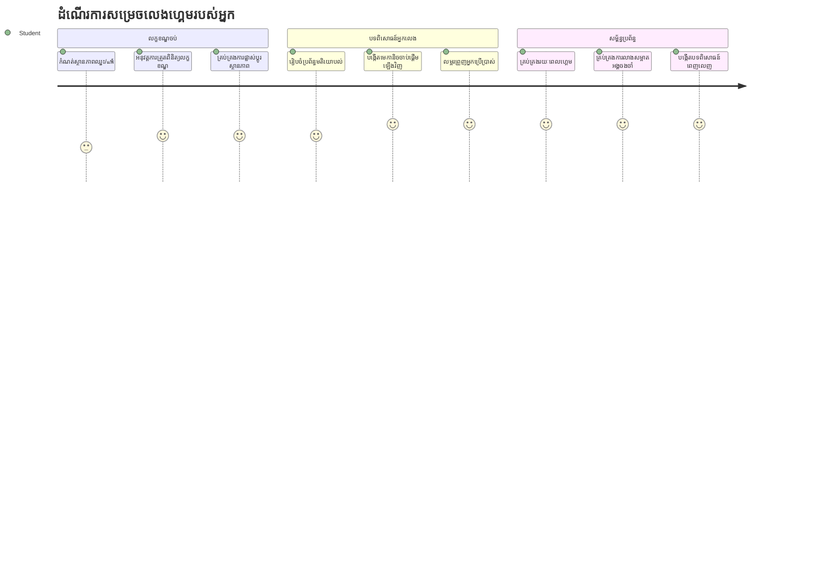
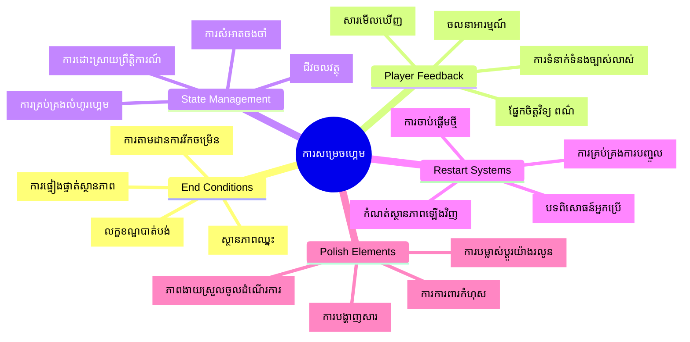
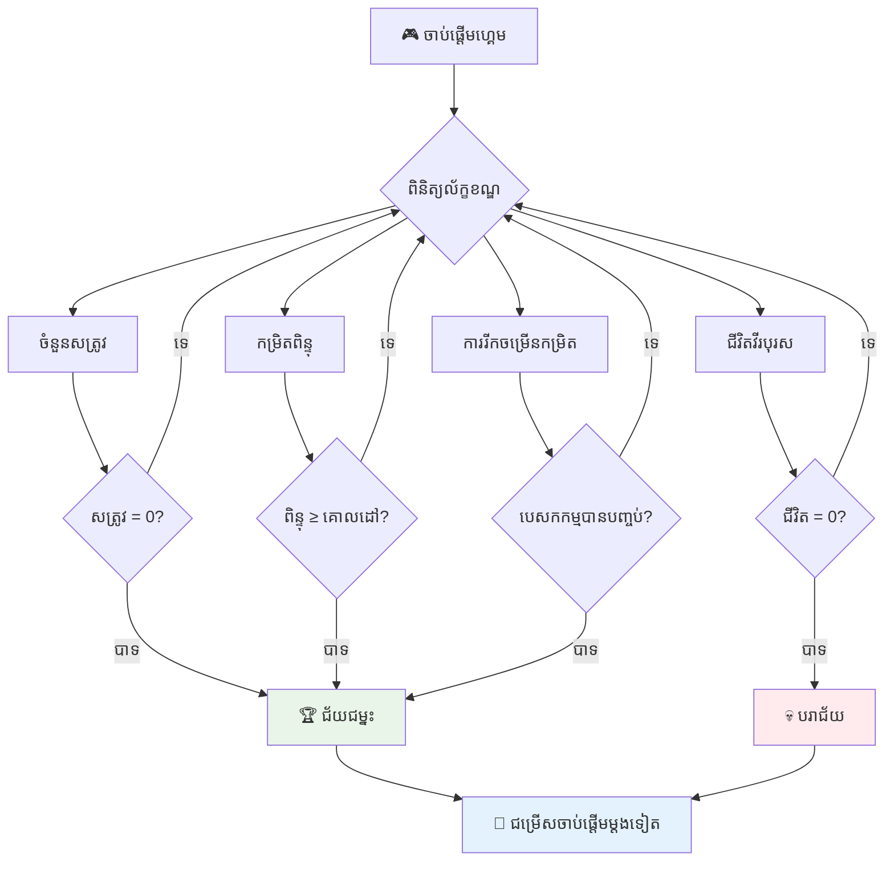
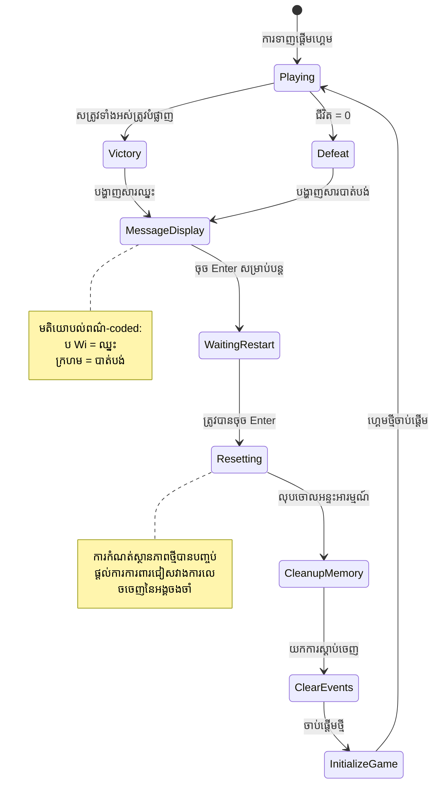
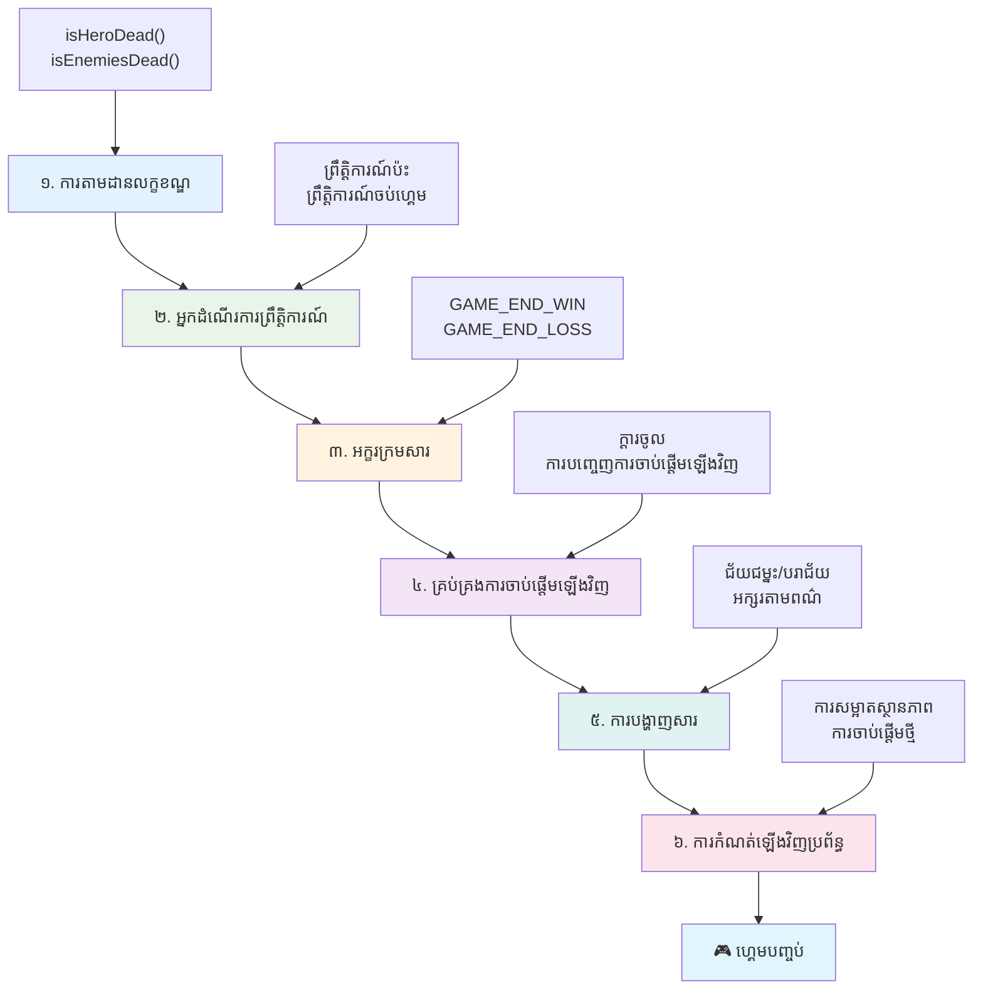
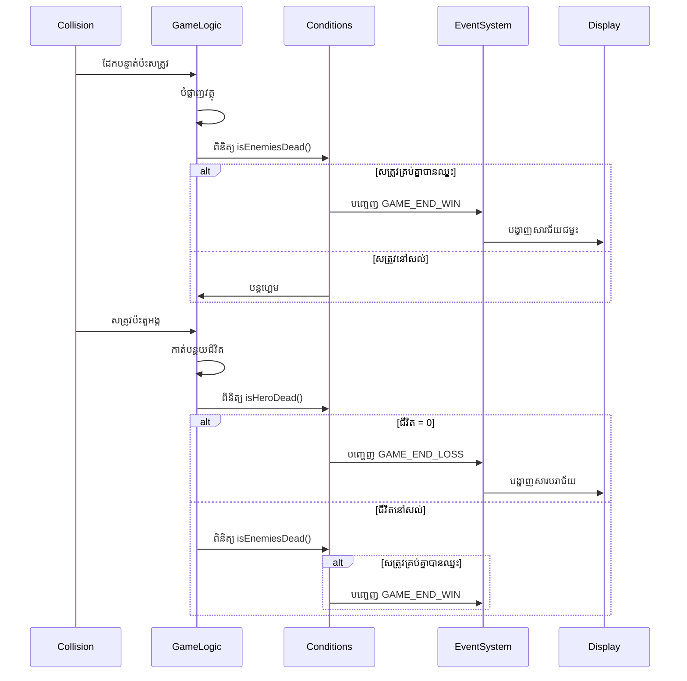

# កសាងហ្គេមអាកាសចរណ៍ ផ្នែកទី 6៖ ចប់ និងចាប់ផ្ដើមម្ដងទៀត


ហ្គេមដ៏អស្ចារ្យអ្វីៗក៏ត្រូវការ លក្ខខណ្ឌបញ្ចប់ច្បាស់លាស់ និងយន្តការចាប់ផ្ដើមឡើងវិញយ៉ាងរលូន។ អ្នកបានបង្កើតហ្គេមអាកាសចរណ៍ដ៏គួរឱ្យទាក់ទាញមួយ ដែលមានចលនា សង្រ្គាម និងការគណនា ពេលនេះគឺពេលវេលាចង់បន្ថែមផ្នែកចុងក្រោយដែលធ្វើអោយវាភាពពេញលេញ។

ហ្គេមរបស់អ្នកឥឡូវនេះរត់ដោយមិនផុតដូចជាឧបករណ៍ដាក់សញ្ញា Voyager ដែល NASA បានបញ្ចូននៅឆ្នាំ 1977 - នៅតែធ្វើដំណើរឆ្លងកាត់អាកាសចរណ៍ជាច្រើនទសវត្ស។ ទោះបីបែបនេះនៅសម្រាប់ការស្រាវជ្រាវពីអាកាស ប៉ុន្តែហ្គេមត្រូវការ ចំណុចបញ្ចប់កំណត់ដើម្បីបង្កើតបទពិសោធន៍ដែលផ្តល់សេចក្តីសប្បាយចិត្ត។

ថ្ងៃនេះ ខ្ញុំនឹងអនុវត្តលក្ខខណ្ឌឈ្នះ/សianut ហើយប្រព័ន្ធចាប់ផ្ដើមឡើងវិញ។ នៅចុងមេរៀននេះ អ្នកនឹងមានហ្គេមដែលបានវាយកម្រិតស្អាតដែលអ្នកលេងអាចបញ្ចប់ និងលេងបន្តបាន ដូចហ្គេមអាការ៉ាដែលបានកំណត់មធ្យោបាយហ្គេម។


## វិចារណាសួរសំណួរមុនមេរៀន

[វិចារណាសួរសំណួរមុនមេរៀន](https://ff-quizzes.netlify.app/web/quiz/39)

## ការយល់ដឹងអំពីលក្ខខណ្ឌបញ្ចប់ហ្គេម

ហ្គេមរបស់អ្នកគួរបញ្ចប់នៅពេលណា? សំណួរចម្បងនេះបានបង្ហាត់ការ រចនាហ្គេមទាំងមូល តាំងពីសម័យអាការ៉ាដំបូង។ Pac-Man បញ្ចប់នៅពេលអ្នកត្រូវបានគេចាប់ដោយខ្ញង់ ឬបានលុបចោលគ្រាប់ទាំងអស់ ខណៈដែល Space Invaders បញ្ចប់នៅពេលអាពាហ៍ពេជ្រឈានដល់ផ្នែកបាត ឬអ្នកបំផ្លាញពួកវាទាំងអស់។

ជាក្រុមច្នៃប្រឌិតហ្គេម អ្នកកំណត់លក្ខខណ្ឌឈ្នះ និងខូចខាត។ សម្រាប់ហ្គេមអាកាសចរណ៍របស់យើង មានវិធីសាស្រ្តដែលទទួលស្គាល់ដោយសំខាន់ ដើម្បីបង្កើតហ្គេមដែលគួរឱ្យចាប់អារម្មណ៍៖


- **បំផ្លាញនាវាអ្នកសត្រូវ `N` យន្តហោះ**៖ វាមានប្រយោជន៍បំផុត ប្រសិនបើអ្នកចែកហ្គេមជាចំណុចកម្រិតផ្សេងៗដែលអ្នកត្រូវបំផ្លាញយន្តហោះអាកាសចរណ៍អ្នកសត្រូវ `N` ដើម្បីបញ្ចប់កម្រិតមួយ
- **នាវារបស់អ្នកត្រូវបានបំផ្លាញ**៖ មានហ្គេមឈានមុខបាត់បង់បើនាវារបស់អ្នកត្រូវបានបំផ្លាញ។ វិធីសាស្រ្តផ្សេងទៀតគឺមានមុខងារជីវិត។ រៀងរាល់ពេលដែលនាវារបស់អ្នកត្រូវបានបំផ្លាញ វានឹងកាត់បន្ថយជីវិតមួយ។ នៅពេលជីវិតទាំងអស់ត្រូវបាត់បង់ អ្នកនឹងបាត់បង់ហ្គេម។
- **អ្នកបានប្រមូលពិន្ទុ `N`**៖ លក្ខខណ្ឌបញ្ចប់ទៀតគឺអ្នកប្រមូលពិន្ទុ។ របៀបយកពិន្ទុគឺដាក់នៅដៃអ្នក ប៉ុន្តែវាប្រហែលជាទារកកំណត់ពិន្ទុនៅលើសកម្មភាពញឹកញាប់ដូចជា បំផ្លាញនាវាសត្រូវឬប្រមូលធាតុដែលធាតុនោះធ្លាក់ចុះនៅពេលវាត្រូវបានបំផ្លាញ។
- **បញ្ចប់កម្រិតមួយ**: វាអាចរួមបញ្ចូលលក្ខខណ្ឌជាច្រើនដូចជា បំផ្លាញ `X` នាវាសត្រូវ ប្រមូលពិន្ទុ `Y` ឬប្រមូលធាតុជាក់លាក់មួយ។

## អនុវត្តប្រព័ន្ធចាប់ផ្ដើមឡើងវិញហ្គេម

ហ្គេមល្អជំរុញឱ្យចូលការលេងឡើងវិញ ដោយប្រើយន្តការចាប់ផ្ដើមឡើងវិញយ៉ាងរលូន។ ពេលអ្នកលេងបញ្ចប់ហ្គេម (ឬបាត់បង់) ពួកគេជាញឹកញាប់ចង់សាកល្បងម្ដងទៀតភ្លាមៗ - មិនថាដើម្បីលægtពិន្ទុ ឬធ្វើឱ្យធ្វើការ បានល្អប្រសើរឡើង។


Tetris ជាឧទាហរណ៍ដ៏ល្អបំផុត៖ ពេលឥវ៉ាន់របស់អ្នកដល់ផ្នែកលើ អ្នកអាចចាប់ផ្ដើមហ្គេមថ្មីភ្លាមៗ ដោយមិនត្រូវធ្វើដំណើរចូលម៉ឺនុយស្មុគស្មាញ។ យើងនឹងបង្កើតប្រព័ន្ធចាប់ផ្ដើមឡើងវិញដូចស្រដៀង គ្រប់គ្រងស្ថានភាពហ្គេមថ្មីៗ និងធ្វើឲ្យអ្នកលេងកាន់តែ ជាប់បញ្ចូលល្បឿនលឿន។

✅ **ការឆ្លុះបញ្ចាំង**: សូមគិតអំពីហ្គេមដែលអ្នកបានលេង។ នៅក្រោមលក្ខខណ្ឌណាដែលពួកវាបញ្ចប់ ហើយតើអ្នកត្រូវធ្វើដូចម្តេចដើម្បីចាប់ផ្ដើមម្ដងទៀត? តើអ្វីធ្វើឲ្យបទពិសោធន៍ចាប់ផ្ដើមឡើងវិញមានភាពរលូនពីការជារឿយ?

## អ្វីដែលអ្នកនឹងបង្កើត

អ្នកនឹងអនុវត្តមុខងារចុងក្រោយដែលបម្លែងគម្រោងរបស់អ្នកជា បទពិសោធន៍ហ្គេមមួយដែលពេញលេញ។ ធាតុទាំងនេះបំបែកហ្គេមដែលបានច្នៃប្រឌិតល្អ ពីគំរូទូទៅ។

**នេះជាអ្វីដែលយើងនឹង បន្ថែមថ្ងៃនេះ៖**

1. **លក្ខខណ្ឌឈ្នះ**៖ បំផ្លាញសត្រូវទាំងអស់ និងទទួលបានការលំអរដ៏ត្រឹមត្រូវ (អ្នកបានសន្និដ្ឋានវា!)
2. **លក្ខខណ្ឌបាត់បង់**៖ ខាតជីវិតនិងធ្វើបញ្ញត្តិជាមួយអេក្រង់បាត់បង់
3. **យន្តការចាប់ផ្ដើមឡើងវិញ**៖ ចុច Enter ដើម្បីចូលវិញភ្លាមៗ - ព្រោះហ្គេមមួយមិនគ្រប់គ្រាន់ទេ
4. **ការគ្រប់គ្រងស្ថានភាព**៖ សំអាតល្អរៀងរាល់ដង - គ្មានសត្រូវនៅសល់ ឬកំហុសចម្លែកដែលនៅពីហ្គេមមុន

## ចាប់ផ្ដើម

សូមរៀបចំបរិយាកាសអភិវឌ្ឍរបស់អ្នក។ អ្នកគួរតែមានឯកសារហ្គេមអាកាសចរណ៍ទាំងអស់ពីមេរៀនមុនៗរួចរាល់។

**គម្រោងរបស់អ្នកគួរតែមានរូបរាងប្រហែលដូចជា៖**

```bash
-| assets
  -| enemyShip.png
  -| player.png
  -| laserRed.png
  -| life.png
-| index.html
-| app.js
-| package.json
```

**ចាប់ផ្ដើមម៉ាស៊ីនបម្រើអភិវឌ្ឍរបស់អ្នក:**

```bash
cd your-work
npm start
```

**ពាក្យបញ្ជានេះ:**
- រត់ម៉ាស៊ីនបម្រើតាមលំនៅ `http://localhost:5000`
- បម្រើឯកសាររបស់អ្នកយ៉ាងត្រឹមត្រូវ
- Automatically ចុង to refresh នៅពេលអ្នកធ្វើបំប្រែប្រាស់

បើក `http://localhost:5000` ជាមួយកម្មវិធីរុករកហើយផ្ទៀងផ្ទាត់ថាហ្គេមរបស់អ្នកកំពុងរត់។ អ្នកគួរតែអាចចលនា វាយប្រហារ និងធ្វើអន្តរកម្មជាមួយសត្រូវបាន។ បន្ទាប់ពីបញ្ជាក់ហើយ អ្នកអាចបន្តអនុវត្តបាន។

> 💡 **ជំនួយជាន់ខ្ពស់**: ដើម្បីជៀសវាងការព្រមាននៅ Visual Studio Code សូមប្រកាស `gameLoopId` នៅផ្នែកលើនៃឯកសាររបស់អ្នកជា `let gameLoopId;` ជំនួសការប្រកាសវាក្នុងមុខងារ `window.onload`។ វាធ្វើតាមទំរង់ប្រកាសអថេរ JavaScript សម័យថ្មី។


## ជំហានអនុវត្ត

### ជំហាន 1៖ បង្កើតមុខងារតាមដានលក្ខខណ្ឌបញ្ចប់

យើងត្រូវការមុខងារដើម្បីត្រួតពិនិត្យពេលណាហ្គេមគួរបញ្ចប់។ ដូចឧបករណ៍ចាប់សញ្ញានៅស្ថានីយអាកាសអន្តរជាតិ ដែលត្រួតពិនិត្យប្រព័ន្ធសំខាន់ៗជាថ្មីៗ មុខងារនេះនឹងត្រួតពិនិត្យស្ថានភាពហ្គេមជាប់ជាបន្តបន្ទាប់។

```javascript
function isHeroDead() {
  return hero.life <= 0;
}

function isEnemiesDead() {
  const enemies = gameObjects.filter((go) => go.type === "Enemy" && !go.dead);
  return enemies.length === 0;
}
```

**អ្វីដែលកំពុងកើតឡើងក្រោមឆាស:**
- **ត្រួតពិនិត្យ**ថានរណាមួយរបស់វាកំពុងខាតជីវិត (អូហ្ស!)
- **រាប់**មានសត្រូវនៅរស់នៅប៉ុន្មាននាក់
- **ត្រឡប់**ជា`true`នៅពេលទឹកដីប្រយុទ្ធសម្រាលពីសត្រូវ
- **ប្រើ**លូនតម្លៃកំហុសត្រឹមត្រូវ/មិនត្រឹមត្រូវ ដើម្បីធ្វើអោយឆោតសាមញ្ញ
- **បញ្ជ្រាប**តាមអង្គធាតុំទាំងអស់ក្នុងហ្គេមដើម្បីស្វែងរកអ្នកនៅរស់

### ជំហាន 2៖ បច្ចុប្បន្នភាពអ្នកដំណើរការកម្មវិធីសម្រាប់លក្ខខណ្ឌបញ្ចប់

ឥឡូវយើងនឹងភ្ជាប់ការត្រួតពិនិត្យលក្ខខណ្ឌទាំងនេះទៅប្រព័ន្ធព្រឹត្តិការ្្យហ្គេម។ រៀងរាល់ពេលមានប៉ះទង្គិច កម្មវិធីហ្គេមនឹងវាយតម្លៃថា វាបង្កើតលក្ខខណ្ឌបញ្ចប់ឬទេ។ វាបង្កើតមតិយោបល់ភ្លាម សម្រាប់ព្រឹត្តិការណ៍សំខាន់ៗក្នុងហ្គេម។


```javascript
eventEmitter.on(Messages.COLLISION_ENEMY_LASER, (_, { first, second }) => {
    first.dead = true;
    second.dead = true;
    hero.incrementPoints();

    if (isEnemiesDead()) {
      eventEmitter.emit(Messages.GAME_END_WIN);
    }
});

eventEmitter.on(Messages.COLLISION_ENEMY_HERO, (_, { enemy }) => {
    enemy.dead = true;
    hero.decrementLife();
    if (isHeroDead())  {
      eventEmitter.emit(Messages.GAME_END_LOSS);
      return; // ខូចខាតមុនការឈ្នះ
    }
    if (isEnemiesDead()) {
      eventEmitter.emit(Messages.GAME_END_WIN);
    }
});

eventEmitter.on(Messages.GAME_END_WIN, () => {
    endGame(true);
});
  
eventEmitter.on(Messages.GAME_END_LOSS, () => {
  endGame(false);
});
```

**អ្វីកំពុងកើតឡើងនៅទីនេះ:**
- **កាំភ្លើងបាញ់សត្រូវ**: ពួកវារួមជាមួយៗគ្នា, អ្នកទទួលបានពិន្ទុ ហើយយើងពិនិត្យថាតើអ្នកឈ្នះរឺហើយ
- **សតេចាក់ផ្ទើមអ្នក**: អ្នកបាត់ជីវិតមួយ ហើយយើងពិនិត្យថាតើអ្នកនៅរស់ឬទេ
- **កំណត់រដូវលំដាប់ថ្នាក់**: ពួកយើងពិនិត្យស្ថានភាពបាត់បង់ជាមុន (គ្មាននរណាចង់ឈ្នះ និងបាត់បង់ក្នុងពេលតែមួយ!)
- **ចម្លើយភ្លាមៗ**: នៅពេលអ្វីមួយសំខាន់កើតឡើង, ហ្គេមដឹងអំពីវាភ្លាមៗ

### ជំហាន 3៖ បន្ថែម Constants សារថ្មី

អ្នកត្រូវការបន្ថែមប្រភេទសារថ្មីទៅឯកសារគោល `Messages`។ Constants ទាំងនេះជួយរក្សាសុពលភាព និងបង្ការ ការខ្វះខាតសំណុំក្នុងប្រព័ន្ធព្រឹត្តិការ។

```javascript
GAME_END_LOSS: "GAME_END_LOSS",
GAME_END_WIN: "GAME_END_WIN",
```

**ក្នុងខាងលើ យើងបាន:**
- **បន្ថែម** constants សម្រាប់ព្រឹត្តិការណ៍បញ្ចប់ហ្គេម ដើម្បីរក្សាសម្រង់
- **ប្រើ**ឈ្មោះពិពណ៌នាដែលច្បាស់លាស់ បង្ហាញគោលបំណងនៃព្រឹត្តិការណ៍
- **អនុវត្ត** ទម្រង់ឈ្មោះដែលបានមានរួចមកសម្រាប់ប្រភេទសារ

### ជំហាន 4៖ អនុវត្តការត្រួតពិនិត្យការចាប់ផ្ដើមឡើងវិញ

ឥឡូវនេះអ្នកនឹងបន្ថែមការគ្រប់គ្រងក្តារចុច ដែលអនុញ្ញាតឲ្យអ្នកលេង ចាប់ផ្ដើមហ្គេមឡើងវិញ។ សោ Enter គឺជាជម្រើសគ្រប់គ្រាន់ ព្រោះវាត្រូវបានទាក់ទង ជាមួយកំណត់យល់ព្រម និងចាប់ផ្ដើមហ្គេមថ្មី។

**បន្ថែមការចាប់យកសោ Enter ទៅក្នុង កម្មវិធីស្តាប់ keydown ដែលមានរួចហើយ៖**

```javascript
else if(evt.key === "Enter") {
   eventEmitter.emit(Messages.KEY_EVENT_ENTER);
}
```

**បន្ថែម constant សារថ្មី៖**

```javascript
KEY_EVENT_ENTER: "KEY_EVENT_ENTER",
```

**អ្វីដែលអ្នកត្រូវដឹង:**
- **ពង្រឹង** ប្រព័ន្ធគ្រប់គ្រងព្រឹត្តិការណ៍ក្តារចុចដែលមានរួចហើយ
- **ប្រើ** សោ Enter ជាការចាប់ផ្ដើមឡើងវិញ ដើម្បីផ្តល់បទពិសោធន៍បញ្ចូលលឿន
- **បញ្ចេញ**ព្រឹត្តិការណ៍ផ្ទាល់ខ្លួន ដែលផ្នែកផ្សេងៗរបស់ហ្គេមអាចស្ដាប់បាន
- **រក្សា** ទម្រង់ដូចគ្នានឹងការគ្រប់គ្រងក្តារចុចផ្សេងៗ

### ជំហាន 5៖ បង្កើតប្រព័ន្ធបង្ហាញសារ

ហ្គេមរបស់អ្នកត្រូវការប្រាស្រ័យទាក់ទងលទ្ធផលច្បាស់លាស់ទៅអ្នកលេង។ យើងនឹងបង្កើតប្រព័ន្ធបង្ហាញសារដែលបង្ហាញស្ថានភាពឈ្នះ និងខាត ជាមួយអក្សរពណ៌ ផ្សេងគ្នា ដូចជាផ្ទាំងប្រដាប់បញ្ចូលកុំព្យូទ័រចាស់ៗ ដែលពណ៌បៃតងសំដៅទៅលទ្ធផលនៅសំណាង និងពណ៌ក្រហមសំដៅទៅកំហុស។

**បង្កើតមុខងារ `displayMessage()`:**

```javascript
function displayMessage(message, color = "red") {
  ctx.font = "30px Arial";
  ctx.fillStyle = color;
  ctx.textAlign = "center";
  ctx.fillText(message, canvas.width / 2, canvas.height / 2);
}
```

**ជំហានៗដែលកំពុងកើតឡើង៖**
- **កំណត់** ទំហំ និងគ្រួសារអក្សរដើម្បីអនុញ្ញាតឱ្យអក្សរយល់បានច្បាស់
- **អនុវត្ត** ពណ៌ជាផារ៉ាម៉ែត្រដែលមាន "ក្រហម" ជាលំនាំដើមសម្រាប់ការព្រមាន
- **វាយកណ្តាល**អក្សរជាផ្នែកទូទៅ និងផ្នែកបញ្ឈរ នៅលើផ្ទាំងគូដ
- **ប្រើ** ពាណិជ្ជកម្មប្រៀបប្រដៅ JavaScript សម័យថ្មី សម្រាប់ជម្រើសពណ៌អាចបង្វិល
- **ប្រើ** context canvas 2D សម្រាប់បង្ហាញអក្សរដោយផ្ទាល់

**បង្កើតមុខងារ `endGame()`:**

```javascript
function endGame(win) {
  clearInterval(gameLoopId);

  // កំណត់ការពន្យារពេលដើម្បីធានាថាការបង្ហាញដែលនៅក្នុងប្រតិបត្តិ៍បានបញ្ចប់រួច ។
  setTimeout(() => {
    ctx.clearRect(0, 0, canvas.width, canvas.height);
    ctx.fillStyle = "black";
    ctx.fillRect(0, 0, canvas.width, canvas.height);
    if (win) {
      displayMessage(
        "Victory!!! Pew Pew... - Press [Enter] to start a new game Captain Pew Pew",
        "green"
      );
    } else {
      displayMessage(
        "You died !!! Press [Enter] to start a new game Captain Pew Pew"
      );
    }
  }, 200)  
}
```

**អ្វីដែលមុខងារនេះធ្វើ:**
- **ឈប់សកម្មភាពទាំងអស់** - គ្មានចលនាយន្តហោះ ឬកាំភ្លើងបាញ់ទៀតទេ
- **ឈប់ពេលខ្លី** (200ms) ដើម្បីឲ្យគ្រាប់ផ្ទាំងចុងក្រោយបានគូដរួច
- **សម្អាតអេក្រង់បូមជាប់ពណ៌ខ្មៅ** ដើម្បីបង្កើតអ efeito គួរឱ្យចាប់អារម្មណ៍
- **បង្ហាញសារ ផ្សេងៗសម្រាប់អ្នកឈ្នះ និងអ្នកបាត់បង់**
- **ពណ៌ចេញផ្សាយ** ពីសារជោគជ័យជាពណ៌បៃតង និងសារបរាជ័យជាពណ៌ក្រហម
- **ប្រាប់** អ្នកលេងយ៉ាងច្បាស់ពីរបៀបចាប់ផ្ដើមឡើងវិញ

### 🔄 **ការត្រួតពិនិត្យផ្នែកបង្រៀន**
**ការគ្រប់គ្រងស្ថានភាពហ្គេម**៖ មុនអនុវត្តមុខងារការស្តារឡើងវិញ សូមប្រាកដថាអ្នកយល់ពី៖
- ✅ របៀបដែលលក្ខខណ្ឌបញ្ចប់បង្កើតវត្ថុបំណងកំណត់ល្បែងច្បាស់លាស់
- ✅ ហេតុអ្វីបានជាការផ្តល់មតិក្នុងរូបភាពសំខាន់សម្រាប់ការយល់ដឹងអ្នកលេង
- ✅ សារៈសំខាន់នៃការសំអាតដែលត្រឹមត្រូវ ដើម្បីការពារការពុកម៉ូឡាំងអង្គចងចាំ
- ✅ របៀបដែលស្ថាបត្យកម្មកម្មវិធីដោយបង្កើតព្រឹត្តិការណ៍អនុញ្ញាតឲ្យស្ថានភាពបំផ្លាញបានយ៉ាងស្អាត

**ការធ្វើតេស្តខ្លី**៖ តើអ្វីនឹងកើតឡើងបើអ្នកមិនសម្អាតអ្នកស្តាប់ព្រឹត្តិការណ៍ពេលស្តារឡើងវិញ?
*ចម្លើយ៖ ការពុកម៉ូឡាំងអង្គចងចាំ និងអ្នកដំណើរការព្រឹត្តិការណ៍ដដែលៗដែលធ្វើឲ្យមានបញ្ហាបែបមិនអាចទាក់ទាញបាន*

**គោលការណ៍រចនាហ្គេម**៖ ឥឡូវនេះអ្នកកំពុងអនុវត្ត៖
- **វត្ថុបំណងច្បាស់លាស់**៖ អ្នកលេងដឹងច្បាស់ពីអ្វីដែលកំណត់ភាពជោគជ័យ និងបរាជ័យ
- **មតិភ្លាមៗ**៖ ការផ្លាស់ប្តូរស្ថានភាពហ្គេមត្រូវបានបង្ហាញភ្លាមៗ
- **ការគ្រប់គ្រងអ្នកប្រើ**៖ អ្នកលេងអាចចាប់ផ្ដើមឡើងវិញពេលដែលពួកគេចង់បាន
- **ភាពទាន់ចិត្តរបស់ប្រព័ន្ធ**៖ ការសំអាតត្រឹមត្រូវជៀសវាងកំហុស និងបញ្ហា

### ជំហាន 6៖ អនុវត្តមុខងារស្តារហ្គេមឡើងវិញ

ប្រព័ន្ធស្តារត្រូវការសម្ងាត់សារពើភ័ណ្ឌហ្គេមបច្ចុប្បន្ន ហើយចាប់ផ្ដើមសម័យហ្គេមថ្មីឆ្លាតវៃ។ វាប្រាកដថាអ្នកលេងទទួលបានចាប់ផ្ដើមថ្មី លើសមាសធាតុណាមួយដែលនៅសល់ពីហ្គេមមុន។

**បង្កើតមុខងារ `resetGame()`:**

```javascript
function resetGame() {
  if (gameLoopId) {
    clearInterval(gameLoopId);
    eventEmitter.clear();
    initGame();
    gameLoopId = setInterval(() => {
      ctx.clearRect(0, 0, canvas.width, canvas.height);
      ctx.fillStyle = "black";
      ctx.fillRect(0, 0, canvas.width, canvas.height);
      drawPoints();
      drawLife();
      updateGameObjects();
      drawGameObjects(ctx);
    }, 100);
  }
}
```

**យើងបានយល់ពីចំណុចនីមួយៗ៖**
- **ពិនិត្យ**ថា បន្ទាត់ហ្គេមកំពុងរត់ មុនពេលស្តារឡើងវិញ
- **លុប**បន្ទាត់ហ្គេមបច្ចុប្បន្ន ដើម្បីបញ្ឈប់សកម្មភាពទាំងអស់
- **ដក**អ្នកស្ដាប់ព្រឹត្តិការណ៍ទាំងអស់ ដើម្បីការពារការពុកម៉ូឡាំងអង្គចងចាំ
- **ចាប់ផ្ដើមម្តងទៀត**ស្ថានភាពហ្គេមជាមួយវត្ថុ និងអថេរថ្មី
- **ចាប់ផ្ដើម** បន្ទាត់ហ្គេមថ្មីជាមួយមុខងារហ្គេមទាំងអស់
- **រក្សា**ចន្លោះពេលនៅ 100ms ដូចដើម ដើម្បីធានាថាប្រសិទ្ធភាពគ្រប់គ្រាន់

**បន្ថែមកម្មវិធីដំណើរការសំរាប់សោ Enter ទៅក្នុងមុខងារ `initGame()`:**

```javascript
eventEmitter.on(Messages.KEY_EVENT_ENTER, () => {
  resetGame();
});
```

**បន្ថែមវិធីសាស្រ្ត `clear()` ទៅក្នុងថ្នាក់ទំព័រព្រឹត្តិការណ៍ EventEmitter របស់អ្នក៖**

```javascript
clear() {
  this.listeners = {};
}
```

**ចំណុចសំខាន់ដើម្បីចងចាំ៖**
- **ភ្ជាប់**ការចុចសោ Enter ជាមួយមុខងារស្តារហ្គេមឡើងវិញ
- **ចុះបញ្ជី**អ្នកស្ដាប់ហេតុការណ៍នេះនៅពេលចាប់ផ្ដើមហ្គេម
- **ផ្តល់**វិធីសាស្រ្តស្អាតសម្រាប់លុបអ្នកស្ដាប់ព្រឹត្តិការណ៍ទាំងអស់ពេលស្តារ
- **ការពារ**ការពុកម៉ូឡាំងអង្គចងចាំដោយត្រូវសម្អាតអ្នកដំណើរការព្រឹត្តិការណ៍ចាស់ៗ
- **ស្តារឡើងវិញ**វត្ថុអ្នកស្ដាប់ឲ្យថ៌សស្អាតសម្រាប់ការចាប់ផ្ដើមថ្មី

## អបអរសាទរ! 🎉

👽 💥 🚀 អ្នកបានសាងសង់ហ្គេមពេញលេញពីដំបូង។ ដូចកម្មវិធីបង្កើតហ្គេមវីដេអូដំបូងៗ នៅទសវត្ស 1970 អ្នកបានប្ដូរជួរឈរគ្រាប់កូដទៅជាបទពិសោធន៍អន្តរកម្មជាមួយយន្តការហ្គេម និងមតិកម្មវិធីភ្នាក់ងារ។ 🚀 💥 👽

**អ្នកបានសម្រេច:**
- **អនុវត្ត**លក្ខខណ្ឌឈ្នះនិងបាត់បង់រួមបញ្ចូលមតិអ្នកប្រើប្រាស់
- **បង្កើត**ប្រព័ន្ធចាប់ផ្ដើមឡើងវិញដែលរលូនសម្រាប់លេងជាបន្តបន្ទាប់
- **រចនា**ការប្រាស្រ័យទាក់ទងក្រៅមើលឃើញសម្រាប់ស្ថានភាពហ្គេម
- **គ្រប់គ្រង**ការផ្លាស់ប្តូរស្ថានភាពហ្គេម និងការសម្អាតស្មុំកំហុស
- **បញ្ចូល**សមាសាគ្រឿងទាំងអស់ជាហ្គេមដែលលេងបានល្អ

### 🔄 **ការត្រួតពិនិត្យផ្នែកបង្រៀន**
**ប្រព័ន្ធអភិវឌ្ឍហ្គេមពេញលេញ**៖ រំលឹកពីការជំនាញហ្គេមរបស់អ្នកពេញលេញ៖
- ✅ របៀបដែលលក្ខខណ្ឌបញ្ចប់បង្កើតបទពិសោធន៍ល្អឥតខ្ចោះសម្រាប់អ្នកលេង
- ✅ ហេតុអ្វីបានជាការគ្រប់គ្រងស្ថានភាពត្រឹមត្រូវមានសារៈសំខាន់សម្រាប់ស្ថេរភាពហ្គេម
- ✅ របៀបដែលមតិផ្តល់កម្មវិធីជាមួយការបង្ហាញសំខាន់ឲ្យយល់
- ✅ តួនាទីនៃប្រព័ន្ធចាប់ផ្ដើមឡើងវិញ ក្នុងការទាក់ទាញអ្នកលេងទៅជាមួយហ្គេម

**ជំនាញប្រព័ន្ធ**៖ ហ្គេមពេញលេញរបស់អ្នកបញ្ជាក់៖
- **ការអភិវឌ្ឍកម្រិតពេញលេញ**៖ ចាប់ពីក្រាហ្វិក ទទួលយក ដល់ការគ្រប់គ្រងស្ថានភាព
- **ស្ថាបត្យកម្មជាកម្មវិធីដំណើរការព្រឹត្តិការណ៍**៖ ប្រព័ន្ធដាច់ខាត មានការសម្អាតត្រឹមត្រូវ
- **រចនាបទពិសោធន៍អ្នកប្រើ**៖ ផ្តល់មតិក្នុងរូបភាពច្បាស់លាស់ និងការគ្រប់គ្រងគួរឱ្យចាប់អារម្មណ៍
- **បង្កើនប្រសិទ្ធភាព**៖ ល្បឿនបង្ហាញល្អ និងគ្រប់គ្រងអង្គចងចាំប្រសើរ
- **កម្រិតលំអ និងពេញលេញ**៖ ព័ត៌មានលម្អិតគ្រប់យ៉ាងដែលធ្វើឲ្យហ្គេមម៉ឺងម៉ាត់

**ជំនាញស្រាប់សម្រាប់ឧស្សាហកម្ម**៖ អ្នកបានអនុវត្ត៖
- **ស្ថាបត្យកម្មបន្ទាត់ហ្គេម**៖ ប្រព័ន្ធពេលជាក់ស្តែង ដែលមានការេតអតិផរណា
- **កម្មវិធីដំណើរការព្រឹត្តិការណ៍**៖ ប្រព័ន្ធដាច់ខាតដែលអាចរីករាយលើស
- **គ្រប់គ្រងស្ថានភាព**៖ ការដំណើរការទិន្នន័យស្មុគស្មាញ និងរយៈពេលងាយស្រួល
- **រចនាផ្ទៃមុខអ្នកប្រើ**៖ ការប្រាស្រ័យទាក់ទងច្បាស់លាស់ និងការត្រួតពិនិត្យអនុលោម
- **ការសាកល្បង និងរកកំហុស**៖ ការអភិវឌ្ឍបន្តនិងដោះស្រាយបញ្ហា

### ⚡ **អ្វីដែលអ្នកអាចធ្វើក្នុង ៥ នាទីខាងមុខ**
- [ ] លេងហ្គេមរបស់អ្នកដែលបានបញ្ចប់ និងសាកល្បងលក្ខខណ្ឌឈ្នះ និងបាត់បង់ទាំងអស់
- [ ] សាកល្បងបញ្ជំនឹងលក្ខខណ្ឌបញ្ចប់ផ្សេងៗ
- [ ] ព្យាយាមបន្ថែមសារជាមួយ console.log ដើម្បីតាមដានការផ្លាស់ប្តូរស្ថានភាពហ្គេម
- [ ] ចែករំលែកហ្គេមរបស់អ្នកជាមួយមិត្តភក្តិ ហើយទទួលបានមតិយោបល់

### 🎯 **អ្វីដែលអ្នកអាចសម្រេចក្នុងមួយម៉ោងនេះ**
- [ ] បញ្ចប់វិចារណាសួរបន្ទាប់មេរៀន និងប្រើប្រាស់ដំណើរការអភិវឌ្ឍហ្គេមរបស់អ្នក
- [ ] បន្ថែមសម្លេងពិសេសសម្រាប់ស្ថានភាពឈ្នះ និងបាត់បង់
- [ ] អនុវត្តលក្ខខណ្ឌបញ្ចប់បន្ថែមដូចជា កំណត់ពេលវេលា ឬ គោលបំណងអាគុយម៉ង់ស
- [ ] បង្កើតកម្រិតកម្ពស់ខុសគ្នា ជាមួយចំនួនសត្រូវបែបខុសៗគ្នា
- [ ] លើកកម្ពស់ការតម្លើងរូបភាព ជាមួយអក្សរនិងពណ៌ល្អប្រសើរ

### 📅 **ជំនាញអភិវឌ្ឍហ្គេមរបស់អ្នកសម្រាប់មួយសប្តាហ៍**
- [ ] បញ្ចប់ហ្គេមអាកាសចរណ៍កម្រិតខ្ពស់ ជាមួយកម្រិតច្រើននិងលំដាប់
- [ ] បន្ថែមមុខងារខ្ពស់ដូចជា ថាមពលបន្ថែម ប្រភេទសត្រូវផ្សេងៗ និងអាវុធពិសេស
- [ ] បង្កើតប្រព័ន្ធពិន្ទុខ្ពស់ ជាមួយស្តុកទិន្នន័យយូរអង្វែង
- [ ] រចនាមួយផ្ទៃមុខអ្នកប្រើសម្រាប់ម៉ឺនុយ ការកំណត់ និងជម្រើសហ្គេម
- [ ] បង្កើនល្បឿនសម្រាប់ឧបករណ៍ និងកម្មវិធីរុករកផ្សេងៗ
- [ ] ប្រើប្រាស់ហ្គេមរបស់អ្នកតាមអ៊ីនធឺណិត ហើយចែករំលែកជាមួយសហគមន៍

### 🌟 **អាជីពអភិវឌ្ឍហ្គេមរបស់អ្នកក្នុងមួយខែ**
- [ ] សាងសង់ហ្គេមពេញលេញជាច្រើនដែលស្វែងយល់ពីប្រភេទនិងយានយន្តផ្សេងៗ
- [ ] រៀនកម្រាស់ខាងការអភិវឌ្ឍហ្គេមដូចជា Phaser ឬ Three.js
- [ ] អនុវត្តឱ្យបានចំណេញទៅគម្រោងអភិវឌ្ឍហ្គេមបើកផ្សេងទៀត
- [ ] អធិប្បាយពីគោលការណ៍រចនាហ្គេម និងចិត្តវិទ្យាក្រុមហ៊ុនលេង
- [ ] បង្កើតព្រុយហ្វ៉ូលីយ៉ូបង្ហាញជំនាញអភិវឌ្ឍហ្គេមរបស់អ្នក
- [ ] តភ្ជាប់ជាមួយសហគមន៍អភិវឌ្ឍហ្គេម និងបន្តរៀន

## 🎯 រយៈពេលគ្រប់គ្រងជំនាញអភិវឌ្ឍហ្គេមរបស់អ្នក

```mermaid
timeline
    title ការរីកចម្រើនក្នុងការរៀនអភិវឌ្ឍន៍ហ្គេមពេញលេញ
    
    section មូលដ្ឋាន (មេរៀន 1-2)
        Game Architecture: រចនាសម្ព័ន្ធគម្រោង
                         : ការគ្រប់គ្រងទ្រព្យសម្បត្តិ
                         : មូលដ្ឋានកន្វាស
                         : ប្រព័ន្ធព្រឹត្តិការណ៍
        
    section ប្រព័ន្ធអន្តរកម្ម (មេរៀន 3-4)
        Player Control: ការបដិសេធបញ្ចូល
                      :យន្តការ​ចលនា
                      : ការរកឃើញការប៉ះទង្គិច
                      : ការតំណាងរូបវិទ្យា
        
    section មេកានិចហ្គេម (មេរៀន 5)
        Feedback Systems: យន្តការចំណាត់ថ្នាក់
                        : ការគ្រប់គ្រងជីវិត
                        : ការប្រាស្រ័យទាក់ទងឃ្លាន
                        : ការលើកទឹកចិត្តអ្នកលេង
        
    section ការសម្រេចហ្គេម (មេរៀន 6)
        Polish & Flow: លក្ខខណ្ឌចប់
                     : ការគ្រប់គ្រងស្ថានភាព
                     : ប្រព័ន្ធចាប់ផ្តើមម្តងទៀត
                     : បទពិសោធអ្នកប្រើប្រាស់
        
    section លក្ខណៈពិសេសកម្រិតខ្ពស់ (១ សប្តាហ៍)
        Enhancement Skills: ការរួមបញ្ចូលសម្លេង
                          : ប្រសិទ្ធភាពទូទៅ
                          : ការរីកចម្រើនកម្រិត
                          : ការបង្កើនសមត្ថភាព
        
    section ការអភិវឌ្ឍវិជ្ជាជីវៈ (១ ខែ)
        Industry Readiness: ជំនាញផ្ទៃក្នុងស៊ុម
                          : ការសហការក្រុម
                          : ការអភិវឌ្ឍផតថល
                          : ការចូលរួមសហគមន៍
        
    section ការរីកចម្រើនអាជីព (៣ ខែ)
        Specialization: ម៉ាស៊ីនហ្គេមកម្រិតខ្ពស់
                      : ការបង្ហោះលើវេទិកា
                      : យុទ្ធសាស្ត្រសម្រាប់រកប្រាក់ចំណេញ
                      : បណ្ដាញឧស្សាហកម្ម
```
### 🛠️ សង្ខេបសម្ភារៈការអភិវឌ្ឍហ្គេមរបស់អ្នក

បន្ទាប់ពីបញ្ចប់ស៊េរីហ្គេមអាកាសនេះទាំងមូល អ្នកបានទទួលជំនាញ៖  
- **ស្ថាបត្យកម្មហ្គេម**៖ ប្រព័ន្ធដែលបើកដំណើរការ តំបន់ហ្គេម និងការគ្រប់គ្រងស្ថានភាព  
- **កម្មវិធីក្រាហ្វិក**៖ ការប្រើប្រាស់ Canvas API, ការជាងរូប sprite, និងប្រសិទ្ធភាពរូបភាព  
- **ប្រព័ន្ធបញ្ចូលទិន្នន័យ**៖ ការដោះស្រាយក្តារចុច ការស៊ើបអង្កេតការប៉ះទង្គិច និងការគ្រប់គ្រងយ៉ាងឆ្លាត  
- **រចនាហ្គេម**៖ មតិយោបល់អ្នកលេង ប្រព័ន្ធឡើងកម្រិត និងយានយន្តការចូលរួម  
- **បង្កើនប្រសិទ្ធភាពកម្រិតប្រតិបត្តិការ**៖ ការជាងរូបយ៉ាងមានប្រសិទ្ធភាព ការគ្រប់គ្រងអង្គចងចាំ និងការត្រួតពិនិត្យកម្រិតវីដេអូ  
- **បទពិសោធន៍អ្នកប្រើ**៖ ការទំនាក់ទំនងច្បាស់លាស់ ការគ្រប់គ្រងងាយស្រួល និងការតុបតែង  
- **គំរូវិជ្ជាជីវៈ**៖ សូម្បីកូដស្អាត ការស្កេនកំហុស និងការអនុវត្តគម្រោង

**កម្មវិធីនៅពេលពិតប្រាកដ**៖ ជំនាញអភិវឌ្ឍហ្គេមរបស់អ្នកអាចអនុវត្តបានផ្ទាល់ទៅ៖  
- **កម្មវិធីវេបអ៊ីនធើរ៉ាក់ធ្វើ**៖ មុខងារដោយស្វ័យប្រវត្តិ និងប្រព័ន្ធពេលពិត  
- **ការបង្ហាញទិន្នន័យ**៖ ការបង្ហាញតារាងមានភាពចល័ត និងក្រាហ្វិកអ៊ីនធើរ៉ាក់ធ្វើ  
- **បច្ចេកវិទ្យាអប់រំ**៖ ការប្រើហ្គេមក្នុងការអប់រំនិងបទពិសោធបណ្តុះបណ្តាល  
- **អភិវឌ្ឍទូរស័ព្ទ**៖ ការប្រតិបត្តិការ​តាមការប៉ះ និងបង្កើនប្រសិទ្ធភាព  
- **កម្មវិធីសមមូល**៖ ម៉ាស៊ីនរូបវន្ត និងគំរូពេលពិត  
- **ឧស្សាហកម្មប្លែកៗ**៖ សិល្បៈអន្តរកម្ម ការអប់រំ និងបទពិសោធវិជ្ជាជីវៈឌីជីថល

**ជំនាញវិជ្ជាជីវៈដែលទទួលបាន**៖ អ្នកអាចឥលយៈ៖  
- **រចនា** ប្រព័ន្ធអន្តរកម្មស្មុគស្មាញពីដើម  
- **តេស្តកំហុស** កម្មវិធីពេលពិតដោយវិធានការប្រព័ន្ធ  
- **បង្កើនប្រសិទ្ធភាព** ប្រតិបត្តិការសម្រាប់បទពិសោធអ្នកប្រើរលូន  
- **រចនា** មុខងារប្រើប្រាស់ងាយនិងពន្លឿនចូលរួម  
- **សហការណ៍** ដោយមានរបៀបរៀបចំកូដល្អលើគម្រោងបច្ចេកទេស

**មូលដ្ឋានគំនិតអភិវឌ្ឍហ្គេមដែលអ្នកយល់ដឹង**៖  
- **ប្រព័ន្ធពេលពិត**៖ លំហូរហ្គេម ការគ្រប់គ្រងកម្រិតវីដេអូ និងប្រសិទ្ធភាព  
- **ស្ថាបត្យកម្មលើគ្រប់ព្រឹត្តិការណ៍**៖ ប្រព័ន្ធបំបែក និងការផ្ញើសារ  
- **គ្រប់គ្រងស្ថានភាព**៖ ការដោះស្រាយទិន្នន័យស្មុគស្មាញ និងជីវប្រវត្តិជាប្រព័ន្ធ  
- **កម្មវិធីអនាមិកអ្នកប្រើ**៖ រូបក្រាហ្វិក Canvas និងរចនាបទចំរូងប្រតិបត្តិការណ៍  
- **ទ្រឹស្តីរចនាហ្គេម**៖ ចិត្ដវិទ្យាអ្នកលេង និងយានយន្តចូលរួម

**កម្រិតបន្ទាប់**៖ អ្នកត្រៀមខ្លួនរួចរាល់ក្នុងការស្វែងយល់គម្រោងហ្គេមកម្រិតខ្ពស់, រូប 3D, ប្រព័ន្ធលេងច្រើននាក់ ឬប្តូរចូលជាតំណាងអភិវឌ្ឍហ្គេមវិជ្ជាជីវៈ!

🌟 **សមិទ្ធផល**៖ អ្នកបានបញ្ចប់ដំណើរការអភិវឌ្ឍហ្គេមពេញលេញ និងបានបង្កើតបទពិសោធអន្តរកម្មគុណភាពវិជ្ជាជីវៈពីការពិចារណាចាប់ផ្តើម!

**សូមស្វាគមន៍មកកាន់សហគមន៍អភិវឌ្ឍហ្គេម!** 🎮✨

## 챌린지 GitHub Copilot Agent 🚀

ប្រើរបៀប Agent ដើម្បីបញ្ចប់រង្វាន់ខាងក្រោម៖

**បរិយាយ៖** បន្ថែមប្រព័ន្ធកម្រិតដំណើរការជាមួយការលំបាកតែខ្ពស់និងមុខងារបូណាស់។

**សំណើ៖** បង្កើតប្រព័ន្ធហ្គេមអាកាសពហុកម្រិតដែលក្នុងមួយកម្រិតមានហ្គេមសម្លាប់ផ្ទៃពហុជាមួយល្បឿននិងសុខភាពសិប្បនិម្មិតកាន់តែខ្ពស់។ បន្ថែមប៊ិចពិន្ទុដែលកើនឡើងជាមួយកម្រិតនីមួយៗ និងអនុវត្តភាគរយថាមពល (បែបបាញ់លឿន ឬជ័រពារ) ដែលបង្ហាញឆ្ងាយពីការបាញ់រំខានពេលសម្លាប់សត្រូវ។ រួមបញ្ចូលរង្វាន់បញ្ចប់កម្រិត និងបង្ហាញកម្រិតបច្ចុប្បន្ននៅលើអេក្រង់ជាមួយពិន្ទុ និងជីវិតដែលមានស្រាប់។

សូមស្វែងយល់បន្ថែមពី [agent mode](https://code.visualstudio.com/blogs/2025/02/24/introducing-copilot-agent-mode) នៅទីនេះ។

## 🚀 បញ្ហាបង្កើតប្រែប្រួលជាតម្រូវការជាជម្រើស

**បន្ថែមសម្លេងទៅក្នុងហ្គេមរបស់អ្នក**៖ បង្កើនបទពិសោធហ្គេមដោយអនុវត្តសម្លេង! គិតលើការបន្ថែមសម្លេងសម្រាប់៖

- **បាញ់ឡាស៊ែរ** ពេលអ្នកលេងបាញ់  
- **ការបញ្ចេញសត្រូវ** ពេលយន្តហោះសត្រូវត្រូវបានបំផ្លាញ  
- **កម្រាលទ្រង់** ពេលអ្នកលេងទទួលរងការជាកំលាំង  
- **តន្ត្រីឈ្នះ** ពេលហ្គេមទទួលបានជ័យជម្នះ  
- **សម្លេងចាញ់** ពេលហ្គេមបរាជ័យ  

**ឧទាហរណ៍អនុវត្តសម្លេង៖**

```javascript
// បង្កើតវត្ថុសំឡេង
const laserSound = new Audio('assets/laser.wav');
const explosionSound = new Audio('assets/explosion.wav');

// ចាក់សំឡេងនៅពេលមានព្រឹត្តិការណ៍ក្នុងហ្គេម
function playLaserSound() {
  laserSound.currentTime = 0; // កំណត់ឡើងវិញទៅចាប់ផ្តើម
  laserSound.play();
}
```
  
**អ្វីដែលអ្នកត្រូវដឹង៖**  
- **បង្កើត** អូឌីយោobjects សម្រាប់សម្លេងផ្សេងៗ  
- **កំណត់ឡើងវិញ** នៃ`currentTime` ដើម្បីអនុញ្ញាតិឱ្យមានសម្លេងបាញ់លឿន  
- **គ្រប់គ្រង** គោលនយោបាយ autoplay របស់កម្មវិធីរុករកដោយបញ្ចេញសម្លេងតាមការប៉ះអ្នកប្រើ  
- **ធ្វើការគ្រប់គ្រង** ពហុភាព និងពេលវេលាសម្រាប់បទពិសោធហ្គេមល្អប្រសើរ

> 💡 **ធនធានរៀន**៖ ស្វែងយល់បន្ថែមពី [audio sandbox](https://www.w3schools.com/jsref/tryit.asp?filename=tryjsref_audio_play) សម្រាប់ការអនុវត្តសម្លេងនៅក្នុងហ្គេម JavaScript ។

## ការប្រលងបន្ទាប់រៀន

[ការប្រលងបន្ទាប់រៀន](https://ff-quizzes.netlify.app/web/quiz/40)

## ការត្រួតពិនិត្យ និងរៀនដោយខ្លួនឯង

ភារកិច្ចរបស់អ្នកគឺបង្កើតហ្គេមលក់ថ្មីមួយ ដូច្នេះសូមស្វែងរកហ្គេមគួរឱ្យចាប់អារម្មណ៍ខាងក្រៅដើម្បីមើលថាហ្គេមប្រភេទណាដែលអ្នកអាចសង់បាន។

## បេសកកម្ម

[សង់ហ្គេមលក់មួយ](assignment.md)

---

<!-- CO-OP TRANSLATOR DISCLAIMER START -->
**ការព្រមាន**៖  
ឯកសារនេះត្រូវបានបកប្រែដោយប្រើសេវាកម្មបកប្រែកម្មវិធី AI [Co-op Translator](https://github.com/Azure/co-op-translator)។ ទោះបីយើងខិតខំសំរាប់ភាពត្រឹមត្រូវក្តីក៏ដោយ សូមចង់បានចំណាំថា ការបកប្រែដោយស្វយ័តអាចមានកំហុស ឬភាពមិនត្រឹមត្រូវ។ ឯកសារដើមជាភាសាដែលមានដើមគួរត្រូវបានយកម៉ោងថា ជាផ្លូវការបំផុត។ សំរាប់ព័ត៌មានសំខាន់ៗ វាជាការណែនាំឱ្យប្រើប្រាស់ការបកប្រែដោយអ្នកជំនាញរូបិយវត្ថុ។ យើងមិនមានជំងឺខ្វះខាតណាមួយចំពោះការយល់ច្រឡំ ឬការបកស្រាយខុសពីការប្រើប្រាស់ការបកប្រែនេះឡើយ។
<!-- CO-OP TRANSLATOR DISCLAIMER END -->