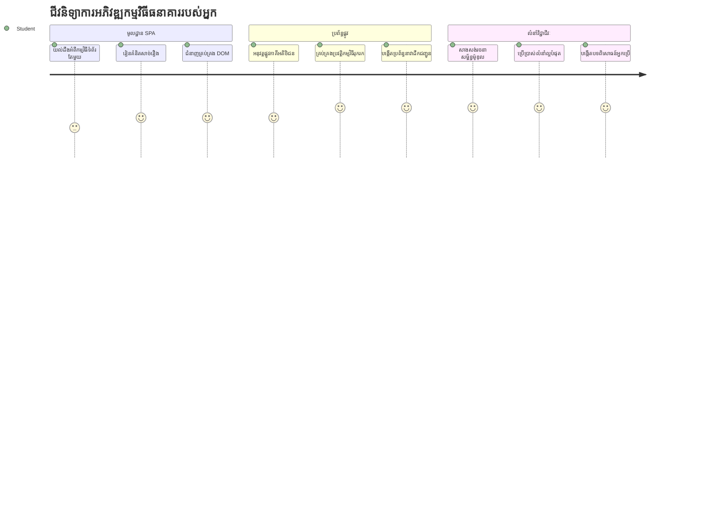
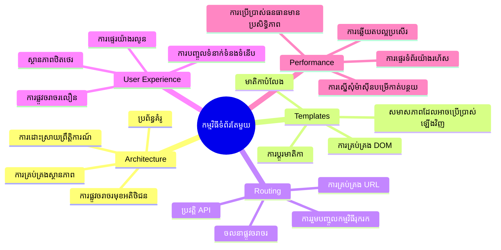
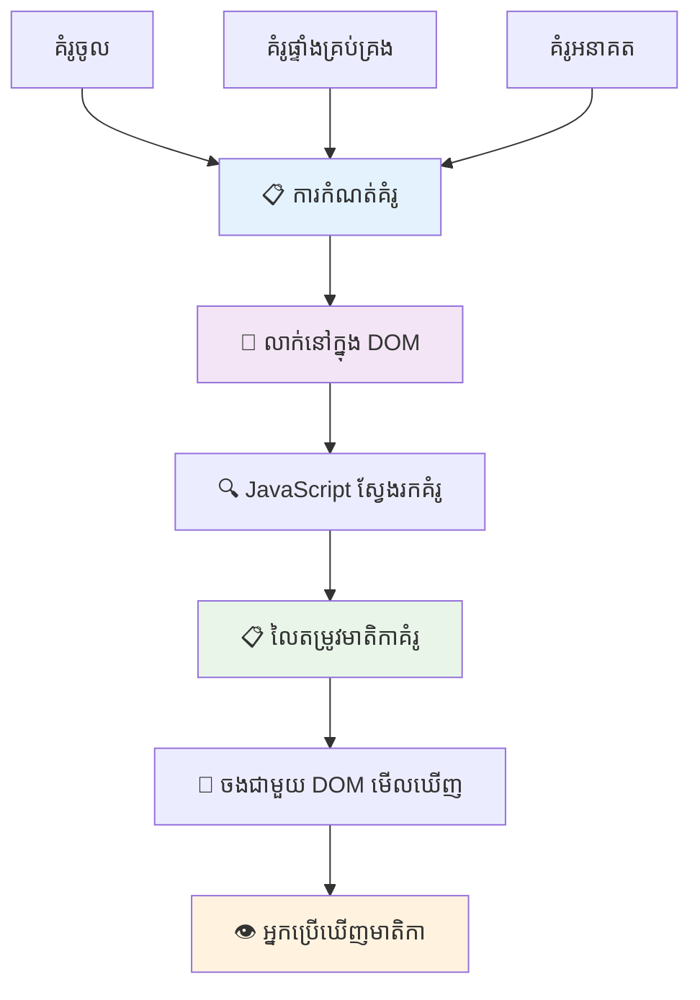
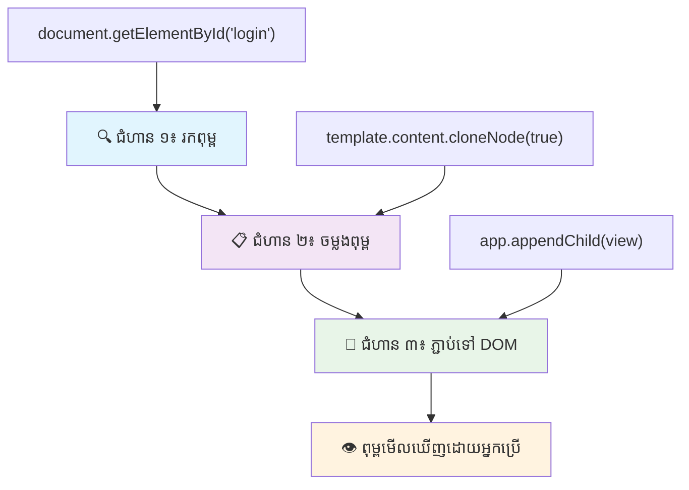
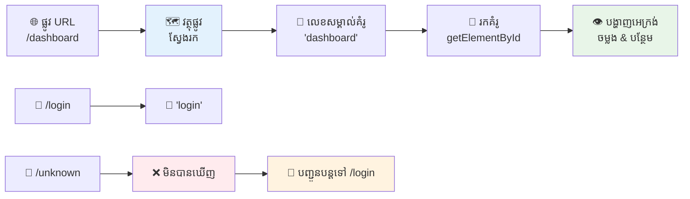
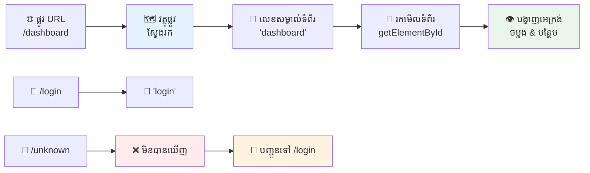
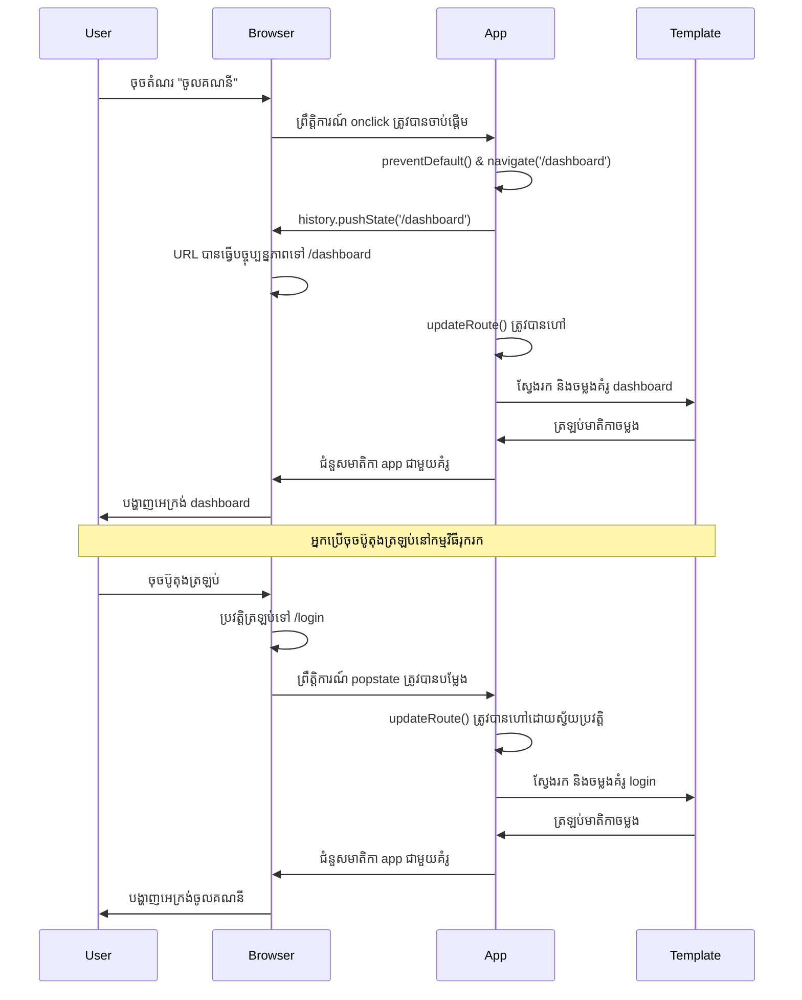
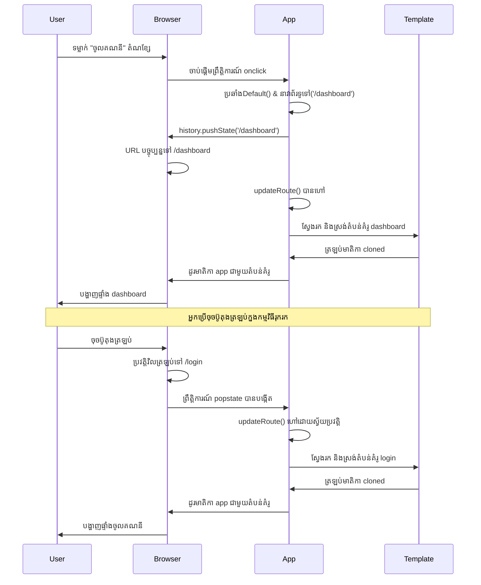
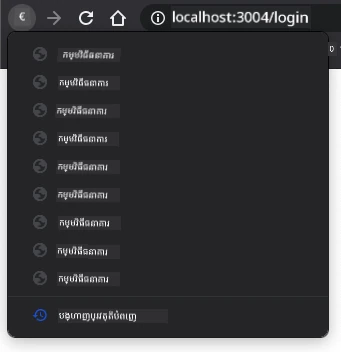
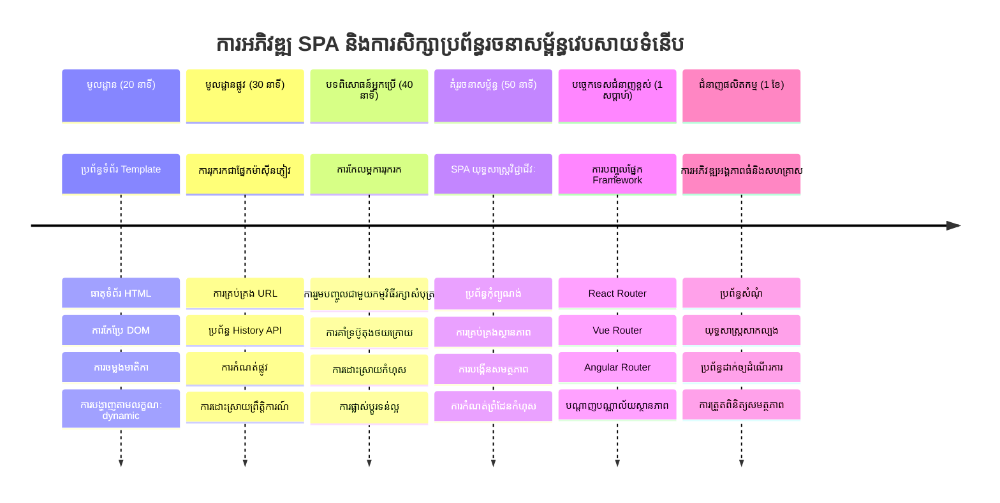

# បង្កើតកម្មវិធីធនាគារផ្នែក 1៖ គំរូ HTML និងផ្លូវចូលក្នុងកម្មវិធីវែប


នៅពេលកុំព្យូទ័រណែនាំ Apollo 11 មួយដល់ខែពីរឆ្នាំ 1969 វាត្រូវតែប្ដូរវ៉ិចនិយោបាយរវាងកម្មវិធីនានា ដោយគ្មានការចាប់ផ្ដើមចុះវិញពេញលេញទាំងអស់។ កម្មវិធីវែបទំនើបធ្វើដូច្នោះដែរ – ពួកវាប្ដូរអ្វីដែលអ្នកត្រូវឃើញ ដោយគ្មានការប្រលោមទាំងអស់ពីដើមឡើងវិញ។ នេះបង្កើតបទពិសោធន៍រលូន និងឆាប់រហ័សដែលអ្នកប្រើបានរំពឹងទុកថ្ងៃនេះ។

ខុសពីគេហទំព័របែបបែបផែនត្រៀមដែលបញ្ចូលទំព័រទាំងមូលឡើងវិញសម្រាប់ការប្រឹងប្រែងណាមួយ កម្មវិធីវែបទំនើបធ្វើបច្ចុប្បន្នភាពតែនៅផ្នែកដែលត្រូវបានប្ដូរតែប៉ុណ្ណោះ។ វិធីសាស្ត្រនេះ ដូចជា ការត្រួតត្រាចល័តផ្សេងៗដែលត្រូវធ្វើតាមគ្នា ខណៈ​រក្សាការទំនាក់ទំនងជាបន្តបន្ទាប់បង្កើតបទពិសោធន៍រលូនដែលយើងបានរំពឹងទុក។

នេះគឺជាអ្វីដែលធ្វើឲ្យមានភាពខុសគ្នាដ៏តានតឹង៖

| កម្មវិធីមួយរូបភាពច្រើនផ្នែកបែបប្រពៃណី | កម្មវិធីមួយរូបភាពផ្នែកតែមួយទំនើប |
|----------------------------|-------------------------|
| **ការរុករក** | រុករកទំព័រពេញលេញសម្រាប់មួយអេក្រង់ | ប្ដូរប្លុកមាតិកាឲ្យរហ័ស |
| **កម្រិតកំណត់ប្រតិបត្តិការ** | យឺតព្រោះទាញយក HTML ពេញលេញ | លឿនជាមួយកំណត់ការបច្ចុប្បន្នភាពខ្នាតតូច |
| **បទពិសោធន៍អ្នកប្រើ** | ភ្លេចភ្លាមពេញទំព័រ | លឿន ដូចកម្មវិធីបែបអេប |
| **ការចែករំលែកទិន្នន័យ** | ពិបាករវាងទំព័រ | ចឹងយ៉ាងងាយស្រួលក្នុងការគ្រប់គ្រងស្ថានភាព |
| **ការអភិវឌ្ឍន៍** | មានឯកសារ HTML ច្រើនត្រូវថែទាំ | HTML តែមួយជាមួយគំរូដូរប្រែ δυναμικά |

**ការយល់ដឹងអំពីការវិវត្ត:**
- **កម្មវិធីប្រពៃណី** ត្រូវការសំណើរសមាដេចរៀងរាល់ការរុករក
- **កម្មវិធី SPA ទំនើប** ត្រូវបានផ្ទុកមួយដងហើយធ្វើបច្ចុប្បន្នភាពច្រើនៗដោយប្រើ JavaScript
- **ការរំពឹងទុកអ្នកប្រើ** ពេញចិត្តនឹងការប្រែប្រួលរហ័ស និងរលូន
- **អត្ថប្រយោជន៍ប្រតិបត្តិការ** រួមមានការកាត់បន្ថយចម្លងទិន្នន័យ និងការឆ្លើយតបលឿនជាងមុន

នៅក្នុងមេរៀននេះ យើងនឹងបង្កើតកម្មវិធីធនាគារដែលមានអេក្រង់ច្រើនដែលរលូននៅក្នុងភាពបន្តបន្ទាប់។ ដូចជាវិទ្យាសាស្ត្រករនៃបច្ចេកវិទ្យាអាចប្រើឧបករណ៍មួយដែលអាចប្ដូររចនាឡើងវិញសម្រាប់ការប្រលងផ្សេងៗ យើងនឹងបញ្ចូលគំរូ HTML ដែលអាចប្រើឡើងវិញបាន ដើម្បីបង្ហាញនៅពេលចាំបាច់។

អ្នកនឹងធ្វើការជាមួយគំរូ HTML (គំរូដែលអាចប្រើឡើងវិញសម្រាប់អេក្រង់ផ្សេងៗ), របៀបនៃការប្រែផ្លូវបញ្ជា JavaScript (ប្រព័ន្ធដែលប្ដូរវ៉ិចនិយោបាយរវាងអេក្រង់), និងប្រវត្តិ API របស់កម្មវិធីរុករក (ដែលរក្សាប៊ូតុងត្រឡប់ត្រលប់ដូចដែលបានរំពឹងទុក)។ វាជាបច្ចេកទេសមូលដ្ឋានដដែលដែលគេប្រើនៅក្នុងស៊ុម React, Vue និង Angular។

នៅចុងក្រោយ អ្នកនឹងមានកម្មវិធីធនាគារដំណើរការដែលបង្ហាញគ្រឹះតំណាងនៃកម្មវិធីមួយរូបភាពបែបផ្នែកតែមួយមានវិជ្ជាជីវៈ។


## សំណួរប្រលងមុនមេរៀន

[សំណួរប្រលងមុនមេរៀន](https://ff-quizzes.netlify.app/web/quiz/41)

### អ្វីដែលអ្នកត្រូវការជាមុន

យើងត្រូវការសេវាកម្មវែបមួយក្នុងតំបន់បណ្តាញដើម្បីពិនិត្យកម្មវិធីធនាគារយើង – កុំបារម្ភ វាងាយជាងចិត្ត! ប្រសិនបើអ្នកមិនមានសេវាកម្មមួយនៅលើឧបករណ៍របស់អ្នកទេ ចូរតម្លើង [Node.js](https://nodejs.org) ហើយបញ្ជូល `npx lite-server` ពីថតគម្រោងរបស់អ្នក។ ពាក្យបញ្ជានេះនឹងបើកសេវាកម្មវែបមួយនៅក្នុងតំបន់បណ្តាញភ្លាម និងបើកកម្មវិធីរបស់អ្នកនៅក្នុងកម្មវិធីរុករកដោយស្វ័យប្រវត្តិ។

### ការរៀបចំ

លើកុំព្យូទ័ររបស់អ្នក បង្កើតថតឈ្មោះ `bank` ដែលមានឯកសារមួយឈ្មោះ `index.html` នៅខាងក្នុង។ យើងនឹងចាប់ផ្តើមពី [HTML boilerplate](https://en.wikipedia.org/wiki/Boilerplate_code) នេះ៖

```html
<!DOCTYPE html>
<html lang="en">
  <head>
    <meta charset="UTF-8">
    <meta name="viewport" content="width=device-width, initial-scale=1.0">
    <title>Bank App</title>
  </head>
  <body>
    <!-- This is where you'll work -->
  </body>
</html>
```

**នេះជាអ្វីដែល boilerplate នេះផ្តល់:**
- **បង្កើត** រចនាសម្ព័ន្ធឯកសារ HTML5 ជាមួយការប្រកាស DOCTYPE ត្រឹមត្រូវ
- **កំណត់** ការបញ្ចូលតួអក្សរជា UTF-8 ដើម្បីគាំទ្រអត្ថបទអន្តរជាតិ
- **អនុញ្ញាត** ការរចនារហ័ស តាមម៉ែតាប៉ារាមែត្រ viewport សម្រាប់ដំណើរការលើទូរស័ព្ទចល័ត
- **កំណត់** ចំណងជើងដ៏អស្ចារ្យាចេញនៅលើប៊ុតបរកម្មវិធីរុករក
- **បង្កើត** ភាគរយសុទ្ធស្អាតដែលយើងនឹងបង្កើតកម្មវិធី

> 📁 **មើលរចនាសម្ព័ន្ធគម្រោងជាមុន**
> 
> **នៅចុងមេរៀននេះ គម្រោងរបស់អ្នកនឹងមាន៖**
> ```
> bank/
> ├── index.html      <!-- Main HTML with templates -->
> ├── app.js          <!-- Routing and navigation logic -->
> └── style.css       <!-- (Optional for future lessons) -->
> ```
> 
> **ពីការទទួលខុសត្រូវឯកសារ៖**
> - **index.html**: មានគំរូទាំងអស់ និងផ្តល់រចនាសម្ព័ន្ធកម្មវិធី
> - **app.js**: គ្រប់គ្រងផ្លូវចូល, រុករក និងការគ្រប់គ្រងគំរូ
> - **Templates**: កំណត់ UI សម្រាប់ការចូល, ការគ្រប់គ្រងផ្ទាំង និងអេក្រង់ផ្សេងៗ

---

## គំរូ HTML

គំរូជួយដោះស្រាយបញ្ហាមូលដ្ឋានមួយក្នុងការអភិវឌ្ឍកម្មវិធីវែប។ ពេលដែល Gutenberg បង្កើតម៉ាស៊ីនបោះពុម្ពអក្សរដាច់ខ្សែរប្រមាណឆ្នាំ 1440 គាត់បានដឹងថា ជំនួសការគូរទំព័រទាំងមូល អាចបង្កើតអក្សរដែលអាចប្រើឡើងវិញ ហើយចំលងវាបានតាមតម្រូវការ។ គំរូ HTML ក៏ដូចគ្នា បែបផែនថា ជំនួសការបង្កើតឯកសារ HTML ផ្សេងៗសម្រាប់អេក្រង់នីមួយៗ អ្នកកំណត់រចនាសម្ព័ន្ធដែលអាចប្រើឡើងវិញ ដើម្បីបង្ហាញនៅពេលចាំបាច់។


គិតគំរូជា គំនូសផែនសម្រាប់ផ្នែកផ្សេងៗនៃកម្មវិធីរបស់អ្នក។ ដូចជា សំណង់ស្ថាបត្យករបង្កើតគំនូសមួយ ហើយប្រើវាច្រើនលើជាន់ជាន់ជាងគូរថ្មីវិញបន្ទប់ដូចគ្នា យើងបង្កើតគំរូមួយផ្តើមហើយធ្វើចម្លងរបស់វាចំឡើងពេលត្រូវការ។ កម្មវិធីរុករករក្សាគំរូទាំងនេះលាក់តuntil JavaScript បើកវា។

ប្រសិនបើអ្នកចង់បង្កើតអេក្រង់ច្រើនសម្រាប់គេហទំព័រ មួយវិធីដោះស្រាយគឺបង្កើតឯកសារ HTML ផ្សេងៗមួយសម្រាប់អេក្រង់នីមួយៗដែលអ្នកចង់បង្ហាញ។ ទៅតាមវិធីនេះអាចមានរាំងស្ទះមួយចំនួន៖

- អ្នកត្រូវធ្វើការផ្ទុក HTML ពេញលេញឡើងវិញពេលប្ដូរអេក្រង់ ដែលអាចយឺតបាន។
- ពិបាកក្នុងការចែករំលែកទិន្នន័យរវាងអេក្រង់ផ្សេងៗ។

វិធីផ្សេងទៀតគឺ មានតែឯកសារ HTML មួយប៉ុណ្ណោះ ហើយកំណត់គំរូ HTML ច្រើន [HTML templates](https://developer.mozilla.org/docs/Web/HTML/Element/template) ដោយប្រើធាតុ `<template>`។ គំរូគឺជាស្លាក HTML ដែលអាចប្រើឡើងវិញមួយដែលមិនបង្ហាញដោយកម្មវិធីរុករក ហើយត្រូវការចម្លងយកពេលដំណើរការ ដោយប្រើ JavaScript។

### យើងចាប់ផ្តើមបង្កើតវា

យើងនឹងបង្កើតកម្មវិធីធនាគារមានអេក្រង់ពីរមុខ៖ ទំព័រចូល និងផ្ទាំងគ្រប់គ្រង។ ជាដំបូង យើងចូលចិត្តបញ្ចូលធាតុលន្លងនៅក្នុងសាច់រាងរបស់ HTML – នេះជាកន្លែងដែលអេក្រង់ផ្សេងៗរបស់យើងនឹងបង្ហាញ៖

```html
<div id="app">Loading...</div>
```

**យល់ដឹងអំពីធាតុលន្លងនេះ៖**
- **បង្កើត** គុងតឺន័រដែលមាន ID "app" សម្រាប់បង្ហាញអេក្រង់ទាំងអស់
- **បង្ហាញ** សារកំពុងផ្ទុករហូត JavaScript ចាប់ផ្តើមអេក្រង់ដំបូង
- **ផ្តល់** ចំណុចភ្ជាប់មួយសម្រាប់មាតិកា δυναμικά
- **អនុញ្ញាត** ការគោលដៅងាយស្រួលពី JavaScript ដោយប្រើ `document.getElementById()`

> 💡 **ឆ្លើយតបឯកទេស**៖ ព្រោះមាតិកានៃធាតុនេះនឹងត្រូវបានប្ដូរទៅវិញទៅមក អ្នកអាចដាក់សារកំពុងផ្ទុក ឬសញ្ញាបត្រ បង្ហាញពេលកម្មវិធីកំពុងផ្ទុក។

បន្ទាប់មក បន្ថែមគំរូ HTML ខាងក្រោមសម្រាប់ទំព័រចូល។ សព្វថ្ងៃ យើងកែតម្រូវតែដាក់ក្នុងនេះគឺចំណងជើង និងផ្នែកមួយមានតំណភ្ជាប់ដែលយើងនឹងប្រើសម្រាប់រុករក។

```html
<template id="login">
  <h1>Bank App</h1>
  <section>
    <a href="/dashboard">Login</a>
  </section>
</template>
```

**បំណែកបំបែកនៃគំរូចូលនេះ៖**
- **កំណត់** គំរូជាមួយអត្តសញ្ញាណពិសេស "login" សម្រាប់គោលដៅ JavaScript
- **រួមបញ្ចូល** ចំណងជើងសំខាន់ដែលបញ្ជាក់ម៉ាកកម្មវិធី
- **មាន** ធាតុ `<section>` ដែលមានលក្ខណៈសម្របសម្រួលដាក់ក្រុមមាតិកាមួយជាមួយគ្នា
- **ផ្តល់** តំណររុករកដែលនាំវ käyttäjeros dashboard

បន្ទាប់មកបន្ថែមគំរូ HTML មួយទៀតសម្រាប់ទំព័រផ្ទាំងគ្រប់គ្រង។ ទំព័រនេះមានផ្នែកខុសៗគ្នា៖

- ក្បាលទំព័រមានចំណងជើង និងតំណចុះចេញ
- ចំនួនបំណុលបច្ចុប្បន្ននៅក្នុងគណនីធនាគារ
- បញ្ជីប្រតិបត្តិការក្នុងតារាង

```html
<template id="dashboard">
  <header>
    <h1>Bank App</h1>
    <a href="/login">Logout</a>
  </header>
  <section>
    Balance: 100$
  </section>
  <section>
    <h2>Transactions</h2>
    <table>
      <thead>
        <tr>
          <th>Date</th>
          <th>Object</th>
          <th>Amount</th>
        </tr>
      </thead>
      <tbody></tbody>
    </table>
  </section>
</template>
```

**យល់ពីបំណែកនីមួយៗនៃផ្ទាំងគ្រប់គ្រងនេះ៖**
- **រៀបចំ** ទំព័រដោយធាតុ `<header>` ដែលមានរុករក
- **បង្ហាញ** ចំណងជើងកម្មវិធីសម្រាប់ការតម្កល់ម៉ាកទាំងអេក្រង់
- **ផ្តល់** តំណចុះចេញដែលបញ្ជូនត្រលប់ទៅទំព័រចូល
- **បង្ហាញ** តុល្យភាពគណនីបច្ចុប្បន្ននៅក្នុងផ្នែកមួយឯករាជ្យ
- **រៀបចំ** ទិន្នន័យប្រតិបត្តិរូបភាពក្នុងតារាងត្រឹមត្រូវ
- **កំណត់** ប្រធានតារាងសម្រាប់កាលបរិច្ឆេទ វត្ថុ និងចំនួន
- **ទុក** ខ្លឹមសារតារាងទទេសម្រាប់ការចាក់បញ្ចូលមាតិកា δυναμικά

> 💡 **ឆ្លើយតបឯកទេស**៖ ពេលបង្កើតគំរូ HTML ប្រសិនបើអ្នកចង់មើលវាដូចម្តេច អ្នកអាចធ្វើខ្សែស្រឡាយ `<template>` និង `</template>` ដោយដាក់ពាក្យចំរូង `<!-- -->` ស៊ុមបង្ហើប។

### 🔄 **ការត្រួតពិនិត្យវគ្គសិក្សា**
**ការយល់ដឹងប្រព័ន្ធគំរូ**៖ មុនបញ្ជូន JavaScript សូមដឹងថាៈ
- ✅ តើគំរូខុសពីធាតុ HTML មុនគេយ៉ាងដូចម្តេច
- ✅ ហេតុអ្វីបានជា គំរូនៅស្រដៀងជាសម្ងាត់ រហូត JavaScript បើកវា
- ✅ សារៈសំខាន់នៃរចនាសម្ព័ន្ធ HTML សម្របសម្រួលនៅក្នុងគំរូ
- ✅ របៀបដែលគំរូអនុញ្ញាតឲ្យមាន UI អាចប្រើឡើងវិញ

**ការប្រលងផ្ទាល់ខ្លួនរហ័ស**៖ តើមានអ្វីកើតឡើង ប្រសិនបើអ្នកដកស្លាក `<template>` ចេញពី HTML របស់អ្នក?
*ចម្លើយ៖ មាតិកានឹងបង្ហាញភ្លាមរាល់ពេល ហើយបាត់បង់មុខងារគំរូ*

**អត្ថប្រយោជន៍រចនាសម្ព័ន្ធ**៖ គំរូផ្តល់៖
- **អាចប្រើឡើងវិញ**: កំណត់តែមួយ មួយចំនួនពេល
- **ប្រតិបត្តិការ**: មិនចាំបាច់បកសម្លេង HTML ម្តងទៀត
- **ថែរក្សា**: រចនាសម្ព័ន្ធ UI កណ្តាល
- **បត់បែន**: ប្ដូរមាតិការងាយឆាប់

✅ តើហេតុអ្វីដែលយើងប្រើអត្តសញ្ញាណ `id` លើគំរូ? តើយើងអាចប្រើអ្វីមួយផ្សេងទៀតដូចជា ចំណាត់ថ្នាក់បានទេ?

## បង្កើតជីវិតទៅកាន់គំរូជាមួយ JavaScript

ឥឡូវនេះយើងត្រូវធ្វើឱ្យគំរូរបស់យើងមានមុខងារ។ ដូចជា ម៉ាស៊ីនបោះព្រីន 3D យកគំនូសផែនវិទ្យុវិទ្យាតំលៃ និងបង្កើតវត្ថុគាប់ភ្លឺ JavaScript ផ្តល់ជូនគំរូដែលលាក់ស្រដៀង ហើយបង្កើតធាតុដែលអ្នកប្រើអាចមើលឃើញ និងអាចប្រើប្រាស់បាន។

ដំណើរការនេះតាមដំណាក់កាលបី ដែលជាគ្រឹះសម្រាប់ការអភិវឌ្ឍវែបទំនើប។ ម៉ោងអ្នកយល់ពីលំនាំនេះ អ្នកនឹងស្គាល់វា នៅក្នុងស៊ុមនិងបណ្ណាល័យជាច្រើន។

បើអ្នកសាកល្បងឯកសារ HTML បច្ចុប្បន្នរបស់អ្នកនៅក្នុងកម្មវិធីរុករក អ្នកនឹងឃើញវាចាប់ផ្ដើមបង្ហាញ `Loading...`។ នេះវាយថាយើងត្រូវបន្ថែមកូដ JavaScript ដើម្បីចម្លង និងបង្ហាញគំរូ HTML។

ការចម្លងគំរូជាទូទៅធ្វើឡើងក្នុង៣ជំហាន៖

1. រកធាតុគំរូក្នុង DOM ដោយប្រើ ឧទាហរណ៍ [`document.getElementById`](https://developer.mozilla.org/docs/Web/API/Document/getElementById)
2. ចម្លងគំរូដោយប្រើ [`cloneNode`](https://developer.mozilla.org/docs/Web/API/Node/cloneNode)
3. បន្ថែមវាជាមួយ DOM ក្រោមធាតុមួយដែលអាចមើលឃើញ ដោយប្រើ [`appendChild`](https://developer.mozilla.org/docs/Web/API/Node/appendChild)


**បំណែកបង្ហាញនៃដំណើរការ៖**
- **ជំហាន 1** ស្វែងរកគំរូដែលលាក់ក្នុងរចនាសម្ព័ន្ធ DOM
- **ជំហាន 2** បង្កើតចម្លងដែលអាចកែប្រែបានយ៉ាងមានសុវត្ថិភាព
- **ជំហាន 3** ដាក់ចម្លងទៅក្នុងតំបន់ដែលអាចមើលឃើញបាននៅលើទំព័រ
- **លទ្ធផល** គឺអេក្រង់ដែលមានមុខងារដើម្បីអ្នកប្រើអាចមានការប្រាស្រ័យទាក់ទង

✅ ហេតុអ្វីត្រូវតែចម្លងគំរូមុនពេលបន្ថែមវាទៅក្នុង DOM? តើអ្នកគិតថាអ្វីគឺកើតឡើង ប្រសិនបើយើងរំលងជំហាននេះ?

### ភារកិច្ច

បង្កើតឯកសារថ្មីមួយឈ្មោះ `app.js` ក្នុងថតគម្រោងរបស់អ្នក ហើយទាញយកឯកសារនេះចូលក្នុងផ្នែក `<head>` នៃ HTML របស់អ្នក៖

```html
<script src="app.js" defer></script>
```

**យល់ពីការនាំចូលកូដស្គ្រីបនេះ៖**
- **ភ្ជាប់** ឯកសារ JavaScript ទៅឯកសារ HTML របស់យើង
- **ប្រើ** attribute `defer` ដើម្បីធានាថាស្គ្រីបរត់បន្ទាប់ពី HTML បានបកសំលេងរួចរាល់
- **អនុញ្ញាត** ចូលប្រើធាតុ DOM ទាំងអស់ ពីព្រោះវាត្រូវបានផ្ទុកពេញលេញមុនវាលូតមុខងារ JavaScript
- **បានតាម** អនុរក្សលំនាំដ៏មានប្រសិទ្ធភាពនៅក្នុងការផ្ទុកស្គ្រីប និងបង្កើនប្រសិទ្ធភាព

ឥឡូវនេះនៅក្នុង `app.js` យើងនឹងបង្កើតមុខងារ `updateRoute` ថ្មីមួយ៖

```js
function updateRoute(templateId) {
  const template = document.getElementById(templateId);
  const view = template.content.cloneNode(true);
  const app = document.getElementById('app');
  app.innerHTML = '';
  app.appendChild(view);
}
```

**ជំហានលំដាប់ តើព្រឹត្តិការណ៍អ្វីកំពុងកើតឡើង៖**
- **ស្វែងរក** ធាតុខំរូ តាម ID ជាពិសេសរបស់វា
- **បង្កើត** ចម្លងជម្រៅនៃមាតិកាគំរូ ដោយប្រើ `cloneNode(true)`
- **ស្វែងរក** ឧបករណ៍ app ដែលជាគុងតឺន័រមួយដែលនឹងបង្ហាញមាតិកា
- **សម្អាត** មាតិកា ដែលស្ថិតនៅក្នុង app ដើម្បីរៀបចំជំនួស
- **ដាក់បញ្ចូល** មាតិកាទីពារ​បានចម្លងចូលក្នុង DOM ដែលអាចមើលឃើញបាន

ឥឡូវចង់ហៅមុខងារនេះជាមួយគំរូមួយ និងមើលលទ្ធផល។

```js
updateRoute('login');
```

**អ្វីដែលការហៅមុខងារនេះធ្វើបាន៖**
- **បើក** គំរូចូល ដោយផ្ញើ ID របស់វាជាប៉ារ៉ាម៉ែត្រ
- **បង្ហាញ** របៀបចម្លងអេក្រង់ដោយកម្មវិធី រវាងអេក្រង់ផ្សេងៗ
- **បង្ហាញ** ទំព័រចូលជំនួសសារកំពុងផ្ទុក "Loading..."

✅ តើគោលបំណងនៃកូដនេះ `app.innerHTML = '';` គឺអ្វី? តើមានអ្វីកើតឡើងដោយគ្មានវា?

## បង្កើតផ្លូវចូល (Routes)

ផ្លូវចូលគឺជាការតភ្ជាប់ URL ទៅមាតិការងារសមរម្យ។ សូមយកគំរូពីអ្នកបញ្ជូនទូរស័ព្ទបដិសណ្ឋារក្នុងសម័យដើម ដែលតភ្ជាប់សំណើរ និងផ្លូវច្រកអោយត្រឹមត្រូវ។ ការប្រតិបត្តិផ្លូវចូលវែបដើរដូចគ្នា បញ្ជាក់សំណើរ URL មួយ ហើយកំណត់មាតិកាដែលត្រូវបង្ហាញ។


តាមប្រពៃណី អ្នកផ្គត់ផ្គង់សេវាកម្មវែបបម្រើឯកសារ HTML ផ្សេងៗសម្រាប់ URL ផ្សេងៗ។ ពីព្រោះយើងកំពុងបង្កើតកម្មវិធីមួយរូបភាព បែបផ្នែកតែមួយ យើងត្រូវគ្រប់គ្រងផ្លូវចូលដោយខ្លួនឯងជាមួយ JavaScript។ វិធីនេះផ្តល់ឱ្យយើងនូវការគ្រប់គ្រងកាន់តែច្រើនលើបទពិសោធន៍អ្នកប្រើ និងប្រតិបត្តិការ។


**យល់ពីលំហាត់ផ្លូវចូល៖**
- **ការផ្លាស់ប្ដូរ URL** ធ្វើឲ្យមានការស្វែងរកផ្លូវចូលក្នុងការកំណត់របស់យើង
- **ផ្លូវដែលត្រឹមត្រូវ** ផ្គូផ្គងជាមួយ ID គំរូសម្រាប់បង្ហាញ
- **ផ្លូវខុស** បង្កើតអាកប្បកិរិយាជំនួស ដើម្បីគៀបភាពខូចខាត
- **ការបង្ហាញគំរូ** ត្រូវបានអនុវត្តតាមប៊ិចបីមិនដែលបានរៀនមុននេះ

ពេលនិយាយពីកម្មវិធីវែប យើងហៅ *Routing* ជាចេតនាេក្នុងការតភ្ជាប់ **URLs** ទៅកាន់អេក្រង់ដែលគួរត្រូវបានបង្ហាញ។ នៅលើគេហទំព័រដែលមានឯកសារ HTML ច្រើន វាត្រូវបានធ្វើដោយស្វ័យប្រវត្តិដូចជាម៉ាស៊ីនបម្រើផ្លូវឯកសារ។ ឧទាហរណ៍ ជាមួយឯកសារទាំងនេះនៅក្នុងថតគម្រោងរបស់អ្នក៖

```
mywebsite/index.html
mywebsite/login.html
mywebsite/admin/index.html
```

ប្រសិនបើអ្នកបង្កើតសេវាកម្មវែបជាមួយ `mywebsite` ជា root, ផ្លូវ URL នឹងសម្របទៅប្រភេទនេះ៖

```
https://site.com            --> mywebsite/index.html
https://site.com/login.html --> mywebsite/login.html
https://site.com/admin/     --> mywebsite/admin/index.html
```

ប៉ុន្តែសម្រាប់កម្មវិធីវែបរបស់យើងដែលមាន HTML មួយដង មានទំព័រទាំងអស់ក្នុងឯកសារមួយ វិធីសាស្រ្តលំនាំដើមនេះមិនជួយឲ្យគេទេ។ យើងត្រូវបង្កើតផែនទីនេះដោយដៃ ហើយបន្ទាប់មកផ្លាស់ប្ដូរគំរូដែលបង្ហាញជាមួយ JavaScript។

### ភារកិច្ច

យើងនឹងប្រើវត្ថុ សាមញ្ញមួយ ដើម្បីអនុវត្ត [ផែនទី](https://en.wikipedia.org/wiki/Associative_array) រវាងផ្លូវ URL និងគំរូរបស់យើង។ បន្ថែមវត្ថុនេះនៅជំពូកឯកសារ `app.js` របស់អ្នក។

```js
const routes = {
  '/login': { templateId: 'login' },
  '/dashboard': { templateId: 'dashboard' },
};
```

**ផ្តល់យល់ដឹងអំពីការកំណត់ផ្លូវចូលនេះ៖**
- **កំណត់** ផ្លូវ URL និងអត្តសញ្ញាណគំរូដែលត្រូវបង្ហាញ
- **ប្រើ** សំគាល់វត្ថុដែលkey គឺផ្លូវ URL និងតម្លៃមានព័ត៌មានគំរូ
- **អនុញ្ញាត** ការស្វែងរកយ៉ាងងាយស្រួលថាគំរូណាៗត្រូវបានបង្ហាញសម្រាប់ URL
- **ផ្តល់** រចនាសម្ព័ន្ធដែលអាចពង្រីកបន្ថែមផ្លូវចូលនៅពេលក្រោយបាន
ឥឡូវនេះចូរយើងកែប្រែម៉ិចៗមុខងារ `updateRoute`។ មិនប្រើប្រាស់ការបញ្ជូន `templateId` ដល់ជាអាគុយម៉ង់ផ្ទាល់ទេ កាន់តែយើងចង់យកវាចេញ ដោយស្វែងរកពី URL បច្ចុប្បន្នដំបូង ហើយបន្ទាប់មកប្រើផែនទីរបស់យើងដើម្បីទទួលបានតម្លៃ template ID ត្រូវនោះ។ យើងអាចប្រើ [`window.location.pathname`](https://developer.mozilla.org/docs/Web/API/Location/pathname) ដើម្បីយកតែផ្នែកផ្លូវពី URL។

```js
function updateRoute() {
  const path = window.location.pathname;
  const route = routes[path];

  const template = document.getElementById(route.templateId);
  const view = template.content.cloneNode(true);
  const app = document.getElementById('app');
  app.innerHTML = '';
  app.appendChild(view);
}
```

**បែកបាក់អ្វីដែលកើតឡើងនៅទីនេះ៖**
- **ដកយក** ផ្លូវបច្ចុប្បន្នពី URL របស់កម្មវិធីរុករក ដោយប្រើ `window.location.pathname`
- **ស្វែងរក** ការកំណត់ខ្នាតផ្លូវត្រូវគ្នាក្នុងវត្ថុ routes របស់យើង
- **ទាញយក** template ID ពីការកំណត់ខ្នាតផ្លូវ
- **ធ្វើតាម** ប្រមូលផ្ដុំម៉ូដែលបង្ហាញ template ដូចមុន
- **បង្កើត** ប្រព័ន្ធស្មើរដែលឆ្លើយតបនឹងការផ្លាស់ប្តូរ URL

នៅទីនេះយើងបានបង្កើតផែនទីពីផ្លូវដែលយើងបានប្រកាសទៅ template ត្រូវនោះ។ អ្នកអាចសាកល្បងមើលថាវាដំណើរការត្រឹមត្រូវដោយការផ្លាស់ប្តូរ URL ដោយដៃនៅក្នុងកម្មវិធីរុករករបស់អ្នក។

✅ តើមានអ្វីកើតឡើង ប្រសិនបើអ្នកបញ្ចូលផ្លូវមិនស្គាល់ក្នុង URL? តើយើងអាចដោះស្រាយយ៉ាងដូចម្តេច?

## ការបន្ថែមការរុករក

ជាមួយការកំណត់ផ្លូវបានបង្កើតរួចហើយ អ្នកប្រើប្រាស់ត្រូវការប្រភេទមួយសម្រាប់រំកិលក្នុងកម្មវិធី។ គេហទំព័រប្រាំបួនវិធីបោះឬឧបករណ៍មានបច្ចេកទេសឡើងវិញដែលបញ្ចូលទំព័រទាំងមូលពេលចុចតំណភ្ជាប់ ប៉ុន្តាយើងចង់ធ្វើការអាប់ដេតទាំង URL និងមាតិកាប្រើបានដោយគ្មានការបញ្ចូលទំព័រឡើងវិញ។ វានាំឱ្យមានបទពិសោធន៍រលូនដូចជា how កម្មវិធីឆ្នើមលើកុំព្យូទ័របម្លែងរវាងទិដ្ឋភាពខុសៗ។

យើងត្រូវការសម្របសម្រួលរវាងរៀបចំពីររឿងគឺ៖ ការអាប់ដេត URL ហើយអោយអ្នកប្រើអាចដាក់ប៊ុកម៉ារកទំព័រនិងចែករំលែកតំណភ្ជាប់បាន និងបង្ហាញមាតិកាត្រឹមត្រូវ។ នៅពេលអនុវត្តបានត្រឹមត្រូវ វាបង្កើតការរុករករលូនដែលអ្នកប្រើប្រាស់រំពឹងទុកមកពីកម្មវិធីសម័យទំនើប។


### 🔄 **ការត្រួតពិនិត្យខាងវិន័យ**
**រចនាសម្ព័ន្ធកម្មវិធីទំព័រតែមួយ**៖ ធានាថាអ្នកយល់ដល់ប្រព័ន្ធបំពេញ៖
- ✅ តើការរុករកចតុកោណនៅភាគហ៊ុនឆ្នៃកូដផ្លូវម៉ោងបុរាណមានភាពខុសគ្នាយ៉ាងដូចម្តេច?
- ✅ ហេតុអ្វីទៅរឿងប្រវត្តិតស API ទទួលបានសារៈសំខាន់សម្រាប់ការរុករក SPA យ៉ាងត្រឹមត្រូវ?
- ✅ តើ template អនុញ្ញាតមាតិកាដynamics ដោយគ្មានការផ្ទុកទំព័រឡើងវិញដូចម្តេច?
- ✅ តើតួនាទីនៃការគ្រប់គ្រងព្រឹត្តិការណ៍មានផលប៉ៈពាល់ក្នុងការចាប់យករុករកយ៉ាងដូចម្តេច?

**ការរួមបញ្ចូលប្រព័ន្ធ**៖ SPA របស់អ្នកបង្ហាញ៖
- **គ្រប់គ្រង Template**៖ គ្រឿងផ្សំ UI អាចប្រើបន្តជាមួយមាតិកា dynamic
- **Routing ភាគហ៊ុនអ្នកប្រើ**៖ គ្រប់គ្រង URL ដោយគ្មានការទំនាក់ទំនងទៅម៉ាស៊ីនបម្រុង
- **រចនាសម្ព័ន្ធបើកមួយរំលែកព្រឹត្តិការណ៍**៖ នៃការរុករក និងអន្តរាគមន៍អ្នកប្រើ
- **បញ្ចូលកម្មវិធីរុករក**៖ ជំនួយប្រវត្តិ និងប៊ូតុងត្រឡប់ក្រោយ/ទៅមុខ
- **កំណត់ប្រសិទ្ធភាព**៖ ផ្ទេរយ៉ាងលឿន និងបន្ថយផ្ទុកម៉ាស៊ីនបម្រុង

**គំរូវិជ្ជាជីវៈ**៖ អ្នកបានអនុវត្ត
- **ការបំបែក Model-View**៖ Template ផ្លូវផ្សេងពីតុល្យកម្មកម្មវិធី
- **គ្រប់គ្រងស្ថានភាព**៖ ស្ថានភាព URL សម្រឹតជាមួយមាតិកាបង្ហាញ
- **កំណើនប្រកបដោយវិន័យ**៖ JavaScript បង្កើនមុខងារ HTML មូលដ្ឋាន
- **បទពិសោធន៍អ្នកប្រើ**៖ រុករករលូនដូចកម្មវិធីដោយគ្មានការផ្ទុកទំព័រឡើងវិញ

> � **ការយល់ដឹងអំពីរចនាសម្ព័ន្ធ**៖ ឧបករណ៍ប្រព័ន្ធរុករក
>
> **អ្វីដែលអ្នកកំពុងបង្កើតៈ**
> - **🔄 ការគ្រប់គ្រង URL**៖ អាប់ដេតតំបន់អាសយដ្ឋានរុករកដោយគ្មានការផ្ទុកទំព័រឡើងវិញ
> - **📋 ប្រព័ន្ធ Template**៖ ដូរមាតិកាដោយសារផ្លូវបច្ចុប្បន្ន  
> - **📚 ការរួមបញ្ចូលប្រវត្តិ**៖ គាំទ្រប៊ូតុងត្រឡប់ក្រោយ/ទៅមុខរបស់រុករក
> - **🛡️ ការគ្រប់គ្រងបញ្ហា**៖ វិធីជំនួសដើម្បីដោះស្រាយផ្លូវខូច ឬខ្វះ
>
> **របៀបឧបករណ៍ធ្វើការរួមគ្នា៖**
> - **ស្ដាប់** ព្រឹត្តិការណ៍ចុចនិងការផ្លាស់ប្តូរប្រវត្តិ
> - **ធ្វើការអាប់ដេត** URL ដោយប្រើប្រវត្តិ API
> - **បង្ហាញ** template ត្រឹមត្រូវសម្រាប់ផ្លូវថ្មី
> - **រក្សា** បទពិសោធន៍អ្នកប្រើរលូន

ជំហានបន្ទាប់សម្រាប់កម្មវិធីរបស់យើងគឺ បន្ថែមនូវលក្ខណៈអាចរុករកបានរវាងទំព័រដោយមិនបាច់ផ្លាស់ប្តូរ URL ដោយដៃ។ វាមានន័យពីរដំណាក់កាល៖

  1. អាប់ដេត URL បច្ចុប្បន្ន
  2. អាប់ដេត template បង្ហាញឡើងទៅតាម URL ថ្មី

យើងបានថែរក្សាដំណាក់កាលទីពីរហើយជាមួយមុខងារ `updateRoute` ហើយដូច្នេះយើងត្រូវស្វែងរកវិធីធ្វើអោយអាប់ដេត URL បច្ចុប្បន្ន។

យើងត្រូវប្រើ JavaScript ជាក់លាក់(`[history.pushState`](https://developer.mozilla.org/docs/Web/API/History/pushState)) ដែលអនុញ្ញាតឱ្យបំលែង URL និងបង្កើតបញ្ចូលថ្មីមួយក្នុងប្រវត្តិរុករក ដោយមិនបញ្ចូលHTMLឡើងវិញ។

> ⚠️ **សម្គាល់សំខាន់**៖ ខណៈដែល `<a href>` អាចប្រើដោយផ្ទាល់លើបណ្ដាញដើម្បីបង្កើតតំណភ្ជាប់ទៅ URL ផ្សេងៗ វានឹងបណ្តាលឲ្យរុករកបញ្ចូល HTMLឡើងវិញដោយលំនាំដើម។ ការពារ ការប្រព្រឹត្តនេះជាមូលដ្ធាននៅពេលគ្រប់គ្រង routing ជាមួយ JavaScript គឺចាំបាច់ ប្រើ `preventDefault()` នៅលើព្រឹត្តិការណ៍ចុច។

### ភារកិច្ច

ចូរបង្កើតមុខងារថ្មីមួយដែលយើងអាចប្រើសម្រាប់រុករកក្នុងកម្មវិធី។

```js
function navigate(path) {
  window.history.pushState({}, path, path);
  updateRoute();
}
```

**ការយល់ដឹងម៉ោងចលនារុករកនេះ៖**
- **អាប់ដេត** URL រុករកទៅផ្លូវថ្មីដោយប្រើ `history.pushState`
- **បន្ថែម** បញ្ចូលថ្មីមួយទៅប្រវត្តិរុករកសម្រាប់ប៊ូតុងត្រឡប់ក្រោយ/ទៅមុខ
- **ហៅ** មុខងារ `updateRoute()` ដើម្បីបង្ហាញ template ត្រូវនោះ
- **រក្សា** បទពិសោធន៍ SPA ដោយគ្មានការផ្ទុកទំព័រឡើងវិញ

វិធីនេះដំបូងធ្វើអាប់ដេត URL បច្ចុប្បន្នទៅផ្លូវផ្ដល់ បន្ទាប់ពីនោះធ្វើអាប់ដេត template។ បទលក្ខណៈ `window.location.origin` ត្រឡប់ URL ជារុក្ខជាតិ ដើម្បីយើងអាចបង្កើត URL ពេញលេញពីផ្លូវណាមួយបាន។

ឥឡូវនេះយើងមានមុខងារនេះហើយ យើងអាចដោះស្រាយបញ្ហាដែលមាន នៅពេលផ្លូវមិនត្រូវគ្នានឹងផ្លូវណាមួយដែលបានកំណត់។ យើងនឹងកែប្រែមុខងារ `updateRoute` ដោយបន្ថែម fallback ទៅផ្លូវមួយដែលមាន ប្រសិនបើយើងរកមិនឃើញផ្លូវត្រូវគ្នា។

```js
function updateRoute() {
  const path = window.location.pathname;
  const route = routes[path];

  if (!route) {
    return navigate('/login');
  }

  const template = document.getElementById(route.templateId);
  const view = template.content.cloneNode(true);
  const app = document.getElementById('app');
  app.innerHTML = '';
  app.appendChild(view);
}
```

**ចំណុចសំខាន់ដែលត្រូវចងចាំ៖**
- **ពិនិត្យ** ប្រសិនបើមានផ្លូវនៅសម្រាប់ផ្លូវបច្ចុប្បន្ន
- **បញ្ជូនចេញ** ទៅទំព័រ login ពេលផ្លូវមិនត្រឹមត្រូវ
- **ផ្តល់** ការការពារបញ្ហាដែលទប់ស្កាត់រុករកខូច
- **ធានា** អ្នកប្រើតែងតែឃើញអេក្រង់ត្រឹមត្រូវ ទោះបី URL មិនត្រឹមត្រូវក៏ដោយ

បើមិនអាចរកផ្លូវបាន យើងនឹងបញ្ជូនទៅទំព័រ `login`។

ឥឡូវនេះចូរបង្កើតមុខងារត្រួតពិនិត្យ URL ពេលតំណភ្ជាប់ត្រូវបានចុច ហើយទប់ស្កាត់វេទិកា URL ដើមរបស់រុករក។

```js
function onLinkClick(event) {
  event.preventDefault();
  navigate(event.target.href);
}
```

**បែកបាក់មុខងារចុចនេះ៖**
- **ទប់ស្កាត់** យីហោច្នៃផ្នត់ដើមនៃរុករកដោយប្រើ `preventDefault()`
- **ដកយក** URL គោលដៅពីធាតុតំណភ្ជាប់ចុច
- **ហៅ** មុខងាររុករកដែលយើងបង្កើតជំនួសការផ្ទុកទំព័រឡើងវិញ
- **រក្សា** បទពិសោធន៍ SPA រលូន

```html
<a href="/dashboard" onclick="onLinkClick(event)">Login</a>
...
<a href="/login" onclick="onLinkClick(event)">Logout</a>
```

**អ្វីដែលការយោង `onclick` ចូលរួមធ្វើ៖**
- **ភ្ជាប់** តំណភ្ជាប់នីមួយៗទៅប្រព័ន្ធរុករកផ្ទាល់ខ្លួន
- **បញ្ជូន** ព្រឹត្តិការណ៍ចុចទៅមុខងារ `onLinkClick` របស់យើងសម្រាប់ដំណើរការ
- **អនុញ្ញាត** រុករករលូនដោយគ្មានការផ្ទុកទំព័រឡើងវិញ
- **រក្សា** រចនាសម្ព័ន្ធ URL ត្រឹមត្រូវដែលអ្នកប្រើអាចដាក់ប៊ុកម៉ារឬចែករំលែកបាន

`onclick` គឺជាគុណលក្ខណៈភ្ជាប់ព្រឹត្តិការណ៍ `click` ទៅកូដ JavaScript ដែលនៅទីនេះគឺការហៅមុខងារ `navigate()`។

សាកល្បងចុចលើតំណភ្ជាប់ទាំងនេះ អ្នកគួរតែអាចរុករករវាងអេក្រង់ផ្សេងៗនៃកម្មវិធីបានហើយ។

✅ វិធី `history.pushState` គឺជាផ្នែកមួយនៃស្តង់ដារ HTML5 ហើយបានអនុវត្តនៅក្នុង [កម្មវិធីរុករកទំនើបទាំងអស់](https://caniuse.com/?search=pushState)។ ប្រសិនបើអ្នកកំពុងបង្កើតកម្មវិធីបណ្ដាញសម្រាប់កម្មវិធីរុករកចាស់ៗ មានចច្ចកថាមួយដែលអ្នកអាចប្រើជំនួស API នេះ គឺប្រើ [hash (`#`)](https://en.wikipedia.org/wiki/URI_fragment) មុនភាគផ្លូវ អ្នកអាចអនុវត្ត routing ដែលធ្វើការជាមួយតំណ HTML ធម្មតា ហើយមិនផ្ទុកទំព័រឡើងវិញ ព្រោះគោលបំណងវាគឺបង្កើតតំណក្នុងទំព័រមួយ។

## ធ្វើឱ្យប៊ូតុងត្រឡប់ក្រោយនិងទៅមុខដំណើរការ

ប៊ូតុងត្រឡប់ក្រោយនិងទៅមុខគឺមូលដ្ឋានសំខាន់សម្រាប់ការជាវជ្រួលបណ្ដាញ ដូចជាតើអ្នកបញ្ជាការមហាការី NASA អាចពិនិត្យស្ថានភាពប្រព័ន្ធមុនៗពេលបេសកកម្មអាកាស។ អ្នកប្រើប្រាស់រំពឹងទុកថាប៊ូតុងទាំងនេះដំណើរការ ហើយពេលមិនដំណើរការ វាបង្កការបែកបាក់បទពិសោធន៍រុករក។

SPA របស់យើងត្រូវការកំណត់បន្ថែមមួយសម្រាប់គាំទ្រនេះ។ រុករករក្សាប្រវត្តិចុះក្រោម (ដែលយើងបានបន្ថែមជាមួយ `history.pushState`) ប៉ុន្តេលេខាធិការ យើងត្រូវឲ្យកម្មវិធីឆ្លើយតបទៅដោយធ្វើអាប់ដេតមាតិកាបង្ហាញ។


**ចំណុចសំខាន់នៃអន្តរកម្ម៖**
- **សកម្មភាពអ្នកប្រើ** ចាប់ផ្ដើមការរុករកដោយចុច ឬប៊ូតុងរុករក
- **កម្មវិធីចាប់យក** ការចុចតំណភ្ជាប់ ដើម្បីទប់ស្កាត់ការផ្ទុកទំព័រឡើងវិញ
- **ប្រវត្តិ API** គ្រប់គ្រងការផ្លាស់ប្តូរ URL និងប្រវត្តិរុករក
- **Template** ផ្តល់រចនាសម្ព័ន្ធមាតិកាសម្រាប់អេក្រង់នីមួយៗ
- **អ្នកស្ដាប់ព្រឹត្តិការណ៍** ធានាថាកម្មវិធីឆ្លើយតបទៅការរុករកគ្រប់ប្រភេទ

ការប្រើប្រាស់ `history.pushState` បង្កើតការបញ្ចូលថ្មីក្នុងប្រវត្តិរុករក។ អ្នកអាចពិនិត្យបាន ពេលចុចប៊ូតុង *ត្រឡប់ក្រោយ* រុករក របស់អ្នក វានឹងបង្ហាញដូចខាងក្រោម៖



ប្រសិនបើអ្នកសាកល្បងចុចប៊ូតុងត្រឡប់ក្រោយជំរុញច្រើនលើ អ្នកនឹងឃើញ URL បច្ចុប្បន្នផ្លាស់ប្តូរ និងប្រវត្តិបានអាប់ដេត ប៉ុន្តែ template ដូចគ្នានៅតែមិនផ្លាស់ប្តូរ។

នេះស្របព្រោះកម្មវិធីមិនដឹងថាអ្នកត្រូវហៅ `updateRoute()` រៀងរាល់ពេលប្រវត្តិផ្លាស់ប្តូរ។ ប្រសិនបើមើលទៅកាន់ [ឯកសារ `history.pushState`](https://developer.mozilla.org/docs/Web/API/History/pushState) អ្នកនឹងឃើញថា ប្រសិនបើស្ថានភាពបានផ្លាស់ប្តូរ - មានន័យថាយើងប្តូរទៅ URL ផ្សេង - ព្រឹត្តិការណ៍ [`popstate`](https://developer.mozilla.org/docs/Web/API/Window/popstate_event) ត្រូវបានបញ្ចូន។ យើងនឹងប្រើវាដើម្បីជួសជុលបញ្ហានេះ។

### ភារកិច្ច

ដើម្បីធានាថា template បង្ហាញឡើងអាប់ដេត ពេលប្រវត្តិរុករកផ្លាស់ប្តូរ យើងនឹងភ្ជាប់មុខងារថ្មីមួយហៅ `updateRoute()`។ យើងនឹងធ្វើនៅក្រោមផ្នែក `app.js` របស់យើង៖

```js
window.onpopstate = () => updateRoute();
updateRoute();
```

**យល់ដឹងអំពីការរួមបញ្ចូលប្រវត្តិនេះ៖**
- **ស្ដាប់** ព្រឹត្តិការណ៍ `popstate` ពេលអ្នកប្រើរុករកជាមួយប៊ូតុងរុករក
- **ប្រើ** មុខងារប្រូតូកុលសំខាន់ សម្រាប់សង្ខេបកូដកាន់តែលឿន
- **ហៅ** `updateRoute()` ដោយស្វ័យប្រវត្តិរៀងរាល់ពេលស្ថានភាពប្រវត្តិផ្លាស់ប្តូរ
- **ចាប់ផ្តើមកម្មវិធី** ដោយហៅ `updateRoute()` ពេលទំព័របានផ្ទុកជាលើកទីមួយ
- **ធានា** បង្ហាញ template ត្រឹមត្រូវ ទោះអ្នករុករករបៀបណាក៏ដោយ

> 💡 **គន្លឹះជំនួយ**៖ យើងបានប្រើ [មុខងារបាញ់កាំភ្លើង](https://developer.mozilla.org/docs/Web/JavaScript/Reference/Functions/Arrow_functions) នៅទីនេះសម្រាប់ការកំណត់មុខងារត្រួតពិនិត្យព្រឹត្តិការណ៍ `popstate` ដើម្បីឲ្យកូដកាន់តែស្រួល ប៉ុន្តែមុខងារធម្មតាស្មើគ្នា។

នេះជាវីដេអូរំលឹកអំពីមុខងារបាញ់កាំភ្លើង៖

[](https://youtube.com/watch?v=OP6eEbOj2sc "Arrow Functions")

> 🎥 ចុចរូបភាពខាងលើសម្រាប់វីដេអូអំពីមុខងារបាញ់កាំភ្លើង។

ឥឡូវសាកល្បងប្រើប៊ូតុងត្រឡប់ក្រោយនិងទៅមុខរបស់កម្មវិធីរុករករបស់អ្នក ហើយពិនិត្យមើលថាផ្លូវបង្ហាញបានអាប់ដេតត្រឹមត្រូវ។

### ⚡ **អ្វីដែលអ្នកអាចធ្វើបានក្នុង ៥ នាទីបន្ទាប់**
- [ ] សាកល្បងរុករកកម្មវិធីធនាគាររបស់អ្នកដោយប្រើប៊ូតុងត្រឡប់ក្រោយ/ទៅមុខ
- [ ] សាកល្បងវាយ URL ផ្សេងៗដោយដៃក្នុងបន្ទាត់អាសយដ្ឋានដើម្បីសាកល្បង routing
- [ ] បើក DevTools រុករកហើយពិនិត្យមើលរបៀប template ត្រូវបានចម្លងទៅ DOM
- [ ] សាកល្បងបន្ថែម console.log ដើម្បីតាមដានដំណើរការរុករក

### 🎯 **អ្វីដែលអ្នកអាចសម្រេចបានក្នុងមួយម៉ោង**
- [ ] បញ្ចប់ការប្រលងក្រោយមេរៀន និងយល់ដល់គំនិតរចនាសម្ព័ន្ធ SPA
- [ ] បន្ថែមរចនាប័ទ្ម CSS ដើម្បីឲ្យ template កម្មវិធីធនាគាររបស់អ្នកមើលមានការជំនាញ
- [ ] អនុវត្តការប្រឈមមុខទំព័រ 404 ជាមួយការគ្រប់គ្រងកំហុសត្រឹមត្រូវ
- [ ] បង្កើតការប្រឈមទំព័រតុបតែងរចនាសម្ព័ន្ធ routing បន្ថែម
- [ ] បន្ថែមស្ថានភាពបង្ហាញឡើង និងភាពផ្លាស់ប្តូររវាងការផ្លាស់ប្តូរ template

### 📅 **ការធ្វើដំណើរ SPA របស់អ្នករយៈពេលមួយសប្តាហ៍**
- [ ] បញ្ចប់កម្មវិធីធនាគារពេញលេញជាមួយទម្រង់ ការគ្រប់គ្រងទិន្នន័យ និងការរក្សាទុក
- [ ] បន្ថែមលក្ខណៈ routing ជាច្រើនដូចជាប៉ារ៉ាម៉ែត្រ និង nested routes
- [ ] អនុវត្តការពារ navigation និង routing អ្នកប្រើប្រាស់តាមការផ្ទៀងផ្ទាត់សិទ្ធិ
- [ ] បង្កើតគ្រឿងផ្សំ template អាចប្រើឡើងវិញ និងបណ្ណាគារគ្រឿងផ្សំ
- [ ] បន្ថែមភាពជួរ ដូចជាផ្លាស់ប្តូរប្លង់ សម្រាប់បទពិសោធន៍រលូន
- [ ] ដាក់បញ្ចូល SPA ទៅវេទិកាផ្សព្វផ្សាយ ហើយកំណត់ routing ត្រឹមត្រូវ

### 🌟 **ជំនាញរចនាសម្ព័ន្ធផ្នែកមុខរបស់អ្នករយៈពេលមួយខែ**
- [ ] សាងសង់ SPA ស្មុគស្មាញដោយប្រើ ស៊ុមស្វ័យម៉ូទ័រ ឧ. React, Vue, ឬAngular
- [ ] រៀនគំនិតកំណត់ស្ថានភាពជំនាញខ្ពស់ និងបណ្ណាល័យដែលពាក់ព័ន្ធ
- [ ] ឯកទេសឧបករណ៍សាងសង់ និងដំណើរការអភិវឌ្ឍសម្រាប់ SPA
- [ ] អនុវត្តលក្ខណៈ Progressive Web App និងមុខងារផ្ដល់ភាពមិនត្រូវបណ្ដែត
- [ ] សិក្សាវិធីសាស្រ្តប្រសិទ្ធភាពសម្រាប់ SPA ទំហំធំ
- [ ] ឧបត្ថម្ភគម្រោង SPA គ្រប់គ្រងប្រភពបើក ហើយចែករំលែកចំណេះដឹង

## 🎯 រយៈពេលវិនិច្ឆ័យជំនាញកម្មវិធីទំព័រតែមួយរបស់អ្នក


### 🛠️ សង្ខេបឧបករណ៍អភិវឌ្ឍ SPA របស់អ្នក

បន្ទាប់ពីបញ្ចប់មេរៀននេះ អ្នកបានបច្ចេកទេសដូចខាងក្រោម៖
- **រចនាសម្ព័ន្ធ Template**៖ គ្រឿងផ្សំ HTML អាចប្រើឡើងវិញដែលមានការបង្ហាញមាតិកាផ្លាស់ប្តូរ
- **Routing ភាគហ៊ុនប្រើ**៖ គ្រប់គ្រង URL និងរុករកដោយគ្មានការផ្ទុកទំព័រឡើងវិញ
- **ការរួមបញ្ចូលរុករក**៖ ប្រើប្រាស់ប្រវត្តិ API និងគាំទ្រប៊ូតុងត្រឡប់ក្រោយ/ទៅមុខ
- **ប្រព័ន្ធរួមបញ្ចូលព្រឹត្តិការណ៍**៖ ការគ្រប់គ្រងរុករក និងអន្តរាគមន៍អ្នកប្រើ
- **ការតាមដាន DOM**៖ ការចម្លង template ប្តូរមាតិកា និងគ្រប់គ្រងធាតុ
- **ការគ្រប់គ្រងកំហុស**៖ វិធីជំនួសគ្រប់គ្រងខូចសម្រាប់ផ្លូវមិនត្រឹមត្រូវ និងមាតិកាខ្វះ
- **គំរូប្រសិទ្ធភាព**៖ មុខងាររបៀបលឿនក្នុងការផ្ទុកមាតិកា និងបង្ហាញ

**កម្មវិធីពិតប្រាកដនៅពិភពលោក**៖ ជំនាញអភិវឌ្ឍ SPA របស់អ្នកអាចប្រើបានផ្ទាល់ក្នុង៖
- **កម្មវិធីវែបសម័យទំនើប**៖ React, Vue, Angular និងស៊ុមស្វ័យម៉ូទ័រផ្សេងៗ
- **កម្មវិធីវែបរីកចម្រើន**៖ អនុញ្ញាតឲ្យប្រើបានក្រៅបណ្តាញ ដូចកម្មវិធីជាapp
- **ផ្ទាំងគ្រប់គ្រងអាជីវកម្ម**៖ កម្មវិធីស្មុគស្មាញជាមួយទិដ្ឋភាពច្រើន
- **វេទិកាវិលជុំវត្ថុប្រណីត**៖ កាតាឡុកផលិតផល ដាក់ក្នុងទិញ និងដំណើរការការបង់ប្រាក់
- **ការគ្រប់គ្រងមាតិកា**៖ បង្កើត និងកែប្រែមាតិកាដាច់ដោយឡែក
- **អភិវឌ្ឍកម្មវិធីចល័ត**៖ កម្មវិធីស៊ីប្រាប hybrid ប្រើបច្ចេកវិទ្យាវែប

**ជំនាញវិជ្ជាជីវៈដែលទទួលបាន**៖ ឥឡូវនេះអ្នកអាច៖
- **ស្ថាបត្យកម្ម** កម្មវិធី Single-page ដោយមានការបំបែកការពិចារណាឲ្យត្រឹមត្រូវ  
- **អនុវត្ត** ប្រព័ន្ធផ្លូវការ client-side routing ដែលអាចធ្វើការកាន់តែធំទូលាយជាមួយនឹងស្មុគស្មាញកម្មវិធី  
- **ដោះស្រាយ** បញ្ហាដំណើរការផ្លូវចលនា ដែលស្មុគស្មាញដោយប្រើឧបករណ៍អភិវឌ្ឍន៍ browser  
- **បំពាក់** ការប្រសើរឡើងនៃការសម្រួលប្រតិបត្តិការ តាមរយៈការគ្រប់គ្រងតំបន់គំរូអោយមានប្រសិទ្ធភាព  
- **រចនា** ប្រព័ន្ធបទពិសោធន៍អ្នកប្រើ ដែលមានអារម្មណ៍ដូចជា native និងតបតទៅលឿន

**គំនិតអភិវឌ្ឍន៍ Frontend ដែលបានអនុវត្ត**:  
- **ស្ថាបត្យកម្មគ្រឿងផ្សំ**: លំនាំ UI ដែលអាចប្រើឡើងវិញ និងប្រព័ន្ធតំបន់គំរូ  
- **ការសម្រឹមសម្រួលរដ្ឋ**: ការគ្រប់គ្រងរដ្ឋនៅក្នុង URL និងប្រវត្តិ browser  
- **កម្មវិធីកើតឡើងជាដំណើរការ**: ការរៀបចំការបន្តពាក់ព័ន្ធអ្នកប្រើនិងដំណើរការចលនា  
- **ការបង្កើនប្រសិទ្ធភាព**: ការគ្រប់គ្រង DOM និងការទាញយកមាតិកាឲ្យមានប្រសិទ្ធភាព  
- **រចនាបទពិសោធន៍អ្នកប្រើ**: ការផ្លាស់ប្តូរយ៉ាងរលូន និងការចលនាដោយមានភាពងាយស្រួលប្រើ

**ជំហានបន្ទាប់**: អ្នកបានរៀបចំខ្លួនរួចហើយសំរាប់ការស្រាវជ្រាវកុំផ្លាស់ប្ដូរក្រោម framework អភិវឌ្ឍ frontend សម័យថ្មី ការគ្រប់គ្រងរដ្ឋកម្រិតខ្ពស់ ឬសាងសង់កម្មវិធីសម្ភារៈសម្បត្តិស្មុគស្មាញ!

🌟 **បានសម្រេចសមិទ្ធផល**: អ្នកបានបង្កើតមូលដ្ឋានកម្មវិធី single-page ដែលមានលក្ខណៈរចនាស្ថាបត្យកម្មបែបសម័យថ្មី!

---

## ការប្រកួតប្រជែង GitHub Copilot Agent 🚀

ប្រើរបៀប Agent ដើម្បីបញ្ចប់បញ្ហាប្រកួតដ如下:

**សេចកី្តហេតុ**៖ ធ្វើការបន្ថែមមុខងារដោះស្រាយកំហុស និងបំពាក់ទំព័រ 404 សម្រាប់ផ្លូវដែលមិនត្រឹមត្រូវ ដើម្បីបង្កើនបទពិសោធន៍អ្នកប្រើនៅពេលចូលទៅកាន់ទំព័រដែលមិនមាន។

**ការបញ្ជា​ប្រតិបត្តិ**៖ បង្កើតតំបន់គំរូ HTML ថ្មីមាន id "not-found" ដើម្បីបង្ហាញទំព័រកំហុស 404 ដែលងាយស្រួលសម្រាប់អ្នកប្រើជាមួយការរចនា ហើយកែប្រែកូដ JavaScript ផ្លូវការ routing ដើម្បីបង្ហាញតំបន់គំរូ​នេះនៅពេលដែលអ្នកប្រើចូលផ្លូវ URL មិនត្រឹមត្រូវ ហើយបន្ថែមប៊ូតុង "Go Home" ដែលឲ្យអ្នកត្រឡប់ទៅទំព័រចូលចិត្តវិញ។

សូមស្វែងយល់បន្ថែមអំពី [agent mode](https://code.visualstudio.com/blogs/2025/02/24/introducing-copilot-agent-mode) នៅទីនេះ។

## 🚀 ការប្រកួតប្រជែង

បន្ថែមតំបន់គំរូថ្មី និងផ្លូវថ្មីសម្រាប់ទំព័រទីបី ដែលបង្ហាញពីកម្ចីសម្រាប់កម្មវិធីនេះ។

**គោលបំណងការប្រកួត**៖  
- **បង្កើត** តំបន់គំរូ HTML ថ្មីដែលមានរចនាសម្ព័ន្ធមាតិកាសមរម្យ  
- **បន្ថែម** ផ្លូវថ្មីទៅក្នុងវត្ថុខាងកម្រិត routes  
- **រួមបញ្ចូល** តំណភ្ជាប់ចូលចេញទៅ និងពីទំព័រកម្ចី  
- **សាកល្បង** ឲ្យប្រាកដថាផ្លូវគ្រប់យ៉ាងដំណើរការល្អជាមួយប្រវត្តិ browser

## សំណួរបន្ទាប់ការបង្រៀន

[សំណួរបន្ទាប់ការបង្រៀន](https://ff-quizzes.netlify.app/web/quiz/42)

## ពិនិត្យជាមួយរៀនផ្ទាល់ខ្លួន

Routing គឺជាផ្នែកមួយក្នុងការអភិវឌ្ឍវិបដែលចម្លែកគិតថាឈឺក្បាល ដែលមានភាពភ្ញាក់ផ្អើលពិសេស នៅពេលដែលវែបផ្លាស់ពីការតម្កល់ទំព័រជាធម្មតាទៅការ Single Page Application ដែលបង្កើតការតម្កល់ទំព័រឡើងវិញ។ សូមអានអំពី [របៀបក្រុមហ៊ុន Azure Static Web App](https://docs.microsoft.com/azure/static-web-apps/routes/?WT.mc_id=academic-77807-sagibbon) បានគ្រប់គ្រងការចរចារបស់ពួកគេ។ អ្នកអាចអធិប្បាយថាហេតុអ្វីបានជា​ការសម្រេចចិត្តខ្លះៗក្នុងឯកសារនោះគឺចាំបាច់?

**ធនធានសិក្សាបន្ថែម**៖  
- **ស្វែងយល់** របៀបដែល framework ឈ្មោះថា React Router និង Vue Router អនុវត្ត client-side routing  
- **ស្រាវជ្រាវ** ការប្រៀបធៀបរវាង hash-based routing និង history API routing  
- **រៀន** អំពី server-side rendering (SSR) និងបែបផែនវាប៉ះពាល់ដល់យុទ្ធសាស្រ្ត routing  
- **ស៊ើបអង្កេត** របៀបដែល Progressive Web Apps (PWAs) គ្រប់គ្រង routing និងចលនា

## ភារកិច្ច

[បង្កើនការគ្រប់គ្រង routing](assignment.md)

---

<!-- CO-OP TRANSLATOR DISCLAIMER START -->
**ការបដិសេធ**៖  
ឯកសារនេះត្រូវបានបកប្រែដោយប្រើសេវាបកប្រែ AI [Co-op Translator](https://github.com/Azure/co-op-translator)។ ខណៈពេលដែលយើងខំប្រឹងសម្រាប់ភាពត្រឹមត្រូវ សូមយល់ថាការបកប្រែដោយស្វ័យប្រវត្តិអាចមានកំហុសឬមិនត្រឹមត្រូវ។ ឯកសារដើមជាភាសាម្ដងគួរត្រូវបានគេពិចារណาว่า ជាដើមទុនសំខាន់។ សម្រាប់ព័ត៌មានសំខាន់ សូមណែនាំឲ្យមានការបកប្រែដោយមនុស្សដែលមានជំនាញវិជ្ជាជីវៈ។ យើងមិនទទួលខុសត្រូវចំពោះការយល់ច្រឡំ ឬការបកប្រែខុសការពិចារណាដែលកើតឡើងពីការប្រើប្រាស់ការបកប្រែនេះឡើយ។
<!-- CO-OP TRANSLATOR DISCLAIMER END -->