# សាងសង់កម្មវិធីធនាគារផ្នែក 2: សាងសង់សំណុំបែបបទចូលប្រើ និងចុះឈ្មោះ

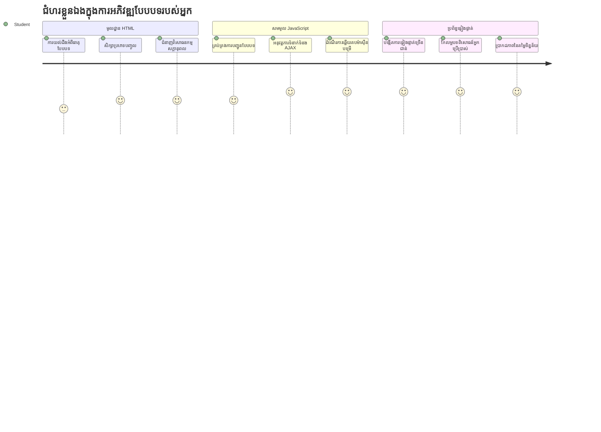
## សំណួរប្រឡងមុនមេរៀន

[សំណួរប្រឡងមុនមេរៀន](https://ff-quizzes.netlify.app/web/quiz/43)

ធ្លាប់បានបំពេញសំណុំបែបបទអនឡាញម្តងហើយវាបដិសេធទ្រង់ទ្រាយអ៊ីមែលរបស់អ្នកទេ? ឬបាត់បង់ព័ត៌មានទាំងអស់នៅពេលអ្នកចុចបញ្ជូនមែនទេ? ពួកយើងទាំងអស់ត្រូវបានប្រឈមមុខនឹងបទពិសោធន៍ដែលធ្វើឱ្យខឹងទាំងនេះ។

សំណុំបែបបទគឺជាស្ពាននៃការតភ្ជាប់រវាងអ្នកប្រើប្រាស់របស់អ្នក និងមុខងាររបស់កម្មវិធីរបស់អ្នក។ ដូចជាប្រព័ន្ធប្រតិបត្តិការពិសេសដែលអ្នកគ្រប់គ្រងចរាចរយន្តហោះប្រើដើម្បីណែនាំយន្តហោះឲ្យទៅដល់កន្លែងចុងក្រោយយ៉ាងសុវត្តិភាព សំណុំបែបបទដែលបានរចនាយ៉ាងប្រុងប្រយ័ត្នផ្តល់មតិយោបល់ច្បាស់លាស់ និងការពារកំហុសដែលអាចបង្កការខូចខាត។ សំណុំបែបបទដែលអាក្រក់វិញអាចធ្វើឲ្យអ្នកប្រើប្រាស់ចាកចេញយ៉ាងឆាប់រហ័សដូចជាការទាក់ទងមិនអាចយល់គ្នាក្នុងអាកាសយានដ្ឋានរវល់មួយ។

ក្នុងមេរៀននេះ យើងនឹងបម្លែងកម្មវិធីធនាគារទ្រង់ទ្រាយស្ថិតិរបស់អ្នកឱ្យក្លាយជាកម្មវិធីមានអន្តរកម្ម។ អ្នកនឹងរៀនបង្កើតសំណុំបែបបទដែលត្រួតពិនិត្យការបញ្ចូលអ្នកប្រើប្រាស់ ទំនាក់ទំនងជាមួយម៉ាស៊ីនមេ និងផ្តល់មតិយោបល់មានប្រយោជន៍។ គិតថាវាគឺជាការសាងសង់ចំណុចគ្រប់គ្រងដែលអនុញ្ញាតឱ្យអ្នកប្រើប្រាស់រុករកមុខងារនៃកម្មវិធីរបស់អ្នក។

នៅចុងបញ្ចប់ អ្នកនឹងមានប្រព័ន្ធចូលប្រើ និងចុះឈ្មោះផ្តាច់មុខដែលមានការត្រួតពិនិត្យនាំអ្នកប្រើចូលក្នុងជោគជ័យជាងជា​អារម្មណ៍ខឹង។

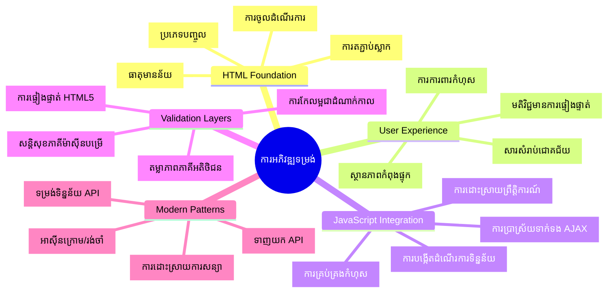
## លក្ខខណ្ឌជាមុន

មុនពេលយើងចាប់ផ្តើមសាងសង់សំណុំបែបបទ ឲ្យប្រាកដថាអ្នកមានការតំឡើងធ្វើដំណើរឲ្យបានគ្រប់គ្រាន់។ មេរៀននេះបន្តពីទីកន្លែងយើងបានបញ្ចប់ក្នុងមេរៀនមុន ដូច្នេះបើអ្នកបានរំលងមកហើយ អ្នកគួរត្រឡប់ទៅមើលឡើងវិញនូវមូលដ្ឋានសិន។

### ការតំឡើងដែលត្រូវការ

| គ្រឿងផ្សំ | ស្ថានភាព | ការពិពណ៌នា |
|-----------|--------|-------------|
| [HTML Templates](../1-template-route/README.md) | ✅ ត្រូវការ | រចនាសម្ព័ន្ធកម្មវិធីធនាគារមូលដ្ឋានរបស់អ្នក |
| [Node.js](https://nodejs.org) | ✅ ត្រូវការ | រ៉ាន់ថៃម JavaScript សម្រាប់ម៉ាស៊ីនមេ |
| [Bank API Server](../api/README.md) | ✅ ត្រូវការ | សេវាកម្មខាងក្រោយសម្រាប់ផ្ទុកទិន្នន័យ |

> 💡 **យោបល់អភិវឌ្ឍន៍**៖ អ្នកនឹងដំណើរការម៉ាស៊ីនមេពីរផ្សេងគ្នាមួយពេលដដែល - មួយសម្រាប់កម្មវិធីធនាគារនៅផ្នែកមុខ និងមួយសម្រាប់ API ខាងក្រោយ។ ការតំឡើងនេះស្រដៀងនឹងការអភិវឌ្ឍន៍ពិតដែលសេវាកម្មមុខនិងក្រោយដំណើរការមួយរយៈដោយឯករាជ្យ។

### ការកំណត់ម៉ាស៊ីនមេ

**បរិយាកាសអភិវឌ្ឍន៍របស់អ្នកនឹងរួមមាន:**
- **ម៉ាស៊ីនមេផ្នែកមុខ**៖ ផ្តល់កម្មវិធីធនាគាររបស់អ្នក (ភាគច្រើន(port) `3000`)
- **ម៉ាស៊ីនមេ API ខាងក្រោយ**៖ គ្រប់គ្រងការផ្ទុកនិងទាញយកទិន្នន័យ (port `5000`)
- **ម៉ាស៊ីនមេទាំងពីរ** អាចដំណើរការជាមួយគ្នាបានដោយគ្មាន конфликты

**ការប្រលងការតភ្ជាប់ API របស់អ្នក:**
```bash
curl http://localhost:5000/api
# ការឆ្លើយតបដែលរំពឹងទុក៖ "Bank API v1.0.0"
```

**បើអ្នកឃើញចម្លើយជំនាន់ API នេះ នេះមានន័យថាអ្នករួចរាល់សម្រាប់បន្ត!**

---

## យល់ដឹងពីសំណុំបែបបទ HTML និងការត្រួតពិនិត្យ

សំណុំបែបបទ HTML គឺជាជំនួបដែលអ្នកប្រើប្រាស់ប្រើប្រាស់ធ្វើការទំនាក់ទំនងជាមួយកម្មវិធីបណ្ដាញរបស់អ្នក។ គិតថាវាជាប្រព័ន្ធទូរ​-ក្រាមដែលបានភ្ជាប់កន្លែងឆ្ងាយក្នុងសតវត្សទី 19 - វាជាប្រព័ន្ធសំភាសន៍រវាងចំណង់ចំណូលចិត្តអ្នកប្រើ និងការឆ្លើយតបកម្មវិធី។ នៅពេលបានរចនាយ៉ាងប្រុងប្រយ័ត្ន វាអាចចាប់កំហុសណែនាំទំរង់ការបញ្ចូល និងផ្តល់យោបល់មានប្រយោជន៍។

សំណុំបែបបទសម័យទំនើបស្មុគស្មាញខុសប្លែកទៅពីការបញ្ចូលអក្សរតែប៉ុណ្ណោះ។ HTML5 បានណែនាំប្រភេទបញ្ចូលជាក់លាក់ ដែលគ្រប់គ្រងការត្រួតពិនិត្យអ៊ីមែល ការតំរូវលំនាំលេខ និងជ្រើសរើសកាលបរិច្ឆេទដោយស្វ័យប្រវត្តិ។ ការកែលម្អទាំងនេះមានផលប្រយោជន៍ទាំងការអាចចូលដំណើរការបាន និងបទពិសោធន៍អ្នកប្រើជាស្មាតហ្វូន។

### ធាតុសំខាន់ៗក្នុងសំណុំបែបបទ

**គ្រឹះបន្ទាត់ដែលទាំងអស់សំណុំបែបបទត្រូវការចាំបាច់:**

```html
<!-- Basic form structure -->
<form id="userForm" method="POST">
  <label for="username">Username</label>
  <input id="username" name="username" type="text" required>
  
  <button type="submit">Submit</button>
</form>
```

**នេះគឺជាអ្វីដែលកូដនេះអនុវត្ត:**
- **បង្កើត** ឯកត្តសម្បត្តិសម្រាប់ឱ្យកំណត់ឈ្មោះសំណុំបែបបទ
- **បញ្ជាក់** វិធីសាស្រ្ត HTTP សម្រាប់ការផ្ញើទិន្នន័យ
- **ភ្ជាប់** ស្លាកជាមួយបញ្ចូលសម្រាប់ការចូលដំណើរការ
- **កំណត់** ប៊ូតុងបញ្ជូនសម្រាប់ដំណើរការសំណុំបែបបទ

### ប្រភេទបញ្ចូល និងគុណលក្ខណៈទំនើប

| ប្រភេទបញ្ចូល | គោលបំណង | ឧទាហរណ៍ការប្រើប្រាស់ |
|------------|---------|---------------|
| `text` | បញ្ចូលអត្ថបទទូទៅ | `<input type="text" name="username">` |
| `email` | ត្រួតពិនិត្យអ៊ីមែល | `<input type="email" name="email">` |
| `password` | បញ្ចូលអក្សរបិទ | `<input type="password" name="password">` |
| `number` | បញ្ចូលលេខ | `<input type="number" name="balance" min="0">` |
| `tel` | លេខទូរស័ព្ទ | `<input type="tel" name="phone">` |

> 💡 **អត្ថប្រយោជន៍ HTML5 សម័យទំនើប**៖ ការប្រើប្រាស់ប្រភេទបញ្ចូលជាក់លាក់ផ្តល់ការត្រួតពិនិត្យដោយស្វ័យប្រវត្តិ ក្តារចុចនៅលើទូរស័ព្ទ និងគាំទ្រការចូលដំណើរការល្អប្រសើរ ដោយមិនត្រូវការជំរុញ JavaScript បន្ថែមឡើយ!

### ប្រភេទប៊ូតុង និងឥរិយាបថ

```html
<!-- Different button behaviors -->
<button type="submit">Save Data</button>     <!-- Submits the form -->
<button type="reset">Clear Form</button>    <!-- Resets all fields -->
<button type="button">Custom Action</button> <!-- No default behavior -->
```

**នេះគឺជាអ្វីដែលប្រភេទប៊ូតុងនីមួយៗអនុវត្ត:**
- **ប៊ូតុងបញ្ជូន** ៖ ចាប់ផ្តើមការផ្ញើសំណុំបែបបទ និងផ្ញើទិន្នន័យទៅចំណុចប្រទាក់ដែលបានកំណត់
- **ប៊ូតុងកំណត់ឡើងវិញ** ：ត្រឡប់ប្រអប់សំណុំបែបបទទាំងអស់ទៅស្ថានភាពដើម
- **ប៊ូតុងទូទៅ** ：មិនមានអាកប្បកិរិយាដែលបានកំណត់ទេ ត្រូវការស្ដង់ដារជាមួយ JavaScript ផ្ទាល់

> ⚠️ **កំណត់សំខាន់** ：ធាតុ `<input>` គឺជាធាតុបិទដាច់ដោយស្វ័យ និងមិនត្រូវការតួជិតបិទ។ គោលការណ៍ប្រើប្រាស់ល្អបច្ចុប្បន្នគឺសរសេរ `<input>` ដោយគ្មានស្លាបស្រះ។

### សាងសង់សំណុំបែបបទចូលប្រើរបស់អ្នក

ឥឡូវនេះយើងចាប់ផ្តើមបង្កើតសំណុំបែបបទចូលដែលបង្ហាញពីអំពីទ្រឹស្តីសំណុំបែបបទ HTML សម័យទំនើប។ យើងនឹងចាប់ផ្តើមពីរចនាសម្ព័ន្ធមូលដ្ឋាន ហើយបន្ថែមលក្ខណៈចូលដំណើរការល្អនិងការត្រួតពិនិត្យជាបន្តបន្ទាប់។

```html
<template id="login">
  <h1>Bank App</h1>
  <section>
    <h2>Login</h2>
    <form id="loginForm" novalidate>
      <div class="form-group">
        <label for="username">Username</label>
        <input id="username" name="user" type="text" required 
               autocomplete="username" placeholder="Enter your username">
      </div>
      <button type="submit">Login</button>
    </form>
  </section>
</template>
```

**បំហឹងអ្វីកើតឡើងនៅទីនេះ:**
- **ដាក់សំណុំបែបបទជាមួយធាតុ HTML5 មានន័យបណ្ដាល**
- **ក្រុម** ធាតុដែលទាក់ទងគ្នាដោយប្រើ `div` មានថ្នាក់មួយមានអត្ថន័យ
- **ភ្ជាប់** ស្លាកជាមួយបញ្ចូលតាមរយៈលក្ខណៈ `for` និង `id`
- **បញ្ចូល** លក្ខណៈទំនើបដូចជា `autocomplete` និង `placeholder` សម្រាប់បទពិសោធន៍ប្រើល្អប្រសើរ
- **បន្ថែម** `novalidate` ដើម្បីត្រួតពិនិត្យជាមួយ JavaScript ជំនួសប្លើវ*

### ថាមពលនៃស្លាកត្រឹមត្រូវ

**ហេតុអ្វីបានជា​ស្លាកមានសារៈសំខាន់សម្រាប់ការអភិវឌ្ឍបណ្ដាញទំនើប៖**

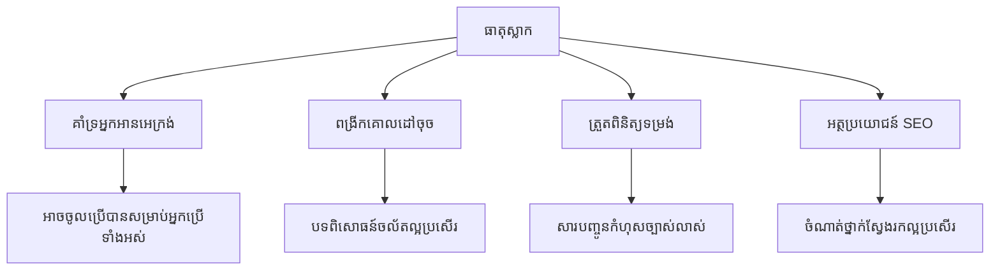
**អ្វីដែលស្លាកត្រឹមត្រូវអាចធ្វើបាន៖**
- **អនុញ្ញាត** អ្នកអានអេក្រង់ផ្សព្វផ្សាយវាលសំណុំបែបបទយ៉ាងច្បាស់
- **ពង្រីក** តំបន់ដែលអាចចុចបាន (ចុចស្លាកបង្ហាញវាលបញ្ចូល)
- **ធ្វើអោយប្រសើរឡើង** ការប្រើប្រាស់លើទូរស័ព្ទជាមួយតំបន់ប៉ះធំ
- **គាំទ្រ** ការត្រួតពិនិត្យសំណុំបែបបទជាមួយសារ​កំហុសមានន័យ
- **បង្កើន** SEO ដោយផ្តល់​អត្ថន័យចំពោះធាតុសំណុំបែបបទ

> 🎯 **គោលដៅភាពអាចចូលដំណើរការ**៖ សំណុំបែបបទនីមួយៗគួរត្រូវមានស្លាកភ្ជាប់។ ចំណាត់ការងាយស្រួលនេះធ្វើឲ្យសំណុំបែបបទរបស់អ្នកអាចប្រើបានសម្រាប់គ្រប់គ្នា រួមទាំងអ្នកមានភាពពិបាក និងបង្កើនបទពិសោធន៍សម្រាប់អ្នកប្រើទាំងមូល។

### បង្កើតសំណុំបែបបទចុះឈ្មោះ

សំណុំបែបបទចុះឈ្មោះត្រូវការព័ត៌មានលម្អិតបន្ថែមសម្រាប់បង្កើតគណនីអ្នកប្រើបញ្ចប់។ យើងនឹងបង្កើតវាជាមួយលក្ខណៈ HTML5 សម័យទំនើប និងភាពងាយចូលដំណើរការ។

```html
<hr/>
<h2>Register</h2>
<form id="registerForm" novalidate>
  <div class="form-group">
    <label for="user">Username</label>
    <input id="user" name="user" type="text" required 
           autocomplete="username" placeholder="Choose a username">
  </div>
  
  <div class="form-group">
    <label for="currency">Currency</label>
    <input id="currency" name="currency" type="text" value="$" 
           required maxlength="3" placeholder="USD, EUR, etc.">
  </div>
  
  <div class="form-group">
    <label for="description">Account Description</label>
    <input id="description" name="description" type="text" 
           maxlength="100" placeholder="Personal savings, checking, etc.">
  </div>
  
  <div class="form-group">
    <label for="balance">Starting Balance</label>
    <input id="balance" name="balance" type="number" value="0" 
           min="0" step="0.01" placeholder="0.00">
  </div>
  
  <button type="submit">Create Account</button>
</form>
```

**នៅលើ ការងារនេះ យើងបាន:**
- **រៀបចំ** វាលនីមួយៗនៅក្នុង `div` សម្រាប់គ្រប់គ្រងរចនាបថ និងចំណាត់ការ
- **បន្ថែម** លក្ខណៈ `autocomplete` សមរម្យសម្រាប់គាំទ្រការដាក់ព័ត៌មានដោយប្រោសរាស់
- **បញ្ចូល** អត្ថបទ `placeholder` ជួយណែនាំការបញ្ចូលរបស់អ្នកប្រើ
- **កំណត់** តម្លៃលំនាំដើមជាមួយលក្ខណៈ `value`
- **អនុវត្ត** លក្ខណៈត្រួតពិនិត្យដូចជា `required`, `maxlength`, និង `min`
- **ប្រើ** `type="number"` សម្រាប់វាលតុល្យភាពជាមួយគាំទ្រភាគរយទសភាគ

### ប្រភេទបញ្ចូល និងអាកប្បកិរិយា

**ប្រភេទបញ្ចូលទំនើបផ្តល់មុខងារល្អប្រសើរៈ**

| លក្ខណៈ | អត្ថប្រយោជន៍ | ឧទាហរណ៍ |
|---------|---------|----------|
| `type="number"` | ក្តារចុចជាលេខនៅលើទូរស័ព្ទ | ងាយស្រួលបញ្ចូលតុល្យភាព |
| `step="0.01"` | គ្រប់គ្រងភាពច្បាស់ទសភាគ | អនុញ្ញាតឲ្យមានសេនក្នុងរូបិយប័ណ្ណ |
| `autocomplete` | បំពេញដោយប្រោសរាស់ | បញ្ចប់សំណុំបែបបទឆាប់រហ័ស |
| `placeholder` | យល់ដឹងបរិបទ | នាំមគ្គុទេសក៍ចំពោះការរំពឹងទុកអ្នកប្រើ |

> 🎯 **សកម្មភាពឲ្យសាកល្បង**៖ សាកល្បងរុករកសំណុំបែបបទដោយប្រើក្តារចុចតែប៉ុណ្ណោះ! ប្រើ `Tab` ដើម្បីផ្លាស់ទីចន្លោះវាល `Space` សម្រាប់ជ្រើសប្រអប់  និង `Enter` ដើម្បីបញ្ជូន។ បទពិសោធន៍នេះជួយអ្នកយល់ពីរបៀបដែលអ្នកអានអេក្រង់ប្រើប្រាស់សំណុំបែបបទរបស់អ្នក។

### 🔄 **ការត្រួតពិនិត្យផ្នែកសិក្សា**
**យល់ដឹងមូលដ្ឋានសំណុំបែបបទ**៖ មុនពេលអនុវត្ត JavaScript សូមប្រាកដថាអ្នកយល់អំពី៖
- ✅ របៀប HTML មានន័យបណ្ដាលបង្កើតរចនាសម្ព័ន្ធសំណុំបែបបទអាចចូលដំណើរការ
- ✅ មូលហេតុហេតុដែលប្រភេទបញ្ចូលមានសារៈសំខាន់សម្រាប់ក្តារចុចទូរស័ព្ទ និងការត្រួតពិនិត្យ
- ✅ ទំនាក់ទំនងរវាងស្លាក និងការត្រួតពិនិត្យសំណុំបែបបទ
- ✅ របៀបធ្វើឲ្យលក្ខណៈសំណុំបែបបទមានឥទ្ធិពលចំពោះរបៀបទូទៅសមាសភាគកម្មវិធីរុករក

**ការសាកល្បងខ្លីផ្ទាល់ខ្លួន**៖ តើអ្វីកើតឡើងបើអ្នកបញ្ជូនសំណុំបែបបទដោយគ្មានការគ្រប់គ្រង JavaScript?
*ចម្លើយ: កម្មវិធីរុករកអនុវត្តការបញ្ជូនដើមដោយធម្មតា រីឯធ្វើការប្រើ URL ដើម្បីបញ្ជូនទិន្នន័យ*

**អត្ថប្រយោជន៍សំណុំបែបបទ HTML5**៖ សំណុំបែបបទទំនើបផ្តល់៖
- **ការត្រួតពិនិត្យដូចខ្លួនឯង**៖ ត្រួតពិនិត្យសម្រួលអ៊ីមែល និងទ្រង់ទ្រាយតុគ្រាន់
- **ក្តារចុចលើទូរស័ព្ទ**៖ ក្តារចុចសមរម្យសម្រាប់ប្រភេទបញ្ចូលផ្សេងៗ
- **ភាពអាចចូលដំណើរការ**៖ គាំទ្រអ្នកអានអេក្រង់ និងរុករកដោយក្តារចុច
- **ការកែលម្អជាបន្តបន្ទាប់**៖ អាចដំណើរការបានទោះបីជា JavaScript មិនដំណើរការទេ

## យល់ដឹងពីវិធីសាស្រ្តផ្ញើសំណុំបែបបទ

ពេលណាអ្នកណាមួយបំពេញសំណុំបែបបទរបស់អ្នក ហើយចុចបញ្ជូន ទិន្នន័យនោះត្រូវបានផ្ញើទៅកន្លែងណាមួយ – ភាគច្រើនទៅម៉ាស៊ីនមេដែលអាចរក្សាទុកវា។ មានមិនกួនវិធីផ្សេងៗនៃការធ្វើនេះ ហើយការយល់ដឹងពីមួយណាដែលត្រូវប្រើអាចជួយបង្រ្កាបបញ្ហារបស់អ្នកនៅខាងក្រោយ។

មកមើលអ្វីដែលកើតឡើងពិតប្រាកដនៅពេលណាអ្នកចុចប៊ូតុងបញ្ជូននោះ។

### អាកប្បកិរិយាដើមនៃសំណុំបែបបទ

ជាមុនសិន យើងមើលអ្វីកើតឡើងជាមួយការបញ្ជូនសំណុំបែបបទមូលដ្ឋាន៖

**សាកល្បងសំណុំបែបបទបច្ចុប្បន្នរបស់អ្នក៖**
1. ចុចប៊ូតុង *Register* ក្នុងសំណុំបែបបទរបស់អ្នក
2. មើលការផ្លាស់ប្តូរនៅក្នុងរបារអាសយដ្ឋានរបស់កម្មវិធីរុករក
3. រំលឹកថាតើទំព័រត្រូវបានផ្ទុកឡើងវិញ និងមានទិន្នន័យបង្ហាញនៅ URL


### ការប្រៀបធៀបវិធីសាស្រ្ត HTTP

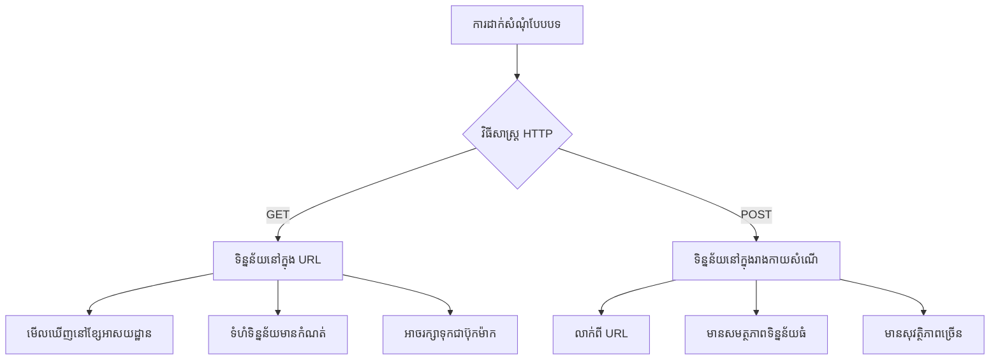
**យល់ដឹងពីភាពខុសគ្នា:**

| វិធីសាស្រ្ត | ករណីប្រើ | ទីតាំងទិន្នន័យ | កម្រិតសុវត្ថិភាព | ព្រំដែនទំហំ |
|--------|----------|---------------|----------------|-------------|
| `GET` | សំណួរស្វែងរក, តម្រង | ប៉ារ៉ាម៉ែត្រនៅក្នុង URL | ខ្ពស់ទាប (អាចមើលឃើញ) | ~2000 តួអក្សរ |
| `POST` | គណនីអ្នកប្រើ, ទិន្នន័យសំខាន់ | ខ្លឹមសារសំណើ | ខ្ពស់ (លាក់) | គ្មានកំណត់អនុវត្តបានល្អ |

**យល់ដឹងពីភាពខុសគ្នាមូលដ្ឋាន៖**
- **GET**៖ បន្ថែមទិន្នន័យសំណុំបែបបទទៅ URL ជាប៉ារ៉ាម៉ែតែរកាម (សមរម្យសម្រាប់ស្វែងរក)
- **POST**៖ រួមបញ្ចូលទិន្នន័យក្នុងខ្លឹមសារសំណើ (ចាំបាច់សម្រាប់ព័ត៌មានសំខាន់)
- **កំណត់ GET**៖ កម្រិតទំហំ, ទិន្នន័យបង្ហាញ, បណ្ដាំប្រវត្តិកម្មវិធីរុករក
- **អត្ថប្រយោជន៍ POST**៖ ទំហំទិន្នន័យធំ, ការពារសម្ងាត់, គាំទ្រការផ្ទុកឯកសារ

> 💡 **ចំណាប់អារម្មណ៍ល្អបំផុត**៖ ប្រើ `GET` សម្រាប់សំណុំបែបបទស្វែងរក និងតម្រង (ទាញយកទិន្នន័យ), ប្រើ `POST` សម្រាប់ចុះឈ្មោះ ប្រើប្រាស់ និងបង្កើតទិន្នន័យ។

### ការកំណត់ការផ្ញើសំណុំបែបបទ

ចង់កត់ត្រាសំណុំបែបបទចុះឈ្មោះរបស់អ្នកឱ្យត្រូវតាមរយៈ API ខាងក្រោយដោយប្រើវិធីសាស្រ្ត POST៖

```html
<form id="registerForm" action="//localhost:5000/api/accounts" 
      method="POST" novalidate>
```

**នេះគឺជាអ្វីដែលកំណត់ការនេះធ្វើ:**
- **បញ្ជូន** ការផ្ញើសំណុំបែបបទទៅចំណុចប្រទាក់ API របស់អ្នក
- **ប្រើ** វិធីសាស្រ្ត POST សម្រាប់ការផ្ទេរទិន្នន័យដោយសុវត្ថិភាព
- **មាន** `novalidate` ដើម្បីគ្រប់គ្រងការត្រួតពិនិត្យជាមួយ JavaScript

### ការប្រលងផ្ញើសំណុំបែបបទ

**អនុវត្តសកម្មភាពដូចខាងក្រោមដើម្បីសាកល្បងសំណុំបែបបទអ្នក៖**
1. **បំពេញ** សំណុំបែបបទចុះឈ្មោះជាមួយព័ត៌មានរបស់អ្នក
2. **ចុច** ប៊ូតុង "Create Account"
3. **មើល** ចម្លើយម៉ាស៊ីនមេក្នុងកម្មវិធីរុករករបស់អ្នក

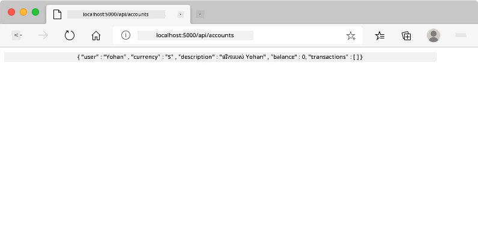

**អ្វីដែលអ្នកគួរមើលឃើញ៖**
- **កម្មវិធីរុករកបញ្ចូនទៅ URL ចំណុចប្រទាក់ API**
- **ចម្លើយ JSON** មានទិន្នន័យគណនីថ្មីដែលអ្នកបង្កើត
- **ការបញ្ជាក់ម៉ាស៊ីនមេ** ថាគណនីត្រូវបានបង្កើតដោយជោគជ័យ

> 🧪 **ពេលសាកល្បង**៖ សាកល្បងចុះឈ្មោះម្ដងទៀតជាមួយឈ្មោះអ្នកប្រើដដែល។ តើអ្នកទទួលបានចម្លើយដោយម៉ាស៊ីនមេដូចម្តេច? វាជួយឲ្យអ្នកយល់ពីរបៀបម៉ាស៊ីនមេដំណើរការទិន្នន័យជាលេខគូស និងស្ថានភាពកំហុស។

### យល់ដឹងពីចម្លើយ JSON

**ពេលម៉ាស៊ីនមេដំណើរការសំណុំបែបបទរបស់អ្នកដោយជោគជ័យ៖**
```json
{
  "user": "john_doe",
  "currency": "$",
  "description": "Personal savings",
  "balance": 100,
  "id": "unique_account_id"
}
```

**ចម្លើយនេះបញ្ជាក់៖**
- **បង្កើត** គណនីថ្មីជាមួយទិន្នន័យដែលអ្នកបញ្ជាក់
- **ផ្ដល់** អត្តសញ្ញាណល្អឥតខ្ចោះសម្រាប់យោងបន្ទាប់
- **ប្ញราะ** ទិន្នន័យគណនីទាំងអស់សម្រាប់ការត្រួតពិនិត្យា
- **បង្ហាញ** ការផ្ទុកទិន្នន័យក្នុងមូលដ្ឋានទិន្នន័យជោគជ័យ

## ការគ្រប់គ្រងសំណុំបែបបទសម័យទំនើបជាមួយ JavaScript

ការផ្ញើសំណុំបែបបទប្រពៃណីធ្វើឲ្យទំព័រត្រូវបានផ្ទុកឡើងវិញទាំងស្រុង ដូចជាដំណើរការភ្នាល់អាកាសចម្បាំងដំបូងៗត្រូវធ្វើការកំណត់ឡើងវិញស៊ីស្តមទាំងមូលសម្រាប់កែទិស។ វាជាការរំខានបទពិសោធន៍អ្នកប្រើហើយបាត់បង់សភាពកម្មវិធី។

ការ​គ្រប់គ្រងសំណុំបែបបទជាមួយ JavaScript ដំណើរការដូចប្រព័ន្ធណែនាំបន្តរមានប្រសិទ្ធភាពសំរាប់យានយន្តទំនើប - ធ្វើការកែប្រែពេលវេលាពិតប្រាកដដោយមិនបាត់បង់បរិបទនាវាចរណ៍។ យើងអាចកាត់បន្ថយការផ្ញើសំណុំបែបបទផ្ទាល់ ការផ្តល់មតិយោបល់ភ្លាមៗ រក្សាទុកកំហុសយ៉ាងទន់ភ្លន់ ហើយធ្វើបច្ចុប្បន្នភាពចំណុចប្រទាក់នៅកម្រិតម៉ាស៊ីនមេ ខណៈអោយអ្នកប្រើនៅទីតាំងក្នុងកម្មវិធី។

### ហេតុអ្វីត្រូវជៀសវាងការផ្ទុកទំព័រឡើងវិញ?

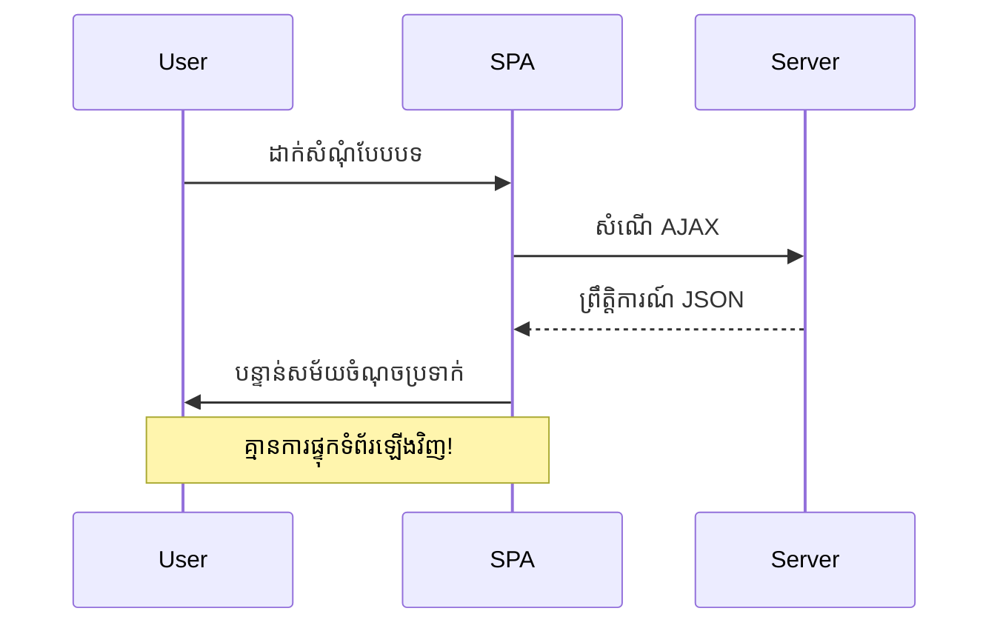
**អត្ថប្រយោជន៍នៃការគ្រប់គ្រងសំណុំបែបបទជាមួយ JavaScript៖**
- **រក្សា** សភាពកម្មវិធី និងបរិបទអ្នកប្រើ
- **ផ្តល់** មតិយោបល់ភ្លាមៗ និងសូចនាករការផ្ទុក
- **អនុញ្ញាត** ការគ្រប់គ្រងកំហុសបែប δυναμικό និងការត្រួតពិនិត្យ
- **បង្កើត** បទពិសោធន៍អ្នកប្រើដូចកម្មវិធី
- **អនុញ្ញាត** លោសនិយមផ្អែកលើចម្លើយម៉ាស៊ីនមេ

### ផ្លាស់ប្តូរ​ពី​បែបប្រពៃណី​ទៅ​សំណុំ​បែបបទ​សម័យទំនើប

**បញ្ហាក្នុងវិធីសាស្រ្តប្រពៃណី៖**
- **បញ្ជូន** អ្នកប្រើចេញពីកម្មវិធីរបស់អ្នក
- **បាត់បង់** សភាពកម្មវិធី និងបរិបទបច្ចុប្បន្ន
- **តម្រូវ** ការផ្ទុកទំព័រឡើងវិញសម្រាប់ការប្រតិបត្តិតូចៗ
- **ផ្តល់** ការគ្រប់គ្រងកំណត់លម្អិតអំពីមតិយោបល់អ្នកប្រើបានគ្រាន់តែច្បាស់លាស់អត់ច្រើន

**អត្ថប្រយោជន៍នៃការប្រើប្រាស់ JavaScript របស់សម័យទំនើប:**
- **រក្សា** អ្នកប្រើនៅក្នុងកម្មវិធីរបស់អ្នក
- **រក្សា** សភាពកម្មវិធី និងទិន្នន័យទាំងមូល
- **អនុញ្ញាត** ការត្រួតពិនិត្យ និងប្រតិកម្មទាន់ពេលវេលា
- **គាំទ្រ** ការកែលម្អតាមជំហាន និងភាពអាចចូលដំណើរការ

### អនុវត្តគ្រប់គ្រងសំណុំបែបបទជាមួយ JavaScript

យើងប្ដូរពីការផ្ញើសំណុំបែបបទប្រពៃណីទៅការគ្រប់គ្រងព្រឹត្តិការណ៍ JavaScript សម័យទំនើប៖

```html
<!-- Remove the action attribute and add event handling -->
<form id="registerForm" method="POST" novalidate>
```

**បន្ថែមគ្រប់គ្រងចុះឈ្មោះទៅឯកសារ `app.js` របស់អ្នក៖**

```javascript
// ការដំណើរការផ្នែកបែបបទដោយផ្អែកលើព្រឹត្តិការណ៍ទំនើប
function register() {
  const registerForm = document.getElementById('registerForm');
  const formData = new FormData(registerForm);
  const data = Object.fromEntries(formData);
  const jsonData = JSON.stringify(data);
  
  console.log('Form data prepared:', data);
}

// ភ្ជាប់អ្នកស្តាប់ព្រឹត្តិការណ៍ពេលផ្ទាំងត្រូវបានផ្ទុក
document.addEventListener('DOMContentLoaded', () => {
  const registerForm = document.getElementById('registerForm');
  registerForm.addEventListener('submit', (event) => {
    event.preventDefault(); // ទប់ស្កាត់ការដាក់ស្នើបែបបទដើម
    register();
  });
});
```

**បំហឹងអ្វីកើតឡើងនៅទីនេះ:**
- **ទប់ស្កាត់** ការផ្ញើសំណុំបែបបទដើមដោយប្រើ `event.preventDefault()`
- **យក** ធាតុសំណុំបែបបទជាមួយការជ្រើស DOM សម័យទំនើប
- **យក** ទិន្នន័យសំណុំបែបបទដោយប្រើ API រូបមន្ត `FormData`
- **បំលែង** FormData ទៅវត្ថុធម្មតាជាមួយ `Object.fromEntries()`
- **បំលែង** ទិន្នន័យទៅទ្រង់ទ្រាយ JSON សម្រាប់ការទំនាក់ទំនងម៉ាស៊ីនមេ
- **កត់ត្រា** ទិន្នន័យដែលបានគ្រប់គ្រងសម្រាប់ការត្រួតពិនិត្យ

### យល់ដឹងអំពី API FormData

**API FormData ផ្តល់ជំនួយដ៏មានសារៈសំខាន់ក្នុងការគ្រប់គ្រងសំណុំបែបបទ៖**

```javascript
// ឧទាហរណ៍អំពីអ្វីដែល FormData ប្រមួល
const formData = new FormData(registerForm);

// FormData ប្រមួលដោយស្វ័យប្រវត្តិ:
// {
//   "user": "john_doe",
//   "currency": "$",
//   "description": "គណនីផ្ទាល់ខ្លួន",
//   "balance": "100"
// }
```

**អត្ថប្រយោជន៍ API FormData:**
- **ការរើសផ្តុំគ្រប់មុខទាំងអស់**៖ ចាប់យកធាតុក្រុមហ៊ុនទំរង់ទាំងអស់ រួមទាំងអត្ថបទ, ឯកសារ, និងបញ្ចូលស្មុគស្មាញ
- **ការយល់ដឹងប្រភេទ**៖ មានការដោះស្រាយប្រភេទការបញ្ចូលផ្សេងៗដោយស្វ័យប្រវត្តិដោយគ្មានកូដផ្ទាល់ខ្លួន
- **ប្រសិទ្ធភាព**៖ លែងបញ្ចូលវាលដោយដៃជាមួយការហៅ API មួយដងទេ
- **ការបត់បែន**៖ រក្សាភាពងាយប្រើបានបន្តទៅក្រោមទំរង់ពេលវារីកចម្រើន

### ការបង្កើតមុខងារទំនាក់ទំនងម៉ាស៊ីនមេ

ឥឡូវនេះ យើងចាប់ផ្តើមបង្កើតមុខងារត្រៀមខ្លួនរឹងមាំ ដើម្បីទាក់ទងជាមួយម៉ាស៊ីនមេ API របស់អ្នកប្រើលំនាំ JavaScript សម័យទំនើប៖

```javascript
async function createAccount(account) {
  try {
    const response = await fetch('//localhost:5000/api/accounts', {
      method: 'POST',
      headers: { 
        'Content-Type': 'application/json',
        'Accept': 'application/json'
      },
      body: account
    });
    
    // ពិនិត្យមើលថាតើយោបល់បានជោគជ័យ​ឬទេ
    if (!response.ok) {
      throw new Error(`HTTP error! status: ${response.status}`);
    }
    
    return await response.json();
  } catch (error) {
    console.error('Account creation failed:', error);
    return { error: error.message || 'Network error occurred' };
  }
}
```
  
**ការយល់ដឹងអំពី JavaScript អសង្គ្រាម:**

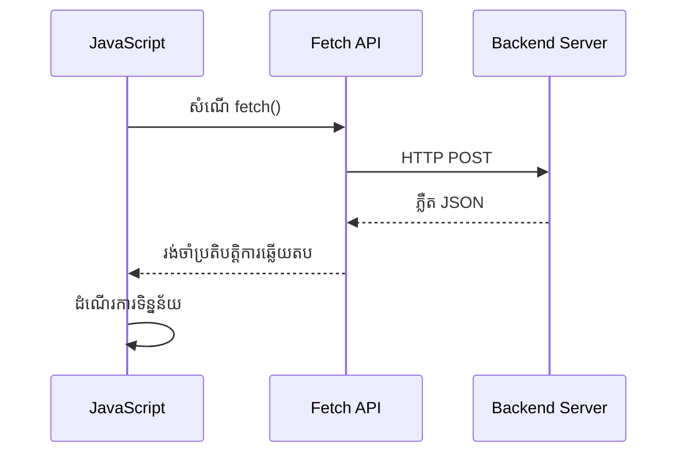
**អ្វីដែលអនុវត្តសម័យទំនើបនេះធ្វើបាន៖**  
- **ប្រើ** `async/await` សម្រាប់កូដអសង្គ្រាមអានងាយ  
- **រួមបញ្ចូល** ការដោះស្រាយកំហុសត្រឹមត្រូវជាមួយ try/catch  
- **ពិនិត្យ** ស្ថានភាពការឆ្លើយតប មុនពេលបំលែងទិន្នន័យ  
- **កំណត់** ចំណងជើងសមរម្យសម្រាប់ការទំនាក់ទំនង JSON  
- **ផ្ដល់** សារកំហុសលម្អិតសម្រាប់ការធ្វើដំណោះស្រាយកំហុស  
- **ត្រឡប់** រចនាសម្ព័ន្ធទិន្នន័យឲ្យមានរបៀបសរុប សម្រាប់ករណីជោគជ័យនិងកំហុស  

### ថាមពលនៃ Fetch API សម័យទំនើប

**អត្ថប្រយោជន៍ Fetch API ជាងវិធីចាស់ៗ៖**

| លក្ខណៈ  | អត្ថប្រយោជន៍  | អនុវត្តន៍  |
|---------|-----------------|-------------|
| Promise-based | កូដអសង្គ្រាមស្អាត | `await fetch()` |
| ការប្តូរបែបសំណើ | ថ្មីៗគ្រប់គ្រង HTTP | Headers, methods, body |
| ការដោះស្រាយចម្លើយ | បំលែងទិន្នន័យងាយស្រួល | `.json()`, `.text()`, `.blob()` |
| ការគ្រប់គ្រងកំហុស | ចាប់កំហុសបានលម្អិត | Try/catch blocks |

> 🎥 **ស្វែងយល់បន្ថែម**: [មេរៀន Async/Await](https://youtube.com/watch?v=YwmlRkrxvkk) - យល់ដឹងអំពីមាតិកាកូដអសង្គ្រាម JavaScript សម្រាប់ការអភិវឌ្ឍវេបថ្មីៗ។

**គំនិតសំខាន់សម្រាប់ការទំនាក់ទំនងម៉ាស៊ីនមេ:**  
- **មុខងារAsync** អនុញ្ញាតឱ្យពន្លត់ចោលដំណើរការដើម្បីរង់ចាំចម្លើយម៉ាស៊ីនមេ  
- **ពាក្យ await** ធ្វើឲ្យកូដអសង្គ្រាមអានដូចជាកូដសមហិក  
- **Fetch API** ផ្ដល់សំណើ HTTP សម័យទំនើបផ្អែកលើ Promise  
- **ការគ្រប់គ្រងកំហុស**ធានាថាកម្មវិធីរបស់អ្នកឆ្លើយតបទៀងទាត់ទៅបញ្ហាបណ្ដាញ  

### បញ្ចប់មុខងារចុះឈ្មោះ

យើងនាំគ្នា!--រួមបញ្ចូលទាំងអស់ជាមួយមុខងារចុះឈ្មោះប្រើប្រាស់ជាក់លាក់សម្រាប់ផលិតកម្ម៖

```javascript
async function register() {
  const registerForm = document.getElementById('registerForm');
  const submitButton = registerForm.querySelector('button[type="submit"]');
  
  try {
    // បង្ហាញស្ថានភាពកំពុងផ្ទុក
    submitButton.disabled = true;
    submitButton.textContent = 'Creating Account...';
    
    // ដំណើរការទិន្នន័យបែបបទ
    const formData = new FormData(registerForm);
    const jsonData = JSON.stringify(Object.fromEntries(formData));
    
    // បញ្ជូនទៅម៉ាស៊ីនមេ
    const result = await createAccount(jsonData);
    
    if (result.error) {
      console.error('Registration failed:', result.error);
      alert(`Registration failed: ${result.error}`);
      return;
    }
    
    console.log('Account created successfully!', result);
    alert(`Welcome, ${result.user}! Your account has been created.`);
    
    // ធ្វើបែបបទឱ្យបញ្ចូលឡើងវិញបន្ទាប់ពីចុះបញ្ជីដោយជោគជ័យ
    registerForm.reset();
    
  } catch (error) {
    console.error('Unexpected error:', error);
    alert('An unexpected error occurred. Please try again.');
  } finally {
    // ផ្ទិចស្ថានភាពប៊ូតុងឡើងវិញ
    submitButton.disabled = false;
    submitButton.textContent = 'Create Account';
  }
}
```
  
**ការអនុវត្តលៃតម្រូវនេះរួមមាន៖**  
- **ផ្ដល់** មតិយោបល់មើលឃើញនៅពេលបញ្ចូលទម្រង់  
- **បិទ** ប៊ូតុងស្នើសុំ ដើម្បីពន្យារពេលចុះឈ្មោះដដែល  
- **ដោះស្រាយ** កំហុសទាំងចង់បាន និងមិនគិតក្នុងយ៉ាងទាន់ក្ដីសង្ឃឹម  
- **បង្ហាញ** សារជោគជ័យនិងកំហុសល្អ  
- **កំណត់ឡើងវិញ** ទម្រង់បន្ទាប់ពីចុះឈ្មោះជោគជ័យ  
- **ស្ដារ** ស្ថានភាព UI ដោយមិនគោរពចៅក្រោយ  

### សាកល្បងការអនុវត្តរបស់អ្នក

**បើកឧបករណ៍អភិវឌ្ឍន៍របស់អ្នក ហើយសាកល្បងចុះឈ្មោះ៖**

1. **បើក** មpheakដ្ចយកុងសូល (F12 → Console tab)  
2. **បំពេញ** ទម្រង់ចុះឈ្មោះ  
3. **ចុច** "Create Account"  
4. **យកចិត្តទុកដាក់** សារកុងសូល និងមតិយោបល់អ្នកប្រើ  

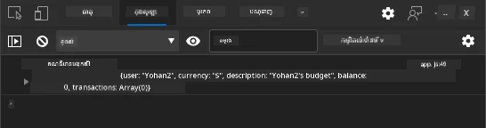

**អ្វីដែលអ្នកត្រូវឃើញ៖**  
- **ស្ថានភាពផ្ទុក** បង្ហាញលើប៊ូតុងស្នើសុំ  
- **កំណត់ត្រា console** បង្ហាញព័ត៌មានលម្អិតអំពីដំណើរការ  
- **សារជោគជ័យ** បង្ហាញពេលបង្កើតគណនីសំរេចបាន  
- **ទម្រង់កំណត់ឡើងវិញ** ដោយស្វ័យប្រវត្តិបន្ទាប់ពីបញ្ចូលជោគជ័យ  

> 🔒 **ការពិចារណាសុវត្ថិភាព**៖ ពេលនេះទិន្នន័យបញ្ជូនតាម HTTP ដែលមិនសុវត្ថិភាពសម្រាប់ផលិតកម្ម។ នៅកម្មវិធីពិត ត្រូវប្រើ HTTPS មិនប្រែប្រួលសម្រាប់ការអ៊ិនគ្រីបទិន្នន័យ។ ស្វែងយល់បន្ថែមអំពី [សុវត្ថិភាព HTTPS](https://en.wikipedia.org/wiki/HTTPS) និងហេតុអ្វីវាចាំបាច់សម្រាប់ការពារទិន្នន័យអ្នកប្រើ។  

### 🔄 **ការត្រួតពិនិត្យផ្នែកបង្រៀន**  
**ការរួមបញ្ចូល JavaScript សម័យទំនើប**៖ ប្រាកដថា អ្នកយល់ដឹងអំពីការគ្រប់គ្រងទម្រង់អសង្គ្រាម៖  
- ✅ តើ `event.preventDefault()` បង្ហាញការផ្លាស់ប្តូរយ៉ាងដូចម្តេចចំពោះឥរិយាបថទម្រង់?  
- ✅ ហេតុអ្វី API FormData ជាសមរម្យជាងការបញ្ជូលវាលដោយដៃ?  
- ✅ តើពីរបៀប async/await ធ្វើឲ្យកូដអានល្អឡើង?  
- ✅ តើរបៀបដោះស្រាយកំហុសមានតួនាទីអ្វីក្នុងបទពិសោធអ្នកប្រើ?  

**រចនាសម្ព័ន្ធប្រព័ន្ធ**៖ ការដោះស្រាយទម្រង់របស់អ្នកបង្ហាញ៖  
- **កម្មវិធីមូលមេដ្ឋានព្រឹត្តិការណ៍**៖ ទម្រង់ឆ្លើយតបទៅកាន់សកម្មភាពអ្នកប្រើ ដោយគ្មានការត្រឡប់ទំព័រ  
- **ការទំនាក់ទំនងអសង្គ្រាម**៖ សំណើម៉ាស៊ីនមេមិនរំខានផ្ទាំងអ្នកប្រើ  
- **ការគ្រប់គ្រងកំហុស**៖ ការដោះស្រាយបានយ៉ាងអសកម្មនៅពេលសំណើបណ្តាញបរាជ័យ  
- **ការគ្រប់គ្រងស្ថានភាព**៖ UI ចេញបង្ហាញតាមគោលការណ៍បញ្ជូនចម្លើយម៉ាស៊ីនមេ  
- **ការកែលម្អទៅមុខ**៖ មុខងារមូលដ្ឋាន​ធ្វើការ ហើយ JavaScript បន្ថែមសមត្ថភាព  

**លំនាំវិជ្ជាជីវៈ**៖ អ្នកបានអនុវត្ត៖  
- **កាតព្វកិច្ចតែមួយ**៖ មុខងារដែលមានគោលបំណងច្បាស់លាស់ និងផ្តោត  
- **ដែនកំហុស**៖ ប្លុក try/catch មានសមត្ថភាពកាត់បន្ថយកំហុសកម្មវិធី  
- **មតិយោបល់អ្នកប្រើ**៖ ស្ថានភាពផ្ទុក និងសារជោគជ័យ/កំហុស  
- **បំលែងទិន្នន័យ**៖ ការបម្លែងទម្រង់ FormData ទៅ JSON ដើម្បីទំនាក់ទំនងម៉ាស៊ីនមេ  

## ការត្រួតពិនិត្យទម្រង់យ៉ាងទូលំទូលាយ

ការត្រួតពិនិត្យទម្រង់ជួយទប់ស្កាត់បទពិសោធលំបាកពេលបើកកំហុសក្រោយការបញ្ចូល។ ដូចប្រព័ន្ធច្រើនសម្រាប់រថយន្តស្ថានីយអាកាសអន្ដរជាតិ ការត្រួតពិនិត្យមានជារបៀបច្រើនសម្រាប់ធានាសុវត្ថិភាព។

វិធីសាស្រ្តល្អបំផុតបញ្ចូលការត្រួតពិនិត្យនៅលើកម្មវិធីរុករកសម្រាប់ការផ្តល់មតិយោបល់ភ្លាមៗ, ការត្រួតពិនិត្យ JavaScript សម្រាប់បទពិសោធអ្នកប្រើកាន់តែប្រសើរ, និងការត្រួតពិនិត្យម៉ាស៊ីនមេសម្រាប់សុវត្ថិភាព និងភាពត្រឹមត្រូវទិន្នន័យ។ ការលើកស្ទួយនេះធានារួមទាំងភាពសប្បាយចិត្តអ្នកប្រើ និងការពារ ប្រព័ន្ធ។  

### យល់ដឹងពីស្រទាប់ការត្រួតពិនិត្យ

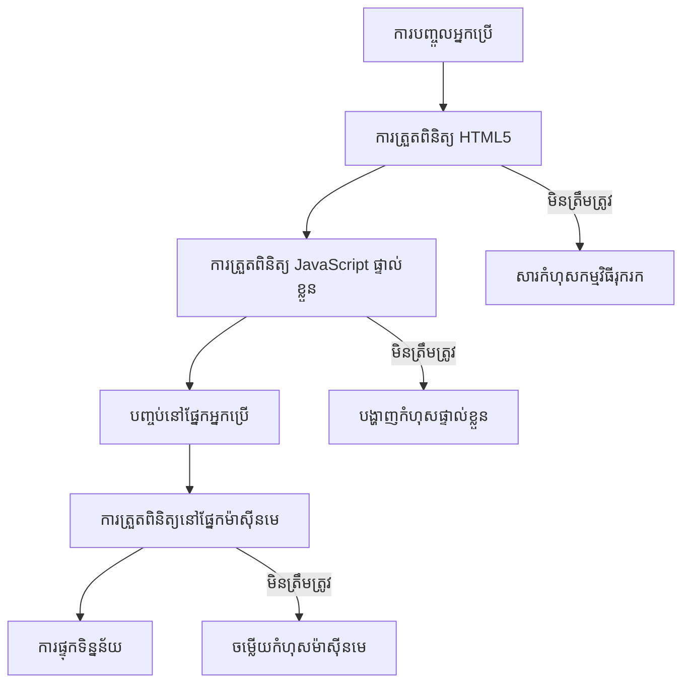
**យុទ្ធសាស្រ្តការ Validation ច្រើនស្រទាប់៖**  
- **HTML5 validation**៖ ពិនិត្យភ្លាមៗនៅលើកម្មវិធីរុករក  
- **JavaScript validation**៖ ទ្រង់ទ្រាយផ្ទាល់ខ្លួន និងបទពិសោធអ្នកប្រើ  
- **Server validation**៖ ការត្រួតពិនិត្យសុវត្ថិភាព និងភាពត្រឹមត្រូវចុងក្រោយ  
- **Progressive enhancement**៖ ធ្វើការបានទោះបើ JavaScript ទៅបិទ  

### គុណលក្ខណ៍ HTML5 Validation

**ឧបករណ៍ការត្រួតពិនិត្យសម័យទំនើប៖**

| គុណលក្ខណ៍  | គោលបំណង | ឧទាហរណ៍ប្រើប្រាស់ | ចំពោះកម្មវិធីរុករក  |
|-------------|-----------|-----------------|---------------------|
| `required`    | វាលបញ្ជាក់ | `<input required>` | បង្ការ ការបញ្ជូលទទេ  |
| `minlength`/`maxlength` | កំណត់ប្រវែងអក្សរ | `<input maxlength="20">` | ចាំបាច់ដាក់កំណត់តួអក្សរ |
| `min`/`max`   | ជួរលេខ | `<input min="0" max="1000">` | ត្រួតពិនិត្យលេខក្នុងជួរ  |
| `pattern`     | ច្បាប់ regex ផ្ទាល់ខ្លួន | `<input pattern="[A-Za-z]+">` | ត្រូវនឹងទ្រង់ទ្រាយជាក់លាក់  |
| `type`       | ការត្រួតពិនិត្យជាប្រភេទទិន្នន័យ | `<input type="email">` | ត្រួតពិនិត្យទ្រង់ទ្រាយបញ្ចូល  |

### CSS ការតុបតែងរក្សាទម្រង់ Validation

**បង្កើតមតិយោបល់ផ្ទាល់ខ្លួនសម្រាប់ស្ថានភាព Validation៖**

```css
/* Valid input styling */
input:valid {
  border-color: #28a745;
  background-color: #f8fff9;
}

/* Invalid input styling */
input:invalid {
  border-color: #dc3545;
  background-color: #fff5f5;
}

/* Focus states for better accessibility */
input:focus:valid {
  box-shadow: 0 0 0 0.2rem rgba(40, 167, 69, 0.25);
}

input:focus:invalid {
  box-shadow: 0 0 0 0.2rem rgba(220, 53, 69, 0.25);
}
```
  
**អ្វីដែលសញ្ញាទៅម៉ោងនេះធ្វើបាន៖**  
- **ស្នាមពណ៌បៃតង**៖ បង្ហាញថាផ្លូវត្រឹមត្រូវ ដូចបណ្ណភ្លើងបៃតងនៅចំណុចគ្រប់គ្រងបេសកកម្ម  
- **ស្នាមពណ៌ក្រហម**៖ បង្ហាញកំហុសត្រូវបានត្រួតពិនិត្យ  
- **ការលើកអនុស្សាវរីយ៍**៖ ផ្តល់ការបង្ហាញជាក់លាក់សម្រាប់តំបន់បញ្ចូលបច្ចុប្បន្ន  
- **ការតុបតែងអនុលោម**៖ បង្កើតលំឡុងរចនាសម្ព័ន្ធដែលអាចរៀនបាន  

> 💡 **ជំនួយផ្នែកជំនាញ**៖ ប្រើ pseudo-classes CSS `:valid` និង `:invalid` ដើម្បីផ្តល់មតិយោបល់ភ្លាមៗ ពេលអ្នកប្រើវាយបញ្ចូល ដើម្បីបង្កើតផ្ទាំងប្រតិកម្ម និងមានជំនួយ។  

### អនុវត្តការត្រួតពិនិត្យយ៉ាងទូលំទូលាយ

តោះ ខលមកធ្វើឲ្យទម្រង់ចុះឈ្មោះរបស់អ្នកមានការត្រួតពិនិត្យរឹងមាំ ដែលផ្តល់បទពិសោធ្ន៍ល្អ និងគុណភាពទិន្នន័យដ៏ល្អ៖

```html
<form id="registerForm" method="POST" novalidate>
  <div class="form-group">
    <label for="user">Username <span class="required">*</span></label>
    <input id="user" name="user" type="text" required 
           minlength="3" maxlength="20" 
           pattern="[a-zA-Z0-9_]+" 
           autocomplete="username"
           title="Username must be 3-20 characters, letters, numbers, and underscores only">
    <small class="form-text">Choose a unique username (3-20 characters)</small>
  </div>
  
  <div class="form-group">
    <label for="currency">Currency <span class="required">*</span></label>
    <input id="currency" name="currency" type="text" required 
           value="$" maxlength="3" 
           pattern="[A-Z$€£¥₹]+" 
           title="Enter a valid currency symbol or code">
    <small class="form-text">Currency symbol (e.g., $, €, £)</small>
  </div>
  
  <div class="form-group">
    <label for="description">Account Description</label>
    <input id="description" name="description" type="text" 
           maxlength="100" 
           placeholder="Personal savings, checking, etc.">
    <small class="form-text">Optional description (up to 100 characters)</small>
  </div>
  
  <div class="form-group">
    <label for="balance">Starting Balance</label>
    <input id="balance" name="balance" type="number" 
           value="0" min="0" step="0.01" 
           title="Enter a positive number for your starting balance">
    <small class="form-text">Initial account balance (minimum $0.00)</small>
  </div>
  
  <button type="submit">Create Account</button>
</form>
```
  
**យល់ដឹងពីការត្រួតពិនិត្យបានបន្ថែម៖**  
- **ផ្សំព្យូរ** សញ្ញាវាលចាំបាច់ជាមួយពណ៌ធ្វើអោយយល់  
- **រួមបញ្ចូល** គុណលក្ខណ៍ `pattern` សម្រាប់ការត្រួតពិនិត្យទ្រង់ទ្រាយ  
- **ផ្ដល់** គុណលក្ខណ៍ `title` ចំពោះវេទិកា និង tooltips  
- **បន្ថែម** អត្ថបទជំនួយដើម្បីដឹកនាំការបញ្ចូល  
- **ប្រើ** រចនាសម្ព័ន្ធ HTML មានទំនាក់ទំនងសម្រាប់ការចូលរួមល្អប្រសើរ  

### ច្បាប់ Validation ជាចម្បង

**អ្វីដែលច្បាប់ចំរូងនីមួយៗធ្វើបាន៖**

| វាល | ច្បាប់ Validation | អត្ថប្រយោជន៍អ្នកប្រើ |
|------|------------------|-------------------------|
| ឈ្មោះអ្នកប្រើ | `required`, `minlength="3"`, `maxlength="20"`, `pattern="[a-zA-Z0-9_]+"` | ធានាថា លេខសម្គាល់ត្រឹមត្រូវ និងមិនដូចគ្នា |
| រូបិយប័ណ្ណ | `required`, `maxlength="3"`, `pattern="[A-Z$€£¥₹]+"` | ទទួលយកនិមិត្តសញ្ញារូបិយវត្ថុខ្លះៗ  |
| សមតុល្យ | `min="0"`, `step="0.01"`, `type="number"` | បង្ការ សមតុល្យអវិជ្ជមាន  |
| ការពិពណ៌នា | `maxlength="100"` | កំណត់ប្រវែងសមរម្យ  |

### សាកល្បងសេចក្ដីអតិផរណា Validation

**សាកល្បងសถานភាព Validation ទាំងនេះ៖**  
1. **បញ្ជូន** ទម្រង់នៅពេលវាលចាំបាច់ទទេ  
2. **បញ្ចូល** ឈ្មោះអ្នកប្រើខ្លីជាង 3 តួអក្សរ  
3. **ព្យាយាម** បញ្ចូលតួអក្សរពិសេសក្នុងវាលឈ្មោះអ្នកប្រើ  
4. **បញ្ចូល** ចំនួនសមតុល្យអវិជ្ជមាន  

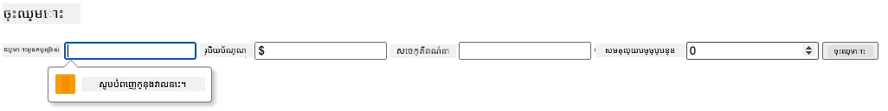  

**អ្វីដែលអ្នកនឹងមើលឃើញ៖**  
- **កម្មវិធីរុករកបង្ហាញ** សារត្រួតពិនិត្យដោយដើម  
- **ការតុបតែងផ្លាស់ប្ដូរ** ដោយផ្អែកលើសភាព `:valid` និង `:invalid`  
- **ការចុះបញ្ជូលទម្រង់** ត្រូវបានរាំងស្ទះរហូតដល់ការត្រួតពិនិត្យទាំងអស់ជោគជ័យ  
- **ការផ្ដោតអត្ថន័យ** ធ្វើឡើងដោយស្វ័យប្រវត្តិសម្រាប់វាលមិនត្រឹមត្រូវដំបូង  

### ការត្រួតពិនិត្យភាគី Client និង Server

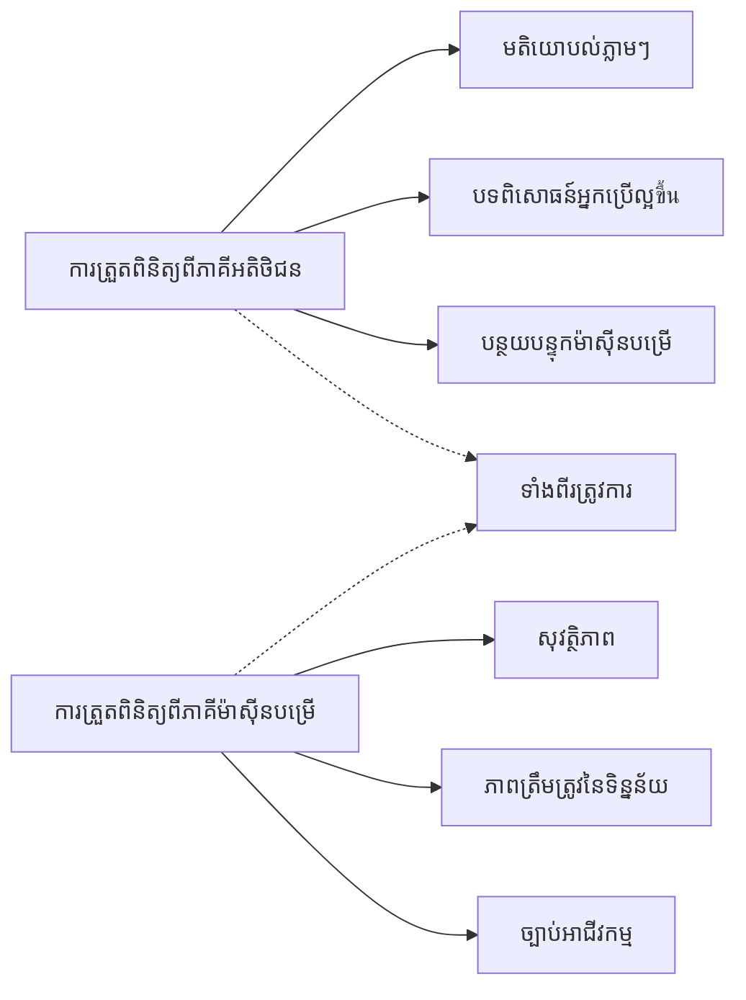
**ហេតុអ្វីអ្នកត្រូវការ ទាំងពីរស្រទាប់:**  
- **ការត្រួតពិនិត្យភាគី Client**៖ ផ្ដល់មតិយោបល់ភ្លាមៗ និងប្រសើរឡើងបទពិសោធអ្នកប្រើ  
- **ការត្រួតពិនិត្យភាគី Server**៖ ធានាសុវត្ថិភាព និងដោះស្រាយច្បាប់អាជីវកម្មស្មុគស្មាញ  
- **វិធីស្នូលរួម**៖ បង្កើតកម្មវិធីរឹងមាំ, មិត្តភាពអ្នកប្រើ, និងមានសុវត្ថិភាព  
- **កែលម្អដំណើរការ​មុខមាត់**៖ ធ្វើការបានប្រសើរបើ JavaScript ត្រូវបានបិទ  

> 🛡️ **ចងចាំសុវត្ថិភាព**៖ កុំទុកចិត្តនឹងការត្រួតពិនិត្យភាគី Client តែមួយ! អ្នកប្រើអាចល្បិចល្បាញលើ Client ដូច្នេះ គួរតែកែតម្រូវបទបញ្ជានៅ Server។  

### ⚡ **អ្វីដែលអ្នកអាចធ្វើបានក្នុងរយៈពេល 5 នាទីបន្ទាប់**  
- [ ] សាកល្បងទម្រង់របស់អ្នកជាមួយទិន្នន័យមិនត្រឹមត្រូវ ដើម្បីមើលសារត្រួតពិនិត្យ  
- [ ] ព្យាយាមបញ្ជូនទម្រង់ដោយបិទ JavaScript ដើម្បីមើលការត្រួតពិនិត្យ HTML5  
- [ ] បើក DevTools របស់កម្មវិធីរុករក និងពិនិត្យទិន្នន័យទម្រង់ដែលផ្ញើទៅម៉ាស៊ីនមេ  
- [ ] ព្យាយាមប្រភេទបញ្ចូលផ្សេងៗ ដើម្បីមើលការប្តូរក្តារចុចទូរស័ព្ទចល័ត  

### 🎯 **អ្វីដែលអ្នកអាចសម្រេចបានក្នុងមួយម៉ោងនេះ**  
- [ ] បញ្ចប់កម្រងសំណួរបន្ទាប់មេរៀន ហើយយល់ពីគំនិតការគ្រប់គ្រងទម្រង់  
- [ ] អនុវត្តការប្រកួតប្រជែង Validation ទូលំទូលាយ ជាមួយមតិយោបល់វេលាពិត  
- [ ] បន្ថែមការតុបតែង CSS ដើម្បីបង្កើតទម្រង់មានរូបរាងវិជ្ជាជីវៈ  
- [ ] បង្កើតការដោះស្រាយកំហុសសម្រាប់ឈ្មោះអ្នកប្រើផ្សេងគ្នានិងកំហុសម៉ាស៊ីនមេ  
- [ ] បន្ថែមវាលផ្ទៀងផ្ទាត់ពាក្យសម្ងាត់ជាមួយការត្រួតពិនិត្យបញ្ចូលត្រូវគ្នា  

### 📅 **ផ្លូវការលេខសម្គាល់ជំនាញទម្រង់របស់អ្នករយៈពេលមួយសប្តាហ៍**  
- [ ] បញ្ចប់កម្មវិធីធ្វើរូបិយប័ណ្ណពេញលេញ ជាមួយមុខងារទម្រង់កម្រិតខ្ពស់  
- [ ] អនុវត្តមុខងារផ្ទុកឯកសារសម្រាប់រូបភាពប្រវត្តិរូប ឬឯកសារផ្សេងៗ  
- [ ] បន្ថែមទម្រង់ចំលែកជាន់ជាមួយសន្ទស្សន៍ដំណើរការនិងការគ្រប់គ្រងស្ថានភាព  
- [ ] បង្កើតទម្រង់ដឹកនាំផ្ទាល់ខ្លួនដែលផ្លាស់ប្តូរតាមការជ្រើសរើសរបស់អ្នកប្រើ  
- [ ] អនុវត្តការចិញ្ចឹមទម្រង់ និងការស្ដារឡើងវិញសម្រាប់បទពិសោធអ្នកប្រើល្អប្រសើរ  
- [ ] បន្ថែមការត្រួតពិនិត្យកម្រិតខ្ពស់ ដូចជាការផ្ទៀងផ្ទាត់អ៊ីមែល និងទ្រង់ទ្រាយលេខទូរស័ព្ទ  

### 🌟 **អាជីពអ្នកស្គាល់ក្នុងការអភិវឌ្ឍ Frontend រយៈពេលមួយខែ**  
- [ ] បង្កើតកម្មវិធីទម្រង់ស្មុគស្មាញជាមួយលូជិកលក្ខណៈ និងដំណើរការងារ  
- [ ] ស្រាវជ្រាវបណ្ណាល័យទម្រង់ និងហ្វ្រេមវើកសម្រាប់ការអភិវឌ្ឍប្រញាប់  
- [ ] ថ្នាក់ទទួលបានទ្រព្យសម្បត្តិជាសាកល និងមូលដ្ឋានរចនា​សូហ្វ ័វែរឱ្យគ្រប់គ្នា  
- [ ] អនុវត្តអន្តរជាតិគរណ៍ និងតំបន់ភាពសម្រាប់ទម្រង់ពិភពលោក  
- [ ] បង្កើតបណ្ណាល័យ UI ទម្រង់ដែលអាចប្រើឡើងវិញ និងប្រព័ន្ធរចនា  
- [ ] ចូលរួមគម្រោង open source ទម្រង់ ហើយចែករំលែកអនុសាសន៍ល្អៗ  

## 🎯 រយៈពេលវិនិយោគក្នុងការអភិវឌ្ឍទម្រង់របស់អ្នក

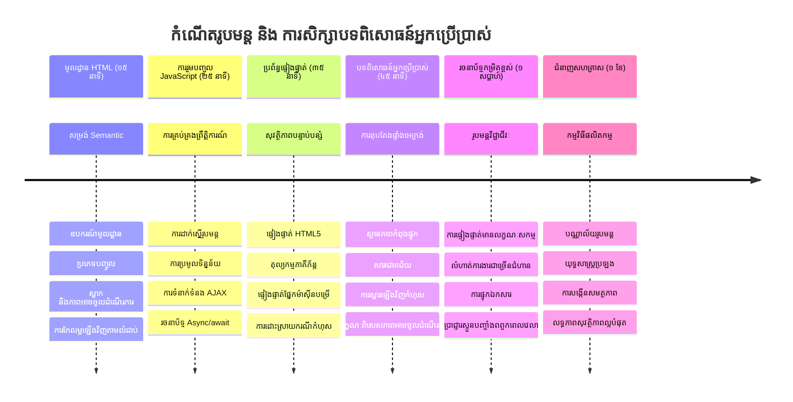
### 🛠️ សង្ខេបឧបករណ៍អភិវឌ្ឍទម្រង់របស់អ្នក

បន្ទាប់ពីបញ្ចប់មេរៀននេះ អ្នកបានបង្កើតជំនាញ៖  
- **ទម្រង់ HTML5**៖ រចនាសម្ព័ន្ធ សំដៅប្រភេទ និងលក្ខណៈអាចចូលរួម  
- **JavaScript ការគ្រប់គ្រងទម្រង់**៖ ការគ្រប់គ្រងព្រឹត្តិការណ៍ ប្រមូលទិន្នន័យ និងការទំនាក់ទំនង AJAX  
- **រចនាសម្ព័ន្ធ Validation**៖ ការត្រួតពិនិត្យលើស្រទាប សម្រាប់សុវត្ថិភាព និងបទពិសោធអ្នកប្រើ  
- **កម្មវិធីអសង្គ្រាម**៖ Fetch API សម័យទំនើប និងលំនាំ async/await  
- **ការគ្រប់គ្រងកំហុស**៖ ការការពារ ការបង្ហាញសារកំហុស និងប្រព័ន្ធមតិយោបល់  
- **រចនាបទបទពិសោធអ្នកប្រើ**៖ ស្ថានភាពផ្ទុក សារជោគជ័យ និងការស្ដារឡើងវិញកំហុស  
- **កែលម្អទៅមុខ**៖ ទម្រង់ដែលធ្វើការបាននៅលើកម្មវិធីរុករកទាំងអស់  

**កម្មវិធីពិតប្រាកដ**៖ ជំនាញរបស់អ្នកប្រើប្រាស់ដាក់កម្មវិធី៖  
- **កម្មវិធីអ៊ី-ពាណិជ្ជកម្ម**៖ ដំណើរការទូទាត់ អ្នកប្រើ ចុះឈ្មោះ និងទម្រង់ទូទាត់  
- **កម្មវិធីសហគ្រាស**៖ ប្រព័ន្ធបញ្ចូលទិន្នន័យ, ចំណ្រាប់របាយការណ៍ និងដំណើរការងារ  
- **គ្រប់គ្រងមាតិការផ្សេងៗ**៖ វេទិកាពុម្ពផ្សាយ, ប្រព័ន្ធមាតិកាបង្កើត ដោយអ្នកប្រើ និងអ្នកគ្រប់គ្រង  
- **កម្មវិធីហិរញ្ញវត្ថុ**៖ ផ្ទាំងធនាគារ វេទិកាវិនិយោគ និងប្រព័ន្ធប្រតិបត្តិការ  
- **ប្រព័ន្ធសុខភាព**៖ វេទិកាអ្នកជំងឺ ការកំណត់ពេលវេលា និងទម្រង់កំណត់ត្រាការព្យាបាល  
- **វេទិកាអប់រំ**៖ ចុះឈ្មោះថ្នាក់ កម្មវិធីវាយតម្លៃ និងគ្រប់គ្រងការសិក្សា  

**ជំនាញវិជ្ជាជីវៈដែលទទួលបាន**៖ អ្នកមានសមត្ថភាព៖  
- **រចនាទម្រង់សមរម្យសម្រាប់អ្នកទាំងអស់** រួមទាំងអ្នកមានករណីពិសេស  
- **អនុវត្តការត្រួតពិនិត្យសុវត្ថិភាព** ដែលទប់ស្កាត់ការបាក់បែកទិន្នន័យ និងច្របល់សុវត្ថិភាព  
- **បង្កើត UI ប្រតិកម្ម** ដែលផ្ដល់មតិយោបល់ច្បាស់លាស់និងការណែនាំ  
- **ស្កេនកំហុសពាក់ព័ន្ធទម្រង់** ប្រើឧបករណ៍អភិវឌ្ឍន៍កម្មវិធីរុករកនិងវិភាគបណ្ដាញ  
- **បង្កើតប្រសិទ្ធភាពទម្រង់** តាមរយៈការប្រមូលទិន្នន័យ និងការត្រួតពិនិត្យប្រសិទ្ធិភាព  

**គំនិតអភិវឌ្ឍ Frontend ដែលមានជំនាញ**៖  
- **រៀបចំស្ថាបត្យកម្មដោយបណ្តាលព្រឹត្តិការណ៍**៖ ការគ្រប់គ្រងអន្តរកម្ម និងប្រព័ន្ធឆ្លើយតប  
- **កម្មវិធីអសង្គ្រាម**៖ ការបញ្ជូនសំណើម៉ាស៊ីនមេ មិនរាំងខ្ទប់ និងដោះស្រាយកំហុស  
- **ការត្រួតពិនិត្យទិន្នន័យ**៖ សុវត្ថិភាពទាំងអស់ពី client និង server  
- **រចនាបទបទពិសោធអ្នកប្រើ**៖ ផ្ទាំងប្រើប្រាស់ឆ្លាតវៃ ដែលដឹកនាំអ្នកប្រើដោយសុវត្ថិភាព  
- **វិស្វកម្មចូលរួមសមរម្យ**៖ រចនាដែលសម្របសម្រួលសម្រាប់តម្រូវការវិធីសាស្ត្រខុសៗគ្នា  

**ជំហានបន្ទាប់**៖ អ្នកមានភាពរីករាយក្នុងការស្វែងយល់បណ្ណាល័យទម្រង់កម្រិតខ្ពស់, អនុវត្តច្បាប់ Validation ស្មុគស្មាញ, ឬបង្កើតប្រព័ន្ធប្រមូលទិន្នន័យកំពូលគុណភាពចំណង់ចំណូល!  

🌟 **សមិទ្ធផលបានទទួល**៖ អ្នកបានបង្កើតប្រព័ន្ធគ្រប់គ្រងទម្រង់ពេញលេញ ដែលចម្លើយ Validation វិជ្ជាជីវៈ, ដោះស្រាយកំហុស និងបញ្ចីបែបបទបទពិសោធអ្នកប្រើ!  

---


---

## ការប្រកួតប្រជែង GitHub Copilot Agent 🚀

ប្រើម៉ូដ Agent ដើម្បីបញ្ចប់ការប្រកួតខាងក្រោម៖  

**ការពិពណ៌នា:** បង្កើតទម្រង់ចុះឈ្មោះជាមួយការត្រួតពិនិត្យ client-side ដ៏ទូលំទូលាយ និងមតិយោបល់អ្នកប្រើ។ ការប្រកួតនេះនឹងជួយអ្នកហាត់បង្ហាត់ពីការត្រួតពិនិត្យទម្រង់ ការដោះស្រាយកំហុស និងកែលម្អបទពិសោធអ្នកប្រើជាមួយមតិយោបល់អន្តរកម្ម។
**Prompt:** បង្កើតប្រព័ន្ធផ្ទៀងផ្ទាត់សំណុំបែបបទចុះឈ្មោះដែលបញ្ចូល៖ 1) មតិយោបល់ផ្ទៀងផ្ទាត់ពេលពិតសម្រាប់គ្រប់វាលខណៈដែលអ្នកប្រើកំពុងវាយពាក្យ, 2) សារ​ផ្ទៀងផ្ទាត់​តាមបំណាច់ដែលបង្ហាញនៅក្រោមវាលបញ្ចូលនីមួយៗ, 3) វាលបញ្ជាក់ពាក្យសម្ងាត់ជាមួយការផ្ទៀងផ្ទាត់ភាពត្រូវគ្នា, 4) សញ្ញាស្តារអារម្មណ៍ (ដូចជាចំណាំពណ៌បៃតងសម្រាប់វាលត្រឹមត្រូវ និងការព្រមានពណ៌ក្រហមសម្រាប់វាលមិនត្រឹមត្រូវ), 5) ប៊ូតុងបញ្ជូនដែលកាន់តែធ្វើបានប្រសិនបើការផ្ទៀងផ្ទាត់ទាំងអស់ឆ្លុះបញ្ចាំង។ ប្រើលក្ខណៈការផ្ទៀងផ្ទាត់ HTML5, CSS សម្រាប់ប្ដូររូបរាងស្ថានភាពផ្ទៀងផ្ទាត់ និង JavaScript សម្រាប់សកម្មភាពប្រារព្ធការផ្លាស់ប្តូរ។

សូមស្វែងយល់បន្ថែមអំពី [របៀបមេម៉ង](https://code.visualstudio.com/blogs/2025/02/24/introducing-copilot-agent-mode)នៅទីនេះ។

## 🚀 챌린지

បង្ហាញសារកំហុសនៅក្នុង HTML ប្រសិនបើអ្នកប្រើបានមានរួចហើយ។

នេះជាគំរូនៃទំព័រការចូលចិត្តចុងក្រោយដែលអាចមានរូបរាងបន្ទាប់ពីបន្ថែមរចនាបថ CSS៖

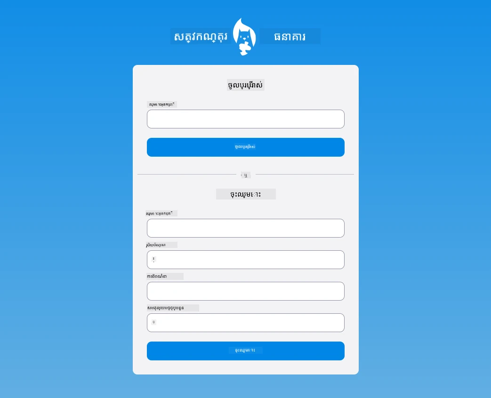

## កម្រិតសំណួរបន្ទាប់ពីមេរៀន

[សំណួរបន្ទាប់ពីមេរៀន](https://ff-quizzes.netlify.app/web/quiz/44)

## ពិនិត្យឡើងវិញ និងសិក្សាឯករាជ្យ

អ្នកអភិវឌ្ឍបានច្នៃប្រឌិតយ៉ាងខ្លាំងក្នុងការបង្កើតសំណុំបែបបទ រួមទាំងពីរបៀបផ្ទៀងផ្ទាត់។ សូមស្វែងរកអំពីចរន្តសំណុំបែបបទផ្សេងៗតាមរយៈការ​រុករកតាម [CodePen](https://codepen.com)៖ តើអ្នកអាចស្វែងរកសំណុំបែបបទដែលគួរឱ្យចាប់អារម្មណ៍ និងមានការជំរុញអារម្មណ៍បានទេ?

## ការងារ

[រចនាបថកម្មវិធីធនាគាររបស់អ្នក](assignment.md)

---

<!-- CO-OP TRANSLATOR DISCLAIMER START -->
**ការបដិសេធ**:  
ឯកសារនេះត្រូវបានបកប្រែដោយប្រើសេវាកម្មបកប្រែ AI [Co-op Translator](https://github.com/Azure/co-op-translator)។ ទោះបីយើងខំប្រឹងសម្រាប់ភាពត្រឹមត្រូវក៏ដោយ សូមយកចិត្តទុកដាក់ថា ការបកប្រែដោយស្វ័យប្រវត្តិអាចមានកំហុស ឬភាពមិនត្រឹមត្រូវ។ ឯកសារដើមជាភាសាព្រំដែនរបស់វាគួរត្រូវបានគេយកជា​ការ​យោងដ៏ទូលំទូលាយ។ សម្រាប់ព័ត៌មានសំខាន់ៗ សូមផ្ដល់អាទិភាពការបកប្រែដោយមនុស្សជំនាញ។ យើងមិនទទួលខុសត្រូវចំពោះការយល់ច្រឡំ ឬការបញ្ចូលទស្សន៍មិនត្រឹមត្រូវអ្វីៗមកពីការប្រើប្រាស់ការបកប្រែនេះឡើយ។
<!-- CO-OP TRANSLATOR DISCLAIMER END -->