# សាងសង់កម្មវិធីធនាគារ ផ្នែកទី3៖ វិធីសាស្រ្តទាញយក និងប្រើប្រាស់ទិន្នន័យ

គិតអំពីកុំព្យូទ័ររបស់ Enterprise ក្នុង Star Trek - ពេល Captain Picard ស្នើសុំស្ថានភាពនាវា ព័ត៌មាននោះបង្ហាញភ្លាមៗដោយមិនធ្វើឲ្យទាំងអ៊ីនធឺហ្វសដែលមានផ្ទាំងមុខបិទ ហើយសាងសង់ឡើងវិញទេ។ ការស្វូរបកព័ត៌មានបានល្អល្អឥតខ្ចោះនេះហើយជាការដែលយើងកំពុងសាងសង់នៅទីនេះជាមួយការទាញយកទិន្នន័យឌីណាមិច។

សព្វថ្ងៃ កម្មវិធីធនាគាររបស់អ្នកដូចមុខសារព័ត៌មានដែលបានបោះពុម្ព - មានព័ត៌មានប៉ុន្តែថេរ។ យើងនឹងបម្លែងវាទៅជាដូចកន្លែងគ្រប់គ្រងបេសកកម្មនៅ NASA ដែលទិន្នន័យហូរជាបន្តបន្ទាប់ និងអាប់ដេតពេញលេញក្នុងពេលវេលាពិតប្រាកដដោយមិនរាំងខ្សroqលឲ្យដំណើរការរបស់អ្នកប្រើប្រាស់បាត់បង់។

អ្នកនឹងរៀនវិធីទំនាក់ទំនងជាមួយម៉ាស៊ីនបម្រើដោយអាស៊ីនឆ្រូណាស់, ដោះស្រាយទិន្នន័យដែលមកដល់ក្នុងពេលខុសគ្នា, និងបម្លែងព័ត៌មានដើមទៅជាអ្វីមួយមានន័យសម្រាប់អ្នកប្រើប្រាស់។ នេះជាភាពខុសគ្នារវាងកម្មវិធីបង្ហាញ និងកម្មវិធីរួមបញ្ចូលក្នុងការផលិត។

## ⚡ អ្វីដែលអ្នកអាចធ្វើបានក្នុងរយៈពេល 5 នាទីបន្ទាប់

**ផ្លូវចាប់ផ្តើមរហ័សសម្រាប់អ្នកអភិវឌ្ឍន៍មិនទាន់មានពេល**

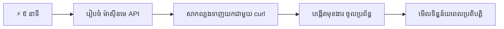
- **នាទី 1-2**: ចាប់ផ្តើមម៉ាស៊ីនបម្រើ API របស់អ្នក (`cd api && npm start`) ហើយសាកល្បងការតភ្ជាប់
- **នាទី 3**: បង្កើតមុខងារ `getAccount()` មូលដ្ឋានដោយប្រើ fetch
- **នាទី 4**: ភ្ជាប់ទំរង់ចូលប្រើប្រាស់ជាមួយ `action="javascript:login()"`
- **នាទី 5**: សាកល្បងចូលប្រើប្រាស់ ហើយមើលទិន្នន័យគណនីបង្ហាញនៅក្នុងកុងស៊ូល

**ពាក្យបញ្ជាសម្រាប់សាកល្បងឆាប់រហ័ស**:  
```bash
# ផ្ទៀងផ្ទាត់ថា API កំពុងដំណើរការ
curl http://localhost:5000/api

# សាកល្បងទាញយកទិន្នន័យគណនី
curl http://localhost:5000/api/accounts/test
```
  
**ហេតុអ្វីវាមានសារៈសំខាន់**៖ នៅក្នុងរយៈពេល 5 នាទី អ្នកនឹងឃើញព្រងារចិត្តនៃការទាញយកទិន្នន័យអាស៊ីនឆ្រូណាស់ ដែលគ្រប់កម្មវិធីវេបទំនើបប្រើប្រាស់។ នេះជាគ្រឹះដំបូងដែលធ្វើឲ្យកម្មវិធីមានអារម្មណ៍ឆាប់និងរស់រវើក។

## 🗺️ ជំនាញរៀនរបស់អ្នកតាមរយៈកម្មវិធីវេបដែលបើកចំហទិន្នន័យ

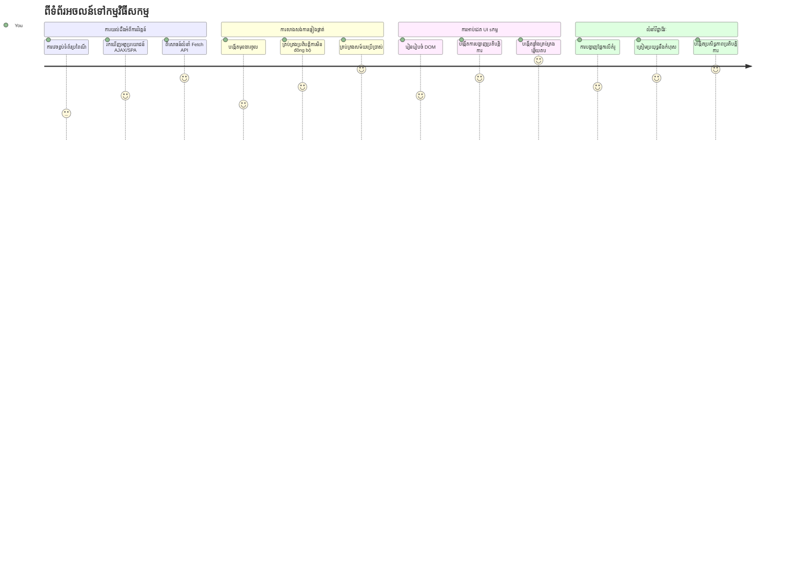
**គោលដៅនៃការសិក្សារបស់អ្នក**៖ នៅចុងបញ្ចប់មេរៀននេះ អ្នកនឹងយល់ដឹងពីរបៀបដែលកម្មវិធីវេបទំនើបទាញយក, ដំណើរការ និងបង្ហាញទិន្នន័យឌីណាមិច តាមរយៈបទពិសោធន៍រលូនដែលយើងរំពឹងទុកពីកម្មវិធីមានវិជ្ជាជីវៈ។

## កម្រងសំណួរពិនិត្យមុនមេរៀន

[កម្រងសំណួរពិនិត្យមុនមេរៀន](https://ff-quizzes.netlify.app/web/quiz/45)

### លក្ខខណ្ឌរួចមុន

មុនចូលទៅក្រោមការទាញយកទិន្នន័យ សូមប្រាកដថាអ្នកមានគ្រឿងផ្សំខាងក្រោមរួចហើយ៖

- **មេរៀនមុន**៖ បញ្ចប់ [ទំរង់ចូលប្រើ និងចុះបញ្ជី](../2-forms/README.md) - យើងនឹងបង្កើតបន្ថែមលើមូលដ្ឋាននេះ  
- **ម៉ាស៊ីនបម្រើមូលដ្ឋាន**៖ ដំឡើង [Node.js](https://nodejs.org) និង [ដំណើរការម៉ាស៊ីនបម្រើ API](../api/README.md) ដើម្បីផ្តល់ទិន្នន័យគណនី  
- **ការតភ្ជាប់ API**៖ សាកល្បងការតភ្ជាប់ម៉ាស៊ីនបម្រើរបស់អ្នកជាមួយពាក្យបញ្ជានេះ:

```bash
curl http://localhost:5000/api
# ការឆ្លើយតបដែលបានរំពឹងទុក៖ "Bank API v1.0.0"
```
  
ការសាកល្បងរហ័សនេះធានាថា គ្រប់គ្រឿងផ្សំទាំងអស់កំពុងទំនាក់ទំនងបានត្រឹមត្រូវ៖  
- ផ្ទៀងផ្ទាត់ Node.js កំពុងដំណើរការដោយត្រឹមត្រូវលើប្រព័ន្ធរបស់អ្នក  
- បញ្ជាក់ថាម៉ាស៊ីនបម្រើ API របស់អ្នកកំពុងអនុវត្តន៍ និងឆ្លើយតប  
- គោលបំណងថាកម្មវិធីរបស់អ្នកអាចដំណើរការទៅម៉ាស៊ីនបម្រើបាន (ដូចជាការត្រួតពិនិត្យការទំនាក់ទំនងវិទ្យុមុនបេសកកម្ម)

## 🧠 ទិដ្ឋភាពទូទៅនៃប្រព័ន្ធគ្រប់គ្រងទិន្នន័យ

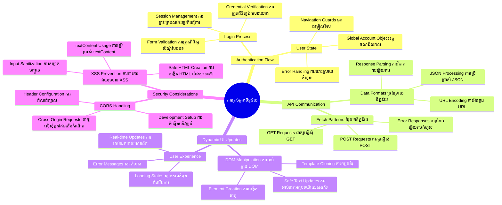
**គ្រឹះមូលដ្ឋាន**៖ កម្មវិធីវេបទំនើបជាប្រព័ន្ធចងក្រងទិន្នន័យ - វាត្រូវគ្នារវាងផ្ទាំងមុខអ្នកប្រើ, ម៉ាស៊ីនបម្រើ API និងម៉ូដែលសុវត្ថិភាពរបស់កម្មវិធីរុករកដើម្បីបង្កើតបទពិសោធន៍រលូន។

---

## យល់ដឹងអំពីការទាញយកទិន្នន័យក្នុងកម្មវិធីវេបទំនើប

របៀបដែលកម្មវិធីវេបគ្រប់គ្រងទិន្នន័យបានឈានទៅមុខយ៉ាងហោចណាស់ក្នុងរយៈ២០ឆ្នាំចុងក្រោយ។ ការយល់ដឹងពីការវិវឌ្ឍន៍នេះនឹងជួយឱ្យអ្នកយល់ថាហេតុអ្វីដែលបច្ចេកវិធីទំនើបជាដើមដូចជា AJAX និង Fetch API មានអំណាច ហើយហេតុអ្វីបានជាជារបស់សំខាន់សម្រាប់អ្នកអភិវឌ្ឍន៍វេប។

យើងឲ្យមើលរបៀបដែលគេបានបង្កើតគេហទំព័រប្រពៃណីប្រៀបធៀបនឹងកម្មវិធីឌីណាមិចរលូនដែលយើងកំពុងកសាងថ្ងៃនេះ។

### កម្មវិធីវេបច្រើនទំព័រប្រពៃណី (MPA)

ក្នុងដំណាក់កាលដំបូងនៃអ៊ីនធឺណិត គ្រាប់មួយបិទ គ្រាប់មួយថែមពិតជាដូចជាស្វាយលេងប្ដូរច្រកបឹងទូរទស្សន៍ចាស់ៗ - ថតគេនឹងស្វះស្វែងហើយបញ្ចូលមាតិកាថ្មីយឺតៗ។ នេះជាពិតរបស់កម្មវិធីវេបដើមៗដែលគ្រប់ការនិយាយទាំងឡាយមានន័យថាត្រូវសង់ឡើងវិញទំព័រទាំងមូលចាប់ពីដើម។

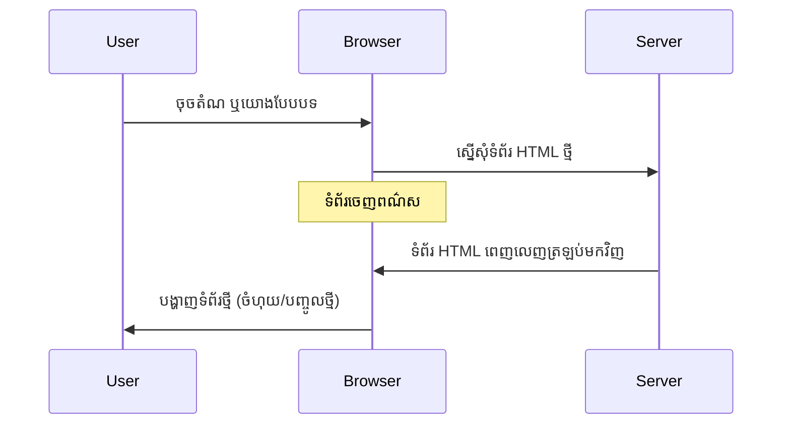
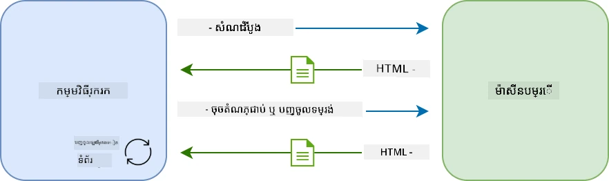

**ហេតុអ្វីដែលវិធីនេះមើលទៅជាចាស់ដូចជា៖**  
- គ្រប់ការចុចមានន័យថាត្រូវសង់ទំព័រទាំងមូលឡើងវិញ  
- អ្នកប្រើប្រាស់ត្រូវឈប់នឹកក្នុងកណ្តាលដោយការបង្ហាញទំព័រចាស់ៗរាំងស្ទះ  
- ការតភ្ជាប់អ៊ីនធឺណិតរបស់អ្នកធ្វើការ៉ាសាំ្ជត (overwork) ដោយទាញយកក្បាលទំព័រ និងជើងទំព័រដដែលជាថ្មីៗ  
- កម្មវិធីមានអារម្មណ៍ដូចជាគ្រាប់ប៊ិចតំណាងផ្ទុកឯកសារមែនជាងប្រើប្រាស់កម្មវិធី

### កម្មវិធីវេបទំព័រតែមួយទំព័រ (SPA) ទំនើប

AJAX (Asynchronous JavaScript and XML) ប្រែផែននេះស្រួចខ្លាំង។ ដូចការរចនាផ្នែកច្រើននៃស្ថានីយអាកាសអន្ដរជាតិ ដែលអ្នកអង្គាសអាចប្តូរផ្នែកតែមួយដោយមិនបង្កើតស្ថាបត្យកម្មទាំងមូលឡើងវិញ, AJAX អនុញ្ញាតឲ្យយើងអាប់ដេតផ្នែកជាក់លាក់នៃគេហទំព័រ ដោយមិនចាំបាច់ផ្ទុកឡើងវិញទាំងមូល។ ទោះបីជា XML ត្រូវបានដាក់ឈ្មោះក៏ដោយ យើងភាគច្រើនប្រើ JSON នៅសព្វថ្ងៃ ប៉ុន្តែគ្រឹះដូចគ្នានៅតែមាន៖ អាប់ដេតតែអ្វីដែលត្រូវរយះពេល។

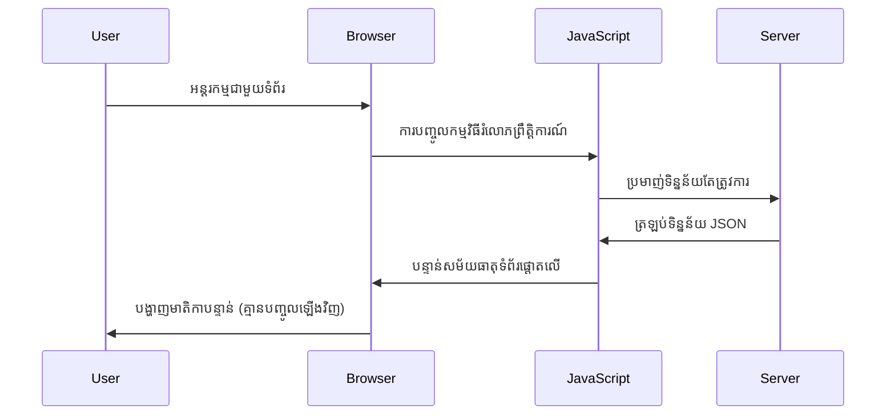
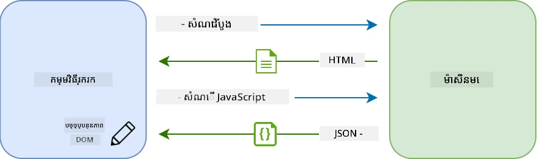

**ហេតុអ្វី SPAs មើលទៅរលូនជាង៖**  
- មានតែផ្នែកដែលបានផ្លាស់ប្តូរជាក់លាក់ត្រូវអាប់ដេត (ដោយមានចិត្តវិភាគ)  
- គ្មានការរាំងខ្ស្រូលរាំងស្ទះទៀតទេ - អ្នកប្រើនៅក្នុងលំនាំរបស់ពួកគេបន្ត  
- ទិន្នន័យដំណើរតិចជាង មានន័យថាបង្ហាញបានលឿន  
- គ្រប់យ៉ាងមានអារម្មណ៍ឆាប់គិត និងឆ្លាតដូចកម្មវិធីនៅលើទូរស័ព្ទរបស់អ្នក  

### ការវិវឌ្ឍទៅ Fetch API ទំនើប

កម្មវិធីរុករកសម័យថ្មីផ្តល់ជូន [`Fetch` API](https://developer.mozilla.org/docs/Web/API/Fetch_API) ដែលជំនួស [`XMLHttpRequest`](https://developer.mozilla.org/docs/Web/API/XMLHttpRequest/Using_XMLHttpRequest) ចាស់។ ដូចការប្រែពីការប្រើទូរសព្ទទៅអ៊ីមែល, Fetch API ប្រើ promises សម្រាប់កូដអាស៊ីនឆ្រូណាស់កាន់តែស្អាត ហើយគ្រប់គ្រង JSON បានយ៉ាងធម្មជាតិ។

| លក្ខណៈពិសេស | XMLHttpRequest | Fetch API |
|---------|----------------|----------|
| **សរសេរ​កូដ** | ពិបាកដោយផ្អែកលើ callback | ស្អាតដោយជាសន្យា (promise) |
| **គ្រប់គ្រង JSON** | ត្រូវបកប្រែដោយដៃ | មានវិធី `.json()` ផ្ទាល់ក្នុង |
| **គ្រប់គ្រងកំហុស** | ព័ត៌មានកំហុសមានកំណត់ | ព័ត៌មានកំហុសពេញលេញ |
| **គាំទ្រ​សម័យ​ថ្មី** | ត្រូវគាំទ្រពីម៉ាស៊ីនចាស់ | សន្យា ES6+ និង async/await |

> 💡 **ការគាំទ្ររបស់កម្មវិធីរុករក**៖ ព័ត៌មានល្អ - Fetch API ដំណើរការល្អក្នុងកម្មវិធីរុករកទំនើបទាំងអស់! ប្រសិនបើអ្នកចង់ដឹងពីកំណែជាក់លាក់ [caniuse.com](https://caniuse.com/fetch) មានព័ត៌មានការគាំទ្រដូចបានច្បាស់លាស់។  
>   
**ចំណុចសំខាន់៖**  
- ដំណើរការល្អ Chrome, Firefox, Safari និង Edge (គឺគ្រប់ទីកន្លែងដែលអ្នកប្រើប្រាស់របស់អ្នកមាន)  
- មានតែ Internet Explorer តែប៉ុណ្ណោះដែលត្រូវការជំនួយបន្ថែម (ហើយពិតជាគួរឲ្យចាកចេញពីវា)  
- បង្កើតស្ថានភាពល្អសម្រាប់ async/await ដែលយើងនឹងប្រើនៅខាងក្រោយ  

### សម្រេចការចូលប្រើប្រាស់អ្នកប្រើ និងទាញយកទិន្នន័យ

ឥឡូវនេះ មករៀបចំប្រព័ន្ធចូលប្រើប្រាស់ដែលបម្លែងកម្មវិធីធនាគាររបស់អ្នកពីការបង្ហាញថេរមួយទៅជា កម្មវិធីប្រើប្រាស់មួយ។ ដូចនីតិវិធីផ្ទៀងផ្ទាត់ប្រើប្រាស់ក្នុងទីតាំងយោធាដែលមានសុវត្ថិភាព យើងនឹងផ្ទៀងផ្ទាត់ព័ត៌មានអ្នកប្រើ និងបន្ទាប់មកផ្តល់ចូលទៅក្នុងទិន្នន័យជាក់លាក់របស់ពួកគេ។

យើងនឹងកសាងវាជាបន្ដបន្ទាប់ ចាប់ពីការផ្ទៀងផ្ទាត់មូលដ្ឋាន ហើយបន្ថែមមុខងារទាញយកទិន្នន័យជាក្រោយ។

#### ជំហានទី1៖ បង្កើតមូលដ្ឋានមុខងារចូលប្រើប្រាស់

បើកឯកសារ `app.js` ហើយបន្ថែមមុខងារ `login` ថ្មីមួយ។ នេះនឹងគ្រប់គ្រងដំណើរការផ្ទៀងផ្ទាត់អ្នកប្រើ៖

```javascript
async function login() {
  const loginForm = document.getElementById('loginForm');
  const user = loginForm.user.value;
}
```
  
**ចូលទៅបំបែកវា៖**  
- ពាក្យកំណត់ `async`? នេះកំពុងប្រាប់ JavaScript ថា "មុខងារនេះអាចត្រូវរង់ចាំអ្វីមួយ"  
- យើងកំពុងយកទំរង់ពីទំព័រ (គ្មានអ្វីពិសេស, គ្រាន់តែស្វែងរកតាម ID)  
- បន្ទាប់មកយើងយកអ្វីដែលអ្នកប្រើបានវាយជាឈ្មោះអ្នកប្រើ  
- មានមុខងារស្អាត៖ អ្នកអាចចូលដល់inputទាំងអស់ពីឈ្មោះ `name` របស់វា - មិនចាំបាច់ទៅទាញ element ដោយ ID ទៀតហើយ!

> 💡 **គំរូចូលដល់ទំរង់**៖ គ្រប់ការត្រួតគ្រងទំរង់អាចចូលដោយឈ្មោះ (set ក្នុង HTML ជាមួយ attribute `name`) ជាគ្រឿងផ្នែកមួយនៃទំរង់ម្ដងទេ។ វាផ្តល់វិធីសាស្រ្តស្អាតក្នុងការទាញទិន្នន័យវេប។

#### ជំហានទី2៖ បង្កើតមុខងារទាញយកទិន្នន័យគណនី

បន្ទាប់មក យើងនឹងបង្កើតមុខងារជាក់លាក់សម្រាប់ទាញយកទិន្នន័យគណនីពីម៉ាស៊ីនបម្រើ។ វាមៅដូចជាគំរូក្នុងការចុះបញ្ជី ដោយផ្តោតលើការទាញយកទិន្នន័យ៖

```javascript
async function getAccount(user) {
  try {
    const response = await fetch('//localhost:5000/api/accounts/' + encodeURIComponent(user));
    return await response.json();
  } catch (error) {
    return { error: error.message || 'Unknown error' };
  }
}
```
  
**អ្វីដែលកូដនេះធ្វើ៖**  
- **ប្រើប្រាស់** `fetch` API ទំនើបសម្រាប់ទាញយកទិន្នន័យអាស៊ីនឆ្រូណាស់  
- **បង្កើត** URL សំណើ GET ជាមួយប៉ារ៉ាម៉ែត្រ username  
- **អនុវត្ត** `encodeURIComponent()` ដើម្បីដោះស្រាយអក្សរពិសេសក្នុង URL  
- **បម្លែង** ផ្ទុយជា JSON សម្រាប់ងាយស្រួលដំណើរការ  
- **ដោះស្រាយកំហុស** ដោយអាចផ្តល់វត្ថុកំហុស មិនបញ្ហាសម្រាប់បញ្ហាដល់កូដ  

> ⚠️ **កំណត់ចំណាំសុវត្ថិភាព**៖ មុខងារ `encodeURIComponent()` គ្រប់គ្រងអក្សរពិសេសក្នុង URL។ ដូចប្រព័ន្ធសម្ងាត់ការទំនាក់ទំនងទាហាន វាធានាថាសាររបស់អ្នកដល់ដោយត្រឹមត្រូវ ដើម្បីការពារអក្សរដូចជា "#" ឬ "&" មិនឲ្យប៉ះពាល់។  
>   
**ហេតុអ្វីវាមានសារៈសំខាន់ៈ**  
- ល្បួងឲ្យបញ្ហា URL រអិល  
- ការពារការវាយប្រហារដោយកែប្រែ URL  
- ផ្ទៀងផ្ទាត់ម៉ាស៊ីនបម្រើទទួលបានព័ត៌មានត្រឹមត្រូវ  
- អនុវត្តន៍បទពិសោធន៍សុវត្ថិភាព!

#### យល់ដឹងពីសំណើ HTTP GET

នេះជារឿងដែលអាចធ្វើអោយភ្ញាក់ផ្អើល៖ ខណៈពេលអ្នកប្រើ `fetch` ដោយគ្មានជម្រើសបន្ថែម វាបង្កើតសំណើ [`GET`](https://developer.mozilla.org/docs/Web/HTTP/Methods/GET) ដោយស្វ័យប្រវត្តិ។ វាដូចជាការស្នើសុំផ្ដល់មើលព័ត៌មានគណនីអ្នកប្រើ។

សូមគិតថាសំណើ GET ជាការស្នើសុំយ៉ាងគង់ចិត្តដើម្បីខ្ចប់សៀវភៅមួយពីបណ្ណាល័យ - អ្នកកំពុងស្នើមើលអ្វីដែលមានរួចហើយ។ សំណើ POST (ដែលយើងបានប្រើសម្រាប់ការចុះបញ្ជី) ជាដូចស្នើសុំបញ្ចូលសៀវភៅថ្មីមួយចូលក្នុងប្រមូលផ្ដុំ។

| សំណើ GET | សំណើ POST |
|-------------|-------------|
| **គោលបំណង** | ទាញយកទិន្នន័យមានរួច | ផ្ញើទិន្នន័យថ្មីទៅម៉ាស៊ីនបម្រើ |
| **ប៉ារ៉ាម៉ែត្រ** | នៅផ្លូវ URL/សំណួរ | នៅក្នុងរាងសំណើ |
| **បម្រាស់ទិន្នន័យ** | អាចបានថតជាស្តុកដោយកម្មវិធីរុករក | មិនទៀងទាត់ថតជាស្តុក |
| **សុវត្ថិភាព** | មើលឃើញបានក្នុង URL/កំណត់ត្រា | លាក់ក្នុងរាងសំណើ |

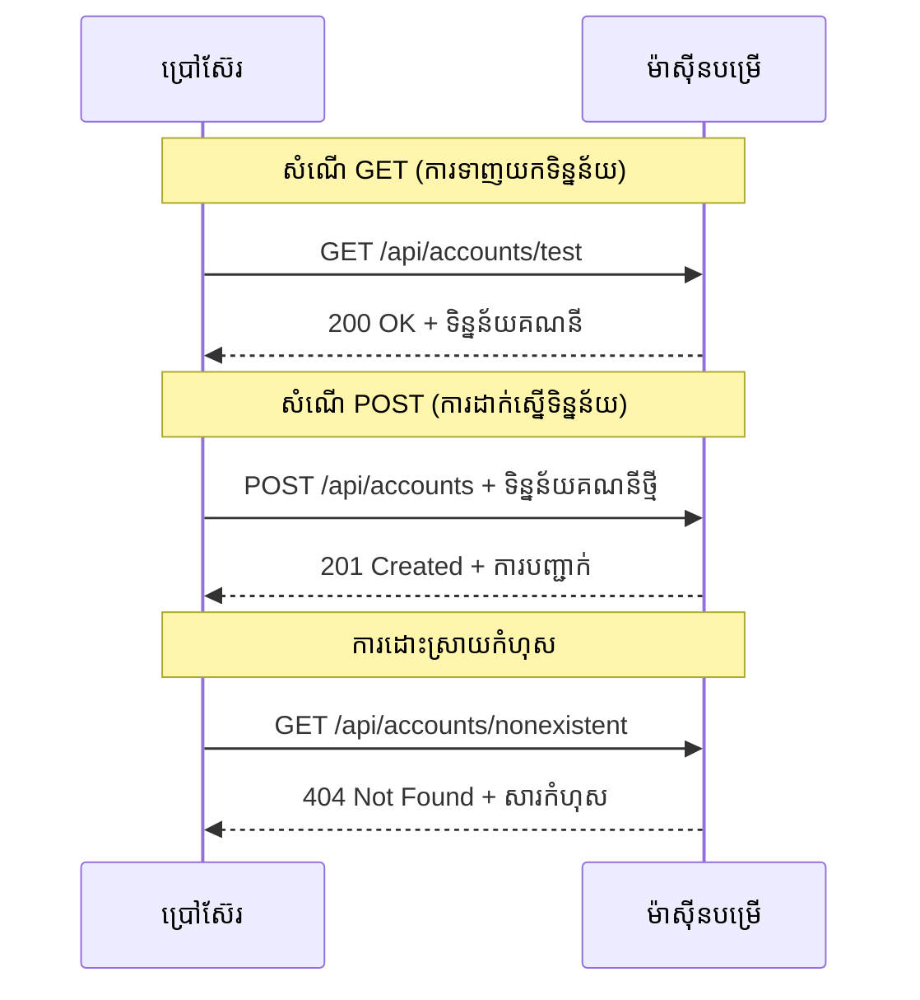
#### ជំហានទី3៖ បង្រួមគ្រប់យ៉ាងចូលគ្នា

ឥឡូវនេះមកជាន់​កម្រិតសប្បាយចិត្ត - មកភ្ជាប់មុខងារទាញយកគណនីទៅដំណើរការចូលរបស់អ្នក។ នេះជាកន្លែងដែលគ្រប់យ៉ាងសម្រួលចូលគ្នា៖

```javascript
async function login() {
  const loginForm = document.getElementById('loginForm');
  const user = loginForm.user.value;
  const data = await getAccount(user);

  if (data.error) {
    return console.log('loginError', data.error);
  }

  account = data;
  navigate('/dashboard');
}
```
  
មុខងារនេះអនុវត្តតាមលំដាប់៖  
- ប្រមូលឈ្មោះអ្នកប្រើពីinputទំរង់  
- ស្នើសុំទិន្នន័យគណនីអ្នកប្រើពីម៉ាស៊ីនបម្រើ  
- ដោះស្រាយកំហុសណាមួយកើតឡើងពេលដំណើរការ  
- រក្សាទុកទិន្នន័យគណនី ហើយនាំទៅមុខទំព័រដាសប៊ូតបន្ទាប់ពីជោគជ័យ  

> 🎯 **គំរូ Async/Await**៖ ពីព្រោះ `getAccount` ជាមុខងារអាស៊ីនឆ្រូណាស់ យើងប្រើពាក្យ `await` ដើម្បីផ្អាក់សកម្មភាពរហូតដល់ម៉ាស៊ីនបម្រើឆ្លើយតប។ វារពារការបន្តកម្មវិធីជាមួយទិន្នន័យដែលមិនបានកំណត់។

#### ជំហានទី4៖ បង្កើតទីតាំងរក្សាទិន្នន័យរបស់អ្នក

កម្មវិធីរបស់អ្នកត្រូវការទីតាំងមួយដើម្បីចងចាំព័ត៌មានគណនីនៅពេលដែលវាត្រូវបានផ្ទុក។ សូមគិតថាវាជាភាសារហ្សឺមរបស់កម្មវិធី - ជាទីកន្លែងរក្សាទិន្នន័យអ្នកប្រើបច្ចុប្បន្ន។ បន្ថែមជួរនេះនៅលើកំពូលឯកសារ `app.js` របស់អ្នក៖

```javascript
// នេះផ្ទុកទិន្នន័យគណនីរបស់អ្នកប្រើប្រាស់បច្ចុប្បន្ន
let account = null;
```
  
**ហេតុអ្វីយើងត្រូវការវា៖**  
- រក្សាទិន្នន័យគណនីអាចចូលបានពីគ្រប់ទីកន្លែងក្នុងកម្មវិធី  
- ចាប់ផ្តើមជាមួយ `null` មានន័យថា "មិនមាននរណាចូលប្រើទេ"  
- វានឹងត្រូវបន្ទាន់សម័យពេលនរណាម្នាក់ចូលឬចុះបញ្ជី  
- ប្រព្រឹត្តដូចជាមូលដ្ឋានតែមួយនៃការពិត - មិនមានភាពច្របូកច្របល់អំពីនរណាកំពុងប្រើប្រាស់  

#### ជំហានទី5៖ ភ្ជាប់ទំរង់របស់អ្នក

ឥឡូវនេះភ្ជាប់មុខងារចូលថ្មីរបស់អ្នកទៅទំរង់ HTML។ បរិមាណទំរង់របស់អ្នកដូចខាងក្រោម៖

```html
<form id="loginForm" action="javascript:login()">
  <!-- Your existing form inputs -->
</form>
```
  
**អ្វីដែលការផ្លាស់ប្ដូរតូចនេះធ្វើ៖**  
- ឈប់ទំរង់ពីការធ្វើវិបត្តិពេញទំព័រដូចតាមទំនៀមទំលាប់  
- ហៅមុខងារ JavaScript ផ្ទាល់របស់អ្នកជំនួស  
- រក្សាឲ្យវាស្រួល និងមានអារម្មណ៍ដូច SPA  
- ផ្តល់ការគ្រប់គ្រងពេញលេញលើអ្វីដែលកើតឡើងពេលអ្នកប្រើចុច "Login"

#### ជំហានទី6៖ បង្កើតភាពរលូនក្នុងមុខងារចុះបញ្ជីរបស់អ្នក

សម្រាប់ភាពស្មើគ្នា, អាប់ដេតមុខងារ `register` របស់អ្នកឲ្យកាន់តែរក្សាទិន្នន័យគណនី និងនាំទៅដាសប៊ូត:

```javascript
// បន្ថែមបន្ទាត់ទាំងនេះនៅចុងฟងសិន register របស់អ្នក
account = result;
navigate('/dashboard');
```
  
**ការកែលម្អនេះផ្តល់ជូន៖**  
- **ចូលរួមរលូន** ពីការចុះបញ្ជីទៅដាស់ប៊ូត  
- **បទពិសោធន៍រលូន** ដូចគ្នារវាងដំណើរការចូល និងចុះបញ្ជី  
- **ចូលប្រើបានភ្លាម** ទិន្នន័យគណនីបន្ទាប់ពីចុះបញ្ជីជោគជ័យ  

#### សាកល្បងការអនុវត្តរបស់អ្នក

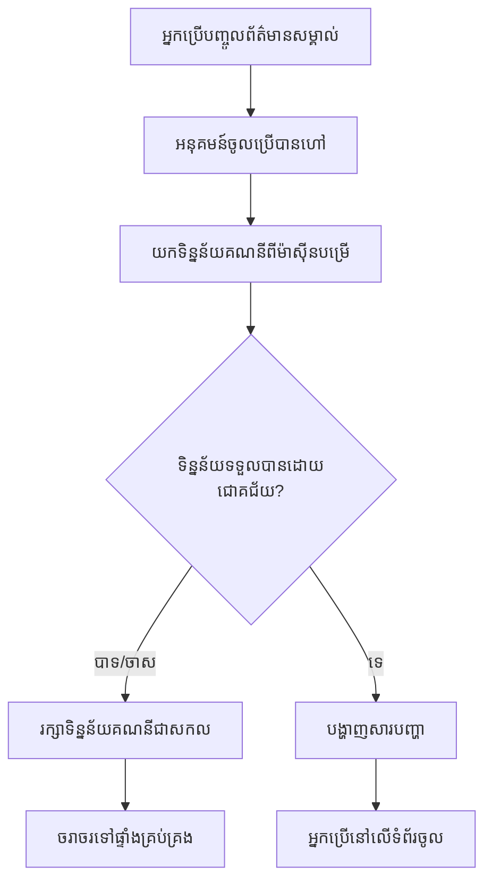
**ម៉ោងសាកល្បងវា៖**  
1. បង្កើតគណនីថ្មីមួយដើម្បីបញ្ជាក់ថាអ្វីៗដំណើរការ  
2. ព្យាយាមចូលជាមួយព័ត៌មានបញ្ចូលនោះដដែល  
3. មើលកុងស៊ូលរបស់កម្មវិធីរុករក (F12) ប្រសិនបើមានអ្វីមិនត្រឹមត្រូវ  
4. ធ្វើឲ្យប្រាកដថាអ្នកបានមកដល់ដាសប៊ូតបន្ទាប់ពីចូលបានជោគជ័យ  

ប្រសិនបើអ្វីមួយមិនដំណើរការ កុំភ័យ! បញ្ហាច្រើនគឺជាការជួសជុលតូចៗដូចជា ព្រីន អក្សរបាត់ ឬភ្លេចចាប់ផ្តើមម៉ាស៊ីនបម្រើ API។

#### ពាក្យសម្ងាត់ខ្លីអំពី Cross-Origin ខ្យល់ទឹក

អ្នកអាចចង់ដឹង៖ "កម្មវិធីវេបរបស់ខ្ញុំរបៀបណាចាប់ផ្តើមនិយាយទៅម៉ាស៊ីនបម្រើ API ខណៈពួកវារត់លើព្រលឹងផ្សេងគ្នា?" សំណួរល្អ! នេះជាវិញ្ញាណដែលអ្នកអភិវឌ្ឍន៍វេបគ្រប់នរណាវៀចក្លាយជាការស្ទាក់ស្ទើរបាននៅពេលណា។

> 🔒 **សុវត្ថិភាព Cross-Origin**៖ កម្មវិធីរុករកអនុវត្តន៍ "គោលន័យដើមដូចគ្នា" ដើម្បីការពារការទំនាក់ទំនងមិនមានការអនុញ្ញាតរវាងដែនដីខុសគ្នា។ ដូចប្រព័ន្ធត្រួតពិនិត្យនៅ Pentagon វាអះអាងថាការទំនាក់ទំនងត្រូវបានអនុញ្ញាតមុនប្រើទិន្នន័យ។  
>   
**ក្នុងការរៀបចំរបស់យើង៖**  
- កម្មវិធីវេបរបស់អ្នកដំណើរការនៅ `localhost:3000` (ម៉ាស៊ីនបម្រើអភិវឌ្ឍន៍)  
- ម៉ាស៊ីនបម្រើ API របស់អ្នកដំណើរការនៅ `localhost:5000` (ម៉ាស៊ីនបម្រើក្រោយ)  
- ម៉ាស៊ីនបម្រើ API រួមបញ្ចូល [ក្បាល CORS](https://developer.mozilla.org/docs/Web/HTTP/CORS) ដែលអនុញ្ញាតឲ្យមានការទំនាក់ទំនងចេញពីកម្មវិធីវេបរបស់អ្នក  

ការរៀបចំនេះស្ទើរតែដូចការអភិវឌ្ឍន៍ពិតដែលកម្មវិធីផ្នែកមុខ និងផ្នែកក្រោយស្របទម្លាប់ដំណើរការលើម៉ាស៊ីនបម្រើផ្សេងគ្នា។

> 📚 **រៀនបន្ថែម**៖ ជ្រាបជ្រោមទៅលើ API និងការទាញយកទិន្នន័យជាមួយ [មេរៀន Microsoft Learn លើ API](https://docs.microsoft.com/learn/modules/use-apis-discover-museum-art/?WT.mc_id=academic-77807-sagibbon)។

## បង្ហាញទិន្នន័យរបស់អ្នកក្នុង HTML

ឥឡូវនេះ យើងនឹងធ្វើឲ្យទិន្នន័យដែលបានទាញយកមើលឃើញដោយអ្នកប្រើតាមរយៈការគ្រប់គ្រង DOM។ ដូចការវិភាគរូបថតក្នុងបន្ទប់ងងឹត យើងកំពុងយកទិន្នន័យមិនអាចមើលឃើញទៅធ្វើឲ្យវាមើលឃើញ និងអាចធ្វើអ្វីមួយបានដោយអ្នកប្រើ។

ការគ្រប់គ្រង DOM គឺជាបច្ចេកទេសដែលបម្លែងទំព័រវេបថេរជាកម្មវិធីឌីណាមិចដែលអាប់ដេតមាតិការបស់វាតាមប្រតិកម្មអ្នកប្រើ និងការឆ្លើយតបម៉ាស៊ីនបម្រើ។

### ជ្រើសរើសឧបករណ៍ត្រឹមត្រូវសម្រាប់ការងារ
ពេលដែលផ្លាស់ប្ដូរទំព័រ HTML របស់អ្នកជាមួយ JavaScript អ្នកមានជម្រើសជាច្រើន។ គិតថាវានៅដូចជាវត្ថុអគ្គិសនីផ្សេងៗក្នុងប្រអប់ឧបករណ៍មួយ - តែម្ដងគួរឱ្យសមសម្រាប់ការងារផ្សេងៗ៖

| វិធីសាស្រ្ត | អ្វីដែលវាល្អ | ពេលណាត្រូវប្រើវា | កម្រិតសុវត្ថិភាព |
|--------|---------------------|----------------|--------------|
| `textContent` | បង្ហាញទិន្នន័យអ្នកប្រើប្រាស់ដោយសុវត្ថិភាព | ពេលណាដែលអ្នកបង្ហាញអត្ថបទ | ✅ រឹងមាំ |
| `createElement()` + `append()` | បង្កើតកំណត់ត្រាសង្កត់ | បង្កើតផ្នែក/បញ្ជីថ្មី | ✅ រឹងមាំ |
| `innerHTML` | កំណត់មាតិកា HTML | ⚠️ ព្យាយាមចៀសវាងវា | ❌ ប្រតិបត្តិការលំបាក |

#### វិធីសុវត្ថិភាពក្នុងការបង្ហាញអត្ថបទ៖ textContent

លក្ខណៈ [`textContent`](https://developer.mozilla.org/docs/Web/API/Node/textContent) គឺជាមិត្តល្អបំផុតរបស់អ្នកនៅពេលបង្ហាញទិន្នន័យអ្នកប្រើប្រាស់។ វាដូចជាមនុស្សចទ្រង់ច្រង់សម្រាប់គេហទំព័ររបស់អ្នក - មិនប្រើអ្វីគ្រោះថ្នាក់ឲ្យឆ្លងកាត់:

```javascript
// វិធីសាស្ត្រដែលមានសុវត្ថិភាព និងទុកចិត្តបានសម្រាប់ការអាប់ដេតអត្ថបទ
const balanceElement = document.getElementById('balance');
balanceElement.textContent = account.balance;
```
  
**អត្ថប្រយោជន៍ textContent:**  
- គ្រប់យ៉ាងត្រូវបានចាត់ទុកជាអត្ថបទធម្មតា (មិនអនុញ្ញាតឲ្យបញ្ជារូបមន្ត)  
- សម្អាតមាតិកាទាំងអស់ដែលមានស្រាប់យ៉ាងស្វ័យប្រវត្តិ  
- ប្រសិទ្ធភាពសម្រាប់បំលែងអត្ថបទសាមញ្ញ  
- ផ្តល់សុវត្ថិភាពបញ្ឆិតបញ្ឆាយពីមាតិកាអាក្រក់  

#### បង្កើតធាតុកាន់តែថ្មើរជីវិតបានល្អ

សម្រាប់មាតិកាស្មុគស្មាញច្រើន, ភ្ជាប់ [`document.createElement()`](https://developer.mozilla.org/docs/Web/API/Document/createElement) ជាមួយវិធីសាស្រ្ត [`append()`](https://developer.mozilla.org/docs/Web/API/ParentNode/append):

```javascript
// វិធីសុវត្ថិភាពក្នុងការបង្កើតធាតុថ្មី
const transactionItem = document.createElement('div');
transactionItem.className = 'transaction-item';
transactionItem.textContent = `${transaction.date}: ${transaction.description}`;
container.append(transactionItem);
```
  
**ការយល់ដឹងពីវិធីនេះ:**  
- **បង្កើត**ធាតុនៅ DOM ថ្មីៗដោយកម្មវិធី  
- **គ្រប់គ្រង**លក្ខណៈនិងមាតិការបស់ធាតុពេញលេញ  
- **អនុញ្ញាត**សម្រាប់រចនាសម្ព័ន្ធធាតុខ្សែពោលកាន់តែស្មុគស្មាញ  
- **រក្សា**សុវត្ថិភាពដោយបំបែករចនា និងមាតិកា  

> ⚠️ **ការពិចារណាសុវត្ថិភាព**: ទោះបីជា [`innerHTML`](https://developer.mozilla.org/docs/Web/API/Element/innerHTML) បង្ហាញនៅក្នុងមេរៀនជាច្រើនក៏ដោយ វាអាចបើកបន្ទប់អនុវត្តកម្មវិធីផ្សេងទៀតបាន។ ដូចការពារសុវត្ថិភាពនៅ CERN ដែលទប់ស្កាត់កូដមិនមានសិទ្ធអនុវត្ត, ការប្រើប្រាស់ `textContent` និង `createElement` ផ្តល់ជម្រើសសុវត្ថិភាពជាងនេះ។  
>  
**ហានិភ័យ innerHTML:**  
- ប្រតិបត្តិ `<script>` នៅក្នុងទិន្នន័យអ្នកប្រើ  
- ងាយរងហ៊ានវាយប្រហារកូដចាក់សោ  
- បង្កើតកន្លែងបាត់បង់សុវត្ថិភាព  
- ជម្រើសសុវត្ថិភាពដែលយើងប្រើផ្តល់មុខងារដូចគ្នា  

### បង្រៀនការបញ្ហាផ្លូវចិត្តសម្រាប់អ្នកប្រើ

ពេលនេះ, កំហុសចូលគណនីមានតែការបង្ហាញនៅក្នុង console របស់ម៉ាស៊ីនទេសចរណ៍ ដែលមិនអាចមើលឃើញដោយអ្នកប្រើ។ ដូចភាពខុសគ្នារវាងការគ្រប់គ្រងខាងក្នុងរបស់បើកបរ និងប្រព័ន្ធព័ត៌មានសម្រាប់អ្នកដំណើរ, យើងត្រូវការបញ្ជូនព័ត៌មានសំខាន់តាមប្រព័ន្ធដែលសមរម្យ។

ការដាក់ពាក្យបញ្ហាចេញមកមើលបានផ្តល់អ្នកប្រើនូវមតិយោបល់ភ្លាមៗអំពីអ្វីដែលប៉ះពាល់ និងរបៀបដំណើរការ​បន្ត។

#### ជំហានទី 1៖ បន្ថែមកន្លែងសម្រាប់សារ កំហុស

ដំបូង, ឲ្យសារកំហុសមានទីតាំងនៅក្នុង HTML របស់អ្នក។ បន្ថែមវាទៅមុនប៊ូតុងចូល ដើម្បីអ្នកប្រើឃើញវាដោយធម្មតា៖

```html
<!-- This is where error messages will appear -->
<div id="loginError" role="alert"></div>
<button>Login</button>
```
  
**អ្វីកើតឡើងនៅទីនេះ:**  
- យើងបង្កើតធុងទទេដែលលាក់ខ្លួនរហូតដល់ចាំបាច់  
- វាត្រូវបានដាក់នៅកន្លែងដែលអ្នកប្រើប្រាស់មើលបន្ទាប់ពីចុច "Login"  
- `role="alert"` ជាការបន្ថែមល្អសម្រាប់អ្នកអានអេក្រង់ - វាប្រាប់បច្ចេកវិទ្យាជំនួយថា "នេះមានសារៈសំខាន់!"  
- អត្តសញ្ញាណដ៏ពិសេស `id` ផ្តល់គោលដៅងាយស្រួលសម្រាប់ JavaScript របស់យើង  

#### ជំហានទី 2៖ បង្កើតមុខងារជំនួយមានប្រយោជន៍

ឱបួសបង្កើតមុខងារជំនួយតូចមួយដែលអាចធ្វើបច្ចុប្បន្នភាពអត្ថបទរាល់ធាតុបាន។ នេះគឺជាមុខងារមួយដែលធ្វើម្តងដោយសរសេរ ហើយប្រើបានគ្រប់កន្លែងដែលនឹងជួយអ្នកសន្សំពេលវេលា៖

```javascript
function updateElement(id, text) {
  const element = document.getElementById(id);
  element.textContent = text;
}
```
  
**អត្ថប្រយោជន៍មុខងារ៖**  
- ផ្ទាំងសាមញ្ញត្រូវការតែ ID និងអត្ថបទតែប៉ុណ្ណោះ  
- យ៉ាងសុវត្ថិភាពស្វែងរក និងធ្វើបច្ចុប្បន្នភាពធាតុ DOM  
- គំរូដែលអាចប្រើឡើងវិញបន្ថយការចម្លងកូដ  
- រក្សាទុកអាកប្បកិរិយាបច្ចុប្បន្នភាពមួយស្មើ​នៅទាំងកម្មវិធី  

#### ជំហានទី 3៖ បង្ហាញកំហុសនៅកន្លែងដែលអ្នកប្រើអាចឃើញ

ឥឡូវនេះយើងជំនួសសារលាក់នៅ console ជាមួយអ្វីដែលអ្នកប្រើអាចមើលឃើញបាន។ បច្ចុប្បន្នភាពមុខងារចូលរបស់អ្នក៖

```javascript
// ផ្ទេរពីការចុះបញ្ជីទៅកាន់កុងសូលប៉ុណ្ណោះ ទៅបង្ហាញអ្នកប្រើថាមានអ្វីខុស។
if (data.error) {
  return updateElement('loginError', data.error);
}
```
  
**ការផ្លាស់ប្ដូរតូចនេះបង្កើតភាពខុសគ្នាធំ:**  
- សារកំហុសបង្ហាញនៅកន្លែងដែលអ្នកប្រើកំពុងមើល  
- មិនមានការបរាជ័យស្ងប់ស្ងាត់អវិជ្ជមានទៀត  
- អ្នកប្រើទទួលបានមតិយោបល់ភ្លាមៗដែលអាចអនុវត្តបាន  
- កម្មវិធីរបស់អ្នកចាប់ផ្តើមមានការស្មោះត្រង់ និងគិតគមន៍  

ឥឡូវនេះពេលអ្នកសាកល្បងជាមួយគណនីមិនត្រឹមត្រូវ អ្នកនឹងឃើញសារកំហុសដែលមានប្រយោជន៍នៅលើទំព័រប្រដាប់នេះ!

  

#### ជំហានទី 4៖ រួមបញ្ចូលភាពមានសិទ្ធិចូលមើល

នេះជារឿងថ្មីពាក់ព័ន្ធទៅនឹង `role="alert"` ដែលយើងបានបន្ថែមមុននេះ - វាមិនមែនតែការតុបតែងទេ! លក្ខណៈតូចនេះបង្កើតអ្វីដែលហៅថា [Live Region](https://developer.mozilla.org/docs/Web/Accessibility/ARIA/ARIA_Live_Regions) ដែលរាយការណ៍ការផ្លាស់ប្តូរឲ្យអ្នកអានអេក្រង់ដឹងភ្លាមៗ៖

```html
<div id="loginError" role="alert"></div>
```
  
**ហេតុអ្វីបានជាវាសំខាន់:**  
- អ្នកប្រើប្រាស់អ្នកអានអេក្រង់ឮសារកំហុសភ្លាមពេលវាបង្ហាញ  
- មនុស្សគ្រប់គ្នាចាប់យកព័ត៌មានសំខាន់ដូចគ្នា ដោយមិនគិតពីរបៀបរុករក  
- វាជាវិធីសាមញ្ញក្នុងការធ្វើឲ្យកម្មវិធីរបស់អ្នកប្រើបានសម្រាប់មនុស្សច្រើនជាងមួយ  
- បង្ហាញអ្នកថាអ្នកមានការយកចិត្តទុកដាក់ក្នុងការបង្កើតបទពិសោធន៍រួម  

ការសំអាតតូចៗដូចនេះបង្កើតភាពខុសគ្នារវាងអ្នកអភិវឌ្ឍល្អ និងល្អជាង!

### 🎯 ពិនិត្យការសិក្សា៖ រចនាប័ទ្មផ្ទៀងផ្ទាត់អត្តសញ្ញាណ

**ឈប់ហើយគិត**៖ អ្នកទើបធ្វើចូលចិត្តភាពផ្ទៀងផ្ទាត់អត្តសញ្ញាណពេញលេញ។ នេះគឺជាទំរង់មូលដ្ឋានមួយក្នុងការអភិវឌ្ឍវេបសាយ។

**ការវាយតម្លៃដោយខ្លួនឯងយ៉ាងខ្លី**:  
- តើអ្នកអាចពន្យល់បានទេថា ហេតុអ្វីយើងប្រើ async/await សម្រាប់ការហៅ API?  
- តើនឹងកើតអ្វីបើយើងភ្លេចមុខងារ `encodeURIComponent()`?  
- តើរបៀបគ្រប់គ្រងកំហុសរបស់យើងធ្វើឲ្យបទពិសោធន៍អ្នកប្រើប្រាស់កាន់តែប្រសើរយ៉ាងដូចម្តេច?  

**ការតភ្ជាប់ក្នុងពិភពលោកពិត**: រចនាប័ទ្មដែលអ្នកបានរៀននៅទីនេះ (ការទាញទិន្នន័យ async, ការគ្រប់គ្រងកំហុស, មតិយោបល់អ្នកប្រើ) ត្រូវបានប្រើនៅក្នុងកម្មវិធីវេបធំៗគ្រប់គ្នាពីបណ្តាញសង្គមរហូតដល់គេហទំព័រក្នុងពាណិជ្ជកម្ម។ អ្នកកំពុងកសាងជំនាញកម្រិតផលិតកម្ម!

**សំណួរប្រកួតប្រជែង**៖ តើអ្នកអាចកែប្រែប្រព័ន្ធផ្ទៀងផ្ទាត់នេះដើម្បីគ្រប់គ្រងតួនាទីអ្នកប្រើច្រើន (អតិថិជន, អ្នកគ្រប់គ្រង, កម្មករ)? ចេះគិតអំពីរចនាសម្ព័ន្ធទិន្នន័យ និងការផ្លាស់ប្តូរផ្ទាំងការប្រើប្រាស់។

#### ជំហានទី 5៖ អនុវត្តលំនាំដូចគ្នានៅក្នុងការចុះឈ្មោះ

សម្រាប់ភាពស្របត្រឹម គួរអនុវត្តការគ្រប់គ្រងកំហុសដូចគ្នានៅក្នុងទម្រង់ចុះឈ្មោះរបស់អ្នក៖

1. **បន្ថែម**ធាតុនៃការបង្ហាញកំហុសទៅក្នុង HTML ចុះឈ្មោះ៖  
```html
<div id="registerError" role="alert"></div>
```
  
2. **បច្ចុប្បន្នភាព**មុខងារចុះឈ្មោះឲ្យប្រើលំនាំបង្ហាញកំហុសដូចគ្នា៖  
```javascript
if (data.error) {
  return updateElement('registerError', data.error);
}
```
  
**អត្ថប្រយោជន៍នៃការគ្រប់គ្រងកំហុសរួមមាន:**  
- **ផ្តល់**បទពិសោធន៍អ្នកប្រើប្រាស់ស្របគ្នានៅគ្រប់ទម្រង់  
- **កាត់បន្ថយ**ការផ្ទុកចិត្តលើការគិតប្រពៃណីដោយប្រើលំនាំដែលស្គាល់  
- **ធ្វើឲ្យ**ការថែទាំកូដកាន់តែងាយស្រួលដោយពង្រឹងការប្រើប្រាស់ឡើងវិញ  
- **ធានា**ថាមានតម្រូវការតម្រូវភាពមានសិទ្ធិចូលមើលគ្រប់ទីកន្លែងក្នុងកម្មវិធី  

## បង្កើតផ្ទាំងតំណរជីវិតរបស់អ្នក

ឥឡូវនេះយើងនឹងបំលែងផ្ទាំងតំណររឹងរបស់អ្នកទៅជាចំណុចប្រទាក់ដែលបង្ហាញទិន្នន័យគណនីពិត។ ដូចភាពខុសគ្នារវាងកាលវិភាគហោះជល់បោះពុម្ព និងផ្ទាំងការចេញហោះជេសបច្ចុប្បន្ននៅព្រលានយន្តហោះ, យើងកំពុងផ្លាស់ប្ដូរព័ត៌មានស្ថិតស្ថេរទៅជាការបង្ហាញបន្តបន្ទាប់។

ដោយប្រើវិធីសាស្រ្តចាប់ផ្តើម DOM ដែលអ្នកបានរៀន, យើងនឹងបង្កើតផ្ទាំងតំណរដែលធ្វើបច្ចុប្បន្នភាពដោយស្វ័យប្រវត្តិជាមួយព័ត៌មានគណនីបច្ចុប្បន្ន។

### ស្គាល់ទិន្នន័យរបស់អ្នក

មុនពេលចាប់ផ្តើមសាងសង់, តោះពួកយើងមើលទិន្នន័យដែលម៉ាស៊ីនបម្រើរបស់អ្នកផ្ញើត្រឡប់មក។ ពេលដែលនរណាម្នាក់ចូលបានជោគជ័យ, នេះគឺជាយុទ្ធសាស្រ្តព័ត៌មានដែលអ្នកទទួលបាន៖

```json
{
  "user": "test",
  "currency": "$",
  "description": "Test account",
  "balance": 75,
  "transactions": [
    { "id": "1", "date": "2020-10-01", "object": "Pocket money", "amount": 50 },
    { "id": "2", "date": "2020-10-03", "object": "Book", "amount": -10 },
    { "id": "3", "date": "2020-10-04", "object": "Sandwich", "amount": -5 }
  ]
}
```
  
**រចនាសម្ព័ន្ធទិន្នន័យនេះផ្តល់:**  
- **`user`**: ល្អសម្រាប់បង្ហាញបទពិសោធន៍ផ្ទាល់ខ្លួន ("ស្វាគមន៍មកវិញ Sarah!")  
- **`currency`**: ធានាថាយើងបង្ហាញចំនួនប្រាក់ទៅតាមរូបិយប័ណ្ណត្រឹមត្រូវ  
- **`description`**: ឈ្មោះចFriendlyសម្រាប់គណនី  
- **`balance`**: ចំនួនទឹកប្រាក់សរុបបច្ចុប្បន្ន  
- **`transactions`**: ប្រវត្តិប្រតិបត្តិការត្រូវបានចេញផ្សាយពេញលេញ  

អ្វីដែលអ្នកត្រូវការទាំងអស់ដើម្បីសាងសង់ផ្ទាំងតំណរកាន់តែល្អ!

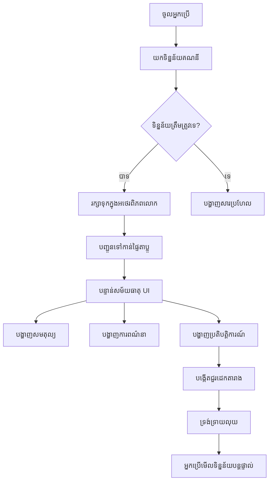
> 💡 **យុទ្ធសាស្រ្ត ប្រាប់**: ចង់មើលផ្ទាំងតំណររបស់អ្នកដំណើរការភ្លាមៗទេ? ប្រើឈ្មោះអ្នកប្រើ `test` ពេលចូល - វាផ្ទុកទិន្នន័យគំរូរួចហើយ ដូច្នេះអ្នកអាចមើលបញ្ហារបស់អ្នកដំណើរការដោយមិនចាំបាច់បង្កើតប្រតិបត្តិការដំបូង។  
>  
**ហេតុអ្វីគណនី test មានប្រយោជន៍:**  
- មានទិន្នន័យគំរូដែលសម្បូរបែបមានរួចហើយ  
- ល្អសម្រាប់មើលទិដ្ឋភាពប្រតិបត្តិការបង្ហាញ  
- ល្អសម្រាប់សាកល្បងមុខងារផ្ទាំងតំណររបស់អ្នក  
- ជួយជៀសវាងការបង្កើតទិន្នន័យ គំរូដោយដៃ  

### បង្កើតធាតុបង្ហាញផ្ទាំងតំណរ

ចាប់ផ្តើមសាងសង់ផ្ទាំងតំណររបស់អ្នកជាជំហានៗ ដំបូងជាមួយព័ត៌មានសេចក្តីសង្ខេបគណនី ហើយបន្ទាប់មកបន្ថែមមុខងារស្មុគស្មាញដូចជាបញ្ជីប្រតិបត្តិការជាឈរ។

#### ជំហានទី 1៖ បច្ចុប្បន្នភាពរចនាសម្ព័ន្ធ HTML របស់អ្នក

ដំបូង ជំនួសផ្នែក "Balance" ស្ថិតស្ថេរដោយធាតុបន្លាស់មួយដែល JavaScript របស់អ្នកអាចបំពេញបាន៖

```html
<section>
  Balance: <span id="balance"></span><span id="currency"></span>
</section>
```
  
បន្ទាប់មក បន្ថែមផ្នែកសេចក្តីពិពណ៌នាគណនី។ ពីព្រោះវាដំណើរការជាជើងចម្បងសម្រាប់មាតិកាផ្ទាំងតំណរ, ប្រើ HTML មានអត្ថន័យ៖

```html
<h2 id="description"></h2>
```
  
**យល់ដឹងរចនាសម្ព័ន្ធ HTML:**  
- **ប្រើ**ធាតុ `<span>` ផ្សេងៗសម្រាប់បង្ហាញសមតុល្យ និងរូបិយប័ណ្ណសម្រាប់គ្រប់គ្រងបុគ្គល  
- **អនុវត្ត** ID ផ្ទាល់ខ្លួនចំពោះធាតុនីមួយៗសម្រាប់គោលដៅ JavaScript  
- **អនុវត្ត** HTML ដែលមានអត្ថន័យដោយប្រើ `<h2>` សម្រាប់សេចក្តីពិពណ៌នាគណនី  
- **បង្កើត**រចនាសម្ព័ន្ធតាមលំដាប់ហេរ៉ាឃីសម្រាប់អ្នកអានអេក្រង់ និង SEO  

> ✅ **ចំណេះដឹងសុវត្ថិភាពចូលមើល**: សេចក្តីពិពណ៌នាគណនីដំណើរការជាជើងចំណងជើងមួយសម្រាប់មាតិកាផ្ទាំងតំណរ ដូច្នេះវាត្រូវបានកំណត់ជាចំណងជើង។ សូមស្វែងយល់ពីរបៀបដែល [រចនាសម្ព័ន្ធចំណងជើង](https://www.nomensa.com/blog/2017/how-structure-headings-web-accessibility) មានឥទ្ធិពលលើភាពសំខាន់សុវត្ថិភាពចូលមើល។ តើអ្នកអាចកំណត់ធាតុផ្សេងៗនៅលើទំព័ររបស់អ្នកដែលអាចទទួលបានអត្ថប្រយោជន៍ពី tag ចំណងជើងខ្ពស់ទៀតទេ?  

#### ជំហានទី 2៖ បង្កើតមុខងារធ្វើបច្ចុប្បន្នភាពផ្ទាំងតំណរ

ឥឡូវនេះបង្កើតមុខងារមួយដែលបំពេញផ្ទាំងតំណររបស់អ្នកជាមួយទិន្នន័យគណនីពិត៖

```javascript
function updateDashboard() {
  if (!account) {
    return navigate('/login');
  }

  updateElement('description', account.description);
  updateElement('balance', account.balance.toFixed(2));
  updateElement('currency', account.currency);
}
```
  
**ជំហានដោយជំហាន, មុខងារនេះធ្វើអ្វីខ្លះ៖**  
- **ផ្ទៀងផ្ទាត់**ថាទិន្នន័យគណនីមានស្រាប់មុនបន្ត  
- **បញ្ជូនបុគ្គលដែលមិនបានផ្ទៀងផ្ទាត់ចូលក្រោយទៅទំព័រចូល**  
- **ធ្វើបច្ចុប្បន្នភាព**សេចក្តីពិពណ៌នាគណនីដោយប្រើមុខងារ `updateElement` ដែលអាចប្រើឡើងវិញ  
- **ទ្រង់ទ្រាយ**សមតុល្យបង្ហាញជាទ្រង់ទ្រាយលេខកំណត់ពីរទសភាគ  
- **បង្ហាញ**រូបសញ្ញារូបិយប័ណ្ណត្រឹមត្រូវ  

> 💰 **ទ្រង់ទ្រាយប្រាក់**៖ វិធីសាស្រ្ត [`toFixed(2)`](https://developer.mozilla.org/docs/Web/JavaScript/Reference/Global_Objects/Number/toFixed) គឺជាឧបសគ្គសម្រាប់អ្នក! វធានាថាសមតុល្យរបស់អ្នកតែងតែបង្ហាញដូចប្រាក់ពិតៗ - "75.00" មិនមែនត្រូវបានបង្ហាញត្រឹមតែ "75" ទេ។ អ្នកប្រើប្រាស់របស់អ្នកនឹងពេញចិត្តក្នុងការមើលទ្រង់ទ្រាយរូបិយប័ណ្ណដែលស្គាល់។  

#### ជំហានទី 3៖ ធានាថា ផ្ទាំងតំណររបស់អ្នកធ្វើបច្ចុប្បន្នភាព

ដើម្បីធានាថាផ្ទាំងតំណររបស់អ្នកបន្សំព័ត៌មានថ្មីជានិច្ច នៅពេលដែលនរណាម្នាក់ចូលមើល, យើងត្រូវភ្ជាប់វាចូលទៅក្នុងប្រព័ន្ធរៀបចំផ្លូវ។ ប្រសិនបើអ្នកបានបញ្ចប់ [ការងារ មេរៀន ១](../1-template-route/assignment.md) នេះគួរតែកាន់ខ្លាំងស្គាល់។ ប្រសិនបើមិនច្បាស់ ចាំបាច់ថា៖

បន្ថែមវានៅចុងមុខងារ `updateRoute()` របស់អ្នក៖

```javascript
if (typeof route.init === 'function') {
  route.init();
}
```
  
បន្ទាប់មកបច្ចុប្បន្នភាពផ្លូវរបស់អ្នកដើម្បីបញ្ចូលការចាប់ផ្តើមផ្ទាំងតំណរ៖

```javascript
const routes = {
  '/login': { templateId: 'login' },
  '/dashboard': { templateId: 'dashboard', init: updateDashboard }
};
```
  
**កំណត់រចនាសម្ព័ន្ធឆ្លាតវៃនេះធ្វើអ្វី៖**  
- ពិនិត្យថាតើផ្លូវមានកូដចាប់ផ្តើមពិសេសមែនទេ  
- រត់កូដនោះដោយស្វ័យប្រវត្តិពេលផ្លូវត្រូវបានផ្ទុក  
- ធានាថាផ្ទាំងតំណររបស់អ្នកតែងតែបង្ហាញព័ត៌មានថ្មីៗ  
- រក្សាគោលនយោបាយរៀបចំផ្លូវរបស់អ្នកឲ្យស្អាតនិងប្រកបដោយរបៀប  

#### សាកល្បងផ្ទាំងតំណររបស់អ្នក

បន្ទាប់ពីអនុវត្តការផ្លាស់ប្ដូរទាំងនេះ សូមសាកល្បងផ្ទាំងតំណរសម្រាប់៖

1. **ចូល**ជាមួយគណនីល្បីតេស្ត  
2. **ផ្ទៀងផ្ទាត់**ថាអ្នកត្រូវបានបញ្ចូនទៅផ្ទាំងតំណរ  
3. **ពិនិត្យ**ថាសេចក្តីពិពណ៌នា, សមតុល្យ និងរូបិយប័ណ្ណបង្ហាញត្រឹមត្រូវ  
4. **សាកល្បងចេញពីប្រព័ន្ធ ហើយចូលវិញ**ដើម្បីធានាថាទិន្នន័យត្រូវបានបន្សំឡើងវិញដោយត្រឹមត្រូវ  

ឥឡូវនេះ ផ្ទាំងតំណររបស់អ្នកគួរតែបង្ហាញទិន្នន័យគណនីឌីណាមិចដែលបន្សំឡើងបន្ទាន់ដោយផ្អែកលើទិន្នន័យអ្នកប្រើដែលបានចូល។

## កសាងបញ្ជីប្រតិបត្តិការឆ្លាតវៃជាមួយពុម្ព模板

ជំនួសការបង្កើត HTML ដោយដៃសម្រាប់រាល់ប្រតិបត្តិការ, យើងនឹងប្រើពុម្ព模板សម្រាប់បង្កើតការកំណត់ទ្រង់ទ្រាយជាប់គ្នាដោយស្វ័យប្រវត្តិ។ ដូចជាផ្នែកដែលប្រើនៅក្នុងការផលិតយានយន្តអាកាសយាន, ពុម្ព模板ធានាថាជួរប្រតិបត្តិការ រាល់ជួរមានរចនាសម្ព័ន្ធ និងរូបរាងដូចគ្នា។

បច្ចេកទេសនេះអាចពង្រីកបានយ៉ាងមានប្រសិទ្ធភាពចាប់ពីប្រតិបត្តិការកាច្រើនទៅរហូតដល់រាប់ពាន់ដោយរក្សាបានល្បឿន និងការបង្ហាញដូចគ្នា។

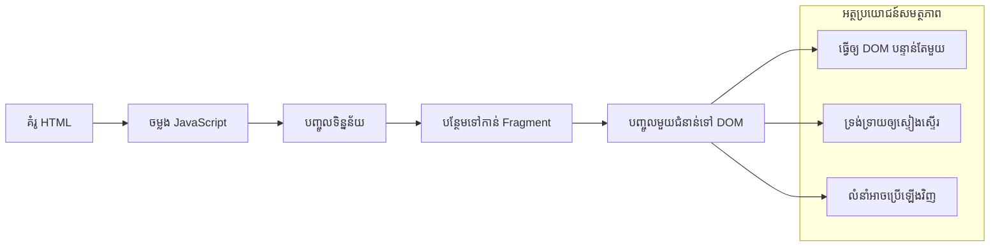
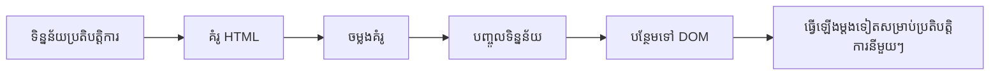
### ជំហានទី 1៖ បង្កើតពុម្ព模板ប្រតិបត្តិការ

ដំបូង បន្ថែមពុម្ព模板ដែលអាចប្រើឡើងវិញសម្រាប់ជួរប្រតិបត្តិការ នៅក្នុង `<body>` របស់ HTML៖

```html
<template id="transaction">
  <tr>
    <td></td>
    <td></td>
    <td></td>
  </tr>
</template>
```
  
**យល់ដឹងពីពុម្ព模板 HTML:**  
- **កំណត់**រចនាសម្ព័ន្ធសម្រាប់ជួរតារាងមួយ  
- **បន្សល់**លាក់ខ្លួនរហូតដល់ត្រូវបានចម្លងនិងបំពេញជាមួយ JavaScript  
- **រួមបញ្ចូល**ជង្គង់បីសម្រាប់កាលបរិច្ឆេទ, សេចក្តីពិពណ៌នា និងចំនួនប្រាក់  
- **ផ្តល់**គំរូដែលអាចប្រើឡើងវិញសម្រាប់ការកំណត់ទ្រង់ទ្រាយដូចគ្នា  

### ជំហានទី 2៖ ត្រៀមតារាងរបស់អ្នកសម្រាប់មាតិកាឌីណាមិច

បន្ទាប់មក បន្ថែម `id` ទៅក្រុមរបស់តារាង (tbody) ដើម្បី JavaScript អាចគោលដៅបានយ៉ាងងាយស្រួល៖

```html
<tbody id="transactions"></tbody>
```
  
**អ្វីដែលវាបានសំរេច៖**  
- **បង្កើត**គោលដៅច្បាស់សម្រាប់បញ្ចូលជួរប្រតិបត្តិការ  
- **បំបែក**រចនាសម្ព័ន្ធតារាងពីមាតិកាឌីណាមិច  
- **អនុញ្ញាត**បំលែងលាក់ទុកនិងបង្កើតឡើងវិញបានយ៉ាងងាយស្រួលនៃទិន្នន័យប្រតិបត្តិការ  

### ជំហានទី 3៖ បង្កើតមុខងារបង្កើតជួរប្រតិបត្តិការ

ឥឡូវបង្កើតមុខងារមួយដែលបំលែងទិន្នន័យប្រតិបត្តិការ ទៅជាធាតុ HTML៖

```javascript
function createTransactionRow(transaction) {
  const template = document.getElementById('transaction');
  const transactionRow = template.content.cloneNode(true);
  const tr = transactionRow.querySelector('tr');
  tr.children[0].textContent = transaction.date;
  tr.children[1].textContent = transaction.object;
  tr.children[2].textContent = transaction.amount.toFixed(2);
  return transactionRow;
}
```
  
**ការពិពណ៌នាមុខងារនេះ៖**  
- **ទាញយក**ធាតុពុម្ព模板តាម ID  
- **ចម្លង**មាតិកាពុម្ព模板សម្រាប់មានការកែប្រែយ៉ាងសុវត្ថិភាព  
- **ជ្រើសរើស**ជួរតារាងក្នុងមាតិកាចម្លង  
- **បំពេញ**ជើងតារាងនីមួយៗជាមួយទិន្នន័យប្រតិបត្តិការ  
- **ទ្រង់ទ្រាយ**ចំនួនប្រាក់បង្ហាញដោយផ្ទៀងផ្ទាត់ទសភាគ  
- **បង្វិល**ជួរបានស្រេចសម្រាប់បញ្ចូល  

### ជំហានទី 4៖ បង្កើតជួរប្រតិបត្តិការច្រើនយ៉ាងមានប្រសិទ្ធភាព

បន្ថែមកូដនេះទៅក្នុងមុខងារ `updateDashboard()` របស់អ្នក ដើម្បីបង្ហាញប្រតិបត្តិការទាំងអស់៖

```javascript
const transactionsRows = document.createDocumentFragment();
for (const transaction of account.transactions) {
  const transactionRow = createTransactionRow(transaction);
  transactionsRows.appendChild(transactionRow);
}
updateElement('transactions', transactionsRows);
```
  
**យល់ដឹងពីវិធីសាស្រ្តមានប្រសិទ្ធភាពនេះ៖**  
- **បង្កើត**ឯកសារដោយផ្ទាល់ (document fragment) ដើម្បីបន្សំប្រតិបត្តិការជាមួយ DOM មួយដង  
- **ធ្វើជុំ**ក្នុងប្រតិបត្តិការទាំងអស់ក្នុងទិន្នន័យគណនី  
- **បង្កើត**ជួរតារាងសម្រាប់រាល់ប្រតិបត្តិការដោយប្រើមុខងារបង្កើត  
- **ប្រមូលផ្តុំ**ជួរទាំងអស់ក្នុងឯកសារដោយផ្ទាល់មុនបន្ថែមទៅ DOM  
- **អនុវត្ត**ការធ្វើបច្ចុប្បន្នភាព DOM តែមួយដង នៅមិនមែនជា ដាក់ចូលច្រើនដងមួយៗឡែកៗ  


> ⚡ **ការបង្កើនប្រសិទ្ធិភាព**: [`document.createDocumentFragment()`](https://developer.mozilla.org/docs/Web/API/Document/createDocumentFragment) ដូចជាព្រលឹងក្រុមនៅ Boeing - គ្រឿងផ្សំត្រូវបានរៀបចំក្រៅខ្សែដើម ហើយបន្ទាប់មកត្រូវបានដំឡើងជាឯកតាទាំងមូល។ វិធីសាស្ត្រការប្រមូលផ្តុំនេះកាត់បន្ថយការប្ដូររចនាសម្ព័ន្ធ DOM ដោយបញ្ចូលពេលតែមួយជំនួសការប្រតិបត្តិការច្រើនៗដោយឡែកៗ។

### ជំហានទី 5: បង្កើនមុខងារអាប់ដេតសម្រាប់មាតិកាចម្រុះ

មុខងារ `updateElement()` របស់អ្នកបច្ចុប្បន្នគ្រប់គ្រងតែខ្លឹមសារអក្សរតែប៉ុណ្ណោះ។ សូមធ្វើឲ្យវាអាចដំណើរការជាមួយទាំងអក្សរនិងកំណត់ DOM:

```javascript
function updateElement(id, textOrNode) {
  const element = document.getElementById(id);
  element.textContent = ''; // ដកចេញកូនទាំងអស់
  element.append(textOrNode);
}
```

**ការកែលម្អសំខាន់ៗនៅក្នុងការអាប់ដេតនេះ៖**
- **សម្អាត** ខ្លឹមសារដែលមានស្រាប់មុនពេលបន្ថែមខ្លឹមសារថ្មី
- **ទទួលយក** អ្នកអាចផ្តល់អក្សរឬកំណត់ DOM ជាអាគុយម៉ង់
- **ប្រើប្រាស់** វិធីសាស្ត្រ [`append()`](https://developer.mozilla.org/docs/Web/API/ParentNode/append) សម្រាប់ភាពបត់បែន
- **រក្សា** ភាពត្រូវបានគូសបញ្ជាក់បង្ហាញជាមួយប្រើប្រាស់អក្សរធ្លាប់មាន

### រៀបចំផ្ទាំងគ្រប់គ្រងរបស់អ្នកសម្រាប់ការធ្វើតេស្ត

ពេលវេលាសម្រាប់ពេលពិតហើយ! យើងមកមើលផ្ទាំងគ្រប់គ្រងប្រតិបត្តិការ របស់អ្នកក្នុងសកម្មភាព៖

1. ចូលប្រើប្រាស់ដោយគណនី `test` (មានទិន្នន័យគំរូរួច​ហើយ)
2. រុករកទៅផ្ទាំងគ្រប់គ្រងរបស់អ្នក
3. ពិនិត្យមើលថា ជួរផ្ទេរប្រាក់បង្ហាញជាមួយទម្រង់ត្រឹមត្រូវ
4. ធានាថា ថ្ងៃខែចុះផ្សាយ ការពិពណ៌នា និងចំនួនទាំងអស់មើលល្អស្អាត

បើអ្វីៗដំណើរការល្អ អ្នកគួរតែឃើញបញ្ជីប្រតិបត្តិការដែលអាចដំណើរការបានយ៉ាងពេញលេញនៅលើផ្ទាំងគ្រប់គ្រងរបស់អ្នក! 🎉

**អ្វីដែលអ្នកបានសម្រេចបាន៖**
- សង់ផ្ទាំងគ្រប់គ្រងដែលអាចពង្រីកទៅជាមួយទិន្នន័យគ្រប់ចំនួន
- បង្កើតគំរូដែលអាចប្រើឡើងវិញសម្រាប់ទម្រង់តែងតាក់ក្រងម៉ាស្សាជាប់គ្នា
- អនុវត្តបច្ចេកទេសគ្រប់គ្រង DOM ដែលមានប្រសិទ្ធិភាព
- បង្កើតមុខងារដូចគ្នានឹងកម្មវិធីធនាគារដែលប្រើនៅផលិតកម្ម

អ្នកបានបំលែងវេបសាយស្ថិតស្ងៀមមួយទៅជាកម្មវិធីវេបប្រតិបត្តិការ។

### 🎯 ការត្រួតពិនិត្យផ្នែកសិក្សា: ការបង្កើតមាតិកាឌីណាមិច

**ការយល់ដឹងអំពីស្ថាបត្យកម្ម**៖ អ្នកបានអនុវត្តបណ្តាប្រព័ន្ធផ្លូវទៅ UI ដែលស្មុគស្មាញមួយ ដែលប្រើបានដូចគំរូក្នុងឆន្ទៈផ្សារ CSS React, Vue និង Angular ។

**មូលដ្ឋានសំខាន់ៗដែលបានគ្រប់គ្រង៖**
- **ការបង្ហាញដោយផ្អែកលើគំរូ**: បង្កើតធាតុ UI ដែលអាចប្រើឡើងវិញ
- **ឯកសាររង**: ការបង្កើនប្រសិទ្ធិភាព DOM
- **ការគ្រប់គ្រង DOM បានសុវត្ថិភាព**: ការការពារជំងឺសន្តិសុខ
- **ការបម្លែងទិន្នន័យ**: បម្លែងទិន្នន័យម៉ាស៊ីនបម្រើទៅ UI អ្នកប្រើ

**ការតភ្ជាប់ក្នុងឧស្សាហកម្ម**: បច្ចេកវិទ្យាទាំងនេះជាគន្លងដើមនៃស្ថាបត្យកម្មផ្នែកមុខទំនើប។ Virtual DOM របស់ React, ប្រព័ន្ធគំរូ Vue និងស្ថាបត្យកម្មធាតុ Angular ទាំងអស់សាងសង់លើគំនិតស្នូលទាំងនេះ។

**សំណួរត្រួតពិនិត្យ**: តើអ្នកចង់ពង្រីកប្រព័ន្ធនេះដូចម្តេច សម្រាប់ការអាប់ដេតពេលវេលាពិត (ដូចជា ប្រតិបត្តិការថ្មីៗមកបង្ហាញដោយស្វ័យប្រវត្តិ)? សូមគិតពី WebSockets ឬ Server-Sent Events ។

---

## 📈 ពេលវេលាចំណេះដឹងការគ្រប់គ្រងទិន្នន័យរបស់អ្នក

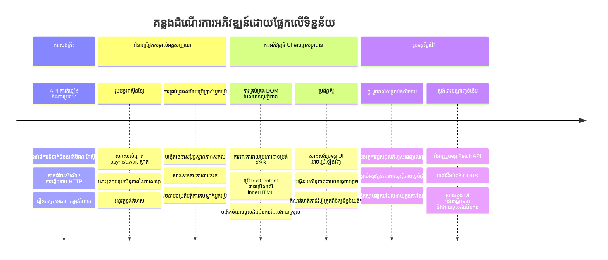
**🎓 គ្រប់គ្រងការបញ្ចប់អប់រំ**: អ្នកបានសម្រេចសង់កម្មវិធីវេបដែលដំណើរការជាមួយទិន្នន័យពេញលេញដោយប្រើលំនាំ JavaScript ទំនើប។ ជំនាញទាំងនេះចំរូងទៅកាន់ហ៊្វ្រេមវើកផ្សេងៗដូចជា React, Vue ឬ Angular ។

**🔄 សមត្ថភាពកម្រិតបន្ទាប់**:
- ត្រៀមខ្លួនសម្រាប់ស្វែងយល់ហ៊្វ្រេមវើកផ្នែកមុខដែលសាងសង់លើគំនិតទាំងនេះ
- មានភាពរងចាំក្នុងការអនុវត្តមុខងារពេលវេលាពិតជាមួយ WebSockets
- មានសមត្ថភាពក្នុងការសង់កម្មវិធីវេបគ្រប់ទិសដៅដែលអាចដំណើរការបានក្រៅបណ្តាញ
- មានមូលដ្ឋានសម្រាប់រៀនទទួលខុសត្រូវគ្រប់គ្រងសភាពស្ថានច្បាស់លាស់ជាងមុន

## ការប្រកួតប្រជែង GitHub Copilot Agent 🚀

ប្រើរបៀប Agent ដើម្បីបញ្ចប់ការប្រកួតដូចខាងក្រោម៖

**ការពណ៌នា:** បង្កើនកម្មវិធីធនាគារដោយអនុវត្តមុខងារស្វែងរក និងចម្រាញ់ប្រតិបត្តិការដែលអនុញ្ញាតឲ្យអ្នកប្រើស្វែងរកប្រតិបត្តិការជាក់លាក់ទៅតាមចន្លោះថ្ងៃខែចុះ ប្រាក់ចំណូលឬចំណាយ ឬពាក្យគន្លឹះនៃការពិពណ៌នា។

**ការបញ្ជាទិញ:** បង្កើតមុខងារស្វែងរកសម្រាប់កម្មវិធីធនាគារដែលមាន៖ ១) សំណុំបែបបទស្វែងរកជាមួយវាលបញ្ចូលសម្រាប់ចន្លោះថ្ងៃខែ (ពី/ទៅ) ចំនួនទាបបំផុត/ខ្ពស់បំផុត និងពាក្យកំណត់បរិយាយប្រតិបត្តិការ, ២) មុខងារ `filterTransactions()` ដែលចម្រាញ់អារេ `account.transactions` ដោយផ្អែកលើលក្ខខណ្ឌស្វែងរក, ៣) ចុះព័ត៌មានមុខងារ `updateDashboard()` ដើម្បីបង្ហាញលទ្ធផលចម្រាញ់, និង ៤) បន្ថែមប៊ូតុង "Clear Filters" សម្រាប់កំណត់ឡើងវិញទិដ្ឋភាព។ ប្រើវិធីសាស្ត្រ JavaScript ទំនើបលេខ `filter()` និងដោះស្រាយករណីកែងសម្រាប់លក្ខណៈស្វែងរកទទេ។

សូមស្វែងយល់បន្ថែមអំពី [agent mode](https://code.visualstudio.com/blogs/2025/02/24/introducing-copilot-agent-mode) នៅទីនេះ។

## 🚀 ការប្រកួតប្រជែង

តើអ្នកត្រៀមខ្លួនរួចដើម្បីយកកម្មវិធីធនាគាររបស់អ្នកទៅកាន់កម្រិតបន្ទាប់? មកយើងបង្កើតវាឱ្យមានរូបរាង និងអារម្មណ៍ជាក់ស្តែង ដែលអ្នកពិតជា​ចង់ប្រើ។ មានយោបល់ខ្លះសម្រាប់បញ្ចុះប្រយោជន៍ផ្ទាល់ខ្លួន៖

**អោយវាស្អាត**: បន្ថែមការតុបតែង CSS ដើម្បីបំលែងផ្ទាំងគ្រប់គ្រងដំណើរការ​របស់អ្នកទៅជារូបរាងទាក់ទាញមើល។ គិតពីបន្ទាត់ស្អាត, ចន្លោះល្អ និងប្រហែលមានអានីម៉េស្យូនតិចៗ។

**អោយវាពាក់មើលបានល្អលើឧបករណ៍គ្រប់ប្រភេទ**: សាកល្បងប្រើ [media queries](https://developer.mozilla.org/docs/Web/CSS/Media_Queries) ដើម្បីបង្កើត [រចនាប័ទ្មបត់បែនបាន](https://developer.mozilla.org/docs/Web/Progressive_web_apps/Responsive/responsive_design_building_blocks) ដែលដំណើរការល្អលើទូរស័ព្ទដៃ, កាំម៉េរ៉ា និងកុំព្យូទ័រសុីមា។ អ្នកប្រើរបស់អ្នកនឹងអរគុណអ្នក!

**បន្ថែមភាពស្រស់បំព្រង**: ពិចារណាកំណត់ពណ៌ប្រតិបត្តិការ (បៃតងសម្រាប់ប្រាក់ចំណូល, ក្រហមសម្រាប់ចំណាយ), បន្ថែមរូបតំណាង ឬបង្កើតផលប៉ះពាល់ម៉ៅស៍ ដែលបង្កើតអារម្មណ៍អន្តរកម្ម។

នេះ​គឺជា​រូបភាព​ឧទាហរណ៍​ផ្ទាំង​គ្រប់គ្រង​ដែលបានបំពាក់៖


កុំមានអារម្មណ៍ថាត្រូវតែតាមវាដោយច្បាស់ទេ - ប្រើវាជា​ការបន្សំបន្ថែមបញ្ចូល​ខ្លួន​មួយ​និង​បង្កើតរបស់អ្នកឯង!

## សំនួរផ្នែកបន្ថែមក្រោយមេរៀន

[Post-lecture quiz](https://ff-quizzes.netlify.app/web/quiz/46)

## ការចាត់តាំង

[Refactor and comment your code](assignment.md)

---

<!-- CO-OP TRANSLATOR DISCLAIMER START -->
**ការបដិសេធ**៖  
ឯកសារនេះត្រូវបានបកប្រែដោយប្រើសេវាកម្មបកប្រែ AI [Co-op Translator](https://github.com/Azure/co-op-translator)។ ខណៈពេលដែលយើងខិតខំរកការត្រឹមត្រូវ សូមយកចិត្តទុកដាក់ថាការបកប្រែដោយស្វ័យប្រវត្តិអាចមានកំហុស ឬការយល់ច្រឡំ។ ឯកសារដើមនៅក្នុងភាសាដើមគួរត្រូវបានគិតជាផ្នែកចម្បងដែលមានអនុភាព។ សម្រាប់ព័ត៌មានសំខាន់ៗ សូមណែនាំឲ្យបកប្រែដោយមនុស្សជំនាញជំនួយវិជ្ជាជីវៈ។ ពួកយើងមិនទទួលខុសត្រូវចំពោះការយល់ច្រឡំ ឬការបកប្រែមិនត្រឹមត្រូវណាមួយដែលកើតឡើងពីការប្រើប្រាស់ការបកប្រែនេះទេ។
<!-- CO-OP TRANSLATOR DISCLAIMER END -->