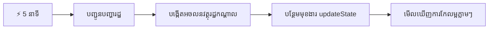
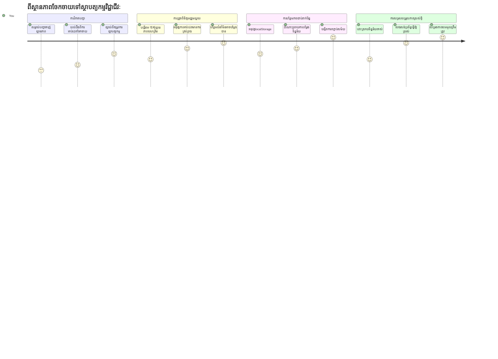
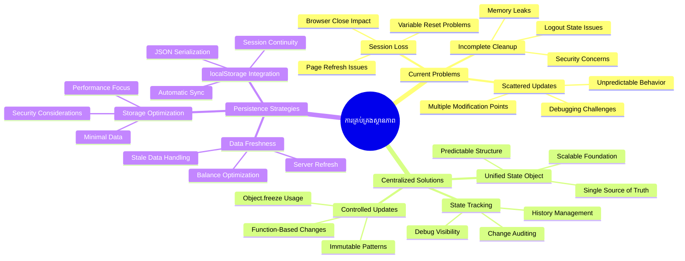
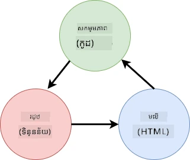
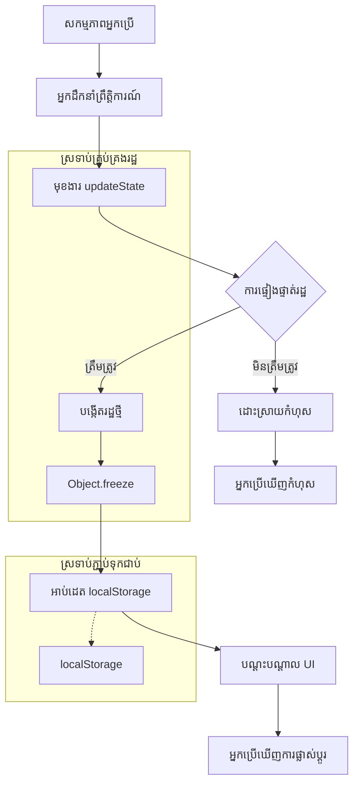
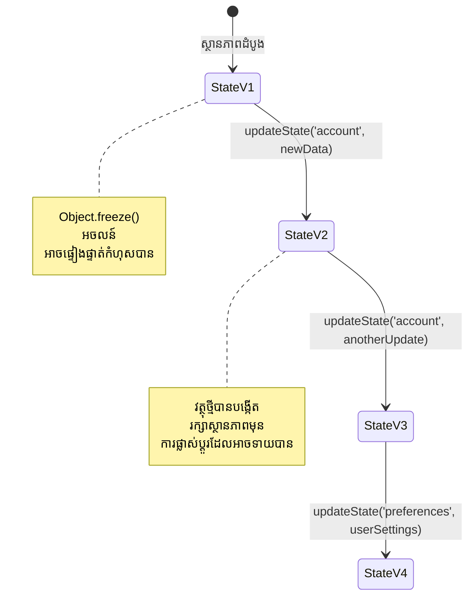
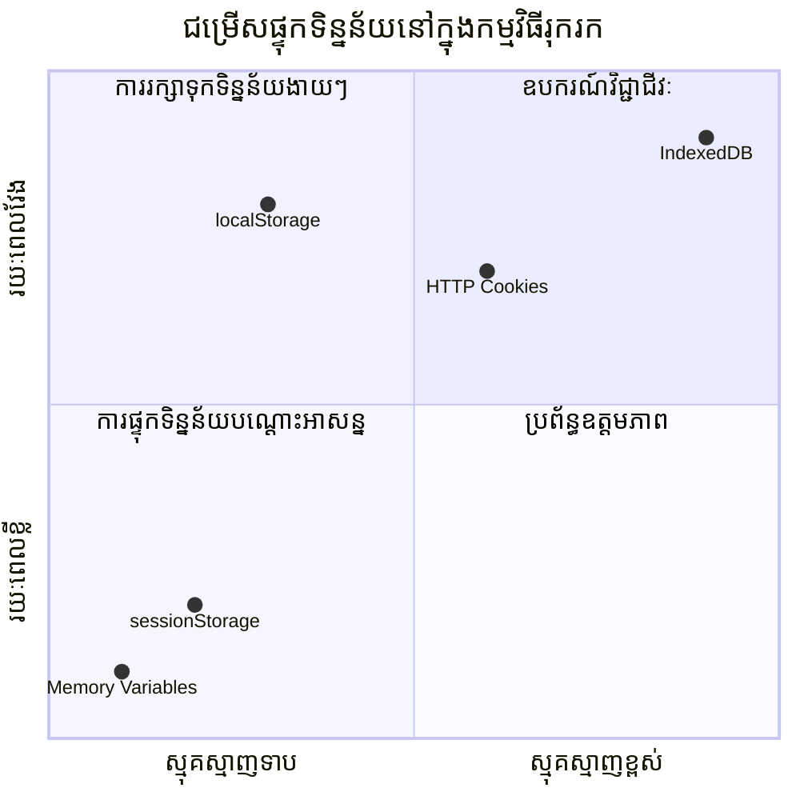
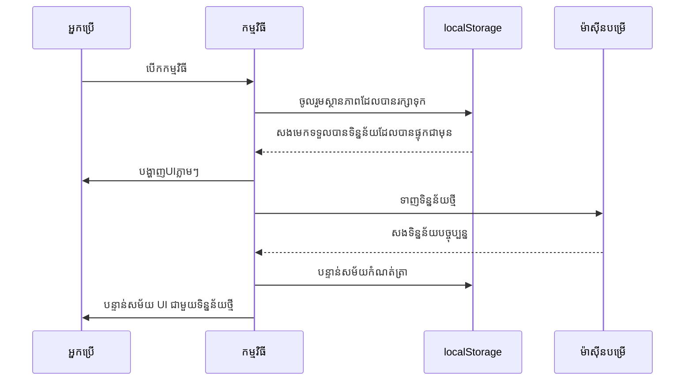
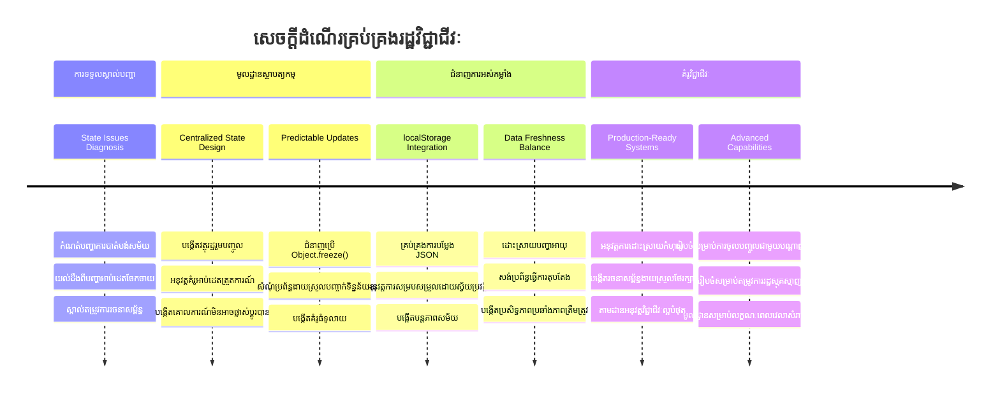

# ការបង្កើតកម្មវិធីធនាគារ ភាគ 4៖ គំនិតនៃការគ្រប់គ្រងស្ថានភាព

## ⚡ អ្វីដែលអ្នកអាចធ្វើបានក្នុង 5 នាទីបន្ទាប់

**ផ្លូវសរុបចាប់ផ្ដើមសម្រាប់អ្នកអភិវឌ្ឍដែលភ្លក់ពេល**


- **នាទីទី 1**៖ សាកល្បងបញ្ហាស្ថានភាពបច្ចុប្បន្ន - លេងក្នុងគណនី, បន្តទំព័រ, សង្កេតការចេញពីប្រព័ន្ធ
- **នាទីទី 2**៖ ជំនួស `let account = null` ជា `let state = { account: null }`
- **នាទីទី 3**៖ បង្កើតមុខងារ `updateState()` សាមញ្ញសម្រាប់បច្ចុប្បន្នភាពត្រួតត្រា
- **នាទីទី 4**៖ បន្តបញ្ចូលមុខងារមួយឲ្យប្រើគំរូថ្មី
- **នាទីទី 5**៖ សាកល្បងភាពអាចទាយបានកាន់តែល្អ និងសមត្ថភាពកែប្រែបញ្ហា

**តេស្តរ៉ាប់រងលឿន**៖
```javascript
// មុន៖ រដ្ឋមានការបង្ហោះចេញ
let account = null; // បាត់ខាតពេលធ្វើការបង្ហាញឡើងវិញ!

// បន្ទាប់៖ រដ្ឋកណ្តាល
let state = Object.freeze({ account: null }); // ត្រួតត្រា និងអាចតាមដានបាន!
```

**ហេតុអ្វីវា​សំខាន់**៖ ក្នុង 5 នាទី អ្នកនឹងបានជួបប្រទះការបម្លែងពីការគ្រប់គ្រងស្ថានភាពចម្រូងចម្រាសទៅលំដាប់ដែលអាចទាយបាន និងងាយស្រួលកែប្រែបញ្ហា។ នេះគឺជាគ្រឹះធ្វើឲ្យកម្មវិធីស្មុគស្មាញអាចថែរក្សាបាន។

## 🗺️ ដំណើររៀនរបស់អ្នកតាមរយៈការជំនាញគ្រប់គ្រងស្ថានភាព


**គោលដៅដំណើររៀនរបស់អ្នក**៖ នៅចុងមេរៀននេះ អ្នកនឹងបានបង្កើតប្រព័ន្ធគ្រប់គ្រងស្ថានភាពដែលមានវិជ្ជាជីវៈដែលគ្រប់គ្រងការរក្សាទុក, ទិន្នន័យថ្មី, និងការអាប់ដេតអាចទាយបាន - គំរូដូចគេហទំព័រផលិតកម្ម។

## វិញ្ញាសាមុខមុខវិជ្ជា

[វិញ្ញាសាមុខមុខវិជ្ជា](https://ff-quizzes.netlify.app/web/quiz/47)

## ការណែនាំ

ការគ្រប់គ្រងស្ថានភាពគឺដូចជាប្រព័ន្ធណាវីហ្គេសិនលើយានយន្ត Voyager – ពេលអ្វីគ្រប់យ៉ាងដំណើរការល្អ អ្នកមិនសង្កេតឃើញវាទេ។ ប៉ុន្តែពេលអ្វីមិនធ្វើការ វាគឺជាការប្រៀបធៀបចម្បងរវាងការឈានដល់លំហក្រៅផែនដី និងរុញបាត់បង់ក្នុងសត្វព្រៃគម្ងាត់អាកាសយាន។

នៅក្នុងការអភិវឌ្ឍគេហទំព័រ ស្ថានភាពតំណាងឲ្យអ្វីៗទាំងអស់ដែលកម្មវិធីរបស់អ្នកត្រូវចាំ៖ ស្ថានភាពចុះបញ្ជីអ្នកប្រើ, ទិន្នន័យฟॉर्म, ប្រវត្ដិការរុករក, និងស្ថានភាពផ្ទាំងអ្នកប្រើបណ្តោះអាសន្ន។

ពេលកម្មវិធីធនាគាររបស់អ្នកបានបង្កើតចេញពីฟ្រុងតែមើលលេងចុះបញ្ជីទៅជាកម្មវិធីស្មុគស្មាញលម្អិត អ្នកប្រហែលជាបានជួបប្រទះបញ្ហាសំខាន់ៗដែលជួបឡើងជាញឹកញាប់។ បន្តទំព័រនៅពេលដែលអ្នកប្រើបានចេញពីប្រព័ន្ធដោយមិនរំពឹងទុក។ បិទកម្មវិធីរុករកហើយការងារទាំងអស់បាត់បង់។ កែបញ្ហាលំបាក ហើយអ្នកត្រូវស្វែងរកនៅក្នុងមុខងារច្រើនដែលសម្រួលទិន្នន័យដូចគ្នាទៅវិញទៅមក។

នេះមិនមែនជារឿងកូដថាបានបញ្ហា—វាគឺជាការឈឺចាប់ធម្មជាតិនៃការ៉ត់កម្រិតនៅពេលកម្មវិធីមកដល់កម្រិតស្មុគស្មាញមួយ។ អ្នកអភិវឌ្ឍទាំងអស់ត្រូវជួបប្រទះបញ្ហាាទាំងនេះដូចជាកម្មវិធីរបស់ពួកគេបំលែងពី "ការសាកល្បង" ទៅជា "រួចរាល់សម្រាប់ផលិតកម្ម"។

ក្នុងមេរៀននេះ យើងនឹងអនុវត្តប្រព័ន្ធគ្រប់គ្រងស្ថានភាពមួយចំណុច ដែលបម្លែងកម្មវិធីធនាគាររបស់អ្នកទៅជាកម្មវិធីដែលទុកចិត្តបាន និងមានវិជ្ជាជីវៈ។ អ្នកនឹងរៀនគ្រប់គ្រងចរាចរទិន្នន័យក្នុងរបៀបអាចទាយបាន រក្សាសុវត្ថិភាពសម័យអ្នកប្រើបានត្រឹមត្រូវ និងបង្កើតបទពិសោធអ្នកប្រើរលូនដែលកម្មវិធីវេបសាយសម័យថ្មីតម្រូវ។

## ការត្រៀមខ្លួន

មុនចូលទៅក្នុងគំនិតគ្រប់គ្រងស្ថានភាព អ្នកត្រូវតែត្រូវបានតំឡើងបរិយាកាសអភិវឌ្ឍរបស់អ្នកយ៉ាងត្រឹមត្រូវ និងឯកសារមូលដ្ឋានកម្មវិធីធនាគាររបស់អ្នកត្រូវមាន។ មេរៀននេះសាងសង់បន្តតាមគំនិត និងកូដពីផ្នែកមុនៗនៃស៊េរីនេះ។

ប្រាកដថាអ្នកមានធាតុដូចខាងក្រោមរួចជាស្រេចមុនបន្ត៖

**ការតំឡើងចាំបាច់៖**
- បញ្ចប់មេរៀន [ទាញទិន្នន័យ](../3-data/README.md) - កម្មវិធីរបស់អ្នកគួរតែដំណើរការនឹងបង្ហាញទិន្នន័យគណនីបានជោគជ័យ
- ដំឡើង [Node.js](https://nodejs.org) នៅលើប្រព័ន្ធរបស់អ្នកសម្រាប់រត់ API ផ្នែកខាងក្រោយ
- ចាប់ផ្ដើម [ម៉ាស៊ីនមេ API](../api/README.md) នៅក្នុងម៉ាស៊ីនបច្ចេកទេស ដើម្បីគ្រប់គ្រងប្រតិបត្ដិការទិន្នន័យគណនី

**សាកល្បងបរិយាកាសរបស់អ្នក៖**

បញ្ជាក់ថា ម៉ាស៊ីនមេ API របស់អ្នកដំណើរការបានត្រឹមត្រូវដោយបញ្ជាទីបញ្ជា ខាងក្រោមក្នុងតំបន់បញ្ជា៖

```sh
curl http://localhost:5000/api
# -> គួរត្រូវបង្វិលត្រឡប់ "Bank API v1.0.0" ជាលទ្ធផល
```

**អ្វីដែលបញ្ជាពីនេះធ្វើ៖**
- **ផ្ញើ** សំណើ GET ទៅម៉ាស៊ីនមេ API មូលដ្ឋានរៀបចំ
- **សាកល្បង** ការតភ្ជាប់ និងបញ្ជាក់ថាម៉ាស៊ីនមេឆ្លើយតប
- **ត្រឡប់** ព័ត៌មានអំពីកំណែ API ប្រសិនបើដំណើរការត្រឹមត្រូវ

## 🧠 ទិដ្ឋភាពស្ថាបត្យកម្មគ្រប់គ្រងស្ថានភាព


**ទ្រឹស្តីស្នូល**៖ ការគ្រប់គ្រងស្ថានភាពវិជ្ជាជីវៈត្រូវមានតុល្យភាពរវាងភាពអាចទាយប្រាកដ ការរក្សាទុក និងសមត្ថភាពដំណើរការ ដើម្បីបង្កើតបទពិសោធអ្នកប្រើដែលអាចពង្រីកពីប្រតិកម្មសាមញ្ញទៅកាន់លំហការងារស្មុគស្មាញ។

---

## ការពិនិត្យបញ្ហាស្ថានភាពបច្ចុប្បន្ន

ដូចជា Sherlock Holmes កំពុងពិនិត្យកន្លែងហិង្សា យើងត្រូវយល់ព្រមអំពីអ្វីដែលកើតឡើងយ៉ាងច្បាស់ក្នុងអនុម័តបច្ចុប្បន្នមុនពេលដោះស្រាយបញ្ហាសម័យអ្នកប្រើបាត់បង់។

យើងធ្វើតេស្តសាមញ្ញមួយ ដើម្បីបង្ហាញបញ្ហាគ្រប់គ្រងស្ថានភាពមូលដ្ឋាន៖

**🧪 សាកល្បងតេស្តរ៉ាប់រងនេះ៖**
1. ចូលក្នុងកម្មវិធីធនាគាររបស់អ្នក និងចូលទៅផ្ទាំងគ្រប់គ្រង
2. បន្តទំព័រកម្មវិធី
3. មើលថាអ្វីកើតឡើងចំពោះស្ថានភាពចូលប្រព័ន្ធរបស់អ្នក

បើអ្នកត្រូវបានបញ្ជូនត្រឡប់ទៅផ្ទាំងចូល វាជាអត្ថសញ្ញានៃបញ្ហារក្សាសម័យស្ថានភាព។ ទម្រង់នេះកើតឡើងដោយសារតែការអនុវត្តបច្ចុប្បន្នប្រើអថេរជាភាសា JavaScript ដែលត្រូវបានកំណត់ឡើងវិញដោយរាល់ការបន្តទំព័រ។

**បញ្ហាក្នុងការអនុវត្តបច្ចុប្បន្ន៖**

អថេរ `account` ដែលសាមញ្ញពី [មេរៀនមុន](../3-data/README.md) បង្កើតបញ្ហាសំខាន់បី ដែលប៉ះពាល់ទាំងបទពិសោធអ្នកប្រើ និងភាពងាយស្រួលថែរក្សាកូដ៖

| បញ្ហា | មូលហេតុបច្ចេកទេស | ពោលពាស់អ្នកប្រើ |
|---------|-------------------|----------------|
| **បាត់បង់សម័យ** | បន្តទំព័រដើម្បីសម្អាតអថេរ JavaScript | អ្នកប្រើត្រូវចុះបញ្ជីឡើងវិញជាបន្តបន្ទាប់ |
| **ការអាប់ដេតចត់ចត** | មុខងារច្រើនកែប្រែស្ថានភាពផ្ទាល់ | ការកែសម្រួលកូដកាន់តែពិបាក |
| **សំអាតមិនពេញលេញ** | ចេញពីប្រព័ន្ធមិនសម្អាតតម្លៃស្ថានភាពទាំងអស់ | មានហានិភ័យសុវត្ថិភាព និងឯកជនភាព |

**បញ្ហាស្ថាបត្យកម្ម៖**

ដូចជាការរចនាតំបន់ជាប់ទឹកស្ដើងរបស់ Titanic ដែលវាពិតជាមាំមុតរហូតដល់ដល់ខ្ទង់ទឹកអាចបូមចូលច្រើន តែការជួសជុលបញ្ហានៅក្នុងមុខងារតែមួយមិនអាចដោះស្រាយបញ្ហាស្ថាបត្យកម្មមូលដ្ឋានបានទេ។ យើងត្រូវការជម្រើសគ្រប់គ្រងស្ថានភាពយ៉ាងទូលំទូលាយ។

> 💡 **តើអ្វីដែលយើងកំពុងព្យាយាមសម្រេចនៅទីនេះ?**

[ការគ្រប់គ្រងស្ថានភាព](https://en.wikipedia.org/wiki/State_management) ជាដំណោះស្រាយពីរបញ្ហាផ្នែកមូលដ្ឋាន៖

1. **តើទិន្នន័យរបស់ខ្ញុំនៅទីណា?**៖ តាមដានអំពីព័ត៌មានដែលយើងមាន និងប្រភពទិន្នន័យ
2. **តើគ្រប់គ្នាកំពុងនៅលើទំព័រដូចគ្នា?**៖ ប្រាកដថាអ្វីដែលអ្នកប្រើឃើញផ្គូរផ្គងនឹងអ្វីដែលកើតឡើងពិតប្រាកដ

**ផែនការល្បឿនរបស់យើង៖**

ផ្ទុយពីការនឹងតាមបណ្តេញខ្លួន យើងនឹងបង្កើតប្រព័ន្ធ **គ្រប់គ្រងស្ថានភាពមួយកណ្តាល**។ គិតថាវាទាក់អោយមានមនុស្សម្នាក់ចាត់ចែងអ្វីៗសំខាន់ៗទាំងអស់៖




**យល់ពីចរន្តទិន្នន័យនេះ៖**
- **កណ្តាលស្ថានភាពកម្មវិធីទាំងអស់នៅកន្លែងតែមួយ**
- **ផ្ញើរទំនើបស្ថានភាពទាំងអស់តាមរយៈមុខងារ ត្រួតត្រា**
- **ធានាថា UI ដំណើរការជាមួយស្ថានភាពបច្ចុប្បន្ន**
- **ផ្តល់គំរូច្បាស់ កំណត់អោយទាយបានសម្រាប់ការគ្រប់គ្រងទិន្នន័យ**

> 💡 **ចំណេះដឹងវិជ្ជាជីវៈ**៖ មេរៀននេះផ្តោតលើគំនិតមូលដ្ឋាន។ សម្រាប់កម្មវិធីស្មុគស្មាញ បណ្ណាល័យដូចជា [Redux](https://redux.js.org) ផ្តល់មុខងារគ្រប់គ្រងស្ថានភាពកាន់តែធ្ងន់ធ្ងរ។ ការយល់ដឹងពីគន្លឹះនេះជួយអ្នកធ្វើជាជំនាញបណ្ណាល័យគ្រប់គ្រងស្ថានភាពណាមួយ។

> ⚠️ **ប្រធានបទកម្រិតខ្ពស់**៖ យើងមិនបានគ្របដណ្តប់លើការបន្ទាន់ UI ដោយស្វ័យប្រវត្តិ ដែលកើតឡើងតាមការផ្លាស់ប្តូរស្ថានភាពទេ ព្រោះវាស្ថិតនៅក្នុងគំនិត [Reactive Programming](https://en.wikipedia.org/wiki/Reactive_programming)។ សូមគិតថាវាជាជំហានបន្ទាប់ល្អសម្រាប់ដំណើររៀនរបស់អ្នក!

### ភារកិច្ច៖ កណ្តាលបង្កើតរចនាសម្ព័ន្ធស្ថានភាព

ចាប់ផ្តើមបម្លែងការគ្រប់គ្រងស្ថានភាពដែលចាច់ចោលជាច្រើនទៅជាប្រព័ន្ធមួយកណ្តាល។ ជំហាននេះបង្កើតមូលដ្ឋានសម្រាប់ការកែលម្អទាំងអស់ខាងក្រោម។

**ជំហាន 1៖ បង្កើតអ៊ីម៉ែលស្ថានភាពមួយកណ្តាល**

ជំនួសការបញ្ជាក់ទំរង់ `account` សាមញ្ញ៖

```js
let account = null;
```

ជាមួយវត្ថុស្ថានភាពដែលមានរចនាសម្ព័ន្ធ៖

```js
let state = {
  account: null
};
```

**ហេតុអ្វីការផ្លាស់ប្តូរនេះសំខាន់៖**
- **កណ្តាលស្ថានភាពកម្មវិធីទាំងអស់នៅកន្លែងតែមួយ**
- **រៀបចំរចនាសម្ព័ន្ធសម្រាប់បន្ថែមទ្រព្យសម្បត្តិស្ថានភាពបន្ថែមនៅពេលក្រោយ**
- **បង្កើតព្រំដែនច្បាស់រវាងស្ថានភាព និងអថេរផ្សេងៗ**
- **បង្កើតគំរូដែលអាចពង្រីកទៅជាកម្មវិធីធំទូលាយ**

**ជំហាន 2៖ បន្ទាន់សម័យគំរូចូលដំណើរការស្ថានភាព**

បន្ទាន់សម័យមុខងាររបស់អ្នកឲ្យប្រើរចនាសម្ព័ន្ធស្ថានភាពថ្មី៖

**នៅក្នុងមុខងារ `register()` និង `login()`** ជំនួស៖
```js
account = ...
```

ជាមួយ៖
```js
state.account = ...
```

**នៅក្នុងមុខងារ `updateDashboard()`** បន្ថែមបន្ទាត់នេះនៅលើកំពូល៖
```js
const account = state.account;
```

**អ្វីដែលបន្ទាន់សម័យទាំងនេះធ្វើបាន៖**
- **រក្សាទុកមុខងារញឹកញាប់ដោយបង្កើតរចនាសម្ព័ន្ធល្អ**
- **រៀបចំឲ្យកូដរបស់អ្នករួចរាល់សម្រាប់ការគ្រប់គ្រងស្ថានភាពស៊្វិតក្រោយ**
- **បង្កើតគំរូដូចគ្នាសម្រាប់ចូលដំណើរការទិន្នន័យស្ថានភាព**
- **បង្កើតមូលដ្ឋានសម្រាប់ការអាប់ដេតស្ថានភាពកណ្តាល**

> 💡 **ចំណាំ**៖ ការកំណត់នេះមិនដោះស្រាយបញ្ហាថ្ងៃនេះទេ, ប៉ុន្តែវាបង្កើតមូលដ្ឋានសម្រាប់កែលម្អដ៏មានសក្តានុពលនៅថ្ងៃក្រោយ!

### 🎯 ពិនិត្យការសិក្សាធ្វើកណ្តាល

**ឈប់ និងគិតពិចារណា**: អ្នកទើបតែអនុវត្តមូលដ្ឋានគ្រប់គ្រងស្ថានភាពមួយកណ្តាល។ នេះជាការសម្រេចចិត្តស្ថាបត្យកម្មសំខាន់មួយ។

**ការវាយតម្លៃខ្លួនឯងរហ័ស**៖
- តើអ្នកបកស្រាយបានទេថាហេតុអ្វីការកណ្តាលស្ថានភាពក្នុងវត្ថុមួយល្អជាងអថេរចត់ចត?
- តើអ្វីអាចកើតឡើង ប្រសិនបើអ្នកភ្លេចបន្ទាន់សម័យមុខងារដើម្បីប្រើ `state.account`?
- តើគំរូនេះរៀបចំកូដរបស់អ្នកដើម្បីរៀនមុខងារខ្ពស់យ៉ាងដូចម្តេច?

**ការតភ្ជាប់ជាក់ស្តែង**៖ គំរូកណ្តាលនេះជាមូលដ្ឋាននៃបណ្ណាល័យសម័យថ្មីដូចជា Redux, Vuex, និង React Context។ អ្នកកំពុងសាងសង់គំនិតស្ថាបត្យកម្មដូចគ្នាមានប្រើនៅកម្មវិធីធំនៅពិភពលោក។

**សំណួរសម្រួល**៖ ប្រសិនបើអ្នកត្រូវបន្ថែមចំណូលចិត្តអ្នកប្រើ (ពីរបៀបផ្ទាំង, ភាសា) ចូលក្នុងកម្មវិធីរបស់អ្នក តើអ្នកនឹងបន្ថែមវាទីណានៅក្នុងរចនាសម្ព័ន្ធស្ថានភាព? វានឹងពង្រីកយ៉ាងដូចម្តេច?

## អនុវត្តការអាប់ដេតស្ថានភាពត្រួតត្រា

ដោយស្ថានភាពរបស់យើងបានកណ្តាល របៀបបន្ទាប់គឺបង្កើតមុខងារត្រួតត្រាសម្រាប់ការផ្លាស់ប្តូរទិន្នន័យ។ វានឹងធានាថាការផ្លាស់ប្តូរស្ថានភាពអាចទាយបាន និងងាយស្រួលកែប្រែបញ្ហា។

ទ្រឹស្តីស្នូលដូចជាការគ្រប់គ្រងចរាចរហោះហើរ៖ ផ្ទុយពីឲ្យមុខងារច្រើនកែប្រែស្ថានភាពដោយឡែក យើងនឹងបញ្ជូនការផ្លាស់ប្តូរទាំងអស់តាមរយៈមុខងារតែមួយ ដោយមានការត្រួតត្រាច្បាស់លាស់។ គំរូនេះផ្តល់ការត្រួតត្រា យ៉ាងច្បាស់ថា ពេលណាហើយតើដូចម្ដេចដែលទិន្នន័យផ្លាស់ប្តូរ។

**ការគ្រប់គ្រងស្ថានភាពដែលមិនអាចផ្លាស់ប្តូរបាន**

យើងនឹងចិញ្ចឹម `state` ជា [*អចលនវត្ថុ*](https://en.wikipedia.org/wiki/Immutable_object) ដោយមានន័យថាយើងមិនប្តូរតម្លៃវាបញ្ញាក់ទៅលើវាច្រើនដងទេ។ ការផ្លាស់ប្តូរបានលើកទឹកចិត្តឲ្យបង្កើតវត្ថុស្ថានភាពថ្មីជាមួយទិន្នន័យដែលបានត្រួតត្រា។

បើទោះបីជាវិធីនេះអាចត្រូវបានគេចាត់ទុកថាមិនមានប្រសិទ្ធភាពជាមុន ក៏ដោយវាផ្តល់អត្ថប្រយោជន៍ច្រើនសម្រាប់ការកែប្រែបញ្ហា ការប្រឡង និងរក្សាសមត្ថភាពទាយបាននៃកម្មវិធី។

**អត្ថប្រយោជន៍នៃការគ្រប់គ្រងស្ថានភាពអចលនវត្ថុ៖**

| អត្ថប្រយោជន៍ | ការពិពណ៌នា | ឥទ្ធិពល |
|---------|-------------|--------|
| **អាចទាយបាន** | ការផ្លាស់ប្តូរធ្វើតែមុខងារត្រួតត្រា | ងាយស្រួលកែប្រែបញ្ហានិងសាកល្បង |
| **តាមប្រវត្តិ** | រាល់ការផ្លាស់ប្តូរស្ថានភាពបង្កើតវត្ថុថ្មី | អនុញ្ញាតឲ្យមានមុខងារលុបចោល/ធ្វើម្ដងទៀត |
| **ការពារបញ្ហាប្លែកៗ** | មិនមានការផ្លាស់ប្តូរចៃដន្យ | បង្ការបញ្ហាដល់ឱ្យមិនច្បាស់លាស់ |
| **អុប្ទីម៉ាញ្យេសិនសមត្ថភាព** | ងាយស្កេនពេលស្ថានភាពផ្លាស់ប្តូរ | អាចអាប់ដេត UI ដោយមានប្រសិទ្ធភាព |

**JavaScript និង Object.freeze() សម្រាប់អចលនវត្ថុ៖**

JavaScript ផ្តល់ [`Object.freeze()`](https://developer.mozilla.org/docs/Web/JavaScript/Reference/Global_Objects/Object/freeze) សម្រាប់ការការពារការផ្លាស់ប្តូរវត្ថុ៖

```js
const immutableState = Object.freeze({ account: userData });
// ការព្យាយាមណាមួយក្នុងការផ្លាស់ប្តូរ immutableState នឹងបង្កើតកំហុស
```

**ពិពណ៌នាអ្វីដែលកើតឡើង៖**
- **ការការពារ** ការចំណតតម្លៃផ្ទាល់ និងការលុប
- **បោះបង់** ការខូចខាតដែលចង់កើតឡើង
- **ធានា** ការផ្លាស់ប្តូរត្រូវតែផ្លាស់ប្តូរតាមមុខងារត្រួតត្រា
- **បង្កើត** កិច្ចសន្យាច្បាស់លាស់ពីរបៀបដែលអាចប្រើប្រាស់ស្ថានភាព

> 💡 **ចំណេះដឹងជ្រៅ**៖ សូមរៀនអំពីការបំបែក *shallow* និង *deep* របស់អចលនវត្ថុនៅក្នុង [ឯកសារ MDN](https://developer.mozilla.org/docs/Web/JavaScript/Reference/Global_Objects/Object/freeze#What_is_shallow_freeze)। ការយល់ដឹងនេះសំខាន់ណាស់សម្រាប់រចនាសម្ព័ន្ធស្ថានភាពស្មុគស្មាញ។


### ភារកិច្ច

បង្កើតមុខងារ `updateState()` ថ្មី៖

```js
function updateState(property, newData) {
  state = Object.freeze({
    ...state,
    [property]: newData
  });
}
```

នៅក្នុងមុខងារនេះ យើងបង្កើតវត្ថុស្ថានភាពថ្មី និងបង្កាប់ចម្លងទិន្នន័យពីស្ថានភាពមុនដោយប្រើ [* spread (`...`) operator*](https://developer.mozilla.org/docs/Web/JavaScript/Reference/Operators/Spread_syntax#Spread_in_object_literals). បន្ទាប់មក យើងប្តូរតម្លៃគុណលក្ខណៈពិសេសមួយនៅក្នុងវត្ថុស្ថានភាពដោយប្រើ [bracket notation](https://developer.mozilla.org/docs/Web/JavaScript/Guide/Working_with_Objects#Objects_and_properties) `[property]` សម្រាប់បញ្ចូលតម្លៃ។ ចុងក្រោយ បិទវត្ថុនេះដោយ `Object.freeze()` ដើម្បីការពារការផ្លាស់ប្តូរ។ ឥឡូវនេះ យើងមានតែគុណលក្ខណៈ `account` តែប៉ុណ្ណោះ តែអ្នកអាចបន្ថែមគុណលក្ខណៈបន្ថែមបានយ៉ាងច្រើនតាមតម្រូវការនៅក្នុងស្ថានភាពនេះ។

យើងក៏បន្ទាន់សម័យការចាប់ផ្ដើម `state` ដើម្បីធានាថាស្ថានភាពដំបូងគឺបានតំរឹងផងដែរ៖

```js
let state = Object.freeze({
  account: null
});
```

បន្ទាប់មក បន្ទាន់សម័យមុខងារ `register` ដោយជំនួសការបញ្ជូល `state.account = result;` ជា៖

```js
updateState('account', result);
```

ធ្វើដូចគ្នាជាមួយមុខងារ `login` ជំនួស `state.account = data;` ជា៖

```js
updateState('account', data);
```

យើងនឹងចាប់ឱកាសនេះដើម្បីជួសជុលបញ្ហាទិន្នន័យគណនីមិនត្រូវបានសម្អាតពេលអ្នកប្រើចុចប៊ូតុង *Logout*។

បង្កើតមុខងារ `logout()` ថ្មី៖

```js
function logout() {
  updateState('account', null);
  navigate('/login');
}
```

នៅក្នុង `updateDashboard()`, ជំនួសការបង្វ្យន់ `return navigate('/login');` ជា `return logout();`

សូមសាកល្បងចុះឈ្មោះគណនីថ្មី ចេញពីប្រព័ន្ធ ហើយចូលវិញ ដើម្បីប្រាកដថាអ្វីៗនៅតែដំណើរការល្អ។

> ជំនួយ៖ អ្នកអាចមើលឃើញការផ្លាស់ប្តូរស្ថានភាពទាំងអស់ ដោយបន្ថែម `console.log(state)` នៅខាងក្រោម `updateState()` ហើយបើក console នៅកន្លែងអភិវឌ្ឍកម្មវិធីក្នុងកម្មវិធីរុករករបស់អ្នក។

## អនុវត្តការរក្សាទុកទិន្នន័យរយៈពេលយូរ

បញ្ហាខាតបង់សម័យដែលយើងបានសម្គាល់ពីមុន តម្រូវឲ្យមានដំណោះស្រាយរក្សាទុកដែលថែរក្សាស្ថានភាពអ្នកប្រើជាទៀងទាត់ឆ្លងកាត់សម័យកម្មវិធីរុករក។ វាបម្លែងកម្មវិធីរបស់យើងពីបទពិសោធបណ្តោះអាសន្នទៅជាឧបករណ៍ដែលទុកចិត្តបាន។

សូមគិតឲ្យបានថា នាឡិកាអាតូមតិកកាន់តែមានភាពត្រឹមត្រូវទោះបីមានការបាត់បង់ថាមពលដោយផ្ទុកស្ថានភាពសំខាន់ក្នុងមេម៉ូរីមិនបាត់បង់។ ដូចគ្នា កម្មវិធីវេបសាយតម្រូវឲ្យមានមេកានិចផ្ទុកដើម្បីរក្សាទុកទិន្នន័យអ្នកប្រើសំខាន់ៗឆ្លងកាត់សម័យកម្មវិធីរុករក និងបន្តទំព័រ។

**សំណួរយុទ្ធសាស្រ្តសម្រាប់ការរក្សាទុកទិន្នន័យរយៈពេលយូរ៖**

មុនអនុវត្តការរក្សាទុក សូមពិចារណារឿងសំខាន់ៗខាងក្រោម៖

| សំណួរ | បរិបទកម្មវិធីធនាគារ | ផលប៉ះពាល់ជាមុនសម្រេច |
|----------|-------------------|----------------|
| **តើទិន្នន័យមានសុវត្ថិភាពខ្ពស់ទេ?** | តុល្យភាពគណនី, ប្រវត្តិប្រតិបត្តិការ | ជ្រើសរើសវិធីផ្ទុកដែលមានសុវត្ថិភាព |
| **តើវាត្រូវរក្សារយៈពេលប៉ុន្មាន?** | ស្ថានភាពចូលប្រព័ន្ធប្រៀបធៀបជាមួយចំណូលចិត្តផ្ទាំងបណ្តោះអាសន្ន | ជ្រើសរើសរយៈពេលផ្ទុកត្រឹមត្រូវ |
| **ម៉ាស៊ីនបម្រើត្រូវការវាទេ?** | តួអក្សរសម្គាល់ផ្ទៀងផ្ទាត់អត្តសញ្ញាណ និង ការកំណត់ UI | កំណត់តម្រូវការ​ចែករំលែក |

**ជម្រើសផ្ទុកទិន្នន័យក្នុងកម្មវិធីរុករក៖**

កម្មវិធីរុករកទំនើបផ្តល់នូវមេកានិចផ្ទុកខ្លះៗ ដែលត្រូវបានច្នៃប្រឌិតសម្រាប់ករណីប្រើប្រាស់ខុសៗគ្នា៖

**API ផ្ទុកដើម៖**

1. **[`localStorage`](https://developer.mozilla.org/docs/Web/API/Window/localStorage)**៖ ការផ្ទុក [key/value](https://en.wikipedia.org/wiki/Key%E2%80%93value_database) ដ៏ថេរចន្លោះវគ្គកម្មវិធីរុករក
   - **រក្សាទុក** ទិន្នន័យជាប្រចាំក្នុងរយៈពេលវគ្គកម្មវិធីរុករក
   - **គ្មានបញ្ហា** នៅពេលកម្មវិធីរុករកបិទ និងកុំព្យូទ័រចាប់ផ្តើមឡើងវិញ
   - **មានដែនកំណត់** ត្រឹមតែដែននៃគេហទំព័រពិសេស
   - **ល្អឥតខ្ចោះ** សម្រាប់ចំណង់ចំណូលចិត្តអ្នកប្រើ និងស្ថានភាពចូលគណនី

2. **[`sessionStorage`](https://developer.mozilla.org/docs/Web/API/Window/sessionStorage)**៖ ការផ្ទុកក្នុងវគ្គកាលបណ្ដោះអាសន្ន
   - **ដំណើរការ** ដូច `localStorage` នៅពេលវគ្គកម្មវិធីរំកិល
   - **លុបចោល** ដោយស្វ័យប្រវត្តិពេលបិទចុងតាបកម្មវិធីរុករក
   - **សមរម្យ** សម្រាប់ទិន្នន័យជាបណ្ដោះអាសន្នដែលមិនត្រូវគេចងចាំ

3. **[HTTP Cookies](https://developer.mozilla.org/docs/Web/HTTP/Cookies)**៖ ការផ្ទុកចែករំលែកពីម៉ាស៊ីនបម្រើ
   - **បញ្ចូនដោយស្វ័យប្រវត្តិ** ជាមួយសំណើរ​ម៉ាស៊ីនបម្រើរាល់ដង
   - **ល្អឥតខ្ចោះ** សម្រាប់តួអក្សរសម្គាល់ផ្ទៀងផ្ទាត់អត្តសញ្ញាណ
   - **មានកំណត់ទំហំ** ហើយអាចប៉ះពាល់លើការប្រតិបត្តិ

**តម្រូវការ​សំលាប់ទិន្នន័យ៖**

ទាំង `localStorage` និង `sessionStorage` ផ្ទុកតែនូវ [អក្សរ](https://developer.mozilla.org/docs/Web/JavaScript/Reference/Global_Objects/String) តែប៉ុណ្ណោះៈ

```js
// បម្លែងវត្ថុទៅជាខ្សែអក្សរ JSON សម្រាប់រក្សាទុក
const accountData = { user: 'john', balance: 150 };
localStorage.setItem('account', JSON.stringify(accountData));

// បកប្រែកខ្សែអក្សរ JSON វិញទៅជាវត្ថុពេលយកមកវិញ
const savedAccount = JSON.parse(localStorage.getItem('account'));
```

**ការយល់ដឹងពីការសំលាប់ទិន្នន័យ៖**
- **បម្លែង** គ្រឿងអេឡិចត្រូនិច JavaScript ទៅជាអក្សរ JSON តាមប្រើ [`JSON.stringify()`](https://developer.mozilla.org/docs/Web/JavaScript/Reference/Global_Objects/JSON/stringify)
- **កសាងឡើងវិញ** វត្ថុពី JSON ដោយប្រើ [`JSON.parse()`](https://developer.mozilla.org/docs/Web/JavaScript/Reference/Global_Objects/JSON/parse)
- **ដោះស្រាយ** វត្ថុស្មុគស្មាញក្នុងទ្រង់ទ្រាយជាលំដាប់ និងអារ៉េដោយស្វ័យប្រវត្តិ
- **បរាជ័យ** នៅលើមុខងារ ទិន្នន័យមិនកំណត់ និងយោងវង់ចង

> 💡 **ជម្រើសកម្រិតខ្ពស់**៖ សម្រាប់កម្មវិធីក្រៅបណ្តាញស្មុគស្មាញដែលមានទិន្នន័យធំ ចូរពិចារណាប្រើ API [`IndexedDB`](https://developer.mozilla.org/docs/Web/API/IndexedDB_API)។ វាបង្កើតមូលដ្ឋានទិន្នន័យពេញលេញនៅមុខម្ចាស់ ប៉ុន្តែតម្រូវឱ្យមានការអភិវឌ្ឍស្មុគស្មាញជាងនេះ។


### ការងារ៖ អនុវត្តការ​ប្រើប្រាស់ `localStorage` ដើម្បីរក្សាទុកថេរ

យើងនឹងអនុវត្តផ្លូវកាត់ផ្ទុកថេរដើម្បីឲ្យអ្នកប្រើនៅតែចូលគណនីរហូតដល់ពួកគេចេញពីប្រព័ន្ធយ៉ាងច្បាស់។ យើងនឹងប្រើ `localStorage` ដាក់ទិន្នន័យគណនីក្នុងវគ្គកម្មវិធីរុករក។

**ជំហានទី 1៖ កំណត់កំណត់រចនាសម្ព័ន្ធផ្ទុក**

```js
const storageKey = 'savedAccount';
```

**អ្វីដែលថេរនេះផ្ដល់ជូន៖**
- **បង្កើត** អត្តសញ្ញាណឯកសិទ្ធសម្រាប់ទិន្នន័យដែលបានផ្ទុក
- **ទប់ស្កាត់** ការបញ្ចូលកូដខុសក្នុងកូនគ្រាប់ key
- **ធ្វើឱ្យ** លែងដូរកូនគ្រាប់ key អាចធ្វើបានស្រួលបើត្រូវការ
- **អនុវត្តតាម** បច្ចេកទេសល្អបំផុតសម្រាប់កូដដែលងាយថែទាំ

**ជំហានទី 2៖ បន្ថែមការផ្ទុកថេរដោយស្វ័យប្រវត្តិ**

បន្ថែមបន្ទាត់នេះនៅចុងសមាសភាព `updateState()` ៖

```js
localStorage.setItem(storageKey, JSON.stringify(state.account));
```

**បំបែកអ្វីកើតឡើងនៅទីនេះ៖**
- **បម្លែង** អចលនវត្ថុគណនីទៅជា JSON string សម្រាប់ការផ្ទុក
- **រក្សាទុក** ទិន្នន័យដោយប្រើកូនគ្រាប់ storage key ឯកសិទ្ធ
- **ដំណើរការ** ដោយស្វ័យប្រវត្តិរាល់ពេលមានការផ្លាស់ប្តូរទីតាំង
- **ធានា** ទិន្នន័យផ្ទុកតែងតែសមស្របជាមួយស្ថានភាពបច្ចុប្បន្ន

> 💡 **អត្ថប្រយោជន៍ស្ថាបត្យកម្ម៖** ព្រោះយើងបានផ្ដោតបញ្ចូលការផ្លាស់ប្តូរស្ថានភាពទាំងអស់តាម `updateState()` មួយប៉ុណ្ណោះ ចំណុចនេះបង្ហាញពីអនុភាពនៃការជ្រើសរើសរៀបចំល្អ!

**ជំហានទី 3៖ ស្ដារឡើងវិញស្ថានភាពពេលផ្ទុកកម្មវិធី**

បង្កើតមុខងារចាប់ផ្តើមសម្រាប់ស្ដារឡើងទិន្នន័យដែលបានរក្សាទុក៖

```js
function init() {
  const savedAccount = localStorage.getItem(storageKey);
  if (savedAccount) {
    updateState('account', JSON.parse(savedAccount));
  }

  // កូដផ្ដើមដំណើរការដើមរបស់យើង
  window.onpopstate = () => updateRoute();
  updateRoute();
}

init();
```

**ការយល់ពីដំណើរការ initialization៖**
- **ទាញយក** ទិន្នន័យគណនីដែលបានរក្សាទុកពី `localStorage`
- **បម្លែងត្រឡប់** JSON string ទៅជាអចលនវត្ថុ JavaScript
- **ធ្វើបច្ចុប្បន្នភាព** ស្ថានភាពតាមមុខងារប្តូរផ្នែកទាំងអស់
- **ស្ដារឡើង** វគ្គកាលសម្រាប់អ្នកប្រើដោយស្វ័យប្រវត្តិនៅពេលផ្ទុកទំព័រ
- **ដំណើរការមុន** ការប្ដូរពីរនាំដើម្បីធានាស្ថានភាពត្រូវបានចម្លង

**ជំហានទី 4៖ អុបទីម៉ាយសម្រាប់ Default Route**

ធ្វើបច្ចុប្បន្នភាព default route ដើម្បីអនុវត្តកម្មវិធី persistence៖

នៅក្នុង `updateRoute()` ជំនួស ៖
```js
// ប្ដូរ: return navigate('/login');
return navigate('/dashboard');
```

**ហេតុអ្វីការផ្លាស់ប្តូរនេះមានហេតុផល៖**
- **ប្រើប្រាស់** ប្រព័ន្ធ persistence ថ្មីរបស់យើងយ៉ាងមានប្រសិទ្ធភាព
- **អនុញ្ញាត** dashboard រៀបចំការត្រួតពិនិត្យ authentication
- **បញ្ជូនត្រឡប់** ចូលប្រព័ន្ធដោយស្វ័យប្រវត្តិ បើមិនមានវគ្គកាលស្បែករក្សាទុក
- **បង្កើត** បទពិសោធន៍ប្រើប្រាស់ដូចជាយូរអង្វែង

**សាកល្បងការអនុវត្តរបស់អ្នក៖**

1. ចូលទៅក្នុងកម្មវិធីធនាគាររបស់អ្នក
2. បញ្ចូលទំព័ររុករកឡើងវិញ
3. បញ្ជាក់ថាអ្នកនៅតែបានចូល និងនៅលើ dashboard
4. បិទហើយបើកកម្មវិធីរុករកឡើងវិញ
5. ទៅកាន់កម្មវិធីរបស់អ្នក និងបញ្ជាក់ថាអ្នកនៅតែចូលប្រើបាន

🎉 **សមិទិ្ធបានចំពេញ**៖ អ្នកបានអនុវត្តការគ្រប់គ្រងស្ថានភាពថេរបានជោគជ័យ! កម្មវិធីរបស់អ្នកឥឡូវមានអាកប្បកិរិយាដូចកម្មវិធីវេបវិជ្ជាជីវៈ។

### 🎯 ពិនិត្យការសិក្សា៖ ស្ថាបត្យកម្ម persistence

**ការយល់ដឹងស្ថាបត្យកម្ម**៖ អ្នកបានអនុវត្តស្រទាប់ persistence ស្មុគស្មាញ ដែលចម្រុះបទពិសោធន៍អ្នកប្រើជាមួយភាពស្មុគស្មាញនៃការគ្រប់គ្រងទិន្នន័យ។

**មូលដ្ឋានគំនិតសំខាន់ៗបានបញ្ចប់៖**
- **JSON Serialization**៖ បម្លែងវត្ថុស្មុគស្មាញទៅជាstring ដែលអាចផ្ទុកបាន
- **Synchronization ជាស្វ័យប្រវត្តិ**៖ ការផ្លាស់ប្តូរស្ថានភាពបង្កបន្ទុកថេរដោយស្វ័យប្រវត្តិ
- **ការស្ដារវគ្គកាល**៖ កម្មវិធីអាចស្ដារបរិបទអ្នកប្រើបន្ទាប់ពីមានការជ្រេកចិត្ត
- **Persistence កណ្ដាល**៖ មុខងារប្តូរតែមួយគ្រប់គ្រងការផ្ទុកទាំងអស់

**ការតភ្ជាប់ឧស្សាហកម្ម**៖ រចនាបណ្តុំ persistence នេះគឺសម្រាប់កម្មវិធីវេបរួម (PWAs), កម្មវិធីក្រៅបណ្តាញជាមុន, និងបទពិសោធន៍វេបទូរស័ព្ទទំនើប។ អ្នកកំពុងកសាងសមត្ថភាពកម្រិតផលិតកម្ម។

**សំណួរត្រលប់មកវិញ**៖ តើអ្នកនឹងកែប្រែប្រព័ន្ធនេះដូចម្តេច ដើម្បីគ្រប់គ្រងគណនីអ្នកប្រើច្រើនលើឧបករណ៍ដដែល? សូមពិចារណាអំពីការការពារ ភាពឯកជន និងសុវត្ថិភាព។

## ការឆ្លើយតប persistence ជាមួយទិន្នន័យស្រស់

ប្រព័ន្ធ persistence របស់យើងរួចបានរក្សាទុកវគ្គកាលអ្នកប្រើបាន សូម្បីបង្កើតបញ្ហាថ្មីៈ ទិន្នន័យចាស់ (data staleness)។ ពេលមានអ្នកប្រើ ឬកម្មវិធីច្រើនផ្លាស់ប្តូរទិន្នន័យម៉ាស៊ីនបម្រើដូចគ្នា ទិន្នន័យ local cached នឹងក្លាយទៅជាចាស់។

ស្ថានភាពនេះដូចម្ដេចនៃអ្នកដឹកនាំដងកាំភ្លើង Viking ដែលពឹងផ្អែកលើផែនទីព្រលឹងផ្កាយដំបូង និងការសង្កត់មើលផ្កាយបច្ចុប្បន្ន។ ផែនទីផ្ដល់នូវភាពថេរ ប៉ុន្តែក្រុមដឹកនាំត្រូវការសង្កត់មើលថ្មីដើម្បីទទួលតាមលក្ខខណ្ឌប្រែប្រួល។ ដូចគ្នានេះ កម្មវិធីយើងត្រូវការស្ថានភាពអ្នកប្រើថេរនិងទិន្នន័យម៉ាស៊ីនបម្រើបច្ចុប្បន្ន។

**🧪 រកឃើញបញ្ហាទិន្នន័យចាស់៖**

1. ចូលទៅក្នុង dashboard ដោយប្រើគណនី `test`
2. ប្រតិបត្តិពាក្យបញ្ជាខាងក្រោមនៅក្នុង terminal ដើម្បីសម្តែងប្រតិបត្តិការពីប្រភពផ្សេង៖

```sh
curl --request POST \
     --header "Content-Type: application/json" \
     --data "{ \"date\": \"2020-07-24\", \"object\": \"Bought book\", \"amount\": -20 }" \
     http://localhost:5000/api/accounts/test/transactions
```

3. បញ្ចូលទំព័ររុករក dashboard ជាថ្មី
4. សង្កេតមើលថាតើអ្នកអាចឃើញប្រតិបត្តិការថ្មីទេ

**អ្វីដែលតេស្តនេះបង្ហាញ៖**
- **បង្ហាញ** ថា local storage អាចក្លាយជាចាស់ (outdated)
- **សម្តែង** សេចក្ដីលំបាកពិតនៅកណ្តាលពិភពពេលទិន្នន័យផ្លាស់ប្តូរពីក្រៅកម្មវិធី
- **បង្ហាញ** វិសោធន៍នៅចំណុចចំរូង persistence និងទិន្នន័យស្រស់

**បញ្ហាទិន្នន័យចាស់៖**

| បញ្ហា               | មូលហេតុ                          | ផលប៉ះពាល់ដល់អ្នកប្រើ                 |
|---------------------|---------------------------------|-------------------------------------|
| **ទិន្នន័យចាស់**      | localStorage មិនផុតកំណត់ដោយស្វ័យប្រវត្តិ     | អ្នកប្រើពិចារណាទិន្នន័យចាស់      |
| **ការផ្លាស់ប្តូរម៉ាស៊ីនបម្រើ** | កម្មវិធី/អ្នកប្រើផ្សេងៗកែប្រែទិន្នន័យដូចគ្នា | ចម្លែកគ្នានៅលើវេទិការពហុ         |
| **Cache ទល់នឹងនិយមន័យពិត** | Cache ក្នុងមូលដ្ឋានមិនដូចស្ថានភាពម៉ាស៊ីនបម្រើ | បទពិសោធន៍អតិថិជនអត់ល្អ និងច្របូកច្របល់ |

**យុទ្ធសាស្រ្តដោះស្រាយ៖**

យើងនឹងអនុវត្តលំនាំ "refresh on load" ដែលតុល្យភាពអត្ថប្រយោជន៍ persistence និងការចាំបាច់ទិន្នន័យស្រស់។ វាគ្រប់គ្រងបទពិសោធន៍ប្រើរលូន និងធានាសមត្ថភាពទិន្នន័យត្រឹមត្រូវ។


### ការងារ៖ អនុវត្តប្រព័ន្ធបញ្ចូលទិន្នន័យថ្មី

យើងនឹងបង្កើតប្រព័ន្ធដែលយកទិន្នន៍ថ្មីពីម៉ាស៊ីនបម្រើដោយស្វ័យប្រវត្តិ ខណៈដែលរក្សាតុល្យភាពអត្ថប្រយោជន៍ persistence។

**ជំហានទី 1៖ បង្កើតមុខងារកែប្រែទិន្នន័យគណនី**

```js
async function updateAccountData() {
  const account = state.account;
  if (!account) {
    return logout();
  }

  const data = await getAccount(account.user);
  if (data.error) {
    return logout();
  }

  updateState('account', data);
}
```

**យល់ដឹងពីតំរូវការមុខងារ៖**
- **ត្រួតពិនិត្យ** ថាតើមានអ្នកចូលគណនី (state.account មាន)
- **បញ្ជូនត្រលប់** ចេញចូលប្រព័ន្ធ ប្រសិនបើមិនមានវគ្គកាលត្រឹមត្រូវ
- **យក** ទិន្នន័យគណនីថ្មីពីម៉ាស៊ីនបម្រើ ដោយប្រើមុខងារ `getAccount()`
- **ដោះស្រាយ** កំហុសម៉ាស៊ីនបម្រើដោយចេញពីប្រព័ន្ធគណនីមិនត្រឹមត្រូវ
- **ធ្វើបច្ចុប្បន្នភាព** ស្ថានភាពជាមួយទិន្នន័យថ្មីតាមប្រព័ន្ធ update ដែលត្រូវគ្រប់គ្រង
- **បង្កើតការផ្ទុកតាមស្វ័យប្រវត្តិ** ដោយผ่านមុខងារ `updateState()`

**ជំហានទី 2៖ បង្កើតមុខងារដើម្បី ធ្វើបច្ចុប្បន្នភាព dashboard**

```js
async function refresh() {
  await updateAccountData();
  updateDashboard();
}
```

**អ្វីដែលមុខងារទីនេះបញ្ចប់៖**
- **សម្របសម្រួល** ដំណើរការ refresh ទិន្នន័យ និងការធ្វើបច្ចុប្បន្នភាព UI
- **រង់ចាំ** ទិន្នន័យថ្មីមកដល់ មុនពេលបង្ហាញលទ្ធផល
- **ធានា** ថា dashboard បង្ហាញព័ត៌មានទាន់សម័យបំផុត
- **រក្សា** ការចែកផ្នែកច្បាស់លាស់ រវាងគ្រប់គ្រងទិន្នន័យ និង UI

**ជំហានទី 3៖ បញ្ចូលជាមួយប្រព័ន្ធទីតាំង**

ធ្វើបច្ចុប្បន្នភាព configuration របស់អ្នក ដើម្បី trigger refresh ស្វ័យប្រវត្តិ៖

```js
const routes = {
  '/login': { templateId: 'login' },
  '/dashboard': { templateId: 'dashboard', init: refresh }
};
```

**របៀបបញ្ចូលនេះដំណើរការ៖**
- **អនុវត្ត** មុខងារ refresh រាល់ពេលដែល route dashboard ត្រូវបានផ្ទុក
- **ធានា** ជាស្រេចថាទិន្នន័យថ្មីតែងតែបង្ហាញពេលអ្នកប្រើទៅកាន់ dashboard
- **រក្សា** រចនាសម្ព័ន្ធទីតាំងចាស់បន្តបន្ទាប់ក្រោមការបន្ថែមទិន្នន័យស្រស់
- **ផ្ដល់** គំរូតែមួយសម្រាប់ initialization ទៅតាមតំណាក់តំណែងទំនាក់ទំនង

**សាកល្បងប្រព័ន្ធ refresh ទិន្នន័យរបស់អ្នក៖**

1. ចូលទៅក្នុងកម្មវិធីធនាគាររបស់អ្នក
2. ប្រតិបត្តិការ curl ពីមុនដើម្បីបង្កើតប្រតិបត្តិការថ្មី
3. បញ្ចូលទំព័ររុករក dashboard ឬចូលចេញហើយត្រឡប់មកវិញ
4. បញ្ជាក់ថាប្រតិបត្តិការ ថ្មីបង្ហាញភ្លាមៗ

🎉 **ការតុល្យភាពល្អបំផុតអាចរកបាន**៖ កម្មវិធីរបស់អ្នកឥឡូវបញ្ចូលបទពិសោធន៍ល្អរលូននៃស្ថានភាព persistence ជាមួយភាពត្រឹមត្រូវនៃទិន្នន៍ម៉ាស៊ីនបម្រើថ្មី!

## 📈 អ្នកមានជំនាញគ្រប់គ្រងស្ថានភាពកម្រិតខ្ពស់


**🎓 ជំនាន់បញ្ចប់ការសិក្សា**៖ អ្នកបានកសាងប្រព័ន្ធគ្រប់គ្រងស្ថានភាពពេញលេញដោយប្រើគោលការណ៍ដូច Redux, Vuex, និងបណ្ណាល័យស្ថានភាពវិជ្ជាជីវៈផ្សេងទៀត។ លំនាំទាំងនេះអាចលេចធ្លោពីកម្មវិធីតូចដល់កម្មវិធីអប់រំធំ។

**🔄 សមត្ថភាពកម្រិតបន្ទាប់៖**
- រៀនគ្រប់គ្រងស្ថានភាពជាមួយ framework (Redux, Zustand, Pinia)
- ត្រៀមខ្លួនអនុវត្តលក្ខណៈពេល-ពិតជាមួយ WebSockets
- មានស្រាប់សម្រាប់បង្កើតកម្មវិធី Progressive Web Apps ផ្ទាល់ក្រៅបណ្តាញ
- មូលដ្ឋានរៀបចំសម្រាប់លំនាំកម្រិតខ្ពស់ដូចជា machine states និង observers

## វិជ្ជមានឧទ្ទេសចរណ៍ GitHub Copilot 🚀

ប្រើម៉ូដ Agent ដើម្បីបញ្ចប់បញ្ហាដូចខាងក្រោម៖

**ពិពណ៌នា៖** អនុវត្តប្រព័ន្ធគ្រប់គ្រងស្ថានភាពទូលំទូលាយដែលមានមុខងារ undo/redo សម្រាប់កម្មវិធីធនាគារ។ បញ្ហានេះជួយអ្នកអនុវត្តគំនិតជាក់ស្តែងនៃការតាមដានប្រវត្តិស្ថានភាព, ការកែប្រែអចលនវត្ថុដែលមិនអាចផ្លាស់ប្តូរ, និងការសម្របសម្រួល UI។

**បញ្ជា៖** បង្កើតប្រព័ន្ធគ្រប់គ្រងស្ថានភាពបន្ថែមដែលមាន៖ ១) អារេប្រវត្តិស្ថានភាពទាំងមូល; ២) មុខងារ undo និង redo ដែលអាចត្រឡប់ទៅរដ្ឋមុនៗ; ៣) ប៊ូតុង UI សម្រាប់operaundo/redo នៅលើ dashboard; ៤) កំណត់ប្រវត្តិសំរាប់ត្រឹម ១០ រដ្ឋ ដើម្បីជៀសវាងបញ្ហាអង្គចងចាំ; និង ៥) សម្អាតប្រវត្តិពេលអ្នកប្រើចេញពីប្រព័ន្ធ។ ធានាថាមុខងារ undo/redo អាចដំណើរការជាមួយការផ្លាស់ប្តូរប្រាក់ និងរក្សាទុកបានក្រោមការផ្ទុកឡើងវិញរបស់កម្មវិធីរុករក។

ស្វែងយល់បន្ថែមអំពី [agent mode](https://code.visualstudio.com/blogs/2025/02/24/introducing-copilot-agent-mode) នៅទីនេះ។

## 🚀 បញ្ហា៖ អុបទីម៉ាយការផ្ទុក

ការអនុវត្តរបស់អ្នកឥឡូវនេះគ្រប់គ្រងវគ្គកាលអ្នកប្រើ ការផ្ទុកទិន្នន័យថ្មី និងគ្រប់គ្រងស្ថានភាពបានយ៉ាងមានប្រសិទ្ធភាព។ តែសូមពិចារណาว่าวิธีសម្រួលបច្ចុប្បន្នរបស់យើងធ្វើអោយបន្ថែមប្រសិទ្ធភាពក្នុងការចំណាយផ្ទុកទិន្នន័យ និងមុខងារឬទេ។

ដូចអ្នកប្រដាល់ការិយាល័យដាក់ធាតុនិយមចម្រូងចម្រាស់ និងកូនសត្វលេងចំរុះ ការគ្រប់គ្រងស្ថានភាពប្រសើរត្រូវការកំណត់ថាតើទិន្នន័យណាដែលត្រូវបានរក្សាតែប៉ុណ្ណោះ និងដែលត្រូវបំពេញដោយទិន្នន័យស្រស់ពីម៉ាស៊ីនបម្រើរបៀបជាប្រចាំ។

**វិភាគអុបទីម៉ាយ៖**

វាយតម្លៃការអនុវត្ត `localStorage` បច្ចុប្បន្នរបស់អ្នកហើយពិចារណាសំណួរយុទ្ធសាស្ត្រខាងក្រោម៖
- តើព័ត៌មានតិចតួចបំផុតដែលត្រូវការសម្រាប់ការផ្ទៀងផ្ទាត់អត្តសញ្ញាណអ្នកប្រើមានអ្វីខ្លះ?
- តើទិន្នន័យណាដែលផ្លាស់ប្តូរញឹកញាប់ ដូច្នេះ cacheក្នុងមូលដ្ឋានមិនមានអត្ថប្រយោជន៍យ៉ាងខ្លាំង?
- តើតម្រូវការ.optimizeសម្រាប់ការផ្ទុកអាចកែលម្អប្រសិទ្ធភាពជាមួយបទពិសោធន៍អ្នកប្រើបានយ៉ាងដូចម្តេច?

ការវិភាគស្ថាបត្យកម្មបែបនេះធ្វើឲ្យអ្នកអភិវឌ្ឍន៍មានបទពិសោធន៍ដែលយល់ពីទាំងការប្រើប្រាស់ និងការសន្សំប្រសិទ្ធភាព។

**យុទ្ធសាស្រ្តអនុវត្ត៖**
- **កំណត់** ទិន្នន័យសំខាន់ដែលត្រូវរក្សាទុក (ប្រហែលគ្រាន់តែមែនទាំងអត្តសញ្ញាណអ្នកប្រើ)
- **កែប្រែ** ការអនុវត្ត `localStorage` របស់អ្នកឲ្យផ្ទុកតែទិន្នន័យវគ្គកាលសំខាន់ៗ
- **ធានា** ទិន្នន័យស្រស់ត្រូវបានទាញយកពីម៉ាស៊ីនបម្រើរាល់ពេលទៅ dashboard
- **សាកល្បង** ឲ្យអានុភាពអុបទីម៉ាយគឺនៅតែមិនប៉ះពាល់បទពិសោធន៍អ្នកប្រើ

**ការពិចារណាថ្នាក់ខ្ពស់៖**
- **ប្រៀបធៀប** អត្ថប្រយោជន៍ និងគុណវិបត្តិនៃការផ្ទុកទិន្នន័យគណនីពេញលេញពីការផ្ទុកតួអក្សរសម្គាល់ authentication តែប៉ុណ្ណោះ
- **ចេញជាឯកសារ** អំពីសេចក្តីសម្រេច និងហេតុផលសម្រាប់សមាជិកក្រុមក្នុងពេលអនាគត

បញ្ហានេះនឹងជួយអ្នកនឹងគិតដូចជាអ្នកអភិវឌ្ឍន៍វិជ្ជាជីវៈដែលពិចារណាភាពងាយស្រួលប្រើប្រាស់ និងប្រសិទ្ធភាពកម្មវិធីក្នុងពេលតែមួយ។ សូមប្រើពេលដោយយកចិត្តទុកដាក់ក្នុងការសាកល្បងជាមួយគំរូខុសៗគ្នា!

## លំហាត់បន្ទាប់មកក្រោយមេរៀន

[លំហាត់បន្ទាប់មកក្រោយមេរៀន](https://ff-quizzes.netlify.app/web/quiz/48)

## ការងារ

[អនុវត្តបន្ទប់បញ្ចូល "Add transaction"](assignment.md)

នេះគឺជាឧទាហរណ៍លទ្ធផលបន្ទាប់ពីអនុវត្តការងារ៖


---

<!-- CO-OP TRANSLATOR DISCLAIMER START -->
**ការផ្តល់សេចក្តីថ្លែងបដិសេធ**៖  
ឯកសារនេះត្រូវបានបកប្រែដោយប្រើសេវាកម្មបកប្រែ AI [Co-op Translator](https://github.com/Azure/co-op-translator)។ ទោះបីយើងខិតខំសំរាប់ភាពត្រឹមត្រូវក៏ដោយ សូមអញ្ជើញយល់ដឹងថាការបកប្រែដោយស្វ័យប្រវត្តិក្នុងខ្លះអាចមានកំហុស ឬភាពមិនត្រឹមត្រូវ។ ឯកសារដើមក្នុងភាសាមាតិរដែលបានប្រើត្រូវតែគិតថាជា ប្រភពផ្ដល់ព័ត៌មានដែលមានសុពលភាព។ សម្រាប់ព័ត៌មានសំខាន់ៗ ការបកប្រែដោយមនុស្សជំនាញត្រូវបានផ្តល់អនុសាសន៍។ យើងមិនទទួលខុសត្រូវចំពោះការយល់ច្រឡំ ឬការបកប្រែមិនបានត្រឹមត្រូវណាមួយដែលកើតមានពីការប្រើប្រាស់ការបកប្រែនេះឡើយ។
<!-- CO-OP TRANSLATOR DISCLAIMER END -->