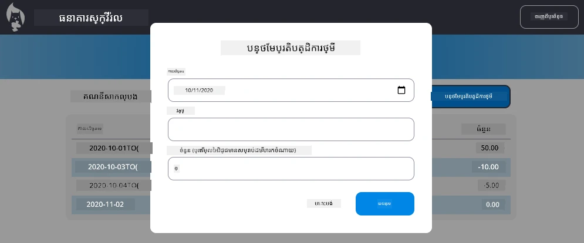

# អនុវត្តឆាតឡូខោយ "បន្ថែមប្រតិបត្តិការ"

## ទិដ្ឋភាពទូទៅ

កម្មវិធីធានារ៉ាប់រងរបស់អ្នកឥឡូវមានការគ្រប់គ្រងស្ថានភាពរឹងមាំ និងការរក្សាទុកទិន្នន័យ ប៉ុន្តែមិនមានមុខងារសំខាន់មួយដែលកម្មវិធីធានារ៉ាប់រងពិតប្រាកដទាមទារ នោះគឺសមត្ថភាពឲ្យអ្នកប្រើប្រាស់បន្ថែមប្រតិបត្តិការផ្ទាល់ខ្លួន។ ក្នុងការងារនេះ អ្នកនឹងអនុវត្តឆាតឡូខោយ "បន្ថែមប្រតិបត្តិការ" ពេញលេញដែលភ្ជាប់ជាប់ជាមួយប្រព័ន្ធគ្រប់គ្រងស្ថានភាពដែលមានរួចរបស់អ្នក។

ការងារនេះផលិតឡើងជាមួយគ្នានូវអ្វីគ្រប់យ៉ាងដែលអ្នកបានរៀននៅក្នុងមេរៀនធានារ៉ាប់រងចំនួនបួន៖ ការសរសេររចនាស្ទាយ HTML ការដោះស្រាយទម្រង់ ការតភ្ជាប់ API និងការគ្រប់គ្រងស្ថានភាព។

## គោលបំណងការសិក្សា

ដោយបញ្ចប់ការងារនេះ អ្នកនឹង៖  
- **បង្កើត** ចំណុចប្រយោជន៍ឆាតឡូខោយងាយស្រួលសម្រាប់បញ្ចូលទិន្នន័យ  
- **អនុវត្ត** ការរចនាទម្រង់ដែលអាចចូលប្រើបានដោយគ្រាប់ក្តារចុច និងអ្នកអានអេក្រង់  
- **ភ្ជាប់** មុខងារថ្មីជាមួយប្រព័ន្ធគ្រប់គ្រងស្ថានភាពដែលមានរួច  
- **អនុវត្ត** ការទំនាក់ទំនង API និងការដោះស្រាយកំហុស  
- **ប្រើប្រាស់** ស្ទាយវិបសាយទំនើបសម្រាប់មុខងារពិតប្រាកដ  

## ការណែនាំ

### ជំហានទី 1៖ ប៊ូតុងបន្ថែមប្រតិបត្តិការ

**បង្កើត** ប៊ូតុង "បន្ថែមប្រតិបត្តិការ" នៅលើទំព័រដាសបូឌឺរបស់អ្នកដែលអ្នកប្រើអាចស្វែងរក និងចូលដំណើរការបានងាយស្រួល។

**តម្រូវការ៖**  
- **ដាក់** ប៊ូតុងនៅទីតាំងមានហេតុផលលើទំព័រដាសបូឌឺ  
- **ប្រើ** អត្ថបទប៊ូតុងជាការបញ្ជាកម្មស្បាស់លាស់  
- **រចនា** ប៊ូតុងឲ្យដូចជាផ្នែក UI ដែលមានរួចរបស់អ្នក  
- **ធានា** ប៊ូតុងអាចចូលទៅបានដោយគ្រាប់ក្តារចុច  

### ជំហានទី 2៖ ការអនុវត្តឆាតឡូខោយ

ជ្រើសរើសមួយលទ្ធផលពីពីរនេះសម្រាប់ការអនុវត្តឆាតឡូខោយរបស់អ្នក៖

**ជម្រើស A៖ ទំព័រប្រភេទផ្សេង**  
- **បង្កើត** គំរូ HTML ថ្មី សម្រាប់ទម្រង់ប្រតិបត្តិការ  
- **បន្ថែម** ផ្លូវថ្មីទៅប្រព័ន្ធរ៉ោតរបស់អ្នក  
- **អនុវត្ត** ការនាវីហ្គេតទៅនិងចេញពីទំព័រទម្រង់  

**ជម្រើស B៖ ឆាតឡូខោយម៉ូដែល (ផ្ដល់អនុសាសន៍)**  
- **ប្រើ** JavaScript ដើម្បីបង្ហាញ/លាក់ឆាតឡូខោក្រោយទំព័រដាសបូឌឺ  
- **អនុវត្ត** ដោយប្រើ [`hidden` property](https://developer.mozilla.org/docs/Web/HTML/Global_attributes/hidden) ឬថ្នាក់ CSS  
- **បង្កើត** បទពិសោធន៍អ្នកប្រើដែលរលូនជាមួយការគ្រប់គ្រងផ្ដោតចិត្តត្រឹមត្រូវ  

### ជំហានទី 3៖ ការអនុវត្តភាពអាចចូលដំណើរការ

**ធានា** ឆាតឡូខោយរបស់អ្នកបំពេញតាម [ស្តង់ដារភាពអាចចូលដំណើរការសម្រាប់ឆាតឡូខោយម៉ូដែល](https://developer.paciellogroup.com/blog/2018/06/the-current-state-of-modal-dialog-accessibility/)៖

**ការរុករកដោយគ្រាប់ក្តារចុច៖**  
- **គាំទ្រ** ការចុច Escape ដើម្បីបិទឆាតឡូខោយ  
- **ចាប់** ផ្ដោតចិត្តនៅក្នុងឆាតឡូខោយពេលបើក  
- **ត្រឡប់** ផ្ដោតចិត្តទៅប៊ូតុង​បាក់ទូល​ពីពេលបិទ  

**គាំទ្រអ្នកអានអេក្រង់៖**  
- **បន្ថែម** ស្លាក ARIA និងតួនាទីសមរម្យ  
- **ប្រកាស** ការបើក/បិទឆាតឡូខោយទៅអ្នកអានអេក្រង់  
- **ផ្តល់** ស្លាកវាលទម្រង់ និងសារកំហុសច្បាស់លាស់  

### ជំហានទី 4៖ បង្កើតទម្រង់

**រចនា** ទម្រង់ HTML ដើម្បីប្រមូលទិន្នន័យប្រតិបត្តិការ៖

**វាលបង្កើតប្រៀបប្រដៅ៖**  
- **កាលបរិច្ឆេទ**៖ ពេលវេលាដែលប្រតិបត្តិការកើតឡើង  
- **ការពិពណ៌នា**៖ អ្វីដែលប្រតិបត្តិការវា  
- **ចំនួនទឹកប្រាក់**៖ តម្លៃប្រតិបត្តិការ (វិជ្ជមានសម្រាប់ចំណូល ឬអវិជ្ជមានសម្រាប់ចំណាយ)  

**លក្ខណៈទម្រង់៖**  
- **ផ្ទៀងផ្ទាត់** ইনប្រាំអ្នកប្រើមុនដាក់ស្នើ  
- **ផ្តល់** សារកំហុសច្បាស់ សម្រាប់ទិន្នន័យមិនត្រឹមត្រូវ  
- **រួមបញ្ចូល** អត្ថបទកន្លែងដាក់ និងស្លាកជំនួយ  
- **រចនា** ឲ្យសមរម្យជាមួយរចនាប័ទ្មដែលមាន  

### ជំហានទី 5៖ ការតភ្ជាប់ API

**ភ្ជាប់ទម្រង់របស់អ្នកទៅ API ផ្នែកខាងក្រោយ៖

**ជំហានអនុវត្ត៖**  
- **ពិនិត្យឡើងវិញ** ឯកសារបញ្ជាក់ API [server API specifications](../api/README.md) សម្រាប់ចំណុចបញ្ចូលត្រឹមត្រូវ និងទ្រង់ទ្រាយទិន្នន័យ  
- **បង្កើត** ទិន្នន័យ JSON ពីការបញ្ចូលទម្រង់  
- **ផ្ញើ** ទិន្នន័យទៅ API ជាមួយការដោះស្រាយកំហុសសមរម្យ  
- **បង្ហាញ** សារជោគជ័យ/បរាជ័យទៅអ្នកប្រើ  
- **ដោះស្រាយ** កំហុសបណ្ដាញយ៉ាងទន់ភ្លន់  

### ជំហានទី 6៖ ការភ្ជាប់គ្រប់គ្រងស្ថានភាព

**ធ្វើបច្ចុប្បន្នភាពដាសបូឌឺរបស់អ្នកជាមួយប្រតិបត្តិការ ថ្មី៖

**តម្រូវការភ្ជាប់៖**  
- **ធ្វើបច្ចុប្បន្នភាព** ទិន្នន័យគណនីបន្ទាប់ពីបន្ថែមប្រតិបត្តិការ​ជោគជ័យ  
- **ធ្វើបច្ចុប្បន្នភាព** ការបង្ហាញដាសបូឌឺដោយមិនត្រូវបញ្ចូលទំព័រឡើងវិញ  
- **ធានា** ប្រតិបត្តិការថ្មីបង្ហាញភ្លាមៗ  
- **រក្សា** ភាពសមរម្យក្នុងការគ្រប់គ្រងស្ថានភាពពេញលេញ  

## បុព្វបទបច្ចេកទេស

**ព័ត៌មានអំពីចំណុចបញ្ចូល API៖**  
យោងទៅ [server API documentation](../api/README.md) សម្រាប់៖  
- ទ្រង់ទ្រាយ JSON ត្រូវការ​សម្រាប់ទិន្នន័យប្រតិបត្តិការ  
- វិធីសាស្ត្រ HTTP និង URL ចំណុចបញ្ចូល  
- ទ្រង់ទ្រាយចម្លើយរំពឹងទុក  
- ការដោះស្រាយចម្លើយកំហុស  

**លទ្ធផលរំពឹងទុក៖**  
បន្ទាប់ពីបញ្ចប់ការងារនេះ កម្មវិធីធានារ៉ាប់រងរបស់អ្នកគួរតែមានមុខងារ "បន្ថែមប្រតិបត្តិការ" ដែលដំណើរការពេញលេញ មានរូបរាង និងអាកប្បកិរិយាមនុស្សភាគរយ៖

## សាកល្បងការអនុវត្តរបស់អ្នក

**ការសាកល្បងមុខងារ៖**  
1. **ផ្ទៀងផ្ទាត់** ប៊ូតុង "បន្ថែមប្រតិបត្តិការ" នឹងមើលឃើញបានច្បាស់ និងអាចចូលប្រើបាន  
2. **សាកល្បង** ឆាតឡូខោយបើក និងបិទបានត្រឹមត្រូវ  
3. **បញ្ជាក់** ការផ្ទៀងផ្ទាត់ទម្រង់ដំណើរការសម្រាប់វាលត្រូវការ  
4. **ពិនិត្យ** ប្រតិបត្តិការជោគជ័យបង្ហាញភ្លាមៗលើដាសបូឌឺ  
5. **ធានា** ការដោះស្រាយកំហុសដំណើរការសម្រាប់ទិន្នន័យមិនត្រឹមត្រូវ និងបញ្ហាបណ្ដាញ  

**ការសាកល្បងភាពអាចចូលដំណើរការ៖**  
1. **រុករក** តាមរយៈដំណើរការទាំងមូលដោយប្រើគ្រាប់ក្តារចុចតែមួយ  
2. **សាកល្បង** ជាមួយអ្នកអានអេក្រង់ដើម្បីធានាការប្រកាសត្រឹមត្រូវ  
3. **ផ្ទៀងផ្ទាត់** ការគ្រប់គ្រងផ្ដោតចិត្តបំពេញត្រឹមត្រូវ  
4. **ពិនិត្យ** ឲ្យវាលទម្រង់ទាំងអស់មានស្លាកសមរម្យ  

## តារាងវាយតម្លៃ

| វិធាន | ល្អបំផុត | ល្អគ្រប់គ្រាន់ | ត្រូវការកែលម្អ |
| -------- | --------- | -------- | ----------------- |
| **មុខងារ** | មុខងារបន្ថែមប្រតិបត្តិការ​ដំណើរការល្អឥតខ្ចោះជាមួយបទពិសោធន៍អ្នកប្រើល្អ និងអនុវត្តគោលការណ៍ល្អពីមេរៀនទាំងអស់ | មុខងារបន្ថែមប្រតិបត្តិការដំណើរការត្រឹមត្រូវ ប៉ុន្តែមិនត្រូវតាមគោលការណ៍ល្អខ្លះ ឬមានបញ្ហាអ្នកប្រើតូច | មុខងារបន្ថែមប្រតិបត្តិការវិលត្រឡប់ខ្លះ ឬមានបញ្ហា usability សំខាន់ |
| **គុណភាពកូដ** | កូដរៀបចំបានល្អ ប្រើស្ទាយបានត្រឹមត្រូវ មានការដោះស្រាយកំហុសជាក់លាក់ និងភ្ជាប់រលូនជាមួយប្រព័ន្ធគ្រប់គ្រងស្ថានភាព | កូដដំណើរការ តែមានបញ្ហារៀបចំ ឬគំរូមិនស្មើរភាគ ក៏ដូចជាគ្មានភាពឯកសារ | កូដមានបញ្ហាសំណុំរចនាសម្ព័ន្ធធំ ឬមិនភ្ជាប់ជាមួយស្ទាយដែលមានរួចដូចគ្នា |
| **ភាពអាចចូលដំណើរការ** | គាំទ្រគ្រប់គ្រាប់ក្តារចុច, តម្រូវការអ្នកអានអេក្រង់, និងគោលការណ៍ WCAG ជាមួយការគ្រប់គ្រងផ្ដោតចិត្តល្អ | លក្ខណៈភាពអាចចូលដំណើរការជាគ្រាប់ក្តារចុចយ៉ាងចំបង តែខ្វះខាតខ្លះខ្លះសម្រាប់អ្នកអានអេក្រង់ | ការពិចារណាផ្នែកភាពអាចចូលដំណើរការមិនគ្រប់គ្រាន់ ឬគ្មានសូម្បីតែ |
| **បទពិសោធន៍អ្នកប្រើ** | ចំណុចប្រយោជន៍ ងាយយល់ ស្អាតជាមួយមតិយោបល់ច្បាស់ សម្រួលរលូន និងរូបរាងវិជ្ជាជីវៈ | បទពិសោធន៍ល្អតែមិនល្អជាច្រើន ការត្រឡាប់មតិយោបល់ ឬរចនាម៉ូដែលមានកន្លែងគួរកែលម្អ | បទពិសោធន៍អាក្រក់ ជាមួយរចនាមិនច្បាស់ ឬគ្មានមតិយោបល់ណាមួយ |  

## ការប្រកួតប្រជែងបន្ថែម (ជាចំណុចជាចំណង់ចំណូលចិត្ត)

បន្ទាប់ពីបញ្ចប់តម្រូវការមូលដ្ឋាន សូមពិចារណាអំពីការបន្ថែមដូចខាងក្រោម៖

**មុខងារបន្ថែម៖**  
- **បន្ថែម** ប្រភេទប្រតិបត្តិការ (អាហារ ការដឹកជញ្ជូន កំសាន្ត ល។)  
- **អនុវត្ត** ការផ្ទៀងផ្ទាត់បញ្ចូលជាមួយមតិយោបល់ពេលវេលាពិតប្រាកដ  
- **បង្កើត** គ្រាប់ក្តារចុចរហ័សសម្រាប់អ្នកប្រើកម្រិតខ្ពស់  
- **បន្ថែម** សមត្ថភាពកែសម្រួល និងលុបប្រតិបត្តិការ  

**ការភ្ជាប់ខ្ពស់៖**  
- **អនុវត្ត** សមត្ថភាពមិនប្រើការបានសម្រាប់ប្រតិបត្តិការថ្មីបន្ថែម  
- **បន្ថែម** ការនាំចូលប្រតិបត្តិការច្រើនពីឯកសារ CSV  
- **បង្កើត** ការស្វែងរក និងតម្រងប្រតិបត្តិការ  
- **អនុវត្ត** មុខងារនាំចេញទិន្នន័យ  

មុខងារជាជម្រើសទាំងនេះនឹងជួយអ្នកបណ្ដុះបណ្ដាលគំនិតអភិវឌ្ឍវែបឆាប់រហ័ស និងបង្កើតកម្មវិធីធានារ៉ាប់រងពេញលេញជាងមុន!

---

<!-- CO-OP TRANSLATOR DISCLAIMER START -->
**ការបដិសេធ**៖  
ឯកសារ​នេះ​ត្រូវ​បាន​ប្រែ​សម្រួល​ដោយ​ប្រើសេវាផ្សាយ​ពាណិជ្ជកម្ម​បកប្រែ AI [Co-op Translator](https://github.com/Azure/co-op-translator)។ ទោះ​យើង​ព្យាយាម​ដើម្បី​ត្រឹមត្រូវ ប៉ុន្តែសូម​ជ្រាបថា​ការ​បកប្រែ​ដោយស្វ័យប្រវត្តិ​អាច​មាន​កំហុស ឬ​ការខុសឆ្គង។ ឯកសារ​ដើម​នៅ​ក្នុង​ភាសា​ដើម​របស់វា​គួរត្រូវ​បាន​គិត​ដូចជា​ផ្លូវការ​ជាមូលដ្ឋាន។ សម្រាប់​ព័ត៌មាន​សំខាន់ៗ​ សូម​ពិនិត្យ​ការបកប្រែ​ដោយ​មនុស្ស​ជំនាញ​ជាមុន។ យើង​មិនទទួលខុសត្រូវ​ចំពោះ​ការ​យល់ច្រឡំ ឬ​ការ​បកប្រែ​ខុស​ដែល​កើត​មាន​ពី​ការ​ប្រើ​ប្រាស់​ការ​បកប្រែ​នេះ​ទេ។
<!-- CO-OP TRANSLATOR DISCLAIMER END -->