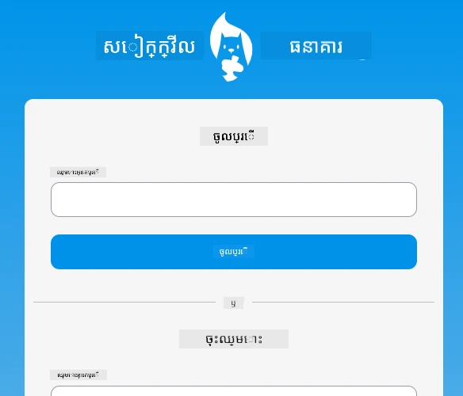
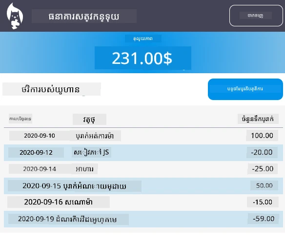

# :dollar: បង្កើតធនាគារ

ក្នុងគម្រោងនេះ អ្នកនឹងរៀនពីរបៀបបង្កើតធនាគារដែលមានរឿងរ៉ាវ។ មេរៀនទាំងនេះរួមបញ្ចូលការណែនាំពីរបៀបរៀបចំកម្មវិធីវែប និងផ្ដល់បណ្ដាញផ្លូវ, បង្កើតបែបបទ, គ្រប់គ្រងស្ថានភាព និងទាញយកទិន្នន័យពី API ដែលអ្នកអាចទាញយកទិន្នន័យធនាគារ។

|  |  |
|--------------------------------|--------------------------------|

## មេរៀន

1. [គំរូ HTML និងផ្លូវក្នុងកម្មវិធីវែប](1-template-route/README.md)
2. [បង្កើតបែបបទចុះឈ្មោះ និងចូល](2-forms/README.md)
3. [វិធីសាស្រ្តក្នុងការទាញយក និងប្រើទិន្នន័យ](3-data/README.md)
4. [គ념វិចារណានៃការគ្រប់គ្រងស្ថានភាព](4-state-management/README.md)

### ការទទួលសញ្ញា

មេរៀនទាំងនេះត្រូវបានសរសេរដោយ :hearts: ដោយ [Yohan Lasorsa](https://twitter.com/sinedied)។

បើអ្នកចាប់អារម្មណ៍ក្នុងការរៀនពីរបៀបបង្កើត [server API](/7-bank-project/api/README.md) ដែលបានប្រើនៅក្នុងមេរៀនទាំងនេះ អ្នកអាចអនុវត្តតាម [ស៊េរីវីដេអូចំនួននេះ](https://aka.ms/NodeBeginner) (ជាពិសេសវីដេអូទី 17 ដល់ 21)។

អ្នកក៏អាចមើលការបង្រៀនអំពី [មេរៀនរៀនបែបអន្តរកម្មនេះ](https://aka.ms/learn/express-api)។

---

<!-- CO-OP TRANSLATOR DISCLAIMER START -->
**ការបដិសេធ**៖  
ឯកសារនេះត្រូវបានបកប្រែដោយប្រើសេវាកម្មបកប្រែAI [Co-op Translator](https://github.com/Azure/co-op-translator)។ ខណៈពេលដែលយើងខិតខំប្រឹងប្រែងចង់ឱ្យបានត្រឹមត្រូវ សូមយកចិត្តទុកដាក់ថាការបកប្រែដោយស្វ័យប្រវត្តិអាចមានកំហុសឬកង្វេងឆ្គង។ ឯកសារដើមជាភាសាមិត្ដមានត្រូវបានគេទទួលស្គាល់ថាជាមូលដ្ឋានពិតប្រាកដ។ សម្រាប់ព័ត៌មានសំខាន់ៗ យើងសូមផ្តល់អនុសាសន៍ឱ្យបកប្រែដោយអ្នកជំនាញមនុស្ស។ យើងមិនទទួលខុសត្រូវចំពោះការយល់ច្រឡំ ឬការបកស្រាយខុសពីការប្រើប្រាស់ការបកប្រែនេះឡើយ។
<!-- CO-OP TRANSLATOR DISCLAIMER END -->