# ការប្រើប្រាស់កម្មវិធីកែសម្រួលកូដ៖ ការត្រួតពិនិត្យ VSCode.dev

ចងចាំនៅក្នុង *The Matrix* ពេល Neo ត្រូវបានភ្ជាប់ទៅកាន់គេហទំព័រទំហំតាក់ទំហំធំដើម្បីចូលលំហឌីជីថល? ឧបករណ៍អភិវឌ្ឍន៍វែបបច្ចុប្បន្នគឺផ្ទុយគ្នា – ជា ឧបករណ៍មានសមត្ថភាពខ្លាំងដែលអាចចូលប្រើបានពីគ្រប់ទីកន្លែង។ VSCode.dev គឺជាកម្មវិធីកែសម្រួលកូដដែលដំណើរការតាមកម្មវិធីរុករក ដែលនាំយកឧបករណ៍អភិវឌ្ឍជំនាញទៅឧបករណ៍ណាមួយដែលមានការតភ្ជាប់អ៊ីនធឺណិត។

ដូចជាម៉ាស៊ីនបោះពុម្ពបានធ្វើឲ្យសៀវភៅអាចចូលដំណើរការដោយមនុស្សទាំងអស់ មិនមែនគ្រាន់តែសម្រាប់អ្នកសរសេរនៅក្នុងវិហារទេ, VSCode.dev ក៏ផ្ទុះភាពជាសាធារណៈក្នុងការសរសេរកូដផងដែរ។ អ្នកអាចធ្វើការនៅលើគម្រោងពីកុំព្យូទ័រអ្នកបណ្ណាល័យ, មន្ទីរព험កូដរបស់សាលា, ឬគ្រប់ទីកន្លែងដែលអ្នកអាចប្រើកម្មវិធីរុករក។ គ្មានការតំឡើងអ្វីទេ គ្មានការដាក់កំណត់ "ខ្ញុំត្រូវការការកំណត់ជាក់លាក់"។

នៅចុងតប៉ាល់មេរៀននេះ អ្នកនឹងយល់ពីរបៀបរុករក VSCode.dev បើកឃ្លាំង GitHub តាំងពីក្នុងកម្មវិធីរុករកផ្ទាល់ និងប្រើ Git សម្រាប់គ្រប់គ្រងកំណែ – ជាជំនាញដែលអ្នកអភិវឌ្ឍជំនាញប្រើប្រាស់រៀងរាល់ថ្ងៃ។

## ⚡ អ្វីដែលអ្នកអាចធ្វើបាននៅក្នុង 5 នាទីបន្ទាប់

**ផ្លូវចាប់ផ្តើមរហ័សសម្រាប់អ្នកអភិវឌ្ឍយ៉ាងរវល់**

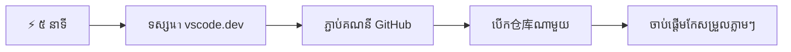
- **នាទីទី 1**៖ រុករកទៅកាន់ [vscode.dev](https://vscode.dev) - គ្មានការតំឡើង
- **នាទីទី 2**៖ ចូលសំងាត់ជាមួយ GitHub ដើម្បីភ្ជាប់ឃ្លាំងរបស់អ្នក
- **នាទីទី 3**៖ សាកល្បងឯកសារចំណាំ URL៖ បម្លែង `github.com` ទៅជា `vscode.dev/github` នៅក្នុង URL ឃ្លាំងណាមួយ
- **នាទីទី 4**៖ បង្កើតឯកសារថ្មី និងមើលការបង្ហាញពណ៌សំនាក់វាគ្មិនស្វ័យប្រវត្តិ
- **នាទីទី 5**៖ ប្រែប្រួល និងកត់ត្រាវាចេញតាមផ្នែកគ្រប់គ្រង Source Control

**URL សាកល្បងរហ័ស**៖  
```
# Transform this:
github.com/microsoft/Web-Dev-For-Beginners

# Into this:
vscode.dev/github/microsoft/Web-Dev-For-Beginners
```
  
**ហេតុអ្វីបានជា វាសំខាន់**៖ ក្នុងរយៈពេល 5 នាទី អ្នកនឹងពិសោធន៍ភាពសេរីក្នុងការសរសេរកូដពីគ្រប់ទីកន្លែងជាមួយឧបករណ៍ជំនាញ។ នេះជាចំណុចប្រទាក់នាពេលអនាគតនៃការអភិវឌ្ឍន៍ – មានភាពងាយស្រួល, មានសមត្ថភាពខ្លាំង, និងភ្លាមៗ។

## 🗺️ ការធ្វើដំណើររៀនរបស់អ្នកតាមរយៈការអភិវឌ្ឍន៍ផ្អែកលើពពក

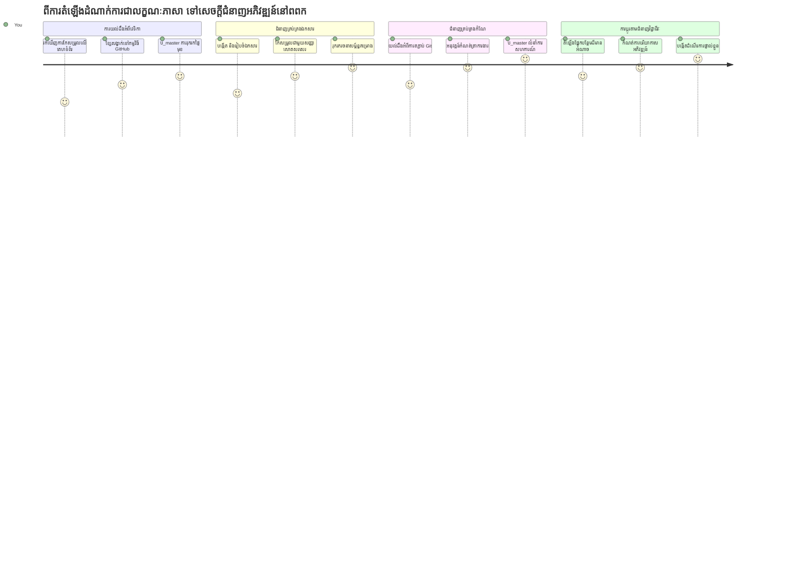
**គោលដៅដំណើររបស់អ្នក**៖ នៅចុងគំរូនេះ អ្នកនឹងចេះប្រើបរិយាកាសអភិវឌ្ឍជំនាញនៅលើពពក ដែលដំណើរការពីគ្រប់ឧបករណ៍ អនុញ្ញាតឲ្យអ្នកសរសេរកូដដោយប្រើឧបករណ៍ដូចគ្នានិងអ្នកអភិវឌ្ឍនៅក្រុមហ៊ុនបដិមាជិកធំៗ។

## អ្វីដែលអ្នកនឹងរៀន

បន្ទាប់ពីយើងធ្វើដំណើរនេះរួច អ្នកនឹងអាច៖

- រុករក VSCode.dev ដូចជាផ្ទះទីពីររបស់អ្នក – រកឃើញអ្វីដែលអ្នកត្រូវការដោយមិនបាត់បង់
- បើកឃ្លាំង GitHub មួយណាក៏បានតាមកម្មវិធីរុករក ហើយចាប់ផ្តើមកែសម្រួលភ្លាមៗ (នេះពិតជាយ៉ាងអស្ចារ្យ!)
- ប្រើ Git ក្នុងការតាមដានការផ្លាស់ប្តូរ និងរក្សាទុកដំណើរការរបស់អ្នកដូចជាអាជ្ញាធរ
- ជំរុញកម្មវិធីកែសម្រួលរបស់អ្នកជាមួយផ្នែកបន្ថែមដែលធ្វើឲ្យសរសេរកូដលឿន និងរីករាយ
- បង្កើត និងរៀបចំបញ្ជីឯកសារគម្រោងបានយ៉ាងទំនុកចិត្ត

## អ្វីដែលអ្នកត្រូវការ

តម្រូវការដែលមានគេមិនស្មុយស្មាញ៖

- គណនី [GitHub](https://github.com) មួយឥតគិតថ្លៃ (យើងនឹងណែនាំអ្នកក្នុងការបង្កើតប្រសិនបើត្រូវការ)
- មានសមត្ថភាពធម្មតានៃកម្មវិធីរុករកវែប
- មេរៀន GitHub Basics ផ្ដល់ព័ត៌មានគាំទ្រដ៏មានប្រយោជន៍ ប៉ុន្តែមិនចាំបាច់ទេ

> 💡 **ថ្មីចំពោះ GitHub?** ការបង្កើតគណនីគឺឥតគិតថ្លៃ និងចំណាយពេលតិច។ ដូចបណ្ណ័បណ្ណាល័យផ្ដល់ការចូលដំណើរការសៀវភៅទូទាំងពិភពលោក គណនី GitHub ផ្ដល់ទីចូលដំណើរការទៅឃ្លាំងកូដទូទាំងអ៊ីនធឺណិត។

## 🧠 ទិដ្ឋភាពទូទៅនៃប្រព័ន្ធអភិវឌ្ឍន៍ផ្អែកលើពពក

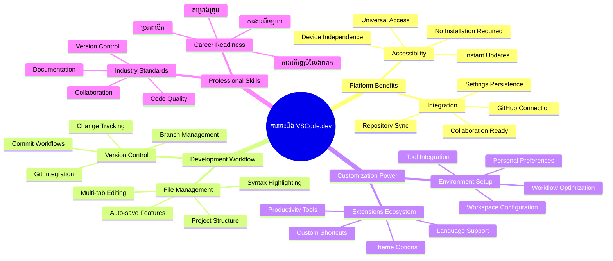
**គោលការណ៍ស្នូល**៖ បរិយាកាសអភិវឌ្ឍផ្អែកលើពពកគឺជាពេលអនាគតនៃការសរសេរកូដ - ផ្ដល់ឧបករណ៍ជំនាញដែលឆ្លងកាត់ចម្រង់, ប្រកបដោយភាពសហការណ៍ និងមិនពឹងផ្អែកលើវេទិកា។

## ហេតុអ្វីកម្មវិធីកែសម្រួលកូដប្រើវែបមានសារៈសំខាន់

មុនពេលមានអ៊ិនធឺណិត នរណាដែលនៅសាកលវិទ្យាល័យផ្សេងៗមិនអាចចែករំលែកការស្រាវជ្រាវបានយ៉ាងងាយស្រួល។ បន្ទាប់មក ARPANET មកក្នុងទសវត្សរ៍ 1960s ផ្ដល់កាបូបភ្ជាប់កុំព្យូទ័រពីចម្ងាយ។ កម្មវិធីកែសម្រួលកូដប្រើវែបអនុវត្តគោលការណ៍ដដែល – ធ្វើឲ្យឧបករណ៍មានសមត្ថភាពខ្លាំងអាចចូលដំណើរការបានដោយមិនគិតពីទីតាំងរាងកាយ ឬឧបករណ៍។

កម្មវិធីកែសម្រួលកូដគឺជាកន្លែងការងារអភិវឌ្ឍរបស់អ្នក ដែលអ្នកសរសេរ កែសម្រួល និងរៀបចំឯកសារកូដ។ មិនដូចកម្មវិធីកែសម្រួលអត្ថបទធម្មតា កម្មវិធីកែសម្រួលកូដជំនាញផ្ដល់ពណ៌សំគាល់វាកម្ម, ការរកពិនិត្យកំហុស, និងលក្ខណៈគ្រប់គ្រងគម្រោង។

VSCode.dev នាំយកសមត្ថភាពទាំងនេះទៅកាន់កម្មវិធីរុករករបស់អ្នក៖

**អត្ថប្រយោជន៍កែសម្រួលប្រើវែប៖**

| លក្ខណៈ | ការពិពណ៌នា | អត្ថប្រយោជន៍ប្រតិបត្តិការ |
|---------|-------------|----------|
| **មិនពឹងផ្អែកលើវេទិកា** | បើកដំណើរការបានលើឧបករណ៍ណាមួយដែលមានកម្មវិធីរុករក | ធ្វើការពីកុំព្យូទ័រផ្សេងៗបានយ៉ាងរលូន |
| **គ្មានការតំឡើងចាំបាច់** | ចូលប្រើតាម URL វែប | លុបចោលការដំឡើងកម្មវិធី |
| **ធ្វើបច្ចុប្បន្នភាពដោយស្វ័យប្រវត្តិ** | រៀងរាល់ពេលមានកំណែថ្មី | ចូលប្រើមុខងារថ្មីដោយមិនចាំបាច់ធ្វើអ្វីជាម្ដងទៀត |
| **ការភ្ជាប់ឃ្លាំង** | ភ្ជាប់ផ្ទាល់ទៅ GitHub | កែសម្រួលកូដដោយមិនបាច់គ្រប់គ្រងឯកសារពិសេស |

**អត្ថផលអភិវឌ្ឍន៍:**
- រក្សាការរួចរាល់កិច្ចការរបស់អ្នកនៅក្នុងបរិយាកាសផ្សេងៗគ្នា
- ចំណុចប្រទាក់ស្មើគ្នាដោយមិនគិតពីប្រព័ន្ធប្រតិបត្តិការ
- មានភាពអាចសហការបានភ្លាមៗ
- កាត់បន្ថយចំណុចតម្រូវការស្តុកទិន្នន័យលើម៉ាស៊ីនរបស់អ្នក

## ការស្វែងយល់អំពី VSCode.dev

ដូចជាលាន្យមុខវិទ្យាកម្មវិទ្យារបស់ Marie Curie មានឧបករណ៍ពិសេសនៅក្នុងកន្លែងរឹងមាំមួយ VSCode.dev ផ្ទុកឧបករណ៍អភិវឌ្ឍន៍ជំនាញនៅក្នុងចំណុចប្រទាក់កម្មវិធីរុករក។ កម្មវិធីវែបនេះផ្ដល់ការប្រតិបត្តិមូលដ្ឋានដូចជាកម្មវិធីកែសម្រួលកូដតុ।

ចាប់ផ្តើមដោយចូលទៅកាន់ [vscode.dev](https://vscode.dev) តាមកម្មវិធីរុករករបស់អ្នក។ ចំណុចប្រទាក់នេះបើកដោយមិនបានទាញយកឬតំឡើងប្រព័ន្ធអ្វីទេ – ជាការអនុវត្តតាមគោលការណ៍គណនាគមនាគមន៍ពពក។

### ការភ្ជាប់គណនី GitHub របស់អ្នក

ដូចជាទូរស័ព្ទរបស់ Alexander Graham Bell បានភ្ជាប់ទីតាំងឆ្ងាយៗ, ការភ្ជាប់គណនី GitHub របស់អ្នក ភ្ជាប់ VSCode.dev ជាមួយឃ្លាំងកូដរបស់អ្នក។ នៅពេលដែលបានស្នើឲ្យចូលសំងាត់ជាមួយ GitHub, ការទទួលយកការភ្ជាប់នេះគឺមានអត្ថប្រយោជន៍ខ្លាំង។

**ការរួមបញ្ចូល GitHub ផ្ដល់:**
- ការចូលប្រើផ្ទាល់នៅក្នុងកម្មវិធីកែសម្រួល
- ការដំឡើង និងផ្នែកបន្ថែមនៅលើឧបករណ៍ផ្សេងៗគ្នាដោយសម្រួល
- ការរក្សាទុកស្ទីលការងារយ៉ាងរលូនទៅ GitHub
- បរិយាកាសអភិវឌ្ឍផ្ទាល់ខ្លួន

### ស្គាល់កន្លែងការងារថ្មីរបស់អ្នក

ពេលមានអ្វីៗទាំងអស់ដំណើរការរួច អ្នកនឹងឃើញកន្លែងការងារត្រចៀកធូរដែលរចនាឡើងឲ្យអ្នកផ្ដោតទៅលើអ្វីដែលសំខាន់ – កូដរបស់អ្នក!

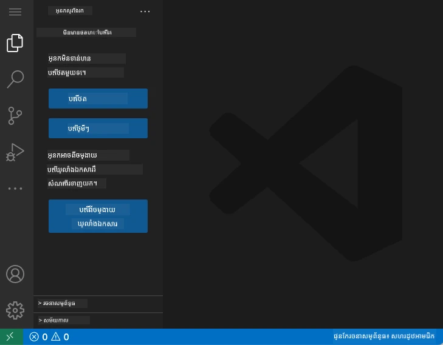

**នេះជាវីធីដំណើរការក្នុងតំបន់អ្នកនៅ:**
- **របារសកម្មភាព** (ជារបារឈរនៅខាងឆ្វេង)៖ ជារបាររៀបចំដំនោះសំរាប់អ្នកដូចជា Explorer 📁, Search 🔍, Source Control 🌿, Extensions 🧩 និង Settings ⚙️
- **ផ្នែកភាពជាគូរខាង** (ផ្នែកនៅក្បែរនោះ)៖ បង្ហាញព័ត៌មានពាក់ព័ន្ធទៅតាមអ្វីដែលអ្នកបានជ្រើសរើស
- **តំបន់កែសម្រួល** (ទំហំធំនៅកណ្ដាល)៖ ទីនេះជាកន្លែងអភិវឌ្ឍន៍កូដរបស់អ្នក

**ចំណាយពេលមួយភ្លាមរុករក:**
- ចុចរង្វង់ប្រតិបត្តិដំណើរការនៅលើរបារសកម្មភាព ហើយមើលថាតើមួយៗធ្វើអ្វីខ្លះ
- សំគាល់ពីរបរខាងបង្ហាញព័ត៌មានផ្សេងៗ – ពិតជាគួរឲ្យចាប់អារម្មណ៍មែនទេ?
- ទិដ្ឋភាព Explorer (📁) ប្រហែលជាគឺជាកន្លែងដែលអ្នកនឹងចំណាយពេលភាគច្រើន ដូច្នេះសូមសម្រួលរួចរុករកវា

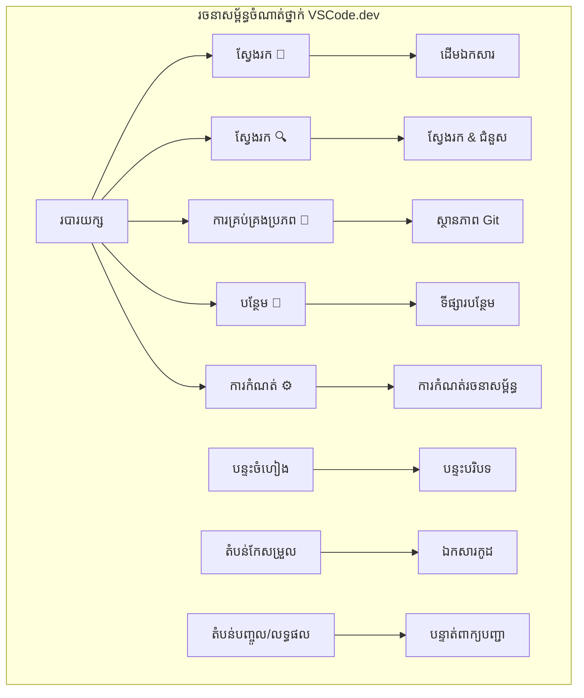
## ការបើកឃ្លាំង GitHub

មុនពេលមានអ៊ីនធឺណិត អ្នកស្រាវជ្រាវត្រូវធ្វើដំណើរទៅបណ្ណាល័យដើម្បីចូលប្រើឯកសារ។ ឃ្លាំង GitHub ក៏ដូចគ្នា – ជាការប្រមូលផ្តុំកូដដែលបានរក្សាទុកឆ្ងាយពីលើម៉ាស៊ីន។ VSCode.dev យកចេញជំហានបែបធម្មតា នៃការទាញយកឃ្លាំងទៅម៉ាស៊ីនមុខថែមទៀតមុនកែសម្រួល។

សមត្ថភាពនេះអនុញ្ញាតឲ្យចូលប្រើភ្លាមៗទៅឃ្លាំងសាធារណៈណាមួយ សម្រាប់មើល, កែប្រែ, ឬចូលរួម។ មានពីរប្រភេទវិធីសាស្ត្រជាចម្បងក្នុងការបើកឃ្លាំង៖

### វិធីសាស្ត្រទី 1៖ វិធីចុចនិងបើក

នេះល្អសម្រាប់អ្នកដែលចាប់ផ្តើមថ្មីក្នុង VSCode.dev ហើយចង់បើកឃ្លាំងជាក់លាក់មួយ។ វាគឺមិនស្មុគស្មាញហើយសមស្របសម្រាប់អ្នកថ្មី៖

**របៀបធ្វើ:**

1. ទៅកាន់ [vscode.dev](https://vscode.dev) ប្រសិនបើអ្នកមិនបាននៅងណាទេទេ
2. ស្វែងរកប៊ូតុង "Open Remote Repository" នៅលើផ្ទៃផ្តើម ហើយចុចលើវា

   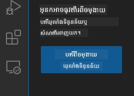

3. បិទ URL ឃ្លាំង GitHub មួយណាមួយ (សាកល្បង URL នេះ៖ `https://github.com/microsoft/Web-Dev-For-Beginners`)
4. ចុច Enter ហើយមើលភាពអស្ចារ្យកើតឡើង!

**គន្លឹះ Command Palette ដោយរហ័ស:**

ចង់មានអារម្មណ៍ថាជារូបមន្តនៅក្នុងកូដ? សាកល្បងតាមរយៈផ្ទាំងក្តារចុច៖ Ctrl+Shift+P (ឬ Cmd+Shift+P លើម៉ាក) ដើម្បីបើក Command Palette៖

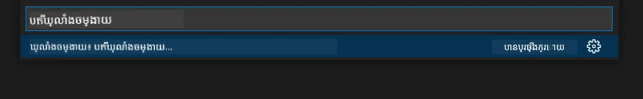

**Command Palette គឺដូចជាម៉ាស៊ីនស្វែងរកសម្រាប់អ្វីៗដែលអ្នកអាចធ្វើបាន៖**
- វាយ "open remote" ហើយវានឹងស្វែងរកអ្នកបើកឃ្លាំង
- វាមានអនុស្សាវរីយ៍ឃ្លាំងដែលអ្នកបានបើកថ្មីៗ (មានប្រយោជន៍ណាស់!)
- ពេលអ្នកស្គាល់វា អ្នកនឹងមានអារម្មណ៍ថាកំពុងកូដបានលឿនជាពិសេស
- វាជាប្រភេទ VSCode.dev របស់ "Hey Siri, តែសម្រាប់កូដ"

### វិធីសាស្ត្រទី 2៖ វិធីកែប្រែ URL

ដូចជា HTTP និង HTTPS ប្រើពិធីសាស្ត្រផ្សេងៗ ប៉ុន្តែកាន់តែមានរចនាសម្ព័ន្ធដូចគ្នា VSCode.dev ប្រើលំនាំ URL ដដែលដែលមានលក្ខណៈស្រដៀងនឹងប្រព័ន្ធអាសយដ្ឋាន GitHub។ URL ឃ្លាំង GitHub តែមួយអាចត្រូវបានកែប្រែឲ្យបើកផ្ទាល់ក្នុង VSCode.dev។

**លំនាំបំលែង URL៖**

| ប្រភេទឃ្លាំង | URL GitHub | URL VSCode.dev |
|----------------|---------------------|----------------|
| **ឃ្លាំងសាធារណៈ** | `github.com/microsoft/Web-Dev-For-Beginners` | `vscode.dev/github/microsoft/Web-Dev-For-Beginners` |
| **គម្រោងផ្ទាល់ខ្លួន** | `github.com/your-username/my-project` | `vscode.dev/github/your-username/my-project` |
| **ឃ្លាំងណាមួយដែលអាចចូលបាន** | `github.com/their-username/awesome-repo` | `vscode.dev/github/their-username/awesome-repo` |

**ការអនុវត្ត:**
- ជំនួស `github.com` ជា `vscode.dev/github`
- រក្សាផ្នែកផ្សេងៗក្នុង URL ដដែល
- ធ្វើការចូលប្រើបានគ្រប់ឃ្លាំងសាធារណៈ
- ផ្ដល់ការចូលកែសម្រួលភ្លាមៗ

> 💡 **ធំជាងជីវិត**៖ ដាក់សញ្ញាគាប់(Bookmark) នូវវើស្យុន VSCode.dev នៃឃ្លាំងដែលអ្នកចូលចិត្ត។ ខ្ញុំមានសញ្ញាគាប់ដូចជា "Edit My Portfolio" និង "Fix Documentation" ដែលយកខ្ញុំទៅផ្នែកកែសម្រួលភ្លាមៗ!

**តើអ្នកគួរត្រូវប្រើវិធីណា?**
- **វិធីចំណុចនិងចុច** ៖ ល្អពេលអ្នកកំពុងស្វែងរកឬមិនចាំឈ្មោះឃ្លាំងបានច្បាស់
- **វិធីកែប្រែ URL**៖ ល្អសម្រាប់ការចុះមកភ្លាមៗពេលអ្នកដឹងច្បាស់ថាត្រូវទៅណា

### 🎯 ការត្រួតពិនិត្យសិក្សា៖ ការចូលដំណើរកការអភិវឌ្ឍនៅលើពពក

**ឈប់并ធ្វើការត្រួតពិនិត្យ**៖ អ្នកទើបតែបានរៀនពីពីរប្រភេទវិធីសាស្ត្រចូលឃ្លាំងកូដតាមកម្មវិធីរុករក។ នេះជាការប្ដូរចម្បងនៃរបៀបដែលការអភិវឌ្ឍដំណើរការ។

**ការវាយតម្លៃខ្លីៗសម្រាប់ខ្លួនឯង៖**
- តើអ្នកអាចពន្យល់បានទេថាហេតុអ្វីការកែសម្រួលតាមវែបលុបចោលជំហាន "រៀបចំបរិយាកាសអភិវឌ្ឍ" ប្រពៃណី?
- តើអត្ថប្រយោជន៍នៃការកែប្រែ URL មានអ្វីខ្លះបើប្រៀបធៀបនឹងបង្កាក់ git ពីក្នុងម៉ាស៊ីនតំណាង?
- តើវិធីនេះផ្លាស់ប្ដូរបែបដែលអ្នកអាចចូលរួមក្នុងគម្រោងអង្គការហើយដូចម្តេច?

**ការតភ្ជាប់ជាក់ស្តែង**៖ ក្រុមហ៊ុនធំៗដូចជា GitHub, GitLab និង Replit បានកសាងវេទិកាអភិវឌ្ឍព្រិលពពកដូចនេះ។ អ្នកកំពុងរៀនវាការងារដដែលដែលក្រុមអភិវឌ្ឍជំនាញប្រើប្រាស់នៅជុំវិញពិភពលោក។

**សំណួរប្រកួតប្រជែង**៖ តើការអភិវឌ្ឍរបស់ពពកអាចផ្លាស់ប្ដូរបែបសិក្សារកូដនៅសាលាបែបណា? សូមគិតពីតម្រូវការឧបករណ៍ ការគ្រប់គ្រងកម្មវិធី និងវិធីសាស្ត្រសហការណ៍។

## ការងារជាមួយឯកសារ និងគម្រោង

ឥឡូវនេះដែលអ្នកមានឃ្លាំងបានបើក មកដំណើរការកសាង! VSCode.dev ផ្ដល់អ្វីៗដែលអ្នកត្រូវការដើម្បីបង្កើត, កែសម្រួល និងរៀបចំឯកសារកូដរបស់អ្នក។ គិតថាវាជាគWorkshop ឌីជីថលរបស់អ្នក – ឧបករណ៍គ្រប់យ៉ាងមាននៅកន្លែងដែលអ្នកត្រូវការ។

មកចូលរួមនូវកិច្ចការប្រចាំថ្ងៃដែលនឹងគ្របដណ្ដប់ច្រើនបំផុតការងារកូដរបស់អ្នក។

### បង្កើតឯកសារថ្មី

ដូចជាការរៀបចំផែនការទាំងមូលនៅការិយាល័យស្ថាបត្យករ ការបង្កើតឯកសារនៅ VSCode.dev ត្រូវការជំហានមានរចនាសម្ព័ន្ធ។ ប្រព័ន្ធគាំទ្រយ៉ាងល្អ​សម្រាប់ប្រភេទឯកសារអភិវឌ្ឍវែបទាំងអស់។

**ដំណើរការបង្កើតឯកសារ៖**

1. រុករកទៅកាន់ថតគោលក្នុងផ្នែក Explorer
2. អូសត្រោយកំពុងមាន "New File" យ៉ាងត្រង់៏ (📄+)
3. វាយឈ្មោះឯកសាររួមបញ្ចូលនឹងផ្នែកបន្ថែមត្រឹមត្រូវ (`style.css`, `script.js`, `index.html`)
4. ចុច Enter ដើម្បីបង្កើតឯកសារ

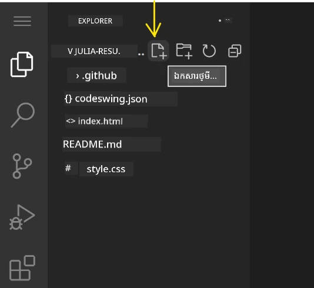

**កាតាប​ឈ្មោះ:**
- ប្រើឈ្មោះពិពណ៌នាថាបង្ហាញគោលបំណងឯកសារ
- បញ្ចូលផ្នែកបន្ថែមឯកសារដើម្បីគាំទ្រការបង្ហាញពណ៌សំគាល់វាគ្មិន
- មានគំរូឈ្មោះជាប់លាប់​នៅក្នុងគម្រោងទាំងមូល
- ប្រើអក្សរតូច និងសញ្ញាក្បៀសជំនួសព្យញ្ជនៈបំបែក

### កែសម្រួល និងរក្សាទុកឯកសារ

នេះជាចំណុចសប្បាយធ្វើការបំផុត! កម្មវិធីកែសម្រួល VSCode.dev បានបង្ហាប់មុខងារជួយបំផុតដែលធ្វើឲ្យការសរសេរកូដមានភាពរលូន និងងាយស្រួល។ វាដូចជាម៉ាស៊ីនជំនួយសរសេរតំបន់ឆ្លាតវៃមួយ ទៅកាន់កូដ។

**ដំណើរការកែសម្រួលរបស់អ្នក៖**

1. ចុចឯកសារណាមួយនៅក្នុង Explorer ដើម្បីបើកនៅតំបន់ចម្បង
2. ចាប់ផ្តើមវាយ និងមើល VSCode.dev ជួយអ្នកជាមួយពណ៌, ការផ្ដល់យោបល់ និងការរកកំហុស
3. រក្សាទុកដោយ Ctrl+S (Windows/Linux) ឬ Cmd+S (Mac) – បើទោះបីមាន auto-save ក៏ដោយ!

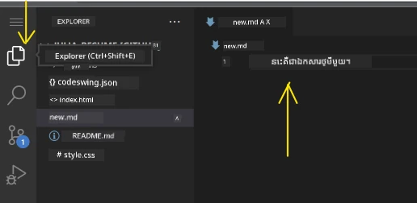

**អ្វីដែលកើតឡើងពេលអ្នកកូដ:**
- កូដរបស់អ្នកត្រូវបានពណ៌សំគាល់យ៉ាងស្រស់ស្អាត ដើម្បីអានងាយ
- VSCode.dev ផ្ដល់ជម្រើសបញ្ចប់ពាក្យខណៈអ្នកវាយ (ដូចជា auto-correct ប៉ុន្តែកាន់តែឆ្លាត)
- វាបង្ហាញកំហុស និងគ្រាប់ម៉ាសុល មុនអ្នករក្សាទុក
- អ្នកអាចបើកឯកសារច្រើនក្នុងផ្ទាំង tabs ដូចក្នុងកម្មវិធីរុករក
- គ្រប់យ៉ាងត្រូវបានរក្សាទុកដោយស្វ័យប្រវត្តិនៅផ្នែកខាងក្រោយ

> ⚠️ **គន្លឹះរហ័ស**៖ ទោះបី auto-save មានការពារអ្នក ក៏ដូចជាប្រចាំប្រើ Ctrl+S ឬ Cmd+S ដើម្បីរក្សាទុកភ្លាមភ្លឺ។ វាជួយធ្វើឲ្យកើតមានមុខងារជួយដូចជា ការត្រួតពិនិត្យកំហុស។

### គ្រប់គ្រងកំណែជាមួយ Git

ដូចជាអ្នកបញ្ញ្រាបុរាណកាន់ត្រីទាញយកកំណត់ហេតុច្បាស់លាស់នៃស្រទាប់បក់ដី Git តាមដានការផ្លាស់ប្ដូរនៅក្នុងកូដរបស់អ្នកជាមួយពេលវេលា។ ប្រព័ន្ធនេះរក្សាបន្ទុកប្រវត្តិគម្រោង ហើយធ្វើឲ្យអ្នកអាចត្រឡប់មកកំណែចាស់បានពេលត្រូវការ។ VSCode.dev រួមបញ្ចូលមុខងារ Git ដោយចូលរួម។

**ផ្ទាំងគ្រប់គ្រង Source Control៖**

1. ចូលទៅផ្ទាំង Source Control តាមរូបតំណាង 🌿 នៅលើរបារសកម្មភាព
2. ឯកសារផ្លាស់ប្ដូរបង្ហាញនៅផ្នែក "Changes"
3. ពណ៌សំគាល់បង្ហាញប្រភេទផ្លាស់ប្ដូរ៖ បៃតងសម្រាប់ការបន្ថែម, ក្រហមសម្រាប់ការលុប

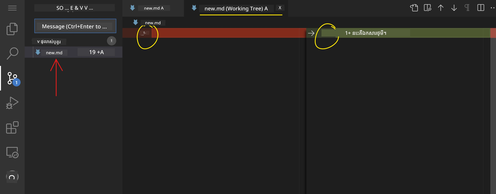

**រក្សាទុកការងាររបស់អ្នក (ដំណើរការបញ្ចូល commit):**

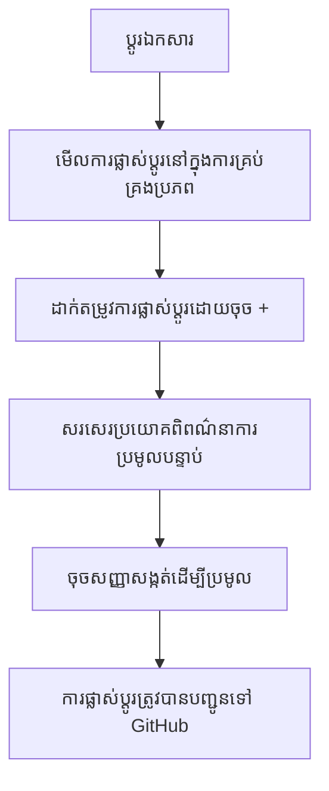
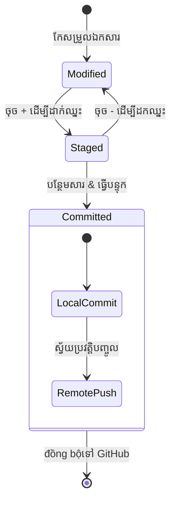
**នេះជាជំហានមួយៗរបស់អ្នក៖**
- ចុចរូបលក្ខណៈ "+" នៅក្បែរ​ឯកសារ​ដែល​អ្នក​ចង់​គ្រាន់បង់ (នេះ​គឺ​ជា​ការ "ដាក់វាទៅឆាក")
- ពិនិត្យមើលម្ដងទៀត​ថា​អ្នក​ពេញចិត្ត​នឹងការផ្លាស់ប្ដូរ​ទាំងអស់​ដែល​បានដាក់ឆាករួចហើយ
- សរសេរពាក្យសង្ខេប​ពិពណ៌នា​អំពី​អ្វីដែល​អ្នកបានធ្វើ (នេះគឺជា "សារបញ្ជាក់ commit" របស់អ្នក)
- ចុចប៊ូតុងសញ្ញាត្រួតពិនិត្យ ដើម្បីរក្សាទុកគ្រប់យ៉ាងទៅ GitHub
- ប្រសិនបើ​អ្នក​ផ្លាស់​ប្តូរ​គំនិត​អំពី​អ្វីមួយ អ័ក្ស "undo" អនុញ្ញាតិ​ឲ្យ​អ្នក​បោះបង់​ការផ្លាស់ប្តូរ

**ការសរសេរ​សារបញ្ជាក់ commit ល្អ (នេះ​ងាយរហ័សជាង​អ្វីដែល​អ្នកគិត!):**
- សូម​ពិពណ៌នា​អំពី​អ្វីដែល​អ្នកធ្វើ ផង ដូចជា "បន្ថែមបែបបទទំនាក់ទំនង" ឬ "ជួសជុលការរុករកខូច"
- រក្សាវាសង្ខេប និងផ្អែមល្ហែម – គិតបែបដូចជារយៈពេល tweet មិន​មែន essay ទេ
- ចាប់ផ្តើមជាមួយ​ពាក្យ​សកម្មភាព​ដូចជា "បន្ថែម", "ជួសជុល", "បន្ទាន់សម័យ" ឬ "យកចេញ"
- **ឧទាហរណ៍ល្អៗ**: "បន្ថែមមែនទេសកម្មការរុករកឆ្លាត", "ជួសជុលបញ្ហា​លំហូរបង្ហាញ​ទូរស័ព្ទ", "បន្ទាន់សម័យពណ៌សម្រាប់ភាពចូលរួមល្អជាង"

> 💡 **គន្លឹះរុករករហ័ស**: ប្រើ​បានឺហ្គឺម៉ឺ (☰) នៅ​ខាងលើឆ្វេង ដើម្បីត្រឡប់ទៅឃ្លាំង GitHub របស់អ្នក និងមើលការផ្លាស់ប្តូរដែលបាន commit តាមអ៊ិនធឺណិត។ វាដូចជា​បាវស្ថាន​ច្រកចេញចូល​រវាងបរិយាកាសកែសម្រួល​របស់​អ្នក​និង​ផ្ទះគម្រោង​លើ GitHub!

## ការកែលម្អមុខងារ​ជាមួយការពន្យារពេល

ដូចជាសាលាដាក់ឧបករណ៍របស់អ្នកបច្ចេកជំនាញមានឧបករណ៍បន្ថែមជាច្រើនសម្រាប់ការ​ធ្វើការ​ផ្សេងៗ VSCode.dev អាច​ត្រូវបានកំណត់តាមការពន្យារកម្មវិធីដែលបន្ថែមមុខងារពិសេសៗ។ ផ្លង់ផ្សារបន្ថែមដែលបានអភិវឌ្ឍដោយសហគមន៍នេះដោះស្រាយតម្រូវការលំដាប់ទូទៅក្នុងការអភិវឌ្ឍមួយដូចជាការរៀបចំកូដ មើលជាក់ស្តែងបន្តផ្ទាល់ និងបន្ថែមការរួមបញ្ចូល Git។

ផ្សារពន្យាររបស់ VSCode.dev មានឧបករណ៍ឥតគិតថ្លៃរាប់ពាន់ដែលបង្កើតឡើងដោយអ្នកអភិវឌ្ឍន៍ជុំវិញពិភពលោក។ គ្រប់តំណក់កំពុងដោះស្រាយបញ្ហាប្រកបដោយលក្ខណៈពិសេសនៃចរន្តការងារ អនុញ្ញាតឲ្យអ្នកបង្កើតបរិយាកាសអភិវឌ្ឍផ្ទាល់ខ្លួនដែលសមស្របសម្រាប់តម្រូវការហើយចំណង់ចំណូលចិត្តរបស់អ្នក។

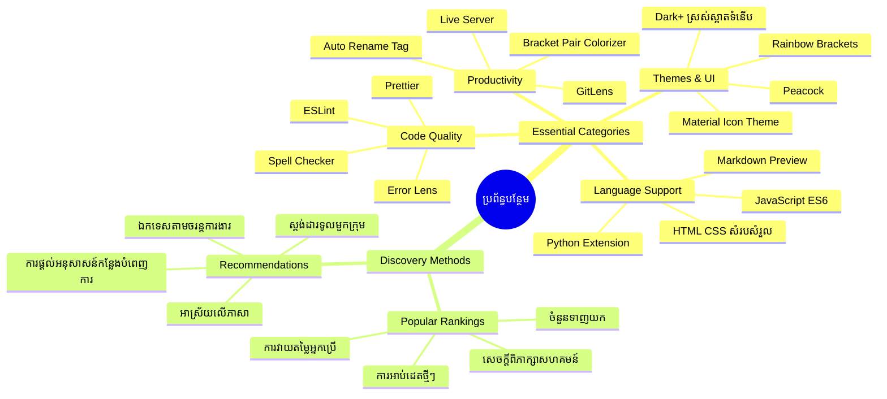
### ការរកឃើញការពន្យា កម្មវិធីដែលល្អឥតខ្ចោះ

ផ្សារពន្យារត្រូវបានដាក់លំដាប់បានល្អព្រោះដោយឡែក អ្នកនឹងមិនត្រូវចាត់ទុកថាខកខានក្នុងការស្វែងរកអ្វីដែលអ្នកត្រូវការ។ វាត្រូវបានរចនាឡើងដើម្បីជួយអ្នករកឃើញឧបករណ៍ជាក់លាក់ និងរបស់ល្អៗដែលអ្នកមិនធ្លាប់ដឹងថាមានដែរ!

**ការទៅផ្សារពន្យា:**

1. ចុចរូបតំណាងការពន្យារមួយ (🧩) ក្នុងសារ​បទអត្តសញ្ញាណ
2. រុករកជុំវិញឬស្វែងរកអ្វីមួយជាក់លាក់
3. ចុចលើអ្វីដែលគួរឱ្យចាប់អារម្មណ៍ដើម្បីសិក្សាបន្ថែម

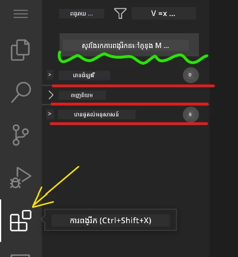

**អ្វីដែលអ្នកនឹងឃើញនៅក្នុងនោះ៖**

| ផ្នែក | អ្វីដែលនៅខាងក្នុង | មូលហេតុដែលវាសម្រួល |
|----------|---------|----------|
| **បានដំឡើងរួចហើយ** | ការពន្យារដែលអ្នកបានបញ្ចូលរួចហើយ | ឧបករណ៍សរសេរកូដផ្ទាល់ខ្លួនរបស់អ្នក |
| **ពេញនិយម** | អ្នកចូលរួមភាគច្រើនចូលចិត្ត | អ្វីដែលអ្នកអភិវឌ្ឍន៍ភាគច្រើនទាក់ទងយក |
| **ផ្តល់អនុសាសន៍** | យោបល់ឆ្លាតវៃសម្រាប់គម្រោងរបស់អ្នក | ការផ្តល់អនុសាសន៍ជួយ VSCode.dev |

**អ្វីដែលធ្វើឲ្យការរុករកកាន់តែងាយស្រួល:**
- គ្រប់ការពន្យារបង្ហាញការវាយតម្លៃ ចំនួនទាញយក និងការវាយតម្លៃពីអ្នកប្រើប្រាស់ពិត
- អ្នកទទួលបានរូបថតអេក្រង់ និងពិពណ៌នាដែលច្បាស់លាស់ពីអ្វីដែលវាធ្វើ
- គ្រប់យ៉ាងមានស្លាកបញ្ចាក់ពីព័ត៌មានភាពសមស្រប
- ការពន្យារដូចគ្នាត្រូវបានផ្ដល់យោបល់ដើម្បីអាចប្រៀបធៀបជម្រើសបាន

### ការដំឡើងការពន្យា (វាងាយដូចមួយ!)

ការបន្ថែមអំណាចថ្មីទៅកាន់កម្មវិធីកែសម្រួលរបស់អ្នកគឺ​មានភាពសាមញ្ញ​ដូចជាចុចប៊ូតុងមួយ។ ការពន្យារត្រូវបានដំឡើងក្នុងរយៈពេលពីរបីវិនាទី ហើយចាប់ផ្តើមដំណើរការនៅភ្លាមៗ – គ្មានការចាប់ផ្តើមឡើងវិញ ឬរង់ចាំទុក។

**នេះគឺជារបស់ដែលអ្នកត្រូវធ្វើ៖**

1. ស្វែងរកអ្វីដែលអ្នកចង់បាន (សាកល្បងស្វែងរក "live server" ឬ "prettier")
2. ចុចលើមួយចំនួនដែលវាផ្តល់អារម្មណ៍ល្អ ដើម្បីមើលព័ត៌មានលម្អិតបន្ថែម
3. អានអ្វីដែលវាធ្វើ និងពិនិត្យការវាយតម្លៃ
4. ចុចលើប៊ូតុង "Install" ពណ៌ខៀវ ហើយអ្នកបានបញ្ចប់ហើយ!


**អ្វី​ដែល​កើតឡើង​ក្រោម​ថាសភាព:**
- ការពន្យារទាញយក និងត្រូវរៀបចំដោយស្វ័យប្រវត្តិ
- មុខងារថ្មីបង្ហាញក្នុងផ្ទាំងអ្នកប្រើភ្លាមៗ
- គ្រប់យ៉ាងចាប់ផ្តើមដំណើរការភ្លាមៗ (ពិតប្រាកដ វារហ័សបែបនេះ!)
- ប្រសិនបើអ្នកបានចូលប្រើ ការពន្យាររួមបញ្ចូលទៅគ្រប់ឧបករណ៍របស់អ្នក

**ការពន្យារខ្លះដែលខ្ញុំសូមណែនាំឲ្យចាប់ផ្តើមជាមួយ៖**
- **Live Server**: មើលវេបសាយរបស់អ្នកបំលែងផ្ទាល់ពេលអ្នកកូដ (ម្ចាស់វាមានអ៊ីស!​)
- **Prettier**: ធ្វើឲ្យកូដរបស់អ្នកមើលស្អាតនិងវិជ្ជាជីវៈដោយស្វ័យប្រវត្តិ
- **Auto Rename Tag**: ប្រែស្លាក HTML មួយ ថែមទាំងស្លាកដៃគូក៏ប្រែដែរ
- **Bracket Pair Colorizer**: ពណ៌កូដសញ្ញារយៈធ្វើឲ្យអ្នកមិនបាត់បង់ក្នុងវាគ្រួសណាមួយ
- **GitLens**: បន្ថែមសមត្ថភាព Git របស់អ្នកជាមួយព័ត៌មានជាច្រើនជួយ

### ការប្តូរតាមតម្រូវការរបស់ការពន្យា

ការពន្យារប្រហែលគប់ជាមួយការកំណត់ដែលអ្នកអាចកែបានដើម្បីធ្វើឲ្យវាដំណើរការតាមរបៀបអ្នកចូលចិត្ត។ គិតថាវាដូចជាការកែសម្រួលកៅអី និងពន្លឺក្នុងរថយន្ត — មនុស្សម្នាក់ៗមានចំណង់ចំណូលចិត្តខ្លួន!

**ការកែសម្រួលការកំណត់ខាងក្នុងការពន្យារ:**

1. រកការពន្យារដែលបានដំឡើងរួចនៅក្នុងផ្ទាំង Extensions
2. ស្វែងរករូបទំពារ (⚙️) ត្នោតឈ្មោះវា ហើយចុចវា
3. ជ្រើស "Extension Settings" ពីម៉ឺនុយដ្រាច់រូប
4. កែប្រែរហូតដល់វាដូចជាការសម្របសម្រួលនឹងចរន្តការងាររបស់អ្នក

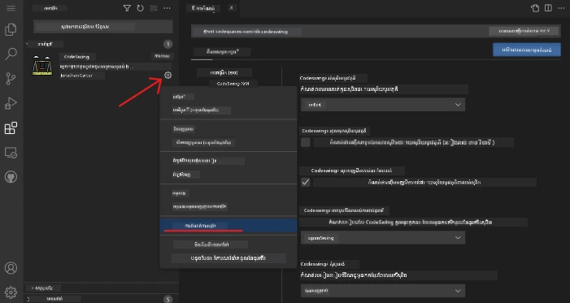

**រឿងទូទៅដែលអ្នកអាចចង់កែប្រែ:**
- របៀបដែលកូដរបស់អ្នកត្រូវបានតម្រៀប (tab​ ទល់នឹងចន្លោះ បណ្តោយបន្ទាត់ ល.)
- សន្លឹកគន្លងក្តារចុចណាដែលបញ្ចេញសកម្មភាពនានា
- ប្រភេទឯកសារដែលកំពុងត្រូវការពន្យារធ្វើការជាមួយ
- បើក ឬបិទមុខងារពិសេសៗដើម្បីរក្សារស្អាត

### ការរក្សាទុកការពន្យាររបស់អ្នកឲ្យមានរបៀបល្អ

នៅពេលអ្នករកឃើញការពន្យារល្អៗបន្ថែមឡើង អ្នកនឹងចង់រក្សាគ្រប់យ៉ាងរបស់អ្នកឲ្យមានរបៀបស្អាត និងដំណើរការត្រឹមត្រូវ។ VSCode.dev ធ្វើឲ្យវាងាយស្រួលក្នុងការគ្រប់គ្រង។

**ជម្រើសគ្រប់គ្រងការពន្យារបស់អ្នក:**

| អ្វីដែលអ្នកអាចធ្វើ | ពេលវាដែលវាអាចជួយ | វិធីជំនាញ |
|--------|---------|----------|
| **បិទបណ្តោះអាសន្ន** | សាកល្បងមើលថាតើការពន្យារមួយបង្ករបញ្ហា | ល្អជាងការលុបចោលបើអ្នកគិតថាអាចត្រឡប់មកវិញបាន |
| **លុបចោល** | លុបការពន្យារដែលអ្នកមិនត្រូវការ | រក្សាបរិយាកាសស្អាតនិងរហ័សបន្តិច |
| **បន្ទាន់សម័យ** | ទទួលបានមុខងារថ្មី និងជួសជុលកំហុស | ជាធម្មតារត់ដោយស្វ័យប្រវត្តិ ប៉ុន្តែអាចពិនិត្យបាន |

**របៀបដែលខ្ញុំចូលចិត្តគ្រប់គ្រងការពន្យារ:**
- រៀងរាល់ប៉ុន្មានខែ ខ្ញុំពិនិត្យមើលអ្វីដែលបានដំឡើងហើយលុបចោលអ្វីដែលមិនប្រើ
- ខ្ញុំរក្សាការពន្យារជាប់បន្ទាន់សម័យ ដើម្បីទទួលបានការកែលម្អនិងជួសជុលសុវត្ថិភាព
- ប្រសិនបើអ្វីមួយមើលទៅយឺត ខ្ញុំបិទបណ្តោះអាសន្នការពន្យារដើម្បីសាកល្បងថាតើមានការពន្យារមួយណាជាកត្តាដាច់ខាត
- ខ្ញុំអានកំណត់ត្រាបន្ទាន់សម័យពេលការពន្យារទទួលបានកំណែធំៗ—ពេលខ្លះមានមុខងារថ្មីដ៏មានអត្ថប្រយោជន៍!

> ⚠️ **គន្លឹះអត្រាប្រតិបត្ដិការណ៍**: ការពន្យារល្អណាស់ ប៉ុន្តែច្រើនពេកវាអាចធ្វើឲ្យស្ថានភាពយឺត។ ផ្តោតលើកំណត់ឧបករណ៍ដែលពិតជាប្រើជួយសម្រួលជីវិតអ្នក ហើយកុំខ្មាសបោះចោលការពន្យារដែលអ្នកមិនប្រើ។

### 🎯 ការត្រួតពិនិត្យវគ្គសិក្សា: ការកំណត់បរិយាកាសអភិវឌ្ឍ

**ការយល់ដឹងអំពីស្ថាបត្យកម្ម**: អ្នកបានរៀនដើម្បីប្តូរការកំណត់បរិយាកាសអភិវឌ្ឍវិជ្ជាជីវៈដោយប្រើការពន្យារដែលបង្កើតដោយសហគមន៍។ វាជាការបង្ហាញពីរបៀបក្រុមអភិវឌ្ឍសហគ្រាសបង្កើតឧបករណ៍ម៉ាស៊ីនស្មើគ្នា។

**កន្លែងចំណេះដឹងសំខាន់ដែលបានយល់**:
- **ការរកឃើញការពន្យា**: រកឧបករណ៍ដោះស្រាយបញ្ហាអភិវឌ្ឍជាក់លាក់
- **ការកំណត់បរិយាកាស**: ប្ដូរការកំណត់ឧបករណ៍ខ្លួនឯងឲ្យសម្រួលជាមួយចំណូលចិត្តផ្ទាល់ខ្លួន ឬក្រុម
- **ការបង្កើតប្រសិទ្ធភាព**: តុល្យភាពរវាងមុខងារនិងសមត្ថភាពប្រតិបត្ដិការ
- **សហប្រតិបត្ដិការសហគមន៍**: ប្រើប្រាស់ឧបករណ៍ដែលបង្កើតដោយសហគមន៍អ្នកអភិវឌ្ឍជាតិសកល

**ការតភ្ជាប់ឧស្សាហកម្ម**: ប្រព័ន្ធបន្ថែមគឺជាមូលដ្ឋានសំខាន់សម្រាប់វេទិកាអភិវឌ្ឍធំៗដូចជា VS Code, Chrome DevTools, និង IDEs សម័យថ្មី។ ការយល់ដឹងពីរបៀបវាយតម្លៃ ដំឡើង និងកំណត់ការពន្យា គឺចាំបាច់សម្រាប់ចរន្តការងារអភិវឌ្ឍវិជ្ជាជីវៈ។

**សំណួរពិចារណា**: តើអ្នកនឹងដំណើរការដើម្បីសម្ពន្ធនិយមបរិយាកាសអភិវឌ្ឍស្តង់ដារមួយសម្រាប់ក្រុមអ្នកអភិវឌ្ឍ ១០នាក់យ៉ាងដូចម្តេច? គិតពីភាពឯកតា ប្រសិទ្ធភាព និងចំណូលចិត្តបុគ្គល។

## 📈 សម័យវិជ្ជាជីវៈការអភិវឌ្ឍពពករបស់អ្នក

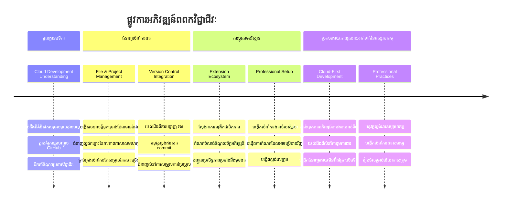
**🎓 ជំនាន់ការបញ្ចប់**: អ្នកមានជំនាញលើកំពូលនៃការអភិវឌ្ឍផ្អែកលើពពកដោយប្រើឧបករណ៍និងចរន្តការងារដដែលនឹងអ្នកអភិវឌ្ឍវិជ្ជាជីវៈនៅក្រុមហ៊ុនបច្ចេកវិទ្យាធំៗ។ ជំនាញទាំងនេះជាមូលដ្ឋាននៃអនាគតនៃការអភិវឌ្ឍកម្មវិធី។

**🔄 ជម្រើសសមត្ថភាពកម្រិតបន្ទាប់**:
- រៀបចំស្វែងយល់លើវេទិកាអភិវឌ្ឍពពកកម្រិតខ្ពស់ (Codespaces, GitPod)
- រៀបចំធ្វើការជាក្រុមអភិវឌ្ឍបញ្ចរោទ៍
- មានអំណាចចូលរួមគម្រោង open source ជាតិសកល
- ជាគ្រឹះសម្រាប់ DevOps និងរបៀបចងខ្សែបន្តការសម្រួលទាន់សម័យ

## ការប្រកួត GitHub Copilot Agent 🚀

ដូចជាវិធីការ​មានរចនាសម្ព័ន្ធ NASA ប្រើសម្រាប់បេសកកម្មនៅអាកាសយានដ្ឋាន ការប្រកួតនេះពាក់ព័ន្ធនឹងការអនុវត្តន៍របៀប VSCode.dev នៅក្នុងស្ថានភាពការងារដោយប្រព័ន្ធពេញលេញ។

**បំណង**: បង្ហាញជំនាញជាមួយ VSCode.dev ដោយបង្កើតចរន្តការងារអភិវឌ្ឍគេហទំព័រដោយពេញលេញ។

**តម្រូវការ​គម្រោង**: ប្រើជំនួយបែប Agent mode ដើម្បីបញ្ចប់ភារកិច្ចទាំងនេះ៖
1. Fork ឬបង្កើត​ឃ្លាំងថ្មីមួយ
2. បង្កើតរចនាសម្ព័ន្ធគម្រោងប្រើឯកសារ HTML, CSS និង JavaScript
3. ដំឡើង និងកំណត់កំព្យូទ័រពន្យារពីរឬបីដែលធ្វើឲ្យការអភិវឌ្ឍកាន់តែមានប្រសិទ្ធភាព
4. អនុវត្តន៍ការត្រួតពិនិត្យកំណែជាមួយសារបញ្ជាក់ commit មានអត្ថន័យ
5. សាកល្បងបង្កើត និងកែប្រែ feature branch
6. ធ្វើឯកសារ README.md ពិនិត្យដំណើរការ និងអ្វីដែលបានរៀន

ហាត់នេះបញ្ចូលគ្នាទាំងអស់គំនិត VSCode.dev ទៅកាន់ចរន្តការងារជាក់ស្តែងដែលអាចអនុវត្តបានក្នុងគម្រោងអភិវឌ្ឍបន្តពីនេះទៅ។

សូមរៀនបន្ថែមអំពី [agent mode](https://code.visualstudio.com/blogs/2025/02/24/introducing-copilot-agent-mode) នៅទីនេះ។

## កិច្ចការងារ

ពេលវេលាដើម្បីយកជំនាញទាំងនេះទៅលើសាកល្បងពិតប្រាកដ! ខ្ញុំមានគម្រោងអនុវត្តដោយដៃដែលនឹងឲ្យអ្នកអនុវត្តអ្វីៗដែលយើងបានរៀន៖ [បង្កើតគេហទំព័រវិចិត្រសង្ខេបដោយប្រើ VSCode.dev](./assignment.md)

កិច្ចការនេះនាំអ្នកឆ្លងកាត់ការសិក្សាពេញលេញសម្រាប់បង្កើតគេហទំព័រវិចិត្រសង្ខេបវិជ្ជាជីវៈនៅក្នុងកម្មវិធីរុករករបស់អ្នក។ អ្នកនឹងប្រើគ្រប់មុខងារ VSCode.dev ដែលយើងបានសិក្សា ហើយនៅចុង ក្រោយ អ្នកនឹងមានគេហទំព័រល្អមើល និងទំនុកចិត្តវាចិត្តល្អក្នុងចរន្តការងារថ្មីរបស់អ្នក។

## បន្តស្វែងយល់និងពង្រីកជំនាញរបស់អ្នក

អ្នកមានគ្រឹះមួយចំរៀងឥឡូវនេះ ប៉ុន្តែច្រើនទៅទៀតដែលទាក់ទាញភាពស្រស់ស្អាតមើលបាន! ខាងក្រោមនេះជាធនធាន និងគំនិតសម្រាប់យកជំនាញ VSCode.dev របស់អ្នកទៅកាន់ជំហានបន្ទាប់៖

**ឯកសារ​ផ្លូវការដែលគួរតែរក្សាទុក**:
- [ឯកសារ VSCode លើវែប](https://code.visualstudio.com/docs/editor/vscode-web?WT.mc_id=academic-0000-alfredodeza) – មគ្គុទ្ទេសក៍ពេញលេញសម្រាប់ការកែសម្រួលនៅក្នុងកម្មវិធីរុករក
- [GitHub Codespaces](https://docs.github.com/en/codespaces) – សម្រាប់ពេលអ្នកចង់មានអំណាចកាន់តែច្រើននៅក្នុងពពក

**មុខងារចុងក្រោយណាស់ដែលគួរព្យាយាមបន្ទាប់**:
- **ម៉ួសសំរាប់ក្តារចុច**: រៀនល្បឿនរួចនឹងពិធីករ code ninja
- **កំណត់បរិយាកាសកន្លែងធ្វើការ**: រៀបចំបរិយាកាសខុសៗគ្នាសម្រាប់គម្រោងខុសៗគ្នា
- **មីទ្រីកកន្លែងធ្វើការ​ច្រើនគេ**: ធ្វើការនៅលើឃ្លាំងជាច្រើនដោយប្រៀបធៀប (មានប្រយោជន៍ខ្លាំង!)
- **ការបញ្ចូល Terminal**: ចូលប្រើឧបករណ៍បញ្ជាកម្មបញ្ជានៅក្នុងកម្មវិធីរុករករបស់អ្នក ទាំងពេញលេញ

**គំនិតសម្រាប់ហាត់ប្រាណ**:
- ចូលរួមគម្រោង open source ជាដៃគូដោយប្រើ VSCode.dev – វាជាវិធីល្អក្នុងការផ្ដល់តម្លៃវិញ!
- សាកល្បងការពន្យារផ្សេងៗ ដើម្បីរកកំណត់ល្អឥតខ្ចោះរបស់អ្នក
- បង្កើតទំព័រគំរូគម្រោងសម្រាប់ប្រភេទគេហទំព័រដែលអ្នកបង្កើតជាញឹកញាប់
- ហាត់ចរន្តការងារ Git ដូចជាការបង្កើតផ្នែក និងការបង្រួមភាគ – ជំនាញទាំងនេះជាសម្បត្តិមានតម្លៃក្នុងគម្រោងក្រុម

---

**អ្នកបានយល់ដឹងលើការអភិវឌ្ឍនៅក្នុងកម្មវិធីរុករកដែរ!** 🎉 ដូចដែលព្រះរាជាណាចក្រឧបករណ៍ឧបករណ៍ចល័តបំផុតអនុញ្ញាតឲ្យអ្នកវិទ្យាសាស្ត្រប្រព្រឹត្តការស្រាវជ្រាវនៅតំបន់ឆ្ងាយ VSCode.dev អនុញ្ញាតឲ្យ coding ជាជំនាញវិជ្ជាជីវៈពីឧបករណ៍ណាមួយមានការតភ្ជាប់អ៊ិនធឺណិត។

ជំនាញទាំងនេះភ្ជាប់នឹងគន្លងសកម្មភាពឧស្សាហកម្មបច្ចុប្បន្ន—អ្នកអភិវឌ្ឍជាច្រើនប្រើបរិយាកាសអភិវឌ្ឍភាពពពកដោយសារតែការលាបញ្ហា និងភាពងាយស្រួលចូលប្រើ។ អ្នកបានរៀនចរន្តការងារដែលអាចលាតត្រដាងពីគម្រោងផ្ទាល់ខ្លួន ទៅឱ្យការសហការ​ក្រុមធំៗ។

អនុវត្តវិធីសាស្រ្តទាំងនេះជាមួយគម្រោងអភិវឌ្ឍបន្ទាប់របស់អ្នក! 🚀

---

<!-- CO-OP TRANSLATOR DISCLAIMER START -->
**ការបញ្ជាក់**៖  
ឯកសារនេះត្រូវបានបកប្រែដោយប្រើសេវាកម្មបកប្រែ AI [Co-op Translator](https://github.com/Azure/co-op-translator)។ ខណៈដែលយើងខំប្រឹងប្រែងឲ្យបានត្រឹមត្រូវ សូមដឹងថាការបកប្រែដោយស្វ័យប្រវត្តិប្រហែលជាមានកំហុសឬការខូចខាតខ្លះៗ។ ឯកសារដើមដែលមានជាភាសាមូលដ្ឋានគួរត្រូវបានគិតថាជាធនធានដែលមានអំណាច។ សម្រាប់ព័ត៌មានសំខាន់ៗ, ការបកប្រែដោយអ្នកជំនាញមនុស្សត្រូវបានណែនាំ។ យើងមិនទទួលខុសត្រូវចំពោះការយល់ច្រឡំ ឬការយល់ខុសណាមួយដែលកើតឡើងពីការប្រើប្រាស់ការបកប្រែនេះឡើយ។
<!-- CO-OP TRANSLATOR DISCLAIMER END -->