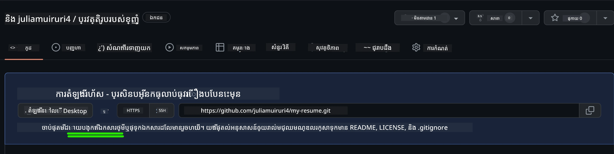
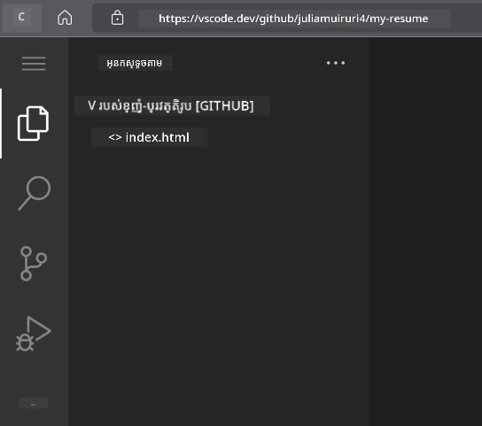
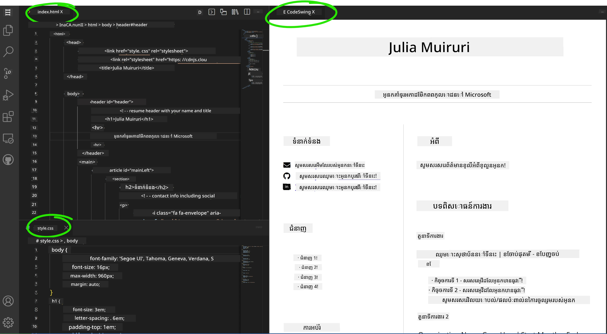

# បង្កើតគេហទំព័រការងារជីវប្រវត្តិប្រើប្រាស់ VSCode.dev

ផ្លាស់ប្តូរអនាគតកិច្ចការរបស់អ្នកដោយកសាងគេហទំព័រការងារជីវប្រវត្តិមួយដែលបង្ហាញពីជំនាញ និងបទពិសោធន៍របស់អ្នកជារូបរាងបែបអន្តរជាតិ និងទំនើប។ ជំនួសការផ្ញើ PDF របៀបប្រពៃណី សូមនឹកស្រមៃពីការផ្តល់ជូនអ្នកជ្រើសរើសនិយោជិតដោយគេហទំព័រដែលមានរចនាបថស្អាត សម្របសម្រួលបានល្អ ដែលបង្ហាញសមត្ថភាពទាំងការអប់រំ និងជំនាញការអភិវឌ្ឍន៍គេហទំព័រ។

កិច្ចការដែលទទួលបានការអនុវត្តបែបនេះ នឹងដាក់ជំនាញ VSCode.dev ទាំងអស់របស់អ្នកចូលប្រើប្រាស់ខណៈដែលបង្កើតអ្វីដែលមានប្រយោជន៍ពិតសម្រាប់អនាគតការងារ។ អ្នកនឹងទទួលបានបទពិសោធន៍ពេញលេញនៃដំណើរការអភិវឌ្ឍន៍គេហទំព័រ – ចាប់ពីការបង្កើត repository រហូតដល់ការដាក់បញ្ចូល – ទាំងឡាយនៅក្នុងកម្មវិធីរុករករបស់អ្នក។

ដោយបញ្ចប់គម្រោងនេះ អ្នកនឹងមានវត្តមានអនឡាញជំនួសដែលអាចចែករំលែកបានងាយស្រួលជាមួយនិយោជិកមានសក្តានុពល ត្រូវបានធ្វើបច្ចុប្បន្នភាពពេលជំនាញរីកចម្រើន ហើយអាចប្តូរតាមម៉ាកផ្ទាល់ខ្លួនរបស់អ្នក។ នេះជាគំរូគម្រោងអនុវត្តដែលបង្ហាញពីជំនាញអភិវឌ្ឍន៍គេហទំព័រពិតប្រាកដ។

## គោលបំណងរៀន

បន្ទាប់ពីបញ្ចប់កិច្ចការនេះ អ្នកនឹងអាច:

- **បង្កើត** និងគ្រប់គ្រងគម្រោងអភិវឌ្ឍន៍គេហទំព័រពេញលេញប្រើ VSCode.dev
- **រៀបចំ** គេហទំព័រជាប្រព័ន្ធផ្លូវការដោយប្រើធាតុ HTML មានអត្ថន័យ
- **តុបតែង** មាតិកាអោយឆបគ្នានឹងការបង្ហាញលើកម្រាស់ខុសគ្នាដោយបច្ចេកទេស CSS ទំនើប
- **អនុវត្ត** មុខងារអន្តរកម្មដោយប្រើបច្ចេកវិទ្យាគេហទំព័រមូលដ្ឋាន
- **ដាក់បង្ហាញ** គេហទំព័ររស់ដែលអាចចូលប្រើបានតាម URL ដែលចែករំលែកបាន
- **បង្ហាញ** របៀបប្រើប្រាស់ version control ដាច់ខាតក្នុងដំណើរការអភិវឌ្ឍន៍

## អ្វីដែលត្រូវមានជាមុន

មុនចាប់ផ្តើម កុំភ្លេចត្រូវបានបញ្ជាក់ថា អ្នកមាន៖

- គណនី GitHub (បង្កើតបាននៅ [github.com](https://github.com/) ប្រសិនបើមិនមាន)
- បានបញ្ចប់មេរៀន VSCode.dev ដែលគ្របដណ្តប់ពីការជន្លាស់ឈ្មោះ និងប្រតិបត្តិការមូលដ្ឋាន
- យល់ដឹងមូលដ្ឋានអំពីរចនាសម្ព័ន HTML និងគំនិតតុបតែង CSS

## ការតំឡើងគម្រោង និងការបង្កើត Repository

ចាប់ផ្តើមដោយការបង្កើតមូលដ្ឋានគម្រោងរបស់អ្នក។ ដំណើរនេះដូចជាការអភិវឌ្ឍក្នុងពិភពពិត ដែលគម្រោងចាប់ផ្តើមដោយការបង្កើត repository និងរៀបចំរចនាសម្ព័ន្ធយ៉ាងត្រឹមត្រូវ។

### ជំហាន 1: បង្កើត Repository GitHub របស់អ្នក

ការតំឡើង repository បំបែកទុកធានាថាគម្រោងរបស់អ្នកបានរៀបចំក្រង និងត្រូវបានគ្រប់គ្រង version ចាប់ពីដើម។

1. **បើកចូល** ទៅ [GitHub.com](https://github.com) ហើយចូលក្នុងគណនីរបស់អ្នក
2. **ចុច** ងារពណ៌បៃតង "New" ឬរូបតំណាង "+" នៅជ្រុងខាងស្តាំលើ
3. **ដាក់ឈ្មោះ** repository របស់អ្នកជា `my-resume` (ឬជ្រើសរើសឈ្មោះផ្ទាល់ខ្លួនដូចជា `john-smith-resume`)
4. **បន្ថែម** ពណ៌នា ខ្លី៖ "គេហទំព័រការងារជីវប្រវត្តិដែលបានបង្កើតដោយ HTML និង CSS"
5. **ជ្រើសរើស** "Public" ដើម្បីឲ្យគេហទំព័រជីវប្រវត្តិនេះអាចចូលប្រើបានសម្រាប់និយោជកមានសក្តានុពល
6. **ត្រួតពិនិត្យ** "Add a README file" ដើម្បីបង្កើតការពិពណ៌នាគម្រោងដំបូង
7. **ចុច** "Create repository" ដើម្បីបញ្ចប់ការបង្កើត

> 💡 **យោបល់សម្រាប់ឈ្មោះ Repository**: ប្រើឈ្មោះលំអិត មានអត្ថន័យ ផ្លូវការដែលបង្ហាញអំពីគោលបំណងគម្រោងយ៉ាងច្បាស់។ វាជួយនៅពេលចែករំលែកជាមួយនិយោជិកឬពេលពិនិត្យ portfolio។

### ជំហាន 2: ចាប់ផ្តើមរៀបចំរចនាសម្ព័ន្ធគម្រោង

ដោយសារតែ VSCode.dev ត្រូវការឯកសារមួយយ៉ាងហោចណាស់ដើម្បីបើក repository អ្នក ត្រូវការបង្កើតឯកសារ HTML សំខាន់ផ្ទាល់លើ GitHub មុនពេលផ្លាស់ទៅកម្មវិធីកែសម្រួលវេប។

1. **ចុច** តំណ“creating a new file” ក្នុង repository ថ្មីរបស់អ្នក
2. **វាយ** ឈ្មោះឯកសារ `index.html`
3. **បញ្ចូល** រចនាសម្ព័ន្ធ HTML ដំបូងនេះ៖

```html
<!DOCTYPE html>
<html lang="en">
<head>
    <meta charset="UTF-8">
    <meta name="viewport" content="width=device-width, initial-scale=1.0">
    <title>Your Name - Professional Resume</title>
</head>
<body>
    <h1>Your Name</h1>
    <p>Professional Resume Website</p>
</body>
</html>
```

4. **សរសេរ** សារ commit: "Add initial HTML structure"
5. **ចុច** "Commit new file" ដើម្បីរក្សាទុកកំណែថ្មី



**អ្វីដែលការតំឡើងដំបូងនេះធ្វើបាន៖**
- **កំណត់** រចនាសម្ព័ន្ធឯកសារ HTML5 ត្រឹមត្រូវជាមួយធាតុដែលមានអត្ថន័យ
- **បញ្ចូល** viewport meta tag សម្រាប់ការគាំទ្រ responsive design
- **កំណត់** ចំណងជើងទំព័រដែលបង្ហាញនៅលើផ្ទាំងប្រៅសើរ
- **បង្កើត** មូលដ្ឋានសម្រាប់រៀបចំមាតិកាទំព័រផ្លូវការ

## ការងារនៅក្នុង VSCode.dev

ឥឡូវនេះដែលមូលដ្ឋាន repository របស់អ្នកត្រូវបានកំណត់ហើយ នៅវគ្គនេះ សូមផ្លាស់ប្តូរទៅ VSCode.dev សម្រាប់ការអភិវឌ្ឍន៍ដំណើរការចម្បង។ កម្មវិធីកែសម្រួលវែបនេះផ្តល់ឧបករណ៍ទាំងអស់ដែលចាំបាច់សម្រាប់ការអភិវឌ្ឍគេហទំព័រផ្លូវការ។

### ជំហាន 3: បើកគម្រោងរបស់អ្នកនៅក្នុង VSCode.dev

1. **បើក** [vscode.dev](https://vscode.dev) នៅផ្ទាំងប្រៅសើរថ្មី
2. **ចុច** "Open Remote Repository" នៅលើផ្ទាំងស្វាគមន៍
3. **ចម្លង** URL repository របស់អ្នកពី GitHub ហើយបិទត្រង់ផ្ទាំងចូល

   រូបแบบ៖ `https://github.com/your-username/my-resume`
   
   *ជំនួស `your-username` ជាមួយនាមអ្នកប្រើ GitHub ពិតប្រាកដរបស់អ្នក*

4. **ចុច** Enter ដើម្បីផ្ទុកគម្រោង

✅ **សន្ទស្សន៍ភាពជោគជ័យ**៖ អ្នកគួរតែឃើញឯកសារគម្រោងនៅក្នុង Explorer sidebar ហើយឯកសារ `index.html` សម្រាប់កែសម្រួលនៅផ្នែកកែសម្រួល។



**អ្វីដែលអ្នកនឹងឃើញនៅក្នុងចំណុចប្រទាក់៖**
- **Explorer sidebar**: **បង្ហាញ** ឯកសារនិងរចនាសម្ព័ន្ធថតក្នុង repository
- **Editor area**: **បង្ហាញ** មាតិកាឯកសារដែលបានជ្រើសសម្រាប់កែប្រែ
- **Activity bar**: **ផ្តល់** នូវចូលដំណើរការទៅមុខងារដូចជា Source Control និង Extensions
- **Status bar**: **បង្ហាញ** ស្ថានភាពភ្ជាប់ និងព័ត៌មានសាខាទំនើប

### ជំហាន 4: បង្កើតមាតិការងារជីវប្រវត្តិរបស់អ្នក

ជំនួសមាតិកាតំណាងក្នុង `index.html` ជាមួយរចនាសម្ព័ន្ធជីវប្រវត្តិពេញលេញ។ HTML នេះផ្តល់មូលដ្ឋានសម្រាប់ការបង្ហាញជំនាញជាផ្លូវការ។

<details>
<summary><b>រចនាសម្ព័ន្ធ HTML ជីវប្រវត្តិពេញលេញ</b></summary>

```html
<!DOCTYPE html>
<html lang="en">
<head>
    <meta charset="UTF-8">
    <meta name="viewport" content="width=device-width, initial-scale=1.0">
    <link href="style.css" rel="stylesheet">
    <link rel="stylesheet" href="https://cdnjs.cloudflare.com/ajax/libs/font-awesome/5.15.4/css/all.min.css">
    <title>Your Name - Professional Resume</title>
</head>
<body>
    <header id="header">
        <h1>Your Full Name</h1>
        <hr>
        <p class="role">Your Professional Title</p>
        <hr>
    </header>
    
    <main>
        <article id="mainLeft">
            <section>
                <h2>CONTACT</h2>
                <p>
                    <i class="fa fa-envelope" aria-hidden="true"></i>
                    <a href="mailto:your.email@domain.com">your.email@domain.com</a>
                </p>
                <p>
                    <i class="fab fa-github" aria-hidden="true"></i>
                    <a href="https://github.com/your-username">github.com/your-username</a>
                </p>
                <p>
                    <i class="fab fa-linkedin" aria-hidden="true"></i>
                    <a href="https://linkedin.com/in/your-profile">linkedin.com/in/your-profile</a>
                </p>
            </section>
            
            <section>
                <h2>SKILLS</h2>
                <ul>
                    <li>HTML5 & CSS3</li>
                    <li>JavaScript (ES6+)</li>
                    <li>Responsive Web Design</li>
                    <li>Version Control (Git)</li>
                    <li>Problem Solving</li>
                </ul>
            </section>
            
            <section>
                <h2>EDUCATION</h2>
                <h3>Your Degree or Certification</h3>
                <p>Institution Name</p>
                <p>Start Date - End Date</p>
            </section>
        </article>
        
        <article id="mainRight">
            <section>
                <h2>ABOUT</h2>
                <p>Write a compelling summary that highlights your passion for web development, key achievements, and career goals. This section should give employers insight into your personality and professional approach.</p>
            </section>
            
            <section>
                <h2>WORK EXPERIENCE</h2>
                <div class="job">
                    <h3>Job Title</h3>
                    <p class="company">Company Name | Start Date – End Date</p>
                    <ul>
                        <li>Describe a key accomplishment or responsibility</li>
                        <li>Highlight specific skills or technologies used</li>
                        <li>Quantify impact where possible (e.g., "Improved efficiency by 25%")</li>
                    </ul>
                </div>
                
                <div class="job">
                    <h3>Previous Job Title</h3>
                    <p class="company">Previous Company | Start Date – End Date</p>
                    <ul>
                        <li>Focus on transferable skills and achievements</li>
                        <li>Demonstrate growth and learning progression</li>
                        <li>Include any leadership or collaboration experiences</li>
                    </ul>
                </div>
            </section>
            
            <section>
                <h2>PROJECTS</h2>
                <div class="project">
                    <h3>Project Name</h3>
                    <p>Brief description of what the project accomplishes and technologies used.</p>
                    <a href="#" target="_blank">View Project</a>
                </div>
            </section>
        </article>
    </main>
</body>
</html>
```
</details>

**មគ្គុទេសក៍ប្តូរតាមបំណង:**
- **ជំនួស** អត្ថបទតំណាងទាំងអស់ជាមួយព័ត៌មានពិតរបស់អ្នក
- **កែប្រែ** ផ្នែកជាមួយកម្រិតបទពិសោធន៍ និងផ្លូវ​ការងាររបស់អ្នក
- **បន្ថែម** ឬដកចេញផ្នែកតាមតម្រូវការ (ឧ. សញ្ញាបត្រ, ការងារស្ម័គ្រចិត្ត, ភាសា)
- **រួមបញ្ចូល** តំណភ្ជាប់ទៅប្រវត្តិរូបផ្ទាល់ និងគម្រោង

### ជំហាន 5: បង្កើតឯកសារគាំទ្រ

គេហទំព័រដែលមានភាពផ្លូវការ ត្រូវការរចនាសម្ព័ន្ធឯកសារមានលំដាប់។ បង្កើត CSS stylesheet និងឯកសារកំណត់រចនាសម្ព័ន្ធដែលត្រូវការសម្រាប់គម្រោងពេញលេញ។

1. **អូសមុខមកលើឈ្មោះថតគម្រោងក្នុង Explorer sidebar**
2. **ចុច** រូបតំណាង "New File" (📄+) ដែលបង្ហាញឡើង
3. **បង្កើត** ឯកសារទាំងនេះតម្រង់តែមួយ៖
   - `style.css` (សម្រាប់ការតុបតែង និងរចនាសម្ព័ន្ធ)
   - `codeswing.json` (សម្រាប់កំណត់រចនាសម្ព័ន្ធផ្នែកផ្ទាំងមើលជាមុន)

**ការបង្កើតឯកសារ CSS (`style.css`):**

<details>
<summary><b>ការតុបតែង CSS ផ្លូវការ</b></summary>

```css
/* Modern Resume Styling */
body {
    font-family: 'Segoe UI', Tahoma, Geneva, Verdana, sans-serif;
    font-size: 16px;
    line-height: 1.6;
    max-width: 960px;
    margin: 0 auto;
    padding: 20px;
    color: #333;
    background-color: #f9f9f9;
}

/* Header Styling */
header {
    text-align: center;
    margin-bottom: 3em;
    padding: 2em;
    background: linear-gradient(135deg, #667eea 0%, #764ba2 100%);
    color: white;
    border-radius: 10px;
    box-shadow: 0 4px 6px rgba(0, 0, 0, 0.1);
}

h1 {
    font-size: 3em;
    letter-spacing: 0.1em;
    margin-bottom: 0.2em;
    font-weight: 300;
}

.role {
    font-size: 1.3em;
    font-weight: 300;
    margin: 1em 0;
}

/* Main Content Layout */
main {
    display: grid;
    grid-template-columns: 35% 65%;
    gap: 3em;
    margin-top: 3em;
    background: white;
    padding: 2em;
    border-radius: 10px;
    box-shadow: 0 2px 10px rgba(0, 0, 0, 0.1);
}

/* Typography */
h2 {
    font-size: 1.4em;
    font-weight: 600;
    margin-bottom: 1em;
    color: #667eea;
    border-bottom: 2px solid #667eea;
    padding-bottom: 0.3em;
}

h3 {
    font-size: 1.1em;
    font-weight: 600;
    margin-bottom: 0.5em;
    color: #444;
}

/* Section Styling */
section {
    margin-bottom: 2.5em;
}

#mainLeft {
    border-right: 1px solid #e0e0e0;
    padding-right: 2em;
}

/* Contact Links */
section a {
    color: #667eea;
    text-decoration: none;
    transition: color 0.3s ease;
}

section a:hover {
    color: #764ba2;
    text-decoration: underline;
}

/* Icons */
i {
    margin-right: 0.8em;
    width: 20px;
    text-align: center;
    color: #667eea;
}

/* Lists */
ul {
    list-style: none;
    padding-left: 0;
}

li {
    margin: 0.5em 0;
    padding: 0.3em 0;
    position: relative;
}

li:before {
    content: "▸";
    color: #667eea;
    margin-right: 0.5em;
}

/* Work Experience */
.job, .project {
    margin-bottom: 2em;
    padding-bottom: 1.5em;
    border-bottom: 1px solid #f0f0f0;
}

.company {
    font-style: italic;
    color: #666;
    margin-bottom: 0.5em;
}

/* Responsive Design */
@media (max-width: 768px) {
    main {
        grid-template-columns: 1fr;
        gap: 2em;
    }
    
    #mainLeft {
        border-right: none;
        border-bottom: 1px solid #e0e0e0;
        padding-right: 0;
        padding-bottom: 2em;
    }
    
    h1 {
        font-size: 2.2em;
    }
    
    body {
        padding: 10px;
    }
}

/* Print Styles */
@media print {
    body {
        background: white;
        color: black;
        font-size: 12pt;
    }
    
    header {
        background: none;
        color: black;
        box-shadow: none;
    }
    
    main {
        box-shadow: none;
    }
}
```
</details>

**ការបង្កើតឯកសារកំណត់រចនាសម្ព័ន្ធ (`codeswing.json`):**

```json
{
    "scripts": [],
    "styles": []
}
```

**ការយល់ដឹងពីមុខងារ CSS:**
- **ប្រើប្រាស់** CSS Grid សម្រាប់រចនាសម្ព័ន្ធដែលមានការឆបគ្នា និងផ្លូវការ
- **អនុវត្ត** រចនាសម្ព័ន្ធពណ៌ទំនើបជាមួយក្បាល gradient
- **រួមបញ្ចូល** ផលប៉ះពាល់ hover និងការផ្លាស់ប្ដូរលឿនសំរាប់ការផ្ទាល់ខ្លួន
- **ផ្តល់** រចនាសម្ព័ន្ធរឹងមាំដែលដំណើរការលើគ្រប់ទំហំឧបករណ៍
- **បន្ថែម** រចនាបទ print-friendly សម្រាប់បង្កើត PDF

### ជំហាន 6: ដំឡើង និងកំណត់រចនាសម្ព័ន្ធ Extension

Extensions ពង្រីកបទពិសោធន៍អភិវឌ្ឍន៍របស់អ្នកដោយផ្តល់សមត្ថភាពមើលមុនជាសម្លេង និងឧបករណ៍ដំណើរការល្អប្រសើរជាងមុន។ Extension CodeSwing ជារឿងវាងសម្រាប់គម្រោងអភិវឌ្ឍន៍វេប។

**ការដំឡើង CodeSwing Extension:**

1. **ចុច** រូបតំណាង Extensions (🧩) នៅលើ Activity Bar
2. **ស្វែងរក** "CodeSwing" ក្នុងប្រអប់ស្វែងរក marketplace
3. **ជ្រើសរើស** Extension CodeSwing ពីលទ្ធផលស្វែងរក
4. **ចុច** ប៊ូតុងនៃពណ៌ខៀវ "Install"


**អ្វីដែល CodeSwing ផ្តល់ជូន៖**
- **អនុញ្ញាត** មើលវេបសាយរបស់អ្នកជាសម្លេងនៅពេលកែសម្រួល
- **បង្ហាញ** ការផ្លាស់ប្តូរបានភ្លាមៗដោយមិនចាំបាច់ Refresh
- **គាំទ្រ** ប្រភេទឯកសារច្រើន រួមមាន HTML, CSS និង JavaScript
- **ផ្តល់** បទពិសោធន៍ជាសកម្មភាពអភិវឌ្ឍន៍រួមបញ្ចូល

**លទ្ធផលភ្លាមៗបន្ទាប់ពីដំឡើង:**
ភ្លាមៗបន្ទាប់ពីដំឡើង CodeSwing អ្នកនឹងឃើញការមើលមុនស្ទាយផ្ទាល់របស់គេហទំព័រការងារជីវប្រវត្តិបានបង្ហាញនៅក្នុងកម្មវិធីកែសម្រួល។ វាអនុញ្ញាតឲ្យអ្នកមើលម៉ោងដែលតើគេហទំព័ររបស់អ្នកមើលដូចម្ដេចខណៈដែលអ្នកធ្វើការផ្លាស់ប្តូរ។



**ការយល់ដឹងពីចំណុចប្រទាក់ដែលបានធ្វើឲ្យប្រសើរ:**
- **ចំណាំចែកផ្ទាំង**: **បង្ហាញ** កូដនៅផ្នែកមួយ និងមើលមុនពេលនៅផ្នែកមួយទៀត
- **បច្ចុប្បន្នភាពភ្លាមៗ**: **បញ្ចេញ** ការផ្លាស់ប្តូរភ្លាមៗក្នុងពេលអ្នកវាយអក្សរ
- **មើលមុនមានអន្តរកម្ម**: **អនុញ្ញាតឲ្យ** អ្នកសាកល្បងតំណ និងមុខងារអន្តរកម្មផ្សេងៗ
- **ការសំឡេងភ្លើងក្នុងមួយទូរស័ព្ទ**: **ផ្តល់** សមត្ថភាពសាកល្បងរចនាបទឆបគ្នានៅលើឧបករណ៍ចល័ត

### ជំហាន 7: ត្រួតពិនិត្យប្រព័ន្ធគ្រប់គ្រងកំណែ និងការបោះផ្សាយ

ឥឡូវនេះដែលគេហទំព័ររបស់អ្នកប្រាកដថាបញ្ចប់ សូមប្រើ Git ដើម្បីរក្សាទុកការងារ និងធ្វើអោយវាអាចចូលប្រើបានតាមអនឡាញ។

**ការបញ្ចូលការផ្លាស់ប្តូរ:**

1. **ចុច** រូបតំណាង Source Control (🌿) នៅលើ Activity Bar
2. **ពិនិត្យ** គ្រប់ឯកសារដែលបានបង្កើត និងកែប្រែនៅផ្នែក "Changes"
3. **ស្នើសុំ** ការកែប្រែដោយចុចរូបតំណាង "+" ក្បែមុខឯកសាររាល់មួយ
4. **សរសេរ** សារលម្អិត commit ដូចជា៖
   - "Add complete resume website with responsive design"
   - "Implement professional styling and content structure"
5. **ចុច** រូបតំណាងត្រង់ (✓) ដើម្បី commit និង push ការផ្លាស់ប្តូរ

**ឧទាហរណ៍សារលក្ខណៈ commit ប្រសើរ:**
- "Add professional resume content and styling"
- "Implement responsive design for mobile compatibility"
- "Update contact information and project links"

> 💡 **យោបល់ផ្លូវការ**៖ សារលក្ខណៈ commit ល្អជួយតាមដានការវិវឌ្ឍគម្រោង និងបង្រៀនពីការយកចិត្តទុកដាក់លម្អិត ដែលជាវត្ថុដែលនិយោជកគាំទ្រ។

**ការចូលមើលគេហទំព័រដែលបានបោះផ្សាយ៖**
បន្ទាប់ពី commit អ្នកអាចត្រឡប់ទៅ repository GitHub របស់អ្នកដោយប្រើម៉ឺនុយ hamburger (☰) នៅជ្រុងខាងឆ្វេងលើ។ គេហទំព័រការងារជីវប្រវត្តិរបស់អ្នកឥឡូវនេះបានគ្រប់គ្រង version និងរួចជាស្រេចសម្រាប់ដាក់បង្ហាញឬចែករំលែក។

## លទ្ធផល និងជំហានបន្ទាប់

**អបអរសាទរ! 🎉** អ្នកបានបង្កើតគេហទំព័រការងារជីវប្រវត្តិបែបផ្លូវការអំពី VSCode.dev យ៉ាងជោគជ័យ។ គម្រោងរបស់អ្នកបង្ហាញពី៖  
**ជំនាញបច្ចេកទេសដែលបង្ហាញបាន:**
- **ការគ្រប់គ្រង repository**៖ បង្កើត និងរៀបចំរចនាសម្ព័ន្ធគម្រោងពេញលេញ
- **ការអភិវឌ្ឍវេប**៖ បង្កើតគេហទំព័រដែលមានការឆបគ្នាចំពោះទូរស័ព្ទ ដោយប្រើ HTML5 និង CSS3 ទំនើប
- **ការគ្រប់គ្រងកំណែ**៖ អនុវត្តកម្មវិធី Git ដោយមាន commit មានអត្ថន័យ
- **ជំនាញឧបករណ៍**៖ ប្រើប្រាស់ប្រសើរ VSCode.dev និងប្រព័ន្ធ extension

**លទ្ធផលផ្លូវការដែលទទួលបាន៖**
- **វត្តមានអនឡាញ**៖ URL ដែលអាចចែករំលែកបាន បង្ហាញសមត្ថភាពរបស់អ្នក
- **ទ្រង់ទ្រាយទំនើប**៖ ជាជម្រើសបញ្ចូលអន្តរជាតិជំនួស PDF ធម្មតា
- **ជំនាញបង្ហាញបាន**៖ หลักฐาน cụ thể về khả năng phát triển web của bạn
- **ការបន្តបន្ថែមបានងាយ**៖ មូលដ្ឋានដែលអ្នកអាចតែងតាំងប្រសើរឡើងទៅទៀត

### ជម្រើសសម្រាប់ការដាក់បង្ហាញ

ដើម្បីធ្វើឲ្យគេហទំព័រវិញបានចូលប្រើបានសម្រាប់និយោជក សូមពិចារណាជម្រើសបង្ហាញខាងក្រោម៖

**GitHub Pages (ណែនាំ):**
1. ចូលទៅកាន់ Settings របស់ repository នៅ GitHub
2. រើសបន្ទាត់ "Pages"
3. ជ្រើសរើស "Deploy from a branch" ហើយជ្រើសសាខា "main"
4. គេហទំព័ររបស់អ្នកនឹងអាចចូលប្រើបានតាម `https://your-username.github.io/my-resume`

**វេទិកាជំនួស:**
- **Netlify**: ដាក់បង្ហាញដោយស្វ័យប្រវត្តិជាមួយដែនប្តូរផ្ទាល់ខ្លួន
- **Vercel**: ដាក់បង្ហាញលឿនជាមួយមុខងារផ្ទះម៉ាស៊ីនទំនើប
- **GitHub Codespaces**: បរិយាកាសអភិវឌ្ឍន៍ជាមួយការមើលមុនរួមបញ្ចូល

### ការផ្តល់យោបល់បន្ថែម

បន្តអភិវឌ្ឍជំនាញរបស់អ្នកដោយបន្ថែមមុខងារខាងក្រោម៖

**ការកែលម្អបច្ចេកទេស:**
- **JavaScript អន្តរកម្ម**៖ បន្ថែមការស្ពាយរលោង ឬធាតុអន្តរការផ្សេងៗ
- **ពន្លឺម៉ោងងាយ/ងងឹត**៖ អនុវត្តសកម្មភាពដើម្បីផ្លាស់ប្តូរមូលដ្ឋានរុងរឿង
- **សំណុំបែបបទទំនាក់ទំនង**៖ អនុញ្ញាតអោយទទួលសារកម្មវិធីពីនិយោជកមានសក្តានុពល
- **បង្កើនប្រសិទ្ធភាព SEO**៖ បន្ថែម meta tags និងទិន្នន័យរៀបចំឲ្យបានល្អសម្រាប់ការស្វែងរក

**ការកែលម្អមាតិកា:**
- **ចំណងជើងគម្រោង**៖ តំណភ្ជាប់ទៅ repository GitHub និងការសាកល្បងបន្តផ្ទាល់
- **ការបង្ហាញជំនាញ**៖ បង្កើតបន្ទាត់ប្រហែលឬប្រព័ន្ធវាយតម្លៃជំនាញ
- **ផ្នែកសម្រង់មតិ**៖ រួមបញ្ចូលនូវការផ្តល់យោបល់ពីមិត្តរួមការងារ ឬគ្រូបង្រៀន
- **ប្លុក**៖ បន្ថែមផ្នែកប្លុកសម្រាប់បង្ហាញដំណើររីករាយក្នុងការសម្ភាសវិជ្ជា

## ការប្រកួត GitHub Copilot Agent 🚀

ប្រើមុខងារ Agent ដើម្បីបញ្ចប់បញ្ហាដូចខាងក្រោម៖

**ការពណ៌នា៖** បង្កើនគេហទំព័រជីវប្រវត្តិរបស់អ្នកដោយបញ្ចូលមុខងាររបស់ការអភិវឌ្ឍន៍វេបផ្លូវការដែលមានលក្ខណៈទំនើប។

**អភិបាប់ការងារ៖** ក្នុងគេហទំព័រជីវប្រវត្តិដែលមានរួចរួមបញ្ចូលមុខងារទំនើបៗ:
1. បន្ថែមជម្រើសផ្លាស់ប្តូរពន្លឺងងឹត/ពន្លឺភ្លឺជាមួយការផ្លាស់ប្តូរលឿនរលូន
2. បង្កើតផ្នែកជំនាញអន្តរកម្មជាមួយបន្ទាត់ចង្អុលការរីករាយជាអក្សរជើង
3. អនុវត្តសំណុំបែបបទទំនាក់ទំនងជាមួយការត្រួតពិនិត្យទ្រង់ទ្រាយ
4. បន្ថែមផ្នែកគម្រោងជាមួយសកម្មភាព hover និងប្រអប់ pop-up ដោយ modal
5. រួមបញ្ចូលផ្នែកប្លុកជាមួយអត្ថបទគំរូយ៉ាងហោចណាស់ 3 អំពីដំណើររៀនរបស់អ្នក
6. បង្កើន SEO ដោយប្រើ meta tags សមរម្យ ទិន្នន័យរៀបចំនិងកំណែប្រសើរ
7. ដាក់បង្ហាញគេហទំព័រដែលបានបន្ថែមប្រើ GitHub Pages ឬ Netlify
8. ចុះសម្គាល់មុខងារថ្មីទាំងអស់ក្នុងREADME.md ជាមួយរូបថតអេក្រង់

គេហទំព័រ ដែលបានបន្ថែមរបស់អ្នកគួរបង្ហាញពីជំនាញវេបទំនើបរួមមានរចនាបថឆបគ្នា JavaScript អន្តរការនិងដំណើរការដាក់បង្ហាញផ្លូវការ។

## ការពង្រីកការប្រកួត

ត្រៀមខ្លួនទៅកាន់ជំនាញកាន់តែខ្ពស់ជាងនេះ? សាកល្បងបញ្ហាកម្រិតខ្ពស់ដូចខាងក្រោម៖

**📱 កែរូបរាងឈ្មោះ Mobile-First:** ចាប់ផ្តើមបំណងបង្កើតគេហទំព័រឡើងវិញដោយយកគន្លង mobile-first ជាមួយ CSS Grid និង Flexbox

**🔍 កែលម្អ SEO:** អនុវត្ត SEO ជាសម្រួល រួមមាន meta tags ទិន្នន័យរៀបចំ និងការកែលម្អប្រសិទ្ធភាព

**🌐 គាំទ្រភាសាច្រើន:** បន្ថែមមុខងារអន្តរជាតិកម្ម ដើម្បីគាំទ្រភាសាច្រើន

**📊 បញ្ចូលវិភាគ:** បន្ថែម Google Analytics ដើម្បីត្រួតពិនិត្យការចូលមើល និងបង្កើតការបញ្ច្រាសមាតិកា

**🚀 កែលម្អប្រសិទ្ធភាព:** ទទួលបានពិន្ទុ Lighthouse ល្អឥតខ្ចោះគ្រប់ប្រភេទ

## ការត្រួតពិនិត្យ និងសិក្សាឯករាជ្យ

ពង្រីកចំណេះដឹងរបស់អ្នកជាមួយធនធានខាងក្រោម៖

**មុខងារលម្អិត VSCode.dev:**
- [VSCode.dev Documentation](https://code.visualstudio.com/docs/editor/vscode-web?WT.mc_id=academic-0000-alfredodeza) - មគ្គុទេសក៍ពេញលេញសម្រាប់ការកែសម្រួលបែបទិន្នន័យវេប
- [GitHub Codespaces](https://docs.github.com/en/codespaces) - បរិយាកាសអភិវឌ្ឍន៍ Cloud
- **ការរចនាឆ្លើយតប**: សិក្សា CSS Grid និង Flexbox សម្រាប់រចនាប័ទ្មទំនើប
- **ការចូលដំណើរការ**: រៀនណែនាំ WCAG សម្រាប់ការរចនាវែបដែលរួមបញ្ចូលគ្នា
- **ការប្រតិបត្តិការលឿន**: ស្វែងយល់អំពីឧបករណ៍ដូចជា Lighthouse សម្រាប់ការអូPTប
- **SEO**: យល់ដឹងពីមូលដ្ឋាននៃការបង្កើនប្រសិទ្ធភាពនៅលើម៉ាស៊ីនស្វែងរក

**ការអភិវឌ្ឍវិជ្ជាជីវៈ:**
- **ការបង្កើតផត្វូឡីយោ**: បង្កើតគម្រោងបន្ថែមដើម្បីបង្ហាញជំនាញនានា
- **កូដចំហរ**: ឯករគ្រប់គ្រងគម្រោងដែលមានរួចដើម្បីទទួលបទពិសោធន៍សហការណ៍
- **បណ្ដាញ**: ចែករំលែកគេហទំព័រresumeរបស់អ្នកនៅក្នុងសហគមន៍អ្នកអភិវឌ្ឍសម្រាប់មតិយោបល់
- **ការរៀនជាលំដាប់**: តាមដាននូវនិន្នាការនិងបច្ចេកវិជ្ជារបស់ការអភិវឌ្ឍវែបជានិរន្តរ

---

**ជំហានបន្ទាប់របស់អ្នក៖** ចែករំលែកគេហទំព័រresumeរបស់អ្នកជាមួយមិត្តភក្តិ គ្រួសារ ឬអ្នកប្រឹក្សាសម្រាប់មតិយោបល់។ ប្រើប្រាស់យោបល់របស់ពួកគេដើម្បីធ្វើការសម្លឹងស្ទើរនិងធ្វើឱ្យរចនារបស់អ្នកកាន់តែល្អប្រសើរ។ ចងចាំថា គម្រោងនេះមិនមែនគ្រាន់តែជាគេហទំព័រresumeទេ - វា​ជា​ការបង្ហាញពី​កំណើន​របស់អ្នក​ជា​អ្នកអភិវឌ្ឍ​វែប!

---

<!-- CO-OP TRANSLATOR DISCLAIMER START -->
**ការបដិសេធ**៖  
ឯកសារនេះត្រូវបានបកប្រែដោយប្រើសេវាកម្មបកប្រែ AI [Co-op Translator](https://github.com/Azure/co-op-translator)។ ខណៈពេលយើងខិតខំសម្រាប់ភាពត្រឹមត្រូវ សូមចេះដឹងថាការបកប្រែដោយស្វ័យប្រវត្តិអាចមានកំហុស ឬភាពមិនត្រឹមត្រូវបានបញ្ចូល។ ឯកសារដើមដែលមានភាសាដើមគួរត្រូវបានគេចាត់ទុកជាទិន្នន័យដែលមានសុពលភាពខ្ពស់។ សម្រាប់ព័ត៌មានសំខាន់ៗ សូមណែនាំឱ្យប្រើប្រាស់ការបកប្រែដោយមនុស្សដែលជាជំនាញ។ យើងមិនទទួលខុសត្រូវចំពោះការយល់ច្រឡំឬការបញ្ជាក់ខុសពីការប្រើប្រាស់ការបកប្រែមួយនេះឡើយ។
<!-- CO-OP TRANSLATOR DISCLAIMER END -->