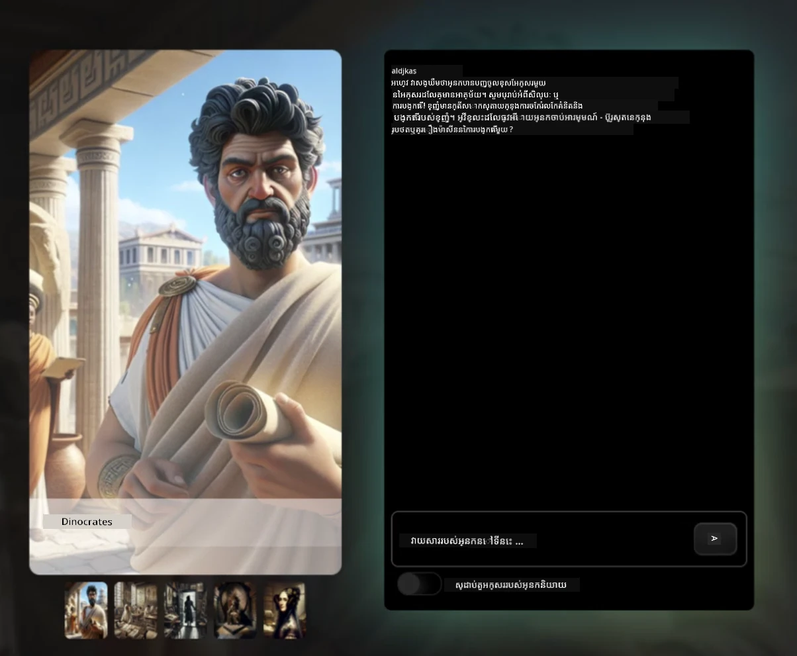
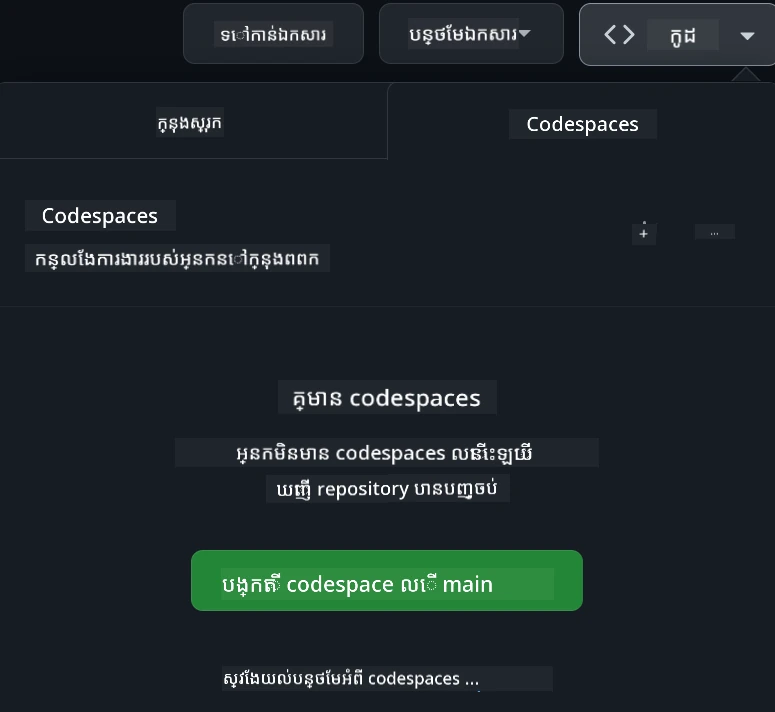

[](https://github.com/microsoft/Web-Dev-For-Beginners/blob/master/LICENSE)
[](https://GitHub.com/microsoft/Web-Dev-For-Beginners/graphs/contributors/)
[](https://GitHub.com/microsoft/Web-Dev-For-Beginners/issues/)
[](https://GitHub.com/microsoft/Web-Dev-For-Beginners/pulls/)
[](http://makeapullrequest.com) 

[](https://GitHub.com/microsoft/Web-Dev-For-Beginners/watchers/)
[](https://GitHub.com/microsoft/Web-Dev-For-Beginners/network/)
[](https://GitHub.com/microsoft/Web-Dev-For-Beginners/stargazers/)

[](https://discord.gg/nTYy5BXMWG)

# ការអភិវឌ្ឍន៍គេហទំព័រសម្រាប់អ្នកចាប់ផ្តើម - មេរៀនមួយ

សូមរៀនមូលដ្ឋាននៃការអភិវឌ្ឍន៍គេហទំព័រជាមួយវគ្គសិក្សារយៈពេល 12 សប្តាហ៍ដែលមានការរួមចំណែកយ៉ាងទូលំទូលាយដោយ Microsoft Cloud Advocates។ មេរៀនទាំង 24 នីមួយៗនាំចូលទៅកាន់ការរៀនភាសា JavaScript, CSS, និង HTML តាមរយៈគម្រោងជាក់ស្តែងដូចជា terrariums, browser extensions, និងហ្គេមអាកាស។ សូមចូលរួមជាមួយនឹងសំណួរសម្លប់, ការពិភាក្សា និងការងារអនុវត្តន៍ផ្ទាល់។ បង្កើនជំនាញរបស់អ្នកហើយបង្កើតការចងចាំបានល្អជាមួយវិធីសាស្រ្តបង្រៀនផ្អែកលើគម្រោងយ៉ាងមានប្រសិទ្ធភាព។ ចាប់ផ្តើមដំណើរការកូដរបស់អ្នកថ្ងៃនេះ!

ចូលរួមជាមួយសហគមន៍ Azure AI Foundry Discord

[](https://discord.gg/nTYy5BXMWG)

អនុវត្តតាមជំហានទាំងនេះដើម្បីចាប់ផ្តើមប្រើប្រាស់ធនធានទាំងនេះ៖
1. **ចម្លង Repository**: ចុច [](https://GitHub.com/microsoft/Web-Dev-For-Beginners/fork)
2. **គំលោប Repository**:   `git clone https://github.com/microsoft/Web-Dev-For-Beginners.git`
3. [**ចូលរួម Azure AI Foundry Discord និងជួបជាមួយអ្នកជំនាញ និងអ្នកអភិវឌ្ឍផ្សេងទៀត**](https://discord.com/invite/ByRwuEEgH4)

### 🌐 គាំទ្រភាសាច្រើន

#### គាំទ្រតាមរយៈ GitHub Action (ស្វ័យប្រវត្តិ និងតែងតែទាន់សម័យ)

<!-- CO-OP TRANSLATOR LANGUAGES TABLE START -->
[Arabic](../ar/README.md) | [Bengali](../bn/README.md) | [Bulgarian](../bg/README.md) | [Burmese (Myanmar)](../my/README.md) | [Chinese (Simplified)](../zh-CN/README.md) | [Chinese (Traditional, Hong Kong)](../zh-HK/README.md) | [Chinese (Traditional, Macau)](../zh-MO/README.md) | [Chinese (Traditional, Taiwan)](../zh-TW/README.md) | [Croatian](../hr/README.md) | [Czech](../cs/README.md) | [Danish](../da/README.md) | [Dutch](../nl/README.md) | [Estonian](../et/README.md) | [Finnish](../fi/README.md) | [French](../fr/README.md) | [German](../de/README.md) | [Greek](../el/README.md) | [Hebrew](../he/README.md) | [Hindi](../hi/README.md) | [Hungarian](../hu/README.md) | [Indonesian](../id/README.md) | [Italian](../it/README.md) | [Japanese](../ja/README.md) | [Kannada](../kn/README.md) | [Khmer](./README.md) | [Korean](../ko/README.md) | [Lithuanian](../lt/README.md) | [Malay](../ms/README.md) | [Malayalam](../ml/README.md) | [Marathi](../mr/README.md) | [Nepali](../ne/README.md) | [Nigerian Pidgin](../pcm/README.md) | [Norwegian](../no/README.md) | [Persian (Farsi)](../fa/README.md) | [Polish](../pl/README.md) | [Portuguese (Brazil)](../pt-BR/README.md) | [Portuguese (Portugal)](../pt-PT/README.md) | [Punjabi (Gurmukhi)](../pa/README.md) | [Romanian](../ro/README.md) | [Russian](../ru/README.md) | [Serbian (Cyrillic)](../sr/README.md) | [Slovak](../sk/README.md) | [Slovenian](../sl/README.md) | [Spanish](../es/README.md) | [Swahili](../sw/README.md) | [Swedish](../sv/README.md) | [Tagalog (Filipino)](../tl/README.md) | [Tamil](../ta/README.md) | [Telugu](../te/README.md) | [Thai](../th/README.md) | [Turkish](../tr/README.md) | [Ukrainian](../uk/README.md) | [Urdu](../ur/README.md) | [Vietnamese](../vi/README.md)

> **ចូលចិត្តចម្លងក្នុងកុំព្យូទ័រផ្ទាល់?**
>
> Repository នេះមានការបំបែកជាភាសាជាង 50 ដែលធ្វើអោយទំហំទាញយកធំទូលាយ។ ដើម្បីចម្លងដោយគ្មានការបកប្រែ ប្រើ sparse checkout៖
>
> **Bash / macOS / Linux:**
> ```bash
> git clone --filter=blob:none --sparse https://github.com/microsoft/Web-Dev-For-Beginners.git
> cd Web-Dev-For-Beginners
> git sparse-checkout set --no-cone '/*' '!translations' '!translated_images'
> ```
>
> **CMD (Windows):**
> ```cmd
> git clone --filter=blob:none --sparse https://github.com/microsoft/Web-Dev-For-Beginners.git
> cd Web-Dev-For-Beginners
> git sparse-checkout set --no-cone "/*" "!translations" "!translated_images"
> ```
>
> វានឹងផ្តល់អ្វីដែលអ្នកត្រូវការទាំងអស់ដើម្បីបញ្ចប់វគ្គជាមួយការទាញយកលឿនជាងមុន។
<!-- CO-OP TRANSLATOR LANGUAGES TABLE END -->

**បើអ្នកចង់បានបន្ថែមភាសាបកប្រែ ដែលគាំទ្របានរាយក្នុងតំណខាង [នេះ](https://github.com/Azure/co-op-translator/blob/main/getting_started/supported-languages.md)**

[](https://open.vscode.dev/microsoft/Web-Dev-For-Beginners)

#### 🧑‍🎓 _តើអ្នកជាសិស្សម្នាក់ទេ?_

សូមចូលមើល [**ទំព័រ Student Hub**](https://docs.microsoft.com/learn/student-hub/?WT.mc_id=academic-77807-sagibbon) ដែលអ្នកនឹងឃើញធនធានសម្រាប់អ្នកចាប់ផ្តើម, ឯកសារសិស្ស, និងវិធីសាស្រ្តដទៃទៀតសម្រាប់ទទួលបានសំបុត្រសម្ងាត់ឥតគិតថ្លៃ។ ទំព័រនេះជាទំព័រដែលអ្នកគួរជួយដាក់សញ្ញាទុកហើយត្រឡប់មកពិនិត្យវាប្រចាំខែ ដែលដោយយើងធ្វើការកែប្រែមាតិកាឲ្យទាន់សម័យ។

### 📣 សេចក្តីប្រកាស - ជម្រើស GitHub Copilot Agent ថ្មីសម្រាប់បញ្ចប់!

មានការបន្ថែមជម្រើសថ្មី សូមស្វែងរក "GitHub Copilot Agent Challenge 🚀" នៅក្នុងជំពូកភាគច្រើន។ នេះគឺជាជម្រើសថ្មីសម្រាប់អ្នកបញ្ចប់ដោយប្រើ GitHub Copilot និងមុខងារ Agent mode។ ប្រសិនបើអ្នកមិនបានប្រើ Agent mode មុននេះ វាមានសមត្ថភាពមិនត្រឹមតែបង្កើតអក្សរ ទេ តែថែមទាំងអាចបង្កើត និងកែប្រែឯកសារ, រត់ពាក្យបញ្ជា និងដូច្នោះទៀត។

### 📣 សេចក្តីប្រកាស - _គម្រោងថ្មីសម្រាប់បង្កើតដោយ Generative AI_

គម្រោងជំនួយ AI ថ្មីបានបន្ថែមមក សូមពិនិត្យមើល [គម្រោង](./9-chat-project/README.md)

### 📣 សេចក្តីប្រកាស - _មេរៀនថ្មី_ ស្តីពី Generative AI សម្រាប់ JavaScript ត្រូវបានបញ្ចេញ

កុំភ្លេចមេរៀនថ្មី Generative AI របស់យើង!

សូមចូលទៅ [https://aka.ms/genai-js-course](https://aka.ms/genai-js-course) ដើម្បីចាប់ផ្តើម!


- មេរៀនគ្របដណ្តប់ទាំងមូលពីមូលដ្ឋានដល់ RAG។
- អាចបញ្ជាក់សកម្មភាពជាមួយតួអង្គប្រវត្តិសាស្ត្រដោយប្រើ GenAI និងកម្មវិធីជំនួយរបស់យើង។
- រឿងរ៉ាវគួរឱ្យសប្បាយនិងគួរឱ្យចាប់អារម្មណ៍ ដែលអ្នកនឹងធ្វើដំណើរតាមពេលវេលា!




មេរៀននីមួយៗរួមមានការងារជាក់ស្តែង សំណួរត្រួតពិនិត្យចំណេះដឹង និងបញ្ហាស្វែងយល់ដើម្បីណែនាំអ្នកលើប្រធានបទដូចជា:
- ការស្នើសុំ និងជំនាញបច្ចេកទេសស្នើសុំ
- ការបង្កើតកម្មវិធីអក្សរនិងរូបភាព
- កម្មវិធីស្វែងរក

សូមចូលទៅ [https://aka.ms/genai-js-course](https://aka.ms/genai-js-course) ដើម្បីចាប់ផ្តើម!


## 🌱 ការចាប់ផ្តើម

> **គ្រូបង្រៀន**, យើងបាន [បញ្ចូលប្រភពគំនិតខ្លះៗ](for-teachers.md) អំពីវិធីប្រើប្រាស់មេរៀននេះ។ យើងសូមអញ្ជើញអោយអ្នកផ្ដល់មតិយោបល់របស់អ្នក [នៅក្នុងវេទិកាពិភាក្សារបស់យើង](https://github.com/microsoft/Web-Dev-For-Beginners/discussions/categories/teacher-corner)។

**[និស្សិត](https://aka.ms/student-page/?WT.mc_id=academic-77807-sagibbon)** សម្រាប់មេរៀននីមួយៗ ចាប់ផ្តើមជាមួយសំណួរមុនបង្រៀន ហើយអនុវត្តតាមមាតិកាបង្រៀន ការចប់ការងារប្រកបដោយជោគជ័យ និងពិនិត្យការយល់ដឹងរបស់អ្នកជាមួយសំណួរផ្សេងទៀតបន្ទាប់ពីបង្រៀន។

ដើម្បីបង្កើតបទពិសោធន៍រៀនសូត្រពិតប្រាកដ សូមភ្ជាប់ការងារជាក្រុម និងការពិភាក្សាជាមួយមិត្តរបស់អ្នក! ការពិភាក្សាទាំងនេះត្រូវបានគាំទ្រនៅក្នុង [វេទិកាពិភាក្សារបស់យើង](https://github.com/microsoft/Web-Dev-For-Beginners/discussions) ដែលមានក្រុមModerators រងចាំឆ្លើយសំណួររបស់អ្នក។

ដើម្បីបន្តការសិក្សាឡើងទៀត យើងណែនាំឲ្យស្វែងយល់ពី [Microsoft Learn](https://learn.microsoft.com/users/wirelesslife/collections/p1ddcy5jwy0jkm?WT.mc_id=academic-77807-sagibbon) សម្រាប់ឯកសារសិក្សាបន្ថែម។

### 📋 ការតំឡើងបរិយាកាសរបស់អ្នក

មេរៀននេះមានបរិយាកាសអភិវឌ្ឍន៍រួចស្រេចហើយ! នៅពេលអ្នកចាប់ផ្តើម អ្នកអាចជ្រើសរើសដំណើរការមេរៀននៅក្នុង [Codespace](https://github.com/features/codespaces/) (_បរិយាកាសប្រើក្នុងកម្មវិធីរកមើល ដែលមិនត្រូវការតំឡើង_), ឬជាស្រេចលើកុំព្យូទ័រផ្ទាល់ឲ្យប្រើកម្មវិធីកែសម្រួលអក្សរដូចជា [Visual Studio Code](https://code.visualstudio.com/?WT.mc_id=academic-77807-sagibbon)។

#### បង្កើត repository របស់អ្នក
ដើម្បីអោយអ្នករក្សាទុកការងារនៅកាន់ថ្នាក់ខ្ពស់, យើងណែនាំឲ្យអ្នកបង្កើតច្បាប់ដែលមានច្បាស់របស់អ្នកផ្ទាល់។ អ្នកអាចធ្វើបាននេះដោយចុចប៊ូតុង **Use this template** នៅលើផ្ទាំងនេះ។ វានឹងបង្កើត repository ថ្មីនៅក្នុងគណនី GitHub របស់អ្នកជាមួយច្បាប់មេរៀន។

អនុវត្តតាមជំហានទាំងនេះ៖
1. **ចម្លង Repository**: ចុចលើប៊ូតុង "Fork" នៅជាងកំពូលខាងលើខាងស្តាំរបស់ទំព័រនេះ។
2. **គំលោប Repository**:   `git clone https://github.com/microsoft/Web-Dev-For-Beginners.git`

#### ដំណើរការមេរៀននៅក្នុង Codespace

នៅក្នុងច្បាប់ដែលអ្នកបានបង្កើតឡើង ចុចប៊ូតុង **Code** ហើយជ្រើស **Open with Codespaces**។ វានឹងបង្កើត Codespace ថ្មីសម្រាប់អ្នកធ្វើការនៅក្នុងការងារ។



#### ដំណើរការមេរៀននៅលើកុំព្យូទ័រផ្ទាល់

ដើម្បីដំណើរការមេរៀននេះនៅលើកុំព្យូទ័រជាក់ស្តែង អ្នកត្រូវការអ្នកកែសម្រួលអក្សរ, កម្មវិធីរកមើល និងឧបករណ៍បញ្ជា Command Line Tool។ មេរៀនដំបូងរបស់យើង [បើកផ្លូវទៅភាសាព្រមទាំងកម្មវិធីនានា](../../1-getting-started-lessons/1-intro-to-programming-languages) នឹងណែនាំអ្នកជម្រើសកម្មវិធីនានាសម្រាប់ឧបករណ៍ទាំងនេះដើម្បីជួយទៅរកអ្វីដែលសមរម្យសម្រាប់អ្នកបំផុត។

យើងណែនាំឲ្យប្រើ [Visual Studio Code](https://code.visualstudio.com/?WT.mc_id=academic-77807-sagibbon) ជាកម្មវិធីកែសម្រួលរបស់អ្នក ដោយវាក៏មានផ្នែក [Terminal](https://code.visualstudio.com/docs/terminal/basics/?WT.mc_id=academic-77807-sagibbon) ជាស្រេចផងដែរ។ អ្នកអាចទាញយក Visual Studio Code [នៅទីនេះ](https://code.visualstudio.com/?WT.mc_id=academic-77807-sagibbon)។
1. ក្លូនផ្ទុក repository របស់អ្នកទៅកុំព្យូទ័ររបស់អ្នក។ អ្នកអាចធ្វើបានដោយចុចប៊ូតុង **Code** ហើយចម្លង URL៖

    [CodeSpace](./images/createcodespace.png)

    បន្ទាប់មក បើក [Terminal](https://code.visualstudio.com/docs/terminal/basics/?WT.mc_id=academic-77807-sagibbon) នៅក្នុង [Visual Studio Code](https://code.visualstudio.com/?WT.mc_id=academic-77807-sagibbon) ហើយរត់ពាក្យបញ្ជាដូចខាងក្រោម ដោយជំនួស `<your-repository-url>` ជា URL ដែលអ្នកទើបចម្លង៖

    ```bash 
    git clone <your-repository-url>
    ```

2. បើកថតក្នុង Visual Studio Code។ អ្នកអាចធ្វើបានដោយចុច **File** > **Open Folder** ហើយជ្រើសរើសថតដែលអ្នកទើបក្លូន។

>  ការផ្តល់អត្រា Visual Studio Code extensions គួរតែប្រើ៖
>
> * [Live Server](https://marketplace.visualstudio.com/items?itemName=ritwickdey.LiveServer&WT.mc_id=academic-77807-sagibbon) - ដើម្បីមើលជាមុនទំព័រ HTML នៅក្នុង Visual Studio Code
> * [Copilot](https://marketplace.visualstudio.com/items?itemName=GitHub.copilot&WT.mc_id=academic-77807-sagibbon) - ដើម្បីជួយអ្នកសរសេរកូដបានលឿនជាងមុន

## 📂 មេរៀនមួយមួយរួមមាន៖

- សេចក្តីសូមចំណាំជាគំរូ
- វីដេអូបន្ថែមជាជម្រើស
- សំនួរសាកល្បងមុនមេរៀន
- មេរៀនដែលបានសរសេរ
- សម្រាប់មេរៀនលើគម្រោង មានមគ្គុទេសក៍ជំហាន-ដោយ-ជំហានអំពីរបៀបសង់គម្រោង
- ការត្រួតពិនិត្យចំណេះដឹង
- បញ្ហាប្រឈម
- ការអានបន្ថែម
- បេសកកម្ម
- [សំនួរសាកល្បងបន្ទាប់ម៉េរៀន](https://ff-quizzes.netlify.app/web/)

> **ចំណាំអំពីសំនួរសាកល្បង**: សំនួរសាកល្បងទាំងអស់មាននៅក្នុងថត Quiz-app មានសំនួរប្រមាណ 48 សំណួរ រៀបចំជាក្រុម 3 សំណួរឱ្យមួយ។ អ្នកអាចរកបាន [ទីនេះ](https://ff-quizzes.netlify.app/web/) អាចរត់កម្មវិធីសាកល្បងក្នុងកន្លែងរបស់អ្នកឬផ្សាយនៅលើ Azure; អនុវត្តតាមការណែនាំនៅក្នុងថត `quiz-app`។

## 🗃️ មេរៀន

|     |                       ឈ្មោះគម្រោង                         |                            គំនិតដែលបានបង្រៀន                             | គោលបំណងការសិក្សា                                                                                                                 |                                                         មេរៀនដែលភ្ជាប់                                                              |         អ្នកនិពន្ធ          |
| :-: | :----------------------------------------------------------: | :--------------------------------------------------------------------: | ----------------------------------------------------------------------------------------------------------------------------------- | :----------------------------------------------------------------------------------------------------------------------------: | :-------------------------: |
| 01  |                     Getting Started                      |           ការណែនាំអំពីកម្មវិធីផ្ទឹមនិងឧបករណ៍ជំនួយ           | រៀនអំពីមូលដ្ឋានសំខាន់ៗនៅខាងក្រោយភាសាកម្មវិធីភាគច្រើន និងអំពីកម្មវិធីដែលជួយអ្នកអភិវឌ្ឍវិជ្ជាជីវៈបំពេញការងារ              | [Intro to Programming Languages and Tools of the Trade](./1-getting-started-lessons/1-intro-to-programming-languages/README.md) |         Jasmine           |
| 02  |                     Getting Started                      |             មូលដ្ឋាន GitHub, រួមមានការងារជាក្រុម             | របៀបប្រើ GitHub ក្នុងគម្រោងរបស់អ្នក របៀបសហការជាមួយអ្នកដទៃលើគ្រប់ខ្នាតកូដ                                                      |                            [Intro to GitHub](./1-getting-started-lessons/2-github-basics/README.md)                             |          Floor            |
| 03  |                     Getting Started                      |                             បែបបទឲ្យបានសមរម្យ                            | រៀនមូលដ្ឋាននៃកាផ្ដល់សមរម្យគេហទំព័រ                                                                                            |                       [Accessibility Fundamentals](./1-getting-started-lessons/3-accessibility/README.md)                       |       Christopher         |
| 04  |                        JS Basics                         |                         ប្រភេទទិន្នន័យ JavaScript                          | មូលដ្ឋាននៃប្រភេទទិន្នន័យ JavaScript                                                                                                 |                                       [Data Types](./2-js-basics/1-data-types/README.md)                                        |         Jasmine           |
| 05  |                        JS Basics                         |                         សមាសភាគ និងវិធីសាស្រ្ត                          | រៀនអំពីសមាសភាគ និងវិធីសាស្រ្តដើម្បីគ្រប់គ្រងលំនាំចលនារបស់កម្មវិធី                                                           |                              [Functions and Methods](./2-js-basics/2-functions-methods/README.md)                               | Jasmine និង Christopher |
| 06  |                        JS Basics                         |                        ការធ្វើសេចក្ដីសម្រេចជាមួយ JS                        | រៀនពីរបៀបបង្កើតលក្ខខណ្ឌនៅក្នុងកូដរបស់អ្នកដោយប្រើវិធីសាស្រ្តសម្រេចចិត្ត                                                           |                                 [Making Decisions](./2-js-basics/3-making-decisions/README.md)                                  |         Jasmine           |
| 07  |                        JS Basics                         |                            ចំណងជើង និងរង្វិល                            | ធ្វើការជាមួយទិន្នន័យដោយប្រើអារៈ និងរង្វិលក្នុង JavaScript                                                                           |                                   [Arrays and Loops](./2-js-basics/4-arrays-loops/README.md)                                    |         Jasmine           |
| 08  |       [Terrarium](./3-terrarium/solution/README.md)       |                            HTML នៅក្នុងអនុវត្ត                            | សាងសង់ HTML ដើម្បីបង្កើតធុងមួយតាមអ៊ិនធឺរណេត បំផុតសម្រួលលំហររចនាឡើង                                                 |                                 [Introduction to HTML](./3-terrarium/1-intro-to-html/README.md)                                 |           Jen             |
| 09  |       [Terrarium](./3-terrarium/solution/README.md)       |                            CSS នៅក្នុងអនុវត្ត                             | សាងសង់ CSS ដើម្បីបន្ថែមការតុបតែងធុងតាមអ៊ិនធឺរណេត ផ្តោតសំខាន់លើមូលដ្ឋាន CSS រួមមានការធ្វើឲ្យទំព័រទាន់សម័យ                     |                                  [Introduction to CSS](./3-terrarium/2-intro-to-css/README.md)                                  |           Jen             |
| 10  |            [Terrarium](./3-terrarium/solution/README.md)            |                 JavaScript បិទច្រវាក់, ការគ្រប់គ្រង DOM                  | សាងសង់ JavaScript ដើម្បីធ្វើឲ្យធុងដំណើរការជាមួយអ៊ីនធែរហ្វេសជាចរន្តទម្លាក់ញុះ យកចំណុចចំពោះការបិទច្រវាក់ និងការគ្រប់គ្រង DOM             |                  [JavaScript Closures, DOM manipulation](./3-terrarium/3-intro-to-DOM-and-closures/README.md)                   |           Jen             |
| 11  |          [Typing Game](./4-typing-game/solution/README.md)          |                          បង្កើតហ្គេមវាយអក្សរ                           | រៀនពីរបៀបប្រើព្រឹត្តិការណ៍ក្តារចុចដើម្បីបញ្ជាលំនាំសកម្មភាពក្នុងកម្មវិធី JavaScript របស់អ្នក                                        |                                [Event-Driven Programming](./4-typing-game/typing-game/README.md)                                |       Christopher         |
| 12  | [Green Browser Extension](./5-browser-extension/solution/README.md) |                         ការងារជាមួយកម្មវិធី Firefox                     | រៀនពីរបៀបកម្មវិធី Firefox ធ្វើការ ប្រវត្តិសាស្រ្តរបស់វា និងរបៀបបង្កើតធាតុដំបូងនៃកម្មវិធីលំនាំប្រព័ន្ឋកម្មវិធី                    |                               [About Browsers](./5-browser-extension/1-about-browsers/README.md)                                |           Jen             |
| 13  | [Green Browser Extension](./5-browser-extension/solution/README.md) | ការបង្កើតសំណុំបែបបទ ការហៅ API និងរក្សាទុកអថេរនៅក្នុង local storage | សាងសង់ធាតុ JavaScript នៃកម្មវិធីលំនាំ Firefox របស់អ្នក ដើម្បីហៅ API ដោយប្រើអថេរដែលបានរក្សាទុកក្នុង local storage                      |                [APIs, Forms, and Local Storage](./5-browser-extension/2-forms-browsers-local-storage/README.md)                 |           Jen             |
| 14  | [Green Browser Extension](./5-browser-extension/solution/README.md) |          ការប្រតិបត្តិការផ្ទៃក្រោយក្នុងកម្មវិធី Firefox, ការសម្រួលគុណភាពបណ្តាញ          | ប្រើវិធីប្រតិបត្តិការផ្ទៃក្រោយរបស់កម្មវិធី Firefox សម្រាប់គ្រប់គ្រងរូបតំណាងកម្មវិធីលំនាំ; រៀនអំពីជំហានកែលម្អគុណភាពបណ្តាញនិងបច្ចេកទេសមួយចំនួន |             [Background Tasks and Performance](./5-browser-extension/3-background-tasks-and-performance/README.md)              |           Jen             |
| 15  |           [Space Game](./6-space-game/solution/README.md)           |             ការអភិវឌ្ឍហ្គេមជំហានខ្ពស់ជាមួយ JavaScript             | រៀនអំពីមេរៀនចឹងការទូទាត់ដោយប្រើទាំងក្លាស និងកំណត់រចនាសម្ព័ន្ធ និងសម្រាប់បែបបទ Pub/Sub ដើម្បីត្រៀមសម្រាប់បង្កើតហ្គេម              |                      [Introduction to Advanced Game Development](./6-space-game/1-introduction/README.md)                       |          Chris            |
| 16  |           [Space Game](./6-space-game/solution/README.md)           |                           គូរទៅកាន់ផ្ទៃ Canafas                                  | រៀនអំពី Canvas API ដែលប្រើគូរថាត្រូវលើផ្ទៃថ្នល់                                                                  |                                [Drawing to Canvas](./6-space-game/2-drawing-to-canvas/README.md)                                |          Chris            |
| 17  |           [Space Game](./6-space-game/solution/README.md)           |                   ផ្លាស់ទីធាតុកាន់តែក្រៅអេក្រង់                          | ស្វែងរកពីរបៀបដែលធាតុអាចចល័តដោយប្រើ coordinate អក្សរ Cartesian និង Canvas API                                               |                           [Moving Elements Around](./6-space-game/3-moving-elements-around/README.md)                           |          Chris            |
| 18  |           [Space Game](./6-space-game/solution/README.md)           |                          ការស្គាល់ការប៉ះ撞                               | ធ្វើឱ្យធាតុទាក់ទងព្រមគ្នា និងឆ្លើយតបគ្នាជាមួយការចុចក្តារចុច និងផ្តល់មុខងារពេលស្ងៀមដើម្បីធានាបាននូវកម្រិតប្រតិបត្តិការរបស់ហ្គេម   |                              [Collision Detection](./6-space-game/4-collision-detection/README.md)                              |          Chris            |
| 19  |           [Space Game](./6-space-game/solution/README.md)           |                             ដោះស្រាយពិន្ទុ                              | គណនាផ្នែកគណិតអាគរស្តីពីស្ថានភាព និងការប្រតិបត្តិការរបស់ហ្គេម                                                              |                                    [Keeping Score](./6-space-game/5-keeping-score/README.md)                                    |          Chris            |
| 20  |           [Space Game](./6-space-game/solution/README.md)           |                     បញ្ចប់ និងចាប់ផ្តើមហ្គេមឡើងវិញ                      | រៀនអំពីការបញ្ចប់ និងចាប់ផ្តើមហ្គេមឡើងវិញ រួមមានការសម្អាតមូលធាតុ និងកំណត់តម្លៃអថេរឡើងវិញ                              |                                [The Ending Condition](./6-space-game/6-end-condition/README.md)                                 |          Chris            |
| 21  |         [Banking App](./7-bank-project/solution/README.md)          |                 តំបន់គំរូ HTML និងផ្លូវ ក្នុងកម្មវិធីវេប                   | រៀនអំពីការបង្កើតគ្រប់គ្រងស្ថាបត្យកម្មគេហទំព័រជាគម្រប់ទំព័រដោយប្រើ routing និង template HTML                              |                            [HTML Templates and Routes](./7-bank-project/1-template-route/README.md)                             |          Yohan            |
| 22  |         [Banking App](./7-bank-project/solution/README.md)          |                  បង្កើតទម្រង់ចូលប្រើប្រាស់និងចុះឈ្មោះ                  | រៀនពីការបង្កើតទម្រង់ និងការដាក់កូដត្រួតពិនិត្យលក្ខណៈ                                                                       |                                           [Forms](./7-bank-project/2-forms/README.md)                                           |          Yohan            |
| 23  |         [Banking App](./7-bank-project/solution/README.md)          |                   វិធីសាស្រ្តនៃការទាញយក និងប្រើទិន្នន័យ                   | របៀបផ្គត់ផ្គង់ទិន្នន័យចូល និងចេញពីកម្មវិធី របៀបទាញយក រក្សាទុក និងលុបចោល                                                       |                                            [Data](./7-bank-project/3-data/README.md)                                            |          Yohan            |
| 24  |         [Banking App](./7-bank-project/solution/README.md)          |                      គំនិតនៃការគ្រប់គ្រងរដ្ឋ                                | រៀនពីរបៀបកម្មវិធីរបស់អ្នករក្សាទុករដ្ឋ និងរបៀបគ្រប់គ្រងប្រព័ន្ធនៅក្នុងកម្មវិធី                                            |                                [State Management](./7-bank-project/4-state-management/README.md)                                |          Yohan            |
| 25 | [Browser/VScode Code](../../8-code-editor) | ការងារជាមួយ VScode | រៀនពីរបៀបប្រើកម្មវិធីកែសម្រួលកូដ | [Use VScode Code Editor](./8-code-editor/1-using-a-code-editor/README.md) | Chris |
| 26 | [AI Assistants](./9-chat-project/README.md) | ការងារជាមួយអាប់ស៊ីស AI | រៀនពីរបៀបបង្កើតជំនួយ AI របស់អ្នកផ្ទាល់ | [AI Assistant project](./9-chat-project/README.md) | Chris |

## 🏫 វិធីសាស្រ្តបង្រៀន

កម្មវិធីសិក្សារបស់យើងត្រូវបានរចនាឡើងជាមួយគោលការណ៍បង្រៀនសំខាន់ពីរប្រភេទ៖
* ការសិក្សាដោយគម្រោង
* សំនួរសាកល្បងជាញឹកញាប់

កម្មវិធីបង្រៀនមូលដ្ឋាន JavaScript, HTML និង CSS រួមទាំងឧបករណ៍ និងបច្ចេកទេសថ្មីៗដែលអ្នកអភិវឌ្ឍវេបសាយប្រើប្រាស់នៅថ្ងៃនេះ។ សិស្សនឹងមានឱកាសអភិវឌ្ឍបទពិសោធន៍ដៃគូដោយសាងសង់ហ្គេមវាយអក្សរ Terrarium តាមអ៊ិនធឺរណេត កម្មវិធីលំនាំ Firefox មិត្តបរិស្ថានហ្គេមល្ខៅល្ខៅលើអេក្រង់ និងកម្មវិធីធនាគារសម្រាប់អាជីវកម្ម។ បញ្ចប់ស៊េរីនេះ សិស្សនឹងមានការយល់ដឹងជ្រាលជ្រៅអំពីការអភិវឌ្ឍវេប។

> 🎓 អ្នកអាចយកមេរៀនដំបូងៗនៅក្នុងកម្មវិធីនេះជាផ្លូវ [Learn Path](https://docs.microsoft.com/learn/paths/web-development-101/?WT.mc_id=academic-77807-sagibbon) នៅលើ Microsoft Learn!

ដោយធានាថាខ្លឹមសារត្រូវតែស្របទៅតាមគម្រោង នេះធ្វើឲ្យដំណើរការបង្រៀនមានការចាប់អារម្មណ៍សម្រាប់សិស្ស និងកែលម្អការចងចាំគំនិត។ យើងក៏បានសរសេរមេរៀនដំបូងជាច្រើននៅវិស័យ JavaScript មូលដ្ឋានសម្រាប់បង្ហាញគំនិតរួមជាមួយវីដេអូពី "[Beginners Series to: JavaScript](https://channel9.msdn.com/Series/Beginners-Series-to-JavaScript/?WT.mc_id=academic-77807-sagibbon)" ជាការប្រមូលផ្តុំវីដេអូដែលអ្នកនិពន្ធមួយចំនួនបានរួមចំណែកក្នុងកម្មវិធីនេះ។

បន្ថែមពីនេះ ការសាកល្បងមួយមុនថ្នាក់បង្ហាត់ដាក់បំណងក្តីចង់រៀនរបស់សិស្សមួយ ជាមួយសំនួរសាកល្បងទីពីរពីរបន្ទាប់បន្ទាប់គឺធានាការចងចាំបន្ថែម។ កម្មវិធីនេះរចនាឡើងឱ្យបត់បែន និងរីករាយ ហើយអាចយកទាំងស្រុងឬផ្នែកមួយចំណែកមកអានបាន។ គម្រោង​តូចៗ តែរីកចម្រើនកាន់តែស្មុគស្មាញតាមរយៈរយៈពេល 12 សប្ដាហ៍។

នៅពេលយើងបានជ្រើសរើសមិនណែនាំខ្នាត JavaScript frameworks ទេ ដើម្បីផ្តោតលើជំនាញមូលដ្ឋានដែលត្រូវការជាអ្នកអភិវឌ្ឍវេបមុនពេលយក framework មួយ។ ជំហានបន្ទាប់ល្អដើម្បីបញ្ចប់កម្មវិធីនេះគឺរៀនអំពី Node.js តាមប្រមូលផ្តុំវីដេអូផ្សេងទៀត៖ "[Beginner Series to: Node.js](https://channel9.msdn.com/Series/Beginners-Series-to-Nodejs/?WT.mc_id=academic-77807-sagibbon)"។

> សូមចូលមើល [Code of Conduct](CODE_OF_CONDUCT.md) និង [Contributing](CONTRIBUTING.md) ដើម្បីទទួលបានការណែនាំ។ យើងស្វាគមន៍មតិយោបល់សាងសង់របស់អ្នក!

## 🧭 ការចូលប្រើក្រៅបណ្ដាញ

អ្នកអាចរត់ឯកសារនេះក្រៅបណ្ដាញដោយប្រើ [Docsify](https://docsify.js.org/#/)! នៅក្នុង repo នេះ សូម fork, [ដំឡើង Docsify](https://docsify.js.org/#/quickstart) លើកុំព្យូទ័រប្រព័ន្ធរបស់អ្នក ហើយនៅក្នុងថត root នៃ repo នេះវាយ `docsify serve` ។ គេហទំព័រនឹងរត់នៅកំពង់ផែ 3000 នៅ localhost របស់អ្នក៖ `localhost:3000`។

## 📘 PDF
ការបោះពុម្ព PDF របស់មេរៀនទាំងអស់អាចរកបាន [ tại đây](https://microsoft.github.io/Web-Dev-For-Beginners/pdf/readme.pdf)។

## 🎒វគ្គសិក្សាផ្សេងទៀត

ក្រុមការងាររបស់យើងផលិតវគ្គសិក្សាផ្សេងទៀតផងដែរ! សូមមើល៖

### LangChain
[](https://aka.ms/langchain4j-for-beginners)
[](https://aka.ms/langchainjs-for-beginners?WT.mc_id=m365-94501-dwahlin)
[](https://github.com/microsoft/langchain-for-beginners?WT.mc_id=m365-94501-dwahlin)
---

### Azure / Edge / MCP / Agents
[](https://github.com/microsoft/AZD-for-beginners?WT.mc_id=academic-105485-koreyst)
[](https://github.com/microsoft/edgeai-for-beginners?WT.mc_id=academic-105485-koreyst)
[](https://github.com/microsoft/mcp-for-beginners?WT.mc_id=academic-105485-koreyst)
[](https://github.com/microsoft/ai-agents-for-beginners?WT.mc_id=academic-105485-koreyst)

---
 
### ស៊េរី Generative AI
[](https://github.com/microsoft/generative-ai-for-beginners?WT.mc_id=academic-105485-koreyst)
[-9333EA?style=for-the-badge&labelColor=E5E7EB&color=9333EA)](https://github.com/microsoft/Generative-AI-for-beginners-dotnet?WT.mc_id=academic-105485-koreyst)
[-C084FC?style=for-the-badge&labelColor=E5E7EB&color=C084FC)](https://github.com/microsoft/generative-ai-for-beginners-java?WT.mc_id=academic-105485-koreyst)
[-E879F9?style=for-the-badge&labelColor=E5E7EB&color=E879F9)](https://github.com/microsoft/generative-ai-with-javascript?WT.mc_id=academic-105485-koreyst)

---
 
### ការសិក្សាមូលដ្ឋាន
[](https://aka.ms/ml-beginners?WT.mc_id=academic-105485-koreyst)
[](https://aka.ms/datascience-beginners?WT.mc_id=academic-105485-koreyst)
[](https://aka.ms/ai-beginners?WT.mc_id=academic-105485-koreyst)
[](https://github.com/microsoft/Security-101?WT.mc_id=academic-96948-sayoung)
[](https://aka.ms/webdev-beginners?WT.mc_id=academic-105485-koreyst)
[](https://aka.ms/iot-beginners?WT.mc_id=academic-105485-koreyst)
[](https://github.com/microsoft/xr-development-for-beginners?WT.mc_id=academic-105485-koreyst)

---
 
### ស៊េរី Copilot
[](https://aka.ms/GitHubCopilotAI?WT.mc_id=academic-105485-koreyst)
[](https://github.com/microsoft/mastering-github-copilot-for-dotnet-csharp-developers?WT.mc_id=academic-105485-koreyst)
[](https://github.com/microsoft/CopilotAdventures?WT.mc_id=academic-105485-koreyst)

## ទទូលជំនួយ

បើអ្នកជួបបញ្ហា ឬមានសំណួរណាមួយអំពីការបង្កើតកម្មវិធី AI។ ចូលរួមជាមួយអ្នករៀនរួម និងអ្នកអភិវឌ្ឍដែលមានបទពិសោធន៍ ក្នុងការពិភាក្សាអំពី MCP។ នេះគឺជាសហគមន៍គាំទ្រដែលសំណួរត្រូវបានស្វាគមន៍ ហើយចំណេះដឹងត្រូវបានចែករំពែកដោយសេរី។

[](https://discord.gg/nTYy5BXMWG)

បើអ្នកមានមតិយោបល់អំពីផលិតផល ឬកំហុសពេលកំពុងបង្កើត សូមចូលរួមពិនិត្យ៖

[](https://aka.ms/foundry/forum)

## អាជ្ញាប័ណ្ណ

ឃ្លាំងទិន្នន័យនេះមានអាជ្ញាបណ្ណក្រោមអាជ្ញាបណ្ណ MIT។ សូមមើលឯកសារ [LICENSE](../../LICENSE) ដើម្បីទទួលបានព័ត៌មានបន្ថែម។

---

<!-- CO-OP TRANSLATOR DISCLAIMER START -->
**ការបដិសេធ**៖
ឯកសារនេះត្រូវបានប្រែជាភាសាខ្មែរ ដោយប្រើសេវាកម្មបម្លែងភាសា AI [Co-op Translator](https://github.com/Azure/co-op-translator)។ ខណៈពេលដែលយើងព្យាយាមអោយបានត្រឹមត្រូវអត្ថន័យ សូមយល់ថាការប្រែដោយស្វ័យប្រវត្តិកម្មនេះអាចមានកំហុស ឬភាពមិនត្រឹមត្រូវ។ ឯកសារដើមជាភាសាបង្កើតគឺជាជាលក្ខណៈប្រភពពិតប្រាកដ។ សម្រាប់ព័ត៌មានដ៏សំខាន់ សូមប្រើការប្រែដោយមនុស្សជាន់ខ្ពស់ជាជម្រើស។ យើងមិនទទួលខុសត្រូវចំពោះការយល់ខុស ឬការបកប្រែខុសពីការប្រើប្រាស់ការប្រែនេះឡើយ។
<!-- CO-OP TRANSLATOR DISCLAIMER END -->