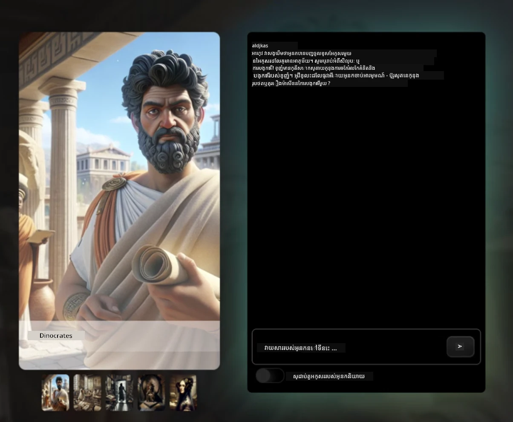
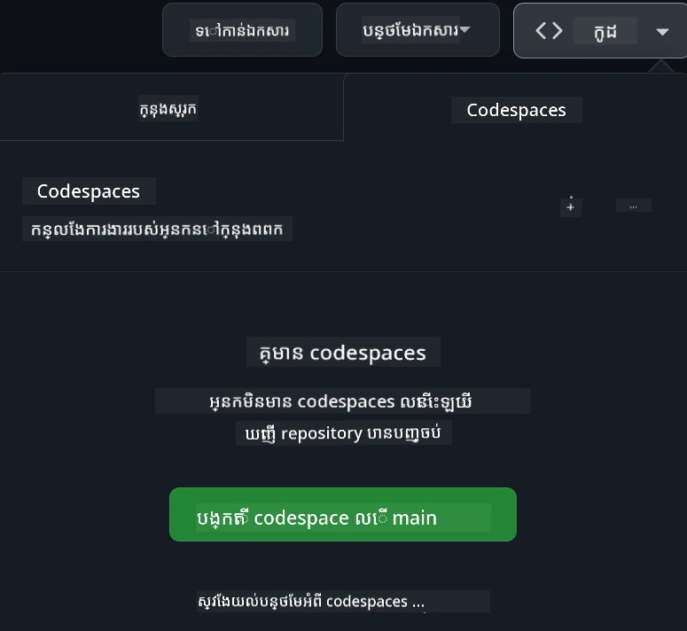

# ការអភិវឌ្ឍគេហទំព័រសម្រាប់អ្នកដំបូង - មេរៀនមួយ

រៀនមូលដ្ឋាននៃការអភិវឌ្ឍគេហទំព័រជាមួយវគ្គបណ្តុះបណ្តាលពេញលេញរយៈពេល ១២ សប្តាហ៍ដោយ Microsoft Cloud Advocates។ មហាវិទ្យាល័យ ២៤ មេរៀននីមួយៗជ្រាបចូលទៅក្នុង JavaScript, CSS និង HTML តាមរយៈគំរោង​ដោយដៃ​ដូចជា តារៀរីញូម, ការពង្រីកកម្មវិធីរុករក និងហ្គេមអន្ទងអាកាស។ ចូលរួមជាមួយគ្រោងសំណួរ, ការពិភាក្សា និងភារកិច្ចអនុវត្ត។ បង្កើនជំនាញរបស់អ្នក និងបង្កើនការចងចាំចំណេះដឹងជាមួយវិធីសាស្រ្តបង្រៀនផ្អែកលើគំរោងយ៉ាងមានប្រសិទ្ធភាពរបស់យើង។ ចាប់ផ្តើមការធ្វើកូដរបស់អ្នកថ្ងៃនេះ!

ចូលរួមជាមួយ Azure AI Foundry Discord ហើយជួបជាមួយអ្នកជំនាញ និងអ្នកអភិវឌ្ឍន៍មិត្តរួម។

[](https://discord.gg/nTYy5BXMWG)

អនុវត្តជំហានទាំងនេះដើម្បីចាប់ផ្តើមប្រើប្រាស់ធនធានទាំងនេះ៖
1. **បង្កើត Fork របស់ Repository**: ចុច [](https://GitHub.com/microsoft/Web-Dev-For-Beginners/fork)
2. **ក្លោន Repository**:   `git clone https://github.com/microsoft/Web-Dev-For-Beginners.git`
3. [**ចូលរួម Azure AI Foundry Discord ហើយជួបជាមួយអ្នកជំនាញ និងអ្នកអភិវឌ្ឍន៍មិត្តរួម**](https://discord.com/invite/ByRwuEEgH4)

### 🌐 គាំទ្រជាច្រើនភាសា

#### គាំទ្រតាមរយៈ GitHub Action (អូតូម៉ាទិច និងតែងតែទាន់សម័យ)

<!-- CO-OP TRANSLATOR LANGUAGES TABLE START -->
[Arabic](../ar/README.md) | [Bengali](../bn/README.md) | [Bulgarian](../bg/README.md) | [Burmese (Myanmar)](../my/README.md) | [Chinese (Simplified)](../zh-CN/README.md) | [Chinese (Traditional, Hong Kong)](../zh-HK/README.md) | [Chinese (Traditional, Macau)](../zh-MO/README.md) | [Chinese (Traditional, Taiwan)](../zh-TW/README.md) | [Croatian](../hr/README.md) | [Czech](../cs/README.md) | [Danish](../da/README.md) | [Dutch](../nl/README.md) | [Estonian](../et/README.md) | [Finnish](../fi/README.md) | [French](../fr/README.md) | [German](../de/README.md) | [Greek](../el/README.md) | [Hebrew](../he/README.md) | [Hindi](../hi/README.md) | [Hungarian](../hu/README.md) | [Indonesian](../id/README.md) | [Italian](../it/README.md) | [Japanese](../ja/README.md) | [Kannada](../kn/README.md) | [Khmer](./README.md) | [Korean](../ko/README.md) | [Lithuanian](../lt/README.md) | [Malay](../ms/README.md) | [Malayalam](../ml/README.md) | [Marathi](../mr/README.md) | [Nepali](../ne/README.md) | [Nigerian Pidgin](../pcm/README.md) | [Norwegian](../no/README.md) | [Persian (Farsi)](../fa/README.md) | [Polish](../pl/README.md) | [Portuguese (Brazil)](../pt-BR/README.md) | [Portuguese (Portugal)](../pt-PT/README.md) | [Punjabi (Gurmukhi)](../pa/README.md) | [Romanian](../ro/README.md) | [Russian](../ru/README.md) | [Serbian (Cyrillic)](../sr/README.md) | [Slovak](../sk/README.md) | [Slovenian](../sl/README.md) | [Spanish](../es/README.md) | [Swahili](../sw/README.md) | [Swedish](../sv/README.md) | [Tagalog (Filipino)](../tl/README.md) | [Tamil](../ta/README.md) | [Telugu](../te/README.md) | [Thai](../th/README.md) | [Turkish](../tr/README.md) | [Ukrainian](../uk/README.md) | [Urdu](../ur/README.md) | [Vietnamese](../vi/README.md)

> **ចូលចិត្តក្លោនក្នុងកុំព្យូទ័ររបស់អ្នក?**
>
> Repository នេះមានការបកប្រែជាភាសាជាង ៥០ ដែលបន្ថែមទំហំនៃការទាញយកយ៉ាងខ្លាំង។ ដើម្បីក្លោនដោយគ្មានការបកប្រែ, ប្រើ sparse checkout:
>
> **Bash / macOS / Linux:**
> ```bash
> git clone --filter=blob:none --sparse https://github.com/microsoft/Web-Dev-For-Beginners.git
> cd Web-Dev-For-Beginners
> git sparse-checkout set --no-cone '/*' '!translations' '!translated_images'
> ```
>
> **CMD (Windows):**
> ```cmd
> git clone --filter=blob:none --sparse https://github.com/microsoft/Web-Dev-For-Beginners.git
> cd Web-Dev-For-Beginners
> git sparse-checkout set --no-cone "/*" "!translations" "!translated_images"
> ```
>
> នេះផ្តល់ឲ្យអ្នកនូវអ្វីដែលអ្នកត្រូវការដើម្បីបញ្ចប់វគ្គរៀនជាមួយការទាញយកដែលឆាប់រហ័សជាង។
<!-- CO-OP TRANSLATOR LANGUAGES TABLE END -->

**បើអ្នកចង់បានការបកប្រែបន្ថែម ភាសាដែលគាំទ្រត្រូវបានបញ្ជាក់នៅទីនេះ។ [here](https://github.com/Azure/co-op-translator/blob/main/getting_started/supported-languages.md)**

[](https://open.vscode.dev/microsoft/Web-Dev-For-Beginners)

#### 🧑‍🎓 _តើអ្នកជាសិស្សមែនទេ?_

សូមទៅកាន់ [**ទំព័រសិស្ស**](https://docs.microsoft.com/learn/student-hub/?WT.mc_id=academic-77807-sagibbon) ដែលអ្នកនឹងបានជួបជាមួយធនធានសម្រាប់អ្នកដំបូង, ប្រដាប់របស់សិស្ស និងវិធីសាស្រ្តទទួលសន្ទនាប័ណ្ណបញ្ញត្តិដោយឥតគិតថ្លៃ។ ទំព័រនេះគួរត្រូវបានរក្សាទុកជាទំព័ររបស់អ្នក និងពិនិត្យវាប្រចាំពេលពីព្រោះយើងប្តូរមាតិកាប្រចាំខែ។

### 📣 សេចក្តីប្រកាស - ការប្រកួតថ្មីរបៀប GitHub Copilot Agent ដែលត្រូវបញ្ចប់!

ការប្រកួតថ្មីត្រូវបានបន្ថែម, សូមស្វែងរក "GitHub Copilot Agent Challenge 🚀" នៅក្នុងជំពូកភាគច្រើន។ នេះជាការប្រកួតថ្មីសម្រាប់អ្នកបញ្ចប់ដោយប្រើ GitHub Copilot និងរបៀប Agent។ ប្រសិនបើអ្នកមិនធ្លាប់ប្រើរបៀប Agent ទេ វាមានសមត្ថភាពមិនត្រឹមតែបង្កើតអត្ថបទប៉ុណ្ណោះទេ ព្រមទាំងអាចបង្កើតនិងកែសម្រួលបណ្ណាល័យ, រត់ពាក្យបញ្ជា និងច្រើនទៀត។

### 📣 សេចក្តីប្រកាស - _គំរោងថ្មីសម្រាប់សាងសង់ដោយប្រើ AI បង្កើត_

គំរោងអ្នកជំនួយ AI ថ្មីត្រូវបានបន្ថែម, ពិនិត្យមើលគំរោង [project](./9-chat-project/README.md)

### 📣 សេចក្តីប្រកាស - _មេរៀនថ្មី_ ស្តីពី Generative AI សម្រាប់ JavaScript ត្រូវបានបញ្ចេញ

កុំផុតកន្លែងមេរៀន Generative AI ថ្មីរបស់យើង!

សូមចូលទៅកាន់ [https://aka.ms/genai-js-course](https://aka.ms/genai-js-course) ដើម្បីចាប់ផ្តើម!


- មេរៀនគ្របដណ្តប់ពីមូលដ្ឋានដល់ RAG។
- ផ្សព្វផ្សាយជាមួយតួអង្គប្រវត្តិនិយមដោយប្រើ GenAI និងកម្មវិធីជំនួយរបស់យើង។
- រឿងរ៉ាវគួរឱ្យរីករាយ និងគួរឱ្យចាប់អារម្មណ៍ អ្នកនឹងធ្វើដំណើរតាមពេលវេលា!



មេរៀននីមួយៗរួមមានភារកិច្ចត្រូវបញ្ចប់, ការត្រួតពិនិត្យចំណេះដឹង និងការប្រកួតដឹកនាំអ្នកក្នុងការសិក្សាប្រធានបទដូចជា៖
- ការបញ្ចូលបញ្ចោល និងវិស្វកម្មបញ្ចូលបញ្ចោល
- កម្មវិធីបង្កើតអត្ថបទ និងរូបភាព
- កម្មវិធីស្វែងរក

សូមចូលទៅកាន់ [https://aka.ms/genai-js-course](https://aka.ms/genai-js-course) ដើម្បីចាប់ផ្តើម!


## 🌱 ចាប់ផ្តើម

> **គ្រូបង្ហាត់**, យើងបាន [បញ្ចូលយោបល់ខ្លះៗ](for-teachers.md) អំពីរបៀបប្រើមេរៀននេះ។ យើងសូមសំណូមពរគ្រីមមតិរបស់អ្នក [នៅក្នុងក្រដាសពិភាក្សារបស់យើង](https://github.com/microsoft/Web-Dev-For-Beginners/discussions/categories/teacher-corner) ។ 

**[អ្នករៀន](https://aka.ms/student-page/?WT.mc_id=academic-77807-sagibbon)** សម្រាប់មេរៀននីមួយៗ ចាប់ផ្តើមជាមួយគ្រោងសំណួរពីមុនមេរៀន ហើយបន្តអានសារមេរៀន បញ្ចប់សកម្មភាពនានា ហើយផ្ទៀងផ្ទាត់ការយល់ដឹងរបស់អ្នកជាមួយគ្រោងសំណួរបន្ទាប់មេរៀន។

ដើម្បីបង្កើនបទពិសោធន៍រៀនរបស់អ្នក សូមភ្ជាប់ជាមួយមិត្តរួមបង្រៀនដើម្បីធ្វើគំរោងរួមគ្នា! ការពិភាក្សាត្រូវបានលើកទឹកចិត្តនៅក្នុង [ក្រដាសពិភាក្សា](https://github.com/microsoft/Web-Dev-For-Beginners/discussions) ដែលក្រុមអ្នកផ្សព្វផ្សាយរបស់យើងនឹងមានស្ថិតក្នុងទីនេះ ដើម្បីឆ្លើយសំនួររបស់អ្នក។

ដើម្បីបន្តការសិក្សារបស់អ្នក យើងអនុញ្ញាតឲ្យអ្នកស្វែងរក [Microsoft Learn](https://learn.microsoft.com/users/wirelesslife/collections/p1ddcy5jwy0jkm?WT.mc_id=academic-77807-sagibbon) សម្រាប់សម្ភារៈសិក្សាបន្ថែម។

### 📋 ការតំឡើងបរិយាកាសរបស់អ្នក

មេរៀននេះមានបរិយាកាសអភិវឌ្ឍន៍រួចរាល់! នៅពេលចាប់ផ្តើម អ្នកអាចជ្រើសរើសរត់មេរៀននៅក្នុង [Codespace](https://github.com/features/codespaces/) (_បរិយាកាសមិនតម្រូវការដំឡើង មាននៅលើកម្មវីធីរុករក_) ឬរត់ក្នុងកុំព្យូទ័ររបស់អ្នកដោយប្រើកម្មវិធីកែសម្រួលអត្ថបទដូចជា [Visual Studio Code](https://code.visualstudio.com/?WT.mc_id=academic-77807-sagibbon)។

#### បង្កើត repository របស់អ្នក
ដើម្បីឲ្យអ្នករក្សាទុកការងាររបស់អ្នកបានស្រួល អ្នកត្រូវបានផ្ដល់អនុសាសន៍ឲ្យបង្កើតច្បាប់ចម្លងផ្ទាល់ខ្លួនរបស់ repository នេះ។ អ្នកអាចធ្វើបានដោយចុចប៊ូតុង **Use this template** នៅខាងលើទំព័រ។ នេះនឹងបង្កើត repository ថ្មីនៅក្នុងគណនី GitHub របស់អ្នកជាមួយច្បាប់ចម្លងនៃមេរៀន។

អនុវត្តជំហានទាំងនេះ៖
1. **បង្កើត Fork របស់ Repository**: ចុចប៊ូតុង "Fork" នៅកំពូលម្ខាងស្តាំនៃទំព័រក្នុងនេះ។
2. **ក្លោន Repository**:   `git clone https://github.com/microsoft/Web-Dev-For-Beginners.git`

#### រត់មេរៀននៅក្នុង Codespace

ក្នុងច្បាប់ចម្លងនៃ repository ដែលអ្នកបានបង្កើត, ចុចប៊ូតុង **Code** ហើយជ្រើសរើស **Open with Codespaces**។ នេះនឹងបង្កើត Codespace ថ្មីសម្រាប់អ្នកធ្វើការក្នុងវា។



#### រត់មេរៀនក្នុងកុំព្យូទ័រផ្ទាល់ខ្លួន

ដើម្បីរត់មេរៀននេះក្នុងកុំព្យូទ័ររបស់អ្នក អ្នកត្រូវការកម្មវិធីកែសម្រួលអត្ថបទ, កម្មវិធីរុករក និងឧបករណ៍បន្ទាត់ពាក្យបញ្ជា។ មេរៀនដំបូងរបស់យើង, [ការណែនាំអំពីភាសាកម្មវិធីនិងឧបករណ៍នានា](../../1-getting-started-lessons/1-intro-to-programming-languages), នឹងដឹកនាំអ្នកតាមជម្រើសនានាសម្រាប់ឧបករណ៍ទាំងនេះដើម្បីជួយអ្នកជ្រើសរើសអ្វីដែលល្អបំផុតសម្រាប់អ្នក។

យើងណែនាំឲ្យប្រើ [Visual Studio Code](https://code.visualstudio.com/?WT.mc_id=academic-77807-sagibbon) ជាកម្មវិធីកែសម្រួល អ្នកមាន Terminal ដែលបង្កប់ក្នុងកម្មវិធីផងដែរ [Terminal](https://code.visualstudio.com/docs/terminal/basics/?WT.mc_id=academic-77807-sagibbon)។ អ្នកអាចទាញយក Visual Studio Code [នៅទីនេះ](https://code.visualstudio.com/?WT.mc_id=academic-77807-sagibbon)។
1. បញ្ចូលឃ្លាំងផ្ទុកកម្មវិធីរបស់អ្នកទៅកុំព្យូទ័ររបស់អ្នក។ អ្នកអាចធ្វើបានដោយចុចប៊ូតុង **Code** ហើយចម្លង URL៖

    [CodeSpace](./images/createcodespace.png)

    បន្ទាប់មក បើក [Terminal](https://code.visualstudio.com/docs/terminal/basics/?WT.mc_id=academic-77807-sagibbon) ក្នុង [Visual Studio Code](https://code.visualstudio.com/?WT.mc_id=academic-77807-sagibbon) ហើយរត់ពាក្យបញ្ជាដូចខាងក្រោម ដោយជំនួស `<your-repository-url>` ជាមួយ URL ដែលអ្នកបានចម្លង៖

    ```bash 
    git clone <your-repository-url>
    ```

2. បើកថតក្នុង Visual Studio Code។ អ្នកអាចធ្វើបានដោយចុច **File** > **Open Folder** ហើយជ្រើសរើសថតដែលអ្នកបានចម្លងមកថ្មីៗនេះ។

>  ផ្នែកបន្ថែម Visual Studio Code ដែលបានណែនាំ៖
>
> * [Live Server](https://marketplace.visualstudio.com/items?itemName=ritwickdey.LiveServer&WT.mc_id=academic-77807-sagibbon) - ដើម្បីមើលមុនទំព័រ HTML នៅក្នុង Visual Studio Code
> * [Copilot](https://marketplace.visualstudio.com/items?itemName=GitHub.copilot&WT.mc_id=academic-77807-sagibbon) - ជួយអ្នកសរសេរកូដបានលឿនឡើង

## 📂 មេរៀនរៀងរាល់មួយរួមមាន៖

- សៀវភៅគំនូសមានជម្រើស
- វីដេអូបន្ថែមមានជម្រើស
- សាកល្បងកម្រងមុខមួយមុនមេរៀន
- មេរៀនសរសេរ
- សម្រាប់មេរៀនបែបគម្រោង អ្នកមានមគ្គុទេសក៍ជារបៀបជំហាន-មួយសម្រាប់កសាងគម្រោង
- ការត្រួតពិនិត្យចំណេះដឹង
- បញ្ហាសួរ
- អានបន្ថែម
- បេសកកម្ម
- [សាកល្បងបន្ទាប់មេរៀន](https://ff-quizzes.netlify.app/web/)

> **កំណត់សម្គាល់អំពីសាកល្បង**៖ សាកល្បងទាំងអស់មាននៅក្នុងថត Quiz-app មានសរុប ៤៨ សាកល្បង ក្នុងមួយសាកល្បងមានចំលើយ ៣សំណួរ។ អាចរកបាន [នៅទីនេះ](https://ff-quizzes.netlify.app/web/) ហើយកម្មវិធីសាកល្បងអាចដំណើរការជាលក្ខណៈមូលដ្ឋាន ឬបញ្ចូលទៅ Azure; សូមអនុវត្តការណែនាំនៅក្នុងថត `quiz-app`។

## 🗃️ មេរៀន

|     |                       ឈ្មោះគម្រោង                        |                       គំនិតបានបង្រៀន                        |    គោលដៅបង្រៀន                                                                                                               |                                                        មេរៀនភ្ជាប់                                                          |         អ្នកនិពន្ធ         |
| :-: | :------------------------------------------------------: | :------------------------------------------------------------: | -------------------------------------------------------------------------------------------------------------------------------- | :----------------------------------------------------------------------------------------------------------------------------: | :-----------------------: |
| 01  |                     ការចាប់ផ្តើម                        |           ការណែនាំអំពីកម្មវិធីនិងឧបករណ៍ប្រើប្រាស់           | រៀនពីមូលដ្ឋានសំខាន់ៗពីភាសាកម្មវិធីភាគច្រើន និងអំពីកម្មវិធីជួយអ្នកអwickុំកវិជ្ជាជិតបំពេញការងារ                     | [ការណែនាំអំពីភាសាកម្មវិធីនិងឧបករណ៍ប្រើប្រាស់](./1-getting-started-lessons/1-intro-to-programming-languages/README.md) |         Jasmine           |
| 02  |                     ការចាប់ផ្តើម                        |             មូលដ្ឋាន GitHub រួមទាំងការងារជាក្រុម             | របៀបប្រើប្រាស់ GitHub នៅក្នុងគម្រោងរបស់អ្នក និងរបៀបសហការ ជាមួយអ្នកដទៃនៅលើមូលដ្ឋានកូដ                                   |                            [មូលដ្ឋាន GitHub](./1-getting-started-lessons/2-github-basics/README.md)                             |          Floor            |
| 03  |                     ការចាប់ផ្តើម                        |                             ភាពចូលដល់                        | រៀនពីមូលដ្ឋាននៃភាពចូលដល់គេហទំព័រ                                                                                           |                       [មូលដ្ឋានភាពចូលដល់](./1-getting-started-lessons/3-accessibility/README.md)                           |       Christopher         |
| 04  |                        ជាភាសា JS                         |                         ប្រភេទទិន្នន័យ JavaScript                | មូលដ្ឋាននៃប្រភេទទិន្នន័យ JavaScript                                                                                              |                                       [ប្រភេទទិន្នន័យ](./2-js-basics/1-data-types/README.md)                                   |         Jasmine           |
| 05  |                        ជាភាសា JS                         |                         មុខងារ និង វិធីសាស្រ្ត                 | រៀនអំពីមុខងារនិងវិធីសាស្រ្តក្នុងការគ្រប់គ្រងលំនាំចិត្តកម្មវិធី                                                                |                              [មុខងារ និង វិធីសាស្រ្ត](./2-js-basics/2-functions-methods/README.md)                           | Jasmine និង Christopher   |
| 06  |                        ជាភាសា JS                         |                        ការធ្វើសេចក្តីសម្រេចជាមួយ JS              | រៀនរបៀបបង្កើតលក្ខខណ្ឌនៅក្នុងកូដរបស់អ្នកដោយប្រើវិធីសាស្រ្តធ្វើសេចក្តីសម្រេច                                                    |                                 [ការធ្វើសេចក្តីសម្រេច](./2-js-basics/3-making-decisions/README.md)                              |         Jasmine           |
| 07  |                        ជាភាសា JS                         |                            អារេនិងរុំជុំ                     | ប្រើទិន្នន័យជាមួយអារេនិងរុំជុំក្នុង JavaScript                                                                                  |                                   [អារេនិងរុំជុំ](./2-js-basics/4-arrays-loops/README.md)                                  |         Jasmine           |
| 08  |       [Terrarium](./3-terrarium/solution/README.md)       |                            HTML ក្នុងកិច្ចការអនុវត្ត             | សាងសង់ HTML ដើម្បីបង្កើតប្រអប់ចងចាំតាមអនឡាញ រួមទាំងផ្តោតលើការសាងសង់រៀបចំផ្ទាំង                                            |                                 [ការណែនាំអំពី HTML](./3-terrarium/1-intro-to-html/README.md)                                 |           Jen             |
| 09  |       [Terrarium](./3-terrarium/solution/README.md)       |                            CSS ក្នុងកិច្ចការអនុវត្ត              | បង្កើត CSS ដើម្បីតុបតែងប្រអប់ចងចាំតាមអនឡាញ ផ្តោតលើមូលដ្ឋាន CSS រួមទាំងការបង្កើតទំព័រឲ្យឆបគ្នា                                      |                                  [ការណែនាំអំពី CSS](./3-terrarium/2-intro-to-css/README.md)                                  |           Jen             |
| 10  |            [Terrarium](./3-terrarium/solution/README.md)            |           JavaScript Closures, DOM manipulation                  | បង្កើត JavaScript ដើម្បីឲ្យប្រអប់ចងចាំដំណើរការជាផ្ទាំងទាញដាក់ ប្រើការចងខ្សែមុខងារ និងការកំណត់ DOM                            |                  [JavaScript Closures, DOM manipulation](./3-terrarium/3-intro-to-DOM-and-closures/README.md)                   |           Jen             |
| 11  |          [Typing Game](./4-typing-game/solution/README.md)          |                          បង្កើតហ្គេមវាយអក្សរ                       | រៀនរបៀបប្រើព្រឹត្តិការណ៍ក្តារចុចដើម្បីបើកលំហូរល lógica នៃកម្មវិធី JavaScript របស់អ្នក                                      |                                [កម្មវិធីបើកលំហូរ](./4-typing-game/typing-game/README.md)                                   |       Christopher         |
| 12  | [Green Browser Extension](./5-browser-extension/solution/README.md) |                         ការងារជាមួយកម្មវិធីរុករកថតើរ             | រៀនពីរបៀបដំណើរការរបស់កម្មវិធីរុករក ប្រវត្តិសាស្ត្រ និងរបៀបបង្កើតធាតុដំបូងៗនៃភ្ជាប់កម្មវិធីរុករក                      |                               [អំពីកម្មវិធីរុករក](./5-browser-extension/1-about-browsers/README.md)                            |           Jen             |
| 13  | [Green Browser Extension](./5-browser-extension/solution/README.md) | សង់បែបបទហៅ API និងរក្សាទុកអថេរនៅក្នុង local storage       | បង្កើតធាតុ JavaScript នៃកម្មវិធីរុករករបស់អ្នក ដើម្បីហៅ API ដោយប្រើអថេរដែលរក្សាទុកក្នុង local storage                         |                [API, បែបបទ និងការរក្សាទុកនៅក្នុងធាតុ](./5-browser-extension/2-forms-browsers-local-storage/README.md)        |           Jen             |
| 14  | [Green Browser Extension](./5-browser-extension/solution/README.md) |          ដំណើរការផ្ទៃខាងក្រោយក្នុងកម្មវិធីរុករក និងការសម្រួលបណ្ដាញ  | ប្រើដំណើរការផ្ទៃខាងក្រោយរបស់កម្មវិធីរុករកដើម្បីគ្រប់គ្រងរូបតំណាងនៃកម្មវិធី បន្ថែមពីការសម្រួលបណ្ដាញ                      |             [ភារកិច្ចផ្ទៃខាងក្រោយ និងការសម្រួលបណ្ដាញ](./5-browser-extension/3-background-tasks-and-performance/README.md)     |           Jen             |
| 15  |           [Space Game](./6-space-game/solution/README.md)           |             ការអភិវឌ្ឍហ្គេមកម្រិតខ្ពស់ជាមួយ JavaScript          | រៀនអំពីមេរៀនវារីធម៍ IDE inheritance ជាមួយ Classes និង Composition និងល្បិច Pub/Sub ក្នុងការរៀបចំសម្រាប់បង្កើតហ្គេម                   |                      [ការណែនាំអំពីការអភិវឌ្ឍហ្គេមកម្រិតខ្ពស់](./6-space-game/1-introduction/README.md)                     |          Chris            |
| 16  |           [Space Game](./6-space-game/solution/README.md)           |                           គូរមាតិកាលើកង់ខាត់                 | រៀនអំពី Canvas API សម្រាប់គូរធាតុទៅលើអេក្រង់                                                                              |                                [គូរលើកង់ខាត់](./6-space-game/2-drawing-to-canvas/README.md)                              |          Chris            |
| 17  |           [Space Game](./6-space-game/solution/README.md)           |                   ធ្វើចលនាធាតុជុំវិញអេក្រង់                    | រកឃើញរបៀបធ្វើឲ្យធាតុចលនា ដោយប្រើផ្លូវកាតេស៊ីង និង Canvas API                                                               |                           [ធ្វើចលនាធាតុជុំវិញ](./6-space-game/3-moving-elements-around/README.md)                          |          Chris            |
| 18  |           [Space Game](./6-space-game/solution/README.md)           |                          ការកំណត់បាតដណ្ដឹងផ្ទុក                       | ធ្វើឲ្យធាតុបត់បែនគ្នានិងឆ្លើយតបទៅគ្នា ដោយប្រើ keypresses ហើយផ្តល់មុខងារជម្ងឺប្រាប់ដើម្បីធានាឲ្យមានប្រសិទ្ធភាពគ្រប់គ្រាន់    |                              [ការប៉ះទង្គិច](./6-space-game/4-collision-detection/README.md)                                 |          Chris            |
| 19  |           [Space Game](./6-space-game/solution/README.md)           |                             ការរក្សាជ័យជំនះ                      | បំពេញការប្រមូលគណនាផ្អែកលើស្ថានភាពហ្គេម និងប្រសិទ្ធភាព                                                                       |                                    [រក្សាជ័យជំនះ](./6-space-game/5-keeping-score/README.md)                                   |          Chris            |
| 20  |           [Space Game](./6-space-game/solution/README.md)           |                     ការបញ្ចប់ហ្គេម និងការចាប់ផ្តើមឡើងវិញ             | រៀនអំពីបញ្ចប់ហ្គេម និងចាប់ផ្តើមឡើងវិញ រួមទាំងសម្អាតធនធាន និងកំណត់តម្លៃអថេរថ្មី                                          |                                [លក្ខខណ្ឌបញ្ចប់](./6-space-game/6-end-condition/README.md)                                   |          Chris            |
| 21  |         [Banking App](./7-bank-project/solution/README.md)          |                សារពើភណ្ឌ HTML និង Routing ក្នុងកម្មវិធីបណ្ដាញ           | រៀនពីរបៀបបង្កើតរចនា​សម្ព័ន្ធគេហទំព័រជាច្រើនទំព័រដោយប្រើ routing និង សារពើភណ្ឌ HTML                                      |                            [សារពើភណ្ឌ HTML និង Routing](./7-bank-project/1-template-route/README.md)                          |          Yohan            |
| 22  |         [Banking App](./7-bank-project/solution/README.md)          |                  បង្កើតបែបបទចូលប្រើ និងចុះឈ្មោះ                   | រៀនអំពីការបង្កើតបែបបទ និងការត្រួតពិនិត្យភាពត្រឹមត្រូវ                                                                   |                                           [បែបបទ](./7-bank-project/2-forms/README.md)                                   |          Yohan            |
| 23  |         [Banking App](./7-bank-project/solution/README.md)          |                   វិធីសាស្រ្តទាញយក និងប្រើប្រាស់ទិន្នន័យ               | របៀបដំណើរការទិន្នន័យចូលចេញពីកម្មវិធី របៀបទាញយក រក្សាទុក និងលុបចោល                                                   |                                            [ទិន្នន័យ](./7-bank-project/3-data/README.md)                                    |          Yohan            |
| 24  |         [Banking App](./7-bank-project/solution/README.md)          |                      គំនិតគ្រប់គ្រងស្ថានភាព                           | រៀនពីរបៀបកម្មវិធីរបស់អ្នករក្សាស្ថានភាព និងរបៀបគ្រប់គ្រងវាដោយប្រើកម្មវិធី                                               |                                [គ្រប់គ្រងស្ថានភាព](./7-bank-project/4-state-management/README.md)                            |          Yohan            |
| 25 | [Browser/VScode Code](../../8-code-editor) | ការងារជាមួយ VScode | រៀនរបៀបប្រើប្រាស់កម្មវិធីកែសម្រួលកូដ| [ប្រើកម្មវិធីកែសម្រួលកូដ VScode](./8-code-editor/1-using-a-code-editor/README.md) | Chris |
| 26 | [AI Assistants](./9-chat-project/README.md) | ការងារជាមួយ AI | រៀនរបៀបបង្កើតជំនួយការប្រព័ន្ធ AI ផ្ទាល់ខ្លួន | [គម្រោងជំនួយការប្រព័ន្ធ AI](./9-chat-project/README.md) | Chris |

## 🏫 គ្រឹះការបង្រៀន

មេរៀនរបស់យើងត្រូវបានបង្កើតឡើងដោយគោលការណ៍គ្រឿងសម្រាប់បង្រៀនអង្គការចម្បង​ពីរ​៖
* ការសិក្សាតាមគម្រោង
* សាកល្បងញឹកញាប់

កម្មវិធីបង្រៀននេះផ្តោតបង្រៀនមូលដ្ឋាន JavaScript, HTML និង CSS និងឧបករណ៍និងបច្ចេកទេសថ្មីៗដែលអ្នកអwickុម្មួយបណ្ដាញប្រើប្រាស់សព្វថ្ងៃ។ និស្សិតនឹងមានឱកាសអភិវឌ្ឍន៍បទពិសោធន៍អនុវត្តដោយការកសាងហ្គេមវាយអក្សរ ទីតាំងត្រួតពិនិត្យតាមអនឡាញ ការតភ្ជាប់កម្មវិធីរុករកបៃតង ហ្គេមបែបចល័តអាកាសធាតុ និងកម្មវិធីធនាគារ សម្រាប់អាជីវកម្ម។ នៅចប់ស៊េរីនេះ និស្សិតនឹងមានការយល់ដឹងរឹងមាំអំពីការអwickុម្មួយបណ្ដាញ។

> 🎓 អ្នកអាចចាប់ផ្តើមមេរៀនដំបូងនៃមេរៀននេះជា [ផ្លូវរៀន](https://docs.microsoft.com/learn/paths/web-development-101/?WT.mc_id=academic-77807-sagibbon) នៅលើ Microsoft Learn!

ដោយធានាថាតិចតួចនៃមេរៀនត្រូវស្របគ្នាជាមួយគម្រោង វិធីសាស្រ្តនេះធ្វើឲ្យមានការចាប់អារម្មណ៍ច្រើនសម្រាប់និស្សិត និងកំណត់ចំណេះដឹងបានល្អឡើង។ យើងបានសរសេរមេរៀនចាប់ផ្តើមជាច្រើននៅមូលដ្ឋាន JavaScript ដើម្បីណែនាំមូលដ្ឋាន ភ្ជាប់ជាមួយវីដេអូពីស៊េរី "[Beginners Series to: JavaScript](https://channel9.msdn.com/Series/Beginners-Series-to-JavaScript/?WT.mc_id=academic-77807-sagibbon)" ដែលអ្នកនិពន្ធខ្លះបានរួមចំណែកក្នុងកម្មវិធីនេះ។

ក្រៅពីនេះ ភាពតិចតួចនៃសាកល្បងមុនថ្នាក់ចុះបួន ធ្វើឲ្យនិស្សិតមានចំណង់ចំណូលចិត្តសិក្សាពីមុខវិជ្ជា មួយសាកល្បងបន្ទាប់មកធានាសិប្បនិម្មិតយ៉ាងល្អ។ មេរៀននេះត្រូវបានរចនាឡើងឲ្យមានភាពបត់បែន និងរីករាយ អាចរៀនទាំងមូល ឬជាផ្នែកបាន។ គម្រោងចាប់ផ្តើមតូចៗ ហើយកាន់តែពិបាកឡើងនៅចប់មូលដ្ឋាន ១២ សប្តាហ៍។

បើទោះជាយើងបានចៀសវាងការណែនាំហ្គ្រamework JavaScript ដើម្បីផ្តោតលើជំនាញមូលដ្ឋានរបស់អ្នកអwickុម្មួយបណ្ដាញ មុនពេលយក framework មកប្រើ ការជ្រើសរើសល្អបន្ទាប់សម្រាប់បញ្ចប់ការសិក្សានេះគឺរៀនអំពី Node.js តាមការបង្ហាញវីដេអូផ្សេងៗ: "[Beginner Series to: Node.js](https://channel9.msdn.com/Series/Beginners-Series-to-Nodejs/?WT.mc_id=academic-77807-sagibbon)".

> សូមចូលទៅកាន់ [Code of Conduct](CODE_OF_CONDUCT.md) និង [Contributing](CONTRIBUTING.md) នៃយើង។ យើងស្វាគមន៍មតិយោបល់ដែលមានប្រយោជន៍ពីអ្នក!

## 🧭 ការចូលប្រើដោយអនឡាញ

អ្នកអាចរត់ឯកសារនេះដោយអនឡាញដោយប្រើ [Docsify](https://docsify.js.org/#/។) ចម្លងក្ដីបន្ទុកនេះ [install Docsify](https://docsify.js.org/#/quickstart) លើម៉ាស៊ីនដោយភាពផ្ទាល់ច្រក រួចនៅក្នុងថតដើម នៃក្ដីបន្ទុកនេះ បញ្ចូល `docsify serve`។ គេហទំព័រនឹងរត់លើផត 3000 នៅ localhost របស់អ្នក៖ `localhost:3000`។

## 📘 PDF
ឯកសារ PDF សម្រាប់មេរៀនទាំងអស់អាចស្វែងរកបាន [នៅទីនេះ](https://microsoft.github.io/Web-Dev-For-Beginners/pdf/readme.pdf)។


## 🎒 វគ្គផ្សេងទៀត

ក្រុមរបស់យើងបង្កើតវគ្គផ្សេងទៀតផងដែរ! សូមពិនិត្យមើល៖

<!-- CO-OP TRANSLATOR OTHER COURSES START -->
### LangChain
[](https://aka.ms/langchain4j-for-beginners)
[](https://aka.ms/langchainjs-for-beginners?WT.mc_id=m365-94501-dwahlin)
[](https://github.com/microsoft/langchain-for-beginners?WT.mc_id=m365-94501-dwahlin)
---

### Azure / Edge / MCP / Agents
[](https://github.com/microsoft/AZD-for-beginners?WT.mc_id=academic-105485-koreyst)
[](https://github.com/microsoft/edgeai-for-beginners?WT.mc_id=academic-105485-koreyst)
[](https://github.com/microsoft/mcp-for-beginners?WT.mc_id=academic-105485-koreyst)
[](https://github.com/microsoft/ai-agents-for-beginners?WT.mc_id=academic-105485-koreyst)

---
 
### ស៊៊ីរី AI បង្កើតមាន
[](https://github.com/microsoft/generative-ai-for-beginners?WT.mc_id=academic-105485-koreyst)
[-9333EA?style=for-the-badge&labelColor=E5E7EB&color=9333EA)](https://github.com/microsoft/Generative-AI-for-beginners-dotnet?WT.mc_id=academic-105485-koreyst)
[-C084FC?style=for-the-badge&labelColor=E5E7EB&color=C084FC)](https://github.com/microsoft/generative-ai-for-beginners-java?WT.mc_id=academic-105485-koreyst)
[-E879F9?style=for-the-badge&labelColor=E5E7EB&color=E879F9)](https://github.com/microsoft/generative-ai-with-javascript?WT.mc_id=academic-105485-koreyst)

---
 
### ការរៀនមូលដ្ឋាន
[](https://aka.ms/ml-beginners?WT.mc_id=academic-105485-koreyst)
[](https://aka.ms/datascience-beginners?WT.mc_id=academic-105485-koreyst)
[](https://aka.ms/ai-beginners?WT.mc_id=academic-105485-koreyst)
[](https://github.com/microsoft/Security-101?WT.mc_id=academic-96948-sayoung)
[](https://aka.ms/webdev-beginners?WT.mc_id=academic-105485-koreyst)
[](https://aka.ms/iot-beginners?WT.mc_id=academic-105485-koreyst)
[](https://github.com/microsoft/xr-development-for-beginners?WT.mc_id=academic-105485-koreyst)

---
 
### ស៊៊ីរី Copilot
[](https://aka.ms/GitHubCopilotAI?WT.mc_id=academic-105485-koreyst)
[](https://github.com/microsoft/mastering-github-copilot-for-dotnet-csharp-developers?WT.mc_id=academic-105485-koreyst)
[](https://github.com/microsoft/CopilotAdventures?WT.mc_id=academic-105485-koreyst)
<!-- CO-OP TRANSLATOR OTHER COURSES END -->

## ការជួយទំនាក់ទំនង

បើអ្នកប្រឈមមុខនឹងប្រតិបត្តិការលំបាក ឬមានសំណួរណាមួយទាក់ទងទៅនឹងការបង្កើតកម្មវិធី AI សូមចូលរួមជាមួយអ្នករៀនដទៃទៀត និងអ្នកអភិវឌ្ឍមានបទពិសោធន៍ ក្នុងការចូលរួមពិភាក្សាអំពី MCP។ វាជាសហគមន៍មួយដែលគាំទ្រនិងស្វាគមន៍សំណួរ នឹងការចែករំលែកចំណេះដឹងដោយមិនគិតលុយ។

[](https://discord.gg/nTYy5BXMWG)

បើអ្នកមានមតិយោបល់លើផលិតផល ឬកំហុស ពេលកសាង សូមចូលទៅកាន់៖

[](https://aka.ms/foundry/forum)

## ហិរញ្ញប្បទាន

ឃ្លាំងនេះត្រូវបានចុះបញ្ជីផ្សាយក្រោមប័ណ្ណអាជ្ញាប័ណ្ណ MIT។ សូមមើលឯកសារ [LICENSE](../../LICENSE) សម្រាប់ព័ត៌មានបន្ថែម។

---

<!-- CO-OP TRANSLATOR DISCLAIMER START -->
**ការបដិសេធ**៖  
ឯកសារនេះត្រូវបានបម្លែងជាភាសាដោយប្រើសេវាកម្មបកប្រែ AI [Co-op Translator](https://github.com/Azure/co-op-translator)។ ខណៈពេលដែលយើងខំប្រឹងសម្រាប់ភាពត្រឹមត្រូវ សូមយល់ដឹងថាការបកប្រែដោយប្រព័ន្ធស្វ័យប្រវត្តិអាចមានកំហុសឬភាពមិនត្រឹមត្រូវ។ ឯកសារដើមនៅក្នុងភាសាមួយដែលមានដើមគួរត្រូវបានកត់សម្គាល់ថាជាផ្នែកដែលមានអំណាចបំផុត។ សម្រាប់ព័ត៌មានសំខាន់ ការបកប្រែដោយអ្នកជំនាញមនុស្សត្រូវបានណែនាំ។ យើងមិនទទួលខុសត្រូវចំពោះការយល់ច្រឡំ ឬការបកប្រែខុសពីការប្រើប្រាស់ការបកប្រែនេះឡើយ។
<!-- CO-OP TRANSLATOR DISCLAIMER END -->