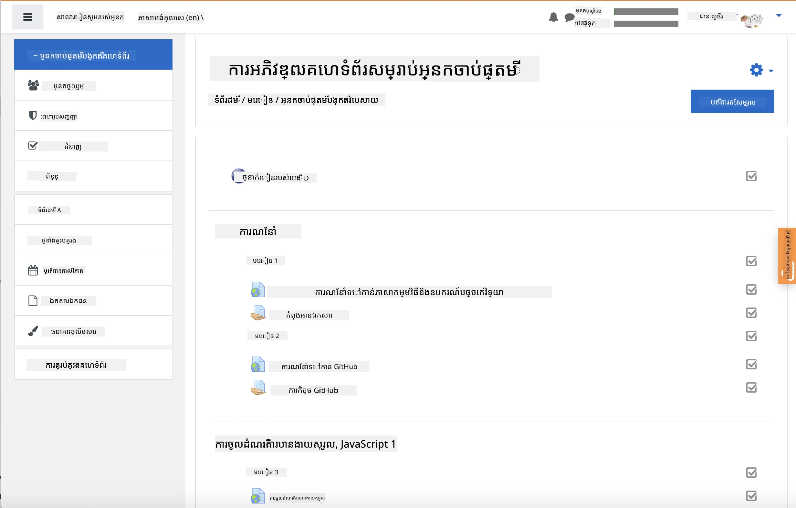
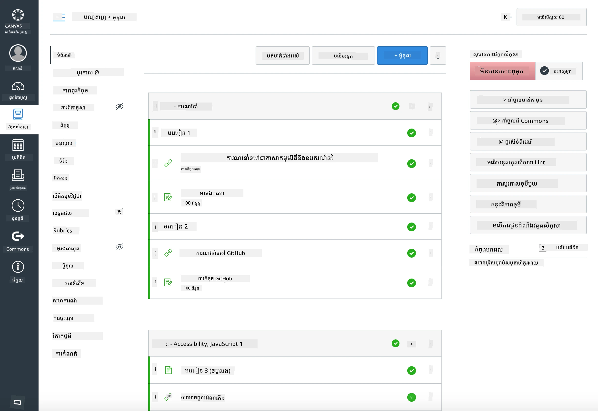

### សម្រាប់គ្រូបង្រៀន

អ្នកសូមស្វាគមន៍ក្នុងការប្រើប្រាស់វគ្គសិក្សានេះនៅក្នុងថ្នាក់រៀនរបស់អ្នក។ វាដំណើរការយ៉ាងរលូនជាមួយ GitHub Classroom និងវេទិកា LMS កំពូលផ្សេងៗ ហើយវាក៏អាចប្រើបានជារូបមន្តឯកជាច្រើនជាមួយសិស្សរបស់អ្នកផងដែរ។

### ប្រើជាមួយ GitHub Classroom

ដើម្បីគ្រប់គ្រងមេរៀន និងភារកិច្ចក្នុងមួយក្រុម សូមបង្កើត repository មួយសម្រាប់មេរៀនមួយ ដូច្នេះ GitHub Classroom អាចភ្ជាប់ភារកិច្ចនីមួយៗដោយឯករាជ្យបាន។

- Fork repo នេះទៅអង្គការរបស់អ្នក។
- បង្កើត repo ផ្សេងសម្រាប់មេរៀននីមួយៗ ដោយដកFolder មេរៀននីមួយៗទៅក្នុង repository ផ្ទាល់ខ្លួន។
  - ជម្រើស A: បង្កើត repo ទទេ(មួយសម្រាប់មេរៀនមួយ) ហើយចម្លងខ្លឹមសារនៃ Folder មេរៀនចូលក្នុង repo ទាំងនោះ។
  - ជម្រើស B: ប្រើវិធីថតប្រវត្តិ Git ហើយរក្សាទុកប្រវត្តិ (ឧ. បំបែក Folder មួយទៅ repo ថ្មី) ប្រសិនបើអ្នកត្រូវការតាមដានប្រព័ន្ធប្រវត្តិ។
- នៅក្នុង GitHub Classroom បង្កើតភារកិច្ចមួយសម្រាប់មេរៀននីមួយៗ ហើយដាក់ទិសតាម repo មេរៀននោះ។
- ការកំណត់ដែលបានណែនាំ៖
  - មើលឃើញ Repository: ឯកជនសម្រាប់ការងារសិស្ស។
  - ប្រើកូដចាប់ផ្តើមពីសាខាបណ្តាញផ្ទាល់ខ្លួននៃ repo មេរៀន។
  - បន្ថែមគំរូបញ្ហា និង pull request សម្រាប់វិញ្ញាសា និងការដាក់ស្នើ។
  - ប្រសិនបើមាន អ្នកអាចកំណត់ autograding និងការធ្វើតេស្ត។
- ការប្រើប្រាស់ដែលជួយដូចជា៖
  - ឈ្មោះ repo ដូចជា lesson-01-intro, lesson-02-html និងផ្សេងទៀត។
  - ស្លាប: quiz, assignment, needs-review, late, resubmission។
  - Tag/releases ក្នុងមួយក្រុម (ឧ. v2025-term1)។

 យោបល់៖ ជៀសវាងរក្សាទុក repository នៅក្នុង Folder ដែលសមកាលកម្ម (ឧ. OneDrive/Google Drive) ដើម្បីចៀសវាងការប៉ះទង្គិច Git នៅលើ Windows។

### ប្រើជាមួយ Moodle, Canvas, ឬ Blackboard

វគ្គសិក្សានេះមានកញ្ចប់ផ្ទុកបានសម្រាប់ក្របខ័ណ្ឌ LMS ពេញនិយម។

- Moodle៖ ប្រើឯកសារ upload Moodle [Moodle upload file](../../../../../../../teaching-files/webdev-moodle.mbz) ដើម្បីបញ្ចូលវគ្គពេញលេញ។
- Common Cartridge៖ ប្រើឯកសារ Common Cartridge [Common Cartridge file](../../../../../../../teaching-files/webdev-common-cartridge.imscc) សម្រាប់ភាពតម្រុយដែលសាកសមជាងនេះសម្រាប់ LMS ជាច្រើន។
- កំណត់ចំណាំ៖
  - Moodle Cloud មានការគាំទ្ររបស់ Common Cartridge មិនច្រើន។ ចូលចិត្តឯកសារ Moodle ខាងលើ ដែលអាចបញ្ចូលទៅ Canvas ផងដែរ។
  - បន្ទាប់ពីនាំចូល ត្រួតពិនិត្យម៉ូឌុល កាលបរិច្ឆេទ និងការកំណត់ quiz ដើម្បីឲ្យសមស្របជាមួយកាលវិភាគរបស់អ្នក។

> វគ្គសិក្សាក្នុងថ្នាក់រៀន Moodle

> វគ្គសិក្សាក្នុង Canvas

### ប្រើ repo ដោយផ្ទាល់ (គ្មាន Classroom)

ប្រសិនបើអ្នកមិនចង់ប្រើ GitHub Classroom អ្នកអាចដំណើរការពេលវេលាដោយផ្ទាល់ដបទពាណ repo នេះបាន។

- រូបមន្តវេបសាយ/នៅតាមអនឡាញ (Zoom/Teams)៖
  - បើកវគ្គហ្វឹកហាត់ខ្លីៗដែលមានអ្នកណែនាំ; ប្រើបន្ទប់បំបែកសម្រាប់វិញ្ញាសា។
  - ប្រកាសពេលវេលាសម្រាប់វិញ្ញាសា; សិស្សដាក់ចម្លើយជា GitHub Issues។
  - សម្រាប់ភារកិច្ចរួមគ្នា សិស្សធ្វើការនៅ repo មេរៀនសាធារណៈ ហើយបើក pull requests។
- វិធីឯកជន/មិនទំនាក់ទំនងស្របពេល៖
  - សិស្ស fork មេរៀននីមួយៗទៅ repo ផ្ទាល់ខ្លួន **ឯកជន** ហើយបន្ថែមអ្នកជាអ្នករួមការ។
  - ពួកគេដាក់ស្នើតាម Issues (វិញ្ញាសា) និង Pull Requests (ភារកិច្ច) នៅ repo ថ្នាក់របស់អ្នក ឬ repo ភាគីផ្សេងផ្ទាល់ខ្លួន។

### បច្ចេកទេសល្អបំផុត

- ផ្តល់មេរៀនបណ្តុះបណ្តាលពី Git/GitHub មូលដ្ឋាន, Issues, និង PRs។
- ប្រើបញ្ជីត្រួតពិនិត្យក្នុង Issues សម្រាប់វិញ្ញាសា/ភារកិច្ចប្រើជាច្រើនជំហាន។
- បន្ថែម CONTRIBUTING.md និង CODE_OF_CONDUCT.md ដើម្បីកំណត់ច្បាប់ថ្នាក់រៀន។
- បន្ថែមកំណត់ចំណាំសម្រាប់ការចូលប្រើ (alt text, តំណល់) ហើយផ្តល់ឯកសារ PDF ដែលអាចបោះពុម្ពបាន។
- កំណត់កំណែខ្លឹមសាររបស់អ្នកប្រកបជាមួយឋានៈ និងចាក់សោរនៅ repo មេរៀនបន្ទាប់ពីផ្សព្វផ្សាយ។

### មតិយោបល់ និងជំនួយ

យើងចង់ឲ្យវគ្គសិក្សានេះដំណើរការសម្រាប់អ្នក និងសិស្សរបស់អ្នក។ សូមបើក Issue ថ្មីនៅក្នុង repository នេះសម្រាប់កំហុស ពាក្យស្នើសុំ ឬការកែលម្អ ឬចាប់ផ្តើមការពិភាក្សានៅ Teacher Corner។

---

<!-- CO-OP TRANSLATOR DISCLAIMER START -->
**ការបដិសេធ**៖
ឯកសារនេះត្រូវបានបកប្រែដោយប្រើសេវាកម្មបកប្រែ AI [Co-op Translator](https://github.com/Azure/co-op-translator)។ នៅពេលដែលយើងខិតខំរកភាពត្រឹមត្រូវ សូមជ្រាបថាការបកប្រែដោយស្វ័យប្រវត្តិអាចមានកំហុស ឬការខុសគ្នាផ្សេងៗ។ ឯកសារដើមក្នុងភាសាមាតុភូមិគួរត្រូវបានគេចាត់ទុកជាអ្នកផ្តល់ព័ត៌មានដែលទំនុកចិត្ត។ សម្រាប់ព័ត៌មានសំខាន់ៗ ការបកប្រែដោយមនុស្សអ្នកជំនាញត្រូវបានផ្តល់អនុសាសន៍។ យើងមិនទទួលខុសត្រូវចំពោះការយល់ព្រមខុស ឬការ​បកស្រាយខុសៗណាមួយដែលកើតឡើងពីការប្រើប្រាស់ការបកប្រែនេះទេ។
<!-- CO-OP TRANSLATOR DISCLAIMER END -->