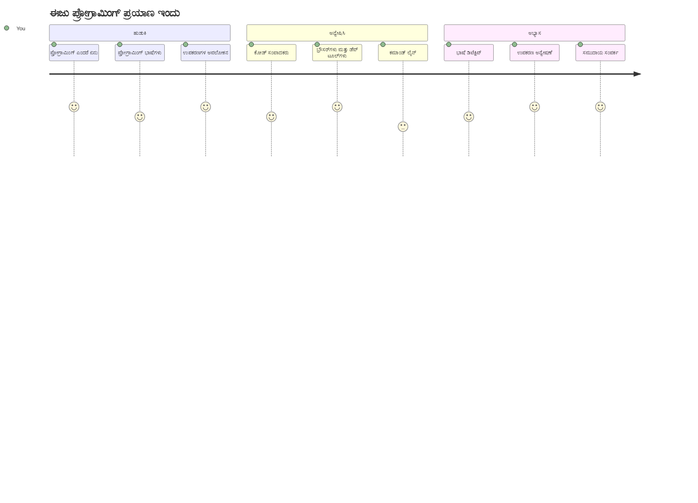
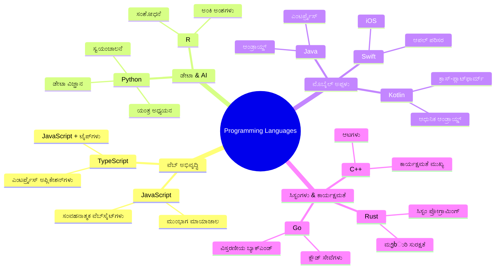
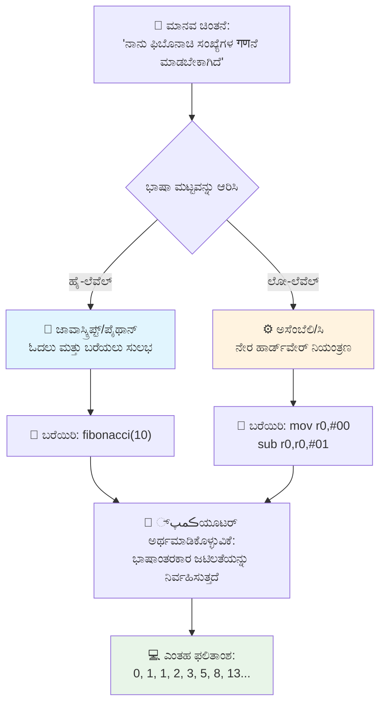
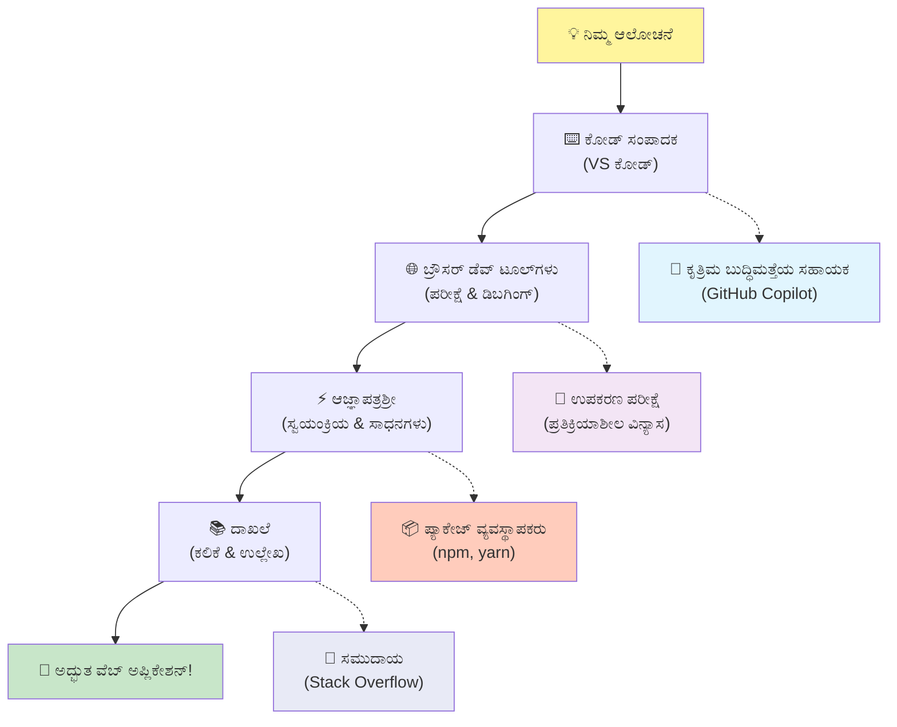
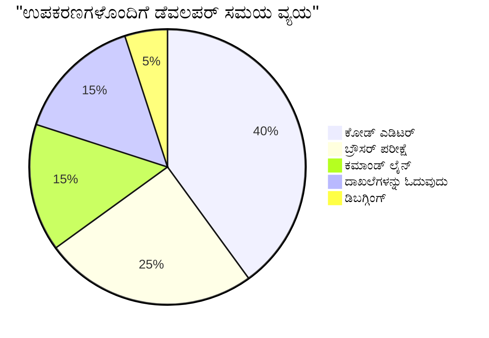
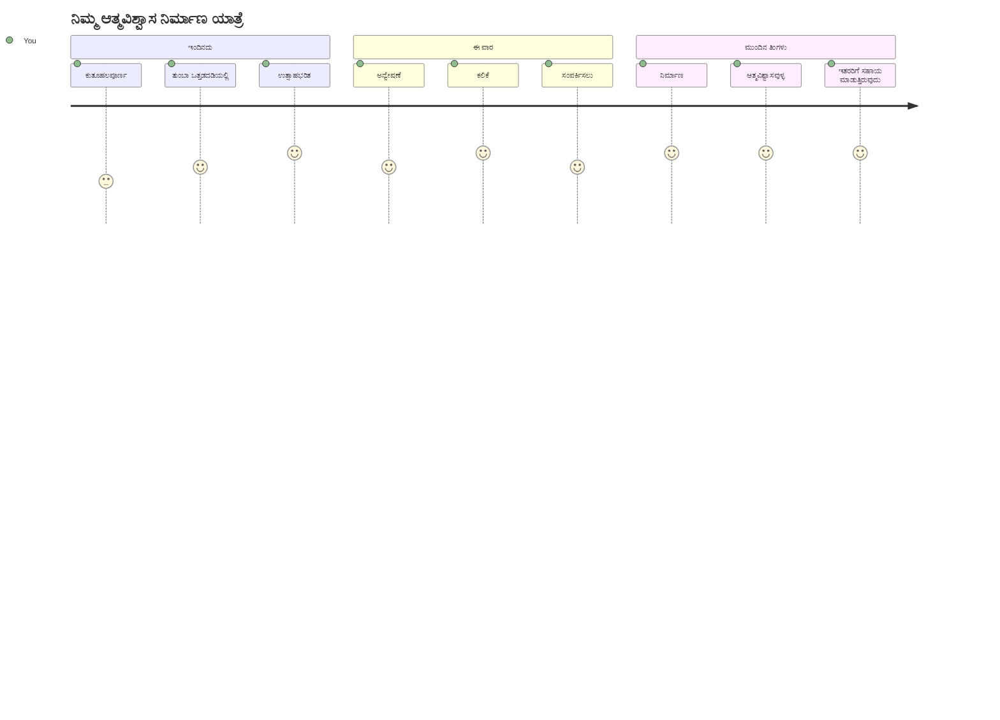

<!--
CO_OP_TRANSLATOR_METADATA:
{
  "original_hash": "d45ddcc54eb9232a76d08328b09d792e",
  "translation_date": "2026-01-08T20:15:54+00:00",
  "source_file": "1-getting-started-lessons/1-intro-to-programming-languages/README.md",
  "language_code": "kn"
}
-->
# ಪ್ರೋಗ್ರಾಮಿಂಗ್ ಭಾಷೆಗಳು ಮತ್ತು ಆಧುನಿಕ ಡೆವಲಪರ್ ಟೂಲ್ಗಳ ಪರಿಚಯ

ನಮಸ್ಕಾರ ಭವಿಷ್ಯದ ಡೆವಲಪರ್! 👋 ನಾನು ನಿಮಗೆ ಪ್ರತಿದಿನವೂ ಭಯಂಕರ ಅನುಭವ ನೀಡುವ ಏನಾದರು ಹೇಳಬಹುದೇ? ನೀವು ಪ್ರೋಗ್ರಾಮಿಂಗ್ ಅನ್ನು ಕೇವಲ ಕಂಪ್ಯೂಟರ್ ಗಳ ಕುರಿತು ಎನ್ನುವುದಿಲ್ಲ ಎಂಬುದನ್ನು ತಲುಪಲಿದ್ದೀರಿ – ಇದು ನಿಮ್ಮ ಅತೀ ವಿಚಿತ್ರ ಕಲ್ಪನೆಗಳನ್ನು ಜೀವಕ್ಕೆ ತರುವ ಸ್ಫೂರ್ತಿದಾಯಕ ಶಕ್ತಿಗಳನ್ನು ಹೊಂದಿರುವದಾಗಿದೆ!

ನೀವು ನಿಮ್ಮ ಅಭಿಮಾನಿ ಆಪ್ ಬಳಸುವಾಗ ಎಲ್ಲವೂ ಸುಂದರವಾಗಿ ಸರಿಹೊಂದುವ ಕ್ಷಣವನ್ನು ತಿಳಿದಿರಬಹುದೆ? ನೀವು ಒಂದು ಬಟನ್ ಒತ್ತಿದಾಗ ಎಲ್ಲವೂ ಮೆಜಿಕಲ್ ಆಗಿ ಹೋಗುತ್ತದೆ ಮತ್ತು ನೀವು "ಅಯ್ಯೋ, ಅವರು ಅದನ್ನು ಹೇಗೆ ಮಾಡಿದ್ರು?" ಎಂದು ಯೋಚಿಸುತ್ತೀರಿ? ಅದನ್ನು ಸೃಷ್ಟಿಸಿದ ಕೋಡ್ ಅನ್ನು ಬರೆಯುವವರು ನಿಮ್ಮಂತೆಯೇ ಯಾರು – ಬಹುಶಃ ರಾತ್ರಿಯ 2 ಗಂಟೆಗೆ ತಮ್ಮ ಮೆಚ್ಚಿನ ಕಾಫಿ ಶಾಪಿನಲ್ಲಿ ಮೂರನೆ ಎಸ್ಪ್ರೆಸ್ಸೋ ಜೊತೆ ಕೂತು ಅವರು. ಮತ್ತು ಇವತ್ತಿನ ಪಾಠದ ಅಂತ್ಯಕ್ಕೆ ನೀವು ಅಷ್ಟು ಕೇವಲ ಹೇಗೆ ಮಾಡಿದ್ರು ಎಂಬುದನ್ನು ಅರ್ಥಮಾಡಿಕೊಳ್ಳುವುದಷ್ಟಲ್ಲ, ನೀವು ಅದನ್ನು ಸ್ವತಃ ಪ್ರಯತ್ನಿಸಲು ಉತ್ಸುಕವಾಗುತ್ತೀರಿ!

ನನ್ನುತ್ತು ನೋಡು, ಪ್ರೋಗ್ರಾಮಿಂಗ್ ಈಗ ಭಯಂಕರ ಎಂದು ಕಾಣುತ್ತಿದೆಯೆಂದು ನಾನು ಸಂಪೂರ್ಣವಾಗಿ ಅರ್ಥಮಾಡಿಕೊಳ್ಳುತ್ತೇನೆ. ನಾನು ಪ್ರಾರಂಭಿಸಿದಾಗ, ನಾನು ನಿಜವಾಗಿಯೂ ಭಾವಿಸುತ್ತಿದ್ದೆನು ನೀವು ಗಣಿತ ತಜ್ಞರಾಗಿರಬೇಕು ಅಥವಾ ಐದು ವರ್ಷದಿಂದಲೆ ಕೋಡಿಂಗ್ ಮಾಡುತ್ತಿದ್ದಿರಬೇಕು ಎಂದು. ಆದರೆ ಇದು ನನ್ನ ದೃಷ್ಟಿಕೋನವನ್ನು ಸಂಪೂರ್ಣವಾಗಿ ಬದಲಾಯಿಸಿತು: ಪ್ರೋಗ್ರಾಮಿಂಗ್ ನೂತನ ಭಾಷೆಯಲ್ಲಿ ಸಂವಾದ ಕಲಿಯುವಂತೆ ಆಗಿದೆ. ನೀವು "ನಮಸ್ಕಾರ" ಮತ್ತು "ಧನ್ಯವಾದ" ಜೊತೆಗೆ ಪ್ರಾರಂಭಿಸುತ್ತೀರಿ, ನಂತರ ಕಾಫಿ ಆದೇಶಿಸುವುದಕ್ಕೆ ಬರುತ್ತೀರಿ ಮತ್ತು ಮೀರಿದಂತೆ ತತ್ತ್ವಶಾಸ್ತ್ರೀಯ ಚರ್ಚೆಗಳು ನಡೆಯುತ್ತವೆ! ಇಲ್ಲಿ ನೀವು ಕಂಪ್ಯೂಟರ್ ಗಳೊಂದಿಗೆ ಸಂವಾದ ಮಾಡುತ್ತೀರಿ ಮತ್ತು ನಿಜವಾಗಿಯೂ? ಇವರ ಸಂಧರ್ಭದಲ್ಲಿ ಅವರು ಅತ್ಯಂತ ತಾಳ್ಮೆಯ ಸಂವಹನದೊಡನೆ ಇರುತ್ತಾರೆ – ಎಂದಿಗೂ ನಿಮ್ಮ ತಪ್ಪುಗಳನ್ನು ತಿರಸ್ಕರಿಸುವುದಿಲ್ಲ ಮತ್ತು ಮತ್ತೆ ಪ್ರಯತ್ನಿಸಲು ಸದಾ ಸಜ್ಜಾಗಿರುತ್ತಾರೆ!

ಇಂದಿನ ದಿನದಲ್ಲಿ, ಆಧುನಿಕ ವೆಬ್ ಅಭಿವೃದ್ಧಿಯನ್ನು ಸಾಧ್ಯಗೊಳಿಸುವ ಅದ್ಭುತ ಸಾಧನಗಳ ಮೇಲೆ ನಾವು ಪ್ರಯಾಣ ಮಾಡುವೆವು. ನಾನು ನಿಮ್ಮ Netflix, Spotify ಮತ್ತು ನಿಮ್ಮ ಇಷ್ಟದ ಸ್ವತಂತ್ರ ಆಪ್ ಸ್ಟುಡಿಯೋದ ಡೆವಲಪರ್ ಗಳು ಪ್ರತಿದಿನ ಬಳಸುವ ಎಡಿಟರ್ ಗಳು, ಬ್ರೌಸರ ಗಳು ಮತ್ತು ವರ್ಕ್‌ಫ್ಲೋಗಳನ್ನು ತಿಳಿಸುತ್ತಿದ್ದೇನೆ. ಮತ್ತು ಇದು ನಿಮಗೆ ಸಂತೋಷಕ್ಕಾಗುವ ಸಂಗತಿ: ಈ ಪರಿಣಿತಿ-ತರಗತಿಯ, ಉದ್ಯಮ-ಮಟ್ಟದ ಬಹುಮತ ಸಾಧನಗಳು ಬಹುಶಃ ಸಂಪೂರ್ಣ ಉಚಿತವಾಗಿವೆ!


> ಟೊಮೊಮಿ ಇಮುರಾ ಅವರ ಸ್ಕೆಚ್ ನೋಟ್ [Tomomi Imura](https://twitter.com/girlie_mac)


## ನೀವು ಈಗಾಗಲೇ ಏನು ತಿಳಿದಿದ್ದೀರಾ ನೋಡೋಣ!

ರಸ ಹೆಚ್ಚಿಸುವ ಮೊದಲು, ನಾನು ಕುತೂಹಲಗೊಂಡಿದ್ದೇನೆ – ಈ ಪ್ರೋಗ್ರಾಮಿಂಗ್ ಲೋಕದ ಬಗ್ಗೆ ನೀವು ಈಗಾಗಲೇ ಏನು ತಿಳಿದಿದ್ದೀರಿ? ಮತ್ತು ಕೇಳಿ, ನೀವು ಈ ಪ್ರಶ್ನೆಗಳನ್ನು ನೋಡುತ್ತಿರುವಾಗ "ನನಗೆ ಇದರ ಬಗ್ಗೆ ಸಂಪೂರ್ಣ ಗುಡುಗಾಬುದು ಇಲ್ಲ"ಂದು ಭಾವಿಸಿದರೆ, ಅದು ಕೇವಲ ಸರಿ ಅಲ್ಲ, ಅದ್ಭುತವಾಗಿದೆ! ಅಂದರೆ ನೀವು ಹೊಸದಾಗಿ ಸರಿಯಾದ ಜಾಗದಲ್ಲಿದ್ದೀರಿ. ಇದನ್ನು ವ್ಯಾಯಾಮಕ್ಕೆ ಮುನ್ನ ಸ್ಟ್ರೆಚ್ ಮಾಡುವಂತೆ ಪರಿಗಣಿಸಿ – ನಾವು ನಮ್ಮ ಮೆದುಳಿನ ಸ್ನಾಯುಗಳನ್ನು ಬೆಂಕಿಯಾಗಿಸುತ್ತಿದ್ದೇವೆ!

[ಪೂರ್ವಪಾಠ ಪ್ರಶ್ನೋತ್ತರ ತೆಗೆದುಕೊಳ್ಳಿ](https://forms.office.com/r/dru4TE0U9n?origin=lprLink)


## ನಾವು ಒಂದಿಗೆ ಹೋಗಲಿರುವ ಸಾಹಸ

ಒಳ್ಳೆಯದು, ನಾನು ನಿಜವಾಗಿಯೂ ಇವತ್ತಿನ ಏನು ವಿಚಾರಿಸೋಣ ಎಂಬ ವಿಷಯಕ್ಕಾಗಿ ಕುತೂಹಲದಿಂದ ಕಬಳಿ ಕುಳಿತಿದ್ದೇನೆ! ಗೆಳೆಯರೇ, ನಾನು ಇವುಗಳಲ್ಲಿ ಕೆಲವು ಜನುಕರಿಸುವಾಗ ನಿಮ್ಮ ಮುಖವನ್ನು ನೋಡಬಹುದಂತಿದೆ. ನಾವು ಒಂದಾಗಿ ಹೋಗುತ್ತಿರುವ ಅದ್ಭುತ ಸಾಹಸ:

- **ಪ್ರೋಗ್ರಾಮಿಂಗ್ ಎಂದರೆ ನಿಜವಾದ ಮಹಿಮೆ ಏನು (ಮತ್ತು ಅದೀಗ ಅತ್ಯಂತ ಅದ್ಭುತ ವಿಷಯ!)** – ಕೋಡ್ ನಿಮ್ಮ ಸುತ್ತಲಿನ ಎಲ್ಲವನ್ನೂ invisibly ಚಲಾಯಿಸುವ ಅದ್ಭುತ ಮಾಯಾಜಾಲವಾಗಿದೆ ಹೇಗೆ ಎಂಬುದನ್ನು ನಾವು ಕಂಡುಹಿಡಿಯೋಣ; ಸೋಮವಾರ ಬೆಳಿಗ್ಗೆ ಗೊತ್ತಿರುವ ಆ ಎಚ್ಚರಿಕೆ ಗಾಡಿ ಇಂದ, ನಿಮ್ಮ Netflix ಶಿಫಾರಸುಗಳನ್ನು ಸರಿಯಾಗಿ ಕ್ಯೂರೆಟ್ ಮಾಡುವ ಆಲ್ಗಾರಿತ್ಮ್ ತನಕ
- **ಪ್ರೋಗ್ರಾಮಿಂಗ್ ಭಾಷೆಗಳು ಮತ್ತು ಅವುಗಳ ಅದ್ಭುತ ವೈಶಿಷ್ಟ್ಯಗಳು** – ಪ್ರತಿಯೊಬ್ಬ ವ್ಯಕ್ತಿಗೆ ಸಂಪೂರ್ಣ ವಿಭಿನ್ನ ಶಕ್ತಿಗಳು ಮತ್ತು ಸಮಸ್ಯೆ ಪರಿಹಾರ ರೀತಿಗಳು ಇರುವ ಒಂದು ಪಕ್ಷವೊಂದಕ್ಕೆ ನೀವು ಹೋಗುತ್ತಿರುವಂತೆ ಕಲ್ಪಿಸಿ. ಅದೇ ಪ್ರೋಗ್ರಾಮಿಂಗ್ ಭಾಷೆಗಳ ಜಗತ್ತು, ಮತ್ತು ನೀವು ಅವುಗಳನ್ನು ಭೇಟಿಯಾಗಲು ಇಷ್ಟಪಡುತ್ತೀರಿ!
- **ಡಿಜಿಟಲ್ ಮಾಯಾಜಾಲ ಉಂಟುಮಾಡುವ ಮೂಲಭೂತ ಕಟ್ಟಿಕೋಣೆಗಳು** – ಇವು ಅಂತಿಮ ಸೃಜನಾತ್ಮಕ LEGO ಸೆಟ್ ಗಳಂತೆ ಶಕ್ತಿವಂತವಾಗಿವೆ. ನೀವು ಈ ತುಂಡುಗಳು ಹೇಗೆ ಸರಿಹೊಂದುತ್ತವೆ ಅರ್ಥಮಾಡಿಕೊಳ್ಳುವಾದರೆ, ನಿಮ್ಮ ಕಲ್ಪನೆಯು ಹುಟ್ಟಿಸುವ ಏನನ್ನಾದರೂ ನಿರ್ಮಿಸಬಹುದು!
- **ಆದರ್ಶ ಸಾಧನಗಳು ಅವರು ಮಾಯಾಜಾಲಿಯ ಕುತ್ತಿಗೆಗೆ ಲ್ಯಾಂಪ್ ಹತ್ತಿಸುವಂತಾಗಿಸುವ ಸಾಧನಗಳು** – ನಾನು ನಾಟಕವಾಡುತ್ತಿಲ್ಲ – ಈ ಸಾಧನಗಳು ನಿಜವಾಗಿಯೂ ನಿಮಗೆ ಅತೀ ಶಕ್ತಿಗಳಂತಗೊಳಿಸುವವು, ಮತ್ತು ಅತ್ಯುತ್ತಮ ಭಾಗವೇನುಂದು ಕೇಳಿ? ಅವರು ಸೋ ಪ್ರೋಡ್ಯೂಸರ್ ಗಳಷ್ಟೇ ಉಪಯೋಗಿಸುತ್ತಾರೆ!

> 💡 **ಈ ಮಾತನ್ನು ತಿಳಿದುಕೊಳ್ಳಿ**: ಇಂದಿನ ಪಾಠದಲ್ಲಿ ಎಲ್ಲವನ್ನು ನೆನಪಿಟ್ಟುಕೊಳ್ಳಲು ಯತ್ನಿಸಬೇಡಿ! ಇತನಕ, ನಾನು ನಿಮಗೆ ಸಾಧ್ಯತೆಯ ಬಗ್ಗೆ ಆ ಉತ್ಸವದ ಸ್ಪಾರ್ಕ್ ಅನ್ನು ಮಾತ್ರ ಅನುಭವಿಸಲು ಬಯಸುತ್ತೇನೆ. ವಿವರಗಳು ಸಹಜವಾಗಿ ನಮ್ಮ ಅಭ್ಯಾಸದ ಒಟ್ಟಿನಲ್ಲಿ ನೆನಪಿಗೆ ಬರುತ್ತವೆ – ಅದೆಯೇ ನಿಜವಾದ ಕಲಿಕೆ!

> ನೀವು ಈ ಪಾಠವನ್ನು [Microsoft Learn](https://docs.microsoft.com/learn/modules/web-development-101/introduction-programming/?WT.mc_id=academic-77807-sagibbon) ನಲ್ಲಿ ತೆಗೆದುಕೊಳ್ಳಬಹುದು!

## ಹಾಗಾದರೆ ಪ್ರೋಗ್ರಾಮಿಂಗ್ ಎಂದರೆ ಆಟವೇನು?

ಚನ್ನಾಗಿ, ಲಕ್ಷಾಂತರ ಡಾಲರ್ ಪ್ರಶ್ನೆಯನ್ನು ನಿಭಾಯಿಸೋಣ: ಪ್ರೋಗ್ರಾಮಿಂಗ್ ಎಂದರೆ ನಿಜವಾಗಿಯೂ ಏನು?

ನಾನು ನನ್ನ ಚಿಂತನೆ ಬದಲಾಯಿಸಿದ್ದ ಕಥೆಯನ್ನು ಹೇಳುತ್ತೇನೆ. ಕಳೆದ ವಾರ, ನಾನು ನನ್ನ ತಾಯಿಗೆ ಹೊಸ ಸ್ಮಾರ್ಟ್ ಟಿವಿ ರಿಮೋಟ್ ಬಳಸುವುದು ಹೇಗೆ ಎಂದು ವಿವರಿಸಲು ಯತ್ನಿಸುತ್ತಿದ್ದೆ. ನಾನು "ಕೆಂಪು ಬಟನ್ ಒತ್ತಿ, ಆದರೆ ದೊಡ್ಡ ಕೆಂಪು ಬಟನ್ ಅಲ್ಲ, ಎಡ ಬದಿಯ ಚಿಕ್ಕ ಕೆಂಪು ಬಟನ್... ಅಲ್ಲ, ನಿಮ್ಮ ಮತ್ತೊಂದು ಎಡ..." ಎಂಬುದನ್ನು ಹೇಳುತ್ತಿರೋಡೆ ಕಂಡೆ. ಸರಿಹೊಂದುತ್ತದೆ? 😅

ಅದೇ ಪ್ರೋಗ್ರಾಮಿಂಗ್! ಅದು ಬಹುಶಕ್ತಿಶಾಲಿಯಾದುದಾದರೂ ಎಲ್ಲವನ್ನೂ ಸ್ಪಷ್ಟವಾಗಿ ಸೂಚಿಸುವ ಕಲೆಯಾಗಿದೆ. ನೀವೀಗ ನಿಮ್ಮ ತಾಯಿಗೆ ವಿವರಿಸುತ್ತಿದ್ದೀರಿ (ಅವರು ಕೇಳಬಹುದು "ಯಾವ ಕೆಂಪು ಬಟನ್?"), ಆದರೆ ಖಂಡಿತವಾಗಿಯೂ ನೀವು ಕಂಪ್ಯೂಟರ್ ಗೆ ವಿವರಿಸುತ್ತಿದ್ದೀರಿ (ಅದು ನೀವು ಹೇಳಿದ ಪ್ರತಿಯೊಂದನ್ನು ನಿಖರವಾಗಿ ಮಾಡುತ್ತದೆ, ನೀವು ಅರ್ಥಮಾಡಿಕೊಂಡದ್ದಲ್ಲದೇ ಇದ್ದರೂ).

ನನಗೆ ಭಾವನೆ ತರುವುದು ಈ ಪಾಠವನ್ನು ಪ್ರಥಮ ಬಾರಿಗೆ ಕಲಿತಾಗ: ಕಂಪ್ಯೂಟರ್ ಗಳು ಮೂಲಭೂತವಾಗಿ ಅತೀವ ಸರಳ. ಅವು ಕೇವಲ ಎರಡು ಅರ್ಥಗಳನ್ನು ಮಾತ್ರ ಅರ್ಥಮಾಡಿಕೊಳ್ಳುತ್ತವೆ – 1 ಮತ್ತು 0, ಅಥವಾ "ಹೌದು" ಮತ್ತು "ಇಲ್ಲ" ಎಂದರೆ "on" ಮತ್ತು "off". ಅಷ್ಟೇ! ಆದರೆ ಅದ್ಭುತ ಸಂಗತಿ ಇಲ್ಲಿ: ನಾವು 1 ಹಾಗೂ 0 ಗಳಲ್ಲಿ ಮಾತಾಡಬೇಕಾಗಿಲ್ಲ. ಅಲ್ಲಿ **ಪ್ರೋಗ್ರಾಮಿಂಗ್ ಭಾಷೆಗಳ** ಮಹತ್ವ ಬರುತ್ತದೆ. ಇವು ನಿಮಗೆ ಅರ್ಥವಾಗುವ ಮಾನವ ಭಾಶುರದ ವಿವರಣೆಯನ್ನು ಕಂಪ್ಯೂಟರ್ ಭಾಷೆಗೆ ಪರಿವರ್ತಿಸುವ ಅತ್ಯುತ್ತಮ ಅನುವಾದಕರಂತೆ.

ಹಾಗೆ, ಪ್ರತಿ ದಿನ ಬೆಳಳಿಗೆ ಎದ್ದು ನಾನು ನಿಜವಾದ ತುಂಬಿ ಹೊಡೆದಂತಿರುವುದು ಏನೆಂದರೆ: ನಿಮ್ಮ ಡಿಜಿಟಲ್ ಜೀವನದಲ್ಲಿ ಎಲ್ಲಾ ಹೋರಾಟಗಳು ಯಾರು ಇದ್ದರು? ತಪ್ಪದೇ ನಿಮ್ಮಂತೆಯೆ ಯಾರೊಬ್ಬರು, ಬಹುಶಃ ಪಾಜಾಮಾಗಳಲ್ಲಿ ಕುಳಿತಿರುವ, ಕಾಫಿ ಕುಡಿಯುವ, ತಮ್ಮ ಲ್ಯಾಪ್‌ಟಾಪ್ ನಲ್ಲಿ ಕೋಡ್ ಬರೆಯುವ ವ್ಯಕ್ತಿಯೊಬ್ಬರು. ನೀವು ನಿರೂಪಿಸುವ ಆ Instagram ಫಿಲ್ಟರ್? ಯಾರೋ ಅದನ್ನು ಕೋಡ್ ಮಾಡಿದ್ದರು. ನಿಮಗೆ ಹೊಸ ಪ್ರೀತಿಯ ಹಾಡಿಗೆ ಮಾರ್ಗದರ್ಶನ ಮಾಡಿದ ಆಲ್ಗಾರಿತ್ಮ್? ಡೆವಲಪರ್ ಅದನ್ನು ಬರೆದಿದ್ದಾನೆ. ಸ್ನೇಹಿತರೊಂದಿಗೆ ಊಟದ ಬಿಲ್ ಹಂಚಿಕೊಳ್ಳಲು ಇರುವ ಆ ಆಪ್? ಹೌದು, ಯಾರೋ "ಇದು ತುಂಬಾ ಬೇಸರ, ನಾನು ಇದನ್ನು ಸರಿಪಡಿಸಬಹುದೇ?" ಎಂದು ಯೋಚಿಸಿ... ಹಾಗೆ ಮಾಡಿದ್ದಾರೆ!

ನೀವು ಪ್ರೋಗ್ರಾಮಿಂಗ್ ಕಲಿತಂತೆ, ನೀವು ಕೇವಲ ಹೊಸ ಕೌಶಲ್ಯವನ್ನು ಪಡೆಯುವುದಿಲ್ಲ – ನೀವು ಸಮಸ್ಯೆ ಪರಿಹಾರಕರ ಅದ್ಭುತ ಸಮುದಾಯದ ಭಾಗವಾಗುತ್ತಿದ್ದೀರಿ, ಅವರು "ಒಬ್ಬರ ದಿನವನ್ನು ಸ್ವಲ್ಪ ಹಬ್ಬಿಸಿ ಮಾಡುವುದಾದರೆ ನಾನು ಏನನ್ನಾದರೂ ನಿರ್ಮಿಸಬಹುದೇಕೆ?" ಎಂಬ ಆಲೋಚನೆಯಲ್ಲಿ ದಿನವನ್ನನುಗೊಳ್ಳುತ್ತಾರೆ. ನಿಜವಾಗಿಯೂ, ಇದಕ್ಕಿಂತ ಒಳ್ಳೆಯದುವೇನಿದೆ?

✅ **ಆನಂದಕಾರಿಯಾದ ವಿಚಾರ ಹುಡುಕಿ**: ನಿಮ್ಮ ಕೈ ಮುಕ್ತ ಸಮಯದಲ್ಲಿ ಹುಡುಕಿ ನೋಡಬೇಕಾದ ಒಂದು ಅದ್ಭುತ ಸಂಗತಿ – ಮೊದಲ ಜಗತ್ತಿನ ಕಂಪ್ಯೂಟರ್ ಪ್ರೋಗ್ರಾಮರ್ ಯಾರು? ಒಂದು ಅಂಕೆಗೆ – ನೀವು ಭಾವಿಸುತ್ತಿರುವವನು ಅಲ್ಲವೇಕೆ? ಆ ವ್ಯಕ್ತಿಯ ಕಥೆ ತುಂಬಾ ಆಕರ್ಷಕವಾಗಿದೆ ಮತ್ತು ಪ್ರೋಗ್ರಾಮಿಂಗ್ ಯಾವಾಗಲೂ ಸೃಜನಾತ್ಮಕ ಸಮಸ್ಯೆ ಪರಿಹಾರ ಮತ್ತು ವಿನೂತನ ಚಿಂತನೆಗಳ ಬಗ್ಗೆ ಇದೆಯೆಂದನ್ನು ತೋರಿಸುತ್ತದೆ.

### 🧠 **ಪರಿಶೀಲನೆ ಸಮಯ: ನೀವು ಹೇಗಿದ್ದೀರಾ?**

**ಒಂದು ಕ್ಷಣಕಾಲ reflexão ಮಾಡಿ:**
- "ಕಂಪ್ಯೂಟರ್ ಗಳು ಸೂಚನೆಗಳನ್ನು ಪಡೆಯುವ" ಕಲ್ಪನೆ ಈಗ ನಿಮಗೆ ಅರ್ಥವಾಗಿದೆಯೆ?
- ಪ್ರತಿ ದಿನದ ಕಾರ್ಯಗಳನ್ನು ನೀವು ಪ್ರೋಗ್ರಾಮಿಂಗ್ ಮೂಲಕ automate ಮಾಡಲು ಇಚ್ಛಿಸುವ ಏನಾದರೂ ಏನಿದೆ?
- ಈ ಪ್ರೋಗ್ರಾಮಿಂಗ್ ವಿಷಯದ ಬಗ್ಗೆ ನಿಮ್ಮ ಘನತೆಗಳಲ್ಲಿ ಏನೆಷ್ಟು ಪ್ರಶ್ನೆಗಳಿವೆ?

> **ಮಡದಿ**: ಕೆಲವು ಕಲ್ಪನೆಗಳು ಈಗಾಗಲೇ ಬಹಳ ಗುಲಾಬಿಯಾಗಿರುವುದು ಸಹಜ. ಪ್ರೋಗ್ರಾಮಿಂಗ್ ಕಲಿಕೆ ಹೊಸ ಭಾಷೆಯನ್ನು ಕಲಿಯುವುದಾಗಿದ್ದು, ನಿಮ್ಮ ಮೆದುಳಿಗೆ ಈ ಮಾರ್ಗಗಳನ್ನು ನಿರ್ಮಿಸುವ ಸಮಯ ಬೇಕಾಗುತ್ತದೆ. ನೀವು ತುಂಬಾ ಚೆನ್ನಾಗಿದ್ದೀರಿ!

## ಪ್ರೋಗ್ರಾಮಿಂಗ್ ಭಾಷೆಗಳು ಭಿನ್ನ ಭಿನ್ನ ಮಾಯಾಜಾಲದ ರುಚಿಗಳಂತಹುದು

ಚನ್ನಾಗಿ, ಇದು ವಿಚಿತ್ರವಾಗಿ ಕೇಳಿಸಬಹುದು, ಆದರೆ ನನ್ನ ಜೊತೆ ಇರಿ – ಪ್ರೋಗ್ರಾಮಿಂಗ್ ಭಾಷೆಗಳು ವಿಭಿನ್ನ ಸಂಗೀತ ಶैलಿಗಳಂತಹವು. ಧ್ವನಿಮನೆ: ನೀವು ಜ್ಯಾಜ್, ಸಾನ್, ರಾಕ್, ಮತ್ತು ಹಿಪ್-ಹಾಪ್ ಇವುಗಳು ಇದ್ದಂತೆ.

ಪ್ರತಿ ಶೈಲಿಗೆ ತನ್ನ ವೈಭಮ್ ಮತ್ತು ಅಭಿಮಾನಿಗಳ ಸಮುದಾಯವಿದೆ ಮತ್ತು ಪ್ರತಿ ಪಾರ್ಟಿಗೆ ತಕ್ಕಂತೆ ವಿಭಿನ್ನ.

ಸಂಗೀತದಂತೆ, ಪ್ರೋಗ್ರಾಮಿಂಗ್ ಭಾಷೆಗಳೂ ಹೀಗೆ ಕಾರ್ಯನಿರ್ವಹಿಸುತ್ತವೆ! ನೀವು ಸ್ವಲ್ಪ ಮನರಂಜನೆಯ ಮೊಬೈಲ್ ಗೇಮ್ ಗಾಗಿ JavaScript ಬಳಸಬಹುದು, ಕ್ಲೈಮೇಟ್ ಡೇಟಾವನ್ನು ದೊಡ್ಡ ಪ್ರಮಾಣದಲ್ಲಿ crunch ಮಾಡಲು Python ಬಳಸುತ್ತದೆ; ಹೀಗೆಯೇ ನೀವು ನನ್ನ ವಿಷಯವಾಗಿ ಡೆತ್ ಮೆಟಲ್ ಯೋಗ ಕ್ಲಾಸಿನಲ್ಲಿ ಬನ್ನದಂತೆ. (ಬಹುತೆಕ ಯೋಗ ದಿನಗಳಲ್ಲಿ!)

ಆದರೆ ಪ್ರತಿಸಾರಿ ಮನಸ್ಸಿಗೆ ಶಾಕ್ ನೀಡುವುದು: ಭಾಷೆಗಳು ನಿಮಗೆ ಅತ್ಯಂತ ಸಹಜವಾಗಿ ನಿಮ್ಮ ಆಲೋಚನೆಗಳನ್ನು ಹೇಳಲು ಅವಕಾಶ ಮಾಡಿಕೊಡುತ್ತವೆ ಹಾಗೂ ಅವು ತುಂಬಾ ಸಂಕೀರ್ಣವಾದ 1 ಮತ್ತು 0 ಗಳಿಗೆ ಅನುವಾದವನ್ನು ಮಾಡುತ್ತವೆ. ನಿಮ್ಮ ಪಕ್ಕದಲ್ಲಿ ಇದ್ದಂತಹ ಮಾದರಿತನದಿಂದ ಇಬ್ಬರನ್ನೂ ಮಾತನಾಡುವ ಗೆಳೆಯನಂತೆ – ಅವರು ಎಂದಿಗೂ ಕೈಬಿಡುವುದಿಲ್ಲ, ಕಾಫಿ ವಿರಾಮ ಕೊಂಡಿಲ್ಲ, ಒಂದೇ ಪ್ರಶ್ನೆಯನ್ನು ಎರಡು ಬಾರಿ ಕೇಳಿದರೂ ಮುಕ್ಕಾಲುಮಾಡುವುದಿಲ್ಲ!

### ಜನಪ್ರಿಯ ಪ್ರೋಗ್ರಾಮಿಂಗ್ ಭಾಷೆಗಳು ಮತ್ತು ಅವುಗಳ ಉಪಯೋಗಗಳು


| ಭಾಷೆ | ಉತ್ತಮ ಬಳಕೆ | ಯಾವ್ದಕ್ಕೆ ಜನಪ್ರಿಯವಾಗಿದ್ದು |
|----------|----------|------------------|
| **JavaScript** | ವೆಬ್ ಅಭಿವೃದ್ಧಿ, ಬಳಕೆದಾರ ಮುಖಪುಟಗಳು | ಬ್ರೌಸರ್ ಗಳಲ್ಲಿ ಚಲಿಸುತ್ತದೆ, ಇಂಟರಾಕ್ಟಿವ್ ವೆಬ್‌ಸೈಟ್ ಗಳನ್ನು ಶಕ್ತಿ ನಿಡುತ್ತದೆ |
| **Python** | ಡೇಟಾ ವಿಜ್ಞಾನ, ಸ್ವಯಂಚಾಲನೆ, ಏಐ | ಓದಲು ಸುಲಭ, ಬಹುಶಕ್ತಿಯ ಗ್ರಂಥಾಲಯಗಳು |
| **Java** | ಎಂಟರ್ಪ್ರೈಸ್ ಅಪ್ಲಿಕೇಶನ್ಗಳು, ಆಂಡ್ರಾಯ್ಡ್ ಆಪ್ಸ್ | ವೇದಿಕೆ-ಸ್ವತಂತ್ರ, ಬೃಹತ್ ವ್ಯವಸ್ಥೆಗಳಿಗೆ ದೃಢ |
| **C#** | ವಿಂಡೋಸ್ ಅಪ್ಲಿಕೇಶನ್ಗಳು, ಆಟ ಮಹಿಳತ್ವ | Microsoft ಪರಿಕಲ್ಪನೆ ಸಹಕಾರ |
| **Go** | ಕ್ಲೌಡ್ ಸರ್ವೀಸ್ ಗಳು, ಬ್ಯಾಕ್ಎಂಡ್ ವ್ಯವಸ್ಥೆಗಳು | ವೇಗವಾದ, ಸರಳ, ಆಧುನಿಕ ಗಣನೆಗೆ ವಿನ್ಯಾಸಗೊಳಿಸಲಾಗಿದೆ |

### ಹೈ-ಲೆವೆಲ್ vs ಲೋ-ಲೆವೆಲ್ ಭಾಷೆಗಳು

ಚನ್ನಾಗಿ, ಇದು ನಿಜವಾಗಿಯೂ ನನ್ನ ಮೆದುಳನ್ನು ಮುರಿದ ಕಲ್ಪನೆಯಾಗಿತ್ತು ಬರುತ್ತಿದ್ದಾಗ, ನಾನು ನನ್ನಿಗೆ ಅರ್ಥ ಮಾಡಿದ ಉಭಯತೆಯನ್ನು ಹಂಚಿಕೊಳ್ಳಲು ಬಯಸುತ್ತೇನೆ – ಮತ್ತು ಇದು ನಿಮಗೆ ಸಹ ಸಹಾಯ ಮಾಡುವುದಾಗಿ ನಾನು ಆಶಿಸುತ್ತೇನೆ!

ನೀವು ಉಳಿದಿನ್ಕೆ ಭಾಷೆ ಮಾತನಾಡದೇ ಇರುವ ದೇಶಕ್ಕೆ ಹೋಗಿದ್ದೀರಿ ಎಂದು ಕಲ್ಪಿಸಿ ಮತ್ತು ನೀವು ತುರ್ತಾಗಿ ಹತ್ತಿರದ ಬಾತ್ರೂಂ ಹುಡುಕಬೇಕಾಗಿದೆ (ನಾವು ಎಲ್ಲರೂ ಇಂತಹ ಅನುಭವಗಳಿವೆ, ಸರಿ? 😅):

- **ಲೋ-ಲೆವೆಲ್ ಪ್ರೋಗ್ರಾಮಿಂಗ್** ಅಂದರೆ ಅಲ್ಲಿ ಬೆಳೆದ ಹಿರಿಯರು ಮಾತನಾಡುವ ಭಾಷೆಯನ್ನು ಹಳೇ ಹಾದಿ ತಿಳಿದುಕೊಂಡು, ಅನುಭವದ ಅರ್ಥ, ಸ್ಥಳೀಯ ಸಂಸ್ಕೃತಿ ಮತ್ತು ಜೋಕ್ಸ್ ಬಳಸಿ ಅಮೂಲ್ಯ ಸಂವಾದ ಮಾಡುವಂತೆ. ಅದ್ಭುತ ಮತ್ತು ಅತೀ ಹೆಚ್ಚು ಪರಿಣಾಮಕಾರಿಯಾಗಿ... ನೀವು fluent ಆಗಿದ್ದರೆ! ಆದರೆ ನೀವು ಕೇವಲ ಬಾತ್ರೂಂ ಹುಡುಕಲು ಬಯಸುತ್ತಿರುವಾಗ ತುಂಬಾ ಅತಿಭಾರವಾಗಿರುತ್ತದೆ.

- **ಹೈ-ಲೆವೆಲ್ ಪ್ರೋಗ್ರಾಮಿಂಗ್** ಅದ್ಹೇಗೆ ಅದ್ಭುತ ಸ್ಥಳೀಯ ಗೆಳೆಯನಿರುವಂತೆ, ನೀವು ಸರಳ ಇಂಗ್ಲಿಷ್ ನಲ್ಲಿ "ನನಗೆ ಬಾತ್ರೂಂ ಬೇಕು" ಎಂದು ಹೇಳಬಹುದು ಮತ್ತು ಅವರು ಎಲ್ಲಾ ಸಂಸ್ಕೃತಿಕ ಅನುವಾದವನ್ನು ಮಾಡಿ ಸಮಯದಿಂದ ನೇರ, ಬುದ್ಧಿವಂತಿಕೆಯಿಂದ ಮಾರ್ಗದರ್ಶನ ನೀಡುತ್ತಾರೆ.

ಪ್ರೋಗ್ರಾಮಿಂಗ್ ನ ದೃಷ್ಟಿಕೋಣದಲ್ಲಿ:
- **ಲೋ-ಲೆವೆಲ್ ಭಾಷೆಗಳು** (ಅಸೆಂಬ್ಲಿ ಅಥವಾ C) ನಿಮಗೆ ಕಂಪ್ಯೂಟರ್ ನ actual hardware ಜೊತೆಗೆ ವಿವರವಾದ ಸಂವಾದ ಮಾಡಲು ಅವಕಾಶ ಮಾಡುತ್ತವೆ, ಆದರೆ ನಿಮ್ಮಂತೆ ಯಂತ್ರನಂತೆ ತೀರ್ಮಾನಿಸಬೇಕು, ಇದು ಒಂದು ದೊಡ್ಡ ಮಾನಸಿಕ ಬದಲಾವಣೆ!
- **ಹೈ-ಲೆವೆಲ್ ಭಾಷೆಗಳು** (JavaScript, Python, ಅಥವಾ C#) ನೀವು ಹ್ಯೂಮನಾಗಿ ಯೋಚಿಸುವಂತೆ ಮಾಡಿ, ಆ ಸಮಯದಲ್ಲಿ ಯಂತ್ರ ಭಾಷೆಯನ್ನು ಹಿಂಖಾಲಿನಲ್ಲಿ ನಿಭಾಯಿಸುತ್ತವೆ. ಜೊತೆಗೆ, ಇವು ಸಹಾನುಭೂತಿ ಹೊಂದಿದ ದೊಡ್ಡ ಸಮುದಾಯಗಳೊಡನೆ ಬರುತ್ತವೆ, ಇದು ಹೊಸವರಾಗಿ ಇದ್ದ ಅನುಭವವನ್ನು ನೆನಸಿ ಸಹಾಯ ಮಾಡಲು ಉತ್ತಮರು!

ನಾನು ಯಾವ ದಾರಿಯೊಂದಿಗೆ ನಿಮ್ಮನ್ನು ಪ್ರಾರಂಭಿಸಲು ಶಿಫಾರಸು ಮಾಡುತ್ತೇನೆ ಗೊತ್ತಾ? 😉 ಹೈ-ಲೆವೆಲ್ ಭಾಷೆಗಳು ತರಬೇತಿ ಚಕ್ರಗಳಂತಿವೆ, ನೀವು ಅವುಗಳನ್ನು ತೆಗೆದುಹಾಕಲು ಬಯಸದಿರಿ ಏಕೆಂದರೆ ಅವು ಒಟ್ಟಾರೆ ಅನುಭವವನ್ನು ಅತ್ಯಂತ ಸುಂದರ ಮಾಡಿಸುತ್ತವೆ!


### ನಾನ್ ನಿಮಗೆ ತೋರಿಸುತ್ತೇನೆ ಏಕೆ ಹೈ-ಲೆವೆಲ್ ಭಾಷೆಗಳು ತುಂಬಾ ಸ್ನೇಹಪರವಾಗಿವೆ

ಚನ್ನಾಗಿ, ನಾನು ನಿಮಗೆ ಹೈ-ಲೆವೆಲ್ ಭಾಷೆಗಳೊಂದಿಗೆ ಶಾಲಿತವಾದುದನ್ನು ತೋರಿಸುವೆ, ಆದರೆ ಮೊದಲು ಒಂದು ಮಾತು ಹೇಳಿ. ಮೊದಲ ಕೇಸ್ ಉದಾಹರಣೆಯನ್ನು ನೋಡಿದಾಗ ಪ್ಯಾನಿಕ್ ಆಗಬೇಡಿ! ಅದು ಭಯಂಕರವಾಗಿಯೇ ತೋರುತ್ತದೆ. ಅದೇ ನಾನು ಹೇಳಬೇಕಾದ ಮಹತ್ವ.

ನಾವು ಅದೇ ಕಾರ್ಯವನ್ನು ಎರಡು ವಿಭಿನ್ನ ಶೈಲಿಗಳಲ್ಲಿ ಬರೆಯಲಿದ್ದೇವೆ. ಎರಡೂ ಫಿಬೋನ್ಯಾಸಿ ಕ್ರಮವನ್ನು ಸೃಷ್ಟಿಸುತ್ತವೆ – ಇದು ಸುಂದರ ಗಣಿತೀಯ ಮಾದರಿಯಾಗಿದೆ, प्रत्येक ಸಂಖ್ಯೆ ಹಿಂದಿನ ಎರಡು ಸಂಖ್ಯೆಗಳ ಮೊತ್ತ: 0, 1, 1, 2, 3, 5, 8, 13... (ಆನಂದಕಾರಿ ವಿಚಾರ: ನೀವು ಈ ಮಾದರಿಯನ್ನು ಪ್ರಕೃತಿಯಲ್ಲಿ ಎಲ್ಲೆಡೆ ಕಂಡುಹಿಡಿಯುತ್ತೀರಿ – ಸೂರ್ಯಕಾಂತಿ ಸೀಡಿನ ಸಿಪ್ಪಣೆ, ಪೈನ್ ಕೊನೆ ಮಾದರಿ, ಗ್ಯಾಲಕ್ಸಿಗಳ ನಿರ್ಮಾಣವೂ!)

ವೈಭಿನ್ನ್ಯವನ್ನು ನೋಡೋಣವೇ?

**ಹೈ-ಲೆವೆಲ್ ಭಾಷೆ (JavaScript) – ಮಾನವ ಸ್ನೇಹಿ:**

```javascript
// ಹಂತ 1: ಮೂಲ ಫಿಬೋನಾಚಿ ವ್ಯವಸ್ಥೆ
const fibonacciCount = 10;
let current = 0;
let next = 1;

console.log('Fibonacci sequence:');
```

**ಈ ಕೋಡ್ ಮಾಡುವುದು ಏನು:**
- ನಿರ್ಧರಿಸಿ ಎಷ್ಟು ಫಿಬೋನ್ಯಾಸಿ ಸಂಖ್ಯೆಗಳು ಬೇಕು ಎಂಬುದನ್ನು
- ಎರಡು ವ್ಯತ್ಯಾಸಗಳನ್ನು ನಿರ್ಮಿಸಿ ಕ್ರಮದ ಪ್ರಸ್ತುತ ಮತ್ತು ಮುಂದಿನ ಸಂಖ್ಯೆಯನ್ನು ಟ್ರ್ಯಾಕ್ ಮಾಡಲು
- ಪ್ರಾರಂಭಿಕ ಮೌಲ್ಯಗಳನ್ನು (0 ಮತ್ತು 1) ಹೊಂದಿಸಿ, ಫಿಬೋನ್ಯಾಸಿ ಮಾದರಿ ರೂಪಿಸುವಂತೆ
- ನಮ್ಮ output ಗೆ ಹೆಡರ್ ಸಂದೇಶವನ್ನು ತೋರಿಸಿ

```javascript
// ಹಂತ 2: ಲೂಪ್‌ನೊಂದಿಗೆ ಕ್ರಮವನ್ನು ಉತ్పन्नಿಸಿ
for (let i = 0; i < fibonacciCount; i++) {
  console.log(`Position ${i + 1}: ${current}`);
  
  // ಕ್ರಮದಲ್ಲಿ ಮುಂದಿನ ಸಂಖ್ಯೆ ಗಣನೆ ಮಾಡಿ
  const sum = current + next;
  current = next;
  next = sum;
}
```

**ಇಲ್ಲಿ ಏನು ನಡೆಯುತ್ತಿದೆ:**
- `for` ಲೂಪ್ ನಿಂದ ಕ್ರಮದ ಎಲ್ಲಾ ಸ್ಥಾನಗಳಲ್ಲಿ ಸಂಚರಿಸಿ
- ಪ್ರತಿ ಸಂಖ್ಯೆಯನ್ನು ಅದರ ಸ್ಥಾನ ಜೊತೆಗೆ ಟೆಂಪ್ಲೇಟ್ ಲಿಟರಲ್ ಪ್ರಕಾರ ತೋರಿಸಿ
- ಪ್ರಸ್ತುತ ಮತ್ತು ಮುಂದಿನ ಮೌಲ್ಯಗಳನ್ನು ಸೇರಿಸಿ ಮುಂದಿನ ಫಿಬೋನ್ಯಾಸಿ ಸಂಖ್ಯೆಯನ್ನು ಲೆಕ್ಕಿಸಿ
- ನಮ್ಮ ಟ್ರ್ಯಾಕಿಂಗ್ ವ್ಯತ್ಯಾಸಗಳನ್ನು ಮುಂದಿನ ಸಂಚರಣೆಗೆ ವಿವರಿಸಿ

```javascript
// ಹಂತ 3: ಆಧುನಿಕ ಕಾರ್ಯಾತ್ಮಕ ವಾಗಿ
const generateFibonacci = (count) => {
  const sequence = [0, 1];
  
  for (let i = 2; i < count; i++) {
    sequence[i] = sequence[i - 1] + sequence[i - 2];
  }
  
  return sequence;
};

// ಬಳಕೆ ಉದಾಹರಣೆ
const fibSequence = generateFibonacci(10);
console.log(fibSequence);
```

**ಈ ಮೇಲಿನುದರಲ್ಲಿ:**
- ಆಧುನಿಕ ತುದಿ არაಡಿಗೆ ಕಾರ್ಯವನ್ನು ಸೃಷ್ಟಿಸಿದೆ
- ಸರಣಿಯನ್ನು ರೂಪಿಸಿತು ಮತ್ತು ಪೂರ್ಣ ಕ್ರಮವನ್ನು ಸಂಗ್ರಹಿಸಿತು, ತೋರಿಸುವ ಬದಲು
- ಪೂರ್ವದ ಮೌಲ್ಯಗಳಿಂದ ಪ್ರತಿ ಹೊಸ ಸಂಖ್ಯೆಯನ್ನು ಲೆಕ್ಕಿಸಲು ಸರಣಿ ಸೂಚಕ ಉಪಯೋಗಿಸಿತು
- ಕಾರ್ಯಕ್ರಮದ ಇತರ ಭಾಗಗಳಲ್ಲಿ ಉಪಯೋಗಿಸಲು ಪೂರ್ಣ ಕ್ರಮವನ್ನು ಮರುಪಡೆಯಿತು

**ಲೋ-ಲೆವೆಲ್ ಭಾಷೆ (ARM Assembly) – ಕಂಪ್ಯೂಟರ್ ಸ್ನೇಹಿ:**

```assembly
 area ascen,code,readonly
 entry
 code32
 adr r0,thumb+1
 bx r0
 code16
thumb
 mov r0,#00
 sub r0,r0,#01
 mov r1,#01
 mov r4,#10
 ldr r2,=0x40000000
back add r0,r1
 str r0,[r2]
 add r2,#04
 mov r3,r0
 mov r0,r1
 mov r1,r3
 sub r4,#01
 cmp r4,#00
 bne back
 end
```

JavaScript ನ ಆವೃತ್ತಿ ಇರುವಂತೆ ಇಂಗ್ಲಿಷ್ ಸೂಚನೆಗಳಂತೆ ಓದುತ್ತದೆ, ಅಸೆಂಬ್ಲಿ ಆವೃತ್ತಿ ನೇರವಾಗಿ ಕಂಪ್ಯೂಟರ್ ಪ್ರೊಸೆಸರ್ ಅನ್ನು ನಿಯಂತ್ರಿಸುವ ರಹಸ್ಯ ಆದೇಶಗಳನ್ನು ಬಳಸುತ್ತದೆ. ಎರಡೂ ಅದೇ ಕಾರ್ಯವನ್ನು ನೆರವೆರಿಸುತ್ತವೆ, ಆದರೆ ಹೈ-ಲೆವೆಲ್ ಭಾಷೆಮಾನವರಿಗಾಗಿ ಸರಳವಾಗಿ ಅರ್ಥಮಾಡಿಕೊಳ್ಳುವುದು, ಬರೆಯುವುದು ಮತ್ತು ನಿರ್ವಹಿಸುವುದು ಸುಲಭ.

**ನೀವು ಗಮನಿಸುವ ಪ್ರಮುಖ ವ್ಯತ್ಯಾಸಗಳು:**
- **ಓದುಗೊಳ್ಳುವ ಬಾಧ್ಯತೆ**: JavaScript ನಲ್ಲಿ `fibonacciCount` ಹಾಗು ಅರ್ಥವಂತಿತನದ ಹೆಸರುಗಳಿವೆ, ಅಸೆಂಬ್ಲಿ ಕೇವಲ `r0`, `r1` ರೀತಿಯ ಸಂಕ್ಷಿಪ್ತ ಲೇಬಲ್ ಗಳು ಇರುವವು
- **ವಿಚಾರಣೆಗಳು**: высокого ಪದಗಳಲ್ಲಿ ವಿವರಣಾತ್ಮಕ ಟಿಪ್ಪಣಿಗಳನ್ನು ಉತ್ತೇಜಿಸುತ್ತವೆ, ಇದು ಕೋಡ್ ಸ್ವಯಂ-ಡಾಕ್ಯುಮೆಂಟಿಂಗ್ ಆಗುತ್ತದೆ  
- **ರಚನೆ**: ಜಾವಾಸ್ಕ್ರಿಪ್ಟ್ನ ತರ್ಕದ ಹರಿವು ಜನರು ಸಮಸ್ಯೆಗಳನ್ನು ಹಂತ ಹಂತವಾಗಿ ಯೋಚಿಸುವ ರೀತಿಗೆ ಹೊಂದಿಕೆಯಾಗುತ್ತದೆ  
- **ಪರಿಹಾರ**: ವಿಭಿನ್ನ ಅಗತ್ಯಗಳಿಗೆ ಜಾವಾಸ್ಕ್ರಿಪ್ಟ್ ಆವೃತ್ತಿಯನ್ನು ನವೀಕರಿಸುವುದು ಸರಳ ಮತ್ತು ಸ್ಪಷ್ಟವಾಗಿದೆ  

✅ **ಫೈಬೋನಾಚಿ ಕ್ರಮಬದ್ಧತೆ ಬಗ್ಗೆ**: ಈ ಅತೀ ಸುಂದರ ಸಂಖ್ಯಾ ಪ್ಯಾಟರ್ನ್ (ಪ್ರತಿ ಸಂಖ್ಯೆ ತನ್ನ ಮೊದಲು ಎರಡು ಸಂಖ್ಯೆಗಳ ಮೊತ್ತಕ್ಕೆ ಸಮಾನವಾಗಿರುತ್ತದೆ: 0, 1, 1, 2, 3, 5, 8...) ನೈಸರ್ಗಿಕವಾಗಿ *ಪ್ರತಿಯೊಂದೂಡೆ* ಕಂಡುಬರುತ್ತದೆ! ನೀವು ಇದನ್ನು ಸೂರ್ಯಕಾಂತಿ ಕಾಳೇಬೆರಕಗಳ ಕವಾಟಗಳಲ್ಲಿ, ಪೈನ್ ಕಾಂನೆಯ ವಿನ್ಯಾಸದಲ್ಲಿ, ನೌಟಿಲಸ್ ಶೆಲ್ ತಿರುವುಗಳಲ್ಲಿ ಮತ್ತು ಮರಕಾಲುಗಳು ಬೆಳೆದಿರುವ ರೀತಿಯಲ್ಲಿ ಕಂಡುಹಿಡಿಯುತ್ತೀರಿ. ಗಣಿತ ಮತ್ತು ಕೋಡ್ ನಮಗೆ ಪ್ರಕೃತಿ ಬಳಸುವ ಮಾದರಿಗಳನ್ನು ಅರ್ಥಮಾಡಿಕೊಳ್ಳಲು ಮತ್ತು ಪುನರ್ಉತ್ಪಾದನೆ ಮಾಡಲು ಸಹಾಯ ಮಾಡುವುದನ್ನು ಎಷ್ಟೋ ಆಶ್ಚರ್ಯಕರವಾಗಿದೆ!  

## ಮಾಯಾಜಾಲವನ್ನು ಉಂಟುಮಾಡುವ ಕಟ್ಟಡ ಬ್ಲಾಕ್ಗಳು

ಸರಿ, ಈಗ ಪ್ರೋಗ್ರಾಮಿಂಗ್ ಭಾಷೆಗಳು ಯಾಕೆ ಕಾರ್ಯನಿರ್ವಹಿಸುತ್ತವೆ ಎಂದು ನೋಡಿ, ಈಗ ಪ್ರತಿಯೊಂದು ಪ್ರೋಗ್ರಾಮ್ ಸೃಷ್ಟಿಸುವ ಸಂಪೂರ್ಣ ಮೂಲಭೂತ ಘಟಕಗಳನ್ನು ವಿಶ್ಲೇಷಿಸೋಣ. ಇವುಗಳನ್ನು ನಿಮ್ಮ ಪ್ರಿಯತಮ ಬಾಣಸಿಗೆಯ ಮುಖ್ಯಾಂಶಗಳೆಂದು ಭಾವಿಸಿ — ಪ್ರತಿಯೊಂದರ ಕಾರ್ಯವನ್ನು ತಿಳಿದುಕೊಂಡ ನಂತರ, ನೀವು ಬಹುಶಃ ಯಾವುದಾದರೂ ಭಾಷೆಯಲ್ಲಿ ಕೋಡ್ ಓದಲೂ ಬರೆದೂ ಸಹ ಸಾಧ್ಯ!  

ಇದು ಪ್ರೋಗ್ರಾಮಿಂಗ್ ವ್ಯಾಕರಣವನ್ನು ಕಲಿಯುವ ತಾತ್ಪರ್ಯ. ಶಾಲೆಯಲ್ಲಿರುವಾಗ ನಾಮಪುರುಷ, ಕ್ರಿಯಾಪದಿ ಮತ್ತು ವಾಕ್ಯ ರಚನೆ ಕಲಿತಿರಾ? ಪ್ರೋಗ್ರಾಮಿಂಗ್ ತನ್ನದೇ ಆಗಿ ವ್ಯಾಕರಣವನ್ನು ಹೊಂದಿದೆ ಮತ್ತು ಸತ್ಯ ಹೇಳಬೇಕೆಂದರೆ, ಅದು ಇಂಗ್ಲಿಷ್ ವ್ಯಾಕರಣಕ್ಕಿಂತ ಬಹಳ ನ್ಯಾಯಸಂಗತ ಮತ್ತು ಕ್ಷಮಾಸೀಲವಾಗಿದೆ! 😄  

### ಹೇಳಿಕೆಗಳು: ಹಂತ ಹಂತದ ಸೂಚನೆಗಳು

ನಾವು **ಹೇಳಿಕೆಗಳ**ೊಂದಿಗೆ ಪ್ರಾರಂಭಿಸೋಣ – ಇವು ನಿಮ್ಮ ಕಂಪ್ಯೂಟರ್ ಜೊತೆಗೆ ಸಂಭಾಷಣೆಯಲ್ಲಿನ ವಾಕ್ಯಗಳಂತೆ. ಪ್ರತಿ ಹೇಳಿಕೆಯಲ್ಲಿ ಕಂಪ್ಯೂಟರ್‌ಗೆ ಒಂದು ನಿಖರ ಕಾರ್ಯವನ್ನು ನೀಡಲಾಗುತ್ತದೆ, ಉದಾಹರಣೆಗೆ: "ಇಲ್ಲಿ ಎಡಕ್ಕೆ ತಿರುವು ಮಾಡಿ," "ಕೆಂಪು ಬೆಳಕಿನಲ್ಲಿ ನಿಲ್ಲಿ," "ಅಲ್ಲಿ ಪಾರ್ಕ್ ಮಾಡಿ."  

ನನಗೆ ಹೇಳಿಕೆಗಳಲ್ಲಿ ಇಷ್ಟವಾದುದು ಅವು ಸಾಮಾನ್ಯವಾಗಿ ಓದಲು ಸುಲಭವಾಗಿರುವದು. ಇದು ನೋಡಿ:  

```javascript
// ಏಕಕಾರ್ಯಗಳನ್ನು ನಿರ್ವಹಿಸುವ ಮೂಲ ಹೇಳಿಕೆಗಳು
const userName = "Alex";                    
console.log("Hello, world!");              
const sum = 5 + 3;                         
```
  
**ಈ ಕೋಡ್ ಏನು ಮಾಡುತ್ತದೆ:**  
- ಬಳಕೆದಾರರ ಹೆಸರನ್ನು ಸಂಗ್ರಹಿಸಲು ಸ್ಥಿರವಾದ ಚರವನ್ನು ಘೋಷಿಸುತ್ತದೆ  
- ಕಾನ್ಸೋಲ್ ಔಟ್‌ಪುಟ್‌ಗೆ ಶುಭಾಶಯ ಸಂದೇಶವನ್ನು ಪ್ರದರ್ಶಿಸುತ್ತದೆ  
- ಗಣಿತ ಚಟುವಟಿಕೆಯ ಫಲಿತಾಂಶವನ್ನು ಲెక్కಿಸಿ ಸಂಗ್ರಹಿಸುತ್ತದೆ  

```javascript
// ವೆಬ್ ಪುಟಗಳೊಂದಿಗೆ ಸಂವಹನ ಮಾಡುವ ಹೇಳಿಕೆಗಳು
document.title = "My Awesome Website";      
document.body.style.backgroundColor = "lightblue";
```
  
**ಹಂತ ಹಂತವಾಗಿ ಸ್ಪಷ್ಟನೆ:**  
- ಬ್ರೌಸರ್ ಟ್ಯಾಬ್‌ನಲ್ಲಿ ಪ್ರದರ್ಶಿಸುವ ವೆಬ್‌ಪುಟ ಶೀರ್ಷಿಕೆಯನ್ನು ಸಂಪಾದಿಸುತ್ತದೆ  
- ಸಂಪೂರ್ಣ ಪುಟದೇಹದ ಹಿನ್ನೆಲೆ ಬಣ್ಣವನ್ನು ಬದಲಾಯಿಸುತ್ತದೆ  

### ಚರಗಳು: ನಿಮ್ಮ ಪ್ರೋಗ್ರಾಮಿನ ಸ್ಮೃತಿ ವ್ಯವಸ್ಥೆ

ಸರಿ, **ಚರಗಳು** ನಿಜವಾಗಿಯೂ ನನಗೆ ಅತ್ಯಂತ ಇಷ್ಟವಾದ ಸಂಪ್ರದಾಯಗಳಲ್ಲಿ ಒಂದಾಗಿದೆ, ಏಕೆಂದರೆ ಅವು ನಿತ್ಯ ಉಪಯೋಗಿಸುವ ಸಂಗತಿಗಳಂತೆ!  

ನಿಮ್ಮ ಫೋನಿನ ಸಂಪರ್ಕ ಪಟ್ಟಿಯನ್ನು ಆರಾಧಿಸಿ. ಎಲ್ಲರಿಗಾದರೂ ಫೋನ್ ಸಂಖ್ಯೆಯನ್ನು ಮರ್ಮಗೈದಿರಲ್ಲ – ಬದಲಿಗೆ "ಅಮ್ಮ," "ಸುಪ್ತ ಸ್ನೇಹಿತ," ಅಥವಾ "ರಾತ್ರಿ 2 ರವರೆಗೆ ಪಿಜ್ಜಾ ಡೆಲಿವರಿ ಮಾಡುವ ಹೋಟೆಲ್" ಎಂದು ಸಂಗ್ರಹಿಸಿ ನಿಮ್ಮ ಫೋನ್ ನಂಬರ್‌ಗಳನ್ನು ನೆನಪಿಡುತ್ತದೆ. ಚರಗಳೂ ಅದೇ ರೀತಿಯ ಕಾರ್ಯ ಮಾಡುತ್ತವೆ! ಅವು ನಿಮ್ಮ ಪ್ರೋಗ್ರಾಮ್ ಮಾಹಿತಿಯನ್ನು ಸಂಗ್ರಹಿಸಲು ಮತ್ತು ನಂತರ ಸೂಕ್ತ ನಾಮವನ್ನು ಉಪಯೋಗಿಸಿ ಮರಳಿಸಿ ಪಡೆಯಲು ಲೇಬಲ್ ಮಾಡಲಾದ ಪಾತ್ರೆಗಳು.  

ಇಲ್ಲಿ ನರಮಿಣೆಯನ್ನು ನೋಡಿ: ಚರಗಳು ಪ್ರೋಗ್ರಾಂ ಚಲಿಸುವಂತೆ ಬದಲಾಗುತ್ತವೆ (ಅದರಮುಖ್ಯ ಕಾರಣದಿಂದ "ಚರ" ಎಂದು ಕರೆಯಲಾಗಿದೆ). ನೀವು ಹೆಚ್ಚು ಉತ್ತಮ ಪಿಜ್ಜಾ ಸ್ಥಳವನ್ನು ಕಂಡುಹಿಡಿದಂತೆ, ಚರಗಳನ್ನು ನವೀಕರಿಸಬಹುದು!  

ಈ ಸರಳತೆಯನ್ನು ಹೇಗೆ ಮಾಡಬಹುದು ನೋಡೋಣ:  

```javascript
// ಹಂತ 1: ಮೂಲ ಚರಗಳು ಸೃಷ್ಟಿಸುವುದು
const siteName = "Weather Dashboard";        
let currentWeather = "sunny";               
let temperature = 75;                       
let isRaining = false;                      
```
  
**ಈ ಧಾರಣೆಯನ್ನು ತಿಳಿದುಕೊಳ್ಳುವುದು:**  
- ಬದಲಾಗದ ಮೌಲ್ಯಗಳನ್ನು `const` ಚರಗಳಲ್ಲಿ ಸಂಗ್ರಹಿಸಿ (ಉದಾ: ತಾಣ ಹೆಸರು)  
- ಬದಲಾಗಬಹುದಾದ ಮೌಲ್ಯಗಳಿಗೆ `let` ಉಪಯೋಗಿಸಿ  
- ವಿವಿಧ ಡೇಟಾ ಪ್ರಕಾರಗಳನ್ನು ಅನ್ವಯಿಸಿ: ಸ್ಟ್ರಿಂಗ್‌ಗಳು (ಪಠ್ಯ), ಸಂಖ್ಯೆಗಳು, ಬುಲುನ್‌ಗಳು (ನಿಜ/ಬ್ರಹ್ಮ)  
- ಪ್ರತಿ ಚರವು ಏನು ಹೊಂದಿದೆ ಎಂದು ವಿವರಿಸುವ ಹೆಸರುಗಳನ್ನು ಆಯ್ಕೆಮಾಡಿ  

```javascript
// ಹಂತ 2: ಸಂಬಂಧಿಸಿದ ಡೇಟಾವನ್ನು ಗುಂಪು ಮಾಡಲು ವಸ್ತುಗಳೊಂದಿಗೆ ಕೆಲಸ ಮಾಡುವುದು
const weatherData = {                       
  location: "San Francisco",
  humidity: 65,
  windSpeed: 12
};
```
  
**ಮೇಲಿನಲ್ಲಿಈವು:**  
- ಸಂಬಂಧಿಸಿದ ಹವಾಮಾನ ಮಾಹಿತಿಯನ್ನು ಗುಂಪು ಮಾಡಲು ಒಂದು ವಸ್ತುವನ್ನು ರಚಿಸಲಾಗಿದೆ  
- ವಿವిధ ಡೇಟಾ ತುಂಡುಗಳನ್ನು ಒಂದು ಚರ ಹೆಸರಿನ ಅಡಿಯಲ್ಲಿ ವ್ಯವಸ್ಥಿತಗೊಳಿಸಲಾಗಿದೆ  
- ಪ್ರತಿ ಮಾಹಿತಿ ತುಂಡಿಗೆ ಸ್ಪಷ್ಟ ಲೇಬಲಿಂಗ್ ಮಾಡಲು ಕೀ-ಮೌಲ್ಯ ಜೋಡಿಗಳನ್ನು ಉಪಯೋಗಿಸಲಾಗಿದೆ  

```javascript
// ಹಂತ 3: ಚರಗಳನ್ನು ಬಳಸುವುದು ಮತ್ತು ನವೀಕರಿಸುವುದು
console.log(`${siteName}: Today is ${currentWeather} and ${temperature}°F`);
console.log(`Wind speed: ${weatherData.windSpeed} mph`);

// ಬದಲಾವಣೆ ಮಾಡಬಹುದಾದ ಚರಗಳನ್ನು ನವೀಕರಿಸುವುದು
currentWeather = "cloudy";                  
temperature = 68;                          
```
  
**ಪ್ರತಿ ಭಾಗವನ್ನು ತಿಳಿದುಕೊಳ್ಳೋಣ:**  
- ಟೆಂಪ್ಲೇಟ್ ಲಿಟರಲ್ `${}` ಬಳಸಿ ಮಾಹಿತಿ ಪ್ರದರ್ಶಿಸಿ  
- ಡಾಟ್ ಸೂಚನೆಯನ್ನು ಉಪಯೋಗಿಸಿ ವಸ್ತು ಗುಣಲಕ್ಷಣಗಳನ್ನು ಪ್ರಾಪ್ತಿಮಾಡಿ (`weatherData.windSpeed`)  
- ಬದಲಾಯಿಸುತ್ತಿದ್ದ ಪರಿಸ್ಥಿತಿಗಳನ್ನು ಪ್ರತಿಬಿಂಬಿಸುವಂತೆ `let` ಚರಗಳನ್ನು ನವೀಕರಿಸಿ  
- ವಿವಿಧ ಚರಗಳನ್ನು ಸಂಯೋಜಿಸಿ ಅರ್ಥಮಯ ಸಂದೇಶಗಳು ಸೃಷ್ಟಿಸಿ  

```javascript
// ಹಂತ 4: ಸ್ವಚ್ಛವಾದ ಕೋಡಿಗಾಗಿ ಆಧುನಿಕ ವಿನಾಶಕ ರಚನೆ
const { location, humidity } = weatherData; 
console.log(`${location} humidity: ${humidity}%`);
```
  
**ನಿಮಗೆ ತಿಳಿದುಕೊಳ್ಳಬೇಕಾದುದು:**  
- ವಸ್ತುಗಳಿಂದ ನಿರ್ದಿಷ್ಟ ಗುಣಲಕ್ಷಣಗಳನ್ನು ಡಿಸ್ಟ್ರಕ್ಚರಿಂಗ್ ನಿಯೋಜನೆ ಬಳಸಿ ತೆಗೆಯಿರಿ  
- ವಸ್ತು ಕೀಲಿಗಳಷ್ಟೇ ಹೆಸರಿನ ನವಚರಗಳನ್ನು ಸ್ವಯಂಚಾಲಿತವಾಗಿ ನಿರ್ಮಿಸಿ  
- ಪುನರಾವರ್ತಿತ ಡಾಟ್ ಸೂಚನೆಯು ತಪ್ಪಿಸುವ ಮೂಲಕ ಕೋಡ್ ಅನ್ನು ಸರಳಗೊಳಿಸಿ  

### ನಿಯಂತ್ರಣ ಹರಿವು: ನಿಮ್ಮ ಪ್ರೋಗ್ರಾಮ್‌ಗೆ ಯೋಚಿಸುವಿಕೆಯನ್ನು ಕಲಿಸುವುದು

ಸರಿ, ಇದು ನಿಜವಾಗಿಯೂ ಪ್ರोग್ರಾಮಿಂಗ್ ಅನ್ನು ಮನಸಿಗೆ ಬರುವಂತೆ ಮಾಡುವುದಾಗಿದ್ದು! **ನಿಯಂತ್ರಣ ಹರಿವು** ಅಂದರೆ ನಿಮ್ಮ ಪ್ರೋಗ್ರಾಮ್‌ಗೆ ಬುದ್ಧಿವಂತ ನಿರ್ಧಾರಗಳನ್ನು ಹೇಗೋ ಮಾಡಿ ಕಲಿಸುವುದು, ನೀವು ಪ್ರತಿದಿನವೂ ಯೋಚಿಸದೆ ಮಾಡಿಕೊಳ್ಳುವಂತೆ.  

ಕಳೆವುದಾಗಿ ಧರಿಸೋಣ: ನೀವು ಈ ಬೆಳಿಗ್ಗೆ "ಮಳೆ ಬೀಳುವಿದ್ದರೆ ಝಾಳಿಯನ್ನು ತೆಗೆದುಕೊಳ್ಳು, ತಣ್ಣಗಿದ್ದರೆ ಜಾಕೆಟ್ ಧರಿ, ತಡವಾಗಿ ಹೊರಹೋಗುತ್ತಿದ್ದರೆ ಉಪಾಹಾರ ಬಿಡಿಸಿ ಕಾಫಿ ತೆಗೆದುಕೊಳ್ಳು" ಎಂಬದ್ದು ನೀವು ಅನುಸರಿಸಿದ್ದೀರಂತೆ. ನಿಮ್ಮ ಮೆದುಳು ನೈಸರ್ಗಿಕವಾಗಿ ಈ if-then ತರ್ಕವನ್ನು ಅನೇಕವೇಳೆ ಪಾಲಿಸುತ್ತದೆ!  

ಇದರಿಂದ ಪ್ರೋಗ್ರಾಮ್ಗಳು ಬುದ್ಧಿವಂತ ಮತ್ತು ಜೀವಂತವಾಗಿವೆ ಎನ್ನುವುದು, ಕೆಲವೇ ವಿಚಿತ್ರ, ನಿರಾಧಾರಿತ ಸ್ಕ್ರಿಪ್ಟ್ ಅನುಸರಿಸುವುದಲ್ಲ. ಅವು ಒಂದು ಪರಿಸ್ಥಿತಿ ನೋಡುತ್ತವೆ, ನಡೆಯುತ್ತಿರುವುದನ್ನು ಮೌಲ್ಯಮಾಪನ ಮಾಡುತ್ತವೆ ಮತ್ತು ಸೂಕ್ತವಾಗಿ ಪ್ರತಿಕ್ರಿಯಿಸುತ್ತವೆ. ಇದು ಪ್ರೋಗ್ರಾಮ್‌ಗೆ ಒಂದು ಮೆದುಳನ್ನು ಕೊಡುವಂತಿದೆ, ಅದು ಹೊಂದಿಕೊಳ್ಳಲು ಮತ್ತು ನಿರ್ಧಾರಗಳನ್ನು ತೆಗೆದುಕೊಳ್ಳಲು ಸಾಧ್ಯವಾಗುತ್ತದೆ!  

ಇದು ಹೇಗೆ ಸುಂದರವಾಗಿ ಕೆಲಸಮಾಡುತ್ತದೆ ಎಂದು ನೋಡೋಣ:  

```javascript
// ಹಂತ 1: ಮೂಲ ಷರತ್ತು ಲಾಜಿಕ್
const userAge = 17;

if (userAge >= 18) {
  console.log("You can vote!");
} else {
  const yearsToWait = 18 - userAge;
  console.log(`You'll be able to vote in ${yearsToWait} year(s).`);
}
```
  
**ಈ ಕೋಡ್ ಏನು ಮಾಡುತ್ತದೆ:**  
- ಬಳಕೆದಾರರ ವಯಸಿನ ಮತದಾನ ಅर्हತೆ ಪರೀಕ್ಷಿಸುತ್ತದೆ  
- ಷರತ್ತು ಫಲಿತಾಂಶ ಆಧರಿಸಿ ವಿಭಿನ್ನ ಕೋಡ್ ಬ್ಲಾಕ್ಗಳನ್ನು ಕಾರ್ಯಗತಗೊಳಿಸುತ್ತದೆ  
- 18ರೊಳಗೆ ಇದ್ದರೆ ಮತದಾನಕ್ಕೆ ಎಷ್ಟು ಸಮಯ ಬಾಕಿ ಇದೆಯೋ ಲೆಕ್ಕಿಸುತ್ತದೆ ಮತ್ತು ಪ್ರದರ್ಶಿಸುತ್ತದೆ  
- ಪ್ರತಿ ಸಂದರ್ಭದಲ್ಲಿ ಸ್ಪಷ್ಟ ಮತ್ತು ಉಪಯುಕ್ತ ಪ್ರತಿಕ್ರಿಯೆಯನ್ನು ಒದಗಿಸುತ್ತದೆ  

```javascript
// ಹಂತ 2: ತರ್ಕಾತ್ಮಕ ಸಂಚಾಲಕರೊಂದಿಗೆ ಅನೇಕ ಶರತ್ತಗಳು
const userAge = 17;
const hasPermission = true;

if (userAge >= 18 && hasPermission) {
  console.log("Access granted: You can enter the venue.");
} else if (userAge >= 16) {
  console.log("You need parent permission to enter.");
} else {
  console.log("Sorry, you must be at least 16 years old.");
}
```
  
**ಇಲ್ಲಿ ಏನಾಗುತ್ತದೆ ಎಂಬುದನ್ನು ನೋಡಿ:**  
- `&&` (ಮತ್ತು) ಆಪರೇಟರ್ ಉಪಯೋಗಿಸಿ ವಿಭಿನ್ನ ಷರತ್ತುಗಳನ್ನು ಸಂಯೋಜಿಸುತ್ತದೆ  
- ವಿವಿಧ ಸಂದರ್ಭಗಳಿಗೆ `else if` ಬಳಸಿ ಷರತ್ತುಗಳ ಹೈರಾರ್ಕಿಯನ್ನೂ ರಚಿಸುತ್ತದೆ  
- ಅಂತಿಮ `else` ಹೇಳಿಕೆಯಿಂದ ಎಲ್ಲಾ ಸಾಧ್ಯವಾದ ಪ್ರಕರಣಗಳನ್ನು ನಿಭಾಯಿಸುತ್ತದೆ  
- ಪ್ರತಿ ವಿಭಿನ್ನ ಪರಿಸ್ಥಿತಿಗೆ ನಿರ್ದೇಶನಾತ್ಮಕ ಮತ್ತು ಸ್ಪಷ್ಟ ಪ್ರತಿಕ್ರಿಯೆ ನೀಡುತ್ತದೆ  

```javascript
// ಹೆಜ್ಜೆ 3: ternary ಕಾರ್ಯಾಚರಣೆಯೊಂದಿಗೆ ಸಂಕ್ಷಿಪ್ತ ಶರತ್ತಿನ ಪ್ರಕಟಣೆ
const votingStatus = userAge >= 18 ? "Can vote" : "Cannot vote yet";
console.log(`Status: ${votingStatus}`);
```
  
**ನಿಮ್ಮ ನೆನಪಿನಲ್ಲಿ ಇರಲಿ:**  
- ಸರಳ ಎರಡು ಆಯ್ಕೆಗಳ ಷರತ್ತುಗಳಿಗೆ ternary ಆಪರೇಟರ್ (`? :`) ಉಪಯೋಗಿಸಿ  
- ಮೊದಲು ಷರತ್ತು ಬರೆಯಿರಿ, ನಂತರ `?`, ತದನಂತರ ನಿಜವಾದ ಫಲಿತಾಂಶ, ನಂತರ `:`, ನಂತರ ಮೋಸದ ಫಲಿತಾಂಶ ಬರೆಯಿರಿ  
- ಷರತ್ತಿನ ಆಧಾರದ ಮೇಲೆ ಮೌಲ್ಯಗಳನ್ನು ನಿಗದಿಪಡಿಸುವಾಗ ಈ ಮಾದರಿಯನ್ನು ಅನುಸರಿಸಿ  

```javascript
// ಹಂತ 4: ಎಷ್ಟೋ ನಿರ್ದಿಷ್ಟ ಪ್ರಕರಣಗಳನ್ನು ನಿರ್ವಹಿಸುವುದು
const dayOfWeek = "Tuesday";

switch (dayOfWeek) {
  case "Monday":
  case "Tuesday":
  case "Wednesday":
  case "Thursday":
  case "Friday":
    console.log("It's a weekday - time to work!");
    break;
  case "Saturday":
  case "Sunday":
    console.log("It's the weekend - time to relax!");
    break;
  default:
    console.log("Invalid day of the week");
}
```
  
**ಈ ಕೋಡ್ ಈ ಕೆಳಗಿನ ಕಾರ್ಯಗಳನ್ನು ನೆರವೇರಿಸುತ್ತದೆ:**  
- ಚರ ಮೌಲ್ಯವನ್ನು ಹಲವು ವಿಶೇಷ ಪ್ರಕರಣಗಳಿಗೆ ಹೊಂದಿಸಿ  
- ಹೋಲಿಕೆಯಾಗುವ ಪ್ರಕರಣಗಳನ್ನು (ವಾರದ ಕೆಲಸದ ದಿನಗಳ ವಿರುದ್ಧ ವಾರಾಂತ್ಯ) ಗುಂಪುಮಾಡಿ  
- ಹೊಂದಿಕೆಯಾಗುವ ವೇಳೆ ಸೂಕ್ತ ಕೋಡ್ ಬ್ಲಾಕ್ ಕಾರ್ಯಗತಗೊಳಿಸಿ  
- ಅಪೇಕ್ಷಿತವಲ್ಲದ ಮೌಲ್ಯಗಳನ್ನು ನಿಭಾಯಿಸಲು `default` ಪ್ರಕರಣವನ್ನು ಸೇರಿಸಿ  
- ಮುಂದಿನ ಪ್ರಕರಣಕ್ಕೆ ಕೋಡ್ ಮುಂದುವರೆಯದಂತೆ `break` ಹೇಳಿಕೆಗಳು ಬಳಸಿ  

> 💡 **ವಾಸ್ತವಿಕ ಉದಾಹರಣೆ**: ನಿಯಂತ್ರಣ ಹರಿವು ಎಂದರೆ ಜಗತ್ತಿನ ಅತ್ಯಂತ ವಿಧಿಯುತ ಜಿಪಿಎಸ್ ನಿಯಮಂತ್ರಿ ನಿಮ್ಮಿಗೆ ದಿಕ್ಕು ಸೂಚಿಸುವಂತೆ. ಅದು ಹೇಳಬಹುದು "ಮೆನ್ ಸ್ಟ್ರೀಟಿನಲ್ಲಿ ಟ್ರಾಫಿಕ್ ಇದ್ದರೆ ಹೆದ್ದಾರಿಯನ್ನು ಬಳಸಿ. ಹೆದ್ದಾರಿಯನ್ನು ಕಟ್ಟಡ ಕಾಮಗಾರಿಗಳು ತಡೆಯುತ್ತಿದ್ದರೆ ನဲ့ಪಲ್ಲವೆಂಬ ಮಾರ್ಗ ಪ್ರಯತ್ನಿಸಿ." ಪ್ರೋಗ್ರಾಮ್ಗಳು ಕೂಡ ಇದೇ ರೀತಿಯ ಷರತ್ತುಗತ ತರ್ಕವನ್ನು ಉಪಯೋಗಿಸಿ ವಿಭಿನ್ನ ಪರಿಸ್ಥಿತಿಗಳಿಗೆ ಬುದ್ಧಿವಂತಿಕೆಯಿಂದ ಪ್ರತಿಕ್ರಿಯಿಸುತ್ತವೆ ಮತ್ತು ಬಳಕೆದಾರರಿಗೆ ಉತ್ತಮ ಅನುಭವವನ್ನು ಒದಗಿಸುತ್ತವೆ.  

### 🎯 **ಧಾರಣಾ ಪರಿಶೀಲನೆ: ಕಟ್ಟಡ ಬ್ಲಾಕ್ ಮಾಸ್ಟರಿ**

**ನೀವು ಮೂಲಭೂತಗಳನ್ನು ಹೇಗೆ ಅರ್ಥಮಾಡಿಕೊಳ್ಳುತ್ತಿದ್ದೀರೋ ನೋಡೋಣ:**  
- ನಿಮ್ಮದೇ ಪದಗಳಲ್ಲಿ ಒಂದು ಚರ ಮತ್ತು ಹೇಳಿಕೆಯ ನಡುವಿನ ವ್ಯತ್ಯಾಸವನ್ನು ವಿವರಿಸಬಹುದೆ?  
- ನಿಜ ಜೀವನದ ಒಂದು ಸಂದರ್ಭವನ್ನು ಭಾವಿಸಿ, যেখানে ನೀವು if-then ನಿರ್ಧಾರವನ್ನು ಬಳಸುತ್ತಿದ್ದೀರಿ (ನಮ್ಮ ಮತದಾನ ಉದಾಹರಣೆಗಳಂತೆ)  
- ಪ್ರೋಗ್ರಾಮಿಂಗ್ ತರ್ಕದ ಎಷ್ಟು ಅದ್ಭುತ ಸಂಗತಿಯನ್ನು ನೀವು ಕಂಡಿದ್ದೀರಿ?  

**ವೇಗದ ಆತ್ಮವಿಶ್ವಾಸ ಪ್ರೋತ್ಸಾಹ:**  

✅ **ಮುಂದೆ ಏನು ಬರುತ್ತದೆ**: ನಾವು ಈ ಧಾರಣೆಗಳನ್ನೆಲ್ಲಾ ಇನ್ನಷ್ಟು ಆಳವಾಗಿ ಅನ್ವೇಷಿಸುವ ಅದ್ಭುತ ಪ್ರಯಾಣವನ್ನು ಮುಂದುವರಿಸುವುದಾಗಿ ನಿರ್ಧರಿಸಿದ್ದೇವೆ! ಈಗಿನ ನಿಮಿತ್ತ, ಎಲ್ಲಾ ಅದ್ಭುತ ಸಾಧ್ಯತೆಗಳ ಬಗ್ಗೆ ಆ ಉತ್ಸಾಹವನ್ನು ಅರ್ಥಮಾಡಿಕೊಳ್ಳಲು ಗಮನಸೇರಿ. ನಿರ್ದಿಷ್ಟ ಕಌಕಗಳು ಹಾಗೂ ತಂತ್ರಜ್ಞಾನಗಳು ಸ್ವಾಭಾವಿಕವಾಗಿ ಬಾಣಸದಂತೆ ಅನುಸರಿಸಲ್ಪಡುತ್ತವೆ – ನಿಮಗೆ ನಾನು ಹೇಳುವೆ ಇದೊಂದು ಹೆಚ್ಚು ರಂಜನೀಯ ಅನುಭವವಾಗಲಿದೆ!  

## ಉಪಕರಣಗಳ ಬ್ಯಾಗ್

ಸರಿ, ಈಗ ನಿಜವಾಗಿಯೂ ನಾನು ತುಂಬಾ ಉತ್ಸಾಹಗೊಂಡಿದ್ದೇನೆ, ಸ್ವಲ್ಪ ಹಿಡಿಯಲು ಸಾಧ್ಯವಾಗುತ್ತಿಲ್ಲ! 🚀 ನಿಮಗೆ ದಿಜಿಟಲ್ ಸ್ಪೇಸ್‌ಶಿಪ್ ಕೀಗಳನ್ನು ನೀಡಿದಂತೆ ಭಾಸವಾಗುವ ಅದ್ಭುತ ಉಪಕರಣಗಳ ಬಗ್ಗೆ ಮಾತನಾಡಲಿದ್ದೇವೆ.  

ನೀವು ತಿಳಿದಿರಬಹುದು, ಶೆಫ್‌ಗಳು ತಾವು ಬಳಸುವ ಸೂಕ್ತ ಸಮತೋಲನದಿಂದ ножಗಳನ್ನು ತಮ್ಮ ಕೈಗಳ ವಿಸ್ತಾರಗಳಂತೆ ಅನುಭವಿಸುವರು; ಸಂಗೀತಗಾರರು ಒಬ್ಬ ಗಿಟಾರ್‌ನಲ್ಲಿ ಸ್ಪರ್ಶಿಸುವಂತೆ ಅದು ಹಾಡುತ್ತದೆ. ಹಾಗೆಯೇ ಡೆವಲಪರ್ಗಳಿಗೂ ಇವು ಮಹಾ ಮಾಯಾಜಾಲಿ ಉಪಕರಣಗಳಿವೆ, ಉಳಿದವು ಸಂಪೂರ್ಣ ಮುಕ್ತವಾಗಿವೆ!  

ನಾನು ಕುರ್ಚಿಯಲ್ಲಿ ಕುಳಿತಿದ್ದಂತೆ ಹಾರಾಡುತ್ತೇನೆ, ಏಕೆಂದರೆ ಇವುಗಳು ಸಾಫ್ಟ್‌ವೇರ್ ನಿರ್ಮಾಣ ಶೈಲಿಯನ್ನು ಸಂಪೂರ್ಣವಾಗಿ ಬದಲಿಸಿ ಇವೆ. AI ಸಹಾಯಕರು ನಿಮ್ಮ ಕೋಡ್ ಬರೆಯಲು ಸಹಾಯ ಮಾಡುತ್ತಾರೆ (ನನಗೆ ನಿಜವಾಗಿಯೂ ಹಾಸ್ಯವಲ್ಲ!), ಕ್ಲೌಡ್ ಪರಿಸರಗಳು Wi-Fi ಇದ್ದ ಎಲ್ಲಿಂದಲಾದರೂ ವೆಬ್ ಅಪ್ಲಿಕೇಶನ್‌ಗಳನ್ನು ನಿರ್ಮಿಸಲು ಲಭ್ಯವಿದೆ, ಹಾಗೂ ಡೀಬಗಿಂಗ್ ಉಪಕರಣಗಳು ಹಿರಿದಾದ ಆಳದಿಂದ ನಿಮಗೆ X-ಕಿರಣ ದೃಷ್ಟಿ ನೀಡುತ್ತವೆ.  

ಈ ಭಾಗವು ಇನ್ನೂ ಕಂಗೆಡಿಸುತ್ತಿದೆ: ಇವು "ಶುರುವಾಗಿಯ ಉಪಕರಣಗಳು" ಅಲ್ಲ, ನೀವು ಬಿಟ್ಟುಹೋದ ನಂತರ ಬಳಕೆ ಅವಶ್ಯಕವಾಗದ ಅವುಗಳು ಸಹ ಅಲ್ಲ. ಗೂಗಲ್, ನೆಟ್‌ಫ್ಲಿಕ್ಸ್ ಮತ್ತು ನೀವು ಪ್ರೀತಿಸುವ ಇಂಡಿ ಅಪ್ ಸ್ಟೂಡಿಯೊಗಳಲ್ಲಿ ಡೆವಲಪರ್ಗಳು ಉಪಯೋಗಿಸುವ ನಿಜವಾದ ವೃತ್ತಿಪರ ಮಟ್ಟದ ಉಪಕರಣಗಳೇ ಇವೆ. ನೀವು ಅವರ ಮೂಲೆ ರಚಿಸಲು ಹೇಗೋ ಪ್ರೊ ಪ್ರಭಾವ ಅನುಭವಿಸುವಿರಿ!  


### ಕೋಡ್ ಎಡಿಟರ್ಸ್ ಮತ್ತು IDEಗಳು: ನಿಮ್ಮ ಹೊಸ ಡಿಜಿಟಲ್ ಸ್ನೇಹಿತರು

ನಾವು ಕೋಡ್ ಎಡಿಟರ್‌ಗಳ ಬಗ್ಗೆ ಮಾತನಾಡೋಣ – ಇವು ಬಹುಶಃ ನಿಮ್ಮ ಹೊಸ ಪ್ರಿಯಸ್ಥಾನಗಳಾಗಲಿವೆ! ನಿಮ್ಮ ವೈಯಕ್ತಿಕ ಕೋಡಿಂಗ್ ಆಶ್ರಯವು ಎಂದು ಭಾವಿಸಿ, ಇಲ್ಲಿ ನೀವು ಹೆಚ್ಚಿನ ಸಮಯವನ್ನು ನಿಮ್ಮ ಡಿಜಿಟಲ್ ಸೃಷ್ಟಿಗಳನ್ನು ಸಂಪೂರ್ಣಗೊಳಿಸಲು ಮೀಡಿಕೊಳ್ಳುತ್ತೀರಿ.  

ಆಧುನಿಕ ಎಡಿಟರ್‌ಗಳ ಮಾಯಾಜಾಲವೆಂದರೆ: ಅವು ಕೇವಲ ಬೊಂಬಾಯಿ ಪಠ್ಯ ಸಂಪಾದಕರಲ್ಲ. ಅವು 24/7 ನಿಮ್ಮ ಬಳಿ ಕುಳಿತಿರುವ ಅತ್ಯಂತ ಆದರ್ಶ, ಸಹಾಯಕ ಕೋಡಿಂಗ್ ಗುರುಗಳಂತೆ. ನೀವು ಕಾಣುವುದಕ್ಕಿಂತ ಮೊದಲು ನಿಮ್ಮ ಬರವಣಿಗೆದೋಷಗಳನ್ನು ಹಿಡಿಯುತ್ತವೆ, ನಿಮಗೆ ತರ್ಕಬದ್ಧ ಸುಧಾರಣೆಯನ್ನು ಸೂಚಿಸುತ್ತವೆ, ಪ್ರತಿಯೊಂದು ಕೋಡ್ ತುಂಡು ಏನಪ್ಪ ರೀತಿ ಕೆಲಸ ಮಾಡುತ್ತದೆ ಎಂಬುದನ್ನು ಅರಿಸುವಲ್ಲಿ ಸಹಾಯ ಮಾಡುತ್ತವೆ, ಮತ್ತು ಕೆಲವರು ನೀವು ಬರೆದುವುದಾಗಿ ಊಹಿಸಿ ನಿಮ್ಮ ಕಾಳಜಿಗಳನ್ನು ಪೂರ್ಣಗೊಳಿಸುವುದಕ್ಕೆ ಯತ್ನಿಸುತ್ತಾರೆ!  

ನಾನು ಮೊದಲಬಾರಿಗೆ ಆಟೋ-ಪೂರಕತೆಯನ್ನು ಕಂಡಾಗ ಭವಿಷ್ಯದಲ್ಲಿ ಬದುಕುತ್ತಿರುವೆನಂತೆ ಭಾಸವಾಯಿತು. ನೀವು ಏನೋ ಟೈಪ್ ಮಾಡುತ್ತೀರಿ, ನಿಮ್ಮ ಎಡಿಟರ್ "ನೀವು ಬೇಕಾದ ಫಂಕ್ಷನ್ ಇದಂತಿದ್ದೀರೀ ಅಂದುಕೊಂಡಿರಾ?" ಎಂಬಂತೆ ಕೇಳುತ್ತದೆ. ನಿಮ್ಮ ಕೋಡಿಂಗ್ ಗೆಳೆಯನಾಗಿ ಮನೋಧರ್ಮಿ ಇದ್ದಂತೆ!  

**ಈ ಎಡಿಟರ್‌ಗಳನ್ನು ಅದ್ಭುತವಾಗಿಸಲು ಏನು ಕಾರಣ?**  

ಆಧುನಿಕ ಕೋಡ್ ಎಡಿಟರ್‌ಗಳು ನಿಮ್ಮ ಉತ್ಪಾದಕತೆಯನ್ನು ಹೆಚ್ಚಿಸುವFeatures ಒಂದಿಷ್ಟು:  

| ವೈಶಿಷ್ಟ್ಯ | ಇದು ಏನು ಮಾಡುತ್ತದೆ | ಅದಕ್ಕೆ ಯಾಕೆ ಉಪಯೋಗ? |
|---------|--------------|--------------|
| **ಸಿಂಟ್ಯಾಕ್ಸ್ ಹೈಲೈಟಿಂಗ್** | ನಿಮ್ಮ ಕೋಡ್‌ನ ವಿಭಿನ್ನ ಭಾಗಗಳಿಗೆ ಬಣ್ಣ ನೀಡುತ್ತದೆ | ಕೋಡ್ ಓದಲು ಸುಲಭ ಹಾಗೂ ದೋಷಗಳನ್ನು ಹುಡುಕಲು ಸಹಾಯ ಮಾಡುತ್ತದೆ |
| **ಆಟೋ-ಕಂಪ್ಲೀಷನ್** | ನೀವು ಟೈಪ್ ಮಾಡಿದಂತೆ ಕೋಡ್ ಸೂಚಿಸುತ್ತದೆ | ಬರವಣಿಗೆಯನ್ನು ವೇಗಗೊಳಿಸಿ ತಪ್ಪುಗಳನ್ನು ಕಡಿಮೆ ಮಾಡುತ್ತದೆ |
| **ಡೀಬಗಿಂಗ್ ಉಪಕರಣಗಳು** | ದೋಷಗಳನ್ನು ಹುಡುಕಿ ಸರಿಪಡಿಸಲು ಸಹಾಯ ಮಾಡುತ್ತದೆ | ಸಮಸ್ಯೆಗಳ ಪರಿಹಾರಕ್ಕೆ ಸಮಯ ಉಳಿಸುತ್ತದೆ |
| **ವಿಸ್ತರಣೆಗಳು** | ವಿಶೇಷಣ ವೈಶಿಷ್ಟ್ಯಗಳನ್ನು ಸೇರಿಸುತ್ತವೆ | ಯಾವುದೇ ತಂತ್ರಜ್ಞಾನಕ್ಕಾಗಿ ನಿಮ್ಮ ಎಡಿಟರ್ ಅನ್ನು ಹೊಂದಿಸಿಕೊಳ್ಳಿ |
| **AI ಸಹಾಯಕರು** | ಕೋಡ್ ಮತ್ತು ವಿವರಣೆಗಳನ್ನು ಸೂಚಿಸುತ್ತಾರೆ | ಕಲಿಕೆಯನ್ನು ವೇಗಗೊಳಿಸಿ ನೀವು ಹೆಚ್ಚು ಕಾರ್ಯಕ್ಷಮವಾಗಿರಿ |

> 🎥 **ವೀಡಿಯೋ ಸಂಪನ್ಮೂಲ**: ಈ ಉಪಕರಣಗಳನ್ನು ಕ್ರಿಯಾಶೀಲವಾಗಿ ನೋಡಬೇಕೆ? [Tools of the Trade video](https://youtube.com/watch?v=69WJeXGBdxg) ನೋಡಿ.  

#### ವೆಬ್ ಅಭಿವೃದ್ಧಿಗೆ ಶಿಫಾರಸಾದ ಎಡಿಟರ್‌ಗಳು

**[Visual Studio Code](https://code.visualstudio.com/?WT.mc_id=academic-77807-sagibbon)** (ಉಚಿತ)  
- ವೆಬ್ ಅಭಿವೃದ್ಧి ಉದ್ಯಮದಲ್ಲಿ ಅತ್ಯಂತ ಜನಪ್ರಿಯ  
- ಅದ್ಭುತ ವಿಸ್ತರಣೆ ವ್ಯವಸ್ಥೆ  
- ಒಳಗೊಂಡಿರುವ ಟರ್ಮಿನಲ್ ಮತ್ತು Git ಇಂಟಿಗ್ರೇಶನ್  
- **ಅತ್ಯಗತ್ಯ ವಿಸ್ತರಣೆಗಳು**:  
  - [GitHub Copilot](https://marketplace.visualstudio.com/items?itemName=GitHub.copilot) - AI ಚಲಿತ ಕೋಡ್ ಸೂಚನೆಗಳು  
  - [Live Share](https://marketplace.visualstudio.com/items?itemName=MS-vsliveshare.vsliveshare) - რეaltime ಸಹಕಾರ  
  - [Prettier](https://marketplace.visualstudio.com/items?itemName=esbenp.prettier-vscode) - ಸ್ವಯಂಚಾಲಿತ ಕೋಡ್ ಸ್ವರೂಪೀಕರಣ  
  - [Code Spell Checker](https://marketplace.visualstudio.com/items?itemName=streetsidesoftware.code-spell-checker) - ನಿಮ್ಮ ಕೋಡ್ ನಲ್ಲಿ ಟೈಪೋಗಳನ್ನು ಹಿಡಿದುಕೊಳ್ಳುವುದು  

**[JetBrains WebStorm](https://www.jetbrains.com/webstorm/)** (ಪೇಯ್ಡ್, ವಿದ್ಯಾರ್ಥಿಗಳಿಗೆ ಉಚಿತ)  
- ಮುಂದುವರೆದ ಡೀಬಗ್ ಮತ್ತು ಪರೀಕ್ಷಾ ಉಪಕರಣಗಳು  
- ಬುದ್ಧಿವಂತ ಕೋಡ್ ಪೂರೈಕೆ  
- ಒಳಗೊಂಡಿರುವ ಆವೃತ್ತಿ ನಿಯಂತ್ರಣ  

**ಕ್ಲೌಡ್ ಆಧಾರಿತ IDEಗಳು** (ವಿಭಿನ್ನ ಬೆಲೆಗಳು)  
- [GitHub Codespaces](https://github.com/features/codespaces) - ನಿಮ್ಮ ಬ್ರೌಸರ್‌ನಲ್ಲಿ ಸಂಪೂರ್ಣ VS Code  
- [Replit](https://replit.com/) - ಕಲಿಕೆ ಮತ್ತು ಕೋಡ್ ಹಂಚಿಕೆಗೆ ಅತ್ಯುತ್ತಮ  
- [StackBlitz](https://stackblitz.com/) - ತಕ್ಷಣದ ಪೂರ್ಣ-ಸ್ಟಾಕ್ ವೆಬ್ ಅಭಿವೃದ್ಧಿ  

> 💡 **ಪ್ರಾರಂಭಿಕ ಸಲಹೆ**: Visual Studio Code ನಿಂದ ಪ್ರಾರಂಭಿಸಿ – ಉಚಿತವಾಗಿದ್ದು, ಉದ್ಯಮದಲ್ಲಿಯೇ ವ್ಯಾಪಕವಾಗಿ ಬಳಸಲ್ಪಡುವುದು ಮತ್ತು ಸಹಾಯಕ ಟ್ಯುಟೋರಿಯಲ್‌ಗಳು ಮತ್ತು ವಿಸ್ತರಣೆಗಳ ಮಹಾಸಮುದಾಯವಿದೆ.  

### ವೆಬ್ ಬ್ರೌಸರಗಳು: ನಿಮ್ಮ ಗುಪ್ತ ಅಭಿವೃದ್ಧಿ ಪ್ರಯೋಗಶಾಲೆ

ಸರಿ, ನಿಮ್ಮ ಮೆದುಳನ್ನು ಸಂಪೂರ್ಣವಾಗಿ ಧಮಾಕಾಗೊಳಿಸಲು ಸಜ್ಜಾಗಿರಿ! ನೀವು ಸಾಮಾಜಿಕ ಮಾಧ್ಯಮವನ್ನು ಸ್ಕ್ರೋಲ್ ಮಾಡಲು ಮತ್ತು ವೀಡಿಯೋಗಳನ್ನು ನೋಡಲು ಬ್ರೌಸರ್‌ಗಳನ್ನು ಬಳಸುತ್ತಿದ್ದಿರಲ್ಲವೆ? ಅದೇ ಅಲ್ಲಿ ಈ ಅತಿದೊಡ್ಡ ಗುಪ್ತ ಅಭಿವೃದ್ಧಿ ಪ್ರಯೋಗಾಲಯವನ್ನು ಇಡೀ ಸಮಯ ಮರೆಮಾಚಿ ಇಟ್ಟಿವೆ, ನೀವು ಇದನ್ನು ಕಂಡುಕೊಳ್ಳಲು ಕಾಯುತ್ತಿದೆ!  

ಪ್ರತಿ ಬಾರಿ ನೀವು ವೆಬ್‌ಪುಟದ ಮೇಲೆ ರೈಟ್ ಕ್ಲಿಕ್ ಮಾಡಿ "ಇನ್ಸ್‌ಪೆಕ್ಟ್ ಎಲೆಮೆಂಟ್" ಆಯ್ಕೆಮಾಡುವಾಗ, ನೀವು ಅಭಿವೃದ್ಧಿಪಡಿಸುವ ಪ್ರಯೋಗಾಲಯದ ಅಡಗಿರುವ ಪ್ರಪಂಚವನ್ನು ತೆರೆಯುತ್ತಿದ್ದೀರಿ, ಇದು ನಾನು ಮೊದಲು ನೂರು ಡಾಲರುಗಳಿಗೂ ಖರೀದಿಸಿದ ಕೆಲವು ದುಬಾರಿ ಸಾಫ್ಟ್‌ವೇರ್‌ಗಳಿಗಿಂತ ಶಕ್ತಿಶಾಲಿಯಾಗಿದೆ. ಇದು ನಿಮ್ಮ ಸಾಮಾನ್ಯ ಕ್ಯೋಜನ್ ಮುಂಭಾಗದಲ್ಲಿ ಕೇವಲ ಮಾಯಾಜಾಲীয়া ವೃತ್ತಿಪರ ಶೆಫ್ ಪ್ರಯೋಗಾಲಯ ಇರುವಂತೆ ಕಂಡುಬರುತ್ತದೆ!
ಯಾರಾದರೂ ಮೊದಲು ಬ್ರೌಸರಿನ DevTools ಅನ್ನುತೋರಿಸಿದಾಗ, ನಾನು ಮೂರು ಗಂಟೆಗಳು ಕೇವಲ ಕ್ಲಿಕ್ ಮಾಡಿಕೋನಿದ್ದು "ಬೇಡಿಕೋ, ಅದು ಇದನ್ನೂ ಮಾಡ್ಬಲ್ಲುದಾ?!" ಎನ್ನುತ್ತಿದ್ದೆ. ನೀವು ನಿಜಕ್ಕೂ ಪ್ರತಿಯೊಂದು ವೆಬ್ಸೈಟ್ ಅನ್ನು ರಿಯಲ್-ಟೈಮ್‌ನಲ್ಲಿ ಸಂಪಾದಿಸಬಹುದು, ಎಲ್ಲವೂ ಎಷ್ಟು ವೇಗವಾಗಿ ಲೋಡ್ ಆಗುತ್ತಿದೆ ಎಂದು ನೋಡಬಹುದು, ನಿಮ್ಮไซต์ ವಿವಿಧ ಸಾಧನಗಳಲ್ಲಿ ಹೇಗಿದೆ ಎಂದು ಪರೀಕ್ಷಿಸಬಹುದು ಮತ್ತು ಸಂಪೂರ್ಣ ಪ್ರೊ ಹಾಗೆ JavaScript ನ ಡಿಬಗ್ ಮಾಡಬಹುದು. ಇದು ಸಂತೋಷಕರವಾಗಿಯೇ ಅಸಾಧಾರಣ!

**ನಿಮ್ಮ ಗುಪ್ತ ಶಸ್ತ್ರವೂ ಬ್ರೌಸರ್ ಗಳು ಇದಕ್ಕೆ ಕಾರಣ:**

ನೀವು ವೆಬ್ಸೈಟ್ ಅಥವಾ ವೆಬ್ ಅಪ್ಲಿಕೇಶನ್ ರಚಿಸುವಾಗ, ಅದು ನಿಜವಾದ ಜಗತ್ತಿನಲ್ಲಿ ಹೇಗಿದೆ ಮತ್ತು ಹೇಗೆ ವರ್ತಿಸುತ್ತದೆ ಎಂದು ನೋಡಬೇಕಾಗುತ್ತದೆ. ಬ್ರೌಸರ್ ಗಳು ನಿಮ್ಮ ಕೆಲಸವನ್ನು ತೋರಿಸುವುದಷ್ಟೇ ಅಲ್ಲ, ಕಾರ್ಯಕ್ಷಮತೆ, ಪ್ರವೇಶಾರ್ಥಕತೆ ಮತ್ತು ಸಾಧ್ಯತೆ ಇರುವ ಸಮಸ್ಯೆಗಳ ಬಗ್ಗೆ ವಿವರವಾದ ಪ್ರತಿಕ್ರಿಯೆಯನ್ನು ನೀಡುತ್ತವೆ.

#### ಬ್ರೌಸರ್ ಡೆವಲಪರ್ ಸಾಧನಗಳು (DevTools)

આಧುನಿಕ ಬ್ರೌಸರ ಗಳು ಸಮಗ್ರ ಅಭಿವೃದ್ಧಿ ಸುಟ್ಗಳನ್ನು ಒಳಗೊಂಡಿರುತ್ತವೆ:

| ಸಾಧನ ವರ್ಗ | ಅದು ಏನು ಮಾಡುತ್ತದೆ | ಉದಾಹರಣೆ ಉಪಯೋಗ मामला |
|------------|------------------|-----------------------|
| **ಎಲೆಮೆಂಟ್ ಇನ್ಸ್‌ಪೆಕ್ಟರ್** | HTML/CSS ಅನ್ನು ರಿಯಲ್-ಟೈಮ್ ನಲ್ಲಿ ವೀಕ್ಷಿಸಿ ಮತ್ತು ಸಂಪಾದಿಸಿ | ಶೈಲಿಯನ್ನು ಹೊಂದಿಸಿ ತಕ್ಷಣ ಫಲಿತಾಂಶಗಳನ್ನು ನೋಡಿ |
| **ಕನ್ಸೋಲ್** | ದೋಷ ಸಂದೇಶಗಳನ್ನು ವೀಕ್ಷಿಸಿ ಮತ್ತು JavaScript ಅನ್ನು ಪರೀಕ್ಷಿಸಿ | ಸಮಸ್ಯೆಗಳನ್ನು ಡಿಬಗ್ ಮಾಡಿ ಮತ್ತು ಕೋಡ್ ಜೊತೆ ಪ್ರಯೋಗ ಮಾಡಿ |
| **ನೆಟ್‌ವರ್ಕ್ ಮಾನಿಟರ್** | ಸಂಪನ್ಮೂಲಗಳು ಹೇಗೆ ಲೋಡ್ ಆಗುತ್ತಿವೆ ಎಂಬುದನ್ನು ಅನುಸರಿಸಿ | ಕಾರ್ಯಕ್ಷಮತೆ ಮತ್ತು ಲೋಡ್ ಸಮಯಗಳನ್ನು ಆಪ್ಟಿಮೈಸ್ ಮಾಡಿ |
| **ಪ್ರವೇಶಾರ್ಥಕತೆ ಪರಿಶೀಲಕ** | ಸಮಾವೇಶಾತ್ಮಕ ವಿನ್ಯಾಸಕ್ಕೆ ಪರೀಕ್ಷೆ ಮಾಡಿ | ನಿಮ್ಮ ಸೈಟ್ ಎಲ್ಲ ಬಳಕೆದಾರರಿಗೂ ಕೆಲಸ ಮಾಡುತ್ತದೆ ಎಂದು ಖಚಿತ ಪಡಿಸಿ |
| **ಸಾಧನ ಸಿಮ್ಯುಲೇಟರ್** | ವಿಭಿನ್ನ ಪರದೆ ಗಾತ್ರಗಳಲ್ಲಿ ಪೂರ್ವಾವಲೋಕನ ಮಾಡಿ | ಬಹುನಡೆಯುವ ವಿನ್ಯಾಸವನ್ನು ವಿವಿಧ ಸಾಧನಗಳಿಲ್ಲದೆ ಪರೀಕ್ಷಿಸಿ |

#### ಅಭಿವೃದ್ಧಿಗಾಗಿ ಶಿಫಾರಸು ಮಾಡಿದ ಬ್ರೌಸರ ಗಳು

- **[ಕ್ರೋಮ್](https://developers.google.com/web/tools/chrome-devtools/)** - ವ್ಯಾಪಕ ದಾಖಲೆಗಳೊಂದಿಗೆ ಕಂತಿನ DevTools
- **[ಫೈರ್‌ಫೋಕ್ಸ್](https://developer.mozilla.org/docs/Tools)** - ಅತ್ಯುತ್ತಮ CSS ಗ್ರಿಡ್ ಮತ್ತು ಪ್ರವೇಶಾರ್ಥಕತೆ ಸಾಧನಗಳು
- **[ಎಡ್ಜ್](https://docs.microsoft.com/microsoft-edge/devtools-guide-chromium/?WT.mc_id=academic-77807-sagibbon)** - ಮೈಕ್ರೋಸಾಫ್ಟ್‌ ಅವರ ಡೆವಲಪರ್ ಸಂಪನ್ಮೂಲಗಳೊಂದಿಗೆ ಕ್ರೋಮಿಯಂ ಆಧಾರಿತ

> ⚠️ **ಗুরুತವಾದ ಪರೀಕ್ಷಾ ಸಲಹೆ**: ನಿಮಗೆ ವೆಬ್ಸೈಟ್‌ಗಳನ್ನು ಹಲವಾರು ಬ್ರೌಸರಗಳಲ್ಲಿ ಪರೀಕ್ಷಿಸಬೇಕು! ಕ್ರೋಮ್‌ನಲ್ಲಿ ಸರಿಯಾಗಿ ಕಾರ್ಯನಿರ್ವಹಿಸುವುದನ್ನು ಸಫಾರಿ ಅಥವಾ ಫೈರ್‌ಫಾಕ್ಸ್‌ನಲ್ಲಿ ವಿಭಿನ್ನವಾಗಿ ಕಾಣಬಹುದು. ವೃತ್ತಿಪರ ಡೆವಲಪರ್ ಗಳು ಎಲ್ಲಾ ಪ್ರಮುಖ ಬ್ರೌಸರಲ್ಲಿ ಪರೀಕ್ಷೆ ಮಾಡುವರು ಫಲಿತಾಂಶ ದ್ವಂದ್ವವನ್ನು ತಪ್ಪಿಸಲು.

### ಕಮಾಂಡ್ ಲೈನ್ ಸಾಧನಗಳು: ನಿಮ್ಮ ಡೆವಲಪರ್ ಸೂಪರ್ ಶಕ್ತಿಗಳಿಗೆ ಪ್ರವೇಶ

ಸರಿ, ನಿಮ್ಮಿಗೆ ಕಮಾಂಡ್ ಲೈನ್ ಬಗ್ಗೆ ಪೂರ್ಣವಾಗಿ ನಿಷ್ಠುರ ಸತ್ಯವನ್ನು ಹೇಳುತ್ತೇನೆ, ಏಕೆಂದರೆ ಅದನ್ನು ನಿಜವಾಗಿಯೂ ಅರ್ಥಮಾಡ್ಕೊಳ್ಳುವವರಿಂದ ನೀವು ಕೇಳಬೇಕು. ಮೊದಲು ಅದನ್ನು ನೋಡಿ – ಕೇವಲ ಈ ಭಯಾನಕ ಕಪ್ಪು ಪರದೆ ಟಿಪ್ಪಣಿಗಳೊಂದಿಗೆ – ನನಗೆ ನಿಜವಾಗಿಯೂ ಅನ್ನಿಸಿತು, "ಇಲ್ಲಾ, ಗಡಿಯಾರ ಇಲ್ಲ! ಇದು 1980ರ ದಶಕದ ಹ್ಯಾಕರ್ ಚಿತ್ರದಿಂದ ಬಂದಂತೆ ಇದೆ, ಮತ್ತು ನಾನು ಇದಕ್ಕೆ ಪೋಷ್ಠಿಕೂ ಕಡಿಮೆ ತಿಳುವಳಿಕೆ ಇದ್ದೇನೆ!" 😅

ಆದರೆ ನಾನು ಹಿಂಪಡೆಯಾಗಿರುವುದು ನಿಮಗೆ ಹೇಳಬೇಕಾದುದು ಏನೆಂದರೆ: ಕಮಾಂಡ್ ಲೈನ್ ಭಯಪಡಬೇಕಾಗಿಲ್ಲ – ಇದು ನಿಜವಾಗಿಯೂ ನಿಮ್ಮ ಕಂಪ್ಯೂಟರ್ ಜೊತೆ ನೇರ ಸಂಭಾಷಣೆ ಹೋಲುತ್ತದೆ. ಹಣಿಕೆ ಮೂಲಕ ಆಹಾರವನ್ನು ಆರ್ಡರ್ ಮಾಡುವ ಪ್ರಕ್ರಿಯೆ (ಅದು ಸುಲಭ ಮತ್ತು ಸುಂದರ) ಮತ್ತು ನಿಮಗೆ ಬರುವ ಸ್ಥಳೀಯ ರೆಸ್ಟೋರೆಂಟ್ ಗೆ ಹೋಗಿ ಅಲ್ಲಿ ಕುಟುಂಬವು ನಿಮ್ಮ ಇಷ್ಟವನ್ನು ತಿಳಿದು ಅದ್ಭುತ ಆಹಾರ ತಯಾರಿಸುವಂತೆ ಹೇಳುವುದರಲ್ಲಿ ಭಿನ್ನತೆ ಇದೆ.

ಕಮಾಂಡ್ ಲೈನ್ ಡೆವಲಪರ್ ಗಳು ಮಾಯಾಜಾಲಿಗಳು ಎಂಬ ನಂಬಿಕೆ ಹೊಂದಲು ಹೋದ ಕಡೆ. ನೀವು ಕೆಲವು ಮಾಯಾಜಾಲಿ ಪದಗಳನ್ನು ಟೈಪ್ ಮಾಡುತ್ತೀರಿ (ಓಕೆ, ಅವು ಕೇವಲ ಕಮಾಂಡ್ ಗಳು, ಆದರೆ ಅವು ಮಾಯಾಜಾಲದಂತೆ ಅನಿಸುವವು), ಎಂಟರ್ ಒತ್ತುತ್ತೀರಿ, ಮತ್ತು ಬೂಂ – ನೀವು ಸಂಪೂರ್ಣ ಯೋಜನಾವಳಿಗಳನ್ನು ಸೃಷ್ಟಿಸುತ್ತೀರಿ, ಜಗತ್ತಿನಾದ್ಯಾಂತ ಶಕ್ತಿಶಾಲಿ ಸಾಧನಗಳನ್ನು ಇನ್‌ಸ್ಟಾಲ್ ಮಾಡುತ್ತೀರಿ, ಅಥವಾ ನಿಮ್ಮ ಅಪ್ಲಿಕೇಶನ್ ಅನ್ನು ಇಂಟರ್ನೆಟ್‌ನಲ್ಲಿ ಹಜಾರಾರು ಮಂದಿಗೆ ತೋರಿಸುತ್ತೀರಿ. ಮೊದಲ ಬಾರಿಗೆ ಅದೊಂದು ಶಕ್ತಿ ಅನುಭವಿಸಿದ ಮೇಲೆ, ಇದು ನಿಜವಾಗಿಯೂ ಅಡಿಕ್ಟಿವ್ ಆಗುತ್ತದೆ!

**ನಿಮ್ಮ сеть ಆದ್ಯಂತ ಮೊತ್ತಿಷ್ಟಿಕೆ:**

ಗ್ರಾಫಿಕಲ್ ಇಂಟರ್ಫೇಸ್‌ಗಳು ಹಲವಾರು ಕೆಲಸಗಳಿಗೆ ಅತ್ಯುತ್ತಮವಾಗಿದ್ದು, ಕಮಾಂಡ್ ಲೈನ್ ಸ್ವಯಂಸಂಚಾಲನೆ, ನಿಖರತೆ ಮತ್ತು ವೇಗದಲ್ಲಿ ಮುಂಚೂಣಿ ಸಾಧನವಾಗಿದೆ. ಬಹು ಅಭಿವೃದ್ಧಿ ಸಾಧನಗಳು ಮುಖ್ಯವಾಗಿ ಕಮಾಂಡ್ ಲೈನ್ ಮೂಲಕ ಕಾರ್ಯನಿರ್ವಹಿಸುತ್ತವೆ, ಪರಿಣಾಮಕಾರಿ ಉಪಯೋಗ ಕಲಿತರೆ ನಿಮ್ಮ ಕಾರ್ಯಕ್ಷಮತೆಯನ್ನು ಬಹಳ ಹೆಚ್ಚು ಹೆಚ್ಚಿಸಬಹುದು.

```bash
# ಹಂತ 1: ಪ್ರಾಜೆಕ್ಟ್ ಡೈರೆಕ್ಟರಿಯನ್ನು ರಚಿಸಿ ಮತ್ತು ಆ ದಿಕ್ಕಿನಲ್ಲಿ ನಾವಿಗೇಟ್ ಮಾಡಿ
mkdir my-awesome-website
cd my-awesome-website
```

**ಈ ಕೋಡ್ ಏನು ಮಾಡುತ್ತದೆ:**
- **"my-awesome-website"** ಎಂದು ಹೊಸ ಡೈರೆಕ್ಟರಿಯನ್ನು ರಚಿಸುತ್ತದೆ ನಿಮ್ಮ ಯೋಜನೆಗಾಗಿ
- **ಹೊಸ ಡೈರೆಕ್ಟರಿಯಲ್ಲಿ ಪ್ರವೇಶಿಸಿ** ಕೆಲಸವನ್ನು ಪ್ರಾರಂಭಿಸಿ

```bash
# ಹಂತ 2: package.json ನೊಂದಿಗೆ ಪ್ರಾಜೆಕ್ಟ್ ಅನ್ನು ಪ್ರಾರಂಭಿಸಿ
npm init -y

# ಆಧುನಿಕ ಅಭಿವೃದ್ಧಿ ಸಾಧನಗಳನ್ನು ಇನ್ಸ್ಟಾಲ್ ಮಾಡಿ
npm install --save-dev vite prettier eslint
npm install --save-dev @eslint/js
```

**ಹಂತ ಹಂತವಾಗಿ, ಇದು ನಡೆಯುತ್ತಿದೆ:**
- `npm init -y` ಬಳಸಿ Node.js ಪ್ರಾಜೆಕ್ಟ್ ನ ಐನಿಷಿಯಲೈಸ್ ಮಾಡಿ ಡಿಫಾಲ್ಟ್ ಸೆಟ್ಟಿಂಗ್‍ ಗಳೊಂದಿಗೆ
- ವೇಗವಾದ ಅಭಿವೃದ್ಧಿ ಮತ್ತು ಉತ್ಪಾದನೆಗಾಗಿ Vite ಅನ್ನು ಇನ್‌ಸ್ಟಾಲ್ ಮಾಡಿ
- ಸ್ವಯಂಚಾಲಿತ ಕೋಡ್ ಫಾರ್ಮ್ಯಾಟಿಂಗ್ ಗೆ Prettier ಮತ್ತು ಕೋಡ್ ಗುಣಮಟ್ಟ ಚೆಕ್ ಗಾಗಿ ESLint ಸೇರಿಸಿ
- `--save-dev` ಧ್ವಜದ ಮೂಲಕ ಇದನ್ನು ಬೆಳವಣಿಗೆ ಅವಶ್ಯಕತೆಗಳಾಗಿ ಗುರುತಿಸಿ

```bash
# ಹಂತ 3: ಯೋಜನೆ ರಚನೆ ಮತ್ತು ಫೈಲುಗಳನ್ನು ಸೃಷ್ಟಿಸಿ
mkdir src assets
echo '<!DOCTYPE html><html><head><title>My Site</title></head><body><h1>Hello World</h1></body></html>' > index.html

# ಅಭಿವೃದ್ಧಿ ಸರ್ವರನ್ನು ಪ್ರಾರಂಭಿಸಿ
npx vite
```

**ಮೇಲಿನಲ್ಲಿರುವುದು:**
- ಮೂಲ ಕೋಡ್ ಮತ್ತು ಆಸ್ತಿ ಫೋಲ್ಡರ್ ಗಳನ್ನು ವಿಭಜಿಸಿ ಯೋಜನೆಯನ್ನು ಸಂಘಟಿಸಿಕೊಂಡೇವೆ
- ಸರಿಯಾದ ಡಾಕ್ಯುಮೆಂಟ್ ರಚನೆಯೊಂದಿಗೆ ಮೂಲಭೂತ HTML ಫೈಲ್ ರಚಿಸಲಾಗಿದೆ
- ಲೈವ್ ರಿಲೋಡ್ ಮತ್ತು ಹಾಟ್ ಮೋಡ್ಯೂಲ್ ರಿಪ್ಲೇಸ್‌ಮೆಂಟ್ ಗೆ Vite ಅಭಿವೃದ್ಧಿ ಸರ್ವರ್ ಆರಂಭಿಸಲಾಗಿದೆ

#### ವೆಬ್ ಅಭಿವೃದ್ಧಿಗೆ ಅಗತ್ಯವಿರುವ ಕಮಾಂಡ್ ಲೈನ್ ಸಾಧನಗಳು

| ಸಾಧನ | ಉದ್ದೇಶ | ನೀವು ಇದನ್ನು ಬೇಕಾದ ಕಾರಣ |
|-------|---------|------------------------|
| **[Git](https://git-scm.com/)** | ಆವೃತ್ತಿ ನಿಯಂತ್ರಣ | ಬದಲಾವಣೆಗಳನ್ನು ಟ್ರ್ಯಾಕ್ ಮಾಡಿ, ಮತ್ತವರೊಂದಿಗೆ ಸಹಕರಿಸಿ, ನಿಮ್ಮ ಕೆಲಸಕ್ಕೆ ಬ್ಯಾಕಪ್ ಮಾಡಿ |
| **[Node.js & npm](https://nodejs.org/)** | ಜಾವಾಸ್ಕ್ರಿಪ್ಟ್ ರನ್ ಟೈಮ್ & ಪ್ಯಾಕೇಜ್ ನಿರ್ವಾಹಕ | ಬ್ರೌಸರ್ ಹೊರಗಿನ JavaScript ರನ್ ಮಾಡಿ, ಆಧುನಿಕ ಅಭಿವೃದ್ಧಿ ಸಾಧನಗಳನ್ನು ಇನ್ಸ್ಟಾಲ್ ಮಾಡಿ |
| **[Vite](https://vitejs.dev/)** | ಬಿಲ್ಡ್ ಉಪಕರಣ & ಡೆವ್ ಸರ್ವರ್ | ಅತ್ಯಂತ ವೇಗವಾದ ಅಭಿವೃದ್ಧಿ ಹಾಟ್ ಮೋಡ್ಯೂಲ್ ರಿಪ್ಲೇಸ್‌ಮೆಂಟ್ ಜೊತೆಗೆ |
| **[ESLint](https://eslint.org/)** | ಕೋಡ್ ಗುಣಮಟ್ಟ | ನಿಮ್ಮ JavaScript ನಲ್ಲಿ ಸಮಸ್ಯೆಗಳನ್ನು ಸ್ವಯಂಚಾಲಿತವಾಗಿ ಕಂಡುಹಿಡಿದು ಸರಿಪಡಿಸುವುದು |
| **[Prettier](https://prettier.io/)** | ಕೋಡ್ ಫಾರ್ಮ್ಯಾಟಿಂಗ್ | ನಿಮ್ಮ ಕೋಡ್ ಅನ್ನು ನಿಯಮಿತವಾಗಿ ಫಾರ್ಮ್ಯಾಟ್ ಮಾಡಿ ಓದಲು ಸುಲಭವಾಗಿಸುತ್ತವೆ |

#### ವೇದಿಕೆಯ ವಿಶೇಷ ಆಯ್ಕೆಗಳು

**Windows:**
- **[Windows Terminal](https://docs.microsoft.com/windows/terminal/?WT.mc_id=academic-77807-sagibbon)** - ಆಧುನಿಕ, ವೈಶಿಷ್ಟ್ಯಪೂರ್ಣ ಟರ್ಮಿನಲ್
- **[PowerShell](https://docs.microsoft.com/powershell/?WT.mc_id=academic-77807-sagibbon)** 💻 - ಶಕ್ತಿ ಪೂರಿತ ಸ್ಕ್ರಿಪ್ಟಿಂಗ್ ಪರಿಸರ
- **[Command Prompt](https://docs.microsoft.com/windows-server/administration/windows-commands/?WT.mc_id=academic-77807-sagibbon)** 💻 - ಪರಂಪರাগত ವಿಂಡೋಸ್ ಕಮಾಂಡ್ ಲೈನ್

**macOS:**
- **[Terminal](https://support.apple.com/guide/terminal/)** 💻 - ಒಳಗೊಂಡಿರುವ ಟರ್ಮಿನಲ್ ಅಪ್ಲಿಕೇಶನ್
- **[iTerm2](https://iterm2.com/)** - ವಿಶಿಷ್ಟ ವೈಶಿಷ್ಟ್ಯಗಳೊಂದಿಗೆ ಸುಧಾರಿತ ಟರ್ಮಿನಲ್

**Linux:**
- **[Bash](https://www.gnu.org/software/bash/)** 💻 - ಪ್ರಾಮುಖ್ಯತೆ ಹೊಂದಿದ ಲಿನಕ್ಸ್ ಶೆಲ್
- **[KDE Konsole](https://docs.kde.org/trunk5/en/konsole/konsole/index.html)** - ಸುಧಾರಿತ ಟರ್ಮಿನಲ್ ಅನುಕರಣೆ

> 💻 = ಆಪರೇಟಿಂಗ್ ಸಿಸ್ಟಮ್‌ನಲ್ಲಿ ಪೂರ್ವಾಪೇಕ್ಷಣೆಯಾಗಿ ಸ್ಥಾಪಿಸಲಾಗಿದೆ

> 🎯 **ಕಲಿಕೆಯ ದಾರಿ**: `cd` (ಡೈರೆಕ್ಟರಿ ಬದಲಾಯಿಸಿ), `ls` ಅಥವಾ `dir` (ಫೈಲುಗಳ ಪಟ್ಟಿ ಮಾಡಿ), ಮತ್ತು `mkdir` (ಫೋಲ್ಡರ್ ರಚಿಸಿ) ನಂತಹ ಮೂಲಭೂತ ಕಮಾಂಡ್ ಗಳಿಂದ ಪ್ರಾರಂಭಿಸಿ. `npm install`, `git status`, ಮತ್ತು `code .` (ಪ್ರಸ್ತುತ ಡೈರೆಕ್ಟರಿಯನ್ನು VS Code ನಲ್ಲಿ ತೆರೆಯುತ್ತದೆ) ಹೀಗೆ ಆಧುನಿಕ ಕೆಲಸಗಳ ಕಮಾಂಡ್ ಗಳೊಂದಿಗೆ ಅಭ್ಯಾಸ ಮಾಡಿ. ನೀವು ಹೆಚ್ಚು ಅಡಗುಮಾಡಿಕೊಂಡಂತೆ ಹೆಚ್ಚು ಸುಧಾರಿತ ಕಮಾಂಡ್ ಗಳು ಮತ್ತು ಸ್ವಯಂಸಂಚಾಲನೆ ತಂತ್ರಗಳನ್ನು ಸಹಜವಾಗಿ ಕಲಿತುಕೊಳ್ಳುತ್ತೀರಿ.

### ಡಾಕ್ಯುಮೆಂಟೇಷನ್: ನಿಮ್ಮ ಸದಾ ಲಭ್ಯವಿರುವ ಕಲಿಕೆಯ ಗುರು

ಸರಿ, ನಾನು ನಿಮಗೆ ಒಂದು ಸಣ್ಣ ರಹಸ್ಯವನ್ನು ಹಂಚಿಕೊಳ್ಳುತ್ತೇನೆ, ಇದು ಆರಂಭಿಕನಾಗಿರುವುದು ಬಗ್ಗೆ ನೀವು ತುಂಬಾ ಒಳ್ಳೆಯ ಭಾವನೆ ಕೊಡುವುದು: ಅತ್ಯಂತ ಅನುಭವ ಹೊಂದಿರುವ ಡೆವಲಪರ್ ಗಳು ತಮ್ಮ ಸಮಯದ ದೊಡ್ಡ ಭಾಗವನ್ನು ಡಾಕ್ಯುಮೆಂಟೇಷನ್ ಓದುವುದಕ್ಕೆ ಕಳೆಯುತ್ತಾರೆ. ಅದು ಅವರು ಏನು ಮಾಡುತ್ತಿದ್ದಾರೆ ಎಂಬುದನ್ನು ಗೊತ್ತಿಲ್ಲದ ಕಾರಣವಲ್ಲ – ಅದು ಜ್ಞಾನದ ಸಂಕೇತ!

ಡಾಕ್ಯುಮೆಂಟೇಷನ್ ಅನ್ನು ನಿಮಗೆ ಲೋಕದ ಅತ್ಯಂತ ಸಹಿಷ್ಣು, ಜ್ಞಾನಿಗಳು 24/7 ಲಭ್ಯವಿರುವ ಶಿಕ್ಷಕರಂತೆ ಪರಿಗಣಿಸಿ. 2 ಗಂಟೆಗೆ ಸಮಸ್ಯೆಗೆ ಸಿಲುಕಿದರೆ? ಡಾಕ್ಯುಮೆಂಟೇಷನ್ ಅದೃಷ್ಟದಂತೆ ತಣ್ಣಗಿನ ಆಲಿಂಗನವನ್ನು ನೀಡಿ ನಿಮಗೆ ಬೇಕಾದ ಉತ್ತರವನ್ನು ನೀಡಲಿದೆ. ಎಲ್ಲರೂ ಮಾತನಾಡುತ್ತಿರುವ ಹೊಸ ವೈಶಿಷ್ಟ್ಯದ ಬಗ್ಗೆ ತಿಳಿಯಲು ಇಚ್ಛಿಸುತ್ತೀರಾ? ಡಾಕ್ಯುಮೆಂಟೇಷನ್ ನಿಮ್ಮ ಸಹಾಯಕ್ಕೆ ಬರುತ್ತದೆ ಕ್ರಮೇಣ ಉದಾಹರಣೆಗಳೊಂದಿಗೆ. ಏಕೆ ಏನಾಡ್ತಿದೆಯೆಂದು ತಿಳಿದುಕೊಳ್ಳಲು ಪ್ರಯತ್ನಿಸುತ್ತಿದ್ದೀರಾ? ನೀವು ಊಹಿಸಿದಂತೆಯೇ – ಡಾಕ್ಯುಮೆಂಟೇಷನ್ ಅದನ್ನು ತಿಳಿಸಿ ಅದು ಇಪ್ಪತ್ತು!

ನನ್ನ ದೃಷ್ಟಿಕೋನವನ್ನು ಸಂಪೂರ್ಣವಾಗಿ ಬದಲಿಸಿದ ಅಂಶ ಇದಾಗಿದೆ: ವೆಬ್ ಅಭಿವೃದ್ಧಿ ಜಗತ್ತು ಅತ್ಯಂತ ವೇಗವಾಗಿ ilerಗುತ್ತಿರುವದು, ಮತ್ತು ಯಾರೂ ಎಲ್ಲವನ್ನೂ ನೆನಪಿರಿಸಲಾಗುವುದಿಲ್ಲ. ನಾನು 15+ ವರ್ಷದ ಅನುಭವ ಹೊಂದಿದ ಹಿರಿಯ ಡೆವಲಪರ್ ಗಳು ಮೂಲವಾದ ಸಿಂಟ್ಯಾಕ್ಸ್ ಹುಡುಕುತ್ತಿರುವುದನ್ನು ನೋಡಿದೆ ಮತ್ತು ನೀವು ಏನು ತಿಳಿದುಕೊಳ್ಳಬೇಕು? ಇದು ಅಳಿಯುವಂತದ್ದಲ್ಲ – ಇದು ತುಂಬರುವಂತದ್ದು! ಇದು ನಿಖರ ಸ್ಮರಣೆ ಬಗ್ಗೆ ಅಲ್ಲ; ವೇಗವಾಗಿ ನಂಬಿಗಸ್ಥ ಉತ್ತರಗಳನ್ನು ಹುಡುಕುವುದು ಮತ್ತು ಅವುಗಳನ್ನು ಹೇಗೆ ಅನ್ವಯಿಸಬೇಕೆಂದು ತಿಳಿದುಕೊಳ್ಳುವುದರ ಬಗ್ಗೆ.

**ಇಲ್ಲಿ ನಿಜವಾದ ಕಾಡ್ ನಡೆಯುತ್ತದೆ:**

ವೃತ್ತಿಪರ ಡೆವಲಪರ್ ಗಳು ತಮ್ಮ ಸಮಯದ ದೊಡ್ಡ ಭಾಗವನ್ನು ಡಾಕ್ಯುಮೆಂಟೇಷನ್ ಓದುವಿಕೆಗೆ ಮೀಸಲಿಡುತ್ತಾರೆ – ಅದು ಅವರು ಏನು ಮಾಡುತ್ತಾರೆ ಎಂಬುದನ್ನು ತಿಳಿಯದಿರುವುದರಿಂದ ಅಲ್ಲ, ಆದರೆ ವೆಬ್ ಅಭಿವೃದ್ಧಿ ಜಗತ್ತು ಹಗುರವಾಗಿ ಬದಲಾಗಿದೆ ಮತ್ತು ಅಪ್‌ಡೇಟ್ ಆಗಿರಬೇಕಾದುದರಿಂದ ನಿರಂತರ ಕಲಿಕೆಯನ್ನು ಅಗತ್ಯವಿದೆ. ಉತ್ತಮ ಡಾಕ್ಯುಮೆಂಟೇಷನ್ ನಿಮಗೆ *ಹಾಗೇ* ಬಳಸಬೇಕೆಂದು ಮಾತ್ರವಲ್ಲ, *ಏಕೆ* ಮತ್ತು *ಎಂದಕ್ಕೆ* ಬಳಸಬೇಕು ಎಂಬುದನ್ನೂ ತಿಳಿಸುತ್ತದೆ.

#### ಅಗತ್ಯ ಡಾಕ್ಯುಮೆಂಟೇಷನ್ ಸಂಪನ್ಮೂಲಗಳು

**[ಮೊಜಿಲ್ಲಾ ಡೆವಲಪರ್ ನೆಟ್‌ವರ್ಕ್ (MDN)](https://developer.mozilla.org/docs/Web)**
- ವೆಬ್ ತಂತ್ರಜ್ಞಾನ ಡಾಕ್ಯುಮೆಂಟೇಷನ್‌ಗಾಗಿ ಚಿನ್ನದ ಮಾನಕ
- HTML, CSS, ಮತ್ತು JavaScript ಗಾಗಿ ಸಮಗ್ರ ಮಾರ್ಗದರ್ಶನ
- ಬ್ರೌಸರ್ ಹೊಂದಾಣಿಕೆ ಮಾಹಿತಿ ಒಳಗೊಂಡಿದೆ
- ಪ್ರಾಯೋಗಿಕ ಉದಾಹರಣೆಗಳು ಮತ್ತು ಪರಸ್ಪರ ಕ್ರಿಯಾಶೀಲ ಪ್ರದರ್ಶನಗಳು

**[Web.dev](https://web.dev)** (ಗೂಗಲ್ ಮೂಲಕ)
- ಆಧುನಿಕ ವೆಬ್ ಅಭಿವೃದ್ಧಿ ಉತ್ತಮ ಪದ್ಧತಿಗಳು
- ಕಾರ್ಯಕ್ಷಮತೆ ಆಪ್ಟಿಮೈಜೆಷನ್ ಮಾರ್ಗದರ್ಶನಗಳು
- ಪ್ರವೇಶಾರ್ಥಕತೆ ಮತ್ತು ಸಮಾವೇಶಾತ್ಮಕ ವಿನ್ಯಾಸ ತತ್ವಗಳು
- ನಿಜ ಜೀವನದ ಯೋಜನೆಗಳ ಪ್ರಕರಣ ಸಂಶೋಧನೆಗಳು

**[Microsoft ಡೆವಲಪರ್ ಡಾಕ್ಯುಮೆಂಟೇಷನ್](https://docs.microsoft.com/microsoft-edge/#microsoft-edge-for-developers)**
- ಎಡ್ಜ್ ಬ್ರೌಸರಿನ ಅಭಿವೃದ್ಧಿ ಸಂಪನ್ಮೂಲಗಳು
- ಪ್ರೋಗ್ರೆಸಿವ್ ವೆಬ್ ಅಪ್ಲಿಕೇಶನ್ ಗೈಡ್ ಗಳು
- ಪ್ಲಾಟ್‌ಫಾರ್ಮ್‌ಗಳಿಗಿಂತ ಹೆಚ್ಚಿನ ಅಭಿವೃದ್ಧಿ ಒಳನೋಟಗಳು

**[Frontend Masters Learning Paths](https://frontendmasters.com/learn/)**
- ಸಂರಚಿತ ಕಲಿಕಾ ಪಾಠಕ್ರಮಗಳು
- ಉದ್ಯಮ ತಜ್ಞರಿಂದ ವೀಡಿಯೊ ಕೋರ್ಸ್‌ಗಳು
- ಕೈಯಲ್ಲಿ ಮಾಡುವ ಕೋಡಿಂಗ್ ಅಭ್ಯಾಸಗಳು

> 📚 **ಅಧ್ಯಯನ ತಂತ್ರ**: ಡಾಕ್ಯುಮೆಂಟೇಷನ್ ಅನ್ನು ನೆನಪಿಸಿಕೊಳ್ಳಲು ಪ್ರಯತ್ನಿಸಬೇಡಿ – ಬದಲಾಗಿ ಅದನ್ನು ಪರಿಣಾಮವಾಗಿ ಸಂಚರಿಸುವುದನ್ನು ಕಲಿಯಿರಿ. ಹೆಚ್ಚು ಉಪಯೋಗಿಸುವ ಉಲ್ಲೇಖಗಳನ್ನು ಬುಕ್‌ಮಾರ್ಕ್ ಮಾಡಿ ಮತ್ತು ವಿಶೇಷ ಮಾಹಿತಿಯನ್ನು ಶೀಘ್ರವಾಗಿ ಹುಡುಕಲು ಹುಡುಕಾಟ ಕಾರ್ಯಗಳನ್ನು ಅಭ್ಯಾಸ ಮಾಡಿ.

### 🔧 **ಸಾಧನ ಪರಿಣತಿ ಪರಿಶೀಲನೆ: ನಿಮಗೆ ಯಾವುದು ಅನಿಸುತ್ತಿದೆ?**

**ಒಂದು ಕ್ಷಣ ತೆಗೆದು ಯೋಚಿಸಿ:**
- ಯಾವ ಸಾಧನವನ್ನು ಮೊದಲಿಗೆ ಪ್ರಯತ್ನಿಸಲು ನೀವು ಅತ್ಯಂತ ಉತ್ಸುಕನಾಗಿದ್ದೀರಿ? (ತಪ್ಪು ಉತ್ತರವಿಲ್ಲ!)
- ಕಮಾಂಡ್ ಲೈನ್ ಇನ್ನೂ ಭಯಾನಕವಾಗಿದೆಯೆ, ಅಥವಾ ನೀವು ಅದರಲ್ಲಿ ಕುತೂಹಲವಿದೆಯೆ?
- ನೀವು ಬ್ರೌಸರಿನ DevTools ಬಳಸಿಕೊಂಡು ನಿಮ್ಮ ಪ್ರಿಯ ವೆಬ್ಸೈಟ್‌ಗಳ ಹಿಂದಡೆ ನೋಡುತ್ತಿರುವ ಕೌಲ್ಪನೆಯನ್ನು ಮಾಡಬಹುದೇ?


> **ರಮಣೀಯ ಸಂಚಯ**: ಬಹುತೇಕ ಡೆವಲಪರ್ ಗಳು ತಮ್ಮ ಕೋಡ್ ಎಡಿಟರ್‌ನಲ್ಲಿ ಸರಾಸರಿ 40% ಸಮಯ ಕಳೆದರೂ, ಪರೀಕ್ಷೆ, ಕಲಿಕೆ, ಮತ್ತು ಸಮಸ್ಯೆ ಪರಿಹಾರಕ್ಕೆ ಹೆಚ್ಚಿನ ಸಮಯ ಬಿತ್ತಿಸುತ್ತಾರೆ. ಪ್ರೋಗ್ರಾಮಿಂಗ್ ಕೇವಲ ಕೋಡ್ ಬರೆಯುವುದಲ್ಲ – ಅನುಭವಗಳನ್ನು ವಿನ್ಯಾಸಗೊಳಿಸುವುದಾಗಿದೆ!

✅ **ಚಿಂತನಾವಕಾಶ**: ಇಲ್ಲಿ ಒಂದು ರಮಣೀಯ ವಿಷಯವಿದೆ ಯೋಚಿಸಲು – ವೆಬ್ಸೈಟ್ ರಚನೆಗೆ ಸಾಧನಗಳು (ಅಭಿವೃದ್ಧಿ) ಮತ್ತು ಅವು ಹೇಗೆ ಕಾಣಬೇಕು ಅನ್ನೋದನ್ನು ವಿನ್ಯಾಸಗೊಳಿಸುವ ಸಾಧನಗಳು (ಡಿಸೈನ್) ವಿಭಿನ್ನವಾಗಿರುತ್ತವೆ? ಅದು ಸುಂದರವಾದ ಮನೆ ವಿನ್ಯಾಸ ಮಾಡುವ ವಾಸ್ತುಶಿಲ್ಪಿ ಹಾಗೂ ಅದನ್ನು daadwerkelijk ನಿರ್ಮಿಸುವ ಕಾನ್‌ಟ್ರಾಕ್ಟರ್‌ ನಡುವಿನ ವ್ಯತ್ಯಾಸದಂತಿದೆ. ಎರಡೂ ಮುಖ್ಯ, ಆದರೆ ಬೇರೆ ತಂಡದ ಸಲಕರಣೆಗಳು ಬೇಕು! ಇಂತಹ ಯೋಚನೆ ನಿಮಗೆ ವೆಬ್ಸೈಟ್ ಗಳನ್ನು ಹೇಗೆ ಜೀವಂತಗೊಳಿಸುವುದನ್ನು ವಿಶಾಲ ದೃಷ್ಟಿಯಿಂದ ನೋಡುವಲ್ಲಿ ಸಹಾಯ ಮಾಡುತ್ತದೆ.

## GitHub Copilot ಏಜೆಂಟ್ ಸವಾಲು 🚀

ಏಜೆಂಟ್ ಮೋಡ್ ಬಳಸಿಕೊಂಡು ಕೆಳಗಿನ ಸವಾಲನ್ನು ಪೂರ್ಣಗೊಳಿಸಿ:

**ವಿವರಣೆ:** ಆಧುನಿಕ ಕೋಡ್ ಎಡಿಟರ್ ಅಥವಾ IDE ಯ ಹಂತಗಳನ್ನು ಅನ್ವೇಷಿಸಿ ಮತ್ತು ಅದು ವೆಬ್ ಡೆವಲಪರ್ ಆಗಿ ನಿಮ್ಮ ಕೆಲಸವನ್ನು ಹೇಗೆ ಸುಧಾರಿಸುತ್ತದೆ ಎಂದು ತೋರಿಸಿ.

**ಪ್ರಾಂಪ್ಟ್:** ಕೋಡ್ ಎಡಿಟರ್ ಅಥವಾ IDE ಆಯ್ಕೆ ಮಾಡಿ (Visual Studio Code, WebStorm ಅಥವಾ ಕ್ಲೌಡ್ ಆಧಾರಿತ IDE ಗಳಲ್ಲಿ ಯಾವುದಾದರೂ). ನೀವು ಹೆಚ್ಚಿನ ಪರಿಣಾಮಕಾರಿತ್ವದೊಂದಿಗೆ ಬರೆಯಲು, ಡಿಬಗ್ ಮಾಡಲು ಅಥವಾ ಕೋಡ್ ನಿರ್ವಹಿಸಲು ಸಹಾಯ ಮಾಡುವ ಮೂರು ವೈಶಿಷ್ಟ್ಯಗಳು ಅಥವಾ ವಿಸ್ತರಣೆಗಳನ್ನು ಪಟ್ಟಿ ಮಾಡಿ. ಪ್ರತಿ ಒಂದು ಮಧ್ಯೆ, ಅದು ನಿಮ್ಮ ಕೆಲಸದ ಹರಿವಿಗೆ ಹೇಗೆ ಹಿತಕರ ಎಂದು ಸಂಕ್ಷಿಪ್ತ ವಿವರಣೆ ನೀಡಿ.

---

## 🚀 ಸವಾಲು

**ಸರಿ, ಅನ್ವೇಷಕ, ನಿಮ್ಮ ಮೊದಲ ಪ್ರಕರಣಕ್ಕಾಗಿ ಸಜ್ಜಾಗಿದ್ದೀರಾ?**

ನೀವು ಇಲ್ಲಿಗೆ ಶ್ರದ್ಧೆಯಿಂದ ಬಂದಿರುವುದು ಈಗ ನನಗೆ ಒಂದು ಸಾಹಸ ಇಲ್ಲಿದೆ, ಅದು ನಿಮಗೆ ಪ್ರೋಗ್ರಾಮಿಂಗ್ ಜಗತ್ತಿನ ವಿಭಿನ್ನತೆ ಮತ್ತು ಆಕರ್ಷಕತೆಯನ್ನು ತೋರಿಸುತ್ತದೆ. ಕೇಳಿ – ಇದು ಇನ್ನೂ ಕೋಡ್ ಬರೆಯಲು ಅಲ್ಲ, ಹೀಗಾಗಿ ಒತ್ತಡ ಬೇಡ! ನೀವು ನಿಮ್ಮ very first case ನಲ್ಲಿ programming ಭಾಷಾ ಅನ್ವೇಷಕ ಎನ್ನುತ್ತಾ!

**ನಿಮ್ಮ ಮಿಷನ್, ನೀವು ಸ್ವೀಕರಿಸಿದರೆ:**
1. **ಭಾಷಾ ಅನ್ವೇಷಕ ಆಗಿ**: ಸಂಪೂರ್ಣ ವಿಭಿನ್ನ ವಿಶ್ವಗಳಿಂದ ಮೂರೂ ಪ್ರೋಗ್ರಾಮಿಂಗ್ ಭಾಷೆಗಳನ್ನು ಆರಿಸಿ – ಒಂದು ವೆಬ್ಸೈಟ್ಗಳನ್ನು ರಚಿಸುತ್ತಿದೆ, ಒಂದು ಮೊಬೈಲ್ ಆಪ್ ರಚಿಸುತ್ತದೆ, ಮತ್ತೊಂದು ವಿಜ್ಞಾನಿಗಳಿಗೆ ಡೇಟಾ ಗಣನೆ ಮಾಡುತ್ತದೆ. ಪ್ರತಿಯೊಂದು ಭಾಷೆಗಳಲ್ಲಿ ಸರಳ ಕೆಲಸವನ್ನು ಲಿಖಿಸಿರುವ ಉದಾಹರಣೆಗಳನ್ನು ಕಂಡುಹಿಡಿಯಿರಿ. ನೀವು ಆಷ್ಟು ಅಚ್ಚರಿಯಾಗುವಿರಿ ಹೇಗೆ ಭಿನ್ನವಾಗಿರಬಹುದು ಪರೀಕ್ಷೆ ಮಾಡ್ತಾ ಇರುವುದರಿಂದ!

2. **ಅವರ ಮೂಲ ಕಥೆಯನ್ನು ಅನ್ವೇಷಿಸಿ**: ಪ್ರತಿ ಭಾಷೆಯ ವಿಶೇಷತೆಯನ್ನು ತಿಳಿದುಕೊಳ್ಳಿ. ಎಲ್ಲಾ ಪ್ರೋಗ್ರಾಮಿಂಗ್ ಭಾಷೆಗಳೂ ಇದೇ ಕಾರಣಕ್ಕೆ ನಿರ್ಮಿಸಲ್ಪಟ್ಟವು – ”ನೀವು ಗೊತ್ತಾ? ಈ ವಿಶೇಷ ಸಮಸ್ಯೆಗೆ ಇನ್ನೊಂದು ಉತ್ತಮ ಪರಿಹಾರ ಅಗತ್ಯವಿದ್ದು” ಎಂಬ ಆಲೋಚನೆಯಿಂದ. ನೀವು ಆ ಸಮಸ್ಯೆಗಳೇನು olduğunu ಕಂಡುಹಿಡಿಯಬಹುದೇ? ಆ ಕಥೆಗಳು ತುಂಬಾ ಆಕರ್ಷಕವಾಗಿವೆ!

3. **ಸಮುದಾಯಗಳನ್ನು ಭೇಟಿಮಾಡಿ**: ಪ್ರತಿ ಭಾಷೆಯ ಸಮುದಾಯ ಹೇಗೆ ಆತ್ಮೀಯ ಮತ್ತು ಸಹಾಯಕವಿದೆ ಅಂದುಕೊಳ್ಳಿ. ಕೆಲವು ತಲೆಸಾಲುಗಳೋ ಜನಸಂಖ್ಯೆಯ ಮೀಸಲಿಟ್ಟಿರುತ್ತಾರೆ, ಇನ್ನಷ್ಟು ಸಣ್ಣ ಆದರೆ ತುಂಬಾ ಒಗ್ಗಟ್ಟಾಗಿ ಮತ್ತೊಬ್ಬರ ನೆರವನ್ನು ನೀಡುತ್ತಾರೆ. ವಿವಿಧ ವ್ಯಕ್ತಿತ್ವಗಳನ್ನು ನೋಡಲು ನೀವು ಇಷ್ಟಪಡುತ್ತೀರಿ!

4. **ನಿಮ್ಮ ಅನುಭವವನ್ನು ಅನುಸರಿಸಿ**: ಈಗ ಯಾವ ಭಾಷೆ ನಿಮಗೆ ಹೆಚ್ಚು ಸುಲಭವಂತೆ ಅನಿಸುತ್ತದೆ? "ಸರಿ" ಆಯ್ಕೆ ಮಾಡುವ ಬಗ್ಗೆ ಒತ್ತಡ ಬೇಡ – ನಿಮ್ಮ ಅನುಭವವನ್ನು ಕೇಳಿ! ಇಲ್ಲಿಗೆ ತಪ್ಪು ಉತ್ತರವಿಲ್ಲ, ಮತ್ತು ನೀವು ಇನ್ನು ಮುಂದೆ ಇತರ ಭಾಷೆಗಳನ್ನು ಕೇಳಿಕೊಳ್ಳಬಹುದು.

**ಬೋನಸ್ ಅನ್ವೇಷಣಾ ಕೆಲಸ**: ಪ್ರತಿಯೊಂದು ಭಾಷೆಯಲ್ಲಿ ನಿರ್ಮಿಸಿರುವ ಪ್ರಮುಖ ವೆಬ್ಸೈಟ್ ಅಥವಾ ಅಪ್ಲಿಕೇಶನ್ ಗಳನ್ನು ಹುಡುಕಿ ನೋಡಿ. ನಾನು ಖಂಡಿತವಾಗಿ ನಿಮಗೆ ಆಶ್ಚರ್ಯವಾಗುತ್ತದೆ ನಿಮ್ಮ ಇನ್‌ಸ್ಟಾಗ್ರಂ, ನೆಟ್‌ಫ್ಲಿಕ್ಸ್ ಅಥವಾ ನೀವು ನಿಲ್ಲಿಸಲಾಗದ ಆ ಮೊಬೈಲ್ ಆಟ ಏನಿನಿಂದ ನಿರ್ಮಿತವಾಗಿದೆ ಎಂದು ತಿಳಿದುಕೊಳ್ಳುವಾಗ!

> 💡 **ಮನಶಾರೀರದಲ್ಲಿಡಿ**: ನೀವು ಇವತ್ತು ಯಾವುದೇ ಭಾಷೆಯ ಪರಿಣತಿಯಾಗಿ ಸಾಧ್ಯವಿಲ್ಲ. ನೀವು ಅವರಿಗೆ ಪರಿಚಯ ಪಡೆಯುತ್ತೀರಿ ಮತ್ತು ಮುಂದಕ್ಕೆ ಏಲ್ಲಿ ನೆಲೆಸಬಲ್ಲಿರಿ ಎಂಬುದನ್ನು ತೀರ್ಮಾನಿಸುವ ಮುನ್ನ. ಸಮಯ ತೆಗೆದುಕೊಂಡು, ಆನಂದಿಸಿ ಮತ್ತು ನಿಮ್ಮ ಕುತೂಹಲಕ್ಕೆ ತಡೆಯಿಟ್ಟುಕೊಳ್ಳಬೇಡಿ!

## ನೀವು ಕಂಡುಹಿಡಿದುದಕ್ಕೆ ಸಂಭ್ರಮಿಸೋಣ!

ಅಯ್ಯೋ, ನೀವು ಇಂದು ತುಂಬಾ ಅದ್ಭುತ ಮಾಹಿತಿಯನ್ನು ಒಳಗೊಳ್ಳಿದ್ದೀರಿ! ನಾನು ನಿಜವಾಗಿಯೂ ಆಸಕ್ತನಾಗಿದ್ದೇನೆ ನೀವು ಈ ಅದ್ಭುತ ಪ್ರಯಾಣದಲ್ಲಿ ಎಷ್ಟಷ್ಟು ವಿಷಯ ಹಿಡಿದಿಟ್ಟಿದ್ದೀರೋ ಎಂಬುದನ್ನು ಕಂಡು. ಮತ್ತು ನೆನಪಿಡಿ – ಇದು ಪರೀಕ್ಷೆಯಲ್ಲ, ಎಲ್ಲವನ್ನೂ ಸರಿಯಾಗಿ ಮಾಡಬೇಕಾಗಿಲ್ಲ. ಇದು ಅತ್ಯಂತ ಆನಂದ ಹಾಗೂ ತಿಳುವಳಿಕೆಯ ತಯಾರಿ!

[ಪೋಸ್ಟ್-ಪಾಠ ಕ್ವಿಜ್‌ ಅನ್ನು ತೆಗೆದುಕೊಳ್ಳಿ](https://ff-quizzes.netlify.app/web/)
## ವಿಮರ್ಶೆ & ಸ್ವಯಂ ಅಧ್ಯಯನ

**ನಿಮ್ಮ ಸಮಯವನ್ನು ತೆಗೆದುಕೊಂಡು ಅದನ್ನು ಅನ್ವೇಷಿಸಿ ಮತ್ತು ಆನಂದಿಸಬಹುದು!**

ನೀವು ಇಂದು ಬಹಳಷ್ಟು ವಿಷಯಗಳನ್ನು ಮುಟ್ಟಿದ್ದೀರಿ, ಮತ್ತು ಅದು ಹೆಮ್ಮೆಪಡುವದರಂತೆ ಇದೆ! ಈಗ ಬರುವುದೇನೆಂದರೆ ಸಿಹಿಪಟ – ನಿಮ್ಮ ಕುತೂಹಲ ಉಂಟುಮಾಡಿದ ವಿಷಯಗಳನ್ನು ಅನ್ವೇಷಿಸುವುದು. ನೆನಪಿನಲ್ಲಿ ಇರಲಿ, ಇದು ಹೋಮ್‌ವರ್ಕ್ ಅಲ್ಲ – ಇದು ಒಂದು ಸಾಹಸ!

**ನಿಮ್ಮನ್ನು ರಂಜಿಸುವುದರಲ್ಲಿ ಆಳವಾಗಿ ಡುಬ್ಬಿ ಹೋಗಿ:**

**ಪ್ರೋಗ್ರಾಮಿಂಗ್ ಭಾಷೆಗಳೊಂದಿಗೆ ಕೈ ಅನಿಸಿ:**
- ನಿಮ್ಮ ಗಮನ ಸೆಳೆದ 2-3 ಭಾಷೆಗಳ ಅಧಿಕೃತ ತಾಣಗಳಿಗೆ ಭೇಟಿ ನೀಡಿ. ಪ್ರತಿ ಭಾಷೆಗೆ ತನ್ನದೇನಾದರೂ ವೈಯಕ್ತಿಕತೆ ಮತ್ತು ಕಥೆಯಿದೆ!
- [CodePen](https://codepen.io/), [JSFiddle](https://jsfiddle.net/), ಅಥವಾ [Replit](https://replit.com/) ಮುಂತಾದ ಆನ್‌ಲೈನ್ ಕೋಡಿಂಗ್ ಪ್ಲೇಗ್ರೌಂಡ್ಸ್ ಪ್ರಯತ್ನಿಸಿ. ಪ್ರಯೋಗ ಮಾಡಲು ಭಯಪಡಬೇಡಿ – ನೀವು ಯಾವುದಾದರೂ ಕೆಡಕಲಾರಿಗೆ ಸಾಧ್ಯವಿಲ್ಲ!
- ನಿಮ್ಮ ಸುಮಾರು ಇಷ್ಟದ ಭಾಷೆಯ ಹುಟ್ಟುಗadona ವನ್ನು ಓದಿ. ಗಂಭೀರವಾಗಿ ಹೇಳುವುದಾದರೆ, ಕೆಲವು ಈ ಮೂಲ ಕಥೆಗಳು ಅತ್ಯಂತ ರೋಚಕವಾಗಿದ್ದು, ಭಾಷೆಗಳು ಹೇಗೆ ಕಾರ್ಯನಿರ್ವಹಿಸುತ್ತವೆ ಎಂಬುದನ್ನು ಅರ್ಥಮಾಡಿಕೊಳ್ಳಲು ಸಹಾಯಮಾಡುತ್ತವೆ.

**ನಿಮ್ಮ ಹೊಸ ಉಪಕರಣಗಳೊಂದಿಗೆ ಆರಾಮವಾಗಿ ಇದ್ದಿರಿ:**
- ನೀವು Visual Studio Code ಡೌನ್‌ಲೋಡ್ ಮಾಡದಿದ್ದರೆ – ಅದು ಉಚಿತವಾಗಿದ್ದು, ನೀವು ಅದನ್ನು ಇಷ್ಟಪಡುತ್ತಾರೆ!
- ವಿಶೇಧಗಳ ಮಾರುಕಟ್ಟೆಯನ್ನು ಸ್ವಲ್ಪ ಸಮಯಕ್ಕಾಗಿ ಬ್ರೌಸ್ ಮಾಡಿ. ಅದು ನಿಮ್ಮ ಕೋಡ್ ಸಂಪಾದಕಕ್ಕೆ ಒಂದು ಅಪ್ ಸ್ಟೋರ್ ಹೀಗಿದೆ!
- ನಿಮ್ಮ ಬ್ರೌಸರ್‌ನ ಡೆವಲಪರ್ ಟೂಲ್ಸ್ ತೆರೆಯಿರಿ ಮತ್ತು ಜಾಸ್ತಿ ಕ್ಲಿಕ್ ಮಾಡಿ. ಎಲ್ಲವನ್ನೂ ಅರ್ಥಮಾಡಿಕೊಳ್ಳಬೇಕಾಗಿಲ್ಲ – ಅಲ್ಲಿ ಏನಿದೆ ಎನ್ನುವುದಕ್ಕೆ ಪರಿಚಯ ಪಡೆಯಿರಿ.

**ಸಮುದಾಯ ಸೇರಿ:**
- [Dev.to](https://dev.to/), [Stack Overflow](https://stackoverflow.com/), ಅಥವಾ [GitHub](https://github.com/)ಗಳಲ್ಲಿ ಕೆಲವು ಡೆವಲಪರ್ ಸಮುದಾಯಗಳನ್ನು ಅನುಸರಿಸಿ. ಪ್ರೋಗ್ರಾಮಿಂಗ್ ಸಮುದಾಯವು ಹೊಸಬರಿಗೆ ತುಂಬಾ ಆತಿಥ್ಯಪೂರ್ವಕವಾಗಿದೆ!
- ಯೂಟ್ಯೂಬ್‌ನಲ್ಲಿ ಆರಂಭಿಕರ ಗೆಳತಿಯ ಕೋಡಿಂಗ್ ವೀಡಿಯೋಗಳನ್ನು ನೋಡಿ. ಪ್ರಾರಂಭವಾಗಿದ್ದಾಗ ಯಾವ ರೀತಿ ಅಂದಿರಲು ನ್ಯಾಯಿಪಡಿಸುವ ಸುಂದರ ಸೃಷ್ಟಿಕರ್ತರು ಅಲ್ಲಿ ಬಹಳಿದ್ದಾರೆ.
- ಸ್ಥಳೀಯ ಮೀಟಪ್‌ಗಳು ಅಥವಾ ಆನ್‌ಲೈನ್ ಸಮುದಾಯಗಳಿಗೆ ಸೇರುವುದನ್ನು ಪರಿಗಣಿಸಿ. ನಂಬಿಕೆಯಿಂದ ಹೇಳುತ್ತೇನೆ, ಡೆವಲಪರ್‌ಗಳಿಗೆ ಹೊಸಬರಿಗೆ ಸಹಾಯ ಮಾಡುವುದು ತುಂಬಾ ಇಷ್ಟ!

> 🎯 **ಶ್ರವಿಸಿ, ಇದು ನಾನು ನಿಮಗೆ ನೆನಪಿಸಬೇಕು ಎ೦ಬುದು:** ನೀವು ಒಂದು ರಾತ್ರಿಯಲ್ಲಿ ಕೋಡಿಂಗ್ ಮಾಂತ್ರಿಕನಾಗಬೇಕೆಂದು ನಿರೀಕ್ಷಿಸಲಾಗಿರುವುದಿಲ್ಲ! ಈಗ, ನೀವು ಭಾಗವಾಗಲಿರುವ ಈ ಅದ್ಭುತ ಹೊಸ ಜಗತ್ತನ್ನು ಪರಿಚಯಿಸಿಕೊಳ್ಳುತ್ತಿದ್ದೀರಿ. ನಿಮ್ಮ ಸಮಯ ತೆಗೆದುಕೊಂಡು ಪ್ರಯಾಣವನ್ನು ಆನಂದಿಸಿ, ಮತ್ತು ನೆನಪಿನಲ್ಲಿ ಇರಲಿ – ಪ್ರತಿಯೊಂದು ಡೆವಲಪರ್ ನೀವು ಪ್ರಶಂಸಿಸುವವರು ಅವರು ಕೂಡ ನಿಮ್ಮ ಕ್ರಮದಲ್ಲಿ ಕುಳಿತಿರುವಾಗ ಸಂತೋಷದಿಂದ ಮತ್ತು ಸ್ವಲ್ಪವಾಗಿ ಅಲಜಲು ಅನುಭವಿಸಿದ್ದರು. ಅದು ಸಂಪೂರ್ಣ ಸಹಜ, ಮತ್ತು ಅದರಿಂದ ಅರ್ಥವಾಗುವುದು ನೀವು ಸರಿಯಾಗಿ ಮಾಡುತ್ತಿರುವಿರಿ!

## ಕಾರ್ಯ

[Reading the Docs](assignment.md)

> 💡 **ನಿಮ್ಮ ಕಾರ್ಯಕ್ಕೆ ಸಣ್ಣ ಒತ್ತರಣೆ:** ನಾವು ಇನ್ನೂ ಮುಟ್ಟದ ಕೆಲವು ಉಪಕರಣಗಳನ್ನು ನೀವು ಅನ್ವೇಷಿಸುವುದನ್ನು ನಾನು ಅತ್ಯಂತ ಇಷ್ಟಪಡುವೆನು! ನಾವು ಈಗಾಗಲೇ ಮಾತಾಡಿ ಕೊಳ್ಳುವ ಸಂಪಾದಕಗಳು, ಬ್ರೌಸರ್‌ಗಳು ಮತ್ತು ಕಮಾಂಡ್ ಲೈನ್ ಉಪಕರಣಗಳನ್ನು ಬಿಟ್ಟುಬಿಡಿ – ಅಲ್ಲಿ ಅನ್ತಹ ಅದ್ಭುತ ಅಭಿವೃದ್ಧಿ ಉಪಕರಣಗಳ ಸಂಪೂರ್ಣ ವಿಶ್ವವಿದ್ದು ಅದು ಆವಿಷ್ಕರಣೆಗೆ ಕಾಯುತ್ತಿದೆ. ಕ್ರಿಯಾಶೀಲವಾಗಿ ನಿರ್ವಹಿಸುವ, ಜ್ಜೀವಂತ ಮತ್ತು ಸಹಾಯಕ ಸಮುದಾಯಗಳ (ಇವುಗಳಲ್ಲಿ ಉತ್ತಮ ಟ್ಯುಟೋರಿಯಲ್ಗಳು ಮತ್ತು ಅತ್ಯುತ್ತಮ ಬೆಂಬಲಿಗರು ಇದ್ದಾರೆ) ಉಪಕರಣಗಳನ್ನು ಹುಡುಕಿರಿ.

---

## 🚀 ನಿಮ್ಮ ಪ್ರೋಗ್ರಾಮಿಂಗ್ ಪ್ರಯಾಣದ ಕಾಲಸೂಚಿ

### ⚡ **ಮುಂದಿನ 5 ನಿಮಿಷಗಳಲ್ಲಿ ನೀವು ಏನು ಮಾಡಬಹುದು**
- [ ] ನಿಮ್ಮ ಗಮನ ಸೆಳೆದ 2-3 ಪ್ರೋಗ್ರಾಮಿಂಗ್ ಭಾಷೆಗಳ ವೆಬ್‌ಸೈಟ್‌ಗಳನ್ನು ಬುಕ್‌ಮಾರ್ಕ್ ಮಾಡಿ 
- [ ] ನೀವು ಇನ್ನೂ ಡೌನ್‌ಲೋಡ್ ಮಾಡದಿದ್ದರೆ Visual Studio Code ಡೌನ್‌ಲೋಡ್ ಮಾಡಿ
- [ ] ನಿಮ್ಮ ಬ್ರೌಸರ್‌ನ ಡೆವ್‌ಟೂಲ್ಸ್ (F12) ತೆರೆಯಿರಿ ಮತ್ತು ಯಾವುದಾದರೂ ವೆಬ್‌ಸೈಟ್ ಮೇಲೆ ಕ್ಲಿಕ್ ಮಾಡಿ
- [ ] ಒಂದು ಪ್ರೋಗ್ರಾಮಿಂಗ್ ಸಮುದಾಯಕ್ಕೆ ಸೇರಿದಿರಿ (Dev.to, Reddit r/webdev, ಅಥವಾ Stack Overflow)

### ⏰ **ಈಗಿನ ಗಂಟೆಯಲ್ಲಿ ನೀವು ಸಾಧಿಸಬಹುದು**
- [ ] ಪಾಠದ ನಂತರದ ಕ್ವಿಜ್ ಕೊನೆಮಾಡಿ ಮತ್ತು ನಿಮ್ಮ ಉತ್ತರಗಳನ್ನು ಪರಿಗಣಿಸಿ
- [ ] GitHub Copilot ವಿಸ್ತರಣೆ ಜೊತೆಗೆ VS Code ಸನ್ನದ್ಧಪಡಿಸಿ
- [ ] 2 ವಿಭಿನ್ನ ಪ್ರೋಗ್ರಾಮಿಂಗ್ ಭಾಷೆಗಳಲ್ಲೊಂದು "Hello World" ಉದಾಹರಣೆಯನ್ನು ಆನ್‌ಲೈನಲ್ಲೇ ಪ್ರಯತ್ನಿಸಿ
- [ ] "Day in the Life of a Developer" ಎಂಬ ವೀಡಿಯೋವನ್ನು ಯೂಟ್ಯೂಬ್‌ನಲ್ಲಿ ನೋಡಿ
- [ ] ನಿಮ್ಮ ಪ್ರೋಗ್ರಾಮಿಂಗ್ ಭಾಷೆ ತನಿಖಾ ಕೆಲಸ ಆರಂಭಿಸಿ (ಚಾಲೆಂಜ್‌ನಿಂದ)

### 📅 **ನಿಮ್ಮ ಒಂದು ವಾರದ ಸಾಹಸ**
- [ ] ಕಾರ್ಯವನ್ನು ಪೂರ್ಣಗೊಳ್ಳಿಸಿ ಮತ್ತು 3 ಹೊಸ ಅಭಿವೃದ್ಧಿ ಉಪಕರಣಗಳನ್ನು ಅನ್ವೇಷಿಸಿ
- [ ] ಸೋಶಿಯಲ್ ಮೀಡಿಯಾದಲ್ಲಿ 5 ಡೆವಲಪರ್‍ಗಳು ಅಥವಾ ಪ್ರೋಗ್ರಾಮಿಂಗ್ ಖಾತೆಗಳನ್ನು ಅನುಸರಿಸಿ
- [ ] CodePen ಅಥವಾ Replit ನಲ್ಲಿ ಏನಾದರೂ ಸಣ್ಣದಾಗಿ ನಿರ್ಮಿಸಿ (ಕೆಲವೊಮ್ಮೆ "Hello, [ನಿಮ್ಮ ಹೆಸರು]!" ಸಹ ಸಾಲು)
- [ ] ಯಾರೋ ಒಬ್ಬ ಡೆವಲಪರ್ ಅವರ ಕೋಡಿಂಗ್ ಸಾಹಸದ ಬಗ್ಗೆ ಒಂದು ಬ್ಲಾಗ್ ಪೋಸ್ಟ್ ಓದಿ
- [ ] ಆನ್ಲೈನ್ ಘಟನೆ ಅಥವಾ ಪ್ರೋಗ್ರಾಮಿಂಗ್ ಮಾತುಕತೆ ವೀಕ್ಷಿಸಿ
- [ ] ಆಯ್ದ ಭಾಷೆಯನ್ನು ಆನ್ಲೈನ್ ಟ್ಯುಟೋರಿಯಲ್‌ಗಳಿಂದ ಕಲಿಯಲು ಪ್ರಾರಂಭಿಸಿ

### 🗓️ **ನಿಮ್ಮ ಒಂದು ತಿಂಗಳ ಪರಿವರ್ತನೆ**
- [ ] ನಿಮ್ಮ ಮೊದಲ ಸಣ್ಣ ಯೋಜನೆ ನಿರ್ಮಿಸಿ (ಸರಳ ವೆಬ್ ಪುಟವೂ ಸಾಕು!)
- [ ] ಓಪನ್ ಸೋರ್ಸ್ ಯೋಜಿಗೆ ಕೊಡುಗೆ ನೀಡಿ (ದಾಖಲೆ ತಿದ್ದುಪಡಿ ಆರಂಭದಲ್ಲಿ)
- [ ] ಯಾರೋ ಹೊಸಬರಿಗೆ ಮಾರ್ಗದರ್ಶನ ನೀಡಿರಿ
- [ ] ನಿಮ್ಮ ಡೆವಲಪರ್ ಪೋರ್ಟ್‌ಫೋಲಿಯೊ ವೆಬ್‌ಸೈಟ್ ರಚಿಸಿ
- [ ] ಸ್ಥಳೀಯ ಡೆವಲಪರ್ ಸಮುದಾಯಗಳು ಅಥವಾ ಅಧ್ಯಯನ ಗುಂಪುಗಳೊಂದಿಗೆ ಸಂಪರ್ಕ ಮಾಡಿ
- [ ] ಮುಂದಿನ ಕಲಿಕೆಯ ಗುರಿ ರೂಪಿಸುವುದನ್ನು ಪ್ರಾರಂಭಿಸಿ

### 🎯 **ಅಂತಿಮ ಪರಿಗಣನೆ ಪರಿಶೀಲನೆ**

**ಮುಂದೆ ಹೋಗುವುದಕ್ಕೂ ಮುಂಚೆ, ಒಬ್ಬ ಭಾಗವನ್ನು ಆಚರಿಸಿ:**
- programming ಬಗ್ಗೆ ಇಂದು ನಿಮ್ಮನ್ನು ಕಿಚ್ಚುಮಾತು ಮಾಡಿದ ಏನಾದರೊಬ್ಬದು ಯಾವುದು?
- ಯಾವ ಉಪಕರಣ ಅಥವಾ ಕಲ್ಪನೆಯನ್ನು ನೀವು ಮೊದಲು ಅನ್ವೇಷಿಸಲು ಇಚ್ಛಿಸುತ್ತೀರಿ?
- ಈ programming ಪ್ರಯಾಣವನ್ನು ಪ್ರಾರಂಭಿಸುವ ಬಗ್ಗೆ ನೀವು ಹೇಗಿದ್ದೀರಿ?
- ಈಗಲೇ ನೀವು ಡೆವಲಪರ್ ಒಬ್ಬರಿಗೆ ಕೇಳಬೇಕಿರುವ ಒಂದು ಪ್ರಶ್ನೆಯೇನು?


> 🌟 **ನಿಮ್ಮ ನೆನಪಿಗೆ:** ಪ್ರತಿಯೊಬ್ಬ ماهರೂ ಕೂಡ ಮೊದಲಿಗೆ ಆರಂಭಿಕನಾಗಿದ್ದರೂ; ಪ್ರತಿಯೊಬ್ಬ ಹಿರಿಯ ಡೆವಲಪರ್ ಕೂಡ ನೀವು ನಿನ್ನ ಸಮಯದಲ್ಲಿ ಹಾಗೆಯೇ - ಉತ್ಸಾಹದಿಂದ, ಸ್ವಲ್ಪ ಅಲಜಲಾಗಿ ಮತ್ತು ಯಾವನು ಸಾಧ್ಯ ಎ೦ಬುದರ ಬಗ್ಗೆ ಕುತೂಹಲದಿಂದ ಇದ್ದರು. ನೀವು ಅದ್ಭುತ ಸಮುದಾಯದಲ್ಲಿ ಇದ್ದೀರಿ, ಮತ್ತು ಈ ಪ್ರಯಾಣ ಅದ್ಭುತವಾಗಿರುತ್ತದೆ. ಪ್ರೋಗ್ರಾಮಿಂಗ್‌ನ ಅದ್ಭುತ ಜಗಕ್ಕೆ ಸ್ವಾಗತ! 🎉

---

<!-- CO-OP TRANSLATOR DISCLAIMER START -->
**ಅತ್ಯಾವಶ್ಯಕ ನಿರ್ಗಮನ**:  
ಈ ದಸ್ತಾವೇಜನ್ನು AI ಭಾಷಾಂತರ ಸೇವೆ [Co-op Translator](https://github.com/Azure/co-op-translator) ಉಪಯೋಗಿಸಿ ಭಾಷಾಂತರಿಸಲಾಗಿದೆ. ನಾವು ನಿಖರತೆಗಾಗಿ ಪ್ರಯತ್ನಿಸುತ್ತಿದ್ದರೂ, ಸ್ವಯಂಚಾಲಿತ ಭಾಷಾಂತರಗಳಲ್ಲಿ ತಪ್ಪುಗಳು ಅಥವಾ ಅಸೀಮಿತತೆಗಳು ಇರಬಹುದಾಗಿದೆ. ಮೂಲ ದಸ್ತಾವೇಜನ್ನು ಅದರ ಸ್ಥಳೀಯ ಭಾಷೆಯಲ್ಲಿರುವ ಮೂಲ ಪ್ರಾಮಾಣಿಕ ಆಧಾರವೆಂದು ಪರಿಗಣಿಸಬೇಕು. ಗಂಭೀರ ಮಾಹಿತಿಗಾಗಿ, ವೃತ್ತಿಪರ ಮಾನವ ಭಾಷಾಂತರವನ್ನು ಶಿಫಾರಸು ಮಾಡಲಾಗುತ್ತದೆ. ಈ ಭಾಷಾಂತರ ಬಳಕೆಯಿಂದ ಉಂಟಾಗುವ ಯಾವುದೇ ಅಸಮರ್ಥನೆಗಳು ಅಥವಾ ತಪ್ಪು ಅರ್ಥಗಳನ್ನು ಕುರಿತು ನಾವು ಹೊಣೆಗಾರರಾಗಿದ್ದೇವಲ್ಲ.
<!-- CO-OP TRANSLATOR DISCLAIMER END -->