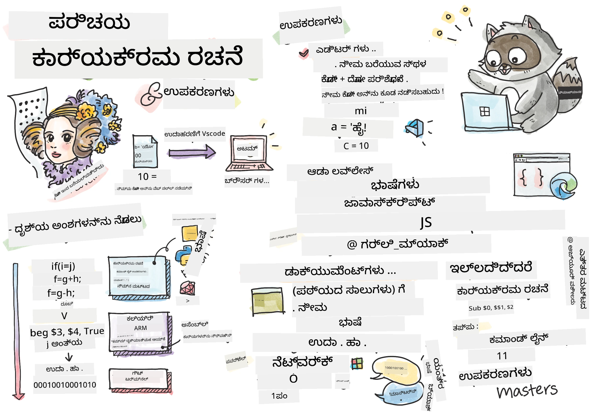
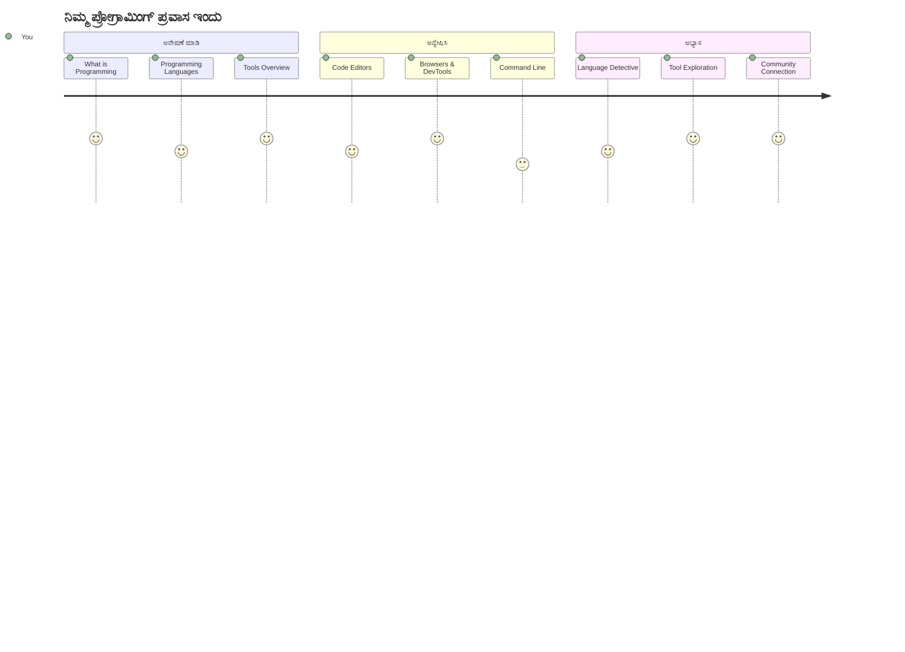
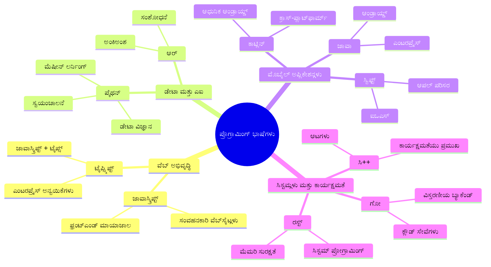
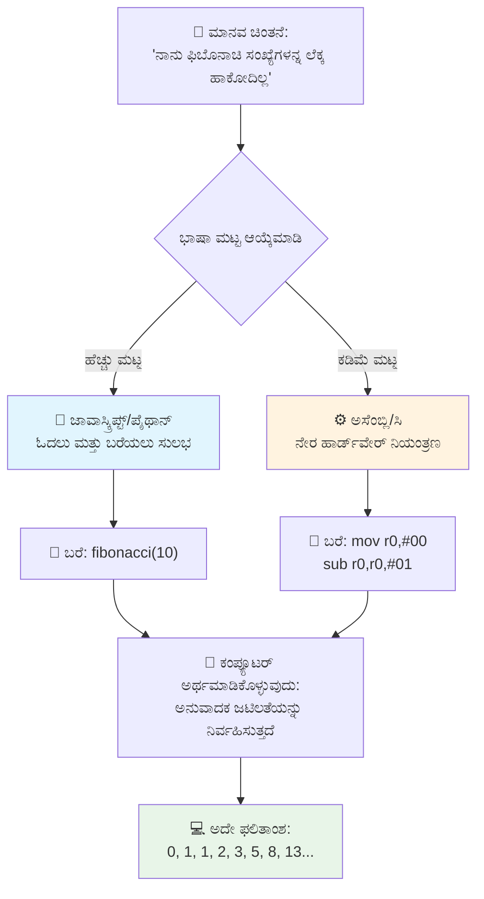
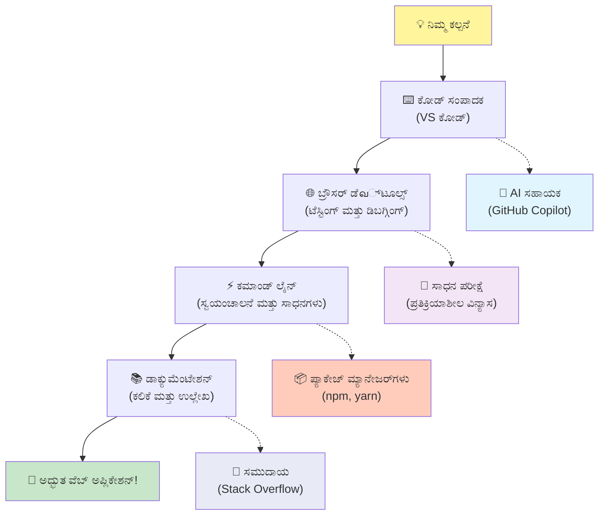
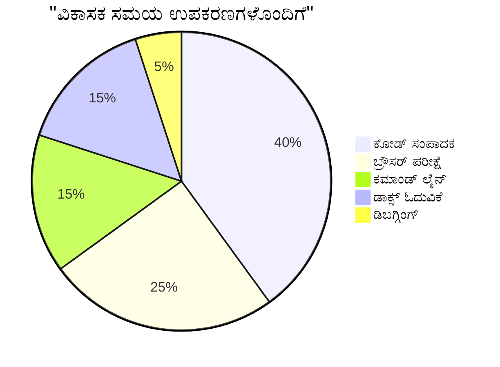

# ಪ್ರೋಗ್ರಾಮಿಂಗ್ ಭಾಷೆಗಳು ಮತ್ತು ಆಧುನಿಕ ಡೆವಲಪರ್ ಉಪಕರಣಗಳ ಪರಿಚಯ

ಹೇಲೆ, ಭವಿಷ್ಯದ ಡೆವಲಪರ್! 👋 ಪ್ರತಿದಿನವೂ ನನಗೆ ಸ್ತುಬ್ಧಗೊಳಿಸುವಂತಹುದು ಏನಿದೆ ಅಂತ್ರೆ ಹೇಳಿಕೊಳ್ತೀನಾ? ಪ್ರೋಗ್ರಾಮಿಂಗ್ ಎಂದರೆ ಕೆವಲ ಕಂಪ್ಯೂಟರ್ ಬಗ್ಗೆ ಅಲ್ಲ – ಅದು ನಿಮ್ಮ ಅತೀ ವಾಸ್ತವಿಕ ಶಕ್ತಿಗಳನ್ನು ನಿಮ್ಮ ಹೃದಯದ ಐಡಿಯಾಗಳನ್ನು ಜೀವಂತransಕೊಳಿಸಲು ಹೊಂದಿರುವ ಸೂಪರ್ಪವರ್ ಬೆಳಕು ಇಲ್ಲವೇ!

ನೀವು ನಿಮ್ಮ ಪ್ರಿಯ ಅಪ್ಲಿಕೇಶನ್ ಬಳಸಿ ಹೊತ್ತಾಗ ಏನೋ ಎಲ್ಲವೂ ಪರಿಪೂರ್ಣವಾಗಿ ಸರಿಹೋಗುವ那个 ಕ್ಷಣ ತಿಳಿದಿದೆಯೇ? ನೀವು ಒಂದು ಬಟನ್ ಟ್ಯಾಪ್ ಮಾಡಿದಾಗ ಏನೋ ಮಾಯಾಜಾಲವಾಗುತ್ತದೆ, "ವಾವ್, ಅವರು ಹೇಗೆ ಅದನ್ನು ಮಾಡಿದರು?" ಎಂದು ನೀವು ತಲೆತಿರುಗ್ತೀರಾ? ಅದೇ ಇಬ್ಬರೂ ನೀವು ಅಲ್ಲಿಯೇ ಇದ್ದೀರಾ – ಸಂಪೂರ್ಣವಾಗಿ ತಮ್ಮ трэಡಿ ಎಸ್ಪ್ರೆಸ್ಸೋ ಕುಡಿಯುತ್ತಾ ಇರುವರು – ಅವರು ಅದೊಂದು ಮಾಯಾಜಾಲದ ಕೋಡ್ ಬರೆದು ಇದ್ದಾರೆ. ಈ ಪಾಠದ ಕೊನೆಯಲ್ಲಿ ನೀವು ಅರ್ಥಮಾಡಿಕೊಳ್ಳುವಷ್ಟೇ ಅಲ್ಲ, ನೀವು ಅದನ್ನೇ ಸಾಯಿಸಲು ಬಯಸುವಿರಿ!

ನೋಡು, ಪ್ರೋಗ್ರಾಮಿಂಗ್ ಈಗ ತಕ್ಷಣ ಭಯಾನಕವಾಗಿ ಕಾಣುತ್ತಿದ್ರೇ ಬಹುದು ಅನ್ನಾನುಕೊಂಡೀನಿ. ನಾನು ಪ್ರಾರಂಭಿಸಿದಾಗ, ನಾನು ನಿಜಕ್ಕೂ ಭಾವಿಸಿದಂತೆ ನೀವು ಗಣಿತದ ವಿಜ್ಞಾನಿ ಆಗಿರಬೇಕು ಅಥವಾ ಐದು ವರ್ಷದಿಂದಲೇ ಕೋಡ್ ಬರೆಯಬೇಕು ಅಂತ. ಆದರೆ ನನಗೆ ಸಂಪೂರ್ಣವಾಗಿ ಮನಸ್ಸು ಬದಲಾಯಿಸಿದುದು: ಪ್ರೋಗ್ರಾಮಿಂಗ್ ಅಂದರೆ ಹೊಸ ಭಾಷೆಯಲ್ಲಿ ಸಂವಾದ ಮಾಡಲು ಕಲಿಯುವಂತೆ. ನೀವು "ನಮಸ್ಕಾರ" ಮತ್ತು "ಧನ್ಯವಾದಗಳು" ಇಲ್ಲಿಂದ ಪ್ರಾರಂಭಿಸಿ, ಕೋಫಿ ಆರ್ಡರ್ ಮಾಡುವವರೆಗೂ ಬಾರೀಸುತ್ತೀರಾ, ನಂತರ ಥಳ್ಮೂಲ ಆಲೋಚನೆ ಸಂವಾದಗಳು ನಡೆಯುತ್ತವೆ! ಇಲ್ಲಿ ಕಂಪ್ಯೂಟರ್‌ಗಳೊಂದಿಗೆ ಮಾತಾಡುತ್ತಿದ್ದೀರಿ, ಮತ್ತು ನಿಜವಾಗಿಯೂ? ಅವರು ಬಹಳ ಸಹನಶೀಲ ಸಂಗಾತಿಗಳು – ಎಂದಿಗೂ ನಿಮ್ಮ ತಪ್ಪುಗಳನ್ನು ತೀರ್ಪು ಮಾಡದು, ಮತ್ತು ಮತ್ತೆ ಪ್ರಯತ್ನಿಸಲು ಪ್ರೇರೇಪಿಸುತ್ತಾರೆ!

ಈಗ ನಾವು ಆ ಅದ್ಭುತ ಉಪಕರಣಗಳನ್ನು ಅನ್ವೇಷಿಸುವುದಾಗಿ ಹೋಗುತ್ತಿದ್ದೇವೆ, ಆಧುನಿಕ ವೆಬ್ ಅಭಿವೃದ್ಧಿಗೆ ಸಾಧ್ಯವಾಗಿಸಿದ್ದೇ ಇಲ್ಲ, ಆದರೆ ತುಂಬಾ ವ್ಯಸನಕಾರಿಯಾಗಿರುವುದು ಕೂಡ. ನಾನೇ ನಿಮ್ಮ ಸ್ಪಷ್ಟಾರ್ಥದಲ್ಲಿ ಹೇಳ್ತೀನಿ – ನಫ್ಲಿಕ್ಸ್, ಸ್ಪೋಟಿಫೈ, ಮತ್ತು ನಿಮ್ಮ ಪ್ರಿಯ ಇಂಡಿ ಆಪ್ ಸ್ಟುಡಿಯೋಗಳ ಡೆವಲಪರ್‌ಗಳು ಪ್ರತಿದಿನವೂ ಉಪಯೋಗಿಸುವ ಸಂಪೂರ್ಣವೂ ತಂತ್ರಾಂಶ ಸಂಪಾದಕರು, ಬ್ರೌಸರ್‌ಗಳು ಮತ್ತು ಕಾರ್ಯಪ್ರವಾಹಗಳು. ಮತ್ತು ಎರಡು ತುಂಡು: ಅಂಗೀಕಾರವಾದịnೕತರ ಕಂಪನಿಯ ಉಪಕರಣಗಳ ಬಹುಮಾನಗಳು ಸಾಕಷ್ಟು ಉಚಿತ!


> ಸ್ಕೆಚ್‌ನೋಟ್ ಅಥವರು [Tomomi Imura](https://twitter.com/girlie_mac)


```mermaid
journey
    title ನಿಮ್ಮ ಪ್ರೋಗ್ರಾಮಿಂಗ್ ಪ್ರವಾಸ ಇಂದು
    section ಅನೇಷಣೆ ಮಾಡಿ
      What is Programming: 5: You
      Programming Languages: 4: You
      Tools Overview: 5: You
    section ಅನ್ವೇಷಿಸಿ
      Code Editors: 4: You
      Browsers & DevTools: 5: You
      Command Line: 3: You
    section ಅಭ್ಯಾಸ
      Language Detective: 4: You
      Tool Exploration: 5: You
      Community Connection: 5: You
```
## ನೀವು ಈಗಾಗಲೇ ಏನು ಗೊತ್ತು ಎಂಬುದನ್ನು ನೋಡೋಣ!

ರಂಜನೆಯ ವಿಷಯಕ್ಕೆ ಮುಂಚಿತವಾಗಿ, ನಾನು ಕುತೂಹಲಮಗ್ನನು – ನೀವು ಈಗಾಗಲೇ ಈ ಪ್ರೋಗ್ರಾಮಿಂಗ್ ವಿಶ್ವದ ಬಗ್ಗೆ ಏನು ತಿಳಿದಿದ್ದೀರಿ? ಮತ್ತು ಕೇಳಿ, ನೀವು ಈ ಪ್ರಶ್ನೆಗಳನ್ನ ನೋಡಿದಾಗ "ನನಗೆ ಈ ಬಗ್ಗೆ ಗಟ್ಟಿಯಾಗಿ ಯಾವುದೇ ಅರ್ಥವೇ ಇಲ್ಲ" ಎಂದು ಭಾವಿಸಿದರೆ, ಅದು ಬೂರ್ಣಿ ಅಲ್ಲ, ಅದು ಪರ್ಫೆಕ್ಟ್! ಅಂದರೆ ನೀವು ಕೊಡಲೇಬೇಕಾದ ಸ್ಥಾನದಲ್ಲಿದ್ದೀರಿ. ಈ ಪ್ರಶ್ನೋತ್ತರವನ್ನು ವರ್ಕೌಟ್‌ಗೆ ಮುಂಚಿತವಾಗಿ ಸ್ಟ್ರೆಚಿಂಗ್ ಎಂದು ಹಿಡಿದಿಕೊಳ್ಳಿ – ನಾವು ನಿಮ್ಮ ಮೆದುಳಿನ ماهಿತರನ್ನು ಬಿಗುಬೀಳಿಸುತ್ತಿದ್ದೇವೆ!

[ಪೂರ್ವ-ಪಾಠ ಪ್ರಶ್ನೋತ್ತರ ತೆಗೆದುಕೊಳ್ಳಿ](https://ff-quizzes.netlify.app/web/)


## ನಾವು ಸೇರಿಕೊಂಡು ಹೋಗಲಿರುವ ಸಾಹಸ

ಸರಿ, ನಿಜವಾಗಿಯೂ ನಾನು ನಾಳೆ‌ನು ನಾವು ಅನ್ವೇಷಿಸುವುದರ ಬಗ್ಗೆ ತಣ್ತುಗೆ ತಿರುಗುತ್ತಿದ್ದೇನೆ! ನಿಜಕ್ಕೂ, ನಾನು ನಿಮ್ಮ ಮುಖ ಕಂಡು ಹೋಯಿದರೆ ಯಾವಾಗಲೋ ಈ ಕಂಪಿನನು ಒಪ್ಪಿಕೊಳ್ಳುತ್ತವೆ ಎಂದು ಬಯಸುತ್ತೇನೆ. ನಾವು ಸೇರಿಕೊಂಡು ಹೋದ ಅತ್ಯುತ್ತಮ ಪ್ರಯಾಣ ಇದು:

- **ಪ್ರೋಗ್ರಾಮಿಂಗ್ ಎಂದರೆ ಏನು (ಮತ್ತು ಅದು ಏಕೆ ತುಂಬಾ ಕುತೂಹಲಕರವಾಗಿದೆ!)** – ಕೋಡ್ literally ಸುತ್ತುವಡೆ ಎಲ್ಲವನ್ನೂ ಚಾಲನೆ ಮಾಡುವ ಕಾಣದ ಮಾಯಾಜಾಲ ಎಂದು ನಾವು ಕಂಡುಕೊಳ್ಳುತ್ತಿದ್ದೇವೆ, ಆ ಅಲಾರ್ಮ್‌ರಿಂದ ಅದು ಸೋಮವಾರ ಬೆಳಗ್ಗೆ ಎಂದಂತೆ ತಿಳಿದಂತೆ, ನಿಮ್ಮ Netflix ಶಿಫಾರಸ್ಸುಗಳನ್ನು ಚೆನ್ನಾಗಿ ಆಯ್ಕೆ ಮಾಡುವ ಆ ಲಾಕ್‌ಗorithm ರೂವಾಯಿ
- **ಪ್ರೋಗ್ರಾಮಿಂಗ್ ಭಾಷೆಗಳು ಮತ್ತು ಅವುಗಳ ಅದ್ಭುತ ವೈಯಕ್ತಿಕತೆಗಳು** – ಪ್ರತಿಯೊಬ್ಬ ವ್ಯಕ್ತಿಯೂ ಸಂಪೂರ್ಣ ವಿಭಿನ್ನ ಸೂಪರ್ಪವರ್‌ಗಳು ಮತ್ತು ಸಮಸ್ಯೆ ಪರಿಹಾರದ ವಿಧಾನಗಳನ್ನು ಹೊಂದಿರುವ ಪಕ್ಷಿಯಲ್ಲಿ ಹೋದಂತೆ ಎಂದು ತೋರಿ. ಪ್ರೋಗ್ರಾಮಿಂಗ್ ಭಾಷೆಗಳ ಜಗತ್ತು ಹೀಗಿದೆ, ಮತ್ತು ನೀವು ಅವರನ್ನು ಭೇಟಿ ಮಾಡೋದನ್ನು ತುಂಬಾ ಇಷ್ಟಪಡುವಿರಿ!
- **ಡಿಜಿಟಲ್ ಮಾಯಾಜಾಲ ಮಾಡುವ ಮೂಲಭೂತ ಕಟ್ಟಡ ಕಲ್ಲುಗಳು** – ಇದನ್ನು ನಿರಂತರ ಇಲೆಕ್ಟ್ರಾನಿಕ್ ಲೆಗೋ ಸೆಟ್ ಎಂದು ಭಾವಿಸಿ. ನೀವು ಈ ಭಾಗಗಳು ಹೇಗೆ ಹೊಂದಿಕೊಳ್ತವೋ ಅರ್ಥಮಾಡಿಕೊಂಡಾಗ, ನೀವು ನಿಮ್ಮ ಕಲ್ಪನೆಯ ಸಾಧ್ಯತೆಗಳ ಬಗ್ಗೆ ಎಲ್ಲವೂ ಕಟ್ಟಬಹುದು ಎಂದು ತಿಳಿಯುತ್ತೀರಿ
- **ಪೇಶೆವರ ಉಪಕರಣಗಳು ನಿಮ್ಮನ್ನು ಜಾದೂಗಾರರಂತೆ ಭಾಸವಾಗಿಸುವವು** – ನಾನು ನಾಟಕೀಯತೆ ಮಾಡುವುದಿಲ್ಲ – ಈ ಉಪಕರಣಗಳು ನಿಜವಾಗಿಯೂ ನೀವು ಸೂಪರ್ಪವರ್ ಗಳನ್ನು ಪಡೆದಿದ್ದೀರಿ ಎಂಬ ಭಾಸವನ್ನು ಕೊಡುವವು, ಮತ್ತು ಉತ್ತಮ ಭಾಗವೇ? ಅವುಗಳು ಪ್ರಸ್ತುತ ವೃತ್ತಿಪರರು ಬಳಸುವ ಒಂದೇ ಉಪಕರಣಗಳು!

> 💡 **ಹೀಗಿದೆ:** ಇಂದೇ ಎಲ್ಲವನ್ನೂ ಗಂಟಿಸಲು ಯತ್ನಿಸಬೇಡಿ! ಈಗಿನೊ ನಿಮ್ಮಲ್ಲಿ ಸಾಧ್ಯತೆಗಳ ಬಗ್ಗೆ ಜಾಗೃತಿ ಹುಟ್ಟಿಸೋಣ. ವಿವರಗಳು ಸ್ವಾಭಾವಿಕವಾಗಿ ಜಾರಿಕೊಳ್ಳುತ್ತವೆ ಬಾಲೆ – ಅದ್ರಲ್ಲೇ ನಿಜವಾದ ಕಲಿಕೆ!

> ನೀವು ಈ ಪಾಠವನ್ನು [Microsoft Learn](https://learn.microsoft.com/en-us/learn/modules/web-development-101/introduction-programming/?WT.mc_id=academic-77807-sagibbon) ನಲ್ಲಿ ತೆಗೆದುಕೊಂಡು ಬಹುದು!

## ಅಂದ್ರೆ ಪ್ರೋಗ್ರಾಮಿಂಗ್ ಎಂದರೆ ಏನು ನಿಜವಾಗೆ?

ಸರಿಯೇ, ಗರಿಷ್ಠ ಪ್ರಶ್ನೆಯನ್ನು სწავლಿಯೋಣ: ಪ್ರೋಗ್ರಾಮಿಂಗ್ ಅಂದ್ರೆ ನಿಜವಾಗೆ ಏನು?

ನಾನು ನಿಮ್ಮಿಗೆ ಒಂದು ಕಥೆ ನೀಡುತ್ತೇನೆ ಅದು ನನ್ನ ದೃಷ್ಟಿತೋರು ಸಂಪೂರ್ಣ ಬದಲಾಯಿಸಿದುದು. ಕಳೆದ ವಾರ, ನಾನು ಹೇಗೆ ನಮ್ಮ ಹೊಸ ಸ್ಮಾರ್ಟ್ ಟಿವಿ ರಿಮೋಟ್ ಬಳಸುವುದು ಅನ್ನೋದನ್ನು ನನ್ನ ತಾಯಿಗೆ ವಿವರಣೆ ಮಾಡಲು ಪ್ರಯತ್ನಿಸುತ್ತಿದ್ದೆ. ನಾನು "ಕೆಂಪು ಬಟನ್ ಒತ್ತಿ, ಆದರೆ ದೊಡ್ಡ ಕೆಂಪು ಬಟನ್ ಅಲ್ಲ, ಎಡ ಬದಿಯ ಸಣ್ಣ ಕೆಂಪು ಬಟನ್… ಇಲ್ಲ, ಇನ್ನೊಂದು ಎಡ… ಹೌದು, ಇದೀಗ ಅದನ್ನು ಎರಡೂ ಸೆಕೆಂಡುಗಳ ಕಾಲ ಹಿಡಿಯಿರಿ, ಒಂದಿಲ್ಲ, ಮೂರು ಅಲ್ಲ…" ಎಂದು ಹೇಳುತ್ತಿದ್ದೆ. ಹೇಗಿದೆ, ತಿಳಿದಿದೆಯೇ? 😅

ಅದೇ ಪ್ರೋಗ್ರಾಮಿಂಗ್! ಇದು ತೀವ್ರವಾಗಿ ವಿವರವಾದ, ಹಂತ ಹಂತವಾಗಿ ಸೂಚನೆಗಳನ್ನು ಸಂಪೂರ್ಣ ಶಕ್ತಿಶಾಲಿ ಓಬ್ಜೆಕ್ಟ್‌ಗೆ ನೀಡುವ ಕಲೆ. ನಿಮ್ಮ ತಾಯಿಗೆ ತಿಳಿಸುವದಕ್ಕಿಂತ ಬೇರೆಯಾಗಿದೆ (ಅವರು "ಯಾವ ಕೆಂಪು ಬಟನ್?!" ಎಂದು ಕೇಳಬಹುದು), ನೀವು ಕಂಪ್ಯೂಟರ್‌ಗೆ ಸೂಚಿಸುತ್ತಿದ್ದೀರಿ (ಅದು ನೀವು ಹೇಳಿದಂತೆ ಮಾತ್ರ ಸಾಧ್ಯವೆನೇ ಮಾಡುತ್ತೆ, ನೀವು ಅರ್ಥಮಾಡಿದ್ದಷ್ಟು ಅಲ್ಲದಿದ್ದರೂ).

ನಿಜವಾಗಿ ನಾನು ತಿಳಿದಾಗ ನನಗೆ ಆ ನಂಬು ತಿರುಗಿಸಿತ್ತು: ಕಂಪ್ಯೂಟರ್‌ಗಳು ಮೂಲದಲ್ಲಿ ತುಂಬಾ ಸರಳವು. ಅವು literally ಎರಡು ಮಾತ್ರ ಅರ್ಥಮಾಡಿಕೊಳ್ಳುತ್ತವೆ – 1 ಮತ್ತು 0, ಅಂದರೆ "ಹೌದು" ಮತ್ತು "ಇಲ್ಲ" ಅಥವಾ "ಉತ್ತರ್ಜ್ಜಿತ" ಮತ್ತು "ನಿಷ್ಕ್ರಿಯ". ಮಾತ್ರ! ಆದರೆ ಇಲ್ಲಿ ಅದ್ಭುತವು ಏನೆಂದರೆ – ನಾವು 1 ಮತ್ತು 0 ಮೂಲಕ ಮಾತನಾಡಬೇಕಾಗಲಿಲ್ಲ, ನಾವು "ದಿ ಮ್ಯಾಟ್ರಿಕ್ಸ್" ನಲ್ಲಿ ಇರುವಂತಹಂತೆ ಅಲ್ಲ. ಅದಕ್ಕಾಗಿ **ಪ್ರೋಗ್ರಾಮಿಂಗ್ ಭಾಷೆಗಳು** ಇದಕ್ಕೂ ಸಹಾಯ ಮಾಡಲು ಬರುತ್ತವೆ. ಅವು ನಿಜವಾಗಿಯೂ ವಿಶ್ವದ ಅತ್ಯುತ್ತಮ ಭಾಷಾಂತರಕರಂತೆ ಕಾರ್ಯನಿರ್ವಹಿಸುತ್ತವೆ, ನಿಮಗೆ ಸುಲಭವಾಗುವಂತೆ ಮಾನವೀಯ ಆಲೋಚನೆಗಳನ್ನು ಕಂಪ್ಯೂಟರ್ ಭಾಷೆಗೆ ಪರಿವರ್ತಿಸುತ್ತವೆ.

ಇತ್ತೀಚೆಗೆ ಪ್ರತಿದಿನವೂ ನನಗೆ ಚಳಿ ತರುತ್ತದೆ: ನಿಮ್ಮ ಎಲ್ಲಾ ಡಿಜಿಟಲ್ ಜೀವನದಲ್ಲಿನ *ಎಲ್ಲವೂ* ಯಾರೋ ನಿಮ್ಮ ತರಹ ಇದ್ದವರು, ಪೈಜಾಮಾದಲ್ಲಿ ಕುಳಿತವರು, ಕಾಫಿ ಕಪ್ ಕೈಯಲ್ಲಿಟ್ಟುಕೊಂಡವರು, ಲ್ಯಾಪ್‌ಟಾಪ್‌ನಲ್ಲಿ ಕೋಡ್ ಬರೆದವರು ಆರಂಭ. ಅದು ನೀವು ನೋಡಿ ಅದ್ಫ್ತ್ ಇನ್‌ಸ್ಟಾಗ್ರಾಮ್ ಫಿಲ್ಟರ್? ಯಾರೋ ಅದನ್ನು ಕೋಡ್ ಮಾಡಿದ್ದರು. ನೀವು ಹೊಸ ಫೇವರಿಟ್ ಹಾಡಿಗೆ ಮುನ್ನಡೆಸಿದ ಶಿಫಾರಸು? ಡೆವಲಪರ್ ಅವರು ಆ ಅಲ್ಗಾರಿಥಮ್ ರಚಿಸಿದರು. ನಿಮ್ಮ ಸ್ನೇಹಿತರೊಂದಿಗೆ ಭೋಜನ ಬಿಲ್ ವಿಂಗಡಿಸಲು ಸಹಾಯ ಮಾಡುವ ಆಪ್? ಹೌದು, ಯಾರೋ "ಇದು ಕಷ್ಟ, ನಾನು ಇದನ್ನು ಸರಿಪಡಿಸಬಹುದು" ಎಂದು ಬಯಸಿದರು, ಹಾಗೇ ಮಾಡಿದ್ರು!

ಪ್ರೋಗ್ರಾಮ್ ಕಲಿತಾಗ ನೀವು ಕೇವಲ ಹೊಸ ಕೌಶಲ್ಯ ಪಡೆಯುವುದಿಲ್ಲ – ನೀವು ಒಂದು ಅದ್ಭುತ ಸಮಸ್ಯೆ ಪರಿಹಾರಕರ ಸಮುದಾಯದ ಭಾಗವಾಗುತ್ತೀರಿ, ದಿನವೂ "ನಾನೊಬ್ಬರ ದಿನವನ್ನು ಸ್ವಲ್ಪ ಹೆಚ್ಚಾಗಿ ಉತ್ತಮಗೊಳಿಸುವ ಏನನ್ನಾದರೂ ನಿರ್ಮಿಸಬಹುದೇ?" ಎಂದು ಆಲೋಚಿಸುವವರಂತಹ. ನಿಜವಾಗಿಯೂ, ಇದಕ್ಕಿಂತ ಕೂಲ್ ಏನಿದೆ?

✅ **ರಂಜನೆಯ ಮಾಹಿತಿ ಹುಡುಕಿ**: ನಿಮ್ಮ ಬಳಿ ಸ್ವಲ್ಪ ಸಮಯ ಇದ್ರೆ ತುಂಬಾ ಕುತೂಹಲವಾಗಿರುವುದು ಯಾವುದು ಎಂಬುದನ್ನು ನೋಡಿ – ವಿಶ್ವದ ಮೊದಲ ಕಂಪ್ಯೂಟರ್ ಪ್ರೋಗ್ರಾಮರ್ ಯಾರು ಗೋಚರಿಸುತ್ತಾರೆ ಎಂದು ಭಾವಿಸುತ್ತೀರಿ? ಅಂದರೆ ನಾನು ಸೂಚಿಸುತ್ತೇನೆ: ನೀವು ನಿರೀಕ್ಷಿಸುವವರಲ್ಲಿರಬಹುದು! ಆ ವ್ಯಕ್ತಿಯ ಹಿಂದಿನ ಕಥೆ ತುಂಬಾ ರೋಚಕವಾಗಿದ್ದು ಪ್ರೋಗ್ರಾಮಿಂಗ್ ಎಂದೆಂದಿಗೂ ಸೃಜನಾತ್ಮಕ ಸಮಸ್ಯೆ ಪರಿಹಾರದ ಮತ್ತು ಚಿಂತನೆಯ ಹೊರತಾಗಿ ಇರಬೇಕಾಗಿದೆಯೆಂದು ತೋರಿಸುತ್ತಿದೆ.

### 🧠 **ಪ್ರೀಕ್ಷಣಾ ಸಮಯ: ನೀವು ಹೇಗಿದ್ದೀರಿ?**

**ಒಂದು ಕ್ಷಣ ತಲೆಮೇಲಿಡಿ:**
- "ಕಂಪ್ಯೂಟರ್‌ಗಳಿಗೆ ಸೂಚನೆಗಳು ನೀಡುವುದು" ಎಂಬ ಕಲ್ಪನೆ ಈಗ ನಿಮ್ಮಿಗೆ ಅರ್ಥವಾಗಿದೆಯೇ?
- ನೀವು ದಿನದ ಯಾವುದೇ ಕಾರ್ಯವನ್ನು ಪ್ರೋಗ್ರಾಮ್ ಮೂಲಕ automate ಮಾಡಬೇಕೆಂದು ಯೋಚಿಸಿದ್ದಿರಾ?
- ಈ ಪ್ರೋಗ್ರಾಮಿಂಗ್ ಸರಣಿಯ ಬಗ್ಗೆ ನಿಮ್ಮ ಮನಸ್ಸಿನಲ್ಲಿ ಏನು ಪ್ರಶ್ನೆಗಳು ಹುಟ್ಟುತ್ತಿದ್ದವೆ?

> **ಆಸೆಪಟ್ಟುಕೊಳ್ಳಿ**: ಕೆಲವೆ ಕಲ್ಪನೆಗಳು ಈಗ ಗೊಂದಲವೇನಾದರೂ ಆಗಿದ್ದರೆ ಅದೇ ಸರಿ. ಪ್ರೋಗ್ರಾಮಿಂಗ್ ಕಲಿಯುವುದು ಹೊಸ ಭಾಷೆ ಕಲಿಯುವುದರಂಥದು – ನಿಮ್ಮ ಮೆದುಳಿನಲ್ಲಿ ಬಿಸಿ ಮಾರ್ಗಗಳನ್ನು ನಿರ್ಮಿಸಲು ಸಮಯ ಬೇಕು. ನೀವು ಅತ್ಯುತ್ತಮವಾಗಿ ಮಾಡುತ್ತಿದ್ದೀರಿ!

## ಪ್ರೋಗ್ರಾಮಿಂಗ್ ಭಾಷೆಗಳು ಮಾಯಾಜಾಲದ ವಿಭಿನ್ನ ರುಚಿಗಳಂತೆ

ಸರಿ, ಇದು ವಿಚಿತ್ರವಾಗಿ ಕೇಳಿರಬಹುದು, ಆದರೆ ಕೂಡಲೇ ಕೇಳಿ – ಪ್ರೋಗ್ರಾಮಿಂಗ್ ಭಾಷೆಗಳು ವಿವಿಧ ಸಂಗೀತ ಶೈಲಿಗಳ ಹೋಲಿಕೆಗಳನ್ನು ಹೊಂದಿವೆ ಎಂದು ಬಿಟ್ಟುಕೊಡಿ. ನೀವು ಜಾಜ್, ರಾಕ್, ಕ್ಲಾಸಿಕಲ್ ಮತ್ತು ಹಿಪ್ಹಾಪ್ ಹೀಗೆ ತುಂಬಾ ಪ್ರಭಾವಶಾಲಿ ಶೈಲಿಗಳಿರುವುದು ಸ್ಮರಿಸಿ. ಪ್ರತಿಯೊಂದು ಶೈಲಿಗೂ ತನ್ನದೇ ಆದ ಹವ್ಯಾಸಿ ಗುಂಪು, ವೈಭವ ಮತ್ತು ವಿಭಿನ್ನ ಮನೋಭಾವದಲ್ಲಿ ಸೂಕ್ತವಾಗಿದೆ.

ಪ್ರೋಗ್ರಾಮಿಂಗ್ ಭಾಷೆಗಳ ಪ್ರಕಾರ ಸಹ ಹೀಗಿದೆ! ನೀವು ಗ್ರಾಮದ ಮೂಲಕ ಪೋಲಿಸ್ಡೇಟಾ ಸಂಗ್ರಹಿಸಲು ಅದೇ ಭಾಷೆಯನ್ನು ಬಳಸಲಾರಿರಿ ಎಂದುಕೊಳ್ಳಬೇಡಿ, ಹಾಗೆ ತಲುಪಿಸುವ ತಂತ್ರಾಂಶ ಬಳಸುವುದಿಲ್ಲ, ಹೇಗೆಯೋ ಯೋಗಾ ತರಗತಿಯಲ್ಲಿ ಡೆತ್ ಮೆಟಲ್ ಹಾಡುವುದಿಲ್ಲ (ಬಹುಶಃ ಬಹುತೇಕ ಯೋಗಾ ತರಗತಿಗಳಲ್ಲಿ ಅಂತಹದು! 😄).

ಆದರೆ ಪ್ರತಿಸಾರಿ ನಿಜವಾಗಿಯೂ ನನಗೆ ಆಶ್ಚರ್ಯವಾಗುತ್ತದೆ ಎಂದರೆ: ಈ ಭಾಷೆಗಳು ವಿಶ್ವದ ಅತ್ಯಂತ ಸಹನಶೀಲ, ಪ್ರತಿಭಾಶಾಲಿತ ಭಾಷಾಂತರಕಾರರನ್ನು ಹೊಂದಿರುವಂತೆ ನಿಮ್ಮ ಬದಿಗೆ ಕುಳಿತಿರುವಂತೆ. ನೀವು ನಿಮ್ಮ ಮಾನವನಂತಹ ಶೈಲಿಯಲ್ಲಿ ನಿಮ್ಮ ಆಲೋಚನೆಗಳನ್ನು ವ್ಯಕ್ತಪಡಿಸಿದರೆ, ಅವು ಅದನ್ನೆಲ್ಲ 1 ಮತ್ತು 0 ಗಳಾಗಿರುವ ಕಂಪ್ಯೂಟರ್ ಭಾಷೆಗೆ ತರ್ಜುಮೆ ಮಾಡುತ್ತವೆ. ಇದು ನಿಮ್ಮಲ್ಲಿ "ಮಾನವ ಸೃಜನಶೀಲತೆ" ಮತ್ತು "ಕಂಪ್ಯೂಟರ್ ತರ್ಕ" ಎರಡರಲ್ಲಿಯೂ ಪಟು ಗೆಳೆತನವನ್ನು ಹೊಂದಿರುವ ಸ್ನೇಹಿತನಂತೆ – ಅವರು ಎಂದಿಗೂ ನಾಲ್ಕು ಮಾಡದೆ, ಕಾಫಿ ವಿಶ್ರಾಂತಿ ತೆಗೆದುಕೊಳ್ಳದೆ, ಮತ್ತು ನೀವು ಕೇಳಿದ ಪ್ರಶ್ನೆಯನ್ನು ಎರಡನೆಯಿನಿಂದ ಕೇಳಿದಾಗಲೂ ತೀರ್ಪು ನೀಡುವುದಿಲ್ಲ.

### ಜನಪ್ರಿಯ ಪ್ರೋಗ್ರಾಮಿಂಗ್ ಭಾಷೆಗಳು ಮತ್ತು ಅವುಗಳ ಬಳಕೆಗಳು


```mermaid
mindmap
  root((ಪ್ರೊಗ್ರಾಮಿಂಗ್ ಭಾಷೆಗಳು))
    ವೆಬ್ ಅಭಿವೃದ್ಧಿ
      ಜಾವಾಸ್ಕ್ರಿಪ್ಟ್
        ಫ್ರಂಟ್‌ಎಂಡ್ ಮಾಯಾಜಾಲ
        ಸಂವಹನಕಾರಿ ವೆಬ್‌ಸೈಟ್ಗಳು
      ಟೈಪ್ಸ್ಕ್ರಿಪ್ಟ್
        ಜಾವಾಸ್ಕ್ರಿಪ್ಟ್ + ಟೈಪ್ಸ್
        ಎಂಟರಪ್ರೈಸ್ ಅನ್ವಯಿಕೆಗಳು
    ಡೇಟಾ ಮತ್ತು ಎಐ
      ಪೈಥನ್
        ಡೇಟಾ ವಿಜ್ಞಾನ
        ಮೆಷೀನ್ ಲರ್ನಿಂಗ್
        ಸ್ವಯಂಚಾಲನೆ
      ಆರ್
        ಅಂಕಿಅಂಶ
        ಸಂಶೋಧನೆ
    ಮೊಬೈಲ್ ಅಪ್ಲಿಕೇಶನ್ಗಳು
      ಜಾವಾ
        ಆಂಡ್ರಾಯ್ಡ್
        ಎಂಟರಪ್ರೈಸ್
      ಸ್ವಿಫ್ಟ್
        ಐಒಎಸ್
        ಆಪಲ್ ಪರಿಸರ
      ಕಾಟ್ಲಿನ್
        ಆಧುನಿಕ ಆಂಡ್ರಾಯ್ಡ್
        ಕ್ರಾಸ್-ಪ್ಲಾಟ್‌ಫಾರ್ಮ್
    ಸಿಸ್ಟಮ್ಗಳು ಮತ್ತು ಕಾರ್ಯಕ್ಷಮತೆ
      ಸಿ++
        ಆಟಗಳು
        ಕಾರ್ಯಕ್ಷಮತೆಯು ಪ್ರಮುಖ
      ರಸ್ಟ್
        ಮೆಮರಿ ಸುರಕ್ಷತೆ
        ಸಿಸ್ಟಮ್ ಪ್ರೋಗ್ರಾಮಿಂಗ್
      ಗೋ
        ಕ್ಲೌಡ್ ಸೇವೆಗಳು
        ವಿಸ್ತರಣೀಯ ಬ್ಯಾಕೆಂಡ್
```
| ಭಾಷೆ | ಸೂಕ್ತವಾದುದು | ಯಾಕೆ ಇದು ಜನಪ್ರಿಯವಾಗಿದೆ |
|----------|----------|------------------|
| **JavaScript** | ವೆಬ್ ಅಭಿವೃದ್ಧಿ, ಬಳಕೆದಾರ ಇಂಟರ್ಫೇಸ್ | ಬ್ರೌಸರ್‌ಗಳಲ್ಲಿ ಓಡುತ್ತದೆ ಮತ್ತು ಅಂತರ್‌ಕ್ರಿಯಾತ್ಮಕ ವೆಬ್‌ಸೈಟ್‌ಗಳನ್ನು ಚಾಲನೆ ಮಾಡುತ್ತದೆ |
| **Python** | ಡೇಟಾ ಸೈನ್ಸ್, ಸ್ವಯಂಸಂಕ್ರಮಣ, AI | ಓದಲು ಮತ್ತು ಕಲಿಯಲು ಸರಳ, ಪರಿಪೂರ್ಣ ಗ್ರಂಥಾಲಯಗಳೊಂದಿಗೆ |
| **Java** | ಎಂಟರ್ಪ್ರೈಸ್ ಅಪ್ಲಿಕೇಶನ್‌ಗಳು, ಅಂಡ್ರಾಯ್ಡ್ ಆ್ಯಪ್‌ಗಳು | ವೇದಿಕೆ-ಸ್ವತಂತ್ರ, ದೊಡ್ಡ ವ್ಯವಸ್ಥೆಗಳಿಗೆ ದೃಢವಾಗಿದೆ |
| **C#** | ವಿಂಡೋಸ್ ಅಪ್ಲಿಕೇಶನ್‌ಗಳು, ಗೇಮ್ ಅಭಿವೃದ್ಧಿ | ಮೈಕ್ರೋಸಾಫ್ಟ್ ಪರಿಸರದ ಉತ್ತಮ ಬೆಂಬಲ |
| **Go** | ಕ್ಲೌಡ್ ಸೇವೆಗಳು, ಬ್ಯಾಕೆಂಡ್ ವ್ಯವಸ್ಥೆಗಳು | ತ್ವರಿತ, ಸರಳ, ಆಧುನಿಕ ಕಂಪ್ಯೂಟಿಂಗ್‌ಗೆ ವಿನ್ಯಾಸಗೊಳಿಸಲಾಗಿದೆ |

### ಹೈ-ಲೆವೆಲ್ ಮತ್ತು ಲೋ-ಲೆವೆಲ್ ಭಾಷೆಗಳು

ಈದು ನಿಜವಾಗಿಯೂ ನಾನು ಪ್ರಾರಂಭಿಸಿದಾಗ ನನ್ನ ತಲೆಯು ಮುರಿದ ಆ ಒಬ್ಬ ಕಲ್ಪನೆ, ಆದ್ದರಿಂದ ಅದನ್ನಷ್ಟೇ ತಾರುಣ್ಯಕಾರವಾಗಲು ನನಗೆ મદદ ಮಾಡಿದ ಉದಾಹರಣೆ ಹಂಚಿಕೊಳ್ಳುತ್ತಿದ್ದೇನೆ – ಮತ್ತು ನೀವು ಸಹ ಇದರಿಂದ ಸಹಾಯವಾಗುತ್ತದೆ ಎಂದು ನಂಬಿದ್ದೇನೆ!

ನೀವು ಒಂದು ದೇಶಕ್ಕೆ ಭೇಟಿ ನೀಡಿದ್ದು, ಆ ಭಾಷೆಯನ್ನು ಮಾತನಾಡಲಾರದು, ನೀವು ತುರ್ತು ಬಾಯಿಬಾಗಿಲನ್ನು ಹುಡುಕುತ್ತಿದ್ದೀರಿ (ನಾವು ಎಲ್ಲರೂ ಅಂಥದಲ್ಲಿಯೇ ಇದ್ದೇವೆ, ಹೌದಿ? 😅):

- **ಲೋ-ಲೆವೆಲ್ ಪ್ರೋಗ್ರಾಮಿಂಗ್** ಅಂದರೆ ಸ್ಥಳೀಯ ಭಾಷೆಯನ್ನು ಅಷ್ಟೊಂದು ತಿಳಿದುಕೊಳ್ಳುವುದು, ಆಗ ನೀವು ಅಜ್ಜಿಯವರೊಂದಿಗೆ ಹಣ್ಣನ್ನು ಮಾರಾಟ ಮಾಡುವಾಗ ಸಂಸ್ಕೃತಿ ಸಂಬಂಧಿತ ಸೌಂದರ್ಯ, ಸ್ಥಳೀಯ ಮಾತು-ಹಿಶಾಬು ಮತ್ತು ಆಸಕ್ತಿದಾಯಕ ಹಾಸ್ಯಗಳ ಮೂಲಕ ಸಂವಾದ ಮಾಡುತ್ತಾರೆ. ಅನ್ನು ಅವನು ತೃಪ್ತಿಪಡಿಸುವ amfani ಅಥವಾ ದಕ್ಷತೆಯುಳ್ಳದ್ದು... ಆದರೆ ನೀವು ಬಾಯಿಬಾಗಿಲಿನ ಹುಡುಕುತ್ತಿರುವಾಗ ಅದನ್ನು ಅರ್ಥಮಾಡಿಕೊಳ್ಳುವುದು ತುಂಬಾ ಕಷ್ಟ!

- **ಹೈ-ಲೆವೆಲ್ ಪ್ರೋಗ್ರಾಮಿಂಗ್** ಬಹುಅರ್ಥವಾಗುವ ಸ್ಥಳೀಯ ಗೆಳೆತನ ಹೋಲುತ್ತದೆ. ನೀವು ಸರಳ ಇಂಗ್ಲಿಷ್‌ನಲ್ಲಿ "ನನಗೆ ಉಸಿರಾಟದ ಬಾಗಿಲು ಬೇಕು" ಎಂದು ಹೇಳಬಹುದು, ಅವರು ಅದನ್ನು ಎಲ್ಲಾ ಸಾಂಸ್ಕೃತಿಕ ಅನುವಾದವಾಗಿ ಮಾಡುತ್ತಾರೆ ಮತ್ತು ನಿಮ್ಮ ಅಂಜದ ಮೆದುಳಿಗೆ ಸರಿಯಾಗಿ ಮಾರ್ಗನಿರ್ದೇಶನಕೊಡುತ್ತಾರೆ.

ಪ್ರೋಗ್ರಾಮಿಂಗ್ ಅರ್ಥದಲ್ಲಿ:
- **ಲೋ-ಲೆವೆಲ್ ಭಾಷೆಗಳು** (ಅಸೆಂಬ್ಲಿ ಅಥವಾ C) ನಿಮ್ಮನ್ನು ಕಂಪ್ಯೂಟರ್‌ನ ಹಾರ್ಡ್‌ವೇರ್‌ನೊಂದಿಗೆ ತುಂಬಾ ವಿವರವಾದ ಸಂವಾದ ಮಾಡುವುದು ಅವಕಾಶ ನೀಡುತ್ತದೆ, ಆದರೆ ನೀವು ಯಂತ್ರದಂತೆ ವಿಚಾರಿಸಬೇಕಾಗುತ್ತದೆ, ಅದು… ದೊಡ್ಡ ಮಾನಸಿಕ ಬದಲಾವಣೆ!
- **ಹೈ-ಲೆವೆಲ್ ಭಾಷೆಗಳು** (JavaScript, Python, ಅಥವಾ C#) ನೀವು ಮಾನವನಂತೆ ಚಿಂತಿಸುವಂತೆ ಮಾಡುತ್ತವೆ, ಆದರೆ ಎಲ್ಲ ಯಂತ್ರ ಭಾಷೆಯನ್ನು ಹಿಂಬಾಲಿಸುವುದನ್ನು ವ್ಯವಸ್ಥಾಪಿಸುತ್ತವೆ. ಜೊತೆಗೆ, ಅವುಗಳಿಗೆ ಅತ್ಯಂತ ಆತಿಥ್ಯಪೂರ್ಣ ಸಮುದಾಯಗಳಿವೆ, ಹೊಸವರಾದರೆ ಏನು ಅಂದ್ರೆ ಗೊತ್ತು ಮತ್ತು ಸಹಾಯ ಮಾಡಲು ಸಿದ್ಧರಿದ್ದಾರೆ!

ನಾನು ಯಾವatables ಶುರುಮಾಡಲು ಸಲಹೆಗಳೊಡನೆ ಬರುತ್ತಿದ್ದೇನೆಂದು ಊಹಿಸಿ? 😉 ಹೈ-ಲೆವೆಲ್ ಭಾಷೆಗಳು ಶಾಲಾ ಬೈಸಿಕಲ್ ತರಬೇತಿ ಚಕ್ರಗಳು ಹೊಳ್ಳಲು ಬಯಸದೆ ಇರಿಸುತ್ತದೆ, ಏಕೆಂದರೆ ಅವು ಪೂರ್ಣ ಪ್ರക്രಿಯೆಯನ್ನು ಹೆಚ್ಚು ಆನಂದಕರಗೊಳಿಸುತ್ತವೆ!


```mermaid
flowchart TB
    A["👤 ಮಾನವ ಚಿಂತನೆ:<br/>'ನಾನು ಫಿಬೊನಾಚಿ ಸಂಖ್ಯೆಗಳನ್ನ ಲೆಕ್ಕ ಹಾಕೋದಿಲ್ಲ'"] --> B{ಭಾಷಾ ಮಟ್ಟ ಆಯ್ಕೆಮಾಡಿ}
    
    B -->|ಹೆಚ್ಚು ಮಟ್ಟ| C["🌟 ಜಾವಾಸ್ಕ್ರಿಪ್ಟ್/ಪೈಥಾನ್<br/>ಓದಲು ಮತ್ತು ಬರೆಯಲು ಸುಲಭ"]
    B -->|ಕಡಿಮೆ ಮಟ್ಟ| D["⚙️ ಅಸೆಂಬ್ಲಿ/ಸಿ<br/>ನೇರ ಹಾರ್ಡ್‌ವೇರ್ ನಿಯಂತ್ರಣ"]
    
    C --> E["📝 ಬರೆ: fibonacci(10)"]
    D --> F["📝 ಬರೆ: mov r0,#00<br/>sub r0,r0,#01"]
    
    E --> G["🤖 ಕಂಪ್ಯೂಟರ್ ಅರ್ಥಮಾಡಿಕೊಳ್ಳುವುದು:<br/>ಅನುವಾದಕ ಜಟಿಲತೆಯನ್ನು ನಿರ್ವಹಿಸುತ್ತದೆ"]
    F --> G
    
    G --> H["💻 ಅದೇ ಫಲಿತಾಂಶ:<br/>0, 1, 1, 2, 3, 5, 8, 13..."]
    
    style C fill:#e1f5fe
    style D fill:#fff3e0
    style H fill:#e8f5e8
```
### ನಾನು ನಿಮಗೆ ಏಕೆ ಹೈ-ಲೆವೆಲ್ ಭಾಷೆಗಳು ಮತ್ತಷ್ಟು ಸ್ನೇಹಪೂರಕ ಎಂದು ತೋರಿಸುತ್ತೇನೆ

ಸರಿ, ನಾನು ನಿಮಗೆ ಏನೋ ತೋರಿಸಲು ಹೋಗುತ್ತಿದ್ದೇನೆ ಏಕೆಂದರೆ ನಾನು ಹೈ-ಲೆವೆಲ್ ಭಾಷೆಗಳ ಮೇಲೆ ಪ್ರೀತಿ ವ್ಯಕ್ತಪಡಿಸುತ್ತಿದ್ದೇನೆ, ಆದರೆ ಮೊದಲು – ನೀವು ನನಗೆ ಒಪ್ಪಿ. ನೀವು ಮೊದಲ ಕೋಡ್ ಉದಾಹರಣೆ ನೋಡಿದಾಗ, ಭಯಪಡಬೇಡಿ! ಅದು ಭಾರೀ ಭಯಂಕರವಾಗಿರಬೇಕು ಎಂಬ ಕನ್ಸೆಪ್ಟ್ ಆಗಿದೆ!

ನಾವು ಎರಡು ಸಂಪೂರ್ಣ ವಿಭಿನ್ನ ಶೈಲಿಗಳಲ್ಲಿ ಬರೆಯಲಾದ ಅದೇ ಕಾರ್ಯವನ್ನು ನೋಡುತ್ತೇವೆ. ಎರಡೂ ಫಿಬೊನಕ್ಕಿ ಸರಣಿಯನ್ನು ರಚಿಸುತ್ತವೆ – ಇದು ಒಂದು ಅದ್ಭುತ ಗಣಿತೀಯ ಮಾದರಿ, ಪ್ರತಿ ಸಂಖ್ಯೆ ಹಿಂದೆ ಎರಡು ಸಂಖ್ಯೆಗಳ ಮೊತ್ತ: 0, 1, 1, 2, 3, 5, 8, 13... (ರಂಜನೆಯ ತಿಳಿವು: ನೀವು ಈ ಮಾದರಿಯನ್ನು ಪ್ರಕೃತಿಯಲ್ಲಿ ಎಲ್ಲೆಡೆ ನೋಡಬಹುದು – ಸೂರ್ಯಹುಲಿ ಬೀಜದ ಸಪ್ಲಿರಲ್, ಪೈನ್‌ಕೋನ್ ಮಾದರಿಗಳು, ಗ್ಯಾಲಕ್ಸಿಗಳು ಬೆಳೆದುತ್ತಿರುವ ವಿಧಿಗಳೂ!)

ಬೇರೆ ಭಿನ್ನತೆ ನೋಡಲು ಸಿದ್ಧವಾಗಿದ್ದೀರಾ? ಬನ್ನಿ!

**ಹೈ-ಲೆವೆಲ್ ಭಾಷೆ (JavaScript) – ಮಾನವರ ಸ್ನೇಹಪೂರಕ:**

```javascript
// ಹಂತ 1: ಮೂಲ ಫಿಬೊನಾಕ್ ಹೊಂದಾಣಿಕೆ
const fibonacciCount = 10;
let current = 0;
let next = 1;

console.log('Fibonacci sequence:');
```

**ಈ ಕೋಡ್ ಏನು ಮಾಡುತ್ತದೆ:**
- ಫಿಬೊನಕ್ಕಿ ಸಂಖ್ಯೆಗಳ ಎಷ್ಟು ಬೇಕೋ ಅದನ್ನು ನಿಶ್ಚಿತಪಡಿಸಲು ಸ್ಥಿರಾಂಕವನ್ನು ಘೋಷಿಸಿ
- ಸರಣಿಯ ಪ್ರಸ್ತುತ ಮತ್ತು ಮುಂದಿನ ಸಂಖ್ಯೆಯನ್ನು ಟ್ರ್ಯಾಕ್ ಮಾಡಲು ಎರಡು ಚರಗಳನ್ನು ಆರಂಭಿಸಿ
- ಫಿಬೊನಕ್ಕಿ ಮಾದರಿಯನ್ನು ವ್ಯಾಖ್ಯಾನಿಸುವ ಪ್ರಾರಂಭ ಮೌಲ್ಯಗಳನ್ನು (0 ಮತ್ತು 1) ಸೆಟ್ ಮಾಡಿ
- ನಮ್ಮ ಔಟ್‌ಪುಟ್ ಗುರುತಿಸಲು ಶೀರ್ಷಿಕೆ ಸಂದೇಶವನ್ನು ತೋರಿಸಿ

```javascript
// ಹಂತ 2: ಲೂಪ್‌ನೊಂದಿಗೆ ಕ್ರಮವನ್ನು ರಚಿಸಿ
for (let i = 0; i < fibonacciCount; i++) {
  console.log(`Position ${i + 1}: ${current}`);
  
  // ಕ್ರಮದಲ್ಲಿ ಮುಂದಿನ ಸಂಖ್ಯೆಯನ್ನು ಗಣನೆ ಮಾಡಿ
  const sum = current + next;
  current = next;
  next = sum;
}
```

**ಇಲ್ಲಿ ಏನಾಗುತ್ತಿದೆ ಅವಲೋಕನ:**
- ಸರಣಿಯ ಪ್ರತಿಯೊಂದು ಸ್ಥಾನವನ್ನು `for` ಲೂಪ್ ನೊಂದಿಗೆ ಸುತ್ತಿರಿ
- ಪ್ರತಿಯೊಂದು ಸಂಖ್ಯೆಯನ್ನು ಅದರ ಸ್ಥಾನಸಹಿತ ಟೆಂಪ್ಲೇಟ್ ಲಿಟರಲ್ ಫಾರ್ಮ್ಯಾಟಿಂಗ್ ಮೂಲಕ ತೋರಿಸಿ
- ಪ್ರಸ್ತುತ ಮತ್ತು ಮುಂದಿನ ಮೌಲ್ಯಗಳನ್ನು ಸೇರಿಸಿ ನೆರವಿನ ಫಿಬೊನಕ್ಕಿ ಸಂಖ್ಯೆಯನ್ನು ಲೆಕ್ಕಿಸಿ
- ಮುಂದಿನ ಉದಾಹರಣೆಗೆ ನಮ್ಮ ಟ್ರ್ಯಾಕಿಂಗ್ ಚರಗಳನ್ನು ನವೀಕರಿಸಿ

```javascript
// ಹಂತ 3: ಆಧುನಿಕ ಕಾರ್ಯಾತ್ಮಕ ವಿಧಾನ
const generateFibonacci = (count) => {
  const sequence = [0, 1];
  
  for (let i = 2; i < count; i++) {
    sequence[i] = sequence[i - 1] + sequence[i - 2];
  }
  
  return sequence;
};

// ಬಳಕೆಯ ಉದಾಹರಣೆ
const fibSequence = generateFibonacci(10);
console.log(fibSequence);
```

**ಮೇಲಿನ ಕೋಡ್‌ನಲ್ಲಿ ನಾವು:**
- ಆಧುನಿಕ ಎರೋ ಫಂಕ್ಷನ್ ಸಿಂಟ್ಯಾಕ್ಸ್ ಬಳಸಿಕೊಂಡು ಪುನಃ ಉಪಯೋಗಿಸಬಹುದಾದ ಫಂಕ್ಷನ್ ಸೃಷ್ಟಿಸಿವಾರ
- ಪೂರ್ಣ ಸರಣಿಯನ್ನು ಸಂಗ್ರಹಿಸಲು ಸರಣಿಯನ್ನು ರಚಿಸಿ, ಇವರು ತೆಗು-ತೆಗು ಪ್ರದರ್ಶಿಸುವುದನ್ನು ಬಿಟ್ಟುಕೊಟ್ಟಿದೆ
- ಹಿಂದಿನ ಮೌಲ್ಯಗಳಿಂದ ಪ್ರತಿಯೊಂದು ಹೊಸ ಸಂಖ್ಯೆಯನ್ನು ಲೆಕ್ಕಿಸಲು ಸರಣಿ ಇಂಡೆಕ್ಸಿಂಗ್ ಬಳಸಲಾಗಿದೆ
- ನಾವು ನಮ್ಮ ಕಾರ್ಯಕ್ರಮದ ಇತರೆ ಭಾಗಗಳಲ್ಲಿ ಮಿತಿ ಇಲ್ಲದೆ ಬಳಕೆಗೆ ಸಂಪೂರ್ಣ ಸರಣಿಯನ್ನು ಹಿಂತಿರುಗಿಸಿದಿದ್ದೇವೆ

**ಲೋ-ಲೆವೆಲ್ ಭಾಷೆ (ARM ಅಸೆಂಬ್ಲಿ) – ಕಂಪ್ಯೂಟರ್ ಸ್ನೇಹಪೂರಕ:**

```assembly
 area ascen,code,readonly
 entry
 code32
 adr r0,thumb+1
 bx r0
 code16
thumb
 mov r0,#00
 sub r0,r0,#01
 mov r1,#01
 mov r4,#10
 ldr r2,=0x40000000
back add r0,r1
 str r0,[r2]
 add r2,#04
 mov r3,r0
 mov r0,r1
 mov r1,r3
 sub r4,#01
 cmp r4,#00
 bne back
 end
```

JavaScript ಆವೃತ್ತಿ almost ಇಂಗ್ಲಿಷ್ ಸೂಚನೆಗಳಂತಿದ್ದು ಓದಲು ಸುಲಭವಾಗಿರುವಾಗ, ಅಸೆಂಬ್ಲಿ ಆವೃತ್ತಿ ಕಂಪ್ಯೂಟರ್ ಪ್ರೊಸೆಸರ್ ಅನ್ನು ನೇರವಾಗಿ ನಿಯಂತ್ರಿಸುವ ಸಂಜ್ಞಾಪದಗಳನ್ನು ಬಳಸಿ. ಎರಡೂ ಸಹ ಆ ಅದೇ ಕಾರ್ಯವನ್ನು ಸಾಧಿಸುತ್ತವೆ, ಆದರೆ ಹೈ-ಲೆವೆಲ್ ಭಾಷೆ ಮಾನವರಿಗೆ ಅರ್ಥಮಾಡಿಕೊಳ್ಳಲು, ಬರೆಯಲು ಮತ್ತು ನಿರ್ವಹಿಸಲು ಬಹಳ ಸುಲಭವಾಗಿದೆ.

**ನೀವು ಗಮನಿಸುವ ಪ್ರಮುಖ ವ್ಯತ್ಯಾಸಗಳು:**
- **ಓದುವಿಕೆ ಸುಲಭತೆ**: ಜಾವಾಸ್ಕ್ರಿಪ್ಟ್ `fibonacciCount`ನಂತೆ ವಿವರಾತ್ಮಕ ಹೆಸರನ್ನು ಬಳಸುತ್ತದೆ, ಆದರೆ ಅಸೆಂಬ್ಲಿ `r0`, `r1`ದಂತಹ ರಹಸ್ಯ ಲೇಬಲ್ಗಳನ್ನು ಬಳಸುತ್ತದೆ  
- **ಕಾಮೆಂಟ್‌ಗಳು**: ಮೇಲ್ಮಟ್ಟದ ಭಾಷೆಗಳು ಸ್ವಂತ ಡಾಕ್ಯುಮೆಂಟೇಶನ್ ಆಗುವಂತಹ ವಿವರಣೆಮಯ ಕಾಮೆಂಟ್‌ಗಳನ್ನು ಪ್ರೋತ್ಸಾಹಿಸುತ್ತವೆ  
- **ರಚನೆ**: ಜಾವಾಸ್ಕ್ರಿಪ್ಟ್‌ನ ತಾರ್ಕಿಕ ಹರಿವು ಸಮಸ್ಯೆಗಳನ್ನು ಹಂತ ಹಂತವಾಗಿ ಯೋಚಿಸುವ ಮಾನವರ ರೀತಿಗೆ ಹೊಂದಿಕೊಳ್ಳುತ್ತದೆ  
- **ನಿರ್ವಹಣೆ**: ವಿಭಿನ್ನ ಅಗತ್ಯಗಳಿಗೆ ಜಾವಾಸ್ಕ್ರಿಪ್ಟ್ ಆವೃತ್ತಿಯನ್ನು ಅಪ್ಡೇಟ್ ಮಾಡುವುದು ಸರಳ ಮತ್ತು ಸ್ಪಷ್ಟವಾಗಿದೆ  

✅ **ಫಿಬೋನಾಚಿ ಸರಣಿಯ ಬಗ್ಗೆ**: ಈ ಸುಂದರ ಸಂಖ್ಯಾ ಮಾದರಿ (ಪ್ರत्यೇಕ ಸಂಖ್ಯೆ ಹಿಂದಿನ ಎರಡು ಸಂಖ್ಯೆಗಳ ಮೊತ್ತವಿದೆ: 0, 1, 1, 2, 3, 5, 8...) ಪ್ರಕೃತಿಯಲ್ಲಿ ಅಕ್ಷರಶಃ *ಪ್ರತಿ ಕಡೆ* ಕಾಣಸಿಗುತ್ತದೆ! ನೀವು ಇದನ್ನು ಸೂರ್ಯಹೂಕಳ ತಿರುಗುಳಿಗಳು, ಪೈನ್ಕೋನ್ ಮಾದರಿಗಳು, ನಾಟಿಲಸ್ ಶೆಲ್ಸ್ ವಳ್ಳದ ತಿರುವುಗಳು ಮತ್ತು ಮರದ ಕೊಂಬೆಗಳ ಬೆಳೆವಿನಲ್ಲಿಯೂ ಕಾಣಬಹುದು. ಗಣಿತ ಮತ್ತು ಕೋಡ್ ನಮಗೆ ಪ್ರಕೃತಿಯ ಸೌಂದರ್ಯವನ್ನು ನಿರ್ಮಿಸಲು ಬಳಸುವ ಮಾದರಿಗಳನ್ನು ಅರ್ಥಮಾಡಲು ಮತ್ತು ಪುನರಾವರ್ತಿಸಲು ಹೇಗೆ ಸಹಾಯ ಮಾಡುತ್ತವೆ ಎಂದರೆ ಅದ್ಭುತಕರವಾಗಿದೆ!  

## ಮಾಯಾಜಾಲವನ್ನು ಸೃಷ್ಟಿಸುವ ಕಟ್ಟಡ ರಾಜಿಯರು  

ಹೀಗಿದ್ದರೆ, ಈಗ ನೀವು ಪ್ರೋಗ್ರಾಮಿಂಗ್ ಭಾಷೆಗಳು ಕಾರ್ಯನಿರ್ವಹಿಸುವುದನ್ನು ನೋಡಿದ ನಂತರ, ಎಲ್ಲಾದರೂ ಬರೆದಿರುವ ಪ್ರತಿ 프로그램್ನೂ ರಚಿಸುವ ಮೂಲಭೂತ ವಿಭಾಗಗಳನ್ನು ತೋರುವುದು. ನೀವು ಪ್ರಿಯಮಯವಾದ ಪಾಕಶಾಸ್ತ್ರದ ಅವಶ್ಯವಸ್ತುಗಳಂತೆ ಇದು ಪರಿಗಣಿಸಿ – ಪ್ರತಿಯೊಂದು ಭಾಗವೂ ಏನು ಮಾಡುತ್ತದೆಯೋ ಅರಿತುಕೊಂಡ ಮೇಲೆ, ನೀವು ಯಾವ ಭಾಷೆಯಲ್ಲೂ ಕೋಡ್ ಓದುತಕ್ಕೂ ಬರೆತರಿಗೂ ಸಾಧ್ಯವಾಗುತ್ತದೆ!  

ಇದು ಪ್ರೋಗ್ರಾಮಿಂಗ್ ವ್ಯಾಕರಣವನ್ನು ಕಲಿಯುವಂತೆ. ಶಾಲೆಯಲ್ಲಿ ನಾಮಪದ, ಕ್ರಿಯಾಪದ ಮತ್ತು ವಾಕ್ಯಗಳನ್ನು ಹೇಗೆ ಸೇರಿಸಬೇಕೆಂದು ಕಲಿತಾಗ ನೆನಪಿಸಿಕೊಳ್ಳಿ? ಪ್ರೋಗ್ರಾಮಿಂಗ್ ಚಿತ್ರಕಲೆಗೆ ತಾನು ಸ್ವಂತ ವ್ಯಾಕರಣವಿದೆ, ಮತ್ತು ಸತ್ಯವಾಡಿ, ಅದು ಇಂಗ್ಲಿಷ್ ವ್ಯಾಕರಣಕ್ಕಿಂತ ಬಹಳ ಲಾಜಿಕಲ್ ಮತ್ತು ಕ್ಷಮಾಶೀಲವಾಗಿದೆ! 😄  

### ಪ್ರಕಟಣೆಗಳು: ಹಂತ ಹಂತದ ಸೂಚನೆಗಳು  

**ಪ್ರಕಟಣೆಗಳು** ಇಲ್ಲಿ ಪ್ರತಿ ಸಂವಾದದ ಒಂದು ವಾಕ್ಯದಂತೆ. ಪ್ರತಿಯೊಂದು ಪ್ರಕಟಣೆಯು ಕಂಪ್ಯೂಟರ್‌ಗೆ ಒಂದು ನಿರ್ದಿಷ್ಟ ಕೆಲಸ ಮಾಡುವಂತೆ ಹೇಳುತ್ತದೆ, ಜಂಗಿನಲ್ಲಿ "ಇಲ್ಲಿ ಎಡಕ್ಕೆ ತಿರುಗು", "ಕೆಂಪಿನ ದೀಪದಲ್ಲಿ ನಿಲ್ಲು", "ಅದಾಗೆ ಆ ಸ್ಥಳದಲ್ಲಿ ವಾಹನ ನಿಲ್ಲು" ಎಂತಹ ಸೂಚನೆಗಳಂತೆ.  

ನನಗೆ ಪ್ರಕಟಣೆಗಳ ಬಗ್ಗೆ ಇಷ್ಟವೂ ಏನೆಂದರೆ ಅವು ಬಹಳ ಓದುಗೊಳ್ಳುವಂತಹವು. ಇಲ್ಲಿದೆ ನೋಡಿ:  

```javascript
// ಒಂದೇ ಕ್ರಿಯೆಯನ್ನು ನಿರ್ವಹಿಸುವ ಮೂಲ ಹೇಳಿಕೆಗಳು
const userName = "Alex";                    
console.log("Hello, world!");              
const sum = 5 + 3;                         
```
  
**ಈ ಕೋಡ್ ನಾನು ಬರೆದು ಇಲ್ಲಿದ್ದು:**  
- ಬಳಕೆದಾರರ ಹೆಸರು ಸಂಗ್ರಹಿಸಲು ಒಂದು ಸ್ಥಿರ ಚರವನ್ನು ಘೋಷಿಸಿ  
- ಕನ್ಸೋಲ್ ಔಟ್‌ಪುಟ್‌ಗೆ ಸ್ವಾಗತ ಸಂದೇಶವನ್ನು ಪ್ರదర్శಿಸಿ  
- ಗಣಿತದ ಕಾರ್ಯದ ಫಲಿತಾಂಶವನ್ನು ಲೆಕ್ಕಿಸಿ ಮತ್ತು ಸಂಗ್ರಹಿಸಿ  

```javascript
// ವೆಬ್ ಪುಟಗಳೊಂದಿಗೆ ಸಂವಹನ ನಡೆಸುವ ಹೇಳಿಕೆಗಳು
document.title = "My Awesome Website";      
document.body.style.backgroundColor = "lightblue";
```
  
**ಹಂತ ಹಂತವಾಗಿ, ನಡೆಯುತ್ತಿರುವುದು:**  
- ಬ್ರೌಸರ್ ಟ್ಯಾಬ್‌ನಲ್ಲಿ ಕಾಣಿಸುವ ವೆಬ್‌ಪೇಜ್ ಶೀರ್ಷಿಕೆಯನ್ನು ಬದಲಾಯಿಸಿ  
- ಸಂಪೂರ್ಣ ಪುಟದ ಹಿನ್ನೆಲೆಯ ಬಣ್ಣವನ್ನು ಬದಲಾಯಿಸಿ  

### ಚರಗಳು: ನಿಮ್ಮ ಪ್ರೋಗ್ರಾಮ್‌ಗಳಿಗೆ ಸ್ಮರಣೆ ವ್ಯವಸ್ಥೆ  

ಚೆನ್ನಾಗಿರುವುದು, **ಚರಗಳು** ನನಗೆ ಅತ್ಯಂತ ಇಷ್ಟವಾದ ಕಲಿಕೆ ಪರಿಕಲ್ಪನೆಗಳಂತಿವೆ ಏಕೆಂದರೆ ಅವು ನಿತ್ಯ ಬಳಕೆಯ ವಸ್ತುಗಳಂತಿವೆ!  

ನಿಮ್ಮ ಫೋನ್‌ನ ಕಾನ್ಟ್ಯಾಕ್ಟ್ ಪಟ್ಟಿ ಬಗ್ಗೆ ಒಂದು ಕ್ಷಣ ಯೋಚಿಸಿ. ನೀವು ಪ್ರತಿಯೊಬ್ಬರ ಫೋನ್ ನಂಬರ್ ರೈತ ಪಟ್ಟಿ ಮಾಡುತ್ತಿಲ್ಲ – ಬದಲಿಗೆ "ತಾಯಿ", "ಮಿತ್ತ বন্ধু", ಅಥವಾ "ರಾತ್ರೀ 2 ಗಂಟೆಯವರೆಗೆ ಪಿಜ್ಜಾ ವರ್ಗಿಸುವುದು" ಎಂದು ಸಂಗ್ರಹಿಸಿ, ಫೋನ್ ಅವುಗಳ ನಂಬರಗಳನ್ನು ನೆನಪಿಡುತ್ತದೆ. ಚರಗಳು ಇದರಂತೆಯೇ ಕೆಲಸ ಮಾಡುತ್ತವೆ! ಅವು ಲೇಬಲ್‌ ಮಾಡಿದ ಡಬ್ಬೆಗಳಂತೆ, ಇಲ್ಲಿ ನಿಮ್ಮ ಪ್ರೋಗ್ರಾಮ್ ಮಾಹಿತಿಯನ್ನು ಸಂಗ್ರಹಿಸಿ ನಂತರ ಆ ಮಾಹಿತಿ ಪತ್ತೆ ಮಾಡಬಹುದು.  

ಇದು ಅದ್ಭುತವಾಗಿದೆ: ಚರಗಳು ಕಾರ್ಯನಿರ್ವಹಿಸುವಂತೆ ಬದಲಾಗಬಹುದು (ಅದರಕಾರಣ "ಚರ" ಎಂದಿದ್ದಾರೆ – ಗಮನವಾಯಿತೇ?). ನೀವು ಮತ್ತೊಂದು ಉತ್ತಮ ಪಿಜ್ಜಾ ಪ್ಲೇಸ್ ಕಂಡುಹಿಡಿದಾಗ ಅದು ಸಂಪರ್ಕವನ್ನು ನವೀಕರಿಸುವಂತೆ, ಚರಗಳು ಹೊಸ ಮಾಹಿತಿ ಕಲಿತಂತೆ ಅಥವಾ ಪರಿಸ್ಥಿತಿಗಳು ಬದಲಾಗುವಂತೆ ನವೀಕರಿಸಬಹುದು!  

ಇದನ್ನು ಹೇಗೆ ಸರಳವಾಗಿ ಮಾಡಬಹುದು ನೋಡಿರಿ:  

```javascript
// ಹೆಜ್ಜೆ 1: ಮೂಲ ಚರಗಳನ್ನು ಸೃಷ್ಟಿಸುವುದು
const siteName = "Weather Dashboard";        
let currentWeather = "sunny";               
let temperature = 75;                       
let isRaining = false;                      
```
  
**ಈ ಪರಿಕಲ್ಪನೆಗಳನ್ನು ಅರಿತುಕೊಳ್ಳಿ:**  
- `const` ಚರಗಳಲ್ಲಿ ಬದಲಾಗದ ಮೌಲ್ಯಗಳನ್ನು ಸಂಗ್ರಹಿಸಿ (ಉದಾ: ತಾಣದ ಹೆಸರು)  
- `let` ಅನ್ನು ಪ್ರೋಗ್ರಾಮ್ ಪ್ರಗತಿಯಲ್ಲಿನ ಬದಲಾಗುವ ಮೌಲ್ಯಗಳಿಗೆ ಬಳಸಿರಿ  
- ವಿಭಿನ್ನ ಡೇಟಾ ಪ್ರಕಾರಗಳನ್ನು ನಿಯೋಜಿಸಿ: ಸ್ಟ್ರಿಂಗ್ (ಪಠ್ಯ), ಸಂಖ್ಯೆ, ಬುಲೀಯನ್ (true/false)  
- ಪ್ರತೀ ಚರವು ಏನನ್ನು ಒಳಗೊಂಡಿದೆ ಎಂಬುದನ್ನು ವಿವರಿಸುವ ಹೆಸರುಗಳನ್ನು ಆಯ್ಕೆಮಾಡಿ  

```javascript
// ಹಂತ 2: ಸಂಬಂಧಿತ ಡೇಟಾವನ್ನು ಗುಂಪುಗೊಳಿಸಲು ವಸ್ತುಗಳೊಂದಿಗೆ ಕೆಲಸ ಮಾಡುವುದು
const weatherData = {                       
  location: "San Francisco",
  humidity: 65,
  windSpeed: 12
};
```
  
**ಮೇಲಿನಲ್ಲಿರುವುದು:**  
- ಸಂಬಂಧಿಸಿದ ಹವಾಮಾನ ಮಾಹಿತಿಯನ್ನು ಗುಂಪುಗೊಳಿಸಲು ಒಂದು αντικείμενನ್ನು ರಚಿಸಲಾಗಿದೆ  
- ಒಂದೇ ಚರದ ಹೆಸರಿನಡಿಯಲ್ಲಿ ಆಗುಹೋಗುವ ಹಲವು ಡೇಟಾ ತಿದ್ದುಪಡಿ ಮಾಡಲಾಗಿದೆ  
- ಮುಖ್ಯ-ಮೌಲ್ಯ ಜೋಡಿಗಳನ್ನು ಬಳಸಿಕೊಂಡು ಪ್ರತಿ ಮಾಹಿತಿ ಸ್ಪಷ್ಟವಾಗಿ ಲೇಬಲ್ ಮಾಡಲಾಗಿದೆ  

```javascript
// ಹಂತ 3: ಚರ (variables)ಗಳನ್ನು ಬಳಸಿ ಮತ್ತು ನವೀಕರಿಸುವುದು
console.log(`${siteName}: Today is ${currentWeather} and ${temperature}°F`);
console.log(`Wind speed: ${weatherData.windSpeed} mph`);

// ಬದಲಾಯಿಸಬಹುದಾದ ಚರಗಳನ್ನು ನವೀಕರಿಸುವುದು
currentWeather = "cloudy";                  
temperature = 68;                          
```
  
**ಪ್ರತಿಯೊಂದು ಭಾಗವನ್ನು ಅರ್ಥಮಾಡಿಕೊಳ್ಳೋಣ:**  
-`${}` ಸುತ್ರದೊಂದಿಗೆ ಟೆಂಪ್ಲೇಟ್ ಲಿಟರಲ್ಸ್ ಬಳಸಿ ಮಾಹಿತಿ ಪ್ರದರ್ಶಿಸು  
- ಡಾಟ್ ಸೂಚನೆಯನ್ನು (`weatherData.windSpeed`) ಬಳಸಿ αντικείμενದ ಗುಣಲಕ್ಷಣಗಳಿಗೆ ಪ್ರವೇಶಿಸು  
- `let` ಮೂಲಕ ಘೋಷಿಸಲಾದ ಚರಗಳನ್ನು ಅಪ್ಡೇಟ್ ಮಾಡಿ ಬದಲಾಗುವ ಸ್ಥಿತಿಗೆ ತಕ್ಕಂತೆ  
- ಅರ್ಥಪೂರ್ಣ ಸಂದೇಶಗಳನ್ನು ರಚಿಸಲು ಹಲವು ಚರಗಳನ್ನು ಸಂಯೋಜಿಸಿ  

```javascript
// ಹಂತ 4: ಸ್ನಿಗ್ಧ ಕೋಡ್ ಗಾಗಿ ಆಧುನಿಕ ವಿಭಜನೆ
const { location, humidity } = weatherData; 
console.log(`${location} humidity: ${humidity}%`);
```
  
**ಜಾಣೋನಾ ಬೇಕಾದುದು:**  
- ವಿದುಷಕಿ ನಿಯೋಗದ ಮೂಲಕ αντικείμενಗಳಿಂದ ನಿರ್ದಿಷ್ಟ ಗುಣಲಕ್ಷಣಗಳನ್ನು ತೆಗೆದುಕೊಳ್ಳಿ  
- αντικείμεν ಚಾವಟಿಗಳ ಅಂದರೆ ಹೆಸರುಗಳ ಅನ್ವಯ ಹೊಸ ಚರಗಳನ್ನು ತಯಾರಿಸಿ  
- ಪುನರಾವರ್ತಿತ ಡಾಟ್ ಸೂಚನೆಯನ್ನು ತಪ್ಪಿಸಿ ಕೋಡ್ ಸರಳಗೊಳಿಸಿ  

### ನಿಯಂತ್ರಣ ಹರಿವು: ನಿಮ್ಮ ಪ್ರೋಗ್ರಾಮ್ಗೆ ಯೋಚಿಸುವಂತೆ ಕಲಿಸತಕ್ಕುದೆ  

ಇದು ಪ್ರೋಗ್ರಾಮಿಂಗ್ ಅಚ್ಚರಿ ಆಗುವ ಸ್ಥಳ! **ನಿಯಂತ್ರಣ ಹರಿವು** ಅಂದರೆ ನಿಮ್ಮ ಪ್ರೋಗ್ರಾಮ್‌ ಅನ್ನು ತಲೆಯ ತಲೆಗಳಂತೆ ಗುಣMga ಕೊಡಲು ಕಲಿಸುವುದು, ನೀವು ಪ್ರತಿದಿನವೂ ಯೋಚಿಸುವ ಹಾಗೆ.  

ಈದೊಂದು ಉದಾಹರಣೆಯನ್ನೊಮ್ಮೆ ನೆನಸಿಕೊಳ್ಳಿ: ಈ ಬೆಳಗ್ಗೆ ನೀವು "ಮಳೆ ಇದ್ದರೆ ಒಂಬ್ರೆಲ್ಲಾ ತಗೊಳ್ಳಿ. ಚಳಿ ಇದ್ದರೆ ಜಾಕೆಟ್ ಧರಿಸಿ. ತಡವಾದರೆ ಉಪಾಹಾರ ತಿರಸ್ಕರಿಸಿ ಕಾಫಿ ತೆಗೆದುಕೊಳ್ಳುತ್ತೇನೆ" ಎಂದು ಯೋಚಿಸಿದ್ದೀರಿ. ನಿಮ್ಮ ಮೆದುಳು ಸಹಜವಾಗಿ ದಿನದಲ್ಲಿ ಅನೇಕ ಬಾರಿ ಈ ಲಾಜಿಕ್ನ್ನು ಅನ್ವಯಿಸುತ್ತದೆ!  

ಈ ಕಾರಣದಿಂದ ಪ್ರೋಗ್ರಾಮ್ಗಳು ಬುದ್ದಿವಂತ ಹಾಗೂ ಜೀವಂತವಾಗಿದೆಯಂತೆ ಭಾಸವಾಗುತ್ತದೆ ಅಂದರೆ ಕೇವಲ ಒಂದು ನಿಷ್ಪಕ್ಷಪಾತ ಸ್ಕ್ರಿಪ್ಟ್ ಪಾಲಿಸೋದಿಲ್ಲ; ಅವು ಘಟನೆಯನ್ನು ನೋಡುತ್ತವೆ, ಅಲ್ಲಿಗೆ ಆಧರಿಸಿ ಮೌಲ್ಯಮಾಪನ ಮಾಡುತ್ತವೆ ಮತ್ತು ಸೂಕ್ತ ಪ್ರತಿಕ್ರಿಯೆಯನ್ನು ಹೊರುತ್ತವೆ. ಇದು ನಿಮ್ಮ ಪ್ರೋಗ್ರಾಮಿಗೆ ಆರಾಮದಾಯಕ ತೀರ್ಮಾನಗಳನ್ನು ಮಾಡಬಹುದಾದ ಮೆದುಳನ್ನು ನೀಡುವಂತೇ!  

ನಿಮ್ಮಿಗೆ ಇದು ಹೇಗೆ ಸುಂದರವಾಗಿ ಕೆಲಸ ಮಾಡುತ್ತದೆಂದು ತೋರಿಸೋಣ:  

```javascript
// ಹಂತ 1: ಮೂಲ ಷರತ್ತು ಲಾಜಿಕ್
const userAge = 17;

if (userAge >= 18) {
  console.log("You can vote!");
} else {
  const yearsToWait = 18 - userAge;
  console.log(`You'll be able to vote in ${yearsToWait} year(s).`);
}
```
  
**ಈ ಕೋಡ್ ಏನು ಮಾಡುತ್ತದೆ:**  
- ಬಳಕೆದಾರನ ವಯಸ್ಸು ಮತದಾನದ ಅರ್ಹತೆಯನ್ನು ತೃಪ್ತಿಪಡಿಸುವುದನ್ನು ಪರೀಕ್ಷಿಸಿ  
- ಸ್ಥಿತಿಗತಿ ಫಲಿತಾಂಶದ ಆಧಾರದಲ್ಲಿ ವಿವಿಧ ಕೋಡ್ ಬ್ಲಾಕ್ಗಳನ್ನು ಕಾರ್ಯಗತಗೊಳಿಸಿ  
- 18ಕ್ಕಿಂತ ಕಡಿಮೆ ಇದ್ದರೆ ಮತದಾನ ಅರ್ಹತೆಗೆ ಎಷ್ಟು ಕಾಲ ಬಾಕಿ ಇದೆ ಎಂದು ಲೆಕ್ಕಿಸಿ ಪ್ರದರ್ಶಿಸಿ  
- ಪ್ರತಿ ಘಟನೆಯಿಗೂ ವಿಶೇಷ ಸಹಾಯಕ ಪ್ರತಿಕ್ರಿಯೆ ನೀಡುತ್ತದೆ  

```javascript
// ಹಂತ 2: ಲಾಜಿಕಲ್ ಆಪರೇಟರ್‌ಗಳೊಂದಿಗೆ ಬಹು ಸ್ಥಿತಿಗಳು
const userAge = 17;
const hasPermission = true;

if (userAge >= 18 && hasPermission) {
  console.log("Access granted: You can enter the venue.");
} else if (userAge >= 16) {
  console.log("You need parent permission to enter.");
} else {
  console.log("Sorry, you must be at least 16 years old.");
}
```
  
**ಇಲ್ಲಿ ಏನು ನಡೆಯುತ್ತಿದೆ ಎಂಬ ವಿಶ್ಲೇಷಣೆ:**  
- `&&` (ಮತ್ತು) ಆಪರೇಟರ್ ಬಳಸಿ ಹಲವಾರು ನಿಯಮಗಳನ್ನು ಸಂಯೋಜಿಸಿ  
- ಹಲವು ಸಂದರ್ಭಗಳಿಗೆ `else if` ಬಳಸಿ ಅವುಗಳ ಹಿರarchy ರಚಿಸಿ  
- ಎಲ್ಲ ಸಾಧ್ಯ ಪ್ರಕರಣಗಳನ್ನು `else` ಹೇಳಿಕೆ ಮೂಲಕ ನಿಭಾಯಿಸಿ  
- ಪ್ರತಿ ವಿಭಿನ್ನ ಸ್ಥಿತಿಗೆ ಸ್ಪಷ್ಟ ಮತ್ತು ಕ್ರಮಬದ್ಧ ಪ್ರತಿಕ್ರಿಯೆ ನೀಡುತ್ತದೆ  

```javascript
// ಹಂತ 3: ಟೆರ್ನರಿ ಆಪರೇಟರ್‌ನೊಂದಿಗೆ ಸಂಕ್ಷಿಪ್ತ ಶರತಸ್ಥಿತಿ
const votingStatus = userAge >= 18 ? "Can vote" : "Cannot vote yet";
console.log(`Status: ${votingStatus}`);
```
  
**ನಿಮ್ಮ ಜ್ಞಾಪಕದಲ್ಲಿರಲಿ:**  
- ಸರಳ ಎರಡು ಆಯ್ಕೆಯ ನಿಯಮಗಳಿಗೆ ಟೆರ್ಣರಿ ಆಪರೇಟರ್ (`? :`) ಬಳಸಿ  
- ಮೊದಲಿಗೆ ನಿಯಮ ಬರೆದು, ನಂತರ `?`, ನಂತರ ಸತ್ಯ ಫಲಿತಾಂಶ, ನಂತರ `:`, ನಂತರ ಸರಿ ಇಲ್ಲದ ಫಲಿತಾಂಶ  
- ಈ ಮಾದರಿಯನ್ನು ನಿಯಮ ಆಧಾರಿತ ಮೌಲ್ಯ ನಿಯೋಜನೆಗೆ ಉಪಯೋಗಿಸಿ  

```javascript
// ಹಂತ 4: ಹಲವಾರು ನಿರ್ದಿಷ್ಟ ಪ್ರಕರಣಗಳನ್ನು ಕಾರ್ಯಾಚರಣೆ ಮಾಡುವುದು
const dayOfWeek = "Tuesday";

switch (dayOfWeek) {
  case "Monday":
  case "Tuesday":
  case "Wednesday":
  case "Thursday":
  case "Friday":
    console.log("It's a weekday - time to work!");
    break;
  case "Saturday":
  case "Sunday":
    console.log("It's the weekend - time to relax!");
    break;
  default:
    console.log("Invalid day of the week");
}
```
  
**ಈ ಕೋಡ್ ಈ ಕೆಳಗಿನ ಕಾರ್ಯಗಳನ್ನು ನಿರ್ವಹಿಸುತ್ತದೆ:**  
- ಚರ ಮೌಲ್ಯವನ್ನು ಹಲವು ವಿಶೇಷ ಸಂದರ್ಭಗಳೊಂದಿಗೆ ಹೋಲಿಸಿ  
- ಸಪ್ತಾಹದ ದಿನಗಳ ಪ್ರವೇಶ ಮತ್ತು ಸಪ್ತಾಹಾಂತ್ಯಗಳನ್ನು ಗುಂಪುಮಾಡಿ  
- ಸರಿಹೊಂದುತ್ತಿದ್ದರೆ ಸೂಕ್ತ ಕೋಡ್ ಬ್ಲಾಕನ್ನು ಕಾರ್ಯಗತಗೊಳಿಸಿ  
- ಅಪ್ರತೀಕ್ಷಿತ ಮೌಲ್ಯಗಳಿಗೆ `default` ಸ್ಥಿತಿಯನ್ನು ಸೇರಿಸಿ  
- ಮುಂದಿನ ಪ್ರಕರಣಕ್ಕೆ ಕೋಡ್ ಮುಂದುವರಿಯದಂತೆ `break` ಹೇಳಿಕೆಗಳನ್ನು ಬಳಸಿ  

> 💡 **ವಾಸ್ತವಿಕ ಉದಾಹರಣೆ**: ನಿಯಂತ್ರಣ ಹರಿವನ್ನು ವಿಶ್ವದ ಅತ್ಯಂತ ಧೈರ್ಯಶಾಲಿ ಜಿಪಿಎಸ್ ಅನ್ನಿಸಿಕೊಂಡು ಅದರಂತೆ ನಡಿಸಿ. ಅದು "ಮೇನ್ ಸ್ಟ್ರೀಟಿನಲ್ಲಿ ವಾಹನ ಸಂಚಾರ ಇದ್ದರೆ ಹೈವೆಯ್ಕೆ ಹೋಗಿ. ಹೈವೆಗೆ ರಸ್ತೆ ಕಾಮಗಾರಿಯಿದ್ದರೆ ದೃಶ್ಯಮಯ ಮಾರ್ಗ ಪ್ರಯತ್ನಿಸಿ" ಎಂದು ಹೇಳಬಹುದು. ಪ್ರೋಗ್ರಾಮ್ಗಳು ಇದೇ ರೀತಿಯ ಶರತ್-ನಿಯಮ ಲಾಜಿಕ್ ಅನ್ನು ಬಳಸಿಕೊಂಡು ವಿವಿಧ ಪರಿಸ್ಥಿತಿಗಳಿಗೆ ಬುದ್ಧಿವಂತಿಕೆಗಾಗಿ ಪ್ರತಿಕ್ರಿಯಿಸುತ್ತವೆ ಮತ್ತು ನೀವು ಉತ್ತಮ ಅನುಭವವನ್ನು ಪಡೆಯುತ್ತೀರಿ.  

### 🎯 **ಅವಧಾರಣಾ ಪರೀಕ್ಷೆ: ಕಟ್ಟಡ ರಾಜಿಗಳ ನಿಪುಣತೆ**  

**ಮೂಲಭೂತ ವಿಷಯಗಳಲ್ಲಿ ನೀವು ಎಲ್ಲಿ ಬಂದಿದೆ ನೋಡೋಣ:**  
- ನಿಮ್ಮದೇ ಪದಗಳಲ್ಲಿ ಚರ ಮತ್ತು ಪ್ರಕಟಣೆಯ ನಡುವಿನ ವ್ಯತ್ಯಾಸವನ್ನು ವಿವರಿಸಬಹುದಾ?  
- ನಿಜವಾದ ಘಟನೆ ಅಥವಾ ಪರಿಸ್ಥಿತಿಯನ್ನು ತೆಗೆದುಕೊಂಡು if-then ನಿರ್ಣಯವನ್ನು ಹೇಗೆ ಬಳಸುತ್ತೀರಿ ಎಂದು ಯೋಚಿಸಿ (ನಮ್ಮ ಮತದಾನ ಉದಾಹರಣೆಯಂತೆ)  
- ಪ್ರೋಗ್ರಾಮಿಂಗ್ ಲಾಜಿಕ್‌ನಿಂದ ನಿಮಗೆ ಯಾವ ಒಂಬತ್ತು ಅಚ್ಚರಿ ಆಗಿತು?  

**ತ್ವರಿತ ಆತ್ಮವಿಶ್ವಾಸ बढಾವಣೆ:**  

```mermaid
flowchart LR
    A["📝 ಹೇಳಿಕೆಗಳು<br/>(ಸೂಚನೆಗಳು)"] --> B["📦 ಪರಿವರ್ತಕಗಳು<br/>(ಸಂಗ್ರಹಣೆ)"] --> C["🔀 ನಿಯಂತ್ರಣ ಹರಿವು<br/>( ನಿರ್ಣಯಗಳು)"] --> D["🎉 ಕೆಲಸ ಮಾಡುವ ಕಾರ್ಯಕ್ರಮ!"]
    
    style A fill:#ffeb3b
    style B fill:#4caf50
    style C fill:#2196f3
    style D fill:#ff4081
```  
✅ **ಮುಂದೇ ಬರುತ್ತಿರುವುದು**: ನಾವು ಈ ಪರಿಕಲ್ಪನೆಗಳ ಕುರಿತು ಇನ್ನೂ ಆಳವಾಗಿ ಚರ್ಚಿಸಲು ಮತ್ತು ಪ್ರಯತ್ನಿಸಲು ಬಯಸುತ್ತೇವೆ! ಈಗಾಗಲೇ ಕೆಲಸ ಮಾಡುವ ಎಲ್ಲಾ ಅದ್ಭುತ ಸಾಧ್ಯತೆಗಳ ಬಗ್ಗೆ ಉಲ್ಲಾಸವನ್ನು ಅನುಭವಿಸಿ. ವಿಶೇಷ ಕೌಶಲ್ಯಗಳು ಮತ್ತು ತಂತ್ರಗಳು ನಮ್ಮ ಅಭ್ಯಾಸದೊಂದಿಗೆ ಸಹಜವಾಗಿ ಬರಲಿವೆ – ಇದು ನೀವು ನಿರೀಕ್ಷಿಸುವುದಕ್ಕಿಂತ ಸಾಕಷ್ಟು ಮಜೆಯನ್ನು ನೀಡಲಿದೆ ಎಂದು ನಾನು ಭರವಸೆ ನೀಡುತ್ತೇನೆ!  

## ವಾಣಿಜ್ಯ ಸಾಧನಗಳು  

ಒಳ್ಳೆಯದು, ನಿಜವಾಗಿಯೂ ನಾನು ತುಂಬ ಉತ್ಸಾಹದಿಂದ ಪ್ರತಿಫಲಿಸುತ್ತಿದ್ದೇನೆ! 🚀 ನಾವು ಈಗ ಡಿಜಿಟಲ್ ಸ್ಪೇಸ್‌ಶಿಪ್ ಕೀಲಿಗಳನ್ನು ನೀವು ಕೈಗೊಳ್ಳುವುದಾಗಿ ಭಾವಿಸಬಹುದು ಅಂತ ಅಜಾಬ್ದಿ ಸಾಧನಗಳ ಬಗ್ಗೆ ಮಾತನಾಡಲಿದ್ದೇವೆ.  

ನೇಪಾಳಿಯರ ಕೈಗಳಲ್ಲಿ ಇದ್ದಂತೆ ಚಾಕುಗಳನ್ನು ಅವು ಕೈಗಳಲ್ಲಿ विस्तारವಾಗಿರುವಂತೆ ಅನುಭವಿಸುವಂತೆ ಹೇಗೆ ಶೆಫ್ ಇದ್ದಾರೆ ಎಂದು ನಿಮಗೆ ಗೊತ್ತೆ? ಅಥವಾ ಸಂಗೀತಗಾರನು ಸ್ಪಂದಿಸುವ ಗಿಟಾರ್ ಅನ್ನು ತಟ್ಟಿದಷ್ಟೇ ಹಾಡೋದು? ಅದೇ ರೀತಿ ಡೆವಲಪರ್‌ಗಳಿಗೂ ನಮ್ಮ ಸ್ವಂತ ಮಾಯಾಜಾಲಿಕ ಸಾಧನಗಳಿವೆ, ಮತ್ತು ನಾನು ನಿಮಗೆ ಹೇಳುತ್ತಿರುವುದು ನಿಮ್ಮ ಮನಸ್ಸಿಗೆ ವಿಸ್ಮಯವಾಗುತ್ತದೆ – ಅವು ಸಾಮಾನ್ಯವಾಗಿ ಉಚಿತವಾಗಿವೆ!  

ನಾನು ಕುಳಿತಾಗಲೂ ಕುಣಿದಾಡುತ್ತಿದ್ದೇನೆ, ಏಕೆಂದರೆ ಈ ಸಾಧನಗಳು ನಾವು ಸಾಫ್ಟ್‌ವೇರ್‌ ಅನ್ನು ನಿರ್ಮಿಸುವ ವಿಧಾನವನ್ನು ಸಂಪೂರ್ಣವಾಗಿ ಬದಲಿಸಿದರು. ನಾವು ಚರ್ಚಿಸುತ್ತಿರುವದು AI ಚಾಲಿತ ಕೋಡಿಂಗ್ ಸಹಾಯಕರ ಬಗ್ಗೆ, ವಾಯ-ಫಾಯ್ ಜೊತೆ అప్ప್ಲಿಕೇಶನ್ ನಿರ್ಮಿಸಲು ಎಲ್ಲಿಂದಲಾದರೂ ಬಳಸಬಹುದಾದ ಕ್ಲೌಡ್ ಪರಿಸರಗಳು, ಮತ್ತು ಡಿಬಗ್ಗಿಂಗ್ ಸಾಧನಗಳು ಇತ್ಯಾದಿಗಳ ಬಗ್ಗೆ – ಇವು ಎಲ್ಲವೂ ನಿಮ್ಮ ಪ್ರೋಗ್ರಾಮ್ಗಾಗಿ x-ಫೋಟೋ ದೃಷ್ಟಿ ಇದ್ದಂತೆ!  

ಇನ್ನು ಗಟ್ಟಿಯಾದ ವಿಷಯ: ಇವು "ಪ್ರಾರಂಭಿಕ ಸಾಧನಗಳು" ಅಲ್ಲ, ನೀವು ಅಗಲಿಹೋಗುವ ಸಾಧನಗಳಲ್ಲ. ಗೂಗಲ್, ನೆಟ್ಫ್ಲಿಕ್ಸ್, ಮತ್ತು ನೀವು ಪ್ರೀತಿ ಮಾಡುವ ಆ ಸ್ವತಂತ್ರ ಆಪ್ ಸ್ಟುಡಿಯೋದಲ್ಲಿನ ವೃತ್ತಿಪರರಿಗೆ ಇದೇ ಸಾಧನಗಳನ್ನು ನೀವು ಈ ಕ್ಷಣ ಬಳಸುತ್ತಿದ್ದೀರಿ. ನೀವು ಬಳಸಿದಾಗ ನಿಜವಾದ ತಜ್ಞನಂತೆ ಭಾಸವಾಗುತ್ತೀರಿ!  


```mermaid
graph TD
    A["💡 ನಿಮ್ಮ ಕಲ್ಪನೆ"] --> B["⌨️ ಕೋಡ್ ಸಂಪಾದಕ<br/>(VS ಕೋಡ್)"] 
    B --> C["🌐 ಬ್ರೌಸರ್ ಡೆவ್‌ಟೂಲ್ಸ್<br/>(ಟೆಸ್ಟಿಂಗ್ ಮತ್ತು ಡಿಬಗ್ಗಿಂಗ್)"]
    C --> D["⚡ ಕಮಾಂಡ್ ಲೈನ್<br/>(ಸ್ವಯಂಚಾಲನೆ ಮತ್ತು ಸಾಧನಗಳು)"]
    D --> E["📚 ಡಾಕ್ಯುಮೆಂಟೇಶನ್<br/>(ಕಲಿಕೆ ಮತ್ತು ಉಲ್ಲೇಖ)"]
    E --> F["🚀 ಅದ್ಭುತ ವೆಬ್ ಅಪ್ಲಿಕೇಶನ್!"]
    
    B -.-> G["🤖 AI ಸಹಾಯಕ<br/>(GitHub Copilot)"]
    C -.-> H["📱 ಸಾಧನ ಪರೀಕ್ಷೆ<br/>(ಪ್ರತಿಕ್ರಿಯಾಶೀಲ ವಿನ್ಯಾಸ)"]
    D -.-> I["📦 ಪ್ಯಾಕೇಜ್ ಮ್ಯಾನೇಜರ್‌ಗಳು<br/>(npm, yarn)"]
    E -.-> J["👥 ಸಮುದಾಯ<br/>(Stack Overflow)"]
    
    style A fill:#fff59d
    style F fill:#c8e6c9
    style G fill:#e1f5fe
    style H fill:#f3e5f5
    style I fill:#ffccbc
    style J fill:#e8eaf6
```  
### ಕೋಡ್ ಎಡಿಟರ್‌ಗಳು ಮತ್ತು IDEಗಳು: ನಿಮ್ಮ ಹೊಸ ಡಿಜಿಟಲ್ ಸ್ನೇಹಿತರು  

ಕೋಡ್ ಎಡಿಟರ್‌ಗಳ ಬಗ್ಗೆ ಮಾತನಾಡೋಣ – ಇವು ನಿಮ್ಮ ಮನಸ್ಸಿನ ಹೊಸಗಿನ ನೆಚ್ಚಿನ ಸ್ಥಳಗಳಾಗಲಿವೆ!ಗೊತ್ತುಮಾಡುವಂತೆ – ಇಲ್ಲಿ ನಿಮ್ಮ ವೈಯಕ್ತಿಕ ಕೋಡಿಂಗ್ ಆಶ್ರಯವಿದೆ, ನೀವು ಬಹುತೇಕ ಸಮಯ ನಿಮ್ಮ ಡಿಜಿಟಲ್ ಸೃಷ್ಟಿ ತಯಾರಿಯಲ್ಲಿ ಕಳೆದೀತೀರಿ.  

ಆಧುನಿಕ ಎಡಿಟರ್‌ಗಳನ್ನು ಮಾಯಾಜಾಲಿಕ ಎಂದರೆ ಅವು ಕೇವಲ ಸುಂದರ ಪಠ್ಯ ಸಂಪಾದಕರಲ್ಲ, ಆದರೆ 24/7 ನಿಮ್ಮ ಪಕ್ಕದಲ್ಲಿ ಕುಳಿತಿರುವ, ಅತ್ಯಂತ ಪ್ರತಿಭಾಶಾಲಿ, ಬೆಂಬಲಿಸುವ ಕೋಡಿಂಗ್ ಗುರು ಇದ್ದಂತೆ. ಅವರು ಟೈಪೋಗಳನ್ನು ನಿಮಗೆ ಕಾಣಿಸುವ ಮುನ್ನ ಹಿಡಿದುಕೊಳ್ಳುತ್ತಾರೆ, ಸುಧಾರಣೆಗಳನ್ನು ಸೂಚಿಸುತ್ತಾರೆ, ನೀವು ಬರೆದ ಪ್ರತಿ ಕೋಡ್ ಭಾಗ ಏನೇನೋ ಅರ್ಥಮಾಡಿಕೊಳ್ಳಲು ಸಹಾಯ ಮಾಡುತ್ತಾರೆ, ಮತ್ತು ಕೆಲವು ನಿಮ್ಮ ಬರೆಯಲಿರುವುದನ್ನು ಮುಂಚಿತವಾಗಿ ಊಹಿಸಿ ಪೂರ್ಣಗೊಳಿಸುವುದಾಗಿ ಕೊಡುಗೆ ನೀಡುತ್ತವೆ!  

ನನಗೆ ಮೊದಲನೆಯದಾಗಿ ಆ್ಯಟೋ-ಕಂಪ್ಲೀಶನ್ ಕಂಡಾಗ ಭವಿಷ್ಯದಲ್ಲಿ ಬದುಕುತ್ತಿರುವಂತೆ ಭಾಸವಾಯಿತು. ನೀವು ಏನಾದರೂ ಟೈಪ್ ಮಾಡಿದಂತೆ ನಿಮ್ಮ ಎಡಿಟರ್, "ನೀವು ಈ ಫಂಕ್ಷನ್ ಬಗ್ಗೆ ಯೋಚಿಸುತ್ತಿದ್ದೀರಾ, ಅದು ನೀವು ಬೇಕಾದ ಕಾರ್ಯವನ್ನು ಮಾಡುತ್ತದೆ" ಎಂದು ಹೇಳುತ್ತಿತ್ತು. ಇದು ನಿಮ್ಮ ಕೋಡಿಂಗ್ ಗೆಳತಿಯಂತೆ ಮನಸ್ಸು ಓದಿದಂತೆ!  

**ಈ ಎಡಿಟರ್‌ಗಳನ್ನು ಅದ್ಭುತವಾಗಿಸುವುದು ಏನೆಂದರೆ?**  

ಆಧುನಿಕ ಕೋಡ್ ಎಡಿಟರ್‌ಗಳು ನಿಮ್ಮ ಉತ್ಪಾದಕತೆಯನ್ನು ಹೆಚ್ಚಿಸಲು ವಿನ್ಯಾಸಗೊಳಿಸಿದ ವೈಶಿಷ್ಟ್ಯಗಳನ್ನು ಅಭೂತಪೂರ್ವವಾಗಿ ಒದಗಿಸುತ್ತವೆ:  

| ವೈಶಿಷ್ಟ್ಯ | ಏನು ಮಾಡುತ್ತದೆ | ಏಕೆ ಸಹಾಯ ಮಾಡುತ್ತದೆ |  
|---------|--------------|--------------|  
| **ವ್ಯಾಕರಣ ಹೈಲೈಟಿಂಗ್** | ನಿಮ್ಮ ಕೋಡ್‌ನ ವಿಭಿನ್ನ ಭಾಗಗಳನ್ನು ಬಣ್ಣಿಸುತ್ತದೆ | ಕೋಡ್ ಅನ್ನು ಓದುವುದು ತುಂಬ ಸುಲಭವಾಗುತ್ತದೆ ಮತ್ತು ದೋಷಗಳನ್ನು ಪತ್ತೆ ಹಚ್ಚಲು ಸಹಾಯ ಮಾಡುತ್ತದೆ |  
| **ಆ್ಯಟೋ-ಕಂಪ್ಲೀಶನ್** | ನೀವು ಟೈಪ್ ಮಾಡುತ್ತಿರುವಾಗ ಕೋಡ್ ಸೂಚನೆಗಳನ್ನು ನೀಡುತ್ತದೆ | ಟೈಪ್ ಮಾಡುವ ವೇಗ ಹೆಚ್ಚಿಸುತ್ತದೆ ಮತ್ತು ಟೈಪೋಗಳನ್ನು ಕಡಿಮೆ ಮಾಡುತ್ತದೆ |  
| **ಡಿಬಗ್ಗಿಂಗ್ ಸಾಧನಗಳು** |ದೋಷಗಳನ್ನು ಪತ್ತೆಮಾಡಲು ಮತ್ತು ಸರಿಪಡಿಸಲು ಸಹಾಯ ಮಾಡುತ್ತದೆ | ತೊಂದರೆ ಬಗೆಹರಿಸುವ ಸಮಯವನ್ನು ಕುಗ್ಗಿಸುತ್ತದೆ |  
| **ವಿಸ್ತರಣೆಗಳು** | ವಿಶೇಷ ವೈಶಿಷ್ಟ್ಯಗಳನ್ನು ಸೇರ್ಪಡೆ ಮಾಡುತ್ತದೆ | ಯಾವುದೇ ತಂತ್ರಜ್ಞಾನಕ್ಕೆ ಅನುಗುಣವಾಗಿ ನಿಮ್ಮ ಸಂಪಾದಕವನ್ನು ಕಸ್ಟಮೈಸ್ ಮಾಡಬಹುದು |  
| **AI ಸಹಾಯಕರು** | ಕೋಡ್ ಹಾಗೂ ವಿವರಣೆಗಳನ್ನು ಸೂಚಿಸುತ್ತಾರೆ | ಕಲಿಕೆಯ ವೇಗ ಮತ್ತು ಉತ್ಪಾದಕತೆ ತ್ವರಿತಗೊಳಿಸುತ್ತದೆ |  

> 🎥 **ವೀಡಿಯೊ ಸಂಪನ್ಮೂಲ**: ಈ ಸಾಧನಗಳನ್ನು ನೇರವಾಗಿ ನೋಡುವುದಕ್ಕೆ [Tools of the Trade video](https://youtube.com/watch?v=69WJeXGBdxg) ಅನ್ನು ನೋಡೋಣ.  

#### ವೆಬ್ ಅಭಿವೃದ್ಧಿಗಾಗಿ ಶಿಫಾರಸು ಮಾಡಿದ ಎಡಿಟರ್‌ಗಳು  

**[Visual Studio Code](https://code.visualstudio.com/?WT.mc_id=academic-77807-sagibbon)** (ಉಚಿತ)  
- ವೆಬ್ ಡೆವಲಪರ್‌ಗಳ ನಡುವೆ ಅತ್ಯಂತ ಜನಪ್ರಿಯ  
- ಅತ್ಯುತ್ತಮ ವಿಸ್ತರಣೆ ಪರ್ಯಾಯಗಳು  
- ಸಂಯೋಜಿತ ಟರ್ಮಿನಲ್ ಮತ್ತು Git ಮೇಲ್ವಿಚಾರಣೆ  
- **ಅತ್ಯಾವಶ್ಯಕ ವಿಸ್ತರಣೆಗಳು**:  
  - [GitHub Copilot](https://marketplace.visualstudio.com/items?itemName=GitHub.copilot) - AI ಚಾಲಿತ ಕೋಡ್ ಸೂಚನೆಗಳು  
  - [Live Share](https://marketplace.visualstudio.com/items?itemName=MS-vsliveshare.vsliveshare) - ರಿಯಲ್-ಟೈಮ್ ಸಹಕಾರ  
  - [Prettier](https://marketplace.visualstudio.com/items?itemName=esbenp.prettier-vscode) - ಸ್ವಯಂ ಪ್ರೇರಿತ ಕೋಡ್ ಸ್ವರೂಪಗೊಳಿಸುವಿಕೆ  
  - [Code Spell Checker](https://marketplace.visualstudio.com/items?itemName=streetsidesoftware.code-spell-checker) - ಕೋಡ್‌ನಲ್ಲಿ ಟೈಪೋಗಳನ್ನು ಹಿಡಿಯುತ್ತದೆ  

**[JetBrains WebStorm](https://www.jetbrains.com/webstorm/)** (ಪೇಯ್ಡ್, ವಿದ್ಯಾರ್ಥಿಗಳಿಗಾಗಿ ಉಚಿತ)  
- ಉನ್ನತ ಮಟ್ಟದ ಡಿಬಗ್ಗಿಂಗ್ ಮತ್ತು ಪರೀಕ್ಷಾ ಸಾಧನಗಳು  
- ಬುದ್ಧಿವಂತ ಕೋಡ್ ಪೂರ್ಣಗೊಳಿಸುವಿಕೆ  
- ನಿರ್ಮಿತ ಸಂಸ್ಕರಣಾ ನಿಯಂತ್ರಣ  

**ಕ್ಲೌಡ್ ಆಧಾರಿತ IDEಗಳು** (ವಿವಿಧ ಬೆಲೆ ಹೊಂದಿವೆ)  
- [GitHub Codespaces](https://github.com/features/codespaces) - ನಿಮ್ಮ ಬ್ರೌಸರ್‌ನಲ್ಲಿ ಸಂಪೂರ್ಣ VS Code  
- [Replit](https://replit.com/) - ಕಲಿಕೆ ಮತ್ತು ಕೋಡ್ ಹಂಚಿಕೆಗಾಗಿ ಉತ್ತಮ  
- [StackBlitz](https://stackblitz.com/) - ತಕ್ಷಣದ, ಪೂರ್ಣ-ಸ್ಟ್ಯಾಕ್ ವೆಬ್ ಅಭಿವೃದ್ಧಿ  

> 💡 **ಪ್ರಾರಂಭಿಕ ಸಲಹೆ:** Visual Studio Code ನಿಂದ ಪ್ರಾರಂಭಿಸಿ – ಇದು ಉಚಿತ, ಉದ್ಯಮದಲ್ಲಿ ವ್ಯಾಪಕವಾಗಿ ಬಳಸಲ್ಪಡುವದು, ಮತ್ತು ಸಹಾಯಕ ಟ್ಯುಟೋರಿಯಲ್‌ಗಳು ಹಾಗೂ ವಿಸ್ತರಣೆಗಳನ್ನು ರಚಿಸುವ ದೊಡ್ಡ ಸಮುದಾಯವಿದೆ.  

### ವೆಬ್ ಬ್ರೌಸರ್‌ಗಳು: ನಿಮ್ಮ ರಹಸ್ಯ ಅಭಿವೃದ್ಧಿ ಪ್ರಯೋಗಾಲಯ  

ನಿಮ್ಮ ಮನಸ್ಸು ಸಂಪೂರ್ಣವಾಗಿ ಉಕ್ಕಿಹೋಗಲು ಸಿದ್ಧರಾಗಿ! ನೀವು ಸಾಮಾಜಿಕ ಮಾಧ್ಯಮಗಳಲ್ಲಿ ಸ್ಕ್ರೋಲ್ ಮಾಡಲು ಮತ್ತು ವೀಡಿಯೊಗಳನ್ನು ವೀಕ್ಷಿಸಲು ಬ್ರೌಸರ್‌ಗಳನ್ನು ಬಳಸುತ್ತಾ ಇದ್ದೀರಾ? ಆದರೆ ಸುಮಾರು ಸಮಯದಿಂದದೊಂದು ಅದ್ಭುತ ರಹಸ್ಯ ಡೆವಲಪರ್ ಪ್ರಯೋಗಾಲಯವನ್ನು ಅವರು ನಿಮ್ಮಮನಸ್ಸಿನಿಂದ ಮರೆಮಾಚಿಕೊಂಡಿದ್ದಾರಂತೆ!  

ಪ್ರತಿ ಬಾರಿ ನೀವು ವೆಬ್ ಪುಟದಲ್ಲಿ ರೈಟ್ ಕ್ಲಿಕ್ ಮಾಡಿ "Inspect Element" ಆಯ್ಕೆ ಮಾಡುತ್ತೀರಿ ಎಂದರೆ ನೀವು ಒಂದು ರಹಸ್ಯ ಪ್ರಪಂಚವನ್ನು ತೆರೆಯುತ್ತೀರಿ. ಅವರು ನಿಜವಾಗಿಯೂ ಹೆಚ್ಚಿದ ಶಕ್ತಿಯುತ ಡೆವಲಪರ್ ಟೂಲ್‌ಗಳನ್ನು ಒದಗಿಸುತ್ತಾರೆ. ನಾನು ನೂರು ಡಾಲರ್‌ಗಳಷ್ಟು ಹಣ ಖರ್ಚು ಮಾಡುತ್ತಿದ್ದ ಸಾಫ್ಟ್‌ವೇರ್‌ಗಳಿಗಿಂತ ಹೆಚ್ಚು ಶಕ್ತಿಶಾಲಿ! ಇದು ವಿಚಿತ್ರ ರಹಸ್ಯ ಫಲಕದ ಹಿಂದೆ ಒಂದು ವೃತ್ತಿಪರ ಶೆಫ್ ಪ್ರಯೋಗಾಲಯವನ್ನು ಹುಡುಕುವುದೇ ತೋರುತ್ತದೆ!
ಮೊದಲ ಬಾರಿ ಯಾರೋ ನನ್ನಿಗೆ ಬ್ರೌಸರ್ ಡೆವ್‌ಟೂಲ್ಸ್ ತೋರಿಸಿದಾಗ, ನಾನು ಅಲ್ಲಿ ಆರ್‌ಬ್ಬೋವರ್ ಮೂರು ಗಂಟೆಗಳ ಕಾಲ ಕ್ಲಿಕ್ ಮಾಡುವುದೇ ಮಾಡಿಕೊಂಡು "ನೋಡಿ, ಅದು ಅದೂ ಮಾಡಬಹುದು?!" ಎಂದು ಕಾಣುತ್ತಿದ್ದೆ. ನೀವು ಪ್ರತ್ಯೇಕವಾಗಿ ಯಾವುದೇ ವೆಬ್‌ಸೈಟ್ ಅನ್ನು ನೈಜ ಸಮಯದಲ್ಲಿ ಸಂಪಾದಿಸಬಹುದು, ಎಲ್ಲವೂ ಎಷ್ಟು ವೇಗವಾಗಿ ಲೋಡ್ ಆಗುತ್ತದೆ ಎಂದು ನಿಖರವಾಗಿ ನೋಡಬಹುದು, ನಿಮ್ಮ ಸೈಟ್ ವಿವಿಧ ಸಾಧನಗಳಲ್ಲಿ ಹೇಗೆ ಕಾಣುತ್ತದೆ ಎಂದು ಪರೀಕ್ಷಿಸಬಹುದು, ಮತ್ತು ಜಾವಾಸ್ಕ್ರಿಪ್ಟ್ ಅನ್ನು ಸಂಪೂರ್ಣ ತಜ್ಞರಂತೆ ಡೀಬಗ್ ಮಾಡಬಹುದು. ಇದು ಸಂಪೂರ್ಣವಾಗಿ ಮನಸ್ಸು ಮರೆ ಮಾಡುವಂತಹುದು!

**ಇನ್ನೀಗ ಬ್ರೌಸರ್‌ಗಳು ನಿಮ್ಮ ರಹಸ್ಯ ಸಲುವಾಗಿರುವ ಕಾರಣಗಳು:**

ನೀವು ವೆಬ್‌ಸೈಟ್ ಅಥವಾ ವೆಬ್ ಅಪ್ಲಿಕೇಶನ್ ರಚಿಸುವಾಗ, ಅದನ್ನು ನೈಜ ಜೀವನದಲ್ಲಿ ಹೇಗೆ ಕಾಣುತ್ತದೆ ಮತ್ತು ವರ್ತಿಸುತ್ತದೆ ಎಂಬುದನ್ನು ನೋಡಬೇಕಾಗುತ್ತದೆ. ಬ್ರೌಸರ್‌ಗಳು ನಿಮ್ಮ ಕೆಲಸವನ್ನು ತೋರಿಸುವುದಕ್ಕೇ ಅಲ್ಲದೆ, ಕಾರ್ಯಕ್ಷಮತೆ, ಪ್ರವೇಶಿಸಬಹುದಾದಿಕೆ ಮತ್ತು ಸಂಭವನೀಯ ಸಮಸ್ಯೆಗಳ ಕುರಿತು ವಿವರವಾದ ಪ್ರತಿಕ್ರಿಯೆಯನ್ನು ಒದಗಿಸುತ್ತವೆ.

#### ಬ್ರೌಸರ್ ಡೆವಲಪರ್ ಟೂಲ್‌ಗಳು (ಡೆವ್‌ಟೂಲ್‌ಗಳು)

ಆಧುನಿಕ ಬ್ರೌಸರ್‌ಗಳು ಸಂಪೂರ್ಣ ಅಭಿವೃದ್ಧಿ ಸೌಕರ್ಯಗಳನ್ನು ಹೊಂದಿವೆ:

| ಸಾಧನ ವರ್ಗ | ಅದು ಏನು ಮಾಡುತ್ತದೆ | ಉದಾಹರಣೆಯ ಬಳಕೆ ಪ್ರಕರಣ |
|------------|------------------|-------------------------|
| **ಎಲಿಮೆಂಟ್ ಇನ್ಸ್ಪೆಕ್ಟರ್** | ನೈಜ ಸಮಯದಲ್ಲಿ HTML/CSS ವೀಕ್ಷಣೆ ಮತ್ತು ಸಂಪಾದನೆ | ತಕ್ಷಣ ಫಲಿತಾಂಶಗಳನ್ನು ನೋಡಿ ಸ್ಟೈಲಿಂಗ್ ಸರಿಹೊಂದಿಸಿ |
| **ಕಾನ್ಸೋಲ್** | ದೋಷ ಸಂದೇಶಗಳನ್ನು ವೀಕ್ಷಣೆ ಮತ್ತು ಜಾವಾಸ್ಕ್ರಿಪ್ಟ್ ಪರೀಕ್ಷೆ | ಸಮಸ್ಯೆಗಳನ್ನು ಡೀಬಗ್ ಮಾಡಿ ಮತ್ತು ಕೋಡ್‌ನಲ್ಲಿ ಪ್ರಯೋಗ ಮಾಡಿ |
| **ನೆಟ್ವರ್ಕ್ ಮೋನಿಟರ್** | ಸಂಪನ್ಮೂಲಗಳು ಹೇಗೆ ಲೋಡ್ ಆಗುತ್ತವೆ ಎಂದು ಟ್ರ್ಯಾಕ್ ಮಾಡಿ | ಕಾರ್ಯಕ್ಷಮತೆ ಮತ್ತು ಲೋಡಿಂಗ್ ಸಮಯಗಳನ್ನು ಉತ್ತಮಗೊಳಿಸಿ |
| **ಪ್ರವೇಶಿಸಬಹುದಾದಿಕೆ ಚೆಕರ್** | ಅಂತರರಾಶ್ಠ್ರೀಯ ವಿನ್ಯಾಸವನ್ನು ಪರೀಕ್ಷಿಸಿ | ನಿಮ್ಮ ಸೈಟ್ ಎಲ್ಲ ಬಳಕೆದಾರರಿಗೂ ಕಾರ್ಯನಿರ್ವಹಿಸುತ್ತದೆ ಎಂಬುದನ್ನು ಖಚಿತಪಡಿಸಿ |
| **ಡಿವೈಸ್ ಸಿಮ್ಯುಲೇಟರ್** | ವಿಭಿನ್ನ ಪರದೆ ಗಾತ್ರಗಳಲ್ಲಿ ಪೂರ್ವಪ್ರತಿಪಾದನೆ | ಬಹು ಸಾಧನಗಳನ್ನು ಬಳಸದೆ ಪ್ರತಿಕ್ರಿಯಾಶೀಲ ವಿನ್ಯಾಸವನ್ನು ಪರೀಕ್ಷಿಸಿ |

#### ಅಭಿವೃದ್ಧಿಗಾಗಿ ಶಿಫಾರಸು ಮಾಡಿದ ಬ್ರೌಸರ್‌ಗಳು

- **[ಕ್ರೋಮ್](https://developers.google.com/web/tools/chrome-devtools/)** - ವ್ಯಾಪಕ ದಾಖಲೆಗಳೊಂದಿಗೆ ಉದ್ಯಮ ಮಾನದಂಡದ ಡೆವ್‌ಟೂಲ್‌ಗಳು
- **[ಫೈರ್ಫಾಕ್ಸ್](https://developer.mozilla.org/docs/Tools)** - ಅತ್ಯುತ್ತಮ CSS_GRID ಮತ್ತು ಪ್ರವೇಶಿಸಬಹುದಾದಿಕೆ ಸಾಧನಗಳು
- **[ಎಡ್ಜ್](https://docs.microsoft.com/microsoft-edge/devtools-guide-chromium/?WT.mc_id=academic-77807-sagibbon)** - ಕ್ರೋಮಿಯಂ ಆಧಾರಿತ, ಮೈಕ್ರೋಸಾಫ್ಟ್‌ನ ಡೆವಲಪರ್ ಸಂಪನ್ಮೂಲಗಳೊಂದಿಗೆ

> ⚠️ **ಪ್ರಮੁੱਖ ಪರೀಕ್ಷಣಾ ಸಲಹೆ**: ನಿಮ್ಮ ವೆಬ್‌ಸೈಟ್‌ಗಳನ್ನು ಎಷ್ಟು ಬ್ರೌಸರ್‌ಗಳಲ್ಲಿ ಸಾಧ್ಯವೋ ಆಷ್ಟು ಪರೀಕ್ಷಿಸಿ! ಕ್ರೋಮ್‌ನಲ್ಲಿ ಚೆನ್ನಾಗಿ ಕೆಲಸ ಮಾಡುವುದು ಸಾಹರಿ ಅಥವಾ ಫೈರ್ಫಾಕ್ಸ್‌ನಲ್ಲಿ ಬೇರೆಯ ದೃಷ್ಠಿಯಿಂದ ಕಾಣಬಹುದು. ವೃತ್ತಿಪರ ಡೆವಲಪರ್‌ಗಳು ಎಲ್ಲಾ ಪ್ರಮುಖ ಬ್ರೌಸರ್‌ಗಳಲ್ಲಿ ಪರೀಕ್ಷಿಸುತ್ತಾರೆ ಮತ್ತು ನಿರಂತರ ಬಳಕೆದಾರ ಅನುಭವ ಖಚಿತಪಡಿಸುತ್ತಾರೆ.

### ಕಮಾಂಡ್ ಲೈನ್ ಟೂಲ್‌ಗಳು: ನಿಮ್ಮ ಡೆವಲಪರ್ ಸೂಪರ್‌ಪವರ್‌ಗಳಿಗೆ ಪ್ರವೇಶ ದ್ವಾರ

ಸರಿಯಾಗಿದೆ, ಇಲ್ಲಿ ನಾವು ಪೂರ್ಣವಾಗಿ ಸತ್ಯವಾದ ಕ್ಷಣವನ್ನಾಳೋಣ ಕಮಾಂಡ್ ಲೈನ್ ಬಗ್ಗೆ, ಏಕೆಂದರೆ ನಾನು ಇದನ್ನು ನಿಜವಾಗಿಯೂ ಅರ್ಥಮಾಡಿಕೊಳ್ಳುವವರಿಂದ ನೀವು ಕೇಳಬೇಕಾಗಿದೆ. ನಾನು ಮೊದಲು ಇದನ್ನು ನೋಡಿದಾಗ – ಕೇವಲ ಈ ಭಯಾನಕ ಕಪ್ಪು ಪರದೆ ಬಿಳುಪುತ್ತಿರುವ ಪಠ್ಯದೊಂದಿಗೆ – ನಾನು ನಿಜವಾಗಿಯೂ ಯೋಚಿಸಿದೆ, "ಇಲ್ಲ, ನಿಜವಾಗಿಯೂ ಇಲ್ಲ! ಇದು 1980ರ ದಶಕದ ಹ್ಯಾಕರ್ ಸಿನಿಮಾ ಭಾಗವೋಂಬಂತೆ ಕಾಣುತ್ತದೆ, ನಾನು ಇದಕ್ಕೆ ಸಾಕಷ್ಟು ಬುದ್ದಿವಂತರಲ್ಲ!" 😅

ಆದರೆ, ನಾನು ಸೇರಿದಂತೆ ಆ ಸಮಯದಲ್ಲಿ ಯಾರೋ ನನಗೆ ಹೇಳಿರಬೇಕಾದಿದ್ದು, ಈಗ ನಿಮಗೆ ಹೇಳುತ್ತಿದ್ದೇನೆ: ಕಮಾಂಡ್ ಲೈನ್ ಭಯಂಕರವಲ್ಲ – ಅದು ನಿಮ್ಮ ಕಂಪ್ಯೂಟರ್ ಜೊತೆ ನೇರವಾಗಿ ಸಂಭಾಷಣೆ ನಡೆಸುವುದಿನಂತೆ ಇದೆ. ಬನ್ನಿ ಇದನ್ನು fancy ಅಪ್ಲಿಕೇಶನ್ ಮುಖಾಂತರ ಆಹಾರ ಆರ್ಡರ್ ಮಾಡುವ ಮತ್ತು ಮೆನುಗಳೊಂದಿಗೆ ಇರುವ (ಸೌಕರ್ಯವಿರುವ) ಮತ್ತು ನೀವು ಮೆಚ್ಚಿದ ಸ್ಥಳೀಯ ಹೋಟೆಲಿಗೆ ನೇರವಾಗಿ ಹೋಗಿ, ಅಲ್ಲಿ ಶೆಫ್ ನಿಮ್ಮ ಇಷ್ಟವನ್ನು ನಿಖರವಾಗಿ ಗೊತ್ತಿರುವ ಹಾಗೆಯೇ ನಿಮಗೆ ಅದ್ಭುತವಾದ ಆಹಾರ ನೀಡುವ ಅವಕಾಶದ ಮೇಲೆ ಹೋಲಿಸೋಣ.

ಕಮಾಂಡ್ ಲೈನ್ ಅಲ್ಲಿ ಡೆವಲಪರ್‌ಗಳು ನಿಜವಾದ ಮಾಯಾಜಾಲಗಾರರಂತೆ ಅನುಭವಿಸುವುದಕ್ಕೆ ಹೋಗುತ್ತಾರೆ. ನೀವು ಕೆಲವು ಅಚ್ಚರಿ ಮೂಡಿಸುವ ಶಬ್ದಗಳನ್ನು ಟೈಪ್ ಮಾಡುತ್ತೀರಿ (ಸರೀ, ಅವು ಕೇವಲ ಕಮಾಂಡ್‌ಗಳು, ಆದರೂ ಅದೃಷ್ಟ ಪಡುವಂತೆ ಕಾಣುತ್ತವೆ!), ಎಂಟರ್ ಒತ್ತಿ, ಮತ್ತು ಬೂಮ್ — ನೀವು ಸಂಪೂರ್ಣ ಪ್ರಾಜೆಕ್ಟ್ ರಚನೆಯನ್ನು ತಯಾರಿಸುತ್ತೀರಿ, ವಿಶ್ವಾದ್ಯಾಂತ ಶಕ್ತಿಶಾಲಿ ಉಪಕರಣಗಳನ್ನು ಇನ್ಸ್ಟಾಲ್ ಮಾಡುತ್ತೀರಿ, ಅಥವಾ ನಿಮ್ಮ ಅಪ್ಲಿಕೇಶನ್ ಅನ್ನು ಕೋಟಿ ಜನರಿಗೆ ತೋರಿಸಲು ಇಂಟರ್ನೆಟ್‌ನಲ್ಲಿ ಬಿಡುಗಡೆ ಮಾಡುತ್ತೀರಿ. ಒಂದೇ ಸಮಯದಲ್ಲಿ ಅದೃಷ್ಟದ ಸಾಮರ್ಥ್ಯವನ್ನು ಅನುಭವಿಸುವಾಗ, ಇದು ನಿಜವಾಗಿಯೂ ಸೆಳೆಯುತ್ತದೆ!

**ಕಮಾಂಡ್ ಲೈನ್ ನಿಮ್ಮ ಅವಾಂಕ್ಷಿತ ಸಾಧನವಾಗುವ ಕಾರಣಗಳು:**

ಗ್ರಾಫಿಕಲ್ ಇಂಟರ್ಫೇಸ್‌ಗಳು ಬಹು ಕಾರ್ಯಗಳಿಗೆ ಚೆನ್ನಾಗಿದ್ದರೂ, ಕಮಾಂಡ್ ಲೈನ್ ಸ್ವಯಂಚಾಲನೆ, ನಿಖರತೆ ಮತ್ತು ವೇಗದಲ್ಲಿ ಉತ್ತಮವಾಗಿದೆ. ಅನೇಕ ಅಭಿವೃದ್ಧಿ ಉಪಕರಣಗಳು ಅತಿದೊಡ್ಡ ಪ್ರಮಾಣದಲ್ಲಿ ಕಮಾಂಡ್ ಲೈನ್ ಮುಖಾಂತರ ಕೆಲಸಮಾಡುತ್ತವೆ, ಮತ್ತು ಅವುಗಳನ್ನು ಪರಿಣಾಮಕಾರಿಯಾಗಿ ಬಳಸುವುದನ್ನು ಕಲಿತರೆ ನಿಮ್ಮ ಉತ್ಪಾದಕತೆ ಬಹಳಷ್ಟು ಸುಧಾರಿಸುತ್ತದೆ.

```bash
# ಹಂತ 1: ಪ್ರಾಜೆಕ್ಟ್ ಡೈರೆಕ್ಟರಿಯನ್ನು ರಚಿಸಿ ಮತ್ತು ಅದರೊಳಗೆ ಸಾಗಿಸಿ
mkdir my-awesome-website
cd my-awesome-website
```

**ಈ ಕೋಡ್ ಏನು ಮಾಡುತ್ತದೆ:**
- **ನಿಮ್ಮ ಪ್ರಾಜೆಕ್ಟ್‌ಗೆ "my-awesome-website" ಎಂಬ ಹೊಸ ಡೈರೆಕ್ಟರಿ ರಚಿಸಿ**
- **ಆ ಹೊಸ ಡೈರೆಕ್ಟರಿಯಾಗೆ ನವೀಕರಿಸಿ ಮತ್ತು ಕೆಲಸವನ್ನು ಪ್ರಾರಂಭಿಸಿ**

```bash
# ಹಂತ 2: package.json ನೊಂದಿಗೆ ಪ್ರಾಜೆಕ್ಟ್ ಪ್ರಾರಂಭಿಸಿ
npm init -y

# ಆಧುನಿಕ ಅಭಿವೃದ್ಧಿ ಸಾಧನಗಳನ್ನು ಸ್ಥಾಪಿಸು
npm install --save-dev vite prettier eslint
npm install --save-dev @eslint/js
```

**ಹಂತದ ಮೂಲಕ ಏನಾಗುತ್ತಿದೆ:**
- **`npm init -y` ಬಳಸಿ ಡೀಫಾಲ್ಟ್ ಸೆಟ್ಟಿಂಗ್ಸ್ ಜೊತೆಗೆ ಹೊಸ Node.js ಪ್ರಾಜೆಕ್ಟ್ ಆರಂಭಿಸಿ**
- **ಬೆಚ್ಚಗಿನ ಅಭಿವೃದ್ಧಿ ಮತ್ತು ನಿರ್ಮಾಣದ ತ್ವರಿತಗೊಳಿಸಲು Vite ಅನ್ನು ಇನ್ಸ್ಟಾಲ್ ಮಾಡಿ**
- **ಸ್ವಯಂಚಾಲಿತ ಕೋಡ್ ಸ್ವರೂಪಣೆಗೆ Prettier ಮತ್ತು ಕೋಡ್ ಗುಣಮಟ್ಟದ ಪರಿಶೀಲನೆಗೆ ESLint ಸೇರಿಸಿ**
- **`--save-dev` ಫ್ಲ್ಯಾಗ್ ನೊಂದಿಗೆ ಈ ಅವಲಂಬನೆಗಳನ್ನು ನಿವೃತ್ತಿ ಅವಲಂಬನೆಗಳಾಗಿ ಗುರುತಿಸಿ**

```bash
# ಹಂತ 3: ಪ್ರಾಜೆಕ್ಟ್ ರಚನೆ ಮತ್ತು ಫೈಲ್‌ಗಳ ಸೃಜನಿಕೆ
mkdir src assets
echo '<!DOCTYPE html><html><head><title>My Site</title></head><body><h1>Hello World</h1></body></html>' > index.html

# ಅಭಿವೃದ್ಧಿ ಸರ್ವರ್ ಪ್ರಾರಂಭಿಸಿ
npx vite
```

**ಮೇಲಿನದಲ್ಲಿ ನಾವು:**
- **ಮೂಲಕೋಡ್ ಮತ್ತು ಆಸ್ತಿ (ಆಸೆಟ್) ಗಾಗಿ ವಿಭಿನ್ನ ಫೋಲ್ಡರ್‌ಗಳನ್ನು ರಚಿಸಿ ಪ್ರಾಜೆಕ್ಟ್‌ ಅನ್ನು ಸರಗೊಳಿಸಿದ್ದೇವೆ**
- **ಮಾನ್ಯ ದಾಖಲೆ ರಚನೆ ಹೊಂದಿದ ಮೂಲ HTML ಫೈಲ್ ತಯಾರಿಸಿದ್ದೇವೆ**
- **ಲೈವ್ ರಿಲೋಡಿಂಗ್ ಮತ್ತು ಹಾಟ್ ಮೋಡ್ಯೂಲ್ ರಿಪ್ಲೇಸ್‌ಮೆಂಟ್‌ಗಾಗಿ Vite ಅಭಿವೃದ್ಧಿ ಸರ್ವರ್ ಪ್ರಾರಂಭಿಸಿದ್ದೇವೆ**

#### ವೆಬ್ ಅಭಿವೃದ್ಧಿಗಾಗಿ ಅಗತ್ಯ ಕಮಾಂಡ್ ಲೈನ್ ಟೂಲ್‌ಗಳು

| ಸಾಧನ | ಉದ್ದೇಶ | ನೀವು ಇದನ್ನು ಬೇಕಾದ ಕಾರಣ |
|-------|---------|-----------------------|
| **[Git](https://git-scm.com/)** | ಆವೃತ್ತಿ ನಿಯಂತ್ರಣ | ಬದಲಾವಣೆಗಳನ್ನು ಟ್ರ್ಯಾಕ್ ಮಾಡಿರಿ, ಇತರರೊಂದಿಗೆ ಸಹಕಾರ ಮಾಡಿರಿ, ನಿಮ್ಮ ಕೆಲಸವನ್ನು ಬ್ಯಾಕಪ್ ಮಾಡಿ |
| **[Node.js & npm](https://nodejs.org/)** | ಜಾವಾಸ್ಕ್ರಿಪ್ಟ್ ನಿರ್ವಹಣಾ ಜ್ಞಾನ ಮತ್ತು ಪ್ಯಾಕೇಜ್ ನಿರ್ವಹಣೆ | ಬ್ರೌಸರ್‌ಗೆ ಬಾಹ್ಯವಾಗಿ ಜಾವಾಸ್ಕ್ರಿಪ್ಟ್ ನಡಿಸುವುದು, ಆಧುನಿಕ ಅಭಿವೃದ್ಧಿ ಉಪಕರಣಗಳನ್ನು ಅನುಸ್ಥಾಪಿಸುವುದು |
| **[Vite](https://vitejs.dev/)** | ಬಿಲ್ಡ್ ಉಪಕರಣ ಮತ್ತು ಡೆವ್ ಸರ್ವರ್ | ಹಾಟ್ ಮೋಡ್ಯೂಲ್ ರಿಪ್ಲೇಸ್‌ಮೆಂಟ್ ಹೊಂದಿಕೊಂಡಾಗ ತ್ವರಿತಗೊಳಿಸಿದ ಅಭಿವೃದ್ಧಿ |
| **[ESLint](https://eslint.org/)** | ಕೋಡ್ ಗುಣಮಟ್ಟ | ನಿಮ್ಮ ಜಾವಾಸ್ಕ್ರಿಪ್ಟ್ ನಲ್ಲಿ ಸಮಸ್ಯೆಗಳನ್ನು ಸ್ವಯಂಚಾಲಿತವಾಗಿ ಕಂಡು ಹಿಡಿದು ಕೈ ಕುರಿತಿಡುವುದು |
| **[Prettier](https://prettier.io/)** | ಕೋಡ್ ಸ್ವರೂಪಣೆ | ನಿಮ್ಮ ಕೋಡ್ ಅನ್ನು ನಿರಂತರವಾಗಿ ಸ್ವರೂಪಣೆಯಲ್ಲಿಡುತ್ತಿರಿ ಮತ್ತು ಪಢಿಸಲು ಸುಲಭವಾಗಿಸುತ್ತದೆ |

#### ವೇದಿಕೆ-ನಿರ್ದಿಷ್ಟ ಆಯ್ಕೆಗಳು

**ವಿಂಡೋಸ್:**
- **[Windows Terminal](https://docs.microsoft.com/windows/terminal/?WT.mc_id=academic-77807-sagibbon)** - ಆಧುನಿಕ, ವೈಶಿಷ್ಟ್ಯಪೂರ್ಣ ಟರ್ಮಿನಲ್
- **[PowerShell](https://docs.microsoft.com/powershell/?WT.mc_id=academic-77807-sagibbon)** 💻 - ಶಕ್ತಿಶಾಲಿ ಸ್ಕ್ರಿಪ್ಟಿಂಗ್ ಪರಿಸರ
- **[Command Prompt](https://learn.microsoft.com/windows-server/administration/windows-commands/windows-commands)** 💻 - ಮತ್ತಷ್ಟು ಲಂಬಚಿತ್ರವಾಗಿ ವಿಂಡೋಸ್‌ ಕಮಾಂಡ್ ಲೈನ್

**ಮ್ಯಾಕ್‌ಒಎಸ್:**
- **[Terminal](https://support.apple.com/guide/terminal/)** 💻 - ನೇರ-ನಿರ್ವಾಹಿತ ಟರ್ಮಿನಲ್ ಅಪ್ಲಿಕೇಶನ್
- **[iTerm2](https://iterm2.com/)** - ಅತ್ಯಾಧುನಿಕ ವೈಶಿಷ್ಟ್ಯಗಳೊಂದಿಗೆ ಸುಧಾರಿತ ಟರ್ಮಿನಲ್

**ಲಿನಕ್ಸ್ನಲ್ಲಿ:**
- **[Bash](https://www.gnu.org/software/bash/)** 💻 - ಲಿನಕ್ಸ್ನ ಸ್ಟಾಂಡರ್ಡ್ ಶೆಲ್
- **[KDE Konsole](https://docs.kde.org/trunk5/en/konsole/konsole/index.html)** - ಸುಧಾರಿತ ಟರ್ಮಿನಲ್ ಎಮ್ಯುಲೇಟರ್

> 💻 = ಕಾರ್ಯಚಾಲನಾ ವ್ಯವಸ್ಥೆಯೊಂದಿಗೆ ಪೂರ್ವ ಇನ್‌ಸ್ಟಾಲ್ ಆಗಿದೆ

> 🎯 **ಕಲಿಕೆ ಮಾರ್ಗ**: ಮೂಲ ಕಮಾಂಡ್‌ಗಳ ಜೊತೆಗೆ ಪ್ರಾರಂಭಿಸಿ `cd` (ಡೈರೆಕ್ಟರಿ ಬದಲಾವಣೆ), `ls` ಅಥವಾ `dir` (ಫೈಲ್‌ಗಳ ಪಟ್ಟಿ), ಮತ್ತು `mkdir` (ಫೋಲ್ಡರ್ ಪ್ರಾರಂಭಿಸು). ಆಧುನಿಕ ಕೆಲಸದ ನಿಯಮಗಳನ್ನೂ ಪ್ರಯೋಗಿಸಿ, ಉದಾಹರಣೆಗೆ `npm install`, `git status`, ಮತ್ತು `code .` (ಪ್ರಸ್ತುತ ಡೈರೆಕ್ಟರಿಯನ್ನು VS ಕೋಡ್‌ನಲ್ಲಿ ತೆರಯುವುದು). ನಿಮಗೆ ಹೆಚ್ಚು ಆರಾಮವಾಗಿ ಇದ್ದಂತೆ, ನೀವು ಮುಂದುವರೆದು ಹೆಚ್ಚಿನ ಕಮಾಂಡ್‌ಗಳು ಮತ್ತು ಸ್ವಯಂಕ್ರಿಯಾ ತಂತ್ರಗಳನ್ನು ಸಹಜವಾಗಿ ಕಲಿಯುತ್ತೀರಿ.

### ಡಾಕ್ಯುಮೆಂಟೇಶನ್: ನಿಮ್ಮ ಸದಾ ಲಭ್ಯವಿರುವ ಕಲಿಕಾ ಗುರು

ಸರಿಯಾಗಿದೆ, ಇದೇನು ಸಣ್ಣ ರಹಸ್ಯ ಹಂಚಿಕೊಳ್ಳಲು ಸಾಧ್ಯವಾಗುತ್ತದೆ, ಅದು ಹೊಸವರಾಗಿ ನೀವು ಆದಷ್ಟು ಸುಲಭವಾಗಿ ಅನುಭವಗೊಳ್ಳಲು ಸಹಾಯ ಮಾಡುತ್ತದೆ: ಹೆಚ್ಚು ಅನುಭವಪ್ರಾಪ್ತ ಡೆವಲಪರ್‌ಗಳೂ ಭಾರತೀಯವಾಗಿ ತಮ್ಮ ಸಮಯದ ದೊಡ್ಡ ಭಾಗವನ್ನು ಡಾಕ್ಯುಮೆಂಟೇಶನ್ ಓದುವಿಕೆಗೆ ಮೀಸಲಿಡುತ್ತಾರೆ. ಮತ್ತು ಅವರು ಏನು ಮಾಡುತ್ತಾರೆ ಎನ್ನುವುದನ್ನು ತಿಳಿದುಕೊಳ್ಳದಿರುವುದರಿಂದವಲ್ಲ – ಇದು ಜ್ಞಾನದ ಸೂಚನೆ!

ಡಾಕ್ಯುಮೆಂಟೇಶನ್ ಅನ್ನು ವಿಭಿನ್ನವಾಗಿ ಭಾವಿಸಿರಿ: ಇದು ವಿಶ್ವದ ಅತ್ಯಂತ ಸಹಿಷ್ಣು, ಜ್ಞಾನಿಗಳ ಶಿಕ್ಷಕರಿಗೆ 24/7 ಪ್ರವೇಶ ಹೊಂದಿರುವಂತಿದೆ. ರಾತ್ರಿ 2 ಗಂಟೆಗೆ ನೀವು ಸಮಸ್ಯೆ ಎದುರಿಸಿದರೆ? ದಾಕ್ಯುಮೆಂಟೇಶನ್ ನಿಂದ ನಿಮಗೆ ಉಷ್ಣವಾದ ವರ್ಚ್ಯುಯಲ್ ಅಂಗಡಿಯೊಂದಿಗೆ ಸಹಾಯ ಮತ್ತು ಸರಿಯಾದ ಉತ್ತರ ಲಭ್ಯ. ಇಂತಹ ಹೊಸ ವೈಶಿಷ್ಟ್ಯವನ್ನು ತಿಳಿಯಲು ಇಚ್ಛಿಸಿದರೆ? ದಾಕ್ಯುಮೆಂಟೇಶನ್ ನಿಮ್ಮ ನೆರವಿಗೆ ಬರುತ್ತದೆ ಹಂತ ಹಂತದ ಉದಾಹರಣೆಗಳೊಂದಿಗೆ. ಏಕೆ ಅದೊಂದು ವಿಷಯ ಕಾರ್ಯನಿರ್ವಹಿಸುತ್ತದೆ ಎಂಬುದನ್ನು ಅರ್ಥಮಾಡಿಕೊಳ್ಳಲು ಯತ್ನಿಸಿದರೆ? ನೀವು ಊಹಿಸಿದಂತೆ – ದಾಕ್ಯುಮೆಂಟ್‌ನಲ್ಲಿ ಅದು ಸೇರುತ್ತದೆ ಖಚಿತಪಡಿಸಲು ಅಮೋಘವಾಗಿ ವಿವರಣೆ ಮಾಡುತ್ತದೆ!

ಇದು ನನ್ನ ದೃಷ್ಟಿಕೋನವನ್ನು ಸಂಪೂರ್ಣವಾಗಿ ಬದಲಿಸಿದ ಮಾತು: ವೆಬ್ ಅಭಿವೃದ್ಧಿ ಜಗತ್ತು ಅತ್ಯಂತ ವೇಗವಾಗಿ ಸಾಗುತ್ತದೆ, ಮತ್ತು ಒಂದು ಕೂಡವುದಕ್ಕೂ ಎಲ್ಲವನ್ನೂ ಇರಿಸುವ ಯಾರೂ ಇಲ್ಲ (ನಿಜವಾಗಿಯೂ ಯಾರೂ ಇಲ್ಲ)! 15+ ವರ್ಷ ಅನುಭವ ಹೊಂದಿರುವ ಹಿರಿಯ ಡೆವಲಪರ್‌ಗಳೂ ಮೂಲ ಸಾಹಿತಿಯನ್ನು ನೋಡುತ್ತಾರೆ, ಮತ್ತು ಅದರಲ್ಲಿ ಲಜ್ಜೆಯಾಗುವುದಿಲ್ಲ, ಅದು ಬುದ್ಧಿವಂತಿಕೆಯಂತೆ! ಇದು ಸಂಪೂರ್ಣ ಜ್ಞಾಪಕ ಶಕ್ತಿ ಹೊಂದಿದುದಿಲ್ಲ; ಇದು ವಿಶ್ವಸನೀಯ ಉತ್ತರಗಳನ್ನು ವೇಗವಾಗಿ ಹುಡುಕಲು ಮತ್ತು ಅವುಗಳನ್ನು ಹೇಗೆ ಅನ್ವಯಿಸಬೇಕೆಂದು ತಿಳಿಯುವುದಾದ್ದರಿಂದ.

**ನಿಜವಾದ ಮಾಯಾಜಾಲ ಎಲ್ಲವುಂಟಾಗುತ್ತದೆ:**

ವೃತ್ತಿಪರ ಡೆವಲಪರ್‌ಗಳು ಡಾಕ್ಯುಮೆಂಟೇಶನ್ ಬಹುತೇಕ ಸಮಯವನ್ನು ಓದುತ್ತಾರೆ – ಅವರು ಏನು ಮಾಡುತ್ತಾರೆ ಎಂಬುದನ್ನು ತಿಳಿದುಕೊಳ್ಳದಿರುವುದರಿಂದವಲ್ಲ, ಆದರೆ ವೆಬ್ ಅಭಿವೃದ್ಧಿ ಜಗತ್ತು ಆದಷ್ಟು ವೇಗವಾಗಿ ಬೆಳೆಯುತ್ತಿದ್ದು, ನವೀನತೆಗಳ ಮೇಲೆ ಇಟ್ಟುಕೊಳ್ಳುವುದು ನಿರಂತರ ಕಲಿಕೆಯನ್ನು ಅಗತ್ಯವಂತೆ ಮಾಡುತ್ತದೆ. ಉತ್ತಮ ಡಾಕ್ಯುಮೆಂಟೇಶನ್ ನೀವು ಇದನ್ನು ಹೇಗೆ ಉಪಯೋಗಿಸಬೇಕು ಮಾತ್ರವಲ್ಲದೆ, ಏಕೆ ಮತ್ತು ಆಗ ಯಾವಾಗ ಉಪಯೋಗಿಸಬೇಕು ಎಂಬುದನ್ನೂ ತಿಳಿಸುತ್ತವೆ.

#### ಅಗತ್ಯ ಡಾಕ್ಯುಮೆಂಟೇಶನ್ ಸಂಪನ್ಮೂಲಗಳು

**[ಮೊಝಿಲ್ಲಾ ಡೆವಲಪರ್ ನೆಟ್‌ವರ್ಕ್ (MDN)](https://developer.mozilla.org/docs/Web)**
- ವೆಬ್ ತಂತ್ರಜ್ಞಾನ ಡಾಕ್ಯುಮೆಂಟೇಶನಿಗಾಗಿ ಗೋಲ್ಡ್ ಸ್ಟ್ಯಾಂಡರ್ಡ್
- HTML, CSS ಮತ್ತು ಜಾವಾಸ್ಕ್ರಿಪ್ಟ್‌ಗೆ ಸಂಪೂರ್ಣ ಗೈಡ್‌ಗಳು
- ಬ್ರೌಸರ್ ಹೊಂದಾಣಿಕೆಯ ಮಾಹಿತಿ ಒಳಗೊಂಡಿದೆ
- ಪ್ರಾಯೋಗಿಕ ಉದಾಹರಣೆಗಳು ಮತ್ತು ಸಂವಹನಾತ್ಮಕ ಪ್ರದರ್ಶನಗಳು

**[Web.dev](https://web.dev)** (ಗೂಗಲ್‌ನಿಂದ)
- ಆಧುನಿಕ ವೆಬ್ ಅಭಿವೃದ್ಧಿ ಅತ್ಯುತ್ತಮ ಅಭ್ಯಾಸಗಳು
- ಕಾರ್ಯಕ್ಷಮತೆ ಸುಧಾರಣೆಯ ಮಾರ್ಗದರ್ಶಿಗಳು
- ಪ್ರವೇಶಿಸಬಹುದಾದಿಕೆ ಮತ್ತು ಅಂತರರಾಷ್ಟ್ರೀಯ ವಿನ್ಯಾಸ ತತ್ತ್ವಗಳು
- ನೈಜ ಜಗತ್ತಿನ ಯೋಜನೆಗಳ ಪ್ರಕರಣ ಅಧ್ಯಯನಗಳು

**[Microsoft Developer Documentation](https://docs.microsoft.com/microsoft-edge/#microsoft-edge-for-developers)**
- Edge ಬ್ರೌಸರ್ ಅಭಿವೃದ್ಧಿ ಸಂಪನ್ಮೂಲಗಳು
- ಪ್ರೋಗ್ರೆಸಿವ್ ವೆಬ್ ಅಪ್ಲಿಕೇಶನ್ ಮಾರ್ಗದರ್ಶಿಗಳು
- ಕ್ರಾಸ್-ಪ್ಲಾಟ್‌ಫಾರ್ಮ್ ಅಭಿವೃದ್ಧಿ ಒಳನೋಟಗಳು

**[Frontend Masters Learning Paths](https://frontendmasters.com/learn/)**
- ರಚಿತ ಕಲಿಕಾ ಪಠ್ಯಕ್ರಮಗಳು
- ಉದ್ಯಮ ತಜ್ಞರಿಂದ ವೀಡಿಯೋ ಕೋರ್ಸ್‌ಗಳು
- ಕೈಗಿನ ಕೋಡಿಂಗ್ ಅಭ್ಯಾಸಗಳು

> 📚 **ಅಧ್ಯಯನ ತಂತ್ರ:** ಡಾಕ್ಯುಮೆಂಟೇಶನ್ ನೆನಪಿನಲ್ಲಿ ಇಟ್ಟುಕೊಳ್ಳಲು ಪ್ರಯತ್ನಿಸಬೇಡಿ – ಬದಲು ಅದನ್ನು ಪರಿಣಾಮಕಾರಿಯಾಗಿ ನ್ಯಾವಿಗೇಟ್ ಮಾಡಲು ಕಲಿಯಿರಿ. ಸಾಮಾನ್ಯವಾಗಿ ಬಳಸುವ ಉಲ್ಲೇಖಗಳನ್ನು ಬುಕ್‌ಮಾರ್ಕ್ ಮಾಡಿ ಮತ್ತು ವಿಶೇಷ ಮಾಹಿತಿಯನ್ನು ತ್ವರಿತವಾಗಿ ಹುಡುಕಲು ಹುಡುಕು ಕಾರ್ಯಗಳ ಬಳಕೆಯನ್ನು ಅಭ್ಯಾಸಮಾಡಿ.

### 🔧 **ಟೂಲ್ ಮಾಸ್ಟರಿ ತಪಾಸಣೆ: ನಿಮಗೆ ಯಾವುದು ಹೊಂದಿಕೊಳ್ಳುತ್ತದೆ?**

**ಒಂದು ಕ್ಷಣಕಾಲ ತೆಗೆದುಕೊಂಡು ಯೋಚಿಸಿ:**
- ಮೊದಲಿಗೆ ನೀವು ಯಾವ ಸಾಧನವನ್ನು ಪ್ರಯತ್ನಿಸಲು ಅತ್ಯಂತ ಉತ್ಸುಕರಾಗಿದ್ದೀರಿ? (ತಪ್ಪು ಉತ್ತರವೆಂದೂ ಇಲ್ಲ!)
- ಕಮಾಂಡ್ ಲೈನ್ ಇನ್ನೂ ಭೀತಿಯೇ ಎದುರಿಸುತ್ತಿದೆಯೇ, ಅಥವಾ ಅದರಲ್ಲಿ ಆಸಕ್ತಿ ಮೂಡುತ್ತಿದ್ದಿದೆಯೇ?
- ನಿಮ್ಮ ನೆಚ್ಚಿನ ವೆಬ್‌ಸೈಟ್‌ಗಳ ಹಿಂದಿನ ಸೀಟಿಗೆ ಹೋಗಿ ಬ್ರೌಸರ್ ಡೆವ್‌ಟೂಲ್‌ಗಳನ್ನು ಬಳಸಿಕೊಳ್ಳುತ್ತೀರಾ ಎಂದು ನೀವು ಊಹಿಸಬಹುದು?


```mermaid
pie title "ವಿಕಾಸಕ ಸಮಯ ಉಪಕರಣಗಳೊಂದಿಗೆ"
    "ಕೋಡ್ ಸಂಪಾದಕ" : 40
    "ಬ್ರೌಸರ್ ಪರೀಕ್ಷೆ" : 25
    "ಕಮಾಂಡ್ ಲೈನ್" : 15
    "ಡಾಕ್ಸ್ ಓದುವಿಕೆ" : 15
    "ಡಿಬಗ್ಗಿಂಗ್" : 5
```
> **ಮೋಜು ಸೂಚನೆ**: ಬಹುತೆಕ ಡೆವಲಪರ್‌ಗಳು ತಮ್ಮ ಕೋಡ್ সম্পাদকದಲ್ಲಿ ಸಮೀಪ 40% ಸಮಯ ಕಳೆಯುತ್ತಾರೆ, ಆದರೆ ಪರೀಕ್ಷೆ, ಕಲಿಕೆ ಮತ್ತು ಸಮಸ್ಯೆ ಪರಿಹಾರಕ್ಕೆ ಎಷ್ಟು ಸಮಯ ನೀಡುತ್ತಾರೆ ಎನ್ನುವುದನ್ನು ಗಮನಿಸಿ. ಪ್ರೋಗ್ರಾಮಿಂಗ್ ಕೇವಲ ಕೋಡ್ ಬರೆಯುವುದಿಲ್ಲ – ಅದು ಅನುಭವಗಳನ್ನು ನಿರ್ಮಿಸುವುದಾಗಿದೆ!

✅ **ಚಿಂತನೆಗೆ ಆಹಾರ**: ಈ ಹಿಂದೆ ಯೋಚಿಸುವಂತಹ ವಿಷಯ – ವೆಬ್‌ಸೈಟ್‌ಗಳ ನಿರ್ಮಾಣ (ಅಭಿವೃದ್ಧಿ)ಗೆ ಉಪಕರಣಗಳು ಮತ್ತು ಅವುಗಳ ಆಕರಣ (ಡಿಸೈನ್)ಗೆ ಉಪಕರಣಗಳು ಹೇಗೆ ವಿಭಿನ್ನವಾಗಬಹುದು? ಇದು ಸುಂದರವಾದ ಮನೆ ವಿನ್ಯಾಸಗೊಳಿಸುವ ಆರ್ಕಿಟೆಕ್ಟ್ ಮತ್ತು ನಿಜವಾಗಿಯೂ ಅದನ್ನು ನಿರ್ಮಿಸುವ ಗುತ್ತಿಗೆದಾರರ ನಡುವಿನ ಭೇದದಂತೆ. ಎರಡೂ ಅಗತ್ಯ, ಆದರೆ ವಿಭಿನ್ನ ಉಪಕರಣಗಳನ್ನು ಬೇಕಾಗುತ್ತದೆ! ಈ ರೀತಿಯ ಯೋಚನೆ ನಿಮ್ಮಿಗೆ ವೆಬ್‌ಸೈಟ್‌ಗಳು ಹೇಗೆ ಜೀವಂತವಾಗುತ್ತವೆ ಎಂಬ ದೊಡ್ಡ ಚಿತ್ರವನ್ನು ನೋಡಲು ಸಹಾಯ ಮಾಡಲಿದೆ.

## GitHub Copilot ಏಜೆಂಟ್ ಸೋಘವು 🚀

ಈ ಕೆಳಗಿನ ಸವಾಲು ಮುಗಿಸಲು ಏಜೆಂಟ್ ಮೋಡ್ ಬಳಸಿ:

**ವಿವರಣೆ:** ಆಧುನಿಕ ಕೋಡ್ ಸಂಪಾದಕ ಅಥವಾ IDEಗಳ ವೈಶಿಷ್ಟ್ಯಗಳನ್ನು ಅನ್ವೇಷಿಸಿ ಮತ್ತು ಅದು ನಿಮ್ಮ ವೆಬ್ ಡೆವಲಪರ್ ಕೆಲಸದ ಹರಿವನ್ನು ಹೇಗೆ ಸುಧಾರಿಸುತ್ತದೆಯೆಂದು ತೋರಿಸಿ.

**ಪ್ರಾಂಪ್ಟ್:** Visual Studio Code, WebStorm ಅಥವಾ ಕ್ಲೌಡ್ ಆಧಾರಿತ IDEಗಳಂತಹ ಒಂದು ಕೋಡ್ ಸಂಪಾದಕ ಅಥವಾ IDE ಆಯ್ದುಕೊಳ್ಳಿ. ನೀವು ಬರೆಯಲು, ಡೇಬಗ್ ಮಾಡಲು ಅಥವಾ ಕೋಡ್ ನಿರ್ವಹಿಸಲು ಸಹಾಯ ಮಾಡುವ ಮೂರು ವೈಶಿಷ್ಟ್ಯಗಳು ಅಥವಾ ವಿಸ್ತರಣೆಗಳನ್ನು ಪಟ್ಟಿ ಮಾಡಿ. ಪ್ರತಿ ಒಂದಕ್ಕಾಗಿ, ಅದು ನಿಮ್ಮ ಕೆಲಸದ ಹರಿವಿಗೆ ಹೇಗೆ ಲಾಭ ನೀಡುತ್ತದೆ ಎಂದು ಸಣ್ಣ ವಿವರಣೆ ನೀಡಿ.

---

## 🚀 ಸವಾಲು

**ಅತ್ಯುತ್ತಮ, детೆಕ್ಟಿವ್, ನಿಮ್ಮ ಮೊದಲ ಪ್ರಕರಣಕ್ಕೆ ಸಿದ್ಧವಿದ್ದೀರಾ?**

ಈ ಸೌಂದರ್ಯপূর্ণ ಭೂಮಿಕೆಯನ್ನು ನೀವು ಪಡೆದಿರೆ, ನಿಮಗೆ ತುಂಬಾ ವಿಭಿನ್ನ ಮತ್ತು ಆಸಕ್ತಿಯ ಪ್ರೋಗ್ರಾಮಿಂಗ್ ಜಗತ್ತನ್ನು ನೋಡುವಲ್ಲಿ ಸಹಾಯ ಮಾಡುವ ಸಾಹಸ ಇದೆ. ಮತ್ತು ಕೇಳಿ – ಇದು ಇನ್ನೂ ಕೋಡ್ ಬರೆದು ನೋಡಿ ಎನ್ನುವ ವಿಷಯವಲ್ಲ, ಆದ್ದರಿಂದ ಒತ್ತಡ ಬೇಡ! ನಿಮಗೆ ಮೊದಲಿಗೆ ಉತ್ಸಾಹಕರ ಪ್ರಕರಣದಲ್ಲಿ ಪ್ರೋಗ್ರಾಮಿಂಗ್ ಭಾಷೆಗಳ детೆಕ್ಟಿವ್ ಎಂದು ಭಾವಿಸಿ!

**ನಿಮ್ಮ ಮಿಷನ್, ನೀವು ಬಯಸದಿದ್ದರೆ ಸ್ವೀಕರಿಸಿ:**
1. **ಭಾಷಾ ಅನ್ವೇಷಕ ಆಗಿ**: ಸಂಪೂರ್ಣ ವಿಭಿನ್ನ ವಿಶ್ವಗಳಿಂದ ಮೂರು ಪ್ರೋಗ್ರಾಮಿಂಗ್ ಭಾಷೆಗಳನ್ನು ಆಯ್ಕೆಮಾಡಿ – ಒಂದು ವೆಬ್‌ಸೈಟ್ ನಿರ್ಮಿಸುವ, ಒಂದು ಮೊಬೈಲ್ ಅಪ್ಲಿಕೇಶನ್ ಸೃಷ್ಟಿಸುವ, ಮತ್ತು ಒಂದು ವೈಜ್ಞಾನಿಕರಿಗಾಗಿ ಡೇಟಾ ಪ್ರಕ್ರಿಯಿಸುವುದು. ಪ್ರತಿಯೊಬ್ಬ ಭಾಷೆಯಲ್ಲಿಯೇ ಒಂದೇ ಸರಳ ಕಾರ್ಯವನ್ನು ಬರೆದಿರುವ ಉದಾಹರಣೆಯನ್ನು ಹುಡುಕಿ. ನಾನು ಭರವಸೆ ನೀಡುತ್ತೇನೆ, ನೀವು ಅವುಗಳಿಗೆ ವ್ಯತ್ಯಾಸಗಳು ಹೇಗೆ ಇದೆಂದರೆ ಮರೆಯಲಾಗದಿರುತ್ತೆ ಮೇಲೆ ವಿಶೇಷ ರೀತಿ ನೋಡುತ್ತೀರಿ!

2. **ಅವರ ಮೂಲ ಕಥೆಗಳನ್ನು ಅನಾವರಣಮಾಡಿ**: ಪ್ರತಿ ಭಾಷೆಯ ವಿಶೇಷತೆ ಏನು? ಇದು ಅತ್ಯಂತ ಕುತೂಹಲಕರ ವಾಸ್ತವ – ಪ್ರತಿ ಪ್ರೋಗ್ರಾಮಿಂಗ್ ಭಾಷೆ ಯಾರೋ "ನಿಮಗೆ ಗೊತ್ತಾ? ಈ ನಿರ್ದಿಷ್ಟ ಸಮಸ್ಯೆಯನ್ನು ಪರಿಹರಿಸಲು ಉತ್ತಮ ವಿಧಾನ ಬೇಕಾಗಿದೆ" ಅಂತ ಚಿಂತಿಸಿಕೊಂಡು ರಚಿಸಲಾಯಿತು. ಆ ಸಮಸ್ಯೆಗಳು ಏನೆಂದರೆ ಅಂದರೆ ಹೇಳುವುದು? ಕೆಲವು ಕಥೆಗಳು ನಿಜವಾಗಿಯೂ ಆಸಕ್ತಿದಾಯಕವಾಗಿವೆ!

3. **ಸಮುದಾಯಗಳನ್ನು ಭೇಟಿಮಾಡಿ**: ಪ್ರತಿ ಭಾಷೆಯ ಸಮುದಾಯವು ಎಷ್ಟು ಆತ್ಮೀಯ ಮತ್ತು ಉತ್ಸಾಹಭರಿತ ಎಂಬುದನ್ನು ಪರಿಶೀಲಿಸಿ. ಕೆಲವು ಲಕ್ಷಾಂತರ ಡೆವಲಪರ್‌ಗಳು ಜ್ಞಾನವನ್ನು ಹಂಚಿಕೊಳ್ಳುತ್ತಾರೆ ಮತ್ತು ಪರಸ್ಪರ ಸಹಾಯ ಮಾಡುತ್ತಾರೆ, ಇವುಗಳಲ್ಲಿ ಕೆಲವು ಸಣ್ಣ ಆದರೆ ಬಹಳೇ ಬಿಗಿ ಮತ್ತು ಬೆಂಬಲದ ಸಮುದಾಯಗಳು ಇವೆ. ನೀವು ಈ ಸಮುದಾಯಗಳ ವಿಭಿನ್ನ ವ್ಯಕ್ತಿತ್ವಗಳನ್ನು ನೋಡಲು ಇಚ್ಛಿಸುವಿರಿ!

4. **ನಿಮ್ಮ ಹೊಣಗावत ಅನುಭವ ಅನುಸರಿಸಿ**: ಈ ಸಮಯದಲ್ಲಿ ಯಾವ ಭಾಷೆ ನಿಮಗೆ ಅತ್ಯಂತ ಸಂಬಂಧಿಬುದಾಗಿದೆ? "ಪೂರ್ಣ" ಆಯ್ಕೆ ಮಾಡುವುದರ ಬಗ್ಗೆ ಆತಂಕಬಿಡಬೇಡಿ – ನಿಮ್ಮ ಒಳನೋಟಗಳನ್ನು ಅನುಸರಿಸಿ! ನಿಜವಾಗಿಯೂ ತಪ್ಪು ಉತ್ತರವಿಲ್ಲ, ಮತ್ತು ನೀವು ಇನ್ನಷ್ಟು ಭಾಷೆಗಳನ್ನೂ ನಂತರ ಅನ್ವೇಷಿಸಬಹುದು.

**ಬೋನಸ್ детೆಕ್ಟಿವ್ ಕೆಲಸ**: ನೀವು ಅನಾವರಣ ಮಾಡಬಹುದಾದರೆ, ಪ್ರಮುಖ ವೆಬ್‌ಸೈಟ್‌ಗಳು ಅಥವಾ ಅಪ್ಲಿಕೇಶನ್‌ಗಳು ಯಾವ ಭಾಷೆಗಳಿಂದ ನಿರ್ಮಿತವಾಗಿವೆ ಎಂದು? ಇನ್‌ಸ್ಟಾಗ್ರಾಮ್, ನೆಟ್‌ಫ್ಲಿಕ್ಸ್ ಅಥವಾ ನೀವು ನಿಂತುಕೊಳ್ಳನವನಂತಿರುವ ಆ ಮೊಬೈಲ್ ಗೇಮಿನಿಗಾಗಿ ಅದನ್ನು ಕಂಡುಕೊಳ್ಳಿ!

> 💡 **ಸ್ಮರಿಸಿ**: ನೀವು ಇವುಗಳಲ್ಲಿ ಯಾವ ಭಾಷೆಯ ಪರಿಣತಿ ತಕ್ಷಣ ಪಡೆಯಲು ಪ್ರಯತ್ನಿಸುವುದಿಲ್ಲ. ನೀವು ಮೊದಲಿಗೆ ಈ ಸುತ್ತಲೂ ಇರುವ ಪ್ರದೇಶವನ್ನು ಮಾತ್ರ ಪರಿಚಯಿಸುತ್ತಿದ್ದೀರಿ. ಸ್ವಲ್ಪ ಸಮಯ ತಗೊಳ್ಳಿ, ಆನಂದಿಸಿ ಮತ್ತು ನಿಮ್ಮ ಕುತೂಹಲವನ್ನು ಅನುಸರಿಸಿ!

## ನೀವು ಕಂಡುಕೊಂಡದ್ದನ್ನು ಸಂಭ್ರಮಿಸೋಣ!

ಅಪರೂಪ, ನೀವು ಇವತ್ತು ಬಹಳಷ್ಟು ಅದ್ಭುತ ಮಾಹಿತಿಯನ್ನು ಸ್ವೀಕರಿಸಿದ್ದೀರಿ! ನಿಮ್ಮ ಈ ಅದ್ಭುತ ಪ್ರಯಾಣದಲ್ಲಿ ನೀವು ಎಷ್ಟು ವಿಷಯಗಳನ್ನು ಅರ್ಥಮಾಡಿಕೊಂಡಿದ್ದೀರೋ ನೋಡಲು ನಾನು ನಿಜವಾಗಿ ಉತ್ಸುಕನಾಗಿದ್ದೇನೆ. ಮತ್ತು ಸ್ಮರಿಸಿ – ಇದು ಪರೀಕ್ಷೆಯಲ್ಲ, ನೀವು ಎಲ್ಲವನ್ನೂ ನಿಖರವಾಗಿ ಮಾಡಬೇಕಾಗಿಲ್ಲ. ಇದು ನೀವು ಈ ಅದ್ಭುತ ಜಗತ್ತಿನ ಬಗ್ಗೆ ಕಲಿತ ಎಲ್ಲ ಕುತೂಹಲಗಳನ್ನು ಆಚರಿಸುವ ಹಬ್ಬದಂತೆ.

[ಪೋಸ್ಟ್-ಲೆಸನ್ ಕ್ವಿಜ್ ಗೆ ತೆರಳಿರಿ](https://ff-quizzes.netlify.app/web/)

## ವಿಮರ್ಶೆ ಮತ್ತು ಸ್ವ-ಅಧ್ಯಯನ

**ನಿಮ್ಮ ಸಮಯವನ್ನು ಕೈಗೊಳ್ಳಿ ಮತ್ತು ಅದನ್ನು ಆನಂದಿಸಿ!**
ನೀವು ಇಂದು ಬಹಳಷ್ಟು ವಿಷಯಗಳನ್ನು ಆವರಿಸಿದ್ದೀರೆ, ಇದು ಗರ್ವಾನ್ವಿತವಾಗಬೇಕಾದದ್ದು! ಈಗ ರೋಚಕ ಭಾಗ ಬಂದಿದೆ – ನಿಮ್ಮ ಕುತೂಹಲ್ ಹುಟ್ಟುಹಾಕಿದ ವಿಷಯಗಳನ್ನು ಅನ್ವೇಷಿಸುವುದು. ನೆನಪಿಡಿ, ಇದು ಗೃಹಕಾರ್ಯವಲ್ಲ – ಇದು ಒಂದು ಸಾಹಸ!

**ನಿಮ್ಮನ್ನು ಉತ್ಸಾಹ ಪಡಿಸುವುದರಲ್ಲಿ ಗಾಢವಾಗಿ ನುಗ್ಗಿ:**

**ಪ್ರೋಗ್ರಾಮಿಂಗ್ ಭಾಷೆಗಳೊಂದಿಗೆ ಕೈಜೋಡಿಸಿ:**
- ನಿಮ್ಮ ಗಮನ ಸೆಳೆದ 2-3 ಭಾಷೆಗಳ ಅಧಿಕೃತ ವೆಬ್‌ಸೈಟ್‌ಗಳನ್ನು ಭೇಟಿ ನೀಡಿ. ಪ್ರತಿ ಭಾಷೆಗೆ ತನ್ನದೇ ಆದ ವ್ಯಕ್ತಿತ್ವ ಮತ್ತು ಕಥೆಯಿದೆ!
- [CodePen](https://codepen.io/), [JSFiddle](https://jsfiddle.net/), ಅಥವಾ [Replit](https://replit.com/) ಹಂತಹಂತದ ಆನ್‌ಲೈನ್ ಕೋಡಿಂಗ್ ಪ್ಲೇಗ್ರೌಂಡ್ಗಳಲ್ಲಿ ಪ್ರಯತ್ನಿಸಿ. ಪ್ರಯೋಗಿಸಲು ಭಯಪಡುವುದಿಲ್ಲ – ನೀವು ಏನನ್ನೂ ಹಾಳು ಮಾಡಲಾರೆ!
- ನಿಮ್ಮ ಪ್ರಿಯ ಭಾಷೆ ಹೇಗೆ ಹುಟ್ಟಿದೆಯೋ ಅದನ್ನು ಓದಿ. ಗಂಭೀರವಾಗಿ, ಕೆಲವು ಆ ಮೂಲ ಕಥೆಗಳು ಮನರಂಜಕವಾಗಿದ್ದು, ಭಾಷೆಗಳು ಹೇಗೆ ಕೆಲಸ ಮಾಡುತ್ತವೆ ಎಂಬುದನ್ನು ಅರ್ಥಮಾಡಿಕೊಳ್ಳಲು ಸಹಾಯ ಮಾಡುತ್ತವೆ.

**ನಿಮ್ಮ ಹೊಸ ಉಪಕರಣಗಳೊಂದಿಗೆ ಆರಾಮವಾಗಿರಿ:**
- ನೀವು ಈಗಾಗಲೇ ಡೌನ್‌ಲೋಡ್ ಮಾಡದಿದ್ದಲ್ಲಿ Visual Studio Code ಅನ್ನು ಡೌನ್‌ಲೋಡ್ ಮಾಡಿ – ಇದು ಉಚಿತ ಮತ್ತು ನಿಮಗೆ ಇಷ್ಟವಾಗುತ್ತದೆ!
- ಕೆಲವು ನಿಮಿಷಗಳ ಕಾಲ ಎಕ್ಸ್ಟೆನ್ಷನ್ ಮಾರುಕಟ್ಟೆಯನ್ನು ಬ್ರೌಸ್ ಮಾಡಿ. ಇದು ನಿಮ್ಮ ಕೋಡ್ ಎಡಿಟರ್‌ಗೆ ಆ್ಯಪ್ ಸ್ಟೋರ್‌ನಂತೆ ಕಾರ್ಯನಿರ್ವಹಿಸುತ್ತದೆ!
- ನಿಮ್ಮ ಬ್ರೌಸರ್‌ಗೆ ಡೆವಲಪರ್ ಟೂಲ್ಸ್ ತೆರಳಿ ಮತ್ತು ಇಲ್ಲಿ ಅಲ್ಲಿ ಕ್ಲಿಕ್ ಮಾಡಿ. ಎಲ್ಲವನ್ನೂ ಅರ್ಥಮಾಡಿಕೊಳ್ಳುವುದಕ್ಕೆ ಭಯಬೇಡಿ – ಅದಲ್ಲಿ ಏನು ಇದೆ ಎಂಬುದನ್ನು ಪರಿಚಿತರಾಗಿರಿ.

**ಸಮುದಾಯಕ್ಕೆ ಸೇರಿಕೊಳ್ಳಿ:**
- [Dev.to](https://dev.to/), [Stack Overflow](https://stackoverflow.com/), ಅಥವಾ [GitHub](https://github.com/) ನಲ್ಲಿ ಕೆಲವು ಡೆವಲಪರ್ ಸಂಘಗಳನ್ನು ಅನುಸರಿಸಿ. ಪ್ರೋಗ್ರಾಮಿಂಗ್ ಸಮುದಾಯವು ಹೊಸವರಿಗೆ ಬಹಳ ಆತಿಥ್ಯ ನೀಡುತ್ತದೆ!
- YouTube ನಲ್ಲಿ ಆರಂಭಿಕರಿಗೆ ಸೂಕ್ತವಾದ ಕೆಲವು ಕೋಡಿಂಗ್ ವಿಡಿಯೋಗಳನ್ನೂ ವೀಕ್ಷಿಸಿ. ದೊರಗಿನ ಹಲವಾರು ಮಹತ್ತರ ನಿರ್ಮಾತೃಗಳು ಪ್ರಾರಂಭಿಸುವಾಗ ಅನುಭವಿಸುವ ಭಾವನೆಯನ್ನು ನೆನಸಿಕೊಳ್ಳುತ್ತಾರೆ.
- ಸ್ಥಳೀಯ ಸ್ನೇಹಿತರ ಸಭೆಗಳಲ್ಲಿ ಅಥವಾ ಆನ್‌ಲೈನ್ ಸಮುದಾಯಗಳಲ್ಲಿ ಸೇರಿಕೊಳ್ಳಲು ಪರಿಗಣಿಸಿ. ಕುತೂಹಲಿದವರಿಗೆ ಸಹಾಯ ಮಾಡುವುದು ಡೆವಲಪರ್‌ಗಳಿಗೆ ಸಂತೋಷ.

> 🎯 **ವಿನಂತಿ, ನಾನು ನಿಮಗೆ ನೆನಪಿಸಿಕೊಡುವುದು ಈ ಕೆಳಗಿನುದು**: ನಿಮಗೆ ಕೇವಲ ಒಂದು ರಾತ್ರಿ ಮಂತ್ರವಿದ್ವಾಂಸನಾಗಿ ಬಲಾಗಬೇಕೆಂದು ನಿರೀಕ್ಷಿಸುವುದು ಬೇಡ! ಈಗಾಗಲೇ, ನೀವು ಈ ಅದ್ಭುತ ಹೊಸ ಜಗತ್ತಿನೊಂದಿಗೆ ಪರಿಚಯವಾಗುತ್ತಿರುವಿರಿ. ಸಮಯ ತೆಗೆದುಕೊಳ್ಳಿ, ಪ್ರಯಾಣವನ್ನು ಆನಂದಿಸಿ, ಮತ್ತು ನೆನಪಿಡಿ – ನೀವು ಮೆಚ್ಚುವ ಪ್ರತಿ ಡೆವಲಪರ್‌ ಕೂಡ ಇದೇ ಸ್ಥಳದಲ್ಲಿ ಇದ್ದು ಉತ್ಸಾಹದಿಂದ ಕೂಡಿದ್ದರು ಮತ್ತು ಸ್ವಲ್ಪ ಭೆದರುವಿಕೆಯೂ ಇತ್ತು. ಇದು ನೈಜವಾಗಿದ್ದು, ನೀವು ಸರಿಯಾಗಿ ಮಾಡುತ್ತಿದ್ದೀರಿ!


## ನಿಯೋಜನೆ

[Reading the Docs](assignment.md)

> 💡 **ನಿಮ್ಮ ನಿಯೋಜನೆಗಾಗಿ ಸಣ್ಣ ತಟ್ಟನೆ**: ನಾವು ಈಗಾಗಲೇ ಹೊಗಳದ ಕೆಲವು ಉಪಕರಣಗಳನ್ನು ನೀವು ಅನ್ವೇಷಿಸುವುದನ್ನು ನಾನು ತುಂಬಾ ಇಚ್ಛಿಸುತ್ತೇನೆ! ಈಗಾಗಲೇ ಚರ್ಚಿಸಿದ ಎಡಿಟರ್‌ಗಳು, ಬ್ರೌಸರ್‌ಗಳು ಮತ್ತು ಕಮಾಂಡ್ ಲೈನ್ ಉಪಕರಣಗಳನ್ನು ತಪ್ಪಿಸಿ – ಅಲ್ಲಿ ಅನೇಕ ಅದ್ಭುತ ಮತ್ತು ವಿಚಿತ್ರ ಅಭಿವೃದ್ಧಿ ಉಪಕರಣಗಳ ವಿಶ್ವವಿದ್ಯಾಲಯ ಇರುತ್ತದೆ. ಸಕ್ರಿಯವಾಗಿ ನಿರ್ವಹಿಸಲಾಗುತ್ತಿರುವ ಮತ್ತು ಜೀವಂತ, ಸಹಾಯಕ ಸಮುದಾಯಗಳಿಗೊಂದು ಹುಡುಕಿ (ಇವುಗಳಲ್ಲಿ ಉತ್ತಮ ಟ್ಯುಟೋರಿಯಲ್ಸ್ ಮತ್ತು ಸಹಾಯಕರ ಹಸ್ತಗಳಿಗೆ ಹೊಂದಿವೆ, ನೀವು ಸಿಲುಕಿದಾಗ).

---

## 🚀 ನಿಮ್ಮ ಪ್ರೋಗ್ರಾಮಿಂಗ್ ಪ್ರಯಾಣ ಸಮಯರೇಖೆ

### ⚡ **ಮುಂದಿನ 5 ನಿಮಿಷಗಳಲ್ಲಿ ನೀವು ಏನು ಮಾಡಬಹುದು**
- [ ] ನಿಮ್ಮ ಗಮನ ಸೆಳೆದ 2-3 ಪ್ರೋಗ್ರಾಮಿಂಗ್ ಭಾಷೆಗಳ ವೆಬ್‌ಸೈಟ್‌ಗಳನ್ನು ಬುಕ್ಕ್ಮಾರ್ಕ್ ಮಾಡಿ
- [ ] ನೀವು ಈಗಾಗಲೇ ಡೌನ್‌ಲೋಡ್ ಮಾಡದಿದ್ದರೆ Visual Studio Code ಡೌನ್‌ಲೋಡ್ ಮಾಡಿ
- [ ] ನಿಮ್ಮ ಬ್ರೌಸರ್ ಡೆವ್‌ಟೂಲ್ಸ್ (F12) ತೆರೆಯಿರಿ ಮತ್ತು ಯಾವುದೇ ವೆಬ್‌ಸೈಟ್‌ನಲ್ಲಿ ಕ್ಲಿಕ್ ಮಾಡಿ
- [ ] ಒಂದು ಪ್ರೋಗ್ರಾಮಿಂಗ್ ಸಮುದಾಯಕ್ಕೆ ಸೇರಿಕೊಳ್ಳಿ (Dev.to, Reddit r/webdev, ಅಥವಾ Stack Overflow)

### ⏰ **ಈ ಗಂಟೆಯಲ್ಲಿ ನೀವು ಏನು ಸಾಧಿಸಬಹುದು**
- [ ] ಪಾಠದ ನಂತರದ ಕ್ವಿಜ್ ಪೂರ್ಣಗೊಳಿಸಿ ಮತ್ತು ನಿಮ್ಮ ಉತ್ತರಗಳ ಬಗ್ಗೆ ಚಿಂತನೆ ಮಾಡಿ
- [ ] GitHub Copilot ವಿಸ್ತರಣೆ ಜೊತೆಗೆ VS Code ಅನ್ನು ಸೆಟ್ ಮಾಡಿ
- [ ] 2 ವಿಭಿನ್ನ ಪ್ರೋಗ್ರಾಮಿಂಗ್ ಭಾಷೆಗಳಲ್ಲಿ ಆನ್‌ಲೈನ್ "Hello World" ಉದಾಹರಣೆ ಪ್ರಯತ್ನಿಸಿ
- [ ] YouTube ನಲ್ಲಿ "ಡೇ ಇನ್ ದ ಲೈಫ್ ಆಫ್ ಎ ಡೆವಲಪರ್" ವಿಡಿಯೋ ವೀಕ್ಷಿಸಿ
- [ ] ನಿಮ್ಮ ಪ್ರೋಗ್ರಾಮಿಂಗ್ ಭಾಷೆಯ ಅನುಷ್ಠಾನ ಕಾರ್ಯ (ಚಿಂತನದಿಂದ) ಪ್ರಾರಂಭಿಸಿ

### 📅 **ನಿಮ್ಮ ಒಂದು ವಾರದ ಸಾಹಸ**
- [ ] ನಿಯೋಜನೆ ಪೂರ್ಣಗೊಳಿಸಿ ಮತ್ತು 3 ಹೊಸ ಅಭಿವೃದ್ಧಿ ಉಪಕರಣಗಳನ್ನು ಅನ್ವೇಷಿಸಿ
- [ ] 5 ಡೆವಲಪರ್‌ಗಳು ಅಥವಾ ಪ್ರೋಗ್ರಾಮಿಂಗ್ ಖಾತೆಗಳನ್ನು ಸಾಮಾಜಿಕ ಮಾಧ್ಯಮದಲ್ಲಿ ಅನುಸರಿಸಿ
- [ ] CodePen ಅಥವಾ Replit ನಲ್ಲಿ ಚಿಕ್ಕದೊಂದು ನಿರ್ಮಿಸಿ (ಹೊಸದಾಗಿ "Hello, [ನಿಮ್ಮ ಹೆಸರು]!" ಕೂಡ ಸರಿ)
- [ ] ಯಾರೋ ಡೆವಲಪರ್ ಅವರ ಕೋಡಿಂಗ್ ಪ್ರಯಾಣದ ಬಗ್ಗೆ ಒಂದು ಬ್ಲಾಗ್ ಪೋಸ್ಟ್ ಓದಿ
- [ ] ಒಂದು ವೈರ್ಚುವಲ್ ಮೀಟಪ್ ಅಥವಾ ಪ್ರೋಗ್ರಾಮಿಂಗ್ ಮಾತನಾಡುವ ಕಾರ್ಯಕ್ರಮ ನೋಡಿಕೊಳ್ಳಿ
- [ ] ನೀವು ಆಯ್ಕೆಮಾಡಿದ ಭಾಷೆಯನ್ನು ಆನ್‌ಲೈನ್ ಟ್ಯುಟೋರಿಯಲ್ಸ್ ಮೂಲಕ ಕಲಿಯಲು ಪ್ರಾರಂಭಿಸಿ

### 🗓️ **ನಿಮ್ಮ ಒಂದು ತಿಂಗಳ ಪರಿವರ್ತನೆ**
- [ ] ನಿಮ್ಮ ಮೊದಲ ಚುಟಿಕೆ ಪ್ರಾಜೆಕ್ಟ್ ನಿರ್ಮಿಸಿ (ಸರಳ ವೆಬ್‌ಪೇಜ್ ಕೂಡ ಲೆಕ್ಕವಾಗುತ್ತದೆ!)
- [ ] ಒಂದು ಓಪನ್-ಸೋರ್ಸ್ ಪ್ರಾಜೆಕ್ಟ್ಗೆ ಕೊಡುಗೆ ನೀಡಿ (ದಸ್ತಾವೇಜಿಕೆ ತಿದ್ದುಪಡಿ ಇಂದ ಪ್ರಾರಂಭಿಸಿ)
- [ ] ಹೊಸರಾಗಿ ಪ್ರೋಗ್ರಾಮಿಂಗ್ ಪ್ರಾರಂಭಿಸುವ ಯಾರಾದರೂ ಅವನಿಗೆ ಮಾರ್ಗದರ್ಶನ ನೀಡಿ
- [ ] ನಿಮ್ಮ ಡೆವಲಪರ್ ಪೋರ್ಟ್ಫೋಲಿಯೋ ವೆಬ್‌ಸೈಟ್ ರಚಿಸಿ
- [ ] ಸ್ಥಳೀಯ ಡೆವಲಪರ್ ಸಮುದಾಯಗಳು ಅಥವಾ ಅಧ್ಯಯನ ಗುಂಪುಗಳೊಂದಿಗೆ ಸಂಪರ್ಕ ಮಾಡಿ
- [ ] ನಿಮ್ಮ ಮುಂದಿನ ಕಲಿಕೆಯ ಗುರಿ ಯೋಜಿಸಿ

### 🎯 **ಅಂತಿಮ ಪರಿಗಣನೆ ಪರಿಶೀಲನೆ**

**ಮುಂದಕ್ಕೆ ಹೋಗುವ ಮೊದಲು, ಒಂದು ಕ್ಷಣ ಹಬ್ಬವನ್ನು ಆಚರಿಸಿ:**
- ಇಂದು ನಿಮಗೆ ಪ್ರೋಗ್ರಾಮಿಂಗ್ ಬಗ್ಗೆ ಯಾಕೆ ಒಮ್ಮೆ ಉತ್ಸಾಹವುಂಟಾಯಿತು?
- ಮೊದಲು ಯಾವ ಉಪಕರಣ ಅಥವಾ ಕಲ್ಪನೆಯನ್ನು ಅನ್ವೇಷಿಸಲು ಇಚ್ಛಿಸುತ್ತೀರಿ?
- ಈ ಪ್ರೋಗ್ರಾಮಿಂಗ್ ಯಾತ್ರೆಯನ್ನು ಪ್ರಾರಂಭಿಸುವ ಬಗ್ಗೆ ನಿಮ್ಮ ಭಾವನೆ ಏನು?
- ಈಗಲೇ ನೀವು ಡೆವಲಪರ್‌ಗೆ ಕೇಳಬಯಸುವ ಒಂದು ಪ್ರಶ್ನೆ ಏನು?


```mermaid
journey
    title ನಿಮ್ಮ ಆತ್ಮವಿಶ್ವಾಸ ನಿರ್ಮಾಣ ಪ್ರಯಾಣ
    section ಇಂದು
      ಕುತूहಲ: 3: You
      ಒತ್ತಡ: 4: You
      ಉತ್ಸಾಹಿತ: 5: You
    section ಈ ವಾರ
      ಅನ್ವೇಷಣೆ: 4: You
      ಕಲಿಕೆ: 5: You
      ಸಂಪರ್ಕ: 4: You
    section ಮುಂದಿನ ತಿಂಗಳು
      ನಿರ್ಮಾಣ: 5: You
      ಆತ್ಮವಿಶ್ವಾಸಿ: 5: You
      ಇತರರಿಗೆ ನೆರವು: 5: You
```
> 🌟 **ನೆನಪಿರಲಿ**: ಪ್ರತಿಯೊಬ್ಬ ಪರಿಣತಿ ಮೊದಲು ಆರಂಭಕರಾಗಿದ್ದರು. ಪ್ರತಿಯೊಬ್ಬ ಹಿರಿಯ ಡೆವಲಪರ್ ಕೂಡ 여러분್ ಇವತ್ತು ಇದ್ದ ಸ್ಥಾನದಲ್ಲಿದ್ದಾಗ ಹೀಗೆಲ್ಲಾ ಭಾವಿಸಿದ್ದರು – ಉತ್ಸಾಹದಿಂದ ಕೂಡಿದ್ದು, ಸ್ವಲ್ಪ ಅಲಾರ್ಮ್ ಆಗಿ, ಮತ್ತು ಸಾಧ್ಯವಾದುದರ ಕುರಿತು ಕುತೂಹಲದಿಂದ ಕೂಡಿದ್ದರು. ನೀವು ಅದ್ಭುತ ಸಮ್ಮೇಳನದಲ್ಲಿದ್ದೀರಿ, ಮತ್ತು ಈ ಪ್ರಯಾಣ ಅದ್ಭುತವಾಗಲಿದೆ. ಪ್ರೋಗ್ರಾಮಿಂಗ್‌ನ ಅದ್ಭುತ ಲೋಕಕ್ಕೆ ಸುಸ್ವಾಗತ! 🎉

---

<!-- CO-OP TRANSLATOR DISCLAIMER START -->
**ವಿಚಾರಣಾ ಶುರುವಾತು**:  
ಈ ಡಾಕ್ಯುಮೆಂಟ್ ಅನ್ನು AI ಅನುವಾದ ಸೇವೆ [Co-op Translator](https://github.com/Azure/co-op-translator) ಬಳಸಿ ಅನುವಾದಿಸಲಾಗಿದೆ. ನಾವು ಸುಧಾರಿತ ಅನುವಾದಕ್ಕಾಗಿ ಪ್ರಯತ್ನಿಸುವಾಗ, ಸ್ವಯಂಚಾಲಿತ ಅನುವಾದಗಳಲ್ಲಿ ತಪ್ಪುಗಳು ಅಥವಾ ಅಸತ್ಯತೆಗಳು ಇರಬಹುದೆಂಬುದನ್ನು ಗಮನದಲ್ಲಿ ಇಡಿ. ಮೂಲ ಭಾಷೆಯಲ್ಲಿ ಇದ್ದ ಡಾಕ್ಯುಮೆಂಟ್ ಅನ್ನು ಅಧಿಕೃತ ಕಣ್ಗಣೆಯಾಗಿರಿಸುತ್ತದೆ. ಮಹತ್ವಪೂರ್ಣ ಮಾಹಿತಿಗಾಗಿ ವೃತ್ತಿಪರ ಮಾನವನ ಅನುವಾದವನ್ನು ಅನುಶಂಸಿಸಲಾಗುತ್ತದೆ. ಈ ಅನುವಾದದ ಬಳಕೆಯಿಂದ ಉಂಟಾಗುವ ಯಾವುದೇ ತಪ್ಪರ್ಥನೆಗಳಿಗೆ ಅಥವಾ误解ಗಳಿಗೆ ನಾವು ಜವಾಬ್ದಾರಿಯಲ್ಲ.
<!-- CO-OP TRANSLATOR DISCLAIMER END -->