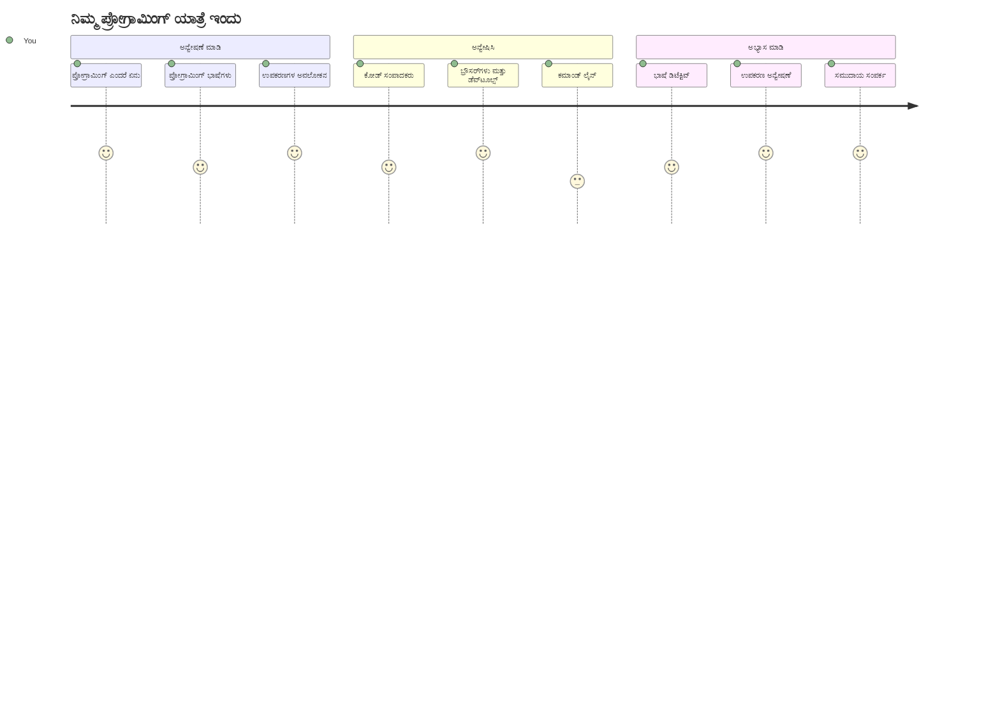
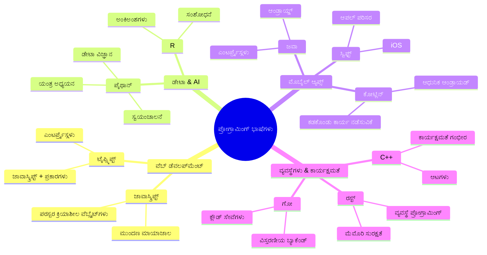
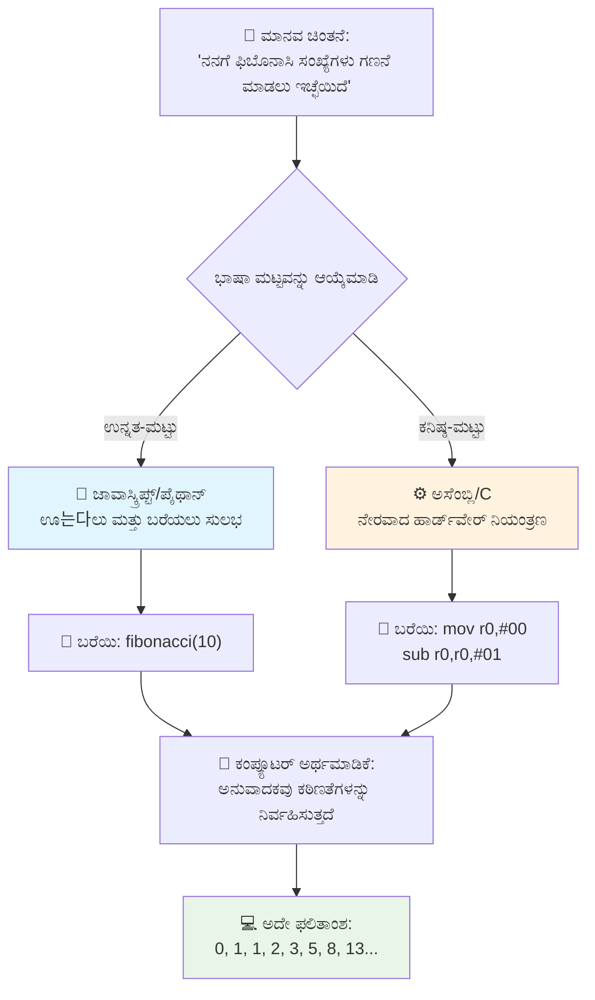
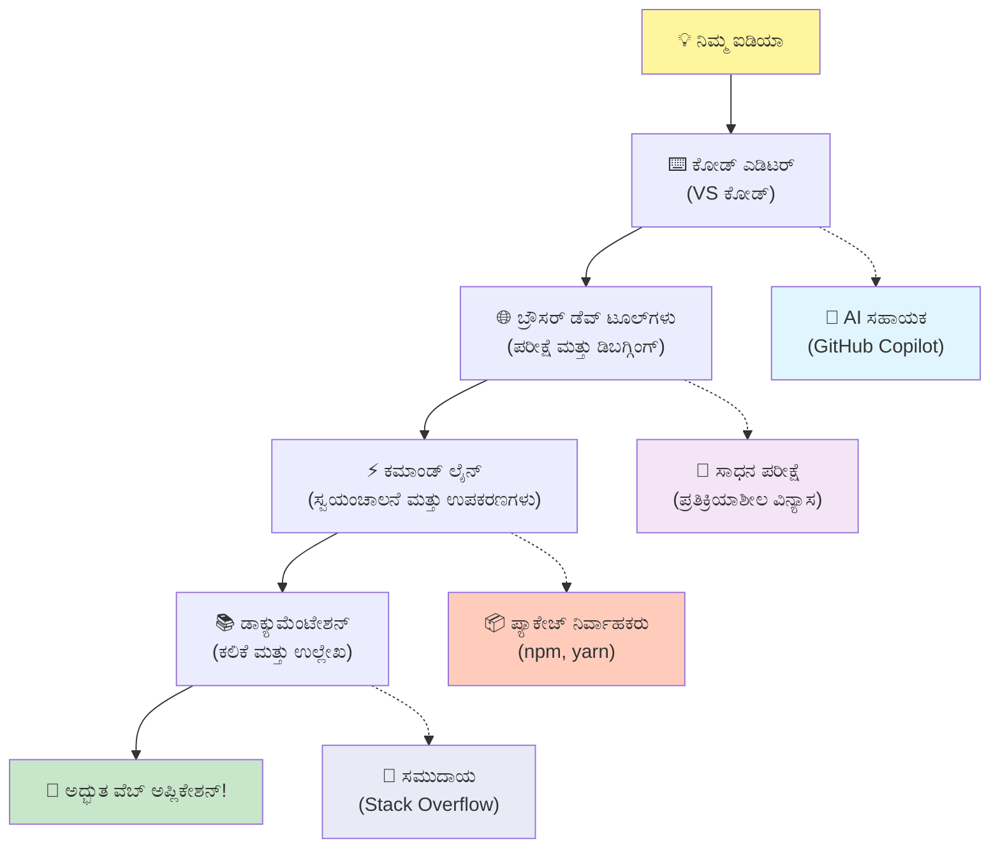

# ಪ್ರೋಗ್ರಾಮಿಂಗ್ ಭಾಷೆಗಳು ಮತ್ತು ಆಧುನಿಕ ಡಿವಲಪರ್ ಟೂಲ್ಗಳ ಪರಿಚಯ

ನಮಸ್ಕಾರ, ಭವಿಷ್ಯದ ಡಿವಲಪರ್! 👋 ನಾನು ನಿಮಗೆ ಪ್ರತಿದಿನವೂ ಕವಕವಳಿಕೆ ನೀಡುವ ಒಂದು ಸಂಗತಿಯನ್ನು ಹೇಳಬಹುದೇ? ನೀವು ಕಂಡುಹಿಪ್ಪಬಹುದು ಪ್ರೋಗ್ರಾಮಿಂಗ್ ಬೇರಾಗಿ ಕೇವಲ ಕಂಪ್ಯೂಟರ್ ಬಗ್ಗೆ ಅಲ್ಲ – ಇದು ನಿಮ್ಮ ಅಸಾಧಾರಣ ಆದರ್ಶಗಳನ್ನು ಜೀವಂತಗೊಳಿಸಲು ಸಕಲ ಶಕ್ತಿಗಳನ್ನು ಹೊಂದಿರುವಂತೆ!

ನೀವು ಬಳಸುವ ನಿಮ್ಮ ಪ್ರಿಯ ಆಪ್ ನಲ್ಲಿ ಎಲ್ಲವೂ ಚೆನ್ನಾಗಿಯಾಗಿ ಹೊಂದಿಕೊಳ್ಳುತ್ತದೆ ಅಂತಾ ಆ ಕ್ಷಣ ನೆನಸುತ್ತಿದೆಯೆ? ನೀವು ಬಟನ್ ಒತ್ತಿದಾಗ ಅದ್ಭುತವಾಗಿ ಏನೋ ಆಗುತ್ತದೆ, ನೀವು "ವಾಹ್, ಅವರವರು ಹೇಗೆ ಅದನ್ನು ಮಾಡಿದರು?" ಅಂತಾ ಭಾವಿಸುವಾಗ? ಅದೋ ನಿಮಗೆ ಹೋಲುವ ಯಾರೋ ಒಬ್ಬರು – ಬಹುಶಃ ಅವರು ತಮ್ಮ ಇಷ್ಟದ ಕಾಫಿ ಅಂಗಡಿಯ 2AM ಗಂಟೆಗೆ ಮೂರನೇ ಎಸ್ಪ್ರೆಸ್ಸೋ ಕುಡಿಯುತ್ತಿರುವಾಗ – ಆ ಮ್ಯಾಜಿಕ್ ರಚಿಸಿದ ಕೋಡ್ ಅನ್ನು ಬರೆದಿದ್ದಾರೆ. ಮತ್ತು ಇದು ನಿಮ್ಮ ಮನಸ್ಸನ್ನು ಹೊಡೆದಿಡುತ್ತದೆ: ಈ ಪಾಠದ ಅಂತ್ಯಕ್ಕೆ, ನೀವು ಅವರೇ ಹೇಗೆ ಮಾಡಿದರು ಅಂತ ಕುರಿತು ಅರ್ಥಮಾಡಿಕೊಳ್ಳುವುದಷ್ಟೇ ಅಲ್ಲ, ನೀವು ಸ್ವತಃ ಪ್ರಯತ್ನಿಸಲು ಉತ್ಸುಕನಾಗುತ್ತೀರಿ!

ನೋಡು, ಪ್ರಾರಂಭದಲ್ಲಿ ಪ್ರೋಗ್ರಾಮಿಂಗ್ ಭಯಂಕರವಾಗಿ ಕಾಣುತ್ತಿದ್ದರೆ, ನಾನು ಸಂಪೂರ್ಣವಾಗಿ ಅರ್ಥ ಮಾಡಿಕೊಂಡೆ. ನಾನು ಆರಂಭಿಸಿದಾಗ, ನಾನು ನಂಬಿದ್ದೇನೆ ನೀವು ಗಣಿತ ಪ್ರಸಿದ್ಧನೋ ಆದರೆ ಹೌದು ನೀವು ಐದನೆಯ ವಯಸ್ಸಿನಿಂದಲೇ ಕೋಡಿಂಗ್ ಮಾಡುತ್ತಿರಬೇಕು ಎಂದು. ಆದರೆ ಇದು ನನ್ನ ದೃಷ್ಟಿಕೋನವನ್ನು ಸಂಪೂರ್ಣವಾಗಿ ಬದಲಾಯಿಸಿತು: ಪ್ರೋಗ್ರಾಮಿಂಗ್ ಹೊಸ ಭಾಷೆಯಲ್ಲಿ ಸಂಭಾಷಣೆ ಕಲಿಯುವುದಕ್ಕೆ ಸರಿಹೊಂದುತ್ತದೆ. ನೀವು "ನಮಸ್ಕಾರ" ಮತ್ತು "ಧನ್ಯವಾದ" ಎದುರಿಸುತ್ತೀರಿ, ನಂತರ ಕಾಫಿ ಆರ್ಡರ್ ಮಾಡುವುದು ಕಲಿತೀರಿ, ಮತ್ತು ಅಲ್ಲಿಂದ ನೀವು ತತ್ವಶಾಸ್ತ್ರದ ಆಳವಾದ ಚರ್ಚೆಗಳನ್ನಷ್ಟೇ ನಡೆಸುತ್ತೀರಿ! ಆದರೆ ಇಲ್ಲಿ ನೀವು ಕಂಪ್ಯೂಟರ್ ಗಳೊಂದಿಗೆ ಚರ್ಚಿಸುತ್ತೀರಿ ಮತ್ತು ನಿಜವಾಗಿಯೂ? ಅವರು ಅತ್ಯಂತ ಧೈರ್ಯವಂತರು – ನಿಮ್ಮ ತಪ್ಪುಗಳನ್ನು ಎಂದೂ ತೀರ್ಪು ಮಾಡುವುದಿಲ್ಲ ಮತ್ತು ಮರುಪ್ರಯತ್ನಿಸಲು ಸದಾ ಉತ್ಸಾಹಿಗಳಾಗಿದ್ದಾರೆ!

ಇಂದು, ನಾವು ಅದ್ಭುತ ಬೇರೆ ಬೇರೆ ಉಪಕರಣಗಳನ್ನು ಪರಿಶೀಲಿಸುವೆವು, ಅವು ಆಧುನಿಕ ವೆಬ್ ಅಭಿವೃದ್ಧಿಯನ್ನು ಸಾಧ್ಯವಾಗಿಸುವುದರ ಜೊತೆಗೆ ಬಹಳ ಆಕರ್ಷಕವಾಗಿಸುತ್ತದೆ. ನಾನು ಸ್ಟುಡಿಯೋಗಳು, ಬ್ರೌಸರ್ ಗಳು ಮತ್ತು ವರ್ಕ್‌ಫ್ಲೋಗಳು ಬಗ್ಗೆ ಹೇಳುತ್ತಿದ್ದೇನೆ, ಅವು Netflix, Spotify ಮತ್ತು ನಿಮ್ಮ ಇಷ್ಟದ ಇಂಡಿ ಆಪ್ ಸ್ಟುಡಿಯೋಗಳ ಡಿವಲಪರ್ ಗಳು ಪ್ರತಿದಿನವೂ ಬಳಸುತ್ತಾರೆ. ಮತ್ತು ಇದು ನನಗೆ ಸಂತೋಷಕರವಾದ ಸಂಗತಿ ಹೇಳಬೇಕೆಂದರೆ: ಬಹುತೇಕ ಈ ವೃತ್ತಿಪರ, ಉದ್ಯಮಮಾನಕ ಉಪಕರಣಗಳು ಯಾವುದಕ್ಕೂ ಶೂಲ್ಕವಿಲ್ಲ!


> ನೋಟು ಚಿತ್ರಣ [Tomomi Imura](https://twitter.com/girlie_mac)


```mermaid
journey
    title ನಿಮ್ಮ ಪ್ರೋಗ್ರಾಮಿಂಗ್ ಯಾತ್ರೆ ಇಂದು
    section ಅನ್ವೇಷಣೆ ಮಾಡಿ
      ಪ್ರೋಗ್ರಾಮಿಂಗ್ ಎಂದರೆ ಏನು: 5: You
      ಪ್ರೋಗ್ರಾಮಿಂಗ್ ಭಾಷೆಗಳು: 4: You
      ಉಪಕರಣಗಳ ಅವಲೋಕನ: 5: You
    section ಅನ್ವೇಷಿಸಿ
      ಕೋಡ್ ಸಂಪಾದಕರು: 4: You
      ಬ್ರೌಸರ್‌ಗಳು ಮತ್ತು ಡೆವ್‌ಟೂಲ್ಸ್: 5: You
      ಕಮಾಂಡ್ ಲೈನ್: 3: You
    section ಅಭ್ಯಾಸ ಮಾಡಿ
      ಭಾಷೆ ಡಿಟೆಕ್ಟಿವ್: 4: You
      ಉಪಕರಣ ಅನ್ವೇಷಣೆ: 5: You
      ಸಮುದಾಯ ಸಂಪರ್ಕ: 5: You
```
## ನೀವು ಈಗಾಗಲೇ ಏನು ತಿಳಿದಿದ್ದೀರೋ ನೋಡೋಣ!

ಬೇಸಿಗೆರಲು ಮೊದಲು, ನಾನು ಕುತೂಹಲದಿಂದ ಕೇಳುತ್ತಿದ್ದೇನೆ – ನೀವು ಯಾವ ದರ್ಜೆಯ ಪ್ರೋಗ್ರಾಮಿಂಗ್ ಜಗತ್ತನ್ನು ಈಗಾಗಲೇ ತಿಳಿದುಕೊಂಡಿದ್ದೀರಾ? ಮತ್ತು ಕೇಳಿ, ನೀವು ಈ ಪ್ರಶ್ನೆಗಳನ್ನು ನೋಡುತ್ತಿದ್ದೀರಾ "ನನಗೆ ಈ ಬಗ್ಗೆ ಸಂಪೂರ್ಣ ಗೊತ್ತಿಲ್ಲ," ಅದು ಸರಿಯೇ, ಅದೇನು ಕೆಟ್ಟದಿಲ್ಲ! ಅಂದರೆ ನೀವು ಸರಿಯಾದ ಜಾಗದಲ್ಲಿ ಇದ್ದೀರಿ. ಈ ಕ್ವಿಜ್ ಅನ್ನು ವ್ಯಾಯಾಮಕ್ಕೆ ಮುಂಗಡ ಬಿಸಿಯಂತೆ ಪರಿಗಣಿಸಿ – ನಾವು ನಮ್ಮ ಮಿದುಳಿನ ماهಿನೆಯನ್ನು ತಯಾರಿಸುತ್ತಿದ್ದೇವೆ!

[ಪೂರ್ವ ಪಾಠದ ಕ್ವಿಜ್ ತೆಗೆದುಕೊಳ್ಳಿ](https://ff-quizzes.netlify.app/web/)


## ನಾವು ಒಟ್ಟಿಗೆ ಹೋಗಲಿರುವ ಸಾಹಸ

ಸರಿ, ನಾನು ನಿಜವಾಗಿಯೂ ಉತ್ಸಾಹದಿಂದ ತುಂಬಿದ್ದೇನೆ ನಾವು ಇಂದು ಅಧ್ಯಯನ ಮಾಡಲಿರುವ ಬಗ್ಗೆ! ನೀವು ಕೆಲವು ಆಲೋಚನೆಗಳನ್ನು ಅರ್ಥಮಾಡಿಕೊಳ್ಳುವಾಗ ನಿಮ್ಮ ಮುಖವನ್ನು ನೋಡುವುದನ್ನು ನಾನು ಬಯಸುತ್ತೇನೆ. ನಾವು ಒಟ್ಟಿಗೆ ಅನುಭವಿಸುವ ಅದ್ಭುತ ಪ್ರಯಾಣ ಇಲ್ಲಿದೆ:

- **ಪ್ರೋಗ್ರಾಮಿಂಗ್ ಎಂದರೆ ಏನು ಮತ್ತು ಅದು ಯಾಕೆ ಅತ್ಯುತ್ತಮವಾದುದು** – ನಾವು ಹೇಗೆ ಕೋಡ್ ಜೊತೆಗೆ ಆಲ್ಮಾರಿ ಜಾಗದಲ್ಲಿ ಎಲ್ಲಾ ಅಸ್ಪಷ್ಟ ಮಾಯೆಯನ್ನು ನಡಿಸುವುದನ್ನು ಕಂಡುಕೊಳ್ಳೋಣ, ಯಿಂದ ಅದು ಸೋಮವಾರ ಬೆಳಗ್ಗೆ ಎಂದು ತಿಳಿದುಕೊಳ್ಳುವ ಅಲಾರ್ಮ್ ಆಗಲಿ ಅಥವಾ ನಿಮ್ಮ Netflix ಶಿಫಾರಸುಗಳನ್ನು ಪರಿಪೂರ್ಣವಾಗಿ ಆಯ್ಕೆಮಾಡುವ అల್ಗೊರಿದಮ್ ಆಗಲಿ
- **ಪ್ರೋಗ್ರಾಮಿಂಗ್ ಭಾಷೆಗಳು ಮತ್ತು ಅವುಗಳ ಅದ್ಭುತ ವ್ಯಕ್ತಿತ್ವಗಳು** – ಪ್ರತಿಯೊಬ್ಬ ವ್ಯಕ್ತಿಯು ವಿಭಿನ್ನ ಸೂಪರ್ ಶಕ್ತಿಗಳೊಂದಿಗೆ ಮತ್ತು ಸಮಸ್ಯೆ ಪರಿಹಾರ ಮಾರ್ಗಗಳೊಂದಿಗೆ ಒಂದು ಸಾಂಗೆತಿಕ ಸಮಾರಂಭಕ್ಕೆ ಹೋಗುತ್ತಿದ್ದಂತೆ ಪರಿಗಣಿಸಿ. ಅದು ಪ್ರೋಗ್ರಾಮಿಂಗ್ ಭಾಷೆ ಲೋಕವಾಗಿದೆ, ಮತ್ತು ನೀವು ಅವುಗಳನ್ನು ಭೇಟಿಯಾಗಲು ಇಷ್ಟಪಡುವಿರಿ!
- **ಡಿಜಿಟಲ್ ಮಾಯೆಯನ್ನು ಸಾಧ್ಯಮಾಡುವ ಮೂಲ ಅಂಶಗಳು** – ನೀವು ಸೃಜನಶೀಲ ಲೆಗೋ ಸೆಟ್ ಗಳು ಎಂದು ಪರಿಗಣಿಸಿ. ಈ ಭಾಗಗಳು ಹೇಗೆ ಹೊಂದಿಕೊಳ್ಳುತ್ತವೆ ಎಂದು ತಿಳಿದಾಗ, ನೀವು ಕನಸು ಕಂಡ ಯಾವುದನ್ನಾದರೂ ನಿರ್ಮಿಸಬಹುದು.
- **ನೀವು ಗಾಜಿಗಳ ಕಾಯಿ ಪಡೆದಂತೆ ಅನುಭವಿಸುವ ವೃತ್ತಿಪರ ಉಪಕರಣಗಳು** – ನಾನು ಡ್ರಾಮಾ ಮಾಡುತ್ತಿಲ್ಲ – ಈ ಉಪಕರಣಗಳು ನಿಮಗೆ ನಿಜವಾಗಿಯೂ ಸೂಪರ್ ಶಕ್ತಿಗಳನ್ನು ಕೊಡುವಂತೆ ಭಾಸವಾಗುವಂತಿವೆ, ಮತ್ತು ಸಿಕ್ಕಿದ ರೋಚಕ ಭಾಗ ಏನೆಂದರೆ? ಅವುಗಳನ್ನು ವೃತ್ತಿಜೀವಿಗಳು ಕೂಡ ಬಳಸುತ್ತಾರೆ!

> 💡 **ಸೂಚನೆ**: ಇಂದು ಎಲ್ಲವನ್ನೂ ನೆನಪಿಡಲು ಪ್ರಯತ್ನಿಸಬೇಡಿ! ಈಗಿಗೆ, ನಾನು ನೀವು ಸಾಧ್ಯವೆಂಬುದರ ಬಗ್ಗೆ ಉತ್ಸಾಹವನ್ನು ಅನುಭವಿಸಬೇಕು. ವಿವರಗಳು ಸ್ವಾಭಾವಿಕವಾಗಿ ಇರುವಿರುತ್ತವೆ ನಾವು ಒಂದಾಗಿ ಅಭ್ಯಾಸ ಮಾಡುವಂತೆ – ಇದೇ ನಿಜವಾದ ಕಲಿಕೆ!

> ನೀವು ಈ ಪಾಠವನ್ನು [Microsoft Learn](https://learn.microsoft.com/en-us/learn/modules/web-development-101/introduction-programming/?WT.mc_id=academic-77807-sagibbon) ನಲ್ಲಿ ತೆಗೆದುಕೊಳ್ಳಬಹುದು!

## ಆಗ, ಪ್ರೋಗ್ರಾಮಿಂಗ್ ಅಂದರೆ ಏನು?

ಸರಿಹೊಬ್ಬೋ, ಅದು ನಿಜವಾಗಿ ಏನು ಎಂಬ ಆ ಪ್ರಶ್ನೆಗೆ ಉತ್ತರಿಸುವುದು:

ನನಗೆ ಈ ಬಗ್ಗೆ ಸಂಕಲ್ಪ ತುಂಬುತ್ತಿದ್ದ ಕಥೆಯನ್ನು ಹೇಳುತ್ತೇನೆ. ಕಳೆದ ವಾರ, ನಾನು ನನ್ನ ತಾಯಿಗೆ ನಮ್ಮ ಹೊಸ ಸ್ಮಾರ್ಟ್ ಟಿವಿ ರಿಮೋಟ್ ಹೇಗೆ ಬಳಸಬೇಕೆಂದೆ ವಿವರಿಸುತ್ತಿದ್ದೆ. ನಾನು ಹೇಳುತ್ತಿದ್ದೇನೆ “ಕೆಂಪು ಬಟನ್ ಒತ್ತಿ, ಆದರೆ ದೊಡ್ಡ ಕೆಂಪು ಬಟನ್ ಅಲ್ಲ, ಎಡ ಬದಿಯ ಸಣ್ಣ ಕೆಂಪು ಬಟನ್...ಇಲ್ಲ, ನಿನ್ನ ಇನ್ನೊಂದು ಎಡ...ಸರಿ, ಈಗ ಅದನ್ನು ಎರಡು ಸೆಕೆಂಡುಗಳ ಕಾಲ ಹಿಡಿ, ಒಂದು ಅಲ್ಲ, ಮೂರು ಅಲ್ಲ...” ಇದು ಪರಿಚಿತವಾಗಿ ಕೇಳಿಸಿಕೊಳ್ಳುತ್ತದೆಯೇ? 😅

ಅದು ಪ್ರೋಗ್ರಾಮಿಂಗ್! ಬಹಳ ವಿಶದವಾದ, ಹಂತ ಹಂತದ ಸೂಚನೆಗಳನ್ನು ಒಂದು ಶಕ್ತಿಶಾಲಿ ವಸ್ತುವಿಗೆ ನೀಡುವ ಕಲೆಯಾಗಿದೆ, ಆದರೆ ಎಲ್ಲವನ್ನೂ ಸರಿಯಾಗಿ ಅಭಿವ್ಯಕ್ತಿಸಬೇಕು. ನಿಮ್ಮ ತಾಯಿಗೆ (ಅವರು ಕೇಳಬಹುದು “ಯಾವ ಕೆಂಪು ಬಟನ್?!”) ವಿವರಿಸುವ ಬದಲು, ನೀವು ಕಂಪ್ಯೂಟರ್ ಗೆ (ಅದು ನೀವು ಹೇಳಿದಂತೆಯೇ ಮಾತ್ರ ಮಾಡುವುದು, ನೀವು ಎಷ್ಟೇ ಬೇರೆ ಅರ್ಥ ಮಾಡಿರಲಿಲ್ಲವಾದರೂ).

ನನಗೆ ಪ್ರಥಮ ಬಾರಿ ಕಲಿತಾಗ ಮನಸ್ಸು ಹಾರಿಹೋಗಿತು: ಕಂಪ್ಯೂಟರ್ ಗಳು ಮೂಲಭೂತವಾಗಿ ತುಂಬಾ ಸರಳ. ಅವು ಎರಡು ಅಂಕೆಗಳನ್ನು ಮಾತ್ರ ಅರ್ಥಮಾಡಿಕೊಳ್ಳುತ್ತವೆ – 1 ಮತ್ತು 0, ಅಂದರೆ “ಹೌದು” ಮತ್ತು “ಇಲ್ಲ” ಅಥವಾ “ಆನ್” ಮತ್ತು “ಆಫ್.” ಇಷ್ಟೇ! ಆದರೆ ಅದ್ಭುತವೆಂದರೆ – ನಾವು 1 ಮತ್ತು 0 ಗಳನ್ನೇ ಮಾತಾಡಬೇಕಾಗಿಲ್ಲ, ನಾವು "ಪ್ರೋಗ್ರಾಮಿಂಗ್ ಭಾಷೆಗಳು" ಎಂಬುದರ ನೆರವಿನಿಂದ ಅದನ್ನು ಮಾಡಬಲ್ಲೆವು. ಅವು ನಿಮ್ಮ ಮಾನವ ಸಂವೇದನೆಗಳನ್ನು ಕಂಪ್ಯೂಟರ್ ಭಾಷೆಗೆ ಅನುವದಿಸುವ ಜಗತ್ತಿನ ಅತ್ಯುತ್ತಮ ಅನುವಾದಕರಂತೆ ಕಾರ್ಯನಿರ್ವಹಿಸುತ್ತವೆ.

ಮತ್ತು ನನಗೆ ಪ್ರತಿದಿನವೂ ನನಗೆ ಕವಕವಳಿಕೆ ನೀಡುವುದು ಇದು: ನಿಮ್ಮ ಜೀವನದ ಎಲ್ಲಾ ಡಿಜಿಟಲ್ ಸಂಗತಿಗಳು ಯಾರಾದರೂ ನಿಮ್ಮಂತೆಯೇ, ಬಹುಶಃ ಪೈಜಾಮಾಗಳಲ್ಲಿ ಕುಳಿತು ಕಾಫಿ ಕುಡಿಯುತ್ತಾ ತಮ್ಮ ಲ್ಯಾಪ್ಟಾಪ್ನಲ್ಲಿ ಕೋಡ್ ಟೈಪ್ ಮಾಡುತ್ತಾ ಪ್ರಾರಂಭವಾಯಿತು. ಫೋಟೋ ಫಿಲ್ಟರ್ ಆಗಲೀ, ಆ ಪ್ರಯೋಗಿಕ ಸಾಧನವನ್ನು ನಿರ್ಮಿಸಿದವರು; ನೀವು ಇಷ್ಟಪಡುವ ಹೊಸ ಗೀತೆಗೆ ಕರೆದಡೆತರುವ ಸೂಚನೆ ಬರೆಯಿತು ಡಿವಲಪರ್; ನಿಮ್ಮ ಸ್ನೇಹಿತರೊಂದಿಗೆ ಬಿಲ್ ಹಂಚಿಕೊಳ್ಳಲು ಉಪಯೋಗಿಸುವ ಆಪ್? ಒಬ್ಬರು “ಇದು ಕಷ್ಟಕರ, ನಾನು ಇದನ್ನು ಸರಿಪಡಿಸಬಹುದು ಎಂದು ಯೋಚಿಸಿದರು” ಮತ್ತು ಅವರು ಮಾಡಿದರು!

ನೀವು ಪ್ರೋಗ್ರಾಂ ಕಲಿತುಕೊಳ್ಳುವಂತೆ, ನೀವು ಕೇವಲ ಹೊಸ ಕೌಶಲವನ್ನು ಪಡೆತರಲ್ಲ – ನೀವು ಈ ಅದ್ಭುತ ಸಮಸ್ಯೆ ಪರಿಹಾರಕರ ಸಮುದಾಯದ ಅಂಶವಾಗುತ್ತೀರಿ, ಯವರು ದಿನವೂ ಯೋಚಿಸುತ್ತಾರೆ, “ನೆಗೆರೊಬ್ಬರ ದಿನವನ್ನು ಸ್ವಲ್ಪ ಸಹಜವಾಗಿಸುವುದಕ್ಕೆ ನಾನು ಏನನ್ನಾದರೂ ನಿರ್ಮಿಸಬಲ್ಲೆನೆ?” ಸತ್ಯವಾಗಿ, ಇದಕ್ಕಿಂತ ಅದ್ಭುತವೇನಿದೆ?

✅ **ಬೆರೆಸುವ ಥರ ವಿಷಯ**: ನಿಮ್ಮ ಖಾಲಿ ಸಮಯದಲ್ಲಿ ಸಂಶೋಧನೆಯಲ್ಲಿ ಕುತೂಹಲಪಡಬೇಕಾದ ಒಂದು ವಿಚಾರ – ವಿಶ್ವದ ಮೊದಲ ಕಂಪ್ಯೂಟರ್ ಪ್ರೋಗ್ರಾಮರ್ ಯಾರು ಎಂದು ನೀವು ಯೋಚಿಸುತ್ತೀರಿ? ಒಂದು ಸೂಚನೆ ಕೊಡುವುದು ನನಗೆ ಇಷ್ಟ: ಅದು ನೀವು ನಿರೀಕ್ಷಿಸುವವನು ಎಂದಿಲ್ಲ! ಆ ವ್ಯಕ್ತಿಯ ಹಿಂದಿನ ಕಥೆ ಸಂಪೂರ್ಣವಾಗಿ ಜನಪ್ರಿಯ ಸೃಜನಶೀಲ ಸಮಸ್ಯೆ ಪರಿಹಾರ ಮತ್ತು ಹೊಸ ದೃಷ್ಟಿಕೋನವನ್ನು ತೋರಿಸುತ್ತದೆ.

### 🧠 **ತಪಾಸಣ ಸಮಯ: ನೀವು ಹೇಗಿದ್ದೀರಾ?**

**ಒಮ್ಮೆ ಪರಾಮರ್ಶಿಸಿ:**
- "ಕಂಪ್ಯೂಟರ್ ಗಳಿಗೆ ಸೂಚನೆ ನೀಡುವುದು" ಅನ್ನುವ ಕಲ್ಪನೆ ಈಗ ನಿಮಗೆ ಅರ್ಥವಾಗುತ್ತದೆಯೇ?
- ಏನಾದರೂ ದಿನನಿತ್ಯದ ಕೆಲಸವನ್ನು ಪ್ರೋಗ್ರಾಮಿಂಗ್ ಮೂಲಕ ಸ್ವಯಂಚಾಲಿತ ಮಾಡಲು ಇಚ್ಛಿಸುತ್ತೀರಾ?
- ಈ ಪ್ರೊಗ್ರಾಮಿಂಗ್ ವಿಷಯದ ಕುರಿತು ನಿಮ್ಮ ಮನಸ್ಸಿನಲ್ಲಿ ಯಾವ ಪ್ರಶ್ನೆಗಳು ಮೂಡುತ್ತಿವೆ?

> **ನೋಡಿರಿ**: ಕೆಲವು ಕಲ್ಪನೆಗಳು ಈಗ ಸ್ಪಷ್ಟವಾಗದಿದ್ದರೂ ಸಹ ಇದು ಸಂಪೂರ್ಣ ಸಹಜವಾಗಿದೆ. ಪ್ರೋಗ್ರಾಮಿಂಗ್ ಕಲಿಯುವುದು ಹೊಸ ಭಾಷೆ ಕಲಿಯುವುದಂತೆ – ನಿಮ್ಮ ಮೆದುಳು ನ್ಯೂರಲ್ ಮಾರ್ಗಗಳನ್ನು ನಿರ್ಮಿಸಲು ಸಮಯ ಬೇಕಿದೆ. ನೀವು ಅದ್ಭುತವಾಗಿ ಮಾಡುತ್ತಿದ್ದೀರಿ!

## ಪ್ರೋಗ್ರಾಮಿಂಗ್ ಭಾಷೆಗಳು ವಿವಿಧ ಮಾಯಾಜಾಲ ಸ್ವಾದಗಳಂತೆ

ಸರಿ, ಇದು ವಿಚಿತ್ರವಾಗಿ ಕಾಣಬಹುದು, ಆದರೆ ನನ್ನೊಂದಿಗೆ ಇರು – ಪ್ರোগ್ರಾಮಿಂಗ್ ಭಾಷೆಗಳು ವಿಭಿನ್ನ ಸಂಗೀತ ಶೈಲಿಗಳಂತಿವೆ. ನೀವು ಜಾಜ್ (ಜಾಜ್), ರಾಕ್ (ಶಕ್ತಿ ಮತ್ತು ಸರಳತೆ), ಕ್ಲಾಸಿಕಲ್ (ಸೌಂದರ್ಯ ಮತ್ತು ರಚನೆ) ಮತ್ತು ಹಿಪ್-ಹಾಪ್ (ಸೃಜನಶೀಲತೆ ಮತ್ತು ಅಭಿವ್ಯಕ್ತಿ) ಅನ್ನು ಪರಿಗಣಿಸಿ. ಪ್ರತಿಯೊಂದು ಶೈಲಿಯೂ ತನ್ನ ಅನನ್ಯ ವಾತಾವರಣ, ತನ್ನ ಭಕ್ತ ಸಮುದಾಯ ಮತ್ತು ವಿಭಿನ್ನ ಮನೋಭಾವಗಳಿಗೆ ಸೂಕ್ತವಾದದ್ದು.

ಪ್ರೋಗ್ರಾಮಿಂಗ್ ಭಾಷೆಗಳು ಕೂಡ ಇದೇ ರೀತಿ ಕೆಲಸಮಾಡುತ್ತವೆ! ಮೈಥುಂಡು ಮೊಬೈಲ್ ಗೇಮ್ ಡೆವಲಪ್ ಮಾಡಲು ಬಳಕೆಯಾಗುವ ಭಾಷೆಯನ್ನು ನೀವು ದೊಡ್ಡ ಪ್ರಮಾಣದ ಹವಾಮಾನ ಮಾಹಿತಿ crunch ಮಾಡಲು ಬಳಸುವುದಿಲ್ಲ, ಹಾಗೆಯೇ ಯೋಗ ತರಗತಿಯಲ್ಲಿ ಡೆತ್ ಮೆಟಲ್ ವಾದಿಸುವಂತಿಲ್ಲ (ಬಹುದೋ ಬಹುತೇಕ ಯೋಗ ತರಗತಿಗಳು)!

ಆದರೆ ಪ್ರತಿಸಾರಿ ಇದು ನನ್ನ ಮನಸ್ಸನ್ನು ಹೊಡೆದು ಹಾಕುತ್ತದೆ: ಈ ಭಾಷೆಗಳು ತುಂಬಾ ಧೈರ್ಯಬದ್ಧ ಮತ್ತು ಪ್ರತಿಭಾವಂತ ಭಾಷಾಂತರಕರಂತೆ ನಿಮ್ಮ ಪಕ್ಕದಲ್ಲಿ ಉಳ್ಳವು. ನೀವು ನಿಮ್ಮ ಕೈಗಾರಿಕೆಯ ಧಾರ್ಮಿಕತೆಯನ್ನು ಅದ್ಭುತವಾಗಿ ಹೇಳಬಹುದು, ಮತ್ತು ಅವು ಕಂಪ್ಯೂಟರ್ ಮಾತನಾಡುವ 1 ಗಳು ಮತ್ತು 0 ಗಳನ್ನಾಗಿ ಅದನ್ನು ತರ್ಜುಮೆ ಮಾಡುತ್ತವೆ. ಇದು “ಮಾನವ ಸೃಜನಶೀಲತೆ” ಮತ್ತು “ಕಂಪ್ಯೂಟರ್ ತರ್ಕ” ಎರಡನ್ನೂ ತುಂಬಾ ಚೆನ್ನಾಗಿ ತಿಳಿದಿರುವ ಸ್ನೇಹಿತ ಇದ್ದಂತೆ – ಅವರು ಎಂದೂ ದಣಿದಿಲ್ಲ, ಕಾಫಿ ಬ್ರೇಕ್ ಬೇಕಾಗಿಲ್ಲ ಮತ್ತು ನೀವು ಅದೇ ಪ್ರಶ್ನೆ ಎರಡನೇ ಬಾರಿ ಕೇಳಿದರೂ ತೀರ್ಪು ನೀಡುವುದಿಲ್ಲ!

### ಜನಪ್ರಿಯ ಪ್ರೋಗ್ರಾಮಿಂಗ್ ಭಾಷೆಗಳು ಮತ್ತು ಅವುಗಳ ಬಳಕೆ


```mermaid
mindmap
  root((ಪ್ರೋಗ್ರಾಮಿಂಗ್ ಭಾಷೆಗಳು))
    ವೆಬ್ ಡೆವಲಪ್‌ಮೆಂಟ್
      ಜಾವಾಸ್ಕ್ರಿಪ್ಟ್
        ಮುಂದಣ ಮಾಯಾಜಾಲ
        ಪರಸ್ಪರ ಕ್ರಿಯಾಶೀಲ ವೆಬ್ಸೈಟ್‌ಗಳು
      ಟೈಪ್ಸ್ಕ್ರಿಪ್ಟ್
        ಜಾವಾಸ್ಕ್ರಿಪ್ಟ್ + ಪ್ರಕಾರಗಳು
        ಎಂಟರ್ಪ್ರೈಸ್ಗಳು
    ಡೇಟಾ & AI
      ಪೈಥಾನ್
        ಡೇಟಾ ವಿಜ್ಞಾನ
        ಯಂತ್ರ ಅಧ್ಯಯನ
        ಸ್ವಯಂಚಾಲನೆ
      R
        ಅಂಕಿಅಂಶಗಳು
        ಸಂಶೋಧನೆ
    ಮೊಬೈಲ್ ಆ್ಯಪ್ಸ್
      ಜವಾ
        ಆಂಡ್ರಾಯ್ಡ್
        ಎಂಟರ್ಪ್ರೈಸ್ಗಳು
      ಸ್ವಿಫ್ಟ್
        iOS
        ಆಪಲ್ ಪರಿಸರ
      ಕೋಟ್ಲಿನ್
        ಆಧುನಿಕ ಆಂಡ್ರಾಯಡ್
        ಕಡಕೊಂಡು ಕಾರ್ಯ ನಡೆಸುವಿಕೆ
    ವ್ಯವಸ್ಥೆಗಳು & ಕಾರ್ಯಕ್ಷಮತೆ
      C++
        ಆಟಗಳು
        ಕಾರ್ಯಕ್ಷಮತೆ ಗಂಭೀರ
      ರಸ್ಟ್
        ಮೆಮೊರಿ ಸುರಕ್ಷತೆ
        ವ್ಯವಸ್ಥೆ ಪ್ರೋಗ್ರಾಮಿಂಗ್
      ಗೋ
        ಕ್ಲೌಡ್ ಸೇವೆಗಳು
        ವಿಸ್ತರಣೀಯ ಬ್ಯಾಕೆಂಡ್
```
| ಭಾಷೆ | ಉತ್ತಮವಾದುದು | ಯಾಕೆ ಜನಪ್ರಿಯ |
|----------|----------|------------------|
| **JavaScript** | ವೆಬ್ ಅಭಿವೃದ್ಧಿ, ಬಳಕೆದಾರ ಇಂಟರ್ಫೇಸೆಸ್ | ಬ್ರೌಸರ್ ಗಳು ಹಾಗೂ ಇಂಟರಾಕ್ಟಿವ್ ವೆಬ್‌ಸೈಟ್ ಗಳಲ್ಲಿ ಚಾಲನೆ |
| **Python** | ಡೇಟಾ ವಿಜ್ಞಾನ, ಸ್ವಯಂಚಾಲನೆ, AI | ಓದಲು ಸುಲಭ, ಶಕ್ತಿಶಾಲಿ ಗ್ರಂಥಾಲಯಗಳು |
| **Java** | ಎಂಟರ್ಪ್ರೈಸ್ ಅಪ್ಲಿಕೇಶನ್ಗಳು, ಆಂಡ್ರಾಯ್ಡ್ ಆಪ್ಸ್ | ವೇದಿಕೆ-ಸ್ವತಂತ್ರ, ದೊಡ್ಡ ವ್ಯವಸ್ಥೆಗಳಿಗೆ ದೃಢವಾದುದು |
| **C#** | ವಿಂಡೋಸ್ ಅಪ್ಲಿಕೇಶನ್ಗಳು, ഗೇಮ್ ಅಭಿವೃದ್ಧಿ | ಶಕ್ತಿ ತುಂಬಿದ ಮೈಕ್ರೋಸಾಫ್ಟ್ ಪರಿಕರ ವ್ಯವಸ್ಥೆ ಬೆಂಬಲ |
| **Go** | ಕ್ಲೌಡ್ ಸೇವೆಗಳು, ಬ್ಯಾಕೆಂಡ್ ವ್ಯವಸ್ಥೆಗಳು | ವೇಗವಾಗಿ, ಸರಳವಾಗಿ, ಆಧುನಿಕ ಕಂಪ್ಯೂಟಿಂಗ್ ಗಾಗಿ ವಿನ್ಯಾಸ ಮಾಡಲಾಗಿದೆ |

### ಅತಿದೊಡ್ಡ ಮಟ್ಟದ ಮತ್ತು ಕಡಿಮೆ ಮಟ್ಟದ ಭಾಷೆಗಳು

ಇದು ನಿಜವಾಗಿಯೂ ನನ್ನ ಮೆದುಳಿಗೆ ಹೊಡೆದ ವಿಚಾರವಾಗಿತ್ತು ಪ್ರಾರಂಭದಲ್ಲಿ ಕಲಿತಾಗ, ಹಾಗಾಗಿ ನಾನು ಸಂಜ್ಞೆಯನ್ನು ಹಂಚಿಕೊಳ್ಳುತ್ತೇನೆ ಅದು ನನಗೆ ಅರ್ಥವಾಗಲು ಕೊನೆಗೆ ಸಹಾಯ ಮಾಡಿದದ್ದು – ನಿಮಗೆ ಸಹ ಸಹಾಯವಾಗಲಿ!

ನೀವು ಅಂತೆಯೇ ಅಲ್ಲಿಯ ಭಾಷೆಯನ್ನು ಮಾತನಾಡದ ದೇಶಕ್ಕೆ ಭೇಟಿ ನೀಡಿ, ಅಲ್ಲಿ ಸಮೀಪದ ಶೌಚಾಲಯವನ್ನು ಹುಡುಕಬೇಕಿದೆ ಎಂದು ಭಾವಿಸಿ (ನಾವೆಲ್ಲಾ ಅಲ್ಲಿದ್ದೇವೆ, ಸರಿಯೇ? 😅):

- **ಕಡಿಮೆ ಮಟ್ಟದ ಪ್ರೋಗ್ರಾಮಿಂಗ್** ಅಂದರೆ ಆ ಸ್ಥಳೀಯ ಭಾಷೆಯನ್ನು ಅಂತಷ್ಟು ಚೆನ್ನಾಗಿ ಕಲಿತಿರುವಂತೆ, ನೀವು ಆ ಮನೆಯ ಅಜ್ಜಿಯೊಂದಿಗೆ ಆ ಲೆಕ್ಕಸಾಲೆಗೆ ಹೋಲುವ ಎಲ್ಲ ವರ್ಣನೆಗಳನ್ನು, ಸ್ಥಳೀಯ ಗಾಳಿಪಟ, ಮತ್ತು ಒಳಗಿನ ಜೋಕ್ಸ್ ಬಳಸಿ ಸಂಭಾಷಣೆ ಮಾಡುವುದು. ಅದ್ಭುತ ಮತ್ತು ಪರಿಣಾಮಕಾರಿಯಾಗುತ್ತೆ... ಆದರೆ ನೀವು ಎರಡನೇ, ಬಟ್ಟೆ ಬದಲಾಯಿಸುವ ವಿಶಿಷ್ಟ ರಾಜ್ಯಕ್ಕೆ ಬಂದಿರುವಂತೆ ಅನ್ಸುತ್ತದೆ!

- **ಅತಿದೊಡ್ಡ ಮಟ್ಟದ ಪ್ರೋಗ್ರಾಮಿಂಗ್** ಅಂದರೆ ಅದ್ಭುತ ಸ್ಥಳೀಯ ಗೆಳೆಯನಿದ್ದರೆ, ನೀವು "ನನಗೆ ಶೌಚಾಲಯ ಬೇಕು" ಎಂದು ಸರಳ ಇಂಗ್ಲಿಷಿನಲ್ಲಿ ಹೇಳಬಹುದು, ಅವರು ಎಲ್ಲಾ ಸಾಂಸ್ಕೃತಿಕ ಅನುವಾದ ಮತ್ತು ಮಾರ್ಗ ಸೂಚನೆಗಳನ್ನು ನಿಮ್ಮ ಸೂಚ್ಯಂಕಕ್ಕೆ ಸರಿಯಾಗಿ ವ್ಯವಸ್ಥೆಮಾಡಿಕೊಳ್ಳುತ್ತಾರೆ.

ಪ್ರೋಗ್ರಾಮಿಂಗ್ ದೃಷ್ಟಿಯಿಂದ:
- **ಕಡಿಮೆ ಮಟ್ಟದ ಭಾಷೆಗಳು** (ಹಾಗೂ ಅಸೆಂಬ್ಲಿ ಅಥವಾ C) ನಿಮಗೆ ಕಂಪ್ಯೂಟರ್ ನ ನಿಜವಾದ ಹಾರ್ಡ್‌ವೇರ್ ಜೊತೆಗೆ ತುಂಬ ವಿಶದವಾದ ಸಂಭಾಷಣೆ ಮಾಡಲು ಅವಕಾಶ ಕೊಡುತ್ತವೆ, ಆದರೆ ನೀವು ಯಂತ್ರದಂತೆ ಯೋಚಿಸಬೇಕಾಗುತ್ತದೆ, ಅದು ನಿಜವಾಗಿಯೂ ತುಂಬ ಹೊಸ ಮನಃಸ್ಥಿತಿ ಬೇಕಾದದ್ದು!
- **ಅತಿದೊಡ್ಡ ಮಟ್ಟದ ಭಾಷೆಗಳು** (ಹಾಗೆ JavaScript, Python ಅಥವಾ C#) ನೀವು ಮಾನವನಂತೆ ಯೋಚಿಸಿದರೆ, ಅವು ಎಲ್ಲಾ ಯಂತ್ರಭಾಷೆಯನ್ನು ನಿಭಾಯಿಸುತ್ತವೆ. ಜೊತೆಗೆ, ಅವು ನವೀನರ ಬಗ್ಗೆ ನೆನಪಿರುವ, ನಿಜವಾದ ಸಹಾಯವನ್ನು ನೀಡುವ ಅಲ್ಲಿ ಒಳ್ಳೆಯ ಸಮುದಾಯ ಹೊಂದಿವೆ!

ನನಗೆ ಯಾವ ಭಾಷೆಗಳು ಆರಂಭಿಸಲು ಸಲಹೆ ನೀಡುತ್ತೇನೆ ಗೊತ್ತಾ? 😉 ಅತಿದೊಡ್ಡ ಮಟ್ಟದ ಭಾಷೆಗಳು ತರಬೋತಿ ಬೆಳ್ಳಿಗೆ ಹೋಲಿಸುತ್ತವೆ, ನೀವು ಅವುಗಳನ್ನು ತೆಗೆಯಲು ಬಯಸುವುದಿಲ್ಲ ಏಕೆಂದರೆ ಅವು ಅನುಭವವನ್ನು ಬಹಳ ಆನಂದಕಾರಿಯಾಗಿ ಮಾಡುತ್ತವೆ!


```mermaid
flowchart TB
    A["👤 ಮಾನವ ಚಿಂತನೆ:<br/>'ನನಗೆ ಫಿಬೊನಾಸಿ ಸಂಖ್ಯೆಗಳು ಗಣನೆ ಮಾಡಲು ಇಚ್ಛೆಯಿದೆ'"] --> B{ಭಾಷಾ ಮಟ್ಟವನ್ನು ಆಯ್ಕೆಮಾಡಿ}
    
    B -->|ಉನ್ನತ-ಮಟ್ಟು| C["🌟 ಜಾವಾಸ್ಕ್ರಿಪ್ಟ್/ಪೈಥಾನ್<br/>ಊ는다ಲು ಮತ್ತು ಬರೆಯಲು ಸುಲಭ"]
    B -->|ಕನಿಷ್ಠ-ಮಟ್ಟು| D["⚙️ ಅಸೆಂಬ್ಲಿ/C<br/>ನೇರವಾದ ಹಾರ್ಡ್‌ವೇರ್ ನಿಯಂತ್ರಣ"]
    
    C --> E["📝 ಬರೆಯಿ: fibonacci(10)"]
    D --> F["📝 ಬರೆಯಿ: mov r0,#00<br/>sub r0,r0,#01"]
    
    E --> G["🤖 ಕಂಪ್ಯೂಟರ್ ಅರ್ಥಮಾಡಿಕೆ:<br/>ಅನುವಾದಕವು ಕಠಿಣತೆಗಳನ್ನು ನಿರ್ವಹಿಸುತ್ತದೆ"]
    F --> G
    
    G --> H["💻 ಅದೇ ಫಲಿತಾಂಶ:<br/>0, 1, 1, 2, 3, 5, 8, 13..."]
    
    style C fill:#e1f5fe
    style D fill:#fff3e0
    style H fill:#e8f5e8
```
### ನೀವು ನೋಡಿರಿ, ಅತಿದೊಡ್ಡ ಮಟ್ಟದ ಭಾಷೆಗಳು ಎಷ್ಟರಮಟ್ಟಿಗೆ ಸ್ನೇಹಪರವಾಗಿವೆ

ಸರಿಹೊಂದುತ್ತೇವೆ, ನಾನು ನಿಮಗೆ ಏನೋ ತೋರಿಸಲಿದ್ದೇನೆ ಅದು ನನಗೆ ಅತಿದೊಡ್ಡ ಮಟ್ಟದ ಭಾಷೆಗಳನ್ನು ಇಷ್ಟಪಡಿಸಲು ಕಾರಣವಾಗಿದೆ, ಆದರೆ ಮೊದಲಿಗೆ – ನೀವು ಒಂದು ವಾದ ಮಾಡಬೇಕು. ನೀವು ಮೊದಲ ಕೋಡ್ ಉದಾಹರಣೆ ನೋಡಿದಾಗ, ಬೆದರಬೇಡಿ! ಅದು ಅದೆಷ್ಟೋ ನನ್ನುಂಟಕ್ಕೊಳ್ಳಿಸುವಂತೆ ತೋರುತ್ತದೆ. ಅದೇ ನಾನು ಹೇಳುತ್ತಿದ್ದ ಕಾರಣ!

ನಾವು ಒಂದು ಕಾರ್ಯವನ್ನು ಎರಡು ಬಗೆಯ ಶೈಲಿಯಲ್ಲಿ ಬರೆದಿರೋದು ನೋಡೋಣ. ಎರಡೂಗಳು ಫಿಬೊನಾಚಿ ಕ್ರಮವನ್ನು ರಚಿಸುತ್ತವೆ – ಇದು ಒಂದು ಸುಂದರ ಗಣಿತೀಯ ಮಾದರಿ, ಅಲ್ಲಿ ಪ್ರತಿಯೊಂದು ಸಂಖ್ಯೆ ಹಿಂದಿನ ಎರಡು ಸಂಖ್ಯೆಗಳ ಮೊತ್ತ: 0, 1, 1, 2, 3, 5, 8, 13... (ಮೋಜಿನ ವಿಷಯ: ನೀವು ಈ ಮಾದರಿಯನ್ನು ನಾನಾ ಪ್ರಕೃತಿ ಸಂಗತಿಗಳಲ್ಲಿ ಕಾಣುತ್ತೀರಿ – ಸೂರ್ಯಾಸೂತ್ರ ಬಿಚ್ಚಿನ ಕಣಿಗಳು, ಪೈನ್ ಕೋನ್ ಮಾದರಿಗಳು, ಗ್ಯಾಲಕ್ಸಿಗಳು ಹೇಗೆ ರೂಪುಗೊಳ್ಳುವುದೂ!)

ತಪ್ಪದೇ ನೋಡಿ!

**ಅತಿದೊಡ್ಡ ಮಟ್ಟದ ಭಾಷೆ (JavaScript) – ಮಾನವ ಸ್ನೇಹಿ:**

```javascript
// ಹಂತ 1: ಮೂಲ ಫಿಬೊನಾಚಿ ಸಿದ್ಧತೆ
const fibonacciCount = 10;
let current = 0;
let next = 1;

console.log('Fibonacci sequence:');
```

**ಈ ಕೋಡ್ ಮಾಡುವ ಕಾರ್ಯ:**
- **一个 ನಿಶ್ಚಿತ ಸಂಖ್ಯೆ** ಘೋಷಿಸಿ ನಾವು ಎಷ್ಟು ಫಿಬೊನಾಚಿ ಸಂಖ್ಯೆಯನ್ನು ತಯಾರು ಮಾಡಬೇಕೆಂದು
- **ರದ್ದುಪಡಿಸಿ** ಈಗಿನ ಮತ್ತು ಮುಂದಿನ ಸಂಖ್ಯೆಗಳನ್ನು ಟೋಕಣಿಸಲು ಎರಡು ಚರಗಳನ್ನು
- **ಸೂಚಿಸಿ** ಆರಂಭಿಕ ಮೌಲ್ಯಗಳು (0 ಮತ್ತು 1) ಫಿಬೊನಾಚಿ ಮಾದರಿಯನ್ನು ವ್ಯಾಖ್ಯಾನಿಸಲು
- **ತೋರಿಸಿ** ನಮ್ಮ ಫಲಿತಾಂಶವನ್ನು ಕಲ್ಪಿಸುವ ಶೀರ್ಷಿಕೆ ಸಂದೇಶ

```javascript
// ಹಂತ 2: ಲೂಪ್‌ನೊಂದಿಗೆ ಕ್ರಮವನ್ನು ರಚಿಸಿ
for (let i = 0; i < fibonacciCount; i++) {
  console.log(`Position ${i + 1}: ${current}`);
  
  // ಕ್ರಮದಲ್ಲಿ ಮುಂದಿನ ಸಂಖ್ಯೆಯನ್ನು ಲೆಕ್ಕಿಸಿ
  const sum = current + next;
  current = next;
  next = sum;
}
```

**ಇಲ್ಲಿ ನಡೆಯುವ ಪ್ರಕ್ರಿಯೆ:**
- `for` ಲೂಪ್ ಬಳಸಿ ನಮ್ಮ ಸರಣಿಯ ಪ್ರತಿಯೊಂದು ಸ್ಥಾನದಲ್ಲಿ ಲೂಪ್ ಮಾಡಿ
- ಪ್ರತಿ ಸಂಖ್ಯೆಯನ್ನು ಅದರ ಸ್ಥಾನೊಡನೆ ಟೆಂಪ್ಲೇಟ್ ಲಿಟರಲ್ ರೂಪದಲ್ಲಿ ತೋರಿಸಿ
- ಈಗಿನ ಮತ್ತು ಮುಂದಿನ ಮೌಲ್ಯಗಳನ್ನು ಸೇರಿಸಿ ಮುಂದಿನ ಫಿಬೊನಾಚಿ ಸಂಖ್ಯೆಯನ್ನು ಲೆಕ್ಕಿಸಿ
- ನಮ್ಮ ಟ್ರ್ಯಾಕಿಂಗ್ ಚರಗಳನ್ನು ಮುಂದಿನитераೇಷನ್ ಗೆ ನವೀಕರಿಸಿ

```javascript
// ಹಂತ 3: ಆಧುನಿಕ ಕಾರ್ಯಾತ್ಮಕ ವಿಧಾನ
const generateFibonacci = (count) => {
  const sequence = [0, 1];
  
  for (let i = 2; i < count; i++) {
    sequence[i] = sequence[i - 1] + sequence[i - 2];
  }
  
  return sequence;
};

// ಬಳಕೆ ಉದಾಹರಣೆ
const fibSequence = generateFibonacci(10);
console.log(fibSequence);
```

**ಮೇಲಿನದಲ್ಲಿ ನಾವು:**
- ಆಧುನಿಕ ಅರೋ ಫಂಕ್ಷನ್ ಸಿಂಟ್ಯಾಕ್ಸ್ ಬಳಸಿ ಪುನರಾವರ್ತನೀಯ ಫಂಕ್ಷನ್ ನಿರ್ಮಿಸಿದ್ದೇವೆ
- ಪ್ರತಿಯೊಂದು ಸಂಖ್ಯೆಯನ್ನು ತೋರಿಸುವ ಬದಲು ಸಂಪೂರ್ಣ ಸರಣಿ ಸಂಗ್ರಹಿಸಲು ಅರೆ ಬೇಧನೆಯನ್ನು ನಿರ್ಮಿಸಿದ್ದೇವೆ
- ಹಿಂದಿನ ಮೌಲ್ಯಗಳಿಂದ ಪ್ರತಿಯೊಂದು ಹೊಸ ಸಂಖ್ಯೆಯನ್ನು ಲೆಕ್ಕಿಸಲು ಅರೆ ಸೂಚ್ಯದ ಉಪಯೋಗಿಸಿದ್ದೇವೆ
- ನಮ್ಮ ಪ್ರೋಗ್ರಾಮಿನ ಇತರ ಭಾಗಗಳಲ್ಲಿ ನಿಖರವಾದ ಉಪಯೋಗಕ್ಕಾಗಿ ಸಂಪೂರ್ಣ ಸರಣಿಯನ್ನು ತಿರುಗಿಸಿರುವೆವು

**ಕಡಿಮೆ ಮಟ್ಟದ ಭಾಷೆ (ARM Assembly) – ಕಂಪ್ಯೂಟರ್ ಗೆ ಅನುಕೂಲಕರ:**

```assembly
 area ascen,code,readonly
 entry
 code32
 adr r0,thumb+1
 bx r0
 code16
thumb
 mov r0,#00
 sub r0,r0,#01
 mov r1,#01
 mov r4,#10
 ldr r2,=0x40000000
back add r0,r1
 str r0,[r2]
 add r2,#04
 mov r3,r0
 mov r0,r1
 mov r1,r3
 sub r4,#01
 cmp r4,#00
 bne back
 end
```

JavaScript ಆವೃತ್ತಿ ಇಂಗ್ಲಿಷ್ ಸೂಚನೆಗಳಂತೆ ಓದುವಂತೆ ಕಾಣುತ್ತದೆ ಆದರೆ Assembly ಆವೃತ್ತಿ ಕಂಪ್ಯೂಟರ್ ಪ್ರೊಸೆಸರ್ ನ ನೇರ ನಿಯಂತ್ರಣಕ್ಕಾಗಿ cryptic ಆಜ್ಞೆಗಳನ್ನು ಬಳಸುತ್ತದೆ. ಎರಡು ಶೈಲಿಗಳು ಕೂಡ ಒಂದೇ ಕಾರ್ಯವನ್ನು ಸಾಧಿಸುತ್ತವೆ ಆದರೆ ಅತಿದೊಡ್ಡ ಮಟ್ಟದ ಭಾಷೆ ಮಾನವರಿಗೆ ಅರ್ಥಮಾಡಿಕೊಳ್ಳಲು, ಬರೆಯಲು ಮತ್ತು ನಿರ್ವಹಿಸಲು ಸುಲಭ.

**ನಿಮಗೆ ಕಾಣುವ ಪ್ರಮುಖ ಭೇದಗಳು:**
- **ಓದುಗೈತೆ**: ಜಾವಾಸ್ಕ್ರಿಪ್ಟ್ `fibonacciCount` ಎಂಬ ವರ್ಣನಾತ್ಮಕ ಹೆಸರುಗಳನ್ನು ಬಳಸುತ್ತದೆ ಆದರೆ ಅಸೆಂಬ್ಲಿ `r0`, `r1` ಹೋಲಿರುವ ರಹಸ್ಯಮಯ ಲೇಬಲ್‌ಗಳನ್ನು ಬಳಸುತ್ತದೆ  
- **ಕಾಮೆಂಟ್ಸ್**: ಹೈ-ಲೆವೆಲ್ ಭಾಷೆಗಳು ಸ್ವ-ದಾಖಲೆಗೊಳ್ಳುವ ಕೋಡ್ ನಿರ್ಮಿಸಲು ವಿವರಣೆಾತ್ಮಕ ಕಾಮೆಂಟ್‌ಗಳನ್ನು ಉತ್ತೇಜಿಸುತ್ತವೆ  
- **ಸಂರಚನೆ**: ಜಾವಾಸ್ಕ್ರಿಪ್ಟ್‌ನ ತಾರ್ಕಿಕ ಪ್ರವರ್ತನೆ ಮಾನವರು ಸಮಸ್ಯೆಗಳನ್ನು ಹಂತ-ಹಂತವಾಗಿ ಚಿಂತಿಸುವ ರೀತಿಗೆ ಹೊಂದಿಕೆಯಾಗುತ್ತದೆ  
- **ನಿರ್ವಹಣೆ**: ವಿಭಿನ್ನ ಅಗತ್ಯಗಳಿಗೆ ಜಾವಾಸ್ಕ್ರಿಪ್ಟ್ ಆವೃತ್ತಿಯನ್ನು ನವೀಕರಿಸುವುದು ಸರಳ ಮತ್ತು ಸ್ಪಷ್ಟವಾಗಿದೆ  

✅ **ಫಿಬೊನಾಚಿ ಸರಣಿ ಬಗ್ಗೆ**: ಈ ಅದ್ಭುತ ಸಂಖ್ಯಾ ಮಾದರಿ (ಎಲ್ಲಿ ಪ್ರತಿಯೊಂದು ಸಂಖ್ಯೆ ಅದರ ಮುನ್ನಿನ ಎರಡು ಸಂಖ್ಯೆಗಳ ಮೊತ್ತಕ್ಕೆ ಸಮಾನವಾಗಿರುತ್ತದೆ: 0, 1, 1, 2, 3, 5, 8...) ಪ್ರಕೃತಿಯಲ್ಲಿಯೆ *ಎಲ್ಲಿ ಎಲ್ಲವೂ* ಕಾಣಿಸುತ್ತದೆ! ನೀವು ಇದನ್ನು ಸೂರ್ಯಗೋಧೂಲಿಗಳ ಬಿರುಕುಲು, ಪೈನ್ ಕೊನೆ ಮಾದರಿಗಳಲ್ಲಿ, ನ್ಯಾಟಿಲಸ್ ಶೆಲ್ಗಳ ವಕ್ರದಲ್ಲಿ, ಮರದ ಕೊಂಬೆಗಳು ಬೆಳೆಯುವ ರೀತಿಯಲ್ಲಿ ಕಂಡುಹಿಡಿಯುತ್ತೀರಿ. ಗಣಿತ ಮತ್ತು ಕೋಡ್ ಸಹಾಯದಿಂದ ಪ್ರಕೃತಿ ಬಳಸುವ ಮಾದರಿಗಳನ್ನು ನಾವು ಅರ್ಥಮಾಡಿಕೊಳ್ಳುವುದು ಮತ್ತು ಪುನಃರಚಿಸುವುದು ಅಚ್ಚರಿಕರ!

## ಮಾಯಾಜಾಲವನ್ನು ನಿರ್ಮಿಸುವ ಅಡಗುಡ್ಡಿಕೆಗಳು

ನೀವು ಈಗಾಗಲೇ ಕಾರ್ಯಕ್ರಮ ಭಾಷೆಗಳು ಕಾರ್ಯನಿರ್ವಹಿಸುತ್ತಿರುವುದನ್ನು ನೋಡಿ, ಪ್ರತಿಯೊಂದು ಪ್ರೋಗ್ರಾಂ ಬರೆದಿರುವ ಸ್ಥೂಲ ಅಂಶಗಳನ್ನು ವಿಶ್ಲೇಷಿಸೋಣ. ನಿಮ್ಮ ಮೆಚ್ಚಿನ ರೆಸಿಪಿಯಲ್ಲಿ ಅವಶ್ಯಕವಾದ ಹಿನ್ನೆಲೆಯಾದ ವಿಧೇಯಾಂಶಗಳನ್ನು ನಾನು ಇಲ್ಲಿಗೆ ಹೋಲಿಸುತ್ತೇನೆ. ಪ್ರತಿಯೊಂದು ಅಂಶ ಏನು ಮಾಡುತ್ತದೆ ಎಂಬುದನ್ನು ತಿಳಿದುಕೊಂಡ ಮೇಲೆ, ನೀವು ಯಾವುದೇ ಭಾಷೆಯಲ್ಲಿ ಕೋಡ್ ಓದಲು ಮತ್ತು ಬರೆಯಲು ಸಾಧ್ಯವಾಗುತ್ತದೆ!

ಇದು ಕಾರ್ಯಕ್ರಮದ ವ್ಯಾಕರಣವನ್ನು ಕಲಿಯುವುದಕ್ಕೆ ಹೋಲಿಕೆ. ಶಾಲೆಯಲ್ಲಿದ್ದಾಗ ನಿಯಮಗಳು, ಕ್ರಿಯಾಪದಗಳು ಮತ್ತು ವಾಕ್ಯಗಳನ್ನು ಹೇಗೆ ರೂಪಿಸುವುದು ಎಂದು ಮಾಡಿದ್ದಿರಿ ನೆನಪಾ? ಕಾರ್ಯಕ್ರಮಕ್ಕೆ ತನ್ನ-ತನ್ನ ವ್ಯಾಕರಣವಿದೆ, ಮತ್ತು ಸತ್ಯ ಹೇಳುವುದಾದರೆ ಅದು ಇಂಗ್ಲಿಷ್ ವ್ಯಾಕರಣಕ್ಕಿಂತ ಲಾಜಿಕಲ್ ಮತ್ತು ಕ್ಷಮಾಶೀಲವಾಗಿದೆ! 😄

### ಹೇಳಿಕೆಗಳು: ಹಂತದ ಹಂತದ ಸೂಚನೆಗಳು

**ಹೇಳಿಕೆಗಳು** ಪ್ರಾರಂಭಿಸೋಣ – ಇವು ನಿಮ್ಮ ಕಂಪ್ಯೂಟರ್ ಜೊತೆಗೆ ಸಂಭಾಷಣೆಯಲ್ಲಿನ ಒಂದೊಂದು ವಾಕ್ಯಗಳಂತೆ. ಪ್ರತಿ ಹೇಳಿಕೆಯು ಕಂಪ್ಯೂಟರ್‌ಗೆ ಒಂದು ನಿರ್ದಿಷ್ಟ ಕೆಲಸ ಮಾಡಲು ಸೂಚಿಸುತ್ತದೆ, ಉದಾಹರಣೆಗೆ: "ಇಲ್ಲಿ ಎಡಗೆ ತಿರುಗು", "ಕೆಂಪು ಬೆಳಕಿನ ಬಳಿ ನಿಲ್ಲು", "ಆ ಸ್ಥಳದಲ್ಲಿ ಪಾರ್ಕ್ ಮಾಡಿ."

ಹೇಳಿಕೆಗಳ ಬಗ್ಗೆ ನನಗೆ ಇಷ್ಟವಾಗುವುದು ಅವು ಸಾಮಾನ್ಯವಾಗಿ ಓದಲು ಸುಲಭವಿರುತ್ತವೆ ಎಂಬುದು. ಇದನ್ನು ನೋಡಿ:

```javascript
// ಒಂದೇ ಕ್ರಿಯೆಯನ್ನು ನಿರ್ವಹಿಸುವ ಮೂಲ ಅಭಿವ್ಯಕ್ತಿಗಳು
const userName = "Alex";                    
console.log("Hello, world!");              
const sum = 5 + 3;                         
```
  
**ಈ ಕೋಡ್ ಏನು ಮಾಡುತ್ತದೆ:**  
- ಬಳಕೆದಾರರ ಹೆಸರನ್ನು ಸಂಗ್ರಹಿಸಲು ಸ್ಥಿರ ಸರಣಿಯನ್ನು ಘೋಷಿಸುತ್ತದೆ  
- консол್ನಲ್ಲಿ ಸ್ವಾಗತ ಸಂದೇಶವನ್ನು ಪ್ರದರ್ಶಿಸುತ್ತದೆ  
- ಗಣಿತ ಕ್ರಮದ ಪ್ರಸರಣ ಫಲಿತಾಂಶವನ್ನು ಲೆಕ್ಕಹಾಕಿ ಸಂಗ್ರಹಿಸುತ್ತದೆ  

```javascript
// ವೆಬ್ ಪುಟಗಳೊಂದಿಗೆ ಸಂವಹನ ಮಾಡುವ ಹೇಳಿಕೆಗಳು
document.title = "My Awesome Website";      
document.body.style.backgroundColor = "lightblue";
```
  
**ಹಂತ ಹಂತವಾಗಿ, ಇಲ್ಲಿ ಏನಾಗುತ್ತಿದೆ:**  
- ಬ್ರೌಸರ್ ಟ್ಯಾಬ್ನಲ್ಲಿ ಕಾಣುವ ವೆಬ್‌ಪೇಜ್ ಶೀರ್ಷಿಕೆಯನ್ನು ಬದಲಾಯಿಸುತ್ತದೆ  
- ಸಂಪೂರ್ಣ ಪುಟದ ಹಿನ್ನೆಲೆ ಬಣ್ಣವನ್ನು ಬದಲಾಯಿಸುತ್ತದೆ  

### ಚರಗಳು: ನಿಮ್ಮ ಕಾರ್ಯಕ್ರಮದ ಮೆಮೊರಿ ವ್ಯವಸ್ಥೆ

ಸರೇ, **ಚರಗಳು** ನಾನು ಓದುವ ಪ್ರಿಯ ಅಂಶಗಳಲ್ಲಿ ಒಂದಾಗಿದೆ ಏಕೆಂದರೆ ಅವು ನಿಮ್ಮ ಪ್ರತಿದಿನ ಬಳಸುವ ವಸ್ತುಗಳಂತೆ!

ನಿಮ್ಮ ಫೋನ್‌ನ ಸಂಪರ್ಕ ಪಟ್ಟಿಯನ್ನು ಯೋಚಿಸಿ. ನೀವು ಪ್ರತಿಯೊಬ್ಬರ ಸಂಖ್ಯೆಯನ್ನು ಮೆಮೊರೈಸಿಸುವುದು ಬದಲು "ಅಮ್ಮ," "ನ najlebeste ಸ್ನೇಹಿತ," ಅಥವಾ "ರಾತ್ರಿ 2 ಗಂಟೆಯವರೆಗೂ ಪಿಜ್ಜಾ ವಿತರಿಸುವ ಸ್ಥಳ" ಎನ್ನುವ ಹೆಸರುಗಳನ್ನು ಉಳಿಸಿ ನಂಬರ್ನನ್ನು ನಿಮ್ಮ ಫೋನ್ ನೆನಪಿಟ್ಟುಕೊಳ್ಳುತ್ತದೆ. ಚರಗಳು ಇದೇ ರೀತಿಯಲ್ಲಿ ಕಾರ್ಯನಿರ್ವಹಿಸುತ್ತವೆ! ಅವು ಲೇಬಲ್ ಮಾಡಲಾದ ಕರೆಗಳು, ನಿಮ್ಮ ಪ್ರೋಗ್ರಾಂ ಮಾಹಿತಿ ಸಂಗ್ರಹಿಸಿ ನಂತರ ಅವುಗಳನ್ನು ಅರ್ಥವಾಗುವ ಒಂದು ಹೆಸರಿನಿಂದ ಮರುಪಡೆಯಬಹುದು.

ಇದು ತುಂಬಾ ಅದ್ಭುತ: ಚರಗಳೆಂದರೆ, ನಿಮ್ಮ ಪ್ರೋಗ್ರಾಂ ಕಾರ್ಯನಿರ್ವಹಿಸುವಾಗ ಬದಲಾಗಬಹುದು (ಅದರಲ್ಲೇ ಹೆಸರಿನ ಅರ್ಥ - "ಚರ"). ನೀವು ಹೊಸ ಪಿಜ್ಜಾ ಸ್ಥಳವನ್ನು ಕಂಡುಹಿಡಿದರೆ ಅದನ್ನು ಅಪ್ಡೇಟ್ ಮಾಡುವಂತೆ, ಚರಗಳು ಕೂಡ ನಿಮ್ಮ ಪ್ರೋಗ್ರಾಂ ಹೊಸ ಮಾಹಿತಿಯನ್ನು ಕಲಿತಂತೆ ಅಥವಾ ಪರಿಸ್ಥಿತಿಗಳು ಬದಲಾಗುವಂತೆ ಸ್ವಯಂಚಾಲಿತವಾಗಿ ಬದಲಾಗಬಹುದು!

ನಾನು ನಿಮಗೆ ಈ ಸರಳತೆಯನ್ನು ತೋರಿಸುತ್ತೇನೆ:

```javascript
// ಹಂತ 1: ಮೂಲ ಬದಲಿಯನ್ನು ರಚಿಸಲಾಗುತ್ತಿದೆ
const siteName = "Weather Dashboard";        
let currentWeather = "sunny";               
let temperature = 75;                       
let isRaining = false;                      
```
  
**ಈ ಕಲ್ಪನೆಗಳನ್ನು ಅರ್ಥಮಾಡಿಕೊಳ್ಳುವುದು:**  
- `const` ಚರಗಳಲ್ಲಿ ಬದಲಾಗದ ಮೌಲ್ಯಗಳನ್ನು ಸಂಗ್ರಹಿಸು (ಉದಾಹರಣೆಗೆ ಸೈಟ್ ಹೆಸರು)  
- ಪ್ರೋಗ್ರಾಂ ಮಗ್ಗರಿಸುವಂತೆ ಬದಲಾಗಬಹುದಾದ ಮೌಲ್ಯಗಳಿಗಾಗಿ `let` ಬಳಸು  
- ಬಿಂಬಗಳು (ಪಠ್ಯ), ಸಂಖ್ಯೆ ಮತ್ತು ಬುಲಿಯನ್ (ಸತ್ಯ/ಬೂಳು) ವಿಭಿನ್ನ ಡೇಟಾ ಪ್ರಕಾರಗಳನ್ನು ನಿಯೋಜಿಸು  
- ಪ್ರತಿಯೊಂದು ಚರದಲ್ಲಿ ಯಾವ ಮಾಹಿತಿ ಇರೋದು ಎಂಬುದನ್ನು ವಿವರಿಸುವ ವರ್ಣನಾಮಗಳನ್ನು ಆರಿಸು  

```javascript
// ಹಂತ 2: ಸಂಬಂಧಿತ ಡೇಟಾವನ್ನು ಗುಂಪುಮಾಡಲು ವಸ್ತುಗಳೊಂದಿಗೆ ಕೆಲಸ ಮಾಡುವುದು
const weatherData = {                       
  location: "San Francisco",
  humidity: 65,
  windSpeed: 12
};
```
  
**ಮೇಲಿನದಲ್ಲಿ, ನಾವು:**  
- ಸಂಬಂಧಿಸಿದ ವಾತಾವರಣ ಮಾಹಿತಿಯನ್ನು ಗೇಟುವಾಗಿಸಲು ಒಂದು ವಸ್ತುವನ್ನು ರಚಿಸಿದೆವು  
- ಒಂದು ಚರ ಹೆಸರಿನಡಿ ವಿವಿಧ ಡೇಟಾವನ್ನು ಸಮೂಹಗೊಳಿಸಿದೆವು  
- ಪ್ರತಿ ಮಾಹಿತಿಗೆ ಸ್ಪಷ್ಟ ಲೇಬಲ್ ನೀಡಲು ಕೀ-ಮೌಲ್ಯ ಜೋಡಿಗಳನ್ನು ಬಳಸಿದೆವು  

```javascript
// ಹಂತ 3: ಚರ들을 ಬಳಸುವುದು ಮತ್ತು ನವೀಕರಿಸುವುದು
console.log(`${siteName}: Today is ${currentWeather} and ${temperature}°F`);
console.log(`Wind speed: ${weatherData.windSpeed} mph`);

// ಬದಲಾಗುವ ಚರಗಳನ್ನು ನವೀಕರಿಸುವುದು
currentWeather = "cloudy";                  
temperature = 68;                          
```
  
**ಪ್ರತಿ ಭಾಗವನ್ನು ಅರ್ಥಮಾಡಿಕೊಳ್ಳೋಣ:**  
- ಟೆಂಪ್ಲೇಟ್ ಲಿಟರಲ್ಗಳ ಜೊತೆಗೆ `${}` ಉಪಯೋಗಿಸಿ ಮಾಹಿತಿಯನ್ನು ಪ್ರದರ್ಶಿಸು  
- ಡಾಟ್ ಸೂಚನೆಯನ್ನು (`weatherData.windSpeed`) ಬಳಸಿ ವಸ್ತು ಗುಣಲಕ್ಷಣಗಳನ್ನು ಪ್ರಾಪ್ತಿಮಾಡು  
- ಬದಲಾಯಿಸುತ್ತಿರುವ ಪರಿಸ್ಥಿತಿಗಳನ್ನು ಪ್ರತಿಬಿಂಬಿಸುವಂತೆ `let` ಮೂಲಕ ಘೋಷಿತ ಚರಗಳನ್ನು ನವೀಕರಿಸು  
- ಅರ್ಥಪೂರ್ಣ ಸಂದೇಶ ನಿರ್ಮಿಸಲು ಬಹು ಚರಗಳನ್ನು ಸಂಯೋಜಿಸು  

```javascript
// ಹಂತ 4: ಸ್ವಚ್ಛ ಕೋಡ್ಗಾಗಿ ಆಧುನಿಕ ವಿನ್ಯಾಸ ನಿಯಂತ್ರಣ
const { location, humidity } = weatherData; 
console.log(`${location} humidity: ${humidity}%`);
```
  
**ನಿಮಗೆ ತಿಳಿಯಬೇಕಾದುದು:**  
- ವಸ್ತುಗಳಿಂದ ನಿರ್ದಿಷ್ಟ ಲಕ್ಷಣಗಳನ್ನು ಅಭ್ಯರ್ಥನಾ ನಿಯೋಜನೆಯಿಂದ ಹೊರತೆಗೆದುಕೊಳ್ಳು  
- ವಸ್ತು ಕೀಲಿಗಳ ಹೆಸರಿನಂತೆ ಹೊಸ ಚರಗಳನ್ನು ಸ್ವಯಂಚಾಲಿತವಾಗಿ ಸೃಷ್ಟಿಸು  
- ಪುನರಾವರ್ತಿತ ಡಾಟ್ ಸೂಚನೆಯನ್ನು ತಪ್ಪಿಸುವ ಮೂಲಕ ಕೋಡ್ ಸರಳಗೊಳಿಸು  

### ನಿಯಂತ್ರಣ ಪ್ರವರ್ತನೆ: ನಿಮ್ಮ ಪ್ರೋಗ್ರಾಂಗೆ ಚಿಂತಿಸುವುದು ಕಲಿಸುವುದು

ಅಬ್ಬ! ಇಲ್ಲಿ ಕಾರ್ಯಕ್ರಮದ ಮನಸ್ಸಿನ ಮಿಂಚು ಕಾಣುತ್ತದೆ! **ನಿಯಂತ್ರಣ ಪ್ರವರ್ತನೆ** ಎಂದರೆ ಪ್ರೋಗ್ರಾಂಗೆ ನಿಮ್ಮ ಹಾಗೆ ಬುದ್ಧಿವಂತ ನಿರ್ಧಾರಗಳನ್ನು ಹೇಗೆ ಮಾಡುವುದು ಎಂದನ್ನು ಕಲಿಸುವುದು.

ಕಾಲ್ಪನಿಕವಾಗಿ: ನೀವು ಇಂದು ಹೇಗೆ "ಮಳೆ ಬಿದ್ದರೆ, છತ್ರಿ ತೆಗೆದುಕೊಳ್ಳುತ್ತೇನೆ. ಚಳಿಯಾಗಿದ್ದರೆ, ಜೆಕೇಟ್ ಹಾಕುತ್ತೇನೆ. ತಡವಾಗಿದ್ದರೆ, ಉಪಹಾರ ಬಿಟ್ಟು, ಕಾಫಿ ತಗೋಹೊಗುತ್ತೇನೆ." ಎಂದು ಅನೇಕ ಬಾರಿ \(if-then\) ತರ್ಕವನ್ನು ಅನುಸರಿಸುತ್ತೀರಿ.

ಇದು ಪ್ರೋಗ್ರಾಂಗಳನ್ನು ಬುದ್ಧಿವಂತ ಮತ್ತು ಜೀವಂತತೆಯಂತಹಂತಾಗಿಸುತ್ತದೆ, ನಮ್ಮಂತಹ ಕೆಲವು ಅನೇಕರೂಪದ ನಿರ್ದಿಷ್ಟತೆಗಳನ್ನು ವಿಶ್ಲೇಷಿಸಿ ಸರಿಯಾಗಿ ಪ್ರತಿಕ್ರಿಯಿಸುವಂತೆ ಮಾಡಲು ಸಹಾಯ ಮಾಡುತ್ತದೆ. ಪ್ರೋಗ್ರಾಂಗೆ ಬುದ್ಧಿ ಮತ್ತು ಆಯ್ಕೆ ಸಾಮರ್ಥ್ಯ ನೀಡುತ್ತದೆ!

ಈ ಅದ್ಭುತ ಕಾರ್ಯವೈಖರಿಯನ್ನು ನೋಡೋಣ:

```javascript
// ಹಂತ 1: ಮೂಲ ಸಾಂಕೇತಿಕ ಲಾಜಿಕ್
const userAge = 17;

if (userAge >= 18) {
  console.log("You can vote!");
} else {
  const yearsToWait = 18 - userAge;
  console.log(`You'll be able to vote in ${yearsToWait} year(s).`);
}
```
  
**ಈ ಕೋಡ್ ಏನು ಮಾಡುತ್ತದೆ:**  
- ಬಳಕೆದಾರನ ವಯಸ್ಸು ಮತದಾನ ಅರ್ಹತೆಯನ್ನು ಪೂರೈಸುವದೇ ಎಂದು ಪರಿಶೀಲಿಸು  
- ಶರ್ತ ಫಲಿತಾಂಶದ ಆಧಾರದಲ್ಲಿ ವಿಭಿನ್ನ ಕೋಡ್ ಬ್ಲಾಕ್ಗಳನ್ನು ಜರುಗಿಸು  
- 18ರವಷ್ಟರುಲ್ಲದವರು ಮತದಾನದ ಅರ್ಹತಾ ಸಮಯ ಎಷ್ಟು ದೂರದಲ್ಲಿದೆ ಎಂದು ಲೆಕ್ಕಿಸಿ ಪ್ರದರ್ಶಿಸು  
- ಪ್ರತಿ ಸನ್ನಿವೇಶಕ್ಕಾಗಿಯೂ ವಿಶೇಷ, ಸಹಾಯಕ ಪ್ರತಿಕ್ರಿಯೆ ನೀಡು  

```javascript
// ಹೆಜ್ಜೆ 2: ತರ್ಕಾತ್ಮಕ ಆಪರೇಟರ್‌ಗಳೊಂದಿಗೆ ಬහු ಪರಿಸ್ಥಿತಿಗಳು
const userAge = 17;
const hasPermission = true;

if (userAge >= 18 && hasPermission) {
  console.log("Access granted: You can enter the venue.");
} else if (userAge >= 16) {
  console.log("You need parent permission to enter.");
} else {
  console.log("Sorry, you must be at least 16 years old.");
}
```
  
**ಇಲ್ಲಿ ಏನಾಗುತ್ತಿದೆ ಎಂಬುದನ್ನು ವಿವರಿಸುವುದು:**  
- ಹಲವಾರು ಶರ್ತಗಳನ್ನು `&&` (ಮತ್ತು) ಕಾರ್ಯಪದದಿಂದ ಸಂಯೋಜಿಸು  
- ಬಹು ಸನ್ನಿವೇಶಗಳಿಗೆ `else if` ಬಳಸಿ ಶರ್ತಗಳ ಹಿರಾರ್ಚಿ ರಚಿಸು  
- ಎಲ್ಲ ಸಂಭವನೀಯ ಪ್ರಕರಣಗಳನ್ನು ಕೊನೆಯ `else` ಹೇಳಿಕೆಯಿಂದ ಹೊಂದಿಸು  
- ವಿವಿಧ ಸನ್ನಿವೇಶಗಳಿಗೆ ಸ್ಪಷ್ಟ ಹಾಗೂ ಕಾರ್ಯನಿರ್ವಹಣೀಯ ಪ್ರತಿಕ್ರಿಯೆ ನೀಡು  

```javascript
// ಹಂತ 3: ಟೆರ್ನರಿ ಆಪರೇಟರ್‌ನೊಂದಿಗೆ ಸಂಕ್ಷಿಪ್ತ ಷರತ್ತಿನ 표현
const votingStatus = userAge >= 18 ? "Can vote" : "Cannot vote yet";
console.log(`Status: ${votingStatus}`);
```
  
**ನೀವು ನೆನಪಿಡಬೇಕಾದವುಗಳು:**  
- ಸರಳ ಎರಡು ಆಯ್ಕೆಗಳಿಗೆ ternary operator (`? :`) ಬಳಸಿ  
- ಮೊದಲಿಗೆ ಶರ್ತ ಬರೆದು, ನಂತರ `?`, ಆಮೇಲೆ ಸತ್ಯ ಫಲಿತಾಂಶ, ನಂತರ `:`, ಮತ್ತು ಅಸತ್ಯ ಫಲಿತಾಂಶ ಬರೆದು  
- ಶರ್ತ ಆಧಾರಿತ ಮೌಲ್ಯ ನಿಯೋಜನೆಗೆ ಈ ಮಾದರಿಯನ್ನು ಅನ್ವಯಿಸು  

```javascript
// ಹಂತ 4: ಬಹು ನಿರ್ದಿಷ್ಟ ಪ್ರಕರಣಗಳನ್ನು ನಿಭಾಯಿಸಲಾಗುತ್ತದೆ
const dayOfWeek = "Tuesday";

switch (dayOfWeek) {
  case "Monday":
  case "Tuesday":
  case "Wednesday":
  case "Thursday":
  case "Friday":
    console.log("It's a weekday - time to work!");
    break;
  case "Saturday":
  case "Sunday":
    console.log("It's the weekend - time to relax!");
    break;
  default:
    console.log("Invalid day of the week");
}
```
  
**ಈ ಕೋಡ್ ಈ ಕೆಳಗಿನ ಕೆಲಸಗಳನ್ನು ಮಾಡುತ್ತದೆ:**  
- ಚರ ಮೌಲ್ಯವನ್ನು ಹಲವಾರು ನಿರ್ದಿಷ್ಟ ಪ್ರಕರಣಗಳಿಗೆ ಹೊಂದಿಸಿ  
- ಸಪ್ತಾಹದ ದಿನಗಳ ಹೋಲಿಕೆ / ವೀಕೆಂಡ್ ಗಳು ಸೇರಿಗೆ ಸಮೂಹಗೊಳಿಸು  
- ಹೊಂದಿಕೆಯಾಗುವ ವೇಳೆ ಸೂಕ್ತ ಕೋಡ್ ಬ್ಲಾಕ್ ಅನ್ನು ಜರುಗಿಸು  
- ನಿರೀಕ್ಷಿಸಲು ಸಾಧ್ಯವಿಲ್ಲದ ಮೌಲ್ಯಗಳಿಗೆ `default` ಪ್ರಕರಣವನ್ನು ಹೊಂದಿಸು  
- ಮುಂದಿನ ಪ್ರಕರಣಕ್ಕೆ ಮುಂದುವರೆಯದಂತೆ `break` ಹೇಳಿಕೆಗಳನ್ನು ಉಪಯೋಗಿಸು  

> 💡 **ವಾಸ್ತವಿಕ ಉದಾಹರಣೆ**: ನಿಯಂತ್ರಣ ಪ್ರವರ್ತನೆಯನ್ನು ವಿಶ್ವದ ಅತ್ಯಂತ ಕ್ಷಮಾಶೀಲ GPSನಂತೆಕನಿಸಿಕೊಂಡಿರಿ. ಅದು "ಮೇನ್ ಸ್ಟ್ರೀಟ್‌ನಲ್ಲಿ ಸಂಚಾರ ಇದ್ದರೆ, ಹೆದ್ದಾರಿಯನ್ನು ಬಳಸಿ. ಹೆದ್ದಾರಿ ಕಟ್ಟಡ ಕಾರ್ಯದ ಮೂಲಕ ಬಂದರೆ, ಸುಂದರ ಮಾರ್ಗ ಪ್ರಯತ್ನಿಸಿ." ಎಂದು ಹೇಳಬಹುದು. ಪ್ರೋಗ್ರಾಂಗಳು ಇದೇ ತರದ ಶರ್ತಾತ್ಮಕ ಲಾಜಿಕ್ನೊಂದಿಗೆ ಬುದ್ಧಿಮತ್ತೆಯಿಂದ ವಿಂಗಡಣೆ ಮಾಡುತ್ತವೆ ಮತ್ತು ಸದಾ ಬಳಕೆದಾರರಿಗೆ ಉತ್ತಮ ಅನುಭವವನ್ನು ನೀಡುತ್ತವೆ.

### 🎯 **ಕಲ್ಪನೆ ಪರಿಶೀಲನೆ: ಅಡಗುಡ್ಡಿಕೆಯ ನಿಪುಣತೆ**

**ಪ್ರಾಥಮಿಕ ವಿಚಾರಗಳು ನಿಮಗೆ ಎಷ್ಟರ ಮಟ್ಟಿಗೆ ಆಳವಾಗಿ ತಿಳಿದುಕೊಂಡಿದ್ದೀರಿ ನೋಡೋಣ:**  
- ಚರ ಮತ್ತು ಹೇಳಿಕೆಯ ನಡುವಿನ ವ್ಯತ್ಯಾಸವನ್ನು ನಿಮ್ಮದೇ ಪದಗಳಲ್ಲಿ ವಿವರಿಸಬಹುದು?  
- if-then ನಿರ್ಧಾರವನ್ನು ಬಳಸುವ ವಾಸ್ತವಿಕ ಉದಾಹರಣೆಯನ್ನು ತಿಳಿಸಿ (ನಮ್ಮ ಮತದಾನ ಉದಾಹರಣೆ ಹೋಲಿಕೆ)  
- ಪ್ರೋಗ್ರಾಮಿಂಗ್ ಲಾಜಿಕ್‌ನಲ್ಲಿ ನಿಮ್ಮನ್ನು ಅಚ್ಚರಿಗೊಳಿಸಿದ ಒಂದು ವಿಷಯವೇನು?  

**ಶೀಘ್ರ ಆತ್ಮವಿಶ್ವಾಸ ವೃದ್ಧಿ:**  

```mermaid
flowchart LR
    A["📝 ಪ್ರಕಟಣೆಗಳು<br/>( ಸೂಚನೆಗಳು)"] --> B["📦 ಚರಗಳು<br/>(ಸಂಗ್ರಹಣೆ)"] --> C["🔀 ನಿಯಂತ್ರಣ ಹರಿವು<br/>(ನಿರ್ಧಾರಗಳು)"] --> D["🎉 ಕಾರ್ಯরত ಪ್ರೋಗ್ರಾಂ!"]
    
    style A fill:#ffeb3b
    style B fill:#4caf50
    style C fill:#2196f3
    style D fill:#ff4081
```  
✅ **ಮುಂದೆ ಏನು ಬರುತ್ತದೆ**: ನಾವು ಈ ಕಲ್ಪನೆಗಳನ್ನು ಆಳವಾಗಿ ಅನ್ವಯಿಸಿ ಅನುಭವಿಸಲು ಹೇಗೋ ಅದ್ಭುತ ಪ್ರಯಾಣ ಆರಂಭಿಸೋಣ! ಈಗಾಗಲೇ ನಿಮ್ಮಲ್ಲಿ ಇರುವ ಈ ಉತ್ಸಾಹವನ್ನು ಹಿಡಿದಿಟ್ಟುಕೊಳ್ಳಿ – ವಿಶೇಷ ನಿಪುಣತೆಗಳು ಸ್ವಾಭಾವಿಕವಾಗಿ ತೋರಿಸ್ತಿರುತ್ತವೆ, ನಾನು ಭರವಸೆ ಕೊಡುತ್ತೇನೆ ಇದು ನಿಮ್ಮ ಕೈಗೆಟುಕುವಂತೆ ತುಂಬ್ಲೂ ಸಂತೋಷಕರವಿರುತ್ತದೆ!

## ವಾಣಿಜ್ಯ ಉಪಕರಣಗಳು

ಇದು ನನಗೆ ಅತ್ಯಂತ ಉತ್ಸಾಹ ತುಂಬುತ್ತದೆ! 🚀 ಇವುಗಳ ಕುರಿತು ಮಾತನಾಡೋಣ, ನಿಮ್ಮನ್ನು ಡಿಜಿಟಲ್ ಯಾನೆಯ ಆಕಾರಣೆಗೂ ಮುಂಚಿತ ಆಗಿಸುವ ಅದ್ಭುತ ಉಪಕರಣಗಳು.

ನೀವು ಹೇಗೆ ಶೇಖರಣದಾರರು ತಮ್ಮ ಕೈಗಳ ವಿಸ್ತಾರಗಳಂತೆ ಸ್ವಾಗತಿಸುವ ಸಮತೋಲನ ಕತ್ತಿಗಳನ್ನು ಹೊಂದಿರುತ್ತಾರೆ? ಅಥವಾ ಸಂಗೀತಕಾರನಿಗೆ ಬೆರಗಿಗೆ ಸ್ಪಂದಿಸುವ ಗಿಟಾರ್ ಇದ್ದು ತಾಳಕ್ಕೆ ಹಾಡುತ್ತಾ ಇರುತ್ತದೆ? ನಮ್ಮ ಡೆವಲಪರ್‌ಗಳಿಗೆ ಇಂತಹ ಮಾಯಾಜಾಲಿಕ ಉಪಕರಣಗಳ ಸ್ವಂತ ಮತ್‍ಯಾಂತರ ಇದೆ, ಮತ್ತು ಅವು ಬಹುತೇಕ ಉಚಿತ!

ನಾನು ಇಲ್ಲಿ ಕೂತು ಇವುಗಳನ್ನು ಹಂಚಿಕೊಳ್ಳುವುದು ಬಹಳ ಸಂತೋಷದ ಸಂಗತಿ ಎಂದು ಎಚ್ಚರಿಸಿದ್ದೇನೆ ಏಕೆಂದರೆ ಇವು ಸಂಪೂರ್ಣವಾಗಿ ಸಾಫ್ಟ್‌ವೇರ್ ನಿರ್ಮಾಣದಲ್ಲಿ ಕ್ರಾಂತಿ ತಂದಿವೆ. AI-ಆಧಾರಿತ ಕೋಡಿಂಗ್ ಸಹಾಯಕರು ನಿಮ್ಮ ಕೋಡ್ ಬರೆಯಲು ಸಹಾಯ ಮಾಡುತ್ತಾರೆ (ನಾನು ಹಾಸ್ಯ ಹೇಳುತ್ತಿದ್ದೇನೆ ಅಲ್ಲ!), ಕ್ಲೌಡ್ ಪರಿಸರಗಳು ಸ್ಮಾರ್ಟ್‌ಫೋನ್ ಅಥವಾ ಲ್ಯಾಪ್ಟಾಪ್‌ನಿಂದಲೂ ಸಂಪೂರ್ಣ ಅಪ್ಲಿಕೇಶನ್ ನಿರ್ಮಿಸಲು ಅವಕಾಶ ನೀಡುತ್ತವೆ, ಮತ್ತು ಇಷ್ಟು ಸುತ್ತಲೂ-ನೊಟು ಸಾಧನಗಳು ಪ್ರೋಗ್ರಾಂಗಳಿಗೆ ಎಕ್ಸ-ಕಿರಣ ದೃಷ್ಟಿಯನ್ನು ನೀಡುವುದು ಸಹ ಸಮಾನ.

ನಾನು ಈ ಭಾಗವನ್ನು ಹೇಳಲು ಇನ್ನೂ ಕಂಠಚಳಿ ಮೆರೆದಿದೆನು: ಇವು 'ಆರಂಭಿಕ ಉಪಕರಣಗಳು' ಅಲ್ಲ – ನೀವು ಹೆಚ್ಚಿಸಿಕೊಂಡು ಬರೆದಂತೆ ಇವು ಬೆಳೆಯುವುದಿಲ್ಲ. ಗೂಗಲ್, ನೆಟ್‌ಫ್ಲಿಕ್ಸ್ ಮತ್ತು ನಿಮ್ಮ ಪ್ರಿಯ ಇಂಡಿ ಅಪ್ಲಿಕೇಶನ್ ಸ್ಟೂಡಿಯೋಗಳಲ್ಲಿ ಉದ್ಯೋಗಿಗಳಿಗೆ ಬಳಸುತ್ತಿರುವ ಆಪ್ತ-ಪರಿಶಿಷ್ಟ ಉಪಕರಣಗಳೇ ಇವು. ನೀವು ಈ ಉಪಕರಣಗಳನ್ನು ಬಳಸಿದ್ದು ಬಹು ಪ್ರೊಫೆಷನಲ್ ಆಗಿ ಭಾವಿಸು.


```mermaid
graph TD
    A["💡 ನಿಮ್ಮ ಐಡಿಯಾ"] --> B["⌨️ ಕೋಡ್ ಎಡಿಟರ್<br/>(VS ಕೋಡ್)"] 
    B --> C["🌐 ಬ್ರೌಸರ್ ಡೆವ್ ಟೂಲ್‌ಗಳು<br/>(ಪರೀಕ್ಷೆ ಮತ್ತು ಡಿಬಗ್ಗಿಂಗ್)"]
    C --> D["⚡ ಕಮಾಂಡ್ ಲೈನ್<br/>(ಸ್ವಯಂಚಾಲನೆ ಮತ್ತು ಉಪಕರಣಗಳು)"]
    D --> E["📚 ಡಾಕ್ಯುಮೆಂಟೇಶನ್<br/>(ಕಲಿಕೆ ಮತ್ತು ಉಲ್ಲೇಖ)"]
    E --> F["🚀 ಅದ್ಭುತ ವೆಬ್ ಅಪ್ಲಿಕೇಶನ್!"]
    
    B -.-> G["🤖 AI ಸಹಾಯಕ<br/>(GitHub Copilot)"]
    C -.-> H["📱 ಸಾಧನ ಪರೀಕ್ಷೆ<br/>(ಪ್ರತಿಕ್ರಿಯಾಶೀಲ ವಿನ್ಯಾಸ)"]
    D -.-> I["📦 ಪ್ಯಾಕೇಜ್ ನಿರ್ವಾಹಕರು<br/>(npm, yarn)"]
    E -.-> J["👥 ಸಮುದಾಯ<br/>(Stack Overflow)"]
    
    style A fill:#fff59d
    style F fill:#c8e6c9
    style G fill:#e1f5fe
    style H fill:#f3e5f5
    style I fill:#ffccbc
    style J fill:#e8eaf6
```  
### ಕೋಡ್ ಸಂಪಾದಕರು ಮತ್ತು IDE ಗಳು: ನಿಮ್ಮ ಹೊಸ ಡಿಜಿಟಲ್ ಸ್ನೇಹಿತರು

ಕೋಡ್ ಸಂಪಾದಕರ ಬಗ್ಗೆ ಹೇಳೋಣ – ಇವು ನಿಮ್ಮ的新ಪ್ರಿಯ ಸ್ಥಳಗಳಾಗ್ತಿವೆ! ನೀವು ಬಹುಮಾನವಾಗಿ ಸಾಹಿತ್ಯ ಬರತೆ ಅಥವಾ ಸಂಶೋಧನೆ ಮಾಡುವುದು ಇಲ್ಲಿ ಹೇಗೆ ಎಂದು ಕಲಿಯೋಣ.

ಇತ್ತೀಚಿನ ಸಂಪಾದಕರು ಹಳೆಯ ಕಾಲದ ಪಠ್ಯ ಸಂಪಾದಕರಲ್ಲ – ಉದ್ಭಟವಾದ, ಬೆಂಬಲಿಸುವ ಕೋಡಿಂಗ್ ಕೋಚ್ ಭೇಟಿಯಾಗಿ ಪ್ರತಿ ಸಮಯದಲ್ಲಿದ್ದಂತೆ. ತಪ್ಪುಗಳನ್ನು ನೀವು ಗಮನಿಸುವ ಮುನ್ನ ಹಿಡಿದುಕೊಳ್ಳುತ್ತಾರೆ, ಸುಧಾರಣೆಯನ್ನು ಸೂಚಿಸುತ್ತಾರೆ, ಪ್ರತಿಯೊಂದು ತಂಡದ ಕಾರ್ಯವನ್ನು ವಿವರಿಸುತ್ತಾರೆ, ಮತ್ತು ಕೆಲವು ನಿಮಗೆ ಬರೆಯಲಿರುವುದನ್ನು ಭವಿಷ್ಯ ವಾಣಿಜ್ಯ ಮಾಡಿತ್ತೇವೆ!

ಆಟೋ-ಕಂಪ್ಲೀಶನ್ ಕಂಡುಬಂದಾಗ ಅದ್ಭುತ ಭಾವನೆ. ನೀವು ಟೈಪ್ ಮಾಡಲು ಪ್ರಾರಂಭಿಸಿದಾಗ, ನಿಮ್ಮ ಸಂಪಾದಕ "ನೀವು ಇದുവരെ ಬೇಕಾದ ಫಂಕ್ಷನನ್ನು ಕಂಡುಕೊಂಡಿದ್ದೀರಾ?" ಎನ್ನುತ್ತದೆ – ಇದು ನಿಮ್ಮ ಮನೋವಿದರನ್ನು ಹೊಂದಿರುವ ಸ್ನೇಹಿತನಂತೆ!

**ಇವುಗಳನ್ನು ಅದ್ಭುತವಾಗಿಸುವುದು ಏನು?**

ಇತ್ತೀಚಿನ ಕೋಡ್ ಸಂಪಾದಕರು ನಿಮ್ಮ ಉತ್ಪಾದಕತೆಯನ್ನು ಹೆಚ್ಚಿಸಲು ಬೇಕಾದ ವೈಶಿಷ್ಟ್ಯಗಳನ್ನು ನೀಡುತ್ತವೆ:

| ವೈಶಿಷ್ಟ್ಯ  | ಏನು ಮಾಡುತ್ತದೆ  | ಅದು ಯಾಕೆ ಸಹಾಯ ಮಾಡುತ್ತದೆ  |
|------------|---------------|---------------------------|
| **ವ್ಯಾಕರಣ ಬೆಳಕು** | ನಿಮ್ಮ ಕೋಡ್ ವಿಭಿನ್ನ ಭಾಗಗಳನ್ನು ಬಣ್ಣಿಸಿ ತೋರಿಸುವುದು | ಕೋಡ್ ಓದಲು ಸುಗಮ ಮತ್ತು ದೋಷಗಳನ್ನು ಕಂಡುಹಿಡಿಯುವುದು ಸುಲಭವಾಗುತ್ತದೆ |
| **ಆಟೋ-ಕಂಪ್ಲೀಶನ್** | ಟೈಪಿಂಗ್ ಮಾಡುತ್ತಿರುವಾಗ ಕೋಡ್ ಸೂಚಿಸುತ್ತದೆ | ಕೋಡ್ ಬರೆಯುವ ವೇಗ ಹೆಚ್ಚದೆ ತಪ್ಪುಗಳ ಕಡಿತಗೊಳ್ಳುತ್ತದೆ |
| **ಡಿಬಗ್ ಸಾಧನಗಳು** | ದೋಷಗಳನ್ನು ಕಂಡುಹಿಡಿದು ಸರಿಪಡಿಸಲು ಸಹಾಯ ಮಾಡುತ್ತದೆ | ಸಮಸ್ಯೆ ಪರಿಹಾರಕ್ಕೆ ಗಂಟೆಗಳ ಸಮಯ ಉಳಿಸುತ್ತದೆ |
| **ವಿಸ್ತರಣೆಗಳು** | ವಿಶೇಷ ಫೀಚರ್‌ಗಳನ್ನು ಸೇರಿಸಲು ಅವಕಾಶ ನೀಡುತ್ತದೆ | ಯಾವುದೇ ತಂತ್ರಜ್ಞಾನಕ್ಕೆ ಸಂಪಾದಕವನ್ನು ಹೊಂದಿಸಿಕೊಳ್ಳಬಹುದು |
| **AI ಸಹಾಯಕರು** | ಕೋಡ್ ಮತ್ತು ವಿವರಗಳನ್ನು ಸೂಚಿಸುತ್ತವೆ | ಕಲಿಕೆ ಮತ್ತು ಉತ್ಪಾದಕತೆಯನ್ನು ವೇಗಗೊಳಿಸುತ್ತದೆ |

> 🎥 **ವೀಡಿಯೋ ಸಂಪನ್ಮೂಲ**: ಈ ಉಪಕರಣಗಳನ್ನು ಕಾರ್ಯನಿರ್ವಹಿಸುವುದನ್ನು ನೋಡಲು [Tools of the Trade video](https://youtube.com/watch?v=69WJeXGBdxg) ನೋಡಿ.

#### ವೆಬ್ ಅಭಿವೃದ್ಧಿಗಾಗಿ ಶಿಫಾರಸು ಮಾಡಿದ ಸಂಪಾದಕರು

**[Visual Studio Code](https://code.visualstudio.com/?WT.mc_id=academic-77807-sagibbon)** (ಉಚಿತ)  
- ವೆಬ್ ಡೆವಲಪರ್‌ಗಳ ಪೈಕಿ ಅತ್ಯಂತ ಜನಪ್ರಿಯ  
- ಅತ್ಯುತ್ತಮ ವಿಸ್ತರಣೆ ಪಾರದರ್ಶನ  
- ಒಳಗಿನ ಟರ್ಮಿನಲ್ ಮತ್ತು Git ಸಂಯೋಜನೆ  
- **ಅತ್ಯಾವಶ್ಯಕ ವಿಸ್ತರಣೆಗಳು**:  
  - [GitHub Copilot](https://marketplace.visualstudio.com/items?itemName=GitHub.copilot) - AI ಚಾಲಿತ ಕೋಡ್ ಸೂಚನೆಗಳು  
  - [Live Share](https://marketplace.visualstudio.com/items?itemName=MS-vsliveshare.vsliveshare) - ರಿಯಲ್-ಟೈಮ್ ಸಹಯೋಗ  
  - [Prettier](https://marketplace.visualstudio.com/items?itemName=esbenp.prettier-vscode) - ಸ್ವಯಂಚಾಲಿತ ಕೋಡ್ ಸ್ವರೂಪಣ  
  - [Code Spell Checker](https://marketplace.visualstudio.com/items?itemName=streetsidesoftware.code-spell-checker) - ಕೋಡ್‌ನ ಟೈಪೋಗಳನ್ನು ಹಿಡಿಯುವುದು  

**[JetBrains WebStorm](https://www.jetbrains.com/webstorm/)** (ಪೇಟೆ, ವಿದ್ಯಾರ್ಥಿಗಳಿಗೆ ಉಚಿತ)  
- ಪ್ರಗತಿಶೀಲ ಡಿಬಗ್ಗಿಂಗ್ ಮತ್ತು ಪರೀಕ್ಷಾ ಉಪಕರಣಗಳು  
- ಬುದ್ಧಿವಂತ ಕೋಡ್ ಪೂರ್ಣಗೊಳಣೆ  
- ಒಳಗಿನ ಆವೃತ್ತಿ ನಿಯಂತ್ರಣ  

**ಕ್ಲೌಡ್ ಆಧಾರಿತ IDE ಗಳು** (ವಿವಿಧ ಬೆಲೆ)  
- [GitHub Codespaces](https://github.com/features/codespaces) - ನಿಮ್ಮ ಬ್ರೌಸರ್‌ನಲ್ಲಿ ಸಂಪೂರ್ಣ VS Code  
- [Replit](https://replit.com/) - ಕಲಿಕೆಗೆ ಮತ್ತು ಕೋಡ್ ಹಂಚಿಕೊಳ್ಳಲು ಶುಭಕರ  
- [StackBlitz](https://stackblitz.com/) - ತಕ್ಷಣ, ಸಂಪೂರ್ಣ ಸ್ಟಾಕ್ ವೆಬ್ ಅಭಿವೃದ್ಧಿ  

> 💡 **ಆರಂಭಿಕ ಸಲಹೆ**: Visual Studio Code ನಿಂದ ಪ್ರಾರಂಭಿಸಿ – ಇದು ಉಚಿತ, ಉದ್ಯಮದಲ್ಲಿ ವ್ಯಾಪಕವಾಗಿ ಬಳಕೆಯಲ್ಲಿದೆ ಮತ್ತು ಸಹಾಯಕ ಟ್ಯುಟೋರಿಯಲ್‌ಗಳು ಹಾಗೂ ವಿಸ್ತರಣೆಗಳ ದೊಡ್ಡ ಸಮುದಾಯವಿದೆ.

### ವೆಬ್ ಬ್ರೌಸರಗಳು: ನಿಮ್ಮ ರಹಸ್ಯ ಅಭಿವೃದ್ಧಿ ಪ್ರಯೋಗಾಲಯ

ಸರೇ, ನಿಮ್ಮ ಮನಸ್ಸು ಸಂಪೂರ್ಣವಾಗಿ ಮಿಂಚಿಕೊಳ್ಳಲು ಸಿದ್ಧರಾಗಿ! ನೀವು ಸಾಮಾಜಿಕ ಮಾಧ್ಯಮದ ಸ್ಕ್ರೋಲ್, ವೀಡಿಯೋ ಕಾಣಲು ಬ್ರೌಸರ್‌ಗಳನ್ನು ಬಳಸುತ್ತಿದ್ದೀರಿ ಬಲ್ಲಿರಿ? ಆದರೆ ಈ ಹಿಂದೆ ಈ ಅಸಾಧಾರಣ ರಹಸ್ಯ ಡೆವಲಪರ್ ಪ್ರಯೋಗಾಲಯವನ್ನು ಇಟ್ಟುಕೊಂಡಿದೆ, ನೀವು ಅದನ್ನು ಈಗಲೇ ಕಂಡುಹಿಡಿಯಬೇಕಿದೆ!

ಪ್ರತಿ ಸಲ ನೀವು ವೆಬ್‌ಪೇಜ್ ಮೇಲೆ ರೈಟ್-ಕ್ಲಿಕ್ ಮಾಡಿ "Inspect Element" ಆಯ್ಕೆ ಮಾಡೋಲ್ಲಾ, ನೀವು ಗುಪ್ತವಾಗಿ ವಿಶ್ವದ ಶ್ರೇಷ್ಠ ಸಾಧನಗಳನ್ನು ತೆರೆಯುತ್ತಿದ್ದೀರಿ, ಇವುಗಳ ಶಕ್ತಿ ನಾನು ಮೊದಲು ನೂರು ಡಾಲರ್ ವೆಚ್ಚ ಮಾಡಿದ ಸಾಫ್ಟ್‌ವೇರ್‌ಗಿಂತ ಹೆಚ್ಚು!

ಈ ಉಳಿದಿರುವ ನಿಮ್ಮ ಹಳೆಯ ಅಡುಗೆ ಮನೆಯಲ್ಲಿ ಗುಪ್ತ ಪ್ರೊಫೆಷನಲ್ ಶೆಫ್ ಪ್ರಯೋಗಾಲಯ ಇರುತ್ತದೆ ಎಂದು ಕಂಡುಕೊಳ್ಳುವಂತಹ ಅನುಭವ!
ಯಾರಾದರೂ ಮೊದಲ ಬಾರಿಗೆ ನನಗೆ ಬ್ರೌಸರ್ ಡೆವ್‌ಟೂಲ್ಸ್ ತೋರಿಸಿದ್ದಾಗ, ನಾನು ಮೂರು ಗಂಟೆಗಳಷ್ಟು ಕೇವಲ ಕ್ಲಿಕ್ ಮಾಡುತ್ತಾ "ಸೀರಿ, ಅದು ಅದನ್ನೂ ಮಾಡುತ್ತದೆಯಾ?!" ಎಂದು ಹೇಳುತ್ತಾ ಇದ್ದೆ. ನೀವು ನಿಜಕ್ಕೂ ಯಾವುದೇ ವೆಬ್‌ಸೈಟ್ ಅನ್ನು ನೇರ ಸಮಯದಲ್ಲಿ ಸಂಪಾದನೆ ಮಾಡಬಹುದು, ಎಲ್ಲವೂ ಎಷ್ಟು ವೇಗವಾಗಿ ಲೋಡ್ ಆಗುತ್ತಾರೋ ತಿದ್ದಿಸಬಹುದು, ನಿಮ್ಮ ಸೈಟ್ ವಿಭಿನ್ನ ಸಾಧನಗಳಲ್ಲಿ ಹೇಗೆ ಕಾಣಿಸುತ್ತದೆ ಎಂದು ಪರೀಕ್ಷಿಸಬಹುದು, ಮತ್ತು ಜಾವಾಸ್ಕ್ರಿಪ್ಟ್ ಅನ್ನು ಸಂಪೂರ್ಣ ಪ್ರೊ ಸ್ತಾಯಿಯಲ್ಲಿ ಡಿಬಗ್ ಮಾಡಬಹುದು. ಇದು ಸಂಪೂರ್ಣವಾಗಿ ಅಚ್ಚರಿಯ ಸಂಗತಿ!

**ಇದು ಯಾಕೆ ಬ್ರೌಸರ್‌ಗಳು ನಿಮ್ಮ ರಹಸ್ಯ ಆಯುಧಗಳಾಗಿವೆ ಎಂಬುದಕ್ಕೆ ಕಾರಣ:**

ನೀವು ಒಂದು ವೆಬ್‌ಸೈಟ್ ಅಥವಾ ವೆಬ್ ಅಪ್ಲಿಕೇಶನ್ ರಚಿಸುವಾಗ, ಅದು ನಿಜ ಜೀವನದಲ್ಲಿ ಹೇಗೆ ಕಾಣುವುದೆಂದು ಮತ್ತು ಹೇಗೆ ವರ್ತಿಸುವುವುದೆಂದು ನೋಡಬೇಕಾಗುತ್ತದೆ. ಬ್ರೌಸರ್‌ಗಳು ನಿಮ್ಮ ಕೆಲಸವನ್ನು ಪ್ರದರ್ಶಿಸುವ ಮಾತ್ರವಲ್ಲ, ಪ್ರದರ್ಶನ, ಪ್ರಾಪ್ಯತೆ ಮತ್ತು ಸಾಧ್ಯವಾದ ಸಮಸ್ಯೆಗಳ ಬಗ್ಗೆ ವಿವರವಾದ ಪ್ರತಿಕ್ರಿಯೆಯನ್ನು ಸಹ ಒದಗಿಸುತ್ತವೆ.

#### ಬ್ರೌಸರ್ ಡೆವಲಪರ್ ಟೂಲ್ಸ್ (DevTools)

ಆಧುನಿಕ ಬ್ರೌಸರ್‌ಗಳಲ್ಲಿ ಸಮಗ್ರ ಡೆವಲಪ್ಮೆಂಟ್ ಸೂಟ್‌ಗಳಿವೆ:

| ಟೂಲ್ ವರ್ಗ | ಇದು ಏನು ಮಾಡುತ್ತದೆ | ಉದಾಹರಣೆಯ ಉಪಯೋಗ ಕೇಸ್ |
|---------------|--------------|------------------|
| **ಎಲಿಮೆಂಟ್ ಇನ್ಸ್ಪೆಕ್ಟರ್** | ನೇರ ಸಮಯದಲ್ಲಿ HTML/CSS ವೀಕ್ಷಿಸಿ ಮತ್ತು ಸಂಪಾದಿಸಿ | ತಕ್ಷಣ ಫಲಿತಾಂಶಗಳನ್ನು ನೋಡಲು ಶೈಲಿಯನ್ನು ಹೊಂದಿಸಿ |
| **ಕನ್ಸೋಲ್** | ದೋಷ ಸಂದೇಶಗಳನ್ನು ವೀಕ್ಷಿಸಿ ಮತ್ತು ಜಾವಾಸ್ಕ್ರಿಪ್ಟ್ ಅನ್ನು ಪರೀಕ್ಷಿಸಿ | ಸಮಸ್ಯೆಗಳನ್ನು ಡಿಬಗ್ ಮಾಡಿ ಮತ್ತು ಕೋಡ್ ಜೊತೆಯಾಗಿಸಿ |
| **ನೆಟ್‌ವರ್ಕ್ ಮೊನಿಟರ್** | ಸಂಪನ್ಮೂಲಗಳು ಹೇಗೆ ಲೋಡ್ ಆಗುತ್ತವೊ ಟ್ರ್ಯಾಕ್ ಮಾಡಿ | ಪ್ರದರ್ಶನ ಮತ್ತು ಲೋಡಿಂಗ್ ಸಮಯಗಳನ್ನು ಮೇಲುಗೈ ಮಾಡಿ |
| **ಪ್ರಾಪ್ಯತೆ ಪರಿಶೀಲಕ** | ಸಮಾವೇಶಿ ವಿನ್ಯಾಸವನ್ನು ಪರೀಕ್ಷಿಸಿ | ನಿಮ್ಮ ಸೈಟ್ ಎಲ್ಲಾ ಉಪಯೋಗಿಸುವವರಿಗೆ ಕೆಲಸ ಮಾಡುತ್ತದೆ ಎಂದು ಖಚಿತಪಡಿಸಿಕೊಳ್ಳಿ |
| **ಡಿವೈಸ್ ಸಿಮ್ಯುಲೇಟರ್** | ವಿಭಿನ್ನ ಸ್ಕ್ರೀನ್ ಗಾತ್ರಗಳಲ್ಲಿ ಪೂರ್ವದೃಶ್ಯ ನೀಡಿ | ಹಲವು ಸಾಧನಗಳನ್ನು ಬಳಸದೇ ಪ್ರತಿಕ್ರಿಯಾಶೀಲ ವಿನ್ಯಾಸವನ್ನು ಪರೀಕ್ಷಿಸಿ |

#### ಅಭಿವೃದ್ಧಿಗಾಗಿ ಶಿಫಾರಸು ಮಾಡಿದ ಬ್ರೌಸರ್‌ಗಳು

- **[ಕ್ರೋಮ್](https://developers.google.com/web/tools/chrome-devtools/)** - ವ್ಯಾಪಕ ದಾಖಲೆಗಳೊಂದಿಗೆ ಕೈಗಾರಿಕಾ ಮಾನದಂಡದ ಡೆವ್‌ಟೂಲ್ಸ್
- **[ ಫೈರ್‌ಫಾಕ್ಸ್](https://developer.mozilla.org/docs/Tools)** - ಅತಿದೊಡ್ಡ CSS ಗ್ರಿಡ್ ಮತ್ತು ಪ್ರಾಪ್ಯತೆ ಟೂಲ್ಸ್
- **[ಎಡ್ಜ್](https://docs.microsoft.com/microsoft-edge/devtools-guide-chromium/?WT.mc_id=academic-77807-sagibbon)** - ಮೈಕ್ರೋಸಾಫ್ಟ್‌ನ ಡೆವಲಪರ್ ಸಂಪನ್ಮೂಲಗಳೊಂದಿಗೆ ಕ್ರೋಮಿಯಂ ಆಧಾರಿತ

> ⚠️ **ಪ್ರಮುಖ ಪರೀಕ್ಷಾ ಸಲಹೆ**: ನಿಮ್ಮ ವೆಬ್‌ಸೈಟ್‌ಗಳನ್ನು ಹಲವಾರು ಬ್ರೌಸರ್‌ಗಳಲ್ಲಿ ಎಚ್ಚರಿಕೆಯಿಂದ ಪರೀಕ್ಷಿಸಿ! ಕ್ರೋಮ್‌ನಲ್ಲಿ ಅದು ಬಲವಾಗಿದ್ದರೆ, ಸಫಾರಿ ಅಥವಾ ಫೈರ್‌ಫಾಕ್ಸ್‌ನಲ್ಲಿ ವಿಭಿನ್ನವಾಗಿ ಕಾಣಬಹುದು. ವೃತ್ತಿಪರ ಡೆವಲಪರ್‌ಗಳು ಸತತ ಬಳಕೆದಾರ ಅನುಭವಗಳನ್ನು ಖಚಿತಪಡಿಸಲು ಎಲ್ಲಾ ಪ್ರಮುಖ ಬ್ರೌಸರ್‌ಗಳಲ್ಲಿ ಪರೀಕ್ಷಿಸುತ್ತಾರೆ.

### ಕಮಾಂಡ್ ಲೈನ್ ಟೂಲ್ಸ್: ನಿಮ್ಮ ಡೆವಲಪರ್ ಸೂಪರ್‌ಪವರ್‌ಗಳಿಗೆ ದ್ವಾರ

ಸರೇ, ನಾನು ಈ ಕಮಾಂಡ್ ಲೈನ್ ಬಗ್ಗೆ ಸಂಪೂರ್ಣ ಖಚಿತವಾಗಿರುವ ಕ್ಷಣವನ್ನು ಹಂಚಿಕೊಳ್ಳಲು ಬಯಸುತ್ತೇನೆ, ಏಕೆಂದರೆ ನಾನು ಇದನ್ನು ನಿಜವಾಗಿಯೂ ಅರ್ಥಮಾಡಿಕೊಳ್ಳುವ ಒಬ್ಬರಿಂದ ನೀವು ಕೇಳಿ. ಪ್ರಥಮವಾಗಿ ನೋಡಿದಾಗ – ಕೇವಲ ಈ ಭೀಕರ ಕಪ್ಪು ಸ್ಕ್ರೀನ್ ಇರುವ, ಮಿಂಚು ಹೊಯ್ಯುತ್ತಿರುವ ಬರಹದೊಂದಿಗೆ – ನಾನು ನಿಜವಾಗಿಯೂ "ಇಲ್ಲ, ಇಂತಹದೊಂದು 1980ರ ಹ್ಯಾಕರ್ ಚಿತ್ರದಿಂದಲೇ ಬಂದುಬಿಟ್ಲಿದಂತಿದೆ, ನಾನು ಇದಕ್ಕೆ ಸೂಕ್ತ ಬುದ್ಧಿವಂತನಲ್ಲ" ಎಂದು ಭಾವಿಸ್ತು 😅

ಆದರೆ ಯಾರು ಹೀಗಾಗಿಯೇ ಹೇಳಿಯಿದ್ದರು ಅಂದ್ರೆ ನಾನು ಈಗ ನಿಮಗೆ ಹೇಳುತ್ತಿದ್ದೇನೆ: ಕಮಾಂಡ್ ಲೈನ್ ಭೀಕರವಲ್ಲ – ಅದು ನಿಜವಾಗಿಯೂ ನಿಮ್ಮ ಕಂಪ್ಯೂಟರ್ ಜೊತೆ ನೇರ ಸಂಭಾಷಣೆ ಮಾಡುತ್ತಿರುವಂತೆ. ಅದನ್ನು ಆರಾಮದಾಯಕ ಚಿತ್ರಗಳು ಮತ್ತು ಮೆನುಗಳಿರುವ ಫ್ಯಾನ್ಸಿ ಅಪ್ಲಿಕೇಶನ್ ಮೂಲಕ ಆಹಾರ ಆರ್ಡರ್ ಮಾಡೋದು ಮತ್ತು ನಿಮ್ಮ ನೆಚ್ಚಿನ ಸ್ಥಳೀಯ ಭೋರ್ಜರಿ ರೆಸ್ಟೋರೆಂಟ್‌ಗೆ ಹೋದರೆ ಅಲ್ಲಿ ಶೆಫ್ ನಿಮಗೆ ಸಂಗತಿಗಳನ್ನು ಬಹಳ ಚೆನ್ನಾಗಿ ತಿಳಿದುಕೊಂಡು, ನೀವು "ನನ್ನಗಾಗಿ ಅದ್ಭುತವೊಂದನ್ನು ಸೆಗೆ" ಅಂದ್ರೆ ನಿಖರವಾಗಿ ಅದನ್ನು ತಯಾರಿಸಬಹುದೆಂಬ ವ್ಯತ್ಯಾಸ ಎಂದು ಭಾವಿಸಿ.

ಕಮಾಂಡ್ ಲೈನ್ ವಾಸ್ತವವಾಗಿ ನಿಷ್ಣಾತರಾಗಿ ಭಾವಿಸುವ ಸ್ಥಳವಾಗಿದೆ. ನೀವು ಕೆಲವು ಮಾಯಾಜಾಲದ ಶಬ್ದಗಳನ್ನು (ಸರೇ, ಅವು ಕಮಾಂಡ್ಸ್ ಮಾತ್ರ ಆದರೆ ಅವು ಮಾಯಾಜಾಲದಂತೆ ಅನುಭವವಾಗುತ್ತವೆ!), ಮೊತ್ತ ಮೊದಲಾಗಿ ಟೈಪ್ ಮಾಡಿ, ಎಂಟರ್ ಒತ್ತಿ, ಮತ್ತು ಬೂಮ್ – ನೀವು ಸಂಪೂರ್ಣ ಯೋಜನೆ ರಚನೆಗಳನ್ನು ಸೃಷ್ಟಿಸಬಹುದು, ವಿಶ್ವಾದ್ಯಾಂತದಿಂದ ಶಕ್ತಿಯುತ ಉಪಕರಣಗಳನ್ನು ಸ್ಥಾಪಿಸಬಹುದು ಅಥವಾ ಇಂಟರ್ನೆಟ್‌ಗೆ ನಿಮ್ಮ ಅಪ್ಲಿಕೇಶನ್ ಅನ್ನು ತಲುಪಿಸಬಹುದು. ಈ ಶಕ್ತಿ ಮೊದಲ ಬಾರಿಗೆ ಪ್ರಾಯೋಗಿಕವಾಗಿ ಅನುಭವಿಸಿದಾಗ ಅದು ಹಠಾತ್ ಆಸಕ್ತಿ ಮೂಡಿಸುತ್ತದೆ!

**ನಿಮ್ಮ ಪ್ರಶಸ್ತಿ ಆಯುಧ ಆಗಲು ಕಮಾಂಡ್ ಲೈನ್ ಸಾಧ್ಯತೆಗಳು:**

ಗ್ರಾಫಿಕಲ್ ಇಂಟರ್ಫೇಸ್‌ಗಳು ಹಲವಾರು ಕಾರ್ಯಗಳಿಗೆ ಉತ್ತಮವಾಗಿವೆ, ಆದರೆ ಕಮಾಂಡ್ ಲೈನ್ ಸ್ವಯಂಚಾಲನಾ, ನಿಖರತೆ ಮತ್ತು ವೇಗದಲ್ಲಿ ಉತ್ಕೃಷ್ಟವಾಗಿದೆ. ಅನೇಕ ಡೆವಲಪ್ಮೆಂಟ್ ಟೂಲ್ಸ್ ಮುಖ್ಯವಾಗಿ ಕಮಾಂಡ್ ಲೈನ್ ಇಂಟರ್ಫೇಸ್ ಮೂಲಕ ಕೆಲಸ ಮಾಡುತ್ತವೆ, ಮತ್ತು ಅವುಗಳನ್ನು ಪರಿಣಾಮಕಾರಿಯಾಗಿ ಬಳಸುವುದು ನಿಮ್ಮ ಉತ್ಪಾದಕತೆಯನ್ನು ಬಹಳ ಮಟ್ಟಿಗೆ ಹೆಚ್ಚಿಸಬಹುದು.

```bash
# ಹಂತ 1: ಪ್ರಾಜೆಕ್ಟ್ ಡೈರೆಕ್ಟರಿಯನ್ನು ರಚಿಸಿ ಮತ್ತು ಅದಕ್ಕೆ ನವಿಗೇಟ್ ಮಾಡಿ
mkdir my-awesome-website
cd my-awesome-website
```

**ಈ ಕೋಡ್ ಏನು ಮಾಡುತ್ತದೆ:**
- **ಹೊಸ ಡೈರೆಕ್ಟರಿ "my-awesome-website" ಎಂಬುದನ್ನು ನೀವು ಅಭಿವೃದ್ಧಿಗೊಳಿಸಲು ಸೃಷ್ಟಿಸಿ**
- **ಹೊಸ ಸೃಷ್ಟಿಸಿದ ಡೈರೆಕ್ಟರಿಯಲ್ಲಿ ಪ್ರವೇಶಿಸಿ ಕೆಲಸವನ್ನು ಪ್ರಾರಂಭಿಸಿ**

```bash
# ಹಂತ 2: project ಅನ್ನು package.json ಹೀಗಾಗಿ ಪ್ರಾರಂಭಿಸಿ
npm init -y

# ಆಧುನಿಕ ಅಭಿವೃದ್ಧಿ ಉಪಕರಣಗಳನ್ನು ಇನ್‌ಸ್ಟಾಲ್ ಮಾಡಿ
npm install --save-dev vite prettier eslint
npm install --save-dev @eslint/js
```

**ಪದದಿಂದ ಪದಕ್ಕೆ, ಇದರಲ್ಲಿ ನಡೆಯುವುದು:**
- **ಡಿಫಾಲ್ಟ್ ಸೆಟ್ಟಿಂಗ್‌ಗಳೊಂದಿಗೆ ಹೊಸ Node.js ಪ್ರಾಜೆಕ್ಟ್ ಅನ್ನು ನಿರ್ಮಿಸಿ `npm init -y` ಬಳಸಿ**
- **ವೈಟ್ ಅನ್ನು ವೇಗದ ಅಭಿವೃದ್ಧಿ ಮತ್ತು ಉತ್ಪಾದನಾ ನಿರ್ಮಾಣಗಳಿಗೆ ಆಧುನಿಕ ಬಿಲ್ಡ್ ಟೂಲ್ ಆಗಿ ಇನ್ಸ್‌ಟಾಲ್ ಮಾಡಿ**
- **ಸ್ವಯಂಚಾಲಿತ ಕೋಡ್ ಸ್ವರೂಪಗೊಳಿಸುವಿಕೆಗಾಗಿ ಪ್ರಿಟಿಯರ್ ಮತ್ತು ಕೋಡ್ ಗುಣಮಟ್ಟ ಪರಿಶೀಲನೆಗಾಗಿ ESLint ಅನ್ನು ಸೇರಿಸಿ**
- **`--save-dev` ಧ್ವಜವನ್ನು ಬಳಸಿಕೊಂಡು ಈಗಳನ್ನು ಡೆವಲಪ್ಮೆಂಟ್-ನಿಮಿತ್ತ ಮಾತ್ರ ಅವಲಂಬನೆಗಳಾಗಿ ಗುರುತಿಸಿ**

```bash
# ಹಂತ 3: ಪ್ರಾಜೆಕ್ಟ್ ಶೃಂಖಲೆ ಮತ್ತು ಕಡತೆಗಳನ್ನು ರಚಿಸಿ
mkdir src assets
echo '<!DOCTYPE html><html><head><title>My Site</title></head><body><h1>Hello World</h1></body></html>' > index.html

# ಅಭಿವೃದ್ಧಿ ಸರ್ವರ್ ಅನ್ನು ಪ್ರಾರಂಭಿಸಿ
npx vite
```

**ಮೇಲಿನ ಕೋಡಿನಲ್ಲಿ ನಾವು:**
- **ಮೂಲ ಕೋಡ್ ಮತ್ತು ಅಸೆಟ್‌ಗಳಿಗಾಗಿ ವಿಭಿನ್ನ ಫೋಲ್ಡರ್ಗಳನ್ನು ಸೃಷ್ಟಿಸಿ ಯೋಜನೆಯನ್ನು ಸಂಘಟಿಸುತ್ತೇವೆ**
- **ಸರಿಯಾದ ಡಾಕ್ಯೂಮೆಂಟ್ ರಚನೆಯನ್ನು ಹೊಂದಿದ ಒಂದು ಮೂಲಭೂತ HTML ಫೈಲ್ ಸೃಷ್ಟಿಸಿ**
- **ತಾಜಾ ಲೋಡ್ ಮತ್ತು ಹಾಟ್ ಮಾಡ್ಯೂಲ್ ಬದಲಾವಣೆಗೆಿಗಾಗಿ ವೈಟ್ ಡೆವಲಪ್‌ಮೆಂಟ್ ಸರ್ವರ್ ಪ್ರಾರಂಭಿಸಿ**

#### ವೆಬ್ ಅಭಿವೃದ್ಧಿಗೆ ಅವಶ್ಯಕ ಕಮಾಂಡ್ ಲೈನ್ ಟೂಲ್ಸ್

| ಟೂಲ್ | ಉದ್ದೇಶ | ನಿಮ್ಮ ಅಗತ್ಯವೇನು? |
|------|---------|-----------------|
| **[Git](https://git-scm.com/)** | ಆವೃತ್ತಿ ನಿಯಂತ್ರಣ | ಬದಲಾವಣೆಗಳನ್ನು ಟ್ರ್ಯಾಕ್ ಮಾಡಿ, ಇತರರೊಂದಿಗೆ ಸಹಕಾರ ಮಾಡಿ, ನಿಮ್ಮ ಕೆಲಸ ಬ್ಯಾಕಪ್ ಮಾಡಿ |
| **[Node.js & npm](https://nodejs.org/)** | ಜಾವಾಸ್ಕ್ರಿಪ್ಟ್ ರನ್‌ಟೈಮ್ ಮತ್ತು ಪ್ಯಾಕೇಜ್ ನಿರ್ವಹಣೆ | ಬ್ರೌಸರ್ ಹೊರಗಿನ ಜಾವಾಸ್ಕ್ರಿಪ್ಟ್ ಓಡಿಸಲು, ಆಧುನಿಕ ಡೆವಲಪ್‌ಮೆಂಟ್ ಟೂಲ್ಸ್ ಇನ್ಸ್‌ಟಾಲ್ ಮಾಡಲು |
| **[Vite](https://vitejs.dev/)** | ಬಿಲ್ಡ್ ಟೂಲ್ ಮತ್ತು ಡೆವ್ ಸರ್ವರ್ | ಹಾಟ್ ಮಾಡ್ಯೂಲ್ ಬದಲಾವಣೆಗಳೊಂದಿಗೆ ಅತಿ ವೇಗದ ಅಭಿವೃದ್ಧಿ |
| **[ESLint](https://eslint.org/)** | ಕೋಡ್ ಗುಣಮಟ್ಟ | ನಿಮ್ಮ ಜಾವಾಸ್ಕ್ರಿಪ್ಟ್‌ನ ಸಮಸ್ಯೆಗಳನ್ನು ಸ್ವಯಂಚಾಲಿತವಾಗಿ ಕಂಡುಹಿಡಿದು ಸರಿಪಡಿಸುವುದು |
| **[Prettier](https://prettier.io/)** | ಕೋಡ್ ಸ್ವರೂಪಗೊಳಿಸುವಿಕೆ | ನಿಮ್ಮ ಕೋಡ್ ಸತತವಾಗಿ ಸ್ವರೂಪಗೊಳ್ಳಲು ಮತ್ತು ಓದಲು ಸುಲಭವಾಗಿಸಲು |

#### ವೇದಿಕೆ ನಿರ್ದಿಷ್ಟ ಆಯ್ಕೆಗಳು

**ವಿಂಡೋಸ್:**
- **[Windows Terminal](https://docs.microsoft.com/windows/terminal/?WT.mc_id=academic-77807-sagibbon)** - ಆಧುನಿಕ, ವೈಶಿಷ್ಟ್ಯಪೂರ್ಣ ಟರ್ಮಿನಲ್
- **[PowerShell](https://docs.microsoft.com/powershell/?WT.mc_id=academic-77807-sagibbon)** 💻 - ಶಕ್ತಿಯುತ ಸ್ಕ್ರಿಪ್ಟಿಂಗ್ ಪರಿಸರ
- **[Command Prompt](https://docs.microsoft.com/windows-server/administration/windows-commands/?WT.mc_id=academic-77807-sagibbon)** 💻 - ಪರಂಪರागत ವಿಂಡೋಸ್ ಕಮಾಂಡ್ ಲೈನ್

**ಮ್ಯಾಕ್‌ಒಎಸ್:**
- **[Terminal](https://support.apple.com/guide/terminal/)** 💻 - ಬಿಲ್ಟ್‌ಇನ್ ಟರ್ಮಿನಲ್ ಅಪ್ಲಿಕೇಶನ್
- **[iTerm2](https://iterm2.com/)** - ಉನ್ನತ ವೈಶಿಷ್ಟ್ಯಗಳೊಂದಿಗೆ ಸುಧಾರಿತ ಟರ್ಮಿನಲ್

**ಲಿನಕ್ಸ್ನು:**
- **[Bash](https://www.gnu.org/software/bash/)** 💻 - ಸ್ಟ್ಯಾಂಡರ್ಡ್ ಲಿನಕ್ಸು ಶೆಲ್
- **[KDE Konsole](https://docs.kde.org/trunk5/en/konsole/konsole/index.html)** - ಉನ್ನತ ಟರ್ಮಿನಲ್ ಎಮ್ಯುಲೇಟರ್

> 💻 = ಆಪರೇಟಿಂಗ್ ಸಿಸ್ಟಮ್ನಲ್ಲಿ ಪೂರ್ವಸ್ಥಾಪಿತವಾಗಿದೆ

> 🎯 **ಅಧ್ಯಯನ ಮಾರ್ಗ**: ಮೂಲ ಕಮಾಂಡ್ಗಳಿಂದ ಪ್ರಾರಂಭಿಸಿ, ಉದಾ: `cd` (ಡೈರೆಕ್ಟರಿ ಬದಲಿಸಿ), `ls` ಅಥವಾ `dir` (ಫೈಲ್‌ಗಳ ಪಟ್ಟಿ), ಹಾಗೂ `mkdir` (ಫೋಲ್ಡರ್ ಸೃಷ್ಟಿಸಿ). ಆಧುನಿಕ ಕಾರ್ಯವಾಹಕ ಕಮಾಂಡ್ಗಳಂತೆ `npm install`, `git status`, ಮತ್ತು `code .` (ಪ್ರಸ್ತುತ ಡೈರೆಕ್ಟರಿಯನ್ನು VS ಕೋಡ್‌ನಲ್ಲಿ ತೆರೆಯುವುದು) ಅಭ್ಯಾಸ ಮಾಡಿ. ಹೆಚ್ಚು ಆರಾಮದಾಯಕವಾಗಿ ಬಂದುಮುಂದಕ್ಕೆ ಮುಂದೆ ಇನ್ನಷ್ಟು ತಂತ್ರಜ್ಞಾನಾತ್ಮಕ ಕಮಾಂಡ್ಸ್ ಮತ್ತು ಸ್ವಯಂಕ್ರಿಯಾ ತಂತ್ರಗಳನ್ನು ನೈಜವಾಗಿ ಪಡೆದುಕೊಳ್ಳುತ್ತೀರಿ.

### ಡಾಕ್ಯುಮೆಂಟೇಶನ್: ನಿಮ್ಮ ಸದಾ ಲಭ್ಯವಿರುವ ಕಲಿಕಾ ಮಾರ್ಗದರ್ಶಿ

ಸರಿ, ನೀವು ಆರಂಭಿಕನಾಗಿರುವ ವಿಷಯದಲ್ಲಿ ನಿಮ್ಮನ್ನು ಬಹಳ ನೆಮ್ಮದಿಗೊಳಿಸುವ ವಿಷೆಯನ್ನು ಹಂಚಿಕೊಳ್ಳುತ್ತೇನೆ: ಅತಿ ಅನುಭವ ಹೊಂದಿರುವ ಡೆವಲಪರ್‌ರೂ ತಮ್ಮ ಹೆಚ್ಚಿನ ಸಮಯವನ್ನು ಡಾಕ್ಯುಮೆಂಟೇಶನ್ ಓದುವುದರಲ್ಲಿ ವ್ಯಯಿಸುತ್ತಾರೆ. ಅದು ಅವರಿಗೆ ಏನೂ ಗೊತ್ತಿಲ್ಲದ ಕಾರಣವಲ್ಲ – ಅದು ಜ್ಞಾನಿಯ ಚಿಹ್ನೆ!

ಡಾಕ್ಯುಮೆಂಟೇಶನ್ ಅನ್ನು 24/7 ಲಭ್ಯವಿರುವ ಇತರ ವ್ಯಕ್ತಿಗಳ ಹಿಡಿದುಕೊಂಡುವಾರರಂತೆ ಭಾವಿಸಿ, ಜಗತ್ತಿನ ಅತ್ಯಂತ ಸಹನಶೀಲ, ಜ್ಞಾನಧಾರಿಗಳಾಗಿ. ರಾತ್ರಿ 2 ಗಂಟೆಗೆ ಸಮಸ್ಯೆಯಲ್ಲಿ ಹಿಂತಿರುಗಿದರೆ? ಡಾಕ್ಯುಮೆಂಟೇಶನ್ ನಿಮ್ಮನ್ನು ಹತ್ತಿರದಿಂದ ಬೆಂಬಲಿಸುವಂತೆ ಲಭಿಸುತ್ತದೆ ಮತ್ತು ನೀವು ಅವಶ್ಯಕವಾಗಿರುವ ಉತ್ತರವನ್ನು ನೀಡುತ್ತದೆ. ಹೊಸ ವೈಶಿಷ್ಟ್ಯಗಳ ಕುರಿತು ತಿಳಿದುಕೊಳ್ಳಲು ಇಚ್ಛಿಸುತ್ತೀರಾ? ಡಾಕ್ಯುಮೆಂಟೇಶನ್ ಹಂತ ಹಂತವಾಗಿ ಉದಾಹರಣೆಗಳೊಂದಿಗೆ ನಿಮ್ಮನ್ನು ಬೆಂಬಲಿಸುತ್ತದೆ. ಏಕೆ ಅದರ ಕೆಲಸವಾಗುತ್ತದೆ ಅಂತ ಅರ್ಥಮಾಡಿಕೊಳ್ಳಲು ಪ್ರಯತ್ನಿಸುತ್ತಿದ್ದೀರಾ? ನೀವು ಊಹಿಸಿದ್ದು ಸರಿಯೇ – ಡಾಕ್ಯುಮೆಂಟೇಶನ್ ಅದನ್ನು ವಿವರವಾಗಿ ಹೇಳಲು ಸಿದ್ಧವಾಗಿದೆ, ಅದು ಕೊನೆಗೆ ನಿಮ್ಮ ಮನಸ್ಸಿನಲ್ಲಿ ಹೊಳಪಾಗುತ್ತದೆ!

ನನಗೆ ದೃಷ್ಟಿಕೋನವನ್ನು ಸಂಪೂರ್ಣವಾಗಿ ಬದಲಾಯಿಸಿದ ವಿಷಯ ಇದೆ: ವೆಬ್ ಡೆವಲಪ್ಮೆಂಟ್ ಲೋಕವು ಅತ್ಯಂತ ವೇಗವಾಗಿ ಸಾಗುತ್ತದೆ, ಮತ್ತು ಯಾರೂ (ನಿಜವಾಗಿಯೂ ಯಾರೂ ಇಲ್ಲ!) ಎಲ್ಲಾ ವಿಚಾರಗಳನ್ನು ನೆನಪಿನಲ್ಲಿಟ್ಟುಕೊಳ್ಳುವುದಿಲ್ಲ. ನಾನು 15+ ವರ್ಷಗಳ ಅನುಭವ ಹೊಂದಿರುವ ಹಿರಿಯ ಡೆವಲಪರ್‌ರನ್ನು ಮೂಲ ಸಿಂಟ್ಯಾಕ್ಸ್ ಹುಡುಕಿಸುತ್ತಿರುವುದನ್ನು ನೋಡಿದ್ದೇನೆ, ಮತ್ತು ನೀವು ತಿಳಿದುಕೊಳ್ಳಿ ಏನು? ಅದು ಅವಮಾನಕಾರಿ ಕಾರ್ಯವಲ್ಲ – ಅದು ಬುದ್ಧಿವಂತಿಕೆ! ಪರಿಪೂರ್ಣ ಸ್ಮರಣೆ ಉಳಿಸಿಕೊಂಡಿರುವುದಿಲ್ಲ; ತ್ವರಿತವಾಗಿ ಅವಲಂಬನೀಯ ಉತ್ತರಗಳನ್ನು ಪತ್ತೆಮಾಡುವುದು ಮತ್ತು ಅವುಗಳನ್ನು ಹೇಗೆ ಅನ್ವಯಿಸುವುದೆಂದು ತಿಳಿಯುವುದು ಮುಖ್ಯ.

**ನಿಜವಾದ ಮಾಯಾಜಾಲ ಅಲ್ಲಿ ನಡೆಯುತ್ತದೆ:**

ವೃತ್ತಿಪರ ಡೆವಲಪರ್‌ಗಳು ತಮ್ಮ ಸಮಯದ ಒಂದು ಪ್ರಮುಖ ಭಾಗವನ್ನು ಡಾಕ್ಯುಮೆಂಟ್ ಓದುವಿಕೆಗೆ ಮೀಸಲಿಡುತ್ತಾರೆ – ಏಕೆಂದರೆ ಅವರಿಗೆ ಏನು ಮಾಡಬೇಕೋ ಗೊತ್ತಿಲ್ಲದ ಕಾರಣವಲ್ಲ, ವೆಬ್ ಡೆವಲಪ್ಮೆಂಟ್ ತಕ್ಷಣವಾಗಿ ಬದಲಾಗುತ್ತಿದ್ದಂತೆ ನಿರಂತರ ಅಧ್ಯಯನ ಅವಶ್ಯಕ. ಉತ್ತಮ ಡಾಕ್ಯುಮೆಂಟ್ ನಿಮ್ಮನ್ನು ಹೇಗೆ ಬಳಸುವುದು ಮಾತ್ರವಲ್ಲ, ಏಕೆ ಮತ್ತು ಯಾವಾಗ ಬಳಸಬೇಕೆಂದು ಅರ್ಥಮಾಡಿಕೊಳ್ಳಲು ಸಹಾಯ ಮಾಡುತ್ತದೆ.

#### ಅವಶ್ಯಕ ಡಾಕ್ಯುಮೆಂಟೇಶನ್ ಸಂಪನ್ಮೂಲಗಳು

**[ಮೊಜಿಲ್ಲ ಡೆವಲಪರ್ ನೆಟ್ವರ್ಕ್ (MDN)](https://developer.mozilla.org/docs/Web)**
- ವೆಬ್ ತಂತ್ರಜ್ಞಾನದ ಚಿನ್ನದ ಮಟ್ಟದ ಡಾಕ್ಯುಮೆಂಟೇಶನ್
- HTML, CSS ಮತ್ತು ಜಾವಾಸ್ಕ್ರಿಪ್ಟ್‌ಗಾಗಿ ಸಮಗ್ರ ಗೈಡ್‌ಗಳು
- ಬ್ರೌಸರ್ ಹೊಂದಿಕೆಯಾಗುವ ಮಾಹಿತಿಯನ್ನು ಒಳಗೊಂಡಿದೆ
- ಪ್ರಾಯೋಗಿಕ ಉದಾಹರಣೆಗಳು ಮತ್ತು ಅಂತರ್‌ಕ್ರಿಯಾತ್ಮಕ ಡೆಮೋಗಳಿವೆ

**[Web.dev](https://web.dev)** (ಗೂಗಲ್ ನೀಡಿದ್ದು)
- ಆಧುನಿಕ ವೆಬ್ ಅಭಿವೃದ್ಧಿಯ ಉತ್ತಮ ಅಭ್ಯಾಸಗಳು
- ಪ್ರದರ್ಶನ ವೃದ್ಧಿ ಗೈಡ್‌ಗಳು
- ಪ್ರಾಪ್ಯತೆ ಮತ್ತು ಸಮಾವೇಶ ವಿನ್ಯಾಸ ತತ್ವಗಳು
- ವಾಸ್ತವ ಪ್ರಾಯೋಗಗಳ ಕೇಸ್ ಸ್ಟಡಿಗಳು

**[ಮೈಕ್ರೋಸಾಫ್ಟ್ ಡೆವಲಪರ್ ಡಾಕ್ಯುಮೆಂಟೇಶನ್](https://docs.microsoft.com/microsoft-edge/#microsoft-edge-for-developers)**
- ಎಡ್ಜ್ ಬ್ರೌಸರ್ ಅಭಿವೃದ್ಧಿ ಸಂಪನ್ಮೂಲಗಳು
- ಪ್ರೋಗ್ರೆಸಿವ್ ವೆಬ್ ಆಪ್ ಗೈಡ್‌ಗಳು
- ಕ್ರಾಸ್-ಪ್ಲಾಟ್‌ಫಾರ್ಮ್ ಅಭಿವೃದ್ಧಿ ಅರಿವು

**[Frontend Masters ಲರ್ನಿಂಗ್ ಪಥಗಳು](https://frontendmasters.com/learn/)**
- ಸಂರಚಿತ ಕಲಿಕೆಯ ಅಥವಾನಕ್ರಮಗಳು
- ಕೈಗಾರಿಕೆ ತಜ್ಞರಿಂದ ವೀಡಿಯೋ ಕೋರ್ಸುಗಳು
- ಕೈಯಿಂದ ಅಡಿ ಚಟುವಟಿಕೆಗಳು

> 📚 **ಅಧ್ಯಯನ ತಂತ್ರ**: ಡಾಕ್ಯುಮೆಂಟೇಶನ್ ಅನ್ನು ನೆನಪಿನಲ್ಲಿಟ್ಟುಕೊಳ್ಳಲು ಯತ್ನಿಸಬೇಡಿ – ಬದಲು ಅದನ್ನು ಪರಿಣಾಮಕಾರಿಯಾಗಿ ಹೇಗೆ ತಲುಪುವುದು ಎಂದು ಕಲಿಯಿರಿ. ತುಂಬಾ ಬಳಸದ ಎಲ್ಲಾ ರೆಫರೆನ್ಸನ್ನೂ ಬುಕ್‌ಮಾರ್ಕ್ ಮಾಡಿ ಮತ್ತು ವಿಶೇಷ ಮಾಹಿತಿಯನ್ನು ಬೇಗನೆ ಹುಡುಕಲು ಹುಡುಕು ಕಾರ್ಯಚಟುವಟಿಕೆಯನ್ನು ಅಭ್ಯಾಸ ಮಾಡಿ.

### 🔧 **ಟೂಲ್ ಮಾಸ್ಟರಿ ಪರಿಶೀಲನೆ: ನೀವು ಏನನ್ನು ಹೆಚ್ಚು ಆನಂದಿಸುತ್ತೀರಿ?**

**ಒಂದು ಕ್ಷಣವನ್ನು ತೆಗೆದುಕೊಂಡು ಪರಿಗಣಿಸಿ:**
- ಯಾವ ಟೂಲ್ ಅನ್ನು ನೀವು ಮೊದಲು ಪ್ರಯತ್ನಿಸಲು ಅತ್ಯಂತ ಉತ್ಸುಕರಾಗಿದ್ದೀರಾ? (ತಪ್ಪು ಉತ್ತರವೇ ಇಲ್ಲ!)
- ಕಮಾಂಡ್ ಲೈನ್ ಇನ್ನೂ ಭೀತಿದಾಯಕವೆಂದು ಭಾಸವಾಗುತ್ತದೆಯಾ, ಅಥವಾ ಅದರಲ್ಲಿ ಕುತೂಹಲ ಉಂಟಾಗಿದ್ದೇ?
- ನಿಮ್ಮ ನೆಚ್ಚಿನ ವೆಬ್‌ಸೈಟ್‌ಗಳ ಹಿಂದೆ ಕಾಗದ ಹಾಯ್ದು ನೋಡಲು ಬ್ರೌಸರ್ ಡೆವ್‌ಟೂಲ್ಸ್ ಬಳಕೆ ಮಾಡುವುದನ್ನು ನೀವು ಕಲ್ಪಿಸಬಹುದೇ?


```mermaid
pie title "ಕರಣಾ ಕಾಲೋಪಯೋಗಿ ಸಾಧನಗಳೊಂದಿಗೆ"
    "ಕೋಡ್ ಸಂಪಾದಕ" : 40
    "ಬ್ರೌಸರ್ ಪರೀಕ್ಷೆ" : 25
    "ಕಮಾಂಡ್ ಲೈನ್" : 15
    "ದಸ್ತಾವೇಜು ಓದು" : 15
    "ದೋಷ ತಿದ್ದುವುದು" : 5
```
> **ಸಂತೋಷದ ಅಂಶ**: ಬಹುತೇಕ ಡೆವಲಪರ್‌ಗಳು ತಮ್ಮ ಸಮಯದ 40% ಅನ್ನು ಕೋಡ್ ಎಡಿಟರ್‌ನಲ್ಲಿ ಕಳೆಯುತ್ತಾರೆ, ಆದರೆ ಪರೀಕ್ಷೆ, ಕಲಿಕೆ ಮತ್ತು ಸಮಸ್ಯೆಗಳ ಪರಿಹಾರಕ್ಕೆ ಎಷ್ಟೋ ಸಮಯ ವ್ಯಯವಾಗುತ್ತದೆ ಎಂದು ಗಮನಿಸಿ. ಪ್ರೋಗ್ರಾಮಿಂಗ್ ಕೇವಲ ಕೋಡ್ ಬರೆಯುವುದು ಮಾತ್ರವಲ್ಲ – ಅದು ಅನುಭವಗಳನ್ನು ರೂಪಿಸುವುದಾಗಿದೆ!

✅ **ಚಿಂತನಕ್ಕೆ ಆಹಾರ**: ಇಲ್ಲಿ ಒಂದು ಅಚ್ಚರಿಯ ಸಂಗತಿಯೋಂದಿದೆ – ವೆಬ್‌ಸೈಟ್‌ಗಳ ನಿರ್ಮಾಣ (ಅಭಿವೃದ್ಧಿ) ಟೂಲ್ಗಳು ಮತ್ತು ಅವು ಹೇಗೆ ಕಾಣಿಸಿಕೊಳ್ಳುತ್ತವೆ (ಡಿಸೈನ್) ಟೂಲ್ಗಳ ನಡುವೆ ನೀವು ಹೇಗೆ ವ್ಯತ್ಯಾಸವನ್ನು ನೋಡುತ್ತೀರಿ? ಅದನ್ನು ಒಂದು ಕಲಾವಿದನಂತಹ ಹೊಸ ಮನೆಯನ್ನು ವಿನ್ಯಾಸ ಮಾಡುವುದು ಮತ್ತು ಅದನ್ನು ವಾಸ್ತವದಲ್ಲಿ ಕಟ್ಟುವ ಕಾಂಟ್ರಾಕ್ಟರ್ ಎಂದು ಊಹಿಸಿ. ಒಂದೊಂದು ಕೆಲಸವೂ ಪ್ರಮುಖವಾಗಿವೆ ಆದರೆ ಅವುಗಳ ಟೂಲ್‌ಬಾಕ್ಸ್‌ಗಳು ಬೇರೆಬೇರೆ! ಇಂತಹ ಚಿಂತನೆ ನಿಮ್ಮಿಗೆ ವೆಬ್‌ಸೈಟ್‌ಗಳು ಹೇಗೆ ಜೀವंतವಾಗುತ್ತವೊ ಅದನ್ನು ದೊಡ್ಡ ದೃಷ್ಟಿಯಿಂದ ನೋಡುವಲ್ಲಿ ಸಹಾಯ ಮಾಡಲಿದೆ.

## GitHub Copilot ಏಜೆಂಟ್ ಚಾಲೆಂಜ್ 🚀

ಏಜೆಂಟ್ ಮೋಡ್ ಬಳಸಿ ಕೆಳಗಿನ ಚಾಲೆಂಜ್ ಅನ್ನು ಪೂರ್ಣಗೊಳಿಸಿ:

**ವಿವರಣೆ:** ಆಧುನಿಕ ಕೋಡ್ ಎಡಿಟರ್ ಅಥವಾ ಐಡಿಯೆಯ ವೈಶಿಷ್ಟ್ಯಗಳನ್ನು ಅನ್ವೇಷಿಸಿ ಮತ್ತು ಅದು ನಿಮ್ಮ ವರ್ಕ್‌ಫ್ಲೋವನ್ನು ವೆಬ್ ಡೆವಲಪರ್ ಆಗಿ ಹೇಗೆ ಸುಧಾರಿಸುತ್ತದೆ ಎಂಬುದನ್ನು ಪ್ರದರ್ಶಿಸಿ.

**ಪ್ರಾಂಪ್ಟ್:** ಕೋಡ್ ಎಡಿಟರ್ ಅಥವಾ ಐಡಿಯೆ (Visual Studio Code, WebStorm ಅಥವಾ ಕ್ಲೌಡ್ ಆಧಾರಿತ ಐಡಿಯೆ ಕಾದಾದರೂ) ಆಯ್ಕೆ ಮಾಡಿ. ನೀವು ಕೋಡ್ ಬರೆಯಲು, ಡಿಬಗ್ಗಿಗಾಗಿ ಅಥವಾ ರಕ್ಷಣೆಗಾಗಿ ಸಹಾಯ ಮಾಡುವ ಮೂರು ವೈಶಿಷ್ಟ್ಯಗಳು ಅಥವಾ ವಿಸ್ತರಣೆಗಳನ್ನು ಪಟ್ಟಿಮಾಡಿ. ಪ್ರತಿಯೊಂದಕ್ಕೆ, ಅದು ನಿಮ್ಮ ವರ್ಕ್‌ಫ್ಲೋಗೆ ಹೇಗೆ ಲಾಭ ನೀಡುತ್ತದೆ ಎಂಬುದಕ್ಕೆ ಸಣ್ಣ ವಿವರಣೆ ಒದಗಿಸಿ.

---

## 🚀 ಚಾಲೆಂಜ್

**ಸರಿ, ಅಭಿಯಂತರ, ನಿಮ್ಮ ಮೊದಲ ಪ್ರಕರಣಕ್ಕೆ ಸಿದ್ಧರಾ?**

ಈ ಅದ್ಭುತ ಅಡಿತಳಿಯಿಂದ ಮೀರಿದ ಮಹತ್ವಪೂರ್ಣ ಆಧಾರದೊಂದಿಗೆ, ಈಗ ನಿಮಗೆ ಒಂದು ಸಾಹಸ ಇದೆ ಅದು ನಿಮ್ಮಗೆ ಪ್ರೋಗ್ರಾಮಿಂಗ್ ಲೋಕವೇ ಎಷ್ಟು ವೈವಿಧ್ಯಮಯ ಮತ್ತು ಮನೋಹರವಾಗಿದೆಯೋ ಅದು ತೋರಿಸಲು ಸಹಾಯ ಮಾಡಲಿದೆ. ಮತ್ತು ಕೇಳಿ – ಇದು ಇನ್ನೂ ಕೋಡ್ ಬರೆಯುವುದೇ ಅಲ್ಲ, ಆದ್ದರಿಂದ ಒತ್ತಡವಿರಬಾರದು! ನಿಮ್ಮನ್ನು ಪ್ರೋಗ್ರಾಮಿಂಗ್ ಭಾಷಾ ಡಿಟೆಕ್ಟಿವ್ ಎಂದು ಭಾವಿಸಿ ಮತ್ತು ನಿಮ್ಮ ಮೊದಲ ಅತ್ಯುತ್ತಮ ಪ್ರಕರಣದಲ್ಲಿ,

**ನಿಮ್ಮ ಮಿಷನ್, ನೀವು ಅದನ್ನು ಅಂಗೀಕರಿಸಿದರೆ:**
1. **ಭಾಷಾ ಅನ್ವೇಷಕನಾಗಿರಿ**: ಸಂಪೂರ್ಣ ವಿಭಿನ್ನ ಪ್ರಪಂಚಗಳಿಂದ ಮೂರು ಪ್ರೋಗ್ರಾಮಿಂಗ್ ಭಾಷೆಗಳನ್ನು ಆಯ್ಕೆಮಾಡಿ – ಒಂದು ವೆಬ್‌ಸೈಟ್‌ಗಳನ್ನು ನಿರ್ಮಿಸುವುದು, ಒಂದು ಮೊಬೈಲ್ ಅಪ್ಲಿಕೇಶನ್‌ಗಳನ್ನು ರಚಿಸುವುದು, ಮತ್ತೊಂದು ವೈಜ್ಞಾನಿಕರಿಗಾಗಿ ಡೇಟಾ ಸಂಸ್ಕರಿಸುವುದು. ಒಂದೇ ಸರಳ ಕಾರ್ಯವನ್ನು ಪ್ರತೀ ಭಾಷೆಯಲ್ಲಿ ಬರೆಯಲಾದ ಉದಾಹರಣೆಗಳನ್ನು ಕಂಡುಹಿಡಿಯಿರಿ. ನೀವು ನಿಜವಾಗಿಯೂ ಆಶ್ಚರ್ಯಚಕಿತರಾಗುತ್ತೀರಿ ಎಷ್ಟು ವಿಭಿನ್ನವಾಗಿಯೂ ಇದ್ದರೂ ಅವುಗಳು ಇದೇ ಕಾರ್ಯವನ್ನು ಹೇಗೆ ಮಾಡುತ್ತವೆ ಎಂದು!

2. **ಅವ್ವನ್ ಮೂಲ ಕಥನಗಳನ್ನು ಅನ್ವೇಷಿಸಿ**: ಪ್ರತೀ ಭಾಷೆಯ ವಿಶೇಷತೆ ಏನು? ಇಲ್ಲಿ ಒಂದು ಕುತೂಹಲಕರ ಸಂಗತಿ – ಪ್ರತೀ ಪ್ರೋಗ್ರಾಮಿಂಗ್ ಭಾಷೆಯು ಯಾರೋ ತಿಳಿಸಿದ್ದರಿಂದ সৃষ্টি ಆಗಿದೆ, "ನನಗೆ ಗೊತ್ತಿದೆ, ಈ ನಿಶ್ಚಿತ ಸಮಸ್ಯೆಯನ್ನು ಪರಿಹರಿಸಲು ಉತ್ತಮ ವಿಧಾನವೇನೋ ಇರಬೇಕೆಂದು" ಯೋಚಿಸಿ. ನೀವು ಆ ಸಮಸ್ಯೆಗಳೇನು ಎಂದು ಕಂಡುಹಿಡಿಯಬಹುದೇ? ಕೆಲವು ಈ ಕಥೆಗಳು ನಿಜವಾಗಿಯೂ ರೋಚಕವಾಗಿವೆ!

3. **ಸಮುದಾಯಗಳನ್ನು ಭೇಟಿಮಾಡಿ**: ಪ್ರತೀ ಭಾಷೆಯ ಸಮುದಾಯದ ಆತ್ಮೀಯತೆ ಮತ್ತು ಕೂಡಿ ಸಹಾಯ ಮಾಡುವ ತೀರ್ಪನ್ನು ಪರಿಶೀಲಿಸಿ. ಕೆಲವರಿಗೆ ಲಕ್ಷಾಂತರ ಡೆವಲಪರ್ ಗಳು ತಮ್ಮ ಜ್ಞಾನ ಹಂಚಿಕೊಳ್ಳುತ್ತಿದ್ದಾರೆ; ಇತರರು ಕಡಿಮೆ ಆದರೆ ಅತ್ಯಂತ ಒಪ್ಪಂದಗೊಳ್ಳುವ ಸಮುದಾಯಗಳು. ನೀವು ಈ ವಿಭಿನ್ನ ವ್ಯಕ್ತಿತ್ವಗಳನ್ನು ನೋಡಲು ಅನುಭವ ಮಾಡುತ್ತೀರಿ!

4. **ನಿಮ್ಮ ಹೃದಯ ಅನುಭವಿಸಿ**: ಯಾವ ಭಾಷೆ ಈಗ ನಿಮಗೆ ಅತ್ಯಂತ ಸಮೀಪಿತವಾಗಿದೆ? "ಪೂರ್ಣವಾದ" ಆಯ್ಕೆಯನ್ನು ಮಾಡಲು ಒತ್ತಡವಿಡಬೇಡಿ – ನಿಮ್ಮ ಪ್ರೀತಿ ಅನುಭವಿಸಿ! ಯಾರೂ ತಪ್ಪಾಗಿಲ್ಲ, ಮತ್ತು ನೀವು ಬೇರೆಯನ್ನೂ ನಂತರದಲ್ಲಿ ಅನ್ವೇಷಿಸಬಹುದು.

**ಬೋನಸ್ ಡಿಟೆಕ್ಟಿವ್ ಕೆಲಸ:** ಪ್ರತೀ ಭಾಷೆಯಿಂದ ಯಾವ ಪ್ರಮುಖ ವೆಬ್‌ಸೈಟ್‌ಗಳು ಅಥವಾ ಅಪ್ಲಿಕೇಶನ್‌ಗಳು ರಚಿಸಲ್ಪಟ್ಟಿವೆ ಎಂದು ಕಂಡುಹಿಡಿಯಲು ಪ್ರಯತ್ನಿಸಿ. ನೀವು ಇನ್ಸ್ಟಾಗ್ರಾಂ, ನೆಟ್ಫ್ಲಿಕ್ಸ್ ಅಥವಾ ನೀವು ನಿಲ್ಲಿಸಲು ಸಾಧ್ಯವಿಲ್ಲದ ಮೊಬೈಲ್ ಗೇಮ್ ಅನ್ನು ಶ್ರೀನಿವಾಸವಾಗೀಲಿ!

> 💡 **ಸ್ಮರಣೆಯಲ್ಲಿಡಿ**: ನೀವು ಇವತ್ತು ಯಾವುದೇ ಭಾಷೆಯಲ್ಲಿ ಪರಿಣತಿಯನ್ನು ಪಡೆಯಬೇಕಾಗಿಲ್ಲ. ನೀವು ಇತರರ ಮುಂದಿನ ಪ್ರಾರಂಭಕ್ಕೆ neighborhood ನ್ನು ತಿಳಿಯುತ್ತಿದ್ದೀರಿ. ಸಮಯ ತೆಗೆದುಕೊಳ್ಳಿ, ಆನಂದಿಸಿ ಮತ್ತು ನಿಮ್ಮ ಕುತೂಹಲದವರನ್ನು ಅನುಸರಿಸಿ.

## ನೀವು ಅನ್ವೇಷಿಸಿದ ಸಂಗತಿಗಳನ್ನು ಸಂಭ್ರಮಿಸೋಣ!

ಅಯ್ಯಯ್ಯೋ, ನೀವು ಇಂದು ಅತಿ ಅದ್ಭುತ ಮಾಹಿತಿಯನ್ನು ಸೇವಿಸಿದ್ದೀರಿ! ನಿಜವಾಗಿಯೂ ನಿಮಗೆ ಈ ಅದ್ಭುತ ಪ್ರಯಾಣ ಎಷ್ಟು ಹೋಲಿದೆಯೋ ನೋಡಲು ನಾನು ಉತ್ಸುಕನಾಗಿದ್ದೇನೆ. ಮತ್ತೊಮ್ಮೆ ನೆನಪಿಸಿ – ಇದು ಯಾವುದೇ ಪರೀಕ್ಷೆಯಲ್ಲ, ಎಲ್ಲವನ್ನೂ ಪರಿಪೂರ್ಣವಾಗಿ ಮಾಡಬೇಕಾಗಿಲ್ಲ. ಇದು ನೀವು ಈ ಆಸಕ್ತಿದಾಯಕ ಲೋಕದ ಬಗ್ಗೆ ಕಲಿತ ಎಲ್ಲಾ ಅದ್ಭುತ ವಿಷಯಗಳ ಸೆಲಬ್ರೆಷನ್!

[ಪೋಸ್ಟ್-ಪಾಠ ಕ್ವಿಜ್ ತೆಗೆದುಕೊಳ್ಳಿ](https://ff-quizzes.netlify.app/web/)

## ವಿಮರ್ಶೆ ಮತ್ತು ಸ್ವಯಂ ಅಧ್ಯಯನ

**ಸಮಯ ಪಡೆದು ಅನ್ವೇಷಿಸಿ ಮತ್ತು ಆನಂದಿಸಿ!**
ನೀವು ಇಂದು ಬಹಳಷ್ಟು ವಿಷಯಗಳನ್ನು ಆವರಿಸಿಕೊಂಡಿದ್ದೀರಿ, ಮತ್ತು ಅದಕ್ಕಾಗಿ ನೀವು ಹೆಮ್ಮೆಪಡಲು ಹಕ್ಕು ಹೊಂದಿದ್ದೀರಿ! ಈಗ ಆ ನಿರೀಕ್ಷೆಯನ್ನು ಹುಟ್ಟಿಸಿರುವ ವಿಷಯಗಳನ್ನು ಅನ್ವೇಷಿಸುವುದು ರೋಚಕ ಭಾಗ – ಇದು ಮನೆಯ ಕೆಲಸವಲ್ಲ, ಇದು ಸಾಹಸ!

**ನಿಮಗೆ ಉತ್ಸಾಹ ನೀಡುವ ವಿಷಯಗಳನ್ನು ಆಳವಾಗಿ ಅರ್ಥಮಾಡಿಕೊಳ್ಳಿ:**

**ಪ್ರೋಗ್ರಾಮಿಂಗ್ ಭಾಷೆಗಳೊಂದಿಗೆ ನೇರವಾಗಿ ಕಾರ್ಯನಿರ್ವಹಿಸಿ:**
- ನಿಮ್ಮ ಗಮನ ಸೆಳೆದ 2-3 ಭಾಷೆಗಳ ಅಧಿಕೃತ ವೆಬ್‌ಸೈಟ್‌ಗಳನ್ನು ಭೇಟಿ ನೀಡಿ. ಪ್ರತಿಯೊಂದೂ ತನ್ನದೇ ಆದ ಸ್ವಭಾವ ಮತ್ತು ಕಥೆಯನ್ನು ಹೊಂದಿದೆ!
- [CodePen](https://codepen.io/), [JSFiddle](https://jsfiddle.net/), ಅಥವಾ [Replit](https://replit.com/) ಮುಂತಾದ ಆನ್‌ಲೈನ್ ಕೋಡಿಂಗ್ ಪ್ಲೇಗ್ರೌಂಡ್‌ಗಳನ್ನು ಪ್ರಯತ್ನಿಸಿ. ಪ್ರಯೋಗ ಮಾಡಲು ಭಯಪಡುವುದಿಲ್ಲ – ನೀವು ಯಾವುದನ್ನೂ ಹಾಳುಮಾಡುವುದಿಲ್ಲ!
- ನಿಮ್ಮ ಮೆಚ್ಚಿನ ಭಾಷೆ ಹೇಗೆ ಮೂಡಿಯಿತು ಎಂಬುದರ ಬಗ್ಗೆ ಓದಿ. ಗಂಭೀರವಾಗಿ ಹೇಳುತ್ತೇನೆ, ಕೆಲವು ಮೊದಲನೆಯ ಕಥೆಗಳು ಆಕರ್ಷಕವಾಗಿವೆ ಮತ್ತು ಭಾಷೆಗಳು ಯಾಕೆ ಹಾಗೆ ಕೆಲಸ ಮಾಡುತ್ತವೆ ಎಂಬುದನ್ನು ესಗೆ ತಿಳಿದುಕೊಳ್ಳಲು ಸಹಾಯ ಮಾಡುತ್ತದೆ.

**ನಿಮ್ಮ ಹೊಸ ಉಪಕರಣಗಳಿಗೆ ಸುಧಾರಿತ ಪರಿಚಯ ಪಡೆಯಿರಿ:**
- ನೀವು ಇನ್ನುಳಿದಿಲ್ಲದಿದ್ದರೆ Visual Studio Code ಡೌನ್ಲೋಡ್ ಮಾಡಿ – ಇದು ಉಚಿತ ಮತ್ತು ನೀವು ಇದನ್ನು ಇಷ್ಟಪಡುವಿರಿ!
- ಸ್ವಲ್ಪ ಸಮಯವನ್ನು ಎಕ್ಸ್ಟೆನ್ಶನ್ಸ್ ಮಾರ್ಕೆಟ್‌ಪ್ಲೇಸ್‌ನಲ್ಲಿ ಗಂಟಲುಸುತ್ತಿಕೊಳ್ಳಿ. ಇದು ನಿಮ್ಮ ಕೋಡ್ ಸಂಪಾದಕರಿಗೆ ಅಪ್ಲಿಕೇಶನ್ ಸ್ಟೋರ್‌ವಂತೆ ಇದೆ!
- ನಿಮ್ಮ ಬ್ರೌಸರ್‌ನ ಡೆವಲಪರ್ ಟೂಲ್‌ಗಳನ್ನು ತೆರೆಯಿರಿ ಮತ್ತು ಸುತ್ತುತ್ತಿ ಕ್ಲಿಕ್ ಮಾಡಿ. ಎಲ್ಲ ಕ್ರಮಗಳನ್ನು ಅರ್ಥಮಾಡಿಕೊಳ್ಳುವುದನ್ನು ಚಿಂತಿಸಬೇಡಿ – ಯಾವುದು ಇದೆ ಅಂತ ನೆನಪಿಡಿ.

**ಸಮುದಾಯಕ್ಕೆ ಸೇರ್ಪಡೆ ಆಗಿ:**
- [Dev.to](https://dev.to/), [Stack Overflow](https://stackoverflow.com/), ಅಥವಾ [GitHub](https://github.com/) ನಲ್ಲಿ ಕೆಲವು ಡೆವಲಪರ್ ಸಮುದಾಯಗಳನ್ನು ಅನುಸರಿಸಿ. ಪ್ರೋಗ್ರಾಮಿಂಗ್ ಸಮುದಾಯ ಹೊಸವರಿಗಾಗಿ ತುಂಬಾ ಸ್ವಾಗತಿಸುತ್ತದೆ!
- YouTube ನಲ್ಲಿ ಆರಂಭಿಕರಿಗೆ ಅನುಕೂಲಕರವಾದ ಕೋಡಿಂಗ್ ವಿಡಿಯೋಗಳನ್ನು ನೋಡಿ. ಪ್ರಾರಂಭಿಸುವುದನ್ನು ನೆನಪಿನಲ್ಲಿಟ್ಟುಕೊಂಡು ತುಂಬಾ ಉತ್ತಮ ರಚನೆಯವರು ಇದ್ದಾರೆ.
- ಸ್ಥಳೀಯ ಮೀಟಪ್‌ಗಳು ಅಥವಾ ಆನ್‌ಲೈನ್ ಸಮುದಾಯಗಳಿಗೆ ಸೇರ್ಪಡೆ ಆಗುವುದನ್ನು ಪರಿಗಣಿಸಿ. ನಂಬಿ, ಡೆವಲಪರ್ಗಳು ಹೊಸವರ ನೆರವಾಗಲು ಇಷ್ಟಪಡುವರು!

> 🎯 **ನೋಡು, ಇದು ನೀವು ನೆನಪಿಡಬೇಕಾದುದು**: ನೀವು ಒಂದು ರಾತ್ರಿ ಯಡಿಯೂರಪ್ಪನಂತಹ ಕೋಡಿಂಗ್ ಜಾದೂಗಾರರಾಗಬೇಕೆಂದು ನಿರೀಕ್ಷಿಸುವುದಿಲ್ಲ! ಈಗಿನ ಕ್ಷಣದಲ್ಲಿ ನೀವು ಈ ಅದ್ಭುತ ಹೊಸ ಜಗತ್ತನ್ನು ಪರಿಚಯಿಸುತ್ತಿದ್ದೀರಿ. ಸಮಯ ತೆಗೆದುಕೊಳ್ಳಿ, ಪ್ರಯಾಣವನ್ನು ಆನಂದಿಸಿ, ಮತ್ತು ನೆನಪಿಡಿ – ನೀವು ಗೌರವಿಸುವ ಪ್ರತಿಯೊಬ್ಬ ಡೆವಲಪರ್ ಕೂಡ ಸರಿ ಈ ತಾಣದಲ್ಲಿದ್ದ, ಉತ್ಸಾಹದಿಂದ ಮತ್ತು ಸ್ವಲ್ಪ ಒತ್ತಡದೊಂದಿಗೆ ಮುಂಚೆ ಕುಳಿತಿದ್ದ. ಇದು ಸಂಪೂರ್ಣ ಸಾಮಾನ್ಯ ಮತ್ತು ನೀವು ಸರಿಯಾಗಿ ಮಾಡುತ್ತಿದ್ದೀರಾ ಎಂಬದಕ್ಕೆ ಇದೊಂದು ಸಂಕೇತ.

## ನಿಯೋಜನೆ

[Reading the Docs](assignment.md)

> 💡 **ನಿಮ್ಮ ನಿಯೋಜನೆಗೆ ಚುಶುಮಕಾಕು**: ನಾವು ಇನ್ನೂ ಆವರಿಸಿರದ ಕೆಲವು ಉಪಕರಣಗಳನ್ನು ನೀವು ಅನ್ವೇಷಿಸುವುದನ್ನು ನಾನು ಖಂಡಿತವಾಗಿ ನೋಡಲು ಇಷ್ಟಪಡುವೆ! ನಾವು ಈಗಾಗಲೇ ಮಾತನಾಡಿರುವ ಸಂಪಾದಕರು, ಬ್ರೌಸರ್‌ಗಳು ಮತ್ತು ಕಮಾಂಡ್ ಲೈನ್ ಟೂಲ್ಗಳನ್ನು ಬದಿಗಿಟ್ಟು – ಅಂತಹ ಅದ್ಭುತ ಅಭಿವೃದ್ಧಿ ಉಪಕರಣಗಳ ನಾಲೆಯಾಚಲೆಯೊಂದಿದೆ, ಅದನ್ನು ಅನ್ವೇಷಿಸಲು ಕಾಯುತ್ತಿದೆ. ಸಕ್ರಿಯವಾಗಿ ನಿರ್ವಹಿಸಲಾಗುತ್ತಿರುವ ಮತ್ತು ಚೈತನ್ಯದಿಂದ ಬಲವಾದ, ಸಹಾಯಕ ಸಮುದಾಯಗಳನ್ನು ಹೊಂದಿರುವುದಕ್ಕಿರುವ ಉಪಕರಣಗಳನ್ನು ಹುಡುಕಿ (ಇವುಗಳನ್ನು ವಿವರಿಸುವ ಉತ್ತಮ ಟ್ಯೂಟೋರಿಯಲ್ಸ್ ಮತ್ತು ನಿಮ್ಮ ಸಮಸ್ಯೆಗಳಾದಾಗ ಸ್ನೇಹಪೂರಕ ಸಹಾಯ ಪಡೆಯಲು ಜನರೊಂದಿಗೆ ಉತ್ತಮ ಸಂಪರ್ಕ ಇರುತ್ತದೆ).

---

## 🚀 ನಿಮ್ಮ ಪ್ರೋಗ್ರಾಮಿಂಗ್ ಪ್ರಯಾಣ ಅವಧಿ ನಿಯೋಜನೆ

### ⚡ **ಮುಂದಿನ 5 ನಿಮಿಷಗಳಲ್ಲಿ ನೀವು ಮಾಡಬಹುದಾದುದು**
- [ ] ನಿಮ್ಮ ಗಮನ ಸೆಳೆದ 2-3 ಪ್ರೋಗ್ರಾಮಿಂಗ್ ಭಾಷೆಗಳ ವೆಬ್‌ಸೈಟ್‌ಗಳನ್ನು ಬುಕ್‌ಮಾರ್ಕ್ ಮಾಡಿ
- [ ] ನೀವು ಇನ್ನು Visual Studio Code ಡೌನ್ಲೋಡ್ ಮಾಡದಿದ್ದರೆ ಮಾಡಿಕೊಳ್ಳಿ
- [ ] ನಿಮ್ಮ ಬ್ರೌಸರ್‌ನ ಡೆವ್‌ಟೂಲ್‌ಗಳು (F12) ತೆರೆಯಿರಿ ಮತ್ತು ಯಾವುದಾದರೂ ವೆಬ್‌ಸೈಟ್‌ನಲ್ಲಿ ಕ್ಲಿಕ್ ಮಾಡಿ
- [ ] ಒಂದು ಪ್ರೋಗ್ರಾಮಿಂಗ್ ಸಮುದಾಯದಲ್ಲಿ ಸೇರ್ಪಡೆ ಆಗಿ (Dev.to, Reddit r/webdev, ಅಥವಾ Stack Overflow)

### ⏰ **ಈ ಗಂಟೆಯಲ್ಲಿ ನೀವು ಸಾಧಿಸಬಹುದಾದುದು**
- [ ] ಪಾಠದ ನಂತರದ ಪ್ರಶ್ನೋತ್ತರಗಳನ್ನು ಪೂರ್ಣಗೊಳಿಸಿ ಮತ್ತು ನಿಮ್ಮ ಉತ್ತರಗಳನ್ನು ಪರಿಷೀಲಿಸಿ
- [ ] VS Code ಗೆ GitHub Copilot ಎಕ್ಸ್ಟೆನ್ಶನ್ ಅನ್ನು ಸ್ಥಾಪಿಸಿ
- [ ] ಆನ್‌ಲೈನ್‌ನಲ್ಲಿ 2 ವಿಭಿನ್ನ ಪ್ರೋಗ್ರಾಮಿಂಗ್ ಭಾಷೆಗಳಲ್ಲಿ "Hello World" ಉದಾಹರಣೆ ಪ್ರಯತ್ನಿಸಿ
- [ ] YouTube ನಲ್ಲಿ "ಡೆವಲಪರ್ ಜೀವನದ ಒಂದು ದಿನ" ವಿಡಿಯೋ ನೋಡಿ
- [ ] ನಿಮ್ಮ ಪ್ರೋಗ್ರಾಮಿಂಗ್ ಭಾಷೆ ಡಿಟೆಕ್ಟಿವ್ ಕಾರ್ಯವನ್ನು ಪ್ರಾರಂಭಿಸಿ (ಚಲಂಜಿನ ಅಂಶದಿಂದ)

### 📅 **ನಿಮ್ಮ ಒಂದು ವಾರದ ಸಾಹಸ**
- [ ] ನಿಯೋಜನೆಯನ್ನು ಪೂರ್ಣಗೊಳಿಸಿ ಮತ್ತು 3 ಹೊಸ ಅಭಿವೃದ್ಧಿ ಉಪಕರಣಗಳನ್ನು ಅನ್ವೇಷಿಸಿ
- [ ] 5 ಡೆವಲಪರ್ ಅಥವಾ ಪ್ರೋಗ್ರಾಮಿಂಗ್ ಖಾತೆಗಳನ್ನು ಸಾಮಾಜಿಕ ಜಾಲತಾಣಗಳಲ್ಲಿ ಅನುಸರಿಸಿ
- [ ] CodePen ಅಥವಾ Replit ನಲ್ಲಿ ಸಣ್ಣದೊಂದು ನಿರ್ಮಿಸಿ (ಹಾಗೇ "Hello, [ನಿಮ್ಮ ಹೆಸರು]!" ಕೂಡ)
- [ ] ಯಾರೋ ಡೆವಲಪರ್ ಅವರ ಕೋಡಿಂಗ್ ಪ್ರಯಾಣದ ಬಗ್ಗೆ ಬ್ಲಾಗ್ ಪೋಸ್ಟ್ ಓದಿ
- [ ] ವರ್ಚುವಲ್ ಮೀಟಪ್ ಗೆ ಸೇರಿ ಅಥವಾ ಪ್ರೋಗ್ರಾಮಿಂಗ್ ಟಾಕ್ ಅನ್ನು ಗಮನಿಸಿ
- [ ] ನಿಮ್ಮ ಆರಿಸಿದ ಭಾಷೆಯನ್ನು ಆನ್‌ಲೈನ್ ಟ್ಯೂಟೋರಿಯಲ್ಸ್ ಮೂಲಕ ಕಲಿಯಲು ಪ್ರಾರಂಭಿಸಿ

### 🗓️ **ನಿಮ್ಮ ಒಂದು ತಿಂಗಳ ಪರಿವರ್ತನೆ**
- [ ] ನಿಮ್ಮ ಮೊದಲ ಸಣ್ಣ ಪ್ರಾಜೆಕ್ಟ್ ನಿರ್ಮಿಸಿ (ಸರಳ ವೆಬ್ ಪುಟವೂ ಸಾಕು!)
- [ ] ಒನ್‌ಸೋರ್ಸ್ ಪ್ರಾಜೆಕ್ಟ್‌ಗೆ ಸಹಾಯ ಮಾಡಿ (ದೈನಂದಿನ ಡಾಕ್ಯುಮೆಂಟ್ ಫಿಕ್ಸ್ಗಳಿಂದ ಪ್ರಾರಂಭಿಸಿ)
- [ ] ಪ್ರೋಗ್ರಾಮಿಂಗ್ ಪ್ರಯಾಣದಲ್ಲಿ ಇತ್ತೀಚೆಗೆ ಪ್ರಾರಂಭಿಸಿದ ಯಾರಿಗಾದರೂ ಮಾರ್ಗದರ್ಶನ ನೀಡಿ
- [ ] ನಿಮ್ಮ ಡೆವಲಪರ್ ಪೋರ್‌ಟ್ಫೋಲಿಯೊ ವೆಬ್‌ಸೈಟ್ ರಚಿಸಿ
- [ ] ಸ್ಥಳೀಯ ಡೆವಲಪರ್ ಸಮುದಾಯಗಳು ಅಥವಾ ಅಧ್ಯಯನ ಗುಂಪುಗಳಿಗೆ ಸಂಪರ್ಕ ಮಾಡಿಕೊಳ್ಳಿ
- [ ] ಮುಂದಿನ ಕಲಿಕೆಯ ಮೈಲಿಗಲ್ಲನ್ನು ಯೋಜಿಸಲು ಪ್ರಾರಂಭಿಸಿ

### 🎯 **ಅಂತಿಮ ಪ್ರತಿಬಿಂಬ ಪರಿಶೀಲನೆ**

**ಮುಂದೆ ಹೋಗುವ ಮೊದಲು, ಒಂದು ಕ್ಷಣ ನಿಂತು ಗುಣಾತ್ಮಕವಾಗಿ ಹರ್ಷಿಸಿ:**
- ಪ್ರತಿದಿನ ಪ್ರೋಗ್ರಾಮಿಂಗ್ ಬಗ್ಗೆ ಏನು ನಿಮಗೆ ಉತ್ಸಾಹ ನೀಡಿತು?
- ಯಾವ ಉಪಕರಣ ಅಥವಾ ಆಲೋಚನೆಯನ್ನು ಮೊದಲಿಗೆ ಅನ್ವೇಷಿಸಲು ಇಚ್ಛಿಸುತ್ತೀರಿ?
- ಈ ಪ್ರೋಗ್ರಾಮಿಂಗ್ ಪ್ರಯಾಣವನ್ನು ಪ್ರಾರಂಭಿಸುವ ಕುರಿತು ನಿಮ್ಮ ಭಾವನೆ ಏನಾಗಿದೆ?
- ಈಗಾಗಲೇ ಯಾವ ಪ್ರಶ್ನೆಯನ್ನು ಡೆವಲಪರ್‌ರಿಂದ ಕೇಳಬೇಕೆಂದು ನೀವು ಬಯಸುತ್ತೀರಿ?


```mermaid
journey
    title ನಿಮ್ಮ ಆತ್ಮವಿಶ್ವಾಸ ವೃದ್ಧಿ ಪ್ರಯಾಣ
    section ಇಂದು
      ಕುತೂಹಲೋತ್ಪನ್ನ: 3: You
      ಒತ್ತಡಗೊಳ್ಳುವುದು: 4: You
      ಉತ್ಸಾಹ: 5: You
    section ಈ ವಾರ
      ಅನ್ವೇಷಣೆ: 4: You
      ಕಲಿಕೆ: 5: You
      ಸಂಪರ್ಕ: 4: You
    section ಮುಂದಿನ ತಿಂಗಳು
      ನಿರ್ಮಾಣ: 5: You
      ಆತ್ಮವಿಶ್ವಾಸಿ: 5: You
      ಇತರರಿಗೆ ಸಹಾಯ: 5: You
```
> 🌟 **ನೆನಪಿಡಿ**: ಪ್ರತಿಯೊಬ್ಬ ತಜ್ಞವೂ ಮೊದಲು ಆರಂಭಿಕನಾಗಿದ್ದ. ಪ್ರತಿಯೊಬ್ಬ ಹಿರಿಯ ಡೆವಲಪರ್ ಕೂಡ ಈಗಿನ ನಿಮಗೆ ಹೋಲುವಂತೆ – ಉತ್ಸಾಹದಿಂದ, ಸ್ವಲ್ಪ ಒತ್ತಡದಿಂದ, ಮತ್ತು ಸಾಧ್ಯಗಳ ಬಗ್ಗೆ ಕುತೂಹಲದಿಂದ ತುಂಬಿದ್ದ. ನೀವು ಅದ್ಭುತ ಕಂಪನಿಯಲ್ಲಿ ಇದ್ದೀರಿ, ಮತ್ತು ಈ ಪ್ರಯಾಣ ಅದ್ಭುತವಾಗಲಿದೆ. ಪ್ರೋಗ್ರಾಮಿಂಗ್‌ನ ಅದ್ಭುತ ಲೋಕಕ್ಕೆ ಸ್ವಾಗತ! 🎉

---

<!-- CO-OP TRANSLATOR DISCLAIMER START -->
**ಅಪವಾದ**:
ಈ ದಸ್ತಾವೇಜು [ಕೋ-ಒಪ್ ಟ್ರಾನ್ಸ್‌ಲೇಟರ್](https://github.com/Azure/co-op-translator) ಎಂಬ AI ಅನುವಾದ ಸೇವೆಯನ್ನು ಬಳಸಿಕೊಂಡು ಅನುವಾದಿಸಲಾಗಿದೆ. ನಾವು ಸರಿಯಾಗಿರುವ ಅನುವಾದಕ್ಕಾಗಿ ಪ್ರಯತ್ನಿಸಿದೆವು, ಆದಾಗ್ಯೂ ಸ್ವಯಂಚಾಲಿತ ಅನುವಾದಗಳಲ್ಲಿ ದೋಷಗಳು ಅಥವಾ ಅಸತ್ಯತೆಗಳು ಇರಬಹುದು ಎಂದು ಗಮನದಲ್ಲಿಡಿ. ಮೂಲ ಭಾಷೆಯಲ್ಲಿ ಇರುವ ಮೂಲ ದಸ್ತಾವೇಜನ್ನು ಅಧಿಕೃತ ಮೂಲವಾಗಿ ಪರಿಗಣಿಸಬೇಕು. ಪ್ರಮುಖ ಮಾಹಿತಿಗಾಗಿ, ವೃತ್ತಿಪರ ಮಾನವಅನುವಾದವನ್ನು ಶಿಫಾರಸು ಮಾಡಲಾಗಿದೆ. ಈ ಅನುವಾದವನ್ನು ಬಳಸಿದ ಪರಿಣಾಮವಾಗಿ ಉಂಟಾಗುವ ಯಾವುದೇ ತಪ್ಪು ಅರ್ಥಮಾಡಿಕೊಳ್ಳುವಿಕೆಗೆ ನಾವು ಜವಾಬ್ದಾರಿಯಲ್ಲ.
<!-- CO-OP TRANSLATOR DISCLAIMER END -->