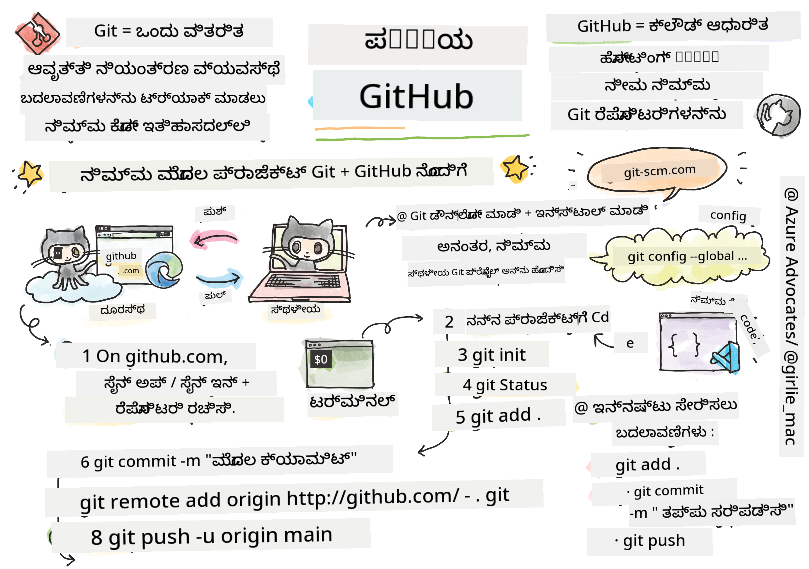
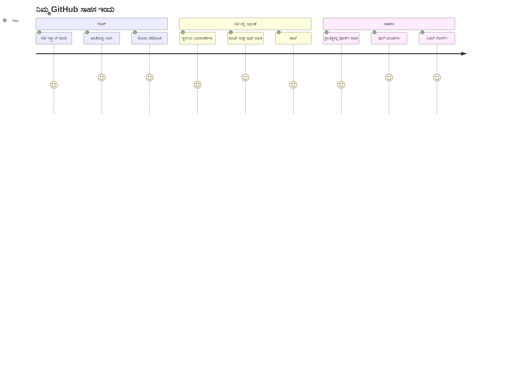
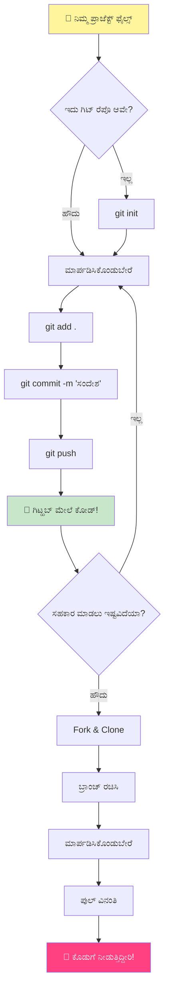
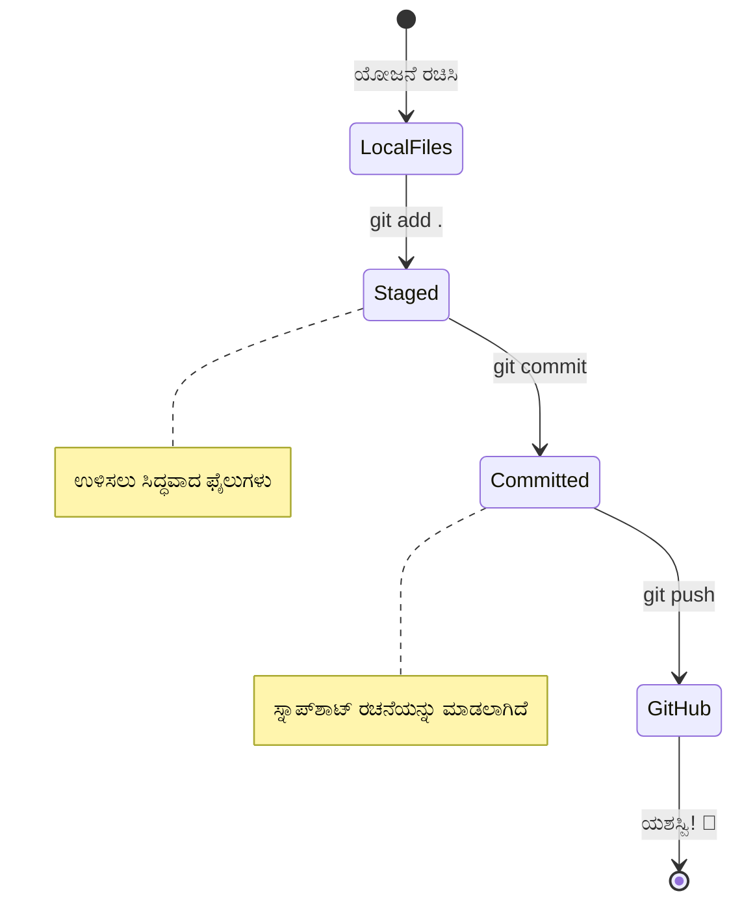
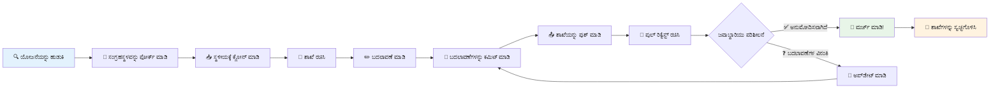
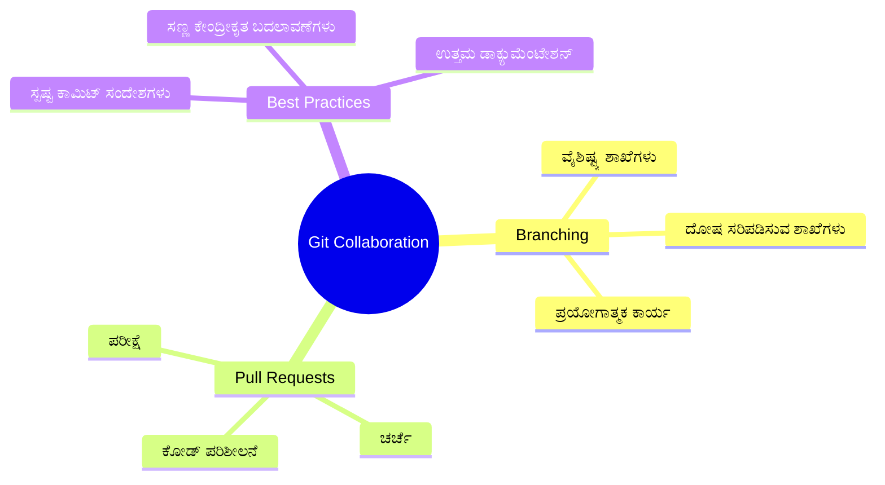
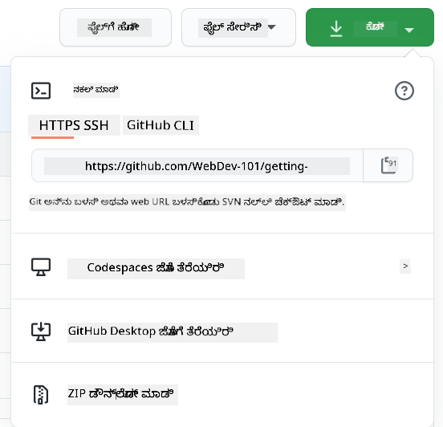
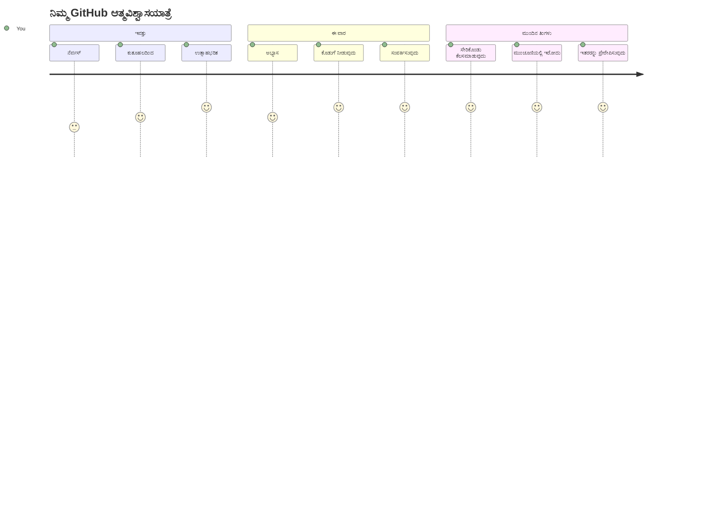

<!--
CO_OP_TRANSLATOR_METADATA:
{
  "original_hash": "5c383cc2cc23bb164b06417d1c107a44",
  "translation_date": "2026-01-08T20:34:29+00:00",
  "source_file": "1-getting-started-lessons/2-github-basics/README.md",
  "language_code": "kn"
}
-->
# GitHub ಗೆ ಪರಿಚಯ

ಹೇಯ್ ಅಲ್ಲಿ, ಭವಿಷ್ಯದ ಡೆವಲಪರ್! 👋 ಪ್ರಪಂಚದಾದ್ಯಾಂತ ಲಕ್ಷಾಂತರ ಕೋಡರ್ಸ್ ಜೊತೆ ಸೆರೆಯಾಗಲು ಸಿದ್ಧರೇ? ನಾನು ನಿಜವಾಗಿಯೂ GitHub ಅನ್ನು ಪರಿಚಯಿಸಲು ಉತ್ಸುಕನಾಗಿದ್ದೇನೆ – ಇದನ್ನು ಪ್ರೋಗ್ರಾಮರ್‌ಗಳಿಗಾಗಿ ಸಾಮಾಜಿಕ ಮಾಧ್ಯಮ ವೇದಿಕೆ ಎಂದು ಭಾವಿಸಿ, ಆದರೆ ನಿಮ್ಮ ಊಟದ ಫೋಟೋಗಳನ್ನು ಹಂಚಿಕೊಳ್ಳುವುದರ ಬದಲು, ನಾವು ಕೋಡ್ ಹಂಚಿಕೊಳ್ಳುತ್ತೇವೆ ಮತ್ತು ಅದ್ಭುತ ವಸ್ತುಗಳನ್ನು ನಿರ್ಮಿಸುತ್ತೇವೆ!

ನನಗೆ ಖಂಡಿತವಾಗಿ ಆಶ್ಚರ್ಯ ಹುಟ್ಟಿಸುವುದೇನಂದರೆ: ನಿಮ್ಮ ಫೋನಿನಲ್ಲಿರುವ ಪ್ರತಿಯೊಂದು ಅಪ್ಲಿಕೇಶನ್, ನೀವು ಭೇಟಿ ನೀಡುವ ಪ್ರತಿಯೊಂದು ವೆಬ್‌ಸೈಟ್ ಮತ್ತು ನೀವು ಬಳಸಲು ಕಲಿಯುವ ಬಹುಮತ ಉಪಕರಣಗಳನ್ನು GitHub ತರಹದ ವೇದಿಕೆಗಳಲ್ಲಿ ಸಹಕರಿಸುವ ಡೆವಲಪರ್‌ಗಳ ತಂಡಗಳು ರಚಿಸಿದ್ದವು. ನೀವು ಇಷ್ಟಪಡುವ ಸಂಗೀತ ಅಪ್ಲಿಕೇಶನ್? ನಿಮ್ಮಂತಹ ಯಾರೋ ಅದರತ್ತ ಕೊಡುಗೆ ನೀಡಿದ್ದಾರೆ. ನೀವು ಬಿಡಿಸಲು ಆಗದ ಆಟ? ಹೌದು, ಬಹುಶಃ GitHub ಸಹಯೋಗದಿಂದ ನಿರ್ಮಿಸಲಾಗಿದೆ. ಮತ್ತು ಈಗ ನೀವು ಆ ಅದ್ಭುತ ಸಮುದಾಯದ ಭಾಗವಾಗುವುದು ಹೇಗೆ ಎಂಬುದನ್ನು ಕಲಿಯಲಿದ್ದೀರಿ!

ಮೊದಲಿಗೆ ಇದು ತುಂಬಾ ಆಗಬಹುದೆಂದು ನನಗೆ ಗೊತ್ತಿದೆ – ನಾನು ನನ್ನ ಮೊದಲ GitHub ಪುಟವನ್ನು ನೋಡುತ್ತ "ಇದರಲ್ಲಿ ಏನು ಅರ್ಥ?" ಎಂದು ಯೋಚಿಸಿದ್ದೆ. ಆದರೆ ಗೋಚರಿಸುವುದು: ಪ್ರತಿಯೊಬ್ಬ ಡೆವಲಪರ್ ಕೂಡ ನೀವು ಈಗಿರುವ ಸ್ಥಳದಿಂದಲೇ ಪ್ರಾರಂಭಿಸುತ್ತಾರೆ. ಈ ಪಾಠದ ಕೊನೆಯಲ್ಲಿ, ನಿಮಗೆ ನಿಮ್ಮ ಸ್ವಂತ GitHub ರೆಪೊಸಿಟರಿ (ನಿಮ್ಮ ವೈಯಕ್ತಿಕ ಪ್ರಾಜೆಕ್ಟ್ ಪ್ರದರ್ಶನವನ್ನು ಕ್ಲೌಡ್‌ನಲ್ಲಿ ಎಂದು ಭಾವಿಸಿ) ಇರುತ್ತದೆ, ಮತ್ತು ನೀವು ನಿಮ್ಮ ಕೆಲಸ ಉಳಿಸುವುದು, ಇತರರೊಂದಿಗೆ ಹಂಚಿಕೊಳ್ಳುವುದು ಮತ್ತು ಲಕ್ಷಾಂತರ ಜನ ಬಳಸುವ ಪ್ರಾಜೆಕ್ಟ್‌ಗಳಿಗೆ ಕೊಡುಗೆ ನೀಡುವುದು ಹೇಗೆ ಎಂಬುದನ್ನು ತಿಳಿದಿರುತ್ತೀರಿ.

ನಾವು ಈ ಪ್ರಯಾಣವನ್ನು ಒಂದೊಂದು ಹಂತವಾಗಿ ಹೋಗೋಣ. ಬೇಗನೆ ಮಾಡಲು ಬೇಡ, ಒತ್ತಡ ಮಾಡಬೇಡ – ನಿಮ್ಮ ಹಾಗೂ ನನ್ನ ನಡುವೆ ಮತ್ತು ನಿಮ್ಮ ಹೊಸ ಅತ್ಯುತ್ತಮ ಸ್ನೇಹಿತರಾದ ಕೆಲವು ಅಬ್ಬರದ ಉಪಕರಣಗಳ ಜೊತೆ!


> ಸ್ಕೆಚ್ನೋಟ್: [Tomomi Imura](https://twitter.com/girlie_mac)


## ಪೂರ್ವ-ಪಾಠ ಕ್ವಿಜ್
[ಪೂರ್ವ-ಪಾಠ ಕ್ವಿಜ್](https://ff-quizzes.netlify.app)

## ಪರಿಚಯ

ನಿಜವಾಗಿಯೂ ರೋಚಕ ವಿಷಯಗಳಿಗೆDiveಗೊಳ್ಳುವ ಮುನ್ನ, GitHub ಮಾಯಾಜಾಲಕ್ಕಾಗಿ ನಿಮ್ಮ ಕಂಪ್ಯೂಟರ್ ಸಿದ್ಧಗೊಳಿಸೋಣ! ಇದು ಒಂದು ಕಲಾಕೃತಿ ಸೃಷ್ಟಿಸುವ ಮುನ್ನ ನಿಮ್ಮ ಕಲೆ ಉಪಕರಣಗಳನ್ನು ಆಯೋಜಿಸುವದಷ್ಟು ಸರಳ – ಸರಿಯಾದ ಉಪಕರಣಗಳು ಸಿದ್ಧವಾಗಿರುವುದು ಎಲ್ಲವೂ ಸೌಕರ್ಯಕರ ಮತ್ತು ಮನರಂಜನೆಯಾಗಿಸುವುದು.

ನಾನು ಪ್ರತಿ ಸೆಟ್ಟಪ್ ಹಂತದ ಮೂಲಕ ನಿಮಗೆ ಮುಖಾಮುಖಿಯಾಗಿ ನಡೆಯುತ್ತೇನೆ, ಮತ್ತು ಇದು ಮೊದಲ ಭೇಟಿಯಲ್ಲಿ ಹೇಗಾದರೂ ಭಯಂಕರವೆಂದು ಭಾವಿಸುವಷ್ಟು ಭಯಹೊಂದಬೇಕಿಲ್ಲ. ಏನಾದರೂ ತಕ್ಷಣ ಮೆರಗು ತೋರದೇ ಇದ್ದರೂ, ಅದು ಸಹಜ. ನಾನು ನನ್ನ ಮೊದಲ ಡೆವಲಪ್‌ಮೆಂಟ್ ಪರಿಸರವನ್ನು ಹೊಂದಿಸುವಾಗ ಪ್ರಾಚೀನ ಹೈರೋಗ್ಲಿಫ್ ಓದುವ ಪ್ರಯತ್ನ ಮಾಡುತ್ತಿರುವಂತೆ ಭಾಸವಾಗಿತ್ತು. ಪ್ರತಿಯೊಬ್ಬ ಡೆವಲಪರ್ ಕೂಡ ನೀವು ಈಗಿರುವ ಸ್ಥಿತಿಯಲ್ಲಿದ್ದಾನೆ, ಸರಿಯಾಗಿ ಮಾಡುತ್ತಿದ್ದಾನಾ ಎಂದು ಸಂಶಯಿಸುತ್ತ. ಸೂಕ್ಷ್ಮ ಮಾಹಿತಿ: ನೀವು ಇಲ್ಲಿ ಕಲಿಯುತ್ತಿದ್ದೀರಾ ಎಂದರೆ ಸರಿಯಾಗಿ ಮಾಡುತ್ತಿದ್ದೀರಿ! 🌟

ಈ ಪಾಠದಲ್ಲಿ ನಾವು ಕಾಣೋದು:

- ನಿಮ್ಮ ಯಂತ್ರದಲ್ಲಿ ನಿಮ್ಮ ಕೆಲಸವನ್ನು ಟ್ರ್ಯಾಕ್ ಮಾಡುವುದು
- ಇತರರೊಂದಿಗೆ ಪ್ರಾಜೆಕ್ಟ್ ಮೇಲೆ ಕೆಲಸ ಮಾಡುವುದು
- ಓಪನ್ ಸೋರ್ಸ್ ತಂತ್ರಾಂಶಕ್ಕೆ ಕೊಡುಗೆ ನೀಡುವುದು ಹೇಗೆ

### ಪೂರ್ವಶರತ್ತುಗಳು

ನಿಮ್ಮ GitHub ಮಾಯಾಜಾಲಕ್ಕಾಗಿ ನಿಮ್ಮ ಕಂಪ್ಯೂಟರ್ ಸಿದ್ಧಗೊಳಿಸೋಣ! ಚಿಂತೆ ಬೇಡ – ಈ ಸೆಟ್ಟಪ್ ನಿಮಗೆ ಒಂದು ಬಾರಿ ಮಾತ್ರ ಬೇಕು, ಮತ್ತು ಆನಂತರ ನೀವು ನಿಮ್ಮ ಸಂಪೂರ್ಣ ಕೋಡಿಂಗ್ ಪಯಣಕ್ಕಾಗಿ ಸಿದ್ಧರಾಗುತ್ತೀರಿ.

ಸರಿ, ನೆಲೆಯ ಮೇಲೆ ಪ್ರಾರಂಭಿಸೋಣ! ಮೊದಲಿಗೆ, Git ಈಗಾಗಲೇ ನಿಮ್ಮ ಕಂಪ್ಯೂಟರ್‌ನಲ್ಲಿ ಇಷ್ಟೇ ಇಲ್ಲವೋ ನೋಡೋಣ. Git ಕೇಂದ್ರೀಯವಾಗಿ super-smart ಸಹಾಯಕನಂತೆ ನಿಮ್ಮ ಕೋಡ್‌ನ ಪ್ರತಿಯೊಂದು ಬದಲಾವಣೆ ನಿರ್ಮಿಸಿದಂತೆ ನೆನಸಿಕೊಳ್ಳುತ್ತದೆ – ಪ್ರತಿಐ ಎರಡು ಸೆಕೆಂಡುಗಳಲ್ಲಿ Ctrl+S ಒತ್ತುತ್ತಿರೋದಕ್ಕಿಂತ ಹೆಚ್ಚು ಚಾತುರ್ಮ್ಯಕ್ಷವಾಗಿದೆ (ನಾವು ಎಲ್ಲರೂ ಹಾಗೆಂದು ಇದ್ದೇವೆ!).

ನಿಮ್ಮ ಟರ್ಮಿನಲ್‌ನಲ್ಲಿ ಈ ಮಾಯಾಜಾಲದ ಆಜ್ಞೆ ಟೈಪ್ ಮಾಡಿ Git ಈಗಾಗಲೇ ಇಂದೆಯೋ ನೋಡೋಣ:
`git --version`

Git ಇಲ್ಲದಿದ್ದರೂ, ಸಮಸ್ಯೆ ಇಲ್ಲ! פשוט [download Git](https://git-scm.com/downloads) ಗೆ ಹೋಗಿ ಡೌನ್ಲೋಡ್ ಮಾಡಿ. ನೀವು ಅದನ್ನು ಸ್ಥಾಪಿಸಿದ ಬಳಿಕ, Gitನನ್ನು ಸರಿಯಾಗಿ ಪರಿಚಯಿಸಬೇಕಿದೆ:

> 💡 **ಮೊದಲ ಬಾರಿಗೆ ಸೆಟ್ಟಪ್**: ಈ ಆಜ್ಞೆಗಳು Gitಗೆ ನೀವು ಯಾರಾಗಿದ್ದೀರೋ ಹೇಳುತ್ತವೆ. ಪ್ರತಿಯೊಂದು ನಿಮ್ಮ ಕಮಿಟ್ ಗೆ ಈ ಮಾಹಿತಿ ಜೋಡಿಸಲಾಗುವುದು, ಆದ್ದರಿಂದ ನಿಮ್ಮ ಹೆಸರು ಮತ್ತು ಇಮೇಲ್ ಅನ್ನು ಸಾರ್ವಜನಿಕವಾಗಿ ಹಂಚಿಕೊಳ್ಳಲು ನೀವು ಸಮತೋಲನ ಹೊಂದಿದಂತೆ ಆಯ್ಕೆಮಾಡಿ.

```bash
git config --global user.name "your-name"
git config --global user.email "your-email"
```

Git ಈಗಾಗಲೇ ಕಾನ್ಫಿಗರ್ ಆಗಿದೆಯೇ ಎಂದು ಪರಿಶೀಲಿಸಲು ನೀವು ಟೈಪ್ ಮಾಡಬಹುದು:
```bash
git config --list
```

ನೀವು GitHub ಖಾತೆ, ಕೋಡ್ ಸಂಪಾದಕ (Visual Studio Code ಮುಂತಾದ) ಬೇಕಾಗುತ್ತದೆ ಮತ್ತು ನಿಮ್ಮ ಟರ್ಮಿನಲ್ ಅಥವಾ ಕಮಾಂಡ್ ಪ್ರಾಂಪ್ಟ್ ತೆರೆಯಬೇಕು.

[github.com](https://github.com/) ಗೆ ಹೋಗಿ ನೀವು ಈಗಾಗಲೇ ಖಾತೆ ನಿರ್ಮಿಸದಿದ್ದರೆ ಸೃಷ್ಟಿಸಿ ಅಥವಾ ಲಾಗಿನ್ ಮಾಡಿ ಮತ್ತು ನಿಮ್ಮ ಪ್ರೊಫೈಲ್ ಭರ್ತಿ ಮಾಡಿ.

💡 **ನೂತನ ಸಲಹೆ**: ಗುಪ್ತಪದಗಳನ್ನು ಬೇಸರವಿಲ್ಲದೆ ಬಳಸಲು [SSH ಕೀಗಳನ್ನು](https://docs.github.com/en/authentication/connecting-to-github-with-ssh) ಅಥವಾ [GitHub CLI](https://cli.github.com/) ಬಳಸಿ.

✅ GitHub ಏಕೈಕ ಕೋಡ್ ರೆಪೊಸಿಟರಿ ಅಲ್ಲ; ಇತರ ಸಹ ಇದ್ದಾರೆ, ಆದರೆ GitHub ಹೆಚ್ಚು ಪ್ರಸಿದ್ದವಾಗಿದೆ.

### ತಯಾರಿ

ನಿಮ್ಮ ಸ್ಥಳೀಯ ಯಂತ್ರದಲ್ಲಿ (ಲೆಪ್ಟಾಪ್ ಅಥವಾ ಪಿಸಿ) ಕೋಡ್ ಪ್ರಾಜೆಕ್ಟ್ ಇರುವ ಫೋಲ್ಡರ್ ಮತ್ತು ಇತರರ ಪ್ರಾಜೆಕ್ಟುಗಳಿಗೆ ಕೊಡುಗೆ ನೀಡಲು ಉದಾಹರಣೆಯಾಗಿ GitHub ನಲ್ಲಿ ಸಾರ್ವಜನಿಕ ರೆಪೊಸಿಟರಿ ಬೇಕಾಗುತ್ತದೆ.

### ನಿಮ್ಮ ಕೋಡ್ ಸುರಕ್ಷಿತವಾಗಿರಿಸುವುದು

ನಮ್ಮ ಒಂದು ಕ್ಷಣ ಭದ್ರತೆ ಬಗ್ಗೆ ಮಾತಾಡೋಣ – ಆದರೆ ಭಯಂಕರ ವಿಷಯಗಳಿಂದ ನಿಮ್ಮನ್ನು ಮತ್ತೆಗಲ್ಲುಗೊಳ್ಳಿಸುವುದಿಲ್ಲ! ಈ ಭದ್ರತಾ ಅಭ್ಯಾಸಗಳನ್ನು ನಿಮ್ಮ ಕಾರು ಅಥವಾ ಮನೆ ನ securely ಲಾಕ್ ಮಾಡುವಂತೆ ಭಾವಿಸಿ. ಇದು ಸರಳವಾದ ಅಭ್ಯಾಸಗಳು ಮತ್ತು ನಿಮ್ಮ ಕಠಿಣ ಕೆಲಸವನ್ನು ರಕ್ಷಿಸುತ್ತವೆ.

ನಾವು ಆರಂಭದಿಂದಲೇ GitHub ನೊಂದಿಗೆ ಕೆಲಸ ಮಾಡುವ ನವೀನ, ಭದ್ರ ವಿಧಾನಗಳನ್ನು ತೋರಿಸುತ್ತೇವೆ. ಹಾಗಾಗಿ, ನೀವು ಉತ್ತಮ ಅಭ್ಯಾಸಗಳನ್ನು ಬೆಳಸುತ್ತೀರಿ ಮತ್ತು ನಿಮ್ಮ ಪೂರ್ವಾಭ್ಯಾಸವನ್ನಾಗಿ ಮಾಡುತ್ತೀರಿ.

GitHub ನಲ್ಲಿ ಕೆಲಸ ಮಾಡುವಾಗ, ಭದ್ರತಾ ಉತ್ತಮ ಅಭ್ಯಾಸಗಳನ್ನು ಅನುಸರಿಸುವುದು ಮುಖ್ಯ:

| ಭದ್ರತೆ ವಿಭಾಗ | ಉತ್ತಮ ಅಭ್ಯಾಸ | ಮಹತ್ವ ಏನು |
|---------------|---------------|-------------|
| **ಪ್ರಮಾಣೀಕರಣ** | SSH ಕೀಗಳು ಅಥವಾ ವ್ಯಕ್ತಿಗತ ಪ್ರವೇಶ ಟೋಕನ್‌ಗಳು ಉಪಯೋಗಿಸಿ | ಗುಪ್ತಪದಗಳು ಕಡಿಮೆ ಭದ್ರತೆ ಮತ್ತು ಹಳೆಯಾಗುತ್ತಿವೆ |
| **ಎರಡು-ಘಟಕ ಪ್ರಮಾಣೀಕರಣ** | ನಿಮ್ಮ GitHub ಖಾತೆಗೆ 2FA ಸಕ್ರಿಯಮಾಡಿ | ಖಾತೆಯನ್ನು ಹೆಚ್ಚುವರಿ ರಕ್ಷಣೆ ನೀಡುತ್ತದೆ |
| **ರೆಪೊಸಿಟರಿ ಭದ್ರತೆ** | ಘನಗೋಪ್ಯ ಮಾಹಿತಿಗಳನ್ನು ಎಂದಿಗೂ ಕಮಿಟ್ ಮಾಡಬೇಡಿ | API ಕೀಗಳು ಮತ್ತು ಗುಪ್ತಪದಗಳು ಸಾರ್ವಜನಿಕ ರೆಪೊಗಳಲ್ಲಿದ್ದರೆ 안 될 ಉಂಟು |
| **ನಿರ್ಭರತೆ ನಿರ್ವಹಣೆ** | ಅಪ್ಡೇಟ್‌ಗಳಿಗೆ Dependabot ಸಕ್ರಿಯ ಮಾಡಿ | ನಿಮ್ಮ ಡಿಪೆಂಡೆನ್ಸಿಗಳನ್ನು ಭದ್ರ ಮತ್ತು ನವೀಕರಿತವಾಗಿರಿಸುತ್ತದೆ |

> ⚠️ **ಗಂಭೀರ ಭದ್ರತಾ ನೆನಪಿನಂತೆ**: API ಕೀಗಳು, ಗುಪ್ತಪದಗಳು ಅಥವಾ ಇತರ ಭದ್ರ ಮಾಹಿತಿಗಳನ್ನು ಯಾವ ರೆಪೊಸಿಟರಿಗೂ ಕಮಿಟ್ ಮಾಡಬೇಡಿ. ಗುರ್ತಿಸುವಂತಹ ಡೇಟಾವನ್ನು ಪರಿಸರ ವ್ಯತ್ಯಾಸಗಳು ಮತ್ತು `.gitignore` ಫೈಲ್‌ಗಳ ಮೂಲಕ ರಕ್ಷಿಸಿ.

**ಆಧುನಿಕ ಪ್ರಮಾಣೀಕರಣ ಸೆಟ್ಟಪ್:**

```bash
# SSH ಕೀ ತಯಾರಿಸಿ (ಆಧುನಿಕ ed25519 ಅಲ್ಗಾರಿದಮ್)
ssh-keygen -t ed25519 -C "your_email@example.com"

# Git ಅನ್ನು SSH ಬಳಸಲು ಸೆಟ್‌ಅಪ್ ಮಾಡಿ
git remote set-url origin git@github.com:username/repository.git
```

> 💡 **ಪ್ರೊ ಸಲಹೆ**: SSH ಕೀಗಳು ಗುಪ್ತಪದಗಳನ್ನು ಪುನಃ ಇನ್ಪುಟ್ ಮಾಡಬೇಕಾದ ಅಗತ್ಯವನ್ನು ತೆಗೆದುಹಾಕುತ್ತವೆ ಮತ್ತು ಪರಂಪರাগত ಪ್ರಮಾಣೀಕರಣ ದೃಶ್ಠಾಂತಕ್ಕಿಂತ ಹೆಚ್ಚು ಭದ್ರತೆ ಒದಗಿಸುತ್ತವೆ.

---

## ನಿಮ್ಮ ಕೋಡ್ ಅನ್ನು ಪ್ರೊಗಳಂತೆ ನಿರ್ವಹಿಸುವುದು

ಸರಿ, ಇಲ್ಲಿ ವಿಷಯಗಳು ನಿಜವಾಗಿಯೂ ರೋಚಕವಾಗುತ್ತಿವೆ! 🎉 ನಾವು ನಿಮ್ಮ ಕೋಡ್ ಅನ್ನು ಪ್ರೊಗಳಂತೆಯೇ ಟ್ರ್ಯಾಕ್ ಮತ್ತು ನಿರ್ವಹಿಸುವಂತೆ ಕಲಿಯೋಣ, ಮತ್ತು ಇದೊಂದು ನನ್ನ ಇಷ್ಟ ಪಾಠಾಂಶ ಏಕೆಂದರೆ ಇದು ಆಟ ಬದಲಿಸುವಂತೆ.

ಈದನ್ನು ಆಲೋಚಿಸಿ: ನೀವು ಒಂದು ಅದ್ಭುತ ಕಥೆಯನ್ನು ಬರೆಯುತ್ತಿದ್ದೀರಿ ಮತ್ತು ಪ್ರತಿಯೊಂದು খಾಕು, ಪ್ರತಿಯೊಂದು ಸ್ಫೂರ್ತಿದಾಯಕ ಸಂಪಾದನೆ ಮತ್ತು ಎಲ್ಲ "ಅಯ್ಯೋ, ಇದು ಆಕಸ್ಮಿಕ!" ಕ್ಷಣಗಳನ್ನು ಅನುಸರಿಸಲು ಇಚ್ಛಿಸುವಿರಿ. Git ನಿಮ್ಮ ಕೋಡ್‌ಗೆ ಸರಿಯಾಗಿ ಅಂಥ ಒಂದು ಆಗುತ್ತದೆ! ಇದು ಅತ್ಯುತ್ತಮ ಕಾಲಪ್ರವಾಸಿ ನೋಟ್ಬುಕ್ ಹಾಗೆ – ಪ್ರತಿಯೊಂದು ಕೀಪ್ರೆಸ್, ಬದಲಾವಣೆ, "ಅಯ್ಯೋ, ಇದರಿಂದ ಎಲ್ಲವೂ ಕೊಳೆದುಹೋದಂತೆ" ಕ್ಷಣ ಕೂಡ ನೆನಸಿಕೊಳ್ಳಬಹುದು ಮತ್ತು ತಕ್ಷಣ ಮರುಹೊಂದಿಸಬಹುದು.

ನಿರ್ಮಲಾನಿರ್ಮಲ, ಇದು ಮೊದಲಿಗೆ ಭಾರವಾಗಿ ಕಂಡರೂ ಸಹ. ನಾನು ಪ್ರಾರಂಭಿಸಿದಾಗ, "ನನಗೆ ಸರಾಸರಿ ಫೈಲ್ ಗಳಂತೆ ಉಳಿಸುವುದಕ್ಕೆ ಏಕೆ ಸಾಧ್ಯವಿಲ್ಲ?" ಎಂದೂ ಯೋಚಿಸಿದ್ದೆ. ಆದರೆ ನಂಬಿ: Git ನಿಮಗೆ ಸೂಕ್ತವಾಗಿದ್ದಾಗ (ಮತ್ತು ಅದು ಆಗುತ್ತದೆ!), ನೀವು ಆ ಲೈಟ್ಬಲ್ಬ್ ಕ್ಷಣ ಪಡೆಯುತ್ತೀರಿ – "ನಾನು ಇದುವರೆಗೆ ಹೇಗೆ ಇಲ್ಲದಂತಿರಲಿಲ್ಲ?". ನಾನು ನಡೆಯುತ್ತಿದ್ದಾಗ ಯಾರೋ ಹಾರಿದ್ದರು ಎಂದು ಕಂಡುಕೊಳ್ಳುವುದಂತಾಗಿದೆ!

ನೀವು ಸ್ಥಳೀಯವಾಗಿ ಫೋಲ್ಡರ್ ಹೊಂದಿದ್ದು, ಆ ಪ್ರಾಜೆಕ್ಟ್ ಮೇಲೆ ನಿಮ್ಮ ಪ್ರಗತಿಯನ್ನು Git ಮೂಲಕ ಟ್ರ್ಯಾಕ್ ಮಾಡಬೇಕೆಂದು ಬಯಸಿದರೆ – ಕೆಲವು ಜನರು Git ಉಪಯೋಗಿಸುವುದನ್ನು ತಮ್ಮ ಭವಿಷ್ಯ ಸ್ವಂತಿಗೆ ಒಳಮೇಲಿನ ಪ್ರೇಮ ಪತ್ರ ಬರೆಯುವುದಾಗಿ ಹೋಲಿಸುತ್ತಾರೆ. ನಿಮ್ಮ ಕಮಿಟ್ ಸಂದೇಶಗಳನ್ನು ದಿನಗಳು, ವಾರಗಳು ಅಥವಾ ತಿಂಗಳುಗಳ ನಂತರ ಓದುವಾಗ ನೀವು ಏಕೆ ಈ ನಿರ್ಧಾರ ತೆಗೆದುಕೊಂಡಿರಿ ಅಥವಾ ಏನು ಬದಲಾವಣೆ ಮಾಡಿಕೊಂಡಿರಿ ಎಂಬುದನ್ನು ನೆನಪಿಸಿಕೊಳ್ಳಬಹುದು – ಅಂದರೆ ನೀವು ಉತ್ತಮ "ಕಮಿಟ್ ಸಂದೇಶ"ಗಳು ಬರೆಯುತ್ತಿದ್ದಿರಿ.


### ಕಾರ್ಯ: ನಿಮ್ಮ ಮೊದಲ ರೆಪೊಸಿಟರಿ ರಚಿಸಿ!

> 🎯 **ನಿಮ್ಮ ಮಿಷನ್ (ನಾನು ನಿಮ್ಮಿಗಾಗಿ ತುಂಬ ಉತ್ಸುಕನಾಗಿದ್ದೇನೆ!)**: ನಾವು ನಿಮ್ಮ ಮೊದಲ GitHub ರೆಪೊಸಿಟರಿಗೆ ಜೊತೆಗೇ ರಚಿಸುವೆವು! ಇಲ್ಲಿ ಪೂರ್ಣಗೊಂಡಾಗ, ನಿಮ್ಮ ಕೋಡ್ ಇರುವ ಸ್ವಂತ ಅಂಚೆಬಾಗಿಲು ಹಾಗೂ ನಿಮ್ಮ ಮೊದಲ "ಕಮಿಟ್" (ಅಂದರೆ ಬಹುಶಕ್ತಿಯಾದ ರೀತಿಯಲ್ಲಿ ನಿಮ್ಮ ಕೆಲಸ ಉಳಿಸುವಿಕೆ) ಮಾಡಿದ್ದೀರಿ.
>
> ಇದು ನಿಜವಾಗಿಯೂ ವಿಶೇಷ ಕ್ಷಣ – ನೀವು ಅಧಿಕೃತವಾಗಿ ಗ್ಲೋಬಲ್ ಡೆವಲಪರ್ ಸಮುದಾಯದ ಭಾಗವಾಗಿರುತ್ತೀರಿ! ನನ್ನ ಮೊದಲ ರೆಪೊ ನಿರ್ಮಿಸಿಕೊಂಡಾಗ ನೋಡುವ ಉತ್ಸಾಹ ಇನ್ನೂ ಮನದಾಳದಲ್ಲಿದೆ – "ಅಯ್ಯೋ ನಾನು ನಿಜವಾಗಿಯೂ ಇದನ್ನು ಮಾಡುತ್ತಿದ್ದೇನೆ!"

ನಾವು ಈ ಸಂಚಲನವನ್ನು ಹೆಜ್ಜೆ ಹೆಜ್ಜೆ ಹಾಕಿ ನೋಡೋಣ. ಪ್ರತಿಯೊಂದರಲ್ಲೂ ಸಮಯವನ್ನು ಬಳಸಿ – ಬೇಗನೆ ಮಾಡಲು ಯಾವ ಬೀಗಲೂ ಇಲ್ಲ, ಮತ್ತು ಪ್ರತಿಯೊಬ್ಬ ಹಂತವೂ ಅರ್ಥವಾಗುವುದು. ನೆನಪಿಡಿ, ಪ್ರತಿಯೊಬ್ಬ ಕೋಡಿಂಗ್ ಸೂಪರ್ ಸ್ಟಾರ್ ನೀವು ಇMMಡಿದ ಸ್ಥಳದಲ್ಲಿ ಕುಳಿತಿದ್ದ, ತನ್ನ ಮೊದಲ ರೆಪೊ ಸೃಷ್ಟಿಸಲು ಸಿದ್ಧನಿತ್ತು. ಅದೃಷ್ಟವೇನೇ!

> ವೀಡಿಯೋ ನೋಡಿ
> 
> [](https://www.youtube.com/watch?v=9R31OUPpxU4)

**ನಾವು ಇದನ್ನು ಜೊತೆಯಾಗಿಸೋಣ:**

1. **GitHub ನಲ್ಲಿ ನಿಮ್ಮ ರೆಪೊ ಸೃಷ್ಟಿಸಿ**. GitHub.com ಗೆ ಹೋಗಿ ಮತ್ತು ಬಲ ಎಮTYವ ಮೂಟಿಕೊಂಡಿರುವ ಹಸಿರು **New** ಬಟನ್ ಅಥವಾ ಮೇಲ್ಭಾಗದ **+** ಚಿಹ್ನೆಗೆ ನೋಡಿ. ಅದನ್ನು ಕ್ಲಿಕ್ ಮಾಡಿ ಮತ್ತು **New repository** ಆಯ್ಕೆಮಾಡಿ.

   ಇದನ್ನೇ ಮಾಡಿದಾಗ:
   1. ನಿಮ್ಮ ರೆಪೊಗೆ ಹೆಸರಿಡಿ – ನಿಮ್ಮಿಗೆ ಅರ್ಥವಾಗುವ ಹೆಸರನ್ನಿಡಿ!
   1. ಇಚ್ಛಿಸುವರೆಡೆ ಒಂದು ವಿವರಣೆ ಸೇರಿಸಿ (ಇದು ಇತರರಿಗೆ ನಿಮ್ಮ ಪ್ರಾಜೆಕ್ಟ್ ಏನು ಎಂಬುದನ್ನು ತಿಳಿಸುತ್ತದೆ)
   1. ಅದನ್ನು ಸಾರ್ವಜನಿಕ ಅಥವಾ ಖಾಸಗಿ ಎಂದು ನಿರ್ಧರಿಸಿ
   1. README ಫೈಲ್ ಸೇರಿಸುವ ಆಯ್ಕೆಯನ್ನು ಪರಿಶೀಲಿಸಿ – ಇದು ನಿಮ್ಮ ಪ್ರಾಜೆಕ್ಟಿನ ಮುನ್ನುಪಟ
   1. **Create repository** ಕ್ಲಿಕ್ ಮಾಡಿ ಮತ್ತು ಹರ್ಷಿಸಿ – ನೀವು ಮೊದಲ ರೆಪೊ ಸೃಷ್ಟಿಸಿದ್ದೀರಿ! 🎉

2. **ನಿಮ್ಮ ಪ್ರಾಜೆಕ್ಟ್ ಫೋಲ್ಡರ್‌ಗೆ ಸಂಚರಿಸಿ**. ಈಗ ಟರ್ಮಿನಲ್ ತೆರೆಯಿರಿ (ಭಯಪಡಬೇಡಿ, ಅದು ಭಯಂಕರವಲ್ಲ!). ನಿಮ್ಮ ಕಂಪ್ಯೂಟರ್ ಗೆ ನಿಮ್ಮ ಪ್ರಾಜೆಕ್ಟ್ ಫೈಲ್‌ಗಳು ಎಲ್ಲಿವೆ ಅನಿಸುವಂತೆ ಹೇಳಬೇಕು. ಈ ಆಜ್ಞೆ ಟೈಪ್ ಮಾಡಿ:

   ```bash
   cd [name of your folder]
   ```

   **ನಾವು ಏನು ಮಾಡುತ್ತಿದ್ದೇವೆ:**
   - ನಾವೀಗ ಹೇಳುತ್ತಿದ್ದೇವೆ "ಹೇ ಕಂಪ್ಯೂಟರ್, ನನ್ನ ಪ್ರಾಜೆಕ್ಟ್ ಫೋಲ್ಡರ್‌ಗೆ ಕೊಂಡು ಹೋಗು"
   - ಇದು ನಿಮ್ಮ ಡೆಸ್ಕ್‌ಟಾಪ್ ನಲ್ಲಿ ನಿಶ್ಚಿತ ಫೋಲ್ಡರ್ ತೆರೆಯುವುದರಂತೆ, ಆದರೆ ನಾವು ಪಠ್ಯ ಆಜ್ಞೆಗಳ ಮೂಲಕ ಮಾಡುತ್ತಿದ್ದೇವೆ
   - `[ನಿಮ್ಮ ಫೋಲ್ಡರ್ ಹೆಸರ]` ಅನ್ನು ನಿಮ್ಮ প্রকಲ್ರ್ ಫೋಲ್ಡರ್ ನ ನಿಜವಾದ ಹೆಸರಿನಿಂದ ಬದಲಾಯಿಸಿ

3. **ನಿಮ್ಮ ಫೋಲ್ಡರ್ Git ರೆಪೊಸಿಟರಿಯಾಗಿಸು**. ಮಾಯಾಜಾಲ ಸಂಭವಿಸುತ್ತಿದೆ! ಟೈಪ್ ಮಾಡಿ:

   ```bash
   git init
   ```

   **ಇದು ಈಗಾಗಲೀ ಆಗಿದೆ (ಅದ್ಭುತವೆನಿಸುತ್ತದೆ!):**
   - Git ನಿಮ್ಮ ಪ್ರಾಜೆಕ್ಟಿನಲ್ಲೊಂದು ಗೌಪ್ಯ `.git` ಫೋಲ್ಡರ್ ರಚಿಸಿದೆ – ನೀವು ಅದನ್ನು ನೋಡಲಾರಿರಿ ಆದರೆ ಅದು ಅಲ್ಲಿ ಇದೆ!
   - ನಿಮ್ಮ ಸಾಮಾನ್ಯ ಫೋಲ್ಡರ್ ಈಗ ಪ್ರತಿಯೊಂದು ಬದಲಾವಣೆ ಟ್ರ್ಯಾಕ್ ಮಾಡಬಹುದಾದ "ರೆಪೊಸಿಟರಿ" ಆಗಿದೆ
   - ನಿಮ್ಮ ಫೋಲ್ಡರ್‌ಗೆ ಎಲ್ಲಾ ಚಟುವಟಿಕೆಗಳನ್ನು ನೆನಸಿಕೊಳ್ಳುವ ಸೂಪರ್ಸಾಕ್ಷ್ಮತೆಗೆ ನೀಡಿದಂತೆ ಭಾವಿಸಿ

4. **ನಾವು ಏನು ಮಾಡುತ್ತಿದ್ದೇವೆ ಪರಿಶೀಲಿಸಿ**. Git ನಿಮಗೆ ಈಗ ನಿಮ್ಮ ಪ್ರಾಜೆಕ್ಟ್ ಬಗ್ಗೆ ಏನು ಹೇಳುತ್ತಿದೆ ನೋಡೋಣ:

   ```bash
   git status
   ```

   **Git ನೀವು ತಿಳಿಸುವುದನ್ನು ಅರ್ಥಮಾಡಿಕೊಳ್ಳಿ:**
   
   ನೀವು ಹೀಗೆ ಕಾಣಬಹುದು:

   ```output
   Changes not staged for commit:
   (use "git add <file>..." to update what will be committed)
   (use "git restore <file>..." to discard changes in working directory)

        modified:   file.txt
        modified:   file2.txt
   ```

   **ಭಯಪಡಬೇಡಿ! ಇದರಿಂದ ಅರ್ಥವೇನಂದರೆ:**
   - **ಕೆಂಪು** ಬಣ್ಣದಲ್ಲಿ ಇರುವ ಫೈಲ್‌ಗಳು ಬದಲಾವಣೆಗೊಂಡಿವೆ ಆದರೆ ಇನ್ನು ಉಳಿಸಿಬಿಡಲು ಸಿದ್ಧವಿಲ್ಲ
   - **ಹಸಿರು** ಬಣ್ಣದಲ್ಲಿ ಇರುವ ಫೈಲ್‌ಗಳು ಉಳಿಸುವ ಹಂತಕ್ಕೆ ಸಿದ್ಧವಾಗಿವೆ
   - Git ತಕ್ಷಣವೇ ಮುಂದೇನು ಮಾಡಬೇಕು ಎಂದು ಹೇಳುತ್ತದೆ

   > 💡 **ಪ್ರೊ ಸಲಹೆ**: `git status` ಆಜ್ಞೆ ನಿಮ್ಮ ಅತ್ಯುತ್ತಮ ಸ್ನೇಹಿತ! ನೀವು ಏನು ನಡೆಯುತ್ತಿದೆ ಎಂದು ಗೊಂದಲದಲ್ಲಿದ್ದರೆ ಯಾವಾಗಲೂ ಇದನ್ನು ಬಳಸಿ. Gitಗೆ "ಈಗ ಸ್ಥಿತಿ ಏನಿದೆ?" ಎಂದು ಕೇಳುವುದಿನಂತೆ.

5. **ನಿಮ್ಮ ಫೈಲ್‌ಗಳನ್ನು ಉಳಿಸಲು ಸಿದ್ಧಮಾಡಿ** ("ಸ್ಟೇಜಿಂಗ್" ಎಂದು ಕರೆಯಲಾಗುತ್ತದೆ):

   ```bash
   git add .
   ```

   **ನಾವು ಈಗ ಮಾಡಿದ್ದು:**
   - ನಾವು Gitಗೆ "ನಾನು ನನ್ನ ಎಲ್ಲಾ ಫೈಲ್‌ಗಳನ್ನು ಮುಂದಿನ ಉಳಿಸುವಿಕೆಗಳಿಗೆ ಸೇರಿಸಲು ಇಚ್ಛಿಸುತ್ತೇನೆ" ಎಂದು ಹೇಳಿದೆವು
   - `.` ಅಂದರೆ "ಈ ಫೋಲ್ಡರ್ನಲ್ಲಿರುವ ಎಲ್ಲವನ್ನೂ"
   - ಈಗ ನಿಮ್ಮ ಫೈಲ್‌ಗಳು ಸ್ಟೇಜ್ ಆಗಿದ್ದು ಮುಂದಿನ ಹಂತಕ್ಕೆ ಸಿದ್ಧ

   **ಆಕ್ರಮಣೀಯವಾಗಿರಲು ಬಯಸುತ್ತೀರಾ?** ನೀವು ಬೇರೆ ಬೇರೆ ಫೈಲ್‌ಗಳನ್ನು ಮಾತ್ರ ಸೇರಿಸಬಹುದು:

   ```bash
   git add [file or folder name]
   ```

   **ಇದು ಏಕೆ ಬೇಕಾಗಬಹುದು?**
   - ನೀವು ಸಂಬಂಧಿತ ಬದಲಾವಣೆಗಳನ್ನು ಒಂದಾಗಿ ಉಳಿಸಲು ಬಯಸಬಹುದು
   - ಇದು ನಿಮ್ಮ ಕೆಲಸವನ್ನು ತರ್ಕಸಮ್ಮತ ಭಾಗ ಗಳಿಗೆ ಒಕ್ಕಣೆ ಮಾಡಬಹುದು
   - ಏನೂ ಬದಲಾಯಿಸಿತ್ತೆಂಬುದನ್ನು ಮತ್ತು ಯಾವಾಗ ಬದಲಾಯಿಸಿತ್ತೆಂಬುದನ್ನು ಅರ್ಥಮಾಡಿಕೊಳ್ಳಲು ಸುಲಭ

   **ನಿಮ್ಮ ಮನಸ್ಸು ಬದಲಾಗಿದೆ?** ಚಿಂತಿಸಬೇಡಿ! ನೀವು ಫೈಲ್‌ಗಳನ್ನು ಸ್ಟೇಜ್‌ನಿಂದ ಮರಳಿ ತೆಗೆದುಹಾಕಬಹುದು:

   ```bash
   # ಎಲ್ಲವನ್ನೂ ಅನ್ಸ್ಟೇಜ್ ಮಾಡಿ
   git reset
   
   # ಕೇವಲ ಒಂದು ಕಡತವನ್ನು ಅನ್ಸ್ಟೇಜ್ ಮಾಡಿ
   git reset [file name]
   ```

   ಆಲೋಚಿಸಬೇಡಿ – ಇದು ನಿಮ್ಮ ಕೆಲಸವನ್ನು ಅಳಿಸುವುದಿಲ್ಲ, ತಮ್ಮನ್ನು "ಸೇವಿಗೆ ಸಿದ್ಧ" ಸರಣಿಯಿಂದ ತೆಗೆದುಹಾಕುತ್ತದೆ.

6. **ನಿಮ್ಮ ಕೆಲಸವನ್ನು ಶಾಶ್ವತವಾಗಿ ಉಳಿಸಿ** (ನಿಮ್ಮ ಮೊದಲ ಕಮಿಟ್ ಮಾಡಿ!):

   ```bash
   git commit -m "first commit"
   ```

   **🎉 ಅಭಿನಂದನೆಗಳು! ನೀವು ಈಗ ನಿಮ್ಮ ಮೊದಲ ಕಮಿಟ್ ಮಾಡಿದ್ದಾರೆ!**
   
   **ನಮ್ಮದ್ದು ಏನಾಯಿತು:**
   - Git ಈಗಲಿರುವ ಎಲ್ಲ ಸ್ಟೇಜ್ ಮಾಡಲಾದ ಫೈಲ್‌ಗಳ "ಸ್ನಾಪ್‌ಶಾಟ್" ತೆಗೆದುಕೊಂಡಿತು
   - ನಿಮಗೆ ಕಮಿಟ್ ಸಂದೇಶ "ಮೇಲಿನ ಕಮಿಟ್" ನಿಮ್ಮ ಉಳಿಸುವಿಕೆಯ ಅರ್ಥವನ್ನು ವಿವರಿಸುತ್ತದೆ
   - Git ಈ ಸ್ನಾಪ್‌ಶಾಟ್‌ಗೆ ವಿಶಿಷ್ಟ ID ನೀಡುತ್ತದೆ, ನೀವು ಅದನ್ನು ಯಾವಾಗಲೂ ಹಿಂಬಾಳಬಹುದು
   - ನೀವು ಅಧಿಕೃತವಾಗಿ ನಿಮ್ಮ ಪ್ರಾಜೆಕ್ಟ್ ಇತಿಹಾಸವನ್ನು ಟ್ರ್ಯಾಕ್ ಮಾಡೋಣ ಪ್ರಾರಂಭಿಸಿದ್ದೀರಿ!

   > 💡 **ಭವಿಷ್ಯದ ಕಮಿಟ್ ಸಂದೇಶಗಳು**: ಮುಂದಿನ ಕಮಿಟ್‌ಗಳಿಗೆ ಹೆಚ್ಚು ವಿವರಣಾತ್ಮಕವಾಗಿರಿ! "ಅಪ್ಡೇಟು ಮಾಡಿದದ್ದು" ಬದಲಿಗೆ "ಮುಖಪುಟಕ್ಕೆ ಸಂಪರ್ಕ ಫಾರ್ಮ್ ಸೇರಿಸಿ" ಅಥವಾ "ನ್ಯಾವಿಗೇಶನ್ ಮೆನು ಬಗ್ಗು ಸರಿಪಡಿಸಿ" ಬಳಸಿ. ನಿಮ್ಮ ಭವಿಷ್ಯದ ತಾತ್ಕಾಲಿಕ ಸ್ವರೂಪ ನಿಮಗೆ ಧನ್ಯವಾದ ಹೇಳಲಿವೆ!

7. **ನಿಮ್ಮ ಸ್ಥಳೀಯ ಪ್ರಾಜೆಕ್ಟ್ ಅನ್ನು GitHub ಗೆ ಸಂಪರ್ಕಿಸಿ**. ಈಗ ನಿಮ್ಮ ಪ್ರಾಜೆಕ್ಟ್ ನಿಮ್ಮ ಕಂಪ್ಯೂಟರ್‌ನಲ್ಲಿ ಮಾತ್ರ ಇದೆ. ಇದನ್ನು GitHub ರೆಪೊಸಿಟರಿ ಗೆ ಸಂಪರ್ಕಿಸಿ ಎಲ್ಲರೂ ನೋಡಬಹುದಾಗಿಸೋಣ!

   ಮೊದಲು, GitHub ರೆಪೊಸಿಟರಿ ಪುಟಕ್ಕೆ ಹೋಗಿ URL ನಕಲಿಸಿ. ಆಗ ಇಲ್ಲಿ ಬಂದು ಟೈಪ್ ಮಾಡಿ:

   ```bash
   git remote add origin https://github.com/username/repository_name.git
   ```
   
   (ಅವನು ನಿಮ್ಮ ನಿಜವಾದ ರೆಪೊಸಿಟರಿ URL ಅನ್ನು ಬದಲಾಯಿಸಿ!)

   **ನಾವು ಮಾಡಿದ್ದು:**
   - ನಿಮ್ಮ ಸ್ಥಳೀಯ ಪ್ರಾಜೆಕ್ಟ್ ಮತ್ತು ನಿಮ್ಮ GitHub ರೆಪೊಸಿಟರಿ ನಡುವಣ ಸಂಪರ್ಕವನ್ನು ನಾವು ರಚಿಸಿದ್ದೇವೆ
   - "Origin" ನಿಮ್ಮ GitHub ರೆಪೊಸಿಟರಿಗಾಗಿ ಒಂದು ಹೆಸರು ಮಾತ್ರ – ಇದು ನಿಮ್ಮ ಫೋನ್‌ಗೆ ಸಂಪರ್ಕ ಸೇರಿಸುವಂತೆ
   - ಈಗ ನಿಮ್ಮ ಸ್ಥಳೀಯ Git ಗೆ ತಿಳಿದಿದೆ ನೀವು ನಿಮ್ಮ ಕೋಡ್ ಅನ್ನು ಹಂಚಿಕೊಳ್ಳಲು ಸಿದ್ಧರಾಗಿದ್ದೀರಾ ಎಲ್ಲಿ ಕಳುಹಿಸಲು

   💡 **ಸುಲಭವಾದ ಮಾರ್ಗ**: ನೀವು GitHub CLI ಅನ್ನು ಇನ್ಸ್ಟಾಲ್ ಮಾಡಿಕೊಂಡಿದ್ದರೆ, ನೀವು ಇದನ್ನು ಒಂದು ಕಮಾಂಡ್‌ನಲ್ಲಿ ಮಾಡಬಹುದು:
   ```bash
   gh repo create my-repo --public --push --source=.
   ```

8. **ನಿಮ್ಮ ಕೋಡ್ ಅನ್ನು GitHub ಗೆ ಕಳುಹಿಸಿ** (ಮಹತ್ವದ ಕ್ಷಣ!):

   ```bash
   git push -u origin main
   ```

   **🚀 ಇದೇ ಅದು! ನೀವು GitHub ಗೆ ನಿಮ್ಮ ಕೋಡ್ ಅನ್ನು ಅಪ್‌ಲೋಡ್ ಮಾಡುತ್ತಿದ್ದೀರಿ!**
   
   **ನಡೆಯುತ್ತಿರುವುದು:**
   - ನಿಮ್ಮ ಕಾಮಿಟ್‌ಗಳು ನಿಮ್ಮ ಕಂಪ್ಯೂಟರ್‌ನಿಂದ GitHub ಗೆ ಪ್ರಯಾಣಿಸುತ್ತಿವೆ
   - `-u` ಧ್ವಜವು ಭವಿಷ್ಯದಲ್ಲಿ ಪುಶ್‌ಗಳು ಸುಲಭವಾಗಲು ಶಾಶ್ವತ ಸಂಪರ್ಕವನ್ನು ಸ್ಥಾಪಿಸುತ್ತದೆ
   - "main" ನಿಮ್ಮ ಪ್ರಮುಖ ಶಾಖೆಯ ಹೆಸರು (ಮುಖ್ಯ ಕಡತದಂತೆ)
   - ಇದಾದ ಮೇಲೆ, ಭವಿಷ್ಯ ಅಪ್‌ಲೋಡ್‌ಗಳಿಗೆ ಕೇವಲ `git push` ಅನ್ನು ಟೈಪ್ ಮಾಡಬಹುದು!

   💡 **ತ್ವರಿತ ಟಿಪ್**: ನಿಮ್ಮ ಶಾಖೆಯ ಹೆಸರು ಬೇರೆ ಏನೆಂದರೆ (ಉದಾ: "master"), ಆ ಹೆಸರನ್ನು ಬಳಸಿ. ನೀವು `git branch --show-current` ಮೂಲಕ ಪರಿಶೀಲಿಸಬಹುದು.

9. **ನಿಮ್ಮ ಹೊಸ ದೈನಂದಿನ ಕೋಡಿಂಗ್ ರಿಧಮ್ಗಳು** (ಇದರಿಂದ ಹೊಂದಾಣಿಕೆ ಆಗುತ್ತದೆ!):

   ಈಗಿನಿಂದ, ನೀವು ಪ್ರಾಜೆಕ್ಟ್‌ಗೆ ಬದಲಾವಣೆ ಮಾಡಿದಾಗ, ನಿಮ್ಮ ಬಳಿ ಈ ಸರಳ ಮೂರು ಹಂತಗಳ ನೃತ್ಯ ಇದೆ:

   ```bash
   git add .
   git commit -m "describe what you changed"
   git push
   ```

   **ಇದು ನಿಮ್ಮ ಕೋಡಿಂಗ್ ಹೃದಯಸ್ಪಂದನವಾಗುತ್ತದೆ:**
   - ನಿಮ್ಮ ಕೋಡ್‌ಗೆ ಅದ್ಭುತ ಬದಲಾವಣೆಗಳನ್ನು ಮಾಡಿ ✨
   - `git add` ಜೊತೆ ಅವುಗಳನ್ನು ದರ್ಬಾಮಾಡಿ ("ಹೇ Git, ಈ ಬದಲಾವಣೆಗಳಿಗೆ ಗಮನ ಕೊಡು!")
   - `git commit` ಮತ್ತು ವಿವರಣಾತ್ಮಕ ಸಂದೇಶದೊಂದಿಗೆ ಅದನ್ನು ಉಳಿಸಿ (ಭವಿಷ್ಯದ ನೀವು ಧನ್ಯವಾದ ಮಾಡುತ್ತೀರಿ!)
   - `git push` ಬಳಸಿಕೊಂಡು ಅವುಗಳನ್ನು ವಿಶ್ವದೊಂದಿಗೆ ಹಂಚಿಕೊಳ್ಳಿ 🚀
   - ಈ ಪ್ರಕ್ರಿಯೆಯನ್ನು ಪುನರಾವರ್ತಿಸಿ – ಇದು ಉಸಿರಾಡುವಂತೆ ಸಹಜವಾಗುತ್ತದೆ!

   ನಾನು ಈ ಕಾರ್್ಯವಿಧಾನವನ್ನು ಇಷ್ಟಪಡುವುದು ಹೊರತಾಗಿಯೇ ಇದು ವೀಡಿಯೋ ಆಟದಲ್ಲಿ ಅನೇಕ ಸೇಿವು ಹಂತಗಳಿರುವಂತೆ. ನೀವು ಪ್ರ يحب ಮಾಡಿರುವ ಬದಲಾವಣೆ ಮಾಡಿದ್ದೀರಾ? ಅದನ್ನು ಕಾಮಿಟ್ ಮಾಡಿ! ನೀವು ಯಾವದಾದರೂ ಅಪಾಯಕರವಾದುದನ್ನು ಪ್ರಯತ್ನಿಸಲು ಬಯಸುತ್ತೀರಾ? ಸಮಸ್ಯೆಯಾದರೆ – ನೀವು ಯಾವಾಗಲೂ ನಿಮ್ಮ ಕೊನೆಯ ಕಾಮಿಟ್‌ಗೆ ಹಿಂತಿರುಗಬಹುದು!

   > 💡 **ಟಿಪ್**: ನೀವು `.gitignore` ಫೈಲ್ ಅನ್ನು ಬಳಸಲು ಬಯಸಬಹುದು, ಇದರಿಂದ ನೀವು ಟ್ರ್ಯಾಕ್ ಮಾಡಬೇಕಾಗದ ಫೈಲ್‌ಗಳು GitHub ನಲ್ಲಿ ತೋರಿಸುವುದನ್ನು ತಡೆಗಟ್ಟಬಹುದು – ಉದಾ. ನಿಮ್ಮ ಟಿಪ್ಪಣಿಗಳ ಫೈಲ್ ಅನ್ನು ನೀವು ಅದೇ ಫೋಲ್ಡರ್‌ನಲ್ಲಿ ಇಡುತ್ತೀರಿ ಆದರೆ ಅದು ಸಾರ್ವಜನಿಕ ರೆಪೊಸಿಟರಿಯಲ್ಲಿ ಇರಬೇಕಿಲ್ಲ. ನೀವು `.gitignore` ಟೆಂಪ್ಲೇಟುಗಳನ್ನು [.gitignore templates](https://github.com/github/gitignore) ನಲ್ಲಿ ಕಂಡುಹಿಡಿಯಬಹುದು ಅಥವಾ [gitignore.io](https://www.toptal.com/developers/gitignore) ಬಳಸಿ ಒಂದು ಫೈಲ್ ರಚಿಸಬಹುದು.

### 🧠 **ಪ್ರಥಮ ರೆಪೊಸಿಟರಿ ಚೆಕ್-ಇನ್: ಇದು ಹೇಗಿತ್ತು?**

**ಒಂದು ಕ್ಷಣವಿಟ್ಟು ಸಂಭ್ರಮಿಸಿ ಮತ್ತು ಚಿಂತಿಸಿ:**
- ನಿಮ್ಮ ಕೋಡ್ GitHub ನಲ್ಲಿ ಮೊದಲ ಬಾರಿಗೆ ಕಾಣಿಸಿದುದು ಹೇಗೆ ಭಾಸವಾಯಿತು?
- ಯಾವ ಹಂತವು ಹೆಚ್ಚು ಗೊಂದಲ ಉಂಟುಮಾಡಿತು, ಯಾವುದು ಯಶಸ್ವಿಯಾಗಿ ಸುಲಭವಾಗಿದೆ?
- ನೀವು ನಿಮ್ಮದೇ ಪದերով `git add`, `git commit`, ಮತ್ತು `git push` ನಡುವಿನ ವ್ಯತ್ಯಾಸವನ್ನು ವಿವರಿಸಬಹುದೇ?


> **ಸ್ಮರಣೆ**: ಅನುಭವಸಂಪನ್ನ ಶಿಕ್ಷಕರು ಕೂಡ ಕೆಲವೊಮ್ಮೆ ಸರಿಯಾದ ಕಮಾಂಡ್‌ಗಳನ್ನು ಮರೆಯಬಹುದು. ಈ ಕಾರ್ಯವಿಧಾನ ನಿಮ್ಮ ಶಕ್ತಿಯಲಿ ನೆಲೆಯಲ್ಲಿ ರೂಪಿಕೊಳ್ಳಲು ಪ್ರಯತ್ನ ಬೇಕು - ನೀವು ಅದ್ಭುತವಾಗಿ ಮಾಡುತ್ತಿದ್ದೀರಿ!

#### ಆಧುನಿಕ Git ಕಾರ್ಯವಿಧಾನಗಳು

ಈ ಆಧುನಿಕ ಪದ್ಧತಿಗಳನ್ನು ಅಳವಡಿಸಿಕೊಂಡು ಪರಿಶೀಲಿಸಿ:

- **ಸಾಂಪ್ರದಾಯಿಕ ಕಾಮಿಟ್‌ಗಳು**: `feat:`, `fix:`, `docs:` ಮುಂತಾದ ಕ್ರಮಬದ್ಧ ಕಾಮಿಟ್ ಸಂದೇಶ ಸ್ವರೂಪವನ್ನು ಬಳಸಿ. ಹೆಚ್ಚಿನ ಮಾಹಿತಿಗಾಗಿ [conventionalcommits.org](https://www.conventionalcommits.org/) ನೋಡಿ
- **ಸಣ್ಣ atomic commit‌ಗಳು**: ಪ್ರತಿ ಕಾಮಿಟ್ ಒಂದೇ ತರ್ಕಸಂಗತ ಬದಲಾವಣೆ ಸೂಚಿಸುವಂತೆ ಮಾಡಿ
- **ನಿಯತ ಕಾಮಿಟ್‌ಗಳು**: ದೊಡ್ಡದು ಮತ್ತು ಅಪೂರ್ವ ಕಾಮಿಟ್‌ಗಳ ಬದಲು, ಹೆಚ್ಚುವರಿ ಮತ್ತು ವಿವರಣೆ ಕೂಡಿರುವ ಕಾಮಿಟ್‌ಗಳನ್ನು ಮಾಡಿ

#### ಕಾಮಿಟ್ ಸಂದೇಶಗಳು

ಒಂದು ಉತ್ತಮ Git ಕಾಮಿಟ್ ವಿಷಯ ಸಾದರಪಡಿಸುವುದು ಈ ವಾಕ್ಯವನ್ನು ಪೂರೈಸುತ್ತದೆ:  
ಅನ್ವಯಿಸುವುದಾದರೆ, ಈ ಕಾಮಿಟ್ <ನಿಮ್ಮ ವಿಷಯ ವಾಕ್ಯದಲ್ಲಿ> ಅನ್ನು ಮಾಡುತ್ತದೆ

ವಿಷಯಕ್ಕೆ ಕ್ರಿಯಾತ್ಮಕ, ವർത്തಮಾನ ಕಾಲ ಬಳಸಿರಿ: "change" "changed" ಅಥವಾ "changes" ಅಲ್ಲ.  
ವಿಷಯದಂತೆ, ಶರೀರದಲ್ಲಿ (ಐಚ್ಛಿಕ) ಕೂಡ ಕ್ರಿಯಾತ್ಮಕ, ವೃತ್ತಮಾನ ಕಾಲದಲ್ಲಿ ಬರೆಯಿರಿ. ಶರೀರದಲ್ಲಿ ಬದಲಾವಣೆಗೆ ಪ್ರೇರಣೆ ನೀಡಿದ ಕಾರಣ ಮತ್ತು ಹಿಂದಿನ ವರ್ತನೆಗೆ ಸಂಬಂಧಿಸಿದ ವಿವರಣೆಯನ್ನು ಅನೂತನವಾಗಿ ತಿಳಿಸಿ. ನೀವು `ಏಕೆ` ಎಂಬುದನ್ನು ವಿವರಿಸುತ್ತಿದ್ದೀರಿ, `ಹೇಗೆ` ಅಲ್ಲ.

✅ GitHub ನಲ್ಲಿ ಸುಂದರವಾದ ಮತ್ತು ಸಂಕ್ಷಿಪ್ತ ಕಾಮಿಟ್ ಸಂದೇಶವನ್ನು ಹುಡುಕಿ. ಗೋಷ್ಠಿ ಅಥವಾ ಅತಿ ಕಡಿಮೆ ಮಾಹಿತಿಯ ಜೊತೆಗೆ ಯಾವುದಾದರೂ ಒಳ್ಳೆಯ ಉದಾಹರಣೆ ಕಂಡುಕೊಳ್ಳಬಹುದು. ನಿಮ್ಮ ಅಭಿಪ್ರಾಯದಲ್ಲಿ, ಯಾವ ಮಾಹಿತಿಯು ಕಾಮಿಟ್ ಸಂದೇಶದಲ್ಲಿ ಅತ್ಯಂತ ಮಹತ್ವದ ಮತ್ತು ಉಪಯುಕ್ತ?

## ಇತರರ ಜೊತೆಗೆ ಕೆಲಸ ಮಾಡುವುದು (ಆನಂದದ ಭಾಗ!)

ನಿಮ್ಮ ಟೋಪಿ ಹಿಡಿಯಿರಿ ಏಕೆಂದರೆ ಇಲ್ಲಿ GitHub ಸಂಪೂರ್ಣ ಜಾದುವಿನಂತಾಗುತ್ತದೆ! 🪄 ನೀವು ನಿಮ್ಮದೇ ಕೋಡ್ ನಿರ್ವಹಣೆಯಲ್ಲಿಗೆ ನಿಯಂತ್ರಣ ಪಡೆದಿದ್ದೀರಿ, ಆದರೆ ಈಗ ನಾವು ನನ್ನ ಅತಿದೊಡ್ಡ ಇಷ್ಟಪಡುವ ಹಂತಕ್ಕೆ ಬರುತ್ತಿದ್ದೇವೆ – ವಿಶ್ವದಾದ್ಯಾಂತ ಅದ್ಭುತ ಜನರೊಂದಿಗೆ ಸಹಕಾರ ಮಾಡುವುದು.

ಕಲ್ಪಿಸಿಕೊಳ್ಳಿ: ನೀವು ನಾಳೆ ಎಚ್ಚರಿದಾಗ, ಟೊಕ್ಯೋದಲ್ಲಿರುವ ಯಾರು ನಿಮ್ಮ ಕೋಡ್ ಬದಲಾವಣೆ ಮಾಡಿಕೊಂಡಿದ್ದಾರೆ. ಬಳಿಕ ಬರ್ಲಿನ್‌ನ ಒಬ್ಬರು ನಿಮ್ಮಾಳಿ ಶೀಘ್ರಾಯಿಸಿದ ದೋಷವನ್ನು ಸರಿಪಡಿಸಿದ್ದಾರೆ. ಮಧ್ಯಾಹ್ನಕ್ಕೆ, ಸ್ಯಾಂಪಾವ್ಲೋನ ಒಂದು ಡೆವಲಪರ್ ನೀವು ಎಂದಿಗೂ ಯೋಚಿಸದ ಒಂದು ವೈಶಿಷ್ಟ್ಯವನ್ನು ಸೇರಿಸಿದ್ದಾನೆ. ಅದು ವೈಜ್ಞಾನಿಕ ಕಲ್ಪನೆ ಅಲ್ಲ – GitHub ಯುನಿವರ್ಸ್ ನಲ್ಲಿ ಮಂಗಳವಾರದ ಒಂದು ಸಾಮಾನ್ಯ ಘಟನೆ!

ನನಗೆ ಸಾರ್ಥಕವಾಗಿರುವುದೆಂದರೆ, ನೀವು ಕಲಿಯಲಿರುವ ಸಹಕಾರ ದಕ್ಷತೆಗಳು? ಗೂಗಲ್, ಮೈಕ್ರೋಸಾಫ್ಟ್ ಮತ್ತು ನಿಮಗೆ ಇಷ್ಟವಾದ ಸ್ಟಾರ್ಟ್ಅಪ್ ತಂಡಗಳು ಪ್ರತಿದಿನವೂ ಬಳಸುವ ನಿಖರ ಕಾರ್ಯವಿಧಾನಗಳೇ. ನೀವು ಕೇವಲ ಒಂದು ಶಾಖೆಯ ಉಪಕರಣ ಕಲಿಯುತ್ತಿರುವುದಿಲ್ಲ – ನೀವು ಸಂಪೂರ್ಣ ಸಾಫ್ಟ್‌ವೇರ್ ಲೋಕವನ್ನು ಒಟ್ಟಾಗಿ ಕೆಲಸ ಮಾಡಿಸುವ ಗುಪ್ತ ಭಾಷೆಯನ್ನು ಕಲಿಯುತ್ತಿದ್ದೀರಿ.

ವಾಸ್ತವವಾಗಿ, ನೀವು ಮೊದಲ ಪುಲ್ ರಿಕ್ವಸ್ಟ್ ವಿನಲ್ಲಿ ಮೆರ್ಜ್ ಆಗುವ ಅನುಭವವನ್ನು ಅನುಭವಿಸಿದಾಗ, ಓಪನ್ ಸೊರ್ಸ್ ಬಗ್ಗೆ ಅಭಿವೃದ್ಧಿಪಡಕರು ಏಕೆ ನನ್ನ ಅಂತರ್ಜಾಲ ಪ್ರೀತಿ ತೋರಿಸುತ್ತಾರೆ ಎಂಬುದನ್ನು ಅರಿತುಕೊಳ್ಳುತ್ತೀರಿ. ಇದು ವಿಶ್ವದ ಅತಿದೊಡ್ಡ, ಅತ್ಯುತ್ತಮ ಸೃಜನಶೀಲ ತಂಡ ಯೋಜನೆಯ ಭಾಗವಾಗಿರುವಂತೆ!

> ವೀಡಿಯೋವನ್ನೊ ಅಳಿ
>
> [](https://www.youtube.com/watch?v=bFCM-PC3cu8)

GitHub ನಲ್ಲಿ ವಿಷಯಗಳನ್ನು ಇರಿಸುವ ಮುಖ್ಯ ಕಾರಣವೆಂದರೆ ಇತರ ವಿಕಸಕರೊಂದಿಗೆ ಸಹಕಾರ ಸಾಧ್ಯವಾಗಿಸುವುದು.


ನಿಮ್ಮ ರೆಪೊಸಿಟರಿಯಲ್ಲಿ, `Insights > Community` ಗೆ ಹೋಗಿ ನಿಮ್ಮ ಪ್ರಾಜೆಕ್ಟ್ ಶಿಫಾರಸು ಮಾಡಿದ ಸಮುದಾಯ ಮಾನದಂಡಗಳೊಂದಿಗೆ ಹೋಲಿಕೆ ಹೇಗಿದೆ ಎಂದು ನೋಡಿ.

ನಿಮ್ಮ ರೆಪೊಸಿಟರಿಯನ್ನು ವೃತ್ತಿಪರ ಮತ್ತು ಸ್ವಾಗತಾರ್ಹವಾಗಿ ಮಾಡಬೇಕೆ? ನಿಮ್ಮ ರೆಪೊಸಿಟರಿಯ `Insights > Community` ಗೆ ಹೋಗಿ ಕ್ಲಿಕ್ ಮಾಡಿ. ಈ ಸುಂದರ ವೈಶಿಷ್ಟ್ಯತೆ ನಿಮ್ಮ ಪ್ರಾಜೆಕ್ಟ್ GitHub ಸಮುದಾಯ "ಸರಿಯಾದ ರೆಪೊಸಿಟರಿ ಅಭ್ಯಾಸ" ಗಳೊಂದಿಗೆ ಹೋಲಿಕೆ ಹೇಗಿದೆ ಎಂದು ತೋರಿಸುತ್ತದೆ.

> 🎯 **ನಿಮ್ಮ ಪ್ರಾಜೆಕ್ಟ್ ಅನ್ನು ಪ್ರಭಾವಶಾಲಿಯಾಗಿ ಮಾಡುವುದು**: ಒಳ್ಳೆಯ ವ್ಯವಸ್ಥಿತ ರೆಪೊಸಿಟರಿ ಮತ್ತು ಉತ್ತಮ ದಸ್ತಾವೇಜುಗಳು ಇರುವುದರಿಂದ ಅದು ಸ್ವಚ್ಛವಾದ, ಸ್ವಾಗತಾರ್ಹ ಅಂಗಡಿಗೃಹದಂತೆ ಕಾರ್ಯನಿರ್ವಹಿಸುತ್ತದೆ. ಇದು ಜನರಿಗೆ ನೀವು ನಿಮ್ಮ ಕಾರ್ಯವನ್ನು ಯಥಾಸ್ಥಿತವಾಗಿ ನೋಡಿಕೊಳ್ಳುತ್ತೀರಾ ಅಂದುತಾಳುವಂತೆ ತೋರಿಸುತ್ತದೆ ಮತ್ತು ಇನ್ನಿತರರು ಸಹಾಯ ಮಾಡಲು ಇಚ್ಛೆ ಬರುತ್ತದೆ!

**ರೆಪೊಸಿಟರಿಯನ್ನು ಅದ್ಭುತವಾಗಿಸುವುದು ಈ ಕೆಳಗಿನಂತಿದೆ:**

| ಏನು ಸೇರಿಸಬೇಕು | ಇದು ಯಾಕೆ ಮುಖ್ಯ | ಇದು ನಿಮಗೆ ಏನು ಮಾಡುತ್ತದೆ |
|----------------|----------------|------------------------|
| **ವಿವರಣೆ** | ಮೊದಲ ಭಾವನೆ ಮೌಲ್ಯವಿರುವುದು! | ಜನರಿಗೆ ನಿಮ್ಮ ಪ್ರಾಜೆಕ್ಟ್ ಏನು ಮಾಡುತ್ತದೆ ಅನ್ನು ತಕ್ಷಣ ತಿಳಿಸುತ್ತದೆ |
| **README** | ನಿಮ್ಮ ಪ್ರಾಜೆಕ್ಟ್ ಮೊದಲು ಪೇಜ್ | ಹೊಸ ಭೇಟಿ ನೀಡುವವರಿಗೆ ಸ್ನೇಹಪూరಿತ ಪ್ರವಾಸದರ್ಶಕರು |
| **ಸಹಾಯ ಸೂಚನೆಗಳು** | ನೀವು ಸಹಾಯ ಸ್ವಾಗತಿಸುವುದಾಗಿ ತೋರಿಸುತ್ತದೆ | ಜನರು ಹೇಗೆ ಸಹಾಯ ಮಾಡಬಹುದು ಎಂದು ತಿಳಿದುಕೊಳ್ಳುತ್ತಾರೆ |
| **ನಡವಳಿಕೆ ನಿಯಮಾವಳಿ** | ಸ್ನೇಹಪೂರ್ಣ ಸ್ಥಳ ಸೃಷ್ಟಿಸುತ್ತದೆ | ಎಲ್ಲರೂ ಪಾಲ್ಗೊಳ್ಳಲು ಸ್ವಾಗತನೆ ಹೊಂದಿದ್ದಾರೆಂದು ಭಾಸ ಹೊಂದಿಸುತ್ತದೆ |
| **ಕಡತ ಲೈಸೆನ್ಸ್** | ಕಾನೂನಿನ ಸ್ಪಷ್ಟತೆ | ಇತರರು ನಿಮ್ಮ ಕೋಡ್ ಅನ್ನು ಹೇಗೆ ಬಳಸಬಹುದು ಎಂದು ತಿಳಿದುಕೊಳ್ಳುತ್ತಾರೆ |
| **ಭದ್ರತಾ ನೀತಿ** | ನೀವು ಹೊಣೆಗಾರರು ಎಂಬುದನ್ನು ತೋರಿಸುತ್ತದೆ | ವೃತ್ತಿಪರ ಅಭ್ಯಾಸಗಳನ್ನು ಪ್ರದರ್ಶಿಸುತ್ತದೆ |

> 💡 **ಪ್ರೊ ಟಿಪ್**: GitHub ಈ ಎಲ್ಲ ಫೈಲ್‌ಗಳಿಗಾಗಿ ಟೆಂಪ್ಲೇಟುಗಳನ್ನು ಒದಗಿಸುತ್ತದೆ. ಹೊಸ ರೆಪೊಸಿಟರಿ ಸೃಷ್ಟಿಸಿದಾಗ, ಈ ಫೈಲ್‌ಗಳನ್ನು ಸ್ವಯಂಚಾಲಿತವಾಗಿ ರಚಿಸಲು ಬಾಕ್ಸ್‌ಗಳನ್ನು ಪರಿಶೀಲಿಸಿ.

**ಆಧುನಿಕ GitHub ಫೀಚರ್ಸ್ ಅನ್ವೇಷಿಸಲು:**

🤖 **ಸ್ವಯಂಚಾಲನೆ & CI/CD:**
- ಪರೀಕ್ಷೆ ಮತ್ತು ಪ್ರಚರಣೆಗಾಗಿ **GitHub Actions**
- ಸ್ವಯಂಚಾಲಿತ ಅವಲಂಬನೆ ನವೀಕರಣಗಳಿಗಾಗಿ **Dependabot**

💬 **ಸಮುದಾಯ & ಯೋಜನಾ ನಿರ್ವಹಣೆ:**
- ವಿಚಾರವಿಮರ್ಶೆಗಾಗಿ **GitHub Discussions**
- ಕಾಂಬನ್ ಶೈಲಿಯ ಯೋಜನಾ ನಿರ್ವಹಣೆಗೆ **GitHub Projects**
- ಕೋಡ್ ಗುಣಮಟ್ಟದ ನಿಯಮಗಳನ್ನು ಅನುಷ್ಠಾನಗೊಳಿಸಲು **ಶಾಖಾ ರಕ್ಷಣೆ ನಿಯಮಗಳು**

ಎಲ್ಲಾ ಅವುಗಳು ಹೊಸ ತಂಡದ ಸದಸ್ಯರ ಅನುಬಂಧಕ್ಕೆ ಸಹಾಯ ಮಾಡುತ್ತವೆ. ಮತ್ತು ವಾಸ್ತವವಾಗಿ, ಹೊಸ ಸಹಯೋಗಿಗಳು ನಿಮ್ಮ ಕೋಡ್ ನೋಡುವ ಮೊದಲು ಪ್ರಾಜೆಕ್ಟ್ ಅವರ ಸಮಯವನ್ನು ಹೇಗೆ ಖರ್ಚು ಮಾಡಬೇಕೆಂದು ನಿರ್ಧರಿಸಲು ಇವುಗಳನ್ನು ಗಮನಿಸುತ್ತಾರೆ.

✅ README ಫೈಲ್‌ಗಳು, ತಯಾರಿಸಲು ಸಮಯ ಬೇಕಾಗಿದ್ದರೂ ಸಹ, ಹೆಚ್ಚು ಕಾರ್ಯನಿರ್ವಹಿಸುವವರಿಂದ ತುಂಬಾ ಬಿಡಿಸಲಾಗುತ್ತದೆ. ನಿಮಗೆ ಬಹಳ ವಿವರಣಾತ್ಮಕ ಪದ್ಧತಿಯಿರುವುದಾದರೆ ಉದಾಹರಣೆಯನ್ನು ಕಂಡುಹಿಡಿಯಬಹುದು? ಗಮನಿಸಿ: ಉತ್ತಮ README ರಚಿಸಲು ಸಹಾಯ ಮಾಡುವ ಹಲವು [ಉಪಕರಣಗಳು](https://www.makeareadme.com/) ಇವೆ जिन्हें ನೀವು ಪ್ರಯತ್ನಿಸಬಹುದು.

### ಕೆಲಸ: ಕೆಲವು ಕೋಡ್ ಒಕ್ಕೂಟ ಮಾಡಿ

ಸಹಾಯ ಸೂಚನೆಗಳು ಜನರು ಪ್ರಾಜೆಕ್ಟ್‌ಗೆ ಕೊಡುಗೆ ನೀಡಲು ಸಹಾಯ ಮಾಡುತ್ತವೆ. ನೀವು ಯಾವ ರೀತಿಯ ಕೊಡುಗೆಗಳನ್ನು ಹುಡುಕುತ್ತಿರುವಿರಿ ಮತ್ತು ಪ್ರಕ್ರಿಯೆ ಹೇಗೆ ನಡೆಯುತ್ತದೆ ಎಂದು ವಿವರಿಸುತ್ತವೆ. ಕೊಡುಗುದಾರರು GitHub ನಲ್ಲಿ ನಿಮ್ಮ ರೆಪೊದಲ್ಲಿ ಕೊಡುಗೆ ನೀಡಲು ಹೀಗೆ ಕ್ರಮಗಳನ್ನು ಅನುಸರಿಸಬೇಕಾಗುತ್ತದೆ:

1. **ರೆಪೊ ಫೋರ್ಕ್ ಮಾಡು** ನೀವು ಜನರನ್ನು ನಿಮ್ಮ ಪ್ರಾಜೆಕ್ಟ್ ಅನ್ನು ಫೋರ್ಕ್ ಮಾಡಲು ಬಯಸಬಹುದು. ಫೋರ್ಕ್ ಮಾಡುವುದು ಎಂದರೆ ಅದನ್ನು ಅವರ GitHub ಪ್ರೊಫೈಲಿನ ಮೇಲೆ ಪ್ರತಿಲಿಪಿ ಮಾಡುವುದು.
1. **ಕ್ಲೋನ್ ಮಾಡಿ**. ಅಲ್ಲಿ ಅವರು ಪ್ರಾಜೆಕ್ಟ್ ಅನ್ನು ತಮ್ಮ ಸ್ಥಳೀಯ ಯಂತ್ರಕ್ಕೆ ಕ್ಲೋನ್ ಮಾಡುತ್ತಾರೆ.
1. **ಶಾಖೆ ರಚಿಸಿ**. ನೀವು ಅದಕ್ಕಾಗಿ ಅವರಿಗೆ ತಮ್ಮ ಕೆಲಸಕ್ಕೆ ಶಾಖೆ ರಚಿಸಲು ಕೇಳುವಿರಿ.
1. **ಒಂದು ಕ್ಷೇತ್ರಕ್ಕೆ ಗಮನಹರಿಸಿ**. ಕೊಡುಗುದಾರರಿಗೆ ಅವರ ಕೊಡುಗೆಗಳನ್ನು ಒಂದೇ ಬಾರಿ ಒಂದೇ ವಿಷಯಕ್ಕೆ ಕೇಂದ್ರೀಕರಿಸುವಂತೆ ತಿಳಿಸಿ – ಆಗ ಅವರ ಕಾರ್ಯವನ್ನು ನೀವು ಒಕ್ಕೂಟ ಮಾಡಲು ಸಾಧ್ಯತೆ ಹೆಚ್ಚಾಗುತ್ತದೆ. ಅವರು ದೋಷ ಸರಿಪಡಿಸಿ, ಹೊಸ ವೈಶಿಷ್ಟ್ಯ ಸೇರಿಸಿ ಮತ್ತು ಹಲವು ಪರೀಕ್ಷೆಗಳನ್ನು ಅಪ್ಡೇಟ್ ಮಾಡುತ್ತಿರುವಾಗ, ನೀವು 3 ನಲ್ಲಿ 2 ಯಾ 1 ಬದಲಾವಣೆಗಳನ್ನು ಮಾತ್ರ ಅಳವಡಿಸಲು ಬಯಸಿದರೆ ಹೇಗಾಗುತ್ತದೆ?

✅ ಶಾಖೆಗಳು ಉತ್ತಮ ಕೋಡ್ ಬರೆಯುವ ಮತ್ತು ಬಿಡುಗಡೆ ಮಾಡುವಲ್ಲಿ ಮಹತ್ವ ತುಂಬಿದ ಸಂದರ್ಭಗಳಾಗಿರುವ ಪರಿಸ್ಥಿತಿಯನ್ನು ಕಲ್ಪಿಸಿ. ನೀವು ಯಾವ ಉಪಯೋಗದ ಪ್ರಕರಣಗಳನ್ನು ಕಲ್ಪಿಸಬಹುದು?

> ಗಮನಿಸಿ: ನೀವು ಜಗತ್ತಿನಲ್ಲಿ ಕಂಡು ಬಯಸುವ ಬದಲಾವಣೆ ಆಗಿ, ನಿಮ್ಮದೇ ಕೆಲಸಕ್ಕಾಗಿ ಸಹ ಶಾಖೆಗಳನ್ನು ರಚಿಸಿ. ನೀವು ಮಾಡಿದ ಯಾವುದೇ ಕಾಮಿಟ್ ಕೂಡ ನೀವು ಪ್ರಸ್ತುತ "ಚೆಕ್ ಔಟ್" ಮಾಡಿರುವ ಶಾಖೆಯಲ್ಲಿಯೇ ಆಗಿರುತ್ತದೆ. ಆ ಶಾಖೆ ಯಾವುದು ಎಂದು ನೋಡಲು `git status` ಬಳಸಿ.

ಹೇಗೆ ಸಹಾಯಕರ ಕಾರ್ಯವಿಧಾನವನ್ನು ನಡೆದಾಡೋಣ. ಕೊಡುಗುದಾರರು ಈಗಾಗಲೇ ಫೋರ್ಕ್ ಮತ್ತು ಕ್ಲೋನ್ ಮಾಡಿದ್ದಾರೆ ಎಂದು ಊಹಿಸಿ, ಆದ್ದರಿಂದ ಅವರ ಸ್ಥಳೀಯ ಯಂತ್ರದಲ್ಲಿ Git ರೆಪೊ ಕೆಲಸಕ್ಕೆ ಸಿದ್ಧವಾಗಿದೆ:

1. **ಶಾಖೆ ರಚಿಸಿ**. ಅವರು ಕೊಡುಗೆಯನ್ನು ನೀಡಲು ಉದ್ದೇಶಿಸಿರುವ ಬದಲಾವಣೆಗಳನ್ನು ಒಳಗೊಂಡಿರುವ ಶಾಖೆಯನ್ನು ರಚಿಸಲು `git branch` ಕಮಾಂಡ್ ಬಳಸಿರಿ:

   ```bash
   git branch [branch-name]
   ```

   > 💡 **ಆಧುನಿಕ ವಿಧಾನ**: ನೀವು ಒಂದೇ ಕಮಾಂಡ್‌ನಲ್ಲಿ ಹೊಸ ಶಾಖೆ ರಚಿಸಿ ಅದಕ್ಕೆ ತಿರುಗಿಸಬಹುದು:
   ```bash
   git switch -c [branch-name]
   ```

1. **ಕೆಲಸ ಮಾಡುತ್ತಿರುವ ಶಾಖೆಗೆ ಬದಲಾಯಿಸಿ**. ಸೂಚಿತ ಶಾಖೆಗೆ ಬದಲಾಯಿಸಿ ಮತ್ತು ಕಾರ್ಯ ನಿರ್ದೇಶನವನ್ನು `git switch` ಜೊತೆ ನವೀಕರಿಸಿ:

   ```bash
   git switch [branch-name]
   ```

   > 💡 **ಆಧುನಿಕ ಟಿಪ್**: ಶಾಖೆ ಬದಲಾಯಿಸುವಾಗ `git switch` ಹೆಸರೇನು `git checkout`ಗೆ ವಿನ್ಯಾಸಾಂತರ. ಇದು ಶುರುವಾಗುವವರಿಗೆ ಸ್ಪಷ್ಟ ಮತ್ತು ಸುರಕ್ಷಿತ.

1. **ಕೆಲಸ ಮಾಡಿ**. ಈಗ ನೀವು ಬದಲಾವಣೆಗಳನ್ನು ಸೇರಿಸಲು ಬಯಸುತ್ತೀರಿ. Git ಗೆ ತಿಳಿಸಲು ಕೆಳಗಿನ ಕಮಾಂಡ್‌ಗಳನ್ನು ಮರೆತರೆ ಬೇಡ:

   ```bash
   git add .
   git commit -m "my changes"
   ```

   > ⚠️ **ಕಾಮಿಟ್ ಸಂದೇಶ ಗುಣಮಟ್ಟ**: ನಿಮ್ಮ ಮುಂದೂಡುತ್ತಿರುವ ಶಾಖೆಯಲ್ಲಿನ ಕೆಲಸವನ್ನು ಸಹಾಯ ಮಾಡುತ್ತಿರುವ ರಿಪೋ ನಿರ್ವಹಣಾಧಿಕಾರಿಗೆ ವಿಶ್ಲೇಷಣಾತ್ಮಕ ಮೇಲುನಿಯಮವಿರುವ ಹೆಸರನ್ನು ತಿಳಿಸಿ. ನೀವು ಬದಲಾಯಿಸಿದುದನ್ನು ಸ್ಪಷ್ಟಪಡಿಸಿ!

1. **ನಿಮ್ಮ ಕೆಲಸವನ್ನು `main` ಶಾಖೆಯೊಂದಿಗೆ ಒಗ್ಗೂಡಿಸಿ**. ನೀವು ಕೆಲಸ ಮುಗಿಸಿಕೊಂಡ ಮೇಲೆ, ನಿಮ್ಮ ಕೆಲಸವನ್ನು `main` ಶಾಖೆಯೊಂದಿಗೆ ಒಗ್ಗೂಡಿಸಲು ಬಯಸುತ್ತೀರಿ. `main` ಶಾಖೆ ಮಧ್ಯಂತರದಲ್ಲಿ ಬದಲಾಗಿದೆ ಇರಬಹುದು, ಆದ್ದರಿಂದ ಮೊದಲು ಅದನ್ನು ಈ ಕೆಳಗಿನ ಕಮಾಂಡ್‌ಗಳೊಂದಿಗೆ ಇತ್ತೀಚಿನದಾಗಿ ನವೀಕರಿಸಿ:

   ```bash
   git switch main
   git pull
   ```

   ಈಗಿನಲ್ಲಿಯೇ ಯಾವುದೇ ಗೊಂದಲಗಳು, Git ಅನ್ನು ಶಾಖೆಯಲ್ಲಿಯೇ ಸಮ್ಮಿಶ್ರಣ ಮಾಡಲು ಕಷ್ಟಪಡಿಸುವುದನ್ನು ನೋಡಲು ಈ ಕೆಳಗಿನ ಕಮಾಂಡ್‌ಗಳನ್ನು ಚಾಲನೆ ಮಾಡಿ:

   ```bash
   git switch [branch_name]
   git merge main
   ```

   `git merge main` ಕಮಾಂಡ್ `main` ಶಾಖೆಯಿಂದ ಎಲ್ಲಾ ಬದಲಾವಣೆಗಳನ್ನು ನಿಮ್ಮ ಶಾಖೆಗೆ ತರಲಿದೆ. ಆಶಾ ಇದೆ ನೀವು ಮುಂದುವರಿಯಬಹುದು. ಇಲ್ಲದಿದ್ದರೆ, VS Code Git ಗೊಂದಲವನ್ನು ಸೂಚಿಸುತ್ತದೆ ಮತ್ತು ನೀವು ಪ್ರಭಾವಿತ ಕಡತಗಳನ್ನು ಸ್ವಲ್ಪ ಬದಲಾಯಿಸಿ ಯಾವ ವಿಷಯ ಹೆಚ್ಚು ಸರಿಯೆಂದು ತಿಳಿಸಬಹುದು.

   💡 **ಆಧುನಿಕ ಪರ್ಯಾಯ**: ಕ್ಲೀನಾಗಿ ಇತಿಹಾಸವನ್ನು ಇಡುವುದಕ್ಕೆ `git rebase` ಪರಿಗಣಿಸಿ:
   ```bash
   git rebase main
   ```
   ಇದು ನಿಮ್ಮ ಕಾಮಿಟ್‌ಗಳನ್ನು ಇತ್ತೀಚಿನ `main` ಶಾಖೆಯ ಮೇಲಿದೆ ಪುನಃವೀಕ್ಷಣೆಯಿಂದ ಇತಿಹಾಸ ಸರಳಗೊಳಿಸುತ್ತದೆ.

1. **ನಿಮ್ಮ ಕೆಲಸ GitHub ಗೆ ಕಳುಹಿಸಿ**. GitHub ಗೆ ನಿಮ್ಮ ಕೆಲಸ ಕಳುಹಿಸುವುದು ಎರಡು ಅಂಶಗಳನ್ನು ಒಳಗೊಂಡಿದೆ. ನೀವು ನಿಮ್ಮ ಶಾಖೆಯನ್ನು ನಿಮ್ಮ ರೆಪೋಗೆ ಪುಶ್ ಮಾಡಬೇಕು ಮತ್ತು ನಂತರ PR, Pull Request ತೆರೆಯಬೇಕು.

   ```bash
   git push --set-upstream origin [branch-name]
   ```

   ಮೇಲಿನ ಕಮಾಂಡ್ ನಿಮ್ಮ ಫೋರ್ಕ್ ಮಾಡಿದ ರೆಪೋದಲ್ಲಿ ಶಾಖೆಯನ್ನು ರಚಿಸುತ್ತದೆ.

### 🤝 **ಸಹಕಾರದ ದಕ್ಷತೆಗಳ ಮೌಲ್ಯಾಂಕನ: ಇತರರೊಂದಿಗೆ ಕೆಲಸ ಮಾಡಲು ಸಿದ್ಧರಾಗಿದ್ದೀರಾ?**

**ನಿಮ್ಮ ಸಹಕಾರದ ಭಾವನೆಗಳನ್ನು ನೋಡಿ:**
- ಫೋರ್ಕಿಂಗ್ ಮತ್ತು ಪುಲ್ ರಿಕ್ವೆಸ್ಟ್ ಗಳ ಕಲ್ಪನೆ ನಿಮಗೆ ಸ್ಪಷ್ಟವಾಯಿತೆ?
- ಶಾಖೆಗಳೊಂದಿಗೆ ಕೆಲಸ ಮಾಡುವುದರಲ್ಲಿ ನೀವು ಇನ್ನಷ್ಟು ಅಭ್ಯಾಸ ಮಾಡಬೇಕಾದ ಒಂದು ವಿಷಯವೇನಿದೆ?
- ಮತ್ತೊಬ್ಬರ ಪ್ರಾಜೆಕ್ಟ್‌ಗೆ ಕೊಡುಗೆ ನೀಡಲು ನೀವು ಎಷ್ಟು ಸೌಲಭ್ಯಭರಿತರಾಗಿದ್ದೀರಾ?


> **ಆತ್ಮವಿಶ್ವಾಸ ಹೆಚ್ಚಿಸುವದು**: ನೀವು ಮೆಚ್ಚುತ್ತಿರುವ ಪ್ರತಿ ಅಭಿವೃದ್ಧಿದಾರರೂ ಮೊದಲು ತಮ್ಮ ಮೊದಲ ಪುಲ್ ರಿಕ್ವೆಸ್ಟ್‌ಗಾಗಿ ಉದ್ವಿಗ್ನರಾಗಿದ್ದರು. GitHub ಸಮುದಾಯ ಹೊಸವರಿಗೆ ತುಂಬಾ ಆತ್ಮೀಯವಾಗಿದೆ!

1. **PR ತೆರೆಯಿರಿ**. ನಂತರ, ನೀವು PR ತೆರೆಯಬೇಕಾಗುತ್ತದೆ. ನೀವು GitHub ನ ಫೋರ್ಕ್ ಮಾಡಿದ ರೆಪೊಗೆ ನೇರವಾಗಿ ಹೋಗಿ. GitHub ನಲ್ಲಿ ನೀವು ಹೊಸ PR ರಚಿಸಲು കുറഞ്ഞಿಕೆ ನೋಡಿ, ಅದನ್ನು ಕ್ಲಿಕ್ ಮಾಡಿ, ಸಂದೇಶ ಶೀರ್ಷಿಕೆ ಬದಲಾಯಿಸಿ, ಸೂಕ್ತ ವಿವರಣೆ ನೀಡಿ. ಈಗ ನೀವು ಫೋರ್ಕ್ ಮಾಡಲಾದ ರೆಪೊಟಿಲ ನಿರ್ವಹಣೆಗಾರನು ಈ PR ನೋಡುತ್ತಾರೆ ಮತ್ತು ಅದು ಬೆಂಬಲಿಸಿ ಅದನ್ನು ಮರ್ಚ್ ಮಾಡಬಹುದು. ನೀವು ಈಗ ಕೊಡುಗುದಾರರಾಗಿದ್ದೀರಿ, ಹೂರೇ :)

   💡 **ಆಧುನಿಕ ಟಿಪ್**: GitHub CLI ಬಳಸಿ PR ಗಳನ್ನು ಸಹ ರಚಿಸಬಹುದು:
   ```bash
   gh pr create --title "Your PR title" --body "Description of changes"
   ```

   🔧 **PR ಗಳ ಅತ್ಯುತ್ತಮ ಅಭ್ಯಾಸಗಳು:**
   - "Fixes #123" ಮುಂತಾದ ಕೀವರ್ಡ್ಗಳ ಮೂಲಕ ಸಂಬಂಧಿತ ಸಮಸ್ಯೆಗಳಿಗೆ ಲಿಂಕ್ ಮಾಡಿ
   - UI ಬದಲಾವಣೆಗಳಿಗೆ ಸ್ಕ್ರೀನಷಾಟ್ ಸೇರಿಸಿ
   - ನಿರ್ದಿಷ್ಟ ವಿಮರ್ಶಕರನ್ನು ಕೇಳಿ
   - ಕಾರ್ಯಪ್ರಗತಿಯಲ್ಲಿ ಇರುವ ಕೆಲಸಕ್ಕಾಗಿ ಡ್ರಾಫ್ಟ್ PR ಗಳನ್ನು ಬಳಸಿ
   - ವಿಮರ್ಶೆ ಕೋರಿ ಮೀರಿಸುವ ಮೊದಲು ಎಲ್ಲಾ CI ಪರೀಕ್ಷೆಗಳು ಪಾಸಾಗುವಂತೆ ಖಚಿತಪಡಿಸಿ
1. **ಶುದ್ಧಿಮಾಡುವುದು**. ನೀವು ಯಶಸ್ವಿಯಾಗಿ PR ಅನ್ನು ಮರ್ಜ್ ಮಾಡಿದ ನಂತರ _ಶುದ್ಧಿಮಾಡುವುದು_ ಉತ್ತಮ ಅಭ್ಯಾಸವೆಂದು ಪರಿಗಣಿಸಲಾಗುತ್ತದೆ. ನೀವು ನಿಮ್ಮ ಲೋಕಲ್ ಬ್ರಾಂಚ್ ಮತ್ತು GitHub ಗೆ ಪುಷ್ ಮಾಡಿದ ಬ್ರಾಂಚ್ ಎರಡನ್ನೂ ಶುದ್ಧಿಮಾಡಲು ಬಯಸುತ್ತೀರಿ. ಮೊದಲು ಈ ಕೆಳಗಿನ ಕಮಾಂಡ್ ಬಳಸಿ ಲೋಕಲ್ ನಲ್ಲಿ ಅದನ್ನು ಅಳಿಸಿ: 

   ```bash
   git branch -d [branch-name]
   ```

   ತಕ್ಷಣ forked repo ಗಾಗಿ GitHub ಪುಟಕ್ಕೆ ತೆರಳಿ ನಿಮಗೆ ಇತ್ತೀಚೆಗೆ ಪುಷ್ ಮಾಡಿದ ರಿಮೋಟ್ ಬ್ರಾಂಚ್ ಅನ್ನು ಅಳಿಸಿ.

`ಪೂಲ್ ರಿಕ್ವೆಸ್ಟ್` ಎಂಬುದು ತೋರುತ್ತದೆ ಅಷ್ಟು ಸರಳ ಪದವಲ್ಲ, ಏಕೆಂದರೆ ನಿಜವಾಗಿಯೂ ನೀವು ನಿಮ್ಮ ಬದಲಾವಣೆಗಳನ್ನು ಪ್ರಾಜೆಕ್ಟಿಗೆ ಪುಷ್ ಮಾಡಬೇಕಾಗುತ್ತದೆ. ಆದರೆ ನಿರ್ವಹಣೆಗಾರರು (ಪ್ರಾಜೆಕ್ಟ್ ಮಾಲೀಕರು) ಅಥವಾ ಕೋರ್ ತಂಡವು ನಿಮ್ಮ ಬದಲಾವಣೆಗಳನ್ನು ಪ್ರಾಜೆಕ್ಟಿನ "ಮೇನ್" ಬ್ರಾಂಚಿಗೆ ಮರ್ಜ್ ಮಾಡುವ ಮೊದಲು ಪರಿಗಣಿಸಬೇಕಾಗುತ್ತದೆ, ಆದ್ದರಿಂದ ನೀವು ನಿಜವಾಗಿಯೂ ನಿರ್ವಹಣೆಗಾರರಿಂದ ಬದಲಾವಣೆ ನಿರ್ಧಾರವನ್ನು ಕೇಳುತ್ತಿದ್ದೀರಿ. 

ಒಂದು ಪೂಲ್ ರಿಕ್ವೆಸ್ಟ್ ಎಂದರೆ ಬ್ರಾಂಚ್‌ನಲ್ಲಿ ಪರಿಚಯಿಸಲಾದ ಭೇದಗಳನ್ನು ವಿಮರ್ಶೆಗಳು, ಕಾಮೆಂಟ್‌ಗಳು, ಸಂಯೋಜಿತ ಪರೀಕ್ಷೆಗಳು ಮತ್ತು ಇನ್ನಷ್ಟು ಮೂಲಕ ಹೋಲಿಸಿ ಚರ್ಚಿಸಲು ವೇದಿಕೆಯಾಗಿದೆ. ಒಂದು ಉತ್ತಮ ಪೂಲ್ ರಿಕ್ವೆಸ್ಟ್ ಸುಮಾರು ಅದೇ ನಿಯಮಗಳನ್ನು ಅನುಸರಿಸುತ್ತದೆ, ಯಾವುವು ಕಮಿಟ್ ಸಂದೇಶಕ್ಕೆ ಅನುರೂಪವಾಗಿವೆ. ಉದಾಹರಣೆಗೆ ನೀವು ನಿಮ್ಮ ಕೆಲಸದ ಮೂಲಕ ಯಾವುದೇ ಸಮಸ್ಯೆಯನ್ನು ಸರಿಪಡಿಸಿದಾಗ, ಸಮಸ್ಯಾ ಟ್ರ್ಯಾಕರ್‌ನಲ್ಲಿ ಅದಕ್ಕೆ ಸಂರೆಫರನ್ಸ್ ಹಾಕಲು ನೀವು `#` ಚಿಹ್ನೆ ಮತ್ತು ನಿಮ್ಮ ಸಮಸ್ಯೆಯ ಸಂಖ್ಯೆಯನ್ನು ಬಳಸಬಹುದು. ಉದಾಹರಣೆಗೆ `#97`.

🤞ಎಲ್ಲ ಪರೀಕ್ಷೆಗಳು ಪಾಸಾಗಲಿ ಮತ್ತು ಪ್ರಾಜೆಕ್ಟ್ ಮಾಲೀಕರು ನಿಮ್ಮ ಬದಲಾವಣೆಗಳನ್ನು ಪ್ರಾಜೆಕ್ಟಿಗೆ ಮರ್ಜ್ ಮಾಡಲಿ🤞

GitHub ನ ತಕ್ಕಮಟ್ಟಿನ ರಿಮೋಟ್ ಬ್ರಾಂಚ್‌ನಿಂದ ನಿಮ್ಮ ಪ್ರಸ್ತುತ ಲೋಕಲ್ ವರ್ಕಿಂಗ್ ಬ್ರಾಂಚ್ ಅನ್ನು ಎಲ್ಲಾ ಹೊಸ ಕಮಿಟ್‌ಗಳೊಂದಿಗೆ жаңಾಗಿಸಿ:

`git pull`

## ಓಪನ್ ಸೋರ್ಸ್‌ಗೆ ಕೊಡುಗೆ ನೀಡುವುದು (ನೀವು ಪ್ರಭಾವ ಬೀರಲು ಅವಕಾಶ!)

ನೀವು ಬಗೆಹರಿಸುವುದಕ್ಕೆ ಸಿದ್ಧರಿದ್ದೀರಾ? 🤯 ಓಪನ್ ಸೋರ್ಸ್ ಪ್ರಾಜೆಕ್ಟ್‌ಗಳಿಗೆ ಕೊಡುಗೆ ನೀಡುವ ಬಗ್ಗೆ ಮಾತಾಡೋಣ – ಮತ್ತು ಅದನ್ನು ನಾನು ನಿಮಗೆ ಹಂಚಿಕೊಳ್ಳಲು ಮಾತ್ರವಲ್ಲದೆ ಗೂಸುಬಂಪುಗಳನ್ನು ಅನುಭವಿಸುತ್ತಿದ್ದೇನೆ!

ಇದು ನಿಮಗೆ ಐತಿಹಾಸಿಕ ಭಾಗವಾಗಲು ಅವಕಾಶ. ಪ್ರತಿದಿನವೂ ಲಕ್ಷಾಂತರ ಡೆವಲಪರ್‌ಗಳು ಬಳಸುವ ಟೂಲ್‌ಗಳನ್ನು ಸುಧಾರಿಸುವುದನ್ನು ಕಲ್ಪಿಸಿ, ಅಥವಾ ನಿಮ್ಮ ಸ್ನೇಹಿತರು ಇಷ್ಟಪಡುತ್ತಿರೋ ಆ್ಯಪ್‌ನಲ್ಲಿ ಬಗ್ಗನ್ನು ಸರಿಪಡಿಸುವುದನ್ನು. ಅದು ಕನಸು ಮಾತ್ರವಲ್ಲ – ಓಪನ್ ಸೋರ್ಸ್ ಕೊಡುಗೆದ ಬಗ್ಗೆ ಅದೇ!

ನನಗೆ ಐತಿಹಾಸಿಕ ಭಾವನೆ ಬರುವುದೇನಂದರೆ: ನೀವು ಕಲಿತುಕೊಳ್ಳುತ್ತಿರುವ ಪ್ರತಿಯೊಂದು ಟೂಲ್ – ನಿಮ್ಮ ಕೋಡ್ ಎಡಿಟರ್, ನಾವು ಅಧ್ಯಯನ ಮಾಡುವ ಫ್ರೇಮ್‌ವರ್ಕ್‌ಗಳು, ಇಲ್ಲಿಯೇ ಈ ಬ್ರೌಸರ್ ಸಹ – ಅವು ಎಲ್ಲವು ನಿಮ್ಮಂತಹ ಒಬ್ಬರು ತಮ್ಮ ಮೊದಲ ಕೊಡುಗೆಯನ್ನು ಮಾಡುತ್ತಲೇ ಪ್ರಾರಂಭವಾಯಿತು. ನಿಮ್ಮ ಒಳ್ಳೆಯವನಾಗಿ ಕಾಣಿಸುವ VS Code ವಿಸ್ತರಣೆತನ್ನು ರಚಿಸಿದ ಆ ಪ್ರತಿಭಾವಂತ ಉಪಯೋಗಕ್ಕಾಗಿ ಪ್ರಾರಂಭಿಕರಂತೆ "ಪೂಲ್ ರಿಕ್ವೆಸ್ಟ್ ರಚಿಸಿ" ಕ್ಲಿಕ್ ಮಾಡಿ ಕಣ್ಣಿನ ಮುಂದೆ ಕಿಚ್ಚು ಕೈಗಳೊಂದಿಗೆ ಮಾಡಿದ್ದರು.

ಮತ್ತು ಇದಾಗಿದೆ ಅದ್ಭುತ ಭಾಗ: ಓಪನ್ ಸೋರ್ಸ್ ಸಮುದಾಯವು ಇಂಟರ್ನೆಟಿನ ದೊಡ್ಡ ಗುಂಪಿನ ಒಡಲಾಟದಂತೆ ಇದೆ. ತುಂಬಾ ಯೋಜನೆಗಳು ಪ್ರಾರಂಭಿಕರಿಗಾಗಿ “ಒಳ್ಳೆಯ ಮೊದಲ ಸಮಸ್ಯೆ” ಟ್ಯಾಗ್ ಹೊಂದಿದ್ದವು! ನಿರ್ವಹಣೆಗಾರರು ಹೊಸ ಕೊಡುಗೆದಾರರನ್ನು ನೋಡಿ ಸಂತೋಷಪಡುತ್ತಾರೆ, ಅವರು ತಮ್ಮ ಮೊದಲ ಹೆಜ್ಜೆಗಳನ್ನೇ ನೆನಪಿಗೆ ತರುತ್ತಾರೆ.

```mermaid
flowchart TD
    A[🔍 GitHub ಅನ್ವೇಷಿಸಿ] --> B[🏷️ "ಒಳ್ಳೆಯ ಪ್ರಥಮ ಸಮಸ್ಯೆ" ಕಂಡುಹಿಡಿಯಿರಿ]
    B --> C[📖 ಕೊಡುಗೆ ನೀಡುವ ಮಾರ್ಗಸೂಚಿಗಳನ್ನು ಓದಿ]
    C --> D[🍴 ರೆಪೊಸಿಟರಿ Fork ಮಾಡಿ]
    D --> E[💻 ಸ್ಥಳೀಯ ಪರಿಸರವನ್ನು ಸೆಟ್ ಮಾಡಿ]
    E --> F[🌿 ವೈಶಿಷ್ಟ್ಯ ಶಾಖೆ ರಚಿಸಿ]
    F --> G[✨ ನಿಮ್ಮ ಕೊಡುಗೆ ಮಾಡಿ]
    G --> H[🧪 ನಿಮ್ಮ ಬದಲಾವಣೆಗಳನ್ನು ಪರೀಕ್ಷಿಸಿ]
    H --> I[📝 ಸ್ಪಷ್ಟ ಕಮಿಟ್ ಬರೆಯಿರಿ]
    I --> J[📤 ಪುಶ್ ಮಾಡಿ & PR ರಚಿಸಿ]
    J --> K[💬 ಪ್ರತಿಕ್ರಿಯೆಗಾಗಿ ಭಾಗವಹಿಸಿ]
    K --> L[🎉 ಮರ್ಜಿ ಆಗಿದೆ! ನೀವು ಕೊಡುಗು ನೀಡುವವರು!]
    L --> M[🌟 ಮುಂದಿನ ಸಮಸ್ಯೆ ಕಂಡುಹಿಡಿಯಿರಿ]
    
    style A fill:#e1f5fe
    style L fill:#c8e6c9
    style M fill:#fff59d
```
ನೀವು ಇಲ್ಲಿ ಕೇವಲ ಕೋಡ್ ಕಲಿಯುತ್ತಿಲ್ಲ – ನೀವು ಪ್ರಪಂಚದ ಎಲ್ಲಾ ನಿರ್ಮಾಪಕರ ಕುಟುಂಬದೊಂದಿಗೆ ಸೇರಲು ಸಿದ್ಧರಾಗಿದ್ದೀರಿ, ಅವರು ಪ್ರತಿದಿನ "ಡಿಜಿಟಲ್ ಜಗತಿಯನ್ನು ಸ್ವಲ್ಪ ಹಿತಕರವಾಗಿಸಲು ಹೇಗೆ ಮಾಡಬಹುದು?" ಎಂದು ಯೋಚಿಸುತ್ತಾರೆ. ಕ್ಲಬ್ ಗೆ ಸ್ವಾಗತ! 🌟

ಮೊದಲು GitHub ನಲ್ಲಿ ನಿಮ್ಮ ಆಸಕ್ತಿಗೆ ತಗುಲುವ ಒಂದು ರೆಪೊ (repo) ಹುಡುಕಿ, ಅದರಲ್ಲಿ ನೀವು ಬದಲಾವಣೆ ಮಾಡಬೇಕಾಗಿದೆ. ಅದರ ವಿಷಯವನ್ನು ನಿಮ್ಮ ಮೆಷಿನ್‌ಗೆ ನಕಲಿಸಿ.

✅ 'ಬಗ್ಗೆ ಪರಿಚಯದ' ರೆಪೊಗಳನ್ನು ಕಂಡುಹಿಡಿಯಲು ಉತ್ತಮ ಮಾರ್ಗವಾಗಿದೆ [ ‘good-first-issue’ ಟ್ಯಾಗ್ ಮೂಲಕ ಹುಡುಕಿ](https://github.blog/2020-01-22-browse-good-first-issues-to-start-contributing-to-open-source/).



ಕೋಡ್ ನಕಲಿಸುವ ಹಲವಾರು ವಿಧಾನಗಳಿವೆ. ಒಂದು ವಿಧಾನವೆಂದರೆ “ಕ್ಲೋನ್” ಮಾಡುವುದು, ಅದು https, SSH ಅಥವಾ GitHub CLI (ಕಮಾಂಡ್ ಲೈನ್ ಇಂಟರ್ಫೇಸ್) ಬಳಸಿ ರೆಪೊ ಸಹಿತದ ವಿಷಯವನ್ನು ನಕಲಿಸುವುದು.

ನಿಮ್ಮ ಟರ್ಮಿನಲ್ ತೆರೆಯಿರಿ ಮತ್ತು ರೆಪೊ ನಕಲಿಸಿ:

```bash
# HTTPS ಬಳಕೆ
git clone https://github.com/ProjectURL

# SSH ಬಳಕೆ (SSH ಕೀ ಸೆಟ್ ಅಪ್ ಅಗತ್ಯವಿದೆ)
git clone git@github.com:username/repository.git

# GitHub CLI ಬಳಕೆ
gh repo clone username/repository
```

ಪ್ರಾಜೆಕ್ಟ್ ಮೇಲೆ ಕೆಲಸ ಮಾಡಲು ಸರಿಯಾದ ಫೋಲ್ಡರ್‌ಗೆ ಸ್ಕಿಚ್ ಮಾಡಿ:
`cd ProjectURL`

ನೀವು ಸಂಪೂರ್ಣ ಪ್ರಾಜೆಕ್ಟ್ ತೆರೆಯಲು ಕೂಡಾ ಸಾಧ್ಯ:

- **[GitHub Codespaces](https://github.com/features/codespaces)** - ಬ್ರೌಸರ್‌ನಲ್ಲಿ VS Code ಸಹಿತ GitHub ನ ಕ್ಲೌಡ್ ಅಭಿವೃದ್ಧಿ ಪರಿಸರ
- **[GitHub Desktop](https://desktop.github.com/)** - Git ಕಾರ್ಯಾಚರಣೆಗಳಿಗಾಗಿ GUI ಆಪ್  
- **[GitHub.dev](https://github.dev)** - ಯಾವುದೇ GitHub ರೆಪೊನಲ್ಲಿ `.` ಕೀ ಒತ್ತಿ ಬ್ರೌಸರ್‌ನಲ್ಲಿ VS Code ತೆರೆಯಿರಿ
- **VS Code** GitHub Pull Requests ವಿಸ್ತರಣೆ ಜೊತೆ

ಕೊನೆಯಲ್ಲಿ, ನೀವು ಕೋಡ್ ಅನ್ನು ಸೀಳು ಪ್ಯಾಕೆಟ್ ಫೋಲ್ಡರ್‌ನಲ್ಲಿ ಡೌನ್ಲೋಡ್ ಮಾಡಬಹುದು.

### GitHub ಬಗ್ಗೆ ಇನ್ನಷ್ಟು ರಂಜನೀಯ ವಿಷಯಗಳು

ನೀವು GitHub ನಲ್ಲಿ ಯಾವುದೇ ಸರ್ವಜನಿಕ ರೆಪೊ ಅನ್ನು ಸ್ಟಾರ್ ಮಾಡಬಹುದು, ವಾಚ್ ಮಾಡಬಹುದು ಮತ್ತು/ಅಥವಾ "fork" ಮಾಡಬಹುದು. ನಿಮ್ಮ ಸ್ಟಾರ್ ಮಾಡಿದ ರೆಪೊಗಳನ್ನು ಮೇಲೆ ಬಲ ತಳಪಾಡಿನ ಡ್ರಾಪ್‌ಡೌನ್ ಮೆನುದಲ್ಲಿ ಕಾಣಬಹುದು. ಅದು ಕೋಡಿನ ಬುಕ್ಮಾರ್ಕಿಂಗ್ ಹೀಗೆಯೇ.

ಯೋಜನೆಗಳಲ್ಲಿ issues ಟ್ರ್ಯಾಕರ್ ಇರುತ್ತದೆ, ಸಾಮಾನ್ಯವಾಗಿ GitHub ನ "Issues" ಟ್ಯಾಬ್‌ನಲ್ಲಿ, ಇಲ್ಲವೆ ತಿಳಿಸಲಾಗದಿದ್ದಲ್ಲಿ ಬೇರೆಡೆ, ಮತ್ತು ಅಲ್ಲಿ ಜನರು ಯೋಜನೆಯ ಸಂಬಂಧಿಸಿದ ಸಮಸ್ಯೆಗಳನ್ನು ಚರ್ಚಿಸುತ್ತಾರೆ. ಮತ್ತು Pull Requests ಟ್ಯಾಬ್‌ಲ್ಲಿ ಜನರು ಪ್ರಗತಿಯಲ್ಲಿ ಇರುವ ಬದಲಾವಣೆಗಳನ್ನು ಚರ್ಚಿಸುತ್ತಾರೆ ಮತ್ತು ವಿಮರ್ಶಿಸುತ್ತಾರೆ.

ಯೋಜನೆಗಳಲ್ಲಿ ಫೋರಂಗಳು, ಮೇಲಿಂಗ್ ಲಿಸ್ಟ್‌ಗಳು ಅಥವಾ Slack, Discord ಅಥವಾ IRC ಮುಂತಾದ ಚಾಟ್ ಚಾನೆಲ್‌ಗಳಲ್ಲಿಯೂ ಚರ್ಚೆಗಳು ಇರುತ್ತವೆ.

🔧 **ಮೋಡರ್ನ್ GitHub ವೈಶಿಷ್ಟ್ಯಗಳು**:
- **GitHub Discussions** - ಸಮುದಾಯ ಸಂವಾದರಿಗೆ ಒಳಗೊಡಲಾದ ಫೊರಮ್
- **GitHub Sponsors** - ನಿರ್ವಹಣೆಗಾರರಿಗೆ ಹಣಕಾಸು ಮೂಲಕ ಬೆಂಬಲ
- **Security tab** - ಭದ್ರತೆ ಲೆಕ್ಕಾಚಾರಗಳು ಮತ್ತು ಅಧಿಕಾರಪತ್ರಗಳು
- **Actions tab** - ಸ್ವಯಂಚಾಲಿತ ಕೆಲಸಪ್ರवाहಗಳು ಮತ್ತು CI/CD ಪೖಪ್‌ಲೈನ್‌ಗಳು
- **Insights tab** - ಕೊಡುಗೆದಾರರು, ಕಮಿಟ್‌ಗಳು ಮತ್ತು ಯೋಜನೆ ಆರೋಗ್ಯದ ವಿಶ್ಲೇಷಣೆ
- **Projects tab** - GitHub ಕಡೆಯ ಸ್ವಂತ ಯೋಜನೆ ನಿರ್ವಹಣಾ ಸಾಧನಗಳು

✅ ನಿಮ್ಮ ಹೊಸ GitHub ರೆಪೊವನ್ನು ಎಳೆಯುತ್ತಾ, ಕೆಲವು ವಿಷಯಗಳನ್ನು ಪ್ರಯತ್ನಿಸಿ, ಸೆಟ್ಟಿಂಗ್ಗಳನ್ನು ಸಂಪಾದಿಸುವುದು, ಮಾಹಿತಿ ಸೇರಿಸುವುದು, ಯೋಜನೆ ರಚಿಸುವುದು (ಕ್ಯಾನ್ಬನ್ ಬೋರ್ಡ್ ಹೀಗೆಯೇ), GitHub Actions ಅನ್ನು ಸ್ವಯಂಚಾಲಿತಗೊಳಿಸಲು ಮೆರೆಯಿರಿ. ನೀವು ಬಹಳಷ್ಟುمكن್ ಮಾಡಬಹುದು!

---

## 🚀 ಸವಾಲು 

ಸರಿ, ನಿಮ್ಮ ಹೊಸ GitHub ಶಕ್ತಿ ಪರೀಕ್ಷಿಸಲು ಸಮಯವಾಯ್ತು! 🚀 ಇದು ಫ್ನ್ಯಾಗಿ ಪ್ರತಿಯೊಂದು ವಿಷಯವನ್ನು ಅರ್ಥಮಾಡಿಕೊಳ್ಳಲು ನೆರವಾಗುವ ಸವಾಲು:

ನಿಮ್ಮ ಸ್ನೇಹಿತನನ್ನು (ಅಥವಾ "ಕಂಪ್ಯೂಟರ್ ವಿಷಯ" ಕುರಿತು ಸದಾ ಕೇಳುವ ಆ ಕುಟುಂಬ ಸದಸ್ಯ) ತೆಗೆದುಕೊಳ್ಳಿ ಮತ್ತು ಸಹಯೋಗಿ ಕೋಡಿಂಗ್ ಸಾಹಸದಲ್ಲಿ ಕೈ ಜೋಡಿಸಿ! ಇಲ್ಲಿ ನಿಜವಾದ ಮಾಯಾಜ್ಞಾನ ತೋರುತ್ತದೆ – ಒಂದು ಪ್ರಾಜೆಕ್ಟ್ ರಚಿಸಿ, ಅವರಿಗೆ ಆ ಫೋರ್ಕ್ ಮಾಡಲು ಹೇಳಿ, ಕೆಲವು ಬ್ರಾಂಚ್‌ಗಳನ್ನು ಮಾಡಿ ಮತ್ತು ಮರ್ಜ್ ಮಾಡಿ, ನೀವು ಪ್ರೋಮಾದೇವರಂತೆ ಬದಲಾಗುತ್ತಿದ್ದೀರಿ.

ನನಗೆ ಸತ್ಯ ಹೇಳಲೇಬೇಕಾದರೆ – ನೀವು ಕೆಲವೊಮ್ಮೆ ನಗುತ್ತೀರ (ಮುಖ್ಯವಾಗಿ ಇಬ್ಬರೂ ಒಂದೇ ಸಾಲನ್ನು ಬದಲಾಯಿಸಲು ಪ್ರಯತ್ನಿಸಿದಾಗ), ತಲೆ ತಿರುವುಹಾಕಿಕೊಳ್ಳಬಹುದು, ಆದರೆ ನೀವು "ಅಹಾ!" ಕ್ಷಣಗಳನ್ನು ಖಚಿತವಾಗಿ ಅನುಭವಿಸುತ್ತೀರಿ, ಅವು ಎಲ್ಲ ಪ್ರತಿಭೆಯ ತರಬೇತಿಗೆ ಮೌಲ್ಯವನ್ನ ನೀಡುತ್ತವೆ. ಮತ್ತು ಮೊದಲ ಯಶಸ್ವಿ ಮರ್ಜ್ ಅನ್ನು ಯಾರೊಂದಿಗೂ ಹಂಚಿಕೊಳ್ಳುವುದು ವಿಶೇಷ – ನಿಮ್ಮ ಸಾಧನೆಯನ್ನು ಸಣ್ಣ ಉತ್ಸವದಂತೆ.

ನಿಮಗೆ ಇನ್ನೂ ಸಹೋದರಿಯಿಲ್ಲವೇ? ಚಿಂತಿಸಬೇಡಿ! GitHub ಸಮುದಾಯವು ಹೊಸವರಿಗಾಗಿ ಸಲ್ಲಿಹಬ್ಬದಂತೆ ಎಲ್ಲರಿಗೂ ಸ್ವಾಗತ ಹೇಳುತ್ತದೆ. “ಒಳ್ಳೆಯ ಮೊದಲ ಸಮಸ್ಯೆ” ಲೇಬಲ್ ಹೊಂದಿರುವ ರೆಪೊಗಳನ್ನು ಹುಡುಕಿ – ಅಂದರೆ "ಓ, ಪ್ರಾರಂಭಿಕರೇ, ಬನ್ನಿ ನಮ್ಮೊಡನೆ ಕಲಿಯಿರಿ!" ಇದು ಎಷ್ಟು ಅದ್ಭುತ?

## ಪಾಠೋತ್ತರ ಪ್ರಶ್ನೋತ್ತರ
[Post-lecture quiz](https://ff-quizzes.netlify.app/web/en/)

## ಪರಿಶೀಲಿಸಿ ಮತ್ತು ಕಲಿಯುತ್ತಿರಿ

ವಾಹ್! 🎉 ನೀವು GitHub ಮೂಲಭೂತಗಳನ್ನು ಚಂಪಿಯನ್ ಆಗಿ ಗೆದ್ದಿದ್ದೀರಿ! ನಿಮ್ಮ ಮೆದುಳು ಸ್ವಲ್ಪ ತುಂಬಿದಂತೆ ಅನುಭವಿಸಿದರೆ, ಅದು ತುಂಬಾ ಸಹಜ ಮತ್ತು ಒಳ್ಳೆಯ ಸಂಕೇತ. ನಾನು ಪ್ರಾರಂಭಿಸುವಾಗ ವೀಕುಗಳಷ್ಟು ಕಾಲ ಅವುಗಳನ್ನು ಅನುಭವಿಸಲು ಹೋಯ್ತು.

Git ಮತ್ತು GitHub ಭಗವಂತನಂತೆ ಶಕ್ತಿಶಾಲಿ (ನಿಜವಾಗಿಯೂ ಶಕ್ತಿಶಾಲಿ), ಮತ್ತು ಪ್ರತಿಯೊಬ್ಬ ಡೆವಲಪರ್ – ಈಗ ಮಾಯಾಜಾಲಿಗಳಂತೆ ಕಾಣುವವರೂ ಸೇರಿದಂತೆ – ಹಲವು ಬಾರಿ ಅನುಭವ ಮಾಡಿದ್ದು ಮತ್ತು ಸಣ್ಣ ತಪ್ಪುಗಳನ್ನು ಮಾಡಿದ್ದಾರೆ. ನೀವು ಈ ಪಾಠವನ್ನು ಮುಗಿಸಿದ್ದೀರಾ ಅಂದರೆ ನೀವು ಈಗಾಗಲೇ ಡೆವಲಪರ್ ಸಾಧನಗಳ ಅತ್ಯಂತ ಪ್ರಮುಖ ಘಟಕಗಳನ್ನು ನಿಯಂತ್ರಣಕ್ಕೆ ತೆಗೆದುಕೊಂಡಿದ್ದೀರಿ.

ನಿಮ್ಮ ಅಭ್ಯಾಸ ಮತ್ತು ಉತ್ತಮತೆಯನ್ನು ಮತ್ತಷ್ಟು ಉತ್ತೇಜಿಸುವ ಅತ್ಯುತ್ತಮ ಸಂಪನ್ಮೂಲಗಳು ಇಲ್ಲಿವೆ:

- [ಓಪನ್ ಸೋರ್ಸ್ ಸಾಫ್ಟ್‌ವೇರ್‌ಗೆ ಕೊಡುಗೆ ನೀಡುವ ಮಾರ್ಗದರ್ಶಿ](https://opensource.guide/how-to-contribute/#how-to-submit-a-contribution) – ನಿಮ್ಮ ಮಾರ್ಗಪಟ
- [Git Cheatsheet](https://training.github.com/downloads/github-git-cheat-sheet/) – ಬೇಗ ನೆನಪಿಸಲು!

ಮತ್ಮೆ ಮಾತುಕತೆ: ಅಭ್ಯಾಸವು ಪ್ರಗತಿಗೆ ಕಾರಣ, ಪರಿಪೂರ್ಣತೆಗೆ ಅಲ್ಲ! Git ಮತ್ತು GitHub ಬಳಸಿದಷ್ಟು ಸಹಜವಾಗುತ್ತದೆ. GitHub ಹಲವು ಅದ್ಭುತ ಇಂಟರ್ಯಾಕ್ಟಿವ್ ಕೋರ್ಸ್ ಅನ್ನು ರಚಿಸಿದೆ, ಅದರಲ್ಲಿ ಸುರಕ್ಷಿತ ಪರಿಸರದಲ್ಲಿ ಅಭ್ಯಾಸ ಮಾಡಬಹುದು:

- [GitHub ಗೆ ಪರಿಚಯ](https://github.com/skills/introduction-to-github)
- [Markdown ಬಳಸಿ ಸಂವಹನ](https://github.com/skills/communicate-using-markdown)  
- [GitHub ಪುಟಗಳು](https://github.com/skills/github-pages)
- [ಮರ್ಜ್ ಸಂಧರ್ಷಿಣಿಗಳನ್ನು ನಿರ್ವಹಣೆ](https://github.com/skills/resolve-merge-conflicts)

** саф್ರೇ ಹೀಗಿದ್ದರೂ ಒಂದಷ್ಟು ಹೊಸ ಉಪಕರಣಗಳನ್ನು ನೋಡಿ:**
- [GitHub CLI ಡಾಕ್ಯುಮೆಂಟೇಷನ್](https://cli.github.com/manual/) – ಕಮಾಂಡ್ ಲೈನ್ ಮಾಂತ್ರಿಕನಂತೆ ಭಾಸವಾಗಲು
- [GitHub Codespaces ಡಾಕ್ಯುಮೆಂಟೇಷನ್](https://docs.github.com/en/codespaces) – ಕ್ಲೌಡ್‌ನಲ್ಲಿ ಕೋಡ್ ಮಾಡು!
- [GitHub Actions ಡಾಕ್ಯುಮೆಂಟೇಷನ್](https://docs.github.com/en/actions) – ಎಲ್ಲಾ ಕಾರ್ಯಗಳನ್ನು ಸ್ವಯಂಚಾಲಿತಗೊಳಿಸಿ
- [Git ಉತ್ತಮ ಅಭ್ಯಾಸಗಳು](https://www.atlassian.com/git/tutorials/comparing-workflows) – ನಿಮ್ಮ ಕೆಲಸದ ಪ್ರವಾಹವನ್ನು ಮೇಲ್ದರ್ಜೆಗೆ ತೇರ್ಗಡೆಯಿರಿ

## GitHub Copilot ಏಜೆಂಟ್ ಸವಾಲು 🚀

ಏಜೆಂಟ್ ಮೋಡ್ ಬಳಸಿ ಕೆಳಗಿನ ಸವಾಲನ್ನು ಪೂರ್ಣಗೊಳಿಸಿ:

**ವಿವರಣೆ:** ಈ ಪಾಠದಲ್ಲಿ ಕಲಿತ GitHub ಕೆಲಸದ ಪ್ರವಾಹವನ್ನು ಪ್ರದರ್ಶಿಸುವ ಸಹಯೋಗಿ ವೆಬ್ ಅಭಿವೃದ್ಧಿ ಪ್ರಾಜೆಕ್ಟ್ ಅನ್ನು ರಚಿಸಿ. ಈ ಸವಾಲು ರೆಪೊ ರಚನೆ, ಸಹಕಾರ ವೈಶಿಷ್ಟ್ಯಗಳು ಮತ್ತು ಆಧುನಿಕ Git ಕೆಲಸದ ಪ್ರವಾಹಗಳನ್ನು ಪ್ರಾಯೋಗಿಕವಾಗಿ ಕಲಿಯಲು ಸಹಾಯ ಮಾಡುತ್ತದೆ.

**ಪ್ರಾಂಪ್ಟ್:** ಸರಳ “ವೆಬ್ ಅಭಿವೃದ್ಧಿ ಸಂಪನ್ಮೂಲಗಳು” ಪ್ರಾಜೆಕ್ಟ್‌ಗೆ ಸರ್ವಜನಿಕ GitHub ರೆಪೊವನ್ನು ರಚಿಸಿ. README.md ಫೈಲಿನಲ್ಲಿ ಅನುಕೂಲಕರ ವೆಬ್ ಅಭಿವೃದ್ಧಿ ಸಾಧನಗಳು ಮತ್ತು ಸಂಪನ್ಮೂಲಗಳನ್ನು ವರ್ಗೀಕರಿಸಿಬೇಕು (HTML, CSS, JavaScript ಇತ್ಯಾದಿ). ರೆಪೊ ಅನ್ನು ಸಮುದಾಯದ ಮಾನದಂಡಗಳೊಂದಿಗೆ ಸಿದ್ಧಪಡಿಸಿ, ಲೈಸೆನ್ಸ್, ಕೊಡುಗೆ ಮಾರ್ಗಸೂಚಿ ಮತ್ತು ಆಚಾರ ಸಂಹಿತೆ ಸೇರಿಸಿ. ಕನಿಷ್ಠ ಎರಡು ಫೀಚರ್ ಬ್ರಾಂಚ್‌ಗಳು ರಚಿಸಿ: ಒಂದನ್ನು CSS ಸಂಪನ್ಮೂಲಗಳಿಗೆ ಮತ್ತು ಇನ್ನೊಂದನ್ನು JavaScript ಸಂಪನ್ಮೂಲಗಳಿಗೆ. ಪ್ರತಿಯೊಂದು ಬ್ರಾಂಚ್‌ಗೆ ವಿವರಣೆಾತ್ಮಕ ಕಮಿಟ್ ಸಂದೇಶಗಳೊಂದಿಗೆ ಕಮಿಟ್ ಮಾಡಿ, ನಂತರ ಬದಲಾವಣೆಗಳನ್ನು main ಗೆ ಮರ್ಜ್ ಮಾಡಲು ಪೂಲ್ ರಿಕ್ವೆಸ್ಟ್ ರಚಿಸಿ. Issues, Discussions ಮುಂತಾದ GitHub ವೈಶಿಷ್ಟ್ಯಗಳನ್ನು ಸಕ್ರಿಯಗೊಳಿಸಿ ಮತ್ತು ಸ್ವಯಂಚಾಲಿತ ಪರಿಶೀಲನೆಗಾಗಿ ಮೂಲ GitHub Actions ಕಾರ್ಯಪ್ರವಾಹವನ್ನು ಹೊಂದಿಸಿ.

## ನಿಯೋಜನೆ

ನೀವು ಎಲ್ಲಾ ಕಲಿತಿರುವುದನ್ನು ಸುರಕ್ಷಿತ, ಮಾರ್ಗದರ್ಶಿತ ಪರಿಸರದಲ್ಲಿ ಅಭ್ಯಾಸ ಮಾಡಿಸಲು GitHub Skills ನಲ್ಲಿ [Introduction to GitHub](https://github.com/skills/introduction-to-github) ಕೋರ್ಸ್ ಅನ್ನು ಪೂರ್ಣಗೊಳಿಸಿ. ಇದನ್ನು ಮುಗಿಸಿದಾಗ ನಿಮಗೆ ಷಿಕಾರ್ಡ ಬೇರಳು ಸಿಗುತ್ತದೆ! 🏅

**ಹೆಚ್ಚಿನ ಸವಾಲುಗಳಿಗೆ ಸಿದ್ಧರಿದ್ದೀರಾ?**
- ನಿಮ್ಮ GitHub ಖಾತೆಗೆ SSH ದೃಢೀಕರಣ (ಪಾಸ್ವರ್ಡಿಲ್ಲದೆ!)
- ದಿನನಿತ್ಯ Git ಕಾರ್ಯಾಚರಣೆಗಳಿಗೆ GitHub CLI ಪ್ರಯತ್ನಿಸಿ
- GitHub Actions ಕಾರ್ಯಪ್ರವಾಹದೊಂದಿಗೆ ರೆಪೊ ರಚಿಸಿ
- GitHub Codespaces ಅನ್ನು ಕ್ಲೌಡ್ ಆಧಾರಿತ ಸಂಕಲನ ಸಂಪಾದಕವಾಗಿ ಅನ್ವೇಷಿಸಿ

---

## 🚀 ನಿಮ್ಮ GitHub ಪರಿಣತಿ ಸಮಯರೇಖೆ

### ⚡ **ಮುಂದಿನ 5 ನಿಮಿಷಗಳಲ್ಲಿ ನೀವು ಮಾಡಬಹುದಾದುದು**
- [ ] ಈ ರೆಪೊವನ್ನು ಮತ್ತು ನಿಮಗೆ ಇಚ್ಛಾಸುಳ್ಳ 3 ಪ್ರಾಜೆಕ್ಟ್‌ಗಳನ್ನು ಸ್ಟಾರ್ ಮಾಡಿ
- [ ] ನಿಮ್ಮ GitHub ಖಾತೆಯಲ್ಲಿ ಎರಡು-ಹೊರಗಿನ ದೃಢೀಕರಣವನ್ನು ಸೆಟ್ ಮಾಡಿ
- [ ] ನಿಮ್ಮ ಮೊದಲ ರೆಪೊಗೆ ಸರಳ README ರಚಿಸಿ
- [ ] خمسة ಡೆವಲಪರ್‌ಗಳನ್ನು ಅನುಸರಿಸಿ, ನಿಮ್ಮನ್ನು ಪ್ರೇರೇಪಿಸುವವರನ್ನು

### 🎯 **ಈ ಗಂಟೆಯಲ್ಲಿ ನೀವು ಸಾಧಿಸಬಹುದಾದುದು**
- [ ] ಪಾಠೋತ್ತರ ಪ್ರಶ್ನೋತ್ತರವನ್ನು ಪೂರ್ಣಗೊಳಿಸಿ ಮತ್ತು ನಿಮ್ಮ GitHub ಪ್ರಯಾಣವನ್ನು ಪರಿಗಣಿಸಿ
- [ ] ಪಾಸ್ವರ್ಡ್ ರಹಿತ GitHub ದೃಢೀಕರಣಕ್ಕಾಗಿ SSH ಕೀಗಳನ್ನು ಸೆಟ್ ಮಾಡಿ
- [ ] ಉತ್ತಮ ಕಮಿಟ್ ಸಂದೇಶದೊಡನೆ ಮೊದಲ ಅರ್ಥಪೂರ್ಣ ಕಮಿಟ್ ಮಾಡಿ
- [ ] GitHub ನ “Explore” ಟ್ಯಾಬ್ ನೋಡಿ ಟ್ರೆಂಡಿಂಗ್ ಆಗಿರುವ ಯೋಜನೆಗಳನ್ನು ಅನ್ವೇಷಿಸಿ
- [ ] ರೆಪೊ ಫೋರ್ಕ್ ಮಾಡಿ ಮತ್ತು ಸಣ್ಣ ಬದಲಾವಣೆ ಮಾಡೋದು ಅಭ್ಯಾಸ ಮಾಡಿ

### 📅 **ನಿಮ್ಮ ಅರ್ಧ ವಾರದ GitHub ಸಾಹಸ**
- [ ] GitHub Skills ಕೋರ್ಸ್‌ಗಳನ್ನು ಪೂರ್ಣಗೊಳಿಸಿ (Introduction to GitHub, Markdown)
- [ ] ಓಪನ್ ಸೋರ್ಸ್ ಪ್ರಾಜೆಕ್ಟ್‌ಗೆ ಮೊದಲ ಪೂಲ್ ರಿಕ್ವೆಸ್ಟ್ ಮಾಡಿ
- [ ] GitHub Pages ಸೈಟ್ ಸ್ಥಾಪಿಸಿ ನಿಮ್ಮ ಕೆಲಸವನ್ನು ಪ್ರದರ್ಶಿಸಿ
- [ ] ನಿಮ್ಮ ಆಸಕ್ತಿ ಇರುವ ಯೋಜನೆಗಳ GitHub Discussions ನಲ್ಲಿ ಭಾಗವಹಿಸಿ
- [ ] ಸಮುದಾಯ ಮಾನದಂಡಗಳನ್ನು ಹೊಂದಿರುವ ರೆಪೊ ರಚಿಸಿ (README, ಲೈಸೆನ್ಸ್ ಇತ್ಯಾದಿ)
- [ ] ಕ್ಲೌಡ್ ಆಧಾರಿತ ಅಭಿವೃದ್ಧಿಗಾಗಿ GitHub Codespaces ಪ್ರಯತ್ನಿಸಿ

### 🌟 **ನಿಮ್ಮ ಒಂದು ತಿಂಗಳ ಪರಿವರ್ತನೆ**
- [ ] ಮೂರೂ ವಿಭಿನ್ನ ಓಪನ್ ಸೋರ್ಸ್ ಪ್ರಾಜೆಕ್ಟ್ಗಳಿಗೆ ಕೊಡುಗೆ ನೀಡಿ
- [ ] ಹೊಸ ಆಡಿಯವರಿಗೆ ಮಾರ್ಗದರ್ಶನ ನೀಡಿ (ಮುಂದಕ್ಕೆ ಪಾವತಿಸಿ!)
- [ ] GitHub Actions ನೊಂದಿಗೆ ಸ್ವಯಂಚಾಲಿತ ಕಾರ್ಯಾವಾಹ್ಯಗಳನ್ನು ಸಜ್ಜುಗೊಳಿಸಿ
- [ ] ನಿಮ್ಮ GitHub ಕೊಡುಗೆಗಳನ್ನು ಪ್ರದರ್ಶಿಸುವ ಪೋರ್ಟ್ಫೋಲಿಯೋ ನಿರ್ಮಿಸಿ
- [ ] Hacktoberfest ಅಥವಾ ಇದೇ ತರಹದ ಸಮುದಾಯ ಘಟನೆಗಳಲ್ಲಿ ಭಾಗವಹಿಸಿ
- [ ] ನೀವು ನಿರ್ಮಿಸುವ ಪ್ರಾಜೆಕ್ಟ್‌ನ ನಿರ್ವಹಣೆಗಾರರಾಗಿ ಆಗಿರಿ

### 🎓 **ಕೊನೆಗಿನ GitHub ಪರಿಣತಿ ಪರಿಶೀಲನೆ**

**ನೀವು ಎಷ್ಟು ದೂರ ಬಂದಿದ್ದೀರಿ ಗುರುತಿಸಿ:**
- GitHub ಬಳಕೆಯ ವೇಳೆ ನಿಮಗೆ ಯಾವ ಅಂಶ ಹೆಚ್ಚು ಇಷ್ಟವಾಯ್ತು?
- ಯಾವುದಾದರೂ ಸಹಕಾರ ವೈಶಿಷ್ಟ್ಯ ನಿಮಗೆ ಹೆಚ್ಚಿನ ಉತ್ಸಾಹ ಕೊಡುವುದೇನು?
- ಈಗ ಓಪನ್ ಸೋರ್ಸ್‌ಗೆ ಕೊಡುಗೆ ನೀಡಲು ನೀವು ಎಷ್ಟು ವಿಶ್ವಾಸಿಯಾಗಿದ್ದೀರಿ?
- ನೀವು ಕೊಡುವ ಮೊದಲ ಪ್ರಾಜೆಕ್ಟ್ ಯಾವುದು?


> 🌍 **ಜಾಗತಿಕ ಡೆವಲಪರ್ ಸಮುದಾಯಕ್ಕೆ ಸ್ವಾಗತ!** ನೀವು ಈಗ ನಿಮಗೆ ಬೇಕಾದಷ್ಟು ಮಾರ್ಗಸೂಚಿ ಹೊಂದಿದ್ದೀರಿ, ಜಗತ್ತಿನ ಲಕ್ಷಾಂತರ ಡೆವಲಪರ್‌ಗಳೊಂದಿಗೆ ಸಹಕಾರಕ್ಕಾಗಿ. ನಿಮ್ಮ ಮೊದಲ ಕೊಡುಗೆ ಸಣ್ಣದಾಗಿರಬಹುದು, ಆದರೆ ನೆನಪಿಡಿ - ಪ್ರತಿಯೊಂದು ಪ್ರಮುಖ ಓಪನ್ ಸೋರ್ಸ್ ಪ್ರಾಜೆಕ್ಟ್ ಕೂಡ ಚಿಕ್ಕ ಸಾಧನೆಯಿಂದ ಪ್ರಾರಂಭವಾಯಿತು. ನೀವು ಪ್ರಭಾವು ಬೀರುವುದೇ ಇಲ್ಲ, ಆದರೆ ನಿಮ್ಮ ಅನನ್ಯ ದೃಷ್ಟಿಕೋನದಿಂದ ಯಾವ ಅದ್ಭುತ ಪ್ರಾಜೆಕ್ಟ್ ಯಾವುದೇ ಮೊದಲ ಆಗಿ ಲಾಭ ಪಡೆಯುತ್ತದೋ ಅದೇ ಪ್ರಶ್ನೆ! 🚀

ಒಂದು ವಿಷಯ ನೆನಪಿನಲ್ಲಿಟ್ಟುಕೊಳ್ಳಿ: ಪ್ರತಿಯೊಬ್ಬ ಪರಿಣತನು ಇದುವರೆಗೂ ಕಾದಂಬರಿ ಓದುವ ಪ್ರಾರಂಭಿಕನಾಗಿದ್ದಾನೆ. ನಿಮಗು ಇದು ಸಾಧ್ಯ! 💪

---

<!-- CO-OP TRANSLATOR DISCLAIMER START -->
**ಅಸಮರ್ಥನೆ**:  
ಈ ದಸ್ತಾವೇಜು AI ಅನುವಾದ ಸೇವೆ [Co-op Translator](https://github.com/Azure/co-op-translator) ಬಳಸಿ ಅನುವದಿಸಲಾಗಿದೆ. ನಾವು ಸುಕ್ಷ್ಮತೆಯನ್ನು ಸಾಧಿಸಲು ಪ್ರಯತ್ನಿಸುತ್ತಿದ್ದರೂ, ಸ್ವಯಂಚಾಲಿತ ಅನುವಾದಗಳಲ್ಲಿ ದೋಷಗಳು ಅಥವಾ ತಪ್ಪುಗಳು ಇರಬಹುದಾಗಿರುವದನ್ನು ದಯವಿಟ್ಟು ಗಮನಿಸಿ. ಮೂಲ ಭಾಷೆಯಲ್ಲಿ ಇರುವ ಮೂಲ ದಸ್ತಾವೇಜೆಯನ್ನು ಪ್ರామಾಣಿಕ ಮೂಲವೆಂದು ಪರಿಗಣಿಸಬೇಕು. ಮಹತ್ವದ ಮಾಹಿತಿಗಾಗಿ, ವೃತ್ತಿಪರ ಮಾನವ ಅನುವಾದವನ್ನು ಶಿಫಾರಸು ಮಾಡಲಾಗುತ್ತದೆ. ಈ ಅನುವಾದ ಬಳಕೆಯಿಂದ ಉಂಟಾಗುವ ಯಾವುದೇ ಅರ್ಥಕಲ್ಲುತೆಗಳು ಅಥವಾ ತಪ್ಪು ವಿವರಣಗಳಿಗೆ ನಾವು ಹೊಣೆಗಾರರಲ್ಲ.
<!-- CO-OP TRANSLATOR DISCLAIMER END -->