# ಪ್ರವೇಶಿಸಲು ಅನುವುಮಾಡಿದ ವೆಬ್‌ಪೇಜ್‌ಗಳ ಸೃಷ್ಟಿ

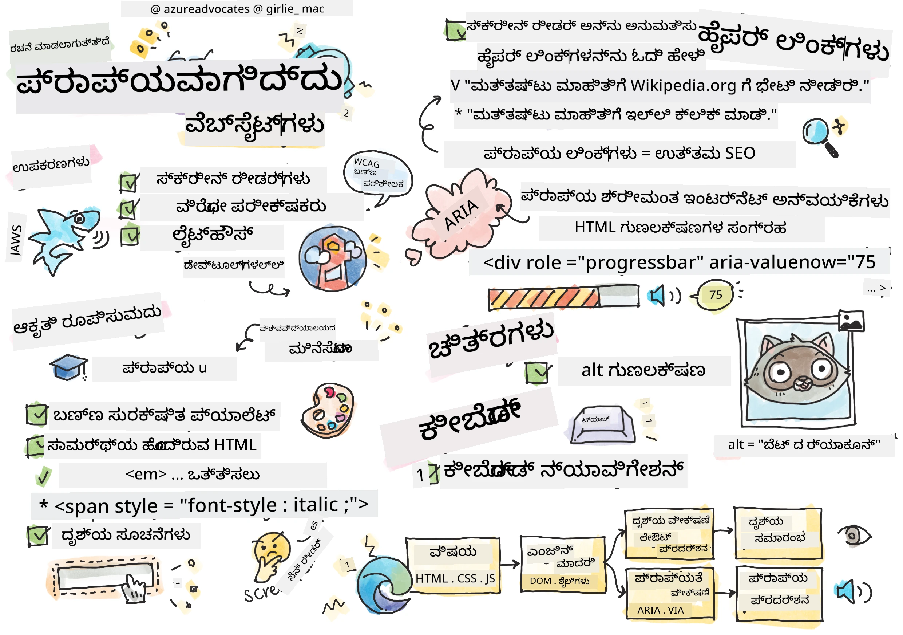
> ಸ್ಕೆಚ್ನೋಟ್ [ಟೊಮೊಮಿ ಇಮುರಾ](https://twitter.com/girlie_mac) ಅವರಿಂದ

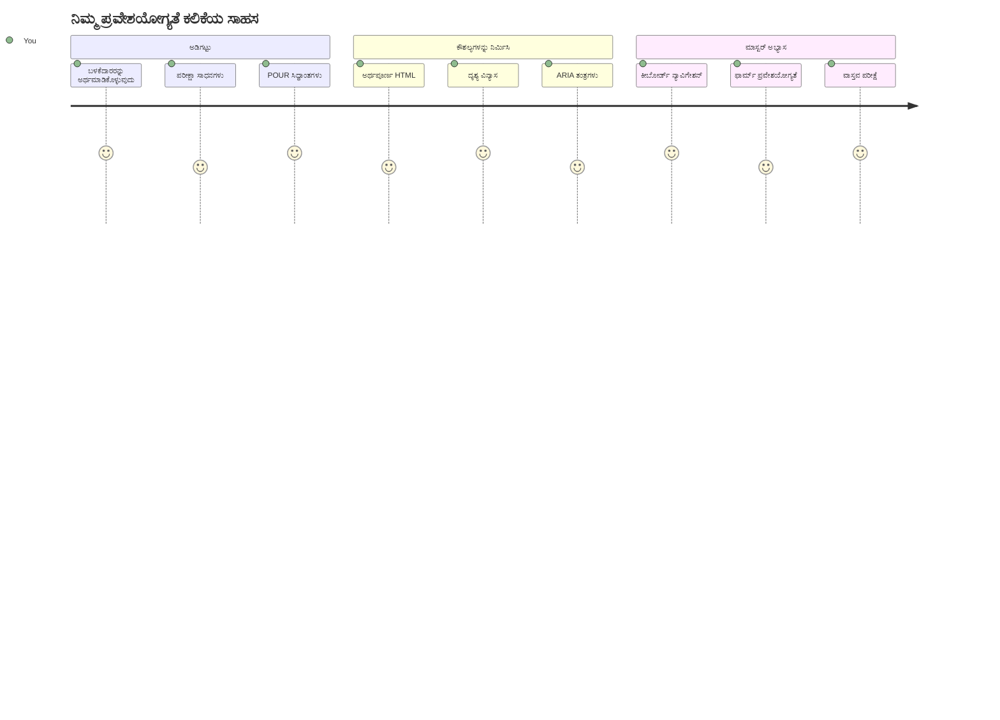
## ಉಪನ್ಯಾಸಕ್ಕೆ ಮುನ್ನ ಪ್ರಶ್ನೋತ್ತರ
[ಉಪನ್ಯಾಸಕ್ಕೆ ಮುನ್ನ ಪ್ರಶ್ನೋತ್ತರ](https://ff-quizzes.netlify.app/web/)

> ವೆಬ್‌ನ ಶಕ್ತಿ ಅದರ ಸಾಮಾನ್ಯತೆಯಲ್ಲಿ ಇದೆ. ಅಂಗವೈಕಲ್ಯತೆ ಇರಲಿ ಇಲ್ಲದಿರಲಿ ಎಲ್ಲರಿಗೂ ಪ್ರವೇಶವು ಅನಿವಾರ್ಯ ಅಂಶವಾಗಿದೆ.
>
> \- ಸರ್ ಟಿಮೋಥಿ ಬರ್‌ನರ್ಸ್-ಲೀ, W3C ನಿರ್ದೇಶಕ ಮತ್ತು ವರ್ಲ್ಡ್ ವೈಡ್ ವೆಬ್‌ಗಾಗಿ ಸಂಶೋಧಕ

ನಿಮ್ಮನ್ನು ಆಶ್ಚರ್ಯಗೊಳಿಸಬಹುದಾದ ವಿಷಯವೊಂದಿದೆ: ನೀವು ಪ್ರವೇಶಿಸಲು ಅನುಕೂಲಕರವಾದ ವೆಬ್ಸೈಟ್‌ಗಳನ್ನು ರಚಿಸುವಾಗ, ನೀವು ಸರಳವಾಗಿ ಅಂಗವೈಕಲ್ಯತೆಯಲ್ಲಿರುವವರಿಗೂ ಸಹಾಯಮಾಡುತ್ತೀರಲ್ಲವೇ—ನಿಜದಲ್ಲಿ ನೀವು ವೆಬ್ ಅನ್ನು ಎಲ್ಲರಿಗೂ ಉತ್ತಮಗೊಳಿಸುತ್ತಿದ್ದೀರಾ!

ನೀವು ಯಾವಾಗಲೂ ಚಿತ್ರಿಸುವಾಗ ರಸ್ತೆಯ ಮೂಲೆಗಳಲ್ಲಿ ಇರುವ ಕಾರ್ಬ್ ಕಡಿತಗಳನ್ನು ಗಮನಿಸಿದ್ದೀರಾ? ಅವು ಮೊದಲು ವೀಲ್ಚೇರ್‌ಗಳನ್ನುಿಗಾಗಿ ವಿನ್ಯಾಸಗೊಳ್ಳುವಾಗಿತ್ತು, ಆದರೆ ಈಗ stroller-ಗಳಲ್ಲಿ ಆಗುವವರ, ಹಂಚಿಕೆಗಾರರು dollies ಬಳಸುವವರ, ಪ್ರಯಾಣಿಕರು rolling luggage ತೆಗೆದುಕೊಂಡು ಹೋಗುವವರ, ಮತ್ತು ಸೈಕ್ಲಿಸ್ಟ್‌ಗಳಿಗೆ ಸಹ ಸಹಾಯಕವಾಗಿವೆ. ಇದೇ ರೀತಿಯಲ್ಲಿ ಪ್ರವೇಶಿಸಲು ಅನುಕೂಲಕರ ವೆಬ್ ವಿನ್ಯಾಸ ಕೆಲಸ ಮಾಡುತ್ತದೆ—ಒಂದು ಗುಂಪಿಗೆ ಸಹಾಯಮಾಡುವ ಪರಿಹಾರಗಳು ಬಹುಶಃ ಎಲ್ಲರಿಗೂ ಲಾಭ ಕೊಡುತ್ತವೆ. ಬಹಳ ಕುಲ್ ಸರಿ?

ಈ ಪಾಠದಲ್ಲಿ, ನಾವು ಯಾವ ರೀತಿಯಲ್ಲಿ ವೆಬ್‌ನ್ನು ಬ್ರೌಜ್ ಮಾಡುವುದರಿಂದ ವರ್ಯತೆ ಇಲ್ಲದೆ ಎಲ್ಲರಿಗೂ ಕೆಲಸಮಾಡುವಂತಹ ವೆಬ್‌ಸೈಟ್‌ಗಳನ್ನು ಸೃಷ್ಟಿಸುವುದನ್ನು ಅನ್ವೇಷಿಸುವೆವು. ನೀವು ಈಗಾಗಲೇ ವೆಬ್ ಮಾನದಂಡಗಳಲ್ಲಿ ಒಳಗೊಂಡಿರುವ ಪ್ರಾಯೋಗಿಕ ತಂತ್ರಗಳನ್ನು ಕಂಡುಹಿಡಿಯುತ್ತೀರಿ, ಟೆಸ್ಟಿಂಗ್ ಉಪಕರಣಗಳೊಂದಿಗೆ ಕಾರ್ಯಚರಿಸುವೆವು, ಮತ್ತು ಪ್ರವೇಶಾಸಾಧ್ಯತೆಯು ನಿಮ್ಮ ಸೈಟ್‌ಗಳನ್ನು ಎಲ್ಲ ಬಳಕೆದಾರರಿಗೂ ಹೆಚ್ಚು ಬಳಕೆ ಮಾಡಲು ಸಾಧ್ಯವಾಗಿಸುತ್ತದೆ ಎಂಬುದನ್ನು ನೋಡುತ್ತೀರಿ.

ಈ ಪಾಠದ ಕೊನೆಯಲ್ಲಿ, ನೀವು ಪ್ರವೇಶಾಸಾಧ್ಯತೆಯನ್ನು ನಿಮ್ಮ ಅಭಿವೃದ್ಧಿ ಕಾರ್ಯಪ್ರವಾಹದ ಸಹಜ ಭಾಗವಾಗಿಸಲು ಆತ್ಮವಿಶ್ವಾಸ ಹೊಂದಿರುತ್ತೀರಿ. ನಿಖರವಾದ ವಿನ್ಯಾಸ ಆಯ್ಕೆಗಳು ವೆಬ್‌ನನ್ನು ಅರವತ್ತರ ಬಳಕೆದಾರರಿಗೆ ಹೇಗೆ ತೆರೆಯುತ್ತವೆ ಎಂಬುದನ್ನು ಹುಡುಕಲು ಸಿದ್ಧರಾದೀರಾ? ಸಾವಕಾಶವಾಗಿ ಪ್ರಾರಂಭಿಸೋಣ!

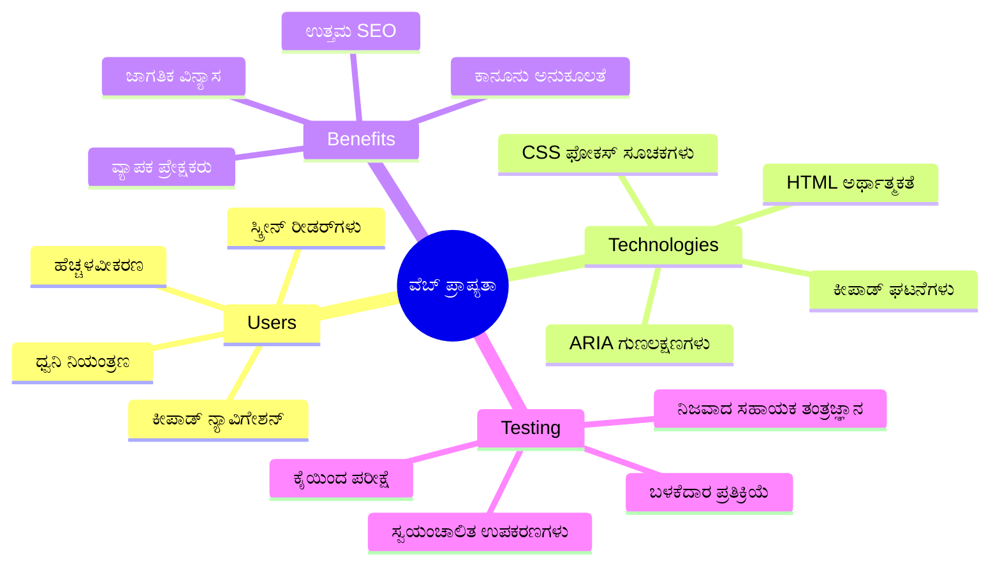
> ನೀವು ಈ ಪಾಠವನ್ನು [Microsoft Learn](https://docs.microsoft.com/learn/modules/web-development-101/accessibility/?WT.mc_id=academic-77807-sagibbon) ನಲ್ಲಿ ಪಡೆಯಬಹುದು!

## ಸಹಾಯಕ ತಂತ್ರಜ್ಞಾನಗಳನ್ನು ಗ್ರಹಿಸುವಿಕೆ

ಕೊಡಿಂಗ್ intoಗೆ ಮುನ್ನ, ವಿಭಿನ್ನ ಸಾಮರ್ಥ್ಯದ ಜನರು ವೆಬ್ ಅನ್ನು ವಾಸ್ತವವಾಗಿ ಹೇಗೆ ಅನುಭವಿಸುತ್ತಾರೆ ಎಂಬುದನ್ನು ಸ್ವಲ್ಪ ಸಮಯ ತೆಗೆದು ನೋಡೋಣ. ಇದು ಸಿದ್ದಾಂತ ಮಾತ್ರವಲ್ಲ—ಈ ನೈಜ ಜಗತ್ತಿನ ನಾವಿಗೇಶನ್ ಮಾದರಿಗಳನ್ನು ಗ್ರಹಿಸುವುದು ನಿಮ್ಮನ್ನು ಉತ್ತಮ ಅಭಿವೃದ್ಧಿಪಡಿಸುವವರಿಗೆ ಮಾಡುತ್ತದೆ!

ಸಹಾಯಕ ತಂತ್ರಜ್ಞಾನಗಳು ಅಂಗವೈಕಲ್ಯತೆ ಹೊಂದಿರುವ ಜನರಿಗೆ ವೆಬ್‌ಸೈಟ್‌ಗಳ ಜೊತೆಗೆ ವಿಚಿತ್ರ ರೀತಿಯಲ್ಲಿ ಸಂಪರ್ಕಿಸಲು ಸಹಾಯ ಮಾಡುವ ಅద్భುತ ಸಾಧನಗಳಾಗಿವೆ. ಈ ತಂತ್ರಜ್ಞಾನಗಳು ಹೇಗೆ ಕೆಲಸಮಾಡುತ್ತವೆ ಎಂದು ಬಲ್ಲಾಗ ನೀವು ಸುಲಭವಾಗಿ ಪ್ರವೇಶಿಸಲು ಅನುಕೂಲಕರ ವೆಬ್ ಅನುಭವಗಳನ್ನು ರಚಿಸಬಹುದು. ಅದು ನಿಮ್ಮ ಕೋಡ್ ಅನ್ನು ಮತ್ತೊಬ್ಬರ ದೃಷ್ಟಿಯಿಂದ ಹೇಗೆ ನೋಡಬೇಕೆಂದು ಕಲಿಯುವುದು ಸರಿ.

### ಸ್ಕ್ರೀನ್ ರೀಡರ್ಸ್

[ಸ್ಕ್ರೀನ್ ರೀಡರ್ಸ್](https://en.wikipedia.org/wiki/Screen_reader) ಪರಿಣಾಮಕಾರಿ ತಂತ್ರಜ್ಞಾನಗಳಾಗಿದ್ದು ಡಿಜಿಟಲ್ ಪಠ್ಯವನ್ನು ಧ್ವನಿ ಅಥವಾ ಬ್ರೈಲ್ ಔಟ್‌ಪುಟ್ ಆಗಿ ಪರಿವರ್ತಿಸುತ್ತವೆ. ಮುಖಾಂತರ ದೃಷ್ಟಿ ಹೀನತೆ ಇರುವವರಿಗೆ ಮುಖ್ಯವಾಗಿ ಬಳಕೆಯಲ್ಲಿದ್ದು, ಅದೇ ರೀತಿ ಡಿಸ್ಲೆಕ್ಸಿಯಾ ಸಮೇತ ಕಲಿಕಾ ಅಂಗವೈಕಲ್ಯತೆಗಳಿರುವ ಬಳಕೆದಾರರಿಗೂ ಸಹ ಬಹಳ ಸಹಾಯಕವಾಗಿವೆ.

ನಾನು ಸ್ಕ್ರೀನ್ ರೀಡರ್ ಅನ್ನು ಒಂದು ಬಹುಬುದ್ಧಿವಂತ ಕಥಾಕಾರನಂತೆ ಯೋಚಿಸುತ್ತೇನೆ, ಅವರು ನಿಮ್ಮಿಗೆ ಪುಸ್ತಕವನ್ನು ಓದುತ್ತಿದ್ದಾರೆ. ಅದು ವಿಷಯವನ್ನು ಅರ್ಥಪೂರ್ಣ ಕ್ರಮದಲ್ಲಿ ಓದುವದು, "ಬಟನ್" ಅಥವಾ "ಲಿಂಕ್" ಎಂಬಂತಿರುವ ಸಂವಾದಾತ್ಮಕ ಅಂಶಗಳನ್ನು ಪ್ರಕಟಿಸುವುದು, ಮತ್ತು ಪುಟದಲ್ಲಿ ಚುಕ್ಕಿಕೊಳ್ಳುವ ಎರಡುಕ್ವಿಕ್ ಕೀಬೋರ್ಡ್ ಶಾರ್ಟ್‌ಕಟ್‌ಗಳನ್ನು ನೀಡುವುದು. ಆದರೆ ನಿಜವಾದ ಸಂಗತಿ ಏನೆಂದರೆ—ಸ್ಕ್ರೀನ್ ರೀಡರ್ಸ್ ಅದರ ಮಾಯಾಜಾಲವನ್ನು ನಡಿಸುವುದು ನಾವು ವೆಬ್‌ಸೈಟ್‌ಗಳನ್ನು ಸರಿಯಾದ ರಚನೆ ಮತ್ತು ಅರ್ಥಪೂರ್ಣ ವಿಷಯದೊಂದಿಗೆ ನಿರ್ಮಿಸಿದಾಗ ಮಾತ್ರ ಸಾಧ್ಯ. ಅದೇ ನಿಮಗೆ ಡೆವಲಪರ್ ಆಗಿ ಬರುವ ಜಾಗ!

**ಪ್ರಚಲಿತ ಸ್ಕ್ರೀನ್ ರೀಡರ್ಸ್ ಪ್ಲಾಟ್‌ಫಾರ್ಮ್‌ಗಳೆಂದರೆ:**
- **ವಿಂಡೋಸ್**: [NVDA](https://www.nvaccess.org/about-nvda/) (ಉಚಿತ ಮತ್ತು ಹೆಚ್ಚು ಜನಪ್ರಿಯ), [JAWS](https://webaim.org/articles/jaws/), [Narrator](https://support.microsoft.com/windows/complete-guide-to-narrator-e4397a0d-ef4f-b386-d8ae-c172f109bdb1/?WT.mc_id=academic-77807-sagibbon) (ನಿರ್ಮಿತ)
- **ಮ್ಯಾಕ್ಓಎಸ್/ಐಒಎಸ್**: [VoiceOver](https://support.apple.com/guide/voiceover/welcome/10) (ನಿರ್ಮಿತ ಮತ್ತು ಬಹುಶಕ್ತಿ)
- **ಆಂಡ್ರಾಯ್ಡ್**: [TalkBack](https://support.google.com/accessibility/android/answer/6283677) (ನಿರ್ಮಿತ)
- **ಲಿನಕ್ಸ**: [Orca](https://wiki.gnome.org/Projects/Orca) (ಉಚಿತ ಮತ್ತು ಓಪನ್ ಸೋರ್ಸ್)

**ಸ್ಕ್ರೀನ್ ರೀಡರ್ಸ್ ವೆಬ್ ವಿಷಯವನ್ನು ಹೇಗೆ ನಾವಿಗೇಟ್ ಮಾಡುತ್ತವೆ:**

ಸ್ಕ್ರೀನ್ ರೀಡರ್ಸ್ ಅನುಭವ ಹೊಂದಿರುವ ಬಳಕೆದಾರರಿಗೆ ಬ್ರೌಜಿಂಗ್ ದಕ್ಷತೆಯನ್ನು ಹೆಚ್ಚಿಸಲು ಹಲವಾರು ನಾವಿಗೇಶನ್ ವಿಧಾನಗಳನ್ನು ಒದಗಿಸಬಹುದು:
- **ಕ್ರಮವಾಗಿ ಓದುವುದು**: ಮೇಲಿನಿಂದ ಕೆಳಗೆ ವಿಷಯವನ್ನು ಓದುವದು, ಪುಸ್ತಕ ಅನುಸರಿಸುವಂತೆ
- **ಲ್ಯಾಂಡ್‌ಮಾರ್ಕ್ ನಾವಿಗೇಶನ್**: ಪುಟದ ವಿಭಾಗಗಳ ನಡುವೆ ಜಂಪ್ ಮಾಡುವುದು (ಹೆಡರ್, ನ್ಯಾವ್, ಮೇನ್, ಫುಟರ್)
- **ಶೀರ್ಷಿಕೆ ನಾವಿಗೇಶನ್**: ಪುಟದ ರಚನೆಯನ್ನು ಅರ್ಥಮಾಡಿಕೊಳ್ಳಲು ಶೀರ್ಷಿಕೆಗಳ ನಡುವೆ ಜಂಪ್ ಮಾಡುವುದು
- **ಲಿಂಕ್ ಪಟ್ಟಿಗಳು**: ವೇಗವೊಂದಿಗೆ ಪ್ರವೇಶ ಮಾಡಲು ಎಲ್ಲಾ ಲಿಂಕ್‌ಗಳ ಪಟ್ಟಿಯನ್ನು ರಚಿಸುವುದು
- **ಫಾರಂ ನಿಯಂತ್ರಣೆಗಳು**: ನೇರವಾಗಿ ಇನ್‌ಪುಟ್ ಕ್ಷೇತ್ರಗಳು ಮತ್ತು ಬಟನ್‌ಗಳ ನಡುವೆ ನಾವಿಗೇಟ್ ಮಾಡುವುದು

> 💡 **ನನಗೆ ಮಿಸ್ ಮಾಡದೆ ತಿಳಿದಂತೆ**: 68% ಸ್ಕ್ರೀನ್ ರೀಡರ್ ಬಳಕೆದಾರರು ಮುಖ್ಯವಾಗಿ ಶೀರ್ಷಿಕೆಗಳಿಂದ ನಾವಿಗೇಟ್ ಮಾಡುತ್ತಾರೆ ([WebAIM ಸಮೀಕ್ಷೆ](https://webaim.org/projects/screenreadersurvey9/#finding)). ಇದರಿಂದ ನಿಮ್ಮ ಶೀರ್ಷಿಕೆ ರಚನೆ ಬಳಕೆದಾರರಿಗೆ ಮಾರ್ಗಸೂಚಿಯಂತೆ ಇದೆ—ನೀವು ಅದನ್ನು ಸರியாக ಮಾಡಿದರೆ, ನೀವು ಕೇವಲ ಜನರಿಗೆ ನಿಮ್ಮ ವಿಷಯದ ಸುತ್ತಲೂ ವೇಗವಾಗಿ ಕಂಡುಹಿಡಿಯಲು ಸಹಾಯವಾಗುತ್ತೀರಿ!

### ನಿಮ್ಮ ಪರೀಕ್ಷಾ ಕಾರ್ಯಪ್ರವಾಹವನ್ನು ನಿರ್ಮಿಸುವುದು

ಒಂದು ಚೆನ್ನಚಾರು ಸುದ್ದಿ ಇದೆ—ಫಲಕಾರಿ ಪ್ರವೇಶಾಸಾಧ್ಯತೆ ಪರೀಕ್ಷೆ ಭಾರವಾದದ್ದು ಆಗಬೇಕಿಲ್ಲ! ನೀವು ಸ್ವಯಂಚಾಲಿತ ಉಪಕರಣಗಳನ್ನು (ಅವು ಸ್ಪಷ್ಟ ಸಮಸ್ಯೆಗಳನ್ನು ಹಿಡಿಯುವಲ್ಲಿ ಅತ್ಯುತ್ತಮ) ಮತ್ತು ಕೈಯಿಂದ ಪರೀಕ್ಷೆಗಳನ್ನು ಸಂಯೋಜಿಸಲು ಇಷ್ಟಪಡುತ್ತೀರಿ. ನಾನು ಕಂಡುಕೊಂಡಿರುವ ವ್ಯವಸ್ಥಿತ ವಿಧಾನ ಇದು ದಿನದ ಎಲ್ಲಾ ಸಮಯವನ್ನು ಕೊಂದರೂ ಕೂಡಾ ಹೆಚ್ಚು ಸಮಸ್ಯೆಗಳನ್ನು ಹಿಡಿಯುತ್ತದೆ:

**ಅತ್ಯಾವಶ್ಯಕ ಕೈಯಿಂದ ಪರೀಕ್ಷೆ ಕಾರ್ಯಪ್ರವಾಹ:**

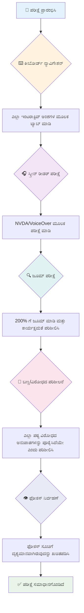
**ಪದನಂತರ ಪರೀಕ್ಷಾ ಪರಿಶೀಲನಾ ಪಟ್ಟಿಯು:**
1. **ಕೀಬೋರ್ಡ್ ನಾವಿಗೇಶನ್**: Tab, Shift+Tab, Enter, Space, ಮತ್ತು Arrow ಕೀಗಳನ್ನು ಮಾತ್ರ ಬಳಸು
2. **ಸ್ಕ್ರೀನ್ ರೀಡರ್ ಪರೀಶಿಲನೆ**: NVDA, VoiceOver, ಅಥವಾ Narrator ಅನ್ನು ಸಕ್ರಿಯಗೊಳಿಸಿ ಮತ್ತು ಕಣ್ಣು ಮುಚ್ಚಿದ ಸ್ಥಿತಿಯಲ್ಲಿ ನಾವಿಗೇಟ್ ಮಾಡಿ
3. **ಜೂಮ್ ಪರೀಕ್ಷೆ**: 200% ಮತ್ತು 400% ಜೂಮ್ ಮಟ್ಟದಲ್ಲಿ ಪರೀಕ್ಷೆ ಮಾಡಿ
4. **ಬಣ್ಣ ವಿರುದ್ಧಪಥ ಪರಿಶೀಲನೆ**: ಎಲ್ಲಾ ಪಠ್ಯ ಮತ್ತು ಬಳಕೆದಾರ ಇಂಟರ್ಫೇಸ್ ಘಟಕಗಳನ್ನು ಚೆಕ್ ಮಾಡಿ
5. **ಫೋಕಸ್ ಸೂಚಕ ಪರೀಕ್ಷೆ**: ಎಲ್ಲಾ ಸಂವಾದಾತ್ಮಕ ಘಟಕಗಳಿಗೆ ದೃಶ್ಯಮಾನ ಫೋಕಸ್ ಸ್ಥಿತಿಗಳಿರುವುದನ್ನು ಖಚಿತಪಡಿಸಿಕೊಳ್ಳಿ

✅ **ಲೈಟ್‌ಹೌಸ್‌ನಿಂದ ಪ್ರಾರಂಭಿಸಿ**: ನಿಮ್ಮ ಬ್ರೌಜರ್ DevTools ತೆರೆಯಿರಿ, ಲೈಟ್‌ಹೌಸ್ ಪ್ರವೇಶಾಸಾಧ್ಯತೆ ಪ್ರಮೇಯವನ್ನು ನಡೆಯಿಸಿ, ನಂತರ ಫಲಿತಾಂಶಗಳ ಆಧಾರದ ಮೇಲೆ ಕೈಯಿಂದ ಪರಿಶೀಲನೆಗೆ ಗುರಿಯನ್ನು ನಿಶ್ಚಿತಗೊಳಿಸಿ.

### ಜೂಮ್ ಮತ್ತು ಮಹತ್ವಾಕಾಂಕ್ಷೆ ಉಪಕರಣಗಳು

ನೀವು ನಿಮ್ಮ ಫೋನಿನಲ್ಲಿ ಪಠ್ಯ ತುಂಬಾ ಸಣ್ಣದಾಗಿದ್ದಾಗ ಇಡೀಸ್ಕ್ ಮಾಡಿ ಜೂಮ್ ಮಾಡುವಿರಿ, ಅಥವಾ ಬ glaringದ ಬೆಳಗಿನಲ್ಲಿ ನಿಮ್ಮ ಲ್ಯಾಪ್ಟಾಪ್ ಪರದೆ ನೋಡಲು ಸಡಿಲಿಸಿ ನೋಡುವುದಾಗಿ ಅವರುಂದಾದರೂ ಗಮನಿಸಿದ್ದೀರಾ? ಬಹಳ ಜನರು ಪ್ರತಿದಿನವೂ ವಿಷಯವನ್ನು ಓದಲು ಮಹತ್ವಾಕಾಂಕ್ಷೆ ಉಪಕರಣಗಳ ಮೇಲೆ ಅವಲಂಬಿತರಾಗಿರುತ್ತಾರೆ. ಇದರಲ್ಲಿ ಕಡಿಮೆ ದೃಷ್ಟಿ ಹೊಂದಿರುವವರು, ವಯಸ್ಕರು, ಮತ್ತು ಯಾರಾದರೂ ವೆಬ್‌ಸೈಟ್ ಬಾಹ್ಯಾಕಾಶದಲ್ಲಿ ಓದಲು ಯತ್ನಿಸಿದವರು ಸೇರಿದ್ದಾರೆ.

ಸೂಕ್ತಾಂಶವಾಗಿ ಜೂಮ್ ತಂತ್ರಜ್ಞಾನಗಳು ಏತಕ್ಕಿಂತಲೂ ದೊಡ್ಡದಾಗಿ ಮಾಡುವುದರಿಂದ ಮೇಲು. ಈ ಉಪಕರಣಗಳು ಹೇಗೆ ಕೆಲಸ ಮಾಡುತ್ತವೆ ಎಂದು ತಿಳಿದಿರುವುದು ಪ್ರತಿಕ್ರಿಯಾಶೀಲ ವಿನ್ಯಾಸಗಳನ್ನು ನಿರ್ಮಿಸುವುದಕ್ಕೆ ನಿಮಗೆ ಸಹಾಯಮಾಡುತ್ತದೆ, ಅಲ್ಲಿ ಯಾವುದೇ ಜೂಮ್ ಮಟ್ಟದಲ್ಲಿಯೂ ಕಾರ್ಯನಿರ್ವಹಿಸುವ ಮತ್ತು ಆಕರ್ಷಕವಾಗಿರುವ ವಿನ್ಯಾಸಗಳಿರುತ್ತವೆ.

**ಆಧುನಿಕ ಬ್ರೌಜರ್ ಜೂಂ ಸಾಮರ್ಥ್ಯಗಳು:**
- **ಪುಟ ಜೂಮ್**: ಎಲ್ಲಾ ವಿಷಯವನ್ನು ಅನುಪಾತದಲ್ಲಿ (ಪಠ್ಯ, ಚಿತ್ರಗಳು, ವಿನ್ಯಾಸ) ವಿಸ್ತರಿಸುತ್ತದೆ - ಇದು ಬೇಕಾದ ಸುಪಂಢ ವಿಧಾನ
- **ಪಠ್ಯ ಮಾತ್ರ ಜೂಮ್**: ಮೂಲ ವಿನ್ಯಾಸ ಇಡೀ ಉಳಿಸಿಕೊಂಡು ಫೋಂಟ್ ಗಾತ್ರವನ್ನು ಹೆಚ್ಚಿಸುತ್ತದೆ
- **ಪಿಂಚ್-ಟು-ಜೂಮ್**: ತಾತ್ಕಾಲಿಕ ಮಹತ್ವಾಕಾಂಕ್ಷೆಗೆ ಮೊಬೈಲ್ ಜೇಶ್ಚರ್ ಮద్దತಿನ ಮಾರ್ಗ
- **ಬ್ರೌಜರ್ ಬೆಂಬಲ**: ಎಲ್ಲಾ ఆధುನಿಕ ಬ್ರೌಜರ್ಗಳು ಕಾರ್ಯಕ್ಷಮತೆಯ ತೊಂದರೆ ಇಲ್ಲದೆ 500% ಜೂಮ್ ಬೆಂಬಲಿಸುವುದರಲ್ಲಿ ಸೂಕ್ತ

**ವಿಶೇಷ ಮಹತ್ವಾಕಾಂಕ್ಷೆ ಸಾಫ್ಟ್‌ವೇರ್‌ಗಳು:**
- **ವಿಂಡೋಸ್**: [ಮ್ಯಾಗ್‌ನಿಫೈಯರ್](https://support.microsoft.com/windows/use-magnifier-to-make-things-on-the-screen-easier-to-see-414948ba-8b1c-d3bd-8615-0e5e32204198) (ನಿರ್ಮಿತ), [ZoomText](https://www.freedomscientific.com/training/zoomtext/getting-started/)
- **ಮ್ಯಾಕ್ಓಎಸ್/ಐಒಎಸ್**: [Zoom](https://www.apple.com/accessibility/mac/vision/) (ನಿರ್ಮಿತ ಮತ್ತು ಪ್ರಗತಿಶೀಲ ವೈಶಿಷ್ಟ್ಯಗಳೊಡನೆ)

> ⚠️ **ವಿನ್ಯಾಸ ಪರಿಗಣನೆ**: WCAG 200% ಜೂಮ್ ಆಗುವಾಗ ವಿಷಯ ಕಾರ್ಯನಿರ್ವಹಣೆಯಲ್ಲಿರಬೇಕು ಎಂದು ಅವಶ್ಯಕತೆ ಇಡುತ್ತದೆ. ಈ ಮಟ್ಟದಲ್ಲಿ, ಹೋರಿಜಾಂಟಲ್ ಸ್ಕ್ರೋಲಿಂಗ್ ಕನಿಷ್ಠವಾಗಿರಬೇಕು ಮತ್ತು ಎಲ್ಲಾ ಸಂವಾದಾತ್ಮಕ ಅಂಶಗಳು ಪ್ರವೇಶಾಸಾಧ್ಯವಾಗಿರಬೇಕು.

✅ **ನಿಮ್ಮ ಪ್ರತಿಕ್ರಿಯಾಶೀಲ ವಿನ್ಯಾಸವನ್ನು ಪರೀಕ್ಷೆ ಮಾಡಿ**: ನಿಮ್ಮ ಬ್ರೌಜರ್ ಅನ್ನು 200% ಮತ್ತು 400% ಗೆ ಜೂಮ್ ಮಾಡಿ. ನಿಮ್ಮ ವಿನ್ಯಾಸ ಚುರುಕಾಗಿ ಹೊಂದಿಕೊಳ್ಳುತ್ತದೆಯೇ? ನಿರ್ಲಕ್ಷ್ಯಿಸದ ಸ್ಕ್ರೋಲಿಂಗ್ ಇಲ್ಲದೆ ನೀವು ಎಲ್ಲಾ ಕಾರ್ಯಕ್ಷಮತೆಯನ್ನು ಇನ್ನೂ ಪ್ರವೇಶಿಸಬಹುದೇ?

## ಆಧುನಿಕ ಪ್ರವೇಶಾಸಾಧ್ಯತೆ ಪರೀಕ್ಷಾ ಉಪಕರಣಗಳು

ಜನರು ಸಹಾಯಕ ತಂತ್ರಜ್ಞಾನಗಳೊಂದಿಗೆ ವೆಬ್ ಅನ್ನು ಹೇಗೆ ನಾವಿಗೇಟ್ ಮಾಡುತ್ತಾರೆ ಎಂಬುದನ್ನು ಈಗ ನೀವು ಅರ್ಥಮಾಡಿಕೊಂಡಿದ್ದೀರಾ, ವಸ್ತುವಿವರಣಾ ಕಾರ್ಯಾಧಾರಕ್ಕೆ ಅನುಕೂಲಕರ ವೆಬ್‌ಸೈಟ್‌ಗಳನ್ನು ನಿರ್ಮಿಸಲು ಮತ್ತು ಪರೀಕ್ಷಿಸಲು ನೆರವಾಗುವ ಉಪಕರಣಗಳನ್ನು ಅನ್ವೇಷಿಸೋಣ.

ಇದನ್ನು ಈ ರೀತಿಯಲ್ಲಿ ಯೋಚಿಸಿ: ಸ್ವಯಂಚಾಲಿತ ಉಪಕರಣಗಳು ಸ್ಪಷ್ಟ ಸಮಸ್ಯೆಗಳನ್ನು ಹಿಡಿಯುವಲ್ಲಿ ಉತ್ತಮವಾಗಿವೆ (ಉದಾಹರಣೆಗೆ, alt ಪಠ್ಯ ಇಲ್ಲದಿರುವುದು), ಮತ್ತು ಕೈಯಿಂದ ಪರೀಕ್ಷೆಗಳು ನಿಮ್ಮ ಸೈಟ್ ವಾಸ್ತವ ಜಗತ್ತಿನಲ್ಲಿ ಚೆನ್ನಾಗಿ ಕೆಲಸ ಮಾಡುತ್ತದೇ ಎಂಬುದನ್ನು ಖಚಿತಗೊಳಿಸುತ್ತದೆ. ಜೊತೆಯಾಗಿ, ಈ ಎಲ್ಲವು ನಿಮಗೆ ನಿಮ್ಮ ಸೈಟ್‌ಗಳು ಎಲ್ಲರಿಗೂ ಕೆಲಸಮಾಡುತ್ತವೆ ಎಂಬ ವಿಶ್ವಾಸವನ್ನು ನೀಡುತ್ತವೆ.

### ಬಣ್ಣ ವಿರೋಧ ಪರೀಕ್ಷೆ

ಚೆನ್ನ ಸಂಭಾಷಣೆಯ ವಿಚಾರ ಇಲ್ಲಿದೆ: ಬಣ್ಣ ವಿರುದ್ಧಪಥವು ಸಾಮಾನ್ಯ ಪ್ರವೇಶಾಸಾಧ್ಯತೆ ಸಮಸ್ಯೆಗಳಲ್ಲೊಂದಾಗಿದ್ದು, ಆದರೆ ಅದನ್ನು ಸರಿಪಡಿಸುವುದು ಸಹ ಆಗ ತುಂಬಾ ಸರಳ. ಒಳ್ಳೆಯ ವಿರೋಧ ಬಣ್ಣವು ಎಲ್ಲರಿಗೂ ಲಾಭ ನೀಡುತ್ತದೆ—ದೃಷ್ಟಿ ಹೀನತೆಯ ಬಳಕೆದಾರರಿಂದ ಹಿಡಿದು ಬೀಚಿನಲ್ಲಿಯೇ ಫೋನ್ ಓದಲು ಯತ್ನಿಸುವವರಿಗೆ.

**WCAG ವಿರೋಧದ ಅವಶ್ಯಕತೆಗಳು:**

| ಪಠ್ಯ ಪ್ರಕಾರ | WCAG AA (ಕನಿಷ್ಟ) | WCAG AAA (ವೃದ್ಧಿತ) |
|-----------|-------------------|---------------------|
| **ಸಾಮಾನ್ಯ ಪಠ್ಯ** (18pt ಒಳಗೆ) | 4.5:1 ವಿರೋಧ ಅನುಪಾತ | 7:1 ವಿರೋಧ ಅನುಪಾತ |
| **ದುಂಬಿದ ಪಠ್ಯ** (18pt+ ಅಥವಾ 14pt+ ಬೋಲ್ಡ್) | 3:1 ವಿರೋಧ ಅನುಪಾತ | 4.5:1 ವಿರೋಧ ಅನುಪಾತ |
| **UI ಘಟಕಗಳು** (ಬಟನ್ಗಳು, ಫಾರಂ ಬಾರ್ಡರ್‌ಗಳು) | 3:1 ವಿರೋಧ ಅನುಪಾತ | 3:1 ವಿರೋಧ ಅನುಪಾತ |

**ಅತ್ಯಾವಶ್ಯಕ ಪರೀಕ್ಷಾ ಉಪಕರಣಗಳು:**
- [Colour Contrast Analyser](https://www.tpgi.com/color-contrast-checker/) - ಡೆಸ್ಕ್‌ಟಾಪ್ ಅಪ್ಲಿಕೇಶನ್ ಬಣ್ಣ ಆಯ್ಕೆದಾರನೊಂದಿಗೆ
- [WebAIM Contrast Checker](https://webaim.org/resources/contrastchecker/) - ವೆಬ್ ಆಧಾರಿತ ತಕ್ಷಣದ ಪ್ರತಿಕ್ರಿಯೆಯೊಂದಿಗೆ
- [Stark](https://www.getstark.co/) - ಡಿಸೈನ್ ಉಪಕರಣ ಪ್ಲಗಿನ್ Figma, Sketch, Adobe XDಗಾಗಿ
- [Accessible Colors](https://accessible-colors.com/) - ಪ್ರವೇಶೋಪಯುಕ್ತ ಬಣ್ಣ ಪ್ಯಾಲೆಟ್‌ಗಳನ್ನು ಹುಡುಕಿ

✅ **ಸರಿಯಾದ ಬಣ್ಣ ಪ್ಯಾಲೆಟ್‌ಗಳನ್ನು ನಿರ್ಮಿಸಿ**: ನಿಮ್ಮ ಬ್ರ್ಯಾಂಡ್ ಬಣ್ಣಗಳಿಂದ ಪ್ರಾರಂಭಿಸಿ ಮತ್ತು ವಿರೋಧ ಪರಿಕ್ಷಕಿ ಉಪಕರಣಗಳನ್ನು ಬಳಸಿ ಪ್ರವೇಶಾಸಾಧ್ಯತೆಯ ವೈವಿಧ್ಯಗಳನ್ನು ರಚಿಸಿ. ಇದರ ದಾಖಲೆಯನ್ನು ನಿಮ್ಮ ವಿನ್ಯಾಸ ವ್ಯವಸ್ಥೆಯ ಪ್ರವೇಶಾಸಾಧ್ಯ ಬಣ್ಣ ಟೋಕನ್‌ಗಳಾಗಿ ಇಡಿ.

### ಸಮಗ್ರ ಪ್ರವೇಶಾಸಾಧ್ಯತೆ ಪ್ರಾಮಾಣೀಕರಣ

ಅತ್ಯುತ್ತಮ ಪ್ರವೇಶಾಸಾಧ್ಯತೆ ಪರೀಕ್ಷೆಯು ಹಲವು ವಿಧಾನಗಳನ್ನು ಸಂಯೋಜಿಸುತ್ತದೆ. ಯಾವುದೇ ಏಕಮುಖ ಉಪಕರಣವು ಎಲ್ಲವನ್ನೂ ಹಿಡಿಯದು, ಹಾಗಾಗಿ ಬೇಟೆಯ ಕಾರ್ಯವಿಧಾನವನ್ನು ವಿವಿಧ ವಿಧಾನಗಳೊಂದಿಗೆ ರಚಿಸುವುದು ಸಮಗ್ರ ಸವಾಲುಗಳನ್ನು ಬಲಪಡಿಸುತ್ತದೆ.

**ಬ್ರೌಜರ್ ಆಧಾರಿತ ಪರೀಕ್ಷೆ (DevToolsನೊಳಗೆ ಸೇರಿಸಲಾಗಿದೆ):**
- **ಕ್ರೋಮ್/ಎಡ್ಜ್**: ಲೈಟ್‌ಹೌಸ್ ಪ್ರವೇಶಾಸಾಧ್ಯತೆ ಪ್ರಮೇಯ + ಪ್ರವೇಶಾಸಾಧ್ಯತೆ ಫಲಕ
- **ಫೈರ್‌ಫಾಕ್ಸ್**: ವಿವರವಾದ ವೃಕ್ಷದೃಶ್ಯೊಂದಿಗೆ ಪ್ರವೇಶಾಸಾಧ್ಯತೆ ಇನ್ಸ್ಪೆಕ್ಟರ್
- **ಸ್ಯಾಫಾರಿ**: ವೆಬ್ ಇನ್ಸ್‌ಪೆಕ್ಟರ್‌ನ ಪರಿಶೀಲನೆ ಟ್ಯಾಬ್ ಮತ್ತು VoiceOver ಅನುಕರಣೆ

**ವೃತ್ತಿಪರ ಪರೀಕ್ಷಾ ವಿಸ್ತರಣೆಗಳು:**
- [axe DevTools](https://www.deque.com/axe/devtools/) - ಉದ್ಯಮ-ಮೌಲ್ಯಮಾಪನ ಸ್ವಯಂಚಾಲಿತ ಪರೀಕ್ಷೆ
- [WAVE](https://wave.webaim.org/extension/) - ದೋಷ ಒತ್ತಿ ತಮ್ಮುಟೊಂದಿಗೆ ದೃಶ್ಯ ಪ್ರತಿಕ್ರಿಯಾ
- [Accessibility Insights](https://accessibilityinsights.io/) - ಮೈಕ್ರೋಸಾಫ್ಟ್‌ನ ಸಂಪೂರ್ಣ ಪರೀಕ್ಷಾ ಸಂಗ್ರಹ

**ಕಮಾಂಡ್‌ಲೈನ್ ಮತ್ತು CI/CD ಸಂಯೋಜನೆ:**
- [axe-core](https://github.com/dequelabs/axe-core) - ಸ್ವಯಂಚಾಲಿತ ಪರೀಕ್ಷೆಗೆ ಜಾವಾಸ್ಕ್ರಿಪ್ಟ್ ಗ್ರಂಥಾಲಯ
- [Pa11y](https://pa11y.org/) - ಕಮಾಂಡ್ ಲೈನ್ ಪ್ರವೇಶಾಸಾಧ್ಯತೆ ಪರೀಕ್ಷಾ ಸಾಧನ
- [Lighthouse CI](https://github.com/GoogleChrome/lighthouse-ci) - ಸ್ವಯಂಚಾಲಿತ ಪ್ರವೇಶಾಸಾಧ್ಯತೆ ಅಂಕಿಅಂಶಗಳ ಮೌಲ್ಯಮಾಪನ

> 🎯 **ಪರೀಕ್ಷಾ ಗುರಿ**: ಲೈಟ್‌ಹೌಸ್ ಪ್ರವೇಶಾಸಾಧ್ಯತೆ ಅಂಕ 95+ ಗುರಿಯಾಗಿರಲಿ. ನೆನಪಿನಲ್ಲಿಡಿ, ಸ್ವಯಂಚಾಲಿತ ಉಪಕರಣಗಳು ಸುತ್ತಲೂ 30-40% ಮಾತ್ರ ಸಮಸ್ಯೆಗಳನ್ನು ಹಿಡಿಯುತ್ತವೆ—ಕೈಯಿಂದ ಪರೀಕ್ಷೆ ಈಗಲೂ ಅಗತ್ಯ!

### 🧠 **ಪರೀಕ್ಷಾ ಕೌಶಲ್ಯ ಪರಿಶೀಲನೆ: ಸಮಸ್ಯೆಗಳನ್ನು ಕಂಡುಹಿಡಿಯಲು ಸಿದ್ಧರಾಗಿ?**

**ನೀವು ಪ್ರವೇಶಾಸಾಧ್ಯತೆ ಪರೀಕ್ಷೆ ಬಗ್ಗೆ ಹೇಗಿರುವಿರಿ ನೋಡೋಣ:**
- ಈ ಸಮಯದಲ್ಲಿ ಯಾವ ಪರೀಕ್ಷಾ ವಿಧಾನ ಉತ್ತಮವಾಗಿ ಪ್ರಾಪ್ತಿಯಾಗುತ್ತದೆ ಎಂಬುದೆನು?
- ಒಂದು ಪೂರ್ಣ ದಿನ ಟ್ಯಾಬ್ ಕೀ ಮಾತ್ರ ಬಳಸಿ ನಾವಿಗೇಟ್ ಮಾಡುವುದು ನಿಮ್ಮಿಗಾದರೇ ಕಲ್ಪಿಸಬಹುದೇ?
- ನೀವು ವೈಯಕ್ತಿಕವಾಗಿ ವೆಬ್‌ನಲ್ಲಿ ಎದುರಿಸಿದ ಒಂದು ಪ್ರವೇಶಾಸಾಧ್ಯತೆ ಅಡಚಣೆಯೇನು?

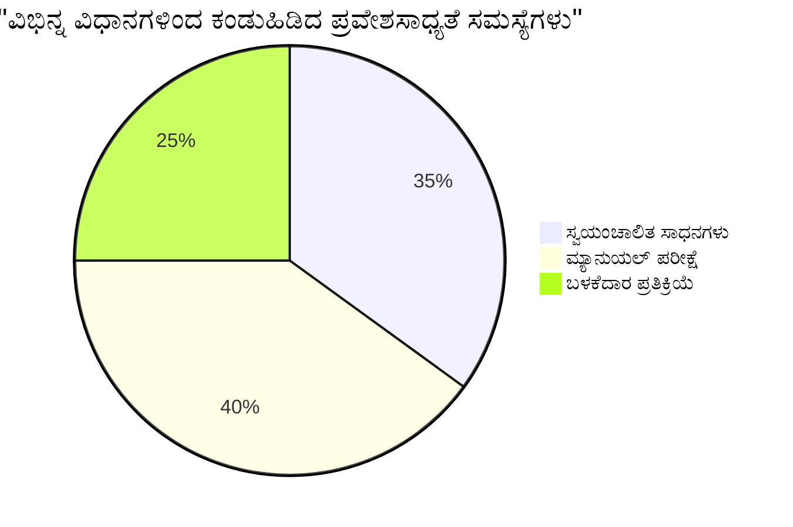
> **ಆತ್ಮವಿಶ್ವಾಸ ವೃದ್ಧಿ**: ವೃತ್ತಿಪರ ಪ್ರವೇಶಾಸಾಧ್ಯತೆಯ ಪರೀಕ್ಷಕರು ಈ ನಿಖರ ಸಂಯೋಜನೆಯನ್ನು ಬಳಸುತ್ತೇವೆ. ನೀವು ಉದ್ಯಮಮಟ್ಟದ ಅಭ್ಯಾಸಗಳನ್ನು ಕಲಿಯುತ್ತಿದ್ದೀರಿರಿ!

## ನೆಲೆಯಿಂದ ಆರಂಭಿಸಿ ಪ್ರವೇಶಾಸಾಧ್ಯತೆ ನಿರ್ಮಾಣ

ಪ್ರವೇಶಾಸಾಧ್ಯತೆಯ ಯಶಸ್ಸಿನ ಕೀ ಬಲೆ ಇಡೀ ಮೂಲದೊಂದಿಗೆ ಆರಂಭಿಸುವುದಾಗಿದೆ. "ನಾನು ನಂತರ ಪ್ರವೇಶಾಸಾಧ್ಯತೆ ಸೇರಿಸುವೆನು" ಎನ್ನುವುದು ಆಕರ್ಷಕ ಎಂದು ನನಗೆ ಗೊತ್ತಿದೆ, ಆದರೆ ಅದೊಂದು ಮನೆ ಕಟ್ಟಿದ ಬಳಿಕ ಅದಕ್ಕೆ ಒಂದು ರ್ಯಾಂಪ್ ಸೇರಿಸುವಂತೆ. ಸಾಧ್ಯವೇ? ಹೌದು. ಸುಲಭವೇ? ಇಲ್ಲ.

ಪ್ರವೇಶಾಸಾಧ್ಯತೆಯು ಮನೆ ಯೋಜನೆಯಲ್ಲಿ ವಿಧೇಯವಾಗಿರುವಂತೆ ಯೋಚಿಸಿ—ಪ್ರಾರಂಭದಲ್ಲಿ ವೀಲ್ಚೇರ್ ಪ್ರವೇಶಾಸಾಧ್ಯತೆಯನ್ನು ಯೋಜಿಸುವುದು ಬಳಿಕ ಅದನ್ನು ಸೇರಿಸುವುದಕ್ಕಿಂತ ಬಹಳ ಸೂಕ್ತ.

### POUR ತತ್ವಗಳು: ನಿಮ್ಮ ಪ್ರವೇಶಾಸಾಧ್ಯತೆಯ ನೆಲೆ

ವೆಬ್ ವಿಷಯ ಪ್ರವೇಶಾಸಾಧ್ಯತೆ ಮಾರ್ಗನಿರ್ದೇಶನಗಳು (WCAG) ನಾಲ್ಕು ಮೂಲತತ್ವಗಳ ಸುತ್ತ ನಿರ್ಮಿಸಲಾಗಿದೆ, ಅವು POUR ಅನ್ನು ವರ್ಣಿಸುತ್ತವೆ. ಚಿಂತೆ ಬೇಡ—ಇವು ಗಂಭೀರ ಶೈಕ್ಷಣಿಕ ಸಿದ್ಧಾಂತಗಳು ಅಲ್ಲ! ಅವು ಸಹಜವಾಗಿ ಎಲ್ಲರಿಗೂ ಕೆಲಸ ಮಾಡುವ বিষয়ಗಳನ್ನು ರೂಪಿಸುವಿಗಾಗಿ ಪ್ರಾಯೋಗಿಕ ಮಾರ್ಗಸೂಚಿಗಳು.

POUR ಅನ್ನು ಗ್ರಹಿಸಿದ ನಂತರ, ಪ್ರವೇಶಾಸಾಧ್ಯತೆ ನಿರ್ಧಾರಗಳು ಬಹಳ ಸದೃಢವಾಗುತ್ತವೆ. ಇದು ನಿಮ್ಮ ವಿನ್ಯಾಸ ಆಯ್ಕೆಯನ್ನು ಮಾರ್ಗದರ್ಶನ ಮಾಡುವ मानसिक ಪರಿಶೀಲನಾ ಪಟ್ಟಿಯಂತೆ.

ಬದಲಾಗೋಣ:

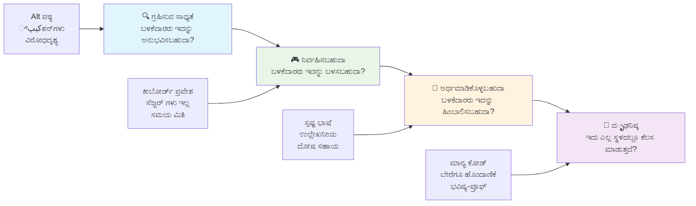
**🔍 ಗ್ರಹಿಸಲು ಸಾಧ್ಯವಿರುವುದು (Perceivable)**: ಬಳಕೆದಾರರು ಲಭ್ಯವಿರುವ ಇಂದ್ರಿಯಗಳ ಮೂಲಕ ಗ್ರಹಿಸಬಹುದಾದ ರೀತಿಯಲ್ಲಿ ಮಾಹಿತಿ ಪ್ರದರ್ಶನ ಮಾಡಬೇಕು

- ಪಠ್ಯವಲ್ಲದ ವಿಷಯಕ್ಕೆ ಪಠ್ಯ ప్రత్యಾಮ್ನಗಳನ್ನು ಒದಗಿಸು (ಚಿತ್ರಗಳು, ವೀಡಿಯೋಗಳು, ಧ್ವನಿ)
- ಎಲ್ಲಾ ಪಠ್ಯ ಮತ್ತು UI ಘಟಕಗಳಿಗೆ ಸಾಕಷ್ಟು ಬಣ್ಣ ವಿರೋಧವನ್ನು ಖಚಿತಪಡಿಸು
- ಮಲ್ಟಿಮೀಡಿಯಾಗೆ ಕ್ಯಾಪ್ಶನ್‌ಗಳು ಮತ್ತು ಲಿಪಿ ಪ್ರತ್ಯಯಗಳನ್ನು ಒದಗಿಸು
- ವಿಷಯವು 200% ವರೆಗೆ ಮರುಗಾತ್ರಗೊಳ್ಳುವಾಗ ಕಾರ್ಯನಿರ್ವಹಿಸಬೇಕು
- ಮಾಹಿತಿ ತಿಳಿಸಲು ಹಲವು ಇಂದ್ರಿಯ ಲಕ್ಷಣಗಳನ್ನು ಬಳಸಿ (ಬಣ್ಣ ಮಾತ್ರವಲ್ಲ)

**🎮 ಕಾರ್ಯನಿರತ (Operable)**: ಲಭ್ಯವಿರುವ ಇನ್‌ಪುಟ್ ವಿಧಾನಗಳ ಮೂಲಕ ಎಲ್ಲಾ ಇಂಟರ್ಫೇಸ್ ಘಟಕಗಳು ಕಾರ್ಯನಿರತವಾಗಿರಬೇಕು

- ಎಲ್ಲಾ ಕಾರ್ಯಕ್ಷಮತೆಗಳನ್ನು ಕೀಬೋರ್ಡ್ ನಾವಿಗೇಶನ್ ಮೂಲಕ ಪ್ರವೇಶಿಸಬಹುದಾಗಿರಿಸು
- ಬಳಕೆದಾರರಿಗೆ ಓದಲು ಮತ್ತು ಸಂವಹನ ಮಾಡಲು ಸಾಕಷ್ಟು ಸಮಯ ಕೊಡು
- ಜಾರಿ ರೋಗ ಅಥವಾ ಪ್ರೇಕ್ಷಣಾಸಂಬಂಧಿ ಅಸಹಜತೆ ಹೊರುವ ವಿಷಯವನ್ನು ತಪ್ಪಿಸು
- ಸ್ಪಷ್ಟ ಬದ್ಧ ರಚನೆ ಮತ್ತು ಲ್ಯಾಂಡ್‌ಮಾರ್ಕ್‌ಗಳೊಂದಿಗೆ ಬಳಕೆದಾರರನ್ನು ಪರಿಣಾಮಕಾರಿಯಾಗಿ ನಾವಿಗೇಟ್ ಮಾಡಲು ಸಹಾಯಮಾಡು
- ಸಂವಾದಾತ್ಮಕ ಅಂಶಗಳಿಗೆ ಯಥಾರ್ಥ ಗಾತ್ರವನ್ನು ( ಕನಿಷ್ಠ 44px) ಖಚಿತಪಡಿಸು

**📖 ಅರ್ಥಮಾಡಿಕೊಳ್ಳಬಹುದಾದ (Understandable)**: ಮಾಹಿತಿ ಮತ್ತು UI ಕಾರ್ಯಾಚರಣೆ ಸ್ಪಷ್ಟ ಮತ್ತು ಅರ್ಥಮಾಡಿಕೊಳ್ಳುವಂತಿರಬೇಕು

- ನಿಮ್ಮ ಪ್ರೇಕ್ಷಕರಿಗೆ ಸೂಕ್ತವಾಗಿರುವ ಸ್ಪಷ್ಟ, ಸರಳ ಭಾಷೆಯನ್ನು ಬಳಸಿ
- ವಿಷಯವು ನಿರೀಕ್ಷಿತ, ಸಧಾರಣೆಯಾದ ರೀತಿಯಲ್ಲಿ ತೋರುವ ಹಾಗು ಕಾರ್ಯನಿರ್ವಹಿಸುವಂತೆ ಖಚಿತಪಡಿಸು
- ಬಳಕೆದಾರರ ಇನ್‌ಪುಟ್‌ಗೆ ಸ್ಪಷ್ಟ ಸೂಚನೆಗಳು ಮತ್ತು ದೋಷ ಸಂದೇಶಗಳನ್ನು ಒದಗಿಸು
- ಬಳಕೆದಾರರು ಫಾರಂಗಳಲ್ಲಿ ನಡೆದ ದೋಷಗಳನ್ನು ಅರ್ಥಮಾಡಿಕೊಂಡು ಸರಿಪಡಿಸಲು ಸಹಾಯಮಾಡು
- ವಿಷಯವನ್ನು ತಾರ್ಕಿಕ ಓದುವ ಕ್ರಮ ಮತ್ತು ಮಾಹಿತಿಯ ಹೈರಾರ್ಕಿಯೊಂದಿಗೆ ಸಂಘಟಿಸು

**💪 ಬಲಿಷ್ಠ (Robust)**: ವಿಷಯವು ವಿಭಿನ್ನ ತಂತ್ರಜ್ಞಾನಗಳು ಮತ್ತು ಸಹಾಯಕ ಸಾಧನಗಳ ಮೇಲೆ ವಿಶ್ವಾಸಾರ್ಹವಾಗಿ ಕಾರ್ಯನಿರ್ವಹಿಸಬೇಕು

- **ಮಾನ್ಯದವಾದ, ಅರ್ಥಪೂರ್ಣ HTML ಅನ್ನು ನಿಮ್ಮ ನೆಲೆಯಾಗಿ ಬಳಸಿ**
- **ಪ್ರಸ್ತುತ ಮತ್ತು ಭವಿಷ್ಯ ಕ್ಯಿಯೋ ಸಹಾಯಕ ತಂತ್ರಜ್ಞಾನಗಳ ಜೊತೆಗೆ ಹೊಂದಾಣಿಕೆಯನ್ನು ಖಚಿತಪಡಿಸು**
- **ವೆಬ್ ಮಾನದಂಡಗಳು ಮತ್ತು ವರ್ತಮಾನ ಅಭ್ಯಾಸಗಳನ್ನು ಅನುಸರಿಸಿ**
- **ವಿಭಿನ್ನ ಬ್ರೌಸರ್‌ಗಳು, ಸಾಧನಗಳು ಮತ್ತು ಸಹಾಯಕ ಸಾಧನಗಳ ಮೂಲಕ ಪರೀಕ್ಷೆ ನಡೆಸಿ**
- **ಅಧಿಕೃತ ವೈಶಿಷ್ಟ್ಯಗಳನ್ನು ಬೆಂಬಲಿಸದಿದ್ದಾಗಲೂ ನಿಧಾನವಾಗಿ ಕುಸಿದಾಗಲೂ ರೂಪರೇಖೆಯನ್ನು ಸಮರ್ಪಕವಾಗಿ ರೂಪಿಸಿರಿ**

### 🎯 **POUR ತತ್ವಗಳ ಪರಿಶೀಲನೆ: ಅದನ್ನು ಹಾಗೆ ಇಟ್ಟುಕೊ೦ಡಿ**

**ಅಡಿಪಾಯಗಳ ಕುರಿತು ತ್ವರಿತ ಚಿಂತನೆ:**
- ನೀವು ತಲೆಹೊರೆಯುವ ಪ್ರತಿಯೊಂದು POUR ತತ್ವವನ್ನು ವಿಫಲಗೊಳಿಸುವ ವೆಬ್‌ಸೈಟ್ ವೈಶಿಷ್ಟ್ಯವನ್ನು ಬಿಚ್ಚುಬಲ್ಲೀರಾ?
- ಯಾವ ತತ್ವವು ನಿಮಗೆ ಡೆವಲಪರ್ ಆಗಿ ಅತ್ಯಂತ ಸಹಜವಾಗಿದೆ?
- ಈ ತತ್ವಗಳು ಅಂಗವಿಕಲ ಬಳಕೆದಾರರಿಗೆ ಮಾತ್ರವಲ್ಲದೆ ಎಲ್ಲರಿಗೂ ವಿನ್ಯಾಸವನ್ನು ಹೇಗೆ ಉತ್ತಮಗೊಳಿಸಬಹುದು?

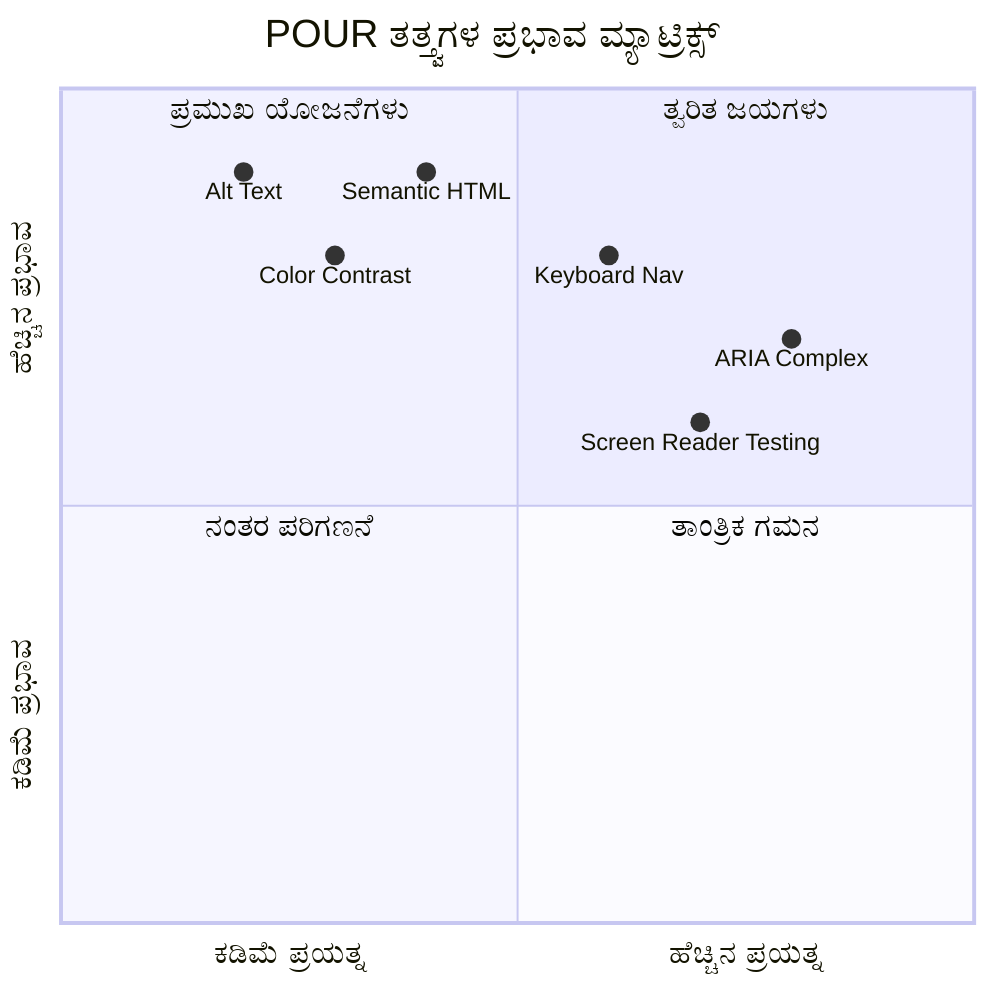
> **ಸ್ಮರಿಸಿ**: ಕಡಿಮೆ ಪ್ರಯತ್ನದಲ್ಲಿ ಹೆಚ್ಚಿನ ಪರಿಣಾಮಕಾರಿತ್ವವನ್ನು ನೀಡುವ ಸುಧಾರಣೆಗಳಿಂದ ಪ್ರಾರಂಭಿಸಿ. ಅರ್ಥಪೂರ್ಣ HTML ಮತ್ತು alt ಪಠ್ಯವು ನಿಮಗೆ ತಗ್ಗಿದ ಪ್ರಯತ್ನದಲ್ಲಿ ಅತಿ ದೊಡ್ಡ ಪ್ರವೇಶಾರ್ಹತೆಯನ್ನು ನೀಡುತ್ತದೆ!

## ಪ್ರವೇಶಾರ್ಹ ದೃಶ್ಯ ವಿನ್ಯಾಸ ಸೃಷ್ಟಿಸುವುದು

ಚೆನ್ನಾಗಿರುವ ದೃಶ್ಯ ವಿನ್ಯಾಸ ಮತ್ತು ಪ್ರವೇಶಾರ್ಹತೆ ಕೈಗೂ ಕೈ ಕೊಟ್ಟು ಹೋಗುತ್ತವೆ. ನೀವು ಪ್ರವೇಶಾರ್ಹತನನ್ನು ಗಮನದಲ್ಲಿ ಇಟ್ಟು ವಿನ್ಯಾಸ ಮಾಡುತ್ತಿದ್ದಾಗ, ಅವು ಸೀಮಿತತೆಗಳು ಸ್ವಚ್ಛ, ಸೊಗಸಾದ ಪರಿಹಾರಗಳನ್ನು ಕಲ್ಪಿಸುವುದನ್ನು ಕಂಡುಹಿಡಿಯುತ್ತೀರಿ, ಇದು ಎಲ್ಲ ಬಳಕೆದಾರರಿಗೆ ಲಾಭದಾಯಕವಾಗುತ್ತದೆ.

ನಾವು ಎಲ್ಲರಿಗೂ ಕೆಲಸ ಮಾಡುವ ದೃಶ್ಯಾತ್ಮಕವಾಗಿ ಆಕರ್ಷಕ ವಿನ್ಯಾಸಗಳನ್ನು ಹೇಗೆ ರಚಿಸುವುದು ಎಂಬುದನ್ನು ತನಿಖೆ ಮಾಡೋಣ, ಅವುಗಳ ದೃಷ್ಟಿ ಸಾಮರ್ಥ್ಯ ಅಥವಾ ನಿಮ್ಮ ವಿಷಯವನ್ನು ನೋಡುತ್ತಿರುವ ಪರಿಸ್ಥಿತಿಗಳನ್ನು ನೋಡುವುದಿಲ್ಲ.

### ಬಣ್ಣ ಮತ್ತು ದೃಶ್ಯ ಪ್ರವೇಶಾರ್ಹತೆಯ ತಂತ್ರಗಳು

ಬಣ್ಣ ಸಂವಹನಕ್ಕಾಗಿ ಶಕ್ತಿ ಹೊಂದಿದೆ, ಆದರೆ ಮಹತ್ವದ ಮಾಹಿತಿಯನ್ನು ಬಣ್ಣದಿಂದ ಮಾತ್ರ ಹರಡುವುದಿಲ್ಲ. ಬಣ್ಣದ ಹೊರತಾಗಿ ವಿನ್ಯಾಸ ಮಾಡುವುದರಿಂದ ಹೆಚ್ಚು ದೃಢ, ವಿಸ್ತೃತ ಅನುಭವಗಳು ಸೃಷ್ಟಿಯಾಗುತ್ತವೆ, ಅವು ಹೆಚ್ಚು ಪರಿಸ್ಥಿತಿಗಳಲ್ಲಿ ಕಾರ್ಯನಿರ್ವಹಿಸುತ್ತವೆ.

**ಬಣ್ಣ ದೃಷ್ಟಿ ವ್ಯತ್ಯಾಸಗಳಿಗೆ ವಿನ್ಯಾಸ ಮಾಡಿ:**

ಸುಮಾರಾಗಿ 8% ಗಂಡಸರು ಮತ್ತು 0.5% ಹೆಂಗಸರು ಕೆಲವು ಬಣ್ಣ ದೃಷ್ಟಿ ವ್ಯತ್ಯಾಸಗಳನ್ನು ಹೊಂದಿದ್ದಾರೆ (ಬಹುಮಾನವಾಗಿ "ಬಣ್ಣ ಅಂಧತೆ" ಎಂದು ಕರೆದೊಯ್ಯಲ್ಪಡುವುದು). ಸಾಮಾನ್ಯವಾದ ಪ್ರಕಾರಗಳು:
- **ಡ್ಯೂಟೆರನೋಪಿಯಾ**: ಕೆಂಪು ಮತ್ತು ಹಸಿರು ಗುರುತಿಸಲು ಕಷ್ಟ
- **ಪ್ರೋಟನೋಪಿಯಾ**: ಕೆಂಪು ಬಣ್ಣ ಮುಂದು ಹತ್ತಿರುವಂತೆ ಕಾಣುವುದು
- **ಟ್ರಿಟನೋಪಿಯಾ**: ನೀಲಿ ಮತ್ತು ಹಳದಿ ಗುರುತಿಸಲು ಕಷ್ಟ (ಹಿಮ್ಮುಖ)

**ಸಾಮರಸ್ಯಬದ್ಧ ಬಣ್ಣ ತಂತ್ರಗಳು:**

```css
/* ❌ Bad: Using only color to indicate status */
.error { color: red; }
.success { color: green; }

/* ✅ Good: Color plus icons and context */
.error {
  color: #d32f2f;
  border-left: 4px solid #d32f2f;
}
.error::before {
  content: "⚠️";
  margin-right: 8px;
}

.success {
  color: #2e7d32;
  border-left: 4px solid #2e7d32;
}
.success::before {
  content: "✅";
  margin-right: 8px;
}
```

**ಮೂಲಭೂತ ಪ್ರತಿಬಿಂಬದ ಅಗತ್ಯದ ಮೇಲೆ ಮೀರಿದಂತೆ:**
- ಬಣ್ಣ ಮೂರ್ಖರಿಗಾಗಿ ಬಣ್ಣ ಅಂಧತೆ ಅನುಕರಣಿಗಳನ್ನು ಪರೀಕ್ಷಿಸಿ
- ಬಣ್ಣ ಸಂಹಿತೆಯ ಜೊತೆಗೆ ಮಾದರಿಗಳು, ಬೃಂದಗಳು ಅಥವಾ ಆಕಾರಗಳನ್ನು ಬಳಸಿ
- ಬಣ್ಣವೇ ಇಲ್ಲದ interactive states ಸ್ಪಷ್ಟವಾಗಿರಲಿ
- ನಿಮ್ಮ ವಿನ್ಯಾಸ ಹೈ ಕಾಂಟ್ರಾಸ್ಟ್ ಮೋಡಿನಲ್ಲಿ ಹೇಗಿದೆ ಎಂದು ಪರಿಗಣಿಸಿ

✅ **ನಿಮ್ಮ ಬಣ್ಣ ಪ್ರವೇಶಾರ್ಹತೆಯನ್ನು ಪರೀಕ್ಷಿಸಿ**: [Coblis](https://www.color-blindness.com/coblis-color-blindness-simulator/) ಮೊದಲಾದ ಸಾಧನಗಳನ್ನು ಬಳಸಿ ನಿಮ್ಮ ತಾಣವು ವಿಭಿನ್ನ ಬಣ್ಣ ದೃಷ್ಟಿಯಳ್ಳ ಬಳಕೆದಾರರಿಗೆ ಹೇಗೆ ತೋರುತ್ತದೆ ಎಂಬುದನ್ನು ನೋಡಿ.

### ಫೋಕಸ್ ಸೂಚಕಗಳು ಮತ್ತು ಪರಸ್ಪರ ಸಂವಹನ ವಿನ್ಯಾಸ

ಫೋಕಸ್ ಸೂಚಕಗಳು ಡಿಜಿಟಲ್ ಕರ್ಸರ್ ಸಮಾನವೆ – ಅವು ಕೀಬೋರ್ಡ್ ಬಳಕೆದಾರರಿಗೆ ಅವರು ಪುಟದಲ್ಲಿ ಎಲ್ಲಿ ಇದ್ದಾರೆ ಎಂಬುದನ್ನು ತೋರಿಸುತ್ತವೆ. ಚೆನ್ನಾಗಿ ವಿನ್ಯಾಸ ಮಾಡಿದ ಫೋಕಸ್ ಸೂಚಕಗಳು ಎಲ್ಲರಿಗಾಗಿ ಪರಸ್ಪರ ಕ್ರಿಯೆಗಳನ್ನು ಸ್ಪಷ್ಟ ಮತ್ತು ನಿರೀಕ್ಷಿತವಾಗಿಸುವ ಮೂಲಕ ಅನುಭವವನ್ನು ಹೆಚ್ಚಿಸುತ್ತವೆ.

**ಆಧುನಿಕ ಫೋಕಸ್ ಸೂಚಕ ಉತ್ತಮ ಪದ್ದತಿಗಳು:**

```css
/* Enhanced focus styles that work across browsers */
button:focus-visible {
  outline: 2px solid #0066cc;
  outline-offset: 2px;
  box-shadow: 0 0 0 4px rgba(0, 102, 204, 0.25);
}

/* Remove focus outline for mouse users, preserve for keyboard users */
button:focus:not(:focus-visible) {
  outline: none;
}

/* Focus-within for complex components */
.card:focus-within {
  box-shadow: 0 0 0 3px rgba(74, 144, 164, 0.5);
  border-color: #4A90A4;
}

/* Ensure focus indicators meet contrast requirements */
.custom-focus:focus-visible {
  outline: 3px solid #ffffff;
  outline-offset: 2px;
  box-shadow: 0 0 0 6px #000000;
}
```

**ಫೋಕಸ್ ಸೂಚಕ ಅಗತ್ಯಗಳು:**
- **ದೃಶ್ಯತೆ**: ಸುತ್ತಲೂ ಇರುವ ಅಂಶಗಳೊಂದಿಗೆ ಕನಿಷ್ಠ 3:1 ವಿರುದ್ಧಾಭ್ಯಾಸ ಅನುಪಾತ ಹೊಂದಿರಬೇಕು
- **ಗುಟ್ಟು**: ಸಂಪೂರ್ಣ ಅಂಶದ ಸುತ್ತ ಕನಿಷ್ಠ 2px ಅಗಲ
- **ಸ್ಥಾಯಿತ್ವ**: ಫೋಕಸ್ ಬೇರೆಡೆಗೆ ಹೋಗುವವರೆಗೆ ದೃಶ್ಯವಾಗಿರಬೇಕು
- **ತೆರೆಯು**: ಇತರ UI ಸ್ಥಿತಿಗಳಿಂದ ದೃಶ್ಯವಾಗಿ ಭಿನ್ನವಾಗಿರಬೇಕು

> 💡 **ವಿನ್ಯಾಸ ಸಲಹೆ**: ಉತ್ತಮ ಫೋಕಸ್ ಸೂಚಕಗಳು ಬಹಳಷ್ಟು ಸಂದರ್ಭಗಳಲ್ಲಿ ಮತ್ತು ಹಿನ್ನಲೆಯ ಮೇಲೆ ಕಾಣುವಿಕೆ ಖಚಿತಪಡಿಸುವು 위해 ಹೊರರೇಖೆ, ಬಾಕ್ಸ್-ಶಾಡೋ ಮತ್ತು ಬಣ್ಣ ಬದಲಾವಣೆಗಳನ್ನು ಸಂಯೋಜಿಸುತ್ತವೆ.

✅ **ನಿಮ್ಮ ಫೋಕಸ್ ಸೂಚಕಗಳನ್ನು ಪರಿಶೀಲಿಸಿ**: ನಿಮ್ಮ ವೆಬ್ಸೈಟ್ ಮೂಲಕ ಟ್ಯಾಬ್ ಮಾಡಿ ಯಾವ ಅಂಶಗಳಿಗೆ ಸ್ಪಷ್ಟ ಫೋಕಸ್ ಸೂಚಕಗಳಿವೆಯೋ ಗಮನಿಸಿ. ಯಾವುದಾದರೂ ಕಾಣಲು ಕഠಿಣವಾಗಿದೆಯಾ ಅಥವಾ ಸಂಪೂರ್ಣವಾಗಿ ಕಾಣುತ್ತಿವೆಯಾ?

### ಅರ್ಥಪೂರ್ಣ HTML: ಪ್ರವೇಶಾರ್ಹತೆಯ ಅಡಿಪಾಯ

ಅರ್ಥಪೂರ್ಣ HTML ನಿಮ್ಮ ವೆಬ್‌ಸೈಟ್‌ಗೆ ಸಹಾಯಕ ತಂತ್ರಜ್ಞಾನಗಳಿಗೆ GPS ವ್ಯವಸ್ಥೆಯನ್ನು ನೀಡಿದಂತೆ. ನೀವು ಉದ್ದೇಶಿತ ಉದ್ದೇಶಕ್ಕಾಗಿ ಸರಿಯಾದ HTML ಅಂಶಗಳನ್ನು ಬಳಸಿದಾಗ, ನೀವು ಸ್ಕ್ರೀನ್ ರೀಡರ್‌ಗಳು, ಕೀಬೋರ್ಡ್‌ಗಳು ಮತ್ತು ಇತರ ಸಾಧನಗಳಿಗೆ ವಿನ್ಯಾಸವನ್ನು ಸಮರ್ಥವಾಗಿ ನವೀಕರಿಸುವ ವಿವರವಾದ ಮಾರ್ಗಸೂಚಿಯನ್ನು ಒದಗಿಸುತ್ತಿದ್ದೀರಿ.

ನನಗೆ ಹೀಗೊಂದು ಹೋಲಿಕೆ ಚೆನ್ನಾಗಿ ಅರ್ಥ ಮಾಡಿಸಿತು: ಅರ್ಥಪೂರ್ಣ HTML ಚೆನ್ನಾಗಿ ಆಡಳಿತವಾದ ಗ್ರಂಥಾಲಯ ಮತ್ತು ಸ್ಪಷ್ಟ ವರ್ಗಗಳೊಂದಿಗೆ ಸಹಾಯಕ ಚಿಹ್ನೆಗಳ ನಡುವಿನ ವ್ಯತ್ಯಾಸವಾಗಿದೆ, ಅದೇ ಸಮಯದಲ್ಲಿ ಪುಸ್ತಕಗಳು ಇದ್ದರೂ ಸುತ್ತುಸುತ್ತು ಬಾಡಿಗೆ ಮನೆಯಂತಿರುತ್ತದೆ. ಎರಡು ಸ್ಥಳಗಳಲ್ಲಿಯೂ ಒಂದೇ ಪುಸ್ತಕಗಳಿವೆ, ಆದರೆ ನೀವು ಯಾವದಲ್ಲಿ ಏನಾದರೂ ಹುಡುಕಲು ಬಯಸುತ್ತೀರಿ?

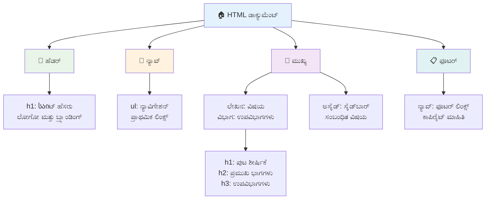
**ಪರವಾನಗಿ ಪಡೆದ ಪುಟದ ವಿನ್ಯಾಸದ ನಿರ್ಮಾಣದ ಕಠಿಣ ಕಲ್ಲುಗಳು:**

```html
<!-- Landmark elements provide page navigation structure -->
<header>
  <h1>Your Site Name</h1>
  <nav aria-label="Main navigation">
    <ul>
      <li><a href="/home">Home</a></li>
      <li><a href="/about">About</a></li>
      <li><a href="/services">Services</a></li>
    </ul>
  </nav>
</header>

<main>
  <article>
    <header>
      <h1>Article Title</h1>
      <p>Published on <time datetime="2024-10-14">October 14, 2024</time></p>
    </header>
    
    <section>
      <h2>First Section</h2>
      <p>Content that relates to this section...</p>
    </section>
    
    <section>
      <h2>Second Section</h2>
      <p>More related content...</p>
    </section>
  </article>
  
  <aside>
    <h2>Related Links</h2>
    <nav aria-label="Related articles">
      <ul>
        <li><a href="/related-1">First related article</a></li>
        <li><a href="/related-2">Second related article</a></li>
      </ul>
    </nav>
  </aside>
</main>

<footer>
  <p>&copy; 2024 Your Site Name. All rights reserved.</p>
  <nav aria-label="Footer links">
    <ul>
      <li><a href="/privacy">Privacy Policy</a></li>
      <li><a href="/contact">Contact Us</a></li>
    </ul>
  </nav>
</footer>
```

**ಅರ್ಥಪೂರ್ಣ HTML ಪ್ರವೇಶಾರ್ಹತೆಯನ್ನು ಹೇಗೆ ಪರಿವರ್ತಿಸುತ್ತದೆ:**

| ಅರ್ಥಪೂರ್ಣ ಅಂಶ | ಉದ್ದೇಶ | ಸ್ಕ್ರೀನ್ ರೀಡರ್ ಲಾಭ |
|----------------|---------|--------------------|
| `<header>` | ಪುಟ ಅಥವಾ ವಿಭಾಗದ ಶೀರ್ಷಿಕೆ | "ಬ್ಯಾನರ್ ಲ್ಯಾಂಡ್‌ಮಾರ್ಕ್" - ಬಿಂದು ಕಡೆಗೆ ದ್ರುತ ನವಿಗೇಶನ್ |
| `<nav>` | ನಾವಿಗೇಶನ್ ಕೊಂಡಿಗಳು | "ನಾವಿಗೇಶನ್ ಲ್ಯಾಂಡ್‌ಮಾರ್ಕ್" - ನಾವಿಗೇಶನ್ ವಿಭಾಗಗಳ ಪಟ್ಟಿ |
| `<main>` | ಮುಖ್ಯ ಪುಟ ವಿಷಯ | "ಪ್ರಮುಖ ಲ್ಯಾಂಡ್‌ಮಾರ್ಕ್" - ನೇರವಾಗಿ ವಿಷಯಕ್ಕೆ ಹಾದುಹೋಗಿ |
| `<article>` | ಸ್ವತಂತ್ರ ವಿಷಯ | ಲೇಖನದ ಗಡುವುಗಳನ್ನು ಘೋಷಿಸುತ್ತದೆ |
| `<section>` | ಥೀಮ್ ಹೊಂದಿರುವ ವಿಷಯ ಗುಂಪುಗಳು | ವಿಷಯದ ರಚನೆಯನ್ನು ಒದಗಿಸುತ್ತದೆ |
| `<aside>` | ಸಂಬಂಧಿತ ಸೈಡ್‌ಬಾರ್ ವಿಷಯ | "ಪೂರಕ ಲ್ಯಾಂಡ್‌ಮಾರ್ಕ್" |
| `<footer>` | ಪುಟ ಅಥವಾ ವಿಭಾಗದ ಕಾಲದಳ | "ವಿಷಯಮಾಹಿತಿ ಲ್ಯಾಂಡ್‌ಮಾರ್ಕ್" |

**ಅರ್ಥಪೂರ್ಣ HTML ಮೂಲಕ ಸ್ಕ್ರೀನ್ ರೀಡರ್ ಸೂಪರ್ಪವರ್ಸ್:**
- **ಲ್ಯಾಂಡ್‌ಮಾರ್ಕ್ ನವಿಗೇಶನ್**: ಪ್ರಮುಖ ಪುಟ ವಿಭಾಗಗಳ ನಡುವೆ ತಕ್ಷಣ ಜಂಪ್ ಮಾಡುವುದು
- **ಶೀರ್ಷಿಕೆ ಪರಿಕಲ್ಪನೆಗಳು**: ನಿಮ್ಮ ಶೀರ್ಷಿಕೆ ರಚನೆಯಿಂದ ವಿಷಯ ಪಟ್ಟಿಯನ್ನು ಸೃಷ್ಟಿಸುವುದು
- **ಅಂಶ ಪಟ್ಟಿ**: ಎಲ್ಲಾ ಲಿಂಕ್‌ಗಳು, ಬಟನ್‌ಗಳು ಅಥವಾ ಫಾರ್ಮ್ ನಿಯಂತ್ರಣಗಳ ಪಟ್ಟಿ ರಚಿಸಿ
- **ಪರಿಸ್ಥಿತಿ ಅರಿವು**: ವಿಷಯ ವಿಭಾಗಗಳ ನಡುವೆ ಸಂಬಂಧಗಳನ್ನು ಅರ್ಥಮಾಡಿಕೊಳ್ಳುವುದು

> 🎯 **ತ್ವರಿತ ಪರೀಕ್ಷೆ**: ಲ್ಯಾಂಡ್‌ಮಾರ್ಕ್ ಶಾರ್ಟ್‌ಕಟ್‌ಗಳನ್ನು (NVDA/JAWS ನಲ್ಲಿ D ಲ್ಯಾಂಡ್‌ಮಾರ್ಕ್, H ಶೀರ್ಷಿಕೆ, K ಲಿಂಕ್) ಬಳಸಿ ನಿಮ್ಮ ತಾಣದಲ್ಲಿ ನವಿಗೇಟ್ ಮಾಡಿ. ನವಿಗೇಶನ್ ಅರ್ಥಮಾಡಿಕೊಳ್ಳಬಹುದೇ?

### 🏗️ **ಅರ್ಥಪೂರ್ಣ HTML ನಿಪುಣತಾ ಪರೀಕ್ಷೆ: ಬಲವಾದ ಅಡಿಪಾಯಗಳ ನಿರ್ಮಾಣ**

**ನಿಮ್ಮ ಅರ್ಥಪೂರ್ಣ ಅರಿವನ್ನು ಮೌಲ್ಯಮಾಪನ ಮಾಡೋಣ:**
- ನೀವು HTML ನೋಡಿದರೆ ಪುಟದ ಲ್ಯಾಂಡ್‌ಮಾರ್ಕ್‌ಗಳನ್ನು ಗುರುತಿಸಬಲ್ಲೀರಾ?
- `<section>` ಮತ್ತು `<div>` ನಡುವಿನ ವ್ಯತ್ಯಾಸವನ್ನು ಗೆಳೆಯನಿಗೆ ಹೇಗೆ ವಿವರಿಸುವಿರಿ?
- ಸ್ಕ್ರೀನ್ ರೀಡರ್ ಬಳಕೆದಾರರು ನವಿಗೇಶನ್ ಸಮಸ್ಯೆಗಳನ್ನು ವರದಿ ಮಾಡಿದರೆ ನೀವು ಮೊದಲು ಯಾವದು ಪರಿಶೀಲಿಸುವಿರಿ?

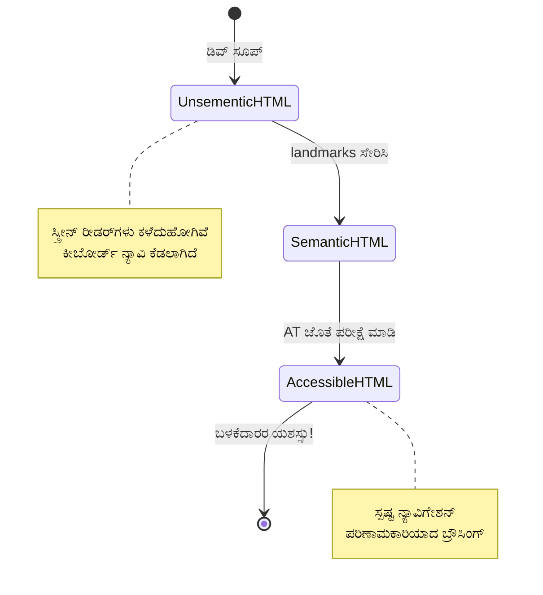
> **ತಜ್ಞ ವಿವರಣೆ**: ಉತ್ತಮ ಅರ್ಥಪೂರ್ಣ HTML ಸ್ವಯಂಚಾಲಿತವಾಗಿ ಸುಮಾರು 70% ಪ್ರವೇಶಾರ್ಹತಾ ಸಮಸ್ಯೆಗಳನ್ನು ಪರಿಹರಿಸುತ್ತದೆ. ಈ ಅಡಿಪಾಯವನ್ನು ನಿಪುಣಮಾಡಿ ನೀವು ಮುನ್ನಡೆಸಬಹುದು!

✅ **ನಿಮ್ಮ ಅರ್ಥಪೂರ್ಣ ರಚನೆಯನ್ನು ಪರಿಶೀಲಿಸಿ**: ನಿಮ್ಮ ಬ್ರೌಸರ್‌ನ ಡೆವರೆದಾದ ಸಂಶೋಧನಾOದ Accessibility ಪ್ಯಾನೆಲ್ ಬಳಸಿಕೊಂಡು accessibility tree ನೋಡಿ ಮತ್ತು ನಿಮ್ಮ ಮಾರ್ಕಪ್ ಲಾಜಿಕಲ್ ರಚನೆ ಸೃಷ್ಟಿಸುತ್ತಿದೆಯೇ ಎಂದು ಖಚಿತಪಡಿಸಿ.

### ಶೀರ್ಷಿಕೆ ಕ್ರಮ: ಲಾಜಿಕಲ್ ವಿಷಯ ರೂಪರೇಖೆಯ ರಚನೆ

ಶೀರ್ಷಿಕೆಗಳು ಪ್ರವೇಶಾರ್ಹ ವಿಷಯಕ್ಕೆ ಅತ್ಯಂತ ಮುಖ್ಯವಾಗಿವೆ – ಅವು ಎಲ್ಲವನ್ನೂ ಸೇರಿಸಿರುವ ಕಂಬದಂತೆ. ಸ್ಕ್ರೀನ್ ರೀಡರ್ ಬಳಕೆದಾರರು ಶೀರ್ಷಿಕೆಗಳಿಂದ ಗಟ್ಟಿಯಾಗಿ ಆಧರಿಸಿ ನಿಮ್ಮ ವಿಷಯವನ್ನು ಅರ್ಥಮಾಡಿಕೊಳ್ಳುತ್ತಾರೆ ಮತ್ತು ನವಿಗೇಟ್ ಮಾಡುತ್ತಾರೆ. ನಿಮ್ಮ ಪುಟಕ್ಕೆ ವಿಷಯ ಪಟ್ಟಿಯನ್ನು ಒದಗಿಸುವಂತೆ ಅದರಂತಹದು.

**ಶೀರ್ಷಿಕೆಗಳಿಗಾಗಿ ಚಿನ್ನದ ನಿಯಮ:**
ಹಂತಗಳನ್ನು ಸವೂಚಿಸುವುದಿಲ್ಲ. ಸದಾ `<h1>` ರಿಂದ `<h2>` ಗೆ, ನಂತರ `<h3>` ಗೆ ಹಾಗೂ ಮುಂದುವರೆಯುವಂತೆ ವಿಚಾರಾಗಮವಾಗಿ ಸಾಗಬೇಕು. ಶಾಲೆಯಲ್ಲಿ ರೂಪರೇಖೆಗಳು ಮಾಡಿದ ಅನುಭವ ನೆನಪಿಡಿ – "I. ಮುಖ್ಯ ಅಂಶ" ನಿಂದ ನೇರವಾಗಿ "C. ಉಪ-ಉಪ-ಅಂಶ" ಗೆ ಹೋಗಬಾರದೆಂದು ನೀವು ತಿಳಿದಿದ್ದೀರಿ ಅಲ್ಲವಾ?

**ಪೂರ್ಣ ಶೀರ್ಷಿಕೆ ರಚನೆಯ ಉದಾಹರಣೆ:**

```html
<!-- ✅ Excellent: Logical, hierarchical progression -->
<main>
  <h1>Complete Guide to Web Accessibility</h1>
  
  <section>
    <h2>Understanding Screen Readers</h2>
    <p>Introduction to screen reader technology...</p>
    
    <h3>Popular Screen Reader Software</h3>
    <p>NVDA, JAWS, and VoiceOver comparison...</p>
    
    <h3>Testing with Screen Readers</h3>
    <p>Step-by-step testing instructions...</p>
  </section>
  
  <section>
    <h2>Color and Contrast Guidelines</h2>
    <p>Designing with sufficient contrast...</p>
    
    <h3>WCAG Contrast Requirements</h3>
    <p>Understanding the different contrast levels...</p>
    
    <h3>Testing Tools and Techniques</h3>
    <p>Tools for verifying contrast ratios...</p>
  </section>
</main>
```

```html
<!-- ❌ Problematic: Skipping levels, inconsistent structure -->
<h1>Page Title</h1>
<h3>Subsection</h3> <!-- Skipped h2 -->
<h2>This should come before h3</h2>
<h1>Another main heading?</h1> <!-- Multiple h1s -->
```

**ಶೀರ್ಷಿಕೆ ಉತ್ತಮ ಅಭ್ಯಾಸಗಳು:**
- **ಪ್ರತಿ ಪುಟಕ್ಕೆ ಒಂದು `<h1>`**: ಸಾಮಾನ್ಯವಾಗಿ ನಿಮ್ಮ ಪ್ರಧಾನ ಪುಟ ಶೀರ್ಷಿಕೆ ಅಥವಾ ಮುಖ್ಯ ವಿಷಯ ಶೀರ್ಷಿಕೆ
- **ತರ್ಕಬುದ್ಧಿಯ ಪ್ರಗತಿ**: ಹಂತಗಳನ್ನು ಸವೂಚಿಸುವುದಿಲ್ಲ (h1 → h2 → h3, ಇಲ್ಲ h1 → h3)
- **ವಿವರಣಾತ್ಮಕ ವಿಷಯ**: ಶೀರ್ಷಿಕೆಗಳನ್ನು ಶೇಖರಿಸದೆ ಓದುವಾಗ ಅರ್ಥವುಳ್ಳದಾಗಿ ಮಾಡಿ
- **ದೃಶ್ಯ ಶೈಲಿ CSS ಬಳಸಿ**: ರೂಪರೇಖೆಗೆ HTML ಮಟ್ಟ, ಕಾಣಿಕೆಗೆ CSS ಬಳಸಿ

**ಸ್ಕ್ರೀನ್ ರೀಡರ್ ನವಿಗೇಶನ್ ಅಂಕಿಅಂಶಗಳು:**
- 68% ಸ್ಕ್ರೀನ್ ರೀಡರ್ ಬಳಕೆದಾರರು ಶೀರ್ಷಿಕೆಗಳಿಂದ ನವಿಗೇಟ್ ಮಾಡುತ್ತಾರೆ ([WebAIM ಸಮೀಕ್ಷೆ](https://webaim.org/projects/screenreadersurvey9/#finding))
- ಬಳಕೆದಾರರು ಲಾಜಿಕಲ್ ಶೀರ್ಷಿಕೆ ರೂಪರೇಖೆಯನ್ನು ಹುಡುಕುತ್ತಾರೆ
- ಶೀರ್ಷಿಕೆಗಳು ಪುಟದ ರಚನೆಯನ್ನು ಅರ್ಥಮಾಡಿಕೊಳ್ಳಲು ಅತಿದೇವದ ಮಾರ್ಗವನ್ನು ಒದಗಿಸುತ್ತವೆ

> 💡 **ತಜ್ಞ ಸಲಹೆ**: "HeadingsMap" ಹೀಗೆ ಬ್ರೌಸರ್ ವಿಸ್ತರಣೆಗಳನ್ನು ಬಳಸಿ ನಿಮ್ಮ ಶೀರ್ಷಿಕೆ ರಚನೆಯನ್ನು ದೃಶ್ಯೀಕರಿಸಿ. ಅದು ಚೆನ್ನಾಗಿ ಆಸ್ಥಿತವಾದ ವಿಷಯ ಪಟ್ಟಿಯಂತೆ ಓದಬೇಕಾಗಿದೆ.

✅ **ನಿಮ್ಮ ಶೀರ್ಷಿಕೆ ರಚನೆಯನ್ನು ಪರೀಕ್ಷಿಸಿ**: ಸ್ಕ್ರೀನ್ ರೀಡರ್ ನ ಶೀರ್ಷಿಕೆ ನವಿಗೇಶನ್ (NVDA ನಲ್ಲಿ H ಕೀ) ಬಳಸಿ ಶೀರ್ಷಿಕೆಗಳ ಮೂಲಕ ಜಂಪ್ ಮಾಡಿ. ಪ್ರಗತಿ ನಿಮ್ಮ ವಿಷಯದ ಕಥೆಯನ್ನು ಲಾಜಿಕಲ್ ಆಗಿ ಹೇಳುತ್ತದೆಯೇ?

### ಅಭಿವೃದ್ಧಿಪಡಿಸಿದ ದೃಶ್ಯ ಪ್ರವೇಶಾರ್ಹತೆ ತಂತ್ರಗಳು

ಪ್ರತಿಬಿಂಬ ಮತ್ತು ಬಣ್ಣದ ಮೂಲಭೂತಗಳನ್ನು ಮೀರಿ, ನಿಜವಾದ ವ್ಯಾಪಕ ದೃಶ್ಯ ಅನುಭವಗಳನ್ನು ರಚಿಸುವ ತಂತ್ರಗಳು ಇವೆ. ಇವು ನಿಮ್ಮ ವಿಷಯವನ್ನು ವಿಭಿನ್ನ ವೀಕ್ಷಣಾ ಪರಿಸ್ಥಿತಿಗಳು ಮತ್ತು ಸಹಾಯಕ ತಂತ್ರಜ್ಞಾನಗಳ ಮೂಲಕ ಕೆಲಸಮಾಡುತ್ತವೆ ಎಂದು ಖಚಿತಪಡಿಸುತ್ತವೆ.

**ಅತ್ಯವಶ್ಯಕ ದೃಶ್ಯ ಸಂವಹನ ತಂತ್ರಗಳು:**

- **ಮಲ್ಟಿ-ಮೋಡ್ ಪ್ರತಿಕ್ರಿಯೆ**: ದೃಶ್ಯ, ಪಠ್ಯಾತ್ಮಕ ಮತ್ತು ಕೆಲವೊಮ್ಮೆ ಧ್ವನಿಯಿಂದ ಹೊಂದಿಸಿ
- **ಪ್ರಗತಿಶೀಲ ತೋರಿಸಲಾಗುವುದು**: ಮಾಹಿತಿಯನ್ನು ಸುವರಿದ ಸಮೂಹಗಳಲ್ಲಿ ನೀಡುವುದು
- **ಸತತ ಪರಸ್ಪರ ಕಾರ್ಯ ಮಾದರಿಗಳು**: ಪರಿಚಿತ UI ನಿಯಮಗಳನ್ನು ಉಪಯೋಗಿಸು
- **ಪ್ರತಿಕ್ರಿಯಾಶೀಲ ಟೈಪೋಗ್ರಫಿ**: ಸಾಧನಗಳಾದ್ಯಂತ النص مناسبا ಯಾದಂತೆ ಪರಿಗಣಿಸಿ
- **ಲೋಡ್ ಮತ್ತು ದೋಷ ಸ್ಥಿತಿಗಳು**: ಎಲ್ಲ ಬಳಕೆದಾರ ಕ್ರಿಯೆಗಳಿಗೆ ಸ್ಪಷ್ಟ ಪ್ರತಿಕ್ರಿಯೆ ನೀಡಿ

**ಪ್ರವೇಶಾರ್ಹತೆಯನ್ನು ಉತ್ತಮಗೊಳಿಸುವ CSS ಉಪಕರಣಗಳು:**

```css
/* Screen reader only text - visually hidden but accessible */
.sr-only {
  position: absolute;
  width: 1px;
  height: 1px;
  padding: 0;
  margin: -1px;
  overflow: hidden;
  clip: rect(0, 0, 0, 0);
  white-space: nowrap;
  border: 0;
}

/* Skip link for keyboard navigation */
.skip-link {
  position: absolute;
  top: -40px;
  left: 6px;
  background: #000000;
  color: #ffffff;
  padding: 8px 16px;
  text-decoration: none;
  border-radius: 4px;
  font-weight: bold;
  transition: top 0.3s ease;
  z-index: 1000;
}

.skip-link:focus {
  top: 6px;
}

/* Reduced motion respect */
@media (prefers-reduced-motion: reduce) {
  .skip-link {
    transition: none;
  }
  
  * {
    animation-duration: 0.01ms !important;
    animation-iteration-count: 1 !important;
    transition-duration: 0.01ms !important;
  }
}

/* High contrast mode support */
@media (prefers-contrast: high) {
  .button {
    border: 2px solid;
  }
}
```

> 🎯 **ಪ್ರವೇಶಾರ್ಹತಾ ಮಾದರಿ**: "ಸ್ಕಿಪ್ ಲಿಂಕ್" ಕೀಬೋರ್ಡ್ ಬಳಕೆದಾರರಿಗೆ ಅಗತ್ಯ. ಇದು ನಿಮ್ಮ ಪುಟದಲ್ಲಿ ಮೊದಲ ಫೋಕಸ್ ಆಗಬಹುದಾದ ಅಂಶವಾಗಿರಬೇಕು ಮತ್ತು ನೇರವಾಗಿ ಮುಖ್ಯ ವಿಷಯ ಭಾಗಕ್ಕೆ ಜಂಪ್ ಮಾಡಬೇಕು.

✅ **ಸ್ಕಿಪ್ ನವಿಗೇಶನ್ ಅನುಷ್ಠಾನಗೊಳಿಸಿ**: ನಿಮ್ಮ ಪುಟಗಳಿಗೆ ಸ್ಕಿಪ್ ಲಿಂಕ್‌ಗಳನ್ನು ಸೇರಿಸಿ ಮತ್ತು ಪುಟ ಲೋಡ್ ಆದಂತೆ ಟ್ಯಾಬ್ ಒತ್ತಿ ಪರೀಕ್ಷಿಸಿ. ಅವು ಕಾಣಿಸಿ ಮುಖ್ಯ ವಿಷಯಕ್ಕೆ ಜಂಪ್ ಮಾಡಲು ಸಾಧ್ಯವಾಗಬೇಕು.

## ಅರ್ಥಪೂರ್ಣ ಲಿಂಕ್ ಪಠ್ಯ ನಿರ್ಮಾಣ

ಲಿಂಕ್‌ಗಳು ಜಾಲತಾಣಗಳ ಹೈವೇಗಳಂತಿವೆ, ಆದರೆ ಸರಿಯಾಗಿ ರಚಿತ ಲಿಂಕ್ ಪಠ್ಯವೇ ಇಲ್ಲದಿದ್ದರೆ ಅದು "ಡೆವರೋಡ್" ಎಂದು ಬರೆದಿರುವ ರಸ್ತೆಯ ಸೂಚಿಯಂತೆ ಆಗಿರುತ್ತದೆ. ಮಹತ್ವವಿಲ್ಲದ ಚಿಹ್ನೆಗಳಂತೆ.

ನನಗೆ ಮೊದಲ ಬಾರಿಗೆ ಗೊತ್ತಾಗುವಾಗ ಅದ್ಭುತವಾಗಿದ್ದು: ಸ್ಕ್ರೀನ್ ರೀಡರ್ ಮೂಲಕ ನೀವುಲ್ಲಾ ಲಿಂಕ್‌ಗಳನ್ನು ಒಟ್ಟು ಪಟ್ಟಿ ರೂಪದಲ್ಲಿ ನೋಡುವುದಾದರೆ. ಯಾರು ನಿಮಗೆ ಈ ಪಟ್ಟಿ ಕೊಟ್ಟರೆಬೇಕು ಎಂಬುದನ್ನು ಕಲ್ಪಿಸಿ ನೋಡಿ. ಪ್ರತಿ ಲಿಂಕ್ ಅದರ ತಾನೇ ಅರ್ಥ ಮಾಡಿಕೊಳ್ಳಬಹುದೇ? ಇಷ್ಟೇ ನಿಮ್ಮ ಲಿಂಕ್ ಪಠ್ಯದ ಪರೀಕ್ಷೆಯಾಗುವುದು!

### ಲಿಂಕ್ ನವಿಗೇಶನ್ ಮಾದ ರಗಳು

ಸ್ಕ್ರೀನ್ ರೀಡರ್ ಶಕ್ತಿಯಾದ ಲಿಂಕ್ ನವಿಗೇಶನ್ ವೈಶಿಷ್ಟ್ಯಗಳನ್ನು ಸಂಭಾಳು ಮಾಡುತ್ತದೆ, ಅವು ಚೆನ್ನಾಗಿ ಬರೆಯಲಾದ ಲಿಂಕ್ ಪಠ್ಯದ ಮೇಲೆ ಕುಳಿತಿವೆ:

**ಲಿಂಕ್ ನವಿಗೇಶನ್ ವಿಧಾನಗಳು:**
- **ಕ್ರಮಪದ ಓದಿನುದು**: ಲಿಂಕ್‌ಗಳು ವಿಷಯ ಹರಿವಿನ ಭಾಗವಾಗಿ ಓದಲಾಗುತ್ತವೆ
- **ಲಿಂಕ್ ಪಟ್ಟಿ ಸೃಷ್ಟಿ**: ಎಲ್ಲ ಪುಟಲಿಂಕ್‌ಗಳನ್ನು ಹುಡುಕಬಹುದಾದ ಡೈರೆಕ್ಟರಿಗೆ ಸಂಗ್ರಹಿಸಲಾಗುತ್ತದೆ
- **ತ್ವರಿತ ನವಿಗೇಶನ್**: ಕೀಬೋರ್ಡ್ ಶಾರ್ಟ್‌ಕಟ್‌ಗಳ ಮೂಲಕ ಲಿಂಕ್‌ಗಳಲ್ಲಿ ಜಂಪ್ ಮಾಡುವುದಕ್ಕೆ (NVDA ನಲ್ಲಿ K)
- **ಹುಡುಕು ಕಾರ್ಯಕ್ಷಮತೆ**: ಭಾಗಶಃ ಪಠ್ಯವನ್ನು ಟೈಪ್ ಮಾಡಿ ನಿಖರ ಲಿಂಕ್ ಹುಡುಕು

**ಪರಿಸ್ಥಿತಿ ಮಹತ್ವವಿದೆ:**
ಸಕ್ರೀನ್ ರೀಡರ್ ಬಳಕೆದಾರರು ಲಿಂಕ್ ತಾಳಿಕೆ ರಚಿಸಿದಾಗ, ಅವರಿಗೆ ಹೀಗೆ ಕಾಣುತ್ತದೆ:
- "ರಿಪೋರ್ಟ್ ಡೌನ್‌ಲೋಡ್ ಮಾಡಿ"
- "ಹೆಚ್ಚು ತಿಳಿಯಿರಿ"
- "ಇಲ್ಲಿ ಕ್ಲಿಕ್ ಮಾಡಿ"
- "ಗೋಪನೀಯತಾ ನೀತಿಅನುಶೀಲನೆ"
- "ಇಲ್ಲಿ ಕ್ಲಿಕ್ ಮಾಡಿ"

ಈ ಲಿಂಕ್‌ಗಳಲ್ಲಿ ಎರಡಷ್ಟೇ ಪ್ರಾಸಕ್ತ ಮಾಹಿತಿ ನೀಡಿವೆ!

> 📊 **ಬಳಕೆದಾರರ ಪರಿಣಾಮ**: ಸ್ಕ್ರೀನ್ ರೀಡರ್ ಬಳಕೆದಾರರು ವೇಗವಾಗಿ ಪುಟ ವಿಷಯವನ್ನು ಅರ್ಥಮಾಡಿ ಲಿಂಕ್ ಪಟ್ಟಿ ಸ್ಕ್ಯಾನ್ ಮಾಡುತ್ತಾರೆ. ಸಾಮಾನ್ಯ ಲಿಂಕ್ ಪಠ್ಯವು ಅವರನ್ನು ಪ್ರತಿಯೊಂದು ಲಿಂಕ್ ಸಂಧರ್ಭವನ್ನು ತಲುಪಲು ಕಡ್ಡಾಯ ಮಾಡುತ್ತದೆ, ಅದರಿಂದ ಅವಸರ ಕಡಿಮೆಯಾಗುತ್ತದೆ.

### ತಪ್ಪಾಗುವ ಸಾಮಾನ್ಯ ಲಿಂಕ್ ಪಠ್ಯವನ್ನು ತಪ್ಪಿಸಿ

ಏನು ಕೆಲಸ ಮಾಡುತ್ತಿಲ್ಲ ಎನ್ನುವುದನ್ನು ಅರಿತುಕೊಳ್ಳುತ್ತಾ ಇರುವುದು ಈಗಾಗಲೇ ಇರುವ ವಿಷಯದಲ್ಲಿ ಪ್ರವೇಶಾರ್ಹ ಸಮಸ್ಯೆಗಳನ್ನು ಗುರುತಿಸಲು ಮತ್ತು ಪರಿಹರಿಸಲು ಸಹಾಯಮಾಡುತ್ತದೆ.

**❌ ಘಟ್ಟಹೋಗಿದ್ದ ಸಾಮಾನ್ಯ ಲಿಂಕ್ ಪಠ್ಯ, ಅದು ಸಂಧರ್ಭವನ್ನು ನೀಡುವುದಿಲ್ಲ:**

```html
<!-- Meaningless when read from a link list -->
<p>Our sustainability efforts are detailed in our recent report. 
   <a href="/sustainability-2024.pdf">Click here</a> to view it.</p>

<!-- Repeated generic text throughout the page -->
<div class="article-card">
  <h3>Web Accessibility Guide</h3>
  <p>Learn the fundamentals...</p>
  <a href="/accessibility-guide">Read more</a>
</div>
<div class="article-card">
  <h3>Color Contrast Tips</h3>
  <p>Improve your design...</p>
  <a href="/color-contrast">Read more</a>
</div>

<!-- URLs as link text (difficult for screen readers to announce) -->
<p>Visit https://www.w3.org/WAI/WCAG21/quickref/ for WCAG guidelines.</p>

<!-- Vague action words -->
<a href="/contact">Go</a> | <a href="/about">See</a> | <a href="/help">View</a>
```

**ಈ ಮಾದರಿಗಳು ಯಾಕೆ ವಿಫಲವಾಗುತ್ತವೆ:**
- **"ಇಲ್ಲಿ ಕ್ಲಿಕ್ ಮಾಡಿ"** ಗಮ್ಯಸ್ಥಾನ ಕುರಿತು ಬಳಕೆದಾರರಿಗೆ ಏನೂ ಹೇಳುವುದಿಲ್ಲ
- **"ಹೆಚ್ಚು ಓದಿ"** ಅನೇಕ ಬಾರಿ ಪುನರಾವರ್ತನೆಯಾಗುವುದು ಗೊಂದಲ ಉಂಟುಮಾಡುತ್ತದೆ
- **ಸುಲೀಯಲ್ಲದ URLs** ಸ್ಕ್ರೀನ್ ರೀಡರ್‌ಗೆ ಸ್ಪಷ್ಟವಾಗಿ ಉಚ್ಛರಿಸಲು ಕಠಿಣ
- **ಏಕಪದಗಳು** ಹಾಗು "ಹೋಗಿ" ಅಥವಾ "ನೋಡಿರಿ" ಮುಂತಾದವು ವಿವರಣಾತ್ಮಕ ಸಂಧರ್ಭವನ್ನು ಕೊರತೆ ಹೊಂದಿವೆ

### ಉತ್ಕೃಷ್ಟ ಲಿಂಕ್ ಪಠ್ಯವನ್ನು ಬರೆಯುವುದು

ವಿವರಣಾತ್ಮಕ ಲಿಂಕ್ ಪಠ್ಯ ಎಲ್ಲರಿಗೂ ಲಾಭವೂ	            ಸ್ರದ್ಧಾರ್ಹವೂ ಎಂಬುದು – ದೃಷ್ಟಿ ಇಟ್ಟುಕೊಳ್ಳುವ ಬಳಕೆದಾರರು ತ್ವರಿತವಾಗಿ ಲಿಂಕ್‌ಗಳನ್ನು ಪರಿಶೀಲಿಸಬಹುದು, ಸ್ಕ್ರೀನ್ ರೀಡರ್ ಬಳಕೆದಾರರು ತಕ್ಷಣ ಗಮ್ಯಸ್ಥಾನಗಳನ್ನು ಅರ್ಥಮಾಡಿಕೊಳ್ಳುತ್ತಾರೆ.

**✅ ಸ್ಪಷ್ಟ, ವಿವರಣಾತ್ಮಕ ಲಿಂಕ್ ಪಠ್ಯದ ಉದಾಹರಣೆಗಳು:**

```html
<!-- Descriptive text that explains the destination -->
<p>Our comprehensive <a href="/sustainability-2024.pdf">2024 sustainability report (PDF, 2.1MB)</a> details our environmental initiatives.</p>

<!-- Specific, unique link text for each card -->
<div class="article-card">
  <h3>Web Accessibility Guide</h3>
  <p>Learn the fundamentals of inclusive design...</p>
  <a href="/accessibility-guide">Read our complete web accessibility guide</a>
</div>
<div class="article-card">
  <h3>Color Contrast Tips</h3>
  <p>Improve your design with better color choices...</p>
  <a href="/color-contrast">Explore color contrast best practices</a>
</div>

<!-- Meaningful text instead of raw URLs -->
<p>The <a href="https://www.w3.org/WAI/WCAG21/quickref/">WCAG 2.1 Quick Reference guide</a> provides comprehensive accessibility guidelines.</p>

<!-- Descriptive action links -->
<a href="/contact">Contact our support team</a> | 
<a href="/about">About our company</a> | 
<a href="/help">Get help with your account</a>
```

**ಲಿಂಕ್ ಪಠ್ಯ ಉತ್ತಮ ಅಭ್ಯಾಸಗಳು:**
- **ನಿಖರವಾಗಿರಿ**: "ಕ್ವಾರ್ಟರ್ ಆರ್ಥಿಕ ವರದಿಯನ್ನು ಡೌನ್‌ಲೋಡ್ ಮಾಡಿ" ವಿರುದ್ಧ "ಡೌನ್‌ಲೋಡ್ ಮಾಡಿ"
- **ಫೈಲ್ ಪ್ರಕಾರ ಮತ್ತು ಗಾತ್ರವನ್ನು ಸೇರಿಸಿ**: ಡೌನ್‌ಲೋಡ್ ಮಾಡಲು ಸಾಧ್ಯವಿರುವ ಫೈಲ್‌ಗಳಿಗಾಗಿ "(PDF, 1.2MB)"
- **ಲಿಂಕ್ ಹೊರಗಿನ ವಿಂಡೋದಲ್ಲಿ ತೆರೆಯುತ್ತಿದ್ದರೆ ಪ್ರಕಟಿಸಿ**: "(ಹೊಸ ವಿಂಡೋದಲ್ಲಿ ತೆರೆದಿದೆ)" ಅಗತ್ಯವಿದ್ದಾಗ
- **ಸಕ್ರಿಯ ಭಾಷೆಯನ್ನು ಬಳಸಿರಿ**: "ನಮ್ಮನ್ನು ಸಂಪರ್ಕಿಸಿ" ವಿರುದ್ಧ "ಸಂಪರ್ಕ ಪುಟ"
- **ಸಂಕ್ಷಿಪ್ತವಾಗಿರಿ**: ಸಾಧ್ಯವಾದಷ್ಟು 2-8 ಪದಗಳೊಳಗೆ ಇಡಿ

### ತಾಂತ್ರಿಕವಾಗಿ ಜಟಿಲ ಲಿಂಕ್ ಪ್ರವೇಶಾರ್ಹತೆ ಮಾದರಿಗಳು

ಕೆಲವು ಸಮಯಗಳಲ್ಲಿ ದೃಶ್ಯ ವಿನ್ಯಾಸ ಸೀಮಿತತೆಗಳು ಅಥವಾ ತಾಂತ್ರಿಕ ಅಗತ್ಯಗಳು ವಿಶೇಷ ಪರಿಹಾರಗಳನ್ನು ಬೇಕಾಗಿಸಿಕೊಳ್ಳುತ್ತವೆ. ಇಲ್ಲಿ ಸಾಮಾನ್ಯ ಸವಾಲುಗಳನ್ನು ಎದುರಿಸುವ ಸುಕ್ಷ್ಮ ತಂತ್ರಗಳು:

**ವೃದ್ಧಿಗೊಂಡ ಸಂಧರ್ಭಕ್ಕಾಗಿ ARIA ಬಳಕೆ:**

```html
<!-- When button text must be short but needs more context -->
<a href="/report.pdf" 
   aria-label="Download 2024 annual financial report, PDF format, 2.3MB">
  Download Report
</a>

<!-- When the full context comes from surrounding content -->
<h3 id="sustainability-heading">Sustainability Initiative</h3>
<p>Our efforts to reduce environmental impact...</p>
<a href="/sustainability-details" 
   aria-labelledby="sustainability-heading"
   aria-describedby="sustainability-summary">
  Learn more
</a>
<p id="sustainability-summary">Detailed breakdown of our 2024 environmental goals and achievements</p>
```

**ಫೈಲ್ ಪ್ರಕಾರಗಳು ಮತ್ತು ಹೊರಗಿನ ಗಮ್ಯಸ್ಥಾನಗಳನ್ನು ಸೂಚಿಸುವುದು:**

```html
<!-- Method 1: Include information in visible link text -->
<a href="/annual-report.pdf">
  Download our 2024 annual report (PDF, 2.3MB)
</a>

<!-- Method 2: Use screen reader-only text for file details -->
<a href="/annual-report.pdf">
  Download our 2024 annual report
  <span class="sr-only">(PDF format, 2.3MB)</span>
</a>

<!-- Method 3: External link indication -->
<a href="https://example.com" 
   target="_blank" 
   aria-describedby="external-link-warning">
  Visit external resource
</a>
<span id="external-link-warning" class="sr-only">
  (opens in new window)
</span>

<!-- Method 4: Using CSS for visual indicators -->
<a href="https://example.com" class="external-link">
  External resource
</a>
```

```css
/* Visual indicator for external links */
.external-link::after {
  content: " ↗";
  font-size: 0.8em;
  color: #666;
}

/* Screen reader announcement for external links */
.external-link::before {
  content: "External link: ";
  position: absolute;
  left: -10000px;
  width: 1px;
  height: 1px;
  overflow: hidden;
}
```

> ⚠️ **ಪ್ರಮುಖ**: `target="_blank"` ಬಳಸದಾಗ, ಲಿಂಕ್ ಹೊಸ ವಿಂಡೋ ಅಥವಾ ಟ್ಯಾಬಿನಲ್ಲಿ ತೆರೆಯುತ್ತದೆ ಎಂದು ಬಳಕೆದಾರರಿಗೆ ಯಾವಾಗಲೂ ತಿಳಿಸಿ. ಅನಿರೀಕ್ಷಿತ ನವಿಗೇಶನ್ ಬದಲಾವಣೆಗಳು குழப்ப ಹುಟ್ಟಿಸಬಹುದು.

✅ **ನಿಮ್ಮ ಲಿಂಕ್ ಸಂಧರ್ಭವನ್ನು ಪರೀಕ್ಷಿಸಿ**: ನಿಮ್ಮ ಬ್ರೌಸರ್‌ನ ಡೆವಲಪರ್ ಟೂಲ್ಸ್ ಬಳಸಿ ನಿಮ್ಮ ಪುಟದ ಎಲ್ಲ ಲಿಂಕ್‌ಗಳ ಪಟ್ಟಿ ಸೃಷ್ಟಿಸಿ. ಯಾವುದೇ ಸುತ್ತಲೂ ಇದ್ದ ಸಂಧರ್ಭವಿಲ್ಲದೆ ಪ್ರತಿ ಲಿಂಕ್ ಗಮ್ಯಸ್ಥಾನ ಅರ್ಥಮಾಡಿಕೊಳ್ಳಬಹುದೇ ನೋಡಿ.

## ARIA: HTML ಪ್ರವೇಶಾರ್ಹತೆಯನ್ನು ಹೆಚ್ಚಿಸುವುದು

[Accessible Rich Internet Applications (ARIA)](https://developer.mozilla.org/docs/Web/Accessibility/ARIA) ನಿಮ್ಮ ಸಂಕೀರ್ಣ ವೆಬ್ ಅಪ್ಲಿಕೇಶನ್ಗಳ ಮತ್ತು ಸಹಾಯಕ ತಂತ್ರಜ್ಞಾನಗಳ ನಡುವೆ ವಿಶ್ವವ್ಯಾಪಿ ಭಾಷಾಂತರಕದಂತೆ. HTML ಒಂದರಲ್ಲೇ ನಿಮ್ಮ ಇಂಟರೆಕ್ಟಿವ್ ಭಾಗಗಳು ಮಾಡುವ ಬದಲಾವಣೆಗಳನ್ನು ವ್ಯಕ್ತಪಡಿಸಲು ಸಾಧ್ಯವಾಗದಾಗ, ARIA ಆ ಖಾಲಿಗಳನ್ನು ತುಂಬಲು ನೆರವಾಗುತ್ತದೆ.

ನಾನು ARIA ಅನ್ನು ನಿಮ್ಮ HTML ಗೆ ಉಪಯುಕ್ತ ಟಿಪ್ಪಣಿಗಳನ್ನು ಸೇರಿಸುವುದಾಗಿ ಭಾವಿಸುತ್ತೇನೆ – ಒಂದು ನಾಟಕದಲ್ಲಿನ ಹಂತ ನಿರ್ದೇಶನಗಳಂತೆ, ಅದು ನಟರು ತಮ್ಮ ಪಾತ್ರಗಳು ಮತ್ತು ಸಂಬಂಧಗಳನ್ನು ಅರ್ಥಮಾಡಿಕೊಳ್ಳಲು ಸಹಾಯಮಾಡುತ್ತದೆ.

**ARIA ಬಗ್ಗೆ ಅತ್ಯಂತ ಮುಖ್ಯ ನಿಯಮ:** ಮೊದಲು ಅರ್ಥಪೂರ್ಣ HTML ಬಳಸಿರಿ, ನಂತರ ಅದನ್ನು ಸುಧಾರಿಸಲು ARIA ಸೇರಿಸಿ. ARIA ಸವಿಯುವಷ್ಟು, ಮುಖ್ಯ ಊಟವಲ್ಲ. ಅದು ನಿಮ್ಮ HTML ರೂಪರೇಖೆಯನ್ನು ಸ್ಪಷ್ಟಪಡಿಸಿ ಮತ್ತು ಸುಧಾರಿಸಬೇಕು, ಅನಿವಾಸ್ಯವಾಗಿ ಬದಲಾವಣೆ ಮಾಡಬಾರದು. ಅವಶ್ಯಕ ಅಡಿಪಾಯವನ್ನು ಮೊದಲಿಗೆ ಸರಿಪಡಿಸಿ! 

### ಯುಕ್ತ ARIA ಅನುಷ್ಠಾನ

ARIA ಶಕ್ತಿ ತುಂಬಿದರೂ ಜವಾಬ್ದಾರಿಯೊಂದಿಗೆ ಬರುತ್ತದೆ. ತಪ್ಪಾದ ARIA ಬಳಕೆ ಪ್ರವೇಶಾರ್ಹತೆಯನ್ನು ಹೆಚ್ಚುವರಿ ರೂಪದಲ್ಲಿ ಕೆಡಿಸಬಹುದು. ಇಲ್ಲಿ ಯಾವಾಗ ಮತ್ತು ಹೇಗೆ ಪರಿಣಾಮಕಾರಿಯಾಗಿ ಬಳಕೆ ಮಾಡುವುದು:

**✅ ನೀವು ARIA ಬಳಸಿ:**
- ಕಸ್ಟಮ್ ಇಂಟರೆಕ್ಟಿವ್ ವಿವರಣೆಗಳು (ಅಕಾರ್ಡಿಯನ್, ಟ್ಯಾಬ್, ಕಾರುಸೇಲ್)
- ಪುಟ ಪುನಃಲೋಡ್ ಇಲ್ಲದೆ ಬದಲಾಯಿಸುವ ಗತಿಶೀಲ ವಿಷಯ ಸೃಷ್ಟಿಸುವಾಗ
- ಸಂಕೀರ್ಣ UI ಸಂಬಂಧಗಳಿಗೆ ಹೆಚ್ಚುವರಿ ಸಂಧರ್ಭ ನೀಡುವಾಗ
- ಲೋಡಿಂಗ್ ಸ್ಥಿತಿಗಳು ಅಥವಾ ಲೈವ್ ವಿಷಯ ನವೀಕರಣಗಳನ್ನು ಸೂಚಿಸುವಾಗ
- ಕಸ್ಟಮ್ ನಿಯಂತ್ರಣಗಳೊಂದಿಗೆ ಅಪ್ಲಿಕೇಶನ್-ಹೋಲಿನ ಇಡೀಟೆರ್ಫೇಸ್ ರಚಿಸುವಾಗ

**❌ ನಿಮ್ಮ ARIA ಬಳಕೆ ತಪ್ಪಿಸಿರಿ:**
- ನಿಯಮಿತ HTML ಅಂಶಗಳು ಸಾಕಾದ ಸಂದರ್ಭದಲ್ಲಿ
- ನೀವು ಅದನ್ನು ಸರಿಯಾಗಿ ಹೇಗೆ ಅನುಷ್ಠಾನಗೊಳಿಸುವುದನ್ನು ತಿಳಿದಿಲ್ಲದಾಗ
- ಅರ್ಥಪೂರ್ಣ HTML ಮೂಲಕ_ALREADY প্রশাসಿತ ಮಾಹಿತಿಯನ್ನು ಮರುಪಠಿಸುವಾಗ
- ನಿಜವಾದ ಸಹಾಯಕ ತಂತ್ರಜ್ಞಾನಗಳೊಂದಿಗೆ ಪರೀಕ್ಷಿಸಲಾಗದಾಗ

> 🎯 **ARIA ಚಿನ್ನದ ನಿಯಮ**: "ನೀವು ಅತ್ಯಾವಶ್ಯಕತೆಯಿಲ್ಲದೆ ಅರ್ಥವನ್ನು ಬದಲಿಸಬೇಡಿ, ಯಾವಾಗಲೂ ಕೀಲಿಮಣೆ ಪ್ರವೇಶಾರ್ಹತೆಯನ್ನು ಖಚಿತಪಡಿಸಿ ಮತ್ತು ನಿಜವಾದ ಸಹಾಯಕ ತಂತ್ರಜ್ಞಾನಗಳೊಂದಿಗೆ ಪರೀಕ್ಷಿಸಿ."
**ARIA ರ ಐದು ವರ್ಗಗಳು:**

1. **ಪಾತ್ರಗಳು**: ಇದು ಯಾವ στοιχείο? (`button`, `tab`, `dialog`)
2. **ಗುಣಲಕ್ಷಣಗಳು**: ಇದರ ವೈಶಿಷ್ಟ್ಯಗಳು ಏನು? (`aria-required`, `aria-haspopup`)
3. **ಸ್ಥಿತಿಗಳು**: ಇದರ ಪ್ರಸ್ತುತ ಸ್ಥಿತಿ ಏನು? (`aria-expanded`, `aria-checked`)
4. **ಲ್ಯಾಂಡ್‌ಮಾರ್ಕ್‌ಗಳು**: ಇದು ಪುಟ ರಚನೆಯಲ್ಲಿ ಎಲ್ಲಿದೆ? (`banner`, `navigation`, `main`)
5. **ಲೈವ್ ರೀಜನ್‌ಗಳು**: ಬದಲಾವಣೆಗಳನ್ನು ಹೇಗೆ ಪ್ರಕಟಿಸಬೇಕು? (`aria-live`, `aria-atomic`)

### ಆಧುನಿಕ ವೆಬ್ ಅನ್ವಯಿಕೆಗಳಿಗೆ ಅವಶ್ಯಕ ARIA ಮಾದರಿಗಳು

ಈ ಮಾದರಿಗಳು ಇಂಟರಾಕ್ಟಿವ್ ವೆಬ್ ಅಪ್ಲಿಕೇಶನ್‌ಗಳಲ್ಲಿ ಅತ್ಯಂತ ಸಾಮಾನ್ಯ ಪ್ರಾಪ್ಯತೆಯ ಸಮಸ್ಯೆಗಳನ್ನು ಪರಿಹರಿಸುತ್ತವೆ:

**ಉಪಾಧಿ ನಾಮಕರಣ ಮತ್ತು ವಿ ವರ್ಣನೆ:**

```html
<!-- aria-label: Provides accessible name when visible text isn't sufficient -->
<button aria-label="Close newsletter subscription dialog">×</button>

<!-- aria-labelledby: References existing text as the accessible name -->
<section aria-labelledby="news-heading">
  <h2 id="news-heading">Latest News</h2>
  <!-- news content -->
</section>

<!-- aria-describedby: Links to additional descriptive text -->
<input type="password" 
       aria-describedby="pwd-requirements pwd-strength"
       required>
<div id="pwd-requirements">
  Password must contain at least 8 characters, including uppercase, lowercase, and numbers.
</div>
<div id="pwd-strength" aria-live="polite">
  <!-- Dynamic password strength indicator -->
</div>
```
  
**ಡೈನಾಮಿಕ್ ವಿಷಯಕ್ಕಾಗಿ ಲೈವ್ ರೀಜನ್‌ಗಳು:**

```html
<!-- Polite announcements (don't interrupt current speech) -->
<div aria-live="polite" id="status-updates">
  <!-- Status messages appear here -->
</div>

<!-- Assertive announcements (interrupt and announce immediately) -->
<div aria-live="assertive" id="urgent-alerts">
  <!-- Error messages and critical alerts -->
</div>

<!-- Loading states with live regions -->
<button id="submit-btn" aria-describedby="loading-status">
  Submit Application
</button>
<div id="loading-status" aria-live="polite" aria-atomic="true">
  <!-- "Processing your application..." appears here -->
</div>
```
  
**ಇಂಟರಾಕ್ಟಿವ್ ವಿ ಜೆಟ್ ಉದಾಹರಣೆ (ಅಕೋರ್ಡಿಯನ್):**

```html
<div class="accordion">
  <h3>
    <button aria-expanded="false" 
            aria-controls="panel-1" 
            id="accordion-trigger-1"
            class="accordion-trigger">
      Accessibility Guidelines
    </button>
  </h3>
  <div id="panel-1" 
       role="region"
       aria-labelledby="accordion-trigger-1" 
       hidden>
    <p>WCAG 2.1 provides comprehensive guidelines...</p>
  </div>
</div>
```
  
```javascript
// ಅಕಾರ್ಡಿಯನ್ ಸ್ಥಿತಿಯನ್ನು ನಿರ್ವಹಿಸಲು ಜಾವಾಸ್ಕ್ರಿಪ್ಟ್
function toggleAccordion(trigger) {
  const panel = document.getElementById(trigger.getAttribute('aria-controls'));
  const isExpanded = trigger.getAttribute('aria-expanded') === 'true';
  
  // ಸ್ಥಿತಿಗಳನ್ನು ಟಾಗಲ್ ಮಾಡಿ
  trigger.setAttribute('aria-expanded', !isExpanded);
  panel.hidden = isExpanded;
  
  // ಪರದೆಯ ಓದುಗರಿಗೆ ಬದಲಾವಣೆಯನ್ನು ಘೋಷಿಸಿ
  const status = document.getElementById('status-updates');
  status.textContent = isExpanded ? 'Section collapsed' : 'Section expanded';
}
```
  
### ARIA ಅನುಷ್ಠಾನ ಉತ್ತಮ ಅಭ್ಯಾಸಗಳು

ARIA ಶಕ್ತಿಶಾಲಿ ಆದರೆ ಸೂಕ್ಷ್ಮ ಅನುಷ್ಠಾನವನ್ನು ಅಗತ್ಯವಿದೆ. ಈ ಸೂಚನೆಗಳನ್ನು ಅನುಸರಿಸೋದು ನಿಮ್ಮ ARIA ಪ್ರಾಪ್ಯತೆಯನ್ನು ತಡೆಯುವುದಕ್ಕಿಂತ ಹೆಚ್ಚಿಸುವುದರಲ್ಲಿ ಸಹಾಯ ಮಾಡುತ್ತದೆ:

**🛡️ ಮೂಲ ಸಿದ್ಧಾಂತಗಳು:**

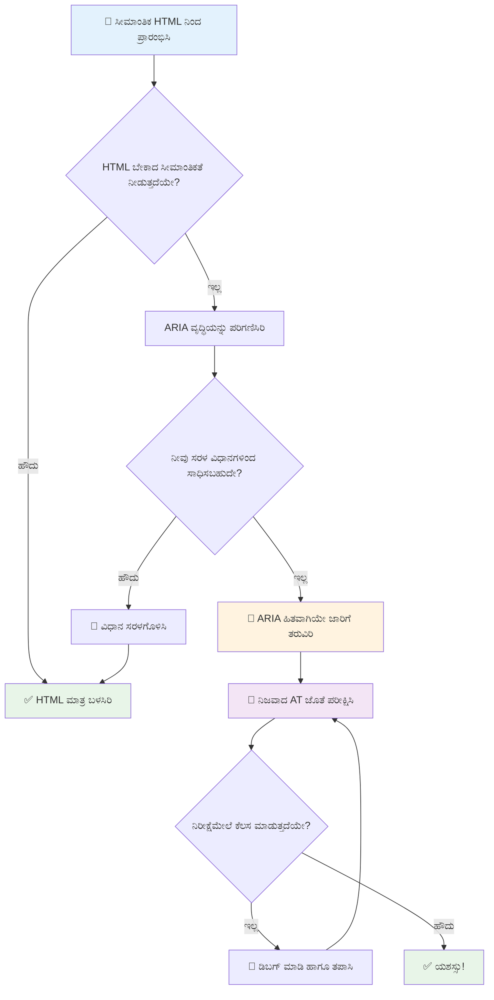
1. **ಅರ್ಥಪೂರ್ಣ HTML ಮೊದಲು**: ಯಾವಾಗಲೂ `<button>` ಅನ್ನು `<div role="button">`ಕ್ಕಿಂತ ಪ್ರಾಮುಖ್ಯತೆ ನೀಡಿ  
2. **ಅರ್ಥಪೂರ್ಣತೆಯನ್ನು ಮುರಿಯಬೇಡಿ**: ಇತ್ತೀಚಿನ HTML ಅರ್ಥವನ್ನು ಮೀರಿಸಬೇಡಿ (ಉದಾ. `<h1 role="button">`)  
3. **ಕೀಬೋರ್ಡ್ ಪ್ರವೇಶನೀಯತೆ ಉಳಿಸಿಕೊಳ್ಳಿ**: ಎಲ್ಲಾ ಇಂಟರಾಕ್ಟಿವ್ ARIA ಅಂಶಗಳು ಸಂಪೂರ್ಣವಾಗಿ ಕೀಬೋರ್ಡ್ ಸಂರಚಿತವಾಗಿರಬೇಕು  
4. **ನಿಜವಾದ ಬಳಕೆದಾರರೊಂದಿಗೆ ಪರೀಕ್ಷಿಸಿ**: ಸಹಾಯಕ ತಂತ್ರಜ್ಞಾನಗಳಲ್ಲಿ ARIA ಬೆಂಬಲವು ಬಹಳ ವ್ಯತ್ಯಾಸಗೊಳ್ಳಬಹುದು  
5. **ಸರಳವಾಗಿ ಪ್ರಾರಂಭಿಸಿ**: پيچيده ARIA ಅನುಷ್ಠಾನಗಳಲ್ಲಿ ಹೆಚ್ಚಾಗಿ ದೋಷಗಳು ಎದುರಾಗುತ್ತವೆ  

**🔍 ಪರೀಕ್ಷಾ ವರ್ಕ್ಫ್ಲೋ:**

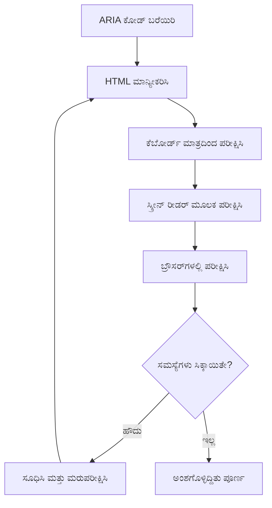
**🚫 ತಪ್ಪಿಸಿಕೊಳ್ಳಬೇಕಾದ ಸಾಮಾನ್ಯ ARIA ತಪ್ಪುಗಳು:**

- **ವಿರೋಧಭಾಸ ಮಾಹಿತಿ**: HTML ಅರ್ಥಪೂರ್ಣತೆಯನ್ನು ವಿರೋಧಿಸುವುದರಿಂದ ದೂರಿರಿ  
- **ಅತ್ಯಧಿಕ ಲೇಬಲಿಂಗ್**: ಹೆಚ್ಚು ಮಾಹಿತಿ ಬಳಕೆದಾರರನ್ನು ಪರಿಹಾಸ್ಯ ಮಾಡುತ್ತದೆ  
- **ಸ್ಥಿರ ARIA**: ವಿಷಯ ಬದಲಾದಾಗ ARIA ಸ್ಥಿತಿಗಳನ್ನು ನವೀಕರಿಸದಿರುವುದು  
- **ಪರೀಕ್ಷಿಸದ ಅನುಷ್ಠಾನಗಳು**: ಸಿದ್ಧಾಂತದಲ್ಲಿ ಸರಿ ಆದರೆ ಪ್ರಾಯೋಗಿಕವಾಗಿ ವಿಫಲವಾಗುವ ARIA  
- **ಕೀಬೋರ್ಡ್ ಬೆಂಬಲ ಇಲ್ಲದಿರುವುದು**: ಕೀಬೋರ್ಡ್ ಸಂವಾದ ಇಲ್ಲದ ARIA ಪಾತ್ರಗಳು  

> 💡 **ಪರೀಕ್ಷಾ ಸಂಪನ್ಮೂಲಗಳು**: [accessibility-checker](https://www.npmjs.com/package/accessibility-checker) ಮುಂತಾದ ಸಾಧನಗಳನ್ನು ARIA ಸಿದ್ಧತೆಯ ಸ್ವಯಂಚಾಲಿತ ಪರಿಶೀಲನೆಗೆ ಬಳಸಿರಿ, ಆದರೆ ಪೂರ್ಣ ಅನುಭವಕ್ಕಾಗಿ ನಿಜವಾದ ಸ್ಕ್ರೀನ್ ರೀಡರ್ ಬಳಸಿ ಪರೀಕ್ಷೆ ಮಾಡಿ.

### 🎭 **ARIA ಕೌಶಲ್ಯ ಪರಿಶೀಲನೆ: ಸಂಕೀರ್ಣ ಸಂವಾದಗಳಿಗೆ ಸಿದ್ಧನಾ?**

**ನಿಮ್ಮ ARIA ಆತ್ಮವಿಶ್ವಾಸವು ಹೇಗಿದೆ ಎಂದು ಅಳೆಯಿರಿ:**
- ನೀವು semantic HTML ಬದಲು ಯಾವಾಗ ARIA ಆಯ್ಕೆಮಾಡುತ್ತೀರಾ? (ಸಂಕೇತ: כמעט ಎಂದಿಗೂ ಇಲ್ಲ!)  
- `<div role="button">`通常 `<button>`ಗಿಂತ ಕೆಟ್ಟದಾಗಿರುವ ಕಾರಣವನ್ನು ವಿವರಿಸಬಹುದೇ?  
- ARIA ಪರೀಕ್ಷೆಯ ಬಗ್ಗೆ ಅತ್ಯಂತ ಪ್ರಮುಖ ವಿಷಯವೇನು?  

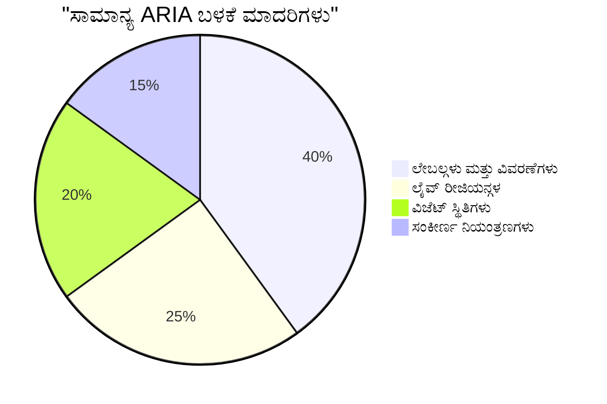
> **ಪ್ರಮುಖ ತಿಳಿವು**: ಹೆಚ್ಚಿನ ARIA ಬಳಕೆ ಲೇಬಲಿಂಗ್ ಮತ್ತು ವರ್ಣನೆಗಾಗಿ ಇರುತ್ತದೆ. ಸಂಕೀರ್ಣ ವಿ ಜೆಟ್ ಮಾದರಿಗಳು ನಿಮಗೆ ಅನಿಸುತ್ತದೆ ಎಂದು ಬರುವಷ್ಟು ಸಾಮಾನ್ಯವಿಲ್ಲ!

✅ **ನಿಪುಣರಿಂದ ಕಲಿಯಿರಿ**: ಸಂಕೀರ್ಣ ಇಂಟರಾಕ್ಟಿವ್ ವಿ ಜೆಟ್‌ಗಳ ಹೋರಾಟ ಪ್ಯಾಟರ್ನ್‌ಗಳು ಮತ್ತು ಅನುಷ್ಠಾನಗಳಿಗಾಗಿ [ARIA Authoring Practices Guide](https://w3c.github.io/aria-practices/) ಅಧ್ಯಯನ ಮಾಡಿ.

## ಚಿತ್ರಗಳು ಮತ್ತು ಮಾಧ್ಯಮವನ್ನು ಪ್ರಾಪ್ಯತೆಯೂಳ್ಳದಂತೆ ಮಾಡುವುದು

ದೃಶ್ಯ ಮತ್ತು ಧ್ವನಿ ವಿಷಯ ಆಧುನಿಕ ವೆಬ್ ಅನುಭವಗಳ ಅನಿವಾರ್ಯ ಭಾಗಗಳು, ಆದರೆ ಅವು ಯೋಚನಾತ್ಮಕವಾಗಿ ಅನುಷ್ಠಾನಗೊಳ್ಳದೆ ಇದ್ದರೆ ಅಡ್ಡಿ ಸೃಷ್ಟಿಸಬಹುದು. ನಿಮ್ಮ ಮಾಧ್ಯಮದ ಮಾಹಿತಿಯೂ ಮತ್ತು ಭಾವನಾತ್ಮಕ ಪ್ರಭಾವವೂ ಪ್ರತಿಯೊಬ್ಬ ಬಳಕೆದಾರರಿಗೂ ತಲುಪಬೇಕೆಂಬುದು ಗುರಿಯಾಗಿದೆ. ನೀವು ಇದನ್ನು ಅರಿತರೆ ಅದು ನಿಮ್ಮ ಪ್ರಕೃತಿ ಭಾಗವಾಗುತ್ತದೆ.

ವಿಭಿನ್ನ ಮಾಧ್ಯಮ ವಿಧಗಳಿಗೆ ವಿಭಿನ್ನ ಪ್ರಾಪ್ಯತೆಯ ವಿಧಾನಗಳು ಅಗತ್ಯ. ಅದು ಅಡುಗೆ ಮಾಡಲು ಹೋಲುತ್ತದೆ—ನೀವು ಸೂಕ್ಷ್ಮ ಮೀನನ್ನು ಹೇಗೆ ಭೋಜನ ಮಾಡುವಿರೋ ನೀವು ಗಟ್ಟಿಯಾದ ಮಾಂಸವನ್ನು ಕೂಡ ಹಾಗೆಯೇ ಮಾಡುವುದಿಲ್ಲ. ಈ ಭೇದಗಳನ್ನು ಅರಿತರೆ ಪ್ರತಿಯೊಂದು ಸಂದರ್ಭಕ್ಕೂ ಸರಿಯಾದ ಪರಿಹಾರವನ್ನು ಆಯ್ಕೆ ಮಾಡಬಹುದು.

### ಆಕಾರಚಿತ್ರ ಪ್ರವೇಶನೀಯತೆಯ ನೀತಿ

ನಿಮ್ಮ ವೆಬ್‌ಸೈಟ್‌ನ ಪ್ರತಿಯೊಂದು ಚಿತ್ರವೂ ಒಂದು ಉದ್ದೇಶವನ್ನು ಹೊಂದಿದೆ. ಆ ಉದ್ದೇಶವನ್ನು ತಿಳಿದರೆ ನೀವು ಉತ್ತಮ ಬದಲಿ ಪಠ್ಯವನ್ನು ಬರೆಯಬಹುದು ಮತ್ತು ಹೆಚ್ಚು ಒಳಗೊಂಡ ಅನುಭವಗಳನ್ನು ರಚಿಸಬಹುದು.

**ನಾಲ್ಕು ವಿಧದ ಚಿತ್ರಗಳು ಮತ್ತು ಅವುಗಳ alt ಪಠ್ಯದ ತಂತ್ರಗಳು:**

**ಜ್ಞಾನಾರ್ಜಕ ಚಿತ್ರಗಳು** - ಮಹತ್ವದ ಮಾಹಿತಿಯನ್ನು ಪೂರೈಸುವವು:  
```html

```
  
**ಶೈಲಿಯಾದ ಚಿತ್ರಗಳು** - ಸಂಪೂರ್ಣ ದೃಶ್ಯ, ಮಾಹಿತಿ ಇಲ್ಲದವು:  
```html

```
  
**ಕಾರ್ಯಕ್ಷಮ ಚಿತ್ರಗಳು** - ಬಟನ್‌ಗಳು ಅಥವಾ ನಿಯಂತ್ರಣಗಳಾಗಿ ಸೇವೆ ಸಲ್ಲಿಸುವವು:  
```html
<button>
  
</button>
```
  
**ಸಂಕೀರ್ಣ ಚಿತ್ರಗಳು** - ಚಾರ್ಟ್‌ಗಳು, ಚಿತ್ರರೇಖೆಗಳು, ಮಾಹಿತಿ ಗ್ರಾಫ್‌ಗಳು:  
```html

<div id="chart-description">
  <p>Detailed description: Sales data shows a steady increase across all quarters...</p>
</div>
```
  
### ವೀಡಿಯೋ ಮತ್ತು ಧ್ವನಿ ಪ್ರವೇಶನೀಯತೆ

**ವೀಡಿಯೋ ಅಗತ್ಯತೆಗಳು:**  
- **ಉಪಶೀರ್ಷಿಕೆಗಳು**: ಮಾತು ಮತ್ತು ಶಬ್ಧ ಪರಿಣಾಮಗಳ ಪಠ್ಯ  
- **ಧ್ವನಿ ವರ್ಣನೆಗಳು**: ಕಣ್ಣಿರುವವರಿಗೆ ದೃಶ್ಯ ಅಂಶಗಳ ವಿವರಣೆ  
- **ಪೂರ್ಣ ಪಠ್ಯಗಳು**: ಎಲ್ಲಾ ಧ್ವನಿ ಮತ್ತು ದೃಶ್ಯ ವಿಷಯದ ಪೂರ್ಣ ಪಠ್ಯ ರೂಪ

```html
<video controls>
  <source src="video.mp4" type="video/mp4">
  <track kind="captions" src="captions.vtt" srclang="en" label="English">
  <track kind="descriptions" src="descriptions.vtt" srclang="en" label="Audio descriptions">
</video>
```
  
**ಧ್ವನಿ ಅಗತ್ಯತೆಗಳು:**  
- **ಪೂರ್ಣ ಪಠ್ಯಗಳು**: ಎಲ್ಲಾ ಮಾತುಕತೆಯ ಪಠ್ಯ ರೂಪ  
- **ದೃಶ್ಯ ಸೂಚಕಗಳು**: ಧ್ವನಿ ಮಾತ್ರ ಇರುವ ವಿಷಯಗಳಿಗೆ ದೃಶ್ಯ ಸೂಚನೆಗಳು

### ಆಧುನಿಕ ಚಿತ್ರ ತಂತ್ರಗಳು

**ಶೈಲಿಯಾದ ಚಿತ್ರಗಳಿಗೆ CSS ಬಳಕೆ:**  
```css
.hero-section {
  background-image: url('decorative-hero.jpg');
  /* Decorative images in CSS don't need alt text */
}
```
  
**ಪ್ರಾಪ್ಯತೆ ಸೇರಿದಂತೆ ಪ್ರತಿಕ್ರಿಯಾಶೀಲ ಚಿತ್ರಗಳು:**  
```html
<picture>
  <source media="(min-width: 800px)" srcset="large-chart.png">
  <source media="(min-width: 400px)" srcset="medium-chart.png">
  
</picture>
```
  
✅ **ಚಿತ್ರ ಪ್ರವೇಶನೀಯತೆಯನ್ನು ಪರೀಕ್ಷಿಸಿ**: ಚಿತ್ರಗಳೊಂದಿಗೆ ಇರುವ ಪುಟವನ್ನು ಸ್ಕ್ರೀನ್ ರೀಡರ್ ಉಪಯೋಗಿಸಿ ನಾವಿಗೇಟ್ ಮಾಡಿ. ವಿಷಯವನ್ನು ಅರ್ಥಮಾಡಿಕೊಳ್ಳಲು ನಿಮಗೆ ಸಾಕಷ್ಟು ಮಾಹಿತಿಯು ಸಿಗುತ್ತಿದ್ದೆಯೆ?

## ಕೀಬೋರ್ಡ್ ನಾವಿಗೇಶನ್ ಮತ್ತು ಫೋಕ್ಸು ನಿರ್ವಹಣೆ

ಬಹು ಮಂದಿ ಬಳಕೆದಾರರು ಸಂಪೂರ್ಣವಾಗಿ ಕೀಬೋರ್ಡ್ ಮಾತ್ರ ಬಳಸಿ ವೆಬ್ ನವಿಗೇಟ್ ಮಾಡುತ್ತಾರೆ. ಇದರಲ್ಲಿ ಚಲನಾ ಅಸಾಮರ್ಥ್ಯರಿರುವ වರು, ಕೀಬೋರ್ಡ್ ಸುಲಭ ತೋರಿಕೊಂಡು ಶಕ್ತಿಶಾಲಿ ಬಳಕೆದಾರರು ಮತ್ತು ತಮ್ಮ ಮೌಸ್ ಕೆಲಸ ಮಾಡುವುದಿಲ್ಲದವರು ಸೇರಿದ್ದಾರೆ. ನಿಮ್ಮ ತಾಣವು ಕೀಬೋರ್ಡ್ ಇನ್‌ಪುಟ್‌ನೊಂದಿಗೆ ಚೆನ್ನಾಗಿರೋದು ಅತ್ಯವಶ್ಯಕ ಮತ್ತು ಹೆಚ್ಚಾಗಿ ಇದು ಎಲ್ಲರಿಗೂ ನಿಮ್ಮ ತಾಣವನ್ನು ಹೆಚ್ಚು ದಕ್ಷವಾಗಿಸುವುದು.

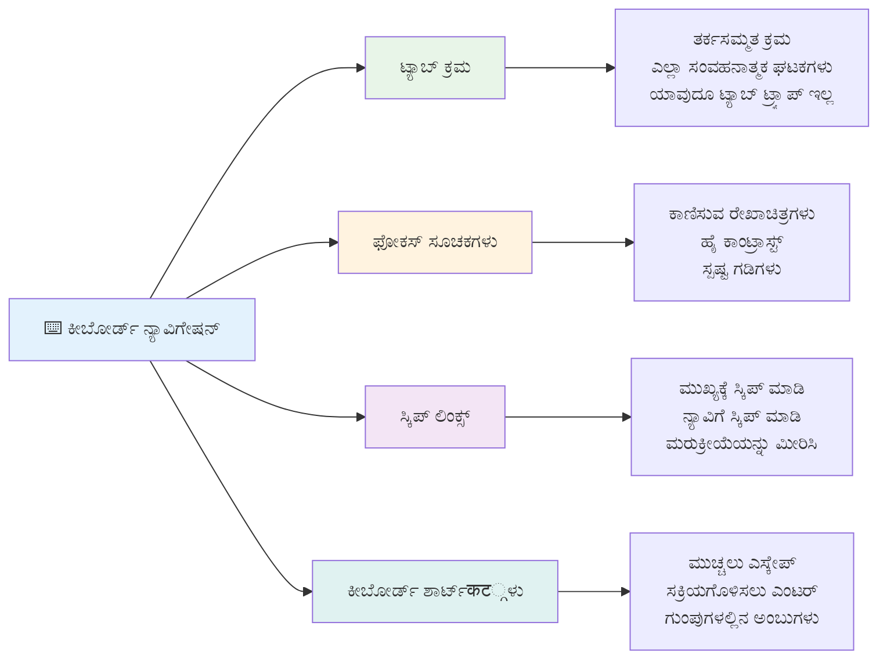
### ಅಗತ್ಯ ಕೀಬೋರ್ಡ್ ನಾವಿಗೇಶನ್ ಮಾದರಿಗಳು

**ಸಾಧಾರಣ ಕೀಬೋರ್ಡ್ ವಿಲೀನಗಳು:**  
- **ಟ್ಯಾಬ್**: ಇಂಟರಾಕ್ಟಿವ್ ಅಂಶಗಳ ಮೂಲಕ ಫೋಕ್ಸನ್ನು ಮುಂಭಾಗಕ್ಕೆ ಸರಿಸಿ  
- **ಶಿಫ್ಟ್ + ಟ್ಯಾಬ್**: ಫೋಕ್ಸನ್ನು ಹಿಂದಕ್ಕೆ ಸರಿಸಿ  
- **ಎಂಟರ್**: ಬಟನ್‌ಗಳು ಮತ್ತು ಲಿಂಕ್ಗಳನ್ನು ಚಲಾಯಿಸಿ  
- **ಸ್‌ಟೇಪೆ**: ಬಟನ್‌ಗಳನ್ನು ಸಕ್ರಿಯಗೊಳಿಸಿ, ಚೆಕ್‌ಬಾಕ್ಸ್‌ಗಳನ್ನು ಗುರುತಿಸಿ  
- **ಅರೋಕೆ ಕೀಸ್**: ಕಂಪೋನಂಟ್ ಗುಂಪುಗಳಲ್ಲಿ ನವಿಗೇಟ್ ಮಾಡಿ (ರೇಡಿಯೋ ಬಟನ್, ಮೆನುಗಳು)  
- **ಎಸ್ಕೇಪ್**: ಮೋಡಲ್‌ಗಳು, ಡ್ರಾಪ್‌ಡೌನ್‌ಗಳನ್ನು ಮುಚ್ಚಿ ಅಥವಾ ಕಾರ್ಯರಚನೆಯನ್ನು ರದ್ದುಮಾಡಿ  

### ಫೋಕ್‌ಸು ನಿರ್ವಹಣೆಯ ಉತ್ತಮ ಅಭ್ಯಾಸಗಳು

**ದೃಶ್ಯ ಫೋಕ್ಸು ಸೂಚಕಗಳು:**  
```css
/* Ensure focus is always visible */
button:focus-visible {
  outline: 2px solid #4A90A4;
  outline-offset: 2px;
}

/* Custom focus styles for different components */
.card:focus-within {
  box-shadow: 0 0 0 3px rgba(74, 144, 164, 0.5);
}
```
  
**ದಕ್ಷ ನವಿಗೇಶನಕ್ಕೆ ಸ್ಕಿಪ್ ಲಿಂಕ್ಸ್:**  
```html
<a href="#main-content" class="skip-link">Skip to main content</a>
<a href="#navigation" class="skip-link">Skip to navigation</a>

<nav id="navigation">
  <!-- navigation content -->
</nav>
<main id="main-content">
  <!-- main content -->
</main>
```
  
**ಸರಿಯಾದ ಟ್ಯಾಬ್ ಕ್ರಮ:**  
```html
<!-- Use semantic HTML for natural tab order -->
<form>
  <label for="name">Name:</label>
  <input type="text" id="name" tabindex="0">
  
  <label for="email">Email:</label>
  <input type="email" id="email" tabindex="0">
  
  <button type="submit" tabindex="0">Submit</button>
</form>
```
  
### ಮೋಡಲ್‌ಗಳಲ್ಲಿ ಫೋಕ್ಸು ತಡೆಯುವಿಕೆ

ಮೋಡಲ್ ಡೈಲಾಗ್ ತೆರೆಯುವಾಗ ಫೋಕ್ಸನ್ನು ಮೋಡಲ್ ಒಳಗಿರಲಿ:

```javascript
// ಆಧುನಿಕ ಫೋಕಸ್ ಟ್ರ್ಯಾಪ್ ಅನುಷ್ಠಾನ
function trapFocus(element) {
  const focusableElements = element.querySelectorAll(
    'button, [href], input, select, textarea, [tabindex]:not([tabindex="-1"])'
  );
  
  const firstElement = focusableElements[0];
  const lastElement = focusableElements[focusableElements.length - 1];

  element.addEventListener('keydown', (e) => {
    if (e.key === 'Tab') {
      if (e.shiftKey && document.activeElement === firstElement) {
        e.preventDefault();
        lastElement.focus();
      } else if (!e.shiftKey && document.activeElement === lastElement) {
        e.preventDefault();
        firstElement.focus();
      }
    }
    
    if (e.key === 'Escape') {
      closeModal();
    }
  });
  
  // ಮೋಡಲ್ ತೆರೆಯlgಾಗೆಯೇ ಮೊದಲ ಅಂಶದ ಮೇಲೆ ಫೋಕಸ್ ಇಡಿ
  firstElement.focus();
}
```
  
✅ **ಕೀಬೋರ್ಡ್ ನವಿಗೇಶನ್ ಪರೀಕ್ಷಿಸಿ**: ಕೇವಲ ಟ್ಯಾಬ್ ಕೀ ಬಳಸಿ ನಿಮ್ಮ ವೆಬ್‌ಸೈಟ್ ನವಿಗೇಟ್ ಮಾಡಿ. ಎಲ್ಲಾ ಇಂಟರಾಕ್ಟಿವ್ ಅಂಶಗಳಿಗೆ પહોંચી ಸಹಾಯವಾಗುತ್ತದೆಯೇ? ಫೋಕ್ಸಿನ ಆದೇಶ ತರ್ಕಸಮ್ಮತವೇ? ಫೋಕ್ಸುತ್ತ ಸೂಚಕಗಳು ಸ್ಪಷ್ಟವಾಗಿ ಕಾಣಿವೆಯೇ?

## ಫಾರ್ಮ್ ಪ್ರವೇಶನೀಯತೆ

ಫಾರ್ಮ್‌ಗಳು ಬಳಕೆದಾರರ ಸಂವಾದಕ್ಕೆ ಅತ್ಯಾವಶ್ಯಕವಾಗಿವೆ ಮತ್ತು ವಿಶೇಷ ಪ್ರವೇಶನೀಯತೆ ಗಮನವನ್ನು ಅಗತ್ಯವಿದೆ.

### ಲೇಬಲ್ ಮತ್ತು ಫಾರ್ಮ್ ನಿಯಂತ್ರಣದ ಸಂಧಿ

**ಪ್ರತಿ ಫಾರ್ಮ್ ನಿಯಂತ್ರಣಕ್ಕೆ ಲೇಬಲ್ ಬೇಕು:**  
```html
<!-- Explicit labeling (preferred) -->
<label for="username">Username:</label>
<input type="text" id="username" name="username" required>

<!-- Implicit labeling -->
<label>
  Password:
  <input type="password" name="password" required>
</label>

<!-- Using aria-label when visual label isn't desired -->
<input type="search" aria-label="Search products" placeholder="Search...">
```
  
### ದೋಷ ನಿರ್ವಹಣೆ ಮತ್ತು ಪರಿಶೀಲನೆ

**ಪ್ರವೇಶನೀಯ ದೋಷ ಸಂದೇಶಗಳು:**  
```html
<label for="email">Email Address:</label>
<input type="email" id="email" name="email" 
       aria-describedby="email-error" 
       aria-invalid="true" required>
<div id="email-error" role="alert">
  Please enter a valid email address
</div>
```
  
**ಫಾರ್ಮ್ ಪರಿಶೀಲನೆಯ ಉತ್ತಮ ಅಭ್ಯಾಸಗಳು:**  
- ಅಮಾನ್ಯ ಕ್ಷೇತ್ರಗಳನ್ನು ಸೂಚಿಸಲು `aria-invalid` ಬಳಸಿ  
- ಸ್ಪಷ್ಟ ಮತ್ತು ನಿರ್ದಿಷ್ಟ ದೋಷ ಸಂದೇಶಗಳನ್ನು ನೀಡಿ  
- ಪ್ರಮುಖ ದೋಷ ಪ್ರಕಟಣೆಗಾಗಿ `role="alert"` ಬಳಸಿ  
- ದೋಷಗಳನ್ನು ತಕ್ಷಣ ಮತ್ತು ಫಾರ್ಮ್ ಸಲ್ಲಿಕೆಗೆ ಮುನ್ನಾಹಿತವಾಗಿ ತೋರಿಸಿ  

### ಫೀಲ್ಡ್‌ಸೆಟ್‌ಗಳು ಮತ್ತು ಗುಂಪು

**ಸಂಬಂಧಪಟ್ಟ ಫಾರ್ಮ್ ನಿಯಂತ್ರಣಗಳನ್ನು ಗುಂಪುಗೊಳಿಸಿ:**  
```html
<fieldset>
  <legend>Shipping Address</legend>
  <label for="street">Street Address:</label>
  <input type="text" id="street" name="street">
  
  <label for="city">City:</label>
  <input type="text" id="city" name="city">
</fieldset>

<fieldset>
  <legend>Preferred Contact Method</legend>
  <input type="radio" id="contact-email" name="contact" value="email">
  <label for="contact-email">Email</label>
  
  <input type="radio" id="contact-phone" name="contact" value="phone">
  <label for="contact-phone">Phone</label>
</fieldset>
```
  
## ನಿಮ್ಮ ಪ್ರವೇಶನೀಯತಾ ಪ್ರಯಾಣ: ಪ್ರಮುಖ ಪಾಠಗಳು

ಅಭಿನಂದನೆಗಳು! ನೀವು ಸತ್ಯವಾಗಿ ಒಳಗೊಂಡ ವೆಬ್ ಅನುಭವಗಳನ್ನು ರಚಿಸಲು ಮೂಲಭೂತ ಜ್ಞಾನವನ್ನು ಪಡೆಯಿದ್ದೀರಿ. ಇದು ಬಹಳ ಉತ್ಸಾಹದಾಯಕ ವಿಷಯ! ವೆಬ್ ಪ್ರವೇಶನೀಯತೆ ಕೇವಲ ಅನುಪಾಲನಾ ಬಾಕ್ಸ್‌ಗಳನ್ನು ಪರಿಶೀಲಿಸುವುದಲ್ಲ—ಬದಲಾಗಿ ಜನರು ಡಿಜಿಟಲ್ ವಿಷಯದೊಂದಿಗೆ ಸಂವಾದಿಸುವ ವಿಭಿನ್ನ ಮಾರ್ಗಗಳನ್ನು ಗುರುತಿಸಿ ಆ ಅದ್ಭುತ ಸಂಕೀರ್ಣತೆಗೆ ವಿನ್ಯಾಸ ಮಾಡುವುದು.

ನೀವು ಈಗ ಅತ್ಯುತ್ತಮ ವಿನ್ಯಾಸ ಎಲ್ಲರಿಗೂ ಕೆಲಸ ಮಾಡುವುದನ್ನು ಅರಿಯುವ ಬೆಳವಣಿಗೆ ಹೊಂದಿದ ಡೆವಲಪರ್ ಸಮುದಾಯದ ಭಾಗವಾಗಿದ್ದೀರಿ. ಕ್ಲಬ್‌ಗೆ ಸ್ವಾಗತ.

**🎯 ನಿಮ್ಮ ಪ್ರವೇಶನೀಯತಾ ಉಪಕರಣ ಸಾರಾಂಶ ಈಗ ಒಳಗೊಂಡಿದೆ:**

| ಮೂಲ ಸಿದ್ಧಾಂತ | ಅನುಷ್ಠಾನ | ಪರಿಣಾಮ |
|----------------|----------------|---------|
| **ಅರ್ಥಪೂರ್ಣ HTML ನೆಲ** | ಹಕ್ಕುಪಡುವ ಉದ್ದೇಶಕ್ಕೆ ಸರಿಯಾದ HTML ಅಂಶಗಳನ್ನು ಬಳಸಿ | ಸ್ಕ್ರೀನ್ ರೀಡರ್‌ಗಳು ಪರಿಣಾಮಕಾರಿಯಾಗಿ ನವಿಗೇಟ್ ಮಾಡಬಹುದು, ಕೀಬೋರ್ಡ್‌ಗಳು ಸ್ವಯಂಚಾಲಿತವಾಗಿ ಕೆಲಸ ಮಾಡುತ್ತವೆ |
| **ಒಳಗೊಂಡ ದೃಶ್ಯ ವಿನ್ಯಾಸ** | ಸಾಕಷ್ಟು ವೈಎಸ್‌ಟ್, ಅರ್ಥಪೂರ್ಣ ಬಣ್ಣ ಬಳಕೆ, ದೃಶ್ಯ ಫೋಕ್ಸು ಸೂಚಕಗಳು | ಯಾವುದೇ ಬೆಳಕು ಪರಿಸ್ಥಿತಿಯಲ್ಲಿಯೂ ಎಲ್ಲರಿಗೂ ಸ್ಪಷ್ಟ |
| **ವಿವರಾತ್ಮಕ ವಿಷಯ** | ಅರ್ಥಪೂರ್ಣ ಲಿಂಕ್ ಪಠ್ಯ, alt ಪಠ್ಯ, ಶೀರ್ಷಿಕೆಗಳು | ಬಳಕೆದಾರರು ದೃಶ್ಯ ಸಂಕೇತ ಇಲ್ಲದೆ ವಿಷಯವನ್ನು ಅರ್ಥಮಾಡಿಕೊಳ್ಳುತ್ತಾರೆ |
| **ಕೀಬೋರ್ಡ್ ಪ್ರವೇಶನೀಯತೆ** | ಟ್ಯಾಬ್ ಕ್ರಮ, ಕೀಬೋರ್ಡ್ ಶಾರ್ಟ್‌ಕಟ್ಗಳು, ಫೋಕ್ಸು ನಿರ್ವಹಣೆ | ಚಲನಾ ಪ್ರವೇಶನೀಯತೆ ಮತ್ತು ಶಕ್ತಿಶಾಲಿ ಬಳಕೆದಾರ ದಕ್ಷತೆ |
| **ARIA ಸುಧಾರಣೆ** | ಅರ್ಥಪೂರ್ಣ ಖಾಲಿಗಳನ್ನು ತುಂಬಲು ನಕ್ಷತ್ರ ಬದಲಾಗಿಸುವ ಬಳಕೆ | ಸಂಕೀರ್ಣ ಅನ್ವಯಿಕೆಗಳು ಸಹಾಯಕ ತಂತ್ರಜ್ಞಾನಗಳೊಂದಿಗೆ ಕೆಲಸ ಮಾಡುತ್ತವೆ |
| **ವಿಸ್ತೃತ ಪರೀಕ್ಷೆ** | ಸ್ವಯಂಚಾಲಿತ ಉಪಕರಣಗಳು + ಕೈಪಿಡಿ ಪರಿಶೀಲನೆ + ನಿಜವಾದ ಬಳಕೆದಾರರ ಪರೀಕ್ಷೆ | ಬಳಕೆದಾರರು ಎದುರಿಸುವ ಸಮಸ್ಯೆಗಳನ್ನು ಆಗಲೆ ಹಿಡಿದುಕೊಳ್ಳುತ್ತದೆ |

**🚀 ಮುಂದಿನ ಹೆಜ್ಜೆಗಳು:**

1. **ನಿಮ್ಮ ವರ್ಕ್‌ಫ್ಲೋದಲ್ಲಿ ಪ್ರವೇಶನೀಯತೆಯನ್ನು ಈಡೇರಿಸಿ**: ಅಭಿವೃದ್ಧಿ ಪ್ರಕ್ರಿಯೆಯ ಭಾಗವಾಗಿ ಪರೀಕ್ಷೆಯನ್ನು ಸಹಜಗೊಳಿಸಿ  
2. **ನಿಜವಾದ ಬಳಕೆದಾರರಿಂದ ಕಲಿಯಿರಿ**: ಸಹಾಯಕ ತಂತ್ರಜ್ಞಾನ ಬಳಕೆದಾರರಿಂದ ಪ್ರತಿಕ್ರಿಯೆ ಪಡೆಯಿರಿ  
3. **ನವೀಕರಾಗಿ ಇರಿ**: ಪ್ರವೇಶನೀಯತಾ ತಂತ್ರಗಳು ಹೊಸ ತಂತ್ರಜ್ಞಾನ ಮತ್ತು ಮಾನಕಗಳೊಂದಿಗೆ ಮುಂದುವರಿಯುತ್ತವೆ  
4. **ಒಳಗೊಂಡಿಕೆಗೆ ವಕೀಲತೆ ವಹಿಸಿ**: ನಿಮ್ಮ ಜ್ಞಾನವನ್ನು ಹಂಚಿಕೊಳ್ಳಿ ಮತ್ತು ಪ್ರವೇಶನೀಯತೆಯನ್ನು ತಂಡದ ಆದ್ಯತೆಯಾಗಿ ಮಾಡಿ  

> 💡 **ಗಮನಿಸಿ**: ಪ್ರವೇಶನೀಯತಾ ನಿಯಂತ್ರಣಗಳು ಆಗಾಗ ನೂತನ ಮತ್ತು ಸೊಗಸಾದ ಪರಿಹಾರಗಳಿಗೆ ದಾರಿ ಮಾಡಿಕೊಡುತ್ತವೆ, ಇದು ಎಲ್ಲರಿಗೂ ಲಾಭಕರ. ಕಾರು ರಸ್ತೆಯ ತಿರುವುಗಳ ಚಿನ್ನದ ದಾಖಲಾತಿಗಳು, ಉಪಶೀರ್ಷಿಕೆಗಳು ಮತ್ತು ಧ್ವನಿ ನಿಯಂತ್ರಣಗಳು ಎಲ್ಲವೂ ಪ್ರವೇಶನೀಯತಾ ವೈಶಿಷ್ಟ್ಯಗಳಾಗಿ ಆರಂಭವಾಗಿ ಪ್ರಧಾನ ಸುಧಾರಣೆಗಳಾಗಿ ಬೆಳೆದವು.

**ವ್ಯವಹಾರ ದೃಷ್ಟಿಕೋನ ಸ್ಪಷ್ಟವಾಗಿದೆ**: ಪ್ರವೇಶನೀಯ ವೆಬ್‌ಸೈಟ್‌ಗಳು ಹೆಚ್ಚಿನ ಬಳಕೆದಾರರಿಗೆ ತಲುಪುತ್ತವೆ, ಶೋಧ ಎಂಜಿನ್‌ಗಳಲ್ಲಿಯೂ ಉತ್ತಮ ರ್ಯಾಂಕ್ ಹೊಂದುತ್ತವೆ, ಕಡಿಮೆ ನಿರ್ವಹಣಾ ವೆಚ್ಚಗಳನ್ನು ಹೊಂದುತ್ತವೆ ಮತ್ತು ಕಾನೂನು ಅಪಾಯಗಳನ್ನು ತಪ್ಪಿಸುತ್ತವೆ. ಆದರೆ ನಿಜವಾದ ಕಾರಣ ಎಡದಂತೆ ಹೂಮಾಡಲು ಇದು ಹೆಚ್ಚು ಆಳವಾಗಿರುತ್ತದೆ. ಪ್ರವೇಶನೀಯ ವೆಬ್‌ಸೈಟ್‌ಗಳು ವೆಬ್‌ನ ಅತ್ಯುತ್ತಮ ಮೌಲ್ಯಗಳನ್ನು ತೋರಿಸುತ್ತವೆ—ತೆರೆದಿರುವುದು, ಒಳಗೊಂಡಿರುವುದು, ಪ್ರತಿಯೊಬ್ಬರೂ ಸಮಾನ ಪ್ರಾಪ್ತಿಯನ್ನು ಹೊಂದಬೇಕು ಎಂಬ ಕಲ್ಪನೆ.

ನೀವು ಈಗ ಭವಿಷ್ಯದ ಒಳಗೊಂಡ ವೆಬ್‌ನ್ನು ನಿರ್ಮಿಸಲು ಸಜ್ಜಾಗಿದ್ದೀರಿ. ನೀವು ನಿರ್ಮಿಸುವ ಪ್ರತಿ ಪ್ರವೇಶನೀಯ ತಾಣವು ಇಂಟರ್ನೆಟ್ ಅನ್ನು ಎಲ್ಲರಿಗೂ ಮುಂದೆ ಬರಲಾಗುವ ಸ್ಥಳವಾಗಿಸುತ್ತದೆ. ನೀವು ಅದನ್ನು ಯೋಚಿಸಿದರೆ ಅದು ಬಹಳ ಅದ್ಭುತವಾಗಿದೆ!

## ಹೆಚ್ಚುವರಿ ಸಂಪನ್ಮೂಲಗಳು

ನಿಮ್ಮ ಪ್ರವೇಶನೀಯತಾ ಅಧ್ಯಯನ ಪ್ರಯಾಣವನ್ನು ಈ ಆವಶ್ಯಕ ಸಂಪನ್ಮೂಲಗಳೊಂದಿಗೆ ಮುಂದುವರಿಸಿ:

**📚 ಅಧಿಕೃತ ಮಾನದಂಡಗಳು ಮತ್ತು ಮಾರ್ಗಸೂಚಿಗಳು:**  
- [WCAG 2.1 ಮಾರ್ಗಸೂಚಿಗಳು](https://www.w3.org/WAI/WCAG21/quickref/) - ಅಧಿಕೃತ ಪ್ರವೇಶನೀಯತಾ ಮಾನಕ ಮತ್ತು ತ್ವರಿತ ಉಲ್ಲೇಖ  
- [ARIA Authoring Practices Guide](https://w3c.github.io/aria-practices/) - ಇಂಟರಾಕ್ಟಿವ್ ವಿ ಜೆಟ್‌ಗಳ ಸವಿಸ್ತಾರ ಮಾದರಿಗಳು  
- [WebAIM ಮಾರ್ಗಸೂಚಿಗಳು](https://webaim.org/) - ಪ್ರಾಯೋಗಿಕ, ಅನುಸಂಧಾನಕರ ಪ್ರವೇಶನೀಯತಾ ಮಾರ್ಗದರ್ಶನ  

**🛠️ ಉಪಕರಣಗಳು ಮತ್ತು ಪರೀಕ್ಷಾ ಸಂಪನ್ಮೂಲಗಳು:**  
- [axe DevTools](https://www.deque.com/axe/devtools/) - ಕೈಗಾರಿಕಾ ಮಾನದಂಡದ ಪ್ರವೇಶನೀಯತಾ ಪರೀಕ್ಷೆ  
- [A11y Project Checklist](https://www.a11yproject.com/checklist/) - ಹಂತ ಹಂತ ಅನುಸರಿಸುವ ಪ್ರವೇಶನೀಯತಾ ಪರಿಶೀಲನೆ  
- [Accessibility Insights](https://accessibilityinsights.io/) - ಮೈಕ್ರೋಸಾಫ್ಟ್‌ನ ಸಂಪೂರ್ಣ ಪರೀಕ್ಷಾ ಸರಣಿ  
- [Color Oracle](https://colororacle.org/) - ವಿನ್ಯಾಸ ಪರೀಕ್ಷೆಗೆ ಬಣ್ಣ ಕಾಳದ ದೃಷ್ಟಿ ಅನುಕೂಲಕರ ಚಾಲನಾಂಕಕ  

**🎓 ಅಧ್ಯಯನ ಮತ್ತು ಸಮುದಾಯ:**  
- [WebAIM ಸ್ಕ್ರೀನ್ ರೀಡರ್ ಸಮೀಕ್ಷೆ](https://webaim.org/projects/screenreadersurvey9/) - ನಿಜವಾದ ಬಳಕೆದಾರರ ಪ್ರಾಧಾನ್ಯತೆ ಮತ್ತು ವರ್ತನೆಗಳು  
- [Inclusive Components](https://inclusive-components.design/) - ಆಧುನಿಕ ಪ್ರವೇಶನೀಯ ಘಟಕ ಮಾದರಿಗಳು  
- [A11y Coffee](https://a11y.coffee/) - ತ್ವರಿತ ಪ್ರವೇಶನೀಯತಾ ಸಲಹೆಗಳು ಮತ್ತು ತಿಳಿವಳಿಕೆಗಳು  
- [Web Accessibility Initiative (WAI)](https://www.w3.org/WAI/) - W3C ಯ ಸಂಪೂರ್ಣ ಪ್ರವೇಶನೀಯತಾ ಸಂಪನ್ಮೂಲಗಳು  

**🎥 ಕೈಗೆಡಿಸಿಕೊಳ್ಳುವ ಅಧ್ಯಯನ:**  
- [Accessibility Developer Guide](https://www.accessibility-developer-guide.com/) - ಪ್ರಾಯೋಗಿಕ ಅನುಷ್ಠಾನ ಮಾರ್ಗದರ್ಶನ  
- [Deque University](https://dequeuniversity.com/) - ವೃತ್ತಿಪರ ಪ್ರವೇಶನೀಯತಾ ತರಬೇತಿ ಕೋರ್ಸ್‌ಗಳು  

## GitHub Copilot ಏಜೆಂಟ್ ಚಾಲೆಂಜ್ 🚀

ನಿಮ್ಮ ಮುಂದೆ ಇರುವ ಚಾಲೆಂಜ್ ಪೂರ್ಣಗೊಳಿಸಲು ಏಜೆಂಟ್ ಮೋಡ್ ಬಳಸಿ:

**ವಿವರಣೆ:** ಸೂಕ್ತ ಫೋಕ್ಸು ನಿರ್ವಹಣೆ, ARIA ಗುಣಲಕ್ಷಣಗಳು ಮತ್ತು ಕೀಬೋರ್ಡ್ ನಾವಿಗೇಶನ್ ಮಾದರಿಗಳನ್ನು ತೋರಿಸುವ ಪ್ರವೇಶನೀಯ ಮೋಡಲ್ ಡೈಲಾಗ್ ಘಟಕವನ್ನು ರಚಿಸಿ.

**ಪ್ರಾಂಪ್ಟ್:** HTML, CSS ಮತ್ತು JavaScript ಉಪಯೋಗಿಸಿ ಪೂರ್ಣ ಮೋಡಲ್ ಡೈಲಾಗ್ ಘಟಕವನ್ನು ನಿರ್ಮಿಸಿ, ಇದರಲ್ಲಿ: ಸರಿಯಾದ ಫೋಕ್ಸು ತಡೆಯುವಿಕೆ, ESC ಕೀ ಮೂಲಕ ಮುಚ್ಚುವುದು, ಹೊರಗಿನ ಕ್ಲಿಕ್ ಮೂಲಕ ಮುಚ್ಚುವುದು, ಸ್ಕ್ರೀನ್ ರೀಡರ್‌ಗಳಿಗೆ ARIA ಗುಣಲಕ್ಷಣಗಳು, ದೃಶ್ಯ ಫೋಕ್ಸು ಸೂಚಕಗಳು ಇರಬೇಕು. ಮೋಡಲ್ ಒಂದು ಸರಿಯಾದ ಲೇಬಲ್ ಮತ್ತು ದೋಷ ನಿರ್ವಹಣೆಯೊಂದಿಗೆ ಫಾರ್ಮ್ ಹೊಂದಿರಬೇಕು. ಘಟಕವು WCAG 2.1 AA ಮಾನದಂಡಗಳನ್ನು ಅನುಸರಿಸಬೇಕು.

## 🚀 ಚಾಲೆಂಜ್

ಈ HTML ಅನ್ನು ತುಂಬಾ ಪ್ರವೇಶನೀಯವಾಗುವಂತೆ ನೀವು ಕಲಿತ ತಂತ್ರಗಳನ್ನು ಅನುಸರಿಸಿ ಪುನರ್ರಚಿಸಿ.

```html
<!DOCTYPE html>
<html lang="en">
  <head>
    <meta charset="UTF-8">
    <meta name="viewport" content="width=device-width, initial-scale=1.0">
    <title>Turtle Ipsum - The World's Premier Turtle Fan Club</title>
    <link href='../assets/style.css' rel='stylesheet' type='text/css'>
  </head>
  <body>
    <header class="site-header">
      <h1 class="site-title">Turtle Ipsum</h1>
      <p class="site-subtitle">The World's Premier Turtle Fan Club</p>
    </header>
    
    <nav class="main-nav" aria-label="Main navigation">
      <h2 class="nav-header">Resources</h2>
      <ul class="nav-list">
        <li><a href="https://www.youtube.com/watch?v=CMNry4PE93Y">"I like turtles" video</a></li>
        <li><a href="https://en.wikipedia.org/wiki/Turtle">Basic turtle information</a></li>
        <li><a href="https://en.wikipedia.org/wiki/Turtles_(chocolate)">Chocolate turtles candy</a></li>
      </ul>
    </nav>
    
    <main class="main-content">
      <article>
        <h1>Welcome to Turtle Ipsum</h1>
        <p class="intro">
          <a href="/about">Learn more about our turtle community</a> and discover fascinating facts about these amazing creatures.
        </p>
        <p class="article-text">
          Turtle ipsum dolor sit amet, consectetur adipiscing elit, sed do eiusmod tempor incididunt ut labore et dolore magna aliqua. Ut enim ad minim veniam, quis nostrud exercitation ullamco laboris nisi ut aliquip ex ea commodo consequat. Duis aute irure dolor in reprehenderit in voluptate velit esse cillum dolore eu fugiat nulla pariatur. Excepteur sint occaecat cupidatat non proident, sunt in culpa qui officia deserunt mollit anim id est laborum.
        </p>
      </article>
    </main>
    
    <footer class="footer">
      <section class="newsletter-signup">
        <h2>Stay Updated</h2>
        <button type="button" onclick="showNewsletterForm()">Sign up for turtle news</button>
      </section>
      
      <nav class="footer-nav" aria-label="Footer navigation">
        <h2>Site Pages</h2>
        <ul>
          <li><a href="../">Home</a></li>
          <li><a href="../semantic">Semantic HTML example</a></li>
        </ul>
      </nav>
      
      <p class="footer-copyright">&copy; 2024 Instrument. All rights reserved.</p>
    </footer>
  </body>
</html>
```
  
**ನಿರ್ವಹಿಸಿದ ಪ್ರಮುಖ ಸುಧಾರಣೆಗಳು:**  
- ಸರಿಯಾದ ಅರ್ಥಪೂರ್ಣ HTML ರಚನೆ ಸೇರಿಸಲಾಗಿದೆ  
- ಶೀರ್ಷಿಕೆ ಕ్రమಿಕರಣ ಸರಿಪಡಿಸಲಾಗಿದೆ (ಏಕ h1, ತರ್ಕಬದ್ಧ ಪ್ರಗತಿ)  
- "ಇಲ್ಲಿ ಕ್ಲಿಕ್ ಮಾಡಿ" ಬದಲಿಗೆ ಅರ್ಥಪೂರ್ಣ ಲಿಂಕ್ ಪಠ್ಯ ಸೇರಿಸಲಾಗಿದೆ  
- ನಾವಿಗೇಶನಿಗಾಗಿ ಸರಿಯಾದ ARIA ಲೇಬಲ್ಗಳು ಸೇರಿಸಲಾಗಿದೆ  
- lang ಗುಣಲಕ್ಷಣ ಮತ್ತು ಸರಿಯಾದ meta ಟ್ಯಾಗ್‌ಗಳು ಸೇರಿಸಲಾಗಿದೆ  
- ಇಂಟರಾಕ್ಟಿವ್ ಅಂಶಗಳಿಗೆ button ಮೂಲದ ಅಂಶ ಬಳಕೆಯಾಯಿತು  
- ಪಾದಭಾಗದಲ್ಲಿ ಸರಿಯಾದ ಲ್ಯಾಂಡ್‌ಮಾರ್ಕ್ ರಚನೆ ಸೇರಿಸಲಾಗಿದೆ  

## ಉಪನ್ಯಾಸೋತ್ತರ ಪ್ರಶ್ನೋತ್ತರ  
[ಉಪನ್ಯಾಸೋತ್ತರ ಪ್ರಶ್ನೋತ್ತರ](https://ff-quizzes.netlify.app/web/en/)

## ವಿಮರ್ಶೆ ಮತ್ತು ಸ್ವತಃ ಅಧ್ಯಯನ

ಬಹು ರಾಷ್ಟ್ರಗಳ ಸರ್ಕಾರಗಳು ಪ್ರವೇಶನೀಯತಾ ಅಗತ್ಯಗಳಿಗೆ ಸಂಬಂಧಿಸಿದ ಕಾನೂನುಗಳಿವೆ. ನಿಮ್ಮ ದೇಶದ ಪ್ರವೇಶನೀಯತಾ ಕಾನೂನುಗಳನ್ನು ಓದಿ. ಏನು ಒಳಗೊಂಡಿದೆ ಮತ್ತು ಏನು ಇಲ್ಲ? ಉದಾಹರಣೆಗಾಗಿ [ಈ ಸರ್ಕಾರಿ ವೆಬ್‌ಸೈಟ್](https://accessibility.blog.gov.uk/) ನೋಡಿ.

## ಅಸೈನ್‌ಮೆಂಟ್

[ಆಕ್ರಮಣಾತ್ಮಕ ಇಲ್ಲದ ವೆಬ್ ಸೈಟ್‌ ಅನ್ನು ವಿಶ್ಲೇಷಿಸಿ](assignment.md)

ಕ್ರೆಡಿಟ್ಸ್: [Turtle Ipsum](https://github.com/Instrument/semantic-html-sample) by Instrument

---

## 🚀 ನಿಮ್ಮ ಪ್ರವೇಶನೀಯತೆ ನಿಪುಣತೆ ಸಮಯರೇಖೆ

### ⚡ **ಮುಂದಿನ 5 ನಿಮಿಷಗಳಲ್ಲಿ ನೀವು ಏನು ಮಾಡಬಹುದು**  
- [ ] ನಿಮ್ಮ ಬ್ರೌಸ್‌ರ್‌ಗೆ axe DevTools ವಿಸ್ತರಣೆ ಸ್ಥಾಪಿಸಿ  
- [ ] ನಿಮ್ಮ ಇಷ್ಟದ ವೆಬ್‌ಸೈಟ್‌ನಲ್ಲಿ ಲೈಟ್‌ಹೌಸ್ ಪ್ರವೇಶನೀಯತೆ ಅಕಾಡಿಟ್ నిర్వಹಿಸಿ  
- [ ] ಟ್ಯಾಬ್ ಕೀ ಬಳಸಿ ಯಾವುದೇ ವೆಬ್‌ಸೈಟ್ ನವಿಗೇಟ್ ಮಾಡಿ  
- [ ] ನಿಮ್ಮ ಬ್ರೌಸ್‌ರಿನ ಒಳಗೊಂಡ ಸ್ಕ್ರೀನ್ ರೀಡರ್ (Narrator/VoiceOver) ಪರೀಕ್ಷಿಸಿ  

### 🎯 **ಈ ಗಂಟೆಯಲ್ಲಿ ನೀವು ಸಾಧಿಸಬಹುದಾದವು**  
- [ ] ಉಪನ್ಯಾಸೋತ್ತರ ಪ್ರಶ್ನೋತ್ತರ ಪೂರ್ಣ ಮಾಡಿ ಮತ್ತು ಪ್ರವೇಶನೀಯತಾ ತಿಳಿವಳಿಕೆಗಳನ್ನು ಪರಿಗಣಿಸಿ  
- [ ] 10 ವಿಭಿನ್ನ ಚಿತ್ರಗಳಿಗಾಗಿ ಅರ್ಥಪೂರ್ಣ alt ಪಠ್ಯ ಬರೆಯುವ ಅಭ್ಯಾಸ ಮಾಡಿ  
- [ ] HeadingsMap ವಿಸ್ತರಣೆಯೊಂದಿಗೆ ವೆಬ್‌ಸೈಟ್ ಶೀರ್ಷಿಕೆ ರಚನೆ ಪರಿಶೀಲಿಸಿ  
- [ ] ಚಾಲೆಂಜ್ HTML ನಲ್ಲಿ ಕಂಡುಬಂದ ಪ್ರವೇಶನೀಯತಾ ಸಮಸ್ಯೆಗಳನ್ನು ಸರಿಪಡಿಸಿ  
- [ ] WebAIM ಸಾಧನದೊಂದಿಗೆ ನಿಮ್ಮ ಪ್ರಸ್ತುತ ಯೋಜನೆಗೆ ಬಣ್ಣ ವೈಎಸ್‌ಟ್ ಪರೀಕ್ಷಿಸಿ  

### 📅 **ನಿಮ್ಮ ವಾರದ ಪ್ರವೇಶನೀಯತಾ ಯಾತ್ರೆ**  
- [ ] ಪ್ರವೇಶನೀಯತೆಯಿಲ್ಲದ ಒಂದು ವೆಬ್‌ಸೈಟ್ ವಿಶ್ಲೇಷಿಸುವ ಅಸೈನ್‌ಮೆಂಟ್ ಪೂರ್ಣಗೊಳಿಸಿ  
- [ ] ಪ್ರವೇಶನೀಯತೆ ಪರೀಕ್ಷಾ ಉಪಕರಣಗಳೊಂದಿಗೆ ನಿಮ್ಮ ಅಭಿವೃದ್ಧಿ ಪರಿಸರವನ್ನು ಸೆಟ್ ಅಪ್ ಮಾಡಿ
- [ ] 5 ವಿಭಿನ್ನ ಸಂಕೀರ್ಣ ವೆಬ್‌ಸೈಟ್‌ಗಳ ಮೇಲೆ ಕೀಬೋರ್ಡ್ ನ್ಯಾವಿಗೇಶನ್ ಅಭ್ಯಾಸ ಮಾಡಿ  
- [ ] ಸರಿಯಾದ ಲೆಬಲ್ಗಳೊಂದಿಗೆ, ದೋಷ ನಿರ್ವಹಣೆಯೊಂದಿಗೆ, ಮತ್ತು ARIA ಜೊತೆ ಸರಳ ಫಾರ್ಮ್ ನಿರ್ಮಿಸಿ  
- [ ] ಪ್ರವೇಶಿಸುವಿಕೆ ಸಮುದಾಯಕ್ಕೆ ಸೇರಿಕೊಳ್ಳಿ (A11y Slack, WebAIM ಫೋರಮ್)  
- [ ] ವೈಶಿಷ್ಟ್ಯತೆಗಳೊಂದಿಗೆ ನಿಜವಾದ ಬಳಕೆದಾರರು ವೆಬ್‌ಸೈಟ್‌ಗಳು ಹೇಗೆ ನ್ಯಾವಿಗೇಟ್ ಮಾಡುತ್ತಾರೆ ಎಂದು ನೋಡಿ (YouTube ನಲ್ಲಿ ಅದ್ಭುತ ಉದಾಹರಣೆಗಳಿವೆ)  

### 🌟 **ನಿಮ್ಮ ತಿಂಗಳ ಪ್ರಕ್ರಿಯೆಯಲ್ಲಿ ಪರಿವರ್ತನೆ**  
- [ ] ನಿಮ್ಮ ಅಭಿವೃದ್ಧಿ ಕಾರ್ಯವಾಹಿಕೆಯಲ್ಲಿ ಪ್ರವೇಶಿಸುವಿಕೆ ಪರೀಕ್ಷೆಯನ್ನು ಸಂಯೋಜಿಸಿ  
- [ ] ಪ್ರವೇಶಿಸುವಿಕೆ ಸಮಸ್ಯೆಗಳನ್ನು ಸರಿಪಡಿಸುವ ಮೂಲಕ ಓಪನ್ ಸೋರ್ಸ್ ಪ್ರಾಜೆಕ್ಟ್ಗೆ ಕೊಡುಗೆ ನೀಡಿ  
- [ ] ಸಹಾಯಕ ತಂತ್ರಜ್ಞಾನ ಬಳಸುವ ಯಾರೊಂದಿಗೂ ಬಳಕೆದಾರ ಸ್ನೇಹಿ ಪರೀಕ್ಷೆ ಮಾಡಿ  
- [ ] ನಿಮ್ಮ ತಂಡಕ್ಕೆ ಪ್ರವೇಶಿಸಬಹುದಾದ ಘಟಕ ಗ್ರಂಥಾಲಯವನ್ನು ರಚಿಸಿ  
- [ ] ನಿಮ್ಮ ಕೆಲಸದ ಸ್ಥಳ ಅಥವಾ ಸಮುದಾಯದಲ್ಲಿ ಪ್ರವೇಶಿಸುವಿಕೆಗೆ ಹೋರಾಟ ಮಾಡಿ  
- [ ] ಪ್ರವೇಶಿಸುವಿಕೆ ತತ್ವಗಳನ್ನು ಹೊಸದಾಗಿ ಕಲಿಯುವ ಯಾರಿಗಾದರೂ ಮಾರ್ಗದರ್ಶನ ನೀಡಿ  

### 🏆 **ಅಂತಿಮ ಪ್ರವೇಶಿಸುವಿಕೆ ಚ್ಯಾಂಪಿಯನ್ ಪರಿಶೀಲನೆ**  

**ನಿಮ್ಮ ಪ್ರವೇಶಿಸುವಿಕೆ ಯಾತ್ರೆಯನ್ನು ಆಚರಿಸಿ:**  
- ಜನರು ವೆಬ್ ಅನ್ನು ಹೇಗೆ ಬಳಸುತ್ತಾರೆ ಎಂಬುದರ ಬಗ್ಗೆ ನೀವು ಕಂಡ ಸಂತೋಷದಾಯಕ ವಿಷಯ ಯಾವುದು?  
- ಯಾವ ಪ್ರವೇಶಿಸುವಿಕೆ ತತ್ತ್ವವು ನಿಮ್ಮ ಅಭಿವೃದ್ಧಿ ಶೈಲಿಗೆ ಹೆಚ್ಚು ಹೊಂದಿಕೆಯಾಗುತ್ತದೆ?  
- ಪ್ರವೇಶಿಸುವಿಕೆ ಕುರಿತು ಕಲಿತ ನಂತರ ನಿಮ್ಮ ವಿನ್ಯಾಸದ ಪರಿಕಲ್ಪನೆ ಹೇಗೆ ಬದಲಾಗಿದೆ?  
- ನಿಜವಾದ ಪ್ರಾಜೆಕ್ಟಿನಲ್ಲಿ ನೀವು ಮೊದಲನೆಯದಾಗಿ ಯಾವ ಪ್ರವೇಶಿಸುವಿಕೆ ಸುಧಾರಣೆಯನ್ನು ಮಾಡಲು ಬಯಸುತ್ತೀರಿ?  

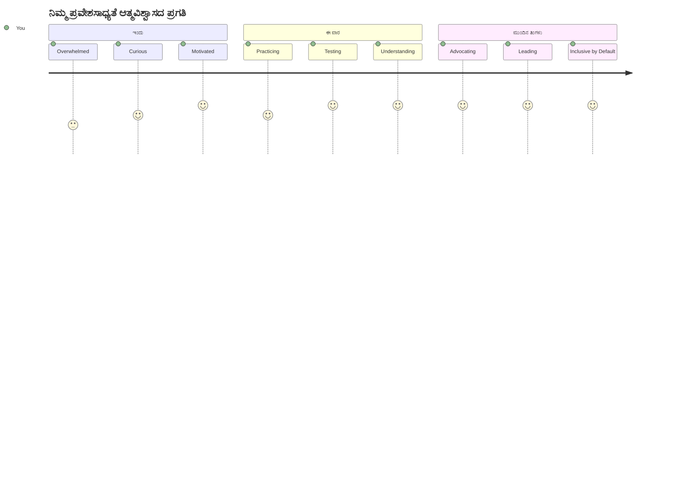
> 🌍 **ನೀವು ಈಗ ಪ್ರವೇಶಿಸುವಿಕೆ ಚ್ಯಾಂಪಿಯನ್ ಆಗಿದ್ದೀರಿ!** ನೀವು ತಿಳಿದುಕೊಂಡಿರುವಿರಿ, ಅದ್ಭುತ ವೆಬ್ ಅನುಭವಗಳು ಎಲ್ಲರಿಗೂ, ಅವರು ವೆಬ್ ಅನ್ನು ಹೇಗೆ ಪ್ರವೇಶಿಸಿದರೂ ಸಹ ಕಾರ್ಯನಿರ್ವಹಿಸುತ್ತವೆ. ನೀವು ನಿರ್ಮಿಸುವ ಪ್ರತಿಯೊಬ್ಬ ಪ್ರವೇಶಿಸಬಹುದಾದ ವೈಶಿಷ್ಟ್ಯ ಇಂಟರ್‌ನೆಟ್ ಅನ್ನು ಹೆಚ್ಚು ಒಳಗೊಂಡಂತೆ ಮಾಡುತ್ತದೆ. ವೆಬ್‌ಗೆ ನಿಮ್ಮಂತಹ ಅಭಿವೃದ್ಧಿಪರರೂ ಬೇಕು, ಅವರು ಪ್ರವೇಶಿಸುವಿಕೆಯನ್ನು ನಿರ್ಬಂಧವಲ್ಲದೆ ಉತ್ತಮ ಅನುಭವಗಳನ್ನು ಸೃಷ್ಟಿಸುವ ಅವಕಾಶ ಎಂದು ನೋಡುತ್ತಾರೆ. ಚಳವಳಿಗೆ ಸ್ವಾಗತ! 🎉

---

<!-- CO-OP TRANSLATOR DISCLAIMER START -->
**ಅಸ್ಪಷ್ಟತಾ ಸೂಚನೆ**:  
ಈ ದಾಖಲೆಯು AI ಭಾಷಾಂತರ ಸೇವೆ [Co-op Translator](https://github.com/Azure/co-op-translator) ನ್ನು ಉಪಯೋಗಿಸಿ ಭಾಷಾಂತರಿಸಲಾಗಿದೆ. ನಾವು ಶುದ್ದತೆಗೆ ಪ್ರಯತ್ನಿಸುವ ವೇಳೆ, ಸ್ವಯಂಚಾಲಿತ ಭಾಷಾಂತರಗಳಲ್ಲಿ ತಪ್ಪುಗಳು ಅಥವಾ ಅಕುರತೆಗಳಿರಬಹುದು ಎಂಬುದನ್ನು ದಯವಿಟ್ಟು ಗಮನದಲ್ಲಿರಿಸಿ. ಮೂಲ ದಾಖಲೆ ಆ ಮೂಲಭಾಷೆಯಲ್ಲಿ ಅಧಿಕೃತ ಮೂಲವಾಗುತ್ತದೆ. ಗಂಭೀರ ಮಾಹಿತಿಗಾಗಿ, ವೃತ್ತಿಪರ ಮಾನವ ಭಾಷಾಂತರವನ್ನು 권장ಿಸಲಾಗುತ್ತದೆ. ಈ ಭಾಷಾಂತರದಿಂದ ಉಂಟಾಗುವ ಯಾವುದೇ ತಪ್ಪುಅರ್ಥಮಾಡಿಕೆ ಅಥವಾ ತಪ್ಪಾದ ವ್ಯಾಖ್ಯಾನಕ್ಕೆ ನಾವು ಹೊಣೆಗಾರಿಕೆಯನ್ನು ವಿಧಿಸುವುದಿಲ್ಲ.
<!-- CO-OP TRANSLATOR DISCLAIMER END -->