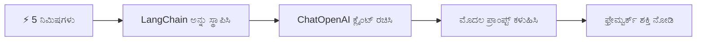
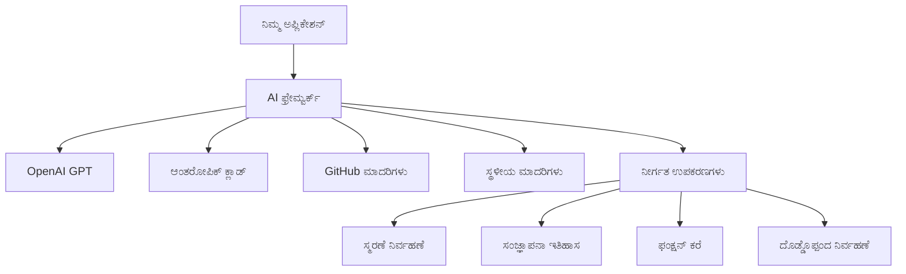
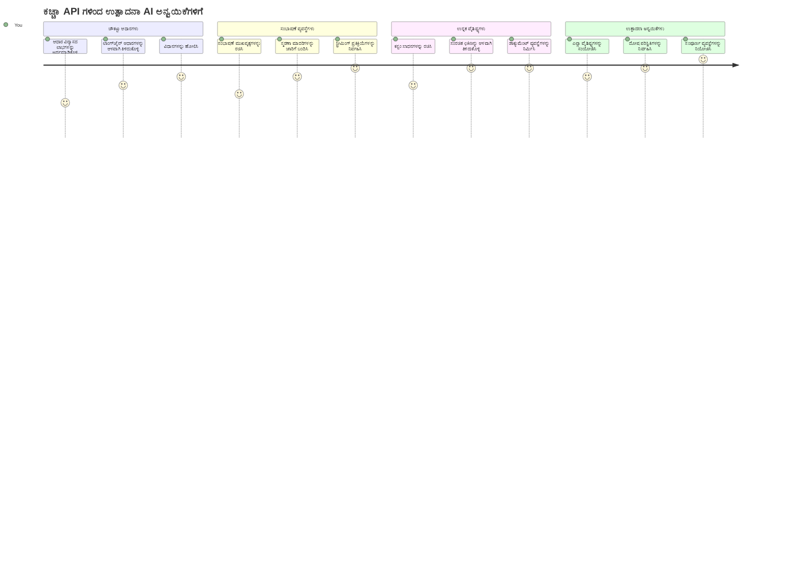
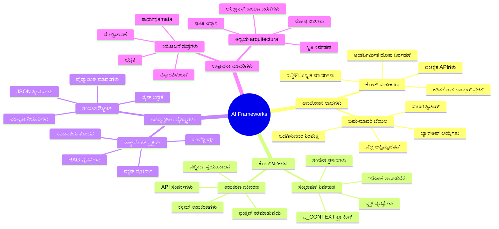
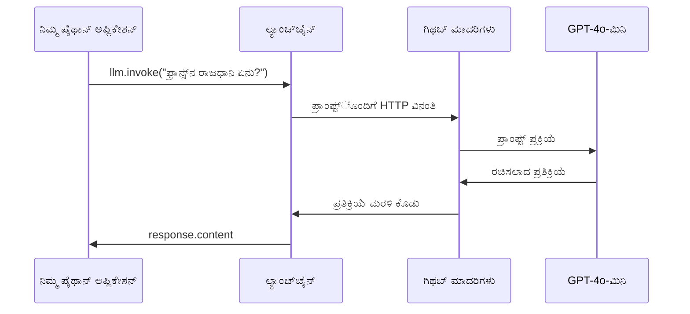
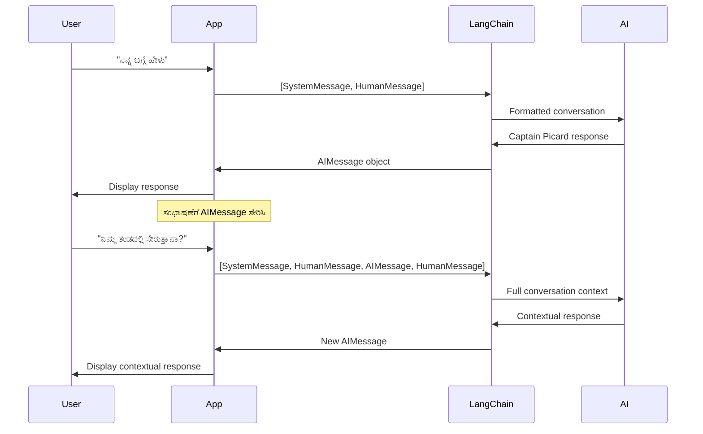
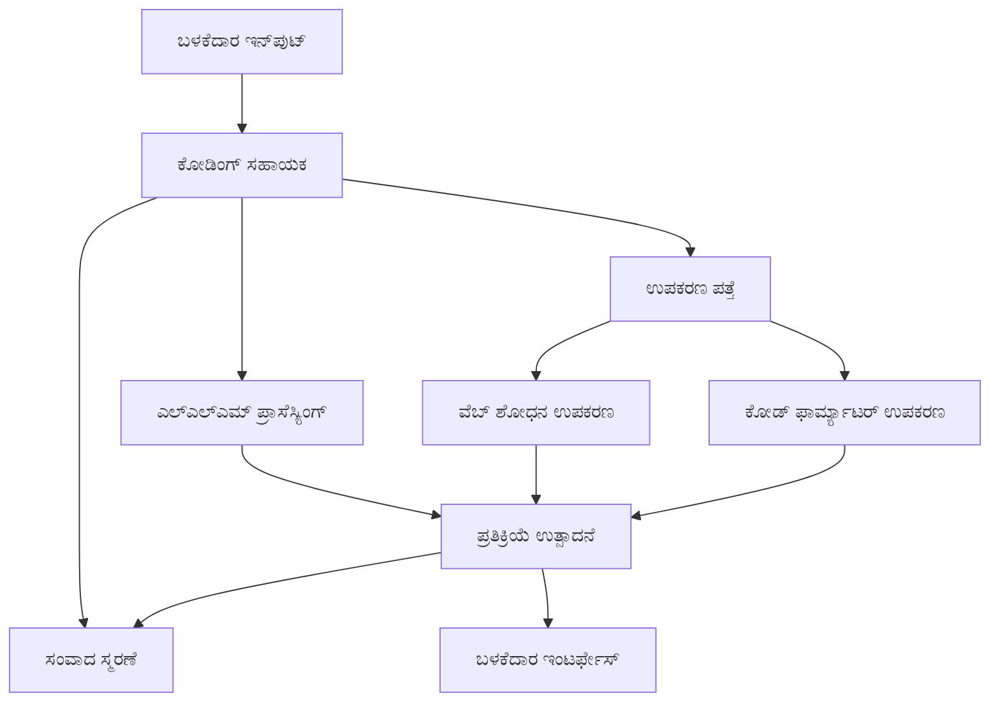
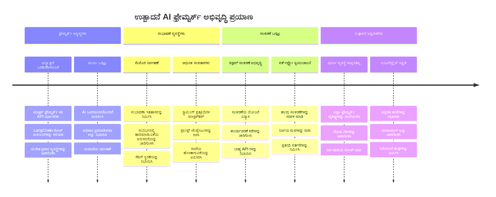
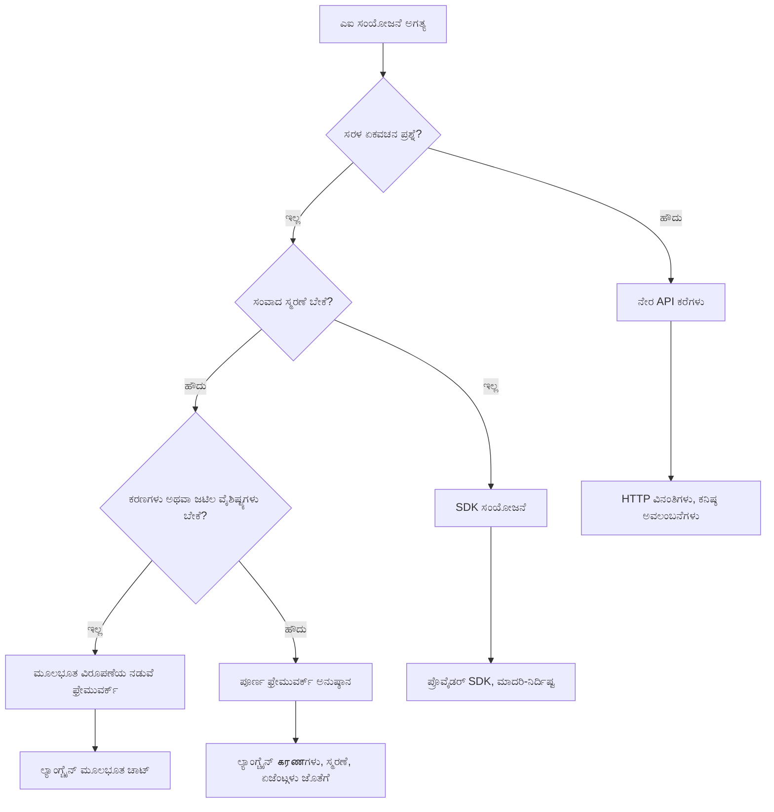

# AI ಫ್ರೇಮ್ವರ್ಕ್

ಮೂಲದಿಂದಲೇ AI ಅಪ್ಲಿಕೇಶನ್‌ಗಳನ್ನು ನಿರ್ಮಿಸಲು ಪ್ರಯತ್ನಿಸುವಾಗ ತಲೆನొಮ್ಮಿನಿಂದ ಸಾವಧಾನನಾಗಿದ್ದೀರಾ? ನೀವು ಅಗರಕ್ಕಾಗಿಲ್ಲ! AI ಫ್ರೇಮ್ವರ್ಕ್‌ಗಳು AI ಅಭಿವೃದ್ದಿಗೆ ಸ್ವಿಸ್ ಆರ್ಮಿ ಚಾಕು ಇದ್ದಂತೆ - ಬುದ್ಧಿವಂತ ಅಪ್ಲಿಕೇಶನ್‌ಗಳನ್ನು ನಿರ್ಮಿಸುವಾಗ ಕಾಲ ಮತ್ತು ತಲೆನೋವನ್ನು ಉಳಿಸುವ ಶಕ್ತಿಶಾಲಿ ಉಪಕರಣಗಳು. AI ಫ್ರೇಮ್ವರ್ಕ್ ಅನ್ನು ಚೆನ್ನಾಗಿ ಸಂಘಟಿತ ಗ್ರಂಥಾಲಯವೆಂದು ಯೋಚಿಸಿ: ಇದು ಪೂರ್ವನಿರ್ಮಿತ ಘಟಕಗಳು, ಮಾನಕ ಍ಪಿಐಗಳು, ಮತ್ತು ಮುತುವರ್ಜಿ ತರ್ಕಗಳನ್ನು ಒದಗಿಸುತ್ತದೆ, ಹೀಗಾಗಿ ನೀವು ಅಳವಡಿಕೆ ವಿವರಗಳೊಂದಿಗೆ ಹೋರಾಟ ಮಾಡದೇ ಸಮಸ್ಯೆಗಳನ್ನು ಪರಿಹರಿಸುವಲ್ಲಿ ಕೇಂದ್ರೀಕರಿಸಬಹುದು.

ಈ ಪಾಠದಲ್ಲಿ, ನಾವು LangChain ಮುಂತಾದ ಫ್ರೇಮ್ವರ್ಕ್‌ಗಳು ಹೇಗೆ ಸವಾಲುಗಳಾದ AI ಏಕೀಕರಣ ಕಾರ್ಯಗಳನ್ನು ಸ್ವಚ್ಛ, ಓದಬಹುದಾದ ಕೋಡಿನಲ್ಲಿ ಪರಿವರ್ತಿಸಬಹುದು ಎಂದು ಅನ್ವೇಷిస్తೇವೆ. ನೀವು ಸಂಭಾಷಣೆಗಳನ್ನು ಕಾಪಾಡುವಿಕೆ, ಟೂಲ್ಗಳ ಕರೆಗೊಳಿಸುವಿಕೆ, ಮತ್ತು ಒಬ್ಬ ಏಕೀಕೃತ ಇಂಟರ್ಫೇಸ್ ಮೂಲಕ ಬೇರೆ ಬೇರೆ AI ಮಾದರಿಗಳನ್ನು ನಿಯಂತ್ರಿಸುವಂತಹ ನೈಜ-ಜಗತ್ತಿನ ಸವಾಲುಗಳನ್ನು ತೇಲುವೀರಿ.

ನಾವು ಮುಗಿಸೋಮೆಯಾದಾಗ, ನೀವು ಯಾವಾಗ ಫ್ರೇಮ್ವರ್ಕ್‌ಗಳಿಗೆ ಹತ್ತಿರ ಹೋಗಬೇಕು ಮತ್ತು ಹಿಂತಿರುಗಿ API ಕರೆ ಮಾಡಬಾರದು, ಅವುಗಳ ಮುತುವರ್ಜಿಗಳನ್ನು ಪರಿಣಾಮಕಾರಿಯಾಗಿ ಹೇಗೆ ಉಪಯೋಗಿಸಬೇಕು ಮತ್ತು ನೈಜ ಜಗತ್ತಿನ ಉಪಯೋಗಕ್ಕಾಗಿ ಸಿದ್ಧವಿರುವ AI ಅಪ್ಲಿಕೇಶನ್‌ಗಳನ್ನು ಹೇಗೆ ನಿರ್ಮಿಸಬೇಕು ಎಂಬುದನ್ನು ತಿಳಿದುಕೊಳ್ಳುತ್ತೀರಿ. ನಿಮ್ಮ ಯೋಜನೆಗಳಿಗೆ AI ಫ್ರೇಮ್ವರ್ಕ್‌ಗಳು ಏನು ಮಾಡಬಹುದು ಎಂಬುದನ್ನು ಅನ್ವೇಷಿಸೋಣ.

## ⚡ ಮುಂದಿನ 5 ನಿಮಿಷಗಳಲ್ಲಿ ನೀವು ಏನು ಮಾಡಬಹುದು

**ವ್ಯಸ್ತ ಡೆವಲಪರ್‌ಗಳಿಗಾಗಿ ವೇಗವಾದ ಪ್ರಾರಂಭ ಮಾರ್ಗ**


- **ನಿಮಿಷ 1**: LangChain ಅನ್ನು ಸ್ಥಾಪಿಸಿ: `pip install langchain langchain-openai`
- **ನಿಮಿಷ 2**: ನಿಮ್ಮ GitHub ಟೋಕನ್ ಅನ್ನು ಹೊಂದಿಸಿ ಮತ್ತು ChatOpenAI ಕ್ಲೈಂಟ್ ಅನ್ನು ಆಮದುಮಾಡಿ
- **ನಿಮಿಷ 3**: ಸರಳ ಸಂಭಾಷಣೆ ರಚಿಸಿ, ಸಿಸ್ಟಮ್ ಮತ್ತು ಮಾನವ ಸಂದೇಶಗಳೊಂದಿಗೆ
- **ನಿಮಿಷ 4**: ಮೂಲಭೂತ ಉಪಕರಣ (ಹಾಗೆ ಒಂದು ಸೇರಿಸುವ ಕಾರ್ಯ) ಸೇರಿಸಿ ಮತ್ತು AI ಉಪಕರಣ ಕರೆಗೊಳಿಸುವಿಕೆಯನ್ನು ನೋಡಿ
- **ನಿಮಿಷ 5**: ಮೆಚ್ಚಿನ API ಕರೆ ಮತ್ತು ಫ್ರೇಮ್ವರ್ಕ್ ಮುತುವರ್ಜಿಯ ನಡುವಿನ ವ್ಯತ್ಯಾಸವನ್ನು ಅನುಭವಿಸಿ

**ವೇಗವಂತಿಕೆಯ ಪರೀಕ್ಷಾ ಕೋಡ್**:
```python
from langchain_openai import ChatOpenAI
from langchain_core.messages import SystemMessage, HumanMessage

llm = ChatOpenAI(
    api_key=os.environ["GITHUB_TOKEN"],
    base_url="https://models.github.ai/inference",
    model="openai/gpt-4o-mini"
)

response = llm.invoke([
    SystemMessage(content="You are a helpful coding assistant"),
    HumanMessage(content="Explain Python functions briefly")
])
print(response.content)
```

**ಏಕೆ ಇದನ್ನು ಮಹತ್ವ ಕೊಡಬೇಕೆಂದರೆ**: 5 ನಿಮಿಷಗಳಲ್ಲಿ, ನೀವು AI ಫ್ರೇಮ್ವರ್ಕ್‌ಗಳು ಜೀವಂತ ಮತ್ತು ಸಂಕೀರ್ಣ AI ಏಕೀಕರಣವನ್ನು ಸರಳ ವಿಧಾನಗಳಿಗೆ ಹೇಗೆ ಬದಲಾಯಿಸುತ್ತವೆ ಎಂಬುದನ್ನು ಅನುಭವಿಸುತ್ತೀರಿ. ಇದು ಉತ್ಪಾದನಾ AI ಅಪ್ಲಿಕೇಶನ್‌ಗಳ ಪೈಲಿನ ಹೆಸರಾಗಿದೆ.

## ಏಕೆ ಫ್ರೇಮ್ವರ್ಕ್ ಆಯ್ಕೆ ಮಾಡಬೇಕು?

ನೀವು AI ಆಪ್ ನಿರ್ಮಿಸಲು ಸಿದ್ಧರಾಗಿದ್ದೀರಿ - ಅದ್ಭುತ! ಆದರೆ ಇಲ್ಲಿದೆ ವಿಷಯ: ನೀವು ತೆಗೆದುಕೊಳ್ಳಬಹುದಾದ ಹಲವು ಬೇರೆ ಮಾರ್ಗಗಳಿವೆ ಮತ್ತು ಪ್ರತಿ ಒಂದು ತನ್ನ ಪ್ರಯೋಜನಗಳು ಮತ್ತು ಅವನತಿಗಳಿವೆ. ಇದು ನಡೆದುಕೊಳ್ಳುವುದು, ಬೈಕ್ ಚಾಲನೆ ಮಾಡುವುದು ಅಥವಾ ವಾಹನ ಚಾಲನೆಯ ಬಗ್ಗೆ ಆಯ್ಕೆ ಮಾಡುತ್ತಿರುವಂತೆ - ಎಲ್ಲವೂ ನಿಮ್ಮ ಗಮ್ಯಸ್ಥಾನಕ್ಕೆ ತಲುಪಿಸುತ್ತವೆ, ಆದರೆ ಅನುಭವ (ಮತ್ತು ಪ್ರಯತ್ನ) ಸಂಪೂರ್ಣ ಬೇರೆಯಾಗಿದೆ.

ನಿಮ್ಮ ಯೋಜನೆಗಳಿಗೆ AI ಒಂದೆರಡು ಮಾರ್ಗಗಳ ಮೂಲಕ ಏಕೀಕರಿಸುವ ಮೂರು ಪ್ರಮುಖ ವಿಧಾನಗಳನ್ನು ನೋಡೋಣ:

| ವಿಧಾನ | ಪ್ರಯೋಜನಗಳು | ಉತ್ತಮವಾಗಿ ಅನ್ವಯಿಸು | ಪರಿಗಣನೆಗಳು |
|----------|------------|----------|--------------|
| **ನೇರ HTTP ವಿನಂತಿಗಳು** | ಸಂಪೂರ್ಣ ನಿಯಂತ್ರಣ, ಅವಲಂಬನೆಗಳಿಲ್ಲ | ಸರಳ ಪ್ರಶ್ನೆಗಳು, ಮೂಲತತ್ವಗಳನ್ನು ಕಲಿಕೆ | ಹೆಚ್ಚು ಉದ್ದವಾದ ಕೋಡ್, ಕೈಯಿಂದ ದೋಷ ನಿರ್ವಹಣೆ |
| **SDK ಏಕೀಕರಣ** | ಕಡಿಮೆ ಬಾಯ್ಲೆರ್ಪ್ಲೇಟ್, ಮಾದರಿ-ವಿಶೇಷ ಅನುಗುಣತೆ | ಒಂದು ಮಾದರಿ ಅಪ್ಲಿಕೇಶನ್‌ಗಳು | ನಿರ್ದಿಷ್ಟ ಒದಗಿಸುವವರಿಗೆ ಮಾತ್ರ ಸೀಮಿತ |
| **AI ಫ್ರೇಮ್ವರ್ಕ್‌ಗಳು** | ಏಕೀಕೃತ API, ಒಳಗಾಗಿರುವ ಮುತುವರ್ಜಿಗಳು | ಬಹು-ಮಾದರಿ ಆಪ್‌ಗಳು, ಸಂಕೀರ್ಣ ಕಾರ್ಯವಾಹಿಕೆಗಳು | ಕಲಿಕೆಯ ವಕ್ರ, ಮಿತಿಯ ಮೀರಿದ ಮುತುವರ್ಜಿಗಳು |

### ಫ್ರೇಮ್ವರ್ಕ್ ಉಪಯೋಗದ ಪ್ರಯೋಜನಗಳು


**ಫ್ರೇಮ್ವರ್ಕ್‌ಗಳು ಮಹತ್ವಪೂರ್ಣವಾಗಿರುವುದು:**
- **ಒಗ್ಗೂಡಿಸುತ್ತದೆ** ಹಲವಾರು AI ಒದಗಿಸುವವರನ್ನು ಒಬ್ಬ ಇಂಟರ್ಫೇಸ್ ಅಡಿ
- **ನಾಲಿಗೆ** ಸಂಭಾಷಣೆ ಸ್ಮರಣೆ ஆண்டೋಮೆಟಿಕ್ ಆಗಿ
- **ಉಪಕರಣಗಳನ್ನು ನೀಡುತ್ತದೆ** embeddings ಮತ್ತು ಕಾರ್ಯ ಕರೆಗೊಳಿಸುವಂತಹ ಸಾಮಾನ್ಯ ಕಾರ್ಯಗಳಿಗೆ ಸಿದ್ಧಪಡು
- **ದೋಷ ನಿರ್ವಹಣೆ ಮತ್ತು ಮರುಪ್ರಯತ್ನ ನಿಯಮವನ್ನು ನಿರ್ವಹಿಸುತ್ತದೆ**
- **ಸಂಕೀರ್ಣ ಕಾರ್ಯವಾಹಿಕೆಗಳನ್ನು ಓದಬಹುದಾದ ವಿಧಾನ ಕರೆಗಳಲ್ಲಿ ಪರಿವರ್ತಿಸುತ್ತದೆ**

> 💡 **ಪ್ರೋ ಸಲಹೆ**: ವಿಭಿನ್ನ AI ಮಾದರಿಗಳ ನಡುವೆ ಬದಲಾಯಿಸುವಾಗ ಅಥವಾ ಏಜೆಂಟ್‌ಗಳು, ಸ್ಮರಣೆ, ಉಪಕರಣ ಕರೆಗೊಳಿಸುವಿಕೆಯಂತಹ ಸಂಕೀರ್ಣ ವೈಶಿಷ್ಟ್ಯಗಳನ್ನು ನಿರ್ಮಿಸುವಾಗ ಫ್ರೇಮ್ವರ್ಕ್‌ಗಳನ್ನು ಉಪಯೋಗಿಸಿ. ಮೂಲಭೂತಗಳನ್ನು ಕಲಿಯುತ್ತಿರುವಾಗ ಅಥವಾ ಸರಳ, ಕೇಂದ್ರೀಕೃತ ಅಪ್ಲಿಕೇಶನ್‌ಗಳನ್ನು ನಿರ್ಮಿಸುವಾಗ ನೇರ APIಗಳನ್ನು ಹಂಚಿ.

**ತಳಹದಿಗೆ ಹೇಳುವುದು**: ವೃತ್ತಿಪರರ ವಿಶೇಷ ಉಪಕರಣಗಳ ಜೊತೆ ಉಪಕರಣಗಳನ್ನು ಆಯ್ಕೆಮಾಡುವುದು ಮತ್ತು ಸಂಪೂರ್ಣ ಕಾರ್ಯಾಗಾರವನ್ನು ಬಳಸುವುದರ ನಡುವೆ ಆಯ್ಕೆ ಮಾಡುವುದು ಕೆಲಸಕ್ಕೆ ಸರಿಹೊಂದುತ್ತದೆ. ಫ್ರೇಮ್ವರ್ಕ್‌ಗಳು ಸಂಕೀರ್ಣ, ವೈಶಿಷ್ಟ್ಯಗಳುಳ್ಳ ಅಪ್ಲಿಕೇಶನ್‌ಗಳಿಗೆ ಉತ್ತಮ, ನೇರ API ಸರಳ ಉಪಯೋಗಗಳಿಗೆ ಸೂಕ್ತ.

## 🗺️ AI ಫ್ರೇಮ್ವರ್ಕ್ ಪರಿಣತಿಯಲ್ಲಿ ನಿಮ್ಮ ಕಲಿಕಾ ಯಾತ್ರೆ


**ನಿಮ್ಮ ಯಾತ್ರೆ ಗಮ್ಯಸ್ಥಾನ**: ಈ ಪಾಠದ ಕೊನೆಯಲ್ಲಿ, ನೀವು AI ಫ್ರೇಮ್ವರ್ಕ್ ಅಭಿವೃದ್ದಿಯನ್ನು ಅಧೀನಮಾಡಿ, ವಾಣಿಜ್ಯ AI ಸಹಾಯಕರಿಂದ ಸ್ಪರ್ಧಿಸುವ ಸೊಗಸಾದ, ಉತ್ಪಾದನಾಯೋಗ್ಯ AI ಅಪ್ಲಿಕೇಶನ್‌ಗಳನ್ನು ನಿರ್ಮಿಸಬಲ್ಲಿರಿ.

## ಪರಿಚಯ

ಈ ಪಾಠದಲ್ಲಿ ನಾವು ಕಲಿಯುತ್ತೇವೆ:

- ಸಾದಾರಣ AI ಫ್ರೇಮ್ವರ್ಕ್ ಅನ್ನು ಉಪಯೋಗಿಸುವುದು.
- ಸಾಮಾನ್ಯ ಸಮಸ್ಯೆಗಳು: ಸಂಭಾಷಣೆ, ಉಪಕರಣ ಬಳಕೆ, ಸ್ಮರಣೆ, ಮತ್ತು ಸಂಕಲ್ಪ.
- ಇದನ್ನು ಉಪಯೋಗಿಸಿ AI ಆಪ್‌ಗಳನ್ನು ನಿರ್ಮಿಸುವುದು.

## 🧠 AI ಫ್ರೇಮ್ವರ್ಕ್ ಅಭಿವೃದ್ಧಿ ಪರಿಸರ


**ಮೂಲ ತತ್ವ**: AI ಫ್ರೇಮ್ವರ್ಕ್‌ಗಳು ಸಂಬೋಧನ ನಿರ್ವಹಣೆ, ಉಪಕರಣ ಏಕೀಕರಣ, ಮತ್ತು ದಾಖಲೆ ಪ್ರಕ್ರಿಯೆಗಾಗಿ ಶಕ್ತಿಶಾಲಿ ಮುತುವರ್ಜಿಗಳನ್ನು ಒದಗಿಸುವುದರ ಮೂಲಕ ಸಂಕೀರ್ಣತೆ abstraction ಮಾಡುತ್ತವೆ, ಅಭಿವೃದ್ದಿದಾರರಿಗೆ ಸ್ವಚ್ಛ, ಸುಗಮ ಕೋಡ್ ಉಪಯೋಗಿಸಿ ಸಂಕೀರ್ಣ AI ಅಪ್ಲಿಕೇಶನ್‌ಗಳನ್ನು ನಿರ್ಮಿಸಲು ಸಾಧ್ಯವಿದೆ.

## ನಿಮ್ಮ ಮೊದಲ AI ಪ್ರಾಂಪ್ಟ್

ನಾವು ಮೂಲಭೂತಗಳಿಂದ ಪ್ರಾರಂಭಿಸೋಣ, ನಿಮ್ಮ ಮೊದಲ AI ಅಪ್ಲಿಕೇಶನ್ ರಚಿಸಿ, ಅದು ಪ್ರಶ್ನೆ ಕಳುಹಿಸುತ್ತದೆ ಮತ್ತು ಉತ್ತರ ಪಡೆಯುತ್ತದೆ. ಅರ್ಚಿಮಿಡೀಸ್ ತನ್ನ ಸ್ನಾನದ ಕೊಳೆಯಲ್ಲಿ ಸ್ಥಳಾಂತರ ಸಿದ್ಧಾಂತವನ್ನು ಕಂಡುಕೊಂಡಂತೆಯೇ, ಸರಳ ಗಣನೆಗಳು ಅತ್ಯಂತ ಶಕ್ತಿಶಾಲಿ ತಿಳಿವಳಿಕೆಗಳಿಗೆ ದಾರಿ ಮಾಡಿಕೊಡುತ್ತವೆ - ಫ್ರೇಮ್ವರ್ಕ್‌ಗಳು ಈ ತಿಳುವಳಿಕೆಯನ್ನು ಸುಲಭಗೊಳಿಸುತ್ತವೆ.

### GitHub ಮಾದರಿಗಳೊಂದಿಗೆ LangChain ಅನ್ನು ಹೊಂದಿಸುವುದು

ನಾವು LangChain ಅನ್ನು GitHub ಮಾದರಿಗಳೊಂದಿಗೆ ಸಂಪರ್ಕಿಸುವುದಕ್ಕೆ ಉಪಯೋಗಿಸುವಾಗ, ಇದು ಬಹಳ ಚೆನ್ನಾಗಿದ್ದು ಬೇರೆ ಬೇರೆ AI ಮಾದರಿಗಳ ಉಚಿತ ಪ್ರವೇಶವನ್ನು ನೀಡುತ್ತದೆ. ಉತ್ತಮ ಭಾಗ ಏನೆಂದರೆ? ಆರಂಭಿಸಲು ಕೆಲವು ಸರಳ ಸಂರಚನಾ ಪ್ಯಾರಾಮೀಟರ್ಗಳು ಮಾತ್ರ ಬೇಕು:

```python
from langchain_openai import ChatOpenAI
import os

llm = ChatOpenAI(
    api_key=os.environ["GITHUB_TOKEN"],
    base_url="https://models.github.ai/inference",
    model="openai/gpt-4o-mini",
)

# ಸರಳ ಪ್ರಾಂಪ್ಟ್ ಅನ್ನು ಕಳುಹಿಸಿ
response = llm.invoke("What's the capital of France?")
print(response.content)
```

**ಇಲ್ಲಿ ಸಂಭವಿಸುತ್ತಿರುವದನ್ನು ವಿವರಿಸೋಣ:**
- `ChatOpenAI` ವರ್ಗ ಬಳಸಿ LangChain ಕ್ಲೈಂಟ್ ರಚಿಸುತ್ತದೆ - ಇದು ನಿಮ್ಮ AI ಗೆ ಪ್ರವೇಶ ದ್ವಾರ!
- GitHub ಮಾದರಿಗಳ ಜೊತೆಗೆ ಸಂಪರ್ಕವನ್ನು ನಿಮ್ಮ ಪ್ರಮಾಣೀಕರಣ ಟೋಕನ್ ಮೂಲಕ ಹೊಂದಿಸುತ್ತದೆ
- ಯಾವ AI ಮಾದರಿಯನ್ನು ಉಪಯೋಗಿಸುವುದೆಂದು ಸೂಚಿಸುತ್ತದೆ (`gpt-4o-mini`) - ನಿಮ್ಮ AI ಸಹಾಯಕರ ಆಯ್ಕೆ ಎಂದು ಯೋಚಿಸಿ
- `invoke()` ವಿಧಾನದಿಂದ ನಿಮ್ಮ ಪ್ರಶ್ನೆಯನ್ನು ಕಳುಹಿಸುತ್ತದೆ - ಇಲ್ಲಿ ಮಾಯಾಜಾಲ ಸಂಭವಿಸುತ್ತದೆ
- ಉತ್ತರವನ್ನು ಪಡೆಯುತ್ತದೆ ಮತ್ತು ಪ್ರದರ್ಶಿಸುತ್ತದೆ - ವೋಯ್ಲಾ, ನೀವು AI ಜೊತೆಗೆ ಸಂಭಾಷಣೆ ಮಾಡುತ್ತಿದ್ದೀರಿ!

> 🔧 **ಸಂರಚನಾ ಟಿಪ್ಪಣಿ**: ನೀವು GitHub ಕೋಡ್ ಸ್ಪೇಸಸ್ ಬಳಸುತ್ತಿದ್ದರೆ, ನಿಮಗೆ ಯೋಗ್ಯವಾದ `GITHUB_TOKEN` ಈಗಾಗಲೇ ಹೊಂದಿಸಲಾಗಿದೆ! ಸ್ಥಳೀಯ ಕೆಲಸ ಮಾಡುತ್ತಿದ್ದೀರಾ? ಚಿಂತೆಪಡಬೇಡಿ, ಹೊಸ ವೈಯಕ್ತಿಕ ಪ್ರವೇಶ ಟೋಕನ್ ಅನ್ನು ಸರಿಯಾದ ಅನುಮತಿಗಳೊಂದಿಗೆ ಸೃಷ್ಟಿಸಬೇಕು.

**ನಿರೀಕ್ಷಿತ ಫಲಿತಾಂಶ:**
```text
The capital of France is Paris.
```


## ಸಂಭಾಷಣಾ AI ನಿರ್ಮಾಣ

ಆ ಮೊದಲ ಉದಾಹರಣೆ ಮೂಲಭೂತಗಳನ್ನು ತೋರಿಸಿದೆ, ಆದರೆ ಅದು ಒಬ್ಬರ ವಿನಿಮಯ ಮಾತ್ರ - ನೀವು ಪ್ರಶ್ನೆಯನ್ನು ಕೇಳುತ್ತೀರಿ, ಉತ್ತರ ಪಡೆಯುತ್ತೀರಿ, ಮತ್ತು ಅದಷ್ಟೇ. ನಿಜ ಜಾಗತಿಕ ಅಪ್ಲಿಕೇಶನ್‌ಗಳಲ್ಲಿ, ನಿಮ್ಮ AI ನೀವು ಚರ್ಚಿಸಿದ ವಿಷಯಗಳನ್ನು ನೆನಪಿಡಲು ಬಯಸುತ್ತೀರಿ, ವಾಟ್ಸನ್ ಮತ್ತು ಹೋಲ್ಮ್ಸ್ ತನಿಖಾ ಸಂಭಾಷಣೆಗಳನ್ನು ಕಾಲಕಾಲಕ್ಕೆ ನಿರ್ಮಿಸಿದಂತೆ.

ಇಗೋ LangChain ವಿಶೇಷವಾಗಿ ಸಹಾಯಕ. ಇದು ಸಂಭಾಷಣೆ ರಚನೆಗೆ ಮತ್ತು ನಿಮ್ಮ AI ಗೆ ವೈಯಕ್ತಿಕತೆ ನೀಡಲು ವಿಭಿನ್ನ ಸಂದೇಶ ಪ್ರಕಾರಗಳನ್ನು ಒದಗಿಸುತ್ತದೆ. ನೀವು ಪ್ರಾಸಂಗಿಕತೆ ಮತ್ತು ಪಾತ್ರವನ್ನು ಕಾಯ್ದುಕೊಳ್ಳುವ ಚಾಟ್ ಅನುಭವಗಳನ್ನು ನಿರ್ಮಿಸುತ್ತೀರಿ.

### ಸಂದೇಶ ಪ್ರಕಾರಗಳನ್ನು ಅರ್ಥಮಾಡಿಕೊಳ್ಳುವುದು

ಈ ಸಂದೇಶ ಪ್ರಕಾರಗಳನ್ನು ಸಂಭಾಷಣೆಯಲ್ಲಿ ಭಾಗವಹಿಸುವವರು ಧರಿಸುವ ಬೇರೊಬ್ಬ "ಟೋಪಿ" ಗಳಂತೆ ಯೋಚಿಸಿ. LangChain ವಿಭಿನ್ನ ಸಂದೇಶ ವರ್ಗಗಳನ್ನು ಬಳಸುತ್ತೆ ಯಾರ ಮಾತು ಎಂದು ಹಿಸುರುತ್ತಿದೆ:

| ಸಂದೇಶ ಪ್ರಕಾರ | ಉದ್ದೇಶ | ಉದಾಹರಣೆ ಬಳಕೆ ಪ್ರಕರಣ |
|--------------|---------|--------------------------|
| `SystemMessage` | AI ವ್ಯಕ್ತಿತ್ವ ಮತ್ತು ವರ್ತನೆ ನಿರ್ಧರಿಸುವುದು | "ನೀವು ಸಹಾಯಕ ಕೋಡ್ ಸಹಾಯಕರಾಗಿದ್ದೀರಿ" |
| `HumanMessage` | ಬಳಕೆದಾರನ ತುಂಬು | "ಕಾರ್ಯಗತ ರೂಪಾಂತರಗಳು ಹೇಗೆ ಕೆಲಸ ಮಾಡುತ್ತವೆ ಎಂದು ವಿವರಿಸಿ" |
| `AIMessage` | AI ಪ್ರತಿಕ್ರಿಯೆಗಳ ಸಂಗ್ರಹಣೆ | ಕಳೆದ AI ಪ್ರತಿಕ್ರಿಯೆಗಳು ಸಂಭಾಷಣೆಯಲ್ಲಿ |

### ನಿಮ್ಮ ಮೊದಲ ಸಂಭಾಷಣೆ ರಚನೆ

ನನವು AI ಒಂದು ನಿರ್ದಿಷ್ಟ ಪಾತ್ರವನ್ನು ಒಪ್ಪಿಕೊಳ್ಳಬೇಕಾದ ಸಂಭಾಷಣೆ ರಚಿಸೋಣ. ಅದು ಕ್ಯಾಪ್ಟನ್ ಪಿಕಾರ್ಡ್ ಆಗಿರಬಹುದು - ರಾಜನೈತಿಕ ವಿವೇಕ ಮತ್ತು ನಾಯಕತ್ವಕ್ಕಾಗಿ ಪ್ರಸಿದ್ಧ ಪಾತ್ರ:

```python
messages = [
    SystemMessage(content="You are Captain Picard of the Starship Enterprise"),
    HumanMessage(content="Tell me about you"),
]
```

**ಈ ಸಂಭಾಷಣೆ ಸಂರಚನೆಯ ವಿವರ:**
- `SystemMessage` ಮೂಲಕ AI ಯ ವೈಯಕ್ತಿಕತೆ ಮತ್ತು ಪಾತ್ರ ನಿಗದಿಪಡಿಸುತ್ತದೆ
- `HumanMessage` ಮೂಲಕ ಆರಂಭಿಕ ಬಳಕೆದಾರ ಪ್ರಶ್ನೆಯನ್ನು ಒದಗಿಸುತ್ತದೆ
- ಬಹು-ತಿರುವು ಸಂಭಾಷಣೆಗೆ ನೆಲೆಯನ್ನೂ ಸೃಷ್ಟಿಸುತ್ತದೆ

ಈ ಉದಾಹರಣೆಯ ಸಂಪೂರ್ಣ ಕೋಡ್ ಹೀಗಿದೆ:

```python
from langchain_core.messages import HumanMessage, SystemMessage
from langchain_openai import ChatOpenAI
import os

llm = ChatOpenAI(
    api_key=os.environ["GITHUB_TOKEN"],
    base_url="https://models.github.ai/inference",
    model="openai/gpt-4o-mini",
)

messages = [
    SystemMessage(content="You are Captain Picard of the Starship Enterprise"),
    HumanMessage(content="Tell me about you"),
]


# ಕೆಲಸ ಮಾಡುತ್ತದೆ
response  = llm.invoke(messages)
print(response.content)
```

ನಿಮಗೆ ಈ ರೀತಿಯ ಫಲಿತಾಂಶ ಕಾಣಿಸುವ ಸಾಧ್ಯತೆ ಇದೆ:

```text
I am Captain Jean-Luc Picard, the commanding officer of the USS Enterprise (NCC-1701-D), a starship in the United Federation of Planets. My primary mission is to explore new worlds, seek out new life and new civilizations, and boldly go where no one has gone before. 

I believe in the importance of diplomacy, reason, and the pursuit of knowledge. My crew is diverse and skilled, and we often face challenges that test our resolve, ethics, and ingenuity. Throughout my career, I have encountered numerous species, grappled with complex moral dilemmas, and have consistently sought peaceful solutions to conflicts.

I hold the ideals of the Federation close to my heart, believing in the importance of cooperation, understanding, and respect for all sentient beings. My experiences have shaped my leadership style, and I strive to be a thoughtful and just captain. How may I assist you further?
```

ಸಂಭಾಷಣೆಯ ಸತತತೆ ಕಾಪಾಡಲು (ಪ್ರತಿ ಬಾರಿ ಸಂಧರ್ಭವನ್ನು ಮರುಹೊಂದಿಸುವ ಬದಲು), ನೀವು ಪ್ರತಿಕ್ರಿಯೆಗಳನ್ನು ನಿಮ್ಮ ಸಂದೇಶ ಪಟ್ಟಿ ಸೇರಿಸಿಕೊಂಡು ಹೋಗಬೇಕು. ಪಾರದರ್ಶಕ ಕತೆಗಳು ತಲೆಮಾರುಗಳಿಂದ ಜತೆಗೆ ಉಳಿದಿರುವಂತೆ, ಈ ವಿಧಾನ ದೀರ್ಘಕಾಲಿಕ ಸ್ಮರಣೆಯನ್ನು ನಿರ್ಮಿಸುತ್ತದೆ:

```python
from langchain_core.messages import HumanMessage, SystemMessage
from langchain_openai import ChatOpenAI
import os

llm = ChatOpenAI(
    api_key=os.environ["GITHUB_TOKEN"],
    base_url="https://models.github.ai/inference",
    model="openai/gpt-4o-mini",
)

messages = [
    SystemMessage(content="You are Captain Picard of the Starship Enterprise"),
    HumanMessage(content="Tell me about you"),
]


# ಕಾರ್ಯಾಚರಣೆ ಮಾಡಿ
response  = llm.invoke(messages)

print(response.content)

print("---- Next ----")

messages.append(response)
messages.append(HumanMessage(content="Now that I know about you, I'm Chris, can I be in your crew?"))

response  = llm.invoke(messages)

print(response.content)

```

ಖಚಿತವಾಗಿ ಬಹುಮುಖ, ಅಲ್ಲವೆ? ಇಲ್ಲಿ ನಾವು LLM ಗೆ ಎರಡು ಬಾರಿ ಕರೆ ಮಾಡುತ್ತೇವೆ - ಮೊದಲಿಗಾಗಿಯೇ ಮೊದಲು ಎರಡು ಸಂದೇಶಗಳೊಂದಿಗೆ, ಆದರೆ ನಂಬಿಕೆಯ ಪೂರ್ಣ ಇತಿಹಾಸದೊಂದಿಗೆ ಮರುಒಮ್ಮೆ. ಇದು AI ನಿಜವಾಗಿಯೂ ನಮ್ಮ ಮಾತುಕತೆ ಜೊತೆಗೆ ಹೋಗುತ್ತಿದೆ ಎಂಬುದಂತೆ!

ನೀವು ಈ ಕೋಡ್ ರನ್ ಮಾಡಿದಾಗ, ಇದು ಎರಡನೇ ಪ್ರತಿಕ್ರಿಯೆಯನ್ನು ಕೊಡುತ್ತದೆ, ಅದು ಹೀಗೆ ಕಾಣಿಸುತ್ತದೆ:

```text
Welcome aboard, Chris! It's always a pleasure to meet those who share a passion for exploration and discovery. While I cannot formally offer you a position on the Enterprise right now, I encourage you to pursue your aspirations. We are always in need of talented individuals with diverse skills and backgrounds. 

If you are interested in space exploration, consider education and training in the sciences, engineering, or diplomacy. The values of curiosity, resilience, and teamwork are crucial in Starfleet. Should you ever find yourself on a starship, remember to uphold the principles of the Federation: peace, understanding, and respect for all beings. Your journey can lead you to remarkable adventures, whether in the stars or on the ground. Engage!
```


ನನ್ನ ಅಭಿಪ್ರಾಯದಲ್ಲಿ "ಬಹುಶಃ"! ;)

## ಸರಬರಾಜು ಪ್ರತಿಕ್ರಿಯೆಗಳು

ನೀವು ನೋಡಿದ್ದೀರಾ ChatGPT "ಟೈಪ್" ಮಾಡುತ್ತಾ ಹೋಗುತ್ತಿರುವುದಂತೆ ಕಾಣುತ್ತದೆ? ಅದೇ ಸ್ಟ್ರೀಮಿಂಗ್ ಕ್ರಿಯೆಯಾಗಿದೆ. ನಿಪುಣಸ್ಕ್ರಿಪ್ಟಿಗ್ರಾಫರ್ ಕೆಲಸ ಮಾಡುವಂತೆ - ಅಕ್ಷರಗಳು ಸ್ತ್ರೋಕ್‌ಗಳಿಂದ ಹಂತ ಹಂತವಾಗಿ ಕಾಣಿಸುವುದನ್ನು ನೋಡಿರುವಂತೆ, ಸ್ಟ್ರೀಮಿಂಗ್ ಸಂಪರ್ಕವನ್ನು ಹೆಚ್ಚು ಸಹಜ ಮತ್ತು ತಕ್ಷಣದ ಪ್ರತಿಕ್ರಿಯೆಯನ್ನು ನೀಡುತ್ತದೆ.

### LangChain ನಲ್ಲಿ ಸ್ಟ್ರೀಮಿಂಗ್ ಜಾರಿ ಮಾಡುವುದು

```python
from langchain_openai import ChatOpenAI
import os

llm = ChatOpenAI(
    api_key=os.environ["GITHUB_TOKEN"],
    base_url="https://models.github.ai/inference",
    model="openai/gpt-4o-mini",
    streaming=True
)

# ಪ್ರತಿಕ್ರಿಯೆಯನ್ನು ಸ್ಟ್ರೀಮ್ ಮಾಡಿ
for chunk in llm.stream("Write a short story about a robot learning to code"):
    print(chunk.content, end="", flush=True)
```

**ಸ್ಟ್ರೀಮಿಂಗ್ ಅದ್ಭುತವಾದ ಕಾರಣಗಳು:**
- **ತಯಾರಾಗುತ್ತಾ ಇದ್ದ ವಿಷಯವನ್ನು ತೋರಿಸುತ್ತದೆ** - ನಿರೀಕ್ಷಿಸುವುದಿಲ್ಲ!
- **ಬಳಕೆದಾರರಿಗೆ ನಿಜವಾದ ಕ್ರಿಯೆ ನಡೆದಿದೆ ಎಂಬ ಭಾವನೆ ನೀಡುತ್ತದೆ**
- **ತಂತ್ರಜ್ಞಾನದ ದೃಷ್ಟಿಯಿಂದ ಇನ್ನು ವೇಗವಾಗಿಲ್ಲದಿದ್ದರೂ ವೇಗವಾಗಿ ಅನುಭವಿಸುತ್ತದೆ**
- **AI "ಆಲೋಚಿಸುತ್ತಿರುವ" ಅವಧಿಯಲ್ಲಿಯೇ ಬಳಕೆದಾರರು ಓದುವುದು ಆರಂಭಿಸಬಹುದು**

> 💡 **ಬಳಕೆದಾರ ಅನುಭವ ಸಲಹೆ**: ಕೋಡ್ ವಿವರಣೆಗಳು, ಕ್ರಿಯಾತ್ಮಕ ಬರವಣಿಗೆ, ಅಥವಾ ವಿವರವಾದ ಪಾಠಗಳಂತಹ ಉದ್ದವಾದ ಪ್ರತಿಕ್ರಿಯೆಗಳಲ್ಲಿ ಸ್ಟ್ರೀಮಿಂಗ್ ಅತಿ ಪ್ರಭಾವಿ. ನಿಮ್ಮ ಬಳಕೆದಾರರು ಬ್ಲಾಂಕ್ اسڪ್ರೀನ್ ನೋಡಲು ಬದಲು ಪ್ರಗತಿಯನ್ನು ನೋಡುವುದು ಇಷ್ಟಪಡುವರು!

### 🎯 ಪಾಠೀಯ ಪರಿಶೀಲನೆ: ಫ್ರೇಮ್ವರ್ಕ್ ಮುತುವರ್ಜಿಗಳ ಪ್ರಯೋಜನಗಳು

**ನಿಂತು ಗಮನಿಸಿ**: ನೀವು ಈಗಾಗಲೇ AI ಫ್ರೇಮ್ವರ್ಕ್ ಮುತುವರ್ಜಿಗಳ ಶಕ್ತಿಯನ್ನು ಅನುಭವಿಸಿದ್ದೀರಿ. ಹಿಂದಿನ ಪಾಠಗಳಿಂದ ಬರುವುದು ನೇರ API ಕರೆಗಳಕ್ಕಿಂತ ಏನು ಭಿನ್ನತೆ ಇದೆ ಎಂದು ಹೋಲಿಕೆಯೊಂದಿಗೊತ್ತು ನೋಡಿ.

**ವೇಗವಾದ ಸ್ವಯಂ-ಮೌಲ್ಯಮಾಪನ:**
- LangChain ಸಂಭಾಷಣೆ ನಿರ್ವಹಣೆಯನ್ನು ಕೈಯಿಂದ ಸಂದೇಶ ಟ್ಯಾಕಿಂಗ್ ಜೊತೆ ಹೋಲಿಸಿದಾಗ ಹೇಗೆ ಸರಳಮಾಡುತ್ತದೆ?
- `invoke()` ಮತ್ತು `stream()` ವಿಧಾನಗಳ ನಡುವಣ ವ್ಯತ್ಯಾಸ ಯಾವುದು, ಮತ್ತು ಯಾವಾಗ ಯಾವದು ಉಪಯೋಗಿಸಬೇಕು?
- ಫ್ರೇಮ್ವರ್ಕ್ ಸಂದೇಶ ಪ್ರಕಾರ ವ್ಯವಸ್ಥೆ ಕೋಡ್ ಸಂಘಟನೆಗೆ ಹೇಗೆ ಸುಧಾರಣೆ ಮಾಡುತ್ತದೆ?

**ನೈಜ ಜಗತ್ತಿನ ಸಂಪರ್ಕ**: ನೀವು ಕಲಿತ abstraction ಮಾದರಿಗಳು (ಸಂದೇಶ ಪ್ರಕಾರ, ಸ್ಟ್ರೀಮಿಂಗ್ ಇಂಟರ್ಫೇಸ್, ಸಂಭಾಷಣೆ ಸ್ಮರಣೆ) ಎಲ್ಲ ಪ್ರಮುಖ AI ಅಪ್ಲಿಕೇಶನ್‌ಗಳಲ್ಲಿ ಉಪಯೋಗಿಸುತ್ತವೆ - ChatGPT ಅತ್ಯಂತ ಅಂತರಂಗದಿಂದ GitHub Copilot ಕೋಡ್ ಸಹಾಯವೊಂದರವರೆಗೆ. ನೀವು ವೃತ್ತಿಪರ AI ತಂಡಗಳ ತಂತ್ರಸಿದ್ಧಾಂತವನ್ನು ಅಧೀನಮಾಡುತ್ತಿದ್ದೀರಿ.

**ಸವಾಲು ಪ್ರಶ್ನೆ**: ಒಂದೇ ಇಂಟರ್ಫೇಸ್ ಮೂಲಕ ವಿಭಿನ್ನ AI ಮಾದರಿ ಒದಗಿಸುವವರಿಗೆ (OpenAI, Anthropic, Google) ಫ್ರೇಮ್ವರ್ಕ್ abstraction ಅನ್ನು ನೀವು ಹೇಗೆ ವಿನ್ಯಾಸ ಮಾಡುತ್ತೀರಿ? ಪ್ರಯೋಜನಗಳು ಮತ್ತು ವ್ಯತ್ಯಾಸಗಳನ್ನು ಪರಿಗಣಿಸಿ.

## ಪ್ರಾಂಪ್ಟ್ ಟೆಂಪ್ಲೇಟುಗಳು

ಪ್ರಾಂಪ್ಟ್ ಟೆಂಪ್ಲೇಟುಗಳು ಶಿಲ್ಪ ಕಲೆಯ ಸೌಂದರ್ಯರೂಪಗಳಂತೆ ಕೆಲಸ ಮಾಡುತ್ತವೆ - ಸಿಸೆರೋ ತನ್ನ ಭಾಷಣ ರಚನೆಗಳನ್ನು ವಿವಿಧ ಪ್ರೇಕ್ಷಕರಿಗೆ ಹೊಂದಿಕೊಳ್ಳುತ್ತಿದ್ದಂತೆ, ಆದರೆ ಸ್ವತಃ ಪ್ರೇರಕ ರೂಪವನ್ನು ಉಳಿಸಿಕೊಂಡಂತೆ ನಿವು ಬದಲಿಸಿಕೊಂಡ ಪ್ರಾಂಪ್ಟ್‌ಗಳನ್ನು ರಚಿಸುವುದನ್ನು ಅನುಮತಿಸುತ್ತದೆ. ಟೆಂಪ್ಲೇಟು ಸ್ಥಾಪಿಸಿದ ನಂತರ ನೀವು ಬದಲಾವಣೆಗಳನ್ನುಹೊಂದಿ ಬೇಕಾದಲ್ಲಿಗೆ ಬದಲಿಸುತ್ತೀರಿ, ಪುನಃ ಬರೆಯುವ ಅಗತ್ಯವಿಲ್ಲ.

### ಪುನಃಬಳಕೆಗೊಳಿಸುವ ಪ್ರಾಂಪ್ಟ್ ರಚನೆ

```python
from langchain_core.prompts import ChatPromptTemplate

# ಕೋಡ್ ವಿವರಣೆಗಳಿಗೆ ಟೆಂಪ್ಲೇಟನ್ನು ನಿರupemಿಸು
template = ChatPromptTemplate.from_messages([
    ("system", "You are an expert programming instructor. Explain concepts clearly with examples."),
    ("human", "Explain {concept} in {language} with a practical example for {skill_level} developers")
])

# ವಿಭಿನ್ನ ಮೌಲ್ಯಗಳೊಂದಿಗೆ ಟೆಂಪ್ಲೇಟನ್ನು ಬಳಸಿ
questions = [
    {"concept": "functions", "language": "JavaScript", "skill_level": "beginner"},
    {"concept": "classes", "language": "Python", "skill_level": "intermediate"},
    {"concept": "async/await", "language": "JavaScript", "skill_level": "advanced"}
]

for question in questions:
    prompt = template.format_messages(**question)
    response = llm.invoke(prompt)
    print(f"Topic: {question['concept']}\n{response.content}\n---\n")
```

**ನೀವು ಟೆಂಪ್ಲೇಟುಗಳನ್ನು ಇಷ್ಟಪಡುವ ಕಾರಣಗಳು:**
- ನಿಮ್ಮ ಪ್ರಾಂಪ್ಟ್‌ಗಳು ಸಂಪೂರ್ಣ ಆಪ್‌ದಲ್ಲಿಯೇ ಸुसಂಗತವಾಗಿರುತ್ತವೆ
- ಜಟಿಲ ಸ್ಟ್ರಿಂಗ್ ಸಂಯೋಜನೆಯ ಅಗತ್ಯವಿಲ್ಲ - ಶುದ್ಧ, ಸರಳ ವ್ಯತ್ಯಯಗಳು ಮಾತ್ರ
- ನಿಮ್ಮ AI ನಿರೀಕ್ಷಿತವಾಗಿ ವರ್ತಿಸುತ್ತದೆ ಏಕೆಂದರೆ ರಚನೆ ಹೀಗೆಯೇ ಇರುತ್ತದೆ
- ನವೀಕರಣಗಳು ಸುಲಭ - ಟೆಂಪ್ಲೇಟನ್ನು ಒಂದು ಬಾರಿಗೆ ಬದಲಿಸಿ, ಎಲ್ಲೆಡೆ ನವೀನೀಕರಿಸುತ್ತದೆ

## ರಚಿತ ಔಟ್ಪುಟ್

ನಿಮ್ಮ AI ಪ್ರತಿಕ್ರಿಯೆ ಅನಿರ್ಚಿತ ಮಾದರಿಯ متنವಾಗಿ ಬರುವುದನ್ನು ವಿಶ್ಲೇಷಿಸಲು ಕಷ್ಟವಾಗಿರುವುದಾದರೆ, ರಚಿತ ಔಟ್ಪುಟ್ ಲಿನೇಯಸ್ ಬಯೋಲಾಜಿಕಲ್ ವರ್ಗೀಕರಣದ ಕ್ರಮಾನುಸಾರ ವಿಧಾನವನ್ನು ಕಲಿಸುತ್ತಿರುವಂತೆ - ಸಂಘಟಿತ, ನಿರೀಕ್ಷಣೀಯ ಮತ್ತು ಸುಲಭ. ನೀವು JSON, ನಿರ್ದಿಷ್ಟ ಡೇಟಾ ರಚನೆಗಳು, ಅಥವಾ ಬೇರೆ ಯಾವುದೇ ಸ್ವರೂಪವನ್ನು ವಿನಂತಿಸಬಹುದು.

### ಔಟ್ಪುಟ್ ಸ್ಕೀಮಾಗಳ ನಿಗೂಡಿಕೆ

```python
from langchain_core.prompts import ChatPromptTemplate
from langchain_core.output_parsers import JsonOutputParser
from pydantic import BaseModel, Field

class CodeReview(BaseModel):
    score: int = Field(description="Code quality score from 1-10")
    strengths: list[str] = Field(description="List of code strengths")
    improvements: list[str] = Field(description="List of suggested improvements")
    overall_feedback: str = Field(description="Summary feedback")

# ಪಾರ್ಸರ್ ಅನ್ನು ಹೊಂದಿಸಿ
parser = JsonOutputParser(pydantic_object=CodeReview)

# ಸ್ವರೂಪ ಸೂಚನೆಗಳೊಂದಿಗೆ ಪ್ರಾಂಪ್ಟ್ ರಚಿಸಿ
prompt = ChatPromptTemplate.from_messages([
    ("system", "You are a code reviewer. {format_instructions}"),
    ("human", "Review this code: {code}")
])

# ಸೂಚನೆಗಳೊಂದಿಗೆ ಪ್ರಾಂಪ್ಟ್ ಅನ್ನು ಸ್ವರೂಪಗೊಳಿಸಿ
chain = prompt | llm | parser

# ಸರಣಿ ಪ್ರತಿಕ್ರಿಯೆ ಪಡೆಯಿರಿ
code_sample = """
def calculate_average(numbers):
    return sum(numbers) / len(numbers)
"""

result = chain.invoke({
    "code": code_sample,
    "format_instructions": parser.get_format_instructions()
})

print(f"Score: {result['score']}")
print(f"Strengths: {', '.join(result['strengths'])}")
```

**ರಚಿತ ಔಟ್ಪುಟ್ ಒಂದು ಆಟ ಬದಲಿಸುವುದು:**
- ನೀವು ಯಾವ ಸ್ವರೂಪದಲ್ಲಿ ಫಲಿತಾಂಶ ಬರುತ್ತದೆ ಎಂದಾಗಲೂ ಅನುಮಾನ ಮಾಡಬೇಡಿ - ಪ್ರತಿಸಾರಿ ಸುಸ್ಥಿರವಾಗಿದೆ
- ನಿಮ್ಮ ಡೇಟಾಬೇಸ್ ಮತ್ತು APIಗಳಿಗೆ ನೇರವಾಗಿ ಸಂಪರ್ಕ ಮಾಡುತ್ತದೆ
- ಅಸ್ವಭಾವಿಕ AI ಪ್ರತಿಕ್ರಿಯೆಗಳನ್ನು ಹಿಡಿದಿಡುತ್ತದೆ ವಿನಾಶದ ಮೊದಲು
- ನಿಮಗೆ ಏನು ಕೆಲಸ ಮಾಡಬೇಕೆಂದು ಗೊತ್ತಿದ್ದರೆ ನಿಮ್ಮ ಕೋಡ್ ಹೆಚ್ಚು ಸ್ವಚ್ಛವಾಗುತ್ತದೆ

## ಉಪಕರಣ ಕರೆಗೊಳಿಸುವಿಕೆ

ಈಗ ನಾವು ಅತ್ಯಂತ ಶಕ್ತಿಯುತ ವೈಶಿಷ್ಟ್ಯಗಳಲ್ಲಿ ಒಂದನ್ನು ತಲುಪಿದ್ದೇವೆ: ಉಪಕರಣಗಳು. ನೀವು ನೈಜ ಸಂಭಾಷಣೆಯ ಅಧಿಕವಾಗಿ AI ಗೆ ಉಪಯೋಗಪೂರ್ಣ ಸಾಮರ್ಥ್ಯಗಳನ್ನು ನೀಡುವ ವಿಧಾನ. ಮಧ್ಯಕಾಲೀನ ನಾಗರಿಕರು ವೈಶಿಷ್ಟ್ಯವಾದ ಉದ್ಯೋಗಗಳಿಗೆ ವಿಶೇಷ ಉಪಕರಣಗಳನ್ನು ಅಭಿವೃದ್ಧಿಪಡಿಸಿದಂತೆ, ನೀವು ನಿಮ್ಮ AI ಗೆ ಗಮನವಿಟ್ಟು ಉಪಕರಣಗಳನ್ನು ಒದಗಿಸಬಹುದು. ನೀವು ಯಾವ ಉಪಕರಣಗಳು ಲಭ್ಯವಿವೆ ಎಂದು ವರ್ಣನೆ ಮಾಡುತ್ತೀರಿ, ಮತ್ತು ಯಾರಾದರೂ ಹೊಂದುವಿಕೆ ಮಾಡುತ್ತಿದ್ದರೆ, ನಿಮ್ಮ AI ಕ್ರಮವಿಧಾನ ಜಾರಿಗೆ ಬಂದಿದೆ.

### Python ಉಪಯೋಗಿಸಿ

ನಾವು ಕೆಲವು ಉಪಕರಣಗಳನ್ನು ಈ ಕೆಳಗಿನಂತೆ ಸೇರಿಸೋಣ:

```python
from typing_extensions import Annotated, TypedDict

class add(TypedDict):
    """Add two integers."""

    # ಟೈಪ್ ಮತ್ತು ಆವಶ್ಯಕವಿಲ್ಲದ ಡಿಫಾಲ್ಟ್ ಮೌಲ್ಯ ಮತ್ತು ವಿವರಣೆ (ಆ ಕ್ರಮದಲ್ಲಿ) ಹೊಂದಿರಬೇಕು.
    a: Annotated[int, ..., "First integer"]
    b: Annotated[int, ..., "Second integer"]

tools = [add]

functions = {
    "add": lambda a, b: a + b
}
```

ಇಲ್ಲಿ ಏನಾಗುತ್ತಿದೆ ಎಂದರೆ? ನಾವು `add` ಎಂಬ ಉಪಕರಣಕ್ಕಾಗಿ ರಚನಾ ಯೋಜನೆಯನ್ನು ಮಾಡುತ್ತಿದ್ದೇವೆ. `TypedDict` ನಿಂದ ನಿರಂತರವಾಗಿ ವಂಶಸಭೆಯಲ್ಲಿ ಮತ್ತು `a` ಹಾಗೂ `b` ಗೆ ಸಂಕೇತಿತ Annotated ಪ್ರಕಾರಗಳು ಜೋಡಿಸುವ ಮೂಲಕ, ನಾವು LLM ಗೆ ಈ ಉಪಕರಣ ಏನು ಮಾಡುತ್ತದೆ ಮತ್ತು ಏನು ಬೇಕು ಎಂಬುದರ ಸ್ಪಷ್ಟ ಚಿತ್ರಣವನ್ನು ಕೊಡುತ್ತಿದ್ದೇವೆ. `functions` ಡಿಕ್ಷನರಿ ನಮ್ಮ పనಿಗಟ್ಟುಪಟ್ಟು - AI ನಿರ್ಧರಿಸಿದಾಗ ವಿಶೇಷ ಉಪಕರಣ ಬಳಸಲು ನಮ್ಮ ಕೋಡಿಗೆ ಸ್ಪಷ್ಟ ಸೂಚನೆ ನೀಡುತ್ತಿದೆ.

ಮುಂದೆ ನಾವು ಈ ಉಪಕರಣ ಬಳಸಿ LLM ಅನ್ನು ಹೇಗೆ ಕರೆ ಮಾಡುತ್ತೇವೆ ನೋಡಿ:

```python
llm = ChatOpenAI(
    api_key=os.environ["GITHUB_TOKEN"],
    base_url="https://models.github.ai/inference",
    model="openai/gpt-4o-mini",
)

llm_with_tools = llm.bind_tools(tools)
```

ನಾವು `tools` ಸರಣಿಯನ್ನು `bind_tools` ಗೆ ಕರೆಮಾಡುತ್ತೇವೆ ಮತ್ತು ಈ ಮೂಲಕ LLM `llm_with_tools` ಈಗ ಈ ಉಪಕರಣದ ಪರಿಚಯ ಹೊಂದಿದೆ.

ಈ ಹೊಸ LLM ಉಪಯೋಗಿಸಲು, ಕೆಳಗಿನ ಕೋಡ್ ಟೈಪ್ ಮಾಡಬಹುದು:

```python
query = "What is 3 + 12?"

res = llm_with_tools.invoke(query)
if(res.tool_calls):
    for tool in res.tool_calls:
        print("TOOL CALL: ", functions[tool["name"]](../../../10-ai-framework-project/**tool["args"]))
print("CONTENT: ",res.content)
```

ಈ ಹೊಸ llm ಮೇಲೆ `invoke` ಕರೆದಾಗ, ಅದು ಉಪಕರಣಗಳೊಂದಿಗೆ ಇದ್ದರೆ, `tool_calls` ಗುಣಲಕ್ಷಣವು ತುಂಬಲ್ಪಡುತ್ತದೆ. ಅವುಗಳೆಂದರೆ `name` ಮತ್ತು `args` ಗುಣಲಕ್ಷಣಗಳು ಯಾವ ಉಪಕರಣ ಕರೆಯಬೇಕೆಂದು ಗುರುತಿಸುತ್ತವೆ. ಸಂಪೂರ್ಣ ಕೋಡ್ ಹೀಗೆ ಕಾಣುತ್ತದೆ:

```python
from langchain_core.messages import HumanMessage, SystemMessage
from langchain_openai import ChatOpenAI
import os
from typing_extensions import Annotated, TypedDict

class add(TypedDict):
    """Add two integers."""

    # ಅನೋಟೇಶನ್‌ಗಳಿಗೆ ಪ್ರಕಾರ ಇರಬೇಕು ಮತ್ತು ಐಚ್ಛಿಕವಾಗಿ ನಿಗದಿ ಮೌಲ್ಯ ಮತ್ತು ವಿವರಣೆ (ಆ ಕ್ರಮತೋ ಸರಿಯಾಗಿ) ಸೇರಿಕೊಳ್ಳಬಹುದು.
    a: Annotated[int, ..., "First integer"]
    b: Annotated[int, ..., "Second integer"]

tools = [add]

functions = {
    "add": lambda a, b: a + b
}

llm = ChatOpenAI(
    api_key=os.environ["GITHUB_TOKEN"],
    base_url="https://models.github.ai/inference",
    model="openai/gpt-4o-mini",
)

llm_with_tools = llm.bind_tools(tools)

query = "What is 3 + 12?"

res = llm_with_tools.invoke(query)
if(res.tool_calls):
    for tool in res.tool_calls:
        print("TOOL CALL: ", functions[tool["name"]](../../../10-ai-framework-project/**tool["args"]))
print("CONTENT: ",res.content)
```

ಈ ಕೋಡ್ ರನ್ ಮಾಡಿದಾಗ, ನೀವು ಇದೇ ರೀತಿಯ ಔಟ್ಪುಟ್ ಕಾಣಬಹುದು:

```text
TOOL CALL:  15
CONTENT: 
```

AI "3 + 12 ಎಷ್ಟಿದೆ" ಎಂದು ಪರಿಶೀಲಿಸಿ ಮತ್ತು ಇದನ್ನು `add` ಉಪಕರಣದ ಕೆಲಸ ಎಂದು ಗುರುತಿಸಿತು. ವಿಶೇಷಿ ಬುದ್ಧಿವಂತ ಗ್ರಂಥಾಲಯದ ಸಿಬ್ಬಂದಿಯವರು ಪ್ರಶ್ನೆಯ ಪ್ರಕಾರ ಯಾವ ಮೂಲವನ್ನು ನೋಡಬೇಕೆಂದು ತಿಳಿಯುವಂತೆ, ಈ ತೀರ್ಮಾನವನ್ನು ಉಪಕರಣದ ಹೆಸರು, ವಿವರಣೆ ಮತ್ತು ಕ್ಷೇತ್ರಗಳ ನಿರ್ದಿಷ್ಟೀಕರಣಗಳಿಂದ ತೋರಿಸಿತು. ಫಲಿತಾಂಶ 15 ನಮ್ಮ `functions` ಡಿಕ್ಷನರಿ ಉಪಕರಣ ಕಾರ್ಯನಿರ್ವಹಣೆಯಿಂದ ಬಂದಿದೆ:

```python
print("TOOL CALL: ", functions[tool["name"]](../../../10-ai-framework-project/**tool["args"]))
```

### ವೆಬ್ API ಕರೆ ಮಾಡೋ ಮತ್ತೊಂದು ರೋಚಕ ಉಪಕರಣ
ಸಂಖ್ಯೆಗಳನ್ನು ಸೇರಿಸುವುದು ಸಂವೇದನೆಯನ್ನು ತೋರಿಸುತ್ತದೆ, ಆದರೆ ವಾಸ್ತವಿಕ ಉಪಕರಣಗಳು ಸಾಮಾನ್ಯವಾಗಿ ಹೆಚ್ಚು ಜಟಿಲ ಕಾರ್ಯಗಳನ್ನು ನಡೆಸುತ್ತವೆ, ಉದಾಹರಣೆಗೆ ವೆಬ್ APIಗಳನ್ನು ಕರೆ ಮಾಡುವುದು. ಟೆಲಿಗ್ರಾಫ್ ಆಪರೇಟರ್‌ಗಳು ದೂರದ ಸ್ಥಳಗಳನ್ನು ಸಂಪರ್ಕಿಸಿದಂತೆ, AI ಇಂಟರ್ನೆಟ್‌ನಿಂದ ವಿಷಯ ಪಡೆಯುವಂತೆ ನಮ್ಮ ಉದಾಹರಣೆಯನ್ನು ವಿಸ್ತರಿಸೋಣ:

```python
class joke(TypedDict):
    """Tell a joke."""

    # ಅನೋಟೇಶನ್‌ಗಳು ಪ್ರಕಾರ ಹೊಂದಿರಬೇಕು ಮತ್ತು ಐಚ್ಛಿಕವಾಗಿ ಡೀಫಾಲ್ಟ್ ಮೌಲ್ಯ ಮತ್ತು ವಿವರಣೆಗಳನ್ನು (ಆ ಆದ Sequenced ನಲ್ಲಿ) ಹೊಂದಿರಬಹುದು.
    category: Annotated[str, ..., "The joke category"]

def get_joke(category: str) -> str:
    response = requests.get(f"https://api.chucknorris.io/jokes/random?category={category}", headers={"Accept": "application/json"})
    if response.status_code == 200:
        return response.json().get("value", f"Here's a {category} joke!")
    return f"Here's a {category} joke!"

functions = {
    "add": lambda a, b: a + b,
    "joke": lambda category: get_joke(category)
}

query = "Tell me a joke about animals"

# ಉಳಿದ ಕೋಡ್ ಅನ್ನು ಅದೇ ರೀತಿ ಇದೆ
```

ಈ ಕೋಡ್‌ನನ್ನು ಚಾಲನೆ ಮಾಡುವಾಗ ನೀವು ಹೀಗೊಂದು ಪ್ರತಿಕ್ರಿಯೆಯನ್ನು ಪಡೆಯುತ್ತೀರಿ:

```text
TOOL CALL:  Chuck Norris once rode a nine foot grizzly bear through an automatic car wash, instead of taking a shower.
CONTENT:  
```

```mermaid
flowchart TD
    A[ಬಳಕೆದಾರ ಪ್ರಶ್ನೆ: "ಪ್ರಾಣಿಗಳ ಬಗ್ಗೆ ಒಂದು ಹಾಸ್ಯ ಹೇಳಿ"] --> B[ಲ್ಯಾಂಗ್‌ಚೈನ್ ವಿಶ್ಲೇಷಣೆ]
    B --> C{ಉಪಕರಣ ಲಭ್ಯವಿದೆಯೇ?}
    C -->|ಹೌದು| D[ಹಾಸ್ಯ ಉಪಕರಣವನ್ನು ಆಯ್ಕೆಮಾಡಿ]
    C -->|ಇಲ್‌ಲೇ| E[ನೇರ ಪ್ರತಿಕ್ರಿಯೆಯನ್ನು ರಚಿಸಿ]
    
    D --> F[ಪ್ಯಾರಾಮೀಟರ್‌ಗಳನ್ನು ತೆಗೆಯಿರಿ]
    F --> G[ಕರೆ ಹಾಸ್ಯ(ವರ್ಗ="ಪ್ರಾಣಿಗಳು")]
    G --> H[API ವಿನಂತಿ chucknorris.io ಗೆ]
    H --> I[ಹಾಸ್ಯ ವಿಷಯವನ್ನು ಹಿಂತಿರುಗಿಸಿ]
    I --> J[ಬಳಕೆದಾರರಿಗೆ ಪ್ರದರ್ಶಿಸಿ]
    
    E --> K[ಎಐ-ನಿರ್ಮಿತ ಪ್ರತಿಕ್ರಿಯೆ]
    K --> J
    
    subgraph "ಉಪಕರಣ ಪರಿಗಣೆ ಪದರ"
        L[ಟೈಪ್ಡ್‌ಡಿಕ್ ಸ್ಕೀಮಾ]
        M[ಕಾರ್ಯಾನುಷ್ಠಾನ]
        N[ಪ್ಯಾರಾಮೀಟರ್ ಪರಿಶೀಲನೆ]
    end
    
    D --> L
    F --> N
    G --> M
```
ಇದು ಸಂಪೂರ್ಣವಾಗಿ ಕೋಡ್:

```python
from langchain_openai import ChatOpenAI
import requests
import os
from typing_extensions import Annotated, TypedDict

class add(TypedDict):
    """Add two integers."""

    # ಟಿಪ್ಪಣಿಗಳು ಪ್ರಕಾರ ಹೊಂದಿರಬೇಕು ಮತ್ತು ಐಚ್ಛಿಕವಾಗಿ ಡಿಫಾಲ್ಟ್ ಮೌಲ್ಯ ಮತ್ತು ವಿವರಣೆಯನ್ನು (ಆ ಕ್ರಮದಲ್ಲಿ) ಒಳಗೊಂಡಿರಬಹುದು.
    a: Annotated[int, ..., "First integer"]
    b: Annotated[int, ..., "Second integer"]

class joke(TypedDict):
    """Tell a joke."""

    # ಟಿಪ್ಪಣಿಗಳು ಪ್ರಕಾರ ಹೊಂದಿರಬೇಕು ಮತ್ತು ಐಚ್ಛಿಕವಾಗಿ ಡಿಫಾಲ್ಟ್ ಮೌಲ್ಯ ಮತ್ತು ವಿವರಣೆಯನ್ನು (ಆ ಕ್ರಮದಲ್ಲಿ) ಒಳಗೊಂಡಿರಬಹುದು.
    category: Annotated[str, ..., "The joke category"]

tools = [add, joke]

def get_joke(category: str) -> str:
    response = requests.get(f"https://api.chucknorris.io/jokes/random?category={category}", headers={"Accept": "application/json"})
    if response.status_code == 200:
        return response.json().get("value", f"Here's a {category} joke!")
    return f"Here's a {category} joke!"

functions = {
    "add": lambda a, b: a + b,
    "joke": lambda category: get_joke(category)
}

llm = ChatOpenAI(
    api_key=os.environ["GITHUB_TOKEN"],
    base_url="https://models.github.ai/inference",
    model="openai/gpt-4o-mini",
)

llm_with_tools = llm.bind_tools(tools)

query = "Tell me a joke about animals"

res = llm_with_tools.invoke(query)
if(res.tool_calls):
    for tool in res.tool_calls:
        # print("ಟೂಲ್ ಕಾಲ್: ", tool)
        print("TOOL CALL: ", functions[tool["name"]](../../../10-ai-framework-project/**tool["args"]))
print("CONTENT: ",res.content)
```

## ಎம்பெಡ್ಡಿಂಗ್‌ಗಳು ಮತ್ತು ಡಾಕ್ಯುಮೆಂಟ್ ಪ್ರಾಸೆಸಿಂಗ್

ಎம்பெಡ್ಡಿಂಗ್‌ಗಳು ಆಧುನಿಕ AIಯಲ್ಲಿಯೊಂದು ಅತ್ಯಂತ ಸೊಗಸಾದ ಪರಿಹಾರವಾಗಿದೆ. ನೀವು ಯಾವದೇ ಒಂದು ಪಠ್ಯವನ್ನು ತೆಗೆದುಕೊಂಡು ಅದನ್ನು ಅಂದವನ್ನು ಹಿಡಿದNumerical coordinatesಗಣಿತ ಸಂಯೋಜನೆಗಳಾಗಿ ಪರಿವರ್ತಿಸಲು ಸಾಧ್ಯವಿದ್ದರೆ ಎಂದು ಕಲ್ಪಿಸಿಕೊಳ್ಳಿ. ಅದೆನೂ ಎ್ಪತ್ರಲ್ಡ್ ಮಾಡುತ್ತಿದೆ - ಇವು ಪಠ್ಯವನ್ನು ಬಹುಮಾನಾತ್ಮಕ ಸ್ಥಳದಲ್ಲಿ ಅಂಶಗಳಿಗೆ ಪರಿವರ್ತಿಸುತ್ತವೆ, ಇಲ್ಲಿ ಸಮಾನ ಸಂವೇದನೆಗಳು ಒಟ್ಟಾಗಿ ಸಮೂಹಗೊಳ್ಳುತ್ತವೆ. ಇದು ಐಡಿಯಾಗಳಿಗಾಗಿ ವ_coord_ ವ್ಯವಸ್ಥೆಗೆ ಹೋಲುತ್ತದೆ, ಮೆಂಡಿಲೆನೆವ್ ಪರಮಾಣು ಗುಣಲಕ್ಷಣಗಳ ಮೂಲಕ ಅವಧಿ ಪಟ್ಟಿ ಆಯೋಜಿಸಿದ ರೀತಿಯಂತಿದೆ.

### ಎಂಬರ್‌ಡಿಂಗ್‌ಗಳನ್ನು ರಚಿಸುವುದು ಮತ್ತು ಬಳಸದಿರುವುದು

```python
from langchain_openai import OpenAIEmbeddings
from langchain_community.vectorstores import FAISS
from langchain_community.document_loaders import TextLoader
from langchain.text_splitter import CharacterTextSplitter

# ನಕಲಿತಗಳ 초기ಗೊಳಿಸಿ
embeddings = OpenAIEmbeddings(
    api_key=os.environ["GITHUB_TOKEN"],
    base_url="https://models.github.ai/inference",
    model="text-embedding-3-small"
)

# ಡಾಕ್ಯುಮೆಂಟ್‌ಗಳನ್ನು ಲೋಡ್ ಮಾಡಿ ಮತ್ತು ವಿಭಜಿಸಿ
loader = TextLoader("documentation.txt")
documents = loader.load()

text_splitter = CharacterTextSplitter(chunk_size=1000, chunk_overlap=0)
texts = text_splitter.split_documents(documents)

# ವೆಕ್ಟರ್ ಸ್ಟೋರ್ ರಚಿಸಿ
vectorstore = FAISS.from_documents(texts, embeddings)

# ಸಾದೃಶ್ಯ ಹುಡುಕಾಟವನ್ನು ನಿರ್ವಹಿಸಿ
query = "How do I handle user authentication?"
similar_docs = vectorstore.similarity_search(query, k=3)

for doc in similar_docs:
    print(f"Relevant content: {doc.page_content[:200]}...")
```

### ವಿವಿಧ ಫಾರ್ಮ್ಯಾಟ್‌ಗಳಿಗಾಗಿ ಡಾಕ್ಯುಮೆಂಟ್ ಲೋಡರ್‌ಗಳು

```python
from langchain_community.document_loaders import (
    PyPDFLoader,
    CSVLoader,
    JSONLoader,
    WebBaseLoader
)

# ವಿಭಿನ್ನ ದಾಖಲೆ ಶೈಲಿಗಳನ್ನು ಲೋಡ್ ಮಾಡಿ
pdf_loader = PyPDFLoader("manual.pdf")
csv_loader = CSVLoader("data.csv")
json_loader = JSONLoader("config.json")
web_loader = WebBaseLoader("https://example.com/docs")

# ಎಲ್ಲಾ ದಾಖಲೆಗಳನ್ನು ಪ್ರಕ್ರಿಯಿಸಿ
all_documents = []
for loader in [pdf_loader, csv_loader, json_loader, web_loader]:
    docs = loader.load()
    all_documents.extend(docs)
```

**ಎம்பெಡ್ಡಿಂಗ್‌ಗಳೊಂದಿಗೆ ನೀವು ಏನು ಮಾಡಬಹುದು:**
- **ಬಿಲ್ಡ್** ಹುಡುಕಣೆ ಇದು ನಿಮಗೆ ನೀವು ಅರ್ಥಮಾಡಿಕೊಳ್ಳುವ ಅರಿವನ್ನು ನೀಡುತ್ತದೆ, ಕೇವಲ ಕೀವರ್ಡ್ ಹೊಂದಾಣಿಕೆಗೆ ಅಲ್ಲ
- **ತಯಾರಿಸಿ** AI ಅದು ನಿಮ್ಮ ಡಾಕ್ಯುಮೆಂಟ್‌ಗಳ ಬಗ್ಗೆ ಪ್ರಶ್ನೆಗಳಿಗೆ ಉತ್ತರ ನೀಡುತ್ತದೆ
- **ಮಾಡಿ** ಶಿಫಾರಸು ಪದ್ಧತಿಗಳು ಅದು ಸತ್ಯವಾಗಿಯೇ ಸಂಬಂಧಿತ ವಿಷಯವನ್ನು ಸೂಚಿಸುತ್ತದೆ
- **ಸ್ವಯಂಚಾಲಿತವಾಗಿ** ನಿಮ್ಮ ವಿಷಯವನ್ನು ಸಂಘಟಿಸಿ ವರ್ಗೀಕರಿಸಿ

```mermaid
flowchart LR
    A[ದಸ್ತಾವೇಜುಗಳು] --> B[ಪಠ್ಯ ವಿಭಾಜಕ]
    B --> C[ನಿರ್ಮಿಸಿ ಅಮ್ಬೆಡ್ಡಿಂಗ್‌ಗಳು]
    C --> D[ವೆಕ್ಟರ್ ಸ್ಟೋರ್]
    
    E[ಬಳಕೆದಾರ ಪ್ರಶ್ನೆ] --> F[ಪ್ರಶ್ನೆ ಅಮ್ಬೆಡ್ಡಿಂಗ್]
    F --> G[ಸಮಾನತೆ ಹುಡುಕು]
    G --> D
    D --> H[ಸಂಬಂಧಿತ ದಸ್ತಾವೇಜುಗಳು]
    H --> I[ಕೃತಕ ಬುದ್ಧಿಮತ್ತೆ ಪ್ರತಿಕ್ರಿಯೆ]
    
    subgraph "ವೆಕ್ಟರ್ ಸ್ಪೇಸ್"
        J[ದಸ್ತಾವೇಜು A: [0.1, 0.8, 0.3...]]
        K[ದಸ್ತಾವೇಜು B: [0.2, 0.7, 0.4...]]
        L[ಪ್ರಶ್ನೆ: [0.15, 0.75, 0.35...]]
    end
    
    C --> J
    C --> K
    F --> L
    G --> J
    G --> K
```
## ಸಂಪೂರ್ಣ AI ಅಪ್ಲಿಕೇಶನ್ ನಿರ್ಮಿಸಲು

ಈಗ ನೀವು ತಿಳಿದಿದ್ದ ಎಲ್ಲವನ್ನೂ ನಾವು ಒಂದು ಸಮಗ್ರ ಅಪ್ಲಿಕೇಶನಲ್ಲಿ ಆಗಿ ಸೇರಿಸುವೆವು - ಒಂದು ಕೋಡಿಂಗ್ ಸಹಾಯಕ ಇದು ಪ್ರಶ್ನೆಗಳಿಗೆ ಉತ್ತರ ಕೊಡುತ್ತದೆ, ಉಪಕರಣಗಳನ್ನು ಬಳಸುತ್ತದೆ ಮತ್ತು ಸಂಭಾಷಣೆಯ ಸ್ಮರಣೆಯನ್ನು ಇಡುತ್ತದೆ. ಪ್ರಿಂಟಿಂಗ್ ಪ್ರೆಸ್ ಹೋಲಿಸಿ, ಅದು ಮೊದಲು ಇದ್ದ ತಂತ್ರಜ್ಞಾನಗಳನ್ನು (ಚಲಿಸಬಹುದಾದ ಪ್ರಕಾರ, ಇಂಕ್, ಕಾಗದ ಮತ್ತು ಒತ್ತಡ) ಒಂದು ಪರಿವರ್ತನಾತ್ಮಕವಾಗಿ ಸಂಯೋಜಿಸಿದಂತೆ, ನಾವು AI ಘಟಕಗಳನ್ನು ಒಂದು ಪ್ರಾಯೋಗಿಕ ಹಾಗೂ ಉಪಯುಕ್ತ ವಸ್ತುವಾಗಿ ಸೇರಿಸುವೆವು.

### ಸಂಪೂರ್ಣ ಅಪ್ಲಿಕೇಶನ್ ಉದಾಹರಣೆ

```python
from langchain_openai import ChatOpenAI, OpenAIEmbeddings
from langchain_core.prompts import ChatPromptTemplate
from langchain_core.messages import HumanMessage, SystemMessage, AIMessage
from langchain_community.vectorstores import FAISS
from typing_extensions import Annotated, TypedDict
import os
import requests

class CodingAssistant:
    def __init__(self):
        self.llm = ChatOpenAI(
            api_key=os.environ["GITHUB_TOKEN"],
            base_url="https://models.github.ai/inference",
            model="openai/gpt-4o-mini"
        )
        
        self.conversation_history = [
            SystemMessage(content="""You are an expert coding assistant. 
            Help users learn programming concepts, debug code, and write better software.
            Use tools when needed and maintain a helpful, encouraging tone.""")
        ]
        
        # ಸಾಧನಗಳನ್ನು ವ್ಯಾಖ್ಯಾನಿಸಿ
        self.setup_tools()
    
    def setup_tools(self):
        class web_search(TypedDict):
            """Search for programming documentation or examples."""
            query: Annotated[str, "Search query for programming help"]
        
        class code_formatter(TypedDict):
            """Format and validate code snippets."""
            code: Annotated[str, "Code to format"]
            language: Annotated[str, "Programming language"]
        
        self.tools = [web_search, code_formatter]
        self.llm_with_tools = self.llm.bind_tools(self.tools)
    
    def chat(self, user_input: str):
        # ಸಂಭಾಷಣೆಗೆ ಬಳಕೆದಾರ ಸಂದೇಶವನ್ನು ಸೇರಿಸಿ
        self.conversation_history.append(HumanMessage(content=user_input))
        
        # AI ಪ್ರತಿಕ್ರಿಯೆಯನ್ನು ಪಡೆಯಿರಿ
        response = self.llm_with_tools.invoke(self.conversation_history)
        
        # ಯಾವುದೇ ಸಾಧನ ಕರೆಗಳನ್ನು ಸಚಿವಗೊಳಿಸಿ
        if response.tool_calls:
            for tool_call in response.tool_calls:
                tool_result = self.execute_tool(tool_call)
                print(f"🔧 Tool used: {tool_call['name']}")
                print(f"📊 Result: {tool_result}")
        
        # AI ಪ್ರತಿಕ್ರಿಯೆಯನ್ನು ಸಂಭಾಷಣೆಗೆ ಸೇರಿಸಿ
        self.conversation_history.append(response)
        
        return response.content
    
    def execute_tool(self, tool_call):
        tool_name = tool_call['name']
        args = tool_call['args']
        
        if tool_name == 'web_search':
            return f"Found documentation for: {args['query']}"
        elif tool_name == 'code_formatter':
            return f"Formatted {args['language']} code: {args['code'][:50]}..."
        
        return "Tool execution completed"

# ಬಳಕೆದಾರ ಉದಾಹರಣೆ
assistant = CodingAssistant()

print("🤖 Coding Assistant Ready! Type 'quit' to exit.\n")

while True:
    user_input = input("You: ")
    if user_input.lower() == 'quit':
        break
    
    response = assistant.chat(user_input)
    print(f"🤖 Assistant: {response}\n")
```

**ಅಪ್ಲಿಕೇಶನ್ ಆರ್ಕಿಟೆಕ್ಚರ್:**


**ನಾವು ಜಾರಿಗೊಳಿಸಿದ ಮುಖ್ಯ ವೈಶಿಷ್ಟ್ಯಗಳು:**
- **ನಿಮ್ಮ ಸಂಪೂರ್ಣ ಸಂಭಾಷಣೆಯನ್ನು ಸ್ಮರಿಸುವುದು** ಸಾದೃಶ್ಯತೆಯ ನಿರಂತರತೆಯಿಗಾಗಿ
- **ಕೇವಲ ಸಂಭಾಷಣೆ ಮಾತ್ರವಲ್ಲ, ಉಪಕರಣ ಕರೆಮಾಡಿ ಕ್ರಿಯೆಗಳ ನಿರ್ವಹಣೆ**
- **ಪೂರ್ವನಿದರ್ಸಿತ ಸಂವಹನ ಮಾದರಿಗಳನ್ನು ಅನುಸರಿಸುವುದು**
- **ಭೂಲತಿಪರಿಷ್ಕರಣಾ ಮತ್ತು ಜಟಿಲ ಕಾರ್ಯವಾಹಿಗಳ ನಿರ್ವಹಣೆ ಸ್ವಯಂಚಾಲಿತವಾಗಿ**

### 🎯 ಪಠ್ಯಪರಿಶೀಲನೆ: ಉತ್ಪಾದನಾ AI ವಾಸ್ತುಶಿಲ್ಪ

**ವಾಸ್ತುಶಿಲ್ಪ ಅರ್ಥಮಾಡಿಕೊಳ್ಳುವಿಕೆ**: ನೀವು ಸಂಭಾಷಣ ನಿರ್ವಹಣೆ, ಉಪಕರಣ ಕರೆಮಾಡುವಿಕೆ ಮತ್ತು ಸಾಂರಚನಾತ್ಮಕ ಕಾರ್ಯವಾಹಿಗಳನ್ನು ಸಂಯೋಜಿಸುವ ಸಂಪೂರ್ಣ AI ಅಪ್ಲಿಕೇಶನ್ ನಿರ್ಮಿಸಿದ್ದೀರಿ. ಇದು ಉತ್ಪಾದನಾ ಮಟ್ಟದ AI ಅಪ್ಲಿಕೇಶನ್ ಅಭಿವೃದ್ಧಿಯನ್ನು ಪ್ರತಿಬಿಂಬಿಸುತ್ತದೆ.

**ಮುಖ್ಯ ಕಲಿತ ಸಂವೇದನೆಗಳು**:
- **ವರ್ಗಾಧಾರಿತ ವಾಸ್ತುಶಿಲ್ಪ**: ಸಂಘಟಿತ, ನಿರ್ವಹಣೆಯಲ್ಲಿನ AI ಅಪ್ಲಿಕೇಶನ್ ರಚನೆ
- **ಉಪಕರಣ ಸಂಯೋಜನೆ**: ಸಂಭಾಷಣೆಯಿಂತ ಹೆಚ್ಚು ಕಸ್ಟಮ್ ಕಾರ್ಯಕ್ಷಮತೆ
- **ಸ್ಮರಣೆ ನಿರ್ವಹಣೆ**: ಸ್ಥಿರ ಸಂಭಾಷಣಾ ಸಾಂದರ್ಭಿಕತೆ
- **ದೋಷ ನಿರ್ವಹಣೆ**: ದೃಢ ಅಪ್ಲಿಕೇಶನ್ ವರ್ತನೆ

**ಕವಲಕಾರಿ ಸಂಪರ್ಕ**: ನೀವು ಜಾರಿಗೊಳಿಸಿದ ವಾಸ್ತುಶಿಲ್ಪ ಮಾದರಿಗಳು (ಸಂಭಾಷಣಾ ವರ್ಗಗಳು, ಉಪಕರಣ ವ್ಯವಸ್ಥೆಗಳು, ಸ್ಮರಣೆ ನಿರ್ವಹಣೆ) ಕಂಪನಿಗಳ AI ಅಪ್ಲಿಕೇಶನ್‌ಗಳು ಹಾಗು Slack AI ಸಹಾಯಕರ, GitHub Copilot, Microsoft Copilot ನಂತಹವುಗಳಿಗೆ ಅದೇ ಮಾದರಿಗಳಾಗಿವೆ. ನೀವು ವೃತ್ತಿಪರ-ಮಟ್ಟದ ವಾಸ್ತುಶಿಲ್ಪ ಚಿಂತನೆ ಅತ್ಯುತ್ಯುಕ್ತವಾಗಿ ಬಳಸಿ ನಿರ್ಮಿಸುತ್ತಿದ್ದೀರಿ.

**ಪ್ರತಿಬಿಂಬ ಪ್ರಶ್ನೆ**: ಈ ಅಪ್ಲಿಕೇಶನ್ ಅನ್ನು ಬಹು ಬಳಕೆದಾರರು, ಸ್ಥಿರ ಸಂಗ್ರಹಣೆ ಅಥವಾ ಬಾಹ್ಯ ಡೇಟಾಬೇಸ್‌ಗಳೊಂದಿಗೆ ಸಂಯೋಜಿಸಲು ನೀವು ಹೇಗೆ ವಿಸ್ತರಿಸುವಿರಿ? ವಿಸ್ತರಣಾ ಮತ್ತು ರಾಜ್ಯ ನಿರ್ವಹಣಾ ಸವಾಲುಗಳನ್ನು ಪರಿಗಣಿಸಿ.

## ಕಾರ್ಯ: ನಿಮ್ಮ ಸ್ವಂತ AI-ಚಾಲಿತ ಅಧ್ಯಯನ ಸಹಾಯಕರನ್ನು ನಿರ್ಮಿಸಿ

**ಲಕ್ಷ್ಯ**: ಪ್ರೋಗ್ರಾಮಿಂಗ್ ಅಂಶಗಳನ್ನು ಕಲಿಕೆಯಲ್ಲಿ ವಿದ್ಯಾರ್ಥಿಗಳಿಗೆ ಸಹಾಯ ಮಾಡುವ AI ಅಪ್ಲಿಕೇಶನ್ ರಚಿಸಿ, ಅದರಲ್ಲಿ ವಿವರಣೆ, ಕೋಡ್ ಉದಾಹರಣೆಗಳು ಮತ್ತು ಪರಸ್ಪರ ಪರೀಕ್ಷೆಗಳು ಇರುತ್ತವೆ.

### ಅವಶ್ಯಕತೆಗಳು

**ಮೂಲ ವೈಶಿಷ್ಟ್ಯಗಳು (ಅಗತ್ಯ):**
1. **ಸಂಭಾಷಣಾ ಅಂತರ್ಫೇಸ್**: ಹಲವಾರು ಪ್ರಶ್ನೆಗಳ ನಡುವಿನ ಸಾಂದರ್ಭಿಕತೆ ತಾಳುವ ಚಾಟ್ ವ್ಯವಸ್ಥೆಯನ್ನು ಅನುಷ್ಠಾನಗೊಳಿಸಿ
2. **ಶೈಕ್ಷಣಿಕ ಉಪಕರಣಗಳು**: ಕಲಿಕೆಗೆ ಸಹಾಯ ಮಾಡುವ ಕನಿಷ್ಟ ಎರಡು ಉಪಕರಣಗಳನ್ನು ರಚಿಸಿ:
   - ಕೋಡ್ ವಿವರಣೆ ಸಾಧನ
   - ಕಲಿಕೆ ಪ್ರಶ್ನೋತ್ತರ ರಚಕ
3. **ವೈಯಕ್ತಿಕಗೊಳಿಸಿದ ಕಲಿಕೆ**: ವಿಭಿನ್ನ ಕೌಶಲ್ಯದ ಮಟ್ಟಗಳಿಗೆ ಪ್ರತಿಕ್ರಿಯೆಗಳನ್ನು ರೂಪಿಸಲು ಸಿಸ್ಟಮ್ ಸಂದೇಶಗಳನ್ನು ಉಪಯೋಗಿಸಿ
4. **ಪ್ರತಿಕ್ರಿಯಾ ಸಂರಚನೆ**: ಪರೀಕ್ಷಾ ಪ್ರಶ್ನೆಗಳಿಗೆ ಸಂರಚಿತ ಔಟ್‌ಪುಟ್ ಅನುಷ್ಠಾನಗೊಳಿಸಿ

### ಅನುಷ್ಠಾನ ಹಂತಗಳು

**ಹಂತ 1: ನಿಮ್ಮ ಪರಿಸರವನ್ನು ಹೊಂದಿಸಿ**
```bash
pip install langchain langchain-openai
```

**ಹಂತ 2: ಮೂಲ ಚಾಟ್ ಕಾರ್ಯಕ್ಷಮತೆ**
- `StudyAssistant` ವರ್ಗವನ್ನು ರಚಿಸಿ
- ಸಂಭಾಷಣೆಯ ಸ್ಮರಣೆಯನ್ನು ಅನುಷ್ಠಾನಗೊಳಿಸಿ
- ಶೈಕ್ಷಣಿಕ ಬೆಂಬಲಕ್ಕಾಗಿ ವ್ಯಕ್ತಿತ್ವ ಸಂರಚನೆಯ ಸೇರಿಸಿ

**ಹಂತ 3: ಶೈಕ್ಷಣಿಕ ಉಪಕರಣಗಳನ್ನು ಸೇರಿಸಿ**
- **ಕೋಡ್ ವಿವರಣೆಕಾರ**: ಕೋಡ್ ಅನ್ನು ತಿಳಿಬಲ್ಲ ಭಾಗಗಳಾಗಿ ವಿಭಜಿಸುತ್ತದೆ
- **ಪ್ರಶ್ನೋತ್ತರ ರಚನಾಕಾರ**: ಪ್ರೋಗ್ರಾಮಿಂಗ್ ಕಲಿಕೆಗಳ ಬಗ್ಗೆ ಪ್ರಶ್ನೆಗಳನ್ನು ಸೃಷ್ಟಿಸುತ್ತದೆ
- **ಪ್ರಗತಿ ಟ್ರ್ಯಾಕರ್**: ಆವರಿಸಲಾದ ವಿಷಯಗಳನ್ನು ಟ್ರ್ಯಾಕ್ ಮಾಡುತ್ತದೆ

**ಹಂತ 4: ಸುಧಾರಿತ ವೈಶಿಷ್ಟ್ಯಗಳು (ಐಚ್ಛಿಕ)**
- ಉತ್ತಮ ಬಳಕೆದಾರ ಅನುಭವಕ್ಕಾಗಿ ಸ್ಟ್ರೀಮಿಂಗ್ ಪ್ರತಿಕ್ರಿಯೆಗಳನ್ನು ಅನುಷ್ಠಾನಗೊಳಿಸಿ
- ಪಾಠಕ್ರಮ ವಸ್ತುಗಳನ್ನು ಸೇರಿಸಲು ಡಾಕ್ಯುಮೆಂಟ್ ಲೋಡಿಂಗ್ ಹೆಚ್ಚಿಸಿ
- ಸಾದೃಶ್ಯದ ಆಧಾರದ ಮೇಲೆ ವಿಷಯ ಅಭ್ಯಾಸಕ್ಕಾಗಿ ಎಂಬೆಡ್ಡಿಂಗ್‌ಗಳನ್ನು ರಚಿಸಿ

### ಅಂಕೆಮಾಪನ ಮೆಟ್ಟಲುಗಳು

| ವೈಶಿಷ್ಟ್ಯ | ಅತ್ಯುತ್ತಮ (4) | ಚೆನ್ನಾಗಿದ್ದರೆ (3) | ತೃಪ್ತಿದಾಯಕ (2) | ಸುಧಾರಣೆ ಅಗತ್ಯ (1) |
|---------|---------------|----------|------------------|----------------|
| **ಸಂಭಾಷಣಾ ಹರಿವು** | ನೈಸರ್ಗಿಕ, ಸಾಂದರ್ಭಿಕವಾಗಿ ಅರಿತುಕೊಳ್ಳುವ ಪ್ರತಿಕ್ರಿಯೆಗಳು | ಉತ್ತಮ ಸ್ಮರಣೆ | ಮೂಲಭೂತ ಸಂಭಾಷಣೆ | ವಿನಿಮಯಗಳಲ್ಲಿ ಸ್ಮರಣೆ ಇಲ್ಲ |
| **ಉಪಕರಣ ಸಂಯೋಜನೆ** | ಅನೇಕ ಉಪಯುಕ್ತ ಉಪಕರಣಗಳು ಸಸ್ವಚ್ಛವಾಗಿ ಕಾರ್ಯನಿರ್ವಹಿಸುತ್ತವೆ | 2+ ಉಪಕರಣಗಳು ಸರಿಯಾಗಿ ಅನುಷ್ಠಾನಗೊಂಡಿವೆ | 1-2 ಮೂಲ ಉಪಕರಣಗಳು | ಉಪಕರಣಗಳು ಕಾರ್ಯನಿರತವಿಲ್ಲ |
| **ಕೋಡ್ ಗುಣಮಟ್ಟ** | ಶುಭ್ರ, ಚೆನ್ನಾಗಿ ದಾಖಲಾತಿ ಮತ್ತು ದೋಷ ನಿರ್ವಹಣೆ | ಒಳ್ಳೆಯ ರಚನೆ, ಕೆಲವು ದಾಖಲೆಗಳು | ಮೂಲ ಕಾರ್ಯಕ್ಷಮತೆ ಕಾರ್ಯನಿರತವಾಗಿದೆ | ಕುಶಲತೆಯಿಲ್ಲ, ದೋಷ ನಿರ್ವಹಣೆ ಇಲ್ಲ |
| **ಶೈಕ್ಷಣಿಕ ಮೌಲ್ಯ** | ನಿಜವಾಗಿಯೂ ಕಲಿಕೆಗೆ ಸಹಾಯಕ, ಹೊಂದಿಕೆಯಾಗುವ | ಉತ್ತಮ ಶೈಕ್ಷಣಿಕ ಬೆಂಬಲ | ಮೂಲ ವಿವರಣೆಗಳು | ಮಿತವಾದ ಶೈಕ್ಷಣಿಕ ಲಾಭ |

### ಉದಾಹರಣಾ ಕೋಡ್ ರಚನೆ

```python
class StudyAssistant:
    def __init__(self, skill_level="beginner"):
        # LLM, ಸಾಧನಗಳು, ಮತ್ತು ಸಂವಾದ ಸ್ಮರಣೆಯನ್ನು ಆರಂಭಿಸಿ
        pass
    
    def explain_code(self, code, language):
        # ಸಾಧನ: ಕೇಡಿಯು ಹೇಗೆ ಕೆಲಸ ಮಾಡುತ್ತದೆಯೆಂದು ವಿವರಿಸಿ
        pass
    
    def generate_quiz(self, topic, difficulty):
        # ಸಾಧನ: ಅಭ್ಯಾಸ ಪ್ರಶ್ನೆಗಳನ್ನೂ ರಚಿಸಿ
        pass
    
    def chat(self, user_input):
        # ಮುಖ್ಯ ಸಂವಾದ ಇಂಟರ್ಫೇಸ್
        pass

# ಉದಾಹರಣೆ ಬಳಕೆ
assistant = StudyAssistant(skill_level="intermediate")
response = assistant.chat("Explain how Python functions work")
```

**ಪೂರಕ ಸವಾಲುಗಳು:**
- ಧ್ವನಿ ಇನ್ಪುಟ್/ಔಟ್‌ಪುಟ್ ಸಾಮರ್ಥ್ಯಗಳನ್ನು ಸೇರಿಸಿ
- Streamlit ಅಥವಾ Flask ಬಳಸಿ ವೆಬ್ ಅಂತರ್ಫೇಸ್ ನಿರ್ಮಿಸಿ
- ಪಾಠಕ್ರಮ ವಸ್ತುಗಳಿಂದ ಜ್ಞಾನ ಆಧಾರವನ್ನು ರಚಿಸಲು ಎಂಭೆಡ್ಡಿಂಗ್‌ಗಳನ್ನು ಉಪಯೋಗಿಸಿ
- ಪ್ರಗತಿ ಟ್ರ್ಯಾಕಿಂಗ್ ಮತ್ತು ವೈಯಕ್ತಿಕಗೊಳಿಸಿದ ಕಲಿಕೆ ಮಾರ್ಗಗಳನ್ನು ಸೇರಿಸಿ

## 📈 ನಿಮ್ಮ AI ಫ್ರೇಮವರ್ಕ್ ಅಭಿವೃದ್ಧಿ ಮಾಸ್ಟರಿ ವೇಳಾಪಟ್ಟಿ


**🎓 ಪದವಿ ಪಡೆದಿದೆ: ನೀವು ಆಧುನಿಕ AI ಅಪ್ಲಿಕೇಶನ್‌ಗಳು ಬಳಸುವ ಇದೇ ಉಪಕರಣಗಳು ಮತ್ತು ಮಾದರಿಗಳನ್ನು ಉಪಯೋಗಿಸಿ ಯಶಸ್ವಿಯಾಗಿ AI ಫ್ರೇಮವರ್ಕ್ ಅಭಿವೃದ್ಧಿಯಲ್ಲಿ ಪರಿಣತಿ ಗಳಿಸಿದ್ದೀರಿ. ಈ ಕೌಶಲಗಳು AI ಅಪ್ಲಿಕೇಶನ್ ಅಭಿವೃದ್ಧಿಯಲ್ಲಿ ತಾಜಾ ತಲೆಮಾರಿಗೆ ಸೇರಿದವು ಮತ್ತು ನಿಮಗೆ ಉದ್ಯಮ-ಮಟ್ಟದ ಬುದ್ಧಿವಂತಿಕೆ ವ್ಯವಸ್ಥೆಗಳನ್ನು ಕಟ್ಟಲು ಸಜ್ಜಾಗಿಸುತ್ತವೆ.**

**🔄 ಮುಂದಿನ ಮಟ್ಟದ ಸಾಮರ್ಥ್ಯಗಳು:**
- ಉನ್ನತ AI ವಾಸ್ತುಶಿಲ್ಪಗಳನ್ನು ಪರಿಷ್ಕರಿಸಲು ಸಿದ್ದ (ಏಜೆಂಟ್‌ಗಳು, ಬಹು-ಏಜೆಂಟ್ ವ್ಯವಸ್ಥೆಗಳು)
- ವ್ಯೆಕ್ಟರ್ ಡೇಟಾಬೇಸ್‌ಗಳೊಂದಿಗೆ RAG ವ್ಯವಸ್ಥೆಗಳನ್ನು ನಿರ್ಮಿಸಲು ಸಜ್ಜಾಗಿ
- ಬಹು-ಮೋಡಲ್ AI ಅಪ್ಲಿಕೇಶನ್‌ಗಳನ್ನು ನಿರ್ಮಿಸಲು ಸಜ್ಜಾಗಿ
- AI ಅಪ್ಲಿಕೇಶನ್ ವಿಸ್ತರಣೆ ಮತ್ತು ಪರಿಷ್ಕರಣೆಗೆ ಭೂಮಿಕೆಯನ್ನು ಹೊಂದಿಕೊಂಡು

## ಸಾರಾಂಶ

🎉 ನೀವು ಈಗ AI ಫ್ರೇಮವರ್ಕ್ ಅಭಿವೃದ್ಧಿಯ ಆಧಾರವನ್ನು ಮಾಸ್ಟರ್ ಮಾಡಿದ್ದೀರಿ ಮತ್ತು LangChain ಬಳಸಿ ಸೂಕ್ಷ್ಮ AI ಅಪ್ಲಿಕೇಶನ್‌ಗಳನ್ನು ಕಟ್ಟಿಕೊಳ್ಳುವ ವಿಧವನ್ನು ಕಲಿತಿದ್ದೀರಿ. ಸಮಗ್ರ ಶಿಕ್ಷಣದಿಂದಾಗಿ ನೀವು ಬಹುಮಾನ್ಯ ಟೂಲ್ಗಳ ಸಂಗ್ರಹವನ್ನು ಪಡೆದಿದ್ದೀರಿ. ನಡೆಸಿದ ಕಾರ್ಯಗಳನ್ನು ಪರಿಶೀಲಿಸೋಣ.

### ನೀವು ಕಲಿತದ್ದು

**ಮೂಲ ಫ್ರೇಮವರ್ಕ್ ಸಂವೇದನೆಗಳು:**
- **ಫ್ರೇಮವರ್ಕ್ ಲಾಭಗಳು**: ನೇರ API ಕರೆಗಳಿಗಿಂತ ಫ್ರೇಮವರ್ಕ್‌ಗಳನ್ನು ಯಾಕೆ ಆಯ್ಕೆಮಾಡಬೇಕು ಎಂಬ ಅರಿವು
- **LangChain ಮೂಲಗಳು**: AI ಮಾದರಿ ಸಂಪರ್ಕಗಳನ್ನು ಹೊಂದಿಸುವುದು ಮತ್ತು ಸಂರಚಿಸುವುದು
- **ಸന്ദೇಶ ಪ್ರಕಾರಗಳು**: `SystemMessage`, `HumanMessage`, ಮತ್ತು `AIMessage` ಮೂಲಕ ಸಂರಚಿತ ಸಂಭಾಷಣೆ

**ಅಧಿಕ ವೈಶಿಷ್ಟ್ಯಗಳು:**
- **ಉಪಕರಣ ಕರೆಮಾಡುವುದು**: ಹೆಚ್ಚಾದ AI ಸಾಮರ್ಥ್ಯಗಳಿಗೆ ಕಸ್ಟಮ್ ಉಪಕರಣಗಳನ್ನು ಸೃಷ್ಟಿಸುವುದು ಮತ್ತು ಸಂಯೋಜಿಸುವುದು
- **ಸಂಭಾಷಣೆ ಸ್ಮರಣೆ**: ವಿವಿಧ ಸಂಭಾಷಣಾ ತಿರುವುಗಳ ನಡುವೆ ಸಾಂದರ್ಭಿಕತೆ ಕಾಯ್ದುಕೊಳ್ಳುವುದು
- **ಸ್ಟ್ರೀಮಿಂಗ್ ಪ್ರತಿಕ್ರಿಯೆಗಳು**: ನೈಜ-ಕಾಲ ಪ್ರತಿಕ್ರಿಯೆಗಳ ಡೆಲಿವರಿ
- **ಪ್ರಾಂಪ್ಟ್ ಟೆಂಪ್ಲೇಟುಗಳು**: ಪುನರಾವರ್ತನೆಗೆೀಯ, ಚಚಲಪ್ರಾಂಪ್ಟ್‌ಗಳ ನಿರ್ಮಾಣ
- **ಸಂರಚಿತ ಔಟ್‌ಪುಟ್**: ಸದೃಢ, ಪಾರ್ಸ್ ಮಾಡಲು ಸಾಧ್ಯವಿರುವ AI ಪ್ರತಿಕ್ರಿಯೆಗಳು
- **ಎಿಬ್ಬೆಡ್ಡಿಂಗ್‌ಗಳು**: ಸಾಂವೇದನಾತ್ಮಕ ಹುಡುಕಾಟ ಮತ್ತು ಡಾಕ್ಯುಮೆಂಟ್ ಪ್ರಾಸೆಸಿಂಗ್ ಸಾಮರ್ಥ್ಯಗಳು

**ಪ್ರಾಯೋಗಿಕ ಅಪ್ಲಿಕೇಶನ್‌ಗಳು:**
- **ಸಂಪೂರ್ಣ ಅಪ್ಲಿಕೇಶನ್ ಕಟ್ಟಡ**: ವಿವಿಧ ವೈಶಿಷ್ಟ್ಯಗಳನ್ನು ಉತ್ಪಾದನಾ-ಸಿದ್ಧ ಅಪ್ಲಿಕೇಶನ್‌ಗಳಲ್ಲಿ ಕುಂಭಿಸಿಕೊಳ್ಳುವುದು
- **ದೋಷ ನಿರ್ವಹಣೆ**: ದೃಢ ದೋಷ ನಿರ್ವಹಣೆ ಮತ್ತು ಮಾನ್ಯತೆಯನ್ನು ಅನುಷ್ಠಾನಗೊಳಿಸುವುದು
- **ಉಪಕರಣ ಸಂಯೋಜನೆ**: AI ಸಾಮರ್ಥ್ಯ ವಿಸ್ತರಿಸಲು ಕಸ್ಟಮ್ ಉಪಕರಣಗಳನ್ನು ರಚಿಸುವುದು

### ಮುಖ್ಯ ವಿಷಯಗಳು

> 🎯 **ಮನೆಮಾಡಿಕೊಳ್ಳಿ**: LangChain ಪ್ರಕಾರ AI ಫ್ರೇಮವರ್ಕ್‌ಗಳು ನಿಮ್ಮ ಸಂಕೀರ್ಣತೆಯನ್ನು ಮರೆಮಚ್ಚುವ, ವೈಶಿಷ್ಟ್ಯ-ಸಮೃದ್ಧೆಯ ಗೆಳೆಯರು. ನೀವು ಸಂಭಾಷಣ ಸ್ಮರಣೆ, ಉಪಕರಣ ಕರೆಮಾಡುವಿಕೆ ಅಥವಾ ಹಲವಾರು AI ಮಾದರಿಗಳೊಂದಿಗೆ ಕೆಲಸ ಮಾಡಲು ಬಯಸಿದಾಗ ಅತ್ಯುತ್ತಮ.

**AI ಸಂಯೋಜನೆಗೆ ನಿರ್ಣಯ ಚೌಕಟ್ಟು:**


### ಇಲ್ಲಿ ನಿಂದ ನೀವು ಎಲ್ಲಿ ಹೋಗಬೇಕು?

**ಈಗಲೇ ನಿರ್ಮಿಸಲು ಪ್ರಾರಂಭಿಸಿ:**
- ಈ ಕಲ್ಪನೆಗಳನ್ನು ತಗದು ನಿಮಗೆ ಉತ್ಸಾಹ ಮೂಡಿಸುವ ಯಾವದಾದರೂ ನಿರ್ಮಿಸಿ!
- LangChain ಮೂಲಕ ವಿವಿಧ AI ಮಾದರಿಗಳೊಂದಿಗೆ ಆಡಿಕೆ ಮಾಡಿ – ಇದು AI ಮಾದರಿಗಳ ಆಟಾಂಗಣವನ್ನು ಹೋಲುತ್ತದೆ
- ನಿಮ್ಮ ಕೆಲಸ ಅಥವಾ ಯೋಜನೆಗಳಲ್ಲಿ ಎದುರಾಗುವ ನಿಜವಾದ ಸಮಸ್ಯೆಗಳನ್ನು ಪರಿಹರಿಸುವ ಉಪಕರಣಗಳನ್ನು ರಚಿಸಿ

**ಮುಂದಿನ ಮಟ್ಟಕ್ಕೆ ಸಿದ್ದವಿದ್ದೀರಾ?**
- **AI ಏಜೆಂಟ್‌ಗಳು**: ಸ್ವತಃ ಸಂಯೋಜನೆ ಮತ್ತು ಸಂಕೀರ್ಣ ಕಾರ್ಯಗಳನ್ನು ಕಾರ್ಯಗತಗೊಳಿಸಲು ಸಾಧ್ಯವಿರುವ AI ವ್ಯವಸ್ಥೆಗಳನ್ನು ನಿರ್ಮಿಸಿ
- **RAG (ರಿಟ್ರಿವಲ್-ಆಗ್ಮೆಂಟೆಡ್ ಜನರೇಶನ್)**: ನಿಮ್ಮ ಸ್ವಂತ ಜ್ಞಾನ ಆಧಾರಗಳೊಂದಿಗೆ AIವನ್ನು ಸಂಯೋಜಿಸಿ ಶಕ್ತಿಶಾಲಿ ಅಪ್ಲಿಕೇಶನ್‌ಗಳನ್ನು ನಿರ್ಮಿಸಿ
- **ಬಹು-ಮೋಡಲ್ AI**: ಪಠ್ಯ, ಚಿತ್ರ ಮತ್ತು ಧ್ವನಿಯನ್ನು ಒಟ್ಟಿಗೆ ಬಳಸಿ - ಸಾಧ್ಯತೆಗಳುವು ಅಮಿತ!
- **ಉತ್ಪಾದನಾ ನಿಯೋಜನೆ**: ನಿಮ್ಮ AI ಅಪ್ಲಿಕೇಶನ್‌ಗಳನ್ನು ವಿಸ್ತರಿಸುವುದು ಮತ್ತು ಜಾಗತಿಕವಾಗಿ ಗಮನಿಸುವುದನ್ನು ಕಲಿಯಿರಿ

**ಸಮುದಾಯಕ್ಕೆ ಸೇರಿ:**
- LangChain ಸಮುದಾಯವು ನವೀಕರಣಗಳಿಗಾಗಿ ಮತ್ತು ಉತ್ತಮ ಅಭ್ಯಾಸಗಳಿಗೆ ಅದ್ಭುತವಾಗಿದೆ
- GitHub ಮಾದರಿಗಳು ನಿಮಗೆ ಆಧುನಿಕ AI ಸಾಮರ್ಥ್ಯಗಳಿಗೆ ಪ್ರವೇಶ ಕೊಡುತ್ತದೆ - ಪ್ರಯೋಗಕ್ಕಾಗಿ ಪರಿಪೂರ್ಣ
- ವಿಭಿನ್ನ ಉಪಯೋಗದ ಪ್ರಕರಣಗಳೊಂದಿಗೆ ಅಭ್ಯಾಸ ಮುಂದುವರಿಸಿ - ಪ್ರತಿಯೊಂದು ಯೋಜನೆಯು ನಿಮಗೆ ಹೊಸದನ್ನು ಕಲಿಸುತ್ತದೆ

ನೀವು ಈಗ ಬುದ್ಧಿವಂತ, ಸಂಭಾಷಣಾತ್ಮಕ ಅಪ್ಲಿಕೇಶನ್‌ಗಳನ್ನು ನಿರ್ಮಿಸುವ ಜ್ಞಾನವನ್ನು ಹೊಂದಿದ್ದೀರಿ, ಅವು ಜನರಿಗೆ ನಿಜವಾದ ಸಮಸ್ಯೆಗಳನ್ನು ಪರಿಹರಿಸಲು ಸಹಾಯ ಮಾಡುತ್ತವೆ. ಕಲಾವಿದ ಮನುಷ್ಯರು ಕಲೆ ದೃಷ್ಟಿ ಮತ್ತು ತಾಂತ್ರಿಕ ಕೌಶಲ್ಯವನ್ನು ಸಂಯೋಜಿಸಿದಂತೆ, ನೀವು AI ಸಾಮರ್ಥ್ಯಗಳನ್ನು ವ್ಯವಹಾರಿಕ ಅನ್ವಯದೊಂದಿಗೆ ಸೇರಿಸಬಹುದು. ಪ್ರಶ್ನೆ ಏನು? ನೀವು ಏನು ರಚಿಸುವಿರಿ? 🚀

## GitHub Copilot ಏಜೆಂಟ್ ಸವಾಲು 🚀

ಈ ಕೆಳಗಿನ ಸವಾಲನ್ನು ಪೂರ್ಣಗೊಳಿಸಲು ಏಜೆಂಟ್ ಮೋಡ್ ಬಳಸಿ:

**ವಿವರಣೆ:** ಕೋಡ್ ಸಲ್ಲಿಕೆಗಳ ಮೇಲೆ ಸಮಗ್ರ ಪ್ರತಿಕ್ರಿಯೆ ನೀಡಲು ಹಲವು LangChain ವೈಶಿಷ್ಟ್ಯಗಳನ್ನು ಸೇರಿಸುವ (ಉಪಕರಣ ಕರೆ, ಸಂರಚಿತ ಔಟ್‌ಪುಟ್, ಸಂಭಾಷಣ ಸ್ಮರಣೆ) ಅಭಿವೃದ್ಧಿಶೀಲ AI ಚುಟುಕು ವಿಮರ್ಶಾ ಸಹಾಯಕರನ್ನು ನಿರ್ಮಿಸಿ.

**ಪ್ರಾಂಪ್ಟ್:** ಕೆಳಗಿನಗಳನ್ನು ಅನುಷ್ಠಾನಗೊಳಿಸುವ CodeReviewAssistant ವರ್ಗವನ್ನು ರಚಿಸಿ:
1. ಕೋಡ್ ಸಂಕೀರ್ಣತೆಯನ್ನು ವಿಶ್ಲೇಷಿಸಿ ಸುಧಾರಣೆಯ ಸಲಹೆಗಳನ್ನು ನೀಡುವ ಉಪಕರಣ
2. ಉತ್ತಮ ಅಭ್ಯಾಸಗಳಿಗೆ ವಿರುದ್ಧವಾಗಿ ಕೋಡ್ ಪರಿಶೀಲಿಸುವ ಉಪಕರಣ
3. ಪೈಡ್ಯಾಂಟಿಕ್ ಮಾದರಿಗಳನ್ನು ಉಪಯೋಗಿಸಿ ಸಮಗ್ರ ವಿಮರ್ಶಾ ಸ್ವರೂಪಕ್ಕಾಗಿ ಸಂರಚಿತ ಔಟ್‌ಪುಟ್
4. ವಿಮರ್ಶಾ ಅಧಿವೇಶನಗಳನ್ನು ಟ್ರ್ಯಾಕ್ ಮಾಡಲು ಸಂಭಾಷಣ ಸ್ಮರಣೆ
5. ಕೋಡ್ ಸಲ್ಲಿಕೆಗಳನ್ನು ಕೈಗಾರಿಕೆಮಾಡುವ ಮತ್ತು ವಿವರವಾದ ಕಾರ್ಯಸಾಧಕ ಪ್ರತಿಕ್ರಿಯೆಗಳನ್ನು ನೀಡುವ ಮುಖಪುಟ ಚಾಟ್ ಇಂಟರ್ಫೇಸ್

ಸಹಾಯಕವು ಬಹು_PROGRAMMING_LANGUAGES_ ಭಾಷೆಗಳಲ್ಲಿಯೂ ಕೋಡ್ ವಿಮರ್ಶೆ ಮಾಡಲು, ಒಂದು ಅಧಿವೇಶನದಲ್ಲಿ ಹಲವಾರು ಕೋಡ್ ಸಲ್ಲಿಕೆಗಳ ಸಾಂದರ್ಭಿಕತೆಗೆ ಕಾಯ್ದಿರಲು, ಮತ್ತು ಸಮೀಕ್ಷಾ ಅಂಕೆ ಮತ್ತು ವಿವರವಾದ ಸುಧಾರಣೆಯ ಸಲಹೆಗಳನ್ನು ಒದಗಿಸಲು ಸಾಧ್ಯವಾಗಬೇಕು.

ಇಲ್ಲಿ [agent mode](https://code.visualstudio.com/blogs/2025/02/24/introducing-copilot-agent-mode) ಕುರಿತು ಹೆಚ್ಚಿನ ವಿಚಾರವನ್ನು ತಿಳಿಯಿರಿ.

---

<!-- CO-OP TRANSLATOR DISCLAIMER START -->
**ನಿರಾಕರಣೆ**:  
ಈ ದಾಖಲೆ AI ಅನುವಾದ ಸೇವೆ [Co-op Translator](https://github.com/Azure/co-op-translator) ಬಳಸಿಕೊಂಡು ಅನುವಾದಿಸಲಾಗಿದೆ. ನಾವು ಸರಿಯಾದ ಅನುವಾದಕ್ಕಾಗಿ ಪ್ರಯತ್ನಿಸುತ್ತಿರುವುದಾಗಿ ಹೇಳಿದರೂ, ಸ್ವಯಂಚಾಲಿತ ಅನುವಾದಗಳಲ್ಲಿ ದೋಷಗಳು ಅಥವಾ ಅಸಮರ್ಪಕತೆಗಳು ಇರುವ ಸಾಧ್ಯತೆ ಇದೆ. ಮೂಲ ಭಾಷೆಯಲ್ಲಿರುವ ಮೂಲ ದಾಖಲೆಯೇ ಅಧಿಕೃತ ಪ್ರಾಮಾಣಿಕ ಮೂಲವಾಗಿದೆ ಎಂದು ಪರಿಗಣಿಸಬೇಕು. ಬಹುಮುಖ್ಯ ಮಾಹಿತಿಗಾಗಿ ವೃತ್ತಿಪರ ಮಾನವನ ಅನುವಾದವನ್ನು ಶಿಫಾರಸು ಮಾಡಲಾಗುತ್ತದೆ. ಈ ಅನುವಾದ ಬಳಕೆಯಿಂದ ಉಂಟಾಗುವ ಯಾವುದೇ ಸಂಸದ್ಧಭ್ರಮೆಗಳಿಗೆ ಅಥವಾ ತಪ್ಪು ಅರ್ಥೈಸಿಕೆಗಳಿಗೆ ನಾವು ಜವಾಬ್ದಾರಿಯಾಗಿರುವುದில்லை.
<!-- CO-OP TRANSLATOR DISCLAIMER END -->