# ಜಾವಾಸ್ಕ್ರಿಪ್ಟ್ ಮೂಲತತ್ವಗಳು: ಡೇಟಾ ಪ್ರಕಾರಗಳು

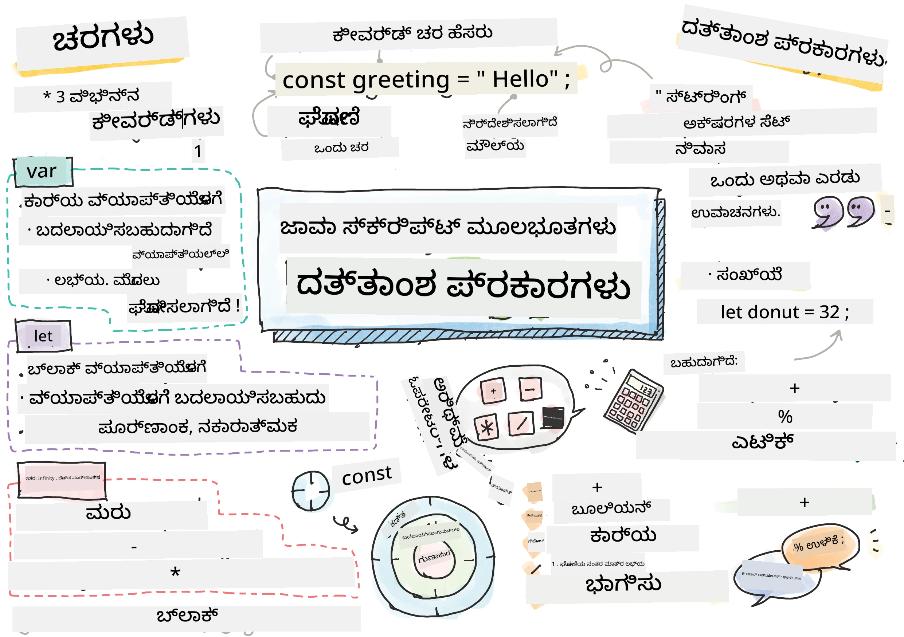  
> ಪರಿಚಿತ್ರಣ: [Tomomi Imura](https://twitter.com/girlie_mac)

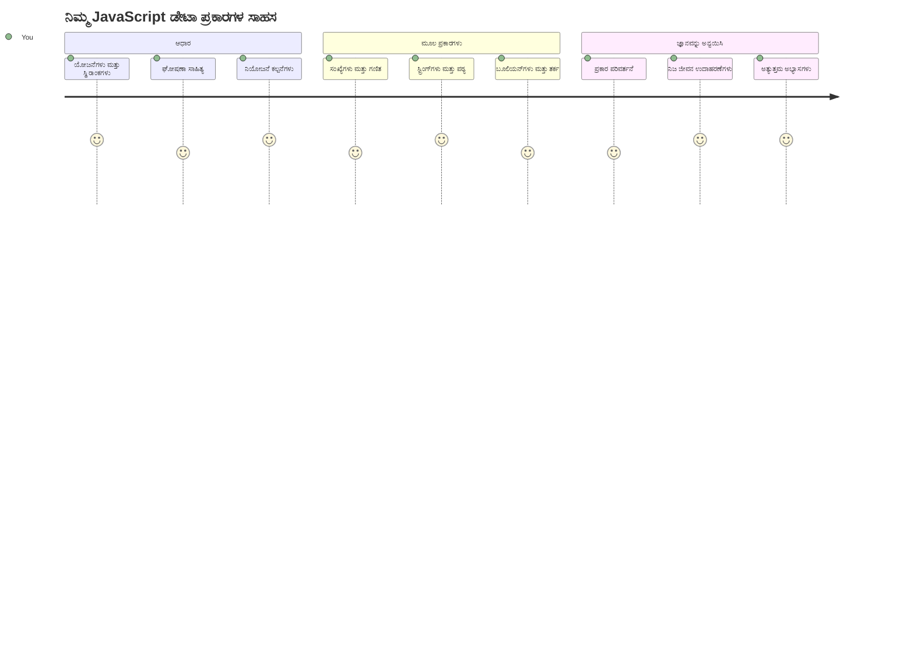
ಡೇಟಾ ಪ್ರಕಾರಗಳು ಜಾವಾಸ್ಕ್ರಿಪ್ಟ್‌ನ ಮೂಲಭೂತ ತತ್ವಗಳಲ್ಲಿ ಒಂದಾಗಿದ್ದು, ನೀವು ಬರೆಯುವ ಪ್ರತಿಯೊಂದು ಕಾರ್ಯಕ್ರಮದಲ್ಲೂ ನೀವು ಅವುಗಳನ್ನು ಎದುರಿಸುವಿರಿ. ಡೇಟಾ ಪ್ರಕಾರಗಳನ್ನು ಪ್ರಾಚೀನ ಅಲೆಕ್ಸಾಂಡ್ರಿಯಾ ಗ್ರಂಥಗಾರರು ಬಳಸಿದ ಫೈಲಿಂಗ್ ವ್ಯವಸ್ಥೆಯಂತೆ ಪರಿಗಣಿಸಿ – ಅವರೆಲ್ಲಾ ಕವಿತೆ, ಗಣಿತ ಮತ್ತು ಇತಿಹಾಸ ಸಂಬಂಧಿತ ವರದಿಗಳಿರುವ ಸ್ಕ್ರೋಲ್ಗಳಿಗೆ ವಿಶಿಷ್ಟ ಸ್ಥಳಗಳನ್ನು ಹೊಂದಿದ್ದರು. ಜಾವಾಸ್ಕ್ರಿಪ್ಟ್ ವಿವಿಧ ರೀತಿಯ ಡೇಟಾಗಾಗಿ ವಿಭಿನ್ನ ವರ್ಗಗಳನ್ನು ಹೊಂದಿದ್ದು, ಮಾಹಿತಿ ಸಂರಚಿಸಲು ಇದೇ ರೀತಿಯ ವ್ಯವಸ್ಥೆಯನ್ನು ಹೊಂದಿದೆ.

ಈ ಪಾಠದಲ್ಲಿ, ನಾವು ಜಾವಾಸ್ಕ್ರಿಪ್ಟ್ ಹೇಗೆ ಕಾರ್ಯನಿರ್ವಹಿಸುತ್ತದೆ ಎಂಬುದರ ಮುಖ್ಯ ಡೇಟಾ ಪ್ರಕಾರಗಳನ್ನು ಅನ್ವೇಷಿಸುವೆವು. ಸಂಖ್ಯೆಗಳು, ಪಠ್ಯ, ಸತ್ಯ/ಅಸತ್ಯ ಮೌಲ್ಯಗಳ ಹಿಂತಿಕ್ಕುವಿಕೆ ಹೇಗೆ ಮಾಡಬೇಕು ಎಂದು ನೀವು ಕಲಿಯುತ್ತೀರಿ ಮತ್ತು ಸರಿಯಾದ ಪ್ರಕಾರ ಆಯ್ಕೆ ಮಾಡುವುದು ನಿಮ್ಮ ಕಾರ್ಯಕ್ರಮಗಳಿಗೆ ಕಟ್ಟುನಿಟ್ಟಾಗಿರುವುದನ್ನು ಅರ್ಥಮಾಡಿಕೊಳ್ಳುತ್ತೀರಿ. ಈ ತತ್ವಗಳು ಮೊದಲಿಗೆ ಅಸ್ಥಿರವಾಗಿರಬಹುದು, ಆದರೆ ಅಭ್ಯಾಸದೊಂದಿಗೆ ಅವು ಪ್ರಾಕೃತಿಕವಾಗುತ್ತವೆ.

ಡೇಟಾ ಪ್ರಕಾರಗಳನ್ನು ತಿಳಿದುಕೊಳ್ಳುವುದರಿಂದ ಜಾವಾಸ್ಕ್ರಿಪ್ಟ್‌ನ ಉಳಿದ ವಿಷಯಗಳು ಸ್ಪಷ್ಟವಾಗುತ್ತವೆ. ಕಟ್ಟಡವಾಸ್ತುಕಾರರು ಕೀರ್ಚ್ಯ ವಿಚಾರಿಸುವ ಮುಂಚೆ ಬರುವ ವಿವಿಧ ನಿರ್ಮಿತ ಸಾಮಗ್ರಿಗಳನ್ನು ತಿಳಿದುಕೊಳ್ಳಬೇಕಾಗಿರುವಂತೆ, ಈ ಮೂಲಭೂತಾಂಶಗಳು ನೀವು ಮುಂದೆ ನಿರ್ಮಿಸುವ ಎಲ್ಲದಿಗೂ ಬೆಂಬಲ ನೀಡುತ್ತವೆ.

## ಪಾಠದ ಪೂರ್ವಪ್ರಶ್ನೆಯು

[Pre-lecture quiz](https://ff-quizzes.netlify.app/web/)  

ಈ ಪಾಠವು ಜಾಲತಾಣದಲ್ಲಿ ಪರಸ್ಪರ ಕ್ರಿಯಾತ್ಮಕತೆಯನ್ನು ಒದಗಿಸುವ ಜಾವಾಸ್ಕ್ರಿಪ್ಟ್‌ನ ಮೂಲಭೂತಾಂಶಗಳನ್ನು ಒಳಗೊಂಡಿದೆ.

> ನೀವು ಈ ಪಾಠವನ್ನು [Microsoft Learn](https://docs.microsoft.com/learn/modules/web-development-101-variables/?WT.mc_id=academic-77807-sagibbon) ನಲ್ಲಿ ಕೂಡ ಪಡೆಯಬಹುದು!

[](https://youtube.com/watch?v=JNIXfGiDWM8 "Variables in JavaScript")

[](https://youtube.com/watch?v=AWfA95eLdq8 "Data Types in JavaScript")

> 🎥 ಬದಲಿಗೆ ಉಪರಿರುವ ಚಿತ್ರಗಳನ್ನು ಕ್ಲಿಕ್ ಮಾಡಿ, ವೈವಿಧ್ಯಗಳು ಮತ್ತು ಡೇಟಾ ಪ್ರಕಾರಗಳ ಬಗ್ಗೆ ವಿಡಿಯೋಗಳನ್ನು ವೀಕ್ಷಿಸಿ

ದಾರಿಬದ್ಧವಾಗಿ ವ್ಯತ್ಯಯಗಳು ಮತ್ತು ಅವುಗಳನ್ನು ತುಂಬುವ ಡೇಟಾ ಪ್ರಕಾರಗಳಿಂದ ಪ್ರಾರಂಭಿಸೋಣ!

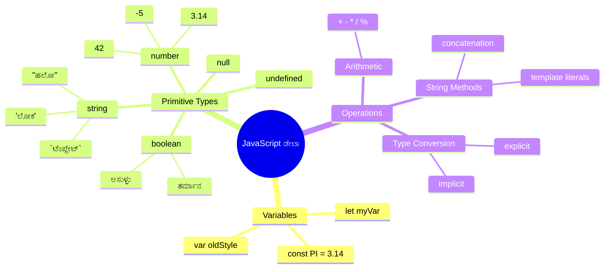
## ವ್ಯತ್ಯಯಗಳು

ವ್ಯತ್ಯಯಗಳು ಪ್ರೋಗ್ರಾಮ್ ರಚನೆಯಲ್ಲಿ ಮೂಲಭೂತ ಕಟ್ಟಡ ಬ್ಲಾಕ್‌ಗಳಾಗಿವೆ. ಮಧ್ಯಯುಗದ ರಸಾಯನಶಾಸ್ತ್ರಜ್ಞರು ವಿವಿಧ ಪದಾರ್ಥಗಳನ್ನು ಸಂಗ್ರಹಿಸಲು ಉಪಯೋಗಿಸಿದ ಲೇಬಲ್ ಸಿಕ್ಕಿದ ಜಾರಿನಂತೆ, ವ್ಯತ್ಯಯಗಳು ನಿಮಗೆ ಮಾಹಿತಿಯನ್ನು ಸಂಗ್ರಹಿಸಲು ಮತ್ತು ಅದಕ್ಕೆ ವಿವರಣಾತ್ಮಕ ಹೆಸರು ನೀಡಲು ಅವಕಾಶ ನೀಡುತ್ತವೆ, ಇದರಿಂದ ನೀವು ನಂತರ ಅದನ್ನು ಉಲ್ಲೇಖಿಸಬಹುದು. ಯಾರಾದರೂ ವಯಸ್ಸನ್ನು ನೆನಪಿಡಬೇಕೆ? ಅದನ್ನು `age` ಎಂಬ ವ್ಯತ್ಯಯದಲ್ಲಿ ಸಂರಕ್ಷಿಸಿ. ಬಳಕೆದಾರರ ಹೆಸರನ್ನು ಹೋಲಿಸಬೇಕೆ? ಅದನ್ನು `userName` ಎಂಬ ವ್ಯತ್ಯಯದಲ್ಲಿ ಇರಿಸಿ.

ನಾವು ಜಾವಾಸ್ಕ್ರಿಪ್ಟ್‌ನಲ್ಲಿ ವ್ಯತ್ಯಯಗಳನ್ನು ಸೃಷ್ಟಿಸುವ ಆಧುನಿಕ ವಿಧಾನವನ್ನು ಮೇಲೆ ಗಮನ ಹರಿಸುವೆವು. ನೀವು ಇಲ್ಲಿ ಕಲಿಯುವ ತಂತ್ರಗಳು ಭಾಷೆಯ ಮಾನ್ಯತೆ ಮತ್ತು ಉತ್ತಮ ಅಭ್ಯಾಸಗಳ ವರ್ಷಗಳ ಪ್ರದರ್ಶನವಾಗಿದೆ.

ವ್ಯತ್ಯಯವನ್ನು ರಚಿಸುವ ಹಾಗೂ ** اعلام ** (ಪ್ರಕಟಿಸುವ) ರೀತಿ ಈ ಕೆಳಗಿನ ರೂಪದಲ್ಲಿ ಇರುತ್ತದೆ **[ಕೀವರ್ಡ್] [ಹೆಸರು]**. ಇದು ಎರಡು ಭಾಗಗಳಿಂದ ಕೂಡಿದೆ:

- **ಕೀವರ್ಡ್**. ಬದಲಾಗಬಹುದಾದ ವ್ಯತ್ಯಯಗಳಿಗೆ `let` ಬಳಸಿ, ಮತ್ತು ಸ್ಥಿರ ಮೌಲ್ಯಗಳಿಗೆ `const` ಬಳಸಿ.
- **ವ್ಯತ್ಯಯದ ಹೆಸರು**, ಇದು ನೀವು ಸ್ವತಃ ಆಯ್ಕೆಮಾಡಿದ ವಿವರಣಾತ್ಮಕ ಹೆಸರು.

✅ ES6 ನಲ್ಲಿ ಪರಿಚಯಿಸಲ್ಪಟ್ಟ `let` ಕೀವರ್ಡ್ ನಿಮ್ಮ ವ್ಯತ್ಯಯಕ್ಕೆ ಒಂದು _ಬ್ಲಾಕ್ ಸ್ಕೋಪ್_ ಅನ್ನು ನೀಡುತ್ತದೆ. ಹಳೆಯ `var` ಕೀವರ್ಡ್ ಬದಲಿಗೆ `let` ಅಥವಾ `const` ಬಳಸಬೇಕೆಂದು ಶಿಫಾರಸು ಮಾಡಲಾಗಿದೆ. ಮುಂದಿನ ಭಾಗಗಳಲ್ಲಿ ನಾವು ಬ್ಲಾಕ್ ಸ್ಕೋಪ್ಗಳನ್ನು ಹೆಚ್ಚು ವಿವರದಿಂದ ಪರಿಶೀಲಿಸೋಣ.

### ಕಾರ್ಯ - ವ್ಯತ್ಯಯಗಳೊಂದಿಗೆ ಕಾರ್ಯನಿರ್ವಹಿಸುವುದು

1. **ವ್ಯತ್ಯಯವನ್ನು ಪ್ರಕಟಿಸಿ**. ನಮ್ಮ ಮೊದಲ ವ್ಯತ್ಯಯವನ್ನು ರಚಿಸುವುದರಿಂದ ಪ್ರಾರಂಭಿಸೋಣ:

    ```javascript
    let myVariable;
    ```
  
   **ಇದು ಏನು ಸಾಧಿಸುತ್ತದೆ:**
   - ಜಾವಾಸ್ಕ್ರಿಪ್ಟ್ ಗೆ `myVariable` ಎಂದು ಒಂದು ಸಂಗ್ರಹಸ್ಥಳವನ್ನು ರಚಿಸಲು ಹೇಳುತ್ತದೆ
   - ಜಾವಾಸ್ಕ್ರಿಪ್ಟ್ ಈ ವ್ಯತ್ಯಯಕ್ಕೆ ಮೆಮೊರಿಯಲ್ಲಿ ಸ್ಥಳವನ್ನು ಮೀಸಲಿಡುತ್ತದೆ
   - ಈ ಸಮಯದಲ್ಲಿ ವ್ಯತ್ಯಯದ ಮೌಲ್ಯವಿಲ್ಲ (ಅನಿರ್ಧಿಷ್ಟ)

2. **ಅದಕ್ಕೆ ಮೌಲ್ಯ ನೀಡಿ**. ಈಗ ನಮ್ಮ ವ್ಯತ್ಯಯದಲ್ಲಿ ಯಾವುದಾದರೂ ಮೌಲ್ಯವನ್ನು ಇರಿಸೋಣ:

    ```javascript
    myVariable = 123;
    ```
  
   **ನಿಯುಕ್ತಿಯ ಕಾರ್ಯಪದ್ಧತಿ:**
   - `=` ನಿರುತ್ತರಿಕಾರಕವು 123 ಎಂಬ ಮೌಲ್ಯವನ್ನು ನಮಗೆ ನೀಡಿದ ವ್ಯತ್ಯಯಕ್ಕೆ ನಿಯೋಜಿಸುತ್ತದೆ
   - ವ್ಯತ್ಯಯ ಈಗ ಅನಿರ್ಧಿಷ್ಟದಿಂದ ಈ ಮೌಲ್ಯವನ್ನು ಹೊಂದಿದೆ
   - ನೀವು `myVariable` ಬಳಸಿ ಕಾರ್ಯಕ್ರಮದಲ್ಲಿ ಈ ಮೌಲ್ಯವನ್ನು ಉಲ್ಲೇಖಿಸಬಹುದು

   > ಟಿಪ್ಪಣಿ: ಇಲ್ಲಿ `=` ಬಳಸುವವು ಎಂದರೆ 'ನಿಯೋಜನೆ ನಿರುತ್ತರಿಕಾರಕ'ರಿಂದ ಮೌಲ್ಯವೊಂದು ವ್ಯತ್ಯಯಕ್ಕೆ ನೀಡುವ ಕಾರ್ಯ. ಇದು ಸಮತೆ舟 ಸೂಚಿಸುವುದಿಲ್ಲ.

3. **ಸಮಜದಾರಿಯಾದ ಕ್ರಮ ಆಕ್ರಮಿಸಿ**. ಆ ಮರಳಿ, ಆ ಎರಡು ಹಂತವನ್ನು ಒಂದೇ Statement ನಲ್ಲಿ ವಿಂಗಡಿಸೋಣ:

    ```javascript
    let myVariable = 123;
    ```
  
    **ಈ ವಿಧಾನ ಹೆಚ್ಚು ಪರಿಣಾಮಕಾರಿ:**
    - ನೀವು ವ್ಯತ್ಯಯವನ್ನು ಪ್ರಕಟಿಸುತ್ತಿದ್ದೀರಿ ಮತ್ತು ಮೌಲ್ಯವನ್ನು ನಿಯೋಜಿಸುತ್ತಿದ್ದೀರಿ
    - ಇದು ಅಭಿವೃದ್ಧಿಗಾರರ ನಡುವೆ ಮಾನ್ಯ ಮಾರ್ಗವಾಗಿದೆ
    - ಸ್ವಚ್ಛತೆ ಉಳಿಸಿಕೊಂಡು ಕೋಡ್ ಉದ್ದವನ್ನು ಕಡಿಮೆಮಾಡುತ್ತದೆ

4. **ನಿಮ್ಮ ಮನಸ್ಸು ಬದಲಾಯಿಸಿ**. ಬೇರೆ ಸಂಖ್ಯೆ ಸಂಗ್ರಹಿಸಲು ಬಯಸಿದರೆ ಏನು?

   ```javascript
   myVariable = 321;
   ```
  
   **ಪುನಃ ನಿಯೋಜನೆಯನ್ನು ಅರ್ಥಮಾಡಿಕೊಳ್ಳುವುದು:**
   - ಈಗ ವ್ಯತ್ಯಯವು 123 ಬದಲಾಗಿ 321 ಹೊಂದಿದೆ
   - ಹಿಂದಿನ ಮೌಲ್ಯ ಬದಲಾಗುತ್ತದೆ – ವ್ಯತ್ಯಯಗಳು ಒಂದೇ ಸಮಯದಲ್ಲಿ ಒಬ್ಬ ಮೌಲ್ಯವನ್ನಷ್ಟೇ ಸಂಗ್ರಹಿಸುತ್ತವೆ
   - ಈ ಬದಲಾಯಿಸಬಹುದಾದ ಸ್ವಭಾವವು `let` ನೊಂದಿಗೆ ಪ್ರಕಟಿಸಲ್ಪಡುವ ವ್ಯತ್ಯಯಗಳ ಪ್ರಮುಖ ಲಕ್ಷಣ

   ✅ ಪ್ರಯತ್ನಿಸಿ! ನಿಮ್ಮ ಬ್ರೌಸರ್‌ನಲ್ಲಿ ನೇರವಾಗಿ ಜಾವಾಸ್ಕ್ರಿಪ್ಟ್ ಬರೆಯಬಹುದು. ಬ್ರೌಸರ್ ವಿಂಡೋವನ್ನು ತೆರೆಯಿರಿ ಮತ್ತು ಡೆವಲಪರ್ ಟೂಲ್ಸ್ಗೆ ಹೋಗಿ. ಕಾನ್ಸೋಲಿನಲ್ಲಿ `let myVariable = 123` ಎಂದು ಟೈಪ್ ಮಾಡಿ, ರಿಟರ್ನ್ ಒತ್ತಿ, ನಂತರ `myVariable` ಟೈಪ್ ಮಾಡಿ. ಏನಾಗುತ್ತದೆ ನೋಡಿ? ಮುಂದಿನ ಪಾಠಗಳಲ್ಲಿ ಈ ತತ್ವಗಳ ಬಗ್ಗೆ ಹೆಚ್ಚು ಕಲಿಯಲು ಸಿಗುತ್ತದೆ.

### 🧠 **ವ್ಯತ್ಯಯಗಳ ನಿಪುಣತೆ ಪರಿಶೀಲನೆ: ಸ್ವಾಪ್ತರಾಗು**

**ನೀವು ವ್ಯತ್ಯಯಗಳ ಬಗ್ಗೆ ಹೇಗೆ ಭಾವಿಸುತ್ತಿದ್ದೀರೆನ್ನೋ ನೋಡಿ:**
- ವ್ಯತ್ಯಯವನ್ನು ಪ್ರಕಟಿಸುವುದು ಮತ್ತು ಮೌಲ್ಯವನ್ನು ನಿಯೋಜಿಸುವ ನಡುವೆ ವ್ಯತ್ಯಾಸವನ್ನು ವಿವರಣೆ ಮಾಡಬಲ್ಲೀರಾ?
- ಪ್ರತಿ ನೀವು ಒಂದು ವ್ಯತ್ಯಯವನ್ನು ಪ್ರಕಟಿಸುವ ಮೊದಲು ಪ್ರಯೋಗಿಸಲು ಯತ್ನಿಸಿದರೆ ಏನಾಗುತ್ತದೆ?
- ಯಾವಾಗ ನೀವು `let` ಅನ್ನು ವ್ಯತ್ಯಯಕ್ಕೆ `const` ಬದಲಿಗೆ ಆಯ್ಕೆಮಾಡುತ್ತೀರಿ?

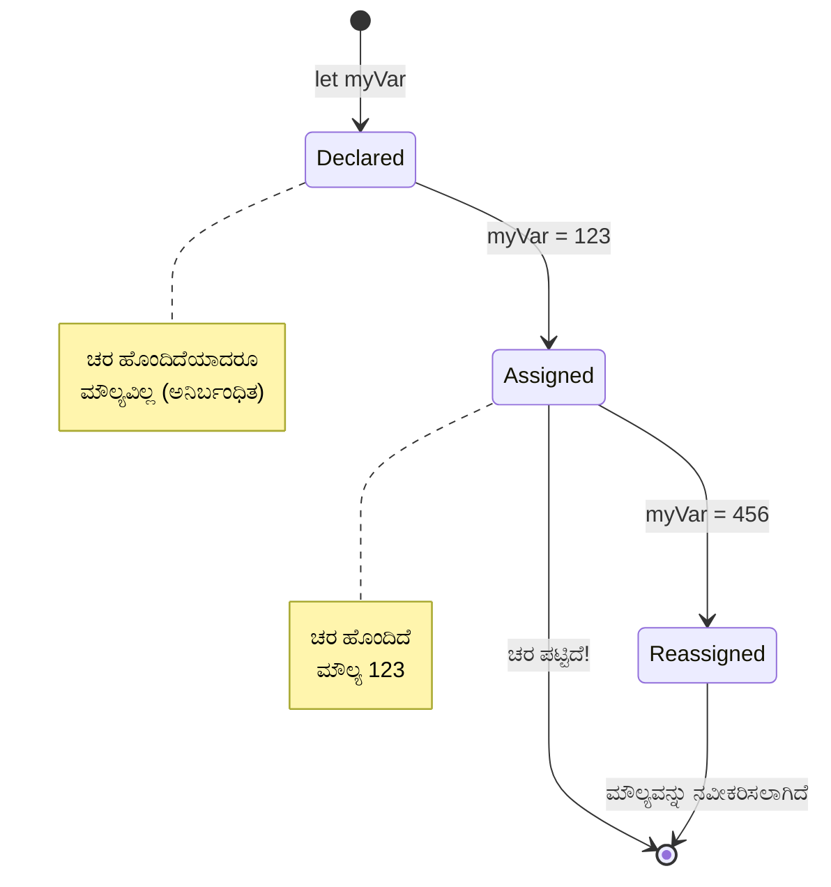
> **ತ್ವರಿತ ಸಲಹೆ**: ವ್ಯತ್ಯಯಗಳನ್ನು ಲೇಬಲ್ ಇರುವ ಸಂಗ್ರಹದ ಬಾಕ್ಸ್‌ಗಳಂತೆ ಭಾವಿಸಿ. ನೀವು ಬಾಕ್ಸ್ ರಚಿಸುತ್ತಿದ್ದೀರಿ (`let`), ಅದರಲ್ಲಿ ಏನಾದರೂ ಇಡುತ್ತೀರಿ (`=`), ಮತ್ತು ಬೇರೆ ವೇಳೆ ಅದರ ಒಳಗಿನ ವಿಷಯವನ್ನು ಬದಲಾಯಿಸಬಹುದು!

## ಸ್ಥಿರಾಂಕಗಳು

ಕೆಲವೊಮ್ಮೆ ಕಾರ್ಯಕ್ರಮ ನಿರ್ವಹಣೆಯ ಸಮಯದಲ್ಲಿ ಎಂದಿಗೂ ಬದಲಾಗದೆ ಇರಬೇಕಾದ ಮಾಹಿತಿಯನ್ನು ಸಂಗ್ರಹಿಸಬೇಕಾಗುತ್ತದೆ. ಸ್ಥಿರಾಂಕಗಳನ್ನು ಪ್ರಾಚೀನ ಗ್ರೀಸ್‌ನ ಯೂಕ್ಲಿಡ್ ಸ್ಥಾಪಿಸಿದ ಗಣಿತ ತತ್ವಗಳಂತೆ ಪರಿಗಣಿಸಿ – ಒಮ್ಮೆ ತೋರಿಸಿಕೊಂಡು ದಾಖಲಾಗಿದೆ ಎಂದರೆ ಮುಂದಿನ ಸಂಧರ್ಭಕ್ಕೆ ಸ್ಥಿರವಾಗಿ ಉಳಿದಿವೆ.

ಸ್ಥಿರಾಂಕಗಳು ವ್ಯತ್ಯಯಗಳಂತೆ ಕೆಲಸಮಾಡುತ್ತವೆ, ಆದರೆ ಮಹತ್ವದ ನಿರ್ಬಂಧವೊಂದಿದೆ: ಒಮ್ಮೆ ಅವುಕ್ಕೆ ಮೌಲ್ಯ ನೀಡಿದಾಗ, ಅದನ್ನು ಬದಲಾಯಿಸಲಾಗುವುದಿಲ್ಲ. ಈ ಅಚಲತೆ ನಿಮ್ಮ ಕಾರ್ಯಕ್ರಮದಲ್ಲಿ ಪ್ರಮುಖ ಮೌಲ್ಯಗಳಿಗೆ ತಪ್ಪು ಬದಲಾವಣೆಗಳನ್ನು ತಡೆಯುತ್ತದೆ.

ಸ್ಥಿರಾಂಕಗಳನ್ನು ಪ್ರಕಟಿಸುವುದು ಮತ್ತು ಪ್ರಾರಂಭಿಸುವುದು ವ್ಯತ್ಯಯಗಳಿಗೆ ಹೋಲಿಕೆಮಾಡಿದಾಗ ಯಥೇಚ್ಛವಾಗಿ ಇರುತ್ತದೆ, ಆದರೆ ಕೀವರ್ಡ್ `const` ಆಗಿರುತ್ತವೆ. ಸ್ಥಿರಾಂಕಗಳು ಸಾಮಾನ್ಯವಾಗಿ ಎಲ್ಲಾ ಅಕ್ಷರಗಳು ದೊಡ್ಡಕ್ಷರಗಳಾದ ಹೆಸರಿನಿಂದ ಪ್ರಕಟಿಸಲಾಗುತ್ತವೆ.

```javascript
const MY_VARIABLE = 123;
```
  
**ಈ ಕೋಡ್ ಏನು ಮಾಡುತ್ತದೆ:**
- `MY_VARIABLE` ಎಂಬ ಸ್ಥಿರಾಂಕವನ್ನು ಮೌಲ್ಯ 123 ರೊಂದಿಗೆ ರಚಿಸುತ್ತದೆ
- ಸ್ಥಿರಾಂಕಗಳಿಗೆ ಹೆಚ್ಚುವರಿಯಾಗಿ ದೊಡ್ಡಕ್ಷರಗಳ ಹೆಸರಿನ ವ್ಯವಸ್ಥೆಯನ್ನು ಬಳಕೆ ಮಾಡುತ್ತದೆ
- ಈ ಮೌಲ್ಯಕ್ಕೆ ಯಾವುದೇ ಭವಿಷ್ಯದ ಬದಲಾವಣೆಗಳನ್ನು ನಿರ್ಬಂಧಿಸುತ್ತದೆ

ಸ್ಥಿರಾಂಕಗಳಿಗೆ ಎರಡು ಪ್ರಮುಖ ನಿಯಮಗಳಿವೆ:

- **ನಿಮಗೆ ಅವುಗಳಿಗೆ ಕೂಡಲೇ ಮೌಲ್ಯ ನೀಡಬೇಕಾಗುತ್ತದೆ** – ಖಾಲಿ ಸ್ಥಿರಾಂಕ ಬೇಡ!
- **ನೀವು ಆ ಮೌಲ್ಯವನ್ನು ಎಂದಿಗೂ ಬದಲಾಯಿಸಬಾರದು** – ನೀವು ಪ್ರಯತ್ನಿಸಿದರೆ, ಜಾವಾಸ್ಕ್ರಿಪ್ಟ್ ಉದ್ಧಟಿಸಿಬಿಡುತ್ತದೆ. ಇದನ್ನೂ ನೋಡೋಣ:

   **ಸರಳ ಮೌಲ್ಯ** - ಕೆಳಗಿನವು ಅಂಗೀಕಾರಾರ್ಹವಿಲ್ಲ:
   
      ```javascript
      const PI = 3;
      PI = 4; // ಅಂಗೀಕಾರಾರ್ಹವಿಲ್ಲ
      ```

   **ನಿಮಗೆ ನೆನಪಿಸುವುದು:**
   - ಸ್ಥಿರಾಂಕದ ಮೌಲ್ಯವನ್ನು ಮರುಹೊಂದಿಸಲು ಅವಕಾಶ ಇಲ್ಲದಿರುವುದು
   - ಪ್ರಮುಖ ಮೌಲ್ಯಗಳನ್ನು ತಪ್ಪು ಬದಲಾವಣೆಗಳಿಂದ ರಕ್ಷಿಸುವುದು
   - ನಿಮ್ಮ ಕಾರ್ಯಕ್ರಮದಲ್ಲಿ ಮೌಲ್ಯ ಸತತವಾಗಿರುತ್ತದೆ ಎಂದು ಖಚಿತಪಡಿಸುವುದು
 
   **ವಸ್ತು ಸೃಜನೆಯ ರಕ್ಷಣೆ** - ಕೆಳಗಿನವು ಅಂಗೀಕಾರಾರ್ಹವಿಲ್ಲ:
   
      ```javascript
      const obj = { a: 3 };
      obj = { b: 5 } // ಅಂಗೀಕಾರಾರ್ಹವಿಲ್ಲ
      ```

   **ಈ ತತ್ವಗಳನ್ನು ಅರ್ಥಮಾಡಿಕೊಳ್ಳುವುದು:**
   - ಒಟ್ಟು ವಸ್ತುವನ್ನು ಹೊಸದಾಗಿ ಬದಲಾಯಿಸುವುದನ್ನು ತಡೆಹಿಡಿಯುತ್ತದೆ
   - ಮೂಲ ವಸ್ತುಕ್ಕೆ ಇದ್ದ ಮಾಹಿತಿಯ ರಫ್ತಿಯನ್ನು ರಕ್ಷಿಸುತ್ತದೆ
   - ಮೆಮೊರಿಯಲ್ಲಿ ವಸ್ತುವಿನ ಗುರುತು ಕಾಪಾಡುತ್ತದೆ

    **ವಸ್ತು ಮೌಲ್ಯವನ್ನು ರಕ್ಷಿಸುವುದಿಲ್ಲ** - ಈ ಕೆಳಗಿನವು ಅಂಗೀಕಾರಾರ್ಹ:
    
      ```javascript
      const obj = { a: 3 };
      obj.a = 5;  // ಅಂಗೀಕಾರಾರ್ಹ
      ```

      **ಇಲ್ಲಿ ಏನಾಗುತ್ತದೆ ವಿವರಿಸುವುದು:**
      - ವಸ್ತುವಿನ ಒಳಗಿನ ಗುಣಲಕ್ಷಣ ಮೌಲ್ಯ ಬದಲಾಗುತ್ತದೆ
      - ವಸ್ತುವಿನ ಗುರುತು ಒಂದೇ ಹಾಗೆ ಇರುತ್ತದೆ
      - ಗುರೂತ್ವದೊಳಗಿನ ವಿಷಯವನ್ನು ಬದಲಾಯಿಸಬಹುದು ಮತ್ತು ಅದೆಂದು ಗುರುತು ಸ್ಥಿರವಾಗಿರುತ್ತದೆ ಎಂದು ತೋರಿಸುತ್ತದೆ

   > ಗಮನಿಸಿ, `const` ಎಂದರೆ ಗುರುತನ್ನು ಮರುಹೊಂದಿಸುವುದರಿಂದ ರಕ್ಷಿಸಿ ನೀಡುತ್ತದೆ. ಮೌಲ್ಯ _ಅಚಲ_ ಅಲ್ಲವೆ ಮತ್ತು ಬದಲಾಯಿಸಬಹುದಾಗಿದೆ, ವಿಶೇಷವಾಗಿ ಅದು ಸಂಕೀರ್ಣ ನಿರ್ಮಾಣವಾಗಿದ್ದರೆ, ಉದಾಹರಣೆಗೆ ವಸ್ತು.

## ಡೇಟಾ ಪ್ರಕಾರಗಳು

ಜಾವಾಸ್ಕ್ರಿಪ್ಟ್ ಮಾಹಿತಿಯನ್ನು ವಿವಿಧ ವರ್ಗಗಳಾದ ಡೇಟಾ ಪ್ರಕಾರಗಳಲ್ಲಿ ಸಂಘಟಿಸುತ್ತದೆ. ಈ ತತ್ವವು ಪ್ರಾಚೀನ ಪಂಡಿತರ ಜ್ಞಾನ ವರ್ಗೀಕರಣದಂತೆ – ಅರಿಸ್ಟೋಟಲ್ ವ್ಯತ್ಯಾಸದ ತತ್ತ್ವಗಳನ್ನು ಪರಿಗಣಿಸಿ, ಕವಿತೆ, ಗಣಿತ ಮತ್ತು ನೈಸರ್ಗಿಕ ತತ್ವಶಾಸ್ತ್ರವನ್ನು ಸಮಾನವಾಗಿ ಮುಖ್ಯವಾಗಿ ಮಾಡಲಾರದಂತೆ ತಿಳಿಯುತ್ತಿದ್ದರು.

ಡೇಟಾ ಪ್ರಕಾರಗಳಿಗೆ ಮಹತ್ವವಿರುವುದು, ಬೇರೆ ಬೆಳೆಗಳು ವಿಭಿನ್ನ ರೀತಿಯ ಮಾಹಿತಿಗೆ ಭಿನ್ನವಾಗಿ ಕಾರ್ಯನಿರ್ವಹಿಸುತ್ತವೆ. ವ್ಯಕ್ತಿಯ ಹೆಸರಿನಲ್ಲಿ ಗಣಿತ ಅಥವಾ ಗಣಿತ ಸಮೀಕರಣವನ್ನು ವರ್ಣಮರೆ ಪದ್ಧತಿಯಲ್ಲಿ ಬರೆಯಲು ಸಾಧ್ಯವಿಲ್ಲ, ಹಾಗಾಗಿ ಜಾವಾಸ್ಕ್ರಿಪ್ಟ್ ಪ್ರತಿ ಕಾರ್ಯಕ್ಕೆ ಸರಿಯಾದ ಡೇಟಾ ಪ್ರಕಾರವನ್ನು ಅವಲಂಬಿಸುತ್ತದೆ. ಇದರ ಅರಿವಿನಿಂದ ದೋಷಗಳನ್ನು ತಡೆಯಲು ಮತ್ತು ನಿಮ್ಮ ಕೋಡ್ ವಿಶ್ವಾಸಾರ್ಹವಾಗಿಸುತ್ತದೆ.

ವ್ಯತ್ಯಯಗಳು ಸಂಖ್ಯೆ ಮತ್ತು ಪಠ್ಯ ಮೊದಲಾದ ವಿವಿಧ ಮೌಲ್ಯಗಳನ್ನು ಸಂಗ್ರಹಿಸಬಹುದು. ಈ ವಿಭಿನ್ನ ಮೌಲ್ಯಗಳಿಗೆ ಸೇರಿದ ಪ್ರಕಾರಗಳನ್ನು **ಡೇಟಾ ಪ್ರಕಾರ** ಎಂದು ಕರೆಯುತ್ತಾರೆ. ಡೇಟಾ ಪ್ರಕಾರಗಳು ಸಂರಚನಾ ನಿರ್ವಹಣೆಯಲ್ಲಿ ಪ್ರಮುಖ ಪಾತ್ರ ವಹಿಸುತ್ತವೆ ಏಕೆಂದರೆ ಅವು ಪ್ರೋಗ್ರಾಮರ್ಸ್‌ಗೆ ಹೇಗೆ ಕೋಡ್ ಬರೆಯಬೇಕು ಮತ್ತು ಸಾಫ್ಟ್‌ವೇರ್ ಹೇಗೆ ಕಾರ್ಯನಿರ್ವಹಿಸಬೇಕು ಎಂಬುದರಲ್ಲಿ ನಿರ್ಧಾರಗಳನ್ನು ತೆಗೆದುಕೊಳ್ಳಲು ಸಹಾಯ ಮಾಡುತ್ತವೆ. ಇನ್ನೂ ಕೆಲವು ಡೇಟಾ ಪ್ರಕಾರಗಳ ವಿಶೇಷ ಲಕ್ಷಣಗಳಿವೆ, ಅವು ಮೌಲ್ಯದಲ್ಲಿ ಹೆಚ್ಚುವರಿ ಮಾಹಿತಿಯನ್ನು ರೂಪಾಂತರಿಸಲು ಅಥವಾ ಹೊರತೆಗೆದುಕೊಂಡು ಉಪಯೋಗಿಸಲು ಸಹಾಯ ಮಾಡುತ್ತವೆ.

✅ ಡೇಟಾ ಪ್ರಕಾರಗಳು ಜಾವಾಸ್ಕ್ರಿಪ್ಟ್ ಡೇಟಾ ಮೂಲತತ್ವಗಳೆಂದು ಕೂಡ ಕರೆಸಿಕೊಳ್ಳುತ್ತವೆ, ಏಕೆಂದರೆ ಇವು ಭಾಷೆಯಿಂದ ಒದಗಿಸಲಾಗುವ ಅತ್ಯಂತ ಕಡಿಮೆ ಮಟ್ಟದ ಡೇಟಾ ಪ್ರಕಾರಗಳು. 7 ಮೂಲತತ್ವಗಳ ಪ್ರಕಾರಗಳಿವೆ: ಸರಣಿ (string), ಸಂಖ್ಯೆ (number), ಬಿಗ್‌ಇಂಟ್ (bigint), ಬೂಲಿಯನ್ (boolean), ಅನಿರ್ಧಿಷ್ಟ (undefined), ಶೂನ್ಯ (null) ಮತ್ತು ಸಂಕೇತ (symbol). ಇವುಗಳ ಪ್ರತಿಯೊಂದು ಯಾವದನ್ನು ಪ್ರತಿನಿಧಿಸಬಹುದು ಎಂಬುದನ್ನು ನಿಮಗೆ ಕಲ್ಪನೆ ಮಾಡಿ. `zebra` ಎಂದರೆ ಏನು? `0` ಯಾ? `true` ಯಾ?

### ಸಂಖ್ಯೆಗಳು

ಸಂಖ್ಯೆಗಳು ಜಾವಾಸ್ಕ್ರಿಪ್ಟ್‌ನ ಅತ್ಯಂತ ಸರಳ ಡೇಟಾ ಪ್ರಕಾರ. ನೀವು 42 ಮೊದಲನೆಯ ಪೂರ್ಣ ಸಂಖ್ಯೆ, 3.14 ಡಶಮಾಂಶ ಅಥವಾ -5 ಪ್ರತಿಕೂಲ ಸಂಖ್ಯೆಗಳನ್ನು ಬಳಸಿದ್ರೂ, ಜಾವಾಸ್ಕ್ರಿಪ್ಟ್ ಅವುಗಳನ್ನು ಏಕಸಮಾನವಾಗಿ ನಿರ್ವಹಿಸುತ್ತದೆ.

ನಮ್ಮ ಹಿಂದಿನ ವ್ಯತ್ಯಯ ನೆನಪಿದೆಯೇ? ನಾವು ಸಂಗ್ರಹಿಸಿದ 123 ನಂಬರು ಡೇಟಾ ಪ್ರಕಾರ ಎನ್ನಬಹುದು:

```javascript
let myVariable = 123;
```
  
**ಮುಖ್ಯ ಲಕ್ಷಣಗಳು:**
- ಜಾವಾಸ್ಕ್ರಿಪ್ಟ್ ಸ್ವಯಂಚಾಲಿತವಾಗಿ ಸಂಖ್ಯಾತ್ಮಕ ಮೌಲ್ಯಗಳನ್ನು ಗುರುತಿಸುತ್ತದೆ
- ನೀವು ಈ ವ್ಯತ್ಯಯಗಳೊಂದಿಗೆ ಗಣಿತ ಕಾರ್ಯಗಳನ್ನು ನೆರವೇರಿಸಬಹುದು
- ಸ್ಪಷ್ಟವಾದ ಪ್ರಕಾರ ಪ್ರಕಟಣೆಯ ಅಗತ್ಯವಿಲ್ಲ

ವ್ಯತ್ಯಯಗಳು ಎಲ್ಲಾ ವಿಧದ ಸಂಖ್ಯೆಗಳನ್ನು, ಡಶಮಾಂಶ ಮತ್ತು ಪ್ರತಿಕೂಲ ಸಂಖ್ಯೆಗಳನ್ನೂ ಸೇರಿಸಿಕೊಂಡು ಸಂಗ್ರಹಿಸಬಹುದು. ಸಂಖ್ಯೆಗಳು ಗಣಿತೀಯ ನಿರುತ್ತರಿಕಾರಕರೊಂದಿಗೆ ಕೂಡ ಬಳಸಬಹುದು, ಇವುಗಳನ್ನು ಮುಂದಿನ [ಅರ್ಥಮೆಟಿಕ್ ನಿರುತ್ತರಿಕಾರಕರು](../../../../2-js-basics/1-data-types) ವಿಭಾಗದಲ್ಲಿ ವಿವರಿಸಲಾಗಿದೆ.

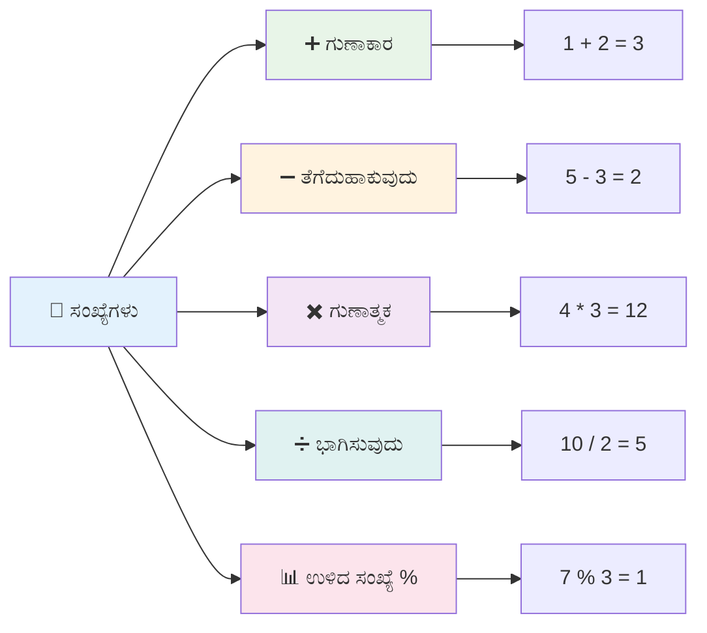
### ಅರ್ಥಮೆಟಿಕ್ ನಿರುತ್ತರಿಕಾರಕರು

ಅರ್ಥಮೆಟಿಕ್ ನಿರುತ್ತರಿಕಾರಕರು ಜಾವಾಸ್ಕ್ರಿಪ್ಟ್‌ನಲ್ಲಿ ಗಣಿತೀಯ ಮೌಲ್ಯವನ್ನು ಲೆಕ್ಕ ಹಾಕಲು ಅವಕಾಶ ನೀಡುತ್ತವೆ. ಈ ನಿರುತ್ತರಿಕಾರಕರು ಶತಮಾನಗಳ ಕಾಲ ಗಣಿತಜ್ಞರು ಉಪಯೋಗಿಸಿದ ಸಂಕೇತಗಳಂತೆ ಕೆಲಸ ಮಾಡುತ್ತವೆ – ಅಲ್ಖ್ವಾರಿಜ್ಮೀ ಮುಂತಾದ ಪಂಡಿತರ ಕಾರ್ಯಗಳಲ್ಲಿ ಕಂಡ ಬಂದ ವಿವರಣಾತ್ಮಕ ಗಣಿತ ಸಂಕೇತಗಳು.

ನಿರುತ್ತರಿಕಾರಕರು ಪಾರಂಪಾಯಿಕ ಗಣಿತದಂತೆ: ಕೂಡಲೆ ಸೇರಿಸುವುದಕ್ಕೆ +, ಕಡಿತ ಮಾಡಲು -, ಗುಣಿಸಲು *, ವಿಭಜಿಸಲು / ಮುಂತಾದವು.

ಅರ್ಥಮೆಟಿಕ್ ಕಾರ್ಯಗಳಲ್ಲಿ ಬಳಸಬೇಕಾದ ನಿರುತ್ತರಿಕಾರಕರ ಕೆಲವು ವಿಧಗಳು ಇವೆ, ಇವು ಕೆಳಕಂಡಂತೆ:

| ಸಂಕೇತ | ವಿವರಣೆ                                                                   | ಉದಾಹರಣೆ                         |
| ------ | ------------------------------------------------------------------------- | -------------------------------- |
| `+`    | **ಸೇರಿ ಹಾಕುವುದು**: ಎರಡು ಸಂಖ್ಯೆಗಳ ಮೊತ್ತ ಲೆಕ್ಕಹಾಕುತ್ತದೆ                    | `1 + 2 // ನಿರೀಕ್ಷಿತ ಉತ್ತರ 3`      |
| `-`    | **ಕಡಿತ**: ಎರಡು ಸಂಖ್ಯೆಗಳ ವ್ಯತ್ಯಾಸ ಲೆಕ್ಕಹಾಕುತ್ತದೆ                         | `1 - 2 // ನಿರೀಕ್ಷಿತ ಉತ್ತರ -1`     |
| `*`    | **ಗುಣಾಕಾರ**: ಎರಡು ಸಂಖ್ಯೆಗಳ ಗುಣಾಕಾರ ಲೆಕ್ಕಹಾಕುತ್ತದೆ                      | `1 * 2 // ನಿರೀಕ್ಷಿತ ಉತ್ತರ 2`      |
| `/`    | **ಭಾಗಿಸುವಿಕೆ**: ಎರಡು ಸಂಖ್ಯೆಗಳಾನ ಭಾಗದ ಫಲಿತಾಂಶ ಲೆಕ್ಕಹಾಕುತ್ತದೆ            | `1 / 2 // ನಿರೀಕ್ಷಿತ ಉತ್ತರ 0.5`    |
| `%`    | **ಶೇಷ**: ಎರಡು ಸಂಖ್ಯೆಗಳ ವಿಭಾಜನೆಯ ಶೇಷ ಲೆಕ್ಕಹಾಕುತ್ತದೆ                     | `1 % 2 // ನಿರೀಕ್ಷಿತ ಉತ್ತರ 1`      |

✅ ಪ್ರಯತ್ನಿಸಿ! ನಿಮ್ಮ ಬ್ರೌಸರಿನ ಕಾನ್ಸೋಲ್ನಲ್ಲಿ ಒಂದು ಅರ್ಥಮೆಟಿಕ್ ಕಾರ್ಯವನ್ನು ಮಾಡಿ. ಫಲಿತಾಂಶಗಳು ನಿಮಗೆ ಅಚ್ಚರಿಯಾಗುತ್ತವೆ ಎಂದು ನೋಡೋಣ?

### 🧮 **ಗಣಿತ ಕೌಶಲ್ಯ ಪರಿಶೀಲನೆ: ಆತ್ಮವಿಶ್ವಾಸದಿಂದ ಲೆಕ್ಕ ಹಾಕುವುದು**

**ನಿಮ್ಮ ಅರ್ಥಮೆಟಿಕ್ ತಿಳಿವಳಿಕೆಯನ್ನು ಪರೀಕ್ಷಿಸಿ:**
- `/` (ಭಾಗಿಸುವಿಕೆ) ಮತ್ತು `%` (ಶೇಷ) ನಡುವೆ ಯಾವ ವ್ಯತ್ಯಾಸವಿದೆ?
- `10 % 3` ಯ ಸಂಖ್ಯೆ ಪೂರೈಸುವ ಮೊತ್ತ ಏನು ಎಂದು ಮುನ್ಸೂಚಿಸಿ? (ಗೈಡ್: ಅದು 3.33 ಅಲ್ಲ...)
- ಶೇಷ ನಿರುತ್ತರಿಕಾರಕ ಪ್ರೋಗ್ರಾಮಿಂಗ್‌ಗೆ ಯಾಕೆ ಉಪಯುಕ್ತವಾಗಬಹುದು?

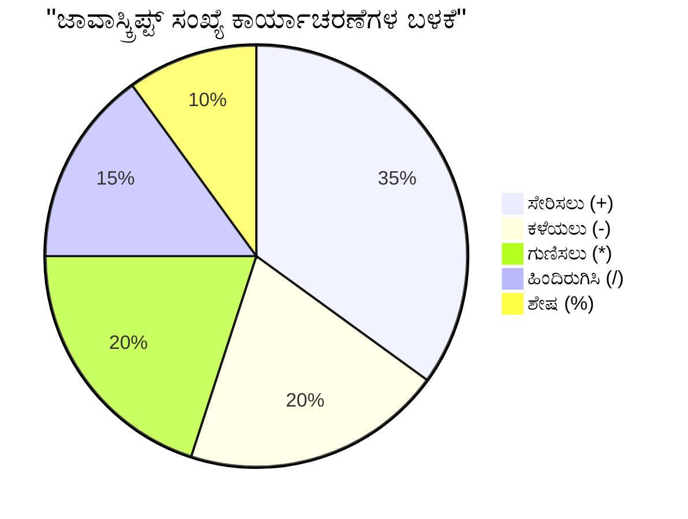
> **ನೈಜ-ಜಗತ್ತಿನ ಅರಿವು**: ಶೇಷ ನಿರುತ್ತರಿಕಾರಕ (%) ಸಂಖ್ಯೆಗಳು ಜೋಡಿ/ಏಕಕ, ಮಾದರಿಗಳನ್ನು ರಚಿಸಿ ಅಥವಾ ಯಾದೃಚ್ಛಿಕ ಮಿತಿಗಳನ್ನು ಎಡ/ಬಲ ಆಗಿಸುವದು ಮೊದಲಾದ ಕಾರ್ಯಗಳಿಗೆಲ್ಲ ಸಂತೋಷ್ಟಕರ.

### ಸರಣಿಗಳು (Strings)

ಜಾವಾಸ್ಕ್ರಿಪ್ಟ್‌ನಲ್ಲಿ, ಪಠ್ಯದ ಡೇಟಾಗಳನ್ನು ಸರಣಿಗಳೆಂದು ಪ್ರತಿನಿಧಿಸಲಾಗುತ್ತದೆ. "ಸರಣಿ" ಎಂಬ ಪದವು ಕ್ರಮವಾಗಿ ಅಕ್ಷರಗಳನ್ನು ಸರಣಿಯಾಗಿ ಜೋಡಿಸುವ ಕಲ್ಪನೆತಿಂದ ಬಂದಿದೆ, ಮಧ್ಯಯುಗದ ಮಠಗಳಲ್ಲಿ ಸ್ಕ್ರೈಬ್ಸ್ ತಮ್ಮ ಪಠ್ಯ ಲಿಪಿಗಳಲ್ಲಿ ಅಕ್ಷರಗಳನ್ನು ಸಂಯೋಜಿಸುವ ರೀತಿಯಂತೆ.

ಸರಣಿಗಳು ವೆಬ್ ಅಭಿವೃದ್ಧಿಗೆ ಮೂಲಮೂಲವಾಗಿವೆ. ವೆಬ್‌ಸೈಟ್‌ನಲ್ಲಿ ಪ್ರದರ್ಶಿಸಲಾದ ಪ್ರತಿಯೊಂದು ಪಠ್ಯ – ಬಳಕೆದಾರರ ಹೆಸರುಗಳು, ಬಟನ್ ಲೇಬಲ್‌ಗಳು, ದೋಷ ಸಂದೇಶಗಳು, ವಿಷಯಗಳು – ಸರಣಿ ಡೇಟಾದಂತೆ ನಿರ್ವಹಿಸಲಾಗುತ್ತವೆ. ಕಾರ್ಯಕಾರಿ ಬಳಕೆದಾರ ಇಂಟರ್‌ಫೇಸ್ಗಳನ್ನು ರಚಿಸುವ لاءِ ಸರಣಿಗಳನ್ನು ತಿಳಿದುಕೊಳ್ಳುವುದು ಅವಶ್ಯಕ.

ಸರಣಿಗಳು ನಾಗರಿಕ ಅಥವಾ ಡಬಲ್ ಕ್ವೋಟ್‌ನ ನಡುವಿನ ಅಕ್ಷರಗಳ ಸಂಗ್ರಹಗಳಾಗಿವೆ.

```javascript
'This is a string'
"This is also a string"
let myString = 'This is a string value stored in a variable';
```
  
**ಈ ತತ್ವಗಳನ್ನು ಅರ್ಥಮಾಡಿಕೊಳ್ಳುವುದು:**
- ಸರಣಿಗಳನ್ನು ನಿರ್ಧರಿಸಲು ಏಕರೂಪದ `'` ಅಥವಾ ಡಬಲ್ `" ` ಉಲ್ಲೇಖಗಳನ್ನು ಬಳಸುತ್ತದೆ
- ಅಕ್ಷರಗಳು, ಸಂಖ್ಯೆಗಳು ಮತ್ತು ಸಂಕೇತಗಳನ್ನು ಹೊಂದಬಹುದಾದ ಪಠ್ಯ ಡೇಟಾ ಸಂಗ್ರಹಿಸುತ್ತದೆ
- ನಂತರ ಬಳಕೆಗೆ ಸರಣಿಯ ಮೌಲ್ಯಗಳನ್ನು ವ್ಯತ್ಯಯಗಳಿಗೆ ನಿಯೋಜಿಸುತ್ತದೆ
- ಪಠ್ಯ ಮತ್ತು ವ್ಯತ್ಯಯ ಹೆಸರಿನ ವಿಭಿನ್ನತೆ ತಿಳಿಸಲು ಉಲ್ಲೇಖಗಳು ಅಗತ್ಯವಿದೆ

ಸರಣಿಯನ್ನು ಬರೆಯುವಾಗ ಉಲ್ಲೇಖಗಳನ್ನು ಬಳಸುವುದು ಮೆಚ್ಚಿನದು, ಇಲ್ಲದಿದ್ದರೆ ಜಾವಾಸ್ಕ್ರಿಪ್ಟ್ ಇದನ್ನು ವ್ಯತ್ಯಯದ ಹೆಸರಂದು ಪರಿಗಣಿಸುತ್ತದೆ.

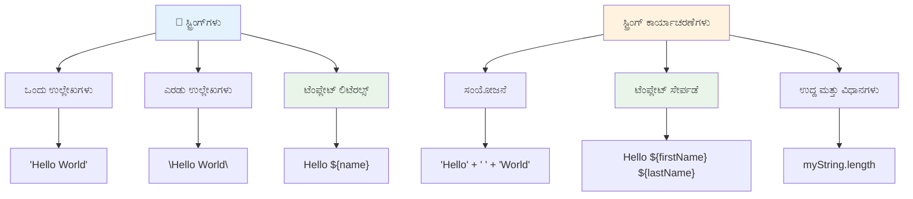
### ಸರಣಿಗಳ ಫಾರ್ಮ್ಯಾಟಿಂಗ್

ಸರಣಿ ಮ್ಯಾನಿಪ್ಯುಲೇಶನ್ ನಿಮಗೆ ಪಠ್ಯ ಘಟಕಗಳನ್ನು ಸೇರಿಸಲು, ವ್ಯತ್ಯಯಗಳನ್ನು ಸೇರಿಸಿಕೊಳ್ಳಲು ಮತ್ತು ಕಾರ್ಯಕ್ರಮ ಸ್ಥಿತಿಗೆ ಪ್ರತಿಕ್ರಿಯಿಸುವ ಡೈನಾಮಿಕ್ ವಿಷಯಗಳನ್ನು ರಚಿಸಲು ಅವಕಾಶ ನೀಡುತ್ತದೆ. ಈ ತಂತ್ರಜ್ಞಾನವು ಪಠ್ಯವನ್ನು ಕಾರ್ಯಕ್ರಮಕೌಶಲ್ಯದಿಂದ ರಚಿಸಲು ಪಥೋತ್ಪಾದನೆಯನ್ನು ಒದಗಿಸುತ್ತದೆ.

ಮತ್ತು ನೀವು ಹಲವು ಸರಣಿಗಳನ್ನು ಸೇರಿಸುವ ಅಗತ್ಯ, ಇದನ್ನು ಜೋಡಣೆಯ (concatenation) ಪ್ರಕ್ರಿಯೆ ಎಂದು ಕರೆಯಲಾಗುತ್ತದೆ.
ಎರಡೂ ಅಥವಾ ಹೆಚ್ಚು ಸ್ಟ್ರಿಂಗ್‌ಗಳನ್ನು **concatenate** ಮಾಡಲು, ಅಥವಾ ಅವುಗಳನ್ನು ಒಟ್ಟುಗೂಡಲು, `+` ಆಪರೇಟರ್ ಅನ್ನು ಬಳಸಿ.

```javascript
let myString1 = "Hello";
let myString2 = "World";

myString1 + myString2 + "!"; //ನಮಸ್ಕಾರವಿಶ್ವ!
myString1 + " " + myString2 + "!"; //ನಮಸ್ಕಾರ ವಿಶ್ವ!
myString1 + ", " + myString2 + "!"; //ನಮಸ್ಕಾರ, ವಿಶ್ವ!
```

**ಹಂತ ಹಂತವಾಗಿ, ಇಲ್ಲಿ ಏನು ನಡೆಯುತ್ತಿದೆ:**
- `+` ಆಪರೇಟರ್ ಬಳಸಿ ಬಹುಸ್ಟ್ರಿಂಗ್‌ಗಳನ್ನು **ಒಟ್ಟುಗೂಡುತ್ತದೆ**
- ಮೊದಲ ಉದಾಹರಣೆಯಲ್ಲಿ ಸ್ಥಳಗಳಿಲ್ಲದೆ ನೇರವಾಗಿ ಸ್ಟ್ರಿಂಗ್‌ಗಳನ್ನು **ಜೋಡಿಸುತ್ತದೆ**
- ಓದುವ ಮತ್ತಷ್ಟು ಸೌಕರ್ಯಕ್ಕಾಗಿ ಸ್ಟ್ರಿಂಗ್‌ಗಳ ನಡುವೆ ಖಾಲಿ ಸ್ಥಾನಗಳನ್ನಂತಹ `" "` **ಸೇರಿಸಿ**
- ಸರಿಯಾದ ಸ್ವರೂಪಕ್ಕಾಗಿ ಕಮ್ಮಿಗಳು ಮುಂತಾದ ವ್ಯಾಕರಣ ಚಿಹ್ನೆಗಳನ್ನು **ಸೆರೆಹಾಕುತ್ತದೆ**

✅ ಜಾವಾಸ್ಕ್ರಿಪ್ಟ್‌ನಲ್ಲಿ `1 + 1 = 2` ಆಗುತ್ತದೆ, ಆದರೆ `'1' + '1' = 11` ಆಗುವುದಕ್ಕೆ ಕಾರಣ ಏನು? ಇದು ಕುರಿತು ಯೋಚಿಸಿ. `'1' + 1` ಬಗ್ಗೆ ಏನು?

**ಟೆಂಪ್ಲೇಟ್ ಲಿಟರಲ್ಸ್** ಸ್ಟ್ರಿಂಗ್‌ಗಳನ್ನು ಸ್ವರೂಪಗೊಳಿಸುವ ಮತ್ತೊಂದು ವಿಧಾನವಾಗಿದೆ, ಇದರಲ್ಲಿ ಕೋಟೇಶನ್ಗಳ ಬದಲು ಬ್ಯಾಕ್‌ಟಿಕ್ ಬಳಸಲಾಗುತ್ತದೆ. ಸಾಮಾನ್ಯ ಪಠ್ಯವಲ್ಲದ ಯಾವುದಾದರೂ ${ } ಎಂಬ ಪ್ಲೇಸ್‌ಹೋಲ್ಡರ್‌ಗಳಲ್ಲಿ ಇರಬೇಕಾಗುತ್ತದೆ. ಇದರಲ್ಲಿ ಸ್ಟ್ರಿಂಗ್‌ಗಳಾದ ಯಾವುದೇ ಬದಲಾಗುವಗಳು ಸೇರಿವೆ.

```javascript
let myString1 = "Hello";
let myString2 = "World";

`${myString1} ${myString2}!` //ನಮಸ್ಕಾರ ಪ್ರಪಂಚ!
`${myString1}, ${myString2}!` //ನಮಸ್ಕಾರ, ಪ್ರಪಂಚ!
```

**ಪ್ರತಿಯೊಂದು ಭಾಗವನ್ನು ಅರ್ಥಮಾಡಿಕೊಳ್ಳೋಣ:**
- ಟೆಂಪ್ಲೇಟ್ ಲಿಟರಲ್ಸ್ ರಚಿಸಲು ಸಾಮಾನ್ಯ ಉಲ್ಲೇಖಗಳ ಬದಲು ಬ್ಯಾಕ್‌ಟಿಕ್ಸ್ `` ` `` ಅನ್ನು **ಬಳಸುತ್ತದೆ**
- `${}` ಪ್ಲೇಸ್‌ಹೋಲ್ಡರ್ ಸಿಂಟ್ಯಾಕ್ಸ್ ಬಳಸಿ ಬದಲಾಗುವಗಳನ್ನು ನೇರವಾಗಿ **ಒಳಗೊಂಡಿದೆ**
- ಬರೆದಿರುವಂತೆ ಸ್ಥಾನಗಳನ್ನೂ ಸ್ವರೂಪವನ್ನೂ **ಮಾಹಿತಿ ಹಾಗೆ ಉಳಿಸಿಕೊಂಡಿದೆ**
- ಬದಲಾಗುವಗಳೊಂದಿಗೆ ಸಂಕುಲ ಸ್ಟ್ರಿಂಗ್‌ಗಳನ್ನು ರಚಿಸಲು ಒಂದು ಹೆಚ್ಚು ಸ್ವಚ್ಛವಾದ ವಿಧಾನವನ್ನು **ನೀಡುತ್ತದೆ**

ನೀವು ಯಾವ ವಿಧಾನವನ್ನಾದರೂ ಬಳಸಬಹುದು, ಆದರೆ ಟೆಂಪ್ಲೇಟ್ ಲಿಟರಲ್ಸ್ ಯಾವುದೇ ಖಾಲಿ ಸ್ಥಳಗಳನ್ನು ಮತ್ತು ಸಾಲು ಮುರಿತಗಳನ್ನು ಗೌರವಿಸುತ್ತವೆ.

✅ ನಿಮಗೆ ಯಾವಾಗ ಟೆಂಪ್ಲೇಟ್ ಲಿಟರಲ್ ಬಳಕೆ ಮಾಡಬೇಕು ಮತ್ತು ಸಾಮಾನ್ಯ ಸ್ಟ್ರಿಂಗ್ ಬಳಕೆ ಮಾಡಬೇಕು ಎಂದು ಯೋಚಿಸೋಣ?

### 🔤 **ಸ್ಟ್ರಿಂಗ್ ಮಾಸ್ಟರಿ ಪರಿಶీలನೆ: ಪಠ್ಯ ಸಂಚಿಕೆ ನಂಬಿಕೆ**

**ನಿಮ್ಮ ಸ್ಟ್ರಿಂಗ್ ಕೌಶಲ್ಯವನ್ನು ಮೌಲ್ಯಮಾಪನ ಮಾಡಿ:**
- `'1' + '1'` ಏಕೆ `2` ಅಲ್ಲದೆ `'11'` ಆಗುತ್ತದೆ ಎಂದು ತಿಳಿಸಬಹುದೇ?
- ಯಾವ ಸ್ಟ್ರಿಂಗ್ ವಿಧಾನವು ನಿಮಗೆ ಹೆಚ್ಚು ಓದಲು ಸುಲಭವಾಗಿದೆ: ಸಂಚಿಕೆ ಅಥವಾ ಟೆಂಪ್ಲೇಟ್ ಲಿಟರಲ್ಸ್?
- ನೀವು ಸ್ಟ್ರಿಂಗ್‌ಗಳಿಗೆ ಉಲ್ಲೇಖಗಳನ್ನು ಮರೆತರೆ ಏನು ಸಂಭವಿಸುತ್ತದೆ?

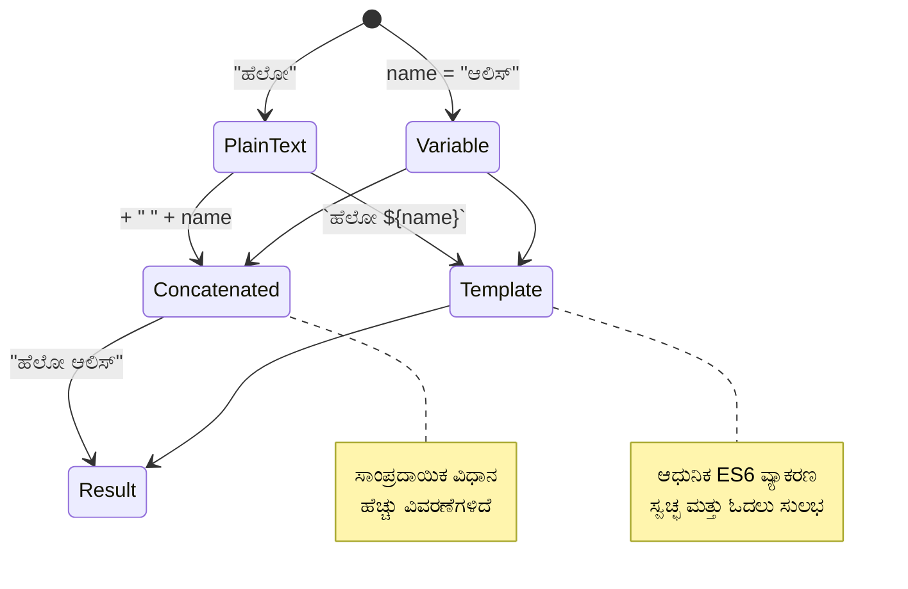
> **ವೃತ್ತಿಪರ ಸೂಚನೆ**: ಟೆಂಪ್ಲೇಟ್ ಲಿಟರಲ್ಸ್ ಸಾಮಾನ್ಯವಾಗಿ ಸಂಕೀರ್ಣ ಸ್ಟ್ರಿಂಗ್ ನಿರ್ಮಾಣಕ್ಕಾಗಿ ಇಷ್ಟಪಡುತ್ತಾರೆ ಏಕೆಂದರೆ ಅವು ಹೆಚ್ಚು ಓದಲು ಸುಲಭವಲ್ಲ ಮತ್ತು ಬහු-ಸಾಲುಗಳ ಸ್ಟ್ರಿಂಗ್‌ಗಳನ್ನು ಚೆನ್ನಾಗಿ ಹ್ಯಾಂಡಲ್ ಮಾಡುತ್ತವೆ!

### ಬೂಲಿಯನ್ಸ್

ಬೂಲಿಯನ್ಸ್ ಅತಿ ಸರಳ ಡೇಟಾ ರೂಪವನ್ನು ಪ್ರತಿನಿಧಿಸುತ್ತವೆ: ಅವು ಹೊಂದಿರಬಲ್ಲದು ಬರುವ ಎರಡು ಮೌಲ್ಯಗಳಲ್ಲಿ ಒಂದೇ – `true` ಅಥವಾ `false`. ಈ ದ್ವಿಮಾನ್ಯ ತಾರ್ಕಿಕ ವ್ಯವಸ್ಥೆ ಅನ್ನು 19ನೇ ಶತಮಾನ गणಿತಜ್ಞ ಜಾರ್ಜ್ ಬೂಲ್ ಅವರು ಬೂಲಿಯನ್ ಬೆಳ್‌ಜಿಬ್ರಾ ವಿನ್ಯಾಸಗೊಳಿಸಿದ್ದಾರೆ.

ಸರಳತೆಯಾದರೂ, ಬೂಲಿಯನ್ಸ್ ಪ್ರೋಗ್ರಾಮಿಂಗ್ ತಾರ್ಕಿಕತೆಗೆ ಅಗತ್ಯವಿದೆ. ಬಳಕೆದಾರ ಲಾಗಿನ್ ಆಗಿರುವುದೋ, ಬಟನ್ ಕ್ಲಿಕ್ ಆಗಿದೆಯೋ ಅಥವಾ ಕೆಲವು ಶರತ್ತುಗಳು ಪೂರ್ತಿಯಾಗಿದೆಯೋ ಎಂದು ಆಧರಿಸಿ ನಿಮ್ಮ ಕೋಡ್ ನಿರ್ಣಯಗಳನ್ನು ತೆಗೆದುಕೊಳ್ಳಲು ಸಹಾಯ ಮಾಡುತ್ತವೆ.

ಬೂಲಿಯನ್ಸ್ ಮಾತ್ರ ಎರಡು ಮೌಲ್ಯಗಳನ್ನು ಹೊಂದಬಹುದು: `true` ಅಥವಾ `false`. ಬೂಲಿಯನ್ಸ್ ನಿರ್ಣಯಗಳಿಗಾಗಿ ಸಹಾಯ ಮಾಡುತ್ತವೆ ಯಾವ ಸಾಲಿನ ಕೋಡ್ ಕಾರ್ಯಗತವಾಗಬೇಕೆಂದರೆ ಶರತ್ತುಗಳು ಪೂರ್ತಿಯಾಗುವಾಗ. ಹಲವಾರು ಸಂದರ್ಭಗಳಲ್ಲಿ, [ಆಪರೇಟರ್ಗಳು](../../../../2-js-basics/1-data-types) ಬೂಲಿಯನ್ ಮೌಲ್ಯವನ್ನು ಸ್ಥಾಪಿಸಲು ಸಹಾಯ ಮಾಡುತ್ತವೆ ಮತ್ತು ನೀವು ಹೆಚ್ಚಿನ ಬಾರಿ ಬದಲಾಗುವಗಳನ್ನು ಗುಣೋತ್ಪನ್ನಿತ ಅಥವಾ ಮೌಲ್ಯನವೀಕರಣ ಕಾರಣ ಆಪರೇಟರ್ಗಳನ್ನು ಗಮನಿಸಿ ಬರೆಯುತ್ತೀರಿ.

```javascript
let myTrueBool = true;
let myFalseBool = false;
```

**ಮೇಲಿನ ಉದಾಹರಣೆಯಲ್ಲಿ, ನಾವು:**
- ಬೂಲಿಯನ್ ಮೌಲ್ಯ `true` ನೀಡುವ ಬದಲಾಗುವವನ್ನು **ತಯಾರಿಸಿದ್ದೇವೆ**
- ಬೌಲಿಯನ್ ಮೌಲ್ಯ `false` ಸಂಗ್ರಹಿಸುವುದನ್ನು **ತೋರಿಸಿದ್ದೇವೆ**
- ನಿಖರವಾದ ಕೀವರ್ಡ್‌ಗಳು `true` ಮತ್ತು `false` (ಉಲ್ಲೇಖಗಳು ಬೇಡ) **ಬಳಸಿದ್ದೇವೆ**
- ಈ ಬದಲಾಗುವಗಳನ್ನು ಶರತ್ತು-ಆಧಾರಿತ ಹೇಳಿಕೆಗಳಲ್ಲಿ ಬಳಕೆಗಾಗಿ **ಸಿದ್ಧಪಡಿಸಿದ್ದೇವೆ**

✅ ಬದಲಾಗುವವು ಬೂಲಿಯನ್ `true` ಎಂದು ಮೌಲ್ಯಮಾಪನ ಆದರೆ তাকে 'truthy' ಎಂದು ಪರಿಗಣಿಸಬಹುದು. ಆಸಕ್ತಕರವಾಗಿ, ಜಾವಾ ಸ್ಕ್ರಿಪ್ಟ್ ನಲ್ಲಿ [ಎಲ್ಲಾ ಮೌಲ್ಯಗಳೂ truthy ಇವೆ ಅದನ್ನು falsy ಎಂದು ನಿರ್ಧರಿಸಲಾಗದಿದ್ದರೆ ಮಾತ್ರ](https://developer.mozilla.org/docs/Glossary/Truthy).

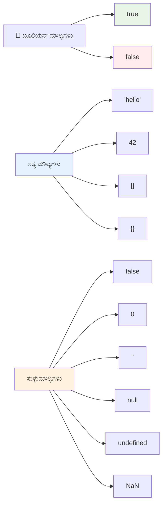
### 🎯 **ಬೂಲಿಯನ್ ಲಾಜಿಕ್ ಪರಿಶೀಲನೆ: ನಿರ್ಣಯ能力**

**ನಿಮ್ಮ ಬೂಲಿಯನ್ ಅರ್ಥವನ್ನು ಪರೀಕ್ಷಿಸಿ:**
- ಜಾವಾಸ್ಕ್ರಿಪ್ಟ್‌ನಲ್ಲಿ `true` ಮತ್ತು `false` ಹೊರತುಪಡಿಸಿ "truthy" ಮತ್ತು "falsy" ಮೌಲ್ಯಗಳನ್ನು ಯಾಕೆ ಇರಿಸುವುದು?
- ಈವುಗಳಲ್ಲಿ ಯಾವುದು falsy ಆಗಿರಬಹುದು ಎಂದು ಮುನ್ಸೂಚಿಸಬಹುದೇ: `0`, `"0"`, `[]`, `"false"`?
- ಬೂಲಿಯನ್‌ಗಳು ಪ್ರೋಗ್ರಾಮ್ ಹರಿವನ್ನು ನಿಯಂತ್ರಿಸುವುದರಲ್ಲಿ ಹೇಗೆ ಉಪಯುಕ್ತವಾಗಬಹುದು?

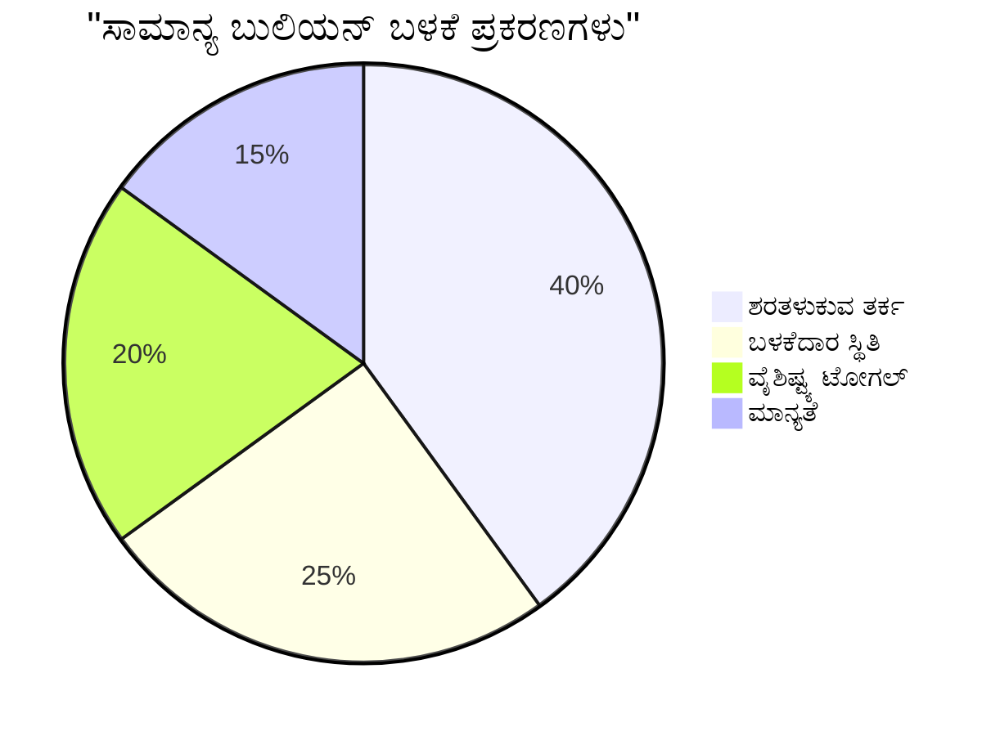
> **ಗಮನಿಸಿ**: ಜಾವಾಸ್ಕ್ರಿಪ್ಟ್‌ನಲ್ಲಿ ಕೇವಲ 6 ಮೌಲ್ಯಗಳು falsy ಆಗಿವೆ: `false`, `0`, `""`, `null`, `undefined`, ಮತ್ತು `NaN`. ಬೇರೆ ಎಲ್ಲವೂ truthy!

---

## 📊 **ನಿಮ್ಮ ಡೇಟಾ ಟೈಪ್ಸ್ ಉಪಕರಣ ಸಂಗ್ರಹ**

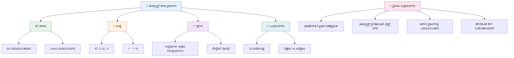
## GitHub Copilot ಏಜೆಂಟ್ ಚಾಲೆಂಜ್ 🚀

ನಿಮ್ಮ ಈ ಕೆಳಗಿನ ಚಾಲೆಂಜ್ ಅನ್ನು ಪೂರ್ಣಗೊಳಿಸಲು ಏಜೆಂಟ್ ಮೋಡ್ ಬಳಸಿ:

**ವಿವರಣೆ:** ನೀವು ಕಲಿತ ಎಲ್ಲ ಜಾವಾಸ್ಕ್ರಿಪ್ಟ್ ಡೇಟಾ ಪ್ರಕಾರಗಳನ್ನು ಮತ್ತು ನೈಜ ಜಾಗತಿಕ ಡೇಟಾ ಪರಿಗಣನೆಗಳನ್ನು ಗಮನದಲ್ಲಿಟ್ಟುಕೊಂಡು, ವೈಯಕ್ತಿಕ ಮಾಹಿತಿ ನಿರ್ವಹಣೆ ಕಾರ್ಯಕ್ರಮವನ್ನು ರಚಿಸಿ.

**ಚಾಲೆಂಜ್:** ಒಂದು ಜಾವಾಸ್ಕ್ರಿಪ್ಟ್ ಕಾರ್ಯಕ್ರಮವನ್ನು ರಚಿಸಿ, ಅದು ಬಳಕೆದಾರರ ಪ್ರೊಫೈಲ್ ಆಬ್ಜೆಕ್ಟ್‌ನ್ನು ಹೊಂದಿರಲಿ, ಅದರಲ್ಲಿ ಹೆಸರು (ಸ್ಟ್ರಿಂಗ್), ವಯಸ್ಸು (ಸಂಖ್ಯೆ), ವಿದ್ಯಾರ್ಥಿ ಸ್ಥಿತಿ (ಬೂಲಿಯನ್), ಮೆಚ್ಚಿನ ಬಣ್ಣಗಳು ಎಂದು ಅರೆ (array), ಮತ್ತು ವಿಳಾಸ ಆಬ್ಜೆಕ್ಟ್ ಇದ್ದು ಅದರ ರಸ್ತೆ, ನಗರ ಮತ್ತು ಕನ್ನಡ ಸಂಖ್ಯೆ ಗುಣಗಳಿವೆ. ಪ್ರೊಫೈಲ್ ಮಾಹಿತಿಯನ್ನು ತೋರಿಸುವ ಮತ್ತು ವೈಯಕ್ತಿಕ ಕ್ಷೇತ್ರಗಳನ್ನು ಅಪ್ಡೇಟ್ ಮಾಡುವ ಕಾರ್ಯಗಳನ್ನು ಒಳಗೊಂಡಿರಲಿ. ಸ್ಟ್ರಿಂಗ್ ಸಂಕಲನ, ಟೆಂಪ್ಲೇಟು ಲಿಟರಲ್ಸ್, ವಯಸ್ಸಿನ ಸಂಖ್ಯಾ ಗಣನೆ ಮತ್ತು ಬೂಲಿಯನ್ ಲಾಜಿಕ್ ಅನ್ನು ವಿದ್ಯಾರ್ಥಿ ಸ್ಥಿತಿಗಾಗಿ ಪ್ರದರ್ಶಿಸುವುದನ್ನು ಖಚಿತಪಡಿಸಿಕೊಳ್ಳಿ.

ಇಲ್ಲಿ [ಏಜೆಂಟ್ ಮೋಡ್](https://code.visualstudio.com/blogs/2025/02/24/introducing-copilot-agent-mode) ಬಗ್ಗೆ ಹೆಚ್ಚು ತಿಳಿಯಿರಿ.

## 🚀 ಚಾಲೆಂಜ್

ಜಾವಾಸ್ಕ್ರಿಪ್ಟ್ ಕೆಲವು ವರ್ತನೆಗಳು ಅಭಿವೃದ್ಧಿಪಡಿಸುವವರನ್ನು ಅಚ್ಚರಿಗೊಳಿಸಬಹುದು. ಇಲ್ಲಿ ಒಂದು դասಮೂಲಕ ಉದಾಹರಣೆ ಇದೆ: ನಿಮ್ಮ ಬ್ರೌಸರ್ ಕನ್‌ಸೋಲ್‌ನಲ್ಲಿ ಇದನ್ನು ಟೈಪ್ ಮಾಡಿ: `let age = 1; let Age = 2; age == Age` ಮತ್ತು ಫಲಿತಾಂಶವನ್ನು ಗಮನಿಸಿ. ಇದು `false` ಸಿಗುತ್ತದೆ – ಕಾರಣ ತಿಳಿಸಬಹುದೇ?

ಇದು ಜಾವಾಸ್ಕ್ರಿಪ್ಟ್‌ನ ಅನೇಕ ವರ್ತನೆಗಳಲ್ಲಿ ಒಂದಾಗಿದೆ, ಅವುಗಳನ್ನು ತಿಳಿದುಕೊಳ್ಳುವುದು ನಿಮ್ಮ ಕೋಡ್ ಅನ್ನು ಹೆಚ್ಚು ನಂಬಿಕೆಯಾದ ಮತ್ತು ದೋಷರಹಿತವಾಗಿ ಬರೆಯಲು ಸಹಾಯ ಮಾಡುತ್ತದೆ.

## ಲೆಕ್ಚರ್ ನಂತರದ ಪ್ರಶ್ನೋತ್ತರ
[ಲೆಕ್ಚರ್ ನಂತರದ ಪ್ರಶ್ನೋತ್ತರ](https://ff-quizzes.netlify.app)

## ವಿಮರ್ಶೆ ಮತ್ತು ಸ್ವಯಂ ಅಧ್ಯಯನ

[ಈ ಜಾವಾಸ್ಕ್ರಿಪ್ಟ್ ವ್ಯಾಯಾಮಗಳ ಪಟ್ಟಿಯನ್ನು](https://css-tricks.com/snippets/javascript/) ನೋಡಿ ಮತ್ತು ಒಂದು ಪ್ರಯತ್ನಿಸಿ. ನೀವು ಏನು ಕಲಿತೀರಾ?

## ಹವಾಲೆ

[ಡೇಟಾ ಟೈಪ್ಸ್ ಅಭ್ಯಾಸ](assignment.md)

## 🚀 ನಿಮ್ಮ ಜಾವಾಸ್ಕ್ರಿಪ್ಟ್ ಡೇಟಾ ಟೈಪ್ಸ್ ಮಾಸ್ಟರಿ ಸಮಯರೇಖೆ

### ⚡ **ಮುಂದಿನ 5 ನಿಮಿಷಗಳಲ್ಲಿ ನೀವು ಮಾಡುವದ್ದು**
- [ ] ಬ್ರೌಸರ್ ಕನ್‌ಸೋಲ್ ಅನ್ನು ತೆರೆದು ಬಿನ್ನವ ಬಿನ್ನವ ಡೇಟಾ ಪ್ರಕಾರಗಳ 3 ಬದಲಾಗುವಗಳನ್ನು ರಚಿಸಿ
- [ ] ಚಾಲೆಂಜ್ ಪ್ರಯತ್ನಿಸಿ: `let age = 1; let Age = 2; age == Age` ಮತ್ತು ಇದು ಏಕೆ false ಆಗುತ್ತుందೋ ತಿಳಿದುಕೊಳ್ಳಿ
- [ ] ನಿಮ್ಮ ಹೆಸರು ಮತ್ತು ಮೆಚ್ಚಿನ ಸಂಖ್ಯೆಯೊಂದಿಗೆ ಸ್ಟ್ರಿಂಗ್ ಸಂಕಲನ ಅಭ್ಯಾಸ ಮಾಡಿ
- [ ] ಸ್ಟ್ರಿಂಗ್‌ಗೆ ಸಂಖ್ಯೆ ಸೇರಿಸಿದಾಗ ಏನಾಗುತ್ತದೆ ಪರೀಕ್ಷಿಸಿ

### 🎯 **ಈ ಗಂಟೆಯಲ್ಲಿ ನೀವು ಸಾಧಿಸಬಲ್ಲದು**
- [ ] ಪಾಠದ ನಂತರದ ಪ್ರಶ್ನೋತ್ತರವನ್ನು ಪೂರ್ಣಗೊಳಿಸಿ ಮತ್ತು ಅಸ್ಪಷ್ಟ מושגים ಪರಿಶೀಲನೆ ಮಾಡಿ
- [ ] ಎರಡೂ ಸಂಖ್ಯೆಗಳ ಸಂಖ್ಯೆಗೂಡಿಸುವ, ಭಾಗಿಸು, ಗುಣಿಸು, ನಿಷೇಧಿಸುವ ಸಣ್ಣ ಕ್ಯಾಲ್ಕುಲೇಟರ್ ರಚಿಸಿ
- [ ] ಟೆಂಪ್ಲೇಟ್ ಲಿಟರಲ್ಸ್ ಬಳಸಿ ಸರಳವಾದ ಹೆಸರು ಸ್ವರೂಪಕಾರ ಕಲಿಸಿ
- [ ] `==` ಮತ್ತು `===` ಹೋಲಿಕೆ ಆಪರೇಟರ್‌ಗಳ ವ್ಯತ್ಯಾಸಗಳನ್ನು ಆಲೋಚಿಸಿ
- [ ] ವಿವಿಧ ಡೇಟಾ ಪ್ರಕಾರಗಳಿಗೆ ಪರಸ್ಪರ ಪರಿವರ್ತನೆ ಅಭ್ಯಾಸ ಮಾಡಿ

### 📅 **ನಿಮ್ಮ ವಾರದ ಜಾವಾಸ್ಕ್ರಿಪ್ಟ್ ನೆಲೆಭೂಮಿ**
- [ ] ಹೊಣೆಗಾರಿಕೆಯೊಂದಿಗೆ ಮತ್ತು ಸೃಜನಶೀಲತೆಯೊಂದಿಗೆ ಹವಾಲೆಯನ್ನು ಸಂಪೂರ್ಣಗೊಳಿಸಿ
- [ ] ಕಲಿತ ಎಲ್ಲಾ ಡೇಟಾ ಪ್ರಕಾರಗಳನ್ನು ಬಳಸಿ ವೈಯಕ್ತಿಕ ಪ್ರೊಫೈಲ್ ಆಬ್ಜೆಕ್ಟ್ ರಚಿಸಿ
- [ ] [CSS-Tricks ನಿಂದ ಜಾವಾಸ್ಕ್ರಿಪ್ಟ್ ವ್ಯಾಯಾಮಗಳೊಂದಿಗೆ ಅಭ್ಯಾಸ ಮಾಡಿ](https://css-tricks.com/snippets/javascript/)
- [ ] ಬೂಲಿಯನ್ ಲಾಜಿಕ್ ಬಳಸಿ ಸರಳ ಫಾರ್ಮ್ ಮಾನ್ಯತೆಗಾರರ ರಚನೆ ಮಾಡಿ
- [ ] ಅರೆ ಮತ್ತು ಆಬ್ಜೆಕ್ಟ್ ಡೇಟಾ ಪ್ರಕಾರಗಳೊಂದಿಗೆ ಪ್ರಯೋಗ (ಮುಂದಿನ ಪಾಠಗಳ ಪೂರ್ವಪ್ರದರ್ಶನ)
- [ ] ಜಾವಾಸ್ಕ್ರಿಪ್ಟ್ ಸಮುದಾಯದಲ್ಲಿ ಸೇರಿ ಡೇಟಾ ಪ್ರಕಾರಗಳ ಬಗ್ಗೆ ಪ್ರಶ್ನೆ ಕೇಳಿ

### 🌟 **ನಿಮ್ಮ ತಿಂಗಳ ಮಟ್ಟದ ಪರಿವರ್ತನೆ**
- [ ] ಡೇಟಾ ಪ್ರಕಾರ ಜ್ಞಾನದೊಂದಿಗೆ ದೊಡ್ಡ ಪ್ರೋಗ್ರಾಮಿಂಗ್ ಯೋಜನೆಗಳಲ್ಲಿ ಸಂಯೋಜಿಸಿ
- [ ] ನೈಜ ಅನ್ವಯಗಳಲ್ಲಿ ಪ್ರತಿ ಡೇಟಾ ಪ್ರಕಾರವನ್ನು ಯಾಕೆ ಮತ್ತು ಯಾವಾಗ ಬಳಸಬೇಕೆಂದು ಅರ್ಥಮಾಡಿಕೊಳ್ಳಿ
- [ ] ಆರಂಭಿಕರಿಗೆ ಜಾವಾಸ್ಕ್ರಿಪ್ಟ್ ಮೂಲಭೂತಗಳನ್ನು ವಿವರಿಸಲು ಸಹಾಯ ಮಾಡಿ
- [ ] ವಿವಿಧ ಬಳಕೆದಾರರ ಡೇಟಾ ನಿರ್ವಹಣೆ ಮಾಡುವ ಸಣ್ಣ ಅಪ್ಲಿಕೇಶನ್ ರಚಿಸಿ
- [ ] ಪ್ರಗತಿಶೀಲ ಡೇಟಾ ಪ್ರಕಾರ ವಿಷಯಗಳನ್ನು, ಉದಾ: ಟೈಪ್ ಕೋರ್ಶನ್ ಮತ್ತು ಕಠಿಣ ಸಮಾನತೆಯನ್ನು ಅನ್ವೇಷಿಸಿ
- [ ] ದೃಶ್ಯ документации ಸುಧಾರಣೆಯೊಂದಿಗೆ ಉಚಿತ ಓಪನ್ ಸೋರ್ಸ್ ಜಾವಾಸ್ಕ್ರಿಪ್ಟ್ ಯೋಜನೆಗಳಿಗೆ ಕೊಡುಗೆ ನೀಡಿ

### 🧠 **ಅಂತಿಮ ಡೇಟಾ ಪ್ರಕಾರ ಮಾಸ್ಟರಿ ಪರಿಶೀಲನೆ**

**ನಿಮ್ಮ ಜಾವಾಸ್ಕ್ರಿಪ್ಟ್ ನೆಲೆಭೂಮಿಯನ್ನು ಹಬ್ಬಿಸಿ:**
- ಅದರ ವರ್ತನೆ ಕುರಿತು ನಿಮಗೆ ಅಚ್ಚರಿಯನ್ನುಂಟುಮಾಡಿದ ಯಾವ ಡೇಟಾ ಪ್ರಕಾರ?
- ನಿಮ್ಮ ಗೊತ್ತು-ಮಾಹಿತಿಗಳನ್ನು ಗೆಳೆಯರಿಗೆ ಬದಲಾಗುವಗಳ ವಿರುದ್ಧ ಸ್ಥಿರಾಂಕಗಳಾಗಿ ಹೇಗೆ ವಿವರಿಸುವಿರಿ?
- ಜಾವಾಸ್ಕ್ರಿಪ್ಟ್ ಟೈಪ್ ವ್ಯವಸ್ಥೆಯ ಬಗ್ಗೆ ನೀವು ಕಂಡ ಮಗ್ನವಾಗಿದ್ದ ಅತಿ ಆಸಕ್ತಿದಾಯಕ ವಿಷಯ ಯಾವುದು?
- ಈ ಮೂಲಭೂತಗಳೊಂದಿಗೆ ನೀವು ಯಾವ ನೈಜ ಸವಾಲಿನ ಆಪ್ಲಿಕೇಶನ್ ನಿರ್ಮಿಸಲು ಕಲ್ಪಿಸಿಕೊಳ್ಳುತ್ತೀರಿ?

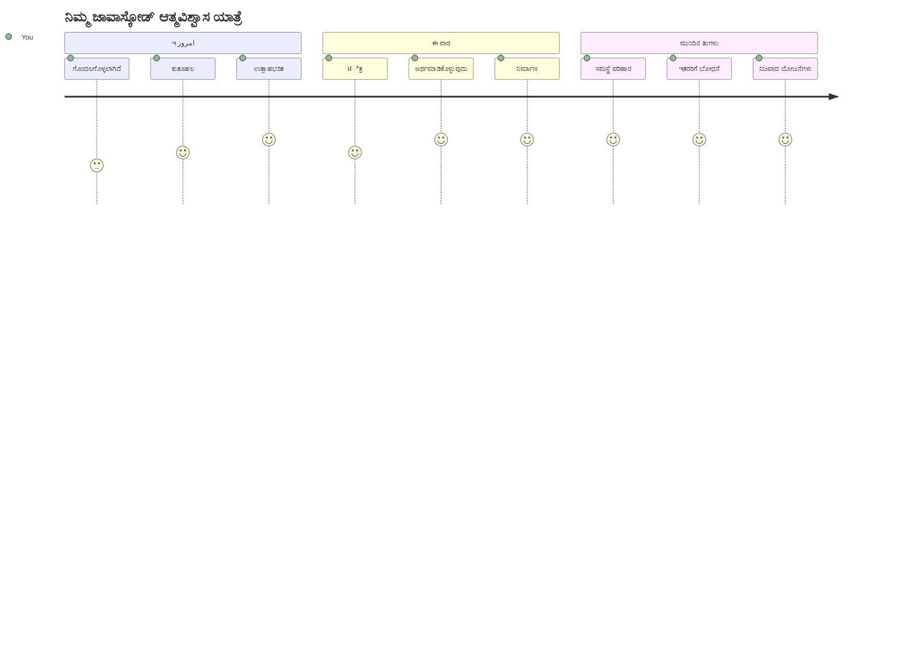
> 💡 **ನೀವು ನೆಲೆಭೂಮಿಯನ್ನು ಕಟ್ಟಿಟ್ಟುಕೊಂಡಿದ್ದೀರಿ!** ಡೇಟಾ ಪ್ರಕಾರಗಳ ಅರಿವು ಅಕ್ಷರಮಾಲೆಯನ್ನ ಕಲಿಯುವಂತಹದ್ದು, ಕಥೆಗಳ ಬರವಣಿಗೆಯ ಮೊದಲು. ನೀವು ಬರೆಯುವ ಪ್ರತೀ ಜಾವಾಸ್ಕ್ರಿಪ್ಟ್ ಕಾರ್ಯಕ್ರಮ ಈ ಮೂಲಭೂತ ಕಲಿಕೆಗಳನ್ನು ಬಳಸುತ್ತದೆ. ಈಗ ನೀವು ವೆಬ್‌ಸೈಟ್‌ಗಳು, ಡೈನಾಮಿಕ್ ಅಪ್ಲಿಕೇಶನ್‌ಗಳು ಮತ್ತು ನೈಜ ಸಮಸ್ಯೆಗಳನ್ನು ನಿಪುಣವಾಗಿ ಪರಿಹರಿಸಬಹುದಾದ ಕಟ್ಟುನಿಟ್ಟಿನ ಅಡಿಪಾಯಗಳನ್ನು ಹೊಂದಿದ್ದೀರಿ. ಜಾವಾಸ್ಕ್ರಿಪ್ಟ್‌ನ ಅದ್ಭುತ ಲೋಕಕ್ಕೆ ಸ್ವಾಗತ! 🎉

---

<!-- CO-OP TRANSLATOR DISCLAIMER START -->
**ಜಿಲ್ಲೆ ಮುಖಪುಟ**:  
ಈ ದಸ್ತಾವೇಜನ್ನು AI ಅನುವಾದ ಸೇವೆಯಾದ [Co-op Translator](https://github.com/Azure/co-op-translator) ಬಳಸಿ ಅನುವದಿಸಲಾಗಿದೆ. ನಾವು ಶುದ್ಧತೆಗೆ ಪ್ರಯತ್ನಿಸುವಾಗಲೂ, ಸ್ವಯಂಚಾಲಿತ ಅನುವಾದಗಳಲ್ಲಿ ತಪ್ಪುಗಳು ಅಥವಾ ಅಸಮರ್ಥತೆಗಳು ಇರಬಹುದು ಎಂಬುದನ್ನು ದಯವಿಟ್ಟು ಗಮನಿಸಿಕೊಳ್ಳಿ. ಮೂಲ ಭಾಷೆಯಲ್ಲಿ ಇರುವ ಮೂಲ ದಸ್ತಾವೇಜನ್ನು ಅಧಿಕೃತ ಮೂಲವೆಂದು ಪರಿಗಣಿಸಬೇಕು. ಪ್ರಮುಖ ಮಾಹಿತಿಗಾಗಿ ವೃತ್ತಿಪರ ಮಾನವ ಅನುವಾದವನ್ನು ಶಿಫಾರಸು ಮಾಡಲಾಗಿದೆ. ಈ ಅನುವಾದ ಬಳಕೆಯಿಂದ ಉಂಟಾಗುವ ಯಾವುದೇ ಭ್ರಾಂತಿಗಳು ಅಥವಾ ತಪ್ಪು ನಿರ್ವಚನೆಗಳಿಗೆ ನಾವು ಜವಾಬ್ದಾರಿಯಾಗುವುದಿಲ್ಲ.
<!-- CO-OP TRANSLATOR DISCLAIMER END -->