# JavaScript ಮೂಲಗಳು: ವಿಧಾನಗಳು ಮತ್ತು ಕಾರ್ಯಗಳು

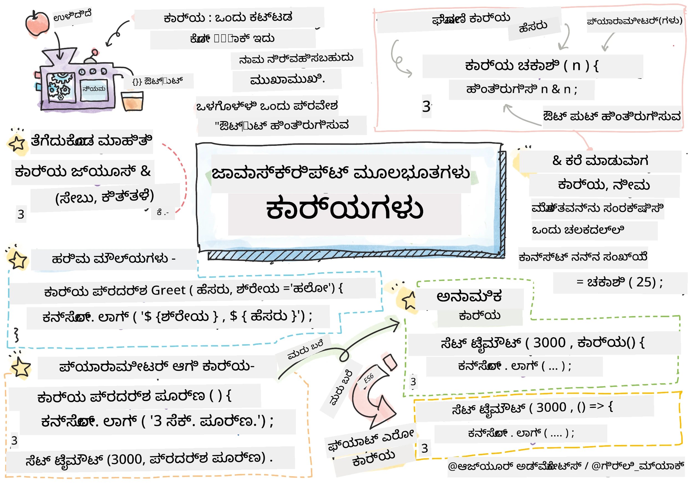
> ಸ್ಕೆಚ್ ನೋಟು [Tomomi Imura](https://twitter.com/girlie_mac) ಅವರಿಂದ

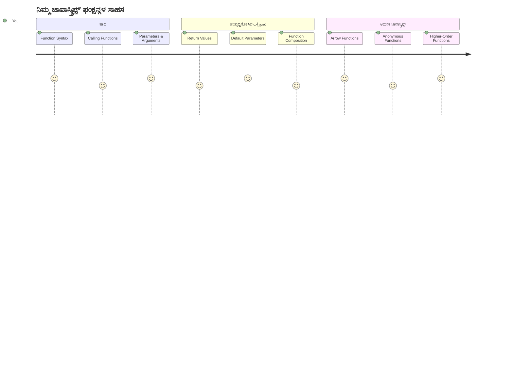
## ಪೂರ್ವ-ಓದು ತರಗತಿ ಪ್ರಶ್ನೋತ್ತರ
[ಪೂರ್ವ-ಓದು ತರಗತಿ ಪ್ರಶ್ನೋತ್ತರ](https://ff-quizzes.netlify.app)

ಏಕೇತನದ ಕೋಡ್ ಆಗಾಗಲೇ ಬರೆಯುವುದು ಪ್ರೋಗ್ರಾಮಿಂಗ್‌ನ ಸಾಮಾನ್ಯ ತೊಂದರೆಗಳಲ್ಲಿ ಒಂದಾಗಿದೆ. ಕಾರ್ಯಗಳು ಈ ಸಮಸ್ಯೆಯನ್ನು ಪರಿಹರಿಸುವುದಕ್ಕೆ ನಿಮಗೆ ಕೋಡ್ ಅನ್ನು ಪುನಃಬಳಕೆ ಮಾಡಬಹುದಾದ ಬ್ಲಾಕ್ಗಳಾಗಿ ಪ್ಯಾಕೇಜ್ ಮಾಡಲು ಅವಕಾಶ ನೀಡುತ್ತವೆ. ಕಾರ್ಯಗಳನ್ನು ಹೆನ್‌ರಿ ಫೋರ್ಡ್ ಅವರ ಅಸೆಂಬ್ಲಿ ಲೈನ್ ಕ್ರಾಂತಿ ಮಾಡಲು ಕಾರಣವಾದ ನಿಯಮಿತ ಭಾಗಗಳಂತೆ ভাবಿಕೊಳ್ಳಿ – ಒಮ್ಮೆ ನೀವು ನಂಬಬಹುದಾದ ಘಟಕವನ್ನು ನಿರ್ಮಿಸಿದಾಗ, ನೀವು ಅದನ್ನು ಬೇರೆ ಎಲ್ಲೆಡೆ ನಿರ್ಮಾಣಿಸದೆ ಬೇಕಾದಾಗ ಬಳಸಬಹುದು.

ಕಾರ್ಯಗಳು ನಿಮಗೆ ಕೋಡ್‌ನ ತುಂಡುಗಳನ್ನು ಗುಚ್ಛಿಸಬಹುದಾಗಿಸಿವೆ, ಆದ ಕಾರಣ ನೀವು ನಿಮ್ಮ ಪ್ರೋಗ್ರಾಂದಲ್ಲಿ ಅವುಗಳನ್ನು ಪುನಃಬಳಕೆ ಮಾಡಬಹುದು. ಎಲ್ಲೆಡೆ ಅದೇ ಲಾಜಿಕನ್ನು ನಕಲಿಸುವ ಬದಲು, ನೀವು ಒಮ್ಮೆ ಕಾರ್ಯವನ್ನು ರಚಿಸಿ, ಅದನ್ನು ಬೇಕಾದಾಗ ಕರೆಮಾಡಬಹುದು. ಈ ವಿಧಾನವು ನಿಮ್ಮ ಕೋಡನ್ನು ಸಂಘಟಿತವಾಗಿರಿಸುತ್ತದೆ ಮತ್ತು ನವೀಕರಣಗಳನ್ನು ಬಹಳ ಸುಲಭಗೊಳ್ಳಿಸುತ್ತದೆ.

ಈ ಪಾಠದಲ್ಲಿ, ನೀವು ನಿಮ್ಮ ಸ್ವಂತ ಕಾರ್ಯಗಳನ್ನು ಹೇಗೆ ರಚಿಸಬೇಕು, ಅವರಿಗೆ ಮಾಹಿತಿ ಹೇಗೆ ಸಲ್ಲಿಸಬೇಕು ಮತ್ತು ಪರಿಣಾಮಕಾರಿ ಫಲಿತಾಂಶಗಳನ್ನು ಹೇಗೆ ಪಡೆಯಬೇಕು ಎಂಬುದನ್ನು ಕಲಿತೀರಿ. ನೀವು ಕಾರ್ಯಗಳು ಮತ್ತು ವಿಧಾನಗಳ ನಡುವಿನ ವ್ಯತ್ಯಾಸವನ್ನು ಕಂಡುಹಿಡಿಯುತ್ತೀರಿ, ಆಧುನಿಕ ನೂತನ ಬರಹ ರೀತಿ ವಿಧಾನಗಳನ್ನು ತಿಳಿದುಕೊಳ್ಳುತ್ತೀರಿ ಮತ್ತು ಕಾರ್ಯಗಳು ಪರಸ್ಪರ ಹೇಗೆ ಕಾರ್ಯನಿರ್ವಹಿಸಬಹುದು ಎಂಬುದನ್ನು ಭೇಟಿ ಮಾಡುತ್ತೀರಿ. ನಾವು ಈ ಕಲ್ಪನೆಗಳನ್ನು ಹಂತ ಹಂತವಾಗಿ ನಿರ್ಮಿಸುತ್ತೇವೆ.

[](https://youtube.com/watch?v=XgKsD6Zwvlc "ವಿಧಾನಗಳು ಮತ್ತು ಕಾರ್ಯಗಳು")

> 🎥 ಮೇಲಿನ ಚಿತ್ರವನ್ನು ಕ್ಲಿಕ್ ಮಾಡಿ ವಿಧಾನಗಳು ಮತ್ತು ಕಾರ್ಯಗಳ ಬಗ್ಗೆ ಒಂದು ವೀಡಿಯೊಗೆ.

> ನೀವು ಈ ಪಾಠವನ್ನು [Microsoft Learn](https://docs.microsoft.com/learn/modules/web-development-101-functions/?WT.mc_id=academic-77807-sagibbon) ನಲ್ಲಿ ತೆಗೆದುಕೊಳ್ಳಬಹುದು!

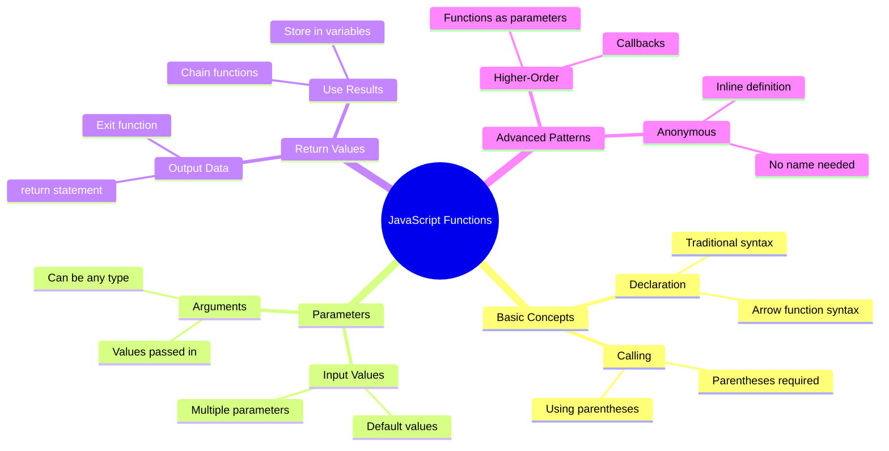
## ಕಾರ್ಯಗಳು

ಕಾರ್ಯವು ಒಂದು ಸ್ವತಂತ್ರ ಕೋಡ್‌ನ ಬ್ಲಾಕ್ ಆಗಿದ್ದು ಅದು ನಿರ್ದಿಷ್ಟ ಕೆಲಸವನ್ನು ನಿರ್ವಹಿಸುತ್ತದೆ. ಇದು ನೀವು ಬೇಕಾದಾಗ ಕಾರ್ಯಗತಗೊಳ್ಳಿಸಬಹುದಾದ ಲಾಜಿಕ್ ಅನ್ನು ಒಳಗೊಂಡಿದೆ.

ನೀವು ನಿಮ್ಮ ಪ್ರೋಗ್ರಾಂನಲ್ಲಿ ಹಲವಾರು ಬಾರಿ ಅದೇ ಕೋಡ್ ಬರೆವ ಬದಲು, ಅದನ್ನು ಕಾರ್ಯದಲ್ಲಿ ಪ್ಯಾಕೇಜ್ ಮಾಡಿ, ನಿಮಗೆ ಬೇಕಾದಾಗ ಅದನ್ನು ಕರೆಮಾಡಬಹುದು. ಈ ವಿಧಾನವು ನಿಮ್ಮ ಕೋಡ್‌ನ ಸ್ವಚ್ಚತೆಯನ್ನು ಕಾಯ್ದುಕೊಳ್ಳುತ್ತದೆ ಮತ್ತು ನವೀಕರಣಗಳನ್ನು ಸುಲಭಗೊಳಿಸುತ್ತದೆ. ನಿಮ್ಮ ಕೋಡ್‌ಗೆ 20 ವಿಭಿನ್ನ ಜಾಗಗಳಲ್ಲಿ ಮಸುಕಾಗಿ ಹೋಲುವ ಲಾಜಿಕ್ ಬದಲಾಯಿಸಬೇಕಾಗಿದ್ದರೆ ಅದರ ನಿರ್ವಹಣೆ ಹೇಗಿರುತ್ತದೆ ಎಂದು ಯೋಚಿಸಿ.

ನಿಮ್ಮ ಕಾರ್ಯಗಳಿಗೆ ಸ್ಪಷ್ಟವಾದ ಹೆಸರು ನೀಡುವುದು ಅವಶ್ಯಕ. ಚೆನ್ನಾಗಿ ಹೆಸರು ನೀಡಿ ಕಾರ್ಯವು ತನ್ನ ಉದ್ದೇಶವನ್ನು ಸ್ಪಷ್ಟವಾಗಿ پہنچಿಸಬೇಕು – ನೀವು `cancelTimer()` ನೋಡಿದಾಗ ಅದು ಏನು ಮಾಡುತ್ತೆ ಎಂಬುದನ್ನು ತಕ್ಷಣ ಗೊತ್ತಾಗುತ್ತದೆ, ಯಾವುದೇ ಸ್ಪಷ್ಟವಾಗಿ ಲೇಬಲ್ ಮಾಡಲಾದ ಬಟನ್ ಕ್ಲಿಕ್ ಮಾಡಿದಾಗ ಏನು ಆಗುವುದೆಂದು ನಿಮಗೆ ತಾನೆ ತಿಳಿಯುತ್ತದೆ.

## ಕಾರ್ಯವನ್ನು ರಚಿಸುವುದು ಮತ್ತು ಕರೆಮಾಡುವುದು

ಸರಳವಾಗಿ ಕಾರ್ಯವನ್ನು ರಚಿಸುವ ವಿಧಾನವನ್ನು ನೋಡೋಣ. ಸಿಂಟ್ಯಾಕ್ಸ್ ನಿಯಮಿತ ಮಾದರಿಯನ್ನು ಅನುಸರಿಸುತ್ತದೆ:

```javascript
function nameOfFunction() { // ಕಾರ್ಯ ನಿರ್ದಿಷ್ಟೀಕರಣ
 // ಕಾರ್ಯದ ನಿರ್ದಿಷ್ಟೀಕರಣ/ದೇಹ
}
```

ಇದನ್ನು ವಿಶ್ಲೇಷಿಸೋಣ:
- `function` ಕೀವರ್ಡ್ ಜಾವಾಸ್ಕ್ರಿಪ್ಟ್ ಗೆ "ನನಗೆ ಕಾರ್ಯ ರಚಿಸಬೇಕಿದೆ!" ಎಂದು ತಿಳಿಸುತ್ತದೆ
- `nameOfFunction` ಎಂದರೆ ನಿಮ್ಮ ಕಾರ್ಯಕ್ಕೆ ಸ್ಪಷ್ಟವಾದ ಹೆಸರು ನೀಡುವ ಸ್ಥಳ
- ಕೊಳಕುಗಳು `()` ಕಾರ್ಯಕ್ಕೆ ಪ್ಯಾರಾಮೀಟರ್‌ಗಳನ್ನು ಸೇರಿಸಲು ಅವಕಾಶ ನೀಡುತ್ತವೆ (ಇದನ್ನಷ್ಟು ಬೇಗ ತಿಳಿಯೋಣ)
- ವೃತ್ತಾಕಾರ ಹಾಳೆಗಳು `{}` ಕಾರ್ಯವನ್ನು ಕರೆ ಮಾಡಿದಾಗ ನಡೆಯುವ ನಿಜವಾದ ಕೋಡ್ ಇರಿಸುವ ಸ್ಥಳ

ಈ ಕಾರ್ಯವನ್ನು ದೃಷ್ಟಾಂತವಾಗಿ ರಚಿಸಿ ನೋಡಿ:

```javascript
function displayGreeting() {
  console.log('Hello, world!');
}
```

ಈ ಕಾರ್ಯವು ಕಾನ್ಸೋಲ್‌ಗೆ "Hello, world!" ಅ.printಮಾಡುತ್ತದೆ. ನೀವು ಇದನ್ನು ನಿರ್ದೇಶಿಸಿದ ನಂತರ, ಬೇಕಾದಷ್ಟೂ ಬಾರಿ ಇದನ್ನು ಕರೆಮಾಡಬಹುದು.

ನಿಮ್ಮ ಕಾರ್ಯವನ್ನು ಕಾರ್ಯಗತಗೊಳಿಸಲು (ಅಥವಾ "ಕರೆಮಾಡಲು") ಕಾರ್ಯದ ಹೆಸರಿನ ನಂತರ ಕೊಳಕುಗಳು ಬರೆಯಿರಿ. ಜಾವಾಸ್ಕ್ರಿಪ್ಟ್ ನಿಮಗೆ ಕಾರ್ಯವನ್ನು ಕರೆ ಮಾಡುವ ಮೊದಲು ಅಥವಾ ನಂತರ ವ್ಯಾಖ್ಯಾನಿಸಲು ಅವಕಾಶ ನೀಡುತ್ತದೆ – ಜಾವಾಸ್ಕ್ರಿಪ್ಟ್ ಇಂಜಿನ್ ಕಾರ್ಯಗತಗೊಳಿಸುವ ಕ್ರಮವನ್ನು ನಿಭಾಯಿಸುತ್ತದೆ.

```javascript
// ನಮ್ಮ ಕಾರ್ಯವನ್ನು ಕರೆಸುತ್ತಿರುವುದು
displayGreeting();
```

ಈ ಸಾಲು ನಡೆಯುವಾಗ, ನಿಮ್ಮ `displayGreeting` ಕಾರ್ಯದೊಳಗಿನ ಎಲ್ಲಾ ಕೋಡ್ ಕಾರ್ಯಗತಗೌಪ್ಯವಾಗಿ ನಡೆಯುತ್ತದೆ, ನಿಮ್ಮ ಬ್ರೌಸರ್ ಕನ್ಸೋಲ್‌ನಲ್ಲಿ "Hello, world!" ತೋರಿಸುತ್ತದೆ. ನೀವು ಈ ಕಾರ್ಯವನ್ನು ಪುನರಾವರ್ತನೆಗೆ ಕರೆದಿಕೊಳ್ಳಬಹುದು.

### 🧠 **ಕಾರ್ಯ ಮೂಲಭೂತ ಪರಿಶೀಲನೆ: ನಿಮ್ಮ ಮೊದಲ ಕಾರ್ಯಗಳನ್ನು ನಿರ್ಮಿಸುವುದು**

**ನೀವು મૂળಭೂತ ಕಾರ್ಯಗಳನ್ನು ಹೇಗಿದೆಂಬುದನ್ನು ಪರಿಶೀಲಿಸೋಣ:**
- ಕಾರ್ಯ ವ್ಯಾಖ್ಯಾನಗಳಲ್ಲಿ `{}` ಕೊಳಕುಗಳನ್ನು ಏಕೆ ಬಳಕೆ ಮಾಡುತ್ತೇವೆ?
- ನೀವು `displayGreeting` ಬರೆಯುವಾಗ ಕೊಳಕುಗಳನ್ನು ಹೊರತುಪಡಿಸಿದರೆ ಏನಾಗುತ್ತದೆ?
- ಏಕೆ ನೀವು ಅದೇ ಕಾರ್ಯವನ್ನು ಹಲವಾರು ಬಾರಿ ಕರೆಮಾಡಲು ಇಚ್ಛಿಸುತ್ತೀರಿ?

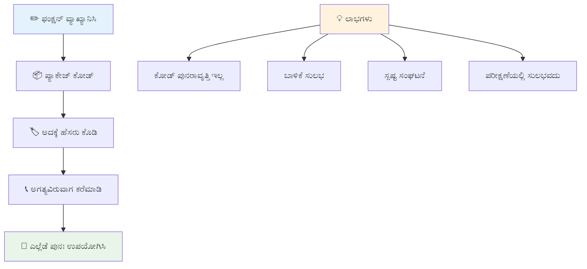
> **ಟಿಪ್ಪಣಿ:** ನೀವು ಈ ಪಾಠಗಳಲ್ಲಿ **ವಿಧಾನಗಳನ್ನು** ಬಳಸುತ್ತಿದ್ದೀರಿ. `console.log()` ಒಂದು ವಿಧಾನ – ಅದರ ಅರ್ಥ `console` объಕ್ತಿಗೆ ಸೇರಿದ ಕಾರ್ಯ. ಪ್ರಮುಖ ವ್ಯತ್ಯಾಸವೆಂದರೆ ವಿಧಾನಗಳು объಕ್ತ್ಗಳಿಗೆ ಜೋಡಿಸಲಾಗಿದೆ, ಕಾರ್ಯಗಳು ಸ್ವತಂತ್ರವಾಗಿರುತ್ತವೆ. ಹಲವಾರು ಡೆವಲಪರ್‌ಗಳು ಈ ಪದಗಳನ್ನು ಪಾರಂಪರಿಕ ಸಮಾಲೋಚನೆಯಲ್ಲಿ ಪರ್ಯಾಯವಾಗಿ ಬಳಸುತ್ತಾರೆ.

### ಕಾರ್ಯಕ್ಕೆ ಉತ್ತಮ ಅಭ್ಯಾಸಗಳು

ಇಲ್ಲಿ ಉತ್ತಮ ಕಾರ್ಯಗಳನ್ನು ಬರೆಯಲು ಸಹಾಯಮಾಡುವ ಕೆಲವು ಸಲಹೆಗಳು:

- ನಿಮ್ಮ ಕಾರ್ಯಗಳಿಗೆ ಸ್ಪಷ್ಟ, ವಿವರಣಾತ್ಮಕ ಹೆಸರಿಗಳನ್ನು ನೀಡಿ – ಭವೀಷ್ಯದಲ್ಲಿ ನೀವು ಧನ್ಯವಾದ ಹೇಳುತ್ತೀರಿ!
- ಬಹು ಪದದ ಹೆಸರಿಗಾಗಿ **camelCase** ಬಳಸಿ (ಉದಾ: `calculateTotal` `calculate_total` ಬದಲು)
- ಪ್ರತಿ ಕಾರ್ಯ ಒಂದೇ ಒಂದು ವಿಷಯದಲ್ಲಿ ಗಮನವಾಗಿರಲಿ

## ಕಾರ್ಯಕ್ಕೆ ಮಾಹಿತಿ ಪಾಸು ಮಾಡುವುದು

ನಮ್ಮ `displayGreeting` ಕಾರ್ಯವು ಸೀಮಿತವಾಗಿದೆ – ಇದು ಎಲ್ಲರಿಗೂ "Hello, world!" ಮಾತ್ರ ತೋರಿಸಬಹುದು. ಪ್ಯಾರಾಮೀಟರ್‌ಗಳು ಕಾರ್ಯಗಳನ್ನು ಹೆಚ್ಚು ಸ್ಥಿತಿಹೀನ ಮತ್ತು ಉಪಯುಕ್ತವಾಗಿಸಬಹುದು.

**ಪ್ಯಾರಾಮೀಟರ್‌ಗಳು** ಬದಲಾದ ಮೌಲ್ಯಗಳನ್ನು ಪ್ರತಿ ಕಾರ್ಯ ಕರೆಯುವಾಗ ಅಂಟಿಸಲು ಸ್ಥಳಧಾರಕಗಳಂತೆ ಕೆಲಸ ಮಾಡುತ್ತವೆ. ಈ ಮೂಲಕ ಇದೇ ಕಾರ್ಯ ವಿಭಿನ್ನ ಮಾಹಿತಿಯೊಂದಿಗೆ ಪ್ರತಿ ಕಾಲ್‌ನಲ್ಲಿ ಕಾರ್ಯನಿರ್ವಹಿಸಬಹುದು.

ನೀವು ನಿಮ್ಮ ಕಾರ್ಯವನ್ನು ಸೃಷ್ಟಿಸುವಾಗ ಕೊಳಕುಗಳಲ್ಲಿ ಪ್ಯಾರಾಮೀಟರ್‌ಗಳನ್ನು ವಿವರಿಸಿ, ಮತ್ತು ಹಲವಾರು ಪ್ಯಾರಾಮೀಟರ್‌ಗಳನ್ನು ವಿರಾಮಚೇಹ್ನೆಯಿಂದ ಪ್ರತ್ಯೇಕಿಸಿ:

```javascript
function name(param, param2, param3) {

}
```

ಪ್ರತಿ ಪ್ಯಾರಾಮೀಟರ್ ಒಂದು ಸ್ಥಳಪಡಿಸುವ ಜಾಗವನ್ನು ನಿಭಾಯಿಸುತ್ತದೆ – ಯಾರಾದರೂ ನಿಮ್ಮ ಕಾರ್ಯವನ್ನು ಕರೆ ಮಾಡಿದಾಗ, ಅವರು ನಿಜವಾದ ಮೌಲ್ಯಗಳನ್ನು ಈ ಜಾಗಗಳಲ್ಲಿ ಒದಗಿಸುತ್ತಾರೆ.

ನಿಮ್ಮ ಸ್ವಾಗತ ಕಾರ್ಯವನ್ನು ಪ್ರತಿಯೊಬ್ಬರ ಹೆಸರು ಒಪ್ಪಿಕೊಳ್ಳುವಂತೆ ನವೀಕರಿಸೋಣ:

```javascript
function displayGreeting(name) {
  const message = `Hello, ${name}!`;
  console.log(message);
}
```

ನೀವು ಹಿಂದಿನ ಹೆಸರು ಭಾಗದಲ್ಲಿ ಬ್ಯಾಕ್ಟಿಕ್ ಲಕ್ಷಣ (`` ` ``) ಮತ್ತು `${}` ಬಳಸಿ ನೇರವಾಗಿ ಸಂದೇಶಕ್ಕೆ ಹೆಸರು ಸೇರಿಸುತ್ತಿರಾ – ಇದನ್ನು ಟೆಂಪ್ಲೇಟ್ ಲಿಟರಲ್ ಎಂದು ಕರೆಯುತ್ತಾರೆ ಮತ್ತು ಇದು ಚರಗಳನ್ನು ಸರಳವಾಗಿ ನಿರ್ಮಿಸಲು ತುಂಬ ಉಪಯುಕ್ತವಾಗಿದೆ.

ಈಗ ನೀವು ಕಾರ್ಯವನ್ನು ಕರೆ ಮಾಡಿದಾಗ, ಯಾವ ಹೆಸರು ಬೇಕಾದರೂ ಪಾಸು ಮಾಡಬಹುದು:

```javascript
displayGreeting('Christopher');
// ಚಲನಗೊಳಿಸಿದಾಗ "ಹಲೋ, ಕ್ರಿಸ್ಟೋಫರ್!" ಅನ್ನು ಪ್ರದರ್ಶಿಸುತ್ತದೆ
```

ಜಾವಾಸ್ಕ್ರಿಪ್ಟ್ `'Christopher'` ಎಂಬ ಸರಣಿಯನ್ನು `name` ಪ್ಯಾರಾಮೀಟರ್‌ಗೆ ಒಪ್ಪಿಸುತ್ತಿದೆ, ಮತ್ತು "Hello, Christopher!" ಎಂಬ ವೈಯಕ್ತಿಕ ಸಂದೇಶವನ್ನು ಸೃಷ್ಟಿಸುತ್ತದೆ.

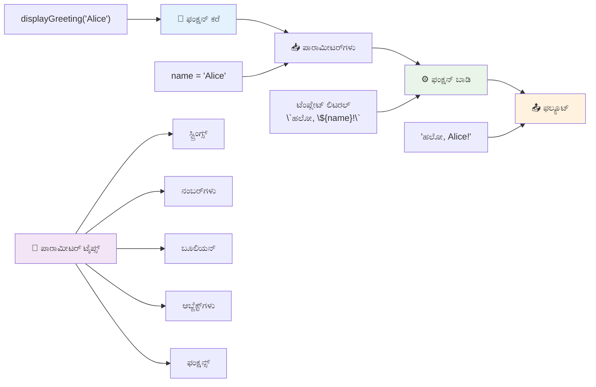
## ಪೂರ್ವನಿಯೋಜಿತ ಮೌಲ್ಯಗಳು

ನಾವು ಕೆಲವು ಪ್ಯಾರಾಮೀಟರ್‌ಗಳನ್ನು ಐಚ್ಛಿಕವಾಗಿಸಲು ಬಯಸಿದರೆ? ಅದಕ್ಕೆ ಪೂರ್ವನಿಯೋಜಿತ ಮೌಲ್ಯಗಳು ಸಹಾಯಮಾಡುತ್ತವೆ!

ಎರಡನೇ ರೀತಿಯಲ್ಲಿ ಅಭಿವಂದನಾ ಪದವನ್ನು ಬದಲಾಯಿಸಲು ಆದರೆ ಒಬ್ಬರು ಸೂಚಿಸದಿದ್ದರೆ ನಾವು ಡೀಫಾಲ್ಟ್ ಆಗಿ "Hello" ಬಳಸುತ್ತೇವೆ. ನೀವು ಡೀಫಾಲ್ಟ್ ಮೌಲ್ಯಗಳನ್ನು ಸಮಾನ ಚಿಹ್ನೆಯನ್ನು ಬಳಸಿ ಸೆಟ್ ಮಾಡಬಹುದು, ಹೇಗೆ ಒಂದು ಚರವನ್ನು ಸೆಟ್ ಮಾಡುತ್ತಾರೆ:

```javascript
function displayGreeting(name, salutation='Hello') {
  console.log(`${salutation}, ${name}`);
}
```

ಇಲ್ಲಿ, `name` ಇನ್ನೂ ಅಗತ್ಯವಿದೆ, ಆದರೆ `salutation` ಗೆ ಬೇರೆ ಸ್ವಾಗತ ನೀಡದಿದ್ದರೆ `'Hello'` ಅಳೆಯುತ್ತೇವೆ.

ಈ ಕಾರ್ಯವನ್ನು ಎರಡು ವಿಭಿನ್ನ ರೀತಿಯಲ್ಲಿ ಕರೆ ಮಾಡಬಹುದು:

```javascript
displayGreeting('Christopher');
// "ಹೆಲೋ, ಕ್ರಿಸ್ಟೋಫರ್" ಅನ್ನು ಪ್ರದರ್ಶಿಸುತ್ತದೆ

displayGreeting('Christopher', 'Hi');
// "ಹಾಯ್, ಕ್ರಿಸ್ಟೋಫರ್" ಅನ್ನು ಪ್ರದರ್ಶಿಸುತ್ತದೆ
```

ಮೊದಲ ಕರೆದಲ್ಲಿ, ನಾವು ಸ್ವಾಗತ ಹೇಳಿಕೆಯನ್ನು ನೀಡದಿದ್ದರೆ ಜಾವಾಸ್ಕ್ರಿಪ್ಟ್ ಡೀಫಾಲ್ಟ್ "Hello" ಅನ್ನು ಬಳಸುತ್ತದೆ. ಎರಡನೇ ಕರೆದಲ್ಲಿ, ನಾವು "Hi" ಎಂಬ ಕಸ್ಟಮ್ ಸ್ವಾಗತವನ್ನು ಬಳಸುತ್ತದೆ. ಈ ಸ್ಥಿತಿಉಪಯುಕ್ತತೆಯಿಂದ ಕಾರ್ಯಗಳು ವಿಭಿನ್ನ ಸಂದರ್ಭಗಳಿಗೆ ಸೂಕ್ತವಾಗುತ್ತವೆ.

### 🎛️ **ಪ್ಯಾರಾಮೀಟರ್ ಮಾಸ್ಟರಿ ಪರಿಶೀಲನೆ: ಕಾರ್ಯಗಳನ್ನು ಸ್ಥಿತಿಉಪಯುಕ್ತವಾಗಿಸುವುದು**

**ನಿಮ್ಮ ಪ್ಯಾರಾಮೀಟರ್ ತಜ್ಞತೆ ಪರೀಕ್ಷಿಸಿ:**
- ಪ್ಯಾರಾಮೀಟರ್ ಮತ್ತು_ARGUMENT_ಗಳ ಮಧ್ಯೆ ವ್ಯತ್ಯಾಸವೇನು?
- ನಿಜವಾದ ಪ್ರೋಗ್ರಾಮಿಂಗ್‌ನಲ್ಲಿ ಪೂರ್ವನಿಯೋಜಿತ ಮೌಲ್ಯಗಳು ಏಕೆ ಉಪಯುಕ್ತ?
- ನೀವು ಪ್ಯಾರಾಮೀಟರ್ ಗಿಂತ ಹೆಚ್ಚು_ARGUMENT_ಗಳು ಪಾಸು ಮಾಡಿದರೆ ಏನಾಗಬಹುದು ಎಂದು ನಿರೀಕ್ಷಿಸಬಹುದಾ?

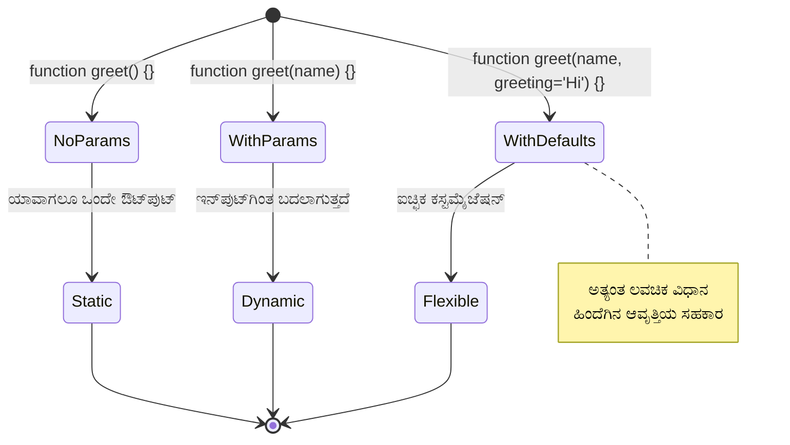
> **ಪರಿಹಾರ ಸಲಹೆ:** ಪೂರ್ವನಿಯೋಜಿತ ಪ್ಯಾರಾಮೀಟರ್‌ಗಳು ನಿಮ್ಮ ಕಾರ್ಯಗಳನ್ನು ಬಳಕೆದಾರ ಸ್ನೇಹಿಯಾಗಿ ಮಾಡುತ್ತವೆ. ಬಳಕೆದಾರರು ಸೂಕ್ತ ಡೀಫಾಲ್ಟ್‌ಗಳೊಂದಿಗೆ ತಕ್ಷಣ ಪ್ರಾರಂಭಿಸಬಹುದು, ಆದರೆ ಬೇಕಾದಾಗ ಕಸ್ಟಮೈಸ್ ಮಾಡಬಹುದು!

## ಮರುಪಡೆಯುವ ಮೌಲ್ಯಗಳು

ನಮ್ಮ ಕಾರ್ಯಗಳು ಈಗಾಗಲೇ ಸಂದೇಶಗಳನ್ನು ಕನ್ಸೊಳ್‌ಗೆ ಮುದ್ರಿಸುತ್ತಿವೆ, ಆದರೆ ನೀವು ಕಾರ್ಯದಿಂದ ಏನಾದರೂ ಲೆಕ್ಕಹಾಕಿಸಿ ಫಲಿತಾಂಶವನ್ನು ಪಡೆಯಲು ಬಯಸಿದರೆ?

ಅದಕ್ಕೆ **ಮರುಪಡೆಯುವ ಮೌಲ್ಯಗಳು** ಉಪಯುಕ್ತ. ಏದನ್ನಾದರೂ ತೋರಿಸುವ ಬದಲು, ಕಾರ್ಯವು ನೀವು ಸಂಗ್ರಹಿಸಬಹುದಾದ ಅಥವಾ ನಿಮ್ಮ ಕೋಡ್‌ನ ಬೇರೆ ಭಾಗಗಳಲ್ಲಿ ಉಪಯೋಗಿಸಬಹುದಾದ ಮೌಲ್ಯವನ್ನು ಹಿಂತಿರುಗಿಸಬಹುದು.

ಮೌಲ್ಯವನ್ನು ಹಿಂತಿರುಗಿಸಲು, `return` ಕೀವರ್ಡ್ ಬಳಸಿ ನಂತರ ಹಿಂತಿರುಗಿಸಲು ಬಯಸಿದ ಮೌಲ್ಯವನ್ನು ಬರೆಯಿರಿ:

```javascript
return myVariable;
```

ಮುಖ್ಯ విషయం: ಕಾರ್ಯವು `return` ನಿವೇಶನವನ್ನು ಹೊಯ್ದಾಗ, ತಕ್ಷಣವೇ ಕಾರ್ಯ ನಿಲ್ಲುತ್ತದೆ ಮತ್ತು ಆ ಮೌಲ್ಯವನ್ನು ಕರೆಮಾಡಿರುವ ಜಾಗಕ್ಕೆ ತಲುಪಿಸುತ್ತದೆ.

ನಮ್ಮ ಸ್ವಾಗತ ಕಾರ್ಯವನ್ನು ಮುದ್ರಿಸುವ ಬದಲು ಸಂದೇಶವನ್ನು ಹಿಂತಿರುಗಿಸುವಂತೆ ಬದಲಿಸೋಣ:

```javascript
function createGreetingMessage(name) {
  const message = `Hello, ${name}`;
  return message;
}
```

ಈಗ ಕಾರ್ಯವು ಸ್ವಾಗತವನ್ನು ಮುದ್ರಿಸುವ ಬದಲಾಗಿ, ಸಂದೇಶವನ್ನು ರಚಿಸಿ ನಮಗೆ ಹಿಂತಿರುಗಿಸುತ್ತದೆ.

ಹಿಂತಿರುಗಿದ ಮೌಲ್ಯವನ್ನು ಬಳಸಲು, ನಾವು ಅದನ್ನು ಚರದಲ್ಲಿ ಸಂಗ್ರಹಿಸಬಹುದು:

```javascript
const greetingMessage = createGreetingMessage('Christopher');
```

ಈಗ `greetingMessage` ನಲ್ಲಿ "Hello, Christopher" ಇದೆ ಮತ್ತು ನಾವು ಇದನ್ನು ನಮ್ಮ ಕೋಡ್‌ನಲ್ಲಿ ಯಾವುದೇ ಸ್ಥಳದಲ್ಲಿ ಬಳಸಬಹುದು – ವೆಬ್ ಪುಟದಲ್ಲಿ ತೋರುವುದಕ್ಕೆ, ಇಮೇಲ್‌ನಲ್ಲಿ ಸೇರಿಸುವುದಕ್ಕೆ ಅಥವಾ ಬೇರೆ ಕಾರ್ಯಕ್ಕೆ ಪಾರ್ಯಕ್ಷಿಸುವುದಕ್ಕೆ.

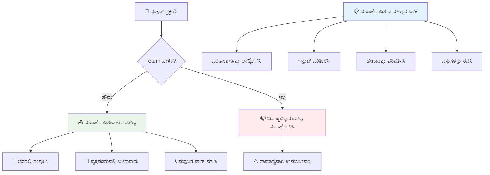
### 🔄 **ಮರುಪಡೆಯುವ ಮೌಲ್ಯಗಳ ಪರಿಶೀಲನೆ: ಫಲಿತಾಂಶಗಳನ್ನು ಪಡೆಯುವುದು**

**ನೀವು ಮರುಪಡೆಯುವ ಮೌಲ್ಯವನ್ನು ಹೇಗೆ ತಿಳಿದುಕೊಳ್ಳುತ್ತೀರಿ:**
- ಕಾರ್ಯದೊಳಗಿನ `return` ಹೇಳಿಕೆಯಿಂದ ನಂತರದ ಕೋಡ್‌ಗೆ ಏನಾಗುತ್ತದೆ?
- ಮುದ್ರಿಸುವ ಬದಲು ಮೌಲ್ಯಗಳನ್ನು ಹಿಂತಿರುಗಿಸುವುದು ಯಾಕೆ ಉತ್ತಮ?
- ಕಾರ್ಯವು ವಿಭಿನ್ನ ಪ್ರಕಾರಗಳ ಮೌಲ್ಯಗಳನ್ನು ಹಿಂತಿರುಗಿಸಬಹುದುವೇ (ಸರಣಿ, ಸಂಖ್ಯೆ, ಬೂಲಿಯನ್)?

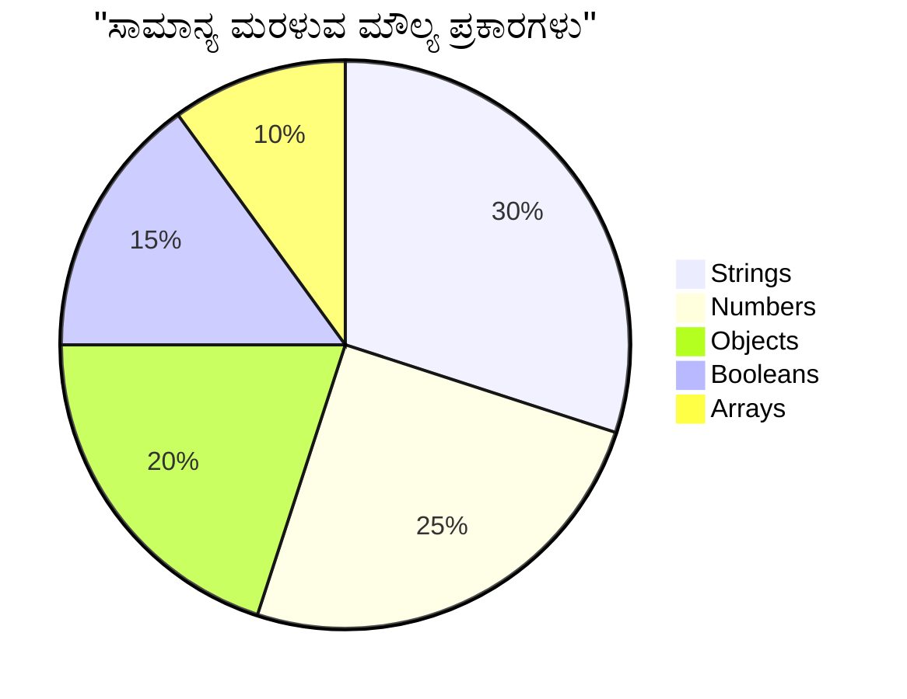
> **ಪ್ರಧಾನ ತತ್ವ:** ಮೌಲ್ಯ ಹಿಂತಿರುಗಿಸುವ ಕಾರ್ಯಗಳು ಹೆಚ್ಚು ಬಹುಮುಖವಾಗಿವೆ ಏಕೆಂದರೆ ಕರೆಮಾಡುವವರು ಫಲಿತಾಂಶದೊಂದಿಗೆ ಏನು ಮಾಡಬೇಕೆಂದು ತಲೋರುತಾರೆ. ಇದು ನಿಮ್ಮ ಕೋಡ್ ಅನ್ನು ಹೆಚ್ಚು ಮాడ್ಯುಲರ್ ಮತ್ತು ಪುನಃಬಳಕೆಗೊಳಿಸುವಂತೆ ಮಾಡುತ್ತದೆ!

## ಕಾರ್ಯಗಳನ್ನು ಪ್ಯಾರಾಮೀಟರ್‌ಗಳಾಗಿ ಪ್ಯಾಸು ಮಾಡುವುದು

ಕಾರ್ಯಗಳನ್ನು ಬೇರೆ ಕಾರ್ಯಗಳಿಗೆ ಪ್ಯಾರಾಮೀಟರ್‌ಗಳಾಗಿ ಪಾಸು ಮಾಡಬಹುದು. ಮೊದಲಿಗೆ ಇದು ಸವಾಲಿನಿರ್ಥಕವಾಗಬಹುದು, ಆದರೆ ಇದು ಸ್ತಿತಿಹೀನ ಪ್ರೋಗ್ರಾಮಿಂಗ್ ಮಾದರಿಗಳನ್ನು ಸಾದರಪಡಿಸುತ್ತದೆ.

ಈ ಮಾದರಿ ಸಾಮಾನ್ಯವಾಗಿ "ಏನಾದರೂ ಸಂಭವಿಸಿದಾಗ, ಇನ್ನು ಒಂದು ಕಾರ್ಯವನ್ನ ಮಾಡಿ" ಅಂತ ಹೇಳಬೇಕಾಗಿರುತ್ತದೆ. ಉದಾಹರಣೆಗೆ, "ಟೈಮರ್ ಮುಗಿದಾಗ, ಈ ಕೋಡ್ ರನ್ ಆಗಲಿ" ಅಥವಾ "ಬಟನ್ ಕ್ಲಿಕ್ ಮಾಡಿದಾಗ, ಈ ಕಾರ್ಯವನ್ನು ಕರೆಮಾಡಿ" ಎಂದು.

`setTimeout` ಎಂಬ ಒಳಗೊಂಡ ಕಾರ್ಯವನ್ನು ನೋಡೋಣ, ಇದು ಕೆಲವು ಸಮಯವನ್ನು ಕಾಯುತ್ತದೆ ಮತ್ತು ನಂತರ ಕೆಲವು ಕೋಡ್ ರನ್ ಮಾಡುತ್ತದೆ. ನಮಗೆ ಅದಕ್ಕೆ ಯಾವ ಕೋಡ್ ರನ್ ಮಾಡಬೇಕು ಎಂದು ಹೇಳಬೇಕಾಗುತ್ತದೆ – ಕಾರ್ಯವನ್ನು ಪ್ಯಾರಾಮೀಟರ್ ಸಹಾಯದಿಂದ ಪಾಸು ಮಾಡಲು ಇದು ಸೂಕ್ತ ಉದಾಹರಣೆ!

ಈ ಕೋಡ್ ಪ್ರಯತ್ನಿಸಿ – 3 ಸೆಕೆಂಡಿನ ಮೇಲೆ ಸಂದೇಶವನ್ನು ನೋಡುತ್ತೀರಿ:

```javascript
function displayDone() {
  console.log('3 seconds has elapsed');
}
// ಟೈಮರ್ ಮೌಲ್ಯವು ಮಿಲಿಸೆಕೆಂಡು ಗಳಲ್ಲಿ ಇದೆ
setTimeout(displayDone, 3000);
```

ನೀವು `displayDone` ಅನ್ನು `setTimeout` ಗೆ (ಕೊಳಕುಗಳಿರದೆ) ಪಾಸು ಮಾಡುತ್ತಿದ್ದೀರಿ. ನಾವು ಕಾರ್ಯವನ್ನು ಸ್ವತಃ ಕರೆ ಮಾಡುತ್ತಿಲ್ಲ – ನಾವು ಅದನ್ನು `setTimeout` ಗೆ ನೀಡುತ್ತಿದ್ದು "3 ಸೆಕೆಂಡಿನ ಮೇಲೆ ಕರೆಮಾಡು" ಎಂದು ಹೇಳುತ್ತಿದ್ದೇವೆ.

### ಅನಾಮಧೇಯ ಕಾರ್ಯಗಳು

ಏಕ ಪ್ರಕರಣಕ್ಕೆ ಮಾತ್ರ ಕಾರ್ಯ ಬೇಕಾದಾಗ ಮತ್ತು ಅದಕ್ಕೆ ಹೆಸರು ನೀಡಬೇಕಾಗಿಲ್ಲದಿದ್ದಾಗ? ಯೋಚಿಸಿ – ನೀವು ಕಾರ್ಯವನ್ನು ಒಮ್ಮೆ ಮಾತ್ರ ಬಳಸದಿದ್ದರೆ, ಅದಕ್ಕಾಗಿ ಹೆಚ್ಚುವರಿ ಹೆಸರು ನಿಮ್ಮ ಕೋಡ್ ಅನ್ನು ಅತಿವ್ಯವಸ್ಥೆಗೊಳಿಸುತ್ತದೆಯೇ?

ಜಾವಾಸ್ಕ್ರಿಪ್ಟ್ ನಿಮಗೆ **ಅನಾಮಧೇಯ ಕಾರ್ಯಗಳು** (ಹೆಸರು ಇರುವುದಿಲ್ಲದ ಕಾರ್ಯಗಳು) ರಚಿಸಲು ಅವಕಾಶ ಮಾಡಿಕೊಡುತ್ತದೆ, ನೀವು ಅವುಗಳನ್ನು ನೀವು ಅವಶ್ಯಕವಾಗಿರುವ ಸ್ಥಳದಲ್ಲೇ ವ್ಯಾಖ್ಯಾನಿಸಬಹುದು.

ನಮ್ಮ ಟೈಮರ್ ಉದಾಹರಣೆಯನ್ನು ಅನಾಮಧೇಯ ಕಾರ್ಯ ಬಳಸಿ ಮರು ಬರೆಯುವುದು ಹೀಗಿದೆ:

```javascript
setTimeout(function() {
  console.log('3 seconds has elapsed');
}, 3000);
```

ಈದು ಅದೇ ಫಲಿತಾಂಶ, ಆದರೆ ಕಾರ್ಯವು ನೇರವಾಗಿ `setTimeout` ಕರೆ ಒಳಗೆ ವ್ಯಾಖ್ಯಾನಿಸಲಾಗಿದೆ, ಕೆಲವೊಮ್ಮೆ ಬೇರೆ ಕಾರ್ಯ ವ್ಯಾಖ್ಯಾನ ಅಗತ್ಯವಿಲ್ಲ.

### ಫ್ಯಾಟ್ ಅರೊ (arrow) ಕಾರ್ಯಗಳು

ಆಧುನಿಕ ಜಾವಾಸ್ಕ್ರಿಪ್ಟ್ ಇನ್ನೂ ಸಂಕ್ಷಿಪ್ತವಾದ ಕಾರ್ಯಗಳನ್ನು ಬರೆಯಲು **ಅರೊ ಕಾರ್ಯಗಳು** ನಿವಿಧಾನವನ್ನು ಒದಗಿಸುತ್ತದೆ. ಅವು `=>` (ಅರೊ ರೂಪವೆಂದು ಕಾಣುತ್ತದೆ) ಉಪಯೋಗಿಸುತ್ತವೆ ಮತ್ತು ಡೆವಲಪರ್‌ಗಳಲ್ಲಿ ತುಂಬಾ ಜನಪ್ರಿಯವಾಗಿವೆ.

ಅರೊ ಕಾರ್ಯಗಳು `function` ಕೀವರ್ಡ್ ಬಿಟ್ಟುಲಾಗಿ, ಹೆಚ್ಚು ಸಂಕ್ಷಿಪ್ತ ಭಾಷೆಯನ್ನು ಬರೆಯಲು ಸುಲಭ.

ನಮ್ಮ ಟೈಮರ್ ಉದಾಹರಣೆ ಅರೊ ಕಾರ್ಯ ಬಳಸಿ ಹೀಗಿದೆ:

```javascript
setTimeout(() => {
  console.log('3 seconds has elapsed');
}, 3000);
```

`()` ಪ್ಯಾರಾಮೀಟರ್ ಇಡಲು ಜಾಗ (ಈ ಉದಾಹರಣೆಯಲ್ಲಿ ಖಾಲಿ), ನಂತರ `=>` ಮತ್ತು ಕೊನೆಗೆ ವರ್ಗಾಕಾರ ಹಾಳೆಗಳೊಳಗಿನ ಕಾರ್ಯ ದೇಹ. ಇದು ಶೈಲಿಯಲ್ಲಿ ಹೆಚ್ಚು ಸಂಕ್ಷಿಪ್ತ, ಆದರೆ ಕಾರ್ಯನಿರ್ವಹಣೆಯಲ್ಲಿ ಸಮಾನ.

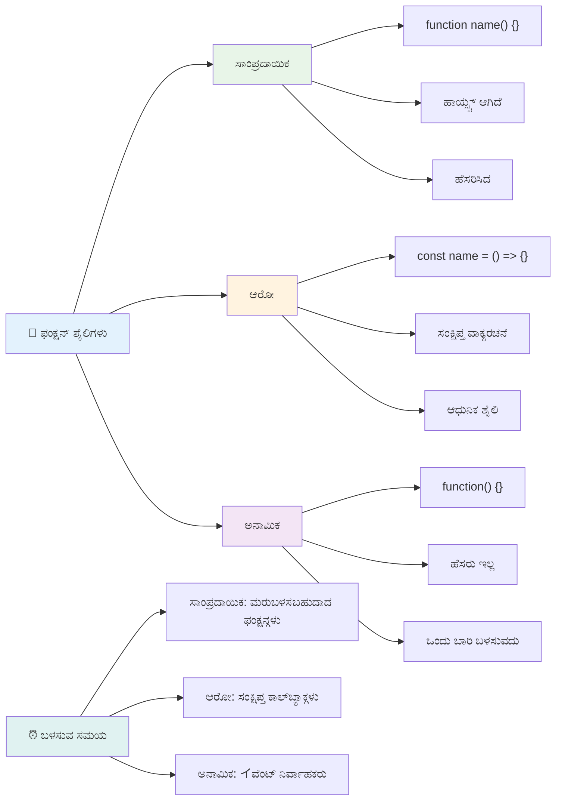
### ಪ್ರತಿಯೊಂದು ರೀತಿ ಬಳಸುವಾಗ

ಯಾವಾಗ ಯಾವ ವಿಧಾನವನ್ನು ಬಳಸಬೇಕು? ಪ್ರಾಯೋಗಿಕ ಮಾರ್ಗದರ್ಶಿ: ನೀವು ಕಾರ್ಯವನ್ನು ಎಷ್ಟು ಬಾರಿ ಬಳಸುತ್ತೀರೋ ತಿಳಿದು, ಬಹಳ ಸಲಗಳನ್ನು ಬಳಸಲು ಹೆಸರು ನೀಡಿ ಮತ್ತು ಪ್ರತ್ಯೇಕವಾಗಿ ವ್ಯಾಖ್ಯಾನಿಸಿ. ಒಮ್ಮೆಕೂಡುವ ತನ್ನ ವಿಶೇಷ ಬಳಸಿಕೋವುದಾದರೆ, ಅನಾಮಧೇಯ ಕಾರ್ಯವನ್ನು ಪರಿಗಣಿಸಿ. ಅರೊ ಕಾರ್ಯ ಮತ್ತು ಸಾಂಪ್ರದಾಯಿಕ ಶೈಲಿ ಎರಡೂ ಸರಾಗ ಆಯ್ಕೆಗಳು, ಆದರೂ ಅರೊ ಕಾರ್ಯಗಳು ಆಧುನಿಕ ಜಾವಾಸ್ಕ್ರಿಪ್ಟ್ ಕೋಡ್‌ಬೇಸ್‌ನಲ್ಲಿ ಸಾಮಾನ್ಯ.

### 🎨 **ಕಾರ್ಯ ಶೈಲಿಗಳು ಪರಿಶೀಲನೆ: ಸರಿಯಾದ ಶೈಲಿಯನ್ನು ಆರಿಸುವುದು**

**ನಿಮ್ಮ ಶೈಲಿ ತಿಳಿವಳಿಕೆ ಪರೀಕ್ಷಿಸಿ:**
- ಯಾವಾಗ ನೀವು ಪರಂಪರাগত ಕಾರ್ಯ ಶೈಲಿಗೆ ಬದಲಿ ಅರೊ ಕಾರ್ಯಗಳನ್ನು ಆಯ್ಕೆಮಾಡಬಹುದು?
- ಅನಾಮಧೇಯ ಕಾರ್ಯಗಳ ಪ್ರಮುಖ ಲಾಭವೇನು?
- ಹೆಸರು ಇರುವ ಕಾರ್ಯ ಒ匿名ಕಾರ್ಯಕ್ಕಿಂತ ಉತ್ತಮವಾಗಿರುವ ಸ್ಥಿತಿಯನ್ನು ನೀವು ಯೋಚಿಸಬಹುದೇ?

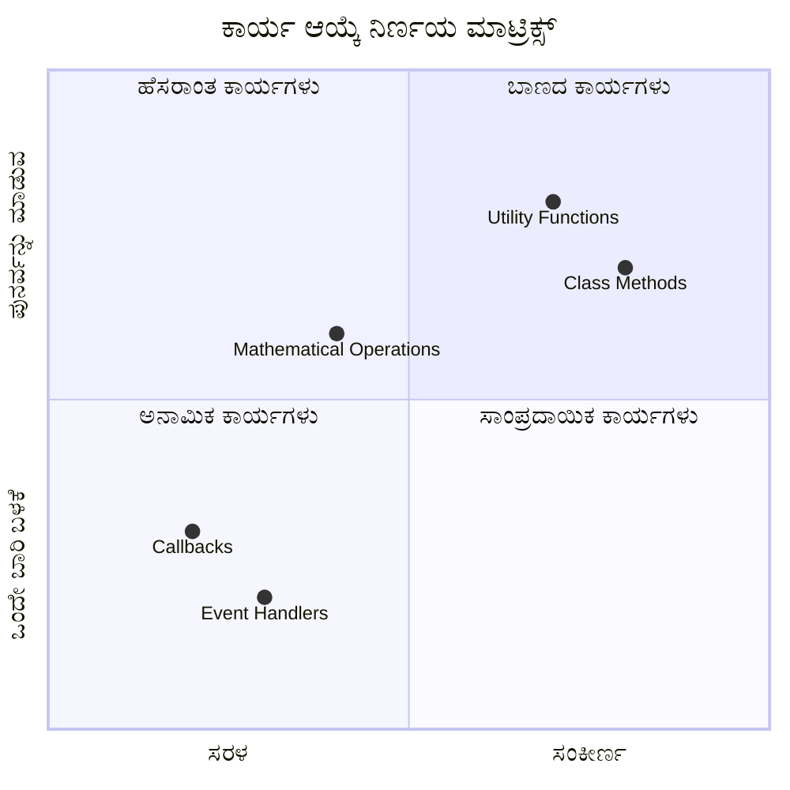
> **ಆಧುನಿಕ ಧೋರಣೆ:** ಅರೊ ಕಾರ್ಯಗಳು ಸಂಕ್ಷಿಪ್ತ ಶೈಲಿಗಾಗಿ ಬಹು ಡೆವಲಪರ್‌ಗಳ ಮುಖಂಡ ಆಯ್ಕೆ ಆಗುತ್ತಿರುವುದು, ಆದರೂ ಸಾಂಪ್ರದಾಯಿಕ ಕಾರ್ಯಗಳಿಗೂ ತಮ್ಮ ಸ್ಥಳವಿದೆ!

---

## 🚀 ಸವಾಲು

ಕಾರ್ಯಗಳು ಮತ್ತು ವಿಧಾನಗಳ ಮಧ್ಯೆ ವ್ಯತ್ಯಾಸವನ್ನು ಒಂದು ವಾಕ್ಯದಲ್ಲಿ ವर्णಿಸಬಹುದುವೇ? ಪ್ರಯತ್ನಿಸಿ!

## GitHub Copilot ಏಜೆಂಟ್ ಸವಾಲು 🚀

ಅನುವಾದ: ಈ ಪಾಠದಲ್ಲಿ ಪ್ರಸ್ತುತಪಡಿಸಿದ ವಿವಿಧ ಕಾರ್ಯ ಕಲ್ಪನೆಗಳನ್ನು ಒಳಗೊಂಡ ಗಣಿತ ಕಾರ್ಯಗಳ ಉಪಯುಕ್ತ ಗ್ರಂಥಾಲಯವನ್ನು ರಚಿಸಿ, ಇದರಲ್ಲಿ ಪ್ಯಾರಾಮೀಟರ್‌ಗಳು, ಪೂರ್ವನಿಯೋಜಿತ ಮೌಲ್ಯಗಳು, ಮರುಪಡೆಯುವ ಮೌಲ್ಯಗಳು ಮತ್ತು ಅರೊ ಕಾರ್ಯಗಳನ್ನು ಒಳಗೊಂಡಿರಲಿ.

**ಪ್ರಾಂಪ್ಟ್:** `mathUtils.js` ಎಂಬ ಜಾವಾಸ್ಕ್ರಿಪ್ಟ್ ಫೈಲ್ ಅನ್ನು ರಚಿಸಿ, ಈ ಕೆಳಗಿನ ಕಾರ್ಯಗಳೊಂದಿಗೆ:
1. ಎರಡು ಪ್ಯಾರಾಮೀಟರ್‌ಗಳನ್ನು ತೆಗೆದುಕೊಂಡು ಅವುಗಳ ಮೊತ್ತ ಹಿಂತಿರುಗಿಸುವ `add` ಕಾರ್ಯ
2. ಪೂರ್ವನಿಯೋಜಿತ ಮೌಲ್ಯಗಳೊಂದಿಗೆ `multiply` ಕಾರ್ಯ (ಎರಡನೇ ಪ್ಯಾರಾಮೀಟರ್ ಪೂರ್ವನಿಯೋಜಿತ గా 1)
3. ಒಂದು ಸಂಖ್ಯೆಯನ್ನು ತೆಗೆದುಕೊಂಡು ಅದರ ಚದರ ಹಿಂತಿರುಗಿಸುವ ಅರೊ ಕಾರ್ಯ `square`
4. ಇನ್ನೊಂದು ಕಾರ್ಯವನ್ನು ಪ್ಯಾರಾಮೀಟರ್‌ಗಳಾಗಿ ತೆಗೆದುಕೊಂಡು ಎರಡು ಸಂಖ್ಯೆಗಳ ಮೇಲೆ ಅನ್ವಯಿಸುವ `calculate` ಕಾರ್ಯ
5. ಎಲ್ಲಾ ಕಾರ್ಯಗಳನ್ನು ಸಮರ್ಪಕ ಪರೀಕ್ಷಾ ಪ್ರಕರಣಗಳೊಂದಿಗೆ ಕರೆಮಾಡಿ ಪ್ರದರ್ಶಿಸುವುದು

[ಏಜೆಂಟ್ режим್](https://code.visualstudio.com/blogs/2025/02/24/introducing-copilot-agent-mode) ಬಗ್ಗೆ ಹೆಚ್ಚಿನ ಮಾಹಿತಿ ಪಡೆಯಿರಿ.

## ಪಶ್ಚಾತ್ತಾಪ ಪತ್ರೌಪಚಾರಿಕ ಪ್ರಶ್ನೋತ್ತರ
[ಪಶ್ಚಾತ್ತಾಪ ಪತ್ರೌಪಚಾರಿಕ ಪ್ರಶ್ನೋತ್ತರ](https://ff-quizzes.netlify.app)

## ವಿಮರ್ಶೆ ಮತ್ತು ಸ್ವಅಧ್ಯಯನ

ಅರೊ ಕಾರ್ಯಗಳ ಬಗ್ಗೆ ಸ್ವಲ್ಪ ಹೆಚ್ಚು ಓದಲು ಇದು ಉತ್ತಮ [ಅರೊ ಕಾರ್ಯಗಳ ಬಗ್ಗೆ](https://developer.mozilla.org/docs/Web/JavaScript/Reference/Functions/Arrow_functions). ಕಾರ್ಯ ಬರೆಯುವ ಅಭ್ಯಾಸ ಮಾಡಿ ಮತ್ತು ನಂತರ ಈ ಶೈಲಿಯಲ್ಲಿ ಮರುಬರೆಯಿರಿ.

## ನಿಯೋಜನೆ

[ ಕಾರ್ಯಗಳಿಂದ_fname_ಆನಂದ](assignment.md)

---

## 🧰 **ನಿಮ್ಮ ಜಾವಾಸ್ಕ್ರಿಪ್ಟ್ ಕಾರ್ಯಗಳ ಉಪಕರಣ ಸಂಗ್ರಹ ಸಾರಾಂಶ**

```mermaid
graph TD
    A["🎯 ಜಾವಾ ಸ್ಕ್ರಿಪ್ಟ್ ಫಂಕ್ಷನ್ಸ್"] --> B["📋 ಫಂಕ್ಷನ್ ಘೋಷಣೆ"]
    A --> C["📥 ಪ್ಯಾರಾಮೀಟರ್ಗಳು"]
    A --> D["📤 ಮರುಪಡೆಯುವ ಮೌಲ್ಯಗಳು"]
    A --> E["🎨 ಆಧುನಿಕ ವ್ಯಾಕರಣ"]
    
    B --> B1["function name() {}"]
    B --> B2["ವಿವರಾತ್ಮಕ ಹೆಸರಿಡುವಿಕೆ"]
    B --> B3["ಮರುಬಳಕೆಗೊಳ್ಳಬಹುದಾದ ಕೋಡ್ ಬ್ಲಾಕ್ಸ್"]
    
    C --> C1["ಇನ್‌ಪುಟ್ ಡೇಟಾ"]
    C --> C2["ಡೀಫಾಲ್ಟ್ ಮೌಲ್ಯಗಳು"]
    C --> C3["ಹೆಚ್ಚಿನ ಪ್ಯಾರಾಮೀಟರ್ಗಳು"]
    
    D --> D1["return ಸ್ಟೇಟ್ಮೆಂಟ್"]
    D --> D2["ಫಂಕ್ಷನ್ ಬಿಟ್ಟುಹೋಗು"]
    D --> D3["ಡೇಟಾವನ್ನು ಹಿಂದಿರುಗಿಸು"]
    
    E --> E1["ಏರೋ ಫಂಕ್ಷನ್ಸ್: () =>"]
    E --> E2["ಅನಾಮಿಕ ಫಂಕ್ಷನ್ಸ್"]
    E --> E3["ಹೈಯರ್-ಆರ್ಡರ್ ಫಂಕ್ಷನ್ಸ್"]
    
    F["⚡ ಪ್ರಮುಖ ಪ್ರಯೋಜನಗಳು"] --> F1["ಕೋಡ್ ಮರುಬಳಕೆ"]
    F --> F2["ಉತ್ತಮ ಸಂಘಟನೆ"]
    F --> F3["ಸುಲಭ ಪರೀಕ್ಷೆ"]
    F --> F4["ಮಾಡ್ಯೂಲರ್ ವಿನ್ಯಾಸ"]
    
    style A fill:#e3f2fd
    style B fill:#e8f5e8
    style C fill:#fff3e0
    style D fill:#f3e5f5
    style E fill:#e0f2f1
    style F fill:#fce4ec
```
---

## 🚀 ನಿಮ್ಮ ಜಾವಾಸ್ಕ್ರಿಪ್ಟ್ ಕಾರ್ಯಗಳು ಮಾಸ್ಟರೈ ಸಮಯರೇಖೆ

### ⚡ **ಮುಂದಿನ 5 ನಿಮಿಷಗಳಲ್ಲಿ ನೀವು ಮಾಡಬಹುದಾದವುಗಳು**
- [ ] ನಿಮ್ಮ ಪ್ರಿಯ ಸಂಖ್ಯೆಯನ್ನು ಹಿಂತಿರುಗಿಸುವ ಸರಳ ಕಾರ್ಯವನ್ನು ಬರೆಯಿರಿ
- [ ] ಎರಡೂ ಪ್ಯಾರಾಮೀಟರ್‌ಗಳನ್ನು ತೆಗೆದುಕೊಂಡು ಆದುತ್ತ ಪ್ರಕ್ರಿಯೆಯ ಕಾರ್ಯವನ್ನು ರಚಿಸಿ
- [ ] ಪರಂಪರೆಯ 함수 ಅನ್ನು ಅರೋ ಫಂಕ್ಷನ್ ಸಿಂಟ್ಯಾಕ್ಸ್ ಗೆ ಪರಿವರ್ತಿಸಲು ಪ್ರಯತ್ನಿಸಿ
- [ ] ಸವಾಲಿನ ಅಭ್ಯಾಸ ಮಾಡಿ: ಫಂಕ್ಷನ್‌ಗಳು ಮತ್ತು ವಿಧಾನಗಳ ನಡುವಿನ ವ್ಯತ್ಯಾಸವನ್ನು ವಿವರಿಸಿ

### 🎯 **ಈ గంటದಲ್ಲಿ ನೀವು ಸಾಧಿಸಬಹುದಾಗಿದೆ**
- [ ] ಪಾಠೋತ್ತರ ಪ್ರಶ್ನೋತ್ತರವನ್ನು ಪೂರ್ಣಗೊಳಿಸಿ ಮತ್ತು ಯಾವುದೇ ಗೊಂದಲಮಯ概念ಗಳನ್ನು ಪರಿಶೀಲಿಸಿ
- [ ] GitHub Copilot ಸವಾಲಿನಿಂದ ಗಣಿತ ಉಪಕರಣಗಳ ಗ್ರಂಥಾಲಯವನ್ನು ನಿರ್ಮಿಸಿ
- [ ] ಯಾವುದಾದರೂ ಫಂಕ್ಷನ್ ಅನ್ನು ಪ್ಯಾರಾಮೀಟರ್ ಆಗಿ ಬಳಸುವ ಒಂದು ಫಂಕ್ಷನ್ ರಚಿಸಿ
- [ ] ಮೂಲಭೂತ ಪ್ಯಾರಾಮೀಟರ್‌ಗಳೊಂದಿಗೆ ಫಂಕ್ಷನ್‌ಗಳನ್ನು ಬರೆಯಲು ಅಭ್ಯಾಸ ಮಾಡಿ
- [ ] ಫಂಕ್ಷನ್ ಮರುಮೌಲ್ಯಗಳಿಗೆ ಟೆಂಪ್ಲೇಟ್ ಲಿಟರಲ್‌ಗಳೊಂದಿಗೆ ಪ್ರಯೋಗ ಮಾಡಿ

### 📅 **ನಿಮ್ಮ ವಾರದ ಫಂಕ್ಷನ್ ಪ್ರಾಬಲ್ಯ**
- [ ] "ಫಂಕ್ಷನ್‌ಗಳ ಸವಾರಿ" ಹಿಂದಿನ ಕಾರ್ಯವನ್ನು ಸೃಜನಾತ್ಮಕತೆಯಿಂದ ಪೂರ್ಣಗೊಳಿಸಿ
- [ ] ನೀವು ಬರೆದ ಕೆಲವು ಪುನರಾವರ್ತಿತ ಕೋಡ್ ಅನ್ನು ಪುನಃಬಳಕೆಯ ಫಂಕ್ಷನ್‌ಗಳಾಗಿ ಮಾರ್ಪಡಿ
- [ ] ಫಂಕ್ಷನ್‌ಗಳನ್ನು ಮಾತ್ರ ಬಳಸಿ (ಗೋಲ್ಬಲ್ ವೇರಿಯಬಲ್ಸ್ ಇಲ್ಲದೆ) ಸಣ್ಣ ಕ್ಯಾಲ್ಕ್ಯುಲೇಟರ್ ನಿರ್ಮಿಸಿ
- [ ] `map()` ಮತ್ತು `filter()` ಹೀಗಿನ ಅರೋ ಫಂಕ್ಷನ್‌ಗಳೊಂದಿಗೆ ಅರೋ ಫಂಕ್ಷನ್‌ಗಳನ್ನು ಅಭ್ಯಾಸಮಾಡಿ
- [ ] ಸಾಮಾನ್ಯ ಕಾರ್ಯಗಳಿಗೆ ಉಪಯುಕ್ತ ಫಂಕ್ಷನ್‌ಗಳ ಸಂಕಲನವನ್ನು ರಚಿಸಿ
- [ ] ಹೈಯರ್-ಆರ್ಡರ್ ಫಂಕ್ಷನ್‌ಗಳು ಮತ್ತು ಕಾರ್ಯಾತ್ಮಕ ಪ್ರೋಗ್ರಾಮಿಂಗ್ ಕನ್ಸೆಪ್ಟ್‌ಗಳ ಅಧ್ಯಯನ ಮಾಡಿ

### 🌟 **ನಿಮ್ಮ ತಿಂಗಳ ರೂಪಾಂತರ**
- [ ] ಕ್ಲೋಷರ್‌ಗಳು ಮತ್ತು ಸ್ಕೋಪ್ ಹೀಗಿನ ಉನ್ನತ ಫಂಕ್ಷನ್ ಕನ್ಸೆಪ್ಟ್‌ಗಳನ್ನು ಆಳವಾಗಿ ಕಲಿಯೋಣ
- [ ] ತುಂಬಾ ಫಂಕ್ಷನ್ ಸಂಯೋಜನೆಯನ್ನು ಬಳಸುವ ಪ್ರಾಜೆಕ್ಟ್ ನಿರ್ಮಿಸಿ
- [ ] ಫಂಕ್ಷನ್ ದಸ್ತಾವೇಜಿಕೆಯುಳ್ಳ ಮುಕ್ತ ಮೂಲಕ್ಕೆ ಆಸಕ್ತಿ ನೀಡಿ
- [ ] ಮತ್ತೊಬ್ಬರಿಗೆ ಫಂಕ್ಷನ್‌ಗಳು ಮತ್ತು ಭಿನ್ನ ಸಿಂಟ್ಯಾಕ್ಸ್ ಶೈಲಿಗಳ ಬಗ್ಗೆ ಬೋಧಿಸಿ
- [ ] ಜಾವಾಸ್ಕ್ರಿಪ್ಟ್‌ನಲ್ಲಿ ಕಾರ್ಯಾತ್ಮಕ ಪ್ರೋಗ್ರಾಮಿಂಗ್ ಪರಿಗಣನೆಗಳನ್ನು ಅನ್ವೇಷಿಸಿ
- [ ] ಭವಿಷ್ಯದ ಪ್ರಾಜೆಕ್ಟ್‌ಗಳಿಗೆ ಪುನಃಬಳಕೆಯ ಫಂಕ್ಷನ್‌ಗಳ ವೈಯಕ್ತಿಕ ಗ್ರಂಥಾಲಯವನ್ನು ರಚಿಸಿ

### 🏆 **ಅಂತಿಮ ಫಂಕ್ಷನ್ ಚಾಂಪಿಯನ್ ಪರಿಶೀಲನೆ**

**ನಿಮ್ಮ ಫಂಕ್ಷನ್ ಪ್ರಾಬಲ್ಯವನ್ನು ಆಚರಿಸಿ:**
- ಇವರೆಗೆ ನೀವು ರಚಿಸಿದ ಅತ್ಯಂತ ಉಪಯುಕ್ತ ಫಂಕ್ಷನ್ ಯಾವುದು?
- ಫಂಕ್ಷನ್‌ಗಳನ್ನು ಕಲಿತ ನಂತರ你的代码 ಸಂಘಟನೆ ಬಗ್ಗೆ ನಿನ್ನ ಸೇರಿದ ವಿಧನದಲ್ಲಿ ಯಾವ ಬದಲಾವಣೆ ಬಂತು?
- ಯಾವ ಫಂಕ್ಷನ್ ಸಿಂಟ್ಯಾಕ್ಸ್ ನೀವು ಮೆಚ್ಚುತ್ತೀರಿ ಮತ್ತು ಏಕೆ?
- ನೀವು ಏನಾದರೂ ನೈಜ ಜಗತ್ತಿನ ಸಮಸ್ಯೆಯನ್ನು ಫಂಕ್ಷನ್ ಬರೆಯುವುದರ ಮೂಲಕ ಪರಿಹರಿಸುತ್ತೀರಾ?

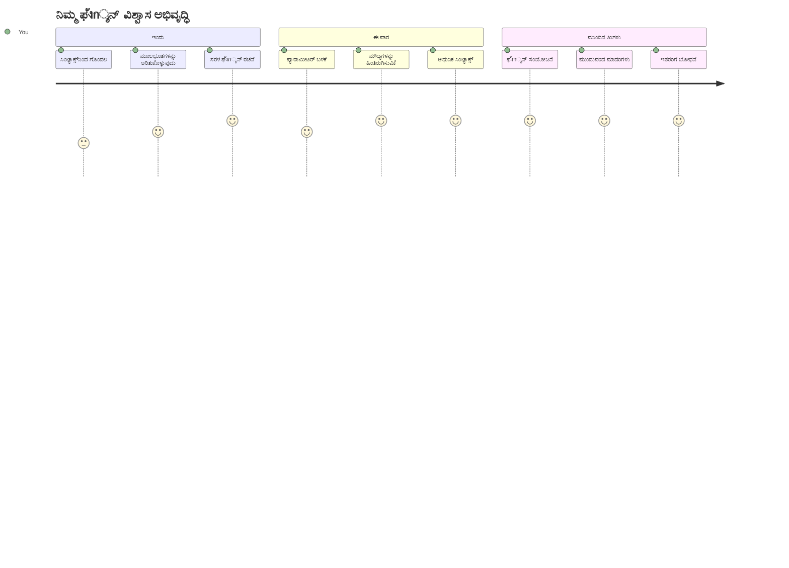
> 🎉 **ನೀವು ಪ್ರೋಗ್ರಾಮಿಂಗ್‌ನ ಅತ್ಯಂತ ಶಕ್ತಿಶಾಲಿ ಕನ್ಸೆಪ್ಟ್‌ಗಳನ್ನೊಳಗೊಳ್ಳುತ್ತೀರಿ!** ಫಂಕ್ಷನ್‌ಗಳು ದೊಡ್ಡ ಕಾರ್ಯಕ್ರಮಗಳ ಕಟ್ಟಡದ ಇಟ್ಟಿಗೆಗಳಾಗಿವೆ. ನೀವು ತಯಾರಿಸುವ ಪ್ರತಿ ಅಪ್ಲಿಕೇಶನ್ ಫಂಕ್ಷನ್‌ಗಳನ್ನು ಬಳಸಿ ಕೋಡ್ ಅನ್ನು ಸಂಘಟಿಸಲು, ಮರುಬಳಕೆಗೆ, ಮತ್ತು ಸಂರಚಿಸಲು ಬಳಸುತ್ತದೆ. ನೀವು ಈಗ ಲಾಜಿಕ್ ಅನ್ನು ಪುನಃಬಳಕೆಗೆ ಸಾದರಪಡಿಸಬಹುದಾದ ഘಟಕಗಳಾಗಿ ಪ್ಯಾಕೇಜ್ ಮಾಡುವುದು ಹೇಗೆ ಎಂಬುದನ್ನು ಅರ್ಥಮಾಡಿಕೊಂಡಿದ್ದೀರಿ, ಇದರಿಂದ ನೀವು ಹೆಚ್ಚು ಪರಿಣಾಮಕಾರಿ ಮತ್ತು ತක්ෂಣಿಕ ಪ್ರೋಗ್ರಾಮರ್ ಆಗಿದ್ದೀರಿ. ಹೆಚ್ಚು ಪ್ರಭಾವಿ ಪ್ರೋಗ್ರಾಮಿಂಗ್ ಲೋಕಕ್ಕೆ ಸ್ವಾಗತ! 🚀

---

<!-- CO-OP TRANSLATOR DISCLAIMER START -->
**ಎಚ್ಚರಿಕೆ**:  
ಈ ಡಾಕ್ಯುಮೆಂಟ್ ಅನ್ನು AI ಭಾಷಾಂತರ ಸೇವೆ [Co-op Translator](https://github.com/Azure/co-op-translator) ಬಳಸಿ ಭಾಷಾಂತರಿಸಲಾಗಿದೆ. ನಾವು ನಿಖರತೆಯನ್ನು ಪ್ರಯತ್ನಿಸುತ್ತಿದ್ದರೂ ಸಹ, ಸ್ವಯಂಚಾಲಿತ ಅನುವಾದಗಳಲ್ಲಿ ದೋಷಗಳಾಗಬಹುದು ಅಥವಾ ಅಸತ್ಯತೆಗಳು ಇರಬಹುದಾಗಿದೆ ಎಂದು ದಯವಿಟ್ಟು ಗಮನಿಸಿ. ಮೂಲ ಭಾಷೆಯಲ್ಲಿ ಇರುವ ಅಸಲಿಯಾದ ಡಾಕ್ಯುಮೆಂಟ್ ಅನ್ನು ಅಧಿಕೃತ ವನರಾಗಿ ಪರಿಗಣಿಸಬೇಕು. ಮಹತ್ವದ ಮಾಹಿತಿಗಾಗಿ, ವೃತ್ತಿಪರ ಮಾನವ ಭಾಷಾಂತರವನ್ನು ಸಲಹೆ ಮಾಡಲಾಗುತ್ತದೆ. ಈ ಅನುವಾದ ಬಳಕೆಗಾಗಿ ಯಾವುದೇ ತಪ್ಪು ಗ್ರಹಿಕೆಗಳು ಅಥವಾ ತಳಿರುತInterpretations ಕೆಲವರಿಗೂ ಹೊಣೆಗಾರರಾಗದು.
<!-- CO-OP TRANSLATOR DISCLAIMER END -->