<!--
CO_OP_TRANSLATOR_METADATA:
{
  "original_hash": "c688385d15dd3645e924ea0ffee8967f",
  "translation_date": "2026-01-08T12:51:07+00:00",
  "source_file": "2-js-basics/3-making-decisions/README.md",
  "language_code": "kn"
}
-->
# ಜಾವಾಸ್ಕ್ರಿಪ್ಟ್ ಮೂಲಭूतಗಳು: ನಿರ್ಧಾರಗಳನ್ನು ಕೈಗೊಳ್ಳುವುದು

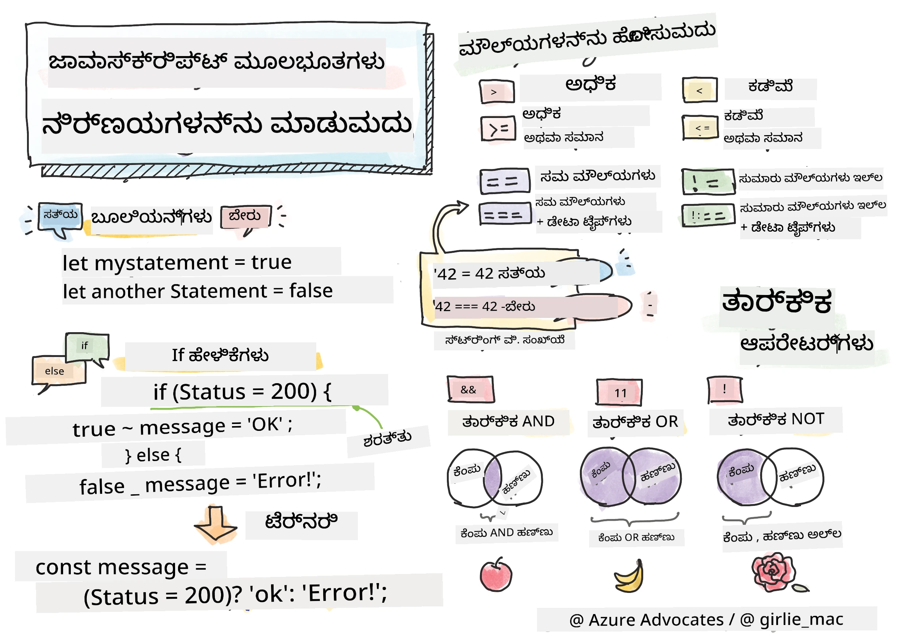

> ಸ್ಕೆಚ್‌ನೋಟ್ [Tomomi Imura](https://twitter.com/girlie_mac) ಅವರಿಂದ

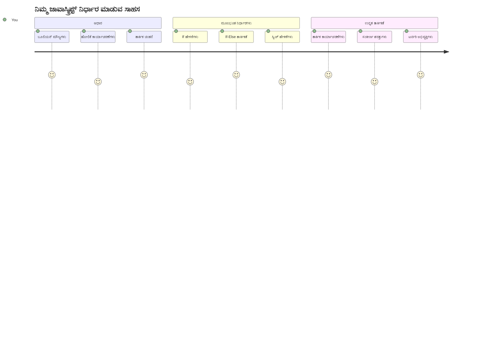
ನಿಮ್ಮ ಆಪ್ಲಿಕೇಶನ್‌ಗಳು ಹೇಗೆ ಚತುರ ನಿರ್ಧಾರಗಳನ್ನು ಕೈಗೊಳ್ಳುತ್ತವೆ ಎಂದು ನೀವು ಎಂದಾದರೂ ಆಸೆಪಡುವಿದ್ದೀರಾ? ನ್ಯಾವಿಗೇಶನ್ ಸಿಸ್ಟಮ್ ವೇಗದ ಮಾರ್ಗವನ್ನು ಹೇಗೆ ಆಯ್ಕೆ ಮಾಡುತ್ತದೆ ಅಥವಾ ಥರ್ಮೋಸ್ಟಾಟ್ ಹೀಟ್ ಆನ್ ಮಾಡಬೇಕೆಂದು ಯಾವಾಗ ತೀರ್ಮಾನಿಸುತ್ತದೆ? ಇದು ಪ್ರೋಗ್ರಾಮಿಂಗ್‌ನಲ್ಲಿ ನಿರ್ಧಾರ ಕೈಗೊಳ್ಳುವ ಮೂಲಭೂತ ತತ್ವ.

ಚಾರ್ಲ್ಸ್ ಬ್ಯಾಬೇಜ್ ಅವರ ಅನಾಲಿಟಿಕಲ್ ಎಂಜಿನ್ ವಿವಿಧ ಪರಿಸ್ಥಿತಿಗಳ ಆಧಾರದ ಮೇಲೆ ಕಾರ್ಯಗಳ ವಿಭಿನ್ನ ಅನುಕ್ರಮಣಗಳನ್ನು ಅನುಸರಿಸಲು ರೂಪಿಸಲಾಗಿದೆ ಹಾಗೆ, ಆಧುನಿಕ ಜಾವಾಸ್ಕ್ರಿಪ್ಟ್ ಪ್ರೋಗ್ರಾಂಗಳು ಬದಲಾದ ಪರಿಸ್ಥಿತಿಗಳ ಆಧಾರದ ಮೇಲೆ ಆಯ್ಕೆಮಾಡಲೇಬೇಕಾಗುತ್ತದೆ. ಈ ಶಾಖಾಭಿವೃದ್ಧಿ ಮತ್ತು ನಿರ್ಧಾರ ಕೈಗೊಳ್ಳುವ ಸಾಮರ್ಥ್ಯವು ಸ್ಥಿರ ಕೋಡ್ ಅನ್ನು ಪ್ರತ್ಯುತ್ತರ ನೀಡುವ, ಬುದ್ಧಿವಂತಿಕೆಯಿಂದ ಸಂಚಾಲಿತ ಆ್ಯಪ್‌ಗಳಾಗಿಸಲು ಕಾರಣವಾಗಿದೆ.

ಈ ಪಾಠದಲ್ಲಿ, ನೀವು ನಿಮ್ಮ ಪ್ರೋಗ್ರಾಂಗಳಲ್ಲಿ ಷರತ್ತುಬದ್ಧ ಲಾಜಿಕ್ ಅನ್ನು ಹೇಗೆ ಜಾರಿ ಮಾಡಬೇಕೆಂದು ಕಲಿಯುತ್ತೀರಿ. ನಾವು ಷರತ್ತು ಹೇಳಿಕೆಗಳು, ಹೋಲಿಕೆಯ ಆಪರೇಟರ್‌ಗಳು, ಮತ್ತು ಲಾಜಿಕ್ಯಲ್ ವ್ಯಾಕ್ಯಾನಗಳನ್ನು ಅನ್ವೇಷಿಸೋಣ, ಇದರಿಂದ ನಿಮ್ಮ ಕೋಡ್ ಪರಿಸ್ಥಿತಿಗಳನ್ನು ಮೌಲ್ಯಮಾಪನ ಮಾಡಿ ಸೂಕ್ತವಾಗಿ ಪ್ರತಿಕ್ರಿಯಿಸುವ ಸಾಧ್ಯತೆ ಪಡೆಯುತ್ತದೆ.

## ಪೂರವ ಪಾಠವಾಗಿ ಕ್ವಿಜ್

[ಪೂರ್ವ-ಪಾಠ ಕ್ವಿಜ್](https://ff-quizzes.netlify.app/web/quiz/11)

ನಿರ್ಧಾರ ಕೈಗೊಳ್ಳುವುದು ಮತ್ತು ಪ್ರೋಗ್ರಾಂ ಸಂಚಾರವನ್ನು ನಿಯಂತ್ರಿಸುವ ಸಾಮರ್ಥ್ಯವು ಪ್ರೋಗ್ರಾಮಿಂಗ್ನ ಮೂಲ ಹಸಿವು. ಈ ವಿಭಾಗವು ಜಾವಾಸ್ಕ್ರಿಪ್ಟ್ ಪ್ರೋಗ್ರಾಂಗಳ ನಿರ್ವಹಣೆ ಮಾರ್ಗವನ್ನು ಬುಲಿಯನ್ ಮೌಲ್ಯಗಳು ಮತ್ತು ಷರತ್ತುವಾಡುವ ಲಾಜಿಕ್ ಮೂಲಕ ಹೇಗೆ ನಿಯಂತ್ರಿಸುವುದನ್ನು ಒಳಗೊಂಡಿದೆ.

[](https://youtube.com/watch?v=SxTp8j-fMMY "Making Decisions")

> 🎥 ಮೇಲಿನ ಚಿತ್ರವನ್ನು ಕ್ಲಿಕ್ ಮಾಡಿ ನಿರ್ಧಾರ ಕೈಗೊಳ್ಳುವ ಬಗ್ಗೆ ವೀಡಿಯೋ ನೋಡಿರಿ.

> ನೀವು ಈ ಪಾಠವನ್ನು [Microsoft Learn](https://docs.microsoft.com/learn/modules/web-development-101-if-else/?WT.mc_id=academic-77807-sagibbon) ನಲ್ಲಿ ತೆಗೆದುಕೊಳ್ಳಬಹುದು!

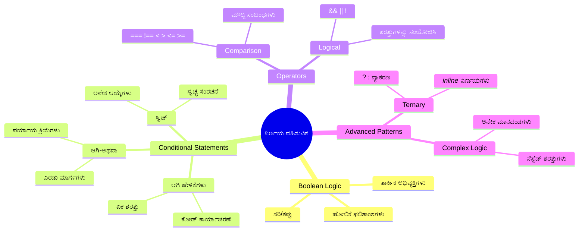
## ಬುಲಿಯನ್ ಗಳ ಕುರಿತ ಸಂಕ್ಷಿಪ್ತ ಪುನರಾವೃತ್ತಿ

ನಿರ್ಧಾರಗಳಿಗಾಗಿ ಹೋಗುವ ಮೊದಲು, ಕಳೆದ ಪಾಠದಿಂದ ಬುಲಿಯನ್ ಮೌಲ್ಯಗಳನ್ನು ಪುನರಾವրջಿಸೋಣ. ಗಣಿತಜ್ಞ ಜಾರ್ಜ್ ಬುಲ್ ಅವರ ಹೆಸರು ಪಡೆದ ಈ ಮೌಲ್ಯಗಳು ಬೀನರಿ ಸ್ಥಿತಿಗಳನ್ನು ಪ್ರತಿನಿಧಿಸುತ್ತವೆ – `true` ಅಥವಾ `false`. ಇದರಲ್ಲಿ ಎರಡು ಮಧ್ಯಮಸ್ಥಿತಿಗಳಿಲ್ಲ.

ಈ ಬೀನರಿ ಮೌಲ್ಯಗಳು ಎಲ್ಲ ಗಣಕ ಲಾಜಿಕ್‌ಗಳ ಆಧಾರವನ್ನು ರೂಪಿಸುತ್ತವೆ. ನಿಮ್ಮ ಪ್ರóg್ರಾಂ ಎಲ್ಲ ನಿರ್ಧಾರವೂ ಅಂತಿಮವಾಗಿ ಬುಲಿಯನ್ ಮೌಲ್ಯಮಾಪನಕ್ಕೆ ಇಳಿಮುಖವಾಗುತ್ತದೆ.

ಬುಲಿಯನ್ ಚರಗಳು ಸರಳವಾಯಿತು:

```javascript
let myTrueBool = true;
let myFalseBool = false;
```

ಇದು ಸ್ಪಷ್ಟ ಬುಲಿಯನ್ ಮೌಲ್ಯಗಳೊಂದಿಗೆ ಎರಡು ಚರಗಳನ್ನು ಸೃಷ್ಟಿಸುತ್ತದೆ.

✅ ಬುಲಿಯನ್‌ಗಳು ಇಂಗ್ಲಿಷ್ ಗಣಿತಜ್ಞ, ತತ್ತ್ವಜ್ಞ ಮತ್ತು ಲಾಜಿಕಿಷ್ಟ ಜಾರ್ಜ್ ಬುಲ್ (1815–1864) ಅವರ ಹೆಸರಿನಿಂದ ಪಡೆದವು.

## ಹೋಲಿಕೆಯ ಆಪರೇಟರ್‌ಗಳು ಮತ್ತು ಬುಲಿಯನ್‌ಗಳು

ಪ್ರಾಯೋಗಿಕವಾಗಿ, ನೀವು ಬುಲಿಯನ್ ಮೌಲ್ಯಗಳನ್ನು ಕೈಯಿಂದ ಸಹಜವಾಗಿ ನಿಯೋಜಿಸುವುದಿಲ್ಲ. ಬದಲಾಗಿ, ನೀವು ಅವನ್ನು ಷರತ್ತುಗಳ ಮೌಲ್ಯಮಾಪನದಿಂದ ಸೃಷ್ಟಿಸುವಿರಿ: "ಈ ಸಂಖ್ಯೆ ಅದಕ್ಕಿಂತ ಹೆಚ್ಚಿನದೆಯಾ?" ಅಥವಾ "ಈ ಮೌಲ್ಯಗಳು ಸಮಾನವಾಗಿವೆಯಾ?"

ಹೋಲಿಕೆಯ ಆಪರೇಟರ್‌ಗಳು ಈ ಮೌಲ್ಯಮಾಪನಗಳನ್ನು ಮಾಡುವಂತೆ ಮಾಡುತ್ತವೆ. ಅವು ಮೌಲ್ಯಗಳನ್ನು ಹೋಲಿಸಿ, ಬೂಲಿಯನ್ ಫಲಿತಾಂಶವನ್ನು ಪರಿಚಯಿಸುತ್ತವೆ.

| ಚಿಹ್ನೆ | ವಿವರಣೆ                                                                                                                                           | ಉದಾಹರಣೆ           |
| ------ | ------------------------------------------------------------------------------------------------------------------------------------------------- | ------------------- |
| `<`    | **ಚಿಕ್ಕದು**: ಎರಡು ಮೌಲ್ಯಗಳನ್ನು ಹೋಲಿಸಿ ಎಡಬದಿಯ ಮೌಲ್ಯ ಬಲಬದಿಗಿಂತ ಚಿಕ್ಕದಾಗಿದ್ದರೆ `true` ಬುಲಿಯನ್ ನೀಡುತ್ತದೆ                                      | `5 < 6 // true`      |
| `<=`   | **ಚಿಕ್ಕದು ಅಥವಾ ಸಮಾನ**: ಎರಡು ಮೌಲ್ಯಗಳನ್ನು ಹೋಲಿಸಿ ಎಡಬದಿಯ ಮೌಲ್ಯ ಬಲಬದಿಗಿಂತ ಚಿಕ್ಕದಾಗುವುದಾಗಿಯೇ ಅಥವಾ ಸಮಾನವಾಗಿದ್ದರೆ `true` ನೀಡುತ್ತದೆ               | `5 <= 6 // true`     |
| `>`    | **ಹೆಚ್ಚು**: ಎರಡು ಮೌಲ್ಯಗಳನ್ನು ಹೋಲಿಸಿ ಎಡಬದಿಯ ಮೌಲ್ಯ ಬಲಬದಿಗಿಂತ ಹೆಚ್ಚು ಇದ್ದರೆ `true` ನೀಡುತ್ತದೆ                                                | `5 > 6 // false`     |
| `>=`   | **ಹೆಚ್ಚು ಅಥವಾ ಸಮಾನ**: ಎರಡು ಮೌಲ್ಯಗಳನ್ನು ಹೋಲಿಸಿ ಎಡಬದಿಯ ಮೌಲ್ಯ ಬಲಬದಿಗಿಂತ ಹೆಚ್ಚು ಅಥವಾ ಸಮಾನವಾದರೆ `true` ನೀಡುತ್ತದೆ                                 | `5 >= 6 // false`    |
| `===`  | **ಕಟ್ಟುನಿರೀಕ್ಷಿತ ಸಮಾನತೆ**: ಎರಡು ಮೌಲ್ಯಗಳನ್ನು ಹೋಲಿಸಿ ಮತ್ತು ಅವುಗಳ ಪ್ರಕಾರ ಮತ್ತು ಮೌಲ್ಯ ಎರಡೂ ಸಮಾನವಾಗಿದ್ದರೆ `true` ನೀಡುತ್ತದೆ                      | `5 === 6 // false`   |
| `!==`  | **ವಿಷಮತೆ**: ಎರಡು ಮೌಲ್ಯಗಳನ್ನು ಹೋಲಿಸಿ, ಕಟ್ಟುನಿರೀಕ್ಷಿತ ಸಮಾನತೆ ಫಲಿತಾಂಶದ ವಿಲೊಮ ಬೂಲಿಯನ್ ಮೌಲ್ಯವನ್ನು ನೀಡುತ್ತದೆ                                      | `5 !== 6 // true`    |

✅ ನಿಮ್ಮ ಜ್ಞಾನ ಪರೀಕ್ಷಿಸಲು ಕೆಲವು ಹೋಲಿಕೆಗಳನ್ನು ಬ್ರೌಸರ್ ಕಾನ್ಸೋಲ್‌ನಲ್ಲಿ ಬರೆಯಿರಿ. ಯಾವ ಫಲಿತಾಂಶ ನಿಮಗೆ ಆಶ್ಚರ್ಯವೆಂಟಿಸುತ್ತದ?

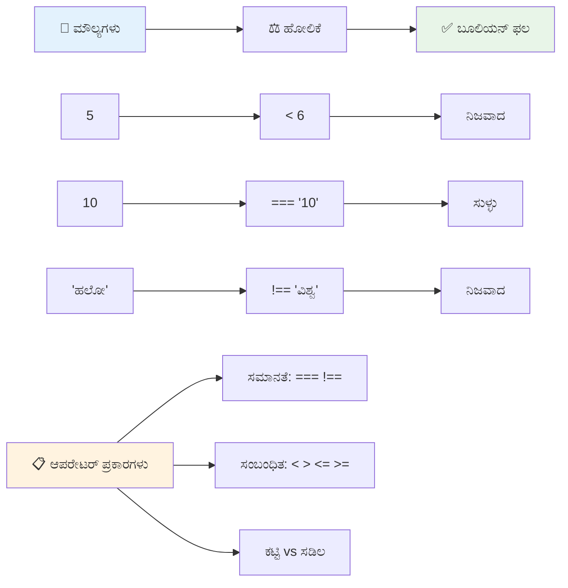
### 🧠 **ಹೋಲಿಕೆ ನಾಯಕತ್ವ ಪರೀಕ್ಷೆ: ಬುಲಿಯನ್ ಲಾಜಿಕ್ ಅರ್ಥಮಾಡಿಕೊಳ್ಳುವುದು**

**ನಿಮ್ಮ ಹೋಲಿಕೆ ಅರಿವನ್ನು ಪರೀಕ್ಷಿಸುವುದಾಗಿ:**
- ತೀರಾ ಸಾಮಾನ್ಯವಾಗಿ `===` (ಕಟ್ಟುನಿರೀಕ್ಷಿತ ಸಮಾನತೆ)ನ್ನು `==` (ಸೌಮ್ಯ ಸಮಾನತೆ) ಗಿಂತ ಪ್ರಾಧಾನ್ಯ ನೀಡಲಾಗುವುದೇಕೆ?
- `5 === '5'` ಎಷ್ಟು ಫಲ ನೀಡಬಹುದು? ಹಾಗೆಯೇ `5 == '5'` ಯೇನು?
- `!==` ಮತ್ತು `!=` ನಡುವಿನ ವ್ಯತ್ಯಾಸವೇನು?

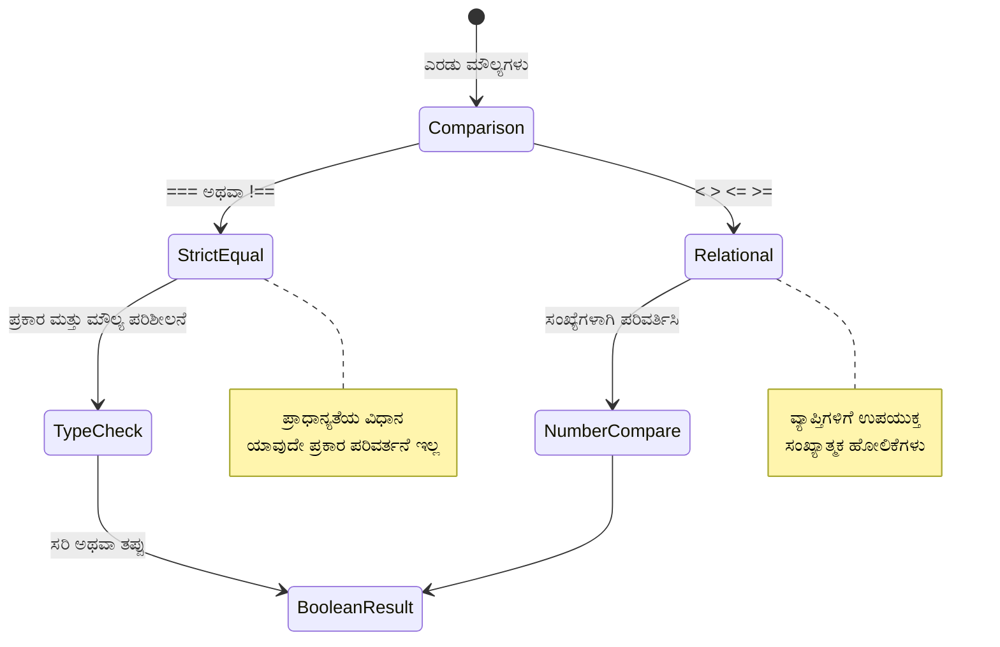
> **ಪ್ರೊ ಟಿಪ್**: ಪ್ರಕಾರ ಪರಿವರ್ತನೆ ಅಗತ್ಯವಿಲ್ಲದವರೆಗೆ ಸಮಾನತೆ ಪರೀಕ್ಷೆಗೆ ಸದಾ `===` ಮತ್ತು `!==` ಉಪಯೋಗಿಸಿ. ಇದರಿಂದ ಅನಿರೀಕ್ಷಿತ ವರ್ತನೆ ತಡೆಯಬಹುದು!

## If ಹೇಳಿಕೆ

`if` ಹೇಳಿಕೆ ನಿಮ್ಮ ಕೋಡ್‌ನೊಂದರಲ್ಲಿ ಪ್ರಶ್ನೆ ಕೇಳುವುದಕ್ಕೆ ಹೋಲುತ್ತದೆ. "ಈ ಷರತ್ತು ಸತ್ಯವಾಗಿದ್ದರೆ, ಈ ಕಾರ್ಯವನ್ನು ಮಾಡು." ಜಾವಾಸ್ಕ್ರಿಪ್ಟ್‌ನಲ್ಲಿ ನಿರ್ಧಾರ ಕೈಗೊಳ್ಳಲು ಇದು ಬಹುಮುಖ್ಯ ಸಾಧನವಾಗಿರುತ್ತದೆ.

ಇದೀಗ ಹೇಗೆ ಕೆಲಸ ಮಾಡುತ್ತದೆ:

```javascript
if (condition) {
  // ಶರತ್ತು ಸತ್ಯವಾಗಿದೆ. ಈ ಬ್ಲಾಕ್‌ನ ಕೋಡ್ ಕಾರ್ಯಗತವಾಗುತ್ತದೆ.
}
```

ಷರತ್ತುಗಳು ಕೋಟುಗಳಲ್ಲಿ ಇರುತ್ತದೆ, ಮತ್ತು ಅದು `true` ಆಗಿದ್ದರೆ, ಕೋಡು ಅನ್ನೂಟು ಉಳಿತಾಯ ಮಾಡುತ್ತವೆ. ಅದು `false` ಆಗಿದ್ದರೆ, ಜಾವಾಸ್ಕ್ರಿಪ್ಟ್ ಆ ಭಾಗವನ್ನು ದಾಟಿಹೋಗುತ್ತದೆ.

ನೀವು ಬಹುತೇಕ ಹೋಲಿಕೆಯ ಆಪರೇಟರ್‌ಗಳನ್ನು ಶರತ್ತು ಮಾಡಲು ಬಳಸುತ್ತೀರಿ. ಆಶಾಕರ ಉದಾಹರಣೆ ನೋಡೋಣ:

```javascript
let currentMoney = 1000;
let laptopPrice = 800;

if (currentMoney >= laptopPrice) {
  // ಪರಿಸ್ಥಿತಿ ಸರಿ. ಈ ಬ್ಲಾಕ್‌ನಲ್ಲಿ ಕೋಡ್ ಕಾರ್ಯನಿರ್ವಹಿಸುತ್ತದೆ.
  console.log("Getting a new laptop!");
}
```

`1000 >= 800` הוא `true` ಎಂದು ಮೌಲ್ಯಮಾಪನಗೊಂಡಿದ್ದರಿಂದ, ಬ್ಲಾಕ್ ಒಳಗಿನ ಕೋಡ್ ಚಲನಾರ್ಥಕ ಆಗಿ, "Gettig a new laptop!" ಎಂಬ ಸಂದೇಶವನ್ನು ಕಾನ್‌ಸೋಲ್‌ನಲ್ಲಿ ತೋರಿಸುತ್ತದೆ.

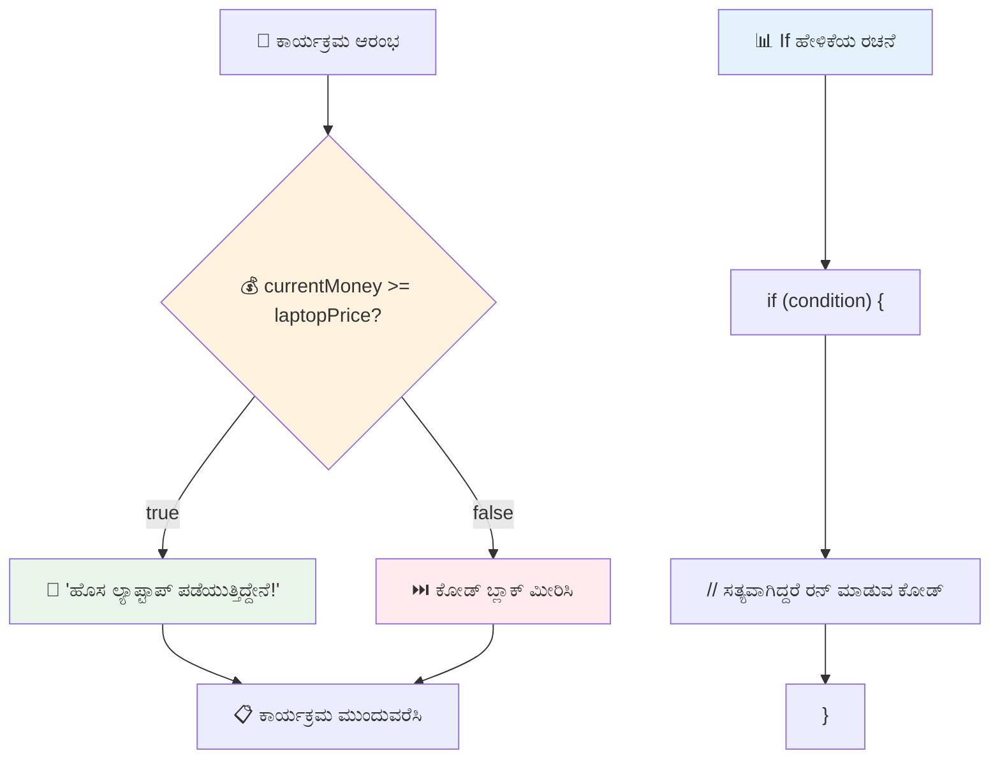
## If..Else ಹೇಳಿಕೆ

ಆದರೆ ಷರತ್ತು ತಪ್ಪಾಗಿದ್ದಾಗ ಪ್ರೋಗ್ರಾಂ ಬೇರೆಯದೇ ಕೆಲಸ ಮಾಡಬೇಕಿದ್ದರೆ ಏನು? ಅಲ್ಲಿ `else` ಸಹಾಯ ಮಾಡುತ್ತದೆ – ಇದು ಬ್ಯಾಕಪ್ ಯೋಜನೆಯಂತಿದೆ.

`else` ಹೇಳಿಕೆ "ಈ ಷರತ್ತು ಸರಿ ಇಲ್ಲದೆ ಇದ್ದರೆ, ಇದರಂತೆ ಮಾಡಿ" ಎಂದಂತೆ ಸೂಚಿಸುತ್ತದೆ.

```javascript
let currentMoney = 500;
let laptopPrice = 800;

if (currentMoney >= laptopPrice) {
  // ಶರತ್ತು ನಿಜವಾಗಿದೆ. ಈ ಬ್ಲಾಕ್‌ನ ಕೋಡ್ ನಡೆದುಹೋಗುತ್ತದೆ.
  console.log("Getting a new laptop!");
} else {
  // ಶರತ್ತು ಸುಳ್ಳಾಗಿದೆ. ಈ ಬ್ಲಾಕ್‌ನ ಕೋಡ್ ನಡೆಯುತ್ತದೆ.
  console.log("Can't afford a new laptop, yet!");
}
```

ಇದೀಗ, `500 >= 800` ಎಂಬುದು `false` ಆದ್ದರಿಂದ, ಆದ ಮಾಡು ಬ್ಲಾಕ್ ಬಿಟ್ಟು, `else` ಬ್ಲಾಕ್ ಕಾರ್ಯಗತಗೊಳ್ಳುತ್ತದೆ. ನೀವು "Can't afford a new laptop, yet!" ಎಂಬ ಸಂದೇಶವನ್ನು ಕಂಡಿರುತ್ತೀರಿ.

✅ ಈ ಕೋಡ್ ಹಾಗೂ ಕೆಳಗಿನ ಕೋಡ್ ನಿಮ್ಮ ಬ್ರೌಸರ್ ಕಾನ್‌ಸೋಲ್‌ನಲ್ಲಿ ಓಡಿ ಬ್ಲಾಕ್ ಆಗಿರುವ `console.log()` ಮೌಲ್ಯಗಳನ್ನು ಬದಲಾಯಿಸಲು currentMoney ಮತ್ತು laptopPrice ಚರ ಮೌಲ್ಯಗಳನ್ನು ಬದಲಿಸಿ ಪರೀಕ್ಷಿಸಿ.

### 🎯 **If-Else ಲಾಜಿಕ್ ಪರೀಕ್ಷೆ: ಶಾಖೆಯ ಮಾರ್ಗಗಳು**

**ನಿಮ್ಮ ಷರತ್ತು ಲಾಜಿಕ್ ಅರಿವನ್ನು ಮೌಲ್ಯಮಾಪನಮಾಡಿ:**
- `currentMoney` ಮತ್ತು `laptopPrice` ಸರಿ ಸಮಾನವಾಗಿದ್ದರೆ ಏನು ಆಗುತ್ತದೆ?
- ಯಾವುದೇ ನಿಜವಾದ ಪರಿಸ್ಥಿತಿಯ ಉದಾಹರಣೆ ನೀಡಬಹುದು, ಇಲ್ಲಿ if-else ಲಾಜಿಕ್ ಉಪಯುಕ್ತವಾಗಬಹುದು?
- ಇದನ್ನು ಹೆಚ್ಚು ಬೆಲೆ ಶ್ರೇಣಿಗಳಿಗೆ ವ್ಯಾಪಿಸಲು ಹೇಗೆ ವಿಸ್ತರಿಸಬಹುದು?

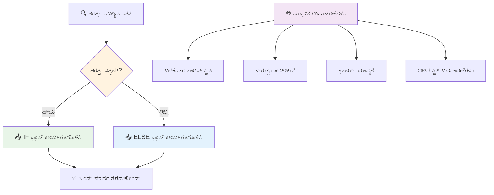
> **ಪ್ರಮುಖ ತಿಳಿವು**: if-else ಹೇಳಿಕೆ ಸರಿಯಾದ ನಂತರ ಬದಲಾವಣೆಗಳಿರುವ ಮಾರ್ಗಗಳಲ್ಲಿ ಒಂದೇ ಒಂದು ಮಾರ್ಗ ಬಹಿರ್ಗತವಾಗುವುದನ್ನು ಖಚಿತಪಡಿಸುತ್ತದೆ. ಇದು ನಿಮ್ಮ ಪ್ರೋಗ್ರಾಂ ಯಾವ ಪರಿಸ್ಥಿತಿಗಳಿಗೂ ಉತ್ತರ ನೀಡಲು ಸಾಧ್ಯವಾಗುತ್ತದೆ.

## Switch ಹೇಳಿಕೆ

ಕೆಲವೊಮ್ಮೆ ನೀವು ಒಂದೇ ಮೌಲ್ಯವನ್ನು ಹಲವಾರು ಆಯ್ಕೆಗಳಿಗಿಂತ ಹೋಲಿಸಬೇಕಾಗುತ್ತದೆ. ನೀವು ಸುಳಿದಂತೆ ಹಲವು `if..else` ಹೇಳಿಕೆಗಳನ್ನು ಸರಿಪಡಿಸಬಹುದು, ಆದರೆ ಅದು ಗೊಂದಲ ಉಂಟುಮಾಡುತ್ತದೆ. `switch` ಹೇಳಿಕೆ ಬಹುಮುಖ ಮೌಲ್ಯಗಳನ್ನು ನಿಯಂತ್ರಿಸಲು ಸ್ವಚ್ಛ ವಾಕ್ಯರಚನೆ ನೀಡುತ್ತದೆ.

ಈ ತತ್ತ್ವವು ಪ್ರಾರಂಭಿಕ ದೂರವಾಣಿ ವಿನಿಮಯತಂತ್ರಗಳ ಮೆಕ್ಯಾನಿಕಲ್ ಸ್ವಿಚಿಂಗ್ ವ್ಯವಸ್ಥೆಗಳಂತೆ – ಒಂದು ಇನ್ಪುಟ್ ಮೌಲ್ಯ ನಿರ್ದಿಷ್ಟ ಶಾಖೆಯನ್ನು અમಲಿಗೆ ತರುತ್ತದೆ.

```javascript
switch (expression) {
  case x:
    // ಕೋಡ್ ಬ್ಲಾಕ್
    break;
  case y:
    // ಕೋಡ್ ಬ್ಲಾಕ್
    break;
  default:
    // ಕೋಡ್ ಬ್ಲಾಕ್
}
```

ಇದೀಗ ಇದರ ಸಂರಚನೆ:  
- ಜಾವಾಸ್ಕ್ರಿಪ್ಟ್ ಒಮ್ಮೆ ಪರಿಣಾಮವನ್ನು ಮೌಲ್ಯಮಾಪನ ಮಾಡುತ್ತದೆ  
- ಪ್ರತಿ `case` ಅನ್ನು ಸರಿಸುಮಾರುಮಾಡುತ್ತದೆ  
- ಹೊಂದಿಕೆಯಾಗುವ `case` ಕಂಡರೆ, ಆ ಕೋಡ್ ಬ್ಲಾಕ್ ಅನ್ನು ಚಲಿಸುತ್ತದೆ  
- `break` ಜಾವಾಸ್ಕ್ರಿಪ್ಟ್‌ಗೆ ಸ್ವಿಚ್ ನಿಂದ ನಿಲ್ಲಿಸಲೆಂದು ಸೂಚಿಸುತ್ತದೆ  
- ಯಾವುದೇ `case` ಹೊಂದಿಕೆಯಾಗದಿದ್ದರೆ, `default` ಬ್ಲಾಕ್ ಚಾಲನೆಗೊಳ್ಳುತ್ತದೆ (ಇದಾದರೆ)

```javascript
// ವಾರದ ದಿನಕ್ಕಾಗಿ ಸ್ವಿಚ್ ಸ್ಟೇಟ್‌ಮೆಂಟ್ ಬಳಸಿ ಪ್ರೋಗ್ರಾಮ್
let dayNumber = 2;
let dayName;

switch (dayNumber) {
  case 1:
    dayName = "Monday";
    break;
  case 2:
    dayName = "Tuesday";
    break;
  case 3:
    dayName = "Wednesday";
    break;
  default:
    dayName = "Unknown day";
    break;
}
console.log(`Today is ${dayName}`);
```

ಈ ಉದಾಹರಣೆಯಲ್ಲಿ, `dayNumber` 2 ಆಗಿದ್ದು, `case 2` ಹೊಂದಿಕೆ ಕಂಡು, `dayName` ಅನ್ನು "Tuesday" ಗೆ ನಿಗದಿಮಾಡಿದ ನಂತರ ಸ್ವಿಚ್ ನಿಂದ ನಿರ್ಗಮಿಸುತ್ತದೆ. ಫಲಿತಾಂಶ? "Today is Tuesday" ಅನ್ನು ಕಾನ್‌ಸೋಲ್‌ನಲ್ಲಿ ದಾಖಲಿಸುತ್ತದೆ.

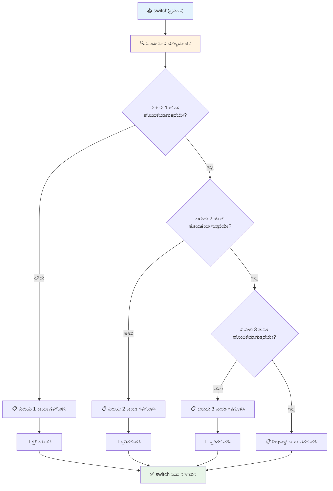
✅ ಈ ಕೋಡ್ ಹಾಗೂ ಕೆಳಗಿನ ಕೋಡ್ ನಿಮ್ಮ ಬ್ರೌಸರ್ ಕಾನ್‌ಸೋಲ್‌ನಲ್ಲಿ ಓಡಿ, a ಚರ ಮೌಲ್ಯ ಬದಲಾಯಿಸಿ `console.log()` ಫಲಿತಾಂಶ ಪರಿಶೀಲಿಸಿ.

### 🔄 **Switch ಹೇಳಿಕೆ ಪಟುತೆ: ಬಹು ಆಯ್ಕೆ**

**ನಿಮ್ಮ ಸ್ವಿಚ್ ಅರಿವನ್ನು ಪರೀಕ್ಷಿಸಿ:**
- `break` ಹೇಳಿಕೆಯನ್ನು ಮರೆತರೆ ಏನು ಆಗುತ್ತದೆ?
- ಅನೇಕ `if-else` ಹೇಳಿಕೆಗಳಿಗಿಂತ `switch` ಅನ್ನು ಯಾವಾಗ ಬಳಸಬೇಕು?
- ಎಲ್ಲಾ ಸಾಧ್ಯತೆಗಳನ್ನು ಮುಚ್ಚಿಕೊಂಡಿದ್ದೀರಿ ಎಂದು ನೀವು ಭಾವಿಸಿದರೂ, `default` ಕೇಸ್ ಎಷ್ಟು ಉಪಯುಕ್ತ?

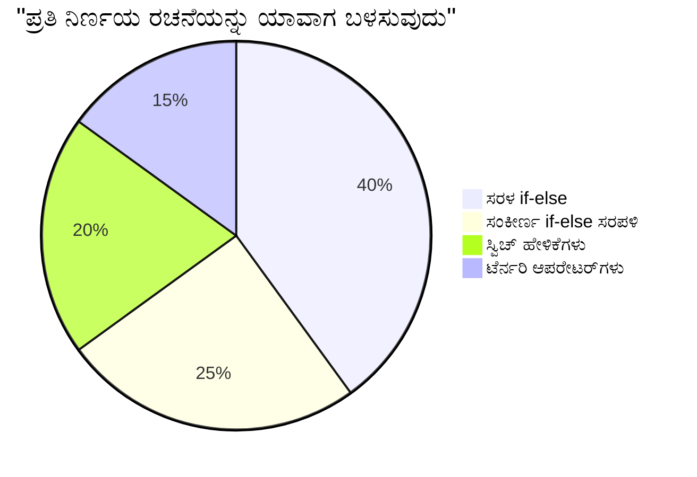
> **ಉತ್ತಮ ಅಭ್ಯಾಸ**: ಒಂದೇ ಚರವನ್ನು ಬಹು ನಿರ್ದಿಷ್ಟ ಮೌಲ್ಯಗಳೊಂದಿಗೆ ಹೋಲಿಸುವಾಗ `switch` ಉಪಯೋಗಿಸಿ. ಶ್ರೇಣಿ ಪರಿಶೀಲನೆ ಅಥವಾ ಜಟಿಲ ಷರತ್ತುಗಳಿಗೆ `if-else` ಉಪಯೋಗಿಸಿ!

## ಲಾಜಿಕಲ್ ಆಪರೇಟರ್‌ಗಳು ಮತ್ತು ಬುಲಿಯನ್‌ಗಳು

ಸಂಕೀರ್ಣ ನಿರ್ಧಾರಗಳು ಸಹಜವಾಗಿಯೇ ಒಂದಕ್ಕಿಂತ ಹೆಚ್ಚು ಷರತ್ತುಗಳನ್ನು ಒಂದೇ ವೇಳೆ ಮೌಲ್ಯಮಾಪನ ಮಾಡಬೇಕಾಗುತ್ತದೆ. ಬುಲಿಯನ್ ಬೀಜಗಣಿತ ಪ್ರಕಾರ ಗಣಿತज्ञರು ಲಾಜಿಕಲ್ ವ್ಯಾಕ್ಯಾನಗಳನ್ನು ಸಂಯೋಜಿಸುವಂತೆ, ಪ್ರೋಗ್ರಾಮಿಂಗ್ ನಲ್ಲಿ ಲಾಜಿಕಲ್ ಆಪರೇಟರ್‌ಗಳು ಹಲವು ಬುಲಿಯನ್ ಷರತ್ತುಗಳನ್ನು ಸಂಪರ್ಕಿಸುತ್ತವೆ.

ಈ ಆಪರೇಟರ್‌ಗಳು ಸರಳ true/false ಮೌಲ್ಯಗಳನ್ನು ಕನ್ನಡಿಸುವುದರ ಮೂಲಕ ಜಟಿಲ ಷರತ್ತು ಲಾಜಿಕ್ ನಿರ್ಮಿಸಲು ಸಹಾಯ ಮಾಡುತ್ತವೆ.

| ಚಿಹ್ನೆ  | ವಿವರಣೆ                                                                                     | ಉದಾಹರಣೆ                                                                 |
| ------ | ------------------------------------------------------------------------------------------- | ----------------------------------------------------------------------- |
| `&&`   | **ಲಾಜಿಕಲ್ AND**: ಎರಡು ಬುಲಿಯನ್ ವ್ಯಾಕ್ಯಾನಗಳನ್ನು ಹೋಲಿಸುತ್ತದೆ. ಎರಡೂ true ಆಗಿದ್ದರೆ ಮಾತ್ರ true ಪ್ರದಾನ ಮಾಡುತ್ತದೆ | `(5 > 3) && (5 < 10) // ಎರಡೂ true, true ನೀಡಿ`                         |
| `\|\|` | **ಲಾಜಿಕಲ್ OR**: ಎರಡು ಬುಲಿಯನ್ ವ್ಯಾಕ್ಯಾನಗಳಲ್ಲಿ ಕನಿಷ್ಠ ಒಂದು true ಇದ್ದರೆ true ನೀಡುತ್ತದೆ               | `(5 > 10) \|\| (5 < 10) // ಒಂದು ತಪ್ಪು, ಮತ್ತೊಂದು ಸರಿ, true ನೀಡುತ್ತದೆ` |
| `!`    | **ಲಾಜಿಕಲ್ NOT**: ಬುಲಿಯನ್ ಮೌಲ್ಯವರೋಧಿ ಮೌಲ್ಯವನ್ನು ನೀಡುತ್ತದೆ                                   | `!(5 > 10) // 5 ದ 10 ಕ್ಕಿಂತ ದೊಡ್ಡದಿಲ್ಲ, ! ಅದನ್ನು true ಮಾಡುತ್ತದೆ`       |

ಈ ಆಪರೇಟರ್‌ಗಳು ಷರತ್ತುಗಳನ್ನು ಉಪಯುಕ್ತ ರೀತಿಯಲ್ಲಿ ಸಂಯೋಜಿಸಲು ಅವಕಾಶ ನೀಡುತ್ತವೆ:  
- AND (`&&`) ಅಂದರೆ ಎರಡು ಷರತ್ತುಗಳೂ true ಆಗಿರಬೇಕು  
- OR (`||`) ಅಂದರೆ ಕನಿಷ್ಟ ಒಂದು ಷರತ್ತು true ಆಗಿರಬೇಕು  
- NOT (`!`) ಅಂದರೆ true ನಿಂದ false ಮತ್ತು false ನಿಂದ true ಗೆ ತಿರುವು

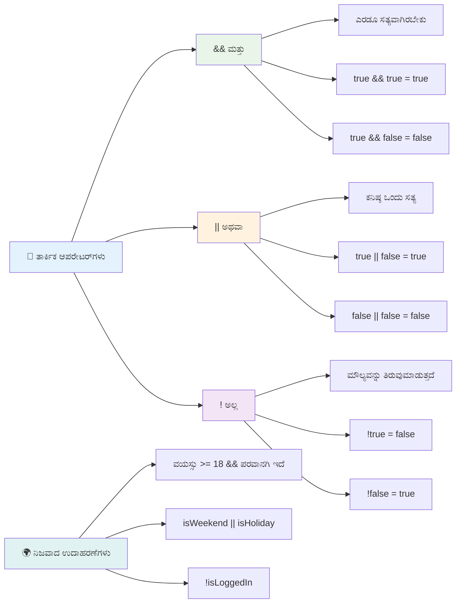
## ಲಾಜಿಕಲ್ ಆಪರೇಟರ್‌ಗಳೊಂದಿಗೆ ಷರತ್ತುಗಳು ಮತ್ತು ನಿರ್ಧಾರಗಳು

ಇದೀಗ ಕೆಲವು ವೈಯಕ್ತಿಕ ಉದಾಹರಣೆಯೊಂದಿಗೆ ಆಪರೇಟರ್‌ಗಳ ಕಾರ್ಯವನ್ನು ನೋಡೋಣ:

```javascript
let currentMoney = 600;
let laptopPrice = 800;
let laptopDiscountPrice = laptopPrice - (laptopPrice * 0.2); // ಲ್ಯಾಪ್‌ಟಾಪ್ ಬೆಲೆ 20 ಶೇಕಡಾ ರಿಯಾಯಿತಿಯಲ್ಲಿ

if (currentMoney >= laptopPrice || currentMoney >= laptopDiscountPrice) {
  // ಸ್ಥಿತಿ ಸತ್ಯವಾಗಿದೆ. ಈ ಬ್ಲಾಕ್‌ನಲ್ಲಿನ ಕೋಡ್ ಚಾಲನೆ ಆಗುತ್ತದೆ.
  console.log("Getting a new laptop!");
} else {
  // ಸ್ಥಿತಿ ತಪ್ಪಾಗಿದೆ. ಈ ಬ್ಲಾಕ್‌ನಲ್ಲಿನ ಕೋಡ್ ಚಾಲನೆ ಆಗುತ್ತದೆ.
  console.log("Can't afford a new laptop, yet!");
}
```

ಈ ಉದಾಹರಣೆಯಲ್ಲಿ: ನಾವು 20% ರಿಯಾಯಿತಿ ಬೆಲೆಯನ್ನು (640) ಲೆಕ್ಕಹಾಕುತ್ತೇವೆ, ನಂತರ ನಮ್ಮ ಪ್ರಾಪ್ತ ಹಣವು ಪೂರ್ಣ ಬೆಲೆಗೆ ಅಥವಾ ರಿಯಾಯಿತಿ ಬೆಲೆಗೆ ಸಮರ್ಪಕವಾಗಿದೆಯೇ ಎಂದು ಪರೀಕ್ಷಿಸುತ್ತೇವೆ. 600 ರಿಯಾಯಿತಿ ಬೆಲೆಯ 640 ಕ್ಕಿಂತ ಕಡಿಮೆ ಆದರೂ, ಷರತ್ತು true ಆಗಿ ಮೌಲ್ಯಮಾಪನವಾಗುತ್ತದೆ.

### 🧮 **ಲಾಜಿಕಲ್ ಆಪರೇಟರ್ ಪರೀಕ್ಷೆ: ಷರತ್ತುಗಳ ಸಂಯೋಜನೆ**

**ನಿಮ್ಮ ಲಾಜಿಕಲ್ ಆಪರೇಟರ್ ಅರಿವನ್ನು ಪರೀಕ್ಷಿಸಿ:**
- `A && B` ನಲ್ಲಿ A false ಆಗಿದ್ದರೆ ಏನು ಆಗುತ್ತದೆ? B ಕೂಡ ಮೌಲ್ಯಮಾಪನ ಆಗುತ್ತದೆಯೆ?
- ಎಲ್ಲಾ ಮೂರು ಆಪರೇಟರ್‌ಗಳ (`&&`, `||`, `!`) ಆವಶ್ಯಕತೆಯಾದ ಸಂದರ್ಭವನ್ನು ನೀವು ಊಹಿಸಬಲ್ಲಿರಾ?
- `!user.isActive` ಮತ್ತು `user.isActive !== true` ನಡುವೆ ಏನು ವ್ಯತ್ಯಾಸ ಇದೆ?

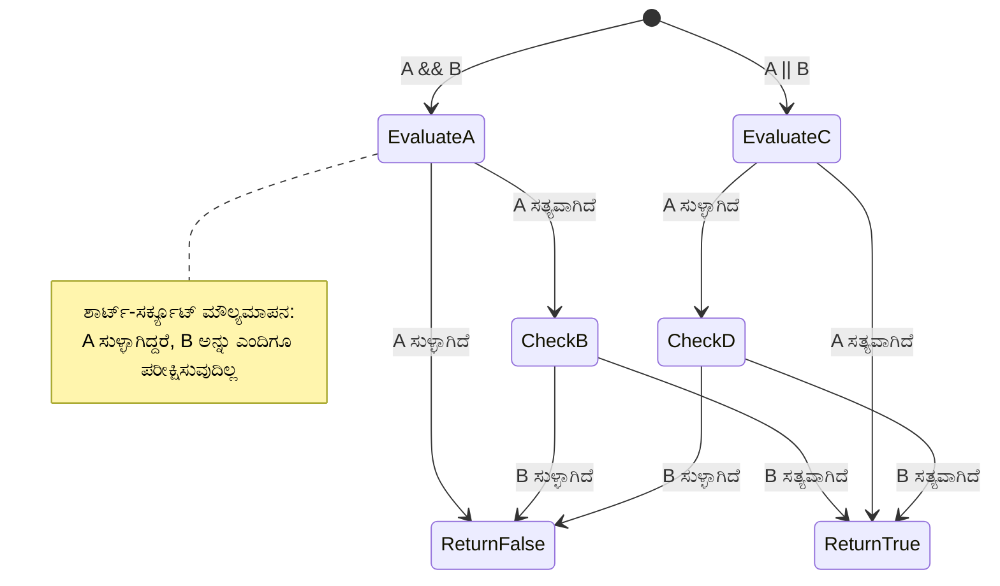
> **ಕಾರ್ಯಕ್ಷಮತೆ ಸೂಚನೆ**: ಜಾವಾಸ್ಕ್ರಿಪ್ಟ್ "ಶಾರ್ಟ್-ಸರ್ಕ್ಯೂಟ್ ಮೌಲ್ಯಮಾಪನ" ಅನ್ನು ಬಳಸುತ್ತದೆ — `A && B` ನಲ್ಲಿ A false ಆಗಿದ್ದರೆ B ಮೌಲ್ಯಮಾಪನ ಆಗುವುದಿಲ್ಲ. ಇದನ್ನು ನಿಮ್ಮ ಲಾಭಕ್ಕಾಗಿ ಬಳಸಿ!

### ನೆಗೆಷನ್ ಆಪರೇಟರ್

ಕೆಲವೊಮ್ಮೆ ಕೇವಲ ಯಾವಾಗ ಯಾವುದು ಸರಿ ಅಲ್ಲದಿರುವುದನ್ನು ಯೋಚಿಸುವುದು ಸುಲಭವಿರುತ್ತದೆ. "ಬಳಕೆದಾರ ಲಾಗಿನ್ ಆಗಿದ್ದಾರೇ?" ಅನುಬಂಧ ಈжಿಕೆ ಬದಲಾಗಿ "ಬಳಕೆದಾರ ಲಾಗಿನ್ ಆಗಿರಲ್ಲವೇ?" ಎಂದು ತಿಳಿಯಲು ಬಯಸಬಹುದು.	exclamation mark (`!`) ಆಪರೇಟರ್ ಲಾಜಿಕ್ ತಿರುವು ಮಾಡುತ್ತದೆ.

```javascript
if (!condition) {
  // ಸ್ಥಿತಿ ತಪ್ಪಾಗಿದ್ದಲ್ಲಿ ನಡೆಯುತ್ತದೆ
} else {
  // ಸ್ಥಿತಿ ಸರಿ ಆಗಿದ್ದಲ್ಲಿ ನಡೆಯುತ್ತದೆ
}
```

`!` ಆಪರೇಟರ್ ಅಂದರೆ "ವಿರುದ್ಧ..." — ಏನಾದರೂ `true` ಇದ್ದರೆ, `!` ಅದನ್ನು `false` ಮಾಡುತ್ತದೆ ಮತ್ತು ವಿಸರ್ಜಕ.

### ಟೆర్నರಿ ವ್ಯಾಕ್ಯಾನಗಳು

ಸರಳ ಷರತ್ತು ಅನಿಯಮಗಳಿಗೆ, ಜಾವಾಸ್ಕ್ರಿಪ್ಟ್ **ಟೆರ್ಮರಿ ಆಪರೇಟರ್** ಅನ್ನು ಒದಗಿಸುತ್ತದೆ. ಈ ಸಂಕ್ಷಿಪ್ತ ವಾಕ್ಯರಚನೆ ಒಬ್ಬ ಸಾಲಿನಲ್ಲಿ ಷರತ್ತು ವ್ಯಾಖ್ಯಾನವನ್ನು ಬರೆಯಲು ಅನುಕೂಲಕರವಾಗಿದ್ದು, ಷರತ್ತು ಆಧಾರದ ಮೇಲೆ ಎರಡರಲ್ಲಿ ಒಂದು ಮೌಲ್ಯ ನಿಯೋಜಿಸುವಾಗ ಉಪಯುಕ್ತ.

```javascript
let variable = condition ? returnThisIfTrue : returnThisIfFalse;
```

ಇದು ಪ್ರಶ್ನೆಯಂತೆ ಓದುತ್ತದೆ: "ಈ ಷರತ್ತು ಸರಿ ಆದ್ರೆ, ಈ ಮೌಲ್ಯ ಬಳಸಿ. ಇಲ್ಲವೆ, ಆ ಮೌಲ್ಯ ಬಳಸಿ."

ಕೆಳಗಿನ ವಿಶೇಷ ಉದಾಹರಣೆ:

```javascript
let firstNumber = 20;
let secondNumber = 10;
let biggestNumber = firstNumber > secondNumber ? firstNumber : secondNumber;
```

✅ ಈ ಕೋಡ್ ಅನ್ನು ಸ್ವಲ್ಪ ಸಮಯ ಓದಿ. ಈ ಆಪರೇಟರ್‌ಗಳು ಹೇಗೆ ಕಾರ್ಯನಿರ್ವಹಿಸುತ್ತವೆ ಎಂದು ನೀವು ಅರ್ಥಮಾಡಿಕೊಂಡಿದ್ದೀರಾ?

ಈ ಸಾಲು ಹೇಳುತ್ತಿರುವುದು: "`firstNumber` `secondNumber` ಗಿಂತ ದೊಡ್ಡದಿದೆಯಾ? ಆದರೆ ಹೌದಾದರೆ, `firstNumber` ಅನ್ನು `biggestNumber` ಗೆ ನಿಗದಿಮಾಡಿ. ಇಲ್ಲವಾದರೆ `secondNumber` ನಿಗದಿಮಾಡಿ."

ಟೆರ್ಮರಿ ಆಪರೇಟರ್ ಕೇವಲ ಹಳೆಯ `if..else` ಹೇಳಿಕೆಯಲ್ಲಿ ಸಂಕ್ಷಿಪ್ತ ರೂಪವಾಗಿದೆ:

```javascript
let biggestNumber;
if (firstNumber > secondNumber) {
  biggestNumber = firstNumber;
} else {
  biggestNumber = secondNumber;
}
```

ಎರಡೂ ವಿಧಾನಗಳು ತಕ್ಕ ಫಲಿತಾಂಶಗಳನ್ನು ನೀಡುತ್ತವೆ. ಟೆರ್ಮರಿ ಆಪರೇಟರ್ ಸಂಕ್ಷಿಪ್ತತೆ ನೀಡುವುದಾದರೆ, ಸಾಂಪ್ರದಾಯಿಕ if-else ರಚನೆ ಹೆಚ್ಚಿನ ಅರ್ಥಗರ್ಭಿತ ಸಂಜ್ಞೆಗಳಿಗೆ ಸ್ಪಷ್ಟವಾಗಿರಬಹುದು.

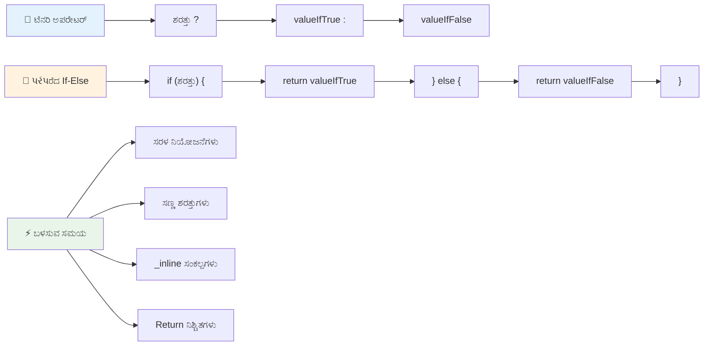
---


## 🚀 ಸವಾಲು

ಮೊದಲು ಲಾಜಿಕಲ್ ಆಪರೇಟರ್‌ಗಳೊಂದಿಗೆ ಬರೆದ ಪ್ರೋಗ್ರಾಂ ಅನ್ನು ರಚಿಸಿ, ನಂತರ ಅದನ್ನು ಟೆರ್ಮರಿ ವ್ಯಾಕ್ಯಾನ ಬಳಸಿ ಮರುಹರ್ತಿ ಮಾಡಿ. ನಿಮ್ಮ ಇಚ್ಛಿತ ವಾಕ್ಯರಚನೆ ಯಾವುದು?

---

## GitHub Copilot ಏಜೆಂಟ್ ಸವಾಲು 🚀

ಕೆಳಗಿನ ಸವಾಲನ್ನು ಪೂರ್ಣಗೊಳಿಸಲು ಏಜೆಂಟ್ ಮೋಡ್ ಬಳಸಿ:

**ವರನನೆ:** ಈ ಪಾಠದಿಂದ ಹಲವು ನಿರ್ಧಾರ ತತ್ವಗಳನ್ನು ಪ್ರದರ್ಶಿಸುವ ಸಮಗ್ರ ಗ್ರೇಡ್ کیلಕ್ಯುಲೇಟರ್ ರಚಿಸಿ, ಇದರಲ್ಲಿ if-else ಹೇಳಿಕೆಗಳು, switch ಹೇಳಿಕೆಗಳು, ಲಾಜಿಕಲ್ ಆಪರೇಟರ್‌ಗಳು ಮತ್ತು ಟೆರ್ಮರಿ ವ್ಯಾಕ್ಯಾನಗಳು ಸೇರಿರಲಿ.

**ಪ್ರಾಂಪ್ಟ್:** ವಿದ್ಯಾರ್ಥಿಯ ಸಂಖ್ಯಾತ್ಮಕ ಅಂಕ (0-100) ಪಡೆದ ಜೊತೆಗೆ ಕೆಳಗಿನ ಮಾನದಂಡಗಳನ್ನು ಅನುಸರಿಸಿ ಅವರ ಅಕ್ಷರ ಗ್ರೇಡ್ ಅನ್ನು ನಿರ್ಧರಿಸುವ ಜಾವಾಸ್ಕ್ರಿಪ್ಟ್ ಪ್ರೋಗ್ರಾಂ ಬರೆಯಿರಿ:
- A: 90-100
- B: 80-89  
- C: 70-79
- D: 60-69
- F: 60 ಕಿಂತ ಕೆಳಗೆ

ಅಭಿವೃದ್ಧಿ:  
1. ಅಕ್ಷರ ಗ್ರೇಡ್ ನಿರ್ಧರಿಸಲು if-else ಹೇಳಿಕೆಯನ್ನು ಬಳಸಿ
2. ವಿದ್ಯಾರ್ಥಿ ಉತ್ತೀರ್ಣರಾದರೆ (ಗ್ರೇಡ್ >= 60) ಮತ್ತು ಗೌರವ ಪಡೆದಿದ್ದರೆ (ಗ್ರೇಡ್ >= 90) ಎಂದು ಪರಿಶೀಲಿಸಲು ಲಾಜಿಕಲ್ ಕಾರ್ಯಚಾಲಕರನ್ನು ಬಳಸಿ  
3. ಪ್ರತಿ ಅಕ್ಷರಾತ್ಮಕ ಗ್ರೇಡ್‌ಗೆ ವಿಶೇಷ ಪ್ರತಿಕ್ರಿಯೆ ನೀಡಲು ಸ್ವಿಚ್ ಸ್ಟೇಟ್ಮೆಂಟ್ ಅನ್ನು ಬಳಸಿ  
4. ವಿದ್ಯಾರ್ಥಿ ಮುಂದಿನ ಕೋರ್ಸ್‌ಗಾಗಿ ಅರ್ಹನೋ (ಗ್ರೇಡ್ >= 70) ಎಂದು ನಿರ್ಧರಿಸಲು ಟೆರ್ಣರಿ ಕಾರ್ಯಚಾಲಕವನ್ನು ಬಳಸಿ  
5. ಅಂಕೆಯನ್ನು 0 ಮತ್ತು 100ರ ನಡುವೆ ಇರುವುದಾಗಿ ಖಚಿತಪಡಿಸಲು ಇನ್‌ಪುಟ್ ಮಾನ್ಯತೆ ಸೇರಿಸಿ  

ನಿಮ್ಮ ಪ್ರೋಗ್ರಾಮ್ ಅನ್ನು 59, 60, 89, 90, ಮತ್ತು ಅಮಾನ್ಯ ಇನ್‌ಪುಟ್‌ಗಳಂತಹ ಅಂಚು ಪ್ರಕರಣಗಳನ್ನು ಒಳಗೊಂಡ ವಿವಿಧ ಅಂಕಗಳೊಂದಿಗೆ ಪರೀಕ್ಷಿಸಿ.  

[ಈಗಲಿನ ಬಗ್ಗೆ ಹೆಚ್ಚಿನ ಮಾಹಿತಿಗಾಗಿ ಅಜೆಂಟ್ ಮೋಡ್](https://code.visualstudio.com/blogs/2025/02/24/introducing-copilot-agent-mode) ಇಲ್ಲಿ ನೋಡಿ.  


## ಪಾಠದ ನಂತರದ ಕ್ವಿಜ್  

[ಪಾಠದ ನಂತರದ ಕ್ವಿಜ್](https://ff-quizzes.netlify.app/web/quiz/12)  

## ವಿಮರ್ಶೆ ಮತ್ತು ಸ್ವಯಂ ಅಧ್ಯಯನ  

ಬಳಕೆದಾರರಿಗೆ ಲಭ್ಯವಿರುವ ಅನೇಕ ಕಾರ್ಯಚಾಲಕರ ಬಗ್ಗೆ ಇನ್ನಷ್ಟು ಓದಿ [MDN ನಲ್ಲಿ](https://developer.mozilla.org/docs/Web/JavaScript/Reference/Operators).  

ಜೋಶ್ ಕೊಮೋ ಅವರ ಅದ್ಭುತ [ಕಾರ್ಯಚಾಲಕ ಹುಡುಕಾಟ](https://joshwcomeau.com/operator-lookup/) ಮೂಲಕ ಹೋಗಿ!  

## ನಿಯುಕ್ತಿ  

[ಕಾರ್ಯಚಾಲಕರು](assignment.md)  

---

## 🧠 **ನಿಮ್ಮ ನಿರ್ಧಾರಮಾಡುವ ಉಪಕರಣಗಳು ಸಂಕ್ಷೇಪ**  

```mermaid
graph TD
    A["🎯 ಜಾವಾಸ್ಕ್ರಿಪ್ಟ್ ನಿರ್ಣಯಗಳು"] --> B["🔍 ಬೂಲಿಯನ್ ಲಾಜಿಕ್"]
    A --> C["📊 ಷರತ್ತುಗಳ ವಿವರಣೆ"]
    A --> D["🔗 ತಾರ್ಕಿಕ ಆಪರೇಟರ್‌ಗಳು"]
    A --> E["⚡ ಉನ್ನತ ಮಾದರಿಗಳು"]
    
    B --> B1["ನಿಜ/ಸುಳ್ಳು ಮೌಲ್ಯಗಳು"]
    B --> B2["ಹೋಲಿಕೆ ಆಪರೇಟರ್‌ಗಳು"]
    B --> B3["ನಿಜತ್ವದ ತತ್ತ್ವಗಳು"]
    
    C --> C1["if ಹೇಳಿಕೆಗಳು"]
    C --> C2["if-else ಸರಪಳೆsẹಗಳು"]
    C --> C3["switch ಹೇಳಿಕೆಗಳು"]
    
    D --> D1["&& (AND)"]
    D --> D2["|| (OR)"]
    D --> D3["! (NOT)"]
    
    E --> E1["ಟೆರ್ನರಿ ಆಪರೇಟರ್"]
    E --> E2["ಶಾರ್ಟ್-ಸರ್ಕ್ಯೂಟ್ ಮೌಲ್ಯಮಾಪನ"]
    E --> E3["ಸಂಕೀರ್ಣ ಷರತ್ತುಗಳು"]
    
    F["💡 ಪ್ರಮುಖ ಸಿದ್ಧಾಂತಗಳು"] --> F1["ಸ್ಪಷ್ಟ ಓದಲು ಸುಲಭ ಷರತ್ತುಗಳು"]
    F --> F2["ನಿರಂತರ ಹೋಲಿಕೆ ಶೈಲಿ"]
    F --> F3["ಸರಿಯಾದ ಆಪರೇಟರ್ ಪ್ರಾಮುಖ್ಯತೆ"]
    F --> F4["ಕಾರ್ಯಕ್ಷಮ ಮೌಲ್ಯಮಾಪನ ಕ್ರಮ"]
    
    style A fill:#e3f2fd
    style B fill:#e8f5e8
    style C fill:#fff3e0
    style D fill:#f3e5f5
    style E fill:#e0f2f1
    style F fill:#fce4ec
```  
---

## 🚀 ನಿಮ್ಮ ಜಾವಾಸ್ಕ್ರಿಪ್ಟ್ ನಿರ್ಧಾರಮಾಡುವ ಮಾಸ್ಟರಿ ಸಮಯರೇಖೆ  

### ⚡ **ಮುಂದಿನ 5 ನಿಮಿಷಗಳಲ್ಲಿ ನೀವು ಏನು ಮಾಡಬಹುದು**  
- [ ] ನಿಮ್ಮ ಬ್ರೌಸರ್ ಕಾನ್ಸೋಲ್ ನಲ್ಲಿ ಹೋಲಿಕೆ ಕಾರ್ಯಚಾಲಕರ ಅಭ್ಯಾಸ ಮಾಡಿ  
- [ ] ನಿಮ್ಮ ವಯಸ್ಸನ್ನು ಪರಿಶೀಲಿಸುವ ಸರಳ if-else ಹೇಳಿಕೆಯನ್ನು ಬರೆಯಿರಿ  
- [ ] ಸವಾಲು ಪ್ರಯತ್ನಿಸಿ: if-else ಅನ್ನು ಟೆರ್ಣರಿ ಕಾರ್ಯಚಾಲಕದಿಂದ ಮರುಬರೆಯಿರಿ  
- [ ] ವಿಭಿನ್ನ "ಟ್ರೂಥಿ" ಮತ್ತು "ಫಾಲ್ಸಿ" ಮೌಲ್ಯಗಳೊಂದಿಗೆ ಏನು ಸಂಭವಿಸುತ್ತದೆ ಎಂದು ಪರೀಕ್ಷಿಸಿ  

### 🎯 **ಈ ಘಂಟೆಯಲ್ಲಿ ನೀವು ಏನು ಸಾಧಿಸಬಹುದು**  
- [ ] ಪಾಠದ ನಂತರದ ಕ್ವಿಜ್ ಪೂರ್ಣಗೊಳಿಸಿ ಮತ್ತು ಯಾವುದೇ ಗೊಂದಲಕಾರಿ ಪರಿಕಲ್ಪನೆಗಳನ್ನು ಪರಿಶೀಲಿಸಿ  
- [ ] GitHub Copilot ಸವಾಲಿನಿಂದ ಸಮಗ್ರ ಗ್ರೇಡ್ ಕ್ಯಾಲ್ಕುಲೇಟರ್ ನಿರ್ಮಿಸಿ  
- [ ] ನಿಜ ಜೀವನದ ಪರಿಸ್ಥಿತಿಗೆ ಸರಳ ನಿರ್ಧಾರ ಮರವನ್ನು ರಚಿಸಿ (ಉದಾಹರಣೆ: ಧರಿಸುವುದನ್ನು ಆಯ್ಕೆ ಮಾಡುವುದು)  
- [ ] ಲಾಜಿಕಲ್ ಕಾರ್ಯಚಾಲಕರೊಂದಿಗೆ ಬಹುಶ್ರೇಣಿಯ ಶರತ್ತುಗಳನ್ನು ಸಂಯೋಜಿಸುವ ಅಭ್ಯಾಸ ಮಾಡಿ  
- [ ] ವಿಭಿನ್ನ ಬಳಕೆಗಾಗಿ ಸ್ವಿಚ್ ಸ್ಟೇಟ್ಮೆಂಟ್‌ಗಳನ್ನು ಪ್ರಯೋಗಿಸಿ  

### 📅 **ನಿಮ್ಮ ವಾರದ ತಂತ್ರಜ್ಞಾನ ಮಾಸ್ಟರಿ**  
- [ ] ಸೃಜನಶೀಲ ಉದಾಹರಣೆಗಳೊಂದಿಗೆ ಕಾರ್ಯಚಾಲಕ ನಿಯುಕ್ತಿ ಪೂರ್ಣಗೊಳಿಸಿ  
- [ ] ವಿವಿಧ ಶರತ್ತುಗಳೊಂದಿಗೆ ಸಣ್ಣ ಕ್ವಿಜ್ ಅಪ್ಲಿಕೇಶನ್ ನಿರ್ಮಿಸಿ  
- [ ] ಅನೇಕ ಇನ್‌ಪುಟ್ ಶರತ್ತೆಗಳ ಪರಿಶೀಲಿಸುವ ಫಾರ್ಮ್ ಮಾನ್ಯತೆದಾರರ ನಿರ್ಮಿಸಿ  
- [ ] ಜೋಶ್ ಕೊಮೋ ಅವರ [ಕಾರ್ಯಚಾಲಕ ಹುಡುಕಾಟ](https://joshwcomeau.com/operator-lookup/) ವ್ಯಾಯಾಮಗಳನ್ನು ಅಭ್ಯಾಸ ಮಾಡಿ  
- [ ] ಇನ್ನಷ್ಟು ಸೂಕ್ತ ಶರತ್ತುಗಳ ರಚನೆಗಳಿಗಾಗಿ ಇತ್ತೀಚಿನ ಕೋಡ್ ಪುನರ್ ರೂಪಿಸಿ  
- [ ] ಶಾರ್ಟ್-ಸರ್ಕ್ಯೂಟ್ ಮೌಲ್ಯಮಾಪನ ಮತ್ತು ಕಾರ್ಯಕ್ಷಮತೆ ಪರಿಣಾಮಗಳ ಅಧ್ಯಯನ ಮಾಡಿ  

### 🌟 **ನಿಮ್ಮ ತಿಂಗಳಾದರೂ ಪರಿವರ್ತನೆ**  
- [ ] ಸಂಕೀರ್ಣ ಗೂಡಿನಲ್ಲಿದ್ದ ಶರತ್ತುಗಳನ್ನು ನೈಪುಣ್ಯತೆಯಿಂದ ಇಟ್ಟುಕೊಳ್ಳಿ ಮತ್ತು ಕೋಡ್ ಓದುಗತ್ವವನ್ನು ಕಾಪಾಡಿ  
- [ ] ಸೂಕ್ಷ್ಮ ನಿರ್ಧಾರಮಾಡುವ ಲಾಜಿಕ್‌ನೊಂದಿಗೆ ಅಪ್ಲಿಕೇಶನ್ ರಚಿಸಿ  
- [ ] ಸ್ಥಾಪಿತ ಪ್ರಾಜೆಕ್ಟ್‌ಗಳಲ್ಲಿ ಶರತ್ತುಲಾಜಿಕ್ ಅನ್ನು ಉತ್ತಮಪಡಿಸುವ ಮೂಲಕ ಓಪನ್ ಸೋರ್ಸ್‌ಗೆ ಕೊಡುಗೆ ನೀಡಿ  
- [ ] ವಿಭಿನ್ನ ಶರತ್ತುಗಳ ರಚನೆಗಳು ಮತ್ತು ಅವುಗಳನ್ನು ಯಾವಾಗ ಬಳಸುವುದು ಎಂದು ಇತರರಿಗೆ ಕಲಿಸಿ  
- [ ] ಶರತ್ತುಲಾಜಿಕ್‌ಗೆ ಕಾರ್ಯಾಚರಣೆ ಕಾರ್ಯಕ್ರಮದ ಪ್ರವೇಶಗಳನ್ನು ಅರ್ಥಮಾಡಿಕೊಳ್ಳಿ  
- [ ] ಶರತ್ತು ನಿಯಮಾವಳಿಗಳ ವೈಯಕ್ತಿಕ ಸಂಕಲನವನ್ನು ರಚಿಸಿ  

### 🏆 **ಅಂತಿಮ ನಿರ್ಧಾರಮಾಡುವ ಚಾಂಪಿಯನ್ ಪರಿಶೀಲನೆ**  

**ನಿಮ್ಮ ತರ್ಕಮಯ ಚಿಂತನಾ ಕೌಶಲ್ಯವನ್ನು ಸಂಭ್ರಮಿಸಿ:**  
- ನೀವು ಯಶಸ್ವಿಯಾಗಿ ಜಾರಿಗೆ ತಂದ ಅತಿ ಸಂಕೀರ್ಣ ನಿರ್ಧಾರಲಾಜಿಕ್ ಯಾವುದು?  
- ಎಲ್ಲ ಶರತ್ತು ರಚನೆಗಳು ನಿಮ್ಮಿಗೆ ಯಾವುದು ಸೂಚನೆಯಾಗಿದೆ ಮತ್ತು ಏಕೆ?  
- ಲಾಜಿಕಲ್ ಕಾರ್ಯಚಾಲಕರ ಬಗ್ಗೆ ತಿಳಿದುಕೊಳ್ಳುವುದು ನಿಮ್ಮ ಸಮಸ್ಯೆ ಪರಿಹಾರ ವಿಧಾನದಲ್ಲಿ ಏನು ಬದಲಾವಣೆ ತಂದಿತು?  
- ಯಾವ ನಿಜ ಜೀವನ ಅಪ್ಲಿಕೇಶನ್ ಸೂಕ್ಷ್ಮ ನಿರ್ಧಾರಲಾಜಿಕ್‌ನಿಂದ ಲಾಭ ಪಡೆಯುತ್ತದೆ?  

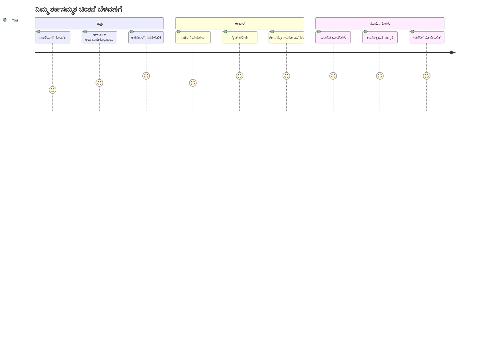
> 🧠 **ನೀವು ಡಿಜಿಟಲ್ ನಿರ್ಧಾರಮಾಡುವ ಕಲೆಯಲ್ಲಿ ಪರಿಣತಿ ಗಳಿಸಿದ್ದೀರಿ!** ಪ್ರತಿ ಸಂವಹನಾತ್ಮಕ ಅಪ್ಲಿಕೇಶನ್ ಬಳಕೆದಾರ ಕ್ರಿಯೆಗಳ ಮತ್ತು ಬದಲಾಗುತ್ತಿರುವ ಪರಿಸ್ಥಿತಿಗಳಾದ ಕಾರ್ಯಾಲಗಳಿಗೆ ಅರ್ಥಮಯವಾಗಿ ಪ್ರತಿಕ್ರಿಯಿಸಲು ಶರತ್ತುಲಾಜಿಕ್ ಮೇಲೆ ಅವಲಂಬಿತವಾಗಿದೆ. ನಿಮ್ಮ ಪ್ರೋಗ್ರಾಮ್‌ಗಳು ಯೋಚಿಸಲು, ಮೌಲ್ಯಮಾಪನ ಮಾಡಲು ಮತ್ತು ಸೂಕ್ತ ಪ್ರತಿಕ್ರಿಯೆಗಳನ್ನು ಆಯ್ಕೆಮಾಡಲು ಹೇಗೆ ಮಾಡಬೇಕೆಂದು ನೀವು ಈಗ ತಿಳಿದಿದ್ದೀರಿ. ಈ ತಾರತಮ್ಯಮಯ ನೆಲೆಸಲು ಪ್ರತಿಯೊಂದು ಗತಿಶೀಲ ಅಪ್ಲಿಕೇಶನ್‌ನ ಶಕ್ತಿ! 🎉

---

<!-- CO-OP TRANSLATOR DISCLAIMER START -->
**ತ್ಯಾಜ್ಯಕಲೆ**:  
ಈ દસ્તાવેજವನ್ನು AI અનુવાદ ಸೇವೆ [Co-op Translator](https://github.com/Azure/co-op-translator) ಬಳಸಿ ಅನುવાદಿಸಲಾಗಿದೆ. ನಾವು ಶುದ್ದತೆಯನ್ನು ಯತ್ನಿಸುವಾಗಲೂ, ಸ್ವಯಂಚಾಲಿತ ಅನುವಾದಗಳಲ್ಲಿ ದೋಷಗಳು ಅಥವಾ ಅಶುದ್ಧತೆಗಳಿರಬಹುದು ಎಂದು ದಯವಿಟ್ಟು ತಿಳಿವಳಿಕೆ ಇಡಿ. ಮೂಲ દસ્તಾವೇಜನ್ನು ಅದರ ಮೂಲ ಭಾಷೆಯಲ್ಲಿ અધિકೃತ ಮೂಲವಾಗಿ ಪರಿಗಣಿಸಬೇಕು. ಪ್ರಮುಖ ಮಾಹಿತಿಗಾಗಿ, ವೃತ್ತಿಪರ ಮಾನವ ಅನುવાદವನ್ನು ಶಿಫಾರಸು ಮಾಡಲಾಗಿದೆ. ಈ ಅನುವಾದ ಬಳಕೆಯಿಂದ ಉಂಟಾಗುವ ಯಾವುದೇ ಅರ್ಥಭ್ರಮาหು ಅಥವಾ ತಪ್ಪು ವಿವರಣೆಗಾಗಿ ನಾವು ಹೊಣೆಗಾರರಾಗಿಲ್ಲ.
<!-- CO-OP TRANSLATOR DISCLAIMER END -->