<!--
CO_OP_TRANSLATOR_METADATA:
{
  "original_hash": "1710a50a519a6e4a1b40a5638783018d",
  "translation_date": "2026-01-08T13:05:58+00:00",
  "source_file": "2-js-basics/4-arrays-loops/README.md",
  "language_code": "kn"
}
-->
# JavaScript ಮೂಲಭೂತಗಳು: ಅರೆಗಳು ಮತ್ತು ಲೂಪ್ಗಳು


> ಟೊಮೊಮಿ ಇಮುರುವವರಿಂದ ಸ್ಕೆಚ್ ನೋಟ್ [Tomomi Imura](https://twitter.com/girlie_mac)

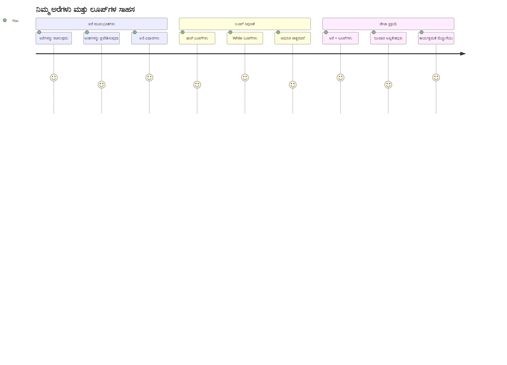
## ಪೂರ್ವ-ಲೇಕ್ಚರ್ ಕ್ವಿಜ್
[ಪೂರ್ವ-ಲೇಕ್ಚರ್ ಕ್ವಿಜ್](https://ff-quizzes.netlify.app/web/quiz/13)

ವೆಬ್‌ಸೈಟ್‌ಗಳು ಕೇವಲ ಶಾಪಿಂಗ್ ಕಾರ್ಟ್ ಐಟಂಗಳನ್ನು ಡೇಟಾ ಟ್ರ್ಯಾಕ್ ಮಾಡಲು ಅಥವಾ ನಿಮ್ಮ ಸ್ನೇಹಿತರು ಎಂಬ ಪಟ್ಟಿಯನ್ನು ತೋರಿಸಲು ಹೇಗೆ ಮಾಡುತ್ತವೆ ಎಂದು ಯಾವಾಗಲಾದರೂ ಆಲೋಚಿಸಿಕೊಂಡಿದ್ದೀರಾ? ಅಲ್ಲಿ ಅರೆಗಳು ಮತ್ತು ಲೂಪ್ಗಳು ಬರುವವು. ಅರೆಗಳು ಹೇಗೆ ಬೋಧಿಸುವುದೆಂದರೆ ಅವು ಡಿಜಿಟಲ್ ಕಂಟೈನರ್‌ಗಳಂತೆ ಇದ್ದು, ಒಂದು ಸಮಯದಲ್ಲಿ ಹಲವಾರು ಮಾಹಿತಿಗಳನ್ನು ಹಿಡಿವವು, ಮತ್ತು ಲೂಪ್ಗಳು ಆ ಎಲ್ಲಾ ಡೇಟಾವನ್ನು ಪುನರಾವೃತಿಸುವುದಿಲ್ಲದೆ ಪರಿಣಾಮಕಾರಿಯಾಗಿ ಕೆಲಸ ಮಾಡಬಲ್ಲ ಮೂಲಕಗಳು.

ಈ ಎರಡು ಕಲ್ಪನೆಗಳು ಒಟ್ಟಿಗೆ ನಿಮ್ಮ ಪ್ರೋಗ್ರಾಮ್‌ನಲ್ಲಿ ಮಾಹಿತಿಯನ್ನು ಹ್ಯಾಂಡಲ್ ಮಾಡುವ ಮೂಲ ಆಧಾರವಾಗಿವೆ. ನೀವು ಪ್ರತಿ ಹೆಜ್ಜೆಯನ್ನು ಕೈಯಿಂದ ಬರೆಯುವುದರಿಂದ, ಲಕ್ಷಾಂತರ ಮತ್ತು ಸಾವಿರಾರು ಅಂಶಗಳನ್ನು ವೇಗವಾಗಿ ಸಂಸ್ಕರಿಸಬಹುದಾದ ಚಾತುರ್ಯಮಯ, ಪರಿಣಾಮಕಾರಿ ಕೋಡ್ ಅನ್ನು ರಚಿಸುವ ದಿಕ್ಕಿಗೆ ಸಾಗುವಿರಿ.

ಈ ಪಾಠದ ಅಂತ್ಯದಲ್ಲಿ, ನೀವು ಕೆಲವೇ ಸಾಲುಗಳ ಕೋಡ್ ಮೂಲಕ ಸಂಕೀರ್ಣ ಡೇಟಾ ಕಾರ್ಯಗಳನ್ನು ಹೇಗೆ ಸಾಧಿಸುವುದೆಂದು ಅರ್ಥಮಾಡಿಕೊಳ್ಳುತ್ತೀರಿ. ಈ ಅಗತ್ಯ ಪ್ರೋಗ್ರಾಮಿಂಗ್ ಕಲ್ಪನೆಗಳನ್ನು ಅನ್ವೇಷಿಸೋಣ.

[](https://youtube.com/watch?v=1U4qTyq02Xw "ಅರೆಗಳು")

[](https://www.youtube.com/watch?v=Eeh7pxtTZ3k "ಲೂಪ್ಗಳು")

> 🎥 ಮೇಲಿನ ಚಿತ್ರಗಳನ್ನು ಕ್ಲಿಕ್ ಮಾಡಿ ಅರೆಗಳು ಮತ್ತು ಲೂಪ್ಗಳ ಕುರಿತು ವೀಡಿಯೊಗಳನ್ನು ವೀಕ್ಷಿಸಿ.

> ನೀವು ಈ ಪಾಠವನ್ನು [Microsoft Learn](https://docs.microsoft.com/learn/modules/web-development-101-arrays/?WT.mc_id=academic-77807-sagibbon) ನಲ್ಲಿ ಸಹ ತೆಗೆದುಕೊಳ್ಳಬಹುದು!

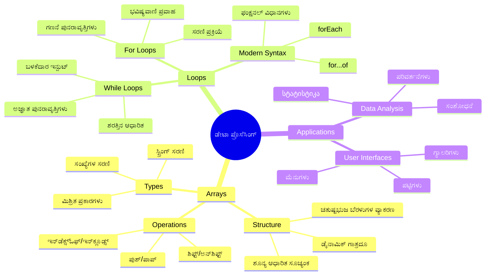
## ಅರೆಗಳು

ಅರೆಗಳನ್ನು ಡಿಜಿಟಲ್ ಫೈಲಿಂಗ್ ಕ್ಯಾಬಿನೆಟ್ ಎಂದು ಭಾವಿಸಿ - ಪ್ರತಿಯೊಂದು ಡ್ರಾಯರ್‌ಗೆ ಒಂದು ದಾಖಲೆ ಸಂಗ್ರಹಿಸುವ ಬದಲು ನೀವು ಹಲವು ಸಂಬಂಧಿಸಿದ ಐಟಂಗಳನ್ನು ಒಂದು ತಾಂತ್ರಿಕ ಕಂಟೈನರ್‌ನಲ್ಲಿ ವ್ಯವಸ್ಥೆ ಮಾಡಬಹುದು. ಪ್ರೋಗ್ರಾಮಿಂಗ್ ಶೈಲಿಯಲ್ಲಿ, ಅರೆಗಳು ಅನೇಕ ಮಾಹಿತಿಗಳನ್ನು ಒಂದು ಸಂಘಟಿತ ಪ್ಯಾಕೇಜಿನಲ್ಲಿ ಸಂಗ್ರಹಿಸುವ ಅವಕಾಶವನ್ನು ನೀಡುತ್ತವೆ.

ನೀವು ಫೋಟೋ ಗ್ಯಾಲರಿ ರಚಿಸುತ್ತಿದ್ದೀರಾ, ಟು-ಡೂ ಪಟ್ಟಿಯನ್ನು ನಿರ್ವಹಿಸುತ್ತಿದ್ದೀರಾ ಅಥವಾ ಗೇಮಿನಲ್ಲಿನ ಹೈ ಸ್ಕೋರ್‌ಗಳನ್ನು ಟ್ರ್ಯಾಕ್ ಮಾಡುತ್ತಿದ್ದೀರಾ, ಅರೆಗಳು ಡೇಟಾ ಸಂಘಟನೆಯ ಆಧಾರ ಒದಗಿಸುತ್ತವೆ. ಅವು ಹೇಗೆ ಕೆಲಸ ಮಾಡುವದನ್ನು ನೋಡೋಣ.

✅ ಅರೆಗಳು ನಮ್ಮ ಸುತ್ತಲೂ ಇದ್ದಾರೆ! ಸೃಜನಾತ್ಮಕ ಉದಾಹರಣೆವಾಗಿ ಸೌರ ಪ್ಯಾನೆಲ್ ಅರೆ ಅಥವಾ ಇನ್ನ कोई ನೆನಪಿರುವುದೆ?

### ಅರೆಗಳನ್ನು ರಚಿಸುವುದು

ಅರೆ ರಚಿಸುವುದು ಸುಲಭ - ಕೇವಲ ಚೌಕಟ್ಟಿನ ಬ್ರಾಕೆಟ್‌ಗಳನ್ನು ಉಪಯೋಗಿಸಿ!

```javascript
// ಖಾಲಿ ಅರೆ - ಐಟಂಗಳನ್ನು ಕಾಯುತ್ತಿರುವ ಖಾಲಿ ಶಾಪಿಂಗ್ ಕಾರ್ಟ್ ಹೋಲಿದೆ
const myArray = [];
```

**ಇಲ್ಲಿ ಏನಾಗುತ್ತಿದೆ?**
ನೀವು ಫుందಿ ಖಾಲಿ ಕಂಟೈನರ್ ರಚಿಸಿದ್ದೀರಿ ಅದಕ್ಕೆ ಆ ಚೌಕಟ್ಟಿನ ಬ್ರಾಕೆಟ್‌ಗಳು `[]` ಬಳಕೆ. ಇದನ್ನು ಖಾಲಿ ಪುಸ್ತಕ ಶೆಲ್ಫ್ ಎಂದು ಭಾವಿಸಿ - ನೀವು ಯಾವ ಪುಸ್ತಕಗಳನ್ನು ಆಗ್ರಹಿಸುತ್ತೀರೋ ಅವನ್ನು ಇಡಲು ಸಿದ್ಧವಾಗಿದೆ.

ನೀವು ನಿಮ್ಮ ಅರೆಗೆ ಪ್ರಾಥಮಿಕ ಮೌಲ್ಯಗಳನ್ನು ಕೂಡ ತುಂಬಬಹುದು:

```javascript
// ನಿಮ್ಮ ಐಸ್ ಕ್ರೀಮ್ ಅಂಗಡಿಯ ರುಚಿ ವಹಿವಾಟು
const iceCreamFlavors = ["Chocolate", "Strawberry", "Vanilla", "Pistachio", "Rocky Road"];

// ಬಳಕೆದಾರರ ಪ್ರೊಫೈಲ್ ಮಾಹಿತಿ (ವಿಭಿನ್ನ ರೀತಿಯ ಡೇಟಾ ಮಿಶ್ರಣ)
const userData = ["John", 25, true, "developer"];

// ನಿಮ್ಮ ಇಷ್ಟ ತರಗತಿಯ ಪರೀಕ್ಷಾ ಅಂಕಗಳು
const scores = [95, 87, 92, 78, 85];
```

**ಗಮನ ಸೆಳೆಯುವ ಸೊಗಸುಗಳು:**
- ನೀವು ಪಠ್ಯ, ಸಂಖ್ಯೆಗಳು ಅಥವಾ ಸತ್ಯ/ಸುಳ್ಳು ಮೌಲ್ಯಗಳನ್ನು ಒಂದೇ ಅರೆನಲ್ಲಿ ಹಿಡಿಕೊಳ್ಳಬಹುದು
- ಪ್ರತಿ ಐಟಂ ಅನ್ನು ಕಾಮಾಗಳಿಂದ ವಿಭಜಿಸಿ - ಸುಲಭ!
- ಅರೆಗಳು ಸಂಬಂಧಿಸಿದ ಮಾಹಿತಿಯನ್ನು ಒಟ್ಟಿಗೆ ಇಡಲು ಸೂಕ್ತವಾಗಿವೆ

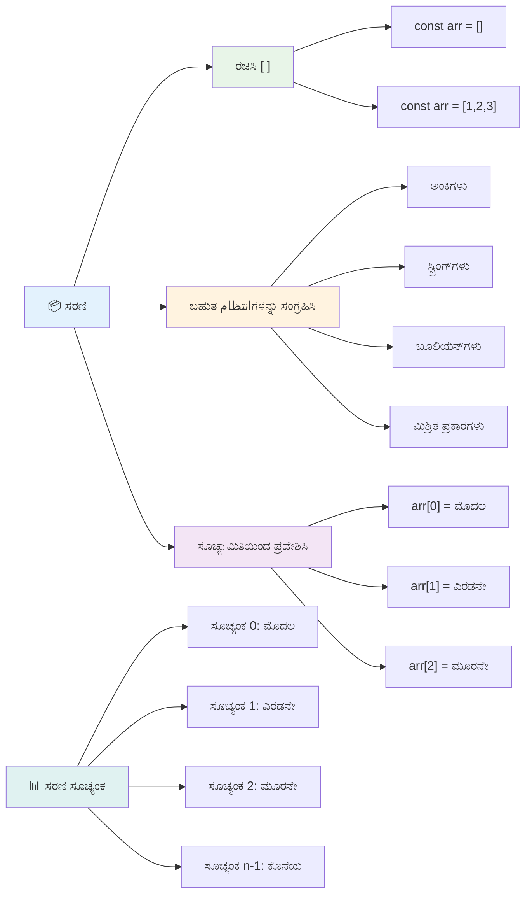
### ಅರೆ ಸೂಚ್ಯಂಕೀಕರಣ

ಮುಂಚಿತವಾಗಿ ಅರೆಗಳಿಗೆ ಒಂದನ್ನಾಗಿ 0 ರಿಂದ ಪ್ರಾರಂಭವಾಗುವ ಸೂಚ್ಯಂಕವಿದೆ ಎಂದು ಅನಿಸಬಹುದು. ಈ ಶೂನ್ಯ-ಆಧಾರಿತ ಸೂಚ್ಯಂಕವನ್ನು ಕಂಪ್ಯೂટર ಮೆಮೊರಿ ಹೇಗೆ ಕೆಲಸ ಮಾಡುತ್ತದೆ ಎಂಬುದರ ನಡವಳಿಕೆಯದು - ಇದು ಸಿ (C) ಭಾಷೆಗಳ ಮೊದಲ ದಿನಗಳಿಂದ ಪ್ರೋಗ್ರಾಮಿಂಗ್ ನಿಯಮವಾಗಿದೆ. ಪ್ರತಿಯೊಂದು ಅರೆ ಸ್ಥಾನಕ್ಕೆ ತನ್ನದೇ ಆದ ವಿಳಾಸ ಸಂಖ್ಯೆ **ಸೂಚ್ಯಂಕ** ಎಂದು ಕರೆಯಲ್ಪಡುವುದು.

| ಸೂಚ್ಯಂಕ | ಮೌಲ್ಯ | ವಿವರಣೆ |
|-------|-------|-------------|
| 0 | "ಚಾಕ್ಲೆಟ್" | ಮೊದಲ ಅಂಶ |
| 1 | "ಸ್ಟ್ರಾಬೆರಿ" | ಎರಡನೇ ಅಂಶ |
| 2 | "ವ್ಯಾನಿಲ್‌ಲಾ" | ಮೂರನೇ ಅಂಶ |
| 3 | "ಪಿಸ್ತಾಚಿಯೋ" | ನಾಲ್ಕನೇ ಅಂಶ |
| 4 | "ರಾಕಿ ರೋಡ್" | ಐದನೇ ಅಂಶ |

✅ ನಿಮಗೆ ಅರೆಗಳು 0 ಸೂಚ್ಯಂಕದಿಂದ ಪ್ರಾರಂಭವಾಗುತ್ತವೆ ಎಂದು ಆಶ್ಚರ್ಯವೇ? ಕೆಲವು ಪ್ರೋಗ್ರಾಮಿಂಗ್ ಭಾಷೆಗಳಲ್ಲಿ, ಸೂಚ್ಯಂಕಗಳು 1 ರಿಂದ ಪ್ರಾರಂಭವಾಗುತ್ತವೆ. ಇದರ ಹಿಂದೆ ಆಸಕ್ತಿದಾಯಕ ಇತಿಹಾಸವಿದೆ, ಇದನ್ನು ನೀವು [ವಿಕಿಪೀಡಿಯಾ](https://en.wikipedia.org/wiki/Zero-based_numbering) ನಲ್ಲಿ ಓದಬಹುದು.

**ಅರೆ ಅಂಗಾಂಶಗಳನ್ನು ಪ್ರವೇಶಿಸುವುದು:**

```javascript
const iceCreamFlavors = ["Chocolate", "Strawberry", "Vanilla", "Pistachio", "Rocky Road"];

// ಬ್ರಾಕೆಟ್ ನೋಟೇಶನ್ ಬಳಸಿ ವೈಯಕ್ತಿಕ ಅಂಶಗಳನ್ನು ಪ್ರವೇಶಿಸಿ
console.log(iceCreamFlavors[0]); // "ಚಾಕ್ಲೆಟ್" - ಮೊದಲ ಅಂಶ
console.log(iceCreamFlavors[2]); // "ವ್ಯಾನಿಲ್ಲಾ" - ಮೂರನೇ ಅಂಶ
console.log(iceCreamFlavors[4]); // "ರಾಕ್‌ಕಿ ರೋಡ್" - ಕೊನೆಯ ಅಂಶ
```

**ಇಲ್ಲಿ ಏನಾಗುತ್ತಿದೆ ಎಂಬುದರ ವಿವರಣೆ:**
- **ಚೌಕಟ್ಟಿನ ಬ್ರಾಕೆಟ್ ಸೂಚ್ಯಂಕ ಸಂಖ್ಯೆ ಬಳಸಿ** ಅಂಶಗಳನ್ನು ಪ್ರವೇಶಿಸುತ್ತದೆ
- **ಅರೆ ನಿಗದಿಪಡಿಸಿದ ಸ್ಥಾನದಲ್ಲಿ ಸಂಗ್ರಹಿತ ಮೌಲ್ಯವನ್ನು** ಹಿಂತಿರುಗಿಸುತ್ತದೆ
- **ಗುಣಮಟ್ಟವಾಗಿ 0ರಿಂದ ಗಣನೆ ಪ್ರಾರಂಭ** ಮಾಡುತ್ತದೆ, ಆದ್ದರಿಂದ ಮೊದಲ ಅಂಶ ಸೂಚ್ಯಂಕ 0

**ಅರೆ ಅಂಗಾಂಶಗಳನ್ನು ತಿದ್ದುಪಡಿ ಮಾಡುವುದು:**

```javascript
// ಈಗಿರುವ ಮೌಲ್ಯವನ್ನು ಬದಲಾಯಿಸಿ
iceCreamFlavors[4] = "Butter Pecan";
console.log(iceCreamFlavors[4]); // "ಬಟರ್ ಪೇಕನ್"

// ಕೊನೆಯಲ್ಲಿ ಹೊಸ ಅಂಶವನ್ನು ಸೇರಿಸಿ
iceCreamFlavors[5] = "Cookie Dough";
console.log(iceCreamFlavors[5]); // "ಕುಕ್ಕಿ ಡೋ"
```

**ಮೇಲಿನ ಉದಾಹರಣೆಯಲ್ಲಿ:**
- ಸೂಚ್ಯಂಕ 4 ರಲ್ಲಿನ ಅಂಶವನ್ನು "ರಾಕಿ ರೋಡ್"ನಿಂದ "ಬಟರ್ ಪಿಕಾನ್"ಗೆ **ತಿದ್ದುಪಡಿಸಿದೆ**
- ಸೂಚ್ಯಂಕ 5 ರಲ್ಲಿ "ಕುಕಿ ಡೋ" ಎಂಬ ಹೊಸ ಅಂಶ **ಹೇರಲಾಗಿದೆ**
- ಪ್ರಸ್ತುತ ಮಿತಿಯನ್ನು ಮೀರಿಸಿ ಓದಿದಾಗ ಅರೆ ಕೆಲವು ಆಯಾಮಗಳನ್ನು **ಸ್ವಯಂಚಾಲಿತವಾಗಿ ವಿಸ್ತರಿಸಿದೆ**

### ಅರೆ ಉದ್ದ ಮತ್ತು ಸಾಮಾನ್ಯ ವಿಧಾನಗಳು

ಅರೆಗಳಿಗೆ ಇವುಗಳು ಮುಂಚಿತ ವೈಶಿಷ್ಟ್ಯಗಳು ಮತ್ತು ವಿಧಾನಗಳನ್ನು ಒಳಗೊಂಡಿವೆ, ಇದು ಡೇಟಾ ಹ್ಯಾಂಡ್ಲಿಂಗ್‌ನ್ನು ಸುಲಭಗೊಳಿಸುತ್ತದೆ.

**ಅರೆ ಉದ್ದವನ್ನು ಕಂಡುಹಿಡಿಯುವುದು:**

```javascript
const iceCreamFlavors = ["Chocolate", "Strawberry", "Vanilla", "Pistachio", "Rocky Road"];
console.log(iceCreamFlavors.length); // 5

// ಅರೆಗಳು ಬದಲಾಗುತ್ತಿದ್ದಂತೆ ಉದ್ದವು ಸ್ವಯಂಚಾಲಿತವಾಗಿ ನವೀಕರಿಸಲಾಗುತ್ತದೆ
iceCreamFlavors.push("Mint Chip");
console.log(iceCreamFlavors.length); // 6
```

**ಪ್ರಮುಖ ಅಂಶಗಳು:**
- ಅರೆ ಯಲ್ಲಿ ಒಟ್ಟು ಅಂಶಗಳ ಸಂಖ್ಯೆಯನ್ನು *ಹಿಂತಿರುಗಿಸುತ್ತದೆ*
- ಅಂಶಗಳನ್ನು ಸೇರಿಸುವ ಅಥವಾ ತೆಗೆದುಹಾಕುವಾಗ *ಸ್ವಯಂಚಾಲಿತವಾಗಿ ನವೀಕರಿಸುತ್ತದೆ*
- ಲೂಪ್ಗಳು ಹಾಗೂ ಪರಿಶೀಲನೆಗೆ ಬಳಸಬಹುದಾದ *ಚಲನೆಯ ಮಟ್ಟವನ್ನು* ಒದಗಿಸುತ್ತದೆ

**ಅತ್ಯಾವಶ್ಯಕ ಅರೆ ವಿಧಾನಗಳು:**

```javascript
const fruits = ["apple", "banana", "orange"];

// ಅಂಶಗಳನ್ನು ಸೇರಿಸಿ
fruits.push("grape");           // ಕೊನೆಯಲ್ಲಿ ಸೇರಿಸಿ: ["apple", "banana", "orange", "grape"]
fruits.unshift("strawberry");   // ಆರಂಭದಲ್ಲಿ ಸೇರಿಸಿ: ["strawberry", "apple", "banana", "orange", "grape"]

// ಅಂಶಗಳನ್ನು ತೆಗೆದುಹಾಕಿ
const lastFruit = fruits.pop();        // "grape" ಅನ್ನು ತೆಗೆದುಹಾಕಿ ಮತ್ತು ಮರಳಿ ನೀಡುತ್ತದೆ
const firstFruit = fruits.shift();     // "strawberry" ಅನ್ನು ತೆಗೆದುಹಾಕಿ ಮತ್ತು ಮರಳಿ ನೀಡುತ್ತದೆ

// ಅಂಶಗಳನ್ನು ಹುಡುಕಿ
const index = fruits.indexOf("banana"); // 1 반환 ( "banana"ದ ಸ್ಥಾನ)
const hasApple = fruits.includes("apple"); // ಸತ್ಯವನ್ನು 반환ಿಸುತ್ತದೆ
```

**ಈ ವಿಧಾನಗಳ ಅರ್ಥ:**
- `push()` (ಕೊನೆಯ ಭಾಗದಲ್ಲಿ) ಮತ್ತು `unshift()` (ಆರಂಭದಲ್ಲಿ) ಮೂಲಕ ಅಂಶಗಳನ್ನು ಸೇರಿಸುತ್ತದೆ
- `pop()` (ಕೊನೆಯ ಭಾಗದಿಂದ) ಮತ್ತು `shift()` (ಆರಂಭದಿಂದ) ಮೂಲಕ ಅಂಶಗಳನ್ನು ತೆಗೆದುಹಾಕುತ್ತದೆ
- `indexOf()` ಬಳಸಿ ಅಂಶಗಳ ಸ್ಥಳವನ್ನು ಹುಡುಕುತ್ತದೆ ಮತ್ತು `includes()` ಬಳಸಿ ಅಂಶಗಳ ಇರواجد_ತೆ ಪರಿಶೀಲಿಸುತ್ತದೆ
- ತೆಗೆದುಹಾಕಲಾದ ಅಂಶಗಳು ಅಥವಾ ಸ್ಥಾನಗಳ ಸೂಚ್ಯಂಕಗಳನ್ನು ಹಿಂತಿರುಗಿಸುತ್ತದೆ

✅ ನಿಮಗೂ ಪ್ರಯತ್ನಿಸಿ! ನಿಮ್ಮ ಬ್ರೌಸರ್ ಕಾನ್ಸೋಲ್‌ನಲ್ಲಿ ಸ್ವಂತ ಅರೆ ರಚಿಸಿ ಮತ್ತು ನಿರ್ವಹಿಸಿ.

### 🧠 **ಅರೆ ಮೂಲಭೂತ ಪರಿಶೀಲನೆ: ನಿಮ್ಮ ಡೇಟಾ ಸಂಘಟನೆ**

**ನಿಮ್ಮ ಅರೆ ತಿಳುವಳಿಕೆಯನ್ನು ಪರೀಕ್ಷಿಸಿ:**
- ಅರೆಗಳು 1 ಬದಲು 0 ರಿಂದ ಎಣಿಕೆ ಪ್ರಾರಂಭಿಸುವುದಕ್ಕೆ ಕಾರಣವೇನು?
- ನೀವು ಇರುವುದಿಲ್ಲದ ಸೂಚ್ಯಂಕವನ್ನು ಪ್ರವೇಶಿಸಲು ಯತ್ನಿಸಿದರೆ (ಹಾಗೆ `arr[100]` 5-ಅಂಶ ಅರೆನಲ್ಲಿ), ಏನು ಆಗುತ್ತೆ?
- ಅರೆಗಳು ಉಪಯೋಗಿಯಾಗಲಿರುವ ಮೂರು ನೈಜ-ಜಗತ್ತಿನ ಸಂದರ್ಭಗಳನ್ನು ಊಹಿಸಿ.

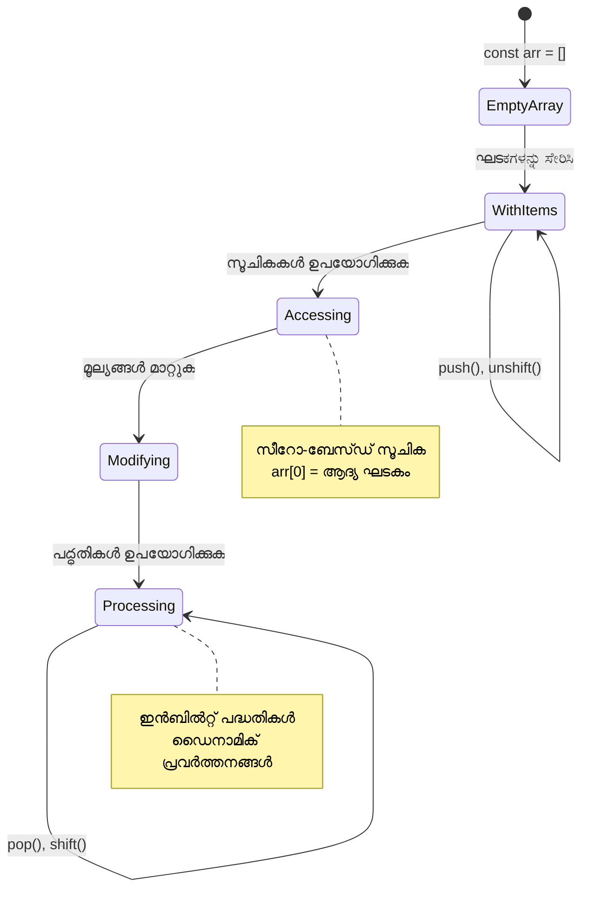
> **ವಾಸ್ತವ ಜಾಗೃತಿ**: ಪ್ರೋಗ್ರಾಮಿಂಗ್‌ನಲ್ಲಿ ಅರೆಗಳು ಎಲ್ಲೆಡೆಯೂ ಇವೆ! ಸಾಮಾಜಿಕ ಮಾಧ್ಯಮ ಫೀಡ್ಗಳು, ಶಾಪಿಂಗ್ ಕಾರ್ಟ್‌ಗಳು, ಫೋಟೋ ಗ್ಯಾಲರಿಗಳು, ಪ್ಲೇಲಿಸ್ಟ್ ಹಾಡುಗಳು—all ಹಿಂದಿನೆಲೆ ಅರೆಗಳೇ!

## ಲೂಪ್ಗಳು

ಚಾರ್ಲ್ಸ್ ಡಿಕ್ಕೆನ್ಸ್ ಅವರ నవಲ್ಸ್‌ನಿಂದ ಪ್ರಸಿದ್ಧ ಶಿಕ್ಷೆ ಎಂಬುದು ವಿದ್ಯಾರ್ಥಿಗಳು ಸ್ಲೇಟ್ ಮೇಲೆ ನಿಯಮಿತವಾಗಿ ಸಾಲುಗಳನ್ನು ಬರೆಯಬೇಕಾಗುತ್ತದೆ ಎಂಬುದು. ನೀವು ಯಾರಿಗಾದರೂ "ಈ ವ್ಯಾಕ್ಯವನ್ನು 100 ಬಾರಿ ಬರೆಯಿರಿ" ಎಂದು ಹೇಳಬಹುದು ಮತ್ತು ಅದು ಸ್ವಯಂಚಾಲಿತವಾಗಿ ಆಗುತ್ತದೆ ಎಂದು ಕಲ್ಪನೆ ಮಾಡಿ. ಇದುವೇ ನಿಮ್ಮ ಕೋಡ್‌ಗೆ ಲೂಪ್ಗಳು ಮಾಡುತ್ತವೆ.

ಲೂಪ್ಗಳು ದೀರ್ಘಕಾಲ ಶ್ರಮಶೀಲ ಸಹಾಯಕರಂತೆ ಕೆಲಸಮಾಡುತ್ತವೆ. ನೀವು ಶಾಪಿಂಗ್ ಕಾರ್ಟ್‌ನಲ್ಲಿ ಪ್ರತಿಯೊಬ್ಬ ಐಟಂ ಪರಿಶೀಲಿಸುವುದು ಅಥವಾ ಆಲ್ಬಮ್‌ನಲ್ಲಿ ಎಲ್ಲಾ ಚಿತ್ರಗಳನ್ನು ತೋರಿಸುವುದು ಬೇಕಾದರೆ, ಲೂಪ್ಗಳು ಪುನರಾವೃತ್ತಿ ಕಾರ್ಯವನ್ನು ಪರಿಣಾಮಕಾರಿಯಾಗಿ ನಿರ್ವಹಿಸುತ್ತವೆ.

JavaScript ಪಟ್ಟಿಯಿಂದ ವಿವಿಧ ಲೂಪ್ ಪ್ರಕಾರಗಳನ್ನು ಒದಗಿಸುತ್ತದೆ. ಪ್ರತಿಯೊಂದನ್ನೂ ನೋಡಿ, ಯಾವಾಗ ಬಳಸಬೇಕು ಅಂದ ತಿಳಿಯೋಣ.

```mermaid
flowchart TD
    A["🔄 ಲೂಪ್ ಪ್ರಕಾರಗಳು"] --> B["For ಲೂಪ್"]
    A --> C["While ಲೂಪ್"]
    A --> D["For...of ಲೂಪ್"]
    A --> E["forEach ವಿಧಾನ"]
    
    B --> B1["ಬೆಲ್ಲನೆ(iterations) ತಿಳಿದಿವೆ"]
    B --> B2["కౌంటರ್ ಆಧಾರಿತ"]
    B --> B3["for(init; ಶರತ್ತು; ಹೆಚ್ಚಿಸುವುದು)"]
    
    C --> C1["ಅಜ್ಞಾತ(iterations)"]
    C --> C2["ಶರತ್ತು ಆಧಾರಿತ"]
    C --> C3["while(ಶರತ್ತು)"]
    
    D --> D1["ನವೀನ ES6+"]
    D --> D2["ಅರೆಗೆ(iteration)"]
    D --> D3["for(ಐಟಂ of ಅರೆಗೆ)"]
    
    E --> E1["ಕಾರ್ಯಾತ್ಮಕ ಶೈಲಿ"]
    E --> E2["ಅರೆ ವಿಧಾನ"]
    E --> E3["ಅರೆ.forEach(ಕಾಲ್‌ಬ್ಯಾಕ್)"]
    
    F["⏰ ಬಳಸಬೇಕಾಗಿರುವ ಸಮಯ"] --> F1["For: ಎಣಿಕೆಗಳು, ಸೂಚ್ಯಂಕಗಳು"]
    F --> F2["While: ಬಳಕೆದಾರ ಇನ್ಪುಟ್, ಹುಡುಕಾಟ"]
    F --> F3["For...of: ಸರಳ ಲೂಪ್"]
    F --> F4["forEach: ಕಾರ್ಯಾತ್ಮಕ ಪ್ರೋಗ್ರಾಮಿಂಗ್"]
    
    style A fill:#e3f2fd
    style B fill:#e8f5e8
    style C fill:#fff3e0
    style D fill:#f3e5f5
    style E fill:#e0f2f1
    style F fill:#fce4ec
```
### For ಲೂಪ್

`for` ಲೂಪ್ ಒಂದು ಟೈಮರ್ ಸರಿಹೊಂದಿಸುವಂತೆ - ನೀವು ಎಷ್ಟೆಷ್ಟು ಬಾರಿ ಏನಾದರೂ ಆಗಬೇಕು ಎಂದಿದ್ದೀರೋ ಅದನ್ನು ಸರಿಯಾಗಿ ಗೊತ್ತಿರುತ್ತದೆ. ಇದು ಹೆಚ್ಚು ವ್ಯವಸ್ಥಿತ ಮತ್ತು ಭವಿಷ್ಯನಿರೀಕ್ಷಿತವಾಗಿದ್ದು, ಅರೆಗಳೊಂದಿಗೆ ಕೆಲಸ ಮಾಡುವಾಗ ಅಥವಾ ಗಣನೆ ಮಾಡಬೇಕು ಎಂದಾದರೆ ಆದರ್ಶ.

**For ಲೂಪ್ ರಚನೆ:**

| ಘಟಕ | ಉದ್ದೇಶ | ಉದಾಹರಣೆ |
|-----------|---------|----------|
| **ಆರಂಭಿಕೀಕರಣ** | ಪ್ರಾರಂಭ ಬಿಂದುವನ್ನು ಹೊಂದಿಸುವುದು | `let i = 0` |
| **ಶರತ್ತು** | ಮುನ್ನಡೆಸುವ ಸಮಯ | `i < 10` |
| **ವೃದ್ಧಿ** | ಹೇಗೆ ನವೀಕರಿಸುವುದು | `i++` |

```javascript
// 0ರಿಂದ 9ರವರೆಗೆ ಎಣಿಕೆ
for (let i = 0; i < 10; i++) {
  console.log(`Count: ${i}`);
}

// ಹೆಚ್ಚು ಪ್ರಾಯೋಗಿಕ ಉದಾಹರಣೆ: ಅಂಕಗಳನ್ನು ಪ್ರಕ್ರಿಯೆ ಮಾಡುವುದು
const testScores = [85, 92, 78, 96, 88];
for (let i = 0; i < testScores.length; i++) {
  console.log(`Student ${i + 1}: ${testScores[i]}%`);
}
```

**ಹಂತ ಹಂತವಾಗಿಯೇ, ಏನಾಗುತ್ತದೆ:**
- ಆರಂಭದಲ್ಲಿ ಕೌಂಟರ್ ಚರ `i` 0ಗೆ **ಆರಂಭಿಕೀಕರಿಸಲಾಗುತ್ತದೆ**
- ಪ್ರತಿ ಪುನರಾವೃತ್ತಿಗಾಗಿ ಶರತ್ತು `i < 10` **ಪರಿಶೀಲಿಸು**
- ಶರತ್ತು ಸತ್ಯವಿದ್ದಾಗ ಕೋಡ್ ಬ್ಲಾಕ್ **ನಿರ್ವಹಿಸು**
- ಪ್ರತಿ ಪುನರಾವೃತ್ತಿಗೆ ನಂತರ `i++` ಬಲ 1 **ಸೇರಿಸು**
- ಶರತ್ತು ಅಸತ್ಯವಾದಾಗ (i 10 ತಲುಪಿದಾಗ) **ನಿಲ್ಲಿಸು**

✅ ಈ ಕೋಡ್ ಅನ್ನು ಬ್ರೌಸರ್ ಕಾನ್ಸೋಲ್‌ನಲ್ಲಿ ಚಾಲನೆ ಮಾಡಿ. ಕೌಂಟರ್, ಶರತ್ತು ಅಥವಾ ಪುನರಾವೃತ್ತಿ ಅಭಿವ್ಯಕ್ತಿಯಲ್ಲಿ ചെറിയ ಬದಲಾವಣೆ ಮಾಡಿದಾಗ ಏನು ಆಗುತ್ತದೆ? ಇದು ಪಶ್ಚಿಮಾಗಾಮಿ ಭಾಗವಾಗಿ ನಡೆಯಲು ಅದರನ್ನೇಕು ಮಾಡಲು ಸಾಧ್ಯವೇ? 

### 🗓️ **For ಲೂಪ್ ನೈಪುಣ್ಯ ಪರಿಶೀಲನೆ: ನಿಯಂತ್ರಣ ಹೊಂದಿದ ಪುನರಾವೃತಿ**

**ನಿಮ್ಮ For ಲೂಪ್ ತಿಳುವಳಿಕೆಯನ್ನು ಮೌಲ್ಯಮಾಪನ ಮಾಡಿ:**
- for ಲೂಪ್ನ ಮೂರು ಭಾಗಗಳು ಯಾವವು, ಮತ್ತು ಪ್ರತಿಯೊಂದರ ಕೆಲಸವೇನು?
- ನೀವು ಅರೆನ ಸಂಪರ್ಕ backwards ಹೇಗೆ ಲೂಪ್ ಮಾಡಿ?
- ವೃದ್ಧಿ ಭಾಗ `i++` ಜ್ಞಾಪಿಸಲಿಲ್ಲವಾದರೆ ಏನಾಗುತ್ತದೆ?

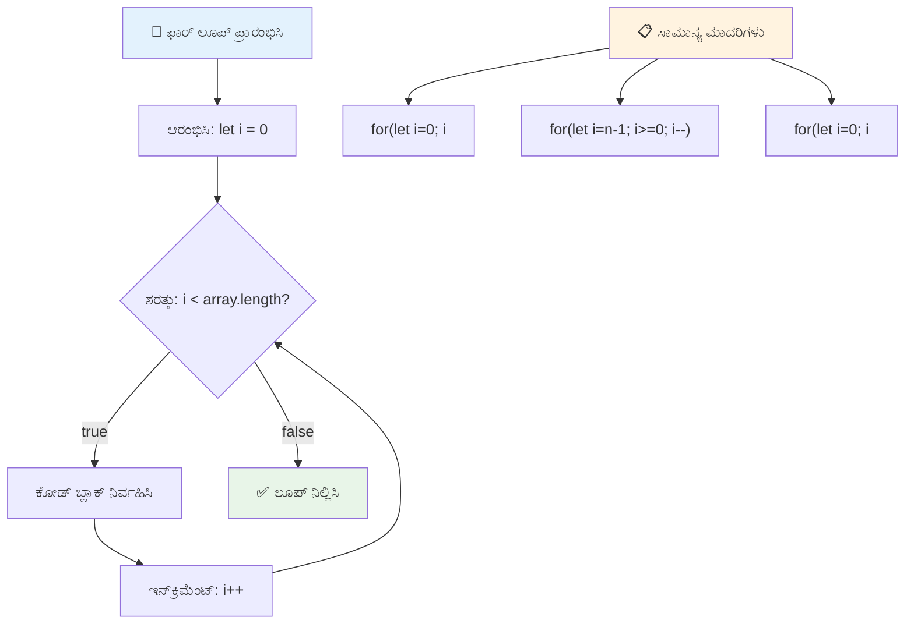
> **ಲೂಪ್ ಬುದ್ದಿವಾದ**: for ಲೂಪ್ಗಳು ನಿಮಗೆ ಏನೇಷ್ಟು ಬಾರಿ ಪುನರಾವೃತ್ತಿ ಬೇಕೋ ಅದು ತಿಳಿದಾಗ ಅತ್ಯುತ್ತಮವಾಗಿವೆ. ಅವು ಅರೆ ಸಂಸ್ಕರಣೆಗೆ ಅತ್ಯಂತ ಸಾಮಾನ್ಯ ಆಯ್ಕೆ!

### While ಲೂಪ್

`while` ಲೂಪ್ ಅನ್ನುವುದು "ಇತ್ತೇಳುವವರೆಗೆ ಮುಂದುವರೆ" ಎಂದು ಹೇಳಿದಂತೆ - ನೀವು ಎಷ್ಟು ಬಾರಿ ನಡೆಯುವುದೆಂದು ಸ್ಪಷ್ಟವಾಗಿ ಗೊತ್ತು ಇರಲಾರದು; ಆದರೆ ಯಾವಾಗ ನಿಲ್ಲಿಸಬೇಕೆಂದು ತಿಳಿದಿರುತ್ತೆ. ಇದು ಬಳಕೆದಾರರಿಂದ ಇನ್‌ಪುಟ್‌ ಅಗತ್ಯವಿರುವವರೆಗೂ ಕೇಳುವುದು ಅಥವಾ ನಿಮ್ಮ ಹುಡುಕುತ್ತಿರುವ ಡೇಟಾ ಸಿಕ್ಕುವವರೆಗೆ ಹುಡುಕುವಂತೆ ಕಾರ್ಯನಿರ್ವಹಿಸುತ್ತದೆ.

**While ಲೂಪಿನ ಲಕ್ಷಣಗಳು:**
- ಶರತ್ತು ಸತ್ಯವಾಗಿರುವವರೆಗೂ ಕಾರ್ಯನಿರ್ವಹಿಸುತ್ತದೆ
- ಯಾವುದೇ ಕೌಂಟರ್ ಚರಗಳ ಕೈಯಿಂದ ನಿರ್ವಹಣೆಯನ್ನು ಅಗತ್ಯವಿರುತ್ತದೆ
- ಪ್ರತಿ ಪುನರಾವೃತ್ತಿಗೆ ಶರತ್ತು ಪರಿಶೀಲನೆ
- ಶರತ್ತು ಎಂದಿಗೂ ಅಸತ್ಯವಾಗದಿದ್ದರೆ ಅನಂತ ಲೂಪ್ ಉಂಟಾಗಲು ಸಾಧ್ಯ

```javascript
// ಮೂಲ ಎಣಿಕೆ ಉದಾಹರಣೆ
let i = 0;
while (i < 10) {
  console.log(`While count: ${i}`);
  i++; // ಹೆಚ್ಚಿಸುವುದನ್ನು ತಪ್ಪಿಸಿಕೊಳ್ಳಬೇಡಿ!
}

// ಹೆಚ್ಚು ಉಪಯುಕ್ತ ಉದಾಹರಣೆ: ಬಳಕೆದಾರರ ಇನ್ಪುಟ್ ಪ್ರಕ್ರಿಯೆಕರಣ
let userInput = "";
let attempts = 0;
const maxAttempts = 3;

while (userInput !== "quit" && attempts < maxAttempts) {
  userInput = prompt(`Enter 'quit' to exit (attempt ${attempts + 1}):`);
  attempts++;
}

if (attempts >= maxAttempts) {
  console.log("Maximum attempts reached!");
}
```

**ಈ ಉದಾಹರಣೆಗಳ ಅರ್ಥ:**
- ಲೂಪ್ ಶರೀರದೊಳಗೆ ಕೈಯಿಂದ ಕೌಂಟರ್ ಚರ `i` ನಿರ್ವಹಣೆ
- ಅನಂತ ಲೂಪ್ಗಳ ತಡೆಯಕ್ಕೆ ಕೌಂಟರ್ ವೃದ್ಧಿ
- ಬಳಕೆದಾರ ಇನ್‌ಪುಟ್ ಮತ್ತು ಪ್ರಯತ್ನ ಮಿತಿಗೆ ಉಪಯುಕ್ತ ವಿವರಣೆ
- ನಿರಂತರ ಕಾರ್ಯನಿರ್ವಹಣೆಗೆ ಸುರಕ್ಷತಾ ವ್ಯವಸ್ಥೆಗಳ ಒಳಗೊಂಡಿದೆ

### ♾️ **While ಲೂಪ್ ಜ್ಞಾನ ಪರಿಶೀಲನೆ: ಶರತ್ತು ಆಧಾರಿತ ಪುನರಾವೃತ್ತಿ**

**ನಿಮ್ಮ while ಲೂಪ್ ಜ್ಞಾನವನ್ನು ಪರೀಕ್ಷಿಸಿ:**
- while ಲೂಪ್ಗಳಲ್ಲಿ ಮುಖ್ಯ ಅಪಾಯವೇನು?
- ನೀವು ಯಾವಾಗ while ಲೂಪ್ ಅನ್ನು for ಲೂಪ್ಗಿಂತ ಮೆಚ್ಚಿಕೊಳ್ಳುತ್ತೀರಿ?
- ಅನಂತ ಲೂಪ್ಗಳನ್ನು ನೀವು ಹೇಗೆ ತಡೆಯಬಹುದು?

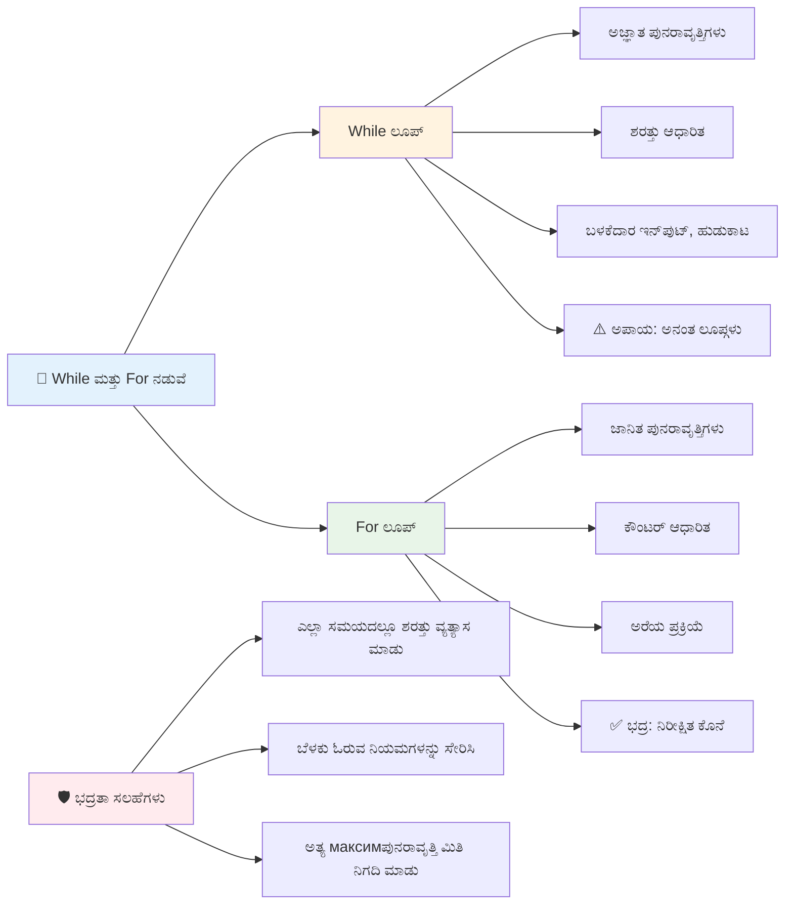
> **ಸುರಕ್ಷತೆ ಮೊದಲಿಗೆ**: while ಲೂಪ್ಗಳು ಶಕ್ತಿವಂತವಾದವು, ಆದರೆ ಶರತ್ತಿನ ನಿಟ್ಟಿಯಲ್ಲಿ ಜಾಗ್ರತೆ ಅಗತ್ಯವಿದೆ. ನಿಮ್ಮ ಲೂಪ್ ಶರತ್ತು ಕೊನೆಗೆ ಶೂನ್ಯವಾಗಬೇಕು ಎಂದಾಗಲೇ ಮುಂದುವರಿಯಲಿ!

### ಆಧುನಿಕ ಲೂಪ್ ಪರ್ಯಾಯಗಳು

JavaScript ನಿಮಗೆ ಆಧುನಿಕ ಲೂಪ್ ವ್ಯಾಕರಣವನ್ನ ಒದಗಿಸುತ್ತದೆ, ಇದು ನಿಮ್ಮ ಕೋಡ್ ಅನ್ನು ಓದುವಿಕೆಗೆ ಹೆಚ್ಚು ಸುಲಭ ಮತ್ತು ತಪ್ಪು ಸಂಭವನೆಯನ್ನು ಕಡಿಮೆ ಮಾಡುತ್ತದೆ.

**For...of ಲೂಪ್ (ES6+):**

```javascript
const colors = ["red", "green", "blue", "yellow"];

// ಆಧುನಿಕ ವಿಧಾನ - ಸ್ವಚ್ಛವಾಗಿ ಮತ್ತು ಸುರಕ್ಷಿತವಾಗಿ
for (const color of colors) {
  console.log(`Color: ${color}`);
}

// ಪಾರಂಪರಿಕ for ಲೂಪ್ ಜೊತೆ ಹೋಲಿಕೆ ಮಾಡಿ
for (let i = 0; i < colors.length; i++) {
  console.log(`Color: ${colors[i]}`);
}
```

**for...of ಯ ಪ್ರಮುಖ ಲಾಭಗಳು:**
- ಸೂಚ್ಯಂಕ ನಿರ್ವಹಣೆ ಮತ್ತು ಸಂಪರ್ಕ ತಪ್ಪುಗಳನ್ನು ನಿವಾರಣೆ ಮಾಡುತ್ತದೆ
- ಅರೆ ಉಪಾದಾನಗಳಿಗೆ ನೇರ ಪ್ರವೇಶ ನೀಡುತ್ತದೆ
- ಕೋಡ್ ಓದುವಿಕೆಯನ್ನು ಸುಧಾರಿಸುತ್ತದೆ ಮತ್ತು ವ್ಯಾಕರಣ ಸಪರಿಶುದ್ಧಿ ಮಾಡುತ್ತದೆ

**forEach ವಿಧಾನ:**

```javascript
const prices = [9.99, 15.50, 22.75, 8.25];

// ಕಾರ್ಯಾತ್ಮಕ ಪ್ರೋಗ್ರಾಮಿಂಗ್ ಶೈಲಿಗಾಗಿ forEach ಬಳಸಿ
prices.forEach((price, index) => {
  console.log(`Item ${index + 1}: $${price.toFixed(2)}`);
});

// ಸರಳ ಕಾರ್ಯಗಳಿಗಾಗಿ ಬಾಣದ ಕಾರ್ಯಗಳೊಂದಿಗೆ forEach
prices.forEach(price => console.log(`Price: $${price}`));
```

**forEach ಕುರಿತು ತಿಳಿಯೋಣ:**
- ಪ್ರತಿ ಅರೆ ಅಂಶಕ್ಕೆ ಒಂದು ಕಾರ್ಯಾನ್ವಯವನ್ನು ನಡೆಸುತ್ತದೆ
- ಅಂಶ ಮೌಲ್ಯ ಮತ್ತು ಸೂಚ್ಯಂಕ ಎರಡನ್ನು ಕಾರ್ಯಕ್ಕೆ ಪ್ಯಾರಾಮೀಟರ್‌ಗಳಾಗಿ ಒದಗಿಸುತ್ತದೆ
- ಲೂಪ್ ಅನ್ನು ಮುಕ್ತಾಯಗೊಳಿಸಲು ಸಾಧ್ಯವಿಲ್ಲ (ಪಾರಂಪರಿಕ ಲೂಪ್ಗಳಂಥವಲ್ಲ)
- ಹೊಸ ಅರೆ ಸೃಷ್ಟಿಸುವುದಿಲ್ಲ, undefined ಅನ್ನು ಹಿಂತಿರುಗಿಸುತ್ತದೆ

✅ ನೀವು for ಲೂಪ್ನನ್ನೋ ಅಥವಾ while ಲೂಪ್ನನ್ನೋ ಆಯ್ಕೆ ಮಾಡುವಾಗ ಅಯಾಯವಿದೇ? StackOverflow ನಲ್ಲಿ १७ ಸಾವಿರ ವೀಕ್ಷಕರು ಸಹ ಇದರ ಬಗ್ಗೆ ಪ್ರಶ್ನೆ ಮಾಡಿದ್ದರು. ಕೆಲವು ಅಭಿಪ್ರಾಯಗಳು [ನಿಮಗೆ ಆಸಕ್ತಿದಾಯಕವಾಗಬಹುದು](https://stackoverflow.com/questions/39969145/while-loops-vs-for-loops-in-javascript).

### 🎨 **ಆಧುನಿಕ ಲೂಪ್ ವ್ಯಾಕರಣ ಪರೀಕ್ಷೆ: ES6+ ಸ್ವೀಕಾರ**

**ನಿಮ್ಮ ಆಧುನಿಕ JavaScript ತಿಳಿವಳಿಕೆಯನ್ನು ಮೌಲ್ಯಮಾಪನ ಮಾಡಿ:**
- ಪರಂಪರাগত for ಲೂಪ್ಗಿಂತ for...of ಯ ಏನು ಲಾಭ?
- ನೀವು ಯಾವಾಗ ಇನ್ನೂ ಪರಂಪರাগত for ಲೂಪ್ಗಳನ್ನು ಪ್ರೀತಿಸುತ್ತೀರಿ?
- forEach ಮತ್ತು map ನಡುವಿನ ಅಂತರವೇನು?

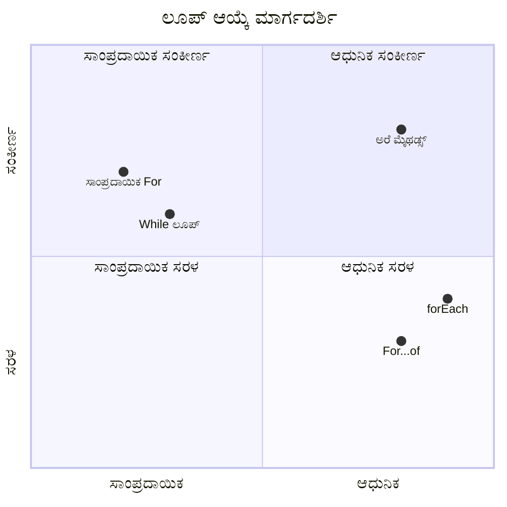
> **ಆಧುನಿಕ ಪ್ರವೃತ್ತಿ**: ES6+ ವ್ಯಾಕರಣವಾಗಿರುವ for...of ಮತ್ತು forEach ಅನ್ನು ಅರೆ ಪ್ರಕ್ರಿಯೆಗಾಗಿ ಆದ್ಯತೆ ನೀಡಲಾಗುತ್ತಿದೆ ಏಕೆಂದರೆ ಅವು ಸ್ವಚ್ಛ ಹಾಗೂ ಕಡಿಮೆ ದೋಷಪೂರ್ಣವಾಗಿದೆ!

## ಲೂಪ್ಗಳು ಮತ್ತು ಅರೆಗಳು

ಅರೆಗಳನ್ನು ಲೂಪ್ಗಳೊಂದಿಗೆ ಸಂಯೋಜಿಸುವುದರಿಂದ ಶಕ್ತಿಶಾಲಿ ಡೇಟಾ ಸಂಸ್ಕರಣೆ ಸಾಧ್ಯವಾಗುತ್ತದೆ. ಪಟ್ಟಿ ತೋರಿಸುವುದು ಅಥವಾ ಅಂಕೆಗಳನ್ನು ಲೆಕ್ಕ ಹಾಕುವುದು ಸೇರಿದಂತೆ ಅನೇಕ ಪ್ರೋಗ್ರಾಮಿಂಗ್ ಕಾರ್ಯಗಳಿಗೆ ಇದು ಮೂಲಭೂತ.

**ಪರಂಪರাগত ಅರೆ ಸಂಸ್ಕರಣೆ:**

```javascript
const iceCreamFlavors = ["Chocolate", "Strawberry", "Vanilla", "Pistachio", "Rocky Road"];

// ಕ್ಲಾಸಿಕ್ ಫಾರ್ ಲೂಪ್ ವಿಧಾನ
for (let i = 0; i < iceCreamFlavors.length; i++) {
  console.log(`Flavor ${i + 1}: ${iceCreamFlavors[i]}`);
}

// ಆಧುನಿಕ ಫಾರ್...ಅಫ್ ವಿಧಾನ
for (const flavor of iceCreamFlavors) {
  console.log(`Available flavor: ${flavor}`);
}
```

**ಪ್ರತೀ ವಿಧಾನದ ಅರ್ಥ:**
- ಲೂಪಿನ ಮಿತಿಯನ್ನು ನಿರ್ಧರಿಸಲು ಅರೆ ಉದ್ದ ಗುಣಲಕ್ಷಣ ಬಳಕೆ
- ಪರಂಪರাগত for ಲೂಪಲ್ಲಿ ಸೂಚ್ಯಂಕ ಮೂಲಕ ಅಂಶಗಳನ್ನು ಪ್ರವೇಶಿಸುವುದು
- for...of ಲೂಪ್ನಲ್ಲಿ ನೇರವಾಗಿ ಅಂಶಗಳನ್ನು ಪ್ರವೇಶಿಸುವುದು
- ಪ್ರತಿಯೊಂದು ಅರೆ ಅಂಶವನ್ನು ಹೋಲಿಕೆಯಾಗಿ ಪ್ರಕ್ರಿಯೆ ಮಾಡುವುದು

**ಪ್ರಾಯೋಗಿಕ ಡೇಟಾ ಸಂಸ್ಕರಣೆ ಉದಾಹರಣೆ:**

```javascript
const studentGrades = [85, 92, 78, 96, 88, 73, 89];
let total = 0;
let highestGrade = studentGrades[0];
let lowestGrade = studentGrades[0];

// ಎಲ್ಲಾ ಶ್ರೇಣಿಗಳನ್ನು ಒಂದು ಲೂಪ್‌ನೊಂದಿಗೆ ಪ್ರಕ್ರಿಯೆಗೊಳಿಸಿ
for (let i = 0; i < studentGrades.length; i++) {
  const grade = studentGrades[i];
  total += grade;
  
  if (grade > highestGrade) {
    highestGrade = grade;
  }
  
  if (grade < lowestGrade) {
    lowestGrade = grade;
  }
}

const average = total / studentGrades.length;
console.log(`Average: ${average.toFixed(1)}`);
console.log(`Highest: ${highestGrade}`);
console.log(`Lowest: ${lowestGrade}`);
```

**ಈ ಕೋಡ್ ಹೇಗೆ ಕೆಲಸ ಮಾಡುತ್ತದೆ:**
- ಮೊತ್ತ ಮತ್ತು ಅತಿಕ್ರಮಣಗಳ ಟ್ರ್ಯಾಕಿಂಗ್ ಚರಗಳನ್ನು ಪ್ರಾರಂಭಿಸುತ್ತದೆ
- ಪ್ರತಿ ಅಂಕೆಯನ್ನು ಒಂದೇ ಫರುವ ಲೂಪ್ನಲ್ಲಿ ಪ್ರಕ್ರಿಯೆ ಮಾಡುತ್ತದೆ
- ಸರಾಸರಿ ಲೆಕ್ಕಿಸುವ ಉದ್ದೇಶಕ್ಕಾಗಿ ಮೊತ್ತ ಸಂಗ್ರಹಿಸುತ್ತದೆ
- ಪುನರಾವೃತ್ತಿಯ ವೇಳೆ ಅತಿ ಹೆಚ್ಚು ಮತ್ತು ಕಡಿಮೆಯ ಅಂಕಿಗಳನ್ನು ಟ್ರ್ಯಾಕ್ ಮಾಡುತ್ತದೆ
- ಲೂಪ್ನ ನಂತರ ಅಂತಿಮ ಅಂಕಿ-ಗಣಿತಗಳನ್ನು ಲೆಕ್ಕಿಸುತ್ತದೆ

✅ ನಿಮ್ಮ ಸ್ವಂತ ಅರೆ ಲೂಪ್ ಮೂಲಕ ಪೃಖ್ಯಾಯಿಸಿ ನಿಮ್ಮ ಬ್ರೌಸರ್‌ನ ಕಾನ್ಸೋಲ್‌ನಲ್ಲಿ.

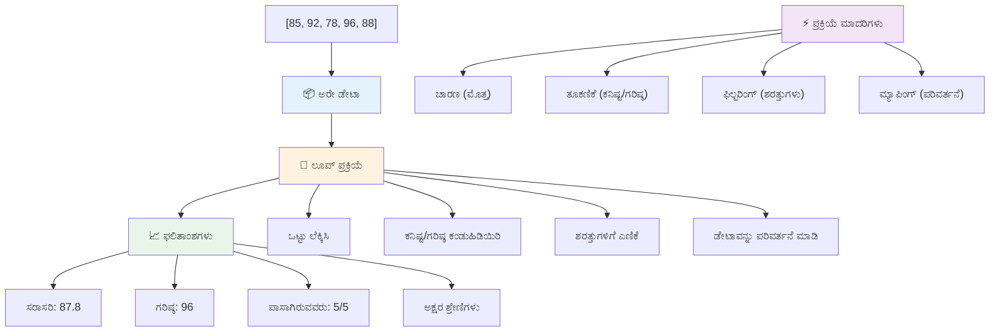
---

## GitHub Copilot ಏಜೆಂಟ್ ಚಾಲೆಂಜ್ 🚀

ಈ ಕೆಳಗಿನ ಚಾಲೆಂಜ್ ಪೂರ್ಣಗೊಳಿಸಲು ಏಜೆಂಟ್ ಮೋಡ್ ಅನ್ನು ಬಳಸಿರಿ:

**ವಿವರಣೆ:** ಅರೆಗಳ ಮತ್ತು ಲೂಪ್ಗಳನ್ನು ಸಂಯೋಜಿಸಿ ವಿಶ್ಲೇಷಣಾ ಕಾರ್ಯಕ್ಕಾಗಿ ಸಮಗ್ರ ಡೇಟಾ ಸಂಸ್ಕರಣಾ ಕಾರ್ಯವನ್ನು ಕಟ್ಟೊಂಡು, ಅರ್ಥಪೂರ್ಣ ವಿವರಗಳನ್ನು ರಚಿಸಿ.

**ಪ್ರಾಂಪ್ಟ್:** `analyzeGrades` ಎಂಬ ಕಾರ್ಯವನ್ನು ರಚಿಸಿ, ಇದು ವಿದ್ಯಾರ್ಥಿಗಳ ಅಂಕಗಳ (ಪ್ರತಿಯೊಂದರಲ್ಲಿಯೂ ಹೆಸರು ಮತ್ತು ಅಂಕಗಳ ಗುಣಗಳನ್ನು ಹೊಂದಿರುವ ಅರೆ) ಡೇಟಾವನ್ನು ಸ್ವೀಕರಿಸಿ, ಎತ್ತರದ ಅಂಕಿ, ಕಡಿಮೆ ಅಂಕಿ, ಸರಾಸರಿ ಅಂಕಿ, 70 ಅಥವಾ ಹೆಚ್ಚು ಅಂಕಿ ಪಡೆದ ವಿದ್ಯಾರ್ಥಿಗಳ ಸಂಖ್ಯೆ ಮತ್ತು ಸರಾಸರಿ ಮೀರಿದ ಅಂಕಿಯನ್ನು ಪಡೆದ ವಿದ್ಯಾರ್ಥಿಗಳ ಹೆಸರುಗಳ ಅರೇ ಅನ್ನು ಒಳಗೊಂಡ ಸಂಕೀರ್ಣ ಮಾಹಿತಿ ನಿಷ್ಪಾದನೆ ಮಾಡುತ್ತದೆ. ಕನಿಷ್ಟ ಎರಡು ವಿಭಿನ್ನ ಲೂಪ್ ಪ್ರಕಾರಗಳನ್ನು ನಿಮ್ಮ ಪರಿಹಾರದಲ್ಲಿ ಬಳಸಿ.

ಇಲ್ಲಿ [ಏಜೆಂಟ್ ಮೋಡ್](https://code.visualstudio.com/blogs/2025/02/24/introducing-copilot-agent-mode) ಬಗ್ಗೆ ಹೆಚ್ಚಿನ ಮಾಹಿತಿಯನ್ನು ತಿಳಿಯಿರಿ.

## 🚀 ಚಾಲೆಂಜ್
JavaScript ಕೆಲವು ಆಧುನಿಕ ಸರಣಿಯ ವಿಧಾನಗಳನ್ನು ನೀಡುತ್ತದೆ, ಇದು ನಿರ್ದಿಷ್ಟ ಕಾರ್ಯಗಳಿಗೆ ಪರಂಪರাগত ಲೂಪುಗಳನ್ನು ಬದಲಾಯಿಸಬಹುದು. [forEach](https://developer.mozilla.org/docs/Web/JavaScript/Reference/Global_Objects/Array/forEach), [for-of](https://developer.mozilla.org/docs/Web/JavaScript/Reference/Statements/for...of), [map](https://developer.mozilla.org/docs/Web/JavaScript/Reference/Global_Objects/Array/map), [filter](https://developer.mozilla.org/docs/Web/JavaScript/Reference/Global_Objects/Array/filter), ಮತ್ತು [reduce](https://developer.mozilla.org/docs/Web/JavaScript/Reference/Global_Objects/Array/reduce) ಅನ್ವೇಷಿಸಿ.

**ನಿಮ್ಮ ಸವಾಲು:** ಕನಿಷ್ಟ ಮೂರು ವಿಭಿನ್ನ ಸರಣಿಯ ವಿಧಾನಗಳನ್ನು ಉಪಯೋಗಿಸಿ ವಿದ್ಯಾರ್ಥಿಗಳ ಅಂಕಗಳನ್ನು ಪರಿಷ್ಕರಿಸಿ. ಆಧುನಿಕ JavaScript ವಾಕ್ಯರಚನೆಯೊಂದಿಗೆ ಕೋಡ್ ಎಷ್ಟು ಸ್ವಚ್ಛ ಹಾಗೂ ಓದಲಾಡುವಾಗಿರುವುದನ್ನು ಗಮನಿಸಿ.

## ಪೋಷ್ಟ್-ಲೆಕ್ಚರ್ ಕ್ವಿಜ್
[ಪೋಷ್ಟ್-ಲೆಕ್ಚರ್ ಕ್ವಿಜ್](https://ff-quizzes.netlify.app/web/quiz/14)


## ವಿಮರ್ಶೆ ಮತ್ತು ಸ್ವಯಂ ಅಧ್ಯಯನ

JavaScript ನ ಸರಣಿಗಳಲ್ಲಿನ ಹಲವು ವಿಧಾನಗಳು ಡೇಟಾ ನಿರ್ವಹಣೆಗೆ ಅತ್ಯಂತ ಉಪಯುಕ್ತವಾಗಿವೆ. [ಈ ವಿಧಾನಗಳನ್ನು ಓದಿ](https://developer.mozilla.org/docs/Web/JavaScript/Reference/Global_Objects/Array) ಮತ್ತು ಅವುಗಳನ್ನು ಪ್ರಯತ್ನಿಸಿ (pattern push, pop, slice ಮತ್ತು splice) ನಿಮ್ಮ ರಚನೆಯ ಸರಣಿಯಲ್ಲಿ.

## ನಿಯೋಜನೆ

[ಸರಣಿಯನ್ನು ಲೂಪ್ ಮಾಡಿ](assignment.md)

---

## 📊 **ನಿಮ್ಮ ಸರಣಿಗಳು ಮತ್ತು ಲೂಪ್ಸ್ ಸಾಧನ ಸಂಕಲನ**

```mermaid
graph TD
    A["🎯 ಸರಣಿಗಳು & ಪುನರಾವರ್ತನೆ ನಿಪುಣತೆ"] --> B["📦 ಸರಣಿ ಮೂಲಭೂತಗಳು"]
    A --> C["🔄 ಪುನರಾವರ್ತನೆ ವಿಧಗಳು"]
    A --> D["🔗 ಡೇಟಾ ಪ್ರಕ್ರಿಯೆ"]
    A --> E["🎨 ಆಧುನಿಕ ತಂತ್ರಗಳು"]
    
    B --> B1["ರಚನೆ: [ ]"]
    B --> B2["ಸೂಚ್ಯಾಂಕನ: arr[0]"]
    B --> B3["ವಿಧಾನಗಳು: push, pop"]
    B --> B4["ಗುಣಲಕ್ಷಣಗಳು: length"]
    
    C --> C1["For: ज्ञಾತ ಪುನರಾವರ್ತನೆಗಳು"]
    C --> C2["While: ಸ್ಥಿತಿಗತಿಯ ಆಧಾರಿತ"]
    C --> C3["For...of: ನೇರ ಪ್ರವೇಶ"]
    C --> C4["forEach: ಕ್ರಿಯಾತ್ಮಕ"]
    
    D --> D1["ಸಂಖ್ಯಾಶಾಸ್ತ್ರ ಲೆಕ್ಕಾಚಾರ"]
    D --> D2["ಡೇಟಾ ಪರಿವರ್ತನೆ"]
    D --> D3["ಶೋಧನೆ ಮತ್ತು ನೀಡಿಕೆ"]
    D --> D4["ನೇರ-ಸಮಯ ಪ್ರಕ್ರಿಯೆ"]
    
    E --> E1["ಎರೋ ಕಾರ್ಯಗಳು"]
    E --> E2["ವಿಧಾನ ಶ್ರೇಣಿ"]
    E --> E3["ವಿಭಜನೆ"]
    E --> E4["ಟೆಂಪ್ಲೇಟ್ ಲಿಟರಲ್ಸ್"]
    
    F["💡 ಪ್ರಮುಖ ಲಾಭಗಳು"] --> F1["ಕಾರ್ಯಕ್ಷಮ ಡೇಟಾ ಕೈಗಾರಿಕೆ"]
    F --> F2["ಕುಕಮ ಸಂಯೋಜನೆಯ ಕಡಿತ"]
    F --> F3["ವಿಸ್ತಾರಗೊಳ್ಳುವ ಪರಿಹಾರಗಳು"]
    F --> F4["ಶುಭ್ರ ಸಂರಚನೆ"]
    
    style A fill:#e3f2fd
    style B fill:#e8f5e8
    style C fill:#fff3e0
    style D fill:#f3e5f5
    style E fill:#e0f2f1
    style F fill:#fce4ec
```
---

## 🚀 ನಿಮ್ಮ ಸರಣಿಗಳು ಮತ್ತು ಲೂಪ್ಸ್ ಪರಿಣತಿ ಕಾಲರೇಖೆ

### ⚡ **ಮುಂದಿನ 5 ನಿಮಿಷಗಳಲ್ಲಿ ನೀವು ಏನು ಮಾಡಬಹುದು**
- [ ] ನಿಮ್ಮ ಇಷ್ಟದ ಚಲನಚಿತ್ರಗಳ ಸರಣಿಯನ್ನು ರಚಿಸಿ ಮತ್ತು ನಿರ್ದಿಷ್ಟ ಅಂಶಗಳನ್ನು ಪ್ರವೇಶಿಸಿ
- [ ] 1 ರಿಂದ 10 ರವರೆಗೆ ಎಣಿಸುವ for ಲೂಪನ್ನು ಬರೆಯಿರಿ
- [ ] ಪಾಠದಲ್ಲಿ ನೀಡಲಾದ ಆಧುನಿಕ ಸರಣಿ ವಿಧಾನಗಳ ಸವಾಲನ್ನು ಪ್ರಯತ್ನಿಸಿ
- [ ] ನಿಮ್ಮ ಬ್ರೌಸರಿನ ಕನ್ಸೊಲ್‌ನಲ್ಲಿ ಸರಣಿ ಸೂಚ್ಯಾಂಕ ನಿಯಂತ್ರಣ ಅಭ್ಯಾಸ ಮಾಡಿ

### 🎯 **ಈ ಗಂಟೆಯಲ್ಲಿ ನೀವು ಸಾಧಿಸಬಹುದಾದವುಗಳು**
- [ ] ಪಾಠದ ನಂತರದ ಕ್ವಿಜ್ ಪೂರ್ಣಗೊಳಿಸಿ ಮತ್ತು ಯಾವುದೇ ಕಠಿಣ ಅಂಶಗಳನ್ನು ಪರಿಶೀಲಿಸಿ
- [ ] GitHub Copilot ಸವಾಲಿನಿಂದ ಸಮಗ್ರ ಶ್ರೇಣಿ ವಿಶ್ಲೇಷಕ ನಿರ್ಮಿಸಿ
- [ ] ಐಟಂಗಳನ್ನು ಸೇರಿಸುವ ಮತ್ತು ತೆಗೆದುಹಾಕುವ ಸರಳ ಶಾಪಿಂಗ್ ಕಾರ್ಟ್ ರಚಿಸಿ
- [ ] ವಿಭಿನ್ನ ಲೂಪ್ ವಿಧಗಳಾದರೀತಿಯನ್ನು ಪರಿವರ್ತಿಸುವ ಅಭ್ಯಾಸ ಮಾಡಿ
- [ ] `push`, `pop`, `slice`, ಮತ್ತು `splice` ಮುಂತಾದ ಸರಣಿ ವಿಧಾನಗಳೊಂದಿಗೆ ಪ್ರಯೋಗ ಮಾಡಿ

### 📅 **ನಿಮ್ಮ ವಾರ ವಿಸ್ತಾರ ಡೇಟಾ ಪ್ರಕ್ರಿಯೆ ಪ್ರಯಾಣ**
- [ ] "ಸರಣಿಯನ್ನು ಲೂಪ್ ಮಾಡಿ" ನೇಯ್ದ ನಿಯೋಜನೆಯನ್ನು ಸೃಜನಾತ್ಮಕ ಸುಧಾರಣೆಗಳೊಂದಿಗೆ ಪೂರ್ಣಗೊಳಿಸಿ
- [ ] ಸರಣಿಗಳು ಮತ್ತು ಲೂಪ್ಸ್ ಉಪಯೋಗಿಸಿ ಟು-ಡೂ ಲಿಸ್ಟ್ ಅಪ್ಲಿಕೇಶನ್ ರಚಿಸಿ
- [ ] ಸಂಖ್ಯಾತ್ಮಕ ಡೇಟಾಗೆ ಸರಳ ಸಂಕೇತಕ ಕ್ಯಾಲ್ಕ್ಯುಲೇಟರ್ ರಚಿಸಿ
- [ ] [MDN ಸರಣಿ ವಿಧಾನಗಳು](https://developer.mozilla.org/docs/Web/JavaScript/Reference/Global_Objects/Array) ಜೊತೆ ಅಭ್ಯಾಸ ಮಾಡಿ
- [ ] ಫೋಟೋ ಗ್ಯಾಲರಿ ಅಥವಾ ಸಂಗೀತ ಪ್ಲೇಲಿಸ್ಟ್ ಇಂಟರ್‌ಫೇಸ್ ರಚಿಸಿ
- [ ] `map`, `filter`, ಮತ್ತು `reduce` ಬಳಸಿ ಕಾರ್ಯಕಾರಿ ಕಾರ್ಯಕ್ರಮದ ಪ್ರೋಗ್ರಾಮಿಂಗ್ ಅನ್ವೇಷಿಸಿ

### 🌟 **ನಿಮ್ಮ ತಿಂಗಳ ವಿಸ್ತಾರ ಪರಿವರ್ತನೆ**
- [ ] ಉನ್ನತ ಸರಣಿ ಕಾರ್ಯಾಚರಣೆಗಳು ಮತ್ತು ಕಾರ್ಯಕ್ಷಮತೆ ಸುಧಾರಣೆ ಮಾಡಿಕೊಳ್ಳಿ
- [ ] ಸಂಪೂರ್ಣ ಡೇಟಾ ದೃಶ್ಯೀಕರಣ ಡ್ಯಾಶ್ಬೋರ್ಡ್ ರಚಿಸಿ
- [ ] ಡೇಟಾ ಪ್ರಕ್ರಿಯೆ ಸಂಬಂಧಿತ open source ಯೋಜನೆಗಳಿಗೆ ಕೊಡುಗೆ ನೀಡಿ
- [ ] ಅನುಭವದಿಂದ ಸರಣಿಗಳು ಮತ್ತು ಲೂಪ್ಸ್ ಕುರಿತು ಯಾರಿಗಾದರೂ ಬೋಧಿಸಿ
- [ ] ಪುನಃಬಳಕೆ ಮಾಡಬಹುದಾದ ಡೇಟಾ ಪ್ರಕ್ರಿಯೆ ಕಾರ್ಯಗಳ ವೈಯಕ್ತಿಕ ಲೈಬ್ರರಿ ರಚಿಸಿ
- [ ] ಸರಣಿಗಳ ಮೇಲೆ ನಿರ್ಮಿತ ಅಲ್ಗೊರಿದಮ್ಸ್ ಮತ್ತು ಡೇಟಾ ರಚನೆಗಳನ್ನು ಅನ್ವೇಷಿಸಿ

### 🏆 **ಅಂತಿಮ ಡೇಟಾ ಪ್ರಕ್ರಿಯೆ ಚಾಂಪಿಯನ್ ಪರಿಶೀಲನೆ**

**ನಿಮ್ಮ ಸರಣಿ ಮತ್ತು ಲೂಪ್ಸ್ ಪರಿಣತಿಯನ್ನು ಹರ್ಷಿಸಿಕೊಳ್ಳಿ:**
- ನೈಜ ಜಗತ್ತಿನ ಅಪ್ಲಿಕೇಶನ್‌ಗಳಿಗೆ ನೀವು ತಿಳಿದ ಅತ್ಯಂತ ಉಪಯುಕ್ತ ಸರಣಿ ಕಾರ್ಯವೇನು?
- ಯಾವ ಲೂಪಿನ ವಿಧ ನಿಮಗೆ ಅತ್ಯಂತ ಸಹಜವಾಗಿದೆ ಮತ್ತು ಯಾಕೆ?
- ಸರಣಿಗಳು ಮತ್ತು ಲೂಪ್ಸ್ ಅರ್ಥಮಾಡಿಕೊಳ್ಳುವ ಮೂಲಕ ನಿಮ್ಮ ಡೇಟಾ ಸಂಘಟನೆಯ ಪ್ರವರ್ತನೆ ಹೇಗೆ ಬದಲಾಗಿದೆ?
- ನೀವು ಮುಂದಿನ ಬಾರಿ ಯಾವ ಸಂಕೀರ್ಣ ಡೇಟಾ ಪ್ರಕ್ರಿಯೆ ಕಾರ್ಯವನ್ನು ನಿರ್ವಹಿಸಲು ಇಚ್ಛಿಸುತ್ತೀರಿ?

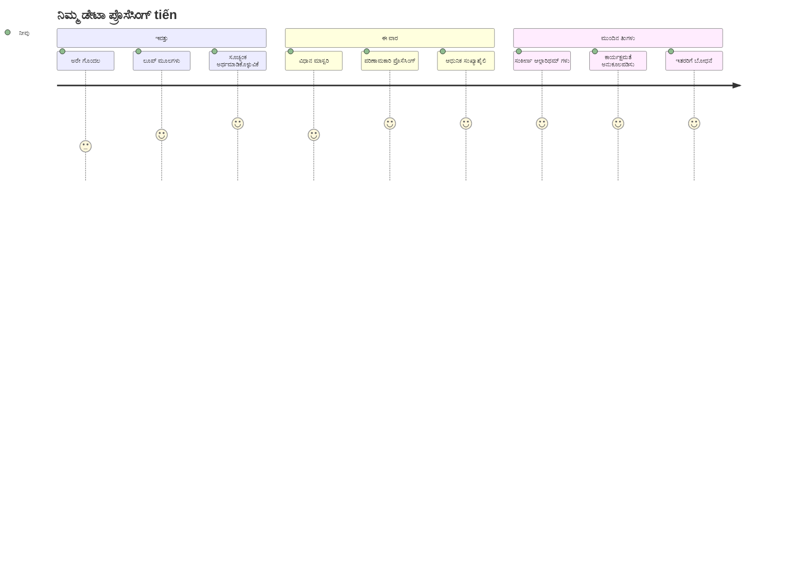
> 📦 **ನೀವು ಡೇಟಾ ಸಂಘಟನೆ ಮತ್ತು ಪ್ರಕ್ರಿಯೆಯ ಶಕ್ತಿಯನ್ನು ಅನ್ಲಾಕ್ ಮಾಡಿದ್ದೀರಿ!** ಸರಣಿಗಳು ಮತ್ತು ಲೂಪ್ಸ್ ಒಂದೊಂದೂ ಅಪ್ಲಿಕೇಶನ್‌ನ ಮೂಲाधಾರ. ಸರಳ ಪಟ್ಟಿ முதல் ಸಂಕೀರ್ಣ ಡೇಟಾ ವಿಶ್ಲೇಷಣೆಯವರೆಗೆ ನೀವು ಈಗ ಮಾಹಿತಿಯನ್ನು ಪರಿಣಾಮಕಾರಿಯಾಗಿ ಮತ್ತು ಸೊಬಗು ಬಳಸಿ ಸಂಚಯಿಸಬಹುದು. ಪ್ರತಿಯೊಬ್ಬ ಡೈನಾಮಿಕ್ ವೆಬ್‌ಸೈಟ್, ಮೊಬೈಲ್ ಅ್ಯಪ್ ಮತ್ತು ಡೇಟಾ ಚಾಲಿತ ಅಪ್ಲಿಕೇಶನ್ ಈ ಮೂಲಭೂತ ತತ್ತ್ವಗಳ ಮೇಲೆ ಅವಲಂಬಿತವಾಗಿದೆ. ವ್ಯಾಜ್ಯತೀಯ ಡೇಟಾ ಪ್ರಕ್ರಿಯೆಯ ಜಗತ್ತಿಗೆ ಸ್ವಾಗತ! 🎉

---

<!-- CO-OP TRANSLATOR DISCLAIMER START -->
**ತ್ಯಜ್ಯಕಷ್ಟು**:  
ಈ ದಾಖಲೆ [Co-op Translator](https://github.com/Azure/co-op-translator) ಎಂಬ AI ಅನುವಾದ ಸೇವೆಯನ್ನು ಬಳಸಿಕೊಂಡು ಅನುವಾದಿಸಲಾಗಿದೆ. ನಾವು ನಿಖರತೆಯನ್ನು ಪ್ರಯತ್ನಿಸುತ್ತಿದ್ದರೂ, ಸ್ವಯಂಚಾಲಿತ ಅನುವಾದಗಳಲ್ಲಿ ತಪ್ಪುಗಳು ಅಥವಾ ಅಸಂಗತಿಗಳನ್ನು ಹೊಂದಿರಬಹುದು ಎಂಬುದನ್ನು ದಯವಿಟ್ಟು ಗಮನಿಸಿ. ಮೂಲ ಭಾಷೆಯಲ್ಲಿ ಇರುವ ಮೂಲ ದಾಖಲೆ ಪ್ರಾಧಿಕೃತ ಮೂಲಹಾಗೂ ಪರಿಗಣಿಸಬೇಕು. ಪ್ರಮುಖ ಮಾಹಿತಿಗಾಗಿ, ವೃತ್ತಿಪರ ಮಾನವ ಅನುವಾದವನ್ನು ಶಿಫಾರಸು ಮಾಡಲಾಗುತ್ತದೆ. ಈ ಅನುವಾದವನ್ನು ಉಪಯೋಗಿಸುವುದರಿಂದ ಉಂಟಾಗುವ ಯಾವುದೇ ಅಗತ್ಯಾರ್ಹತೆಗಳಿಗಾಗಿ ನಾವು ಹೊಣೆಗಾರರಲ್ಲ.
<!-- CO-OP TRANSLATOR DISCLAIMER END -->