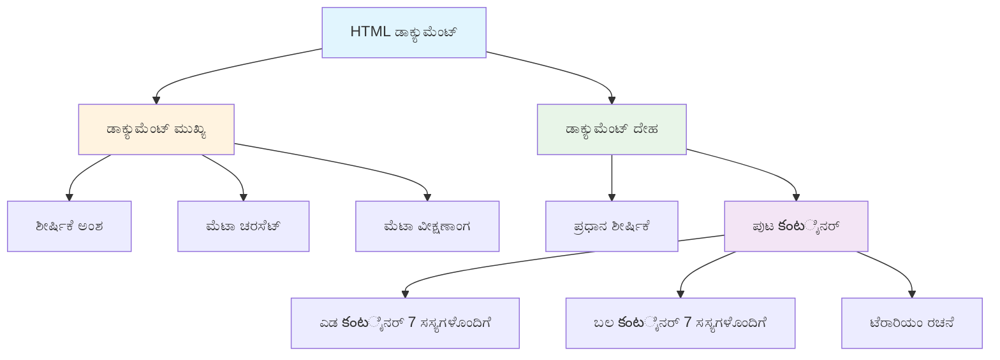
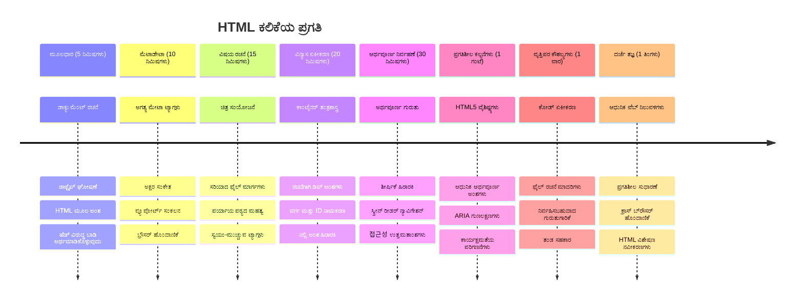

<!--
CO_OP_TRANSLATOR_METADATA:
{
  "original_hash": "3fcfa99c4897e051b558b5eaf1e8cc74",
  "translation_date": "2026-01-08T18:42:06+00:00",
  "source_file": "3-terrarium/1-intro-to-html/README.md",
  "language_code": "kn"
}
-->
Translation for chunk 1 of 'README.md' skipped due to timeout.
- **ಪ್ರತ್ಯೇಕಿಸುತ್ತದೆ** ಪ್ರತಿ ದೃಶ್ಯಾಂಶದ ಘಟಕಗಳನ್ನು (ಮೇಲ್ಭಾಗ, ಗೋಡೆಗಳು, ಮಣ್ಣು, ಕೆಳಭಾಗ)
- **ಸಮರ್ಪಿಸುತ್ತದೆ** ಗಾಜಿನ ಪ್ರತಿಬಿಂಬ ಪ್ರಭಾವಗಳಿಗೆ ಫಲಿತಾಂಶಾಂಶಗಳನ್ನು (ತಿಪ್ಪಣಿಯಾದ ಘಟಕಗಳು)
- **ಬಳಸುತ್ತದೆ** ವಿವರಣಾತ್ಮಕ ವರ್ಗದ ಹೆಸರುಗಳನ್ನು, ಪ್ರತಿ ಘಟಕದ ಉದ್ದೇಶ ಸ್ಪಷ್ಟವಾಗುವಂತೆ
- **ಸಿದ್ಧಪಡಿಸುತ್ತದೆ** ಗಾಜಿನ ಟೆರೆರಿಯಂ ರೂಪವನ್ನು ಸೃಷ್ಟಿಸಲು CSS ಶೈಲಿಗಾಗಿ ರಚನೆಯನ್ನು

> 🤔 **ಏನಾದರೂ ಗಮನಿಸಿದಿರಾ?**: ನೀವು ಈ ಮಾರ್ಕಪ್ ಸೇರಿಸಿದ್ದರೂ, ಪುಟದಲ್ಲಿ ಹೊಸದೇನೂ ಕಾಣುವುದಿಲ್ಲ! ಇದು ಸ್ಪಷ್ಟವಾಗಿ ತೋರುತ್ತದೆ ಹೇಗೆ HTML ರಚನೆ ಒದಗಿಸುತ್ತದೆ ಹಾಗೂ CSS ರೂಪವನ್ನು ಒದಗಿಸುತ್ತದೆ. ಈ `
` ಘಟಕಗಳು ಅಸ್ತিত্বದಲ್ಲಿವೆ ಆದರೆ ಇನ್ನಷ್ಟು ದೃಶ್ಯ ಶೈಲಿಯಿಲ್ಲ – ಇದು ಮುಂದಿನ ಪಾಠದಲ್ಲಿ ಬರಲಿದೆ!

### 🔄 **ಶೈಕ್ಷಣಿಕ ಪರಿಶೀಲನೆ**
**HTML ರಚನೆಯಲ್ಲಿ ಪರಿಣಿತಿ**: ಮುಂದೆಯುವ ಮೊದಲು, ನೀವು ಇವುಗಳನ್ನು ಖಚಿತಪಡಿಸಿಕೊಳ್ಳಿ:
- ✅ HTML ರಚನೆ ಮತ್ತು ದೃಶ್ಯ ರೂಪದ ವ್ಯತ್ಯಾಸವನ್ನು ವಿವರಿಸಲು
- ✅ ಅರ್ಥಪೂರ್ಣ ಮತ್ತು ಅರ್ಥರಹಿತ HTML ಘಟಕಗಳನ್ನು ಗುರುತಿಸಲು
- ✅ ಸರಿಯಾದ ಮಾರ್ಕಪ್ ಸೌಲಭ್ಯತೆಯನ್ನು ಹೇಗೆ ಸುಧಾರಿಸುತ್ತದೆ ಎಂದು ತಿಳಿಸಲು
- ✅ ಸಂಪೂರ್ಣ ದಸ್ತಾವೇಜು ಸಸ್ಯ ರಚನೆಯನ್ನು ಗುರುತಿಸಲು

**ನಿಮ್ಮ ಅರ್ಥವನ್ನು ಪರೀಕ್ಷಿಸಿ**: JavaScript ನಿಷ್ಕ್ರಿಯ ಮತ್ತು CSS ತೆಗೆದುಹಾಕಿದ ಬ್ರೌಸರ್‌ನಲ್ಲಿ ನಿಮ್ಮ HTML ಫೈಲ್ ತೆರೆಯಲು ಪ್ರಯತ್ನಿಸಿ. ಇದು ನೀವು ನಿರ್ಮಿಸಿದ ಶುದ್ಧ ಅರ್ಥಪೂರ್ಣ ರಚನೆಯನ್ನು ತೋರಿಸುತ್ತದೆ!

---

## GitHub Copilot ಏಜೆಂಟು ಸವಾಲು

ಈ ಕೆಳಗಿನ ಸವಾಲು ಪೂರ್ಣಗೊಳಿಸಲು ಏಜೆಂಟ್ ಮೋಡ್ ಬಳಸಿ:

**ವಿವರಣೆ:** ಟೆರೆರಿಯಂ ಪ್ರಾಜೆಕ್ಟಿಗೆ ಸೇರಿಸಬಹುದಾದ ಸಸ್ಯ ಕಾಳಜಿ ಮಾರ್ಗದರ್ಶಿ ವಿಭಾಗಕ್ಕಾಗಿ ಅರ್ಥಪೂರ್ಣ HTML ರಚನೆ ಸೃಷ್ಟಿಸಿ.

**ಪ್ರಾಂಪ್ಟ್:** ಮುಖ್ಯ ಶೀರ್ಷಿಕೆ "Plant Care Guide" ಹೊಂದಿರುವ, ಮೂರು ಉಪವಿಭಾಗಗಳು "Watering", "Light Requirements", ಮತ್ತು "Soil Care" ಎಂಬ ಶೀರ್ಷಿಕೆಗಳೊಂದಿಗೆ, ಪ್ರತಿ ಉಪವಿಭಾಗದಲ್ಲಿ ಸಸ್ಯ ಕಾಳಜಿ ಮಾಹಿತಿಯ ಪ್ಯಾರಾಗ್ರಾಫ್ ಇರುವಂತೆ ನಿರ್ಮಿಸಿ. ಸರಿಯಾದ ಅರ್ಥಪೂರ್ಣ HTML ಟ್ಯಾಗ್‌ಗಳು `<section>`, `<h2>`, `<h3>`, ಮತ್ತು `
` ಬಳಸಿ ಸೂಕ್ತವಾಗಿ ರಚಿಸಿ.

ಇಲ್ಲಿ [agent mode](https://code.visualstudio.com/blogs/2025/02/24/introducing-copilot-agent-mode) ಬಗ್ಗೆ ಇನ್ನಷ್ಟು ತಿಳಿಯಿರಿ.

## HTML ಇತಿಹಾಸ ಸವಾಲು

**ವೆಬ್ ಇತಿಹಾಸವನ್ನು ತಿಳಿಯಿರಿ**

1990 ರಲ್ಲಿ ಟಿಮ್ ಬರ್ನರ್ಸ್-ಲೀ ಅವರು CERN ನಲ್ಲಿ ಮೊದಲ ವೆಬ್ ಬ್ರೌಸರ್ ಸೃಷ್ಟಿಸಿದಾಗಿನಿಂದ HTML ಪ್ರಗತಿಪಡುತ್ತಾ ಬಂದಿದೆ. `<marquee>` ತರಹದ ಕೆಲವು ಹಳೆಯ ಟ್ಯಾಗ್‌ಗಳನ್ನು ನವೀನ ಸೌಲಭ್ಯತೆ ಮಾನದಂಡಗಳು ಮತ್ತು ಪ್ರತ್ಯುತ್ತರ ವಿನ್ಯಾಸ ಶೈಲಿಗಳಿಂದ ಕಾರ್ಯನಿರ್ವಹಿಸದ ಕಾರಣ ಅವರು ಅನಾವರಣಗೊಳ್ಳಲಾಗಿದೆ.

**ಈ ಪ್ರಯೋಗ ಪ್ರಯತ್ನಿಸಿ:**
1. ನಿಮ್ಮ `<h1>` ಶೀರ್ಷಿಕೆಯನ್ನು ಕಿಥುಕೊಳ್ಳುವಂತೆ `<marquee>` ಟ್ಯಾಗ್ ಬಳಿಕಲಿರಿ: `<marquee><h1>My Terrarium</h1></marquee>`
2. ನಿಮ್ಮ ಪುಟವನ್ನು ಬ್ರೌಸರ್‌ನಲ್ಲಿ ತೆರೆಯಿರಿ ಹಾಗೂ ಸ್ಕ್ರೋಲಿಂಗ್ ಪ್ರಭಾವವನ್ನು ಗಮನಿಸಿ
3. ಏಕೆ ಈ ಟ್ಯಾಗ್ ಅನಾವರಣಗೊಂಡಿತು ಎಂಬುದನ್ನು ಪರಿಗಣಿಸಿ (ಸೂಚನೆ: ಬಳಕೆದಾರ ಅನುಭವ ಮತ್ತು ಸೌಲಭ್ಯತೆ ಕುರಿತು ಯೋಚಿಸಿ)
4. `<marquee>` ಟ್ಯಾಗ್ ತೆಗೆದುಹಾಕಿ ಮತ್ತು ಅರ್ಥಪೂರ್ಣ ಮಾರ್ಕಪ್‌ಗೆ ಮರಳಿರಿ

**ಪ್ರತಿಬಿಂಬ ಪ್ರಶ್ನೆಗಳು:**
- ಸ್ಕ್ರೋಲಿಂಗ್ ಶೀರ್ಷಿಕೆ ದೃಷ್ಟಿಬಾಧಿತ ಅಥವಾ ಚಲನೆ ಸಹಿಷ್ಣು ಬಳಕೆದಾರರಿಗೆ ಹೇಗೆ ಪರಿಣಾಮ ಬೀರುತ್ತದೆ?
- ಯಾವ ನವೀನ CSS ತಂತ್ರಗಳು ಅದೇ ರೀತಿಯ ದೃಶ್ಯ ಪರಿಣಾಮಗಳನ್ನು ಹೆಚ್ಚು ಸೌಲಭ್ಯಪೂರ್ಣವಾಗಿ ಉಂಟುಮಾಡಬಹುದು?
- ಅನಾವರಣಗೊಂಡ ಭಾಗಗಳನ್ನು ಬದಲು ಇಂದಿನ ವೆಬ್ ಮಾನದಂಡಗಳನ್ನು ಬಳಸುವುದು ಏಕೆ ಮುಖ್ಯ?

ಇನ್ನು ಮುಂದೆ [ಹಳೆ ಮತ್ತು ಅನಾವರಣಗೊಂಡ HTML ಘಟಕಗಳು](https://developer.mozilla.org/docs/Web/HTML/Element#Obsolete_and_deprecated_elements) ಕುರಿತಾಗಿ ತಿಳಿದುಕೊಳ್ಳಿ, ವೆಬ್ ಮಾನದಂಡಗಳು ಬಳಕೆದಾರ ಅನುಭವವನ್ನು ಹೇಗೆ ಸುಧಾರಿಸುತ್ತವೆ ಎಂಬುದನ್ನು.

## ಪಾಠೋತ್ತರ ಪ್ರಶ್ನೋತ್ತರ

[ಪಾಠೋತ್ತರ ಪ್ರಶ್ನೋತ್ತರ](https://ff-quizzes.netlify.app/web/quiz/16)

## ಪರಿಶೀಲನೆ ಮತ್ತು ಸ್ವಯಂ ಅಧ್ಯಯನ

**ನಿಮ್ಮ HTML ಜ್ಞಾನವನ್ನು ಗಾಢಗೊಳಿಸಿ**

HTML ವೆಬ್‌ಗಳ ಮೂಲಭೂತಗಳಾಗಿ 30 ವರ್ಷಕ್ಕೂ ಮೆರೆಯುತ್ತಿದ್ದೇವೆ, ಸರಳ ದಸ್ತಾವೇಜು ಮಾರ್ಕಪ್ ಭಾಷೆಯಿಂದ ಇಂಟರಾಕ್ಟಿವ್ ಅಪ್ಲಿಕೇಶನ್‌ಗಳ ನಿರ್ಮಾಣ ನೆಲೆಯವರೆಗೆ ಅಭಿವೃದ್ಧಿ ಕಂಡಿದೆ. ಈ ಪ್ರಗತಿಯನ್ನು ತಿಳಿದುಕೊಳ್ಳುವುದು ನವೀನ್ ವೆಬ್ ಮಾನದಂಡಗಳನ್ನು ಅರ್ಥಮಾಡಿಕೊಳ್ಳಲು ಮತ್ತು ಉತ್ತಮ ಅಭಿವೃದ್ಧಿ ನಿರ್ಧಾರಗಳನ್ನು ತೆಗೆದುಕೊಳ್ಳಲು ಸಹಾಯಕ.

**ಶಿಫಾರಸು ಮಾಡಿದ ಅಧ್ಯಯನ ಮಾರ್ಗಗಳು:**

1. **HTML ಇತಿಹಾಸ ಮತ್ತು ಪ್ರಗತಿ**
   - HTML 1.0 ರಿಂದ HTML5 ರವರೆಗೆ ಕಾಲರೇಖೆಯನ್ನು ಸಂಶೋಧಿಸಿ
   - ಕೆಲವು ಟ್ಯಾಗ್‌ಗಳು ಅನಾವರಣಗೊಂಡ ಕಾರಣಗಳನ್ನು ವಿವರಿಸಿ (ಸೌಲಭ್ಯತೆ, ಮೊಬೈಲ್ ಸ್ನೇಹಿ, ನಿರ್ವಹಣೆ)
   - ಹೊಸ HTML ವೈಶಿಷ್ಟ್ಯಗಳು ಮತ್ತು ಪ್ರಸ್ತಾವನೆಗಳನ್ನು ಪರಿಶೀಲಿಸಿ

2. **ಅರ್ಥಪೂರ್ಣ HTML ವಿಶ್ಲೇಷಣೆ**
   - [HTML5 ಅರ್ಥಪೂರ್ಣ ಘಟಕಗಳ](https://developer.mozilla.org/docs/Web/HTML/Element) ಸಂಪೂರ್ಣ ಪಟ್ಟಿ ಅಧ್ಯಯನ ಮಾಡಿ
   - `<article>`, `<section>`, `<aside>`, ಮತ್ತು `<main>` ಯಾವಾಗ ಬಳಸಬೇಕು ಎಂದು ಅಭ್ಯಾಸ ಮಾಡಿ
   - ಜಾಸ್ತಿ ಸೌಲಭ್ಯತೆಯಿಗಾಗಿ ARIA ಲಕ್ಷಣಗಳ ಬಗ್ಗೆ ತಿಳಿದುಕೊಳ್ಳಿ

3. **ನವೀನ್ ವೆಬ್ ಅಭಿವೃದ್ಧಿ**
   - Microsoft Learn ನಲ್ಲಿ [ಪ್ರತ್ಯುತ್ತರ ವೆಬ್‌ಸೈಟ್‌ಗಳನ್ನು ನಿರ್ಮಿಸುವ](https://docs.microsoft.com/learn/modules/build-simple-website/?WT.mc_id=academic-77807-sagibbon) ಮೂಲಕ ಅರ್ಥಮಾಡಿಕೊಳ್ಳಿ
   - ಹೇಗೆ HTML CSS ಮತ್ತು JavaScript ಜೊತೆ ಸೇರಿಕೊಳ್ಳುತ್ತದೆ ತಿಳಿದುಕೊಳ್ಳಿ
   - ವೆಬ್ ಕಾರ್ಯಕ್ಷಮತೆ ಮತ್ತು SEO ಉತ್ತಮ ಅಭ್ಯಾಸಗಳನ್ನು ಕಲಿಯಿರಿ

**ಪರಿಶೀಲನೆ ಪ್ರಶ್ನೆಗಳು:**
- ನೀವು ಕಂಡುಹಿಡಿದ ಅನಾವರಣಗೊಂಡ HTML ಟ್ಯಾಗ್‌ಗಳು ಯಾವುವು, ಮತ್ತು ಅವು ಏಕೆ ತೆಗೆದುಹಾಕಲಾಯಿತು?
- ಮುಂದಿನ ಆವೃತ್ತಿಗಳಿಗಾಗಿ ಯಾವ ಹೊಸ HTML ವೈಶಿಷ್ಟ್ಯಗಳನ್ನು ಪ್ರಸ್ತಾಪಿಸಲಾಗುತ್ತಿದೆ?
- ಅರ್ಥಪೂರ್ಣ HTML ವೆಬ್ ಸೌಲಭ್ಯತೆ ಮತ್ತು SEO ಗೆ ಹೇಗೆ ಕೊಡುಗೆ ನೀಡುತ್ತದೆ?

### ⚡ **ಮುಂದಿನ 5 ನಿಮಿಷಗಳಲ್ಲಿ ನೀವು ಮಾಡಬಹುದಾದುದು**
- [ ] DevTools (F12) ತೆರೆಯಿರಿ ಮತ್ತು ನಿಮ್ಮ ಪ್ರಿಯ ವೆಬ್‌ಸೈಟ್‌ನ HTML ರಚನೆಯನ್ನು ಪರಿಶೀಲಿಸಿ
- [ ] ಸರಳ HTML ಫೈಲ್ ನಿರ್ಮಿಸಿ with ನಾಮಾಂಕಿತ ಟ್ಯಾಗ್‌ಗಳು: `<h1>`, `
`, ಮತ್ತು ``
- [ ] W3C HTML Validator ಆನ್ಲೈನ್ ಬಳಸಿ ನಿಮ್ಮ HTML ಪರಿಶೀಲಿಸಿ
- [ ] ನಿಮ್ಮ HTML ಗೆ `<!-- comment -->` ಮೂಲಕ ಕಾಮೆಂಟ್ ಸೇರಿಸಲು ಪ್ರಯತ್ನಿಸಿ

### 🎯 **ಈ ಗಂಟೆಯಲ್ಲಿ ನೀವು ಸಾಧಿಸಬಹುದಾದುದು**
- [ ] ಪಾಠೋತ್ತರ ಪ್ರಶ್ನೋತ್ತರ ಪೂರ್ಣಗೊಳಿಸಿ ಮತ್ತು ಅರ್ಥಪೂರ್ಣ HTML ಅಂಶಗಳನ್ನು ಪರಿಶೀಲಿಸಿ
- [ ] ಸರಿಯಾದ HTML ರಚನೆಯೊಂದಿಗೆ ಸ್ವತಃ ಕುರಿತು ಸರಳ ಜಾಲತಾಣ ನಿರ್ಮಿಸಿ
- [ ] ವಿಭಿನ್ನ ಶೀರ್ಷಿಕೆ ಮಟ್ಟಗಳು ಮತ್ತು ಪಠ್ಯ ವಿನ್ಯಾಸ ಟ್ಯಾಗ್‌ಗಳೊಂದಿಗೆ ಪ್ರಯೋಗ ಮಾಡಿ
- [ ] ಚಿತ್ರಗಳು ಮತ್ತು ಲಿಂಕ್‌ಗಳನ್ನು ಸೇರಿಸಿ ಬಹುರೂಪಿಶೈಲಿ שילובים ಅಭ್ಯಾಸ ಮಾಡಿ
- [ ] ನೀವು ಇನ್ನೂ ಪ್ರಯತ್ನಿಸದ HTML5 ವೈಶಿಷ್ಟ್ಯಗಳ ಸಂಶೋಧನೆ ಮಾಡಿ

### 📅 **ನಿಮ್ಮ ವಾರಭರ್ತಿ HTML ಪ್ರಯಾಣ**
- [ ] ಅರ್ಥಪೂರ್ಣ ಮಾರ್ಕಪ್‌తో ಟೆರೆರಿಯಂ ಪ್ರಾಜೆಕ್ಟ್ ಕಾರ್ಯ ನಿಭಾಯಿಸಿ
- [ ] ARIA ಲೇಬಲ್ ಮತ್ತು ಪಾತ್ರಗಳ ಬಳಕೆ ಮೂಲಕ ಸೌಲಭ್ಯಪೂರ್ಣ ವೆಬ್‌ಸೈಟ್ ಹಂಚಿಕೊಳ್ಳಿ
- [ ] ವಿವಿಧ ಇನ್‌ಪುಟ್ ವಿಧಗಳೊಂದಿಗೆ ಫಾರಂ ರಚನಾ ಅಭ್ಯಾಸ ಮಾಡಿ
- [ ] localStorage ಅಥವಾ ಜಿಯೋಲೋಕೇಶನ್ ಹೀಗೆ HTML5 API ಗಳನ್ನು ಅರಿತುಕೊಳ್ಳಿ
- [ ] ಪ್ರತಿಕ್ರಿಯಾತ್ಮಕ HTML ಮಾದರಿಗಳು ಮತ್ತು ಮೊಬೈಲ್-ಮೊದಲ ವಿನ್ಯಾಸ ಅಧ್ಯಯನ ಮಾಡಿ
- [ ] ಉತ್ತಮ ಅಭ್ಯಾಸಗಳಿಗಾಗಿ ಇತರ ಡೆವಲಪರ್‌ಗಳ HTML ಕೋಡ್ ಪರಿಶೀಲಿಸಿ

### 🌟 **ನಿಮ್ಮ ತಿಂಗಳು ತುಂಬಾ ವೆಬ್ ಫಲಕ**
- [ ] ನಿಮ್ಮ HTML ಪರಿಣಿತಿಯನ್ನು ತೋರುವ ಪೋರ್ಟ್‌ಫೋಲಿಯೊ ಜಾಲತಾಣ ನಿರ್ಮಿಸಿ
- [ ] Handlebars Framework ಬಳಸಿ HTML ಟೆಂಪ್ಲೇಟಿಂಗ್ ಕಲಿತುಕೊಳ್ಳಿ
- [ ] HTML ಡಾಕ್ಯುಮೆಂಟೇಶನ್ ಸುಧಾರಣೆಗೆ ಓಪನ್ ಸೋರ್ಸ್ ಯೋಜನೆಗಳಿಗೆ ಕೊಡುಗೆ ನೀಡಿ
- [ ] ಕಸ್ಟಮ್ ಘಟಕಗಳಂತಹ ಉನ್ನತ HTML ಅಂಶಗಳಲ್ಲಿ ಪರಿಣತಿ ಸಾಧಿಸಿ
- [ ] HTML, CSS ಫ್ರೇಮ್ವರ್ಕ್‌ಗಳು, JavaScript ಗ್ರಂಥಾಲಯಗಳೊಡನೆ ಸಮನ್ವಯ ಮಾಡಿ
- [ ] HTML ಮೂಲಭೂತಗಳನ್ನು ಕಲಿಯುತ್ತಿರುವವರಿಗೆ ಮಾರ್ಗದರ್ಶನ ನೀಡಿ

## 🎯 ನಿಮ್ಮ HTML ಪರಿಣತಿ ಸಮಯರೇಖೆ

### 🛠️ ನಿಮ್ಮ HTML ಉಪಕರಣಗಳ ಸಾರಾಂಶ

ಈ ಪಾಠ ಪೂರ್ಣಗೊಳಿಸಿದ ನಂತರ, ಈಗ ನಿಮ್ಮ ಬಳಿ:
- **ದಸ್ತಾವೇಜು ರಚನೆ**: ಸರಿಯಾದ DOCTYPE ಹೊಂದಿದ ಪೂರ್ಣ HTML5 ಅಾಧಾರ
- **ಅರ್ಥಪೂರ್ಣ ಮಾರ್ಕಪ್**: ಸೌಲಭ್ಯತೆ ಮತ್ತು SEO ನ್ನು ಸುಧಾರಿಸುವ ಅರ್ಥಪೂರ್ಣ ಟ್ಯಾಗ್‌ಗಳು
- **ಚಿತ್ರ ಸಂಯೋಜನೆ**: ಸರಿಯಾದ ಫೈಲ್ ಸಂರಚನೆ ಮತ್ತು alt ಪಠ್ಯ ಅಭ್ಯಾಸಗಳು
- **ನ್ಯಾಸ ಕಂಟೇನರ್‌ಗಳು**: ವಿವರಣಾತ್ಮಕ ವರ್ಗದ ಹೆಸರಿನೊಂದಿಗೆ ಡಿವ್‌ಗಳ ವ್ಯವಹಾರ
- **ಸೌಲಭ್ಯತೆ ಅರಿವು**: ಸ್ಕ್ರೀನ್ ರೀಡರ್ ನೇವಿಗೇಶನ್ನ ಬಗ್ಗೆ ಅರ್ಥ
- **ನವೀನ ಮಾನದಂಡಗಳು**: ಪ್ರಸ್ತುತ HTML5 ಅಭ್ಯಾಸಗಳು ಮತ್ತು ಅನಾವರಣಗೊಂಡ ಟ್ಯಾಗ್ ಜ್ಞಾನ
- **ಪ್ರಾಜೆಕ್ಟ್ ಆಧಾರ**: CSS ಶೈಲಿಗೆ ಹಾಗೂ JavaScript ಇಂಟರಾಕ್ಟಿವಿಟಿಗೆ ಬಲವಾದ ನೆಲ

**ಮುಂದಿನ ಹಂತಗಳು**: ನಿಮ್ಮ HTML ರಚನೆ ಈಗ CSS ಶೈಲಿಗೆ ಸಿದ್ಧವಾಗಿದೆ! ನೀವು ನಿರ್ಮಿಸಿದ ಅರ್ಥಪೂರ್ಣ ನೆಲ ಮುಂದಿನ ಪಾಠವನ್ನು ತುಂಬಾ ಸುಲಭವಾಗಿಸಿ. 

## ಅಸೈನ್ಮೆಂಟ್

[ನಿಮ್ಮ HTML ಅಭ್ಯಾಸ: ಒಂದು ಬ್ಲಾಗ್ ಮಾದರಿ ನಿರ್ಮಿಸಿ](assignment.md)

---

<!-- CO-OP TRANSLATOR DISCLAIMER START -->
**ಅಸ್ವೀಕರಣಾತ್ಮಕ ನಿರೂಪಣೆ**:  
ಈ ಡೊಕ್ಯೂಮೆಂಟ್ ಅನ್ನು AI ಅನುವಾದ ಸೇವೆ [Co-op Translator](https://github.com/Azure/co-op-translator) ಬಳಸಿ ಅನುವಾದಿಸಲಾಗಿದೆ. ನಾವು ಅಗತ್ಯತೆಯಷ್ಟು ನಿಖರತೆಗೆ ಪ್ರಯತ್ನಿಸಿದರೂ, ಸ್ವಯಂಚಾಲಿತ ಅನುವಾದಗಳಲ್ಲಿ ದೋಷಗಳು ಅಥವಾ ತಪ್ಪು ವಿವರಗಳು ಇರಬಹುದಾಗಿದೆ ಎಂದು ತಿಳಿದುಕೊಳ್ಳಿ. ಮೂಲ ಡೊಕ್ಯೂಮೆಂಟ್ ಅದರ ಹುಟ್ಟಿಗ ಭಾಷೆಯಲ್ಲಿ ಅಧಿಕೃತ ಮೂಲವಾಗಿ ಪರಿಗಣಿಸಬೇಕಾಗಿದೆ. ಪ್ರಮುಖ ಮಾಹಿತಿಗಾಗಿ, ವೃತ್ತಿಪರ ಮಾನವ ಅನುವಾದನ್ನು ಸಹಾಯವಾಗಿ ಪಡೆಯುವಂತೆ ಶಿಫಾರಸು ಮಾಡಲಾಗಿದೆ. ಈ ಅನುವಾದ ಬಳಕೆಯಿಂದ ಉಂಟಾಗುವ ಯಾವುದೇ ತಪ್ಪು ಅರ್ಥಗರ್ಭಿತತೆ ಅಥವಾ ತಪ್ಪಿದ್ರವ್ಯಗಳಿಗಾಗಿ ನಾವು ಹೊಣೆಗಾರರಲ್ಲ.
<!-- CO-OP TRANSLATOR DISCLAIMER END -->