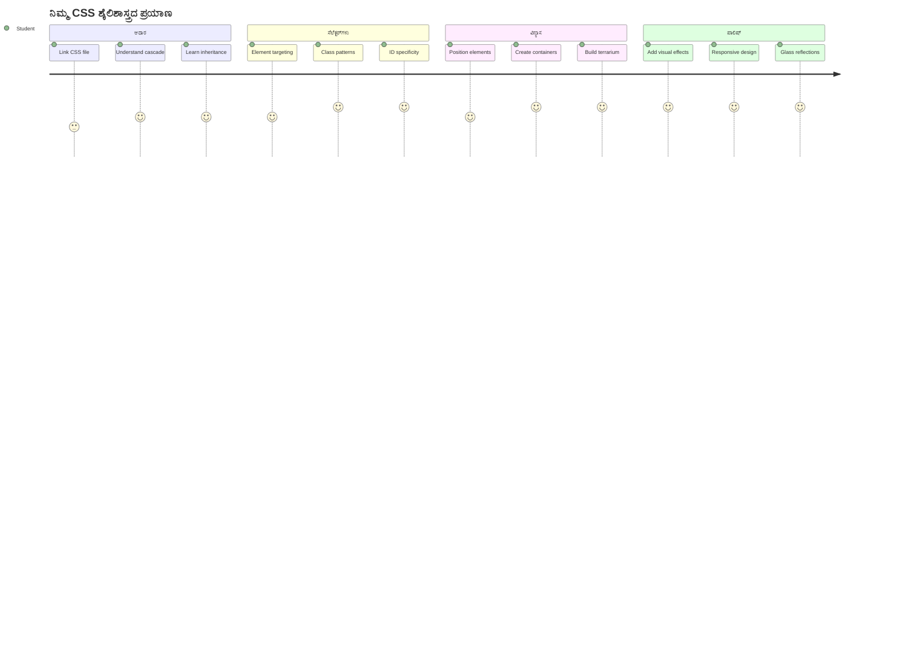
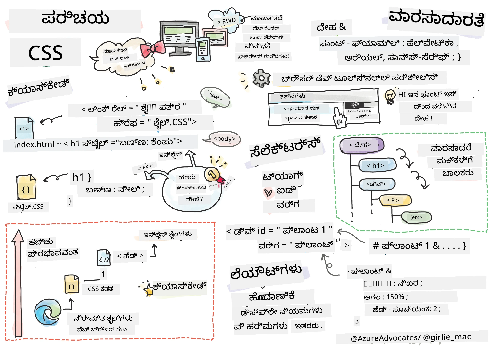
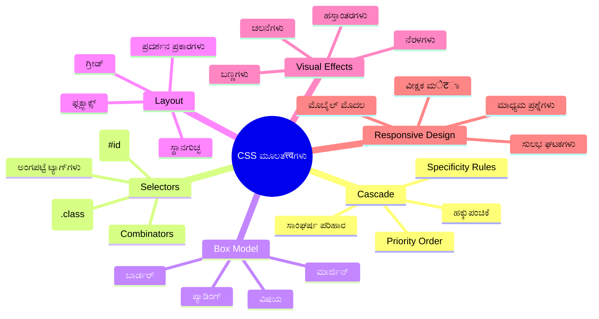
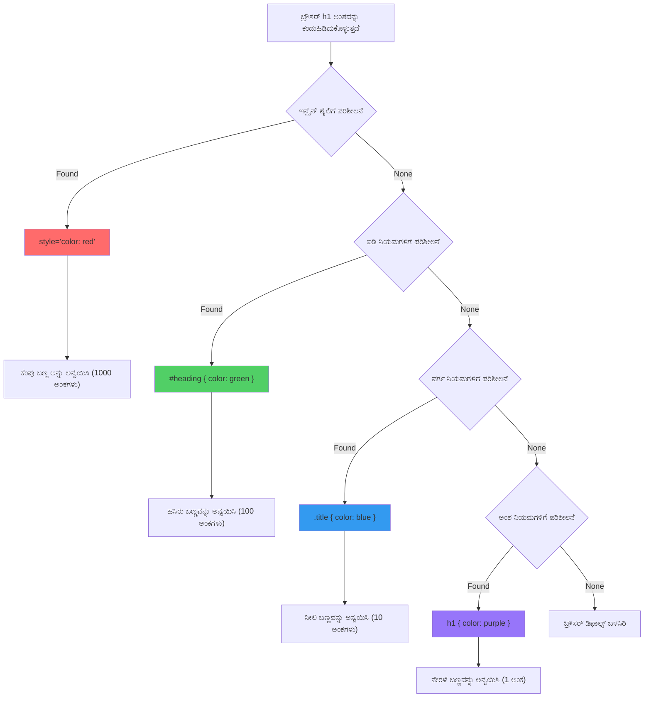
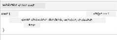
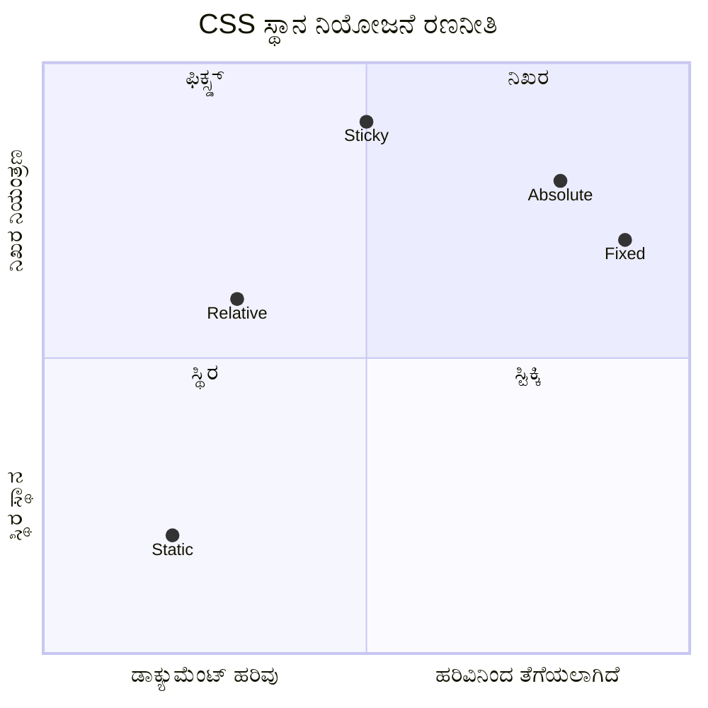
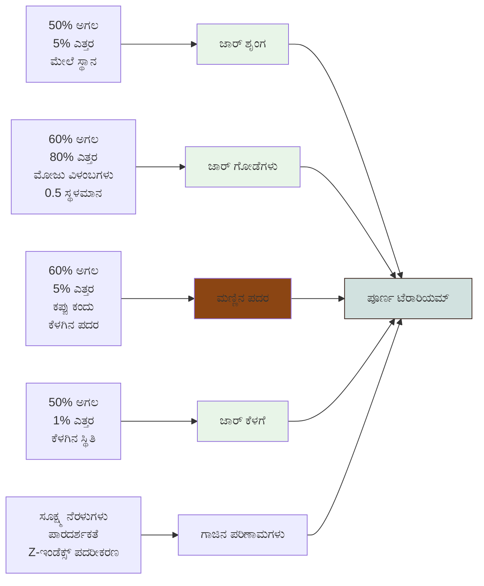
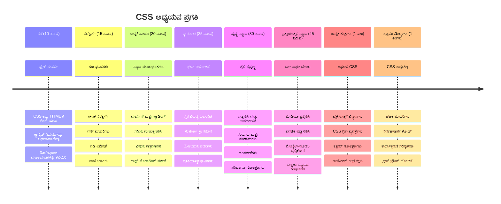

# ಟೆರೇರಿಯಂ ಪ್ರಾಜೆಕ್ಟ್ ಭಾಗ 2: CSS ಪರಿಚಯ



> [ಟೊಮೊми ಇಮುರಾ](https://twitter.com/girlie_mac) ರವರ ಸ್ಕೆಚ್ ನೋಟ

ನಿಮ್ಮ HTML ಟೆರೇರಿಯಂ ಹೌದು ಎಂದಾದರೂ ತುಂಬಾ ಸರಳವಾಗಿ ಕಂಡಿತಾ? CSS ಆ ಸರಳ ರಚನೆಯನ್ನು ದೃಶ್ಯಾತ್ಮಕವಾಗಿ ಆಕರ್ಷಕವಾಗಿಸುವುದೇ ಆಗಿದೆ.

HTML ಮನೆ ಕಟ್ಟುವ ಫ್ರೇಮ್ ಹಾಗೆವಾದರೆ, CSS ಮನೆ ಯನ್ನ ಸ್ವಾಗತ ಹೊಂದುತ್ತಿರುವಂತೆ ತೋರಿಸುವ ಎಲ್ಲಾ ಚيزುಗಳು - ಬಣ್ಣದ ಬಣ್ಣಗಳು, ಫರ್ನಿಚರ್ ವ್ಯವಸ್ಥೆ, ಬೆಳಕು, ಮತ್ತು ಕೊಠಡಿಗಳ ಸಂಚಲನ. ಪ್ಯಾಲೇಸ್ ಆಫ್ ವರ್ಸಾಯಿಸ್ ಒಂದು ಸರಳ ಬೇಟೆಯ ಹಳ್ಳಿ ಆಗಿರೋದು ಹೇಗೆ, ಆದರೆ ಅಲ್ಲಿ ಸುಂದರ ಅಲಂಕರಣ ಮತ್ತು ವಿನ್ಯಾಸದ ಮೂಲಕ ಜಗತ್ತಿನ ಅತ್ಯುತ್ತಮ ಕಟ್ಟಡಗಳಲ್ಲಿ ಒಂದಾಗಿ ಪರಿವರ್ತಿತವಾಯಿತು ಅಂತಕೂಟ್ಲೆ.

ಇಂದು ನಾವು ನಿಮ್ಮ ಟೆರೇರಿಯಂ ಅನ್ನು ಕಾರ್ಯक्षमದಿಂದ ಹೊಳೆಯುವಂತೆ ಮಾಡೋಣ. ನೀವು ಎಲಿಮೆಂಟ್ ಗಳನ್ನು ಸಂಯೋಜಿಸುವಂತೆ ಕಲಿತೀರಿ, ವಿಭಿನ್ನ ಪರದೆ ಗಾತ್ರಗಳಿಗೆ ಸೈಟ್‌ಗಳನ್ನು ಪ್ರತಿಕ್ರಿಯಿಸುವಂತೆ ಮಾಡೋಣ ಮತ್ತು ವೆಬ್‌ಸೈಟ್‌ಗಳ ಆಕರ್ಷಣೀಯತೆ ಮೂಡಿಸುವಂತೆ ದೃಶ್ಯವುಂಟುಮಾಡೋಣ.

ಈ ಪಾಠದ ಅಂತ್ಯಕ್ಕೆ, ಸೂಕ್ತವಾಗಿ CSS ಶೈಲಿ ಹೇಗೆ ನಿಮ್ಮ ಪ್ರಾಜೆಕ್ಟ್ ಅನ್ನು ನುಡಿಮುತ್ತಾಗಿ ಸುಧಾರಿಸಬಲ್ಲದು ನೋಡಿ. ನಿಮ್ಮ ಟೆರೇರಿಯಂಗೆ ಕೆಲವು ಶೈಲಿ ಸೇರಿಸಲಿದ್ದೇವೆ.


## ಪೂರ್ವ-ಪಾಠ ಪ್ರಶ್ನೆಪತ್ರಿಕೆ

[ಪೂರ್ವ-ಪಾಠ ಪ್ರಶ್ನೆಪತ್ರಿಕೆ](https://ff-quizzes.netlify.app/web/quiz/17)

## CSS ಆರಂಭಿಸುವುದು

CSS ನ್ನು ಜನರು ತುಂಬಾ "ಅತ್ಯಂತ ಸುಂದರವಾಗಿ ಮಾಡುವುದು" ಎಂದು ಭಾವಿಸುತ್ತಾರೆ ಆದರೆ ಇದರ ವ್ಯಾಪ್ತಿಯು ತುಂಬಾ ವಿಶಾಲವಾಗಿದೆ. CSS ಸಿನಿಮಾ ನಿರ್ದೇಶಕರಂತೆ - ನೀವು ಎಲ್ಲವನ್ನೂ ನೋಡಿಸುವುದಲ್ಲದೆ, ಅದು ಹೇಗೆ ಚಲಿಸುತ್ತದೆ, ಸಂವಹನಕ್ಕೆ ಹೇಗೆ ಪ್ರತಿಕ್ರಿಯಿಸುತ್ತದೆ, ಮತ್ತು ವಿಭಿನ್ನ ಪರಿಸ್ಥಿತಿಗಳಲ್ಲಿ ಹೇಗೆ ಹೊಂದಿಕೊಳ್ಳುತ್ತದೆ ಅವುಗಳನ್ನು ನಿಯಂತ್ರಿಸುತ್ತೀರಿ.

ಅಧುನಾತನ CSS ಅತ್ಯಂತ ಸಾಮರ್ಥ್ಯವಂತದ್ದು. ನೀವು ಫೋನ್‌ಗಳು, ಟ್ಯಾಬ್ಲೆಟ್‌ಗಳು ಮತ್ತು ಡೆಸ್ಕ್‌ಟಾಪ್ ಗಳಿಗೆ ಸ್ವಯಂಚಾಲಿತವಾಗಿ ಪರಿವರ್ತಿಸುವ ವಿನ್ಯಾಸಗಳನ್ನು ಬರೆಯಬಹುದು. ನೀವು ಸಲುಹೊಯ್ದ ಅನ್ಯಮೇಷನ್‌ಗಳನ್ನು ರಚಿಸಬಹುದು, ಇದು ಬಳಕೆದಾರರ ಗಮನವನ್ನು ಅಗತ್ಯವಿರುವ ಸ್ಥಳಕ್ಕೆ ಕರೆದೊಯ್ಯುತ್ತದೆ. ಎಲ್ಲವೂ ಒಟ್ಟಿಗೆ ಕೆಲಸ ಮಾಡುವಾಗ ಫಲಿತಾಂಶಗಳು ಅತ್ಯंत ಸೋಗಾದವು.

> 💡 **ಪ್ರೋ ಟಿಪ್**: CSS ಹೊಸ ವೈಶಿಷ್ಟ್ಯಗಳು ಮತ್ತು ಸಾಮರ್ಥ್ಯಗಳೊಂದಿಗೆ ಸತತವಾಗಿ ಅಭಿವೃದ್ಧಿಯಾಗುತ್ತಿದೆ. ಉತ್ಪಾದನಾ ಪ್ರಾಜೆಕ್ಟ್‌ಗಳಲ್ಲಿ ಹೊಸ CSS ವೈಶಿಷ್ಟ್ಯಗಳನ್ನು ಬಳಸುವ ಮೊದಲು [CanIUse.com](https://caniuse.com) ನಲ್ಲಿ ಬ್ರೌಸರ್ ಬೆಂಬಲವನ್ನು ತಪಾಸಣೆ ಮಾಡಿರಿ.

**ಈ ಪಾಠದಲ್ಲಿ ನಾವು ಸಾಧಿಸುವುದು:**
- ಟೆರೇರಿಯಂಗೆ ಆಧುನಿಕ CSS ತಂತ್ರಗಳನ್ನು ಬಳಸಿ ಸಂಪೂರ್ಣ ವಿಸ್ತೃತ ವಿನ್ಯಾಸವನ್ನು ಸೃಷ್ಟಿಸುತ್ತದೆ
- ಕಾರ್ಯಪದ್ಧತಿ, ಪರಂಪರೆ ಮತ್ತು CSS ಆಯ್ಕೆದಾರರಂತಹ ಮೂಲಭೂತ ತತ್ವಗಳನ್ನು ಅನ್ವೇಷಣೆ ಮಾಡುವುದು
- ಪ್ರತಿಕ್ರಿಯಾಶೀಲ ಸ್ಥಾನಪರಿಚಯ ಮತ್ತು ವಿನ್ಯಾಸ ತಂತ್ರಗಳನ್ನು ಅನ್ವಯಿಸುವುದು
- CSS ಆಕಾರಗಳು ಮತ್ತು ಶೈಲಿ ಬಳಸಿ ಟೆರೇರಿಯಂ ಒಳಚರಂಡಿಯನ್ನು ರಚಿಸುವುದು

### ಪೂರ್ವಾಪೇಕ್ಷೆ

ನೀವು ಹಿಂದಿನ ಪಾಠದಿಂದ ನಿಮ್ಮ ಟೆರೇರಿಯಂ‌ಗಾಗಿ HTML ರಚನೆಯನ್ನು ಪೂರ್ಣಮಾಡಿರಬೇಕು ಮತ್ತು ಅದನ್ನು ಶೈಲಿಗೊಳಿಸಲು ಸಿದ್ಧವಾಗಿರಬೇಕು.

> 📺 **ವೀಡಿಯೋ ಸಂಪನ್ಮೂಲ**: ಸಹಾಯಕ ವೀಡಿಯೋ ವಾಕ್ತೃತ್ವವನ್ನು ವೀಕ್ಷಿಸಿ
>
> [](https://www.youtube.com/watch?v=6yIdOIV9p1I)

### ನಿಮ್ಮ CSS ಕಡತವನ್ನು ಸಜ್ಜುಗೊಳಿಸುವುದು

ಶೈಲಿ ಸಲ್ಲಿಸುವುದನ್ನು ಆರಂಭಿಸುವ ಮೊದಲು, CSS ಅನ್ನು ನಮ್ಮ HTML ಗೆ ಸಂಪರ್ಕಿಸುವ ಅಗತ್ಯವಿದೆ. ಈ ಸಂಪರ್ಕ ಬ್ರೌಸರ್‌ಗೆ ಟೆರೇರಿಯಂ ಶೈಲಿ ಸೂಚನೆಗಳನ್ನು ಎಲ್ಲಿಂದ ಪಡೆಯಬೇಕೆಂಬುದನ್ನು ತಿಳಿಸುತ್ತದೆ.

ನಿಮ್ಮ ಟೆರೇರಿಯಂ ಫೋಲ್ಡರ್ ನಲ್ಲಿ `style.css` ಎಂಬ ಹೊಸ ಫೈಲ್ ಸೃಷ್ಟಿಸಿ, ನಂತರ ಅದನ್ನು ನಿಮ್ಮ HTML ಕಡತದ `<head>` ವಿಭಾಗದಲ್ಲಿ ಲಿಂಕ್ ಮಾಡಿ:

```html
<link rel="stylesheet" href="./style.css" />
```

**ಈ ಕೋಡ್ ಮಾಡುವುದೇನು:**
- ನಿಮ್ಮ HTML ಮತ್ತು CSS ಕಡತಗಳ ನಡುವಣ ಸಂಪರ್ಕವನ್ನು ನಿರ್ಮಿಸುತ್ತದೆ
- ಬ್ರೌಸರ್‌ಗೆ `style.css` ನಲ್ಲಿನ ಶೈಲಿಗಳನ್ನು ಲೋಡ್ ಮತ್ತು ಅನ್ವಯಿಸುವುದಾಗಿ ಹೇಳುತ್ತದೆ
- `rel="stylesheet"` ಗುಣಲಕ್ಷಣ ಬಳಸಿ ಇದು CSS ಕಡತ ಎಂದು ಸೂಚಿಸುತ್ತದೆ
- `href="./style.css"` ಮೂಲಕ ಕಡತದ ಮಾರ್ಗವನ್ನು ಸೂಚಿಸುತ್ತದೆ

## CSS Cascading ಅರ್ಥ

ನೀವು ಎಂದಾದರೂ ಯೋಚಿಸಿದ್ದೀರಾ, CSS ಗೆ "Cascading" style sheets ಎನ್ನುತ್ತಾರೆ ಎಂತಾರೆ? ಶೈಲಿಗಳು ಜಲಪ್ರವಾಹದಂತಾಗಿಯೇ ಕೆಳಗೆ ಹರಿಯುತ್ತವೆ ಮತ್ತು ಕೆಲವೊಮ್ಮೆ ಪರಸ್ಪರ ಘರ್ಷಣೆಗೊಳಗಾಗುತ್ತವೆ.

ಸೆನೆಯ ಆಜ್ಞೆ ವ್ಯವಸ್ಥೆಯನ್ನು ಪರಿಶೀಲಿಸಿ — генерал ಮಾನ್ಯಕೆ "ಎಲ್ಲಾ ಸೇನಾನಿಗಳು ಹಸಿ ಹಸಿರು ಬಣ್ಣದ ವಸ್ತ್ರ ಧರಿಸಲಿ" ಎಂದು ಹೇಳಿದರೆ, ಆದರೆ ನಿಮ್ಮ ಯೂನಿಟ್‌ಗೆ ದಾಖಲಿಸಿದ ನಿರ್ದಿಷ್ಟ ಆದೇಶ "ಸಮಾರಂಭಕ್ಕಾಗಿ ನೀಲಿ ವಸ್ತ್ರ ಹಾಕಿ" ಎಂದು ಇದ್ದರೆ, ಇನ್ನಷ್ಟು ನಿರ್ದಿಷ್ಟ ಆದೇಶ ಉತ್ತಮ ಪ್ರಾಮುಖ್ಯತೆಯನ್ನು ಪಡೆದುಕೊಳ್ಳುತ್ತದೆ. CSS ಕೂಡ ಇದೇ ತರ್ಕವನ್ನು ಅನುಸರಿಸುತ್ತದೆ ಮತ್ತು ಈ ಹೈಯರಾರ್ಕಿಯನ್ನು ಅರ್ಥಮಾಡಿಕೊಳ್ಳುವುದರಿಂದ ಡಿಬಗ್ ಮಾಡಲು ತುಂಬಾ ಸುಲಭವಾಗುತ್ತದೆ.

### Cascading ಆದ್ಯತೆಯನ್ನು ಪ್ರಯೋಗಿಸೋಣ

ನಮ್ಮ cascading ಪರಿಣಾಮವನ್ನು ನೋಡಲು ಶೈಲಿ ಘರ್ಷಣೆಯನ್ನು ಸೃಷ್ಟಿಸೋಣ. ಮೊದಲು ನಿಮ್ಮ `<h1>` ಟ್ಯಾಗ್‌ಗೆ inline ಶೈಲಿಯನ್ನು ಸೇರಿಸಿ:

```html
<h1 style="color: red">My Terrarium</h1>
```

**ಈ ಕೋಡ್ ಮಾಡುವುದೇನು:**
- inline ಶೈಲಿಯನ್ನು ಬಳಸಿ `<h1>` ಎಲಿಮೆಂಟ್‌ಗೆ ನೇರವಾಗಿ ಕೆಂಪು ಬಣ್ಣವನ್ನು ಅನ್ವಯಿಸುತ್ತದೆ
- `style` ಗುಣಲಕ್ಷಣ ಬಳಸಿ HTML ನಲ್ಲಿ ನೇರವಾಗಿ CSS ನ್ನು ಒಳಗೊಳಿಸುತ್ತದೆ
- ಈ ನಿರ್ದಿಷ್ಟ ಎಲಿಮೆಂಟ್‌ಗೆ ಅತ್ಯಂತ ಪ್ರಾಮುಖ್ಯತೆಯ ಶೈಲಿ ನಿಯಮವನ್ನು ರಚಿಸುತ್ತದೆ

ಹೀಗೆಯೇ ಈ ನಿಯಮವನ್ನು ನಿಮ್ಮ `style.css` ಫೈಲಿಗೆ ಸೇರಿಸಿ:

```css
h1 {
  color: blue;
}
```

**ಮೇಲಿನ ನಿಯಮಗಳಲ್ಲಿ ನಾವು:**
- ಎಲ್ಲಾ `<h1>` ಎಲಿಮೆಂಟ್‌ಗಳನ್ನು ಗುರಿಯಾಗಿಸುವ CSS ನಿಯಮವನ್ನು ಸೂಚಿಸಿದ್ದೇವೆ
- ಬಾಹ್ಯ ಶೈಲಿ ಬಳಸಿ ಪಠ್ಯದ ಬಣ್ಣ ನಿಲುವಂಗಿ ನೀಲಿ ಮಾಡಿದೇವೆ
- inline ಶೈಲಿಗಳಿಗಿಂತ ಕಡಿಮೆ ಪ್ರಾಮುಖ್ಯತೆಯ ನಿಯಮವನ್ನು ರಚಿಸಿದ್ದೇವೆ

✅ **ಅಧ್ಯಯನ ಪರೀಕ್ಷೆ**: ನಿಮ್ಮ ವೆಬ್ ಅಪ್ಲಿಕೇಶನ್‌ನಲ್ಲಿ ಯಾವ ಬಣ್ಣ ತೋರಿಸುತ್ತದೆ? ಆ ಬಣ್ಣಕ್ಕೆ ಏಕೆ ಪ್ರಾಮುಖ್ಯತೆಯಿದೆ? ನೀವು ಯಾವ ಸಂದರ್ಭಗಳಲ್ಲಿ ಶೈಲಿಗಳನ್ನು ಮೀರಿಸುವುದೆಂದು ಯೋಚಿಸುತ್ತೀರಾ?


> 💡 **CSS ಆದ್ಯತೆಯ ಕ್ರಮ (ಅತ್ಯಂತ ಅಧಿಕದಿಂದ ಕಡಿಮೆ):**
> 1. **Inline ಶೈಲಿಗಳು** (style ಗುಣಲಕ್ಷಣ)
> 2. **ಐಡಿಗಳು** (#myId)
> 3. **ತರೆಗಳು** (.myClass) ಮತ್ತು ಗುಣಲಕ್ಷಣಗಳು
> 4. **ಎಲಿಮೆಂಟ್ ಆಯ್ಕೆದಾರರು** (h1, div, p)
> 5. **ಬ್ರೌಸರ್ ಮೌಲ್ಯದ ನಿಬಂಧನೆಗಳು**

## CSS ಪರಂಪರೆ ಕಾರ್ಯಾಚರಣೆ

CSS ಪರಂಪರೆ ಜಿನೆಟಿಕ್ಸ್ ಹಾಗೆ ಕಾರ್ಯನಿರ್ವಹಿಸುತ್ತದೆ — ಎಲಿಮೆಂಟ್‌ಗಳು ತಮ್ಮ ಪೋಷಕ eleಮೆಂಟ್‌ಗಳಿಂದ ಕೆಲವು ಗುಣಗಳನ್ನು ಪರಂಪರೆಯಾಗಿ ಪಡೆಯುತ್ತವೆ. ನೀವು ಮಾನವನ `<body>` ಮೇಲೆ ಫಾಂಟ್‌ ಫ್ಯಾಮಿಲಿ ಸಿದ್ಧ ಮಾಡಿದರೆ ಎಲ್ಲಾ ಪಠ್ಯವು ಸ್ವಯಂಚಾಲಿತವಾಗಿ ಅದೇ ಫಾಂಟ್ ಬಳಸುತ್ತದೆ. ಇದು ಹ್ಯಾಬ್ಸ್‌ಬರ್ಗ್ ಕುಟುಂಬದ ವಿಶಿಷ್ಟ ಜವಳಿನ ಶೈಲಿಯನ್ನು ತಲಾ ಯೋಗ್ಯ ವ್ಯಕ್ತಿಗಳಲ್ಲಿ ಕಾಣಿಸುವಂತೆ.

ಆದ್ರೆ ಎಲ್ಲವೂ ಪರಂಪರೆಯಾಗದು. ಪಠ್ಯದ ಶೈಲಿ (ಫಾಂಟ್‌ಗಳು ಮತ್ತು ಬಣ್ಣಗಳು) ಪರಂಪರೆಯಾಗುತ್ತವೆ, ಆದ್ರೆ ವಿನ್ಯಾಸ ಗುಣಲಕ್ಷಣಗಳು (ಮಾರ್ಜಿನ್ಗಳು ಮತ್ತು ಬಾರ್ಡರ್‌ಗಳು) ಪರಂಪರೆಯಾಗುವುದಿಲ್ಲ. ಮಕ್ಕಳಿಗೆ ಭೌತಿಕ ಲಕ್ಷಣಗಳ ಮೇಲೆ ಪರಂಪರೆ ಕಲಿತಂತೆ ಆದರೆ ತಮಗೆ ತಾಯ್ತಂದೆಗಳ ಫ್ಯಾಷನ್ ಆಯ್ಕೆಗಳು ಅಲ್ಲ.

### ಫಾಂಟ್ ಪರಂಪರೆಯನ್ನು ಗಮನಿಸಿ

ನಾವು `<body>` ಮೇಲೆ ಫಾಂಟ್ ಫ್ಯಾಮಿಲಿ ನಿಶ್ಚಯಿಸಿ ಪರಂಪರೆಯ ಕಾರ್ಯಾಚರಣೆಯನ್ನು ಪರೀಕ್ಷಿಸೋಣ:

```css
body {
  font-family: 'Segoe UI', Tahoma, Geneva, Verdana, sans-serif;
}
```

**ಈಈಗಾಗುವದನ್ನು ಪೋಷಣೆಯಾಗಿ ಓದಿ:**
- ಸಂಪೂರ್ಣ ಪುಟಕ್ಕೆ ಫಾಂಟ್ ಫ್ಯಾಮಿಲಿ ನಿಸುವುದು `<body>` ಎಲಿಮೆಂಟ್ ಗುರಿಯಾಗಿಸಿ
- ಉತ್ತಮ ಬ್ರೌಸರ್ ಹೊಂದಾಣಿಕೆಗೆ ಬದಲಾವಣೆ ವಾಗಿ ಫಾಂಟ್ ಸ್ಟ್ಯಾಕ್ ಬಳಸುವುದು
- ವಿಭಿನ್ನ ಕಾರ್ಯನಿರ್ವಹಣೆ ವ್ಯವಸ್ಥೆಗಳಿಗೆ ಉತ್ತಮವಾಗಿ ಕಾಣುವ ಆಧುನಿಕ ಸಿಸ್ಟಮ್ ಫಾಂಟ್‌ಗಳು ಬಳಕೆ ಮಾಡುವುದು
- ಸ್ಪಷ್ಟವಾಗಿ ಎಲ್ಲಾ ಮಕ್ಕಳ ಎಲಿಮೆಂಟ್‌ಗಳು ಪರಂಪರೆಯಿಂದ ಈ ಫಾಂಟ್ ಬಳಸುವಂತೆ ಮಾಡುವುದು, ಉಲ್ಲೇಖಿಸಿದರೆ ಮಾತ್ರ ಮೀರಿಸಲಾಗುತ್ತದೆ

ನಿಮ್ಮ ಬ್ರೌಸರ್ ಡೆವಲಪರ್ ಟೂಲ್‌ಗಳು (F12) ತೆರೆಯಿರಿ, Elements ಟ್ಯಾಬ್‌ಗೆ ಹೋಗಿ, ಮತ್ತು ನಿಮ್ಮ `<h1>` ಎಲಿಮೆಂಟ್ ಅನ್ನು ಪರಿಶೀಲಿಸಿ. ಅದು ನೆಲೆಯ `<body>` ಮೂಲಕ ಫಾಂಟ್ ಫ್ಯಾಮಿಲಿ ಪರಂಪರೆಯನ್ನು ಪಡೆಯುತ್ತಿದೆ:



✅ **ಪ್ರಯೋಗ ಸಮಯ**: `<body>` ಮೇಲೆ `color`, `line-height`, ಅಥವಾ `text-align` ಮುಂತಾದ ಇತರೆ ಪರಂಪರೆಯಾಗುವ ಗುಣಲಕ್ಷಣಗಳನ್ನು ನಿಶ್ಚಯಿಸಿ ನೋಡಿ. ನಿಮ್ಮ ಶೀರ್ಷಿಕೆ ಮತ್ತು ಇತರ ಎಲಿಮೆಂಟ್‌ಗಳಿಗೆ ಏನು ಆಗುತ್ತದೆ?

> 📝 **ಪರಂಪರೆಯಾಗುವ ಗುಣಲಕ್ಷಣಗಳು ಒಳಗೊಂಡವು**: `color`, `font-family`, `font-size`, `line-height`, `text-align`, `visibility`
>
> **ಪರಂಪರೆಯಾಗದ ಗುಣಲಕ್ಷಣಗಳು ಒಳಗೊಂಡವು**: `margin`, `padding`, `border`, `width`, `height`, `position`

### 🔄 **ವಿದ್ಯಾಮೂಲಕ ಪರಿಶೀಲನೆ**
**CSS ನ ಮೂಲಭೂತ ಅರ್ಥ:** ಆಯ್ಕೆದಾರರಗೆ ಹೋಗುವ ಮೊದಲು ಖಾತರಿಪಡಿಸಿಕೊಳ್ಳಿ ನೀವು:
- ✅ cascading ಮತ್ತು ಪರಂಪರೆ ನಡುವಿನ ವ್ಯತ್ಯಾಸ ಬರೆದಿಟ್ಟು ಹೇಳಬಲ್ಲಿರಿ
- ✅ ವಿಶೇಷತೆಯಿಂದ ಯಾವ ಶೈಲಿ ಗೆಲ್ಲುತ್ತದೆಯೋ ಅನುಮಾನೆ ಮಾಡಬಲ್ಲಿರಿ
- ✅ ಯಾವ ಗುಣಲક્ષણಗಳು ಪೋಷಕ eleಮೆಂಟ್ ನಿಂದ ಪರಂಪರೆಯಾಗುತ್ತವೆಯೋ ಗುರುತಿಸಬಲ್ಲಿರಿ
- ✅ CSS ಫೈಲ್ ಗಳು HTML ಗೆ ಸರಿಯಾಗಿ ಲಿಂಕ್ ಮಾಡಲಾಗಿದೆ ಎಂದು ಖಾತ್ರಿಪಡಿಸಿಕೊಳ್ಳಿ

**ಸರಳ ಪರೀಕ್ಷೆ**: ಈ ಶೈಲಿಗಳು ಇದ್ದರೆ, `<div class="special">` ಒಳಗಿನ `<h1>`ಯ ಬಣ್ಣ ಯಾವುದು ಇರಬಹುದು?
```css
div { color: blue; }
.special { color: green; }
h1 { color: red; }
```
*ಉತ್ತರ: ಕೆಂಪು (ಎಲಿಮೆಂಟ್ ಆಯ್ಕೆದಾರ ನೇರವಾಗಿ h1 ನ್ನು ಗುರಿಯಾಗಿಸಿದೆ)*

## CSS ಆಯ್ಕೆದಾರರ ಪ್ರಭುತ್ವ

CSS ಆಯ್ಕೆದಾರರು ನಿಮಗೆ ನಿಮ್ಮ ಶೈಲಿಗಳಿಗೆ ಗುರಿಯಾದ ನಿರ್ದಿಷ್ಟ ಎಲಿಮೆಂಟ್‌ಗಳನ್ನು ನಿಶ್ಚಯಿಸುವಂತಹುದು. ಅವು ಖಚಿತವಾದ ನಿರ್ದೇಶನಗಳನ್ನು ನೀಡುವಂತೆ ಕೆಲಸ ಮಾಡುತ್ತವೆ - "ಮನೆ" ಎಂದು ಹೇಳುವುದರ ಬದಲು "ಮೇಪಲ್ ಸ್ಟ್ರೀಟ್上的 ಕೆಂಪಿನ ದ್ವಾರಿನೊಂದಿಗೆ ನೀಲಿ ಮನೆ" ಎಂದು ಹೇಳುವುದು.

CSS ವಿಭಿನ್ನ ರೀತಿಯ ಆಯ್ಕೆದಾರರನ್ನು ಒದಗಿಸುತ್ತದೆ, ಮತ್ತು ಸೂಕ್ತ ಆಯ್ಕೆದಾರವನ್ನು ಆರಿಸುವುದು ಕಾರ್ಯಕ್ಕಾಗಿ ಸೂಕ್ತ ಉಪಕರಣವನ್ನು ಆರಿಸುವಂತಿದೆ. ಒಮ್ಮೆ ನೀವು ಹುತ್ತಿನಲ್ಲಿ ಎಲ್ಲಾ ಬಾಗಿಲಿನ ಶೈಲಿಗಳನ್ನು ನೀಡಬಹುದು, ಮತ್ತೊಮ್ಮೆ ಒಂದು ವಿಶೇಷ ಬಾಗಿಲಿಗೆ ಮಾತ್ರ.

### ಎಲಿಮೆಂಟ್ ಆಯ್ಕೆದಾರರು (ಟ್ಯಾಗ್ ಗಳು)

ಎಲಿಮೆಂಟ್ ಆಯ್ಕೆದಾರರು HTML ಎಲಿಮೆಂಟ್‌ಗಳನ್ನು ಅವರ ಟ್ಯಾಗ್ ಹೆಸರಿನಿಂದ ಗುರಿಯಾಗಿಸಲು ಬಳಸಲಾಗುತ್ತದೆ. ಬಹುಮಟ್ಟಿನಲ್ಲಿ ಪುಟ ವ್ಯಾಪಕವಾಗಿ ಅನ್ವಯಿಸುವ ಮೂಲ ಶೈಲಿಗಳನ್ನು ನಿಶ್ಚಯಿಸಲು ಇವು ತಕ್ಕಂತೆಗಳ.

```css
body {
  font-family: 'Segoe UI', Tahoma, Geneva, Verdana, sans-serif;
  margin: 0;
  padding: 0;
}

h1 {
  color: #3a241d;
  text-align: center;
  font-size: 2.5rem;
  margin-bottom: 1rem;
}
```

**ಈ ಶೈಲಿಗಳ ಅರ್ಥ:**
- `body` ಆಯ್ಕೆದಾರ ಬಳಸಿ ಸಂಪೂರ್ಣ ಪುಟದಲ್ಲಿ ಅಖಂಡವಾದ ಟೈಪೋಗ್ರಫಿಯನ್ನು ನಿಶ್ಚಯಿಸುತ್ತದೆ
- ಉತ್ತಮ ನಿಯಂತ್ರಣಕ್ಕೆ ಬ್ರೌಸರ್ ನ ಡಿಫಾಲ್ಟ್ ಮಾರ್ಜಿನ್ ಮತ್ತು ಪ್ಯಾಡಿಂಗ್ ತೆಗೆದುಹಾಕುತ್ತದೆ
- ಬಣ್ಣ, ಸರಿಹೊಂದುವಿಕೆ ಮತ್ತು ಅಂತರಗಳೊಂದಿಗೆ ಎಲ್ಲಾ ಶೀರ್ಷಿಕೆ ಎಲಿಮೆಂಟ್‌ಗಳ ಶೈಲಿ ಮಾಡುತ್ತದೆ
- ಲಭ್ಯವಿರುವ ಸೌಲಭ್ಯಕ್ಕಾಗಿ `rem` ಯೂನಿಟ್ ಗಳನ್ನು ಬಳಸುತ್ತದೆ

ಎಲಿಮೆಂಟ್ ಆಯ್ಕೆದಾರರು ಸಾಮಾನ್ಯ ಶೈಲಿಗಾಗಿ ಚೆನ್ನಾಗಿ ಕೆಲಸ ಮಾಡುತ್ತವೆ, ಆದರೆ ಟೆರೇರಿಯಂನಲ್ಲಿ ಸಸ್ಯಗಳು ಮುಂತಾದ ವ್ಯಕ್ತಿಗತ ಭಾಗಗಳನ್ನು ಶೈಲಿಗೊಳಿಸಲು ನೀವು ಹೆಚ್ಚು ವಿಶೇಷ ಆಯ್ಕೆದಾರರ ಅಗತ್ಯವಿರುತ್ತದೆ.

### ವೈಯಕ್ತಿಕ ಎಲಿಮೆಂಟ್‌ಗಳಿಗೆ ID ಆಯ್ಕೆದಾರರು

ID ಆಯ್ಕೆದಾರರು `#` ಚಿಹ್ನೆಯನ್ನು ಬಳಸಿ ನಿರ್ದಿಷ್ಟ `id` ಗುಣಲಕ್ಷಣ ಹೊಂದಿರುವ ಎಲಿಮೆಂಟ್‌ಗಳನ್ನು ಗುರಿಯಾಗಿಸುತ್ತವೆ. ಪುಟದಲ್ಲಿ ID ಗಳು ಅನನ್ಯವಾಗಿರಬೇಕು, ಆದ್ದರಿಂದ ನಮ್ಮ ಎಡ ಮತ್ತು ಬಲ ಸಸ್ಯ ಕಂಟೈನರ್ ಗಳಿಗೆ ಇದು ಸೂಕ್ತ.

ನಮ್ಮ ಟೆರೇರಿಯಂ ಬದಿಯ ಕಂಟೈನರ್‍ಗಳ ಶೈಲಿಯನ್ನು ಸೃಷ್ಟಿಸೋಣ, ಸಸ್ಯಗಳು ಅಲ್ಲಿ ಸುತ್ತಾಡುತ್ತವೆ:

```css
#left-container {
  background-color: #f5f5f5;
  width: 15%;
  left: 0;
  top: 0;
  position: absolute;
  height: 100vh;
  padding: 1rem;
  box-sizing: border-box;
}

#right-container {
  background-color: #f5f5f5;
  width: 15%;
  right: 0;
  top: 0;
  position: absolute;
  height: 100vh;
  padding: 1rem;
  box-sizing: border-box;
}
```

**ಈ ಕೋಡ್ ಸಾಧಿಸುವುದು:**
- `absolute` ಸ್ಥಾನದೊಂದಿಗೆ ಕಂಟೈನರ್‌ಗಳನ್ನು ಎಡ ಮತ್ತು ಬಲ ಅಗಲ ಕಡೆಯಲ್ಲಿನ್ದು ಸ್ಥಾಪಿಸುತ್ತದೆ
- `vh` (ವ್ಯೂಪೋರ್ಟ್ ಎತ್ತರ) ಯುನಿಟ್‌ಗಳನ್ನು ಬಳಸಿ ಪರದೆಯ ಗಾತ್ರಕ್ಕೆ ಹೊಂದಿಕೊಂಡ ಉದ್ದವನ್ನು ನಿಶ್ಚಯಿಸುತ್ತದೆ
- ಒಟ್ಟಾರೆ ಅಗಲದಲ್ಲಿ ಪ್ಯಾಡಿಂಗ್ ಸೇರಿಸುವುದಕ್ಕಾಗಿ `box-sizing: border-box` ಅನ್ನು ಅನ್ವಯಿಸುತ್ತದೆ
- ಶುದ್ಧವಾಗಿ ಹೆಚ್ಚುವರಿ `px` ಯುನಿಟ್ ಗಳನ್ನು ತೆಗೆದುಹಾಕುತ್ತದೆ
- ಕಣ್ಣಿಗೆ ಅಲಿಯೋ ಆಗುವಂತೆ ಸುಮ್ಮನಾದ ಹಿನ್ನೆಲೆಯ ಬಣ್ಣವನ್ನು ನಿಶ್ಚಯಿಸುತ್ತದೆ

✅ **ಕೋಡ್ ಗುಣಮಟ್ಟದ ಸವಾಲು**: ಈ CSS DRY (ನಿಮ್ಮನ್ನು ಪುನರಾವರ್ತಿಸಬೇಡಿ) ಸಿದ್ಧಾಂತವನ್ನು ಉಲ್ಲಂಘಿಸುತ್ತದೆ. ನೀವು ಇದನ್ನು ID ಮತ್ತು ಕ್ಲಾಸ್ ಎರಡನ್ನೂ ಬಳಸಿ ಪುನರ್ ರಚಿಸಬಲ್ಲಿರಾ?

**ಸುಧಾರಿತ ವಿಧಾನ:**
```html
<div id="left-container" class="container"></div>
<div id="right-container" class="container"></div>
```

```css
.container {
  background-color: #f5f5f5;
  width: 15%;
  top: 0;
  position: absolute;
  height: 100vh;
  padding: 1rem;
  box-sizing: border-box;
}

#left-container {
  left: 0;
}

#right-container {
  right: 0;
}
```

### ಪುನರಾವರ್ತಿಸಬಹುದಾದ ಶೈಲಿಯುಳ್ಳ ಕ್ಲಾಸ್ ಆಯ್ಕೆದಾರರು

ಕ್ಲಾಸ್ ಆಯ್ಕೆದಾರರು `.` ಚಿಹ್ನೆಯನ್ನು ಬಳಸಿ ಅನೇಕ ಎಲಿಮೆಂಟ್‌ಗಳಿಗೆ ಒಂದೇ ಶೈಲಿಯನ್ನು ಅನ್ವಯಿಸಲು ಸೂಕ್ತ. ID ಗಿಂತ ಭಿನ್ನವಾಗಿ, ಕ್ಲಾಸ್‌ಗಳು ನಿಮ್ಮ HTML ನಲ್ಲಿ ಯಾವುದೇ ಸಂಖ್ಯೆಯಲ್ಲಿ ಪುನಃಬಳಸಬಹುದು, ಅದರಿಂದ ಶೈಲಿಗೊಳಿಸುವ ಸಾಮಾನ್ಯ ಮಾದರಿಗಳಿಗಾಗಿ ಅದ್ಭುತವಾಗಿದೆ.

ನಮ್ಮ ಟೆರೇರಿಯಂನಲ್ಲಿ, ಪ್ರತಿ ಸಸ್ಯಕ್ಕೆ ಸಮಾನ ಶೈಲಿಯು ಬೇಕಾದರೂ ವೈಯಕ್ತಿಕ ಸ್ಥಾನಪರಿಚಯವೂ ಬೇಕಿದೆ. ನಾವು ಹಂಚಿಕೊಳ್ಳುವ ಶೈಲಿಗಾಗಿ ಕ್ಲಾಸ್ ಮತ್ತು ವೈಯಕ್ತಿಕ ಸ್ಥಾನಪರಿಚಯಕ್ಕಾಗಿ ID ನ ಸಂಯೋಜನೆಯನ್ನು ಬಳಸು ತೀರ್ಮಾನ ಮಾಡುತ್ತೇವೆ.

**ಪ್ರತಿ ಸಸ್ಯದ HTML ರಚನೆ:**
```html
<div class="plant-holder">
  
</div>
```

**ಮುಖ್ಯ ಅಂಶಗಳ ವಿವರಣೆ:**
- ಎಲ್ಲಾ ಸಸ್ಯಗಳಿಗಾಗಿ ಏಕಮಟ್ಟದ ಕಂಟೈನರ್ ಶೈಲಿಗೇರಿಸಲು `class="plant-holder"` ಬಳಕೆ
- ಚಿತ್ರದ ಸಾಮಾನ್ಯ ಶೈಲಿ ಮತ್ತು ವರ್ತನೆಗೆ `class="plant"` ಅನ್ವಯಿಸುವುದು
- ವೈಯಕ್ತಿಕ ಸ್ಥಾನಪರಿಚಯ ಮತ್ತು ಜಾವಾಸ್ಕ್ರಿಪ್ಟ್ ಸಂವಹನಕ್ಕಾಗಿ `id="plant1"` ಸೇರಿಸುವುದು
- ತಂತ್ರಾಂಶ ಓದುಗರಿಗೆ ಸೂಕ್ತ ವಿವರಣಾತ್ಮಕ alt ಪಠ್ಯ ಒದಗಿಸುವುದು

ಈ ಶೈಲಿಗಳನ್ನು ನಿಮ್ಮ `style.css` ಫೈಲ್ ಗೆ ಸೇರಿಸಿ:

```css
.plant-holder {
  position: relative;
  height: 13%;
  left: -0.6rem;
}

.plant {
  position: absolute;
  max-width: 150%;
  max-height: 150%;
  z-index: 2;
  transition: transform 0.3s ease;
}

.plant:hover {
  transform: scale(1.05);
}
```

**ಈ ಶೈಲಿಗಳ ವಿವರ:**
- `plant-holder` ನಿಗದಿತ ಪ್ರತ್ಯೇಕ ಸ್ಥಾನದ ಕಂಟೆಕ್ಸ್ಟ್ ರಚಿಸುತ್ತದೆ
- ಪ್ರತಿ ಸಸ್ಯದ ಹೋಲ್ಡರ್ ಗಾತ್ರವನ್ನು 13% ಎತ್ತರವನ್ನಿಟ್ಟುಕೊಂಡಿದೆ, ಇದರಿಂದ ಎಲ್ಲಾ ಸಸ್ಯಗಳು ಲಂಬವಾಗಿ ಸರಿಯಾಗಿ ಕಾಣುವಂತೆ
- ಸಸ್ಯದ ಕಂಟೈನರ್‌ನೊಳಗಿನ ಕೇಂದ್ರ ಸಾರ್ವಜನಿಕವನ್ನು ಉತ್ತಮಗೊಳಿಸಲು ಸ್ವಲ್ಪ ಎಡಕ್ಕೆ ಸರಿಸಿದಿದೆ
- ಹೆಚ್ಚು ಗರಿಷ್ಠ ಅಗಲ ಮತ್ತು ಗರಿಷ್ಠ ಎತ್ತರ ನಿಲುವಂಗಿ responsive ರೂಪಾಂತರ ಅನುಮತಿಸುತ್ತದೆ
- ಟೆರೇರಿಯಂನ ಇತರ ಎಲಿಮೆಂಟ್ ಗಳಿಗಿಂತ ಮುಂದಿರಿಸಲು `z-index` ಬಳುಕೊಳ್ಳುವುದು
- ಉತ್ತಮ ಬಳಕೆದಾರ ಸಂವಹನಕ್ಕೆ CSS ರವಾನೆಯೊಂದಿಗೆ ಸಣ್ಣ ಹವರ್ ಪರಿಣಾಮ ಸೇರಿಸಲಾಗಿದೆ

✅ **ವಿಚಾರಣೀಯತೆ**: .plant-holder ಮತ್ತು .plant ಎರಡು ಆಯ್ಕೆದಾರರ ಅಗತ್ಯವೇನು? ನಾವು ಒಂದೇ ಒಂದು ಬಳಸದಿದ್ದರೆ ಏನಾಗಬಹುದು?

> 💡 ** ವಿನ್ಯಾಸ ಮಾದರಿ**: ಕಂಟೈನರ್ (.plant-holder) ವಿನ್ಯಾಸ ಮತ್ತು ಸ್ಥಾನಪರಿಚಯವನ್ನು ನಿಯಂತ್ರಿಸುತ್ತದೆ, ಮತ್ತು ವಿಷಯ (.plant) ಕಾಣಿಕೆ ಮತ್ತು ಸ್ಕೇಲಿಂಗ್ ಅನ್ನು ನಿಯಂತ್ರಿಸುತ್ತದೆ. ಈ ಬೇರ್ಪಡಿಸುವಿಕೆ ಕೋಡ್ ಅನ್ನು ನಿರ್ವಹಣೀಯ ಮತ್ತು ಗತಿಶೀಲವಾಗಿಸುವುದರಲ್ಲಿ ಸಹಾಯ ಮಾಡುತ್ತದೆ.

## CSS ಸ್ಥಾನಪರಿಚಯವನ್ನು ಅರ್ಥಮಾಡಿಕೊಳ್ಳುವುದು

CSS ಸ್ಥಾನಪರಿಚಯ ನಾಟಕ ನಿರ್ದೇಶಕರಂತೆ ಆಗಿದ್ದು - ನೀವು ಎಲ್ಲ ಅಭಿನೇತರನ್ನಿರಿಸಲು ಮತ್ತು ವೇದಿಕೆ ಮೇಲೆ ಹೇಗೆ ಸರಿಯಲು ಸೂಚಿಸುತ್ತೀರಿ. ಕೆಲವು ನಟರು ಸಾಮಾನ್ಯ ವ್ಯವಸ್ಥೆಯನ್ನನುಸರಿಸುತ್ತಾರೆ, ಇತರರು ನಾಟಕೀಯ ಪರಿಣಾಮಕ್ಕಾಗಿ ವಿಶೇಷ ಸ್ಥಾನಪರಿಚಯ ಪಡೆಯುತ್ತವೆ.

ಸ್ಥಾನಪರಿಚಯವನ್ನು ಅರ್ಥಮಾಡಿಕೊಂಡಾಗ, ಅನೇಕ ವಿನ್ಯಾಸ ಸವಾಲುಗಳು ಪರಿಹಾರವಾಗುತ್ತವೆ. ಬಳಕೆದಾರರು ಸ್ಕ್ರೋಲ್ ಮಾಡಿದಾಗ ಮೇಲಿನ ಭಾಗದಲ್ಲಿ ನವಿಗೇಶನ್ ಬಾರ್ ಉಳಿಯಬೇಕಾದರೆ? ಅದಕ್ಕೆ ಸ್ಥಾನಪರಿಚಯ ಜವಾಬ್ದಾರಿಯಾಗುತ್ತದೆ. ಒಂದು ನಿರ್ದಿಷ್ಟ ಸ್ಥಳದಲ್ಲಿ ಸೂಚಿಗೊಂಬೆ ತೋರಿಸಲು ಬೇಕಾದರೆ? ಹಾಗೂ ಅಷ್ಟೆ.

### ಐದು ಸ್ಥಾನಪರಿಚಯ ಮೌಲ್ಯಗಳು


| ಸ್ಥಾನಪರಿಚಯ ಮೌಲ್ಯ | ವರ್ತನೆ        | ಬಳಕೆ ಪ್ರಕರಣ        |
|----------------|------------|-------------------|
| `static`       | ಡಿಫಾಲ್ಟ್ ಪ್ರವಾಹ, top/left/right/bottom ಗಮನಿಸದು | ಸಾಮಾನ್ಯ ಡಾಕ್ಯುಮೆಂಟ್ ವಿನ್ಯಾಸ |
| `relative`     | ಸ್ವাভাবಿಕ ಸ್ಥಾನಕ್ಕೆ ಸಂಬಂಧಿಸಿದ ಸ್ಥಾನಪರಿಚಯ | ಸಣ್ಣ ಸರವಣಿ, ಸಂಬಂಧಿತ ಪರಿಸ್ಥಿತಿ ಸೃಜನ |
| `absolute`     | ಸಮೀಪದಲ್ಲಿನ ಸ್ಥಾನಪರಿಚಿತ ಅಜ್ಜನೋರಿಯೇಟ್‌ಗೆ ಸಂಬಂಧಿಸಿದ | ನಿಖರಬದ್ಧ ಸ್ಥಾನಪರಿಚಯ, ಒತ್ತುಗೊಂಡಾಕೃತಿ |
| `fixed`        | ವೀಕ್ಷಣಾ ಪ್ರದೇಶಕ್ಕೆ ಸಂಬಂಧಿಸಿದ ಸ್ಥಾನಪರಿಚಯ | ನವಿಗೇಶನ್ ಬಾರ್ ಗಳು, ಭಾಸಮಾನ ಎಲ್ಲುವೆಲ್ಲು |
| `sticky`       | ಸ್ಕ್ರೋಲ್ ಆಧಾರಿತವಾಗಿ relative ಮತ್ತು fixed ನಡುವಿನ ಬದಲಾವಣೆ | ಸ್ಕ್ರೋಲ್ ಮಾಡಿದಾಗ ಅಡ್ಡ ಸಾಲುಗಳು ಸ್ಥಿರ |

### ನಮ್ಮ ಟೆರೇರಿಯಂನ ಸ್ಥಳಪರಿಚಯ

ನಮ್ಮ ಟೆರೇರಿಯಂ ಒಂದು ಕೌಶಲ್ಯಮಯ ಸಂಯೋಜನೆ ಪ್ರಕರಣದಲ್ಲಿ ವಿವಿಧ ಸ್ಥಾನಪರಿಚಯಗಳನ್ನು ಬಳಸಿಕೊಂಡು ಬಯಸಿದ ವಿನ್ಯಾಸವನ್ನು ರಚಿಸುತ್ತದೆ:

```css
/* Container positioning */
.container {
  position: absolute; /* Removes from normal flow */
  /* ... other styles ... */
}

/* Plant holder positioning */
.plant-holder {
  position: relative; /* Creates positioning context */
  /* ... other styles ... */
}

/* Plant positioning */
.plant {
  position: absolute; /* Allows precise placement within holder */
  /* ... other styles ... */
}
```

**ಸ್ಥಾನಪರಿಚಯ ತಂತ್ರಜ್ಞಾನ ತೀರಸ್ಕರಣೆ:**
- `absolute` ಕಂಟೈನರ್‌ಗಳು ಸಾಮಾನ್ಯ ಡಾಕ್ಯುಮೆಂಟ್ ಪ್ರವಾಹದಿಂದ ತೆಗೆದು ಪರದೆ ಅಂಚುಗಳಲ್ಲಿ ಅಂಟಿವೆ
- ಸಂಬಂಧಿತ ಸಸ್ಯದ ಹೋಲ್ಡರ್‌ಗಳು ಸ್ಥಾನಪರಿಚಯದ ಸಂದರ್ಭವನ್ನು ನಿರ್ಮಿಸುತ್ತವೆ ಆದರೆ ತೆರಪಿನ ಪ್ರವಾಹದಲ್ಲಿ ಇರುತ್ತವೆ
- ಸಂಬಂಧಿತ ಕಂಟೈನರ್ ಒಳಗೆ ಸಸ್ಯಗಳು ನಿಖರವಾಗಿ `absolute` ಸ್ಥಾನಪರಿಚಯ ಹೊಂದಿಕೊಳ್ಳಬಹುದು
- ಈ ಸಂಯೋಜನೆ ಸಸ್ಯಗಳು ಲಂಬವಾಗಿ ಸವರಿಕೊಳ್ಳುವಂತೆ ಇರಿಸಲು ಹಾಗೂ ವೈಯಕ್ತಿಕವಾಗಿ ಹೇರಿಕೊಳ್ಳುವುದು ಸಾಧ್ಯವಾಗಿಸುತ್ತದೆ

> 🎯 **ದುರಂತರ ಮಾಹಿತಿ**: ಮುಂದಿನ ಪಾಠದಲ್ಲಿ ಸಸ್ಯಗಳು ಎಳೆಯುವ ಸಾಧ್ಯತೆಗಾಗಿ ಅವರಿಗೆ absolute ಸ್ಥಾನಪರಿಚಯ ಬೇಕಾಗುತ್ತದೆ. absolute ಸ್ಥಾನಪರಿಚಯವು ಅವುಗಳನ್ನು ಸಾಮಾನ್ಯ ವಿನ್ಯಾಸ ಪ್ರವಾಹದಿಂದ ತೆಗೆದುಹಾಕುತ್ತದೆ, ಡ್ರ್ಯಾಗ್-ಆಂಡ್-ಡ್ರಾಪ್ ಸಂವಹನವನ್ನು ಸಾಧ್ಯಮಾಡುತ್ತದೆ.

✅ **ಪ್ರಯೋಗ ಸಮಯ**: ಸ್ಥಾನಪರಿಚಯ ಮೌಲ್ಯಗಳನ್ನು ಬದಲಿಸಿ ಫಲಿತಾಂಶಗಳನ್ನು ಗಮನಿಸಿ:
- `.container` ನ್ನು `absolute` ನಿಂದ `relative` ಗೆ ಬದಲಿಸಿದರೆ ಏನಾಗುತ್ತದೆ?
- `.plant-holder` relative ಬದಲಾಗಿ absolute ಆಡುವಾಗ ಲೇಔಟ್ ಹೇಗೆ ಬದಲಾಗುತ್ತದೆ?
- `.plant` ಅನ್ನು relative ಪಾಸಿಷನಿಂಗ್ ಗೆ ಬದಲಿಸಿದಾಗ ಏನಾಗುತ್ತದೆ?

### 🔄 **ಶೈಕ್ಷಣಿಕ ಪರಿಶೀಲನೆ**
**CSS ಪಾಸಿಷನಿಂಗ್ ನ ಪರಿಣತಿ**: ನಿಮ್ಮ ಅರಿವನ್ನು ಪರಿಶೀಲಿಸಿಕೊಳ್ಳಿ:
- ✅ ಎಡವಣೆ-ಬಿಟ್ಟು ಸರಿಸಲು ಏಕೆ ಸಸ್ಯಗಳಿಗೆ absolute ಪಾಸಿಷನಿಂಗ್ ಬೇಕಾಗುತ್ತದೆ ಎಂಬುದನ್ನು ವಿವರಿಸಬಹುದು?
- ✅ relative ಕಂಟೈನರ್‌ಗಳು ಪಾಸಿಷನಿಂಗ್ ಕಾನ್ಟೆಕ್ಸ್ಟ್ ಅನ್ನು ಹೇಗೆ ರಚಿಸುತ್ತವೆ ಎಂಬುದನ್ನು ಅರ್ಥಮಾಡಿಕೊಂಡಿದ್ದೀರಾ?
- ✅ ಪಕ್ಕದ ಕಂಟೈನರ್‌ಗಳು absolute ಪಾಸಿಷನಿಂಗ್ ಅನ್ನು ಏಕೆ ಬಳಸುತ್ತವೆ?
- ✅ ನೀವು ಎಲ್ಲ ಪಾಸಿಷನ್ ಘೋಷಣೆಗಳನ್ನು ತೆಗೆದುಹಾಕಿದರೆ ಏನಾಗಬಹುದು?

**ನೈಜ ಜಗತ್ತಿನ ಸಂಪರ್ಕ**: CSS ಪಾಸಿಷನಿಂಗ್ ನೈಜ ಜಗತ್ತಿನ ಲೇಔಟ್ ಅನ್ನು ಹೇಗೆ ಅನುಸರಿಸುತ್ತದೆ ಎಂದು ಯೋಚಿಸಿ:
- **Static**: ಪುಸ್ತಕಗಳನ್ನು ತಲಾ ನೆಲದ ಮೇಲೆ (ಸ್ವಾಭಾವಿಕ ಕ್ರಮ)
- **Relative**: ಪುಸ್ತಕವನ್ನು ಸ್ವಲ್ಪ moved ಆದರೆ ಅದರ ಸ್ಥಾನ ಉಳಿಸಿ
- **Absolute**: ನಿಶ್ಚಿತ ಪುಟದ ಸಂಖ್ಯೆಯಲ್ಲಿ ಬುಕ್‌ಮಾರ್ಕ್ ಹಾಕುವುದು
- **Fixed**: ನೀವು ಪುಟಗಳನ್ನು ತಿರುಗಿಸುವಾಗವೂ ಕಾಣುವ ಸ್ಕಿಕ್ಕಿ ಟಿಪ್ಪಣಿ

## CSS ಜೊತೆಗೆ ಟೆರೇರಿಯಂ ನಿರ್ಮಾಣ

ಈಗ ನಾವು ಕೇವಲ CSS ನೊಂದಿಗೆ ಗ್ಲಾಸ್ ಜಾರ್ ರಚಿಸುವುದಾದರಷ್ಟೆ — ಚಿತ್ರಗಳು ಅಥವಾ ಗ್ರಾಫಿಕ್ಸ್ ಸಾಫ್ಟ್‌ವೇರ್ ಅಗತ್ಯವಿಲ್ಲ.

ಸ್ಥಿರವಾದ ಗ್ಲಾಸ್, ನೆರಳುಗಳು, ಮತ್ತು ಆಳದ ಪರಿಣಾಮಗಳನ್ನು ಪಾಸಿಷನಿಂಗ್ ಮತ್ತು ಟ್ರಾನ್ಸ್‌ಪೆರಂಸಿ ಬಳಸಿ ತೋರಿಸುವುದು CSS ನ ದೃಶ್ಯ ಶಕ್ತಿಗಳನ್ನು ಸಾಬೀತು ಮಾಡುತ್ತದೆ. ಈ ತಂತ್ರವೇ ಬಾಹೌಸ್ ಚಳುವಳಿಯ ವಾಸ್ತುಶಿಲ್ಪಿಗಳು ಸರಳ ಜ್ಯಾಮಿತೀಯ ಆಕಾರಗಳನ್ನು ಬಳಸಿ ಸೌಂದರ್ಯಪೂರ್ಣ, ಸಂಕೀರ್ಣ ರಚನೆಗಳನ್ನು ಸೃಷ್ಟಿಸಿದ್ದು ಹೇಗಿದೆ ಅಂದರೆ ಹೋಲಿಕೆಯಾಗಿದೆ. ಈ ಸಿದ್ಧಾಂತಗಳನ್ನು ತಿಳಿದ ಮೇಲೆ ನೀವು ಬಹು ವೆಬ್ ವಿನ್ಯಾಸಗಳ CSS ತಂತ್ರಗಳನ್ನು ಗುರುತಿಸಬಹುದು.


### ಗ್ಲಾಸ್ ಜಾರ್ ಭಾಗಗಳನ್ನು ರಚಿಸಲಾಗುವುದು

ನಾವು ಟೆರೇರಿಯಂ ಜಾರ್ ಅನ್ನು ಕಿತ್ತುಕೊಂಡು ಮುಂದೆ ಸಾಗೋಣ. ಪ್ರತಿ ಭಾಗವು absolute ಪಾಸಿಷನಿಂಗ್ ಮತ್ತು ಪ್ರತಿಶತ ಆಧಾರಿತ ಗಾತ್ರವನ್ನು ಬಳಸುತ್ತದೆ, ಇದರಿಂದ ಪ್ರತಿಕ್ರಿಯಾಶೀಲ ವಿನ್ಯಾಸ ಸಾದ್ಯ.

```css
.jar-walls {
  height: 80%;
  width: 60%;
  background: #d1e1df;
  border-radius: 1rem;
  position: absolute;
  bottom: 0.5%;
  left: 20%;
  opacity: 0.5;
  z-index: 1;
  box-shadow: inset 0 0 2rem rgba(0, 0, 0, 0.1);
}

.jar-top {
  width: 50%;
  height: 5%;
  background: #d1e1df;
  position: absolute;
  bottom: 80.5%;
  left: 25%;
  opacity: 0.7;
  z-index: 1;
  border-radius: 0.5rem 0.5rem 0 0;
}

.jar-bottom {
  width: 50%;
  height: 1%;
  background: #d1e1df;
  position: absolute;
  bottom: 0;
  left: 25%;
  opacity: 0.7;
  border-radius: 0 0 0.5rem 0.5rem;
}

.dirt {
  width: 60%;
  height: 5%;
  background: #3a241d;
  position: absolute;
  border-radius: 0 0 1rem 1rem;
  bottom: 1%;
  left: 20%;
  opacity: 0.7;
  z-index: -1;
}
```

**ಟೆರೇರಿಯಂ ನಿರ್ಮಾಣದ ಅರ್ಥ:**
- **ಎಲ್ಲಾ ಪರದೆ ಗಾತ್ರಗಳಲ್ಲೂ ಪ್ರತಿಶತ ಆಧಾರಿತ ಗಾತ್ರವನ್ನು ಬಳಸುವ ಮೂಲಕ ಪ್ರತಿಕ್ರಿಯಾಶೀಲತೆ ಸಾಧಿಸುವುದು**
- **ಘಟಕಗಳನ್ನು ನಿಖರವಾಗಿ ಸರಳವಾಗಿ ಸರಿಸಲು absolute ಪಾಸಿಷನಿಂಗ್ ಅನ್ವಯಿಸುವುದು**
- **ಗಾಜಿನ ಟ್ರಾನ್ಸ್‌ಪೆರಂಸಿ ಪರಿಣಾಮಕ್ಕಾಗಿ ವಿಭಿನ್ನ ಧಾಟುಕಟ್ಟಿನ ಮೌಲ್ಯಗಳನ್ನು ಅನ್ವಯಿಸುವುದು**
- **`z-index` ಲೆಯರಿಂಗ್ ಅನುಸರಿಸಿ ಸಸ್ಯಗಳು ಜಾರ್ ಒಳಗೆ ಕಾಣುವಂತೆ ಮಾಡುವುದು**
- **ವಾಸ್ತವಿಕತೆಯನ್ನು ಹೆಚ್ಚಿಸಲು ಸೂಕ್ಷ್ಮ ಬಾಕ್ಸ್ ಶಾಡೋ ಮತ್ತು ಸೂಕ್ಷ್ಮ ಬಾರ್ಡರ್-ರೇಡಿಯಸ್ ಸೇರಿಸಿ**

### ಪ್ರತಿಶತಗಳೊಂದಿಗೆ ಪ್ರತಿಕ್ರಿಯಾಶೀಲ ವಿನ್ಯಾಸ

ನೀವೀಗ ಗಮನಿಸುವುದೇನೆಂದರೆ ಎಲ್ಲ ಗಾತ್ರಗಳು ನಿಶ್ಚಿತ ಪಿಕ್ಸ್‌ಗಳಿಗಲ್ಲದೆ ಪ್ರತಿಶತರ ಮೂಲಕ ವ್ಯಾಖ್ಯಾನಗೊಂಡಿವೆ:

**ಇದು ನಿಮಗೆ ಏಕೆ ಮುಖ್ಯ:**
- **ಟೆರೇರಿಯಂ ಯಾವುದೇ ಪರದೆ ಗಾತ್ರದ ಮೇಲೆ ಅನುಪಾತದಲ್ಲಿ ವಿಸ್ತಾರವಾಗುತ್ತದೆ ಎಂಬುದನ್ನು ಖಚಿತಪಡಿಸುತ್ತದೆ**
- **ಜಾರ್ ಭಾಗಗಳ ನಡುವೆ ದೃಶ್ಯ ಸಂಬಂಧವನ್ನು ಉಳಿಸುತ್ತದೆ**
- **ಮೊಬೈಲ್ ಫೋನಿನಿಂದ ದೊಡ್ಡ ಡೆಸ್ಕ್‌ಟಾಪ್ ಮോണಿಟರ್ಗಳಿಗೂ ಸಾದೃಶ್ಯ ಅನುಭವ ಕೊಡುತ್ತದೆ**
- **ದೃಶ್ಯ ಲೇಔಟ್ ಮುರಿಯದೇ ವಿನ್ಯಾಸವನ್ನು ಹೊಂದಿಕೊಳ್ಳಲು ಅನುವುಮಾಡುತ್ತದೆ**

### CSS ಯೂನಿಟ್‌ಗಳ ಪ್ರಾಯೋಗಿಕ ಬಳಕೆ

ನಾವು ಬಾರ್ಡರ್-ರೇಡಿಯಸ್ ಗೆ `rem` ಯೂನಿಟ್‌ಗಳನ್ನು ಬಳಸುತ್ತೇವೆ, ಇದು ರೂಟ್ ಫಾಂಟ್ ಗಾತ್ರಕ್ಕೆ ಅನುನಯಿಸುತ್ತದೆ. ಇದರಿಂದ ಬಳಕೆದಾರರ ಫಾಂಟ್ ಆಪ್ಶನ್‌ಗಳನ್ನು ಗೌರವಿಸುವ ಸುಲಭ ವಿನ್ಯಾಸಗಳು ಸೃಷ್ಟಿಯಾಗುತ್ತವೆ. ಅಧಿಕ ವಿವರಗಳಿಗೆ ಅಧಿಕೃತ [CSS ಸಂಬಂಧಿತ ಯೂನಿಟ್‌ಗಳ ವಿವರಣೆ](https://www.w3.org/TR/css-values-3/#font-relative-lengths) ಓದು.

✅ **ಚಿತ್ರಾತ್ಮಕ ಪ್ರಯೋಗ**: ಈ ಮೌಲ್ಯಗಳನ್ನು ಬದಲಿಸಿ ಪರಿಣಾಮಗಳನ್ನು ಗಮನಿಸಿ:
- ಜಾರ್ ಸ್ಪಷ್ಟತೆ 0.5 ರಿಂದ 0.8 ಗೆ ಬದಲಾಯಿಸಿದಾಗ ಗಾಜಿನ ನೋಟ ಹೇಗೆ ಬದಲಾಗುತ್ತದೆ?
- ಮಣ್ಣಿನ ಬಣ್ಣವನ್ನು `#3a241d` ನಿಂದ `#8B4513` ಗೆ ಬದಲಾಯಿಸಿದಾಗ ದೃಶ್ಯ ಪರಿಣಾಮ ಏನಾಗುತ್ತದೆ?
- ಮಣ್ಣಿನ `z-index` ಅನ್ನು 2 ಗೆ ಬದಲಾಯಿಸಿದರೆ ಲೇಯರಿಂಗ್‌ಗೆ ಏನಾಗುತ್ತದೆ?

### 🔄 **ಶೈಕ್ಷಣಿಕ ಪರಿಶೀಲನೆ**
**CSS ದೃಶ್ಯ ವಿನ್ಯಾಸ ಅರ್ಥಮಾಡಿಕೊಳ್ಳಿ**: ದೃಶ್ಯ CSS ಅರಿವು ತಪಾಸಣೆ:
- ✅ ಪ್ರತಿಶತ ಆಧಾರಿತ ಗಾತ್ರಗಳು ಪ್ರತಿಕ್ರಿಯಾಶೀಲ ವಿನ್ಯಾಸವನ್ನು ಹೇಗೆ ಸೃಷ್ಟಿಸುತ್ತವೆ?
- ✅ ಸ್ಪಷ್ಟತೆ ಗಾಜಿನ ಟ್ರಾನ್ಸ್‌ಪೆರಂಸಿ ಪರಿಣಾಮವನ್ನು ಹೇಗೆ ತರುತ್ತದೆ?
- ✅ ಲೆಯರಿಂಗ್‌ನಲ್ಲಿ z-index ಪಾತ್ರವೇನು?
- ✅ ಬಾರ್ಡರ್-ರೇಡಿಯಸ್ ಮೌಲ್ಯಗಳು ಜಾರ್ ಆಕಾರವನ್ನು ಹೇಗೆ ರಚಿಸುತ್ತವೆ?

**ವಿನ್ಯಾಸ ತತ್ವ**: ಸರಳಾಕೃತಿಗಳು ಬಳಸಿ ಸಂಕೀರ್ಣ ದೃಶ್ಯಗಳನ್ನು ಹೇಗೆ ರಚಿಸುತ್ತೆವೆ ನೋಡಿರಿ:
1. **ಆಯತಾಕೃತಿಗಳು** → **ಮೂಗುಮುಖದ ಆಯತಾಕೃತಿಗಳು** → **ಜಾರ್ ಭಾಗಗಳು**
2. **ಸಧಾರಣ ಬಣ್ಣಗಳು** → **ಪಾರದರ್ಶಕತೆ** → **ಗ್ಲಾಸ್ ಪರಿಣಾಮ**
3. **ಒಂದು ಒಂದು ಘಟಕಗಳು** → **ಪಲೆಯಾದ ಸಂಯೋಜನೆಗಳು** → **3D ನೋಟ**

---

## GitHub Copilot ಏಜೆಂಟ್ ಚಾಲೆಂಜ್ 🚀

ನೀವು ಕೆಳಗಿನ ಚಾಮೇಲ್ ಪೂರ್ಣಗೊಳಿಸಲು ಏಜೆಂಟ್ ಮೋಡನ್ನು ಬಳಸಿರಿ:

**ವಿವರಣೆ:** ಟೆರೇರಿಯಂ ಸಸ್ಯಗಳನ್ನು ಸ್ವಲ್ಪ ಸ್ವಲ್ಪ ಎಡ-ಬಲದ ತಿರುವು ತೋರಿಸುವ animation ರಚಿಸಿ, ಇದು ಪ್ರಕೃತಿಸಮಾನ ಗಾಳಿ ಪರಿಣಾಮವನ್ನು ಇಟ್ಟುಕೊಳ್ಳುತ್ತದೆ. ಇದರಿಂದ CSS animation, transform ಮತ್ತು keyframe ಗಳ ಅಭ್ಯಾಸವಾಗುತ್ತದೆ ಮತ್ತು ನಿಮ್ಮ ಟೆರೇರಿಯಂದ ದೃಶ್ಯ ಆಕರ್ಷಣೆ ಹೆಚ್ಚುತ್ತದೆ.

**ಪ್ರಾಂಪ್ಟ್:** ಟೆರೇರಿಯಂ ಸಸ್ಯಗಳು 2-3 ಡಿಗ್ರಿ ಎಡ ಬಲಕ್ಕೆ ಸ್ವಲ್ಪ ತಿರುಗುವ sway animation `.plant` ಕ್ಲಾಸ್ ಗೆ ಸೇರಿಸಿ. ಅವಧಿ 3-4 ಸೆಕೆಂಡುಗಳಿರಲಿ, ಅನಂತ ಲೂಪ್ ಆಗಲಿ ಮತ್ತು ನೈಸರ್ಗಿಕ ಚಲನವಲನಕ್ಕಾಗಿ easing ಫಂಕ್ಷನ್ ಇರಲಿ.

ಇಲ್ಲಿ agent mode ಬಗ್ಗೆ ತಿಳಿದುಕೊಳ್ಳಿ: [agent mode](https://code.visualstudio.com/blogs/2025/02/24/introducing-copilot-agent-mode).

## 🚀 ಚಾಲೆಂಜ್: ಗ್ಲಾಸ್ ಪ್ರತಿಬಿಂಬ ಸೇರ್ಪಡೆ

ನಿಮ್ಮ ಟೆರೇರಿಯಂಗೆ ವಾಸ್ತವಿಕ ಗ್ಲಾಸ್ ಪ್ರತಿಬಿಂಬವನ್ನು ಸೇರಿಸಲು ಸಿದ್ಧರಾಗಿ? ಈ ತಂತ್ರವು ಆಳ ಮತ್ತು ಸತ್ಯತೆಯನ್ನು ಹೆಚ್ಚಿಸುತ್ತದೆ.

ನೀವು ಗಾಜಿನ ಮೇಲಿನ ಬೆಳಕಿನ ಪ್ರತಿಬಿಂಬವನ್ನು ಸುಕ್ಷ್ಮವಾಗಿ ಆಗಿಸುವ ಬಿಳಿ ಅಥವಾ ಹಳದಿ ಬಣ್ಣದ ಅಂಡಾಕೃತಿಗಳನ್ನು ಸೃಷ್ಟಿಸುವಿರಿ. ಜಾರ್ ಎಡ ಬದಿಯಲ್ಲಿ ಸೂಕ್ತವಾಗಿ ಸ್ಥಾನನಿರ್ವಹಿಸಿ, ಸಮರ್ಪಕ ಸ್ಪಷ್ಟತೆ ಮತ್ತು ಬ್ಲರ್ ಪರಿಣಾಮಗಳನ್ನು ಬಳಸಬೇಕು. `border-radius` ಬಳಸಿ ಸೊಗಸಾದ ಬಬಲ್ ಚಿತ್ತರಗಳನ್ನು ಮಾಡಿ. ಗ್ರೇಡಿಯೆಂಟ್ ಅಥವಾ ಬಾಕ್ಸ್-ಶಾಡೋ ಪ್ರಾಯೋಗಗಳನ್ನು ಪ್ರಯೋಗಿಸಿ ಪ್ರತಿಬಿಂಬವನ್ನು ಅಲಂಕರಿಸಬಹುದು.

## ಪಾಠದ ನಂತರದ ಸಹವಿದ್ಯಾರ್ಥಿ ಪ್ರಶ್ನೋತ್ತರ

[ಪಾಠದ ನಂತರದ ಪ್ರಶ್ನೋತ್ತರ](https://ff-quizzes.netlify.app/web/quiz/18)

## ನಿಮ್ಮ CSS ಮಾರ್ಗವನ್ನು ವಿಸ್ತರಿಸಿ

CSS ಪ್ರಥಮವಾಗಿ ಸಂಕೀರ್ಣವಾಗಿ ತೋರುತ್ತದೆ, ಆದರೆ ಮೂಲ ತತ್ತ್ವಗಳನ್ನು ತಿಳಿದುಕೊಳ್ಳುವುದರಿಂದ ಆಧುನಿಕ ತಂತ್ರಗಳಿಗೆ ಪೂರಕವಾಗಿ ಬೆಳೆಸಬಹುದು.

**ನಂತರದ CSS ಅಧ್ಯಯನ ವಿಭಾಗಗಳು:**
- **Flexbox** - ಅಂಶಗಳ ಸರಳ ಹೊಂದಿಕೆ ಮತ್ತು ವಿತರಣೆ
- **CSS Grid** - ಸಂಕೀರ್ಣ ಲೇಔಟ್‌ಗಳ ರಚನೆಗಾಗಿ ಶಕ್ತಿಶಾಲಿ ಸಾಧನಗಳು
- **CSS Variables** - ಪುನರಾವೃತ್ತಿ ಕಡಿಮೆ ಮಾಡಿ ನಿರ್ವಹಣೆ ಸುಲಭಪಡಿಸುವುದು
- **Responsive design** - ವಿವಿಧ ಪರದೆ ಗಾತ್ರಗಳಲ್ಲಿ ಯೋಗ್ಯ ಕಾರ್ಯಾಚರಣೆ

### ಇನ್ಟರ್‌಍ಕ್ಟಿವ್ ಕಲಿಕೆಯ ಸಂಪನ್ಮೂಲ

ಈ ತತ್ವಗಳನ್ನು ಈ ಮನರಂಜನೆಯ ಆಟಗಳ ಮೂಲಕ ಅಭ್ಯಾಸಮಾಡಿ:
- 🐸 [Flexbox Froggy](https://flexboxfroggy.com/) - ಸಂತೋಷಕರ ಪ್ರಶ್ನೆಗಳ ಮೂಲಕ Flexbox ನ ಶಿಕ್ಷಣ
- 🌱 [Grid Garden](https://codepip.com/games/grid-garden/) - ವರ್ಚುವಲ್ ಕ್ಯಾರಟ್ ಬೆಳೆಯಿಸಿ CSS Grid ಕಲಿಕೆ
- 🎯 [CSS Battle](https://cssbattle.dev/) - CSS ನ ಕಲಿಕೆಗೆ ಕೋಡಿಂಗ್ ಸವಾಲುಗಳು

### ಹೆಚ್ಚುವರಿ ಕಲಿಕೆ

ಸಂಪೂರ್ಣ CSS ಸಿದ್ಧಾಂತಗಳಿಗಾಗಿ ಈ Microsoft Learn ಮಾಯಾಜಾಲ ಪೂರ್ಣಗೊಳಿಸಿ: [Style your HTML app with CSS](https://docs.microsoft.com/learn/modules/build-simple-website/4-css-basics/?WT.mc_id=academic-77807-sagibbon)

### ⚡ **ಮುಂದಿನ 5 ನಿಮಿಷಗಳಲ್ಲಿ ನೀವು ಮಾಡಬಹುದಾದುದು**
- [ ] ಡೆವ್‌ಟೂಲ್ಸ್ ತೆರೆದು ಯಾವುದೇ ವೆಬ್‌ಸೈಟ್‌ನಲ್ಲಿ CSS ಶೈಲಿಗಳನ್ನು ಪರಿಶೀಲಿಸಿ
- [ ] ಸರಳ CSS ಫೈಲ್ ರಚಿಸಿ ಅದನ್ನು HTML ಪುಟಕ್ಕೆ ಲಿಂಕ್ ಮಾಡಿ
- [ ] ಬಣ್ಣಗಳನ್ನು ಬದಲಾಯಿಸುವುದು ಪ್ರಯತ್ನಿಸಿ: ಹೆಕ್ಸ್, RGB ಮತ್ತು ನೇಮಕದ ಬಣ್ಣಗಳು
- [ ] ಬಾಕ್ಸ್ ಮಾದರಿಯಲ್ಲಿ ಪ್ಯಾಡಿಂಗ್ ಮತ್ತು ಮಾರ್ಜಿನ್ ಅನ್ನು ಲಭ್ಯವಾಗಿಸಿ ಅಭ್ಯಾಸ ಮಾಡಿ

### 🎯 **ಈ ಗಂಟೆಯಲ್ಲಿ ಸಾಧಿಸಬಹುದಾದುದು**
- [ ] ಪಾಠದ ಬಳಿಕದ ಪ್ರಶ್ನೋತ್ತರ ಪೂರ್ಣಗೊಳಿಸಿ ಮತ್ತು CSS ಮೌಲ್ಯಗಳನ್ನು ಪರಿಶೀಲಿಸಿ
- [ ] ಫಾಂಟ್, ಬಣ್ಣ ಮತ್ತು ಜಾಗದೊಂದಿಗೆ ನಿಮ್ಮ HTML ಪುಟವನ್ನು ಆವೃತ್ಸಿಕೊಳ್ಳಿ
- [ ] ಫ್ಲೆಕ್ಸ್ಬಾಕ್ಸ್ ಅಥವಾ ಗ್ರಿಡ್ ಬಳಸಿ ಸರಳ ಲೇಔಟ್ ಸೃಷ್ಟಿಸಿ
- [ ] ಸ್ಮೂತ್ ಪರಿಣಾಮಕ್ಕಾಗಿ CSS ಟ್ರಾಂಸಿಶನ್ಗಳನ್ನು ಪ್ರಯೋಗಿಸಿ
- [ ] ಮೀಡಿಯಾ ಕುಈರಿಸ್ ಮೂಲಕ ಪ್ರತಿಕ್ರಿಯಾಶೀಲ ವಿನ್ಯಾಸ ಅಭ್ಯಾಸ ಮಾಡಿ

### 📅 **ನಿಮ್ಮ ವಾರ ಭರಿತ CSS ಸಾಹಸ**
- [ ] ಕ್ರಿಯೆಟಿವ್ ಫ್ಲೇರ್ ಜೊತೆ ಟೆರೇರಿಯಂ ಶೈಲಿಕರಣ ಕಾರ್ಯಗಳನ್ನು ಪೂರ್ಣಗೊಳಿಸಿ
- [ ] ಫೋಟೋ ಗ್ಯಾಲರಿ ಲೇಔಟ್ ನಿರ್ಮಾಣಕ್ಕೆ CSS Grid ನ ಸಂಪೂರ್ಣ ನಿಯಂತ್ರಣ ಹಿಡಿಯೋಣ
- [ ] ಜೀವನದ ಸ್ಪಂದನಕ್ಕೆ CSS ಅನಿಮೆಷನ್‌ಗಳು ಕಲಿತುಕೊಳ್ಳಿ
- [ ] Sass ಅಥವಾ Less ಪ್ರೀಪ್ರೊಸೆಸರ್‌ಗಳನ್ನು ಅನ್ವೇಷಿಸಿ
- [ ] ವಿನ್ಯಾಸ ತತ್ವಗಳನ್ನು ಅಧ್ಯಯನ ಮಾಡಿ ಮತ್ತು CSS ಗೆ ಅನ್ವಯಿಸಿ
- [ ] ಆನ್ಲೈನ್‌ನಲ್ಲಿ ಕಂಡು ಹಿಡಿದ ಗೌರವಗಳ ವಿನ್ಯಾಸವನ್ನು ವಿಶ್ಲೇಷಿಸಿ ಪುನರೃತ್ಥಾನ ಮಾಡಿ

### 🌟 **ನಿಮ್ಮ ತಿಂಗಳುಗಳ ಕಾಲ ವಿನ್ಯಾಸ ನಿಪುಣತೆ**
- [ ] ಸಂಪೂರ್ಣ ಪ್ರತಿಕ್ರಿಯಾಶೀಲ ವೆಬ್‌ಸೈಟ್ ವಿನ್ಯಾಸ ವ್ಯವಸ್ಥೆ ನಿರ್ಮಿಸಿ
- [ ] CSS-in-JS ಅಥವಾ utility-first ಫ್ರೇಮ್ವರ್ಕ್ ಗಳನ್ನು ಕಲಿತುಬೇಡಿ (ಉದಾ: ಟೈಲ್‌ವಿಂಡ್)
- [ ] CSS ಸುಧಾರಣೆಯೊಂದಿಗೆ open-source ಯೋಜನೆಗಳಿಗೆ ಕೊಡುಗೆ ನೀಡಿ
- [ ] CSS ಕಸ್ಟಮೈಸ್ ಪ್ರಾಪರ್ಟೀಸ್ ಮತ್ತು containment ನಂತಹ ಉನ್ನತ වಾಕ್ಯಗಳನ್ನು ಕುಶಲ ಅಭ್ಯಾಸ ಮಾಡಿ
- [ ] ಪುನರುಪಯೋಗಿಸುವ ಘಟಕ ಗ್ರಂಥಾಲಯಗಳನ್ನು ಮೊಡ್ಯೂಲರ್ CSS ಮೂಲಕ ರಚಿಸಿ
- [ ] CSS ಕಲಿತವರಿಗೆ ಮುಂಡುಗುಡ್ಡಿ ಮಾಡಿ ಮತ್ತು ವಿನ್ಯಾಸ ಜ್ಞಾನ ಹಂಚಿ

## 🎯 ನಿಮ್ಮ CSS ನಿಪುಣತೆ ಸಮಯರೇಖೆ


### 🛠️ ನಿಮ್ಮ CSS ಉಪಕರಣ ಪಟ್ಟಿ ಸಾರಾಂಶ

ಈ ಪಾಠದ ನಂತರ ನೀವು ಪಡೆದಿರುವುದು:
- **Cascade ಅರ್ಥಮಾಡಿಕೆ**: ಹೇಗೆ ಶೈಲಿಗಳು ಪರಸ್ಪರ ಪೋಷಣೆ ಮತ್ತು ಮೀರಿಸುವುದು
- **ಸೆಲೆಕ್ಟರ್ ಪರಿಣತಿ**: ಅಂಶಗಳು, ಕ್ಲಾಸ್‌ಗಳು ಮತ್ತು ಐಡಿ ಗಳೊಂದಿಗೆ ಖಚಿತ ಗುರಿ ಸಾಧನೆ
- **ಪಾಸಿಷನಿಂಗ್ ಕೌಶಲ್ಯ**: ಘಟಕಗಳ ತಕ್ಕ ಸ್ಥಳ ನಿರ್ಧಾರ ಮತ್ತು ಲೇಯರಿಂಗ್
- **ದೃಶ್ಯ ವಿನ್ಯಾಸ**: ಗ್ಲಾಸ್ ಪರಿಣಾಮಗಳು, ನೆರಳು ಮತ್ತು ಪಾರದರ್ಶಕತೆ ರಚನೆ
- **ಪ್ರತಿಕ್ರಿಯಾಶೀಲ ತಂತ್ರಗಳು**: ಪ್ರತಿಶತ ಆಧಾರಿತ ಲೇಔಟ್‌ಗಳು ಎಲ್ಲ ಪರದೆಗಳಿಗೆ ಹೊಂದಿಕೊಳ್ಳುವವು
- **ಕೋಡ್ ಸಂಯೋಜನೆ**: ಸ್ವಚ್ಛ, ನಿರ್ವಹಣಾ ಸುಲಭ CSS ರಚನೆ
- **ಆಧುನಿಕ ಅಭ್ಯಾಸಗಳು**: ಸಂಬಂಧಿತ ಯೂನಿಟ್ ಬಳಕೆ ಮತ್ತು ಪ್ರವೇಶಯೋಗ್ಯ ವಿನ್ಯಾಸ ಮಾದರಿಗಳು

**ಮುಂದಿನ ಹಾದಿಗಳು:** ನಿಮ್ಮ ಟೆರೇರಿಯಂನಲ್ಲಿ ಈಗ ರಚನೆ (HTML) ಮತ್ತು ಶೈಲಿ (CSS) ಎರಡೂ ಇದೆ. ಕೊನೆಯ ಪಾಠದಲ್ಲಿ ಜಾವಾಸ್ಕ್ರಿಪ್ಟ್ ಮೂಲಕ ಪರಸ್ಪರ ಕ್ರಿಯೆ ಸೇರಿಸಲಾಗುವುದು!

## ನಿಯೋಜನೆ

[CSS ಪುನರ್‌ರಚನೆ](assignment.md)

---

<!-- CO-OP TRANSLATOR DISCLAIMER START -->
**ಬೋಧನೆ:**
ಈ ದಾಖಲೆ [Co-op Translator](https://github.com/Azure/co-op-translator) ಎಂಬ AI ಅನುವಾಡನಾ ಸೇವೆಯನ್ನು ಬಳಸಿ ಅನುವಾದಿಸಲಾಗಿದೆ. ನಾವು ಶುದ್ಧತೆಯತ್ತ ಪ್ರಯತ್ನಿಸುವಾಗಲೂ, ಸ್ವಯಂಚಾಲಿತ ಅನುವಾದಗಳಲ್ಲಿ ದೋಷಗಳು ಅಥವಾ ಅಸತ್ಯತೆಗಳಿದ್ದುಕೊಳ್ಳುವ ಸಾಧ್ಯತೆ ಇದೆ. ಮೂಲ ಭಾಷೆಯಲ್ಲಿರುವ ಮೂಲ ದಾಖಲೆ ಅಧಿಕೃತ ಮೂಲವೆಂದು ಪರಿಗಣಿಸಬೇಕು. ಪ್ರಮುಖ ಮಾಹಿತಿಗಾಗಿ, ವೃತ್ತಿಪರ ಮಾನವ ಅನುವಾದವನ್ನು ಶಿಫಾರಸು ಮಾಡಲಾಗುತ್ತದೆ. ಈ ಅನುವಾದ ಬಳಕೆಗಳಿಂದ ಉಂಟಾಗುವ ಯಾವುದೇ ಗೊಂದಲಗಳು ಅಥವಾ ತಪ್ಪು ಅರ್ಥಗಳಿಗಾಗಿ ನಾವು ಜವಾಬ್ದಾರರಾಗುತ್ತಿಲ್ಲ.
<!-- CO-OP TRANSLATOR DISCLAIMER END -->