<!--
CO_OP_TRANSLATOR_METADATA:
{
  "original_hash": "973e48ad87d67bf5bb819746c9f8e302",
  "translation_date": "2026-01-08T19:01:20+00:00",
  "source_file": "3-terrarium/3-intro-to-DOM-and-closures/README.md",
  "language_code": "kn"
}
-->
# ಟೆರಾರಿಯನ್ ಪ್ರಾಜೆಕ್ಟ್ ಭಾಗ 3: DOM ನಿರ್ವಹಣೆ ಮತ್ತು JavaScript ಕ್ಲೋಶರ್‌ಗಳು

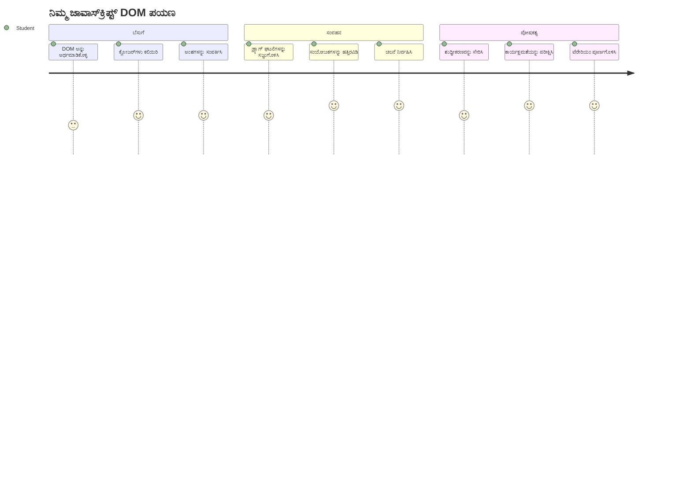
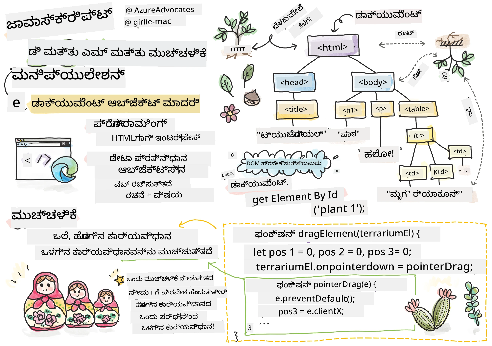
> ಸ್ಪಷ್ಟಚಿತ್ರಣ [ಟೊಮೊಮಿ ಇಮುರು](https://twitter.com/girlie_mac) ಅವರಿಂದ

ವೆಬ್ ಅಭಿವೃದ್ಧಿಯ ಅತ್ಯಂತ ಆಕರ್ಷಕ ಅಂಶಗಳಲ್ಲಿ ಒಂದಕ್ಕೆ ಸ್ವಾಗತ - ವಿಷಯಗಳನ್ನು ಸಂವಾದಾತ್ಮಕವಾಗಿ ಮಾಡುವುದಕ್ಕೆ! ಡಾಕ್ಯುಮೆಂಟ್ ಆಬ್ಜೆಕ್ಟ್ ಮಾದರಿ (DOM) ನಿಮ್ಮ HTML ಮತ್ತು JavaScript ನಡುವಿನ ಸೇತುವೆಯಾಗಿದ್ದು, ಇಂದು ನಾವು ಅದನ್ನು ಬಳಸಿಕೊಂಡು ನಿಮ್ಮ ಟೆರಾರಿಯನ್‌ಗೆ ಜೀವ ತುಂಬಿಸುತ್ತೇವೆ. ಟಿಮ್ ಬರ್ಮರ್ಸ್-ಲೀ ಮೊದಲ ವೆಬ್ ಬ್ರೌಸರ್ ಅನ್ನು ರಚಿಸುವಾಗ, ಅವರು ಡೈನಾಮಿಕ್ ಮತ್ತು ಸಂವಾದಾತ್ಮಕ ಡಾಕ್ಯುಮೆಂಟ್‌ಗಳುಳ್ಳ ಒಂದು ವೆಬ್‌ನ ಕನಸನ್ನು ಕಂಡಿದ್ದರು - DOM ಆ ಕನಸನ್ನು ಸಾಧ್ಯವಾಗಿಸುತ್ತದೆ.

ನಾವು JavaScript ಕ್ಲೋಶರ್‌ಗಳನ್ನೂ ಅನ್ವೇಷಿಸುವуем, ತಿಳಿದುಕೊಳ್ಳಲು ಭಾರಿ ಅನ್ನಿಸಬಹುದು ಆದರೆ ಉಪಯುಕ್ತತೆ ತುಂಬಿದೆ. ಕ್ಲೋಶರ್‌ಗಳನ್ನು "ಸ್ಮರಣೆ ತಾಣಗಳು" ಹೇಗೆ ಎಂದು ಪರಿಗಣಿಸಿ, ಇಲ್ಲಿ ನಿಮ್ಮ ಫಂಕ್ಷನ್‌ಗಳು ಪ್ರಮುಖ ಮಾಹಿತಿ ನೆನಪಿಟ್ಟುಕೊಳ್ಳಲು ಸಾಧ್ಯವಾಗುತ್ತದೆ. ಇದು ಪ್ರತಿ ಸಸ್ಯವು ತನ್ನ ಸ್ಥಾನವನ್ನು ಟ್ರ್ಯಾಕ್ ಮಾಡಿಕೊಳ್ಳುವ ತನ್ನದೇ ಆದ ಡೇಟా ದಾಖಲೆಯಂತೆ.

ಈ ಪಾಠದ ಕೊನೆಯಲ್ಲಿ, ನೀವು ಅವುಗಳು ಎಷ್ಟು ಸ್ವಾಭಾವಿಕ ಮತ್ತು ಉಪಯುಕ್ತ ಪ್ರವೃತ್ತಿಗಳು ಎಂಬುದನ್ನು ತಿಳಿದುಕೊಳ್ಳುತ್ತೀರಿ.

ನಾವು ನಿರ್ಮಿಸುವುದು ಇಲ್ಲಿದೆ: ಬಳಕೆದಾರರು ಎಂದಾದರೂ ತಮ್ಮ ಇಚ್ಛೆಯಂತೆ ಸಸ್ಯಗಳನ್ನು ಕೀಳಿ ಬಿಡುವ (ಡ್ರ್ಯಾಗ್-ಅಂಡ್-ಡ್ರೋಪ್) ಮಾಡಬಹುದಾದ ಟೆರಾರಿಯನ್. ಡ್ರ್ಯಾಗ್-ಅಂಡ್-ಡ್ರೋಪ್ ಫೈಲ್ ಅಪ್ಲೋಡ್ಗಳು, ಸಂವಾದಾತ್ಮಕ ಆಟಗಳು ಎಲ್ಲವೂ ಇದರಿಂದ ಕಾರ್ಯನಿರ್ವಹಿಸುತ್ತವೆ. ನಿಮ್ಮ ಟೆರಾರಿಯನ್‌ಗೆ ಜೀವ ತುಂಬಿಸೋಣ.

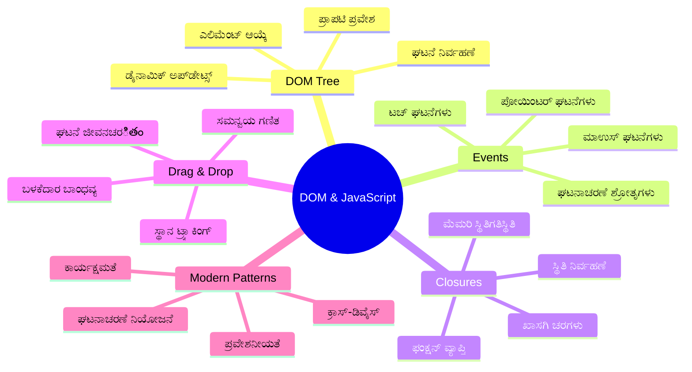
## ಉಪನ್ಯಾಸ ಮುನ್ನ ಅಧ್ಯಯನ ಪ್ರಶ್ನೆಗಳ ಸಂಕಲನ

[ಉಪನ್ಯಾಸ ಮುನ್ನ ಕುಯಿಜ್](https://ff-quizzes.netlify.app/web/quiz/19)

## DOM ಬಗೆಗೆ ತಿಳಿದುಕೊಳ್ಳುವುದು: ಸಂವಾದಾತ್ಮಕ ವೆಬ್ ಪುಟಗಳಿಗೆ ನಿಮ್ಮ ಪ್ರವೇಶದ್ವಾರ

ಡಾಕ್ಯುಮೆಂಟ್ ಆಬ್ಜೆಕ್ಟ್ ಮಾದರಿ (DOM) JavaScript ನಿಮ್ಮ HTML ಘಟಕಗಳೊಂದಿಗೆ ಸಂವಹನಗೊಳ್ಳುವ ಮಾರ್ಗವಾಗಿದೆ. ನಿಮ್ಮ ಬ್ರೌಸರ್ ಒಂದು HTML ಪುಟವನ್ನು ಲೋಡ್ ಮಾಡಿದಾಗ, ಅದು ಪಾತ್ರಪತ್ರದಲ್ಲಿ ಆ ಪುಟದ ಸಂರಚಿತ ಪ್ರತಿನಿಧಾನವನ್ನು ಸೃಷ್ಟಿಸುತ್ತದೆ - ಅದೇ DOM. ಇದನ್ನು ಕುಟುಂಬ ವೃಕ್ಷದಂತೆ ಪರಿಗಣಿಸಿ, ಪ್ರತಿಯೊಂದು HTML ಘಟಕವು ಒಂದು ಕುಟುಂಬದ ಸದಸ್ಯ ಮತ್ತು JavaScript ಅದನ್ನು ಪ್ರವೇಶಿಸಬಹುದು, ಪರಿಷ್ಕರಿಸಬಹುದು ಅಥವಾ ಪುನರ್ಮಾರ್ಪಣೆ ಮಾಡಬಹುದು.

DOM ನಿರ್ವಹಣೆ ಸ್ಥಿತಿಸ್ಥಾಪಕ ಪುಟಗಳನ್ನು ಸಂವಾದಾತ್ಮಕ ವೆಬ್‌ಸೈಟ್‌ಗಳಾಗಿಸಲು ಪರಿವರ್ತಿಸುತ್ತದೆ. ನೀವು ಪ್ರತಿಯೊಂದು ಬಾರಿ ಬಟನ್ ಹೋವರ್ ಮಾಡಿದಾಗ ಬಣ್ಣ ಬದಲಾದುದನ್ನು, ಪುಟವನ್ನು ರಿಫ್ರೆಶ್ ಮಾಡದೆ ವಿಷಯ ಮಾರ್ಪಡುವುದನ್ನು ಅಥವಾ ಆಂಗಲ್ನಲ್ಲಿ ಎಳೆಯಬಹುದಾದ ಅಂಶಗಳನ್ನು ನೋಡಿದಾಗ, ಅದು DOM ನಿರ್ವಹಣೆಯ ಕೆಲಸವೇ ಆಗಿದೆ.

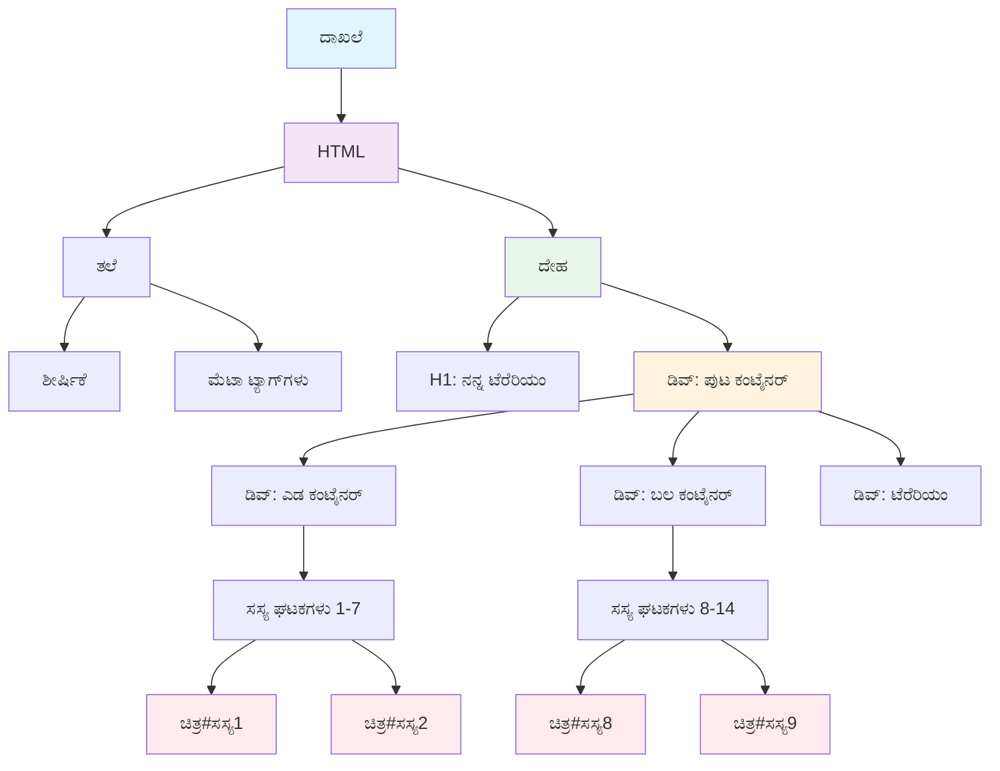
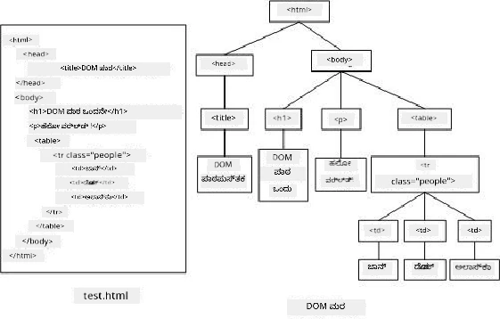

> DOM ಹಾಗೂ ಅದಕ್ಕೆ ಉಲ್ಲೇಖಿಸುವ HTML ಮಾರ್ಕ್ಅಪ್‌ನ ಪ್ರತಿನಿಧಾನ. [ಒಲ್ಫಾ ನಾಸ್ರಾವೋಯಿ](https://www.researchgate.net/publication/221417012_Profile-Based_Focused_Crawler_for_Social_Media-Sharing_Websites) ಅವರಿಂದ

**DOM ನ ಶಕ್ತಿಯ ಮೂಲ:**
- **ನೀವು<html> ಪುಟದಲ್ಲಿರುವ ಯಾವುದೇ ಅಂಶವನ್ನು ಪ್ರವೇಶಿಸಲು** ರಚಿಸಿರುವ ಸರಳ, ವ್ಯವಸ್ಥಿತ ದಾರಿ
- **ಪುಟ ರಿಫ್ರೆಶ್ ಇಲ್ಲದೇ** ಡೈನಾಮಿಕ್ ವಿಷಯಗಳ ನವೀಕರಣಕ್ಕೆ ಅವಕಾಶ
- **ಬಳಕೆದಾರರ ಕ್ರಿಯೆಗಳಿಗೂ (ಕ್ಲಿಕ್, ಡ್ರ್ಯಾಗ್ ಮೊದಲಾದವು) ತಕ್ಷಣ ಪ್ರತಿಕ್ರಿಯಿಸುವುದಕ್ಕೆ** ಸಾಮರ್ಥ್ಯ
- **ಆಧುನಿಕ ಸಂವಾದಾತ್ಮಕ ವೆಬ್ ಅಪ್ಲಿಕೇಶನ್‌ಗಳ** ಆಧಾರದ ಸ್ತಂಭ

## JavaScript ಕ್ಲೋಶರ್‌ಗಳು: ಅನುಶಾಸಿತ ಮತ್ತು ಶಕ್ತಿಶಾಲಿ ಕೋಡ್ ರಚನೆ

[JavaScript ಕ್ಲೋಶರ್](https://developer.mozilla.org/docs/Web/JavaScript/Closures) ಒಂದು ಫಂಕ್ಷನ್‌ಗೆ ತನ್ನದೇ ಆದ ಖಾಸಗಿ ಕೆಲಸದ ವಾತಾವರಣವನ್ನು ನೀಡಿದಂತೆ, ನಿರಂತರ ಸ್ಮೃತಿಯನ್ನು ಹೊಂದಿರುತ್ತದೆ. ಗಲಾಪಾಗೋಸ್ ದ್ವೀಪಗಳಲ್ಲಿನ ಡಾರ್ವಿನ್‌ನ ಫಿಂಚ್ ಪಕ್ಷಿಗಳಾಗಿ ಪ್ರತಿ ಪ್ರಭೇದವು ತನ್ನ ವಿಶಿಷ್ಟ ಪರಿಸರವನ್ನೂ ಆಧರಿಸಿ ವಿಶೇಷ ಮೋಪಿನ್ರು DEVELOP ಮಾಡಿಕೊಳ್ಳುವಂತೆ ಕ್ಲೋಶರ್‌ಗಳು ಕೂಡ ಒಂಥ ರೀತಿಯಲ್ಲಿವೆ, ಪೋಷಕ ಫಂಕ್ಷನ್ ಮುಗಿದ ಬಳಿಕಲೂ ತನ್ನ ವಿಶೇಷ ಪರಿಸರವನ್ನು "ನೋಡುಕೊಳ್ಳುತ್ತವೆ".

ನಮ್ಮ ಟೆರಾರಿಯನ್‌ನಲ್ಲಿ, ಕ್ಲೋಶರ್‌ಗಳು ಪ್ರತಿ ಸಸ್ಯವನ್ನು ತನ್ನ ಸ್ಥಾನವನ್ನು ಸ್ವತಂತ್ರವಾಗಿ ನೆನಪಿಸಿಕೊಳ್ಳಲು ಸಹಾಯ ಮಾಡುತ್ತವೆ. ವೃತ್ತಿಪರ JavaScript ಅಭಿವೃದ್ಧಿಯಲ್ಲಿ ಈ ಮಾದರಿ ವ್ಯಾಪಕವಾಗಿ ಬಳಕೆಯಲ್ಲಿದ್ದು, ಜ್ಞಾನದ ಮೂಲಭೂತವಾದ ಅಂಶವಾಗಿದೆ.

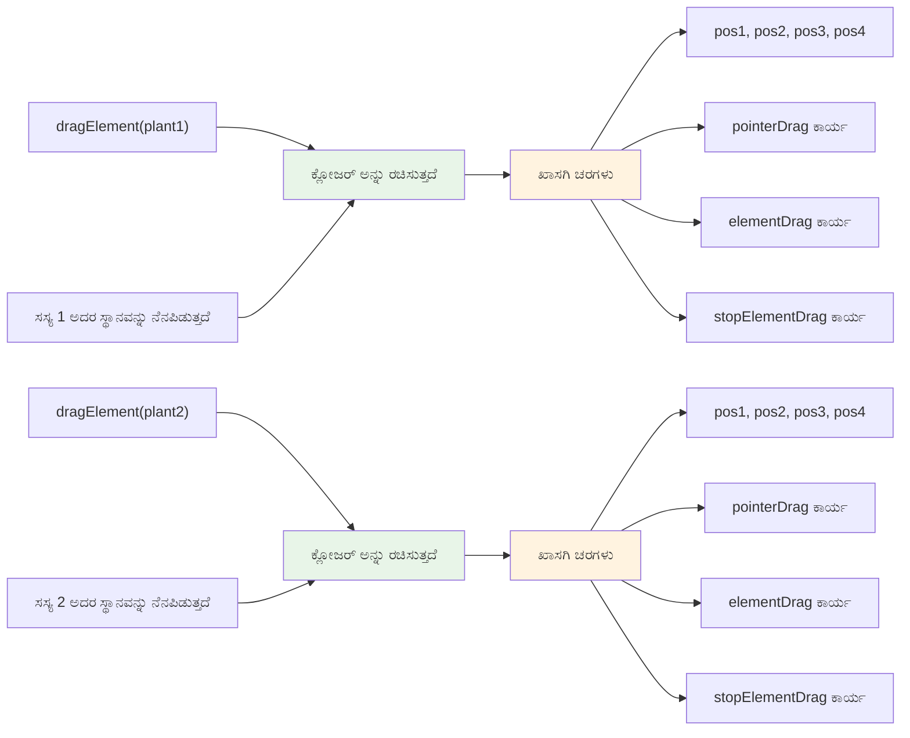
> 💡 **ಕ್ಲೋಶರ್‌ಗಳ ಸಾಮಗ್ರಿಯನ್ನು ಅರಿಯುವುದು**: ಕ್ಲೋಶರ್‌ಗಳು JavaScript ನ ಪ್ರಮುಖ ವಿಷಯವಾಗಿದ್ದು, ಹಲವಾರು ಡೆವಲಪರ್‌ಗಳು ಸಾಕಷ್ಟು ಕಾಲಗಳ ಕಾಲ ಅವುಗಳ ತಾತ್ವಿಕ ಅಂಶಗಳನ್ನು ಸಂಪೂರ್ಣವಾಗಿ ಓಗಿಕೊಳ್ಳುವ ಮೊದಲು ಬಳಕೆ ಮಾಡುತ್ತಾರೆ. ಇಂದು ನಾವು ಪ್ರಾಯೋಗಿಕ ಅನ್ವಯಕ್ಕೆ ಗಮನವಿಡುತ್ತೇವೆ - ನೀವು ನಮ್ಮ ಸಂವಾದಾತ್ಮಕ ವೈಶಿಷ್ಟ್ಯಗಳನ್ನು ನಿರ್ಮಿಸುವಾಗ, ಕ್ಲೋಶರ್‌ಗಳು ಸಹಜವಾಗಿ ಕಾಣಿಸಿಕೊಳ್ಳುವುದನ್ನು ತಿಳಿದುಕೊಳ್ಳುತ್ತೀರಿ.


> DOM ಹಾಗೂ ಅದಕ್ಕೆ ಉಲ್ಲೇಖಿಸುವ HTML ಮಾರ್ಕ್‌ಅಪ್‌ನ ಪ್ರತಿನಿಧಾನ. [ಒಲ್ಫಾ ನಾಸ್ರಾವೋಯಿ](https://www.researchgate.net/publication/221417012_Profile-Based_Focused_Crawler_for_Social_Media-Sharing_Websites) ಅವರಿಂದ

ಈ ಪಾಠದಲ್ಲಿ, ನಾವು ಪೇಜ್‌ನ ಸಸ್ಯಗಳನ್ನು ಆನ್ಲೈನ್‌ನಲ್ಲಿ ನಿರ್ವಹಿಸಲು ಬಳಸಲಿರುವ JavaScript ಅನ್ನು ರಚಿಸುವ ಮೂಲಕ ನಮ್ಮ ಸಂವಾದಾತ್ಮಕ ಟೆರಾರಿಯನ್ ಪ್ರಾಜೆಕ್ಟ್ ಅನ್ನು ಪೂರ್ಣಗೊಳಿಸುವೆವು.

## ಪ್ರಾರಂಭಿಸುವ ಮುನ್ನ: ಯಶಸ್ಸಿಗಾಗಿ ಸಿದ್ಧತೆ

ನೀವು ಹಿಂದಿನ ಟೆರಾರಿಯನ್ ಪಾಠಗಳಿಂದ ನಿಮ್ಮ HTML ಮತ್ತು CSS ಫೈಲುಗಳನ್ನು ಅಗತ್ಯವಿದೆ - ನಾವು ಸ್ಥಿತಿಸ್ಥಾಪಕ ವಿನ್ಯಾಸವನ್ನು ಸಂವಾದಾತ್ಮಕಗೊಳಿಸೋಣ. ನೀವು ಮೊದಲ ಬಾರಿಗೆ ಸೇರುತ್ತಿದ್ದರೆ, ಆ ಪಾಠಗಳನ್ನು ಮುಂಚಿತವಾಗಿ ಮುಗಿಸುವುದು ಮುಖ್ಯ ಸೂತ್ರಾಧಾರವನ್ನು ಒದಗಿಸುತ್ತದೆ.

ನಾವು ನಿರ್ಮಿಸುವುದು ಇದಾಗಿದೆ:
- **ಎಲ್ಲಾ ಟೆರಾರಿಯನ್ ಸಸ್ಯಗಳಿಗೆ ಸ್ಮೂತ್ ಡ್ರ್ಯಾಗ್-ಅಂಡ್-ಡ್ರೋಪ್**
- **ಸ್ಥಾನದ ಸಂವೇದನೆಯನ್ನು ಸಸ್ಯಗಳು ನೆನಪಿಡಲು ಟ್ಯಾಕಿಂಗ್**
- **ವ್ಯವಸಥಿತ, ಸಂಪೂರ್ಣ ಸಂವಾದಾತ್ಮಕ ಇಂಟರ್ಫೇಸ್‌ಗೆ ವನ್ಯ JavaScript ಬಳಕೆ**
- **ಕ್ಲೋಶರ್ ಮಾದರಿಗಳು ಬಳಸಿ ಸ್ವಚ್ಛ, ಸುসংಘಟಿತ ಕೋಡ್**

## ನಿಮ್ಮ JavaScript ಫೈಲನ್ನು ಸಿದ್ಧಪಡಿಸುವುದು

ನಿಮ್ಮ ಟೆರಾರಿಯನ್‌ಗೆ ಸಂವಾದಾತ್ಮಕತೆಯನ್ನು ನೀಡಲಿರುವ JavaScript ಫೈಲನ್ನು ರಚಿಸೋಣ.

**ಹೆಜ್ಜೆ 1: ನಿಮ್ಮ ಸ್ಕ್ರಿಪ್ಟ್ ಫೈಲನ್ನು ರಚಿಸಿ**

ನಿಮ್ಮ ಟೆರಾರಿಯನ್ ಫೋಲ್ಡರ್‌ನಲ್ಲಿ, `script.js` ಎಂಬ ಹೊಸ ಫೈಲನ್ನು ರಚಿಸಿ.

**ಹೆಜ್ಜೆ 2: JavaScript ಅನ್ನು ನಿಮ್ಮ HTML ಗೆ ಲಿಂಕ್ ಮಾಡುವುದು**

ನಿಮ್ಮ `index.html` ಫೈಲಿನ `<head>` ವಿಭಾಗಕ್ಕೆ ಈ ಸ್ಕ್ರಿಪ್ಟ್ ಟ್ಯಾಗ್ ಅನ್ನು ಸೇರಿಸಿ:

```html
<script src="./script.js" defer></script>
```

**`defer` ಗುಣಲಕ್ಷಣ ಯಾಕೆ ಮುಖ್ಯ:**
- **ಸಂಪೂರ್ಣ HTML ಲೋಡ್ ಆದ ನಂತರ ನಿಮ್ಮ JavaScript ಕಾರ್ಯಾಚರಣೆ ಕೈಗೊಳ್ಳಿಸುತ್ತದೆ ಎಂದು ಖಚಿತಪಡಿಸುತ್ತದೆ**
- **JavaScript ಲೋಡ್ ಆಗದೇ ಇರುವ ಅಂಶಗಳನ್ನು ಹುಡುಕುತ್ತಿದ್ದ ತಪ್ಪುಗಳನ್ನು ತಡೆಯುತ್ತದೆ**
- **ಎಲ್ಲಾ ಸಸ್ಯ ಅಂಶಗಳು ಸಂವಾದಾತ್ಮಕತೆಗೆ ಸಿದ್ಧವಾಗಿರುತ್ತವೆ ಎಂದು ಖಾತರಿಪಡಿಸುತ್ತದೆ**
- **ಪುಟದ ಕೆಳಭಾಗದಲ್ಲಿ ಸ್ಕ್ರಿಪ್ಟ್ ಇಡುವುದಕ್ಕಿಂತ ಉತ್ತಮ ಕಾರ್ಯಕ್ಷಮತೆಯುಂಟುಮಾಡುತ್ತದೆ**

> ⚠️ **ಮುಖ್ಯ ಟಿಪ್ಪಣಿ**: `defer` ಗುಣಲಕ್ಷಣ ಸಾಮಾನ್ಯ ಸಮಯ ಸಮಸ್ಯೆಗಳನ್ನು ತಡೆಯುತ್ತದೆ. ಇದಿಲ್ಲದೆ, JavaScript ಪರಿಶೀಲನೆಗೆ ಸಿದ್ಧವಾಗದ HTML ಅಂಶಗಳನ್ನು ಪ್ರಾಪ್ತಿಸಿಕೊಂಡು ತಪ್ಪುಗಳನ್ನು ಉಂಟುಮಾಡಬಹುದು.

---

## JavaScript ನ್ನು ನಿಮ್ಮ HTML ಅಂಶಗಳಿಗೆ ಸಂಪರ್ಕಿಸುವುದು

ಅಂಶಗಳನ್ನು ಡ್ರ್ಯಾಗ್ ಮಾಡಬಹುದಾದಂತೆ ಮಾಡಲು ಮೊದಲು JavaScript ಅವುಗಳನ್ನು DOM ನಲ್ಲಿ ತಿಳಿದುಕೊಳ್ಳಬೇಕಾಗುತ್ತದೆ. ಇದನ್ನು ಗ್ರಂಥಾಲಯದ ಕಟಾಲೋಗಿಂಗ್ ವ್ಯವಸ್ಥೆಯಂತೆ ಪರಿಗಣಿಸಿ - ಕಟಾಲೋಗ್ ಸಂಖ್ಯೆಯನ್ನು ಪಡೆದ ಮೇಲೆ, ನೀವು ನೀವು ಬೇಕಾದ ಪುಸ್ತಕವನ್ನು ಪೂರ್ತಿ ಪಡೆಯಬಹುದು.

ನಾವು ಇದಕ್ಕೆ `document.getElementById()` ಪદ્ધತಿಯನ್ನು ಬಳಸುತ್ತೇವೆ. ಇದು ಖಚಿತವಾದ ಫೈಲ್ಪತ್ರಿಕೆಯಂತೆ - ನೀವು ಒಂದು ID ನೀಡುತ್ತೀರಿ, ಇದು ಆ HTML ಅಂಶವನ್ನು ನಿಖರವಾಗಿ ಹುಡುಕುತ್ತದೆ.

### ಎಲ್ಲಾ ಸಸ್ಯಗಳಿಗೆ ಡ್ರ್ಯಾಗ್ ಕಾರ್ಯಾಚರಣೆ ಸಕ್ರಿಯಗೊಳಿಸುವುದು

ನಿಮ್ಮ `script.js` ಫೈಲಿಗೆ ಈ ಕೋಡ್ ಅನ್ನು ಸೇರಿಸಿ:

```javascript
// ಎಲ್ಲಾ 14 ಸಸಿಗಳಿಗೆ ಡ್ರ್ಯಾಗ್ ಕಾರ್ಯಕ್ಷಮತೆಯನ್ನು ಸಕ್ರಿಯಗೊಳಿಸಿ
dragElement(document.getElementById('plant1'));
dragElement(document.getElementById('plant2'));
dragElement(document.getElementById('plant3'));
dragElement(document.getElementById('plant4'));
dragElement(document.getElementById('plant5'));
dragElement(document.getElementById('plant6'));
dragElement(document.getElementById('plant7'));
dragElement(document.getElementById('plant8'));
dragElement(document.getElementById('plant9'));
dragElement(document.getElementById('plant10'));
dragElement(document.getElementById('plant11'));
dragElement(document.getElementById('plant12'));
dragElement(document.getElementById('plant13'));
dragElement(document.getElementById('plant14'));
```

**ಈ ಕೋಡ್ ಸಾಧಿಸುವುದು:**
- **ಪ್ರತಿ ಸಸ್ಯ ಅಂಶವನ್ನು ಅದರ ವಿಶಿಷ್ಟ ID ಮೂಲಕ DOM ನಲ್ಲಿ ಹುಡುಕುವುದು**
- **ಪ್ರತಿ HTML ಅಂಶಕ್ಕೆ JavaScript ನ ದಿಗ್ಗಜ ಉಲ್ಲೇಖವನ್ನು ಪಡೆದುಕೊಳ್ಳುವುದು**
- **ಪ್ರತಿ ಅಂಶವನ್ನು `dragElement` ಫಂಕ್ಷನ್‌ಗೆ ಪಾಸು ಮಾಡುವುದು (ನಾಳೆ ನಾವು ಸೃಷ್ಟಿಸುವುದು)**
- **ಎಲ್ಲಾ ಸಸ್ಯಗಳನ್ನು ಡ್ರ್ಯಾಗ್-ಅಂಡ್-ಡ್ರೋಪ್‌ಗಾಗಿ ಸಿದ್ಧಗೊಳಿಸುವುದು**
- **ನಿಮ್ಮ HTML ರಚನೆಯನ್ನು JavaScript ಕಾರ್ಯಾಚರಣೆಗೆ ಸಂಪರ್ಕಿಸುವುದು**

> 🎯 **ಐಡಿಗಳನ್ನು ಕ್ಲಾಸ್‌ಗಳ ಬದಲು ಯಾಕೆ ಬಳಸುತ್ತೇವೆ?** ಐಡಿಗಳು ನಿರ್ದಿಷ್ಟ ಅಂಶಗಳಿಗೆ ವಿಶಿಷ್ಟ ಗುರುತಿನ ಸಂಖ್ಯೆ ನೀಡುತ್ತವೆ, CSS ಕ್ಲಾಸ್‌ಗಳು ಗುಂಪುಗಳಿಗೆ ಶೈಲಿಗಾಗಿ. JavaScript ನಿಂದ ಪ್ರತ್ಯೇಕ ಅಂಶಗಳನ್ನು ನಿಯಂತ್ರಿಸಲು ಐಡಿಗಳು ನಿಖರತೆ ಮತ್ತು ಕಾರ್ಯಕ್ಷಮತೆ ಒದಗಿಸುತ್ತವೆ.

> 💡 **ಪ್ರೊ ಟಿಪ್**: ಪ್ರತಿಯೊಂದು ಸಸ್ಯಕ್ಕಾಗಿ `dragElement()` ಅನ್ನು ವೈಯಕ್ತಿಕವಾಗಿ ಕರೆಯುವ ಕಾರಣವೇನು ಎಂದರೆ, ಪ್ರತಿ ಸಸ್ಯ ಸಸ್ವತಂತ್ರವಾಗಿ ಇರಬೇಕಾದ ಡ್ರ್ಯಾಗ್ ನಡೆಸುವಿಕೆಯನ್ನು ಹೊಂದಲು ಆಗಬಹುದು. ಇದು ಸ್ಮೂತ್ ಬಳಕೆದಾರ ಅನುಭವಕ್ಕೆ ಅಗತ್ಯ.

### 🔄 **ಶಿಕ್ಷಣ ಪರೀಕ್ಷೆ**
**DOM ಸಂಪರ್ಕ ಅಭ್ಯಾಸ**: ಡ್ರಾಗ್ ಕಾರ್ಯಕ್ಕೆ ಹೋಗುವ ಮೊದಲು, ಕೆಳಗಿನ ವಿಚಾರಗಳನ್ನು ಪರಿಶೀಲಿಸಿ:
- ✅ `document.getElementById()` HTML ಅಂಶಗಳನ್ನು ಹೇಗೆ ಹುಡುಕುತ್ತದೆ ಎಂದು ವಿವರಿಸಬಲ್ಲಿರಾ
- ✅ ಪ್ರತಿ ಸಸ್ಯಕ್ಕಾಗಿ ವಿಶಿಷ್ಟ ID ಗಳನ್ನು ಯಾಕೆ ಬಳಸುತ್ತಾರೆ ಎಂದು ತಿಳಿದಿರುತ್ತೀರಾ
- ✅ ಸ್ಕ್ರಿಪ್ಟ್ ಟ್ಯಾಗ್‌ಗಳಲ್ಲಿನ `defer` ಗುಣಲಕ್ಷಣದ ಅರ್ಥ ಏನು
- ✅ JavaScript ಮತ್ತು HTML DOM ಮೂಲಕ ಹೇಗೆ ಸಂಪರ್ಕ ಹೊಂದಿವೆ ಎಂದು ಗ್ರಹಿಸಿ

**ಸ್ವ-ಪರೀಕ್ಷೆ**: ಎರಡು ಅಂಶಗಳು ಒಂದೇ ID ಇದ್ದರೆ ಏನೆ ಆಗುತ್ತದೆ? `getElementById()` ಏಕೆ ಮೂರು ಅಂಶಗಳನ್ನು ಏಕಕಾಲದಲ್ಲಿ ಮರಳಿಸುವುದಿಲ್ಲ?
*ಉತ್ತರ: ID ಗಳು ವಿಭಿನ್ನವಾಗಿರಬೇಕು; ನಕಲಿ ವಿಷಯದಲ್ಲಿ ಪ್ರಥಮ ಅಂಶ ಮಾತ್ರ ಮರಳುತ್ತದೆ*

---

## ಡ್ರ್ಯಾಗ್ ಅಂಶ ಕ್ಲೋಶರ್ ರಚನೆ

ಈಗ ನಾವು ಡ್ರ್ಯಾಗ್ ಕಾರ್ಯಾಚರಣೆಯ ಹೃದಯಭಾಗವನ್ನು ಸೃಷ್ಟಿಸುವೆವು: ಪ್ರತಿ ಸಸ್ಯದ ಡ್ರ್ಯಾಗ್ ಆಚಾರಣೆಯನ್ನು ನಿರ್ವಹಿಸುವ ಕ್ಲೋಶರ್. ಈ ಕ್ಲೋಶರ್ ಹಲವಾರು ಅಂಗಾನುಕ್ರಮ функ్షನ್‌ಗಳನ್ನು ಒಳಗೊಂಡಿದ್ದು ಮೌಸ್ ಚಲನೆಗಳನ್ನು ಟ್ರ್ಯಾಕ್ ಮಾಡಿ ಅಂಶಗಳ ಸ್ಥಾನಗಳನ್ನು ನವೀಕರಿಸುತ್ತದೆ.

ಕ್ಲೋಶರ್‌ಗಳು ಎಷ್ಟು ಸೂಕ್ತವಾದದೋ ಎಂದು ನೋಡಿ, ಏಕೆಂದರೆ ಅವು "ಖಾಸಗಿ" ಚರಗಳನ್ನು ಫಂಕ್ಷನ್ ಕರೆಗಳ ಮಧ್ಯೆ ಉಳಿಸಿಕೊಂಡು ಪ್ರತಿ ಸಸ್ಯಕ್ಕೆ ಸ್ವತಂತ್ರ ಸ್ಥಾನದ ನಿರ್ವಹಣಾ ವ್ಯವಸ್ಥೆಯನ್ನು ಒದಗಿಸುತ್ತವೆ.

### ಸರಳ ಉದಾಹರಣೆಯೊಂದಿಗೆ ಕ್ಲೋಶರ್‌ಗಳನ್ನು ಅರ್ಥಮಾಡಿಕೊಳ್ಳುವುದು

ನನಗೆ ಕ್ಲೋಶರ್‌ಗಳನ್ನು ತೋರಿಸುವ ಸರಳ ಉದಾಹರಣೆ ಇದಿದೆ:

```javascript
function createCounter() {
    let count = 0; // ಇದು ಖಾಸಗಿ ಬದಲಾಯಿಸುವಂತೆ ಇದೆ
    
    function increment() {
        count++; // ಒಳಗಿನ ಫಂಕ್ಷನ್ ಬಾಹ್ಯ ಬದಲಾಯಿಸುವಿಕೆ ನೆನಪುತ್ತದೆ
        return count;
    }
    
    return increment; // ನಾವು ಒಳಗಿನ ಫಂಕ್ಷನ್ ಅನ್ನು ಹಿಂದಿರುಗಿಸುತ್ತಿದ್ದೇವೆ
}

const myCounter = createCounter();
console.log(myCounter()); // ೧
console.log(myCounter()); // ೨
```

**ಈ ಕ್ಲೋಶರ್ ಮಾದರಿಯಲ್ಲಿ ಏನು జరుగುತ್ತಿದೆ:**
- **ಖಾಸಗಿ `count` ಚರವನ್ನು ಸೃಷ್ಟಿಸುತ್ತದೆ, ಇದು ಈ ಕ್ಲೋಶರ್ ಒಳಗಿನಷ್ಟೇ ಇದೆ**
- **ಆಂಗೊಳಗಿನ ಫಂಕ್ಷನ್ ಆ ಹೊರಗಿನ ಚರವನ್ನೂ ಬಳಸಬಹುದು, ಪರಿವರ್ತನೆ ಮಾಡಬಹುದು (ಕ್ಲೋಶರ್ ವಿಧಾನ)**
- **ನಮಗೆ ಆ ಅಂಗಪಟ್ಟಿಯನ್ನು ಹಿಂತಿರುಗಿಸಿದಾಗ, ಅದು ಆ ಖಾಸಗಿ ಡೇಟಾವನ್ನು ನೆನಪಿಡುತ್ತದೆ**
- **`createCounter()` ಕಾರ್ಯಾವಧಿ ಮುಗಿದರೂ ಸಹ, `count` ಮೌಲ್ಯ ಉಳಿದಿರುತ್ತದೆ ಮತ್ತು ನೆನಪಿರುತ್ತದೆ**

### ಡ್ರ್ಯಾಗ್ ಕಾರ್ಯಾಚರಣೆಗಾಗಿ ಕ್ಲೋಶರ್‌ಗಳು ಯಾಕೆ ಸೂಕ್ತ

ನಮ್ಮ ಟೆರಾರಿಯನ್‌ಗೆ, ಪ್ರತಿ ಸಸ್ಯ ತನ್ನ ಪ್ರಸ್ತುತ ಸ್ಥಾನ ನಿಯತಾಂಕಗಳನ್ನು ನೆನಪಿಡಬೇಕು. ಕ್ಲೋಶರ್‌ಗಳು ಈ ಸಮಸ್ಯೆಗೆ ತಕ್ಕ ಪರಿಹಾರ:

**ನಮ್ಮ ಪ್ರಾಜೆಕ್ಟ್‌ಗೆ ಮುಖ್ಯ ಲಾಭಗಳು:**
- **ಪ್ರತಿ ಸಸ್ಯಕ್ಕೆ ಖಾಸಗಿ ಸ್ಥಾನ ಚರಗಳನ್ನು ಸ್ವತಂತ್ರವಾಗಿ ಉಳಿಸುತ್ತದೆ**
- **ಡ್ರ್ಯಾಗ್ ಘಟನೆಗಳ ನಡುವೆ ನಿರಂತರಸ್ಥಿತಿಯನ್ನು ಕಾಯುತ್ತದೆ**
- **ಬೇರೆ ಬೇರೆ ಡ್ರ್ಯಾಗ್ ಆಗಬಹುದಾದ ಅಂಶಗಳ ಪರಸ್ಪರ ಸಂಘರ್ಷವನ್ನು ತಡೆಗಟ್ಟುತ್ತದೆ**
- **ಸ್ವಚ್ಛ, ಸಂಘಟಿತ ಕೋಡ್ ರಚನೆ ಒದಗಿಸುತ್ತದೆ**

> 🎯 **ಅಭ್ಯಾಸ ಗುರಿ**: ಈಗಾಗಲೇ ನಿಮಗೆ ಕ್ಲೋಶರ್‌ಗಳ ಎಲ್ಲಾ ಜ್ಞಾನ ಬೇಕಾಗಿಲ್ಲ. ಡ್ರ್ಯಾಗಿಂಗ್ ಕಾರ್ಯಾಚರಣೆಗಾಗಿ ಅದು ಹೇಗೆ ಸಹಾಯಮಾಡುತ್ತದೆಯೋ ನೋಡುವಿಕೆಗೆ ಸೀಮಿತವಾಗಿರಿ.

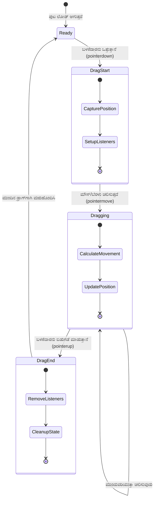
### `dragElement` ಫಂಕ್ಷನ್ ರಚನೆ

ನಿಮ್ಮ ಸಸ್ಯ ಅಂಶ ಘೋಷಣೆಯ ಕೆಳಗೆ ಈ ಮುಖ್ಯ function ಅನ್ನು ಸೇರಿಸಿ. ಇದು ಎಲ್ಲಾ ಡ್ರ್ಯಾಗ್ ನಿಯಂತ್ರಣ ನಡೆಸುತ್ತದೆ:

```javascript
function dragElement(terrariumElement) {
    // ಸ್ಥಾನ ಟ್ರ್ಯಾಕಿಂಗ್ 변수ಗಳನ್ನು ಪ್ರಾರಂಭಿಸಿ
    let pos1 = 0,  // ಹಿಂದಿನ ಮೌಸ್ X ಸ್ಥಾನ
        pos2 = 0,  // ಹಿಂದಿನ ಮೌಸ್ Y ಸ್ಥಾನ
        pos3 = 0,  // ಪ್ರಸ್ತುತ ಮೌಸ್ X ಸ್ಥಾನ
        pos4 = 0;  // ಪ್ರಸ್ತುತ ಮೌಸ್ Y ಸ್ಥಾನ
    
    // ಪ್ರಾರಂಭಿಕ ಡ್ರ್ಯಾಗ್ ಇವೆಂಟ್ ಶ್ರೋತ を ಸ್ಥಾಪಿಸಿ
    terrariumElement.onpointerdown = pointerDrag;
}
```

**ಸ್ಥಾನದ ಟ್ರ್ಯಾಕಿಂಗ್ ವ್ಯವಸ್ಥೆಯ ಅರ್ಥ:**
- **`pos1` ಮತ್ತು `pos2`**: ಹಳೆಯ ಮತ್ತು ಹೊಸ ಮೌಸ್‍ಅವರಿಗೆ ನಡುವಿನ ವ್ಯತ್ಯಾಸವನ್ನು ಜೋಡಿಸಿಕೊಂಡಿವೆ
- **`pos3` ಮತ್ತು `pos4`**: ಪ್ರಸ್ತುತ ಮೌಸ್ ಸ್ಥಿತಿಯನ್ನು ಟ್ರ್ಯಾಕ್ ಮಾಡುತ್ತವೆ
- **`terrariumElement`**: ನಾವು ಡ್ರ್ಯಾಗ್ ಮಾಡಬೇಕಾದ ವಿಶೇಷ ಸಸ್ಯ ಅಂಶ
- **`onpointerdown`**: ಬಳಕೆದಾರರು ಡ್ರ್ಯಾಗ್ ಆರಂಭಿಸುವ ಘಟನೆ

**ಕ್ಲೋಶರ್ ಮಾದರಿ ಹೇಗೆ ಕಾರ್ಯನಿರ್ವಹಿಸುತ್ತದೆ:**
- **ಪ್ರತಿ ಸಸ್ಯ ಅಂಶಕ್ಕೆ ಖಾಸಗಿ ಸ್ಥಾನ ಚರಗಳನ್ನು ಸೃಷ್ಟಿಸುತ್ತದೆ**
- **ಡ್ರ್ಯಾಗ್ ಲೈಫ್ಸೈಕಲ್‌ನ್ನು ಪೂರ್ತಿ ಅವುಗಳನ್ನು ನಿರ್ವಹಿಸುತ್ತದೆ**
- **ಪ್ರತಿ ಸಸ್ಯವು ತನ್ನ ಸ್ವತಂತ್ರ ಸ್ಥಾನದ ಸುದ್ದಿಯನ್ನು ಟ್ರ್ಯಾಕ್ ಮಾಡುತ್ತದೆ**
- **`dragElement` ಮೂಲಕ ಸ್ವಚ್ಛ ಇಂಟರ್ಫೇಸ್ ಒದಗಿಸುತ್ತದೆ**

### ಪಾಯಿಂಟರ್ ಅಪಘಟನೆಗಳನ್ನು ಯಾಕೆ ಬಳಕೆ ಮಾಡುತ್ತೇವೆ?

ನೀವು ಏಕೆ `onpointerdown` ಅನ್ನು `onclick` ಬದಲಿಗೆ ತೆಗೆದುಕೊಳ್ಳುತ್ತೇವೆ ಎಂದು ಆಶ್ಚರ್ಯ ಪಟ್ಟಿರಬಹುದು. ಈ ಕಾರಣಗಳು ಇಲ್ಲಿವೆ:

| ಘಟನೆಯ ಪ್ರಕಾರ | ಉತ್ತಮವಾದ ಬಳಕೆ | ಗಡಿಬಿಡಿ |
|------------|----------|-------------|
| `onclick` | ಸರಳ ಬಟನ್ ಕ್ಲಿಕ್ಸ್ | ಡ್ರ್ಯಾಗ್ ಕ್ಕೆ ಹೊಂದಿಕೊಳ್ಳಲಾರದು (ಕೆವಲ ಕ್ಲಿಕ್ ಮತ್ತು ಬಿಡುಗಡೆ) |
| `onpointerdown` | ಮೌಸ್ ಮತ್ತು ಸ್ಪರ್ಶ ಎರಡಿಗೂ | ಹೊಸದು, ಆದರೆ ಉತ್ತಮ ಬೆಂಬಲ ಹೊಂದಿದೆ |
| `onmousedown` | ಡೆಸ್ಕ್‌ಟಾಪ್ ಮೌಸ್ ಗಾಗಿ ಮಾತ್ರ | ಮೊಬೈಲ್ ಬಳಕೆದಾರರಿಗೆ ಸಮಸ್ಯೆ |

**ನಾವು ನಿರ್ಮಿಸುತ್ತಿರುವುದಕ್ಕೆ ಪಾಯಿಂಟರ್ ಘಟನೆಗಳು ಯಾಕೆ ಸೂಕ್ತ:**
- **ಮೌಸ್, ಬೆರಳು ಅಥವಾ ಸ್ಟೈಲಸ್ ಅಧಿಕಾರದಿಂದ ಇರಲಿ ಕಾರ್ಯನಿರ್ವಹಿಸುತ್ತದೆ**
- **ಲಾಗ್ ಟಾಪ್, ಟ್ಯಾಬ್ಲೆಟ್ ಅಥವಾ ಫೋನ್ ಎಲ್ಲದರಲ್ಲೂ ಅದು ಸಮಾನ ಅನುಭವ**
- **ವಾಸ್ತವಿಕ ಡ್ರ್ಯಾಗ್ ಚಲನೆಯನ್ನು ನಿಭಾಯಿಸುತ್ತದೆ (ಕೆವಲ ಕ್ಲಿಕ್ ಅಲ್ಲ)**
- **ಆಧುನಿಕ ವೆಬ್ ಅಪ್ಲಿಕೇಶನ್‌ಗಳ ನಿರೀಕ್ಷೆಬಂದ ಅನುಭವ ಸೃಷ್ಟಿಸುತ್ತದೆ**

> 💡 **ಭವಿಷ್ಯನಿರೀಕ್ಷಣೆ**: ಪಾಯಿಂಟರ್ ಘಟನೆಗಳು ಬಳಕೆದಾರರ ಸಂವಹನಗಳನ್ನು ಹಿಡಿಯಲು ಆಧುನಿಕ ವಿಧಾನ. ಮೌಸ್ ಮತ್ತು ಸ್ಪರ್ಶಕ್ಕೆ ಪ್ರತ್ಯೇಕ ಕೋಡ್ ಬರೆದಿಲ್ಲದೆ ಇಬ್ಬರನ್ನೂ ಪಡೆಯಬಹುದು. ಅದ್ಭುತವೆ ಅಲ್ಲವೆ?

### 🔄 **ಶಿಕ್ಷಣ ಪರೀಕ್ಷೆ**
**ಘಟನೆ ನಿರ್ವಹಣೆಯ ಅರ್ಥಮಾಡಿಕೊಳ್ಳುವಿಕೆ**: ಕೆಳಗಿನ ಪ್ರಶ್ನೆಗಳಿಗೆ ಉತ್ತರ ನೀಡಿ:
- ✅ ನಾವು ಏಕೆ ಮೌಸ್ ಘಟನಗಳ ಬದಲು ಪಾಯಿಂಟರ್ ಕಾರ್ಯಕ್ರಮಗಳನ್ನು ಬಳಸುತ್ತೇವೆ?
- ✅ ಕ್ಲೋಶರ್ ಚರಗಳು ಫಂಕ್ಷನ್ ಕರೆಗಳ ನಡುವೆ ಹೇಗೆ ಉಳಿಯುತ್ತವೆ?
- ✅ ಸ್ಮೂತ್ ಡ್ರ್ಯಾಗ್‌ಗಾಗಿ `preventDefault()` ಯ ಪಾತ್ರವೇನು?
- ✅ ಏಕೆ ನಾವು ಪ್ರತಿ ಅಂಶದ ಬದಲು ಡಾಕ್ಯುಮೆಂಟ್‌ಗೆ ಕೇಳಿಕೆಳನ್ನು ಮಾಡುತ್ತೇವೆ?

**ಯಥಾರ್ಥ ಜಗತ್ತಿನ ಸಂಪರ್ಕ**: ಪ್ರತಿದಿನ ನೀವು ಬಳಸುವ ಡ್ರಾಗ್-ಅಂಡ್-డ್ರೋಪ್ ಇಂಟರ್ಫೇಸ್‌ಗಳ ಬಗ್ಗೆ ಯೋಚಿಸಿ:
- **ಫೈಲ್ ಅಪ್ಲೋಡ್ಗಳು**: ಬ್ರೌಸರ್ ವಿಂಡೋಗೆ ಫೈಲ್ ಎಳೆಯುವುದು
- **ಕನ್‌ಬನ್ ಬೋರ್ಡ್‌ಗಳು**: ಕಾರ್ಯಗಳನ್ನು ಕಾಲಮ್‌ಗಳ ನಡುವೆ ಸರಿಸಲು
- **ಚಿತ್ರ ಗ್ಯಾಲರಿ**: ಫೋಟೋಗಳ ಕ್ರಮ ಬದಲಾಯಿಸಲು
- **ಮೊಬೈಲ್ ಇಂಟರ್ಫೇಸ್‌ಗಳು**: ಸ್ಪರ್ಶ ದೊಡ್ಡಿ ಮತ್ತು ಎಳೆಯುವಿಕೆ

---

## `pointerDrag` ಫಂಕ್ಷನ್: ಡ್ರ್ಯಾಗ್ ಪ್ರಾರಂಭವನ್ನು ಹಿಡಿದುಕೊಳ್ಳುವುದು

ಬಳಕೆದಾರರು ಸಸ್ಯವನ್ನು ಒತ್ತಿದಾಗ (ಮೌಸ್ ಕ್ಲಿಕ್ ಅಥವಾ ಬೆರಳೆ ಟಚ್ ಮೂಲಕ) `pointerDrag` ಕಾರ್ಯ ಸಕ್ರೀಯಗೊಳ್ಳುತ್ತದೆ. ಈ ಕಾರ್ಯ ಆರಂಭಿಕ ನಿರ್ಧಿಷ್ಟ ಅಂಶಗಳ ಸ್ಥಾನದ ನಿರ್ಧಾರ ಮಾಡಿ ಡ್ರ್ಯಾಗ್ ವ್ಯವಸ್ಥೆಯನ್ನು ಹೊರಡುತ್ತದೆ.

ಈ ಕಾರ್ಯವನ್ನು ನಿಮ್ಮ `dragElement` ಕ್ಲೋಶರ್ ಒಳಗೆ, `terrariumElement.onpointerdown = pointerDrag;` ಸಾಲಿನ ನಂತರ ಸೇರಿಸಿ:

```javascript
function pointerDrag(e) {
    // ಡಿಫಾಲ್ಟ್ ಬ್ರೌಸರ್ ವರ್ತನೆ (ಟೆಕ್ಸ್ಟ್ ಆಯ್ಕೆ ಮಾಡುವುದು ಮುಂತಾದವು) ತಡೆಯಿರಿ
    e.preventDefault();
    
    // ಪ್ರಾರಂಭಿಕ ಮೌಸ್/ಸ್ಪರ್ಶ ಸ್ಥಾನದನ್ನ ಹಿಡಿ
    pos3 = e.clientX;  // ಎಕ್ಸฃಯ ಸಂಪನ್ಮೂಲ ಡ್ರ್ಯಾಗ್ ಪ್ರಾರಂಭವಾದ ಸ್ಥಳ
    pos4 = e.clientY;  // ವೈ ಸಂಯೋಜಕಡೆ ಡ್ರ್ಯಾಗ್ ಪ್ರಾರಂಭವಾದ ಸ್ಥಳ
    
    // ಡ್ರ್ಯಾಗಿಂಗ್ ಪ್ರಕ್ರಿಯೆಗಾಗಿ ಘಟನೆ ಕೇಳಿಕೊಳಬಹುದಾದ ಕಾರ್ಯಗಳನ್ನು ರಚಿಸಿ
    document.onpointermove = elementDrag;
    document.onpointerup = stopElementDrag;
}
```

**ಹೆಜ್ಜೆ ಹಂತವಾಗಿ ಏನು ನಡೆಯುತ್ತಿದೆ:**
- **ಡ್ರ್ಯಾಗ್ ತಡೆಗಟ್ಟುವ ಬ್ರೌಸರ್ ನಡವಳಿಕೆಯನ್ನು ತಡೆಯುತ್ತದೆ**
- **ಬಳಕೆದಾರರು ಡ್ರ್ಯಾಗ್ ಪ್ರಾರಂಭಿಸಿದ ನಿಖರ ಸ್ಥಾನಾಂಕಗಳನ್ನು ದಾಖಲಿಸುತ್ತದೆ**
- **ಚಲಿಸುವಿಕೆಗೆ ಸಂಬಂಧಿಸಿದ ಇವೆಂಟ್ ಕೇಳಿಕೆಳನ್ನು ಸ್ಥಾಪಿಸುತ್ತದೆ**
- **ಡಾಕ್ಯೂಮೆಂಟ್ ವ್ಯಾಪ್ತಿಯಲ್ಲಿ ಮೌಸ್/ಬೆರಳೆ ಚಲನೆಯನ್ನು ಟ್ರ್ಯಾಕ್ ಮಾಡಲು ಸಿದ್ಧಪಡಿಸುತ್ತದೆ**

### ಘಟನೆ ತಡೆಗಟ್ಟುವಿಕೆ ಅರ್ಥ

`e.preventDefault()` ಸಾಲು ಸ್ಮೂತ್ ಡ್ರ್ಯಾಗ್‌ಗೆ ಅತ್ಯಂತ ಮುಖ್ಯ:

**ತಡೆಗಡುತಿಲ್ಲದಿದ್ದರೆ, ಬ್ರೌಸರ್‌ಗಳು:**
- **ಪುಟದ ಮೇಲೆ ಡ್ರ್ಯಾಗ್ ಮಾಡುವಾಗ ಪಠ್ಯ ಆಯ್ಕೆ ಮಾಡಬಹುದು**
- **ಬಲ ಕ್ಲಿಕ್ ಡ್ರ್ಯಾಗ್‌ನಲ್ಲಿ ಸಂಧರ್ಭ ಮೆನುಗಳನ್ನು ತಲುಪಿಸಬಹುದು**
- **ನಮ್ಮ ಸ್ವಂತ ಡ್ರ್ಯಾಗ್ ಕಾರ್ಯವಿಧಾನಕ್ಕೆ ಅಡ್ಡಿಯಾಗಬಹುದು**
- **ಡ್ರ್ಯಾಗ್ ಕಾರ್ಯಾಚರಣೆಯಲ್ಲಿ ದೃಶ್ಯ ದೋಷವನ್ನು ಸೃಷ್ಟಿಸ್ತದೆ**

> 🔍 **ಪ್ರಯೋಗ**: ಈ ಪಾಠ ಮುಗಿದ ಬಳಿಕ `e.preventDefault()` ಅನ್ನು ತೆಗೆದುಹಾಕಿ ಪ್ರಯತ್ನಿಸಿ, ಅದು ಡ್ರ್ಯಾಗ್ ಅನುಭವವನ್ನು ಹೇಗೆ ಪರಿಣಾಮ ಬೀರುತ್ತದೆ ನೋಡೋಣ. ನೀವು ಇದನ್ನು ಶೀಘ್ರ ಅರ್ಥ ಮಾಡಿಕೊಳ್ಳುತ್ತೀರಿ!

### ಸ್ಥಳಾಂಕ ಟ್ರ್ಯಾಕಿಂಗ್ ವ್ಯವಸ್ಥೆ

`e.clientX` ಮತ್ತು `e.clientY` ಲಕ್ಷಣಗಳು ಮೌಸ್/ಟಚ್ ನಿಖರ ಸ್ಥಾನಾಂಕಗಳನ್ನು ನೀಡುತ್ತವೆ:

| ಲಕ್ಷಣ | ಏನು ಅಳೆಯುತ್ತದೆ | ಉಪಯೋಗವಾಗುವ ಸ್ಥಳ |
|----------|------------------|----------|
| `clientX` | ವೀಕ್ಷಣಾ ವಿಂಡೋದಿಂದ ಎಡ-ಬಲ ಆಧಾರಿತ ಸ್ಥಾನ | ಎಡ-ಬಲ ಚಲನವಲನ ಟ್ರ್ಯಾಕಿಂಗ್ |
| `clientY` | ವೀಕ್ಷಣಾ ವಿಂಡೋದಿಂದ ಮೇಲ್ನೋಟ ಆಧಾರಿತ ಸ್ಥಾನ | ಮೇಲೆ-ಕೆಳ ಚಲನವಲನ ಟ್ರ್ಯಾಕಿಂಗ್ |
**ಈ ಸಂಯೋಜನೆಗಳನ್ನು ಅರ್ಥಮಾಡಿಕೊಳ್ಳುವುದು:**
- **ಪಿಕ್ಸೆಲ್-ಪರಿಪೂರ್ಣ** ಸ್ಥಾನ ನಿಯೋಜನೆ ಮಾಹಿತಿಯನ್ನು ಒದಗಿಸುತ್ತದೆ
- **ಬಳಕೆದಾರನು ಪಾಯಿಂಟರ್ ನನ್ನು ಚಲಿಸುವಂತೆ** ನಿಖರ-ಸಮಯದಲ್ಲಿಯೇ ನವೀಕರಿಸುತ್ತದೆ
- **ವಿವಿಧ ಪರದೆ ಗಾತ್ರಗಳು ಮತ್ತು ಜೂಂ ಮಟ್ಟಗಳಾದ್ಯಂತ ಸ್ಥಿರವಾಗಿ** ಇರಿಸುತ್ತದೆ
- **ಮೃದು, ಸ್ಪಂದನಶೀಲ ಡ್ರ್ಯಾಗ್ ಕ್ರಿಯೆಗಳ ಸಾಧ್ಯತೆ** ಒದಗಿಸುತ್ತದೆ

### ಡಾಕ್ಯುಮೆಂಟ್-ಮಟ್ಟದ ಈವೆಂಟ್ ಶ್ರೋತರುಗಳನ್ನು ಸ್ಥಾಪಿಸುವುದು

ನಾವು ಡ್ರ್ಯಾಗ್ ಮತ್ತು ನಿಲ್ಲಿಸುವ ಈವೆಂಟ್ ಗಳನ್ನು ಸಸ್ಯ ಅಂಶಕ್ಕೆ ಮಾತ್ರವಲ್ಲದೆ ಪೂರ್ಣ `document` ಗೆ ಹೇಗೆ ಲಗತ್ತಿಸುತ್ತೇವೆ ಎಂಬುದನ್ನು ಗಮನಿಸಿ:

```javascript
document.onpointermove = elementDrag;
document.onpointerup = stopElementDrag;
```

**ಡಾಕ್ಯುಮೆಂಟ್ ಗೆ ಲಗತ್ತಿಸುವ ಕಾರಣಗಳು:**
- **ಮೌಸ್ ಸಸ್ಯ ಅಂಶದಿಂದ ಹೊರಹೋಗಿದ್ರೆ ಸಹ ಟ್ರ್ಯಾಕಿಂಗ್ ಮುಂದುವರಿಯುತ್ತದೆ**
- **ಬಳಕೆದಾರನು ವೇಗವಾಗಿ ಚಲಿಸಿದರೂ ಡ್ರ್ಯಾಗ್ ಮಧ್ಯಸ್ಥಿಕೆ ತಡೆತಡೆಯುತ್ತದೆ**
- **ಪೂರ್ಣ ಪರದೆ ಮೇಲೆ ಮೃದುವಾಗಿ ಡ್ರ್ಯಾಗ್ ಆಗಬಹುದು**
- **ಬ್ರೌಸರ್ ವಿಂಡೋ ಹೊರಗೆ ಕರ್ಸರ್ ಚಲಿಸುವ ಮಾರುತಗಳ ನಿರ್ವಹಣೆ ಮಾಡುತ್ತದೆ**

> ⚡ **ಕಾರ್ಯಕ್ಷಮತೆ ಟಿಪ್ಪಣಿ**: ಡ್ರ್ಯಾಗ್ ನಿಲ್ಲಿಸಿದಾಗ ಈ ಡಾಕ್ಯುಮೆಂಟ್-ಮಟ್ಟದ ಶ್ರೋತರನ್ನು ಸ್ವಚ್ಛಗೊಳಿಸೋಣ, ಇದು	memೋರಿ ಲೀಕ್ ಮತ್ತು ಕಾರ್ಯಕ್ಷಮತೆ ಸಮಸ್ಯೆಗಳನ್ನು ತಡೆಯುತ್ತದೆ.

## ಡ್ರ್ಯಾಗ್ ವ್ಯವಸ್ಥೆಯನ್ನು ಸಂಪೂರ್ಣಗೊಳಿಸುವುದು: ಚಲನೆ ಮತ್ತು ಸ್ವಚ್ಛತೆ

ಈಗ ನಾವು ಉಳಿದ ಎರಡು ಫಂಕ್ಷನ್ ಗಳನ್ನು ಸೇರಿಸುತ್ತೇವೆ: ನೈಜ ಡ್ರ್ಯಾಗಿಂಗ್ ಚಲನೆ ನಿರ್ವಹಿಸುವುದು ಮತ್ತು ಡ್ರ್ಯಾಗ್ ನಿಲ್ಲಿಸಿದಾಗ ಸ್ವಚ್ಛಗೊಳಿಸುವುದು. ಈ ಫಂಕ್ಷನ್ ಗಳು ಒಟ್ಟಾಗಿ ಕಾರ್ಯನಿರ್ವಹಿಸಿ ನಿಮ್ಮ ಟೆರೇರೀಯಂನಲ್ಲಿ ಸಸ್ಯಗಳ ಮೃದು, ಸ್ಪಂದನಶೀಲ ಚಲನೆ ಸೃಷ್ಟಿಸುತ್ತವೆ.

### elementDrag ಫಂಕ್ಷನ್: ಚಲನೆಯನ್ನು ಟ್ರ್ಯಾಕ್ ಮಾಡುವುದು

`pointerDrag` ನ ಮುಗಿಯುವ ಮುಂಬರುವ ಕದನ ಬೀಗಿನ ನಂತರ `elementDrag` ಫಂಕ್ಷನ್ ಅನ್ನು ಸೇರಿಸಿ:

```javascript
function elementDrag(e) {
    // ಕೊನೆಯ ಘಟನೆದಿಂದ ಸರಿದ ದೂರವನ್ನು ಲೆಕ್ಕಹಾಕಿ
    pos1 = pos3 - e.clientX;  // ಸಮತಲ ದೂರ ಸರಿದಿದೆ
    pos2 = pos4 - e.clientY;  // ಲಂಬ ದೂರ ಸರಿದಿದೆ
    
    // ಪ್ರಸ್ತುತ ಸ್ಥಾನ ಟ್ರ್ಯಾಕಿಂಗ್ ನವೀಕರಿಸಿ
    pos3 = e.clientX;  // ಹೊಸ ಪ್ರಸ್ತುತ X ಸ್ಥಾನ
    pos4 = e.clientY;  // ಹೊಸ ಪ್ರಸ್ತುತ Y ಸ್ಥಾನ
    
    // ಏಳಿಯಿಂದ ಸ್ಥಾನದ ಮೇಲೆ ಚಲನವನ್ನು ಅನ್ವಯಿಸಿ
    terrariumElement.style.top = (terrariumElement.offsetTop - pos2) + 'px';
    terrariumElement.style.left = (terrariumElement.offsetLeft - pos1) + 'px';
}
```

**ಸ್ಥಾನ ಗಣಿತಗಳನ್ನು ಅರ್ಥ ಮಾಡಿಕೊಳ್ಳುವುದು:**
- **`pos1` ಮತ್ತು `pos2`**: ಕೊನೆಯ ನವೀಕರಣದ ನಂತರ ಎಷ್ಟು ಮೌಸ್ ಚಲಿಸಿದೆ ಎಂದು ಲೆಕ್ಕ ಹಾಕುವುದು
- **`pos3` ಮತ್ತು `pos4`**: ಮುಂದಿನ ಲೆಕ್ಕಾಚಾರಕ್ಕಾಗಿ ಇತ್ತೀಚಿನ ಮೌಸ್ ಸ್ಥಾನವನ್ನು ಸಂಗ್ರಹಿಸುತ್ತದೆ
- **`offsetTop` ಮತ್ತು `offsetLeft`**: ಅಂಶದ ಪ್ರಸ್ತುತ ಸ್ಥಾನವನ್ನು ಪುಟದಲ್ಲಿ ಪಡೆಯುವುದು
- **ಮುಖಾಂತರ ಮೈನಸ್ ಲಾಜಿಕ್**: ಅಂಶ ಮುವುದು ಮೌಸ್ ಚಲನೆಯಷ್ಟೇ ಪ್ರಮಾಣಕ್ಕೆ

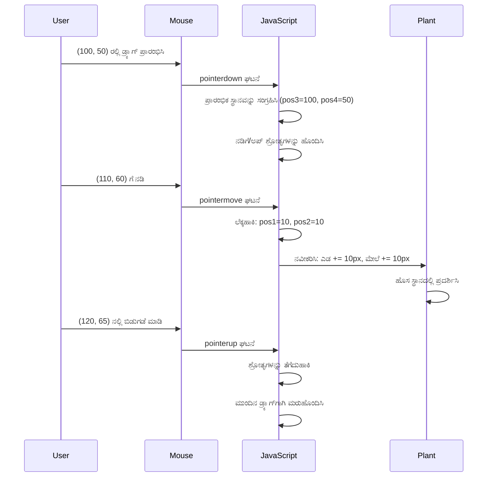
**ಇದೀಗ ಚಲನೆಯ ಲೆಕ್ಕಾಚಾರದ ತೊಂದರೆ:**
1. **ಹಳೆ ಮತ್ತು ಹೊಸ ಮೌಸ್ ಸ್ಥಾನಗಳ ವ್ಯತ್ಯಾಸವನ್ನು ಗಾತ್ರಮಾಡುತ್ತದೆ**
2. **ಮೌಸ್ ಚಲನೆಯ ಆಧಾರದಲ್ಲಿ ಅಂಶವನ್ನು ಎಷ್ಟು ಚಲಿಸಬೇಕು ಎಂದು ಲೆಕ್ಕಹಾಕುತ್ತದೆ**
3. **ಅಂಶದ CSS ಸ್ಥಾನ ಲಕ್ಷಣಗಳನ್ನು ನಿಖರ-ಸಮಯದಲ್ಲಿ ನವೀಕರಿಸುತ್ತದೆ**
4. **ಮುಂದಿನ ಚಲನೆಯ ಲೆಕ್ಕಾಚಾರದ ಆಧಾರದಾಗಿ ಹೊಸ ಸ್ಥಾನವನ್ನು ಸಂಗ್ರಹಿಸುತ್ತದೆ**

### ಗಣಿತದ ದೃಶ್ಯಾತ್ಮಕ ಪ್ರತಿನಿಧಾನ

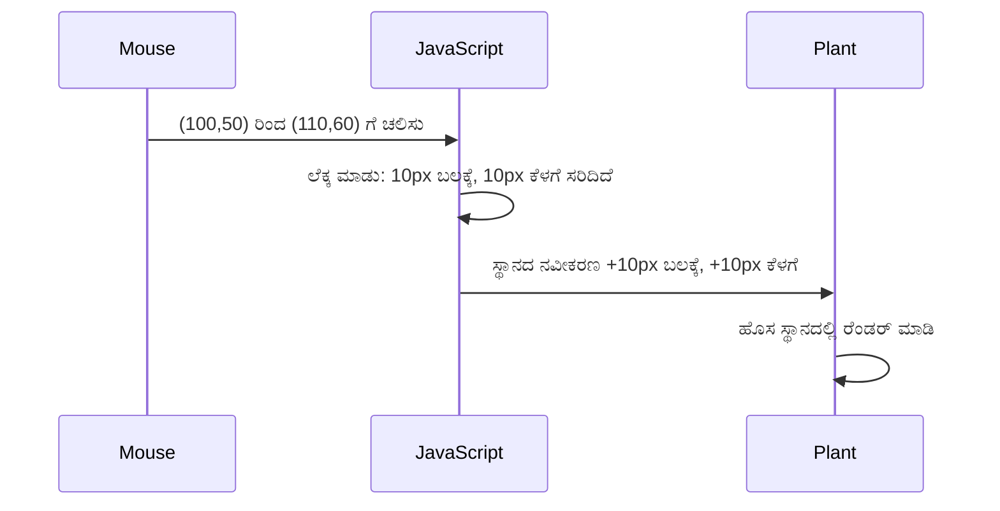
### stopElementDrag ಫಂಕ್ಷನ್: ಸ್ವಚ್ಛತೆ ಮಾಡುವುದು

`elementDrag` ನ ಮುಗಿಯುವ ಮುಂಬರುವ ಕದನ ಬೀಗಿನ ನಂತರ ಸ್ವಚ್ಛತೆ ಮಾಡುವ ಫಂಕ್ಷನ್ ಅನ್ನು ಸೇರಿಸಿ:

```javascript
function stopElementDrag() {
    // ದಾಖಲೆ ಮಟ್ಟದ ಘಟನೆ ಕೇಳಿಸುವವರನ್ನು ತೆಗೆದುಹಾಕಿ
    document.onpointerup = null;
    document.onpointermove = null;
}
```

**ಸ್ವಚ್ಛತೆ ಅಗತ್ಯವಿರುವ ಕಾರಣಗಳು:**
- **ಮುಗಿಯದಂತಹ ಈವೆಂಟ್ ಶ್ರೋತರಿಂದ ನೆನಪು ದೋಣಿಯನ್ನು ತಡೆಯುತ್ತದೆ**
- **ಬಳಕೆದಾರ ಸಸ್ಯವನ್ನು ಬಿಡುಗಡೆ ಮಾಡಿದಾಗ ಡ್ರ್ಯಾಗಿಂಗ್ ನಿಲ್ಲಿಸುತ್ತದೆ**
- **ಇತರ ಅಂಶಗಳು ಸ್ವತಂತ್ರವಾಗಿ ಡ್ರ್ಯಾಗ್ ಮಾಡಬಹುದಾಗಿಸುತ್ತದೆ**
- **ಮುಂದಿನ ಡ್ರ್ಯಾಗ್ ಕಾರ್ಯಾಚರಣೆಗೆ ವ್ಯವಸ್ಥೆಯನ್ನು ಪುನಃ ಸಂಯೋಜಿಸುತ್ತದೆ**

**ಸ್ವಚ್ಛತೆ ಇಲ್ಲದಿದ್ದರೆ ಸಂಭವಿಸುವುದು:**
- ಡ್ರ್ಯಾಗ್ ನಿಲ್ಲಿಸಿದ ನಂತರವೂ ಈವೆಂಟ್ ಶ್ರೋತರು ಚಲಿಸುತ್ತಿರುತ್ತಾರೆ
- ಬಳಕೆಯಲ್ಲದ ಶ್ರೋತರು ಸ್ನಾಯು ಉಸಿರಾಟವನ್ನು ಕುಳಿತಿರುತ್ತವೆ
- ಇತರ ಅಂಶಗಳು ಜೊತೆ ಸಂವಹನ ಮಾಡುವಾಗ ಅಸಾಮಾನ್ಯ ವರ್ತನೆಗಳು ಉಂಟಾಗುತ್ತವೆ
- ಅನಗತ್ಯ ಈವೆಂಟ್ ನಿರ್ವಹಣೆಯಲ್ಲಿ ಬ್ರೌಸರ್ ಸಂಪನ್ಮೂಲಗಳು ವ್ಯರ್ಥವಾಗುತ್ತವೆ

### CSS ಸ್ಥಾನ ಲಕ್ಷಣಗಳನ್ನು ಅರ್ಥಮಾಡಿಕೊಳ್ಳುವುದು

ನಮ್ಮ ಡ್ರ್ಯಾಗ್ ವ್ಯವಸ್ಥೆ ಎರಡು ಪ್ರಮುಖ CSS ಲಕ್ಷಣಗಳನ್ನು ಸಂಚಾಲಿಸುತ್ತದೆ:

| ಲಕ್ಷಣ | ಏನು ನಿಯಂತ್ರಿಸುತ್ತದೆ | ನಾವು ಹೇಗೆ ಬಳಸುತ್ತೇವೆ |
|----------|------------------|---------------|
| `top` | ಮೇಲ್ಭಾಗದ ಅಂಚಿನಿಂದ ದೂರ | ಡ್ರ್ಯಾಗ್ ಸಮಯದಲ್ಲಿ ಲಂಬ ಸ್ಥಾನಣಾಸು |
| `left` | ಬಲ್ಭಾಗದ ಅಂಚಿನಿಂದ ದೂರ | ಡ್ರ್ಯಾಗ್ ಸಮಯದಲ್ಲಿ ಆಡುವಾಣಿನ ಸ್ಥಾನಣಾಸು |

**offset ಲಕ್ಷಣಗಳ ಮುಖ್ಯ ಅಂಶಗಳು:**
- **`offsetTop`**: ಸ್ಥಾನಿತ ಪೋಷಕ ಅಂಶದ ಮೇಲ್ಭಾಗದಿಂದ ಪ್ರಸ್ತುತ ದೂರ
- **`offsetLeft`**: ಸ್ಥಾನಿತ ಪೋಷಕ ಅಂಶದ ಎಡಭಾಗದಿಂದ ಪ್ರಸ್ತುತ ದೂರ
- **ಸ್ಥಾನ ನಿಯೋಜನೆ ಪ್ರ_CONTEXT_**: ಈ ಮೌಲ್ಯಗಳು ಹತ್ತಿರದ ಸ್ಥಾನಿತ ಪೂರ್ವಜರ יחסದಲ್ಲಿವೆ
- **ನಿಖರ-ಸಮಯ ನವೀಕರಣಗಳು**: CSS ಲಕ್ಷಣಗಳನ್ನು ಬದಲಾಯಿಸಿದಾಗ ತಕ್ಷಣ ಬದಲಾವಣೆ ಸಂಭವಿಸುತ್ತದೆ

> 🎯 **ಡಿಸೈನ್ ತತ್ವಗಳು**: ಈ ಡ್ರ್ಯಾಗ್ ವ್ಯವಸ್ಥೆ ಮನಃಪೂರ್ವಕವಾಗಿ ಲವಚಿಕವಾಗಿದೆ – ಇಲ್ಲಿಗೆ "ಡ್ರಾಪ್ ವಲಯಗಳು" ಅಥವಾ ನಿರ್ಬಂಧಗಳಿಲ್ಲ. ಬಳಕೆದಾರರುplantsಗಳನ್ನು ಎಲ್ಲೆಡೆ ಹೊಂಡಬಹುದು, ಈ ಮೂಲಕ ತಮ್ಮ ಟೆರೇರಿಯಂ ವಿನ್ಯಾಸದ ಮೇಲಿನ ಸೃಜನಾತ್ಮಕ ನಿಯಂತ್ರಣ ಸಂಪೂರ್ಣವಾಗಿ ದೊರೆಯುತ್ತದೆ.

## ಎಲ್ಲವನ್ನೂ ಒಟ್ಟುಗೂಡಿಸುವುದು: ನಿಮ್ಮ ಪೂರ್ಣ ಡ್ರ್ಯಾಗ್ ವ್ಯವಸ್ಥೆ

ಅಭಿನಂದನೆಗಳು! ನೀವು ಪೆÇಡವ ಇಡೀ ಡ್ರ್ಯಾಗ್-ಆಂಡ್-ಡ್ರಾಪ್ ವ್ಯವಸ್ಥೆಯನ್ನು ವೆನಿಲ್ಲಾ ಜಾವಾಸ್ಕ್ರಿಪ್ಟ್ ಬಳಸಿ ರಚಿಸಿದ್ದೀರಿ. ನಿಮ್ಮ ಪೂರ್ಣ `dragElement` ಫಂಕ್ಷನ್ ಈಗ ಶಕ್ತಿಶಾಲಿ ಕ್ಲೋಶರ್ ಅನ್ನು ಹೊಂದಿದ್ದು ನೀವೆಲ್ಲಾ ಸಸ್ಯಗಳ ಗುರುತಿನತೆಯಲ್ಲಿ ಖಾಸಗಿ ಸ್ಥಾನಗಳ ನಿಯಂತ್ರಣ ಮಾಡುತ್ತದೆ ಮತ್ತು ಇತರ ಕಾರ್ಯಗಳನ್ನು ನಿರ್ವಹಿಸುತ್ತದೆ:

**ನಿಮ್ಮ ಕ್ಲೋಶರ್ ಸಾಧಿಸುವುದು:**
- **ಪ್ರತಿಯೊಂದು ಸಸ್ಯಕ್ಕೆ ಖಾಸಗಿ ಸ್ಥಾನ ವ್ಯತ್ಯಯಗಳ ನಿರ್ವಹಣೆ**
- **ಡ್ರ್ಯಾಗ್ ಜೀವನಚಕ್ರವನ್ನು ಪ್ರಾರಂಭದಿಂದ ಕೊನೆಯವರೆಗೆ ನಿರ್ವಹಣೆ**
- **ಪೂರ್ಣ ಪರದೆ ಮೇಲೆ ಮೃದು, ಸ್ಪಂದನಶೀಲ ಚಲನೆಯನ್ನು ಒದಗಿಸುವುದು**
- **ನೆನಪು ದೋಣಿಯ ಲೀಕ್ ತಡೆಯಲು ಸಂಪನ್ಮೂಲಗಳನ್ನು ಸರಿಯಾಗಿ ಸ್ವಚ್ಛಗೊಳಿಸುವುದು**
- **ಟೆರೇರಿಯಂ ವಿನ್ಯಾಸಕ್ಕಾಗಿ ಸ್ಪಷ್ಟ, ಸೃಜನಾತ್ಮಕ ಇಂಟರ್ಫೇಸ್ ಸೃಷ್ಟಿಸುವುದು**

### ನಿಮ್ಮ ಸಂವೇದಿ ಟೆರೇರಿಯಂ ಪರೀಕ್ಷಿಸುವುದು

ಈಗ ನಿಮ್ಮ ಸಂವೇದಿ ಟೆರೇರಿಯಂ ಪರೀಕ್ಷಿಸಿ! ನಿಮ್ಮ `index.html` ಫೈಲ್ ಅನ್ನು ವೆಬ್ ಬ್ರೌಸರ್ ನಲ್ಲಿ ತೆರೆಯಿರಿ ಮತ್ತು ಕಾರ್ಯಚಟುವಟಿಕೆಗಳನ್ನು ಪ್ರಯತ್ನಿಸಿ:

1. **ಯಾವುದೇ ಸಸ್ಯವನ್ನು ಕ್ಲಿಕ್ ಮಾಡಿ ಮತ್ತು ಹಿಡಿದುಕೊಳ್ಳಿ** ಡ್ರ್ಯಾಗ್ ಪ್ರಾರಂಭಿಸಲು
2. **ಮೌಸ್ ಅಥವಾ ಬೆರಳು ಚಲಿಸಿ** ಮತ್ತು ಸಸ್ಯವು ಮೃದುವಾಗಿ ಹಿಂಬಾಲಿಸುತ್ತಿರುವಂತೆ ವೀಕ್ಷಿಸಿ
3. **ಬಿಡುಹಾಕಿ** ಸಸ್ಯವನ್ನು ಹೊಸ ಸ್ಥಾನದಲ್ಲಿ ಬಿಟ್ಟಿರಿ
4. **ಬಿವಿಧ ವಿನ್ಯಾಸಗಳಲ್ಲಿ ಪ್ರಯೋಗ ಮಾಡಿ** ಇಂಟರ್ಫೇಸ್ ಅನ್ನು ಅನ್ವೇಷಿಸಲು

🥇 **ಸಾಧನೆ**: ನೀವು ನಿತ್ಯವಾದ ಜವಾಬ್ದಾರಿಗಳು ಸಂಪಾದಕರ ಬಳಕೆಯ ಇಷ್ಟದ ಮೂಲಭೂತ ತತ್ವಗಳನ್ನು ಬೆಳಸುವ ಸಂಪೂರ್ಣ ಇಂಟರ್ಫೇಸ್ ಹೊಂದಬಹುದಾದ ವೆಬ್ ಅಪ್ಲಿಕೇಶನ್ ಅನ್ನು ರಚಿಸಿದ್ದೀರಿ. ಆ ಡ್ರ್ಯಾಗ್-ಆಂಡ್-ಡ್ರಾಪ್ ಕಾರ್ಯಕ್ಷಮತೆ ಫೈಲ್ ಅಪ್ಲೋಡ್ಗಳು, ಕಾಂಬನ್ ಬೋರ್ಡ್ಗಳು ಮತ್ತು ಇತರ ಸಂವೇದಿ ಇಂಟರ್ಫೇಸ್ಗಳ ಹಿನ್ನೆಲೆಯ ಪ್ರಥಮ ತತ್ವಗಳು ಹೀಗಿವೆ.

### 🔄 **ಶিক্ষಣೀಯ ಪರಿಶೀಲನೆ**
**ಪೂರ್ಣ ವ್ಯವಸ್ಥೆಯ ಅರ್ಥಮಾಡಿಕೊಳ್ಳುವುದು**: ನಿಮ್ಮ ಡ್ರ್ಯಾಗ್ ವ್ಯವಸ್ಥೆಯ ಮೆಾಹಕತೆಯನ್ನು ಪರಿಶೀಲಿಸಿ:
- ✅ ಪ್ರತಿ ಸಸ್ಯಕ್ಕಾಗಿ ಕ್ಲೋಶರ್ ಗಳು ಸ್ವತಂತ್ರ ಸ್ಥಿತಿಯನ್ನು ಹೇಗೆ ನಿರ್ವಹಿಸುತ್ತವೆ?
- ✅ ಮೃದು ಚಲನಕ್ಕೆ ಸಮನ್ವಯ ಲೆಕ್ಕಾಚಾರದ ಗಣಿತ ಅಗತ್ಯವಿರುವುದು ಏಕೆ?
- ✅ ಈವೆಂಟ್ ಶ್ರೋತರನ್ನು ಸ್ವಚ್ಛಗೊಳ್ಳುವುದನ್ನು ಧರಿಗೆ ತೋರದೇ ಇದ್ದರೆ ಏನಾಗುತ್ತದೆ?
- ✅ ಈ ಮಾದರಿಯನ್ನು ಇನ್ನಷ್ಟು ಸಂಕೀರ್ಣ ಸಂವಹನಕ್ಕೆ ಹೇಗೆ ವಿಸ್ತರಿಸಬಹುದು?

**ಕೋಡ್ ಗುಣಮಟ್ಟದ ಚಿಂತನೆ**: ನಿಮ್ಮ ಪೂರ್ಣ ಪರಿಹಾರವನ್ನು ವಿಮರ್ಶಿಸಿ:
- **ಮಾಡ್ಯುಲರ್ ವಿನ್ಯಾಸ**: ಪ್ರತಿ ಸಸ್ಯಕ್ಕೆ ಸ್ವಂತ ಕ್ಲೋಶರ್ ಇನ್ಸ್ಟಾನ್ಸ್ ನೀಡಲಾಗಿದೆ
- **ಈವೆಂಟ್ ಕಾರ್ಯಕ್ಷಮತೆ**: ಶ್ರೋತrohಗಳನ್ನು ಸರಿಯಾಗಿ ಸ್ಥಾಪಿಸಿ ಮತ್ತು ಸ್ವಚ್ಛಗೊಳಿಸುವಿಕೆ
- **ಕ್ರಾಸ್-ಡಿವೈಸ್ ಬೆಂಬಲ**: ಡೆಸ್ಕ್ಟಾಪ್ ಮತ್ತು ಮೊಬೈಲ್ ಎರಡರಲ್ಲೂ ಕಾರ್ಯನಿರ್ವಹಿಸುತ್ತದೆ
- **ಕಾರ್ಯಕ್ಷಮತೆಯ ವಿವರವಾದ ಶ್ರದ್ಧೆ**: ನೆನಪು ಲೀಕ್ ಅಥವಾ ಅನವಶ್ಯಕ ಲೆಕ್ಕಾಚಾರ ಇಲ್ಲ

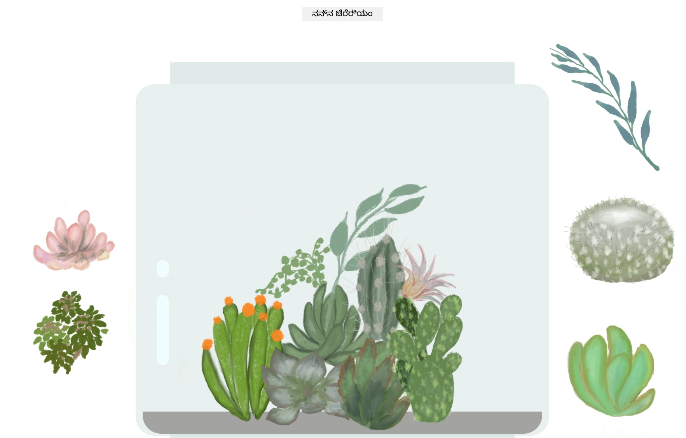

---

## GitHub Copilot ಏಜೆಂಟ್ ಚಾಲೆಂಜ್ 🚀

ಈ ಕೆಳಗಿನ ಚಾಲೆಂಜ್ ಪೂರ್ಣಗೊಳಿಸಲು ಏಜೆಂಟ್ ಮೋಡ್ ಅನ್ನು ಬಳಸಿರಿ:

**ವರಣೆ:** ಟೆರೇರಿಯಂ ಪ್ರಾಜೆಕ್ಟ್ ಅನ್ನು ಸುಧಾರಿಸಿ, ಎಲ್ಲ ಸಸ್ಯಗಳನ್ನು ಮೂಲ ಸ್ಥಾನದ ಬಳಿ ಮೃದು ಅನಿಮೇಷನ್ ಗಳೊಂದಿಗೆ ಮರುಹೊಂದಿಸುವ ಮರುಹೊಂದಿಸುವ ಕಾರ್ಯಕ್ಷಮತೆಯನ್ನು ಸೇರಿಸಿ.

**ಪ್ರಾಂಪ್ಟ್:** ಮರುಹೊಂದಿಸುವ ಬಟನ್ ಅನ್ನು ರಚಿಸಿ, ಅದು ಕ್ಲಿಕ್ ಮಾಡಿದಾಗ ಎಲ್ಲಾ ಸಸ್ಯಗಳನ್ನು CSS ಟ್ರಾನ್ಸಿಷನ್ ಗಳ ಮೂಲಕ ಮೂಲ ಬದಿಯ ಸ್ಥಾನಗಳಿಗೆ 1 ಸೆಕೆಂಡ್ ಗೊಳಿಸಿ ಮೃದು ಅನಿಮೇಟು ಮಾಡಿ ಹಿಂತಿರುಗಿಸುತ್ತದೆ. ಫಂಕ್ಷನ್ ಪುಟ ಲೋಡ್ ಆಗುವ ಸಮಯದಲ್ಲಿ ಮೂಲ ಸ್ಥಾನಗಳನ್ನು ಸಂಗ್ರಹಿಸಬೇಕು.

[agent mode](https://code.visualstudio.com/blogs/2025/02/24/introducing-copilot-agent-mode) ಕುರಿತು ಹೆಚ್ಚಿನ ಮಾಹಿತಿಗೆ.

## 🚀 ಹೆಚ್ಚುವರಿ ಚಾಲೆಂಜ್: ನಿಮ್ಮ ಕೌಶಲಗಳನ್ನು ವಿಸ್ತರಿಸಿ

ನಿಮ್ಮ ಟೆರೇರಿಯಂ ನ ಮುಂದುವರಿಸುವ ಸಿದ್ಧತೆ ಇದ್ದರೆ ಈ ಸುಧಾರಣೆಗಳನ್ನು ಪ್ರಯತ್ನಿಸಿ:

**ಸೃಜನಾತ್ಮಕ ವಿಸ್ತರಣೆಗಳು:**
- **ಡಬಲ್ ಕ್ಲಿಕ್** ಮಾಡಿ ಸಸ್ಯವನ್ನು ಮುಂಭಾಗಕ್ಕೆ (z-ಇಂಡೆಕ್ಸ್ ಉಪಕ್ರಮ)
- **ಹೋವರ್ ಮಾಡುವಾಗ ಹರಿದೊಳಗಿನ ಪ್ರಭೆಯನ್ನು** ಸೇರಿಸಿ
- **ಟೆರೇರಿಯಂ ಹೊರಗೆ ಸಸ್ಯಗಳನ್ನು ಡ್ರ್ಯಾಗ್ ಮಾಡದಂತೆ** ಸೀಮಿತಗೊಳಿಸಿ
- **ಸ್ಥಾನಗಳನ್ನು localStorage ಬಳಸಿ ಉಳಿಸುವ ಸೇಫ್ ಫಂಕ್ಷನ್ ರಚಿಸಿ**
- **ಸಸ್ಯಗಳನ್ನು ಎತ್ತಲು ಮತ್ತು ಹಾಕಲು ಧ್ವನಿ ಪರಿಣಾಮಗಳನ್ನು ಸೇರಿಸಿ**

> 💡 **ಕಲಿಕೆ ಅವಕಾಶ**: ಈ ಪ್ರತಿಯೊಂದು ಚಾಲೆಂಜ್ ಡಿಒಎಂ ಸಂಚಾಲನೆ, ಈವೆಂಟ್ ನಿರ್ವಹಣೆ ಮತ್ತು ಬಳಕೆದಾರ ಅನುಭವ ವಿನ್ಯಾಸದ ಹೊಸ ಆಯಾಮಗಳನ್ನು ಕಲಿಸುತ್ತದೆ.

## ಪಾಠೋತ್ತರ ಕ್ವಿಜ್

[Post-lecture quiz](https://ff-quizzes.netlify.app/web/quiz/20)

## ಪರಿಗಣನೆ ಮತ್ತು ಸ್ವಯಂ ಅಧ್ಯಯನ: ನಿಮ್ಮ ತಿಳಿವಳಿಕೆಯನ್ನು ಆಳಗೊಳಿಸುವುದು

ನೀವು ಡಿಒಎಂ ಸಂಚಾಲನೆ ಮತ್ತು ಕ್ಲೋಶರ್ ಗಳ ಮೂಲಭೂತಗಳನ್ನು ನಿಭಾಯಿಸಿದ್ದೀರಿ, ಆದರೆ ಇನ್ನೂ ಅನೇಕ ವಿಷಯಗಳನ್ನು ಅನ್ವೇಷಿಸಲು ಇದೆ! ನಿಮ್ಮ ಜ್ಞಾನ ಮತ್ತು ಕೌಶಲ್ಯಗಳನ್ನು ವಿಸ್ತರಿಸಲು ಕೆಲವು ಮಾರ್ಗಗಳು ಇಲ್ಲಿವೆ.

### ಪರ್ಯಾಯ ಡ್ರ್ಯಾಗ್ ಮತ್ತು ಡ್ರಾಪ್ ವಿಧಾನಗಳು

ನಾವು ಗರಿಷ್ಟ ಲವಚಿಕತೆಗೆ ಪಾಯಿಂಟರ್ ಈವೆಂಟ್ ಗಳನ್ನು ಬಳಸಿದ್ದೇವೆ, ಆದರೆ ವೆಬ್ ಅಭಿವೃದ್ಧಿಗೆ ವಿವಿಧ ವಿಧಾನಗಳಿವೆ:

| ವಿಧಾನ | ಉತ್ತಮದಲ್ಲಿ | ಕಲಿಕೆಯಲ್ಲಿ ಮೌಲ್ಯ |
|----------|----------|----------------|
| [HTML ಡ್ರ್ಯಾಗ್ ಮತ್ತು ಡ್ರಾಪ್ API](https://developer.mozilla.org/docs/Web/API/HTML_Drag_and_Drop_API) | ಫೈಲ್ ಅಪ್‌ಲೋಡ್‌ಗಳು, ಅಧಿಕೃತ ಡ್ರ್ಯಾಗ್ ವಲಯಗಳು | ಸರ್ವಜ್ಞ ಬ್ರೌಸರ್ ಸಾಮರ್ಥ್ಯಗಳ ಅರಿವು |
| [ಟಚ್ ಈವೆಂಟ್ಗಳು](https://developer.mozilla.org/docs/Web/API/Touch_events) | ಮೊಬೈಲ್ ವಿಶೇಷ ಸಂವಹನ | ಮೊಬೈಲ್-ಫಸ್ಟ್ ಅಭಿವೃದ್ಧಿ ಮಾದರಿ |
| CSS `transform` ಲಕ್ಷಣಗಳು | ಸವಿದ ಅನಿಮೇಷನ್ಗಳು | ಕಾರ್ಯಕ್ಷಮತೆ ಸುಧಾರಣೆ ತಂತ್ರಗಳು |

### ಅಭಿವೃದ್ಧಿಶೀಲ DOM ಸಂಚಾಲನೆ ವಿಷಯಗಳು

**ನಿಮ್ಮ ಅಧ್ಯಯನದ ಮುಂದಿನ ಹಂತಗಳು:**
- **ಈವೆಂಟ್ ಬಲವಾದ ನಿಯೋಜನೆ**: ಬಹು ಅಂಶಗಳಿಗೆ ಈವೆಂಟ್‌ಗಳನ್ನು ಸಮರ್ಥವಾಗಿ ಇಳಿಸುವುದು
- **ಇಂಟರ್ಸೆಕ್ಷನ್ ಅಬ್ಜರ್ವರ್**: ಅಂಶಗಳು ವೀಕ್ಷಣಾ ವೀಕ್ಷಣೆಯ ಒಳಗೆ/ಹೊರಗೆ ಆಗುವಾಗ ಪತ್ತೆ ಹಚ್ಚುವುದು
- **ಮ್ಯುಟೇಷನ್ ಅಬ್ಜರ್ವರ್**: DOM ರಚನೆ ಬದಲಾವಣೆಗಳ ಮೇಲೆ ನೋಟವಿಡುವದು
- **ವೆಬ್ ಕಾಂಪೋನಂಟ್‌ಗಳು**: ಪುನರುಪಯೋಗ ಮಾಡಬಹುದಾದ, ಅಂಕಿತ UI ಅಂಶಗಳನ್ನು ಸೃಷ್ಟಿಸುವುದು
- **ವರ್ಚುವಲ್ DOM ತತ್ವಗಳು**: ಫ್ರೇಮ್ವರ್ಕ್‌ಗಳು DOM ನ ನವೀಕರಣಗಳನ್ನು ಹೇಗೆ ಸುಧಾರಿಸುತ್ತವೆ ಎಂಬ ಅರ್ಥ

### ಮುಂದುವರಿದ ಕಲಿಕೆಗೆ ಅಗತ್ಯ ಸಂಪನ್ಮೂಲಗಳು

**ತಾಂತ್ರಿಕ ದಾಖಲಾತಿಗಳು:**
- [MDN ಪಾಯಿಂಟರ್ ಈವೆಂಟ್ ಗೈಡ್](https://developer.mozilla.org/docs/Web/API/Pointer_events) - ಸಂಪೂರ್ಣ ಸೂಚನೆ
- [W3C ಪಾಯಿಂಟರ್ ಈವೆಂಟ್ ಸ್ಪೆಸಿಫಿಕೇಶನ್](https://www.w3.org/TR/pointerevents1/) - ಅಧಿಕೃತ ಮಾನದಂಡಗಳು
- [ಜಾವಾಸ್ಕ್ರಿಪ್ಟ್ ಕ್ಲೋಶರ್ಸ್ ಆಳವಾದ ಅಧ್ಯಯನ](https://developer.mozilla.org/docs/Web/JavaScript/Closures) - ಪ್ರಗತಿಶೀಲ ಕ್ಲೋಶರ್ ಮಾದರಿಗಳು

**ಬ್ರೌಸರ್ ಅನುಕೂಲತೆ:**
- [CanIUse.com](https://caniuse.com/) - ಬ್ರೌಸರ್‌ಗಳಲ್ಲಿನ ವೈಶಿಷ್ಟ್ಯಗಳ ಬೆಂಬಲ
- [MDN ಬ್ರೌಸರ್ ಅನುಕೂಲತೆ ಡೇಟಾ](https://github.com/mdn/browser-compat-data) - ವಿವರವಾದ ಸಹಾಯ

**ಅಭ್ಯಾಸ ಅವಕಾಶಗಳು:**
- **ಸರಿಹೊಂದಿದ ಡ್ರ್ಯಾಗ್ ನಿಯಂತ್ರಣಗಳೊಂದಿಗೆ ಪಜಲ್ ಆಟ ನಿರ್ಮಿಸಿ**
- **ಡ್ರ್ಯಾಗ್-ಆಂಡ್-ಡ್ರಾಪ್ ಟಾಸ್ಕ್ ನಿರ್ವಹಣೆಯ ಕನಬಾನ್ ಬೋರ್ಡ್ ರಚಿಸಿ**
- **ಡ್ರ್ಯಾಗ್ ಮಾಡಬಹುದಾದ ಫೋಟೋಗಳೊಂದಿಗೆ ಚಿತ್ರ ಗ್ಯಾಲರಿ ವಿನ್ಯಾಸಗೊಳಿಸಿ**
- **ಮೊಬೈಲ್ ಇಂಟರ್ಫೇಸ್ಗಾಗಿ ಟಚ್ ಇಶಾರೆಗಳನ್ನು ಪ್ರಯೋಗಿಸಿ**

> 🎯 **ಕಲಿಕೆಯಲ್ಲಿ ತಂತ್ರ**: ಈ ತತ್ವಗಳನ್ನು ಬಲಪಡಿಸಲು ಉತ್ತಮ ಮಾರ್ಗ ಅಭ್ಯಾಸ. ವಿವಿಧ ಡ್ರ್ಯಾಗ್‌ಗಾಗಿ ಇಂಟರ್ಫೇಸ್‌ಗಳ ನಿರ್ಮಾಣ ಪ್ರಯತ್ನಿಸಿ – ಪ್ರತಿಯೊಂದು ಪ್ರಾಜೆಕ್ಟ್ ಬಳಕೆದಾರ ಸಂವಹನ ಮತ್ತು DOM ಸಂಚಾಲನೆ ಬಗ್ಗೆ ಹೊಸ ಮಾಹಿತಿ ಕಲಿಸುತ್ತದೆ.

### ⚡ **ಮುಂದಿನ 5 ನಿಮಿಷಗಳಲ್ಲಿ ನೀವು ಏನು ಮಾಡಬಹುದು**
- [ ] ಬ್ರೌಸರ್ ಡೆವ್‌ಟೂಲ್ಗಳನ್ನು ತೆರೆಯಿರಿ ಮತ್ತು ಕಾಂಸೋಲ್‌ನಲ್ಲಿ `document.querySelector('body')` ಅನ್ನು ಟೈಪ್ ಮಾಡಿ
- [ ] `innerHTML` ಅಥವಾ `textContent` ಬಳಸಿ ವೆಬ್‌ಪೇಜ್ ಸTek Ghedತಿಪ್ಪಣಿ ಬದಲಾಯಿಸಿ
- [ ] ಯಾವುದೇ ಬಟನ್ ಅಥವಾ ಲಿಂಕ್‌ಗೆ ಕ್ಲಿಕ್ ಈವೆಂಟ್ ಶ್ರೋತ ಸೇರಿಸಿ
- [ ] ಎಲೆಮಿಂಟ್‌ಗಳ ಪ್ಯಾನೆಲ್ ಬಳಸಿ DOM ಻್ರಿಗೆ ರಚನೆಯನ್ನು ಪರಿಶೀಲಿಸಿ

### 🎯 **ಈ ಗಂಟೆಯಲ್ಲಿ ನೀವು ಏನು ಸಾಧಿಸಬಹುದು**
- [ ] ಪಾಠ ಮುಗಿದ ನಂತರ ಕುಯಿಜ್ ಮಾಡಿ ಮತ್ತು DOM ಸಂಚಾಲನೆ ತತ್ವಗಳನ್ನು ಪರಿಶೀಲಿಸಿ
- [ ] ಬಳಕೆದಾರ ಕ್ಲಿಕ್‌ಗಳಿಗೆ ಪ್ರತಿಕ್ರಿಯಿಸುವ ಸಂವೇದಿ ವೆಬ್‌ಪುಟವನ್ನು ರಚಿಸಿ
- [ ] ಬಗೆಬಗೆಯ ಈವೆಂಟ್‌ಗಳೊಂದಿಗೆ ಈವೆಂಟ್ ನಿರ್ವಹಣೆಯನ್ನು ಅಭ್ಯಾಸ ಮಾಡಿ (ಕ್ಲಿಕ್, ಮೌಸ್‌ಓವರ್, ಕೀಪ್ರೆಸ್)
- [ ] ಸರಳ ಟು-ಡೂ ಪಟ್ಟಿ ಅಥವಾ ಕೋಂಟರ್ ಅನ್ನು DOM ಸಂಚಾಲನೆ ಬಳಸಿ ನಿರ್ಮಿಸಿ
- [ ] HTML ಅಂಶಗಳು ಮತ್ತು ಜಾವಾಸ್ಕ್ರಿಪ್ಟ್ ವಸ್ತುಗಳ ನಡುವಿನ ಸಂಬಂಧವನ್ನು ಅನ್ವೇಷಿಸಿ

### 📅 **ನಿಮ್ಮ ವಾರದ ಜಾವಾಸ್ಕ್ರಿಪ್ಟ್ ಪಯಣ**
- [ ] ಡ್ರ್ಯಾಗ್-ಆಂಡ್-ಡ್ರಾಪ್ ಕಾರ್ಯಕ್ಷಮತೆಯೊಂದಿಗೆ ಸಂವೇದಿ ಟೆರೇರಿಯಂ ಪ್ರಾಜೆಕ್ಟ್ ಪೂರ್ಣಗೊಳಿಸಿ
- [ ] ಸಮರ್ಥವಾದ ಈವೆಂಡ್ ನಿರ್ವಹಣೆಗೆ ಈವೆಂಟ್ ನಿಯೋಜನೆಯನ್ನು ಅರ್ಥಮಾಡಿಕೊಳ್ಳಿ
- [ ] ಈವೆಂಟ್ ಲೂಪ್ ಮತ್ತು ಅಸಿಂಕ್ರೊನಸ್ ಜಾವಾಸ್ಕ್ರಿಪ್ಟ್ ಕಲಿಯಿರಿ
- [ ] ಖಾಸಗಿ ಸ್ಥಿತಿಯೊಂದಿಗೆ ಮಾಡ್ಯುಲ್ ನಿರ್ಮಾಣಕ್ಕಾಗಿ ಕ್ಲೋಶರ್ ಗಳನ್ನು ಅಭ್ಯಾಸ ಮಾಡಿ
- [ ] ಇಂಟರ್ಸೆಕ್ಷನ್ ಅಬ್ಜರ್ವರ್ ಮುಂತಾದ ಆಧುನಿಕ DOM API ಗಳನ್ನು ಅನ್ವೇಷಿಸಿ
- [ ] ಫ್ರೇಂವರ್ಕ್‌ಗಳನ್ನು ಬಳಸದೆ ಸಂವೇದಿ ಅಂಶಗಳನ್ನು ನಿರ್ಮಿಸಿ

### 🌟 **ನಿಮ್ಮ ಮಾಸ-ಲಾಂಗ್ ಜಾವಾಸ್ಕ್ರಿಪ್ಟ್ ಮಾಸ್ಟರಿ**
- [ ] ವೆನಿಲ್ಲಾ ಜಾವಾಸ್ಕ್ರಿಪ್ಟ್ ಬಳಸಿ ಸಂಕೀರ್ಣ ಸಿಂಗಲ್-ಪೇಜ್ ಅಪ್ಲಿಕೇಶನ್ ರಚಿಸಿ
- [ ] ಆಧುನಿಕ ಫ್ರೇಮ್ವರ್ಕ್‌ಗಳನ್ನು (React, Vue ಅಥವಾ Angular) ಕಲಿಸಿ ಮತ್ತು ವೆನಿಲ್ಲಾ DOM ಜೊತೆಗೆ ಹೋಲಿಸಿ
- [ ] ಓಪನ್ ಸೊರ್ಸ ಜಾವಾಸ್ಕ್ರಿಪ್ಟ್ ಪ್ರಾಜೆಕ್ಟ್‌ಗಳಿಗೆ ಕೊಡುಗೆ ನೀಡಿ
- [ ] ವೆಬ್ ಕಾಂಪೋನಂಟ್‌ಗಳು ಮತ್ತು ಕಸ್ಟಮ್ ಅಂಶಗಳಂತಹ ಪ್ರಗತಿಶೀಲ ತತ್ವಗಳನ್ನು ಹಾಳು ಮಾಡಿ
- [ ] ಉತ್ತಮ DOM ಮಾದರಿಗಳೊಂದಿಗೆ ಕಾರ್ಯಕ್ಷಮ ವೆಬ್ ಅಪ್ಲಿಕೇಶನ್‌ಗಳು ರೂಪಿಸಿರಿ
- [ ] ಡಿಒಎಂ ಸಂಚಾಲನೆ ಮತ್ತು ಜಾವಾಸ್ಕ್ರಿಪ್ಟ್ ಮೂಲತತ್ವಗಳ ಬಗ್ಗೆ ಇತರರಿಗೆ ಬೋಧನೆ ಮಾಡಿ

## 🎯 ನಿಮ್ಮ ಜಾವಾಸ್ಕ್ರಿಪ್ಟ್ ಡಿಒಎಂ ಮಾಸ್ಟರಿ ಸಮಯರೇಖೆ

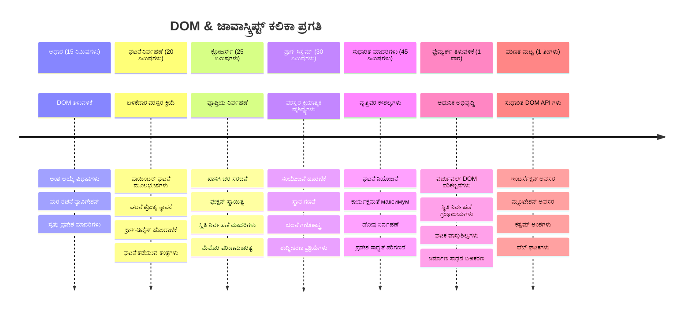
### 🛠️ ನಿಮ್ಮ ಜಾವಾಸ್ಕ್ರಿಪ್ಟ್ ಟೂಲ್ಕಿಟ್ ಸಾರಾಂಶ

ಈ ಪಾಠವನ್ನು ಮುಗಿಸಿದ ನಂತರ ಮತ್ತಷ್ಟು ಹೊಂದಿದ್ದೀರಿ:
- **ಡಿಒಎಂ ಮಾಸ್ಟರಿ**: ಅಂಶ ಆಯ್ಕೆ, ಲಕ್ಷಣ ನಿರ್ವಹಣೆ ಮತ್ತು ಮರ ನವಿಗೇಷನ್
- **ಈವೆಂಟ್ ಪರಿಣತಿ**: ಪಾಯಿಂಟರ್ ಈವೆಂಟ್ ಗಳೊಂದಿಗೆ ಕ್ರಾಸ್-ಡಿವೈಸ್ ಕ್ರಿಯೆಗಳು
- **ಕ್ಲೋಶರ್ ಅರ್ಥ**: ಖಾಸಗಿ ಸ್ಥಿತಿ ನಿರ್ವಹಣೆ ಮತ್ತು ಫಂಕ್ಷನ್ ಸ್ಥಾಯಿತ್ವ
- **ಸಂವೇದಿ ವ್ಯವಸ್ಥೆಗಳು**: ಮೊದಲಿನಿಂದ ಕೊನೆಯವರೆಗೆ ಪೂರ್ಣ ಡ್ರ್ಯಾಗ್-ಆನ್-ಡ್ರಾಪ್ ಅನುಷ್ಠಾನ
- **ಕಾರ್ಯಕ್ಷಮತೆ ಜಾಗೃತಿ**: ಸರಿಯಾದ ಈವೆಂಟ್ ಕ್ಲೀನ್ಅಪ್ ಮತ್ತು ನೆನಪು ನಿರ್ವಹಣೆ
- **ಆಧುನಿಕ ಮಾದರಿಗಳು**: ವೃತ್ತಿಪರ ಅಭಿವೃದ್ಧಿಯಲ್ಲಿ ಬಳಸುವ ಕೋಡ್ ಸಂಘಟನೆ ತಂತ್ರಗಳು
- **ಬಳಕೆದಾರ ಅನುಭವ**: ಸ್ಪಷ್ಟ, ಸ್ಪಂದನಶೀಲ ಇಂಟರ್ಫೇಸ್‌ಗಳನ್ನು ನಿರ್ಮಿಸುವುದು

**ವೃತ್ತಿಪರ ಕೌಶಲ್ಯಗಳು ಗಳಿಸಿದಿರಿ**: ನೀವು ಈ ತಂತ್ರಗಳನ್ನು ಬಳಸಿಕೊಂಡು ವೈಶಿಷ್ಟ್ಯಗಳನ್ನು ನಿರ್ಮಿಸಿದ್ದೀರಿ:
- **Trello/ಕಾಂಬನ್ ಬೋರ್ಡ್‌ಗಳು**: ಕಾಲಮ್‌ಗಳ ಮಧ್ಯೆ ಕಾರ್ಡ್ ಡ್ರ್ಯಾಗ್
- **ಫೈಲ್ ಅಪ್ಲೋಡ್ ವ್ಯವಸ್ಥೆಗಳು**: ಡ್ರ್ಯಾಗ್-ಆಂಡ್-ಡ್ರಾಪ್ ಫೈಲ್ ನಿರ್ವಹಣೆ
- **ಚಿತ್ರ ಗ್ಯಾಲರಿ**: ಫೋಟೋ ವಿನ್ಯಾಸ ಇಂಟರ್ಫೇಸ್‌ಗಳು
- **ಮೊಬೈಲ್ ಅಪ್ಲಿಕೇಶನ್ ಗಳು**: ಟಚ್ ಆಧಾರಿತ ಸಂವಹನ ಮಾದರಿಗಳು

**ಮುಂದಿನ ಹಂತ**: ನೀವು React, Vue ಅಥವಾ Angular ಮುಂತಾದ ಆಧುನಿಕ ಫ್ರೇಮ್ವರ್ಕ್‌ಗಳನ್ನು ಅನ್ವೇಷಿಸಲು ಸಿದ್ಧರಾಗಿದ್ದೀರಿ, ಇವು ಈ ಮೂಲ DOM ಸಂಚಾಲನೆ ತತ್ವಗಳ ಮೇಲೆ ಕಟ್ಟಲ್ಪಟ್ಟಿವೆ!

## ಹುದ್ದೆ

[ಡಿಒಎಂ ಜೊತೆ ಇನ್ನಷ್ಟು ಕೆಲಸ ಮಾಡಿ](assignment.md)

---

<!-- CO-OP TRANSLATOR DISCLAIMER START -->
**DISCLAIMER**:  
ಈ ದಸ್ತಾವೇಜು AI ಅನುವಾದ ಸೇವೆ [Co-op Translator](https://github.com/Azure/co-op-translator) ಬಳಸಿ ಅನುವಾದಿಸಲಾಗಿದೆ. ನಾವು ಖಚಿತತೆಯ ಕಡೆಗೆ ಶ್ರಮಿಸಿದರೂ, ಸ್ವಯಂಚಾಲಿತ ಅನುವಾದಗಳಲ್ಲಿ ದೋಷಗಳು ಅಥವಾ ಅಸಮರ್ಪಕತೆಗಳು ಕಂಡುಬರುವ ಸಾಧ್ಯತೆ ಇದೆ. ಮೂಲ ದಸ್ತಾವೇಜಿನ ಮೂಲ ಭಾಷೆಯಾಗಿದೆ ಅಧಿಕೃತ ಮೂಲವಾಗಿರಬೇಕು. ಗಂಭೀರ ಮಾಹಿತಿಗಾಗಿ, ವೃತ್ತಿಪರ ಮಾನವ ಅನುವಾದ ಶಿಫಾರಸು ಮಾಡಲಾಗುತ್ತದೆ. ಈ ಅನುವಾದ ಬಳಕೆಯಿಂದ ಉಂಟಾಗುವ ಯಾವುದೇ ತಪ್ಪು ಅರ್ಥಗರ್ಭಿತತೆಗಳಿಗೆ ಅಥವಾ ತಪ್ಪು ವ್ಯಾಖ್ಯಾನಗಳಿಗೆ ನಾವು ಹೊಣೆಗಾರರಾಗುವುದಿಲ್ಲ.
<!-- CO-OP TRANSLATOR DISCLAIMER END -->