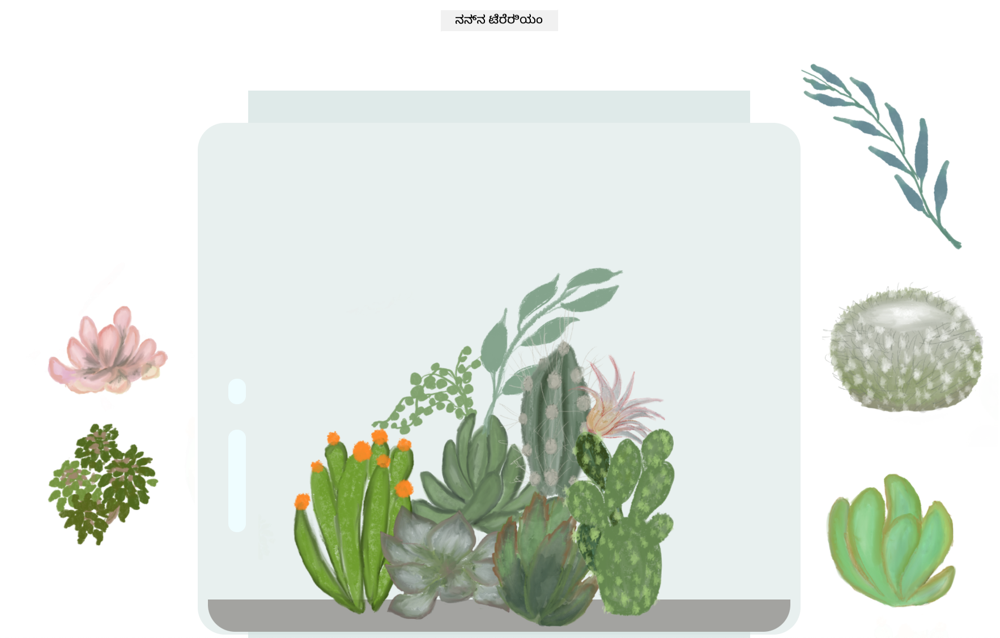

<!--
CO_OP_TRANSLATOR_METADATA:
{
  "original_hash": "6329fbe8bd936068debd78cca6f09c0a",
  "translation_date": "2026-01-08T19:10:25+00:00",
  "source_file": "3-terrarium/solution/README.md",
  "language_code": "kn"
}
-->
# My Terrarium: ಜಾವಾಸ್ಕ್ರಿಪ್ಟ್ ಬಳಸಿ HTML, CSS ಮತ್ತು DOM ಹಸ್ತಕ್ಷೇಪವನ್ನು ಕಲಿಯಲು ಒಂದು ಪ್ರಾಜೆಕ್ಟ್ 🌵🌱

ಒಂದು ಸಣ್ಣ ಡ್ರಾಗ್ ಮತ್ತು ಡ್ರೋಪ್ ಕೋಡ್-ಪ್ರಾರ್ಥನೆ. ಸ್ವಲ್ಪ HTML, JS ಮತ್ತು CSS ಜೊತೆಗೆ, ನೀವು ಒಂದು ವೆಬ್ ಇಂಟರ್ಫೇಸ್ ನಿರ್ಮಿಸಿ, ಅಂದ Saj​​​​​​​​ ದಿ ಕೊಟ್ಟು, ಮತ್ತು ಒಂದು ಇಂಟರೆಕ್ಷನ್ ಸೇರಿಸಬಹುದು.

## ಕ್ರೆಡಿಟ್ಸ್

♥️ ಜೊತೆ ಬರೆಯಲಾಗಿದೆ [Jen Looper](https://www.twitter.com/jenlooper) ದ್ವಾರಾ

CSS ಬಳಸಿ ರಚಿಸಲಾದ ಟೆರೇರಿಯಂ Jakub Mandra ಅವರ ಗ್ಲಾಸ್ ಜಾರ್ [codepen](https://codepen.io/Rotarepmi/pen/rjpNZY)ದಿಂದ ಪ್ರೇರಿತವಾಗಿದೆ.

ಕಲಾಕೃತಿ Procreate ಉಪಯೋಗಿಸಿ [Jen Looper](http://jenlooper.com) ದಿಂದ ಕೈಯಿಂದ ರೇಖಾಂಕಿತವಾಗಿದೆ.

## ನಿಮ್ಮ ಟೆರೇರಿಯಂ ಅನ್ನು ನಿರ್ವಹಿಸಿ

ನೀವು ನಿಮ್ಮ ಟೆರೇರಿಯಂ ಅನ್ನು ವೆಬ್‌ಗೆ ಡಿಪ್ಲಾಯ್ ಅಥವಾ ಪಬ್ಲಿಷ್ ಮಾಡಲು Azure Static Web Apps ಬಳಸಿ ಬಹುದು.

1. ಈ ರೆಪೋವನ್ನು ಫೋರ್ಕ್ ಮಾಡಿ

2. ಈ ಬಟ್ಟನವನ್ನು ಒತ್ತಿ

3. ನಿಮ್ಮ ಆಪ್ ಸೃಷ್ಟಿಸುವ ಖಚಿತಪಡಿಸುವ ವಿಧಿಯಿಂದ ವಿಸಾರ್ಡ್ ಮೂಲಕ ಸಾಗಿರಿ. ಆಪ್ ರೂಟ್ ಅನ್ನು `/solution` ಅಥವಾ ನಿಮ್ಮ ಕೋಡ್ ಬೇಸ್‌ನ ಮೂಲವಾಗಿರಿಸಬೇಕು ಎಂದು ಖಚಿತಪಡಿಸಿಕೊಳ್ಳಿ. ಈ ಆಪ್ಲಿಕೇಶನ್‌ನಲ್ಲಿ ಯಾವುದೇ API ಇಲ್ಲ, ಆದ್ದರಿಂದ ಅದನ್ನು ಸೇರಿಸುವ ಬಗ್ಗೆ ಚಿಂತಿಸಬೇಕಾಗಿಲ್ಲ. ನೀವು ಫೋರ್ಕ್ ಮಾಡಿದ ರೆಪೋದಲ್ಲಿ ಒಂದು .github ಫೋಲ್ಡರ್ ನಿರ್ಮಿಸಲಾಗುವುದು, ಇದು Azure Static Web Apps‌ನ ಬಿಲ್ಡ್ ಸೇವೆಗೆ ನಿಮ್ಮ ಆಪ್ ಅನ್ನು ಹೊಸ URL ಗೆ ಬಿಲ್ಡ್ ಮತ್ತು ಪಬ್ಲಿಷ್ ಮಾಡಲು ಸಹಾಯ ಮಾಡುತ್ತದೆ.

---

<!-- CO-OP TRANSLATOR DISCLAIMER START -->
**ತ್ಯಾಗಪತ್ರ**:
ಈ ದಸ್ತಾವೇಜು AI ಅನುವಾದ ಸೇವೆ [Co-op Translator](https://github.com/Azure/co-op-translator) ಬಳಸಿಕೊಂಡು ಅನುವಾದಿಸಲಾಗಿದೆ. ನಾವು ಖಚಿತತೆಯಿಗಾಗಿ ಪ್ರಯತ್ನಿಸುತ್ತಿದ್ದರೂ, ಯന്ത്രಮೂಲಕ ಅನುವಾದಗಳಲ್ಲಿ ತಪ್ಪುಗಳು ಅಥವಾ ಅಸತ್ಯತೆಗಳು ಇರಬಹುದು ಎಂಬುದನ್ನು ಗಮನದಲ್ಲಿರಿಸಿಕೊಳ್ಳಿ. ಮೂಲ ಭಾಷೆಯಲ್ಲಿ ಇರುವ ಮೂಲ ದಸ್ತಾವೇಜುವೇ ಪ್ರಾಮಾಣಿಕಮೂಲ ಎಂದು ಪರಿಗಣಿಸಬೇಕಾಗಿದೆ. ಮುಖ್ಯ ಮಾಹಿತಿಗಾಗಿ ವೃತ್ತಿಪರ ಮಾನವ ಅನುವಾದವನ್ನು ಶಿಫಾರಸ್ಸು ಮಾಡಲಾಗುತ್ತದೆ. ಈ ಅನುವಾದವನ್ನು ಬಳಸುವ ನಿಂದ ಉಂಟಾಗುವ ಯಾವುದೇ ತಪ್ಪುಬುರುಡುಗಳ ಅಥವಾ ಅರ್ಥಮಾತೃಪ್ಫಗಳ ಹೊಣೆ ಲಭ್ಯವಿಲ್ಲ.
<!-- CO-OP TRANSLATOR DISCLAIMER END -->