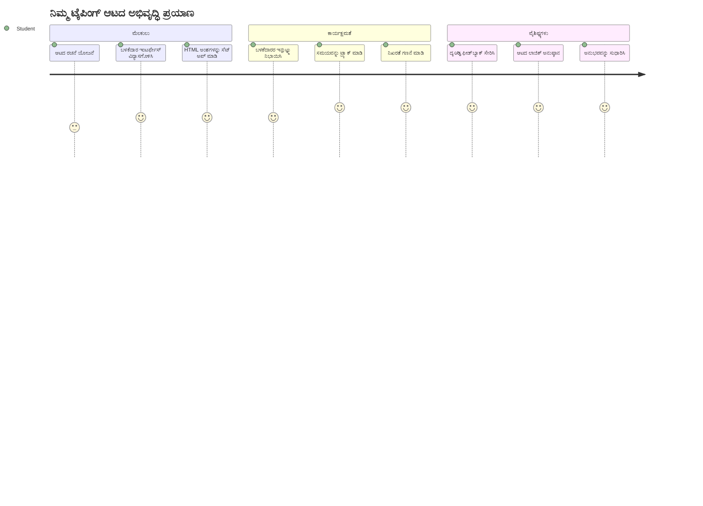
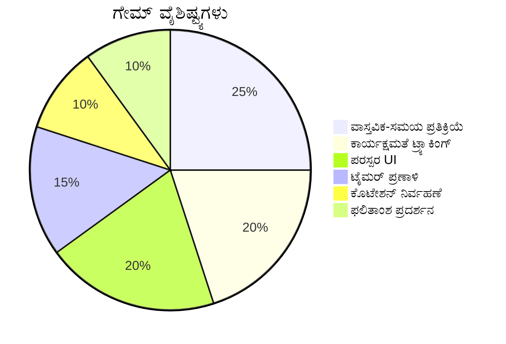
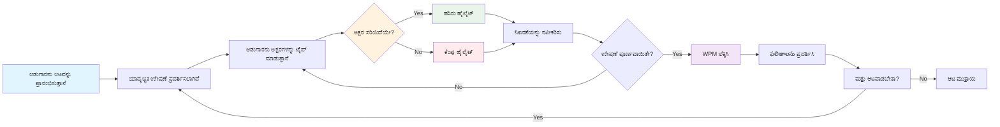
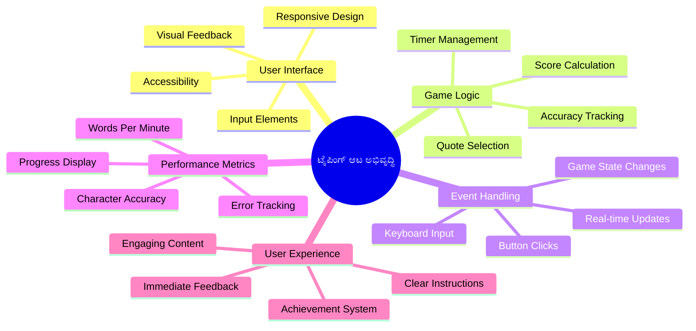
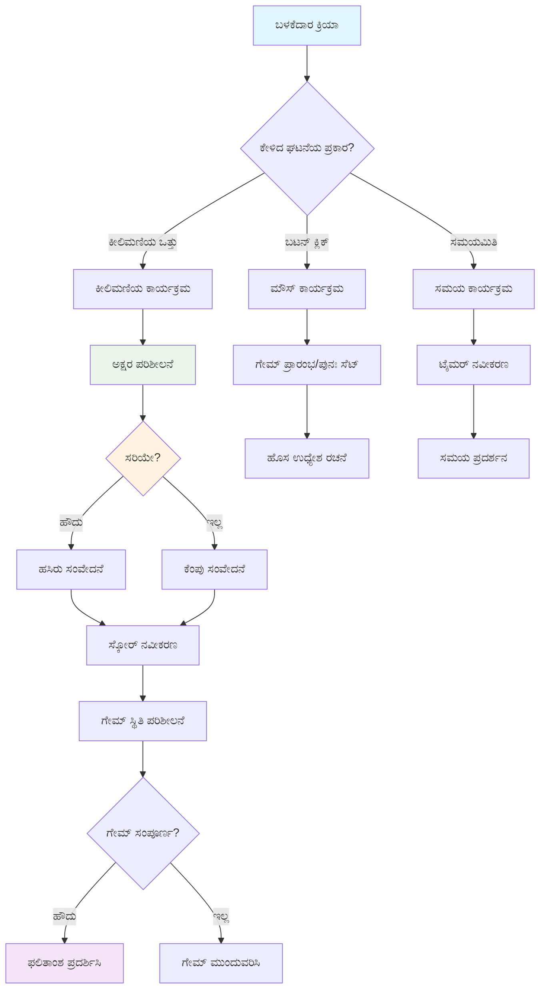
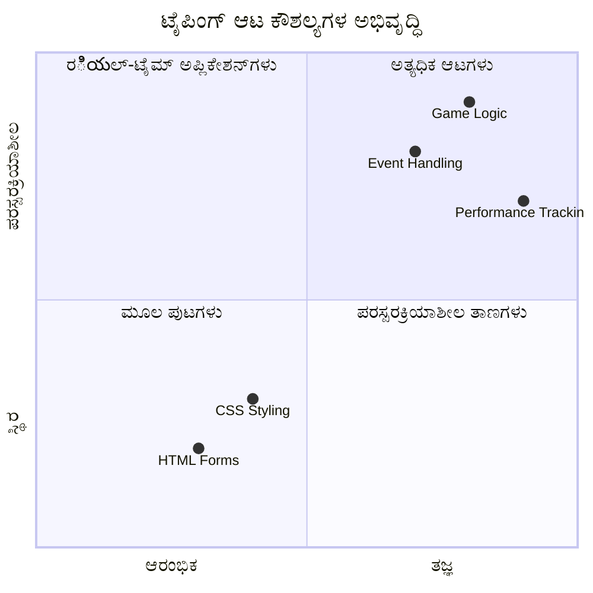
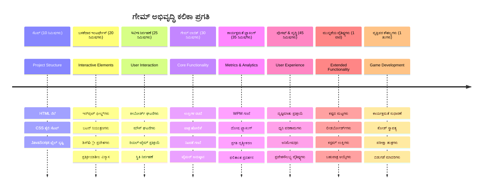

# ಇವೆಂಟ್-ಚಾಲಿತ ಪ್ರೋಗ್ರಾಮಿಂಗ್ - ಟೈಪಿಂಗ್ ಆಟವನ್ನು ನಿರ್ಮಿಸಿ

## ಪರಿಚಯ

ಪ್ರತೀ ಡೆವಲಪರ್ ತಿಳಿದಿರುವ, ಆದರೆ ಕಮ್ಮಿ ಮಾತನಾಡುವದ್ದು ಏನಿದೆ ಎಂದರೆ: ವೇಗವಾಗಿ ಟೈಪ್ ಮಾಡುವುದು ಒಂದು ಸೂಪರ್‌ಪವರ್! 🚀 ಯೋಚಿಸಿ - ನಿಮ್ಮ ಮನಸ್ಸಿನಿಂದ ನಿಮ್ಮ ಕೋಡ್ ಎಡಿಟರ್‌ಗೆ ನಿಮ್ಮ ಆಲೋಚನೆಗಳನ್ನು ವೇಗವಾಗಿ ಹೇಗೆ ತಲುಪಿಸುವಿರಿ ಎಂದರೆ, ನಿಮ್ಮ ಸೃಜನಶೀಲತೆಯು ಹೆಚ್ಚುತ್ತಾ ಹೋಗುತ್ತದೆ. ಇದು ನಿಮ್ಮ ಯೋಚನೆಗಳು ಮತ್ತು ಸ್ಕ್ರೀನ್ ನಡುವೆ ನೇರ ಸಂಪರ್ಕದಂತೆ.

ಈ ಕೌಶಲ್ಯವನ್ನು ಸುಧಾರಿಸಲು ಅತ್ಯುತ್ತಮ ಮಾರ್ಗಗಳಲ್ಲಿ ಒಂದು ತಿಳಿದುಕೊಳ್ಳಲು ಇಚ್ಛಿಸುವಿರಾ? ನೀವು ಊಹಿಸಿದ್ದಾರೆ - ನಾವು ಒಂದು ಆಟವನ್ನು ನಿರ್ಮಿಸುತ್ತಿದ್ದೇವೆ!

> ಒಟ್ಟಿಗೆ ಒಂದು ಅದ್ಭುತ ಟೈಪಿಂಗ್ ಆಟವನ್ನು ನಿರ್ಮಿಸೋಣ!

ನೀವು ಕಲಿತಿರುವ ಎಲ್ಲಾ ಜಾವಾಸ್ಕ್ರಿಪ್ಟ್, ಎಚ್ಟಿಎಂಎಲ್ ಮತ್ತು ಸಿಎಸ್‌ಎಸ್ ಕೌಶಲ್ಯಗಳನ್ನು ಬಳಸಲು ಸಜ್ಜಾಗಿದ್ದೀರಾ? ನಾವು ನಿರ್ಮಿಸುವ ಆಟವು ದೊಡ್ಡ ತನಿಖೆಗಾರ [ಶೆರ್ಲಾಕ್ ಹೊಲ್ಮ್ಸ್](https://en.wikipedia.org/wiki/Sherlock_Holmes) ಅವರ ಯಾದೃಚ್ಛಿಕ ಉಕ್ತಿಗಳೊಂದಿಗೆ ನಿಮಗೆ ಸವಾಲು ನೀಡುತ್ತದೆ. ಈ ಆಟವು ನೀವು ಎಷ್ಟು ವೇಗವಾಗಿ ಮತ್ತು ಸರಿಯಾಗಿ ಟೈಪ್ ಮಾಡಬಹುದು ಎಂಬುದನ್ನು ಟ್ರ್ಯಾಕ್ ಮಾಡುತ್ತದೆ - ಮತ್ತು ನಂಬಿ, ಇದು ನೀವು ಭಾವಿಸುವುದಕ್ಕಿಂತ ಹೆಚ್ಚು ಅತೀಂದ್ರಿಯಾಗಿದೆ!

## ನೀವು ತಿಳಿದುಕೊಳ್ಳಬೇಕಾಗಿರುವುದು

ನಾವು ಮುಂದಾಗುವ ಮೊದಲು, ಈ ಅರ್ಥಗಳನ್ನು ನೀವು ತಿಳಿದಿರುವುದಾಗಿ ಖಚಿತಪಡಿಸಿಕೊಳ್ಳಿ (ವೇಗದಾಗಿ ಸ್ಮರಣೆ ಬೇಕಾದರೆ ಚಿಂತೆ ಮಾಡಬೇಡಿ - ನಾವುಲ್ಲಿಯವರೆಗೂದಲ್ಲಿಯೇ ಇದ್ದೇವಿ!):

- ಪಠ್ಯ ಇನ್‌ಪುಟ್ ಮತ್ತು ಬಟನ್ ನಿಯಂತ್ರಣಗಳನ್ನು ರಚಿಸುವುದು
- ಸಿಎಸ್‌ಎಸ್ ಮತ್ತು ಕ್ಲಾಸ್‌ಗಳ ಮೂಲಕ ಶೈಲಿಗಳನ್ನು ಹೊಂದಿಸುವುದು  
- ಜಾವಾಸ್ಕ್ರಿಪ್ಟ್ ಮೂಲಭೂತಗಳು
  - ಅರೇ ರಚನೆ ಮಾಡುವುದು
  - ಯಾದೃಚ್ಛಿಕ ಸಂಖ್ಯೆ ರಚಿಸುವುದು
  - ಪ್ರಸ್ತುತ ಸಮಯ ಪಡೆಯುವುದು

ಈಗಳಲ್ಲಿ ಎದ್ದುಕೊಳ್ಳುವಕೆ ಇಂಥದು ಇದ್ದರೆ, ಅದು ಸೂಕ್ತವಾಗಿದೆ! ನಿಮ್ಮ ಜ್ಞಾನವನ್ನು ಗಟ್ಟಿಗೊಳಿಸುವ ಅತ್ಯುತ್ತಮ ಮಾರ್ಗಗಳಲ್ಲಿ ಒಂದು ಪ್ರಾಜೆಕ್ಟ್‌ನಲ್ಲಿ ಕೈಹಾಕಿ ಕಲಿಯುವುದು.

### 🔄 **ಶಿಕ್ಷಣಾತ್ಮಕ ಪರಿಶೀಲನೆ**
**ಪ್ರಾರಂಬಿಕ ಮೌಲ್ಯಮಾಪನ**: ಅಭಿವೃದ್ಧಿ ಪ್ರಾರಂಭಿಸುವ ಮೊದಲು, ಖಚಿತಪಡಿಸಿಕೊಳ್ಳಿ:
- ✅ ಎಚ್ಟಿಎಂಎಲ್ ಫಾರ್ಮ್‌ಗಳು ಮತ್ತು ಇನ್‌ಪುಟ್ ಎಲಿಮೆಂಟ್ಸ್ ಹೇಗೆ ಕಾರ್ಯನಿರ್ವಹಿಸುತ್ತವೆ
- ✅ ಸಿಎಸ್‌ಎಸ್ ಕ್ಲಾಸ್‌ಗಳು ಮತ್ತು ಡೈನಾಮಿಕ್ ಶೈಲಿ ಸಂಬಂದಗಳು
- ✅ ಜಾವಾಸ್ಕ್ರಿಪ್ಟ್ ಇವೆಂಟ್ ಲಿಸನರ್‌ಗಳು ಮತ್ತು ಹ್ಯಾಂಡ್ಲರ್‌ಗಳು
- ✅ ಅರೆ manipulation ಮತ್ತು ಯಾದೃಚ್ಛಿಕ ಆಯ್ಕೆ
- ✅ ಸಮಯದ ಮಾಪನ ಮತ್ತು ಲೆಕ್ಕಾಚಾರಗಳು

**ತ್ವರಿತ ಸ್ವ-ಪರೀಕ್ಷೆ**: ಈ ಅರ್ಥಗಳು ಕ್ರೀಡಾತ್ಮಕ ಆಟದಲ್ಲಿ ಹೇಗೆ ಕೈಗೂಡುತ್ತವೆ ಎಂದು ವಿವರಿಸಬಹುದೇ?
- **ಇವೆಂಟ್ಗಳು** ಬಳಕೆದಾರರು ಎಲಿಮೆಂಟ್ಗಳೊಡನೆ ಸಂವಹನ ನಡೆಸುವಾಗ ಪ್ರಾರಂಭವಾಗುತ್ತವೆ
- **ಹ್ಯಾಂಡ್ಲರ್‌ಗಳು** ಆ ಘಟನೆಗಳನ್ನು ಪ್ರಕ್ರಿಯೆಗೊಳಿಸಿ ಆಟದ ಸ್ಥಿತಿಯನ್ನು ನವೀಕರಿಸುತ್ತವೆ
- **ಸಿಎಸ್‌ಎಸ್** ಬಳಕೆದಾರ ಕ್ರಿಯೆಗಳಿಗಾಗಿ ದೃಶ್ಯ ಪ್ರತಿಕ್ರಿಯೆ ನೀಡುತ್ತದೆ
- **ಸಮಯ ಮಿತಿಯಿಲ್ಲದೆ** ಪ್ರದರ್ಶನವನ್ನು ಅಳೆಯಲು ಮತ್ತು ಆಟದ ಪ್ರಗತಿಗೆ ಸಹಾಯ ಮಾಡಿ

## ಈ ಘಟನೆಯನ್ನು ದೇವಲಪ್ ಮಾಡೋಣ!

[ಇವೆಂಟ್-ಚಾಲಿತ ಪ್ರೋಗ್ರಾಮಿಂಗ್ ಬಳಸಿ ಟೈಪಿಂಗ್ ಆಟವನ್ನು ನಿರ್ಮಿಸುವುದು](./typing-game/README.md)

### ⚡ **ಮುಂದಿನ 5 ನಿಮಿಷಗಳಲ್ಲಿ ನೀವು ಮಾಡಬಹುದಾದವುಗಳು**
- [ ] ನಿಮ್ಮ ಬ್ರೌಸರ್ ಕಾಂಸೋಲ್ ತೆರಯಿರಿ ಮತ್ತು `addEventListener` ಬಳಸಿ ಕೀಬೋರ್ಡ್ ಘಟನೆಗಳನ್ನು ಕೇಳಿ
- [ ] ಸರಳ HTML ಪುಟವನ್ನು ರಚಿಸಿ, ಇನ್‌ಪುಟ್ ಫೀಲ್ಡ್-ನೊಂದಿಗೆ ಟೈಪಿಂಗ್ ಪತ್ತೆಮಾಡಿ ಪರೀಕ್ಷಿಸಿ
- [ ] ಟೈಪ್ ಮಾಡಿದ ಪಠ್ಯವನ್ನು ಗುರಿ ಪಠ್ಯದಿಂದ ಹೋಲಿಸಿ ಸ್ಟ್ರಿಂಗ್ ನಿರ್ವಹಣೆ ಅಭ್ಯಾಸ ಮಾಡಿ
- [ ] `setTimeout` ಮೂಲಕ ಸಮಯ ನಿಯಂತ್ರಣ ಕಾರ್ಯಗಳನ್ನು ಮನಗಾಣಿಸಿ

### 🎯 **ಈ ಗಂಟೆಯಲ್ಲೇ ಸಾಧಿಸಬಹುದಾದವುಗಳು**
- [ ] ಪಾಠದ ನಂತರದ ಪ್ರಶ್ನೋತ್ತರವನ್ನು ಮುಗಿಸಿ ಇವೆಂಟ್-ಚಾಲಿತ ಪ್ರೋಗ್ರಾಮಿಂಗ್ ತಿಳಿದುಕೊಳ್ಳಿ
- [ ] ಪದಗಳ ಪರಿಶೀಲನೆಗಾಗಿ ಟೈಪಿಂಗ್ ಆಟದ ಮೂಲ ಆವೃತ್ತಿಯನ್ನು ನಿರ್ಮಿಸಿ
- [ ] ಸರಿಯಾದ ಮತ್ತು ತಪ್ಪು ಟೈಪಿಗಾಗಿ ದೃಶ್ಯ ಪ್ರತಿಕ್ರಿಯೆ ಸೇರಿಸಿ
- [ ] ವೇಗ ಮತ್ತು ನಿಖರತೆಗೆ ಆಧರಿಸಿ ಸರಳ ಸ್ಕೋರಿಂಗ್ ಸಿಸ್ಟಮ್ ಅನುಷ್ಠಾನ ಮಾಡಿ
- [ ] ನಿಮ್ಮ ಆಟವನ್ನು ದೃಶ್ಯಾತ್ಮಕವಾಗಿ ಆಕರ್ಷಕವಾಗಿಸಲು CSS ಶೈಲಿ ಮಾಡಿ

### 📅 **ನಿಮ್ಮ ವಾರದ ಆಟ ಅಭಿವೃದ್ಧಿ**
- [ ] ಎಲ್ಲಾ ವೈಶಿಷ್ಟ್ಯಗಳೊಂದಿಗೆ ಸಂಪೂರ್ಣ ಟೈಪಿಂಗ್ ಆಟವನ್ನು ಪೂರ್ಣಗೊಳಿಸಿ ಮತ್ತು ಸುಧಾರಣೆ ಮಾಡಿ
- [ ] ಪದ ಜಟಿಲತೆಯೊಂದಿಗೆ ಕಠಿಣ ಮಟ್ಟಗಳನ್ನು ಸೇರಿಸಿ
- [ ] ಬಳಕೆದಾರರ ಅಂಕಿಅಂಶಗಳ (WPM, ಸಮಯೋಚಿತ ನಿಖರತೆ) ಟ್ರ್ಯಾಕಿಂಗ್ ಅನುಷ್ಠಾನ ಮಾಡಿ
- [ ] ಉತ್ತಮ ಬಳಕೆದಾರ ಅನುಭವಕ್ಕೆ ಧ್ವನಿ ಪರಿಣಾಮಗಳು ಮತ್ತು ಅನಿಮೇಶನ್‌ಗಳನ್ನು ರಚಿಸಿ
- [ ] ಟಚ್ ಸಾಧನಗಳಿಗೆ ಹೊಂದಿಕೊಳ್ಳುವಂತೆ ನಿಮ್ಮ ಆಟವನ್ನು ಮೊಬೈಲ್-ಪ್ರತಿಕ್ರಿಯಾಶೀಲ ಮಾಡಿ
- [ ] ನಿಮ್ಮ ಆಟವನ್ನು ಆನ್‌ಲೈನ್ ಹಂಚಿಕೊಳ್ಳಿ ಮತ್ತು ಬಳಕೆದಾರರ ಪ್ರತಿಕ್ರಿಯೆಯನ್ನು ಸಂಗ್ರಹಿಸಿ

### 🌟 **ನಿಮ್ಮ ತಿಂಗಳಾವ್ಯಾಪಿ ಪರಸ್ಪರ ಕ್ರಿಯಾತ್ಮಕ ಅಭಿವೃದ್ಧಿ**
- [ ] ವಿಭಿನ್ನ ಸಂವಹನ ಮಾದರಿಗಳನ್ನು ಅನ್ವೇಷಿಸುವ ಬಹು ಆಟಗಳನ್ನು ನಿರ್ಮಿಸಿ
- [ ] ಆಟ ಲೂಪ್, ಸ್ಥಿತಿ ನಿರ್ವಹಣೆ, ಪ್ರದರ್ಶನ ಪರಿಷ್ಕರಣೆಗಳನ್ನು ಕಲಿಯಿರಿ
- [ ] ಓಪನ್ ಸೋರ್ಸ್ ಆಟ ಅಭಿವೃದ್ಧಿ ಪ್ರಾಜೆಕ್ಟ್‌ಗಳಿಗೆ ಸಹಾಯ ಮಾಡಿ
- [ ] ಪವರ್‌ಫುಲ್ ಸಮಯ ಅಂಶಗಳು ಮತ್ತು ಸ್ಮೂತ್ ಅನಿಮೇಶನ್‌ಗಳಲ್ಲಿ ಪರಿಣತಿ ಪಡೆಯಿರಿ
- [ ] ವಿವಿಧ ಪರಸ್ಪರ ಕ್ರಿಯಾತ್ಮಕ ಅಪ್ಲಿಕೇಶನ್‌ಗಳ ಪ್ರದರ್ಶನ ಮಾಡುತ್ತಾ ಪೋರ್ಟ್ಫೋಲಿಯೋ ರಚಿಸಿ
- [ ] ಆಟ ಅಭಿವೃದ್ಧಿ ಮತ್ತು ಬಳಕೆದಾರ ಸಂವಹನದ ಬಗ್ಗೆ ಆಸಕ್ತಿ ಇರುವವರಿಗೆ ಮಾರ್ಗದರ್ಶನ ನೀಡಿ

## 🎯 ನಿಮ್ಮ ಟೈಪಿಂಗ್ ಆಟ ಮಾಸ್ಟರಿ ಸಮಯರೇಖೆ

### 🛠️ ನಿಮ್ಮ ಆಟ ಅಭಿವೃದ್ಧಿ ಉಪಕರಣಗಳ ಸಾರಾಂಶ

ಈ ಪ್ರಾಜೆಕ್ಟ್ ಪೂರ್ಣಗೊಳಿಸಿದ ನಂತರ, ನೀವು ಪಾರಂಗತರಾಗಿರುತ್ತೀರಿ:
- **ಇವೆಂಟ್-ಚಾಲಿತ ಪ್ರೋಗ್ರಾಮಿಂಗ್**: ಬಳಕೆದಾರ ಆದೇಶಗಳಿಗೆ ಪ್ರತಿಕ್ರಿಯಿಸುವ ಸ್ಪಂದನಶೀಲ ಯೂಐ
- **ರೀಲ್-ಟೈಮ್ ಪ್ರತಿಕ್ರಿಯೆ**: ತಕ್ಷಣದ ದೃಶ್ಯ ಮತ್ತು ಕಾರ್ಯಕ್ಷಮ ನವೀಕರಣಗಳು
- **ಕಾರ್ಯಕ್ಷಮತೆ ಮಾಪನ**: ಸರಿಯಾದ ಸಮಯ ಮತ್ತು ಸ್ಕೋರಿಂಗ್ ಸಿಸ್ಟಮ್‌ಗಳು
- **ಆಟದ ಸ್ಥಿತಿ ನಿರ್ವಹಣೆ**: ಅಪ್ಲಿಕೇಶನ್ ಹರಿವು ಮತ್ತು ಬಳಕೆದಾರ ಅನುಭವ ನಿಯಂತ್ರಣ
- **ಪರಸ್ಪರ ಕ್ರಿಯಾತ್ಮಕ ವಿನ್ಯಾಸ**: ಆಕರ್ಷಕ, ಬೋಧಕ ಬಳಕೆದಾರ ಅನುಭವಗಳನ್ನು ರಚಿಸುವುದು
- **ಆಧುನಿಕ ವೆಬ್ APIs**: ಶ್ರೀಮಂತ ಸಂವಹನಗಳಿಗಾಗಿ ಬ್ರೌಸರ್ ಸಾಮರ್ಥ್ಯಗಳನ್ನು ಉಪಯೋಗಿಸುವುದು
- **ಪ್ರವೇಶ ಯೋಗ್ಯತೆ ಮಾದರಿಗಳು**: ಎಲ್ಲಾ ಬಳಕೆದಾರರಿಗೆ ಒತ್ತಾಯರಹಿತ ವಿನ್ಯಾಸ

**ವಾಸ್ತವಿಕ ಅನ್ವಯಿಕೆಗಳು**: ಈ ಕೌಶಲ್ಯಗಳು ನೇರವಾಗಿ ಅನ್ವಯಿಸುತ್ತವೆ:
- **ವೆಬ್ ಅಪ್ಲಿಕೇಶನ್ಗಳು**: ಯಾವುದೇ ಪರಸ್ಪರ ಸ್ನೇಹಿ ಇಂಟರ್ಫೇಸ್ ಅಥವಾ ಡಾಷ್‌ಬೋರ್ಡ್
- **ಶಿಕ್ಷಣಾತ್ಮಕ ಸಾಫ್ಟ್‌ವೇರ್**: ಕಲಿಕಾ ವೇದಿಕೆಗಳು ಮತ್ತು ಕೌಶಲ್ಯ ಮೌಲ್ಯಮಾಪನ ಟೂಲ್ಗಳು
- **ಉತ್ಪಾದಕತೆ ಉಪಕರಣಗಳು**: ಪಠ್ಯ ಸಂಪಾದಕ, ಐಡಿಇಗಳು ಮತ್ತು ಸಹಕಾರ ಸಾಫ್ಟ್‌ವೇರ್
- **ಆಟ ಜಗತ್ತು**: ಬ್ರೌಸರ್ ಆಟಗಳು ಮತ್ತು ಪರಸ್ಪರ ಮನೋರಂಜನೆ
- **ಮೊಬೈಲ್ ಅಭಿವೃದ್ಧಿ**: ಸ್ಪರ್ಶ ಆಧಾರಿತ ಇಂಟರ್ಫೇಸ್ಗಳು ಮತ್ತು ಜೆಸ್ಚರ್ ಹ್ಯಾಂಡ್ಲಿಂಗ್

**ಮುಂದಿನ ಹಂತ**: ನೀವು ಸುಧಾರಿತ ಆಟ ಫ್ರೇಮ್ವರ್ಕ್‌ಗಳು, ವಾಸ್ತವಿಕ ಸಮಯ ಬಹು-ಆಟಗಾರ ವ್ಯವಸ್ಥೆಗಳು ಅಥವಾ ಸಂಗತಿಪೂರ್ಣ ಪರಸ್ಪರ ಅಪ್ಲಿಕೇಶನ್‌ಗಳನ್ನು ಅನ್ವೇಷಿಸಲು ಸಿದ್ಧರಾಗಿದ್ದೀರಿ!

## ಕ್ರೆಡಿಟ್‌ಗಳು

♥️ ಜೊತೆಗೆ ಬರೆದವರು [Christopher Harrison](http://www.twitter.com/geektrainer)

---

<!-- CO-OP TRANSLATOR DISCLAIMER START -->
**ನಿರಾಕರಣೆ**:  
ಈ ದಾಖಲೆ AI ಅನುವಾದ ಸೇವೆಯಾದ [Co-op Translator](https://github.com/Azure/co-op-translator) ಉಪಯೋಗಿಸಿ ಅನುವಾದಿಸಲಾಗಿದೆ. ನಾವು ಶುದ್ಧತೆಗೆ ಪ್ರಯತ್ನಿಸುತ್ತಿದ್ದರೂ, ಸ್ವಯಂಚಾಲಿತ ಅನುವಾದಗಳಲ್ಲಿ ದೋಷಗಳು ಅಥವಾ ತಪ್ಪುಗಳಿರಬಹುದು ಎಂದು ದಯವಿಟ್ಟು ಗಮನಿಸಿ. ಮೂಲಭಾಷೆಯಲ್ಲಿರುವ ಮೂಲ ದಾಖಲೆ ನಿರ್ಮಾಣಾತ್ಮಕ ಮೂಲವಾಗಿರುತ್ತದೆ ಎಂದು ಪರಿಗಣಿಸಬೇಕು. ನಿಜವಾದ ಮಾಹಿತಿಗಾಗಿ ವೃತ್ತಿಪರ ಮಾನವ ಅನುವಾದವನ್ನು ಶಿಫಾರಸು ಮಾಡಲಾಗುತ್ತದೆ. ಈ ಅನುವಾದವನ್ನು ಬಳಸುವುದರಿಂದ ಉಂಟಾಗುವ ಯಾವುದೇ ಅವಗाहನೆಗಳು ಅಥವಾ ತಪ್ಪು ವಿವರಣೆಗಳ ಬಗ್ಗೆ ನಾವು ಜವಾಬ್ದಾರರಾಗುವುದಿಲ್ಲ.
<!-- CO-OP TRANSLATOR DISCLAIMER END -->