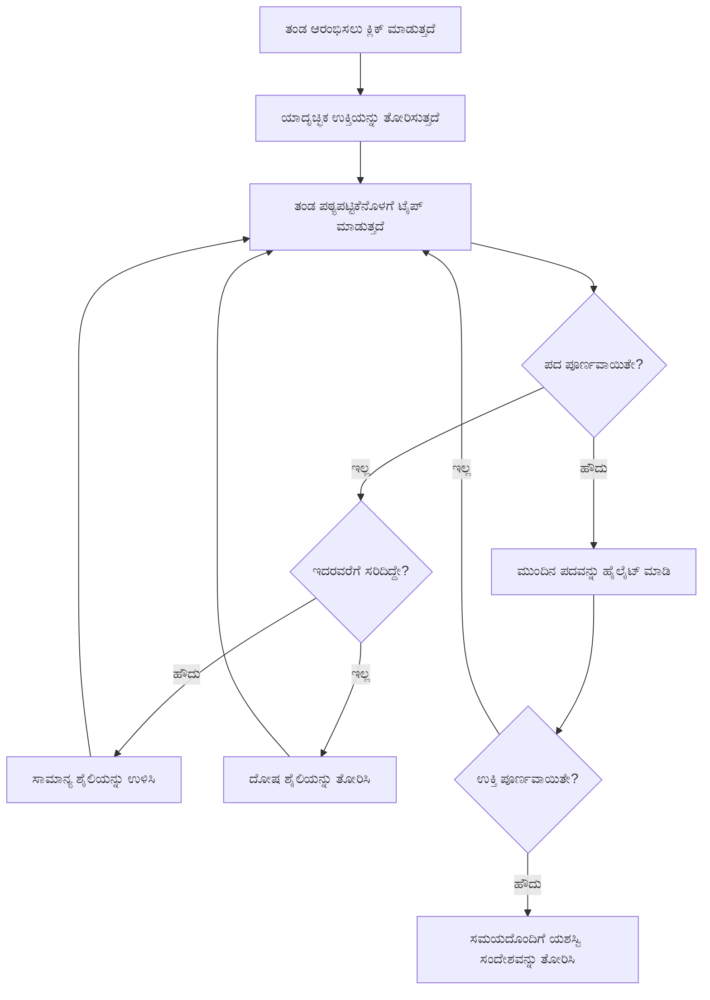
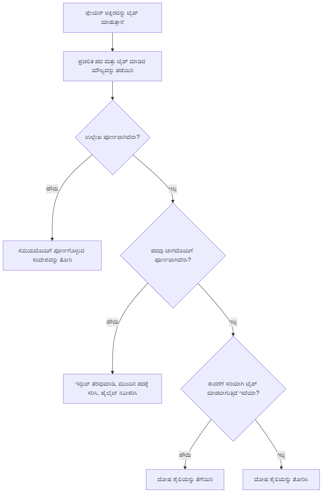
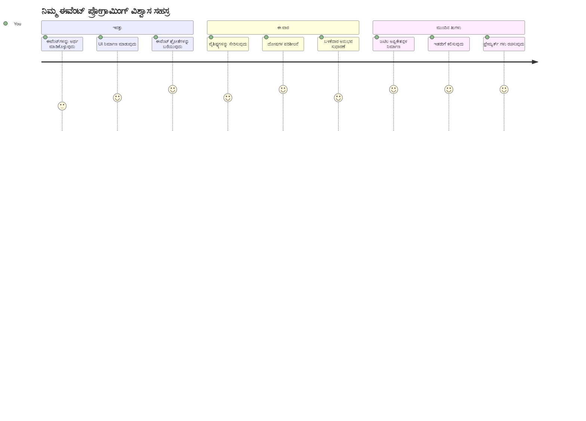

# ಈವೆಂಟ್ಗಳನ್ನು ಬಳಸಿ ಆಟವನ್ನು ಸೃಜನೆ ಮಾಡುವುದು

ನೀವು ഒരುದೊಮ್ಮೆ ಚಿಂತಿಸಿದ್ದೀರಾ ವೆಬ್‌ಸೈಟ್‌ಗಳು ನೀವು ಬಟನ್ ಕ್ಲಿಕ್ ಮಾಡಿದಾಗ ಅಥವಾ ಟೆಕ್ಸ್ಟ್ ಬಾಕ್ಸ್‌ನಲ್ಲಿ ಟೈಪ್ ಮಾಡಿದಾಗ ಹೇಗೆ ತಿಳಿಯುತ್ತವೆ? ಅದೇ ಈವೆಂಟ್-ಚಾಲಿತ ಪ್ರೋಗ್ರಾಮಿಂಗ್‌ನ ಮಾಯಾಜಾಲ! ಈ ಅತಿಹೆಚ್ಚು ಮಹತ್ವದ ಕೌಶಲ್ಯವನ್ನು ಕಲಿಯಲು ಉತ್ತಮ ವಿಧಾನ ಏನು ಎಂದರೆ — ನೀವು ಮಾಡುತ್ತಿರುವ ಪ್ರತಿ ಕೀಸ್ಟ್ರೋಕ್‌ಗೆ ಪ್ರತಿಕ್ರಿಯಿಸುವ ಟೈಪಿಂಗ್ ವೇಗದ ಆಟವನ್ನು ರಚಿಸುವುದು.

ನೀವು ನೇರವಾಗಿ ನೋಡಲಿದ್ದೀರಿ ಹೇಗೆ ವೆಬ್ ಬ್ರೌಸರಗಳು ನಿಮ್ಮ ಜಾವಾಸ್ಕ್ರಿಪ್ಟ್ ಕೋಡ್ಗೆ "ಮಾತನಾಡುತ್ತವೆ". ನೀವು ಪ್ರತೀ ಬಾರಿ ಕ್ಲಿಕ್ ಮಾಡಿದಾಗ, ಟೈಪ್ ಮಾಡಿದಾಗ, ಅಥವಾ ನಿಮ್ಮ ಮೌಸ್ ಅನ್ನು ನಿಯಂತ್ರಿಸಿದಾಗ, ಬ್ರೌಸರ್ ಸಣ್ಣ ಸಂದೇಶಗಳನ್ನು (ನಾವು ಅದನ್ನು ಈವೆಂಟುಗಳು ಎಂದು ಕರೆಯುತ್ತೇವೆ) ನಿಮ್ಮ ಕೋಡಿಗೆ ಕಳುಹಿಸುತ್ತಿದೆ, ಮತ್ತು ನೀವು ಹೇಗೆ ಪ್ರತಿಕ್ರಿಯಿಸಬೇಕೆಂದರೆ ಅದನ್ನು ನಿರ್ಧರಿಸಬೇಕು!

ನಾವು ಇಲ್ಲಿ ಮುಗಿಸಿದಾಗ, ನೀವು ನಿಮ್ಮದ್ದು ಒಂದು ನಿಜವಾದ ಟೈಪಿಂಗ್ ಆಟ ರಚಿಸಿದ್ದೀರಿ ಇದು ನಿಮ್ಮ ವೇಗ ಮತ್ತು ನಿಖರತೆಯನ್ನು ಟ್ರ್ಯಾಕ್ ಮಾಡುತ್ತದೆ. ಹೆಚ್ಚಿನ ಮಹತ್ವದಲ್ಲಿ, ನೀವು ಅರ್ಥಮಾಡಿಕೊಳ್ಳುವಿರಿ ಸಬ್‌ಸ್ಕ್ರಿಪ್ಟ್ ಪ್ರತಿಯೊಂದು ಸ್ನೇಹಪರ ವೆಬ್‌ಸೈಟ್ ಕೆಲಸ ಮಾಡಿಸುವ ಮೂಲಭೂತ ಧಾರಣೆಗಳನ್ನು. ಬನ್ನಿ ಪ್ರಾರಂಭಿಸೋಣ!

## ಪೂರ್ವ ಉಪನ್ಯಾಸ ಪ್ರಶ್ನೋತ್ತರ 

[ಪೂರ್ವ ಉಪನ್ಯಾಸ ಪ್ರಶ್ನೋತ್ತರ](https://ff-quizzes.netlify.app/web/quiz/21)

## ಈವೆಂಟ್ ಚಾಲಿತ ಪ್ರೋಗ್ರಾಮಿಂಗ್

ನಿಮ್ಮ ಪ್ರಿಯ ಅಪ್ಲಿಕೇಶನ್ ಅಥವಾ ವೆಬ್‌ಸೈಟ್ ಬಗ್ಗೆ ಯೋಚಿಸಿ — ಅದು ಚೈತನ್ಯ ಮತ್ತು ಪ್ರತಿಕ್ರಿಯಾಶೀಲತೆಯನ್ನು ಹೇಗೆ ಹೊಂದಿದೆ? ಅದು ನಿಮ್ಮ ಮಾಡಿದ ಕಾರ್ಯಗಳಿಗೆ ಹೇಗೆ ಪ್ರತಿಕ್ರಿಯಿಸುವುದರಿಂದಲೇ! ಪ್ರತಿ ಟ್ಯಾಪ್, ಕ್ಲಿಕ್, ಸ್ವೈಪ್, ಅಥವಾ ಕೀಸ್ಟ್ರೋಕ್ ಒಂದು "ಈವೆಂಟ್" ಅನ್ನು ಸೃಜಿಸುತ್ತದೆ, ಮತ್ತು ಅಲ್ಲಿ ವೆಬ್ ಡೆವಲಪ್‌ಮೆಂಟ್‌ನ ನಿಜವಾದ ಮಾಯಾಜಾಲವು ನಡೆಯುತ್ತದೆ.

ಇದು ವೆಬ್‌ಗಾಗಿ ಪ್ರೋಗ್ರಾಮಿಂಗ್ ಅನ್ನು ಇಷ್ಟನೀಯವಾಗಿಸುವುದು: ನಾವು ಯಾರಾದರೂ ಬಟನ್ ಕ್ಲಿಕ್ ಮಾಡುವುದು ಅಥವಾ ಟೆಕ್ಸ್ಟ್ ಬಾಕ್ಸ್‌ನಲ್ಲಿ ಟೈಪ್ ಆರೆಂಬುದನ್ನು ಗುರುತಿಸಲು ಸಾಧ್ಯವಿಲ್ಲ. ಅವರು ತಕ್ಷಣ ಕ್ಲಿಕ್ ಮಾಡಬಹುದು, ಐದು ನಿಮಿಷ ಕಾಯಬಹುದು ಅಥವಾ ಇಲ್ಲವೇ ಒಂದು ಬಾರಿ ಕೂಡ ಕ್ಲಿಕ್ ಮಾಡದು! ಈ ಅನಿಶ್ಚಿತತೆ ಕಾರಣ ನಾವು ನಮ್ಮ ಕೋಡ್ ಬರೆಯುವ ರೀತಿಯನ್ನು ತಾರತಮ್ಯ ರೀತಿಯಲ್ಲಿ ಯೋಚಿಸಬೇಕಾಗುತ್ತದೆ.

ನೀವು ಪದಾರ್ಥವನ್ನು ಮೇಲಿನಿಂದ ಕೆಳಗೆ ಚಾಲನೆ ಮಾಡುವಂತೆ ಕೋಡ್ ಬರೆಯುವ ಬದಲು, ನಾವು ಏನಾದರೂ ಸಂಭವಿಸಲು ಕಾಯುತ್ತಿರುವ ಕೋಡ್ ಬರೆಯುತ್ತೇವೆ. ಇದು 1800ರ ಲಾಸ್ ಕ್ಯಾಲ್ಗಳಲ್ಲಿ ಟೈಲಿಗ್ರಾಫ್ ಆಪರೇಟರ್‌ಗಳು ತಮ್ಮ ಯಂತ್ರಗಳ ಬಳಿಯಲ್ಲಿ ಕುಳಿತುಕೊಂಡು, ಸಂದೇಶ ಬಂದ ತಕ್ಷಣ ಪ್ರತಿ ಕ್ಷಣದಲ್ಲಿ ಪ್ರತಿಕ್ರಿಯಿಸುವಂತೆ ಇರುತ್ತದೆ.

ಆಗ "ಈವೆಂಟ್" ಎಂದರೆ ಏನು? ಸರಳವಾಗಿ ಹೇಳುವುದಾದರೆ, ಅದು ಸಂಭವಿಸುವುದು! ನೀವು ಬಟನ್ ಕ್ಲಿಕ್ ಮಾಡಿದಾಗ – ಅದು ಒಂದು ಈವೆಂಟ್. ನೀವು ಅಕ್ಷರವನ್ನು ಟೈಪ್ ಮಾಡಿದಾಗ – ಅದು ಒಂದು ಈವೆಂಟ್. ನೀವು ನಿಮ್ಮ ಮೌಸ್ ಅನ್ನು ಸರಿಸಿದಾಗ – ಅದು ಇನ್ನೊಂದು ಈವೆಂಟ್.

ಈವೆಂಟ್-ಚಾಲಿತ ಪ್ರೋಗ್ರಾಮಿಂಗ್ ನಮಗೆ ನಮ್ಮ ಕೋಡ್ ಅನ್ನು ಕೇಳಲು ಮತ್ತು ಪ್ರತಿಕ್ರಿಯಿಸಲು ಸಜ್ಜಾಗಲು ಸಹಾಯ ಮಾಡುತ್ತದೆ. ನಾವು ವಿಶೇಷ ಫಂಕ್ಶನ್‌ಗಳನ್ನು ಸೃಷ್ಟಿಸುತ್ತೇವೆ ಅಸ್ತಿತ್ವದಲ್ಲಿರುವ **ಈವೆಂಟ್ ಶ್ರೋತ**ಗಳು (event listeners) ವಿಶೇಷ ಘಟನೆಗಳು ಸಂಭವಿಸಲು ಕಾಯುತ್ತವೆ, ಆಗ ಅವು ಸಕ್ರಿಯವಾಗುತ್ತವೆ.

ಈವೆಂಟ್ ಶ್ರೋತಗಳನ್ನು ನಿಮ್ಮ ಕೋಡಿಗೆ ಬಾಗಿಲುನಿಗ್ಗಾದ ಬಂತು ಎಂದು ಯೋಚಿಸಿ. ನೀವು ಬಾಗಿಲುನಿಗ್ಗಾದವನ್ನು (`addEventListener()`) ಸೆಟ್ ಮಾಡುತ್ತೀರಿ, ಯಾವ ಶಬ್ದವನ್ನು ಕೇಳಬೇಕೆಂದು ಹೇಳುತ್ತೀರಿ (ಒಂದು 'click' ಅಥವಾ 'keypress' ಹಾಗೆ), ಮತ್ತು ಯಾರಾದರೂ ಅದನ್ನು ಒತ್ತಿದಾಗ ಏನು ನಡೆಯಬೇಕು ಎಂದು ನಿಮಗೆ ತಿಳಿಸುತ್ತದೆ (ನಿಮ್ಮ ಕಸ್ಟಮ್ ಫಂಕ್ಶನ್).

**ಈವೆಂಟ್ ಶ್ರೋತಗಳು ಹೇಗೆ ಕಾರ್ಯನಿರ್ವಹಿಸುತ್ತವೆ:**
- **ನೋಡುತ್ತದೆ** ವಿಶೇಷ ಉಪಯೋಗದ ಕಾರ್ಯಾಚರಣೆಗಳನ್ನು, ಉದಾಹರಣೆಗೆ ಕ್ಲಿಕ್, ಕೀಸ್ಟ್ರೋಕ್, ಅಥವಾ ಮೌಸ್ ಚಲನೆಗಳು
- **ನಿರ್ವಹಿಸುತ್ತದೆ** ನಿಮ್ಮ ಕಸ್ಟಮ್ ಕೋಡ್ ಅನ್ನು ಆ ಕಾರ್ಯ ಸಂಭವಿಸಿದಾಗ
- **ತಕ್ಷಣವೇ ಪ್ರತಿಕ್ರಿಯಿಸುತ್ತದೆ** ಉಪಯೋಗದ ಸಂತುಷ್ಟಿಗಾಗಿ
- **ನಿರ್ವಹಿಸುತ್ತದೆ** ಒಂದೇ ತತ್ವದ ಮೇಲೆ ಹಲವಾರು ಈವೆಂಟ್‌ಗಳನ್ನು ವಿಭಿನ್ನ ಶ್ರೋತಗಳ ಮೂಲಕ

> **ಟಿಪ್ಪಣಿ:** ಈವೆಂಟ್ ಶ್ರೋತಗಳನ್ನು ಸೃಷ್ಟಿಸುವ ಅನೇಕ ಮಾರ್ಗಗಳಿವೆ. ನೀವು ಅನಾಮಿಕ ಫಂಕ್ಶನ್‌ಗಳನ್ನು ಅಥವಾ ವ್ಯಕ್ತಿಗತ ಹೆಸರಿನ ಫಂಕ್ಶನ್‌ಗಳನ್ನು ಬಳಸಬಹುದು. ನೀವು ವಿಭಿನ್ನ ತ್ವರಿತ ಮಾರ್ಗಗಳನ್ನು ಬಳಸಬಹುದು, ಉದಾ. `click` ಪ್ರಾಪರ್ಟಿಯನ್ನು ಸೆಟ್ ಮಾಡುವುದು ಅಥವಾ `addEventListener()` ಅನ್ನು ಬಳಸುವುದು. ನಮ್ಮ ಅಭ್ಯಾಸದಲ್ಲಿ ನಾವು `addEventListener()` ಮತ್ತು ಅನಾಮಿಕ ಫಂಕ್ಷನ್‌ಗಳ ಮೇಲೆ ಗಮನಹರಿಸುತ್ತೇವೆ, ಏಕೆಂದರೆ ಇದು ಸೇವಕ ಪ್ರಧಾನವಾಗಿದ್ದು ಬಹುಮಾನವಾಗಿ ಬಳಸಲ್ಪಡುವ ವಿಧಾನ. ಇದು ಅತ್ಯಂತ ಸ್ವ Eleanor ಸಾಧಕೀಯವೂ ಆಗಿದ್ದು, ಏಕೆಂದರೆ `addEventListener()` ಎಲ್ಲಾ ಈವೆಂಟ್‌ಗಳಿಗೆ ಕೆಲಸ ಮಾಡುತ್ತದೆ ಮತ್ತು ಈವೆಂಟ್ ಹೆಸರನ್ನು ಪ್ಯಾರಾಮೀಟರ್ ಆಗಿ ನೀಡಬಹುದು.

### ಸಾಮಾನ್ಯ ಈವೆಂಟುಗಳು

ವೆಬ್ ಬ್ರೌಸರಗಳು ಬಹಳಷ್ಟು ವಿಭಿನ್ನ ಈವೆಂಟ್‌ಗಳನ್ನು ಕೇಳಲು ಅವಕಾಶ ನೀಡುತ್ತವೆ, ಆದಾಗ್ಯೂ ಬಹುತೇಕ ಸಂವಹನಾತ್ಮಕ ಅಪ್ಲಿಕೇಶನ್‌ಗಳು ಕೆಲವು ಮೂಲಭೂತ ಈವೆಂಟ್‌ಗಳ ಮೇಲೆ ಕೇಂದ್ರೀಕರಿಸುತ್ತವೆ. ಈ ಆಧಾರದ ಈವೆಂಟ್‌ಗಳನ್ನು ಅರ್ಥಮಾಡಿಕೊಳ್ಳುವುದು ಸೇವಕ ನಿತ್ಯ ನವೀನ ಸಂವಹನಗಳನ್ನು ನಿರ್ಮಿಸಲು ಮೂಲಭೂತ ಅಡಿಪಾಯವನ್ನು ಕೊಡುವುದು.

ನೀವು ಕೇಳಲು ಸಾಧ್ಯ ಇರುವ [ಬಹುಸಂಖ್ಯೆ ಈವೆಂಟುಗಳು](https://developer.mozilla.org/docs/Web/Events) ಲಭ್ಯವಿವೆ. ಸಾಮಾನ್ಯವಾಗಿ, ಬಳಕೆದಾರರು ಪುಟದಲ್ಲಿ ಮಾಡುವ ಯಾವುದೇ ಕಾರ್ಯವು ಒಂದು ಈವೆಂಟ್ ಅನ್ನು ಹೋರುತ್ತದೆ, ಇದು ನಿಮಗೆ ಬೇಕಾದ ಅನುಭವವನ್ನು ಬೆಳೆಗೊಳಿಸಲು ಹೆಚ್ಚು ಶಕ್ತಿ ನೀಡುತ್ತದೆ. ಒಗ್ಗಟ್ಟಾಗಿ, ನಿಮಗೆ ಸಾಮಾನ್ಯವಾಗಿ ಕೆಲವು ಈವೆಂಟ್‌ಗಳಷ್ಟೇ ಬೇಕಾಗುತ್ತದೆ. ಇಲ್ಲಿವೆ ಕೆಲವು ಸಾಮಾನ್ಯ ಈವೆಂಟ್‌ಗಳು (ನಾವು ನಮ್ಮ ಆಟ ರಚಿಸುವಾಗ ಬಳಸುವ ಎರಡು ಸಹ ಸೇರಿವೆ):

| ಈವೆಂಟ್ | ವಿವರಣೆ | ಸಾಮಾನ್ಯ ಬಳಕೆ ಪ್ರಕರಣಗಳು |
|---------|---------|-------------------------|
| `click` | ಬಳಕೆದಾರನು ಏನಾದಾದರೂ ಕ್ಲಿಕ್ ಮಾಡಿದರೆ | ಬಟನ್‌ಗಳು, ಲಿಂಕ್‌ಗಳು, ಪ್ರತ್ಯಾಧಾರಿತ ಭಾಗಗಳು |
| `contextmenu` | ಬಳಕೆದಾರನು ಬಲಕೈ ಮೌಸ್ ಬಟನ್ ಕ್ಲಿಕ್ ಮಾಡಿದರೆ | ಕಸ್ಟಮ್ ಬಲ-ಕ್ಲಿಕ್ ಮೆನುಗಳು |
| `select` | ಬಳಕೆದಾರನು ಕೆಲವು ಪಠ್ಯವನ್ನು ಆಯ್ಕೆ ಮಾಡಿದಾಗ | ಪಠ್ಯ ಸಂಪಾದನೆ, ನಕಲಾತಿ ಕಾರ್ಯಗಳು |
| `input` | ಬಳಕೆದಾರನು ಕೆಲವು ಪಠ್ಯವನ್ನು ನಮೂದಿಸಿದಾಗ | ಫಾರ್ಮ್ ಪರಿಶೀಲನೆ, ರಿಯಲ್‌ಟೈಮ್ ಶೋಧನೆ |

**ಈ ಈವೆಂಟ್ ವಿಧಗಳನ್ನು ಅರ್ಥಮಾಡಿಕೊಳ್ಳುವುದು:**
- **ಪ್ರೇರಣೆ** ಆಗುತ್ತದೆ ಬಳಕೆದಾರರು ಪುಟದ ನಿರ್ದಿಷ್ಟ ಅಂಶಗಳಲ್ಲಿ ಕ್ರಿಯೆ ಸಲ್ಲಿಸಿದಾಗ
- **ನೀಡುತ್ತದೆ** ಉಪಯೋಗದ ಕಾರ್ಯಾಚರಣೆಗಳ ವಿವರವನ್ನು ಈವೆಂಟ್ ಒಬ್ಜೆಕ್ಟ್‌ಗಳ ಮೂಲಕ
- **ಸಾಧಿಸಲು** ಪ್ರತಿಕ್ರಿಯಾಶೀಲ, ಸಂವಹನಾತ್ಮಕ ವೆಬ್ ಅಪ್ಲಿಕೇಶನ್‌ಗಳ ರಚನೆ
- **ಕಾರ್ಯಕ್ಷಮವಾಗುತ್ತದೆ** ವಿಭಿನ್ನ ಬ್ರೌಸರ್‌ಗಳು ಮತ್ತು ಸಾಧನಗಳಲ್ಲಿ ಸತತವಾಗಿ

## ಆಟ ಸೃಷ್ಟಿಸುವುದು

ಈಗ ನೀವು ಈವೆಂಟ್‌ಗಳು ಹೇಗೆ ಕಾರ್ಯನಿರ್ವಹಿಸುತ್ತವೆ ಎಂಬುದನ್ನು ಅರ್ಥಮಾಡಿಕೊಂಡಿರುವುದರಿಂದ, ಅದನ್ನು ಪ್ರಾಯೋಗದಲ್ಲಿ ಇಡೋಣ ಮತ್ತು ಕೌಶಲ್ಯವನ್ನು ಅಭ್ಯಾಸ ಮಾಡೋಣ. ನಾವು ಒಂದು ಟೈಪಿಂಗ್ ವೇಗದ ಆಟವನ್ನು ರಚಿಸುತ್ತೇವೆ ಇದು ಈವೆಂಟ್ ನಿರ್ವಹಣೆಯನ್ನು ತೋರಿಸುತ್ತದೆ ಮತ್ತು ನಿಮಗೆ ಒಂದು ಪ್ರಮುಖ ಡೆವಲಪರ್ ಕೌಶಲ್ಯವನ್ನು ಪಡೆಯಲು ಸಹಾಯ ಮಾಡುತ್ತದೆ.

ನಾವು ಜಾವಾಸ್ಕ್ರಿಪ್ಟ್‌ನಲ್ಲಿ ಈವೆಂಟ್‌ಗಳು ಹೇಗೆ ಕಾರ್ಯನಿರ್ವಹಿಸುತ್ತವೆ ಎಂದು ಹುಡುಕಾಟ ಮಾಡೋಣ. ನಮ್ಮ ಆಟ ಆಡುವವರ ಟೈಪಿಂಗ್ ಕೌಶಲ್ಯವನ್ನು ಪರೀಕ್ಷಿಸುವುದು, ಇದು ಎಷ್ಟೋ ಉಪೇಕ್ಷಿತ ಮಹತ್ವದ ಕೌಶಲ್ಯವಾಗಿದೆ ಎಲ್ಲಾ ಡೆವಲಪರ್‌ಗಳಿಗೆ. ಹ್ಯಾಂಡ್ ಫ್ಯಾಕ್ಟ್: ನಾವು ಇಂದು ಬಳಸುತ್ತಿರುವ ಕ್ಯೂಡಬ್ಲ್ಯೂಇಆರ್‌ಟಿವೈ ಕೀಬೋರ್ಡ್ ವಿನ್ಯಾಸವು 1870ರ ದಶಕದಲ್ಲಿ ಟೈಪ್ರೈಟರ್‌ಗಳಿಗಾಗಿ ವಿನ್ಯಾಸಗೊಳಿಸಲ್ಪಟ್ಟಿದ್ದು — ಮತ್ತು ಉತ್ತಮ ಟೈಪಿಂಗ್ ಕೌಶಲ್ಯಗಳು ಇಂದುವೂ ಪ್ರೋಗ್ರಾಮರ್‌ಗಳಿಗೆ ಬಹಳ ಮುಖ್ಯವಾಗಿವೆ! ಆಟದ ಸಾಮಾನ್ಯ потоки ಹೀಗೆ ಇರುತ್ತದೆ:


**ನಮ್ಮ ಆಟ ಹೇಗೆ ಕಾರ್ಯನಿರ್ವಹಿಸುತ್ತದೆ:**
- **ಪ್ರಾರಂಭವಾಗುತ್ತದೆ** ಆಟಗಾರ ಪ್ರಾರಂಭ ಬಟನ್ ಕ್ಲಿಕ್ ಮಾಡಿದಾಗ ಮತ್ತು ಯಾದೃಚ್ಛಿಕ ಉಲ್ಲೇಖವನ್ನು ಪ್ರದರ್ಶಿಸುತ್ತದೆ
- **ಟ್ರ್ಯಾಕ್ ಮಾಡುತ್ತದೆ** ಆಟಗಾರನ ಟೈಪಿಂಗ್ ಪ್ರಗತಿಯನ್ನು ಪದದಂತೆ ನೈಜ ಸಮಯದಲ್ಲಿ
- **ಹೈಲೈಟ್ ಮಾಡುತ್ತದೆ** ಪ್ರಸ್ತುತ ಪದವನ್ನು ಆಟಗಾರನ ಗಮನ ಸರಿಸಲು
- **ನೀಡುತ್ತದೆ** ಟೈಪಿಂಗ್ ದೋಷಗಳಿಗೆ ತಕ್ಷಣದ ದೃಶ್ಯ ಪ್ರತಿಕ್ರಿಯೆ
- **ಗಣನೆ ಮಾಡುತ್ತದೆ** ಮತ್ತು ಪ್ರದರ್ಶಿಸುತ್ತದೆ ಒಟ್ಟು ಸಮಯವನ್ನು ಉಲ್ಲೇಖ ಮುಗಿದ ಮೇಲೆ

ಬನ್ನಿ ನಮ್ಮ ಆಟ ನಿರ್ಮಿಸೋಣ, ಮತ್ತು ಈವೆಂಟುಗಳ ಬಗ್ಗೆ ಕಲಿಯೋಣ!

### ಕಡತ ರಚನೆ

ನಾವು ಕೋಡ್ ಬರೆಯುವ ಮೊದಲು, ವ್ಯವಸ್ಥಿತವಾಗೋಣ! ಪ್ರಾರಂಭದಿಂದ ಸ್ವಚ್ಛ ಕಡತ ರಚನೆ ಹೊಮ್ಮಿಸಲು ನಿಮಗೆ ನಂತರ ತಲೆನೋವು ಕಮ್ಮಿಯಾಗುತ್ತದೆ ಮತ್ತು ನಿಮ್ಮ ಯೋಜನೆಯನ್ನು ವೃತ್ತಿಪರವಾಗಿಸುತ್ತದೆ. 😊

ನಾವು ಸರಳವಾಗಿ ಮೂರು ಕಡತಗಳನ್ನು ಇಡುತ್ತೇವೆ: `index.html` ನಮ್ಮ ಪುಟ ರಚನೆಗೆ, `script.js` ನಮ್ಮ ಆಟದ ಲಾಜಿಕ್‌ಗಳಿಗೆ, ಮತ್ತು `style.css` ಎಲ್ಲವನ್ನು ಸುಂದರವಾಗಿ ತೋರಿಸಲು. ಇದೇ ವೆಬ್‌ಗಳ ಬಹುಮಾನವಾದ ಕ್ಲಾಸಿಕ್ ಟ್ರಿಯೋ!

**ನಿಮ್ಮ ಕೆಲಸಕ್ಕೆ ಹೊಸ ಫೋಲ್ಡರ್ ರಚಿಸಲು ಕಾನ್ಸೋಲ್ ಅಥವಾ ಟರ್ಮಿನಲ್ ವಿಂಡೋ ತೆರೆದ ಬಳಿಕ ಕೆಳಗಿನ ಆದೇಶ ನಡಪಡಿಸಿ:**

```bash
# ಲಿನಕ್ಸ್ ಅಥವಾ ಮ್ಯಾಕ್ಒಎಸ್
mkdir typing-game && cd typing-game

# ವಿಂಡೋಸ್
md typing-game && cd typing-game
```

**ಈ ಆದೇಶಗಳು ಮಾಡುವುದೇನು:**
- ನಿಮ್ಮ ಯೋಜನೆ ಕಡತಗಳಿಗಾಗಿ `typing-game` ಎಂದು ಹೊಸ ಡೈರೆಕ್ಟರಿ ಸೃಷ್ಟಿಸುತ್ತದೆ
- ತಕ್ಷಣಾಗಿ ಆ ಡೈರೆಕ್ಟರಿಯ ಒಳಗೆ ನವಿಗೇಟ್ ಆಗುತ್ತದೆ
- ನಿಮ್ಮ ಆಟ ಅಭಿವೃದ್ಧಿಗಾಗಿ ಸ್ವಚ್ಛ ಕಾರ್ಯಸ್ಥಳವನ್ನು ಸಿದ್ಧಪಡಿಸುತ್ತದೆ

**ವಿಜುವಲ್ ಸ್ಟುಡಿಯೋ ಕೋಡ್ ತೆರೆಯಿರಿ:**

```bash
code .
```

**ಈ ಆದೇಶಕ್ಕೆ:**
- ಪ್ರಸ್ತುತ ಡೈರೆಕ್ಟರಿಯಲ್ಲಿ ವಿಜುವಲ್ ಸ್ಟುಡಿಯೋ ಕೋಡ್ ಅನ್ನು ಪ್ರಾರಂಭಿಸುತ್ತದೆ
- ನಿಮ್ಮ ಯೋಜನೆ ಫೋಲ್ಡರನ್ನು ಸಂಕಲಕರಿನಲ್ಲಿ ತೆರೆಯುತ್ತದೆ
- ಅಭಿವೃದ್ಧಿ ಉಪಕರಣಗಳಿಗೆ ಸತ್ವಬಾಧಿತ ಪ್ರವೇಶ ನೀಡುತ್ತದೆ

**ಈ ಫೋಲ್ಡರ್‌ಗೆ ತಿದ್ದುಪಡಿ ಮಾಡಿ ಮೂರು ಕಡತಗಳನ್ನು ವಿಜುವಲ್ ಸ್ಟುಡಿಯೋ ಕೋಡ್‌ನಲ್ಲಿ ಸೇರಿಸಿ:**
- `index.html` - ನಿಮ್ಮ ಆಟದ ರಚನೆ ಮತ್ತು ವಿಷಯವನ್ನು ಹೊಂದಿದೆ
- `script.js` - ಎಲ್ಲಾ ಆಟ ಲಾಜಿಕ್ ಮತ್ತು ಈವೆಂಟ್ ಶ್ರೋತಗಳ ನಿರ್ವಹಣೆ
- `style.css` - ದೃಶ್ಯ ಪರಿಣಾಮ ಮತ್ತು ಶೈಲಿಯನ್ನು ನಿರ್ಧರಿಸುತ್ತದೆ

## ಬಳಕೆದಾರ ಇಂಟರ್‌ಫೇಸ್ ರಚನೆ

ಈಗ ನಾವು ಎಲ್ಲರ ಘಟನಾಚರಣೆ ನಡೆಯುವ ವೇದಿಕೆಯನ್ನು ನಿರ್ಮಿಸೋಣ! ಇದು ಒಂದು ಬಾಹ್ಯಾಕಾಶ ನೌಕೆಯ ನಿಯಂತ್ರಣ ಫಲಕವನ್ನು ವಿನ್ಯಾಸಗೊಳಿಸುವಂತೆ — ನಾವು ಖಚಿತಪಡಿಸೋಣ ಪ್ಲೇಯರ್‌ಗಳಿಗೆ ಬೇಕಾದ ಎಲ್ಲವೂ ಸ್ವಭಾವಿಕವಾಗಿ ಅಲ್ಲಿ ಇರುವಂತೆ.

ನಮ್ಮ ಆಟಕ್ಕೆ ಬೇಕಾದುದೇನೋ ತಿಳಿದುಕೊಳ್ಳೋಣ. ನೀವು ಒಂದು ಟೈಪಿಂಗ್ ಆಟ ಆಡುತ್ತಿದ್ದರೆ, ಪರದೆ ಮೇಲೆ ಏನು ನೋಡಲು ಇಷ್ಟಪಡುತ್ತೀರಿ? ನಾವು ಬೇಕಾದವು ಇಲ್ಲಿ:

| UI ಅಂಶ | ಉದ್ದೇಶ | HTML ಅಂಶ |
|----------|---------|-----------|
| ಉಲ್ಲೇಖ ಪ್ರದರ್ಶನ | ಟೈಪ್ ಮಾಡುವ ಪಠ್ಯ ತೋರಿಸುತ್ತದೆ | `<p>` ಜೊತೆಗೆ `id="quote"` |
| ಸಂದೇಶ ಪ್ರದೇಶ | ಸ್ಥಿತಿ ಮತ್ತು ಯಶಸ್ಸಿನ ಸಂದೇಶಗಳ ಪ್ರದರ್ಶನ | `<p>` ಜೊತೆಗೆ `id="message"` |
| ಟೆಕ್ಸ್ಟ್ ಇನ್ಪುಟ್ | ಆಟಗಾರರು ಉಲ್ಲೇಖವನ್ನು ಟೈಪ್ ಮಾಡುತ್ತಾರೆ | `<input>` ಜೊತೆಗೆ `id="typed-value"` |
| ಪ್ರಾರಂಭ ಬಟನ್ | ಆಟ ಪ್ರಾರಂಭಿಸುತ್ತದೆ | `<button>` ಜೊತೆಗೆ `id="start"` |

**UI ರಚನೆಯ ಅರಿವು:**
- **ವ್ಯವಸ್ಥಿತಗೊಳಿಸುತ್ತದೆ** ವಿಷಯವನ್ನು ಮೇಲಿನಿಂದ ಕೆಳಗೆ ಯುಕ್ತಿಕವಾಗಿ
- **ನಿಡುತ್ತದೆ** ಅನನ್ಯ ID ಗಳನ್ನು JavaScript ಗಾಗಿ ಗುರಿತಿಸಿಕೊಂಡು
- **ನಿರ್ದೇಶಿಸುತ್ತದೆ** ಸ್ಪಷ್ಟ ದೃಶ್ಯ ಕ್ರಮವನ್ನು ಉತ್ತಮ ಬಳಕೆದಾರ ಅನುಭವಕ್ಕಾಗಿ
- **ಒಳಗೊಂಡಿದೆ** ಪಂಚಾಯತಿ HTML ಅಂಶಗಳನ್ನು ಪ್ರವೇಶಣೀಯತೆಗೆ

ಎಲ್ಲಾ ID ಗಳನ್ನು ನಮಗಿಳಿದು ನಾವು ಅವುಗಳನ್ನು JavaScript ನಲ್ಲಿ ಬಳಸಿಕೊಳ್ಳಬಹುದು. ಜೊತೆಗೆ ನಾವು ರಚಿಸುವ CSS ಮತ್ತು JavaScript ಕಡತಗಳಿಗೂ ಪ್ರತ್ಯಯ ನೀಡುತ್ತೇವೆ.

`index.html` ಎಂಬ ಹೊಸ ಕಡತ ಸೃಷ್ಟಿಸಿ. ಕೆಳಗಿನ HTML ಸೇರಿಸಿ:

```html
<!-- inside index.html -->
<html>
<head>
  <title>Typing game</title>
  <link rel="stylesheet" href="style.css">
</head>
<body>
  <h1>Typing game!</h1>
  <p>Practice your typing skills with a quote from Sherlock Holmes. Click **start** to begin!</p>
  <p id="quote"></p> <!-- This will display our quote -->
  <p id="message"></p> <!-- This will display any status messages -->
  <div>
    <input type="text" aria-label="current word" id="typed-value" /> <!-- The textbox for typing -->
    <button type="button" id="start">Start</button> <!-- To start the game -->
  </div>
  <script src="script.js"></script>
</body>
</html>
```

**ಈ HTML ರಚನೆಯ ಪ್ರಮುಖ ಅಂಶಗಳು:**
- ಶೈಲಿಗಾಗಿ `<head>` ನಲ್ಲಿ CSS ಶೈಲಿಪುಸ್ತಕವನ್ನು ಲಿಂಕ್ ಮಾಡಲಾಗಿದೆ
- ಬಳಸುವವರಿಗಾಗಿ ಸ್ಪಷ್ಟ ಶೀರ್ಷಿಕೆ ಮತ್ತು ಸೂಚನೆಗಳನ್ನು ರಚಿಸಲಾಗಿದೆ
- ಪಲ್ಸ್‌ಹೋಲ್ಡರ್ `<p>`ಗಳು ವಿಶೇಷ ID ಗಳೊಂದಿಗೆ ಗಣಕಯಂತ್ರದಿಂದ ನಿಯಂತ್ರಣ ಮಾಡಲು ಸಿದ್ಧವಾಗಿದೆ
- ಪ್ರವೇಶಣೀಯತೆ ವಿಷ್ಯಗಳ ಅಂಶಗಳೊಂದಿಗೆ ಇನ್ಪುಟ್ ಫೀಲ್ಡ್ ಹೊಂದಿದೆ
- ಆಟ ಪ್ರಾರಂಭಿಸಲು ಬಟನ್ ನೀಡಲಾಗಿದೆ
- ಉತ್ತಮ ಕಾರ್ಯಕ್ಷಮತೆಯಿಗಾಗಿಯೂ ಜಾವಾಸ್ಕ್ರಿಪ್ಟ್ ಕಡತವು ಅಂತ್ಯದಲ್ಲಿ ಲೋಡ್ ಮಾಡಲಾಗಿದೆ

### ಅಪ್ಲಿಕೇಶನ್ ಪ್ರಾರಂಭಿಸುವುದು

ನೀವು ಆಪ್ಲಿಕೇಶನ್ ಅನ್ನು ನಿಯಮುಕ ভাবে ಪರೀಕ್ಷಿಸುವುದರಿಂದ ಸಮಸ್ಯೆಯನ್ನು ಶೀಘ್ರವಾಗಿ ಹಿಡಿಯಬಹುದು ಮತ್ತು ನೈಜ ಸಮಯದಲ್ಲಿ ಪ್ರಗತಿಯನ್ನು ಕಾಣಬಹುದು. ಲೈವ್ ಸರ್ವರ್ ಒಂದು ಅಮೂಲ್ಯ ಉಪಕರಣವಾಗಿದೆ ಇದು ನೀವು ಉಳಿಸುವಾಗ ಸ್ವಯಂಚಾಲಿತವಾಗಿ ಬ್ರೌಸರ್ ಅನ್ನು ರಿಲೋಡ್ ಮಾಡುತ್ತದೆ, ವಿನ್ಯಾಸ ಕಾರ್ಯಕ್ಷಮತೆಯನ್ನು ಹೆಚ್ಚು ಪರಿಣಾಮಕಾರಿಯಿಂದ ಮಾಡುತ್ತದೆ.

ತವಕವಾಗಿ ಸ್ಥಿರಗೊಂಡು ಅಭಿವೃದ್ಧಿ ಮಾಡುವುದು ಉತ್ತಮ. ನಾವು ನಮ್ಮ ಅಪ್ಲಿಕೇಶನ್ ಚಾಲನೆ ಮಾಡೋಣ. Visual Studio Code ಗೆ ಐಷಾರಾಮಿ ವಿಸ್ತರಣೆ ಇದ್ದಾರೆ ಅದನ್ನು [ಲೈವ್ ಸರ್ವರ್](https://marketplace.visualstudio.com/items?itemName=ritwickdey.LiveServer&WT.mc_id=academic-77807-sagibbon) ಎಂದು ಕರೆಯಲಾಗುತ್ತದೆ, ಇದು ನಿಮ್ಮ ಅಪ್ಲಿಕೇಶನ್ ಅನ್ನು ಸ್ಥಳೀಯವಾಗಿ ಹೋಸ್ಟ್ ಮಾಡುತ್ತದೆ ಮತ್ತು ನೀವು ಕಡತ ಉಳಿಸುವಾಗ ಬ್ರೌಸರ್ ಅನ್ನು ರಿಫ್ರೇಶ್ ಮಾಡುತ್ತದೆ.

**[ಲೈವ್ ಸರ್ವರ್](https://marketplace.visualstudio.com/items?itemName=ritwickdey.LiveServer&WT.mc_id=academic-77807-sagibbon) ಸ್ಥಾಪಿಸಲು ಲಿಂಕ್ ಅನ್ನು ತೆರೆಯಿರಿ ಮತ್ತು ಇನ್‌ಸ್ಟಾಲ್ ಕ್ಲಿಕ್ ಮಾಡಿ:**

**ಈ ಸ್ಥಾಪನೆಯ ವೇಳೆ ಏನು ನಡೆಯುತ್ತದೆ:**
- ನಿಮ್ಮ ಬ್ರೌಸರ್ ನಿಮ್ಮ Visual Studio Code ತೆರೆಯಲು ಪ್ರಾಂಪ್ಟ್ ಮಾಡುತ್ತದೆ
- ನೀವು ವಿಸ್ತರಣೆಯ ಸ್ಥಾಪನಾ ಪ್ರಕ್ರಿಯೆಯಲ್ಲಿ ಮಾರ್ಗದರ್ಶನ ಪಡೆಯುತ್ತೀರಿ
- ಸ್ಥಾಪನೆ ಪೂರ್ಣಗೊಳ್ಳಲು Visual Studio Code ಮರುಪ್ರಾರಂಭಿಸುವ ಅಗತ್ಯವಿರಬಹುದು

**ಸ್ಥಾಪನೆಯ ನಂತರ, Visual Studio Code ನಲ್ಲಿ Ctrl-Shift-P (ಅಥವಾ Cmd-Shift-P) ಒತ್ತಿ ಕಮಾಂಡ್ ಪಾಲೆಟ್ ತೆರೆಯಿರಿ:**

**ಕಮಾಂಡ್ ಪಾಲೆಟ್ ಅರ್ಥ:**
- Visual Studio Code ನ ಎಲ್ಲಾ ಕಮಾಂಡ್‌ಗಳಿಗೆ ತ್ವರಿತ ಪ್ರವೇಶ ಕೊಡುತ್ತದೆ
- ಟೈಪ್ ಮಾಡಲು ಪ್ರಾರಂಭಿಸಿದಾಗ ಕಮಾಂಡ್‌ಗಳನ್ನು ಹುಡುಕುತ್ತದೆ
- ವೇಗದ ಅಭಿವೃದ್ಧಿಗೆ ಕೀಬೋರ್ಡ್ ಶಾರ್ಟ್‌ಕಟ್ ಅನ್ನು ಒದಗಿಸುತ್ತದೆ

**"Live Server: Open with Live Server" ಎಂದು ಟೈಪ್ ಮಾಡಿ:**

**ಲೈವ್ ಸರ್ವರ್ ಮಾಡುವುದು:**
- ನಿಮ್ಮ ಯೋಜನೆಗಾಗಿ ಸ್ಥಳೀಯ ಅಭಿವೃದ್ಧಿ ಸರ್ವರ್ ಪ್ರಾರಂಭ ಮಾಡುತ್ತದೆ
- ನೀವು ಕಡತ ಉಳಿಸುವಾಗ ಸ್ವಯಂಚಾಲಿತವಾಗಿ ಬ್ರೌಸರ್ ರಿಫ್ರೇಶ್ ಆಗುತ್ತದೆ
- ನಿಮ್ಮ ಕಡತಗಳನ್ನು ಸ್ಥಳೀಯ URL (ಸಾಮಾನ್ಯವಾಗಿ `localhost:5500`) ನಲ್ಲಿ ಸರ್ವ್ ಮಾಡುತ್ತದೆ

**ಬ್ರೌಸರ್ ತೆರೆಯಿರಿ ಮತ್ತು `https://localhost:5500` ಗೆ ಹೋಗಿ:**

ನೀವು ಈಗ ನೀವು ನಿರ್ಮಿಸಿರುವ ಪುಟವನ್ನು ನೋಡಬಹುದು! ಬನ್ನಿ ಸ್ವಲ್ಪ ಕಾರ್ಯಗತಗೊಳಿಸೋಣ.

## CSS ಸೇರಿಸೋಣ

ಈಗ ನಾವು ವಿಷಯವನ್ನು ಸುಂದರವಾಗಿಸುವುದಕ್ಕೆ ಶೈಲಿ ನೀಡ ಬೇಕು! ದೃಶ್ಯ ಪ್ರತಿಕ್ರಿಯೆ ಉಪಯೋಗ ಅನುಭವಗಳಿಗೆ ಗಣನೀಯವಾದ ಗುಣಲಕ್ಷಣ. 1980ರ ದಶಕದಲ್ಲಿ ಸಂಶೋಧಕರು ಕಂಡುಹಿಡಿದಿದ್ದು ಮೊದಲನೆ ದೃಶ್ಯ ಪ್ರತಿಕ್ರಿಯೆಯು ಬಳಕೆದಾರನ ಕಾರ್ಯಕ್ಷಮತೆಯನ್ನು ಬಹುಮಾನವಾಗಿ ಹೆಚ್ಚಿಸುತ್ತದೆ ಮತ್ತು ದೋಷಗಳನ್ನು ಕಡಿಮೆ ಮಾಡುತ್ತದೆ. ಅದೇ ನಾವೀಗ ನಿರ್ಮಿಸುವುದು.

ನಮ್ಮ ಆಟ ಸ್ಪಷ್ಟವಾಗಿರಬೇಕು ಏನಾಗುತ್ತಿದೆ ಎಂಬ ವಿಷಯದಲ್ಲಿ. ಆಟಗಾರರೊಡನೆ ಪ್ರಸ್ತುತ ಪದವನ್ನು ತಕ್ಷಣ ತಿಳಿಯಬೇಕು ಮತ್ತು ದೋಷವಾದರೆ ಕೂಡ, ಅವರು ಕೂಡಲೇ ನೋಡಬಹುದು. ಸುಲಭ ಮತ್ತು ಪರಿಣಾಮಕಾರಿ ಶೈಲಿ ರಚಿಸೋಣ:

`style.css` ಎಂಬ ಹೊಸ ಕಡತ ಸೃಷ್ಟಿಸಿ ಮತ್ತು ಕೆಳಗಿನ ಶೈಲಿಯನ್ನು ಸೇರಿಸಿ:

```css
/* inside style.css */
.highlight {
  background-color: yellow;
}

.error {
  background-color: lightcoral;
  border: red;
}
```

**ಈ CSS ವರ್ಗಗಳ ಅರ್ಥ:**
- ಪ್ರಸ್ತುತ ಪದವನ್ನು ಹಳದಿ ಹಿನ್ನೆಲೆಯಿಂದ واضحವಾಗಿ ಹೈಲೈಟ್ ಮಾಡುತ್ತದೆ
- ಟೈಪಿಂಗ್ ದೋಷಗಳನ್ನು ದೋಣಿ ಕೊರಲ್ ಹಳದಿ ಹಿನ್ನೆಲೆಯಿಂದ ಸೂಚಿಸುತ್ತದೆ
- ಬಳಕೆದಾರರ ಟೈಪಿಂಗ್ ಸಂಖ್ಯೆ ಮೇಲೆ ಅವಘಡವಿಲ್ಲದೆ ತಕ್ಷಣದ ಪ್ರತಿಕ್ರಿಯೆ ನೀಡುತ್ತದೆ
- ಪ್ರವೇಶಣೀಯತೆಗಾಗಿ ಮತ್ತು ಸ್ಪಷ್ಟ ದೃಶ್ಯ ಸಂವಹನಕ್ಕಾಗಿ ವಿಭಿನ್ನ ಬಣ್ಣಗಳನ್ನು ಬಳಸುತ್ತದೆ

✅ CSS ಬಗ್ಗೆ ನಿಮ್ಮ ಮೆಚ್ಚಿನಂತೆ ನಿಮ್ಮ ಪುಟವನ್ನು ವಿನ್ಯಾಸಗೊಳಿಸಬಹುದು. ಸ್ವಲ್ಪ ಸಮಯ ತೆಗೆದು ಪುಟವನ್ನು ನಯವಾಗಿ ಕಾಣುವಂತೆ ಮಾಡಿ:

- വ്യത്യസ്ത ഫോಂಟ್ തിരഞ്ഞെടുക്കുക
- തലക്കെട്ടുകളുടെ ಬಣ್ಣ ಬದಲಾಯಿಸಿ
- ವಸ್ತುಗಳ ಗಾತ್ರ ಬದಲಾಯಿಸಿ

## ಜಾವಾಸ್ಕ್ರಿಪ್ಟ್

ಇಲ್ಲಿ ವಿಷಯ ರೋಚಕವಾಗುತ್ತದೆ! 🎉 ನಮ್ಮ ಬಳಿ HTML ರಚನೆ ಮತ್ತು CSS ಶೈಲಿ ಇದೆ, ಆದರೆ ನಮ್ಮ ಆಟ ಈಗ ಇನ್ನೂ ಎಂಜಿನ್ ಇಲ್ಲದ ಸುಂದರ ಕಾರಿನಂತಿದೆ. ಜಾವಾಸ್ಕ್ರಿಪ್ಟ್ ಆ ಎಂಜಿನ್ ಆಗಿದ್ದು - ಅದು ಎಲ್ಲವನ್ನೂ ಕಾರ್ಯನಿರ್ವಹಿಸುವಂತೆ ಮಾಡುತ್ತದೆ ಮತ್ತು ಆಟಗಾರರ ಕ್ರಿಯೆಗಳಿಗೆ ಪ್ರತಿಕ್ರಿಯಿಸುತ್ತದೆ.

ಇಲ್ಲಿ ನೀವು ನಿಮ್ಮ ಸೃಷ್ಟಿಯನ್ನು ಜೀವಂತವಾಗಿ ನೋಡುತ್ತೀರಿ. ನಾವು ಹಂತ ಹಂತವಾಗಿ ಕೆಲಸ ಮಾಡೋಣ ಹಾಗೆ ಏನೂ ಭಾರವಾಗದಂತೆ ತೋರಿಸಲು:

| ಹಂತ | ಉದ್ದೇಶ | ನೀವು ಕಲಿಯುವುದು |
|-----|---------|----------------|
| [ನಿರಂತರಗಳನ್ನು ಸೇರಿಸೋಣ](../../../../4-typing-game/typing-game) | ಉಲ್ಲೇಖಗಳು ಮತ್ತು DOM ರೆಫರೆನ್ಸ್‌ಗಳನ್ನು ಸಿದ್ಧಪಡಿಸೋಣ | ವ್ಯತ್ಯಯ ನಿರ್ವಹಣೆ ಮತ್ತು DOM ಆಯ್ಕೆ |
| [ಆಟ ಪ್ರಾರಂಭಿಸಲು ಈವೆಂಟ್ ಶ್ರೋತ](../../../../4-typing-game/typing-game) | ಆಟ ಆರಂಭದ ನಿರ್ವಹಣೆ | ಈವೆಂಟ್ ಹ್ಯಾಂಡ್ಲಿಂಗ್ ಮತ್ತು UI ನವೀಕಾರಣೆ |
| [ಟೈಪಿಂಗ್‌ಗೆ ಈವೆಂಟ್ ಶ್ರೋತ](../../../../4-typing-game/typing-game) | ನೈಜ ಸಮಯದಲ್ಲಿ ಬಳಕೆದಾರ ಇನ್ಪುಟ್ ಪ್ರಕ್ರಿಯೆ | ಇನ್ಪುಟ್ ಮಾನ್ಯತೆ ಮತ್ತು ಸುಧಾರಿತ ಪ್ರತಿಕ್ರಿಯೆ |

**ಈ ರಚನಾತ್ಮಕ ವಿಧಾನ ನಿಮ್ಮಿಗೆ ಸಹಾಯ ಮಾಡುತ್ತದೆ:**
- ನಿಮ್ಮ ಕೋಡ್ ಅನ್ನು ಯುಕ್ತಿಕ ಮತ್ತು ನಿರ್ವಹಣಾಸಾಧ್ಯ ವಿಭಾಗಗಳಲ್ಲಿ ಸಂಘಟಿಸಲು
- ಸುಲಭ ದೋಷಹರಿವಿನಿಂದ ಕಾರ್ಯಕ್ಷಮತೆಯನ್ನು ಹಂತ ಹಂತವಾಗಿ ನಿರ್ಮಿಸಲು
- ನಿಮ್ಮ ಅಪ್ಲಿಕೇಶನ್‌ನ ವಿಭಿನ್ನ ಭಾಗಗಳು ಹೇಗೆ ಒಟ್ಟಾಗಿ ಕೆಲಸ ಮಾಡುತ್ತವೆ ಎಂಬುದನ್ನು ಅರ್ಥಮಾಡಿಕೊಳ್ಳಲು
- ಭವಿಷ್ಯ ಯೋಜನೆಗಳಿಗೆ ಮರುಬಳಕೆ ಮಾಡಬಹುದಾದ ಮಾದರಿಗಳನ್ನು ರಚಿಸಲು

ಆದರೆ ಮೊದಲು, `script.js` ಎಂಬ ಹೊಸ ಕಡತ ರಚಿಸಿ.

### ನಿರಂತರಗಳನ್ನು ಸೇರಿಸೋಣ

ನಾವು ಕಾರ್ಯಾರಂಭಿಸಲು ಮುನ್ನ, ನಮ್ಮ ಎಲ್ಲಾ ಸಂಪನ್ಮೂಲಗಳನ್ನು ಸಂಗ್ರಹಿಸೋಣ! ಹೇಗೆ NASA ಮಿಷನ್ನಿನ ನಿಯಂತ್ರಣ ಎಲ್ಲಾ ಮಾನಿಟರಿಂಗ್ ವ್ಯವಸ್ಥೆಗಳನ್ನು ವಿಮಾನಾರಂಭಕ್ಕೂ ಮುನ್ನ ಸಿದ್ಧಪಡಿಸುತ್ತದೆ ಅಷ್ಟೇ, ಎಲ್ಲವನ್ನೂ ಪೂರ್ವಸಿದ್ಧತಾ ಮಾಡುವುದರಿಂದ ಮುಂದೆ ಸರಿಯಾದ ಕೆಲಸ ಸುಲಭವಾಗುತ್ತದೆ. ಇದು ಕೊನೆಗೆ ಬಳಕೆ ಮಿತಿಗಳನ್ನು ಹುಡುಕಬೇಕಾಗದಂತೆ ಮಾಡುತ್ತದೆ ಮತ್ತು ಟೈಪೋ ತಪ್ಪಿಸಿಕೊಳ್ಳಲು ಸಹಾಯಕ.

ಮೊದಲು ನಾವು ಸಿದ್ಧಪಡಿಸಬೇಕಾದ ವಸ್ತುಗಳು:

| ಡೇಟಾ ಪ್ರಕಾರ | ಉದ್ದೇಶ | ಉದಾಹರಣೆ |
|--------------|---------|----------|
| ನಾಲ್ಳುಗಳ ಏರೆ | ಆಟದ ಎಲ್ಲಾ ಸಾಧ್ಯ ನುಡಿ ಸಾಲುಗಳನ್ನು ಸಂಗ್ರಹಿಸಿ | `['Quote 1', 'Quote 2', ...]` |
| ಪ್ರಚ್ಛದ ನಗರದ | ಪ್ರಸ್ತುತ ನುಡಿ ಸಾಲನ್ನು ವೈಯಕ್ತಿಕ ಶಬ್ದಗಳಲ್ಲಿ ವಿಭಾಗಿಸಿ | `['When', 'you', 'have', ...]` |
| ಶಬ್ದ ಸೂಚ್ಯಂಕ | ಆಟಗಾರನು ಟೈಪ್ ಮಾಡುತ್ತಿರುವ ಶಬ್ದವನ್ನು ಹಿಡಿದುಕೋಳು | `0, 1, 2, 3...` |
| ಪ್ರಾರಂಭ ಸಮಯ | ಸ್ಕೋರ್‌ಗಾಗಿ ಕಳೆದ ಸಮಯವನ್ನು ಲೆಕ್ಕಿಸು | `Date.now()` |

**ನಮ್ಮ UI ಎಲಿಮೆಂಟ್ಗಳ ಉಲ್ಲೇಖ ಕೂಡ ಬೇಕಾಗುತ್ತದೆ:**
| ಅಂಶ | ID | ಉದ್ದೇಶ |
|---------|----|---------|
| ಪಠ್ಯ ಇನ್ಪುಟ್ | `typed-value` | ಆಟಗಾರರು ಟೈಪ್ ಮಾಡುವ ಸ್ಥಳ |
| ನುಡಿ ಪ್ರದರ್ಶನ | `quote` | ಟೈಪ್ ಮಾಡಲು ನುಡಿಯ ಪ್ರದರ್ಶನ |
| ಸಂದೇಶ ಪ್ರದೇಶ | `message` | ಸ್ಥಿತಿ ಅಪ್‌ಡೇಟ್ಗಳನ್ನು ತೋರಿಸುತ್ತದೆ |

```javascript
// script.js ಒಳಗೆ
// ನಮ್ಮ ಎಲ್ಲಾ ಉಕ್ತಿಗಳು
const quotes = [
    'When you have eliminated the impossible, whatever remains, however improbable, must be the truth.',
    'There is nothing more deceptive than an obvious fact.',
    'I ought to know by this time that when a fact appears to be opposed to a long train of deductions it invariably proves to be capable of bearing some other interpretation.',
    'I never make exceptions. An exception disproves the rule.',
    'What one man can invent another can discover.',
    'Nothing clears up a case so much as stating it to another person.',
    'Education never ends, Watson. It is a series of lessons, with the greatest for the last.',
];
// ಪದಗಳ ಪಟ್ಟಿಯನ್ನು ಮತ್ತು ಆಟಗಾರನು ಪ್ರಸ್ತುತ ಟೈಪಿಂಗ್ ಮಾಡುತ್ತಿರುವ ಪದದ ಸೂಚ್ಯಂಕವನ್ನು ಸಂಗ್ರಹಿಸಿ
let words = [];
let wordIndex = 0;
// ಪ್ರಾರಂಭಿಸುವ ಸಮಯ
let startTime = Date.now();
// ಪುಟದ ಅಂಶಗಳು
const quoteElement = document.getElementById('quote');
const messageElement = document.getElementById('message');
const typedValueElement = document.getElementById('typed-value');
```

**ಈ ಸಜ್ಜುಗಾರಿಕೆಯ ಕೋಡ್ ಏನು ಸಾಧಿಸುತ್ತದೆ ಎನ್ನುವುದನ್ನು ವಿವರಿಸುವುದು:**
- **ನಿರುಪಿತ** ಆಗಿದ್ದು ಶೆರ್ಲಾಕ್ ಹೋಲ್ಮ್ಸ್ ನುಡಿ ಸಾಲುಗಳ ಏರೆಯನ್ನು `const` ಬಳಸಿಕೊಂಡು ಸಂಗ್ರಹಿಸಲಾಗಿದೆ ಏಕೆಂದರೆ ನುಡಿ ಸಾಲುಗಳು ಬದಲಾಯಿಸುವುದಿಲ್ಲ
- **ಆರಂಭ** ಮಾಹಿತಿಯ ದಾಖಲೆಗಳನ್ನು `let` ಮೂಲಕ ಆರಂಭಿಸುತ್ತದೆ ಏಕೆಂದರೆ ಈ ಮೌಲ್ಯಗಳು ಆಟದ ಸಮಯದಲ್ಲಿ ನವೀಕರಿಸಲಾಗುತ್ತದೆ
- **DOM ಅಂಶಗಳ ಸೂಚನೆಗಳನ್ನು** `document.getElementById()` ಬಳಸಿ ಹಿಡಿದುಕೊಳ್ಳುತ್ತದೆ ಪರಿಣಾಮಕಾರಿ ಪ್ರವೇಶಕ್ಕಾಗಿ
- **ಆಟದ ಎಲ್ಲಾ ಕಾರ್ಯಕ್ಷಮತೆಗಳ ನೆಲವನ್ನು ಸ್ಥಾಪಿಸುತ್ತದೆ** ಸ್ಪಷ್ಟ ಹಾಗೂ ವಿವರಣಾತ್ಮಕ ಮಾರಕಾಮೌಲ ಸಂಖ್ಯೆಗಳಿಂದ
- **ಸಂಬಂಧಿತ ಮಾಹಿತಿಗಳನ್ನು ಹಾಗೂ ಅಂಶಗಳನ್ನು ಲಾಜಿಕಲ್ ಆಗಿ ಸಂಘಟಿಸುತ್ತದೆ** ಸುಲಭ ಕೋಡ್ ನಿರ್ವಹಣೆಗೆ

✅ ಮುಂದುವರಿದ ನುಡಿ ಸಾಲುಗಳನ್ನು ನಿಮ್ಮ ಆಟಕ್ಕೆ ಸೇರಿಸಿ

> 💡 **ವೃತ್ತಿಪರ ಸಲಹೆ**: ನಾವು ಕೋಡ್‌ನಲ್ಲಿ ಬೇಕಾದಾಗ ಯಾವುದೇ ಸಮಯದಲ್ಲೂ `document.getElementById()` ಬಳಸಿ ಅಂಶಗಳನ್ನು ಪಡೆಯಬಹುದು. ಏಕೆಂದರೆ ನಾವು ಈ ಅಂಶಗಳನ್ನು ನಿಯತಕಾಲಿಕವಾಗಿ ಸೂಚಿಸಲಿದ್ದೇವೆ, ಸರಿಯಾದ ಸ್ಟ್ರಿಂಗ್ ಲಿಟ್ಟರಲ್ಸ್ ಬಳಸಿ ಟೈಪೋ ತಪ್ಪಿಸಲು ನಾವು ಕಾನ್ಸ್‌ಟ್ಯಾನ್ಟ್ಗಳನ್ನು ಬಳಸುತ್ತೇವೆ. [Vue.js](https://vuejs.org/) ಅಥವಾ [React](https://reactjs.org/) ಮುಂತಾದ ಫ್ರೇಮ್‌ವರ್ಕ್ಗಳು ನಿಮ್ಮ ಕೋಡ್ ಅನ್ನು ಕೇಂದ್ರಿತವಾಗಿ ಉತ್ತಮವಾಗಿ ನಿರ್ವಹಿಸಲು ಸಹಾಯ ಮಾಡುತ್ತವೆ.
>
**ಈ ವಿಧಾನವು ಏಕೆ ಉತ್ತಮವಾಗಿದೆ ಎಂಬುದಕ್ಕೆ ಕಾರಣಗಳು:**
- **ಬರವಣಿಗೆಯ ತಪ್ಪುಗಳನ್ನು** ನಿರೋಧಿಸುತ್ತದೆ, ಎಲಿಮೆಂಟ್‌ಗಳನ್ನು ಹಲವಾರು ಬಾರಿ ಸೂಚಿಸುವಾಗ
- **ವಿವರಣಾತ್ಮಕ ಕಾಂಸ್ಟ್ ಹೆಸರಿನಿಂದ** ಕೋಡ್ ಓದುಗರತೆಯನ್ನು ಸುಧಾರಿಸುತ್ತದೆ
- **IDE ಬೆಂಬಲದಲ್ಲಿ** ಸ್ವಯಂ ಪೂರ್ಣಗೊಳಿಸುವಿಕೆಯನ್ನು ಮತ್ತು ದೋಷ ಪರಿಶೀಲನೆಯನ್ನು ಸಾಧ್ಯಮಾಡುತ್ತದೆ
- **ಪುನರ್ ಸ್ಥಾಪನೆಯನ್ನು** ಸುಲಭಗೊಳಿಸುತ್ತದೆ, ನಂತರ ಎಲಿಮೆಂಟ್ ID ಬದಲಾದರೆ

`const`, `let` ಮತ್ತು `var` ಬಳಸುವ ಬಗ್ಗೆ ವಿಡಿಯೋ ನೋಡಲು ಒಂದು ನಿಮಿಷ ಕೊಡಿ

[](https://youtube.com/watch?v=JNIXfGiDWM8 "ವೇರಿಯಬಲಿನ ಪ್ರಕಾರಗಳು")

> 🎥 ವೇರಿಯಬಲ್ಗಳ ಬಗ್ಗೆ ವಿಡಿಯೋ ನೋಡಲು ಮೇಲಿನ ಚಿತ್ರ ಕ್ಲಿಕ್ ಮಾಡಿ.

### ಪ್ರಾರಂಭ ತರ್ಕ ಸೇರಿಸಿ

ಇಲ್ಲಿ ಎಲ್ಲವೂ ಜೋಡಣೆಯಾಗುತ್ತದೆ! 🚀 ನೀವು ನಿಮ್ಮ ಮೊದಲ ನಿಜವಾದ ಘಟನಾ ಶ್ರೋತೆಯನ್ನು ಬರೆಯುತ್ತಿದ್ದೀರಿ, ಮತ್ತು ನಿಮ್ಮ ಕೋಡ್ ಬಟನ್ ಕ್ಲಿಕ್‌ಗೆ ಪ್ರತಿಕ್ರಿಯಿಸುವುದನ್ನು ಕಂಡಾಗ ಸಂತೋಷವಾಗುತ್ತದೆ.

ಒಂದು ಬಾರಿ ಯೋಚಿಸಿ: ಯಾರಾದರೂ ಆ "Start" ಬಟನ್ ಅನ್ನು ಕ್ಲಿಕ್ ಮಾಡಲಿದ್ದಾರೆ, ಮತ್ತು ನಿಮ್ಮ ಕೋಡ್ ಅವರಿಗೆ ಸಿದ್ಧವಾಗಿರಬೇಕು. ಅವರು ಯಾವಾಗ ಕ್ಲಿಕ್ ಮಾಡಬೇಕೋ ನಮಗೆ ತಿಳಿದಿಲ್ಲ- ತಕ್ಷಣ ಅಥವಾ ಕಾಫಿ ಕುಡಿಯಬಹುದು- ಆದರೆ ಅವರು ಕ್ಲಿಕ್ ಮಾಡಿದಾಗ, ನಿಮ್ಮ ಆಟ ಬದುಕು ಹಿಡಿದೀತು.

ಬಳಕೆದಾರರು `start` ಕ್ಲಿಕ್ ಮಾಡಿದಾಗ, ನಾವು ಒಂದು ನುಡಿ ಸಾಲನ್ನು ಆರಿಸಿ, ಬಳಕೆದಾರ ಮುಖಮುಖಿಯಿಂದ ತಯಾರಿಸಲಾಗುತ್ತದೆ ಮತ್ತು ಪ್ರಸ್ತುತ ಶಬ್ದ ಮತ್ತು ಸಮಯದ ಟ್ರ್ಯಾಕಿಂಗ್ ಅಳವಡಿಸುತ್ತೇವೆ. ಕೆಳಗಿನ ಜಾವಾಸ್ಕ್ರಿಪ್ಟ್ ನೀವು ಸೇರಿಸಬೇಕಾಗಿರುವುದು; ನಾವು ಇದರ ಬಗ್ಗೆ ಅದು ಪಾಠದ ನಂತರ ಚರ್ಚಿಸೋಣ.

```javascript
// script.js ನ ಅಂತ್ಯದಲ್ಲಿ
document.getElementById('start').addEventListener('click', () => {
  // ಒಂದು ಉಕ್ತಿಯನ್ನು ಪಡೆಯಿರಿ
  const quoteIndex = Math.floor(Math.random() * quotes.length);
  const quote = quotes[quoteIndex];
  // ಉಕ್ತಿಯನ್ನು ಪದಗಳ ಸರಣಿಯಲ್ಲಿ ಇಡಿ
  words = quote.split(' ');
  // ಟ್ರ್ಯಾಕಿಂಗ್​ಗಾಗಿ ಪದ ಸೂಚ್ಯಂಕವನ್ನು ಮರುಹೊಂದಿಸಿ
  wordIndex = 0;

  // UI ನವೀಕರಣಗಳು
  // ಕ್ಲಾಸ್ ಸೆಟ್ ಮಾಡಲು span ಲೆಮೆಂಟ್‌ಗಳ ಸರಣಿಯನ್ನು ರಚಿಸಿ
  const spanWords = words.map(function(word) { return `<span>${word} </span>`});
  // ಸ್ಟ್ರಿಂಗ್ ಆಗಿ ಪರಿವರ್ತಿಸಿ ಮತ್ತು ಉಪಮಾನದ ಪ್ರದರ್ಶನದಲ್ಲಿ innerHTML ಆಗಿ ಸೆಟ್ ಮಾಡಿ
  quoteElement.innerHTML = spanWords.join('');
  // ಮೊದಲ ಪದವನ್ನು ಹೈಲೈಟ್ ಮಾಡಿ
  quoteElement.childNodes[0].className = 'highlight';
  // ಯಾವುದೇ ಹಿಂದಿನ ಸಂದೇಶಗಳನ್ನು ಸ್ವಚ್ಛಗೊಳಿಸಿ
  messageElement.innerText = '';

  // ಟೆಕ್ಸ್ಟ್‌ಬಾಕ್ಸ್ ಅನ್ನು ಸಜ್ಜುಗೊಳಿಸಿ
  // ಟೆಕ್ಸ್ಟ್‌ಬಾಕ್ಸ್ ಅನ್ನು ಸ್ವಚ್ಛಗೊಳಿಸಿ
  typedValueElement.value = '';
  // ಕೇಂದ್ರೀಕೃತ ಮಾಡುವ ಮೂಲಕ ಫೋಕಸ್ ಸೆಟ್ ಮಾಡಿ
  typedValueElement.focus();
  // ಈವೆಂಟ್ ಹ್ಯಾಂಡಲರ್ ಅನ್ನು ಸೆಟ್ ಮಾಡಿ

  // ಟೈಮರ್ ಪ್ರಾರಂಭಿಸಿ
  startTime = new Date().getTime();
});
```

**ಕೋಡನ್ನು ಉಪಕ್ಷಿಪ್ತ ವಿಭಾಗಗಳಲ್ಲಿ ಹಂಚೋಣ:**

**📊 ಶಬ್ದ ಟ್ರ್ಯಾಕಿಂಗ್ ಸಜ್ಜುಗಾರಿಕೆ:**
- ಬದಲಾವಣೆಗಾಗಿ `Math.floor()` ಮತ್ತು `Math.random()` ಬಳಸಿ ಯಾದೃಚ್ಛಿಕ ನುಡಿ ಸಾಲು ಆರಿಸುತ್ತದೆ
- `' '` ಮೂಲಕ `split` ಮಾಡಿ ನುಡಿಯನ್ನು ವೈಯಕ್ತಿಕ ಶಬ್ದಗಳ ಏರೆಯಲ್ಲಿ ಪರಿವರ್ತಿಸುತ್ತದೆ
- ಆಟಗಾರರು ಮೊದಲ ಶಬ್ದದಿಂದ ಪ್ರಾರಂಭಿಸುವುದರಿಂದ `wordIndex` ಅನ್ನು 0ಕ್ಕೆ ಮರುಹೊಂದಿಸುತ್ತದೆ
- ಹೊಸ ಸುತ್ತ oscillateಗೆ ಆಟದ ಸ್ಥಿತಿಯನ್ನು ಸಜ್ಜುಗೊಳಿಸುತ್ತದೆ

**🎨 UI ಸಜ್ಜುಗಾರಿಕೆ ಮತ್ತು ಪ್ರದರ್ಶನ:**
- ಪ್ರತಿ ಶಬ್ದವನ್ನು ವೈಯಕ್ತಿಕ ಅಂಶಕ್ಕಾಗಿ `<span>` ಎಲಿಮೆಂಟ್‌ಗಳಲ್ಲಿ ಪರಿವರ್ತಿಸುತ್ತದೆ
- DOM ನವೀಕರಣಕ್ಕಾಗಿ span ಅಂಶಗಳನ್ನು ಒಟ್ಟು ಸ್ಟ್ರಿಂಗ್ ಆಗಿ ಜೋಡಿಸುತ್ತದೆ
- ಮೊದಲ ಶಬ್ದದ ಮೇಲೆ `highlight` ಶೈಲಿ ವರ್ಗವನ್ನು ಜೋಡಿಸಿ ವಿಶೇಷವಾಗಿ ತೋರಿಸುತ್ತದೆ
- ಯಾವುದೇ ಹಳೆಯ ಆಟದ ಸಂದೇಶಗಳನ್ನು ತೆರವುಗೊಳಿಸುತ್ತದೆ ಸ್ವಚ್ಛವಾಗಿರಲು

**⌨️ ಪಠ್ಯಪೆಟ್ಟು ಸಿದ್ಧತೆ:**
- ಇನ್ಪುಟ್ ಕ್ಷೇತ್ರದಲ್ಲಿನ ಯಾವುದೇ ಪಠ್ಯ ತೆರವುಗೊಳಿಸುತ್ತದೆ
- ಆಟಗಾರರು ತಕ್ಷಣ ಟೈಪ್ ಮಾಡುವುದು ಆರಂಭಿಸುವಂತೆ ಫೋಕಸ್ ನ್ನು ಕೊಡುತ್ತದೆ
- ಹೊಸ ಆಟದ ಅಧಿವೇಶನಕ್ಕಾಗಿ ಇನ್ಪುಟ್ ಪ್ರದೇಶವನ್ನು ಸಜ್ಜುಗೊಳಿಸುತ್ತದೆ

**⏱️ ಟೈಮರ್ ಪ್ರಾರಂಭ:**
- `new Date().getTime()` ಬಳಸಿ ಪ್ರಸ್ತುತ ಟೈಮ್‌ಸ್ಟಾಂಪ್ ಸೇರಿಸಲಾಗುತ್ತದೆ
- ಟೈಪಿಂಗ್ ವೇಗ ಮತ್ತು ಸಮಯ ನಿಖರವಾಗಿ ಲೆಕ್ಕಿಸಲು ಸಕ್ರಿಯಗೊಳಿಸುತ್ತದೆ
- ಆಟದ ಕಾರ್ಯಾಚರಣೆಯ ಅನುಸರಣೆಗೆ ಪ್ರಾರಂಭ ಅನ್ನು ಹೊಂದಿಸುತ್ತದೆ

### ಟೈಪಿಂಗ್ ಲಾಜಿಕ್ ಸೇರಿಸಿ

ಇಲ್ಲಿ ನಮ್ಮ ಆಟದ ಹೃದಯಕ್ಕೆ ತಲುಪುತ್ತೇವೆ! ಆರಂಭದಲ್ಲಿ ಬಹಳ ಎಷ್ಟೋ ಇದ್ದಂತೆ ಕಾಣಬಹುದು ಬೇಸರಿಸಬೇಡಿ- ನಾವು ಪ್ರತಿ ತುಂಡನ್ನು ವಿವರಿಸುವೆವು, ಮತ್ತು ಕೊನೆಯಲ್ಲಿ ನೀವು ಈ ಲಾಜಿಕ್ ಎಷ್ಟು ಸರಳ ಅಂತ ತಿಳಿದುಕೊಳ್ಳುತ್ತೀರಿ.

ನಾವು ಇಲ್ಲಿ ಕಟ್ಟುತ್ತಿದ್ದುದೇ ಬೇರೆಯವರಿಗಿಂತ ಉನ್ನತ ಮಟ್ಟದ ಸಾಧ್ಯತೆ: ಪ್ರತಿ ಅಕ್ಷರವನ್ನು ಟೈಪ್ ಮಾಡುವಾಗ, ನಮ್ಮ ಕೋಡ್ ಅದನ್ನು ಪರಿಶೀಲಿಸಿ ಪ್ರತಿಕ್ರಿಯೆ ನೀಡುತ್ತಿದ್ದು, ಮುಂದೇನು ಮಾಡಬೇಕು ಎಂಬುದನ್ನು ನಿರ್ಧರಿಸುತ್ತದೆ. 1970 ರಲ್ಲಿ WordStar જેવી ಪ್ರಾಥಮಿಕ ಶಬ್ದ ಪ್ರಾಸೆಸರ್‌ಗಳು ಟೈಪಿಸ್ಟ್‌ಗಳಿಗೆ ಸಮಕಾಲೀನ ಪ್ರತಿಕ್ರಿಯೆ ನೀಡುವುದರಂತೆ ಇದು ಕಾರ್ಯನಿರ್ವಹಿಸುತ್ತದೆ.

```javascript
// script.js ನ ಅಂತ್ಯದಲ್ಲಿ
typedValueElement.addEventListener('input', () => {
  // ಪ್ರಸ್ತುತ ಪದವನ್ನು ಪಡೆಯಿರಿ
  const currentWord = words[wordIndex];
  // ಪ್ರಸ್ತುತ ಮೌಲ್ಯವನ್ನು ಪಡೆಯಿರಿ
  const typedValue = typedValueElement.value;

  if (typedValue === currentWord && wordIndex === words.length - 1) {
    // ವಾಕ್ಯದ ಅಂತ್ಯ
    // ಯಶಸ್ಸನ್ನು ತೋರಿಸಿ
    const elapsedTime = new Date().getTime() - startTime;
    const message = `CONGRATULATIONS! You finished in ${elapsedTime / 1000} seconds.`;
    messageElement.innerText = message;
  } else if (typedValue.endsWith(' ') && typedValue.trim() === currentWord) {
    // ಪದದ ಅಂತ್ಯ
    // ಹೊಸ ಪದಕ್ಕಾಗಿ typedValueElement ಅನ್ನು ಕ್ಲಿಯರ್ ಮಾಡಿ
    typedValueElement.value = '';
    // ಮುಂದಿನ ಪದಕ್ಕೆ ಸರಿಸಿ
    wordIndex++;
    // ಉಲ್ಲೇಖದಲ್ಲಿನ ಎಲ್ಲಾ ಅಂಶಗಳ ಕ್ಲಾಸ್ ಹೆಸರನ್ನು ರೀಸೆಟ್ ಮಾಡಿ
    for (const wordElement of quoteElement.childNodes) {
      wordElement.className = '';
    }
    // ಹೊಸ ಪದವನ್ನು ಹೈಲೈಟ್ ಮಾಡಿ
    quoteElement.childNodes[wordIndex].className = 'highlight';
  } else if (currentWord.startsWith(typedValue)) {
    // ಪ್ರಸ್ತುತ ಸರಿಯಾಗಿದೆ
    // ಮುಂದಿನ ಪದವನ್ನು ಹೈಲೈಟ್ ಮಾಡಿ
    typedValueElement.className = '';
  } else {
    // ದೋಷ ಸ್ಥಿತಿ
    typedValueElement.className = 'error';
  }
});
```

**ಟೈಪಿಂಗ್ ಲಾಜಿಕ್ ಹಾದಿಯ ಅರ್ಥ:**

ಈ ಫಂಕ್ಷನ್ ನೀರಿನ ನದಿಯ ತರಹವಾಗಿ, ಅತಿ ಸ್ಪಷ್ಟದಿಂದ ಅತಿ ಸಾಮಾನ್ಯ ಸ್ಥಿತಿಗಳಿಗೆ ಪರಿಶೀಲನೆ ಮಾಡುತ್ತದೆ. ಪ್ರತಿಯೊಂದು ಸಂದರ್ಭವೂ ಹೀಗಿದೆ:


**🏁 ನುಡಿ ಪೂರ್ಣ (ಸ್ಥಿತಿ 1):**
- ಟೈಪ್ ಮಾಡಿದ ಮೌಲ್ಯವು ಪ್ರಸ್ತುತ ಶಬ್ದಕ್ಕೆ ಸರಿ ಮತ್ತು ನಾವು ಕೊನೆಯ ಶಬ್ದದಲ್ಲಿ ಇದ್ದೇವೆ ಎಂದು ಪರಿಶೀಲಿಸುತ್ತದೆ
- ಪ್ರಾರಂಭ ಸಮಯದಿಂದ ಪ್ರಸ್ತುತ ಸಮಯ ವರೆಗಿನ ಕಳೆದ ಸಮಯ ಲೆಕ್ಕಿಸುತ್ತದೆ
- ಸೆಕೆಂಡುಗಳಿಗೆ ಪರಿವರ್ತಿಸಲು 1,000 ರಿಂದ ಭಾಗಿಸುತ್ತದೆ
- ಪೂರ್ಣಗೊಳಿಸುವ ಸಮಯದೊಂದಿಗೆ ಅಭಿನಂದನೆ ಸಂದೇಶವನ್ನು ತೋರಿಸುತ್ತದೆ

**✅ ಶಬ್ದ ಪೂರ್ಣ (ಸ್ಥಿತಿ 2):**
- ಇನ್ಪುಟ್ ಕೊನೆಯಲ್ಲಿ ತೆರವು ಇರುವಾಗ ಶಬ್ದ ಪೂರ್ಣವಾಗಿದೆ ಎಂದು ಪತ್ತೆ ಹಚ್ಚುತ್ತದೆ
- ಕಡಿತವಾದ ಇನ್ಪುಟ್ ಪ್ರಸ್ತುತ ಶಬ್ದಕ್ಕೊಮ್ಮೆ ಸರಿಹೊತ್ತುದು ಎಂದು ಪರಿಶೀಲಿಸುತ್ತದೆ
- ಮುಂದಿನ ಶಬ್ದಕ್ಕೆ ಇನ್ಪುಟ್ ಕ್ಷೇತ್ರವನ್ನು ತೆರವುಗೊಳಿಸುತ್ತದೆ
- `wordIndex` ಅನ್ನು ಹೆಚ್ಚಿಸಿ ಮುಂದಿನ ಶಬ್ದಕ್ಕೆ ಸಾಗುತ್ತದೆ
- ಹೈಲೈಟ್ ಮಾಡಿದ ಶಬ್ದವನ್ನು ನವೀಕರಿಸಲು ಎಲ್ಲಾ ವರ್ಗಗಳನ್ನು ತೆರವುಗೊಳಿಸಿ ಹೊಸ ಶಬ್ದವನ್ನು ಹೈಲೈಟ್ ಮಾಡುತ್ತದೆ

**📝 ಟೈಪಿಂಗ್ ಪ್ರಗತಿಯಲ್ಲಿದೆ (ಸ್ಥಿತಿ 3):**
- ಪ್ರಸ್ತುತ ಶಬ್ದವು ಈಗಾಗಲೇ ಟೈಪ್ ಮಾಡಲಾದವುಗಳಿಂದ ಪ್ರಾರಂಭವಾಗಿದೆ ಎಂದು ಪರಿಶೀಲಿಸುತ್ತದೆ
- ಯಾವುದೇ ದೋಷ ಶೈಲಿಯನ್ನು ತೆರವುಗೊಳಿಸಿ ಇನ್ಪುಟ್ ಸರಿಯಾದದ್ದು ಎಂದು ತೋರಿಸುತ್ತದೆ
- ತಡೆರಹಿತವಾಗಿ ನವೀಕರಿಸುವಿಕೆ ಅನುಮತಿಸುತ್ತದೆ

**❌ ದೋಷ ಸ್ಥಿತಿ (ಸ್ಥಿತಿ 4):**
- ಟೈಪ್ ಮಾಡಿದ ಪಠ್ಯ ನಿರೀಕ್ಷಿತ ಶಬ್ದ ಪ್ರಾರಂಭದೊಂದಿಗೆ ಹೊಂದಿಕೆಯಿಲ್ಲದಾಗ ಪ್ರಚೋದಿಸುತ್ತಿದೆ
- ತಕ್ಷಣದ ದೃಶ್ಯ ಪ್ರತಿಕ್ರಿಯೆಗೆ ದೋಷ CSS ವರ್ಗವನ್ನು ಜೋಡಿಸುತ್ತದೆ
- ಆಟಗಾರರಿಗೆ ದೋಷಗಳನ್ನು ತ್ವರಿತವಾಗಿ ಗುರುತಿಸಲು ಮತ್ತು ಸರಿಪಡಿಸಲು ಸಹಾಯಮಾಡುತ್ತದೆ

## ನಿಮ್ಮ ಅಪ್ಲಿಕೇಶನ್ ಪರೀಕ್ಷಿಸಿ

ನೀವು ಏನು ಸಾಧಿಸಿದ್ದೀರೋ ನೋಡಿರಿ! 🎉 ನೀವು ಇವೆಂಟ್‌ ಚಾಲಿತ ಕಾರ್ಯಕ್ರಮವನ್ನು ಬಳಸಿ ನಿಜವಾದ ಕಾರ್ಯನಿರ್ವಹಿಸುವ ಟೈಪಿಂಗ್ ಆಟವನ್ನು ನಿರ್ಮಿಸಿದ್ದೀರಾ. ಅದನ್ನು ಮೆಚ್ಚಿಕೊಳ್ಳಲು ಒಂದು ಕ್ಷಣ ತೆಗೆದುಕೊಳ್ಳಿ- ಇದು ಸಣ್ಣ ಸಾಧನೆಯಲ್ಲ!

ಈಗ ಪರೀಕ್ಷಿಸುವ ಹಂತ ಬಂದಿದೆ! ಇದು ನಿರೀಕ್ಷಿಸಿದಂತೆ ಕೆಲಸ ಮಾಡುವುದೇ? ನಾವು ಏನಾದರೂ ತಪ್ಪಿಸಿಕೊಂಡಿರಾ? ಹಾಗಾದರೆ ನಿಮ್ಮಿಗೆ ತಿಳಿಯಲಿ: ತಕ್ಷಣವೇ ಎಲ್ಲವೂ ಸರಿಯಾಗಿ ಕೆಲಸ ಮಾಡದಿದ್ದರೂ, ಅದು ಸಾಮಾನ್ಯ. ಅನುಭವಿಗಳಾದ ಡೆವಲಪರ್ಗಳು ಸಹ ತಮ್ಮ ಕೋಡ್‌ನಲ್ಲಿ ಹೆಚ್ಚಿನ ವೇಳೆ ದೋಷಗಳನ್ನು ನೋಡುತ್ತಾರೆ. ಇದು ಅಭಿವೃದ್ಧಿ ಪ್ರಕ್ರಿಯೆಯ ಭಾಗ.

`start` ಕ್ಲಿಕ್ ಮಾಡಿ ಮತ್ತು ಟೈಪ್ ಮಾಡಬಿಡಿ! ಇದು ಹಿಂದೆ ನಾವು ನೋಡಿದ ಆನಿಮೇಷನ್‌ನಂತೆ ಕಾಣಬೇಕು.


**ನಿಮ್ಮ ಅಪ್ಲಿಕೇಶನ್‌ನಲ್ಲಿ ಪರೀಕ್ಷಿಸಬೇಕಾದವು:**
- ಸ್ಟಾರ್ಟ್ ಕ್ಲಿಕ್ ಮಾಡಿದಾಗ ಯಾದೃಚ್ಛಿಕ ನುಡಿ ಸಾಲು ಪ್ರದರ್ಶಿತವಾಗುತ್ತದೆ ಎಂದು ಪರಿಶೀಲಿಸು
- ಟೈಪಿಂಗ್ ಪ್ರಸ್ತುತ ಶಬ್ದವನ್ನು ಅಚ್ಚವಾಗಿ ಹೈಲೈಟ್ ಮಾಡುತ್ತದೆ ಎಂದು ಖಚಿತಪಡಿಸಿಕೊಳ್ಳಿ
- ತಪ್ಪು ಟೈಪಿಂಗ್‌ಗೆ ದೋಷ ಶೈಲಿ ತೋರಿಕೆಯಾಗುತ್ತದೆ ಎಂದು ಪರಿಶೀಲಿಸಿ
- ಶಬ್ದಗಳನ್ನು ಪೂರ್ಣಗೊಳಿಸುವಾಗ ಹೈಲೈಟ್ ಸರಿಯಾಗಿ ಮುಂದುವರಿಯುತ್ತದೆ ಎಂಬುದನ್ನು ಪರೀಕ್ಷಿಸಿ
- ನುಡಿ ಸಾಲನ್ನು ಪೂರ್ಣಗೊಳಿಸಿದಾಗ ಸಮಯದೊಂದಿಗೆ ಸಂಪೂರ್ಣ ನಿಮ್ಮ ಸಂದೇಶ ತೋರಿಸುತ್ತದೆ

**ಸಾಮಾನ್ಯ ದೋಷ ಪರಿಶೀಲಿಸುವ ಸಲಹೆಗಳು:**
- ಜಾವಾಸ್ಕ್ರಿಪ್ಟ್ ದೋಷಗಳಿಗಾಗಿ ಬ್ರೌಸರ್ ಕನ್ಸೋಲ್ (F12) ಪರಿಶೀಲಿಸಿ
- ಎಲ್ಲ ಫೈಲ್ ಹೆಸರು ಸೂಕ್ಷ್ಮ ಭೇದಗಳೊಂದಿಗೆ ಸರಿಹೊಂದಿದೆಯೇ ಎಂದು ಖಚಿತಪಡಿಸಿಕೊಳ್ಳಿ
- ಲೈವ್ ಸರ್ವರ್ ಸರಿಯಾಗಿ ಚಾಲಿತವಾಗಿ ರಿಫ್ರೆಶ್ ಆಗುತ್ತಿದೆಯೇ ಎಂದು ತಪಾಸಣೆ ಮಾಡಿ
- ವಿಭಿನ್ನ ನುಡಿ ಸಾಲುಗಳನ್ನು ಪರೀಕ್ಷಿಸಿ ಯಾದೃಚ್ಛಿಕ ಆಯ್ಕೆ ಸರಿಯಾಗಿ ಕಾರ್ಯನಿರ್ವಹಿಸುತ್ತಿದೆಯೇ ಎಂದು ಖಚಿತಪಡಿಸಿಕೊಳ್ಳಿ

---

## GitHub Copilot ಏಜೆಂಟ್ ಸವಾಲು 🎮

ನಿಮ್ಮಿಕೆಯನ್ನು ಪೂರ್ಣಗೊಳಿಸಲು ಏಜೆಂಟ್ ಮೋಡ್ ಬಳಸಿ:

**ವಿವರಣೆ:** ಆಟಗಾರರ ಕಾರ್ಯಕ್ಷಮತೆಯ ಆಧಾರದ ಮೇಲೆ ಆಟವನ್ನು ಹೊಂದಿಸುವ ಕಠಿಣತೆ ವ್ಯವಸ್ಥೆಯನ್ನು ಜಾರಿಗೆ ತಂದು ಟೈಪಿಂಗ್ ಆಟವನ್ನು ವಿಸ್ತರಿಸಿ. ಈ ಸವಾಲು ಉನ್ನತ ಮಟ್ಟದ ಇವೆಂಟ್ ಹ್ಯಾಂಡ್ಲಿಂಗ್, ಡೇಟಾ ವಿಶ್ಲೇಷಣೆ ಮತ್ತು ಡೈನಾಮಿಕ್ UI ನವೀಕರಣಗಳನ್ನು ಅಭ್ಯಾಸ ಮಾಡಲು ಸಹಾಯ ಮಾಡುತ್ತದೆ.

**ಪ್ರಾಂಪ್ಟ್:** ಟೈಪಿಂಗ್ ಆಟಕ್ಕೆ ಕಠಿಣತೆ ಹೊಂದಿಸುವ ವ್ಯವಸ್ಥೆಯನ್ನು ರಚಿಸಿ ಅದು:
1. ಆಟಗಾರರ ಟೈಪಿಂಗ್ ವೇಗ (ನಿಮಿಷಕ್ಕೆ ಶಬ್ದಗಳು) ಮತ್ತು ಸರಿಯಾದತ್ತೆಯ ಪ್ರಮಾಣವನ್ನು ಟ್ರ್ಯಾಕ್ ಮಾಡುತ್ತದೆ
2. ತ್ರಿಯಾದ ಕಠಿಣತೆ ಮಟ್ಟಗಳಿಗೆ ಸ್ವಯಂಚಾಲಿತವಾಗಿ ಹೊಂದಿಕೊಳ್ಳುತ್ತದೆ: ಸುಲಭ (ಸರಳ ನುಡಿಗಳು), ಮಧ್ಯಮ (ಪ್ರಸ್ತುತ ನುಡಿಗಳು), ಕಠಿಣ (ವಿರಾಮಚಿಹ್ನೆಗಳೊಂದಿಗೆ ಸಂಕೀರ್ಣ ನುಡಿಗಳು)
3. ಪ್ರಸ್ತುತ ಕಠಿಣತೆ ಮತ್ತು ಆಟಗಾರರ ಅಂಕಿಅಂಶಗಳನ್ನು UI ಯಲ್ಲಿಸಿ ತೋರಿಸುತ್ತದೆ
4. 3 ಸರಳ ಪ್ರದರ್ಶನಗಳ ನಂತರ ಕಠಿಣಿಕತೆಯನ್ನು ಹೆಚ್ಚಿಸುವ ಸ್ಟ್ರೀಕ್ ಕೌಂಟರ್ ಅನ್ನು ಜಾರಿಗೆ ತರಬೇಕು
5. ಕಠಿಣತೆ ಬದಲಬೇಕಾದಾಗ ದೃಶ್ಯ ಪ್ರತಿಕ್ರಿಯೆ (ಬಣ್ಣಗಳು, ಚಲನಚಿತ್ರಗಳು) ಒದಗಿಸುತ್ತದೆ

ಈ ವೈಶಿಷ್ಟ್ಯವನ್ನು ಜಾರಿಗೊಳಿಸಲು ಅಗತ್ಯವಿರುವ HTML ಅಂಶಗಳು, CSS ಶೈಲಿಗಳು ಮತ್ತು JavaScript ಫಂಕ್ಷನ್‌ಗಳನ್ನು ಸೇರಿಸಿ. ತರ್ಕಪೂರ್ವಕ ದೋಷ ನಿರ್ವಹಣೆಯನ್ನು ಸೇರಿಸಿ ಮತ್ತು ಸರಿಯಾದ ARIA ಲೇಬಲ್‌ಗಳೊಂದಿಗೆ ಆಟವು ಪ್ರವೇಶಾರ್ಹವಾಗಿರಬೇಕಾಗಿದೆ.

[ಏಜೆಂಟ್ ಮೋಡ್](https://code.visualstudio.com/blogs/2025/02/24/introducing-copilot-agent-mode) ಬಗ್ಗೆ ಹೆಚ್ಚು ತಿಳಿದುಕೊಳ್ಳಿ.

## 🚀 ಸವಾಲು 

ನಿಮ್ಮ ಟೈಪಿಂಗ್ ಆಟದ ಮುಂದಿನ ಹಂತಕ್ಕೆ ಹೋಗಲು ಸಿದ್ಧರಾ? ಈ ಉನ್ನತ ವೈಶಿಷ್ಟ್ಯಗಳನ್ನು ಜಾರಿಗೊಳಿಸುವ ಮೂಲಕ ಇವೆಂಟ್ ಹ್ಯಾಂಡ್ಲಿಂಗ್ ಮತ್ತು DOM ಮ್ಯ nuoಗಳನ್ನು ನಿಮ್ಮ ಅರಿವು ಹೆಚ್ಚಿಸಿ:

**ಹೆಚ್ಚಿನ ಕಾರ್ಯಕ್ಷಮತೆ ಸೇರಿಸಿ:**

| ವೈಶಿಷ್ಟ್ಯ | ವಿವರಣೆ | ನೀವು ಅಭ್ಯಾಸ ಮಾಡುವ ಕೌಶಲಗಳು |
|---------|-------------|------------------------|
| **ಇನ್ಪುಟ್ ನಿಯಂತ್ರಣ** | ಪೂರ್ಣಗೊಂಡ ನಂತರ `input` ಇವೆಂಟ್ ಶ್ರೋತೆಯನ್ನು ನಿಷೇಧಿಸಿ, ಮತ್ತು ಬಟನ್ ಕ್ಲಿಕ್ ಆಗುವಾಗ ಮತ್ತೆ ಸಕ್ರಿಯಗೊಳಿಸಿ | ಇವೆಂಟ್ ನಿರ್ವಹಣೆ ಮತ್ತು ಸ್ಥಿತಿ ನಿಯಂತ್ರಣ |
| **UI ಸ್ಥಿತಿ ನಿರ್ವಹಣೆ** | ಆಟಗಾರ ನುಡಿ ಪೂರ್ಣಗೊಳಿಸಿದಾಗ ಪಠ್ಯ ಪೆಟ್ಟಿಗೆಯನ್ನು ನಿಷೇಧಿಸಿ | DOM ಗುಣಲಕ್ಷಣದ ಮಾನಿಪ್ಯುಲೇಶನ್ |
| **ಮೋಡಲ್ ಡೈಲಾಗ್** | ಯಶಸ್ವೀ ಸಂದೇಶವನ್ನು ಹೊಂದಿರುವ ಮೋಡಲ್ ಡೈಲಾಗ್ ಬಾಕ್ಸ್ ತೋರಿಸಿ | ಉನ್ನತ UI ಮಾದರಿಗಳು ಮತ್ತು ಪ್ರವೇಶಾರ್ಹತೆ |
| **ಹೈ ಸ್ಕೋರ್ ವ್ಯವಸ್ಥೆ** | `localStorage` ಬಳಸಿ ಹೈ ಸ್ಕೋರ್‌ಗಳನ್ನು ಸಂಗ್ರಹಿಸಿ | ಬ್ರೌಸರ್ ಸಂಗ್ರಹಣಾ APIಗಳು ಮತ್ತು ಡೇಟಾ ಸ್ಥಿರತೆ |

**ಕಾರ್ಯಗತಗೊಳಿಸುವಿಕೆ ಸಲಹೆಗಳು:**
- ಸತತ ಸಂಗ್ರಹಣೆಗೆ `localStorage.setItem()` ಮತ್ತು `localStorage.getItem()` ಬಗ್ಗೆ ಸಂಶೋಧನೆ ಮಾಡಿ
- ಇವೆಂಟ್ ಶ್ರೋತೆಗಳನ್ನು ಡೈನಾಮಿಕ್ ಆಗಿ ಸೇರಿಸುವ ಮತ್ತು ತೆಗೆದುಹಾಕುವ ಅಭ್ಯಾಸ ಮಾಡಿ
- HTML ಡೈಲಾಗ್ ಅಂಶಗಳ ಅಥವಾ CSS ಮೋಡಲ್ ಮಾದರಿಗಳನ್ನು ಪರಿಶೀಲಿಸಿ
- ಫಾರ್ಮ್ ನಿಯಂತ್ರಣಗಳು ನಿಷೇಧ ಮತ್ತು ಸಕ್ರಿಯಗೊಳಿಸುವಾಗ ಪ್ರವೇಶಾರ್ಹತೆಯನ್ನು ಪರಿಗಣಿಸಿ

## ಉಪನ್ಯಾಸೋತ್ತರ ಕ್ವಿಜ್

[ಉಪನ್ಯಾಸೋತ್ತರ ಕ್ವಿಜ್](https://ff-quizzes.netlify.app/web/quiz/22)

---

## 🚀 ನಿಮ್ಮ ಟೈಪಿಂಗ್ ಆಟದ ಮಾಸ್ಟರಿ ವೇಳಾಪಟ್ಟಿ

### ⚡ **ಮುಂದಿನ 5 ನಿಮಿಷಗಳಲ್ಲಿ ನೀವು ಮಾಡಬಹುದಾದುದು**
- [ ] ನಿಮ್ಮ ಟೈಪಿಂಗ್ ಆಟವು ವಿವಿಧ ನುಡಿ ಸಾಲುಗಳೊಂದಿಗೆ ಸುಗಮವಾಗಿ ಕಾರ್ಯನಿರ್ವಹಿಸುತ್ತದೆ ಎಂದು ಪರೀಕ್ಷಿಸಿ
- [ ] CSS ಶೈಲಿಯನ್ನು ಪ್ರಯೋಗಿಸಿ- ಹೈಲೈಟ್ ಮತ್ತು ದೋಷ ಬಣ್ಣಗಳನ್ನು ಬದಲಾಯಿಸಲು ಯತ್ನಿಸಿ
- [ ] ನಿಮ್ಮ ಬ್ರೌಸರ್ ಡೆವ್‌ಟೂಲ್ಸ್ (F12) ತೆರೆದು ಆಟವಾಡುವಾಗ ಕನ್ಸೋಲನ್ನು ನೋಡು
- [ ] ಸಾಧ್ಯವಾದಷ್ಟು ವೇಗವಾಗಿ ಒಂದು ನುಡಿ ಸಾಲನ್ನು ಪೂರ್ಣಗೊಳಿಸಲು ನಿಮ್ಮನ್ನು ಚಾಲೇಂಜ್ ಮಾಡಿ

### ⏰ **ಈ ಗಂಟೆಯಲ್ಲಿ ನೀವು ಸಾಧಿಸಬಹುದಾದುದು**
- [ ] ಏರೆಯಲ್ಲಿ ಇನ್ನಷ್ಟು ನುಡಿ ಸಾಲುಗಳನ್ನು ಸೇರಿಸಿ (ನಿಮ್ಮ ಪಾಸಂದಿನ ಪುಸ್ತಕಗಳು ಅಥವಾ ಚಿತ್ರದ ನುಡಿಗಳಿಂದ)
- [ ] ಸವಾಲಿನ ವಿಭಾಗದಿಂದ `localStorage` ಹೈ ಸ್ಕೋರ್ ವ್ಯವಸ್ಥೆಯನ್ನು ಜಾರಿಗೊಳಿಸಿ
- [ ] ಪ್ರತಿ ಆಟದ ನಂತರ ಪ್ರದರ್ಶನ ಮಾಡುವ ನಿಮಿಷಕ್ಕೆ ಶಬ್ದಗಳ ಗಣಕ ರಚಿಸಿ
- [ ] ಸರಿಯಾದ ಟೈಪಿಂಗ್, ತಪ್ಪುಗಳು ಮತ್ತು ಪೂರ್ಣಗೊಳಿಸುವಿಕೆಗಾಗಿ ಧ್ವನಿ ಪರಿಣಾಮಗಳನ್ನು ಸೇರಿಸಿ

### 📅 **ನಿಮ್ಮ ವಾರ-ನಿರಂತರ ಸಾಹಸ**
- [ ] ಸ್ನೇಹಿತರು ಪಕ್ಕದಲ್ಲಿ ಸ್ಪರ್ಧಿಸಲು ಮಲ್ಟಿಪ್ಲೇಯರ್ ಆವೃತ್ತಿ ರಚಿಸಿ
- [ ] ವಿಭಿನ್ನ ಕಠಿಣತಾ ಮಟ್ಟಗಳೊಂದಿಗೆ ವಿಭಿನ್ನ ನುಡಿ ಸಾಲುಗಳನ್ನೊಳಗೊಂಡ ಆಟ ರಚಿಸಿ
- [ ] ನುಡಿ ಸಾಲು ಎಷ್ಟು ಪೂರ್ಣಮಾಡಲಾಗಿದೆ ಎಂಬುದನ್ನು ತೋರಿಸುವ ಪ್ರಗತಿ ಬಾರನ್ನು ಸೇರಿಸಿ
- [ ] ವೈಯಕ್ತಿಕ ಅಂಕಿಅಂಶಗಳ ಟ್ರ್ಯಾಕಿಂಗ್ ಗಾಗಿ ಬಳಕೆದಾರ ಖಾತೆಗಳನ್ನು ಜಾರಿಗೆ ತರಿರಿ
- [ ] ಕಸ್ಟಮ್ ಥೀಮ್‌ಗಳನ್ನು ವಿನ್ಯಾಸ ಮಾಡಿ ಮತ್ತು ಬಳಕೆದಾರರಿಗೆ ತಮ್ಮ ಇಷ್ಟದ ಶೈಲಿಯನ್ನು ಆರಿಸುವ ಅವಕಾಶ ನೀಡಿ

### 🗓️ **ನಿಮ್ಮ ತಿಂಗಳ ನವೀಕರಣ**
- [ ] ಸರಿಯಾದ ಬೊಜ್ಜೆ ಆವರಣವನ್ನು ಕ್ರಮಕ್ರಮವಾಗಿ ಕಲಿಸುವ ಪಾಠಗಳೊಂದಿಗೆ ಟೈಪಿಂಗ್ ಕೋರ್ಸ್ ರಚಿಸಿ
- [ ] ಯಾವೆಲ್ಲ ಅಕ್ಷರಗಳು ಅಥವಾ ಶಬ್ದಗಳು ಹೆಚ್ಚು ದೋಷಕಾರಿಯಾಗಿರುವುದನ್ನು ತೋರಿಸುವ ವಿಶ್ಲೇಷಣೆ ರಚಿಸಿ
- [ ] ವಿಭಿನ್ನ ಭಾಷೆಗಳು ಮತ್ತು ಕೀಬೋರ್ಡ್ ಬಣ್ಣರೂಪಗಳಿಗೆ ಬೆಂಬಲ ಸೇರಿಸಿ
- [ ] ಶಿಕ್ಷಣ APIs ಗಳೊಂದಿಗೆ ಲಿಂಕ್ ಮಾಡಿ ಸಾಹಿತ್ಯ ಡೇಟಾಬೇಸಿನಿಂದ ನುಡಿ ಸಾಲುಗಳನ್ನು ತೆಗೆದುಕೊಳ್ಳಿ
- [ ] ನಿಮ್ಮ ಅಭಿವೃದ್ಧಿಗೊಳ್ಳಿಸಿದ ಟೈಪಿಂಗ್ ಆಟವನ್ನು ಇತರರು ಬಳಸಲು ಮತ್ತು ಅನುಭವಿಸಲು ಪ್ರಕಟಿಸಿರಿ

### 🎯 **ಅಂತಿಮ ಪರಿಗಣನೆ**

**ಮುಂದೆ ಸಾಗುವ ಮೊದಲು, ಒಂದು ಕ್ಷಣ ತೆಗೆದು ಹಬ್ಬಿಸಿಕೊಳ್ಳಿ:**
- ಈ ಆಟ ನಿರ್ಮಿಸುವಾಗ ನೀವು ಯಾರಿಗೆ ಅನಿಸಿತು ಅತಿ ಸಂತೋಷದ ಕ್ಷಣ ಯಾವುದು?
- ನೀವು ಪ್ರಾರಂಭಿಸಿದ ಸಮಯಕ್ಕೆ ಹೋಲಿಸಿದರೆ ಈಗಾಗಲೇ ಇವೆಂಟ್ ಚಾಲಿತ ಕಾರ್ಯಕ್ರಮದ ಬಗ್ಗೆ ನೀವು ಹೇಗಿದ್ದೀರಾ?
- ಈ ಆಟಕ್ಕೆ ನೀವು ಹೊಂದಿಸಲು ಉತ್ಸುಕವಾಗಿರುವ ಒಂದು ವೈಶಿಷ್ಟ್ಯ ಯಾವುದು?
- ಇವೆಂಟ್ ಹ್ಯಾಂಡ್ಲಿಂಗ್ ಪರಿಕಲ್ಪನೆಗಳನ್ನು ನೀವು ಬೇರೆ ಯೋಜನೆಗಳಿಗೆ ಹೇಗೆ ಅನ್ವಯಿಸಬಹುದು?


> 🌟 **ಜ್ಞಾಪನೆ**: ನೀವು ಇದೀಗ ಪ್ರತಿಕ್ರಿಯಾಶೀಲ ವೆಬ್‌ಸೈಟ್ ಮತ್ತು ಅಪ್ಲಿಕೇಶನ್‌ಗಳಿಗೆ ಅಡಿಪಾಯವಾಗಿರುವ ಹೃದಯಭಾಗವನ್ನು ಬಲ್ಲಿರಿ. ಇವೆಂಟ್ ಚಾಲಿತ ಕಾರ್ಯಕ್ರಮವೇ ವೆಬ್ ಅನ್ನು ಜೀವಂತವಾಗಿ ಹಾಗೂ ಪ್ರತಿಕ್ರಿಯಾಶೀಲವಾಗಿಸುವುದಕ್ಕೆ ಕಾರಣ. ಪ್ರತಿಗೂಡುಮೆನ್ನುಗಳನ್ನು ನೋಡಿದಾಗ, ನೀವು ಟೈಪ್ ಮಾಡುತ್ತಿದ್ದಂತೆ ಪರಿಶೀಲನೆಯಿಂದ ಕೂಡಿದ ಫಾರ್ಮ್, ಅಥವಾ ಕ್ಲಿಕ್‌ಗಳಿಗೆ ಪ್ರತಿಕ್ರಿಯಿಸುವ ಆಟ, ಎಲ್ಲವೂ ಈಗ ನಿಮ್ಮಿಗೆ ಗೊತ್ತಾದ ಮಾಯಾಜಾಲ. ನೀವು ಕೇವಲ ಕೋಡ್ ಕಲಿಯೋದು ಮಾತ್ರವಲ್ಲದೆ, ಅನುಭವಗಳನ್ನು ಸೃಷ್ಟಿಸುತ್ತಿದ್ದೀರಿ! 🎉

---

## ವಿಮರ್ಶೆ ಮತ್ತು ಸ್ವಯಂ ಅಧ್ಯಯನ

[ಬ್ರೌಸರ್ ಮೂಲಕ ಲಭ್ಯವಿರುವ ಎಲ್ಲಾ ಇವೆಂಟ್‌ಗಳ ಪಟ್ಟಿ](https://developer.mozilla.org/docs/Web/Events) ಓದಿ ಮತ್ತು ನೀವು ಯಾವ ಸಂದರ್ಭಗಳಲ್ಲಿ ಯಾವ ಇವೆಂಟ್ ಅನ್ನು ಉಪಯೋಗಿಸುವಿರೋ ಪರಿಗಣಿಸಿ.

## ಕಾರ್ಯ

[ಹೊಸ ಕೀಬೋರ್ಡ್ ಆಟವನ್ನು ರಚಿಸಿ](assignment.md)

---

<!-- CO-OP TRANSLATOR DISCLAIMER START -->
**ತಪ್ಪು ನಿರಾಕರಣೆ**:
ಈ ದಸ್ತಾವೇಜನ್ನು AI ಭಾಷಾಂತರ ಸೇವೆ [Co-op Translator](https://github.com/Azure/co-op-translator) ಬಳಸಿ ಭಾಷಾಂತರಿಸಲಾಗಿದೆ. ನಾವು ಶುದ್ಧತೆಗಾಗಿ ಯತ್ನಿಸುತ್ತಿದ್ದರೂ, ಸ್ವಯಂಚಾಲಿತ ಭಾಷಾಂತರಗಳಲ್ಲಿ ದೋಷಗಳು ಅಥವಾ ಅಸತ್ಯತೆಗಳು ಇರಬಹುದು ಎಂದು ದಯವಿಟ್ಟು ಗಮನಿಸಿ. ಮೂಲ ಭಾಷೆಯಲ್ಲಿ ಇರುವ ಮೂಲ ದಸ್ತಾವೇಜನ್ನು ಅಧಿಕೃತ ಮೂಲವಾಗಿ ಪರಿಗಣಿಸಬೇಕು. ಪ್ರಮುಖ ಮಾಹಿತಿಗಾಗಿ, ವೃತ್ತಿಪರ ಮಾನವ ಭಾಷಾಂತರವನ್ನು ಶಿಫಾರಸು ಮಾಡಲಾಗುತ್ತದೆ. ಈ ಭಾಷಾಂತರದ ಬಳಕೆಯಿಂದ ಉಂಟಾಗುವ ಯಾವುದೇ ತಪ್ಪು ಗ್ರಹಿಕೆಗಳ ಅಥವಾ ತಪ್ಪು ವ್ಯಾಖ್ಯಾನಕ್ರಿಯೆಗಳ ಗಾಗಿ ನಾವು ಹೊಣೆಗಾರರಾಗುವುದಿಲ್ಲ.
<!-- CO-OP TRANSLATOR DISCLAIMER END -->