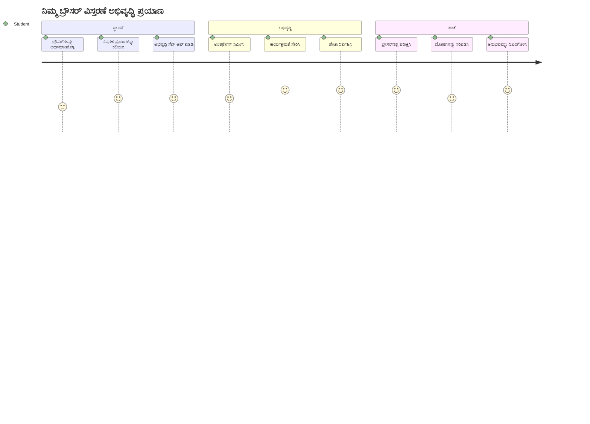
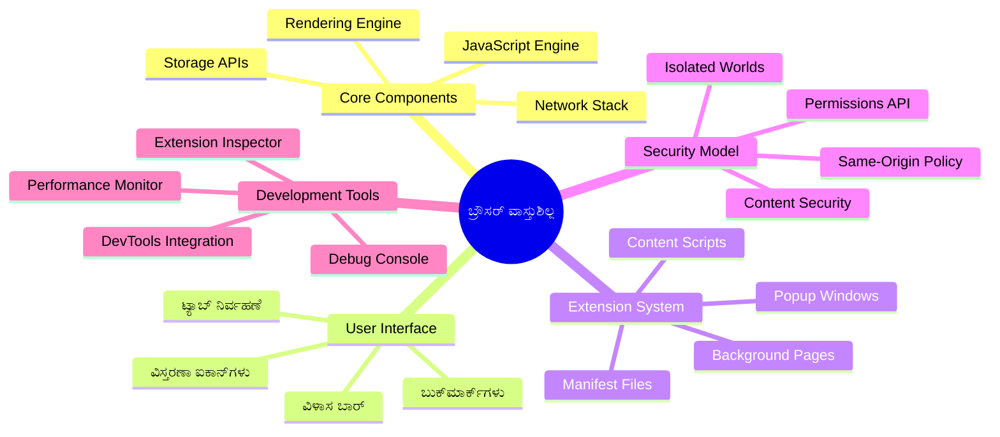
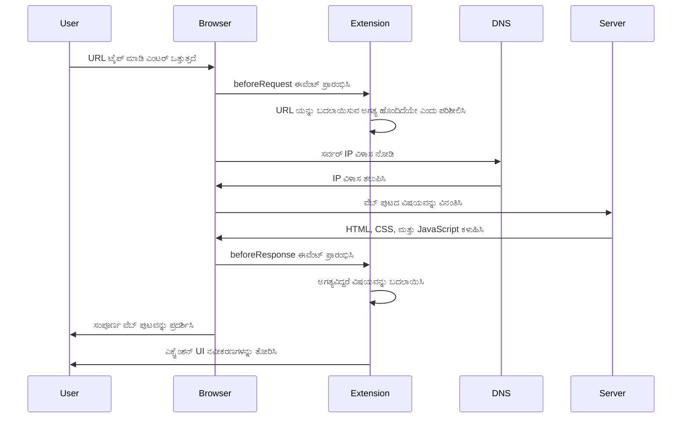
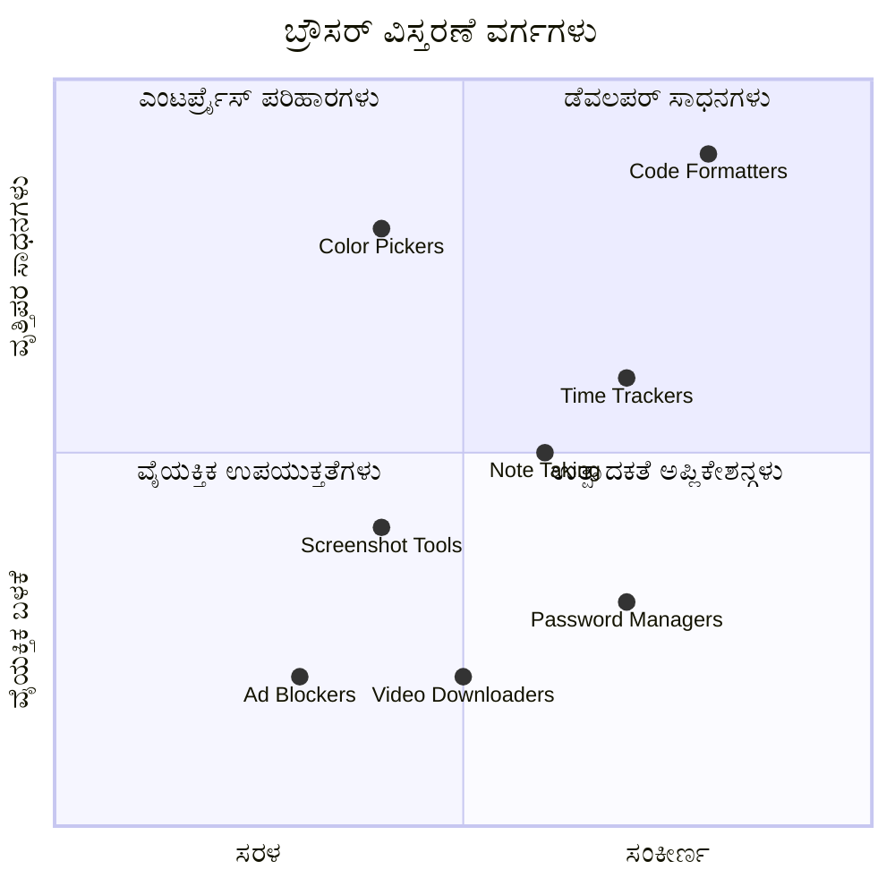
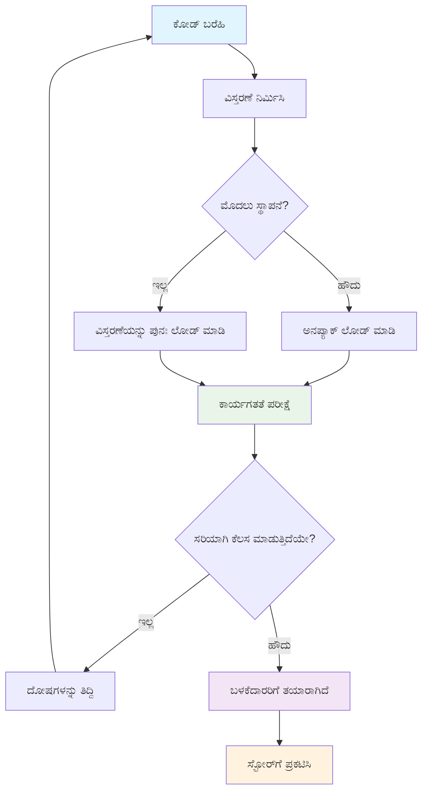
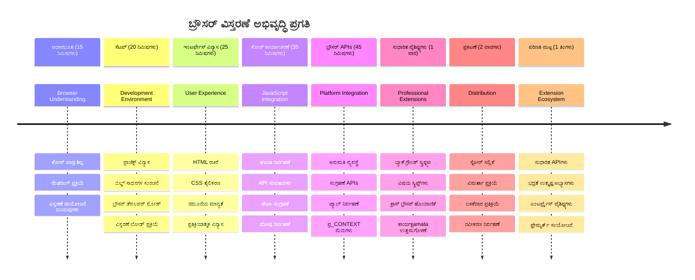

<!--
CO_OP_TRANSLATOR_METADATA:
{
  "original_hash": "00aa85715e1efd4930c17a23e3012e69",
  "translation_date": "2026-01-08T15:47:54+00:00",
  "source_file": "5-browser-extension/1-about-browsers/README.md",
  "language_code": "kn"
}
-->
# ಬ್ರೌಸರ ವಿಸ್ತಾರ ಪ್ರಾಜೆಕ್ಟ್ ಭಾಗ 1: ಬ್ರೌಸರಗಳ ಬಗ್ಗೆ ಎಲ್ಲವನ್ನೂ



> ಸ್ಕೆಟ್‌ನೋಟ್ [Wassim Chegham](https://dev.to/wassimchegham/ever-wondered-what-happens-when-you-type-in-a-url-in-an-address-bar-in-a-browser-3dob) ಅವರಿಂದ

## ಓಪನಾಗಿ ಪಾಠದ ಪೂರ್ವ ಪ್ರಶ್ನೆಗಳ ಸರಣಿ

[ಪೂರ್ವ ಪಾಠ ಪ್ರಶ್ನೆಗಳು](https://ff-quizzes.netlify.app/web/quiz/23)

### ಪರಿಚಯ

ಬ್ರೌಸರ ವಿಸ್ತಾರಗಳು ನಿಮ್ಮ ವೆಬ್ ಬ್ರೌಸಿಂಗ್ ಅನುಭವವನ್ನು ಸುಧಾರಿಸುವ ಸಣ್ಣ ಅಪ್ಲಿಕೇಶನ್ಗಳು. ಟಿಮ್ ಬರ್ನರ್ಸ್-ಲೀ ಅವರ ಪ್ರಾಥಮಿಕ ಪರಿಕಲ್ಪನೆಯಂತೆ ಸಂವಾದಾತ್ಮಕ ವೆಬ್‌ಗಾಗಿ, ವಿಸ್ತಾರಗಳು ಸರಳ ಡಾಕ್ಯುಮೆಂಟ್ ವೀಕ್ಷಣೆಗೆ ಮೀರಿ ಬ್ರೌಸರದ ಸಾಮರ್ಥ್ಯಗಳನ್ನು ವಿಸ್ತರಿಸುತ್ತವೆ. ನಿಮ್ಮ ಖಾತೆಗಳನ್ನು ಸುರಕ್ಷಿತವಾಗಿಡುವ ಪಾಸ್‌ವರ್ಡ್ ಮ್ಯಾನೇಜರ್‌ಡಿಂದ ಆರಂಭಿಸಿ, ಡಿಸೈನರ್‌ಗಳಿಗೆ ಸರಿಯಾದ ನೋಟವನ್ನು ಪಡೆದುಕೊಳ್ಳಲು ಸಹಾಯ ಮಾಡುವ ಬಣ್ಣ ಆರಿಸುವ ಉಪಕರಣಗಳವರೆಗೆ, ವಿಸ್ತಾರಗಳು ದೈನಂದಿನ ಬ್ರೌಸಿಂಗ್ ಸವಾಲುಗಳನ್ನು ಪರಿಹರಿಸುತ್ತವೆ.

ನೀವು ಮೊದಲು ವಿಸ್ತಾರವನ್ನು ನಿರ್ಮಿಸುವ ಮೊದಲು, ಬ್ರೌಸರಗಳು ಹೇಗೆ ಕೆಲಸ ಮಾಡುತ್ತವೆ ಎಂಬುದನ್ನು ойлೈಸೋಣ. ಆಲೆಕ್ಸಾಂಡರ್ ಗ್ರಾಮ್ ಬೆಲ್ ಟೀليفೋನ್ ಕಂಡುಹಿಡಿಯುವ ಮೊದಲು ಶಬ್ದ ಪ್ರಸರಣವನ್ನು ತಿಳಿಯಬೇಕಾಗಿದ್ದು, ಬ್ರೌಸರ ಮೂಲಭೂತಗಳನ್ನು ತಿಳಿದುಕೊಳ್ಳುವುದರಿಂದ ನೀವು ಇರುವ ಬ್ರೌಸರ ವ್ಯವಸ್ಥೆಗಳ ಜೊತೆ ಚೆನ್ನಾಗಿ ಸಂಯೋಜಿಸಬಹುದಾದ ವಿಸ್ತಾರಗಳನ್ನು ರಚಿಸಲು ಸಹಾಯವಾಗುತ್ತದೆ.

ಈ ಪಾಠದ ಅಂತ್ಯಕ್ಕೆ, ನೀವು ಬ್ರೌಸರ ಆರ್ಕಿಟೆಕ್ಚರ್ ಅನ್ನು ಅರಿತುಕೊಳ್ಳುತ್ತೀರಿ ಮತ್ತು ನಿಮ್ಮ ಮೊದಲ ವಿಸ್ತಾರವನ್ನು ನಿರ್ಮಿಸಲು ಆರಂಭಿಸಿರುತ್ತೀರಿ.


## ವೆಬ್ ಬ್ರೌಸರಗಳನ್ನು ತಿಳಿದುಕೊಳ್ಳುವುದು

ವೆಬ್ ಬ್ರೌಸರ ಮೂಲತಃ ಜಟಿಲ ಡಾಕ್ಯುಮೆಂಟ್ ವ್ಯಾಖ್ಯೇತಕ. ನೀವು ವಿಳಾಸ ಬಾರಿನಲ್ಲಿ "google.com" ಟೈಪ್ ಮಾಡಿದಾಗ, ಬ್ರೌಸರ ಜಾಗತಿಕ ಸರ್ವರ್‌ಗಳಿಂದ ವಿಷಯದ ವಿನಂತಿಯನ್ನು ಮಾಡುತ್ತದೆ, ನಂತರ ಆ ಕೋಡ್ ಅನ್ನು ಪುನರ್‌ವಿಚಾರಿಸಿ, ನೀವು ನೋಡುತ್ತಿರುವ ಸಂವಾದಾತ್ಮಕ ವೆಬ್ ಪುಟಗಳನ್ನು ರೆಂಡರ್ ಮಾಡುತ್ತದೆ.

ಈ ಪ್ರಕ್ರಿಯೆ 1990 ರಲ್ಲಿ ಟಿಮ್ ಬರ್ನರ್ಸ್-ಲೀ ರಚಿಸಿದ ಮೊದಲ ವೆಬ್ ಬ್ರೌಸರ, WorldWideWeb, ಹೇಗೆ ವಿನ್ಯಾಸಗೊಳಿಸಲ್ಪಟ್ಟಿತ್ತು ಎಂಬುದನ್ನು ಪ್ರತಿಬಿಂಬಿಸುತ್ತದೆ, ಇದು ಎಲ್ಲರಿಗೂ ಹೈಪರ್‌ಲಿಂಕ್ ಡಾಕ್ಯುಮೆಂಟ್‌ಗಳನ್ನು ಲಭ್ಯವಾಗುವಂತೆ ಮಾಡಿತು.

✅ **ಚಿಕ್ಕ ಇತಿಹಾಸ**: ಮೊದಲ ಬ್ರೌಸರ ಹೆಸರೇ 'WorldWideWeb' ಆಗಿತ್ತು ಮತ್ತು ಅದನ್ನು ಸರ್ ಟಿಮೋಥಿ ಬರ್ನರ್ಸ್-ಲೀ 1990 ರಲ್ಲಿ ರಚಿಸಿದ್ದರು.


> ಕೆಲವೊಂದು ಪ್ರಾಚೀನ ಬ್ರೌಸರಗಳು, [Karen McGrane](https://www.slideshare.net/KMcGrane/week-4-ixd-history-personal-computing) ಅವರ ಮೂಲಕ

### ಬ್ರೌಸರ್‌ಗಳು ವೆಬ್ ವಿಷಯವನ್ನು 어떻게 ಪ್ರಕ್ರಿಯೆ ಪಡಿಸುತ್ತವೆ

URL ನವೊಲೆ ಮಾಡಿಕೊಂಡು ವೆಬ್ ಪುಟವನ್ನು ನೋಡುವವರೆಗೆ ಹಲವಾರು ಸಂಯೋಜಿತ ಹಂತಗಳು ಸೆಕೆಂಡ್‌ಗಳಲ್ಲಿ ನಡೆಯುತ್ತವೆ:


**ಈ ಪ್ರಕ್ರಿಯೆ ಸಾಧಿಸುವದು:**
- **ಮಾನವ ಓದುಗ URL ಅನ್ನು ಡಿಎನ್‌ಎಸ್ ಲುಕ್ ಅಪ್ ಮೂಲಕ ಸರ್ವರ್ ಐಪಿ ವಿಳಾಸಕ್ಕೆ** ಅನುವಾದಿಸುತ್ತದೆ
- **HTTP ಅಥವಾ HTTPS ಪ್ರೋಟೋಕಾಲುಗಳನ್ನು ಬಳಸಿ ವೆಬ್ ಸರ್ವರ್ ಜೊತೆ ಸುರಕ್ಷಿತ ಸಂಪರ್ಕವನ್ನು ಸ್ಥಾಪಿಸುತ್ತದೆ**
- **ಸರ್ವರ್ ನಿಂದ ನಿರ್ದಿಷ್ಟ ವೆಬ್ ಪುಟ ವಿಷಯವನ್ನು ವಿನಂತಿಸುತ್ತದೆ**
- **ಸರ್ವರ್‌ನಿಂದ HTML ಮಾರ್ಕ್ ಅಪ್, CSS ಶೈಲಿಗಳನ್ನು ಮತ್ತು ಜಾವಾಸ್ಕ್ರಿಪ್ಟ್ ಕೋಡ್ ಅನ್ನು ಸ್ವೀಕರಿಸುತ್ತದೆ**
- **ಎಲ್ಲಾ ವಿಷಯವನ್ನು ಸಂವಾದಾತ್ಮಕ ವೆಬ್ ಪುಟವಾಗಿ ರೆಂಡರ್ ಮಾಡುತ್ತದೆ**

### ಬ್ರೌಸರ್ ಕೋರ್ ವೈಶಿಷ್ಟ್ಯಗಳು

ಆಧುನಿಕ ಬ್ರೌಸರಗಳು ವಿಸ್ತಾರ ಡೆವಲಪರ್‌ಗಳು ಬಳಸಬಹುದಾದ ಹಲವಾರು ವೈಶಿಷ್ಟ್ಯಗಳನ್ನು ಒದಗಿಸುತ್ತವೆ:

| ವೈಶಿಷ್ಟ್ಯ | ಉದ್ದೇಶ | ವಿಸ್ತಾರ ಅವಕಾಶಗಳು |
|---------|---------|------------------------|
| **ರೆಂಡರಿಂಗ್ ಎಂಜಿನ್** | HTML, CSS ಮತ್ತು ಜಾವಾಸ್ಕ್ರಿಪ್ಟ್ ಪ್ರದರ್ಶನ | ವಿಷಯ ಹೊರತಾಗಿಸಲು, ಶೈಲಿ ಸೇರ್ಪಡೆಗೆ |
| **ಜಾವಾಸ್ಕ್ರಿಪ್ಟ್ ಎಂಜಿನ್** | ಜಾವಾಸ್ಕ್ರಿಪ್ಟ್ ಕಾರ್ಯಗತಗೊಳಿಸುವುದು | ಅನುಕೂಲವೊಂದಿಗೆ ಸ್ಕ್ರಿಪ್ಟ್‌ಗಳು, API ಸಂವಹನಗಳು |
| **ಲೋಕಲ್ ಸ್ಟೋರೆಜ್** | ಸ್ಥಳೀಯವಾಗಿ ಡೇಟಾವನ್ನು ಸಂಗ್ರಹಿಸುತ್ತದೆ | ಬಳಕೆದಾರ ಆದ್ಯತೆಗಳು, ಕ್ಯಾಶೆಡ್ ಡೇಟಾ |
| **ನೆಟ್‌ವರ್ಕ್ ಸ್ಟಾಕ್** | ವೆಬ್ ವಿನಂತಿಗಳನ್ನು ನಿರ್ವಹಿಸುತ್ತದೆ | ವಿನಂತಿ ನಿಗೂಳಿಸುವಿಕೆ, ಡೇಟಾ ವಿಶ್ಲೇಷಣೆ |
| **ಸುರಕ್ಷತೆ ಮಾದರಿ** | ಬಳಕೆದಾರರನ್ನು ಹಾನಿಕರ ವಿಷಯಗಳಿಂದ ರಕ್ಷಿಸುತ್ತದೆ | ವಿಷಯ ಫಿಲ್ಟರಿಂಗ್, ಸುರಕ್ಷತೆ ಸುಧಾರಣೆಗಳು |

**ಈ ವೈಶಿಷ್ಟ್ಯಗಳನ್ನು ತಿಳಿದುಕೊಳ್ಳುವುದರಿಂದ ನಿಮಗೆ:**
- **ನಿಮ್ಮ ವಿಸ್ತಾರ ಹೆಚ್ಚಿನ ಮೌಲ್ಯವನ್ನು ಸೇರಿಸಬಹುದಾದ ಸ್ಥಳಗಳನ್ನು ಗುರುತಿಸಲು**
- **ನಿಮ್ಮ ವಿಸ್ತಾರದ ಕಾರ್ಯಕ್ಷಮತೆಗಾಗಿ ಸರಿಯಾದ ಬ್ರೌಸರ API ಗಳನ್ನು ಆಯ್ಕೆಮಾಡಲು**
- **ಬ್ರೌಸರ ವ್ಯವಸ್ಥೆಗಳೊಂದಿಗೆ ಸಾಮರ್ಥ್ಯಯುತವಾಗಿ ಕೆಲಸ ಮಾಡುವ ವಿಸ್ತಾರಗಳನ್ನು ವಿನ್ಯಾಸಗೊಳಿಸಲು**
- **ನಿಮ್ಮ ವಿಸ್ತಾರ ಬ್ರೌಸರದ ಸುರಕ್ಷತಾ ಉತ್ತಮ ಅನುಸರಣೆಗಳನ್ನು ಪಾಲಿಸಬೇಕೆಂದು ಖಾತ್ರಿ ಮಾಡಿಕೊಳ್ಳಲು**

### ಕ್ರಾಸ್-ಬ್ರೌಸರ ಡೆವಲಪ್‌ಮೆಂಟ್ ಪರಿಗಣನೆಗಳು

ಬೇರೆಬೇರೆ ಬ್ರೌಸರಗಳು ಸಾಮಾನ್ಯವಾಗಿ ಸ್ವಲ್ಪ ತಾರತಮ್ಯಗಳೊಂದಿಗೆ ನಿಯಮಾವಳಿಗಳನ್ನು ಅನುಷ್ಠಾನಗೊಳಿಸುತ್ತವೆ, ಬಹುಶಃ ಬೇರೆ ಪ್ರೋಗ್ರಾಮಿಂಗ್ ಭಾಷೆಗಳು ಒಂದೇ ಅಲ್ಗಾರಿದಮ್ ಅನ್ನು ವಿಭಿನ್ನವಾಗಿ ಹ್ಯಾಂಡಲ್ ಮಾಡುವ ಹಾಗೆ. ಕ್ರೋಮ್, ಫೈರ್‌ಫಾಕ್ಸ್ ಮತ್ತು ಸಫಾರಿ ಪ್ರತಿಯೊಂದು ವಿಭಿನ್ನ ಗುಣಲಕ್ಷಣಗಳನ್ನು ಹೊಂದಿವೆ, ಮತ್ತು ವಿಸ್ತಾರ ಡೆವಲಪರ್ ಗಳು ಈ ವೈಶಿಷ್ಟ್ಯಗಳನ್ನು ಗಮನದಲ್ಲಿಟ್ಟುಕೊಳ್ಳಬೇಕು.

> 💡 **ಪ್ರೊ ಟಿಪ್**: ವಿವಿಧ ಬ್ರೌಸರಗಳಲ್ಲಿಉಪಯೋಗಿಸುವ ವೆಬ್ ತಂತ್ರಜ್ಞಾನಗಳನ್ನು ಪರಿಶೀಲಿಸಲು [caniuse.com](https://www.caniuse.com) ಬಳಸಿ. ಇದು ನಿಮ್ಮ ವಿಸ್ತಾರದ ವೈಶಿಷ್ಟ್ಯಗಳನ್ನು ಯೋಜಿಸುವಾಗ ಅತ್ಯಂತ ಮೌಲ್ಯಯುತವಾಗಿದೆ!

**ವಿಸ್ತಾರ ಡೆವಲಪ್‌ಮೆಂಟ್ ಕೀ ಪರಿಗಣನೆಗಳು:**
- **ನಿಮ್ಮ ವಿಸ್ತಾರವನ್ನು ಕ್ರೋಮ್, ಫೈರ್‌ಫಾಕ್ಸ್ ಮತ್ತು ಎಡ್ಜ್ ಬ್ರೌಸರ‌ಗಳಲ್ಲಿ ಪರೀಕ್ಷಿಸಿ**
- **ಬೇರೆಬೇರೆ ಬ್ರೌಸರ ವಿಸ್ತಾರ API ಮತ್ತು ಮ್ಯಾನಿಫೆಸ್ಟ್ ಫಾರ್ಮ್ಯಾಟ್‌ಗಳಿಗೆ ಹೊಂದಿಕೊಳ್ಳಿ**
- **ಭಿನ್ನ ಪ್ರదర్శನಾ ಗುಣಲಕ್ಷಣಗಳು ಮತ್ತು ಮಿತಿಗಳನ್ನು ನಿಭಾಯಿಸಿ**
- **ಬ್ರೌಸರ-ನಿರ್ಧರಿತ ವೈಶಿಷ್ಟ್ಯಗಳಿಗೆFallback‌ ಗಳು ಒದಗಿಸಿ, ಅವು ಲಭ್ಯವಿಲ್ಲದಿದ್ದರೆ**

✅ ** ವಿಶ್ಲೇಷಣಾತ್ಮಕ ತತ್ವಾಂಶ**: ನಿಮ್ಮ ಬಳಕೆದಾರರು ಯಾವ ಬ್ರೌಸರ‌ನ್ನು ಹೆಚ್ಚು ಬಳಸುತ್ತಾರೆ ಎಂಬುದನ್ನು ನಿಮ್ಮ ವೆಬ್ ಡೆವಲಪ್‌ಮೆಂಟ್ ಯೋಜನೆಗಳಲ್ಲಿ ವಿಶ್ಲೇಷಣೆ ಪ್ಯಾಕೇಜನ್ನು ಇನ್‌ಸ್ಟಾಲ್ ಮಾಡಿ ಕಂಡುಹಿಡಿಯಬಹುದು. ಈ ಡೇಟಾ ನಿಮಗೆ ಮೊದಲಿಗೆ ಯಾವ ಬ್ರೌಸರ‌ಗಳನ್ನು ಬೆಂಬಲಿಸಬೇಕು ಎಂದು ಆದಾನ ನೀಡುತ್ತದೆ.

## ಬ್ರೌಸರ ವಿಸ್ತಾರಗಳನ್ನು ತಿಳಿದುಕೊಳ್ಳುವುದು

ಬ್ರೌಸರ ವಿಸ್ತಾರಗಳು ಸಾಮಾನ್ಯ ವೆಬ್ ಬ್ರೌಸಿಂಗ್ ಸವಾಲುಗಳನ್ನು ನಿರಾಕರಿಸುವ ಮೂಲಕ ಬ್ರೌಸರ ಮುಖಮಟ್ಟದಲ್ಲಿ ಕಾರ್ಯಕ್ಷಮತೆಯನ್ನು ನೇರವಾಗಿ ಸೇರಿಸುತ್ತವೆ. ಬೇರೆಯ ಅಪ್ಲಿಕೇಶನ್‌ಗಳು ಅಥವಾ ಸಂಕೀರ್ಣ ಕಾರ್ಯಚಟುವಟಿಕೆಗಳ ಅವಶ್ಯಕತೆ ಇಲ್ಲದೆ, ವಿಸ್ತಾರಗಳು ತಕ್ಷಣ ಉಪಕರಣಗಳು ಮತ್ತು ವೈಶಿಷ್ಟ್ಯಗಳನ್ನು ಒದಗಿಸುತ್ತವೆ.

ಈ ಪರಿಕಲ್ಪನೆ ಮೊದಲ ಕಂಪ್ಯೂಟರ್ ಪಯೊನಿಯರ್ಸ್ ಡಗ್ಲಸ್ ಎಂಜಲ್‌ಬಾರ್ಟ್ ಮಾನವ ಸಾಮರ್ಥ್ಯಗಳನ್ನು ತಂತ್ರಜ್ಞಾನದಿಂದ ವೃದ್ಧಿಸುವಂತೆ ಕಲ್ಪಿಸಿದ್ದರು - ವಿಸ್ತಾರಗಳು ನಿಮ್ಮ ಬ್ರೌಸರ ಮೂಲ ಕಾರ್ಯಕ್ಷಮತೆಯನ್ನು ಹೆಚ್ಚಿಸುತ್ತವೆ.


**ಜನಪ್ರಿಯ ವಿಸ್ತಾರ ವರ್ಗಗಳು ಮತ್ತು ಅವುಗಳ ಲಾಭಗಳು:**
- **ಉತ್ಪಾದಕತೆ ಉಪಕರಣಗಳು**: ಕಾರ್ಯ ನಿರ್ವಾಹಕರು, ಟಿಪ್ಪಣಿ ತೆಗೆದುಕೊಳ್ಳುವ ಅಪ್ಲಿಕೇಶನ್‌ಗಳು ಮತ್ತು ಸಮಯ ಟ್ರ್ಯಾಕರ್‌ಗಳು ನೀವು ಸಂಘಟಿತವಾಗಿರಲು ಸಹಾಯ ಮಾಡುತ್ತವೆ
- **ಸುರಕ್ಷತೆ ಸುಧಾರಣಗಳು**: ಪಾಸ್‌ವರ್ಡ್ ಮ್ಯಾನೇಜರ್‌ಗಳು, ಜಾಹೀರಾತು ತಡೆಗಡೆ ಮಾಡುವವರು ಮತ್ತು ಗೌಪ್ಯತಾ ಉಪಕರಣಗಳು ನಿಮ್ಮ ಡೇಟಾವನ್ನು ರಕ್ಷಿಸುತ್ತವೆ
- **ಡೆವಲಪರ್ ಉಪಕರಣಗಳು**: ಕೋಡ್ ಫಾರ್ಮ್ಯಾಟರ್‌ಗಳು, ಬಣ್ಣ ಆರಿಸುವ ಉಪಕರಣಗಳು ಮತ್ತು ಡಿಬಗ್ ಉಪಕರಣಗಳು ಅಭಿವೃದ್ಧಿಯನ್ನು ಸುಲಭಗೊಳಿಸುತ್ತವೆ
- **ವಿಷಯ ಸುಧಾರಣೆಗಳು**: ಓದು ಮೋಡ್‌ಗಳು, ವೀಡಿಯೋ ಡೌನ್‌ಲೋಡರ್‌ಗಳು ಮತ್ತು ಸ್ಕ್ರೀನ್‌ಶಾಟ್ ಉಪಕರಣಗಳು ನಿಮ್ಮ ವೆಬ್ ಅನುಭವವನ್ನು ಉತ್ತಮಗೊಳಿಸುತ್ತವೆ

✅ **ಪರಾವರ್ತನೆ ಪ್ರಶ್ನೆ**: ನಿಮ್ಮ ಪ್ರಿಯ ಬ್ರೌಸರ ವಿಸ್ತಾರಗಳೇನು? ಅವು ವಿಶೇಷವಾಗಿ ಯಾವ ಕಾರ್ಯಗಳನ್ನು ನಿರ್ವಹಿಸುತ್ತವೆ ಮತ್ತು ನಿಮ್ಮ ಬ್ರೌಸಿಂಗ್ ಅನುಭವವನ್ನು ಹೇಗೆ ಸುಧಾರಿಸುತ್ತವೆ?

### 🔄 **ಶಿಕ್ಷಣ ಸಂಬಂಧಿ ಪರಿಶೀಲನೆ**
**ಬ್ರೌಸರ ಆರ್ಕಿಟೆಕ್ಚರ್ ತಿಳಿವಳಿಕೆ**: ವಿಸ್ತಾರ ಅಭಿವೃದ್ಧಿಗೆ ಮುಂಚೆ ಖಚಿತಪಡಿಸಿಕೊಳ್ಳಿ:
- ✅ ಬ್ರೌಸರ‌ಗಳು ವೆಬ್ ವಿನಂತಿಗಳನ್ನು ಹೇಗೆ ಪ್ರಕ್ರಿಯೆಗೊಳಿಸುತ್ತವೆ ಮತ್ತು ವಿಷಯವನ್ನು ರೆಂಡರ್ ಮಾಡುತ್ತವೆ ಎಂಬುದನ್ನು ವಿವರಿಸಬಹುದೇ?
- ✅ ಬ್ರೌಸರ ಆರ್ಕಿಟೆಕ್ಚರ್ ಮುಖ್ಯ ಘಟಕಗಳನ್ನು ಗುರುತಿಸಬಹುದೇ?
- ✅ ವಿಸ್ತಾರಗಳು ಬ್ರೌಸರ ಕಾರ್ಯಕ್ಷಮತೆಯೊಂದಿಗೆ ಹೇಗೆ ಸಂಯೋಜಿತವಾಗುತ್ತವೆ ಎಂಬುದನ್ನು ಅರ್ಥಮಾಡಿಕೊಳ್ಳಬಹುದೇ?
- ✅ ಬಳಕೆದಾರರನ್ನು ರಕ್ಷಿಸುವ ಸುರಕ್ಷತಾ ಮಾದರಿಯನ್ನು ಪರಿಚಯಿಸಬಹುದೇ?

**ತ್ವರಿತ ಸ್ವ-ಪರೀಕ್ಷೆ**: URL ಟೈಪ್ ಮಾಡಿ ವೆಬ್ ಪುಟವನ್ನು ನೋಡುವವರೆಗೆ ಹಾದಿಯನ್ನು ಪತ್ತೆಮಾಡಬಹುದೇ?
1. **DNS ಲುಕ್-ಅಪ್** URL ಅನ್ನು ಐಪಿ ವಿಳಾಸಕ್ಕೆ ಪರಿವರ್ತಿಸುತ್ತದೆ
2. **HTTP ವಿನಂತಿ** ಸರ್ವರ್‌ನಿಂದ ವಿಷಯ আহರಿಸುತ್ತದೆ
3. **ಪಾರ್ಸಿಂಗ್** HTML, CSS ಮತ್ತು ಜಾವಾಸ್ಕ್ರಿಪ್ಟ್ ಅನ್ನು ಪ್ರಕ್ರಿಯೆಗೊಳಿಸುತ್ತದೆ
4. **ರೆಂಡರಿಂಗ್** ಅಂತಿಮ ವೆಬ್ ಪುಟವನ್ನು ಪ್ರದರ್ಶಿಸುತ್ತದೆ
5. **ವಿಸ್ತಾರಗಳು** ಹಲವಾರು ಹಂತಗಳಲ್ಲಿ ವಿಷಯವನ್ನು ಬದಲಾಯಿಸಬಹುದು

## ವಿಸ್ತಾರಗಳನ್ನು ಇನ್‌ಸ್ಟಾಲ್ ಮಾಡುವುದು ಮತ್ತು ನಿರ್ವಹಣೆ

ವಿಸ್ತಾರಗಳನ್ನು ಇನ್‌ಸ್ಟಾಲ್ ಮಾಡುವ ಪ್ರಕ್ರಿಯೆಯನ್ನು ತಿಳಿದುಕೊಳ್ಳುವ ಮೂಲಕ, ನೀವು ಜನರು ನಿಮ್ಮ ವಿಸ್ತಾರವನ್ನು ಇನ್‌ಸ್ಟಾಲ್ ಮಾಡುವಾಗ ಬಳಕೆದಾರ ಅನುಭವದ ನಿರೀಕ್ಷೆಯನ್ನು ಮಾಡಬಹುದು. ಇನ್‌ಸ್ಟಾಲೇಶನ್ ಪ್ರಕ್ರಿಯೆ ಆಧುನಿಕ ಬ್ರೌಸರ‌ಗಳಲ್ಲಿ ಸಾಮಾನ್ಯವಾಗಿದೆ, ಕೆಲವು ಸಣ್ಣ ವ್ಯತ್ಯಾಸಗಳು ಮಾತ್ರ ಇಂಟರ್‌ಫೇಸ್ ವಿನ್ಯಾಸದಲ್ಲಿ ಇರುತ್ತವೆ.


> **ಮುಖ್ಯವಾದುದು**: ನಿಮ್ಮ ಸ್ವಂತ ವಿಸ್ತಾರಗಳನ್ನು ಪರೀಕ್ಷಿಸುವಾಗ ಡೆವಲಪರ್ ಮೋಡ್ ಅನ್ನು ಟೋಗಲ್ ಆನ್ ಮಾಡಿ ಮತ್ತು ಬೇರೆ ಸ್ಟೋರ್‌ಗಳಿಂದ ವಿಸ್ತಾರಗಳನ್ನು ಅನುಮತಿಸಿ.

### ಡೆವಲಪ್ಮೆಂಟ್ ವಿಸ್ತಾರ ಇನ್‌ಸ್ಟಾಲೇಶನ್ ಪ್ರಕ್ರಿಯೆ

ನೀವು ನಿಮ್ಮ ಸ್ವತ: ವಿಸ್ತಾರಗಳನ್ನು ಡೆವಲಪ್ ಮತ್ತು ಪರೀಕ್ಷಿಸುವಾಗ, ಈ ಕಾರ್ಯವಿಧಾನವನ್ನು ಅನುಸರಿಸಿ:


```bash
# ಹಂತ 1: ನಿಮ್ಮ ವಿಸ್ತರಣೆಯನ್ನು ನಿರ್ಮಿಸಿ
npm run build
```

**ಈ ಆಜ್ಞೆಯು ಸಾಧಿಸುವುದು:**
- **ನಿಮ್ಮ ಮೂಲ ಕೋಡ್ ಅನ್ನು ಬ್ರೌಸರ್ ಸಿದ್ಧ ಫೈಲ್‌ಗಳಾಗಿ ಸಂকলಿಸುತ್ತದೆ**
- **ಜಾವಾಸ್ಕ್ರಿಪ್ಟ್ ಮాడ್ಯೂಲ್‌ಗಳನ್ನು ಆಪ್ಟಿಮೈಸ್ ಮಾಡಿದ ಪ್ಯಾಕೇಜ್‌ಗಳಲ್ಲಿ ಒಗ್ಗೂಡಿಸುತ್ತದೆ**
- **ಕ್ಲೈಂಟ್ `/dist` ಫೋಲ್ಡರ್‌ನಲ್ಲಿ ಅಂತಿಮ ವಿಸ್ತಾರ ಫೈಲ್‌ಗಳನ್ನು ತಯಾರಿಸುತ್ತದೆ**
- **ವಿಸ್ತಾರವನ್ನು ಇನ್‌ಸ್ಟಾಲ್ ಮತ್ತು ಪರೀಕ್ಷಿಸುವಂತೆ ಸಿದ್ಧಪಡಿಸುತ್ತದೆ**

**ಹಂತ 2: ಬ್ರೌಸರ್ ವಿಸ್ತಾರ ಪುಟಕ್ಕೆ ಹೋಗಿ**
1. **ನಿಮ್ಮ ಬ್ರೌಸರ ವಿಸ್ತಾರ ನಿರ್ವಹಣಾ ಪುಟವನ್ನು ತೆರೆಯಿರಿ**
2. **ಬಲಮೇಲೆ ಮೇಲಿನ “ಸೆಟ್ಟಿಂಗ್ಸ್ ಮತ್ತು ಹೆಚ್ಚಿನವು” (`...` ಐಕಾನ್) ಕ್ಲಿಕ್ ಮಾಡಿ**
3. **ಡ್ರಾಪ್ಡೌನ್ ಮೆನವಲ್ಲಿಂದ "ವಿಸ್ತಾರಗಳು" ಆಯ್ಕೆಮಾಡಿ**

**ಹಂತ 3: ನಿಮ್ಮ ವಿಸ್ತಾರ ಲೋಡ್ ಮಾಡಿ**
- **ಹೊಸ ಸ್ಥಾಪನೆಗಳಿಗೆ**: `load unpacked` ಆಯ್ಕೆ ಮಾಡಿ ನಿಮ್ಮ `/dist` ಫೋಲ್ಡರ್ ಅನ್ನು ಆರಿಸಿ
- **ಅಪ್‌ಡೇಟ್‌ಗಳಿಗೆ**: ಈಗಾಗಲೇ ಇನ್‌ಸ್ಟಾಲ್ ಮಾಡಿರುವ ವಿಸ್ತಾರದ ಎದುರಿಗೆ ಇರುವ `reload` ಗುರುತು ಮೇಲೆ ಕ್ಲಿಕ್ ಮಾಡಿ
- **ಪರೀಕ್ಷಿಸಲು**: ಹೆಚ್ಚುವರಿ ಡಬ್ಬಗಿಂಗ್ ವೈಶಿಷ್ಟ್ಯಗಳಿಗೆ ಪ್ರವೇಶ ಮಾಡುವಂತೆ "ಡೆವಲಪರ್ ಮೋಡ್" ಸಕ್ರಿಯಗೊಳಿಸಿ

### ಉತ್ಪಾದನಾ ವಿಸ್ತಾರ ಇನ್‌ಸ್ಟಾಲೇಶನ್

> ✅ **ಗಮನಿಸಿ**: ಈ ಡೆವೆಲಪ್‌ಮೆಂಟ್ ಸೂಚನೆಗಳು ನೀವು ನಿರ್ಮಿಸುವ ವಿಸ್ತಾರಗಳಿಗೆ ಮಾತ್ರ. ಪ್ರಕಟಿಸಿದ ವಿಸ್ತಾರಗಳನ್ನು ಇನ್‌ಸ್ಟಾಲ್ ಮಾಡಲು ಅಧಿಕೃತ ಬ್ರೌಸರ ವಿಸ್ತಾರ ಅಂಗಡಿಗಳನ್ನು, ಉದಾಹರಣೆಗೆ [Microsoft Edge Add-ons store](https://microsoftedge.microsoft.com/addons/Microsoft-Edge-Extensions-Home)‍ಗೆ ಭೇಟಿ ನೀಡಿ.

**ತ್ಯಾದಿಸುವ ಅಗತ್ಯ:**
- **ಡೆವಲಪ್ಮೆಂಟ್ ಇನ್‌ಸ್ಟಾಲೇಶನ್‌ಗಳು** ಡೆವಲಪ್‌ಮೆಂಟ್ ಸಮಯದಲ್ಲಿ ಪ್ರಕಟಿಸದ ವಿಸ್ತಾರಗಳನ್ನು ಪರೀಕ್ಷಿಸಲು ಅನುಕೂಲ
- **ಸ್ಟೋರ್ ಇನ್‌ಸ್ಟಾಲೇಶನ್‌ಗಳು** ಪರಿಶೀಲಿತ, ಪ್ರಕಟಿತ ವಿಸ್ತಾರಗಳನ್ನು ಸ್ವಯಂಚಾಲಿತ ನವೀಕರಣದೊಂದಿಗೆ ಒದಗಿಸುತ್ತವೆ
- **ಸೈಡ್‌ಲೋಡಿಂಗ್** ಅಧಿಕೃತ ಅಂಗಡಿಗಳ ಹೊರಗಿನ ವಿಸ್ತಾರಗಳನ್ನು ಇನ್‌ಸ್ಟಾಲ್ ಮಾಡಲು ಅವಕಾಶ (ಡೆವಲಪರ್ ಮೋಡ್ ಅಗತ್ಯ)

## ನಿಮ್ಮ ಕಾರ್ಬನ್ ಫೂಟ್‌ಪ್ರಿಂಟ್ ವಿಸ್ತಾರವನ್ನು ನಿರ್ಮಿಸುವುದು

ನಾವು ಒಂದು ಬ್ರೌಸರ ವಿಸ್ತಾರವನ್ನು ರಚಿಸುವೆವು ಅದು ನಿಮ್ಮ ಪ್ರಾಂತ್ಯದ ವಿದ್ಯುತ್ ಬಳಕೆಯ ಕಾರ್ಬನ್ ಫೂಟ್‌ಪ್ರಿಂಟ್ ಅನ್ನು ಪ್ರದರ್ಶಿಸುತ್ತದೆ. ಈ ಪ್ರಾಜೆಕ್ಟ್ ಪ್ರಮುಖ ವಿಸ್ತಾರ ಡೆವಲಪ್‌ಮೆಂಟ್ ತತ್ವಗಳನ್ನು ತೋರಿಸುವುದರೊಂದಿಗೆ ಪರಿಸರ ಜಾಗೃತಿಗಾಗಿ ಪ್ರಾಯೋಗಿಕ ಉಪಕರಣವನ್ನು ನಿರ್ಮಿಸುತ್ತದೆ.

ಈ ವಿಧಾನ "ಮಾಡಿ ಕಲಿಯುವುದು" ಎಂಬ ತತ್ವವನ್ನು ಅನುಸರಿಸುತ್ತದೆ, ಇದು ಜಾನ್ ಡ್ಯೂವಿಯ ಶೈಕ್ಷಣಿಕ ತತ್ವಗಳ ಮೂಲಕ ಪರಿಣಾಮಕಾರಿಯಾಗಿದ್ದು - ತಾಂತ್ರಿಕ ಕೌಶಲ್ಯಗಳನ್ನು ಅರ್ಥಪೂರ್ಣ ನೈಜ ಜಗತ್ತಿನ ಅನ್ವಯಗಳೊಂದಿಗೆ ಸಂಯೋಜಿಸುತ್ತದೆ.

### ಯೋಜನೆ ಅಗತ್ಯಗಳು

ಡೆವಲಪ್‌ಮೆಂಟ್ ಆರಂಭಿಸುವ ಮೊದಲು, ಅಗತ್ಯವಿರುವ ಸಂಪನ್ಮೂಲಗಳು ಮತ್ತು ಅವಲಂಬನೆಗಳನ್ನು ಸಂಗ್ರಹಿಸೋಣ:

**ಅಗತ್ಯ API ಪ್ರವೇಶ:**
- **[CO2 Signal API ಕೀ](https://www.co2signal.com/)**: ನಿಮ್ಮ ಉಚಿತ API ಕೀ ಪಡೆಯಲು ನಿಮ್ಮ ಇಮೇಲ್ ವಿಳಾಸವನ್ನು ನಮೂದಿಸಿ
- **[ಪ್ರಾಂತ್ಯ ಕೋಡ್](http://api.electricitymap.org/v3/zones)**: [Electricity Map](https://www.electricitymap.org/map) ಬಳಸಿಕೊಂಡು ನಿಮ್ಮ ಪ್ರಾಂತ್ಯ ಕೋಡ್ ಅನ್ನು ಹುಡುಕಿ (ಉದಾಹರಣೆಗೆ, ಬೋಸ್ಟನ್ 'US-NEISO' ಅನ್ನು ಬಳಸುತ್ತದೆ)

**ಡೆವಲಪ್‌ಮೆಂಟ್ ಉಪಕರಣಗಳು:**
- **[Node.js ಮತ್ತು NPM](https://www.npmjs.com)**: ಪ್ರಾಜೆಕ್ಟ್ ಅವಲಂಬನೆಗಳನ್ನು ಸ್ಥಾಪಿಸಲು ಪ್ಯಾಕೇಜ್ ನಿರ್ವಹಣಾ ಉಪಕರಣ
- **[ಆರಂಭಿಕ ಕೋಡ್](../../../../5-browser-extension/start)**: `start` ಫೋಲ್ಡರ್ ಅನ್ನು ಡೌನ್‌ಲೋಡ್ ಮಾಡಿ ಡೆವಲಪ್‌ಮೆಂಟ್ ಪ್ರಾರಂಭಿಸಿ

✅ **ಮತ್ತಷ್ಟು ಕಲಿಯಿರಿ**: ಈ [ವಿಸ್ಮೃತಲ Learn ಮಾಯಾಜಾಲ](https://docs.microsoft.com/learn/modules/create-nodejs-project-dependencies/?WT.mc_id=academic-77807-sagibbon) ಮೂಲಕ ನಿಮ್ಮ ಪ್ಯಾಕೇಜ್ ನಿರ್ವಹಣಾ ಕೌಶಲ್ಯಗಳನ್ನು ಸುಧಾರಿಸಿ

### ಯೋಜನೆ ರಚನೆ ತಿಳಿದುಕೊಳ್ಳುವುದು

ಯೋಜನೆ ರಚನೆಯನ್ನು ಮನಗಂಡರೆ ಅಭಿವೃದ್ಧಿ ಕಾರ್ಯವನ್ನು ಪರಿಣಾಮಕಾರಿಯಾಗಿ ಸಂಘಟಿಸಲು ಸಹಾಯವಾಗುತ್ತದೆ. ಅಲೆಕ್ಸಾಂಡ್ರಿಯಾ ಗ್ರಂಥಾಲಯ ಹೇಗೆ ಜ್ಞಾನವನ್ನು ಸುಲಭವಾಗಿ ಹುಡುಕಲು ವ್ಯವಸ್ಥಿತವಾಗಿತ್ತು ಹೀಗೇ, ಒಳ್ಳೆಯ ರಚನೆಯ ಕೋಡ್‌ಬೇಸ್ ಅಭಿವೃದ್ಧಿಯನ್ನು ಹೆಚ್ಚು ಪರಿಣಾಮಕಾರಿಗೊಳಿಸುತ್ತದೆ:

```
project-root/
├── dist/                    # Built extension files
│   ├── manifest.json        # Extension configuration
│   ├── index.html           # User interface markup
│   ├── background.js        # Background script functionality
│   └── main.js              # Compiled JavaScript bundle
├── src/                     # Source development files
│   └── index.js             # Your main JavaScript code
├── package.json             # Project dependencies and scripts
└── webpack.config.js        # Build configuration
```

**ಪ್ರತಿ ಫೈಲ್ ಏನು ಸಾಧಿಸುತ್ತದೆ:**
- **`manifest.json`**: ವಿಸ್ತಾರದ ಮೆಟಾಡೇಟಾ, ಅನುಮತಿಗಳನ್ನು ಮತ್ತು ಪ್ರವೇಶ ಬಿಂದುಗಳನ್ನು ವ್ಯಾಖ್ಯಾನಿಸುತ್ತದೆ
- **`index.html`**: ಬಳಕೆದಾರ ಇಂಟರ್‌ಫೇಸ್ ಅನ್ನು ರಚಿಸುತ್ತದೆ, ಇದು ಬಳಕೆದಾರರು ವಿಸ್ತಾರವನ್ನು ಕ್ಲಿಕ್ ಮಾಡಿದಾಗ ಕಾಣುತ್ತದೆ
- **`background.js`**: ಹಿನ್ನೆಲೆ ಕಾರ್ಯ ಮತ್ತು ಬ್ರೌಸರ ಇವೆಂಟ್‌ಗಳನ್ನು ನಿರ್ವಹಿಸುತ್ತದೆ
- **`main.js`**: ಬಿಲ್ಡ್ ಪ್ರಕ್ರಿಯೆಯ ನಂತರ ಅಂತಿಮ ಜಾವಾಸ್ಕ್ರಿಪ್ಟ್ ಬಂಡಲ್ ಅನ್ನು ಹೊಂದಿದೆ
- **`src/index.js`**: ನಿಮ್ಮ ಪ್ರಮುಖ ಡೆವಲಪ್‌ಮೆಂಟ್ ಕೋಡ್ ಇದರಲ್ಲಿ ಇರುತ್ತದೆ, ಇದು `main.js` ಗೆ ಸಂಯೋಜಿಸಲಾಗುತ್ತದೆ

> 💡 **ಸಂಘಟನೆಯ ಮೆಲುಕು**: ನಿಮ್ಮ API ಕೀ ಮತ್ತು ಪ್ರಾಂತ್ಯ ಕೋಡ್ ಅನ್ನು ಡೆವಲಪ್‌ಮೆಂಟ್ ವೇಳೆ ಸುಲಭವಾಗಿ ಉಲ್ಲೇಖಿಸಲು ಭದ್ರವಾಗಿ ಟಿಪ್ಪಣಿಯಲ್ಲಿ ಇಟ್ಟುಕೊಳ್ಳಿ.

✅ **ಸುರಕ್ಷತಾ ಟಿಪ್ಪಣಿ**: API ಕೀಗಳನ್ನು ಅಥವಾ ಸಂವೇದನಾಶೀಲ ಗುಪ್ತಪದಗಳನ್ನು ನಿಮ್ಮ ಕೋಡ್ ರೆಪೊಸಿಟರಿಯಲ್ಲಿ ಎಂದೂ ಕಮಿಟ್ ಮಾಡಬೇಡಿ. ಮುಂದಿನ ಹಂತಗಳಲ್ಲಿ ಇದನ್ನು ಸುರಕ್ಷಿತವಾಗಿ ನಿಭಾಯಿಸುವ ವಿಧಾನಗಳನ್ನು ತೋರಿಸಲಾಗುತ್ತದೆ.

## ವಿಸ್ತಾರ ಇಂಟರ್‌ಫೇಸ್ ನಿರ್ಮಿಸುವುದು

ಈಗ ಬಳಕೆದಾರ ಇಂಟರ್‌ಫೇಸ್ ಘಟಕಗಳನ್ನು ನಿರ್ಮಿಸುವೆವು. ವಿಸ್ತಾರವು ಎರಡು ಪರದೆಯ ದೃಷ್ಟಿಕೋನವನ್ನು ಉಪಯೋಗಿಸುತ್ತದೆ: ಮೊದಲ ಬಾರಿಗೆ ಸೆಟ್ಟಿಂಗ್‌ಗಾಗಿ ವಿನ್ಯಾಸ ಪರದೆ ಮತ್ತು ಡೇಟಾ ಪ್ರದರ್ಶನಕ್ಕಾಗಿ ಫಲಿತಾಂಶ ಪರದೆ.

ಈ ವಿಧಾನ ಪ್ರಗತಿಯ ಸೂಚನೆ ತತ್ವವನ್ನು ಅನುಸರಿಸುತ್ತದೆ, ಇದು ಮಾಹಿತಿ ಮತ್ತು ಆಯ್ಕೆಗಳನ್ನು ಸಂಬಂಧಿತ ಕ್ರಮದಲ್ಲಿ ಬಹಿರಂಗಪಡಿಸಿ ಬಳಕೆದಾರರನ್ನು ಅತಿಭಾರದೊಳಗಾಗದಂತೆ ಮಾಡುತ್ತದೆ.

### ವಿಸ್ತಾರ ವೀಕ್ಷಣೆಗಳ ಸಮೀಕ್ಷೆ

**ಸೆಟಪ್ ವೀಕ್ಷಣೆ** - ಮೊದಲು ಬಳಕೆದಾರ ಸಂರಚನೆ:


**ಫಲಿತಾಂಶ ವೀಕ್ಷಣೆ** - ಕಾರ್ಬನ್ ಫೂಟ್‌ಪ್ರಿಂಟ್ ಡೇಟಾ ಪ್ರದರ್ಶನ:


### ಸಂರಚನಾ ಫಾರ್ಮ್ ನಿರ್ಮಿಸುವುದು

ಸೆಟಪ್ ಫಾರ್ಮ್ ಪ್ರಾಥಮಿಕ ಬಳಕೆಗಾಗಿಯು ಬಳಕೆದಾರ ಸಂರಚನಾ ಡೇಟಾವನ್ನು ಸಂಗ್ರಹಿಸುತ್ತದೆ. ಒಮ್ಮೆ ಸಂರಚಿಸಿದ ಮೇಲೆ, ಈ ಮಾಹಿತಿಯು ಮುಂದಿನ ಸೆಷನ್‌ಗಳಿಗೆ ಬ್ರೌಸರ ಸ್ಟೋರೇಜ್‌ನಲ್ಲಿ ಉಳಿದುಕೊಳ್ಳುತ್ತದೆ.

`/dist/index.html` ಫೈಲ್‌ನಲ್ಲಿ ಈ ಫಾರ್ಮ್ ರಚನೆಯನ್ನು ಸೇರಿಸಿ:

```html
<form class="form-data" autocomplete="on">
    <div>
        <h2>New? Add your Information</h2>
    </div>
    <div>
        <label for="region">Region Name</label>
        <input type="text" id="region" required class="region-name" />
    </div>
    <div>
        <label for="api">Your API Key from tmrow</label>
        <input type="text" id="api" required class="api-key" />
    </div>
    <button class="search-btn">Submit</button>
</form>
```

**ಈ ಫಾರ್ಮ್ ಸಾಧಿಸುವುದು:**
- **ಸರಿಯಾದ ಲೇಬಲ್‌ಗಳು ಮತ್ತು ಇನ್‌ಪುಟ್‌ಗಳನ್ನು ಜೋಡಿಸಿಕೊಂಡು ಸಿಮೆಂಟಿಕ್ ಫಾರ್ಮ್ ರಚನೆ ಮಾಡುತ್ತದೆ**
- **ಮೆಲುಕುವಿಕೆಗಾಗಿಯೇ ಬ್ರೌಸರದ ಆಟೋ ಕಂಪ್ಲೀಟ್ ಕಾರ್ಯಚಟುವಟಿಕೆಯನ್ನು ಸಕ್ರಿಯಗೊಳಿಸುತ್ತದೆ**
- **`required` ಗುಣಲಕ್ಷಣ ಬಳಸಿ ಎರಡೂ ಕ್ಷೇತ್ರಗಳು ಭರ್ತಿಯಾಗಿರಬೇಕೆಂದು ಹಾಜರಾತಿ ಮಾಡುತ್ತದೆ**
- **ಸರಳ ಶೈಲಿ ಮತ್ತು ಜಾವಾಸ್ಕ್ರಿಪ್ಟ್ ಗುರಿಯಾಗಲು ವಿವರವಾದ ಕ್ಲಾಸ್ ಹೆಸರನ್ನು ಬಳಕೆ ಮಾಡುತ್ತದೆ**
- **ಮೊದಲ ಬಾರಿಗೆ ವಿಸ್ತಾರವನ್ನು ಸೆಟ್ ಮಾಡುತ್ತಿರುವ ಬಳಕೆದಾರರಿಗೆ ಸ್ಪಷ್ಟ ಸೂಚನೆಗಳನ್ನು ಒದಗಿಸುತ್ತದೆ**

### ಫಲಿತಾಂಶ ಪ್ರದರ್ಶನವನ್ನು ನಿರ್ಮಿಸುವುದು

ಮುಂದೆ, ಕಾರ್ಬನ್ ಫೂಟ್‌ಪ್ರಿಂಟ್ ಡೇಟಾವನ್ನು ಪ್ರದರ್ಶಿಸುವ ಫಲಿತಾಂಶ ಪ್ರದೇಶವನ್ನು ರಚಿಸಿ. ಈ HTML ಅನ್ನು ಫಾರ್ಮ್ ಕೆಳಗೆ ಸೇರಿಸಿ:

```html
<div class="result">
    <div class="loading">loading...</div>
    <div class="errors"></div>
    <div class="data"></div>
    <div class="result-container">
        <p><strong>Region: </strong><span class="my-region"></span></p>
        <p><strong>Carbon Usage: </strong><span class="carbon-usage"></span></p>
        <p><strong>Fossil Fuel Percentage: </strong><span class="fossil-fuel"></span></p>
    </div>
    <button class="clear-btn">Change region</button>
</div>
```

**ಈ ರಚನೆ ಒದಗಿಸುವುದು:**
- **`loading`**: API ಡೇಟಾ ಲೋಡ್ ಆಗುತ್ತಿದ್ದಾಗ ಲೋಡಿಂಗ್ ಸಂದೇಶವನ್ನು ತೋರಿಸುತ್ತದೆ
- **`errors`**: API ಕರೆ ವಿಫಲವಾದರೆ ಅಥವಾ ಡೇಟಾ ಅಮಾನ್ಯವಾದರೆ ದೂಷಣೆ ಸಂದೇಶಗಳನ್ನು ತೋರಿಸುತ್ತದೆ
- **`data`**: ಡೆವಲಪ್‌ಮೆಂಟ್ ಸಮಯದಲ್ಲಿ ಡಿಬಗ್ ಉದ್ದೇಶಗಳಿಗಾಗಿ ಕಚ್ಚಾ ಡೇಟಾವನ್ನು ಹೊಂದಿದೆ
- **`result-container`**: ಪ್ರೊಫಾರ್ಮ್ಯಾಟ್ ಮಾಡಿದ ಕಾರ್ಬನ್ ಫೂಟ್‌ಪ್ರಿಂಟ್ ಮಾಹಿತಿಯನ್ನು ಬಳಕೆದಾರರಿಗೆ ತೋರಿಸುತ್ತದೆ
- **`clear-btn`**: ಬಳಕೆದಾರರಿಗೆ ಪ್ರಾಂತ್ಯ ಬದಲಾಯಿಸಿ ವಿಸ್ತಾರವನ್ನು ಮறு ಸಂರಚಿಸಲು ಅವಕಾಶ ಮಾಡಿಕೊಡುತ್ತದೆ

### ಬಿಲ್ಡ್ ಪ್ರಕ್ರಿಯೆಯನ್ನು ಸಿದ್ಧಪಡಿಸುವುದು

ಈಗ ಪ್ರಾಜೆಕ್ಟ್ ಅವಲಂಬನೆಗಳನ್ನು ಸ್ಥಾಪಿಸಿ ಮತ್ತು ಬಿಲ್ಡ್ ಪ್ರಕ್ರಿಯೆಯನ್ನು ಪರೀಕ್ಷಿಸಲು:

```bash
npm install
```

**ಈ ಇನ್‌ಸ್ಟಾಲೇಶನ್ ಪ್ರಕ್ರಿಯೆಯು ಸಾಧಿಸುವುದು:**
- **`package.json` ನಲ್ಲಿರುವ ವೆಬ್‌ಪ್ಯಾಕ್ ಮತ್ತು ಇತರ ಡೆವಲಪ್‌ಮೆಂಟ್ ಅವಲಂಬನೆಗಳನ್ನು ಡೌನ್‌ಲೋಡ್ ಮಾಡುತ್ತದೆ**
- **ಆಧುನಿಕ ಜಾವಾಸ್ಕ್ರಿಪ್ಟ್ ಸಂಯೋಜನೆಗಾಗಿ ಬಿಲ್ಡ್ ಟೂಲ್ಚೇನ್ ಅನ್ನು ಕಾನ್ಫಿಗರ್ ಮಾಡುತ್ತದೆ**
- **ವಿಸ್ತಾರ ನಿರ್ಮಾಣ ಮತ್ತು ಪರೀಕ್ಷೆಯ ಸಮಯತಂಗೆ ಡೆವಲಪ್‌ಮೆಂಟ್ ಪರಿಸರ ಸಜ್ಜುಗೊಳಿಸುತ್ತದೆ**
- **ಕೋಡ್ ಒಗ್ಗೂಡಿಸುವಿಕೆ, ಆಪ್ಟిమೈಜೇಶನ್ ಮತ್ತು ಮಲ್ಟಿ-ಬ್ರೌಸರ ಹೊಂದಾಣಿಕೆ ವೈಶಿಷ್ಟ್ಯಗಳನ್ನು ಸಕ್ರಿಯಗೊಳಿಸುತ್ತದೆ**

> 💡 **ಬಿಲ್ಡ್ ಪ್ರಕ್ರಿಯೆಯ ಒಳನೋಟ**: ವೆಬ್‌ಪ್ಯಾಕ್ ನಿಮ್ಮ ಮೂಲ ಕೋಡ್ ಅನ್ನು `/src/index.js` ನಿಂದ `/dist/main.js` ಗೆ ಬಂಡಲ್ ಮಾಡುತ್ತದೆ. ಈ ಪ್ರಕ್ರಿಯೆ ನಿಮ್ಮ ಕೋಡ್ ಅನ್ನು ಉತ್ಪಾದನೆಗಾಗಿ ಆಪ್ಟಿಮೈಸ್ ಮಾಡುತ್ತದೆ ಮತ್ತು ಬ್ರೌಸರ ಹೊಂದಾಣಿಕೆಯನ್ನು ಖಚಿತಪಡಿಸುತ್ತದೆ.

### ನಿಮ್ಮ ಪ್ರಗತಿಯಿಂದ ಪರೀಕ್ಷಿಸಿ

ಈ ದಶ್ಕದಲ್ಲಿ, ನೀವು ನಿಮ್ಮ ವಿಸ್ತಾರವನ್ನು ಪರೀಕ್ಷಿಸಬಹುದು:
1. **ನಡೆಪಿಸಿ** ನಿಮ್ಮ ಕೋಡ್ ಸಂಗ್ರಹಿಸಲು build ಆಜ್ಞೆಯನ್ನು ಚಲಾಯಿಸಿ  
2. **ಲೋಡ್ ಮಾಡಿ** ಡೆವಲಪರ್ ಮೋಡ್ ಬಳಸಿ ನಿಮ್ಮ ಬ್ರೌಸರ್‌ಗೆ ವಿಸ್ತರಣೆ ಸೇರಿಸಿ  
3. **ಪರಿಶೀಲಿಸಿ** ರೂಪವು ಸರಿಯಾಗಿ ಪ್ರದರ್ಶವಾಗುತ್ತದೆಯೇ ಮತ್ತು ವೃತ್ತಿಪರವಾಗಿ ಕಾಣಿತೆಯೇ ಎಂದು  
4. **ತಪಾಸಿಸಿ** ಎಲ್ಲಾ ರೂಪ ಅಂಶಗಳು ಸರಿಯಾಗಿ ಸಮತೋಲಿತವಾಗಿದ್ದ ಮತ್ತು ಕಾರ್ಯನಿರ್ವಹಿಸುತ್ತಿದ್ದಾರೆಯೇ  

**ನೀವು ಸಾಧಿಸಿದ ವಿಷಯಗಳು:**  
- **ನಿರ್ಮಿಸಿದಿರಿ** ನಿಮ್ಮ ವಿಸ್ತರಣೆಗೆ ಮೂಲಭೂತ HTML ರಚನೆ  
- **ತಯಾರಿಸಿದ್ದಿರಿ** ಸೂಕ್ತ ವ್ಯಾಕರಣದ ಮಾರ್ಕಪ್‌ನೊಂದಿಗೆ ಕಾನ್ಫಿಗರೇಷನ್ ಮತ್ತು ಫಲಿತಾಂಶ ಇಂಟರ್ಫೇಸ್‌ಗಳನ್ನು  
- **ಸ್ಥಾಪಿಸಿಕೊಂಡಿರಿ** ಆಧುನಿಕ ಅಭಿವೃದ್ಧಿ ಕಾರ್ಯಪದ್ಧತಿಯನ್ನು ಕೈಗಾರಿಕಾ ತಂತ್ರಜ್ಞಾನಗಳನ್ನು ಬಳಸಿ  
- **ಸಿದ್ಧಗೊಳಿಸಿದ್ದಿರಿ** ಇಂಟರ್‌ಆಕ್ಟಿವ್ JavaScript ಕಾರ್ಯಕ್ಷಮತೆಯನ್ನು ಸೇರಿಸಲು ನೆಲೆ  

### 🔄 **ಶೈಕ್ಷಣಿಕ ಪರಿಶೀಲನೆ**  
**ವಿಸ್ತರಣೆ ಅಭಿವೃದ್ಧಿ ಪ್ರಗತಿ**: ಮುಂದುವರೆಸುವ ಮೊದಲು ನಿಮ್ಮ ಅರಿವನ್ನು ಪರಿಶೀಲಿಸಿ:  
- ✅ ಪ್ರತಿ ಕಡತದ ಗುರಿಯನ್ನು ನೀವು ವಿವರಿಸಬಹುದೆ?  
- ✅ build ಪ್ರಕ್ರಿಯೆ ನಿಮ್ಮ ಮೂಲ ಕೋಡ್ ಅನ್ನು ಹೇಗೆ ಪರಿವರ್ತಿಸುತ್ತದೆ ಎಂಬುದನ್ನು ನೀವು ಅರ್ಥಮಾಡಿಕೊಂಡಿದ್ದೀರಾ?  
- ✅ ನಾವು ಏಕೆ ಕಾನ್ಫಿಗರೇಷನ್ ಮತ್ತು ಫಲಿತಾಂಶಗಳನ್ನು ವಿಭಿನ್ನ UI ವಿಭಾಗಗಳಾಗಿ ಬೇರ್ಪಡಿಸುತ್ತೇವೆ?  
- ✅ ರೂಪ ರಚನೆ ಹೇಗೆ ಉಪಯೋಗ ಮತ್ತು ಪ್ರವೇಶಾರ್ಹತೆಯನ್ನು ಬೆಂಬಲಿಸುತ್ತದೆ?  

**ಅಭಿವೃದ್ಧಿ ಕಾರ್ಯಪದ್ಧತಿ ಅರಿವು**: ನೀವು ಈಗ ಸಾಧ್ಯವಾಗಿದೆ:  
1. **ಮಾರ್ಪಡಿ** ನಿಮ್ಮ ವಿಸ್ತರಣೆಯ ಇಂಟರ್ಫೇಸ್‌ನ HTML ಮತ್ತು CSS ಅನ್ನು  
2. **ನಡೆಪಿಸಿ** ನಿಮ್ಮ ಬದಲಾವಣೆಗಳನ್ನು ಸಂಗ್ರಹಿಸಲು build ಆಜ್ಞೆ  
3. **ಪುನರಾರಂಭಿಸಿ** ನವೀಕರಣಗಳನ್ನು ಪರೀಕ್ಷಿಸಲು ಬ್ರೌಸರ್‌ನಲ್ಲಿ ವಿಸ್ತರಣೆಯನ್ನು  
4. **ಡೆಬಗ್ ಮಾಡಿ** ಸಮಸ್ಯೆಗಳನ್ನು ಬ್ರೌಸರ್ ಡೆವಲಪರ್ ಉಪಕರಣಗಳನ್ನು ಬಳಸಿ  

ನೀವು ಬ್ರೌಸರ್ ವಿಸ್ತರಣೆ ಅಭಿವೃದ್ಧಿಯ ಮೊದಲ ಹಂತವನ್ನು ಪೂರ್ಣಗೊಳಿಸಿದ್ದೀರಿ. ರೈಟ್ ಬ್ರದರ್ಸ್ ಮೊದಲಿಗೆ ಏರೋಡೈನಾಮಿಕ್ಸ್ ಅನ್ನು ಅರ್ಥಮಾಡಿಕೊಂಡಂತೆ, ಈ ನೆಲೆಗಳು ಮುಂದಿನ ಪಾಠದಲ್ಲಿ ಹೆಚ್ಚು ಜಟಿಲ ಇಂಟರ್‌ಆಕ್ಟಿವ್ ಲಕ್ಷಣಗಳನ್ನು ನಿರ್ಮಿಸಲು ನಿಮಗೆ ಸಿದ್ಧತೆ ಒದಗಿಸುತ್ತವೆ.  

## GitHub Copilot Agent ಚಾಲೆಂಜ್ 🚀  

Agent ಮೋಡ್ ಬಳಸಿ ಕೆಳಗಿನ ಚಾಲೆಂಜ್ ಅನ್ನು ಪೂರ್ಣಗೊಳಿಸಿ:  

**ವಿವರಣೆ:** API ಕೀ ಮತ್ತು ಪ್ರಾಂತ ಕೋಡ್‌ಗಳನ್ನು ಎಂಟರ್ ಮಾಡುತ್ತಿರುವಾಗ ಬಳಕೆದಾರ ಅನುಭವವನ್ನು ಸುಧಾರಿಸಲು ಫಾರ್ಮ್ ಮಾನ್ಯತೆ ಮತ್ತು ಬಳಕೆದಾರ ಪ್ರತಿಕ್ರಿಯೆ ವೈಶಿಷ್ಟ್ಯಗಳನ್ನು ಸೇರಿಸುವ ಮೂಲಕ ಬ್ರೌಸರ್ ವಿಸ್ತರಣೆಯನ್ನು ಹೆಚ್ಚಿಸಿ.  

**ಪ್ರಾಂಪ್ಟ್:** ನಿಮ್ಮ JavaScript ಮಾನ್ಯತೆ ಕಾರ್ಯಗಳು API ಕೀ ಕ್ಷೇತ್ರವು ಕನಿಷ್ಠ 20 ಅಕ್ಷರಗಳನ್ನು ಹೊಂದಿದೆಯೇ ಮತ್ತು ಪ್ರಾಂತ ಕೋಡ್ ಸರಿಯಾದ ಸ್ವರೂಪದಲ್ಲಿ ಇದೆಯೇ (ಉದಾಹರಣೆಗೆ 'US-NEISO') ಎಂದು ಪರಿಶೀಲಿಸಬೇಕು. ಮಾನ್ಯ ಇನ್‌ಪುಟ್‌ಗಳಿಗಾಗಿ ಇನ್‌ಪುಟ್ ಬಾರ್ಡರ್ ಬಣ್ಣಗಳನ್ನು ಹಸಿರು ಮತ್ತು ಅಮಾನ್ಯಗಳಿಗೆ ಕೆಂಪು ಬದಲಿಸುವ ಮೂಲಕ ದೃಶ್ಯ ಪ್ರತಿಕ್ರಿಯೆ ಸೇರಿಸಿ. ಸುರಕ್ಷತೆಗಾಗಿ API ಕೀ ಪ್ರದರ್ಶನವನ್ನು ತೋರಿಸುವ/ಮರೆಮಾಡುವ ಟೋಗಲ್ ವೈಶಿಷ್ಟ್ಯವನ್ನು ಕೂಡ ಸೇರಿಸಿ.  

ಇಲ್ಲಿ [agent mode](https://code.visualstudio.com/blogs/2025/02/24/introducing-copilot-agent-mode) ಬಗ್ಗೆ ಇನ್ನಷ್ಟು ತಿಳಿಯಿರಿ.  

## 🚀 ಚಾಲೆಂಜ್  

ಬ್ರೌಸರ್ ವಿಸ್ತರಣೆ ಅಂಗಡಿ ನೋಡಿಸಿ ಹಾಗೂ ನಿಮ್ಮ ಬ್ರೌಸರ್‌ಗೆ ಒಂದು ವಿಸ್ತರಣೆ ಸ್ಥಾಪಿಸಿ. ಇದರ ಕಡತಗಳನ್ನು ಆಸಕ್ತಿದಾಯಕ ರೀತಿಯಲ್ಲಿ ಪರಿಶೀಲಿಸಬಹುದು. ನೀವು ಏನು ಕಂಡುಹಿಡಿದಿರಿ?  

## ಪಾಠೋತ್ತರ ಪ್ರಶ್ನೋತ್ತರ  

[ಪಾಠೋತ್ತರ ಪ್ರಶ್ನೋತ್ತರ](https://ff-quizzes.netlify.app/web/quiz/24)  

## ವಿಮರ್ಶೆ & ಸ್ವಯಂ ಅಧ್ಯಯನ  

ಈ ಪಾಠದಲ್ಲಿ ನೀವು ವೆಬ್ ಬ್ರೌಸರ್ ಇತಿಹಾಸದ ಬಗ್ಗೆ ಸ್ವಲ್ಪ ಕಲಿತುಕೊಂಡಿರಿ; ವೆಬ್ ಅದನ್ನು ಹೇಗೆ ಬಳಸುತ್ತೇವೆ ಎಂದು ವಿಶ್ವ ವೆಬ್ ಆವಿಷ್ಕಾರಕರ ಕನಸು ಏನಾಗಿತ್ತು ಎಂದು ತಿಳಿಯಲು ಈ ಅವಕಾಶವನ್ನು ಉಪಯೋಗಿಸಿ. ಕೆಲವು ಉಪಯುಕ್ತ ತಾಣಗಳು:  

[ವೆಬ್ ಬ್ರೌಸರ್‌ಗಳ ಇತಿಹಾಸ](https://www.mozilla.org/firefox/browsers/browser-history/)  

[ವೆಬ್ಬಿನ ಇತಿಹಾಸ](https://webfoundation.org/about/vision/history-of-the-web/)  

[ಟಿಮ್ ಬರ್ನರ್ಸ್-ಲೀ ಅವರ ಸಂದರ್ಶನ](https://www.theguardian.com/technology/2019/mar/12/tim-berners-lee-on-30-years-of-the-web-if-we-dream-a-little-we-can-get-the-web-we-want)  

### ⚡ **ಮುಂದಿನ 5 ನಿಮಿಷಗಳಲ್ಲಿ ನಿಮಗೆ ಸಾಧ್ಯವಾದದು**  
- [ ] Chrome/Edge ವಿಸ್ತರಣೆ ಪುಟವನ್ನು ತೆರೆಯಿರಿ (chrome://extensions) ಮತ್ತು ನೀವು ಏನು ಸ್ಥಾಪಿಸಿದ್ದೀರೋ ಅನ್ವೇಷಿಸಿ  
- [ ] ವೆಬ್ ಪುಟ ಲೋಡ್ ಮಾಡುವಾಗ ನಿಮ್ಮ ಬ್ರೌಸರ್ ಡೆವ್‌ಟೂಲ್‌ಗಳ ನೆಟ್ವರ್ಕ್ ಟ್ಯಾಬ್ ನೋಡಿ  
- [ ] ಪುಟ ಮೂಲ (Ctrl+U) ನೋಡಲು ಪ್ರಯತ್ನಿಸಿ HTML ರಚನೆಯನ್ನು ತಿಳಿದುಕೊಳ್ಳಿ  
- [ ] ಯಾವುದೇ ವೆಬ್ ಪುಟದ ಅಂಶವನ್ನು ಪರಿಶೀಲಿಸಿ ಮತ್ತು ಡೆವ್‌ಟೂಲ್‌ನಲ್ಲಿ ಅದರ CSS ಅನ್ನು ಬದಲಾಯಿಸಿ  

### 🎯 **ಈ ಗಂಟೆಯಲ್ಲಿ ನೀವು ಸಾಧಿಸಬಹುದಾದದ್ದು**  
- [ ] ಪಾಠೋತ್ತರ ಪ್ರಶ್ನೋತ್ತರವನ್ನು ಪೂರ್ಣಗೊಳಿಸಿ ಮತ್ತು ಬ್ರೌಸರ್ ಅಡಿಫಾಂಡಮೆಂಟಲ್ಸ್ ತಿಳಿದುಕೊಳ್ಳಿ  
- [ ] ಬ್ರೌಸರ್ ವಿಸ್ತರಣೆಯಿಗಾಗಿ ಸರಳ manifest.json ಫೈಲ್ ರಚಿಸಿ  
- [ ] ಪುಪ್ ಅಪ್ ತೋರಿಸುವ ಸರಳ "ಹಲೋ ವರ್ಲ್ಡ್" ವಿಸ್ತರಣೆ ನಿರ್ಮಿಸಿ  
- [ ] ಡೆವಲಪರ್ ಮೋಡ್‌ನಲ್ಲಿ ನಿಮ್ಮ ವಿಸ್ತರಣೆಯನ್ನು ಲೋಡ್ ಮಾಡಿ ಪರೀಕ್ಷಿಸಿ  
- [ ] ಗುರಿ ಬ್ರೌಸರ್‌ನ ವಿಸ್ತರಣೆ ಡಾಕ್ಯುಮೆಂಟೇಶನ್ ಅನ್ನು ಅನ್ವೇಷಿಸಿ  

### 📅 **ನಿಮ್ಮ ವಾರ-ದೀರ್ಘ ವಿಸ್ತರಣೆ ಯಾತ್ರೆ**  
- [ ] ವಾಸ್ತವಿಕ ಉಪಯುಕ್ತತೆಯೊಂದಿಗೆ ಕಾರ್ಯನಿರ್ವಹಿಸುವ ಬ್ರೌಸರ್ ವಿಸ್ತರಣೆ ಸಂಪೂರ್ಣಗೊಳಿಸಿ  
- [ ] ಕಾಂಟೆಂಟ್ ಸ್ಕ್ರಿಪ್ಟ್‌ಗಳು, ಬ್ಯಾಕ್‌ಗ್ರೌಂಡ್ ಸ್ಕ್ರಿಪ್ಟ್‌ಗಳು ಮತ್ತು ಪಾಪ್‌ಅಪ್ ಸಂವಹನ ತಿಳಿದುಕೊಳ್ಳಿ  
- [ ] ಸಂಗ್ರಹಣೆ, ಟ್ಯಾಬ್‌ಗಳು ಮತ್ತು ಸಂದೇಶಗಳ ಪ್ರಕಾರ ಬ್ರೌಸರ್ API ಗಳಲ್ಲಿ ಪರಿಣತಿ ಪಡೆಯಿರಿ  
- [ ] ನಿಮ್ಮ ವಿಸ್ತರಣೆಗೆ ಬಳಕೆದಾರ ಸ್ನೇಹಿ ಇಂಟರ್ಫೇಸ್ ವಿನ್ಯಾಸ ಮಾಡಿ  
- [ ] ವಿವಿಧ ವೆಬ್ ಸೈಟ್‌ಗಳು ಮತ್ತು ಪರಿಸ್ಥಿತಿಗಳಲ್ಲಿ ವಿಸ್ತರಣೆ ಪರೀಕ್ಷಿಸಿ  
- [ ] ನಿಮ್ಮ ವಿಸ್ತರಣೆಯನ್ನು ಬ್ರೌಸರ್ ವಿಸ್ತರಣೆ ಅಂಗಡಿಯಲ್ಲಿಯೇ ಪ್ರಕಟಿಸಿ  

### 🌟 **ನಿಮ್ಮ ತಿಂಗಳ-ದೀರ್ಘ ಬ್ರೌಸರ್ ಅಭಿವೃದ್ಧಿ**  
- [ ] ವಿಭಿನ್ನ ಬಳಕೆದಾರ ಸಮಸ್ಯೆಗಳಿಗೆ ಪರಿಹಾರ ನೀಡುವ ಬಹು ವಿಸ್ತರಣೆಗಳು ನಿರ್ಮಿಸಿ  
- [ ] ಉನ್ನತ ಬ್ರೌಸರ್ API ಮತ್ತು ಭದ್ರತೆ ಉತ್ತಮ ಕ್ರಮಗಳನ್ನು ಕಲಿಯಿರಿ  
- [ ] ಬ್ರೌಸರ್ ವಿಸ್ತರಣೆಗಳ ಬಾಹ್ಯ ಕೋಡ್‌ನಲ್ಲಿ ಕೊಡುಗೆ ನೀಡಿ  
- [ ] ಕ್ರಾಸ್-ಬ್ರೌಸರ್ ಹೊಂದಾಣಿಕೆ ಮತ್ತು ಪ್ರೋಗ್ರೆಸಿವ್ ಹೆಚ್ಚಳವನ್ನು ಮಾಸ್ಟರ್ ಮಾಡಿ  
- [ ] ಇತರರಿಗಾಗಿ ವಿಸ್ತರಣೆ ಅಭಿವೃದ್ಧಿ ಉಪಕರಣಗಳು ಮತ್ತು ಟೆಂಪ್ಲೇಟ್‌ಗಳನ್ನು ರಚಿಸಿ  
- [ ] ಇತರ ಡೆವಲಪರ್‌ಗಳ ಸಹಾಯ ಮಾಡುವ ಬ್ರೌಸರ್ ವಿಸ್ತರಣೆ ಪರಿಣಿತರಾಗಿರಿ  

## 🎯 ನಿಮ್ಮ ಬ್ರೌಸರ್ ವಿಸ್ತರಣೆ ಮಾಸ್ಟರಿಯ ಸಮಯರೇಖೆ  


### 🛠️ ನಿಮ್ಮ ವಿಸ್ತರಣೆ ಅಭಿವೃದ್ಧಿ ಉಪಕರಣ ಬರೆದಿಖಿತಿ ಸಾರಾಂಶ  

ಈ ಪಾಠವನ್ನು ಪೂರ್ಣಗೊಳಿಸಿದ ಮೇಲೆ ಇಂದು ನಿಮಗೆ:  
- **ಬ್ರೌಸರ್ ವಾಸ್ತುಶಿಲ್ಪ ಅರಿವು**: ರೆಂಡರಿಂಗ್ ಎಂಜಿನ್ಸ್, ಭದ್ರತಾ ಮಾದರಿಗಳು ಮತ್ತು ವಿಸ್ತರಣೆ ಅನುಸಂಧಾನ  
- **ಅಭಿವೃದ್ಧಿಯ ಪರಿಸರ**: Webpack, NPM ಹಾಗೂ ಡೆಬಗ್ಗಿನ ಸಾಮರ್ಥ್ಯಗಳೊಂದಿಗೆ ಆಧುನಿಕ ಸಲಕರಣೆಗಳ ಸಾಲು  
- **UI/UX ನೆಲೆ​​**: ಪ್ರಗತಿಶೀಲ ಬಹಿರಂಗಪಡಿಸುವ ಮಾದರಿಗಳೊಂದಿಗೆ ವ್ಯಾಕರಣಾತ್ಮಕ HTML ರಚನೆ  
- **ಭದ್ರತಾ ಜಾಗೃತಿ**: ಬ್ರೌಸರ್ ಅನುಮತಿಗಳ ಅರಿವು ಮತ್ತು ಸುರಕ್ಷಿತ ಅಭಿವೃದ್ಧಿ ಕ್ರಮಗಳು  
- **ಕ್ರಾಸ್ ಬ್ರೌಸರ್ ಪರಿಕಲ್ಪನೆಗಳು**: ಹೊಂದಾಣಿಕೆ ಪರಿಗಣನೆಗಳು ಮತ್ತು ಪರೀಕ್ಷಾ ವಿಧಾನಗಳು  
- **API ಸಂಯೋಜನೆ**: ಹೊರಗಿನ ಡೇಟಾ ಮೂಲಗಳೊಂದಿಗೆ ಕೆಲಸ ಮಾಡಲು ನೆಲೆನಿಲ್ಲಿಸು  
- **ವೃತ್ತಿಪರ ಕಾರ್ಯಪದ್ಧತಿ**: ಕೈಗಾರಿಕಾ-ಮಟ್ಟದ ಅಭಿವೃದ್ಧಿ ಮತ್ತು ಪರೀಕ್ಷಾ ವಿಧಾನಗಳು  

**ವಾಸ್ತವಿಕ ಜಗತ್ತಿನ ಅನ್ವಯಗಳು**: ಈ ಕೌಶಲ್ಯಗಳು ನೇರವಾಗಿ ಅನ್ವಯಿಸುತ್ತವೆ:  
- **ವೆಬ್ ಅಭಿವೃದ್ಧಿ**: ಏಕದೃಶ್ಯ ಅಪ್ಲಿಕೇಶನ್‌ಗಳು ಮತ್ತು ಪ್ರಗತಿಶೀಲ ವೆಬ್ ಅಪ್ಲಿಕೇಶನ್‌ಗಳು  
- **ಡೆಸ್ಕ್‌ಟಾಪ್ ಅಪ್ಲಿಕೇಶನ್‌ಗಳು**: ಎಲೆಕ್ಟ್ರಾನ್ ಮತ್ತು ವೆಬ್ ಆಧಾರಿತ ಡೆಸ್ಕ್‌ಟಾಪ್ ಸಾಫ್ಟ್‌ವೇರ್  
- **ಮೊಬೈಲ್ ಅಭಿವೃದ್ಧಿ**: ಹೈಬ್ರಿಡ್ ಆಪ್ ಮತ್ತು ವೆಬ್ ಆಧಾರಿತ ಮೊಬೈಲ್ ಪರಿಹಾರಗಳು  
- **ಎಂಟರ್‌ಪ್ರೈಸ್ ಉಪಕರಣಗಳು**: ಆಂತರಿಕ ಕಾರ್ಯಕ್ಷಮತೆ ಅಪ್ಲಿಕೇಶನ್‌ಗಳು ಮತ್ತು ಕಾರ್ಯಪದ್ಧತಿ ಸ್ವಯಂಕರಣೆ  
- **ಓಪನ್ ಸೋರ್ಸ್**: ಬ್ರೌಸರ್ ವಿಸ್ತರಣೆ ಯೋಜನೆಗಳು ಮತ್ತು ವೆಬ್ ಮಾನದಂಡಗಳಿಗೆ ಕೊಡುಗೆ ನೀಡುವುದು  

**ಮುಂದಿನ ಹಂತ**: ನೀವು ಮುಂದೆ ಇಂಟರ್‌ಆಕ್ಟಿವ್ ಕಾರ್ಯಕ್ಷಮತೆಯನ್ನು ಸೇರಿಸಲು, ಬ್ರೌಸರ್ API ಗಳೊಂದಿಗೆ ಕೆಲಸ ಮಾಡಲು ಮತ್ತು ಬಳಕೆದಾರರ ಸಮಸ್ಯೆಗಳನ್ನು ಪರಿಹರಿಸುವ ವಿಸ್ತರಣೆಗಳನ್ನು ರಚಿಸಲು ಸಿದ್ಧರಾಗಿದ್ದೀರಿ!  

## ನೇಮಕಾತಿ  

[ನಿಮ್ಮ ವಿಸ್ತರಣೆಯ ಶೈಲಿಯನ್ನು ಮರುರಚಿಸಿ](assignment.md)

---

<!-- CO-OP TRANSLATOR DISCLAIMER START -->
**ರೆಡ್ಡು ನೋಟಿಸು**:  
ಈ ದಾಖಲೆ AI ಭಾಷಾಂತರ ಸೇವೆ [Co-op Translator](https://github.com/Azure/co-op-translator) ಮೂಲಕ ಭಾಷಾಂತರಿಸಲಾಗಿದೆ. ನಾವು ಪ್ರಮಾಣಿಕತೆಯನ್ನು ಪ್ರಯತ್ನಿಸುತ್ತಿದ್ದರೂ, ಸ್ವಯಂಚಾಲಿತ ಭಾಷಾಂತರಗಳಲ್ಲಿ ದೋಷಗಳು ಅಥವಾ ತಪ್ಪುಗಳಿರಬಹುದು ಎಂಬುದನ್ನು ದಯವಿಟ್ಟು ಗಮನಿಸಿ. ಮೂಲ ದಾಖಲೆ ಅದರ ಸ್ಥಳೀಯ ಭಾಷೆಯಲ್ಲಿ ಅಧಿಕೃತ ಮೂಲವಾಗಿರುತ್ತದೆ. ಮಹತ್ವದ ಮಾಹಿತಿಗಾಗಿ, ವೃತ್ತಿಪರ ಮಾನವ ಭಾಷಾಂತರವನ್ನು ಸಲಹೆ ನೀಡಲಾಗಿದೆ. ಈ ಭಾಷಾಂತರ ಬಳಕೆಯಿಂದ ಉಂಟಾಗುವ ಯಾವುದೇ ಅರ್ಥ ತಿಳಿಯದಿಕೆ ಅಥವಾ ತಪ್ಪು ಅರ್ಥಗರ್ಭಿತತೆಯ ಕುರಿತು ನಾವು ಹೊಣೆಗಾರರಾಗಲು ಸಾಧ್ಯವಿಲ್ಲ.
<!-- CO-OP TRANSLATOR DISCLAIMER END -->