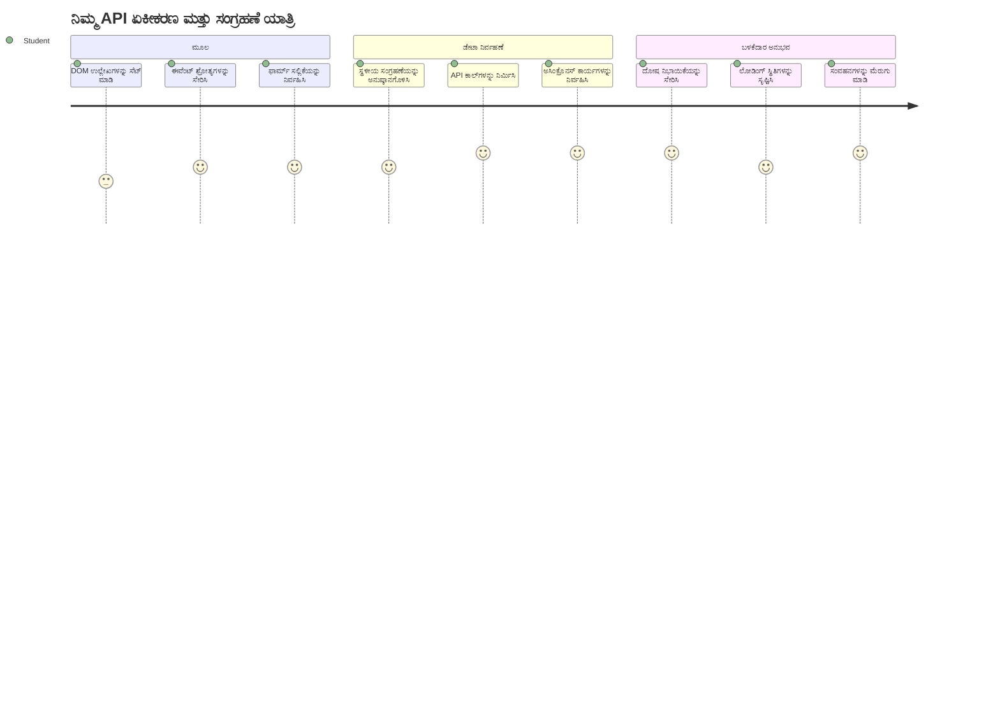
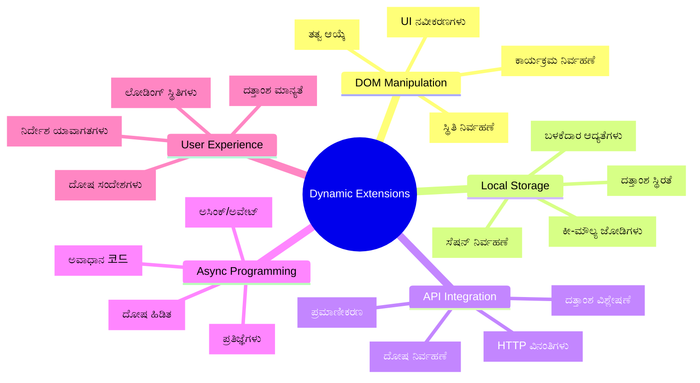
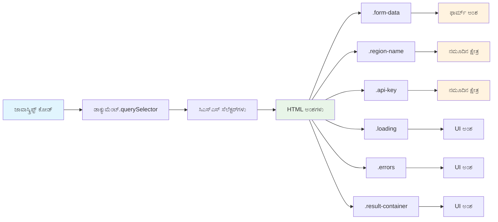
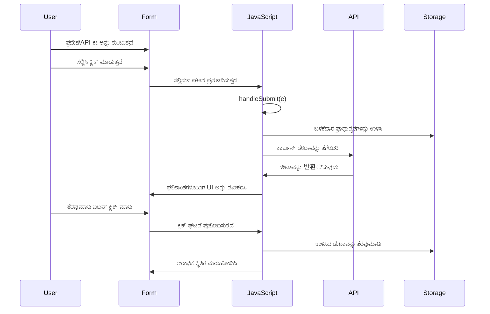
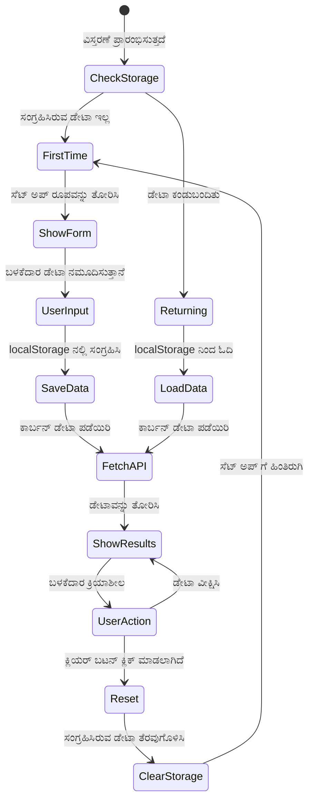
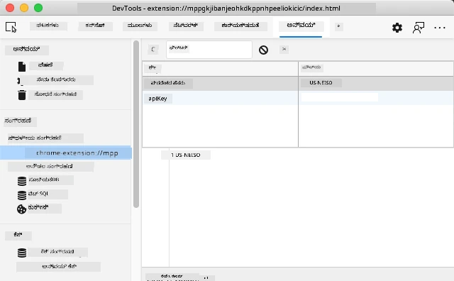
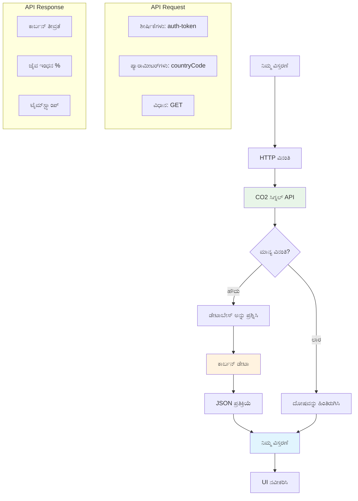
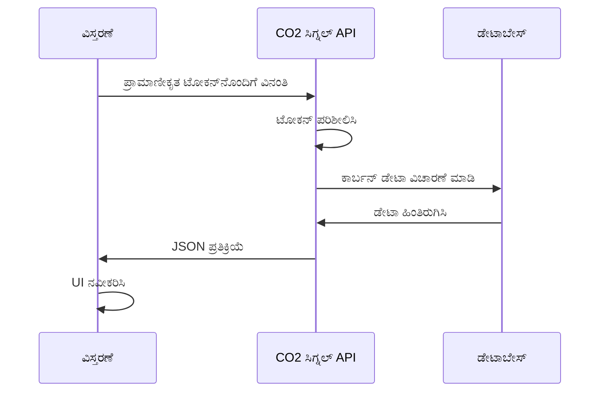
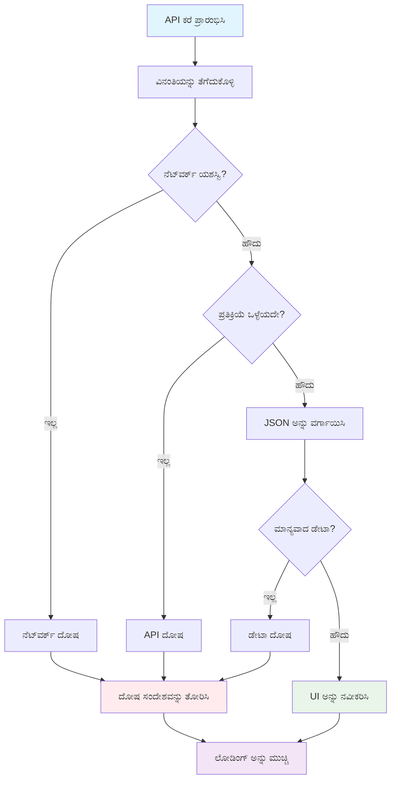
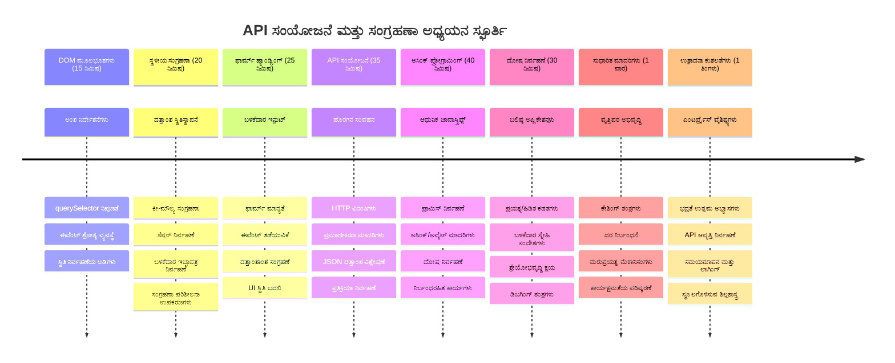

# ಬ್ರೌಸರಿನ ವಿಸ್ತರಣೆ ಯೋಜನೆಯ ಭಾಗ 2: API ಅನ್ನು ಕಾಲ್ ಮಾಡಿ, ಸ್ಥಳೀಯ ಸಂಗ್ರಹಣೆ ಬಳಸಿರಿ


## ಪಠ್ಯಕ್ಕೆ ಮುನ್ನ ಪರೀಕ್ಷೆ

[ಪಠ್ಯಗೆ ಮುನ್ನ ಪರೀಕ್ಷೆ](https://ff-quizzes.netlify.app/web/quiz/25)

## ಪರಿಚಯ

ನೀವು ಆರಂಭಿಸಿದ ಬ್ರೌಸರ್ ವಿಸ್ತರಣೆ ನೆನಪಿದೆಯೇ? ಈಗಾಗಲೇ ನೀವು ಒಳ್ಳೆಯದೊಂದು ಫಾರ್ಮ್ ರಚಿಸಿದ್ದು, ಆದರೆ ಅದು ಅಸ್ಥಿರವಾಗಿದೆ. ಇಂದು ನಾವು ಅದನ್ನು ನಿಜವಾದ ಡೇಟಾಗೆ ಸಂಪರ್ಕಿಸಿ, ಅದಕ್ಕೆ ಮೆಮೊರಿ ನೀಡುವ ಮೂಲಕ ಜೀವಂತ ಮಾಡೋಣ.

ಅಪೊಲೊ ಮಿಷನ್ ನಿಯಂತ್ರಣ ಕಂಪ್ಯೂಟರ್‌ಗಳ ಬಗ್ಗೆ ಯೋಚಿಸಿ - ಅವು ನಿಗದಿತ ಮಾಹಿತಿಯನ್ನು ಮಾತ್ರ ಪ್ರದರ್ಶಿಸದೆ, ನಿರಂತರವಾಗಿ ಬಾಹ್ಯ ಬಾಹ್ಯಕಾಶ ಜಾಹೀರಾತುಗಳೊಂದಿಗೆ ಸಂಪರ್ಕದಲ್ಲಿದ್ದವು, ಟೆಲಿಮೆಟ್ರಿ ಡೇಟಾದೊಂದಿಗೆ ನವೀಕರಿಸುತ್ತಿದ್ದವು ಮತ್ತು ಪ್ರಮುಖ ಮಿಷನ್ ನಿಯಮಾವಳಿಗಳನ್ನು ನೆನಪಿಸಿಕೊಳ್ಳುತ್ತಿದ್ದವು. ಇಂತಹ ಡೈನಾಮಿಕ್ ವ್ಯವಹಾರವನ್ನು ನಾವು ಇಂದು ನಿರ್ಮಿಸುತ್ತಿದ್ದೇವೆ. ನಿಮ್ಮ ವಿಸ್ತರಣೆ ಇಂಟರ್ನೆಟ್‌ಗೆ ತಲುಪುತ್ತದೆ, ನಿಜವಾದ ಪರಿಸರ ಡೇಟಾವನ್ನು ಹಿಡಿದುಕೊಳ್ಳುತ್ತದೆ ಹಾಗೂ ನಿಮ್ಮ ಸೆಟ್ಟಿಂಗ್ಗಳನ್ನು ಮುಂದಿನ ಬಾರಿ ನೆನಪಿಸಿಕೊಳ್ಳುತ್ತದೆ.

API ಸಂಯೋಜನೆ ಕಠಿಣವಾಗಿಯೂ ಕಾಣಬಹುದು, ಆದರೆ ಅದು ನಿಮ್ಮ ಕೋಡ್ ಗಳು ಇತರ ಸೇವೆಗಳೊಂದಿಗೆ ಸಂವಹನ ಮಾಡುವುದನ್ನು ಕಲಿಸುವುದೇ ಆಗಿದೆ. ನಾವು ಇಂದು ಮಾಡುವಂತೆ ಹವಾಮಾನ ಮಾಹಿತಿಯನ್ನು, ಸಾಮಾಜಿಕ ಮಾಧ್ಯಮ ಫೀಡ್ ಗಳನ್ನು, ಅಥವಾ ಕಾರ್ಬನ್ ಪಾದಚಿಹ್ನೆಯ ಮಾಹಿತಿಯನ್ನು ಪಡೆಯುವದು ಈ ಡಿಜಿಟಲ್ ಸಂಪರ್ಕಗಳನ್ನು ಸ್ಥಾಪಿಸುವ ಬಗ್ಗೆ.

ಬ್ರೌಸರ್‌ಗಳು ಮಾಹಿತಿಯನ್ನು ಉಳಿಸುವುದನ್ನು ಹೇಗೆ ಸಹ ಮಾಡಬಹುದು ಎಂಬುದನ್ನು ಕೂಡ ಅನ್ವೇಷಣೆ ಮಾಡೋಣ - ಮೇಲ್ಮನಸ್ಸಿಗೆ ಬರುವಂತೆ, ಗ್ರಂಥಾಲಯಗಳು ಪುಸ್ತಕಗಳು ಎಲ್ಲಿದ್ದವು ಎಂಬುದನ್ನು ನೆನಪಿಡಲು ಕಾರ್ಡ್ ಕ್ಯಾಟಲಾಗ್ ಗಳನ್ನು ಬಳಸುತ್ತವೆ.

ಈ ಪಾಠದ ಕೊನೆಯಲ್ಲಿ, ನೀವು ನಿಜವಾದ ಡೇಟಾವನ್ನು ಪಡೆದು, ಬಳಕೆದಾರ ಪ್ರಾಧಾನ್ಯಗಳನ್ನು ಸಂಗ್ರಹಿಸುವ, ಮತ್ತು ಸ್ಮೂತ್ ಅನುಭವ ಒದಗಿಸುವ ಬ್ರೌಸರ್ ವಿಸ್ತರಣೆಯನ್ನು ಹೊಂದಿರುತ್ತೀರಿ. ಶುರು ಮಾಡೋಣ!


✅ ನಿಮ್ಮ ಕೋಡ್ ಅನ್ನು ಎಲ್ಲಿ ಇರಿಸುವುದು ಎಂಬುದರ ಕುರಿತು ಅಗತ್ಯವಿರುವ ಫೈಲ್‌ಗಳಲ್ಲಿ ಸಂಖ್ಯಿತ ಸೆಗುಮೆಂಟ್‌ಗಳನ್ನು ಅನುಸರಿಸಿ

## ವಿಸ್ತರಣೆಗಾಗಿ ನಿರ್ವಹಿಸಲು ಬೇಸರಾದ ಅಂಶಗಳನ್ನು ಸಿದ್ಧಪಡಿಸಿ

ನಿಮ್ಮ ಜಾವಾಸ್ಕ್ರಿಪ್ಟ್ ಇಂಟರ್‌ಫೇಸ್ ಅನ್ನು ನಿರ್ವಹಿಸುವ ಮುನ್ನ, ಅದಕ್ಕೆ ನಿರ್ದಿಷ್ಟ HTML ಅಂಶಗಳಿಗೆ रेಫರೆನ್ಸ್ ಬೇಕಾಗುತ್ತದೆ. ಇದು ದೂರದರ್ಶನವನ್ನು ನಿರ್ದಿಷ್ಟ ನಕ್ಷತ್ರಗಳಿಗೆ ನಿದರ್ಶನ ಮಾಡುವ ಹಾಗೆ – ಗ್ಯಾಲಿಲಿಯೋ ಜುಪಿಟರ್ ನ ಚಂದ್ರಿಕೆಗಳನ್ನು ಅಧ್ಯಯನ ಮಾಡುವ ಮೊದಲು ಜುಪಿಟರ್‌ನ್ನು ಕಂಡುಹಿಡಿಯಬೇಕು ಮತ್ತು ಫೋಕಸ್ ಮಾಡಬೇಕು.

ನಿಮ್ಮ `index.js` ಫೈಲ್‌ನಲ್ಲಿ, ನಾವು ಪ್ರತಿ ಪ್ರಮುಖ ಫಾರ್ಮ್ ಅಂಶದ रेಫರೆನ್ಸ್ ಹಿಡಿಯುವ `const` ಮರುವಾಯಿಗಳನ್ನು ಸೃಷ್ಟಿಸುತ್ತೇವೆ. ಇದು ವಿಜ್ಞಾನಿಗಳು ತಮ್ಮ ಉಪಕರಣಗಳನ್ನು ಚಿಹ್ನೆಮಾಡಿಕೊಳ್ಳುವ ರೀತಿಯಷ್ಟೇ - ಪ್ರತಿಸಾರಿ ಸಂಪೂರ್ಣ ಪ್ರಯೋಗಾಲಯವನ್ನು ಹುಡುಕದೆ, ಬೇಕಾದುದನ್ನು ನೇರವಾಗಿ ಪ್ರವೇಶಿಸಲು.


```javascript
// ಫಾರ್ಮ್ ಕ್ಷೇತ್ರಗಳು
const form = document.querySelector('.form-data');
const region = document.querySelector('.region-name');
const apiKey = document.querySelector('.api-key');

// ಫಲಿತಾಂಶಗಳು
const errors = document.querySelector('.errors');
const loading = document.querySelector('.loading');
const results = document.querySelector('.result-container');
const usage = document.querySelector('.carbon-usage');
const fossilfuel = document.querySelector('.fossil-fuel');
const myregion = document.querySelector('.my-region');
const clearBtn = document.querySelector('.clear-btn');
```

**ಈ ಕೋಡ್ ಏನು ಮಾಡುತ್ತದೆ:**
- `document.querySelector()` ಬಳಸಿ CSS ಕ್ಲಾಸ್ ಆಯ್ಕೆದಾರಗಳೊಂದಿಗೆ ಫಾರ್ಮ್ ಅಂಶಗಳನ್ನು ಹಿಡಿಯುತ್ತದೆ
- ಪ್ರದೇಶದ ಹೆಸರು ಮತ್ತು API ಕೀ ಗಾಗಿ ಇನ್‌ಪುಟ್ ಫೀಲ್ಡ್‌ಗಳಿಗೆ रेಫರೆನ್ಸ್‌ಗಳನ್ನು ಸೃಷ್ಟಿಸುತ್ತದೆ
- ಕಾರ್ಬನ್ ಉಪಯೋಗ ಡೇಟಾ ಪ್ರದರ್ಶನಕ್ಕೆ نتيಜಾ ಅಂಶಗಳಿಗೆ ಸಂಪರ್ಕ ಒದಗಿಸುತ್ತದೆ
- ಲೋಡಿಂಗ್ ಸೂಚಕಗಳು ಮತ್ತು ದೋಷ ಸಂದೇಶಗಳಂತಹ UI ಅಂಶಗಳಿಗೆ ಪ್ರವೇಶ ಹೊಂದಿಸುತ್ತದೆ
- ಪ್ರತಿಯೊಂದು ಅಂಶದ रेಫರೆನ್ಸ್ ಅನ್ನು ಪೂರ್ತಿ ಕೋಡ್‌ನಲ್ಲಿ ಸುಲಭವಾಗಿ ಮರುಬಳಕೆ ಮಾಡಲು `const` ಮರುವಾಯಿಯಲ್ಲಿ ಸಂಗ್ರಹಿಸುತ್ತದೆ

## ಇವೆಂಟ್ ಲಿಸ್ನರ್‌ಗಳನ್ನು ಸೇರಿಸಿ

ಈಗ ನಿಮ್ಮ ವಿಸ್ತರಣೆ ಬಳಕೆದಾರ ಕ್ರಿಯೆಗಳಿಗೆ ಪ್ರತಿಕ್ರಿಯಿಸುವಂತೆ ಮಾಡೋಣ. ಇವೆಂಟ್ ಲಿಸ್ನರ್‌ಗಳು ನಿಮ್ಮ ಕೋಡ್‌ಗೆ ಬಳಕೆದಾರ ಸಂವಹನವನ್ನು ನಿಗದಿಪಡಿಸುವ ಮಾರ್ಗವಾಗಿದೆ. ಮೊದಲು ದೂರಬಂಧ ಸಂಪರ್ಕ ಕಾರ್ಯಾಲಯಗಳ ಕಾರ್ಯಕರ್ತರನ್ನು ನೆನಪಿಸಿಕೊಳ್ಳಿ - ಅವರು ಕಾಲ್‌ಗಳನ್ನು ಕೇಳಿಕೊಂಡು, ಸಂಪರ್ಕವನ್ನು ಜೋಡಿಸುವರು.


```javascript
form.addEventListener('submit', (e) => handleSubmit(e));
clearBtn.addEventListener('click', (e) => reset(e));
init();
```

**ಈ ಪರಿಕಲ್ಪನೆಗಳನ್ನು ಅರಿತುಕೊಳ್ಳಿ:**
- ಬಳಕೆದಾರರು Enter ಒತ್ತಿದಾಗ ಅಥವಾ ಸೇರಿಸಿ ಕ್ಲಿಕ್ ಮಾಡಿದಾಗ ಟ್ರಿಗರ್ ಆಗುವ ಫಾರ್ಮ್‌ಗೆ ಸಬ್ಮಿಟ್ ಲಿಸ್ನರ್ ಅನ್ನು ಅಟ್ಯಾಚ್ ಮಾಡಿ
- ಫಾರ್ಮ್ ಮರುಹೊಂದಿಸಲು ಕ್ಲಿಯರ್ ಬಟನ್‌ಗೆ ಕ್ಲಿಕ್ ಲಿಸ್ನರ್ ಸಂಪರ್ಕಿಸಿ
- ಹ್ಯಾಂಡ್ಲರ್ ಫಂಕ್ಷನ್‌ಗಳಿಗೆ ಘಟನೆ (e) ವಸ್ತುವನ್ನು ಹಸ್ತಾಂತರಿಸಿ
- ವಿಸ್ತರಣೆಯ ಪ್ರಾರಂಭಿಕ ಸ್ಥಿತಿಯನ್ನು ಹೊಂದಿಸಲು ತಕ್ಷಣ `init()` ಫಂಕ್ಷನ್ ಅನ್ನು ಕರೆಸಿ

✅ ಇಲ್ಲಿ ಬಳಕೆಯಾದ ಶಾರ್ಟ್‌ಹ್ಯಾಂಡ್ ಏರೋ ಫಂಕ್ಷನ್ ಸಿಂಟ್ಯಾಕ್ಸ್ ಗಮನಿಸಿ. ಈ ಆಧುನಿಕ ಜಾವಾಸ್ಕ್ರಿಪ್ಟ್ ವಿಧಾನವು ಸಾಂಪ್ರದಾಯಿಕ ಫಂಕ್ಷನ್ ಅನಿವೇಶನ থেকೂ ಸ್ವಚ್ಛವಾಗಿದೆ, ಆದರೆ ಎರಡೂ ಸಮರ್ಪಕವಾಗಿ ಕಾರ್ಯನಿರ್ವಹಿಸುತ್ತವೆ!

### 🔄 **ಶಿಕ್ಷಣಾತ್ಮಕ ಪರಿಶೀಲನೆ**
**ಈವೆಂಟ್ ಹ್ಯಾಂಡ್ಲಿಂಗ್ ಅರಿವು**: ಪ್ರಾರಂಭಿಸುವ ಮೊದಲು, ನೀವು:
- ✅ `addEventListener` ಬಳಕೆದಾರ ಕ್ರಿಯೆಗಳನ್ನು ಜಾವಾಸ್ಕ್ರಿಪ್ಟ್ ಫಂಕ್ಷನ್‌ಗಳಿಗೆ ಹೇಗೆ ಜೋಡಿಸುತ್ತದೆ ಎಂಬುದನ್ನು ವಿವರಿಸಬಹುದು
- ✅ ಈವೆಂಟ್ ವಸ್ತುವ `(e)` ಅನ್ನು ಹ್ಯಾಂಡ್ಲರ್ ಫಂಕ್ಷನ್‌ಗಳಿಗೆ ಹಸ್ತಾಂತರಿಸುವ ಕಾರಣವನ್ನು ಮನಗಂಡಿರಬೇಕು
- ✅ `submit` ಮತ್ತು `click` ಈವೆಂಟ್‌ಗಳ ವ್ಯತ್ಯಾಸವನ್ನು ತಿಳಿಯಿರಿ
- ✅ `init()` ಫಂಕ್ಷನ್ ಯಾವಾಗ ಮತ್ತು ಏಕೆ ಕಾರ್ಯನಿರ್ವಹಿಸುತ್ತದೆ ಎಂಬುದನ್ನು ವಿವರಿಸಬಹುದು

**ತ್ವರಿತ ಸ್ವಯಂ-ಪರಿಶೀಲನೆ**: ನೀವು ಫಾರ್ಮ್ ಸಬ್ಮಿಟ್‌ನಲ್ಲಿ `e.preventDefault()` ಮರೆತರೆ ಏನು ಸಂಭವಿಸುತ್ತದೆ?
*ಉತ್ತರ: ಪುಟ ಮರುಭರ್ತಿಯಾಗುತ್ತದೆ, ಎಲ್ಲಾ ಜಾವಾಸ್ಕ್ರಿಪ್ಟ್ ಸ್ಥಿತಿಯನ್ನು ಕಳೆದು ಬಳಕೆದಾರ ಅನುಭವಕ್ಕೆ ವ್ಯತ್ಯಯ ಉಂಟಾಗುತ್ತದೆ*

## ಪ್ರಾರಂಭಿಕ ಮತ್ತು ಮರುಹೊಂದಿಸುವ ಫಂಕ್ಷನ್‌ಗಳನ್ನು ನಿರ್ಮಿಸಿ

ನಿಮ್ಮ ವಿಸ್ತರಣೆಯ ಪ್ರಾರಂಭಿಕ ಲಾಜಿಕ್ ರಚಿಸೋಣ. `init()` ಫಂಕ್ಷನ್ ಒಂದು ಹಡಗಿನ ನ್ಯಾವಿಗೇಶನ್ ವ್ಯವಸ್ಥೆಯಂತೆ ಕೆಲಸ ಮಾಡುತ್ತದೆ - ಅದರ ಉಪಕರಣಗಳನ್ನು ಪರಿಶೀಲಿಸಿ ಪ್ರಸ್ತುತ ಸ್ಥಿತಿಯನ್ನು ನಿರ್ಧರಿಸುತ್ತದೆ ಮತ್ತು ಇಂಟರ್‌ಫೇಸ್ ಅನ್ನು ಹೊಂದಿಸುತ್ತದೆ. ಇದು ನೀವು ಮೊದಲು ವಿಸ್ತರಣೆಯನ್ನು ಬಳಸಿದ್ದೀರಾ ಎಂಬುದನ್ನು ಪರೀಕ್ಷಿಸಿ ಹಳೆ ಸೆಟ್ಟಿಂಗ್ಗಳನ್ನು ಲೋಡ್ ಮಾಡುತ್ತದೆ.

`reset()` ಫಂಕ್ಷನ್ ಹೊಸದಾಗಿ ಆರಂಭಿಸುವಂತೆ ಬಳಕೆದಾರರಿಗೆ ಅವಕಾಶ ನೀಡುತ್ತದೆ - ವಿಜ್ಞಾನಿಗಳು ಶುದ್ಧ ಡೇಟಾ ಪಡೆಯಲು ಪ್ರಯೋಗಗಳ ನಡುವೆ ತಮ್ಮ ಉಪಕರಣಗಳನ್ನು ಮರುಹೊಂದಿಸುವ ರೀತಿಯಾಗಿದೆ.

```javascript
function init() {
	// ಬಳಕೆದಾರನು ಹಿಂದಿನದಾಗಿ API ಪ್ರಮಾಣಪತ್ರಗಳನ್ನು ಉಳಿಸಿದ್ದಾರೇ ಎಂದು ಪರಿಶೀಲಿಸಿ
	const storedApiKey = localStorage.getItem('apiKey');
	const storedRegion = localStorage.getItem('regionName');

	// ವಿಸ್ತರಣೆ ಐಕಾನ್ ಅನ್ನು ಸರಾಸರಿ ಹಸುರಾಗಿ ಹೊಂದಿಸಿ (ಆಗಣನೆಗೆ ಭವಿಷ್ಯ ಪಾಠಕ್ಕಾಗಿ ಸ್ಥಾನದರ್ಶಕ)
	// ಮಾಡಲು: ಮುಂದಿನ ಪಾಠದಲ್ಲಿ ಐಕಾನ್ ಅಧ್ಗಮಿಸುವಿಕೆ ಕಾರ್ಯಗತಗೊಳಿಸಿ

	if (storedApiKey === null || storedRegion === null) {
		// ಮೊದಲು ಬಳಕೆದಾರ: ಸೆಟ್ ಅಪ್ ಫಾರ್ಮ್ ಅನ್ನು ತೋರಿಸಿ
		form.style.display = 'block';
		results.style.display = 'none';
		loading.style.display = 'none';
		clearBtn.style.display = 'none';
		errors.textContent = '';
	} else {
		// ಮರು ಬರುವ ಬಳಕೆದಾರ: ಅವರ ಉಳಿಸಿದ ಮಾಹಿತಿಯನ್ನು ಸ್ವಯಂಚಾಲಿತವಾಗಿ ಲೋಡ್ ಮಾಡಿ
		displayCarbonUsage(storedApiKey, storedRegion);
		results.style.display = 'none';
		form.style.display = 'none';
		clearBtn.style.display = 'block';
	}
}

function reset(e) {
	e.preventDefault();
	// ಬಳಕೆದಾರಿಗೆ ಹೊಸ ಸ್ಥಳವನ್ನು ಆಯ್ಕೆಮಾಡಲು ಸંગ્રಹಿಸಲಾದ ಪ್ರಾಂತ್ಯವನ್ನು ತೆರವುಗೊಳಿಸಿ
	localStorage.removeItem('regionName');
	// ಪ್ರಾರಂಭಿಕ ಪ್ರಕ್ರಿಯೆಯನ್ನು ಮರುಪ್ರಾರಂಭಿಸಿ
	init();
}
```

**ಇಲ್ಲಿ ಏನಾಗುತ್ತದೆ ಎಂಬುದನ್ನು ವಿಂಗಡಿಸಿ:**
- ಬ್ರೌಸರ್‌ನ ಸ್ಥಳೀಯ ಸಂಗ್ರಹಣೆಯಿಂದ ಸಂಗ್ರಹಿಸಿದ API ಕೀ ಮತ್ತು ಪ್ರದೇಶವನ್ನು ಪಡೆಯುತ್ತದೆ
- ಇದು ಮೊದಲು ಬಳಕೆದಾರನಾ (ಯಾವುದೇ ಸಂಗ್ರಹಣೆಯನ್ನು ಹೊಂದಿಲ್ಲದೇ) ಅಥವಾ ಮರುಬರುತ್ತಿರುವ ಬಳಕೆದಾರನಾ ಎಂದು ಪರಿಶೀಲಿಸುತ್ತದೆ
- ಹೊಸ ಬಳಕೆದಾರರಿಗೆ ಸೆಟಪ್ ಫಾರ್ಮ್ ಅನ್ನು ತೋರಿಸುತ್ತದೆ ಮತ್ತು ಇತರ ಇಂಟರ್‌ಫೇಸ್ ಅಂಶಗಳನ್ನು ಮರೆಮಾಚುತ್ತದೆ
- ಮರುಬರುತ್ತಿರುವ ಬಳಕೆದಾರರಿಗಾಗಿ ಉಳಿಸಿದ ಡೇಟಾವನ್ನು ಸ್ವಯಂಚಾಲಿತವಾಗಿ ಲೋಡ್ ಮಾಡುತ್ತದೆ ಮತ್ತು ಮರುಹೊಂದಿಸುವ ಆಯ್ಕೆಯನ್ನು ಪ್ರದರ್ಶಿಸುತ್ತದೆ
- ಲಭ್ಯವಿರುವ ಡೇಟಾನुसार ಬಳಕೆದಾರ ಇಂಟರ್‌ಫೇಸ್ ಸ್ಥಿತಿಯನ್ನು ನಿರ್ವಹಿಸುತ್ತದೆ

**ಸ್ಥಳೀಯ ಸಂಗ್ರಹಣೆಯ ಕುರಿತು ಮುಖ್ಯ ಕಲ್ಪನೆಗಳು:**
- ಬ್ರೌಸರ್ ಸೆಷನ್‌ಗಳ ನಡುವೆ ಡೇಟಾವನ್ನು ಸ್ಥಿರವಾಗಿ ಉಳಿಸುತ್ತದೆ (ಸೆಷನ್ ಸ್ಟೋರೇಜ್ ಗಿಂತ ಭಿನ್ನ)
- `getItem()` ಮತ್ತು `setItem()` ಬಳಸಿ ಕೀ-ಮೂಲ್ಯ ಜೋಡಿಗಳಾಗಿ ಡೇಟಾ ಸಂಗ್ರಹಿಸುತ್ತದೆ
- ಸೂಚಿಸಿದ ಕೀಗೆ ಯಾವುದೇ ಡೇಟಾ ಇಲ್ಲದಿದ್ದರೆ `null` ಉಲ್ಲೇಖಿಸುತ್ತದೆ
- ಬಳಕೆದಾರ ಪ್ರಾಧಾನ್ಯಗಳು ಮತ್ತು ಸೆಟ್ಟಿಂಗ್ಗಳನ್ನು ನೆನಪಿಡಲು ಸರಳ ವಿಧಾನ ಒದಗಿಸುತ್ತದೆ

> 💡 **ಬ್ರೌಸರ್ ಸಂಗ್ರಹಣೆಯ ಅರಿವು**: [LocalStorage](https://developer.mozilla.org/docs/Web/API/Window/localStorage) ನಿಮ್ಮ ವಿಸ್ತರಣೆಗೆ ಸ್ಥಿರ ಮೆಮೊರಿ ನೀಡಿದಂತೆ. ಪ್ರಾಚೀನ ಅಲೆಕ್ಸಾಂಡ್ರಿಯಾ ಗ್ರಂಥಾಲಯವು ಮರುಭಾಷೆ ಕಟ್ಟಿದಂತೆ – ಉಪನ್ಯಾಸಕರು ಹೋಗಿ ಬಂದರೂ ಮಾಹಿತಿ ಲಭ್ಯವಿರುತ್ತದೆ.
> 
> **ಪ್ರಮುಖ ಲಕ್ಷಣಗಳು:**
> - ಬ್ರೌಸರ್ ಮುಚ್ಚಿದ ನಂತರವೂ ಡೇಟಾವನ್ನು ಉಳಿಸಿಕೊಂಡಿರುತ್ತದೆ
> - ಕಂಪ್ಯೂಟರ್ ಪುನರ್‌ಪ್ರಾರಂಭಗಳು ಮತ್ತು ಬ್ರೌಸರ್ ಕ್ರ್ಯಾಷ್‌ಗಳನ್ನು ಸಹ ಬದುಕಿ ಉಳಿಯುತ್ತದೆ
> - ಬಳಕೆದಾರ ಪ್ರಾಧಾನ್ಯಗಳಿಗಾಗಿ ಸಾಕಷ್ಟು ಸಂಗ್ರಹಣಾ ಜಾಗವನ್ನು ಒದಗಿಸುತ್ತದೆ
> - ನೆಟ್‌ವರ್ಕ್ ವಿಳಂಬವಿಲ್ಲದೆ ಕ್ಷಣಾರ್ಧ ಪ್ರವೇಸವನ್ನು ಒದಗಿಸುತ್ತದೆ

> **ಮಹತ್ವದ ಗೋಷ್ಠಿ**: ನಿಮ್ಮ ಬ್ರೌಸರ್ ವಿಸ್ತರಣೆಗೆ ಅದರದೇ ಪ್ರತ್ಯೇಕ ಸ್ಥಳೀಯ ಸಂಗ್ರಹಣೆ ಇದೆ, ಇದು ಸಾಮಾನ್ಯ ವೆಬ್ ಪುಟಗಳಿಂದ ಭಿನ್ನವಾಗಿದೆ. ಇದು ಭದ್ರತೆ ಒದಗಿಸುತ್ತದೆ ಮತ್ತು ಇತರ ವೆಬ್ಸೈಟ್‌ಗಳೊಂದಿಗೆ ಸಂಘರ್ಷ ತಪ್ಪಿಸುತ್ತದೆ.

ಬ್ರೌಸರ್ ಡೆವಲಪರ್ ಟೂಲ್‌ಗಳನ್ನು (F12) ತೆರೆಯಿರಿ, **Application** ಟ್ಯಾಬಿಗೆ ಹೋಗಿ, ಮತ್ತು **Local Storage** ವಿಭಾಗವನ್ನು ವಿಸ್ತರಿಸಿ ನಿಮ್ಮ ಸಂಗ್ರಹಿತ ಡೇಟಾವನ್ನು ನೋಡಿ.




> ⚠️ **ಭದ್ರತಾ ಪರಿಗಣನೆ**: ಉತ್ಪಾದನಾ ಅಪ್ಲಿಕೇಶನ್‌ಗಳಲ್ಲಿ, API ಕೀಗಳನ್ನು LocalStorage ನಲ್ಲಿ ಸಂಗ್ರಹಿಸುವುದು ಭದ್ರತಾ ಅಪಾಯವನ್ನು ಉಂಟುಮಾಡಬಹುದು ಏಕೆಂದರೆ ಜಾವಾಸ್ಕ್ರಿಪ್ಟ್ ಗೆ ಈ ಡೇಟಾ ಪ್ರಾಪ್ತಿಯಿದೆ. ಕಲಿಕೆಯ ಉದ್ದೇಶಗಳಿಗೆ, ಈ ವಿಧಾನ ಸರಿಯಾಗಿದೆ, ಆದರೆ ನಿಜವಾದ ಅಪ್ಲಿಕೇಶನ್‌ಗಳು ಸಂವೇದನಾಶೀಲ ಪ್ರಮಾಣಪತ್ರಗಳಿಗಾಗಿ ಭದ್ರ ಸರ್ವರ್-ಬದಿಗೆ ಸಂಗ್ರಹಣೆಯನ್ನು ಬಳಸಬೇಕು.

## ಫಾರ್ಮ್ ಸಬ್ಮಿಷನ್ ಅನ್ನು ನಿರ್ವಹಿಸಿ

ಈಗ ನಮಗೆ ಯಾರಾದರೂ ಫಾರ್ಮ್ ಸಬ್ಮಿಟ್ ಮಾಡಿದಾಗ ಏನು ನಡೆಯುತ್ತದೆ ಎಂಬುದನ್ನು ನಿರ್ವಹಿಸೋಣ. ಎಂದಿನಂತೆ, ಬ್ರೌಸರ್‌ಗಳು ಫಾರ್ಮ್ ಸಬ್ಮಿಷನ್‌ನಲ್ಲಿ ಪುಟವನ್ನು ಮರುಭರ್ತಿ ಮಾಡುತ್ತದೆ, ಆದರೆ ನಾವು ಈ ವರ್ತನೆಯನ್ನು ತಡೆದ ಸಂಯೋಜನೆ ಮಾಡೋಣ.

ಈ ವಿಧಾನವು ಮಿಷನ್ ನಿಯಂತ್ರಣವು ಬಾಹ್ಯಾಕಾಶ ಬಾಹಕ ಸಂವಹನಗಳನ್ನು ಹೇಗೆ ನಿರ್ವಹಿಸುವುದನ್ನು ಪ್ರತಿಫಲಿಸುತ್ತದೆ - ಪ್ರತಿ ಪ್ರಸರಣಕ್ಕಾಗಿ ಸಂಪೂರ್ಣ ವ್ಯವಸ್ಥೆಯನ್ನು ಮರುಹೊಂದಿಸುವ ಬದಲು, ಅವರು ನಿರಂತರ ಕಾರ್ಯಾಚರಣೆಯನ್ನು ಇಟ್ಟುಕೊಂಡು ಹೊಸ ಮಾಹಿತಿಯನ್ನು ಪ್ರಕ್ರಿಯೆ ಮಾಡುತ್ತಾರೆ.

ಫಾರ್ಮ್ ಸಬ್ಮಿಷನ್ ಈವೆಂಟ್ ಅನ್ನು ಹಿಡಿದು ಬಳಕೆದಾರರ ಇನ್‌ಪುಟ್ ಅನ್ನು ಹೊರತೆಗೆಯುವ ಫಂಕ್ಷನ್ ರಚಿಸಿ:

```javascript
function handleSubmit(e) {
	e.preventDefault();
	setUpUser(apiKey.value, region.value);
}
```

**ಮೇಲಿನ ಕೋಡ್ ನಾವು:**
- ಪುಟವನ್ನು ಮರುಭರ್ತಿ ಮಾಡದಂತೆ ಫಾರ್ಮ್ ನ ಡಿಫಾಲ್ಟ್ ಸಬ್ಮಿಷನ್ ಕಾರ್ಯತತ್ತ್ವವನ್ನು ತಡೆದಿದ್ದೇವೆ
- API ಕೀ ಮತ್ತು ಪ್ರದೇಶ ಫೀಲ್ಡ್‌ಗಳಿಂದ ಬಳಕೆದಾರ ಇನ್‌ಪುಟ್ ಮೌಲ್ಯಗಳನ್ನು ಹೊರತೆಗೆಯಲಾಗಿದೆ
- `setUpUser()` ಫಂಕ್ಷನ್‌ಗೆ ಫಾರ್ಮ್ ಡೇಟಾವನ್ನು ಹಸ್ತಾಂತರಿಸಲಾಗಿದೆ
- ಪುಟ ಮರುಭರ್ತಿಯನ್ನು ತಡೆಯುವ ಮೂಲಕ ಸಿಂಗಲ್-ಪೇಜ್ ಅಪ್ಲಿಕೇಶನ್ ವರ್ತನೆ ನಿಯಂತ್ರಿಸಲಾಗಿದೆ

✅ ನಿಮ್ಮ HTML ಫಾರ್ಮ್ ಫೀಲ್ಡ್‌ಗಳು `required` ಗುಣಲಕ್ಷಣ ಹೊಂದಿವೆ, ಈ ಕಾರಣದಿಂದ ಬ್ರೌಸರ್ ಸ್ವಯಂಚಾಲಿತವಾಗಿ ಎರಡೂ API ಕೀ ಮತ್ತು ಪ್ರದೇಶವನ್ನು ನೀಡಿದೆಯೇ ಎಂದು ಪರಿಶೀಲಿಸುತ್ತದೆ.

## ಬಳಕೆದಾರ ಪ್ರాధಾನ್ಯಗಳನ್ನು ಹೊಂದಿಸಿ

`setUpUser` ಫಂಕ್ಷನ್ ಬಳಕೆದಾರರ ಪ್ರಮಾಣಪತ್ರಗಳನ್ನು ಉಳಿಸುವುದಕ್ಕೆ ಜವಾಬ್ದಾರಿಯುಳ್ಳದು ಮತ್ತು ಮೊದಲ API ಕರೆ ಆರಂಭಿಸುವುದು. ಇದು ಕಾರ್ಯಾಚರಣೆ setup ರಿಂದ ಫಲಿತಾಂಶ ಪ್ರದರ್ಶನಕ್ಕೆ ಸೌಮ್ಯವಾಗಿ ಬದಲಾಯಿಸುತ್ತದೆ.

```javascript
function setUpUser(apiKey, regionName) {
	// ಭವಿಷ್ಯದ ಸೆಷನ್‌ಗಳಿಗೆ ಬಳಕೆದಾರರ ಪ್ರಮಾಣಪತ್ರಗಳನ್ನು ಉಳಿಸಿ
	localStorage.setItem('apiKey', apiKey);
	localStorage.setItem('regionName', regionName);
	
	// ಲೋಡ್ ಆಗುತ್ತಿರುವ ಅವಸ್ಥೆಯನ್ನು ತೋರಿಸಲು UI ಅನ್ನು ನವೀಕರಿಸಿ
	loading.style.display = 'block';
	errors.textContent = '';
	clearBtn.style.display = 'block';
	
	// ಬಳಕೆದಾರರ ಪ್ರಮಾಣಪತ್ರಗಳೊಂದಿಗೆ ಕಾರ್ಬನ್ ಬಳಕೆ ಡೇಟಾವನ್ನು ಪಡೆಯಿರಿ
	displayCarbonUsage(apiKey, regionName);
}
```

**ಹಂತ ಹಂತವಾಗಿ ಏನಾಗುತ್ತಿದೆ:**
- API ಕೀ ಮತ್ತು ಪ್ರದೇಶದ ನಾಮವನ್ನು ಮುಂದಿನ ಬಳಕೆಗೆ ಸ್ಥಳೀಯ ಸಂಗ್ರಹಣದಲ್ಲಿ ಉಳಿಸುತ್ತದೆ
- ಡೇಟಾವನ್ನು ಪಡೆಯಲಾಗುತ್ತಿದೆಯೆ ಎಂದು ಸೂಚಿಸಲು ಲೋಡಿಂಗ್ ಸೂಚಕವನ್ನು ತೋರಿಸುತ್ತದೆ
- ಹಳೆ ದೋಷ ಸಂದೇಶಗಳನ್ನು ಕ್ಲಿಯರ್ ಮಾಡುತ್ತದೆ
- ಬಳಕೆದಾರರು ಸೆಟ್ಟಿಂಗ್ಸ್ ಮರುಹೊಂದಿಸಬೇಕಾದರೆ ಕ್ಲಿಯರ್ ಬಟನ್ ಅನ್ನು ಬಹಿರಂಗಪಡಿಸುತ್ತದೆ
- ನಿಜವಾದ ಕಾರ್ಬನ್ ಬಳಕಾ ಡೇಟಾ ಪಡೆಯಲು API ಕರೆ ಪ್ರಾರಂಭಿಸುತ್ತದೆ

ಈ ಫಂಕ್ಷನ್ ಡೇಟಾ ಸ್ಥಿರತೆ ಮತ್ತು ಬಳಕೆದಾರ ಇಂಟರ್‌ಫೇಸ್ ನವೀಕರಣವನ್ನು ಒಂದೇ ಸಮಯದಲ್ಲಿ ನಿರ್ವಹಿಸುವ ಮೂಲಕ ಸೌಮ್ಯ ಬಳಕೆದಾರ ಅನುಭವವನ್ನು ಸೃಷ್ಟಿಸುತ್ತದೆ.

## ಕಾರ್ಬನ್ ಉಪಯೋಗ ಡೇಟಾವನ್ನು ಪ್ರದರ್ಶಿಸಿ

ಈಗ ನೀವು ವಿಸ್ತರಣೆಯನ್ನು APIs ಮೂಲಕ ಬಾಹ್ಯ ಡೇಟಾ ಮೂಲಗಳಿಗೆ ಸಂಪರ್ಕಿಸೋಣ. ಇದು ನಿಮ್ಮ ವಿಸ್ತರಣೆಯನ್ನು ಸ್ವತಂತ್ರ ಸಾಧನದಿಂದ ಇಂಟರ್ನೆಟ್‌ನಿಂದ ನಿಜ ಸಮಯ ಮಾಹಿತಿಯನ್ನು ಪಡೆಯುವ ಸಾಧನವಾಗಿ ಪರಿವರ್ತಿಸುತ್ತದೆ.

**APIs ತಿಳಿದುಕೊಳ್ಳುವುದು**

[APIs](https://www.webopedia.com/TERM/A/API.html) ವಿಭಿನ್ನ ಅಪ್ಲಿಕೇಶನ್‌ಗಳು ಪರಸ್ಪರ ಸಂವಹನ ಮಾಡುವುದು ಹೇಗೆ ಎಂಬುದಾಗಿವೆ. 19ನೇ ಶತಮಾನದಲ್ಲಿ ದೂರಸಂವಹನ ವ್ಯವಸ್ಥೆಯನ್ನು ನೆನಪಿಸಿಕೊಳ್ಳಿ - ಅವರು ದೂರದಿಂದ ಬಂದ ಸ್ಟೇಷನ್ಗೆ ವಿನಂತಿಗಳನ್ನು ಕಳುಹಿಸಿ, ನಿರೀಕ್ಷಿತ ಮಾಹಿತಿಯನ್ನು ಪೆÇಸುತಿದ್ದರು. ನೀವು ಸಾಮಾಜಿಕ ಮಾಧ್ಯಮವನ್ನು ಪರಿಶೀಲಿಸುವಾಗ, ವಾಯ್ಸ್ ಸಹಾಯಕನಿಗೆ ಪ್ರಶ್ನೆ ಕೇಳುವಾಗ, ಅಥವಾ ವಿತರಣೆ ಅಪ್ಲಿಕೇಶನ್ ಬಳಸುವಾಗ, APIs ಈ ಡೇಟಾ ವಿನಿಮಯಗಳನ್ನು ಸುಗಮಗೊಳಿಸುತ್ತವೆ.


**REST APIಗಳ ಪ್ರಮುಖ ಕಲ್ಪನೆಗಳು:**
- REST ಎಂದರೆ ‘Representational State Transfer’
- ಡೇಟಾದೊಂದಿಗೆ ಸಂವಹಿಸಲು ಸಾಂಪ್ರದಾಯಿಕ HTTP ವಿಧಾನಗಳನ್ನು (GET, POST, PUT, DELETE) ಬಳಸುತ್ತದೆ
- ಸಾಮಾನ್ಯವಾಗಿ JSON ಫಾರ್ಮಾಟ್‌ನಲ್ಲಿ ನಿರೀಕ್ಷಿತ ಡೇಟಾ ವಾಪಸ್ಸು ನೀಡುತ್ತದೆ
- ವಿವಿಧ ವಿನಂತಿಗಳಿಗಾಗಿ ನಿಯಮಿತ, URL-ಆಧಾರಿತ ಎಂಡ್‌ಪಾಯಿಂಟ್‌ಗಳನ್ನು ಒದಗಿಸುತ್ತದೆ

✅ ನಾವು ಬಳಸುವ [CO2 Signal API](https://www.co2signal.com/) ವಿಶ್ವದ ವಿದ್ಯುತ್ ಜಾಲಗಳ ಕಾರ್ಬನ್ ತೀವ್ರತೆಯ ನಿಜ ಕಾಲ ಡೇಟಾವನ್ನು ಒದಗಿಸುತ್ತದೆ. ಇದು ಬಳಕೆದಾರರಿಗೆ ಅವರ ವಿದ್ಯುತ್ ಬಳಕೆಯ ಪರಿಸರ ಪ್ರಭಾವವನ್ನು ತಿಳಿಯಲು ಸಹಾಯಮಾಡುತ್ತದೆ!

> 💡 **ಅಸಿಂಕ್ರೋನಸ್ ಜಾವಾಸ್ಕ್ರಿಪ್ಟ್ ಅರಿವು**: [`async` ಕೀವರ್ಡ್](https://developer.mozilla.org/docs/Web/JavaScript/Reference/Statements/async_function) ನಿಮ್ಮ ಕೋಡ್ಗೆ ಬಹು ಕಾರ್ಯಗಳನ್ನು ಒಂದೇ ಸಮಯದಲ್ಲಿ ನಿರ್ವಹಿಸಲು ಸಹಾಯಮಾಡುತ್ತದೆ. ನೀವು ಸರ್ವರ್‌ನಿಂದ ಡೇಟಾ ಕೇಳುವಾಗ, ಸಂಪೂರ್ಣ ವಿಸ್ತರಣೆ ಫ್ರೀಜ್ ಆಗಬಾರದು - ಇದು ಏರ್ ಟ್ರಾಫಿಕ್ ಕಂಟ್ರೋಲ್ ಒಂದು ವಿಮಾನ ಎದುರು ಸೇರಲು ಕಾಯುತ್ತಿರುವಂತಾಗಿರುತ್ತದೆ.
> 
> **ಪ್ರಮುಖ ಲಾಭಗಳು:**
> - ಡೇಟಾ ಲೋಡ್ ಆಗುತ್ತಿರುವಾಗ ವಿಸ್ತರಣೆ ಪ್ರತಿಕ್ರೀಯಾಶೀಲತೆಯನ್ನು ಕಾಯ್ದುಕೊಳ್ಳುತ್ತದೆ
> - ನೆಟ್‌ವರ್ಕ್ ವಿನಂತಿಗಳ ಸಮಯದಲ್ಲಿ ಇತರೆ ಕೋಡ್ ನಿರಂತರವಾಗಿ ಕಾರ್ಯನಿರ್ವಹಿಸುತ್ತದೆ
> - ಪರಂಪರಾ ಕಾಲ್‌ಬ್ಯಾಕ್ ನಿಯಮಗಳಿಗೆ ಹೋಲಿಸಿದಾಗ ಕೋಡ್ ಓದಲು ಸುಲಭ
> - ನೆಟ್‌ವರ್ಕ್ ಸಮಸ್ಯೆಗಳಿಗೆ ಸೂಕ್ತವಾದ ದೋಷ ನಿರ್ವಹಣೆಯನ್ನು ಮಾಡುತ್ತದೆ

`async` ಕುರಿತ ಒಂದು ವೇಗದ ವೀಡಿಯೊ:

[](https://youtube.com/watch?v=YwmlRkrxvkk "ಪ್ರತಿಜ್ಞೆಗಳನ್ನು ನಿರ್ವಹಿಸಲು Async ಮತ್ತು Await")

> 🎥 async/await ಕುರಿತು ವೀಡಿಯೊಗಾಗಿ ಮೇಲಿನ ಚಿತ್ರವನ್ನು ಕ್ಲಿಕ್ ಮಾಡಿ.

### 🔄 **ಶಿಕ್ಷಣಾತ್ಮಕ ಪರಿಶೀಲನೆ**
**ಅಸಿಂಕ್ರೋನಸ್ ಪ್ರોગ್ರಾಮಿಂಗ್ ಅರಿವು**: API ಫಂಕ್ಷನ್‌ಗೆ ಮುನುಗ್ಗುವ ಮೊದಲು, ನಿಮ್ಮು ತಿಳಿದುಕೊಳ್ಳಿ:
- ✅ ಯಾಕೆ ನಾವು ಸಂಪೂರ್ಣ ವಿಸ್ತರಣೆ ತಡೆಹಿಡಿಯದೆ `async/await` ಬಳಸುತ್ತೇವೆ
- ✅ `try/catch` ಬ್ಲಾಕ್‌ಗಳು ನೆಟ್‌ವರ್ಕ್ ದೋಷಗಳನ್ನು ಸೂಕ್ತವಾಗಿ ಹೇಗೆ ನಿರ್ವಹಿಸುತ್ತದೆ
- ✅ ಸಿಂಕ್ರೋನಸ್ ಮತ್ತು ಅಸಿಂಕ್ರೋನಸ್ ಕಾರ್ಯಗಳ ನಡುವಿನ ವ್ಯತ್ಯಾಸ
- ✅ API ಕರೆಗಳು ವಿಫಲವಾಗಬಹುದು ಮತ್ತು ಅವುಗಳ ನಿರ್ವಹಣೆ ಹೇಗೆ ಮಾಡಬೇಕೆಂಬುದು

**ವಾಸ್ತವ ಜಗತ್ತಿನ ಸಂಬಂಧ:** ಈ ಸಾಮಾನ್ಯ ಅಸಿಂಕ್ರೋನಸ್ ಉದಾಹರಣೆಗಳನ್ನು ಪರಿಗಣಿಸಿ:
- **ಮಾದ್ಯಮಗಳು ಆದೇಶಿಸುವುದು**: ನೀವು ಕಿಚನ್ ಮುಂದೆ ಕಾಯೋದಿಲ್ಲ - ರಸೀದಿ ಪಡೆದು ಹಗಲು ಇತರ ಕೆಲಸ ಮಾಡುತ್ತೀರಿ
- **ಇಮೇಲ್ ಕಳುಹಿಸುವುದು**: ನಿಮ್ಮ ಇಮೇಲ್ ಅಪ್ಲಿಕೇಶನ್ ಕಳುಹಿಸುವಾಗ ಫ್ರೀಜ್ ಆಗುತ್ತಿಲ್ಲ - ಮತ್ತಷ್ಟು ಇಮೇಲ್ ರಚಿಸಬಹುದು
- **ವೆಬ್ ಪುಟಗಳನ್ನು ಲೋಡ್ ಮಾಡುವುದು**: ಚಿತ್ರಗಳು ಕ್ರಮೇಣ ಲೋಡ್ ಆಗುತ್ತವೆ, ನೀವು ಈಗಾಗಲೇ ಪಠ್ಯ ಓದಲು ಆರಂಭಿಸಿದ್ದೀರಾ

**API ಪ್ರವೇಶದ ಜಾರು ಹಾದಿ**:

ಕಾರ್ಬನ್ ಉಪಯೋಗ ಡೇಟಾ ಸೇರಿಸಲು ಮತ್ತು ಪ್ರದರ್ಶಿಸಲು ಫಂಕ್ಷನ್ ರಚಿಸಿ:

```javascript
// ಆಧುನಿಕ ಫೆಚ್ API ವಿಧಾನ (ಬಾಹ್ಯ ಅವಲಂಬನಗಳು ಅಗತ್ಯವಿಲ್ಲ)
async function displayCarbonUsage(apiKey, region) {
	try {
		// CO2 Signal API ನಿಂದ ಕಾರ್ಬನ್ ಸಂವೇದನಾಶೀಲತೆ ಡೇಟಾವನ್ನು ಫೆಚ್ ಮಾಡಿ
		const response = await fetch('https://api.co2signal.com/v1/latest', {
			method: 'GET',
			headers: {
				'auth-token': apiKey,
				'Content-Type': 'application/json'
			},
			// ನಿರ್ದಿಷ್ಟ ಪ್ರದೇಶಕ್ಕಾಗಿ ಪ್ರಶ್ನಾ ಪರಾಮರ್ಶಿಗಳನ್ನು ಸೇರಿಸಿ
			...new URLSearchParams({ countryCode: region }) && {
				url: `https://api.co2signal.com/v1/latest?countryCode=${region}`
			}
		});

		// API ವಿನಂತಿ ಯಶಸ್ವಿಯಾಗಿ ನಡೆದಿದೆಯೇ ಎಂದು ಪರಿಶೀಲಿಸಿ
		if (!response.ok) {
			throw new Error(`API request failed: ${response.status}`);
		}

		const data = await response.json();
		const carbonData = data.data;

		// ಕಾರ್ಬನ್ ಸಂವೇದನಾಶೀಲತೆಗೆ-rounded ಮೌಲ್ಯವನ್ನು ಲೆಕ್ಕಿಸಿ
		const carbonIntensity = Math.round(carbonData.carbonIntensity);

		// ಫೆಚ್ ಮಾಡಿದ ಡೇಟಾ ಮೂಲಕ ಬಳಕೆದಾರ ಇಂಟರ್ಫೇಸ್ ನವೀಕರಿಸಿ
		loading.style.display = 'none';
		form.style.display = 'none';
		myregion.textContent = region.toUpperCase();
		usage.textContent = `${carbonIntensity} grams (grams CO₂ emitted per kilowatt hour)`;
		fossilfuel.textContent = `${carbonData.fossilFuelPercentage.toFixed(2)}% (percentage of fossil fuels used to generate electricity)`;
		results.style.display = 'block';

		// TODO: calculateColor(carbonIntensity) - ಮುಂದಿನ ಪಾಠದಲ್ಲಿ ಜಾರಿಗೆ ತರುತ್ತದೆ

	} catch (error) {
		console.error('Error fetching carbon data:', error);
		
		// ಬಳಕೆದಾರ ಸ್ನೇಹಿ ದೋಷ ಸಂದೇಶವನ್ನು ತೋರಿಸಿ
		loading.style.display = 'none';
		results.style.display = 'none';
		errors.textContent = 'Sorry, we couldn\'t fetch data for that region. Please check your API key and region code.';
	}
}
```

**ಇಲ್ಲಿ ಏನಾಗುತ್ತದೆ:**
- ಔಟ್‌ಸೈಡ್ ಲೈಬ್ರರಿ, Axios ಮುಂತಾದವುಗಳ ಬದಲು ಆಧುನಿಕ `fetch()` API ಅನ್ನು ಬಳಸುತ್ತದೆ ಏಕೆಂದರೆ ಇದು ಸ್ವಚ್ಛವೂ, ಯಾವುದೇ ಅವಲಂಬನೆ ಇಲ್ಲದೆ
- API ವಿಫಲತೆಯನ್ನು ತಡೆಗಟ್ಟಲು `response.ok` ಜೊತೆ ಸರಿಯಾದ ದೋಷ ಪರಿಶೀಲನೆ ಮಾಡುತ್ತದೆ
- ಅಸಿಂಕ್ರೋನಸ್ ಕಾರ್ಯಗಳನ್ನು ಓದಲು ಸುಲಭವಾಗಿ ಮಾಡಲು `async/await` ಅನ್ನು ಬಳಸುತ್ತದೆ
- CO2 Signal API ರೊಂದಿಗೆ `auth-token` ಹೆಡರ್ ಬಳಸಿ ಪ್ರಮಾನೀಕರಣ ಮಾಡುತ್ತದೆ
- JSON ಪ್ರತಿಕ್ರಿಯೆಯನ್ನು ಪಾರ್ಸ್ ಮಾಡಿ ಮತ್ತು ಕಾರ್ಬನ್ ತೀವ್ರತೆಯ ಮಾಹಿತಿಯನ್ನು ಹೊರತಂದುಕೊಳ್ಳುತ್ತದೆ
- ಅನೇಕ UI ಅಂಶಗಳನ್ನು ಸ್ವರೂಪಿತ ಪರಿಸರ ಡೇಟಾ ಸಹಿತ ನವೀಕರಿಸುತ್ತದೆ
- API ಕರೆಗಳು ವಿಫಲವಾದಾಗ ಬಳಕೆದಾರ ಸ್ನೇಹಿ ದೋಷ ಸಂದೇಶಗಳನ್ನು ಒದಗಿಸುತ್ತದೆ

**ಆಧುನಿಕ ಜಾವಾಸ್ಕ್ರಿಪ್ಟ್ ಪರಿಕಲ್ಪನೆಗಳು:**
- ಸ್ವಚ್ಛ ಸ್ಟ್ರಿಂಗ್ ಫಾರ್ಮ್ಯಾಟಿಂಗ್ ಗಾಗಿ `${}` ಸಿಂಟ್ಯಾಕ್ಸ್ ನೊಂದಿಗೆ ಟೆಂಪ್ಲೆಟ್ ಲಿಟರಲ್‌ಗಳು
- ದೋಷ ನಿರ್ವಹಣೆಗೆ try/catch ಬ್ಲಾಕ್ಗಳ ಬಳಕೆ
- ನೆಟ್‌ವರ್ಕ್ ವಿನಂತಿಗಳನ್ನು ಸುಗಮವಾಗಿ ನಿರ್ವಹಿಸಲು async/await ಮಾದರಿ
- API ಪ್ರತಿಕ್ರಿಯೆಯಿಂದ ನಿರ್ದಿಷ್ಟ ಡೇಟాను ತೆಗೆಯಲು ಆಬ್ಜೆಕ್ಟ್ ಡಿಸ್ಟ್ರಕ್ಚರಿಂಗ್
- ಬಹು DOM ಕ್ರಿಯೆಗಳಿಗಾಗಿ ಮೆತೋಡ್ ಚೇನಿಂಗ್

✅ ಈ ಫಂಕ್ಷನ್ ಬಾಹ್ಯ ಸರ್ವರ್‌ಗಳೊಂದಿಗೆ ಸಂವಹಿಸುವುದು, ಪ್ರಮಾನೀಕರಣ ನಿರ್ವಹಣೆ, ಡೇಟಾ ಪ್ರಕ್ರಿಯೆ, ಇಂಟರ್‌ಫೇಸ್ ನವೀಕರಣ, ಮತ್ತು ದೋಷ ನಿರ್ವಹಣೆಯನ್ನು ತೋರಿಸುವ ಮೂಲಕ ಹಲವು ವೆಬ್ ಡೆವೆಲಪ್‌ಮೆಂಟ್ ಕೌಶಲ್ಯಗಳನ್ನು ಪ್ರದರ್ಶಿಸುತ್ತದೆ. ಇದು ವೃತ್ತಿಪರ ಅಭಿವೃದ್ಧಿಪಡಿಸುವವರ ಉಪಯೋಗಿಸುವ ಮುಖ್ಯ ಕೌಶಲ್ಯಗಳಾಗಿದೆ.


### 🔄 **ಶಿಕ್ಷಣಾತ್ಮಕ ಪರಿಶೀಲನೆ**
**ಪೂರ್ಣ ವ್ಯವಸ್ಥೆ ಅರಿವು**: ಸಂಪೂರ್ಣ ಕಾರ್ಯಚಟುವಟಿಕೆಯ ಮೇಲೆ ನಿಮ್ಮ ಪರಿಣತಿಯನ್ನು ಪರಿಶೀಲಿಸಿ:
- ✅ JavaScript ಗೆ ಇಂಟರ್‌ಫೇಸನ್ನು ನಿಯಂತ್ರಿಸಲು DOM रेಫರೆನ್ಸ್‌ಗಳು ಹೇಗೆ ಸಹಾಯ ಮಾಡುತ್ತವೆ
- ✅ ಬ್ರೌಸರ್ ಸೆಷನ್‌ಗಳ ನಡುವೆ ಸ್ಥಿರತೆ ಮಾಡಲು ಸ್ಥಳೀಯ ಸಂಗ್ರಹಣೆ ಯಾಕೆ ಮುಖ್ಯ
- ✅ ಅಸಿಂಕ್ರೋನಸ್/ಅವೇಟ್ ಉಪಯೋಗಿಸಿ API ಕಾಲ್ ಮಾಡಿದಾಗ ವಿಸ್ತರಣೆ ಫ್ರೀಜ್ ಆಗುವುದಿಲ್ಲ
- ✅ API ಕರೆಗಳು ವಿಫಲವಾದಾಗ ಏನಾಗುತ್ತದೆ ಮತ್ತು ದೋಷಗಳನ್ನು ಹೇಗೆ ನಿರ್ವಹಿಸಲಾಗುತ್ತದೆ
- ✅ ಲೋಡಿಂಗ್ ಸ್ಥಿತಿಗಳು ಮತ್ತು ದೋಷ ಸಂದೇಶಗಳೊಂದಿಗೆ ಉತ್ತಮ ಬಳಕೆದಾರ ಅನುಭವವನ್ನು ಕಲ್ಪಿಸುವುದು ಯಾಕೆ ಮುಖ್ಯ

🎉 **ನೀವು ಸಾಧಿಸಿದ್ದೀರಿ:** 
ನೀವು ಒಂದು ಬ್ರೌಸರ್ ವಿಸ್ತರಣೆಯನ್ನು ರಚಿಸಿದ್ದೀರಿ, ಅದು:
- ಇಂಟರ್ನೆಟ್‌ಗೂ ಸಂಪರ್ಕಿಸಿ ನಿಜವಾದ ಪರಿಸರ ಡೇಟಾವನ್ನು ಪಡೆಯುತ್ತದೆ
- ಸೆಷನ್‌ಗಳ ನಡುವೆಯೂ ಬಳಕೆದಾರ ಸೆಟ್ಟಿಂಗ್ಸ್ ಅನ್ನು ಸ್ಥಿರವಾಗಿ ಉಳಿಸುತ್ತದೆ
- ದೋಷಗಳನ್ನು ಶಾಂತವಾಗಿ ನಿರ್ವಹಿಸುತ್ತದೆ
- ಸ್ಮೂತ್, ವೃತ್ತಿಪರ ಬಳಕೆದಾರ ಅನುಭವ ಒದಗಿಸುತ್ತದೆ

ನಿಮ್ಮ ಕೆಲಸವನ್ನು ಪರೀಕ್ಷಿಸಲು `npm run build` ಅನ್ನು ರನ್ ಮಾಡಿ ಮತ್ತು ಬ್ರೌಸರ್‌ನಲ್ಲಿ ವಿಸ್ತರಣೆಯನ್ನು ರಿಫ್ರೆಶ್ ಮಾಡಿ. ಈಗ ನಿಮ್ಮ ಬಳಿ ಕಾರ್ಯನಿರ್ವಹಣೆಯಲ್ಲದ ಕಾರ್ಬನ್ ಪಾದಚಿಹ್ನೆ ಟ್ರ್ಯಾಕರ್ ಇದೆ. ಮುಂದಿನ ಪಾಠವು ವಿಸ್ತರಣೆ ಪೂರ್ಣಗೊಳಿಸಲು ಡೈನಾಮಿಕ್ ಐಕಾನ್ ಕಾರ್ಯಕ್ಷಮತೆಯನ್ನು ಸೇರಿಸುತ್ತದೆ.

---

## GitHub Copilot ಏಜೆಂಟ್ ಸವಾಲು 🚀

ಈ ಕೆಳಗಿನ ಸವಾಲನ್ನು ಪೂರ್ಣಗೊಳಿಸಲು ಏಜೆಂಟ್ ಮೋಡ್ ಅನ್ನು ಬಳಸಿರಿ:


**ವಿವರಣೆ:** ತ್ರುಟಿಇನಿಗೆ ಪರಿಹಾರ ಹೆಚ್ಚಿಸುವಿಕೆ ಮತ್ತು ಬಳಕೆದಾರ ಅನುಭವ ವೈಶಿಷ್ಟ್ಯಗಳನ್ನು ಸೇರಿಸುವ ಮೂಲಕ ಬ್ರೌಸರ್ ವಿಸ್ತರಣೆಯನ್ನು ಸುಧಾರಿಸಿ. ಈ ಸವಾಲು ನಿಮಗೆ ಆಪಿಐಗಳು, ಸ್ಥಳೀಯ ಸಂಗ್ರಹಣೆ ಮತ್ತು ಆಧುನಿಕ ಜಾವಾಸ್ಕ್ರಿಪ್ಟ್ ಮಾದರಿಗಳನ್ನು ಬಳಸಿಕೊಂಡು ಡಿಓಎಂ ವ್ಯವಹಾರದಲ್ಲಿ ಅಭ್ಯಾಸ ಮಾಡಲು ಸಹಾಯ ಮಾಡುತ್ತದೆ.

**ಪ್ರಾಂಪ್ಟ್:** ಕೆಳಗಿನವುಗಳನ್ನು ಒಳಗೊಂಡಿರುವ displayCarbonUsage ಫಂಕ್ಷನ್‌ನ ಸುಧಾರಿತ ಆವೃತ್ತಿಯನ್ನು ರಚಿಸಿ: 1) ವೈಫಲ್ಯವಾದ API ಕರೆಗಳಿಗಾಗಿ ವಿಸ್ತರಿಸಿದ ಬ್ಯಾಕ್‌ಆಫ್ ಸಹಿತ ಪುನಃಪ್ರಯತ್ನ ಯಂತ್ರವಿದ್ಯೆ, 2) API ಕರೆ ಮಾಡಲು മുമ്പೆ ಪ್ರದೇಶ ಕೋಡ್ ಇನ್‌ಪುಟ್ ಪರಿಶೀಲನೆ, 3) ಪ್ರಗತಿ ಸೂಚಕಗಳೊಂದಿಗೆ ಲೋಡಿಂಗ್ ಅನಿಮೆಶನ್, 4) ಎಲ್ಲಾ API ಪ್ರತಿಕ್ರಿಯೆಗಳ ಸ್ಥಳೀಯ ಸಂಗ್ರಹಣೆಯಲ್ಲಿ ಅವಧಿಯ ಟೈಮ್ಸ್ಟ್ಯಾಂಪ್ಗಳೊಂದಿಗೆ (30 ನಿಮಿಷಗಳ ಕಾಲ ಕ್ಯಾಶ್ ಮಾಡುವುದು), ಮತ್ತು 5) ಹಿಂದಿನ API ಕರೆಗಳಿಂದ ಇತಿಹಾಸಾತ್ಮಕ ಡೇಟಾವನ್ನು ಪ್ರದರ್ಶಿಸುವ ವೈಶಿಷ್ಟ್ಯ. ಎಲ್ಲಾ ಕಾರ್ಯ ವೈಶಿಷ್ಟ್ಯಗಳಿಗಾಗಿ ಸೂಕ್ತ ಟೈಪ್ಸ್ಕ್ರಿಪ್ಟ್ ಶೈಲಿಯ JSDoc ಕಾಮೆಂಟ್‌ಗಳನ್ನು ಸೇರ್ಪಡೆ ಮಾಡಿರಿ.

[agent mode](https://code.visualstudio.com/blogs/2025/02/24/introducing-copilot-agent-mode) ಬಗ್ಗೆ ಹೆಚ್ಚಿನ ಮಾಹಿತಿಯನ್ನು ಇಲ್ಲಿ ಕಂಡುಹಿಡಿಯಿರಿ.

## 🚀 ಸವಾಲು

ಜೋಡಿ ಲಭ್ಯವಿರುವ ಬ್ರೌಸರ್ ಆಧಾರಿತ API ಗಳ ಸಂಪತ್ತು ಅನ್ವೇಷಿಸುವ ಮೂಲಕ ನಿಮ್ಮ APIಗಳ ಅರಿವು ವಿಸ್ತರಿಸಿ. ಈ ಬ್ರೌಸರ್ API ಗಳಲ್ಲಿ ಒಂದನ್ನು ಆಯ್ದುಕೊಂಡು ಸಣ್ಣ ಅಭ್ಯಾಸ ರೂಪುರೇಖೆಯನ್ನು ರಚಿಸಿ:

- [Geolocation API](https://developer.mozilla.org/docs/Web/API/Geolocation_API) - ಬಳಕೆದಾರದ ಪ್ರಸ್ತುತ ಸ್ಥಳವನ್ನು ಪಡೆಯಿರಿ
- [Notification API](https://developer.mozilla.org/docs/Web/API/Notifications_API) - ಡೆಸ್ಕ್‌ಟಾಪ್ ಸೂಚನೆಗಳನ್ನು ಕಳುಹಿಸಿ
- [HTML Drag and Drop API](https://developer.mozilla.org/docs/Web/API/HTML_Drag_and_Drop_API) - ಪರಸ್ಪರ ಕ್ರಿಯಾತ್ಮಕ ಡ್ರ್ಯಾಗ್ ಇಂಟರ್ಫೇಸ್ಗಳನ್ನು ರಚಿಸಿ
- [Web Storage API](https://developer.mozilla.org/docs/Web/API/Web_Storage_API) - ಅತ್ಯಾಧುನಿಕ ಸ್ಥಳೀಯ ಸಂಗ್ರಹಣಾ ತಂತ್ರಗಳು
- [Fetch API](https://developer.mozilla.org/docs/Web/API/Fetch_API) - XMLHttpRequestಗೆ ಆಧುನಿಕ ಪರ್ಯಾಯ

**ವರದಿ ಪ್ರಶ್ನೆಗಳು ಪರಿಗಣಿಸಲು:**
- ಈ API ನೇರವಾಗಿ ಯಾವ ಯಾವುದೇ ನಿಜ ಜೀವನದ ಸಮಸ್ಯೆಗಳನ್ನು ಪರಿಹರಿಸುತ್ತದೆ?
- API ಎಲ್ಲಿ ತಪ್ಪುಗಳು ಮತ್ತು ಅಂಚು ಪ್ರಕರಣಗಳನ್ನು ಹೇಗೆ ನಿರ್ವಹಿಸುತ್ತದೆ?
- ಈ API ಬಳಕೆಮಾಡುವಾಗ ಯಾವ ಸುರಕ್ಷತಾ ಪರಿಗಣನೆಗಳಿವೆ?
- ಈ API ವಿಸ್ತಾರವಾಗಿ ವಿವಿಧ ಬ್ರೌಸರ್‌ಗಳಲ್ಲಿ ಎಷ್ಟಾಗ_SUPPORTED_ ಆಗಿದೆ?

ನಿಮ್ಮ ಅಧ್ಯಯನದ ನಂತರ, ಯಾವ ಲಕ್ಷಣಗಳು API ಅಭಿವೃದ್ಧಿಪಡಿಸುವವರಿಗೆ ಅನುಕೂಲಕರ ಮತ್ತು ವಿಶ್ವಾಸಾರ್ಹ ಇನ್ನವುಗಳು ಎಂದು ಗುರುತಿಸಿ.

## ಉಪನ್ಯಾಸೋತ್ತರ ಕ್ವಿಸ್

[ಉಪನ್ಯಾಸೋತ್ತರ ಕ್ವಿಸ್](https://ff-quizzes.netlify.app/web/quiz/26)

## ವಿಮರ್ಶೆ & ಸ್ವಾಧ್ಯಯನ

ನೀವು ಈ ಪಾಠದಲ್ಲಿ LocalStorage ಮತ್ತು APIs ಬಗ್ಗೆ ಕಲಿತುಕೊಂಡಿದ್ದೀರಿ, ಜೊತೆಗೆ ಇದು ಹಿರಿಯ ವೆಬ್ ಅಭಿವೃದ್ಧಿಗಾರರಿಗೆ ಅತ್ಯಂತ ಉಪಯುಕ್ತ. ಈ ಎರಡೂ ಎಲಿಮೆಂಟ್‌ಗಳು ಒಟ್ಟಾಗಿ ಹೇಗೆ ಕಾರ್ಯನಿರ್ವಹಿಸುತ್ತವೆ ಎಂದು ನೀವು ಯೋಚಿಸಬಹುದೇ? API ಉಪಯೋಗಿಸುವ ವೆಬ್ ಸೈಟ್ ನಿರ್ಮಿಸುವಲ್ಲಿ ನೀವು ಹೇಗೆ ವಿನ್ಯಾಸ ಮಾಡಬಹುದು ಎಂದು ನಿಶ್ಚಯಿಸಿ.

### ⚡ **ಮುಂದಿನ 5 ನಿಮಿಷಗಳಲ್ಲಿ ನೀವು ಏನು ಮಾಡಬಹುದು**
- [ ] DevTools Application ಟ್ಯಾಬ್ ತೆರೆಯಿರಿ ಮತ್ತು ಯಾವುದೇ ವೆಬ್‌ಸೈಟ್‌ನ localStorage ಅನುಸರಿಸಿ
- [ ] ಸರಳ HTML ಫಾರ್ಮ್ ರಚಿಸಿ ಮತ್ತು ಬ್ರೌಸರ್‌ನಲ್ಲಿ ಫಾರ್ಮ್ ಮಾನ್ಯತೆ ಪರೀಕ್ಷಿಸಿ
- [ ] localStorage ಬಳಸಿ ಡೇಟಾ ಸಂಗ್ರಹಣೆ ಮತ್ತು ಪ್ರಾಪ್ತಿಯನ್ನು ಬ್ರೌಸರ್ ಕನ್‌ಸೋಲ್‌ನಲ್ಲಿ ಪ್ರಯತ್ನಿಸಿ
- [ ] ನೆಟ್‌ವರ್ಕ್ ಟ್ಯಾಬ್ ಬಳಸಿ ಸಲ್ಲಿಸಲಾದ ಫಾರ್ಮ್ ಡೇಟಾವನ್ನು ಪರಿಶೀಲಿಸಿ

### 🎯 **ಈ ಗಂಟೆಯಲ್ಲಿ ನೀವು ಸಾಧಿಸಬಹುದು**
- [ ] ಉಪನ್ಯಾಸೋತ್ತರ ಕ್ವಿಸ್ ಪೂರ್ಣಗೊಳಿಸಿ ಮತ್ತು ಫಾರ್ಮ್ ಹ್ಯಾಂಡ್ಲಿಂಗ್ ಕಲ್ಪನೆಗಳನ್ನು ಅರ್ಥಮಾಡಿಕೊಳ್ಳಿ
- [ ] ಬಳಕೆದಾರ ಇಚ್ಛೆಗಳ ಸಂಗ್ರಹಣೆಯೊಂದಿಗೆ ಬ್ರೌಸರ್ ವಿಸ್ತರಣೆ ಫಾರ್ಮ್ ನಿರ್ಮಿಸಿ
- [ ] ಸಹಾಯಕ ದೋಷ ಸಂದೇಶಗಳೊಂದಿಗೆ ಕ್ಲೈಂಟ್-ಸೈಡ್ ಫಾರ್ಮ್ ಮಾನ್ಯತೆಯನ್ನು ಅನುಷ್ಠಾನಗೊಳಿಸಿ
- [ ] ವಿಸ್ತರಣೆ ಡೇಟಾ ಸ್ಥಿರತೆಗಾಗಿ chrome.storage API ಉಪಯೋಗವನ್ನು ಅಭ್ಯಾಸ ಮಾಡಿ
- [ ] ಉಳಿಸಿದ ಬಳಕೆದಾರ ಸೆಟ್ಟಿಂಗ್‌ಗಳಿಗೆ ಪ್ರತಿಕ್ರಿಯಿಸುವ ಬಳಕೆದಾರ ಇಂಟರ್ಫೇಸ್ ರಚಿಸಿ

### 📅 **ನಿಮ್ಮ ವಾರದ ವಿಸ್ತರಣೆ ನಿರ್ಮಾಣ**
- [ ] ಪೂರ್ಣ ವೈಶಿಷ್ಟ್ಯಗೊಳಿಸಲಾದ ಬ್ರೌಸರ್ ವಿಸ್ತರಣೆಯನ್ನು ಕಾರ್ಯಗೊಳಿಸಿ
- [ ] ವಿವಿಧ ಸಂಗ್ರಹಣಾ ಆಯ್ಕೆಗಳ ಕೈಪಿಡಿ: ಸ್ಥಳೀಯ, ಸಮನ್ವಯ ಮತ್ತು ಸೆಶನ್ ಸಂಗ್ರಹಣೆ
- [ ] ಸ್ವಯಂ ಪೂರ್ಣಗೊಳಿಸುವಿಕೆಯ ಹಾಗು ಮಾನ್ಯತೆ ಇರುವ ಉನ್ನತ ಫಾರ್ಮ್ ವೈಶಿಷ್ಟ್ಯಗಳನ್ನು ಅನುಷ್ಠಾನಗೊಳಿಸಿ
- [ ] ಬಳಕೆದಾರ ಡೇಟಾ ಆಮದು/ರಫ್ತು ಕಾರ್ಯಕ್ಷಮತೆಯನ್ನು ಸೇರಿಸಿ
- [ ] ವಿವಿಧ ಬ್ರೌಸರ್‌ಗಳಲ್ಲಿ ನಿಮ್ಮ ವಿಸ್ತರಣೆಯನ್ನು ಪೂರ್ವಪರೀಕ್ಷೆ ಮಾಡಿ
- [ ] ನಿಮ್ಮ ವಿಸ್ತರಣೆಯ ಬಳಕೆದಾರ ಅನುಭವ ಮತ್ತು ದೋಷ ನಿರ್ವಹಣೆಯನ್ನು ಮೆರೆಸಿರಿ

### 🌟 **ನಿಮ್ಮ ತಿಂಗಳ ವೆಬ್ API ಪರಿಣತಿ**
- [ ] ವಿವಿಧ ಬ್ರೌಸರ್ ಸಂಗ್ರಹಣಾ API ಗಳ ಅಡಿಯಲ್ಲಿ ಸಂಕೀರ್ಣ ಅಪ್ಲಿಕೇಶನ್‌ಗಳು ರಚಿಸಿ
- [ ] ಆಫ್‌ಲೈನ್-ಮೊದಲ ಅಭಿವೃದ್ಧಿ ಮಾದರಿಗಳನ್ನು ಕಲಿತುಕೊಳ್ಳಿ
- [ ] ಡೇಟಾ ಸ್ಥಿರತೆಯ ಸಂಬಂಧಿತ ಓಪನ್ ಸೋರ್ಸ್ ಯೋಜನೆಗಳಿಗೆ ಕೊಡುಗೆ ನೀಡಿ
- [ ] ಗೌಪ್ಯತೆ ಕೇಂದ್ರಿತ ಅಭಿವೃದ್ಧಿ ಮತ್ತು GDPR ಅನುಕೂಲತೆಗಳಲ್ಲಿ ಪರಿಣತಿ ಪಡೆದು ಕೊಳ್ಳಿ
- [ ] ಫಾರ್ಮ್ ಹ್ಯಾಂಡ್ಲಿಂಗ್ ಮತ್ತು ಡೇಟಾ ನಿರ್ವಹಣೆಗೆ ಪುನಃಬಳಕೆ ಮಾಡುವ ಗ್ರಂಥಾಲಯಗಳನ್ನು ರಚಿಸಿ
- [ ] ವೆಬ್ API ಮತ್ತು ವಿಸ್ತರಣೆ ಅಭಿವೃದ್ಧಿ ಬಗ್ಗೆ ತಿಳುವಳಿಕೆ ಹಂಚಿಕೊಳ್ಳಿ

## 🎯 ನಿಮ್ಮ ವಿಸ್ತರಣೆ ಅಭಿವೃದ್ಧಿ ಪರಿಣತಿ ವೇಳಾಪಟ್ಟಿ


### 🛠️ ನಿಮ್ಮ ಫುಲ್-ಸ್ಟ್ಯಾಕ್ ಅಭಿವೃದ್ಧಿ ಉಪಕರಣ ಪಟ್ಟಿ ಸಂಕ್ಷೇಪ

ಈ ಪಾಠವನ್ನು ಪೂರ್ಣಗೊಳಿಸಿದ ನಂತರ, ನಿಮಗೆ ಈಗಿದೆ:
- **ಡಿಓಎಂ ಪರಿಣತಿ**: ನಿಖರವಾದ ಅಂಶ ಲಕ್ಷಣ ಮತ್ತು ವ್ಯವಹಾರ
- **ಸಂಗ್ರಹಣೆ ಪರಿಣತಿ**: localStorageೊಂದಿಗೆ ಸ್ಥಾಯಿ ಡೇಟಾ ನಿರ್ವಹಣೆ
- **API ಏಕೀಕರಣ**: ನೈಜ-ಕಾಲ ಡೇಟಾ ತರುವಿಕೆ ಮತ್ತು ಪ್ರಮಾಣೀಕರಣ
- **ಅಸಿಂಕ್ರೋನ್ ಪ್ರೋಗ್ರಾಮಿಂಗ್**: ಆಧುನಿಕ ಜಾವಾಸ್ಕ್ರಿಪ್ಟ್‌ನೊಂದಿಗೆ ಅಡ್ಡಬಾಧೆ ರಹಿತ ಕಾರ್ಯಗಳು
- **ದೋಷ ನಿರ್ವಹಣೆ**: ವೈಫಲ್ಯಗಳನ್ನು ದಯೆಯಿಂದ ನಿರ್ವಹಿಸುವ ದುರ್ಬಲ ಅನ್ವಯಿಕೆಗಳು
- **ಬಳಕೆದಾರ ಅನುಭವ**: ಲೋಡಿಂಗ್ ಸ್ಥಿತಿಗಳು, ಪರಿಶೀಲನೆ ಮತ್ತು ಮೃದು ಸಂವಹನ
- **ಆಧುನಿಕ ಮಾದರಿಗಳು**: fetch API, async/await, ಮತ್ತು ES6+ ಲಕ್ಷಣಗಳು

**ವೃತ್ತಿಪರ ಕೌಶಲ್ಯಗಳು ಪಡೆದಿರಿ**: ನೀವು ಅನುಷ್ಠಾನಗೊಳಿಸಿದ್ದ ಮಾದರಿಗಳು ಬಳಕೆಯಾಗಿವೆ:
- **ವೆಬ್ ಅಪ್ಲಿಕೇಶನ್ಸ್**: ಹೊರಗಿನ ಡೇಟಾ ಮೂಲಗಳೊಂದಿಗೆ ಸಿಂಗಲ್-ಪೇಜ್ ಆ್ಯಪ್ಸ್
- **ಮೊಬೈಲ್ ಅಭಿವೃದ್ಧಿ**: ಆಫ್‌ಲೈನ್ ಸಾಮರ್ಥ್ಯಗಳೊಂದಿಗೆ API ಚಾಲಿತ ಆ್ಯಪ್ಸ್
- **ಡೆಸ್ಕ್‌ಟಾಪ್ ಸಾಫ್ಟ್‌ವೇರ್**: ಸ್ಥಾಯಿ ಸಂಗ್ರಹಣೆಯೊಂದಿಗೆ Electron ಆ್ಯಪ್ಸ್
- **ಎಂಟರ್‌ಪ್ರೈಸು ಸಿಸ್ಟಮ್ಸ್**: ಪ್ರಮಾಣೀಕರಣ, ಕ್ಯಾಶಿಂಗ್ ಮತ್ತು ದೋಷ ನಿರ್ವಹಣೆ
- **ಆಧುನಿಕ ಫ್ರೇಮ್ವರ್ಕ್‌ಗಳು**: React/Vue/Angular ಡೇಟಾ ನಿರ್ವಹಣಾ ಮಾದರಿಗಳು

**ಮುಂದಿನ ಹಂತ**: ನೀವು ಕ್ಯಾಶಿಂಗ್ ತಂತ್ರಗಳು, ನೈಜ-ಕಾಲ ವೆಬ್‌ಸಾಕೆಟ್ ಸಂಪರ್ಕಗಳು, ಅಥವಾ ಸಂಕೀರ್ಣ ಸ್ಥಿತಿ ನಿರ್ವಹಣೆ ಇತ್ಯಾದಿ ಮುಂಭಾಗದ ವಿಷಯಗಳನ್ನು ಅನ್ವೇಷಿಸಲು ಸಿದ್ಧರಾಗಿದ್ದೀರಿ!

## Assameseಂಟ್‌ಮೇಂಟ್

[API ಅನ್ನು ಸ್ವೀಕರಿಸಿ](assignment.md)

---

<!-- CO-OP TRANSLATOR DISCLAIMER START -->
**ನಿರಾಕರಣೆ**:
ಈ ದಸ್ತಾವೇಜುವನ್ನು AI ಅನುವಾದ ಸೇವೆ [Co-op Translator](https://github.com/Azure/co-op-translator) ಬಳಸಿ ಅನುವಾದಿಸಲಾಗಿದೆ. ನಾವು ಶುದ್ಧತೆಯನ್ನು ಭರವಸೆ ನೀಡಲು ಪ್ರಯತ್ನಿಸುವುದಾಗಿ ತಿಳಿಸುತ್ತಿದ್ದರೂ, ಸ್ವಚಾಲಿತ ಅನುವಾದದಲ್ಲಿ ತಪ್ಪುಗಳು ಅಥವಾ ಅಸತ್ಯತೆಗಳು ಇರಬಹುದು. ಮೂಲ ಭಾಷೆಯಲ್ಲಿ ಇರುವ ಮೂಲ ದಸ್ತಾವೇಜನ್ನು ಅಧಿಕೃತ ಮೂಲವೆಂದು ಪರಿಗಣಿಸಬೇಕು. ಮಹತ್ವದ ಮಾಹಿತಿಗಾಗಿ, ವೃತ್ತಿಪರ ಮಾನವ ಅನುವಾದವನ್ನು ಶಿಫಾರಸು ಮಾಡಲಾಗುತ್ತದೆ. ಈ ಅನುವಾದವನ್ನು ಬಳಸಿದಾಗ ಉಂಟಾಗುವ ಯಾವುದೇ ತಪ್ಪುಮಾಡಿಕೆಗಳು ಅಥವಾ ತಪ್ಪು ವ್ಯಾಖ್ಯಾನಗಳಿಗೆ ನಾವು ಹೊಣೆಗಾರರಾಗುವುದಿಲ್ಲ.
<!-- CO-OP TRANSLATOR DISCLAIMER END -->