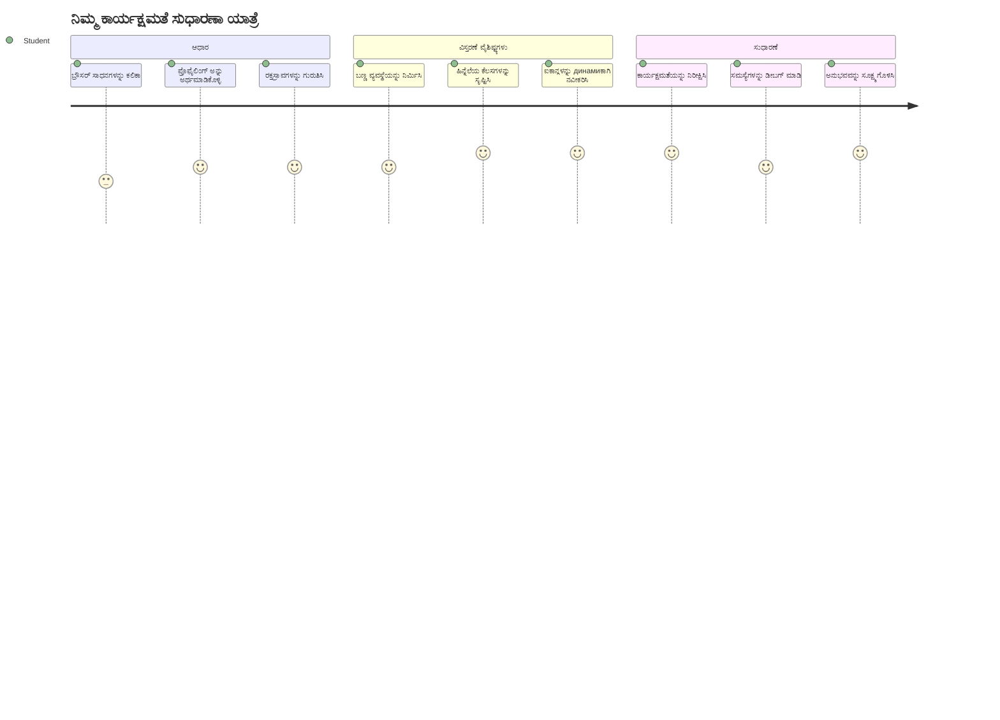
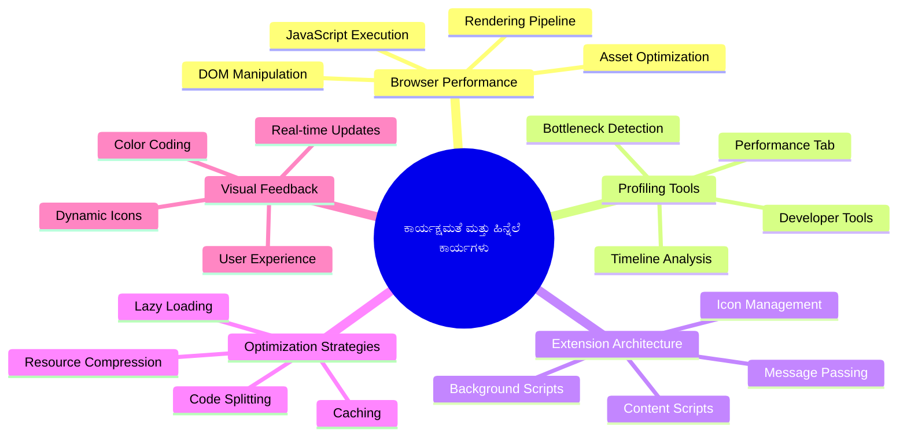
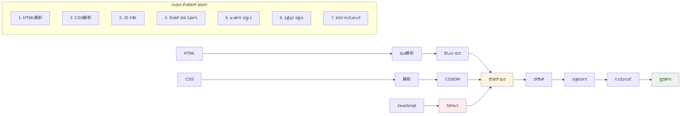
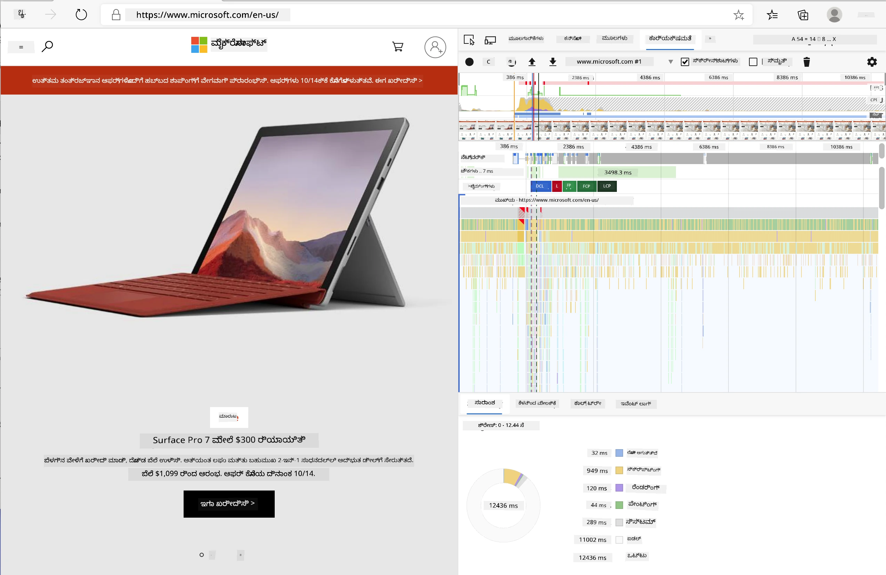
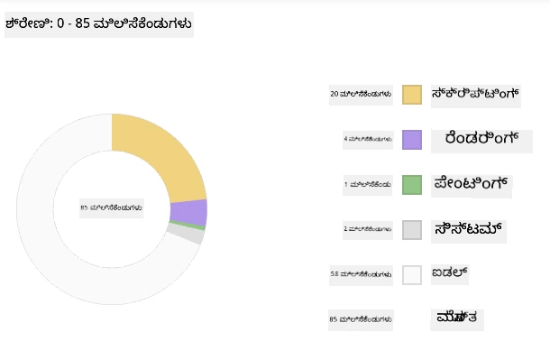
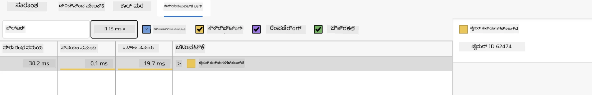
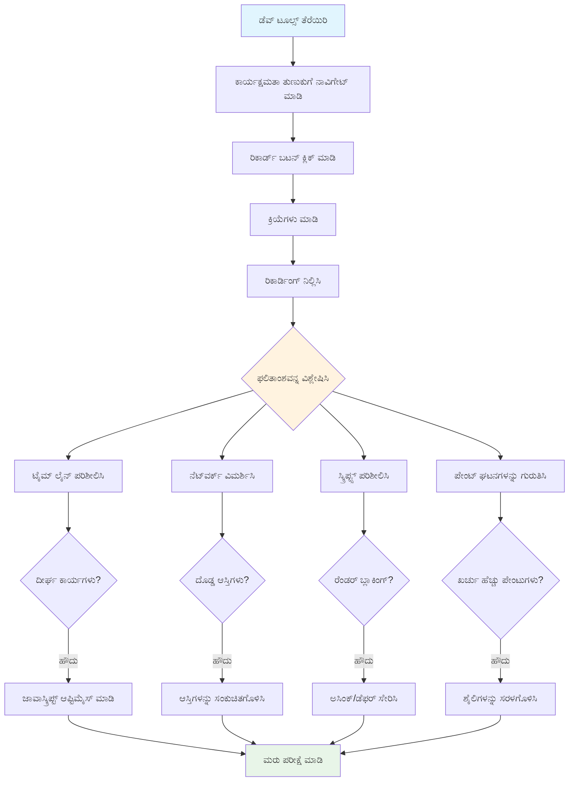
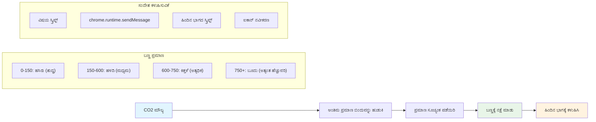
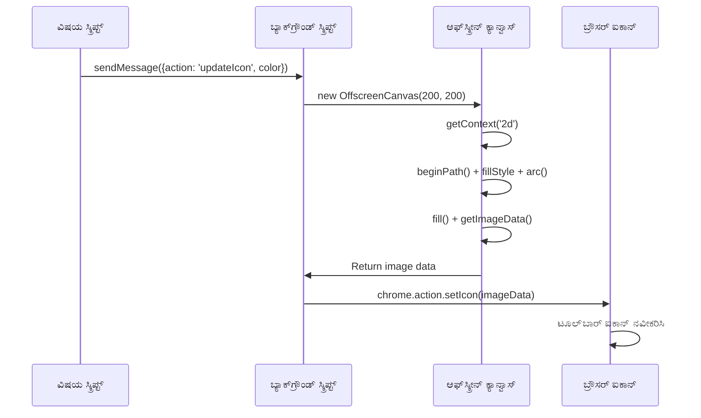

# ಬ್ರೌಸರ್ ವಿಸ್ತರಣೆ ಯೋಜನೆ ಭಾಗ 3: ಬ್ಯಾಕ್‌ಗ್ರೌಂಡ್ ಟಾಸ್ಕ್‌ಗಳು ಮತ್ತು ಕಾರ್ಯಕ್ಷಮತೆ ಬಗ್ಗೆ ಮಾಹಿತಿ ಪಡೆದಿರಿ


ಕೆಲವು ಬ್ರೌಸರ್ ವಿಸ್ತರಣೆಗಳು ಏಕೆ ತ್ವರಿತ ಮತ್ತು ಪ್ರತಿಕ್ರಿಯಾಶೀಲವಾಗಿದೆಯೆಂದು ಆಶ್ಚರ್ಯವಾಗಿದೆಯೇ, ಬೇರೆವುಗಳು ನಿಧಾನವಾಗಿ ಅನಿಸುತ್ತದೆ? ರಹಸ್ಯವು ಬ್ಯಾಕ್‌ಗ್ರೌಂಡ್‌ನಲ್ಲಿ ನಡೆಯುತ್ತಿರುವುದರಲ್ಲಿ ಇದೆ. ಬಳಕೆದಾರರು ನಿಮ್ಮ ವಿಸ್ತರಣೆಯ ಇಂಟರ್ಫೇಸನ್ನು ಕ್ಲಿಕ್ ಮಾಡುವಾಗ, ಡೇಟಾ ಪಡೆಯುವಿಕೆ, ಐಕಾನ್ ಅಪ್‌ಡೇಟ್‌ಗಳು ಮತ್ತು ಸಿಸ್ಟಮ್ ಸಂಪನ್ಮೂಲಗಳನ್ನು ಮೌನವಾಗಿ ನಿರ್ವಹಿಸುವ ಬ್ಯಾಕ್‌ಗ್ರೌಂಡ್ ಪ್ರಕ್ರಿಯೆಗಳ ಒಂದು ಸಂಪೂರ್ಣ ಜಗತ್ತು ಇದೆ.

ಇದು ಬ್ರೌಸರ್ ವಿಸ್ತರಣೆ ಸರಣಿಯ ಕೊನೆಯ ಪಾಠ, ಮತ್ತು ನಾವು ನಿಮ್ಮ ಕಾರ್ಬನ್ ಫುಟ್‌ಪ್ರಿಂಟ್ ಟ್ರ್ಯಾಕರ್ ಅನ್ನು ನಯವಾಗಿ ಕಾರ್ಯನಿರ್ವಹಿಸುವಂತೆ ಮಾಡಲಿದ್ದೇವೆ. ನೀವು ಡೈನಾಮಿಕ್ ಐಕಾನ್ ಅಪ್‌ಡೇಟ್‌ಗಳನ್ನು ಸೇರಿಸಿ, ಸಮಸ್ಯೆಗಳಾಗದ ಮೊದಲು ಕಾರ್ಯಕ್ಷಮತೆ ಸಮಸ್ಯೆಗಳನ್ನು ಹೇಗೆ ಕಂಡುಹಿಡಿಯಬೇಕೆಂದು ಕಲಿತೀರಿ. ಇದು ರೇಸ್ ಕಾರನ್ನು ಸರಿಪಡಿಸುವಂತಿದೆ - ಸಣ್ಣ ಪರಿಷ್ಕಾರಗಳು ಎಲ್ಲವೂ ಹೇಗೆ ಕಾರ್ಯನಿರ್ವಹಿಸುತ್ತದೆ ಎಂಬುದರಲ್ಲಿ ದೊಡ್ಡ ವ್ಯತ್ಯಾಸ ತರುತ್ತವೆ.

ನಾವು ಕೊನೆಗೊಳ್ಳುವ ವೇಳೆಗೆ, ನಿಮ್ಮ ವಿಸ್ತರಣೆ ಹೊಳೆಯುವಂತೆ ಆಗಿದ್ದು, ಉತ್ತಮ ವೆಬ್ ಆ್ಯಪ್‌ಗಳು ಹಾಗೂ ಅತ್ಯುತ್ತಮ ಆ್ಯಪ್‌ಗಳು ವಿಭಿನ್ನವಾಗುವ ಕಾರ್ಯಕ್ಷಮತೆ ತತ್ವಗಳನ್ನು ನೀವು ಅರ್ಥಮಾಡಿಕೊಳ್ಳುತ್ತೀರಿ. ಬನ್ನಿ, ಬ್ರೌಸರ್ ಅನುವತನದ ನಾಡಿಗೆ ನುಗ್ಗೋಣ.

## ಪೂರ್ವ-ಪಾಠ ಪ್ರಶ್ನೋತ್ತರ

[ಪೂರ್ವ-ಪಾಠ ಪ್ರಶ್ನೋತ್ತರ](https://ff-quizzes.netlify.app/web/quiz/27)

### ಪರಿಚಯ

ನೇವಿ ಹಿಂದಿನ ಪಾಠಗಳಲ್ಲಿ ನೀವು ಒಂದು ಫಾರ್ಮ್ ನಿರ್ಮಿಸಿಕೊಂಡಿದ್ದೀರಿ, ಅದನ್ನು API ಗೆ ಸಂಪರ್ಕಿಸಿದೆ, ಮತ್ತು ಅಸಿಂಕ್ರೋನಸ್ ಡೇಟಾ ಪಡೆಯುವಿಕೆಯನ್ನು ನಡೆಸಿದ್ದೀರಿ. ನಿಮ್ಮ ವಿಸ್ತರಣೆ ಚೆನ್ನಾಗಿ ರೂಪುಗೊಳ್ಳುತ್ತಿದೆ.

ಈಗ ನಾವು ಅಂತಿಮ ಸ್ಪರ್ಶಗಳನ್ನು ಸೇರಿಸಬೇಕಾಗಿದೆ - ಕಾರ್ಬನ್ ಡೇಟಾದ ಆಧಾರದ ಮೇಲೆ ಆ ವಿಸ್ತರಣೆ ಐಕಾನ್ ಬಣ್ಣ ಬದಲಾವಣೆಯಾಗುವಂತೆ ಮಾಡುವುದು. ಇದು NASA ಹಾದಿ ಪಾಲೋ ಸ್ಪೇಸ್‌ಕ್ರಾಫ್ಟ್‌ನ ಪ್ರತಿಯೊಂದು ವ್ಯವಸ್ಥೆಯನ್ನು ಹೇಗೆ ಪರಿಷ್ಕರಿಸಬೇಕಾಯಿತು ಎಂದು ನೆನಪಿಗೆ ತರುತ್ತದೆ. ಅವರು ಯಾವುದೇ ವ್ಯರ್ಥವಾದ ಸೈಕಲ್ ಅಥವಾ ಮೆಮೊರಿ ವರ್ಧನೆಯ ಪ್ರಪಂಚದಲ್ಲಿರಲಿಲ್ಲ ಏಕೆಂದರೆ ಜೀವಗಳು ಕಾರ್ಯಕ್ಷಮತೆಯ ಮೇಲೆ ಅವಲಂಬಿತವಾಗಿದ್ದವು. ನಮ್ಮ ಬ್ರೌಸರ್ ವಿಸ್ತರಣೆ ಅಷ್ಟರ ಮಟ್ಟಿಗೆ ಗಂಭೀರವಾದ್ದಿಲ್ಲವಾದರೂ, ಅದೇ ತತ್ವಗಳು ಅನ್ವಯಿಸುತ್ತವೆ - ಪರಿಣಾಮಕಾರಿ ಕೋಡ್ ಉತ್ತಮ ಬಳಕೆದಾರ ಅನುಭವಗಳನ್ನು ಸೃಷ್ಟಿಸುತ್ತದೆ.


## ವೆಬ್ ಕಾರ್ಯಕ್ಷಮತೆ ಮೂಲಭೂತಗಳು

ನಿಮ್ಮ ಕೋಡ್ ಪರಿಣಾಮಕಾರಿಯಾಗಿ ಚಲಿಸಿದಾಗ, ಜನರು ವ್ಯತ್ಯಾಸವನ್ನು ನಿಜವಾಗಿಯೂ *ಅನುಭವಿಸಬಹುದು*. ಪೇಜ್ ತಕ್ಷಣಭಾಗಿ ಲೋಡ್ ಆಗುವುದನ್ನು ಅಥವಾ ಅನಿಮೇಷನ್ ಸವರಿಸಿಕೊಂಡು ಹೋಗುವುದನ್ನು ನೀವು ತಿಳಿದಿರುತ್ತೀರಿ? ಅದು ಉತ್ತಮ ಕಾರ್ಯಕ್ಷಮತೆಯ ಪರಿಣಾಮ.

ಕಾರ್ಯಕ್ಷಮತೆ ಮಾತ್ರವೇ ವೇಗವಲ್ಲ - ಅದು ಪ್ರಕೃತಿ ನಡವಳಿಕೆಯಂತೆ ಅನುಭವಿಸುವ ವೆಬ್ ಅನುಭವಗಳನ್ನು ನಿರ್ಮಿಸುವುದೇ. ಕಂಪ್ಯೂಟಿಂಗ್ ಮೊದಲ ಕಾಲಗಳಲ್ಲಿ, ಗ್ರೇಸ್ ಹಾಪರ್ ತನ್ನ ಡೆಸ್ಕ್ ನಲ್ಲಿ ನಿನೊಸೆಕೆಂಡ್ (ಒಂದು ಕಾಲು ಉದ್ದದ ತಂತಿ) ಇಡುತ್ತಾಳೆ, ಇದರಿಂದ ಒಂದು ಬಿಲಿಯನ್ ಭಾಗದ ಸೆಕೆಂಡ್‌ನಲ್ಲಿ ಬೆಳಕು ಎಷ್ಟು ದೂರ ಸಾಗುತ್ತದೆ ಎಂಬುದನ್ನು ತೋರಿಸಲು. ಪ್ರತೀ ಮೈಸೆಕೆಂಡ್ ಕಂಪ್ಯೂಟಿಂಗ್‌ನಲ್ಲಿ ಎಷ್ಟೊಂದು ಮಹತ್ವವುಳ್ಳಿದೆ ಎಂದು ಅದೃಷ್ಟಪೂರ್ಣವಾಗಿ ವಿವರಿಸುವ ಮೂಲಕ ಅದು ಮಾಡಲಾಯಿತು. ನಾವೀಗ ಇದೇ ಮಾಹಿತಿಯನ್ನು ಅರ್ಥಮಾಡಿಕೊಳ್ಳಲು ಸಹಾಯ ಮಾಡುವ ಡಿಟೆಕ್ಟಿವ್ ಸಾಧನಗಳನ್ನು ಅನ್ವೇಷಿಸೋಣ.

> "ವೆಬ್‌ಸೈಟ್ ಕಾರ್ಯಕ್ಷಮತೆ ಎರಡು ವಿಷಯಗಳ ಬಗ್ಗೆ ಯಾವಾಗಲು ಇರುತ್ತದೆ: ಪುಟ ಎಷ್ಟು ಬೇಗ ಲೋಡ್ ಆಗುತ್ತದೆ ಮತ್ತು ಅದರಲ್ಲಿ ಇರುವ ಕೋಡ್ ಎಷ್ಟು ಬೇಗ ಚಲಿಸುತ್ತದೆ." -- [Zack Grossbart](https://www.smashingmagazine.com/2012/06/javascript-profiling-chrome-developer-tools/)

ನಿಮ್ಮ ವೆಬ್‌ಸೈಟ್‌ಗಳನ್ನು ವಿವಿಧ ಸಾಧನಗಳಲ್ಲಿಯೂ, ಎಲ್ಲಾ ರೀತಿ ಬಳಕೆದಾರರಿಗಾಗಿ, ಎಲ್ಲ ರೀತಿ ಪರಿಸ್ಥಿತಿಗಳಲ್ಲಿಯೂ ಬ್ಲೈಸಿಂಗ್ ಸ್ಪೀಡ್ ಮಾಡುವುದು ಎಂದಾದರು ವಿಶಾಲ ವಿಷಯ. ನೀವು ಸ್ಟ್ಯಾಂಡರ್ಡ್ ವೆಬ್ ಪ್ರಾಜೆಕ್ಟ್ ಅಥವಾ ಬ್ರೌಸರ್ ವಿಸ್ತರಣೆ ನಿರ್ಮಿಸುವಾಗ ನಮೂದಿಸುವ ಕೆಲವು ಅಂಶಗಳನ್ನು ಇಲ್ಲಿ ಗಮನಿಸಿರಿ.

ನಿಮ್ಮ ಸೈಟ್‌ನೊಂದಿಗೆ ಅತ್ಯುತ್ತಮ ಅನುವತನ ಮಾಡಲು ಮೊದಲ ಹಂತವು ಅಂಡರ್ ದಿ ಹೂಡ್ ಏನಾಗುತ್ತಿದೆಯೋ ತಿಳಿದುಕೊಳ್ಳುವುದು. ಘನತೆಯಿಂದ, ನಿಮ್ಮ ಬ್ರೌಸರ್ ಒಂದು ಶಕ್ತಿ ಶುಕ್ಷುಮಕೃಪಯುಕ್ತ ಡಿಟೆಕ್ಟಿವ್ ಸಾಧನಗಳನ್ನು ಒಳಗೊಂಡಿದೆ.


ಎಡ್ಜ್‌ನಲ್ಲಿ ಡೆವಲಪರ್ ಟೂಲ್‌ಗಳನ್ನು ತೆರೆಯಲು, ಮೇಲೆ ಬಲಪ್ರದೇಶದಲ್ಲಿರುವ ಮೂವರು ಬಿಂದುಗಳನ್ನು ಕ್ಲಿಕ್ ಮಾಡಿ, ನಂತರ More Tools > Developer Tools ಗೆ ಹೋಗಿ. ಅಥವಾ ಕೀಬೋರ್ಡ್ ಶಾರ್ಟ್‌ಕಟ್ ಅನ್ನು ಬಳಸಿ: ವಿಂಡೋಸ್‌ನಲ್ಲಿ `Ctrl` + `Shift` + `I` ಅಥವಾ ಮ್ಯಾಕ್‌ನಲ್ಲಿ `Option` + `Command` + `I`. ಅಲ್ಲಿ ತಲುಪಿದ ಮೇಲಾಗ, Performance ಟ್ಯಾಬ್ ಅನ್ನು ಕ್ಲಿಕ್ ಮಾಡಿ - ಇಲ್ಲಿ ನೀವು ನಿಮ್ಮ ತನಿಖೆಯನ್ನು ಮಾಡುತ್ತೀರಿ.

**ನಿಮ್ಮ ಕಾರ್ಯಕ್ಷಮತೆ ಡಿಟೆಕ್ಟಿವ್ ಉಪಕರಣಗಳು ಇಲ್ಲಿವೆ:**
- **ತೆರೆಯಿರಿ** ಡೆವಲಪರ್ ಟೂಲ್‌ಗಳು (ನೀವು ಡೆವಲಪರ್ ಆಗಿ ಹದಿನೈದು ಬಾರಿ ಬಳಸುವಿರಿ!)
- **ಹೊಕ್ಕಿರಿ** Performance ಟ್ಯಾಬ್ - ಇದನ್ನು ನಿಮ್ಮ ವೆಬ್ ಆಪ್ ಫಿಟ್ನೆಸ್ ಟ್ರ್ಯಾಕರ್ ಎಂದು ಪರಿಗಣಿಸಿ
- **ಒತ್ತಿರಿ** Record ಬಟನ್ ಮತ್ತು ನಿಮ್ಮ ಪುಟದ ಕ್ರಿಮ್ಮಣವನ್ನು ಗಮನಿಸಿ
- **ಅಧ್ಯಯನ ಮಾಡಿ** ಫಲಿತಾಂಶವನ್ನು, ಏನು ನಿಧಾನಗೊಳ್ಳುತ್ತಿದೆ ನೋಡಿ 

ಈದು ಪ್ರಯತ್ನಿಸೋಣ. ಒಂದು ವೆಬ್‌ಸೈಟ್ ತೆರೆಯಿರಿ (Microsoft.com ಚೆನ್ನಾಗಿದೆ) ಮತ್ತು 'Record' ಬಟನ್ ಒತ್ತಿ. ಈಗ ಪುಟವನ್ನು ರಿಫ್ರೆಶ್ ಮಾಡಿ ಮತ್ತು ಪ್ರೊಫೈಲರ್ ಕ್ರಿಯೆಯನ್ನು ಸೆರೆಹಿಡಿಯುವುದನ್ನು ನೋಡಿ. ನೀವು ರೆಕಾರ್ಡ್ ನಿಲ್ಲಿಸಿದಾಗ, ಬ್ರೌಸರ್ 'ಸ್ಕ್ರಿಪ್ಟ್', 'ರೆಂಡರ್', ಮತ್ತು 'ಪೇಂಟ್' ಆಗುವ ವೈಯಕ್ತಿಕ ವಿವರವನ್ನು ನೋಡುತ್ತೀರಿ. ಇದು ರಾಕೆಟ್ ಲಾಂಚ್ ಸಮಯದ ಮಿಷನ್ ಕಂಟ್ರೋಲ್ ನಲ್ಲಿ ಪ್ರತಿ ವ್ಯವಸ್ಥೆಯನ್ನು ಮೇಲ್ವಿಚಾರಣೆ ಮಾಡುವ ರೀತಿಯಾಗಿದೆ - ನೀವು ನಿಜ ಸಮಯದಲ್ಲಿ ಏನು ಮತ್ತು ಯಾವಾಗ ನಡೆಯುತ್ತಿದೆ ಎಂಬ ಡೇಟಾವನ್ನು ಪಡೆಯುತ್ತೀರಿ.



✅ [Microsoft ಡಾಕ್ಯುಮೆಂಟೇಷನ್](https://docs.microsoft.com/microsoft-edge/devtools-guide/performance/?WT.mc_id=academic-77807-sagibbon) ನಲ್ಲಿ ಹೆಚ್ಚು ವಿವರಗಳನ್ನು ತಿಳಿದುಕೊಳ್ಳಬಹುದು

> ಪ್ರೋ ಟಿಪ್: ಪರೀಕ್ಷಿಸುವ ಮೊದಲು ನಿಮ್ಮ ಬ್ರೌಸರ್ ಕ್ಯಾಶೆ ತೆರವುಗೊಳಿಸಿ, ಇದು ಮೊದಲ ಬಾರಿಗೆ ಭೇಟಿನಿಡುವವರಿಗೆ ನಿಮ್ಮ ಸೈಟ್ ಹೇಗೆ ಕಾರ್ಯನಿರ್ವಹಿಸುತ್ತದೆ ಎಂಬುದನ್ನು ತಿಳಿದುಕೊಳ್ಳಲು ಸಹಾಯಕ - ಇದು ಪುನಃ ಭೇಟಿಗೆ ಭಿನ್ನವಾಗಿರಬಹುದು!

ಪ್ರೊಫೈಲ್ ಟೈಮ್‌ಲೈನ್‌ನ ಅಂಶಗಳನ್ನು ಆಯ್ಕೆ ಮಾಡಿ ನಿಮ್ಮ ಪುಟ ಲೋಡ್ ಆಗುವ ಸಂದರ್ಭಗಳಲ್ಲಿ ನಡೆದ ಘಟನೆಗಳನ್ನು ಸಮೀಪದಿಂದ ನೋಡಿ.

ಪ್ರೊಫೈಲ್ ಟೈಮ್‌ಲೈನ್‌ನ ಭಾಗ ಆಯ್ಕೆ ಮಾಡಿ ಸಾರಾಂಶ ಪೇನ್ ನಲ್ಲಿ ನಿಮ್ಮ ಪುಟದ ಕಾರ್ಯಕ್ಷಮತೆಯ ಸ್ನಾಪ್‌ಶಾಟ್ ಪಡೆಯಿರಿ:



ಈವೆಂಟ್ ಲಾಗ್ ಪೇನ್ (Event Log pane) ತಪಾಸಿಸಿ ಯಾವುದೇ ಈವೆಂಟ್ 15 ಮಿಲಿಸೆಕೆಂಡ್ ಗಿಂತ ಹೆಚ್ಚು ಸಮಯ ತೆಗೆದುಕೊಂಡಿದೆಯೇ ಎಂಬುದನ್ನು ನೋಡಿ:



✅ ನಿಮ್ಮ ಪ್ರೊಫೈಲರ್ ಪರಿಚಯಿಸಿದರು! ಈ ಸೈಟ್‌ನಲ್ಲಿ ಡೆವಲಪರ್ ಟೂಲ್‌ಗಳನ್ನು ತೆರೆಯಿರಿ, ಯಾವುದಾದರೂ ಸಮಸ್ಯೆಗಳಿವೆ ಎಂಬುದನ್ನು ನೋಡಿ. ಏನು ಅತ್ಯಂತ ನಿಧಾನವಾಗಿ ಲೋಡ್ ಆಗುತ್ತದೆ? ಏನು ಅತ್ಯಂತ ವೇಗವಾಗಿ?


## ಪ್ರೊಫೈಲ್ ಮಾರ್ಗದಲ್ಲಿ ಯಾವುವುದನ್ನು ನೋಡಬೇಕು

ಪ್ರೊಫೈಲರ್ ಓಡಿಸುವುದು ಪ್ರಾರಂಭ ಮಾತ್ರ - ನಿಜವಾದ ಕೌಶಲ್ಯ ಅಂದರೆ ಆ ಬಣ್ಣೀಕಾರಿಯಾದ ಚಾರ್ಟುಗಳು ನಿಮ್ಮಿಗೆ ಏನನ್ನು ಹೇಳುತ್ತಿವೆ ಎಂಬುದನ್ನು ತಿಳಿದುಕೊಳ್ಳುವುದು. ಚಿಂತೆ ಬೇಡ, ನೀವು ಓದುತ್ತanonದೆ ಅಭ್ಯಾಸ ಮಾಡುತ್ತೀರಿ. ಅನುಭವಸಂಪನ್ನ ಡೆವಲಪರ್‌ಗಳು ಪೂರ್ಣ ಸಮಸ್ಯೆಗಳು ಆಗಲು ಮುಂಚೆ ಮುಂಜಾಗ್ರತೆಯ ಸೂಚಕಗಳನ್ನು ಗುರುತಿಸಬಲ್ಲರು.

ನಮ್ಮ ಸಾಮಾನ್ಯ ಆರೋಪಿಗಳನ್ನು ಚರ್ಚಿಸೋಣ - ಕಾರ್ಯಕ್ಷಮತೆಯಲ್ಲಿ ತೊಂದರೆ ಉಂಟುಮಾಡುವ ಇವು ವೆಬ್ ಪ್ರಾಜೆಕ್ಟ್ಗಳಿಗೆ ಶೀಘ್ರವಾಗಿ ಲ್ಮುಗ್ಗಿ ಬರುವವು. ಮರೀ ಕುರಿ ತನ್ನ ಪ್ರಯೋಗಾಲಯದಲ್ಲಿ ಕಿರಣಮಾನದ ಮಟ್ಟಗಳನ್ನು ಜಾಗರೂಕರಾಗಿ ನೋಡಿಕೊಂಡಂತೆ, ನಾವು ಕೂಡ ಇದನ್ನು ಗಮನಿಸಬೇಕು. ಮುಂಚೆಯೇ ಹಿಡಿದರೆ ನಿಮಗೂ (ಮತ್ತು ಬಳಕೆದಾರರಿಗೆ) ಹೆಚ್ಚಿನ ದುರಂತ ತಪ್ಪುತ್ತದೆ.

**ಆಸೆಟ್ ಅಳತೆಗಳು**: ವೆಬ್‌ಸೈಟ್‌ಗಳು ವರ್ಷಗಳಿಂದ 'ಭಾರಿ' ಆಗುತ್ತಿವೆ, ಮತ್ತು ಆ ಭಾರದ ಬಹುಭಾಗವು ಚಿತ್ರಗಳಿಂದ ಬರುತ್ತದೆ. ನಾವು ನಮ್ಮ ಡಿಜಿಟಲ್ ಸ್ಯುಟ್ಕೇಸ್‌ನಲ್ಲಿ ಹೆಚ್ಚಾಗಿ ತುಂಬುತ್ತಿರುವಂತೆ.

✅ [Internet Archive](https://httparchive.org/reports/page-weight) ನೋಡಿ ಪುಟದ ಅಳತೆ ಹೇಗೆ ಬೆಳವಣಿಗೆ ಕಂಡಿದೆ - ಬಹಳ ತಿಳಿವಳಿಕೆಯಿದೆ.

**ನಿಮ್ಮ ಆಸ್ತಿಗಳನ್ನು ತಗ್ಗಿಸಲು ವಿಧಾನಗಳು:**
- **ಕಾಂಪ್ರೆಸೆಸ್** ಮಾಡಿ ಚಿತ್ರಗಳನ್ನು! WebP ಮುಂತಾದ ಆಧುನಿಕ ಫಾರ್ಮ್ಯಾಟ್‌ಗಳು ಕಡಿಮೆ ಫೈಲ್ ಗಾತ್ರಗಳನ್ನು ನೀಡುತ್ತವೆ
- **ಸರಿಯಾದ ಚಿತ್ರ ಗಾತ್ರ** ಪ್ರತಿಯೊಂದು ಸಾಧನಕ್ಕೆ ಸೇವ್ ಮಾಡಿ - ದೊಡ್ಡ ಡೆಸ್ಕ್‌ಟಾಪ್ ಚಿತ್ರಗಳನ್ನು ಫೋನ್‌ಗಳಿಗೆ ಕಳುಹಿಸಬೇಡಿ
- **ಮಿನಿಫೈ** ಮಾಡಿ ನಿಮ್ಮ CSS ಮತ್ತು ಜಾವಾಸ್ಕ್ರಿಪ್ಟ್ - ಪ್ರತೀ ಬೈಟ್ ಮುಖ್ಯ
- **ಲೇಜಿ ಲೋಡಿಂಗ್** ಬಳಸಿ, ಚಿತ್ರಗಳನ್ನು ಬಳಕೆದಾರರು ಸ್ಕ್ರೋಲ್ ಮಾಡಿದಾಗ ಮಾತ್ರ ಡೌನ್‌ಲೋಡ್ ಆಗುವಂತೆ ಮಾಡಿ

**DOM ಸಂಚಾರಗಳು**: ಬ್ರೌಸರ್ ನಿಮ್ಮ ಬರೆದ ಕೋಡಿಗನುಸಾರವಾಗಿ ಡಾಕ್ಯುಮೆಂಟ್ ಆಬ್ಜೆಕ್ಟ್ ಮಾದರಿಯನ್ನು ಕಟ್ಟಬೇಕು, ಆದ್ದರಿಂದ ಉತ್ತಮ ಪುಟ ಕಾರ್ಯಕ್ಷಮತೆಯ ಬಗ್ಗೆ ನಿದರ್ಶನವಾಗಿ ನಿಮ್ಮ ಟ್ಯಾಗ್‌ಗಳನ್ನು ಕನಿಷ್ಟವಾಗಿಡಿ, ಪುಟಕ್ಕೆ ಅಗತ್ಯವಿರುವ ಮತ್ತು ಅದನ್ನು ಶೈಲಿಸುವುದರಲ್ಲಿ ಮಾತ್ರ ಉಪಯೋಗಿಸಿ. ಈ ದೃಷ್ಟಿಯಿಂದ, ಪುಟಕ್ಕೆ ಸಂಬಂಧಿಸಿದ ಹೆಚ್ಚುವರಿ CSS ಅನ್ನು ಪರಿಷ್ಕರಿಸಬಹುದು; ಬರವಣಿಗೆಗೆ ಅಗತ್ಯವಿರುವ ಶೈಲಿಗಳು ಒಂದು ಪುಟದಲ್ಲಿ ಮಾತ್ರ ಬಳಕೆ ಮಾಡಬೇಕಾದರೆ ಮುಖ್ಯ ಶೈಲಿ ಪಟ್ಟಿಯಲ್ಲಿ ಸೇರಿಸುವ ಅಗತ್ಯವಿಲ್ಲ.

**DOM ಪರಿಷ್ಕರಣೆಯ ಮುಖ್ಯ ತಂತ್ರಗಳು:**
- **HTML ಮೂಲಭೂತ ಅಂಶಗಳು ಮತ್ತು ನೆಸ್ಟಿಂಗ್ ಮಟ್ಟಗಳನ್ನು ಕನಿಷ್ಟಗೊಳಿಸುತ್ತದೆ**
- **ಬಳಸದ CSS ನಿಯಮಗಳನ್ನು ತೆಗೆಯುತ್ತದೆ ಹಾಗೂ ಶೈಲಿ ಪತ್ರಿಕೆಗಳನ್ನು ಸಮರ್ಥವಾಗಿ ಏಕೀಕರಿಸುತ್ತದೆ**
- **ಪ್ರತಿ ಪುಟಕ್ಕೆ ಅಗತ್ಯವಿರುವುದನ್ನು ಮಾತ್ರ ಲೋಡ್ ಮಾಡಲು CSS ಅನ್ನು ವ್ಯವಸ್ಥಿತಗೊಳಿಸುತ್ತದೆ**
- **ಉತ್ತಮ ಬ್ರೌಸರ್ ಪಾರ್ಸಿಂಗ್ ನimalಿ HTML ಅನ್ನು ಸ್ತრუქტುರಿಂಗ್ ಮಾಡುತ್ತದೆ**

**JavaScript**: ಪ್ರತಿಯೊಬ್ಬ ಜಾವಾಸ್ಕ್ರಿಪ್ಟ್ ಡೆವಲಪರ್ 'ರೆಂಡರ್-ಬ್ಲಾಕಿಂಗ್' ಸ್ಕ್ರಿಪ್ಟ್‌ಗಳನ್ನು ಗಮನಿಸಬೇಕು, ಅವು DOM ಅನ್ನು ಪಾರದರ್ಶಕವಾಗಿ ಪರಿಶೀಲಿಸುವ ಮತ್ತು ಬ್ರೌಸರಿನಲ್ಲಿ ಚಿತ್ರಿಸುವ ಮೊದಲು ಲೋಡ್ ಆಗಬೇಕು. ನಿಮ್ಮ INLINE ಸ್ಕ್ರಿಪ್ಟ್ಗಳಿಗೆ `defer` ಬಳಸುವ ಬಗ್ಗೆ ಯೋಚಿಸಿ (Terrarium ಮ友情链接ೊದೆ ಮಾಡಿರುವಂತೆ).

**ಆಧುನಿಕ ಜಾವಾಸ್ಕ್ರಿಪ್ಟ್ ಪರಿಷ್ಕರಣಾ ತಂತ್ರಗಳು:**
- **DOM ಪಾರ್ಸಿಂಗ್ ನಂತರ ಸ್ಕ್ರಿಪ್ಟ್ಗಳನ್ನು ಲೋಡ್ ಮಾಡಲು `defer` ಗುಣಲಕ್ಷಣವನ್ನು ಬಳಸುತ್ತದೆ**
- **ಕೋಡ್ ವಿಭಜನೆಯನ್ನು ಅಳವಡಿಸಿಕೊಡುತ್ತದೆ, ಕೇವಲ ಅಗತ್ಯ ಜಾವಾಸ್ಕ್ರಿಪ್ಟ್ ಅನ್ನು ಲೋಡ್ ಮಾಡುತ್ತದೆ**
- **ಮಹತ್ವಪೂರ್ಣವಲ್ಲದ ಕಾರ್ಯಾಚರಣೆಗಳಿಗೆ ಲೇಸಿ ಲೋಡಿಂಗ್ ಅನ್ನು ಅನ್ವಯಿಸುತ್ತದೆ**
- **ಭಾರದ್ ಲೈಬ್ರರಿಗಳು ಮತ್ತು ಫ್ರೇಮ್ವರ್ಕ್‌ಗಳನ್ನು ತಗ್ಗಿಸುತ್ತದೆ ಸಾಧ್ಯವಾದರೆ**

✅ ಸಾಮಾನ್ಯವಾಗಿ ಇರುವ ಪರಿಶೀಲನೆಗಳ ಬಗ್ಗೆ ತಿಳಿಯಲು ಕೆಲವು ಸೈಟ್ ಗಳನ್ನು [Site Speed Test website](https://www.webpagetest.org/) ನಲ್ಲಿ ಪ್ರಯತ್ನಿಸಿ

### 🔄 **ಶಿಕ್ಷಣಾತ್ಮಕ ಪರಿಶೀಲನೆ**
**ಕಾರ್ಯಕ್ಷಮತೆ ಅರಿವು**: ವಿಸ್ತರಣೆ ವೈಶಿಷ್ಟ್ಯಗಳನ್ನು ನಿರ್ಮಿಸುವ ಮೊದಲು ಖಾತ್ರಿ ಪಡಿಸಿಕೊಳ್ಳಿ ನೀವು:
- ✅ HTML ರಿಂದ ಪಿಕ್ಸೆಲ್ಗೆ ಕ್ರಿಟಿಕಲ್ ರೆಂಡರಿಂಗ್ ಪಾಥ್ ವಿವರಿಸಬಲ್ಲಿರಿ
- ✅ ವೆಬ್ ಆ್ಯಮ್‌ಗಳನ್ನು ಸಾಮಾನ್ಯ ಕಾರ್ಯಕ್ಷಮತೆ ತೊಂದರೆಗಳು ಗುರುತಿಸಬಲ್ಲಿರಿ
- ✅ ಬ್ರೌಸರ್ ಡೆವಲಪರ್ ಟೂಲ್‌ಗಳನ್ನು ಬಳಸಿಕೊಂಡು ಪೇಜ್ ಕಾರ್ಯಕ್ಷಮತೆಯನ್ನು ಪ್ರೊಫೈಲ್ ಮಾಡಬಲ್ಲಿರಿ
- ✅ ಆಸ್ತಿ ಗಾತ್ರ ಹಾಗೂ DOM ಸಂಕೀರ್ಣತೆ ವೇಗದ ಮೇಲೆ ಹೇಗೆ ಪ್ರಭಾವ ಬೀರುತ್ತವೆ ಅರ್ಥ ಮಾಡಿಕೊಳ್ಳಿರಿ

**ತ್ವರಿತ ಸ್ವಯಂ-ಪರೀಕ್ಷೆ**: ನೀವು ರೆಂಡರ್-ಬ್ಲಾಕಿಂಗ್ ಜಾವಾಸ್ಕ್ರಿಪ್ಟ್ ಹೊಂದಿದ್ದರೆ ಏನು ಸಂಭವಿಸುತ್ತದೆ?
*ಉತ್ತರ: ಬ್ರೌಸರ್ HTML ಅನ್ನು ಮುಂದುವರೆಸಲು ಮತ್ತು ಪುಟವನ್ನು ರೆಂಡರ್ ಮಾಡಲು ಮುಂಚಿತವಾಗಿ ಆ ಸ್ಕ್ರಿಪ್ಟ್ ಅನ್ನು ಡೌನ್‌ಲೋಡ್ ಮಾಡಿ ಕಾರ್ಯಗತಗೊಳಿಸಬೇಕು*

**ವಾಸ್ತವ ಕಾರ್ಯಕ್ಷಮತೆ ಪ್ರಭಾವ:**
- **100ms ವಿಳಂಬ**: ಬಳಕೆದಾರರು ನಿಧಾನತೆಯನ್ನು ಗಮನಿಸುತ್ತಾರೆ
- **1 ಸೆಕೆಂದಿನ ವಿಳಂಬ**: ಬಳಕೆದಾರರು ತಮ್ಮ ಗಮನ ಕಳೆದುಕೊಳ್ಳುತ್ತಾರೆ
- **3+ ಸೆಕೆಂಡ್‌ಗಳು**: 40% ಬಳಕೆದಾರರು ಪುಟವನ್ನು ತೊರೆದಿಟ್ಟುಹೋಗುತ್ತಾರೆ
- **ಮೊಬೈಲ್ ನೆಟ್‌ವರ್ಕ್‌ಗಳು**: ಕಾರ್ಯಕ್ಷಮತೆ ಇನ್ನಷ್ಟು ಮುಖ್ಯ

ನೀವು ಬ್ರೌಸರ್‌ಗೆ ಕಳುಹಿಸುವ ಆಸ್ತಿಗಳನ್ನು ಹೇಗೆ ರೆಂಡರ್ ಮಾಡುತ್ತದೆ ಎಂಬ ತಿಳಿವಳಿಕೆ ಹೊಂದಿದ್ದೀರಿ, ಈಗ ನಿಮ್ಮ ವಿಸ್ತರಣೆಯನ್ನು ಪೂರ್ಣಗೊಳಿಸಲು ಅಗತ್ಯವಿರುವ ಕೊನೆಯ ಕೆಲವು ವಿಷಯಗಳನ್ನು ನೋಡೋಣ:

### ಬಣ್ಣವನ್ನು ಗಣನೆ ಮಾಡುವ ಫಂಕ್ಷನ್ ರಚಿಸಿ

ಈಗ ನಾವು ಸಂಖ್ಯಾತ್ಮಕ ಡೇಟಾವನ್ನು ಅರ್ಥಪೂರ್ಣ ಬಣ್ಣಗಳಲ್ಲಿ ಪರಿವರ್ತಿಸುವ ಫಂಕ್ಷನ್ ರಚಿಸೋಣ. ಇದನ್ನು ಟ್ರಾಫಿಕ್ ಲೈಟ್ ವ್ಯವಸ್ಥೆಯಂತೆ ಪರಿಗಣಿಸಿ - ಸ್ವಚ್ಛ ವಿದ್ಯುತ್‌ಗೆ ಹಸು ಬಣ್ಣ, ಹೆಚ್ಚು ಕಾರ್ಬನ್ ತೀವ್ರತೆಗಾಗಿ ಕೆಂಪು ಬಣ್ಣ.

ಈ ಫಂಕ್ಷನ್ ನಮ್ಮ API ನಿಂದ CO2 ಡೇಟಾವನ್ನು ತೆಗೆದುಕೊಂಡು ಪರಿಸರ ಪರಿಣಾಮವನ್ನು ಅತ್ಯುತ್ತಮವಾಗಿ ಸೂಚಿಸುವ ಬಣ್ಣವನ್ನು ನಿರ್ಧರಿಸುತ್ತದೆ. ವಿಜ್ಞಾನಿಗಳು ಕಂಠದಂತ ಶಕ್ತಿಶಾಲಿಯ ಡೇಟಾ ಮಾದರಿಗಳನ್ನು ವರ್ತಿಸಲು ಬಣ್ಣ-ಕೋಡಿಂಗ್ ಬಳಸುವ ರೀತಿಯಾಗಿ - ಸಮುದ್ರ ತಾಪಮಾನಗಳಿಂದ ನಕ್ಷತ್ರಗಳ ರಚನೆಗೆ. ಇದನ್ನು `/src/index.js` ಯಲ್ಲಿ ಈಗಾಗಲೇ ನಾವು ರಚಿಸಿದ `const` ಚರಗಳ ನಂತರ ಸೇರಿಸೋಣ:


```javascript
function calculateColor(value) {
	// CO2 ತೀವ್ರತೆ ಪ್ರಮಾಣವನ್ನು ವ್ಯಾಖ್ಯಾನಿಸಿ (ಗ್ರಾಂಗಳ ಪ್ರತಿ ಕಿಲೋವಾಟ್‌ಘಂಟೆ)
	const co2Scale = [0, 150, 600, 750, 800];
	// ಹಸಿವು (ಶುದ್ಧ) ರಿಂದ ಕಂದು ಕAnonymous (ಅಧಿಕ ಕಾರ್ಬನ್) ಗೆ ಹೊಂದಾಣಿಕೆಯ ಬಣ್ಣಗಳು
	const colors = ['#2AA364', '#F5EB4D', '#9E4229', '#381D02', '#381D02'];

	// ನಮ್ಮ ಇನ್‌ಪುಟ್‌ಗೆ ಅತ್ಯಂತ ಸನ್ನಿಹಿತ ಪ್ರಮಾಣ ಮೌಲ್ಯವನ್ನು ಕಂಡುಹಿಡಿ
	const closestNum = co2Scale.sort((a, b) => {
		return Math.abs(a - value) - Math.abs(b - value);
	})[0];
	
	console.log(`${value} is closest to ${closestNum}`);
	
	// ಬಣ್ಣ ನಕ್ಷೆಗಾಗಿ ಸೂಚಿಗಾಗಿ ಕಂಡುಹಿಡು
	const num = (element) => element > closestNum;
	const scaleIndex = co2Scale.findIndex(num);

	const closestColor = colors[scaleIndex];
	console.log(scaleIndex, closestColor);

	// ಹಿನ್ನಲೆಯಲ್ಲಿ ಕಾರ್ಯಚಟುವಟಿಕೆಗೆ ಬಣ್ಣ ನವೀಕರಣ ಸಂದೇಶವನ್ನು ಕಳುಹಿಸಿ
	chrome.runtime.sendMessage({ action: 'updateIcon', value: { color: closestColor } });
}
```

**ಈ ಛಟಾಕ್ಷಮ ಫಂಕ್ಷನ್ ವ್ಯಾಖ್ಯಾನದಾಂಶ:**
- **ಎರಡು ಅನುರೂಪಿತ ಸರಣಿಗಳನ್ನು ಸ್ಥಾಪಿಸುತ್ತದೆ** - ಒಬ್ಬರಿಗಾಗಿ CO2 ಮಟ್ಟಗಳು, ಮತ್ತೊಬ್ಬರಿಗಾಗಿ ಬಣ್ಣಗಳು (ಹಸಿರು = ಸ್ವಚ್ಛ, ಬೂದು = ಮಲಿನ!)
- **ನಿಜವಾದ CO2 ಮೌಲ್ಯದ ಹತ್ತಿರದ ಹೊಂದಾಣಿಕೆಯನ್ನು ಹುಡುಕುತ್ತದೆ** ಕೆಲವು ಚುರುಕಾದ ಸರಣಿ ವಿಂಗಡಣೆಯನ್ನು ಬಳಸಿ
- **findIndex() ವಿಧಾನ ಬಳಸಿ ಹೊಂದಾಣಿಕೆ ಬಣ್ಣವನ್ನು ಹಿಡಿಯುತ್ತದೆ**
- **ನಮ್ಮ ಆಯ್ದ ಬಣ್ಣವೊಂದಿಗೆ ನಿರ್ಮಿತ Chrome ಬ್ಯಾಕ್ಗ್ರೌಂಡ್ ಸ್ಕ್ರಿಪ್ಟ್‌ಗೆ ಸಂದೇಶ ಕಳುಹಿಸುತ್ತದೆ**
- **ಡಿಯುಟಿಫುಲ್ ಸ್ಟ್ರಿಂಗ್ ಫಾರ್ಮ್ಯಾಟಿಂಗ್ಕ್ಕೆ ಟೆಂಪ್ಲೇಟ್ ಲಿಟರಲ್ಸ್ (backticks) ಬಳಕೆಯಾಗಿದೆ**
- **const ಘೋಷಣೆಗಳೊಂದಿಗೆ ಎಲ್ಲವನ್ನೂ ವ್ಯವಸ್ಥಿತಗೊಳಿಸುತ್ತದೆ**

`chrome.runtime` [API](https://developer.chrome.com/extensions/runtime) ನಿಮ್ಮ ವಿಸ್ತರಣೆಯ ನರ್ವಸ್ ಸಿಸ್ಟಮ್‌ನಂತೆ - ಇದು ಬ್ಯಾಕ್ಗ್ರೌಂಡ್ ಸಂವಹನ ಮತ್ತು ಕಾರ್ಯಗಳನ್ನು ನಿರ್ವಹಿಸುತ್ತದೆ:

> "ಬ್ಯಾಕ್ಗ್ರೌಂಡ್ ಪುಟವನ್ನು ಪಡೆಯಲು, ಮ್ಯಾನಿಫೆಸ್ಟ್ ವಿವರಗಳನ್ನು ಹಿಂತಿರುಗಿಸಲು, ಹಾಗೂ ಆಪ್ ಅಥವಾ ವಿಸ್ತರಣೆ ಜೀವನಚಕ್ರದಲ್ಲಿನ ಘಟನೆಗಳಿಗಾಗಿ ಕೇಳಲು ಮತ್ತು ಪ್ರತಿಕ್ರಿಯಿಸಲು chrome.runtime API ಅನ್ನು ಬಳಸಿ. ನೀವು URL ಗಳುನ್ಪೂರ್ಣಯೋಜಿತ URLs ಗೆ ಪರಿವರ್ತಿಸಲು ಈ API ಕೂಡ ಬಳಸಬಹುದು."

**ಕ್ರೋಮ್ ರನ್‌ಟೈಮ್ API उपयोगದ ಮುಖ್ಯ ಕಾರಣಗಳು:**
- **ನಿಮ್ಮ ವಿಸ್ತರಣೆಯ ವಿಭಿನ್ನ ಭಾಗಗಳ ನಡುವೆ ಸಂವಹನ ಮುಕ್ತವಾಗಿ ಮಾಡಲು ಅವಕಾಶ ಮಾಡಿಕೊಡುತ್ತದೆ**
- **ಬಳಕೆದಾರ ಇಂಟರ್ಫೇಸನ್ನು ಜಮಲಾಗದಂತೆ ಬ್ಯಾಕ್ಗ್ರೌಂಡ್ ಕೆಲಸಗಳು ನಿರ್ವಹಿಸುತ್ತದೆ**
- **ನಿಮ್ಮ ವಿಸ್ತರಣೆಯ ಜೀವನಚಕ್ರದ ಘಟನೆಗಳನ್ನು ನಿರ್ವಹಿಸುತ್ತದೆ**
- **ಸ್ಕ್ರಿಪ್ಟ್‌ಗಳ ನಡುವೆ ಸಂದೇಶ ವಿನಿಮಯ ಸುಲಭಗೊಳಿಸುತ್ತದೆ**

✅ ನೀವು Edge ಗಾಗಿ ಈ ಬ್ರೌಸರ್ ವಿಸ್ತರಣೆಯನ್ನು ಅಭಿವೃದ್ಧಿಪಡಿಸುತ್ತಿದ್ದರೆ, ನೀವು ಕ್ರೋಮ್ API ಅನ್ನು ಬಳಸುತ್ತಿದ್ದೀರಂತೆ ಆಶ್ಚರ್ಯವಾಗಬಹುದು. ಹೊಸ Edge ಬ್ರೌಸರ್ ಸಂಸ್ಕರಣೆಗಳು ಕ್ರೋಮಿಯಂ ಎಂಜಿನ್ ಮೇಲೆ ಕಾರ್ಯನಿರ್ವಹಿಸುತ್ತವೆ, ಆದ್ದರಿಂದ ನೀವು ಈ ಸಾಧನಗಳನ್ನು ಬಳಕೆ ಮಾಡಬಹುದು.


> **ಪ್ರೋ ಟಿಪ್**: ನೀವು ಬ್ರೌಸರ್ ವಿಸ್ತರಣೆಯ ಪ್ರೊಫೈಲಿಂಗ್‌ಗಾಗಿ ಬಯಸಿದರೆ, ವಿಸ್ತರಣೆ ಒಳಗಿನ ಡೆವ್ ಟೂಲ್‌ಗಳನ್ನು ಪ್ರಾರಂಭಿಸಿ, ಏಕೆಂದರೆ ಅದು ಸ್ವಂತ ಬ್ರೌಸರ್ ಘಟಕವಾಗಿದೆ. ಇದು ವಿಸ್ತರಣೆ-ನಿರ್ದಿಷ್ಟ ಕಾರ್ಯಕ್ಷಮತೆ ಮೀಟ್ರಿಕ್ಸ್‌ಗಳಿಗೆ ಪ್ರವೇಶವನ್ನು ಒದಗಿಸುತ್ತದೆ.

### ಡೀಫಾಲ್ಟ್ ಐಕಾನ್ ಬಣ್ಣವನ್ನು ಹೊಂದಿಸಿ

ನಿಜವಾದ ಡೇಟಾವನ್ನು ಪಡೆಯುವುದಕ್ಕೆ ಮುಂಚೆ, ನಾವು ವಿಸ್ತರಣೆಗೆ ಪ್ರಾರಂಭಿಕ ಸ್ಥಿತಿ ಒದಗಿಸೋಣ. ಯಾರಿಗೂ ಖಾಲಿ ಅಥವಾ ಮುರಿದಂತೆ ಕಾಣುವ ಐಕಾನ್ ಇಷ್ಟವಿಲ್ಲ. ನಾವು ಹಸಿರು ಬಣ್ಣದಿಂದ ಪ್ರಾರಂಭಿಸೋಣ, ಇದರಿಂದ ಬಳಕೆದಾರರು ವಿಸ್ತರಣೆ ಇನ್‌ಸ್ಟಾಲ್ ಮಾಡಿದ ಕ್ಷಣದಿಂದಲೇ ಕಾರ್ಯನಿರ್ವಹಿಸುತ್ತಿದೆ ಎಂದು ತಿಳಿಯುತ್ತಾರಂತೆ.

ನಿಮ್ಮ `init()` ಫಂಕ್ಷನ್‌ನಲ್ಲಿ ಆ ಡೀಫಾಲ್ಟ್ ಹಸಿರು ಐಕಾನ್ ಹೊಂದಿಸಿ:

```javascript
chrome.runtime.sendMessage({
	action: 'updateIcon',
	value: {
		color: 'green',
	},
});
```

**ಈ ಆರಂಭಿಕರಣದಿಂದ ಎನು ಸಾಧಿಯಾಗುತ್ತದೆ:**
- **ನಿರಪೇಕ್ಷ ಹಸಿರು ಬಣ್ಣವನ್ನು ಡೀಫಾಲ್ಟ್ ಸ್ಥಿತಿಯಾಗಿ ಹೊಂದಿಸುತ್ತದೆ**
- **ವಿಸ್ತರಣೆ ಲೋಡ್ ಆಗುವಾಗ ತಕ್ಷಣಿಕ ದೃಷ್ಟಿಗೋಚರ ಪ್ರತಿಕ್ರಿಯೆಯನ್ನು ಒದಗಿಸುತ್ತದೆ**
- **ಬ್ಯಾಕ್ಗ್ರೌಂಡ್ ಸ್ಕ್ರಿಪ್ಟ್‌ಗಳೊಂದಿಗೆ ಸಂವಹನ ಮಾದರಿಯನ್ನು ಸ್ಥಾಪಿಸುತ್ತದೆ**
- **ಡೇಟಾ ಲೋಡ್ ಆಗುವ ಮೊದಲು ಬಳಕೆದಾರರು ಕಾರ್ಯಾನುಷ್ಠಾನ ವಿಸ್ತರಣೆಯನ್ನು ನೋಡುತ್ತಾರೆ**

### ಫಂಕ್ಷನ್ ಅನ್ನು ಕರೆದಿರಿ, ಕರೆ ಕಾರ್ಯಗತಗೊಳಿಸಿ

ಈಗ ನಾವು ಎಲ್ಲವನ್ನು ಸಂಪರ್ಕಿಸೋಣ, ಆದ್ದರಿಂದ ಹೊಸ CO2 ಡೇಟಾ ಬಂದಿದೆ, ನಿಮ್ಮ ಐಕಾನ್ ಸ್ವಯಂಚಾಲಿತವಾಗಿ ಸರಿಯಾದ ಬಣ್ಣದಿಂದ ಅಪ್ಡೇಟ್ ಆಗುತ್ತದೆ. ಇದು ವಿದ್ಯುತ್ ಸಾಧನದ ಕೊನೆಯ ಸರ್ಕ್ಯೂಟ್ ಸಂಪರ್ಕಿಸುವಂತಹದ್ದು - ಎಲ್ಲ ವಿಭಿನ್ನ ಅಂಗಾಂಶಗಳು ಒಂದೇ ವ್ಯವಸ್ಥೆಯಂತೆ ಕಾರ್ಯನಿರ್ವಹಿಸಲು ಶುರುವಾಗುತ್ತದೆ.

API ನಿಂದ CO2 ಡೇಟಾ ಪಡೆದ ಮನೆಯಲ್ಲಿ ಈ ಸಾಲನ್ನು ಸೇರಿಸಿ:

```javascript
// API ನಿಂದ CO2 ಮಾಹಿತಿಯನ್ನು ಪಡೆದುಕೊಳ್ಳುವುದರ ನಂತರ
// let CO2 = data.data[0].intensity.actual;
calculateColor(CO2);
```

**ಈ ಏಕೀಕರಣವು ಸಾಧಿಸುವುದು:**
- **API ಡೇಟಾ ಹರಿವನ್ನು ದೃಶ್ಯ ಸೂಚಕ ವ್ಯವಸ್ಥೆಗೆ ಸಂಪರ್ಕಿಸುತ್ತದೆ**
- **ಹೊಸ ಡೇಟಾ ಬಂದಾಗ ಐಕಾನ್ ಅಪ್ಡೇಟ್ ಆಗಲು ಪ್ರೇರೇಪಿಸುತ್ತದೆ**
- **ಪ್ರಸ್ತುತ ಕಾರ್ಬನ್ ತೀವ್ರತೆಯ ಆಧಾರದ ಮೇಲೆ ನಿಜ ಕಾಲದ ದೃಶ್ಯ ಪ್ರತಿಕ್ರಿಯೆಯನ್ನು ಖಾತ್ರಿ ಪಡಿಸುತ್ತದೆ**
- **ಡೇಟಾ ಪಡೆಯುವಿಕೆ ಮತ್ತು ಪ್ರದರ್ಶನ ತಂತ್ರಾಂಶಗಳ ಮಧ್ಯೆ ಪ್ರತ್ಯೇಕತೆ ಉಳಿಸುತ್ತದೆ**

ಕೊನೆಗೆ, `/dist/background.js` ನಲ್ಲಿ ಈ ಬ್ಯಾಕ್ಗ್ರೌಂಡ್ ಕ್ರಿಯೆಗಳ ಕರೆಗಳಿಗೆ ಶ್ರೋತೃನ್ ಸೇರಿಸಿ:

```javascript
// ವಿಷಯ ಸ್ಕ್ರಿಪ್ಟ್‌ನಿಂದ ಸಂದേശಗಳನ್ನು ಕೇಳಿ
chrome.runtime.onMessage.addListener(function (msg, sender, sendResponse) {
	if (msg.action === 'updateIcon') {
		chrome.action.setIcon({ imageData: drawIcon(msg.value) });
	}
});

// ಕ್ಯಾನ್ವಾಸ್ API ಬಳಸಿ động ಐಕಾನ್ ಅನ್ನು ಬಿಡಿಸಿ
// energy lollipop ವಿಸ್ತರಣೆನಿಂದ ಸಾಲಾಗಿ - ಚೆನ್ನಾದ ವೈಶಿಷ್ಟ್ಯ!
function drawIcon(value) {
	// ಉತ್ತಮ ಪ್ರದರ್ಶನಕ್ಕಾಗಿ ಒಂದು ಆಫ್‌ಸ್ಕ್ರೀನ್ ಕ್ಯಾನ್ವಾಸ್ ತಯಾರಿಸಿ
	const canvas = new OffscreenCanvas(200, 200);
	const context = canvas.getContext('2d');

	// ಕಾರ್ಬನ್ ತೀವ್ರತೆಯನ್ನು ಪ್ರತಿನಿಧಿಸುವ ಬಣ್ಣದ ವೃತ್ತವನ್ನು ಬಿಡಿಸಿ
	context.beginPath();
	context.fillStyle = value.color;
	context.arc(100, 100, 50, 0, 2 * Math.PI);
	context.fill();

	// ಬ್ರೌಸರ್ ಐಕಾನ್ ಗಾಗಿ ಚಿತ್ರ ಡೇಟಾವನ್ನು ಹಿಂತಿರುಗಿಸಿ
	return context.getImageData(50, 50, 100, 100);
}
```

**ಈ ಬ್ಯಾಕ್ಗ್ರೌಂಡ್ ಸ್ಕ್ರಿಪ್ಟ್ ಏನು ಮಾಡುತ್ತದೆ:**
- **ನಿಮ್ಮ ಮುಖ್ಯ ಸ್ಕ್ರಿಪ್ಟ್‌ನಿಂದ ಸಂದೇಶಗಳನ್ನು ಕೇಳುತ್ತದೆ (ರಿಸೆಪ್ಷನಿಸ್ಟ್ ಫೋನ್ಗಳು ಸ್ವೀಕರಿಸುವಂತಿದೆ)**
- **'updateIcon' ವಿನಂತಿಗಳನ್ನು ಪ್ರಕ್ರಿಯೆ ಮಾಡುತ್ತದೆ ಮತ್ತು ನಿಮ್ಮ ಟೂಲ್‌ಬಾರ್ ಐಕಾನ್ ಬದಲಾಯಿಸುತ್ತದೆ**
- **Canvas API ಬಳಸಿ ಹೊಸ ಐಕಾನ್ಗಳನ್ನು ರಚಿಸುತ್ತದೆ**
- **ಸರಳ ಬಣ್ಣದ ವೃತ್ತವನ್ನು ಬಿಡಿಸುತ್ತದೆ ಇದು ಪ್ರಸ್ತುತ ಕಾರ್ಬನ್ ತೀವ್ರತೆಯನ್ನು ತೋರಿಸುತ್ತದೆ**
- **ನಿಮ್ಮ ಬ್ರೌಸರ್ ಟೂಲ್‌ಬಾರ್ ಅನ್ನು ಹೊಸ ಐಕಾನ್‌తో ಅಪ್ಡೇಟ್ ಮಾಡುತ್ತದೆ**
- **UI ಬ್ಲಾಕಿಂಗ್ ಇಲ್ಲದೆ ಹೃದಯಸ್ಪಂದನ ಕಾರ್ಯಕ್ಷಮತೆಗಾಗಿ OffscreenCanvas ಬಳಕೆ ಮಾಡುತ್ತದೆ**

✅ ನೀವು Canvas API ಬಗ್ಗೆ ಇನ್ನಷ್ಟು ತಿಳಿದುಕೊಳ್ಳಲು [Space Game ಪಾಠಗಳು](../../6-space-game/2-drawing-to-canvas/README.md) ನೋಡಿ.


### 🔄 **ಶಿಕ್ಷಣಾತ್ಮಕ ಪರಿಶೀಲನೆ**
**ಪೂರ್ಣ ವಿಸ್ತರಣೆ ಅರಿವು**: ಸಂಪೂರ್ಣ ವ್ಯವಸ್ಥೆಯ ಮೇಲೆ ನಿಮ್ಮ ನಿಪುಣತೆ ಪರಿಶೀಲಿಸಿ:
- ✅ ವಿಭಿನ್ನ ವಿಸ್ತರಣೆ ಸ್ಕ್ರಿಪ್ಟ್‌ಗಳ ನಡುವೆ ಸಂದೇಶ ವಿನಿಮಯ ಹೇಗೆ ನಡೆಯುತ್ತದೆ?
- ✅ ಕಾರ್ಯಕ್ಷಮತೆಗೆ OffscreenCanvas ಯಾಕೆ ಸಾಮಾನ್ಯ Canvas ಬದಲು ಬಳಸಲಾಗುತ್ತದೆ?
- ✅ ಕ್ರೋಮ್ ರಂಟೈಮ್ API ವಿಸ್ತರಣೆ ಸ್ಥಾಪನೆಯಲ್ಲಿ ಯಾವ ಭಾಗವಹnahme ಮಾಡುತ್ತದೆ?
- ✅ ಬಣ್ಣ ಲೆಕ್ಕ ಹಾಕುವ ఆల್ಗೋರಿದಮ್ ಡೇಟಾವನ್ನು ದೃಶ್ಯ ಪ್ರತಿಕ್ರಿಯೆಗೆ ಹೇಗೆ ನಕ್ಷೆಗೊಳಿಸುತ್ತದೆ?

**ಕಾರ್ಯಕ್ಷಮತೆ ಪರಿಗಣನೆಗಳು**: ನಿಮ್ಮ ವಿಸ್ತರಣೆ ಈಗ ತೋರಿಸುತ್ತದೆ:
- **ಕಾರ್ಯಕ್ಷಮ ಸಂದೇಶ ವಿನಿಮಯ**: ಸ್ಕ್ರಿಪ್ಟ್ ಸಂದರ್ಭಗಳ ನಡುವೆ ಸ್ವಚ್ಛ ಸಂವಹನ
- **ಆಪ್ಟಿಮೈಸ್ ರೆಂಡರಿಂಗ್**: OffscreenCanvas UI ತಡೆಕಟ್ಟುವಿಕೆಯನ್ನು ತಡೆಯುತ್ತದೆ
- **ರಿಯಲ್ ಟೈಮ್ ಅಪ್ಡೇಟ್ಸ್**: ಜೀವಂತ ಡೇಟಾದ ಆಧಾರದ ಮೇಲೆ ಐಕಾನ್ ಬದಲಾವಣೆಗಳು
- **ಸ್ಮೃತಿ ನಿರ್ವಹಣೆ**: ಸರಿಯಾದ ಕ್ಲೀನಪ್ ಮತ್ತು ಸಂಪನ್ಮೂಲ ಹ್ಯಾಂಡ್ಲಿಂಗ್

**ನಿಮ್ಮ ವಿಸ್ತರಣೆಯನ್ನು ಪರೀಕ್ಷಿಸುವ ಸಮಯ:**
- **ಎಲ್ಲವನ್ನೂ ನಿರ್ಮಿಸಿ** `npm run build`ಯೊಂದಿಗೆ
- ಬ್ರೌಸರ್‌ನಲ್ಲಿ ನಿಮ್ಮ ವಿಸ್ತರಣೆಯನ್ನು **ಪುನರಾರಂಭಿಸಿ** (ಈ ಹಂತವನ್ನು ಮರೆಯಬೆಡಿ)
- ನಿಮ್ಮ ವಿಸ್ತರಣೆಯನ್ನು **ತರೆದುಕೊಳ್ಳಿ** ಮತ್ತು ಆ ಐಕಾನ್ ಬಣ್ಣ ಬದಲಾವಣೆಯನ್ನು ನೋಡಿ
- ಜಾಗತಿಕ ಮೂಲದಿಂದ ನಿಜವಾದ ಕಾರ್ಬನ್ ಡೇಟಾಕೆ ಇದು ಹೇಗೆ ಪ್ರತಿಕ್ರಿಯಿಸುತ್ತದೆ ಎಂದು **ಪರಿಶೀಲಿಸಿ**

ಈಗ ನೀವು ಎಷ್ಟು ಲಾಂಡ್ರಿ ಮಾಡುವುದಕ್ಕೆ ಸರಿಯಾದ ಸಮಯವೋ ಅಥವಾ ಶುದ್ಧ ಮತ್ತು ಶಕ್ತಿ ಬಾಳಿಕೆಗಾಗಿ ನಿರೀಕ್ಷಿಸಬೇಕೋ ಒಂದೇ ನೋಟದಲ್ಲಿ ತಿಳಿದುಕೊಳ್ಳಬಹುದು. ನೀವು ನಿಜವಾದ ಉಪಯುಕ್ತ ವಸ್ತುವನ್ನು ನಿರ್ಮಿಸಿದ್ದೀರಿ ಮತ್ತು ಬ್ರೌಸರ್ ಕಾರ್ಯಕ್ಷಮತೆಯ ಬಗ್ಗೆ ತಿಳಿದುಕೊಂಡಿದ್ದೀರಿ.

## GitHub Copilot ಏಜೆಂಟ್ ಚಾಲೆಂಜ್ 🚀

ಕೆಳಗಿನ ಚಾಲೆಂಜ್ ಪೂರ್ಣಗೊಳಿಸಲು ಏಜೆಂಟ್ ಮೋಡ್ ಬಳಸಿರಿ:

**ವಿವರಣೆ:** ವಿಸ್ತರಣೆ ಕಾರ್ಯಕ್ಷಮತೆ ಮಾನಿಟರಿಂಗ್ ಸಾಮರ್ಥ್ಯವನ್ನು ಸುಧಾರಿಸುವಂತೆ ವಿಶೇಷತೆ ಸೇರಿಸಿ, ಇದು ವಿಸ್ತರಣೆ ವಿವಿಧ ಘಟಕಗಳ ಲೋಡ್ ಸಮಯಗಳನ್ನು ತಡೆಯುತ್ತದೆ ಮತ್ತು ತೋರಿಸುತ್ತದೆ.

**ಪ್ರಾಂಪ್ಟ್:** ಬ್ರೌಸರ್ ವಿಸ್ತರಣೆಗೆ ಕಾರ್ಯಕ್ಷಮತೆ ಮಾನಿಟರಿಂಗ್ ವ್ಯವಸ್ಥೆಯನ್ನು ರಚಿಸಿ, ಇದು API ನಿಂದ CO2 ಡೇಟಾವನ್ನು ಪಡೆಯಲು, ಬಣ್ಣಗಳನ್ನು ಲೆಕ್ಕ ಹಾಕಲು ಮತ್ತು ಐಕಾನ್ ನವೀಕರಿಸಲು ತೆಗೆದುಕೊಳ್ಳುವ ಸಮಯವನ್ನು ಮર્યಾದಿಸುತ್ತದೆ ಮತ್ತು ದಾಖಲಿಸುತ್ತದೆ. `performanceTracker` ಎಂಬ ಕಾರ್ಯವನ್ನು ಸೇರಿಸಿ, ಇದು Performance API ಬಳಸಿ ಈ ಕಾರ್ಯಗಳನ್ನು ಅಳೆಯುತ್ತದೆ ಮತ್ತು ಬ್ರೌಸರ್ ಕಂಸೋಲ್‌ನಲ್ಲಿ ಟೈಮ್‌ಸ್ಟ್ಯಾಂಪ್‌ಗಳ ಜತೆಗೆ ಅವಧಿ ಮಾನದಂಡಗಳನ್ನು ಪ್ರದರ್ಶಿಸುತ್ತದೆ.

[ಎಜೆಂಟ್ ಮೋಡ್ ಕುರಿತು ಇನ್ನಷ್ಟು ತಿಳಿದುಕೊಳ್ಳಿ](https://code.visualstudio.com/blogs/2025/02/24/introducing-copilot-agent-mode) ಇಲ್ಲಿ.

## 🚀 ಚಾಲೆಂಜ್

ಇದು ಒಂದು ರೋಚಕ ತನಿಖಾ ಕಾರ್ಯ: ವರ್ಷಗಳಿಂದ ಇರುತ್ತಾ ಇದ್ದ ಕೆಲವು open source ವೆಬ್ ಸೈಟ್‌ಗಳನ್ನು ಆಯ್ಕೆ ಮಾಡಿ (ವಿಕಿಪೀಡಿಯಾ, ಗಿಟ್‌ಹಬ್, ಸ್ಟಾಕ್ ಓವರ್‌ಫ್ಲೋ ಇತ್ಯಾದಿ) ಮತ್ತು ಅವರ ಕಾಮಿಟ್ ಇತಿಹಾಸವನ್ನು ವಿಶ್ಲೇಷಿಸಿ. ಅವರು ಕಾರ್ಯಕ್ಷಮತೆಯಲ್ಲಿ ಯಾವಾಗ ಎಲ್ಲಿ ಸುಧಾರಣೆಗಳನ್ನು ಮಾಡಿಕೊಂಡಿದ್ದಾರೆ ಎಂದು ನಿಮ್ಮಿಗೆ ಕಂಡುಬರುತ್ತದೆಯೇ? ಯಾವ ಸಮಸ್ಯೆಗಳು ಅವತಲ-ಹೊರತಾಗುತ್ತಿವೆ?

**ನಿಮ್ಮ ತನಿಖಾ ವಿಧಾನ:**
- ಕಾಮಿಟ್ ಸಂದೇಶಗಳಲ್ಲಿ "optimize", "performance", ಅಥವಾ "faster" ಎಂಬ ಪದಗಳನ್ನು **ಹುಡುಕು**
- ಮಾದರಿಗಳನ್ನು ಹುಡುಕಿ - ಅವರು ಅದೇ ರೀತಿಯ ಸಮಸ್ಯೆಗಳನ್ನು ನಿರಂತರವಾಗಿ ಸರಿಪಡಿಸುತ್ತಿರಬಹುದಾ?
- ವೆಬ್‌ಸೈಟ್‌ಗಳನ್ನು ನಿಧಾನಗೊಳಿಸುವ ಸಾಮಾನ್ಯ ಕಾರಣಗಳನ್ನು **ಗುರುತಿಸಿ**
- ನೀವು ಕಂಡುಕೊಂಡದ್ದನ್ನು ಹಂಚಿಕೊಳ್ಳಿ - ಇತರ ಡೆವಲಪರ್ಗಳು ನೈಜ-ಲೋಕ ಉದಾಹರಣೆಗಳಿಂದ ಕಲಿಯುತ್ತಾರೆ

## ಉಪನ್ಯಾಸಶೇಷ ಪ್ರಶ್ನೋತ್ತರ

[ಉಪನ್ಯಾಸಶೇಷ ಪ್ರಶ್ನೋತ್ತರ](https://ff-quizzes.netlify.app/web/quiz/28)

## ವಿಮರ್ಶೆ ಮತ್ತು ಸ್ವಾಭಿಮಾನ ಅಧ್ಯಯನ

[ಕಾರ್ಯಕ್ಷಮತೆ ನ್ಯೂಸ್‌ಲೆಟ್ಟರ್‌ಗೆ ಸೈನ್ ಅಪ್ ಮಾಡಿ](https://perf.email/)

ತೆರೆದ ಬ್ರೌಸರ್ ಪರೀಕ್ಷಾ ಉಪಕರಣಗಳ ಕಾರ್ಯಕ್ಷಮತೆ ಟ್ಯಾಬ್ಗಳ ಮೂಲಕ ಬ್ರೌಸರ್‌ಗಳು ವೆಬ್ ಕಾರ್ಯಕ್ಷಮತೆಯನ್ನು ಹೇಗೆ ಅಳೆಯುತ್ತವೆ ಎಂಬುದನ್ನು ನೋಡಿ. ನಿಮಗೆ ಯಾವುದೇ ಪ್ರಮುಖ ವ್ಯತ್ಯಾಸಗಳು ಕಂಡುಬಂದವೆಯೇ?

### ⚡ **ಮುಂದಿನ 5 ನಿಮಿಷಗಳಲ್ಲಿ ನೀವು ಏನು ಮಾಡಬಹುದು**
- [ ] ಬ್ರೌಸರ್ ಟಾಸ್ಕ್ ಮ್ಯಾನೇಜರ್ (ಶಿಫ್ಟ್+ಎಸ್ಕೇ ಕ್ರೋಮ್‌ನಲ್ಲಿ) ತೆರೆಯಿರಿ ವಿಸ್ತರಣೆಯ ಸಂಪನ್ಮೂಲ ಬಳಕೆಯನ್ನು ನೋಡಲು
- [ ] ಡೆವ್‌ಟೂಲ್ಸ್ ಕಾರ್ಯಕ್ಷಮತೆ ಟ್ಯಾಬ್ ಬಳಸಿ ವೆಬ್‌ಪೇಜ್ ಕಾರ್ಯಕ್ಷಮತೆಯನ್ನು ದಾಖಲೆ ಮತ್ತು ವಿಶ್ಲೇಷಿಸಿ
- [ ] ಬ್ರೌಸರ್‌ನ ವಿಸ್ತರಣೆ ಪುಟವನ್ನು ಪರಿಶೀಲಿಸಿ ಯಾವ ವಿಸ್ತರಣೆಗಳು ಸ್ಟಾರ್ಟ್ ಅಪ್ ಸಮಯವನ್ನು ಪ್ರಭಾವಿಸುತ್ತಿವೆ ಎಂದು
- [ ] ಕಾರ್ಯಕ್ಷಮತೆ ವ್ಯತ್ಯಾಸಗಳನ್ನು ನೋಡಲು ತಾತ್ಕಾಲಿಕವಾಗಿ ವಿಸ್ತರಣೆಗಳನ್ನು ನಿಷ್ಕ್ರಿಯಗೊಳಿಸುವ ಪ್ರಯತ್ನ ಮಾಡಿ

### 🎯 **ಈ ಗಂಟೆಯಲ್ಲಿ ನೀವು ಸಾಧಿಸಬಹುದು**
- [ ] ಉಪನ್ಯಾಸ ನಂತರದ ಕುಯಿಜ್ ಪೂರ್ಣಗೊಳಿಸಿ ಮತ್ತು ಕಾರ್ಯಕ್ಷಮತೆ ಸಿದ್ಧಾಂತಗಳನ್ನು ಅರ್ಥಮಾಡಿಕೊಳ್ಳಿ
- [ ] ನಿಮ್ಮ ಬ್ರೌಸರ್ ವಿಸ್ತರಣೆಗೆ ಬ್ಯಾಕ್ಗ್ರೌಂಡ್ ಸ್ಕ್ರಿಪ್ಟ್ ಅನುಷ್ಠಾನಗೊಳಿಸಿ
- [ ] ಕಾರ್ಯಕ್ಷಮ ಬ್ಯಾಕ್ಗ್ರೌಂಡ್ ಕಾರ್ಯಗಳಿಗೆ browser.alarms ಬಳಸಲು ಕಲಿಯಿರಿ
- [ ] ಕಾಂಟೆಂಟ್ ಸ್ಕ್ರಿಪ್ಟುಗಳು ಮತ್ತು ಬ್ಯಾಕ್ಗ್ರೌಂಡ್ ಸ್ಕ್ರಿಪ್ಟ್‌ಗಳ ನಡುವೆ ಸಂದೇಶ ವಿನಿಮಯ ಅಭ್ಯಾಸ ಮಾಡಿ
- [ ] ನಿಮ್ಮ ವಿಸ್ತರಣೆಯ ಸಂಪನ್ಮೂಲ ಬಳಕೆಯನ್ನು ಅಳೆಯಿರಿ ಮತ್ತು ಸುಧಾರಿಸಿ

### 📅 **ನಿಮ್ಮ ವಾರನಾಟಕ ಕಾರ್ಯಕ್ಷಮತೆ ಯಾತ್ರೆ**
- [ ] ಬ್ಯಾಕ್ಗ್ರೌಂಡ್ ಕಾರ್ಯಕ್ಷಮತೆ ಹೊಂದಿರುವ ಉನ್ನತ-ಕಾರ್ಯಕ್ಷಮ ಬ್ರೌಸರ್ ವಿಸ್ತರಣೆ ಪೂರ್ಣಗೊಳಿಸಿ
- [ ] ಸರ್ವಿಸ್ ವರ್ಕರ್‌ಗಳು ಮತ್ತು ಆಧುನಿಕ ವಿಸ್ತರಣೆ ಸ್ಥಾಪನೆ ಹೇಗೆ ಇರುತ್ತದೆ ಕಲಿಯಿರಿ
- [ ] ದತ್ತಾಂಶ ಸಮನ್ವಯ ಮತ್ತು ಕ್ಯಾಷಿಂಗ್ ತಂತ್ರಗಳನ್ನು ಪರಿಣಾಮಕಾರಿಯಾಗಿ ಜಾರಿಗೆ ತರಿರಿ
- [ ] ವಿಸ್ತರಣೆ ಕಾರ್ಯಕ್ಷಮತೆಯ ಸುಧಾರಣೆಗೆ ಜುದಾಯಿಸಿದ ಡಿಬಗ್ಗಿಂಗ್ ತಂತ್ರಗಳನ್ನು ಕಲಿಯಿರಿ
- [ ] ಕಾರ್ಯಕ್ಷಮತೆ ಮತ್ತು ಸಂಪನ್ಮೂಲ ಪರಿಣಾಮಕಾರಿತ್ವ ಎರಡಕ್ಕೂ ನಿಮ್ಮ ವಿಸ್ತರಣೆಯನ್ನು ಆಪ್ಟಿಮೈಸ್ ಮಾಡಿ
- [ ] ವಿಸ್ತರಣೆ ಕಾರ್ಯಕ್ಷಮತೆ ದೃಶ್ಯಾಂಶಗಳಿಗಾಗಿ ವ್ಯಾಪಕ ಪರೀಕ್ಷೆಗಳನ್ನು ರಚಿಸಿ

### 🌟 **ನಿಮ್ಮ ತಿಂಗಳ-ನಾಟಕ ಸುಧಾರಣೆ ಮೇಸ್ಟರಿ**
- [ ] ಎಂಟರ್ಪ್ರೈಸು-ತಗ್ಗಿತ ಬ್ರೌಸರ್ ವಿಸ್ತರಣೆಗಳನ್ನು ಕಾರ್ಯಕ್ಷಮತೆಯೊಂದಿಗೆ ನಿರ್ಮಿಸಿ
- [ ] ವೆಬ್ ವರ್ಕರ್‌ಗಳು, ಸರ್ವಿಸ್ ವರ್ಕರ್‌ಗಳು ಮತ್ತು ಆಧುನಿಕ ವೆಬ್ ಕಾರ್ಯಕ್ಷಮತೆ ಬಗ್ಗೆ ಕಲಿಯಿರಿ
- [ ] ಕಾರ್ಯಕ್ಷಮತೆ ಸುಧಾರಣೆಯ ಮೇಲೆ ಕೇಂದ್ರೀಕೃತ open source ಪ್ರಾಜೆಕ್ಟ್‌ಗಳಿಗೆ ಕೊಡುಗೆ ನೀಡಿರಿ
- [ ] ಬ್ರೌಸರ್ ಆಂತರಿಕ ಮತ್ತು ಉನ್ನತ ಡಿಬಗ್ಗಿಂಗ್ ತಂತ್ರಗಳುಮ್ಮೇಲ್ಮಟ್ಟ ಕಮಾಂಡು ಪಡೆದುಕೊಳ್ಳಿ
- [ ] ಕಾರ್ಯಕ್ಷಮತೆ ಮಾನಿಟರಿಂಗ್ ಉಪಕರಣಗಳು ಮತ್ತು ಉತ್ತಮ ಅಭ್ಯಾಸ ಮಾರ್ಗದರ್ಶಿಗಳನ್ನು ರಚಿಸಿ
- [ ] ವೆಬ್ ಅಪ್ಲಿಕೇಶನ್‌ಗಳನ್ನು ಕಾರ್ಯಕ್ಷಮತೆಗಾಗಿ ಸುಧಾರಿಸುವ ಪರಿಣತಿ ಹೊಂದಿರಿ

## 🎯 ನಿಮ್ಮ ಬ್ರೌಸರ್ ವಿಸ್ತರಣೆ ಮೇಸ್ಟರಿ ಕಾಲರೇಖೆ

```mermaid
timeline
    title ಸಂಪೂರ್ಣ ವಿಸ್ತರಣೆ ಅಭಿವೃದ್ಧಿ ಪ್ರಗತಿ
    
    section ಕಾರ್ಯಕ್ಷಮತೆ ಮೂಲತತ್ತ್ವಗಳು (20 ನಿಮಿಷಗಳು)
        ಬ್ರೌಸರ್ ಪ್ರೊಫೈಲಿಂಗ್: ಡೆವ್‌ಟೂಲ್‌ಗಳ ಪರಿಣತಿ
                         : ವೇಳಾಸಾರಾಂಶ ವಿಶ್ಲೇಷಣೆ
                         : ಬಾಟಲ್‌ನೆಕ್ ಗುರುತುಹಿಡಿಯುವುದು
                         : ಗುರ್ತಿಸುವಿಕೆಯ ತೀವ್ರ ಮಾರ್ಗ
        
    section ಹಿನ್ನೆಲೆ ಕಾರ್ಯಗಳು (25 ನಿಮಿಷಗಳು)
        ವಿಸ್ತರಣೆ ವಾಸ್ತುಶಿಲ್ಪ: ಸಂದೇಶ ಪ್ರಸರಣ
                              : ಹಿನ್ನೆಲೆ ಸ್ಕ್ರಿಪ್ಟ್‌ಗಳು
                              : ರನ್‌ಟೈಮ್ API ಬಳಕೆ
                              : ಅತಿಕ್ರಮ ಸಂವಹನ
        
    section ದೃಶ್ಯ ಪ್ರತಿಕ್ರಿಯಾ (30 ನಿಮಿಷಗಳು)
        ಡೈನಾಮಿಕ್ UI: رنگ ಲೆಕ್ಕಾಚಾರ ಅಲ್ಗಾರಿಥಂಗಳು
                  : ಕ್ಯಾನ್ವಾಸ್ API ಏಕೀಕರಣ
                  : ಐಕಾನ್ ತಯಾರಿ
                  :实时 ನವೀಕರಣ
        
    section ಕಾರ್ಯಕ್ಷಮತೆ ಉತ್ತಮೀಕರಣ (35 ನಿಮಿಷಗಳು)
        ಪರಿಣಾಮಕಾರಿ ಕೋಡ್: ಅಸಿಂಕ್ ಕಾರ್ಯಾಚರಣೆಗಳು
                      : ಮೆಮೊರಿ ನಿರ್ವಹಣೆ
                      : ಸಂಪನ್ಮೂಲ ಶಿಫಾರಸು
                      : ಕಾರ್ಯಕ್ಷಮತೆ ನಿಗಾ
        
    section ಉತ್ಪಾದನೆ ಸಿದ್ಧ (45 ನಿಮಿಷಗಳು)
        ಪೊಲಿಶ್ & ಪರೀಕ್ಷೆ: ಕ್ರಾಸ್-ಬ್ರೌಸರ ಜೊತೆಗೊಳ್ಳುವಿಕೆ
                        : ದೋಷ ನಿರ್ವಹಣೆ
                        : ಬಳಕೆದಾರಅನುಭವ
                        : ಕಾರ್ಯಕ್ಷಮತೆ ಪರಿಶೀಲನೆ
        
    section ಅಗ್ರಗಣ್ಯ ವೈಶಿಷ್ಟ್ಯಗಳು (1 ವಾರ)
        ವಿಸ್ತರಣೆ ಪರಿಸರ ವ್ಯವಸ್ಥೆ: ಕ್ರೋಮ್ ವೆಬ್ ಸ್ಟೋರ್
                           : ಬಳಕೆದಾರ ಪ್ರತಿಕ್ರಿಯೆ
                           : ವಿಶ್ಲೇಷಣೆ ಏಕೀಕರಣ
                           : ನವೀಕರಣ ನಿರ್ವಹಣೆ
        
    section ವೃತ್ತಿಪರ ಅಭಿವೃದ್ಧಿ (2 ವಾರಗಳು)
        ಸಂಸ್ಥೆ ವಿಸ್ತರಣೆಗಳು: ತಂಡ ಸಹಕಾರ
                             : ಕೋಡ್ ವಿಮರ್ಶೆಗಳು
                             : CI/CD ಕಾರ್ಯಪಥಗಳು
                             : ಭದ್ರತಾ ಪರಿಶೀಲನೆಗಳು
        
    section ತಜ್ಞ ನಿಪುಣತೆ (1 ತಿಂಗಳು)
        ವೇದಿಕೆ ಪರಿಣತಿ: ಪ್ರಗತ ಕ್ರೋಮ್ APIಗಳು
                          : ಕಾರ್ಯಕ್ಷಮತೆ ಉತ್ತಮೀಕರಣ
                          : ವಾಸ್ತುಶಿಲ್ಪ ಮಾದರಿಗಳು
                          : ಮುಕ್ತ ಮೂಲ ಕೊಡುಗೆ
```
### 🛠️ ನಿಮ್ಮ ಪೂರ್ಣ ವಿಸ್ತರಣೆ ಅಭಿವೃದ್ಧಿ ಉಪಕರಣ ಸಮಗ್ರ

ಈ ತ್ರಿಲಾಜಿಯನ್ನು ಪೂರ್ಣಗೊಳಿಸಿದ ನಂತರ, ನೀವು ಈಗ ಸಂಪೂರ್ಣವಾಗಿ ನಿರ್ವಹಿಸಲು ಸಮರ್ಥರಾಗಿದ್ದೀರಿ:
- **ಬ್ರೌಸರ್ ಸ್ಥಾಪನೆ**: ವಿಸ್ತರಣೆಗಳು ಬ್ರೌಸರ್ ವ್ಯವಸ್ಥೆಗಳೊಂದಿಗೆ ಹೇಗೆ ಸಂಯೋಜಿತವಾಗುತ್ತವೆ ಎಂಬ ಆಳವಾದ ಅರ್ಥ
- **ಕಾರ್ಯಕ್ಷಮತೆ ಪ್ರೊ파일ಿಂಗ್**: ಡೆವಲಪರ್ ಉಪಕರಣಗಳಿಂದ ಬಾಟಲ್‌ನೆಕ್‌ಗಳನ್ನು ಗುರುತಿಸಿ ಸರಿಪಡಿಸುವ ಸಾಮರ್ಥ್ಯ
- **ಅಸಿಂಕ್ ಪ್ರೋಗ್ರಾಮಿಂಗ್**: ಪ್ರತಿಕ್ರಿಯಾಶೀಲ, ತಡೆರಹಿತ ಕಾರ್ಯಗಳಿಗೆ ಆಧುನಿಕ ಜಾವಾಸ್ಕ್ರಿಪ್ಟ್ ಮಾದರಿಗಳು
- **API ಸಂಯೋಜನೆ**: ಪ್ರಾಮಾಣೀಕರಣ ಮತ್ತು ದೋಷ ನಿರ್ವಹಣೆ ಒಳಗೊಂಡ ಬಾಹ್ಯ ಡೇಟಾ ಪಡೆಯುವಿಕೆ
- **ದೃಶ್ಯ ವಿನ್ಯಾಸ**: ಡೈನಾಮಿಕ್ UI ಅಪ್ಡೇಟ್ಗಳು ಮತ್ತು ಕ್ಯಾನ್ವಾಸ್ ಆಧಾರಿತ ಗ್ರಾಫಿಕ್ಸ್ ಜನರೇಷನ್
- **ಸಂದೇಶ ವಿನಿಮಯ**: ವಿಸ್ತರಣೆ ಸ್ಥಾಪನೆಯಲ್ಲಿನ ಇಂಟರ್ಸ್‌ಕ್ರಿಪ್ಟ್ ಸಂವಹನ
- **ಬಳಕೆದಾರ ಅನುಭವ**: ಲೋಡಿಂಗ್ ಸ್ಥಿತಿಗಳು, ದೋಷ ನಿರ್ವಹಣೆ ಮತ್ತು ಬುದ್ಧಿಮತ್ತೆಯ ಇಂಟರಾಕ್ಷನ್‌ಗಳು
- **ಉತ್ಪಾದನಾ ಕೌಶಲ್ಯಗಳು**: ನೈಜ-ಜಗತ್ತಿನ ನಿರ್ವಹಣೆಗೆ ಪರೀಕ್ಷೆ, ಡಿಬಗ್ಗಿಂಗ್ ಮತ್ತು ಆಪ್ಟಿಮೈಝೇಶನ್

**ನೈಜ ಜಗತ್ತಿನ ಅಪ್ಲಿಕೇಶನ್ಗಳು**: ನಿಮ್ಮ ವಿಸ್ತರಣೆ ಅಭಿವೃದ್ಧಿ ಕೌಶಲ್ಯಗಳು ನೇರವಾಗಿ ಅನ್ವಯಿಸುತ್ತವೆ:
- **ಪ್ರೋಗ್ರೆಸಿವ್ ವೆಬ್ ಆ್ಯಪ್ಸ್**: ಸಮಾನ ಸ್ಥಾಪನೆ ಮತ್ತು ಕಾರ್ಯಕ್ಷಮತೆಯ ಮಾದರಿಗಳು
- **ಇಲೆಕ್ಟ್ರಾನ್ ಡೆಸ್ಕ್‌ಟಾಪ್ ಆ್ಯಪ್ಸ್**: ವೆಬ್ ತಂತ್ರಜ್ಞಾನಗಳ ಬಳಕೆಯಿಂದ ಕ್ರಾಸ್-ಪ್ಲಾಟ್‌ಫಾರ್ಮ್ ಅಪ್ಲಿಕೇಶನ್ಗಳು
- **ಮೊಬೈಲ್ ಹೈಬ್ರಿಡ್ ಆ್ಯಪ್ಸ್**: ಕೋರ್ಟ್‍ವಾಡಾ/ಫೋನ್‌ಗ್ಯಾಪ್ ವೆಬ್ APIಗಳ ಬಳಕೆ
- **ಎಂಟರ್ಪ್ರೈಸು ವೆಬ್ ಅಪ್ಲಿಕೇಶನ್ಗಳು**: ಜಟಿಲ ಡ್ಯಾಶ್‌ಬೋರ್ಡ್ ಮತ್ತು ಉತ್ಪಾದಕತೆ ಉಪಕರಣಗಳು
- **ಕ್ರೋಮ್ ಡೆವ್‌ಟೂಲ್ಸ್ ವಿಸ್ತರಣೆಗಳು**: ಉನ್ನತ ಮಟ್ಟದ ಡೆವಲಪರ್ ಉಪಕರಣಗಳ ಜೊತೆ ಡಿಬಗ್ಗಿಂಗ್
- **ವೆಬ್ API ಸಂಯೋಜನೆ**: ಬಾಹ್ಯ ಸೇವೆಗಳಿಗೆ ಸಂವಹನ ಮಾಡುವ ಯಾವುದೇ ಅಪ್ಲಿಕೇಶನ್

**ವೃತ್ತಿಪರ ಪ್ರಭಾವ**: ನೀವು ಈಗ:
- **ನಿರ್ಮಿಸಬಹುದು** ಪ್ರೊಡಕ್ಷನ್-ಸಿದ್ಧ ಬ್ರೌಸರ್ ವಿಸ್ತರಣೆಗಳನ್ನು ಕಲ್ಪನೆ ಇಂದ ಜಾರಿಗೆ
- **ಆಪ್ಟಿಮೈಸ್ ಮಾಡಬಹುದು** ವೆಬ್ ಅಪ್ಲಿಕೇಶನ್ ನಿರ್ವಹಣೆಯನ್ನು ಉದ್ಯಮ-ಮಾನದಂಡ ಪ್ರೊಫೈಲಿಂಗ್ ಉಪಕರಣಗಳ ಬಳಕೆ ಮೂಲಕ
- **ಸ್ಥಾಪಿಸಬಹುದು** ಮಾಪನ ವೃಂದಗಳೊಂದಿಗೆ ಮೀರಿ ಮಾದರಿತ ವ್ಯವಸ್ಥೆಗಳನ್ನು
- **ಡಿಬಗ್ ಮಾಡಬಹುದು** ಜಟಿಲ ಅಸಿಂಕ್ರೋನಸ್ ಕಾರ್ಯಚಟುವಟಿಕೆಗಳು ಮತ್ತು ಕ್ರಾಸ್-ಕಾಂಟೆಕ್ಸ್ಟ್ ಸಂವಹನ
- **ಕೊಡುಗೆ ನೀಡಬಹುದು** open source ವಿಸ್ತರಣೆ ಪ್ರಾಜೆಕ್ಟ್‌ಗಳು ಮತ್ತು ಬ್ರೌಸರ್ ಮಾನದಂಡಗಳಿಗೆ

**ಮುಂದಿನ ಹಂತದ ಅವಕಾಶಗಳು**:
- **ಕ್ರೋಮ್ ವೆಬ್ ಸ್ಟೋರ್ ಡೆವಲಪರ್**: ಲಕ್ಷಾಂತರ ಬಳಕೆದಾರರಿಗೆ ವಿಸ್ತರಣೆಗಳು ಪ್ರಕಟಿಸಿ
- **ವೆಬ್ ಕಾರ್ಯಕ್ಷಮತೆ ಎಂಜಿನಿಯರ್**: ಆಪ್ಟಿಮೈಜೆಶನ್ ಮತ್ತು ಬಳಕೆದಾರ ಅನುಭವದಲ್ಲಿ ವಿಶೇಷಗೊಳ್ಳಿ
- **ಬ್ರೌಸರ್ ಪ್ಲಾಟ್‌ಫಾರ್ಮ್ ಡೆವಲಪರ್**: ಬ್ರೌಸರ್ ಎಂಜಿನ್ ಅಭಿವೃದ್ಧಿಗೆ ಕೊಡುಗೆ ನೀಡಿರಿ
- **ವಿಸ್ತರಣೆ ಫ್ರೇಮ್ವರ್ಕ್ ಸೃಷ್ಟಿಕರ್ತ**: ಇತರೆ ಡೆವಲಪರ್‌ಗಳಿಗೆ ಸಹಾಯ ಮಾಡುವ ಉಪಕರಣಗಳನ್ನು ನಿರ್ಮಿಸಿ
- **ಡೆವಲಪರ್ ರಿಲೇಶನ್ಸ್**: ಬೋಧನೆ ಮತ್ತು ವಿಷಯ ರಚನೆಯ ಮೂಲಕ ಜ್ಞಾನ ಹಂಚಿಕೊಳ್ಳಿ

🌟 **ಸಾಧನೆ ಅನ್ಲಾಕ್ ಆಗಿದೆ**: ನೀವು ವೃತ್ತಿಪರ ಅಭಿವೃದ್ಧಿ ಅಭ್ಯಾಸಗಳು ಮತ್ತು ಆಧುನಿಕ ವೆಬ್ ಮಾನದಂಡಗಳನ್ನು ಪ್ರದರ್ಶಿಸುವ ಸಂಪೂರ್ಣ, ಕಾರ್ಯೋಚಿತ ಬ್ರೌಸರ್ ವಿಸ್ತರಣೆ ನಿರ್ಮಿಸಿದ್ದೀರಿ!

## ನಿಯೋಜನೆ

[ಕಾರ್ಯಕ್ಷಮತೆಗಾಗಿ ಒಂದು ಸೈಟ್ ವಿಶ್ಲೇಷಿಸಿ](assignment.md)

---

<!-- CO-OP TRANSLATOR DISCLAIMER START -->
**ತ್ಯಾಜ್ಯವಾಣಿ**:  
ಈ ದಾಖಲೆಯನ್ನು AI ಅನುವಾದ ಸೇವೆ [Co-op Translator](https://github.com/Azure/co-op-translator) ಬಳಸಿ ಅನುವಾದಿಸಲಾಗಿದೆ. ನಾವು ಶುದ್ಧತೆಗೆ ಪ್ರಯತ್ನಿಸುತ್ತಿದ್ದರೂ, ಸ್ವಯಂಚಾಲಿತ ಅನುವಾದಗಳಲ್ಲಿ ದೋಷಗಳು ಅಥವಾ ತಪ್ಪುಗುರುತುಗಳಿರುವ ಸಾಧ್ಯತೆ ಇದ್ದೇ ಇದೆ ಎಂದು ಜ್ಞಾನದಲ್ಲಿರಲಿ. ಮೂಲ ಭಾಷೆಯಲ್ಲಿ ಇರುವ ಮೂಲ ದಾಖಲೆ ಅಧಿಕಾರವಾದ ಮೂಲ ಎಂದು ಪರಿಗಣಿಸಬೇಕು. ಪ್ರಮುಖ ಮಾಹಿತಿಗಾಗಿ, ವೃತ್ತಿಪರ ಮಾನವ ಅನುವಾದವನ್ನು ಶಿಫಾರಸು ಮಾಡಲಾಗುತ್ತದೆ. ಈ ಅನುವಾದ ಬಳಕೆಯಿಂದ ಉಂಟಾಗುವ ಯಾವುದೇ ತಪ್ಪು ಅರ್ಥಮಾಡಿಕೆಗಳು ಅಥವಾ ಭ್ರಮೆಗೆ ನಾವು ಹೊಣೆಗಾರರಾಗುವುದಿಲ್ಲ.
<!-- CO-OP TRANSLATOR DISCLAIMER END -->