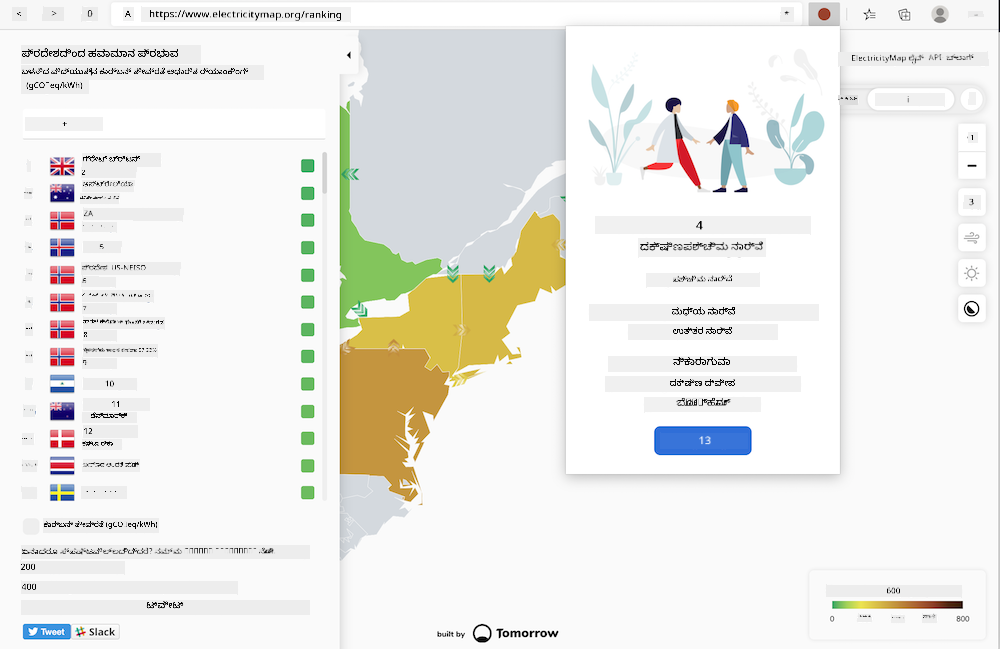
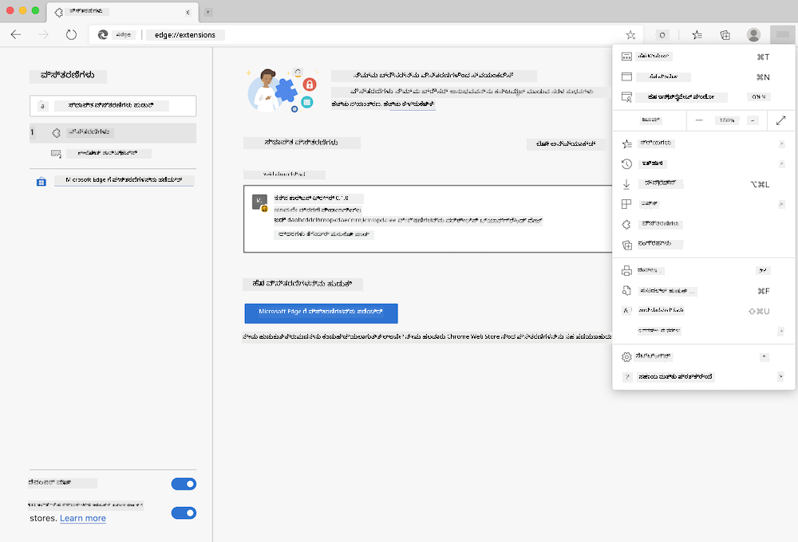

<!--
CO_OP_TRANSLATOR_METADATA:
{
  "original_hash": "dd58ae1b7707034f055718c1b68bc8de",
  "translation_date": "2026-01-08T16:08:31+00:00",
  "source_file": "5-browser-extension/solution/translation/README.hi.md",
  "language_code": "kn"
}
-->
# ಕಾರ್ಬನ್ ಟ್ರಿಗರ್ ಬ್ರೌಸರ್ ಎಕ್ಸ್ಟೆಂಶನ್: ಪೂರ್ಣಗೊಂಡ ಕೋಡ್

ವಿದ್ಯುತ್ ಬಳಕೆಯನ್ನು ಟ್ರ್ಯಾಕ್ ಮಾಡಲು tmrow ನ CO2 ಸಿಗ್ನಲ್ API ಅನ್ನು ಬಳಸುವುದು, ನಿಮ್ಮ ಬ್ರೌಸರ್ ನಲ್ಲಿ ನಿಮ್ಮ ಪ್ರದೇಶದ ವಿದ್ಯುತ್ ಬಳಕೆ ಎಷ್ಟು ಗಂಭೀರವಾಗಿದೆ ಎಂಬುದರ ಬಗ್ಗೆ ನಿಮಗೆ ಸ್ಮರಣಿಕೆ ನೀಡುವಂತೆ ಒಂದು ಬ್ರೌಸರ್ ಎಕ್ಸ್ಟೆಂಶನ್ ಅನ್ನು ರಚಿಸುವುದು. ಈ ತಾತ್ಕಾಲಿಕ ಎಕ್ಸ್ಟೆಂಶನ್‌ನ ಬಳಕೆಯಿಂದ ನೀವು ಈ ಮಾಹಿತಿಯ ಆಧಾರದಲ್ಲಿ ನಿಮ್ಮ ಚಟುವಟಿಕೆಗಳ ಬಗ್ಗೆ ತೀರ್ಮಾನ ತೆಗೆದುಕೊಳ್ಳಲು ಸಹಾಯವಾಗುತ್ತದೆ.



## ಪ್ರಾರಂಭಿಸುವುದು

ನೀವು [npm](https://npmjs.com) ಅನ್ನು ಸ್ಥಾಪಿಸಬೇಕು. ನಿಮ್ಮ కంప್ಯೂಟರ್ ನಲ್ಲಿ ಒಂದು ಫೋಲ್ಡರ್ ನಲ್ಲಿ ಈ ಕೋಡ್ ನ ಪ್ರತಿಯನ್ನು ಡೌನ್‌ಲೋಡ್ ಮಾಡಿ.

ಇವತ್ತು ಬೇಕಾಗುವ ಎಲ್ಲಾ ಪ್ಯಾಕೇಜ್ ಗಳನ್ನು ಸ್ಥಾಪಿಸಿ:

```
npm install
```

ವೆಬ್‌ಪ್ಯಾಕ್ ಉಪಯೋಗಿಸಿ ಎಕ್ಸ್‌ಟೆಂಶನ್ ರಚಿಸಿ

```
npm run build
```

ಎಡ್ಜ್‌ನಲ್ಲಿ ಸ್ಥಾಪಿಸಲು, ನಿಮ್ಮ ಬ್ರೌಸರ್ ನ ಮೇಲೆ ಬಲ ದಿಕ್ಕಿನಲ್ಲಿ ಇರುವ 'ಮೂರು ಡಾಟ್' ಮೆನು ಬಳಸಿ ಎಕ್ಸ್‌ಟೆಂಶನ್ ಪ್ಯಾನಲ್ ಅನ್ನು ಹುಡುಕಿರಿ. ಅಲ್ಲಿ, ಹೊಸ ಎಕ್ಸ್ಟೆಂಶನ್ ಲೋಡ್ ಮಾಡಲು 'ಲೋಡ್ ಅನ್ಪ್ಯಾಕ್ಡ್' ಆಯ್ಕೆಮಾಡಿ. ಪ್ರಾಂಪ್ಟ್‌ನಲ್ಲಿ 'dist' ಫೋಲ್ಡರ್ ಅನ್ನು ತೆರೆಯಿರಿ ಮತ್ತು ಎಕ್ಸ್ಟೆಂಶನ್ ಲೋಡ್ ಆಗುತ್ತದೆ. ಇದನ್ನು ಬಳಸಲು, ನಿಮಗೆ CO2 ಸಿಗ್ನಲ್ API ([ಇಮೇಲ್ ಮೂಲಕ ಇಲ್ಲಿ ಪಡೆಯಿರಿ](https://www.co2snal.com/) ಅಥವಾ ಈ ಪುಟದಲ್ಲಿ ಬಾಕ್ಸ್‌ನಲ್ಲಿ ನಿಮ್ಮ ಇಮೇಲ್ ನಮೂದಿಸಿ) ಮತ್ತು [ನಿಮ್ಮ ಪ್ರದೇಶಕ್ಕೆ ಕೋಡ್](http://api.electricitymap.org/v3/zones) [ಎಲೆಕ್ಟ್ರಿಸಿಟಿ ಮ್ಯಾಪ್](https://www.electricitymap.org/map) (ಉದಾಹರಣೆಗೆ, ಬೋಸ್ಟನ್‌ನಲ್ಲಿ ನಾನು 'US-NEISO' ಉಪಯೋಗಿಸುತ್ತೇನೆ) ಅಗತ್ಯವಿದೆ.



ಒಮ್ಮೆ API ಕೀ ಮತ್ತು ಪ್ರದೇಶದ ಎಕ್ಸ್‌ಟೆಂಶನ್ ಇಂಟರ್ಫೇಸ್‌ಗೆ ಇನ್ಪುಟ್ ಆದ ಮೇಲೆ, ಬ್ರೌಸರ್ ಎಕ್ಸ್‌ಟೆಂಶನ್ ಬಾರ್‌ನಲ್ಲಿ ಬಣ್ಣದ ಹಣ್ಣು ನಿಮ್ಮ ಪ್ರದೇಶದ انرಜಿಯ ಬಳಕೆಯನ್ನು ಪ್ರತಿಬಿಂಬಿಸುವಂತೆ ಬದಲಾಯಿಸಬೇಕು ಮತ್ತು ನಿಮಗೆ ಸೂಚಕವನ್ನು ನೀಡಬೇಕು ಇಂದ್ರಿಯ ಭಾರವಾದ ಚಟುವಟಿಕೆಗಳು ನಿಮ್ಮ ಪ್ರದರ್ಶನಕ್ಕೆ ಏನು ಸೂಕ್ತವಾಗಿವೆ ಎಂಬುದರ. ಈ 'ಹಣ್ಣು' ವ್ಯವಸ್ಥೆಯ ಹಿಂದಿನ ಆಲೋಚನೆಯನ್ನು ನನಗೆ ಕ್ಯಾಲಿಫೋರ್ನಿಯಾ ಉತ್ಸರ್ಜನೆಗಾಗಿ [ಎನರ್ಜಿ ಲಾಲಿಪೋಪ್ ಎಕ್ಸ್ಟೆಂಶನ್](https://energylollipop.com/) ನೀಡಿತ್ತು.

---

<!-- CO-OP TRANSLATOR DISCLAIMER START -->
**ತೆರವು**:  
ಈ ದಾಖಲೆ [Co-op Translator](https://github.com/Azure/co-op-translator) ಎಂಬ AI ಭಾಷಾಂತರ ಸೇವೆಯನ್ನು ಬಳಸಿ ಭಾಷಾಂತರಿಸಲಾಗಿದೆ. ನಮಗೆ ಶುದ್ಧತೆಯ ಪ್ರಯತ್ನವಿದ್ದು, ಸ್ವಯಂಚಾಲಿತ ಭಾಷಾಂತರಗಳಲ್ಲಿ ದೋಷಗಳು ಅಥವಾ ತಪ್ಪುಗಳಿರಬಹುದು ಎಂಬುದನ್ನು ತಿಳಿದುಕೊಳ್ಳಿ. ಮೂಲ ಭಾಷೆಯಲ್ಲಿ ಇರುವ ಮೂಲ ದಾಖಲೆ ಆಧಿಕಾರಿಕ ಮೂಲವಾಗಿರುತ್ತದೆ. ಮಹತ್ವದ ಮಾಹಿತಿಗಾಗಿ, ವೃತ್ತಿಪರ ಮಾನವ ಭಾಷಾಂತರ ಸೇವೆಯನ್ನು ಬಳಸುವುದೇ ಶಿಫಾರಸು ಮಾಡಲಾಗುತ್ತದೆ. ಈ ಭಾಷಾಂತರ ಬಳಕೆಯಿಂದ ಉಂಟಾಗುವ ಯಾವುದೇ ತಪ್ಪು ಅರ್ಥಸ್ಕರಣೆಗೆ ನಾವು ಹೊಣೆಗಾರರಲ್ಲ.
<!-- CO-OP TRANSLATOR DISCLAIMER END -->