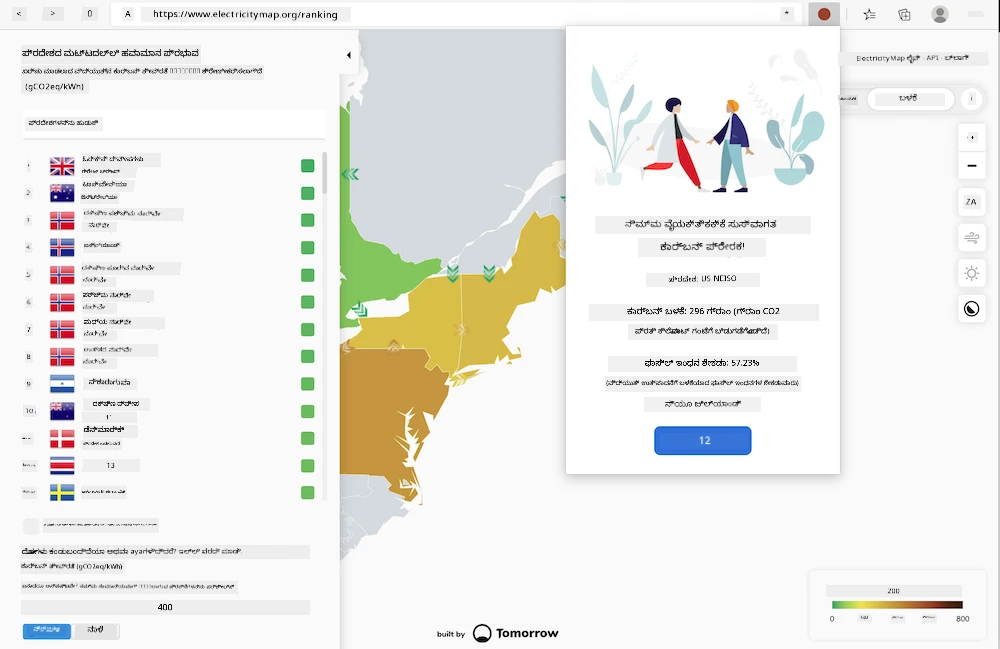
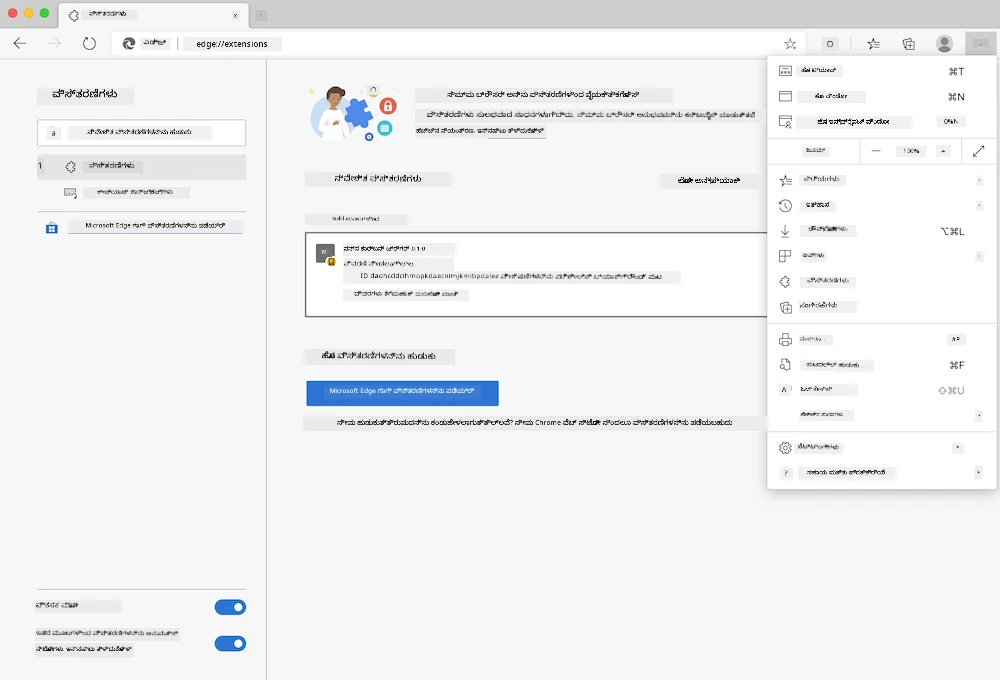

<!--
CO_OP_TRANSLATOR_METADATA:
{
  "original_hash": "26fd39046d264ba185dcb086d3a8cf3e",
  "translation_date": "2026-01-08T16:06:07+00:00",
  "source_file": "5-browser-extension/start/README.md",
  "language_code": "kn"
}
-->
# ಕಾರ್ಬನ್ ಟ್ರಿಗರ್ ಬ್ರೌಸರ್ ವಿಸ್ತರಣಾ: ಸ್ಟಾರ್ಟರ್ ಕೋಡ್

tmrowನ CO2 ಸಿಗ್ನಲ್ API ಬಳಸಿ ವಿದ್ಯುತ್ ಬಳಕೆಯನ್ನು ಟ್ರಾಕ್ ಮಾಡಲು, ನಿಮ್ಮ ಪ್ರದೇಶದ ವಿದ್ಯುತ್ ಬಳಕೆ ಎಷ್ಟು ಭಾರವಾಗಿದೆ ಎಂಬ ಬಗ್ಗೆ ಮುನ್ಸೂಚನೆ ನಿಮ್ಮ ಬ್ರೌಸರ್‌ನಲ್ಲಿ ಇರುತ್ತಂತೆ ಗಣನೆ ಮಾಡಲು ಬ್ರೌಸರ್ ವಿಸ್ತರಣೆಯನ್ನು ನಿರ್ಮಿಸಿ. ಈ ವಿಸ್ತರಣೆಯನ್ನು ಅದ್ಹಾಕ್ ಬಳಸು ನಮ್ಮ ಚಟುವಟಿಕೆಗಳ ಮೇಲೆ ಈ ಮಾಹಿತಿಯನ್ನು ಆಧಾರಿಸಿ ತೀರ್ಮಾನ ತೆಗೆದುಕೊಳ್ಳಲು ಸಹಾಯ ಮಾಡುತ್ತದೆ.



## ಪ್ರಾರಂಭಿಸುವುದು

ನೀವು [npm](https://npmjs.com) ಅನ್ನು ಸ್ಥಾಪಿಸಿರಬೇಕು. ಈ ಕೋಡ್ ನಕಲನ್ನು ನಿಮ್ಮ ಕಂಪ್ಯೂಟರ್‌ನ ಫೋಲ್ಡರ್‌ಗೆ ಡೌನ್‌ಲೋಡ್ ಮಾಡಿ.

ಆವಶ್ಯಕವಾದ ಎಲ್ಲಾ ಪ್ಯಾಕೇಜ್‌ಗಳನ್ನು ಸ್ಥಾಪಿಸಿ:

```
npm install
```

webpackದಿಂದ ವಿಸ್ತರಣೆಯನ್ನು ನಿರ್ಮಿಸಿ

```
npm run build
```

Edgeನಲ್ಲಿ ಸ್ಥಾಪಿಸಲು, ಬ್ರೌಸರ್‌ನ ಎಡಮುಖ ಮುಂಭಾಗದ ಮೆನು (ಮೂರು ಹೊಂಡು ಬಿಂದುಗಳು) ಬಳಸಿ 'Extensions' ಪ್ಯಾನಲ್ ಕಂಡುಹಿಡಿಯಿರಿ. ಅಲ್ಲಿ 'Load Unpacked' ಆಯ್ಕೆ ಮಾಡಿ ಹೊಸ ವಿಸ್ತರಣೆಯನ್ನು ಲೋಡ್ ಮಾಡಿ. ಪ್ರಾಂಪ್ಟ್‌ನಲ್ಲಿ 'dist' ಫೋಲ್ಡರ್ ತೆರೆಯಿರಿ ಮತ್ತು ವಿಸ್ತರಣೆ ಲೋಡ್ ಆಗುತ್ತದೆ. ಇದನ್ನು ಬಳಸಲು, ನಿಮಗೆ CO2 ಸಿಗ್ನಲ್‌ ಅವರ API ಕೀ ಬೇಕು ([ಇಮೇಲ್ ಮೂಲಕ ಇಲ್ಲಿ ಪಡೆಯಿರಿ](https://www.co2signal.com/) - ಈ ಪುಟದಲ್ಲಿರುವ ಬಾಕ್ಸಿನಲ್ಲಿ ನಿಮ್ಮ ಇಮೇಲ್ ನಮೂದಿಸಿ) ಮತ್ತು [ಈ ಭಾಗಕ್ಕೆ ಸಂಬಂಧಿಸಿದ ಕೋಡ್](http://api.electricitymap.org/v3/zones) ಬೇಕಾಗುತ್ತದೆ, ಇದು [Electricity Map](https://www.electricitymap.org/map) ಗೆ ಸಮ್ಮೇಳನವಾಗಿರುತ್ತದೆ (ಉದಾಹರಣೆಗೆ, ಬೋಸ್ತನ್‌ನಲ್ಲಿ ನಾನು 'US-NEISO' ಅನ್ನು ಬಳಸುತ್ತೇನೆ).



ಒಮ್ಮೆ API ಕೀ ಮತ್ತು ಪ್ರದೇಶವನ್ನು ವಿಸ್ತರಣೆ ಪರಿಪಡಿಯಲ್ಲಿ ನಮೂದಿಸಿದಾಗ, ಬ್ರೌಸರ್ ವಿಸ್ತರಣೆ ಬಾರ್‌ನ ಬಣ್ಣದ ಚುಕ್ಕಿ ನಿಮ್ಮ ಪ್ರದೇಶದ ಇಂಧನ ಬಳಕೆಯನ್ನು ಪ್ರತಿಬಿಂಬಿಸುವಂತೆ ಬದಲಾಗಬೇಕು ಮತ್ತು ನೀವು ಎಷ್ಟೊಂದು ಉರಿಯುವ ಚಟುವಟಿಕೆಗಳನ್ನು ಮಾಡಲು ಸೂಕ್ತವಾಗಿರುವುದನ್ನು ಸೂಚಿಸಬೇಕು. ಈ 'ಚುಕ್ಕಿ' ವ್ಯವಸ್ಥೆಯ ಆಲೋಚನೆಯನ್ನು ನನಗೆ [Energy Lollipop ವಿಸ್ತರಣೆ](https://energylollipop.com/) ದಿಂದ ನೀಡಲಾಗಿತ್ತು, ಇದು ಕ್ಯಾಲಿಫೋರ್ನಿಯಾ ಉತ್ಸರ್ಜನೆಗಳಿಗಾಗಿ.

---

<!-- CO-OP TRANSLATOR DISCLAIMER START -->
**ಡ್ಡಿಸ್ಕ್ಲೇಮರ್**:
ಈ ದಾಖಲೆ [ಕೋ-ಆಪ್ ಟ್ರಾನ್ಸ್ಲೇಟರ್](https://github.com/Azure/co-op-translator) ಎಂಬ AI ಅನುವಾದ ಸೇವೆಯನ್ನು ಬಳಸಿ ಅನುವಾದಿಸಲಾಗಿದೆ. ನಾವು ಶುದ್ಧತೆಗೆ ಪ್ರಯತ್ನಿಸುವುದಾದರೂ, ಸ್ವಯಂಚಾಲಿತ ಅನುವಾದಗಳಲ್ಲಿ ತಪ್ಪುಗಳು ಅಥವಾ ಅಸಗೆತತೆಗಳಿರಬಹುದು ಎಂದು ದಯವಿಟ್ಟು ತಿಳಿಯಿರಿ. ಮೂಲ ಭಾಷೆಯಲ್ಲಿರುವ ಮೂಲ ದಾಖಲೆನ್ನು ಅಧಿಕೃತ ಮೂಲವಾಗಿ ಪರಿಗಣಿಸಬೇಕು. ಪ್ರಮುಖ ಮಾಹಿತಿಗಾಗಿ ವೃತ್ತಿಪರ чалавಿಯ ಅನುವಾದವನ್ನು ಶಿಫಾರಸು ಮಾಡಲಾಗುತ್ತದೆ. ಈ ಅನುವಾದವನ್ನು ಬಳಸದರಿಂದ ಉದ್ಭವಿಸುವ ಬದ್ಧತೆ ಅಥವಾ ಭ್ರಮನಿರ್ಮೂಲಕ್ಕೆ ನಾವು ಹೊಣೆಗಾರರಾಗಿರುವುದಿಲ್ಲ.
<!-- CO-OP TRANSLATOR DISCLAIMER END -->