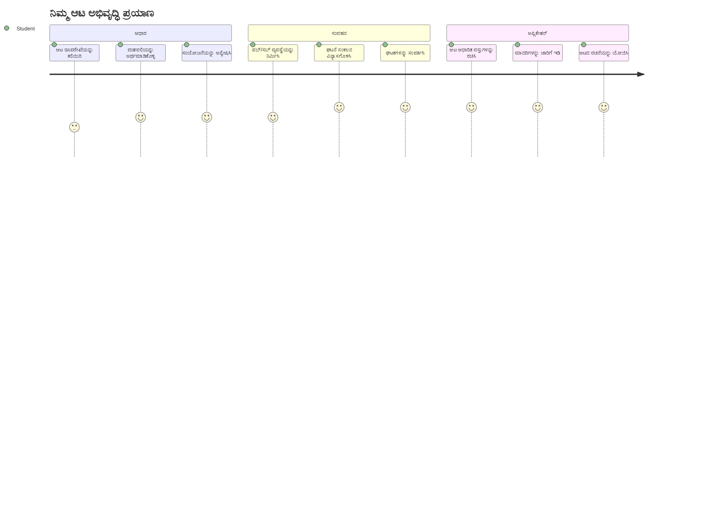
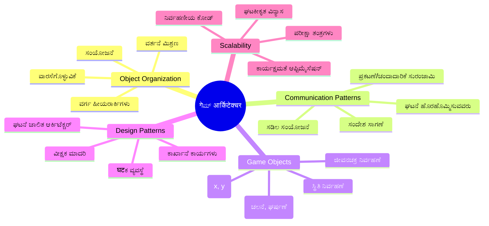
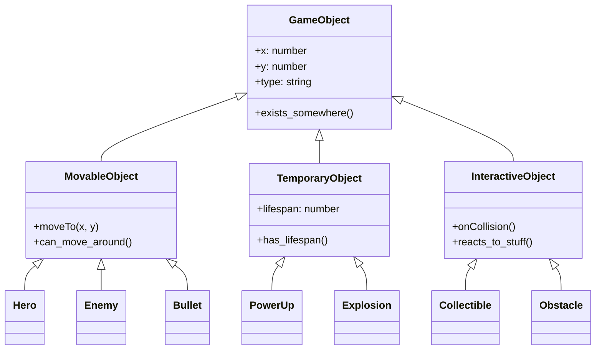
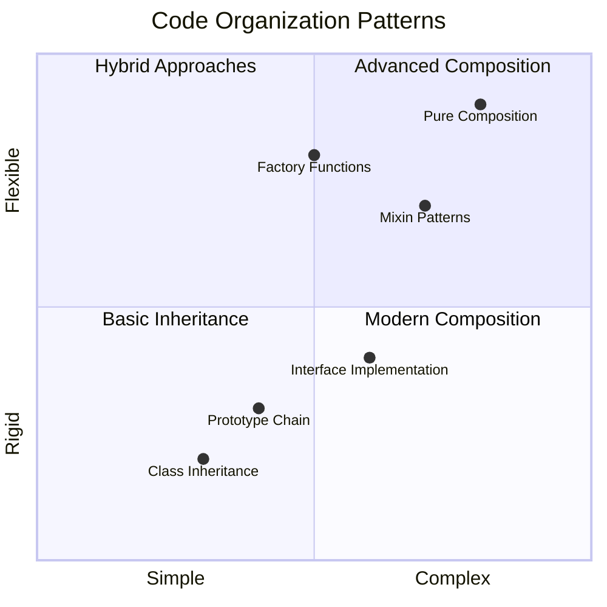
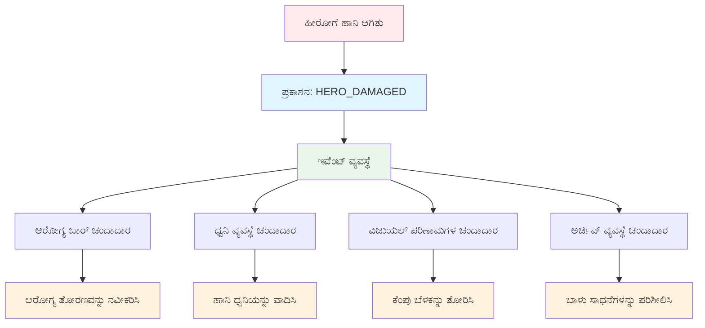
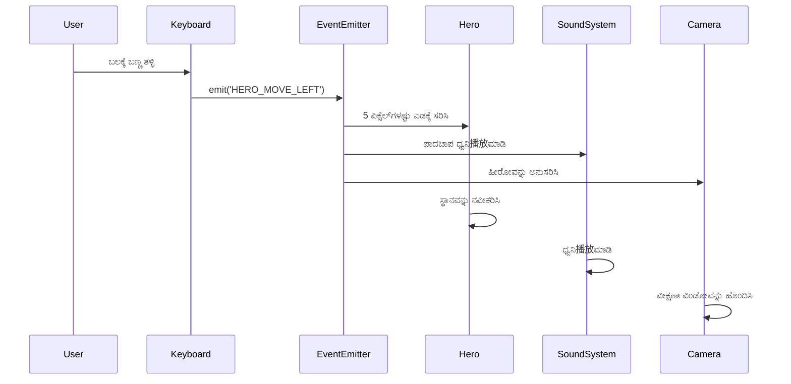
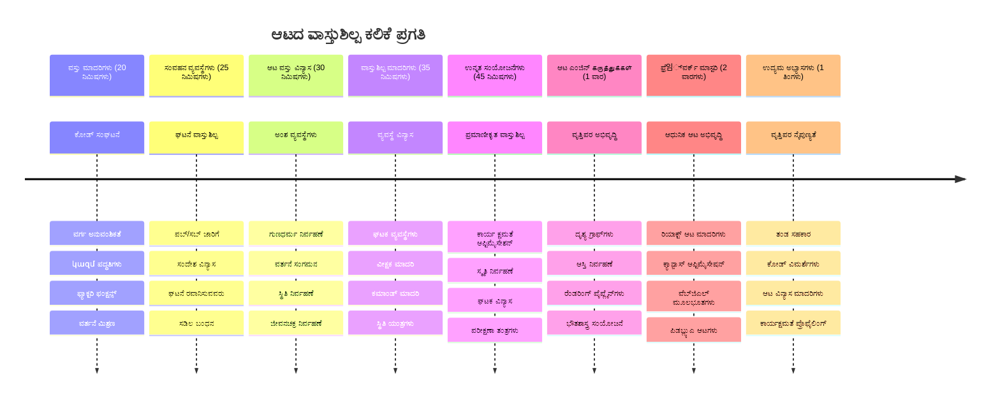

<!--
CO_OP_TRANSLATOR_METADATA:
{
  "original_hash": "a6332a7bb4d0be3bfd24199c83993777",
  "translation_date": "2026-01-08T14:25:52+00:00",
  "source_file": "6-space-game/1-introduction/README.md",
  "language_code": "kn"
}
-->
# ಸ್ಪೇಸ್ ಆಟ ನಿರ್ಮಾಣ ಭಾಗ 1: ಪರಿಚಯ




ನಾಸಾದ ಮಿಷನ್ ಕಂಟ್ರೋಲ್ ಸ್ಪೇಸ್ ಲಾಂಚ್ ವೇಳೆ ಹಲವಾರು ವ್ಯವಸ್ಥೆಗಳನ್ನು ಸಂಯೋಜಿಸುವಂತೆ, ನಾವು ಪ್ರೋಗ್ರಾಂನ ವಿಭಿನ್ನ ಭಾಗಗಳು ಸಾಸ್ವತವಾಗಿ ಹೇಗೆ ಒಟ್ಟಿಗೆ ಕೆಲಸ ಮಾಡಬಹುದು ಎಂಬುದನ್ನು ತೋರಿಸುವ ಸ್ಪೇಸ್ ಆಟವನ್ನು ನಿರ್ಮಿಸೋಣ. ನೀವು ವಾಸ್ತವವಾಗಿ ಆಡಬಹುದಾದ ಯಾವುದನ್ನಾದರೂ ರಚಿಸುವಾಗ, ಯಾವುದೇ ಸಾಫ್ಟ್‌ವೇರ್ ಪ್ರಾಜೆಕ್ಟ್‌ಗೆ ಅನ್ವಯಿಸುವ ಅವಶ್ಯಕ ಪ್ರೋಗ್ರಾಮಿಂಗ್ ತತ್ವಗಳನ್ನು ನೀವು ಕಲಿಯುತ್ತೀರಿ.

ನಾವು ಕೋಡ್ ಸಂಘಟನೆಗೆ ಎರಡು ಮೂಲಭೂತ ವಿಧಾನಗಳನ್ನು ಅನ್ವೇಷಿಸೋಣ: ವರಸತು (inheritance) ಮತ್ತು ಸಂಕಲನ (composition). ಇವು ಕೇವಲ ಅಕಾಡೆಮಿಕ್ ತತ್ತ್ವಗಳಲ್ಲ - ಇವು ವಿಡಿಯೋ ಆಟಗಳ ಚಲನೆಯಿಂದ ಬ್ಯಾಂಕಿಂಗ್ ವ್ಯವಸ್ಥೆಗಳವರೆಗೆ ಎಲ್ಲವೂ ಚಾಲನೆ ಮಾಡುವ ಉದಾಹರಣೆಗಳೇ ಆಗಿವೆ. ನಾವು pub/sub ಎಂದು ಕರೆಯಲ್ಪಡುವ ಸಂವಹನ ವ್ಯವಸ್ಥೆಯನ್ನು ಕೂಡ ಜಾರಿಗೆ ತರುತ್ತೇವೆ, ಇದು ಬಾಹ್ಯಾಕಾಶ ಯಾನಗಳಲ್ಲಿ ಬಳಸುವ ಸಂವಹನ ಜಾಲಗಳಂತೆ ಕಾರ್ಯನಿರ್ವಹಿಸುತ್ತದೆ, ವಿಭಿನ್ನ ಘಟಕಗಳು ಪರಸ್ಪರ ಅವಲಂಬನೆಗಳನ್ನು ರಚಿಸುವದೆ ಇಲ್ಲದೆ ಮಾಹಿತಿ ಹಂಚಿಕೊಳ್ಳಲು ಸಹಾಯ ಮಾಡುತ್ತದೆ.

ಈ ಸರಣಿಯ ಕೊನೆಯಲ್ಲಿ, ನೀವು ಯಾವುದೇ ಗೇಮ್, ವೆಬ್ ಅನ್ವಯಿಕೆ ಅಥವಾ ಇನ್ನಾವುದೇ ಸಾಫ್ಟ್‌ವೇರ್ ವ್ಯವಸ್ಥೆಯ ನಿರ್ಮಾಣದಲ್ಲಿ ಹಿರಿದು ಬೆಳೆಯಬಲ್ಲ ಮತ್ತು ತಂತ್ರಗಳನ್ನು ಅರಿತುಕೊಳ್ಳುವಿರಿ.


## ಉಪನ್ಯಾಸಮುಂಭಾಗ ಪ್ರಶ್ನೋತ್ತರ

[ಉಪನ್ಯಾಸ ಮುಂಭಾಗ ಪ್ರಶ್ನೋತ್ತರ](https://ff-quizzes.netlify.app/web/quiz/29)

## ಆಟ ಅಭಿವೃದ್ಧಿಯಲ್ಲಿ ورسತು ಮತ್ತು ಸಂಕಲನ

ಪ್ರವೃತ್ತಿಗಳು ಸಂಕೀರ್ಣವಾಗುವಂತೆ, ಕೋಡ್ ಸಂಘಟನೆ ಅಗತ್ಯವಾಗುತ್ತದೆ. ಸರಳ ಸ್ಕ್ರಿಪ್ಟ್ ಆಗಿದ್ದೇ ಆರಂಭದಲ್ಲಿ ಸರಿಯಾದ ರಚನೆಯಿಲ್ಲದೆ ನಿರ್ವಹಣೆಯ ಕಷ್ಟ ಹೆಚ್ಚಾಗುತ್ತದೆ – ಆಪೋಲೊ ಮಿಷನ್‌ಗಳಿಗೆ ಸಾವಿರಾರು ಘಟಕಗಳ ನಿಖರ ಸಂಯೋಜನೆಯ ಅಗತ್ಯವಿದ್ದಂತೆ.

ನಾವು ಕೋಡ್ ಸಂಘಟಿಸಲು ಎರಡು ಮೂಲಭೂತ ವಿಧಾನಗಳನ್ನು ಅನ್ವೇಷಿಸುತ್ತೇವೆ: ورسತು (inheritance) ಮತ್ತು ಸಂಕಲನ (composition). ಪ್ರತಿಯೊಂದು ತನ್ನದೇ ಆದ ಲಾಭಗಳಿವೆ ಮತ್ತು ಎರಡನ್ನೂ ಅರಿತುಕೊಳ್ಳುವುದು ವಿಭಿನ್ನ ಪರಿಸ್ಥಿತಿಗಳಿಗೆ ಸರಿಯಾದ ವಿಧಾನ ಆಯ್ಕೆಮಾಡಲು ನೆರವಾಗುತ್ತದೆ. ನಾವು ಈ ತತ್ವಗಳನ್ನು ನಮ್ಮ ಸ್ಪೇಸ್ ಆಟ ಮೂಲಕ ತೋರಿಸುತ್ತೇವೆ, ಇಲ್ಲಿ ಹೀರೋಗಳು, ಶತ್ರುಗಳು, ಶಕ್ತಿ ವಿಸ್ತರಣೆಗಳು ಮತ್ತು ಇತರ ವಸ್ತುಗಳು ಪರಿಣಾಮಕಾರಿಯಾಗಿ ಪರಸ್ಪರ ಕೆಲಸ ಮಾಡಬೇಕಾಗುತ್ತದೆ.

✅ ಅತ್ಯಂತ ಪ್ರಸಿದ್ಧ ಪ್ರೋಗ್ರಾಮಿಂಗ್ ಪುಸ್ತಕಗಳಲ್ಲಿ ಒಂದಾದದ್ದು [ಡಿಸೈನ್ ಪ್ಯಾಟರ್ನ್‌ಗಳು](https://en.wikipedia.org/wiki/Design_Patterns) ಕುರಿತಾಗಿದೆ.

ಯಾವುದೇ ಆಟದಲ್ಲಿ, ನಿಮಗೆ `ಆಟ ವಸ್ತುಗಳು` ಇವೆ – ನಿಮ್ಮ ಆಟದಲ್ಲಿ ಸಂವಹನ ಮಾಡುವ ಅಂಶಗಳು. ಹೀರೋಗಳು, ಶತ್ರುಗಳು, ಶಕ್ತಿ ವಿಸ್ತಾರಗಳು ಮತ್ತು ದೃಶ್ಯ ಪರಿಣಾಮಗಳು ಆಟ ವಸ್ತುಗಳಾಗಿವೆ. ಪ್ರತಿ ಒಂದು ನಿಶ್ಚಿತ ತೆರೆದ ಅಕ್ಷಾಂಶಗಳಲ್ಲಿವೆ `x` ಮತ್ತು `y` ಮೌಲ್ಯಗಳ ಮೂಲಕ, ಎಲೆಕ್ಟ್ರಿಕ್ ತಳಹದಿಯ ಮೇಲಿನ ಬಿಂದುಗಳನ್ನು ಚಿತ್ರಿಸುವಂತೆ.

ದೃಶ್ಯಾತ್ಮಕ ವ್ಯತ್ಯಾಸಗಳಿದ್ದರೂ ಸಹ, ಈ ವಸ್ತುಗಳಿಗೆ ಸಾಮಾನ್ಯವಾಗಿ ಕಾಣುವ ಕೆಲವೆರು ನಡವಳಿಕೆಗಳು ಇವೆ:

- **ಇವು ಎಲ್ಲಿಯಾದರೂ ಇರುವುದು** – ಪ್ರತಿ ವಸ್ತುವಿನ x ಮತ್ತು y ಅಕ್ಷಾಂಶಗಳು ಇವೆ ಆದ್ದರಿಂದ ಆಟ ಅಲ್ಲಿ ಚಿತ್ರಿಸುತ್ತದೆ
- **ಬಹುತೇಕವು ಚಲಿಸಬಹುದು** – ಹೀರೋಗಳು ಓಡುತ್ತಾರೆ, ಶತ್ರುಗಳು ಹಿಂಬಾಲಿಸುತ್ತವೆ, ಗುಂಡುಗಳು ಪರಸ್ಪರ ಹಾರುತ್ತಿವೆ
- **ಅವರ ಜೀವನಾವಧಿ ಇರುತ್ತದೆ** – ಕೆಲವು ಸದಾ ಇರುತ್ತವೆ, ಕೆಲವು (ಸ್ಫೋಟಗಳಂತೆ) ಕ್ಷಣಿಕವಾಗಿ ಕಾಣಿಸಿ ಮರುಳಾಗುತ್ತವೆ
- **ಅವು ವಿವಿಧ ಪರಿಣಾಮಗಳಿಗೆ ಪ್ರತಿಕ್ರಿಯಿಸುತ್ತವೆ** – ವಸ್ತುಗಳ ನಡುವೆ ಮನೆಗಳು, ಶಕ್ತಿ ವಿಸ್ತಾರಗಳು ಸಂಗ್ರಹವಾಗುವುದು, ಆರೋಗ್ಯಪಟ್ಟಿ ಅಪ್ಡೇಟ್ ಆಗುವುದು

✅ ಪ್ಯಾಕ್-ಮ್ಯಾನ್ ಆಟದ ಬಗ್ಗೆ ಯೋಚಿಸಿ. ಮೇಲಿನ ನಾಲ್ಕು ವಸ್ತು ಪ್ರಕಾರಗಳನ್ನು ನೀವು ಈ ಆಟದಲ್ಲಿ ಗುರುತಿಸಬಹುದಾದರೇ?


### ನಡವಳಿಕೆಯನ್ನು ಕೋಡ್ ಮೂಲಕ ವ್ಯಕ್ತಪಡಿಸುವಿಕೆ

ಗೇಮ್ ವಸ್ತುಗಳ ಸಾಮಾನ್ಯ ನಡವಳಿಕೆಗಳನ್ನು ನೀವು ಈಗ ಅರ್ಥಮಾಡಿಕೊಂಡಿದ್ದಾರೆ, ಅವುಗಳನ್ನು ಜಾವಾಸ್ಕ್ರಿಪ್ಟ್‌ನಲ್ಲಿ ಹೇಗೆ ಜಾರಿಗೊಳಿಸುವುದು ಎಂಬುದನ್ನು ನೋಡೋಣ. ವಸ್ತು ನಡವಳಿಕೆಯನ್ನು ಕ್ಲಾಸ್‌ಗಳಿಗೆ ಅಥವಾ ವೈಯಕ್ತಿಕ ವಸ್ತುಗಳಿಗೆ ಜೋಡಿಸಿದ ವಿಧಾನಗಳ ಮೂಲಕ ವ್ಯಕ್ತಪಡಿಸಬಹುದು ಮತ್ತು ಇದಕ್ಕೆ ಹಲವಾರು ವಿಧಾನಗಳಿವೆ.

**ಕ್ಲಾಸ್ ಆಧಾರಿತ ವಿಧಾನ**

ಕ್ಲಾಸ್‌ಗಳು ಮತ್ತು ورسತು ಗೇಮ್ ವಸ್ತುಗಳ ಸಂಘಟನೆಯಲ್ಲಿ ಸಂಯೋಜಿತ ವಿಧಾನ ತರುತ್ತವೆ. ಕಾರ್ಲ್ ಲಿನಿನಿಯಸ್ ನಿರ್ಮಿಸಿದ ವರ್ಗೀಕರಣ ವ್ಯವಸ್ಥೆಯಂತೆಯೇ, ನೀವು ಸಾಮಾನ್ಯ ಗುಣಗಳುಳ್ಳ ಮೂಲ ಕ್ಲಾಸ್‌ನಿಂದ ಪ್ರಾರಂಭಿಸಿ, ನಂತರ ವೈಶಿಷ್ಟ್ಯವಾರ್ಡ್ ಕಾರ್ಯಕ್ಷಮತೆ ಸೇರಿಸಿದ ವಿಶೇಷ ಕ್ಕ್ಲಾಸ್‌ಗಳನ್ನು ಸೃಷ್ಟಿಸುತ್ತೀರಿ.

✅ ورسತು ಒಂದು ಪ್ರಮುಖ ತತ್ವವಾಗಿದೆ. [MDN ನ ورسತು ಕುರಿತ ಲೇಖನ](https://developer.mozilla.org/docs/Web/JavaScript/Inheritance_and_the_prototype_chain) ನಲ್ಲಿ ಹೆಚ್ಚಿನ ಮಾಹಿತಿ ಪಡೆಯಿರಿ.

ನೀವು ಕ್ಲಾಸ್‌ಗಳು ಮತ್ತು ورسತು ಬಳಸಿ ಗೇಮ್ ವಸ್ತುಗಳನ್ನು ಹೇಗೆ ಜಾರಿಗೆ ತರುತ್ತೀರೆಯೋ ಹೀಗಿದೆ:

```javascript
// ಹಂತ 1: ಮೂಲ GameObject ವರ್ಗವನ್ನು ರಚಿಸಿ
class GameObject {
  constructor(x, y, type) {
    this.x = x;
    this.y = y;
    this.type = type;
  }
}
```

**ಇದನ್ನು ಹಂತಹಂತವಾಗಿ ವಿವರಿಸೋಣ:**
- ನಾವು ಪ್ರತಿಯೊಂದು ಗೇಮ್ ವಸ್ತುಗೂ ಬಳಸಬಹುದಾದ ಮೂಲ ಟೆಂಪ್ಲೇಟ್ ರಚಿಸುತ್ತಿದ್ದೇವೆ
- ಕಾಂಸ್ಟ್ರಕ್ಟರ್ ವಸ್ತುವಿನ ಸ್ಥಾನ (`x`, `y`) ಮತ್ತು ಅದರ ಪ್ರಕಾರವನ್ನು ಉಳಿಸುತ್ತದೆ
- ಇದು ಎಲ್ಲಾ ಗೇಮ್ ವಸ್ತುಗಳ ನಿರ್ಮಾಣದ ಆಧಾರ ಆಗುತ್ತದೆ

```javascript
// ಹಂತ 2: ವಂಶಪಾರಂಪರ್ಯದಿಂದ ಚಲನಾ ಸಾಮರ್ಥ್ಯವನ್ನು ಸೇರಿಸಿ
class Movable extends GameObject {
  constructor(x, y, type) {
    super(x, y, type); // ಪೋಷಕ ಸಂರಚಕವನ್ನು ಕರೆಮಾಡಿ
  }

  // ಹೊಸ ಸ್ಥಾನಕ್ಕೆ ಚಲಿಸುವ ಸಾಮರ್ಥ್ಯವನ್ನು ಸೇರಿಸಿ
  moveTo(x, y) {
    this.x = x;
    this.y = y;
  }
}
```

**ಮೇಲಿನ ಉದಾಹರಣೆಯಲ್ಲಿ ನಾವು:**
- **GameObject ಕ್ಲಾಸ್** ಅನ್ನು ವಿಸ್ತರಿಸಿ ಚಲಿಸುವ ಕಾರ್ಯವನ್ನು ಸೇರಿಸಿದ್ದೇವೆ
- **ಪೋಷಕ ಕಾಂಸ್ಟ್ರಕ್ಟರ್** ಅನ್ನು `super()` ಮೂಲಕ ಕರೆಸಿ ورಸತು ಗುಣಲಕ್ಷಣಗಳನ್ನು ಪ್ರಾರಂಭಿಸಿದ್ದೇವೆ
- ವಸ್ತುವಿನ ಸ್ಥಾನವನ್ನು ಅಪ್‌ಡೇಟ್ ಮಾಡುವ `moveTo()` ವಿಧಾನವನ್ನು ಸೇರಿಸಿದ್ದೇವೆ

```javascript
// ಹಂತ 3: ನಿರ್ದಿಷ್ಟ ಆಟ ವಸ್ತು ಪ್ರಕಾರಗಳನ್ನು ರಚಿಸಿ
class Hero extends Movable {
  constructor(x, y) {
    super(x, y, 'Hero'); // ಪ್ರಕಾರವನ್ನು ಸ್ವಯಂಚಾಲಿತವಾಗಿ ಹೊಂದಿಸಿ
  }
}

class Tree extends GameObject {
  constructor(x, y) {
    super(x, y, 'Tree'); // ಮರಗಳು ಚಲನೆಯ ಅಗತ್ಯವಿಲ್ಲ
  }
}

// ಹಂತ 4: ನಿಮ್ಮ ಆಟ ವಸ್ತುಗಳನ್ನು ಬಳಸಿ
const hero = new Hero(0, 0);
hero.moveTo(5, 5); // ವೀರ ರೈ ಚಲಿಸಬಹುದು!

const tree = new Tree(10, 15);
// tree.moveTo()ಗೆ ದೋಷವಾಗುತ್ತದೆ - ಮರಗಳು ಚಲಿಸಲು കഴിയುವುದಿಲ್ಲ
```

**ಈ ತತ್ತ್ವಗಳನ್ನು ಅರ್ಥಮಾಡಿಕೊಳ್ಳಿ:**
- ಸೂಕ್ತ ವ್ಯವಹಾರಗಳನ್ನು ورಸತು ಮಾಡುವ ವಿಶೇಷ ವಸ್ತು ತಯಾರಿಸುತ್ತದೆ
- ورسತುವು ಆಯ್ಕೆಮಾಡಿದ ಕಾರ್ಯಗಳನ್ನು ಸೇರಿಸುವುದನ್ನು ತೋರಿಸುತ್ತದೆ
- ಹೀರೋಗಳು ಚಲಿಸಬಹುದು ಆದರೆ ಮರಗಳು ಅಚಲಿತವಾಗಿರುತ್ತವೆ ಎಂಬುದನ್ನು ತೋರಿಸುತ್ತದೆ
- ವರ್ಗ ಕ್ರಮವು ಅಸಂಗತ ಕ್ರಿಯೆಗಳನ್ನು ತಡೆಯುತ್ತದೆ ಎಂಬುದನ್ನು ವಿವರಿಸುತ್ತದೆ

✅ ಪ್ಯಾಕ್-ಮ್ಯಾನ್ ಹೀರೋ (ಉದಾಹರಣೆಗೆ ಇಂಕಿ, ಪಿಂಕಿ ಅಥವಾ ಬ್ಲಿಂಕಿ) ಅನ್ನು ಜಾವಾಸ್ಕ್ರಿಪ್ಟ್‌ನಲ್ಲಿ ಹೇಗೆ ಬರೆಯಬಹುದು ಎಂದು ಕೆಲನಿಮೆ ನೋಟ ಮಾಡಿ.

**ಸಂಕಲನ (Composition) ವಿಧಾನ**

ಸಂಕಲನವು ಜಾಗತಿಕ ವಿನ್ಯಾಸ ತತ್ವವನ್ನು ಅನುಸರಿಸುತ್ತದೆ, ಬಾಹ್ಯಾಕಾಶ ನೌಕೆಯ ವಿಭಿನ್ನ ಭಾಗಗಳನ್ನು ವಿನ್ಯಾಸ ಮಾಡುವ ಇಂಜಿನಿಯರ್‌ಗಳ ಶೈಲಿಯನ್ನು ಹೋಲುತ್ತದೆ. ಪೋಷಕ ಕ್ಲಾಸ್‌ನಿಂದ ورಸತು ಮಾಡುವ ಬದಲು, ಅಗತ್ಯವಿರುವ ನಡವಳಿಕೆಗಳನ್ನು ಸಂಯೋಜಿಸಿ ನಿಖರವಾಗಿ ಕೆಲವೊಂದು ಕಾರ್ಯಗಳನ್ನಿಟ್ಟುಕೊಂಡಿ ವಸ್ತುಗಳನ್ನು ರಚಿಸುತ್ತೇವೆ. ಈ ವಿಧಾನ ಅತಿಯಾದ hierarchical ನಿಯಮಗಳಿಲ್ಲದೆ ಬದಲಾಗುವಿಕೆಯನ್ನು ನೀಡುತ್ತದೆ.

```javascript
// ಹಂತ 1: ಮೂಲ ವರ್ತನೆ ವಸ್ತುಗಳನ್ನು ರಚಿಸಿ
const gameObject = {
  x: 0,
  y: 0,
  type: ''
};

const movable = {
  moveTo(x, y) {
    this.x = x;
    this.y = y;
  }
};
```

**ಈ ಕೋಡ್ ಏನು ಮಾಡುತ್ತದೆ:**
- ಸ್ಥಾನ ಮತ್ತು ಪ್ರಕಾರ ಗುಣಲಕ್ಷಣಗಳೊಂದಿಗೆ ಮೂಲ `gameObject` ರೂಪಿಸುತ್ತೆ
- ಚಲಿಸುವ ಕಾರ್ಯ ಹೊಂದಿರುವ `movable` ಸಂವಹನ ವಸ್ತುವನ್ನು ಕಾಯ್ದಿರಿಸುತ್ತದೆ
- ಸ್ಥಾನ ಮಾಹಿತಿ ಮತ್ತು ಚಲಿಸುವ ನಿಯಮ ಸ್ವತಂತ್ರವಾಗಿರುತ್ತವೆ

```javascript
// ಹಂತ 2: ನರ್ತನೆಗಳನ್ನು ಒಟ್ಟು ಸೇರಿಸುವ ಮೂಲಕ ವಸ್ತುಗಳನ್ನು ರಚಿಸಿ
const movableObject = { ...gameObject, ...movable };

// ಹಂತ 3: ವಿಭಿನ್ನ ವಸ್ತು ಪ್ರಕಾರಗಳಿಗಾಗಿ ಕಾರ್ಖಾನೆ ಕಾರ್ಯಗಳನ್ನು ಸೃಷ್ಟಿಸಿ
function createHero(x, y) {
  return {
    ...movableObject,
    x,
    y,
    type: 'Hero'
  };
}

function createStatic(x, y, type) {
  return {
    ...gameObject,
    x,
    y,
    type
  };
}
```

**ಮೇಲಿನ ಉದಾಹರಣೆಯಲ್ಲಿ ನಾವು:**
- ಮೂಲ ವಸ್ತು ಗುಣಲಕ್ಷಣಗಳನ್ನು ಮತ್ತು ಚಲಿಸುವ ಕಾರ್ಯವನ್ನು spread syntax ಬಳಸಿ ಸಂಯೋಜಿಸಿದ್ದೇವೆ
- ಕಸ್ಟಮ್ ವಸ್ತುಗಳನ್ನು ಹೊಂದುತ್ತಿರುವ ಫ್ಯಾಕ್ಟರಿ ಕಾರ್ಯಗಳನ್ನು ರಚಿಸಿದ್ದೇವೆ
- ಕಠಿಣ ವರ್ಗ ಪಟ್ಟಿಗಳನ್ನು ಬಿಟ್ಟು, ಸ್ವತಂತ್ರ ವಸ್ತುಗಳ ಸೃಷ್ಟிಗೆ ಅನುಕೂಲವಿದೆ
- ವಸ್ತುಗಳಿಗೆ ಅವಶ್ಯಕ ನಡವಳಿಕೆಗಳನ್ನಷ್ಟೇ ನೀಡಿ

```javascript
// ಹಂತ 4: ನಿಮ್ಮ ಸಂಯೋಜಿತ ವಸ್ತುಗಳನ್ನು ರಚಿಸಿ ಮತ್ತು ಬಳಸಿ
const hero = createHero(10, 10);
hero.moveTo(5, 5); // ಸಂಪೂರ್ಣವಾಗಿ ಕೆಲಸ ಮಾಡುತ್ತದೆ!

const tree = createStatic(0, 0, 'Tree');
// tree.moveTo() ವ್ಯಾಖ್ಯಾನಿತವಲ್ಲ - ಯಾವುದೇ ಚಲನೆಯ ವರ್ತನೆಯನ್ನು ಸಂಯೋಜಿಸಲಾಗಿಲ್ಲ
```

**ಪ್ರಧಾನ ಅಂಶಗಳು:**
- ವಸ್ತುಗಳನ್ನು ورسತು ಮಾಡದೆ ನಡವಳಿಕೆಗಳನ್ನು ಮಿಶ್ರಣಗೊಳಿಸುತ್ತದೆ
- ಕಠಿಣ ورسತು ಪಟ್ಟಿಗಳಿಗಿಂತ ಹೆಚ್ಚು ಸ್ವಾತಂತ್ರ್ಯ ಒದಗಿಸುತ್ತದೆ
- ವಸ್ತುಗಳಿಗೆ ಅವಶ್ಯಕ ಲಕ್ಷಣಗಳನ್ನು ಮಾತ್ರ ನೀಡಬಹುದು
- ಸ್ವಚ್ಛ ವಸ್ತು ಸಂಯೋಜನೆಗೆ ಆಧುನಿಕ ಜಾವಾಸ್ಕ್ರಿಪ್ಟ್ spread ಪಂಕ್ತಿ ಉಪಯೋಗಿಸುತ್ತದೆ
```

**Which Pattern Should You Choose?**

**Which Pattern Should You Choose?**



> 💡 **ಪರಿಷ್ಕೃತ ಸಲಹೆ**: ಇವು ಎರಡೂ ಆಧುನಿಕ ಜಾವಾಸ್ಕ್ರಿಪ್ಟ್ ಅಭಿವೃದ್ಧಿಯಲ್ಲಿ ತಮ್ಮ ಸ್ಥಾನ ಇವೆ. ವರ್ಗಗಳು ಸ್ಪಷ್ಟ ವರ್ಗೀಕರಣಗಳಿಗೆ మంచಿದಾಗ, ಸಂಕಲನ ಅತ್ಯಧಿಕ ಸ್ವಾತಂತ್ರ್ಯ ಬೇಕಾದಾಗ ಪ್ರಮುಖವಾಗುತ್ತದೆ.
> 
**ಏವತ್ತಿಗೆ ಯಾವ ವಿಧಾನ ಬಳಸುವುದು:**
- ಸ್ಪಷ್ಟ "ಇದೆ-ಅದು" ಸಂಬಂಧಗಳಿದ್ದಾಗ ورسತು ಆಯ್ಕೆಮಾಡಿ (ಹೀರೋ *ಇದೆ-ಅದು* ಚಲಿಸುವ ವಸ್ತು)
- "ಹೇಳಿಕೊಳ್ಳುವುದಿದೆ" ಸಂಬಂಧಗಳಿದ್ದಾಗ ಸಂಕಲನ ಆರಿಸಿ (ಹೀರೋಗೆ ಚಲಿಸುವ ಸಾಮರ್ಥ್ಯ ಇದೆ)
- ನಿಮ್ಮ ತಂಡದ ಇಷ್ಟಗಳು ಮತ್ತು ಪ್ರಾಜೆಕ್ಟ್ ಅಗತ್ಯಗಳನ್ನು ಪರಿಗಣಿಸಿ
- ಒಂದೇ ಅನ್ವಯಿಕೆಯಲ್ಲಿ ಎರಡನ್ನೂ ಮಿಶ್ರಣ ಮಾಡಬಹುದು ಎಂದು ನೆನಪಿಡಿ

### 🔄 **ಶಿಕ್ಷಣಾತ್ಮಕ ಪರಿಶೀಲನೆ**
**ವಸ್ತು ಸಂಘಟನೆ ಅರ್ಥ:** ಸಂವಹನ ಮಾದರಿಗಳಿಗೆ ಹೋಗುವ ಮೊದಲು ಪ್ರಮಾಣೀಕರಿಸಿ:
- ✅ ورسತು ಮತ್ತು ಸಂಕಲನ ನಡುವಿನ ವ್ಯತ್ಯಾಸವನ್ನು ವಿವರಿಸಬಹುದು
- ✅ ಕ್ಲಾಸ್‌ಗಳು ಮತ್ತು ಫ್ಯಾಕ್ಟರಿ ಕಾರ್ಯಗಳು ಯಾವಾಗ ಬಳಸದಾಗ ತಿಳಿದುಕೊಳ್ಳಿ
- ✅ ورسತುನಲ್ಲಿ `super()` ಕುರಿತು ಅರಿತುಕೊಳ್ಳಿ
- ✅ ಗೇಮ್ ಅಭಿವೃದ್ಧಿಗೆ ಈ ಎರಡು ವಿಧಾನಗಳ ಪ್ರಯೋಜನಗಳನ್ನು ಗುರುತಿಸಿ

**ತ್ವರಿತ ಸ್ವಯಂ ಪರೀಕ್ಷೆ**: ಚಲಿಸುವ ಮತ್ತು ಹಾರುವ ಶತ್ರುವನ್ನು ಹೇಗೆ ರಚಿಸುವಿರಿ?
- ورسತು ವಿಧಾನ: `class FlyingEnemy extends Movable`
- ಸಂಕಲನ ವಿಧಾನ: `{ ...movable, ...flyable, ...gameObject }`

**ಯಥಾರ್ಥ ಸಂಪರ್ಕ**: ಈ ಮಾದರಿಗಳು ಎಲ್ಲೂ ಕಾಣುತ್ತವೆ:
- **ರಿಯಾಕ್ಟ್ ಘಟಕಗಳು**: Props (ಸಂಕಲನ) ವಿರುದ್ಧ ವರ್ಗ ورسतु
- **ಆಟ ಎಂಜಿನ್ಗಳು**: Entity-component ವ್ಯವಸ್ಥೆಗಳು ಸಂಕಲನ ಬಳಸುತ್ತವೆ
- **ಮೊಬೈಲ್ ಅಪ್ಲಿಕೇಶನ್ಗಳು**: UI ಫ್ರೇಮ್ವರ್ಕ್‌ಗಳು ಹೆಚ್ಚಿನ ಬಾರಿ ورسತು ಪಟ್ಟಿ ಹೊಂದಿರುತ್ತವೆ

## ಸಂವಹನ ಮಾದರಿಗಳು: ಪಬ್/ಸಬ್ ವ್ಯವಸ್ಥೆ

ಆ್ಯಪ್ಲಿಕೇಶನ್ಗಳು ಸಂಕೀರ್ಣವಾಗುತ್ತಿದ್ದಂತೆ, ಭಾಗಗಳ ನಡುವೆ ಸಂವಹನ ನಿಯಂತ್ರಣ ಕಠಿಣವಾಗುತ್ತದೆ. ಪ್ರಕಟಣೆ-ಚಂದಾದಾರಿಕೆ ಮಾದರಿ (pub/sub) ರೇಡಿಯೋ ಪ್ರಸಾರದ ನಿಯಮಗಳನ್ನು ಬಳಸಿಕೊಂಡು ಈ ಸಮಸ್ಯೆಯನ್ನು ಪರಿಹರಿಸುತ್ತದೆ – ಒಂದು ಪ್ರಸಾರಕ ಅನೇಕ ಅಂಗೀಕರಿಸುವವರಿಗೂ ತಲುಪಬಹುದು ಆದರೆ ಯಾರು ಕೇಳುತ್ತಿದ್ದಾರೆ ಎಂಬುದನ್ನು ತಿಳಿಸುವ ಅಗತ್ಯವಿಲ್ಲ.

ಒಂದು ಹೀರೋಗೆ ಹಾನಿ ಆಗುವಾಗ ಏನು ಆಗుతೆಂದು ಗಮನಿಸಿ: ಆರೋಗ್ಯ ಪಟ್ಟಿಯು ಅಪ್ಡೇಟ್ ಆಗುತ್ತದೆ, ಧ್ವನಿ ಪರಿಣಾಮಗಳು ನುಡಿಯುತ್ತವೆ, ದೃಶ್ಯ ವೀಕ್ಷಣೆ ಸಿಗುತ್ತದೆ. ಹೀರೋ ವಸ್ತುವನ್ನು ಈ ವ್ಯವಸ್ಥೆಗಳೊಂದಿಗೆ ನೇರವಾಗಿ ಜೋಡಿಸುವ ಬದಲು pub/sub ಹೀರೋ "ಹಾನಿ ಆಗಿದೆ" ಸಂದೇಶವನ್ನು ಪ್ರಸಾರ ಮಾಡುತ್ತದೆ. ಪ್ರತಿಕ್ರಿಯಿಸುವ ಅಗತ್ಯವಿರುವ ವ್ಯವಸ್ಥೆಗಳು ಈ ಸಂದೇಶ ಪ್ರಕಾರಕ್ಕೆ ಚಂದಾಗಬಹುದು ಮತ್ತು ಸೂಕ್ತವಾಗಿ ಪ್ರತಿಕ್ರಿಯಿಸುತ್ತವೆ.

✅ **ಪಬ್/ಸಬ್** ಅಂದರೆ 'ಪ್ರಕಟಣೆ-ಚಂದಾದಾರಿಕೆ'


### ಪಬ್/ಸಬ್ ವಾಸ್ತುಶಿಲ್ಪದ ಅರ್ಥ

ಪಬ್/ಸಬ್ ಮಾದರಿ ನಿಮ್ಮ ಅನ್ವಯಿಕೆಯಲ್ಲಿ ವಿಭಿನ್ನ ಭಾಗಗಳನ್ನು ಸ್ವತಂತ್ರವಾಗಿರಲು ಸಹಾಯಕ, ಅಂದರೆ ಅವು ಒಂದರ ಮೇಲೊಂದರ ನೇರ ಅವಲಂಬನೆಯಲ್ಲಿ ಇಲ್ಲದೆ ಕೆಲಸ ಮಾಡಬಹುದು. ಈ ವಿಭಜನೆ ನಿಮ್ಮ ಕೋಡ್ ನಿರ್ವಹಣೀಯತೆ, ಪರೀಕ್ಷಾಧಿಕಾರ ಮತ್ತು ಬದಲಾವಣೆಗಳಿಗೆ ಸುಲಭವಾಗಿಸುತ್ತದೆ.

**ಪಬ್/ಸಬ್‌ನ ಪ್ರಮುಖ ಪಾತ್ರಧಾರಕರು:**
- **ಸಂದೇಶಗಳು** – `'PLAYER_SCORED'` ಹೀಗೆ ಸರಳ ಪಠ್ಯ ಲೇಬಲ್, ಏನಾಗಿದ್ದು ಎಂದು ವಿವರಿಸುವುದು (ಹೆಚ್ಚಿನ ಮಾಹಿತಿ ಕೂಡ ಇರಬಹುದು)
- **ಪ್ರಕಟಕರು** – "ಏನಾದರು ನಡೆದಿದೆ!" ಎಂದು ಯಾರಿಗೂ ಕೇಳುವವರಿಗಾಗಿಯೂ ಘೋಷಿಸುವ ವಸ್ತುಗಳು
- **ಚಂದಾದಾರರು** – "ನನಗೆ ಆ ಘಟನೆ ಮುಖ್ಯ" ಎಂದು ಹೇಳಿ ಆಗುವ ಸಮಯದಲ್ಲಿ ಪ್ರತಿಕ್ರಿಯಿಸುವ ವಸ್ತುಗಳು
- **ಈವೆಂಟ್ ವ್ಯವಸ್ಥೆ** – ಸಂದೇಶಗಳು ಸರಿಯಾದ ಕೇಳುವವರಿಗೆ ತಲುಪಲು ಜಂಟಿಯರಂತೆ ಕಾರ್ಯನಿರ್ವಹಿಸುವುದು

### ಈವೆಂಟ್ ವ್ಯವಸ್ಥೆ ನಿರ್ಮಾಣ

ಈ ತತ್ತ್ವಗಳನ್ನು ಪ್ರದರ್ಶಿಸುವ ಸರಳವಾದ, ಆದರೆ ಶಕ್ತಿಶಾಲಿ ಈವೆಂಟ್ ವ್ಯವಸ್ಥೆಯನ್ನು ರಚಿಸೋಣ:

```javascript
// ಹಂತ 1: ಇವೆಂಟ್ ಎಮಿಟರ್ ಕ್ಲಾಸ್ ಅನ್ನು ರಚಿಸಿ
class EventEmitter {
  constructor() {
    this.listeners = {}; // ಎಲ್ಲಾ ಇವೆಂಟ್ ಶ್ರೋತೃಗಳನ್ನು ಸಂಗ್ರಹಿಸಿ
  }
  
  // ನಿರ್ದಿಷ್ಟ ಸಂದೇಶ ಪ್ರಕಾರಕ್ಕೆ ಶ್ರೋತೃನ್ನು ನೋಂದಣಿ ಮಾಡಿ
  on(message, listener) {
    if (!this.listeners[message]) {
      this.listeners[message] = [];
    }
    this.listeners[message].push(listener);
  }
  
  // ಎಲ್ಲಾ ನೋಂದಣಿ ಮಾಡಿದ ಶ್ರೋತೃಗಳಿಗೆ ಸಂದೇಶ ಕಳುಹಿಸಿ
  emit(message, payload = null) {
    if (this.listeners[message]) {
      this.listeners[message].forEach(listener => {
        listener(message, payload);
      });
    }
  }
}
```

**ಇಲ್ಲಿ ಆಗುವ ಕಾರ್ಯಗಳ ವಿವರಣೆ:**
- ಸರಳ ಕ್ಲಾಸ್ ಬಳಸಿ ಕೇಂದ್ರದ ಈವೆಂಟ್ ನಿರ್ವಹಣಾ ವ್ಯವಸ್ಥೆ ರಚನೆ
- ಸಂದೇಶ ಪ್ರಕಾರದ ಪ್ರಕಾರ ಕೇಳುವವರನ್ನು ವಸ್ತುವಿನಲ್ಲಿ ಸಂಗ್ರಹಣೆ
- `on()` ವಿಧಾನದಿಂದ ಹೊಸ ಕೇಳುವವರನ್ನು ದಾಖಲು
- `emit()` ಬಳಸಿ ಎಲ್ಲ ಆಸಕ್ತ ಕೇಳುವವರಿಗೆ ಸಂದೇಶ ಪ್ರಸಾರ
- ಸಂಬಂಧಿತ ಮಾಹಿತಿಯನ್ನು ಹಂಚಲು ಐಚ್ಛಿಕ ಡೇಟಾ ಪ್ಯಾಲೋಡ್‌ಗೆ ಬೆಂಬಲ

### ಎಲ್ಲವನ್ನು ಒಟ್ಟಾಗಿ ಹಾಕಿ: ಪ್ರಯೋಗಾತ್ಮಕ ಉದಾಹರಣೆ

ನೋಡಿ, pub/sub ಹೇಗೆ ಕ್ಲೀನ್ ಮತ್ತು ಸ್ವತಂತ್ರವಾಗಿರಬಹುದು ಎಂಬುದು ಈ ಸರಳ ಚಲನಾ ವ್ಯವಸ್ಥೆಯಲ್ಲಿ ಪ್ರದರ್ಶಿಸುತ್ತೇವೆ:

```javascript
// ಹಂತ 1: ನಿಮ್ಮ ಸಂದೇಶ ಪ್ರಕಾರಗಳನ್ನು ವ್ಯಾಖ್ಯಾನಿಸಿ
const Messages = {
  HERO_MOVE_LEFT: 'HERO_MOVE_LEFT',
  HERO_MOVE_RIGHT: 'HERO_MOVE_RIGHT',
  ENEMY_SPOTTED: 'ENEMY_SPOTTED'
};

// ಹಂತ 2: ನಿಮ್ಮ ಈವೆಂಟ್ ಸಿಸ್ಟಮ್ ಮತ್ತು ಗೇಮ್ ವಸ್ತುಗಳನ್ನು ರಚಿಸಿ
const eventEmitter = new EventEmitter();
const hero = createHero(0, 0);
```

**ಈ ಕೋಡ್ ಏನು ಮಾಡುತ್ತದೆ:**
- ಸಂದೇಶ ಹೆಸರಿನಲ್ಲಿ ಟೈಪೊ ತಪ್ಪುಗಳಿಲ್ಲದಂತೆ ಕಾನ್ಸ್‌ಟ್ಯಾಂಟ್ಸ್ ವಸ್ತುವನ್ನು నిర్వಚಿಸುತ್ತದೆ
- ಎಲ್ಲಾ ಸಂವಹನಕ್ಕಾಗಿ ಈವೆಂಟ್ ಎಮಿಟರ್ ಘಟಕವನ್ನು ರಚಿಸುತ್ತದೆ
- ಆರಂಭಿಕ ಸ್ಥಾನದಲ್ಲಿರುವ ಹೀರೋ ವಸ್ತುವನ್ನು ಪ್ರಾರಂಭಿಸುತ್ತದೆ

```javascript
// ಹಂತ 3: ಘಟನೆಯ ಶ್ರೋತೃಗಳು (ವಂದಿಗಾರರು) ಸೆಟ್ ಅಪ್ ಮಾಡಿ
eventEmitter.on(Messages.HERO_MOVE_LEFT, () => {
  hero.moveTo(hero.x - 5, hero.y);
  console.log(`Hero moved to position: ${hero.x}, ${hero.y}`);
});

eventEmitter.on(Messages.HERO_MOVE_RIGHT, () => {
  hero.moveTo(hero.x + 5, hero.y);
  console.log(`Hero moved to position: ${hero.x}, ${hero.y}`);
});
```

**ಮೇಲಿನ ಉದಾಹರಣೆಯಲ್ಲಿ ನಾವು:**
- ಚಲನಾ ಸಂದೇಶಗಳಿಗೆ ಪ್ರತಿಕ್ರಿಯಿಸುವ ಈವೆಂಟ್ ಕೇಳುವವರನ್ನು ದಾಖಲೆ ಮಾಡಿದ್ದೇವೆ
- ಚಲನಾ ದಿಕ್ಕು ಆಧಾರದ ಮೇಲೆ ಹೀರೋ ಸ್ಥಾನವನ್ನು ಅಪ್ಡೇಟ್ ಮಾಡಿದೆವು
- ಹೀರೋ ಸ್ಥಾನ ಬದಲಾವಣೆಯ ಕನ್ಸೋಲ್ ಲಾಗ್‌ಗಳನ್ನು ಸೇರಿಸಿದೆವು
- ಚಲನೆಯ ನಿಯಮವನ್ನು ಇನ್‌ಪುಟ್ ನಿರ್ವಹಣೆಯಿಂದ ವಿಭಜಿಸಿದೆವು

```javascript
// ದರ್ಜೆ 4: ಕೀಬೋರ್ಡ್ ಇನ್‌ಪುಟ್ ಅನ್ನು ಘಟನೆಗಳಿಗೆ (ಪ್ರಕಟಕರು) ಸಂಪರ್ಕಿಸಿ
window.addEventListener('keydown', (event) => {
  switch(event.key) {
    case 'ArrowLeft':
      eventEmitter.emit(Messages.HERO_MOVE_LEFT);
      break;
    case 'ArrowRight':
      eventEmitter.emit(Messages.HERO_MOVE_RIGHT);
      break;
  }
});
```

**ಈ ತತ್ತ್ವಗಳನ್ನು ಅರಿತುಕೊಳ್ಳಿ:**
- ಕೀಬೋರ್ಡ್ ಇನ್‌ಪುಟ್ ಅನ್ನು ಗೇಮ್ ಘಟನೆಗಳಿಗೆ ನೇರ ಅವಲಂಬನೆ ಇಲ್ಲದೆ ಸಂಪರ್ಕಿಸುತ್ತದೆ
- ಇನ್‌ಪುಟ್ ವ್ಯವಸ್ಥೆಯನ್ನು ಗೇಮ್ ವಸ್ತುಗಳಿಗೆ ಪರೋಕ್ಷವಾಗಿ ಸಂವಹನ ಮಾಡುವಂತೆ ಅನುಮತಿಸುತ್ತದೆ
- ಒಂದೇ ಕೀಬೋರ್ಡ್ ಘಟನೆಗಳಿಗೆ ಹಲವಾರು ವ್ಯವಸ್ಥೆಗಳು ಪ್ರತಿಕ್ರಿಯಿಸಬಹುದು
- ಕೀ ಬಿಂಧನಗಳನ್ನು ಬದಲಾಯಿಸುವುದಕ್ಕೆ ಅಥವಾ ಹೊಸ ಇನ್‌ಪುಟ್ ವಿಧಾನಗಳನ್ನು ಸೇರಿಸುವುದಕ್ಕೆ ಸುಲಭವಾಗಿಸಿದುದು


> 💡 **ಪರಿಷ್ಕೃತ ಸಲಹೆ**: ಈ ಮಾದರಿಯ ಸೊಬಗು ಎಂದರೆ ತಲೆಕೆಡಿಸದ ಸ್ವಾತಂತ್ರ್ಯ! ನೀವು ಹೆಚ್ಚು ಈವೆಂಟ್ ಕೇಳುವವರನ್ನು ಸೇರಿಸುವ ಮೂಲಕ ಧ್ವನಿ ಪರಿಣಾಮಗಳು, ಪರದೆ ಕಂಗೊಳಿಸುವಿಕೆ ಅಥವಾ ಕಣ ಪರಿಣಾಮಗಳನ್ನು ಸುಲಭವಾಗಿ ಸೇರಿಸಬಹುದು – ಇತ್ತೀಚಿನ ಕೀಬೋರ್ಡ್ ಅಥವಾ ಚಲನೆಯ ಕೋಡ್ ಬದಲಾಯಿಸಬೇಕಾಗಿಲ್ಲ.
> 
**ಈ ವಿಧಾನ ನಿಮಗೆ ಇಷ್ಟವಾಗುವ ಕಾರಣ:**
- ಹೊಸ ವೈಶಿಷ್ಟ್ಯಗಳನ್ನು ಸೇರಿಸುವುದು ಅತ್ಯಂತ ಸುಲಭ – ನೀವು ಗಮನಿಸುವ ಘಟನೆಗಳನ್ನು ಮಾತ್ರ ಕೇಳಿರಿ
- ಹಲವಾರು ಅಂಶಗಳು ಒಂದೇ ಘಟನೆಯ ಉತ್ತರವಾಗಿ ಪ್ರತಿಕ್ರಿಯಿಸಬಹುದು ಆದರೆ ಪರಸ್ಪರ ಅಡ್ಡಿಪಡಿಸುವುದಿಲ್ಲ
- ಪ್ರತಿ ಭಾಗವೂ ಸ್ವತಂತ್ರವಾಗಿ ಕೆಲಸ ಮಾಡುವುದರಿಂದ ಪರೀಕ್ಷೆ ಸರಳವಾಗುತ್ತದೆ
- ಯಾವುದಾದರೂ ತಪ್ಪು ಬಂದರೆ, ನೀವು ಸೂಚಿಸಬೇಕಾದ ಸ್ಥಳವನ್ನು ಏನೂ ತಿಳಿದುಕೊಳ್ಳಬಹುದು

### ಪಬ್/ಸಬ್ ಪರಿಣಾಮಕಾರಿಯಾಗಿ ಏಕೆ ಹೇರಳವಾಗುತ್ತದೆ

ಅನ್ವಯಿಕೆಗಳಷ್ಟು ಸಂಕೀರ್ಣವಾಗುತ್ತಾ ಇದ್ದರೂ, ಪಬ್/ಸಬ್ ಮಾದರಿ ಸರಳತೆಯನ್ನು ಕಾಪಾಡುತ್ತದೆ. ದಶಕಗಳ ಶತ್ರುಗಳು, ಡೈನಾಮಿಕ್ UI ನವೀಕರಣಗಳು ಅಥವಾ ಧ್ವನಿ ವ್ಯವಸ್ಥೆಗಳ ನಿರ್ವಹಣೆಯನ್ನು ಕೂಡ ಗುಣಮಟ್ಟದ ಬದಲಾವಣೆ್ಮಾಡದೆ ಈ ಮಾದರಿ ಹೊತ್ತೊಯ್ಯುತ್ತದೆ. ಹೊಸ ವೈಶಿಷ್ಟ್ಯಗಳು ಈಗಾಗಲೇ ಅಸ್ತಿತ್ವದಲ್ಲಿರುವ ಈವೆಂಟ್ ವ್ಯವಸ್ಥೆಯಲ್ಲಿ ಲಯವಾಗಿ ಸೇರಿಸಲಾಗುತ್ತದೆ ಮತ್ತು ಸ್ಥಾಪಿತ ಕಾರ್ಯಕ್ಷಮತೆಯನ್ನು ಹಾನಿಮಾಡುವುದಿಲ್ಲ.

> ⚠️ **ಸಾಮಾನ್ಯ ತಪ್ಪು**: ಮೊದಲೇ ಹೆಚ್ಚು ವಿಶೇಷ ಸಂದೇಶ ಪ್ರಕಾರಗಳನ್ನು ಸೃಷ್ಟಿಸಬೇಡಿ. ವಿಶಾಲ ವರ್ಗಗಳನ್ನು ಪ್ರಾರಂಭಿಸಿ, ನಿಮ್ಮ ಆಟದ ಅಗತ್ಯಗಳು ಸ್ಪಷ್ಟವಾಗಲಿವೆ ಎಂದು ಅವುಗಳನ್ನು ಸುಧಾರಿಸುತ್ತಿರಿ.
> 
**ಅನುಸರಿಸಬಹುದಾದ ಉತ್ತಮ ಅಭ್ಯಾಸಗಳು:**
- ಸಂಬಂಧಿಸಿದ ಸಂದೇಶಗಳನ್ನೊಳಗೊಂಡ ವರ್ಗಗಳನ್ನು ಗುಚ್ಛಗೊಳಿಸಿ
- ಏನಾಗಿದೆಯೆಂದು ಸ್ಪಷ್ಟವಾಗಿ ಸೂಚಿಸುವ ವಿವರ ಹಿಡಿತ ಹೆಸರನ್ನು ಬಳಸಿ
- ಸಂದೇಶ ಪ್ಯಾಲೋಡ್‌ಗಳನ್ನು ಸರಳವಾಗಿ ಮತ್ತು ಧ್ಯಾನದೊಂದಿಗೆ ಇಡಿ
- ತಂಡದ ಸಹಕಾರಕ್ಕಾಗಿ ನಿಮ್ಮ ಸಂದೇಶ ಪ್ರಕಾರಗಳನ್ನು ದಾಖಲಿಸಿ

### 🔄 **ಶಿಕ್ಷಣಾತ್ಮಕ ಪರಿಶೀಲನೆ**
**ಈವೆಂಟ್ ಆಧಾರಿತ ವಾಸ್ತುಶಿಲ್ಪ ಅರ್ಥ:** ಸಂಪೂರ್ಣ ವ್ಯವಸ್ಥೆಯ ಮೇಲೆ ನಿಮ್ಮ grasp ಪರಿಶೀಲಿಸಿ:
- ✅ ಪಬ್/ಸಬ್ ಮಾದರಿ ಭಾಗಗಳ ನಡುವೆ ನೇರ ಅವಲಂಬನವನ್ನು ಹೇಗೆ ತಡೆಯುತ್ತದೆ?
- ✅ ಈವೆಂಟ್-ಚಾಲಿತ ವಾಸ್ತುಶಿಲ್ಪದಲ್ಲಿ ಹೊಸ ವೈಶಿಷ್ಟ್ಯಗಳನ್ನು ಸೇರಿಸುವುದು ಸುಲಭವಾಗುವುದೇಕೆ?
- ✅ ಸಂವಹನ ಪ್ರವಾಹದಲ್ಲಿ EventEmitter ಪಾತ್ರವೇನು?
- ✅ ಸಂದೇಶ ಕಾನ್ಸ್‌ಟ್ಯಾನ್ಗಳು ಬಗ್ಗುಗಳು ತಪ್ಪುಗಳನ್ನು ತಡೆಯಲು ಮತ್ತು ನಿರ್ವಹಣೆಯನ್ನು ಸುಧಾರಿಸಲು ಹೇಗೆ ಸಹಾಯ ಮಾಡುತ್ತವೆ?

**ವಿನ್ಯಾಸ ಸವಾಲು**: ಈ ಗೇಮ್ ದೃಶ್ಯಗಳನ್ನು ಪಬ್/ಸಬ್ನಲ್ಲಿ ನೀವು ಹೇಗೆ ನಿರ್ವಹಿಸುವಿರಿ?
1. **ಶತ್ರು ಮುಗಿದಾಗ**: ಸ್ಕೋರ್ ಅಪ್ಡೇಟ್ ಮಾಡಿ, ಧ್ವನಿ ಪೈಪ, ಶಕ್ತಿ ವಿಸ್ತರಣೆ ಹುಟ್ಟಿಸುವುದು, ಪರದೆ ರಿಂದ ತೆಗೆದುಹಾಕುವುದು
2. **ಲೆವೆಲ್ ಪೂರ್ಣಗೊಂಡಾಗ**: ಸಂಗೀತ ನಿಲ್ಲಿಸಿ, UI ತೋರಿಸಿ, ಪ್ರಗತಿ ಉಳಿಸಿ, ಮುಂದಿನ ಲೆವೆಲ್ ಲೋಡ್ ಮಾಡಿ
3. **ಶಕ್ತಿ ವಿಸ್ತರಣೆ ಸೃಷ್ಟಿಯಾದಾಗ**: ಸಾಮರ್ಥ್ಯ ಹೆಚ್ಚಿಸಿ, UI ನವೀಕರಿಸಿ, ಪರಿಣಾಮ ಪೈಪ ಮಾಡಿ, ಟೈಮರ್ ಪ್ರಾರಂಭಿಸಿ

**ಪರಿಗಣನೆ ಸಂಪರ್ಕ**: ಈ ಮಾದರಿ ಎಲ್ಲದರಲ್ಲಿ ಕಂಡುಬರುತ್ತದೆ:
- **ಮುಂಭಾಗ ಫ್ರೇಮ್ವರ್ಕ್‌ಗಳು**: ರಿಯಾಕ್ಟ್/ವ್ಯೂ ಈವೆಂಟ್ ವ್ಯವಸ್ಥೆಗಳು
- **ಹಿನ್ನೆಲೆ ಸೇವೆಗಳು**: ಮೈಕ್ರೋಸರ್ವೀಸ್ ಸಂವಹನ
- **ಆಟ ಎಂಜಿನ್ಗಳು**: ಯುನಿಟ್ಟಿಯ ಈವೆಂಟ್ ವ್ಯವಸ್ಥೆಗಳು
- **ಮೊಬೈಲ್ ಅಭಿವೃದ್ಧಿ**: iOS/Android ಸೂಚನಾ ವ್ಯವಸ್ಥೆಗಳು

---

## GitHub Copilot ಏಜೆಂಟ್ ಸವಾಲು 🚀

ಈ ಕೆಳಗಿನ ಸವಾಲನ್ನು ಪೂರ್ಣಗೊಳಿಸಲು ಏಜೆಂಟ್ ಮೋಡ್ ಬಳಸಿ:

**ವಿವರಣೆ:** ورسತು ಮತ್ತು ಪಬ್/ಸಬ್ ಮಾದರಿಯನ್ನು ಬಳಸಿ ಸರಳ ಗೇಮ್ ವಸ್ತು ವ್ಯವಸ್ಥೆಯನ್ನು ರಚಿಸಿ. ವಿವಿಧ ವಸ್ತುಗಳು ಪರಸ್ಪರ ನೇರವಾಗಿ ತಿಳಿದುಕೊಳ್ಳದೆ ಘಟનાઓ ಮೂಲಕ ಸಂವಹನ ಮಾಡಲಿರುವ ಮೂಲಭೂತ ಆಟವನ್ನು ಜಾರಿಗೆ ತರುವಿರಿ.

**ಪ್ರಾಂಪ್ಟ್:** ಈ ಕೆಳಗಿನ ಅಗತ್ಯತೆಯಿಂದ ಜಾವಾಸ್ಕ್ರಿಪ್ಟ್ ಗೇಮ್ ವ್ಯವಸ್ಥೆಯನ್ನು ರಚಿಸಿ: 1) x, y ಸಂಯೋಜಿತ ಮತ್ತು ಪ್ರಕಾರ ಗುಣಲಕ್ಷಣಗಳೊಂದಿಗೆ ಮೂಲ GameObject ಕ್ಲಾಸ್ ರಚಿಸಿ. 2) GameObject ಅನ್ನು ವಿಸ್ತರಿಸುವ ಮತ್ತು ಚಲಿಸಬಹುದಾದ ಹೀರೋ ಕ್ಲಾಸ್ ರಚಿಸಿ. 3) ಹೀರೋವನ್ನು ಹಿಂಬಾಲಿಸಬಹುದಾದ ಶತ್ರು(GameObject ವಿಸ್ತಾರ) ಕ್ಲಾಸ್ ರಚಿಸಿ. 4) ಪಬ್/ಸಬ್ ಮಾದರಿಗಾಗಿ EventEmitter ಕ್ಲಾಸ್ ಜಾರಿಗೆ ತರುವುದು. 5) ಹೀರೋ ಚಲಿಸಿದಾಗ, ಸುತ್ತಲೂ ಇರುವ ಶತ್ರುಗಳಿಗೆ 'HERO_MOVED' ಘಟನೆ ಸೌಲಭ್ಯ ನೀಡಿ, ಅವರು ಹೀರೊ ಕಡೆ ಚಲಿಸಲು ತಮ್ಮ ಸ್ಥಾನವನ್ನು ನವೀಕರಿಸುವಂತೆ ಮಾಡಿ. ವಸ್ತುಗಳ ನಡುವೆ ಸಂವಹನವನ್ನು ತೋರಿಸಲು ಕನ್ಸೋಲ್ ಲಾಗ್ ಹೇಳಿಕೆಯನ್ನು ಸೇರಿಸಿ.

ಇಲ್ಲಿ [ಏಜೆಂಟ್ ಮೋಡ್ ಬಗ್ಗೆ](https://code.visualstudio.com/blogs/2025/02/24/introducing-copilot-agent-mode) ಹೆಚ್ಚುವರಿ ಮಾಹಿತಿ ಪಡೆಯಿರಿ.

## 🚀 ಸವಾಲು
ಪಬ್-ಸಬ್ ಮಾದರಿಯು ಆಟದ ವಾಸ್ತುಶಿಲ್ಪವನ್ನು ಹೇಗೆ ಹೆಚ್ಚಿಸಬಹುದು ಎಂಬುದನ್ನು ಪರಿಗಣಿಸಿ. ಯಾವ ಭಾಗಗಳು ಘಟನೆಗಳನ್ನು ಕಾರಣವಾಗಿಸಬೇಕು ಮತ್ತು ಸಿಸ್ತಂ ಹೇಗೆ ಪ್ರತಿಕ್ರಿಯಿಸಬೇಕು ಎಂದು ಗುರುತಿಸಿ. ಒಂದು ಆಟದ ಸಂಗ್ರಹಣೆಯನ್ನು ವಿನ್ಯಾಸ ಮಾಡಿ ಮತ್ತು ಅದರ ಭಾಗಗಳ ನಡುವಿನ ಸಂವಹನ ಮಾದರಿಗಳನ್ನು ಪಟ್ಟಿ ಮಾಡಿ.

## ಪಾಠಾಂತರ್ಗತ ಪ್ರಶ್ನೋತ್ತರ

[ಪಾಠಾಂತರ್ಗತ ಪ್ರಶ್ನೋತ್ತರ](https://ff-quizzes.netlify.app/web/quiz/30)

## ವಿಮರ್ಶೆ ಮತ್ತು ಸ್ವಯಂ ಅಧ್ಯಯನ

ಪಬ್/ಸಬ್ ಬಗ್ಗೆ ಇನ್ನಷ್ಟು ತಿಳಿಯಲು [ಇದನ್ನು ಓದಿ](https://docs.microsoft.com/azure/architecture/patterns/publisher-subscriber/?WT.mc_id=academic-77807-sagibbon).

### ⚡ **ಮುಂದಿನ 5 ನಿಮಿಷಗಳಲ್ಲಿ ನೀವು ಮಾಡಬಹುದಾದವುಗಳು**
- [ ] ಯಾವುದೇ HTML5 ಆಟವನ್ನು ಆನ್ಲೈನ್‌ನಲ್ಲಿ ತೆರೆಯಿರಿ ಮತ್ತು ಅದರ ಕೋಡ್ ಅನ್ನು DevTools ಬಳಸಿ ನೋಡಿ
- [ ] ಒಂದು ಸರಳ HTML5 ಕ್ಯಾನ್ವಾಸ್ ಘಟಕವನ್ನು ರಚಿಸಿ ಮತ್ತು ಮೂಲ ಆಕಾರವನ್ನು ವೀಕ್ಷಿಸಿ
- [ ] ಸರಳ ಅನಿಮೇಷನ್ ಲೂಪ್‌ನುದಿಗೆ `setInterval` ಬಳಸಿ ಪ್ರಯತ್ನಿಸಿ
- [ ] ಕ್ಯಾನ್ವಾಸ್ API ಡಾಕ್ಯುಮೆಂಟೇಶನ್ ಅನ್ವೇಷಿಸಿ ಮತ್ತು ಡ್ರಾಯಿಂಗ್ ವಿಧಾನ ಪ್ರಯತ್ನಿಸಿ

### 🎯 **ಈ മണിക്കೂರಿನಲ್ಲಿ ನೀವು ಸಾಧಿಸಬಹುದಾದವುಗಳು**
- [ ] ಪಾಠಾಂತರ್ಗತ ಪ್ರಶ್ನೋತ್ತರವನ್ನು ಪೂರ್ಣಗೊಳಿಸಿ ಮತ್ತು ಆಟ ಅಭಿವೃದ್ಧಿ ಕಲ್ಪನೆಗಳನ್ನು ಅರ್ಥಮಾಡಿಕೊಳ್ಳಿ
- [ ] ನಿಮ್ಮ ಆಟದ ಪ್ರಾಜೆಕ್ಟ್ ಸಂರಚನೆಯನ್ನು HTML, CSS, ಮತ್ತು ಜಾವಾಸ್ಕ್ರಿಪ್ಟ್ ಕಡತಗಳೊಂದಿಗೆ ಸಿದ್ಧಪಡಿಸಿ
- [ ] ಒಂದು ಮೂಲಾತ್ಮಕ ಆಟ ಲೂಪನ್ನು ರಚಿಸಿ ಅದು ಸದಾ ಅಪ್‌ಡೇಟ್ ಮತ್ತು ರೆಂಡರ್ ಆಗುತ್ತದೆ
- [ ] ನಿಮ್ಮ ಪ್ರಥಮ ಆಟ ಸ್ಪ್ರೈಟ್ಗಳನ್ನು ಕ್ಯಾನ್ವಾಸ್ ಮೇಲೆ ಡ್ರಾ ಮಾಡಿ
- [ ] ಚಿತ್ರಗಳು ಮತ್ತು ಶಬ್ದಗಳ ಮೂಲ ಸರಕಳನ್ನು ಕಾರ್ಯಗತಗೊಳಿಸಿ

### 📅 **ನಿಮ್ಮ ವಾರದ ವರ್ಷದ ಆಟ ಸೃಷ್ಟಿ**
- [ ] ಯೋಜನೆ ಮಾಡಲಾದ ಎಲ್ಲಾ ವೈಶಿಷ್ಟ್ಯಗಳೊಂದಿಗೆ ಪೂರ್ಣ ಸ್ಪೇಸ್ ಆಟವನ್ನು ಪೂರ್ಣಗೊಳಿಸಿ
- [ ] ಪೂರ್ಣಗೊಳ್ಳಿದ ಗ್ರಾಫಿಕ್ಸ್, ಶಬ್ದ ಪರಿಣಾಮಗಳು ಮತ್ತು ಸ್ಮೂತ್ ಅನಿಮೇಷನ್‌ಗಳನ್ನು ಸೇರಿಸಿ
- [ ] ಆಟದ ಸ್ಥಿತಿಗಳನ್ನು (ಆರಂಭסק್ರೀನ್, ಆಟವಾಡುವಿಕೆ, ಆಟ ಮುಗಿದಿದೆ) ಅನುಷ್ಟಾನಗೊಳಿಸಿ
- [ ] ಅಂಕೆಗಳು ಗಣಿಸಲು ವ್ಯವಸ್ಥೆಯನ್ನು ಮತ್ತು ಆಟಗಾರ ಪ್ರಗತಿ ಟ್ರ್ಯಾಕಿಂಗ್‌ನ್ನು ರಚಿಸಿ
- [ ] ನಿಮ್ಮ ಆಟವನ್ನು ಪ್ರತಿಕ್ರಿಯಾಶೀಲ ಮತ್ತು ಎಲ್ಲ ಸಾಧನಗಳಲ್ಲಿ ಲಭ್ಯವಾಗುವಂತೆ ಮಾಡಿ
- [ ] ನಿಮ್ಮ ಆಟವನ್ನು ಆನ್ಲೈನ್‌ನಲ್ಲಿ ಹಂಚಿಕೊಂಡು ಆಟಗಾರರಿಂದ ಪ್ರತಿಕ್ರಿಯೆಯನ್ನು ಸಂಗ್ರಹಿಸಿ

### 🌟 **ನಿಮ್ಮ ತಿಂಗಳ ವೇಳಾಪಟ್ಟಿಯ ಆಟ ಅಭಿವೃದ್ಧಿ**
- [ ] ವಿಭಿನ್ನ ವಂಶಗಳ ಮತ್ತು ಯಂತ್ರಾಣಗಳೊಂದಿಗೆ ಹಲವಾರು ಆಟಗಳನ್ನು ನಿರ್ಮಿಸಿ
- [ ] Phaser ಅಥವಾ Three.js ನಂತಹ ಆಟ ಅಭಿವೃದ್ಧಿ ಫ್ರೇಮ್ವರ್ಕ್ ಕಲಿಯಿರಿ
- [ ] ಓಪನ್ ಸೋರ್ಸ್ ಆಟ ಅಭಿವೃದ್ಧಿ ಪ್ರಾಜೆಕ್ಟ್‌ಗಳಿಗೆ ಕೊಡುಗೆ ಸಲ್ಲಿಸಿ
- [ ] ಮುಂದಿನ ಮಟ್ಟದ ಆಟ ಪ್ರದರ್ಶನ ವಿನ್ಯಾಸಗಳು ಮತ್ತು ಗಾತ್ರಮಾಪಕ ತಂತ್ರಗಳನ್ನು ಅಧ್ಯಯನ ಮಾಡಿ
- [ ] ನಿಮ್ಮ ಆಟ ಅಭಿವೃದ್ಧಿ ಕೌಶಲ್ಯಗಳನ್ನು ತೋರಿಸುವ ಪೋರ್ಫೋಲಿಯೊ ರಚಿಸಿ
- [ ] ಆಟ ಅಭಿವೃದ್ಧಿ ಮತ್ತು ಇಂಟರೆಕ್ಟಿವ್ మీడియಾದಲ್ಲಿ ಆಸಕ್ತರಾದವರಿಗೆ ಗುರುತಿನಾಯಕನಾಗಿರಿ

## 🎯 ನಿಮ್ಮ ಆಟ ಅಭಿವೃದ್ಧಿ ಪರಿಣತಿ ಸಮಯರೇಖೆ


### 🛠️ ನಿಮ್ಮ ಆಟ ವಾಸ್ತುಶಿಲ್ಪ ಸಾಧನ ಸಂಗ್ರಹಣೆಯ ಸಾರಾಂಶ

ಈ ಪಾಠವನ್ನು ಪೂರ್ಣಗೊಳಿಸಿದ ನಂತರ, ನೀವು ಈಗ:
- ** ವಿನ್ಯಾಸ ಮಾದರಿ ಪರಿಣತಿ**: ಪರಂಪರೆ ವಿರುದ್ಧ ಸಮನ್ವಯತೆಗಳಿಗೆ ಅರ್ಥೈಸಿಕೆ
- **เหตุการณ์-ಚಾಲಿತ ವಾಸ್ತುಶಿಲ್ಪ**: ವಿಸ್ತರಿಸಿದ ಸಂವಹನಕ್ಕಾಗಿ ಪಬ್/ಸಬ್ ಅನುಷ್ಠಾನ
- **ವಸ್ತು-ಆಧಾರಿತ ವಿನ್ಯಾಸ**: ವರ್ಗ ಸರಣಿಗಳು ಮತ್ತು ವರ್ತನೆ ಸಂಯೋಜನೆ
- **ಆಧುನಿಕ ಜಾವಾಸ್ಕ್ರಿಪ್ಟ್**: ಫ್ಯಾಕ್ಟರಿ ಕಾರ್ಯಗಳು, ಸ್ಪ್ರೆಡ್ ಸಿಂಟ್ಯಾಕ್ಸ್ ಮತ್ತು ES6+ ಮಾದರಿಗಳು
- **ವಿಸ್ತರಿಸಲು ಉಚಿತವಾದ ವಾಸ್ತುಶಿಲ್ಪ**: ಸಡಿಲ ಜೋಡಣೆ ಮತ್ತು ಅನ್ವಯ ಸಂಕಲನ ಸಿದ್ಧಾಂತಗಳು
- **ಆಟ ಅಭಿವೃದ್ಧಿ ಬೆನಾತ**: ಅಂಶ ವ್ಯವಸ್ಥೆಗಳು ಮತ್ತು ಘಟಕ ಮಾದರಿಗಳು
- **ವೃತ್ತಿಪರ ಮಾದರಿಗಳು**: ಕಡತ ಸಂಘಟನೆಗೆ ಕೈಗಾರಿಕಾ-ಸಾಮಾನ್ಯ ವಿಧಾನಗಳು

**ವಾಸ್ತವಿಕ ಜಗತ್ತಿನ ಅನ್ವಯಿಕೆಗಳು**: ಈ ಮಾದರಿಗಳು ನೇರವಾಗಿ ಅನ್ವಯಿಸುತ್ತವೆ:
- **ಫ್ರಂಟ್‌ಎಂಡ್ ಫ್ರೇಮ್ವರ್ಕ್‌ಗಳು**: React/Vue ಘಟಕ ವಾಸ್ತುಶಿಲ್ಪ ಮತ್ತು ಸ್ಥಿತಿ ನಿರ್ವಹಣೆ
- **ಬ್ಯಾಕೆಂಡ್ ಸೇವೆಗಳು**: ಮೈಕ್ರೋಸರ್ವಿಸ್ ಸಂವಹನ ಮತ್ತುเหตุการณ์-ಚಾಲಿತ ವ್ಯವಸ್ಥೆಗಳು
- **ಮೊಬೈಲ್ ಅಭಿವೃದ್ಧಿ**: iOS/Android ಅಪ್ಲಿಕೇಶನ್ ವಾಸ್ತುಶಿಲ್ಪ ಮತ್ತು ಅಧಿಸೂಚನೆ ವ್ಯವಸ್ಥೆಗಳು
- **ಆಟ ಎಂಜಿನ್‌ಗಳು**: Unity, Unreal, ಮತ್ತು ವೆಬ್ ಆಧಾರಿತ ಆಟ ಅಭಿವೃದ್ಧಿ
- **ಉದ्यम ಸಾಫ್ಟ್‌ವೇರ್**:เหตุการณ์ ಮೂಲ ಮತ್ತು ವಿತರಿತ ವ್ಯವಸ್ಥೆ ವಿನ್ಯಾಸ
- **API ವಿನ್ಯಾಸ**: RESTful ಸೇವೆಗಳು ಮತ್ತು ರಿಯಲ್-ಟೈಮ್ ಸಂವಹನ

**ವೃತ್ತಿಪರ ಕೌಶಲ್ಯಗಳು ಪಡೆದವರು**: ನೀವು ಈಗ ಸಾಧ್ಯ:
- **ವಿನ್ಯಾಸ** ಪ್ರಮಾಣೀಕೃತ ಮಾದರಿಗಳನ್ನು ಬಳಸಿ ವಿಸ್ತರಿಸುವ ಸಾಫ್ಟ್‌ವೇರ್ ವಾಸ್ತುಶಿಲ್ಪ ಸೃಷ್ಟಿಸುವುದು
- **ಕಾರ್ಯಗತಗೊಳಿಸುವುದು** ಸವೆದುಹೋಗುವ ಬಗೆಯเหตุการณ์-ಚಾಲಿತ ವ್ಯವಸ್ಥೆಗಳು ಜಟಿಲ ಸಂವಹನಗಳನ್ನು ನಿಭಾಯಿಸುವಂತೆ
- **ಐಚ್ಛಿಕ ಕೋಡ್ ಸಂಘಟನೆ ತಂತ್ರಗಳನ್ನು ಆಯ್ಕೆಮಾಡುವುದು** ವಿವಿಧ ಸಂದರ್ಭಗಳಿಗೆ
- **ಡಿಬಗ್ ಮತ್ತು ನಿರ್ವಹಣೆ** ಸಡಿಲ ಜೋಡಣೆಯಿದೆದು ಯಂತ್ರಗಳನ್ನು ಪರಿಣಾಮಕಾರಿಯಾಗಿ
- **ಸಂವಹನ** ತಾಂತ್ರಿಕ ನಿರ್ಣಯಗಳನ್ನು ಕೈಗಾರಿಕಾ-ಮಾನದಂಡ ಪದಬಳಕೆ ಬಳಸಿ

**ಮುಂದಿನ ದರ್ಜೆ**: ನೀವು ಈಗ ಸಿದ್ಧರಾಗಿದ್ದೀರಿ ಆಡುವಂತಹ ಈ ಮಾದರಿಗಳನ್ನು ಕಾರ್ಯಗತಗೊಳಿಸಲು, ಮುಂದೆ ಆಟ ಅಭಿವೃದ್ಧಿ ವಿಷಯಗಳನ್ನು ಅನ್ವೇಷಿಸಲು, ಅಥವಾ ಈ ವಾಸ್ತುಶಿಲ್ಪ ಸಂकल्पನೆಗಳನ್ನು ವೆಬ್ ಅಪ್ಲಿಕೇಶನ್‌ಗಳಿಗೆ ಅನ್ವಯಿಸಲು!

🌟 **ಸಾಧನೆ ಸಾಧಿಸಲಾಗಿದೆ**: ನೀವು ಮೂಲಭೂತ ಸಾಫ್ಟ್‌ವೇರ್ ವಾಸ್ತುಶಿಲ್ಪ ಮಾದರಿಗಳನ್ನು ಮುಗಿಸಿದ್ದಾರೆ ಅವು ಸರಳ ಆಟಗಳಿಂದ ಸಂಕೀರ್ಣ ಉದ್ಯಮ ವ್ಯವಸ್ಥೆಗಳವರೆಗೆ ಶಕ್ತಿ ನೀಡುತ್ತವೆ!

## ನೇಮಕಾತಿ

[ಒಂದು ಆಟ ವಿನ್ಯಾಸ ಮಾಡಿ](assignment.md)

---

<!-- CO-OP TRANSLATOR DISCLAIMER START -->
**ಯಾತನೆ:**
ಈ ದಸ್ತಾವೇಜು AI ಅನುವಾದ ಸೇವೆ [Co-op Translator](https://github.com/Azure/co-op-translator) ಬಳಸಿ ಅನುವಾದಿಸಲಾಗಿದೆ. ನಾವು ಶುದ್ಧತೆಯನ್ನು ಸಾಧಿಸಲು ಪ್ರಯತ್ನಿಸಿದರೂ, ಸ್ವಯಂಚಾಲಿತ ಅನುವಾದಗಳಲ್ಲಿ ದೋಷಗಳು ಅಥವಾ ತಪ್ಪುಗಳಿರಬಹುದು ಎಂಬುದನ್ನು ಕೃಪಯಾ ಗಮನಿಸಿ. ಮೂಲ ದಸ್ತಾವೇಜು ಅದರ ಮೂಲಭಾಷೆಯಲ್ಲಿ ಪ್ರಾಮಾಣಿಕ ಮೂಲವಾಗಿರುತ್ತದೆ ಎಂದು ಪರಿಗಣಿಸಬೇಕು. ಪ್ರಮುಖ ಮಾಹಿತಿಗಳಿಗೆ ಮಾಡಿಪ್ರೊಫೆಷನಲ್ ಮಾನವ ಅನುವಾದವನ್ನು ಶಿಫಾರಸು ಮಾಡಲಾಗಿದೆ. ಈ ಅನುವಾದದ ಬಳಕೆ ಕಾರಣವ сыҡುವ ಯಾವುದೇ ತಪ್ಪು ಅರಿವಿಗೆ ಅಥವಾ ಅರ್ಥಮಾಡಿಕೊಳ್ಳುವ ಮತ್ತಷ್ಟು ದೋಷಗಳಿಗೆ ನಾವು ಹೊಣೆ ಹೊಡೆಯದೇವೆ.
<!-- CO-OP TRANSLATOR DISCLAIMER END -->