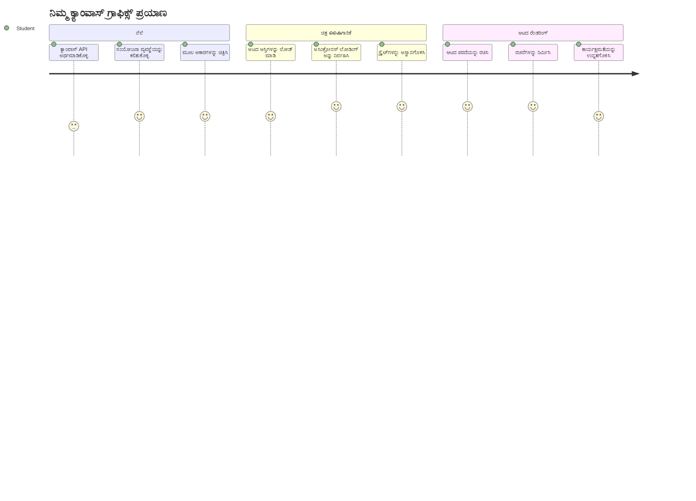
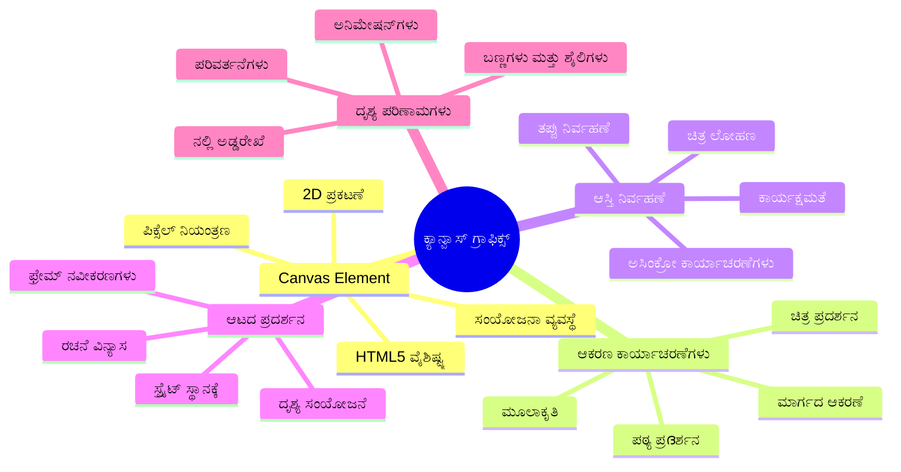
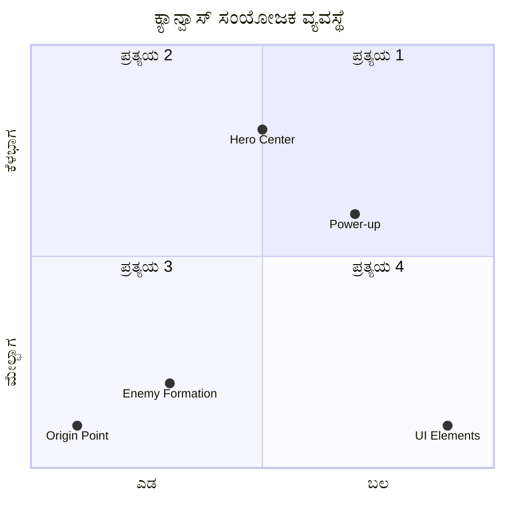
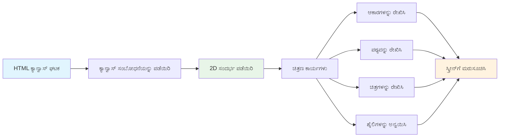
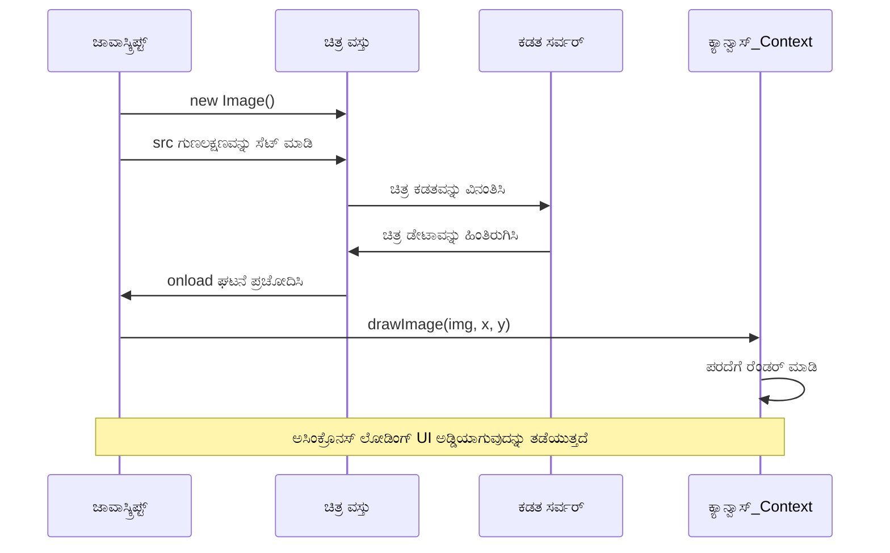
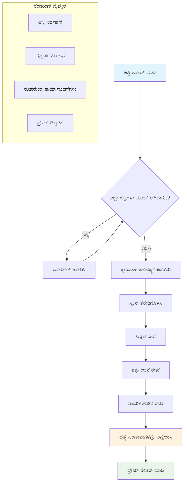
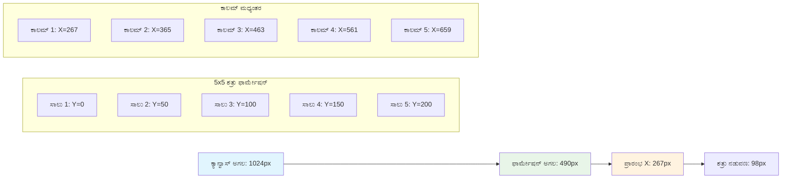
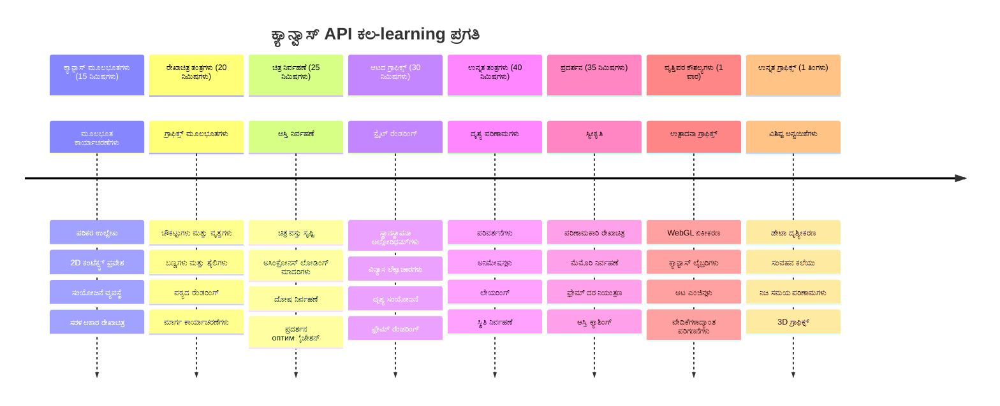

<!--
CO_OP_TRANSLATOR_METADATA:
{
  "original_hash": "7994743c5b21fdcceb36307916ef249a",
  "translation_date": "2026-01-08T13:44:05+00:00",
  "source_file": "6-space-game/2-drawing-to-canvas/README.md",
  "language_code": "kn"
}
-->
# ಸ್ಪೇಸ್ ಗೇಮ್ ಭಾಗ 2: ಹೀರೋ ಮತ್ತುಮಾನ್ತ್ರಗಳನ್ನು ಕ್ಯಾನ್‌ವಾಸ್‌ಗೆ ಬಿಡಿಸಿ


ಕ್ಯಾನ್‌ವಾಸ್ ಎಪಿಐ ವೆಬ್ ಅಭಿವೃದ್ಧಿಯ ಅತ್ಯಂತ ಶಕ್ತಿಶಾಲಿ ವೈಶಿಷ್ಟ್ಯಗಳಲ್ಲಿ ಒಂದಾಗಿದೆ, ನಿಮ್ಮ ಬ್ರೌಸರ್‌ನಲ್ಲಿ ನಿರಂತರ, ಸಂವಾದಾತ್ಮಕ ಗ್ರಾಫಿಕ್ಸ್ ರಚಿಸಲು. ಈ ಪಾಠದಲ್ಲಿ, ನಾವು ಆ ಖಾಲಿ HTML `<canvas>` ಅಂಶವನ್ನು ಹೀರೋ ಮತ್ತು ಮಾನ್ತ್ರಗಳ ತುಂಬಿದ ಗೇಮ್ ವಿಶ್ವಕ್ಕೆ ಪರಿವರ್ತಿಸುತ್ತೇವೆ. ಕ್ಯಾನ್‌ವಾಸ್ ಅನ್ನು ನಿಮ್ಮ ಡಿಜಿಟಲ್ ಆರ್ಟ್ ಬೋರ್ಡ್ ಎಂದು ಪರಿಗಣಿಸಿ, ಅಲ್ಲಿ ಕೋಡ್ ದೃಶ್ಯವಾಗುತ್ತದೆ.

ನೀವು ಮೊದಲು ಪಾಠದಲ್ಲಿ ಕಲಿತದಕ್ಕಾಗಿ ನಾವು ನಿರ್ಮಾಣ ಮಾಡುತ್ತಿದ್ದೇವೆ, ಮತ್ತು ಈಗ ನಾವು ದೃಶ್ಯಾತ್ಮಕ ಭಾಗಗಳಿಗೆ ತೊಡಗಿಯಿಡುತ್ತೇವೆ. ನೀವು ಹೇಗೆ ಗೇಮ್ ಸ್ಪ್ರೈಟ್‌ಗಳನ್ನು ಲೋಡ್ ಮಾಡಿ ಪ್ರದರ್ಶಿಸುತ್‌ತೀರಾ, ಅಂಶಗಳನ್ನು ನಿಖಚಿತವಾಗಿ ಸ್ಥಾಪಿಸುವುದು, ಮತ್ತು ನಿಮ್ಮ ಸ್ಪೇಸ್ ಗೇಮ್‌ನ ದೃಶ್ಯಮೂಲವನ್ನು ಸೃಷ್ಟಿಸುವುದು ಕಲಿತೀರಿ. ಇದು ಸ್ಥಾಯಿ ವೆಬ್ ಪುಟಗಳು ಮತ್ತು ಚಟುವಟಿಕೆ, ಸಂವಾದಾತ್ಮಕ ಅನುಭವಗಳ ನಡುವೆ ಸೇತುವೆಯನ್ನು ನಿರ್ಮಿಸುತ್ತದೆ.

ಈ ಪಾಠದ ಕೊನೆಯಲ್ಲಿ, ನೀವು ನಿಮ್ಮ ಹೀರೋ ಹಡಗಿನ ಸರಿಯಾದ ಸ್ಥಾನದಲ್ಲಿ ಹೊಂದಿದ್ದ ಹಾಗೂ ಯುದ್ದಕ್ಕೆ ಸಜ್ಜಾಗಿರುವ ಶತ್ರು ರೂಪರೇಷೆಗಳೊಂದಿಗೆ ಸಂಪೂರ್ಣ ಗೇಮ್ ದೃಶ್ಯವನ್ನು ಹೊಂದಿರುತ್ತೀರಿ. ನೀವು ಆಧುನಿಕ ಗೇಮ್‌ಗಳು ಬ್ರೌಸರ್‌ನಲ್ಲಿ ಗ್ರಾಫಿಕ್ಸ್ ಹೇಗೆ ರೆಂಡರ್ ಮಾಡುತ್ತವೆ ಎಂಬುದನ್ನು ಅರ್ಥಮಾಡಿಕೊಳ್ಳುತ್ತೀರಿ ಮತ್ತು ನಿಮ್ಮದೇ ಸಂವಾದಾತ್ಮಕ ದೃಶ್ಯಾನುಭವಗಳನ್ನು ಸೃಷ್ಟಿಸುವ ಕೌಶಲಗಳನ್ನು ಪಡೆಯುತ್ತೀರಿ. ಕ್ಯಾನ್‌ವಾಸ್ ಗ್ರಾಫಿಕ್ಸ್ ಅನ್ವೇಷಿಸಿ, ನಿಮ್ಮ ಸ್ಪೇಸ್ ಗೇಂಗೆ ಜೀವ ನೀಡೋಣ!


## ಪೂರ್ವ-ಪಾಠ ಪ್ರಶ್ನೋತ್ತರ

[ಪೂರ್ವ-ಪಾಠ ಪ್ರಶ್ನೋತ್ತರ](https://ff-quizzes.netlify.app/web/quiz/31)

## ಕ್ಯಾನ್‌ವಾಸ್

ಈ `<canvas>` ಅಂಶವೆಂದರೆ ಏನು? ಇದು ವೆಬ್ ಬ್ರೌಸರ್‌ಗಳಲ್ಲಿ ಗತಿಶೀಲ ಗ್ರಾಫಿಕ್ಸ್ ಮತ್ತು ಅನಿಮೆಶನ್‌ಗಳನ್ನು ಸೃಷ್ಟಿಸಲು HTML5 ನ ಪರಿಹಾರ. ಸಾಮಾನ್ಯ ಚಿತ್ರಗಳು ಅಥವಾ ವೀಡಿಯೊಗಳು ಸ್ಥಿರವಾದವುಗಳಲ್ಲ, ಕ್ಯಾನ್‌ವಾಸ್ ನೀವು ಪರದೆ ಮೇಲೆ ಪ್ರತಿ ಪಿಕ್ಸೆಲ್ ನಿಯಂತ್ರಣವನ್ನು ಒದಗಿಸುತ್ತದೆ. ಇದು ಗೇಮ್‌ಗಳು, ಡೇಟಾ ದೃಶ್ಯೀಕರಣ ಮತ್ತು ಸಂವಾದಾತ್ಮಕ ಆರ್ಟ್‌ಗೆ ಅತ್ಯುತ್ತಮ. ಇದನ್ನು ಪ್ರೋಗ್ರಾಮೇಬಲ್ ಡ್ರಾಯಿಂಗ್ ಸರ್ಫೇಸ್ ಎಂದು ಪರಿಗಣಿಸಿ, ಅಲ್ಲಿ ಜಾವಾಸ್ಕ್ರಿಪ್ಟ್ ನಿಮ್ಮ ಬಣ್ಣದ ಹೊಗಾರಣಿಯಾಗಿದೆ.

ಡೀಫಾಲ್ಟ್ ಆಗಿ, ಕ್ಯಾನ್‌ವಾಸ್ ಅಂಶವು ನಿಮ್ಮ ಪುಟದಲ್ಲಿ ಖಾಲಿ, ಪಾರದರ್ಶಕ ಆಯತಾಕೃತಿಯಾಗಿರುತ್ತದೆ. ಆದರೆ ಅದರಲ್ಲಿ ಶಕ್ತಿ ಇದೆ! ಜಾವಾಸ್ಕ್ರಿಪ್ಟ್ ಬಳಸಿ ಆಕಾರಗಳನ್ನು ಬಿಡಿಸಿ, ಚಿತ್ರಗಳನ್ನು ಲೋಡ್ ಮಾಡಿ, ಅನಿಮೆಶನ್‌ಗಳನ್ನು ರಚಿಸಿ ಮತ್ತು ಬಳಕೆದಾರ ಸಂವಾದಗಳಿಗೆ ಪ್ರತಿಕ್ರಿಯಿಸುವುದರಲ್ಲಿ ಅದರ ನಿಜವಾದ ಶಕ್ತಿ ಮೆರೆಯುತ್ತದೆ. ಇದು 1960 ರಲ್ಲಿ ಬೆಲ್ ಲ್ಯಾಬ್ಸ್‌ನ ಮೊದಲ ಡಿಜಿಟಲ್ ಅನಿಮೆಶನ್ ರಚನೆಗೊಂಡಾಗ ಪ್ರತಿ ಪಿಕ್ಸೆಲ್ ಪ್ರೋಗ್ರಾಮ್ ಮಾಡಬೇಕಾಗಿದ್ದಂತಹ ಪರಿಕಲ್ಪನೆಗೆ ಸಮಾನ.

✅ MDN ನಲ್ಲಿ [ಕ್ಯಾನ್‌ವಾಸ್ ಎಪಿಐ ಬಗ್ಗೆ ಹೆಚ್ಚಿನುದನ್ನು ಓದಿ](https://developer.mozilla.org/docs/Web/API/Canvas_API).

ಇದನ್ನು ಸಾಮಾನ್ಯವಾಗಿ ಹೇಗೆ ಘೋಷಿಸಲಾಗುತ್ತದೆ, ಪುಟದ ದೇಹ ಭಾಗವಾಗಿ:

```html
<canvas id="myCanvas" width="200" height="100"></canvas>
```

**ಈ ಕೋಡ್ ಏನು ಮಾಡುತ್ತದೆ:**
- **`id` ಗುಣಲಕ್ಷಣವನ್ನು** ಮಿಗಿಲಾಗಿ ಸೆಟ್ ಮಾಡಿ, ನೀವು ಜಾವಾಸ್ಕ್ರಿಪ್ಟ್‌ನಲ್ಲಿ ಈ ನಿಖರ ಕ್ಯಾನ್‌ವಾಸ್ ಅಂಶವನ್ನು ಉಲ್ಲೇಖಿಸಬಹುದು
- **`width` ಪಿಕ್ಸೆಲ್‌ನಲ್ಲಿ** ನಿರ್ದಿಷ್ಟಪಡಿಸಿ, ಕ್ಯಾನ್‌ವಾಸ್‌ನ ಅಡ್ಡಮಟ್ಟದ μεγ್ತಿಯನ್ನು ನಿಯಂತ್ರಿಸಲು
- **`height` ಪಿಕ್ಸೆಲ್‌ನಲ್ಲಿ** ಸ್ಥಾಪಿಸಿ, ಕ್ಯಾನ್‌ವಾಸ್‌ನ ಲಂಬ хэмжೆಯನ್ನು ನಿರ್ಧರಿಸಲು

## ಸರಳ ಜ್ಯಾಮಿತಿಯನ್ನು ಬಿಡಿಸುವುದು

ಈಗ ನೀವು ಕ್ಯಾನ್‌ವಾಸ್ ಅಂಶವೇನು ಎಂದು ತಿಳಿದಿದ್ದೀರಿ, ಅದರಲ್ಲಿ ನಿಜವಾಗಿಯೂ ಬಿಡಿಸುವುದನ್ನು ಅನ್ವೇಷಿಸೋಣ! ಕ್ಯಾನ್‌ವಾಸ್ ಒಂದು ಸಂಕೇತ ವ್ಯವಸ್ಥೆಯನ್ನು ಬಳಸುತ್ತದೆ, ಇದು ಗಣಿತ ತರಗತಿಯ ಸ್ಮೃತಿಗೆ ಸಾದೃಶ್ಯವೆತ್ತುಕೊಳ್ಳಬಹುದು, ಆದರೆ ಕಂಪ್ಯೂಟರ್ ಗ್ರಾಫಿಕ್ಸ್‌ಗೆ ವಿಶೇಷವಾದ ಒಂದು ಪ್ರಮುಖ ತಿರುವು ಇದೆ.

ಕ್ಯಾನ್‌ವಾಸ್ ಕಾರ್ಟೀಷಿಯನ್ ಸಂಕೇತ ವ್ಯವಸ್ಥೆಯನ್ನು ಉಪಯೋಗಿಸುತ್ತದೆ, ಅಲ್ಲಿ x-ಅಕ್ಷ (ಆಡಂಬರ) ಮತ್ತು y-ಅಕ್ಷ (ಉರಿಗೆ) ಬಳಸಿಕೊಂಡು ನೀವು ಬಿಡಿಸುವ ಎಲ್ಲದಕ್ಕೂ ಸ್ಥಾನ ನೀಡುತ್ತದೆ. ಆದರೆ ಇಲ್ಲಿ ಪ್ರಮುಖವಾದ ವ್ಯತ್ಯಾಸವೇನೆಂದರೆ: ಗಣಿತ ತರಗತಿಯ ಸಂಕೇತ ವ್ಯವಸ್ಥೆಯೊಂದಿಗಿನ ಭೇದವಿದೆ, ಮೂಲ ಬಿಂದುವು `(0,0)` ಎಡ-ಮೇಲ್ಮುಖದ ಮೂಲೆಯಲ್ಲಿಯೇ ಇದೆ, x ಮೌಲ್ಯವು ಬಲಕ್ಕೆ ಸರಿದಂತೆ ಹೆಚ್ಚಾಗುತ್ತದೆ ಮತ್ತು y ಮೌಲ್ಯವು ಕೆಳಗಾಗುತ್ತಂತೆ ಹೆಚ್ಚಾಗುತ್ತದೆ. ಈ ವಿಧಾನವು ಆಸ್ಟ್ರೋಮಿಕ ಕಂಪ್ಯೂಟರ್ ಡಿಸ್ಪ್ಲೇಗಳ ಮುಂಬರುವ ಕಾಲದಿಂದ ಬಂದಿದೆ, ಅಲ್ಲಿ ಎಲೆಕ್ಟ್ರಾನ್ ಕಿರಣಗಳು ಮೇಲಿಂದ ಕೆಳಗಡೆ ಸ್ಕ್ಯಾನ್ ಮಾಡುತ್ತಿವೆ, ಆದ್ದರಿಂದ ಎಡ-ಮೇಲೆ ಆ ಆರಂಭಿಕ ಬಿಂದುವಾಗಿದೆ.



> ಚಿತ್ರ: [MDN](https://developer.mozilla.org/docs/Web/API/Canvas_API/Tutorial/Drawing_shapes)

ಕ್ಯಾನ್‌ವಾಸ್ ಅಂಶದಲ್ಲಿ ಬಿಡಿಸಲು, ನೀವು ಎಲ್ಲಾ ಕ್ಯಾನ್‌ವಾಸ್ ಗ್ರಾಫಿಕ್ಸ್ ಭಿತ್ತಿಯನ್ನು ರೂಪಿಸುವ ಮೂರು-ಹಂತ ಪ್ರಕ್ರಿಯೆಯನ್ನನುಸರಿಸಬೇಕು. ನೀವು ಇದನ್ನು ಕೆಲವು ಬಾರಿ ಮಾಡಿದರೆ, ಅದು ಸಹಜವಾಗುತ್ತದೆ:


1. **ನಿಮ್ಮ DOM ನಿಂದ** ಕ್ಯಾನ್‌ವಾಸ್ ಅಂಶದ ಉಲ್ಲೇಖವನ್ನು ಪಡೆಯಿರಿ (ಯಾವುದೇ HTML ಅಂಶದಂತೆ)
2. **2D ರೆಂಡರಿಂಗ್ ಕಂಟೆಕ್ಸ್ಟ್ ಅನ್ನು** ಪಡೆಯಿರಿ – ಇದು ಎಲ್ಲಾ ಬಿಡಿಸುವ ವಿಧಾನಗಳನ್ನು ಒದಗಿಸುತ್ತದೆ
3. **ಬಿಡಿಸು ಪ್ರಾರಂಭಿಸಿ!** ಕಂಟೆಕ್ಸ್ಟ್‌ನ ನಿರ್ಮಿತ ವಿಧಾನಗಳನ್ನು ಬಳಸಿ ತಮ್ಮ ಗ್ರಾಫಿಕ್ಸ್ ರಚಿಸಿ

ಕೋಡ್‌ನಲ್ಲಿ ಇದು ಹೇಗಿರುತ್ತದೆ:

```javascript
// ಹೆಜ್ಜೆ 1: ಕ್ಯಾನ್ವಾಸ್ ತತ್ವಾಂಶವನ್ನು ಪಡೆಯಿರಿ
const canvas = document.getElementById("myCanvas");

// ಹೆಜ್ಜೆ 2: 2D ರೆಂಡರಿಂಗ್ ವಿಷಯವನ್ನು ಪಡೆಯಿರಿ
const ctx = canvas.getContext("2d");

// ಹೆಜ್ಜೆ 3: ಭರ್ತಿಯ ಬಣ್ಣವನ್ನು ಹೊಂದಿಸಿ ಮತ್ತು ಒಂದು ಚದುರಿದರ್ಶಕವನ್ನು ಬಿಡಿಸಿ
ctx.fillStyle = 'red';
ctx.fillRect(0, 0, 200, 200); // x, y, ಅಗಲ, ಎತ್ತರ
```

**ನಾವು ಇದನ್ನು ಹಂತ ಹಂತವಾಗಿ ಬೇರ್ಪಡೋಣ:**
- ನಾವು `id` ಬಳಸಿ ನಮ್ಮ ಕ್ಯಾನ್‌ವಾಸ್ ಅಂಶವನ್ನು ಹಿಡಿದು, ಪ್ರತ್ಯೇಕವಾಗಿಟ್ಟುಕೊಳ್ಳುತ್ತೇವೆ
- ನಾವು 2D ರೆಂಡರಿಂಗ್ ಕಂಟೆಕ್ಸ್ಟ್ ಪಡೆಯುತ್ತೇವೆ – ಇದು ನಮ್ಮ ಬಿಡಿಸುವ ಸಲಕರಣೆಗಳ ಹಣೆಪಟ್ಟಿ
- ನಾವು `fillStyle` ಗುಣಲಕ್ಷಣ ಬಳಸಿ ಕೆಂಪು ಬಣ್ಣ ಬಳಸಿ ಪೂರ್ಣಗೊಳಿಸಲು ಕ್ಯಾನ್‌ವಾಸ್‌ಗೆ ಹೇಳುತ್ತೇವೆ
- ನಾವು ಎಡ-ಮೇಲ್ಮುಖ ಮೂಲ `(0,0)` ಇಂದ ಪ್ರಾರಂಭಿಸಿ, ಅಗಲ 200 ಪಿಕ್ಸೆಲ್ ಮತ್ತು ಎತ್ತರ 200 ಪಿಕ್ಸೆಲ್ ಇರುವ ಆಯತಾಕಾರ ಬಿಡಿಸುತ್ತೇವೆ

✅ ಕ್ಯಾನ್‌ವಾಸ್ ಎಪಿಐ ಬಹುಪಾಲು 2D ಆಕಾರಗಳ ಮೇಲೆ ಕೇಂದ್ರೀಕರಿಸಿದೆ, ಆದರೆ ವೆಬ್ ಸೈಟ್‌ಗೆ 3D ಅಂಶಗಳನ್ನೂ ಬಿಡಬಹುದು; ಇದರಿಗಾಗಿ ನೀವು [WebGL ಎಪಿಐ](https://developer.mozilla.org/docs/Web/API/WebGL_API) ಬಳಸಿ.

ನೀವು ಕ್ಯಾನ್‌ವಾಸ್ ಎಪಿಐ ಬಳಸಿ ಎಲ್ಲಾ ವಿಧಗಳ ವಸ್ತುಗಳನ್ನು ಬಿಡಿಸಬಹುದು ಉದಾ:

- **ಜ್ಯಾಮಿತಿಕ ಆಕಾರಗಳು**, ಈಗಾಗಲೇ ನಾವು ಆಯತಾಕಾರ ಬಿಡಿಸುವುದನ್ನು ತೋರಿಸಿದ್ದೇವೆ ಆದರೆ ಇನ್ನೂ ಹೆಚ್ಚು ಬಿಡಿಸಬಹುದು.
- **ಪಠ್ಯ**, ನೀವು ಯಾವುದೇ ಫಾಂಟ್ ಮತ್ತು ಬಣ್ಣದಲ್ಲಿ ಪಠ್ಯ ಬಿಡಿಸಬಹುದು.
- **ಚಿತ್ರಗಳು**, ನೀವು .jpg ಅಥವಾ .png ಮುಂತಾದ ಚಿತ್ರ ಆಸ್ತಿ ಆಧಾರಿತ ಚಿತ್ರಗಳನ್ನು ಬಿಡಿಸಬಹುದು.

✅ ಪ್ರಯತ್ನಿಸಿ! ನೀವು ಆಯತಾಕಾರ ಬಿಡಿಸಲು ಅರಿತವರು, ನೀವು ಒಂದು ವೃತ್ತವನ್ನು ಪುಟಕ್ಕೆ ಬಿಡಿಸಬಹುದೇ? ಕೆಳಗಿನ CodePen ನಲ್ಲಿ ಕೆಲವು ಆಸಕ್ತಿದಾಯಕ ಕ್ಯಾನ್‌ವಾಸ್ ಚಿತ್ರಗಳನ್ನು ವೀಕ್ಷಿಸಿ. ಇಲ್ಲಿ ಒಂದು [ಖಾಸಗಿ ಉದಾಹರಣೆ](https://codepen.io/dissimulate/pen/KrAwx) ಇದೆ.

### 🔄 **ಶೈಕ್ಷಣಿಕ ಪರಿಶೀಲನೆ**
**ಕ್ಯಾನ್‌ವಾಸ್ ಮೂಲಭೂತಗಳ ಅರ್ಥ**: ಚಿತ್ರ ಲೋಡಿಂಗ್‌ಗೆ ಹೋಗುವ ಮೊದಲು ಖಚಿತಪಡಿಸಿಕೊಳ್ಳಿ:
- ✅ ಕ್ಯಾನ್‌ವಾಸ್ ಸಂಕೇತ ವ್ಯವಸ್ಥೆಯು ಗಣಿತ ಸಂಕೇತ ವ್ಯವಸ್ಥೆಯಿಂದ ಹೇಗೆ ಭಿನ್ನವಾಗುತ್ತದೆ ಎಂದು ವಿವರಿಸಿ
- ✅ ಕ್ಯಾನ್‌ವಾಸ್ ಬಿಡಿಸುವ ಕಾರ್ಯಾಚರಣೆಗಳ ಮೂರು ಹಂತ ಪ್ರಕ್ರಿಯೆಯನ್ನು ಅರ್ಥಮಾಡಿಕೊಳ್ಳಿ
- ✅ 2D ರೆಂಡರಿಂಗ್ ಕಂಟೆಕ್ಸ್ಟ್ ಏನನ್ನು ಒದಗಿಸುತ್ತದೆ ಎಂದು ಗುರುತಿಸಿ
- ✅ fillStyle ಮತ್ತು fillRect ಹೇಗೆ ಸಂಯೋಜಿತವಾಗಿ ಕೆಲಸ ಮಾಡುತ್ತವೆ ಎಂದು ವಿವರಿಸಿ

**ತ್ವರಿತ ಸ್ವ-ಪರೀಕ್ಷೆ**: `(100, 50)` ಸ್ಥಾನದಲ್ಲಿರುವ 25 ವ್ಯಾಸದ ಬ್ಲೂ ಸುತ್ತೆಯನ್ನು ನೀವು ಹೇಗೆ ಬಿಡಿಸುತ್ತೀರಿ?
```javascript
ctx.fillStyle = 'blue';
ctx.beginPath();
ctx.arc(100, 50, 25, 0, 2 * Math.PI);
ctx.fill();
```

**ನೀವು ಈಗ ತಿಳಿದಿರುವ ಕ್ಯಾನ್‌ವಾಸ್ ಬಿಡಿಸುವ ವಿಧಾನಗಳು**:
- **fillRect()**: ತುಂಬಿದ ಆಯತಾಕಾರಗಳನ್ನು ಬಿಡಿಸುತ್ತದೆ
- **fillStyle**: ಬಣ್ಣಗಳು ಮತ್ತು నమೂನೆಗಳನ್ನು ಸೆಟ್ ಮಾಡುತ್ತದೆ
- **beginPath()**: ಹೊಸ ಬಿಡಿಸುವ ಮಾರ್ಗಗಳನ್ನು ಪ್ರಾರಂಭಿಸುತ್ತದೆ
- **arc()**: ವೃತ್ತಗಳು ಮತ್ತು ವಿರಾಮಗಳು ರಚಿಸುತ್ತದೆ

## ಚಿತ್ರ ಆಸ್ತಿ ಲೋಡ್ ಮಾಡಿ ಮತ್ತು ಬಿಡಿಸಿ

ಮೂಲಭೂತ ಆಕಾರಗಳನ್ನು ಬಿಡಿಸುವುದು ಪ್ರಾರಂಭಿಸಲು ಉಪಯುಕ್ತ, ಆದರೆ ಬಹುತೇಕ ಗೇಮ್‌ಗಳಿಗೆ ನಿಜವಾದ ಚಿತ್ರಗಳು ಅಗತ್ಯವಿದೆ! ಸ್ಪ್ರೈಟ್‌ಗಳು, ಹಿನ್ನೆಲೆಗಳು, ಮತ್ತು ಟೆಕ್ಸ್ಚರ್‌ಗಳು ಗೇಮ್‌ಗಳಿಗೆ ದೃಶ್ಯ ಆಕರ್ಷಣೆಯನ್ನು ನೀಡುತ್ತವೆ. ಚಿತ್ರಗಳನ್ನು ಲೋಡ್ ಮಾಡಿ ಕ್ಯಾನ್‌ವಾಸ್‌ನಲ್ಲಿ ಪ್ರದರ್ಶಿಸುವುದು ಜ್ಯಾಮಿತಿಕ ಆಕಾರಗಳನ್ನು ಬಿಡಿಸುವುದರಂತೆ ಇಲ್ಲ, ಆದರೆ ಅದರ ಪ್ರಕ್ರಿಯೆಯನ್ನು ಅರ್ಥಮಾಡಿಕೊಳ್ಳುವುದು ಸರಳವಾಗಿದೆ.

ನಾವು ಒಂದು `Image` ವಸ್ತು ರಚಿಸಬೇಕು, ನಮ್ಮ ಚಿತ್ರ ಫೈಲ್ ಅನ್ನು ಲೋಡ್ ಮಾಡಬೇಕು (ಇದು ಅಸಿಂಕ್ರೊನಸ್ ಆಗಾಗಲಿದೆ, ಅಂದರೆ "ಹಿನ್ನೆಲೆ" ನಲ್ಲಿ ನಡೆಯುತ್ತದೆ), ನಂತರ ಅವು ಸಿದ್ಧವಾದ ಮೇಲೆ ಕ್ಯಾನ್‌ವಾಸ್‌ಗೆ ಬಿಡಿಸಬೇಕು. ಈ ವಿಧಾನವು ನಿಮ್ಮ ಚಿತ್ರಗಳು ಸರಿಯಾಗಿ ಪ್ರದರ್ಶಿಸುವಂತೆ ನೋಡಿಕೊಳ್ಳುತ್ತದೆ ಮತ್ತು ಲೋಡ್ ಆಗುವವರೆಗೂ ಅಪ್ಲಿಕೇಶನ್ ಅನ್ನು ತಡೆಗಟ್ಟುವುದಿಲ್ಲ.


### ಮೂಲಭೂತ ಚಿತ್ರ ಲೋಡ್‌ಗೊಂದು

```javascript
const img = new Image();
img.src = 'path/to/my/image.png';
img.onload = () => {
  // ಚಿತ್ರವನ್ನು ಲೋಡ್ ಮಾಡಲಾಗಿದೆ ಮತ್ತು ಬಳಸಲು<s>ಿದ್ಧವಾಗಿದೆ
  console.log('Image loaded successfully!');
};
```

**ಈ ಕೋಡ್‌ನಲ್ಲಿ ಏನಾಗುತ್ತಿದೆ:**
- ನಾವು ಹೊಸ `Image` ವಸ್ತವನ್ನು ರಚಿಸುತ್ತೇವೆ, ಇದರಲ್ಲಿ ನಮ್ಮ ಸ್ಪ್ರೈಟ್ ಅಥವಾ ಟೆಕ್ಸ್ಚರ್ಗಳು ಇರಲು ಸಾಧ್ಯ
- ನಾವು ಮೂಲ ಮಾರ್ಗವನ್ನು ಸೆಟ್ ಮಾಡಿ ಯಾವ ಚಿತ್ರ ಫೈಲ್ ಲೋಡ್ ಮಾಡಬೇಕೆಂದು ತಿಳಿಸುತ್ತೇವೆ
- ನಾವು `load` ಘಟನೆಯಿಗಾಗಿ ಕೇಳುತ್ತಿದ್ದೇವೆ ಅದರಿಂದ ಚಿತ್ರ ಸಿದ್ಧವಾಗಿದ್ದು ಎಂಬುದನ್ನು ತಿಳಿದುಕೊಳ್ಳಲು

### ಚಿತ್ರಗಳನ್ನು ಲೋಡ್ ಮಾಡುವ ಉತ್ತಮ ವಿಧಾನ

ಚಿತ್ರ ಲೋಡ್ ಮಾಡುವ ಮತ್ತಷ್ಟು ಬಲವಾದ ವಿಧಾನವನ್ನು ಇಲ್ಲಿ ತೋರಲಾಗಿದೆ, ಇದನ್ನು ವೃತ್ತಿಪರ ಡೆವಲಪರ್‌ಗಳು ಸಾಮಾನ್ಯವಾಗಿ ಬಳಸುತ್ತಾರೆ. ನಾವು Promise ಆಧಾರಿತ ಕಾರ್ಯತ್ವದಲ್ಲಿ ಚಿತ್ರ ಲೋಡ್ ಮಾಡುವುದನ್ನು ಸುತ್ತಿಬಿದ್ದೇವೆ – ಜಾವಾಸ್ಕ್ರಿಪ್ಟ್ ಮತ್ತು ES6 ನಲ್ಲಿ Promises ನಿಯಮಿತವಾಗಿದೆಯೆಂದು ಈ ವಿಧಾನ ಪ್ರಚಲಿತವಾಗಿದೆ, ಇದು ನಿಮ್ಮ ಕೋಡ್ ಅನ್ನು ಹೆಚ್ಚು ವ್ಯವಸ್ಥಿತವಾಗಿಸುವುದಕ್ಕೂ ಹಾಗೂ ದೋಷಗಳ ನಿರ್ವಹಣೆಗೆ ಅನುಕೂಲವಾಗುತ್ತದೆ:

```javascript
function loadAsset(path) {
  return new Promise((resolve, reject) => {
    const img = new Image();
    img.src = path;
    img.onload = () => {
      resolve(img);
    };
    img.onerror = () => {
      reject(new Error(`Failed to load image: ${path}`));
    };
  });
}

// ಆಧುನಿಕ ಬಳಕೆ async/await ಜೊತೆಗೆ
async function initializeGame() {
  try {
    const heroImg = await loadAsset('hero.png');
    const monsterImg = await loadAsset('monster.png');
    // ಚಿತ್ರಗಳು ಈಗ ಬಳಕೆಗಾಗಿ ಸಿದ್ಧವಾಗಿವೆ
  } catch (error) {
    console.error('Failed to load game assets:', error);
  }
}
```

**ನಾವು ಇಲ್ಲಿ ಮಾಡಿದೆವು:**
- ಚಿತ್ರ ಲೋಡ್ ಮಾಡುವ ಎಲ್ಲಾ ಲಾಜಿಕ್ನು Promise ನಲ್ಲಿ ಸುತ್ತಿಬಿಟ್ಟಿದ್ದೇವೆ ಹೀಗಾಗಿ ಅದನ್ನು ಉತ್ತಮವಾಗಿ ನಿರ್ವಹಿಸಬಹುದು
- ದೋಷ ನಿರ್ವಹಣೆಯನ್ನು ಸೇರಿಸಿದ್ದೇವೆ, ಇದು ಏನಾದರೂ ತಪ್ಪಿದ್ದಾಗ ನಮಗೆ ತಿಳಿಸುತ್ತದೆ
- ಆಧುನಿಕ async/await ವಾಕ್ಯರಚನೆಯನ್ನು ಬಳಸಿದೆವು ಏಕೆಂದರೆ ಇದು ಓದಲು ಬಹಳ ಸ್ವಚ್ಛವಾಗಿದೆ
- try/catch ಬ್ಲಾಕ್‌ಗಳನ್ನು ಸೇರಿಸಿದ್ದೇವೆ ಯಾವುದೇ ಲೋಡ್ ಸಮಸ್ಯೆಗಳನ್ನು ಸವಿಯಾಗೀ ನಿರ್ವಹಿಸಲು

ನಿಮ್ಮ ಚಿತ್ರಗಳನ್ನು ಲೋಡ್ ಮಾಡಿದ ನಂತರ, ಅವನ್ನು ಕ್ಯಾನ್‌ವಾಸ್‌ಗೆ ಬಿಡಿಸುವುದು ನಿಜವಾಗಿಯೂ ಸರಳವಾಗಿರುತ್ತದೆ:

```javascript
async function renderGameScreen() {
  try {
    // ಗೇಮ್ ಆಸ್ತಿ‌ಗಳನ್ನು ಲೋಡ್ ಮಾಡಿ
    const heroImg = await loadAsset('hero.png');
    const monsterImg = await loadAsset('monster.png');

    // ಕ್ಯಾನ್ವಾಸ್ ಮತ್ತು ಸಂಧರ್ಭವನ್ನು ಪಡೆಯಿರಿ
    const canvas = document.getElementById("myCanvas");
    const ctx = canvas.getContext("2d");

    // ಚಿತ್ರಗಳನ್ನು ನಿಶ್ಚಿತ ಸ್ಥಾನಗಳಿಗೆ desenhos ಮಾಡಿ
    ctx.drawImage(heroImg, canvas.width / 2, canvas.height / 2);
    ctx.drawImage(monsterImg, 0, 0);
  } catch (error) {
    console.error('Failed to render game screen:', error);
  }
}
```

**ಈ ಹಂತಗಳನ್ನು ಹೀಗೆ ಹಾದುಹೋಗೋಣ:**
- ನಾವು ಹೆರೋ ಮತ್ತು ಮಾನ್ತ್ರ ಎರಡೂ ಚಿತ್ರಗಳನ್ನು ಹಿನ್ನೆಲೆಯಿಂದ await ಬಳಸಿ ಲೋಡ್ ಮಾಡುತ್ತೇವೆ
- ನಾವು ನಮ್ಮ ಕ್ಯಾನ್‌ವಾಸ್ ಅನ್ನು ಹಿಡಿದು 2D ರೆಂಡರಿಂಗ್ ಕಂಟೆಕ್ಸ್ಟ್ ಪಡೆಯುತ್ತೇವೆ
- ನಾವು ಕೆಲವು ಸರಳ ಸಂಕೇತ ಗಣಿತದಿಂದ ಹೀರೋ ಚಿತ್ರವನ್ನು ಮಧ್ಯಭಾಗದಲ್ಲಿ ನಿಖರವಾಗಿ ಸ್ಥಾಪಿಸುತ್ತೇವೆ
- ಮಾನ್ತ್ರದ ಚಿತ್ರವನ್ನು ಎಡ-ಮೇಲೆ ಮೂಲೆಯಲ್ಲಿಡುತ್ತೇವೆ, ನಮ್ಮ ಶತ್ರು ರೂಪರೇಷೆ ಪ್ರಾರಂಭಿಸಲು
- ಲೋಡ್ ಅಥವಾ ರೆಂಡರಿಂಗ್ ಸಮಯದಲ್ಲಿ ಸಂಭವಿಸಬಹುದಾದ ದೋಷಗಳನ್ನು ನಾವು ಹಿಡಿದುಕೊಳ್ಳುತ್ತೇವೆ


## ಈಗ ನಿಮ್ಮ ಗೇಮ್ ನಿರ್ಮಿಸೋಣ

ಈಗ ನಾವು ಎಲ್ಲವನ್ನೂ ಸೇರಿಸಿ ನಿಮ್ಮ ಸ್ಪೇಸ್ ಗೇಮ್‌ನ ದೃಶ್ಯ ಮೂಲವನ್ನು ನಿರ್ಮಿಸುತ್ತೇವೆ. ನೀವು ಕ್ಯಾನ್‌ವಾಸ್ ಮೂಲಭೂತಗಳು ಮತ್ತು ಚಿತ್ರ ಲೋಡ್ ತಂತ್ರಗಳನ್ನು ಚೆನ್ನಾಗಿ ಅರ್ಥಮಾಡಿಕೊಂಡಿದ್ದೀರಿ, ಈ ಕೈ ಜೋಡಿಸಿದ ವಿಭಾಗವು ಸುಸಜ್ಜಿತ ಸ್ಪ್ರೈಟ್‌ಗಳನ್ನು ಸರಿಯಾದ ಸ್ಥಾನದಲ್ಲಿ ನಿರ್ಮಿಸುವ ಸಂಪೂರ್ಣ ಗೇಮ್ ಪರದೆ ನಿರ್ಮಾಣಕ್ಕೆ ಮಾರ್ಗದರ್ಶನ ನೀಡುತ್ತದೆ.

### ನಿಮಗೆ ನಿರ್ಮಿಸಬೇಕಾಗಿರುವುದು

ನೀವು ಕ್ಯಾನ್‌ವಾಸ್ ಅಂಶವನ್ನು ಹೊಂದಿರುವ ವೆಬ್ ಪುಟವನ್ನು ನಿರ್ಮಿಸುತ್ತೀರಿ, ಅದು ಕಪ್ಪು ಬೆಕೆಗ್ರೌಂಡ್‌ನ್ನು `1024*768` ನಲ್ಲಿ ರೆಂಡರ್ ಮಾಡುತ್ತದೆ. ನಾವು ನಿಮಗೆ ಎರಡು ಚಿತ್ರಗಳನ್ನು ಒದಗಿಸಿದ್ದೇವೆ:

- ಹೀರೋ ಹಡಗು

   

- 5*5 ಮಾನ್ತ್ರಗಳು

   

### ಅಭಿವೃದ್ಧಿ ಪ್ರಾರಂಭಿಸಲು ಶಿಫಾರಸು ಮಾಡಿದ ಹಂತಗಳು

ನೀವು `your-work` ಉಪ ಫೋಲ್ಡರ್‌ನಲ್ಲಿ ಸೃಷ್ಟಿಸಿದ ಸ್ಟಾರ್ಟರ್ ಫೈಲ್‌ಗಳನ್ನು ಕಂಡುಹಿಡಿಯಿರಿ. ನಿಮ್ಮ ಯೋಜನಾ ರಚನೆ ಇವುಗಳನ್ನು ಒಳಗೊಂಡಿರಬೇಕು:

```bash
your-work/
├── assets/
│   ├── enemyShip.png
│   └── player.png
├── index.html
├── app.js
└── package.json
```

**ನೀವು ಇವುಗಳೊಂದಿಗೆ ಕೆಲಸ ಮಾಡುತ್ತಿದ್ದೀರಿ:**
- **ಗೇಮ್ ಸ್ಪ್ರೈಟ್‌ಗಳು** `assets/` ಫೋಲ್ಡರ್‌ನಲ್ಲಿ ಇರುತ್ತವೆ, ಆದ್ದರಿಂದ ಎಲ್ಲವು ವ್ಯವಸ್ಥಿತವಾಗಿರುತ್ತದೆ
- **ನಿಮ್ಮ ಮುಖ್ಯ HTML ಫೈಲ್‌** ಕ್ಯಾನ್‌ವಾಸ್ ಅಂಶವನ್ನು ಸೆಟ್ ಮಾಡುತ್ತದೆ ಮತ್ತು ಎಲ್ಲವನ್ನೂ ಸಿದ್ಧಪಡಿಸುತ್ತದೆ
- **ಒಂದು ಜಾವಾಸ್ಕ್ರಿಪ್ಟ್ ಫೈಲ್** ಇಲ್ಲಿ ನೀವು ನಿಮ್ಮ ಗೇಮ್ ರೆಂಡರ್ ಮ್ಯಾಜಿಕ್ ಬರೆಯುತ್ತೀರಿ
- **ಒಂದು package.json** ಇದು ವರಡುಟ್ಟಾಗಿ ಅಭಿವೃದ್ಧಿ ಸರ್ವರ್ ಅನ್ನು ಸೆಟ್ ಅಪ್ ಮಾಡುತ್ತದೆ, ನೀವು ಸ್ಥಳೀಯವಾಗಿ ಪರೀಕ್ಷಿಸಲು

ಈ ಫೋಲ್ಡರ್ ಅನ್ನು Visual Studio Code ನಲ್ಲಿ ತೆರೆಯಿರಿ ಬೆಳವಣಿಗೆ ಪ್ರಾರಂಭಿಸಲು. ನೀವು ಸ್ಥಳೀಯ ಬೆಳವಣಿಗೆ ಪರಿಸರದಲ್ಲಿ Visual Studio Code, NPM, ಮತ್ತು Node.js ಹೊಂದಿರಬೇಕು. ನಿಮ್ಮ ಕಂಪ್ಯೂಟರ್‌ನಲ್ಲಿ `npm` ಸ್ಥಾಪಿತವಿಲ್ಲದಿದ್ದರೆ, [ಇದನ್ನು ಹೇಗೆ ಸ್ಥಾಪಿಸುವುದು](https://www.npmjs.com/get-npm) ನೋಡಿರಿ.

ನೀವು `your-work` ಫೋಲ್ಡರ್‌ಗೆ ತೆರಳಿ ನಿಮ್ಮ ಅಭಿವೃದ್ಧಿ ಸರ್ವರ್ ಪ್ರಾರಂಭಿಸಿ:

```bash
cd your-work
npm start
```

**ಈ ಆಜ್ಞೆ ಕೆಲವು ಬಹಳ ಚೆಲುವಾದ ಕಾರ್ಯಗಳನ್ನು ಮಾಡುತ್ತದೆ:**
- **ಸ್ಥಳೀಯ ಸರ್ವರ್ ಪ್ರಾರಂಭಿಸುತ್ತದೆ** `http://localhost:5000` ನಲ್ಲಿ ನೀವು ನಿಮ್ಮ ಗೇಮ್ ಪರೀಕ್ಷಿಸಬಹುದಾಗಿದೆ
- **ನಿಮ್ಮ ಎಲ್ಲಾ ಫೈಲ್‌ಗಳ ಸರಿಯಾದ ಸೇವೆಯನ್ನು ನೀಡುತ್ತದೆ** ಅಂದರೆ ನೀವು ಬ್ರೌಸರ್‌ನಲ್ಲಿ ಸರಿಯಾಗಿ ಲೋಡ್ ಮಾಡಬಹುದು
- **ನಿಮ್ಮ ಫೈಲ್‌ಗಳಲ್ಲಿ ಬದಲಾವಣೆಗಳನ್ನು ನೋಡಿಕೊಳ್ಳುತ್ತದೆ** ಆದ್ದರಿಂದ ನೀವು ಸುಗಮವಾಗಿ ಅಭಿವೃದ್ಧಿ ಮಾಡಬಹುದು
- **ನಿಮಗೆ** ವೃತ್ತಿಪರ ಅಭಿವೃದ್ಧಿ ಪರಿಸರವನ್ನು ನೀಡುತ್ತದೆ ಎಲ್ಲವನ್ನೂ ಪರೀಕ್ಷಿಸಲು

> 💡 **ಟಿಪ್ಪಣಿ**: ಆರಂಭದಲ್ಲಿ ನಿಮ್ಮ ಬ್ರೌಸರ್ ಖಾಲಿ ಪುಟವನ್ನು ತೋರಿಸುತ್ತದೆ – ಇದು ಅಪೇಕ್ಷಿತ. ನೀವು ಕೋಡ್ ಸೇರಿಸುವಂತೆ, ಬ್ರೌಸರ್ ಅನ್ನು ರಿಫ್ರೆಶ್ ಮಾಡಿ ಬದಲಾವಣೆಗಳನ್ನು ನೋಡಿ. ಈ ಪುನರಾವೃತ ಬೆಳವಣಿಗೆ ವಿಧಾನ NASA ಯವರು ಅಪೊಲೊ ಗೈಡನ್ಸ್ ಕಂಪ್ಯೂಟರ್ ನಿರ್ಮಿಸಲಾಗಿದಾಗ ಪ್ರತಿಯೊಂದು ಭಾಗದ ಪರೀಕ್ಷೆಯ ರೀತಿಗೆ ಹೊಂದಿಕೊಳ್ಳುತ್ತದೆ – ಸಮಗ್ರ ವ್ಯವಸ್ಥೆಯಲ್ಲಿ ಸೇರಿಸುವ ಮುನ್ನ.

### ಕೋಡ್ ಸೇರಿಸಿ

ಕೆಳಗಿನ ಕಾರ್ಯಗಳನ್ನು ಪೂರ್ಣಗೊಳಿಸಲು `your-work/app.js` ನಲ್ಲಿ ಅಗತ್ಯವಿರುವ ಕೋಡ್ ಸೇರಿಸಿ:

1. **ಕಪ್ಪು ಹಿನ್ನೆಲೆಯೊಂದಿಗೆ ಕ್ಯಾನ್‌ವಾಸ್ ಬಿಡಿಸಿ**
   > 💡 **ಹೀಗೆ ಮಾಡಿ**: `/app.js` ನಲ್ಲಿ TODO ಅನ್ನು ಹುಡುಕಿ ಮತ್ತು ಕೇವಲ ಎರಡು ಸಾಲುಗಳನ್ನು ಸೇರಿಸಿ. `ctx.fillStyle` ಅನ್ನು ಕಪ್ಪು ಆಗಿ ಸೆಟ್ ಮಾಡಿ, ನಂತರ (0,0) ರಿಂದ ಪ್ರಾರಂಭಿಸಿ ನಿಮ್ಮ ಕ್ಯಾನ್‌ವಾಸ್ ಆಯಾಮಗಳೊಂದಿಗೆ `ctx.fillRect()` ಬಳಸಿ. ಸುಲಭ!

2. **ಗೇಮ್ ಟೆಕ್ಸ್ಚರ್ಗಳನ್ನು ಲೋಡ್ ಮಾಡಿ**
   > 💡 **ಹೀಗೆ ಮಾಡಿ**: `await loadAsset()` ಬಳಸಿ ನಿಮ್ಮ ಪ್ಲೇಯರ್ ಮತ್ತು ಶತ್ರು ಚಿತ್ರಗಳನ್ನು ಲೋಡ್ ಮಾಡಿ. ಅವುಗಳನ್ನು ಖಚಿತವಾಗಿ ನಂತರ ಬಳಸಲು ವೇರಿಯೇಬಲಿನಲ್ಲಿ ಸಂಗ್ರಹಿಸಿ. ನೆನಪಿಡಿ – ನೀವು ಅವುಗಳನ್ನು ಬಿಡಿಸುವವರೆಗೂ ಅವು ಕಾಣಿಸುವುದಿಲ್ಲ!

3. **ಹೀರೋ ಹಡಗು ಕೇಂದ್ರದ ಕೆಳಭಾಗದಲ್ಲಿ ಬಿಡಿಸಿ**
   > 💡 **ಹೀಗೆ ಮಾಡಿ**: `ctx.drawImage()` ಬಳಸಿ ನಿಮ್ಮ ಹೀರೋ ಹಡಗು ಸ್ಥಾನದೊಂದಿಗೆ ಬಿಡಿಸಿ. x-ಸ್ಥಾನದಿಗಾಗಿ, `canvas.width / 2 - 45` ಬಳಸಿ ಮಧ್ಯದಲ್ಲಿ ಇರಿಸಲು, ಮತ್ತು y-ಸ್ಥಾನದಿಗಾಗಿ `canvas.height - canvas.height / 4` ಬಳಸಿ ಕೆಳಭಾಗದಲ್ಲಿ ಇರಿಸಲು ಪ್ರಯತ್ನಿಸಿ.

4. **5×5 ಶತ್ರು ಹಡಗಿನ ರೂಪರೇಷೆಯನ್ನು ಬಿಡಿಸಿ**
   > 💡 **ಹೀಗೆ ಮಾಡಿ**: `createEnemies` ಫಂಕ್ಷನ್ನಿನಲ್ಲಿ ನಕಲಿ ಲೂಪ್ ಸ್ಥಾಪಿಸಿ. ಆತ್ಮೀಯರಿಗೆ ಅಂತರ ಮತ್ತು ಸ್ಥಾನಗಳನ್ನು ಗಣಿತ ಮಾಡಲು ನಿಮ್ಮನ್ನು ಅತ್ಯಂತ ಸಹಾಯಕವಾಗಿರಬೇಕು – ನಾನು ನಿಮಗೆ ಸ್ಪಷ್ಟವಾಗಿ ಹೇಗೆ ಮಾಡೋದು ತೋರಿಸುತ್ತೇನೆ!

ಮೊದಲು, ಸರಿಯಾದ ಶತ್ರು ರೂಪರೇಷೆ ವಿನ್ಯಾಸಕ್ಕಾಗಿ ಸ್ಥಿರಾಂಕಗಳನ್ನು ಸ್ಥಾಪಿಸಿ:

```javascript
const ENEMY_TOTAL = 5;
const ENEMY_SPACING = 98;
const FORMATION_WIDTH = ENEMY_TOTAL * ENEMY_SPACING;
const START_X = (canvas.width - FORMATION_WIDTH) / 2;
const STOP_X = START_X + FORMATION_WIDTH;
```

**ಈ ಸ್ಥಿರಾಂಕಗಳು ಏನು ಮಾಡುತ್ತವೆ:**
- ನಾವು ಪ್ರತಿ ಸಾಲಿನಲ್ಲಿ ಮತ್ತು ಕಾಲಮ್‌ನಲ್ಲಿ 5 ಶತ್ರುಗಳನ್ನು (ಏಕ್ ಸುಂದರ 5×5 ಜಾಲ) ಸೆಟ್ ಮಾಡುತ್ತೇವೆ
- ಶತ್ರುಗಳ ನಡುವೆ ಎಷ್ಟು ಕಲ್ಲು ಹಾಕಬೇಕು ಎಂದು ವ್ಯಾಖ್ಯಾನಿಸುತ್ತೇವೆ ಆದ್ದರಿಂದ ಅವು ಅಲೆಮ notícia ne ಈಗಾ
- ನಮ್ಮ ಸಂಪೂರ್ಣ ರೂಪರೇಷೆಯ ಅಗಲವನ್ನು ಲೆಕ್ಕಿಸುತ್ತೇವೆ
- ರೂಪರೇಷೆ ಕೇಂದ್ರಿತವಾಗಿದ್ದು ಹೊರ ಅನ್ನುವ ಪ್ರಾರಂಭ ಮತ್ತು ಕೊನೆ ಸ್ಥಳವನ್ನು ನಾವು ಕಂಡುಹಿಡಿಯುತ್ತೇವೆ


ನಂತರ, ಶತ್ರು ರೂಪರೇಷೆಯನ್ನು ಬಿಡಿಸಲು ನಕಲಿ ಲೂಪ್‌ಗಳನ್ನು ರಚಿಸಿ:

```javascript
for (let x = START_X; x < STOP_X; x += ENEMY_SPACING) {
  for (let y = 0; y < 50 * 5; y += 50) {
    ctx.drawImage(enemyImg, x, y);
  }
}
```

**ಈ ನಕಲಿ ಲೂಪ್ ಏನು ಮಾಡುತ್ತದೆ:**
- ಹೊರಗಿನ ಲೂಪ್ ನಮ್ಮ ರೂಪರೇಷೆಯಲ್ಲಿ ಎಡದಿಂದ ಬಲಕ್ಕೆ ಚಲಿಸುತ್ತದೆ
- ಒಳಗಿನ ಲೂಪ್ ಮೇಲಿನಿಂದ ಕೆಳಗೆ ಹೋಗುತ್ತದೆ, ಸ್ವಚ್ಛವಾದ ಸಾಲುಗಳನ್ನು ರಚಿಸಲು
- ನಾವು ಲೆಕ್ಕಹಾಕಿದ ನಿಖರ x,y ಸಂಯೋಜನೆಗಳಲ್ಲಿ ಪ್ರತಿಯೊಂದು ಶತ್ರು ಸ್ಪ್ರೈಟ್ ಬಿಡಿಸುತ್ತೇವೆ
- ಎಲ್ಲವನ್ನೂ ಸಮವೊಂದು ವೈಯಕ್ತಿಕವಾಗಿ ಇಡಲಾಗುತ್ತದೆ ಆಗ ಅದು ವೃತ್ತಿಪರ ಮತ್ತು ವ್ಯವಸ್ಥಿತವಾಗಿ ಕಾಣುತ್ತದೆ

### 🔄 **ಶೈಕ್ಷಣಿಕ ಪರಿಶೀಲನೆ**
**ಗೇಮ್ ರೆಂಡರಿಂಗ್ ನಿಪುಣತೆ**: ಸಂಪೂರ್ಣ ರೆಂಡರಿಂಗ್ ವ್ಯವಸ್ಥೆಯ ಅರ್ಥವನ್ನು ಪರಿಶೀಲಿಸಿ:
- ✅ ಗೇಮ್ ಪ್ರಾರುಂಭದಲ್ಲಿ ಅಸಿಂಕ್ರೊನಸ್ ಚಿತ್ರ ಲೋಡ್ ಮಾಡುವುದು UI ನಿರ್ಬಂಧವನ್ನು ಹೇಗೆ ತಡೆಗಟ್ಟುತ್ತದೆ?
- ✅ ನಾವು ಕೇವಲ ನೇರಾಂಕಗಳನ್ನು ಬರೆದೆಲ್ಲದೇ ಸ್ಥಿರಾಂಕಗಳನ್ನು ಬಳಸಿಕೊಂಡು ಶತ್ರು ರೂಪರೇಷೆಯ ಸ್ಥಾನಗಳನ್ನು ಲೆಕ್ಕಿಸುವುದು ಯಾಕೆ?
- ✅ 2D ರೆಂಡರಿಂಗ್ ಕಂಟೆಕ್ಸ್ಟ್ ಬಿಡಿಸುವ ಕಾರ್ಯಗಳಲ್ಲಿನ ಪಾತ್ರವೇನು?
- ✅ ನಕಲಿ ಲೂಪ್‌ಗಳು ಸಂಘಟಿತ ಸ್ಪ್ರೈಟ್ ರೂಪರೇಷೆಗಳನ್ನು ಹೇಗೆ ಸೃಷ್ಟಿಸುತ್ತವೆ?

**ಕಾರ್ಯಕ್ಷಮತೆ ಪರಿಗಣನೆಗಳು**: ನಿಮ್ಮ ಗೇಮ್ ಈಗ ತೋರಿಸುತ್ತದೆ:
- **ಕಾರ್ಯನಿರತ ಆಸ್ತಿ ಲೋಡಿಂಗ್**: Promise ಆಧಾರಿತ ಚಿತ್ರ ನಿರ್ವಹಣೆ
- **ಸಂಘಟಿತ ರೆಂಡರಿಂಗ್**: ರಚಿತ ಬಿಡಿಸುವ ಕಾರ್ಯಗಳು
- **ಗಣಿತೀಯ ಸ್ಥಾನ ನಿರ್ಧಾರ**: ಲೆಘಿಗೊಳಿಸಿದ ಸ್ಪ್ರೈಟ್ ಸ್ಥಳ
- **ದೋಷ ನಿರ್ವಹಣೆ**: ಸುಗಮ ವಿಫಲ ನಿರ್ವಹಣೆ

**ದೃಶ್ಯ ಪ್ರೋಗ್ರಾಮಿಂಗ್ ತತ್ವಗಳು**: ನೀವು ಕಲಿತಿದ್ದೀರಿ:
- **ಸಂಯೋಜನೆ ವ್ಯವಸ್ಥೆಗಳು**: ಗಣಿತವನ್ನು ಪರದೆ上的 ದಿನಾಂಕಗಳಿಗೆ ಅನುವಾದಿಸುವುದು  
- **ಸ್ಪ್ರೈಟ್ ವ್ಯವಸ್ಥಾಪನೆ**: ಆಟದ ಗ್ರಾಫಿಕ್ಸ್ ಅನ್ನು ಲೋಡ್ ಮತ್ತು ಪ್ರದರ್ಶನ ಮಾಡುವುದು  
- **ಘടನೆಯ ಆಲ್ಗೊರಿತಮ್ಗಳು**: ಸಂಘಟಿತ ವಿನ್ಯಾಸಗಳಿಗಾಗಿ ಗಣಿತೀಯ ಮಾದರಿಗಳು  
- **ಏಸಿಂಕ್ ಕಾರ್ಯಾಚರಣೆಗಳು**: ಸಣ್ಣ ಬಳಕೆದಾರ ಅನುಭವಕ್ಕಾಗಿ ಆಧುನಿಕ ಜಾವಾಸ್ಕ್ರಿಪ್ಟ್  

## ಫಲಿತಾಂಶ

ಪೂರ್ಣವಾದ ಫಲಿತಾಂಶ ಹೀಗಿರಬೇಕು:


## ಪರಿಹಾರ

ದಯವಿಟ್ಟು ಮೊದಲು ನೀವು ತಾನೇ ಪ್ರಯತ್ನಿಸಿ, ಆದರೆ ನೀವು ಅटकಿಕೊಂಡರೆ [ಪರಿಹಾರ](../../../../6-space-game/2-drawing-to-canvas/solution/app.js) ನೋಡಿರಿ

---

## GitHub Copilot ಏಜೆಂಟ್ ಸ್ಪರ್ಧೆ 🚀

ಕೆಳಗಿನ ಸವಾಲನ್ನು ನಿಭಾಯಿಸಲು ಏಜೆಂಟ್ ಮೋಡ್ ಬಳಸಿ:

**ವಿವರಣೆ:** ನೀವು ಕಲಿತ Canvas API ತಂತ್ರಗಳನ್ನು ಉಪಯೋಗಿಸಿಕೊಂಡು ನಿಮ್ಮ ಸ್ಪೇಸ್ ಆಟದ ಕ್ಯಾನ್ವಾಸ್‌ಗೆ ದೃಶ್ಯ ಪರಿಣಾಮಗಳು ಮತ್ತು ಸಂವಹನಾತ್ಮಕ ಅಂಶಗಳನ್ನು ಸೇರಿಸಿ.

**ಪ್ರಾಂಪ್ಟ್:** `enhanced-canvas.html` ಎಂಬ ಹೊಸ ಕಡತವನ್ನು ಸೃಷ್ಟಿಸಿ, ಇದರಲ್ಲಿ ಹಿನ್ನೆಲೆಯಲ್ಲಿ ಅನಿಮೆಟ್ ಸ್ಟಾರ್ಗಳೊಂದಿಗೆ ಕ್ಯಾನ್ವಾಸ್ ಇದೆ, ಹೀರೋ ಶಿಪ್ ಗಾಗಿ ನಿಡುಗು health ಬಾರ್ ಆಗಿದ್ದು, ಮತ್ತು ಶತ್ರು ಶಿಪ್ ಗಳು ನಿಧಾನವಾಗಿ ಕೆಳಗೆ ಸರಿಯುತ್ತವೆ. ಅಂಧಕಾರಸ್ಥಳ ಹಾಗೂ ಆಕಾಶದ ಛಾಯಾಳಿಕೆಗಾಗಿ ಸಾಂಪ್ರದಾಯಿಕ ಸ್ಥಾನಗಳು ಮತ್ತು ಅಪಾರದೆ ನಿಯಂತ್ರಣ ಆಧಾರಿತ ಕಾಮಗಾರಿ ಮಾಡುತ್ತಿರುವ ಜಾವಾಸ್ಕ್ರಿಪ್ಟ್ ಕೋಡ್ ಜೊತೆಗೆ ಅಂತಹ health ಬಾರ್ ಆರೋಗ್ಯ ಮಟ್ಟದ ಆಧಾರದ ಮೇಲೆ ಬಣ್ಣ (ಹಸಿರು > ಹಳದಿ > ಕೆಂಪು) ಬದಲಾಯಿಸುವುದು ಹಾಗೂ ವಿವಿಧ ವೇಗದಲ್ಲಿ ಶತ್ರು ಹಡಗನ್ನು ಕೆಳಗೆ ಚಲಿಸುವ ಅನಿಮೇಶನ್ ಮಾಡುವುದು ಸೇರಿಸಿ.

[agent mode](https://code.visualstudio.com/blogs/2025/02/24/introducing-copilot-agent-mode) ಬಗ್ಗೆ ಇನ್ನು ತಿಳಿಯಿರಿ.

## 🚀 ಸವಾಲು

ನೀವು 2D ಸ್ಪಷ್ಟ ಕ್ಯಾನ್ವಾಸ್ API ಬಳಸಿ ಚಿತ್ರಿಸುವಿಕೆ ಕಲಿದೀರಿ; [WebGL API](https://developer.mozilla.org/docs/Web/API/WebGL_API) ನೋಡಿರಿ ಮತ್ತು 3D ವಸ್ತುವನ್ನು ಚಿತ್ರಿಸಲು ಪ್ರಯತ್ನಿಸಿ.

## ಪಠ್ಯದ ನಂತರದ ಪ್ರಶ್ನೋತ್ತರ

[ಪಠ್ಯದ ನಂತರದ ಪ್ರಶ್ನೋತ್ತರ](https://ff-quizzes.netlify.app/web/quiz/32)

## ವಿಮರ್ಶೆ ಮತ್ತು ಸ್ವಯಂ ಅಧ್ಯಯನ

Canvas API ಬಗ್ಗೆ ಇನ್ನಷ್ಟು ತಿಳಿಯಿರಿ [ಇದನ್ನು ಓದಿಕೊಳ್ಳಿ](https://developer.mozilla.org/docs/Web/API/Canvas_API).

### ⚡ **ಮುಂದಿನ 5 ನಿಮಿಷಗಳಲ್ಲಿ ನೀವು ಮಾಡಬಹುದಾದುದು**  
- [ ] ಬ್ರೌಸರ್ ಕನ್ಸೋಲ್ ತೆರೆಯಿರಿ ಮತ್ತು `document.createElement('canvas')` ಬಳಸಿ ಕ್ಯಾನ್ವಾಸ್ ಅಂಶವನ್ನು ಸೃಷ್ಟಿಸಿ  
- [ ] `fillRect()` ಬಳಸಿ ಕ್ಯಾನ್ವಾಸ್ ಕಾಂಟೆಕ್ಸ್ಟ್‌ನಲ್ಲಿ ಒಂದು ಚತೆಗೆഴಿದಂತೆ ರಚಿಸಿ  
- [ ] ಬಣ್ಣಗಳನ್ನು ಬದಲಾಯಿಸಲು `fillStyle` ಗುಣಲಕ್ಷಣವನ್ನು ಪ್ರಯೋಗಿಸಿ  
- [ ] `arc()` ವಿಧಾನದಿಂದ ಸರಳ ವೃತ್ತವನ್ನು ಚಿತ್ರಿಸಿ  

### 🎯 **ಈ ಗಂಟೆಯಲ್ಲಿ ನೀವು ಸಾಧಿಸಬಹುದಾದುದು**  
- [ ] ಪಠ್ಯದ ನಂತರದ ಪ್ರಶ್ನೋತ್ತರವನ್ನು ಪೂರ್ಣಗೊಳಿಸಿ ಮತ್ತು ಕ್ಯಾನ್ವಾಸ್ ipilẹಭೂತಗಳನ್ನು ತಿಳಿದುಕೊಳ್ಳಿ  
- [ ] ವಿಭಿನ್ನ ಆಕಾರಗಳು ಮತ್ತು ಬಣ್ಣಗಳೊಂದಿಗೆ ಕ್ಯಾನ್ವಾಸ್ ಚಿತ್ರಿಕಾ ಅಪ್ಲಿಕೇಶನ್ ರಚಿಸಿ  
- [ ] ನಿಮ್ಮ ಆಟಕ್ಕಾಗಿ ಚಿತ್ರ ಲೋಡ್ ಮತ್ತು ಸ್ಪ್ರೈಟ್ ರೆಂಡರಿಂಗ್ ಅನುಷ್ಟಾನ ಮಾಡಿ  
- [ ] ಸಾದಾರಣ ಅನಿಮೆಶನ್ ಸೃಷ್ಟಿಸಿ, ಬಸ್ತುಗಳನ್ನು ಕ್ಯಾನ್ವಾಸ್ ಮೇಲೆ ಚಲಿಸುವಂತೆ ಮಾಡಿ  
- [ ] ಮಾಪನ, ಸುತ್ತು, ಸ್ಥಳಾಂತರ ರೀತಿ ಕ್ಯಾನ್ವಾಸ್ ಪರಿವರ್ತನೆಗಳನ್ನು ಅಭ್ಯಾಸ ಮಾಡಿ  

### 📅 **ನಿಮ್ಮ ವಾರದ ಕ್ಯಾನ್ವಾಸ್ ಯಾತ್ರೆ**  
- [ ] ಸಜ್ಜುಗೊಂಡ ಗ್ರಾಫಿಕ್ಸ್ ಮತ್ತು ಸ್ಪ್ರೈಟ್ ಅನಿಮೆಶನ್ಗಳೊಂದಿಗೆ ಸ್ಪೇಸ್ ಆಟದ ಪೂರ್ಣಗೊಳಿಸಿ  
- [ ] ಗ್ರೇಡಿಯೆಂಟ್, ಮಾದರಿಗಳು ಮತ್ತು ಕಾಂಪೊಸಿಟಿಂಗ್ ಮುಂತಾದ ಉನ್ನತ ಮಟ್ಟದ ಕ್ಯಾನ್ವಾಸ್ ತಂತ್ರಗಳನ್ನು ಮಾಸ್ಟರ್ ಮಾಡಿ  
- [ ] ಡೇಟಾ ಪ್ರದರ್ಶನಕ್ಕಾಗಿ ಇಂಟರಾಕ್ಟಿವ್ ವಿಸುಯಲೈಜೆಷನ್ ರಚಿಸಿ  
- [ ] ಸ್ಮೂತ್ ಕಾರ್ಯಕ್ಷಮತೆಯಿಗಾಗಿ ಕ್ಯಾನ್ವಾಸ್ ಆಪ್ಟಿಮೈಸೇಶನ್ ತಂತ್ರಗಳನ್ನು ತಿಳಿದುಕೊಳ್ಳಿ  
- [ ] ವಿವಿಧ ಉಪಕರಣಗಳೊಂದಿಗೆ ಚಿತ್ರ ಮತ್ತು ಚಿತ್ರಣ ಅಪ್ಲಿಕೇಶನ್ಗಳನ್ನು ನಿರ್ಮಿಸಿ  
- [ ] ಸೃಜನಶೀಲ ಕೋಡಿಂಗ್ ಮಾದರಿಗಳು ಮತ್ತು ಜನರೇಟಿವ್ ಆರ್ಟ್ ಬಗ್ಗೆ ಅನ್ವೇಷಿಸಿ  

### 🌟 **ನಿಮ್ಮ ತಿಂಗಳ ಗ್ರಾಫಿಕ್ಸ್ ಪರಿಣತಿ**  
- [ ] Canvas 2D ಮತ್ತು WebGL ಬಳಸಿ ಸಂಕೀರ್ಣ ದೃಶ್ಯ ಅಪ್ಲಿಕೇಶನ್ಗಳನ್ನು ನಿರ್ಮಿಸಿ  
- [ ] ಗ್ರಾಫಿಕ್ಸ್ ಪ್ರೋಗ್ರಾಮಿಂಗ್ ತತ್ವಗಳು ಮತ್ತು ಶೇಡರ್ ಮೂಲಭೂತಗಳನ್ನು ಕಲಿಯಿರಿ  
- [ ] ಓಪನ್ ಸೋರ್ಸ್ ಗ್ರಾಫಿಕ್ಸ್ ಗ್ರಂಥಾಲಯಗಳು ಮತ್ತು ವಿಸುಯಲೈಜೇಶನ್ ಉಪಕರಣಗಳಲ್ಲಿ ಕೊಡುಗೆ ನೀಡಿರಿ  
- [ ] ದೃಶ್ಯ ಗುಣಮಟ್ಟ ಹೆಚ್ಚಿಸಲು ಕಾರ್ಯಕ್ಷಮತೆ ಆಪ್ಟಿಮೈಸೇಶನ್‌ನಲ್ಲಿ ಪರಿಣತಿ ಪಡೆಯಿರಿ  
- [ ] ಕ್ಯಾನ್ವಾಸ್ ಪ್ರೋಗ್ರಾಮಿಂಗ್ ಮತ್ತು ಕಂಪ್ಯೂಟರ್ ಗ್ರಾಫಿಕ್ಸ್ ಬಗ್ಗೆ ಶೈಕ್ಷಣಿಕ ವಿಷಯವನ್ನು ರಚಿಸಿ  
- [ ] ದೃಶ್ಯ ಅನುಭವಗಳನ್ನು ಸೃಷ್ಟಿಸುವಲ್ಲಿ ಸಹಾಯ ಮಾಡುವ ಗ್ರಾಫಿಕ್ಸ್ ಪ್ರೋಗ್ರಾಮಿಂಗ್ ತಜ್ಞರಾಗಿ ಬೆಳೆಯಿರಿ  

## 🎯 ನಿಮ್ಮ ಕ್ಯಾನ್ವಾಸ್ ಗ್ರಾಫಿಕ್ಸ್ ಪರಿಣತಿ ಟೈಮ್ಲೈನ್  


### 🛠️ ನಿಮ್ಮ ಕ್ಯಾನ್ವಾಸ್ ಗ್ರಾಫಿಕ್ಸ್ ಟೂಲ್ಕಿಟ್ ಸಾರಾಂಶ

ಈ ಪಾಠದ ನಂತರ, ನಿಮಗಿದ್ದು:  
- **ಕ್ಯಾನ್ವಾಸ್ API ಪರಿಣತಿ**: 2D ಗ್ರಾಫಿಕ್ಸ್ ಪ್ರೋಗ್ರಾಮಿಂಗ್ ಸಂಪೂರ್ಣ ಅರಿವು  
- **ಸಂಯೋಜನೆ ಗಣಿತಶಾಸ್ತ್ರ**: ನಿಖರ ಸ್ಥಾನ ನಿರ್ಧಾರ ಮತ್ತು ವಿನ್ಯಾಸ ಆಲ್ಗೊರಿತಮ್ಗಳು  
- **ಆಸ್ತಿ ನಿರ್ವಹಣೆ**: ವೃತ್ತಿಪರ ಚಿತ್ರ ಲೋಡಿಂಗ್ ಮತ್ತು ದೋಷ ನಿರ್ವಹಣೆ  
- **ರೆಂಡರಿಂಗ್ ಪೈಪ್ಲೈನ್**: ದೃಶ್ಯ ರಚನೆಯ ಸಿದ್ಧಾಂತಗೊಳಿಸಿದ ವಿಧಾನ  
- **ಆಟ ಗ್ರಾಫಿಕ್ಸ್**: ಸ್ಪ್ರೈಟ್ ಸ್ಥಾನದ ನಿರ್ಧಾರ ಮತ್ತು ರೂಪ ರಚನೆ ಗಣನೆಗಳು  
- **ಏಸಿಂಕ್ ಪ್ರೋಗ್ರಾಮಿಂಗ್**: ಸ್ಮೂತ್ ಕಾರ್ಯಾಚರಣೆಯ ಆಧುನಿಕ ಜಾವಾಸ್ಕ್ರಿಪ್ಟ್ ಮಾದರಿಗಳು  
- **ದೃಶ್ಯಾತ್ಮಕ ಪ್ರೋಗ್ರಾಮಿಂಗ್**: ಗಣಿತ ತತ್ವಗಳನ್ನು ಪರದೆ上的 ಗ್ರಾಫಿಕ್ಸ್‌ಗೆ ಅನುವಾದಿಸುವುದು  

**ವಾಸ್ತವಿಕ ಜಗತ್ತಿನ ಅನ್ವಯಿಕೆಗಳು:** ನಿಮ್ಮ ಕ್ಯಾನ್ವಾಸ್ ಹಲವಾರು ಕ್ಷೇತ್ರಗಳಲ್ಲಿ ಉಪಯೋಗವಾಗುತ್ತದೆ:  
- **ಡೇಟಾ ವಿಸುಯಲೈಜೇಶನ್**: ಚಾರ್ಟ್ ಗಳು, ಗ್ರಾಫ್ ಗಳು ಮತ್ತು ಸಂವಹನಾತ್ಮಕ ಡ್ಯಾಶ್‌ಬೋರ್ಡ್ ಗಳು  
- **ಆಟ ಅಭಿವೃದ್ಧಿ**: 2D ಆಟಗಳು, ಸಿಮ್ಯುಲೇಶನ್ಗಳು ಮತ್ತು ಸಂವಹನಾತ್ಮಕ ಅನುಭವಗಳು  
- **ಡಿಜಿಟಲ್ ಆರ್ಟ್**: ಸೃಜನಶೀಲ ಕೋಡಿಂಗ್ ಮತ್ತು ಜನರೇಟಿವ್ ಆರ್ಟ್ ಪರಿಯೋಜನೆಗಳು  
- **UI/UX ವಿನ್ಯಾಸ**: ಕಸ್ಟಮ್ ಗ್ರಾಫಿಕ್ಸ್ ಮತ್ತು ಸಂವಹನಾತ್ಮಕ ಅಂಶಗಳು  
- **ಶೈಕ್ಷಣಿಕ ಸಾಫ್ಟ್‌ವೇರ್**: ದೃಶ್ಯלמידನ ಉಪಕರಣಗಳು ಮತ್ತು ಸಿಮ್ಯುಲೇಶನ್ಗಳು  
- **ವೆಬ್ ಅಪ್ಲಿಕೇಶನ್ಗಳು**: ಗತಿಶೀಲ ಗ್ರಾಫಿಕ್ಸ್ ಮತ್ತು ರಿಯಲ್ ಟೈಮ್ ವಿಸುಯಲೈಜೇಶನ್ ಗಳು  

**ಪ್ರೊಫೆಷನಲ್ ಕೌಶಲ್ಯಗಳು**: ನೀವು ಈಗ ಮಾಡಬಹುದಾಗಿದೆ:  
- **ನಿರ್ಮಿಸಿ** ಹೊರಗಿನ ಗ್ರಂಥಾಲಯಗಳಿಲ್ಲದೆ ಕಸ್ಟಮ್ ಗ್ರಾಫಿಕ್ಸ್ ಪರಿಹಾರಗಳನ್ನು  
- ** ಆಪ್ಟಿಮೈಸ್ ಮಾಡಿ** ಸ್ಮೂತ್ ಬಳಕೆದಾರ ಅನುಭವಕ್ಕಾಗಿ ರೆಂಡರಿಂಗ್ ಕಾರ್ಯದಕ್ಷತೆಯನ್ನು  
- **ಡಿಬಗ್ ಮಾಡಿ** ಸಂಕೀರ್ಣ ದೃಶ್ಯ ಸಮಸ್ಯೆಗಳನ್ನು ಬ್ರೌಸರ್ ಡೆವಲಪರ್ ಟೂಲ್ಸ್ ಬಳಸಿ  
- ** ವಿನ್ಯಾಸ ಮಾಡಿ** ಗಣಿತ ತತ್ವಗಳನ್ನು ಬಳಸಿಕೊಂಡು ವಿಸ್ತರಿಸಬಹುದಾದ ಗ್ರಾಫಿಕ್ಸ್ ವ್ಯವಸ್ಥೆಗಳನ್ನು  
- **ಸ್ಪರ್ಶಿಸಿ** ಸಾರಿಕೇತರ ವೆಬ್ ಅಪ್ಲಿಕೇಶನ್ ಫ್ರೇಮ್‌ವರ್ಕ್ಗಳೊಡನೆ ಕ್ಯಾನ್ವಾಸ್ ಗ್ರಾಫಿಕ್ಸ್ ಅನ್ನು ಸಂಯೋಜಿಸಿ  

**ನೀವು ಮಾಸ್ಟರ್ ಮಾಡಿದ ಕ್ಯಾನ್ವಾಸ್ API ವಿಧಾನಗಳು:**  
- **ಅಂಶ ನಿರ್ವಹಣೆ**: getElementById, getContext  
- **ಚಿತ್ರಣ ಕಾರ್ಯಾಚರಣೆಗಳು**: fillRect, drawImage, fillStyle  
- **ಆಸ್ತಿ ಲೋಡಿಂಗ್**: ಚಿತ್ರ ವಸ್ತುಗಳು, Promise ಮಾದರಿಗಳು  
- **ಗಣಿತೀಯ ಸ್ಥಾನ ನಿರ್ಧಾರ**: ಸಂಯೋಜನೆ ಲೆಕ್ಕಾಚಾರಗಳು, ರೂಪ ರಚನೆ ಆಲ್ಗೊರಿಥಮ್‌ಗಳು  

**ಮುಂದಿನ ಹಂತ:** ನೀವು ಅನಿಮೇಶನ್, ಬಳಕೆದಾರ ಸಂವೇದನೆ, ಘರ್ಷಣೆ ಪತ್ತೆಮಾಡುವಿಕೆ ಅಥವಾ 3D ಗ್ರಾಫಿಕ್ಸ್‌ಗಾಗಿ WebGL ಅನ್ನು ಅನ್ವೇಷಿಸಲು ಸಿದ್ದರಿದ್ದೀರಿ!

🌟 **ಅರ್ಜಿತರ ಸಾಧನೆ:** ನೀವು ಮೂಲಭೂತ Canvas API ತಂತ್ರಜ್ಞಾನಗಳನ್ನು ಉಪಯೋಗಿಸಿ ಸಂಪೂರ್ಣ ಆಟ ರೆಂಡರಿಂಗ್ ವ್ಯವಸ್ಥೆಯನ್ನು ನಿರ್ಮಿಸಿದ್ದೀರಿ!

## ನಿಯೋಜನೆ

[Canvas API ilə ಆಟ ಆಡಿರಿ](assignment.md)

---

<!-- CO-OP TRANSLATOR DISCLAIMER START -->
**ಅಸ್ವೀಕಾರ**:  
ಈ ದಾಖಲೆ AI ಭಾಷಾಂತರ ಸೇವೆ [Co-op Translator](https://github.com/Azure/co-op-translator) ಉಪಯೋಗಿಸಿ ಭಾಷಾಂತರಿಸಲಾಗಿದೆ. ನಿಖರತೆಯನ್ನು ನಾವು ಪ್ರಯತ್ನಿಸುತ್ತಿದ್ದರೂ, ಸ್ವಯಂಚಾಲಿತ ಭಾಷಾಂತರದಲ್ಲಿ ದೋಷಗಳು ಅಥವಾ ಅಸತ್ಯತೆಗಳಿರಬಹುದು ಎಂದು ದಯವಿಟ್ಟು ಗಮನಿಸಿ. ಮೂಲ ದಾಖಲೆ ಅದರ ಸ್ವದೇಶಿ ಭಾಶೆಯಲ್ಲಿ ಅಧಿಪ್ರಧಾನ ಮೂಲವಾಗಿರಬೇಕು. ಮಹತ್ವದ ಮಾಹಿತಿಗೆ ಹೋರಸದ ಮಾನವನ ಭಾಷಾಂತರ ಶಿಫಾರಸು ಮಾಡಲಾಗುತ್ತದೆ. ಈ ಭಾಷಾಂತರದಿಂದ ಉಂಟಾಗುವ ಯಾವುದೇ ಅರ್ಥ ತಪ್ಪುಗಳು ಅಥವಾ ತಪ್ಪು ಅರ್ಥಗರ್ಭಿತಗೊಳ್ಳುವುದಕ್ಕೆ ನಾವು ಜವಾಬ್ದಾರಿಗಳಲ್ಲ.
<!-- CO-OP TRANSLATOR DISCLAIMER END -->