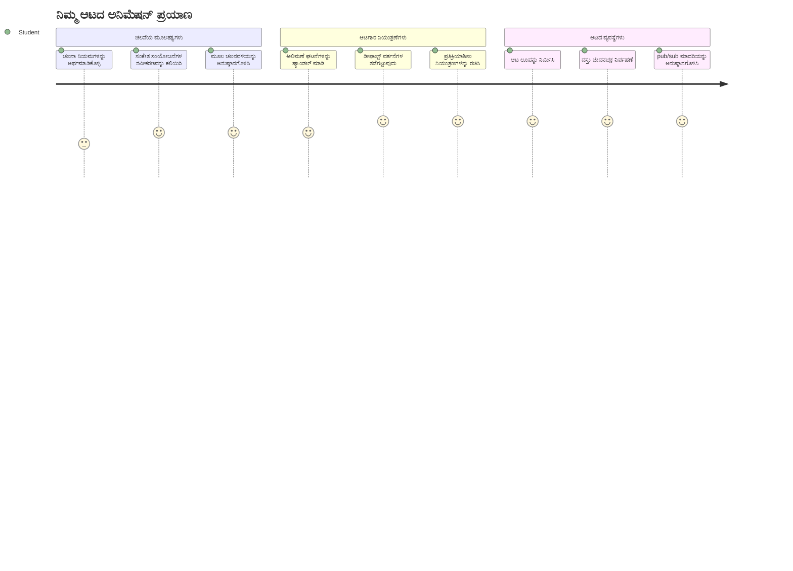
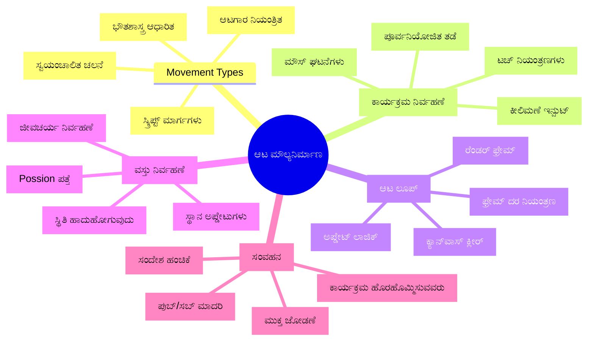
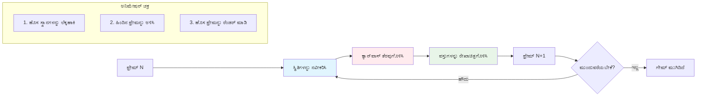
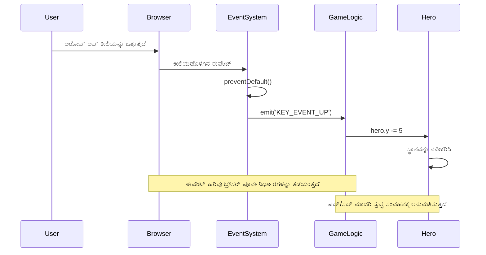
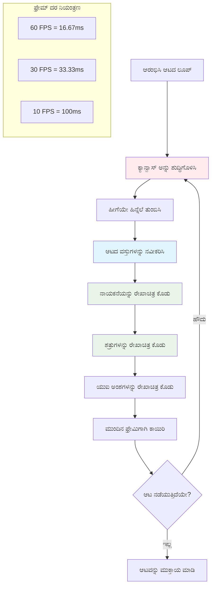
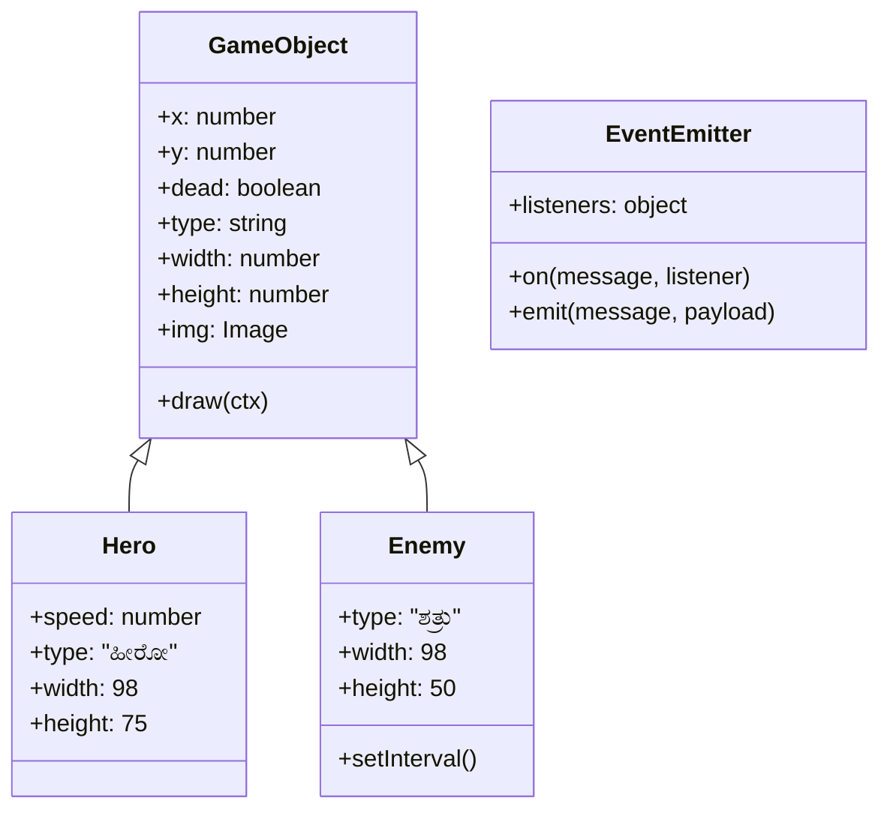
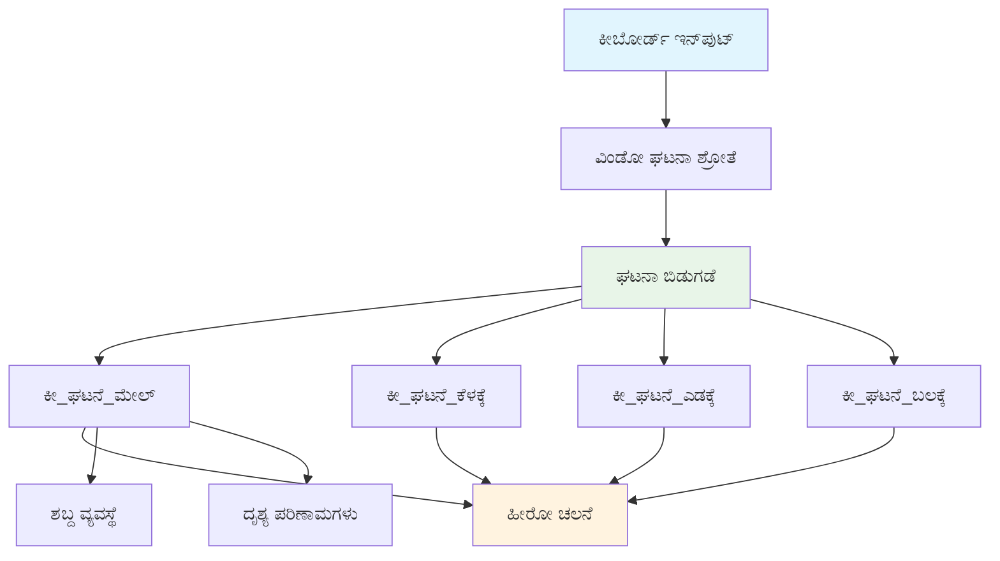
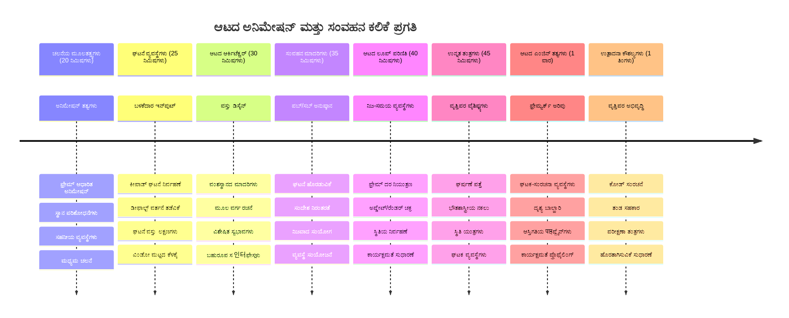

# ಬಯಲು ಆಟವನ್ನು ರಚಿಸುವ ಭಾಗ 3: ಚಲನೆಯು ಸೇರಿಸುವುದು


ನಿಮ್ಮлюбимый ಆಟಗಳನ್ನು ಯೋಚಿಸಿ – ಅವುಗಳನ್ನು ಆಕರ್ಷಕವಾಗಿಸುವುದು ಕೇವಲ ಸುಂದರ ಗ್ರಾಫಿಕ್ಸ್ ಅಲ್ಲ, ಅದು ಎಲ್ಲವನ್ನೂ ಚಲಿಸುವ ರೀತಿಯಾಗಿದೆ ಮತ್ತು ನಿಮ್ಮ ಕ್ರಮಗಳಿಗೆ ಪ್ರತಿಕ್ರಿಯಿಸುವುದು. ಈಗಾಗಲೇ, ನಿಮ್ಮ ಬಯಲು ಆಟವು ಒಂದು ಸುಂದರ ಚಿತ್ರಕಾರ್ಯವಾಗಿದೆ, ಆದರೆ ನಾವು ಅದಕ್ಕೆ ಜೀವನವನ್ನು ತಂದ ಚಲನೆ ಸೇರಿಸಲು ಹೊರಟಿದ್ದೇವೆ.

ನಾಸಾ ಇಂಜಿನಿಯರ್‌ಗಳು ಅಪೊලೋ ಮಿಷನ್‌ಗಳಿಗಾಗಿ ಮಾರ್ಗದರ್ಶಕ ಗಣಕಯಂತ್ರವನ್ನು ಪ್ರೋಗ್ರಾಮ್ ಮಾಡಿದಾಗ, ಅವರು ಸಮಾನ ಸವಾಲಿನ ಎದುರಿಸಲಾಗಿದೆ: ಪೈಲೆಟ್ ಇನ್‌ಪುಟ್‌ಗೆ ಬಯಲು ನೌಕೆಯನ್ನು ಪ್ರತಿಕ್ರಿಯಿಸುವಂತೆ ಮಾಡಿ ಕ್ರಮ ತುಂಬಿ ದಾರಿದೀಪ ತಿದ್ದುವುದನ್ನು ಸ್ವಯಂಚಾಲಿತವಾಗಿ ಕಾಪಾಡುವುದು ಹೇಗೆ? ನಾವು ಇಂದು ಕಲಿಯುವ ತತ್ವಗಳು ಆ mêmes concepts ಅನ್ನು ಪ್ರತಿಧ್ವನಿಸುತ್ತದೆ – ಆಟಗಾರ ನಿಯಂತ್ರಿತ ಚಲನವಲನ ಮತ್ತು ಸ್ವಯಂಚಾಲಿತ ವ್ಯವಸ್ಥೆಯ ವರ್ತನೆಗಳ ನಿರ್ವಹಣೆ.

ಈ ಪಾಠದಲ್ಲಿ, ನೀವು ಬಯಲು ನೌಕೆಯನ್ನು ಪರದೆಯಾದ ಮೇಲೆ ನೆರಳಿಸುವಂತೆ, ಆಟಗಾರನ ಆಜ್ಞೆಗಳಿಗೆ ಪ್ರತಿಕ್ರಿಯಿಸುವಂತೆ ಮತ್ತು ಮೃದುವಾದ ಚಲನಾ ಮಾದರಿಗಳನ್ನು ರಚಿಸುವುದನ್ನು ಕಲಿಯುತ್ತೀರಿ. ನಾವು ಎಲ್ಲವನ್ನೂ ಸಹಜವಾಗಿ ಪರಸ್ಪರ ಕಟ್ಟಿಕೊಂಡುಕೊಂಡ manageable ತತ್ವಗಳಾಗಿ ವಿಭಜಿಸುತ್ತೇವೆ.

ಅಂತಿಮದಲ್ಲಿ, ನೀವು ನಿಮ್ಮ ನಾಯಕ ನೌಕೆಯನ್ನು ಪರದೆಬದಿಯಲ್ಲಿ ಹಾರಿಸುವಂತೆ ಮಾಡಿದ್ದೀರಾ ಮತ್ತು ಶತ್ರು ನೌಕೆಗಳು ಮೇಲ್ಮೆಯ ಮೇಲೆ ರಕ್ಷಕರಾಗಿ ನಿರ್ಣಯಿಸುತ್ತಿವೆ. ಹೆಚ್ಚು ಪ್ರಾಮುಖ್ಯವಾದುದು, ನೀವು ಆಟ ಚಲನ ವ್ಯವಸ್ಥೆಗಳನ್ನು ಚಾಲನೆ ಮಾಡುವ ಮೂಲ ತತ್ವಗಳನ್ನು ಅರ್ಥಮಾಡಿಕೊಳ್ಳುವಿರಿ.


## ಪೂರ್ವ-ಪಾಠ ಪ್ರಶ್ನೋತ್ತರ

[ಪೂರ್ವ-ಪಾಠ ಪ್ರಶ್ನೋತ್ತರ](https://ff-quizzes.netlify.app/web/quiz/33)

## ಆಟ ಚಲನ ಅರ್ಥ ಮಾಡಿಕೊಳ್ಳುವುದು

ಆಟಗಳು ಸಜೀವರಾಗುತ್ತವೆ, ಎಲ್ಲವನ್ನೂ ಚಲಿಸುವಾಗ, ಮತ್ತು ಸರ್ವೋತ್ತರ ಎರಡು ರೀತಿಯಲ್ಲಿ ಇದು ಸಂಭವಿಸುತ್ತದೆ:

- **ಆಟಗಾರ-ನಿಯಂತ್ರಿತ ಚಲನ**: ನೀವು ಕೀಲಿ ಒತ್ತಿದಾಗ ಅಥವಾ ಮೌಸ್ ಕ್ಲಿಕ್ ಮಾಡಿದಾಗ, ಯಾವುದೋ ಒಂದು ಚಲಿಸುತ್ತದೆ. ಇದು ನಿಮಗೂ ನಿಮ್ಮ ಆಟ ಜಗತ್ತಿನ ನಡುವೆ ನೇರ ಸಂಪರ್ಕವಾಗಿದೆ.
- **ಸ್ವಯಂಚಾಲಿತ ಚಲನ**: ಆಟವೇ ತನ್ನಿಂದೇ ಚಲಿಸುವುದನ್ನು ನಿರ್ಧರಿಸುವುದು – ಉದಾಹರಣೆಗೆ ಆ ಶತ್ರು ನೌಕೆಗಳು ಪರದೆಬದಿಯಲ್ಲಿ ಪ್ಯಾಟ್ರೋಲ್ ಮಾಡುತ್ತಿದ್ದಾರೆಯೋ ನಿಮ್ಮ ಏನೂ ಮಾಡದೇ ಇದ್ದರೂ.

ಕಂಪ್ಯೂಟರ್ ಪರದೆ ಮೇಲೆ ವಸ್ತುಗಳನ್ನು ಚಲಿಸುವುದು ನೀವು ಊಹಿಸುವುದಕ್ಕಿಂತ ಸರಳ. ಗಣಿತ ತರಗತಿಯಲ್ಲಿ ಇದ್ದ x ಮತ್ತು y ನಿರ್ದಿಷ್ಟಾಂಕಗಳನ್ನು ನೆನಪಿಡಿ? ಅದೇನಾಗಿದೆ ಇಲ್ಲಿ ನಾವು ಕೆಲಸ ಮಾಡುತ್ತೇವೆ. 1610 ರಲ್ಲಿ ಗ್ಯಾಲಿಲಿಯೋ ಜುಪಿಟರ್ ಚಂದ್ರಿಕೆಗಳನ್ನು ಟ್ರ್ಯಾಕ್ ಮಾಡಿದಾಗ, ಅವನು ಅದೇನೂ ಮಾಡುತ್ತಿದ್ದ - ಸಮಯದ ಮೇಲೆ ಸ್ಥಾನಗಳನ್ನು ಬಿಂದು ಹಾಕಿ ಚಲನ ಮಾದರಿಗಳನ್ನು ಅರ್ಥಮಾಡಿಕೊಳ್ಳಲು.

ಪರದೆ ಮೇಲೆಯೇ ವಸ್ತುಗಳನ್ನು ಚಲಿಸುವುದು ಒಂದು ಫ್ಲಿಪ್ ಬುಕ್ ಅನಿಮೇಶನ್ ಸೃಷ್ಟಿಸುವಂತಿದೆ – ನೀವು ಈ ಮೂರು ಸರಳ ಹಂತಗಳನ್ನು ಅನುಸರಿಸಬೇಕು:


1. ** ಸ್ಥಾನವನ್ನು ನವೀಕರಿಸು** – ನಿಮ್ಮ ವಸ್ತುವಿನ ಹೊಸ ಸ್ಥಾನವನ್ನು ಬದಲಾಯಿಸಿ (ಬಹುಶಃ 5 ಪಿಕ್ಸೆಲ್ಸ್ ಬಲಕ್ಕೆ ಸರಿಸಿ)
2. ** ಹಳೆಯ ಫ್ರೇಮ್ ಅನ್ನು ಅಳಿಸಿ** – ಪರದೆಯನ್ನು ಸ್ವಚ್ಛಗೊಳಿಸಿ ಹಾಳಾದ ಹೊದಿಕೆಯ ರೇಖೆಗಳನ್ನು ಕಾಣಿಸುವುದನ್ನು ತಡೆಯಿರಿ
3. **ಹೊಸ ಫ್ರೇಮ್ ಅನ್ನು ಬಿಡಿಸಿ** – ನಿಮ್ಮ ವಸ್ತುವನ್ನು ಅದರ ಹೊಸ ಸ್ಥಾನದಲ್ಲಿ ಚಿತ್ರಿಸಿ

ಈ ಕಾರ್ಯವನ್ನು ಸಾಕಷ್ಟು ವೇಗವಾಗಿ ಮಾಡಿದರೆ, ಬೂಂ! ನೀವು ಮೃದುವಾದ, ಸ್ವಾಭಾವಿಕವಾಗಿ ತಾಳಮೇಳ ಹೊಂದಿದ ಚಲನವಳಿಯನ್ನು ಹೊಂದಿದ್ದೀರಾ.

ಇದನ್ನು ಕೋಡ್ ನಲ್ಲಿ ಹೇಗೆ ಕಾಣಿಸಬಹುದು ಎಂಬುದೆ ಇಲ್ಲಿ:

```javascript
// ಹೀರೋನ ಸ್ಥಳವನ್ನು ಹೊಂದಿಸಿ
hero.x += 5;
// ಹೀರೋವನ್ನು ಹೊಂದಿರುವ ಆಯತವನ್ನು ಸ್ವಚ್ಛಗೊಳಿಸಿ
ctx.clearRect(0, 0, canvas.width, canvas.height);
// ಆಟದ ಹಿನ್ನೆಲೆ ಮತ್ತು ಹೀರೋವನ್ನು ಮರು ಬರೆಯಿರಿ
ctx.fillRect(0, 0, canvas.width, canvas.height);
ctx.fillStyle = "black";
ctx.drawImage(heroImg, hero.x, hero.y);
```

**ಈ ಕೋಡ್ ಮಾಡುವುದು:**
- ನಾಯಕನ x-ನಿರ್ದಿಷ್ಟಾಂಕವನ್ನು 5 ಪಿಕ್ಸೆಲ್ಸ್ ಬಲಕ್ಕೆ ನವೀಕರಿಸುತ್ತದೆ
- ಹಿಂದಿನ ಫ್ರೇಮ್‌ ಅನ್ನು ತೆಗೆದುಹಾಕಲು ಸಂಪೂರ್ಣ ಕ್ಯಾನ್ವಾಸ್ ಪ್ರದೇಶವನ್ನು ಸ್ವಚ್ಛಗೊಳಿಸುತ್ತದೆ
- ಕ್ಯಾನ್ವಾಸ್ ಅನ್ನು ಕಪ್ಪು ಹಿನ್ನೆಲೆ ಬಣ್ಣದಿಂದ ಭರಿಸುತ್ತದೆ
- ನಾಯಕನ ಚಿತ್ರವನ್ನು ಹೊಸ ಸ್ಥಾನದಲ್ಲಿ ಮರುಬಿಡಿಸುತ್ತದೆ

✅ ನಿಮ್ಮ ನಾಯಕನ ಬಹು ಫ್ರೇಮ್‌ಗಳನ್ನು ಪ್ರತಿ ಸೆಕೆಂಡಿಗೆ ಮರುಬಿಡಿಸುವುದರಿಂದ ಏನಾದರೂ ಕಾರ್ಯಕ್ಷಮತೆ ದೋಷಗಳು ಬರುತ್ತೇ ಎಂದೂ ನಿಮಗೆ ಯೋಚನೆ ಇದೆಯೇ? ಈ ಮಾದರಿಯ ಪರ್ಯಾಯಗಳ ಬಗ್ಗೆ ಓದಿ: [alternatives to this pattern](https://developer.mozilla.org/en-US/docs/Web/API/Canvas_API/Tutorial/Optimizing_canvas).

## ಕೀಬೋರ್ಡ್ ಘಟನೆಗಳನ್ನು ನಿರ್ವಹಿಸು

ಇದು ಆಟಗಾರನ ಇನ್‌ಪುಟ್ ಅನ್ನು ಆಟ ಕ್ರಿಯೆಗೆ ಸಂಪರ್ಕಿಸುವ ಸ್ಥಳ. ಯಾರಾದರೂ ಸ್ಪೇಸ್‌ಬಾರ್ ಒತ್ತಿ ಲೇಸರ್ ಫೈರ್ ಮಾಡುವಾಗ ಅಥವಾ ತಿರುಗುವ ತೀಪತ್ತಿಯನ್ನು ತಟ್ಟಿದಾಗ, ನಿಮ್ಮ ಆಟ ಆ ಇನ್‌ಪುಟ್ ಅನ್ನು ಗುರುತಿಸಿ ಪ್ರತಿಕ್ರಿಯಿಸಬೇಕಾಗುತ್ತದೆ.

ಕೀಬೋರ್ಡ್ ಘಟನೆಗಳು window ಮಟ್ಟದಲ್ಲಿ ನಡೆಯುತ್ತವೆ, ಅಂದರೆ ನಿಮ್ಮ ಪೂರ್ಣ ಬ್ರೌಸರ್ ವಿಂಡೋ ಅವುಗಳಿಗೋಸ್ಕರ ಜಾಗರೂಕವಾಗಿದೆ.	mouse ಕ್ಲಿಕ್ಸ್, ಇತರ ಬದಿಗೆ, ನಿರ್ದಿಷ್ಟ ಅಂಶಗಳಿಗೆ ಕಟ್ಟಿ ಅತ್ಯಾಧಾರಿತವಾಗಬಹುದು (ಉದಾ: ಬಟನ್ ಕ್ಲಿಕ್). ನಮ್ಮ ಬಯಲು ಆಟದಲ್ಲಿ, ನಾವು ಕೀಬೋರ್ಡ್ ನಿಯಂತ್ರಣಗಳಿಗೆ ಗಮನ ನೀಡುತ್ತೇವೆ ಏಕೆಂದರೆ ಅದು ಆಟಗಾರರಿಗೆ ಆರ್ಕೇಡ್ ಭಾವನೆಯನ್ನು ನೀಡುತ್ತದೆ.

ಈದು ನನಗೆ 1800ರ ದಶಕದ ಟೇಲಿಗ್ರಾಫ್ ಆಪರೇಟರ್‌ಗಳು ಮೊರ್ಸ್ ಕೋಡ್ ಇನ್‌ಪುಟ್ ಅನ್ನು ಅರ್ಥಪೂರ್ಣ ಸಂದೇಶಗಳಿಗೆ ಅನುವಾದಿಸುವಂತಿರುವುದು ನೆನಪಾಗುತ್ತದೆ – ನಾವು ಸಹ ಅದೇ ಕಾರ್ಯವನ್ನು ಮಾಡುತ್ತಿದ್ದೇವೆ, ಕೀಲಿಪತ್ತಿಗಳನ್ನು ಆಟ ಆದೇಶಗಳಿಗೆ ಅನುವಾದಿಸಿ.

ಘಟನೆಯನ್ನು ನಿರ್ವಹಿಸಲು ನೀವು window ನ `addEventListener()` ವಿಧಾನವನ್ನು ಬಳಸಬೇಕು ಮತ್ತು ಅದಕ್ಕೆ ಎರಡು ಪ್ಯಾರಾಮೀಟರ್‌ಗಳನ್ನು ನೀಡಬೇಕು. ಮೊದಲ ಪ್ಯಾರಾಮೀಟರ್ ಘಟನೆ ಹೆಸರು, ಉದಾಹರಣೆಗೆ `keyup`. ಎರಡನೇ ಪ್ಯಾರಾಮೀಟರ್ ಘಟನೆ ಸಂಭವಿಸಿದಾಗ ಕರೆಮಾಡುವ ಫಂಕ್ಷನ್.

ಇದೀಗ ಉದಾಹರಣೆ ಇಲ್ಲಿದೆ:

```javascript
window.addEventListener('keyup', (evt) => {
  // evt.key = ಕೀಲಿಯ ಸ್ಟ್ರಿಂಗ್ ಪ್ರತಿನಿಧಿ
  if (evt.key === 'ArrowUp') {
    // ಕೆಲವು ಕಾರ್ಯಗಳನ್ನು ಮಾಡಿ
  }
});
```

**ಇಲ್ಲಿ ಏನು ನಡೆಯುತ್ತಿದೆ:**
- ಸಂಪೂರ್ಣ window ನಲ್ಲಿ ಕೀಬೋರ್ಡ್ ಘಟನೆಗಳನ್ನು ಕೇಳುತ್ತಿದೆ
- ಒತ್ತಿದ ಕೀ ಯಾವುದು ಎಂಬ ಮಾಹಿತಿಯೊಂದಿಗೆ ಘಟನೆ ವಸ್ತುವನ್ನು ಸೆರೆಹಿಡಿಯುತ್ತಿದೆ
- ಒತ್ತಿದ ಕೀ ಒಂದು ನಿರ್ದಿಷ್ಟ ಕೈ(ಈ ಸಂದರ್ಭದಲ್ಲಿ, ಮೇಲ್ವನದ ತೀಪತ್ತಿ) ಜೊತೆ ಹೊಂದಿಕೊಳ್ಳುತ್ತದೆಯೇ ಎಂದು ಪರಿಶೀಲಿಸುತ್ತದೆ
- ಶರತ್ತು ಪೂರೈಸಿದಾಗ ಕೋಡ್ ಅನ್ನು ಕಾರ್ಯಗತಗೊಳಿಸುತ್ತದೆ

ಕೀಘಟನೆಯಲ್ಲಿ ನೀವು `key` ಮತ್ತು `keyCode` ಎಂಬ ಎರಡು ಗುಣಲಕ್ಷಣಗಳನ್ನು ಉಪಯೋಗಿಸಬಹುದು:

- `key` - ಒತ್ತಿದ ಕೀಲಿಯ string ಪ್ರತಿನಿಧಾನ, ಉದಾ: `'ArrowUp'`
- `keyCode` - ಸಂಖ್ಯೆ ಪ್ರತಿನಿಧಾನ, ಉದಾ: `37`, ಇದು `ArrowLeft` ಗೆ ಹೊಂದಿಕೆಯಾಗುತ್ತದೆ

✅ ಕೀಘಟನೆಯ ನಿಯಂತ್ರಣ ಆಟ ಅಭಿವೃದ್ಧಿಯಿಂದ ಹೊರಗೂ ಉಪಯುಕ್ತ. ಈ ತಂತ್ರವನ್ನು ನೀವು ಇನ್ನೇನು ಬಗೆಯ ಉಪಯೋಗಿಸಬಹುದು ಎಂದು ಯೋಚಿಸಿ.


### ವಿಶೇಷ ಕೀಗಳು: heads up!

ಕೆಲವು ಕೀಗಳಿಗೆ ಬ್ರೌಸರ್‌ನಲ್ಲಿ ನಿರ್ಮಿತ ವರ್ತನೆಗಳಿವೆ, ಅವು ನಿಮ್ಮ ಆಟಕ್ಕೆ ಅಡ್ಡಿಪಡಿಸಬಹುದು. ತೀರಿಗಳ ಕೀಲಿಗಳು ಪುಟವನ್ನು ಸ್ಕ್ರೋಲ್ ಮಾಡುತ್ತವೆ ಮತ್ತು ಸ್ಪೇಸ್‌ಬಾರ್ ಕೆಳಗೆ ಜಿಗಿತು – ನೌಕೆಯನ್ನು ನಿಯಂತ್ರಿಸಲು ಪ್ರಯತ್ನಿಸುವಾಗ ನೀವು ಇದನ್ನು ಬಯಸುವುದಿಲ್ಲ.

ನಾವು ಈ ಡಿಫಾಲ್ಟ್ ವರ್ತನೆಗಳನ್ನು ತಡೆಯಬಹುದು ಮತ್ತು ಬದಲಿಗೆ ನಮ್ಮ ಆಟ ಇನ್‌ಪುಟ್ ಅನ್ನು ನಿರ್ವಹಿಸುತ್ತದೆ. ಇದು ಆರಂಭದ ಕಂಪ್ಯೂಟರ್ ಪ್ರೋಗ್ರಾಮರ್‌ಗಳು ಸಿಸ್ಟಂ ಇಂಟರಪ್ಟ್‌ಗಳನ್ನು ಮೀರಿಸುವಂತೆ ಮಾಡುವುದಕ್ಕೆ ಸಮಾನ – ನಾವು ಬ್ರೌಸರ್ ಮಟ್ಟದಲ್ಲಿ ಅದೇನೂ ಮಾಡುತ್ತಿದ್ದೇವೆ. ಇಲ್ಲಿದೆ ಹೇಗೆ:

```javascript
const onKeyDown = function (e) {
  console.log(e.keyCode);
  switch (e.keyCode) {
    case 37:
    case 39:
    case 38:
    case 40: // ಅರುವ ಚಿಮ್ಮೆಗಳು
    case 32:
      e.preventDefault();
      break; // ಖಾಲಿ ಜಾಗ
    default:
      break; // ಇತರ ಕೀಗಳನ್ನು ತಡೆಬಾರದು
  }
};

window.addEventListener('keydown', onKeyDown);
```

**ಈ ತಡೆಯುವ ಕೋಡ್ ಅರ್ಥ ಮಾಡಿಕೊಳ್ಳಿ:**
- ಸಮಸ್ಯೆ ಉಂಟುಮಾಡಬಹುದಾದ ನಿರ್ದಿಷ್ಟ ಕೀ ಕೋಡ್‌ಗಳಿಗೆ ಪರಿಶೀಲನೆ ಮಾಡುತ್ತದೆ
- ತೀರಿಗಳ ಕೀಲಿಗಳು ಮತ್ತು ಸ್ಪೇಸ್‌ಬಾರ್‌ಗಾಗಿ ಡಿಫಾಲ್ಟ್ ಬ್ರೌಸರ್ ಕ್ರಿಯೆಯನ್ನು ತಡೆಯುತ್ತದೆ
- ಇತರ ಕೀಲಿಗಳಿಗೆ ಸಾಮಾನ್ಯ ಕೆಲಸಕ್ಕೆ ಅವಕಾಶ ನೀಡುತ್ತದೆ
- `e.preventDefault()` ಉಪಯೋಗಿಸಿ ಬ್ರೌಸರ್ ಸಂರಚಿತ ವರ್ತನೆಯನ್ನು ನಿಲ್ಲಿಸುತ್ತದೆ

### 🔄 **ಶಿಕ್ಷಣಾತ್ಮಕ ಪರಿಶೀಲನೆ**
**ಘಟನಾ ನಿರ್ವಹಣೆ ಅರ್ಥಮಾಡಿಕೊಳ್ಳುವುದು**: ಸ್ವಯಂಚಾಲಿತ ಚಲನಕ್ಕೆ ಮೊದಲು ಮಾಡಿ ನೋಡಬೇಕು:
- ✅ `keydown` ಮತ್ತು `keyup` ಘಟನೆಯ ವ್ಯತ್ಯಾಸವನ್ನು ವಿವರಿಸಬಹುದು
- ✅ ನಾವು ಡಿಫಾಲ್ಟ್ ಬ್ರೌಸರ್ ವರ್ತನೆಗಳನ್ನು ಯಾಕೆ ತಡೆಯುತ್ತೇವೆ ಅರ್ಥಮಾಡಿಕೊಳ್ಳಬಹುದು
- ✅ ಘಟನೆ ಶ್ರೋತಿಗಳು ಬಳಕೆದಾರ ಇನ್‌ಪುಟ್ ಅನ್ನು ಆಟ ಲಾಗಿಕ್ ಗೆ ಹೇಗೆ ಸಂಪರ್ಕಿಸುತ್ತವೆ ವಿವರಿಸಬಹುದು
- ✅ ಯಾವ ಕೀಗಳು ಆಟ ನಿಯಂತ್ರಣಗಳಿಗೆ ಸೆರೆಯಾಗಬಹುದು ಗುರುತಿಸಬಹುದು

**ಸ್ವಯಂ-ಪರೀಕ್ಷೆ**: ನೀವು ತೀರಿಗಳ ಕೀಲಿಗಳ ಡಿಫಾಲ್ಟ್ ವರ್ತನೆ ತಡೆಯದಿದ್ದರೆ ಏನಾಗುತ್ತದೆ?
*ಉತ್ತರ: ಬ್ರೌಸರ್ ಪುಟವನ್ನು ಸ್ಕ್ರೋಲ್ ಮಾಡುತ್ತದೆ, ಇದು ಆಟ ಚಲನದಲ್ಲಿ ಅಡ್ಡಿಪಡಿಸುತ್ತದೆ*

**ಘಟನೆ ವ್ಯವಸ್ಥೆ ನಿರ್ಮಾಣ**: ನೀವು ಈಗ ಅರ್ಥ ಮಾಡಿಕೊಂಡಿದ್ದೀರಿ:
- **window-ಮಟ್ಟದ ಕೇಳುವಿಕೆ**: ಬ್ರೌಸರ್ ಮಟ್ಟದಲ್ಲಿ ಘಟನೆಗಳನ್ನು ಸೆರೆಹಿಡಿಯುವಿಕೆ
- **ಘಟನಾ ವಸ್ತು ಗುಣಲಕ್ಷಣಗಳು**: `key` ಸ್ಟ್ರಿಂಗ್‌ಗಳು ಮತ್ತು `keyCode` ಸಂಖ್ಯೆಗಳು
- **ಡಿಫಾಲ್ಟ್ ತಡೆ**: ಅಪ್ರಯೋಜಿತ ಬ್ರೌಸರ್ ವರ್ತನೆಗಳನ್ನು ನಿಲ್ಲಿಸುವಿಕೆ
- **ಶರತ್ತುದಾರ ಫಲಿತಾಂಶ**: ನಿರ್ದಿಷ್ಟ ಕೀ ಸಂಯೋಜನೆಗಳಿಗೆ ಪ್ರತಿಕ್ರಿಯಿಸುವಿಕೆ

## ಆಟದಿಂದ ಉಂಟಾಗುವ ಚಲನ

ಹೀಗಾಗಿ ಆಟಗಾರನ ಇನ್‌ಪುಟ್ ಇಲ್ಲದೇ ಚಲಿಸುವ ವಸ್ತುಗಳನ್ನು ಕುರಿತು ಮಾತನಾಡೋಣ. ಶತ್ರು ನೌಕೆಗಳು ಪರದೆ ಮೇಲೆ ಸುತ್ತಾಡುತ್ತಿದ್ದಂತೆ, ಗುಂಡುಗಳು ನೇರ ರೇಖೆಗಳಲ್ಲಿ ಹಾರುತ್ತಿದ್ದಂತೆ, ಅಥವಾ ಮೋಡಗಳು ಹಿನ್ನೆಲೆಯಲ್ಲಿಯೇ ಒదಿದುಹೋಗುತ್ತಿರುವಂತೆ. ಈ ಸ್ವಯಂಚಾಲಿತ ಚಲನ ನಿಮ್ಮ ಆಟ ಜಗತ್ತನ್ನು ಜೀವಂತವಾಗಿಸುತ್ತದೆ ನಿಮ್ಮ ನಿಯಂತ್ರಣ ಸ್ಪರ್ಶವಿಲ್ಲದಿದ್ದರೂ ಸಹ.

ನಾವು ಜಾವಾಸ್ಕ್ರಿಪ್ಟ್‌ನ ಬಿಲ್ಟ್-ಇನ್ ಟೈಮರ್‌ಗಳನ್ನು ನಿಯಮಿತ ಅಂತರಗಳಲ್ಲಿ ಸ್ಥಾನಗಳನ್ನು ನವೀಕರಿಸಲು ಬಳಸುತ್ತೇವೆ. ಈ ಕಲ್ಪನೆ ಪೆಂಡುಲಮ್ ಗಡಿಯಾರ ಹೇಗೆ ಕೆಲಸ ಮಾಡುತ್ತದೆಯೋ ಹಾಗೇ – ನಿಯಮಿತ, ಸಮಯಭದ್ಧ ಕ್ರಿಯೆಗಳನ್ನು ಪ್ರೇರೇಪಿಸುವ ವ್ಯವಸ್ಥೆ. ಇದು ಹೀಗಿದೆ:

```javascript
const id = setInterval(() => {
  // ಶತ್ರುವನ್ನು y ಅಕ್ಷದಲ್ಲಿ ಚಲಾಯಿಸಿ
  enemy.y += 10;
}, 100);
```

**ಈ ಚಲನ ಕೋಡ್ ಮಾಡುವುದು:**
- ಪ್ರತಿ 100 ಮಿಲಿಸೆಕೆಂಡಿಗೆ ಒಂದು ಟೈಮರ್ ರಚಿಸುತ್ತದೆ
- ಪ್ರತಿ ಬಾರಿ ಶತ್ರುವಿನ y-ನಿರ್ದಿಷ್ಟಾಂಕವನ್ನು 10 ಪಿಕ್ಸೆಲ್ಸ್ ನವೀಕರಿಸುತ್ತದೆ
- ನಂತರ ಅದನ್ನು ನಿಲ್ಲಿಸಲು Interval ID ಅನ್ನು ಸಂಗ್ರಹಿಸುತ್ತದೆ
- ಶತ್ರುವನ್ನು ಸ್ವಯಂಚಾಲಿತವಾಗಿ ಕೆಳಕ್ಕೆ ಪರದೆ ಮೇಲೆ ಚಲಿಸುತ್ತದೆ

## ಆಟ ಲೂಪ್

ಇದು ಎಲ್ಲವನ್ನೂ ಹೊಂದಿಸಿ ಬದ್ಧಗೊಳಿಸುವ ಕಲ್ಪನೆ – ಆಟ ಲೂಪ್. ನಿಮ್ಮ ಆಟ ಒಂದು ಚಲನಚಿತ್ರವಾದರೆ, ಆಟ ಲೂಪ್ ಚಿತ್ರತೊರೆ ಪ್ಯಾಜೆಕ್ಟರ್ ಆಗಿದ್ದು ಫ್ರೇಮ್‌ಗಳನ್ನೆಲಿಯ ತ್ವರಿತವಾಗಿ ತೋರಿಸಿ ಎಲ್ಲವನ್ನೂ ಸ್ಮೂತ್ ಆಗಿ ಚಲಿಸುವಂತೆ ತೋರ್ಪಡಿಸುತ್ತದೆ.

ಪ್ರತಿ ಆಟದಲ್ಲೂ ಇಂತಹ ಲೂಪ್ ಪ್ರಗ್ರಾಮ್ ಹಿಂದೆ ನಡೆಯುತ್ತದೆ. ಇದು ಒಂದು ಫಂಕ್ಷನ್ ಆಗಿದ್ದು ಎಲ್ಲ ಆಟ ವಸ್ತುಗಳನ್ನು ನವೀಕರಿಸಿ, ಪರದೆ ಹೊಸದಾಗಿ ಬಿಡಿಸಿ, ಈ ಪ್ರಕ್ರಿಯೆಯನ್ನು ನಿರಂತರವಾಗಿಯೇ ಅನುಸರಿಸುತ್ತದೆ. ಇದು ನಿಮ್ಮ ನಾಯಕ, ಎಲ್ಲ ಶತ್ರುಗಳು, ಯಾವುದೇ ಲೇಸರ್ಗಳು – ಪೂರ್ಣ ಆಟ ಸ್ಥಿತಿಯನ್ನು ಟ್ರ್ಯಾಕ್ ಮಾಡುತ್ತದೆ.

ಇದು ನಗೆ ಮೂವರು ಮುಂಚಿನ ಚಲನಚಿತ್ರ ಚಿತ್ರಕರಿಂದ್ರೆ, ವಾಲ್ಟ್ ಡಿಸ್ನಿ ಪಾತ್ರಗಳನ್ನು ಫ್ರೇಮ್ ಬಾಯ್ ಫ್ರೇಮ್ ಮರುಬಿಡಿಸುವ ಮೂಲಕ ಚಲನಭಾಸವನ್ನು ಸೃಷ್ಟಿಸುತ್ತಿದ್ದ ಪರಿಚಯವನ್ನು ನೆನಪಿಸುತ್ತದೆ. ನಾವು ಅದೇನೂ ಮಾಡುತ್ತಿರುವ ನೋಡು, ಕಾಗದದ ಬದಲು ಕೋಡ್ ಬಳಸಿ.

ಒಂದು ಆಟ ಲೂಪ್ ಸಾಮಾನ್ಯವಾಗಿ ಕೋಡ್ ನಲ್ಲಿ ಹೇಗೆ ಕಾಣಬಹುದು ನೋಡೋಣ:


```javascript
const gameLoopId = setInterval(() => {
  function gameLoop() {
    ctx.clearRect(0, 0, canvas.width, canvas.height);
    ctx.fillStyle = "black";
    ctx.fillRect(0, 0, canvas.width, canvas.height);
    drawHero();
    drawEnemies();
    drawStaticObjects();
  }
  gameLoop();
}, 200);
```

**ಆಟ ಲೂಪ್ ರಚನೆಯ ಅರ್ಥ:**
- ಹಿಂದಿನ ಫ್ರೇಮ್ನ್ನು ತೆಗೆದುಹಾಕಲು ಸಂಪೂರ್ಣ ಕ್ಯಾನ್ವಾಸ್ ಅನ್ನು ಸ್ವಚ್ಛಗೊಳಿಸುತ್ತದೆ
- ಹಿನ್ನೆಲೆಯನ್ನು ದ್ರವ್ಯಮಯ ಬಣ್ಣದಿಂದ ತುಂಬುತ್ತದೆ
- ಎಲ್ಲ ಆಟ ವಸ್ತುಗಳನ್ನು ಅವರ ಸದ್ಯದ ಸ್ಥಾನಗಳಲ್ಲಿ ಬಿಡಿಸುತ್ತದೆ
- ಮೃದುವಾದ ಅನಿಮೇಷನ್ ಸೃಷ್ಟಿಸಲು ಪ್ರತಿ 200 ಮಿಲಿಸೆಕೆಂಡಿಗೆ ಈ ಪ್ರಕ್ರಿಯೆಯನ್ನು ಪುನರಾವರ್ತಿಸುತ್ತದೆ 
- ಇಂಟರ್ವಲ್ ಸಮಯವನ್ನು ನಿಯಂತ್ರಿಸಿ ಫ್ರೇಮ್ ದರವನ್ನು ನಿರ್ವಹಿಸುತ್ತದೆ

## ಬಯಲು ಆಟವನ್ನು ಮುಂದುವರೆಸುವುದು

ಈಗ ನಾವು ಪೂರ್ವದಲ್ಲಿ ನಿರ್ಮಿಸಿದ ಸ್ಥಿರ ದೃಶ್ಯಕ್ಕೆ ಚಲನ ಸೇರಿಸುತ್ತೇವೆ. ನಾವು ಇದನ್ನು ಸ್ಕ್ರೀನ್‌ಶಾಟ್ ನಿಂದ ಪಾರಸ್ಪರಿಕ ಅನುಭವಕ್ಕೆ ಪರಿವರ್ತಿಸುವೆವು. ಪ್ರತಿ ಹಂತವನ್ನು ಮುಂದಿನ ಹಂತಕ್ಕೆ ಕಟ್ಟುವುದಾಗಿ ಕೆಲಸ ಮಾಡೋಣ.

ನೀವು ಪೂರ್ವ ಪಾಠದಿಂದ ಬಿಟ್ಟಿದ್ದ ಕೋಡ್ ಅನ್ನು ತೆಗೆದುಕೊಳ್ಳಿ (ಅಥವಾ ಹೊಸ ಪ್ರಾರಂಭಕ್ಕಾಗಿ [ಭಾಗ II- ಪ್ರಾರಂಭಿಕ](../../../../6-space-game/3-moving-elements-around/your-work) ಫೋಲ್ಡರ್‌ನಲ್ಲಿನ ಕೋಡಿನಿಂದ ಪ್ರಾರಂಭಿಸಿ).

**ಇಂದು ನಾವು ಏನನ್ನು ನಿರ್ಮಿಸುತ್ತಿದ್ದೇವೆ:**
- **ನಾಯಕ ನಿಯಂತ್ರಣಗಳು**: ತೀರಿಗಳ ಕೀಲಿಗಳು ನೌಕೆಯನ್ನು ಪರದೆ ಸುತ್ತ ಹಾರಿಸುವಲ್ಲಿ ಸಕ್ರಿಯವಾಗಲಿ
- **ಶತ್ರು ಚಲನೆ**: ಆ ಪರಗ್ರಹ ನೌಕೆಗಳು ತಮ್ಮ ಮುನ್ನಡೆ ಆರಂಭಿಸುತ್ತವೆ

ನಾವು ಈ ವೈಶಿಷ್ಟ್ಯಗಳನ್ನು ಜಾರಿಗೆ ತರುವುದನ್ನು ಪ್ರಾರಂಭಿಸೋಣ.

## ಶಿಫಾರಸು ಮಾಡಿದ ಹಂತಗಳು

ನಿಮಗೆ ಸೃಷ್ಟಿಸಿದ ಫೈಲ್‌ಗಳನ್ನು `your-work` ಅಡ್ಹೊಡೆ ಶಿಷ್ಯಲ್ಲಿ ಹುಡುಕಿ. ಅವು ಕೆಳಕಂಡಂತೆ ಇರಬೇಕು:

```bash
-| assets
  -| enemyShip.png
  -| player.png
-| index.html
-| app.js
-| package.json
```

ನೀವು ನಿಮ್ಮ ಪ್ರಾಜೆಕ್ಟ್ ಅನ್ನು `your-work` ಫೋಲ್ಡರ್‌ನಲ್ಲಿ ಈ ಕೆಳಗಿನ ರೀತಿಯಲ್ಲಿ ಪ್ರಾರಂಭಿಸುತ್ತೀರಿ:

```bash
cd your-work
npm start
```

**ಈ ಆಜ್ಞೆ ಮಾಡುವುದು:**
- ನಿಮ್ಮ ಪ್ರಾಜೆಕ್ಟ್ ಡೈರೆಕ್ಟರಿಗೆ ನಾವಿಗೇಟ್ ಆಗುತ್ತದೆ
- ವಿಳಾಸದಲ್ಲಿ HTTP ಸರ್ವರ್ ಮರುಳಿಸುವೆ `http://localhost:5000`
- ನಿಮಗೆ ಬೌರೋಸರ್‌ನಲ್ಲಿ ಪರೀಕ್ಷಿಸಲು ನಿಮ್ಮ ಆಟ ಫೈಲ್‌ಗಳನ್ನು ಸರ್ವ್ ಮಾಡುತ್ತದೆ

ಮೇಲಿನವು ವಿಳಾಸ `http://localhost:5000` ನಲ್ಲಿ HTTP ಸರ್ವರ್ ಪ್ರಾರಂಭ ಮಾಡುತ್ತದೆ. ಬ್ರೌಸರ್ ತಿರುಗಿಸಿ ಮತ್ತು ಆ ವಿಳಾಸವನ್ನು ಇನ್‌ಪುಟ್ ಮಾಡಿ, ಈಗ ನಾಯಕ ಮತ್ತು ಎಲ್ಲಾ ಶತ್ರುಗಳನ್ನು ಚಿತ್ರಿಸುತ್ತದೆ; ಯಾವುದೇ ಚಲನೆ ಇಲ್ಲ - ಇನ್ನೂ!

### ಕೋಡ್ ಸೇರಿಸು

1. `hero` ಮತ್ತು `enemy` ಮತ್ತು `game object` ಗಾಗಿ ನಿಗಧಿತ ವಸ್ತುಗಳನ್ನು ಸೇರಿಸಿ, ಅವುಗಳಲ್ಲಿ `x` ಮತ್ತು `y` ಗುಣಲಕ್ಷಣಗಳಿರಬೇಕು. ([@Inheritance or composition](../README.md) ಬಾಗವನ್ನು ನೆನಪಿಡಿ).

   *ಸೂಚನೆ* `game object` ನಲ್ಲಿ `x` ಮತ್ತು `y` ಇರುತ್ತವೆ ಮತ್ತು ನಿಮ್ಮನ್ನು ಕ್ಯಾನ್ವಾಸ್‌ಗೆ ಚಿತ್ರಿಸುವ ಸಾಮರ್ಥ್ಯ ಇರಬೇಕು.

   > **ಟಿಪ್**: ಹೊಸ `GameObject` ವರ್ಗವನ್ನು ಅದರ ಕಾಂಸ್ಟ್ರಕ್ಟರ್ ಅನ್ನು ಈ ಕೆಳಗಿನಂತೆ ರೂಪಿಸಿ ಮತ್ತು ನಂತರ ಅದನ್ನು ಕ್ಯಾನ್ವಾಸ್ ಗೆ ಬಿಡಿಸಿ:

    ```javascript
    class GameObject {
      constructor(x, y) {
        this.x = x;
        this.y = y;
        this.dead = false;
        this.type = "";
        this.width = 0;
        this.height = 0;
        this.img = undefined;
      }
    
      draw(ctx) {
        ctx.drawImage(this.img, this.x, this.y, this.width, this.height);
      }
    }
    ```

    **ಈ ಮೂಲ ವರ್ಗದ ಅರ್ಥ:**
    - ಎಲ್ಲಾ ಆಟ ವಸ್ತುಗಳು ಹಂಚಿಕೊಳ್ಳುವ ಸಾಮಾನ್ಯ ಗುಣಲಕ್ಷಣಗಳನ್ನು ವ್ಯಾಖ್ಯಾನಿಸುತ್ತದೆ (ಸ್ಥಾನ, ಗಾತ್ರ, ಚಿತ್ರ)
    - ವಸ್ತುವನ್ನು ಅಳಿಸಲು `dead` ಧ್ವಜವನ್ನು ಹೊಂದಿದೆ
    - ವಸ್ತುವನ್ನು ಕ್ಯಾನ್ವಾಸ್ನಲ್ಲಿ ಬಿಡಿಸುವ `draw()` ವಿಧಾನವನ್ನು ಒದಗಿಸುತ್ತದೆ
    - ಎಲ್ಲಾ ಗುಣಲಕ್ಷಣಗಳಿಗೆ ಡಿಫಾಲ್ಟ್ ಮೌಲ್ಯಗಳನ್ನು ಹೊಂದಿದ್ದು ಮಕ್ಕಳ ವರ್ಗಗಳು ಅವುಗಳನ್ನು ಮರಳಿಸಬಹುದು


    ಈಗ, ಈ `GameObject` ಅನ್ನು ವಿಸ್ತರಿಸಿ `Hero` ಮತ್ತು `Enemy` ರಚಿಸಿ:
    
    ```javascript
    class Hero extends GameObject {
      constructor(x, y) {
        super(x, y);
        this.width = 98;
        this.height = 75;
        this.type = "Hero";
        this.speed = 5;
      }
    }
    ```

    ```javascript
    class Enemy extends GameObject {
      constructor(x, y) {
        super(x, y);
        this.width = 98;
        this.height = 50;
        this.type = "Enemy";
        const id = setInterval(() => {
          if (this.y < canvas.height - this.height) {
            this.y += 5;
          } else {
            console.log('Stopped at', this.y);
            clearInterval(id);
          }
        }, 300);
      }
    }
    ```

    **ಈ ವರ್ಗಗಳಲ್ಲಿ ಪ್ರಮುಖ ತತ್ವಗಳು:**
    - `GameObject` ಅನ್ನು `extends` ಕೀವರ್ಡ್ ಬಳಸಿ ವಂಶಾವಳಿಯಾಗಿ ಪಡೆದುಕೊಳ್ಳುತ್ತದೆ
    - ಪೋಷಕರ ಕಾಂಸ್ಟ್ರಕ್ಟರ್ ಅನ್ನು `super(x, y)` ಮೂಲಕ ಕರೆ ಮಲ್ಪು ಮಾಡುತ್ತದೆ
    - ಪ್ರತಿ ವಸ್ತುವಿನ ಪ್ರಕಾರ ಸಂಪರ್ದಿತ ಗಾತ್ರ ಮತ್ತು ಗುಣಲಕ್ಷಣಗಳನ್ನು ನಿಗದಿಪಡಿಸುತ್ತದೆ
    - `setInterval()` ಬಳಸಿ ಶತ್ರುಗಳಿಗೆ ಸ್ವಯಂಚಾಲಿತ ಚಲನ ಮಾಡಿಸುತ್ತದೆ

2. ಕೀ-ಘಟನೆ ನಿರ್ವಾಹಕರನ್ನು ಸೇರಿಸಿ ಕೀ ನ್ಯಾವಿಗೇಶನ್ ನ್ನು ನಿರ್ವಹಿಸಿ (ನಾಯಕವನ್ನು ಮೇಲ್ಗೆ/ಕೆಳಗೆ/ಎಡಕ್ಕೆ/ಬಲಕ್ಕೆ ಚಲಿಸು)

   *ನೆನಪಿಡಿ* ಇದು ಕಾರ್ಟೇಶಿಯನ್ ವ್ಯವಸ್ಥೆಯಾಗಿದೆ, ಮೇಲಾಗಿನ ಬಲದ ಮೂಲಾಂಕವು `0,0`. ಡಿಫಾಲ್ಟ್ ವರ್ತನೆ ನಿಲ್ಲಿಸುವ ಕೋಡ್ ಅನ್ನು ಸೇರಿಸಬೇಕು.

   > **ಟಿಪ್**: ನಿಮ್ಮ `onKeyDown` ಫಂಕ್ಷನ್ ರಚಿಸಿ ಅದನ್ನು window ಗೆ ಅಂಟಿಸಿ:

   ```javascript
   const onKeyDown = function (e) {
     console.log(e.keyCode);
     // ಡಿಫಾಲ್ಟ್ ವರ್ತನೆ ನಿಲ್ಲಿಸಲು ಮೇಲಿನ ಪಾಠದ ಕೋಡ್ ಸೇರಿಸಿ
     switch (e.keyCode) {
       case 37:
       case 39:
       case 38:
       case 40: // ಅಂಬುಳ ಕೀಲಿಗಳು
       case 32:
         e.preventDefault();
         break; // ಖಾಲಿ ಸ್ಥಳ
       default:
         break; // ಇतर ಕೀಲಿಗಳನ್ನು ತಡೆಹಿಡಿಯಬೆಡಿ
     }
   };

   window.addEventListener("keydown", onKeyDown);
   ```
    
   **ಈ ಘಟನೆ ನಿರ್ವಹಕ ಮಾಡುವುದು:**
   - ಸಂಪೂರ್ಣ window ನಲ್ಲಿ ಕೀಪಡೌನ್ ಘಟನೆಗಳನ್ನು ಕೇಳುತ್ತದೆ
   - ಒತ್ತಿದ ಕೀ ಕೋಡ್ ಅನ್ನು ಡಿಬಗ್ ಮಾಡಲು ಲಾಗ್ ಮಾಡುತ್ತದೆ
   - ತೀರಿಗಳ ಕೀಲಿಗಳು ಮತ್ತು ಸ್ಪೇಸ್‌ಬಾರ್‌ಗಾಗಿ ಡಿಫಾಲ್ಟ್ ಬ್ರೌಸರ್ ವರ್ತನೆಯನ್ನು ತಡೆಯುತ್ತದೆ
   - ಇತರ ಕೀಲಿಗಳು ಸಾಮಾನ್ಯವಾಗಿ ಕೆಲಸ ಮಾಡುತ್ತವೆ
   
   ಈ ಸಮಯದಲ್ಲಿ ನಿಮ್ಮ ಬ್ರೌಸರ್ ಕಾನ್ಸೋಲ್ ನೋಡಿ ಮತ್ತು ಕೀಲಿಪತ್ತಿಯ ಲಾಗ್ ಆಗುತ್ತಿರುವುದು ಗಮನಿಸಿ.

3. [Pub sub ಮಾದರಿಯನ್ನು](../README.md) ಜಾರಿಗೆ ತರುವುದು, ಇದು ಬಾಕಿ ಭಾಗಗಳನ್ನು ಅನುಸರಿಸುವಾಗ ನಿಮ್ಮ ಕೋಡ್ ಅನ್ನು ಸ್ವಚ್ಛವಾಗಿರಿಸುತ್ತದೆ.

   ಪಬ್ಲಿಷ್-ಸಬ್ ಸಿದ್ಧಾಂತವು ಘಟನಾ ಪತ್ತೆಯನ್ನು ಮತ್ತು ಘಟನಾ ನಿರ್ವಹಣೆಯನ್ನು ವಿಭಜಿಸುವ ಮೂಲಕ ನಿಮ್ಮ ಕೋಡ್ ಅನ್ನು ಸಂಘಟಿಸುತ್ತದೆ. ಇದರಿಂದ ನಿಮ್ಮ ಕೋಡ್ ಎಸ್‌ಮಾಡ್ಯೂಲರ್ ಆಗಿ ಮತ್ತು ನಿರ್ವಹಣೆಗೆ ಸುಲಭವಾಗುತ್ತದೆ.

   ಈ ಕೊನೆಯ ಭಾಗವನ್ನು ಮಾಡಲು ನೀವು:

   1. window ಮೇಲೆ ಒಂದು ಘಟನೆ ಕೇಳುವವಳನ್ನು ಸೇರಿಸಿಕೊಳ್ಳಿ:

       ```javascript
       window.addEventListener("keyup", (evt) => {
         if (evt.key === "ArrowUp") {
           eventEmitter.emit(Messages.KEY_EVENT_UP);
         } else if (evt.key === "ArrowDown") {
           eventEmitter.emit(Messages.KEY_EVENT_DOWN);
         } else if (evt.key === "ArrowLeft") {
           eventEmitter.emit(Messages.KEY_EVENT_LEFT);
         } else if (evt.key === "ArrowRight") {
           eventEmitter.emit(Messages.KEY_EVENT_RIGHT);
         }
       });
       ```

   **ಈ ಘಟನೆ ವ್ಯವಸ್ಥೆ ಮಾಡುವುದು:**
   - ಕೀಬೋರ್ಡ್ ಇನ್‌ಪುಟ್ ಅನ್ನು ಪತ್ತೆಮಾಡಿ ಕಸ್ಟಮ್ ಆಟ ಸಂದೇಶಗಳಿಗೆ ಪರಿವರ್ತಿಸುತ್ತದೆ
   - ಇನ್‌ಪುಟ್ ಪತ್ತೆ ಮತ್ತು ಆಟ ನಿಯಮಗಳು ಬೇರೆಯಾಗಿ ವಿಂಗಡಿಸಲಾಗುತ್ತದೆ
   - ನಿಯಂತ್ರಣಗಳನ್ನು ಬದಲಾಯಿಸಲು ಸುಲಭಮಾಡುತ್ತದೆ, ಆಟ ಕೋಡ್ ಪ್ರಭಾವಿತವಾಗದೆ
   - ಅನೇಕ ವ್ಯವಸ್ಥೆಗಳು ಒದתגೊಳಿಸಿದ ಇನ್‌ಪುಟ್‌ಗೆ ಪ್ರತಿಕ್ರಿಯಿಸುವಂತೆ ಮಾಡುತ್ತದೆ


   2. ಸಂದೇಶಗಳನ್ನು ಪ್ರಕಟಿಸಲು ಮತ್ತು ಅನುಸರಿಸಲು EventEmitter ತರಗತಿಯನ್ನು ರಚಿಸಿ:

       ```javascript
       class EventEmitter {
         constructor() {
           this.listeners = {};
         }
       
         on(message, listener) {
           if (!this.listeners[message]) {
             this.listeners[message] = [];
           }
           this.listeners[message].push(listener);
         }
       
   3. ಸ್ಥಿರಾಂಕಗಳನ್ನು ಸೇರಿಸಿ ಮತ್ತು EventEmitter ಅನ್ನು ಸೆಟ್ ಮಾಡಿ:

       ```javascript
       const Messages = {
         KEY_EVENT_UP: "KEY_EVENT_UP",
         KEY_EVENT_DOWN: "KEY_EVENT_DOWN",
         KEY_EVENT_LEFT: "KEY_EVENT_LEFT",
         KEY_EVENT_RIGHT: "KEY_EVENT_RIGHT",
       };
       
       let heroImg, 
           enemyImg, 
           laserImg,
           canvas, ctx, 
           gameObjects = [], 
           hero, 
           eventEmitter = new EventEmitter();
       ```

   **ಈ ಸೆಟ್‌ಅಪ್ ಅರ್ಥ:**
   - ಟಿಪ್ಪಣಿಗಳನ್ನು ತಪ್ಪಿಸಲು ಹಾಗೂ ಪುನಃರೂಪಗೊಳಿಸಲು ಸುಲಭ ಮಾಡಲು ಸಂದೇಶ ಸ್ಥಿರಾಂಕಗಳನ್ನು ವ್ಯಾಖ್ಯಾನಿಸುತ್ತದೆ
   - ಚಿತ್ರಗಳು, ಕ್ಯಾನ್ವಾಸ್ ಹಿನ್ನೆಲೆ ಮತ್ತು ಆಟ ಸ್ಥಿತಿಗಾಗಿ ಚರಗಳನ್ನು ಘೋಷಿಸುತ್ತದೆ
   - ಪಬ್-ಸಬ್ ವ್ಯವಸ್ಥೆಗೆ ಗ್ಲೋಬಲ್ ಇವೆಂಟ್ ಎಮಿಟರ್ ರಚಿಸುತ್ತದೆ
   - **ಎಲ್ಲಾ ಆಟದ ವಸ್ತುಗಳನ್ನು ಹಿಡಿಯಲು** ಒಂದು ಅರೆ ಬಿಡುತ್ತದೆ

   4. **ಆಟವನ್ನು ಪ್ರಾರಂಭಿಸಿ**

       ```javascript
       function initGame() {
         gameObjects = [];
         createEnemies();
         createHero();
       
         eventEmitter.on(Messages.KEY_EVENT_UP, () => {
           hero.y -= 5;
         });
       
         eventEmitter.on(Messages.KEY_EVENT_DOWN, () => {
           hero.y += 5;
         });
       
         eventEmitter.on(Messages.KEY_EVENT_LEFT, () => {
           hero.x -= 5;
         });
       
4. **ಆಟ ಲೂಪ್ ಅನ್ನು ನಿಗದಿಪಡಿಸಿ**

   `window.onload` ಫಂಕ್ಷನ್ ಅನ್ನು ಪುನರ್ ರಚಿಸಿ ಆಟವನ್ನು ಪ್ರಾರಂಭಿಸಲು ಮತ್ತು ಉತ್ತಮ ಮಧ್ಯಂತರದಲ್ಲಿ ಆಟ ಲೂಪ್ ಸ್ಥಾಪಿಸಲು. ನೀವು ಲೇಸರ್ ಕಿರಣವನ್ನು ಕೂಡ ಸೇರಿಸುತ್ತೀರಿ:

    ```javascript
    window.onload = async () => {
      canvas = document.getElementById("canvas");
      ctx = canvas.getContext("2d");
      heroImg = await loadTexture("assets/player.png");
      enemyImg = await loadTexture("assets/enemyShip.png");
      laserImg = await loadTexture("assets/laserRed.png");
    
      initGame();
      const gameLoopId = setInterval(() => {
        ctx.clearRect(0, 0, canvas.width, canvas.height);
        ctx.fillStyle = "black";
        ctx.fillRect(0, 0, canvas.width, canvas.height);
        drawGameObjects(ctx);
      }, 100);
    };
    ```

   **ಆಟದ ಸೆಟ್‌ಅಪ್ ಅನ್ನು ಅರ್ಥಮಾಡಿಕೊಳ್ಳುವುದು:**
   - **ಪುಟವು ಸಂಪೂರ್ಣವಾಗಿ ಲೋಡ್ ಆಗುವುದನ್ನು ಕಾಯುತ್ತದೆ** ಪ್ರಾರಂಭಿಸುವ ಮೊದಲು
   - **ಕ್ಯಾನ್ವಾಸ್ ಅಂಕೆಯನ್ನು ಮತ್ತು ಅದರ 2D ರೆಂಡರಿಂಗ್ ಕಾನ್ಟೆಕ್ಸ್ಟ್ ಅನ್ನು ಪಡೆಯುತ್ತದೆ**
   - **ಎಲ್ಲಾ ಚಿತ್ರ ಆಸ್ತಿ ಗಳನ್ನು ಅಸಿಂಕ್ರೋನಸ್ ಆಗಿ `await` ಬಳಸಿ ಲೋಡ್ ಮಾಡುತ್ತದೆ**
   - **ಆಟ ಲೂಪ್ ಅನ್ನು 100ms ಮಧ್ಯಂತರದಲ್ಲಿ (10 FPS) ಪ್ರಾರಂಭಿಸುತ್ತದೆ**
   - **ಪ್ರತಿ ಫ್ರೇಮಲ್ಲೂ ಸಂಪೂರ್ಣ ಪರದೆ ಅಳಿಸಿ ಮರುಚಿತ್ರಿಸುತ್ತದೆ**

5. **ನಿರ್ದಿಷ್ಟ ಮಧ್ಯಂತರದಲ್ಲಿ ಶತ್ರುಗಳನ್ನು ಸರಿಸಲು** ಕೇಾಡ್ ಸೇರಿಸಿ

    `createEnemies()` ಫಂಕ್ಷನ್ ಅನ್ನು ಪುನರ್ ರಚಿಸಿ ಶತ್ರುಗಳನ್ನು ರಚಿಸುವ ಹಾಗೆ ಮತ್ತು ಅವುಗಳನ್ನು ಹೊಸ gameObjects ವರ್ಗಕ್ಕೆ ಪುಷ್ ಮಾಡಿ:

    ```javascript
    function createEnemies() {
      const MONSTER_TOTAL = 5;
      const MONSTER_WIDTH = MONSTER_TOTAL * 98;
      const START_X = (canvas.width - MONSTER_WIDTH) / 2;
      const STOP_X = START_X + MONSTER_WIDTH;
    
      for (let x = START_X; x < STOP_X; x += 98) {
        for (let y = 0; y < 50 * 5; y += 50) {
          const enemy = new Enemy(x, y);
          enemy.img = enemyImg;
          gameObjects.push(enemy);
        }
      }
    }
    ```

    **ಶತ್ರು ರಚನೆಯ ಏನಾಗುತ್ತದೆ:**
    - **ಶತ್ರುಗಳನ್ನು ಪರದೆ ಮಧ್ಯಭಾಗದಲ್ಲಿ ನೆಲೆಯಲ್ಲಿ ಇರಿಸುವ ಸ್ಥಾನಗಳನ್ನು ಲೆಕ್ಕಹಾಕುತ್ತದೆ**
    - **ನಷ್ಟವಾದ ಲೂಪ್ಗಳಲ್ಲಿ ವ್ಯಾಪಿಸಿದ ಶತ್ರುಗಳ ತಂತಿಗಳನ್ನು ರಚಿಸುತ್ತದೆ**
    - **ಶತ್ರು ಚಿತ್ರವನ್ನು ಪ್ರತಿ ಶತ್ರು ವಸ್ತುವಿಗೆ ನೇಮಿಸುತ್ತದೆ**
    - **ಪ್ರತಿ ಶತ್ರುವನ್ನು ಜಾಗತಿಕ ಆಟ ವಸ್ತುಗಳ ಅರೆಗೆಯಲ್ಲಿ ಸೇರಿಸುತ್ತದೆ**
    
    ಮತ್ತು `createHero()` ಫಂಕ್ಷನ್ ಅನ್ನು ಸೇರಿಸಿ ಹೀರೋಗೆ ಸಮಾನ ಪ್ರಕ್ರಿಯೆ ಮಾಡಲು.
    
    ```javascript
    function createHero() {
      hero = new Hero(
        canvas.width / 2 - 45,
        canvas.height - canvas.height / 4
      );
      hero.img = heroImg;
      gameObjects.push(hero);
    }
    ```

    **ಹೀರೋ ರಚನೆಯ ಏನಾಗುತ್ತದೆ:**
    - **ಹೀರೋವನ್ನು ಪರದೆ ಕೆಳಗಿನ ಮಧ್ಯಭಾಗದಲ್ಲಿ ನೆಲೆಸಿಸುತ್ತದೆ**
    - **ಹೀರೋ ಚಿತ್ರವನ್ನು ಹೀರೋ ವಸ್ತುವಿಗೆ ನೇಮಿಸುತ್ತದೆ**
    - **ಹೀರೋವನ್ನು ರೆಂಡರಿಂಗ್‌ಗಾಗಿ ಆಟ ವಸ್ತುಗಳ ಅರೆಗೆಯಲ್ಲಿ ಸೇರಿಸುತ್ತದೆ**

    ಮತ್ತು ಕೊನೆಗೆ, ಚಿತ್ರಿಸಲು `drawGameObjects()` ಫಂಕ್ಷನ್ ಅನ್ನು ಸೇರಿಸಿ:

    ```javascript
    function drawGameObjects(ctx) {
      gameObjects.forEach(go => go.draw(ctx));
    }
    ```

    **ಚಿತ್ರಿಸುವ ಫಂಕ್ಷನ್ ಅರ್ಥಮಾಡಿಕೊಳ್ಳುವುದು:**
    - **ಅರೆದಲ್ಲಿನ ಎಲ್ಲಾ ಆಟ ವಸ್ತುಗಳ ಮೂಲಕ ಗೊತ್ತುಮಾಡುತ್ತದೆ**
    - **ಪ್ರತಿ ವಸ್ತುವಿನ `draw()` ಮೆಥಡ್ ಕರೆ ಮಾಡುತ್ತದೆ**
    - **ಕ್ಯಾಂವಾಸ್ ಕಾನ್ಟೆಕ್ಸ್ಟ್ ಅನ್ನು ಪಾಸ್ ಮಾಡುತ್ತದೆ ಆದರಿಂದ ವಸ್ತುಗಳು ತಾವುನ್ನು ರೆಂಡರ್ ಮಾಡಬಹುದು**

    ### 🔄 **ಶಿಕ್ಷಣಾತ್ಮಕ ತಪಾಸಣೆ**
    **ಪೂರ್ಣ ಆಟ ವ್ಯವಸ್ಥೆ ಅರ್ಥಮಾಡಿಕೊಳ್ಳು**: ಸಂಪೂರ್ಣ ವಾಸ್ತುಶಿಲ್ಪದ ಮೇಲೆ ನಿಮ್ಮ ನೈಪುಣ್ಯವನ್ನು ಪರಿಶೀಲಿಸಿ:
    - ✅ ಹೇಗೆವರು ಹೀರೋ ಮತ್ತು ಶತ್ರು ಸಾಮಾನ್ಯ GameObject ಗುಣಲಕ್ಷಣಗಳನ್ನು ಹಂಚಿಕೊಳ್ಳುತ್ತಾರೆ ತಿಳಿದುಕೊಳ್ಳಿ?
    - ✅ ನಿಮ್ಮ ಕೋಡ್ ನಿರ್ವಹಣಾ ಮಾಡಲು pub/sub ಮಾದರಿ ಹೇಗೆ ಸಹಾಯ ಮಾಡುತ್ತದೆ?
    - ✅ ಆಟ ಲೂಪ್ ನೇರವಾಗಿ ಸೌಕರ্যমಯ ಅನಿಮೇಶನ್ ನಿರ್ಮಿಸಲು ಯಾವ ಪಾತ್ರವಹಿಸುತ್ತದೆ?
    - ✅ ಪ್ರಕಟಕ ಕೇಳುವಿಕೆಗಳು ಬಳಕೆದಾರನ ಇನ್‌ಪುಟ್ ಅನ್ನು ಆಟ ವಸ್ತುಗಳ ವರ್ತನೆಗೆ ಹೇಗೆ ಸಂಪರ್ಕಿಸುತ್ತದೆ?

    **ವ್ಯವಸ್ಥೆಯ ಸಮಗ್ರತೆ**: ನಿಮ್ಮ ಆಟ ಈಗ ತೋರಿಸುತ್ತದೆ:
    - **ವಸ್ತು-ಮುಖ ಡಿಸೈನ್**: ಆಧಾರ ವರ್ಗಗಳೊಂದಿಗೆ ವಿಶೇಷೀಕೃತ ಅನುಕ್ರಮಣೆ
    - **ಘಟನೆ-ಚಾಲಿತ ವಾಸ್ತುಶಿಲ್ಪ**: pub/sub ಮಾದರಿ ನೇರ ಸಂಪರ್ಕ ಕಡಿಮೆ
    - **ಅನಿಮೇಶನ್ ಫ್ರೇಮ್‌ವರ್ಕ್**: ಪಂದ್ಯ ಲೂಪ್ ಸತತ ಫ್ರೇಮ್ ನವೀಕರಣಗಳು
    - **ಇನ್‌ಪುಟ್ Haಂಡ್ಲಿಂಗ್**: ವಿಡಗಳ ಕಾರ್ಯಕ್ರಮಗಳೊಂದಿಗೆ ಡೀಫಾಲ್ಟ್ ತಡೆಹಿಡಿತ
    - **ಆಸ್ತಿ ನಿರ್ವಹಣೆ**: ಚಿತ್ರ ಲೋಡಿಂಗ್ ಮತ್ತು ಸ್ಪ್ರೈಟ್ ರೆಂಡರಿಂಗ್

    **ವೃತ್ತಿಪರ ಮಾದರಿಗಳು**: ನೀವು ಅನುಷ್ಠಾನಗೊಳಿಸಿದ್ದೀರಿ:
    - **ಹೊರ ಹಿತಾಸಕ್ತಿಗಳ ವಿಭಜನೆ**: ಇನ್‌ಪುಟ್, ತರ್ಕ ಮತ್ತು ರೆಂಡರಿಂಗ್ ವಿಭಜಿಸಲಾಗಿದೆ
    - **ಬಹುರೂಪತೆಯತೆ**: ಎಲ್ಲಾ ಆಟ ವಸ್ತುಗಳು ಸಾಮಾನ್ಯ ಚಿತ್ರಣ ಇಂಟರ್ಫೇಸ್ ಹಂಚಿಕೊಳ್ಳುತ್ತವೆ
    - **ಸಂದೇಶ ಸಂವಹನ**: ಘಟಕಗಳ ಮಧ್ಯೆ ಸ್ವಚ್ಛ ಸಂವಹನ
    - **ಸಂಪನ್ಮೂಲ ನಿರ್ವಹಣೆ**: ಪರಿಣಾಮಕಾರಿ ಸ್ಪ್ರೈಟ್ ಮತ್ತು ಅನಿಮೇಶನ್ ನಿರ್ವಹಣೆ

    ನಿಮ್ಮ ಶತ್ರುಗಳು ನಿಮ್ಮ ಹೀರೋ ಬಾಹುಬಲ ನೌಕೆಯತ್ತ ಮುಂದುವರೆದಂತೆ ತೋರುತ್ತವೆ!

      }
    }
    ```
    
    and add a `createHero()` function to do a similar process for the hero.
    
    ```javascript
    function createHero() {
      hero = new Hero(
        canvas.width / 2 - 45,
        canvas.height - canvas.height / 4
      );
      hero.img = heroImg;
      gameObjects.push(hero);
    }
    ```

    ಮತ್ತು ಕೊನೆಗೆ, ಚಿತ್ರಿಸಲು `drawGameObjects()` ಫಂಕ್ಷನ್ ಅನ್ನು ಸೇರಿಸಿ:

    ```javascript
    function drawGameObjects(ctx) {
      gameObjects.forEach(go => go.draw(ctx));
    }
    ```

    ನಿಮ್ಮ ಶತ್ರುಗಳು ನಿಮ್ಮ ಹೀರೋ ಬಾಹುಬಲ ನೌಕೆಯತ್ತ ಮುಂದುವರೆಯಲು ಪ್ರಾರಂಭಿಸಬೇಕು!

---

## GitHub Copilot ಏಜೆಂಟ್ ಸವಾಲು 🚀

ನಿಮ್ಮ ಆಟದ ಹೊಳಪನ್ನು ಹೆಚ್ಚಿಸುವ ಸವಾಲು ಇಲ್ಲಿ ಇದೆ: ಗಡಿಯಾರಗಳು ಮತ್ತು ಸುತ್ತುವರೆದ ನಿಯಂತ್ರಣಗಳನ್ನು ಸೇರಿಸುವುದು. ಪ್ರಸ್ತುತ, ನಿಮ್ಮ ಹೀರೋ ಪರದೆ ಬಿಟ್ಟು ಹೊರಗೆ ಹೋಗಬಹುದು, ಮತ್ತು ಚಲನೆಯು ಸಂಕುचितವಾದಂತೆ ಕಾಣಬಹುದು.

**ನಿಮ್ಮ ಮಿಷನ್:** ನಿಮ್ಮ ಬಾಹುಬಲ ನೌಕೆಯನ್ನು ಬಲವಾದ ಪರದೆ ಗಡಿಗಳು ಮತ್ತು ಸುಗಮವಾದ ಚಲನೆಯೊಂದಿಗೆ ನೈಜತೆಯಂತೆ ಗೋಚರಿಸು. ಇದು NASA ನ ಫ್ಲೈಟ್ ನಿಯಂತ್ರಣ ವ್ಯವಸ್ಥೆಗಳು ಬಾಹುಬಲ ಯಾನಗಳನ್ನು ಸುರಕ್ಷಿತ ಕಾರ್ಯಾಚರಣಾ ನಿಯಮಗಳನ್ನು ಮೀರುವುದರಿಂದ ತಡೆಹಿಡಿಯುವುದರಂತೆ.

**ನೀವು ಬಲಾಯಿಸಬೇಕಾದುದು:** ನಿಮ್ಮ ಹೀರೋ ಬಾಹುಬಲ ನೌಕೆಯನ್ನು ಪರದೆ ಒಳಗಿರಿಸುವ ವ್ಯವಸ್ಥೆಯನ್ನು ರಚಿಸಿ, ಮತ್ತು ನಿಯಂತ್ರಣಗಳು ಸುಗಮವಾಗಿರಲಿ. ಆಟಗಾರರು ತಿರುಗುಬಾಣ ಕುಂಜಿಯನ್ನು ಒತ್ತಿದಾಗ, ನೌಕೆ ನಿರಂತರವಾಗಿ ಸರಿಯಬೇಕು, ಅಸ್ಥಿರ ಹಾದಿಯಲ್ಲಿ ಅಲ್ಲ. ನೌಕೆಯು ಪರದೆ ಗಡಿಯಲ್ಲಿದಾಗ ದೃಶ್ಯ ಪ್ರತಿಕ್ರಿಯೆಯನ್ನು ಸೇರಿಸುವುದಾಗಿ ಪರಿಗಣಿಸಿ – ಆಟ ವಲಯದ ಸಂಖ್ಯೆಯನ್ನು ಸೂಚಿಸುವ ಸೂಕ್ಷ್ಮ ಪರಿಣಾಮ.

ಇಲ್ಲಿ [agent mode](https://code.visualstudio.com/blogs/2025/02/24/introducing-copilot-agent-mode) ಕುರಿತು ತಿಳಿಯಿರಿ.

## 🚀 ಸವಾಲು

ಕೋಡ್ ಸಂಘಟನೆಯು ಯೋಜನೆಗಳು ವಿಸ್ತಾರಗೊಳ್ಳುವಂತೆ ಹೆಚ್ಚಾಗುತ್ತದೆ. ನೀವು ಗಮನಿಸಿದ್ದು ಬಾಷೆಯು ಕಾರ್ಯಗಳು, ವ್ಯತ್ಯಾಸಗಳು, ಮತ್ತು ವರ್ಗಗಳು ಎಲ್ಲವೂ ಒಟ್ಟಿಗೆ ಕೂಡಿವೆ. ಇದು ನನ್ನಿಗೆ Apollo ಮಿಷನ್ ಕೋಡ್ ಅನ್ನು ಸಂಘಟಿಸುವುದರಲ್ಲಿ ಎಂಜಿನಿಯರ್‌ಗಳು ಕ್ಲಿಯರ್, ನಿರ್ವಹಣೆಯ Iyತ ವ್ಯವಸ್ಥೆಗಳನ್ನು ರಚಿಸಲು ಹೇಗೆ ಹೆಮ್ಮೆಯ ಕೆಲಸ ಮಾಡಿದರು ಎಂಬುದನ್ನು ನೆನಪಿಸುತ್ತದೆ.

**ನಿಮ್ಮ ಮಿಷನ್:**
ಸಾಫ್ಟ್‌ವೇರ್ ವಾಸ್ತುಶಿಲ್ಪಿಯಂತೆ ಯೋಚಿಸಿ. ಆರು ತಿಂಗಳುಗಳ ನಂತರ ನೀವು ಅಥವಾ ತಂಡದಿಂದ ಯಾರಾದರೂ ಏನಾಗುತ್ತಿದೆ ಎಂಬುದನ್ನು ಅರಿತುಕೊಳ್ಳಲು ನಿಮ್ಮ ಕೋಡ್ ಅನ್ನು ಹೇಗೆ ಸಂಘಟಿಸುವಿರಿ? ಈಗಾಗಲೇ ಒಬ್ಬೇ ಫೈಲ್‌ನಲ್ಲಿ ಇರುತ್ತಿದ್ದರೂ ನೀವು ಉತ್ತಮ ಸಂಘಟನೆಯೊಂದಿಗೆ ಮಾಡಬಹುದು:

- **ಸಂಬಂಧಿತ ಕಾರ್ಯಗಳನ್ನು** ಸ್ಪಷ್ಟ ಕಾಮೆಂಟ್ ತಲೆಬರಹಗಳೊಂದಿಗೆ ಗುಂಪು ಮಾಡುವುದು
- **ಹಿತಾಸಕ್ತಿಗಳನ್ನು ವಿಭಜಿಸುವುದು** - ಆಟ ತರ್ಕವನ್ನು ರೆಂಡರಿಂಗ್ ರಿಂದ ವಿಭಜಿಸಲು
- **ಸ್ಥಿರ ನಾಮಕರಣ ನಿಯಮಗಳನ್ನು** ವ್ಯತ್ಯಾಸಗಳು ಮತ್ತು ಕಾರ್ಯಗಳಿಗೆ ಉಪಯೋಗಿಸುವುದು
- **ಮಾಡ್ಯೂಲುಗಳು** ಅಥವಾ ಹೆಸರು ಬದಿಹಿಡಿವಿಕೆಗಳನ್ನು ಬಳಸಿ ನಿಮ್ಮ ಆಟದ ವಿಭಿನ್ನ ಆಯಾಮಗಳನ್ನು ಸಂಘಟಿಸುವುದು
- **ಪ್ರಮುಖ ಭಾಗಗಳ ಉದ್ದೇಶವನ್ನು ವಿವರಿಸುವ** ದಾಖಲೆಗಳನ್ನು ಸೇರಿಸುವುದು

**ಪುನರ್ಮೂಲ್ಯನು ಮಾಡಿಕೊಳ್ಳುವ ಪ್ರಶ್ನೆಗಳು:**
- ನೀವು ಹಿಂದಿರುಗಿ ನೋಡಿದಾಗ ನಿಮ್ಮ ಕೋಡ್‌ನ ಯಾವ ಭಾಗಗಳನ್ನು ಅರ್ಥಮಾಡಿಕೊಳ್ಳಲು ಕಷ್ಟ?
- ನೀವು ನಿಮ್ಮ ಕೋಡ್ ಅನ್ನು ಹೇಗೆ ಸಂಘಟಿಸಿದರೆ ಮತ್ತೊಬ್ಬರು ಸುಲಭವಾಗಿ ಸಹಕಾರ ನೀಡಬಹುದು?
- ಹೊಸ ವೈಶಿಷ್ಟ್ಯಗಳನ್ನು ಸೇರಿಸಲು (ಪವರ್-ಅಪ್‌ಗಳು ಅಥವಾ ವಿಭಿನ್ನ ಶತ್ರು ಪ್ರಕಾರಗಳು) ನೀವು ಯೋಜಿಸಿದರೆ ಏನು ಆಗಬಹುದು?

## ಪೋಷ್ಟ್-ಲೆಕ್ಚರ್ ಕ್ವಿಜ್

[ಪೋಷ್ಟ್-ಲೆಕ್ಚರ್ ಕ್ವಿಜ್](https://ff-quizzes.netlify.app/web/quiz/34)

## ಪರಿಶೀಲನೆ ಮತ್ತು ಸ್ವತಃ ಅಧ್ಯಯನ

ನಾವು ಎಲ್ಲವನ್ನೂ ನೂತನದಿಂದ ನಿರ್ಮಿಸುತ್ತಿದ್ದೇವೆ, ಇದು ಕಲಿಕೆಯು ಅದ್ಭುತವಾಗಿದೆ, ಆದರೆ ಇಲ್ಲಿ ಒಂದು ಸಣ್ಣ ರಹಸ್ಯ ಇದೆ – ಕೆಲವು ಅದ್ಭುತ ಜಾವಾಸ್ಕ್ರಿಪ್ಟ್ ಫ್ರೇಂವರ್ಕ್‌ಗಳಿವೆ, ಅವು ಬಹಳಷ್ಟು ಕಠಿಣ ಕೆಲಸಗಳನ್ನು ನಿಭಾಯಿಸಬಹುದು. ನೀವು ಮೂಲತತ್ವಗಳನ್ನು ಒಳ್ಳೆಯದಾಗಿ ಅರ್ಥಮಾಡಿಕೊಂಡಾಗ, ನೀವು [ಲಭ್ಯವಿರುವುದನ್ನು ಅನ್ವೇಷಿಸಬಹುದು](https://github.com/collections/javascript-game-engines).

ಫ್ರೇಂವರ್ಕ್‌ಗಳನ್ನು ಕೈಯಲ್ಲಿ ಸಹಾಯಕರಾಗಿರುವ ಉತ್ತಮ ಸಲಕರಣೆಯ ಸಂಗ್ರಹದಂತೆ ಎಣಿಸಿ. ಅವು ನಮೂದಿಸಿದ ಕೋಡ್ ಸಂಘಟನೆ ಸಮಸ್ಯೆಗಳನ್ನು ಪರಿಹರಿಸಬಹುದು, ಜೊತೆಗೆ ನೀವು ಸ್ವತಃ ನಿರ್ಮಿಸಲು ವಾರಗಳು ಬೇಕಾಗುವ ವೈಶಿಷ್ಟ್ಯಗಳನ್ನು ನೀಡಬಹುದು.

**ಅನ್ವೇಷಿಸಲು ಚೆನ್ನಾಗಿರುವ ವಿಷಯಗಳು:**
- ಆಟ ಎಂಜಿನ್ಗಳು ಕೋಡ್ ಅನ್ನು ಹೇಗೆ ಸಂಘಟಿಸುತ್ತವೆ – ಅವರ ಬುದ್ಧಿವಂತಿಕೆಯಿಂದ ಬಳಕೆಯಾಗುವ ಮಾದರಿಗಳನ್ನು ನೀವು ಆಶ್ಚర్యಪಡುತ್ತೀರಿ
- ಕ್ಯಾನ್ವಾಸ್ ಆಟಗಳನ್ನು ಮೃದುವಾಗಿ ನಿರ್ವಹಿಸಲು ಪ್ರದರ್ಶನ ತಂತ್ರಗಳು  
- ನಿಮ್ಮ ಕೋಡ್ ಕ್ಲೀನ್ ಮತ್ತು ನಿರ್ವಹಣೆಸಲು ಜಾವಾಸ್ಕ್ರಿಪ್ಟ್ ನ ನವೀನ ವೈಶಿಷ್ಟ್ಯಗಳು
- ಆಟ ವಸ್ತುಗಳನ್ನೂ ಅವುಗಳ ಸಂಬಂಧಗಳನ್ನೂ ನಿರ್ವಹಿಸುವ ವಿವಿಧ ವಿಧಾನಗಳು

## 🎯 ನಿಮ್ಮ ಆಟ ಅನಿಮೇಶನ್ ನೈಪುಣ್ಯ ಸಮಯರೇಖೆ


### 🛠️ ನಿಮ್ಮ ಆಟ ಅಭಿವೃದ್ಧಿ ಉಪಕರಣ ಸಾರಾಂಶ

ಈ ಪಾಠ ಮುಗಿಸಿದ ನಂತರ, ನೀವು ಈಗಿದ್ದರು:
- **ಅನಿಮೇಶನ್ ತತ್ವಗಳು**: ಫ್ರೇಮ್ ಆಧಾರಿತ ಚಲನೆ ಮತ್ತು ಮೃದುವಾದ ಪರಿವರ್ತನೆಗಳು
- **ಘಟನೆ-ಚಾಲಿತ ಪ್ರೋಗ್ರಾಮಿಂಗ್**: ಕೀಬೋರ್ಡ್ ಇನ್‌ಪುಟ್ ಹ್ಯಾಂಡ್ಲಿಂಗ್ ಜೊತೆ ಸರಿಯಾದ ಘಟನೆ ನಿರ್ವಹಣೆ
- **ವಸ್ತು-ಮುಖ ವಿನ್ಯಾಸ**: ಅನುಕ್ರಮಣ ಶ್ರೇಣಿಗಳು ಮತ್ತು ಬಹುರೂಪಾತ್ಮಕ ಇಂಟರ್ಫೇಸ್‌ಗಳು
- **ಸಂದೇಶ ವಿನ್ಯಾಸ**: pub/sub ವಾಸ್ತುಶಿಲ್ಪ ನಿರ್ವಹಣೆಗೆ ಅನುಕೂಲಕರ
- **ಆಟ ಲೂಪ್ ವಾಸ್ತುಶಿಲ್ಪ**: ನೈತಿಕ ನವೀಕರಣ ಮತ್ತು ಚಿತ್ರಣ ಚಕ್ರಗಳು
- **ಇನ್‌ಪುಟ್ ವ್ಯವಸ್ಥೆಗಳು**: ಬಳಕೆದಾರ ನಿಯಂತ್ರಣ ಮ್ಯಾಪ್ ಮಾಡುವುದಾದರೊಂದಿಗೆ ಮೂಲ ವರ್ತನೆ ತಡೆಬಂದಿದೆ
- **ಆಸ್ತಿ ನಿರ್ವಹಣೆ**: ಸ್ಪ್ರೈಟ್ ಲೋಡಿಂಗ್ ಮತ್ತು ಪರಿಣಾಮಕಾರಿ ಚಿತ್ರಣ ತಂತ್ರಗಳು

### ⚡ **ಮುಂದಿನ 5 ನಿಮಿಷಗಳಲ್ಲಿ ನೀವು ಏನು ಮಾಡಬಹುದು**
- [ ] ಬ್ರೌಸರ್ ಕન્સೋಲ್ ತೆರೆಯಿರಿ ಮತ್ತು `addEventListener('keydown', console.log)` ಪ್ರಯತ್ನಿಸಿ ಕೀಬೋರ್ಡ್ ಘಟನೆಗಳನ್ನು ನೋಡಿ
- [ ] ಸರಳ ಡಿವ್ ಅಂಶವನ್ನು ರಚಿಸಿ ಮತ್ತು ತಿರುಗುಬಾಣಗಳೊಂದಿಗೆ ಅದರ ಚಲನೆಯನ್ನು ಪರೀಕ್ಷಿಸಿ
- [ ] ನಿರಂತರ ಚಲನೆ ನಿರ್ಮಿಸಲು `setInterval` ಅನ್ನು ಪ್ರಯತ್ನಿಸಿ
- [ ] `event.preventDefault()` ಯನ್ನು ಪ್ರಯತ್ನಿಸಿ ಮೂಲ ವರ್ತನೆಯನ್ನು ತಡೆಯಲು

### 🎯 **ಈ ಗಂಟೆಯಲ್ಲಿ ನೀವು ಏನು ಸಾಧಿಸಬಹುದಾಗಿದೆ**
- [ ] ಪಾಠೋತ್ತರ ಕ್ವಿಜ್ ಪೂರ್ಣಗೊಳ್ಳಿಸಿ ಮತ್ತು ಘಟನೆ-ಚಾಲಿತ ಪ್ರೋಗ್ರಾಮಿಂಗ್ ಅರ್ಥಮಾಡಿಕೊಳ್ಳಿ
- [ ] ಸಂಪೂರ್ಣ ಕೀಬೋರ್ಡ್ ನಿಯಂತ್ರಣಗಳೊಂದಿಗೆ ಚಲಿಸುವ ಹೀರೋ ಬಾಹುಬಲ ನೌಕೆಯನ್ನು ನಿರ್ಮಿಸಿ
- [ ] ಮೃದುವಾದ ಶತ್ರು ಚಲನಾಚಲನ ಮಾದರಿಗಳನ್ನು ಅನುಷ್ಠಾನಗೊಳಿಸಿ
- [ ] ಆಟ ವಸ್ತುಗಳು ಪರದೆ ಬಿಡದಂತೆ ಗಡಿಬಿಡಿಯನ್ನು ಸೇರಿಸಿ
- [ ] ಆಟ ವಸ್ತುಗಳ ನಡುವೆ ಮೂಲಭೂತ ಸಂಘರ್ಷ ಗುರುತಿಸುವಿಕೆ ರಚಿಸಿ

### 📅 **ನಿಮ್ಮ ವಾರದ ಅನಿಮೇಶನ್ ಪಯಣ**
- [ ] ಸುವ್ಯವಸ್ಥಿತ ಚಲನೆ ಮತ್ತು ಸಂವಹನಗಳೊಂದಿಗೆ ಸಂಪೂರ್ಣ ಉಡಾಣ ಆಟವನ್ನು ಪೂರ್ಣಗೊಳಿಸಿ
- [ ] ವಕ್ರತೆಗಳು, ವೇಗವರ್ಧನೆ, ಮತ್ತು ಭೌತಶಾಸ್ತ್ರದಂತಹ ಪ್ರಗತ ಚಲನ ಮಾದರಿಗಳನ್ನು ಸೇರಿಸಿ
- [ ] ಮೃದುವಾದ ಪರಿವರ್ತನೆಗಳು ಮತ್ತು ಈಸಿಂಗ್ ಫಂಕ್ಷನ್‌ಗಳನ್ನು ಅನುಷ್ಠಾನಗೊಳಿಸಿ
- [ ] ಕಣದ ಪರಿಣಾಮಗಳು ಮತ್ತು ದೃಶ್ಯ ಪ್ರತಿಕ್ರಿಯಾ ವ್ಯವಸ್ಥೆಗಳನ್ನು ರಚಿಸಿ
- [ ] ಮೃದು 60fps ಆಟಗತಿಯಕ್ಕಾಗಿ ಕಾರ್ಯಕ್ಷಮತೆ ಸುಧಾರಿಸಿ
- [ ] ಮೊಬೈಲ್ ಟಚ್ ನಿಯಂತ್ರಣಗಳ ಮತ್ತು ಪ್ರತಿಕ್ರಿಯಾಶೀಲ ವಿನ್ಯಾಸ ಸೇರಿಸಿ

### 🌟 **ನಿಮ್ಮ ತಿಂಗಳ ಇಂಟರೆಕ್ಟಿವ್ ಅಭಿವೃದ್ಧಿ**
- [ ] ಪ್ರಗತ ಅನಿಮೇಶನ್ ವ್ಯವಸ್ಥೆಗಳೊಂದಿಗೆ ಸಂಕೀರ್ಣ ಇಂಟರೆಕ್ಟಿವ್ ಅಪ್ಲಿಕೇಶನ್‌ಗಳನ್ನು ನಿರ್ಮಿಸಿ
- [ ] GSAP ಅಥವಾ ನಿಮ್ಮ ಸ್ವಂತ ಅನಿಮೇಶನ್ ಎಂಜಿನ್ ಅನ್ನು ಕಲಿಯಿರಿ
- [ ] ಓಪನ್ ಸೋರಸ್ ಆಟ ಅಭಿವೃದ್ಧಿ ಮತ್ತು ಅನಿಮೇಶನ್ ಯೋಜನೆಗಳಿಗೆ ಕೊಡುಗೆ ನೀಡಿರಿ
- [ ] ಗ್ರಾಫಿಕ್ಸ್ ಘನಾಂಶಗಳಿಗೆ ಕಾರ್ಯಕ್ಷಣೆಯನ್ನು ಪರಿಪೂರ್ಣಗೊಳಿಸಿ
- [ ] ಆಟ ಅಭಿವೃದ್ಧಿ ಮತ್ತು ಅನಿಮೇಶನ್ ಕುರಿತು ಶಿಕ್ಷಣಾತ್ಮಕ ವಿಷಯಗಳನ್ನು ರಚಿಸಿ
- [ ] ಸಂವಹನ ಮತ್ತಂಜೂರ ಆದಾಯದ ಕಾರ್ಯಕ್ರಮ ಕಲೆಹಾಕಿ

**ವಾಸ್ತವಿಕ ಆಪ್ಲಿಕೇಶನ್ಗಳು:** ನಿಮ್ಮ ಆಟ ಅನಿಮೇಶನ್ ನೈಪುಣ್ಯಗಳು ನೇರವಾಗಿ ಅನ್ವಯಿಸುತ್ತವೆ:
- **ಇಂಟರೆಕ್ಟಿವ್ ವೆಬ್ ಅಪ್ಲಿಕೇಶನ್ಗಳು**: ಡೈನಮಿಕ್ ಡ್ಯಾಶ್‌ಬೋರ್ಡ್ ಮತ್ತು ನೈತಿಕ ಇಂಟರ್ಫೇಸ್ಗಳು
- **ಡೇಟಾ ದೃಶ್ಯೀಕರಣ**: ಅನಿಮೇಟೆಡ್ ಚಾರ್ಟ್‌ಗಳು ಮತ್ತು ಇಂಟರೆಕ್ಟಿವ್ ಗ್ರಾಫಿಕ್ಸ್
- **ಶಿಕ್ಷಣಾತ್ಮಕ ಸಾಫ್ಟ್‌ವೇರ್**: ಇಂಟರೆಕ್ಟಿವ್ ಸಿಮ್ಯುಲೆಷನ್‌ಗಳು ಮತ್ತು ಕಲಿಕೆ ಸಲಕರಣೆಗಳು
- **ಮೊಬೈಲ್ ಅಭಿವೃದ್ಧಿ**: ಟಚ್ ಆಧಾರಿತ ಆಟಗಳು ಮತ್ತು ಜೆಸ್ಟೂರ್ ಹ್ಯಾಂಡ್ಲಿಂಗ್
- **ಡೆಸ್ಕ್‌ಟಾಪ್ ಅಪ್ಲಿಕೇಶನ್ಗಳು**: ಎಲೆಕ್ಟ್ರಾನ್ ಅಪ್ಲಿಕೇಶನ್ಗಳು ಮೃದುವಾದ ಅನಿಮೇಶನ್‌ಗಳೊಂದಿಗೆ
- **ವೆಬ್ ಅನಿಮೇಶನ್‌ಗಳು**: CSS ಮತ್ತು ಜಾವಾಸ್ಕ್ರಿಪ್ಟ್ ಅನಿಮೇಶನ್ ಲೈಬ್ರರಿಗಳು

**ವೃತ್ತಿಪರ ಕೌಶಲ್ಯಗಳು ನೀವು ಪಡೆದಿದ್ದು:**
- **ಅನ್ವಯಿಸಲು** ಘಟನೆ-ಚಾಲಿತ ವ್ಯವಸ್ಥೆಗಳನ್ನು ವಿಸ್ತಾರಕ್ಕೆ ತಯಾರಾಗಿಸುವುದು
- **ಅನುಷ್ಠಾನಗೊಳಿಸಲು** ಗಣಿತ ತತ್ವಗಳ ಮೂಲಕ ಸೌಕರ್ಯಮಯ ಅನಿಮೇಶನ್
- **ಡಿಬಗ್** ಸಣ್ಣ ಸಣ್ಣ ಸಂಗತಿಗಳನ್ನು ಬ್ರೌಸರ್ ಡೆವಲಪರ್ ಟೂಲ್‌ಗಳನ್ನು ಬಳಸಿ
- **ಕಾರ್ಯಕ್ಷಮಗೊಳಿಸಲು** ವಿವಿಧ ಸಾಧನಗಳು ಮತ್ತು ಬ್ರೌಸರ್‌ಗಳಿಗೆ ಆಟದ ಕಾರ್ಯಕ್ಷಮತೆ
- ** ವಿನ್ಯಾಸ ಮಾಡಲು** ಸುಲಭ ನಿರ್ವಹಿಸುವ ಕೋಡ್ ರಚನೆಗಳು ಸಾಧಿತ ಮಾದರಿಗಳಲ್ಲಿ

**ಆಟ ಅಭಿವೃದ್ಧಿ ತತ್ವಗಳ ನೈಪುಣ್ಯ:**
- **ಫ್ರೇಮ್ ದರ ನಿರ್ವಹಣೆ**: FPS ಮತ್ತು ಸಮಯ ನಿಯಂತ್ರಣಗಳ ಅರ್ಥಮಾಡಿಕೊಳ್ಳುವುದು
- **ಇನ್‌ಪುಟ್ ಹ್ಯಾಂಡ್ಲಿಂಗ್**: ಔಟ್‌ಪಟ್ ಮತ್ತು ಘಟನೆ ವ್ಯವಸ್ಥೆಗಳ ಕ್ರಾಸ್-ಪ್ಲಾಟ್‌ಫಾರ್ಮ್
- **ವಸ್ತು ಜೀವನಚಕ್ರ**: ರಚನೆ, ನವೀಕರಣ, ಮತ್ತು ನಾಶ ಮಾದರಿಗಳು
- **ಸ್ಥಿತಿ ಸಮನ್ವಯತೆ**: ಫ್ರೇಮ್‌ಗಳ ನಡುವಿನಲ್ಲಿ ಆಟ ಸ್ಥಿತಿಯನ್ನು ಸ್ಥಿರವಾಗಿಟ್ಟುಕೊಳ್ಳುವುದು
- **ಘಟನೆ ವಾಸ್ತುಶಿಲ್ಪ**: ಆಟ ವ್ಯವಸ್ಥೆಗಳ ನಡುವೆ ಸ್ವತಂತ್ರ ಸಂವಹನ

**ಮು೦ದಿನ ಹಂತ:** ನೀವು ಸಂಘರ್ಷ ಗುರುತಿಸುವಿಕೆ, ಅಂಕೆಗಳ ನಡವಳಿ ವ್ಯವಸ್ಥೆ, ಧ್ವನಿ ಪರಿಣಾಮಗಳು ಸೇರಿಸಬಹುದು ಅಥವಾ Phaser ಅಥವಾ Three.js ನಂತಹ ಆಧುನಿಕ ಆಟ ಫ್ರೇಂವರ್ಕ್‌ಗಳನ್ನು ಅನ್ವೇಷಿಸಬಹುದು!

🌟 ** saavutettu saavutus**: ನೀವು ವೃತ್ತಿಪರ ವಾಸ್ತುಶಿಲ್ಪ ಮಾದರಿಗಳೊಂದಿಗೆ ಸಂಪೂರ್ಣ ಇಂಟರೆಕ್ಟಿವ್ ಆಟ ವ್ಯವಸ್ಥೆಯನ್ನು ನಿರ್ಮಿಸಿದ್ದೀರಿ!

## ನಿಯೋಜನೆ

[ನಿಮ್ಮ ಕೋಡ್‌ಗೆ ಕಾಮೆಂಟ್ ಮಾಡಿ](assignment.md)

---

<!-- CO-OP TRANSLATOR DISCLAIMER START -->
**ಸ್ಥಗಿತ ಪತ್ರಿಕೆ**:  
ಈ ದಾಖಲೆ AI ಭಾಷಾಂತರ ಸೇವೆ [Co-op Translator](https://github.com/Azure/co-op-translator) ಬಳಸಿ ಭಾಷಾಂತರಿಸಲಾಗಿದ್ದು, ನಾವು ನಿಖರತೆಯನ್ನು ನಾನು ಪ್ರಯತ್ನಿಸಿದರೂ, ಸ್ವಯಂಚಾಲಿತ ಭಾಷಾಂತರಗಳಲ್ಲಿ ದೋಷಗಳು ಅಥವಾ ತಪ್ಪುಗಳಿರುವ ಸಾಧ್ಯತೆ ಇದೆ. ಮೂಲ ಭಾಷೆಯಲ್ಲಿನ ಮೂಲ ದಾಖಲೆವೇ ಅಧಿಕೃತ ಮೂಲ ಎಂದು ಪರಿಗಣಿಸಬೇಕು. ಪ್ರಮುಖ ಮಾಹಿತಿಗಾಗಿ, ವೃತ್ತಿಪರ ಮಾನವ ಭಾಷಾಂತರವನ್ನು ಶಿಫಾರಸು ಮಾಡಲಾಗುತ್ತದೆ. ಈ ಭಾಷಾಂತರ ಬಳಕೆಯಿಂದ ಉಂಟಾಗುವ ಯಾವುದೇ ತಪ್ಪ ಧಾರಣೆಗಳಿಗೆ ಅಥವಾ ಅರ್ಥ ಭ್ರಾಂತಿಗಳಿಗೆ ನಾವು ಹೊಣೆಗಾರರಲ್ಲ.
<!-- CO-OP TRANSLATOR DISCLAIMER END -->