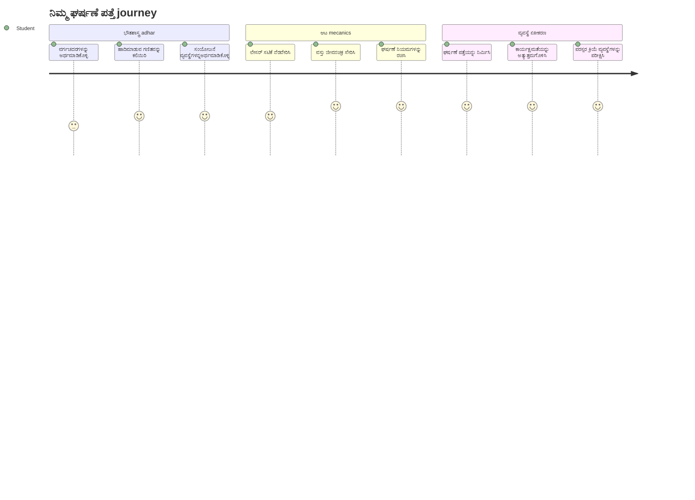
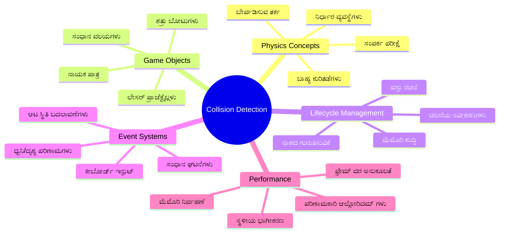
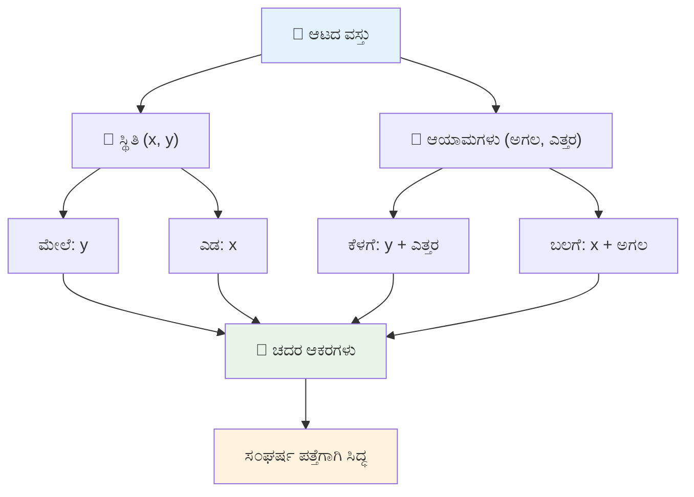
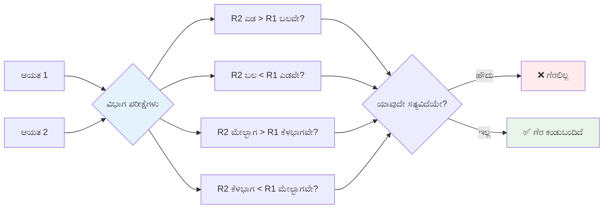
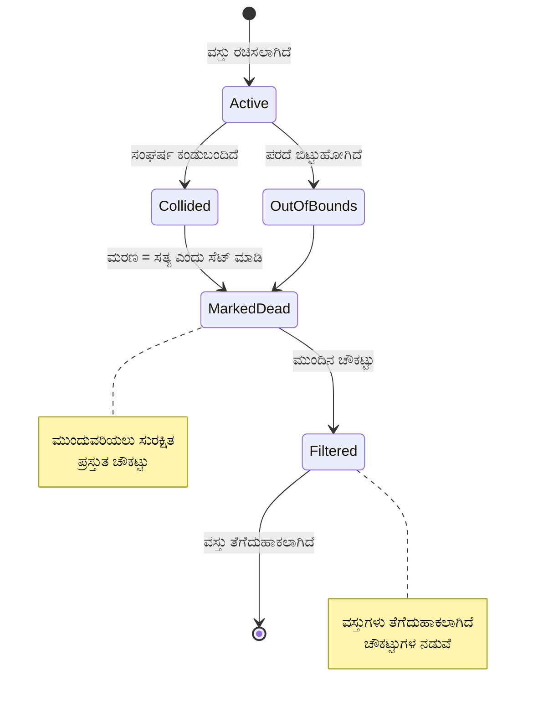
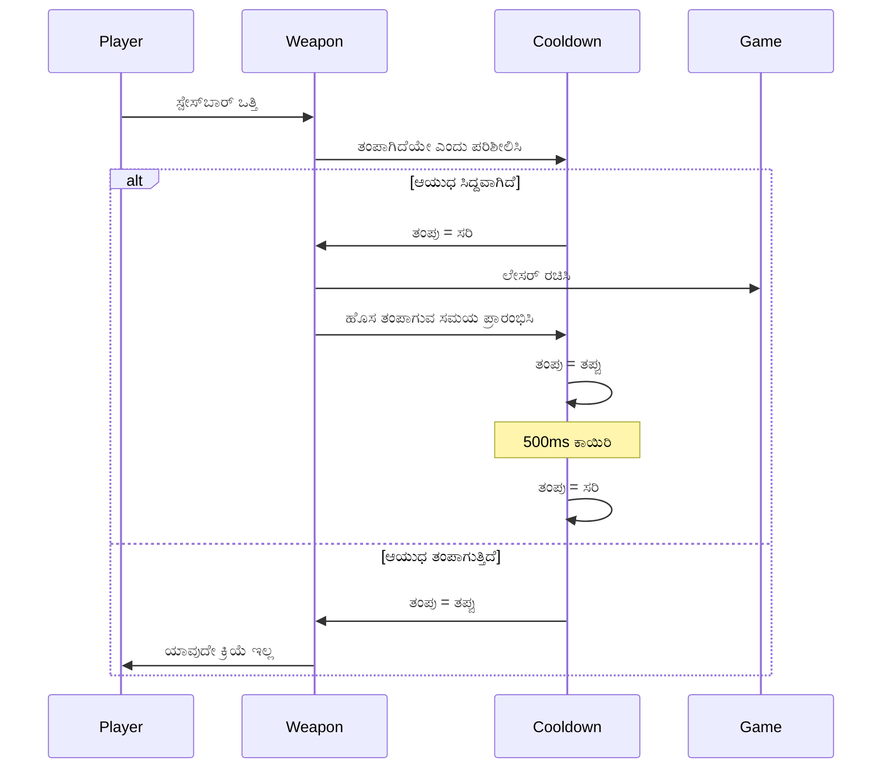
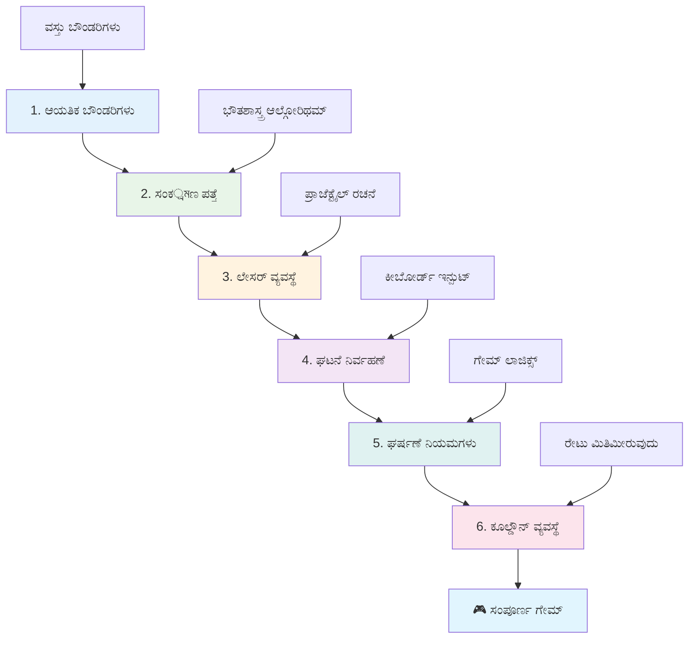
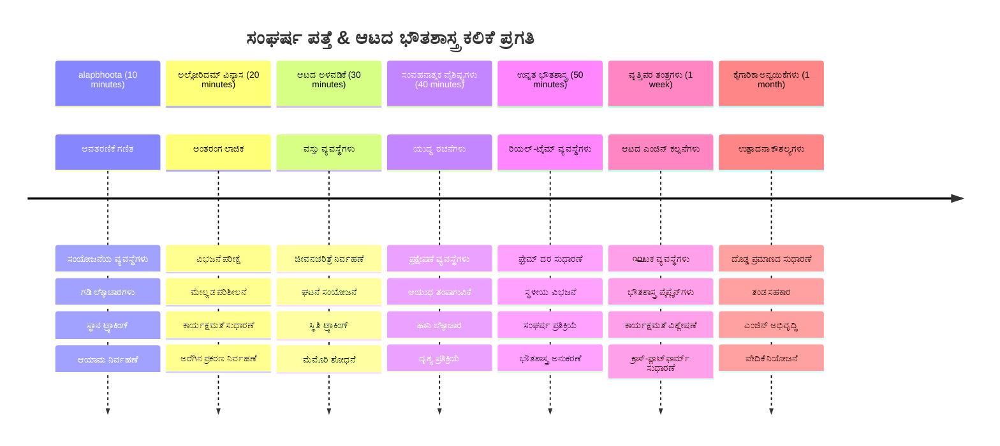

<!--
CO_OP_TRANSLATOR_METADATA:
{
  "original_hash": "039b4d8ce65f5edd82cf48d9c3e6728c",
  "translation_date": "2026-01-08T13:32:58+00:00",
  "source_file": "6-space-game/4-collision-detection/README.md",
  "language_code": "kn"
}
-->
# ಸ್ಪೇಸ್ ಗೇಮ್ ಭಾಗ 4: ಲೇಸರ್ ಸೇರಿಸುವುದು ಮತ್ತು ಘರ್ಷಣೆಗಳನ್ನು ಪತ್ತೆಮಾಡುವುದು


## ಪೂರ್ವ-ಲೇಕ್ಚರ್ ಕ್ವಿಜ್

[ಪೂರ್ವ-ಲೇಕ್ಚರ್ ಕ್ವಿಜ್](https://ff-quizzes.netlify.app/web/quiz/35)

ಸ್ಟಾರ್ ವಾರ್ಸ್‌ನಲ್ಲಿ ಲ್ಯೂಕ್ ನ ಪ್ರೋಟಾನ್ ಟಾರ್ಪಿಡೊಗಳು ಡೆತ್ ಸ್ಟಾರ್‌ನ ಎಕ್ಸಹಾಸ್ಟ್ ಪೋರ್ಟ್‌ಗೆ ಹೊಡೆದ ಕ್ಷಣವನ್ನು ಬಿಚ್ಚು. ಆ ನಿಖರ ಘರ್ಷಣೆ ಪತ್ತೆ ಗ್ಯಾಲಕ್ಸಿಯ ವಿಧಿಯನ್ನು ಬದಲಾಯಿಸಿತು! ಆಟಗಳಲ್ಲಿ, ಘರ್ಷಣೆ ಪತ್ತೆ ಕಾರ್ಯದರ್ಶಿಯಂತೆ - ಇದು ಒಬ್ಬ ಅಂಶಗಳು ಎప్పుడు ಪರಸ್ಪರ ಸಂವಹಿಸುತ್ತವೆ ಮತ್ತು ತಕ್ಷಣ ಏನಾಗುತ್ತದೆ ಎಂದು ನಿರ್ಧರಿಸುತ್ತದೆ.

ಈ ಪಾಠದಲ್ಲಿ, ನೀವು ನಿಮ್ಮ ಸ್ಪೇಸ್ ಗೇಮಿಗೆ ಲೇಸರ್ ಆಯುಧಗಳನ್ನು ಸೇರಿಸಿ ಘರ್ಷಣೆ ಪತ್ತೆಗಳನ್ನು ಅನುಷ್ಠಾನಗೊಳಿಸುವಿರಿ. ನಾಸಾದ ಮಿಷನ್ ಯೋಜಕರು ಹಾಳಿರುವ ಅವಶೇಷಗಳನ್ನು ತಪ್ಪಿಸಲು ಬಾಹ್ಯಾಕಾಶಯಾನಿಗಳ ಮಾರ್ಗ ಗಳನ್ನು ಲೆಕ್ಕಹಾಕುವ ಹಾಗೆಯೇ, ನೀವು ಆಟದ ಅಂಶಗಳು ಎప్పుడు ಪರಸ್ಪರ ಮುಟ್ಟುತ್ತವೆ ಎಂದು ಕಂಡುಹಿಡಿಯುವುದು ಕಲಿಯುತ್ತೀರಿ. ನಾವು ಇದನ್ನು ಇತರ ವಿಷಯಗಳ ಮೇಲೆ ಕെട്ടಿಕೊಂಡು ಸರಳ ಹಂತಗಳಲ್ಲಿ ವಿಭಾಗಿಸುವೆವು.

ಕೊನೆಯಲ್ಲಿ, ನಿಮ್ಮ ಬಳಿ ಕಾರ್ಯನಿರ್ವಹಿಸುವ ಹೋರಾಟ ವ್ಯವಸ್ಥೆಯಿದ್ದು ಲೇಸರ್ ಗಳು ಶತ್ರುಗಳನ್ನು ನಾಶಮಾಡುತ್ತವೆ ಮತ್ತು ಘರ್ಷಣೆಗಳು ಆಟದ ಸಂದರ್ಭಗಳನ್ನು ಪ್ರೇರೇಪಿಸುತ್ತವೆ. ಇವು ಫಿಜಿಕ್ಸ್ ಸಿಮ್ಯುಲೇಷನಿನಿಂದ ಇಂಟೆರ್ಯಾಕ್ಟಿವ್ ವೆಬ್ ಇಂಟರ್ಫೇಸ್ಗಳವರೆಗೆ ಎಲ್ಲಲ್ಲಿ ಬಳಸಲ್ಪಡುವ ಸೂತ್ರಗಳಾಗಿವೆ.


✅ ಪ್ರಥಮವಾಗಿ ಬರೆಯಲಾದ ಕಂಪ್ಯೂಟರ್ ಆಟದ ಬಗ್ಗೆ ಸ್ವಲ್ಪ ಅಧ್ಯಯನ ಮಾಡಿ. ಅದರ ಕಾರ್ಯಕ್ಷಮತೆ ಏನು?

## ಘರ್ಷಣೆ ಪತ್ತೆ

ಘರ್ಷಣೆ ಪತ್ತೆ ಅಪೊಲೋ ಲೂನರ್ ಮೋಡ್ಯೂಲ್‌ನ ಸಮೀಪತಾ ಸೆನ್ಸಾರ್ಗಳಂತೆ ಕೆಲಸ ಮಾಡುತ್ತದೆ - ಅದು მუდმಾಗಿ ದೂರಗಳನ್ನು ಪರಿಶೀಲಿಸಿ ಅಂಶಗಳು ತುಂಡುಗಳಾಗಿರುವಾಗ ಎಚ್ಚರಿಕೆ ನೀಡುತ್ತದೆ. ಆಟಗಳಲ್ಲಿ, ಈ ವ್ಯವಸ್ಥೆ ಅಂಶಗಳು ಪರಸ್ಪರ ಸಂವಹಿಸುವ ಸಮಯ ಮತ್ತು ನಂತರ ಏನಾಗಬೇಕು ಎಂಬುದನ್ನು ನಿರ್ಧರಿಸುತ್ತದೆ.

ನಾವು ಬಳಸುವ ವಿಧಾನವು ಪ್ರತಿಯೊಂದು ಆಟದ ಅಂಶವನ್ನುAy ಎರಡು ಹಕ್ಕಲುಗಳಾಗಿ ಪರಿಗಣಿಸುತ್ತದೆ, ವಿಮಾನ ಸಂಚಾರ ನಿಯಂತ್ರಣ ವ್ಯವಸ್ಥೆಗಳು ವಿಮಾನಗಳನ್ನು ಅನುಸರಿಸಲು ಸರಳ ಜ್ಯಾಮಿತಿ ಆಕಾರಗಳನ್ನು ಬಳಸುವ ಹಾಗೆ. ಈ ಚೌಕ ಆಧಾರಿತ ವಿಧಾನ ಸರಳವಾಗಿದೆ ಅನ್ನಿಸಬಹುದು, ಆದರೆ ಇದು ಗಣನಾತ್ಮಕವಾಗಿ ಪರಿಣಾಮಕಾರಿಯಾಗಿದೆ ಮತ್ತು ಹೆಚ್ಚಿನ ಆಟದ ಪರಿಸ್ಥಿತಿಗಳಿಗೆ ಸೂಕ್ತವಾಗಿದೆ.

### ಚೌಕಾಕೃತಿಯ ಪ್ರತಿನಿಧಿತ್ವ

ಪ್ರತೀ ಆಟದ ಅಂಶಕ್ಕೆ ನಿರ್ದಿಷ್ಟ ಅಂಚುಗಳ ಸಂಕೇತಗಳ ಅಗತ್ಯವಿದೆ, ಮಾರ್ಸ್ ಪಾತ್ಫೈನ್ಡರ್ ರೋವರ್ ತನ್ನ ನಕ್ಷೆ ಸಂಗ್ರಹಿಸುವ ಹಾದಿಯ ಹಾದಿಯನ್ನು ಹೇಗೆ ನಕ್ಷೆ ಹಾಕಿತು ಅಂತೆಯೇ. ಇಲ್ಲಿ ನಾವು ಈ ಅಂಚುಗಳ ಸಂಕೇತಗಳ ವಿವರ ನೀಡುತ್ತೇವೆ:


```javascript
rectFromGameObject() {
  return {
    top: this.y,
    left: this.x,
    bottom: this.y + this.height,
    right: this.x + this.width
  }
}
```

**ಇದನ್ನು ವಿವರಿಸುತ್ತೇವೆ:**
- **ಮೇಲ್ಭಾಗದ ಅಂಚು**: ನೀವು ಅಂಶವನ್ನು ತಳ್ಳಿಸುವ ಸ್ಥಳ (ಅದರ y ಸ್ಥಾನ)
- **ಎಡಭಾಗದ ಅಂಚು**: ಅದನ್ನು ಹೊಡಿದುಕೊಳ್ಳುವ ಸ್ಥಳ (ಅದರ x ಸ್ಥಾನ)
- **ಕೆಳಭಾಗದ ಅಂಚು**: y ಸ್ಥಾನದ ಮೇಲೆ ಎತ್ತರವನ್ನು ಸೇರಿಸಿ - ಅದು ಎಲ್ಲಿಗೆ ಮುಕ್ತಾಯವಾಗುತ್ತದೆ ತಿಳಿದುಕೊಳ್ಳಿ!
- **ಬಲಭಾಗದ ಅಂಚು**: x ಸ್ಥಾನದ ಮೇಲೆ ಅಗಲವನ್ನು ಸೇರಿಸಿ - ಸಂಪೂರ್ಣ ಅಂಚು ಸಿಗುತ್ತದೆ

### ಮುಟ್ಟಿಕೆ ಪರೀಕ್ಷೆ ಅಲ್ಗೊರಿದಮ್

ಚೌಕಗಳು ಪರಸ್ಪರ ಮುಟ್ಟಿದೆಯೇ ಎಂದು ಪತ್ತೆಮಾಡುವುದು ಹಬಲ್ ಸ್ಪೇಸ್ ಟೆಲಿಸ್ಕೋಪ್ ತನ್ನ ದೃಶ್ಯ ಕ್ಷೇತ್ರದಲ್ಲಿ ಖಗೋಳೀಯ ಅಂಶಗಳು ಮುಟ್ಟುತ್ತವೆಯೇ ಎಂದು ತಿಳಿದುಕೊಳ್ಳುವ ವಿಧಾನದಂತಹ ನಿಯಮವನ್ನು ಬಳಸುತ್ತದೆ. ಅಲ್ಗೊರಿದಮ್ ವಿಭಜನೆಗಳನ್ನು ಪರಿಶೀಲಿಸುತ್ತದೆ:


```javascript
function intersectRect(r1, r2) {
  return !(r2.left > r1.right ||
    r2.right < r1.left ||
    r2.top > r1.bottom ||
    r2.bottom < r1.top);
}
```

**ವಿಭಜನೆ ಪರೀಕ್ಷೆ ರಡಾರ್ ವ್ಯವಸ್ಥೆಗಳಂತೆ ಕಾರ್ಯನಿರ್ವಹಿಸುತ್ತದೆ:**
- ಚೌಕ 2 ಸಂಪೂರ್ಣವಾಗಿ ಚೌಕ 1 ಯ ದಕ್ಷಿಣಕ್ಕೆ ಇದೆಯೇ?
- ಚೌಕ 2 ಸಂಪೂರ್ಣವಾಗಿ ಚೌಕ 1 ಯ ಬಲಕ್ಕೆ ಇದೆಯೇ?
- ಚೌಕ 2 ಸಂಪೂರ್ಣವಾಗಿ ಚೌಕ 1 ಯ ಮೇಲ್ಭಾಗದಲ್ಲಿ ಇದೆಯೇ?
- ಚೌಕ 2 ಸಂಪೂರ್ಣವಾಗಿ ಚೌಕ 1 ಯ ಕೆಳಭಾಗದಲ್ಲಿ ಇದೆಯೇ?

ಈ ಯಾವ ಶರತ್ತುಗಳೂ ಅಳ್ಳಿಸದಿದ್ದರೆ, ಚೌಕಗಳು ಒಟ್ಟಿಗೆ ಮುಟ್ಟಿರಬೇಕು ಎಂದು ಅರ್ಥ. ಈ ವಿಧಾನ ಎರಡು ವಿಮಾನಗಳು ಸುರಕ್ಷಿತ ದೂರದಲ್ಲಿರುವುದನ್ನು ರಡಾರ್ ನಿಯಂತ್ರಕರು ಹೇಗೆ ಅರಿಯುತ್ತಾರೆ ಅಂತಹಂತೆಯೇ.

## ಅಂಶಗಳ ಜೀವಚಕ್ರ ನಿರ್ವಹಣೆ

ಲೇಸರ್ ಶತ್ರುವನ್ನು ಹೊಡೆದಾಗ, ಎರಡು ಅಂಶಗಳನ್ನೂ ಆಟದಿಂದ ತೆಗೆದುಹಾಕಬೇಕಾಗುತ್ತದೆ. ಹೀಗಾಗಿಯೇ, ಮಧ್ಯ.loop(delete) ಮಾಡುವಾಗ ಆಪತ್ತು ಉಂಟಾಗಬಹುದು - ಇದನ್ನು ಅಪೊಲೋ ಗೈಡೆನ್ಸ್ ಕಂಪ್ಯೂಟರ್ ಮೊದಲಿನ ಗಣಕಗಳಲ್ಲಿ ಕಠಿಣ ಪಾಠವಾಗಿ ಕಲಿತವು. ಬದಲು, ನಾವು "ಅಳಿಸುವ ಗುರುತು" ವಿಧಾನವನ್ನು ಬಳಸುತ್ತೇವೆ, ಇದು ಫ್ರೇಮ್‌ಗಳ ನಡುವೆ ಸುರಕ್ಷಿತವಾಗಿ ಅಂಶಗಳನ್ನು ತೆಗೆದುಹಾಕುತ್ತದೆ.


ನಾವು ಅಳಿಸುವುದಕ್ಕೆ ಗುರುತಿಸುವ ವಿಧಾನ ಇಲ್ಲಿದೆ:

```javascript
// ಅಂಶವನ್ನು ತೆಗೆದುಹಾಕಲು ಸೂಚಿಸಿ
enemy.dead = true;
```

**ಈ ವಿಧಾನ ಏಕೆ ಕಾರ್ಯನಿರ್ವಹಿಸುತ್ತದೆ:**
- ನಾವು ಅಂಶವನ್ನು "ಸತ್ತುಹೋಯಿತು" ಎನ್ನುತ್ತೇವೆ ಆದರೆ ತಕ್ಷಣ ಅಳಿಸುವುದಿಲ್ಲ
- ಇದರಿಂದ ಪ್ರಸ್ತುತ ಗೇಮ್ ಫ್ರೇಮ್‌ ಸುರಕ್ಷಿತವಾಗಿ ಮುಗಿಯುತ್ತದೆ
- ಬಿಟ್ಟುಹೋಗಿದ್ದುದನ್ನು ಬಳಸಲು ಯತ್ನಿಸಿದಾಗ ಆಗುವ ಅಪಾಯಗಳು ಇಲ್ಲ!

ನಂತರ ಮಾರ್ಕ್ ಮಾಡಲಾದ ಅಂಶಗಳನ್ನು ಮುಂದೆ ರೆಂಡರ್‍ಗೆ ಮುಂಚೆ ಫಿಲ್ಟರ್ ಮಾಡಲು:

```javascript
gameObjects = gameObjects.filter(go => !go.dead);
```

**ಈ ಫಿಲ್ಟರಿಂಗ್ ಏನು ಮಾಡುತ್ತದೆ:**
- "ಬಳಿ ಜೀವಂತ" ಅಂಶಗಳಲ್ಲಿ ಮಾತ್ರ ಹೊಸ ಪಟ್ಟಿ ರಚಿಸುತ್ತದೆ
- ಸತ್ತ ಗುರುತಿಸಲಾದ ಅಂಶಗಳನ್ನು ಬ ಹೊರ ಹಾಕುತ್ತದೆ
- ನಿಮ್ಮ ಆಟವನ್ನು ಹೊಂದಿಕೊಳ್ಳುವಂತೆಯೂ ಸೌಕರ್ಯವನ್ನೂ ಒದಗಿಸುತ್ತದೆ
- ಪರಿಸ್ಥಿತಿಯಲ್ಲಿ ನಾಶವಾದ ಅಂಶಗಳ ಸಂಗ್ರಹದಿಂದ ಮೆಮೊರಿ ಬಿಲ್ಲು ಕಡಿಮೆ ಮಾಡುತ್ತದೆ

## ಲೇಸರ್ ಮೆಕ್ಯಾನಿಕ್ಸ್ ಅನುಷ್ಠಾನ

ಲೇಸರ್ ಪ್ರೊಜೆಕ್ಟೈಲ್ ಗಳು ಆಟಗಳಲ್ಲಿ ಸ್ಟಾರ್ ಟ್ರೆಕ್‌ನ ಫೋಟಾನ್ ಟಾರ್ಪಿಡೊಗಳ ಹಾಗೆಯೇ ಕಾರ್ಯನಿರ್ವಹಿಸುತ್ತವೆ - ಸ್ವತಂತ್ರ ವಸ್ತುಗಳು ನೇರ ಮಾರ್ಗದಲ್ಲಿ ಪ್ರಯಾಣ ಮಾಡಿ ಯಾವುದಾದರೂ ಹೊಡೆದಾಗ ನಿಗದಿತ ಪರಿಣಾಮ ಹೊಂದುತ್ತವೆ. ಪ್ರತಿ ಸ್ಪೇಸ್ ಬಾರ್ ಒತ್ತುವಿಕೆ ಹೊಸ ಲೇಸರ್ ವಸ್ತುವನ್ನು ಸೃಷ್ಟಿಸಿ ಪರದೆ ಮೇಲೆ ಸಾಗುತ್ತದೆ.

ಈ ಕಾರ್ಯಕ್ಕೆ, ನಾವು ವಿವಿಧ ಭಾಗಗಳನ್ನು ಸಮನ್ವಯ ಮಾಡಬೇಕಾಗುತ್ತದೆ:

**ಮುಖ್ಯ ಅಂಶಗಳು:**
- **ಲೇಸರ್ ವಸ್ತುಗಳನ್ನು ಸೃಷ್ಟಿಸುವುದು** ಹೀರೋನ ಸ್ಥಾನದಿಂದ ಹೊರಹೊಮ್ಮುವಂತೆ
- **ಕೀಬೋರ್ಡ್ ಇನ್‌ಪುಟ್ ನಿರ್ವಹಣೆ** ಲೇಸರ್ ಸೃಷ್ಟಿಗೆ
- **ಲೇಸರ್ ಚಲನೆ ಮತ್ತು ಜೀವಚಕ್ರ ನಿರ್ವಹಣೆ**
- **ಲೇಸರ್ ಪ್ರೊಜೆಕ್ಟೈಲುಗಳ ದೃಶ್ಯಾತ್ಮಕ ಪ್ರತಿನಿಧಾನ ಪೂರೈಸು**

## ಫೈರಿಂಗ್ ದರ ನಿಯಂತ್ರಣ ಅನುಷ್ಠಾನ

ಅನಿಯಂತ್ರಿತ ಸ್ಪಂದನಗಳೇ ಆಟದ ಎಂಜಿನ್ ಅನ್ನು ಹಾರಾಯಿಸಿಬಿಡುತ್ತಿತ್ತು ಮತ್ತು ಆಟ ಸುಲಭವಾಗುತ್ತಿದ್ದಿತ್ತು. ನಿಜವಾದ ಆಯುಧ ವ್ಯವಸ್ಥೆಗಳಿಗೂ ಹೋಲುವ ನಿಯಂತ್ರಣಗಳು ಇರುತ್ತವೆ - USS ಎಂಟರ್‌ಪ್ರೈಸ್ನ್ ಫೇಜರ್ಸ್‌ಗೂ ಬ್ಯಾಟ್ ರೀಚಾರ್ಜ್ ಸಮಯ ಬೇಕಾಗಿತ್ತು.

ನಾವು ಪ್ರತ್ಯುತ್ತರದಾಗುವ ನಿಯಂತ್ರಣ ವ್ಯವಸ್ಥೆಯನ್ನು ಅನುಷ್ಠಾನಗೊಳಿಸುತ್ತೇವೆ, ಇದು ವೇಗವಾಗಿ ಬಂಧಿಸುವುದನ್ನು ತಡೆಯುತ್ತದೆ ಮತ್ತು ನಿಯಂತ್ರಣವನ್ನು ಪ್ರತಿಕ್ರಿಯಾಶೀಲವಾಗಿರಿಸುತ್ತದೆ:


```javascript
class Cooldown {
  constructor(time) {
    this.cool = false;
    setTimeout(() => {
      this.cool = true;
    }, time);
  }
}

class Weapon {
  constructor() {
    this.cooldown = null;
  }
  
  fire() {
    if (!this.cooldown || this.cooldown.cool) {
      // ಲೇಸರ್ ಪ್ರಕ್ಷೇಪಣಿಕೆ ರಚಿಸಿ
      this.cooldown = new Cooldown(500);
    } else {
      // ಶಸ್ತ್ರಾಸ್ತ್ರ ಇನ್ನೂ ಶೀತಲವಾಗುತ್ತಿದೆ
    }
  }
}
```

**ಕೂಲ್ಡೌನ್ ಹೇಗೆ ಕಾರ್ಯನಿರ್ವಹಿಸುತ್ತದೆ:**
- ಸೃಷ್ಟಿಸಿದಾಗ, ಆಯುಧ "ಹಾಟ್" ಆಗಿರುತ್ತದೆ (ಇನ್ನೂ ಬೆಂಕಿ ಹೊಡೆಯಲು ಸಾಧ್ಯವಿಲ್ಲ)
- ಕಾಲಾವಧಿ ನಂತರ, ಇದು "ಕೂಲ್" ಆಗಿ ಫೈರ್ ಮಾಡಲು ಸಿದ್ಧವಾಗುತ್ತದೆ
- ಫೈರ್ ಮಾಡುವ ಮೊದಲು, ನಾವು "ಆಯುಧ ಕೂಲ್ ಆಗಿದೆಯೇ?" ಎನ್ನುತ್ತೇವೆ
- ಇದು ಸ್ಪ್ಯಾಮ್ ಕ್ಲಿಕ್ಕಿಂಗ್ ತಡೆಯುತ್ತದೆ ಮತ್ತು ನಿಯಂತ್ರಣವನ್ನು ಪ್ರತಿಕ್ರಿಯಾಶೀಲವಾಗಿರಿಸುತ್ತದೆ

✅ ಸ್ಪೇಸ್ ಗೇಮ್ ಸರಣಿಯ ಪಾಠ 1ಕ್ಕೆ ಈ ಕುಲ್ಡ್‌ಆನ್‌ಗಳು ಕುರಿತು ನೆನಪಿಕೊಳ್ಳಿ.

## ಘರ್ಷಣೆ ವ್ಯವಸ್ಥೆ ನಿರ್ಮಾಣ

ನೀವು ಈಗಿರುವ ಸ್ಪೇಸ್ ಗೇಮ್ ಕೋಡ್ ಅನ್ನು ವಿಸ್ತರಿಸಿ ಘರ್ಷಣೆ ಪತ್ತೆ ವ್ಯವಸ್ಥೆಯನ್ನು ಸೃಷ್ಟಿಸುವಿರಿ. ಅಂತಾರಾಷ್ಟ್ರೀಯ ಬಾಹ್ಯಾಕಾಶ ಸ್ಟೇಷನ್‌ನ ಸ್ವಯಂಚಾಲಿತ ಘರ್ಷಣೆ ತಪ್ಪಿಸುವ ವ್ಯವಸ್ಥೆಯಂತೆ, ನಿಮ್ಮ ಆಟವು ನಿರಂತರವಾಗಿ ಅಂಶಗಳ ಸ್ಥಾನಗಳನ್ನು ವೀಕ್ಷಿಸಿ ಪರಸ್ಪರ ಮುಟ್ಟಿಸುವಾಗ ಪ್ರತಿಕ್ರಿಯಿಸುತ್ತದೆ.

ಮತ್ತೆ ನಿಮ್ಮ ಹಿಂದೆ ಇರುವ ಪಾಠ ಕೋಡ್‌ರಿಂದ ಪ್ರಾರಂಭಿಸಿ, ನಿಗದಿತ ನಿಯಮಗಳೊಂದಿಗೆ ಘರ್ಷಣೆ ಪತ್ತೆಯನ್ನು ಸೇರಿಸುವಿರಿ.

> 💡 **ಪ್ರೊ ಟಿಪ್**: ಲೇಸರ್ ಸ್ಪ್ರೈಟ್ ಈಗಾಗಲೇ ನಿಮ್ಮ ಆಸ್ತಿ ಸಂಪಂಬದಲ್ಲಿದ್ದು ನಿಮ್ಮ ಕೋಡಿನಲ್ಲಿ ಉಲ್ಲೇಖಿಸಲಾಗಿದೆ, ಅನುಷ್ಠಾನಕ್ಕೆ ಸಿದ್ಧವಾಗಿದೆ.

### ಅನುಷ್ಠಾನಗೊಳಿಸಬೇಕಾದ ಘರ್ಷಣೆ ನಿಯಮಗಳು

**ಆಟದ ಯಾಂತ್ರಿಕತೆಗಳು ಸೇರಿಸಲು:**
1. **ಲೇಸರ್ ಶತ್ರुलाई ಹೊಡೆದು ಹಾಳುಮಾಡುವುದು**: ಲೇಸರ್ ಪ್ರಾಜೆಕ್ಟೈಲ್ ಹೊಡೆಯುವಾಗ ಶತ್ರು ವಸ್ತು ನಾಶವಾಗುತ್ತದೆ
2. **ಲೇಸರ್ ಪರದೆ ಅಂಚಿಗೆ ತಲುಪಿದಾಗ**: ಲೇಸರ್ ಪರದೆ ಮೇಲ್ಭಾಗದ ಅಂಚು ತಲುಪಿದಾಗ ತೆಗೆದುಹಾಕಲಾಗುತ್ತದೆ
3. **ಶತ್ರು ಮತ್ತು ಹೀರೋ ಘರ್ಷಣೆ**: ಶುಲ್ಕವಾಗಿ ಇಬ್ಬರೂ ವಸ್ತುಗಳು ನಾಶವಾಗುತ್ತವೆ
4. **ಶತ್ರು ಕೆಳಭಾಗ ತಲುಪಿದಾಗ**: ಶತ್ರುಗಳು ಪರದೆ ಕೆಳಭಾಗ ತಲುಪಿದಾಗ ಆಟ ಮುಗಿಯುತ್ತದೆ

### 🔄 **ಶೈಕ್ಷಣಿಕ ಪರಿಶೀಲನೆ**
**ಘರ್ಷಣೆ ಪತ್ತೆ ಆಧಾರ:** ಅನುಷ್ಠಾನ ಮಾಡುವ ಮೊದಲು ಖಚಿತಪಡಿಸಿಕೊಳ್ಳಿ:
- ✅ ಚೌಕ ಅಂಚುಗಳು ಘರ್ಷಣೆ ಪ್ರಾಂತಗಳನ್ನು ಹೇಗೆ ವ್ಯಾಖ್ಯಾನಿಸುತ್ತವೆ
- ✅ ವಿಭಜನೆ ಪರೀಕ್ಷೆ Intersection ಲೆಕ್ಕಾಚರಣೆಗಿಂತ ಏಕೆ ಪರಿಣಾಮಕಾರಿಯಾಗಿದೆ
- ✅ ಆಟದ ಲೂಪ್ನಲ್ಲಿ ಅಂಶಗಳ ಜೀವಚಕ್ರ ನಿರ್ವಹಣೆಯ ಪ್ರಾಮುಖ್ಯತೆಯನ್ನು
- ✅ ಘಟನೆ ಚಾಲಿತ ವ್ಯವಸ್ಥೆಗಳು ಘರ್ಷಣೆ ಪ್ರತಿಕ್ರಿಯೆಗಳನ್ನು ಹೇಗೆ ಸಂಯೋಜಿಸುತ್ತವೆ

**ತ್ವರಿತ ಸ್ವ-ಪರೀಕ್ಷೆ:** ನೀವು ತಕ್ಷಣ ಅಂಶಗಳನ್ನು ಅಳಿಸಿದರೆ ಏನಾಗುತ್ತದೆ?
*ಉತ್ತರ: ಮಧ್ಯದಲ್ಲಿ ಅಳಿಸುವುದರಿಂದ ಆಪತ್ತಾಗಬಹುದು ಅಥವಾ ಪುನರಾವರ್ತನೆ ಲೋಪವಾಗಬಹುದು*

**ಭೌತಶಾಸ್ತ್ರ ಅರಿವು:** ನೀವು ಈಗ ಅರ್ಥಮಾಡಿಕೊಂಡಿದ್ದು:
- **ಕೋಆರ್ಡಿನೇಟ್ ವ್ಯವಸ್ಥೆಗಳು**: ಸ್ಥಾನ ಮತ್ತು ಆಯಾಮಗಳು ಅಂಚುಗಳನ್ನು ಸೃಷ್ಟಿಸುವುದು
- **ಘರ್ಷಣೆ ಲಾಜಿಕ್**: ಘರ್ಷಣೆ ಪತ್ತೆ ಹಿಂಬಾಲಿಸುವ ಗಣಿತೀಯ ಸಿದ್ಧಾಂತಗಳು
- **ಕಾರ್ಯಕ್ಷಮತೆ ಏರಿಸಲು**: ಸಮಯ ಪ್ರಾಯೋಗಿಕ ವ್ಯವಸ್ಥೆಗಳಲ್ಲಿ ಪರಿಣಾಮಕಾರಿ ಅಲ್ಗೊರಿದಮ್ಗಳು ಏಕೆ ಮುಖ್ಯ
- **ಮೆಮೊರಿ ನಿರ್ವಹಣೆ**: ಸ್ಥಿರತೆಗಾಗಿ ಸುರಕ್ಷಿತ ಅಂಶದ ಜೀವಚಕ್ರ ಮಾದರಿಗಳು

## ನಿಮ್ಮ ಅಭಿವೃದ್ಧಿ ಪರಿಸರವನ್ನು ಸ್ಥಾಪಿಸುವುದು

ಸರಿಯಾದ ಸುದ್ದಿ - ನಾವು ಬಹುತೇಕ ನೆಲೆಗೊಳಿಸುವ ಅವಕಾಶಗಳನ್ನು ನಿಮಗಾಗಿ ಹಿಂದೆಯೇ ಮಾಡಿದ್ದೇವೆ! ನಿಮ್ಮ ಎಲ್ಲ ಆಟದ ಸಂಪದ್ರೆಗಗಳು ಮತ್ತು ಮೂಲ ರಚನೆ `your-work` ಉಪಫೋಲ್ಡರ್‌ನಲ್ಲಿ ಇದೆ, ನೀವು ಆಢಂಬರಗಳ ಘರ್ಷಣೆ ವೈಶಿಷ್ಟ್ಯಗಳನ್ನು ಸೇರಿಸಲು ಸಿದ್ದವಾಗಿದ್ದೀರಿ.

### ಯೋಜನೆ ರಚನೆ

```bash
-| assets
  -| enemyShip.png
  -| player.png
  -| laserRed.png
-| index.html
-| app.js
-| package.json
```

**ಫೈಲ್ ರಚನೆಯ ವಿವರ:**
- **ಆಟದ ಎಲ್ಲಾ ಸ್ಪ್ರೈಟ್ ಚಿತ್ರಗಳನ್ನು ಹೊಂದಿದೆ**
- **ಮುಖ್ಯ HTML ಡಾಕ್ಯುಮೆಂಟ್ ಮತ್ತು ಜಾವಾಸ್ಕ್ರಿಪ್ಟ್ ಅಪ್ಲಿಕೇಶನ್ ಫೈಲ್ ಅನ್ನು ಒಳಗೊಂಡಿದೆ**
- **ಸ್ಥಳಿತ ಅಭಿವೃದ್ಧಿ ಸರ್ವರ್ ಅವರ ಪ್ಯಾಕೇಜ್ ಸಂರಚನೆ ನೀಡುತ್ತದೆ**

### ಅಭಿವೃದ್ಧಿ ಸರ್ವರ್ ಆರಂಬಿಸುವುದು

ನಿಮ್ಮ ಯೋಜನೆ ಫೋಲ್ಡರ್‌ಗೆ ಹೋಗಿ ಸ್ಥಳೀಯ ಸರ್ವರ್ ಆರಂಭಿಸಿ:

```bash
cd your-work
npm start
```

**ಈ ಆಜ್ಞೆ ಸರಣಿ:**
- **ನಿಮ್ಮ ಕಾರ್ಯಾಚರಣಾ ಯೋಜನೆ ಫೋಲ್ಡರ್‌ಗೆ ಡೈರೆಕ್ಟರಿ ಬದಲಾಯಿಸುತ್ತದೆ**
- **`http://localhost:5000` ನಲ್ಲಿ ಸ್ಥಳೀಯ HTTP ಸರ್ವರ್ ಆರಂಭಿಸುತ್ತದೆ**
- **ಪರೀಕ್ಷೆ ಮತ್ತು ಅಭಿವೃದ್ಧಿಗೆ ನಿಮ್ಮ ಆಟದ ಫೈಲ್‌ಗಳನ್ನು ಸೇರಿಸುತ್ತದೆ**
- **ಸ್ವಯಂಚಾಲಿತ ಪುನಃಲೋಡ್ ಮೂಲಕ ಜೀವಂತ ಅಭಿವೃದ್ಧಿಗೆ ಅನುಮತಿಸುತ್ತದೆ**

ನಿಮ್ಮ ಬ್ರೌಸರ್ ತೆರೆಯಿರಿ ಮತ್ತು `http://localhost:5000`ಗೆ ಹೋಗಿ ನಿಮ್ಮ ಪ್ರಸ್ತುತ ಆಟದ ಸ್ಥಿತಿಯನ್ನು ಹೀರೋ ಮತ್ತು ಶತ್ರುಗಳೊಂದಿಗೆ ಪರದೆ ಮೇಲೆ ನೋಡಿ.

### ಹಂತದ ಹಂತದ ಅನುಷ್ಠಾನ

ನಾಸಾ ವಾಯೇಜರ್ ಬಾಹ್ಯಾಕಾಶಯಾನಿಯನ್ನು ಪ್ರೋಗ್ರಾಂ ಮಾಡಿದ್ದಂತೆ ಕ್ರಮಬದ್ಧವಾಗಿ ಘರ್ಷಣೆ ಪತ್ತೆ ಅನ್ನು ಅನುಷ್ಠಾನ ಮಾಡೋಣ.


#### 1. ಚೌಕದ ಘರ್ಷಣೆ ಅಂಚುಗಳನ್ನು ಸೇರಿಸಿ

ಮೊದಲು, ನಿಮ್ಮ ಆಟದ ಅಂಶಗಳಿಗೆ ತಮ್ಮ ಅಂಚುಗಳನ್ನು ವರ್ಣಿಸುವ ವಿಧಾನ ಕಲಿಸೋಣ. ನಿಮ್ಮ `GameObject` ಕ್ಲಾಸ್‌ಗೆ ಈ ವಿಧಾನವನ್ನು ಸೇರಿಸಿ:

```javascript
rectFromGameObject() {
    return {
      top: this.y,
      left: this.x,
      bottom: this.y + this.height,
      right: this.x + this.width,
    };
  }
```

**ಈ ವಿಧಾನ ಸಾಧಿಸುವುದು:**
- **ನಿಖರ ಅಂಚು ಸಂಕೇತಗಳೊಂದಿಗೆ ಚೌಕಾಕೃತಿಯನ್ನು ಸೃಷ್ಟಿಸುತ್ತದೆ**
- **ಸ್ಥಾನ ಹಾಗೂ ಆಯಾಮಗಳನ್ನು ಬಳಸಿ ಕೆಳಭಾಗ ಮತ್ತು ಬಲಭಾಗಗಳನ್ನು ಲೆಕ್ಕಿಸುತ್ತದೆ**
- **ಘರ್ಷಣೆ ಪತ್ತೆ ಅಲ್ಗೊರಿದಮ್ಗಳಿಗೆ ಸಿದ್ಧವಾದ ವಸ್ತುವನ್ನು ರಿಟರ್ನ್ ಮಾಡುತ್ತದೆ**
- **ಎಲ್ಲಾ ಆಟದ ಅಂಶಗಳಿಗೆ ಸಾಂದರ್ಭಿಕ ಇಂಟರ್ಫೇಸ್ ಒದಗಿಸುತ್ತದೆ**

#### 2. ಮುಟ್ಟಿಕೆ ಪತ್ತೆ ಅನುಷ್ಠಾನ ಮಾಡಿ

ಈಗ, ನಾವು ಎರಡು ಚೌಕಗಳು ಮುಟ್ಟಿದೆಯೇ ಎಂದು ತಿಳಿಸುವ ಫಂಕ್ಷನ್ ಸೃಷ್ಟಿಸೋಣ:

```javascript
function intersectRect(r1, r2) {
  return !(
    r2.left > r1.right ||
    r2.right < r1.left ||
    r2.top > r1.bottom ||
    r2.bottom < r1.top
  );
}
```

**ಈ ಅಲ್ಗೊರಿದಮ್ ಕಾರ್ಯನಿರ್ವಹಿಸುವುದು:**
- **ಚೌಕಗಳ ನಡುವೆ ನಾಲ್ಕು ವಿಭಜನೆ ಪರೀಕ್ಷೆಗಳನ್ನು ನಡೆಸುತ್ತದೆ**
- **ಯಾವುದೇ ವಿಭಜನೆ ಹೌದಾದರೆ `false` ಅನ್ನು ನೀಡುತ್ತದೆ**
- **ಯಾವುದೇ ವಿಭಜನೆ ಸತ್ಯವಲ್ಲದಿದ್ದರೆ ಘರ್ಷಣೆ ಇದ್ದಂತೆ ಸೂಚಿಸುತ್ತದೆ**
- **ಜಂಟಿ ಪರೀಕ್ಷೆಗೆ ನೆಗೇಷನ್ ಲಾಜಿಕ್ ಬಳಸುತ್ತದೆ**

#### 3. ಲೇಸರ್ ಫೈರಿಂಗ್ ವ್ಯವಸ್ಥೆ ಅನುಷ್ಠಾನ

ಇಲ್ಲಿ ರೋಮಾಂಚಕಾರಿ ಭಾಗ ಇದೆ! ಲೇಸರ್ ಫೈರಿಂಗ್ ವ್ಯವಸ್ಥೆಯನ್ನು ಸ್ಥಾಪಿಸೋಣ.

##### ಸಂದೇಶ ಸ್ಥಿರಾಂಕಗಳು

ಮೊದಲು, ನಮ್ಮ ಆಟದ ವಿಭಿನ್ನ ಭಾಗಗಳ ನಡುವೆ ಸಂವಹನ ಮಾಡಲು ಕೆಲವು ಸಂದೇಶ ಪ್ರಕಾರಗಳನ್ನು ವ್ಯಾಖ್ಯಾನಿಸೋಣ:

```javascript
KEY_EVENT_SPACE: "KEY_EVENT_SPACE",
COLLISION_ENEMY_LASER: "COLLISION_ENEMY_LASER",
COLLISION_ENEMY_HERO: "COLLISION_ENEMY_HERO",
```

**ಈ ಸ್ಥಿರಾಂಕಗಳು ಒದಗಿಸುವುದು:**
- **ನಿರಂತರ ಘಟನೆಗಳ ಹೆಸರನ್ನು ಸಾಮರಸ್ಯಗೊಳಿಸುತ್ತದೆ**
- **ಆಟದ ವ್ಯವಸ್ಥೆಗಳ ನಡುವೆ ಸರಾಗ ಸಂವಹನವನ್ನು ಅನುಮತಿಸುತ್ತದೆ**
- **ಘಟನೆಗಳ ನೋಂದಣಿಯಲ್ಲಿ ತಪ್ಪುಗಳನ್ನು ತಪ್ಪಿಸುತ್ತದೆ**

##### ಕೀಬೋರ್ಡ್ ಇನ್‌ಪುಟ್ ನಿರ್ವಹಣೆ

ನಿಮ್ಮ ಕೀ ಇವೆಂಟ್ ಲಿಸ್ನರ್‌ಗೆ ಸ್ಪೇಸ್ ಕೀ ಪತ್ತೆ ಸೇರಿಸಿ:

```javascript
} else if(evt.keyCode === 32) {
  eventEmitter.emit(Messages.KEY_EVENT_SPACE);
}
```

**ಈ ಇನ್‌ಪುಟ್ ನಿರ್ವಹಣೆ:**
- **ಕೀಕೋಡ್ 32 ಬಳಸಿ ಸ್ಪೇಸ್ ಕೀಲಿಯನ್ನು ತೋರಿಸುತ್ತದೆ**
- **ಪ್ರಮಾಣೀಕೃತ ಘಟನೆ ಸಂದೇಶವನ್ನು ಉತ್ಸರ್ಜಿಸುತ್ತದೆ**
- **ಡಿಕಪಲ್ ಫೈರಿಂಗ್ ಲಾಜಿಕ್‌ನ್ನು ಕಾರ್ಯಾನುಷ್ಠಾನಕ್ಕೆ ತರುವಂತೆ ಮಾಡುತ್ತದೆ**

##### ಘಟನೆ ಲಿಸ್ನರ್ ನೋಂದಣಿ

ನಿಮ್ಮ `initGame()` ಫಂಕ್ಷನ್‌ನಲ್ಲಿ ಫೈರಿಂಗ್ ವರ್ತನೆ ನೋಂದಣಿ ಮಾಡಿ:

```javascript
eventEmitter.on(Messages.KEY_EVENT_SPACE, () => {
 if (hero.canFire()) {
   hero.fire();
 }
});
```

**ಈ ಘಟನೆ ಲಿಸ್ನರ್:**
- **ಸ್ಪೇಸ್ ಕೀ ಘಟನೆಗಳಿಗೆ ಪ್ರತಿಕ್ರಿಯಿಸುತ್ತದೆ**
- **ಫೈರಿಂಗ್ ಕೂಲ್ಡ್‌ಆನ್ ಸ್ಥಿತಿಯನ್ನು ಪರಿಶೀಲಿಸುತ್ತದೆ**
- **ಅನುಮತಿತಾಗುವಾಗ ಲೇಸರ್ ಸೃಷ್ಟಿಯನ್ನು ಪ್ರೇರೇಪಿಸುತ್ತದೆ**

ಲೇಸರ್-ಶತ್ರು ಘರ್ಷಣೆ ನಿರ್ವಹಣೆಯನ್ನು ಸೇರಿಸಿ:

```javascript
eventEmitter.on(Messages.COLLISION_ENEMY_LASER, (_, { first, second }) => {
  first.dead = true;
  second.dead = true;
});
```

**ಈ ಘರ್ಷಣೆ ನಿಯಂತ್ರಕ:**
- **ಎರಡು ಅಂಶಗಳ ಜೊತೆಗೆ ಘರ್ಷಣೆ ಘಟನೆ ಮಾಹಿತಿಯನ್ನು ಸ್ವೀಕರಿಸುತ್ತದೆ**
- **ಎರಡೂ ಅಂಶಗಳನ್ನು ಅಳಿಸಲು ಗುರುತಿಸುತ್ತದೆ**
- **ಘರ್ಷಣೆ ನಂತರ ಸರಿಯಾದ ಶುದ್ಧೀಕರಣವನ್ನು ಖಚಿತಪಡಿಸುತ್ತದೆ**

#### 4. ಲೇಸರ್ ಕ್ಲಾಸ್ ರಚಿಸಿ

ಮೇಲಕ್ಕೆ ಚಲಿಸುವ ಮತ್ತು ತನ್ನ ಜೀವಚಕ್ರವನ್ನು ನಿರ್ವಹಿಸುವ ಲೇಸರ್ ಪ್ರೊಜೆಕ್ಟೈಲ್ ಅನ್ನು ಅನುಷ್ಠಾನಗೊಳಿಸಿ:

```javascript
class Laser extends GameObject {
  constructor(x, y) {
    super(x, y);
    this.width = 9;
    this.height = 33;
    this.type = 'Laser';
    this.img = laserImg;
    
    let id = setInterval(() => {
      if (this.y > 0) {
        this.y -= 15;
      } else {
        this.dead = true;
        clearInterval(id);
      }
    }, 100);
  }
}
```

**ಈ ಕ್ಲಾಸ್ ಅನುಷ್ಠಾನ:**
- **GameObject ವ得ಯನ್ನು ವಿಸ್ತರಿಸಿ ಮೂಲ ಕಾರ್ಯವನ್ನು ಪಡೆದಿದೆ**
- **ಲೇಸರ್ ಸ್ಪ್ರೈಟ್‌ಗಾಗಿ ಸೂಕ್ತ ಆಯಾಮಗಳನ್ನು ಹೊಂದಿದೆ**
- **`setInterval()` ಬಳಸಿ ಸ್ವಯಂಚಾಲಿತ ಮೇಲ್ಗಡೆ ಚಲನೆ ಅನ್ವಯಿಸುತ್ತದೆ**
- **ಪರದೆ ಮೇಲ್ಭಾಗ ತಲುಪಿದಾಗ ಸ್ವಯಂ-ಧ್ವಂಸಣೆ ನೇರವಾಗಿ ನಡೆಯುತ್ತದೆ**
- **ಸ್ವಂತ ಅನಿಮೇಷನ್ ಸಮಯ ಮತ್ತು ಶುದ್ಧೀಕರಣ ನಿರ್ವಹಣೆ ಮಾಡಿದ್ದಾರೆ**

#### 5. ಘರ್ಷಣೆ ಪತ್ತೆ ವ್ಯವಸ್ಥೆ ಅನುಷ್ಠಾನ

ಸ್ವಯಂಚಾಲಿತ ಘರ್ಷಣೆ ಪತ್ತೆ ಕಾರ್ಯಾಚರಣೆ ರಚಿಸಿ:

```javascript
function updateGameObjects() {
  const enemies = gameObjects.filter(go => go.type === 'Enemy');
  const lasers = gameObjects.filter(go => go.type === "Laser");
  
  // ಲೇಸರ್-ಶತ್ರು ಸಂಘರ್ಷಗಳನ್ನು ಪರೀಕ್ಷಿಸು
  lasers.forEach((laser) => {
    enemies.forEach((enemy) => {
      if (intersectRect(laser.rectFromGameObject(), enemy.rectFromGameObject())) {
        eventEmitter.emit(Messages.COLLISION_ENEMY_LASER, {
          first: laser,
          second: enemy,
        });
      }
    });
  });

  // ಹಾಳಾದ ವಸ್ತುಗಳನ್ನು ತೆಗೆದುಹಾಕು
  gameObjects = gameObjects.filter(go => !go.dead);
}
```

**ಈ ಘರ್ಷಣೆ ವ್ಯವಸ್ಥೆ:**
- **ಕಾರ್ಯಕ್ಷಮತೆಗೆ ಆಟದ ಅಂಶಗಳನ್ನು ಪ್ರಕಾರದ ಮೂಲಕ ಫಿಲ್ಟರ್ ಮಾಡುತ್ತದೆ**
- **ಪ್ರತಿ ಲೇಸರ್ ಪ್ರತಿಯೊಂದು ಶತ್ರುಗಳ ವಿರುದ್ಧ ಮುಟ್ಟಿಕೆ ಪರಿಶೀಲನೆ ನಡೆಸುತ್ತದೆ**
- **ಘರ್ಷಣೆ ಕಂಡುಬಂದಾಗ ಘಟನೆಗಳನ್ನು ಉತ್ಸರ್ಜಿಸುತ್ತದೆ**
- **ಘರ್ಷಣೆಯ ಬಳಿಕ ಹಾಳಾಗಿದ ಅಂಶಗಳನ್ನು ಸ್ವಚ್ಛಗೊಳಿಸುತ್ತದೆ**

> ⚠️ **ಅತ್ಯಂತ ಮುಖ್ಯ**: ಘರ್ಷಣೆ ಪತ್ತೆ ಮಾಡಲು `updateGameObjects()` ಅನ್ನು ನಿಮ್ಮ ಮುಖ್ಯ ಗೇಮ್ ಲೂಪಿಗೆ `window.onload`ನಲ್ಲಿ ಸೇರಿಸಿ.

#### 6. ಹೀರೋ ಕ್ಲಾಸ್‌ಗೆ ಕೂಲ್ಡ್‌ಆನ್ ವ್ಯವಸ್ಥೆ ಸೇರಿಸಿ

ಹೀರೋ ಕ್ಲಾಸ್ ಅನ್ನು ಫೈರಿಂಗ್ ಮೆಕ್ಯಾನಿಕ್ಸ್ ಮತ್ತು ದರ ನಿಯಂತ್ರಣದೊಂದಿಗೆ ಅಭಿವೃದ್ಧಿಪಡಿಸಿ:

```javascript
class Hero extends GameObject {
  constructor(x, y) {
    super(x, y);
    this.width = 99;
    this.height = 75;
    this.type = "Hero";
    this.speed = { x: 0, y: 0 };
    this.cooldown = 0;
  }
  
  fire() {
    gameObjects.push(new Laser(this.x + 45, this.y - 10));
    this.cooldown = 500;

    let id = setInterval(() => {
      if (this.cooldown > 0) {
        this.cooldown -= 100;
      } else {
        clearInterval(id);
      }
    }, 200);
  }
  
  canFire() {
    return this.cooldown === 0;
  }
}
```

**ಬೆಳೆಸಲಾದ ಹೀರೋ ಕ್ಲಾಸ್ ವಿವರ:**
- **ಶೂನ್ಯದಿಂದ ಕೂಲ್ಡ್‌ಆನ್ ಟೈಮರ್ ಆರಂಭಿಸುತ್ತದೆ (ತಕ್ಷಣ ಫೈರ್ ಮಾಡಲು ಸಿದ್ಧ)**
- **ಲೇಸರ್ ವಸ್ತುಗಳನ್ನು ಹೀರೋ ನೌಕೆಯ ಮೇಲೆ ಸೃಷ್ಟಿಸುತ್ತದೆ**
- **ವೇಗವಾಗಿ ಫೈರ್ ಮಾಡುವುದನ್ನು ತಡೆಯಲು ಕೂಲ್ಡ್‌ಆನ್ ಅವಧಿ ನಿಗದಿಗೊಳಿಸಲಾಗಿದೆ**
- **ಅಂತರಾಲ ಆಧಾರಿತ ಅಪ್‌ಡೇಟ್ಗಳ ಮೂಲಕ ಕೂಲ್ಡ್‌ಆನ್ ಟೈಮರ್ ಇಳಿಸಿಕೊಳ್ಳುತ್ತದೆ**
- **`canFire()` ವಿಧಾನದಿಂದ ಫೈರಿಂಗ್ ಸ್ಥಿತಿ ಪರಿಶೀಲನೆ ಒದಗಿಸುತ್ತದೆ**

### 🔄 **ಶೈಕ್ಷಣಿಕ ಪರಿಶೀಲನೆ**
**ಪೂರ್ಣ ವ್ಯವಸ್ಥೆ ಅರಿವು:** ಘರ್ಷಣೆ ವ್ಯವಸ್ಥೆ ಬಗ್ಗೆ ನಿಮ್ಮ ನಿಪುಣತೆಯನ್ನು ಖಚಿತಪಡಿಸಿಕೊಳ್ಳಿ:
- ✅ ಚೌಕ ಅಂಚುಗಳು ಘರ್ಷಣೆ ಪತ್ತೆ ಕಾರ್ಯಕ್ಷಮತೆಯನ್ನು ಹೇಗೆ ಮಾಡುತ್ತದೆ?
- ✅ ಆಟದ ಸ್ಥಿರತೆಯಿಗಾಗಿ ಅಂಶಗಳ ಜೀವಚಕ್ರ ನಿರ್ವಹಣೆ ಬೇಕಾದ್ದೇಕೆ?
- ✅ ಕೂಲ್ಡ್‌ಆನ್ ವ್ಯವಸ್ಥೆಯು ಕಾರ್ಯಕ್ಷಮತೆಯ ಸಮಸ್ಯೆಗಳನ್ನು ಹೇಗೆ ತಡೆಯುತ್ತದೆ?
- ✅ ಘಟನಾಚಾಲಿತ ವ್ಯಾಸ್ಥೆಯು ಘರ್ಷಣೆ ನಿರ್ವಹಣೆಯಲ್ಲಿ ಯಾವ ಪಾತ್ರ ವಹಿಸುತ್ತದೆ?

**ವ್ಯವಸ್ಥೆಯ ಸಂಯೋಜನೆ:** ನಿಮ್ಮ ಘರ್ಷಣೆ ಪತ್ತೆ ತೋರಿಸುತ್ತದೆ:
- **ಗಣಿತ ನಿಖರತೆ**: ಚೌಕ ಮುಟ್ಟಿಕೆ ಆಲ್ಗೊರಿದಮ್‌ಗಳು
- **ಕಾರ್ಯಕ್ಷಮತೆ ಏರಿಕೆ**: ಪರಿಣಾಮಕಾರಿ ಘರ್ಷಣೆ ಪರೀಕ್ಷಾ ಮಾದರಿಗಳು
- **ಮೆಮೊರಿ ನಿರ್ವಹಣೆ**: ಸುರಕ್ಷಿತ ಅಂಶ ಸೃಷ್ಟಿ ಮತ್ತು ವಿನಾಶ
- **ಘಟನೆ ಸಂಯೋಜನೆ**: ವಿಭಜಿತ ವ್ಯವಸ್ಥೆಯ ಸಂವಹನ
- **ತಕ್ಷಣದ ಪ್ರಕ್ರಿಯೆ**: ಫ್ರೇಮ್ ಆಧಾರಿತ ಅಪ್ಡೆಟ್ ಸೈಕಲ್‌ಗಳು

**ವೃತ್ತಿಪರ ಮಾದರಿಗಳು**: ನೀವು ಅನುಷ್ಠಾನ ಮಾಡಿರುವುದು:
- **ಸ್ವತಂತ್ರ ಕರ್ತವ್ಯ ವಿಂಗಡಣೆ**: ಭೌತಶಾಸ್ತ್ರ, ರೆಂಡರಿಂಗ್ ಮತ್ತು ಇನ್‌ಪುಟ್ ವಿಭಜನೆ
- **ಒಬ್ಜೆಕ್ಟ್ ಆರೆಂಟೆಡ್ ವಿನ್ಯಾಸ**: ಹೇರಿಕೆ ಮತ್ತು ಬಹುರೂಪತಾಂಶ
- **ಸ್ಥಿತಿ ನಿರ್ವಹಣೆ**: ಅಂಶಗಳ ಜೀವಚಕ್ರ ಮತ್ತು ಆಟದ ಸ್ಥಿತಿಯ ಟ್ರ್ಯಾಕಿಂಗ್
- **ಕಾರ್ಯಕ್ಷಮತೆ ಏರಿಕೆ**: ಸಮಯ ಪ್ರಾಯೋಗಿಕ ವ್ಯವಹಾರಗಳಿಗೆ ಪರಿಣಾಮಕಾರಿ ಅಲ್ಗೊರಿದಮ್

### ನಿಮ್ಮ ಅನುಷ್ಠಾನವನ್ನು ಪರೀಕ್ಷಿಸುವುದು

ನಿಮ್ಮ ಸ್ಪೇಸ್ ಗೇಮ್ ಈಗ ಸಂಪೂರ್ಣ ಘರ್ಷಣೆ ಪತ್ತೆ ಮತ್ತು ಹೋರಾಟ ಕ್ರಿಯೆಗಳನ್ನು ಹೊಂದಿದೆ. 🚀 ಈ ಹೊಸ ಸಾಮರ್ಥ್ಯಗಳನ್ನು ಪರೀಕ್ಷಿಸಿ:
- **ಅರೋ ಹುರುಹು ಮೂರು ಬಾಣಗಳಲ್ಲಿ ಹಾರಾಡಿ** ಚಲನೆ ನಿಯಂತ್ರಣ ಪರಿಶೀಲಿಸಲು 
- **ಸ್ಪೇಸ್ ಬಾರ್ ಬಳಸಿ ಲೇಸರ್ ಹೊಡೆದು** - ಕೂಲ್ಡ್‌ಆನ್ ಸ್ಪಾಮ್ ಕ್ಲಿಕ್ಕಿಂಗ್ ತಡೆಯುವುದನ್ನು ಗಮನಿಸಿ
- **ಲೇಸರ್ ಗಳು ಶತ್ರುಗಳನ್ನು ಹೊಡೆದಾಗ ಘರ್ಷಣೆಗಳನ್ನು ಗಮನಿಸಿ, ನಾಶಗೊಂಡ ಅಂಶಗಳ ತೆಗೆಯಲಾಗುತ್ತದೆ**
- **ನಾಶವಾದ ಅಂಶಗಳು ಆಟದಿಂದ ಅಳಿತವಾಗುವಂತೆ ಪರಿಶೀಲನೆ ಮಾಡಿ**

ನೀವು ಸ್ಥಿತಿಸ್ಥಾಪಕ ನೌಕಾ ಸಂಚಾರ ಹಾಗೂ ರೋಬೋಟಿಕ್ಸ್ ಮಾರ್ಗದರ್ಶನ ಮಾಡುವ गणಿತಾ ಸಿದ್ಧಾಂತಗಳನ್ನೇ ಬಳಸಿ ಘರ್ಷಣೆ ಪತ್ತೆಯನ್ನು ಯಶಸ್ವಿಯಾಗಿ ಅನುಷ್ಠಾನಗೊಳಿಸಿದ್ದೀರಿ.

### ⚡ **ಮುಂದಿನ 5 ನಿಮಿಷಗಳಲ್ಲಿ ನೀವು ಏನು ಮಾಡಬಹುದು**
- [ ] ಬ್ರೌಸರ್ ಡೆವ್‌ಟೂಲ್‌ಗಳನ್ನು ತೆರೆಯಿರಿ ಮತ್ತು ನಿಮ್ಮ ಘರ್ಷಣೆ ಪತ್ತೆ ಕಾರ್ಯದಲ್ಲಿ ಬ್ರೇಕ್‌ಪಾಯಿಂಟ್‌ಗಳನ್ನು ಸೆಟ್ ಮಾಡಿ
- [ ] ಲೇಸರ್ ವೇಗ ಅಥವಾ ಶತ್ರು ಚಲನೆ ಬದಲಾಯಿಸಿ ಘರ್ಷಣೆ ಪರಿಣಾಮಗಳನ್ನು ಪರೀಕ್ಷಿಸಿ
- [ ] ವಿವಿಧ ಕೂಲ್ಡ್‌ಆನ್ ಮೌಲ್ಯಗಳೊಂದಿಗೆ ಪ್ರಾಯೋಗಿಕವಾಗಿ ಫೈರಿಂಗ್ ದರಗಳನ್ನು ಪರೀಕ್ಷಿಸಿ
- [ ] συγκεντρώστε `console.log` δηλώσεις για την παρακολούθηση συμβάντων σύγκρουσης σε πραγματικό χρόνο

### 🎯 **ಈ ಗಂಟೆಯಲ್ಲಿ ನೀವು ಸಾಧಿಸಬಹುದಾದವುಗಳು**
- [ ] ಪಾಠದ ನಂತರದ ಕ್ವಿಜ್ ಪೂರ್ಣಗೊಳಿಸಿ ಮತ್ತು ಘರ್ಷಣಾ ಪತ್ತಿಗೊಳಿಸುವ ಆಲ್ಗೋರಿದಮ್‌ಗಳನ್ನು ಅರ್ಥಮಾಡಿಕೊಳ್ಳಿ
- [ ] ಘರ್ಷಣೆಗಳು ಸಂಭವಿಸಿದಾಗ ಸ್ಫೋಟಗಳಂತಹ ವಿಸ್ವಲ್ ಪರಿಣಾಮಗಳನ್ನು ಸೇರಿಸಿ
- [ ] ವಿಭಿನ್ನ ಗುಣಗಳಿರುವ ವಿವಿಧ ಬాణಗಳನ್ನು ಅನುಷ್ಠಾನಗೊಳಿಸಿ
- [ ] ತಾತ್ಕಾಲಿಕವಾಗಿ ಆಟಗಾರನ ಸಾಮರ್ಥ್ಯಗಳನ್ನು ಹೆಚ್ಚಿಸುವ ಫಲಿತಗಳನ್ನು ರಚಿಸಿ
- [ ] ಘರ್ಷಣೆಗಳು ಹೆಚ್ಚು ತೃಪ್ತಿದಾಯಕವಾಗಲು ಧ್ವನಿ ಪರಿಣಾಮಗಳನ್ನು ಸೇರಿಸಿ

### 📅 **ನಿಮ್ಮ ವಾರದ ದೀರ್ಘ physiccs ಪ್ರೋಗ್ರಾಮಿಂಗ್**
- [ ] ಮೃದುವಾದ ಘರ್ಷಣೆ ವ್ಯವಸ್ಥೆಗಳೊಂದಿಗೆ ಸಂಪೂರ್ಣ ಸ್ಪೇಸ್ ಗೇಮ್ ಪೂರ್ಣಗೊಳಿಸಿ
- [ ] ಆಯತಾಕಾರದ ಹೊರತಾಗಿ ಮುಕುಟ, ಬಹುಭುಜಾಕಾರಗಳಂತಹ ಉನ್ನತ ಘರ್ಷಣೆ ಆಕಾರಗಳನ್ನು ಅನುಷ್ಠಾನಗೊಳಿಸಿ
- [ ] ವಾಸ್ತವ ಸ್ಫೋಟ ಪರಿಣಾಮಗಳಿಗೆ ಕಣಗಳ ವ್ಯವಸ್ಥೆಗಳನ್ನು ಸೇರಿಸಿ
- [ ] ಘರ್ಷಣೆ ತಪ್ಪಿಸುವ ಸಂಕೀರ್ಣ ಶತ್ರು ವರ್ತನೆ ರಚಿಸಿ
- [ ] ಅನೇಕ ವಸ್ತುಗಳೊಂದಿಗೆ ಕಾರ್ಯಕ್ಷಮತೆಯನ್ನು ಹೆಚ್ಚಿಸಲು ಘರ್ಷಣೆ ಪತ್ತಿಗೊಳಿಸುವಿಕೆಯನ್ನ ಅಧಿಕೃತಗೊಳಿಸಿ
- [ ] ಭೌತಶಾಸ್ತ್ರದ ಅನುಕರಣೆಗಳನ್ನು ಸಂವೇಗ ಮತ್ತು ವಾಸ್ತವ ಚಲನವಲನದಂತೆ ಸೇರಿಸಿ

### 🌟 **ನಿಮ್ಮ ತಿಂಗಳ ದೀರ್ಘ ಆಟದ ಭೌತಶಾಸ್ತ್ರ ಮಾಸ್ಟರಿ**
- [ ] ಉನ್ನತ ಭೌತಶಾಸ್ತ್ರ ಎಂಜಿನ್‌ಗಳು ಮತ್ತು ವಾಸ್ತವ ಅನುಕರಣೆಗಳೊಂದಿಗೆ ಆಟಗಳನ್ನು ನಿರ್ಮಿಸಿ
- [ ] 3D ಘರ್ಷಣೆ ಪತ್ತಿಗೊಳಿಸುವಿಕೆ ಮತ್ತು ಆಂತರಿಕ ಭಾಗ ವಿಂಗಡಣಾ ಆಲ್ಗೋರಿದಮ್‌ಗಳನ್ನು ಕಲಿಯಿರಿ
- [ ] ಓಪನ್ ಸೋರ್ಸ್ ಭೌತಶಾಸ್ತ್ರ ಗ್ರಂಥಾಲಯಗಳ ಮತ್ತು ಆಟದ ಎಂಜಿನ್‌ಗಳಿಗೆ ಕೊಡುಗೆ ನೀಡಿರಿ
- [ ] ಗಷ್ಟಗ್ರಾಫಿಕ್ಸ್-ಸಂಬಂಧಿತ ಅಪ್ಲಿಕೇಶನ್‌ಗಳ ಕಾರ್ಯಕ್ಷಮತೆ ಸುಧಾರಣೆಗೆ ಮಾಸ್ಟರಿ
- [ ] ಆಟದ ಭೌತಶಾಸ್ತ್ರ ಮತ್ತು ಘರ್ಷಣೆ ಪತ್ತಿಗೊಳಿಸುವಿಕೆಯ ಕುರಿತಾಗಿ ಶೈಕ್ಷಣಿಕ ವಿಷಯವನ್ನು ರಚಿಸಿ
- [ ] ಉನ್ನತ ಭೌತಶಾಸ್ತ್ರ ಪ್ರೋಗ್ರಾಮಿಂಗ್ ಕೌಶಲ್ಯಗಳನ್ನು ಪ್ರದರ್ಶಿಸುವ ಪೋರ್ಟ್‌ಫೋಲಿಯೊ ನಿರ್ಮಿಸಿ

## 🎯 ನಿಮ್ಮ ಘರ್ಷಣೆ ಪತ್ತಿಗೊಳಿಸುವಿಕೆಯ ಮಾಸ್ಟರಿ ಟೈಮ್‌ಲೈನ್


### 🛠️ ನಿಮ್ಮ ಆಟದ ಭೌತಶಾಸ್ತ್ರ ಕಾರ್ಯಗಳ ಸಂಕ್ಷೇಪ

ಈ ಪಾಠ ಪೂರ್ಣಗೊಳ್ಳಿದ ನಂತರ, ನೀವು ಈಗ ಆಯ್ನಿತಾದಂತಿದ್ದೀರಿ:
- **ಘರ್ಷಣೆ ಗಣಿತ**: ಆಯತಗಳ ಆಂತರಿಕ್ಷ ಆಲ್ಗೋರಿದಮ್‌ಗಳು ಮತ್ತು ಸಂಯೋಜನಾ ವ್ಯವಸ್ಥೆಗಳು
- **ಕಾರ್ಯಕ್ಷಮತೆ ಸುಧಾರಣೆ**: ನೈತಿಕ ಅಪ್ಲಿಕೇಶನ್‌ಗಳಿಗೆ ಪರಿಣಾಮಕಾರಿ ಘರ್ಷಣೆ ಪತ್ತಿಗೊಳಿಸುವಿಕೆ
- **ವಸ್ತುವಿನ ಜೀವನಚಕ್ರ ನಿರ್ವಹಣೆ**: ಸುರಕ್ಷಿತ ಸೃಷ್ಟಿ, ನವೀಕರಣೆ ಮತ್ತು ನಾಶಪಡಿಸುವ ಮಾದರಿಗಳು
- **ಕಾರ್ಯಕ್ರಮ-ಚಾಲಿತ ವಾಸ್ತುಶಿಲ್ಪ**: ಘರ್ಷಣೆ ಪ್ರತಿಕ್ರಿಯೆಗಾಗಿ ವಿಭಜಿತ ವ್ಯವಸ್ಥೆಗಳು
- **ಆಟದ ಲೂಪ್ ಸಮ್ಮಿಲನ**: ಫ್ರೇಮ್ ಆಧಾರಿತ ಭೌತಶಾಸ್ತ್ರ ನವೀಕರಣ ಮತ್ತು ರೆಂಡರಿಂಗ್ ಸಂಯೋಜನೆ
- **ಇನ್ಪುಟ್ ವ್ಯವಸ್ಥೆಗಳು**: ಪ್ರತಿಕ್ರಿಯಾಶೀಲ ನಿಯಂತ್ರಣಗಳು ದರ ಲಿಮಿಟಿಂಗ್ ಮತ್ತು ಪ್ರತಿಕ್ರಿಯೆಯೊಂದಿಗೆ
- **ಮೆಮೊರಿ ನಿರ್ವಹಣೆ**: ಸಮರ್ಥ ವಸ್ತು ಪೂಲಿಂಗ್ ಮತ್ತು ಶುಚಿಗೊಳಿಸುವ ತಂತ್ರಗಳು

**ವಾಸ್ತವಿಕ ಅನ್ವಯಿಕೆಗಳು**: ನಿಮ್ಮ ಘರ್ಷಣೆ ಪತ್ತಿಗೊಳಿಸುವಿಕೆ ಕೌಶಲ್ಯಗಳು ನೇರವಾಗಿ ಅನ್ವಯವಾಗುತ್ತವೆ:
- **ಪರಸ್ಪರ ಸಂಘಟಿತ ಅನುಕರಣೆಗಳು**: ವೈಜ್ಞಾನಿಕ ಮಾದರೀಕರಣ ಮತ್ತು ಶೈಕ್ಷಣಿಕ ಸಾಧನಗಳು
- **ಬಳಕೆದಾರ ಮುಖಪುಟ ವಿನ್ಯಾಸ**: ಡ್ರ್ಯಾಗ್-ಅಂಡ್-ಡ್ರಾಪ್ ಸಂವಹನಗಳು ಮತ್ತು ಸ್ಪರ್ಶ ಪತ್ತಿಗೊಳಿಸುವಿಕೆ
- **ದತ್ತಾ ದೃಶ್ಯೀಕರಣ**: ಪರಸ್ಪರ ಸಂವಹನ ಚಾರ್ಟ್‌ಗಳು ಮತ್ತು ಕ್ಲಿಕ್ಕಬಹುದಾದ ಅಂಶಗಳು
- **ಮೊಬೈಲ್ ಅಭಿವೃದ್ಧಿ**: ಸ್ಪರ್ಶ ಭಾವ ಸಂವೇದನೆ ಮತ್ತು ಘರ್ಷಣೆ ಕುೖಶಲ್ಯ ನಿರ್ವಹಣೆ
- **ರೋಬೋಟಿಕ್ಸ್ ಪ್ರೋಗ್ರಾಮಿಂಗ್**: ಮಾರ್ಗ ನಿರ್ವಹಣೆ ಮತ್ತು ಅಡೆತಡೆ ತಪ್ಪಿಸುವಿಕೆ
- **ಕಂಪ್ಯೂಟರ್ ಗ್ರಾಫಿಕ್ಸ್**: ರೇ ಟ್ರೇಸಿಂಗ್ ಮತ್ತು ಸ್ಥಳ ಆಲ್ಗೋರಿದಮ್‌ಗಳು

**ವ್ಯವಹಾರ ಕೌಶಲ್ಯಗಳು ಪಡೆದವು**: ನೀವು ಈಗ ಮಾಡಬಹುದು:
- **ರಚಿಸಿ** ನೈತಿಕ ಘರ್ಷಣೆ ಪತ್ತಿಗೊಳಿಸುವಿಕೆಯ ಸಮರ್ಥ ಆಲ್ಗೋರಿದಮ್‌ಗಳು
- **ಅನುಷ್ಠಾನಗೊಳಿಸಿ** ವಸ್ತು ಸಂಕೀರ್ಣತೆಗೂ ಹೊಂದಿಕೊಳ್ಳುವ ಭೌತಶಾಸ್ತ್ರ ವ್ಯವಸ್ಥೆಗಳು
- **ದೋಷ ನಿವಾರಣಾ** ಗಣಿತೀಯ ತತ್ವಗಳನ್ನು ಬಳಸಿ ನಿಖರ ಪರಸ್ಪರ ಕ್ರಿಯಾಶೀಲ ವ್ಯವಸ್ಥೆಗಳನ್ನು
- **ಕಾರ್ಯಕ್ಷಮತೆಯನ್ನು ಸುಧಾರಿಸಿ** ವಿಭಿನ್ನ ಹಾರ್ಡ್ವೇರ್ ಮತ್ತು ಬ್ರೌಸರ್ ಸಾಮರ್ಥ್ಯಗಳಿಗೆ
- **ವಾಸ್ತುಶಿಲ್ಪದ** ನಿರ್ವಹಿಸಬಹುದಾದ ಆಟದ ವ್ಯವಸ್ಥೆಗಳನ್ನು ಸಾಬೀತು ಮಾಡಿದ ವಿನ್ಯಾಸ ಮಾದರಿಗಳನ್ನು ಬಳಸಿ

**ಆಟೆಯಲ್ಲಿ ಅಭಿವೃದ್ಧಿಪಡಿಸಿದ ಕಲ್ಪನೆಗಳು**:
- **ಭೌತಶಾಸ್ತ್ರ ಅನುಕರಣೆ**: ನೈತಿಕ ಘರ್ಷಣೆ ಪತ್ತಿಗೊಳಿಸುವಿಕೆ ಮತ್ತು ಪ್ರತಿಕ್ರಿಯೆ
- **ಕಾರ್ಯಕ್ಷಮತೆ ಇಂಜೀನಿಯರಿಂಗ್**: ಪರಸ್ಪರ ಸಂವಹನ ಅಪ್ಲಿಕೇಶನ್‌ಗಳಿಗೆ ತ್ವರಿತ ಆಲ್ಗೋರಿದಮ್‌ಗಳು
- **ಕಾರ್ಯಕ್ರಮ ವ್ಯವಸ್ಥೆಗಳು**: ಆಟದ ಘಟಕಗಳ ನಡುವಿನ ವಿಭಜಿತ ಸಂವಹನ
- **ವಸ್ತು ನಿರ್ವಹಣೆ**: গতಿಶೀಲ ವಿಷಯಗಳ ಸಮರ್ಥ ಜೀವನಚಕ್ರ ಮಾದರಿಗಳು
- **ಇನ್ಪುಟ್ ನಿರ್ವಹಣೆ**: ಸೂಕ್ತ ಪ್ರತಿಕ್ರಿಯೆಯೊಂದಿಗೆ ಪ್ರತಿಕ್ರಿಯಾಶೀಲ ನಿಯಂತ್ರಣಗಳು

**ಮುಂದಿನ ಹಂತ**: ನೀವು Matter.js ಮುಂತಾದ ಉನ್ನತ ಭೌತಶಾಸ್ತ್ರ ಎಂಜಿನ್‌ಗಳನ್ನು ಅನ್ವೇಷಿಸಲು, 3D ಘರ್ಷಣೆ ಪತ್ತಿಗೊಳಿಸುವಿಕೆ ಅಥವಾ ಸಂಕೀರ್ಣ ಕಣ ವ್ಯವಸ್ಥೆಗಳನ್ನು ನಿರ್ಮಿಸಲು ಸಿದ್ಧರಿದ್ದೀರಿ!

🌟 **ಸಾಧನೆ ಪ್ರದರ್ಶಿಸಲಾಗಿದೆ**: ನೀವು ವೃತ್ತಿಪರ ಮಟ್ಟದ ಘರ್ಷಣೆ ಪತ್ತಿಗೊಳಿಸುವಿಕೆಯನ್ನು ಹೊಂದಿರುವ ಸಂಪೂರ್ಣ ಭೌತಶಾಸ್ತ್ರ ಆಧಾರದ ಪರಸ್ಪರ ಕ್ರಿಯೆಗಳ ವ್ಯವಸ್ಥೆಯನ್ನು ರಚಿಸಿದ್ದೀರಿ!

## GitHub Copilot ಏಜೆಂಟ್ ಸವಾಲು 🚀

ಈ ಕೆಳಗಿನ ಸವಾಲನ್ನು ಪೂರ್ಣಗೊಳಿಸಲು ಏಜೆಂಟ್ ಮೋಡ್ ಬಳಸಿ:

**ವಿವರಣೆ:** ಕೈಮುಗಿಯುವ ಹೀರೋ ಹಡಗಿನಿಂದ ಸಂಗ್ರಹಿಸಿದಾಗ ತಾತ್ಕಾಲಿಕ ಸಾಮರ್ಥ್ಯಗಳನ್ನು ಒದಗಿಸುವಂತೆ ಯಾದೃಚ್ಛಿಕವಾಗಿ ಹುಟ್ಟುವ ಫಲಿತಗಳನ್ನು ಅನುಷ್ಠಾನಗೊಳಿಸುವ ಮೂಲಕ ಘರ್ಷಣೆ ಪತ್ತಿಗೊಳಿಸುವ ವ್ಯವಸ್ಥೆಯನ್ನು ವೃದ್ಧಿಪಡಿಸಿ.

**ಪ್ರಾಂಪ್ಟ್:** GameObject ಅನ್ನು ವಿಸ್ತರಿಸುವ PowerUp ವರ್ಗವನ್ನು ರಚಿಸಿ ಮತ್ತು ಹೀರೋ ಮತ್ತು ಫಲಿತಗಳ ನಡುವಿನ ಘರ್ಷಣೆ ಪತ್ತಿಗೊಳಿಸುವಿಕೆಯನ್ನು ಅನುಷ್ಠಾನಗೊಳಿಸಿ. ಕನಿಷ್ಠ ಎರಡು ವಿಧದ ಫಲಿತಗಳನ್ನು ಸೇರಿಸಿ: ಒಂದು ಫೈರ್ ರೇಟ್ (ಕೂಲ್ಡೌನ್ ಕಡಿಮೆಮಾಡುತ್ತದೆ) ಹೆಚ್ಚಿಸುವುದು, ಮತ್ತೊಂದು ತಾತ್ಕಾಲಿಕ ಷೀಲ್ಡ್ ರಚಿಸುವುದು. ಯಾದೃಚ್ಛಿಕ ಅಂತರ ಮತ್ತು ಸ್ಥಾನಗಳಲ್ಲಿ ಫಲಿತಗಳ ಉತ್ಪತ್ತಿ ತರ್ಕವನ್ನು ಸೇರಿಸಿ.

---


## 🚀 ಸವಾಲು

ಸ್ಫೋಟವನ್ನು ಸೇರಿಸಿ! [Space Art repo](../../../../6-space-game/solution/spaceArt/readme.txt)ದಲ್ಲಿರುವ ಆಟದ ಅದೃಶ್ಯಗಳನ್ನು ನೋಡಿ ಮತ್ತು ಲೇಸರ್ ವಿದೇಶಿ ಮೇಲೆ ಹೊಡೆತ ಹೊಡೆಯಿದಾಗ ಸ್ಫೋಟವನ್ನು ಸೇರಿಸಲು ಪ್ರಯತ್ನಿಸಿ

## ಪಾಠೋತ್ತರ ಕ್ವಿಜ್

[ಪಾಠೋತ್ತರ ಕ್ವಿಜ್](https://ff-quizzes.netlify.app/web/quiz/36)

## ವಿಮರ್ಶೆ ಮತ್ತು ಸ್ವಯಂ ಅಧ್ಯಯನ

ನೀವು ಈಗವರೆಗೆ ನಿಮ್ಮ ಆಟದಲ್ಲಿ ಅಂತರಗಳನ್ನು ಪ್ರಯೋಗ ಮಾಡಿ ನೋಡಿ. ಅವು ಬದಲಾಗಿಸಿದಾಗ ಏನಾಗುತ್ತದೆ? [ಜಾವಾಸ್ಕ್ರಿಪ್ಟ್ ಟೈಮಿಂಗ್ ಈವೆಂತ್‌ಗಳು](https://www.freecodecamp.org/news/javascript-timing-events-settimeout-and-setinterval/) ಬಗ್ಗೆ ಹೆಚ್ಚಿನವರನ್ನು ಓದಿ.

## ಕಾರ್ಯ

[ಘರ್ಷಣೆಗಳನ್ನು ಪರಿಶೀಲಿಸಿ](assignment.md)

---

<!-- CO-OP TRANSLATOR DISCLAIMER START -->
**ನಿರಾಕರಣೆ**:
ಈ ದಸ್ತಾವೇಜನ್ನು AI ಭಾಷಾಂತರ ಸೇವೆ [Co-op Translator](https://github.com/Azure/co-op-translator) ಬಳಸಿ ಭಾಷಾಂತರಿಸಲಾಗಿದೆ. ನಾವು ಖಚಿತತೆಯತ್ತ ಪ್ರಯತ್ನಿಸುತ್ತಿದ್ದರೂ ಸಹ, ಸ್ವಯಂಚಾಲಿತ ಭಾಷಾಂತರದಲ್ಲಿ ದೋಷಗಳು ಅಥವಾ ತಪ್ಪು ಅರ್ಥಗಳು ಇರಬಹುದು ಎಂದು ದಯವಿಟ್ಟು ಗಮನಿಸಿ. ಮೂಲ ಭಾಷೆಯ ದಸ್ತಾವೇಜು ಅಧಿಕೃತ ಮೂಲವಾಗಿ ಪರಿಗಣಿಸಬೇಕು. ಮಹತ್ವದ ಮಾಹಿತಿಗಾಗಿ ವೃತ್ತಿಪರ ಮಾನವ ಭಾಷಾಂತರವನ್ನು ಶಿಫಾರಸು ಮಾಡಲಾಗುತ್ತದೆ. ಈ ಭಾಷಾಂತರವನ್ನು ಬಳಸದಿಂದಾಗುವ ಯಾವುದೇ ತಪ್ಪು ಅರ್ಥವಿನ್ನೂ ಗಡಿಪಾರುತೆಯ ಕುರಿತಾದ ಜವಾಬ್ದಾರಿಯನ್ನು ನಾವು ಸ್ವೀಕರಿಸುವುದಿಲ್ಲ.
<!-- CO-OP TRANSLATOR DISCLAIMER END -->