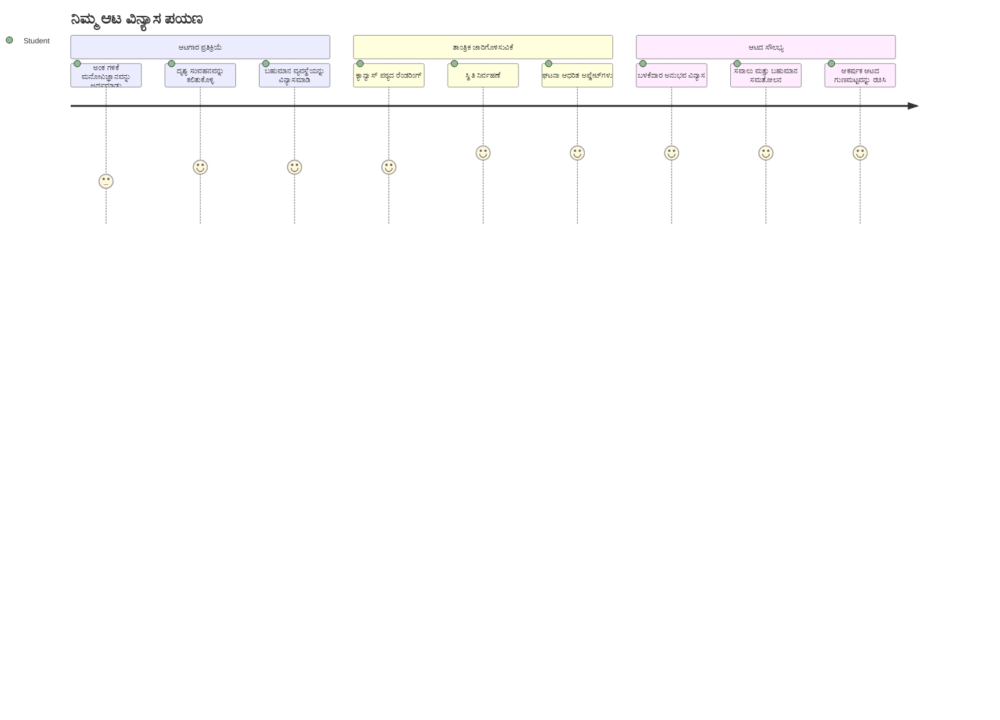
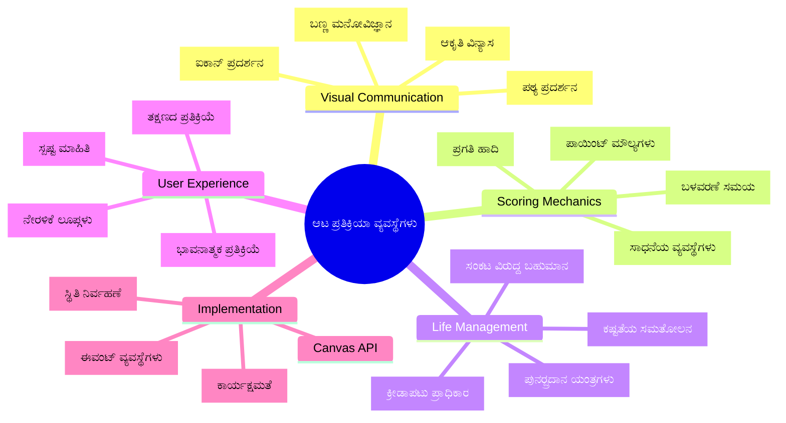
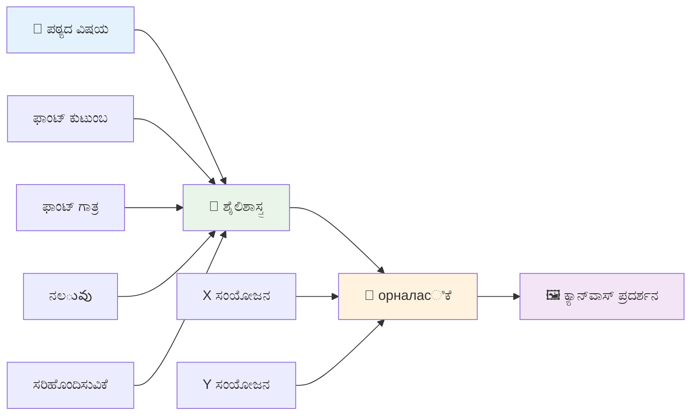
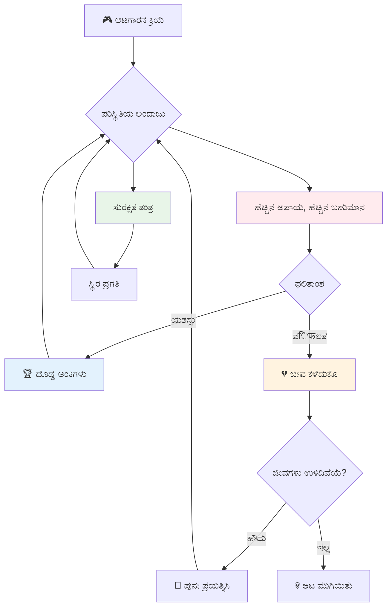
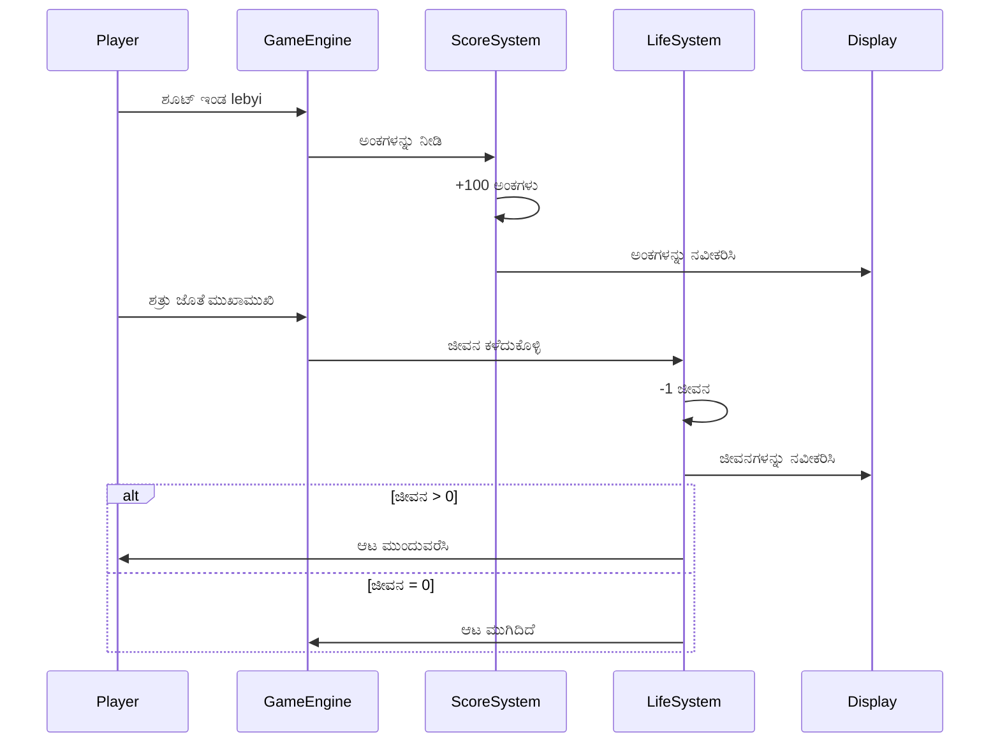
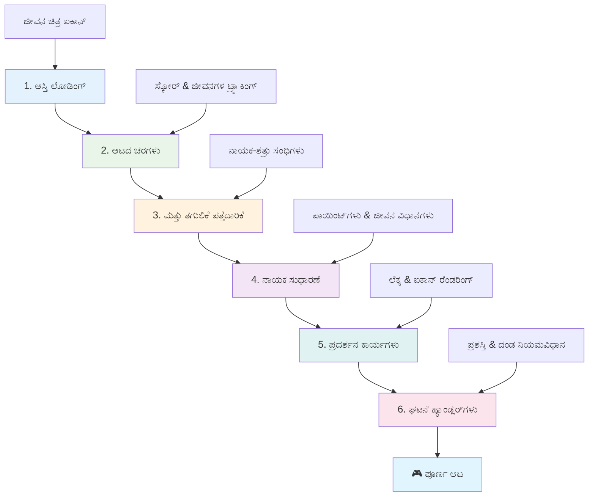
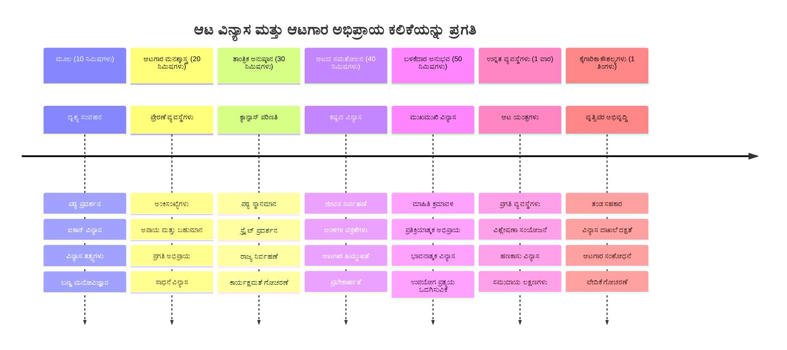

<!--
CO_OP_TRANSLATOR_METADATA:
{
  "original_hash": "2ed9145a16cf576faa2a973dff84d099",
  "translation_date": "2026-01-08T14:12:08+00:00",
  "source_file": "6-space-game/5-keeping-score/README.md",
  "language_code": "kn"
}
-->
# ಸ್ಪೇಸ್ ಗೇಮ್ ನಿರ್ಮಾಣ ಭಾಗ 5: ಅಂಕೆಗಳು ಮತ್ತು ಜೀವಗಳು


## ಪೂರ್ವ ಉಪನ್ಯಾಸ ಕ್ವಿಜ್

[ಪೂರ್ವ-ಉಪನ್ಯಾಸ ಕ್ವಿಜ್](https://ff-quizzes.netlify.app/web/quiz/37)

ನಿಮ್ಮ ಸ್ಪೇಸ್ ಗೇಮ್ನು ನಿಜವಾದ ಆಟದಂತೆ ಅನುಭವಿಸಲು ಸಿದ್ಧರಾ? ಅಂಕೆಗಳನ್ನು ಸೇರಿಸಿ ಮತ್ತು ಜೀವಗಳನ್ನು ನಿರ್ವಹಿಸಿ - ಪ್ರಾರಂಭಿಕ ಆರ್ಕೇಡ್ ಗೇಮ್‌ಗಳಾದ ಸ್ಪೇಸ್ ಇನ್ವೇಡರ್ಸ್‌ಗಳನ್ನು ಸರಳ ಪ್ರಾತ್ಯಕ್ಷಿಕೆಗಳಿಂದ ಅಡಿಕ್ಟಿವ್ ಮನರಂಜನೆಯಾಗಿ ಪರಿವರ್ತಿಸಿದ ಮೂಲ ಯಂತ್ರಶಾಸ್ತ್ರ. ಇಲ್ಲಿದೆ ನಿಮ್ಮ ಆಟ ನಿಜವಾಗಿಯೂ ಆಡಬಹುದಾದದ್ದು ಆಗುವುದು.


## ಪರದೆ ಮೇಲೆ ಪಠ್ಯ ಚಿತ್ರಣ - ನಿಮ್ಮ ಆಟದ ಧ್ವನಿ

ನಿಮ್ಮ ಅಂಕೆಯನ್ನು ತೋರಿಸಲು, ಕ್ಯಾನ್ವಾಸ್ ಮೇಲೆ ಪಠ್ಯವನ್ನು ಹೇಗೆ ಚಿತ್ರಿಸಲು ತಿಳಿಯಬೇಕಾಗಿದೆ. `fillText()` ವಿಧಾನ ನಿಮ್ಮ ಮುಖ್ಯ ಸಾಧನ - ಇದು ಕ್ಲಾಸಿಕ್ ಆರ್ಕೇಡ್ಗಳಲ್ಲಿ ಅಂಕೆಗಳು ಮತ್ತು ಸ್ಥಿತಿಗತಿಗಳನ್ನು ತೋರಿಸಲು ಬಳಸಿದ ತಂತ್ರ.


ನೀವು ಪಠ್ಯದ ಕಾಣಿಕೆಯನ್ನು ಸಂಪೂರ್ಣ ನಿಯಂತ್ರಣಕ್ಕೆ ಹೊಂದಿದ್ದೀರಿ:

```javascript
ctx.font = "30px Arial";
ctx.fillStyle = "red";
ctx.textAlign = "right";
ctx.fillText("show this on the screen", 0, 0);
```

✅ [ಕ್ಯಾನ್ವಾಸ್‌ಗೆ ಪಠ್ಯ ಸೇರಿಸುವುದು](https://developer.mozilla.org/docs/Web/API/Canvas_API/Tutorial/Drawing_text) ಕುರಿತು ಗಾಢವಾದ ಅಧ್ಯಯನ ಮಾಡಿ - ಫಾಂಟ್‌ಗಳು ಮತ್ತು ಶೈಲಿಯಲ್ಲಿ ನೀವು ಎಷ್ಟು ಸೃಜನಶೀಲರಾಗಬಹುದೆಂದುあなたはびっくりするかもしれません!

## ಜೀವಗಳು - ಕೇವಲ ಸಂಖ್ಯೆಗಿಂತ കൂടുതಲೆ

ಆಟ ವಿನ್ಯಾಸದಲ್ಲಿ, "ಜೀವ" ಅಂದರೆ ಆಟಗಾರನ ತಪ್ಪುಗಳಿಗೆ ಅವಕಾಶ. ಈ ಯೋಚನೆ ಪಿನ್‌ಬಾಲ್ ಯಂತ್ರಗಳಿಂದ ಬಂದಿದೆ, ಅಲ್ಲಲ್ಲಿ ನೀವು ಹಲವು ಬಾಲ್ಗಳನ್ನು ಬಳಸುವ ಅವಕಾಶ ಸಿಕ್ಕಿತ್ತು. ಆರಂಭಿಕ ವಿಡಿಯೋ ಆಟಗಳಾದ ಆಸ್ಟೆರಾಯ್ಡ್ಸ್‌ನಲ್ಲಿ, ಜೀವಗಳು ಆಟಗಾರರಿಗೆ ಅಪಾಯವನ್ನು ತೆಗೆದುಕೊಳ್ಳಲು ಮತ್ತು ತಪ್ಪುಗಳಿಂದ ಕಲಿಯಲು ಅವಕಾಶ ನೀಡುತ್ತಿತ್ತು.


ದೃಶ್ಯಾತ್ಮಕ ಪ್ರದರ್ಶನ ಬಹಳ ಪ್ರಮುಖ - ಕೇವಲ "Lives: 3" ಎಂದು ಹೇಳುವುದಕ್ಕಿಂತ ನೌಕಾ ಚಿಹ್ನೆಗಳನ್ನು ತೋರಿಸುವುದು ತಕ್ಷಣದ ದೃಶ್ಯ ಗುರುತಿಗೆ ಕಾರಣವಾಗುತ್ತದೆ, ಮೊದಲಿನ ಆರ್ಕೇಡ್ ಕ್ಯಾಬಿನೆಟ್‌ಗಳು ಭಾಷಾ ಅಡ್ಡಿಗಳು ಮೀರಿ ಸಂವಹನ ಮಾಡಲು ಐಕಾನೋಗ್ರಫಿಯನ್ನು ಬಳಸಿದಂತೆ.

## ನಿಮ್ಮ ಆಟದ ಬಹುಮಾನ ವ್ಯವಸ್ಥೆ ನಿರ್ಮಿಸುವುದು

ಇಂದು ನಾವು ಮುಖ್ಯವಾದ ಪ್ರತಿಕ್ರಿಯೆ ವ್ಯವಸ್ಥೆಗಳನ್ನು ಜಾರಿಗೆ ತರಲಿದ್ದೇವೆ, ಇದು ಆಟಗಾರರನ್ನು ತಾತ್ಕಾಲಿಕವಾಗಿ ತೊಡಗಿಸಿಕೊಂಡು ಇಡುವುದು:


- **ಅಂಕೆ ವ್ಯವಸ್ಥೆ**: ಪ್ರತಿ ನಷ್ಟಪಡಿಸಿದ ಶತ್ರು ನೌಕೆಗೆ 100 ಅಂಕೆಗಳು (ಮೂರು ಶಾಸಕರ ಸಂಖ್ಯೆಗಳನ್ನು ذهنದಲ್ಲಿಟ್ಟುಕೊಳ್ಳುವುದು ಸುಲಭ). ಅಂಕೆಯನ್ನು ಕೆಳಗಡೆಯ ಎಡಬದಿಯಲ್ಲಿ ತೋರಿಸಲಾಗುತ್ತದೆ.
- **ಜೀವಗಳ ಗಣಕ**: ನಿಮ್ಮ ಹೀರೋ 3 ಜೀವಗಳಿಂದ ಆರಂಭವಾಗುತ್ತಾನೆ - ಪ್ರಾರಂಭಿಕ ಆರ್ಕೇಡ್ ಆಟಗಳಿಂದ ಸ್ಥಾಪಿತ ಮಾನದಂಡ, ಇದು ಸವಾಲು ಮತ್ತು ಆಡಲು ಅನುಕೂಲ ಎಂಬ ಸಮತೋಲನವನ್ನು ನೀಡುತ್ತದೆ. ಪ್ರತಿ ಶತ್ರು ಜೊತೆ ಸಂಭವಿಸುವ ಅಧಿಕಾರವು ಒಂದು ಜೀವವನ್ನು ಕಡಿಮೆ ಮಾಡುತ್ತದೆ. ಬಾಕಿ ಜೀವಗಳನ್ನು ನಾವು ಕೆಳಗಡೆಯ ಬಲಭಾಗದಲ್ಲಿ ನೌಕಾ ಐಕಾನ್‌ಗಳ ಮೂಲಕ ತೋರಿಸುತ್ತೇವೆ .

## ನೀವು ನಿರ್ಮಿಸುವುದು ಪ್ರಾರಂಭಿಸೋಣ!

ಮೊದಲು, ನಿಮ್ಮ ವರ್ಕ್ ಸ್ಪೇಸ್ ಸಿದ್ಧಪಡಿಸಿ. ನಿಮ್ಮ `your-work` ಉಪಫೋಲ್ಡರ್‌ನಲ್ಲಿರುವ ಕಡತಗಳಿಗೆ ಹೋಗಿ. ನೀವು ಈ ಕಡತಗಳನ್ನು ನೋಡಬಹುದು:

```bash
-| assets
  -| enemyShip.png
  -| player.png
  -| laserRed.png
-| index.html
-| app.js
-| package.json
```

ನಿಮ್ಮ ಆಟವನ್ನು ಪರೀಕ್ಷಿಸಲು, `your_work` ಫೋಲ್ಡರ್‌ನಿಂದ ಡೆವಲಪ್‌ಮೆಂಟ್ ಸರ್ವರ್ ಅನ್ನು ಪ್ರಾರಂಭಿಸಿ:

```bash
cd your-work
npm start
```

ಇದು `http://localhost:5000` ಎಡ್ರೆಸ್‌ನಲ್ಲಿ ಸ್ಥಳೀಯ ಸರ್ವರ್ ಅನ್ನು ಕಾರ್ಯಗತಗೊಳಿಸುತ್ತದೆ. ನಿಮ್ಮ ಬ್ರೌಸರ್‌ನಲ್ಲಿ ಈ ವಿಳಾಸವನ್ನು ತೆರೆದು ನಿಮ್ಮ ಆಟವನ್ನು ನೋಡಿ. ಅರೋ ಕೀಲಿಗಳನ್ನು ಬಳಸಿ ನಿಯಂತ್ರಣಗಳನ್ನು ಪರೀಕ್ಷಿಸಿ ಮತ್ತು ಶತ್ರುಗಳನ್ನು ಗುಂಡಿ ಮಾಡಿ ಎಲ್ಲವೂ ಸರಿಯಾಗಿ ಕೆಲಸ ಮಾಡುತ್ತಿದೆಯೇ ಎಂದು ಪರಿಶೀಲಿಸಿ.


### ಕೋಡ್ ಮಾಡಲು ಸಮಯ!

1. **ನೀವು ಬೇಕಾಗಿರುವ ದೃಶ್ಯ ಆಸ್ತಿ ಗಳನ್ನು ಪಡೆದುಕೊಳ್ಳಿ**. `solution/assets/` ಫೋಲ್ಡರ್‌ನಿಂದ `life.png` ಆಸ್ತಿಯನ್ನು ನಿಮ್ಮ `your-work` ಫೋಲ್ಡರ್‌ಗೆ ನಕಲಿ ಮಾಡಿ. ನಂತರ lifeImg ಅನ್ನು ನಿಮ್ಮ window.onload ಫಂಕ್ಷನ್‌ಗೆ ಸೇರಿಸಿ:

    ```javascript
    lifeImg = await loadTexture("assets/life.png");
    ```

1.Assets ಪಟ್ಟಿ‌ಗೆ `lifeImg` ಅನ್ನು ಸೇರಿಸಲು ಮರೆಯಬೇಡಿ:

    ```javascript
    let heroImg,
    ...
    lifeImg,
    ...
    eventEmitter = new EventEmitter();
    ```

2. **ನಿಮ್ಮ ಆಟದ ಚರಗಳನ್ನು ಸಜ್ಜುಗೊಳಿಸಿ**. ನಿಮ್ಮ ಒಟ್ಟು ಅಂಕೆ(0ರಿಂದ ಪ್ರಾರಂಭ) ಮತ್ತು ಉಳಿದ ಜೀವಗಳನ್ನು(3ರಿಂದ ಪ್ರಾರಂಭ) ಟ್ರ್ಯಾಕ್ ಮಾಡಲು ಕೆಲವು ಕೋಡ್ ಸೇರಿಸಿ. ನಾವು ಇದನ್ನು ಪರದೆ ಮೇಲೆ ತೋರಿಸುತ್ತೇವೆ, ಆದ್ದರಿಂದ ಆಟಗಾರರು ಯಾವ ಸ್ಥಿತಿಯಲ್ಲಿ ಇದ್ದಾರೆ ಚೆನ್ನಾಗಿ ಗೊತ್ತಾಗುತ್ತದೆ.

3. **ಸಂಘರ್ಷ ಪತ್ತೆ ಮಾಡಲು ವಿಧಾನ ಜಾರಿಗೆ ತರಿರಿ**. ನಿಮ್ಮ `updateGameObjects()` ಫಂಕ್ಷನ್ ಅನ್ನು ಪರಿಷ್ಕರಿಸಿ, ಶತ್ರುಗಳು ನಿಮ್ಮ ಹೀರೋಗೆ ಡಿಕ್ಕಿ ಹೊಡೆತ ಮಾಡಿದಾಗ ಪತ್ತೆ ಮಾಡುತ್ತದೆ:

    ```javascript
    enemies.forEach(enemy => {
        const heroRect = hero.rectFromGameObject();
        if (intersectRect(heroRect, enemy.rectFromGameObject())) {
          eventEmitter.emit(Messages.COLLISION_ENEMY_HERO, { enemy });
        }
      })
    ```

4. **ನಿಮ್ಮ ಹೀರೋಗೆ ಜೀವ ಮತ್ತು ಅಂಕೆ ಟ್ರ್ಯಾಕಿಂಗ್ ಸೇರಿಸಿ**.
   1. **ಗಣಕಗಳನ್ನು ಪ್ರಾರಂಭಿಸಿ**. ನಿಮ್ಮ `Hero` ಕ್ಲಾಸಿನಲ್ಲಿನ `this.cooldown = 0` ಅಡಿಯಲ್ಲಿದೆ, ಇಲ್ಲಿ ಜೀವ ಮತ್ತು ಅಂಕೆಯನ್ನು ಸೆಟ್ ಮಾಡಿರಿ:

        ```javascript
        this.life = 3;
        this.points = 0;
        ```

   1. **ಈ ಮೌಲ್ಯಗಳನ್ನು ಆಟಗಾರರಿಗೆ ತೋರಿಸಿ**. ಈ ಮೌಲ್ಯಗಳನ್ನು ಪರದೆ ಮೇಲೆ ಚಿತ್ರಿಸುವ ಫಂಕ್ಷನ್ಗಳನ್ನು ರಚಿಸಿ:

        ```javascript
        function drawLife() {
          // ಮಾಡಲು, 35, 27
          const START_POS = canvas.width - 180;
          for(let i=0; i < hero.life; i++ ) {
            ctx.drawImage(
              lifeImg, 
              START_POS + (45 * (i+1) ), 
              canvas.height - 37);
          }
        }
        
        function drawPoints() {
          ctx.font = "30px Arial";
          ctx.fillStyle = "red";
          ctx.textAlign = "left";
          drawText("Points: " + hero.points, 10, canvas.height-20);
        }
        
        function drawText(message, x, y) {
          ctx.fillText(message, x, y);
        }

        ```

   1. **ಎಲ್ಲವೂ ನಿಮ್ಮ ಆಟದ ಲೂಪಿಗೆ ಹೂಕ ಮಾಡಿ**. ಈ ಫಂಕ್ಷನ್ಗಳನ್ನು window.onload ಫಂಕ್ಷನ್‌ನಲ್ಲಿ `updateGameObjects()` ನಂತರ ಸೇರಿಸಿ:

        ```javascript
        drawPoints();
        drawLife();
        ```

### 🔄 **ಶೈಕ್ಷಣಿಕ ಪರಿಶೀಲನೆ**
**ಆಟ ವಿನ್ಯಾಸ ತಿಳಿವು**: ಪರಿಣಾಮಗಳನ್ನು ಜಾರಿಗೆ ತರುವ ಮೊದಲು ನಿಮಗೆ ತಿಳಿದುಕೊಳ್ಳಬೇಕು:
- ✅ ದೃಶ್ಯ ಪ್ರತಿಕ್ರಿಯೆ ಆಟಗಾರರಿಗೆ ಆಟದ ಸ್ಥಿತಿಯನ್ನು ಹೇಗೆ ಸಂವಹನ ಮಾಡುತ್ತದೆ
- ✅ ಯೂಐ ಅಂಶಗಳ ಸತತ ಸ್ಥಾನವನ್ನು ಏಕೆ ಸುಧಾರಿಸುತ್ತದೆ
- ✅ ಅಂಕೆಗಳ ಮೌಲ್ಯ ಮತ್ತು ಜೀವ ನಿರ್ವಹಣೆ ರೂಢಿಯಾದ ಕಾರಣಗಳು
- ✅ ಕ್ಯಾನ್ವಾಸ್ ಪಠ್ಯ ಚಿತ್ರಣ ಹೇಗೆ HTML ಪಠ್ಯದಿಂದ ಭಿನ್ನತೆ ಅನುಭವಿಸುತ್ತದೆ

**ವೇಗವಾದ ಸ್ವಯಂ ಪರೀಕ್ಷೆ**: ಆರ್ಕೇಡ್ ಗೇಮ್‌ಗಳು ಸಾಮಾನ್ಯವಾಗಿ ಏಕೆ ಸುತ್ತಲಿನ ಸಂಖ್ಯೆಗಳ ಬಳಕೆಯನ್ನು ಅನುಸರಿಸುತ್ತವೆ?
*ಉತ್ತರ: ಸುತ್ತಲಿನ ಸಂಖ್ಯೆಗಳನ್ನು ಆಟಗಾರರು ಮನಸ್ಸಿನಲ್ಲಿ ಸುಲಭವಾಗಿ ಲೆಕ್ಕ ಹಾಕಬಹುದು ಮತ್ತು ತೃಪ್ತಿ ನೀಡುವ ಮನೋವೈಜ್ಞಾನಿಕ ಬಹುಮಾನಗಳನ್ನು ಸೃಷ್ಟಿಸು*ತದೆ.

**ಬಳಕೆದಾರ ಅನುಭವ ತತ್ವಗಳು**: ನೀವು ಈಗ ಅನ್ವಯಿಸುತ್ತಿದ್ದೀರಿ:
- **ದೃಶ್ಯ ಕ್ರಮ**: ಪ್ರಮುಖ ಮಾಹಿತಿಯನ್ನು ಪ್ರಸಿದ್ಧ ಸ್ಥಾನಗಳಲ್ಲಿ ಇಡಲಾಗುತ್ತದೆ
- **ತಕ್ಷಣದ ಪ್ರತಿಕ್ರಿಯೆ**: ಆಟಗಾರ ಕ್ರಿಯೆಗಳ ತಕ್ಷಣದ ನವೀಕರಣಗಳು
- **ಜ್ಞಾನ ಭಾರ**: ಸರಳ, ಸ್ಪಷ್ಟ ಮಾಹಿತಿ ಪ್ರಸ್ತುತಪಡಣೆ
- **ಭಾವನಾತ್ಮಕ ವಿನ್ಯಾಸ**: ಐಕಾನ್ಸ್ ಮತ್ತು ಬಣ್ಣಗಳು ಆಟಗಾರರ ಸಂಪರ್ಕ ಸೃಷ್ಟಿಸುತ್ತದೆ

1. **ಆಟದ ಪರಿಣಾಮಗಳು ಮತ್ತು ಬಹುಮಾನಗಳನ್ನು ಜಾರಿಗೆ ತರಿರಿ**. ಈಗ ನಾವು ಆಟಗಾರದ ಕ್ರಿಯೆಗಳಿಗೆ ಅರ್ಥಪೂರ್ಣತೆಯನ್ನು ನೀಡುವ ಪ್ರತಿಕ್ರಿಯಾ ವ್ಯವಸ್ಥೆಗಳನ್ನು ಸೇರಿಸುತ್ತೇವೆ:

   1. **ಡಿಕ್ಕಿಗಳು ಜೀವಗಳನ್ನು ಕುಂದುತ್ತವೆ**. ನಿಮ್ಮ ಹೀರೋ ಪ್ರತಿ ಶತ್ರುವಿನೊಂದಿಗೆ ಡಿಕ್ಕಿಯಾಗುವಾಗ ಒಂದು ಜೀವ ಕಳೆದುಕೊಳ್ಳಬೇಡಿ.
   
      ಈ ವಿಧಾನವನ್ನು ನಿಮ್ಮ `Hero` ಕ್ಲಾಸಿಗೆ ಸೇರಿಸಿ:

        ```javascript
        decrementLife() {
          this.life--;
          if (this.life === 0) {
            this.dead = true;
          }
        }
        ```

   2. **ಶತ್ರುಗಳನ್ನು ಗುಂಡಿ ಮಾಡಿ ಅಂಕೆ ಗಳಿಸಿ**. ಪ್ರತಿ ಯಶಸ್ವಿ ಹಿಟ್ 100 ಅಂಕೆಯನ್ನು ಕೊಡುತ್ತದೆ, ಇದು ಸ್ಪಷ್ಟ ಪಾಸಿಟಿವ್ ಪ್ರತಿಕ್ರಿಯೆಯನ್ನು ನೀಡುತ್ತದೆ.

      ಹೀರೋ ಕ್ಲಾಸಿಗೆ ಈ ಹೆಚ್ಚಿಸುವ ವಿಧಾನವನ್ನು ವಿಸ್ತರಿಸಿ:

        ```javascript
          incrementPoints() {
            this.points += 100;
          }
        ```

        ಈಗ ಈ ಫಂಕ್ಷನ್ಗಳನ್ನು ಡಿಕ್ಕಿ ಘಟನೆಗಳಿಗೆ ಸಂಪರ್ಕಿಸಿ:

        ```javascript
        eventEmitter.on(Messages.COLLISION_ENEMY_LASER, (_, { first, second }) => {
           first.dead = true;
           second.dead = true;
           hero.incrementPoints();
        })

        eventEmitter.on(Messages.COLLISION_ENEMY_HERO, (_, { enemy }) => {
           enemy.dead = true;
           hero.decrementLife();
        });
        ```

✅ ಜಾವಾಸ್ಕ್ರಿಪ್ಟ್ ಮತ್ತು ಕ್ಯಾನ್ವಾಸ್ ಬಳಸಿ ನಿರ್ಮಿಸಲ್ಪಟ್ಟ ಇತರ ಆಟಗಳ ಬಗ್ಗೆ ಆಸಕ್ತರಾ? ಕೈಗೊಂಡು ಹುಡುಕಿ - ನೀವು ಸಾಧ್ಯವಿರುವುದರಲ್ಲಿ ಆಶ್ಚರ್ಯ ಪಡಬಹುದು!

ಈ ವೈಶಿಷ್ಟ್ಯಗಳನ್ನು ಜಾರಿಗೆ ತಂದ ನಂತರ, ನಿಮ್ಮ ಆಟವನ್ನು ಪರೀಕ್ಷಿಸಿ. ಸಂಪೂರ್ಣ ಪ್ರತಿಕ್ರಿಯಾ ವ್ಯವಸ್ಥೆಯನ್ನು ಕಳೆಯಿರಿ. ಬಲ ಕೆಳಭಾಗದಲ್ಲಿ ಜೀವ ಐಕಾನ್‌ಗಳು, ಎಡ ಕೆಳಭಾಗದಲ್ಲಿ ನಿಮ್ಮ ಅಂಕೆ ತೋರಣೆಯಾಗುತ್ತದೆ ಮತ್ತು ಡಿಕ್ಕಿಗಳು ಜೀವಗಳನ್ನು ಕಡಿಮೆ ಮಾಡುತ್ತವೆ ಆದರೆ ಯಶಸ್ವಿ ಗುಂಡಿಗಳು ನಿಮ್ಮ ಅಂಕೆಯನ್ನು ಹೆಚ್ಚಿಸುತ್ತವೆ ಎಂದು ನೋಡಿ.

ನಿಮ್ಮ ಆಟ ಈಗ ಹಿಂದಿನ ಆರ್ಕೇಡ್ ಆಟಗಳನ್ನು ಅತ್ಯಂತ ಆಕರ್ಷಕ બનાવવા ಕಾರಣವಾದ ಅಗತ್ಯಯುಕ್ತ ಯಂತ್ರಶಾಸ್ತ್ರಗಳನ್ನು ಹೊಂದಿದೆ - ಸ್ಪಷ್ಟ ಗುರಿಗಳು, ತಕ್ಷಣದ ಪ್ರತಿಕ್ರಿಯೆ ಮತ್ತು ಆಟಗಾರಿಯ ಕ್ರಿಯೆಗಳಿಗೆ ಅರ್ಥಪೂರ್ಣ ಪರಿಣಾಮ.

### 🔄 **ಶೈಕ್ಷಣಿಕ ಪರಿಶೀಲನೆ**
**ಪೂರ್ಣ ಆಟ ವಿನ್ಯಾಸ ವ್ಯವಸ್ಥೆ**: ಆಟಗಾರ ಪ್ರತಿಕ್ರಿಯಾ ವ್ಯವಸ್ಥೆಗಳ ಮೇಲೆ ನಿಮ್ಮ ಪ್ರಾಧಾನ್ಯತೆ ಪರಿಶೀಲಿಸಿ:
- ✅ ಅಂಕೆ ಯಂತ್ರಶಾಸ್ತ್ರವು ಆಟಗಾರರ ಪ್ರೋತ್ಸಾಹ ಮತ್ತು ತೊಡಗಿಸಿಕೊಳುವುದನ್ನು ಹೇಗೆ ಸೃಷ್ಟಿಸುತ್ತದೆ?
- ✅ ಯೂಐ ವಿನ್ಯಾಸಕ್ಕೆ ದೃಶ್ಯ ಸತತತೆ ಏಕೆ ಮುಖ್ಯ?
- ✅ ಜೀವ ವ್ಯವಸ್ಥೆ ಸವಾಲು ಮತ್ತು ಆಟಗಾರ ನಿರ್ವಹಣೆ ನಡುವಣ ಸಮತೋಲನವನ್ನು ಹೇಗೆ ನೀಡುತ್ತದೆ?
- ✅ ತಕ್ಷಣದ ಪ್ರತಿಕ್ರಿಯೆಯು ತೃಪ್ತಿಕರ ಆಟವನ್ನು ಸೃಷ್ಟಿಸುವಲ್ಲಿ ಯಾವ ಪಾತ್ರ ವಹಿಸುತ್ತದೆ?

**ವ್ಯವಸ್ಥೆಯ ಏಕೀಕರಣ**: ನಿಮ್ಮ ಪ್ರತಿಕ್ರಿಯಾ ವ್ಯವಸ್ಥೆ ಈ ಮೂಲಕವನ್ನು ತೋರಿಸುತ್ತದೆ:
- **ಬಳಕೆದಾರ ಅನುಭವ ವಿನ್ಯಾಸ**: ಸ್ಪಷ್ಟ ದೃಶ್ಯ ಸಂವಹನ ಮತ್ತು ಮಾಹಿತಿ ಕ್ರಮ
- **ಘಟನೆ ಚಲಿತ ವಾಸ್ತುಶಿಲ್ಪ**: ಆಟಗಾರ ಕ್ರಿಯೆಗಳಿಗೆ ಪ್ರತಿಕ್ರಿಯಾತ್ಮಕ ನವೀಕರಣಗಳು
- **ಸ್ಥಿತಿ ನಿರ್ವಹಣೆ**: ಡೈನಾಮಿಕ್ ಆಟದ ಡೇಟಾ ಟ್ರ್ಯಾಕ್ ಮತ್ತು ಪ್ರದರ್ಶನ
- **ಕ್ಯಾನ್ವಾಸ್ ಪರಿಣತಿ**: ಪಠ್ಯ ಚಿತ್ರಣ ಮತ್ತು ಸ್ಪ್ರೈಟ್ ಸ್ಥಾನವನ್ನು ನಿರ್ಧರಿಸುವುದು
- **ಆಟ ಮನೋವಿಜ್ಞಾನ**: ಆಟಗಾರ ಪ್ರೋತ್ಸಾಹ ಮತ್ತು ತೊಡಗಿಸುವಿಕೆಯನ್ನು ತಿಳಿದುಕೊಳ್ಳುವುದು

**ತಜ್ಞ ಮಾದರಿಗಳು ಜಾರಿಗೆ ತಂದಿದ್ದೀರಿ**:
- **MVC ವಾಸ್ತುಶಿಲ್ಪ**: ಆಟದ ಲಾಜಿಕ್, ಡೇಟಾ ಮತ್ತು ಪ್ರದರ್ಶನ ವಿಂಗಡಣೆ
- **ತಪಾಸಕ ಮಾದರಿ**: ಆಟದ ಸ್ಥಿತಿ ಬದಲಾವಣೆಗಳಿಗೆ ಘಟನ್ಚಾಲಿತ ನವೀಕರಣಗಳು
- **ಘಟಕ ವಿನ್ಯಾಸ**: ಪುನರುಪಯೋಗದ ಫಂಕ್ಷನ್ಗಳನ್ನು ರಚನೆ ಮತ್ತು ಲಾಜಿಕ್
- **ಕಾರ್ಯಕ್ಷಮತೆ ಪರಿಷ್ಕರಣೆ**: ಆಟದ ಲೂಪ್ಗಳಲ್ಲಿ ಪರಿಣಾಮಕಾರಿ చిత్రಣ

### ⚡ **ಮುಂದಿನ 5 ನಿಮಿಷಗಳಲ್ಲಿ ನೀವು ಮಾಡಬಹುದಾದವುಗಳು**
- [ ] ಅಂಕೆ ಪ್ರದರ್ಶನಕ್ಕಾಗಿ ವಿಭಿನ್ನ ಫಾಂಟ್ ಗಾತ್ರ ಮತ್ತು ಬಣ್ಣಗಳೊಂದಿಗೆ ಪ್ರಯೋಗ ಮಾಡಿ
- [ ] ಅಂಕೆ ಮೌಲ್ಯಗಳನ್ನು ಬದಲಿಸಿ ಮತ್ತು ಆಟದ ಪ್ರಭಾವವನ್ನು ನೋಡಿ
- [ ] ಅಂಕೆಗಳು ಮತ್ತು ಜೀವಗಳ ಬದಲಾವಣೆಯನ್ನು console.log henkilಗಳು ಸೇರಿಸಿ
- [ ] ಜೀವಗಳು ಕಡಿಮೆಯಾಗುವ ಅಥವಾ ಹೆಚ್ಚಿನ ಅಂಕೆಗಳು ಸಾಧಿಸುವ ಅತಿದೊಡ್ಡ ಪ್ರಕರಣಗಳನ್ನು ಪರೀಕ್ಷಿಸಿ

### 🎯 **ಈ ಗಂಟೆಯಲ್ಲಿ ಸಾಧಿಸಬಹುದಾದವುಗಳು**
- [ ] ಪಾಠ ಕೊನೆಯ ಕ್ವಿಜ್ ಪೂರ್ಣ ಮಾಡಿ ಮತ್ತು ಆಟ ವಿನ್ಯಾಸ ಮನೋವಿಜ್ಞಾನವನ್ನು ಅರ್ಥಮಾಡಿಕೊಳ್ಳಿ
- [ ] ಅಂಕೆ ಗಳಿಸುವ ಮತ್ತು ಜೀವ ಕಳೆದುಕೊಳ್ಳುವ ಧ್ವನಿ ಪರಿಣಾಮಗಳನ್ನು ಸೇರಿಸಿ
- [ ] localStorage ಉಪಯೋಗಿಸಿ ಹೈ ಸ್ಕೋರ್ ವ್ಯವಸ್ಥೆ ಜಾರಿಗೆ ತರಿರಿ
- [ ] ವಿಭಿನ್ನ ಶತ್ರು ಪ್ರಕಾರಗಳಿಗೆ ವಿಭಿನ್ನ ಪಾಯಿಂಟ್ ಮೌಲ್ಯಗಳನ್ನು ಸೇರಿಸಿ
- [ ] ಜೀವ ಕಳೆದುಕೊಳ್ಳುವಾಗ ಪರದೆ ನಡುಗರಿಸುವ ದೃಶ್ಯ ಪರಿಣಾಮಗಳನ್ನು ಸೇರಿಸಿ

### 📅 **ನಿಮ್ಮ ವಾರದ ಆಟ ವಿನ್ಯಾಸ ಪ್ರಯಾಣ**
- [ ] ಸಂಪೂರ್ಣ ಸ್ಪೇಸ್ ಗೇಮ್ ಅನ್ನು ಬಹುಮಾನ ವ್ಯವಸ್ಥೆಗಳಿಂದ ಸಂಪೂರ್ವವಾಗಿ ಪೂರ್ಣಗೊಳಿಸಿ
- [ ] ಕಂಪೋ ಮಲ್ಟಿಪ್ಲೈಯರ್ ಗಳು ಮತ್ತು ಇತರ ಆಧುನಿಕ ಅಂಕೆ ಯಂತ್ರಶಾಸ್ತ್ರಗಳನ್ನು ಜಾರಿಗೆ ತರ하세요
- [ ] ಸಾಧನೆ ಮತ್ತು ಅನ್ಲಾಕ್ ಮಾಡಬಹುದಾದ ವಿಷಯಗಳನ್ನು ಸೇರಿಸಿ
- [ ] ಕಷ್ಟದ ಏರಿಕೆ ಮತ್ತು ಸಮತೋಲನ ವ್ಯವಸ್ಥೆಗಳನ್ನು ರಚಿಸಿ
- [ ] ಮೆನುಗಳು ಮತ್ತು ಆಟ ಮುಗಿದ ಪರದೆಗಳಂತೆ ಯೂಐ ವಿನ್ಯಾಸ ಮಾಡಿ
- [ ] ಮತ್ತೊಂದು ಆಟಗಳನ್ನು ಅಧ್ಯಯನ ಮಾಡಿ ತೊಡಗಿಸಿಕೊಳ್ಳುವಿಕೆಯ ಯಂತ್ರಗಳನ್ನು ತಿಳಿದುಕೊಳ್ಳಿ

### 🌟 **ನಿಮ್ಮ ತಿಂಗಳ ಆಟ ಅಭಿವೃದ್ಧಿ ಪರಿಣತಿತ್ವ**
- [ ] ಸೂಕ್ಷ್ಮ ಪ್ರಗತಿ ವ್ಯವಸ್ಥೆಳ್ಳದ ಸಂಪೂರ್ಣ ಆಟಗಳನ್ನು ನಿರ್ಮಿಸಿ
- [ ] ಆಟ ವಿಶ್ಲೇಷಣೆ ಮತ್ತು ಆಟಗಾರ ವರ್ತನೆ ಮಾಪನ ಕಲಿಯಿರಿ
- [ ] ಓಪನ್ ಸೋರ್ಸ್ ಆಟ ಅಭಿವೃದ್ಧಿ ಯೋಜನೆಗಳಿಗೆ ಸಹಕರಿಸಿ
- [ ] ಸುಧಾರಿತ ಆಟ ವಿನ್ಯಾಸ ಮಾದರಿಗಳು ಮತ್ತು ಹಣಕಾಸು ಆಧಾರಿತದ ಬಗ್ಗೆ ಪರಿಣತಿ
- [ ] ಆಟ ವಿನ್ಯಾಸ ಮತ್ತು ಬಳಕೆದಾರ ಅನುಭವದ ವಿಷಯಗಳನ್ನು ಶೈಕ್ಷಣಿಕವಾಗಿ ರಚಿಸಿ
- [ ] ಆಟ ವಿನ್ಯಾಸ ಮತ್ತು ಅಭಿವೃದ್ಧಿ ಕೌಶಲ್ಯಗಳನ್ನು ಪ್ರದರ್ಶಿಸುವ ಪೋರ್ಟ್‌ಫೋಲಿಯೋ ನಿರ್ಮಿಸಿ

## 🎯 ನಿಮ್ಮ ಆಟ ವಿನ್ಯಾಸ ಪರಿಣತಿ ಕಾಲವರಿ


### 🛠️ ನಿಮ್ಮ ಆಟ ವಿನ್ಯಾಸ ಉಪಕರಣಗಳ ಸಾರಾಂಶ

ಈ ಪಾಠವನ್ನು ಪೂರ್ಣಗೊಳಿಸಿದ ನಂತರ, ನೀವು ಈಗ ನಿರ್ವಹಿಸಬಹುದು:
- **ಆಟಗಾರ ಮನೋವಿಜ್ಞಾನ**: ಪ್ರೋತ್ಸಾಹ, ಅಪಾಯ/ಬಹುಮಾನ ಮತ್ತು ತೊಡಗಿಸುವಿಕೆ ಲೂಪುಗಳನ್ನು ಅರ್ಥಮಾಡಿಕೊಳ್ಳುವುದು
- **ದೃಶ್ಯ ಸಂವಹನ**: ಪಠ್ಯ, ಐಕಾನ್ ಮತ್ತು ವಿನ್ಯಾಸ ಬಳಸಿ ಪರಿಣಾಮಕಾರಿ ಯೂಐ ವಿನ್ಯಾಸ
- **ಪ್ರತಿಕ್ರಿಯೆ ವ್ಯವಸ್ಥೆಗಳು**: ಆಟಗಾರ ಕ್ರಿಯೆಗಳ ಮತ್ತು ಆಟದ ಘಟನೆಗಳಿಗೆ ನೇರಪ್ರತಿಕ್ರಿಯೆ
- **ಸ್ಥಿತಿ ನಿರ್ವಹಣೆ**: ಡೈನಾಮಿಕ್ ಡೇಟಾವನ್ನು ಪರಿಣಾಮಕಾರಿಯಾಗಿ ಟ್ರ್ಯಾಕ್ ಮತ್ತು ಪ್ರದರ್ಶಿಸುವುದು
- **ಕ್ಯಾನ್ವಾಸ್ ಪಠ್ಯ ಚಿತ್ರಣ**: ಷೈಲಿ ಮತ್ತು ಸ್ಥಾನ ಗೊಳಿಸುವಿಕೆಯೊಂದಿಗೆ ವೃತ್ತಿಪರ ಪಠ್ಯ ಪ್ರದರ್ಶನ
- **ಘಟನೆ ಏಕೀಕರಣ**: ಬಳಕೆದಾರ ಕ್ರಿಯೆಗಳಿಗೆ ಅರ್ಥಪೂರ್ಣ ಆಟ ಪರಿಣಾಮಗಳನ್ನು ಸಂಪರ್ಕಿಸುವುದು
- **ಆಟ ಸಮತೋಲನ**: ಕಷ್ಟದ ಘಟ್ಟಗಳನ್ನು ವಿನ್ಯಾಸ ಮಾಡಿ ಆಟಗಾರ ಪ್ರಗತಿಗೆ ಸಮತೋಲನ ನೀಡುವುದು

**ವಾಸ್ತವ ಲೋಕರ ಅನ್ವಯಿಕೆಗಳು**: ನಿಮ್ಮ ಆಟ ವಿನ್ಯಾಸ ನೈಪುಣ್ಯಗಳು ನೇರವಾಗಿ ಅನ್ವಯಿಸುತ್ತವೆ:
- **ಬಳಕೆದಾರ ಇಂಟರ್ಫೇಸ್ ವಿನ್ಯಾಸ**: ಆಕರ್ಷಕ ಮತ್ತು ಸ್ಪಷ್ಟವಾದ ಇಂಟರ್ಫೇಸ್ ರಚನೆ
- **ಉತ್ಪನ್ನ ಅಭಿವೃದ್ಧಿ**: ಬಳಕೆದಾರ ಪ್ರೋತ್ಸಾಹ ಮತ್ತು ಪ್ರತಿಕ್ರಿಯೆ ಲೂಪ್ಗಳ ಅರಿವು
- **ಶೈಕ್ಷಣಿಕ ತಂತ್ರಜ್ಞಾನ**: ಗೇಮಿಫಿಕೇಶನ್ ಮತ್ತು ಕಲಿಕಾ ತೊಡಗಿಸಿಕೊಳ್ಳುವಿಕೆ ವ್ಯವಸ್ಥೆಗಳು
- **ಡೇಟಾ ದೃಶ್ಯೀಕರಣ**: ಸಂಕೀರ್ಣ ಮಾಹಿತಿಯನ್ನು ಪ್ರವೇಶಿಸಬಹುದಾದ ಮತ್ತು ಆಕರ್ಷಕವಾಗಿ ಮಾಡುವುದು
- **ಮೊಬೈಲ್ ಅಪ್ಲಿಕೇಶನ್ ಅಭಿವೃದ್ಧಿ**: ಹಿಡಿತ ತಂತ್ರಗಳು ಮತ್ತು ಬಳಕೆದಾರ ಅನುಭವ ವಿನ್ಯಾಸ
- **ಮಾರ್ಕೆಟಿಂಗ್ ತಂತ್ರಜ್ಞಾನ**: ಬಳಕೆದಾರ ವರ್ತನೆ ಮತ್ತು ಪರಿವರ್ತನೆ ಸರ್ರೀಕಿ ಕಲಿತಿರಿ

**ತಜ್ಞ ಕೌಶಲ್ಯಗಳು ಪಡೆದಿದ್ದೀರಿ**: ನೀವು ಈಗ:
- **ವಿನ್ಯಾಸ** ಬಳಕೆದಾರ ಅನುಭವಗಳನ್ನು ಪ್ರೋತ್ಸಾಹಿಸುವ ಮತ್ತು ತೊಡಗಿಸುವುದಕ್ಕಾಗಿ
- **ಜಾರಿಗೆ ತರಿರಿ** ಬಳಕೆದಾರ ವರ್ತನೆಯನ್ನು ಪರಿಣಾಮಕಾರಿಯಾಗಿ ಮಾರ್ಗದರ್ಶನ ಮಾಡುವ ಪ್ರತಿಕ್ರಿಯೆ ವ್ಯವಸ್ಥೆಗಳನ್ನು
- **ಸಮತೋಲನ** ಸವಾಲು ಮತ್ತು ಪ್ರವೇಶಾರ್ಹತೆಯನ್ನು ಸಂಯೋಜಿಸಿ
- **ರಚಿಸಿ** ವಿಭಿನ್ನ ಬಳಕೆದಾರ ಸಮುದಾಯಗಳ ಜೋತೆಗೆ ಕೆಲಸ ಮಾಡುವ ದೃಶ್ಯ ಸಂವಹನ
- **ವಿಶ್ಲೇಷಣೆ** ಬಳಕೆದಾರ ವರ್ತನೆ ಮತ್ತು ವಿನ್ಯಾಸ ಸುಧಾರಣೆಗಳ ಮೇಲೆ ಪುನರಾವೃತ್ತಿ ಮಾಡಿ

**ಆಟ ಅಭಿವೃದ್ಧಿ ಕಲ್ಪನೆಗಳಲ್ಲಿ ಪರಿಣತಿ**:
- **ಆಟಗಾರ ಪ್ರೋತ್ಸಾಹ**: ತೊಡಗುಮಾಡುವಿಕೆ ಮತ್ತು ಹಿಡಿತಕ್ಕೆ ಚಾಲಕೇಯುವಿಕೆಗಳ ಅರಿವು
- **ದೃಶ್ಯ ವಿನ್ಯಾಸ**: ಸ್ಪಷ್ಟ, ಆಕರ್ಷಕ ಮತ್ತು ಕಾರ್ಯನಿರ್ವಹಣೆಯ ಅರ್ಹತೆಗಳ ರಚನೆ
- **ವ್ಯವಸ್ಥೆಯ ಏಕೀಕರಣ**: ಸಮಗ್ರ ಅನುಭವಕ್ಕೆ ಅನೇಕ ಆಟ ವ್ಯವಸ್ಥೆಗಳನ್ನು ಸಂಪರ್ಕಿಸುವುದು
- **ಕಾರ್ಯಕ್ಷಮತೆ ಪರಿಷ್ಕರಣೆ**: ಪರಿಣಾಮಕಾರಿ ಚಿತ್ರಣ ಮತ್ತು ಸ್ಥಿತಿ ನಿರ್ವಹಣೆ
- **ಪ್ರವೇಶಾರ್ಹತೆ**: ವಿಭಿನ್ನ ಕೌಶಲ್ಯ ಮಟ್ಟಗಳು ಮತ್ತು ಆಟಗಾರ ಅಗತ್ಯಗಳಿಗೆ ವಿನ್ಯಾಸ

**ಮುಂದಿನ ಹಂತ**: ನೀವು ಈಗ ಸುಧಾರಿತ ಆಟ ವಿನ್ಯಾಸ ಮಾದರಿಗಳನ್ನು ಅನ್ವೇಷಿಸಲು, ವಿಶ್ಲೇಷಣೆ ವ್ಯವಸ್ಥೆಗಳನ್ನು ಜಾರಿಗೆ ತರಲು ಅಥವಾ ಆಟ ಹಣಕಾಸು ಮತ್ತು ಆಟಗಾರ ಹಿಡಿತ ತಂತ್ರಗಳನ್ನು ಅಧ್ಯಯನ ಮಾಡಲು ಸಿದ್ಧ!

🌟 **ಸಾಧನೆ ಅನ್ಲಾಕ್ ಆಗಿದೆ**: ನೀವು ವೃತ್ತಿಪರ ಆಟ ವಿನ್ಯಾಸ ತತ್ವಗಳೊಂದಿಗೆ ಪೂರ್ಣ ಆಟಗಾರ ಪ್ರತಿಕ್ರಿಯೆ ವ್ಯವಸ್ಥೆಯನ್ನು ನಿರ್ಮಿಸಿದ್ದೀರಿ!

---

## GitHub Copilot ಏಜೆಂಟ್ ಸವಾಲು 🚀

ಈ ಕೆಳಗಿನ ಸವಾಲನ್ನು ಪೂರ್ಣಗೊಳಿಸಲು ಏಜೆಂಟ್ ಮೋಡ್ ಬಳಸಿ:

**ವಿವರಣೆ:** ಸ್ಪೇಸ್ ಆಟದ ಅಂಕೆ ವ್ಯವಸ್ಥೆಯನ್ನು ಸುಧಾರಿಸಿ, ಲೊಕಲ್ ಸ್ಟೋರೇಜ್‌ನಲ್ಲಿ ಕಾಪಿ ಉಳಿಸುವ ಹೈ ಸ್ಕೋರ್ ಸಿಸ್ಟಮ್ ಮತ್ತು ಬೋನಸ್ ಅಂಕೆಗಳು (ಕಾಮ್ಬೋ ಸಿಸ್ಟಮ್) ಜಾರಿಗೆ ತರಲು ಮತ್ತು ಬೇರೆ ಬೇರೆ ಶತ್ರು ಪ್ರಕಾರಗಳಿಗೆ ವಿಭಿನ್ನ ಅಂಕೆ ಮೌಲ್ಯಗಳನ್ನು ಸೇರಿಸಿ. ಆಟಗಾರನು ಹೊಸ ಹೈ ಸ್ಕೋರ್ ಸಾಧಿಸಿದಾಗ ದೃಶ್ಯ ಸೂಚಕವನ್ನು ಕೊಂಡೊಯ್ಯಿ ಮತ್ತು ಗೇಮ್ ಪರದೆ ಮೇಲೆ ಪ್ರಸ್ತುತ ಹೈ ಸ್ಕೋರ್ ಅನ್ನು ತೋರಿಸಿ.

## 🚀 ಸವಾಲು

ನಿಮ್ಮ ಬಳಿ ಈಗ ಅಂಕೆಗಳು ಮತ್ತು ಜೀವಗಳೊಂದಿಗೆ ಕಾರ್ಯಾತ್ಮಕ ಆಟವಿದೆ. ಆಟಗಾರರ ಅನುಭವವನ್ನು ಹೆಚ್ಚಿಸಲು ಮತ್ತಷ್ಟು ವೈಶಿಷ್ಟ್ಯಗಳನ್ನು ಪರಿಗಣಿಸಿ.

## ಉಪನ್ಯಾಸದ ನಂತರದ ಕ್ವಿಜ್

[ಉಪನ್ಯಾಸದ ನಂತರದ ಕ್ವಿಜ್](https://ff-quizzes.netlify.app/web/quiz/38)

## ಪರಿಶೀಲನೆ ಮತ್ತು ಸ್ವಯಂ ಅಧ್ಯನ

ಇನ್ನಷ್ಟು ಸಂಶೋಧಿಸಲು ಬಯಸುತ್ತೀರಾ? ತೊಲಗಿನಲ್ಲಿ ಆಟದ ಅಂಕೆ ಮತ್ತು ಜೀವ ವ್ಯವಸ್ಥೆಗಳ ವಿವಿಧ ವಿಧಾನಗಳನ್ನು ಅಧ್ಯಯನ ಮಾಡಿ. ಅಲ್ಲಿ ಅಂಜನೇಯ ಆಟ ಎಂಜಿನ್‌ಗಳಿವೆ, ಉದಾಹರಣೆಗೆ [PlayFab](https://playfab.com) ಇದು ಅಂಕೆ, ಲೀಡರ್ಬೋರ್ಡ್‌ಗಳು ಮತ್ತು ಆಟಗಾರ ಪ್ರಗತಿಯನ್ನು ನಿರ್ವಹಿಸುತ್ತದೆ. ಇದನ್ನು ಏಕೆ ನಿಮ್ಮ ಆಟವನ್ನು ಮುಂದಿನ ಹಂತಕ್ಕೆ ತೆಗೆದುಕೊಂಡು ಹೋಗಬಹುದು ಎಂದು ಯೋಚಿಸಿ?

## ನಿಯೋಜನೆ

[ಅಂಕೆ ಆಟವನ್ನು ನಿರ್ಮಿಸಿ](assignment.md)

---

<!-- CO-OP TRANSLATOR DISCLAIMER START -->
**_DISCLAIMER_**:
ಈ ಡಾಕ್ಯುಮೆಂಟ್ ಅನ್ನು AI ಅನುವಾದ ಸೇವೆ [Co-op Translator](https://github.com/Azure/co-op-translator) ಬಳಸಿ ಅನುವಾದಿಸಲಾಗಿದೆ. ನಾವು ನಿಖರತೆಗಾಗಿ ಪ್ರಯತ್ನಿಸುತ್ತಿದ್ದರೂ, ಸ್ವಯಂಚಾಲಿತ ಅನುವಾದಗಳಲ್ಲಿ ದೋಷಗಳು ಅಥವಾ ಅಸತ್ಯತೆಗಳು ಇರಬಹುದು ಎಂದು ದಯವಿಟ್ಟು ಗಮನಿಸಿ. ಮೂಲ ಡಾಕ್ಯುಮೆಂಟ್ ಅದರ ಪರಿಸರ ಭಾಷೆಯಲ್ಲಿ ಅಧಿಕೃತ ಮೂಲವಾಗಿರುತ್ತದೆ ಎಂದು ಪರಿಗಣಿಸುವುದು ಉತ್ತಮ. ಪ್ರಮುಖ ಮಾಹಿತಿಗಾಗಿ, ವೃತ್ತಿಪರ ಮಾನವ ಅನುವಾದವನ್ನು ಶಿಫಾರಸು ಮಾಡಲಾಗುತ್ತದೆ. ಈ ಅನುವಾದ ಬಳಕೆ سبب ಆಗುವ ಯಾವುದೇ ತಪ್ಪು ಅರ್ಥಮಾಡಿಕೊಳ್ಳಿ ಅಥವಾ ತಪ್ಪು ವ್ಯಾಖ್ಯಾನಗಳಿಗೆ ನಾವು ಹೊಣೆಗಾರರಾಗುವುದಿಲ್ಲ.
<!-- CO-OP TRANSLATOR DISCLAIMER END -->