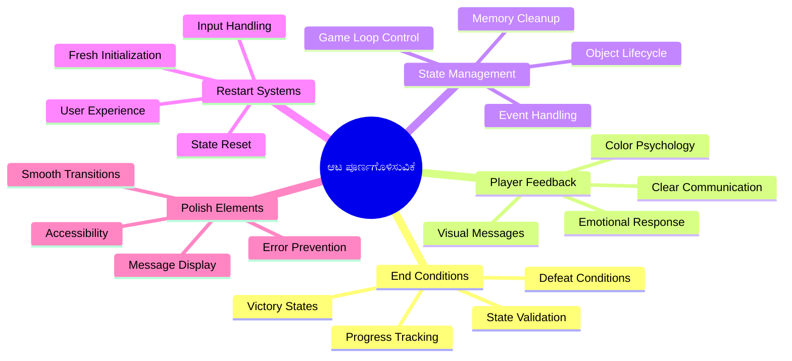
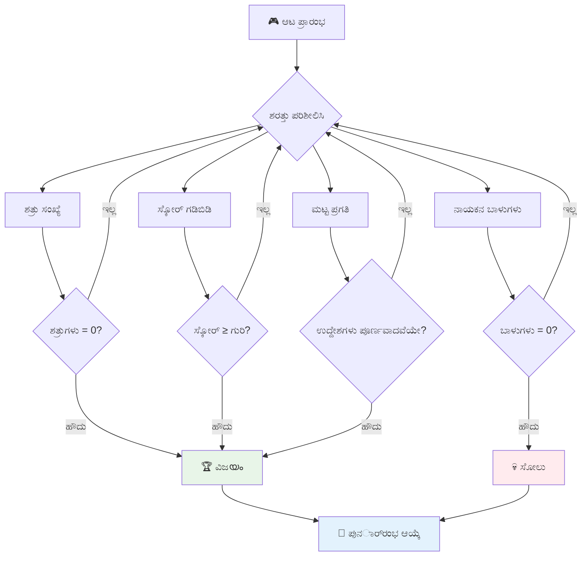
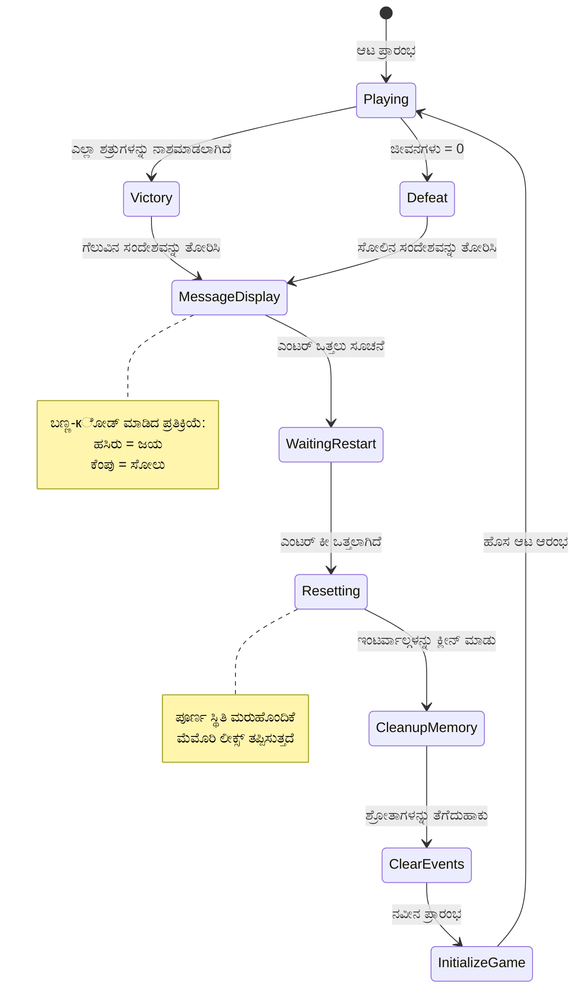
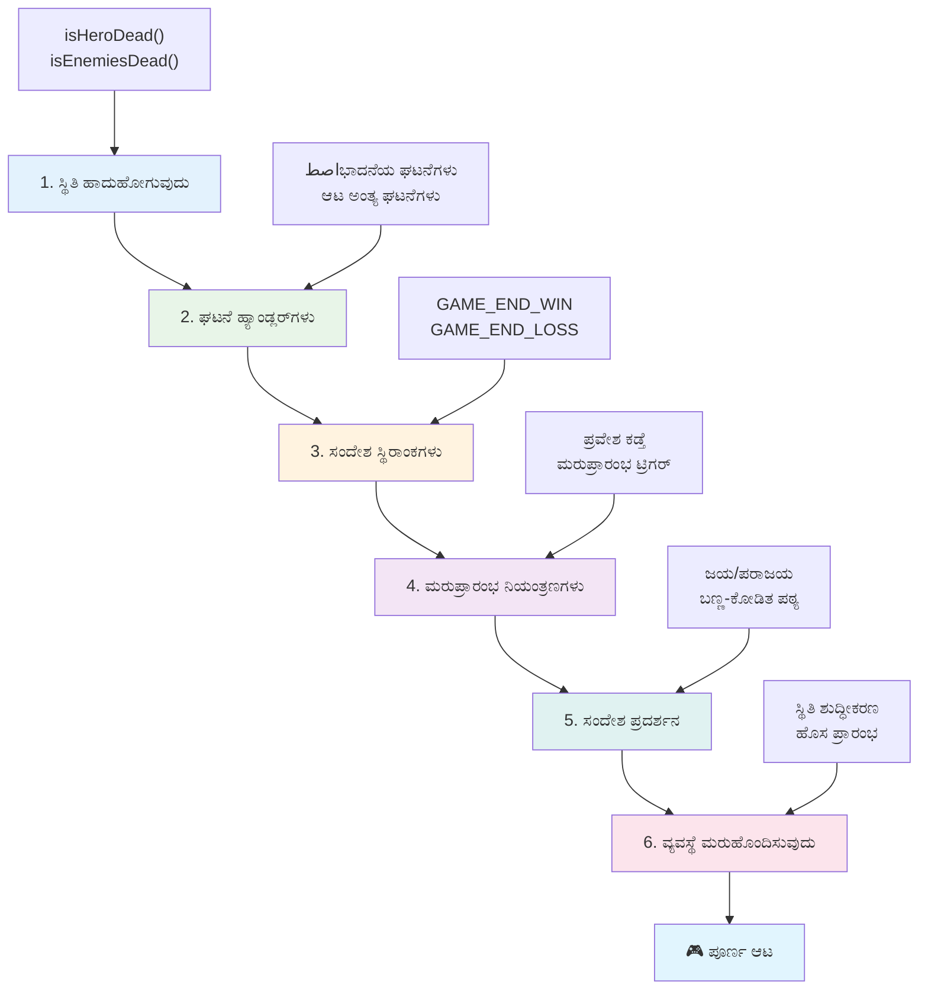
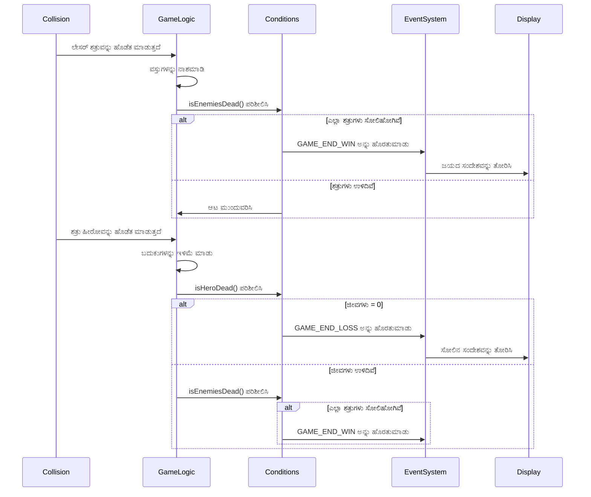
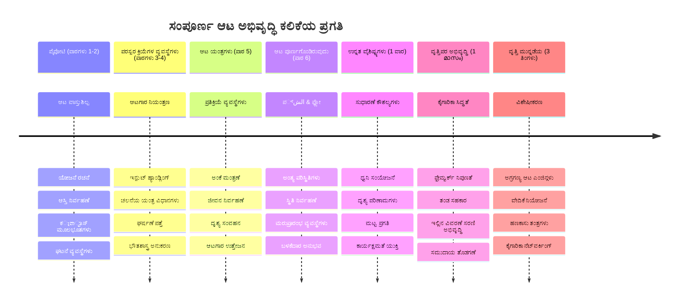

# ಸ್ಪೇಸ್ ಗೇಮ್ ಭಾಗ 6: ಅಂತ್ಯ ಮತ್ತು ಮರುಪ್ರಾರಂಭ

```mermaid
journey
    title ನಿಮ್ಮ ಆಟ ಪೂರ್ಣಗೊಳ್ಳುವ ಯಾತ್ರೆ
    section ಅಂತಿಮ ಪರಿಸ್ಥಿತಿಗಳು
      ಜಯ/ಹೋಲುವ ಸ್ಥಿತಿಗಳನ್ನುนิ
      ನಿರ್ವಹಿಸಿ: 3: Student
      ನಿಯಮ ಪರಿಶೀಲನೆ ಜಾರಿಗೆ ತರಲು: 4: Student
      ಸ್ಥಿತಿ ಪರಿವರ್ತನೆಗಳನ್ನು ನಿರ್ವಹಿಸಿ: 4: Student
    section ಆಟಗಾರ ಅನುಭವ
      ಪ್ರತಿಕ್ರಿಯಾ ವ್ಯವಸ್ಥೆಗಳನ್ನು ವಿನ್ಯಾಸ ಮಾಡು: 4: Student
      ಪುನರ್ ಪ್ರಾರಂಭ ಯಂತ್ರಗಳನ್ನು ರಚಿಸಿ: 5: Student
      ಬಳಕೆದಾರ ಇಂಟರ್ಫೇಸ್ ಮೆಕ್ಕೈ: 5: Student
    section ವ್ಯವಸ್ಥೆ ಏಕೀಕರಣ
      ಆಟ ಜೀವನಚಕ್ರವನ್ನು ನಿರ್ವಹಿಸಿ: 5: Student
      ಮೆಮೊರಿ ಶುದ್ಧೀಕರಣ ನಿರ್ವಹಣೆ: 5: Student
      ಸಂಪೂರ್ಣ ಅನುಭವವನ್ನು ರಚಿಸಿ: 5: Student
```
ಪ್ರತಿಯೊಂದು ಅದ್ಭುತ ಗೇಮ್‌ಗೆ ಸ್ಪಷ್ಟ ಅಂತ್ಯ ನಿಯಮಗಳು ಮತ್ತು ಸುಗಮ ಮರುಪ್ರಾರಂಭ ವ್ಯವಸ್ಥೆಯ ಅಗತ್ಯವಿದೆ. ನೀವು ಚಲನೆ, ಯುದ್ಧ ಮತ್ತು ಅಂಕೆಗಳೊಂದಿಗೆ ಒಬ್ಬ ಸುಂದರ ಸ್ಪೇಸ್ ಗೇಮ್ ಅನ್ನು ರಚಿಸಿದ್ದೀರಿ – ಈಗ ಅದು ಸಂಪೂರ್ಣತೆಯೂಂಟುಮಾಡುವ ಅಂತಿಮ ಭಾಗಗಳನ್ನು ಸೇರಿಸುವ ಸಮಯವಾಗಿದೆ.

ನಿಮ್ಮ ಗೇಮ್ ಪ್ರಸ್ತುತ ಅಂತಹ Voyager probes ಮಾದರಿಯಂತೆ ನಿರಂತರವಾಗಿ ನಡೆಯುತ್ತಿದೆ – NASA 1977 ರಲ್ಲಿ ಬಿಡುಗಡೆ ಮಾಡಿದವು ಮತ್ತು ಅನೇಕ ದಶಕಗಳಿಂದ ಜಾಗತಿಕ ಸ್ಥಳಾಂತರವನ್ನು ಮುಂದುವರೆಸಿವೆ. ಇದುಬಾಗಿಲಿಗಾಗಿ ಸೂಕ್ತವಾಗಿದ್ದರೂ, ಗೇಮ್‌ಗಳು ತೃಪ್ತಿದಾಯಕ ಅನುಭವವನ್ನು ಉಂಟುಮಾಡಲು ನಿರ್ದಿಷ್ಟ ಅಂತ್ಯವರ್ತನೆಗಳನ್ನು ಬೇಕು.

ಇಂದು ನಾವು ಸರಿಯಾದ ಜಯ/ಜೇತೆ ನಿಯಮಗಳು ಮತ್ತು ಮರುಪ್ರಾರಂಭ ವ್ಯವಸ್ಥೆಯನ್ನು ಇಂಪ್ಲಿಮೆಂಟ್ ಮಾಡಲಿದ್ದೇವೆ. ಈ ಪಾಠದ ಕೊನೆಗೂ, ನೀವು ಆಟಗಾರರು ಪೂರ್ಣಗೊಳಿಸಿ ಮರುಕಳಿಸಬಹುದಾಗಿ ವಿನ್ಯಾಸಗೊಳಿಸಿದ ಸೊಗಸಾದ ಗೇಮ್ ಅನ್ನು ಹೊಂದಿರುತ್ತೀರಿ, ಆದುದರಿಂದ ವರ್ಚುವಲ್ ಕ್ಲಾಸಿಕ್ ಆರ್ಕೆಡ್ ಗೇಮ್‌ಗಳಂತೆಯೇ ವಿಷಯ ನಿರ್ಧರಿಸುತ್ತದೆ.


## ಪಾಠ ಮುನ್ನ ಪರೀಕ್ಷೆ

[ಪೂರ್ವ ಪಾಠ ಪರೀಕ್ಷೆ](https://ff-quizzes.netlify.app/web/quiz/39)

## ಗೇಮ್ ಅಂತ್ಯ ದಿನಾಂಕಗಳ ತಿಳುವಳಿಕೆ

ನಿಮ್ಮ ಗೇಮ್ ಯಾವಾಗ ಅಂತ್ಯಗೊಳ್ಳಬೇಕು? ಈ ಮೂಲಭೂತ ಪ್ರಶ್ನೆಯು ಆರಂಭಿಕ ಆರ್ಕೆಡ್ ಯುಗದಿಂದಲೂ ಗೇಮ್ ವಿನ್ಯಾಸಕ್ಕೆ ಪ್ರಭಾವ ಬೀರಿದೆ. ಪ್ಯಾಕ್-ಮ್ಯಾನ್ ಭಾವ ಸ್ವಲ್ಪ ಇಲ್ಲದ ಪುತ್ರವಿದ್ದರೆ ಅಥವಾ ಎಲ್ಲ ಡಾಟ್‌ಗಳನ್ನು ಮುಗಿಸಿದರೆ ಅಂತ್ಯವಾಗುತ್ತದೆ, ಆದರೆ ಸ್ಪೇಸ್ ಇನ್ವೇಡರ್ಸ್‍ನಲ್ಲಿಯೂ ವೈಜ್ಞಾನಿಕ ಎಲ್ಲಾ ಶತ್ರುಗಳನ್ನು ಕೊಲಿಸುವ ಅಥವಾ ಅಲಿಯನ್ಗಳು ಕೆಳಗೆ ತಲುಪಿಸುವಾಗ ಅಂತ್ಯಗೊಳ್ಳುತ್ತದೆ.

ನೀವು ಗೇಮ್ ರಚಯಿತ, ಜಯ ಮತ್ತು ಸೋಲು ನಿಯಮಗಳನ್ನು ನಿರ್ಧರಿಸುತ್ತೀರಿ. ನಮ್ಮ ಸ್ಪೇಸ್ ಗೇಮ್‌ಗೆ, ಇಲ್ಲಿ ಆಸಕ್ತಿಕರ ಆಟವನ್ನು ಸೃಷ್ಟಿಸುವ ಸಾಂಪ್ರದಾಯಿತ ವಿಧಾನಗಳಿವೆ:


- **`N` ಶತ್ರು ಹಡಗುಗಳನ್ನು ನಿರ್ಮುಳುಮಾಡಲಾಗಿದೆ**: ವಿವಿಧ ಹಂತಗಳಾಗಿ ಗೇಮ್ ಅನ್ನು ವಿಭಜಿಸಿದಾಗ, ಹಂತವನ್ನು ಮುಗಿಸಲು `N` ಶತ್ರು ಹಡಗುಗಳನ್ನು ಧ್ವಂಸ ಮಾಡಬೇಕಾಗುತ್ತದೆ, ಇದು ಸಾಮಾನ್ಯ.
- **ನಿಮ್ಮ ಹಡಗು ನಿರ್ಮುಳುಗೊಂಡಿದೆ**: ಕೆಲ ಗೇಮ್‌ಗಳಲ್ಲಿ ಹಡಗು ಧ್ವಂಸವಾದರೆ ನೀವು ಗೇಮ್ ಸೋಲುತ್ತೀರಿ. ಇನ್ನೊಂದು ಸಾಮಾನ್ಯ ವಿಧಾನ ಗಾಳಿಯಲ್ಲಿ ಜೀವನ ಪ್ರಮಾಣಗಳ ಕಲ್ಪನೆ ಇದೆ. ಪ್ರತಿ ಬಾರಿ ಹಡಗು ಧ್ವಂಸವಾದಾಗ ಒಂದು ಜೀವ ಕಳೆದುಕೊಳ್ಳುತ್ತದೆ. ಎಲ್ಲಾ ಜೀವಗಳು ಹದಗೆಟ್ಟಾಗ ನೀವು ಗೇಮ್ ಸೋಲುತ್ತೀರಿ.
- **ನೀವು `N` ಅಂಕೆಗಳನ್ನು ಸಂಗ್ರಹಿಸಿದ್ದೀರಿ**: ಮತ್ತೊಂದು ಸಾಮಾನ್ಯ ಅಂತ್ಯದ ಷರತ್ತು ಅಂಕೆಗಳನ್ನು ಸಂಗ್ರಹಿಸುವುದು. ನೀವು ಅಂಕೆಗಳನ್ನು ಪಡೆಯುವ ವಿಧಾನವು ನಿಮ್ಮ ಮೇರೆಗೆ ಆದರೆ ಸಾಮಾನ್ಯವಾಗಿ ಶತ್ರು ಹಡಗುಗಳನ್ನು ನಾಶ ಮಾಡುವುದನ್ನು ಅಥವಾ ಧ್ವಂಸವಾದಾಗ ಬಿಳಿಗ್ಗುವ ವಸ್ತುಗಳನ್ನು ಸಂಗ್ರಹಿಸುವ ಮೂಲಕ ಅಂಕೆ ನೀಡಲಾಗುತ್ತದೆ.
- **ಒಂದು ಹಂತ ಪೂರ್ಣಮಾಡುವುದು**: ಇದು ಹಲವು ಷರತ್ತುಗಳನ್ನು ಒಳಗೊಂಡಿರಬಹುದು ಏನೆಂದರೆ `X` ಶತ್ರು ಹಡಗುಗಳು ಧ್ವಂಸವಾಗಿರಬಹುದು, `Y` ಅಂಕೆಗಳ ಸಂಗ್ರಹವಿರಬಹುದು ಅಥವಾ ವಿಶೇಷ ವಸ್ತು ಸಂಗ್ರಹದ ಮೇಲಾಯಿತು.

## ಗೇಮ್ ಮರುಪ್ರಾರಂಭ ಕಾರ್ಯಕ್ಷಮತೆ ಅನುಷ್ಠಾನ

ಸರಿಯಾದ ಮರುಪ್ರಾರಂಭ ಯಂತ್ರವು ಗೇಮ್‌ಗಳನ್ನು ಮರುಕಳಿಸುವಿಕೆಗೆ ಪ್ರೋತ್ಸಾಹಿಸುತ್ತದೆ. ಆಟಗಾರರು ಗೇಮ್ ಪೂರ್ಣಮಾಡಿದಾಗ (ಅಥವಾ ಸೋಲಿದಾಗ) ಕೂಡ ತಕ್ಷಣ ಮತ್ತೆ ಪ್ರಯತ್ನಿಸಲು ಇಚ್ಛಿಸುತ್ತಾರೆ - ಅಂಕೆಗಳನ್ನು ಮೀರಿಸಲು ಅಥವಾ ಪ್ರದರ್ಶನ ಸುಧಾರಿಸಲು.


ಟೇಟ್ರಿಸ್ ಇದು ಸ್ಪಷ್ಟವಾಗಿ ಪ್ರದರ್ಶಿಸುತ್ತದೆ: ನಿಮ್ಮ ಬ್ಲಾಕ್ ಗಳು ಟಾಪ್ ತಲುಪಿದಾಗ, ನೀವು ಕಠಿಣ ಮೆನುಗಳನ್ನು ನೆಡೆಸದೆ ತಕ್ಷಣ ಹೊಸ ಗೇಮ್ ಪ್ರಾರಂಭಿಸಬಹುದು. ನಾವು ಸರಿಯಾದ ಮರುಪ್ರಾರಂಭ ವ್ಯವಸ್ಥೆಯನ್ನು ರಚಿಸುವೆವು, ಇದು ಆಟದ ಸ್ಥಿತಿಯನ್ನು ಸ್ವಚ್ಚವಾಗಿ ಮರುಹೊಂದಿಸಿ ಆಟಗಾರರನ್ನು ತ್ವರಿತವಾಗಿ ಮತ್ತೆ ಆಡಲು ಒದಗಿಸುತ್ತದೆ.

✅ **ಚಿಂತನೆ**: ನೀವು ಆಡಿದ ಗೇಮ್‌ಗಳ ಬಗ್ಗೆ ಯೋಚಿಸಿ. ಅವು ಯಾವ ಷರತ್ತುಗಳಲ್ಲಿ ಮುಕ್ತಾಯಗೊಳ್ಳುತ್ತವೆ ಮತ್ತು ಮರುಪ್ರಾರಂಭಕ್ಕೆ ನೀವು ಹೇಗೆ ಪ್ರೇರೇಪಿತರಾಗುತ್ತೀರಿ? ಮರುಪ್ರಾರಂಭ ಅನುಭವವನ್ನು ಸುಗಮವೆಂಬುದನ್ನು ಏನು ಮಾಡುತ್ತದೆ ಮತ್ತು ನೆರೆಹೊರೆಯಾಗಿ ಮಾಡಿ?

## ನೀವು ಏನು ರಚಿಸುವಿರಿ

ನೀವು ನಿಮ್ಮ ಪ್ರಾಜೆಕ್ಟ್ ಅನ್ನು ಸಂಪೂರ್ಣ ಆಟ ಅನುಭವವಾಗುವಂತೆ ಪರಿವರ್ತಿಸುವ ಅಂತಿಮ ವೈಶಿಷ್ಟ್ಯಗಳನ್ನು ಅನುಷ್ಠಾನಗೊಳಿಸುವಿರಿ. ಈ ಅಂಶಗಳು ಸೋಗಸಾದ ಆಟಗಳನ್ನು ಮೂಲ ಪ್ರೋಟೋಟೈಪ್ಗಳಿಂದ ವಿಭಿನ್ನಗೊಳಿಸುತ್ತವೆ.

**ಇವೆ ಅಂತಿಮವಾಗಿ ನಾವು ಸೇರಿಸುವುದು:**

1. **ಮರೆಯಲಾರದ ಜಯ ಷರತ್ತು**: ಎಲ್ಲಾ ಶತ್ರುಗಳನ್ನು ಸುಳಿವಿನ ಜೊತೆ ನಾಶ ಮಾಡಿ ಮತ್ತು ನಿಜವಾದ ಹಬ್ಬವನ್ನು ಅನುಭವಿಸಿ (ನೀವು ಬಯಸಿದಂತೆ!)
2. **ಸೋಲಿನ ಷರತ್ತು**: ಜೀವನ ಕಡಿಮೆಯಾದ ಮೇಲೆ ಸೋಲುಗೊಳ್ಳುವ ಪರದೆ ನೋಡಿ
3. **ಮರುಪ್ರಾರಂಭ ಯಂತ್ರ**: Enter ಒತ್ತಿ ತಕ್ಷಣ ಮತ್ತೆ ಪ್ರಾರಂಭಿಸಿ - ಏಕೆಂದರೆ ಒಂದೇ ಗೇಮ್ ಸಾಕಾಗದು
4. **ಸ್ಥಿತಿ ನಿರ್ವಹಣೆ**: ಪ್ರತಿ ಬಾರಿ ಮುಕ್ತ ಮತ್ತು ಸ್ವಚ್ಚ ಸ್ಥಿತಿ - ಯಾವುದೇ ಉಳಿದ ಶತ್ರುಗಳು ಅಥವಾ ಕ್ರೇಜಿ ದೋಷಗಳಿಲ್ಲ

## ಪ್ರಾರಂಭಿಸೋಣ

ನಿಮ್ಮ ಡೆವಲಪ್ಮೆಂಟ್ ಪರಿಸರವನ್ನು ಸಿದ್ಧಪಡಿಸೋಣ. ನೀವು ಹಿಂದಿನ ಪಾಠಗಳಿಂದ ಎಲ್ಲಾ ಸ್ಪೇಸ್ ಗೇಮ್ ಫೈಲನ್ನು ಹೊಂದಿರಬೇಕು.

**ನಿಮ್ಮ ಪ್ರಾಜೆಕ್ಟ್ ಹೀಗಿರಬೇಕು:**

```bash
-| assets
  -| enemyShip.png
  -| player.png
  -| laserRed.png
  -| life.png
-| index.html
-| app.js
-| package.json
```

**ನಿಮ್ಮ ಡೆವಲಪ್ಮೆಂಟ್ ಸರ್ವರ್ ಪ್ರಾರಂಭಿಸಿ:**

```bash
cd your-work
npm start
```

**ಈ ಕಮಾಂಡ್:**
- `http://localhost:5000` ನಲ್ಲಿ ಸ್ಥಳೀಯ ಸರ್ವರ್ ಓಡಿಸುತ್ತದೆ
- ನಿಮ್ಮ ಫೈಲ್‌ಗಳನ್ನು ಸರಿಯಾಗಿ ಸರ್ವ್ ಮಾಡುತ್ತದೆ
- ನೀವು ಬದಲಾವಣೆ ಮಾಡಿದಾಗ ಸ್ವಯಂಚಾಲಿತವಾಗಿ ರિફ್ರೆಶ್ ಮಾಡುತ್ತದೆ

ಬ್ರೌಸರ್‌ನಲ್ಲಿ `http://localhost:5000` ತೆರೆಯಿರಿ ಮತ್ತು ನಿಮ್ಮ ಗೇಮ್ ಓಡಿುತಿದೆ ಎಂದು ಖಚಿತಪಡಿಸಿಕೊಳ್ಳಿ. ನೀವು freeely ಚಲಿಸಲು, ಶೂಟ್ ಮಾಡಲು ಮತ್ತು ಶತ್ರುಗಳೊಂದಿಗೆ ಸಂವದಿಸಲು ಸಾಧ್ಯವಾಗಬೇಕು. ದೃಢಿ ಮಾಡಿದ ಬಳಿಕ, ನಾವು ಅನುಷ್ಠಾನಕ್ಕೆ ಮುಂದುವರೆಯಬಹುದು.

> 💡 **ವೃತ್ತಿಪರ ಸಲಹೆ**: Visual Studio Code ನಲ್ಲಿ ಎಚ್ಚರಿಕೆ ತಪ್ಪಿಸಲು, `window.onload` ಫಂಕ್ಷನ್ನಿನೊಳಗೆ `gameLoopId` ಘೋಷಿಸುವ ಬದಲು ಫೈಲಿನ ಮೇಲೇ `let gameLoopId;` ಎಂದು ಘೋಷಿಸಿ. ಇದು ಆಧುನಿಕ ಜಾವಾಸ್ಕ್ರಿಪ್ಟ್ ಘೋಷಣೆಯ ಉತ್ತಮ ಅಭ್ಯಾಸ.


## ಅನುಷ್ಠಾನ ಹಂತಗಳು

### ಹಂತ 1: ಅಂತ್ಯ ಷರತ್ತುಗಳನ್ನು ಟ್ರ್ಯಾಕ್ ಮಾಡುವ ಫಂಕ್ಷನ್‌ಗಳು ರಚನೆ

ಗೇಮ್ ಯಾವಾಗ ಅಂತ್ಯವಾಗಬೇಕು ಎಂಬುದನ್ನು নজರಿಡಲು ಫಂಕ್ಷನ್ಗಳ ಅಗತ್ಯವಿದೆ. ಅಂತಾರಾಷ್ಟ್ರೀಯ ಸ್ಪೇಸ್ ಸ್ಟೇಷನ್‌ನ ಸենսಾರ್‌ಗಳು ಪ್ರಮುಖ ವ್ಯವಸ್ಥೆಗಳನ್ನು ನಿರಂತರವಾಗಿ ಪರಿಶೀಲಿಸುವಂತೆಯೇ, ಈ ಫಂಕ್ಷನ್‌ಗಳು ಗೇಮ್ ಸ್ಥಿತಿಯನ್ನು ನಿರಂತರವಾಗಿ ಪರಿಶೀಲಿಸುತ್ತವೆ.

```javascript
function isHeroDead() {
  return hero.life <= 0;
}

function isEnemiesDead() {
  const enemies = gameObjects.filter((go) => go.type === "Enemy" && !go.dead);
  return enemies.length === 0;
}
```

**ಇವು ಪಶ್ಚಾತ್ತಲದಲ್ಲಿ ಏನಾಗುತ್ತಿದೆ:**
- ನಮ್ಮ ಹೀರೋ ಜೀವಗಳಿಂದ ಬಿತ್ತಲಾಗಿದೆಯೇ ಎಂಬುದನ್ನು ಪರಿಶೀಲಿಸುತ್ತದೆ (ಅಯ್ಯೋ!)
- ಈಟು ಶತ್ರುಗಳು ಇನ್ನೂ ಎಷ್ಟು ಬಾಳಿರುತ್ತಿವೆ ಎಣಿಸುತ್ತದೆ
- ಶತ್ರುಗಳ ಹರಿತ ಶೂನ್ಯವಾದಾಗ `true` ಮರುಳುಮಾಡುತ್ತದೆ
- ಸರಳ ಸತ್ಯ/ಅಸತ್ಯ ಲಾಜಿಕ್ ಬಳಸಿ ಸರಳವಾಗಿರುತ್ತದೆ
- ಎಲ್ಲಾ ಗೇಮ್ ವಸ್ತುಗಳನ್ನೊಳಗೊಂಡು ಬದುಕಿದ್ದವರನ್ನು ಫಿಲ್ಟರ್ ಮಾಡುತ್ತದೆ

### ಹಂತ 2: ಅಂತ್ಯ ಷರತ್ತುಗಳಿಗಾಗಿ ಈವೆಂಟ್ ಹ್ಯಾಂಡ್ಲರ್‌ಗಳನ್ನು ನವೀಕರಿಸಿ

ಈಗ ನಾವು ಈ ಷರತ್ತು ಪರಿಶೀಲನೆಗಳನ್ನು ಗೇಮ್ ಈವೆಂಟ್ ವ್ಯವಸ್ಥೆಗೆ ಸಂಪರ್ಕಿಸುವೆವು. ಪ್ರತೀ ಬಾರಿ ಸಂಕುಲನ ಸಂಭವಿಸಿದಾಗ ಗೇಮ್ ಅಂತ್ಯ ಷರತ್ತು ಸೃಷ್ಟವಾಗುತ್ತದೆಯೆ ಎಂದು ಮೌಲ್ಯಮಾಪನ ಮಾಡುತ್ತದೆ. ಇದರಿಂದ ಪ್ರಮುಖ ಗೇಮ್ ಈವೆಂಟ್‌ಗಳಿಗೆ ತಕ್ಷಣದ ಪ್ರತಿಕ್ರಿಯೆ ಸಿಗುತ್ತದೆ.


```javascript
eventEmitter.on(Messages.COLLISION_ENEMY_LASER, (_, { first, second }) => {
    first.dead = true;
    second.dead = true;
    hero.incrementPoints();

    if (isEnemiesDead()) {
      eventEmitter.emit(Messages.GAME_END_WIN);
    }
});

eventEmitter.on(Messages.COLLISION_ENEMY_HERO, (_, { enemy }) => {
    enemy.dead = true;
    hero.decrementLife();
    if (isHeroDead())  {
      eventEmitter.emit(Messages.GAME_END_LOSS);
      return; // ವಿಜಯದ ಹಿಂದಿನ ನಷ್ಟ
    }
    if (isEnemiesDead()) {
      eventEmitter.emit(Messages.GAME_END_WIN);
    }
});

eventEmitter.on(Messages.GAME_END_WIN, () => {
    endGame(true);
});
  
eventEmitter.on(Messages.GAME_END_LOSS, () => {
  endGame(false);
});
```

**ಇಲ್ಲಿ ಏನಾಗುತ್ತಿದೆ:**
- **ಲೇಸರ್ ಶತ್ರುಗಳಿಗೆ ತಗ್ಗುತ್ತದೆ**: ಇಬ್ಬರೂ ಕಾಣೆಯಾಗುತ್ತಾರೆ, ನೀವು ಅಂಕೆಗಳನ್ನು ಪಡೆಯುತ್ತೀರಿ ಮತ್ತು ನೀವು ಗೆದ್ದಿದ್ದೀರಾ ಎಂದು ಪರಿಶೀಲನೆ ಮಾಡಲಾಗುತ್ತದೆ
- **ಶತ್ರು ನಿಮಗೆ ತಗ್ಗುತ್ತದೆ**: ನೀವು ಒಂದು ಜೀವ ಕಳೆದುಕೊಳ್ಳುತ್ತೀರಿ ಮತ್ತು ನೀವು ಇನ್ನೂ ಶ್ವಾಸ ಇರುವಿರಾ ಎಂದು ಪರಿಶೀಲಿಸಲಾಗುತ್ತದೆ
- **ಬುದ್ಧಿವಂತಿಕೆ ಕ్రమಬದ್ಧತೆ**: ಮೊದಲು ಸೋಲು ಪರಿಶೀಲಿಸುತ್ತೇವೆ (ಹಾಗಿಲ್ಲದೆ ನೀವು ಒತ್ತಡದಿಂದ ಗೆಲ್ಲಬೇಕೆಂಬುದು ಇಲ್ಲ!)
- **ತಕ್ಷಣದ ಕ್ರಿಯೆಗಳು**: ಏನಾದರೂ ಪ್ರಮುಖ ಮೂರು ಸಮಯದಲ್ಲೇ ಗೇಮ್ ತಿಳಿದುಕೊಳ್ಳುತ್ತದೆ

### ಹಂತ 3: ಹೊಸ ಸಂದೇಶ ಸ್ಥಿರಾಂಕಗಳನ್ನು ಸೇರಿಸಿ

ನೀವು ನಿಮ್ಮ `Messages` ಸ್ಥಿರಾಂಕ ವಸ್ತುವಿನಲ್ಲಿ ಹೊಸ ಸಂದೇಶ ಪ್ರಕಾರಗಳನ್ನು ಸೇರಿಸಬೇಕಾಗುತ್ತದೆ. ಈ ಸ್ಥಿರಾಂಕಗಳು ಸರಳತೆ ಮತ್ತು ತಪ್ಪುಗಳನ್ನು ತಪ್ಪಿಸಲು ಸಹಾಯ ಮಾಡುತ್ತವೆ.

```javascript
GAME_END_LOSS: "GAME_END_LOSS",
GAME_END_WIN: "GAME_END_WIN",
```

**ಅಗಲಿನಲ್ಲಿ ನಾವು:**
- ಗೇಮ್ ಅಂತ್ಯ ಈವೆಂಟ್‌ಗಾಗಿ ಸ್ಥಿರಾಂಕಗಳನ್ನು ಸೇರಿಸಿದ್ದೇವೆ
- ಸ್ಪಷ್ಟವಾಗಿರುವ ಹೆಸರುಗಳನ್ನು ಬಳಸಿದ್ದೇವೆ, ಈವೆಂಟ್ ಉದ್ದೇಶವನ್ನು ಸಿಗಿಎಂ ಗೊಳಿಸುತ್ತದೆ
- ಇಂದಿನ ಸಂದೇಶ ಪ್ರಕಾರದ ಹೆಸರು ನಾಮಕರಣದ ಹಾದಿಯನ್ನು ಪಾಲಿಸುತ್ತೇವೆ

### ಹಂತ 4: ಮರುಪ್ರಾರಂಭ ನಿಯಂತ್ರಣಗಳನ್ನು ಅನುಷ್ಠಾನಗೊಳಿಸಿ

ಈಗ ನೀವು ಗೇಮ್ ಅನ್ನು ಮರುಪ್ರಾರಂಭಿಸಲು ಕೀಬೋರ್ಡ್ ನಿಯಂತ್ರಣಗಳನ್ನು ಸೇರಿಸಲಿದ್ದೀರಿ. Enter ಕೀವು ಸಾಮಾನ್ಯವಾಗಿ ದೃಢಪಡಿಸಲು ಮತ್ತು ಹೊಸ ಗೇಮ್ ಪ್ರಾರಂಭಿಸಲು ಚಿಕಿತ್ಸೆ ಕಲ್ಪಿಸುವುದರಿಂದ ಪ್ರಾಕೃತಿಕ ಆಯ್ಕೆ.

**ನಿಮ್ಮ ಇತ್ತೀಚಿನ keydown ಈವೆಂಟ್ ಶ್ರೋತಿಗೆ Enter ಕೀ ಗುರುತಿಸುವಿಕೆಯನ್ನು ಸೇರಿಸಿ:**

```javascript
else if(evt.key === "Enter") {
   eventEmitter.emit(Messages.KEY_EVENT_ENTER);
}
```

**ಹೊಸ ಸಂದೇಶ ಸ್ಥಿರಾಂಕವನ್ನು ಸೇರಿಸಿ:**

```javascript
KEY_EVENT_ENTER: "KEY_EVENT_ENTER",
```

**ನಿಮಗೆ ತಿಳಿಯಬೇಕಾದುದು:**
- ನಿಮ್ಮ ಇತ್ತೀಚಿನ ಕೀಬೋರ್ಡ್ ಈವೆಂಟ್ ಕೈಗಾರಿಕೆಯ ವ್ಯವಸ್ಥೆಯನ್ನು ವಿಸ್ತರಿಸುತ್ತದೆ
- ಪ್ರವೇಶ ಕೀವನ್ನು ಮರುಪ್ರಾರಂಭ ಟ್ರಿಗರ್ ಆಗಿ ಬಳಕೆಗಾಗಿ
- ನಿಮ್ಮ ಗೇಮ್‌ನ ಇತರ ಭಾಗಗಳು ಇದನ್ನು ಕೇಳಲು ಕಸ್ಟಮ್ ಈವೆಂಟ್ ಅನ್ನು ನೀಡುತ್ತದೆ
- ನಿಮ್ಮ ಇತರ ಕೀಬೋರ್ಡ್ ನಿಯಂತ್ರಣಗಳಂತೆ ಇದೇ ಮಾದರಿಯನ್ನು ಅನುಸರಿಸುತ್ತದೆ

### ಹಂತ 5: ಸಂದೇಶ ಪ್ರದರ್ಶನ ವ್ಯವಸ್ಥೆಯನ್ನು ನಿರ್ಮಿಸಿ

ನಿಮ್ಮ ಗೇಮ್ ಫಲಿತಾಂಶಗಳನ್ನು ಸ್ಪಷ್ಟವಾಗಿ ಆಟಗಾರರಿಗೆ ತಲುಪಿಸಬೇಕಾಗುತ್ತದೆ. ನಾವು ಟರ್ಮಿನಲ್ ಇಂಟರ್ಫೇಸ್ ಮೂರ್ತಿಗಳಂತಹ ಹಸಿರು ಯಶಸ್ಸಿಗೆ ಮತ್ತು ಕೆಂಪು ದೋಷಗಳಿಗೆ ಸೂಚಿಸುವ ಬಣ್ಣದ ಮೂಲಕ ಜಯ ಮತ್ತು ಸೋಲು ಸ್ಥಿತಿಗಳನ್ನು ತೋರಿಸುವ ಸಂದೇಶ ವ್ಯವಸ್ಥೆಯನ್ನು ರಚಿಸುವೆವು.

**`displayMessage()` ಫಂಕ್ಷನ್ ರಚಿಸಿ:**

```javascript
function displayMessage(message, color = "red") {
  ctx.font = "30px Arial";
  ctx.fillStyle = color;
  ctx.textAlign = "center";
  ctx.fillText(message, canvas.width / 2, canvas.height / 2);
}
```

**ಹಂತ ಹಂತವಾಗಿ ಏನಾಗುತ್ತಿದೆ:**
- ಸ್ಪಷ್ಟ ಮತ್ತು ಓದಲು ಸುಲಭವಾಗಿರುವ ಟೆಕ್ಸ್ಟ್ ಗಾಗಿ ಫಾಂಟ್ ಗಾತ್ರ ಮತ್ತು ಕುಟುಂಬವನ್ನು ಹೊಂದಿಸುತ್ತದೆ
- ಎಚ್ಚರಿಕೆಗಾಗಿ ಡೀಫಾಲ್ಟ್ "ಕೆಂಪು" ಬಣ್ಣದ ಪರಿಮಾಣವನ್ನು ವಾಪಸ್ ನೀಡುತ್ತದೆ
- ಟ್ಯಾಕ್ಟಿಲ್ಗಾಗಿ ಮತ್ತು ಲಂಪಟಕ್ಕಾಗಿ ಕ್ಯಾನ್ವಾಸ್ ಮದ್ಯದಲ್ಲಿ ಪಾಠವನ್ನು ಕೇಂದ್ರಗೊಳಿಸುತ್ತದೆ
- ಬಣ್ಣ ಆಯ್ಕೆಗೆ ಆಧುನಿಕ ಜಾವಾಸ್ಕ್ರಿಪ್ಟ್ ಡೀಫಾಲ್ಟ್ ಪರಿಮಾಣವನ್ನು ಬಳಸುತ್ತದೆ
- ನೇರ ಪಠ್ಯ ರೆಂಡರಿಂಗ್ ಗಾಗಿ 2D ಕ್ಯಾನ್ವಾಸ್ ಕಾಂಟೆಕ್ಸ್ಟ್ ಬಳಸುತ್ತದೆ

**`endGame()` ಫಂಕ್ಷನ್ ರಚಿಸಿ:**

```javascript
function endGame(win) {
  clearInterval(gameLoopId);

  // ಯಾವುದೇ ಬಾಕಿ ಇರುವ ರೆಂಡರ್‌ಗಳು ಪೂರ್ಣಗೊಳ್ಳುವಂತಹ ವಿಳಂಬವನ್ನು ಸೆಟ್ ಮಾಡಿ
  setTimeout(() => {
    ctx.clearRect(0, 0, canvas.width, canvas.height);
    ctx.fillStyle = "black";
    ctx.fillRect(0, 0, canvas.width, canvas.height);
    if (win) {
      displayMessage(
        "Victory!!! Pew Pew... - Press [Enter] to start a new game Captain Pew Pew",
        "green"
      );
    } else {
      displayMessage(
        "You died !!! Press [Enter] to start a new game Captain Pew Pew"
      );
    }
  }, 200)  
}
```

**ಈ ಫಂಕ್ಷನ್ ಏನು ಮಾಡುತ್ತದೆ:**
- ಎಲ್ಲ ಹಡಗು ಮತ್ತು ಲೇಸರ್ ಚಲಿಸುವುದೇನೆಂದರೆ ಸ್ಥಗಿತಗೊಳಿಸುತ್ತದೆ
- ಕೊನೆಯ ಫ್ರೇಮ್ ಚಿತ್ರಣದ ಅವಕಾಶಕ್ಕಾಗಿ 200ms ಕ್ಷಿಪ್ರ ವಿರಾಮವನ್ನು ತೆಗೆದುಕೊಳ್ಳುತ್ತದೆ
- ಪರದೆ ಸ್ಯಾಂಬಾಗಿ ಭೂತವಾದ ನಿಶಿವರ್ಣ ಬಣ್ಣದಲ್ಲಿ ಬಣ್ಣಿಸುತ್ತದೆ
- ಗೆದ್ದವರ ಮತ್ತು ಸೋಲಿಗರಿಗಾಗಿ ವಿಭಿನ್ನ ಸಂದೇಶಗಳನ್ನು ತೋರಿಸುತ್ತದೆ
- ಸುದ್ದಿಯನ್ನು ಬಣ್ಣ ಸಂಚಾರ ಮಾಡುತ್ತದೆ - ಹಸಿರು ಉತ್ತಮಕ್ಕೆ, ಕೆಂಪು ಅಲ್ಪಶಃ ಉತ್ತಮ ಅಲ್ಲ
- ಆಟಗಾರರಿಗೆ ಮತ್ತೆ ಪ್ರವೇಶ ಮಾಡಲು ಸೂಚನೆ ನೀಡುತ್ತದೆ

### 🔄 **ಶಿಕ್ಷಣಾತ್ಮಕ ಪರಿಶೀಲನೆ**
**ಗೇಮ್ ಸ್ಥಿತಿ ನಿರ್ವಹಣೆ**: ಮರುಹೊಂದಿಸುವ ಕಾರ್ಯವನ್ನು ಅನುಷ್ಠಾನ ಮಾಡುವ ಮೊದಲು ಈ ವಿಷಯಗಳನ್ನು ತಿಳಿದುಕೊಳ್ಳಿ:
- ✅ ಅಂತ್ಯ ಷರತ್ತುಗಳು ಸ್ಪಷ್ಟ ಆಟದ ಉದ್ದೇಶಗಳನ್ನು ಹೇಗೆ ಸೃಷ್ಟಿಸುತ್ತವೆ
- ✅ ದೃಶ್ಯ ಪ್ರತಿಕ್ರಿಯೆ ಆಟಗಾರರ ಅರ್ಥಮಾಡಿಕೊಳ್ ತನ್ನ ಈತರದ್ದು
- ✅ ಸರಿಯಾದ ಕ್ಲೀನ್‌ಅಪ್ ನ ಭೂಮಕೆಯು ಮೆಮೊರಿ ಲೀಕ್ ತಡೆಯಲು ಅಗತ್ಯವಿದೆ
- ✅ ಘಟನೆ-ಆಧಾರಿತ ಆರ್ಕಿಟೆಕ್ಚರ್ ಸ್ವಚ್ಛ ಸ್ಥಿತಿ ಪರಿವರ್ತನೆಗೆ ಸಹಾಯ ಮಾಡುತ್ತದೆ

**ತ್ವರಿತ ಸ್ವ-ಪರೀಕ್ಷೆ**: ಮರುಹೊಂದಿಸುವಾಗ ಈವೆಂಟ್ ಶ್ರೋತಿಗಳನ್ನು ತೆರವುಗೊಳಿಸದಿದ್ದರೆ ಏನಾಗಬಹುದು?
*ಉತ್ತರ: ಮೆಮೊರಿ ಲೀಕ್ ಮತ್ತು ಸಡಿಲ ಇವೆಂಟ್ ಹ್ಯಾಂಡ್ಲರ್‌ಗಳ ಕಾರಣದಿಂದ ಅನಿರೀಕ್ಷಿತ ವರ್ತನೆ*

**ಗೇಮ್ ವಿನ್ಯಾಸ ತತ್ವಗಳು**: ನೀವು ಈಗ ಅನುಷ್ಠಾನಗೊಳಿಸುತ್ತಿರುವುದು:
- **ಸ್ಪಷ್ಟ ಗುರಿಗಳು**: ಆಟಗಾರರಿಗೆ ಯಶಸ್ಸು ಮತ್ತು ವಿಫಲತಾ ವ್ಯಾಖ್ಯಾನ ಸ್ಪಷ್ಟವಾಗಿದೆ
- **ತಕ್ಷಣದ ಪ್ರತಿಕ್ರಿಯೆ**: ಗೇಮ್ ಸ್ಥಿತಿಯಲ್ಲಿ ಬದಲಾವಣೆಗಳು ತಕ್ಷಣ ಸಂವಹನಗೊಳ್ಳುತ್ತವೆ
- **ಬಳಕೆದಾರ ನಿಯಂತ್ರಣ**: ಆಟಗಾರರು ಸಿದ್ಧರಾದಾಗ ಮರುಪ್ರಾರಂಭ ಮಾಡಬಹುದು
- **ವ್ಯವಸ್ಥೆಯ ನಂಬಕತೆ**: ಸರಿಯಾದ ಸ್ವಚ್ಛತೆ ದೋಷ ಮತ್ತು ಪ್ರದರ್ಶನ ಸಮಸ್ಯೆಗಳನ್ನು ತಡೆಯುತ್ತದೆ

### ಹಂತ 6: ಗೇಮ್ ಮರುಹೊಂದಿಸುವ ಕಾರ್ಯಕ್ಷಮತೆ ಅನುಷ್ಠಾನ

ಮರುಹೊಂದಿಸುವ ವ್ಯವಸ್ಥೆ ಪ್ರಸ್ತುತ ಗೇಮ್ ಸ್ಥಿತಿಯನ್ನು ಸಂಪೂರ್ಣವಾಗಿ ಕ್ಲೀನ್ ಮಾಡಬೇಕು ಮತ್ತು ಹೊಸ ಗೇಮ್ ಸೆಷನ್ ಅನ್ನು ಪ್ರಾರಂಭ ಮಾಡಬೇಕು. ಇದು ಆಟಗಾರರಿಗೆ ಹಿಂದಿನ ಗೇಮ್‌ನ任何 ಅಳವಡಿಕೆಯಿಂದ ಮುಕ್ತವಾಗಿ ಸ್ವಚ್ಛ ಪ್ರಾರಂಭವನ್ನು ಒದಗಿಸುತ್ತದೆ.

**`resetGame()` ಫಂಕ್ಷನ್ ರಚಿಸಿ:**

```javascript
function resetGame() {
  if (gameLoopId) {
    clearInterval(gameLoopId);
    eventEmitter.clear();
    initGame();
    gameLoopId = setInterval(() => {
      ctx.clearRect(0, 0, canvas.width, canvas.height);
      ctx.fillStyle = "black";
      ctx.fillRect(0, 0, canvas.width, canvas.height);
      drawPoints();
      drawLife();
      updateGameObjects();
      drawGameObjects(ctx);
    }, 100);
  }
}
```

**ಪ್ರತಿ ಭಾಗವನ್ನು ತಿಳಿದುಕೊಳ್ಳೋಣ:**
- ಮರುಸಂಸ್ಕರಣೆಗೆ ಪೂರ್ವದಲ್ಲಿ ಗೇಮ್ ಲೂಪ್ ಚಾಲಿತವಾಗಿದೆಯೇ ಎಂದು ಪರಿಶೀಲಿಸುತ್ತದೆ
- ಗೇಮ್ ಲೂಪ್ನ್ನು ಸ್ಥಗಿತಗೊಳಿಸಿ ಎಲ್ಲ ಪ್ರಸ್ತುತ ಕ್ರಿಯೆಯನ್ನು ನಿಲ್ಲಿಸುತ್ತದೆ
- ಮೆಮೊರಿ ಲೀಕ್ ತಡೆಯಲು ಎಲ್ಲಾ ಈವೆಂಟ್ ಶ್ರೋತಿಗಳನ್ನು ತೆಗೆದುಹಾಕುತ್ತದೆ
- ಹೊಸ ವಸ್ತುಗಳು ಮತ್ತು ಭೇರಿಗಳು ಹೊಂದಿಕೊಂಡು ಗೇಮ್ ಸ್ಥಿತಿಯನ್ನು ಪುನರಾರಂಭಿಸುತ್ತದೆ
- ಎಲ್ಲಾ ಪ್ರಮುಖ ಗೇಮ್ ಫಂಕ್ಷನ್‌ಗಳೊಂದಿಗೆ ಹೊಸ ಗೇಮ್ ಲೂಪ್ನ್ನು ಪ್ರಾರಂಭಿಸುತ್ತದೆ
- ಸ್ಥಿರಗತಿಯ 100ms ಅಂತರವನ್ನು ಬಳಸುತ್ತದೆ

**`initGame()` ಫಂಕ್ಷನಿನೊಳಗೆ Enter ಕೀ ಈವೆಂಟ್ ಹ್ಯಾಂಡ್ಲರ್ ಸೇರಿಸಿ:**

```javascript
eventEmitter.on(Messages.KEY_EVENT_ENTER, () => {
  resetGame();
});
```

**EventEmitter ಕ್ಲಾಸಿನಲ್ಲಿ `clear()` ವಿಧಾನ ಸೇರಿಸಿ:**

```javascript
clear() {
  this.listeners = {};
}
```

**ಮುಖ್ಯ ಅಂಶಗಳು:**
- Enter ಕೀ ಒತ್ತುವುದು ಮರುಹೊಂದಿಸುವ ಕಾರ್ಯಕ್ಕೆ ಸಂಪರ್ಕಿಸುತ್ತದೆ
- ಗೇಮ್ ಆರಂಭಿಸುವಾಗ ಈ ಈವೆಂಟ್ ಶ್ರೋತಿಯನ್ನು ನೋಂದಾಯಿಸುತ್ತದೆ
- ಮರುಹೊಂದಿಸುವಾಗ ಎಲ್ಲಾ ಈವೆಂಟ್ ಶ್ರೋತಿಗಳನ್ನು ತೆಗೆದುಹಾಕಲು ಶುದ್ಧ ವಿಧಾನ ಒದಗಿಸುತ್ತದೆ
- ಮೆಮೊರಿ ಲೀಕ್ ತಡೆಯಲು ಮಧ್ಯೆ ಶ್ರೋತಿಗಳನ್ನು ತೆರವುಗೊಳಿಸುತ್ತದೆ
- ಹೊಸ ಆರಂಭಕ್ಕೆ ಪರಿಪೂರ್ಣ ಶ್ರೋತಿಗಳ ಆಕಾರವನ್ನು ಶೂನ್ಯಗೊಳಿಸುತ್ತದೆ

## ಅಭಿನಂದನೆಗಳು! 🎉

👽 💥 🚀 ನೀವು ಶೂನ್ಯದಿಂದ ಸಂಪೂರ್ಣ ಗೇಮ್ ಅನ್ನು ಯಶಸ್ವಿಯಾಗಿ ನಿರ್ಮಿಸಿದ್ದೀರಿ. 1970ರ ದಶಕದ ಪ್ರಥಮ ವೀಡಿಯೋ ಗೇಮ್‌ಗಳನ್ನು ರಚಿಸಿದ ಪ್ರೋಗ್ರಾಮರ್‌ಗಳಂತೆ, ನೀವು ಲೈನ್ಗಳು ಜಾವಾಸ್ಕ್ರಿಪ್ಟ್ ಕೋಡ್‌ನಿಂದ ಸಮರ್ಪಕ ಗೇಮ್ ಮೆಕಾನಿಕ್ಸ್ ಮತ್ತು ಬಳಕೆದಾರ ಪ್ರತಿಕ್ರಿಯೆಗಳೊಂದಿಗೆ ಪರಸ್ಪರ ಸಂವಾದಾತ್ಮಕ ಅನುಭವವನ್ನು ರೂಪಿಸಿದ್ದೀರಿ. 🚀 💥 👽

**ನೀವು ಸಾಧಿಸಿದ್ದೀರಿ:**
- ಬಳಕೆದಾರ ಪ್ರತಿಕ್ರಿಯೆ ಜೊತೆಗೆ ಸಂಪೂರ್ಣ ಗೆಲುವು ಮತ್ತು ಸೋಲು ಷರತ್ತುಗಳನ್ನು ಅನುಷ್ಠಾನಗೊಳಿಸಲಾಗಿದೆ
- ನಿರಂತರ ಆಟಕ್ಕೆ ಸೂಕ್ತ ಮರುಪ್ರಾರಂಭ ವ್ಯವಸ್ಥೆಯನ್ನು ರಚಿಸಲಾಗಿದೆ
- ಗೇಮ್ ಸ್ಥಿತಿಗಳ ಸ್ಪಷ್ಟ ದೃಶ್ಯ ಸಂವಹನವನ್ನು ವಿನ್ಯಾಸ ಮಾಡಲಾಗಿದೆ
- ಸಂಕೀರ್ಣ ಗೇಮ್ ಸ್ಥಿತಿ ಪರಿವರ್ತನೆ ಮತ್ತು ಸ್ವಚ್ಛತೆ ನಿರ್ವಹಣೆ ಮಾಡಲಾಗಿದೆ
- ಎಲ್ಲಾ ಘಟಕಗಳನ್ನು ಒಂದು ಸಮಗ್ರ, ಆಡಬಹುದಾದ ಗೇಮ್ ಆಗಿ ಜೋಡಿಸಲಾಗಿದೆ

### 🔄 **ಶಿಕ್ಷಣಾತ್ಮಕ ಪರಿಶೀಲನೆ**
**ಸಂಪೂರ್ಣ ಗೇಮ್ ಅಭಿವೃದ್ಧಿ ವ್ಯವಸ್ಥೆ**: ಸಂಪೂರ್ಣ ಗೇಮ್ ಅಭಿವೃದ್ಧಿ ಚಕ್ರದ ನಿಮ್ಮ ಆಟವನ್ನು ಆಚರಿಸಿ:
- ✅ ಅಂತ್ಯ ಷರತ್ತುಗಳು ఎలా ತೃಪ್ತಿದಾಯಕ ಆಟಗಾರ ಅನುಭವವನ್ನು ಹುಟ್ಟುಹಾಕುತ್ತವೆ?
- ✅ ಗೇಮ್ ಸ್ಥಿತಿ ನಿರ್ವಹಣೆ ಗೇಮ್ ಸ್ಥಿರತೆಯಿಗಾಗಿ ಏಕೆ ಅವಶ್ಯಕ?
- ✅ ದೃಶ್ಯ ಪ್ರತಿಕ್ರಿಯೆ ಆಟಗಾರ ಅರ್ಥಮಾಡಿಕೊಳ್ತಾಳೆಗೆ ಏನು ಒದಗಿಸುತ್ತದೆ?
- ✅ ಮರುಪ್ರಾರಂಭ ವ್ಯವಸ್ಥೆಯ ಪಾತ್ರ ಆಟಗಾರರನ್ನು ಹೇಗೆ ಬಂಧಿಸುತ್ತದೆ?

**ವ್ಯವಸ್ಥೆಯ ನಿಪುಣತೆ**: ನಿಮ್ಮ ಸಂಪೂರ್ಣ ಗೇಮ್ ತೋರಿಸುತ್ತದೆ:
- **ಫುಲ್-ಸ್ಟಾಕ್ ಗೇಮ್ ಅಭಿವೃದ್ಧಿ**: ಗ್ರಾಫಿಕ್ಸ್, ಇನ್‌ಪುಟ್, ಮತ್ತು ಸ್ಥಿತಿ ನಿರ್ವಹಣೆಯಿಂದ
- **ವೃತ್ತಿಪರ ಆರ್ಕಿಟೆಕ್ಚರ್**: ಸರಿಯಾದ ಸ್ವಚ್ಛತೆಯೊಂದಿಗೆ ಈವೆಂಟ್-ಚಾಲಿತ ವ್ಯವಸ್ಥೆಗಳು
- **ಬಳಕೆದಾರ ಅನುಭವ ವಿನ್ಯಾಸ**: ಸ್ಪಷ್ಟ ಪ್ರತಿಕ್ರಿಯೆ ಮತ್ತು ಸೂಕ್ತ ನಿಯಂತ್ರಣೆಗಳು
- **ಪ್ರದರ್ಶನ ಅನೂಕೂಲನೆ**: ಪರಿಣಾಮಕಾರಿ ರೆಂಡರಿಂಗ್ ಮತ್ತು ಮೆಮೊರಿ ನಿರ್ವಹಣೆ
- **ಸೊಗಸು ಮತ್ತು ಸಂಪೂರ್ಣತೆ**: ಗೇಮ್ ಶೇಪಿಂಗ್‌ಗೆ ಬೇಕಾಗುವ ಎಲ್ಲಾ ಸಣ್ಣಾಂಶಗಳು

**ಉದ್ಯಮ-ಸಿದ್ಧ ಕೌಶಲ್ಯಗಳು**: ನೀವು ಅನುಷ್ಠಾನಮಾಡಿದ್ದೀರಿ:
- **ಗೇಮ್ ಲೂಪ್ ಆರ್ಕಿಟೆಕ್ಚರ್**: ಸತತ ಪ್ರದರ್ಶನ ಹೊಂದಿರುವ ರಿಯಲ್-ಟೈಮ್ ವ್ಯವಸ್ಥೆಗಳು
- **ಈವೆಂಟ್-ಚಾಲಿತ ಪ್ರೋಗ್ರಾಮಿಂಗ್**: ವಿಭಜಿತ ವ್ಯವಸ್ಥೆಗಳು ಪರಿಣಾಮಕಾರಿಯಾಗಿ ವಿಸ್ತರಿಸಲಾಗುತ್ತದೆ
- **ಸ್ಥಿತಿ ನಿರ್ವಹಣೆ**: ಸಂಕೀರ್ಣ ಡೇಟಾ ಹ್ಯಾಂಡ್ಲಿಂಗ್ ಮತ್ತು ಲೈಫ್ಸೈಕಲ್ ನಿರ್ವಹಣೆ
- **ಬಳಕೆದಾರ ಇಂಟರ್ಫೇಸ್ ವಿನ್ಯಾಸ**: ಸ್ಪಷ್ಟ ಸಂವಹನ ಮತ್ತು ತ್ವರಿತ ಪ್ರತಿಕ್ರಿಯೆಯ ನಿಯಂತ್ರಣೆಗಳು
- **ಪರೀಕ್ಷೆ ಮತ್ತು ಡೀಬಗಿಂಗ್**: ಅನುವೃತ್ತಿ ಅಭಿವೃದ್ಧಿ ಮತ್ತು ಸಮಸ್ಯಾ ಪರಿಹಾರ

### ⚡ **ಮುಂದಿನ 5 ನಿಮಿಷಗಳಲ್ಲಿ ನೀವು ಏನು ಮಾಡಬಹುದೆಂದರೆ**
- [ ] ನಿಮ್ಮ ಸಂಪೂರ್ಣ ಗೇಮ್ ಆಡಿಕೊಂಡು ಎಲ್ಲಾ ಜಯ ಮತ್ತು ಸೋಲು ಷರತ್ತುಗಳನ್ನು ಪರೀಕ್ಷಿಸಿ
- [ ] ವಿವಿಧ ಅಂತ್ಯ ಷರತ್ತುಗಳ ಪರಿಮಾಣಗಳೊಂದಿಗೆ ಪ್ರಯೋಗ ಮಾಡಿ
- [ ] ಗೇಮ್ ಸ್ಥಿತಿ ಬದಲಾವಣೆಯ ಕಾರ್ಯವ್ಯೂಹಗಳನ್ನು console.log ಮೂಲಕ ಗಮನಿಸಿ
- [ ] ನಿಮ್ಮ ಗೇಮ್ ಅನ್ನು ಸ್ನೇಹಿತರೊಂದಿಗೆ ಹಂಚಿಕೊಳ್ಳಿ ಮತ್ತು ಅಭಿಪ್ರಾಯ ಸಂಗ್ರಹಿಸಿ

### 🎯 **ಈ ಗಂಟೆಯಲ್ಲಿ ನೀವು ಸಾಧಿಸಬಹುದಾದುದು**
- [ ] ಪಾಠದ ನಂತರದ ಪರೀಕ್ಷೆಯನ್ನು ಪೂರ್ಣಗೊಳಿಸಿ ಮತ್ತು ನಿಮ್ಮ ಗೇಮ್ ಅಭಿವೃದ್ಧಿ ಪ್ರಯಾಣವನ್ನು ಪರಿಗಣಿಸಿ
- [ ] ಜಯ ಮತ್ತು ಸೋಲು ಸ್ಥಿತಿಗಳಿಗೆ ಧ್ವನಿ ಪರಿಣಾಮಗಳನ್ನು ಸೇರಿಸಿ
- [ ] ಸಮಯ ಮಿತಿ ಅಥವಾ ಬೋನಸ್ ಗುರಿಗಳಂತಹ ಹೆಚ್ಚುವರಿ ಅಂತ್ಯ ಷರತ್ತುಗಳನ್ನು ಅನುಷ್ಠಾನ ಮಾಡಿ
- [ ] ವಿಭಿನ್ನ ಶತ್ರು ಸಂಖ್ಯೆಗಳೊಂದಿಗೆ ವ್ಯತ್ಯಾಸ ದದ್ದತಿಯ ಹಂತಗಳನ್ನು ರಚಿಸಿ
- [ ] ಉತ್ತಮ ಫಾಂಟ್ ಮತ್ತು ಬಣ್ಣಗಳೊಂದಿಗೆ ದೃಶ್ಯ ಪ್ರದರ್ಶನವನ್ನು ಸೊಗಸಾಗಿ ಮಾಡಿ

### 📅 **ನಿಮ್ಮ ವಾರ-ದೀರ್ಘ ಗೇಮ್ ಅಭಿವೃದ್ಧಿ ಪರಿಣತಿಮಾಡಿಕೊಳ್ಳುವುದು**
- [ ] ಬಹು ಹಂತಗಳು ಮತ್ತು ಪ್ರಗತಿಯನ್ನು ಒಳಗೊಂಡ ಸುಧಾರಿತ ಸ್ಪೇಸ್ ಗೇಮ್ ಅನ್ನು ಪೂರ್ಣಗೊಳಿಸಿ
- [ ] ಪವರ್-ಅಪ್‌ಗಳು, ವಿಭಿನ್ನ ಶತ್ರು ಪ್ರಕಾರಗಳು ಮತ್ತು ವಿಶೇಷ ಶಸ್ತ್ರಸಾಮಗ್ರಿಗಳನ್ನು ಸೇರಿಸಿ
- [ ] ಸ್ಥಿರ ಸಂಗ್ರಹಣೆ ಹೊಂದಿರುವ ಹೈ ಸ್ಕೋರ್ ವ್ಯವಸ್ಥೆಯನ್ನು ರಚಿಸಿ
- [ ] ಮೆನು, ಸೆಟ್ಟಿಂಗ್‌ಗಳು ಮತ್ತು ಗೇಮ್ ಆಯ್ಕೆಗಳ ಬಳಕೆದಾರ ಇಂಟರ್ಫೇಸ್ ವಿನ್ಯಾಸ ಮಾಡಿ
- [ ] ವಿಭಿನ್ನ ಸಾಧನಗಳು ಮತ್ತು ಬ್ರೌಸರ್‌ಗಳಿಗೋಸ್ಕರ ಪ್ರದರ್ಶನವನ್ನು ಅನುಕೂಲಗೊಳಿಸಿ
- [ ] ನಿಮ್ಮ ಗೇಮ್ ಅನ್ನು ஆன್ಲೈನ್‌ನಲ್ಲಿ ಪ್ರಕಟಿಸಿ ಮತ್ತು ಸಮುದಾಯದೊಂದಿಗೆ ಹಂಚಿಕೊಳ್ಳಿ
### 🌟 **ನಿಮ್ಮ ತಿಂಗಳಿಗೊಮ್ಮೆ ಗೇಮ್ ಡೆವಲಪ್‌ಮೆಂಟ್ ಕರಿಯರ್**
- [ ] ವಿಭಿನ್ನ ಜಾನರ್‌ಗಳು ಮತ್ತು ಮೆಕ್ಯಾನಿಕ್ಸ್ ಅನ್ನು ಅನ್ವೇಷಿಸುತ್ತ ವಿವಿಧ ಪೂರ್ಣವಾದ ಗೇಮ್ಸ್ ನಿರ್ಮಿಸಿ
- [ ] Phaser ಅಥವಾ Three.js ಮುಂತಾದ ತಾಂತ್ರಿಕ ಗೇಮ್ ಡೆವಲಪ್‌ಮೆಂಟ್ ಫ್ರೇಮ್ವರ್ಕ್‌ಗಳು ಕಲಿಯಿರಿ
- [ ] ತೆರೆಯಲಾದ ಮೂಲ ಗೇಮ್ ಅಭಿವೃದ್ಧಿ ಯೋಜನೆಗಳಿಗೆ ಕೊಡುಗೆ ನೀಡಿರಿ
- [ ] ಗೇಮ್ ವಿನ್ಯಾಸವಾದ ನೀತಿ ಮತ್ತು ಆಟಗಾರರ ಮನೋವಿಜ್ಞಾನವನ್ನು ಅಧ್ಯಯನಮಾಡಿ
- [ ] ನಿಮ್ಮ ಗೇಮ್ ಅಭಿವೃದ್ಧಿ ಕೌಶಲ್ಯಗಳನ್ನು ಪ್ರದರ್ಶಿಸುವ ಪೋರ್ಟ್‌ಫೋಲಿಯೊ ಸೃಷ್ಟಿಸಿ
- [ ] ಗೇಮ್ ಅಭಿವೃದ್ಧಿ ಸಮುದಾಯದೊಂದಿಗೆ ಸಂಪರ್ಕ ಬೆಳೆಸಿ ಮತ್ತು ಕಲಿಕೆಯನ್ನು ಮುಂದುವರೆಸಿ

## 🎯 ನಿಮ್ಮ ಪೂರ್ಣ ಗೇಮ್ ಡೆವಲಪ್‌ಮೆಂಟ್ ಪ್ರಾವೀಣ್ಯ ಸಮಯರೇಖೆ


### 🛠️ ನಿಮ್ಮ ಸಂಪೂರ್ಣ ಗೇಮ್ ಡೆವಲಪ್‌ಮೆಂಟ್ ಟೂಲ್‌ಕಿಟ್ ಸಾರಾಂಶ

ಈ ಸಂಪೂರ್ಣ ಸ್ಪೇಸ್ ಗೇಮ್ ಸರಣಿಯನ್ನು ಪೂರ್ಣಗೊಳಿಸಿದ ನಂತರ, ನೀವು ಇದೀಗ ಅಧೀನರಾಗಿದ್ದಾರೆ:
- **ಗೇಮ್ ವರ್ಗೀಕರಣ**: ಘಟನೆ-ಚಾಲಿತ ಸಿಸ್ಟಮ್‌ಗಳು, ಗೇಮ್ ಲೂಪ್ಸ್ ಮತ್ತು ಸ್ಥಿತಿಯನ್ನು ನಿರ್ವಹಣೆ
- **ಗ್ರಾಫಿಕ್ಸ್ ಪ್ರೋಗ್ರಾಮಿಂಗ್**: ಕ್ಯಾನ್ವಾಸ್ API, ಸ್ಪ್ರೈಟ್ ರೆಂಡರಿಂಗ್ ಮತ್ತು ದೃಶ್ಯ ಪರಿಣಾಮಗಳು
- **ಇನ್ಪುಟ್ ಸಿಸ್ಟಮ್‌ಗಳು**: ಕೀಬೋರ್ಡ್ ನಿರ್ವಹಣೆ, ದಾಳಿ ಪತ್ತೆ ಮತ್ತು ಪ್ರತಿಕ್ರಿಯಾಶೀಲ ನಿಯಂತ್ರಣಗಳು
- **ಗೇಮ್ ವಿನ್ಯಾಸ**: ಆಟಗಾರ ಪ್ರತಿಕ್ರಿಯೆ, ಪ್ರಗತಿ ವ್ಯವಸ್ಥೆಗಳು ಮತ್ತು ತೊಡಗು ತಂತ್ರಗಳು
- **ಕಾರ್ಯಕ್ಷಮತೆ ಪರಿಷ್ಕರಣೆ**: ಪರಿಣಾಮಕಾರಿ ರೆಂಡರಿಂಗ್, ಮೆಮರಿ ನಿರ್ವಹಣೆ ಮತ್ತು ಫ್ರೇಮ್ ದರ ನಿಯಂತ್ರಣ
- **ಬಳಕೆದಾರ ಅನುಭವ**: ಸ್ಪಷ್ಟ ಸಂವಹನ, ಅನುಭಾವನೀಯ ನಿಯಂತ್ರಣಗಳು ಮತ್ತು ಪುರಸ್ಕಾರ ವಿವರಗಳು
- **ವೃತ್ತಿಪರ ಮಾದರಿಗಳು**: ಶುಭ್ರ ಕೋಡ್, ದೋಷ ನಿವಾರಣಾ ತಂತ್ರಗಳು ಮತ್ತು ಯೋಜನೆ ಸಂಘಟನೆ

**ವಾಸ್ತವ ಜಗತ್ತಿನ ಅನ್ವಯಿಕೆಗಳು**: ನಿಮ್ಮ ಗೇಮ್ ಅಭಿವೃದ್ಧಿ ಕೌಶಲ್ಯಗಳು ನೇರವಾಗಿ ಅನ್ವಯವಾಗುತ್ತವೆ:
- **ಪರಸ್ಪರ ಕ್ರಿಯಾಶೀಲ ವೆಬ್ ಅಪ್ಲಿಕೇಶನ್‌ಗಳು**: গতಿಶೀಲ ಇಂಟರ್ಫೇಸ್ಗಳು ಮತ್ತು ರಿಯಲ್-ಟೈಮ್ ಸಿಸ್ಟಮ್‌ಗಳು
- **ಡೇಟಾ ದೃಶ್ಯೀಕರಣ**: ಅನಿಮೇಟೆಡ್ ಚಾರ್ಟ್ಸ್ ಮತ್ತು ಪರಸ್ಪರ ಕ್ರಿಯಾಶೀಲ ಗ್ರಾಫಿಕ್ಸ್
- **ಶಿಕ್ಷಣ ತಂತ್ರಜ್ಞಾನ**: ಗೇಮೀಕರಣ ಮತ್ತು ಆಕರ್ಷಕ ಕಲಿಕೆಯ ಅನುಭವಗಳು
- **ಮೊಬೈಲ್ ಅಭಿವೃದ್ಧಿ**: ಸ್ಪರ್ಶಾಧಾರಿತ ಪರಸ್ಪರ ಕ್ರಿಯೆಗಳು ಮತ್ತು ಕಾರ್ಯಕ್ಷಮತೆ ಪರಿಷ್ಕರಣೆ
- **ಸಿಮ್ಯುಲೇಷನ್ ಸಾಫ್ಟ್‌ವೇರ್**: ಭೌತಶಾಸ್ತ್ರ ಎಂಜಿನ್‌ಗಳು ಮತ್ತು ರಿಯಲ್-ಟೈಮ್ ಮಾದರೀಕರಣ
- **ಸ್ವರ್ಣೋದ್ಯಮಗಳು**: ಪರಸ್ಪರ ಕ್ರಿಯಾಶೀಲ ಕಲೆ, ಮನರಂಜನೆ ಮತ್ತು ಡಿಜಿಟಲ್ ಅನುಭವಗಳು

**ವೃತ್ತಿಪರ ಕೌಶಲ್ಯಗಳು ಪಡೆದಿವೆ**: ನೀವು ಈಗ:
- **ಡಿಫಾಲ್ಟ್‌ನಿಂದ ಕಂಟಕಿತ ಪರಸ್ಪರ ಕ್ರಿಯಾಶೀಲ ವ್ಯವಸ್ಥೆಗಳನ್ನು ಯೋಜಿಸಬಹುದು**
- **ವ್ಯವಸ್ಥಿತ ವಿಧಾನಗಳಿಂದ ರಿಯಲ್-ಟೈಮ್ ಅಪ್ಲಿಕೇಶನ್‌ಗಳ ದೋಷಗಳನ್ನು ತಡೆಯಬಹುದು**
- **ಸರಾಗ ಬಳಕೆದಾರ ಅನುಭವಕ್ಕಾಗಿ ಕಾರ್ಯಕ್ಷಮತೆಯನ್ನು ಉತ್ತಮಗೊಳಿಸಬಹುದು**
- **ಆಕರ್ಷಕ ಬಳಕೆದಾರ ಇಂಟರ್ಫೇಸು ಹಾಗೂ ಪರಸ್ಪರ ಕ್ರಿಯೆ ಮಾದರಿಗಳನ್ನು ವಿನ್ಯಾಸ ಮಾಡಬಹುದು**
- **ತಾಂತ್ರಿಕ ಯೋಜನೆಗಳಲ್ಲಿ ಸೂಕ್ತ ಕೋಡ್ ಸಂಘಟನೆಯೊಂದಿಗೆ ಪರಿಣಾಮಕಾರಿಯಾಗಿ ಸಹಕರಿಸಬಹುದು**

**ಗೇಮ್ ಅಭಿವೃದ್ಧಿ ಧಾರಣೆಗಳಲ್ಲಿ ಪ್ರावीಣ್ಯತೆ**:
- **ರಿಯಲ್-ಟೈಮ್ ಸಿಸ್ಟಮ್‌ಗಳು**: ಗೇಮ್ ಲೂಪ್ಗಳು, ಫ್ರೇಮ್ ದರ ನಿರ್ವಹಣೆ ಮತ್ತು ಪ್ರದರ್ಶನ
- **ಘಟನಾ ಚಾಲಿತ ವರ್ಗೀಕರಣ**: ವಿಭಜಿತ ಸಿಸ್ಟಮ್‌ಗಳು ಮತ್ತು ಸಂದೇಶ ವಿನಿಮಯ
- **ಸ್ಥಿತಿ ನಿರ್ವಹಣೆ**: ಸಂಕೀರ್ಣ ದತ್ತಾಂಶ ನಿರ್ವಹಣೆ ಮತ್ತು ಜೀವನಚಕ್ರ ನಿರ್ವಹಣೆ
- **ಬಳಕೆದಾರ ಇಂಟರ್ಫೇಸ್ ಪ್ರೋಗ್ರಾಮಿಂಗ್**: ಕ್ಯಾನ್ವಾಸ್ ಗ್ರಾಫಿಕ್ಸ್ ಮತ್ತು ಪ್ರತಿಕ್ರಿಯಾಶೀಲ ವಿನ್ಯಾಸ
- **ಗೇಮ್ ವಿನ್ಯಾಸ ಸಿದ್ಧಾಂತ**: ಆಟಗಾರರ ಮನೋವಿಜ್ಞಾನ ಮತ್ತು ತೊಡಗು ತಂತ್ರಗಳು

**ಮುಂದಿನ ಹಂತ**: ನೀವು ಈಗ ವಿಶೇಷ ಗೇಮ್ ಫ್ರೇಮ್ವರ್ಕ್‌ಗಳು, 3D ಗ್ರಾಫಿಕ್ಸ್, ಬಹು ಆಟಗಾರ ವ್ಯವಸ್ಥೆಗಳು ಅಥವಾ ವೃತ್ತಿಪರ ಗೇಮ್ ಅಭಿವೃದ್ಧಿ ಪಾತ್ರಗಳಿಗೆ ತೊಡಗಿಸಲು ಸಿದ್ದರಾಗಿದ್ದೀರಿ!

🌟 **ಸಾಧನೆ ಸಾಧಿಸಿದರು**: ನೀವು ಸಂಪೂರ್ಣ ಗೇಮ್ ಡೆವಲಪ್‌ಮೆಂಟ್ ಪ್ರಯಾಣವನ್ನು ಪೂರ್ಣಗೊಳಿಸಿ ಪ್ರೊಫೆಶನಲ್-ಗುಣಮಟ್ಟದ ಪರಸ್ಪರ ಕ್ರಿಯಾಶೀಲ ಅನುಭವವನ್ನು ನಿರ್ಮಿಸಿದ್ದಾರೆ!

**ಗೇಮ್ ಅಭಿವೃದ್ಧಿ ಸಮುದಾಯಕ್ಕೆ ಸ್ವಾಗತ!** 🎮✨

## GitHub Copilot ಏಜೆಂಟ್ ಚಾಲೆಂಜ್ 🚀

ಕೆಳಕಂಡ ಚಾಲೆಂಜ್ ಪೂರ್ಣಗೊಳಿಸಲು ಏಜೆಂಟ್ ಮೋಡ್ ಬಳಸಿ:

**ವಿವರಣೆ:** ಸ್ಪೇಸ್ ಗೇಮ್‌ ಅನ್ನು ವರದ ಗುಂಪು ಪ್ರಗತಿಸು ವ್ಯವಸ್ಥೆಯೊಂದಿಗೆ ಸುಧಾರಿಸಿ, ಪ್ರತಿಯೊಂದು ಹಂತದಲ್ಲೂ ಹೆಚ್ಚುವರಿ ಕಷ್ಟ ಮತ್ತು ಬೋನಸ್ ವೈಶಿಷ್ಟ್ಯಗಳನ್ನು ನೀಡಿ.

**ಪ್ರಾಂಪ್ಟ್:** ಹಲವು ಹಂತಗಳ	spce ಗೇಮ್ ವ್ಯವಸ್ಥೆಯನ್ನು ನಿರ್ಮಿಸಿ, ಇಲ್ಲಿ ಪ್ರತಿಯೊಂದು ಹಂತದಲ್ಲಿ ಹೆಚ್ಚು ಶತ್ರು ಹಡಗುಗಳು ಹೆಚ್ಚಿದ ವೇಗ ಮತ್ತು ಆರೋಗ್ಯ ಹೊಂದಿರಲಿ. ಪ್ರತಿ ಹಂತದೊಂದಿಗೆ ಹೆಚ್ಚುವರಿ ಸ್ಕೋರ್ ಗುಣಕರವನ್ನು ಸೇರಿಸಿ, ಮತ್ತು ಶತ್ರುಗಳನ್ನು ವಿನಾಶಗೊಳ್ಳುವಾಗ ರಡ್ಡಿ ಅಗ್ನಿ ಅಥವಾ ಶೀಲ್ಡ್ ಮುಂತಾದ ಪವರ್-ಅಪ್ಸ್ ಅನ್ನು ಯಾದೃಚ್ಛಿಕವಾಗಿ ಪಪ್ನ್ಬುಸ್ ಮಾಡಿ. ಹಂತ ಪೂರ್ಣಗೊಳಿಸಿದ ಬೋನಸ್ ಸೇರಿಸಿ ಹಾಗೂ ಪರ屏ೇಲ್ಲಿ ಇದೀಗ ಆಗುವ ಸ್ಕೋರ್, ಜೀವ, ಮತ್ತು ಹಂತವನ್ನು ತೋರಿಸಿ.

ಇಲ್ಲಿ [ಏಜೆಂಟ್ ಮೋಡ್](https://code.visualstudio.com/blogs/2025/02/24/introducing-copilot-agent-mode) ಕುರಿತು ಹೆಚ್ಚಿನ ಮಾಹಿತಿಯನ್ನು ತಿಳಿದುಕೊಳ್ಳಿ.

## 🚀 ಐಚ್ಛಿಕ ಸುಧಾರಣೆಯ ಚಾಲೆಂಜ್

**ನಿಮ್ಮ ಗೇಮ್‌ಗೆ ಆಡಿಯೋ ಸೇರಿಸಿ**: ಧ್ವನಿ ಪರಿಣಾಮಗಳನ್ನು ಜೋಡಿಸುವ ಮೂಲಕ ನಿಮ್ಮ ಆಟದ ಅನುಭವವನ್ನು ಸುಧಾರಿಸಿ! ಕಳ್ಕೊಂಡಿರುವುದು:

- **ಪಟಾಕಿ ಕೈಗೊರೆವಾಗ** ಲೇಸರ್ ಶಾಟ್‌ಗಳು
- **ಶತ್ರು ವಿನಾಶವಾಗುವಾಗ** ಧ್ವನಿಗಳು
- **ಹೀರೋ ಗೆ ಹಾನಿಯಾಗುವಾಗ** ಧ್ವನಿಗಳು
- **ಜಯವಂತವಾದಾಗ** ಸಂಗೀತ
- **ತಗ್ಗಿದಾಗ** ಧ್ವನಿ

**ಆಡಿಯೋ ಅನುಷ್ಠಾನ ಉದಾಹರಣೆ:**

```javascript
// ಧ್ವನಿ ವಸ್ತುಗಳನ್ನು ರಚಿಸಿ
const laserSound = new Audio('assets/laser.wav');
const explosionSound = new Audio('assets/explosion.wav');

// ಆಟದ ಘಟನೆಗಳ ಸಂದರ್ಭದಲ್ಲಿ ಧ್ವನಿಗಳನ್ನು ವಾಜಿಸಿ
function playLaserSound() {
  laserSound.currentTime = 0; // ಆರಂಭಕ್ಕೆ ಮರುಹೊಂದಿಸಿ
  laserSound.play();
}
```

**ನೀವು ತಿಳಿದುಕೊಳ್ಳಬೇಕಾದದು:**
- ವ್ಯಾಪಕ ಧ್ವನಿ ಪರಿಣಾಮಗಳಿಗೆ ಆಡಿಯೋ ವಸ್ತುಗಳನ್ನು ರಚಿಸುತ್ತದೆ
- ‘currentTime’ ಅನ್ನು ಮರುಹೊಂದಿಸಲು ಅವಕಾಶಮಾಡುತ್ತದೆ, ವೇಗದ ಸಿಡಿಲು ಧ್ವನಿಕೆಯನ್ನು ಮಾಡುತ್ತದೆ
- ಬ್ರೌಸರ್ ಸ್ವಯಂಪ್ರಾರಂಭ ನೀತಿಗಳನ್ನು ಬಳಕೆದಾರರ ಪರಸ್ಪರ ಕ್ರಿಯೆಯಿಂದ ಧ್ವನಿಗಳನ್ನು ಪ್ರಚೋದಿಸಿ ನಿಭಾಯಿಸುತ್ತದೆ
- ಉತ್ತಮ ಗೇಮ್ ಅನುಭವಕ್ಕೆ ಧ್ವನಿ ವಾಲ್ಯೂಮ್ ಮತ್ತು ಸಮಯ ನಿರ್ವಹಿಸುತ್ತದೆ

> 💡 **ಕಲಿಕೆ ಸಂಪನ್ಮೂಲ**: ಜಾವಾಸ್ಕ್ರಿಪ್ಟ್ ಗೇಮ್ಗಳಲ್ಲಿ ಆಡಿಯೋ ಜೋಡಿಸುವ ಬಗ್ಗೆ ತಿಳಿದುಕೊಳ್ಳಲು ಈ [ಆಡಿಯೋ ಸ್ಯಾಂಡ್‌ಬಾಕ್ಸ್](https://www.w3schools.com/jsref/tryit.asp?filename=tryjsref_audio_play) ಅನ್ನು ಪರಿಶೀಲಿಸಿ.

## ಪಠ್ಯೋತ್ತರ ಕೂವಿಡ್

[ಪಠ್ಯೋತ್ತರ ಕೂವಿಡ್](https://ff-quizzes.netlify.app/web/quiz/40)

## ವಿಮರ್ಶೆ ಮತ್ತು ಸ್ವ-ಅಧ್ಯಯನ

ನಿಮ್ಮ ಹಿನ್ನಡೆಗೆ ಹೊಸ ಮಾದರಿ ಗೇಮ್ ಸೃಷ್ಟಿಸುವುದು, ಅಗತ್ಯವಿರುವ ಕಂಡು ಹಿಡಿದ ನೀವು ಹೇಗೆ ಗೇಮ್ ನಿರ್ಮಿಸಬಹುದು ಎಂಬುದನ್ನು ಅನ್ವೇಷಿಸಿ ನೋಡಿ.

## ನಿಯುಕ್ತಿ

[ಮಾದರಿ ಗೇಮ್ ನಿರ್ಮಿಸಿ](assignment.md)

---

<!-- CO-OP TRANSLATOR DISCLAIMER START -->
**ನಿರಾಕರಣೆ**:  
ಈ ದಾಖಲೆ [Co-op Translator](https://github.com/Azure/co-op-translator) ಎಂಬ AI ಭಾಷಾಂತರ ಸೇವೆಯನ್ನು ఉపయోగಿಸಿ ಭಾಷಾಂತರಿಸಲಾಗಿದೆ. ನಾವು ನಿಖರತೆಯ ಮೇಲೆ ಪ್ರಯತ್ನಿಸುತ್ತಿದ್ದರೂ, ತ್ವರಿತ ಭಾಷಾಂತರಗಳಲ್ಲಿ ದೋಷಗಳು ಅಥವಾ ಅಸತ್ಯತೆಗಳು ಇರಬಹುದಾಗಿದೆ ಎಂಬುದನ್ನು ದಯವಿಟ್ಟು ಗಮನಿಸಿ. ಮೂಲ ದಾಖಲೆ ಅದರ ಸ್ವದೇಶಿ ಭಾಷೆಯಲ್ಲಿ ಪ್ರಾಮಾಣಿಕ ಮೂಲವೆಂದು ಪರಿಗಣಿಸಬೇಕು. ಮುಖ್ಯ ಮಾಹಿತಿಗಾಗಿ, ವೃತ್ತಿಪರ ಮಾನವ ಭಾಷಾಂತರವನ್ನು ಶಿಫಾರಸು ಮಾಡಲಾಗುತ್ತದೆ. ಈ ಭಾಷಾಂತರ ಬಳಕೆಯಿಂದ ಉಂಟಾಗುವ ಯಾವುದೇ ಅರ್ಥಭ್ರಮೆ ಅಥವಾ ತಪ್ಪು ವಿವರಣೆಗಳಿಗೆ ನಾವು ಜವಾಬ್ದಾರರಾಗುವುದಿಲ್ಲ.
<!-- CO-OP TRANSLATOR DISCLAIMER END -->