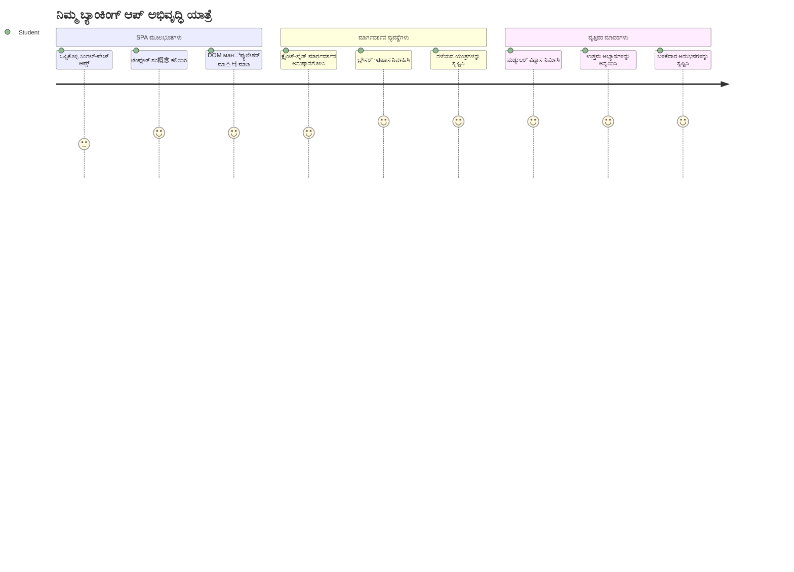
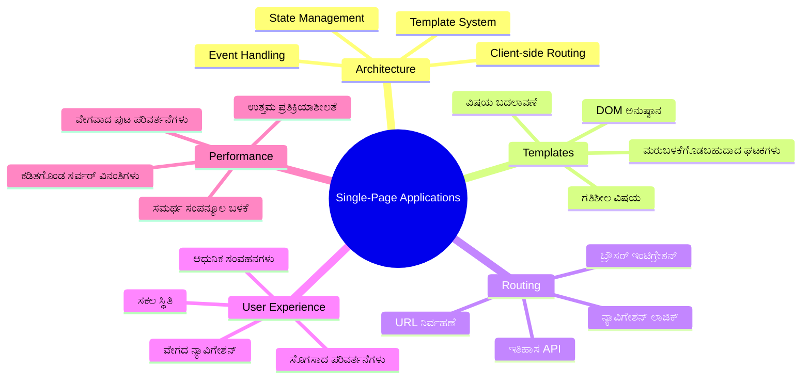
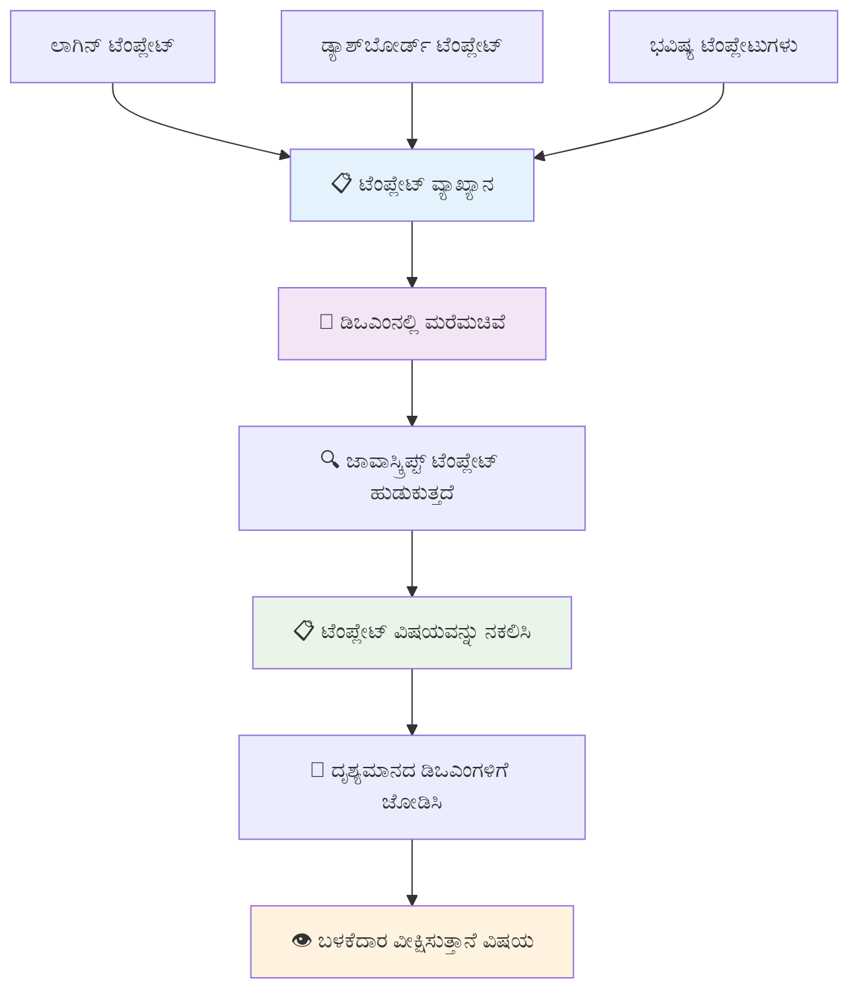
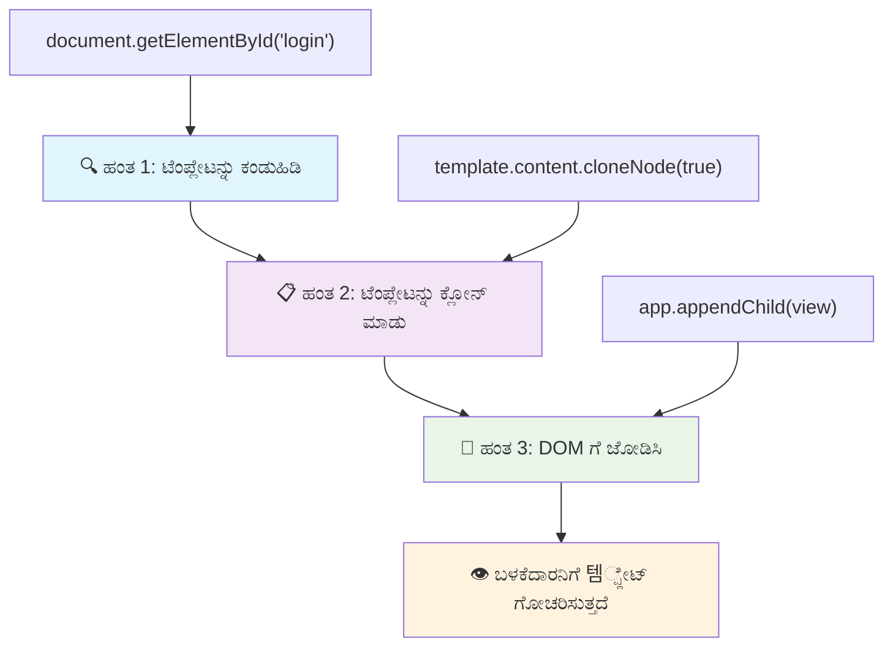
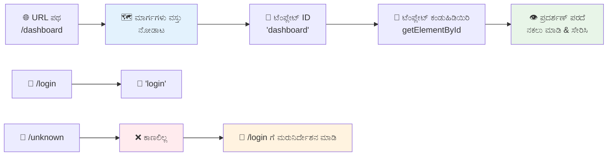
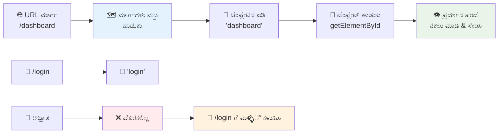
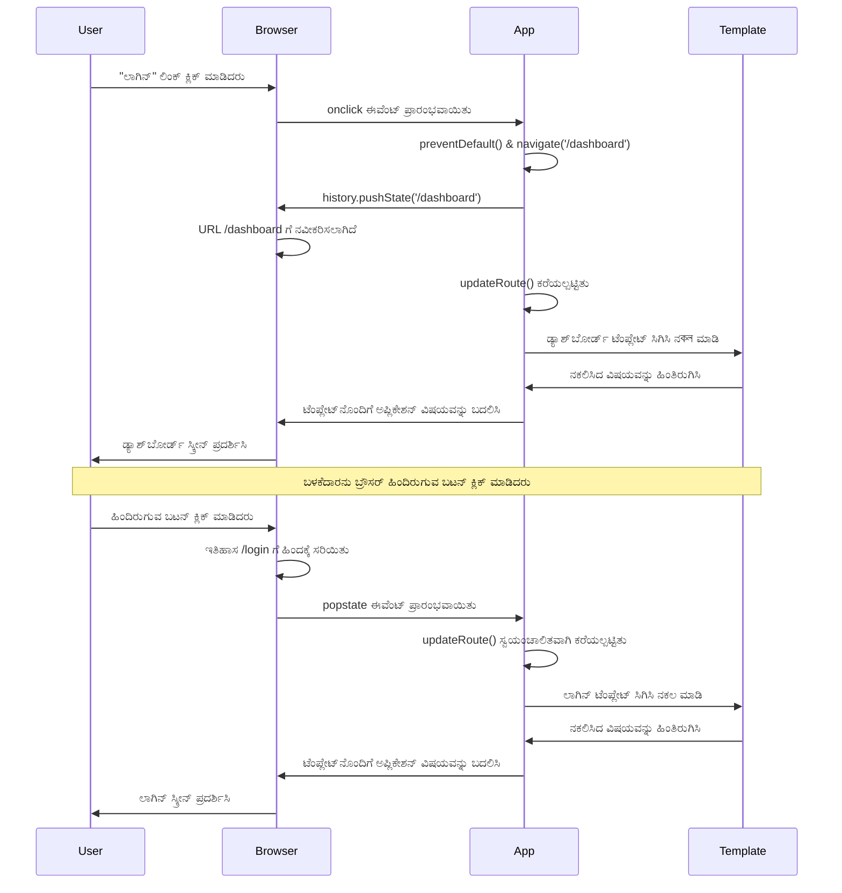
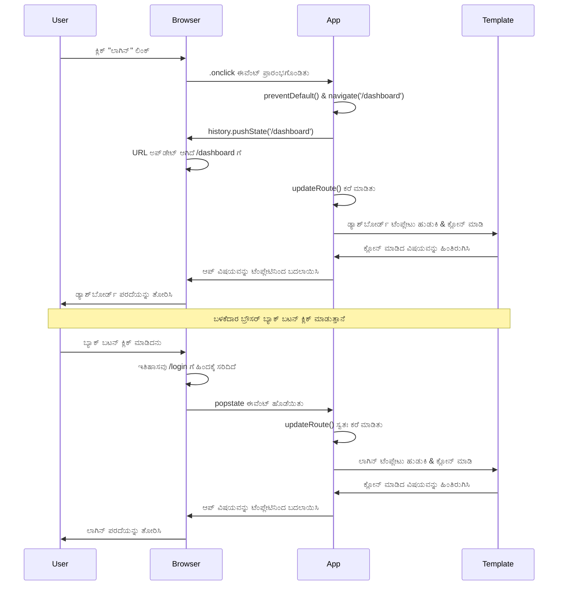
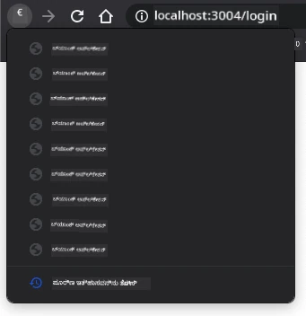
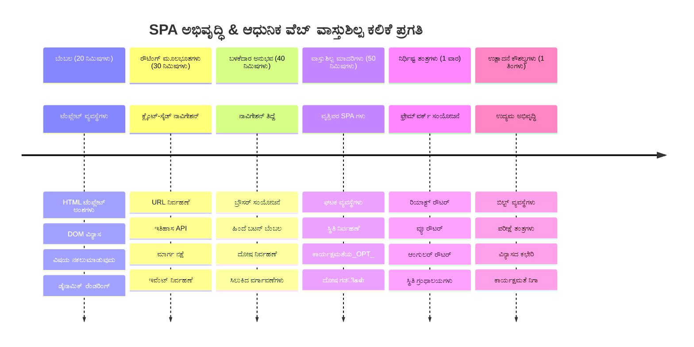

# ಬ್ಯಾಂಕಿಂಗ್ ಆ್ಯಪ್ ಭಾಗ 1: ವೆಬ್ ಆ್ಯಪ್‍ನಲ್ಲಿ HTML ಟೆಂಪ್ಲೇಟ್ಗಳು ಮತ್ತು ಮಾರ್ಗಗಳು


1969 ರಲ್ಲಿ Apollo 11 ಗೈಡ್ ಕಂಪ್ಯೂಟರ್ ಚಂದ್ರನ ಕಡೆಗೆ ನವಿಗೇಟ್ ಆದಾಗ, ಸಂಪೂರ್ಣ ಸಿಸ್ಟಮ್ ಮರುಪ್ರಾರಂಭಿಸದೆ ವಿಭಿನ್ನ ಕಾರ್ಯಕ್ರಮಗಳ ಮಧ್ಯೆ ಸ್ವಿಚ್ ಮಾಡಬೇಕಾಯಿತು. ಆಧುನಿಕ ವೆಬ್ ಆ್ಯಪ್‍ಗಳು ಕೂಡ ಇದೇ ರೀತಿಯಲ್ಲಿ ಕೆಲಸ ಮಾಡುತ್ತವೆ – ಅವು ನಿಮ್ಮೇ ಕಾಣುವ ವಸ್ತುಗಳನ್ನು ಸಂಪೂರ್ಣವಾಗಿ ಮರುಲೋಡ್ ಮಾಡದೆ ಬದಲಿಸುತ್ತವೆ. ಇದು ಬಳಕೆದಾರರು ಇಂದಿನ ದಿನಗಳು ನಿರೀಕ್ಷಿಸುವ ಸ್ಮೂತ್, ಪ್ರತಿಕ್ರಿಯಾಶೀಲ ಅನುಭವವನ್ನು ರಚಿಸುತ್ತದೆ.

ಪ್ರತಿ ಸಂವಹನಕ್ಕಾಗಿ ಸಂಪೂರ್ಣ ಪುಟಗಳನ್ನು ಮರುಲೋಡ್ ಮಾಡುವ ಪರಿಕಲ್ಪನೆ ಇರುವ ಸಾಂಪ್ರದಾಯಿಕ ವೆಬ್‌ಸೈಟ್ಗಳಿಗೆ ಬದಲಾಗಿ, ಆಧುನಿಕ ವೆಬ್ ಆ್ಯಪ್‍ಗಳು ಬದಲಾವಣೆಗೆ ಅಗತ್ಯವಿರುವ ಭಾಗಗಳನ್ನು ಮಾತ್ರ నవೀನೀಕರಿಸುತ್ತವೆ. ಇದು ಮಿಷನ್ ಕಮೊಂಟ್ರೋಲ್ ವಿಭಿನ್ನ ಪ್ರದರ್ಶನಗಳ ಮಧ್ಯೆ ಸ್ವಿಚ್ ಮಾಡಿಕೊಳ್ಳುವ ಹಾಗೆ, ನಿರಂತರ ಸಂವಹನವನ್ನು ಕಾಪಾಡಿಕೊಂಡು, ದ್ರವ ಅನುಭವವನ್ನು ಸೃಷ್ಟಿಸುತ್ತದೆ.

ಇದಲ್ಲದೆ ಈ ಅನ್ನುವುದು ಬಹಳ drಬ್ರವವಾಗಿ ಏಕೆ ಡ್ರಾಮ್ಯಾಟಿಕ್ ಆಗಿದೆ ಎಂಬುದನ್ನು ನೋಡೋಣ:

| ಸಾಂಪ್ರದಾಯಿಕ ಬಹು ಪುಟ ಆ್ಯಪ್ಸ್ | ಆಧುನಿಕ ಏಕ ಪುಟ ಆ್ಯಪ್ಸ್ |
|----------------------------|-------------------------|
| **ನವಿಗೇಶನ್** | ಪ್ರತಿಯೊಂದು ಪರದೆಯೂ ಸಂಪೂರ್ಣ ಪುಟ ಮರುಲೋಡ್ | ಕ್ಷಣಿಕ ವಿಷಯ ಸ್ವಿಚ್ |
| **ಕಾರ್ಯಕ್ಷಮತೆ** | ಸಂಪೂರ್ಣ HTML ಡೌನ್ಲೋಡ್‌ನಿಂದ ನಿಧಾನ | ಭಾಗಶಃ ನವೀಕರಣಗಳಿಂದ ವೇಗವಾಗಿ |
| **ಬಳಕೆದಾರ ಅನುಭವ** | ಜಾರ్గಿಂಗ್ ಪುಟ ಗಾಳಿಸುವಿಕೆಗಳು | ನಿಘಂಟಾಗಿಯೂ ಆ್ಯಪ್ ಹೋಲಿದ ಟ್ರಾನ್ಸಿಷನ್ಗಳು |
| **ಡೇಟಾ ಹಂಚಿಕೆ** | ಪುಟಗಳ ಮಧ್ಯೆ ಕಠಿಣ | ಸುಲಭ ಸ್ಥಿತಿ ನಿರ್ವಹಣೆ |
| ** ಅಭಿವೃದ್ಧಿ ** | ಬಹು HTML ಕಡತೆಗಳನ್ನು ನಿರ್ವಹಣೆ | ಡೈನಾಮಿಕ್ ಟೆಂಪ್ಲೇಟ್ಗಳೊಂದಿಗೆ ಒಂಟಿ HTML |

**ರೂಪಾಂತರವನ್ನು ಅರ್ಥಮಾಡಿಕೊಳ್ಳುವುದು:**
- **ಸಾಂಪ್ರದಾಯಿಕ ಆ್ಯಪ್‌ಗಳು** ಪ್ರತಿಯೊಂದು ನವಿಗೇಶನ್ ಕ್ರಿಯೆಗೆ ಸರ್ವರ್ ವಿನಂತಿಗಳನ್ನು ಅಗತ್ಯವಿರುತ್ತವೆ
- **ಆಧುನಿಕ SPAs** ಒಂದು ಬಾರಿ ಲೋಡ್ ಆಗಿ ಜಾವಾಸ್ಕ್ರಿಪ್ಟ್ ಬಳಸಿ ವಿಷಯವನ್ನು ಡೈನಾಮಿಕ್ ಆಗಿ ನವೀಕರಿಸುತ್ತವೆ
- **ಬಳಕೆದಾರರ ನಿರೀಕ್ಷೆಗಳು** ಈಗ ತಕ್ಷಣದ, ನಿರಂತರ ಸಂವಹನಗಳಿಗೆ ಮೆಚ್ಚುಗೆ ನೀಡುತ್ತವೆ
- **ಕಾರ್ಯಕ್ಷಮತೆ ಪ್ರಯೋಜನಗಳು** ಬ್ಯಾಂಡ್‌ವಿಡ್ತ್ ಕಡಿತ ಹಾಗೂ ವೇಗದ ಪ್ರತಿಕ್ರಿಯೆಗಳು

ಈ ಪಾಠದಲ್ಲಿ, ನಮ್ಮು ಬಹು ಪರದೆಗಳೊಂದಿಗೆ ಒಂದೇ ಕಾಂಟಿನ್ಯೂಸ್ ಫ್ಲೋ ಹೊಂದಿರುವ ಬ್ಯಾಂಕಿಂಗ್ ಆ್ಯಪ್ ಹತೋಟಿ ಮಾಡೋಣ. ವೈಜ್ಞಾನಿಕರು ವಿವಿಧ ಪ್ರಯೋಗಗಳಿಗೆ ಮರುರಚಿಸಲು ಸಾಧ್ಯವಾದ ಮಾಯಾ ಸಾಧನಗಳನ್ನು ಬಳಸುವ ಹಾಗೆ, ನಾವು HTML ಟೆಂಪ್ಲೇಟ್ಗಳನ್ನು ನಿರ್ಬಂಧಿತ ಘಟಕಗಳಾಗಿ ಬಳಸಿಕೊಂಡು ಅವುಗಳನ್ನು ನಾವು ಬೇಕಾದಂತೆ ಪ್ರದರ್ಶಿಸೋಣ.

ನೀವು HTML ಟೆಂಪ್ಲೇಟ್ಗಳೊಂದಿಗೆ (ಸೇರಿಸಬಹುದಾದ ಬ್ಲೂಪ್ರಿಂಟ್‍ಗಳು), ಜಾವಾಸ್ಕ್ರಿಪ್ಟ್ ಮಾರ್ಗಸೂಚಿ (ಪರದೆಗಳ ನಡುವೆ ಸ್ವಿಚ್ ಮಾಡುವ ವ್ಯವಸ್ಥೆ), ಮತ್ತು ಬ್ರೌಸರ್ ಇತಿಹಾಸ API (ಹಿಂದಿನ ಬಟನ್ ಅಭಿವೃದ್ದಿಯಾಗುತ್ತದೆ) ಸಹಿತ ಕೆಲಸ ಮಾಡುತ್ತೀರಿ. ಇವು React, Vue, Angular ಮತ್ತಿತರ ಫ್ರೇಮ್‌ವರ್ಕ್‌ಗಳಲ್ಲಿಯೇ ಬಳಸುವ ಮೂಲತತ್ವ ತಿಳಿಯುವ ವಿಧಾನಗಳಾಗಿವೆ.

ಕೊನೆಯಿಗೆ, ನೀವು ವೃತ್ತಿಪರ ಏಕ ಪುಟ ಆ್ಯಪ್ ತತ್ವಗಳನ್ನು ತೋರಿಸುವ ಕಾರ್ಯನಿರತ ಬ್ಯಾಂಕಿಂಗ್ ಆ್ಯಪ್ ಹೊಂದಿರುತ್ತೀರಿ.


## ಮುಂಚಿನ ಪಾಠ ಪ್ರಶ್ನೋತ್ತರ

[ಮುಂಚಿನ ಪಾಠ ಪ್ರಶ್ನೋತ್ತರ](https://ff-quizzes.netlify.app/web/quiz/41)

### ನೀವು ಹೊಂದಬೇಕಾದವುಗಳೇನು

ನಮಗೆ ನಮ್ಮ ಬ್ಯಾಂಕಿಂಗ್ ಆ್ಯಪ್ ಪರೀಕ್ಷಿಸಲು ಒಂದು ಸ್ಥಳೀಯ ವೆಬ್ ಸರ್ವರ್ ಬೇಕಾಗುತ್ತದೆ – ಬೆದರಿಸಿಕೊಳ್ಳಬೇಡಿ, ಇದು ಬಲ್ಲುದಕ್ಕಿಂತ ಸುಲಭ! ನೀವು ಇದನ್ನು ಹೊಂದಿರದಿದ್ದರೆ, [Node.js](https://nodejs.org) ಅನ್ನು ಇನ್‌ಸ್ಟಾಲ್ ಮಾಡಿ ನಿಮ್ಮ ಪ್ರಾಜೆಕ್ಟ್ ಫೋಲ್ಡರ್‌ನಿಂದ `npx lite-server` ನಡಹಿಸಿ. ಈ ಸರಳ ಕಮಾಂಡ್ ಸ್ಥಳೀಯ ಸರ್ವರ್ ಸ್ಥಾಪಿಸಿ ನಿಮ್ಮ ಆ್ಯಪ್ ಅನ್ನು ಬ್ರೌಸರ್‌ನಲ್ಲಿ ಸ್ವಯಂಚಾಲಿತವಾಗಿ ತೆರೆದಿಡುತ್ತದೆ.

### ತಯಾರಿ

ನಿಮ್ಮ ಕಂಪ್ಯೂಟರ್‌ನಲ್ಲಿ `bank` ಎಂಬ ಫೋಲ್ಡರ್ ಮತ್ತು ಅದರೊಳಗೆ `index.html` ಎಂಬ ಫೈಲ್ ರಚಿಸಿ. ನಾವು ಈ HTML [ಬಾಯ್ಲರ್‬ಪ್ಲೇಟ್](https://en.wikipedia.org/wiki/Boilerplate_code) ಇಂದ ಆರಂಭಿಸೋಣ:

```html
<!DOCTYPE html>
<html lang="en">
  <head>
    <meta charset="UTF-8">
    <meta name="viewport" content="width=device-width, initial-scale=1.0">
    <title>Bank App</title>
  </head>
  <body>
    <!-- This is where you'll work -->
  </body>
</html>
```

**ಇದು ಬಾಯ್ಲರ್ ಪ್ಲೇಟ್ ಕೊಡುವದು:**
- ಸೂಕ್ತ DOCTYPE ಸೂಚನೆಯೊಂದಿಗೆ HTML5 ಡಾಕ್ಯುಮೆಂಟ್ ರಚನೆ ಮಾಡುತ್ತದೆ
- ಅಂತರರಾಷ್ಟ್ರೀಯ ಪಠ್ಯ ಬೆಂಬಲಕ್ಕಾಗಿ UTF-8 ಅಕ್ಷರ ಎನ್‌ಕೋಡಿಂಗ್ ಅನ್ನು ಹೊಂದಿಸುತ್ತದೆ
- ಮೊಬೈಲ್ ಹೊಂದಾಣಿಕೆಯViewport ಮेटಾ ಟ್ಯಾಗ್ ಬಳಸಿ ಪ್ರತಿಕ್ರಿಯಾಶೀಲ ಡಿಸೈನ್ ಅನುಮತಿಸುತ್ತದೆ
- ಬ್ರೌಸರ್ ಟ್ಯಾಬಿನಲ್ಲಿ ಕಾಣಿಸುವ ವಿವರಣಾತ್ಮಕ ಶೀರ್ಷಿಕೆ ಸೃಷ್ಟಿಸುತ್ತದೆ
- ನಮ್ಮ ಆ್ಯಪ್ ನಿರ್ಮಿಸಲು ಸ್ವಚ್ಛವಾದ ಬಾಡಿ ವಿಭಾಗವನ್ನು ರಚಿಸುತ್ತದೆ

> 📁 **ಪ್ರಾಜೆಕ್ಟ್ ಕ್ಕೆ ಕೆಳಗಿನ ಸಂರಚನೆ ಇದೆ preview**
> 
> **ಈ ಪಾಠದ ಕೊನೆಯಲ್ಲಿ, ನಿಮ್ಮ ಪ್ರಾಜೆಕ್ಟ್ ಒಳಗೊಂಡಿರಲಿದೆ:**
> ```
> bank/
> ├── index.html      <!-- Main HTML with templates -->
> ├── app.js          <!-- Routing and navigation logic -->
> └── style.css       <!-- (Optional for future lessons) -->
> ```
> 
> **ಫೈಲ್ ಜವಾಬ್ದಾರಿಗಳು:**
> - **index.html**: ಎಲ್ಲಾ ಟೆಂಪ್ಲೇಟ್ಗಳನ್ನು ಒಳಗೊಂಡಿದ್ದು ಆ್ಯಪ್ ರಚನೆ ನೀಡುತ್ತದೆ
> - **app.js**: ಮಾರ್ಗಸೂಚಿ, ನವಿಗೇಶನ್, ಮತ್ತು ಟೆಂಪ್ಲೇಟು ನಿರ್ವಹಣೆಯನ್ನು ನಿರ್ವಹಿಸುತ್ತದೆ
> - **ಟೆಂಪ್ಲೇಟ್ಗಳು**: ಲಾಗಿನ್, ಡ್ಯಾಶ್‌ಬೋರ್ಡ್ ಮತ್ತು ಇತರೆ ಪರದೆಗಳಿಗೆ UI ವಿನ್ಯಾಸವನ್ನು ಸೂಚಿಸುತ್ತವೆ

---

## HTML ಟೆಂಪ್ಲೇಟ್ಗಳು

ಟೆಂಪ್ಲೇಟ್ಗಳು ವೆಬ್ ಅಭಿವೃದ್ಧಿಯಲ್ಲಿ ಮೂಲಭೂತ ಸಮಸ್ಯೆಯನ್ನು ಪರಿಹರಿಸುತ್ತವೆ. ಗುಟೆನ್‌ಬರ್ಗ್ 1440 ರಲ್ಲಿ ಚಲಿಸಲು ಸಾಧ್ಯವಾದ ಪ್ರಿಂಟಿಂಗ್ ಆವಿಷ್ಕರಿಸಿದ್ದಾಗ, ಸಂಪೂರ್ಣ ಪುಟಗಳನ್ನು ತೆಗೆಯುವ ಬದಲು ಮತ್ತೆಬಾರ್ನಾಗಿ ಬಳಸಬಹುದಾದ ಅಕ್ಷರ ಬ್ಲಾಕ್‌ಗಳನ್ನು ರಚಿಸಲು ಕಂಡುಹಿಡಿದು ಅದನ್ನು ಅಗತ್ಯವಾಗಿ ಅಳವಡಿಸತಕ್ಕಂತೆ ವ್ಯವಸ್ಥೆ ಮಾಡಿದರು. HTML ಟೆಂಪ್ಲೇಟ್ಗಳೂ ಇದೇ ತತ್ವದ ಮೇಲೆ ಕಾರ್ಯನಿರ್ವಹಿಸುತ್ತವೆ – ಪ್ರತಿ ಪರದೆಗೆ পৃথक HTML ಫೈಲ್ ರಚಿಸುವ ಬದಲಾಗಿ, ಅವು ಬಳಸಲು ಆಗುವ ರಚನೆಗಳನ್ನು ಪರಿಗಣಿಸಿ ಬೇಕಾದಾಗ ಪ್ರದರ್ಶಿಸಲಾಗುತ್ತದೆ.


ಟೆಂಪ್ಲೇಟ್ಗಳನ್ನು ನಿಮ್ಮ ಆ್ಯಪ್‌ನ ವಿಭಿನ್ನ ಭಾಗಗಳ ಬ್ಲೂಪ್ರಿಂಟ್‌ಗಳಾಗಿ ಗ್ರೀತಿಯ ಬಗ್ಗೆ ಯೋಚಿಸಿ. ನಿರ್ಮಾಪಕರು ಒಂದು ಯೋಜನೆಯನ್ನು ಸೃಷ್ಟಿಸಿ ಅದನ್ನು ಹಲವಾರು ಬಾರಿ ಬಳಸುವಂತೆ, ನಾವು ಕೂಡ ಟೆಂಪ್ಲೇಟ್ಗಳನ್ನು ಒಮ್ಮೆ ರಚಿಸಿ ಅವುಗಳನ್ನು ಆಗಾಗ್ಗೆ ಸಕ್ರಿಯಗೊಳಿಸುತ್ತೇವೆ. ಬ್ರೌಸರ್ ಈ ಟೆಂಪ್ಲೇಟ್ಗಳನ್ನು ಸ್ಕ್ರೀನ್‌ನಲ್ಲಿ ತೋರಿಸುತ್ತಿಲ್ಲ, ಜಾವಾಸ್ಕ್ರಿಪ್ಟ್ ಪ್ರಕ್ರಿಯೆಯ ವೇಳೆ ಅವು ಸಕ್ರಿಯಗೊಳ್ಳುತ್ತವೆ.

ಒಂದು ವೆಬ್ ಪುಟಕ್ಕೆ ಬಹು ಸ್ಕ್ರೀನ್ ಗಳು ಬೇಕಾದರೆ, ಪ್ರತಿಯೊಂದು ಪರದೆಗಾಗಿ ಒಂದು HTML ಫೈಲ್ ರಚಿಸುವ ಒಂದು ಪರಿಹಾರ ಇರಬಹುದು. ಆದರೆ ಇದರಿಂದ ಕೆಲವು ಅಸೌಕರ್ಯಗಳು ಇವೆ:

- ಸ್ಕ್ರೀನ್ ಬದಲಿಸುವಾಗ ಸಂಪೂರ್ಣ HTML ನವೀಕರಿಸಬೇಕಾಗುವದು, ಇದು ನಿಧಾನವಾಗಬಹುದು.
- ವಿಭಿನ್ನ ಸ್ಕ್ರೀನ್‌ಗಳ ನಡುವಿನ ಡೇಟಾ ಹಂಚಿಕೊಳ್ಳುವುದು ಕಷ್ಟ.

ಮತ್ತೊಂದು ವಿಧಾನವೆಂದರೆ ಒಂದೇ HTML ಫೈಲ್ ಇರಿಸುವುದು, ಮತ್ತು ಒಂದাধিক [HTML ಟೆಂಪ್ಲೇಟ್ಗಳನ್ನು](https://developer.mozilla.org/docs/Web/HTML/Element/template) `<template>` ಅಂಶ ಬಳಸಿ ನಿರ್ಧರಿಸುವುದು. ಟೆಂಪ್ಲೇಟು ಎಂದರೆ ಬ್ರೌಸರ್ ತೋರಿಸುವುದಿಲ್ಲದ, ಆದರೆ ಜಾವಾಸ್ಕ್ರಿಪ್ಟ್ ಬಳಸಿ ಸಮಯದಲ್ಲಿ ಜೀವಂತವಾಗಿ ತೋರಿಸಬಹುದಾದ ಪುನಃಬಳಕೆಗೊಳ್ಳಬಹುದಾದ HTML ಬ್ಲಾಕ್.

### ಮಾಡೋಣ

ನಾವು ಎರಡು ಪ್ರಮುಖ ಪರದೆಗಳೊಂದಿಗೆ ಬ್ಯಾಂಕ್ ಆ್ಯಪ್ ಹೆಟ್ಟು ಮಾಡೋಣ: ಲಾಗಿನ್ ಪುಟ ಮತ್ತು ಡ್ಯಾಶ್‌ಬೋರ್ಡ್. ಮೊದಲಿಗೆ, ನಮ್ಮ HTML ಬಾಡಿಗೆ ಒಂದು ಪ್ಲೇಸ್‌ಹೋಲ್ಡರ್ ಅಂಶ ಸೇರಿಸೋಣ – ಇಲ್ಲಿ ನಮ್ಮ ಎಲ್ಲಾ ವಿಭಿನ್ನ ಪರದೆಗಳು ಪ್ರದರ್ಶಿಸಲ್ಪಡುವವು:

```html
<div id="app">Loading...</div>
```

**ಈ ಪ್ಲೇಸ್‌ಹೋಲ್ಡರ್ ಅರ್ಥಮಾಡಿಕೊಳ್ಳೋಣ:**
- "app" ಎಂಬ ಐಡಿ ಸಹಿತ ಕನ್ಟೇನರ್ ರಚಿಸುತ್ತದೆ, ಎಲ್ಲ ಪರದೆಗಳು ಇಲ್ಲಿ ತೋರಿಸಲಾಗುತ್ತವೆ
- ಮೊದಲ ಪರದೆ ಆರಂಭಿಸುವವರೆಗೆ ಲೋಡ್ ಆಗುತ್ತಿರುವ ಸಂದೇಶವನ್ನು ತೋರಿಸುತ್ತದೆ
- ಡೈನಾಮಿಕ್ ವಿಷಯಕ್ಕಾಗಿ ಒಬ್ಬ mounting point ಒದಗಿಸುತ್ತದೆ
- `document.getElementById()` ಬಳಸಿ ಜಾವಾಸ್ಕ್ರಿಪ್ಟ್‌ನಿಂದ ತಲುಪಲು ಸುಲಭವಾದದ್ದು

> 💡 **ಪರಿಪಾಕ ಸಲಹೆ**: ಈ ಅಂಶದ ವಿಷಯ ಬದಲಾಯಿಸಲಾಗುವ್ದರಿಂದ, ಆ್ಯಪ್ ಲೋಡ್ ಆಗುತ್ತಿರುವಾಗ ತೋರಿಸಲು ಲೋಡ್ ಸಂದೇಶ ಅಥವಾ ಸೂಚಕ ಹಾಕಬಹುದು.

ಬಂದ ಮೇಲೆ, ಅಥ್ವಾ ಲಾಗಿನ್ ಪುಟಕ್ಕೆ HTML ಟೆಂಪ್ಲೇಟನ್ನು ಕೆಳಗೆ ಸೇರಿಸೋಣ. ಪ್ರಸ್ತುತ, ನಮಗೆ ಅಲ್ಲಿ ಶೀರ್ಷಿಕೆ ಮತ್ತು ನವಿಗೇಶನ್ ಮಾಡಲು ಬಳಸುವ ಲಿಂಕ್ ಇರುವ ವಿಭಾಗ ಮಾತ್ರ ಇರಲಿದೆ:

```html
<template id="login">
  <h1>Bank App</h1>
  <section>
    <a href="/dashboard">Login</a>
  </section>
</template>
```

**ಈ ಲಾಗಿನ್ ಟೆಂಪ್ಲೇಟು ವಿವರಣೆ:**
- "login" ಎಂಬ ವಿಶಿಷ್ಟ ಗುರುತಿನೊಂದಿಗೆ ಟೆಂಪ್ಲೇಟು ವಿವರಣೆ ಮಾಡುತ್ತದೆ, ಇದು ಜಾವಾಸ್ಕ್ರಿಪ್ಟ್ ಗಾಗಿ ಟಾರ್ಗೆಟ್ ಆಗುತ್ತದೆ
- ಆ್ಯಪ್‌ಬ್ರಾಂಡಿಂಗ್ ಸ್ಥಾಪಿಸುವ ಮುಖ್ಯ ಶೀರ್ಷಿಕೆಯೊಂದಿಗೆ ಒಳಗೊಂಡಿದೆ
- ಸಂಬಂಧಿತ ವಿಷಯಗಳನ್ನು ಗುಂಪಾಗಿಡಲು ಅರ್ಥಪೂರ್ಣ `<section>` ಅಂಶ ಹೊಂದಿದೆ
- ಬಳಕೆದಾರರನ್ನು ಡ್ಯಾಶ್‌ಬೋರ್ಡ್‌ಗೆ ಮಾರ್ಗದರ್ಶನ ಮಾಡುವ ನವಿಗೇಶನ್ ಲಿಂಕ್ ಒದಗಿಸುತ್ತದೆ

ನಂತರ ಡ್ಯಾಶ್‌ಬೋರ್ಡ್ ಪುಟಕ್ಕೆ ಇನ್ನೊಂದು HTML ಟೆಂಪ್ಲೇಟು ಸೇರಿಸಲಿದ್ದೇವೆ. ಈ ಪುಟದಲ್ಲಿ ವಿಭಿನ್ನ ವಿಭಾಗಗಳು ಇರುತ್ತವೆ:

- ಶೀರ್ಷಿಕೆ, ಶೀರ್ಷಿಕೆ ಮತ್ತು ಲಾಗ್ಅೌಟ್ ಲಿಂಕ್ ನೊಂದಿಗೆ
- ಬ್ಯಾಂಕ್ ಖಾತೆಯ ಪ್ರಸ್ತುತ ಬಾಕಿ
- ವ್ಯವಹಾರಗಳ ಪಟ್ಟಿ, ಟೇಬಲ್‌ನಲ್ಲಿ ಪ್ರದರ್ಶನಗೊಳ್ಳುತ್ತದೆ

```html
<template id="dashboard">
  <header>
    <h1>Bank App</h1>
    <a href="/login">Logout</a>
  </header>
  <section>
    Balance: 100$
  </section>
  <section>
    <h2>Transactions</h2>
    <table>
      <thead>
        <tr>
          <th>Date</th>
          <th>Object</th>
          <th>Amount</th>
        </tr>
      </thead>
      <tbody></tbody>
    </table>
  </section>
</template>
```

**ಈ ಡ್ಯಾಶ್‌ಬೋರ್ಡ್‌ನ ಪ್ರತಿ ಭಾಗದ ಅರ್ಥ:**
- ನವಿಗೇಶನ್ ಒಳಗೊಂಡ ಅರ್ಥಪೂರ್ಣ `<header>` ಅಂಶದಿಂದ ಪುಟದ ರಚನೆ
- ಬ್ರ್ಯಾಂಡಿಂಗ್ ಕಾಪಾಡಲು ಎಲ್ಲಾ ಪರದೆಗಳಲ್ಲಿ ಆ್ಯಪ್ ಶೀರ್ಷಿಕೆ ಪ್ರದರ್ಶನೆ
- ಲಾಗ್ಅೌಟ್ ಲಿಂಕ್ ನೀಡುವುದರಿಂದ ಲಾಗಿನ್ ಪರದೆಗೆ ಮರಳುವ ಮಾರ್ಗವು ಇದೆ
- ಬಾಕಿ ವಿಶೇಷ ಸೆಕ್ಷನ್‌ನಲ್ಲಿ ತೋರಿಸಲಾಗುತ್ತದೆ
- ವ್ಯವಹಾರ ಡೇಟಾ ಸರಿಯಾದ HTML ಟೇಬಲ್ ಬಳಸಿ ಒಕೆಯಾಗಿದೆ
- ಡೇಟು, ಆಬ್ಜೆಕ್ಟ್ ಮತ್ತು ಮೊತ್ತ ಕಾಲಮ್‌ಗಳಿಗಾಗಿ ಟೇಬಲ್ ಶಿರೋನಾಮೆಗಳು
- ಡೈನಾಮಿಕ್ ವಿಷಯ ಸೇರಿಸುವುದಕ್ಕೆ ಟೇಬಲ್ ಬಾಡಿ ಖಾಲಿ ಇಟ್ಟುಕೊಳ್ಳಲಾಗಿದೆ

> 💡 **ಪರಿಪಾಕ ಸಲಹೆ**: HTML ಟೆಂಪ್ಲೇಟ್ಗಳನ್ನು ರಚಿಸುವಾಗ, ಅವು ಹೇಗಿರಬಹುದು ಎಂದು ನೋಡಲು, `<template>` ಮತ್ತು `</template>` ಸಾಲುಗಳನ್ನು `<!-- -->` ಒಳಗೊಂಡು ಕಾಮೆಂಟ್ ಮಾಡಬಹುದು.

### 🔄 **Pedagogical Check-in**
**ಟೆಂಪ್ಲೇಟು ವ್ಯವಸ್ಥೆ ಅರ್ಥಮಾಡಿಕೊಳ್ಳುವುದು**: ಜಾವಾಸ್ಕ್ರಿಪ್ಟ್ ಅನ್ವಯಿಸುವ ಮೊದಲು ಈ ವಿಷಯಗಳನ್ನು ತಿಳಿದುಕೊಳ್ಳಿ:
- ✅ ಟೆಂಪ್ಲೇಟುಗಳು ಸಾಮಾನ್ಯ HTML ಅಂಶಗಳಿಂದ ಹೇಗೆ ಭಿನ್ನವಾಗಿವೆ
- ✅ ಜಾವಾಸ್ಕ್ರಿಪ್ಟ್ ಸಕ್ರಿಯಗೊಳಿಸುವ ತನಕ ಟೆಂಪ್ಲೇಟುಗಳು ದೃಶ್ಯಮಾನವಾಗದೆ ಇರುತ್ತವೆ
- ✅ ಟೆಂಪ್ಲೇಟುಗಳಲ್ಲಿ ಅರ್ಥಪೂರ್ಣ HTML ರಚನೆಯ ಮಹತ್ವ
- ✅ ಟೆಂಪ್ಲೇಟುಗಳು ಪುನಃಬಳಕೆಗೊಳ್ಳುವ UI ಘಟಕಗಳನ್ನು ಹೇಗೆ ಸಾಧ್ಯಮಾಡುತ್ತವೆ

**ತಕ್ಷಣ ಸ್ವಯಂ ಪರೀಕ್ಷೆ**: ನಿಮ್ಮ HTMLನೊಳಗಿನ `<template>` ಟ್ಯಾಗ್‌ಗಳನ್ನು ತೆಗೆದುಹಾಕಿದರೆ ಏನಾಗುತ್ತದೆ?
*ಉತ್ತರ: ವಿಷಯ ಲಭ್ಯವಾಗುತ್ತದೆ ಮತ್ತು ಅದು ಟೆಂಪ್ಲೇಟು ಕಾರ್ಯಕ್ಷಮತೆ ಕಳೆದುಕೊಂಡು ಸಾದಾ HTML ಆಗುತ್ತದೆ*

**ವಾಸ್ತುಶಿಲ್ಪ ಪ್ರಯೋಜನಗಳು**: ಟೆಂಪ್ಲೇಟುಗಳು ಒದಗಿಸುವುದು:
- **ಪುನಃಬಳಕೆ**: ಒಬ್ಬ ವಿವರಣೆ, ಬಹಳ ಸರಬರಾಜುಗಳು
- **ಕಾರ್ಯಕ್ಷಮತೆ**: ಅನವಶ್ಯಕ HTML ಪಾರ್ಸಿಂಗ್ ಇಲ್ಲ
- **ನಿರ್ವಹಣೆ ಅನುಕೂಲತೆ**: ಕೇಂದ್ರಗೊಳ್ಳುವ UI ರಚನೆ
- **ಲಚೀಲತೆ**: ಡೈನಾಮಿಕ್ ವಿಷಯ ಸ್ವಿಚ್

✅ ನಾವು ಟೆಂಪ್ಲೇಟುಗಳಲ್ಲಿ `id` ಗುಣಲಕ್ಷಣಗಳನ್ನು ಬಳಸುವುದಕ್ಕೆ ಕಾರಣವೇನು? ನಾವು ಕ್ಲಾಸ್‌ಲೆಗಳಂತೆ ಇನ್ನೇನು ಬಳಸಬಹುದೇ?

## ಜಾವಾಸ್ಕ್ರಿಪ್ಟ್ ಬಳಸಿ ಟೆಂಪ್ಲೇಟ್ಗಳಿಗೆ ಜೀವ ತುಂಬೋಣ

 ಈಗ ನಮ್ಮ ಟೆಂಪ್ಲೇಟುಗಳನ್ನು ಕಾರ್ಯನಿರತಗೊಳಿಸಬೇಕು. 3D ಪ್ರಿಂಟರ್ ಡಿಜಿಟಲ್ ಬ್ಲೂಪ್ರಿಂಟ್ ತೆಗೆದುಕೊಂಡು ಭೌತಿಕ ವಸ್ತುವನ್ನಾಗಿ ಮಾಡೋಂತೆಯೇ, ಜಾವಾಸ್ಕ್ರಿಪ್ಟ್ ನಮ್ಮ ಅಸ್ಪಷ್ಟ ಟೆಂಪ್ಲೇಟ್ಗಳನ್ನು ಗಮನಿಸಬಹುದಾದ, ಕ್ರಿಯಾಶೀಲ ಅಂಶಗಳಾಗಿ ರೂಪಿಸಿಕೊಳ್ಳುತ್ತದೆ.

ಈ ಪ್ರಕ್ರಿಯೆ ಮೂರನೇ ಹಂತಗಳನ್ನು ಅನುಸರಿಸುತ್ತದೆ, ಇದು ಆಧುನಿಕ ವೆಬ್ ಅಭಿವೃದ್ಧಿಯ ಮೂಲ ತಳತಟ್ಟಿಗೆ ಸೇರಿದೆ. ನೀವು ಈ ಮಾದರಿಯನ್ನು ಅರ್ಥಮಾಡಿಕೊಂಡ ಮೇಲೆ, ನಿಮಗೆ ಹಲವು ಫ್ರೇಮ್‌ವರ್ಕ್‌ಗಳಲ್ಲೂ ಇದನ್ನು ಗುರುತಿಸಲು ಸಾಧ್ಯವಾಗುತ್ತದೆ.

ನೀವು ನಿಮ್ಮ ಪ್ರಸ್ತುತ HTML ಫೈಲ್ ಅನ್ನು ಬ್ರೌಸರ್ ನಲ್ಲಿ ಪ್ರಯತ್ನಿಸಿದರೆ, ಅದು `Loading...` ಎಂದು ತೋರಿಸಿಕೊಂಡೇ ತಂಗಿರುತ್ತದೆ. ಇದಕ್ಕಿತ್ತೆ ಕಾರಣ, ಟೆಂಪ್ಲೇಟುಗಳನ್ನು ಸೃಷ್ಟಿಸಿ ಪ್ರದರ್ಶಿಸಲು ಜಾವಾಸ್ಕ್ರಿಪ್ಟ್ ಕೋಡ್ ಸೇರಿಸುವ ಅಗತ್ಯವಿದೆ.

ಟೆಂಪ್ಲೇಟುinstantiate ಮಾಡುವುದು ಸಾಮಾನ್ಯವಾಗಿ 3 ಹಂತಗಳಲ್ಲಿ ಆಗುತ್ತದೆ:

1. DOMನಲ್ಲಿ ಟೆಂಪ್ಲೇಟು ಅಂಶವನ್ನು ಪಡೆದುಕೊಳ್ಳಿ, ಉದಾಹರಣೆಗೆ [`document.getElementById`](https://developer.mozilla.org/docs/Web/API/Document/getElementById) ಬಳಸಿ.
2. ಟೆಂಪ್ಲೇಟು ಅಂಶವನ್ನು ನಕಲುಮಾಡಿ, [`cloneNode`](https://developer.mozilla.org/docs/Web/API/Node/cloneNode) ಬಳಸಿ.
3. ಅದನ್ನು ದೃಷ್ಯಮಾನ ಅಂಶಕ್ಕೆ DOMಲಿ ಲಗತ್ತಿಸಿ, ಉದಾಹರಣೆಗೆ [`appendChild`](https://developer.mozilla.org/docs/Web/API/Node/appendChild) ಬಳಸಿ.


**ಪ್ರಕ್ರಿಯೆಯ ದೃಶ್ಯ ವಿವರ:**
- **ಹಂತ 1** : DOM ರಚನೆ ಒಳಗಿನ ಅಸ್ಪಷ್ಟ ಟೆಂಪ್ಲೇಟು ಸ್ಥಳ ಪತ್ತೆಮಾಡುತ್ತದೆ
- **ಹಂತ 2** : ಸುರಕ್ಷಿತವಾಗಿ ಬದಲಾಯಿಸಬಹುದಾದ ಕಾರ್ಯಾನ್ವಿತ ನಕಲನ್ನು ಸೃಷ್ಟಿಸುತ್ತದೆ
- **ಹಂತ 3** : ಪ್ರತಿಯನ್ನು ದೃಶ್ಯಮಾನ ಪುಟ ಪ್ರದೇಶಕ್ಕೆ ಸೇರಿಸುತ್ತದೆ
- **ಫಲಿತಾಂಶ**: ಬಳಕೆದಾರರು ಸಂಪರ್ಕ ಮಾಡಬಹುದಾದ ಕಾರ್ಯನಿರತ ಸ್ಕ್ರೀನ್

✅ ನಾವು ಟೆಂಪ್ಲೇಟು ನಕಲುಮಾಡಬೇಕಾಗಿರುವುದು ಯಾಕೆ? ಈ ಹಂತ ತಪ್ಪಿಸಿದರೆ ಏನಾಗಬಹುದು?

### ಕಾರ್ಯ

ನಿಮ್ಮ ಪ್ರಾಜೆಕ್ಟ್ ಫೋಲ್ಡರ್‌ನಲ್ಲಿ `app.js` ಎಂಬ ಹೊಸ ಫೈಲ್ ರಚಿಸಿ ಮತ್ತು ಅದನ್ನು ನಿಮ್ಮ HTML `<head>` ವಿಭಾಗದಲ್ಲಿ ಆಮದುಮಾಡಿ:

```html
<script src="app.js" defer></script>
```

**ಈ ಸ್ಕ್ರಿಪ್ಟ್ ಇಂಪೋರ್ಟ್ ಅರ್ಥ:**
- ಜಾವಾಸ್ಕ್ರಿಪ್ಟ್ ಫೈಲ್ ಅನ್ನು ನಮ್ಮ HTML ಡಾಕ್ಯುಮೆಂಟ್‌ಗೆ ಲಿಂಕ್ ಮಾಡುತ್ತದೆ
- HTML ಪಾರ್ಸಿಂಗ್ ನಂತರ ಸ್ಕ್ರಿಪ್ಟ್ ನಡಿಸಲು `defer` ಗುಣಲಕ್ಷಣ ಬಳಸು ತಾನೆ
- ಎಲ್ಲಾ DOM ಅಂಶಗಳು ಪೂರ್ಣವಾಗಿದಿಂದ ಸ್ಕ್ರಿಪ್ಟ್ ಅವುಗಳಿಗೆ ಪ್ರವೇಶ ಕೊಡುತ್ತದೆ
- ಸ್ಕ್ರಿಪ್ಟ್ ಲೋಡ್ ಮತ್ತು ಕಾರ್ಯಕ್ಷಮತೆಯ ಸುಧಾರಿತ ಪ್ರಸಿದ್ಧ ಪದ್ಧತಿ ಅನುಸರಿಸುತ್ತವೆ

ಈಗ `app.js` ನಲ್ಲಿ `updateRoute` ಎಂಬ ಹೊಸ ಫಂಕ್ಷನ್ ರಚಿಸೋಣ:

```js
function updateRoute(templateId) {
  const template = document.getElementById(templateId);
  const view = template.content.cloneNode(true);
  const app = document.getElementById('app');
  app.innerHTML = '';
  app.appendChild(view);
}
```

**ಹಂತ ಹಂತವಾಗಿ ಆಗುತ್ತಿರುವ ಸಂಗತಿಗಳು:**
- ವಿಶಿಷ್ಟ ಐಡಿ ಬಳಸಿ ಟೆಂಪ್ಲೇಟು ಅಂಶ ಪತ್ತೆಮಾಡುತ್ತದೆ
- `cloneNode(true)` ಬಳಸಿ ಟೆಂಪ್ಲೇಟು ವಿಷಯ ಗಹನ ನಕಲನ್ನು ಸೃಷ್ಟಿಸುತ್ತದೆ
- ವಿಷಯ ತೋರಿಸಲಾಗುವ ಆ್ಯಪ್ ಕನ್ಟೇನರ್ ಪತ್ತೆಮಾಡುತ್ತದೆ
- ಆ್ಯಪ್ ಕನ್ಟೇನರ್‌ನ ಯಾವುದೇ ಇರಾದಾದ ವಿಷಯವನ್ನು ತೆರವುಗೊಳಿಸುತ್ತದೆ
- ನಕಲಿಸಿದ ಟೆಂಪ್ಲೇಟು ವಿಷಯವನ್ನು ದೃಶ್ಯ DOMಗೆ ಸೇರಿಸುತ್ತದೆ

ಈ ಫಂಕ್ಷನ್ ಅನ್ನು ಟೆಂಪ್ಲೇಟುಗಳಲ್ಲಿ ಒಂದರೊಂದಿಗೆ ಕರೆಸಿ ಫಲಿತಾಂಶ ವೀಕ್ಷಿಸಿ.

```js
updateRoute('login');
```

**ಈ ಫಂಕ್ಷನ್ ಕರೆ ಏನು ಸಾಧಿಸುತ್ತದೆ:**
- ಐಡಿ ಯನ್ನು ಪ್ಯಾರಾಮೀಟರ್ ಆಗಿ ಪಾಸ್ಸ್ ಮಾಡಿ ಲಾಗಿನ್ ಟೆಂಪ್ಲೇಟು ಸಕ್ರಿಯಗೊಳಿಸುತ್ತದೆ
- ಬೇರಿ ಬೇರಿ ವಿಭಿನ್ನ ಆ್ಯಪ್ ಪರದೆಗಳ ನಡುವೆ ಸ್ವಿಚ್ ಮಾಡುವ ವಿಧಾನ ತೋರಿಸುತ್ತದೆ
- "Loading..." ಸಂದೇಶ ಬದಲಾಗಿ ಲಾಗಿನ್ ಪರದೆ ತೋರಿಸುತ್ತದೆ

✅ `app.innerHTML = '';` ಈ ಕೋಡ್‌ನ ಉದ್ದೇಶವೇನು? ಇದಿಲ್ಲದೆ ಏನಾಗಬಹುದು?

## ಮಾರ್ಗಗಳು ರಚಿಸುವುದು

ಮಾರ್ಗ ಹಾಗೂ URL ಗಳು ಸರಿಯಾದ ವಿಷಯಕ್ಕೆ ಸಂಪರ್ಕಿಸುವರೆಂದು ಅಂತರ್ಜಾಲ ಆ್ಯಪ್‌ನಲ್ಲಿ ಅತ್ಯವಶ್ಯ. ಪ್ರಾಚೀನ ದೂರವಾಣಿ ಆಪರೇಟರ್‌ಗಳು ಕಾಲ್‌ಗಳನ್ನು ಸರಿಯಾದ ಸ್ಥಳಕ್ಕೆ ಸಂಪರ್ಕಿಸುವಂತೆ, ಎಲ್ಲ ಈ URL ವಿನಂತಿಯನ್ನು ಸಂಬಂಧಿತ ಪರದೆಗೆ ತಲುಪಿಸುವುದು Routing.


ಸಾಂಪ್ರದಾಯಿಕವಾಗಿ, ವೆಬ್ ಸರ್ವರ್‌ಗಳು ವಿಭಿನ್ನ URL ಗೆ ವಿಭಿನ್ನ HTML ಫೈಲ್ ಗಳನ್ನು ಸರ್ವ్ ಮಾಡುತ್ತಿದ್ದರು. ಏಕೆಂದರೆ ನಾವು ಏಕ ಪುಟ ಆ್ಯಪ್ ನಿರ್ಮಿಸುತ್ತಿದ್ದೇವೆ, ನಾವು ಈ Routing ಅನ್ನು ಜಾವಾಸ್ಕ್ರಿಪ್ಟ್ ಬಳಸಿ ನಡಿಸಬೇಕು. ಇದರಿಂದ ಬಳಕೆದಾರ ಅನುಭವ ಮತ್ತು ಕಾರ್ಯಕ್ಷಮತೆಯಲ್ಲಿ ಹೆಚ್ಚಿನ ನಿಯಂತ್ರಣ ಸಿಗುತ್ತದೆ.


**Routing ನ ಹರಿವು ಅರ್ಥಮಾಡಿಕೊಳ್ಳಿ:**
- URL ಬದಲಾವಣೆಗಳು ನಮ್ಮ ಮಾರ್ಗ ಸಂರಚನೆಯಲ್ಲಿ ಹುಡುಕಾಟ ಹುಟ್ಟಿಸುತ್ತವೆ
- ಮಾನ್ಯ ಮಾರ್ಗಗಳು ನಿರ್ದಿಷ್ಟ ಟೆಂಪ್ಲೇಟು IDಗಳಿಗೆ ನಕ್ಷೆ ಹಾಕುತ್ತವೆ
- ಅಮಾನ್ಯ ಮಾರ್ಗಗಳು ತಪ್ಪು ಸ್ಥಿತಿಗಳನ್ನು ತಡೆಯಲು ಬ್ಯಾಕಪ್ ಕೇವಲೆಯನ್ನು ಪ್ರಚೋದಿಸುತ್ತವೆ
- ಟೆಂಪ್ಲೇಟು ರೆಂಡರಿಂಗ್ ಹಿಂದಿನ 3 ಹಂತ ಪ್ರಕ್ರಿಯೆ ಅನುಸರಿಸುತ್ತದೆ

ವೆಬ್ ಆ್ಯಪ್ ಕುರಿತು ಮಾತನಾಡುವಾಗ, ನಾವು *Routing* ಅನ್ನು URL ಗಳು ನಿರ್ದಿಷ್ಟ ಪರದೆಗಳನ್ನು ತೋರಿಸಲು ನಕ್ಷೆಗಳನ್ನು ಹೊಂದುವುದು ಎಂದೂ ಕರೆಯುತ್ತೇವೆ. ಬಹು HTML ಫೈಲ್ ಇರುವ ವೆಬ್‌ಸೈಟ್‌ನಲ್ಲಿ ಇದು ಸ್ವಯಂಚಾಲಿತವಾಗಿಯೇ ಆಗುತ್ತದೆ, ಫೈಲ್ ಮಾರ್ಗಗಳು URL ನಲ್ಲೇ ಪ್ರತಿಬಿಂಬಿಸುತ್ತವೆ. ಉದಾಹರಣೆಗೆ, ನಿಮ್ಮ ಪ್ರಾಜೆಕ್ಟ್ ಫೋಲ್ಡರ್‌ನಲ್ಲಿ ಈ ಫೈಲ್ ಗಳು ಇದ್ದರೆ:

```
mywebsite/index.html
mywebsite/login.html
mywebsite/admin/index.html
```

ನೀವು `mywebsite` ಎಂಬ ರೂಟ್‌ನಲ್ಲಿ ವೆಬ್ ಸರ್ವರ್ ರಚಿಸಿದರೆ URL ನಕ್ಷೆ ಹೀಗಿರುತ್ತದೆ:

```
https://site.com            --> mywebsite/index.html
https://site.com/login.html --> mywebsite/login.html
https://site.com/admin/     --> mywebsite/admin/index.html
```

ಆದರೆ ನಮ್ಮ ಏಕ HTML ಫೈಲ್ ಒಳಗೊಂಡ ಎಲ್ಲಾ ಪರದೆಗಳು ಇದ್ದ ಕಾರಣ, ಈ ಡೀಫಾಲ್ಟ್ ವರ್ತನೆ ನಮಗೆ ಸಹಾಯ ಮಾಡದು. ನಾವು ಈ ನಕ್ಷೆಯನ್ನು ಕೈಯಿಂದ ರಚಿಸಿ ಜಾವಾಸ್ಕ್ರಿಪ್ಟ್ ಬಳಸಿ ಪ್ರದರ್ಶಿಸುವ ಟೆಂಪ್ಲೇಟು ನವೀಕರಿಸಬೇಕು.

### ಕಾರ್ಯ

ನಾವು ಸರಳ ಆಯ್ಕೆಗಳನ್ನು (object) ಬಳಸಿ URL ಮಾರ್ಗಗಳ ಹಾಗೂ ನಮ್ಮ ಟೆಂಪ್ಲೇಟುಗಳ ನಡುವೆ [ನಕ್ಷೆ](https://en.wikipedia.org/wiki/Associative_array) ಅನುಷ್ಠಾನಗೊಳಿಸೋಣ. ಈ ಆಯ್ಕೆಗಳನ್ನು ನಿಮ್ಮ `app.js` ಕಡತದ ಮೇಲ್ಭಾಗದಲ್ಲಿ ಸೇರಿಸಿ.

```js
const routes = {
  '/login': { templateId: 'login' },
  '/dashboard': { templateId: 'dashboard' },
};
```

**ಈ ಮಾರ್ಗ ಸಂರಚನೆ ಅರ್ಥಮಾಡಿಕೊಳ್ಳಿ:**
- URL ಮಾರ್ಗಗಳು ಮತ್ತು ಟೆಂಪ್ಲೇಟು ಗುರುತಿನ ನಡುವೆ ನಕ್ಷೆಯನ್ನು ಸ್ಥಾಪಿಸುತ್ತದೆ
- ಕೀಗಳನ್ನು URL ಮಾರ್ಗ ಗಳಾಗಿ, ಮೌಲ್ಯಗಳನ್ನು ಟೆಂಪ್ಲೇಟು ಮಾಹಿತಿ ಆಗಿ ಬಳಸುತ್ತದೆ
- ಯಾವ URL ಗೆ ಯಾವ ಟೆಂಪ್ಲೇಟು ತೋರಿಸಬೇಕೆಂದು ಸುಲಭವಾದ ಹುಡುಕಾಟವನ್ನು ಒದಗಿಸುತ್ತದೆ
- ಭವಿಷ್ಯದಲ್ಲಿ ಹೊಸ ಮಾರ್ಗಗಳನ್ನು ಸೇರಿಸಲು ಸಕಾಲಿಕ ಹಾಗೂ ವ್ಯಾಪಕ ಸಂರಚನೆಯನ್ನು ನೀಡುತ್ತದೆ
ಈಗ ನಾವೀಗ `updateRoute` ಫಂಕ್ಷನ್ ಅನ್ನು ಸ್ವಲ್ಪ ಪರಿಷ್ಕರಿಸೋಣ. `templateId` ಅನ್ನು ನೇರವಾಗಿ ಆರ್ಗ್ಯುಮೆಂಟ್ ಆಗಿ ಪಾಸ ಮಾಡುವ ಬದಲು, ನಾವು ಮೊದಲಿಗೆ ಪ್ರಸ್ತುತ URL ಅನ್ನು ಪಡೆದ್ರಾಗ, ನಂತರ ನಮ್ಮ ಮ್ಯಾಪ್ ಅನ್ನು ಉಪಯೋಗಿಸಿ ತಕ್ಕಟ್ಪಡುವ ಟೆಂಪ್ಲೇಟ್ ID ಮೌಲ್ಯವನ್ನು ಪಡೆಯಬೇಕಾಗುತ್ತದೆ. ನಾವು URL ನಿಂದ ಮಾರ್ಗ ಭಾಗವನ್ನು ಮಾತ್ರ ಪಡೆದುಕೊಳ್ಳಲು [`window.location.pathname`](https://developer.mozilla.org/docs/Web/API/Location/pathname) ಅನ್ನು ಬಳಸಬಹುದು.

```js
function updateRoute() {
  const path = window.location.pathname;
  const route = routes[path];

  const template = document.getElementById(route.templateId);
  const view = template.content.cloneNode(true);
  const app = document.getElementById('app');
  app.innerHTML = '';
  app.appendChild(view);
}
```

**ಇಲ್ಲಿ ಏನು ನಡೆಯುತ್ತಿದೆ ಅಂದ್ರೆ:**
- ಬ್ರೌಸರ್ URL ನಿಂದ ಪ್ರಸ್ತುತ ಮಾರ್ಗವನ್ನು `window.location.pathname` ಬಳಸಿ **ಎತ್ತುತ್ತದೆ**
- ನಮ್ಮ ಮಾರ್ಗಗಳ ಆಬ್ಜೆಕ್ಟ್‌ನಲ್ಲಿ ತಕ್ಕ ಮಾರ್ಗ ಧೃವೀಕರಿಕೆಯನ್ನು **ತಪಾಸಣೆ ಮಾಡುತ್ತದೆ**
- ಮಾರ್ಗ ಧೃವೀಕರಿಕೆಯಿಂದ ಟೆಂಪ್ಲೇಟ್ ID **ಪಡೆಯುತ್ತದೆ**
- ಹಳೆಯದೆಯೇ ಹಾಗೆ ಟೆಂಪ್ಲೇಟ್ ರೆಂಡರಿಂಗ್ ಪ್ರಕ್ರಿಯೆಯನ್ನು **ಅನುಸರಿಸುತ್ತದೆ**
- URL ಬದಲಾವಣೆಗಳಿಗೆ ಪ್ರತಿಕ್ರಿಯಿಸುವ ಡೈನಾಮಿಕ್ ಸಿಸ್ಟಮ್ ಅನ್ನು **ರಚಿಸುತ್ತದೆ**

ನಾವು ಘೋಷಿಸಿದ ಮಾರ್ಗಗಳನ್ನು ನಾವು ಸಂಬಂಧಪಟ್ಟ ಟೆಂಪ್ಲೇಟ್‌ಗಳಿಗೆ ನಕ್ಷೆ ಮಾಡಿದೆವು. ನೀವು ನಿಮ್ಮ ಬ್ರೌಸರ್‌ನಲ್ಲಿ URL ಅನ್ನು ಕೈಯಿಂದ ಬದಲಾಯಿಸಿ ಅದು ಸರಿಯಾಗಿ ಕಾರ್ಯನಿರ್ವಹಿಸುತ್ತದೆಯೇ ಎಂದು ಪ್ರಯತ್ನಿಸಬಹುದು.

✅ ನೀವು URL ನಲ್ಲಿ ತಿಳಿದಿಲ್ಲದ ಮಾರ್ಗವನ್ನು ನಮೂದಿಸಿದರೆ ಏನು ಆಗುತ್ತದೆ? ಇದನ್ನು ನಾವು ಹೇಗೆ ಪರಿಹರಿಸಬಹುದು?

## ನ್ಯಾವಿಗೇಶನ್ ಸೇರ್ಪಡೆ

ರೌಟಿಂಗ್ ಸ್ಥಾಪಿಸಿದಾಗ, ಬಳಕೆದಾರರು ಅಪ್ಲಿಕೇಶನ್ ಅನ್ನು ನ್ಯಾವಿಗೇಟ್ ಮಾಡಲು ವಿಧಾನ ಬೇಕಾಗಿದೆ. ಪಾರಂಪರಿಕ ವೆಬ್‌ಸೈಟ್‌ಗಳು ಲಿಂಕ್ ಕ್ಲಿಕ್ ಮಾಡಿದಾಗ ಸಂಪೂರ್ಣ ಪುಟವನ್ನು ರೀಲೋಡ್ ಮಾಡುತ್ತವೆಯಾದರೂ, ನಾವು ಪುಟವನ್ನು ರೀಫ್ರೆಶ್ ಮಾಡದೇ URL ಮತ್ತು ವಿಷಯವನ್ನು ಎರಡನ್ನೂ ನವೀಕರಿಸಲು ಬಯಸುತ್ತೇವೆ. ಇದರಿಂದ ಡೆಸ್ಕ್‌ಟಾಪ್ ಅಪ್ಲಿಕೇಶನ್‌ಗಳು ವಿವಿಧ ದೃಶ್ಯಗಳ ನಡುವೆ ಸ್ಲೈಡ್ ಆಗುವಂತಹ ಮೃದುವಾಗಿರುವ ಅನುಭವ ಸೃಷ್ಟಿಯಾಗುತ್ತದೆ.

ನಾವು ಎರಡು ಅಂಶಗಳನ್ನು ಸಂಯೋಜಿಸಬೇಕಾಗಿದೆ: ಬಳಕೆದಾರರು ಪುಟಗಳನ್ನು ಬುಕ್‌ಮಾರ್ಕ್ ಮಾಡಲು ಮತ್ತು ಲಿಂಕ್‌ಗಳನ್ನು ಹಂಚಿಕೊಳ್ಳಲು ಬ್ರೌಸರ್ URL ನವೀಕರಿಸುವುದು ಮತ್ತು ಸೂಚಿತ ವಿಷಯವನ್ನು ಪ್ರದರ್ಶಿಸುವುದು. ಸರಿಯಾಗಿ ಜಾರಿಗೆ ತರುವಾಗ, ಇದರಿಂದ ನವೀನ ಅಪ್ಲಿಕೇಶನ್‌ಗಳಲ್ಲಿ ಬಳಕೆದಾರರು ನಿರೀಕ್ಷಿಸುವ ನಿರಂತರ ನ್ಯಾವಿಗೇಶನ್ ಸೃಷ್ಟಿಯಾಗುತ್ತದೆ.


### 🔄 **ಶಿಕ್ಷಣಾತ್ಮಕ ಪರಿಶೀಲನೆ**
**ಸಿಂಗಲ್-ಪೇಜ್ ಅಪ್ಲಿಕೇಶನ್ ವಾಸ್ತುಶಿಲ್ಪ**: ಸಂಪೂರ್ಣ ವ್ಯವಸ್ಥೆಯ ನಿಮ್ಮ ಅರ್ಥವನ್ನು ಪರಿಶೀಲಿಸಿ:
- ✅ ಕ್ಲೈಂಟ್-ಸೈಡ್ ರೌಟಿಂಗ್ ಪಾರಂಪರಿಕ ಸರ್ವರ್-ಸೈಡ್ ರೌಟಿಂಗಿನಿಂದ ಹೇಗೆ ವಿಭಿನ್ನ?
- ✅ ಸರಿಯಾದ SPA ನ್ಯಾವಿಗೇಶನ್ ಗಾಗಿ ಹಿಸ್ಟರಿ API ಯು ಯಾಕೆ ಅವಶ್ಯಕ?
- ✅ ಟೆಂಪ್ಲೇಟ್‌ಗಳು ಪುಟ ರೀಲೋಡ್‌ಗಳಿಲ್ಲದೆ ಡೈನಾಮಿಕ್ ನವೀನ ವಿಷಯವನ್ನು ಹೇಗೆ ಸಾದ್ಯಮಾಡುತ್ತವೆ?
- ✅ ನ್ಯಾವಿಗೇಶನ್ ತಡೆಗಟ್ಟುವಿಕೆಯಲ್ಲಿ ಈವೆಂಟ್ ಹ್ಯಾಂಡ್ಲಿಂಗ್ ಪಾತ್ರ ಏನು?

**ವ್ಯವಸ್ಥೆಯ ಸಂಯೋಜನೆ**: ನಿಮ್ಮ SPA ಈ ಕೆಳಗಿನವುಗಳನ್ನು ತೋರಿಸುತ್ತದೆ:
- **ಟೆಂಪ್ಲೇಟ್ ನಿರ್ವಹಣಾ**: ಡೈನಾಮಿಕ್ ವಿಷಯ ಹೊಂದಿರುವ ಪುನಃಬಳಕೆ ಯೋಗ್ಯ UI ಘಟಕಗಳು
- **ಕ್ಲೈಂಟ್-ಸೈಡ್ ರೌಟಿಂಗ್**: ಸರ್ವರ್ ಕೇಳಿಕೆಯಿಂದ ವಿನಾಯಿತಿ URL ನಿರ್ವಹಣೆ
- **ಈವೆಂಟ್ ಚಾಲಿತ ವಾಸ್ತುಶಿಲ್ಪ**: ಪ್ರತಿಕ್ರಿಯಾಶೀಲ ನ್ಯಾವಿಗೇಶನ್ ಮತ್ತು ಬಳಕೆದಾರ ಸಂವಹನ
- **ಬ್ರೌಸರ್ ಸಂಯೋಜನೆ**: ಸರಿಯಾದ ಹಿಸ್ಟರಿ ಮತ್ತು ಬ್ಯೂಟ್/ಮುಂದಿನ ಬಟನ್ ಬೆಂಬಲ
- **ಕಾರ್ಯಕ್ಷಮತೆ ಮೇಸು**: ವೇಗದ ಬದಲಾವಣೆಗಳು ಮತ್ತು ಸರ್ವರ್ ಲೋಡ್ ಕಡಿತ

** ವೃತ್ತಿ ಮಾದರಿಗಳು**: ನೀವು ಜಾರಿಗೆ ತಂದಿರುವವು:
- **ಮಾದರಿ-ವೀಕ್ಷಣೆ ವಿಭಜನೆ**: ಅಪ್ಲಿಕೇಶನ್ ತಾರ್ಕಿಕತೆ ನಿಂದ ತೆಂಪ್ಲೇಟ್ ಬೇರ್ಪಡಿಸಿವೆ
- **ಸ್ಥಿತಿ ನಿರ್ವಹಣೆ**: URL ಸ್ಥಿತಿಯನ್ನು ಪ್ರದರ್ಶಿತ ವಿಷಯದೊಂದಿಗೆ ಸಿಂಕ್ರೊನ್ ಮಾಡಲಾಗಿದೆ
- **ಪ್ರೋಗ್ರೆಸಿವ್ ಎನ್‌ಹಾನ್ಸ್‌ಮೆಂಟ್**: ಸರಳ HTML ಕಾರ್ಯಾದರ್ಶೆಗೆ ಜಾವಾಸ್ಕ್ರಿಪ್ಟ್ ಪ್ರಭಾವಘಟಕ
- **ಬಳಕೆದಾರ ಅನುಭವ**: ಪುಟ ರೀಫ್ರೆಶ್ ಇಲ್ಲದೆ ಸ್ಮೂತ್, ಅಪ್ಲಿಕೇಶನ್-ಮಾದರಿ ನ್ಯಾವಿಗೇಶನ್

> � **ವಾಸ್ತುಶಿಲ್ಪ ಸಹಜತೆ**: ನ್ಯಾವಿಗೇಶನ್ ಸಿಸ್ಟಮ್ ಘಟಕಗಳು
>
> **ನೀವು ಏನು ನಿರ್ಮಿಸುತ್ತಿದ್ದೀರಾ:**
> - **🔄 URL ನಿರ್ವಹಣೆ**: ಪುಟ ರೀಲೋಡ್ ಇಲ್ಲದೆ ಬ್ರೌಸರ್ ವಿಳಾಸ ಬಾರ್ ನವೀಕರಿಸುತ್ತದೆ
> - **📋 ಟೆಂಪ್ಲೇಟ್ ಸಿಸ್ಟಮ್**: ಪ್ರಸ್ತುತ ಮಾರ್ಗದ ಆಧಾರದಿಂದ ವಿಷಯವನ್ನು ಡೈನಾಮಿಕ್ ಬದಲಾಯಿಸುತ್ತದೆ  
> - **📚 ಹಿಸ್ಟರಿ ಸಂಯೋಜನೆ**: ಬ್ರೌಸರ್ ಹಿಂದಿನ/ಮುಂದಿನ ಬಟನ್ ಕಾರ್ಯಕ್ಷಮತೆ ಉಳಿಸಿಕೊಳ್ಳುತ್ತದೆ
> - **🛡️ ದೋಷ ನಿರ್ವಹಣೆ**: ತಪ್ಪು ಅಥವಾ ಕಾಣೆಯಾಗಿರುವ ಮಾರ್ಗಗಳಿಗೆ ಸೂಕ್ತ ಪರಿಹಾರ
>
> **ಘಟಕಗಳು ಹೇಗೆ ಕೆಲಸ ಮಾಡುತ್ತವೆ:**
> - ನ್ಯಾವಿಗೇಶನ್ ಈವೆಂಟ್‌ಗಳಿಗೆ (ಕ್ಲಿಕ್, ಹಿಸ್ಟರಿ ಬದಲಾವಣೆ) **ಶ್ರವಣ**
> - ಹಿಸ್ಟರಿ API ಬಳಸಿ URL ನವೀಕರಣ **ನಿರ್ವಹಣೆ**
> - ಹೊಸ ಮಾರ್ಗಕ್ಕೆ ಸೂಕ್ತ ಟೆಂಪ್ಲೇಟ್ **ರೆಂಡರ್** ಮಾಡುವುದು
> - ಬಳಕೆದಾರ ಅನುಭವವನ್ನು ನಿರಂತರ **ಕಾಪಾಡುವುದು**

ನಮ್ಮ ಅಪ್ಲಿಕೇಶನ್ ಮುಂದಿನ ಹಂತವೆಂದರೆ URL ನ್ನು ಕೈಯಿಂದ ಬದಲಾಗಿಸುವ ಅಗತ್ಯವಿಲ್ಲದೆ ಪುಟಗಳ ನಡುವೆ ನ್ಯಾವಿಗೇಟ್ ಮಾಡುವ ಸಾಧ್ಯತೆಯನ್ನು ಸೇರಿಸುವುದು. ಇದಕ್ಕೆ ಎರಡು ಅಂಶಗಳು ಒಳಗೊಂಡಿವೆ:

  1. ಪ್ರಸ್ತುತ URL ನ ನವೀಕರಣ  
  2. ಹೊಸ URL ಆಧಾರಿತವಾಗಿ ಪ್ರದರ್ಶನವಾಗುವ ಟೆಂಪ್ಲೇಟ್ ನವೀಕರಣ

ನಾವು ಈಗಾಗಲೇ `updateRoute` ಫಂಕ್ಷನ್‌ನಿಂದ ಎರಡನೇ ಭಾಗವನ್ನು ನೋಡಿಕೊಂಡಿದ್ದೇವೆ, ಆದ್ದರಿಂದ ಪ್ರಸ್ತುತ URL ಅನ್ನು ಹೇಗೆ ನವೀಕರಿಸಬೇಕೆಂಬುದನ್ನು ಕಂಡುಹಿಡಿಯಬೇಕು.

ನಾವು ಜಾವಾಸ್ಕ್ರಿಪ್ಟ್ ಮತ್ತು ವಿಶೇಷವಾಗಿ [`history.pushState`](https://developer.mozilla.org/docs/Web/API/History/pushState) ಅನ್ನು ಬಳಸಬೇಕು, ಇದು HTML ರೀಲೋಡ್ ಮಾಡುವ ಬದಲು URL ನವೀಕರಿಸಿ ಬ್ರೌಸಿಂಗ್ ಇತಿಹಾಸದಲ್ಲಿ ಹೊಸ ಐಟಂ ಸೃಜಿಸಲು ಸಹಾಯ ಮಾಡುತ್ತದೆ.

> ⚠️ **ಮುಖ್ಯ ಟಿಪ್ಪಣಿ**: HTML ಅಂಕರ್ ಅಂಶ [`<a href>`](https://developer.mozilla.org/docs/Web/HTML/Element/a) ಅನ್ನು ಸ್ವತಃ ಬಳಸಿಕೊಂಡು ವಿಭಿನ್ನ URL ಗಳಿಗೆ ಹೈಪರ್‌ಲಿಂಕ್‌ಗಳು ಸೃಷ್ಟಿಸಬಹುದು, ಆದರೆ ಇದು ಡೀಫಾಲ್ಟ್ ಆಗಿ ಬ್ರೌಸರ್ HTML ಅನ್ನು ಮರುಲೋಡ್ ಮಾಡುತ್ತದೆ. ಕಸ್ಟಮ್ ಜಾವಾಸ್ಕ್ರಿಪ್ಟ್ ಬಳಸಿ ರೌಟಿಂಗ್ ನಡೆಸುವಾಗ, ಈ ವರ್ತನೆಯನ್ನು ತಡೆಗಟ್ಟಲು ಕ್ಲಿಕ್ ಈವೆಂಟ್‌ನಲ್ಲಿ preventDefault() ಫಂಕ್ಷನ್ ಬಳಸುವುದು ಅಗತ್ಯ.

### ಕಾರ್ಯ

ನಾವು ಅಪ್ಲಿಕೇಶನ್‌ನಲ್ಲಿ ನ್ಯಾವಿಗೇಟ್ ಮಾಡಲು ಬಳಸಬಹುದಾದ ಹೊಸ ಫಂಕ್ಷನ್ ರಚಿಸೋಣ:

```js
function navigate(path) {
  window.history.pushState({}, path, path);
  updateRoute();
}
```

**ಈ ನ್ಯಾವಿಗೇಶನ್ ಫಂಕ್ಷನ್ ಅರ್ಥಮಾಡಿಕೊಳ್ಳುವುದು:**
- `history.pushState` ಬಳಸಿ ಬ್ರೌಸರ್ URL ನವೀಕರಿಸುತ್ತದೆ  
- ತಕ್ಕ ಹಿಂದಿನ/ಮುಂದಿನ ಬಟನ್ ಬೆಂಬಲಕ್ಕೂ ಬ್ರೌಸರ್ ಇತಿಹಾಸ ಸ್ಟ್ಯಾಕ್‌ಗೆ ಹೊಸ ಐಟಂ ಸೇರಿಸುತ್ತದೆ  
- `updateRoute()` ಕರೆ ಮಾಡಿ ತಕ್ಕ ಟೆಂಪ್ಲೇಟ್ ತೋರಿಸುತ್ತದೆ  
- ಪುಟವನ್ನು ಮರುಲೋಡ್ ಮಾಡದೆ ಸಿಂಗಲ್-ಪೇಜ್ ಅಪ್ಲಿಕೇಶನ್ ಅನುಭವವನ್ನು ಕಾಪಾಡುತ್ತದೆ  

ಈ ವಿಧಾನವು ಮೊದಲಿಗೆ ನೀಡಲಾದ ಮಾರ್ಗ ಆಧಾರವಾಗಿ ಪ್ರಸ್ತುತ URL ನನ್ನು ನವೀಕರಿಸಿ ನಂತರ ಟೆಂಪ್ಲೇಟ್ ನವೀಕರಿಸುತ್ತದೆ. `window.location.origin` ಪ್ರಾಪರ್ಟಿ URL ಮೂಲವನ್ನು ಹಿಂತಿರುಗಿಸುತ್ತದೆ, ಇದರಿಂದ ನಮಗೆ ನೀಡಲಾದ ಮಾರ್ಗದಿಂದ ಸಂಪೂರ್ಣ URL ಮರುನಿರ್ಮಾಣ ಮಾಡಲು ಸಾಧ್ಯ.

ಈ ಫಂಕ್ಷನ್ ಶುರು ಮಾಡಿದ ಮೇಲೆ, ನಾವು ಯಾವುದೇ ಹೆಸರಾಗದ ಮಾರ್ಗ ಬಂದರೆ ನಮ್ಮ `updateRoute` ಫಂಕ್ಷನ್‌ನಲ್ಲಿ ಮರುನಿರ್ದೇಶನವನ್ನು ಸೇರಿಸೋಣ.

```js
function updateRoute() {
  const path = window.location.pathname;
  const route = routes[path];

  if (!route) {
    return navigate('/login');
  }

  const template = document.getElementById(route.templateId);
  const view = template.content.cloneNode(true);
  const app = document.getElementById('app');
  app.innerHTML = '';
  app.appendChild(view);
}
```

**ಪ್ರಮುಖ ಅಂಶಗಳು:**
- ಪ್ರಸ್ತುತ ಮಾರ್ಗಕ್ಕೆ ತಕ್ಕ ಮಾರ್ಗವಿದ್ಯೆ ಇದ್ದೇ ಇದೆಯೇ ಎಂದು **ಪರಿಶೀಲನೆ**
- ಅಮಾನ್ಯ ಮಾರ್ಗ ಪ್ರವೇಶಿಸಿದಾಗ ಲಾಗಿನ್ ಪುಟಕ್ಕೆ **ಮರುನಿರ್ದೇಶನ**
- ಒಡೆಯದ ನ್ಯಾವಿಗೇಶನನ್ನು ತಡೆಯುವ ಫಾಲ್ಬ್ಯಾಕ್ ಮೆಕ್ಯಾನಿಸಂ **ನೀಡುತ್ತದೆ**
- ಬಳಕೆದಾರರಿಗೆ ತಪ್ಪಾದ URL ಗಳಿದ್ದರೂ ಮಾನ್ಯ ಸ್ಕ್ರೀನ್ **ಪ್ರದರ್ಶಿಸಲಾಗುತ್ತದೆ**

ಮಾರ್ಗ ಕಂಡುಬಂದಿಲ್ಲದಿದ್ದರೆ ಈಗ ಇತ್ತೀಚೆಗೆ `login` ಪುಟಕ್ಕೆ ತಿರುಗಿಸುತ್ತೇವೆ.

ಇಗೋ ಲಿಂಕ್ ಕ್ಲಿಕ್ ಆಗುವಾಗ URL ಅನ್ನು ಪಡೆಯುವ ಹಾಗೂ ಬ್ರೌಸರ್ ನ ಡೀಫಾಲ್ಟ್ ಲಿಂಕ್ ವರ್ತನೆಯನ್ನು ತಡೆಗಿಡುವ ಫಂಕ್ಷನ್ ರಚಿಸೋಣ:

```js
function onLinkClick(event) {
  event.preventDefault();
  navigate(event.target.href);
}
```

**ಈ ಕ್ಲಿಕ್ ಹ್ಯಾಂಡ್ಲರ್ ಅನ್ನು ವಿವರಿಸುವುದು:**
- ಬ್ರೌಸರ್ ನ ಡೀಫಾಲ್ಟ್ ಲಿಂಕ್ ವರ್ತನೆಯನ್ನು `preventDefault()` ಬಳಸಿ **ತಡೆದುಕೊಳ್ಳುತ್ತದೆ**
- ಕ್ಲಿಕ್ ಮಾಡಿದ ಲಿಂಕ್ ಅಂಶದಿಂದ ಗಮ್ಯಸ್ಥಾನ URL ಅನ್ನು **ಎತ್ತುತ್ತದೆ**
- ಪುಟ ತೆರೆಯದೆ ನಮ್ಮ ಕಸ್ಟಮ್ ನ್ಯಾವಿಗೇಟು ಫಂಕ್ಷನ್ ಅನ್ನು ಕರೆಯುತ್ತದೆ  
- ಮೃದುವಾದ ಸಿಂಗಲ್-ಪೇಜ್ ಅಪ್ಲಿಕೇಶನ್ ಅನುಭವವನ್ನು **ಉಳಿಸುತ್ತದೆ**

```html
<a href="/dashboard" onclick="onLinkClick(event)">Login</a>
...
<a href="/login" onclick="onLinkClick(event)">Logout</a>
```

**ಈ `onclick` ಬಿಗಿತ ಏನು ಸಾಧಿಸುತ್ತದೆ:**
- ಪ್ರತಿಯೊಂದು ಲಿಂಕ್ ಅನ್ನು ನಮ್ಮ ಕಸ್ಟಮ್ ನ್ಯಾವಿಗೇಶನ್ ವ್ಯವಸ್ಥೆಗೆ **ಸಂಬಂಧಿಸುತ್ತದೆ**
- ಕ್ಲಿಕ್ ಈವೆಂಟ್ ಅನ್ನು ಪ್ರಕ್ರಿಯೆಗೆ `onLinkClick` ಫಂಕ್ಷನ್‌ಗೆ **ಹಸ್ತಾಂತರಿಸುತ್ತದೆ**
- ಪುಟ ರೀಲೋಡ್ ಇಲ್ಲದೆ ಸ್ಮೂತ್ ನ್ಯಾವಿಗೇಶನ್ **ಸೌಲಭ್ಯ ಒದಗಿಸುತ್ತದೆ**
- ಬಳಕೆದಾರರು ಬುಕ್‌ಮಾರ್ಕ್ ಅಥವಾ ಹಂಚಿಕೊಳ್ಳಬಹುದಾದ ಸರಿಯಾದ URL ರಚನೆಯನ್ನು **ಕಾಪಾಡುತ್ತದೆ**

[`onclick`](https://developer.mozilla.org/docs/Web/API/GlobalEventHandlers/onclick) ಗುಣಲಕ್ಷಣವು ಕ್ಲಿಕ್ ಈವೆಂಟ್ ಅನ್ನು ಜಾವಾಸ್ಕ್ರಿಪ್ಟ್ ಕೋಡ್‌ಗೆ ಬಿಗಿತ ಮಾಡುತ್ತದೆ, ಇಲ್ಲಿ `navigate()` ಫಂಕ್ಷನ್ ಕರೆ.

ಈ ಲಿಂಕ್‌ಗಳ ಮೇಲೆ ಕ್ಲಿಕ್ ಮಾಡಿ, ಈಗ ನಿಮ್ಮ ಅಪ್ಲಿಕೇಶನ್‌ನ ವಿವಿಧ ಸ್ಕ್ರೀನ್‌ಗಳ ನಡುವೆ ನ್ಯಾವಿಗೇಟ್ ಮಾಡಬಹುದು.

✅ `history.pushState` ವಿಧಾನವು HTML5 ನಿಯಮಾವಳಿಯಲ್ಲಿ ಭಾಗವಾಗಿದೆ ಮತ್ತು [ಎಲ್ಲಾ ಆಧುನಿಕ ಬ್ರೌಸರ್‌ಗಳಲ್ಲಿ](https://caniuse.com/?search=pushState) ಜಾರಿಗೊಳಿಸಲಾಗಿದೆ. ಹಳೆಯ ಬ್ರೌಸರ್‌ಗಳಿಗೆ ವೆಬ್ ಅಪ್ಲಿಕೇಶನ್ ನಿರ್ಮಿಸುತ್ತಿದ್ದರೆ, ಈ API ನ ಬದಲು ಒಂದು ತಂತ್ರವನ್ನು ಉಪಯೋಗಿಸಬಹುದು: ಮಾರ್ಗದ ಮುನ್ನ [ಹ್ಯಾಶ್ (`#`)](https://en.wikipedia.org/wiki/URI_fragment) ಬಳಸಿ ಸಾಮಾನ್ಯ ಅಂಕರ್ ನ್ಯಾವಿಗೇಶನ್‌ಗಾಗಿ ರೌಟಿಂಗ್ ಜಾರಿಗೊಳಿಸಬಹುದು ಮತ್ತು ಪುಟ ರೀಲೋಡ್ ಆಗುವುದಿಲ್ಲ.

## ಹಿಂಬದಿಗೆ ಮತ್ತು ಮುಂದಕ್ಕೆ ಬಟನ್‌ಗಳ ಕಾರ್ಯಕ್ಷಮತೆ

ಹಿಂಬದಿ ಮತ್ತು ಮುಂದಿನ ಬಟನ್‌ಗಳು ವೆಬ್ ಬ್ರೌಸಿಂಗ್‌ಗೆ ಅತಿ ಮುಖ್ಯ, ಹಾಗಾಗಿ NASA ಮಿಷನ್ ನಿಯಂತ್ರಕರಂತೆ ಬಳಕೆದಾರರು ಹಿಂದಿನ ವ್ಯವಸ್ಥೆ ಸ್ಥಿತಿಗಳನ್ನು ಪರಿಶೀಲಿಸಬಹುದು. ಬಳಕೆದಾರರು ಈ ಬಟನ್‌ಗಳು ಕೆಲಸ ಮಾಡಬೇಕೆಂದು ನಿರೀಕ್ಷಿಸುವರು, ಆದರೆ ಈ ಬಟನ್‌ಗಳು ಕೆಲಸ ಮಾಡದಿದ್ದರೆ, ನಿರೀಕ್ಷಿತ ಬ್ರೌಸಿಂಗ್ ಅನುಭವ ಮುರಿಯುತ್ತದೆ.

ನಮ್ಮ ಸಿಂಗಲ್-ಪೇಜ್ ಅಪ್ಲಿಕೇಶನ್‌ಗೆ ಇದರ ಬೆಂಬಲಕ್ಕಾಗಿ ಹೆಚ್ಚುವರಿ ವ್ಯವಸ್ಥೆ ಬೇಕಾಗಿದೆ. ಬ್ರೌಸರ್ ಒಂದು ಇತಿಹಾಸ ಸ್ಟ್ಯಾಕ್ (ನಾವು `history.pushState` ಬಳಸಿ ಸೇರಿಸುತ್ತಿದ್ದೇವೆ) ನಿರ್ವಹಿಸುತ್ತದೆ, ಆದರೆ ಬಳಕೆದಾರರು ಈ ಇತಿಹಾಸದಿಂದ ನ್ಯಾವಿಗೇಟ್ ಮಾಡುತ್ತಿರುವಾಗ, ನಮ್ಮ ಅಪ್ ಬಳಸಿದ್ದು ತಕ್ಕಂತೆ ಪ್ರದರ್ಶಿತ ವಿಷಯವನ್ನು ನವೀಕರಿಸಬಲ್ಲದು.


**ಪ್ರಮುಖ ಸಂವಹನ ಬಿಂದುಗಳು:**
- ಬಳಕೆದಾರ ಕ್ರಿಯೆಗಳು (ಕ್ಲಿಕ್‌ಗಳು, ಬ್ರೌಸರ್ ಬಟನ್‌ಗಳು) ನ್ಯಾವಿಗೇಶನ್ ಪ್ರಚೋದಿಸುತ್ತವೆ  
- ಅಪ್ಲಿಕೇಶನ್ ಪುಟ ಮರುಲೋಡ್ ತಡೆಗಟ್ಟಲು ಲಿಂಕ್ ಕ್ಲಿಕ್‌ಗಳನ್ನು ತಡೆಯುತ್ತದೆ  
- ಹಿಸ್ಟರಿ API URL ಬದಲಾವಣೆಯನ್ನು ಮತ್ತು ಬ್ರೌಸರ್ ಇತಿಹಾಸ ಸ್ಟ್ಯಾಕ್ ನಿರ್ವಹಿಸುತ್ತದೆ  
- ಟೆಂಪ್ಲೇಟ್‌ಗಳು ಪ್ರತಿಯೊಂದು ಸ್ಕ್ರೀನ್‌ಗೆ ವಿಷಯ ರಚನೆಯನ್ನು ಒದಗಿಸುತ್ತವೆ  
- ಈವೆಂಟ್ ಶ್ರವಣಕರ್ತರು ಎಲ್ಲಾ ನ್ಯಾವಿಗೇಶನ್ ವಿಧಗಳಿಗೆ ಅಪ್ಲಿಕೇಶನ್ ಪ್ರತಿಕ್ರಿಯಿಸುವಂತೆ ನೋಡಿಕೊಳ್ಳುತ್ತಾರೆ  

`history.pushState` ಬಳಕೆ ಬ್ರೌಸರ್ ನ ನ್ಯಾವಿಗೇಶನ್ ಇತಿಹಾಸದಲ್ಲಿ ಹೊಸ ದಾಖಲೆಗಳನ್ನು ಸೃಷ್ಟಿಸುತ್ತದೆ. ನೀವು ಇದನ್ನು ಪರೀಕ್ಷಿಸಲು ಬ್ರೌಸರ್‌ನ ಹಿಂಬದಿ ಬಟನ್ ಒತ್ತಿ ಹಿಡಿದುಕೊಳ್ಳಬಹುದು, ಇದರಲ್ಲಿ ಹೀಗೆ ಕಾಣಬಹುದು:



ಹಿಂಬದಿ ಬಟನ್ ಮೇಲೆ ಕೆಲವೊಮ್ಮೆ ಕ್ಲಿಕ್ ಮಾಡಿದರೆ, ಪ್ರಸ್ತುತ URL ಬದಲಾಗುತ್ತದೆ ಮತ್ತು ಇತಿಹಾಸ ನವೀಕರಿಸಲಾಗುತ್ತದೆ, ಆದರೆ ಅದೇ ಟೆಂಪ್ಲೇಟ್ ಪ್ರದರ್ಶನವಾಗುತ್ತಿರುತ್ತದೆ.

ಕಾರಣವೇನೆಂದರೆ ಅಪ್ಲಿಕೇಶನ್ `updateRoute()` ಅನ್ನು ನಿರಂತರವಾಗಿ ಕರೆಸಬೇಕು ಎಂದು ತಿಳಿದಿಲ್ಲ. [`history.pushState` ಡಾಕ್ಯುಮೆಂಟೇಷನ್](https://developer.mozilla.org/docs/Web/API/History/pushState) ನೋಡಿದರೆ, ಸ್ಥಿತಿಯಿಂದ ಬದಲಾಗಿದಾಗ - ಅಂದರೆ ನಾವು ಬೇರೆ URL ಗೆ ಚಲಿಸಿದಾಗ - [`popstate`](https://developer.mozilla.org/docs/Web/API/Window/popstate_event) ಈವೆಂಟ್ ಸಕ್ರಿಯವಾಗುತ್ತದೆ. ಈ ಸಮಸ್ಯೆಯನ್ನು ಸರಿಪಡಿಸಲು ನಾವು ಅದನ್ನು ಉಪಯೋಗಿಸುತ್ತೇವೆ.

### ಕಾರ್ಯ

ಬ್ರೌಸರ್ ಇತಿಹಾಸ ಬದಲಾದಾಗ ಪ್ರದರ್ಶಿತ ಟೆಂಪ್ಲೇಟ್ ನವೀಕರಿಸಲು ನಾವು `updateRoute()` ಅನ್ನು ಕರೆಸುವ ಹೊಸ ಫಂಕ್ಷನ್ ಅನ್ನು ಸೇರಿಸೋಣ. ಇದನ್ನು ನಮ್ಮ `app.js` ಫೈಲ್ ಕೊನೆಯಲ್ಲಿ ಸೇರಿಸುತ್ತೇವೆ:

```js
window.onpopstate = () => updateRoute();
updateRoute();
```

**ಈ ಹಿಸ್ಟರಿ ಸಂಯೋಜನೆಯ ಅರ್ಥ:**
- ಬಳಕೆದಾರರು ಬ್ರೌಸರ್ ಬಟನ್‌ಗಳ ಮೂಲಕ ನ್ಯಾವಿಗೇಟ್ ಮಾಡುವಾಗ ಆಗುವ `popstate` ಈವೆಂಟ್‌ಗಳಿಗೆ **ಶ್ರವಣ** ಮಾಡುತ್ತದೆ  
- ಸಣ್ಣದಾಗಿರುವ ಈವೆಂಟ್ ಹ್ಯಾಂಡ್ಲರ್文ಕ್ಕೆ ಆರ್ೋ ಫಂಕ್ಷನ್ ಉಪಯೋಗಿಸಿದೆ  
- ಇತಿಹಾಸ ಸ್ಥಿತಿ ಬದಲಾಗಿದಾಗ `updateRoute()` ಸ್ವಯಂಚಾಲಿತವಾಗಿ ಕರೆಯಲ್ಪಡುತ್ತದೆ  
- ಪುಟ ಮೊದಲ ಬಾರಿಗೆ ಲೋಡ್ ಆದಾಗ ಅಪ್ಲಿಕೇಶನ್ ಪ್ರಾರಂಭಿಸಲು `updateRoute()` ಕರೆಯುತ್ತದೆ  
- ಬಳಕೆದಾರರು ಹೇಗೆ ನ್ಯಾವಿಗೇಟ್ ಮಾಡಿದ್ರೂ ಸರಿಯಾದ ಟೆಂಪ್ಲೇಟ್ ಪ್ರದರ್ಶನ **ಖಾತ್ರಿ ಮಾಡುತ್ತದೆ**

> 💡 **ಪ್ರೊ ಟಿಪ್**: conciseness ಗಾಗಿ ನಾವು ಇಲ್ಲಿ [ಆರ್ೋ ಫಂಕ್ಷನ್](https://developer.mozilla.org/docs/Web/JavaScript/Reference/Functions/Arrow_functions) ಬಳಸಿದ್ದೇವೆ, ಆದರೆ ಸಾಮಾನ್ಯ ಫಂಕ್ಷನ್ ಸಹ ಅದೇ ರೀತಿಯಲ್ಲಿ ಕಾರ್ಯನಿರ್ವಹಿಸುತ್ತದೆ.

ಇಲ್ಲಿ ಆರ್ೋ ಫಂಕ್ಷನ್ ಗಾಗಿ ಪುನರಾವೃತ್ತಿ ವಿಡಿಯೋ ಇದೆ:

[](https://youtube.com/watch?v=OP6eEbOj2sc "Arrow Functions")

> 🎥 ಆರ್ೋ ಫಂಕ್ಷನ್‌ಗಳ ಕುರಿತ ವಿಡಿಯೋಕ್ಕಾಗಿ ಮೇಲಿನ ಚಿತ್ರ ಒತ್ತಿ.

ನೀವು ಈಗ ನಿಮ್ಮ ಬ್ರೌಸರ್‌ನ ಹಿಂಬದಿ ಮತ್ತು ಮುಂದಿನ ಬಟನ್‌ಗಳನ್ನು ಪ್ರಯತ್ನಿಸಿ, ಈ ಬಾರಿ ಪ್ರದರ್ಶಿತ ಮಾರ್ಗ ಸರಿಯಾಗಿ ನವೀಕರಿಸಲಾಗುತ್ತಿದೆ ಎಂದು ಖಚಿತಪಡಿಸಿಕೊಳ್ಳಿ.

### ⚡ **ಮುಂದಿನ 5 ನಿಮಿಷಗಳಲ್ಲಿ ಏನು ಮಾಡಬಹುದು**
- [ ] ಬ್ಯಾಂಕಿಂಗ್ ಅಪ್ಲಿಕೇಶನ್ ನ್ಯಾವಿಗೇಶನ್ ಅನ್ನು ಬ್ರೌಸರ್ ಹಿಂಬದಿ/ಮುಂದಿನ ಬಟನ್‌ಗಳಿಂದ ಪರೀಕ್ಷಿಸಿ  
- [ ] ವಿಳಾಸ ಬಾರ್‌ನಲ್ಲಿ ವಿಭಿನ್ನ URL ಗಳನ್ನು ಕೈಯಿಂದ ಟೈಪ್ ಮಾಡಿ ರೌಟಿಂಗ್ ತಪಾಸಿಸಿ  
- [ ] ಬ್ರೌಸರ್ ಡೆವ್ ಟೂಲ್‌ಗಳನ್ನು ತೆರೆಯಿರಿ ಮತ್ತು ಟೆಂಪ್ಲೇಟ್‌ಗಳು ಹೇಗೆ DOM ನಲ್ಲಿ ಕ್ಲೋನ್ ಆಗುತ್ತವೆ ನೋಡಿ  
- [ ] ರೌಟಿಂಗ್ ಪ್ರವಾಹವನ್ನು ಗಮನಿಸಲು console.log ಹೇಳಿಕೆ ಸೇರಿಸುವ ಪ್ರಯೋಗ ಮಾಡಿ  

### 🎯 **ಈ ಗಂಟೆಯಲ್ಲಿ ಸಾಧಿಸಬಹುದಾದವು**
- [ ] ಪಾಠದ ಬಳಿಕದ ಕ್ವಿಜ್ ಪೂರ್ಣಗೊಳಿಸಿ ಮತ್ತು SPA ವಾಸ್ತುಶಿಲ್ಪ ತತ್ವಗಳನ್ನು ಅರ್ಥಮಾಡಿಕೊಳ್ಳಿ  
- [ ] ನಿಮ್ಮ ಬ್ಯಾಂಕಿಂಗ್ ಅಪ್ಲಿಕೇಶನ್ ಟೆಂಪ್ಲೇಟ್‌ಗಳಿಗೆ CSS ಶೈಲಿ ಸೇರಿಸಿ ತಾನು ವೃತ್ತಿ ದೃಷ್ಟಿಯಿಂದ ಗೋಚರಿಸಲು  
- [ ] ಸರಿಯಾದ ದೋಷ ನಿರ್ವಹಣೆಯೊಂದಿಗೆ 404 ದೋಷ ಪುಟ ಸವಾಲು ಜಾರಿಗೆ ತರಿರಿ  
- [ ] ಹೆಚ್ಚುವರಿ ರೌಟಿಂಗ್ ಕಾರ್ಯಾಚರಣೆಯೊಡನೆ ಕ್ರೆಡಿಟ್ ಪುಟ ಸವಾಲು ರಚಿಸಿ  
- [ ] ಲೋಡಿಂಗ್ ಸ್ಥಿತಿಗಳು ಮತ್ತು ಟೆಂಪ್ಲೇಟ್ ಬದಲಾವಣೆಗಳ ನಡುವೆ ಬದಲಾವಣೆಗಳನ್ನು ಸೇರಿಸಿ  

### 📅 **ನಿಮ್ಮ ವಾರಪೂರ್ತಿ SPA ಅಭಿವೃದ್ಧಿ ಪ್ರವಾಸ**
- [ ] ಫಾರ್ಮ್‌ಗಳು, ಡೇಟಾ ನಿರ್ವಹಣೆ ಮತ್ತು ನಿರಂತರತೆ ಇರುವ ಸಂಪೂರ್ಣ ಬ್ಯಾಂಕಿಂಗ್ ಅಪ್ ಪೂರ್ಣಗೊಳಿಸಿ  
- [ ] ಮಾರ್ಗ ಪರಿಮಾಣಗಳು ಮತ್ತು ನೆಸ್ಟೆಡ್ ಮಾರ್ಗಗಳು ಸೇರಿದಂತೆ ಉನ್ನತ ರೌಟಿಂಗ್ ವೈಶಿಷ್ಟ್ಯಗಳನ್ನು ಸೇರಿಸಿ  
- [ ] ನ್ಯಾವಿಗೇಶನ್ ಗಾರ್ಡ್ಸ್ ಮತ್ತು ಪ್ರಮಾಣೀಕರಣ ಆಧಾರಿತ ರೌಟಿಂಗ್ ಜಾರಿಗೆ ತರಿರಿ  
- [ ] ಪುನಃಬಳಕೆ ಆಗಬಹುದಾದ ಟೆಂಪ್ಲೇಟ್ ಘಟಕಗಳು ಮತ್ತು ಘಟಕ ಗ್ರಂಥಾಲಯ ರಚಿಸಿ  
- [ ] ಸುಗಮ ಬಳಕೆದಾರ ಅನುಭವಕ್ಕೆ ಆನಿಮೇಶನ್ ಮತ್ತು ಟ್ರಾಂಸಿಶನ್‌ಗಳನ್ನು ಸೇರಿಸಿ  
- [ ] ನಿಮ್ಮ SPA ಅನ್ನು ಹೋಸ್ಟಿಂಗ್ ವೇದಿಕೆಗಳಿಗೆ ನಿಯೋಜಿಸಿ ಮತ್ತು ರೌಟಿಂಗ್ ಸರಿಯಾಗಿ ಸಂರಚಿಸಿ  

### 🌟 **ನಿಮ್ಮ ತಿಂಗಳೋತ್ತರ ಫ್ರಂಟ್‌ಎಂಡ್ ವಾಸ್ತುಶಿಲ್ಪ ತಜ್ಞತೆ**
- [ ] React, Vue ಅಥವಾ Angular ಮಾದರಿಗಳ ಆಧುನಿಕ ಫ್ರೇಮ್ವರ್ಕ್‌ಗಳ ಬಳಕೆದೊಂದಿಗೆ ಸಂಕೀರ್ಣ SPA ಗಳನ್ನು ನಿರ್ಮಿಸಿ  
- [ ] ಉನ್ನತ ಸ್ಥಿತಿ ನಿರ್ವಹಣಾ ಮಾದರಿಗಳು ಮತ್ತು ಗ್ರಂಥಾಲಯಗಳನ್ನು ಕಲಿಯಿರಿ  
- [ ] SPA ಅಭಿವೃದ್ಧಿಗಾಗಿ ಬಿಲ್ಡ್ ಉಪಕರಣಗಳು ಮತ್ತು ಡೆವಲಪ್ಮೆಂಟ್ ಕಾರ್ಯಪ್ರವಾಹ mastered ಮಾಡಿ  
- [ ] ಪ್ರೋಗ್ರೆಸಿವ್ ವೆಬ್ ಅಪ್ಲಿಕೇಶನ್ ವೈಶಿಷ್ಟ್ಯಗಳು ಮತ್ತು ಆಫ್‌ಲೈನ್ ಕಾರ್ಯಸಾಧ್ಯತೆ ಜಾರಿಗೆ ತರಿರಿ  
- [ ] ಸಹಜವಾದ SPA ಗಳಿಗೆ ಕಾರ್ಯಕ್ಷಮತೆ ಸುಧಾರಣಾ ತಂತ್ರಗಳನ್ನು ಅಧ್ಯಯನ ಮಾಡಿ  
- [ ] ಓಪನ್ ಸೋರ್ಸ್ SPA ಯೋಜನೆಗಳಿಗೆ ಕೊಡುಗೆ ನೀಡಿ ಮತ್ತು ನಿಮ್ಮ ಜ್ಞಾನವನ್ನು ಹಂಚಿಕೊಳ್ಳಿ  

## 🎯 ನಿಮ್ಮ ಸಿಂಗಲ್-ಪೇಜ್ ಅಪ್ಲಿಕೇಶನ್ ಪರಿಣತಿ ಟೈಮ್‌ಲೈನ್


### 🛠️ ನಿಮ್ಮ SPA ಅಭಿವೃದ್ಧಿ ಉಪಕರಣ ಸಂಗ್ರಹ

ಈ ಪಾಠವನ್ನು ಪೂರ್ಣಗೊಳಿಸಿದ ಬಳಿಕ, ನೀವು ಈಗ ಪರಿಣತಿಗೊಂಡಿದ್ದು:
- **ಟೆಂಪ್ಲೇಟ್ ವಾಸ್ತುಶಿಲ್ಪ**: ಡೈನಾಮಿಕ್ ವಿಷಯ ಹೊಂದಿರುವ ಪುನಃಬಳಕೆ ಆರ್ಹ HTML ಘಟಕಗಳು  
- **ಕ್ಲೈಂಟ್-ಸೈಡ್ ರೌಟಿಂಗ್**: ಪುಟ ರೀಲೋಡ್ ಇಲ್ಲದೆ URL ನಿರ್ವಹಣೆ ಮತ್ತು ನ್ಯಾವಿಗೇಶನ್  
- **ಬ್ರೌಸರ್ ಸಂಯೋಜನೆ**: ಹಿಸ್ಟರಿ API ಬಳಕೆ ಮತ್ತು ಹಿಂಬದಿ/ಮುಂದಿನ ಬಟನ್ ಬೆಂಬಲ  
- **ಈವೆಂಟ್ ಚಾಲಿತ ವ್ಯವಸ್ಥೆಗಳು**: ನ್ಯಾವಿಗೇಶನ್ ಮತ್ತು ಬಳಕೆದಾರ ಸಂವಹನ ನಿರ್ವಹಣೆ  
- **DOM ಮ್ಯಾನಿಪ್ಯುಲೇಶನ್**: ಟೆಂಪ್ಲೇಟ್ ಕ್ಲೋನಿಂಗ್, ವಿಷಯ ಬದಲಾವಣೆ ಮತ್ತು ಅಂಶ ನಿರ್ವಹಣೆ  
- **ದೋಷ ನಿರ್ವಹಣೆ**: ತಪ್ಪು ಮಾರ್ಗಗಳ ಹಾಗೂ ಕಾಣೆಯಾದ ವಿಷಯಗಳಿಗೆ ಒಳ್ಳೆಯ ಪರಿಹಾರ  
- **ಕಾರ್ಯಕ್ಷಮತಾ ಮಾದರಿಗಳು**: ದ್ರುತ ವಿಷಯ ಲೋಡ್ ಮತ್ತು ರೆಂಡರಿಂಗ್ ತಂತ್ರಗಳು  

**ನೈಜ ಜಗತ್ತಿನ ಅನ್ವಯಗಳು**: ನಿಮ್ಮ SPA ಅಭಿವೃದ್ಧಿ ಕೌಶಲ್ಯಗಳ ನೇರ ಅನ್ವಯ:
- **ಆಧುನಿಕ ವೆಬ್ ಅಪ್ಲಿಕೇಶನ್‌ಗಳು**: React, Vue, Angular ಮತ್ತು ಇತರ ಫ್ರೇಮ್ವರ್ಕ್ ಅಭಿವೃದ್ಧಿ  
- **ಪ್ರೋಗ್ರೆಸಿವ್ ವೆಬ್ ಅಪ್ಲಿಕೇಶನ್‌ಗಳು**: ಆಫ್‌ಲೈನ್ ಸಾಮರ್ಥ್ಯವುಳ್ಳ ಆಪ್-ಮಾದರಿ ಅನುಭವಗಳು  
- **ಎಂಟರ್ಪ್ರೈಸ್ ಡ್ಯಾಶ್‌ಬೋರ್ಡ್‌ಗಳು**: ವಿವಿಧ ದೃಶ್ಯಗಳಂತಹ ಸಂಕೀರ್ಣ ವ್ಯವಹಾರ ಅಪ್ಲಿಕೇಶನ್‌ಗಳು  
- **ಇ-ಕಾಮರ್ಸ್ ವೇದಿಕೆಗಳು**: ಉತ್ಪನ್ನ ಕ್ಯಾಟಲಾಗ್‌ಗಳು, ಶಾಪಿಂಗ್ ಕಾರ್ಟ್‌ಗಳು ಮತ್ತು ಚೆಕ್ಔಟ್ ಪ್ರಕ್ರಿಯೆಗಳು  
- **ವಿಷಯ ನಿರ್ವಹಣೆ**: ಡೈನಾಮಿಕ್ ವಿಷಯ ಸೃಷ್ಟಿ ಮತ್ತು ಸಂಪಾದನೆ ಇಂಟರ್‌ಫೇಸ್‌ಗಳು  
- **ಮೊಬೈಲ್ ಅಭಿವೃದ್ಧಿ**: ವೆಬ್ ತಂತ್ರಜ್ಞಾನದೊಂದಿಗೆ ಹೈಬ್ರಿಡ್ ಅಪ್ಲಿಕೇಶನ್‌ಗಳು  

**ನೀವು ಪಡೆಯುತ್ತಿರುವ ವೃತ್ತಿಪರ ಕೌಶಲ್ಯಗಳು**: ನೀವು ಸಾಧ್ಯಮಾಡಬಹುದು:
- **ವಾಸ್ತುಶಿಲ್ಪ** ತಟಸ್ಥತೆಗಳನ್ನು ಸರಿಯಾಗಿ ವಿಭಜಿಸುವ ಮೂಲಕ ಸಿಂಗಲ್-ಪೇಜ್ ಅಪ್ಲಿಕೇಶನ್ಗಳನ್ನು ರೂಪಿಸು
- **ಅಮಲ್ಗೊಳಿಸಿ** ಅಪ್ಲಿಕೇಶನ್ ಸಂಕೀರ್ಣತೆಯೊಂದಿಗೆ ವಿಸ್ತರಿಸಬಹುದಾದ ಕ್ಲೈಂಟ್-ಸೈಡ್ ರೂಟಿಂಗ್ ವ್ಯವಸ್ಥೆಗಳನ್ನು
- **ದೊರೆತಿಹಾಕು** ಬ್ರೌಸರಿನ ಡೆವಲಪರ್ ಸಾಧನಗಳ ಬಳಕೆ ಮೂಲಕ ಸಂಕೀರ್ಣ ನ್ಯಾವಿಗೇಶನ್ ಪ್ರಕ್ರಿಯೆಗಳ ದೋಷಗಳನ್ನು
- **ಕಾರ್ಯಕ್ಷಮಗೊಳಿಸು** ಪರಿಣಾಮಕಾರಿ ಟೆಂಪ್ಲೇಟ್ ನಿರ್ವಹಣೆಯ ಮೂಲಕ ಅಪ್ಲಿಕೇಶನ್ ಕಾರ್ಯಕ್ಷಮತೆಯನ್ನು
- **ನಿರ್ಮಿಸಿ** ಸ್ಥಳೀಯ ಮತ್ತು ಪ್ರತಿಕ್ರಿಯಾಶೀಲ ಅನುಭವವðsೊಳ್ಳುವ ಬಳಕೆದಾರ ಅನುಭವಗಳನ್ನು

**ಮುಖ್ಯ ಮುಂಭಾಗ ಅಭಿವೃದ್ಧಿ ಕಲಿತ ಸಂकल्पನೆಗಳು**:
- **ಘಟಕ ವಾಸ್ತುಶಿಲ್ಪ**: ಪುನಃಬಳಕೆ ಮಾಡಬಹುದಾದ UI ಮಾದರಿಗಳು ಮತ್ತು ಟೆಂಪ್ಲೇಟ್ ವ್ಯವಸ್ಥೆಗಳು
- **ಸ್ಥಿತಿ ಸಂ ಸಮನ್ವಯ**: URL ಸ್ಥಿತಿ ನಿರ್ವಹಣೆ ಮತ್ತು ಬ್ರೌಸರ್ ಇತಿಹಾಸ
- **ಕಾರ್ಯಾಚರಣೆ ಪ್ರೇರಿತ ಪ್ರೋಗ್ರಾಮಿಂಗ್**: ಬಳಕೆದಾರ ಸಂವಹನ ನಿರ್ವಹಣೆ ಮತ್ತು ನ್ಯಾವಿಗೇಶನ್
- **ಕಾರ್ಯಕ್ಷಮತೆ ಆಪ್ಟಿಮೈಸೇಶನ್**: ಪರಿಣಾಮಕಾರಿ DOM ಪರಿಷ್ಕರಣೆ ಮತ್ತು ವಿಷಯ ಲೋಡಿಂಗ್
- **ಬಳಕೆದಾರ ಅನುಭವ ವಿನ್ಯಾಸ**: ಸ್ಮೂತ್ ಬದಲಾವಣೆಗಳು ಮತ್ತು ನ್ಯಾವಿಗೇಶನ್ ಸೌಂದರ್ಯ

**ಮುಂದಿನ ಹಂತ**: ನೀವೇ ಸಿದ್ಧರಾಗಿದ್ದೀರಿ ಆಧುನಿಕ ಮುಂಭಾಗ ಫ್ರೆ임್‌ವರ್ಕ್‌ಗಳ ಅವಲೋಕನ ಮಾಡಲು, ಸುಧಾರಿತ ಸ್ಥಿತಿ ನಿರ್ವಹಣೆ ಅಥವಾ ಸಂಕೀರ್ಣ ಎಂಟರ್ಪ್ರೈಸ್ ಅಪ್ಲಿಕೇಶನ್ಗಳ ನಿರ್ಮಾಣಕ್ಕೆ!

🌟 **ಸಾಧನೆ ಅನ್ಲಾಕ್**: ನೀವು ಆಧುನಿಕ ವೆಬ್ ವಾಸ್ತುಶಿಲ್ಪ ಮಾದರಿಗಳೊಂದಿಗೆ ವೃತ್ತಿಪರ ಸಿಂಗಲ್-ಪೇಜ್ ಅಪ್ಲಿಕೇಶನ್ ಮೂಲವನ್ನು ನಿರ್ಮಿಸಿಕೊಂಡಿದ್ದೀರಿ!

---

## GitHub Copilot ಏಜೆಂಟ್ ಚಾಲೆಂಜ್ 🚀

ನಿಮ್ಮ ಕ್ಯಾರೆಕ್ಟರ್ ಓಪನ್ ಮೂಲಕ ಈ ಚಾಲೆಂಜ್ ಅನ್ನು ಪೂರ್ಣಗೊಳಿಸಿ:

**ವಿವರಣೆ:** ನಿಷಿದ್ಧ ಮಾರ್ಗಗಳಿಗೆ ಹಾದುಹೋಗುವಾಗ ಬಳಕೆದಾರ ಹಿತಕರ 404 ದೋಷ ಪುಟ ಮತ್ತು ದೋಷ ನಿರ್ವಹಣೆ ಅನುಷ್ಠಾನಗೊಳಿಸುವ ಮೂಲಕ ಬ್ಯಾಂಕಿಂಗ್ ಅಪ್ಲಿಕೇಶನನ್ನು ಸುಧಾರಣೆ ಮಾಡು.

**ಪ್ರಾಂಪ್ಟ್:** "not-found" ಎಂಬ ಗುರುತುಳ್ಳ ಹೂಟು HTML ಟೆಂಪ್ಲೇಟ್ ಸೃಷ್ಟಿಸಿ, ಇದು ಬಳಕೆದಾರ ಸ್ನೇಹಿ 404 ದೋಷ ಪುಟವನ್ನು ಶೈಲಿಬದ್ಧವಾಗಿಸಿರುತ್ತದೆಯೆಂದು ತೋರಿಸಲಿ. ನಂತರ, ಜಾವಾಸ್ಕ್ರಿಪ್ಟ್ ರೂಟಿಂಗ್ ತರ್ಕವನ್ನು ಬದಲಿಸಿ, ಬಳಕೆದಾರರು ಅನುಚಿತ URLಗಳಿಗೆ ಹೋದಾಗ ಈ ಟೆಂಪ್ಲೇಟ್ ಪ್ರದರ್ಶಿಸಲಾಗುವಂತೆ ಮಾಡು, ಜೊತೆಗೆ "Go Home" ಬಟನ್ ಸೇರಿಸಿ ಅದು ಲಾಗಿನ್ ಪುಟಕ್ಕೆ ಮರಳುವಂತೆ ಮಾಡಲಿ.

ಇಲ್ಲಿ [agent mode](https://code.visualstudio.com/blogs/2025/02/24/introducing-copilot-agent-mode) ಬಗ್ಗೆ ಹೆಚ್ಚಿನ ಮಾಹಿತಿ ಪಡೆದುಕೊಳ್ಳಿ.

## 🚀 ಚಾಲೆಂಜ್

ಈ ಅಪ್ಲಿಕೇಶನ್ಗಾಗಿ ಕ್ರೆಡಿಟ್ಸ್ ತೋರಿಸುವ ಮೂರನೇ ಪುಟವನ್ನೋಳ್ಳ ಟೆಂಪ್ಲೇಟ್ ಹಾಗೂ ರೂಟ್ ಅನ್ನು ಸೇರಿಸಿ.

**ಚಾಲೆಂಜ್ ಗುರಿಗಳು:**
- **ಸೃಷ್ಟಿಸಿ** ಸೂಕ್ತ ವಿಷಯ ರಚನೆಯೊಂದಿಗೆ ಹೊಸ HTML ಟೆಂಪ್ಲೇಟ್
- **ಸೆೇರಿಸಿ** ನಿಮ್ಮ ರೂಟ್ ಸಂರಚನಾ ವಸ್ತುವಿಗೆ ಹೊಸ ರೂಟ್
- **ಸೇರಿಸಿ** ಕ್ರೆಡಿಟ್ಸ್ ಪುಟಕ್ಕೆ ಮತ್ತು ಅದರ ತಿರುಗು ನ್ಯಾವಿಗೇಶನ್ ಲಿಂಕ್‌ಗಳು
- **ಪರೀಕ್ಷಿಸಿ** ಎಲ್ಲ ನ್ಯಾವಿಗೇಶನ್ ಬ್ರೌಸರ್ ಇತಿಹಾಸದೊಂದಿಗೆ ಸರಿಯಾಗಿ ಕಾರ್ಯನಿರ್ವಹಿಸುತ್ತಿದೆ ಎಂದು

## ಉಪನ್ಯಾಸ ನಂತರದ ಪ್ರಶ್ನೋತ್ತರ

[ಉಪನ್ಯಾಸ ನಂತರದ ಪ್ರಶ್ನೋತ್ತರ](https://ff-quizzes.netlify.app/web/quiz/42)

## ವಿಮರ್ಶೆ ಮತ್ತು ಸ್ವಯಂಅಧ್ಯಯನ

ರೂಟಿಂಗ್ ವೆಬ್ ಅಭಿವೃದ್ಧಿಯೊಂದಿಗಿನ ಅಚ್ಚರಿಕಾರಿ ಜಟಿಲ ಭಾಗಗಳಲ್ಲಿ ಒಂದಾಗಿದೆ, ವಿಶೇಷವಾಗಿ ವೆಬ್ ಪುಟ ರಿಫ್ರೆಶ್‌ಗಳಿಂದ ಸಿಂಗಲ್-ಪೇಜ್ ಅಪ್ಲಿಕೇಶನ್ ಪುಟ ರಿಫ್ರೆಶ್‌ಗೆ ಬದಲಾವಣೆಯಾಗಿ. [Azure Static Web App ಸೇವೆ](https://docs.microsoft.com/azure/static-web-apps/routes/?WT.mc_id=academic-77807-sagibbon) ರೂಟಿಂಗ್ ಹೇಗೆ ನಿರ್ವಹಿಸುತ್ತದೆ ಎಂಬುದನ್ನು ಸ್ವಲ್ಪ ಓದಿ. ಆ ದಾಖಲೆಯಲ್ಲಿ ವಿವರಣೆಗೊಳ್ಳಲಾದ ಕೆಲವು ನಿರ್ಧಾರಗಳು ಏಕೆ ಅವಶ್ಯಕವೆಂದು ನೀವು ವಿವರಿಸಬಹುದೇ?

**ಹೆಚ್ಚಿನ ಕಲಿಕೆಯ ಸಂಪನ್ಮೂಲಗಳು:**
- **ಅನ್ವೇಷಿಸಿ** React Router ಮತ್ತು Vue Router ಮುಂತಾದ ಜನಪ್ರಿಯ ಫ್ರೆ임್‌ವರ್ಕ್‌ಗಳು ಕ್ಲೈಂಟ್-ಸೈಡ್ ರೂಟಿಂಗ್ ಅನ್ನು ಹೇಗೆ ನಿರ್ವಹಿಸುತ್ತವೆ
- **ಶೋಧಿಸಿ** ಹ್ಯಾಷ್ ಆಧಾರಿತ ರೂಟಿಂಗ್ ಮತ್ತು ಇತಿಹಾಸ API ರೂಟಿಂಗ್ ನಡುವಿನ ವ್ಯತ್ಯಾಸಗಳು
- **ಶಿಕ್ಷಣ** ಸರ್ವರ್-ಸೈಡ್ ರೆಂಡರಿಂಗ್ (SSR) ಮತ್ತು ಅದು ರೂಟಿಂಗ್ ತಂತ್ರಗಳಿಗೆ ಹೇಗೆ ಪ್ರಭಾವಿಸುತ್ತದೆ
- **ವಿಚಾರಿಸಿ** ಪ್ರೋಗ್ರೆಸಿವ್ ವೆಬ್ ಅಪ್ಲಿಕೇಶನ್ಗಳು (PWAs) ಹೇಗೆ ರೂಟಿಂಗ್ ಮತ್ತು ನ್ಯಾವಿಗೇಶನ್ ನಿರ್ವಹಿಸುತ್ತವೆ

## ಅಸೈನ್ಮೆಂಟ್

[ರೂಟಿಂಗ್ উন্নতಮಾಡಿ](assignment.md)

---

<!-- CO-OP TRANSLATOR DISCLAIMER START -->
**ವಿಜ್ಞಾನ ಸೂಚನೆ**:  
ಈ ಡಾಕ್ಯುಮೆಂಟ್ ಅನ್ನು AI ಅನುವಾದ ಸೇವೆ [Co-op Translator](https://github.com/Azure/co-op-translator) ಯಿಂದ ಅನುವಾದಿಸಲಾಗಿದೆ. ನಾವು ಶುದ್ಧತೆಯ ಮೇಲ್ಭಾಗದಲ್ಲಿದ್ದರೂ, ಸ್ವಯಂಚಾಲಿತ ಅನುವಾದಗಳಲ್ಲಿ ದೋಷಗಳು ಅಥವಾ ತಪ್ಪು ಸೇರಿದಂತೆ ಇರಬಹುದು ಎಂಬುದನ್ನು ದಯವಿಟ್ಟು ಗಮನದಲ್ಲಿ ಇಡಿ. ಮೂಲ ಡಾಕ್ಯುಮೆಂಟ್ ಅದರ ಸ್ವದೇಶಿ ಭಾಷೆಯಲ್ಲಿ ಅಧಿಕೃತ ಮೂಲವಾಗಿರುತ್ತದೆ. ಪ್ರಮುಖ ಮಾಹಿತಿಗಾಗಿ ವೃತ್ತಿಪರ ಮಾನವ ಅನುವಾದವನ್ನು ಶಿಫಾರಸು ಮಾಡಲಾಗುತ್ತದೆ. ಈ ಅನುವಾದದ ಬಳಕೆಯಿಂದ ಉಂಟಾಗುವ ಯಾವುದೇ ತಪ್ಪು ತಿಳಿವಳಿಕೆಗಳಿಗಾಗಿ ನಾವು ಹೊಣೆಗಾರರಾಗಿರುವುದಿಲ್ಲ.
<!-- CO-OP TRANSLATOR DISCLAIMER END -->