# ಬ್ಯಾಂಕಿಂಗ್ ಅಪ್ಲಿಕೇಶನ್ ನಿರ್ಮಾಣ ಭಾಗ 2: ಲಾಗಿನ್ ಮತ್ತು ನೋಂದಣಿ ಫಾರಂ ನಿರ್ಮಿಸಿ

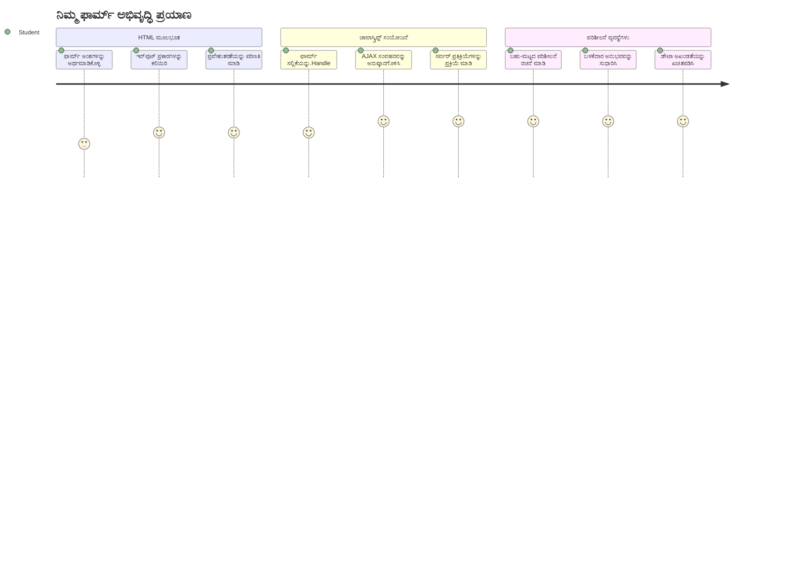
## ಪೂರ್ವ-ವಕ್ತृत्व ಕ್ವಿಜ್

[ಪೂರ್ವ-ವಕ್ತृत्व ಕ್ವಿಜ್](https://ff-quizzes.netlify.app/web/quiz/43)

ನೀವು ಅಾನ್ಲೈನ್‌లో ಫಾರಂ ಪೂರೈಸಿರುವಾಗ ನಿಮ್ಮ ಇಮೇಲ್ ಸ್ವರೂಪ ತಳ್ಳಿಹೋಗಿದೆಯಾ? ಅಥವಾ ಸಬ್ಮಿಟ್ ಕ್ಲಿಕ್ ಮಾಡಿದಾಗ ನಿಮ್ಮ ಎಲ್ಲಾ ಮಾಹಿತಿಯನ್ನು ಕಳೆದುಕೊಂಡಿದ್ದೀರಾ? ಇಂತಹ ತೊಂದರೆಕಾರಿ ಅನುಭವಗಳನ್ನು ನಾವು ಎಲ್ಲರೂ ಎದುರಿಸಿದ್ದೇವೆ.

ಫಾರಂಗಳು ನಿಮ್ಮ ಬಳಕೆದಾರರು ಮತ್ತು ನಿಮ್ಮ ಅಪ್ಲಿಕೇಶನ್ ಕಾರ್ಯಕ್ಷಮತೆಗಳ ನಡುವೆ ಸೇತುವೆಯಾಗಿವೆ. ವಿಮಾನಗಳ ಸುರಕ್ಷಿತ ಗಮ್ಯಸ್ಥಾನಕ್ಕೆ ಮಾರ್ಗದರ್ಶನ ನೀಡುವ ವಿಮಾನ ಸಂಚಾರ ನಿಯಂತ್ರಕರ ಸರಳ ನಿಯಮಗಳಂತೆ, ಚೆನ್ನಾಗಿ ವಿನ್ಯಾಸಗೊಳ್ಳದ ಫಾರಂಗಳು ಸ್ಪಷ್ಟ ಪ್ರತಿಕ್ರಿಯೆ ನೀಡುತ್ತದೆ ಮತ್ತು ದುಬಾರಿಯಾದ ದೋಷಗಳನ್ನು ತಡೆಯುತ್ತವೆ. ಕೀಳಾದ ಫಾರಂಗಳು, ಮತ್ತೊಂದೆಡೆ, ಬಳಕೆದಾರರನ್ನು ತುಂಬಾ ವೇಗವಾಗಿ ದೂರ ಮಾಡಬಹುದು, ಹೊರಗಡೆ ಗೊಂದಲಗಳಿಗೆ ಕಾರಣವಾಗುವ ವಿಮಾನ ನಿಲ್ದಾಣದ ಅನುಮಾನಗಳಂತೆ.

ಈ ಪಾಠದಲ್ಲಿ, ನಿಮ್ಮ ಸ್ಥಿರ ಬ್ಯಾಂಕಿಂಗ್ ಅಪ್ಲಿಕೇಶನ್ ಅನ್ನು ಬಲವಾದ ಇಂಟರಾಕ್ಟಿವ್ ಅಪ್ಲಿಕೇಶನ್ನಾಗಿ ಪರಿವರ್ತಿಸುವುದನ್ನು ಕಲಿಯೋಣ. ನೀವು ಬಳಕೆದಾರರ ಒಳಪಡಿಸುವ ಮಾಹಿತಿಯನ್ನು ಪರಿಶೀಲಿಸುವ, ಸರ್ವರ್‌ಗಳ ಜೊತೆ ಸಂವಹನ ಮಾಡುವ, ಮತ್ತು ಉಪಕಾರೀಯ ಪ್ರತಿಕ್ರಿಯೆ ನೀಡುವ ಫಾರಂಗಳನ್ನು ನಿರ್ಮಿಸುವುದನ್ನು ಕಲಿಯುತ್ತೀರಿ. ಇದು ನಿಮ್ಮ ಅಪ್ಲಿಕೇಶನ್ ವೈಶಿಷ್ಟ್ಯಗಳನ್ನು ಸ್ಥಿರವಾಗಿ ಕಡೆಗಣಿಸದೆ ಬಳಕೆದಾರರು ನಿರ್ವಹಿಸಲು ಅವಕಾಶ ನೀಡುವ ನಿಯಂತ್ರಣ ಮುಖಪಟವನ್ನು ನಿರ್ಮಿಸುವಂತೆ.

ಅಂತ್ಯದಲ್ಲಿ, ನೀವೇ ಸಂಪೂರ್ಣ ಲಾಗಿನ್ ಮತ್ತು ನೋಂದಣಿ ವ್ಯವಸ್ಥೆಯನ್ನು ಹೊಂದಿರುವಿರಿ, ಇದು ಬಳಕೆದಾರರನ್ನು ನಿರಾಶೆಯಿಂದ ಬಿಟ್ಟು ಯಶಸ್ಸಿನತ್ತ ದಾರಿತೋರುತ್ತದೆ.

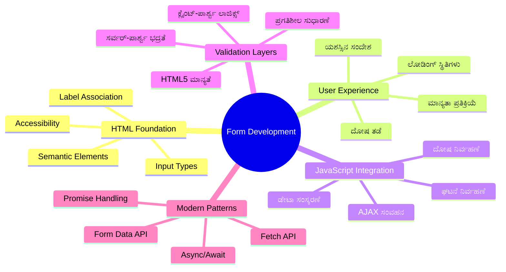
## ಪೂರ್ವಾಪೇಕ್ಷಿತಗಳು

ನಾವು ಫಾರಂಗಳನ್ನು ನಿರ್ಮಿಸಲು ಆರಂಭಿಸುವ ಮೊದಲು, ನೀವು ಎಲ್ಲವನ್ನೂ ಸರಿಯಾಗಿ ಸಿದ್ಧಪಡಿಸಿರುವುದನ್ನು ಖಾತ್ರಿಪಡಿಸೋಣ. ಈ ಪಾಠವು ಮುಂಚಿನ ಪಾಠದಿಂದಲೇ ಮುಂದುವರಿಯುತ್ತಾ ಇದೆ, ಆದ್ದರಿಂದ ನೀವು ಮುಂದಕ್ಕೆ ಜಿಗಿಯಿದ್ದರೆ, ಮೊದಲಿಗೆ ಮೂಲಗಳನ್ನು ಸರಿಯಾಗಿ ಕಾರ್ಯಗತಗೊಳಿಸಿಕೊಳ್ಳೋಣ.

### ಅಗತ್ಯ ಸ್ವರೂಪ

| ಘಟಕ | ಸ್ಥಿತಿ | ವಿವರಣೆ |
|-----------|--------|-------------|
| [HTML ಟೆಂಪ್ಲೇಟ್ಗಳು](../1-template-route/README.md) | ✅ ಅಗತ್ಯ | ನಿಮ್ಮ ಮೂಲ ಬ್ಯಾಂಕಿಂಗ್ ಆಪ್ ರಚನೆ |
| [Node.js](https://nodejs.org) | ✅ ಅಗತ್ಯ | ಸರ್ವರ್ ನಲ್ಲಿ ಜಾವಾಸ್ಕ್ರಿಪ್ಟ್ ರನ್ ಟೈಮ್ |
| [ಬ್ಯಾಂಕ್ API ಸರ್ವರ್](../api/README.md) | ✅ ಅಗತ್ಯ | ಡೇಟಾ ಸಂಗ್ರಹಕ್ಕಾಗಿ ಬ್ಯಾಕೆಂಡ್ ಸರ್ವೀಸ್ |

> 💡 **ವಿಕಸನ ಸಲಹೆ**: ನೀವು ಎರಡು ಪ್ರತ್ಯೇಕ ಸರ್ವರ್‌ಗಳನ್ನು ಒಂದೇ ಸಮಯದಲ್ಲಿ ಓಡಿಸುತ್ತಿದ್ದೀರಿ – ನಿಮ್ಮ ಫ್ರಂಟ್ ಎಂಡ್ ಬ್ಯಾಂಕಿಂಗ್ ಆಪ್ ಗೆ ಒಂದು ಮತ್ತು ಬ್ಯಾಕೆಂಡ್ API ಗೆ ಮತ್ತೊಂದು. ಈ ವ್ಯವಸ್ಥೆ ವಾಸ್ತವಿಕ ಅಭಿವೃದ್ಧಿಯಂತೆ ಕಾರ್ಯನಿರ್ವಹಿಸುತ್ತದೆ, ಅಲ್ಲಿ ಫ್ರಂಟ್ ಎಂಡ್ ಮತ್ತು ಬೆಕ್ ಎಂಡ್ ಸೇವೆಗಳು ಸ್ವತಂತ್ರವಾಗಿ ಕಾರ್ಯನಿರ್ವಹಿಸುತ್ತವೆ.

### ಸರ್ವರ್ ಸಂರಚನೆ

**ನಿಮ್ಮ ಅಭಿವೃದ್ಧಿ ಪರಿಸರದಲ್ಲಿ ಒಳಗೊಳ್ಳುವುದಾದುದು:**
- **ಫ್ರಂಟ್ ಎಂಡ್ ಸರ್ವರ್**: ನಿಮ್ಮ ಬ್ಯಾಂಕಿಂಗ್ ಆಪ್ಲಿಕೇಶನ್ ಅನ್ನು ಸರಬರಾಜು ಮಾಡುತ್ತದೆ (ಸಾಮಾನ್ಯವಾಗಿ ಪೋರ್ಟ್ `3000`)
- **ಬ್ಯಾಕೆಂಡ್ API ಸರ್ವರ್**: ಡೇಟಾ ಸಂಗ್ರಹ ಮತ್ತು ಪಡೆದುಕೊಳ್ಳುವಿಕೆಗೆ (ಪೋರ್ಟ್ `5000`)
- **ಎರಡು ಸರ್ವರ್‌ಗಳು** ಸಮಕಾಲೀನವಾಗಿ ಯಾವುದೇ ಘರ್ಷಣೆ ಇಲ್ಲದೆ ಓಡಬಹುದು

**ನಿಮ್ಮ API ಸಂಪರ್ಕವನ್ನು ಪರೀಕ್ಷಿಸುವುದು:**
```bash
curl http://localhost:5000/api
# ನಿರೀಕ್ಷಿತ ಪ್ರತಿಕ್ರಿಯೆ: "ಬ್ಯಾಂಕ್ API v1.0.0"
```

**ನೀವು API ಆವೃತ್ತಿ ಪ್ರತಿಕ್ರಿಯೆಯನ್ನು ನೋಡಿದರೆ, ನೀವು ಮುಂದುವರೆಯಲು ಸಿದ್ಧರಿದ್ದೀರಿ!**

---

## HTML ಫಾರಂಗಳು ಮತ್ತು ನಿಯಂತ್ರಣೆಗಳ ಅರ್ಥಮಾಡಿಕೊಳ್ಳುವುದು

HTML ಫಾರಂಗಳು ಬಳಕೆದಾರರು ನಿಮ್ಮ ವೆಬ್ ಅಪ್ಲಿಕೇಶನ್‌ ಜೊತೆಗೆ ಮಾಹಿತಿ ಹಂಚಿಕೊಳ್ಳುವ ಮಾರ್ಗ. ಅವುಗಳನ್ನು 19ನೇ ಶತಮಾನದಲ್ಲಿ ದೂರದ ಸ್ಥಿರಗಳಿಗೆ ಸಂಪರ್ಕಿಸುವ ಟೆಲಿಗ್ರಾಫ್ ವ್ಯವಸ್ಥೆಯಂತೆ ಪರಿಗಣಿಸಿ – ಬಳಕೆದಾರರ ಉದ್ದೇಶ ಮತ್ತು ಅಪ್ಲಿಕೇಶನ್ ಪ್ರತಿಕ್ರಿಯೆಯ ಮಧ್ಯದ ಸಂವಹನ ಪ್ರೋಟೋಕಾಲ್. ಜಾಗೃತಿಯಿಂದ ವಿನ್ಯಾಸ ಮಾಡಿದ್ದಾರೆರೆ, ಅವು ದೋಷಗಳನ್ನು ಹಿಡಿದಿಡುತ್ತವೆ, ನಮೂನೆಯ ಕೈಪಿಡಿಗಳನ್ನು ಮಾರ್ಗದರ್ಶಿಸುತ್ತವೆ, ಮತ್ತು ಸಹಾಯಕ ಸಲಹೆಗಳನ್ನು ಒದಗಿಸುತ್ತವೆ.

ಆಧುನಿಕ ಫಾರಂಗಳು ಸರಳ ಪಠ್ಯ ಇನ್‌ಪುಟ್‌ಗಳಿಗಿಂತ ಬಹು ಸುಧಾರಿತವಾಗಿವೆ. HTML5 ವಿಶೇಷ ಇನ್‌ಪುಟ್ ಪ್ರಕಾರಗಳನ್ನು ಪರಿಚಯಿಸಿತು, ಇದು ಸ್ವಯಂಚಾಲಿತವಾಗಿ ಇಮೇಲ್ ಪರಿಶೀಲನೆ, ಸಂಖ್ಯೆ ಸ್ವರೂಪ ಮತ್ತು ದಿನಾಂಕ ಆಯ್ಕೆಕ್ಷಮತೆಗಳನ್ನು ನಿರ್ವಹಿಸುತ್ತದೆ. ಈ ಸುಧಾರಣೆಗಳು ಪ್ರವೇಶಾರ್ಹತೆ ಹಾಗೂ ಮೊಬೈಲ್ ಬಳಕೆದಾರರ ಅನುಭವಗಳಿಗೂ ಸಹ ಸಹಾಯ ಮಾಡುತ್ತವೆ.

### ಅವಶ್ಯಕ ಫಾರಂ ಅಂಶಗಳು

**ಪ್ರತಿ ಫಾರಂಗೆ ಬೇಕಾದ ಕಟ್ಟಡಕರು:**

```html
<!-- Basic form structure -->
<form id="userForm" method="POST">
  <label for="username">Username</label>
  <input id="username" name="username" type="text" required>
  
  <button type="submit">Submit</button>
</form>
```

**ಈ ಕೋಡ್ ಏನು ಮಾಡುತ್ತದೆ:**
- **ಫಾರಂ ಕಾಂಟೈನರ್** ಅನ್ನು ವಿಶೇಷ ಗುರುತಿಸುವ ಗುರುತಿನೊಂದಿಗೆ ರಚಿಸುತ್ತದೆ
- **ಡೇಟಾ ಸಬ್ಮಿಷನ್‌ಗಾಗಿ** HTTP ವಿಧಾನವನ್ನು ನಿರ್ಧರಿಸುತ್ತದೆ
- **ಪ್ರವೇಶಾರ್ಹತೆಗಾಗಿ** ಲೆಬಲ್ಗಳನ್ನು ಇನ್‌ಪುಟ್‌ಗಳ ಜೊತೆ ಜೋಡಿಸುತ್ತದೆ
- **ಫಾರಂ ಪ್ರಕ್ರಿಯೆಗಾಗಿ** ಸಬ್ಮಿಟ್ ಬಟನ್ ಅನ್ನು ವ್ಯಾಖ್ಯಾನಿಸುತ್ತದೆ

### ಆಧುನಿಕ ಇನ್‌ಪುಟ್ ಪ್ರಕಾರಗಳು ಮತ್ತು ಲಕ್ಷಣಗಳು

| ಇನ್‌ಪುಟ್ ಪ್ರಕಾರ | ಉದ್ದೇಶ | ಉದಾಹರಣಾ ಬಳಕೆ |
|------------|---------|---------------|
| `text` | ಸಾಮಾನ್ಯ ಪಠ್ಯ ಇನ್‌ಪುಟ್ | `<input type="text" name="username">` |
| `email` | ಇಮೇಲ್ ಪರಿಶೀಲನೆ | `<input type="email" name="email">` |
| `password` | ಇನ್ಪುಟ್ ಮರೆಯಿರಿ | `<input type="password" name="password">` |
| `number` | ಸಂಖ್ಯಾತ್ಮಕ ಇನ್‌ಪುಟ್ | `<input type="number" name="balance" min="0">` |
| `tel` | ದೂರವಾಣಿ ಸಂಖ್ಯೆ | `<input type="tel" name="phone">` |

> 💡 **ಆಧುನಿಕ HTML5 ಲಾಭ**: ವಿಶೇಷ ಇನ್‌ಪುಟ್ ಪ್ರಕಾರಗಳನ್ನು ಬಳಸುವುದರಿಂದ ಸ್ವಯಂಚಾಲಿತ ಪರಿಶೀಲನೆ, ಸೂಕ್ತ ಮೊಬೈಲ್ ಕೀಬೋರ್ಡ್‌ಗಳು, ಮತ್ತು ಉತ್ತಮ ಪ್ರವೇಶಾರ್ಹತೆ ಬೆಂಬಲ ಇರುತ್ತದೆ, ಯಾವುದೇ ಹೆಚ್ಚುವರಿ ಜಾವಾಸ್ಕ್ರಿಪ್ಟ್ ಇಲ್ಲದೆ!

### ಬಟನ್ ಬೇರೆ ಬೇರೆ ಪ್ರಕಾರಗಳು ಮತ್ತು ವ್ಯವಹಾರ

```html
<!-- Different button behaviors -->
<button type="submit">Save Data</button>     <!-- Submits the form -->
<button type="reset">Clear Form</button>    <!-- Resets all fields -->
<button type="button">Custom Action</button> <!-- No default behavior -->
```

**ಪ್ರತಿ ಬಟನ್ ಪ್ರಕಾರವು ಎಷ್ಟು ಕಾರ್ಯವೈಖರಿ:**
- **ಸಬ್ಮಿಟ್ ಬಟನ್ಗಳು**: ಫಾರಂ ಸಲ್ಲಿಸುವುದನ್ನು ಪ್ರೇರೇಪಿಸಿ ಡೇಟಾವನ್ನು ನಿಗದಿತ ಅಂತಿಮ ಬಿಂದುವಿಗೆ ಕಳುಹಿಸುತ್ತವೆ
- **ರಿಸೆಟ್ ಬಟನ್ಗಳು**: ಎಲ್ಲಾ ಫಾರಂ ಕ್ಷೇತ್ರಗಳನ್ನು ಆರಂಭಿಕ ಸ್ಥಿತಿಗೆ ಹಿಂಪಡುವಿಕೆ ಮಾಡುತ್ತವೆ
- **ನಿಯಮಿತ ಬಟನ್ಗಳು**: ಯಾವುದೇ ಡೀಫಾಲ್ಟ್ ವ್ಯವಹಾರ ಇಲ್ಲ, ಕಸ್ಟಮ್ ಜಾವಾಸ್ಕ್ರಿಪ್ಟ್ ಅಗತ್ಯ

> ⚠️ **ಪ್ರಮುಖ ಟಿಪ್ಪಣಿ**: `<input>` ಅಂಶವು ಸ್ವಯಂ ಸಂಪೂರ್ಣವಾಗಿದ್ದು ಮುಚ್ಚುವ ಟ್ಯಾಗ್ ಅಗತ್ಯವಿಲ್ಲ. ಆಧುನಿಕ ಸರ್ವೋತ್ತಮ ಕ್ರಮವು slash ಇಲ್ಲದೆ `<input>` ಬರೆಯುವುದು.

### ನಿಮ್ಮ ಲಾಗಿನ್ ಫಾರಂ ಅನ್ನು ನಿರ್ಮಿಸುವುದು

ಈಗ ನಾವು ಆಧುನಿಕ HTML ಫಾರಂ ಅಭ್ಯಾಸಗಳನ್ನು ತೋರಿಸುವ ಪ್ರಾಯೋಗಿಕ ಲಾಗಿನ್ ಫಾರಂ ನಿರ್ಮಿಸೋಣ. ನಾವು ಸರಳ ರಚನೆಯಿಂದ ಪ್ರಾರಂಭಿಸಿ ಹಂತ ಹಂತವಾಗಿ ಪ್ರವೇಶಾರ್ಹತೆ ಕಾರ್ಯಕ್ಷಮತೆ ಮತ್ತು ಪರಿಶೀಲನೆ ಸೇರಿಸುವೆವು.

```html
<template id="login">
  <h1>Bank App</h1>
  <section>
    <h2>Login</h2>
    <form id="loginForm" novalidate>
      <div class="form-group">
        <label for="username">Username</label>
        <input id="username" name="user" type="text" required 
               autocomplete="username" placeholder="Enter your username">
      </div>
      <button type="submit">Login</button>
    </form>
  </section>
</template>
```

**ಇಲ್ಲಿ ಆಗುವ ಪ್ರಮುಖ ಸಂಗತಿಗಳು:**
- **ಫಾರಂವನ್ನು ಸಾಂಕೇತಿಕ HTML5 ಅಂಶಗಳೊಂದಿಗೆ ರಚಿಸುತ್ತದೆ**
- **ಸಂಬಂಧಿತ ಅಂಶಗಳನ್ನು ಅರ್ಥಪೂರ್ಣ ವರ್ಗಗಳುಳ್ಳ `div` ಕಾಂಟೈನರ್‌ಗಳ ಮೂಲಕ ಗುಂಪು ಮಾಡುತ್ತದೆ**
- **`for` ಮತ್ತು `id` ಗುಣಲಕ್ಷಣಗಳಿಂದ ಲೇಬಲ್ಸ್ ಮತ್ತು ಇನ್‌ಪುಟ್‌ಗಳನ್ನು ಜೋಡಿಸುತ್ತದೆ**
- **ಉತ್ತಮ ಉಪಯೋಗದ ಅನುಭವಕ್ಕೆ `autocomplete` ಮತ್ತು `placeholder` ಸಾಮ್ರಾಜ್ಯಗಳನ್ನು ಸೇರಿಸುತ್ತದೆ**
- **ಬ್ರೌಸರ್ ಡೀಫಾಲ್ಟ್ ಬದಲಾಗಿ ಜಾವಾಸ್ಕ್ರಿಪ್ಟ್ ಮೂಲಕ ಪರಿಶೀಲನೆ ನಡೆಸಲು `novalidate` ಅನ್ನು ಸೇರಿಸುತ್ತದೆ**

### ಸೂಕ್ತ ಲೇಬಲ್ಸ್ ಶಕ್ತಿಯು

**ಆಧುನಿಕ ವೆಬ್ ಅಭಿವೃದ್ಧಿಗೆ ಲೇಬಲ್ಸ್ ಮುಂಬರುವ ಕಾರಣಗಳು:**

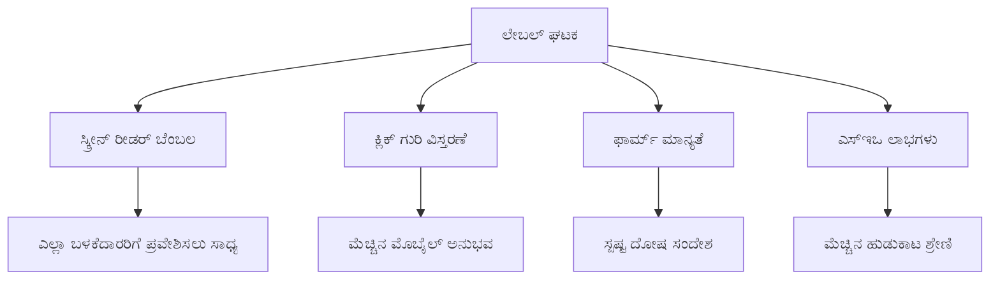
**ಸೂಕ್ತ ಲೇಬಲ್ಗಳು ನೀಡುವ ಚಟುವಟಿಕೆಗಳು:**
- **ಸ್ಕ್ರೀನ್ ರೀಡರ್‌ಗಳು ಸ್ಪಷ್ಟವಾಗಿ ಫಾರಂ ಕ್ಷೇತ್ರಗಳನ್ನು ಘೋಷಿಸುವಂತೆ ಸಹಾಯ ಮಾಡುತ್ತದೆ**
- **ಕ್ಲಿಕ್ ಮಾಡುವ ವಿಸ್ತೀರ್ಣವನ್ನು ಹೆಚ್ಚಿಸುತ್ತದೆ (ಲೇಬಲ್ ಮೇಲೆ ಕ್ಲಿಕ್ ಮಾಡಿದರೆ ಇನ್‌ಪುಟ್‌ಗೆ ಫೋಕಸ್ ಆಗುತ್ತದೆ)**
- **ಮೋಬೈಲ್ ಬಳಕೆಗೆ ದೊಡ್ಡ ಟಚ್ ಗುರಿಗಳನ್ನು ಒದಗಿಸುತ್ತದೆ**
- **ಭರತನಿರ್ವಾಹಕ ದೋಷ ಸಂದೇಶಗಳೊಂದಿಗೆ ಫಾರಂ ಪರಿಶೀಲನೆಯನ್ನು ಬೆಂಬಲಿಸುತ್ತದೆ**
- **ಫಾರಂ ಅಂಶಗಳಿಗೆ ಅರ್ಥಮಯ ಅರ್ಥವನ್ನು ಕೊಡುತ್ತಿರುವುದರಿಂದ SEO ಉತ್ತಮವಾಗುತ್ತದೆ**

> 🎯 **ಪ್ರವೇಶಾರ್ಹತೆ ಗುರಿ**: ಪ್ರತಿಯೊಬ್ಬ ಫಾರಂ ಇನ್‌ಪುಟ್‌ಗೆ ಸಂಬಂಧಪಟ್ಟ ಲೇಬಲ್ ಇರಬೇಕು. ಈ ಸರಳ ಅಭ್ಯಾಸವು ನಿಮ್ಮ ಫಾರಂಗಳನ್ನು ಎಲ್ಲಾ ಬಳಕೆದಾರರಿಗೂ ಉಪಯುಕ್ತವಾಗಿಸುತ್ತದೆ, ಅಂಗವಿಕಲರು ಸೇರಿದಂತೆ, ಮತ್ತು ಎಲ್ಲಾ ಬಳಕೆದಾರರ ಅನುಭವನ್ನು ಸುಧಾರಿಸುತ್ತದೆ.

### ನೋಂದಣಿ ಫಾರಂ ನಿರ್ಮಾಣ

ನೋಂದಣಿ ಫಾರಂ ಸಂಪೂರ್ಣ ಬಳಕೆದಾರ ಖಾತೆಯನ್ನು ರಚಿಸಲು ಹೆಚ್ಚಿನ ವಿವರಗಳನ್ನು ಬಯಸುತ್ತದೆ. ಅದನ್ನು ಆಧುನಿಕ HTML5 ಮತ್ತು ಉತ್ತಮ ಪ್ರವೇಶಾರ್ಹತೆಯೊಂದಿಗೆ ನಿರ್ಮಿಸೋಣ.

```html
<hr/>
<h2>Register</h2>
<form id="registerForm" novalidate>
  <div class="form-group">
    <label for="user">Username</label>
    <input id="user" name="user" type="text" required 
           autocomplete="username" placeholder="Choose a username">
  </div>
  
  <div class="form-group">
    <label for="currency">Currency</label>
    <input id="currency" name="currency" type="text" value="$" 
           required maxlength="3" placeholder="USD, EUR, etc.">
  </div>
  
  <div class="form-group">
    <label for="description">Account Description</label>
    <input id="description" name="description" type="text" 
           maxlength="100" placeholder="Personal savings, checking, etc.">
  </div>
  
  <div class="form-group">
    <label for="balance">Starting Balance</label>
    <input id="balance" name="balance" type="number" value="0" 
           min="0" step="0.01" placeholder="0.00">
  </div>
  
  <button type="submit">Create Account</button>
</form>
```

**ಮೇಲಿನಲ್ಲಿದ್ದವು:**
- **ಪ್ರತಿ ಕ್ಷೇತ್ರವನ್ನು ಉತ್ತಮ ಸ್ಟೈಲಿಂಗ್ ಮತ್ತು ವಿನ್ಯಾಸಕ್ಕಾಗಿ ಕಂಟೈನರ್ ಡಿವ್‌ಗಳಲ್ಲಿ ಸಂಘಟಿಸಿದ್ದು**
- **ಬ್ರೌಸರ್ ಆಫ್ಟೊಫಿಲ್ ಬೆಂಬಲಕ್ಕಾಗಿ ಸೂಕ್ತ `autocomplete` ಗುಣಲಕ್ಷಣಗಳನ್ನು ಸೇರಿಸಿದ್ದು**
- **ಬಳಕೆದಾರರ ಒಳಪಡಿಸುವಿಕೆಗೆ ಮಾರ್ಗದರ್ಶನ ನೀಡುವ ಸಹಾಯಕ ಪ್ಲೇಸ್‌ಹೋಲ್ಡರ್ ಪಠ್ಯವನ್ನು ಸೇರಿಸಿದ್ದು**
- **`value` ಗುಣಲಕ್ಷಣದೊಂದಿಗೆ ಸೂಕ್ತ ಡೀಫಾಲ್ಟ್ ಮೂಲ್ಯಗಳನ್ನು ಹೊಂದಿಸಿದ್ದು**
- **`required`, `maxlength`, ಮತ್ತು `min`ಂತಹ ಪರಿಶೀಲನಾ ಗುಣಲಕ್ಷಣಗಳನ್ನು ಉಪಯೋಗಿಸಿದ್ದು**
- **ಬ್ಯಾಲೆನ್ಸ್ ಕ್ಷೇತ್ರಕ್ಕೆ ದಶಮಲವ ಸಹಿತ `type="number"` ಬಳಕೆ ಮಾಡಲಾಗಿದೆ**

### ಇನ್‌ಪುಟ್ ಪ್ರಕಾರಗಳು ಮತ್ತು ಚಟುವಟಿಕೆಗಳ ಪರಿಗಣನೆ

**ಆಧುನಿಕ ಇನ್‌ಪುಟ್ ಪ್ರಕಾರಗಳು ಹೆಚ್ಚಿದ ಕಾರ್ಯಕ್ಷಮತೆ ನೀಡುತ್ತವೆ:**

| ವೈಶಿಷ್ಟ್ಯ | ಲಾಭ | ಉದಾಹರಣೆ |
|---------|---------|----------|
| `type="number"` | ಮೊಬೈಲ್‌ನಲ್ಲಿ ಸಂಖ್ಯಾತ್ಮಕ ಕೀಪ್ಯಾಡ್ | ಸುಲಭ ಬ್ಯಾಲೆನ್ಸ್ ನಮೂದಿಕೆ |
| `step="0.01"` | ದಶಮಲವ ನಿಖರ ನಿಯಂತ್ರಣ | ಕರೆನ್ಸಿಯಲ್ಲಿ ಸೆಂಸೆಗಳ ಅನುಮತಿ |
| `autocomplete` | ಬ್ರೌಸರ್ ಆಫ್ಟೊಫಿಲ್ | ಫಾರಂ ಪೂರ್ಣಗೊಳಿಸುವಿಕೆಯ ವೇಗ |
| `placeholder` | ಸಂಬಂಧಿತ ಸೂಚನೆಗಳು | ಬಳಕೆದಾರ ನಿರೀಕ್ಷೆಯನ್ನು ಮಾರ್ಗದರ್ಶನ |

> 🎯 **ಪ್ರವೇಶಾರ್ಹತೆ ಸವಾಲು**: ನಿಮ್ಮ ಕೀಬೋರ್ಡ್ ಅನ್ನು ಮಾತ್ರ ಬಳಸಿಕೊಂಡು ಫಾರಂಗಳನ್ನು ನಾವಿಗೇಟ್ ಮಾಡುವ ಪ್ರಯತ್ನ ಮಾಡಿ! ಕ್ಷೇತ್ರಗಳ ನಡುವೆ ಸರಕುವಕ್ಕಾಗಿ `Tab`, ಬಾಕ್ಸ್ ಅನ್ನು ತಪಾಸಣೆಗೆ `Space`, ಮತ್ತು ಸಲ್ಲಿಸಲು `Enter` ಬಳಸಿ. ಈ ಅನುಭವವು ಸ್ಕ್ರೀನ್ ರೀಡರ್ ಬಳಕೆದಾರರು ನಿಮ್ಮ ಫಾರಂಗಳೊಂದಿಗೆ ಹೇಗೆ ಸಂವಹನ ಮಾಡುತ್ತಾರೆ ಎಂಬುದನ್ನು ನಿಮಗೆ ಹೇಳುತ್ತದೆ.

### 🔄 **ಶಿಕ್ಷಣಾತ್ಮಕ ಪರಿಶೀಲನೆ**
**ಫಾರಂ ಭಿತ್ತಿಯ ಗ್ರಹಿಕೆ**: ಜಾವಾಸ್ಕ್ರಿಪ್ಟ್ ಜೋಡಿಸುವ ಮೊದಲು, ನಿಮಗೆ ತಿಳಿದಿರುವುದನ್ನು ಖಚಿತಪಡಿಸಿಕೊಳ್ಳಿ:
- ✅ ಹೇಗೆ ಸಾಂಕೇತಿಕ HTML ಪ್ರವೇಶಾರ್ಹ ಫಾರಂ ರಚನೆಗಳನ್ನು ಸೃಷ್ಠಿಸುತ್ತದೆ
- ✅ ಮೊಬೈಲ್ ಕೀಬೋರ್ಡ್ಗಳಿಗೆ ಮತ್ತು ಪರಿಶೀಲನೆಗೆ ಇನ್‌ಪುಟ್ ಪ್ರಕಾರಗಳು ಏಕೆ ಮುಖ್ಯ
- ✅ ಲೇಬಲ್ಸ್ ಮತ್ತು ಫಾರಂ ನಿಯಂತ್ರಣಗಳ ಸಂಬಂಧವೇನು
- ✅ ಫಾರಂ ಗುಣಲಕ್ಷಣಗಳು ಬ್ರೌಸರ್ ನ ಡೀಫಾಲ್ಟ್ ವರಹಹೋಗುವಿಕೆಗಳಿಗೆ ಹೇಗೆ ಪ್ರಭಾವ ಬೀರುತ್ತವೆ

**ತ್ವರಿತ ಸ್ವಯಂ ಪರೀಕ್ಷೆ**: ನೀವು ಜಾವಾಸ್ಕ್ರಿಪ್ಟ್ ನಿರ್ವಹಣೆ ಇಲ್ಲದೆ ಫಾರಂ ಸಲ್ಲಿಸಿದರೆ ಏನಾಗುತ್ತದೆ?
*ಉತ್ತರ: ಬ್ರೌಸರ್ ಡೀಫಾಲ್ಟ್ ಸಲ್ಲಿಕೆಯನ್ನು ನಿರ್ವಹಿಸುತ್ತದೆ, ಸಾಮಾನ್ಯವಾಗಿ ಆಕ್ಷನ್ URL ಗೆ ಪುನರ್‌ನಿರ್ದೇಶನ ಮಾಡುತ್ತದೆ*

**HTML5 ಫಾರಂಗಳ ಲಾಭಗಳು**: ಆಧುನಿಕ ಫಾರಂಗಳು ನೀಡುತ್ತವೆ:
- **ನಿರ್ಮಿತ ಪರಿಶೀಲನೆ**: ಸ್ವಯಂಚಾಲಿತ ಇಮೇಲ್ ಮತ್ತು ಸಂಖ್ಯೆ ಸ್ವರೂಪ ಪರಿಶೀಲನೆ
- **ಮೊಬೈಲ್ ಪರಿಪೂರ್ಣತೆ**: ವಿಭಿನ್ನ ಇನ್‌ಪುಟ್ ಪ್ರಕಾರಗಳಿಗೆ ಸೂಕ್ತ ಕೀಬೋರ್ಡ್ಗಳು
- **ಪ್ರವೇಶಾರ್ಹತೆ**: ಸ್ಕ್ರೀನ್ ರೀಡರ್ ಬೆಂಬಲ ಮತ್ತು ಕೀಬೋರ್ಡ್ ನ್ಯಾವಿಗೇಶನ್
- **ಪ್ರಗತಿಶೀಲ ಸುಧಾರಣೆ**: ಜಾವಾಸ್ಕ್ರಿಪ್ಟ್ ನಿಷ್ಕ್ರಿಯ ಇದ್ದಾಗಲೂ ಕಾರ್ಯನಿರ್ವಹಿಸುತ್ತದೆ

## ಫಾರಂ ಸಲ್ಲಿಸುವ ವಿಧಾನಗಳ ಅರ್ಥ

ಯಾರೋ ಒಂದು ಫಾರಂ ತುಂಬಿ ಸಲ್ಲಿಸಿದಾಗ, ಆ ಡೇಟಾ ಯಾವುದೋ ಜಾಗಕ್ಕೆ ಹೋಗಬೇಕು – ಸಾಮಾನ್ಯವಾಗಿ ಅದನ್ನು ಉಳಿಸುವ ಸರ್ವರ್‌ಗೆ. ಇದಕ್ಕೆ ಕೆಲವು ವಿವಿಧ ವಿಧಾನಗಳಿರುತ್ತವೆ, ಮತ್ತು ಯಾವದನ್ನು ಬಳಸಬೇಕೆಂದು ತಿಳಿದಿರುವುದು ನಂತರ ನಿಮ್ಮ ತಲೆನೋವನ್ನು ಉಳಿಸುತ್ತದೆ.

ಸಬ್ಮಿಟ್ ಬಟನ್ ಕ್ಲಿಕ್ ಮಾಡುವಾಗ ಏನಾಗುತ್ತದೆ ನೋಡೋಣ.

### ಡೀಫಾಲ್ಟ್ ಫಾರಂ ವರಹಹೋಗುವಿಕೆ

ಮೊದಲಿಗೆ, ಸರಳ ಫಾರಂ ಸಲ್ಲಿಸುವಿಕೆಯೊಂದಿಗೆ ಏನಾಗುತ್ತದೆ ಎನ್ನುವುದನ್ನು ಗಮನಿಸೋಣ:

**ನೀವೆಲ್ಲಾ ಫಾರಂಗಳನ್ನು ಪರೀಕ್ಷಿಸಿ:**
1. ನಿಮ್ಮ ಫಾರಂನಲ್ಲಿ *ನೋಂದಣಿ* ಬಟನ್ ಕ್ಲಿಕ್ ಮಾಡಿ
2. ನಿಮ್ಮ ಬ್ರೌಸರ್ ವಿಳಾಸ ಪಟ್ಟಿಯಲ್ಲಿ ಬದಲಾವಣೆಗಳನ್ನು ಗಮನಿಸಿ
3. ಪುಟ ಮರುಭರ್ತಿ ಆಗುವುದು ಮತ್ತು URL ನಲ್ಲಿ ಡೇಟಾ ಕಾಣಿಸುವುದು ಗಮನಿಸಿ


### HTTP ವಿಧಾನಗಳ ಹೋಲಿಕೆ

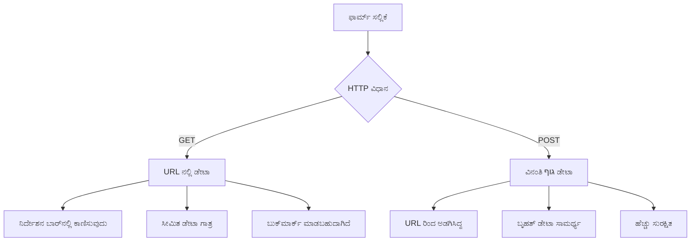
**ವೈವಿಧ್ಯಗಳ ಅರ್ಥಮಾಡಿಕೊಳ್ಳುವುದು:**

| ವಿಧಾನ | ಉಪಯೋಗ | ಡೇಟಾ ಸ್ಥಳ | ಭದ್ರತಾ ಮಟ್ಟ | ಗಾತ್ರ ಮಿತಿ |
|--------|----------|---------------|----------------|-------------|
| `GET` | ಹುಡುಕು ಪ್ರಶ್ನೆಗಳು, ಫಿಲ್ಟರ್‌ಗಳು | URL ಪರಿಮಾಣಗಳು | ಕಡಿಮೆ (ಗೋಚರ) | ~2000 ಅಕ್ಷರಗಳು |
| `POST` | ಬಳಕೆದಾರ ಖಾತೆಗಳು, ಸಂವೇದನಶೀಲ ಡೇಟಾ | ವಿನಂತಿ ದೇಹ | ಹೆಚ್ಚು (ಗोप್ಯ) | ಕಾರ್ಯನಿರ್ವಹಣಾ ಮಿತಿ ಇಲ್ಲ |

**ಮೂಲಭೂತ ವ್ಯತ್ಯಾಸಗಳ ಅರ್ಥ:**
- **GET**: ಫಾರಂ ಡೇಟಾವನ್ನು ವಿನಂತಿ URL ಗೆ ಪ್ರಶ್ನಾ ಪರಿಮಾಣಗಳಾಗಿ ಸೇರ್ಪಡೆ ಮಾಡುತ್ತದೆ (ಹುಡುಕಿಗಾಗಿ ಸೂಕ್ತ)
- **POST**: ವಿನಂತಿ ದೇಹದಲ್ಲಿ ಡೇಟಾವನ್ನು ಸೇರಿಸುತ್ತದೆ (ಸಂವೇದನಶೀಲ ಮಾಹಿತಿಗಾಗಿ ಅವಶ್ಯ)
- **GET ಮಿತಿ ಗಳು**: ಗಾತ್ರ ಮಿತಿ, ಗೋಚರ ಡೇಟಾಂಶ, ಬ್ರೌಸರ್ ಇತಿಹಾಸದಲ್ಲಿ ಸ್ಥಿರತೆ
- **POST ಪ್ರಯೋಜನಗಳು**: ದೊಡ್ಡ ಡೇಟಾ ಸಾಮರ್ಥ್ಯ, ಗೌಪ್ಯತೆ ರಕ್ಷಣೆ, ಫೈಲ್ ಅಪ್ ಲೋಡ್ ಬೆಂಬಲ

> 💡 **ಉತ್ತಮ ಅಭ್ಯಾಸ**: ಹುಡುಕಾಟ ಹಾಗೂ ಫಿಲ್ಟರ್ ಫಾರಂಗಳಿಗೆ `GET` ಬಳಸಿರಿ (ಡೇಟಾ ಪಡೆಯಲು), ಬಳಕೆದಾರ ನೋಂದಣಿ ಹಾಗೂ ಲಾಗಿನ್, ಮತ್ತು ಡೇಟಾ ಸೃಷ್ಟಿಗಾಗಿ `POST` ಬಳಸಿ.

### ಫಾರಂ ಸಲ್ಲಿಸುವಿಕೆಯನ್ನು ಸಂರಚಿಸುವುದು

ನಿಮ್ಮ ನೋಂದಣಿ ಫಾರಂ ಅನ್ನು ಬ್ಯಾಕೆಂಡ್ API ಜೊತೆ ಸರಿಯಾಗಿ ಸಂವಹನ ಮಾಡಲು POST ವಿಧಾನ ಬಳಸಿ ಸಂರಚಿಸೋಣ:

```html
<form id="registerForm" action="//localhost:5000/api/accounts" 
      method="POST" novalidate>
```

**ಈ ಸಂರಚನೆ ಏನು ಮಾಡುತ್ತದೆ:**
- **ನಿಮ್ಮ API ಅಂತಿಮ ಬಿಂದುವಿಗೆ ಫಾರಂ ಸಲ್ಲಿಸಲು ಮಾರ್ಗದರ್ಶನ**
- **ಭದ್ರತೆಯೊಂದಿಗೆ ಡೇಟಾ ಕಳುಹಿಸುವಿಕೆಗೆ POST ವಿಧಾನ ಬಳಸುವುದು**
- **ಜಾವಾಸ್ಕ್ರಿಪ್ಟ್ ಜೊತೆಗೆ ಪರಿಶೀಲನೆಗಾಗಿ `novalidate` ಗುಣಲಕ್ಷಣ ಸೇರಿಸುವುದು**

### ಫಾರಂ ಸಲ್ಲಿಸುವಿಕೆಯನ್ನು ಪರೀಕ್ಷಿಸುವುದು

**ನಿಮ್ಮ ಫಾರಂ ಪರೀಕ್ಷಿಸಲು ಈ ಹಂತಗಳನ್ನು ಅನುಸರಿಸಿ:**
1. **ನೋಂದಣಿ ಫಾರಂ ಪೂರೈಸಿ**ನು ನಿಮ್ಮ ಮಾಹಿತಿಯಿಂದ
2. **"ಖಾತೆ ರಚಿಸಿ" ಬಟನ್ ಕ್ಲಿಕ್ ಮಾಡಿ**
3. **ಬ್ರೌಸರ್‌ನಲ್ಲಿ ಸರ್ವರ್ ಪ್ರತಿಕ್ರಿಯೆಯನ್ನು ಗಮನಿಸಿ**

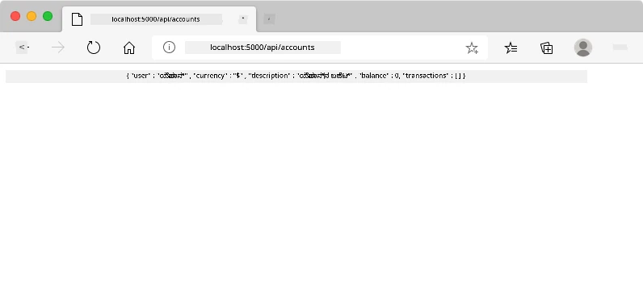

**ನೀವು ಕಂಡುಕೊಳ್ಳಬೇಕಾದುದು:**
- **ಬ್ರೌಸರ್ API ಅಂತಿಮ ಬಿಂದುವಿಗೆ पुनರ್ನಿರ್ದೇಶನ ಮಾಡುತ್ತದೆ**
- **ನಿಮ್ಮ ಹೊಸ ಖಾತೆ ವಿವರಗಳನ್ನು ಹೊಂದಿರುವ JSON ಪ್ರತಿಕ್ರಿಯೆ**
- **ಸರ್ವರ್ ಖಾತೆಯನ್ನು ಯಶಸ್ವಿಯಾಗಿ ರಚಿಸಿರುವ ಪ್ರಮಾಣೀಕರಣ**

> 🧪 **ಪ್ರयोग ಕಾಲ**: ಅದೇ ಬಳಕೆದಾರನಾಮದೊಂದಿಗೆ ಮತ್ತೆ ನೋಂದಣಿ ಮಾಡಲು ಪ್ರಯತ್ನಿಸಿ. ನೀವು ಯಾವ ಪ್ರತಿಕ್ರಿಯೆಯನ್ನು ಪಡೆಯುತ್ತೀರಿ? ಇದು ಸರ್ವರ್ ನಕಲಿ ಡೇಟಾ ಮತ್ತು ದೋಷ ಸ್ಥಿತಿಗಳನ್ನು ಹೇಗೆ ನಿರ್ವಹಿಸುತ್ತದೆ ಎಂಬುದನ್ನು ನಿಮಗೆ ತಿಳಿಸುತ್ತದೆ.

### JSON ಪ್ರತಿಕ್ರಿಯೆಗಳ ಅರ್ಥ

**ಸರ್ವರ್ ನಿಮ್ಮ ಫಾರಂ ಯಶಸ್ವಿಯಾಗಿ ಪ್ರಕ್ರಿಯೆ ಮಾಡಿದಾಗ:**
```json
{
  "user": "john_doe",
  "currency": "$",
  "description": "Personal savings",
  "balance": 100,
  "id": "unique_account_id"
}
```

**ಈ ಪ್ರತಿಕ್ರಿಯೆಯು ದೃಢಪಟ್ಟಿದ್ದು:**
- **ನಿರ್ದಿಷ್ಟ ಡೇಟಾ ಹೊಂದಿರುವ ಹೊಸ ಖಾತೆಯನ್ನು ರಚಿಸಿದೆ**
- **ಭವಿಷ್ಯದಲ್ಲಿ ಉಪಯೋಗಿಸಲು ವಿಶಿಷ್ಟ ಗುರುತಿನ ಸಂನ್ಯಾಸ ನೀಡಿದೆ**
- **ತಪಾಸಣೆಗೆ ಎಲ್ಲಾ ಖಾತೆ ವಿವರಗಳನ್ನು ಹಿಂತಿರುಗಿಸಿದೆ**
- **ಡೇಟಾಬೇಸ್‌ನಲ್ಲಿ ಯಶಸ್ವಿಯಾಗಿ ಸಂಗ್ರಹಿಸಿದೆ ಎಂಬುದನ್ನು ಸೂಚಿಸುತ್ತದೆ**

## ಜಾವಾಸ್ಕ್ರಿಪ್ಟ್ ಬಳಸಿ ಆಧುನಿಕ ಫಾರಂ ನಿರ್ವಹಣೆ

ಪಾರಂಪರಿಕ ಫಾರಂ ಸಲ್ಲಿಸುವಿಕೆ ಸಂಪೂರ್ಣ ಪುಟ ಮರುಭರ್ತಿ ಮಾಡುತ್ತದೆ, ಇದು ಪ್ರಾರಂಭಿಕ ಜಾಹಗಣಿಕೆ ಯಂತ್ರಗಳು ನಿಭಾಯಿಸಿದಂತೆ ಪೂರ್ಣ ವ್ಯವಸ್ಥೆ ಪುನಃಪ್ರಾರಂಭವನ್ನು ಅಗತ್ಯವಂತೆ ಮಾಡುತ್ತದೆ. ಈ ಕ್ರಮ ಬಳಕೆದಾರ ಅನುಭವವನ್ನು ವ್ಯಾಜ್ಯಗೊಳಿಸುತ್ತದೆ ಮತ್ತು ಅಪ್ಲಿಕೇಶನ್ ಸ್ಥಿತಿಯನ್ನು ಕಳೆದುಕೊಳ್ಳುತ್ತದೆ.

ಜಾಗೃತ ಜಾವಾಸ್ಕ್ರಿಪ್ಟ್ ಫಾರಂ ನಿರ್ವಹಣೆ ಆಧುನಿಕ ಅನ್ವೇಷಣೆಯ ಖಗೋಳಯಾನಗಳಂತೆ ನಿರಂತರ ಮಾರ್ಗದರ್ಶನ ವ್ಯವಸ್ಥೆಯಂತೆ ಕಾರ್ಯನಿರ್ವಹಿಸುತ್ತದೆ – ನಾವಿಗೇಶನ್ ಪ್ರಸುತನೆಯನ್ನು ಕಳೆದುಹೋಗದೆ ತಕ್ಷಣದ ಹೊಂದಾಣಿಕೆಯನ್ನು ಮಾಡುತ್ತದೆ. ನಾವು ಫಾರಂ ಸಲ್ಲಿಸುವಿಕೆಯನ್ನು ಅಡಕ ಮಾಡಬಹುದು, ತಕ್ಷಣದ ಪ್ರತಿಕ್ರಿಯೆಯನ್ನು ಒದಗಿಸಬಹುದು, ದೋಷಗಳನ್ನು ಸೌಜನ್ಯವಾಗಿ ನಿರ್ವಹಿಸಬಹುದು, ಮತ್ತು ಸರ್ವರ್ ಪ್ರತಿಕ್ರಿಯೆಗಳ ಆಧಾರದ ಮೇಲೆ ಇಂಟರ್ಫೇಸ್ ನವೀಕರಿಸಬಹುದು, ಬಳಕೆದಾರನ ಸ್ಥಿತಿಯನ್ನು ಕಾಪಾಡುತ್ತಾ.

### ಪುಟ ಮರುಭರ್ತಿ ತಪ್ಪಿಸಿಕೊಳ್ಳಬೇಕಾಗಿರುವ ಕಾರಣಗಳು

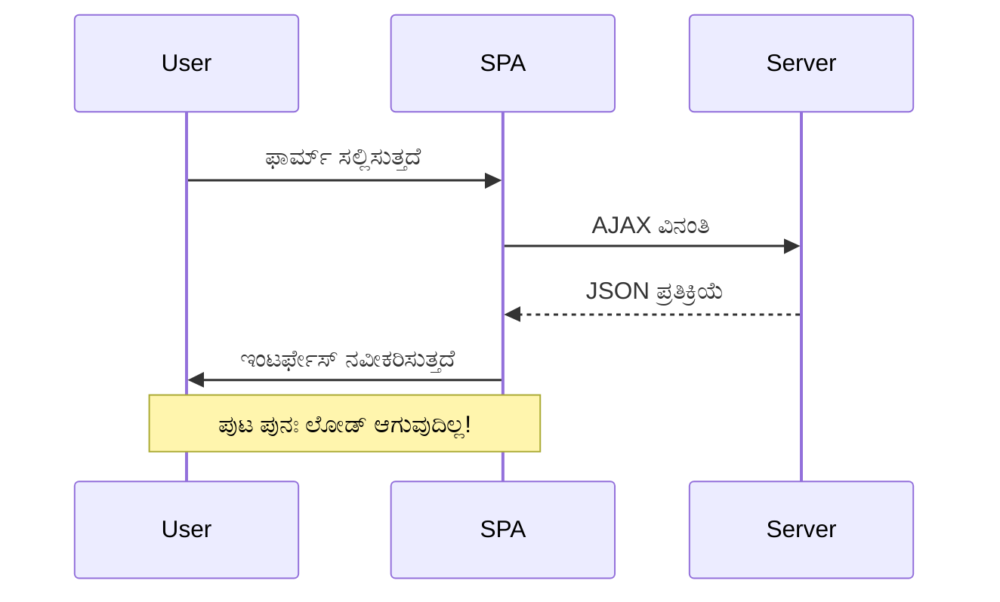
**ಜಾವಾಸ್ಕ್ರಿಪ್ಟ್ ಫಾರಂ ನಿರ್ವಹಣೆಯ ಒದಗಿಸುವ ಪ್ರಯೋಜನಗಳು:**
- **ಅಪ್ಲಿಕೇಶನ್ ಸ್ಥಿತಿ ಮತ್ತು ಬಳಕೆದಾರ ಸಂಪರ್ಕವನ್ನು ಉಳಿಸುತ್ತದೆ**
- **ತಕ್ಷಣದ ಪ್ರತಿಕ್ರಿಯೆ ಮತ್ತು ಲೋಡೆಂಗ್ ಸೂಚನೆಗಳನ್ನು ಒದಗಿಸುತ್ತದೆ**
- **ಗತಿಯ ದೋಷ ನಿರ್ವಹಣೆ ಮತ್ತು ಪರಿಶೀಲನೆಯನ್ನು ಸಕ್ರಿಯಗೊಳಿಸುತ್ತದೆ**
- **ಮುರಗಾದ, ಆ್ಯಪ್-ಹಾಗೂ ಅನುಭವಗಳನ್ನು ನಿರ್ಮಿಸುತ್ತದೆ**
- **ಸರ್ವರ್ ಪ್ರತಿಕ್ರಿಯೆಗಳ ಆಧಾರಿತ ಶರತ್ತು ಲಾಜಿಕ್ಗಳನ್ನು ಅವಕಾಶ ಮಾಡಿಕೊಡುತ್ತದೆ**

### ಪಾರಂಪರಿಕ ಫಾರಂಗಳಿಂದ ಆಧುನಿಕ ಫಾರಂಗಳಿಗೆ ಪರಿವರ್ತನೆ

**ಪಾರಂಪರಿಕ ಮಾರ್ಗದ ಸಮಸ್ಯೆಗಳು:**
- ಬಳಕೆದಾರರನ್ನು ನಿಮ್ಮ ಅಪ್ಲಿಕೇಶನಿಂದ ಬಿರುಗಾಳಿ ಆಗುತ್ತದೆ
- ಪ್ರಸ್ತುತ ಅಪ್ಲಿಕೇಶನ್ ಸ್ಥಿತಿ ಮತ್ತು ಪ್ರಾಸಂಗಿಕತೆ ಹೆಚ್ಚುತ್ತದಿಲ್ಲ
- ಸರಳ ಕಾರ್ಯಗಳಿಗಾಗಿಯೂ ಸಂಪೂರ್ಣ ಪುಟ ಮರುಭರ್ತಿ ಬೇಕಾಗುತ್ತದೆ
- ಬಳಕೆದಾರ ಪ್ರತಿಕ್ರಿಯೆ ಮೇಲೆ ನಿಯಂತ್ರಣ ಕಡಿಮೆ

**ಆಧುನಿಕ ಜಾವಾಸ್ಕ್ರಿಪ್ಟ್ ಮಾರ್ಗದ ಪ್ರಯೋಜನಗಳು:**
- ಬಳಕೆದಾರರನ್ನು ಅಪ್ಲಿಕೇಶನ್ ಒಳಗೆ ಇರಿಸುತ್ತದೆ
- ಎಲ್ಲಾ ಅಪ್ಲಿಕೇಶನ್ ಸ್ಥಿತಿ ಮತ್ತು ಡೇಟಾ ಉಳಿಸುತ್ತದೆ
- ನೈಜ ಸಮಯ ಪರಿಶೀಲನೆ ಮತ್ತು ಪ್ರತಿಕ್ರಿಯೆ ನಿರ್ವಹಣೆ ಸಾಧ್ಯ
- ಪ್ರಗತಿಶೀಲ ಸುಧಾರಣೆ ಮತ್ತು ಪ್ರವೇಶಾರ್ಹತೆಯನ್ನು ಬೆಂಬಲಿಸುತ್ತದೆ

### ಜಾವಾಸ್ಕ್ರಿಪ್ಟ್ ಫಾರಂ ನಿರ್ವಹಣೆ ಅನುಷ್ಠಾನ

ಪಾರಂಪರಿಕ ಫಾರಂ ಸಲ್ಲಿಸುವಿಕೆಯನ್ನು ಆಧುನಿಕ ಜಾವಾಸ್ಕ್ರಿಪ್ಟ್ ಇವೆಂಟ್ ನಿರ್ವಹಣೆಯೊಂದಿಗೆ ಬದಲಾಯಿಸೋಣ:

```html
<!-- Remove the action attribute and add event handling -->
<form id="registerForm" method="POST" novalidate>
```

**ನಿಮ್ಮ `app.js` ಫೈಲಿಗೆ ನೋಂದಣಿ ಲಾಜಿಕ್ ಸೇರಿಸಿ:**

```javascript
// ಆಧುನಿಕ ಘಟನಾ ಚಾಲಿತ ಫಾರ್ಮ್ ಹ್ಯಾಂಡ್ಲಿಂಗ್
function register() {
  const registerForm = document.getElementById('registerForm');
  const formData = new FormData(registerForm);
  const data = Object.fromEntries(formData);
  const jsonData = JSON.stringify(data);
  
  console.log('Form data prepared:', data);
}

// ಪುಟ ಲೋಡ್ ಆಗುವಾಗ ಘಟನಾ ಶ್ರೋತವನ್ನು ಲಗತ್ತಿಸಿ
document.addEventListener('DOMContentLoaded', () => {
  const registerForm = document.getElementById('registerForm');
  registerForm.addEventListener('submit', (event) => {
    event.preventDefault(); // ಡಿಫಾಲ್ಟ್ ಫಾರ್ಮ್ ಸಲ್ಲಿಕೆಯನ್ನು ತಡೆಯಿರಿ
    register();
  });
});
```

**ಈ ಕೋಡ್‌ನಲ್ಲಿ ಆಗುತ್ತಿರುವುದನ್ನು ವಿಭಜಿಸುವುದು:**
- `event.preventDefault()` ಬಳಸಿ ಡೀಫಾಲ್ಟ್ ಫಾರಂ ಸಲ್ಲಿಸುವಿಕೆಯನ್ನು ತಡೆಯುವುದು
- ಆಧುನಿಕ DOM ಆಯ್ಕೆಯಿಂದ ಫಾರಂ ಅಂಶವನ್ನು ಪಡೆದುಕೊಳ್ಳುವುದು
- ಬಲವಾದ `FormData` API ಬಳಸಿಕೊಂಡು ಫಾರಂ ಡೇಟಾವನ್ನು ಪಡೆಯುವುದು
- `Object.fromEntries()`ದಿಂದ FormData ಅನ್ನು ಸರಳ ವಸ್ತುವಾಗಿ ಪರಿವರ್ತಿಸುವುದು
- ಸರ್ವರ್ ಸಂವಹನಕ್ಕಾಗಿ ಡೇಟಾವನ್ನು JSON ಸ್ವರೂಪಕ್ಕೆ ಸರಣಿಧಾರಿಸುವುದು
- ಡೀಬಗ್ಗಿಂಗ್ ಮತ್ತು ಪರಿಶೀಲನೆಗಾಗಿ ಸಂಸ್ಕೃತ ಡೇಟಾವನ್ನು ಲಾಗ್ ಮಾಡುವುದು

### FormData API ಅರ್ಥಮಾಡಿಕೊಳ್ಳುವುದು

**FormData API ಬಲವಾದ ಫಾರಂ ನಿರ್ವಹಣೆಯನ್ನು ಒದಗಿಸುತ್ತದೆ:**
```javascript
// FormData ಏನನ್ನು ದಾಖಲಿಸುತ್ತದೆ ಎಂಬ ಉದಾಹರಣೆ
const formData = new FormData(registerForm);

// FormData ಸ್ವಯಂಚಾಲಿತವಾಗಿ ದಾಖಲಿಸುತ್ತದೆ:
// {
//   "user": "john_doe",
//   "currency": "$",
//   "description": "ವೈಯಕ್ತಿಕ ಖಾತೆ",
//   "balance": "100"
// }
```

**FormData API ಪ್ರಯೋಜನಗಳು:**
- **ಸಂಪೂರ್ಣ ಸಂಗ್ರಹಣೆ**: ಪಠ್ಯ, ಕಡತಗಳು ಮತ್ತು ಸಂಕೀರ್ಣ ಇನ್ಪುಟ್‌ಗಳನ್ನು ಒಳಗೊಂಡು ಎಲ್ಲಾ ಫಾರ್ಮ್ घटಕಗಳನ್ನು ಹಿಡಿಯುತ್ತದೆ
- **ಪ್ರಕಾರ ಅರಿವು**: ವೈಯಕ್ತಿಕ ಕೋಡಿಂಗ್ ಅಗತ್ಯವಿಲ್ಲದೆ ವಿವಿಧ ಇನ್ಪುಟ್ ಪ್ರಕಾರಗಳನ್ನು ಸ್ವಯಂಚಾಲಿತವಾಗಿ ನಿರ್ವಹಿಸುತ್ತದೆ
- **ಯೋಜಕತೆ**: ಒಂದು API ಕರೆಗೆಗಳೊಂದಿಗೆ ಕೈಯಿಂದ ಕ್ಷೇತ್ರ ಸಂಗ್ರಹಣೆಯನ್ನು ದೂರ ಮಾಡಿ
- **ಅನುಕೂಲತೆ**: ಫಾರ್ಮ್ ರಚನೆ ಬದಲಾಯಿಸಿದಂತೆ ಕಾರ್ಯಕ್ಷಮತೆಯನ್ನು ಕಾಯ್ದುಕೊಳ್ಳುತ್ತದೆ

### ಸರ್ವರ್ ಸಂವಹನ ಫಂಕ್ಷನ್ ರಚನೆ

ಇದೀಗ ನವೀನ ಜಾವಾಸ್ಕ್ರಿಪ್ಟ್ ಮಾದರಿಗಳನ್ನು ಬಳಸಿ ನಿಮ್ಮ API ಸರ್ವರ್ ಜೊತೆ ನಾನು ಪರಿಣಾಮಕಾರಿಯಾಗಿ ಸಂವಹನ ಮಾಡಬಲ್ಲ ಫಂಕ್ಷನ್ ನಿರ್ಮಿಸೋಣ:

```javascript
async function createAccount(account) {
  try {
    const response = await fetch('//localhost:5000/api/accounts', {
      method: 'POST',
      headers: { 
        'Content-Type': 'application/json',
        'Accept': 'application/json'
      },
      body: account
    });
    
    // ಪ್ರತಿಕ್ರಿಯೆ ಯಶಸ್ವಿಯಾದೆಯೇ ಎಂದು ಪರಿಶೀಲಿಸಿ
    if (!response.ok) {
      throw new Error(`HTTP error! status: ${response.status}`);
    }
    
    return await response.json();
  } catch (error) {
    console.error('Account creation failed:', error);
    return { error: error.message || 'Network error occurred' };
  }
}
```

**ಅಸಿಂಕ್ರೋನಸ್ ಜಾವಾಸ್ಕ್ರಿಪ್ಟ್ ಅರ್ಥಮಾಡಿಕೊಳ್ಳುವುದು:**

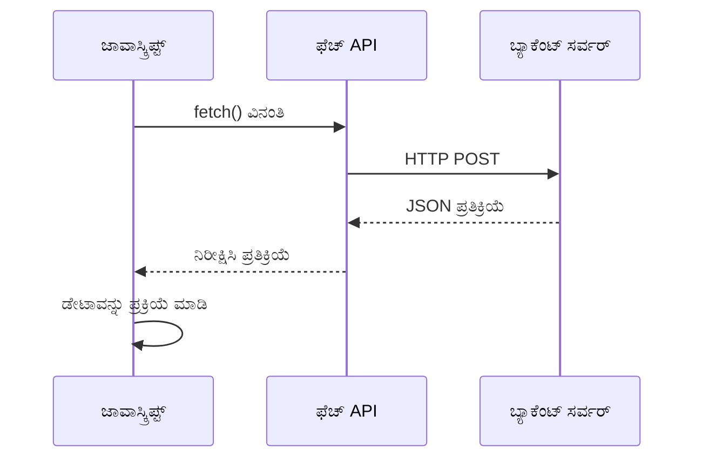
**ಈ ನವೀನ ಅನುಷ್ಠಾನ ಸಾಧಿಸುವುದು:**
- **`async/await` ಬಳಸಿ** ಓದಲು ಸುಲಭವಾದ ಅಸಿಂಕ್ರೋನಸ್ ಕೋಡ್
- **try/catch ಬ್ಲಾಕ್‌ಗಳಿಗೆ ಸಹಿತ** ಸರಿಯಾದ ದೋಷ ನಿರ್ವಹಣೆ
- **ಡೇಟಾವನ್ನು ಪ್ರಕ್ರಿಯೆಗೊಳಿಸುವ ಮುನ್ನ** ಪ್ರತಿಕ್ರಿಯೆಯ ಸ್ಥಿತಿಯನ್ನು ಪರಿಶೀಲಿಸುತ್ತದೆ
- **JSON ಸಂವಹನಕ್ಕಾಗಿ** ಹೊಂದಿಕೆಗಾಗಿ ಸರಿಯಾದ ಹೆಡರ್‌ಗಳನ್ನು ಸೆಟ್ ಮಾಡುತ್ತದೆ
- **ದೋಷ ನಿದರ್ಶನಕ್ಕಾಗಿ** ವಿವರವಾದ ಎರೆರರು ಸಂದೇಶಗಳನ್ನು ಒದಗಿಸುತ್ತದೆ
- **ಯಶಸ್ಸು ಮತ್ತು ದೋಷ ಸಂದರ್ಭಗಳಿಗೆ** ಸತತವಾದ ಡೇಟಾ ರಚನೆಯನ್ನು ಹಿಂತಿರುಗಿಸುತ್ತದೆ

### ನವೀನ Fetch API ಶಕ್ತಿ

**ಹಳೆ ವಿಧಾನಗಳ ಮೇಲೆ Fetch API ಪ್ರಯೋಜನಗಳು:**

| ವೈಶಿಷ್ಟ್ಯ | ಲಾಭ | ಅನುಷ್ಠಾನ |
|---------|---------|----------------|
| ಪ್ರಾಮಿಸ್ ಆಧಾರಿತ | ಸ್ವಚ್ಛ async ಕೋಡ್ | `await fetch()` |
| ವಿನಂತಿ ಕಸ್ಟಮೈಜೇಶನ್ | ಸಂಪೂರ್ಣ HTTP ನಿಯಂತ್ರಣ | ಹೆಡರ್‌ಗಳು, ವಿಧಾನಗಳು, ದೇಹ |
| ಪ್ರತಿಕ್ರಿಯೆ ನಿರ್ವಹಣೆ | ಬದಲಾಯಿಸಬಹುದಾದ ಡೇಟಾ ವಿಶ್ಲೇಷಣೆಯ | `.json()`, `.text()`, `.blob()` |
| ದೋಷ ನಿರ್ವಹಣೆ | ಸಮಗ್ರ ದೋಷ ಹಿಡಿತ | Try/catch ಬ್ಲಾಕ್‌ಗಳು |

> 🎥 **ಹೆಚ್ಚು ತಿಳಿದುಕೊಳ್ಳಿ**: [Async/Await Tutorial](https://youtube.com/watch?v=YwmlRkrxvkk) - ಆಧುನಿಕ ವೆಬ್ ಅಭಿವೃದ್ಧಿಗಾಗಿ ಅಸಿಂಕ್ರೋನಸ್ ಜಾವಾಸ್ಕ್ರಿಪ್ಟ್ ಮಾದರಿಗಳನ್ನು ಅರ್ಥಮಾಡಿಕೊಳ್ಳಿ.

**ಸರ್ವರ್ ಸಂವಹನದ ಪ್ರಮುಖ ಕಲ್ಪನೆಗಳು:**
- **Async ಕ್ರಿಯೆಗಳು** ಸರ್ವರ್ ಪ್ರತಿಕ್ರಿಯೆಗಾಗಿ ನಿರ್ವಹಣಾಪರಾಗ ಒಂದರ ನಿರೀಕ್ಷೆ ಮಾಡಲು ಅನುವು ಮಾಡಿಕೊಡುತ್ತವೆ
- **Await ಕೀವರ್ಡ್** ಅಸಿಂಕ್ರೋನಸ್ ಕೋಡ್ ಅನ್ನು ಸಿಂಕ್ರೋನಸ್ ಕೋಡ್‌ನಂತೆ ಓದಲು ಸಾಧ್ಯ ಮಾಡುತ್ತದೆ
- **Fetch API** ನವೀನ, ಪ್ರಾಮಿಸ್ ಆಧಾರಿತ HTTP ವಿನಂತಿಗಳನ್ನು ಒದಗಿಸುತ್ತದೆ
- **ದೋಷ ನಿರ್ವಹಣೆ** ನಿಮ್ಮ ಅಪ್ಲಿಕೇಶನ್‌ಗಳು ನೆಟ್‌ವರ್ಕ್ ಸಮಸ್ಯೆಗಳಿಗೆ ಸಾಸ್ವಗತವಾಗಿ ಪ್ರತಿಕ್ರಿಯಿಸುತ್ತವೆ

### ನೋಂದಣಿ ಫಂಕ್ಷನ್ ಅನ್ನು ಪೂರ್ಣಗೊಳಿಸುವುದು

ಎಲ್ಲವೂ ಒಟ್ಟಿಗೆ ಸೇರಿಸಿ, ಉತ್ಪಾದನಾ-ಸಿದ್ಧ ನೋಂದಣಿ ಫಂಕ್ಷನ್ ರಚಿಸೋಣ:

```javascript
async function register() {
  const registerForm = document.getElementById('registerForm');
  const submitButton = registerForm.querySelector('button[type="submit"]');
  
  try {
    // ಲೋಡಿಂಗ್ ಸ್ಥಿತಿಯನ್ನು ತೋರಿಸಿ
    submitButton.disabled = true;
    submitButton.textContent = 'Creating Account...';
    
    // ಫಾರ್ಮ್ ಡೇಟಾವನ್ನು ಪ್ರಕ್ರಿಯೆ ಮಾಡಿ
    const formData = new FormData(registerForm);
    const jsonData = JSON.stringify(Object.fromEntries(formData));
    
    // ಸರ್ವರ್‌ಗೆ ಕಳುಹಿಸಿ
    const result = await createAccount(jsonData);
    
    if (result.error) {
      console.error('Registration failed:', result.error);
      alert(`Registration failed: ${result.error}`);
      return;
    }
    
    console.log('Account created successfully!', result);
    alert(`Welcome, ${result.user}! Your account has been created.`);
    
    // ಯಶಸ್ವಿ ನೋಂದಣಿಯ ನಂತರ ಫಾರ್ಮ್‌ನ್ನು ಮರುಹೊಂದಿಸಿ
    registerForm.reset();
    
  } catch (error) {
    console.error('Unexpected error:', error);
    alert('An unexpected error occurred. Please try again.');
  } finally {
    // ಬಟನ್ ಸ್ಥಿತಿಯನ್ನು ಮರುಸ್ಥಾಪಿಸಿ
    submitButton.disabled = false;
    submitButton.textContent = 'Create Account';
  }
}
```

**ಈ ಸುಧಾರಿತ ಅನುಷ್ಠಾನವು ಒಳಗೊಂಡಿದೆ:**
- **ಫಾರ್ಮ್ ಸಲ್ಲಿಸುವಾಗ** ದೃಶ್ಯ ಪ್ರತಿಕ್ರಿಯೆಯನ್ನು ಒದಗಿಸುತ್ತದೆ
- **ನಕಲಿ ಸಲ್ಲಿಕೆಗಳನ್ನು ತಡೆಯಲು** ಸಲ್ಲಿಸುವ ಬಟನ್ ಅನ್ನು ನಿಷ್ಕ್ರಿಯಗೊಳಿಸುತ್ತದೆ
- **ನಿರೀಕ್ಷಿತ ಹಾಗೂ ಅಪೇಕ್ಷಿಸದ ದೋಷಗಳನ್ನು** ಸುಗಮವಾಗಿ ನಿರ್ವಹಿಸುತ್ತದೆ
- **ಬಳಕೆದಾರ ಸ್ನೇಹಿ ಯಶಸ್ಸು ಮತ್ತು ದೋಷ ಸಂದೇಶಗಳನ್ನು ಒದಗಿಸುತ್ತದೆ**
- **ಯಶಸ್ವಿ ನೋಂದಣಿಯ ನಂತರ** ಫಾರ್ಮ್ ಅನ್ನು ಮರುಹೊಂದಿಸುತ್ತದೆ
- **ಫಲಿತಾಂಶದಿಂದ ಯಾವುದೇ ಹೊರತಾಗಿ** UI ಸ್ಥಿತಿಯನ್ನು ಮರುಸ್ಥಾಪಿಸುತ್ತದೆ

### ನಿಮ್ಮ ಅನುಷ್ಠಾನವನ್ನು ಪರೀಕ್ಷಿಸುವುದು

**ನಿಮ್ಮ ಬ್ರೌಸರ್ ಡೆವಲಪರ್ ಉಪಕರಣಗಳನ್ನು ತೆರೆಯಿರಿ ಮತ್ತು ನೋಂದಣಿಯನ್ನು ಪರೀಕ್ಷಿಸಿ:**

1. **ಬ್ರೌಸರ್ ಕನ್‍ಸೋಲ್ ಅನ್ನು ತೆರೆಯಿರಿ (F12 → Console ಟ್ಯಾಬ್)**
2. **ನೋಂದಣಿ ಫಾರ್ಮ್ ಅನ್ನು ಭರ್ತಿ ಮಾಡಿ**
3. **"ಖಾತೆ ರಚಿಸಿ" ಮೇಲೆ ಕ್ಲಿಕ್ ಮಾಡಿ**
4. **ಕನ್‍ಸೋಲ್ ಸಂದೇಶಗಳು ಮತ್ತು ಬಳಕೆದಾರ ಪ್ರತಿಕ್ರಿಯೆಯನ್ನು ಗಮನಿಸಿ**

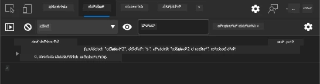

**ನೀವು ಕಾಣಬೇಕಾದದ್ದು:**
- **ಸಲ್ಲಿಸುವ ಬಟನ್ ಮೇಲೆ ಲೋಡಿಂಗ್ ಸ್ಥಿತಿಯನ್ನು ಕಾಣಬಹುದು**
- **ಕನ್‍ಸೋಲ್ ಲಾಗ್‌ಗಳು ಪ್ರಕ್ರಿಯೆಯ ವಿವರಗಳನ್ನು ತೋರಿಸುತ್ತವೆ**
- **ಖಾತೆ ರಚನೆ ಯಶಸ್ವಿಯಾದಾಗ ಯಶಸ್ಸಿನ ಸಂದೇಶ ಕಾಣಿಸುತ್ತದೆ**
- **ಯಶಸ್ವಿ ಸಲ್ಲಿಕೆಯ ನಂತರ ಫಾರ್ಮ್ ಸ್ವಯಂಚಾಲಿತವಾಗಿ ಮರುಹೊಂದಿಸುತ್ತದೆ**

> 🔒 **ಸುರಕ್ಷತಾ ಪರಿಗಣನೆ**: ಪ್ರಸ್ತುತ ಡೇಟಾ HTTP ಮೂಲಕ ಸಂಚರಿಸುತ್ತಿದೆ, ಇದು ಉತ್ಪಾದನೆಗೆ ಸುರಕ್ಷಿತವಲ್ಲ. ನಿಜವಾದ ಅಪ್ಲಿಕೇಶನ್‌ಗಳಲ್ಲಿ, ಡೇಟಾ ಪ್ರಸರಣ ಕಾಪಾಡಲು ಪ್ರತಿಷ್ಠಿತ HTTPSನ್ನು ಯಾವಾಗಲೂ ಬಳಸಬೇಕು. [HTTPS ಸುರಕ್ಷತೆ](https://en.wikipedia.org/wiki/HTTPS) ಮತ್ತು ಅದು ಬಳಕೆದಾರ ಡೇಟಾ ರಕ್ಷಣೆಗೆ ڇو ಅಗತ್ಯ ಎನ್ನುವ ಮಾಹಿತಿಯನ್ನು ತಿಳಿದುಕೊಳ್ಳಿ.

### 🔄 **ಶಿಕ್ಷಣಾತ್ಮಕ ಪರಿಶೀಲನೆ**
**ಆಧುನಿಕ ಜಾವಾಸ್ಕ್ರಿಪ್ಟ್ ಏಕೀಕರಣ**: ಅಸಿಂಕ್ರೋನಸ್ ಫಾರ್ಮ್ ಹ್ಯಾಂಡ್ಲಿಂಗ್‌ಗಾಗಿ ನಿಮ್ಮ ಅರ್ಥಮಾಡಿಕೊಳ್ತಿದ್ದೀರಾ ಎಂದು ಪರಿಶೀಲಿಸಿ:
- ✅ `event.preventDefault()` ಡೀಫಾಲ್ಟ್ ಫಾರ್ಮ್ ವರ್ತನೆಯನ್ನು ಹೇಗೆ ಬದಲಾಯಿಸುತ್ತದೆ?
- ✅ FormData API ಕೈಯಿಂದ ಕ್ಷೇತ್ರ ಸಂಗ್ರಹಣೆಯಿಗಿಂತ ಮುಂತಾದ ರೀತಿಯಲ್ಲಿ ಯಾಕೆ ಹೆಚ್ಚು ಕಾರ್ಯक्षम?
- ✅ async/await ಮಾದರಿಗಳು ಕೋಡ್ ಓದಲು ಹೇಗೆ ಸುಧಾರಿಸುತ್ತದೆ?
- ✅ ಬಳಕೆದಾರ ಅನುಭವದಲ್ಲಿ ದೋಷ ನಿರ್ವಹಣೆಯ ಪಾತ್ರವೇನು?

**ಸಿಸ್ಟಮ್ ವಾಸ್ತುಶಿಲ್ಪ**: ನಿಮ್ಮ ಫಾರ್ಮ್ ಹ್ಯಾಂಡ್ಲಿಂಗ್ ಪ್ರದರ್ಶಿಸುವುದು:
- **ಈವೆಂಟ್ ಚಾಲಿತ ಪ್ರೋಗ್ರಾಮಿಂಗ್**: ಬಳಕೆದಾರ ಕ್ರಿಯೆಗಳಿಗೆ ಪುಟ ರಿಲೋಡ್ ಇಲ್ಲದೆ ಸ್ಪಂದನೆ
- **ಅಸಿಂಕ್ರೋನಸ್ ಸಂವಹನ**: ಸರ್ವರ್ ಕೇಳಿಕೆಗಳು ಬಳಕೆದಾರ ಇಂಟರ್ಫೇಸ್ ಅನ್ನು ಅಡೆತಡೆ ಮಾಡದು
- **ದೋಷ ನಿರ್ವಹಣೆ**: ನೆಟ್‌ವರ್ಕ್ ವಿಫಲತೆಗಳಿಗೆ ಸಾಸ್ವಗತವಾಗಿ ಕಾಂಡುವುದು
- **ಸ್ಥಿತಿ ನಿರ್ವಹಣೆ**: ಸರ್ವರ್ ಪ್ರತಿಕ್ರಿಯೆಗಳನ್ನು ಸೂಕ್ತವಾಗಿ UI ನಲ್ಲಿ ಪ್ರತಿಬಿಂಬಿಸುವುದು
- **ಗ್ರಹಣೀಯ ಸುಧಾರಣೆ**: ಮೂಲ ಕಾರ್ಯಕ್ಷಮತೆ ಕಾರ್ಯನಿರ್ವಹಿಸುವುದು ಮತ್ತು ಜಾವಾಸ್ಕ್ರಿಪ್ಟ್ ಬಲಪಡಿಸುವುದು

**ವೃತ್ತಿಪರ ಮಾದರಿ**: ನೀವು ಅನುಷ್ಠಾನಗೊಳಿಸಿದ್ದೀರಿ:
- **ಏಕ ಜವಾಬ್ದಾರಿ**: ಫಂಕ್ಷನ್‌ಗಳು ಸ್ಪಷ್ಟ, ಗಮನಕೊಟ್ಟ ಉದ್ದೇಶವನ್ನು ಒದಗಿಸುತ್ತವೆ
- **ದೋಷ ಗಡಿಪಥಗಳು**: Try/catch ಬ್ಲಾಕ್‌ಗಳು ಅಪ್ಲಿಕೇಶನ್ ಕ್ರ್ಯಾಶ್‌ಗಳನ್ನು ತಡೆಯುತ್ತವೆ
- **ಬಳಕೆದಾರ ಪ್ರತಿಕ್ರಿಯೆ**: ಲೋಡಿಂಗ್ ಸ್ಥಿತಿಗಳು ಮತ್ತು ಯಶಸ್ಸು/ದೋಷ ಸಂದೇಶಗಳು
- **ಡೇಟಾ ಪರಿವರ್ತನೆ**: FormData ನಿಂದ JSONಗೆ ಸರ್ವರ್ ಸಂವಹನಕ್ಕಾಗಿ

## ವ್ಯಾಪಕ ಫಾರ್ಮ್ ಮಾನ್ಯತೆ

ಫಾರ್ಮ್ ಮಾನ್ಯತೆ ಸಲ್ಲಿಕೆಯ ನಂತರ ದೋಷಗಳನ್ನು ಕಂಡುಹಿಡಿಯುವ ಅಸಹ್ಯ ಅನುಭವವನ್ನು ತಡೆಹಿಡಿಯುತ್ತದೆ. ಅಂತರರಾಷ್ಟ್ರೀಯ ಸ್ಪೇಸ್ ಸ್ಟೇಷನ್ ಮೇಲೆ ಇರುವ ಅನೇಕ ಬ್ಯಾಕಪ್ ವ್ಯವಸ್ಥೆಗಳು ಹಾಗೆಯೇ, ಪರಿಣಾಮಕಾರಿ ಮಾನ್ಯತೆಯು ಅನೇಕ ಸುರಕ್ಷತಾ ಪರಿಶೀಲನೆ ಪದರಗಳನ್ನು ಬಳಸುತ್ತದೆ.

ಉತ್ತಮ ವಿಧಾನವು ತಕ್ಷಣದ ಪ್ರತಿಕ್ರಿಯೆಗಾಗಿ ಬ್ರೌಸರ್ ಮಟ್ಟದ ಮಾನ್ಯತೆಯನ್ನು, ಸುಧಾರಿತ ಬಳಕೆದಾರ ಅನುಭವಕ್ಕಾಗಿ ಜಾವಾಸ್ಕ್ರಿಪ್ಟ್ ಮಾನ್ಯತೆಯನ್ನು, ಮತ್ತು ಭದ್ರತೆ ಮತ್ತು ಡೇಟಾ ಸಮಗ್ರತೆಗಾಗಿ ಸರ್ವರ್-ಮಟ್ಟದ ಮಾನ್ಯತೆಯನ್ನು ಸಂಯೋಜಿಸುತ್ತದೆ. ಈ ಬ್ಯಾಕಪ್ ಬಳಕೆದಾರ ತೃಪ್ತಿಯನ್ನೂ ಮತ್ತು ವ್ಯವಸ್ಥೆಯ ರಕ್ಷಣೆಯನ್ನೂ ಖಾತ್ರಿ ಮಾಡುತ್ತದೆ.

### ಮಾನ್ಯತಾ ಪದರಗಳನ್ನು ಅರ್ಥಮಾಡಿಕೊಳ್ಳುವುದು

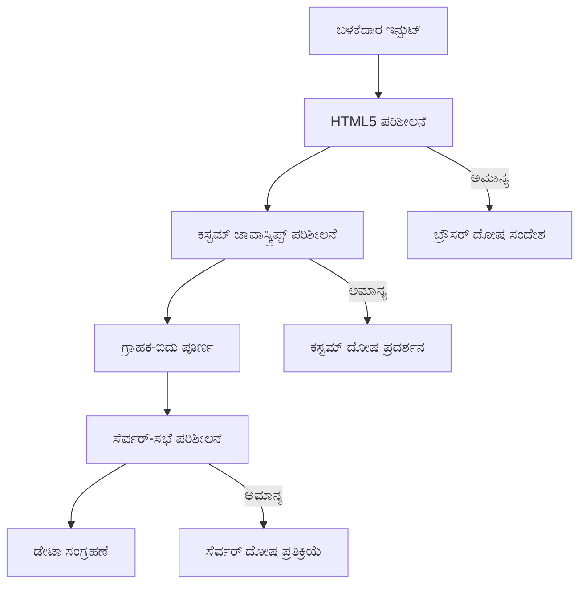
**ಬಹುನಿರ್ವಾಹಕ ಮಾನ್ಯತಾ ತಂತ್ರ:**
- **HTML5 ಮಾನ್ಯತೆ**: ತ್ವರಿತ ಬ್ರೌಸರ್ ಆಧಾರಿತ ಪರಿಶೀಲನೆಗಳು
- **ಜಾವಾಸ್ಕ್ರಿಪ್ಟ್ ಮಾನ್ಯತೆ**: ಸ್ವಂತ ತರ್ಕ ಮತ್ತು ಬಳಕೆದಾರ ಅನುಭವ
- **ಸರ್ವರ್-ಮಟ್ಟದ ಮಾನ್ಯತೆ**: ಅಂತಿಮ ಭದ್ರತೆ ಮತ್ತು ಡೇಟಾ ಸಮಗ್ರತೆ ಪರಿಶೀಲನೆಗಳು
- **ಗ್ರಹಣೀಯ ಸುಧಾರಣೆ**: ಜಾವಾಸ್ಕ್ರಿಪ್ಟ್ ನಿಷ್ಕ್ರಿಯಗೊಂಡರೂ ಕಾರ್ಯನಿರ್ವಹಿಸುತ್ತದೆ

### HTML5 ಮಾನ್ಯತಾ ಗುಣಲಕ್ಷಣೆಗಳು

**ನಿಮ್ಮ ಬಳಕೆಗೆ ನವೀನ ಮಾನ್ಯತಾ ಸಾಧನಗಳು:**

| ಗುಣಲಕ್ಷಣೆ | ಉದ್ದೇಶ | ಉದಾಹರಣೆಯ ಬಳಕೆ | ಬ್ರೌಸರ್ ವರ್ತನೆ |
|-----------|---------|---------------|------------------|
| `required` | ಅಗತ್ಯ ಕ್ಷೇತ್ರಗಳು | `<input required>` | ಖಾಲಿ ಸಲ್ಲಿಕೆಯನ್ನು ತಡೆಹಿಡಿಯುತ್ತದೆ |
| `minlength`/`maxlength` | ಪಠ್ಯದ ಉದ್ದ ಮಿತಿಗಳು | `<input maxlength="20">` | ಅಕ್ಷರ ಮಿತಿಗಳನ್ನು ಜಾರಿಗೆ ಸೇರಿಸುತ್ತದೆ |
| `min`/`max` | ಸಂಖ್ಯಾ ಶ್ರೇಣಿಗಳು | `<input min="0" max="1000">` | ಸಂಖ್ಯೆಯ ಮಿತಿಗಳನ್ನು ಮಾನ್ಯಗೊಳಿಸುತ್ತದೆ |
| `pattern` | ಕಸ್ಟಮ್ regex ನಿಯಮಗಳು | `<input pattern="[A-Za-z]+">` | ವಿಶೇಷವಾದ ಫಾರ್ಮ್ಯಾಟ್‌ಗಳನ್ನು ಹೊಂದಿಸುತ್ತದೆ |
| `type` | ಡೇಟಾ ಪ್ರಕಾರ ಮಾನ್ಯತೆ | `<input type="email">` | ಫಾರ್ಮ್ಯಾಟ್-ವಿಶಿಷ್ಟ ಮಾನ್ಯತೆ |

### CSS ಮಾನ್ಯತಾ ಶೈಲಿ

**ಮಾನ್ಯತಾ ಸ್ಥಿತಿಗಳ ಮನೋರಂಜಕ ದೃಶ್ಯ ಪ್ರತಿಕ್ರಿಯೆಯನ್ನು ನಿರ್ಮಿಸಿ:**

```css
/* Valid input styling */
input:valid {
  border-color: #28a745;
  background-color: #f8fff9;
}

/* Invalid input styling */
input:invalid {
  border-color: #dc3545;
  background-color: #fff5f5;
}

/* Focus states for better accessibility */
input:focus:valid {
  box-shadow: 0 0 0 0.2rem rgba(40, 167, 69, 0.25);
}

input:focus:invalid {
  box-shadow: 0 0 0 0.2rem rgba(220, 53, 69, 0.25);
}
```

**ಈ ದೃಶ್ಯ ಸೂಚನೆಗಳ ಸಾಧನೆ:**
- **ಹಸಿರು ಗಡಿ**: ಯಶಸ್ವಿ ಮಾನ್ಯತೆಯನ್ನು ಸೂಚಿಸುತ್ತದೆ, ಮಿಷನ್ ಕಂಟ್ರೋಲಿನ ಹಸಿರು ಬೆಳಕುಗಳಂತೆ
- **ಕೆಂಪು ಗಡಿ**: ಗಮನಕೊಡುವಂತಹ ಮಾನ್ಯತಾ ದೋಷಗಳನ್ನು ಸೂಚಿಸುತ್ತದೆ
- **ಫೋಕ್ಸು ಹೈಲೈಟ್‌ಗಳು**: ಪ್ರಸ್ತುತ ಇನ್ಪುಟ್ ಸ್ಥಳಕ್ಕೆ ಸ್ಪಷ್ಟ ದೃಶ್ಯ ಸಂಧರ್ಭ ನೀಡುತ್ತವೆ
- **ಸ್ಥಿರವಾಗಿರುವ ಶೈಲಿ**: ಬಳಕೆದಾರರು ಕಲಿಯಬಲ್ಲ ನಿರೀಕ್ಷಿತ ಇಂಟರ್ಫೇಸ್ ಮಾದರಿಗಳನ್ನು ಸ್ಥಾಪಿಸುತ್ತದೆ

> 💡 **ಪ್ರೊ ಟಿಪ್**: ಬಳಕೆದಾರರು ಟೈಪ್ ಮಾಡುತ್ತಿರುವಾಗ ತಕ್ಷಣದ ದೃಶ್ಯ ಪ್ರತಿಕ್ರಿಯೆಯನ್ನು ನೀಡಲು `:valid` ಮತ್ತು `:invalid` CSS ಪುಸಿಯೋ-ವರ್ಗಗಳನ್ನು ಬಳಸಿ ಸ್ಪಂದನಶೀಲ ಮತ್ತು ಸಹಾಯಕ ಇಂಟರ್ಫೇಸ್ ರಚಿಸಿ.

### ವ್ಯಾಪಕ ಮಾನ್ಯತೆಯನ್ನು ಅನುಷ್ಠಾನಗೊಳಿಸುವುದು

ನಿಮ್ಮ ನೋಂದಣಿ ಫಾರ್ಮ್ ಅನ್ನು ಬಲವಾದ ಮಾನ್ಯತೆಯೊಂದಿಗೆ ಸುಧಾರಿಸಿ, ಅದರಿಂದ ಉತ್ಕೃಷ್ಟ ಬಳಕೆದಾರ ಅನುಭವ ಮತ್ತು ಡೇಟಾ ಗುಣಮಟ್ಟ ನೀಡುತ್ತದೆ:

```html
<form id="registerForm" method="POST" novalidate>
  <div class="form-group">
    <label for="user">Username <span class="required">*</span></label>
    <input id="user" name="user" type="text" required 
           minlength="3" maxlength="20" 
           pattern="[a-zA-Z0-9_]+" 
           autocomplete="username"
           title="Username must be 3-20 characters, letters, numbers, and underscores only">
    <small class="form-text">Choose a unique username (3-20 characters)</small>
  </div>
  
  <div class="form-group">
    <label for="currency">Currency <span class="required">*</span></label>
    <input id="currency" name="currency" type="text" required 
           value="$" maxlength="3" 
           pattern="[A-Z$€£¥₹]+" 
           title="Enter a valid currency symbol or code">
    <small class="form-text">Currency symbol (e.g., $, €, £)</small>
  </div>
  
  <div class="form-group">
    <label for="description">Account Description</label>
    <input id="description" name="description" type="text" 
           maxlength="100" 
           placeholder="Personal savings, checking, etc.">
    <small class="form-text">Optional description (up to 100 characters)</small>
  </div>
  
  <div class="form-group">
    <label for="balance">Starting Balance</label>
    <input id="balance" name="balance" type="number" 
           value="0" min="0" step="0.01" 
           title="Enter a positive number for your starting balance">
    <small class="form-text">Initial account balance (minimum $0.00)</small>
  </div>
  
  <button type="submit">Create Account</button>
</form>
```

**ಸುಧಾರಿತ ಮಾನ್ಯತೆಯ ಅರ್ಥಮಾಡಿಕೊಳ್ಳಿಕೆ:**
- **ಅಗತ್ಯ ಕ್ಷೇತ್ರ ಸೂಚನೆಗಳನ್ನು** ಸಹಿತವಾಗಿ ಸಂಯೋಜಿಸುತ್ತದೆ
- **ಫಾರ್ಮ್ಯಾಟ್ ಮಾನ್ಯತೆಗಾಗಿ** `pattern` ಗುಣಲಕ್ಷಣಗಳನ್ನೂ ಒಳಗೊಂಡಿದೆ
- **ಸೌಲಭ್ಯ ಮತ್ತು ಟೂಲ್‌ಟಿಪ್‌ಗಾಗಿ** `title` ಗುಣಲಕ್ಷಣಗಳನ್ನು ಒದಗಿಸುತ್ತದೆ
- **ಬಳಕೆದಾರ ಕರೆತರುವಿಕೆಗಾಗಿ** ಸಹಾಯಕರ ಪಠ್ಯವನ್ನು ಸೇರಿಸುತ್ತದೆ
- **ಉತ್ತಮ ಸೌಲಭ್ಯಕ್ಕಾಗಿ** ಸೆಮ್ಯಾಂಟಿಕ್ HTML ರಚನೆಯನ್ನು ಬಳಸುತ್ತದೆ

### ಆಧುನಿಕ ಮಾನ್ಯತಾ ನಿಯಮಗಳು

**ಪ್ರತಿ ಮಾನ್ಯತಾ ನಿಯಮ ನೀಡುವ ಲಾಭ:**

| ಕ್ಷೇತ್ರ | ಮಾನ್ಯತಾ ನಿಯಮಗಳು | ಬಳಕೆದಾರ ಲಾಭ |
|-------|------------------|--------------|
| ಬಳಕೆದಾರನಾಮ | `required`, `minlength="3"`, `maxlength="20"`, `pattern="[a-zA-Z0-9_]+"` | ಮಾನ್ಯ, ವಿಶಿಷ್ಟ ಗುರುತುಗಳನ್ನು ಖಾತ್ರಿ ಮಾಡುತ್ತದೆ |
| ಕರೆನ್ಸಿ | `required`, `maxlength="3"`, `pattern="[A-Z$€£¥₹]+"` | ಸಾಮಾನ್ಯ ಕರೆನ್ಸಿ ಚಿಹ್ನೆಗಳನ್ನು ಸ್ವೀಕರಿಸುತ್ತದೆ |
| ಬ್ಯಾಲೆನ್ಸ್ | `min="0"`, `step="0.01"`, `type="number"` | ಋಣಾತ್ಮಕ ಬಾಕಿ ಕಡಿತ ಮಾಡುತ್ತದೆ |
| ವಿವರಣೆ | `maxlength="100"` | ಸೂಕ್ತ ಉದ್ದ ಮಿತಿಯನ್ನು ಹೊಂದಿದೆ |

### ಮಾನ್ಯತಾ ವರ್ತನೆ ಪರೀಕ್ಷೆ

**ಈ ಮಾನ್ಯತಾ ಸನ್ನಿವೇಶಗಳನ್ನು ಪ್ರಯತ್ನಿಸಿ:**
1. **ಅಗತ್ಯ ಕ್ಷೇತ್ರಗಳನ್ನು ಖಾಲಿಯಾಗಿ** ಫಾರ್ಮ್ ಸಲ್ಲಿಸಿ
2. **3 ಅಕ್ಷರಕ್ಕಿಂತ ಕಡಿಮೆ ಉದ್ದದ ಬಳಕೆದಾರನಾಮ ನಮೂದಿಸಿ**
3. **ಬಳಕೆದಾರನಾಮ ಕ್ಷೇತ್ರದಲ್ಲಿ ವಿಶೇಷ ಅಕ್ಷರಗಳನ್ನು ಬಳಸಿ ಬಾರಿ ಮಾಡಿ**
4. **ಋಣಾತ್ಮಕ ಬ್ಯಾಲೆನ್ಸ್ ಮೊತ್ತ ನಮೂದಿಸಿ**


**ನೀವು ಗಮನಿಸುವುದು:**
- **ಬ್ರೌಸರ್ ಮೂಲ ಮಾನ್ಯತಾ ಸಂದೇಶಗಳನ್ನು ತೋರಿಸುತ್ತದೆ**
- **`:valid` ಮತ್ತು `:invalid` ಸ್ಥಿತಿಗಳಿಗನುಗುಣವಾಗಿ ಶೈಲಿ ಬದಲಾಗುತ್ತದೆ**
- **ಎಲ್ಲಾ ಮಾನ್ಯತೆಗಳು ಪಾಸ್ ಆಗುವವರೆಗೆ ಫಾರ್ಮ್ ಸಲ್ಲಿಕೆ ತಡೆಯಲಾಗುತ್ತದೆ**
- **ಮೊದಲ ದೋಷಗೊಳಗೊಂಡ ಕ್ಷೇತ್ರಕ್ಕೆ ಸ್ವಯಂಚಾಲಿತವಾಗಿ ಫೋಕ್ಸು ಮರುಹೊಂದುತ್ತದೆ**

### ಕ್ಲೈಂಟ್-ಸೈಡ್ ಮತ್ತು ಸರ್ವರ್-ಸೈಡ್ ಮಾನ್ಯತೆ

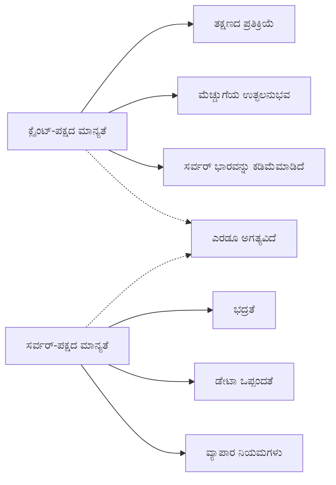
**ನೀವು ಎರಡೂ ಪದರಗಳನ್ನು ಏಕೆ ಬೇಕು:**
- **ಕ್ಲೈಂಟ್-ಸೈಡ್ ಮಾನ್ಯತೆ**: ತಕ್ಷಣದ ಪ್ರತಿಕ್ರಿಯೆಯನ್ನು ಒದಗಿಸಿ ಬಳಕೆದಾರ ಅನುಭವ ಸುಧಾರಣೆಯು
- **ಸರ್ವರ್-ಸೈಡ್ ಮಾನ್ಯತೆ**: ಭದ್ರತೆ ಖಚಿತಪಡಿಸಿ ಮತ್ತು ಸಂಕೀರ್ಣ ವ್ಯವಹಾರ ನಿಯಮಗಳನ್ನು ನಿರ್ವಹಿಸುತ್ತದೆ
- **ಸಂಯೋಜಿತ ವಿಧಾನ**: ಬಲವಾದ, ಬಳಕೆದಾರ ಸ್ನೇಹಿ ಮತ್ತು ಭದ್ರ ಅಪ್ಲಿಕೇಶನ್‌ಗಳನ್ನು ರಚಿಸುತ್ತದೆ
- **ಗ್ರಹಣೀಯ ಸುಧಾರಣೆ**: ಜಾವಾಸ್ಕ್ರಿಪ್ಟ್ ನಿಷ್ಕ್ರಿಯ ಆಗಿರುವಾಗಲೂ ಕಾರ್ಯನಿರ್ವಹಿಸುತ್ತದೆ

> 🛡️ **ಭದ್ರತಾ ನೆನಪಿನಂತೆ**: ಮಾತ್ರ ಕ್ಲೈಂಟ್-ಸೈಡ್ ಮಾನ್ಯತೆಯನ್ನು ನಂಬಬೇಡಿ! ದುರ್ಬಲ ಬಳಕೆದಾರರು ಕ್ಲೈಂಟ್-ಪರಿಶೀಲನೆಗಳನ್ನು ತಪ್ಪಿಸುವ ಸಾಧ್ಯತೆ ಇರುತ್ತದೆ, ಹಾಗಾಗಿ ಭದ್ರತೆ ಮತ್ತು ಡೇಟಾ ಸಮಗ್ರತೆಗೆ ಸರ್ವರ್-ಪರಿಶೀಲನೆ ಅಗತ್ಯ.

### ⚡ **ಮುಂದಿನ 5 ನಿಮಿಷಗಳಲ್ಲಿ ನೀವು ಮಾಡಬಹುದಾದುದು**
- [ ] ವಾಲಿಡೇಶನ್ ಸಂದೇಶಗಳನ್ನು ನೋಡಲು ಅಮಾನ್ಯ ಡೇಟಾ ಬಳಸಿ ನಿಮ್ಮ ಫಾರ್ಮ್ ಅನ್ನು ಪರೀಕ್ಷಿಸಿ
- [ ] ಜಾವಾಸ್ಕ್ರಿಪ್ಟ್ ನಿಷ್ಕ್ರಿಯಗೊಳಿಸಿ ಫಾರ್ಮ್ ಸಲ್ಲಿಸುವುದನ್ನು ಪ್ರಯತ್ನಿಸಿ ಮತ್ತು HTML5 ಮಾನ್ಯತೆಯನ್ನು ನೋಡಿ
- [ ] ಬ್ರೌಸರ್ ಡೆವ್‌ಟೂಲ್ಗಳನ್ನು ತೆರೆಯಿರಿ ಮತ್ತು ಸರ್ವರ್‌ಗೆ ಕಳುಹಿಸಲಾಗುತ್ತಿರುವ ಫಾರ್ಮ್ ಡೇಟಾವನ್ನು ಪರಿಶೀಲಿಸಿ
- [ ] ವಿಭಿನ್ನ ಇನ್ಪುಟ್ ಪ್ರಕಾರಗಳನ್ನು ಪ್ರಯೋಗಿಸಿ ಮೊಬೈಲ್ ಕೀಬೋರ್ಡ್ ಬದಲೆಗಳನ್ನು ಗಮನಿಸಿ

### 🎯 **ಈ ಗಂಟೆಯಲ್ಲಿ ಸಾಧಿಸಬಹುದಾದುದು**
- [ ] ಪಾಠೋತ್ತರ ಕ್ವಿಜ್ ಮುಗಿಸಿ ಮತ್ತು ಫಾರ್ಮ್ ಹ್ಯಾಂಡ್ಲಿಂಗ್ ಕಲ್ಪನೆಗಳನ್ನು ಅರ್ಥಮಾಡಿಕೊಳ್ಳಿ
- [ ] ನೈಜ-ಸಮಯ ಪ್ರತಿಕ್ರಿಯೆಯೊಂದಿಗೆ ವ್ಯಾಪಕ ಮಾನ್ಯತಾ ಸವಾಲು ಅನುಷ್ಠಾನಗೊಳಿಸಿ
- [ ] ವೃತ್ತಿಪರ ನೋಟದ ಫಾರ್ಮ್ಗಳಿಗೆ CSS ಶೈಲಿಯನ್ನು ಸೇರಿಸಿ
- [ ] ಪ್ರತಿಯೊಬ್ಬ ಬಳಕೆದಾರನಾಮಕ್ಕಾಗಿಯೂ ದ್ವಿಪರ್ಯಾಯ ದೋಷ ನಿರ್ವಹಣೆ ಮತ್ತು ಸರ್ವರ್ ದೋಷ ನಿರ್ವಹಣೆಯನ್ನು ರಚಿಸಿ
- [ ] ಪಾಸ್‌ವರ್ಡ್ ದೃಢೀಕರಣ ಕ್ಷೇತ್ರಗಳನ್ನು ಹೊಂದಿಸಿ ಮತ್ತು ಹೊಂದಿಕೆಯನ್ನು ಪರಿಶೀಲಿಸಿ

### 📅 **ನಿಮ್ಮ ವಾರ ಮಟ್ಟದ ಫಾರ್ಮ್ ಪರಿಣತಿ ಪ್ರಯಾಣ**
- [ ] ಸುಧಾರಿತ ಫಾರ್ಮ್ ವೈಶಿಷ್ಟ್ಯಗಳೊಂದಿಗೆ ಸಂಪೂರ್ಣ ಬ್ಯಾಂಕಿಂಗ್ ಅಪ್ಲಿಕೇಶನ್ ಪೂರ್ಣಗೊಳಿಸಿ
- [ ] ಪ್ರೊಫೈಲ್ ಚಿತ್ರಗಳು ಅಥವಾ ದಾಖಲೆಗಳಿಗಾಗಿ ಫೈಲ್ ಅಪ್‌ಲೋಡ್ ಸಾಮರ್ಥ್ಯಗಳನ್ನು ಸೇರಿಸಿ
- [ ] ಪ್ರಗತಿಯ ಸೂಚಕಗಳು ಮತ್ತು ಸ್ಥಿತಿ ನಿರ್ವಹಣೆಯೊಂದಿಗೆ ಬಹು ಹಂತದ ಫಾರ್ಮ್‌ಗಳನ್ನು ಸೇರಿಸಿ
- [ ] ಬಳಕೆದಾರ ಆಯ್ಕೆಯ ಆಧಾರಿತವಾಗಿ ಹೊಂದಿಕೊಳ್ಳಬಲ್ಲ ಡೈನಾಮಿಕ್ ಫಾರ್ಮ್‌ಗಳನ್ನು ಸೃಷ್ಟಿಸಿ
- [ ] ಉತ್ತಮ ಬಳಕೆದಾರ ಅನುಭವಕ್ಕಾಗಿ ಫಾರ್ಮ್ ಆಟೋಸೇವ್ ಮತ್ತು ಪುನರುಜ್ಜೀವನವನ್ನು ಅನುಷ್ಠಾನಗೊಳಿಸಿ
- [ ] ಇಮೇಲ್ ಪರಿಶೀಲನೆ ಮತ್ತು ಫೋನ್ ನಂಬರಿನ ಮಾದರೀಕರಣದಂತಹ ಸುಧಾರಿತ ಮಾನ್ಯತೆಯನ್ನು ಸೇರಿಸಿ

### 🌟 **ನಿಮ್ಮ ತಿಂಗಳ ಮಟ್ಟದ ಫ್ರಂಟ್‌ಎಂಡ್ ಡೆವಲಪ್‌ಮೆಂಟ್ ಪರಿಣತಿ**
- [ ] ಶರ್ತಾತ್ಮಕ ತರ್ಕ ಮತ್ತು ಕಾರ್ಯಪಟುಗಳೊಂದಿಗೆ ಐತಿಹಾಸಿಕ ಫಾರ್ಮ್ ಅಪ್ಲಿಕೇಶನ್‌ಗಳನ್ನು ನಿರ್ಮಿಸಿ
- [ ] ವೇಗದ ಅಭಿವೃದ್ಧಿಗಾಗಿ ಫಾರ್ಮ್ ಗ್ರಂಥಾಲಯಗಳು ಮತ್ತು ಫ್ರೇಮ್ವರ್ಕ್‌ಗಳನ್ನು ಕಲಿಯಿರಿ
- [ ] ಪ್ರವೇಶಕ್ಷಮತೆ ಮಾರ್ಗಸೂಚಿಗಳು ಮತ್ತು ಸಮಾವೇಶಾತ್ಮಕ ವಿನ್ಯಾಸ ತತ್ವಗಳನ್ನು ನಿಭಾಯಿಸಿ
- [ ] ಜಾಗತಿಕ ಫಾರ್ಮ್‌ಗಳಿಗಾಗಿ ಅಂತರರಾಷ್ಟ್ರೀಯೀಕರಣ ಮತ್ತು ಲೋಕಲೀಕರಣವನ್ನು ಅನುಷ್ಠಾನಗೊಳಿಸಿ
- [ ] ಮರುಬಳಕೆಗೆ ಸಾಧ್ಯವಾದ ಫಾರ್ಮ್ ಘಟಕ ಗ್ರಂಥಾಲಯಗಳು ಮತ್ತು ವಿನ್ಯಾಸ ವ್ಯವಸ್ಥೆಗಳನ್ನು ರಚಿಸಿ
- [ ] ಫಾರ್ಮ್ ಪ್ರಾಜೆಕ್ಟ್‌ಗಳಿಗೆ ಕೊಡುಗೆ ನೀಡಿ ಮತ್ತು ಉತ್ತಮ ಅಭ್ಯಾಸಗಳನ್ನು ಹಂಚಿಕೊಳ್ಳಿ

## 🎯 ನಿಮ್ಮ ಫಾರ್ಮ್ ಡೆವಲಪ್‌ಮೆಂಟ್ ಪರಿಣತಿ ಟೈಮ್‌ಲೈನ್

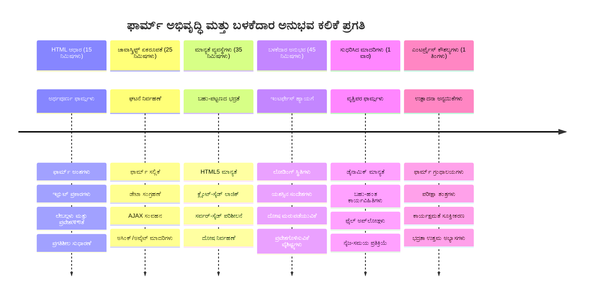
### 🛠️ ನಿಮ್ಮ ಫಾರ್ಮ್ ಡೆವಲಪ್‌ಮೆಂಟ್ ಟೂಲ್‌ಕಿಟ್ ಸಾರಾಂಶ

ಈ ಪಾಠವನ್ನು ಪೂರ್ಣಗೊಳಿಸಿದ ನಂತರ ನೀವು ಈಗ ಎರಡನ್ನು ನಿಭಾಯಿಸುತ್ತೀರಿ:
- **HTML5 ಫಾರ್ಮ್‌ಗಳು**: ಸೆಮ್ಯಾಂಟಿಕ್ ರಚನೆ, ಇನ್ಪುಟ್ ಪ್ರಕಾರಗಳು ಮತ್ತು ಪ್ರವೇಶಕ್ಷಮತೆ ವೈಶಿಷ್ಟ್ಯಗಳು
- **ಜಾವಾಸ್ಕ್ರಿಪ್ಟ್ ಫಾರ್ಮ್ ಹ್ಯಾಂಡ್ಲಿಂಗ್**: ಈವೆಂಟ್ ನಿರ್ವಹಣೆ, ಡೇಟಾ ಸಂಗ್ರಹಣೆ ಮತ್ತು AJAX ಸಂವಹನ
- **ಮಾನ್ಯತಾ ವಾಸ್ತುಶಿಲ್ಪ**: ಭದ್ರತೆ ಮತ್ತು ಬಳಕೆದಾರ ಅನುಭವಕ್ಕಾಗಿ ಬಹುನಿರ್ವಾಹಕ ಮಾನ್ಯತೆ
- **ಅಸಿಂಕ್ರೋನಸ್ ಪ್ರೋಗ್ರಾಮಿಂಗ್**: ನವೀನ fetch API ಮತ್ತು async/await ಪ್ಯಾಟರ್ನ್‌ಗಳು
- **ದೋಷ ನಿರ್ವಹಣೆ**: ಸಮಗ್ರ ದೋಷ ನಿರ್ವಹಣೆ ಮತ್ತು ಬಳಕೆದಾರ ಪ್ರತಿಕ್ರಿಯೆ ವ್ಯವಸ್ಥೆಗಳು
- **ಬಳಕೆದಾರ ಅನುಭವ ವಿನ್ಯಾಸ**: ಲೋಡಿಂಗ್ ಸ್ಥಿತಿಗಳು, ಯಶಸ್ಸು ಸಂದೇಶಗಳು ಮತ್ತು ದೋಷ ಪುನರುಜ್ಜೀವನ
- **ಗ್ರಹಣೀಯ ಸುಧಾರಣೆ**: ಎಲ್ಲಾ ಬ್ರೌಸರ್‌ಗಳು ಮತ್ತು ಸಾಮರ್ಥ್ಯಗಳಲ್ಲಿ ಕೆಲಸಮಾಡುವ ಫಾರ್ಮ್‌ಗಳು

**ವಾಸ್ತವಿಕ ಜಾಗತಿಕ ಅಪ್ಲಿಕೇಶನ್‌ಗಳು**: ನಿಮ್ಮ ಫಾರ್ಮ್ ಡೆವಲಪ್‌ಮೆಂಟ್ ಕೌಶಲ್ಯಗಳು ನೇರವಾಗಿ ಅನ್ವಯಿಸುತ್ತವೆ:
- **ಇ-ಕಾಮರ್ಸ್ ಅಪ್ಲಿಕೇಶನ್‌ಗಳು**: ಚೆಕ್ಔಟ್ ಪ್ರಕ್ರಿಯೆಗಳು, ಖಾತೆ ನೋಂದಣಿ ಮತ್ತು ಪಾವತಿ ಫಾರ್ಮ್‌ಗಳು
- **ಉದ್ಯಮ ಸ್ಟೊರ್‌ಗಳು**: ಡೇಟಾ ಎನ್ಟ್ರಿ ವ್ಯವಸ್ಥೆಗಳು, ವರದಿ ಇಂಟರ್ಫೇಸ್‌ಗಳು ಮತ್ತು ಕಾರ್ಯಪ್ರವಾಹ ಅಪ್ಲಿಕೇಶನ್‌ಗಳು
- **ವಿಷಯ ನಿರ್ವಹಣೆ**: ಪ್ರಕಟಣೆ ವೇದಿಕೆಗಳು, ಬಳಕೆದಾರ ರಚಿಸಿದ ವಿಷಯ ಮತ್ತು ಆಡಳಿತಾತ್ಮಕ ಇಂಟರ್ಫೇಸ್‌ಗಳು
- **ಆರ್ಥಿಕ ಅಪ್ಲಿಕೇಶನ್‌ಗಳು**: ಬ್ಯಾಂಕಿಂಗ್ ಇಂಟರ್ಫೇಸ್‌ಗಳು, ಹೂಡಿಕೆ ವೇದಿಕೆಗಳು ಮತ್ತು ವಹಿವಾಟು ವ್ಯವಸ್ಥೆಗಳು
- **ಆರೋಗ್ಯ ಸೇவை ವ್ಯವಸ್ಥೆಗಳು**: ರೋಗಿ ಪೋರ್ಟಲ್‌ಗಳು, ನಿಯೋಜನೆ ಶೆಡ್ಯೂಲಿಂಗ್ ಮತ್ತು ವೈದ್ಯಕೀಯ ದಾಖಲೆ ಫಾರ್ಮ್‌ಗಳು
- **ಶೈಕ್ಷಣಿಕ ವೇದಿಕೆಗಳು**: ಕೋರ್ಸ್ ನೋಂದಣಿ, ಮೌಲ್ಯಮಾಪನ ಸಾಧನಗಳು ಮತ್ತು ಕಲಿಕಾ ನಿರ್ವಹಣೆ

**ವೃತ್ತಿಪರ ಕೌಶಲ್ಯಗಳು ಪಡೆದೀರಿ**: ನೀವು ಈಗ:
- **ಪ್ರವೇಶಿಸಬಹುದಾದ** ಫಾರ್ಮ್‌ಗಳನ್ನು ವಿನ್ಯಾಸ ಮಾಡಬಹುದು, ವಿಶೇಷ ಅಗತ್ಯಗಳ ಬಳಕೆದಾರರಿಗೂ ಅನ್ವಯಿಸುತ್ತದೆ
- **ಭದ್ರತೆ ಮತ್ತು ಡೇಟಾ ಧ್ವಂಶ ರಹಿತವಾಗಿ ತಡೆಯುವ** ಭದ್ರ ಫಾರ್ಮ್ ಮಾನ್ಯತೆಯನ್ನು ಅನುಷ್ಠಾನಗೊಳಿಸಬಹುದು
- **ದೃಷ್ಟಾಂತ ಫೀಡ್‌ಬ್ಯಾಕ್ ಮತ್ತು ಮಾರ್ಗದರ್ಶನ ನೀಡುವ ಸ್ಪಂದನಶೀಲ ಬಳಕೆದಾರ ಇಂಟರ್ಫೇಸ್** ರಚಿಸಬಹುದು
- **ಬ್ರೌಸರ್ ಡೆವಲಪರ್ ಉಪಕರಣಗಳು ಮತ್ತು ನೆಟ್‌ವರ್ಕ್ ವಿಶ್ಲೇಷಣೆ ಬಳಸಿಕೋ ಫಾರ್ಮ್ ಸಂವಹನ ಸಮಸ್ಯೆಗಳನ್ನು ಡಿಬಗ್ ಮಾಡಬಹುದು
- **ದಕ್ಷ ಡೇಟಾ ಹ್ಯಾಂಡ್ಲಿಂಗ್ ಮತ್ತು ಮಾನ್ಯತಾ ತಂತ್ರಗಳ ಮೂಲಕ ಫಾರ್ಮ್ ಕಾರ್ಯಕ್ಷಮತೆಯನ್ನು ಸುಧಾರಿಸಬಹುದು

**ಫ್ರಂಟ್‌ಎಂಡ್ ಡೆವಲಪ್‌ಮೆಂಟ್ ಕಲ್ಪನೆಗಳು ನಿಭಾಯಿಸಲಾಗಿದೆ**:
- **ಈವೆಂಟ್ ಚಾಲಿತ ವಾಸ್ತುಶಿಲ್ಪ**: ಬಳಕೆದಾರ ಕ್ರಿಯೆ ನಿರ್ವಹಣೆ ಮತ್ತು ಸ್ಪಂದನೆ ವ್ಯವಸ್ಥೆಗಳು
- **ಅಸಿಂಕ್ರೋನಸ್ ಪ್ರೋಗ್ರಾಮಿಂಗ್**: ಅಡೆತಡೆ ಇಲ್ಲದ ಸರ್ವರ್ ಸಂವಹನ ಮತ್ತು ದೋಷ ನಿರ್ವಹಣೆ
- **ಡೇಟಾ ಮಾನ್ಯತೆ**: ಕ್ಲೈಂಟ್ ಮತ್ತು ಸರ್ವರ್-ಮಟ್ಟದ ಭದ್ರತೆ ಮತ್ತು ಸಮಗ್ರತೆ ಪರಿಶೀಲನೆ
- **ಬಳಕೆದಾರ ಅನುಭವ ವಿನ್ಯಾಸ**: ಬಳಕೆದಾರರನ್ನು ಯಶಸ್ಸಿನತ್ತ ಮುನ್ನಡೆಯುವ ಬೌದ್ಧಿಕ ಇಂಟರ್ಫೇಸ್
- **ಪ್ರವೇಶಕ್ಷಮತೆ ಎಂಜಿನಿಯರಿಂಗ್**: ವಿಭಿನ್ನ ಬಳಕೆದಾರ ಅಗತ್ಯಗಳಿಗೆ ಹೊಂದುವ ಸಮಾವೇಶಾತ್ಮಕ ವಿನ್ಯಾಸ

**ಮುಂದಿನ ಹಂತ**: ನೀವು ಆಧುನಿಕ ಫಾರ್ಮ್ ಗ್ರಂಥಾಲಯಗಳನ್ನು ಅನ್ವೇಷಿಸಬಹುದು, ಸಂಕೀರ್ಣ ಮಾನ್ಯತಾ ನಿಯಮಗಳನ್ನು ಅನುಷ್ಠಾನಗೊಳಿಸಬಹುದು, ಅಥವಾ ಉದ್ಯಮಮಟ್ಟದ ಡೇಟಾ ಸಂಗ್ರಹಣಾ ವ್ಯವಸ್ಥೆಗಳನ್ನು ನಿರ್ಮಿಸಬಹುದು!

🌟 **ಸಾಧನೆಯ ಸ್ವೀಕೃತಿ**: ನೀವು ವೃತ್ತಿಪರ ಮಾನ್ಯತೆ, ದೋಷ ನಿರ್ವಹಣೆ ಮತ್ತು ಬಳಕೆದಾರ ಅನುಭವ ಮಾದರಿಗಳೊಂದಿಗೆ ಸಂಪೂರ್ಣ ಫಾರ್ಮ್ ಹೊಂದಾಣಿಕೆ ವ್ಯವಸ್ಥೆಯನ್ನು ನಿರ್ಮಿಸಿದ್ದೀರಿ!

---


---

## GitHub Copilot ಏಜೆಂಟ್ ಸವಾಲು 🚀

ಈಗ ಏಜೆಂಟ್ ಮೋಡ್ ಬಳಸಿ ಕೆಳಗಿನ ಸವಾಲನ್ನು ಪೂರ್ಣಗೊಳಿಸಿ:

**ವಿವರಣೆ:** ವ್ಯಾಪಕ ಕ್ಲೈಂಟ್-ಸೈಡ್ ಮಾನ್ಯತೆ ಮತ್ತು ಬಳಕೆದಾರ ಪ್ರತಿಕ್ರಿಯೆಯೊಂದಿಗೆ ನೋಂದಣಿ ಫಾರ್ಮ್ ಅನ್ನು ಸುಧಾರಿಸಿ. ಈ ಸವಾಲು ಫಾರ್ಮ್ ಮಾನ್ಯತೆ, ದೋಷ ನಿರ್ವಹಣೆ ಮತ್ತು ಇಂಟೆರಾಕ್ಟಿವ್ ಪ್ರತಿಕ್ರಿಯೆಯಲ್ಲಿ ಉತ್ತಮತೆ ತರಲಿದ್ದಾರೆ.
**ಪ್ರಾಂಪ್ಟ್:** ನೋಂದಣಿ ಫಾರ್ಮ್‌ಗೆ ಪೂರ್ಣ ಫಲಿತಾಂಶದ ವ್ಯಾಲಿಡೇಶನ್ ಸಿಸ್ಟಮ್ ರಚಿಸಿ, ಇದರಲ್ಲಿ ಮುಂದೆ ಕರಾವಳಿ ಪಾಕ್ಷಿಕ ವ್ಯಾಲಿಡೇಶನ್ ಪ್ರತಿಕ್ರಿಯೆ ಪ್ರತಿಯೊಂದು ಕ್ಷೇತ್ರಕ್ಕಾಗಿ ಯುಸರ್ ಟೈಪ್ ಮಾಡುವಾಗ, 2) ಕಸ್ಟಮ್ ವ್ಯಾಲಿಡೇಶನ್ ಸಂದೇಶಗಳು ಪ್ರತಿಯೊಂದು ಇನ್‌ಪುಟ್ ಫೀಲ್ಡ್ ಕೆಳಗೆ ತೋರಿಸಲಾಗುತ್ತದೆ, 3) ಪಾಸ್ವರ್ಡ್ ದೃಢೀಕರಣ ಕ್ಷೇತ್ರವು ಹೊಂದಾಣಿಕೆಯ ವ್ಯಾಲಿಡೇಶನ್ಗೆ, 4) ದೃಶ್ಯ ಸೂಚಕಗಳು (ಹಸಿರು ಚೆಕ್ಮಾರ್ಕ್ಗಳು ಮಾನ್ಯ ಕ್ಷೇತ್ರಗಳಿಗೆ ಮತ್ತು ಕೆಂಪು ಎಚ್ಚರಿಕೆಗಳು ಅಮಾನ್ಯಗಳಿಗೆ), 5) ಎಲ್ಲಾ ವ್ಯಾಲಿಡೇಶನ್ಗಳು ಉತ್ತೀರ್ಣರಾದಾಗ ಮಾತ್ರ ಸಬ್ಮಿಟ್ ಬಟನ್ ಸಕ್ರಿಯವಾಗುತ್ತದೆ. HTML5 ವ್ಯಾಲಿಡೇಶನ್ ಗುಣೆಗಳನ್ನು, CSS ಅನ್ನು ವ್ಯಾಲಿಡೇಶನ್ ಸ್ಥಿತಿಗಳನ್ನು ಸ್ಟೈಲ್ ಮಾಡಲು, ಮತ್ತು ಇಂಟರಾಕ್ಟಿವ್ ವರ್ತನೆ ಗಾಗಿ ಜಾವಾಸ್ಕ್ರಿಪ್ಟ್ ಬಳಸಿ.

[ಎಜೆಂಟ್ ಮೋಡ್](https://code.visualstudio.com/blogs/2025/02/24/introducing-copilot-agent-mode) ಬಗ್ಗೆ ಹೆಚ್ಚುಗೂ ತಿಳಿದುಕೊಳ್ಳಿ.

## 🚀 ಚಾಲೆಂಜ್

ಯುಸರ್ ಈಗಾಗಲೇ ಇದ್ದರೆ HTML ನಲ್ಲಿ ದೋಷ ಸಂದೇಶ ತೋರಿಸಿ.

ಕೊನೆಗಿನ ಲಾಗಿನ್ ಪುಟವು ಕೆಲವು ಸ್ಟೈಲಿಂಗ್ ನಂತರ ಹೇಗಿರಬಹುದು ಎಂಬ ಉದಾಹರಣೆ ಇಲ್ಲಿದೆ:

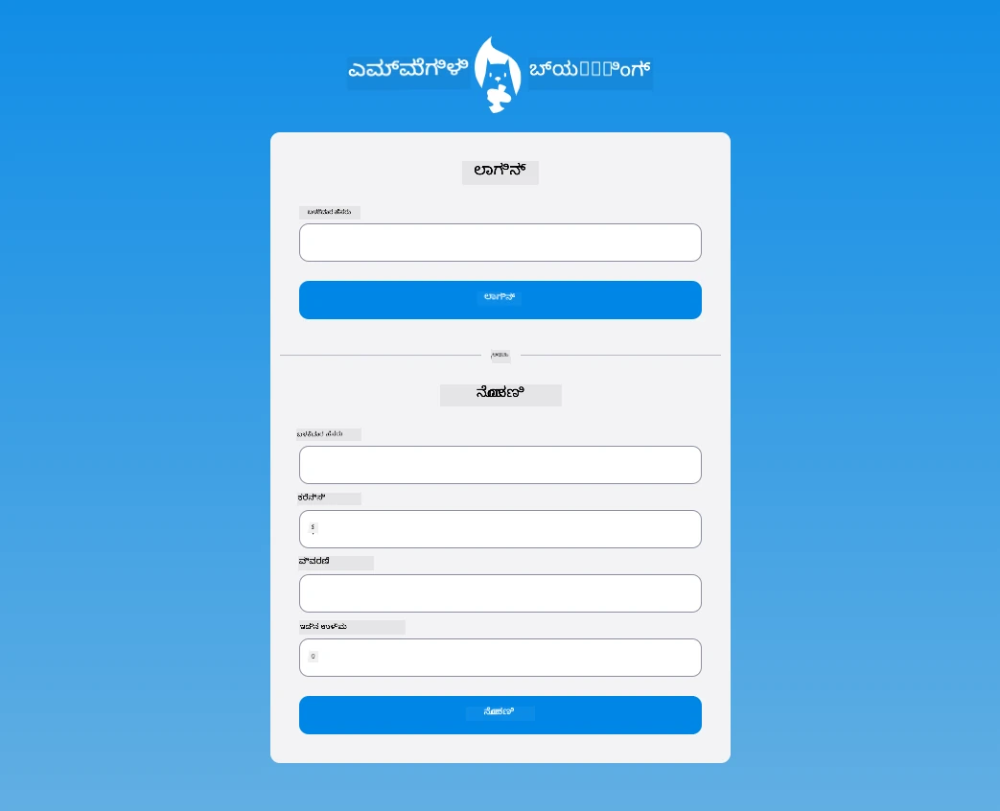

## ಪೋಷ್ಟ್-ಲೆಕ್ಚರ್ ಕ್ವಿಜ್

[ಪೋಸ್ಟ್-ಲೆಕ್ಚರ್ ಕ್ವಿಜ್](https://ff-quizzes.netlify.app/web/quiz/44)

## ವಿಮರ್ಶೆ ಮತ್ತು ಸ್ವಯಂ ಅಧ್ಯಯನ

ಡೆವಲಪರ್ಸ್ ತಮ್ಮ ಫಾರ್ಮ್ ನಿರ್ಮಾಣ ಪ್ರಯತ್ನಗಳಲ್ಲಿ ಬಹಳ ಸೃಜನಶೀಲರಾಗಿದ್ದಾರೆ, ವಿಶೇಷವಾಗಿ ವ್ಯಾಲಿಡೇಶನ್ ತಂತ್ರಗಳಲ್ಲಿ. ವಿಭಿನ್ನ ಫಾರ್ಮ್ ಪ್ರಕ್ರಿಯೆಗಳ ಬಗ್ಗೆ ತಿಳಿದುಕೊಳ್ಳಲು [CodePen](https://codepen.com) ಅನ್ನು ಪರಿಶೀಲಿಸಿ; ನೀವು ಕೆಲವು ಆಸಕ್ತಿದಾಯಕ ಮತ್ತು ಪ್ರೇರಣೆಯ ಫಾರ್ಮ್‌ಗಳನ್ನು ಕಂಡುಹಿಡಿಯಿಸಬಹುದೇ?

## ಅದೇಶ

[ನಿಮ್ಮ ಬ್ಯಾಂಕ್ ಆಪ್ ಸ್ಟೈಲ್ ಮಾಡಿ](assignment.md)

---

<!-- CO-OP TRANSLATOR DISCLAIMER START -->
**ತ್ಯಾಗಪತ್ರ**:
ಈ ಡಾಕ್ಯುಮೆಂಟ್ ಅನ್ನು ಎಐ ಭಾಷಾಂತರ ಸೇವೆ [Co-op Translator](https://github.com/Azure/co-op-translator) ಬಳಸಿ ಭಾಷಾಂತರಿಸಲಾಗಿದೆ. ನಾವು ಸರಿಯಾದ ತನಿಖೆಗೆ ಪ್ರಯತ್ನಿಸುತ್ತಿದ್ದರೂ, ಸ್ವಯಂಚಾಲಿತ ಭಾಷಾಂತರಗಳಲ್ಲಿ ದೋಷಗಳು ಅಥವಾ ತಪ್ಪುತೆಗಳು ಇರಬಹುದು ಎಂಬುದನ್ನು ದಯವಿಟ್ಟು ಗಮನಿಸಿ. ಮೂಲ ಭಾಷೆಯ ಡಾಕ್ಯುಮೆಂಟ್ ಅನ್ನು ಅಧಿಕೃತ ಮೂಲ ಎಂದು ಪರಿಗಣಿಸಬೇಕು. ಮಹತ್ವದ ಮಾಹಿತಿಗಾಗಿ ವೃತ್ತಿಪರ ಮಾನವ ಭಾಷಾಂತರವನ್ನು ಶಿಫಾರಸು ಮಾಡಲಾಗುತ್ತದೆ. ಈ ಭಾಷಾಂತರ ಬಳಕೆಯಿಂದ ಉಂಟಾಗುವ ಯಾವುದೇ ತಪ್ಪುಮತಗಳು ಅಥವಾ ತಪ್ಪು ಅರ್ಥಗರ್ಭಪಟ್ಟಿಗಳಿಗೆ ನಾವು ಜವಾಬ್ದಾರಿಯಲ್ಲ.
<!-- CO-OP TRANSLATOR DISCLAIMER END -->