# ಬ್ಯಾಂಕಿಂಗ್ ಅಪ್ಲಿಕೇಶನ್ ನಿರ್ಮಾಣ ಪಾರ್ಟ್ 3: ಡೇಟಾವನ್ನು ಪಡೆಯುವ ಮತ್ತು ಬಳಸುವ ವಿಧಾನಗಳು

ಸ್ಟಾರ್ ಟ್ರೆಕ್‌ನ ಎಂಟರ್‌ಪ್ರೈಸ್ ಕಂಪ್ಯೂಟರ್ ಕುರಿತು ಯೋಚಿಸಿ - ಕ್ಯಾಪ್ಟನ್ ಪಿಕಾರ್ಡ್‌ನು ಹಡಗು ಸ್ಥಿತಿಗತಿಗಾಗಿ ಕೇಳಿದಾಗ, ಸಂಪೂರ್ಣ ಇಂಟರ್‌ಫೇಸ್ ನಿಲ್ಲಿಸಿ ಮರುನಿರ್ಮಿಸಲಾಗದೆ ಮಾಹಿತಿ ತಕ್ಷಣ ಕಾಣಿಸುತ್ತದೆ. ಆ ಸರಾಗ ಮಾಹಿತಿ ಹರಿವುಲೇ ನಾವು ಇಲ್ಲಿ ಡೈನಾಮಿಕ್ ಡೇಟಾ ಫೆಚಿಂಗ್ ಮೂಲಕ ನಿರ್ಮಿಸುತ್ತಿದ್ದೇವೆ.

ಈಗ ನಿಮ್ಮ ಬ್ಯಾಂಕಿಂಗ್ ಅಪ್ಲಿಕೇಶನ್ ಒಂದು ಮುದ್ರಿತ ಸುದ್ದಿಪತ್ರಿಕೆಂತೆ ಇದೆ - ಮಾಹಿತಿಪೂರ್ಣ ಆದರೆ ಸ್ಥಿರ. ನಾವು ಅದನ್ನು NASA ಯ ಮಿಷನ್ ಕಂಟ್ರೋಲ್ ನಂತಹ ಬದಲಾಯಿಸುವುದಾಗಿ ಸಂಚಲನ ಮತ್ತು ನವೀಕರಣಗಳು ನಿರಂತರವಾಗಿ ಬಳಕೆದಾರರ ಕೆಲಸದ ಮಾರ್ಗವನ್ನು ಕಡಿತಮಾಡದೆ ನಡೆಯುವಂತೆ ಮಾಡುತ್ತೇವೆ.

ನೀವು ಸರ್ವರ್ಗಳೊಂದಿಗೆ ಅಸಿಂಕ್ರೋನಸ್‌ ಆಗಿ ಸಂವಹನ ಮಾಡುವುದನ್ನು, ವಿಭಿನ್ನ ಸಮಯಗಳಲ್ಲಿ ಬರುತ್ತಿರುವ ಡೇಟಾವನ್ನು ನಿರ್ವಹಿಸುವುದನ್ನು ಮತ್ತು ಕಚ್ಚಾ ಮಾಹಿತಿಯನ್ನು ಬಳಕೆದಾರರಿಗಾಗಿ ಅರ್ಥಪೂರ್ಣವಾಗಿ ಪರಿವರ್ತಿಸುವುದನ್ನು ಕಲಿಯುತ್ತೀರಿ. ಇದು ಡೆಮೊ ಮತ್ತು ಪ್ರೊಡಕ್ಷನ್-ಸಿದ್ಧ ಸಾಫ್ಟ್ವೇರ್ ನಡುವೆ ಇರುವ ವ್ಯತ್ಯಾಸ.

## ⚡ ಮುಂದಿನ 5 ನಿಮಿಷಗಳಲ್ಲಿ ನೀವು ಮಾಡಬಹುದಾದವು

**ಬೇಕಾದರೆ ತ್ವರಿತ ಪ್ರಾರಂಭ ಮಾರ್ಗವಳಿ ಡೆವಲಪರ್ಸ್‌ಗಾಗಿ**

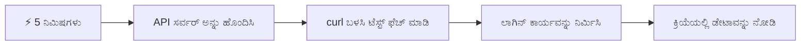
- **ನಿಮಿಷ 1-2**: ನಿಮ್ಮ API ಸರ್ವರ್ ಪ್ರಾರಂಭಿಸಿ (`cd api && npm start`) ಮತ್ತು ಸಂಪರ್ಕ ಪರೀಕ್ಷಿಸಿ
- **ನಿಮಿಷ 3**: ಮೂಲಭೂತ `getAccount()` ಫಂಕ್ಷನ್ fetch ಬಳಸಿ ಸೃಷ್ಟಿಸಿ
- **ನಿಮಿಷ 4**: ಲಾಗಿನ್ ಫಾರ್ಮ್‌ ಅನ್ನು `action="javascript:login()"` ಮೂಲಕ ಸಂಪರ್ಕಿಸಿ
- **ನಿಮಿಷ 5**: ಲಾಗಿನ್ ಪರೀಕ್ಷಿಸಿ ಮತ್ತು ಕಾಂಸೋಲ್‌ನಲ್ಲಿ ಖಾತೆ ಡೇಟಾ ಕಾಣಿಸಿ

**ತ್ವರಿತ ಪರೀಕ್ಷಾ ಕಮಾಂಡ್ಗಳು**:
```bash
# API ಚಾಲನೆಯಲ್ಲಿ ಇದೆ ಎಂದು ಪರಿಶೀಲಿಸಿ
curl http://localhost:5000/api

# ಖಾತೆ ಡೇಟಾ ತ Rodrigues್ ಪಡೆಯಿರಿ
curl http://localhost:5000/api/accounts/test
```

**ಇದಕ್ಕೆ ಏಕೆ ಮಹತ್ವವಿದೆ**: 5 ನಿಮಿಷಗಳಲ್ಲಿ ನೀವು ಪ್ರತಿ ಆಧುನಿಕ ವೆಬ್ ಅಪ್ಲಿಕೇಶನ್ ತಾಳ್ಮೆಯಿಂದ ಇಡುತ್ತದೆ ಅಸಿಂಕ್ರೋನಸ್ ಡೇಟಾ ಫೆಚಿಂಗ್‌ನ ಮಾಯಾಜಾಲವನ್ನು ಕಾಣುತ್ತೀರಿ. ಇದು ಅಪ್ಲಿಕೇಶನ್‌ಗಳನ್ನು ಸ್ಪಂದನಶೀಲ ಮತ್ತು ಜೀವಂತಗೊಳಿಸುವ ಮೂಲಭೂತ ಅಂಶ.

## 🗺️ ಡೇಟಾ-ಚಾಲಿತ ವೆಬ್ ಅಪ್ಲಿಕೇಶನ್‌ಗಳ ಮೂಲಕ ನಿಮ್ಮ ಅಧ್ಯಯನ ಪಯಣ

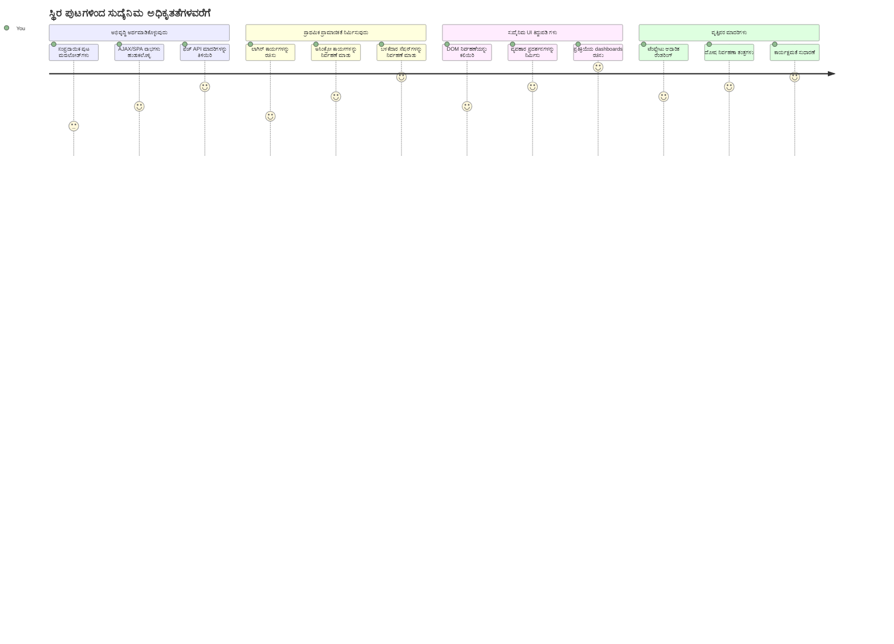
**ನಿಮ್ಮ ಪಯಣ ಗುರಿ**: ಈ ಪಾಠದ ಕೊನೆಯಲ್ಲಿ, ನೀವು ಆಧುನಿಕ ವೆಬ್ ಅಪ್ಲಿಕೇಶನ್‌ಗಳು ಡೇಟಾವನ್ನು ಹೇಗೆ ಪಡೆಯುತ್ತವೆ, ಪ್ರಕ್ರಿಯೆ ಮಾಡುತ್ತವೆ ಮತ್ತು ಡೈನಾಮಿಕ್ ಆಗಿ ಪ್ರದರ್ಶಿಸುತ್ತವೆ ಎಂಬುದನ್ನು ತಿಳಿದುಕೊಳ್ಳುತ್ತೀರಿ, ಇದು ವೃತ್ತಿಪರ ಅಪ್ಲಿಕೇಶನ್‌ಗಳಿಂದ ನಾವು ನಿರೀಕ್ಷಿಸುವ ಸರಾಗ ಬಳಕೆದಾರ ಅನುಭವಗಳನ್ನು ಸೃಷ್ಟಿಸುತ್ತದೆ.

## ಮುನ್ನಡಿ ಲಗ್ಗಣೆ ಪ್ರಶ್ನಾ ಪರೀಕ್ಷೆ

[ಮುನ್ನಡಿ ಲಗ್ಗಣೆ ಪ್ರಶ್ನಾ ಪರೀಕ್ಷೆ](https://ff-quizzes.netlify.app/web/quiz/45)

### ಪೂರ್ವಾವಶ್ಯಕತೆಗಳು

ಡೇಟಾ ಪಡೆಯುವುದರಲ್ಲಿ ಮುಳುಗುವ ಮೊದಲು, ಈ ಘಟಕಗಳನ್ನು ಸಿದ್ಧವಾಗಿಸಿರುವುದನ್ನು ಖಚಿತಪಡಿಸಿಕೊಳ್ಳಿ:

- **ಹಿಂದಿನ ಪಾಠ**: [ಲಾಗಿನ್ ಮತ್ತು ನೋಂದಣಿ ಫಾರ್ಮ್](../2-forms/README.md) ಪೂರೈಸಿ - ನಾವು ಇದು ಮೇಲೆ ನಿರ್ಮಿಸುವೆವು
- **ಸ್ಥಳೀಯ ಸರ್ವರ್**: [Node.js](https://nodejs.org) ಇನ್‌ಸ್ಟಾಲ್ ಮಾಡಿ ಮತ್ತು [API ಸರ್ವರ್ ಅನ್ನು ಚಾಲನೆ ಮಾಡಿ](../api/README.md) ಖಾತೆ ಡೇಟಾವನ್ನು ಒದಗಿಸಲು
- **API ಸಂಪರ್ಕ**: ಈ ಕಮಾಂಡ್ ಮೂಲಕ ನಿಮ್ಮ ಸರ್ವರ್ ಸಂಪರ್ಕವನ್ನು ಪರೀಕ್ಷಿಸಿ:

```bash
curl http://localhost:5000/api
# ನಿರೀಕ್ಷಿತ ಪ್ರತಿಕ್ರಿಯೆ: "ಬ್ಯಾಂಕ್ API v1.0.0"
```

ಈ ತ್ವರಿತ ಪರೀಕ್ಷೆ ಎಲ್ಲಾ ಘಟಕಗಳು ಸರಿಯಾದ ಸಂವಹನ ಮಾಡುತ್ತಿರುವುದನ್ನು ಖಚಿತಪಡಿಸುತ್ತದೆ:
- ನಿಮ್ಮ ವ್ಯವಸ್ಥೆಯಲ್ಲಿ Node.js ಸರಿಯಾಗಿ ಓಡುತ್ತಿದೆಯೇ ಎಂಬುದನ್ನು ಪರಿಶೀಲಿಸುತ್ತದೆ
- ನಿಮ್ಮ API ಸರ್ವರ್ ಸಕ್ರಿಯವಾಗಿದ್ದು ಪ್ರತಿಕ್ರಿಯಿಸುತ್ತಿದೆಯೇ ಎಂದು ದೃಢೀಕರಿಸುತ್ತದೆ
- ನಿಮ್ಮ ಅಪ್ಲಿಕೇಶನ್ ಸರ್ವರ್‌ನನ್ನು ತಲುಪಬಹುದೇ ಎಂದು ಪರಿಶೀಲಿಸುತ್ತದೆ (ಮಿಷನ್ನಿಗೆ ಮುನ್ನ ರೇಡಿಯೋ ಸಂಪರ್ಕ ತಪಾಸಣೆಯಂತಾಗಿದೆ)

## 🧠 ಡೇಟಾ ನಿರ್ವಹಣಾ ಪರಿಸರ ಅವಲೋಕನ

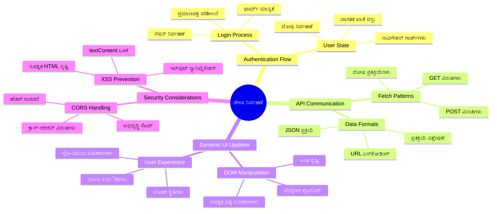
**ಪ್ರಮುಖ ಸಿದ್ಧಾಂತ**: ಆಧುನಿಕ ವೆಬ್ ಅಪ್ಲಿಕೇಶನ್‌ಗಳು ಡೇಟಾ ಸಂಯೋಜನಾ ವ್ಯವಸ್ಥೆಗಳು - ಅವು ಬಳಕೆದಾರ ಇಂಟರ್ಫೇಸ್‌ಗಳು, ಸರ್ವರ್ APIಗಳು ಮತ್ತು ಬ್ರೌಸರ್ ಭದ್ರತಾ ಮಾದರಿಗಳ ನಡುವೆ ಸಮನ್ವಯಿಸಿಸರಾಗ, ಸ್ಪಂದನಶೀಲ ಅನುಭವಗಳನ್ನು ಸೃಷ್ಟಿಸುತ್ತವೆ.

---

## ಆಧುನಿಕ ವೆಬ್ ಅಪ್ಲಿಕೇಶನ್‌‌ಗಳಲ್ಲಿ ಡೇಟಾ ಪಡೆಯುವಿಕೆ ಅರ್ಥಮಾಡಿಕೊಳ್ಳುವುದು

ಕಳೆದ ಇಪ್ಪತ್ತು ವರ್ಷಗಳಲ್ಲಿ ವೆಬ್ ಅಪ್ಲಿಕೇಶನ್‌ಗಳು ಡೇಟಾ ನಿರ್ವಹಿಸುವ ವಿಧಾನವು ಭಾರಿ ಮಾರ್ಪಡಿತವಾಗಿದೆ. ಈ ಬದಲಾಗುವಿಕೆಯನ್ನು ಅರ್ಥ ಮಾಡಿಕೊಳ್ಳುವುದು, AJAX ಮತ್ತು Fetch API ಮುಂತಾದ ಆಧುನಿಕ ತಂತ್ರಗಳನ್ನು ಏಕೆ ಶಕ್ತಿಯುತವಾಗಿವೆ ಮತ್ತು ವೆಬ್ ಡೆವಲಪರ್ಸ್‌ಗೆ ಅವು ಅಗತ್ಯವಾಯಿರುತ್ತವೆ ಎಂಬುದನ್ನು ಅವಲೋಕಿಸಲು ಸಹಾಯ ಮಾಡುತ್ತದೆ.

ಸಾಂಪ್ರದಾಯಿಕ ವೆಬ್‌ಸೈಟುಗಳು ಹೇಗೆ ಕೆಲಸ ಮಾಡುತ್ತಿದ್ದವು ಮತ್ತು ನಾವು ಈಗ ನಿರ್ಮಿಸುತ್ತಿರುವ ಡೈನಾಮಿಕ್, ಸ್ಪಂದನಶೀಲ ಅಪ್ಲಿಕೇಶನ್‌ಗಳ ನಡುವಿನ ವ್ಯತ್ಯಾಸವನ್ನು ಅನ್ವೇಷಿಸೋಣ.

### ಸಾಂಪ್ರದಾಯಿಕ ಬಹು-ಪುಟ ಅಪ್ಲಿಕೇಶನ್‌ಗಳು (MPA)

ವೆಬ್ ಪ್ರಾರಂಭಿಕೆಯಲ್ಲಿದ್ದಾಗ, ಪ್ರತಿ ಕ್ಲಿಕ್ ಹಳೆಯ ದೂರದರ್ಶನದ ಚಾನೆಲ್ ಬದಲಾಯಿಸುವಂತೆ ಇದ್ದಿತು - ಸ್ಕ್ರೀನ್ ಖಾಲಿ ಆಗಿ, ನಂತರ ಹೊಸ ವಿಷಯದೊಂದಿಗೆ ನಿಧಾನವಾಗಿ ಮುತುವರ್ಜಿ ಒಪ್ಪಿಕೊಳ್ಳುತ್ತಿತ್ತು. ಇದು ಮರುಬಳಕೆಯ ವೆಬ್ ಅಪ್ಲಿಕೇಶನ್‌ಗಳ ನಿಜವಾಗಿದ್ದ ಸ್ಥಿತಿ, ಪ್ರತಿಯೊಂದು ಕ್ರಿಯೆಯೂ ಸಂಪೂರ್ಣ ಪುಟವನ್ನು ಆರಂಭದಿಂದ ಮರುನಿರ್ಮಿಸುವುದಾಗಿತ್ತು.

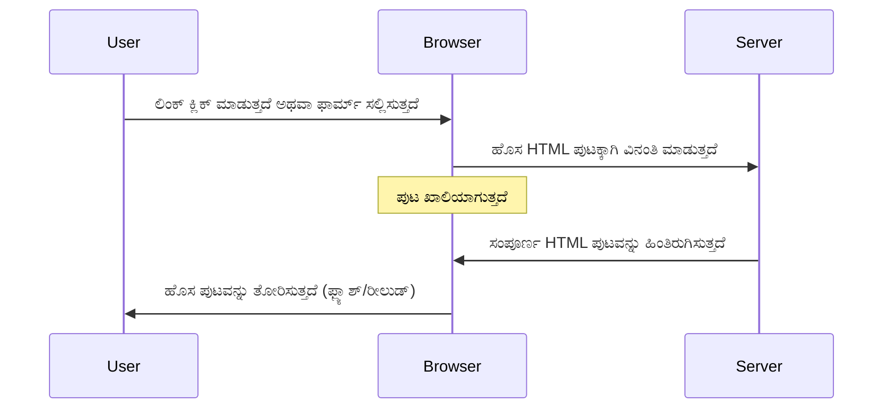
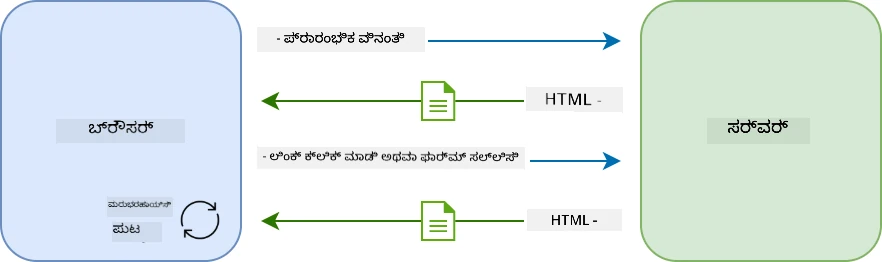

**ಈ ವಿಧಾನವನ್ನು ಅಸಹ್ಯವಾಗಿಸಿದ್ದದ್ದು:**
- ಪ್ರತಿ ಕ್ಲಿಕ್ ಸಂಪೂರ್ಣ ಪುಟವನ್ನು ಪುನರ್ನirmaಣೆ ಪರಿಚಯಿಸಿತು
- ಬಳಕೆದಾರರು ಮಧ್ಯದಲ್ಲಿ ನಿಂತು ಬದಲಾವಣೆಯ ನೋಟಗಳನ್ನು ಅನುಭವಿಸಿದ್ದರು
- ನಿಮ್ಮ ಇಂಟರ್ನೆಟ್ ಸಂಪರ್ಕ ಅದೇ ಹೆಡರ್ ಮತ್ತು ಫೂಟರ್ ಡೌನ್ಲೋಡ್ ಮಾಡಲು ಹಗಲು-ರಾತಿ ಕಾರ್ಯನಿರ್ವಹಿಸುತ್ತಿತ್ತು
- ಅಪ್ಲಿಕೇಶನ್‌ಗಳು ಸಾಫ್ಟ್‌ವೇರ್‌ ಬಳಕೆಯಂತೆ ಇಲ್ಲ, ಕಡತಗಳ ಲಾಶೆಗೆ ಕ್ಲಿಕ್ ಮಾಡುವಂತಿದ್ದವು

### ಆಧುನಿಕ ಸಿಂಗಲ್-ಪುಟ ಅಪ್ಲಿಕೇಶನ್‌ಗಳು (SPA)

AJAX (ಅಸಿಂಕ್ರೋನಸ್ ಜಾವಾಸ್ಕ್ರಿಪ್ಟ್ ಮತ್ತು XML) ಈ ಪರಿಕಲ್ಪನೆಯನ್ನು ಸಂಪೂರ್ಣ ಬದಲಾಯಿಸಿದೆ. ಅಂತಾರಾಷ್ಟ್ರೀಯ ಶೇಖರಣಾ ನಿಲಯದ (ISS) ಮೋಡ್ಯೂಲರ್ ವಿನ್ಯಾಸದಂತೆ, ಅಲ್ಲಿ ಬಾಹ್ಯಯಾನಿಗಳು ವಿಚ್ಛಿನ್ನ ಭಾಗಗಳನ್ನು ಮರುಸ್ಥಾಪಿಸಬಹುದು, AJAX ನಮಗೆ ಪುಟದ ನಿರ್ದಿಷ್ಟ ಭಾಗಗಳನ್ನು ಮರುಲೋಡ್ ಮಾಡದೇ ನವೀಕರಣ ಮಾಡಲು ಅವಕಾಶ ನೀಡುತ್ತದೆ. XML ಎಂದು ಹೆಸರಿರುವುದರ ಮೇಲೆ JSON ಅನ್ನು ನಾವು ಹೆಚ್ಚು ಬಳಕೆಮಾಡುತ್ತೇವೆ, ಆದರೆ ಮೂಲ ತತ್ವ ಎಂದರೆ: ಬದಲಾಯಿಸಬೇಕಾದ ಭಾಗವನ್ನು ಮಾತ್ರ ನವೀಕರಿಸು.

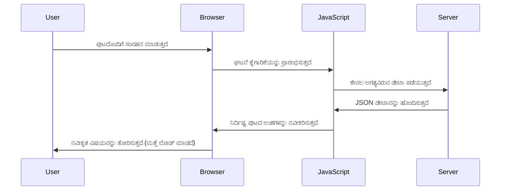
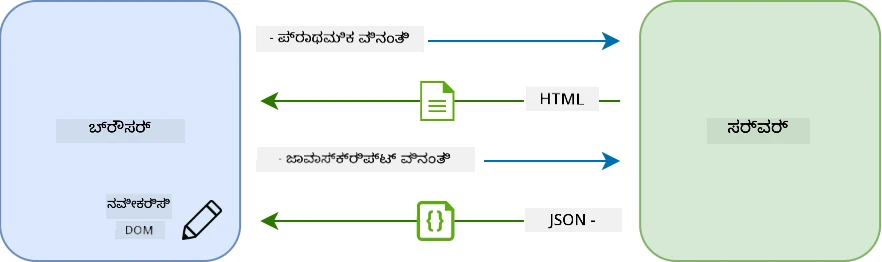

**SPAs ಇಷ್ಟು ಚೆನ್ನಾಗಿರುವುದಕ್ಕೆ ಕಾರಣಗಳು:**
- ಬದಲಾಯಿಸಿದ ಭಾಗಗಳನ್ನು ಮಾತ್ರ ನವೀಕರಿಸಲಾಗುತ್ತದೆ (ಬುದ್ದಿವಂತಿಕೆ吧)
- ಯಾವುದೇ ಜಾರಿಯಾದ ವಿರಾಮಗಳಿಲ್ಲ - ಬಳಕೆದಾರರು ತಮ್ಮ ಕ್ರಮದಲ್ಲಿ ಇರುತ್ತಾರೆ
- ಕಡಿಮೆ ಡೇಟಾ ಸಂಚಾರ ವೇಗವಾಗಿ ಲೋಡ್ ಮಾಡುತ್ತದೆ
- ಎಲ್ಲವು ಸ್ಪಂದನಶೀಲ ಮತ್ತು ತ್ವರಿತವಾಗಿ ಆಗುತ್ತದೆ, ನಿಮ್ಮ ಫೋನಿನ ಅಪ್ಲಿಕೇಶನ್‌ಗಳಂತೆ

### ಆಧುನಿಕ Fetch API ಗೆ ಬದಲಿ

ಆಧುನಿಕ ಬ್ರೌಸರ್‌ಗಳು [`Fetch` API](https://developer.mozilla.org/docs/Web/API/Fetch_API) ಅನ್ನು ಒದಗಿಸುತ್ತವೆ, ಇದು ಹಳೆಯ [`XMLHttpRequest`](https://developer.mozilla.org/docs/Web/API/XMLHttpRequest/Using_XMLHttpRequest) ನೆ ವಿರುದ್ಧ ಬದಲಿ. ಟೆಲಿಗ್ರಾಫ್ ಮತ್ತು ಇಮೇಲ್ ಬಳಸುವ ವ್ಯತ್ಯಾಸದಂತೆ, Fetch API ಸ್ವಚ್ಛ, ಅಸಿಂಕ್ರೋನಸ್ ಕೋಡುವಿಕೆಗೆ ಪ್ರಾಮಿಸ್‌ಗಳನ್ನು ಉಪಯೋಗಿಸುತ್ತದೆ ಮತ್ತು JSON ನೈಜವಾಗಿ ನಿರ್ವಹಿಸುತ್ತದೆ.

| ವೈಶಿಷ್ಟ್ಯ | XMLHttpRequest | Fetch API |
|---------|----------------|----------|
| **ವ್ಯಾಕರಣ** | ಒತ್ತಡದ ಕಾಲ್ಬ್ಯಾಕ್ ಆಧಾರಿತ | ಸ್ವಚ್ಛ ಪ್ರಾಮಿಸ್ ಆಧಾರಿತ |
| **JSON ಹ್ಯಾಂಡ್ಲಿಂಗ್** | ಕೈಯಿಂದ ವಿಶ್ಲೇಷಣೆ ಬೇಕು | ನಿರ್ಮಿಸಲಾಗದ `.json()` ವಿಧಾನವು |
| **ದೋಷ ನಿರ್ವಹಣೆ** | ಸೀಮಿತ ದೋಷ ಮಾಹಿತಿ | ಸಂಪೂರ್ಣ ದೋಷ ವಿವರಗಳು |
| **ಆಧುನಿಕ ಬೆಂಬಲ** | ಪಾರಂಪರ್ಯ ಅನುಕೂಲತೆ | ES6+ ಪ್ರಾಮಿಸ್ ಮತ್ತು ಅಸಿಂಕ್/ಅವೇಟ್ |

> 💡 **ಬ್ರೌಸರ್ ಅನುಕೂಲತೆ**: ಶುಭವಾರ್ತೆಗೆ, Fetch API ಎಲ್ಲಾ ಆಧುನಿಕ ಬ್ರೌಸರ್‌ಗಳಲ್ಲಿ ಕಾರ್ಯನಿರ್ವಹಿಸುತ್ತದೆ! ನೀವು ನಿಶ್ಚಿತ ಆವೃತ್ತಿಗಳ ಬಗ್ಗೆ ಹೆಚ್ಚು ಗೊತ್ತಾಯ್ತುಕೊಳ್ಳಬೇಕಾದರೆ, [caniuse.com](https://caniuse.com/fetch) ನಲ್ಲಿ ಸಂಪೂರ್ಣ ಅನುಕೂಲತಾ ಕಥೆಯನ್ನು ನೋಡಿ.
> 
**ನೀವು ತಿಳಿಯಬೇಕಾಗಿರುವುದು**:
- ಕ್ರೋಮ್, ಫೈರ್‌ಫಾಕ್ಸ್, ಸಫಾರಿ ಮತ್ತು ಎಡ್ಜ್‌ನಲ್ಲಿ ಅದ್ಭುತವಾಗಿ ಕಾರ್ಯನಿರ್ವಹಿಸುತ್ತದೆ (ಯಾವುದೇ ಬಳಕೆದಾರರ ಹಾಜರಾತಿಯ ತಾಣಗಳು)
- ಇಂಟರ್ನೆಟ್ ಎಕ್ಸ್‌ಪ್ಲೋರರ್‌ಗೆ ಮಾತ್ರ ಹೆಚ್ಚುವರಿ ಸಹಾಯ ಬೇಕು (ನಿಜವಾಗಿಯೂ, IE ಹೋಗಲು ಸಮಯವಾಗಿದೆ)
- ನಾವು ನಂತರ ಬಳಸುವ ಆಸುಂದರ ಅಸಿಂಕ್/ಅವೇಟ್ ಮಾದರಿಗಳಿಗೆ ಅನುವು ಮಾಡಿಕೊಡುತ್ತದೆ

### ಬಳಕೆದಾರ ಲಾಗಿನ್ ಮತ್ತು ಡೇಟಾ ಪಡೆದಿಸಿಕೊಳ್ಳುವಿಕೆ ಕಾರ್ಯಗತಗೊಳಿಸುವುದು

ಇದೀಗ ನಿಮ್ಮ ಬ್ಯಾಂಕಿಂಗ್ ಅಪ್ಲಿಕೇಶನ್ ಅನ್ನು ಸ್ಥಿರ ಪ್ರದರ್ಶನದಿಂದ ಕಾರ್ಯನಿರ್ವಹಿಸುವ ಅಪ್ಲಿಕೇಶನ್ ಆಗಿ ಪರಿವರ್ತಿಸುವ ಲಾಗಿನ್ ವ್ಯವಸ್ಥೆಯನ್ನು ಅನುಷ್ಟಾನಗೊಳಿಸೋಣ. ಭದ್ರಸേനಾ ಸೌಲಭ್ಯಗಳಲ್ಲಿ ಉಪಯೋಗಿಸುವ ಪ್ರಮಾಣೀಕರಣ ಪ್ರೋಟೋಕಾಲ್‌ಗಳಂತೆ, ನಾವು ಬಳಕೆದಾರರ ವಿವರಗಳನ್ನು ಪರಿಶೀಲಿಸುತ್ತೇವೆ ಮತ್ತು ನಂತರ ಅವರ ನಿರ್ದಿಷ್ಟ ಡೇಟಾಕ್ಕೆ ಪ್ರವೇಶ ನೀಡುತ್ತೇವೆ.

ನಮಗೆ ಇದು ಹಂತ ಹಂತವಾಗಿ ನಿರ್ಮಿಸುವೆವು, ಮೂಲಭೂತ ಪ್ರಮಾಣೀಕರಣದಿಂದ ಪ್ರಾರಂಭಿಸಿ ನಂತರ ಡೇಟಾ ಪಡೆಯುವ ಸಾಮರ್ಥ್ಯಗಳನ್ನು ಸೇರಿಸುವುದು.

#### ಹಂತ 1: ಲಾಗಿನ್ ಫಂಕ್ಷನ್ ಆಧಾರಶಿಲೆಯನ್ನು ಸೃಷ್ಟಿಸಿ

ನಿಮ್ಮ `app.js` ಫೈಲ್ ತೆರೆಯಿರಿ ಮತ್ತು ಹೊಸ `login` ಫಂಕ್ಷನ್ ಸೇರಿಸಿ. ಇದು ಬಳಕೆದಾರದ ಪ್ರಮಾಣೀಕರಣ ಪ್ರಕ್ರಿಯೆ ನಿರ್ವಹಿಸುತ್ತದೆ:

```javascript
async function login() {
  const loginForm = document.getElementById('loginForm');
  const user = loginForm.user.value;
}
```

**ಇದನ್ನು ನಾವು ವಿವರಿಸೋಣ:**
- ಆ `async` ಕೀವರ್ಡ್‌? ಅದು ಜಾವಾಸ್ಕ್ರಿಪ್ಟ್‌ಗೆ "ಈ ಫಂಕ್ಷನ್ ಕೆಲವು ಬಾರಿ ಕಾಯಬೇಕಾಗಬಹುದು" ಎಂದು ಹೇಳುತ್ತಿದೆ
- ನಾವು ಪುಟದಿಂದ ಫಾರ್ಮ್ ಪಡೆದಿಕೊಂಡಿದ್ದೇವೆ (ಏನೂ ವಿಶೇಷವಿಲ್ಲ, ID ಮೂಲಕ ಹುಡುಕವಷ್ಟೇ)
- ನಂತರ ಬಳಕೆದಾರ ಇಟ್ಟಿರುವ ವರ್ಗವನ್ನ ತೆಗೆದುಕೊಳ್ಳುತ್ತೇವೆ
- ಇದು ದನಿ: ಫಾರ್ಮ್ ಇನ್‌ಪುಟ್ ಅನ್ನು ಅದರ `name` ಗುಣಲಕ್ಷಣದಿಂದ ನೇರವಾಗಿ ಆಕ್ಸೆಸ್ ಮಾಡಬಹುದು - ಹೆಚ್ಚುವರಿ getElementById ಕರೆಗಳ ಅವಶ್ಯಕತೆ ಇಲ್ಲ!

> 💡 **ಫಾರ್ಮ್ ಆಕ್ಸೆಸ್ ಮಾದರಿ**: ಪ್ರತಿಯೊಂದು ಫಾರ್ಮ್ ನಿಯಂತ್ರಣವು ಅದರ ಹೆಸರಿನ (HTML ನಲ್ಲಿ `name` ಗುಣಲಕ್ಷಣದ ಮೂಲಕ) ಪ್ರಾಪರ್ಟಿಯಾಗಿ ಫಾರ್ಮ್ ಎಲೆಮೆಂಟ್‌ನಲ್ಲಿ ನೇರವಾಗಿ ಲಭ್ಯವಿರುತ್ತದೆ. ಇದು ಫಾರ್ಮ್ ಡೇಟಾವನ್ನು ಸ್ವಚ್ಛವಾಗಿ, ಓದಲು ಸುಲಭವಾಗಿ ಪಡೆಯಲು ಸಹಾಯ ಮಾಡುತ್ತದೆ.

#### ಹಂತ 2: ಖಾತೆ ಡೇಟಾ ಫೆಚಿಂಗ್ ಫಂಕ್ಷನ್ ಸೃಷ್ಟಿಸಿ

ಬೀಗದ ನಂತರ, ನಾವು ಸರ್ವರ್‌ನಿಂದ ಖಾತೆ ಡೇಟಾ ಪಡೆಯಲು ಬಳಸುವ ವಿಶಿಷ್ಟ ಫಂಕ್ಷನ್ ರಚಿಸುವೆವು. ಇದು ನಿಮ್ಮ ನೋಂದಣಿ ಫಂಕ್ಷನ್ನಿಗೆ ಸಮಾನ ರೀತಿ ಆದರೆ ಡೇಟಾ ಪಡೆಯುವಿಕೆಯ ಮೇಲೆ ಕೇಂದ್ರೀಕೃತವಾಗಿದೆ:

```javascript
async function getAccount(user) {
  try {
    const response = await fetch('//localhost:5000/api/accounts/' + encodeURIComponent(user));
    return await response.json();
  } catch (error) {
    return { error: error.message || 'Unknown error' };
  }
}
```

**ಈ ಕೋಡ್ ಏನು ಸಾಧಿಸುತ್ತದೆ:**
- **ಆಧುನಿಕ** `fetch` API ಅನ್ನು ಅಸಿಂಕ್ರೋನಸ್ ಅನ್ನು ವಿನಂತಿಸಲು ಬಳಸುತ್ತದೆ
- **ಯೂಸರ್ ನೇಮ್** ಪರಾಮೀಟರ್‌తో ಗೇಟು ವಿನಂತಿಯ URL ರಚಿಸುತ್ತದೆ
- **`encodeURIComponent()`** ಅನ್ನು URL ಗಳಲ್ಲಿ ವಿಶೇಷ ಅಕ್ಷರಗಳನ್ನು ಸುರಕ್ಷಿತವಾಗಿ ನಿಭಾಯಿಸಲು ಅನ್ವಯಿಸುತ್ತದೆ
- ಪ್ರತಿಕ್ರಿಯೆಯನ್ನು JSON ಸ್ವರೂಪಕ್ಕೆ ಪರಿವರ್ತಿಸುತ್ತದೆ, ಇದು ಡೇಟಾ ನಿರ್ವಹಣೆಗೆ ಸುಲಭ
- ದೋಷಗಳನ್ನು ಸಂಕಷ್ಟದಿಂದ ತಪ್ಪಿಸುತ್ತಾ, ದೋಷ ವಸ್ತುವನ್ನು ಹಿಂತಿರುಗಿಸುವ ಮೂಲಕ gracefully ನಿರ್ವಹಿಸುತ್ತದೆ

> ⚠️ **ಭದ್ರತಾ ಟಿಪ್ಪಣಿ**: `encodeURIComponent()` ಕಾರ್ಯವಿಧಾನ URLಗಳ中特 ವಿಶೇಷ ಅಕ್ಷರಗಳನ್ನು ನಿರ್ವಹಿಸುತ್ತದೆ. ನೌಕಾ ಸಂವಹನದಲ್ಲಿ ಬಳಸುವ ಎನ್ಕೋಡಿಂಗ್ ವ್ಯವಸ್ಥೆಗಳಂತೆ, ಇದು ನಿಮ್ಮ ಸಂದೇಶ ನಿಖರವಾಗಿ ತಲುಪಿಸೋದು ಖಚಿತಪಡಿಸುತ್ತದೆ, "#" ಅಥವಾ "&" ಮುಂತಾದ ಅಕ್ಷರಗಳು ತಪ್ಪಾಗಿ ಅರ್ಥಹೀನವಾಗದಂತೆ ತಡೆಯುತ್ತದೆ.
> 
**ಇದಕ್ಕೆ ಏಕೆ ಮಹತ್ವವಿದೆ:**
- ವಿಶೇಷ ಅಕ್ಷರಗಳು URLಗಳನ್ನು ಕೆಡು ಮುಗಿಸುವುದನ್ನು ತಡೆಯುತ್ತದೆ
- URL ತಿದ್ದುಪಡಿ ದಾಳಿಗಳಿಂದ ರಕ್ಷಣೆ ನೀಡುತ್ತದೆ
- ನಿಮ್ಮ ಸರ್ವರ್ ಆವಶ್ಯಕ ಮಾಹಿತಿಯನ್ನು ಪಡೆಯುತ್ತದೆ
- ಭದ್ರತೆಯಂತೆ ಕಾರ್ಯಕ್ರಮ ಬರೆಯುವ ಅಭ್ಯಾಸ ಅನುಸರಿಸುತ್ತದೆ

#### HTTP GET ವಿನಂತಿಗಳನ್ನು ಅರ್ಥಮಾಡಿಕೊಳ್ಳುವುದು

ನೀವು `fetch` ಬಳಸುವಾಗ ಯಾವುದೇ ಹೆಚ್ಚುವರಿ ಆಯ್ಕೆಗಳನ್ನು ನೀಡದೆ ಇರೋದಾದರೆ, ಅದು ಸ್ವಯಂಚಾಲಿತವಾಗಿ [`GET`](https://developer.mozilla.org/docs/Web/HTTP/Methods/GET) ವಿನಂತಿಯನ್ನು ಸೃಷ್ಟಿಸುತ್ತದೆ. ನಾವು ಮಾಡುತ್ತಿರುವುದು ಪರಿಪೂರ್ಣ: ಸರ್ವರ್ ಗೆ "ನಾನು ಈ ಬಳಕೆದಾರನ ಖಾತೆ ಡೇಟಾ ನೋಡಬಹುದೇ?" ಎಂದು ಕೇಳುವುದು.

GET ವಿನಂತಿಗಳನ್ನು ಗ್ರಂಥಾಲಯದಿಂದ ಪುಸ್ತಕವನ್ನು ಬೇಧಿಕೊಳ್ಳುವಂತೆ ಭಾವಿಸಬಹುದು - ನೀವು ಈಗಾಗಲೇ ಅಸ್ತಿತ್ವದಲ್ಲಿರುವುದನ್ನು ನೋಡಲು ಕೇಳುತ್ತಿದ್ದಾರೆ. POST ವಿನಂತಿಗಳು (ನೋಂದಣಿಗಾಗಿ ನಾವು ಬಳಸಿದ್ದದ್ದು) ಹೊಸ ಪುಸ್ತಕವನ್ನು ಸೇರಿಸುವಂತೆ.

| GET ವಿನಂತಿ | POST ವಿನಂತಿ |
|-------------|-------------|
| **ಉದ್ದೇಶ** | ಈಗಾಗಲೇ ಇರುವ ಡೇಟಾ ಪಡೆಯುವುದು | ಹೊಸ ಡೇಟಾವನ್ನು ಸರ್ವರ್‌ಗೆ ಕಳುಹಿಸುವುದು |
| **ಪ್ಯಾರಾಮೀಟರ್‌ಗಳು** | URL ಪಥ/ವಿಚಾರ ಸರಣಿ ಯಲ್ಲಿ | ವಿನಂತಿ ದೇಹದಲ್ಲಿ |
| **ಕ್ಯಾಶಿಂಗ್** | ಬ್ರೌಸರ್‌ಗಳು ಕ್ಯಾಶ್ ಮಾಡಬಹುದು | ಸಾಮಾನ್ಯವಾಗಿ ಕ್ಯಾಶ್ ಮಾಡದು |
| **ಭದ್ರತೆ** | URL/ಲಾಗ್‌ಗಳಲ್ಲಿ ಕಾಣಿಸುತ್ತದೆ | ವಿನಂತಿ ದೇಹದಲ್ಲಿ ಮರೆಮಾಚಲ್ಪಟ್ಟಿದೆ |

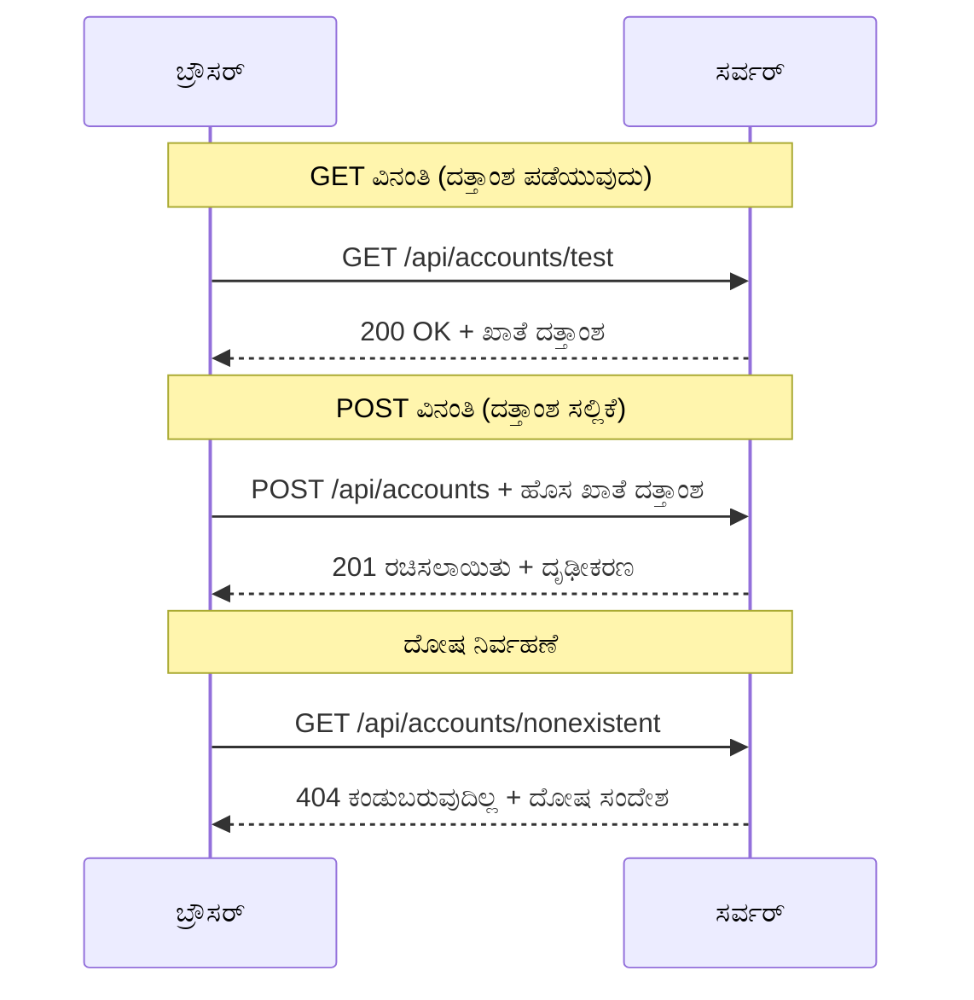
#### ಹಂತ 3: ಎಲ್ಲವನ್ನೂ ಒಟ್ಟಿಗೆ ಸಂಪರ್ಕಿಸುವುದು

ಈಗ ಸಮಾಧಾನಕಾರಿ ಹಂತ - ನಿಮ್ಮ ಖಾತೆ ಪಡೆಯುವ ಫಂಕ್ಷನ್ ಅನ್ನು ಲಾಗಿನ್ ಪ್ರಕ್ರಿಯೆಗೆ ಸಂಪರ್ಕಿಸೋಣ. ಎಲ್ಲವೂ ಇಲ್ಲಿ ಸ_free_বাংলবান್ಥಿ:

```javascript
async function login() {
  const loginForm = document.getElementById('loginForm');
  const user = loginForm.user.value;
  const data = await getAccount(user);

  if (data.error) {
    return console.log('loginError', data.error);
  }

  account = data;
  navigate('/dashboard');
}
```

ಈ ಫಂಕ್ಷನ್ ಸ್ಪಷ್ಟ ಕ್ರಮವನ್ನು ಅನುಸರಿಸುತ್ತದೆ:
- ಫಾರ್ಮ್ ಇಲಿನಪ್ಕೆಂದಿರುವ ಬಳಕೆದಾರ ಹೆಸರನ್ನು ತೆಗೆಯುವುದು
- ಸರ್ವರ್‌ನಿಂದ ಬಳಕೆದಾರ ಖಾತೆ ಡೇಟಾವನ್ನು ವಿನಂತಿಸು
- ಪ್ರಕ್ರಿಯೆಯಲ್ಲಿ ಸಂಭವಿಸುವ ದೋಷಗಳನ್ನು ನಿರ್ವಹಿಸು
- ಯಶಸ್ವಿಯಾದಾಗ ಖಾತೆ ಡೇಟಾವನ್ನು ಸಂಗ್ರಹಿಸಿ, ಡ್ಯಾಶ್‌ಬೋರ್ಡ್‌ಗೆ ನಾವಿಗೇಟ್ ಮಾಡು

> 🎯 **ಅಸಿಂಕ್/ಅವೇಟ್ ಮಾದರಿ**: `getAccount` ಅಸಿಂಕ್ರೋನಸ್ ಫಂಕ್ಷನ್ ಆದ್ದರಿಂದ ನಾವು `await` ಕೀವರ್ಡ್ ಬಳಸಿ ಸರ್ವರ್ ಪ್ರತಿಕ್ರಿಯೆ ಬರುವವರೆಗೆ ಕಾರ್ಯನಿರ್ವಹಣೆಯನ್ನು ನಿಲ್ಲಿಸುತ್ತೇವೆ. ಇದು ಅನಿಯಂತ್ರಿತ ಡೇಟಾದೊಂದಿಗೆ ಮುಂದುವರೆಯದಂತೆ ತಡೆಯುತ್ತದೆ.

#### ಹಂತ 4: ನಿಮ್ಮ ಡೇಟಾ ಉಳಿಸುವ ಸ್ಥಳವನ್ನು ರಚಿಸುವುದು

ನಿಮ್ಮ ಅಪ್ಲಿಕೇಶನ್ ಲೋಡ್ ಆದ ನಂತರ ಖಾತೆ ಮಾಹಿತಿಯನ್ನು ನೆನಪಿಸಿಕೊಳ್ಳಲು ಒಂದೊಂದು ಸ್ಥಳ ಬೇಕು. ಇದನ್ನು ನಿಮ್ಮ ಅಪ್ಲಿಕೇಶನ್ ನ ಶಾರ್ಟ್-ಟರ್ಮ್ ಮೆಮೊರಿ ಎಂದು ಭಾವಿಸಿ - ಪ್ರಸ್ತುತ ಬಳಕೆದಾರರ ಡೇಟಾ ತಿರುಗಿ ಬಳಸುವ ಸ್ಥಳ. `app.js` ಫೈಲ್‌ನ ಮೇಲ್ಭಾಗದಲ್ಲಿ ಈ ಸಾಲು ಸೇರಿಸಿ:

```javascript
// ಇದು ಪ್ರಸ್ತುತ ಬಳಕೆದಾರನ ಖಾತೆ ಡೇಟಾವನ್ನು ಹಿಡಿದಿಡುತ್ತದೆ
let account = null;
```

**ನಾವು ಇದನ್ನು ಯಾಕೆ ಬೇಕು:**
- ಅಪ್ಲಿಕೇಶನ್‌ನಿಂದ ಎಲ್ಲಡೆ ಖಾತೆ ಡೇಟಾ ಪ್ರವೇಶ ಸಾಧ್ಯವಾಗುತ್ತದೆ
- ಪ್ರಾರಂಭದಲ್ಲಿ `null` ಅಂದರೆ "ಯಾರೂ ಲಾಗಿನ್ ಆಗುತ್ತಿಲ್ಲ" ಎಂಬ ಅರ್ಥ
- ಯಾರಾದರೂ ಯಶಸ್ವಿಯಾಗಿ ಲಾಗಿನ್ ಅಥವಾ ನೋಂದಣಿ ಮಾಡಿದಾಗ ಅಪ್‌ಡೇಟ್ ಆಗುತ್ತದೆ
- ಏಕಮಾತ್ರ ನಿಜವಾದ ಮೂಲವಾಗಿದ್ದು, ಯಾರು ಲಾಗಿನ್ ಆಗಿದ್ದಾರೆ ಎಂಬ ಗೊಂದಲವಿಲ್ಲ

#### ಹಂತ 5: ನಿಮ್ಮ ಫಾರ್ಮ್ ಅನ್ನು ಸಂಪರ್ಕಿಸಿ

ಈಗ ನಿಮ್ಮ ಹೊಸ ಲಾಗಿನ್ ಫಂಕ್ಷನ್ ಅನ್ನು HTML ಫಾರ್ಮ್ ಗೆ ಸಂಪರ್ಕಿಸೋಣ. ಫಾರ್ಮ್ ಟ್ಯಾಗ್ ಹೀಗಾಗಿ ಅಪ್ಡೇಟ್ ಮಾಡಿ:

```html
<form id="loginForm" action="javascript:login()">
  <!-- Your existing form inputs -->
</form>
```

**ಈ ಸಣ್ಣ ಬದಲಾವಣೆ ಏನು ಮಾಡುತ್ತದೆ:**
- ಫಾರ್ಮ್ ತನ್ನ ಡೀಫಾಲ್ಟ್ "ಸಂಪೂರ್ಣ ಪುಟವನ್ನು ಮರುಲೋಡ್ ಮಾಡು" ನಡವಳಿಕೆ ನಿಲ್ಲಿಸುತ್ತದೆ
- ನಿಮ್ಮ ಕಸ್ಟಮ್ ಜಾವಾಸ್ಕ್ರಿಪ್ಟ್ ಫಂಕ್ಷನ್‌ಗೆ ಕರೆ ಮಾಡುತ್ತದೆ
- ಎಲ್ಲವೂ ಸರಾಗ ಮತ್ತು ಸಿಂಗಲ್-ಪುಟ ಅಪ್ಲಿಕೇಶನ್ ನೆನಪಿಸಿಕೊಳ್ಳುತ್ತದೆ
- ಬಳಕೆದಾರರು "ಲಾಗಿನ್" ಬಟನ್ ಒತ್ತಿದಾಗ ಸಂಪೂರ್ಣ ನಿಯಂತ್ರಣ ನಿಮಗೆ ಲಭಿಸುತ್ತದೆ

#### ಹಂತ 6: ನಿಮ್ಮ ನೋಂದಣಿ ಫಂಕ್ಷನ್ನನ್ನು ಸುಧಾರಿಸಿ

ಸಮಾನತೆಯಿಗಾಗಿ, ನಿಮ್ಮ `register` ಫಂಕ್ಷನನ್ನು ಹೊಸ ಮೂಲಗಳಿಂದ ಖಾತೆ ಡೇಟಾ ಉಳಿಸುವುದು ಮತ್ತು ಡ್ಯಾಶ್‌ಬೋರ್ಡ್‌ಗೆ ನಾವಿಗೇಟ್ ಮಾಡುವಂಥದಾಗಿ ಅಪ್‌ಡೇಟ್ ಮಾಡಿ:

```javascript
// ನಿಮ್ಮ register ಫಂಕ್ಷನ್‌ನ ಕೊನೆಯಲ್ಲಿ ಈ ಸಾಲುಗಳನ್ನು ಸೇರಿಸಿ
account = result;
navigate('/dashboard');
```

**ಈ ಸುಧಾರಣೆ ನೀಡುತ್ತದೆ:**
- ನೋಂದಣಿಯಿಂದ ಡ್ಯಾಶ್‌ಬೋರ್ಡ್‌ಗೆ ತಿರುವು ಸೌಕರ್ಯ
- ಲಾಗಿನ್ ಮತ್ತು ನೋಂದಣಿ ಪ್ರಕ್ರಿಯೆಗಳ ನಡುವಣ ಸಮಾನ ಅನುಭವ
- ಯಶಸ್ವಿ ನೋಂದಣಿಯ ನಂತರ ತಕ್ಷಣ ಖಾತೆ ಡೇಟಾ ಲಭ್ಯತೆ

#### ನಿಮ್ಮ ಅನುಷ್ಠಾನವನ್ನು ಪರೀಕ್ಷಿಸಿ

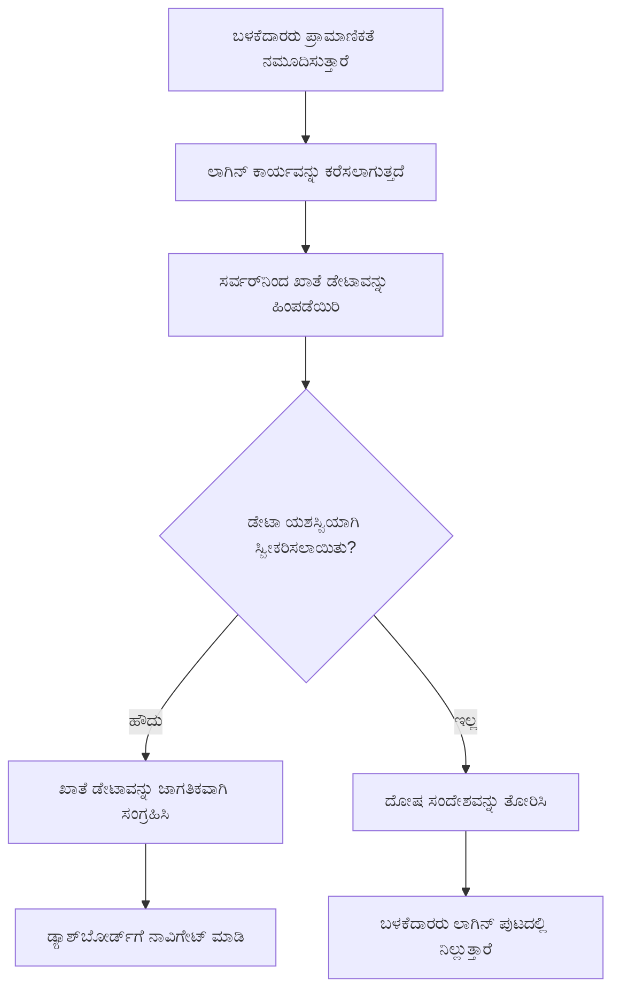
**ಈಗ ಅದನ್ನು ಪರೀಕ್ಷಿಸಲು ಸಮಯ:**
1. ಹೊಸ ಖಾತೆ ಸೃಷ್ಟಿಸಿ ಎಲ್ಲವೂ ಸರಿಯಾಗಿ ಕೆಲಸ ಮಾಡುತ್ತಿದೆಯೆ ನೋಡಿ
2. ಅದೇ ಸಕ್ರಿಯತೆಗಳನ್ನು ಬಳಸಿ ಲಾಗಿನ್ ಪ್ರಯತ್ನಿಸಿ
3. ಇಲ್ಲವಿದ್ದಲ್ಲಿ ಬ್ರೌಸರ್ ಕಾಂಸೋಲ್ನಲ್ಲಿ (F12) ತಪಾಸಿಸಿ
4. ಯಶಸ್ವಿ ಲಾಗಿನ್ ನಂತರ ಡ್ಯಾಶ್‌ಬೋರ್ಡ್‌ಗೆ ಹೋಗುತ್ತಿದ್ದೀರಾ ಎಂದು ಖಚಿತಗೊಳ್ಳಿ

ಯಾವುದಾದರೂ ತಪ್ಪಿದ್ದಲ್ಲಿ, ಭಯಪಡುವ ಅಗತ್ಯವಿಲ್ಲ! ಹೆಚ್ಚಿನ ಸಮಸ್ಯೆಗಳು ನುಡಿಪಟಗಳ ಹಾಗಿರುವ ಸರಳ ದೋಷಗಳಾಗಿರುತ್ತವೆ ಅಥವಾ API ಸರ್ವರ್ ಪ್ರಾರಂಭಿಸಲು ಮರೆಯುವಂತಿರುವ ಪರಿಸ್ಥಿತಿ.

#### ಕ್ರಾಸ್-ಓರಿಜಿನ್ ಮೈಜಿಕ್ ಬಗ್ಗೆ ಚುಟುಕು ಮಾತು

ನೀವು ಆಶ್ಚರ್ಯಪಡುವಿರಾ: "ನನ್ನ ವೆಬ್ ಅಪ್ಲಿಕೇಶನ್ ಮತ್ತು API ಸರ್ವರ್ ಭಿನ್ನ ಪೋರ್ಟುಗಳ ಮೇಲೆ ಚಾಲನೆ ಆಗುತ್ತಿದೆಯಾದರೂ, ಅವುಗಳು ಹೇಗೆ ಸಂವಹನ ಮಾಡುತ್ತಿವೆ?" ಅದ್ಭುತ ಪ್ರಶ್ನೆ! ಈ ವಿಷಯವೇ ಪ್ರತಿಯೊಂದು ವೆಬ್ ಡೆವಲಪರ್ ಇಡೆ ಹತ್ತಿರದಿಂದ ಎದುರಿಸುವುದು.

> 🔒 **ಕ್ರಾಸ್-ಓರಿಜಿನ್ ಭದ್ರತೆ**: ಬ್ರೌಸರ್‌ಗಳು "ಒಂದೇ ಮೂಲತೆ ನীতি" ಹಮ್ಮಿಕೊಂಡಿದ್ದು, ವಿಭಿನ್ನ ಡೊಮೇನ್‌ಗಳ ನಡುವೆ ಅನಧಿಕೃತ ಸಂವಹನವನ್ನು ತಡೆಯುತ್ತವೆ. ಪೆಂಟಾಗನ್ ತಪಾಸಣಾ ಕೇಂದ್ರದಂತೆ, ಅವು ಸಂವಹನಸಾಧ್ಯವೆಂದು ಖಚಿತಪಡಿಸಿಕೊಂಡ ಬಳಿಕ ಮಾತ್ರ ಡೇಟಾ ವರ್ಗಾವಣೆ ಅನುಮತಿಸುತ್ತವೆ.
> 
**ನಮ್ಮ ವ್ಯವಸ್ಥೆಯಲ್ಲಿ:**
- ನಿಮ್ಮ ವೆಬ್ ಅಪ್ಲಿಕೇಶನ್ `localhost:3000`(ಡೆವಲಪ್‌ಮೆಂಟ್ ಸರ್ವರ್) ನಲ್ಲಿ ಜಾರುತ್ತಿದೆ
- ನಿಮ್ಮ API ಸರ್ವರ್ `localhost:5000` (ಬ್ಯಾಕ್ಎಂಡ್ ಸರ್ವರ್) ನಲ್ಲಿ ಜಾರುತ್ತಿದೆ
- API ಸರ್ವರ್ CORS ಹೆಡರ್‌ಗಳನ್ನು ಹೊಂದಿದ್ದು ನಿಮ್ಮ ವೆಬ್ ಅಪ್ಲಿಕೇಶನ್ ಸಂವಹನಕ್ಕೆ ಸ್ಪಷ್ಟ ಅನುಮತಿ ನೀಡುತ್ತದೆ

ಈ ಸಂರಚನೆ ಯೋಚಿಸೋಣವು ಹೀಗಿದೆ: ಫ್ರಂಟ್‌ಎಂಡ್ ಮತ್ತು ಬ್ಯಾಕ್‌ಎಂಡ್ ಅಪ್ಲಿಕೇಶನ್‌ಗಳು ಸಾಮಾನ್ಯವಾಗಿ ವಿಭಿನ್ನ ಸರ್ವರ್‌ಗಳಲ್ಲಿ ಚಲಿಸುತ್ತವೆ.

> 📚 **ಹೆಚ್ಚು ಕಲಿಯಿರಿ**: APIಗಳು ಮತ್ತು ಡೇಟಾ ಪಡೆಯುವಿಕೆ ಕುರಿತ ಈ [Microsoft Learn ಮೋಡ್ಯೂಲ್](https://docs.microsoft.com/learn/modules/use-apis-discover-museum-art/?WT.mc_id=academic-77807-sagibbon) ಮೂಲಕ ಆಳವಾಗಿ ತಿಳಿಯಿರಿ.

## HTML ನಲ್ಲಿ ನಿಮ್ಮ ಡೇಟಾವನ್ನು ಜೀವಂತಗೊಳಿಸುವುದು

ಈಗ ನಾವು ಪಡೆಯಲಾದ ಡೇಟಾವನ್ನು ಬಳಕೆದಾರರಿಗೆ DOM ಮಾದರಿಯಲ್ಲಿ ತೋರಿಸೋಣ. ಡಾರ್ಕ್‌ರೂಮ್‌ನಲ್ಲಿ ಫೋಟೋಗಳನ್ನು ಪ್ರಕ್ರಿಯೆ ಮಾಡುವಂತೆ, ನಾವು ಅದೊಂದ -*ನಿರೀಕ್ಷಿಸಲಾಗದ* ಡೇಟಾವನ್ನು ತೆರೆದಡೆದುಕೊಳ್ಳುವ ಹಾಗೂ ಬಳಕೆದಾರರೊಂದಿಗೆ ಸಂವಾದ ಮಾಡಬಲ್ಲ ಮಾದರಿಯಲ್ಲಿಗೆ ಪರಿವರ್ತಿಸುತ್ತೇವೆ.
DOM ಮ್ಯಾನಿಪುಲೇಶನ್ ಅಂದರೆ ಸ್ಥಿರ ವೆಬ್ ಪುಟಗಳನ್ನು ಸಕ್ರಿಯ ಅಪ್ಲಿಕೇಶನ್‌ಗಳಾಗಿ ಪರಿವರ್ತಿಸುವ ತಂತ್ರಜ್ಞಾನ, ಅದು ಬಳಕೆದಾರರ ಸಂವಹನ ಮತ್ತು ಸರ್ವರ್ ಪ್ರತಿಕ್ರಿಯೆಗಳ ಆಧಾರದ ಮೇಲೆ ಅವರ ವಿಷಯವನ್ನು ನವೀಕರಿಸುತ್ತದೆ.

### ಕೆಲಸಕ್ಕೆ ಸರಿಯಾದ ಉಪಕರಣವನ್ನು ಆಯ್ಕೆಮಾಡುವುದು

ನೀವು ನಿಮ್ಮ HTML ಅನ್ನು ಜಾವಾಸ್ಕ್ರಿಪ್ಟ್ ಮೂಲಕ ನವೀಕರಿಸುವಾಗ, ಹಲವಾರು ಆಯ್ಕೆಗಳಿವೆ. ಇದನ್ನು ಉಪಕರಣಸಂಚಯದಲ್ಲಿರುವ ವಿಭಿನ್ನ ಸಾಧನಗಳಂತೆ ಪರಿಗಣಿಸಿ - ಪ್ರತಿ ಉಪಕರಣವು ವಿಶೇಷ ಕೆಲಸಗಳಿಗೆ ಸೂಕ್ತವಾಗಿದೆ:

| ವಿಧಿ | ಇದರ ಉತ್ತಮ ಪ್ರಯೋಜನಗಳು | ಯಾವಾಗ ಬಳಸಬೇಕು | ಸುರಕ್ಷತಾ ಮಟ್ಟ |
|--------|---------------------|----------------|--------------|
| `textContent` | ಬಳಕೆದಾರರ ಡೇಟಾವನ್ನು ಸುರಕ್ಷಿತವಾಗಿ ಪ್ರದರ್ಶಿಸುವುದು | ನೀವು ಎಡ ಪರೀಕ್ಷೆಗೆ ಬರೆದು ತೋರಿಸುವಾಗ | ✅ ದೃಢವಾಗಿರುತ್ತದೆ |
| `createElement()` + `append()` | ಸಂಕೀರ್ಣ ವಿನ್ಯಾಸಗಳನ್ನು ನಿರ್ಮಿಸುವುದು | ಹೊಸ ವಿಭಾಗಗಳು/ಪಟ್ಟಿಗಳನ್ನು ರಚಿಸುವಾಗ | ✅ ಬಲವಾದದು |
| `innerHTML` | HTML ವಿಷಯವನ್ನು ಹೊಂದಿಸುವುದು | ⚠️ ಇದನ್ನು ತಪ್ಪಿಸಲು ಪ್ರಯತ್ನಿಸಿ | ❌ ಅಪಾಯಕರವಾಗಿದೆ |

#### ಪಠ್ಯವನ್ನು ಸುರಕ್ಷಿತವಾಗಿ ತೋರಿಸುವ ಮಾರ್ಗ: textContent

[`textContent`](https://developer.mozilla.org/docs/Web/API/Node/textContent) ಗುಣಲಕ್ಷಣವು ಬಳಕೆದಾರರ ಅಥವಾ ಅನ್ಯ ಪಠ್ಯವನ್ನು ತೋರಿಸುವಾಗ ನಿಮ್ಮ ಅತ್ಯುತ್ತಮ ಗೆಳೆಯ. ಇದು ನಿಮ್ಮ ವೆಬ್‌ಪೇಜ್‌ಗೆ ಬೌನ್ಸರ್ ಇದ್ದಂತೆ - ಏನೇನೇ ಹಾನಿಕಾರಕವೇ ಇಲ್ಲದೆ ತಲುಪುತ್ತದೆ:

```javascript
// ಪಠ್ಯವನ್ನು ನವೀಕರಿಸುವ ಸುರಕ್ಷಿತ, ನಂಬಬಹುದಾದ ವಿಧಾನ
const balanceElement = document.getElementById('balance');
balanceElement.textContent = account.balance;
```
  
**textContent ನ ಲಾಭಗಳು:**  
- ಎಲ್ಲವನ್ನೂ ಸರಳ ಪಠ್ಯವಾಗಿ ಪರಿಗಣಿಸುತ್ತದೆ (ಸ್ಕ್ರಿಪ್ಟ್ ಕಾರ್ಯ ನಿರ್ವಹಣೆಯನ್ನು ತಡೆಯುತ್ತದೆ)  
- ಮುಂಗಡದಲ್ಲಿರುವ ವಿಷಯವನ್ನು ಸ್ವಯಂಚಾಲಿತವಾಗಿ ತೆರವುಗೊಳಿಸುತ್ತದೆ  
- ಸರಳ ಪಠ್ಯ ನವೀಕರಣಗಳಿಗೆ ಪರಿಣಾಮಕಾರಿಯಾಗಿದೆ  
- ದುಷ್ಟ ವಿಷಯಗಳಿಂದ ರಕ್ಷಣೆಗಾಗಿ ಒಳಗಿರುವ ಸುರಕ್ಷತೆ ಒದಗಿಸುತ್ತದೆ  

#### ಡೈನಾಮಿಕ್ HTML ಅಂಶಗಳನ್ನು ರಚಿಸುವುದು

ಹೆಚ್ಚಿನ ಸಂಕೀರ್ಣ ವಿಷಯಕ್ಕಾಗಿ, [`document.createElement()`](https://developer.mozilla.org/docs/Web/API/Document/createElement) ಅನ್ನು [`append()`](https://developer.mozilla.org/docs/Web/API/ParentNode/append) ವಿಧಾನೊಡನೆ ಸಂಯೋಜಿಸಿ:

```javascript
// ಹೊಸ ಅಂಶಗಳನ್ನು ರಚಿಸುವ ಸುರಕ್ಷಿತ ವಿಧಾನ
const transactionItem = document.createElement('div');
transactionItem.className = 'transaction-item';
transactionItem.textContent = `${transaction.date}: ${transaction.description}`;
container.append(transactionItem);
```
  
**ಈ ವಿಧಾನವನ್ನು ತಿಳಿದುಕೊಳ್ಳುವುದು:**  
- ಹೊಸ DOM ಅಂಶಗಳನ್ನು ಪ್ರೋಗ್ರಾಮ್ ತಂತ್ರದೊಂದಿಗೆ ಸೃಷ್ಟಿಸುತ್ತದೆ  
- ಅಂಶದ ಗುಣಲಕ್ಷಣಗಳು ಮತ್ತು ವಿಷಯದ ಮೇಲೆ ಪೂರ್ಣ ನಿಯಂತ್ರಣವನ್ನು ಕಾಯ್ದುಕೊಳ್ಳುತ್ತದೆ  
- ಸಂಕೀರ್ಣ, ಗಂಟಲಿನೊಳಗಿನ ಅಂಶ სტ್ರಕ್ಚರ್‌ಗಳನ್ನು ಸಹ ಅನುಮತಿಸುತ್ತದೆ  
- ರಚನೆ ಮತ್ತು ವಿಷಯವನ್ನು ವಿಭಜಿಸುವುದರಿಂದ ಸುರಕ್ಷತೆ ಕಾಯ್ದಿರುತ್ತದೆ  

> ⚠️ **ಸುರಕ್ಷತಾ ಪರಿಗಣನೆ**: ಹಲವಾರು ಪಾಠಗಳಲ್ಲಿ [`innerHTML`](https://developer.mozilla.org/docs/Web/API/Element/innerHTML) ಕಾಣಸಿಗಬಹುದು, ಅದು ನೇರವಾಗಿ ಸೇರ್ಪಡೆ ಮಾಡಿದ ಸ್ಕ್ರಿಪ್ಟುಗಳು ನಡೆಸಬಹುದು. CERNನಲ್ಲಿ ಅನುಮತಿಸದ ಕೋಡ್ ಅನ್ವಯವನ್ನು ತಡೆಯುವ ಸುರಕ್ಷತಾ ನಿಯಮಾವಳಿಗಳಂತೆ, `textContent` ಮತ್ತು `createElement` ಉಪಯೋಗಿಸುವುದು ಹೆಚ್ಚು ಸುರಕ್ಷಿತ ಪರ್ಯಾಯಗಳು.  
>   
**innerHTML ನ ಅಪಾಯಗಳು:**  
- ಬಳಕೆದಾರರ ಡೇಟಾದ `<script>` ಟ್ಯಾಗ್ಗಳನ್ನು ಕಾರ್ಯಗತಗೊಳಿಸುತ್ತದೆ  
- ಕೋಡ್ ಇಂಜೆಕ್ಷನ್ ದಾಳಿಗೆ ಒಳಪಡಬಹುದಾಗಿದೆ  
- ಭದ್ರತಾ ಭಂಗಗಳಿಗೆ ಅವಕಾಶ ಸೃಷ್ಟಿಸುತ್ತದೆ  
- ನಾವು ಉಪಯೋಗಿಸುವ ಸುರಕ್ಷಿತ ಪರ್ಯಾಯಗಳು ಸಮಾನ ಕಾರ್ಯಕ್ಷಮತೆಯನ್ನು ಒದಗಿಸುತ್ತವೆ  

### ದೋಷಗಳನ್ನು ಬಳಕೆದಾರ ಸ್ನೇಹಿಯಾಗಿ ಮಾಡುವುದು

ಈಗಾಗಲೇ, ಲಾಗಿನ್ ದೋಷಗಳು ಬ್ರೌಸರಿನ ಕಾನ್ಸೋಲ್‌ನಲ್ಲಿ ಮಾತ್ರ ತೋರುತ್ತಿವೆ, ಅದು ಬಳಕೆದಾರರಿಗೆ ಗೋಚರಿಸುವುದಿಲ್ಲ. ಪೈಲಟ್‌ನ ಆಂತರಿಕ ನಿರ್ಣಯಗಳ ಮತ್ತು ಪ್ರಯಾಣಿಕರ ಮಾಹಿತಿ ವ್ಯವಸ್ಥೆಯ ನಡುವಿನ ಭೇದದಂತೆ, ನಾವು ಸರಿಯಾದ ಮಾರ್ಗದಲ್ಲಿ ಪ್ರಮುಖ ಮಾಹಿತಿಯನ್ನು ನುಡಿಸಲು ಅಗತ್ಯವಿದೆ.

ದೋಷ ಸಂದೇಶಗಳನ್ನು ಗೋಚರಿಸುವ ಮೂಲಕ ಬಳಕೆದಾರರಿಗೆ ತಕ್ಷಣದ ಪ್ರತಿಕ್ರಿಯೆಯನ್ನು ನೀಡಬಹುದು, ಏನು ತಪ್ಪು ಆಗಿದೆ ಮತ್ತು ಮುಂದೆ ಏನು ಮಾಡಬೇಕು ಎಂಬುದನ್ನು ತಿಳಿಸಲು.

#### ಹೆಜ್ಜೆ 1: ದೋಷ ಸಂದೇಶಗಳಿಗಾಗಿ ಸ್ಥಳ ಸೇರಿಸುವುದು

ಮೊದಲು, ನಿಮ್ಮ HTML ನಲ್ಲಿ ದೋಷ ಸಂದೇಶಗಳಿಗೆ ಮನೆ ನೀಡೋಣ. ಲಾಗಿನ್ ಬಟನ್ ಮುಂದೆ ಇದನ್ನು ಸೇರಿಸಿ, ಇದರಿಂದ ಬಳಕೆದಾರರು ಸಹಜವಾಗಿ ನೋಡುತ್ತಾರೆ:

```html
<!-- This is where error messages will appear -->
<div id="loginError" role="alert"></div>
<button>Login</button>
```
  
**ಇಲ್ಲಿ ಏನು ಆಗುತ್ತಿದೆ:**  
- ನಾವು ಖಾಲಿ ಕಂಟೈನರ್ ಸೃಷ್ಟಿಸುತ್ತಿದ್ದೇವೆ, ಅದು ಅಗತ್ಯವಿದ್ದಾಗ ಮಾತ್ರ ಗೋಚರಿಸುತ್ತದೆ  
- ಅದು ಬಳಕೆದಾರರು "Login" ಕ್ಲಿಕ್ ಮಾಡಿದ ನಂತರ ಸಹಜವಾಗಿ ನೋಡಲಿರುವ ಸ್ಥಳದಲ್ಲಿದೆ  
- ಅಲ್ಲಿ ಇರುವ `role="alert"` ಸ್ಕ್ರೀನ್ ರೀಡರ್‌ಗಳಿಗೆ ಮಾಹಿತಿ ನೀಡುತ್ತದೆ - "ಇದು ಮಹತ್ವದದ್ದು!"  
- ವಿಶಿಷ್ಟ `id` ನಮ್ಮ ಜಾವಾಸ್ಕ್ರಿಪ್ಟ್‌ಗೆ ಸುಲಭ ಗುರಿ ಒದಗಿಸುತ್ತದೆ  

#### ಹೆಜ್ಜೆ 2: ಉಪಯುಕ್ತ ಸಹಾಯಕ ಕಾರ್ಯವನ್ನು ರಚಿಸುವುದು

ಯಾವುದೇ ಅಂಶದ ಪಠ್ಯವನ್ನು ನವೀಕರಿಸಬಹುದಾದ ಒಂದು ಸರಳ ಕಾರ್ಯವನ್ನು ರಚಿಸೋಣ. ಇದು "ಒಂದು ಬಾರಿ ಬರೆದು ಎಲ್ಲೆಡೆ ಉಪಯೋಗಿಸು" ಮಾದರಿಯ ಕಾರ್ಯ:

```javascript
function updateElement(id, text) {
  const element = document.getElementById(id);
  element.textContent = text;
}
```
  
**ಈ ಕಾರ್ಯದ ಲಾಭಗಳು:**  
- ಒಂದು ಅಂಶದ ಐಡಿ ಮತ್ತು ಪಠ್ಯವನ್ನು ಮಾತ್ರ ಬೇಕು  
- DOM ಅಂಶಗಳನ್ನು ಸುರಕ್ಷಿತವಾಗಿ ಹುಡುಕಿ ನವೀಕರಿಸುತ್ತದೆ  
- ಪುನರಾಯೋಜನೀಯ ಮಾದರಿಯನ್ನು ನಿರ್ವಹಿಸುತ್ತದೆ  
- ಸಂಪೂರ್ಣ ಅಪ್ಲಿಕೇಶನ್‌ನಲ್ಲಿ ಸಮಾನ ನವೀಕರಣ ಕ್ರಮ ಕಾಯ್ದಿರಿಸುತ್ತದೆ  

#### ಹೆಜ್ಜೆ 3: ದೋಷಗಳನ್ನು ಬಳಕೆದಾರರಿಗೆ ಕಾಣುವಂತೆ ತೋರಿಸುವುದು

ಈಗ ಗೂಢ ಸಮರಾದ್ಯಾತ್ರೆಯ ಸಂದೇಶವನ್ನು ಬದಲಿಸಿ, ಬಳಕೆದಾರರು ನಿಜವಾಗಿಯೂ ನೋಡಬಹುದಾದ ದೋಷ ಸಂದೇಶವನ್ನು ತೋರಿಸೋಣ. ನಿಮ್ಮ ಲಾಗಿನ್ ಕಾರ್ಯವನ್ನು ಅಪ್ಡೇಟ್ ಮಾಡಿ:

```javascript
// ಕೇವಲ ಕನ್‌ಸೋಲ್‌ಗೆ ದಾಖಲು ಮಾಡದಿರುವ ಬದಲು, ಬಳಕೆದಾರಿಗೆ ಏನು ತಪ್ಪಾಗಿದೆ ಎಂದು ತೋರಿಸಿ
if (data.error) {
  return updateElement('loginError', data.error);
}
```
  
**ಈ ಸಣ್ಣ ಬದಲಾವಣೆ ಡೋಡ ಪ್ರಭಾವ ಉಂಟುಮಾಡುತ್ತದೆ:**  
- ದೋಷ ಸಂದೇಶಗಳು ಬಳಕೆದಾರರು ನೋಡುತ್ತಿರುವ ಸ್ಥಳದಲ್ಲಿ ತೋರುತ್ತವೆ  
- ಇನ್ನೂ ಕಮ್ಗಳ ಗೋಚರಿಸದ ವೈಫಲ್ಯಗಳಿಲ್ಲ  
- ಬಳಕೆದಾರರಿಗೆ ತಕ್ಷಣದ, ವ್ಯವಹಾರಯುಕ್ತ ಪ್ರತಿಕ್ರಿಯೆ ಸಿಗುತ್ತದೆ  
- ನಿಮ್ಮ ಅಪ್ಲಿಕೇಶನ್ ವೃತ್ತಿಪರ ಮತ್ತು ಚಿಂತನೆಯುತ್ತಿರುತ್ತದೆ  

ಈಗ ತಪ್ಪಾದ ಖಾತೆ ಸಕ್ರಿಯಗೊಳಿಸಿದಾಗ, ಅಲ್ಲಿ ಸಹಾಯಕ ದೋಷ ಸಂದೇಶವನ್ನು ನೋಡಬಹುದಾಗಿದೆ!


#### ಹೆಜ್ಜೆ 4: ಪ್ರವೇಶಕಾರ್ಯದಕ್ಷತೆಗೆ ಹೊಂದಿಕೊಳ್ಳುವುದು

ನಮ್ಮ `role="alert"` ಅಂಶ ಒಂದು ಲೈವ್ ರೀಜನ್ನ ಪೈಕಿ ಒಂದು - [Live Region](https://developer.mozilla.org/docs/Web/Accessibility/ARIA/ARIA_Live_Regions) ರೀತಿ ಕೆಲಸ ಮಾಡುತ್ತದೆ, ಅದು ಸ್ಕ್ರೀನ್ ರೀಡರ್‌ಗಳಿಗೆ ತಕ್ಷಣ ಬದಲಾವಣೆಗಳನ್ನು ಪ್ರಕಟಿಸುತ್ತದೆ:

```html
<div id="loginError" role="alert"></div>
```
  
**ಈದಕ್ಕೆ ಕಾರಣವೇನು:**  
- ಸ್ಕ್ರೀನ್ ರೀಡರ್ ಬಳಕೆದಾರರು ದೋಷ ಸಂದೇಶವನ್ನು ತಕ್ಷಣ ಕೇಳುತ್ತಾರೆ  
- ಎಲ್ಲರೂ ಸಮಾನ ಮಾಹಿತಿಯನ್ನು ಪಡೆಯುತ್ತಾರೆ, ಅವರು ಹೇಗೆ ನವಿಗೇಟ್ ಆಗುತ್ತಾರೆಯೋ ಅವನ ಮೇಲೆ ಅವಲಂಬಿಸಿದೆ ಇಲ್ಲ  
- ನಿಮ್ಮ ಅಪ್ಲಿಕೇಶನ್ ಹೆಚ್ಚು ಅನೇಕರಿಂದ ಉಪಯೋಗಿಸಬಹುದಾದಂತೆ ಮಾಡುತ್ತದೆ  
- ನಿಮಗೆ ಒಳಗೊಂಡ ಅನುಭವಗಳ ನಿರ್ಮಾಣದ ಹಿಂದಿದ್ದೇವೆ ಎಂದು ತೋರಿಸುತ್ತದೆ  

ಇಂತಹ ಸಣ್ಣ ಸ್ಪರ್ಶಗಳು ಉತ್ತಮ ಡೆವಲಪರ್‌ಗಳನ್ನು ಅತ್ಯುತ್ತಮ ಡೆವಲಪರ್‌ಗಳಾಗಿ ವಿಭಜಿಸುತ್ತವೆ!

### 🎯 ಶಿಕ್ಷಣ ಪರಿಶೀಲನೆ: ಪ್ರಮಾಣೀಕರಣ ಮಾದರಿಗಳು

**ನಿಂತು ಚಿಂತಿಸಿ**: ನೀವು ಸಂಪೂರ್ಣ ಪ್ರಮಾಣೀಕರಣ ಪ್ರಕ್ರಿಯೆಯನ್ನು ಅನುಸ್ಥಾಪಿಸಿದ್ದೀರಾ. ಇದು ವೆಬ್ ಅಭಿವೃದ್ಧಿಯಲ್ಲಿ ಪ್ರಮುಖ ಮಾದರಿಯಾಗಿದೆ.

**ತ್ವರಿತ ಸ್ವ-ಮೌಲ್ಯಮಾಪನ:**  
- API ಕಾಲ್‌ಗಳಿಗೆ async/await ಯಾಕೆ ಬಳಸಿಕೊಳ್ಳಲಾಗುತ್ತದೆ ಎಂದು ವಿವರಿಸಬಹುದೇ?  
- `encodeURIComponent()` ಫಂಕ್ಷನ್ ಮರೆತಿದರೆ ಏನಾಗುತ್ತದೆ?  
- ನಮ್ಮ ದೋಷ ನಿರ್ವಹಣೆಯಿಂದ ಬಳಕೆದಾರ ಅನುಭವ ಹೇಗೆ ಸುಧಾರಿಸುತ್ತದೆ?  

**ನೈಜ-ಜಗತ್ತಿನ ಸಂಪರ್ಕ:** ನೀವು ಇಲ್ಲಿ ಕಲಿತಿರುವ ಮಾದರಿಗಳು (async ಡೇಟಾ ಪಡೆಯುವುದು, ದೋಷ ನಿರ್ವಹಣೆ, ಬಳಕೆದಾರ ಪ್ರತಿಕ್ರಿಯೆ) ಸಾಮಾಜಿಕ ಮಾಧ್ಯಮದಿಂದ ಇ-ಕಾಮರ್ಸ್ ತಾಣಗಳವರೆಗೆ ಪ್ರತಿಯೊಂದು ನೈಜ ವೆಬ್ ಅಪ್ಲಿಕೇಶನಲ್ಲಿಯೂ ಉಪಯೋಗಿಸುತ್ತಾರೆ. ನೀವು ಉತ್ಪಾದನಾ ಮಟ್ಟದ ಕೌಶಲ್ಯಗಳನ್ನು ನಿರ್ಮಿಸುತ್ತಿದ್ದೀರಿ!

**ಸವಾಲಿನ ಪ್ರಶ್ನೆ:** ಈ ಪ್ರಮಾಣೀಕರಣ ವ್ಯವಸ್ಥೆಯನ್ನು ಬಹುಬಳಕೆದಾರ ಪಾತ್ರಗಳನ್ನು (ಗ್ರಾಹಕ, ಆಡಳಿತಗಾರ, ಟೆಲರ್) ಸಮರ್ಥಿಸಲು ನೀವು ಹೇಗೆ ಬದಲಾಯಿಸಬಹುದು? ಡೇಟಾ ರಚನೆ ಮತ್ತು ಬಳಕೆದಾರ ಇಂಟರ್ಫೇಸ್ ಬದಲಾವಣೆಗಳ ಬಗ್ಗೆ ಯೋಚಿಸಿ.

#### ಹೆಜ್ಜೆ 5: ನೋಂದಣಿ ಪ್ರಕ್ರಿಯೆಗೆ ಇದೇ ಮಾದರಿಯನ್ನು ಅನ್ವಯಿಸಿ

ಒಂದೇ ರೀತಿಗೆ, ನಿಮ್ಮ ನೋಂದಣಿ ಫಾರ್ಮ್ನಲ್ಲೂ ಇದೇ ದೋಷ ನಿಯಂತ್ರಣವನ್ನು ಜಾರಿಗೊಳಿಸಿ:

1. ನಿಮ್ಮ ನೋಂದಣಿ HTML ಗೆ ದೋಷ ಪ್ರದರ್ಶನ ಅಂಶ ಸೇರಿಸಿ:  
```html
<div id="registerError" role="alert"></div>
```
  
2. ಇದೀಗ ನಿಮ್ಮ ನೋಂದಣಿ ಕಾರ್ಯವನ್ನು ನವೀಕರಿಸಿ ಎಂದೇ ಅದೇ ದೋಷ ಪ್ರದರ್ಶನ ಮಾದರಿಯನ್ನು ಬಳಸಲು:  
```javascript
if (data.error) {
  return updateElement('registerError', data.error);
}
```
  
**ದೋಷ ನಿರ್ವಹಣೆಯ ಸರ್ವಜ್ಞ ಲಾಭಗಳು:**  
- ಎಲ್ಲಾ ಫಾರ್ಮ್ಗಳಲ್ಲಿ ಸಮಾನ ಬಳಕೆದಾರ ಅನುಭವ ನೀಡುವುದು  
- ಪರಿಚಿತ ಮಾದರಿಯನ್ನು ಬಳಸಿ ಮಾನಸಿಕ ಭಾರ ತಗ್ಗಿಸುವುದು  
- ಮರುಬಳಕೆ ಸಾಧ್ಯವಾದ ಕೋಡ್‌ನೊಂದಿಗೆ ನಿರ್ವಹಣೆ ಸರಳಗೊಳಿಸುವುದು  
- ಅಪ್ಲಿಕೇಶನ್ മുഴುವರೆಗೂ ಪ್ರವೇಶಕಾರ್ಯದಕ್ಷತೆ ಮಾನದಂಡಗಳನ್ನು ಪೂರೈಸುವುದು  

## ನಿಮ್ಮ ಸಕ್ರಿಯ ಡ್ಯಾಶ್‌ಬೋರ್ಡ್ ರಚಿಸುವುದು

ನಾವು ಈಗ ನಿಮ್ಮ ಸ್ಥಿರ ಡ್ಯಾಶ್‌ಬೋರ್ಡ್ ಅನ್ನು ಕಾಲಮಾನಿಕ ಖಾತೆ ಡೇಟಾವನ್ನು ತೋರಿಸುವ ಡೈನಾಮಿಕ್ ಇಂಟರ್ಫೇಸ್ ಆಗಿ ಪರಿವರ್ತಿಸುತ್ತೇವೆ. ಛಾಪಿತ ವಿಮಾನ ನಿರ್ವಹಣಾ ವೇಳಾಪಟ್ಟಿಯ ಮತ್ತು ವಿಮಾನ ನಿಲ್ದಾಣದ ನೇರಪ್ರವಾಹ ತಟ್ಟೆಯ ನಡುವಿನ ಭೇದದಂತೆ, ನಾವು ಸ್ಥಿರ ಮಾಹಿತಿಯಿಂದ ನಿಜಸಮಯ ಪ್ರತಿಕ್ರಿಯಾಶೀಲ ಪ್ರದರ್ಶನಕ್ಕೆ ಹೋಗಲು ಹೊರಟಿದ್ದೇವೆ.

ನೀವು ಕಲಿತ DOM ಮ್ಯಾನಿಪುಲೇಶನ್ ತಂತ್ರಜ್ಞಾನಗಳನ್ನು ಉಪಯೋಗಿಸಿ, ನವೀಕರಿಸುವ ಡ್ಯಾಶ್ಬೋರ್ಡ್ ನಿರ್ಮಿಸುವೆವು.

### ನಿಮ್ಮ ಡೇಟಾವನ್ನು ಪರಿಚಯಿಸಿಕೊಳ್ಳಿ

ನಾವು ನಿರ್ಮಾಣ ಆರಂಭಿಸುವ ಮೊದಲು, ನಿಮ್ಮ ಸರ್ವರ್ ಏನೆನಾದರೂ ಪ್ರಯೋಜನಕಾರಿ ಮಾಹಿತಿ ಕಳುಹಿಸುತ್ತದೆಯೋ ನೋಡೋಣ. ಯಶಸ್ವಿಯಾಗಿ ಲಾಗಿನ್ ಆಗಿರುವಾಗ, ನೀವು ಹೀಗೊಂದು ಡೇಟಾ ಸಾಂದ್ರಣವನ್ನು ನೋಡುತ್ತೀರಿ:

```json
{
  "user": "test",
  "currency": "$",
  "description": "Test account",
  "balance": 75,
  "transactions": [
    { "id": "1", "date": "2020-10-01", "object": "Pocket money", "amount": 50 },
    { "id": "2", "date": "2020-10-03", "object": "Book", "amount": -10 },
    { "id": "3", "date": "2020-10-04", "object": "Sandwich", "amount": -5 }
  ]
}
```
  
**ಈ ಡೇಟಾ ರಚನೆಯು ಒದಗಿಸುತ್ತದೆ:**  
- **`user`**: ವೈಯಕ್ತಿಕ ಅನುಭಾವಕ್ಕಾಗಿ ("ಮತ್ತೆ ಬಂದಿರೇ, ಸಾರಾ!")  
- **`currency`**: ಹಣದ ಮೊತ್ತಗಳನ್ನು ಸರಿಯಾಗಿ ತೋರಿಸಲು  
- **`description`**: ಖಾತೆಯ ಸ್ನೇಹಪೂರಿತ ಹೆಸರು  
- **`balance`**: ಅತ್ಯಂತ ಮುಖ್ಯವಾದ ಇತ್ತೀಚಿನ ಲೆಕ್ಕಪತ್ರ  
- **`transactions`**: ಸಂಪೂರ್ಣ ವ್ಯವಹಾರ ಇತಿಹಾಸ ಹಾಗೂ ವಿವರಗಳು  

ನೀವು ವೃತ್ತಿಪರ ಬ್ಯಾಂಕಿಂಗ್ ಡ್ಯಾಶ್‌ಬೋರ್ಡ್ ನಿರ್ಮಿಸಲು ಬೇಕಾದ ಎಲ್ಲದು!

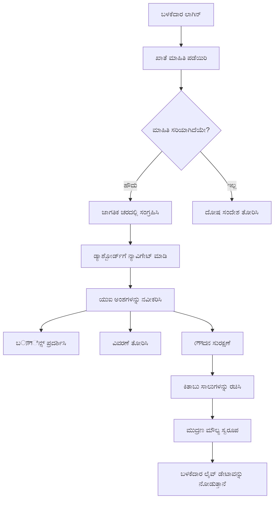
> 💡 **ಪ್ರೋ ಟಿಪ್**: ನಿಮ್ಮ ಡ್ಯಾಶ್‌ಬೋರ್ಡ್ ಅನ್ನು ತಕ್ಷಣ ಕಾರ್ಯನಿರ್ವಹಿಸುತ್ತ ನೋಡಲು ಬಯಸದಿದ್ದರೆ, ಲಾಗಿನ್ ಪ್ರಕ್ರियೆಯಲ್ಲಿ `test` ಎಂಬ ಬಳಕೆದಾರ ಹೆಸರನ್ನು ಉಪಯೋಗಿಸಿ - ಇದರಲ್ಲಿ ಆದರ್ಶ ಡೇಟಾ ಪೂರ್ವನಿರ್ದಿಷ್ಟವಾಗಿ ಲೋಡ್ ಆಗಿದೆ, ಆದ್ದರಿಂದ ನೀವು ಮೊದಲೇ ವ್ಯವಹಾರಗಳನ್ನು ಸೃಷ್ಟಿಸದೇ ಎಲ್ಲವನ್ನೂ ಪರೀಕ್ಷಿಸಬಹುದು.  
>   
**ಪರೀಕ್ಷಾ ಖಾತೆ ಉಪಯೋಗಿಸುವ ಕಾರಣಗಳು:**  
- ವಾಸ್ತವಿಕ ಮಾದರಿ ಡೇಟಾ ಪೂರ್ವಲಭ್ಯ  
- ವ್ಯವಹಾರ ಪ್ರದರ್ಶನ ಹೇಗಿದೆ ಎಂಬುದನ್ನು ನೋಡಲು ಸೂಕ್ತ  
- ನಿಮ್ಮ ಡ್ಯಾಶ್‌ಬೋರ್ಡ್ ವೈಶಿಷ್ಟ್ಯಗಳನ್ನು ಪರೀಕ್ಷಿಸಲು ಸಾರ್ಥಕ  
- ಕೈಗೆತ್ತಿದ್ದ ಡUMMY ಡೇಟಾ ಸೃಷ್ಟಿಸುವ ಅಗತ್ಯ ದೂರವಾಗುತ್ತದೆ  

### ಡ್ಯಾಶ್‌ಬೋರ್ಡ್ ಪ್ರದರ್ಶನ ಅಂಶಗಳನ್ನು ರಚಿಸುವುದು

ನಮ್ಮ ಬೆسಿಗೆ, ಖಾತೆ ಸಾರಾಂಶ ಮಾಹಿತಿ ಮತ್ತು ನಂತರ ವ್ಯವಹಾರ ಪಟ್ಟಿಗಳನ್ನು ಹಂತ ಹಂತವಾಗಿ ನಿರ್ಮಿಸೋಣ.

#### ಹೆಜ್ಜೆ 1: ನಿಮ್ಮ HTML ರಚನೆಯನ್ನು ನವೀಕರಿಸಿ

ಮೊದಲಿಗೆ, ಸ್ಥಿರ "ಬ್ಯಾಲೆನ್ಸ್" ವಿಭಾಗವನ್ನು ಡೈನಾಮಿಕ್ ಪ್ಲೇಸ್‌ಹೋಲ್ಡರ್ ಅಂಶಗಳೊಂದಿಗೆ ಬದಲಿಸಿ, ಜಾವಾಸ್ಕ್ರಿಪ್ಟ್ ತುಂಬಿಸಬಲ್ಲಂತೆ:

```html
<section>
  Balance: <span id="balance"></span><span id="currency"></span>
</section>
```
  
ನಂತರ, ಖಾತೆಯ ವಿವರಣೆಗಾಗಿ ವಿಭಾಗ ಸೇರಿಸಿ. ಇದು ಡ್ಯಾಶ್‌ಬೋರ್ಡ್ ವಿಷಯಕ್ಕೆ ಶೀರ್ಷಿಕೆ ಆಗಿಯೇ ಕಾರ್ಯನಿರ್ವಹಿಸುವುದರಿಂದ, ಸಮಾಂತರ HTML ಬಳಸಿರಿ:

```html
<h2 id="description"></h2>
```
  
**HTML ರಚನೆಯನ್ನು ತಿಳಿದುಕೊಳ್ಳುವುದು:**  
- ಬ್ಯಾಲೆನ್ಸ್ ಮತ್ತು ಕರೆನ್ಸಿಗೆ ವಿಭಿನ್ನ `<span>` ಅಂಶಗಳನ್ನು ಉಪಯೋಗಿಸುವ ಮೂಲಕ ವೈಯಕ್ತಿಕ ನಿಯಂತ್ರಣ  
- ಪ್ರತಿಯೊಂದು ಅಂಶಕ್ಕೂ ವಿಶಿಷ್ಟ ಐಡಿಗಳಿಂದ ಜಾವಾಸ್ಕ್ರಿಪ್ಟ್ ಗುರಿ  
- ಖಾತೆ ವಿವರಣೆಗೆ `<h2>` ಬಳಸಿ ಸಮಾಂತರ HTML ಅನುಸರಣೆ  
- ಸ್ಕ್ರೀನ್ ರೀಡರ್‌ಗಳು ಮತ್ತು SEO ಗಾಗಿ ಸಾಂದರ್ಭಿಕ ಹಿರarchie ರಚನೆ  

> ✅ **ಪ್ರವೇಶಕಾರ್ಯದಕ್ಷತೆ ತಿಳಿವಳಿಕೆ**: ಖಾತೆ ವಿವರಣೆ ಡ್ಯಾಶ್‌ಬೋರ್ಡ್ ವಿಷಯಕ್ಕೆ ಶೀರ್ಷಿಕೆಯಾಗಿ ಕಾರ್ಯನಿರ್ವಹಿಸುತ್ತದೆ, ಆದ್ದರಿಂದ ಅದನ್ನು ಶೀರ್ಷಿಕೆಗಳಾಗಿ ಗುರುತಿಸಲಾಗಿದೆ. [ಶೀರ್ಷಿಕೆ ರಚನೆಯ](https://www.nomensa.com/blog/2017/how-structure-headings-web-accessibility) ಪ್ರವೇಶಕಾರ್ಯದಕ್ಷತೆಯ ಮೇಲೆ ಪರಿಣಾಮ ಕುರಿತ ಮಾಹಿತಿ ಕಲಿಯಿರಿ. ನಿಮ್ಮ ಪುಟದಲ್ಲಿನ ಇತರ ಅಂಶಗಳಲ್ಲಿ ಕೂಡ ಶೀರ್ಷಿಕೆ ಟ್ಯಾಗ್‌ಗಳಿಂದ ಲಾಭ ಪಡೆಯಬಹುದೋ ನೋಡಿ.  

#### ಹೆಜ್ಜೆ 2: ಡ್ಯಾಶ್‌ಬೋರ್ಡ್ ನವೀಕರಣ ಕಾರ್ಯವನ್ನು ರಚಿಸಿ

ಈಗ, ನಿಜವಾದ ಖಾತೆ ಡೇಟಾದೊಂದಿಗೆ ನಿಮ್ಮ ಡ್ಯಾಶ್‌ಬೋರ್ಡ್ ಅನ್ನು ತುಂಬಿಸುವ ಕಾರ್ಯವನ್ನು ರಚಿಸೋಣ:

```javascript
function updateDashboard() {
  if (!account) {
    return navigate('/login');
  }

  updateElement('description', account.description);
  updateElement('balance', account.balance.toFixed(2));
  updateElement('currency', account.currency);
}
```
  
**ಹಂತ ಹಂತವಾಗಿ ಈ ಕಾರ್ಯ ಏನು ಮಾಡುತ್ತದೆ:**  
- ಖಾತೆ ಡೇಟಾ ಇದ್ದೇ ಇದ್ದದ್ದನ್ನು ದೃಢಪಡಿಸುತ್ತದೆ  
- ಪ್ರಮಾಣೀಕರಣವಾಗದ ಬಳಕೆದಾರರನ್ನು ಲಾಗಿನ್ ಪುಟಕ್ಕೆ ಮರಳಿಸುತ್ತದೆ  
- ಪುನರಾಯೋಜನೀಯ `updateElement` ಕಾರ್ಯದಲ್ಲಿ ಖಾತೆ ವಿವರಣೆಯನ್ನು ನವೀಕರಿಸುತ್ತದೆ  
- ಬ್ಯಾಲೆನ್ಸ್ ಅನ್ನು ಎಂದಿಗೂ ಎರಡು ದಶಮಾಂಶಗಳಾಗಿ ಸ್ವರೂಪಗೊಳಿಸುತ್ತದೆ  
- ಸೂಕ್ತ ಕರೆನ್ಸಿ ಚಿಹ್ನೆಯನ್ನು ತೋರಿಸುತ್ತದೆ  

> 💰 **ಹಣದ ಸ್ವರೂಪಗೊಳಿಸುವಿಕೆ**: ಆ [`toFixed(2)`](https://developer.mozilla.org/docs/Web/JavaScript/Reference/Global_Objects/Number/toFixed) ವಿಧಾನವು ರಕ್ಷಕವಾಗಿದೆ! ಅದು ನಿಮ್ಮ ಬ್ಯಾಲೆನ್ಸ್ ನಿಜವಾದ ಹಣದಂತೆ ತೋರುತ್ತದೆ - "75.00" ಬದಲಾಗಿ "75" ಎಂಬುದನ್ನು ತಪ್ಪಿಸುತ್ತದೆ. ನಿಮ್ಮ ಬಳಕೆದಾರರು ಪರಿಚಿತ ಕರೆನ್ಸಿ ಸ್ವರೂಪಗೊಳಿಸುವಿಕೆಯನ್ನು ಮೆಚ್ಚಿಕೊಳ್ಳುತ್ತಾರೆ.  

#### ಹೆಜ್ಜೆ 3: ನಿಮ್ಮ ಡ್ಯಾಶ್‌ಬೋರ್ಡ್ ನವೀಕರಿಸುತ್ತಿದೆಯೆ ಎಂದು ಖಚಿತಪಡಿಸಿಕೊಳ್ಳಿ

ಪ್ರತಿ ಬಾರಿ ಯಾರಾದರೂ ಭೇಟಿ ನೀಡುವಾಗ ನಿಮ್ಮ ಡ್ಯಾಶ್‌ಬೋರ್ಡ್ ನವೀಕರಿಸಲು, ನಿಮ್ಮ ನॅವಿಗೇಶನ್ ವ್ಯವಸ್ಥೆಗೂ ಸಂಯೋಜಿಸುವ ಅವಶ್ಯಕತೆ ಇದೆ. ನೀವು [ಪಾಠ 1 ಕಾರ್ಯ](../1-template-route/assignment.md) ಪೂರ್ಣಗೊಳಿಸಿದ್ದರೆ, ಇದು ಪರಿಚಿತವಾಗಿರುತ್ತದೆ. ಇಲ್ಲದಿದ್ದರೆ, ಯಾಕೆಂದರೆ ಇಲ್ಲಿದೆ ನೀವು ಬೇಕಾದುದು:  

ನಿಮ್ಮ `updateRoute()` ಕಾರ್ಯದ ಕೊನೆಯಲ್ಲಿ ಈ కోಡ್ ಸೇರಿಸಿ:

```javascript
if (typeof route.init === 'function') {
  route.init();
}
```
  
ನಂತರ, ಡ್ಯಾಶ್‌ಬೋರ್ಡ್ ಆರಂಭಿಕೀಕರಣಕ್ಕಾಗಿ ನಿಮ್ಮ ಮಾರ್ಗಗಳನ್ನು ನವೀಕರಿಸಿ:

```javascript
const routes = {
  '/login': { templateId: 'login' },
  '/dashboard': { templateId: 'dashboard', init: updateDashboard }
};
```
  
**ಈ ಬುದ್ಧಿವಂತಿಕೆದ ವ್ಯವಸ್ಥೆ ಏನು ಮಾಡುತ್ತದೆ:**  
- ಮಾರ್ಗಗಳಿಗೆ ವಿಶೇಷ ಪ್ರಾರಂಭ ಕೋಡ್ ಇದ್ದರೂ ಪರಿಶೀಲಿಸುತ್ತದೆ  
- ಮಾರ್ಗ ಬಂದಾಗ ಆ ಕೋಡ್ ಸ್ವಯಂಚಾಲಿತವಾಗಿ ಕಾರ್ಯಗತಗೊಳಿಸುತ್ತದೆ  
- ನಿಮ್ಮ ಡ್ಯಾಶ್‌ಬೋರ್ಡ್ ಯಾವಾಗಲೂ ಪ್ರಸ್ತುತ, ನವೀನ ಮಾಹಿತಿಯನ್ನು ತೋರಿಸುತ್ತದೆ  
- ನಿಮ್ಮ ಮಾರ್ಗಪಥ್ ಲಾಜಿಕ್ ಶುದ್ಧ ಮತ್ತು ವ್ಯವಸ್ಥಿತವಾಗಿರುತ್ತೆ  

#### ನಿಮ್ಮ ಡ್ಯಾಶ್‌ಬೋರ್ಡ್ ಪರೀಕ್ಷಿಸುವುದು

ಈ ಬದಲಾವಣೆಗಳನ್ನು ಜಾರಿಗೆ ತಂದ ನಂತರ, ನಿಮ್ಮ ಡ್ಯಾಶ್‌ಬೋರ್ಡ್‌ನ ಪರೀಕ್ಷೆ ಮಾಡಿ:

1. ಪರೀಕ್ಷಾ ಖಾತೆಯಿಂದ ಲಾಗಿನ್ ಆಗಿ  
2. ನೀವು ಡ್ಯಾಶ್‌ಬೋರ್ಡ್‌ಗೆ ಹಿಂತಿರುಗಲ್ಪಟ್ಟಿದ್ದೀರಿ ಎಂಬುದನ್ನು ಪರಿಶೀಲಿಸಿ  
3. ಖಾತೆಯ ವಿವರಣೆ, ಬ್ಯಾಲೆನ್ಸ್ ಮತ್ತು ಕರೆನ್ಸಿ ಸರಿಯಾಗಿ ತೋರಿಸುತ್ತಿದೆಯೇ ತಪಾಸಿಸಿ  
4. ಲಾಗ್ ಔಟ್ ಮಾಡಿ ಮತ್ತೆ ಲಾಗಿನ್ ಆಗಿ ಡೇಟಾ ಸರಿಯಾಗಿ ನವೀಕರಿಸುತ್ತಿದೆಯೇ ಎಂದು ದೃಢೀಕರಿಸಿ  

ನಿಮ್ಮ ಡ್ಯಾಶ್‌ಬೋರ್ಡ್ ಈಗ ಲಾಗಿನ್ ಆಗಿರುವ ಬಳಕೆದಾರರ ಡೇಟಾವನ್ನು ಅವಲಂಬಿಸಿಕೊಂಡು ಡೈನಾಮಿಕ್ ಮಾಹಿತಿಯನ್ನು ತೋರಿಸುತ್ತಿರುತ್ತದೆ!

## ಟೆಂಪ್ಲೇಟ್ಗಳೊಂದಿಗೆ ಸ್ಮಾರ್ಟ್ ವ್ಯವಹಾರ ಪಟ್ಟಿಗಳನ್ನು ನಿರ್ಮಿಸುವುದು

ಪ್ರತಿ ವ್ಯವಹಾರದ HTML ಅನ್ನು ಕೈಯಿಂದ ಸೃಷ್ಟಿಸುವ ಬದಲು, ನಾವು ಟೆಂಪ್ಲೇಟ್ಗಳನ್ನು ಉಪಯೋಗಿಸಿ ಸ್ವಯಂಚಾಲಿತವಾಗಿ ಸಮಾನ ವಿನ್ಯಾಸವನ್ನು ರಚಿಸೋಣ. ಅಂತರಿಕ್ಷ ನೌಕಾ ತಯಾರಿಕೆಯಲ್ಲಿಯ ಮಿಕ್ಕೋ ಲೆಕ್ಕಣಿಕೆ ಘಟಕಗಳಂತೆ, ಟೆಂಪ್ಲೇಟ್ಗಳು ಪ್ರತಿಯೊಂದು ವ್ಯವಹಾರ ಸಾಲು ಕೂಡ ಒಂದೇ ರಚನೆ ಮತ್ತು ವಿನ್ಯಾಸವನ್ನು ಅನುಸರಿಸುತ್ತದೆ ಎಂದು ಖಚಿತಪಡಿಸುತ್ತವೆ.

ಈ ತಂತ್ರಜ್ಞಾನ ಕೆಲವು ವ್ಯವಹಾರಗಳಿಂದ ಸಾವಿರಾರು ವ್ಯವಹಾರಗಳವರೆಗೂ ಸುಗಮವಾಗಿ ವಿಸ್ತರಿಸಿ, ಸಮಾನ ಕಾರ್ಯಕ್ಷಮತೆ ಮತ್ತು ಪ್ರದರ್ಶನವನ್ನು ಕಾಯ್ದುಕೊಳ್ಳುತ್ತದೆ.

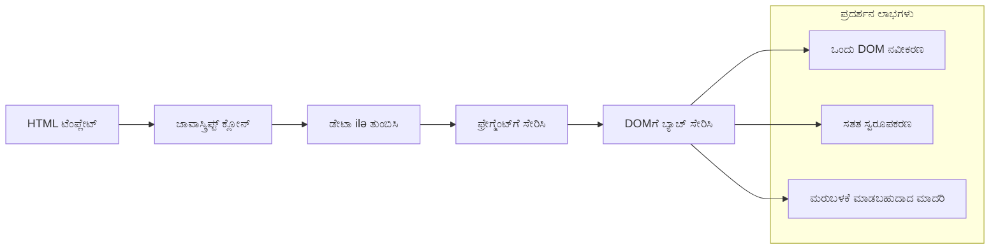
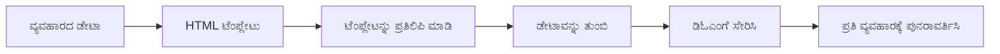
### ಹೆಜ್ಜೆ 1: ವ್ಯವಹಾರ ಟೆಂಪ್ಲೇಟನ್ನು ರಚಿಸುವುದು

ಮೊದಲಿಗೆ, ನಿಮ್ಮ HTML `<body>` ನಲ್ಲಿ ಪ್ರದರ್ಶಿಸಲು ಬಳಸಬಹುದಾದ ವ್ಯವಹಾರ ಸಾಲುಗಳನ್ನು 위한 ಪುನಃಬಳಕೆಯ ಟೆಂಪ್ಲೇಟನ್ನು ಸೇರಿಸೋಣ:

```html
<template id="transaction">
  <tr>
    <td></td>
    <td></td>
    <td></td>
  </tr>
</template>
```
  
**HTML ಟೆಂಪ್ಲೇಟ್‌ಗಳನ್ನು ತಿಳಿದುಕೊಳ್ಳುವುದು:**  
- ಒಂದೇ ಟೇಬಲ್ ಸಾಲಿನ ರಚನೆಯನ್ನು ವ್ಯಾಖ್ಯಾನಿಸುತ್ತದೆ  
- ಜಾವಾಸ್ಕ್ರಿಪ್ಟ್ ಮೂಲಕ ನಕಲಿಸಿ ಹಾಗೂ ತುಂಬಿಸುವವರೆಗೆ ಗೋಚರಿಸುವುದಿಲ್ಲ  
- ಮೂರು ಸೆಲ್‌ಗಳನ್ನು ಹೊಂದಿದೆ; ದಿನಾಂಕ, ವರ್ಣನೆ ಮತ್ತು ಮೊತ್ತ  
- ಸಮಾನ ವಿನ್ಯಾಸ ಕೈಗಾರಿಕೆಗೆ ಪುನಃಬಳಕೆಯ ಮಾದರಿಯ ಒದಗಿಸುತ್ತದೆ  

### ಹೆಜ್ಜೆ 2: ಡೈನಾಮಿಕ್ ವಿಷಯಕ್ಕಾಗಿ ನಿಮ್ಮ ಟೇಬಲ್ ಸಿದ್ಧಪಡಿಸಿರಿ

ನಂತರ, ಟೇಬಲ್ ಶರೀರಕ್ಕೆ ಐಡಿ ಸೇರಿಸಿ, ಇದರಿಂದ ಜಾವಾ ಸ್ಕ್ರಿಪ್ಟ್ সহজವಾಗಿ ಗುರಿ ತಲುಪಬಹುದು:

```html
<tbody id="transactions"></tbody>
```
  
**ಇದರಿಂದ ಪಡೆಯುವದು:**  
- ವ್ಯವಹಾರ ಸಾಲುಗಳ ಸೇರಿಸಲು ಸ್ಪಷ್ಟ ಗುರಿಯನ್ನು ಸೃಷ್ಟಿಸುತ್ತದೆ  
- ಟೇಬಲ್ ರಚನೆ ಮತ್ತು ಡೈನಾಮಿಕ್ ವಿಷಯವನ್ನು ವಿಭಜಿಸುತ್ತದೆ  
- ವ್ಯವಹಾರ ಡೇಟಾವನ್ನು ಬಹಳ ಸುಲಭವಾಗಿ ತೆರವುಗೊಳಿಸಲು ಮತ್ತು ಪುನಃ ತುಂಬಿಸಲು ಸಹಾಯಮಾಡುತ್ತದೆ  

### ಹೆಜ್ಜೆ 3: ವ್ಯವಹಾರ ಸಾಲು ತಯಾರಕ ಕಾರ್ಯವನ್ನು ರಚಿಸುವುದು

ಈಗ, ವ್ಯವಹಾರ ಡೇಟಾವನ್ನು HTML ಅಂಶಗಳಾಗಿ ಪರಿವರ್ತಿಸುವ ಕಾರ್ಯವನ್ನು ರಚಿಸೋಣ:

```javascript
function createTransactionRow(transaction) {
  const template = document.getElementById('transaction');
  const transactionRow = template.content.cloneNode(true);
  const tr = transactionRow.querySelector('tr');
  tr.children[0].textContent = transaction.date;
  tr.children[1].textContent = transaction.object;
  tr.children[2].textContent = transaction.amount.toFixed(2);
  return transactionRow;
}
```
  
**ಈ ಫ್ಯಾಕ್ಟ್‌ರಿ ಕಾರ್ಯವನ್ನು ವಿಶ್ಲೇಷಿಸುವುದು:**  
- ಟೆಂಪ್ಲೇಟ್ ಅನ್ನು ಅದರ ಐಡಿಯಿಂದ ಪಡೆದುಕೊಳ್ಳುತ್ತದೆ  
- ಸುರಕ್ಷಿತ ಸಂಚಲನಕ್ಕಾಗಿ ಟೆಂಪ್ಲೇಟ್ ವಿಷಯವನ್ನು ನಕಲಿಸುತ್ತದೆ  
- ನಕಲಿಸಿದ ವಿಷಯದ ಟೇಬಲ್ ಸಾಲನ್ನು ಆರಿಸಿಕೊಂಡು  
- ಪ್ರತಿಯೊಂದು ಸೆಲಿಗೆ ವ್ಯವಹಾರ ಡೇಟಾವನ್ನು ತುಂಬಿಸುತ್ತದೆ  
- ಮೊತ್ತವನ್ನು ಸರಿಯಾದ ದಶಮಾಂಶಗಳಿಂದ ಸ್ವರೂಪಗೊಳಿಸುತ್ತದೆ  
- ಟೇಬಲ್ ಸಾಲುಗಳನ್ನು ಹಾಕಲು ತಯಾರಾಗಿಸಿದ ಪೂರ್ಣವಾದ ಅಂಶವನ್ನು ಹಿಂತಿರುಗಿಸುತ್ತದೆ  

### ಹೆಜ್ಜೆ 4: ಹಲವಾರು ವ್ಯವಹಾರ ಸಾಲುಗಳನ್ನು ಪರಿಣಾಮಕಾರಿಯಾಗಿ ಉತ್ಪಾದಿಸುವುದು

ನಿಮ್ಮ `updateDashboard()` ಕಾರ್ಯದಲ್ಲಿ ಈ ಕೆಳಗಿನ ಕೋಡ್ ಸೇರಿಸಿ ಎಲ್ಲ ವ್ಯವಹಾರಗಳನ್ನು ತೋರಿಸಲು:

```javascript
const transactionsRows = document.createDocumentFragment();
for (const transaction of account.transactions) {
  const transactionRow = createTransactionRow(transaction);
  transactionsRows.appendChild(transactionRow);
}
updateElement('transactions', transactionsRows);
```
  
**ಈ ಪರಿಣಾಮಕಾರಿ ವಿಧಾನವನ್ನು ತಿಳಿದುಕೊಳ್ಳುವುದು:**  
- ಡಾಕ್ಯುಮೆಂಟ್ ಫ್ರಾಗ್ಮೆಂಟ್ ಅನ್ನು ರಚಿಸಿ DOM ಕಾರ್ಯಗಳನ್ನು ಗುಚ್ಛವಾಗಿ ನಿರ್ವಹಿಸುತ್ತದೆ  
- ಖಾತೆ ಡೇಟಾದ ಎಲ್ಲಾ ವ್ಯವಹಾರಗಳಲ್ಲಿನ ಮೂಲಕ ಚಲಿಸುತ್ತದೆ  
- ಫ್ಯಾಕ್ಟರಿ ಕಾರ್ಯದಿಂದ ಪ್ರತಿ ವ್ಯವಹಾರಕ್ಕೆ ಸಾಲು ಸೃಷ್ಟಿಸುತ್ತದೆ  
- ಎಲ್ಲಾ ಸಾಲುಗಳನ್ನು ಫ್ರಾಗ್ಮೆಂಟ್‌ನಲ್ಲಿ ಸಂಗ್ರಹಿಸಿ ನಂತರ DOM ಗೆ ಸೇರಿಸುತ್ತದೆ  
- ವೈಯಕ್ತಿಕ ಸೇರಿಸುವಿಕೆಗಳಿಗಿಂತ ಒಂದು ಬಾರಿ ಮಾತ್ರ DOM ನವೀಕರಣ ಮಾಡುತ್ತದೆ  

> ⚡ **ಕಾರ್ಯಕ್ಷಮತೆ ಉತ್ತಮಿಕೆ**: [`document.createDocumentFragment()`](https://developer.mozilla.org/docs/Web/API/Document/createDocumentFragment) ಬೋಯಿಂಗ್‌ನಲ್ಲಿ ಅಸೆಂಬ್ಲಿ ಪ್ರಕ್ರಿಯೆಯಂತೆ ಕೆಲಸ ಮಾಡುತ್ತದೆ - ಕಾಂಪೋನೆಂಟುಗಳನ್ನು ಮುಖ್ಯ ಲೈನ್‌ನಿಂದ ಹೊರಗೆ ತಯಾರಿಸಿ, ಬಳಿಕ ಸಂಪೂರ್ಣ ಘಟಕವಾಗಿ ಸ್ಥಾಪಿಸಲಾಗುತ್ತದೆ. ಈ ಬ್ಯಾಚಿಂಗ್ ವಿಧಾನವು DOM ಮರುಪ್ರವಾಹಗಳನ್ನು ಕಡಿಮೆ ಮಾಡಿ ಒಂದೇ ಸೇರವಿಕೆಯನ್ನು ಅನೇಕ ವೈಯಕ್ತಿಕ ಕ್ರಿಯೆಗಳಿಗಿಂತ ಹೆಚ್ಚು ಪರಿಣಾಮಕಾರಿ ಆಗಿಸುತ್ತದೆ.

### ಹಂತ 5: ಮಿಶ್ರ ವಿಷಯಕ್ಕಾಗಿ Update ಫಂಕ್ಷನ್ ಅನ್ನು ಉತ್ತಮಗೊಳಿಸುವುದು

ನಿಮ್ಮ `updateElement()` ಫಂಕ್ಷನ್ ಪ್ರಸ್ತುತ ಮಾತ್ರ ಪಠ್ಯ ವಿಷಯವನ್ನು ನಿರ್ವಹಿಸುತ್ತದೆ. ಅದನ್ನು ಪಠ್ಯ ಮತ್ತು DOM ನೋಡ್ ಎರಡನ್ನೂ ಸಹ ಕಾರ್ಯನಿರ್ವಹಿಸಲು ನವೀಕರಿಸಿ:

```javascript
function updateElement(id, textOrNode) {
  const element = document.getElementById(id);
  element.textContent = ''; // ಎಲ್ಲಾ ಮಕ್ಕಳನ್ನು ತೆಗೆದುಹಾಕುತ್ತದೆ
  element.append(textOrNode);
}
```

**ಈ ನವೀಕರಣದ ಪ್ರಮುಖ ಸುಧಾರಣೆಗಳು:**
- ಹೊಸ ವಿಷಯವನ್ನು ಸೇರಿಸುವ ಮೊದಲು ಇರುವುದು ಇಲ್ಲದೆ ಮಾಡಿ
- ಪ್ಯಾರಾಮೀಟರ್‌ಗಳಾಗಿ ಪಠ್ಯ ಸ್ಟ್ರಿಂಗ್‌ಗಳು ಅಥವಾ DOM ನೋಡ್‌ಗಳನ್ನು ಸ್ವೀಕರಿಸುತ್ತದೆ
- ಲವಚಿಕತೆಯಿಗಾಗಿ [`append()`](https://developer.mozilla.org/docs/Web/API/ParentNode/append) ವಿಧಾನವನ್ನು ಬಳಕೆ ಮಾಡುತ್ತದೆ
- ಇತ್ತೀಚಿನ ಪಠ್ಯ ಆಧರಿತ ಬಳಕೆಯೊಂದಿಗೆ ಹಿಂದಿನ ಸಮ್ಮಿಲನತೆಯನ್ನು ಕಾಯ್ದುಕೊಳ್ಳುತ್ತದೆ

### ನಿಮ್ಮ ಡ್ಯಾಶ್‌ಬೋರ್ಡ್ ಅನ್ನು ಪರೀಕ್ಷಿಸಲು ಸಮಯ

ನಿಜವಾದ ಕ್ಷಣಕ್ಕೆ ಸಿದ್ಧರಾಗಿ! ನಿಮ್ಮ ಡೈನಾಮಿಕ್ ಡ್ಯಾಶ್‌ಬೋರ್ಡ್ ಅನ್ನು ಕಾರ್ಯದಲ್ಲಿದ್ದಂತೆ ನೋಡೋಣ:

1. `test` ಖಾತೆಯನ್ನು ಬಳಸಿ ಲಾಗಿನ್ ಮಾಡಿ (ಇದರಲ್ಲಿ ಉದಾಹರಣೆಯ ಡೇಟಾ ಇದೆ)
2. ನಿಮ್ಮ ಡ್ಯಾಶ್‌ಬೋರ್ಡ್‌ಗೆ ಹೋಗಿ
3. ವ್ಯವಹಾರ ಸಾಲುಗಳು ಸರಿಯಾದ ಫಾರ್ಮ್ಯಾಟ್‌ಗಳಲ್ಲಿ ಪ್ರತ್ಯಕ್ಷವಾಗುತ್ತವೆಯೇ ಎನ್ನುವುದನ್ನು ಪರಿಶೀಲಿಸಿ
4. ದಿನಾಂಕಗಳು, ವಿವರಣೆಗಳು ಮತ್ತು ಮೊತ್ತಗಳು ಎಲ್ಲಾ ಸರಿಯಾಗಿದೆಯೇ ಎಂದು ಖಚಿತಪಡಿಸಿ

ಎಲ್ಲವೂ ಸರಿಯಾಗಿದ್ದರೆ, ನೀವು ನಿಮ್ಮ ಡ್ಯಾಶ್‌ಬೋರ್ಡ್‌ನಲ್ಲಿ ಪೂರ್ಣ ಕಾರ್ಯನಿರ್ವಹಣೆಯಿರುವ ವ್ಯವಹಾರಪಟ್ಟಿಯನ್ನು ನೋಡುವಿರಿ! 🎉

**ನೀವು ಸಾಧಿಸಿದದ್ದು:**
- ಯಾವುದೇ ಪ್ರಮಾಣದ ಡೇಟಾದೊಂದಿಗೆ ವಿಸ್ತರಿಸಬಹುದಾದ ಡ್ಯಾಶ್‌ಬೋರ್ಡ್ ನಿರ್ಮಿಸಲಾಗಿದ್ದು
- ಸ್ಥಿರ ಫಾರ್ಮ್ಯಾಟಿಂಗ್‌ಗೆ ಮರುಬಳಕೆ ಮಾಡಬಹುದಾದ ಟೆಂಪ್ಲೇಟುಗಳನ್ನು ಸೃಷ್ಟಿಸಲಾಗಿದೆ
- ಪರಿಣಾಮಕಾರಿಯಾದ DOM ನಿರ್ವಹಣಾ ತಂತ್ರಗಳನ್ನು ಜಾರಿಗೆ ತಂದುಕೊಳ್ಳಲಾಗಿದೆ
- ಉತ್ಪಾದನಾ ಬ್ಯಾಂಕಿಂಗ್ ಅಪ್ಲಿಕೇಶನ್ ಬಳಕೆದಾರ ಲಕ್ಷಣಗಳಿಗೆ ಸಮಾನ ಕಾರ್ಯಚಟುವಟಿಕೆಗಳನ್ನು ಅಭಿವೃದ್ಧಿಪಡಿಸಲಾಗಿದೆ

ನೀವು ಸ್ಥಿರ ವೆಬ್‌ಪೇಜ್ ಅನ್ನು ಡೈನಾಮಿಕ್ ವೆಬ್ ಅಪ್ಲಿಕೇಶನ್ ಆಗಿ ಯಶಸ್ವಿಯಾಗಿ ಪರಿವರ್ತಿಸಿದ್ದಾರೆ.

### 🎯 ಪಾಠ ನಿರೀಕ್ಷಣೆ ಪರಿಶೀಲನೆ: ಡೈನಾಮಿಕ್ ವಿಷಯ ರಚನೆ

**ವಾಸ್ತುಶಿಲ್ಪ ಅರಿವು**: ನೀವು React, Vue, Angular ಮುಂತಾದ ಫ್ರೇಮ್‌ವರ್ಕ್‌ಗಳಲ್ಲಿ ಬಳಸುವ ಮಾದರಿಗಳನ್ನು ಅನುಸರಿಸುವ ಸುಕ್ಷ್ಮ ಡೇಟಾ-ಮೂಲಕ UI ಪೈಪ್‌ಲೈನ್ ಅನ್ನು ಜಾರಿಗೆ ತಂದಿದ್ದೀರಿ.

**ಪ್ರಮುಖ ಕಲಿತ ತತ್ವಗಳು**:
- **ಟೆಂಪ್ಲೇಟ್ ಆಧಾರಿತ ರೆಂಡರಿಂಗ್**: ಮರುಬಳಕೆ ಮಾಡಬಹುದಾದ UI ಕಾಂಪೋನೆಂಟುಗಳ ಸೃಷ್ಟಿ
- **ಡಾಕ್ಯುಮೆಂಟ್ ಫ್ರಾಗ್ಮೆಂಟ್‌ಗಳು**: DOM ಕಾರ್ಯಕ್ಷಮತೆಯನ್ನು ಉತ್ತಮಗೊಳಿಸುವುವು
- **ಸುರಕ್ಷಿತ DOM ನಿರ್ವಹಣೆ**: ಭದ್ರತೆಯಲ್ಲಿನ ಅಪಾಯಗಳನ್ನು ತಡೆಯುವುದು
- **ಡೇಟಾ ಪರಿವರ್ತನೆ**: ಸರ್ವರ್ ಡೇಟಾವಿನಿಂದ ಬಳಕೆದಾರ ಇಂಟರ್ಫೇಸ್‌ಗಳಿಗೆ ಪರಿವರ್ತನೆ

**ಕೈಗಾರಿಕಾ ಸಂಪರ್ಕ**: ಈ ತಂತ್ರಗಳು ಆಧುನಿಕ ಫ್ರಂಟ್‌ಎಂಡ್ ಫ್ರೇಮ್‌ವರ್ಕ್‌ಗಳ ಮೂಲಭೂತ. React ನ ವರ್ಚ್ಚುವಲ್ DOM, Vue ನ ಟೆಂಪ್ಲೇಟ್ ಸಿಸ್ಟಮ್, ಮತ್ತು Angular ನ ಕಾಂಪೋನೆಂಟ್ ವಾಸ್ತುಶಿಲ್ಪ，都 ಈ ಪ್ರಮುಖ ತತ್ವಗಳ ಮೇಲಾಗಿವೆ.

**ಪರಿಗಣನೆ ಪ್ರಶ್ನೆ**: ಈ ವ್ಯವಸ್ಥೆಯನ್ನು ನೈತಿಕ ಸಮಯದ ನವೀಕರಣಗಳನ್ನು (ಹಾಗೆ ಹೊಸ ವ್ಯವಹಾರಗಳು ಸ್ವಯಂಚಾಲಿತವಾಗಿ ಕಾಣುವುದು) ಹೇಗೆ ವಿಸ್ತರಿಸುವಿರಿ? WebSockets ಅಥವಾ ಸರ್ವರ್-ಕಳುಹಿಸಲಾದ ಘಟನಾಕ್ರಮಗಳ ಬಗ್ಗೆ ಯೋಚಿಸಿ.

---

## 📈 ನಿಮ್ಮ ಡೇಟಾ ನಿರ್ವಹಣೆಯ ಪರಿಣತಿ ಸಮಯರೇಖೆ

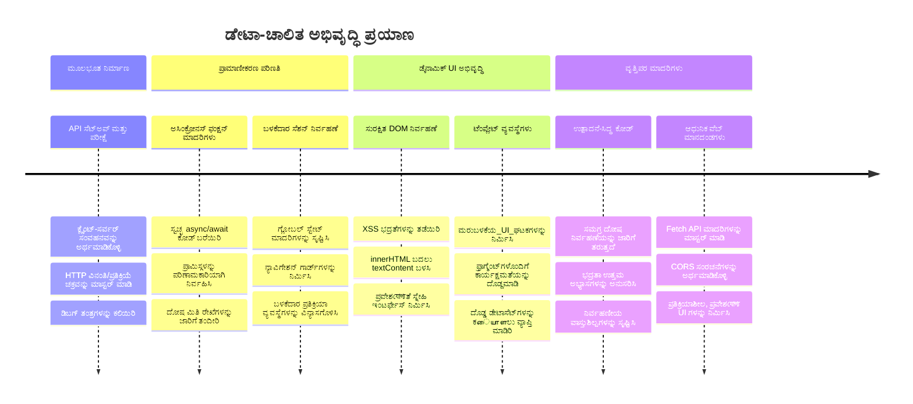
**🎓 ಪದವಿ ಕೊನೆಯ ಮರ್ಕುಳಿ**: ಆಧುನಿಕ ಜಾವಾಸ್ಕ್ರಿಪ್ಟ್ ಮಾದರಿಗಳನ್ನು ಬಳಸಿ ಸಂಪೂರ್ಣ ಡೇಟಾ-ಚಾಲಿತ ವೆಬ್ ಅಪ್ಲಿಕೇಶನ್ ಅನ್ನು ಯಶಸ್ವಿಯಾಗಿ ನಿರ್ಮಿಸಿದ್ದೀರಿ. ಈ ಕೌಶಲ್ಯಗಳು React, Vue ಅಥವಾ Angular ನಂತಹ ಫ್ರೇಮ್‌ವರ್ಕ್‌ಗಳೊಂದಿಗೆ ನೇರವಾಗಿ ಅನ್ವಯಿಸುತ್ತದೆ.

**🔄 ಮುಂದಿನ ಹಂತದ ಸಾಮರ್ಥ್ಯಗಳು**:
- ಈ ತತ್ವಗಳ ಮೇಲೆ ಆಧಾರಿತ ಫ್ರಂಟ್‌ಎಂಡ್ ಫ್ರೇಮ್‌ವರ್ಕ್‌ಗಳನ್ನು ಅನ್ವೇಷಿಸಲು ಸಿದ್ಧ
- WebSockets ಮೂಲಕ ನೈತಿಕ ವೈಶಿಷ್ಟ್ಯಗಳನ್ನು ಜಾರಿಗೆ ತರುವುದಕ್ಕೆ ಸಿದ್ಧ
- ಆಫ್‌ಲೈನ್ ಸಾಮರ್ಥ್ಯಗಳೊಂದಿಗೆ ಪ್ರೋಗ್ರೆಸಿವ್ ವೆಬ್ ಅಪ್ಲಿಕೇಶನ್‌ಗಳನ್ನು ನಿರ್ಮಿಸಲು ಸಿದ್ಧ
- ಸುಧಾರಿತ ಸ್ಥಿತಿ ನಿರ್ವಹಣಾ ಮಾದರಿಗಳನ್ನು ಕಲಿಯಲು ತಯಾರು

## GitHub Copilot ಏಜೆಂಟ್ ಸವಾಲ್ 🚀

ನೀವು ಏಜೆಂಟ್ ಮೋಡ್ ಬಳಸಿ ಕೆಳಗಿನ ಸವಾಲನ್ನು ಪೂರ್ಣಗೊಳಿಸಿ:

**ವಿವರಣೆ:** ಬ್ಯಾಂಕಿಂಗ್ ಅಪ್ಲಿಕೇಶನ್ ಅನ್ನು ಅಭಿವೃದ್ಧಿಪಡಿಸಿ, ಬಳಕೆದಾರರು ದಿನಾಂಕ ಮಿತಿ, ಮೊತ್ತ ಅಥವಾ ವ್ಯವಹಾರ ವಿವರ ನಿಯತಾಂಕಗಳ ಮೂಲಕ ನಿರ್ದಿಷ್ಟ ವ್ಯವಹಾರಗಳನ್ನು ಹುಡುಕಲು ಮತ್ತು ಫಿಲ್ಟರ್ ಮಾಡಲು ಸಾಧ್ಯವಾಗುವಂತಹ ಕಾರ್ಯಕ್ಷಮತೆಯನ್ನು ಜೋಡಿಸಿ.

**ಪ್ರಾಂಪ್ಟ್:** ಬ್ಯಾಂಕಿಂಗ್ ಅಪ್ಲಿಕೇಶನ್‍ಗಾಗಿ ಹುಡುಕಾಟ ಕಾರ್ಯಕ್ಷಮತೆಯನ್ನು ನಿರ್ಮಿಸಿ, ಅದು ಒಳಗೊಂಡಿದೆ: 1) ದಿನಾಂಕ ಮಿತಿ (ಇಂದಿನಿಂದ/ಇಂದಿಗೆ), ಕನಿಷ್ಠ/ಗರಿಷ್ಟ ಮೊತ್ತ, ಮತ್ತು ವ್ಯವಹಾರ ವಿವರಣೆ ಕೀーワード್‌ಗಳ್ತ್ರ ಹಾವಾಯ್ ಹುಡುಕಾಟ ಫಾರ್ಮ್, 2) ಹುಡುಕಾಟ ಮಾನದಂಡಗಳಿಗೆ ಅನುಗುಣವಾಗಿ account.transactions ಅrray ಅನ್ನು ಫಿಲ್ಟರ್ ಮಾಡುವ `filterTransactions()` ಫಂಕ್ಷನ್, 3) ಫಿಲ್ಟರ್ ಮಾಡಿದ ಫಲಿತಾಂಶಗಳನ್ನು ತೋರಿಸಲು `updateDashboard()` ನವೀಕರಣ, ಮತ್ತು 4) ವೀಕ್ಷಣೆಯನ್ನು ಮರುಹೊಂದಿಸಲು "ಫಿಲ್ಟರ್ ತೆರವು" ಬಟನ್. ಆಧುನಿಕ ಜಾವಾಸ್ಕ್ರಿಪ್ಟ್ ಅರೆ ಮಂಡಲ ವಿಧಾನಗಳಾದ `filter()` ಬಳಸಿ ಹಾಗೂ ಖಾಲಿ ಹುಡುಕಾಟ ಮಾನದಂಡಗಳ ಗಡಿಮೆಸಲು ಹ್ಯಾಂಡಲ್ ಮಾಡಿ.

ಇಲ್ಲಿ [ಏಜೆಂಟ್ ಮೋಡ್](https://code.visualstudio.com/blogs/2025/02/24/introducing-copilot-agent-mode) ಕುರಿತು ಹೆಚ್ಚಿನ ಮಾಹಿತಿ ಲಭ್ಯವಿದೆ.

## 🚀 ಸವಾಲ್

ನಿಮ್ಮ ಬ್ಯಾಂಕಿಂಗ್ ಅಪ್ಲಿಕೇಶನ್ ಅನ್ನು ಮುಂದಿನ ಮಟ್ಟಕ್ಕೆ ತೆಗೆದುಹೋಗಲು ಸಿದ್ಧವೇ? ಇದನ್ನು ನಿಜವಾಗಿಯೂ ಬಳಸಲು ಇಚ್ಛಿಸುವಂಥದಾಗಿಸೋಣ. ನಿಮ್ಮ ಸೃಜನಶೀಲತೆಯನ್ನು ಪ್ರೇರేపಿಸುವ ಕೆಲವು ಆಲೋಚನೆಗಳು:

**ಸುಂದರವಾಗಿ ಮಾಡಿ**: CSS ಶೈಲಿಯನ್ನು ಸೇರಿಸಿ ನಿಮ್ಮ ಕಾರ್ಯನಿರ್ವಹಣೆಯ ಡ್ಯಾಶ್‌ಬೋರ್ಡ್ ಅನ್ನು ದೃಶ್ಯವಾಗಿ ಆಕರ್ಷಕವಾಗಿಸಿಕೊಳ್ಳಿ. ಸ್ವಚ್ಛ ರೇಖೆಗಳು, ಉತ್ತಮ ಅಂತರ, ಹಾಗೂ ಸಂಪೂರ್ಣ ಹಾಸಿನ ಮರುಭರಿತ ಸ್ಪರ್ಶಗಳು.

**ಪ್ರತ್ಯುತ್ಯದಾಯಕವಾಗಿಸಿಕೊಳ್ಳಿ**: [ಮೀಡಿಯಾ ಕ್ವೆರಿಗಳ](https://developer.mozilla.org/docs/Web/CSS/Media_Queries) ಉಪಯೋಗಿಸಿ [ಪ್ರತ್ಯುತ್ಯದಾಯಕ ವಿನ್ಯಾಸ](https://developer.mozilla.org/docs/Web/Progressive_web_apps/Responsive/responsive_design_building_blocks) ರಚಿಸಿ, ಇದು ಫೋನ್‌ಗಳು, ಟ್ಯಾಬ್ಲೆಟ್‌ಗಳು ಮತ್ತು ಡೆಸ್ಕ್‌ಟಾಪ್‌ಗಳಲ್ಲಿ ಉತ್ತಮವಾಗಿ ಕಾರ್ಯನಿರ್ವಹಿಸುತ್ತದೆ. ನಿಮ್ಮ ಬಳಕೆದಾರರು ನಿಮಗೆ ಧನ್ಯವಾದ ಹೇಳುತ್ತಾರೆ!

**ಕೆಲವು ವೈಶಿಷ್ಟ್ಯಗಳನ್ನು ಸೇರಿಸಿ**: ವ್ಯವಹಾರಗಳನ್ನು ಬಣ್ಣದಿಂದ ವಿವರಿಸಿ (ಆದಾಯಕ್ಕೆ ಹಸಿರು, ವೆಚ್ಚಕ್ಕೆ ಕೆಂಪು), ಐಕಾನ್ಗಳನ್ನು ಸೇರಿಸಿ, ಅಥವಾ ಹೋವರ್ ಪರಿಣಾಮಗಳ ಮೂಲಕ ಇಂಟರ್ಫೇಸ್ ಅನ್ನು ಸಂವೇದನಾಶೀಲಗೊಳಿಸಿ.

ಇದಲ್ಲದೆ, ಈ ರೀತಿ ಒಳ್ಳೆಯ ಡ್ಯಾಶ್‌ಬೋರ್ಡ್ ಕಾಣಿಸಬಹುದು:

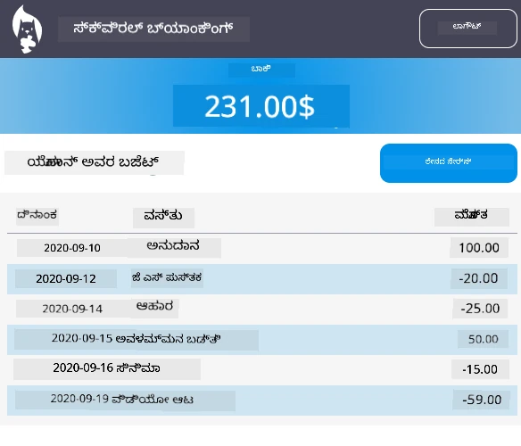

ನೀವು ಇದನ್ನು ಖಚಿತವಾಗಿ ಬೀಳ್ತೀರಾ ಎಂದು ಭಾವಿಸಬೇಡಿ - ಇದನ್ನು ಪ್ರೇರಣೆ ರೂಪದಲ್ಲಿ ತೆಗೆದುಕೊಳ್ಳಿ ಮತ್ತು ನಿಮ್ಮದೇ ರೀತಿಯಲ್ಲಿ ಮಾಡಿ!

## ಪಾಠೋತ್ತರ ಪ್ರಶ್ನೋತ್ತರ

[ಪಾಠೋತ್ತರ ಪ್ರಶ್ನೋತ್ತರ](https://ff-quizzes.netlify.app/web/quiz/46)

## ಹಬ್ಬಾಳಿಕೆ

[ನಿಮ್ಮ ಕೋಡ್ ನವೀಕರಿಸಿ ಮತ್ತು ಕಾಮೆಂಟ್ ಮಾಡಿ](assignment.md)

---

<!-- CO-OP TRANSLATOR DISCLAIMER START -->
**ಅದ್ಭುತ ಸೂಚನೆ**:  
ಈ ದಾಖಲೆ [Co-op Translator](https://github.com/Azure/co-op-translator) ಎಂಬ AI ಅನುವಾದ ಸೇವೆಯ ಮೂಲಕ ಅನುವಾದಿಸಲಾಗಿದೆ. ನಾವು ಶುದ್ಧತೆಯ ಪ್ರಯತ್ನ ಮಾಡುತ್ತಿದ್ದರೂ, ಸ್ವಯಂಚಾಲಿತ ಅನುವಾದಗಳಲ್ಲಿ ದೋಷಗಳು ಅಥವಾ ಅಧುಯೋಗತೆಗಳು ಇರಬಹುದಾಗಿದೆ ಎಂಬುದನ್ನು ದಯವಿಟ್ಟು ಗಮನಿಸಿ. ಮೂಲ ಭಾಷೆಯಲ್ಲಿ ಇರುವ ಮೂಲ ದಾಖಲೆವೇ ಅತ್ಯಂತ ನೈಜ ಮೂಲವಾಗಿರುತ್ತದೆ ಎಂದು ಪರಿಗಣಿಸಬೇಕು. ಮಹತ್ವದ ಮಾಹಿತಿ ಗಾಗಿ ವೃತ್ತಿಪರ ಮಾನವ ಅನುವಾದವನ್ನು ಶಿಫಾರಸು ಮಾಡಲಾಗುತ್ತದೆ. ಈ ಅನುವಾದ ಬಳಕೆಯಿಂದ ಉಂಟಾದ ಯಾವುದೇ ತಪ್ಪು ವಿವರಣೆಗಳು ಅಥವಾ ತಪ್ಪು ಅರ್ಥಗರ್ಭಿತಗಳಿಗೆ ನಾವು ಜವಾಬ್ದಾರಿಯಿಲ್ಲ.
<!-- CO-OP TRANSLATOR DISCLAIMER END -->