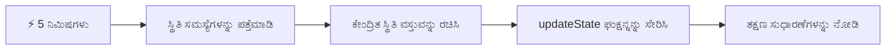
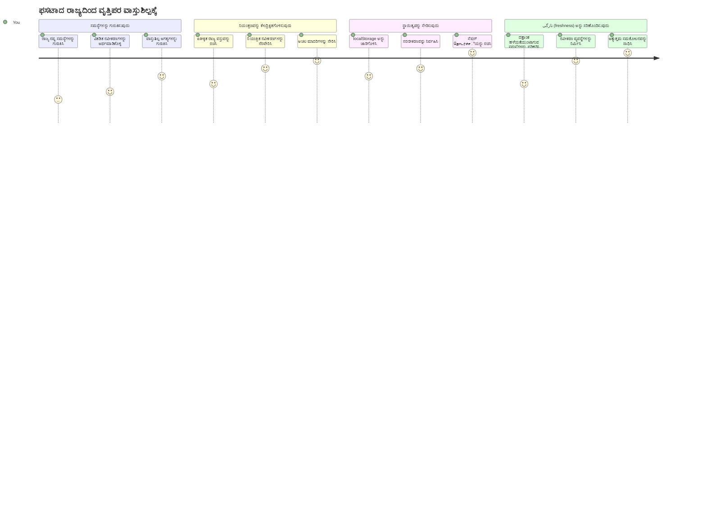
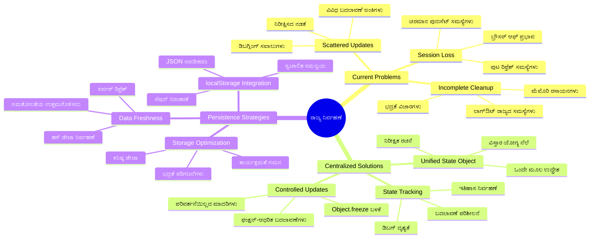
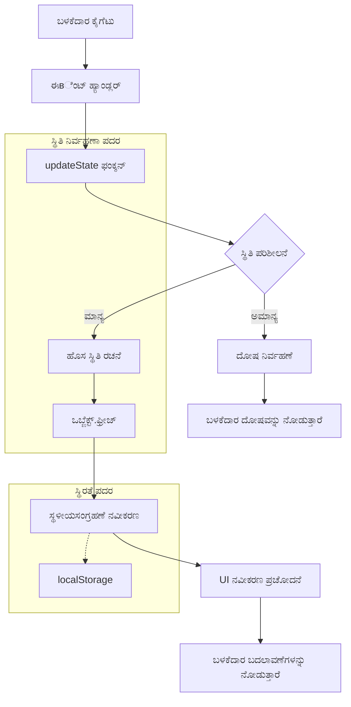
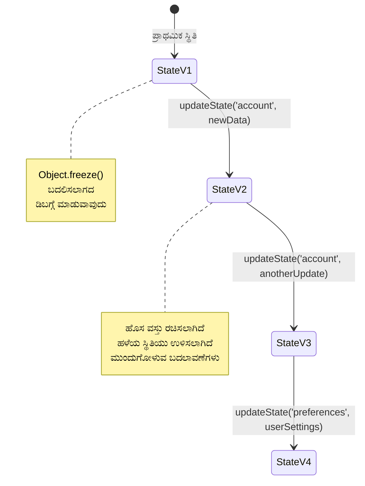
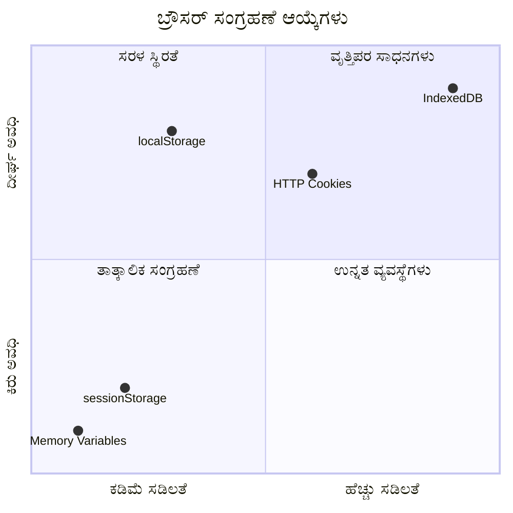
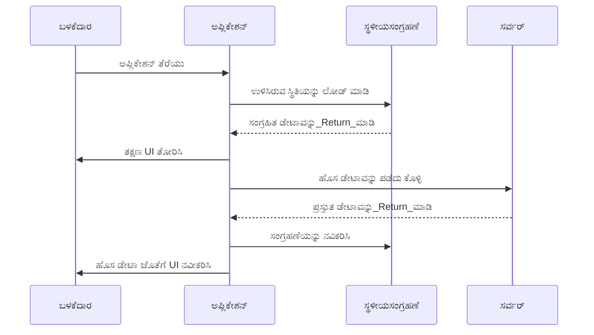
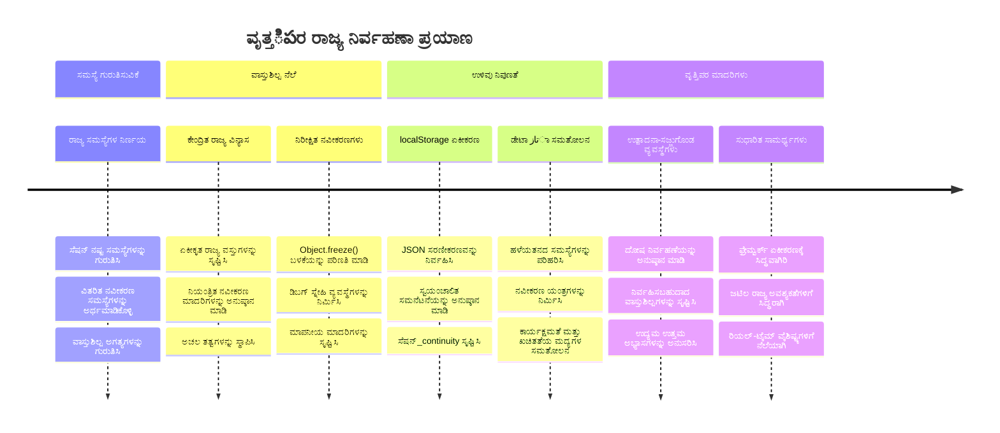

<!--
CO_OP_TRANSLATOR_METADATA:
{
  "original_hash": "b807b09df716dc48a2b750835bf8e933",
  "translation_date": "2026-01-08T17:49:26+00:00",
  "source_file": "7-bank-project/4-state-management/README.md",
  "language_code": "kn"
}
-->
# ಬ್ಯಾಂಕಿಂಗ್ ಅಪ್ಲಿಕೇಶನ್ ನಿರ್ಮಾಣ ಭಾಗ 4: ಸ್ಟೇಟ್ ನಿರ್ವಹಣೆಯ ಸಂಪ್ರದಾಯಗಳು

## ⚡ ಮುಂದಿನ 5 ನಿಮಿಷಗಳಲ್ಲಿ ನೀವು ಏನು ಮಾಡಬಹುದು

**ಬಿಜಿ ಡೆವಲಪರ್‌ಗಳಿಗಾಗಿ ತ್ವರಿತ ಪ್ರಾರಂಭ ಮಾರ್ಗ**


- **ನಿಮಿಷ 1**: ಪ್ರಸ್ತುತ ಸ್ಟೇಟ್ ಸಮಸ್ಯೆ ಪರೀಕ್ಷಿಸಿ - ಲಾಗಿನ್ ಮಾಡಿ, ಪುಟವನ್ನು ರಿಫ್ರೆಶ್ ಮಾಡಿ, ಲಾಗೌಟ್ ಆಗುತ್ತಿರುವುದನ್ನು ಗಮನಿಸಿ
- **ನಿಮಿಷ 2**: `let account = null` ಅನ್ನು `let state = { account: null }` ಗೆ ಬದಲಿಸಿ
- **ನಿಮಿಷ 3**: ನಿಯಂತ್ರಿತ ಅಪ್ಡೇಟ್ಗಳಿಗಾಗಿ ಸರಳ `updateState()` ಫಂಕ್ಷನ್ ರಚಿಸಿ
- **ನಿಮಿಷ 4**: ಹೊಸ ಮಾದರಿಯನ್ನು ಬಳಸುವಂತೆ ಒಂದು ಫಂಕ್ಷನ್ ಅನ್ನು ಅಪ್ಡೇಟ್ ಮಾಡಿ
- **ನಿಮಿಷ 5**: ಸುಧಾರಿತ ಪೂರ್ವಾನುಮಾನ ಮತ್ತು ಡಿಬಗ್ಗಿಂಗ್ ಸಾಮರ್ಥ್ಯವನ್ನು ಪರೀಕ್ಷಿಸಿ

**ತ್ವರಿತ ಡಯಾಗ್ನೋಸ್ಟಿಕ್ ಪರೀಕ್ಷೆ**:
```javascript
// ಮುಂಚೆ: ಹರಿದಾಡುವ ಸ್ಥಿತಿ
let account = null; // ರೀಫ್ರೆಶ್ ಮಾಡುವಾಗ ಕಳೆದುಹೋಗಿತು!

// ನಂತರ: ಕೇಂದ್ರಿತ ಸ್ಥಿತಿ
let state = Object.freeze({ account: null }); // ನಿಯಂತ್ರಿತ ಮತ್ತು ಅನುಸರಿಸಬಹುದಾದ!
```

**ಈದರಿಂದ ಪ್ರಮುಖತೆ**: 5 ನಿಮಿಷಗಳಲ್ಲಿ, ನೀವು ಗೊಂದಲದ ಸ್ಟೇಟ್ ನಿರ್ವಹಣೆಯಿಂದ ನಿಗದಿತ, ಡಿಬಗ್ಗಿಂಗ್ ಮಾಡಲು ಸುಲಭವಾದ ಮಾದರಿಗಳಿಗೆ ಪರಿವರ್ತನೆಯನ್ನು ಅನುಭವಿಸುತ್ತೀರಿ. ಇದೇ ಸಂಕೀರ್ಣ ಅಪ್ಲಿಕೇಶನ್‌ಗಳನ್ನು ನಿರ್ವಹಿಸಲು ಅಡಿಗಟ್ಟಾಗಿದೆ.

## 🗺️ ಸ್ಟೇಟ್ ನಿರ್ವಹಣಾ ವಿಧಗಳ ಮೂಲಕ ನಿಮ್ಮ ಕಲಿಕಾ ಪಯಣ


**ನಿಮ್ಮ ಪಯಣ ಗುರಿ**: ಈ ಪಾಠದ ಅಂತ್ಯಕ್ಕೆ, ನೀವು ವೃತ್ತಿಪರ-ಮಟ್ಟದ ಸ್ಟೇಟ್ ನಿರ್ವಹಣಾ ವ್ಯವಸ್ಥೆಯನ್ನು ನಿರ್ಮಿಸಿದ್ದು, ಅದು ಸ್ಥಾಯಿತ್ವ, ಡೇಟಾ ತಾಜಾತನ ಮತ್ತು ನಿಗದಿತ ಅಪ್ಡೇಟ್ಗಳನ್ನೂ ನಿಭಾಯಿಸುತ್ತದೆ - ಉತ್ಪಾದನಾ ಅಪ್ಲಿಕೇಶನ್‌ಗಳಲ್ಲಿ ಬಳಸುವ ಅದೇ ಮಾದರಿಗಳು.

## ಪೂರ್ವ-ಪಾಠ ಕ್ವಿಜ್

[ಪೂರ್ವ-ಪಾಠ ಕ್ವಿಜ್](https://ff-quizzes.netlify.app/web/quiz/47)

## ಪರಿಚಯ

ಸ್ಟೇಟ್ ನಿರ್ವಹಣೆ ಕಣಿವೆ ಯಂತ್ರಗಳಂತೆ – ಎಲ್ಲವೂ ಸರಾಗವಾಗಿ ನಡೆಯುತ್ತಿರುವಾಗ ನೀವು ಅದರಿರುವುದನ್ನು ಅಷ್ಟೇನೂ ಗಮನಿಸುವುದಿಲ್ಲ. ಆದರೆ ಸಮಸ್ಯೆಗಳು ಬಂದಾಗ, ಅದು između ನಕ್ಷತ್ರಾಂತರ ಬಾಹ್ಯಾಕಾಶ ತಲುಪುವುದು ಮತ್ತು ಬಾಹ್ಯಾಕಾಶದ ಅಧೋಗತಿಯಲ್ಲಿ ತಲೆಹಾಕಿಕೊಳ್ಳುವ ನಡುವಿನ ವ್ಯತ್ಯಾಸವಾಗುತ್ತದೆ. ವೆಬ್ ಡೆವಲಪ್ಮೆಂಟ್‌ನಲ್ಲಿ, ಸ್ಟೇಟ್ ಎಂದರೆ ನಿಮ್ಮ ಅಪ್ಲಿಕೇಶನ್ ಸಂರಕ್ಷಿಸಬೇಕಾದ ಎಲ್ಲವೂ: ಬಳಕೆದಾರ ಲಾಗಿನ್ ಸ್ಥಿತಿ, ಫಾರ್ಮ್ ಡೇಟಾ, ನ್ಯಾವಿಗೇಶನ್ ಇತಿಹಾಸ ಮತ್ತು ತಾತ್ಕಾಲಿಕ ಇಂಟರ್‌ಫೇಸ್ ಸ್ಥಿತಿಗಳು.

ನಿಮ್ಮ ಬ್ಯಾಂಕಿಂಗ್ ಅಪ್ಲಿಕೇಶನ್ ಸರಳ ಲಾಗಿನ್ ಫಾರ್ಮ್‌ನಿಂದ ಹೆಚ್ಚು ನುಡಿ ಸಂರಚನೆಯ ಅಪ್ಲಿಕೇಶನ್ ಆಗಿ ಅಭಿವೃದ್ಧಿಯಾಗಿರುವಂತೆ, ನೀವು ಕೆಲವು ಸಾಮಾನ್ಯ ಸವಾಲುಗಳನ್ನು ಎದುರಿಸಿದ್ದಿರಬಹುದು. ಪುಟವನ್ನು ರಿಫ್ರೆಶ್ ಮಾಡಿದಾಗ ಬಳಕೆದಾರರು ಅಸ್ಪಷ್ಟವಾಗಿ ಲಾಗ್ ಔಟ್ ಆಗುತ್ತಾರೆ. ಬ್ರೌಸರ್ ಮುಚ್ಚಿದರೆ ಎಲ್ಲ ಪ್ರಗತಿ ಕಳೆದುಹೋದಂತೆ ಕಾಣುತ್ತದೆ. ಸಮಸ್ಯೆಯನ್ನು ಡಿಬಗ್ ಮಾಡಲು ನೀವು ಒದಗಿಸಿದ ಡೇಟಾವನ್ನು ಬದಲಾಯಿಸುವ ಹಲವಾರು ಕಾರ್ಯಗಳ ಬಳಿಯಲ್ಲಿ ಹುಡುಕುತ್ತಿದ್ದೀರಿ.

ಇವು ಕೋಪದ ಕೋಡ್‌ಗಳ ಸಂಕೇತಗಳು ಅಲ್ಲ – ಇದು ಅಪ್ಲಿಕೇಶನ್‌ಗಳು ಒ一定 ಗಾತ್ರದ ಸಂಕೀರ್ಣತೆಯ ಮಟ್ಟವನ್ನು ತಲುಪಿದಾಗ ಕಾಣುವ ಸಹಜ ಬಾಧೆಗಳಾಗಿವೆ. ಪ್ರತಿ ಡೆವಲಪರ್ ತಮ್ಮ ಅಪ್ಲಿಕೇಶನ್‌ಗಳು "ಸಾಕ್ಷಾತ್ಕಾರ" ನಿಂದ "ಉತ್ಪಾದನಾ ಸಿದ್ಧ" ಆಗುವಾಗ ಈ ಸವಾಲುಗಳನ್ನು ಎದುರಿಸುತ್ತಾರೆ.

ಈ ಪಾಠದಲ್ಲಿ, ನಾವು ನಿಮ್ಮ ಬ್ಯಾಂಕಿಂಗ್ ಅಪ್ಲಿಕೇಶನ್ ಅನ್ನು ನಂಬಿಗಸ್ತ, ವೃತ್ತಿಪರ ಅಪ್ಲಿಕೇಶನ್ ಆಗಿ ಪರಿವರ್ತಿಸುವ ಒಂದು ಕೇಂದ್ರಿತ ಸ್ಟೇಟ್ ನಿರ್ವಹಣಾ ವ್ಯವಸ್ಥೆಯನ್ನು ಜಾರಿಗೊಳಿಸಲು ಹೋಗುತ್ತೇವೆ. ನೀವು ಡೇಟಾ ಪ್ರವಾಹಗಳನ್ನು ನಿಗದಿತವಾಗಿ ನಿರ್ವಹಿಸುವುದನ್ನು, ಬಳಕೆದಾರ ಸೆಷನ್‌ಗಳನ್ನು ಸೂಕ್ತವಾಗಿ ಸ್ಥಿರಗೊಳಿಸುವುದನ್ನು ಹಾಗೂ ಆಧುನಿಕ ವೆಬ್ ಅಪ್ಲಿಕೇಶನ್‌ಗಳ ಅಗತ್ಯವಿರುವ ಸುಗಮ ಬಳಕೆದಾರ ಅನುಭವವನ್ನು ಸೃಷ್ಟಿಸುವುದನ್ನು ಕಲ್ತೀರಿ.

## ಪೂರ್ವಾಪೇಕ್ಷಿತಗಳು

ಸ್ಟೇಟ್ ನಿರ್ವಹಣಾ ಸಂಪ್ರದಾಯಗಳಿಗೆ ಮುಂಚೆ, ನಿಮ್ಮ ಅಭಿವೃದ್ಧಿ ಪರಿಸರವನ್ನು ಸರಿಯಾಗಿ ಹೊಂದಿಸಿಕೊಳ್ಳಬೇಕು ಮತ್ತು ನಿಮ್ಮ ಬ್ಯಾಂಕಿಂಗ್ ಅಪ್ಲಿಕೇಶನ್ ಮೂಲವನ್ನು ಸಿದ್ಧಪಡಿಸಿಕೊಳ್ಳಬೇಕು. ಈ ಪಾಠ ಸರಣಿಯ ಹಿಂದಿನ ಭಾಗಗಳ ಸಂಪ್ರದಾಯಗಳು ಮತ್ತು ಕೋಡ್ ಮೇಲೆ ನೇರವಾಗಿ ಅವಲಂಬಿಸಿದೆ.

ಮುಂದುವರೆಯುವ ಮೊದಲು ಈ ಘಟಕಗಳನ್ನು ಸಿದ್ಧಪಡಿಸಿಕೊಳ್ಳಿ:

**ಅವಶ್ಯಕ ಸ್ಥಾಪನೆ:**
- [ಡೇಟಾ ಫೆಚಿಂಗ್ ಪಾಠ](../3-data/README.md) ಪೂರ್ಣಗೊಳಿಸಿ - ನಿಮ್ಮ ಅಪ್ಲಿಕೇಶನ್ ಖಾತೆ ಡೇಟಾವನ್ನು ಯಶಸ್ವಿಯಾಗಿ ಲೋಡ್ ಮತ್ತು ಪ್ರದರ್ಶಿಸಬೇಕು
- ನಿಮ್ಮ ವ್ಯವಸ್ಥೆಗೆ [Node.js](https://nodejs.org) ಇನ್‌ಸ್ಟಾಲ್ ಮಾಡಿ ಬ್ಯಾಕ್‌ಎಂಡ್ API ನಡೆಸಲು
- ಖಾತೆ ಡೇಟಾ ಕಾರ್ಯಾಚರಣೆಗಳನ್ನು ನಿಭಾಯಿಸಲು [ಸರ್ವರ್ API](../api/README.md) ಅನ್ನು ಸ್ಥಳೀಯವಾಗಿ ಪ್ರಾರಂಭಿಸಿ

**ನಿಮ್ಮ ಪರಿಸರವನ್ನು ಪರೀಕ್ಷೆ ಮಾಡಿ:**

ಟರ್ಮಿನಲ್‌ನಲ್ಲಿ ಕೆಳಗಿನ ಆಜ್ಞೆಯನ್ನು ಹರಟಿಸಿದರೆ ನಿಮ್ಮ API ಸರ್ವರ್ ಸರಿಯಾದಂತೆ ನಡೆಯುತ್ತಿದ್ದಾನೆ ಎಂಬುದನ್ನು ಖಚಿತಪಡಿಸಿಕೊಳ್ಳಿ:

```sh
curl http://localhost:5000/api
# -> ಫಲಿತಾಂಶವಾಗಿ "ಬ್ಯಾಂಕ್ ಎಪಿಐ v1.0.0" ಅನ್ನು ನೀಡಬೇಕು
```

**ಈ ಆಜ್ಞೆಯ ಕಾರ್ಯ:**
- ನಿಮ್ಮ ಸ್ಥಳೀಯ API ಸರ್ವರ್‌ಗೆ GET ವಿನಂತಿ ಕಳುಹಿಸುತ್ತದೆ
- ಸಂಪರ್ಕವನ್ನು ಪರಿಕ್ಷಿಸಿ ಸರ್ವರ್ ಮೇಲೆ ಪ್ರತಿಕ್ರಿಯೆ ಬರುತ್ತದೆ ಎಂದು ಖಾತ್ರಿಪಡಿಸುತ್ತದೆ
- ಎಲ್ಲಾ ಸರಿಯಾಗಿದೆಯೇ ಎಂಬುದನ್ನು ತೋರಿಸುವ API ಆವೃತ್ತಿ ಮಾಹಿತಿ ಹಿಂತಿರುಗಿಸುತ್ತದೆ

## 🧠 ಸ್ಟೇಟ್ ನಿರ್ವಹಣಾ ವಾಸ್ತುಶಿಲ್ಪ ಅವಲೋಕನ


**ಕೋರ್ ನಿಯಮ**: ವೃತ್ತಿಪರ ಸ್ಟೇಟ್ ನಿರ್ವಹಣೆ ನಿಗದಿತತೆ, ಸ್ಥಿರತೆ ಮತ್ತು ಪ್ರదర్శನೆಯನ್ನು ಸಮತೋಲಗೊಳಿಸಿ ನಂಬಿಗಸ್ತ ಬಳಕೆದಾರ ಅನುಭವಗಳನ್ನು ಸೃಷ್ಟಿಸುತ್ತದೆ, ಅವು ಸರಳ ಸಂಪರ್ಕಗಳಿಂದ ಸಂಕೀರ್ಣ ಅಪ್ಲಿಕೇಶನ್ ಕಾರ್ಯಪ್ರವಾಹಗಳಿಗೆ ವ್ಯಾಪಿಸುತ್ತವೆ.

---

## ಪ್ರಸ್ತುತ ಸ್ಟೇಟ್ ಸಮಸ್ಯೆಗಳ ವಿಶ್ಲೇಷಣೆ

ಶೆರ್ಲಾಕ್ ಹೋಲ್ಮ್ಸ್ ಅಪರಾಧ ಸ್ಥಳ ಪರಿಶೀಲನೆಯಂತೆ, ನಾವು ಮಾಯವಾಗುತ್ತಿರುವ ಬಳಕೆದಾರ ಸೆಷನ್‌ಗಳ ರಹಸ್ಯವನ್ನು ಪರಿಹರಿಸುವ ಮೊದಲೆ ನಮ್ಮ ಪ್ರಸ್ತುತ ಜಾರಿಗೆ ಆಗುತ್ತಿರುವ ನಿಜವಾಗಿರುವ ಪರಿಸ್ಥಿತಿಯನ್ನು ಅರ್ಥಮಾಡಿಕೊಳ್ಳಬೇಕು.

ನಿಮ್ಮ ಬ್ಯಾಂಕಿಂಗ್ ಅಪ್ಲಿಕೇಶನ್‌ನಲ್ಲಿ ಸರಳ ಪರಿಕ್ಷೆ ಮಾಡಿ, ಅಡಗಿಹೋಗುತ್ತಿರುವ ಸ್ಟೇಟ್ ನಿರ್ವಹಣಾ ಸವಾಲುಗಳನ್ನು ಬಿಚ್ಚಿಡೋಣ:

**🧪 ಈ ಡಯಾಗ್ನೋಸ್ಟಿಕ್ ಪರೀಕ್ಷೆಯನ್ನು ಪ್ರಯತ್ನಿಸಿ:**
1. ನಿಮ್ಮ ಬ್ಯಾಂಕಿಂಗ್ ಅಪ್ಲಿಕೇಶನಲ್ಲಿ ಲಾಗಿನ್ ಆಗಿ ಮತ್ತು ಡ್ಯಾಶ್‌ಬೋರ್ಡ್‌ಗೆ ಹೋಗಿ
2. ಬ್ರೌಸರ್ ಪುಟವನ್ನು ರಿಫ್ರೆಶ್ ಮಾಡಿ
3. ನಿಮ್ಮ ಲಾಗಿನ್ ಸ್ಥಿತಿಗೆ ಏನಾಗುತ್ತಿದೆ ಎಂದು ಗಮನಿಸಲಿ

ನೀವು ಲಾಗಿನ್ ಸ್ಕ್ರೀನ್ಗೆ ಮರುನಿರ್ದೇಶಿತಗೊಂಡರೆ, ನೀವು ವರ್ಧಿತ ಸ್ಥಿರತೆ ಸಮಸ್ಯೆಯನ್ನು ಕಂಡುಹಿಡಿದಿದ್ದೀರಿ. ಈ ನಡೆ ಯಾಕೆಂದರೆ ನಮ್ಮ ಪ್ರಸ್ತುತ ಜಾರಿಗೆ ನಾವು ಬಳಕೆದಾರ ಡೇಟಾವನ್ನು ಜಾವಾಸ್ಕ್ರಿಪ್ಟ್ ಚರಗಳಲ್ಲಿ ಇಡುತ್ತಿರುವುದು ಪುಟ ಲೋಡ್ ಆಗುವ ಪ್ರತಿಯೊಂದು ಬಾರಿ ಅಸ್ಥಾಯಿಯಾಗಿ ನಿಧಾನಗೊಳ್ಳುತ್ತದೆ.

**ಪ್ರಸ್ತುತ ಜಾರಿಯಲ್ಲಿ ಸಮಸ್ಯೆಗಳು:**

ನಮ್ಮ [ಹಿಂದಿನ ಪಾಠದಿಂದ](../3-data/README.md) ಸರಳ `account` ಚರ ಮೂರು ಮಹತ್ವದ ಸಮಸ್ಯೆಗಳನ್ನೂ ಉಂಟುಮಾಡುತ್ತದೆ, ಅವು ಬಳಕೆದಾರ ಅನುಭವಕ್ಕೂ ಮತ್ತು ಕೋಡ್ ನಿರ್ವಹಣೆಗೆ ಪ್ರಭಾವ ಬೀರುತ್ತವೆ:

| ಸಮಸ್ಯೆ | ತಾಂತ್ರಿಕ ಕಾರಣ | ಬಳಕೆದಾರರ ಮೇಲೆ ಪ್ರಭಾವ |
|---------|---------------|-----------------------|
| **ಸೆಷನ್ ಕಳೆದುಹೋಗುವುದು** | ಪುಟ ರಿಫ್ರೆಶ್ ಜಾವಾಸ್ಕ್ರಿಪ್ಟ್ ಚರಗಳನ್ನು ಸ್ವಚ್ಛಗೊಳಿಸುತ್ತದೆ | ಬಳಕೆದಾರರು ಆದಿತ್ಯಾವಧಿಯಲ್ಲಿ ಮರು ಲಾಗಿನ್ ಮಾಡಬೇಕಾಗುತ್ತದೆ |
| **ವಿಭಜಿತ ಅಪ್ಡೇಟ್ಗಳು** | ಹಲವಾರು ಫಂಕ್ಷನ್ಗಳು ನೇರವಾಗಿ ಸ್ಟೇಟ್ ಅನ್ನು ಬದಲಾಯಿಸುತ್ತವೆ | ಡಿಬಗ್ಗಿಂಗ್ มาก加入ಮೂಸುವಾಗಿದೆ |
| **ಅಪೂರ್ಣ ಶುದ್ಧೀಕರಣ** | ಲಾಗೌಟ್ ಎಲ್ಲಾ ಸ್ಟೇಟ್ ಸೂಚನೆಗಳನ್ನು ತೆರವುಗೊಳಿಸುವುದಿಲ್ಲ | ಭದ್ರತೆ ಮತ್ತು ಖಾಸಗಿ ಮಾಹಿತಿ ಸಂಬಂದಿ ಆತಂಕಗಳು |

**ವಾಸ್ತುಶಿಲ್ಪ ಸವಾಲು:**

ಟೈಟ್ಯಾನಿಕ್ ನವರಗಿನಂತೆಯೇ ಗಡಿಭಾಗಗಳ ವಿಭಜನೆ ಬಲವಾದಂತೆ ತೋರುತ್ತಿತ್ತೆಂದರೆ, ಪ್ರತಿ ಘಟಕದಲ್ಲಿ ನೀರು ತುಂಬಿದಾಗ ಸಮಗ್ರ ಪರಿಣಾಮ ಉಂಟಾಗಿದೆ, ನಾವು ಭೇಟಿಯಾಗುತ್ತಿರುವ ಸಮಸ್ಯೆಗಳನ್ನು ಪ್ರತಿ ಘಟಕದಲ್ಲಿ ಬೇಬೇಕೆ ತಿದ್ದುಪಡಿ ಮಾಡುವುದರಿಂದ ಮೂಲ ವಾಸ್ತುಶಿಲ್ಪ ಸಮಸ್ಯೆ ಪರಿಹಾರವಾಗುವುದಿಲ್ಲ. ನಮ್ಮ ಬಯಕೆಯೇ ಒಂದು ಸಮಗ್ರ ಸ್ಟೇಟ್ ನಿರ್ವಹಣೆ ಪರಿಹಾರ.

> 💡 **ನಾವು ನಿಜವಾಗಿಯೇ ಏನನ್ನು ಸಾಧಿಸಲು ಯತ್ನಿಸುತ್ತಿದ್ದೇವೆ?**

[ಸ್ಟೇಟ್ ನಿರ್ವಹಣೆ](https://en.wikipedia.org/wiki/State_management) ಎರಡು ಮೂಲಭೂತ ಪರಿಕಲ್ಪನೆಗಳನ್ನು ಪರಿಹರಿಸುವುದಾಗಿದೆ:

1. **ನನ್ನ ಡೇಟಾ ಎಲ್ಲಿದೆ?**: ನಮ್ಮ ಬಳಿ ಇರುವ ಮಾಹಿತಿ ಮತ್ತು ಅದು ಎಲ್ಲಿ ಬರುತ್ತಿದೆ ಎಂಬುದನ್ನು ಗಮನಿಸೋದು
2. **ಎಲ್ಲರೂ ಒಂದೇ ಪುಟದಲ್ಲಿದೆಯಾ?**: ಬಳಕೆದಾರರು ಕಾಣುತ್ತಿರುವುದು ನಿಜಕ್ಕೂ ಏನಾಗುತ್ತಿದೆ ಎಂಬುದಕ್ಕೆ ಹೊಂದಿಕೆಯಾಗಬೇಕಾಗಿದೆ

**ನಮ್ಮ ತಂತ್ರ:**

ನಾವು ಇಗೋ ಒಂದು **ಕೇಂದ್ರಿತ ಸ್ಟೇಟ್ ನಿರ್ವಹಣೆ** ವ್ಯವಸ್ಥೆಯನ್ನು ಸೃಷ್ಟಿಸುವೆವು. ಇದು ಎಲ್ಲಾ ಮುಖ್ಯ ವಿಷಯಗಳ ನಿಯಂತ್ರಣದಲ್ಲಿ ಒಬ್ಬ ವ್ಯವಸ್ಥಿತ ವ್ಯಕ್ತಿ ಇರುವ ಪ್ರಕಾರ.



**ಈ ಡೇಟಾ ಪ್ರವಾಹವನ್ನು ಅರ್ಥಮಾಡಿಕೊಳ್ಳುವಿಕೆ:**
- ಎಲ್ಲಾ ಅಪ್ಲಿಕೇಶನ್ ಸ್ಟೇಟ್ ಅನ್ನು ಒಂದೇ ಸ್ಥಳದಲ್ಲಿ ಕೇಂದ್ರೀಕರಿಸುತ್ತದೆ
- ಎಲ್ಲಾ ಸ್ಟೇಟ್ ಬದಲಾವಣೆಗಳನ್ನು ನಿಯಂತ್ರಿತ ಕಾರ್ಯಗಳ ಮೂಲಕ ಮಾರ್ಗನಿರ್ದೇಶನ ಮಾಡುತ್ತದೆ
- ಬಳಕೆದಾರಮುಖ್ಯಾಂಶವು ಪ್ರಸ್ತುತ ಸ್ಟೇಟ್‌ಗಡೆ ಹೊಂದಿಕೊಂಡಂತೆ ಇರುತ್ತದೆ
- ಡೇಟಾ ನಿರ್ವಹಣೆಗೆ ಸ್ಪಷ್ಟ, ನಿಗದಿತ ಮಾದರಿಯನ್ನು ಒದಗಿಸುತ್ತದೆ

> 💡 **ವೃತ್ತಿಪರ ಗ್ರಹಿಕೆ**: ಈ ಪಾಠ ಮೂಲ ಸಂಪ್ರದಾಯಗಳಿಗೆ ಕೇಂದ್ರೀಕೃತವಾಗಿದೆ. ಸಂಕೀರ್ಣ ಅಪ್ಲಿಕೇಶನ್‌ಗಳಿಗೆ, [Redux](https://redux.js.org) ಮುಂತಾದ ಗ್ರಂಥಾಲಯಗಳು ಸುಧಾರಿತ ಸ್ಟೇಟ್ ನಿರ್ವಹಣಾ ವೈಶಿಷ್ಟ್ಯಗಳನ್ನು ಒದಗಿಸುತ್ತವೆ. ಈ ಮೂಲ ತತ್ವಗಳನ್ನು ಅರ್ಥಮಾಡಿಕೊಳ್ಳುವುದರಿಂದ ನೀವು ಯಾವುದೇ ಸ್ಟೇಟ್ ನಿರ್ವಹಣಾ ಗ್ರಂಥಾಲಯವನ್ನು ನಿಷ್ಠುರವಾಗಿ ಹತೋಟಿಗೆ ತರುವುದು.

> ⚠️ **ಮುನ್ನಡೆ ವಿಷಯ**: ನಾವು ಸ್ಟೇಟ್ ಬದಲಾವಣೆಗಳ ಕಾರಣವಾಗುವ ಸ್ವಯಂಚಾಲಿತ UI ಅಪ್ಡೇಟ್ಗಳನ್ನು ಇಲ್ಲಿ ಕಾಣಿಸುವುದಿಲ್ಲ, ಏಕೆಂದರೆ ಇದು [ಪ್ರತಿಕ್ರಿಯಾಶೀಲ ಪ್ರೋಗ್ರಾಮಿಂಗ್](https://en.wikipedia.org/wiki/Reactive_programming) ಪರಿಕಲ್ಪನೆಗಳೊಂದಿಗೆ ಸಂಬಂಧಿಸಿದೆ. ನಿಮ್ಮ ಕಲಿಕೆಯ ಮುಂದಿನ ಹಂತಕ್ಕೆ ಇದು ಅತ್ಯುತ್ತಮ ಹಾದಿ.

### ಕಾರ್ಯ: ಸ್ಟೇಟ್ ರಚನೆಯನ್ನು ಕೇಂದ್ರೀಕರಣ ಮಾಡುವುದು

ನಾವು ಈಗ ವಿಭಜಿತ ಸ್ಟೇಟ್ ನಿರ್ವಹಣೆಯನ್ನಿಂದ ಕೇಂದ್ರಿತ ವ್ಯವಸ್ಥೆಗೆ ಪರಿವರ್ತಿಸಲು ಪ್ರಾರಂಭಿಸೋಣ. ಈ ಮೊದಲ ಹೆಜ್ಜೆ ಮುಂದಿನ ಎಲ್ಲಾ ಸುಧಾರಣೆಗಳ ಅಡಿಗಟ್ಟಿ ಅañasಿಸುತ್ತದೆ.

**ಹೆಜ್ಜೆ 1: ಕೇಂದ್ರಿತ ಸ್ಟೇಟ್ ವಸ್ತು ರಚಿಸಿ**

ಸರಳ `account` ಘೋಷಣೆಯನ್ನು ಬದಲಾಯಿಸಿ:

```js
let account = null;
```

ಒಂದು ರಚಿಸಲಾದ ಸ್ಟೇಟ್ ವಸ್ತುವಿನಿಂದ:

```js
let state = {
  account: null
};
```

**ಈ ಬದಲಾವಣೆಯ ಮಹತ್ವ:**
- ಎಲ್ಲಾ ಅಪ್ಲಿಕೇಶನ್ ಡೇಟಾಗಳನ್ನು ಒಂದೇ ಸ್ಥಳದಲ್ಲಿ ಕೇಂದ್ರೀಕರಿಸುತ್ತದೆ
- ರಾಜ್ಯದಲ್ಲಿ ಇನ್ನೂ ಹೆಚ್ಚುವರಿ ಗುಣಲಕ್ಷಣಗಳನ್ನು ಸೇರಿಸಲು ರಚನೆಯನ್ನು ಸಿದ್ಧಪಡಿಸುತ್ತದೆ
- ಸ್ಟೇಟ್ ಮತ್ತು ಇತರ ಚರಗಳಿಗೆ ಸ್ಪಷ್ಟ ಮೆರೆಯುವ ಗಡಿಯನ್ನು ರಚಿಸುತ್ತದೆ
- ನಿಮ್ಮ ಅಪ್ಲಿಕೇಶನ್ ಬೆಳೆಯುತ್ತಿರಲು ಮಾದರಿಯನ್ನು ಸ್ಥಾಪಿಸುತ್ತದೆ

**ಹೆಜ್ಜೆ 2: ಸ್ಟೇಟ್ ಪ್ರವೇಶ ಮಾದರಿಗಳನ್ನು ಅಪ್ಡೇಟ್ ಮಾಡುವುದು**

ನಿಮ್ಮ ಫಂಕ್ಷನ್‌ಗಳನ್ನು ಹೊಸ ಸ್ಟೇಟ್ ರಚನೆಯನ್ನು ಬಳಸುವಂತೆ ತಿದ್ದುಪಡಿ ಮಾಡಿ:

**`register()` ಮತ್ತು `login()` ಫಂಕ್ಷನ್‌ಗಳಲ್ಲಿ**, ಬದಲಾವಣೆ ಮಾಡಿ:
```js
account = ...
```

ಇದಕ್ಕೆ:
```js
state.account = ...
```

**`updateDashboard()` ಫಂಕ್ಷನ್‌ನಲ್ಲಿ**, ಮೇಲ್ಭಾಗದಲ್ಲಿ ಈ ಸಾಲನ್ನು ಸೇರಿಸಿ:
```js
const account = state.account;
```

**ಈ ಅಪ್ಡೇಟ್ಗಳ ಸಾಧನೆ:**
- ಇತ್ತೀಚಿನ ಕಾರ್ಯಕ್ಷಮತೆಯನ್ನು ಕಾಪಾಡಿಕೊಳ್ಳುತ್ತಾ ರಚನೆಯಲ್ಲಿ ಸುಧಾರಣೆ
- ನಿಮ್ಮ ಕೋಡನ್ನು ಹೆಚ್ಚು ಸೂಕ್ಷ್ಮ ಸ್ಟೇಟ್ ನಿರ್ವಹಣೆಗೆ ಸಿದ್ಧಗೊಳಿಸುತ್ತದೆ
- ಸ್ಟೇಟ್ ಡೇಟಾ ಪ್ರವೇಶಕ್ಕೆ ಸुसಂಗತ ಮಾದರಿಗಳನ್ನು ರಚಿಸುತ್ತದೆ
- ಕೇಂದ್ರಿತ ಸ್ಟೇಟ್ ಅಪ್ಡೇಟ್‌ಗಳ ಅಡಿಗಟ್ಟನ್ನು ಸ್ಥಾಪಿಸುತ್ತದೆ

> 💡 **ಗಮನಿಸಿ**: ಈ ಪುನರ್ಸಂರಚನೆಯು ತಕ್ಷಣ ನಮ್ಮ ಸಮಸ್ಯೆಗಳನ್ನು ಪರಿಹರಿಸುವುದಿಲ್ಲ, ಆದರೆ ಶಕ್ತಿಶಾಲಿ ಸುಧಾರಣೆಗಳಿಗೆ ಅಗತ್ಯವಾದ ಅಡಿಕಟ್ಟು ಸೃಷ್ಟಿಸುತ್ತದೆ!

### 🎯 ಬೋಧನಾ ಪರಿಶೀಲನೆ: ಕೇಂದ್ರೀಕರಣ ತತ್ವಗಳು

**ನಿಂತು ಚಿಂತಿಸಿ**: ನೀವು ಇತ್ತೀಚೆಗೆ ಕೇಂದ್ರಿತ ಸ್ಟೇಟ್ ನಿರ್ವಹಣೆಯ ಅಡಿಕಟ್ಟು ಜಾರಿಗೊಳಿಸಿದ್ದೀರೇ. ಇದು ಮಹತ್ವದ ವಾಸ್ತುಶಿಲ್ಪ ನಿರ್ಧಾರ.

**ತ್ವರಿತ ಸ್ವಯಂ-ಮೌಲ್ಯಮಾಪನ:**
- ಸ್ಟೇಟ್ ಅನ್ನು ಒಂದೇ ವಸ್ತುವಿನಲ್ಲಿ ಕೇಂದ್ರೀಕರಿಸುವುದನ್ನು ವಿಭಜಿತ ಚರಗಳಿಗಿಂತ ಏಕೆ ಉತ್ತಮ ಎಂದು ವಿವರಣೆ ನೀಡಬಹುದು ಎಂದುಕೊಳ್ಳಿ
- ನೀವು `state.account` ಬಳಸಲು ಸಾಧ್ಯವಾಗುವಂತೆ ಫಂಕ್ಷನ್ ಅನ್ನು ತಿದ್ದುಪಡಿ ಮಾಡದೇ ಬಿಟ್ಟರೆ ಯಾವ ಪರಿಣಾಮಗಳು ಆತ?
- ಈ ಮಾದರಿ ನಿಮ್ಮ ಕೋಡನ್ನು ಹೆಚ್ಚಿನ ವೈಶಿಷ್ಟ್ಯಗಳಿಗೆ ಹೇಗೆ ಸಿದ್ದಪಡಿಸುತ್ತದೆ?

**ವಾಸ್ತವಿಕ ಜೋಡಣೆ**: ನೀವು ಕಲಿತಿರುವ ಕೇಂದ್ರೀಕರಣ ಮಾದರಿ Redux, Vuex, ಮತ್ತು React Context ಮುಂತಾದ ಆಧುನಿಕ ಫ್ರೇಮ್‌ವರ್ಕ್‌ಗಳ ಅಡಿಗಟ್ಟಿ. ನೀವು ದೊಡ್ಡ ಅಪ್ಲಿಕೇಶನ್‌ಗಳಲ್ಲಿ ಬಳಸುವ ಅದೇ ವಾಸ್ತುಶಿಲ್ಪ ಚಿಂತನೆಯನ್ನೇ ನಿರ್ಮಿಸುತ್ತಿದ್ದೀರಿ.

**ಸವಾಲು ಪ್ರಶ್ನೆ**: ನಿಮ್ಮ ಅಪ್ಲಿಕೇಶನ್‌ಗೆ ಬಳಕೆದಾರ ಇಚ್ಛೆಗಳು (ಥೀಮ್, ಭಾಷೆ) ಸೇರಿಸಬೇಕಾದರೆ, ನೀವು ಈ ಗುಣಲಕ್ಷಣಗಳನ್ನು ಸ್ಟೇಟ್ ರಚನೆಯಲ್ಲಿ ಎಲ್ಲಿಗೆ ಸೇರಿಸುತ್ತಿರಿ? ಇದು ಹೇಗೆ ಬೆಳೆಯುತ್ತದೆ?

## ನಿಯಂತ್ರಿತ ಸ್ಟೇಟ್ ಅಪ್ಡೇಟ್‌ಗಳನ್ನು ಜಾರಿಗೆ ತರುವಿಕೆ

ನಮ್ಮ ಸ್ಟೇಟ್ ಕೇಂದ್ರಿತವಾಗಿದೆ, ಆದ್ದರಿಂದ ಮುಂದಿನ ಹೆಜ್ಜೆ ಡೇಟಾ ತಿದ್ದುಪಡಿ ಗಾಗಿ ನಿಯಂತ್ರಿತ ವ್ಯವಸ್ಥೆಗಳನ್ನು ಸ್ಥಾಪಿಸುವುದು. ಇದು ನಿಗದಿತ ಸ್ಟೇಟ್ ಬದಲಾವಣೆ ಮತ್ತು ಸುಲಭ ಡಿಬಗ್ಗಿಂಗ್ ಖಾತ್ರಿ ಮಾಡುತ್ತದೆ.

ಮೂಲತತ್ವವು ವಿಮಾನ ಸಂಚಾರ ನಿಯಂತ್ರಣದಂತಿದೆ: ಸ್ಟೇಟ್ ಅನ್ನು ಸಹಬಳಕೆದಾರ ರೀತಿ ಬದಲಾಯಿಸಲು ಅನುವು ನೀಡದೇ, ಎಲ್ಲಾ ಬದಲಾವಣೆಗಳನ್ನು ಒಂದೇ ನಿಯಂತ್ರಿತ ಫಂಕ್ಷನ್ ಮೂಲಕ ಸಂಚಾಲಿಸುವುದಾಗಿದೆ. ಇದು ಯಾವಾಗ ಮತ್ತು ಹೇಗೆ ಡೇಟಾ ಬದಲಾಯನೆಗಳು ಸಂಭವಿಸುತ್ತವೆ ಎಂಬ ಸ್ಪಷ್ಟ ಅವಲೋಕನ ಒದಗಿಸುತ್ತದೆ.

**ಅಮ್ಯೂಟಬಲ್ ಸ್ಟೇಟ್ ನಿರ್ವಹಣೆ:**

ನಾವು ನಮ್ಮ `state` ವಸ್ತುವನ್ನು [*ಅಮ್ಯೂಟಬಲ್*](https://en.wikipedia.org/wiki/Immutable_object) ಎಂದು ಪರಿಗಣಿಸುವೆವು; ಅಂದರೆ ನಾವು ನೇರವಾಗಿ ಅದನ್ನು ಬದಲಾಯಿಸುವುದಿಲ್ಲ. ಪ್ರತಿಯೊಂದು ಬದಲಾವಣೆ ಹೊಸ ಸ್ಟೇಟ್ ವಸ್ತು ರಚಿಸುವ ಮೂಲಕ ಕಾರ್ಯಗತಗೊಳ್ಳುತ್ತದೆ.

ಈ ವಿಧಾನ ಪ್ರಾಥಮಿಕವಾಗಿ ನೇರ ಬದಲಾವಣೆಗಳಿಗಿಂತ ಅಕಾರ್ಯಕ್ಷಮವಾಗಿ ತೋರುವುದಾದರೂ, ಡಿಬಗ್ಗಿಂಗ್, ಪರೀಕ್ಷೆ ಮತ್ತು ಅಪ್ಲಿಕೇಶನ್ ಪೂರ್ವಾನುಮಾನಕ್ಕಾಗಿ ಮಹತ್ವದ ಲಾಭಗಳನ್ನು ಒದಗಿಸುತ್ತದೆ.

**ಅಮ್ಯೂಟಬಲ್ ಸ್ಟೇಟ್ ನಿರ್ವಹಣೆಯ ಪ್ರಯೋಜನಗಳು:**

| ಪ್ರಯೋಜನ | ವಿವರಣೆ | ಪರಿಣಾಮ |
|---------|----------|-----------|
| **ಪೂರ್ವಾನುಮಾನ** | ಬದಲಾವಣೆಗಳನ್ನು ನಿಯಂತ್ರಿತ ಫಂಕ್ಷನ್ಗಳ ಮೂಲಕ ಮಾತ್ರ ಆಗುತ್ತವೆ | ಡಿಬಗ್ಗ್ ಮತ್ತು ಪರೀಕ್ಷೆ ಸುಲಭ |
| **ಇತಿಹಾಸ ಹಾರಾವಣೆ** | ಪ್ರತಿ ಸ್ಟೇಟ್ ಬದಲಾವಣೆ ಹೊಸ ವಸ್ತು ಸೃಷ್ಟಿಸುತ್ತದೆ | ಅನ್ಡೂ/ರಿಡೋ ಕಾರ್ಯಗಳ ಅನುಮತಿ |
| **ಪಕ್ಷ ಪರಿಣಾಮ ತಡೆ** | ಯಾದೃಚ್ಛಿಕ ಬದಲಾವಣೆಗಳಿಲ್ಲ | ರಹಸ್ಯ ಸಮಸ್ಯೆಗಳನ್ನು ತಡೆಗಟ್ಟುತ್ತದೆ |
| **ಕಾರ್ಯಕ್ಷಮತೆ ಸುಧಾರಣೆ** | ಸ್ಟೇಟ್ ಯಾರ ಆಗರಿಸುತ್ತಿತ್ತಾದರೋ ಸುಲಭ ದರ್ಶನ | ಪರಿಣಾಮಕಾರಿ UI ಅಪ್ಡೇಟ್ಗಳಿಗೆ ಸಹಾಯ |

**`Object.freeze()` ಬಳಸಿ ಜಾವಾಸ್ಕ್ರಿಪ್ಟ್ ಅಮ್ಯೂಟಬಿಲಿಟಿ:**

ಜಾವಾಸ್ಕ್ರಿಪ್ಟ್ [`Object.freeze()`](https://developer.mozilla.org/docs/Web/JavaScript/Reference/Global_Objects/Object/freeze) ವಸ್ತು ಬದಲಾವಣೆಗಳನ್ನು ತಡೆಯಲು ಒದಗಿಸುತ್ತದೆ:

```js
const immutableState = Object.freeze({ account: userData });
// ಬದಲಾಯಿಸಲಾಗದ ಸ್ಥಿತಿಯನ್ನು ಬದಲಾಯಿಸಲು ಯಾವುದೇ ಪ್ರಯತ್ನವೂ ಒಂದು ದೋಷವನ್ನು ಉಂಟುಮಾಡುವುದು
```

**ಇಲ್ಲಿ ಏನಾಗುತ್ತೆ ಎಂಬುದನ್ನು ವಿವರಿಸುವುದು:**
- ನೇರ ಗುಣಲಕ್ಷಣ ನಿಯೋಜನೆ ಅಥವಾ ಅಳಿಸುವಿಕೆಗಳನ್ನು ತಡೆಯುತ್ತದೆ
- ತಿದ್ದುಪಡಿ ಪ್ರಯತ್ನ ಮಾಡಿದರೆ exceptions ಎಸೆದು ನಿಲ್ಲಿಸುತ್ತದೆ
- ಸ್ಟೇಟ್ ಬದಲಾವಣೆಗಳು ನಿಯಂತ್ರಿತ ಫಂಕ್ಷನ್‌ಗಳ ಮೂಲಕ ಆಗಬೇಕಾಗಿದೆ ಎಂದು ಖಾತ್ರಿ ಪಡಿಸುತ್ತದೆ
- ಸ್ಟೇಟ್ ನವೀಕರಣದ ಬಗ್ಗೆ ಸ್ಪಷ್ಟ ಒಪ್ಪಂದ ಸೃಷ್ಟಿಸುತ್ತದೆ

> 💡 **ವಿಸ್ತೃತ ಅಧ್ಯಯನ**: [MDN ಡಾಕ್ಯುಮೆಂಟೇಶನ್](https://developer.mozilla.org/docs/Web/JavaScript/Reference/Global_Objects/Object/freeze#What_is_shallow_freeze) ನಲ್ಲಿ *ಶALLOW* ಮತ್ತು *ಡೀಪ್* ಅಮ್ಯೂಟಬಲ್ ವಸ್ತುಗಳ ನಡುವಿನ ವ್ಯತ್ಯಾಸವನ್ನು ಕಲಿಯಿರಿ. ಸಂಕೀರ್ಣ ಸ್ಟೇಟ್ ರಚನೆಗಳಿಗೆ ಈ ವ್ಯತ್ಯಾಸ ಅತೀವ ಅವಶ್ಯಕ.


### ಕಾರ್ಯ

ಹೊಸ `updateState()` ಫಂಕ್ಷನ್ ರಚಿಸೋಣ:

```js
function updateState(property, newData) {
  state = Object.freeze({
    ...state,
    [property]: newData
  });
}
```

ಈ ಫಂಕ್ಷನ್‌ನಲ್ಲಿ, ನಾವು ಹಿಂದಿನ ಸ್ಟೇಟ್‌ನಿಂದ ಡೇಟಾವನ್ನು ನಕಲಿ ಮಾಡಿಕೊಳ್ಳುವುದು ಮತ್ತು ನೂತನ ಡೇಟಾವಿನಿಂದ ಸ್ಟೇಟ್ ವಸ್ತುವಿನ ಕೆಲವು ಗುಣಲಕ್ಷಣಗಳನ್ನು ಮೀರಿಸುವ ಮೂಲಕ ಹೊಸ ಸ್ಟೇಟ್ ವಸ್ತುವನ್ನು ರಚಿಸುತ್ತೇವೆ. `[property]` ಬ ಪ್ರವೇಶಾಂಕವನ್ನು ಬದಲಾವಣೆಗಾಗಿ ಬಳಸುತ್ತೇವೆ. ಕೊನೆಯಲ್ಲಿ `Object.freeze()` ಉಪಯೋಗಿಸಿ ವಸ್ತುವನ್ನು ಸಂಶೋಧನೆಗೆ ಬಂದ ಬದಲಾವಣೆಗಳಿಂದ ರಕ್ಷಿಸುತ್ತೇವೆ. ಈಗಿಗೂ ಸ್ಟೇಟ್‌ನಲ್ಲಿ ಕೇವಲ `account` ಗುಣಲಕ್ಷಣ ಮಾತ್ರ ಇರುತ್ತದೆ, ಆದರೆ ಈ ವಿಧಾನದಿಂದ ನೀವು ಬೇಕಾದಷ್ಟು ಗುಣಲಕ್ಷಣ ಸೇರಿಸಬಹುದು.

ನಂತರ, ಆರಂಭಿಕ ಸ್ಟೇಟ್ ಅನ್ನು ಕೂಡ ಸ್ಥಿರಗೊಳಿಸುವಂತೆ `state` ಪ್ರಾರಂಭಣೆಯನ್ನು ಅಪ್ಡೇಟ್ ಮಾಡೋಣ:

```js
let state = Object.freeze({
  account: null
});
```

ನಂತರ, `register` ಫಂಕ್ಷನ್‌ನಲ್ಲಿ `state.account = result;` ಅನ್ನು ಈ ಮೂಲಕ ಬದಲಾಯಿಸಿ:

```js
updateState('account', result);
```

`login` ಫಂಕ್ಷನ್‌ನಲ್ಲಿ ಕೂಡ `state.account = data;` ಅನ್ನು ಈ ಮೂಲಕ ಬದಲಾಯಿಸಿ:

```js
updateState('account', data);
```

ಬಳಕೆದಾರ Logout ಮಾಡಿದಾಗ ಖಾತೆ ಡೇಟಾ ಸ್ವಚ್ಛವಾಗದಿರುವ ಸಮಸ್ಯೆಯನ್ನು ಸರಿಪಡಿಸಲು ಈಗಾಗಲೇ ಅವಕಾಶ ಸಿಗುತ್ತದೆ.

ಹೊಸ `logout()` ಫಂಕ್ಷನ್ ರಚಿಸಿ:

```js
function logout() {
  updateState('account', null);
  navigate('/login');
}
```

`updateDashboard()`ನಲ್ಲಿ, ರೀಡೈರೆಕ್ಷನ್ `return navigate('/login');` ಅನ್ನು `return logout()` ಗೆ ಬದಲಾಯಿಸಿ;

ಹೊಸ ಖಾತೆಯನ್ನು ನೋಂದಾಯಿಸಿ, ಲಾಗೌಟ್ ಮಾಡಿ ಮತ್ತೆ ಲಾಗಿನ್ ಮಾಡಿ ಎಲ್ಲವೂ ಸರಿಯಾಗಿ ಕೆಲಸ ಮಾಡುತ್ತಿದೆಯೇ ಎಂದು ಪರಿಶೀಲಿಸಿ.

> ಟಿಪ್: `updateState()` ಕಡೆಯಲ್ಲಿಯೇ `console.log(state)` ಅನ್ನು ಸೇರಿಸಿ ಮತ್ತು ಬ್ರೌಸರ್ ಡೆವಲಪರ್ ಟೂಲ್ಸ್‌ನಲ್ಲಿ ಕಾನ್ಸೋಲ್ ತೆರೆಯಿರಿ, ಎಲ್ಲ ಸ್ಟೇಟ್ ಬದಲಾವಣೆಗಳನ್ನು ನೋಟ ಮಾಡಿ.

## ಡೇಟಾ ಸ್ಥಾಯಿತ್ವ ಜಾರಿಗೊಳಿಸುವಿಕೆ

ಮುಂಚೆ ಗುರುತಿಸಿದ ಸೆಷನ್ ಕಳೆದುಹೋಗುವ ಸಮಸ್ಯೆ ಬ್ರೌಸರ್ ಸೆಷನ್‌ಗಳ ಮಧ್ಯೆ ಬಳಕೆದಾರ ಸ್ಥಿತಿಯನ್ನು ನಿರ್ವಹಿಸುವಲ್ಲಿನ ಅಗತ್ಯವಿದೆ. ಇದು ನಮ್ಮ ಅಪ್ಲಿಕೇಶನ್ ಅನ್ನು ತಾತ್ಕಾಲಿಕ ಅನುಭವದಿಂದ ವಿಶ್ವಾಸನೀಯ, ವೃತ್ತಿಪರ ಸಾಧನವಾಗಿಸುತ್ತದೆ.

ಅಣುಘಂಟೆಗಳು ವಿದ್ಯುತ್ ಕಡಿಮೆಯಾಗಿದ್ದರೂ ನಿಖರ ಸಮಯವನ್ನು ಸ್ಥಿರವಾಗಿಟ್ಟುಕೊಳ್ಳುವಂತೆ, ವೆಬ್ ಅಪ್ಲಿಕೇಶನ್‌ಗಳು ಕೂಡ ಬ್ರೌಸರ್ ಸೆಷನ್‌ಗಳ ನಡುವೆ ಅವಶ್ಯಕ ಬಳಕೆದಾರ ಡೇಟಾವನ್ನು ಉಳಿಸಿಕೊಳ್ಳಲು ಸ್ಥಿರ ಸಂಗ್ರಹಣಾ ವಿಧಾನಗಳನ್ನು ಹೊಂದಿರಬೇಕು.

**ಡೇಟಾ ಸ್ಥಾಯಿತ್ವಕ್ಕಾಗಿ ಸೌಕ್ತಿಕ ಪ್ರಶ್ನೆಗಳು:**

ಸ್ಥಾಯಿತ್ವವನ್ನು ಜಾರಿಗೆ ತರುವ ಮೊದಲು ಈ ಮಹತ್ವದ ಅಂಶಗಳನ್ನು ಪರಿಗಣಿಸಿ:

| ಪ್ರಶ್ನೆ | ಬ್ಯಾಂಕಿಂಗ್ ಅಪ್ಲಿಕೇಶನ್ ಸಂಧರ್ಭ | ತೀರ್ಮಾನದ ಪರಿಣಾಮ |
|----------|--------------------------|-------------------|
| **ಡೇಟಾ ಸಂವೇದನಶೀಲವೇ?** | ಖಾತೆ ಶೇಷ, ವ್ಯವಹಾರ ಇತಿಹಾಸ | ಭದ್ರ ಸಂಗ್ರಹಣಾ ವಿಧಾನಗಳ ಆಯ್ಕೆ |
| **ಇದು ಎಷ್ಟು ಕಾಲ ಸ್ಥಿರವಾಗಿರಬೇಕು?** | ಲಾಗಿನ್ ಸ್ಥಿತಿ ಹಾಗೂ ತಾತ್ಕಾಲಿಕ UI ಆದ್ಯತೆಗಳು | ಯೋಗ್ಯ ಸಂಗ್ರಹಣ ಸಮಯವನ್ನು ಆಯ್ಕೆಮಾಡಿ |
| **ಸರ್ವರ್‌ಗೆ ಇದ್ರ ಅಗತ್ಯವಿದೆಯೇ?** | ಪ್ರamaanೀಕರಣ ಟೋಕೇನ್ಗಳು ಹಾಗೂ UI ಸೆಟ್ಟಿಂಗ್ಸ್ | ಹಂಚಿಕೆ ಅಗತ್ಯತೆಗಳನ್ನು ನಿರ್ಧರಿಸಿ |

**ಬ್ರೌಸರ್ ಸಂಗ್ರಹಣ ಆಯ್ಕೆಗಳು:**

ಆಧುನಿಕ ಬ್ರೌಸರ್‌ಗಳು ವಿವಿಧ ಸಂಗ್ರಹಣ ವಿಧಾನಗಳನ್ನು ಒದಗಿಸುತ್ತವೆ, ಪ್ರತಿ ಒಬ್ಬವೂ ಭಿನ್ನ ಬಳಕೆಗೆ ರೂಪುಗೊಂಡವು:

**ಪ್ರಾಥಮಿಕ ಸಂಗ್ರಹಣ APIs:**

1. **[`localStorage`](https://developer.mozilla.org/docs/Web/API/Window/localStorage)**: ಸ್ಥಿರ [ಕೀ/ಮೌಲ್ಯ ಸಂಗ್ರಹಣ](https://en.wikipedia.org/wiki/Key%E2%80%93value_database)
   - ಬಿಳ್ವಳದ ಬ್ರೌಸರ್ ಸೆಶನ್‌ಗಳ ನಡುವೆ ದತ್ತಾಂಶವನ್ನು **ಸ್ಥಾಯಿಯಾಗಿ** ಕಾಯ್ದಿಡುತ್ತದೆ  
   - ಬ್ರೌಸರ್ ಮರುಪ್ರಾರಂಭ ಮತ್ತು ಕಂಪ್ಯೂಟರ್ ರೀಲೋಡ್ ಸಹಿಸುವುದು
   - ನಿಯಮಿತವಾಗಿ ನಿರ್ದಿಷ್ಟ ವೆಬ್‌ಸೈಟ್ ಡೊಮೇನ್ ಗೆ **ಪರಿಧಿತ**
   - ಬಳಕೆದಾರ ಆದ್ಯತೆಗಳು ಹಾಗೂ ಲಾಗಿನ್ ಸ್ಥಿತಿಗಳಿಗಾಗಿ **ಉತ್ತಮ**

2. **[`sessionStorage`](https://developer.mozilla.org/docs/Web/API/Window/sessionStorage)**: ತಾತ್ಕಾಲಿಕ ಸೆಶನ್ ಸಂಗ್ರಹಣ
   - ಸಕ್ರಿಯ ಸೆಶನ್ ಅವಧಿಯಲ್ಲಿ localStorage ಗೆ ಹೋಲುವ ರೀತಿಯಲ್ಲಿ ಕಾರ್ಯನಿರ್ವಹಿಸುತ್ತದೆ
   - ಬ್ರೌಸರ್ ಟ್ಯಾಬ್ ಮುಚ್ಚಿದಾಗ ಸ್ವಯಂಚಾಲಿತವಾಗಿ **ಅಳಿಸುತ್ತದೆ**
   - ಸ್ಥಿರವಾಗಿರಬಾರಾದ ತಾತ್ಕಾಲಿಕ ದತ್ತಾಂಶಕ್ಕೆ **ಉತ್ತಮ**

3. **[HTTP ಕುಕೀಸ್](https://developer.mozilla.org/docs/Web/HTTP/Cookies)**: ಸರ್ವರ್ ಹಂಚಿಕೊಳ್ಳುವ ಸಂಗ್ರಹಣ
   - ಸರ್ವರ್‌ಗೆ ಪ್ರತಿಯೊಂದು ವಿನಂತಿಯೊಂದಿಗೆ ಸ್ವಯಂಚಾಲಿತವಾಗಿ ಕಳುಹಿಸಲಾಗುತ್ತದೆ
   - **ಪ್ರಮಾನೀಕರಣ** ಟೋಕೇನ್ಗೆ ಅತ್ಯುತ್ತಮ
   - ಗಾತ್ರದಲ್ಲಿ ಸೀಮಿತ ಮತ್ತು ಕಾರ್ಯಕ್ಷಮತೆಗೆ ಪ್ರಭಾವ ಬೀರುವಷ್ಟು

**ದತ್ತಾಂಶ ಸರಣೀಕರಣ ಅವಶ್ಯಕತೆ:**

`localStorage` ಹಾಗೂ `sessionStorage` ಎರಡುಕ್ಕೂ ಮಾತ್ರ [ತstring ಕಳಬಳಿಕೆಯನ್ನೇಳಿಸು](https://developer.mozilla.org/docs/Web/JavaScript/Reference/Global_Objects/String):

```js
// ಸಂಗ್ರಹಿಸಲು ವಸ್ತುಗಳನ್ನು JSON ಸ್ಟ್ರಿಂಗ್‌ಗಳಾಗಿ ಪರಿವರ್ತಿಸಿ
const accountData = { user: 'john', balance: 150 };
localStorage.setItem('account', JSON.stringify(accountData));

// ಮರುಪಡೆಯುವಾಗ JSON ಸ್ಟ್ರಿಂಗ್‌ಗಳನ್ನು ವಸ್ತುಗಳಿಗೆ ವಿಶ್ಲೇಷಿಸಿ
const savedAccount = JSON.parse(localStorage.getItem('account'));
```

**ಸರಣೀಕರಣ ಅರ್ಥಮಾಡಿಕೊಳ್ಳುವಿಕೆ:**
- **JavaScript ವಸ್ತುಗಳನ್ನು JSON ನಲ್ಲಿ ಪರಿವರ್ತಿಸಲು** [`JSON.stringify()`](https://developer.mozilla.org/docs/Web/JavaScript/Reference/Global_Objects/JSON/stringify) ಬಳಕೆ
- JSON ನಿಂದ ವಸ್ತುಗಳನ್ನು ಮತ್ತೆ ತಯಾರಿಸಲು [`JSON.parse()`](https://developer.mozilla.org/docs/Web/JavaScript/Reference/Global_Objects/JSON/parse) ಉಪಯೋಗಿಸಿ
- ಸಂಕೀರ್ಣ ಜಟಿಲ ವಸ್ತುಗಳು ಮತ್ತು ಷೇರುಗಳನ್ನೂ ಸ್ವಯಂಕ್ರಿಯವಾಗಿ ನಿರ್ವಹಿಸುತ್ತದೆ
- ಕಾರ್ಯಗಳು, ಅಸ್ಥಿರ ಮೌಲ್ಯಗಳು ಮತ್ತು ವೃತ್ತಾಕಾರದ ಸೂಚನೆಗಳ ಮೇಲೆ ವಿಫಲವಾಗುತ್ತದೆ

> 💡 **ಆಧುನಿಕ ಆಯ್ಕೆ**: ದೊಡ್ಡ ದತ್ತಸಂಗ್ರಹಗಳೊಂದಿಗೆ ಸಂಕೀರ್ಣ ಆಫ್‌ಲೈನ್ ಅಪ್ಲಿಕೇಶನ್‌ಗಳಿಗೆ [`IndexedDB` API](https://developer.mozilla.org/docs/Web/API/IndexedDB_API) ಪರಿಗಣಿಸಿ. ಇದು ಪೂರ್ಣ ಗ್ರಾಹಕ-ಮಟ್ಟದ ಡೇಟಾಬೇಸ್ ಒದಗಿಸುತ್ತದೆ ಆದರೆ ಜಟಿಲ ಅನುಷ್ಠಾನ ಅಗತ್ಯವಿದೆ.


### ಕಾರ್ಯ: localStorage ಸ್ಥಿರತೆಯನ್ನು ಅನುಷ್ಠಾನಗೊಳಿಸಿ

ಬಳಕೆದಾರರು ಸ್ಪಷ್ಟವಾಗಿ ಲಾಗೌಟ್ ಆಗುವವರೆಗೂ ಲಾಗಿನ್ ಸ್ಥಿತಿಯನ್ನು ಕಾಪಾಡಿ ಉಳಿಸುವಂತೆ ಸ್ಥಿರ ಸಂಗ್ರಹಣವನ್ನು ಅನುಷ್ಠಾನಗೊಳಿಸೋಣ. ಬ್ರೌಸರ್ ಸೆಶನ್‌ಗಳ ನಡುವೆ ಖಾತೆ ದತ್ತಾಂಶವನ್ನು ಭದ್ರಪಡಿಸಲು `localStorage` ಬಳಸದೋಣ.

**ಹಂತ 1: ಸಂಗ್ರಹಣ ಸಂರಚನೆ ನಿರ್ಧರಿಸಿ**

```js
const storageKey = 'savedAccount';
```

**ಈ ಕಾನ್ಸ್ಟೆಂಟ್ ನೀಡುವವು:**
- ನಮ್ಮ ಸಂಗ್ರಹಿತ ದತ್ತಾಂಶಕ್ಕೆ ಸಾಬೀತಾದ ಗುರುತು ಸೃಷ್ಟಿಸುತ್ತದೆ
- ಸಂಗ್ರಹಣೆ ಕೀ ಉಲ್ಲೇಖಗಳಲ್ಲಿ ಲಿಪ ಮಾಡುವ ತಪ್ಪುಗಳನ್ನು ತಪ್ಪಿಸುತ್ತದೆ
- ಬೇಕಾದರೆ ಸಂಗ್ರಹಣ ಕೀ ಬದಲಾಯಿಸಲು ಸುಲಭವನ್ನಾಗಿಸುತ್ತದೆ
- ನಿರ್ವಹಣೀಯವಾಗಿರುವ ಬ್ಯಾಕ್ಎಂಡ್ ಕೋಡ್‌ಗೆ ಅನುಗುಣವಾಗಿ ಅನುಸರಿಸುತ್ತದೆ

**ಹಂತ 2: ಸ್ವಯಂಚಾಲಿತ ಸ್ಥಿತಿಗೈತನ ಸೇರಿಸಿ**

`updateState()` ಫಂಕ್ಷನ್ನಿನ ಕೊನೆಯಲ್ಲಿ ಈ ಸಾಲನ್ನು ಹಾಕಿ:

```js
localStorage.setItem(storageKey, JSON.stringify(state.account));
```

**ಇಲ್ಲಿ ಏನಾಗುತ್ತದೆ ವಿವರಣೆ:**
- ಖಾತೆ ವಸ್ತುವನ್ನು JSON ಸರಣೀಕರಿಸಿ ಸ್ಟೋರ್ ಮಾಡುತ್ತದೆ
- ಸಧ್ಯದ ಸಂಗ್ರಹಣ ಕೀ ಬಳಸಿ ದತ್ತಾಂಶವನ್ನು ಉಳಿಸುತ್ತಿದೆ
- ಸ್ಥಿತಿಯಲ್ಲಿ ಬದಲಾವಣೆ ಆಗುತ್ತಿದ್ದಂತೆ ಸ್ವಯಂಚಾಲಿತ ಕಾರ್ಯನಿರ್ವಹಣೆ
- ಸಂಗ್ರಹಿತ ದತ್ತಾಂಶವು ಸಧ್ಯದ ಸ್ಥಿತಿಗೆ ಹೊಂದಾಣಿಕೆ ಆಗಿರುವುದು ಖಚಿತಪಡಿಸುತ್ತದೆ

> 💡 **ವಾಸ್ತುಶಿಲ್ಪದ ಪ್ರಯೋಜನ**: ನಾವು ಎಲ್ಲಾ ಸ್ಥಿತಿಯ ಅಪ್‌ಡೇಟನ್ನು `updateState()` ಮೂಲಕ ಕೇಂದ್ರೀಕರಿಸಿದ್ದರಿಂದ, ಸ್ಥಿರತೆಯ ಸೇರ್ಪಡೆ ಒಂದು ಸಾಲಿನಲ್ಲಿ ಸಾಧ್ಯವಾಯಿತು. ಉತ್ತಮ ವಾಸ್ತುಶಿಲ್ಪದ ಶಕ್ತಿ ಇದು!

**ಹಂತ 3: ಅಪ್ಲೋಡ್ ಸಮಯದಲ್ಲಿ ಸ್ಥಿತಿ ಮರುಸ್ಥಾಪಿಸಿ**

ಉಳಿಸಲಾಗಿದ್ದ ಕೀಪಡನ್ನು ಮರುಸ್ಥಾಪಿಸುವ ಆರಂಭಿಕ ಕಾರ್ಯವನ್ನು ರಚಿಸಿ:

```js
function init() {
  const savedAccount = localStorage.getItem(storageKey);
  if (savedAccount) {
    updateState('account', JSON.parse(savedAccount));
  }

  // ನಮ್ಮ ಹಿಂದಿನ ಪ್ರಾರಂಭ ಕೋಡ್
  window.onpopstate = () => updateRoute();
  updateRoute();
}

init();
```

**ಆರಂಭಿಕಾ ಕಾರ್ಯದ ಪ್ರಕ್ರಿಯೆ ಅರ್ಥಮಾಡಿಕೊಳ್ಳಿ:**
- localStorage ನಲ್ಲಿ ಉಳಿದಿದ್ದ ಖಾತೆ ದತ್ತಾಂಶವನ್ನು ಪಡೆಯುತ್ತದೆ
- JSON ಸರಣೀಕರಿಸಿದ್ದ ನುಡಿಯಿಂದ ವಸ್ತುವಿಗೆ ಮರುಪಾರ್ಸಿಂಗ್ ಮಾಡುತ್ತದೆ
- ನಿಯಂತ್ರಿತ ಅಪ್‌ಡೇಟ್ ಫಂಕ್ಶನ್ ಬಳಸಿ ಸ್ಥಿತಿ ನವೀಕರಿಸುತ್ತದೆ
- ಬಳಕೆದಾರ ಸೆಶನ್‌ನ್ನು ಸ್ವಯಂಚಾಲಿತವಾಗಿ ಪುನಃಸ್ಥಾಪಿಸುತ್ತದೆ
- ಮಾರ್ಗದ ಅಪ್‌ಡೇಟ್ಗಳ ಮುಂಚೆ ಈ ಕಾರ್ಯನು ನಿರ್ವಹಿಸುತ್ತದೆ

**ಹಂತ 4: ಡೀಫಾಲ್ಟ್ ಮಾರ್ಗವನ್ನು ಸರಿಪಡಿಸಿ**

ಸ್ಥಿರತೆಯ ಪ್ರಯೋಜನ ಪಡೆಯಲು ಡೀಫಾಲ್ಟ್ ಮಾರ್ಗವನ್ನು ಅಪ್‌ಡೇಟ್ ಮಾಡಿ:

`updateRoute()`ಯಲ್ಲಿ ಈ ಬದಲು ಹಾಕಿ:

```js
// ಬದಲಿಸಿ: return navigate('/login');
return navigate('/dashboard');
```

**ಈ ಬದಲಾವಣೆ ಯಾಕೆ ಉಪಯುಕ್ತ?**
- ನಮ್ಮ ಹೊಸ ಸ್ಥಿರತೆಯ ವ್ಯವಸ್ಥೆಯನ್ನು ಪರಿಣಾಮಕಾರಿಯಾಗಿ ಉಪಯೋಗಿಸುತ್ತದೆ
- ಡ್ಯಾಶ್‌ಬೋರ್ಡ್‌ನ್ನು ಪ್ರಮಾಣೀಕರಣ ಪರಿಶೀಲನೆಗೆ ಅನುಮತಿಸುತ್ತದೆ
- ಉಳಿದ ಸೆಶನ್ ಇಲ್ಲದಿದ್ದರೆ ಸ್ವಯಂಚಾಲಿತ ಲಾಗಿನ್‌ಗೆ ಮರಳಿಸುತ್ತದೆ
- ಸುಗಮ ಬಳಕೆದಾರ ಅನುಭವ ಒದಗಿಸುತ್ತದೆ

**ನಿಮ್ಮ ಅನುಷ್ಠಾನವನ್ನು ಪರೀಕ್ಷಿಸಿ:**

1. ನಿಮ್ಮ ಬ್ಯಾಂಕಿಂಗ್ ಅಪ್ಲಿಕೇಶನ್‌లో ಲಾಗಿನ್ ಆಗಿ
2. ಬ್ರೌಸರ್ ಪುಟವನ್ನು ಪುನಃ ಲೋಡ್ ಮಾಡಿ
3. ನೀವು ಲಾಗಿನ್ ಆಗಿ ಡ್ಯಾಶ್‌ಬೋರ್ಡ್‌ನಲ್ಲಿ ಇರುವುದನ್ನು ಖಚಿತಪಡಿಸಿ
4. ಬ್ರೌಸರ್ ಅನ್ನು ಮುಚ್ಚಿ ಮತ್ತೆ ತೆರೆಯಿರಿ
5. ನಿಮ್ಮ ಅಪ್ಲಿಕೇಶನ್‌ಗೆ ಹೋಗಿ ನೀವು ಇನ್ನೂ ಲಾಗಿನ್ ಆಗಿರುವುದನ್ನು ದೃಢಪಡಿಸಿ

🎉 **ಸಾಧನೆ!**: ನೀವು ಯಶಸ್ವಿಯಾಗಿ ಸ್ಥಿರ ರಾಜ್ಯ ನಿರ್ವಹಣೆಯನ್ನು ಅನುಷ್ಟಾನಗೊಳಿಸಿದ್ದೀರಿ! ನಿಮ್ಮ ಅಪ್ಲಿಕೇಶನ್ ಈಗ ವೃತ್ತಿಪರ ವೆಬ್ ಅಪ್ಲಿಕೇಶನ್ ಪ್ರಕಾರ ಕೆಲಸ ಮಾಡುತ್ತದೆ.

### 🎯 ಶೈಕ್ಷಣಿಕ ಪರಿಶೀಲನೆ: ಸ್ಥಿರತೆಯ ವಾಸ್ತುಶಿಲ್ಪ

**ವಾಸ್ತುಶಿಲ್ಪ ತಿಳುವಳಿಕೆ**: ನೀವು ಬಳಕೆದಾರ ಅನುಭವ ಮತ್ತು ದತ್ತ ನಿರ್ವಹಣೆಯ ಸಂಕೀರ್ಣತೆಯನ್ನು ಸಮತೋಲಗೊಳಿಸುವ ಹೊರಗಿನ sophisticated ಸ್ಥಿರತೆಯ ಪದರವನ್ನು ಅನುಷ್ಠಾನ ಮಾಡಿದ್ದೀರಿ.

**ಪ್ರಮುಖ ಸಂಪ್ರದಾಯಗಳು:**
- **JSON ಸರಣೀಕರಣ**: ಸಂಕೀರ್ಣ ವಸ್ತುಗಳನ್ನು ಸঞ্চಯಿಸಲು ಸ್ಟ್ರಿಂಗ್ ಆಗಿ ಪರಿವರ್ತಿಸುವುದು
- **ಸ್ವಯಂಕ್ರಿಯ ಸಮ್ಮಿಲನ**: ಸ್ಥಿತಿಯಲ್ಲಿ ಬದಲಾವಣೆ ಆಗಿದ್ದಂತೆ ಸ್ಥಿರ ಸಂಗ್ರಹಣ ಇನ್ನಷ್ಟೂ
- **ಸೆಶನ್ ಮರುಪಡೆಯಿರಿ**: ಅಪ್ಲಿಕೇಶನ್‌ಗಳು ತುಸು ವ್ಯತ್ಯಯದ ನಂತರ ಬಳಕೆದಾರ ಸಂದರ್ಭ ಮರುಸ್ಥಾಪಿಸಬಲ್ಲವು
- **ಕೇಂದ್ರಿತ ಸ್ಥಿರತೆ**: ಒಂದು ಅಪ್‌ಡೇಟ್ ಫಂಕ್ಷನ್ ಸಕಲ ಸಂಗ್ರಹಣಕ್ಕೂ ನಿರ್ವಹಣೆಗೆ

**ಕಡತ ಜೋಡಣ**: ಈ ಸ್ಥಿರತೆಯ ಮಾದರಿ ಪ್ರೋಗ್ರೆಸಿವ್ ವೆಬ್ ಅಪ್ಲಿಕೇಶನ್ಸ್ (PWAs), ಆಫ್‌ಲೈನ್ ಪ್ರಾಥಮಿಕ ಅಪ್ಲಿಕೇಶನ್ಗಳು ಮತ್ತು ಆಧುನಿಕ ಮೋಬೈಲ್ ವೆಬ್ ಅನುಭವಗಳಿಗೆ ಮೂಲಾಧಾರವಾಗಿದೆ. ನೀವು ಉತ್ಪಾದನಾ ಮಟ್ಟದ ಸಾಮರ್ಥ್ಯಗಳನ್ನು ನಿರ್ಮಿಸುತ್ತಿದ್ದೀರಿ.

**ಚಿಂತನೆ ಪ್ರಶ್ನೆ:** ಒಂದೇ ಸಾಧನದಲ್ಲಿ ಹಲವಾರು ಬಳಕೆದಾರ ಖಾತೆಗಳನ್ನು ಹೇಗೆ ನಿರ್ವಹಿಸುವುದು? ಗೌಪ್ಯತೆ ಮತ್ತು ಭದ್ರತಾ ಪರಿಣಾಮಗಳನ್ನು ಪರಿಗಣಿಸಿ.

## ಸ್ಥಿರತೆಯೊಂದಿಗೆ ದತ್ತ ಹೊಸತನವನ್ನು ಸಮತೋಲಗೊಳಿಸುವುದು

ನಮ್ಮ ಸ್ಥಿರತಾ ವ್ಯವಸ್ಥೆ ಬಳಕೆದಾರ ಸೆಶನ್‌ಗಳನ್ನು ಯಶಸ್ವಿಯಾಗಿ ಉಳಿಸುತ್ತದೆ, ಆದರೆ ಹೊಸ ಸಮಸ್ಯೆಯನ್ನು ಪರಿಚಯಿಸುತ್ತದೆ: ದತ್ತಾಂಶ ಹಳೆಯದು ಆಗಿರುವುದು. ಹಲವು ಬಳಕೆದಾರರು ಅಥವಾ ಅಪ್ಲಿಕೇಶನ್‌ಗಳು ಒಂದೇ ಸರ್ವರ್ ದತ್ತಾಂಶವನ್ನು ಬದಲಾಯಿಸಿದಾಗ, ಸ್ಥಳೀಯ ಕ್ಯಾಶೆ ಮಾಡಿದ ಮಾಹಿತಿ ಹಳೆಯದು ಆಗುತ್ತದೆ.

ಈ ಪರಿಸ್ಥಿತಿ ವಿಕಿಂಗ್ ನ್ಯಾವಿಗೇಟರ್‌ಗಳು ಜಕ್ಷ್ಯ ತಾರಾಗಣಿತ ಮತ್ತು ಪ್ರಸ್ತುತ ಆಕಾಶ ವೀಕ್ಷಣೆಯನ್ನು ನಂಬಿದಿದ್ದಂತೆ. ತಾರಾಗಣಿತ ಸ್ಥಿರತೆ ನೀಡುತ್ತಿತ್ತು, ಆದರೆ ನ್ಯಾವಿಗೇಟರ್‌ಗಳು ಬದಲಾವಣೆಯ ವಿಮರ್ಶೆಗೆ ಪ್ರಸ್ತುತ ವೀಕ್ಷಣೆಯನ್ನು ಬೇಕಾಗಿತ್ತು. ಹಾಗೆಯೇ, ನಮ್ಮ ಅಪ್ಲಿಕೇಶನ್‌ಗೆ ಸ್ಥಿರ ಬಳಕೆದಾರ ಸ್ಥಿತಿ ಹಾಗೂ ಪ್ರಸ್ತುತ ಸರ್ವರ್ ದತ್ತಾಂಶ ಎರಡೂ ಅಗತ್ಯ.

**🧪 ದತ್ತ ಹೊಸತನ ದೋಷ ಕಂಡುಹಿಡಿಯುವುದು:**

1. `test` ಖಾತೆ ಬಳಸಿ ಡ್ಯಾಶ್ಬೋರ್ಡ್‌ನಲ್ಲಿ ಲಾಗಿನ್ ಆಗಿ
2. ಇತರ ಮೂಲದಿಂದ ವಹಿವಾಟನ್ನು ಅನುಕರಿಸಲು ಟರ್ಮಿನಲ್‌ನಲ್ಲಿ ಈ ಆಜ್ಞೆಯನ್ನು ಚಲಾಯಿಸಿ:

```sh
curl --request POST \
     --header "Content-Type: application/json" \
     --data "{ \"date\": \"2020-07-24\", \"object\": \"Bought book\", \"amount\": -20 }" \
     http://localhost:5000/api/accounts/test/transactions
```

3. ಬ್ರೌಸರ್‌ನಲ್ಲಿರುವ ನಿಮ್ಮ ಡ್ಯಾಶ್‌ಬೋರ್ಡ್ ಪುಟವನ್ನು ಪುನಃ ಲೋಡ್ ಮಾಡಿ
4. ಹೊಸ ವಹಿವಾಟನ್ನು ನೀವು ನೋಡಬಹುದೇ ಎಂಬುದನ್ನು ಗಮನಿಸಿ

**ಈ ಪರೀಕ್ಷೆ ಏನು ತೋರಿಸುತ್ತದೆ:**
- ಸ್ಥಳೀಯ ಸಂಗ್ರಹಣವು ಹೇಗೆ "ಹಳೆಯದು" ಆಗಬಹುದು ಎಂಬುದನ್ನು ತೋರಿಸುತ್ತದೆ
- ಅಪ್ಲಿಕೇಶನ್ ಹೊರಗಿನ ಘಟನೆಗಳಾಗುವ ಸ್ಥಿತಿಗಳನ್ನು ಅನುಕರಿಸುತ್ತದೆ
- ಸ್ಥಿರತೆ ಮತ್ತು ದತ್ತ ಹೊಸತನ ನಡುವಿನ ಒತ್ತಡವನ್ನು ಬಹಿರಂಗಪಡಿಸುತ್ತದೆ

**ದತ್ತ ಹಳೆಯತನ ಆಡಳಿತ:**

| ಸಮಸ್ಯೆ | ಕಾರಣ | ಬಳಕೆದಾರ ಪರಿಣಾಮ |
|---------|-------|-------------|
| **ಹಳೆಯ ದತ್ತಾಂಶ** | localStorage ಸ್ವಯಂಚಾಲಿತ ಮುಗಿಸುವಿಕೆ ಇಲ್ಲ | ಬಳಕೆದಾರರು ಹಳೆಯ ಮಾಹಿತಿಯನ್ನು ನೋಡುತ್ತಾರೆ |
| **ಸರ್ವರ್ ಬದಲಾವಣೆಗಳು** | ಇತರ ಅಪ್ಲಿಕೇಶನ್ಗಳು/ಬಳಕೆದಾರರು ಒಂದೇ ದತ್ತ ತೋರಿಕೆ ಬದಲಾಯಿಸುತ್ತಾರೆ | ಪ್ಲಾಟ್‌ಫಾರ್ಮ್‌ಗಳು ನಡುವಿನ ಅಸಮನ್ವಯದುತ್ತಾನೆ |
| **ಕ್ಯಾಶೆ ವಿರುದ್ಧ ವಾಸ್ತವಿಕತೆ** | ಸ್ಥಳೀಯ ಕ್ಯಾಶೆ ಸರ್ವರ್ ಸ್ಥಿತಿಗೆ ಹೊಂದಿಕೆಯಾಗುವುದಿಲ್ಲ | ಕೆಟ್ಟ ಬಳಕೆದಾರ ಅನುಭವ ಮತ್ತು ಗೊಂದಲ |

**ಸಮಾಧಾನ ತಂತ್ರಜ್ಞಾನ:**

ನಾವು "ಲೋಡ್ ಮಾಡುವಾಗ ರಿಫ್ರೆಷ್" ಮಾದರಿಯನ್ನು ಅನುಷ್ಠಾನಗೊಳಿಸೋಣ, ಇದು ಸ್ಥಿರತೆ ಪ್ರಯೋಜನಗಳ ಜೊತೆಗೆ ದತ್ತ ಹೊಸತನ ಅಗತ್ಯವನ್ನು ಸಮತೋಲಗೊಳಿಸುತ್ತದೆ. ಈ ವಿಧಾನ ಸುಗಮ ಬಳಕೆದಾರ ಅನುಭವ ಕಾಯ್ದುಕೊಳ್ಳುತ್ತದೆ ಮತ್ತು ದತ್ತ ಖಚಿತತೆಗಾಗಿ ಒಪ್ಪಿಗೆಯಾದಾಗುತ್ತದೆ.


### ಕಾರ್ಯ: ದತ್ತಾ ರಿಫ್ರೆಷ್ ವ್ಯವಸ್ಥೆ ಅನುಷ್ಠಾನಗೊಳಿಸಿ

ನಾವು ಸರ್ವರ್‌ನಿಂದ ಸತತವಾಗಿ تازಾ ದತ್ತಾಂಶವನ್ನು ತರಲು ಹಾಗೆಯೇ ನಮ್ಮ ಸ್ಥಿರ ಸ್ಥಿತಿಗೈತನ ವ್ಯವಸ್ಥೆಯ ಪ್ರಯೋಜನಗಳನ್ನು ಉಳಿಸಿಕೊಳ್ಳುವ ವ್ಯವಸ್ಥೆಯನ್ನು ರಚಿಸುವೆವು.

**ಹಂತ 1: ಖಾತೆ ದತ್ತಾಂಶ ನವೀಕರಣಕಾರ್ ರಚಿಸಿ**

```js
async function updateAccountData() {
  const account = state.account;
  if (!account) {
    return logout();
  }

  const data = await getAccount(account.user);
  if (data.error) {
    return logout();
  }

  updateState('account', data);
}
```

**ಈ ಫಂಕ್ಷನ್ ತರ್ಕ ಅರ್ಥಮಾಡಿಕೊಳ್ಳಿ:**
- ಬಳಕೆದಾರ ಲಾಗಿನ್ ಆಗಿದೆಯೆ ಎನ್ನುವಿಕೆ (state.account ಇರುವುದು) ಪರಿಶೀಲಿಸಿ
- ಮಾನ್ಯ ಸೆಶನ್ ಇಲ್ಲದಿದ್ದರೆ ಲಾಗೌಟ್‌ಗೆ ಮಾರ್ಗದರ್ಶಿಸಿ
- ಈಗಾಗಲೇ ಇರುವ `getAccount()` ಬಳಸಿ ಸರ್ವರ್ ನಿಂದ ಹೊಸ ಖಾತೆ ದತ್ತಾಂಶವನ್ನು ಪಡೆದು ಬರುವುದು
- ದೋಷಗಳಿಲ್ಲದಂತೆ ಸರ್ವರ್ ದೋಷಗಳನ್ನು ನಿರ್ವಹಿಸಿ, ಮಾನ್ಯತೆ ಇಲ್ಲದ ಸೆಶನ್‌ಗಳನ್ನು ಲಾಗೌಟ್ ಮಾಡಿ
- ನಮ್ಮ ನಿಯಂತ್ರಿತ ಅಪ್‌ಡೇಟ್ ವ್ಯವಸ್ಥೆಯ ಮೂಲಕ ಸ್ಥಿತಿಯನ್ನು ಹೊಸ ದತ್ತಾಂಶಕ್ಕೆ ನವೀಕರಿಸಿ
- `updateState()` ಮೂಲಕ tựಯವಾಗಿ localStorage ಸ್ಥಿರತೆಯನ್ನು ಪ್ರೇರೇಪಿಸಿ

**ಹಂತ 2: ಡ್ಯಾಶ್ಬೋರ್ಡ್ ರಿಫ್ರೆಷ್ ಹ್ಯಾಂಡ್ಲರ್ ರಚಿಸಿ**

```js
async function refresh() {
  await updateAccountData();
  updateDashboard();
}
```

**ಈ ರಿಫ್ರೆಷ್ ಫಂಕ್ಷನಿಂದ ಏನು ಸಾದ್ಯವಾಗುತ್ತದೆ:**
- ದತ್ತ ರಿಫ್ರೆಷ್ ಮತ್ತು UI ನವೀಕರಣದ ಸಂಯೋಜನೆ
- ತಾಜಾ ದತ್ತಾಂಶ ಲೋಡ್ ಆದ ನಂತರ ಪ್ರದರ್ಶನ ನವೀಕರಿಸಲು ಕಾಯುವುದು
- ಡ್ಯಾಶ್ಬೋರ್ಡ್ ಹೆಚ್ಚಿನ പാര്‌ಯೋಗಿತ ಮಾಹಿತಿಯನ್ನು ತೋರಿಸಲು ಖಚಿತಪಡಿಸಿಕೊಳ್ಳುವುದು
- ದತ್ತ ನಿರ್ವಹಣೆಯು ಮತ್ತು UI ನವೀಕರಣವನ್ನು ಬೇರ್ಪಡಿಸಿ ನಿರ್ವಹಿಸುವುದು

**ಹಂತ 3: ಮಾರ್ಗ ವ್ಯವಸ್ಥೆಯೊಂದಿಗೆ ಅಳವಡಿಸಿಕೊಳ್ಳಿ**

ನಿಮ್ಮ ಮಾರ್ಗ ಕಾನ್ಫಿಗರೇಶನ್ನಿನಲ್ಲಿ ಈ ರಿಫ್ರೆಷ್ ಅನ್ನು ಸ್ವಯಂಚಾಲಿತ ಕಾರ್ಯನಿರ್ವಹಣೆಗೆ ಸೇರಿಸಿ:

```js
const routes = {
  '/login': { templateId: 'login' },
  '/dashboard': { templateId: 'dashboard', init: refresh }
};
```

**ಈ ಅಳವಡಿಕೆ ಹೇಗೆ ಕೆಲಸ ಮಾಡುತ್ತದೆ:**
- ಪ್ರತಿಯೋಮ್ಮೆ ಡ್ಯಾಶ್ಬೋರ್ಡ್ ಮಾರ್ಗ ಲೋಡ್ ಆಗುವಾಗ ರಿಫ್ರೆಷ್ ಫಂಕ್ಷನ್ ನಡೆಯುತ್ತದೆ
- ಬಳಕೆದಾರರು ಡ್ಯಾಶ್ಬೋರ್ಡ್ ಗೆ ಹೋಗುವಾಗ ಸದಾ ತಾಜಾ ಮಾಹಿತಿ ತೋರಿಸಲಾಗುತ್ತದೆ
- ಹಳೆಯ ಮಾರ್ಗ ರಚನೆ ಉಳಿದುಕೊಂಡು ದತ್ತ ಹೊಸತನವನ್ನು ಸೇರಿಸುತ್ತದೆ
- ಮಾರ್ಗ-ನಿರ್ದಿಷ್ಟ ಆರಂಭಿಕರಣಕ್ಕಾಗಿ ಸಮ್ಮಿಲಿತ ಮಾದರಿ ಒದಗಿಸುತ್ತದೆ

**ನಿಮ್ಮ ದತ್ತಾ ರಿಫ್ರೆಷ್ ವ್ಯವಸ್ಥೆಯನ್ನು ಪರೀಕ್ಷಿಸಿ:**

1. ನಿಮ್ಮ ಬ್ಯಾಂಕಿಂಗ್ ಅಪ್ಲಿಕೇಶನ್‌ಗೆ ಲಾಗಿನ್ ಆಗಿ
2. ಮೊದಲು ನೀಡಲಾದ	curl ಆಜ್ಞೆಯನ್ನು ಇಡೀ ನಡೆಸಿ ಹೊಸ ವಹಿವಾಟು ಸೃಷ್ಟಿಸಲು
3. ಡ್ಯಾಶ್‌ಬೋರ್ಡ್ ಪುಟವನ್ನು ಪುನಃ ಲೋಡ್ ಮಾಡಿ ಅಥವಾ ದೂರ ಹೋಗಿ ಮರಳಿ ಬನ್ನಿ
4. ಹೊಸ ವಹಿವಾಟು ತಕ್ಷಣವೇ ಕಾಣುವಂತೆ ಖಚಿತಪಡಿಸಿ

🎉 **ಸಂಪೂರ್ಣ ಸಮತೋಲ ಸಾಧನೆ**: ನಿಮ್ಮ ಅಪ್ಲಿಕೇಶನ್ ಈಗ ಸ್ಥಿರ ರಾಷ್ಟಾವಂತಿಕೆಯನ್ನು ಕಾಪಾಡುತ್ತಿದ್ದು, ಸರ್ವರ್‌ನ ತಾಜಾ ದತ್ತಾಂಶ ಅರಿವಿನಿಂದ ಕೂಡಿದೆ!

## 📈 ನಿಮ್ಮ ರಾಜ್ಯ ನಿರ್ವಹಣಾ ಪ್ರಭುತ್ವ ಟೈಮ್‌ಲೈನ್


**🎓 ಪದವೀಧರ ಹಂತ:** ನೀವು ರೇಡಕ್ಷ್, Vuex ಮತ್ತು ಇತರೆ ವೃತ್ತಿಪರ ರಾಜ್ಯ ಗ್ರಂಥಾಲಯಗಳ ಆಧಾರದ ಮೇಲೆ ಪೂರ್ಣ ರಾಜ್ಯ ನಿರ್ವಹಣಾ ವ್ಯವಸ್ಥೆಯನ್ನು ನಿರ್ಮಿಸಿಕೊಂಡಿದ್ದೀರಿ. ಈ ಮಾದರಿಗಳು ಸರಳ ಅಪ್ಲಿಕೇಶನ್‌ಗಳಿಂದ ಉದ್ಯಮ ಮಟ್ಟದ ಅಪ್ಲಿಕೇಶನ್‌ಗಳವರೆಗೆ ವಿಸ್ತಾರಗೊಳ್ಳುತ್ತವೆ.

**🔄 ಮುಂದಿನ ಮಟ್ಟದ ಸಾಮರ್ಥ್ಯಗಳು:**
- ರಾಜ್ಯ ನಿರ್ವಹಣಾ ಫ್ರೇಮ್ವರ್ಕ್‌ಗಳನ್ನು (Redux, Zustand, Pinia) ಕದನ ಮಾಡಲು ಸಿದ್ಧತೆ
- ವೆಬ್‌ಸಾಕೆಟ್‌ಗಳೊಂದಿಗೆ ರಿಯಲ್-ಟೈಮ್ ವೈಶಿಷ್ಟ್ಯಗಳನ್ನು ಅನುಷ್ಠಾನಗೊಳಿಸಲು ತಯಾರಿ
- ಆಫ್‌ಲೈನ್-ಫಸ್ಟ್ ಪ್ರೋಗ್ರೆಸಿವ್ ವೆಬ್ ಅಪ್ಲಿಕೇಶನ್ ನಿರ್ಮಿಸಲು ಸಾಮರ್ಥ್ಯ
- ರಾಜ್ಯ ಯಂತ್ರಗಳು ಮತ್ತು ವೀಕ್ಷಕರಂತಹ ಅగ్రಗಣ್ಯ ಮಾದರಿಗಳಿಗಾಗಿ ನೆಲ ಹಾಕಲಾಗಿದೆ

## GitHub Copilot ಏಜೆಂಟ್ ಚಾಲೆಂಜ್ 🚀

ಎಜಂಟ್ ಮೋಡ್ ಬಳಸಿ ಕೆಳಗಿನ ಚಾಲೆಂಜ್ ಪೂರೈಸಿ:

**ವಿವರಣೆ:** ಬ್ಯಾಂಕಿಂಗ್ ಅಪ್ಲಿಕೇಶನ್‌ಗಾಗಿ undo/redo ಕಾರ್ಯಕ್ಷಮತೆಯೊಂದಿಗೆ ಕಾಂಪ್ಲೆಕ್ಸ್ ರಾಜ್ಯ ನಿರ್ವಹಣಾ ವ್ಯವಸ್ಥೆಯನ್ನು ಅನುಷ್ಠಾನಗೊಳಿಸಿ. ಈ ಚಾಲೆಂಜ್ ಸ್ಟೇಟ್ ಇತಿಹಾಸಗಳನ್ನು ಹಿಟ್ ತಳ್ಳುವಿಕೆ, ಅಪ್ರಮಾಣಿಕ ಅಪ್‌ಡೇಟ್‌ಗಳು ಹಾಗೂ UI ಸಂಯೋಜನೆ ಮುಂತಾದ ಅತಿ ಜಟಿಲ ರಾಜ್ಯ ನಿರ್ವಹಣಾ ತತ್ತ್ವಗಳ ಅಭ್ಯಾಸ ಮಾಡಲು ಸಹಾಯ ಮಾಡುತ್ತದೆ.

**ಪ್ರಾಂಪ್ಟ್:** ಹೆಚ್ಚಳಗೊಂಡ ರಾಜ್ಯ ನಿರ್ವಹಣಾ ವ್ಯವಸ್ಥೆಯನ್ನು ರಚಿಸಿ, ಅದರಲ್ಲಿ: 1) ಪೂರ್ವದ ಎಲ್ಲಾ ರಾಜ್ಯಗಳನ್ನು ಟ್ರ್ಯಾಕ್ ಮಾಡುವ ಸ್ಟೇಟ್ ಇತಿಹಾಸದ ಅರೆ, 2) ಹಿಂದಕ್ಕೆ ಮತ್ತು ಮುಂದಕ್ಕೆ ವಾಪಾಸು ಹೋಗುವ undo ಮತ್ತು redo ಕ್ರಿಯೆಗಳು, 3) ಡ್ಯಾಶ್‌ಬೋರ್ಡ್‌ನಲ್ಲಿ undo/redo ಗೆ UI ಬಟನ್‌ಗಳು, 4) ಮೆಮೊರಿ ಸಮಸ್ಯೆಗಳನ್ನು ತಪ್ಪಿಸಲು 10 ರಾಜ್ಯಗಳ ಗರಿಷ್ಠ ಇತಿಹಾಸ ಮಿತಿಯು, 5) ಬಳಕೆದಾರ ಲಾಗೌಟ್ ಆಗುವಾಗ ಇತಿಹಾಸದ ಸ್ವಚ್ಛತೆ. undo/redo ಕಾರ್ಯಕ್ಷಮತೆ ಖಾತೆ ಶಿಪ್ಪಣೆ ಬದಲಾವಣೆಯೊಂದಿಗೆ ಕೆಲಸ ಮಾಡಬೇಕು ಮತ್ತು ಬ್ರೌಸರ್ ರಿಫ್ರೆಶ್‌ಗೂ ಸಹ ಸ್ಥಾಯಿಯಾಗಿರಬೇಕು.

[information about agent mode](https://code.visualstudio.com/blogs/2025/02/24/introducing-copilot-agent-mode) ಇಲ್ಲಿ ಪಡೆಯಿರಿ.

## 🚀 ಚಾಲೆಂಜ್: ಸಂಗ್ರಹಣ ಗರಿಷ್ಟತೆ

ನಿಮ್ಮ ಅನುಷ್ಠಾನ ಈಗ ಬಳಕೆದಾರ ಸೆಶನ್, ದತ್ತ ರಿಫ್ರೆಷ್ ಮತ್ತು ರಾಜ್ಯ ನಿರ್ವಹಣೆಯನ್ನು ಪರಿಣಾಮಕಾರಿಯಾಗಿ ನಿಭಾಯಿಸುತ್ತದೆ. ಆದರೆ, ನಮ್ಮ ಪ್ರಸ್ತುತ ವಿಧಾನ ಸಂಗ್ರಹಣದ ಸಾಧನೆಯನ್ನು ಕಾರ್ಯಕ್ಷಮತೆಯ ಜೊತೆ ಸಮತೋಲಗೊಳಿಸುವುದೇ ಎಂದು ಪರಿಗಣಿಸಿ.

ಹುಡುಕಾಟ ಮಾಸ್ಟರ್ಗಳು ಅವಶ್ಯಕ ಘಟಕಗಳು ಮತ್ತು ಬಳಸದ ಪದಾರಂಭಗಳನ್ನು ವಿಭಿನ್ನಗೊಳ್ಳುವ ಮೂಲಕ ಸಮರ್ಥ ರಾಜ್ಯ ನಿರ್ವಹಣೆಯನ್ನು ಸಾಧಿಸುತ್ತಾರೆ. ಪರಿಣಾಮಕಾರಿಯಾದ Estado ನಿರ್ವಹಣೆ ಯಾವ ದತ್ತ ಸಂಪರ್ಕ ಸಾಧಿಸಬೇಕೆಂದು ಹಾಗೂ ಯಾವುದು ಸರ್ವರ್‌ನಿಂದ ತಾಜಾ ಆಗಿರಬೇಕು ಎಂದು ಗುರುತಿಸುತ್ತದೆ.

**ಗರಿಷ್ಟತೆ ವಿಶ್ಲೇಷಣೆ:**

ನಿಮ್ಮ ಪ್ರಸ್ತುತ localStorage ರಚನೆಯನ್ನು ಮೌಲ್ಯಾಂಕಿಸಿ ಈ ತಂತ್ರತಾತ್ವಿಕ ಪ್ರಶ್ನೆಗಳನ್ನು ಯೋಚಿಸಿ:
- ಬಳಕೆದಾರ ದತ್ತ ಗುರುತಿಸುವಿಕೆಯನ್ನು ಕಾಯ್ದುಕೊಳ್ಳಲು ಕನಿಷ್ಠ ಮಾಹಿತಿ ಯಾವದು ಬೇಕು?
- ಯಾವ ದತ್ತಾಂಶ ಹೆಚ್ಚು ಬದಲಾಗುತ್ತವೆ, ಅದು ಸ್ಥಳೀಯ ಕ್ಯಾಶೆ ಮಾಡುವುದರಿಂದ ಕಡಿಮೆ ಲಾಭ ಮಾಡುತ್ತದೆ?
- ಸಂಗ್ರಹಣ ಗರಿಷ್ಟತೆ ಕಾರ್ಯಕ್ಷಮತೆಯನ್ನು ಹೇಗೆ ಸುಧಾರಿಸಬಹುದು, ಬಳಕೆದಾರ ಅನುಭವ ಕುಗ್ಗದೆ

ಈ ರೀತಿಯ ವಾಸ್ತುಶಿಲ್ಪ ವಿಶ್ಲೇಷಣೆ ಅನುಭವಸंपನ್ನ ಡೆವಲಪರ್‌ರನ್ನು ಗುರುತಿಸುತ್ತದೆ, ಜಿಜ್ಞಾಸು ಕೋಡ್ ಜೊತೆಗೆ ಕಾರ್ಯಕ್ಷಮತೆಯನ್ನು ಗಮನಿಸುತ್ತದೆ.

**ಅನುಷ್ಠಾನ ತಂತ್ರಜ್ಞಾನ:**
- ಸ್ಥಿರವಾಗಿರಬೇಕಾದ ಅತಿ ಪ್ರಮುಖ ದತ್ತಾಂಶವನ್ನು ಗುರುತಿಸಿ (ಬಹುಶಃ ಬಳಕೆದಾರ ಗುರುತಿಸುವಿಕೆ ಮಾತ್ರ)
- ನಿಮ್ಮ localStorage ರಚನೆಯನ್ನು ಕೇವಲ ಪ್ರಮುಖ ಸೆಶನ್ ದತ್ತಾಂಶವನ್ನು ಸೇರ್ಪಡೆ ಮಾಡುವಂತೆ ಬದಲಾಯಿಸಿ
- ಡ್ಯಾಶ್‌ಬೋರ್ಡ್ ಭೇಟಿ ವೇಳೆ ಸರ್ವರ್‌ನಿಂದ ಹೊಸ ದತ್ತಾಂಶವನ್ನು ಯಾವಾಗಲೂ ಲೋಡ್ ಮಾಡಲಿ
- ನಿಮ್ಮ ಗರಿಷ್ಠ ತಂತ್ರಜ್ಞಾನ ಬಳಕೆದಾರ ಅನುಭವದ ಸಮಾನತೆಯನ್ನು ಕಾಯ್ದುಕೊಳ್ಳುತ್ತದೆ ಎಂಬುದನ್ನು ಪರೀಕ್ಷಿಸಿ

**ಆಧುನಿಕ ಪರಿಗಣನೆ:**
- ಸಂಪೂರ್ಣ ಖಾತೆ ದತ್ತಾಂಶ ಸಂಗ್ರಹಿಸುವ ತಪ್ಪಿಗೆ ವಿರುದ್ಧವಾಗಿ ಕೇವಲ ಪ್ರಮಾನಪತ್ರ ಟೋಕೇನ್ಗಳನ್ನು ಸಂಗ್ರಹಿಸುವ ಲಾಭ-ನಷ್ಟಗಳು
- ನಿಮ್ಮ ನಿರ್ಧಾರಗಳು ಹಾಗೂ ಕಾರಣಗಳನ್ನು ತಂಡದ ಭವಿಷ್ಯದ ಸದಸ್ಯರಿಗಾಗಿ ದಾಖಲಿಸಿ

ಈ ಚಾಲೆಂಜ್ ನಿಮಗೆ ವೃತ್ತಿಪರ ಡೆವಲಪರ್ ಹಿಂದಿನಂತೆ ಯೋಚಿಸಲು ಸಹಾಯ ಮಾಡುತ್ತದೆ, ಬಳಕೆದಾರ ಅನುಭವ ಮತ್ತು ಅಪ್ಲಿಕೇಶನ್ ಕಾರ್ಯಕ್ಷಮತೆಯನ್ನು ಪರಿಗಣಿಸುವಂತೆ! ಸಮಯ ತೆಗೆದು ವಿಭಿನ್ನ ವಿಧಾನಗಳನ್ನು ಪ್ರಯೋಗಿಸಿ!

## ಉಪನ್ಯಾಸಾನಂತರ Quiz

[ಉಪನ್ಯಾಸಾನಂತರ Quiz](https://ff-quizzes.netlify.app/web/quiz/48)

## ಹಾಜರಿ

["ವಹಿವಾಟು ಸೇರಿಸಿ" ಸಂವಾದವನ್ನು ಅನುಷ್ಠಾನಗೊಳಿಸಿ](assignment.md)

ಹೀಗಿದೆ ನಿಮ್ಮ ಹಾಜರಿ ಪೂರ್ಣಗೊಳಿಸಿದ ನಂತರ ಉದಾಹರಣೆಯ ಫಲಿತಾಂಶ:


---

<!-- CO-OP TRANSLATOR DISCLAIMER START -->
**ಎಚ್ಚರಿಕೆ**:  
ಈ ದಸ್ತಾವೇಜನ್ನು AI ಅನುವಾದ ಸೇವೆ [Co-op Translator](https://github.com/Azure/co-op-translator) ಬಳಸಿ ಅನುವದಿಸಲಾಗಿದೆ. ನಾವು ಶುದ್ಧತೆಗೆ ಯತ್ನಿಸಿದರೂ, ಸ್ವಯಂಚಾಲಿತ ಅನುವಾದಗಳಲ್ಲಿ ದೋಷಗಳು ಅಥವಾ ಅಸತ್ಯತೆಗಳಿರುವ ಸಾಧ್ಯತೆ ಇದೆ. ಮೂಲ ದಸ್ತಾವೇಜಿನ ಮೂಲ ಭಾಷೆಯನ್ನು ಅಧಿಕೃತ ಮೂಲವಾಗೆ ಪರಿಗಣಿಸುವುದು ಉತ್ತಮ. ಮಹತ್ವದ ಮಾಹಿತಿಗಾಗಿ ವೃತ್ತಿಪರ ಮಾನವ ಅನುವಾದವನ್ನು ಸೂಚಿಸಲಾಗುತ್ತದೆ. ಈ ಅನುವಾದ ಬಳಕೆಯಿಂದ ಉಂಟಾಗುವ ಯಾವುದೇ ಅರ್ಥಮ್ಯತ್ಯಾಸಗಳು ಅಥವಾ ತಪ್ಪು ಅರ್ಥೈಸುಪ್ಪಿನ ಹೊಣೆಗಾರಿಕೆ ನಮ್ಮದಾಗಿಲ್ಲ.
<!-- CO-OP TRANSLATOR DISCLAIMER END -->