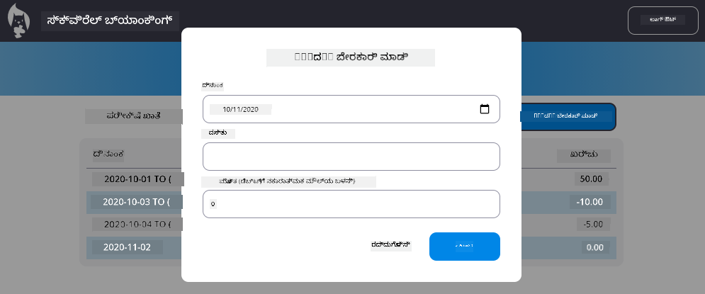

<!--
CO_OP_TRANSLATOR_METADATA:
{
  "original_hash": "50a7783473b39a2e0f133e271a102231",
  "translation_date": "2026-01-08T18:01:29+00:00",
  "source_file": "7-bank-project/4-state-management/assignment.md",
  "language_code": "kn"
}
-->
# "ಲೆನದ ಪತ್ರವನ್ನು ಸೇರಿಸಿ" ಡೈಲಾಗ್ ಅನುಷ್ಠಾನಗೊಳಿಸಿ

## ಅವಲೋಕನ

ನಿಮ್ಮ ಬ್ಯಾಂಕಿಂಗ್ ಅಪ್ಲಿಕೇಶನ್ ಈಗ ಸ್ಟೇಟ್ ಮ್ಯಾನೇಜ್‌ಮೆಂಟ್ ಮತ್ತು ಡೇಟಾ ಪರ್ಸಿಸ್ಟನ್ಸ್ ಪಡೆದಿದೆ, ಆದರೆ ಅದು ಒಂದು ಅವಶ್ಯಕ ವೈಶಿಷ್ಟ್ಯವನ್ನು ಹೊಂದಿಲ್ಲ: ಬಳಕೆದಾರರು ತಮ್ಮದೇ ಲೆನದ ಪತ್ರಗಳನ್ನು ಸೇರಿಸಲು ಸಾಧ್ಯವಾಗಬೇಕಾಗಿದೆ. ಈ ಅಸೈನ್‌ಮೆಂಟ್‌ನಲ್ಲಿ, ನೀವು ನಿಮ್ಮ ಇತರ ಸ್ಟೇಟ್ ಮ್ಯಾನೇಜ್‌ಮೆಂಟ್ ವ್ಯವಸ್ಥೆಯೊಂದಿಗೆ ಸೊಗಸಾಗಿ ಏಕೀಕರಿಸುವ ಸಂಪೂರ್ಣ "ಲೆನದ ಪತ್ರವನ್ನು ಸೇರಿಸಿ" ಡೈಲಾಗ್ ಅನ್ನು ಅನುಷ್ಠಾನಗೊಳಿಸುತ್ತೀರಿ.

ಈ ಅಸೈನ್‌ಮೆಂಟ್ ನಿಮ್ಮ ನಾಲ್ಕು ಬ್ಯಾಂಕಿಂಗ್ ಪಾಠಗಳಲ್ಲಿ ಕಲಿತ ಎಲ್ಲಾ ವಿಷಯಗಳನ್ನು: HTML ಟೆಂಪ್ಲೇಟಿಂಗ್, ಫಾರ್ಮ್ ಹ್ಯಾಂಡಲಿಂಗ್, API ಏಕೀಕರಣ, ಮತ್ತು ಸ್ಟೇಟ್ ಮ್ಯಾನೇಜ್‌ಮೆಂಟ್ ಅನ್ನು ಒಟ್ಟಾರೆ ಕೊಂಡೊಯ್ಯುತ್ತದೆ.

## ಕಲಿಕೆ ಉದ್ದೇಶಗಳು

ಈ ಅಸೈನ್‌ಮೆಂಟ್ ಪೂರ್ಣಗೊಳಿಸುವ ಮೂಲಕ, ನೀವು:
- **ಬಳಕೆದಾರ ಸ್ನೇಹಿ** ಡೈಲಾಗ್ ಇಂಟರ್ಫೇಸ್ ಅನ್ನು ರಚಿಸುವಿರಿ
- **ಅಕ್ಸೆಸಿಬಲ್** ಫಾರ್ಮ್ ವಿನ್ಯಾಸವನ್ನು ಕೀಬೋರ್ಡ್ ಮತ್ತು ಸ್ಕ್ರೀನ್ ರೀಡರ್ ಬೆಂಬಲದೊಂದಿಗೆ ಅನುಷ್ಠಾನಗೊಳಿಸುವಿರಿ
- **ಎಕ್ಸಿಸ್ಟಿಂಗ್ ಸ್ಟೇಟ್ ಮ್ಯಾನೇಜ್‌ಮೆಂಟ್** ವ್ಯವಸ್ಥೆಯೊಂದಿಗೆ ಹೊಸ ವೈಶಿಷ್ಟ್ಯಗಳನ್ನು ಏಕೀಕರಿಸುವಿರಿ
- **API ಸಂವಹನ ಮತ್ತು ದೋಷ ನಿರ್ವಹಣೆ** ಅಭ್ಯಾಸ ಮಾಡುವಿರಿ
- **ಆಧುನಿಕ ವೆಬ್ ಅಭಿವೃದ್ಧಿ ಮಾದರಿಗಳನ್ನು** ನೈಜ-ಲೋಕ ವೈಶಿಷ್ಟ್ಯಕ್ಕೆ ಅನ್ವಯಿಸುವಿರಿ

## ಸೂಚನೆಗಳು

### ಹಂತ 1: ಲೆನದ ಪತ್ರ ಸೇರಿಸುವ ಬಟನ್

ನಿಮ್ಮ ಡ್ಯಾಶ್‌ಬೋರ್ಡ್ ಪುಟದಲ್ಲಿ ಬಳಕೆದಾರರು ಸುಲಭವಾಗಿ ಕಂಡು ಸಾಧಿಸಲು ಆಗುವ "ಲೆನದ ಪತ್ರ ಸೇರಿಸಿ" ಬಟನ್ ಅನ್ನು **ಸೃಷ್ಟಿಸಿ**.

**ಅವಶ್ಯಕತೆಗಳು:**
- ಡ್ಯಾಶ್‌ಬೋರ್ಡ್‌ನ ತರ್ಕಬದ್ಧ ಸ್ಥಳದಲ್ಲಿ ಬಟನ್ **ನಿರ್ವಹಿಸಿ**
- ಸ್ಪಷ್ಟ, ಕ್ರಿಯಾಶೀಲ ಬಟನ್ ಪಠ್ಯವನ್ನು **ಬಳಸು**
- ನಿಮ್ಮ ಇತ್ತೀಚಿನ UI ವಿನ್ಯಾಸಕ್ಕೆ ಅನುಗುಣವಾಗಿ ಬಟನನ್ನು **ಶೈಲಿ ಮಾಡಿ**
- ಬಟನ್ ಕೀಬೋರ್ಡ್ ಮೂಲಕ **ಸುಲಭವಾಗಿ ಬಳಕೆ ಮಾಡಬಹುದಾಗಿರಲಿ**

### ಹಂತ 2: ಡೈಲಾಗ್ ಅನುಷ್ಠಾನ

ನಿಮ್ಮ ಡೈಲಾಗ್ ಅನುಷ್ಠಾನಕ್ಕೆ ಈ ಎರಡು ವಿಧಾನಗಳಲ್ಲೊಂದು ಆಯ್ಕೆಮಾಡಿ:

**ವಿಕಲ್ಪ A: ಪ್ರತ್ಯೇಕ ಪುಟ**
- ಲೆನದ ಪತ್ರ ಫಾರ್ಮ್‌ಗೆ ಹೊಸ HTML ಟೆಂಪ್ಲೇಟನ್ನು **ಸೃಷ್ಟಿಸಿ**
- ನಿಮ್ಮ ರೌಟಿಂಗ್ ವ್ಯವಸ್ಥೆಗೆ ಹೊಸ ಮಾರ್ಗವನ್ನು **ಹೋರಾಟ ಮಾಡಿ**
- ಫಾರ್ಮ್ ಪುಟಕ್ಕೆ ಮತ್ತು ಹಿಂದಕ್ಕೆ ಸಂಚರಿಸುವ ಅವಕಾಶವನ್ನು **ಅನುಷ್ಠಾನಗೊಳಿಸಿ**

**ವಿಕಲ್ಪ B: ಮೋಡಲ್ ಡೈಲಾಗ್ (ಶಿಫಾರಸು ಮಾಡಲಾಗಿದೆ)**
- ಡ್ಯಾಶ್‌ಬೋರ್ಡ್ ಬಿಟ್ಟುಹೋಗದೆ JavaScript ಬಳಸಿ ಡೈಲಾಗ್ ಅನ್ನು ತೋರಿಸ/ಮರೆಮಾಡಿ
- [`hidden` ಗುಣಲಕ್ಷಣ](https://developer.mozilla.org/docs/Web/HTML/Global_attributes/hidden) ಅಥವಾ CSS ವರ್ಗಗಳನ್ನು **ಬಳಸಿರಿ**
- ಸರಿಯಾದ ಫೋಕಸ್ ನಿರ್ವಹಣೆಯೊಂದಿಗೆ ಸಿವಾರ ಪಟ್ಟ ಅನುಭವವನ್ನು **ತಯಾರಿಸಿ**

### ಹಂತ 3: ಅಕ್ಸೆಸಿಬಿಲಿಟಿ ಅನುಷ್ಠಾನ

ನಿಮ್ಮ ಡೈಲಾಗ್ [ಮೋಡಲ್ ಡೈಲಾಗ್‌ಗಳಿಗೆ ನನ್ನವಿರುವ ಅಕ್ಸೆಸಿಬಿಲಿಟಿ ಮಾನದಂಡಗಳನ್ನು](https://developer.paciellogroup.com/blog/2018/06/the-current-state-of-modal-dialog-accessibility/) ಪೂರೈಸುವಂತೆ **ಪರಿಶೀಲಿಸಿ**:

**ಕೀಬೋರ್ಡ್ ನ್ಯಾವಿಗೇಶನ್:**
- ಡೈಲಾಗ್ ಮುಚ್ಚಲು Escape ಕೀ ಬೆಂಬಲಿಸಿ
- ಡೈಲಾಗ್ ತೆರೆಯಲಾದಾಗ ಫೋಕಸ್ ಅನ್ನು ಒಳಗಿನ ಭಾಗದಲ್ಲಿಯೇ **ಬಿಗಿ ಹಿಡಿಸಿ**
- ಮುಚ್ಚಿದ ನಂತರ ಫೋಕಸ್ ಅನ್ನು ಟ್ರಿಗರ್ ಬಟನ್ಗೆ ಮತ್ತೆ **ಹಿಂತಿರುಗಿಸಿ**

**ಸ್ಕ್ರೀನ್ ರೀಡರ್ ಬೆಂಬಲ:**
- ಸೂಕ್ತ ARIA ಲೇಬಲ್ಗಳು ಮತ್ತು ಪಾತ್ರಗಳನ್ನು **ಹೋದಲಿಸಿ**
- ಡೈಲಾಗ್ ತೆರೆಯುವುದು/ಮುಚ್ಚುವುದು ಸ್ಕ್ರೀನ್ ರೀಡರ್‌ಗೆ **ಘೋಷಿಸಿ**
- ಸ್ಪಷ್ಟ ಫಾರ್ಮ್ ಕ್ಷೇತ್ರ ಲೇಬಲ್ಗಳನ್ನು ಮತ್ತು ದೋಷ ಸಂದೇಶಗಳನ್ನು **ನೀಡಿ**

### ಹಂತ 4: ಫಾರ್ಮ್ ರಚನೆ

ಲೆನದ ಪತ್ರ ಡೇಟಾಗೆ ಸೇರಿಸಲು HTML ಫಾರ್ಮ್ ಅನ್ನು **ವಿನ್ಯಾಸ ಮಾಡಿ**:

**ಅವಶ್ಯಕ ಕ್ಷೇತ್ರಗಳು:**
- **ದಿನಾಂಕ**: ಲೆನದ ಪತ್ರ ಯಾವಾಗ ನಡೆದಿದೆ
- **ವಿವರಣೆ**: ಲೆನದ ಪತ್ರ ಯಾವ ಕಾರಣಕ್ಕಾಗಿ ಇದೆ
- **ಮುಲ್ಯ**: ಲೆನದ ಪತಿಯ ಮೌಲ್ಯ (ಆದಾಯಕ್ಕೆ ಧನಾತ್ಮಕ, ಖರ್ಚಿಗೆ ಋಣಾತ್ಮಕ)

**ಫಾರ್ಮ್ ವೈಶಿಷ್ಟ್ಯಗಳು:**
- ಸಲ್ಲಿಸುವ ಮೊದಲು ಬಳಕೆದಾರ ಅಂಕಗಳನ್ನು **ಸರಿಯಾದದಾಗಿರುವುದನ್ನೌಪಯೋಗಿ**
- ತಪ್ಪು ಡೇಟಾಗೆ ಸ್ಪಷ್ಟ ದೋಷ ಸಂದೇಶಗಳನ್ನು **ನೀಡಿ**
- ಸಹಾಯಕ Placeholder ಪಠ್ಯ ಮತ್ತು ಲೇಬಲ್ಗಳನ್ನು **ಸೇರಿಸಿ**
- ನಿಮ್ಮ ಇತ್ತೀಚಿನ ವಿನ್ಯಾಸಕ್ಕೆ ಸಮ್ಮತವಾಗಿ **ಶೈಲಿ ಮಾಡಿ**

### ಹಂತ 5: API ಏಕೀಕರಣ

ನಿಮ್ಮ ಫಾರ್ಮ್ ಅನ್ನು ಬ್ಯಾಂಕಿಂಗ್ API ನೊಂದಿಗೆ **ಸಂಪರ್ಕಿಸಿ**:

**ಅನುಷ್ಠಾನ ಹಂತಗಳು:**
- ಸರಿಯಾದ ಎಂಡ್‌ಪಾಯಿಂಟ್ ಮತ್ತು ಡೇಟಾ ಫಾರ್ಮಾಟ್ ಗಾಗಿ [ಸರ್ವರ್ API ನಿರ್ದಿಷ್ಟತೆಗಳನ್ನು](../api/README.md) **ಪರಿಶೀಲಿಸಿ**
- ಫಾರ್ಮ್ ಇನ್ಪುಟ್‌ಗಳಿಂದ JSON ಡೇಟಾ **ತಯಾರಿಸಿ**
- ಸರಿಯಾದ ದೋಷ ನಿರ್ವಹಣೆಯೊಂದಿಗೆ API ಗೆ ಡೇಟಾವನ್ನು **ಪাঠಿಸಿ**
- ಬಳಕೆದಾರಿಗೆ ಯಶಸ್ಸು/ವಿಫಲತೆ ಸಂದೇಶಗಳನ್ನು **ತೋರಿಸಿ**
- ನೆಟ್‌ವರ್ಕ್ ದೋಷಗಳನ್ನು ಶ್ರದ್ಧೆಯುತವಾಗಿ **ನಿರ್ವಹಿಸಿ**

### ಹಂತ 6: ಸ್ಟೇಟ್ ಮ್ಯಾನೇಜ್‌ಮೆಂಟ್ ಏಕೀಕರಣ

ಹೊಸ ಲೆನದ ಪತ್ರದೊಂದಿಗೆ ನಿಮ್ಮ ಡ್ಯಾಶ್‌ಬೋರ್ಡ್ ಅನ್ನು **ಅัปಡೇಟ್ ಮಾಡಿ**:

**ಎಕೀಕರಣ ಅವಶ್ಯಕತೆಗಳು:**
- ಲೆನದ ಪತ್ರ ಯಶಸ್ವಿಯಾಗಿ ಸೇರಿಸಿದ ನಂತರ ಖಾತೆ ಡೇಟಾವನ್ನು **ರಿಫ್ರೆಶ್ ಮಾಡಿ**
- ಪುಟ ರೀಹ್‌ಲೋಡ್ ಅಗತ್ಯವಿಲ್ಲದೆ ಡ್ಯಾಶ್‌ಬೋರ್ಡ್ ಪ್ರದರ್ಶನವನ್ನು **ನವೀಕರಿಸಿ**
- ಹೊಸ ಲೆನದ ಪತ್ರ ತಕ್ಷಣವೇ **ತೋರಿಸಬೇಕು**
- ಪ್ರಕ್ರಿಯೆ ಅವಧಿಯಲ್ಲಿ ಸರಿಯಾದ ಸ್ಟೇಟ್ ಸಮ್ಮತತೆಯನ್ನು **ರಕ್ಷಿಸಿ**

## ತಾಂತ್ರಿಕ ನಿರ್ದಿಷ್ಟತೆಗಳು

**API ಎಂಡ್‌ಪಾಯಿಂಟ್ ವಿವರಗಳು:**
[ಸರ್ವರ್ API ಡಾಕ್ಯುಮೆಂಟೇಶನ್](../api/README.md) ನೋಡಿ:
- ಲೆನದ ಪತ್ರ ಡೇಟಾ ಗೆ ಅಗತ್ಯವಿರುವ JSON ಫಾರ್ಮಾಟ್
- HTTP ವಿಧಾನ ಮತ್ತು ಎಂಡ್‌ಪಾಯಿಂಟ್ URL
- ನಿರೀಕ್ಷಿತ ಪ್ರತಿಕ್ರಿಯೆ ಫಾರ್ಮಾಟ್
- ದೋಷ ಪ್ರತಿಕ್ರಿಯೆ ನಿರ್ವಹಣೆ

**ನಿರೀಕ್ಷಿತ ಫಲಿತಾಂಶ:**
ಈ ಅಸೈನ್‌ಮೆಂಟ್ ಪೂರ್ಣಗೊಳಿಸಿದ ನಂತರ, ನಿಮ್ಮ ಬ್ಯಾಂಕಿಂಗ್ ಅಪ್ಲಿಕೇಶನ್ ಪರಿಪೂರ್ಣವಾಗಿ ಕೆಲಸ ಮಾಡುವ "ಲೆನದ ಪತ್ರ ಸೇರಿಸಿ" ವೈಶಿಷ್ಟ್ಯವನ್ನು ಹೊಂದಿರುತ್ತದೆ, ವೃತ್ತಿಪರವಾಗಿ ಕಾಣುವುದು ಮತ್ತು ನಡೆದುಕೊಳ್ಳುವುದು:

## ನಿಮ್ಮ ಅನುಷ್ಠಾನವನ್ನು ಪರೀಕ್ಷಿಸುವುದು

**ಕಾರ್ಯಾಚರಣಾ ಪರೀಕ್ಷೆ:**
1. "ಲೆನದ ಪತ್ರ ಸೇರಿಸಿ" ಬಟನ್ ಸ್ಪಷ್ಟವಾಗಿ ದೃಶ್ಯಮಾನದಾಗಿದ್ದು ಲಭ್ಯವಿದೆ ಎಂದು **ತಪಾಸಣೆ ಮಾಡಿ**
2. ಡೈಲಾಗ್ ಸರಿಯಾಗಿ ತೆರೆಯುತ್ತದೆ ಮತ್ತು ಮುಚ್ಚುತ್ತದೆ ಎಂಬುದನ್ನು **ಪರಿಶೀಲಿಸಿ**
3. ಎಲ್ಲಾ ಅಗತ್ಯ ಕ್ಷೇತ್ರಗಳಿಗೆ ಫಾರ್ಮ್ ಮೌಲ್ಯಪೂರಣ ಕಾರ್ಯನಿರ್ವಹಿಸುತ್ತದೆ ಎಂದು **ನಿಖರತೆ ಮಾಡಿ**
4. ಯಶಸ್ವಿ ಲೆನದ ಪತ್ರಗಳು ತಕ್ಷಣವೇ ಡ್ಯಾಶ್‌ಬೋರ್ಡ್‌ನಲ್ಲಿ ಕಾಣುತ್ತವೆ ಎಂಬುದನ್ನು **ಪರಿಶೀಲಿಸಿ**
5. ತಪ್ಪು ಡೇಟಾ ಮತ್ತು ನೆಟ್‌ವರ್ಕ್ ಸಮಸ್ಯೆಗಳಿಗಾಗಿ ದೋಷ ನಿರ್ವಹಣೆ ಕಾರ್ಯನಿರ್ವಹಿಸುತ್ತದೆ ಎಂದು **ನಿರೀಕ್ಷಿಸಿ**

**ಅಕ್ಸೆಸಿಬಿಲಿಟಿ ಪರೀಕ್ಷೆ:**
1. ಕೇವಲ ಕೀಬೋರ್ಡ್ ಬಳಸಿ ಸಂಪೂರ್ಣ ಪ್ರಕ್ರಿಯೆ ಮೂಲಕ **ಸಂಚರಿಸಿ**
2. ಸರಿಯಾದ ಘೋಷಣೆಗಳಿಗಾಗಿ ಸ್ಕ್ರೀನ್ ರೀಡರ್ ಬಳಸಿ **ಪರೀಕ್ಷಿಸಿ**
3. ಫೋಕಸ್ ನಿರ್ವಹಣೆ ಸರಿಯಾಗಿ ಕಾರ್ಯನಿರ್ವಹಿಸುತ್ತಿದೆ ಎಂದು **ನಿಖರವಾಗಿ ಪರಿಶೀಲಿಸಿ**
4. ಎಲ್ಲಾ ಫಾರ್ಮ್ ಘಟಕಗಳಿಗೆ ಸೂಕ್ತ ಲೇಬಲ್ಗಳು ಇರುವುದನ್ನು **ತಪಾಸಿಸಿರಿ**

## ಮೌಲ್ಯಮಾಪನ ರೂಬ್ರಿಕ್

| ಮಾನದಂಡ | ಉದಾಹರಣೆ | ಅತ್ಯುತ್ತಮ | ಸುಧಾರಣೆ ಅಗತ್ಯವಿದೆ |
| -------- | --------- | -------- | ----------------- |
| **ಕಾರ್ಯಾಚರಣೆ** | ಲೆನದ ಪತ್ರ ವೈಶಿಷ್ಟ್ಯವು ದೋಷರಹಿತವಾಗಿ ಕಾರ್ಯನಿರ್ವಹಿಸುತ್ತದೆ, ಅತ್ಯುತ್ತಮ ಬಳಕೆದಾರ ಅನುಭವ ಮತ್ತು ಪಾಠಗಳಿಂದ ಎಲ್ಲ ಉತ್ತಮ ಕ್ರಮಗಳನ್ನು ಅನುಸರಿಸುತ್ತದೆ | ಲೆನದ ಪತ್ರ ಕಾರ್ಯನಿರ್ವಹಿಸುತ್ತದೆ ಆದರೆ ಕೆಲವು ಅತ್ಯುತ್ತಮ ಕ್ರಮಗಳನ್ನು ಅನುಸರಿಸದೆ ಅಥವಾ ಸಣ್ಣ ಬಳಕೆದಾರ ಅನುಕೂಲ ಸಮಸ್ಯೆಗಳಿವೆ | ಲೆನದ ಪತ್ರ ಭಾಗಶಃ ಮಾತ್ರ ಕಾರ್ಯನಿರ್ವಹಿಸುತ್ತದೆ ಅಥವಾ ಪ್ರಮುಖ ಬಳಕೆದಾರ ಅನುಕೂಲ ಸಮಸ್ಯೆಗಳಿವೆ |
| **ಕೋಡ್ ಗುಣಮಟ್ಟ** | ಕೋಡ್ ಸುಸಂಯೋಜಿತವಾಗಿದೆ, ಸ್ಥಾಪಿತ ಮಾದರಿಗಳನ್ನು ಅನುಸರಿಸುತ್ತದೆ, ಸರಿಯಾದ ದೋಷ ನಿರ್ವಹಣೆಯುಳ್ಳದೆ ಮತ್ತು ಇತ್ತೀಚಿನ ಸ್ಟೇಟ್ ವ್ಯವಸ್ಥೆಯೊಂದಿಗೆ ಸಂಪೂರ್ಣ ಏಕೀಕರಿಸಲಾಗಿದೆ | ಕೋಡ್ ಕಾರ್ಯನಿರ್ವಹಿಸುತ್ತದೆ ಆದರೆ ಕೆಲವೊಂದು ಸಂಘಟನೆ ಸಮಸ್ಯೆಗಳು ಅಥವಾ ಅಸ್ಥಿರ ಮಾದರಿಗಳಿವೆ | ಕೋಡ್ ಧಾರ್ಮಿಕ ಸಮಸ್ಯೆ ಮತ್ತು ಇತ್ತೀಚಿನ ಮಾದರಿಗಳೊಂದಿಗೆ ಸರಿಯಾಗಿ ಏಕೀಕರಿಸದೇ ಇದೆ |
| **அಕ್ಸೆಸಿಬಿಲಿಟಿ** | ಸಂಪೂರ್ಣ ಕೀಬೋರ್ಡ್ ನ್ಯಾವಿಗೇಶನ್ ಬೆಂಬಲ, ಸ್ಕ್ರೀನ್ ರೀಡರ್ ಹೊಂದಾಣಿಕೆ, ಹಾಗೂ WCAG ಮಾರ್ಗಸೂಚಿತ ಸಹಿತ ಅತ್ಯುತ್ತಮ ಫೋಕಸ್ ನಿರ್ವಹಣೆ | ಮೂಲಭೂತ ಅಕ್ಸೆಸಿಬಿಲಿಟಿ ವೈಶಿಷ್ಟ್ಯಗಳು ಜಾರಿಯಾದವು, ಆದರೆ ಕೆಲವು ಕೀಬೋರ್ಡ್ ನ್ಯಾವಿಗೇಶನ್ ಅಥವಾ ಸ್ಕ್ರೀನ್ ರೀಡರ್ ವೈಶಿಷ್ಟ್ಯಗಳು ಇಲ್ಲ | ಅನೇಕ ಅಥವಾ ಯಾವುದೇ ಅಕ್ಸೆಸಿಬಿಲಿಟಿ ಪರಿಗಣನೆಗಳು ಜಾರಿಯಾಗಿಲ್ಲ |
| **ಬಳಕೆದಾರ ಅನುಭವ** | ಸ್ಪಷ್ಟ ಪ್ರತಿಕ್ರಿಯೆ, ಸೌಮ್ಯ ಸಂಭಾಷಣೆ ಮತ್ತು ವೃತ್ತಿಪರ ಆಲಂಕಾರಿಕತೆ ಹೊಂದಿದ ಅದೃಷ್ಟಶಾಲಿ, ಮೆಚ್ಚುಗೆಯ ಸೋಪಾನ | ಉತ್ತಮ ಬಳಕೆದಾರ ಅನುಭವ ಆದರೆ ಪ್ರತಿಕ್ರಿಯೆ ಅಥವಾ ದೃಶ್ಯ ವಿನ್ಯಾಸದಲ್ಲಿ ಸಣ್ಣ ಸುಧಾರಣೆಗಳಿಗೆ ಅಗತ್ಯವಿದೆ | ಗೊಂದಲಕಾರಿ ಇಂಟರ್ಫೇಸ್ ಅಥವಾ ಬಳಕೆದಾರ ಪ್ರತಿಕ್ರಿಯೆಯ ಕೊರತೆ ಇರುವ ದೌರ್ಬಲ್ಯপূর্ণ ಅನುಭವ |

## ಹೆಚ್ಚುವರಿ ಸವಾಲುಗಳು (ಐಚ್ಛಿಕ)

ನೀವು ಮೂಲ ಅಗತ್ಯಗಳನ್ನು ಪೂರ್ಣಗೊಳಿಸಿದ ನಂತರ, ಈ ಸುಧಾರಣೆಗಳನ್ನು ಪರಿಗಣಿಸಿ:

**ವಿಕಸಿತ ವೈಶಿಷ್ಟ್ಯಗಳು:**
- ಲೆನದ ಪತ್ರ ವರ್ಗಗಳನ್ನು (ಅಹಾರ, ಸಾರಿಗೆ, ಮನರಂಜನೆ ಇತ್ಯಾದಿ) **ಸೇರಿಸಿ**
- ನೈಜ-ಸಮಯ ಪ್ರತಿಕ್ರಿಯೆಯೊಂದಿಗೆ ಇನ್ಪುಟ್ ಮೌಲ್ಯಪೂರಣವನ್ನು **ಅನುಷ್ಠಾನಗೊಳಿಸಿ**
- ಶಕ್ತಿಶಾಲಿ ಬಳಕೆದಾರರಿಗೆ ಕೀಬೋರ್ಡ್ ಶಾರ್ಟ್‌ಕಟ್ ಗಳನ್ನು **ತಯಾರಿಸಿ**
- ಲೆನದ ಪತ್ರ ಸಂಪಾದನೆ ಮತ್ತು ಅಳಿಸುವ ಸಾಮರ್ಥ್ಯವನ್ನು **ಸೇರಿಸಿ**

**ಮುನ್ನಡೆ ಏಕೀಕರಣ:**
- ಇತ್ತೀಚೆಗೆ ಸೇರಿಸಿದ ಲೆನದ ಪತ್ರಗಳಿಗೆ undo ಕಾರ್ಯಾಂಕವನ್ನು **ಅನುಷ್ಠಾನಗೊಳಿಸಿ**
- CSV ಫೈಲ್‌ಗಳಿಂದ ಒಂದುಗೂಡಿಸಿದ ಲೆನದ ಪತ್ರಗಳನ್ನು **ಆಮದು ಮಾಡಿ**
- ಲೆನದ ಪತ್ರ ಹುಡುಕಾಟ ಮತ್ತು ಫಿಲ್ಟರಿಂಗ್ ವೈಶಿಷ್ಟ್ಯಗಳನ್ನು **ಸೃಷ್ಟಿಸಿ**
- ಡೇಟಾ ರಫ್ತು ಕಾರ್ಯವನ್ನು **ಅನುಷ್ಠಾನಗೊಳಿಸಿ**

ಈ ಐಚ್ಛಿಕ ವೈಶಿಷ್ಟ್ಯಗಳು ನಿಮಗೆ ಹೆಚ್ಚು ಉನ್ನತ ವೆಬ್ ಅಭಿವೃದ್ಧಿ ತಂತ್ರಾಂಶಗಳನ್ನು ಅಭ್ಯಾಸ ಮಾಡಲು ಸಹಾಯ ಮಾಡುತ್ತವೆ ಮತ್ತು ಸಂಪೂರ್ಣವಾದ ಬ್ಯಾಂಕಿಂಗ್ ಅಪ್ಲಿಕೇಶನ್ ರಚಿಸಲು ಸಹಾಯ ಮಾಡುತ್ತವೆ!

---

<!-- CO-OP TRANSLATOR DISCLAIMER START -->
**ಉಲ್ಲೇಖ ನಿರಾಕರಣೆ**:
ಈ ದಾಖಲೆ [Co-op Translator](https://github.com/Azure/co-op-translator) ಎಂಬ AI ಅನುವಾದ ಸೇವೆಯನ್ನು ಬಳಸಿಕೊಂಡು ಅನುವಾದಿಸಲಾಗಿದೆ. ನಾವು ಶುದ್ಧತೆಯನ್ನು ಸಾಧಿಸಲು ಪ್ರಯತ್ನಿಸುತ್ತಿದ್ದರೂ ಸಹ, ಸ್ವಯಂಚಾಲಿತ ಅನುವಾದಗಳಲ್ಲಿ ತಪ್ಪುಗಳು ಅಥವಾ ಅಸ್ಪಷ್ಟತೆಗಳು ಇರಬಹುದು ಎಂಬುದನ್ನು ದಯವಿಟ್ಟು ಗಮನಿಸಿ. ಮೂಲ ಭಾಷೆಯಲ್ಲಿನ ನೇರ ದಾಖಲೆಯನ್ನು ಅಧಿಕೃತ ಮೂಲ ಎಂದು ಪರಿಗಣಿಸಲಾಗಬೇಕು. ಗಂಭೀರ ಮಾಹಿತಿಗಾಗಿ ವೃತ್ತಿಪರ ಮಾನವ ಅನುವಾದವನ್ನು ಶಿಫಾರಸು ಮಾಡಲಾಗುತ್ತದೆ. ಈ ಅನುವಾದದ ಬಳಕೆಯಿಂದ ಉಂಟಾಗುವ ಯಾವುದೇ ಅರ್ಥಮಾಡಿಕೊಳ್ಳಲಾರದ ಅಥವಾ ತಪ್ಪು ವ್ಯಾಖ್ಯಾನಗಳಿಗೆ ನಾವು ಉತ್ತರದಾಯಕರಾಗಿರಲ್ಲ.
<!-- CO-OP TRANSLATOR DISCLAIMER END -->