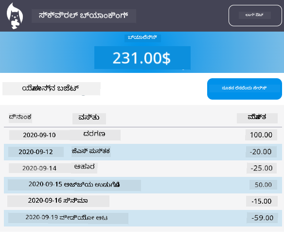

<!--
CO_OP_TRANSLATOR_METADATA:
{
  "original_hash": "830359535306594b448db6575ce5cdee",
  "translation_date": "2026-01-08T11:31:04+00:00",
  "source_file": "7-bank-project/README.md",
  "language_code": "kn"
}
-->
# :dollar: ಬ್ಯಾಂಕ್ ನಿರ್ಮಿಸಿ

ಈ ಯೋಜನೆಯಲ್ಲಿ, ನೀವು ಒಂದು ಕಲ್ಪಿತ ಬ್ಯಾಂಕನ್ನು ಹೇಗೆ ನಿರ್ಮಿಸಬೇಕು ಎಂಬುದನ್ನು ಕಲಿಯೋಿರಿ. ಇವುಗಳಲ್ಲಿ ವೆಬ್ ಅಪ್ಲಿಕೇಶನ್ ವಿನ್ಯಾಸಗೊಳಿಸುವುದು ಮತ್ತು ಮಾರ್ಗಗಳನ್ನು ಒದಗಿಸುವುದು, ಫಾರ್ಮ್‌ಗಳನ್ನು ನಿರ್ಮಿಸುವುದು, ಸ್ಥಿತಿಯನ್ನು ನಿರ್ವಹಿಸುವುದು, ಮತ್ತು ಬ್ಯಾಂಕಿನ ಡೇಟಾವನ್ನು ಪಡೆಯಲು API ಯಿಂದ ಡೇಟಾವನ್ನು ಎങ്ങനെ ಪಡೆಯಬೇಕು ಎಂಬುದು ಸೇರಿವೆ.

|  |  |
|--------------------------------|--------------------------------|

## ಪಾಠಗಳು

1. [ವೆಬ್ ಅಪ್ಲಿಕೇಶನಿನಲ್ಲಿ HTML ಟೆಂಪ್ಲೇಟ್ಸ್ ಮತ್ತು ಮಾರ್ಗಗಳು](1-template-route/README.md)
2. [ಲಾಗಿನ್ ಮತ್ತು ನೋಂದಣಿ ಫಾರ್ಮ್ ನಿರ್ಮಿಸಿ](2-forms/README.md)
3. [ಡೇಟಾವನ್ನು ಪಡೆಯುವ ಮತ್ತು ಬಳಸುವ ವಿಧಾನಗಳು](3-data/README.md)
4. [ಸ್ಥಿತಿ ನಿರ್ವಹಣೆಯ ಸಂಪ್ರದಾಯಗಳು](4-state-management/README.md)

### ಕ್ರೆಡಿಟ್ಸ್

ಈ ಪಾಠಗಳನ್ನು :hearts: ಯೋಹಾನ್ ಲಾಸೋರ್ಸಾ [Yohan Lasorsa](https://twitter.com/sinedied) ಅವರು ಬರೆಯಲಾಗಿದೆ.

ನೀವು ಈ ಪಾಠಗಳಲ್ಲಿ ಬಳಸಿರುವ [ಸರ್ವರ್ API](/7-bank-project/api/README.md) ಯನ್ನು ಹೇಗೆ ನಿರ್ಮಿಸಬೇಕೆಂದು ಕಲಿಯಲು ಆಸಕ್ತರಿದ್ದರೆ, ನೀವು [ಈ ವೀಡಿಯೋ ಶ್ರೇಣಿಯನ್ನು](https://aka.ms/NodeBeginner) (ಪ್ರಮುಖವಾಗಿ 17 ರಿಂದ 21 ವೀಡಿಯೋಗಳವರೆಗೆ) ಅನುಸರಿಸಬಹುದು.

ನೀವು [ಈ ಇಂಟರಾಕ್ಟಿವ್ ಲರ್ನ್ ಟ್ಯುಟೋರಿಯಲ್](https://aka.ms/learn/express-api) ಅನ್ನು ಕೂಡ ನೋಡಿ ತಿಳಿಯಬಹುದು.

---

<!-- CO-OP TRANSLATOR DISCLAIMER START -->
**ಒಪ್ಪಂದ ಮುಕ್ತಾಯ**:
ಈ ಡಾಕ್ಯುಮೆಂಟ್ ಅನ್ನು AI ಭಾಷಾಂತರ ಸೇವೆ [Co-op Translator](https://github.com/Azure/co-op-translator) ಬಳಸಿಕೊಂಡು ಭಾಷಾಂತರಿಸಲಾಗಿದೆ. ನಾವು ಸರಿಯಾದತೆಯಿಗಾಗಿ ಪ್ರಯತ್ನಿಸುತ್ತಿದ್ದರೆ, ಸ್ವಯಂಚಾಲಿತ ಭಾಷಾಂತರಗಳಲ್ಲಿ ದೋಷಗಳು ಅಥವಾ ತಪ್ಪುಗಳು ಇರಬಹುದು ಎಂಬುದನ್ನು ದಯವಿಟ್ಟು ಗಮನದಲ್ಲಿ ಇಡಿ. ಮೂಲ ಭಾಷೆಯಡಿಯಲ್ಲಿ ಇರುವ ಮೂಲ ಡಾಕ್ಯುಮೆಂಟ್ ಅನ್ನು ಅಧಿಕೃತ ಮೂಲವಾಗಿದೆ ಎಂದು ಪರಿಗಣಿಸಬೇಕು. ಅತ್ಯಂತ ಸಂಖ್ಯಾತಮ ಮಾಹಿತಿಗಳಿಗೆ ವೃತ್ತಿಪರ ಮಾನವ ಭಾಷಾಂತರವನ್ನು ಶಿಫಾರಸು ಮಾಡಲಾಗುತ್ತದೆ. ಈ ಭಾಷಾಂತರ ಬಳಕೆಯಿಂದ ಆಗಿರುವ ಯಾವುದೇ ತಪ್ಪು ಅರ್ಥ ಮಾಡಿಕೊಳ್ಳುವಿಕೆ ಅಥವಾ ತಪ್ಪಾದ ಅರ್ಥಗೊಳ್ಳುವಿಕೆಗೆ ನಾವು ಜವಾಬ್ದಾರರಾಗುವುದಿಲ್ಲ.
<!-- CO-OP TRANSLATOR DISCLAIMER END -->