<!--
CO_OP_TRANSLATOR_METADATA:
{
  "original_hash": "a9a3bcc037a447e2d8994d99e871cd9f",
  "translation_date": "2026-01-08T13:18:30+00:00",
  "source_file": "8-code-editor/1-using-a-code-editor/README.md",
  "language_code": "kn"
}
-->
# ಕೋಡ್ ಸಂಪಾದಕವನ್ನು ಬಳಸುವುದು: VSCode.dev ನಲ್ಲಿ ಪರಿಣತಿ

*ದಿ ಮ್ಯಾಟ್ರಿಕ್ಸ್* ನಲ್ಲಿ ನೀಯೋ ದೊಡ್ಡ ಕಂಪ್ಯೂಟರ್ ಟರ್ಮಿನಲ್‌ಗೆ ಸಂಪರ್ಕ ಹೊಂದಿ ಡಿಜಿಟಲ್ ಜಗತ್ತಿಗೆ ಪ್ರವೇಶ ಪಡೆದಿದ್ದಾಗ ನೆನಪಾಗಿದೆಯೆ? ಇಂದಿನ ವೆಬ್ ಅಭಿವೃದ್ಧಿ ಸಾಧನಗಳು ಅದಕ್ಕೆ ಬದಲಿ ಕಥೆಯಾಗಿದೆ – ಎಲ್ಲೆಡೆಂದೂ ಲಭ್ಯವಿರುವ ಅತ್ಯಂತ ಶಕ್ತಿಶಾಲಿ ಸಾಮರ್ಥ್ಯಗಳು. VSCode.dev ಒಂದು ಬ್ರೌಸರ್ ಆಧಾರಿತ ಕೋಡ್ ಸಂಪಾದಕವಾಗಿದ್ದು, ಯಾವುದೇ ಇಂಟರ್ನೆಟ್ ಸಂಪರ್ಕ ಇರುವ ಸಾಧನಕ್ಕೆ ವೃತ್ತಿಪರ ಅಭಿವೃದ್ಧಿ ಉಪಕರಣಗಳನ್ನು ತರುತ್ತದೆ.

ಮುದ್ರಣ ಯಂತ್ರವು ಪುಸ್ತಕಗಳನ್ನು ಎಲ್ಲರಿಗೂ ಲಭ್ಯವಾಗಿಸುವುದರಿಂದ, ಮಾತ್ರವಲ್ಲದೆ ಟಿಪ್ಪಣಿಗಳನ್ನು ಮಾತ್ರ ಸಂಗ್ರಹಿಸುವವರಿಗೇ ಇರಲಿಲ್ಲ ಹಾಗೆ, VSCode.dev ಕೂಡ ಕೋಡಿಂಗ್ ಅನ್ನು ಜನಸಾಮಾನ್ಯರಿಗೂ ಲಭ್ಯಗೊಳಿಸುತ್ತದೆ. ನೀವು ಗ್ರಂಥಾಲಯದ ಕಂಪ್ಯೂಟರ್, ಶಾಲಾ ಪ್ರಯೋಗಾಲಯ ಅಥವಾ ಯಾವುದೇ ಬ್ರೌಸರ್ ಹೊಂದಿರುವ ಸ್ಥಳದಿಂದ ಪ್ರಾಜೆಕ್ಟ್‌ಗಳ ಮೇಲೆ ಕೆಲಸ ಮಾಡಬಹುದು. ಯಾವುದೇ ಇನ್ಸ್ಟಾಲೇಶನ್ ಅಗತ್ಯವಿಲ್ಲ, ಅಥವಾ "ನನಗೆ ನನ್ನ ನಿರ್ದಿಷ್ಟ ಸೆಟ್ಟಪ್ ಬೇಕು" ಸೀಮಾ ಇಲ್ಲ.

ಈ ಪಾಠದ ಕೊನೆಯಲ್ಲಿ, ನೀವು VSCode.dev ನವಿಗೇಟ್ ಮಾಡುವುದನ್ನು, ನಿಮ್ಮ ಬ್ರೌಸರ್‌ನಲ್ಲಿ ನೇರವಾಗಿ GitHub ರೆಪೊಜಿಟರಿಗಳನ್ನು ತೆರುವುದನ್ನು ಮತ್ತು Git ಅನ್ನು ಆವೃತ್ತಿ ನಿಯಂತ್ರಣಕ್ಕಾಗಿ ಬಳಸಬೇಕೆಂದು ತಿಳಿದುಕೊಳ್ಳುತ್ತೀರಿ – ವೃತ್ತಿಪರ ಡೆವಲಪರ್‌ಗಳು ಪ್ರತಿದಿನ ಅವಲಂಬಿಸುವ ಎಲ್ಲ ಕೌಶಲ್ಯಗಳು.

## ⚡ ಮುಂದಿನ 5 ನಿಮಿಷಗಳಲ್ಲಿ ನೀವು ಏನು ಮಾಡಬಹುದು

**ವೇಗದ ಪ್ರಾರಂಭ ಮಾರ್ಗಭ್ರಮಣದ ಹಾದಿ ಬ್ಯುಸಿ ಡೆವಲಪರ್‌ಗಳಿಗೆ**


- **ಮೊದಲನೇ ನಿಮಿಷ**: [vscode.dev](https://vscode.dev) ಗೆ ಚೆಲ್ಲಿರಿ - ಯಾವುದೇ ಇನ್ಸ್ಟಾಲೇಶನ್ ಅಗತ್ಯವಿಲ್ಲ
- **ಎರಡನೇ ನಿಮಿಷ**: ನಿಮ್ಮ ರೆಪೊಜಿಟರಿಗಳನ್ನು ಸಂಪರ್ಕಿಸಲು GitHub ನಲ್ಲಿ ಸೈನ್ ಇನ್ ಆಗಿ
- **ಮೂರನೇ ನಿಮಿಷ**: URL ಟ್ರಿಕ್ ಪ್ರಯತ್ನಿಸಿ: ಯಾವುದೇ ರೆಪೊ URL ನಲ್ಲಿ `github.com` ಅನ್ನು `vscode.dev/github` ಗೆ ಬದಲಾಯಿಸಿ
- **ನಾಲಕನೇ ನಿಮಿಷ**: ಹೊಸ ಫೈಲ್ ಸೃಷ್ಟಿಸಿ ಮತ್ತು ಸ್ವಯಂಚಾಲಿತವಾಗಿ ಸಿಂಟ್ಯಾಕ್ಸ್ ಹೈಲೈಟಿಂಗ್ ಕಾರ್ಯನಿರ್ವಹಿಸುವುದನ್ನು ನೋಡಿ
- **ಐದನೇ ನಿಮಿಷ**: ಬದಲಾವಣೆ ಮಾಡಿರಿ ಮತ್ತು ಸෝರ್ಸ್ ಕಂಟ್ರೋಲ್ ಪ್ಯಾನಲ್ ಮೂಲಕ ಕಮಿಟ್ ಮಾಡಿ

**ವೇಗದ ಪರೀಕ್ಷಾ URL**:  
```
# Transform this:
github.com/microsoft/Web-Dev-For-Beginners

# Into this:
vscode.dev/github/microsoft/Web-Dev-For-Beginners
```
  
**ಇದಕ್ಕೆ ಕಾರಣ**: 5 ನಿಮಿಷಗಳಲ್ಲಿ, ನೀವು ವೃತ್ತಿಪರ ಉಪಕರಣಗಳೊಂದಿಗೆ ಎಲ್ಲೆಡೆ ಕೋಡಿಂಗ್ ಮಾಡುವ ಸ್ವತಂತ್ರತೆಯನ್ನು ಅನುಭವಿಸುವಿರಿ. ಇದು ಅಭಿವೃದ್ಧಿಯ ಭವಿಷ್ಯವನ್ನು ಪ್ರತಿನಿಧಿಸುತ್ತದೆ – ಲಭ್ಯವಿರುವ, ಶಕ್ತಿವಾನು ಮತ್ತು ತ್ವರಿತ.

## 🗺️ ಮೋಘ ಆಧಾರಿತ ಅಭಿವೃದ್ಧಿ ಮೂಲಕ ನಿಮ್ಮ ಕಲಿಕೆಯ ಪ್ರಯಾಣ

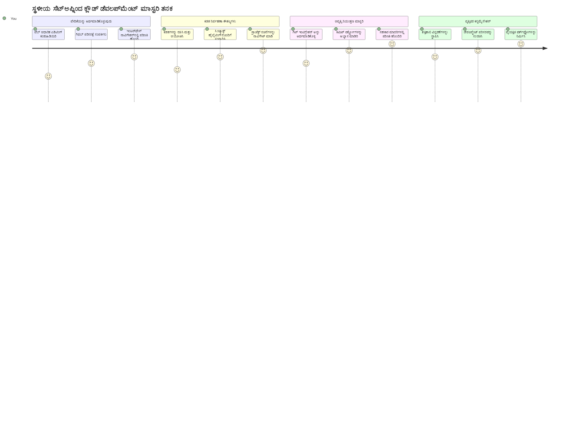
**ನಿಮ್ಮ ಪ್ರಯಾಣ ಗುರಿ**: ಈ ಪಾಠದ ಕೊನೆಯಲ್ಲಿ, ನೀವು ಪ್ರೊಫೆಷನಲ್ ಕ್ಲೌಡ್ ಡೆವಲಪ್‌ಮೆಂಟ್ ಪರಿಸರವನ್ನು ಸಂಪೂರ್ಣ ಅರ್ಥಮಾಡಿಕೊಂಡಿರುತ್ತೀರಿ, ಇದು ಯಾವುದೇ ಸಾಧನದಿಂದ ಕೆಲಸ ಮಾಡುತ್ತದೆ, ಮತ್ತು ಪ್ರಮುಖ ತಂತ್ರಜ್ಞಾನ ಕಂಪನಿಗಳಲ್ಲಿರುವ ಡೆವಲಪರ್‌ಗಳು ಬಳಸುವ ಸಾಧನಗಳನ್ನು ಬಳಸಿ ಕೋಡ್ ಬರೆಯಲು ನಿಮಗೆ ನೆರವಾಗುತ್ತದೆ.

## ನೀವು ಏನು ಕಲಿಯುತ್ತೀರಿ

ನಾವು ಇದನ್ನು ಜೊತೆಯಾಗಿ ನಡೆದುಹೋಗುವ ನಂತರ, ನೀವು ಈಕೆಲಸ ಮಾಡಬಹುದು:

- VSCode.dev ನವಿಗೇಟ್ ಮಾಡಿ, ಅದು ನಿಮ್ಮ ಎರಡನೇ ಮನೆ ಎಂದು ಭಾವಿಸಿ — ಎಲ್ಲವನ್ನೂ ಹುಡುಕಿಕೊಂಡು ತೀರುವ್ಲ್ಲದೆ  
- ಯಾವುದೇ GitHub ರೆಪೊಜಿಟರಿಯನ್ನು ನಿಮ್ಮ ব্রೌಸರ್‌ನಲ್ಲಿ ತೆರೆಯಿರಿ ಮತ್ತು ಕೂಡಲೇ ಸಂಪಾದನೆ ಮಾಡಿ (ಇದು ವಿಸ್ಮಯಕರವಾಗಿದೆ!)  
- Git ಅನ್ನು ಬದಲಾವಣೆಗಳನ್ನು ಟ್ರಾಕ್ ಮಾಡಲು ಬಳಸಿಕೊಳ್ಳಿ ಮತ್ತು ನಿಮ್ಮ ಪ್ರಗತಿಯನ್ನು ವೃತ್ತಿಪರರಂತೆ ಉಳಿಸಿ  
- ಕೋಡಿಂಗ್ ವೇಗವಾಗಿ ಮತ್ತು ಆಸ್ವಾದನೀಯವಾಗಿ ಮಾಡಲು ಎಕ್ಸ್ಟೆನ್ಶನ್‌ಗಳನ್ನು ಉಪಯೋಗಿಸಿ ನಿಮ್ಮ ಸಂಪಾದಕವನ್ನು ಸಶಕ್ತಗೊಳಿಸಿಕೊಳ್ಳಿ  
- ಪ್ರಾಜೆಕ್ಟ್ ಫೈಲ್‌ಗಳನ್ನು ಧೈರ್ಯದಿಂದ ರಚಿಸಿ ಮತ್ತು ಏರ್ಪಡಿಸಿಕೊಳ್ಳಿ

## ನೀವು ಏನು ಬೇಕಾಗುತ್ತದೆ

ಅಗತ್ಯಗಳೆ ಇವು:

- ಉಚಿತ [GitHub ಖಾತೆ](https://github.com) (ಆವಶ್ಯಕವಾದರೆ ನಾವು ಸೃಷ್ಟಿಯ ಕುರಿತು ಮಾರ್ಗದರ್ಶನ ನೀಡುತ್ತೇವೆ)  
- ವೆಬ್ ಬ್ರೌಸರ್ನಲ್ಲಿ ಮೂಲಭೂತ ಪರಿಚಯ  
- GitHub ಮೂಲಗಳನ್ನು ಪರಿಚಯಿಸುವ ಪಾಠ ಸಹಾಯವಾಗಬಹುದು, ಆದರೆ ಅವಶ್ಯಕವಿಲ್ಲ

> 💡 **GitHub ನವೀನರೇ?** ಖಾತೆ ಸೃಷ್ಟಿಸುವುದು ಉಚಿತ ಮತ್ತು ಕೆಲವೇ ನಿಮಿಷಗಳಲ್ಲಿ ಆಗುತ್ತದೆ. ಗ್ರಂಥಾಲಯ ಕಾರ್ಡ್ ವಿಶ್ವದಾದ್ಯಂತ ಪುಸ್ತಕಗಳಿಗೆ ಪ್ರವೇಶ ನೀಡುವುದಿನಂತೆ, GitHub ಖಾತೆಯು ಇಂಟರ್ನೆಟ್ ಸಮಗ್ರ ರಾತ್ರಿ ಕೋಡ್ ರೆಪೊಗಳಿಗೆ ದಾರಿತೋರುತ್ತದೆ.

## 🧠 ಮೋಘ ಅಭಿವೃದ್ಧಿ ಪರಿಸರ ಸಮೀಕ್ಷೆ

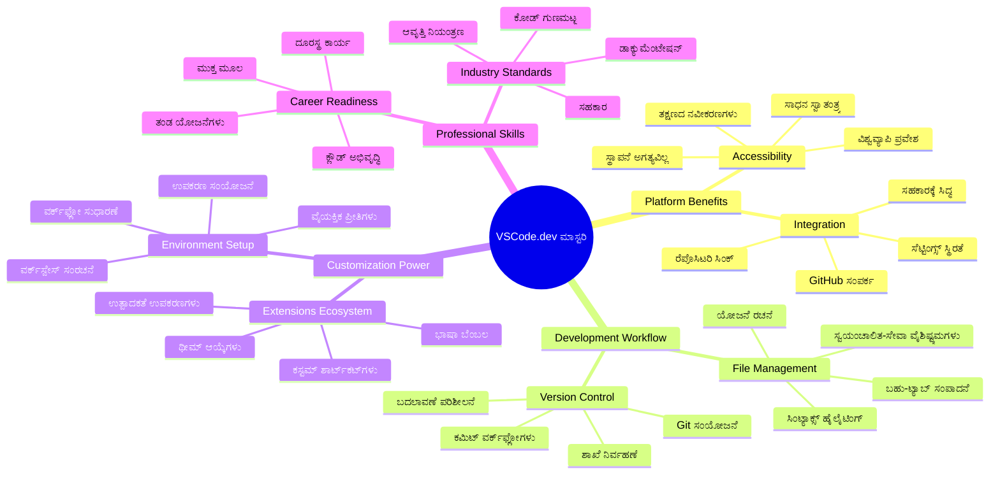
**ಮುಖ್ಯ ತತ್ವ**: ಮೋಘ ಆಧಾರಿತ ಅಭಿವೃದ್ಧಿ ಪರಿಸರಗಳು ಕೋಡಿಂಗ್ ಭವಿಷ್ಯವನ್ನು ಪ್ರತಿನಿಧಿಸುತ್ತವೆ - ವೃತ್ತಿಪರ ಮಟ್ಟದ ಉಪಕರಣಗಳನ್ನು ಲಭ್ಯವಿರಿಸುತ್ತವೆ, ಸಹಕರಿಸಲ್ಪಡುತ್ತವೆ ಮತ್ತು ವೇದಿಕೆ-ಸ್ವಾತಂತ್ರ್ಯವನ್ನು ಘೋಷಿಸುತ್ತವೆ.

## ವೆಬ್ ಆಧಾರಿತ ಕೋಡ್ ಸಂಪಾದಕರು ಏಕೆ ಮಹತ್ವವುಳ್ಳವೆಯೆ

ಇಂಟರ್ನೆಟ್ ಮೊದಲು, ವಿವಿಧ ವಿಶ್ವವಿದ್ಯಾಲಯಗಳ ವಿಜ್ಞಾನಿಗಳು ಸಂಶೋಧನೆಯನ್ನು ಸುಲಭವಾಗಿ ಹಂಚుకోಲಾಗುತ್ತಿರಲಿಲ್ಲ. 1960 ರ ದಶಕದಲ್ಲಿ ARPANET ಬಂದು ದೂರದ ಕಂಪ್ಯೂಟರ್‌ಗಳನ್ನು ಸಂಪರ್ಕಿಸಿತು. ವೆಬ್ ಆಧಾರಿತ ಕೋಡ್ ಸಂಪಾದಕರು ಇದೇ ತತ್ವವನ್ನು ಅನುಸರಿಸುತ್ತವೆ – ಶಕ್ತಿಶಾಲಿ ಉಪಕರಣಗಳನ್ನು ನೀವು ಇರುವ ಸ್ಥಲೆ ಅಥವಾ ಸಾಧನ ಯಾವದಾದರೂ, ಲಭ್ಯವಾಗಿಸುವುದು.

ಕೋಡ್ ಸಂಪಾದಕವು ನಿಮ್ಮ ಅಭಿವೃದ್ಧಿ ಕೆಲಸದ ಕೇಂದ್ರಸ್ಥಳ, ಅಲ್ಲಿ ನೀವು ಕೋಡ್ ಬರೆಯುತ್ತೀರಿ, ಸಂಪಾದಿಸುತ್ತೀರಿ, ವ್ಯವಸ್ಥೆ ಮಾಡುತ್ತೀರಿ. ಸರಳ ಪಠ್ಯ ಸಂಪಾದಕರಿಗಿಂತ ವಿಭಿನ್ನವಾಗಿ, ವೃತ್ತಿಪರ ಕೋಡ್ ಸಂಪಾದಕರು ಸಿಂಟ್ಯಾಕ್ಸ್ ಹೈಲೈಟಿಂಗ್, ದೋಷ ಪತ್ತೆ ಮತ್ತು ಪ್ರಾಜೆಕ್ಟ್ ನಿರ್ವಹಣೆ ವೈಶಿಷ್ಟ್ಯಗಳನ್ನು ಒದಗಿಸುತ್ತವೆ.

VSCode.dev ಈ ಸಾಮರ್ಥ್ಯಗಳನ್ನು ನಿಮ್ಮ ಬ್ರೌಸರ್‌ಗೆ ತರುತ್ತದೆ:

**ವೆಬ್ ಆಧಾರಿತ ಸಂಪಾದನೆಯ ಲಾಭಗಳು:**

| ವೈಶಿಷ್ಟ್ಯ | ವಿವರಣೆ | ಬಳಕೆಯ ಪ್ರಭಾವ |
|---------|-------------|----------|
| **ವೇದಿಕೆ ಸ್ವಾತಂತ್ರ್ಯ** | ಯಾವುದೇ ಬ್ರೌಸರ್ ಇರುವ ಸಾಧನದಲ್ಲಿ ಚಾಲನೆ | ವಿವಿಧ ಕಂಪ್ಯೂಟರ್‌ಗಳಿಂದ ನಿರಂತರ ಕೆಲಸ |
| **ಯಾವುದೇ ಇನ್ಸ್ಟಾಲೇಶನ್ ಅಗತ್ಯವಿಲ್ಲ** | ವೆಬ್ URL ಮೂಲಕ ಪ್ರವೇಶ | ಸಾಫ್ಟ್‌ವೇರ್ ಇನ್ಸ್ಟಾಲೇಶನ್ ನಿಯಂತ್ರಣಗಳಿಂದ ತಪ್ಪಿಸಿಕೊಳ್ಳಬಹುದು |
| **ಸ್ವಯಂಚಾಲಿತ ನವೀಕರಣಗಳು** | ಸದಾ ನವೀಕೃತ ಆವೃತ್ತಿ ಚಾಲನೆ | ಹೊಸ ವೈಶಿಷ್ಟ್ಯಗಳನ್ನು ಕೈಯಿಂದ ನವೀಕರಿಸಬೇಕಾಗಿಲ್ಲ ಎಂದು |
| **ರೆಪೊಜಿಟರಿ ಅಂತರಸಂವಹನ** | GitHub ಗೆ ನೇರ ಸಂಪರ್ಕ | ಸ್ಥಳೀಯ ಫೈಲ್ ನಿರ್ವಹಣೆ ಇಲ್ಲದೆ ಕೋಡನ್ನು ಸಂಪಾದನೆ ಮಾಡಬಹುದು |

**ಆದಾಯ ಮತ್ತು ಪರಿಣಾಮಗಳು:**  
- ವಿಭಿನ್ನ ಪರಿಸರಗಳಲ್ಲಿ ಕಾರ್ಯ ನಿರಂತರತೆ  
- ಯಾವುದೇ ಆಪರೇಟಿಂಗ್ ಸಿಸ್ಟಮ್‌ಗಳ ಬಳಕೆಗೆ ಸಮಾನ ಇಂಟರ್‌ಫೇಸ್  
- ತಕ್ಷಣ ಸಹಯೋಗಕ್ಕೆ ಸಾಧ್ಯತೆ  
- ಸ್ಥಳೀಯ ಸಂಗ್ರಹಣೆಯ ಅಗತ್ಯ ಕಡಿಮೆ

## VSCode.dev ಅನ್ವೇಷಣೆ

ಮೇರಿ 큜ುರಿಯ ಪ್ರಯೋಗಾಲಯವು ಸರಳ ಜಾಗದಲ್ಲಿದೆಯಾಗಿ ಸುಧಾರತ್ಮಕ ಉಪಕರಣಗಳನ್ನು ಒಳಗೊಂಡಿದ್ದ ಹಾಗೆ, VSCode.dev ವೃತ್ತಿಪರ ಅಭಿವೃದ್ಧಿ ಉಪಕರಣಗಳನ್ನು ಬ್ರೌಸರ್ ತಾಣದಲ್ಲಿ ಒದಗಿಸುತ್ತದೆ. ಈ ವೆಬ್ ಆಪ್ಲಿಕೇಶನ್ ಡೆಸ್ಕ್‌ಟಾಪ್ ಕೋಡ್ ಸಂಪಾದಕರ ಮೌಲ್ಯದ ಮುಖ್ಯ ಭಾಗಿ ಸಮಾನ ಕಾರ್ಯಕ್ಷಮತೆಯನ್ನು ಒದಗಿಸುತ್ತದೆ.

ಪ್ರಾರಂಭಿಸಲು, ನಿಮ್ಮ ಬ್ರೌಸರ್‌ನಲ್ಲಿ [vscode.dev](https://vscode.dev) ಗೆ ಹೋಗಿ. ಡೌನ್‌ಲೋಡ್ ಅಥವಾ ಸಿಸ್ಟಂ ಇನ್ಸ್ಟಾಲೇಶನಿಲ್ಲದೆ ಇಂಟರ್‌ಫೇಸ್ ಲೋಡ್ ಆಗುತ್ತದೆ – ಮೋಘ ಗಣನೆ ತತ್ವಗಳ ನೇರ ಅನ್ವಯ.

### ನಿಮ್ಮ GitHub ಖಾತೆ ಸಂಪರ್ಕಿಸುವುದು

ಅಲೆಕ್ಸಾಂಡರ್ ಗ್ರಾಹಂ ಬೆಲ್‌ ಅವರ ದೂರವಾಣಿ ದೂರದ ಸ್ಥಳಗಳನ್ನು ಸಂಪರ್ಕಿಸಿದೆ ಹಾಗೆ, ನಿಮ್ಮ GitHub ಖಾತೆಯನ್ನು ಸಂಪರ್ಕಿಸುವ ಮೂಲಕ VSCode.dev ನೊಂದಿಗೆ ನಿಮ್ಮ ಕೋಡ್ ರೆಪೊಗಳನ್ನು ಸೇರ್ಪಡೆ ಮಾಡಿಕೊಳ್ಳುತ್ತೀರಿ. GitHub ನಲ್ಲಿ ಸೈನ್ ಇನ್ ಮಾಡಲು ಕೇಳುತ್ತಿದ್ದರೆ, ಒಪ್ಪಿಸುವುದು ಸೂಕ್ತ.

**GitHub ಸಂಯೋಜನೆ ನೀಡುವವು:**  
- ಸಂಪಾದಕರೊಳಗಿನ ನೇರ ರೆಪೊ ಪ್ರವೇಶ  
- ಸಾಧನಗಳ ಮಧ್ಯೆ ಸಂಯೋಜಿತ ಸೆಟ್ಟಿಂಗ್ಸ್ ಮತ್ತು ಎಕ್ಸ್ಟೆನ್ಶನ್‌ಗಳು  
- GitHub ಗೆ ಸರಳ ಮತ್ತು ಸಲೀಸು ಉಳಿಸುವ ಕಾರ್ಯಪ್ರದಾನ  
- ವೈಯಕ್ತಿಕ ಅಭಿವಿಕಾಸ ಪರಿಸರ

### ನಿಮ್ಮ ಹೊಸ ಕೆಲಸದ ಜಾಗವನ್ನು ಪರಿಚಯಿಸಿ

ಎಲ್ಲವೂ ಲೋಡ್ ಆದ ಮೇಲೆ, ನೀವು ಅತ್ಯಂತ ಸ್ವಚ್ಛ ಕೆಲಸದ ಜಾಗವನ್ನು ನೋಡುತ್ತೀರಿ, ಅದು ನೀವು ಮಹತ್ವಪೂರ್ಣವಾಗಿ ಕಾಣುವದಕ್ಕೆ — ನಿಮ್ಮ ಕೋಡಿಗೆ — ಗಮನ ಸೆಳೆಯುವಂತೆ ವಿನ್ಯಾಸಗೊಳಿಸಲಾಗಿದೆ!

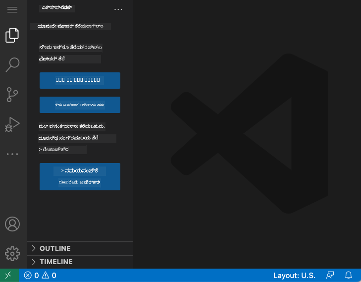

**ನಿಮ್ಮ ಹತ್ತಿರದ ಪ್ರದೇಶದ ಪ್ರೇಕ್ಷಣೀಯತೆ:**  
- **ಕ್ರಿಯಾಶೀಲತೆ ಬಾರ್** (ಎಡಬದಿಯಲ್ಲಿ ಇರುವ ಪದ್ಧತಿ): Explorer 📁, Search 🔍, Source Control 🌿, Extensions 🧩, Settings ⚙️ ಇದನ್ನು ಹೊಂದಿರುವ ನಿಮ್ಮ ಮುಖ್ಯ ನವಿಗೇಶನ್  
- **ಸೈಡ್‌ಬಾರ್** (ಅದರ ಪಕ್ಕದ ಪ್ಯಾನೆಲ್): ನೀವು ಆರಿಸಿಕೊಂಡ ವಿಷಯವನ್ನು ಆಧರಿಸಿ ಸಂಬಂಧಿತ ಮಾಹಿತಿ ತೋರಿಸಲು ಬದಲಾಗುತ್ತದೆ  
- **ಸಂಪಾದಕ ಪ್ರದೇಶ** (ಮಧ್ಯಭಾಗದ ದೊಡ್ಡ ಜಾಗ): ಇಲ್ಲಿ ಮಾಯಾಜಾಲ ಸಂಭವಿಸುತ್ತದೆ – ನಿಮ್ಮ ಮುಖ್ಯ ಕೋಡಿಂಗ್ ಪ್ರದೇಶ

**ಕೇಂದ್ರೀಕರಿಸಲು ಒಂದು ಕ್ಷಣ ತೆಗೆದುಕೊಳ್ಳಿ:**  
- ಆ ಕ್ರಿಯಾಶೀಲತೆ ಬಾರ್ ಐಕಾನ್ಗಳ ಮೇಲೆ ಕ್ಲಿಕ್ ಮಾಡಿ ಮತ್ತು ಪ್ರತಿಯೊಂದು ಏನು ಮಾಡುತ್ತದೆಯೋ ನೋಡಿ  
- ಸೈಡ್‌ಬಾರ್ ಹೇಗೆ ವಿಭಿನ್ನ ಮಾಹಿತಿ ತೋರಿಸುತ್ತದೆ ಗಮನಿಸಿ – ಅದ್ಭುತ, ಸರಿ ಎಂದು ಭಾವಿಸುವಿರಿ  
- Explorer ವೀಕ್ಷಣೆಯಲ್ಲಿ (📁) ನೀವು ಬಹುಶಃ ಹೆಚ್ಚು ಸಮಯ ಕಳೆಯುತ್ತೀರಿ, ಆದ್ದರಿಂದ ಅದರೊಂದಿಗೆ ಆರಾಮವಾಗಿ ಪಾಲಿಗೊಳ್ಳಿ

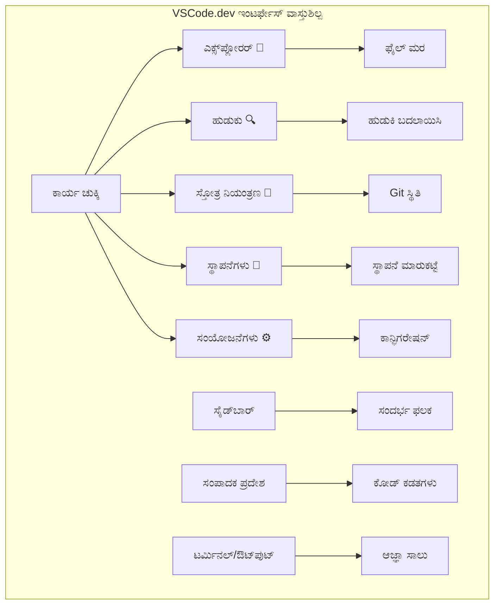
## GitHub ರೆಪೊ ಇದೀಗ ತೆಗೆಯುವುದು

ಇಂಟರ್ನೆಟ್ ಮೊದಲು, ಸಂಶೋಧಕರು ಲೈಬ್ರರಿಗಳಿಗೆ ನಡೆಸಿಕೊಡಬೇಕಾಗಿತ್ತು ದಾಖಲೆಗಳಿಗಾಗಿ. GitHub ರೆಪೊಜಿಟರಿಗಳು ಅಂಥದೆಯೇ – ದೂರಸ್ಥವಾಗಿರುವ ಕೋಡ್ ಸಂಗ್ರಹಗಳು. VSCode.dev ನಿಮ್ಮ ಸ್ಥಳೀಯ ಸಾಧನಕ್ಕೆ ಡೌನ್‌ಲೋಡ್ ಮಾಡದೆ ಹೊಸ ಗೇಟು ತೆರೆಯುತ್ತದೆ.

ಈ ಶಕ್ತಿ ಲಭ್ಯವಿರುವುದರಿಂದ ಯಾವುದಾದರೂ ಸಾರ್ವಜನಿಕ ರೆಪೊ ಕೂಡಲೇ ವೀಕ್ಷಣೆ, ಸಂಪಾದನೆ ಅಥವಾ ಕೊಡುಗೆ ನೀಡಲು ತೆರೆದುಕೊಳ್ಳಬಹುದು. ಇವು ರೆಪೊಗಳನ್ನು ತೆರೆಯುವ ಎರಡು ವಿಧಾನಗಳು:

### ವಿಧಾನ 1: ಪಾಯಿಂಟ್-ಅಂಡ್-ಕ್ಲಿಕ್ ವಿಧಾನ

ನೀವು ಹೊಸದಾಗಿ VSCode.dev ಪ್ರಾರಂಭಿಸಿ ನಿರ್ದಿಷ್ಟ ರೆಪೊ ತೆರೆಯಬೇಕಾದಾಗ ಇದು ಪರಿಪೂರ್ಣ. ಸಾದಾ ಮತ್ತು ಆರಂಭಿಕರಿಗೂ ಅನुकूल:

**ಹೀಗೆ ಮಾಡಿರಿ:**  

1. ನೀವು ಇಲ್ಲಿಗಾಗಿಲ್ಲವಾದರೆ, [vscode.dev](https://vscode.dev) ಗೆ ಹೋಗಿ  
2. ಸ್ವಾಗತ ಪರದೆಯಲ್ಲಿ “Open Remote Repository” ಬಟನ್ ನೋಡಿ클ಿಕ್ ಮಾಡಿ  

   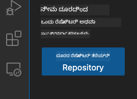  

3. ಯಾವುದಾದರೂ GitHub ರೆಪೊ URL ಅನ್ನು ಪೇಸ್ಟ್ ಮಾಡಿ (`https://github.com/microsoft/Web-Dev-For-Beginners` ಪ್ರಯತ್ನಿಸಿ)  
4. ಎಂಟರ್ ಒತ್ತಿ ಮತ್ತು ಮಾಯಾಜಾಲವನ್ನು ನೋಡಿ!

**ಪ್ರೊ ಟಿಪ್ - ಕಮಾಂಡ್ ಪ್ಯಾಲೆಟ್ ಶಾರ್ಟ್‌ಕಟ್:**  

ನೀವು ಕೋಡಿಂಗ್ ಮಾಯಾಜಾಲಿವನಾಗಿ ಭಾವಿಸಬೇಕೆ? ಈ ಕಿ ಸಂಯೋಜನೆಯನ್ನು ಪ್ರಯತ್ನಿಸಿ: Ctrl+Shift+P (ಮ್ಯಾಕ್‌ನಲ್ಲಿ Cmd+Shift+P) ಕಮಾಂಡ್ ಪ್ಯಾಲೆಟ್ ತೆರೆಯಲು:  

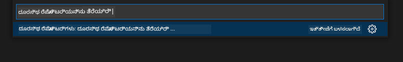  

**ಕಮಾಂಡ್ ಪ್ಯಾಲೆಟ್ ಎಲ್ಲವೂ ಮಾಡಲು ಎಂದು ಹುಡುಕುವ ಇಂಜಿನ್ ಗೆ ಸಮಾನ:**  
- "open remote" typed ಮಾಡಿ ಅದು ರೆಪೊ ತೆಗೆಯುವ ಇನ್ಸ್ಟ್ರುಮೆಂಟ್ ಅನ್ನು ತೋರಿಸುತ್ತದೆ  
- ಇತ್ತೀಚೆಗೆ ತೆರೆಯಲಾದ ರೆಪೊಗಳನ್ನು ಸ್ಮರಿಸುತ್ತದೆ (ಬಹಳ ಉಪಯುಕ್ತ!)  
- ಇದಕ್ಕೆ ಅಭ್ಯಾಸವಾದಾಗ, ನೀವು ಅತಿ ವೇಗದಲ್ಲಿ ಕೋಡಿಂಗ್ ಮಾಡುತ್ತಿರುವಂತೆ ಅನುಭವಿಸುತ್ತೀರಿ  
- ಇದು VSCode.dev ನ "ಹೇ ಸಿರಿ, ಆದರೆ ಕೋಡಿಂಗ್ ಗೆ" ಆವೃತ್ತಿ

### ವಿಧಾನ 2: URL ಬದಲಾವಣೆಯ ತಂತ್ರ

HTTP ಮತ್ತು HTTPS ಬೇರೆಯಾದ ಪ್ರೋಟೋಕಾಲ್ ಬಳಸಿದರೂ ಅದೇ ಡೊಮೇನ್ ರಚನೆ ಇರುವುದು ಹಾಗೆ, VSCode.dev ಕೂಡ GitHub ವಿಳಾಸಿಸುವ ರೀತಿಯ ಗಮನಾರ್ಹ URL ಮಾದರಿಯನ್ನು ಬಳಸುತ್ತದೆ. ಯಾವುದೇ GitHub ರೆಪೊ URL ನೇರವಾಗಿ VSCode.dev ನಲ್ಲಿ ತೆರೆಯಬಹುದು.

**URL ಪರಿವರ್ತನೆಯ ಮಾದರಿ:**

| ರೆಪೊ ಪ್ರಕಾರ | GitHub URL | VSCode.dev URL |
|----------------|---------------------|----------------|
| **ಸಾರ್ವಜನಿಕ ರೆಪೊ** | `github.com/microsoft/Web-Dev-For-Beginners` | `vscode.dev/github/microsoft/Web-Dev-For-Beginners` |
| **ವೈಯಕ್ತಿಕ ಪ್ರಾಜೆಕ್ಟ್** | `github.com/your-username/my-project` | `vscode.dev/github/your-username/my-project` |
| **ಯಾವುದೇ ಲಭ್ಯ ರೆಪೊ** | `github.com/their-username/awesome-repo` | `vscode.dev/github/their-username/awesome-repo` |

**ಅಮಲೀಕರಣ:**  
- `github.com` ಅನ್ನು `vscode.dev/github` ಗೆ ಬದಲಾಯಿಸಿ  
- ಇತರೆ ಎಲ್ಲಾ URL ಭಾಗಗಳನ್ನು ಅಚಲವಾಗಿರಿಸಿ  
- ಯಾವುದೇ ಸಾರ್ವಜನಿಕ ರೆಪೊಗಾಗಲಿ ಕಾರ್ಯನಿರ್ವಹಿಸುತ್ತದೆ  
- ತಕ್ಷಣ ಸಂಪಾದನೆ ಪ್ರವೇಶ ನೀಡುತ್ತದೆ

> 💡 **ಜೀವನ ಪರಿವರ್ತಕ ಟಿಪ್**: ನಿಮ್ಮ ಇಷ್ಟದ ರೆಪೊಗಳ VSCode.dev ಆವೃತ್ತಿಗಳನ್ನು ಬುಕ್‌ಮಾರ್ಕ್ ಮಾಡಿ. ನಾನು "ನನ್ನ ಪೋರ್ಟ್ಫೋಲಿಯೊ ಸಂಪಾದನೆ" ಮತ್ತು "ದಾಖಲೆ ಸರಿಪಡಿಸುವಿಕೆ" ಎಂಬ ಬುಕ್‌ಮಾರ್ಕ್‌ಗಳನ್ನು ಇಟ್ಟುಕೊಂಡಿದ್ದೇನೆ, ಅವು ತಕ್ಷಣ ಸಂಪಾದನಾ ಮೋಡ್‌ಗೆ ಸಾಗಿಸುತ್ತವೆ!

**ನೀವು ಯಾವ ವಿಧಾನವನ್ನು ಉಪಯೋಗಿಸಬೇಕು?**  
- **ಇಂಟರ್‌ಫೇಸ್ ವಿಧಾನ:** ನೀವು ಅನ್ವೇಷಣೆ ಮಾಡುತ್ತಿರುವಾಗ ಅಥವಾ ಸರಿಯಾದ ರೆಪೊ ಹೆಸರನ್ನು ನೆನಪಿಡಲಾರದೆ ಇದ್ದಾಗ ಉತ್ತಮ  
- **URL ಟ್ರಿಕ್:** ನೀವು ಯಾವತ್ತೂ ತ್ವರಿತ ಪ್ರವೇಶಿಸಲು ನಿರ್ದಿಷ್ಟ ಜಾಗವನ್ನು ತಿಳಿದಿದ್ದಾಗ ಪರಿಪೂರ್ಣ

### 🎯 ಶಿಕ್ಷಣ ಚಟುವಟಿಕೆ: ಮೋಘ ಅಭಿವೃದ್ಧಿ ಪ್ರವೇಶ

**ವಿರಾಮಿಸಿ ಹಾಗೂ ಪ್ರತಿಬಿಂಬಿಸಿ:** ನೀವು ಈಗ ಕೆಲವೇ ಕ್ಷಣಗಳ ಹಿಂದೆ ಒಂದು ವೆಬ್ ಬ್ರೌಸರ್ ಮುಖಾಂತರ ಕೋಡ್ ರೆಪೊ ಪಡೆಯುವ ಎರಡು ವಿಧಾನಗಳನ್ನು ಕಲಿತಿರಿ. ಇದು ಅಭಿವೃದ್ಧಿ ಕಾರ್ಯ ವಿಧಾನದಲ್ಲಿ ಮೂಲಭೂತ ಬದಲಾವಣೆಯಾಗಿದೆ.

**ವೇಗದ ಸ್ವ-ಮೌಲ್ಯಮಾಪನ:**  
- ವೆಬ್ ಆಧಾರಿತ ಸಂಪಾದನೆ ಮುವು ಪರಂಪರাগত "ಅಭಿವೃದ್ಧಿ ಪರಿಸರ ಸ್ಥಾಪನೆ" ಯಾಕೆ ಕಡಿಮೆ ಮಾಡುತ್ತದೆ ಎಂದು ತಿಳಿಸಬಹುದೇ?  
- URL ಪರಿಷ್ಕರಣೆಯ ತಂತ್ರವು ಸ್ಥಳೀಯ Git ಕ್ಲೋನಂಗಿಗಿಂತ ಯಾವ ಲಾಭ ತರುತ್ತದೆ?  
- ಈ ವಿಧಾನವು ನೀವು ಮುಕ್ತ ಮೂಲ ಪ್ರಾಜೆಕ್ಟ್‌ಗಳಿಗೆ ಕೊಡುಗೆ ನೀಡುವ ರೀತಿ ಹೇಗೆ ಬದಲಾಯಿಸುತ್ತದೆ?

**ನಿಜ ಜೀವನ ಸಂಪರ್ಕ:** GitHub, GitLab, Replit ಮುಂತಾದ ಪ್ರಮುಖ ಕಂಪನಿಗಳು ತಮ್ಮ ಅಭಿವೃದ್ಧಿ ವೇದಿಕೆಗಳನ್ನು ಈ ಮೋಘ ಮೊದಲಿಗ ತತ್ವಗಳ ಮೇಲೆ ನಿರ್ಮಿಸಿದ್ದಾರೆ. ನೀವು ವಿಶ್ವದ ವೃತ್ತಿಪರ ತಂಡಗಳ ಬಳಸುವ ಕೆಲಸದ ವಿಧಾನಗಳನ್ನು ಕಲಿಯುತ್ತಿದ್ದೀರಿ.

**ಸವಾಲಿನ ಪ್ರಶ್ನೆ:** ಮೋಘ ಆಧಾರಿತ ಅಭಿವೃದ್ಧಿ ಶಿಕ್ಷಣವನ್ನು ಶಾಲೆಯಲ್ಲಿಯೇ ಹೇಗೆ ಬದಲಾಯಿಸಬಹುದು? ಸಾಧನ ಅವಶ್ಯಕತೆಗಳು, ಸಾಫ್ಟ್‌ವೇರ್ ನಿರ್ವಹಣೆ ಮತ್ತು ಸಹಕಾರ ಸಾಧ್ಯತೆಗಳನ್ನು ಗಮನಿಸಿ.

## ಫೈಲ್‌ಗಳು ಮತ್ತು ಪ್ರಾಜೆಕ್ಟ್‌ಗಳೊಂದಿಗೆ ಕೆಲಸ ಮಾಡುವುದು

ನೀವು ಈಗ ರೆಪೊ ತೆರೆಯಲಾಗಿದೆ, ನಿರ್ಮಾಣ ಪ್ರಾರಂಭಿಸೋಣ! VSCode.dev ನಿಮಗೆ ಕೋಡ್ ಫೈಲ್‌ಗಳನ್ನು ರಚಿಸಲು, ಸಂಪಾದಿಸಲು ಮತ್ತು ವ್ಯವಸ್ಥೆ ಮಾಡಲು ಬೇಕಾಗುವ ಎಲ್ಲವನ್ನೂ ನೀಡುತ್ತದೆ. ನಿಮ್ಮ ಡಿಜಿಟಲ್ ವರ್ಕ್‌ಶಾಪ್ ಎಂದು ಪರಿಗಣಿಸಿ — ಪ್ರತಿಯೊಂದು ಸಾಧನವೂ ನಿಮಗೆ ಬೇಕಾದ ಸ್ಥಳದಲ್ಲಿದೆ.

ನಿತ್ಯ ಕೆಲಸಗಳನ್ನು ನಮ್ಮ ಜೊತೆಗೆ ತೊಡಗಿಸೋಣ.

### ಹೊಸ ಫೈಲ್ ರಚಿಸುವುದು

ವ್ಯಾಸಂಗಿ ಗೃಹ ನಿರ್ಮಾಣದಂತೆ, VSCode.dev ನಲ್ಲಿ ಫೈಲ್ ರಚನೆ ಕ್ರಮಬದ್ಧವಾಗಿದೆ. ವ್ಯವಸ್ಥೆ ಎಲ್ಲಜೊತೆಗೆ ಎಲ್ಲಾ ಸಾಮಾನ್ಯ ವೆಬ್ ಅಭಿವೃದ್ಧಿ ಫೈಲ್ ಪ್ರಕಾರಗಳನ್ನು ಬೆಂಬಲಿಸುತ್ತದೆ.

**ಫೈಲ್ ರಚನೆ ಪ್ರಕ್ರಿಯೆ:**

1. Explorer ಸೈಡ್‌ಬಾರ್‌ನಲ್ಲಿ ಗುರಿ ಫೋಲ್ಡರ್‌ಗೆ ನವಿಗೇಟ್ ಮಾಡಿ  
2. ಫೋಲ್ಡರ್ ಹೆಸರಿನ ಮೇರೆಗೆ ಹೊಸ ಫೈಲ್ ಐಕಾನ್ (📄+) ಕಾಣಿತ್ತಾದ ನಂತರ ಕರ್ಸರ್ ಹೊಂದಿಸಿ  
3. ಫೈಲ್ ಹೆಸರು ಸೇರಿಸಿ ಮತ್ತು ಸರಿಯಾದ ವಿಸ್ತರಣೆಯನ್ನು (`style.css`, `script.js`, `index.html`) ನಮೂದಿಸಿ  
4. ಫೈಲ್ ರಚಿಸಲು Enter ಒತ್ತಿ


**ಹೆಸರಿನ ನಿಯಮಗಳು:**  
- ಸ್ಪಷ್ಟವಾಗಿರುವ, ಫೈಲ್ ಉದ್ದೇಶ ವಿವರಿಸುವ ಹೆಸರುಗಳಿಗೆ ಆದ್ಯತೆ ನೀಡಿ  
- ಸರಿಯಾದ ವಿಸ್ತರಣೆಗಳನ್ನು ಬಳಸಿರಿ ಸಿಂಟ್ಯಾಕ್ಸ್ ಹೈಲೈಟಿಂಗಿಗಾಗಿ  
- ಯೋಜನೆಗಳಲ್ಲಿ ಸಮಾನ ಹೆಸರಿನ ಕ್ರಮವನ್ನು ಪಾಲಿಸಿ  
- ಖಾಲಿ ಸ್ಥಳಗಳ ಬದಲು ಸಣ್ಣಕ್ಷರ ಮತ್ತು ಹೈಫನ್ ಬಳಸಿರಿ

### ಫೈಲ್ ಸಂಪಾದನೆ ಮತ್ತು ಉಳಿಸುವಿಕೆ

ನಿಜವಾದ ರಮಣೀಯ ಭಾಗ ಇಲ್ಲಿದೆ! VSCode.dev ಸಂಪಾದಕವು ಸಹಾಯಕ ವೈಶಿಷ್ಟ್ಯಗಳಿಂದ ತುಂಬಿದೆ, ಇದು ಕೋಡಿಂಗ್ ಅನುಭವವನ್ನು ಸೌಲಭ್ಯದಾಯಕ ಮತ್ತು ನಯವಾಗುವಂತೆ చేస్తದೆ. ಇದು ಒಂದು ನುಜ್ಜಕ್ಕೆ ಬುದ್ಧಿವಂತ ಲೇಖಕ ಸಹಾಯಕವಿದ್ದಂತೆ, ಆದರೆ ಕೋಡ್‌ಗೆ.

**ನಿಮ್ಮ ಸಂಪಾದನೆ ಕಾರ್ಯವಿಧಾನ:**  

1. Explorer ಯಲ್ಲಿ ಯಾವುದಾದರೂ ಫೈಲ್ ಕ್ಲಿಕ್ ಮಾಡಿ ಮತ್ತು ಮುಖ್ಯ ಪ್ರದೇಶದಲ್ಲಿ ತೆರೆಯಿರಿ  
2. ಟೈಪ್ ಮಾಡುತ್ತಿರಿರಿ ಮತ್ತು VSCode.dev ನಿಮಗೆ ಬಣ್ಣಗಳು, ಸಲಹೆಗಳು ಮತ್ತು ದೋಷ ಪತ್ತೆ ಹಂಚುತ್ತದೆ  
3. Ctrl+S (Windows/Linux) ಅಥವಾ Cmd+S (Mac) ಒತ್ತಿ ನಿಮ್ಮ ಕೆಲಸ ಉಳಿಸಿ – ಆದರೆ ಸ್ವಯಂ-ಉಳಿಸಲು ಕೂಡ ಇದೆ!

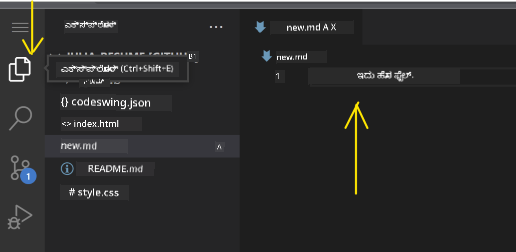

**ನೀವು ಕೋಡಿಂಗ್ ವೇಳೆ ಸಂಭವಿಸುವವನ್ನು ನೋಡಿ:**  
- ನಿಮ್ಮ ಕೋಡ್ ಸುಂದರವಾಗಿ ಬಣ್ಣಪೂರಿತವಾಗಿರುತ್ತದೆ, ಓದಲು ಸುಲಭವಾಗಿದೆ  
- VSCode.dev ಟೈಪಿಂಗ್ ವೇಳೆ ಪೂರ್ಣಗೊಳಿಸುವಿಕೆಗಳನ್ನು ಸೂಚಿಸುತ್ತದೆ (ಸ್ವಯಂ-ತಿದ್ದಿಸುವಂತೆ, ಆದರೆ ಹೆಚ್ಚು ಬುದ್ಧಿವಂತ)  
- ನೀವು ಉಳಿಸುವ ಮೊದಲು ದೋಷಗಳು ಮತ್ತು ಟೈಪೋಗಳನ್ನು ಹಿಡಿಯುತ್ತದೆ  
- ಬ್ರೌಸರ್‌ನಂತೆ ಬಹು ಫೈಲ್‌ಗಳನ್ನು ಟ್ಯಾಬ್‌ಗಳಲ್ಲಿ ತೆರೆದು ಇಡಬಹುದು  
- ಎಲ್ಲವನ್ನೂ ಹಿನ್ನೆಲೆಯಲ್ಲಿ ಸ್ವಯಂಚಾಲಿತವಾಗಿ ಉಳಿಸುತ್ತದೆ

> ⚠️ **ವೇಗದ ಟಿಪ್**: ಸ್ವಯಂ-ಉಳಿಸುವಿಕೆ ನಿಮ್ಮ ಬೆದರಿಕೆಯನ್ನು ಹೊಂದಿದ್ದರೂ Ctrl+S ಅಥವಾ Cmd+S ಒತ್ತುವುದು ಉತ್ತಮ ಅಭ್ಯಾಸ. ಇದು ತಕ್ಷಣದ ಉಳಿಸುವಿಕೆಯನ್ನು ಮಾಡುತ್ತದೆ ಮತ್ತು ದೋಷ ಪರಿಶೀಲನೆಗೆ ಕೆಲವು ಹೆಚ್ಚುವರಿ ವೈಶಿಷ್ಟ್ಯಗಳನ್ನು ಪ್ರಾರಂಭಿಸುತ್ತದೆ.

### Git ಬಳಸಿ ಆವೃತ್ತಿ ನಿಯಂತ್ರಣ

ಪ್ರಾಚೀನ ವಿಜ್ಞಾನಿಗಳು ಅವಶೇಷ ಬೇರ್ಪಡಿಸಿದ ಹಂತಗಳ ವಿವರ ದಾಖಲೆ ರಚಿಸುವಂತೆ, Git ನಿಮ್ಮ ಕೋಡ್ ಬದಲಾವಣೆಗಳ ಇತಿಹಾಸವನ್ನು ಸಂರಕ್ಷಿಸುತ್ತದೆ. ಈ ವ್ಯವಸ್ಥೆ ಪ್ರಾಜೆಕ್ಟ್ ಇತಿಹಾಸವನ್ನು ಉಳಿಸುತ್ತದೆ ಮತ್ತು ಅಗತ್ಯವಾಗಿದ್ದಾಗ ಹಿಂದಿನ ಆವೃತ್ತಿಗಳಿಗೇ ಹಿಂತಿರುಗಲು ಸಹಾಯ ಮಾಡುತ್ತದೆ. VSCode.dev Git ಫಂಕ್ಷನಾಲಿಟಿಯನ್ನು ಒಳಗೊಂಡಿದೆ.

**ಸೋರ್ಸ್ ಕಂಟ್ರೋಲ್ ಇಂಟರ್‌ಫೇಸ್:**

1. Activity Bar ನಲ್ಲಿ 🌿 ಐಕಾನ್ ಮೂಲಕ ಸೋರ್ಸ್ ಕಂಟ್ರೋಲ್ ಪ್ಯಾನೆಲ್ ಪ್ರವೇಶಿಸಿ  
2. ಬದಲಾಯಿಸಿದ ಫೈಲ್‌ಗಳು "Changes" ವಿಭಾಗದಲ್ಲಿ ಕಾಣಿಸುತ್ತವೆ  
3. ಬಣ್ಣ ಐಕಾನಗಳು ಬದಲಾವಣೆಯ ವಿಧವನ್ನು ಸೂಚಿಸುತ್ತವೆ: ಹಸಿರು ಸೇರಿಸುವಿಕೆಗೆ, ಕೆಂಪು ತೆಗೆದುಹಾಕಲು

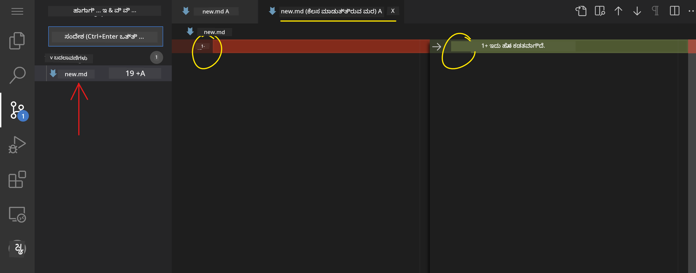

**ನಿಮ್ಮ ಕೆಲಸ ಉಳಿಸುವಿಕೆ (ಕಮಿಟ್ ಕಾರ್ಯವಿಧಾನ):**

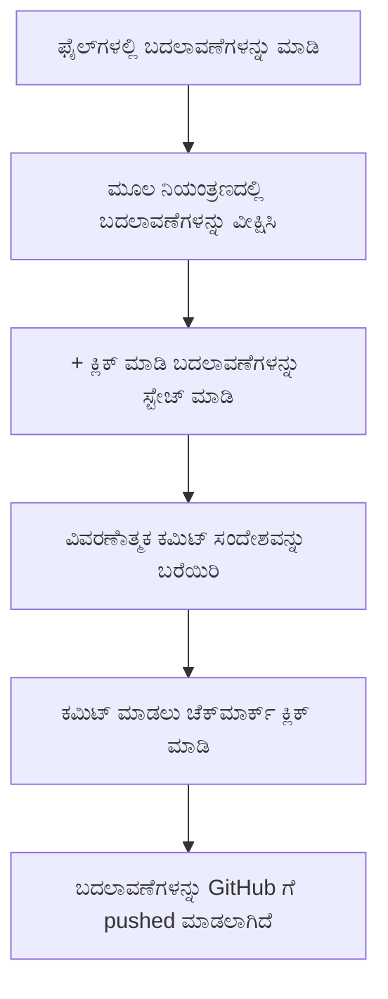
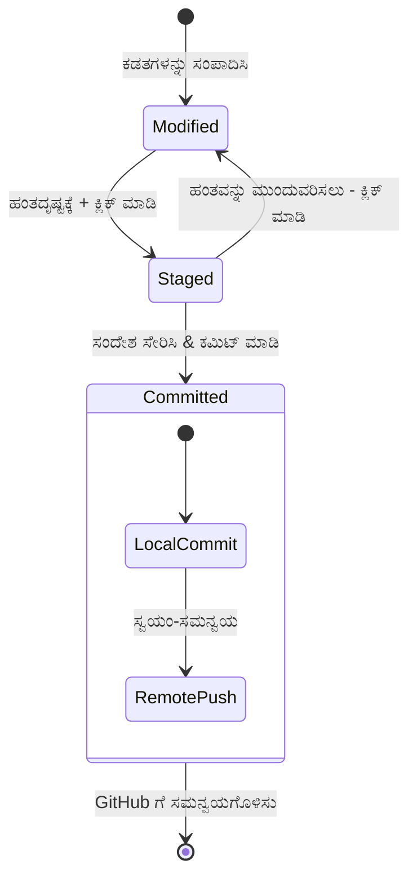
**ನಿಮ್ಮ ಹಂತದ ಹಂತ ಪ್ರಕ್ರಿಯೆ:**  
- ನೀವು ಉಳಿಸಲು ಬಯಸುವ ಫೈಲ್‌ಗಳ ಪಕ್ಕದಲ್ಲಿ ಇರುವ "+" ಐಕಾನ್ ಕ್ಲಿಕ್ ಮಾಡಿ (ಇದನ್ನು "ಸ್ಟೇಜಿಂಗ್" ಎಂದು ಕರೆಯಲಾಗುತ್ತದೆ)
- ಎಲ್ಲಾ ಮೆಟ್ಟಲಿನ ಬದಲಾವಣೆಗಳೊಂದಿಗೆ ನಿಮ್ಮ ತೃಪ್ತಿಯನ್ನು ದ್ವಿತೀಯ ದೃಢೀಕರಣ ಮಾಡಿ
- ನೀವು ಏನು ಮಾಡಿದಿರಿ ಎಂಬುದನ್ನು ವಿವರಿಸುವ ಒಂದು ಹಷಿ ಟಿಪ್ಪಣಿ ಬರೆಸಿ (ಇದು ನಿಮ್ಮ "ಕಮಿಟ್ ಸಂದೇಶ")
- ಎಲ್ಲಾ ಫೈಲ್‌ಗಳನ್ನು GitHub ಗೆ ಉಳಿಸಲು ಚಿಹ್ನೆ ಬಟನ್ನನ್ನು ಕ್ಲಿಕ್ ಮಾಡಿ
- ನೀವು ಯಾರಾದರೂ ಬದಲಾವಣೆ ಬಗ್ಗೆ ವಿಚಾರ ಬದಲಿಸಿದರೆ, ಅನ್‌ಡೂ ಐಕಾನ್ ಮೂಲಕ ಬದಲಾವಣೆಗಳನ್ನು ಬಿಡಿಸಬಹುದು

**ಚೆನ್ನಾಗಿ ಬರೆದ ಕಮಿಟ್ ಸಂದೇಶಗಳು (ಇದು ನೀವು ಭಾವಿಸುವುದಕ್ಕಿಂತ ಸುಲಭ!):**
- ನೀವು ಮಾಡಿದ್ದುದನ್ನು ಮಾತ್ರ ವಿವರಿಸಿ, ಉದಾ: "ಸಂಪರ್ಕ ಫಾರ್ಮ್ ಸೇರಿಸಿ" ಅಥವಾ "ಭ್ರಷ್ಟ ನಾವಿಗೇಶನ್ ಸರಿಪಡಿಸಿ"
- সংক্ষিপ্তವಾಗಿರಲಿ ಮತ್ತು ಸಂಕ್ಷಿಪ್ತವಾಗಿರಲಿ – ಟ್ವೀಟ್ ಉದ್ದ, ಪ್ರಬಂಧ ಅಲ್ಲ
- "ಸೇರಿಸಿ", "ಸರಿಪಡಿಸಿ", "ನವೀಕರಿಸಿ", ಅಥವಾ "ಅಳಿಸಿ" ಎಂಬ ಕ್ರಿಯಾ ಪದಗಳಿಂದ ಪ್ರಾರಂಭಿಸಿ
- **ಚನ್ನಾದ ಉದಾಹರಣೆಗಳು**: "ಸ್ಪಂದನ ಶೀಲ ನವಿಗೇಶನ್ ಮೆನು ಸೇರಿಸಿ", "ಮೊಬೈಲ್ ವರ್ಗಸರಣಿಯ ಸಮಸ್ಯೆಗಳನ್ನು ಸರಿಪಡಿಸಿ", "ಬೇಸರಿಕೆಯತೆಗೆ ಉತ್ತಮ ಬಣ್ಣಗಳನ್ನು ನವೀಕರಿಸಿ"

> 💡 **ದ್ರುತ ನಾವಿಗೇಶನ್ ಸಲಹೆ**: ऊपर बाएँ कोने में हैमबर्गर मेनू (☰) उपयोगಿಸಿ ನಿಮ್ಮ GitHub ಸಂಗ್ರಹಕ್ಕೆ ಹಿಂತಿರುಗಿ ಮತ್ತು ನಿಮ್ಮ ಕಮಿಟ್ ಮಾಡಿದ ಬದಲಾವಣೆಗಳನ್ನು ಆನ್‌ಲೈನ್‌ನಲ್ಲಿ ನೋಡಿ. ಇದು ನಿಮ್ಮ ಸಂಪಾದನಾ ಪರಿಸರ ಮತ್ತು ನಿಮ್ಮ ಪ್ರಾಜೆಕ್ಟ್ ಹೋಮ್ GitHub ನಡುವಿನ ಒಂದು ಪೋರ್ಟಲ್ ಹಿಂತಿರುಗುವುದು!

## ವಿಸ್ತಾರಗಳೊಂದಿಗೆ ಕಾರ್ಯಾಚರಣೆ ಹೆಚ್ಚಿಸುವುದು

ಹೆಚ್ಚುವರಿ ಉಪಕರಣ ಹೊಂದಿರುವ ವೃತ್ತಿಪರ ನಿಪುಣರ ಕಾರ್ಖಾನೆ ಹೀಗೆಯೇ, VSCode.dev ನ್ನು ವಿಸ್ತಾರಗಳ ಮೂಲಕ ವೈಶಿಷ್ಟ್ಯಪೂರ್ಣ ಸಾಮರ್ಥ್ಯಗಳನ್ನು ಸೇರಿಸುವಂತೆ ಕಸ್ಟಮೈಸ್ ಮಾಡಬಹುದು. ಈ ಸಮುದಾಯ ಅಭಿವೃದ್ಧಿಪಡಿಸಿದ ಪ್ಲಗಿನ್‌ಗಳು ಕೋಡ್ ಫಾರ್ಮ್ಯಾಟಿಂಗ್, ನೇರ ಪೂರ್ವವೀಕ್ಷಣೆ, ಮತ್ತು ಸುಧಾರಿತ Git ಸಮ್ಮಿಲನ ಮುಂತಾದ ಸಾಮಾನ್ಯ ಅಭಿವೃದ್ಧಿ ಅಗತ್ಯಗಳನ್ನು ಸರಿಪಡಿಸುತ್ತವೆ.

ವಿಸ್ತಾರ ಮಾರುಕಟ್ಟೆ ಜಾಗತಿಕವಾಗಿ ಅಭಿವೃದ್ಧಿಪಡಿಸಿದ ಸಾವಿರಾರು ಉಚಿತ ಉಪಕರಣಗಳನ್ನು ನಿರ್ವಹಿಸುತ್ತದೆ. ಪ್ರತಿ ವಿಸ್ತಾರವು ವಿಶಿಷ್ಟ ಕಾರ್ಯವಿಧಾನ ಸವಾಲುಗಳನ್ನು ಪರಿಹರಿಸುತ್ತದೆ, ಇದು ನಿಮಗೆ ವಿಶೇಷ ಅಗತ್ಯಗಳು ಮತ್ತು ಆದ್ಯತೆಗಳಿಗೆ ತಕ್ಕಂತೆ ವೈಯಕ್ತಿಕ ಅಭಿವೃದ್ಧಿ ಪರಿಸರವನ್ನು ಕಟ್ಟಲು ಅವಕಾಶ ನೀಡುತ್ತದೆ.

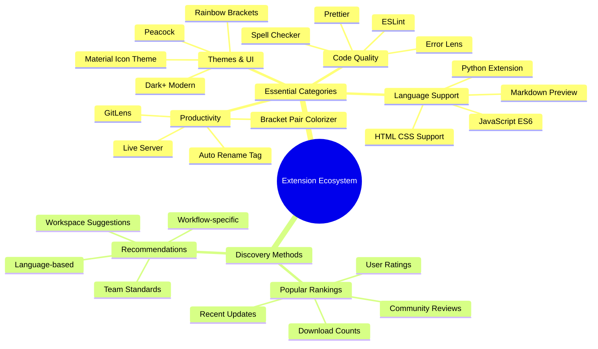
### ನಿಮ್ಮ perfecte ವಿಸ್ತಾರಗಳನ್ನು શોધುವುದು

ವಿಸ್ತಾರ ಮಾರುಕಟ್ಟೆ ಯಶಸ್ವಿಯಾಗಿ ವ್ಯವಸ್ಥಿತವಾಗಿದ್ದು, ನೀವು ಅಗತ್ಯವಿರುವುದನ್ನು ಹುಡುಕಲು ಕಳೆದುಹೋಗುವ ಅಗತ್ಯವಿಲ್ಲ. ಇದು ನಿಮಗೆ ನಿರ್ದಿಷ್ಟ ಉಪಕರಣಗಳನ್ನು ಮತ್ತು ನೀವು ತಿಳಿದಿರಲಿಲ್ಲದ ಕುತೂಹಲಕರ ವಸ್ತುಗಳನ್ನು ಕಂಡುಹಿಡಿಯಲು ಸಹಾಯ ಮಾಡಲು ವಿನ್ಯಾಸಗೊಳಿಸಲಾಗಿದೆ!

**ಮಾರುಕಟ್ಟೆಗೆ ತೆರಳುವ ವಿಧಾನ:**

1. ಚಟುವಟಿಕೆ ಬಾರ್ನಲ್ಲಿನ ವಿಸ್ತಾರ ಐಕಾನ್(🧩) ಅನ್ನು ಕ್ಲಿಕ್ ಮಾಡಿ
2. ಸುತ್ತಾಟ ಮಾಡಿ ಅಥವಾ ನಿರ್ದಿಷ್ಟ ವಸ್ತುವನ್ನು ಹುಡುಕಿ
3. ಹೆಚ್ಚು ಮಾಹಿತಿ ತಿಳಿಯಲು ಆಸಕ್ತಿಗೊಳಿಸುವ ಯಾವುದೇ ವಿಷಯವನ್ನು ಕ್ಲಿಕ್ ಮಾಡಿ

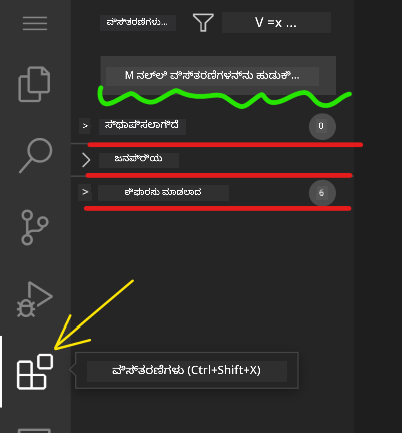

**ನೀವು ಅನ್ವೇಷಿಸುವುದು:**

| ವಿಭಾಗ | ಒಳಗೊಂಡಿದೆ | ಇದರಿಂದ ಪ್ರಯೋಜನವೇನು |
|----------|---------|----------|
| **ಸೆಟಪ್ ಮಾಡಿದವು** | ನೀವು ಈಗಾಗಲೇ ಸೇರಿಸಿದ್ದ ವಿಸ್ತಾರಗಳು | ನಿಮ್ಮ ವೈಯಕ್ತಿಕ ಕೋಡಿಂಗ್ ಉಪಕರಣಗಳ ಕಿಟ್ |
| **ಜನಪ್ರಿಯ** | ಜನಪ್ರಿಯ ಆಯ್ಕೆಗಳು | ಬಹುತೇಕ ಅಭಿವೃದ್ಧಿಪಡಿಸಿದವರು ನಂಬುವವು |
| **ಶಿಫಾರಸ್ಸು ಮಾಡಿದ** | ನಿಮ್ಮ ಪ್ರಾಜೆಕ್ಟ್ಗಾಗಿ ಸ್ಮಾರ್ಟ್ ಸಲಹೆಗಳು | VSCode.dev ನ ಸಹಾಯಕ ಶಿಫಾರಸ್ಸುಗಳು |

**ನಶ್ಟವಿಲ್ಲದ ಬ್ರೌಸಿಂಗ್ ಮಾಡುವುದು:**
- ಪ್ರತಿಯೊಂದು ವಿಸ್ತಾರವು ರೇಟಿಂಗ್‌ಗಳು, ಡೌನ್ಲೋಡ್ ಸಂಖ್ಯೆಗಳು, ಮತ್ತು ಬಳಕೆದಾರ ವಿಮರ್ಶೆಗಳನ್ನು ತೋರಿಸುತ್ತದೆ
- ನೀವು स्क्रीनಶಾಟ್‌ಗಳು ಮತ್ತು ಸ್ಪಷ್ಟ ವಿವರಣೆಗಳನ್ನು ಪಡೆಯುತ್ತೀರಿ ಅದು ಏನು ಮಾಡುತ್ತದೆ ಎಂದು
- ಎಲ್ಲವೂ ಹೊಂದಿಕೊಳ್ಳುವ ಮಾಹಿತಿ ಅಳವಡಿಸಲಾಗಿದೆ
- ಸಮಾನ ವಿಸ್ತಾರಗಳನ್ನು ಶಿಫಾರಸು ಮಾಡಿ ನೀವು ಆಯ್ಕೆಯನ್ನು ಹೋಲಿಸಬಹುದು

### ವಿಸ್ತಾರಗಳನ್ನು ಸ್ಥಾಪಿಸುವುದು (ಇದು ತುಂಬಾ ಸುಲಭ!)

ನಿಮ್ಮ ಸಂಪಾದಕಕ್ಕೆ ಹೊಸ ಶಕ್ತಿಗಳನ್ನು ಸೇರಿಸುವುದು ಕೇವಲ ಬಟನ್ ಕ್ಲಿಕ್ ಮಾಡುವಷ್ಟೇ ಸುಲಭ. ವಿಸ್ತಾರಗಳು ಸೆಕೆಂಡುಗಳಲ್ಲಿ ಸ್ಥಾಪಿತವಾಗುತ್ತವೆ ಮತ್ತು ತಕ್ಷಣ ಕಾರ್ಯನಿರ್ವಹಿಸುತ್ತವೆ – ಯಾವುದೇ ಮರುಪ್ರಾರಂಭವಿಲ್ಲ, ಕಾಯುವ ಅವಶ್ಯಕತೆ ಇಲ್ಲ.

**ನೀವು ಮಾಡಬೇಕಾದ ಒಂದೆಲ್ಲ:**

1. ನೀವು ಬೇಕಾದ ವಿಸ್ತಾರವನ್ನು ಹುಡುಕಿ ("live server" ಅಥವಾ "prettier" ಅನ್ನು ಪ್ರಯತ್ನಿಸಿ)
2. ಒಳ್ಳೆಯದಾಗಿ ಕಂಡ ವಿಸ್ತಾರವನ್ನು ಕ್ಲಿಕ್ ಮಾಡಿ ಹೆಚ್ಚಿನ ವಿವರಗಳನ್ನು ನೋಡಿ
3. ಅದರ ಕಾರ್ಯಗಳನ್ನು ಓದಿ ಮತ್ತು ರೇಟಿಂಗ್‌ಗಳನ್ನು ಪರಿಶೀಲಿಸಿ
4. ನೀಲಿ "Install" ಬಟನ್ ನ್ನು ಒತ್ತಿ ಮುಗಿಸಿ!


**ತೆರಳಿನ ಹಿಂದೆ ಏನಾಗುತ್ತದೆ:**
- ವಿಸ್ತಾರ ಸ್ವಯಂಚಾಲಿತವಾಗಿ ಡೌನ್ಲೋಡ್ ಆಗಿ ಮತ್ತು ಸೆಟಪ್ ಆಗುತ್ತದೆ
- ಹೊಸ ವೈಶಿಷ್ಟ್ಯಗಳು ತಕ್ಷಣ ನಿಮ್ಮ ಇಂಟರ್ಫೇಸಿಗೆ ಬರುತ್ತವೆ
- ಎಲ್ಲವೂ ತಕ್ಷಣ ಕಾರ್ಯನಿರ್ವಹಿಸಲು ಪ್ರಾರಂಭಿಸುತ್ತವೆ (ಕಡಿಮೆ ಕಾಲ)
- ನೀವು ಸೈನ್ ಇನ್ ಆಗಿದ್ದರೆ, ವಿಸ್ತಾರ ಎಲ್ಲಾ ಸಾಧನಗಳಿಗೆ ಸಿಂಕ್ ಆಗುತ್ತದೆ

**ನಾನು ಶಿಫಾರಸು ಮಾಡುವ ಕೆಲವು ವಿಸ್ತಾರಗಳು:**
- **Live Server**: ನೀವು ಕೋಡ್ ಮಾಡಿದಂತೆ ನಿಮ್ಮ ವೆಬ್‌ಸೈಟ್ ನೇರವಾಗಿ ನವೀಕರಿಸುವುದನ್ನು ನೋಡಿ (ಇದು ಅದ್ಭುತ!)
- **Prettier**: ನಿಮ್ಮ ಕೋಡ್ ಸ್ವಯಂಚಾಲಿತವಾಗಿ ಸ್ವಚ್ಛ ಮತ್ತು ವೃತ್ತಿಪರವಾಗಿ ಮಾಡುವುದು
- **Auto Rename Tag**: ಒಂದು HTML ಟ್ಯಾಗ್ ಬದಲಾಯಿಸಿದಾಗ ಅದರ ಜೋಡಿ ಕೂಡ ಒದಗಿಸುವುದು
- **Bracket Pair Colorizer**: ನಿಮ್ಮ ಬ್ರಾಕೆಟ್‌ಗಳನ್ನು ಬಣ್ಣಗಳೊಂದಿಗೆ ಕುರಿತಂತೆ ಟ್ಯಾಗ್ ನಲ್ಲಿ ತಪ್ಪು ಸಿಗದಂತೆ ಮಾಡಿ
- **GitLens**: Git ವೈಶಿಷ್ಟ್ಯಗಳನ್ನು ಹಲವಾರು ಉಪಯುಕ್ತ ಮಾಹಿತಿಯಿಂದ ಇಂಧನ ತುಂಬುವುದು

### ನಿಮ್ಮ ವಿಸ್ತಾರಗಳನ್ನು ಕಸ್ಟಮೈಸ್ ಮಾಡುವುದು

ಬಹುತೆಕ ವಿಸ್ತಾರಗಳು ಅಲ್ಲಿ ಸಕ್ರಿಯ ಮಾಡಬಹುದಾದ ಸೆಟ್ಟಿಂಗ್‌ಗಳೊಂದಿಗೆ ಬರುತ್ತವೆ, ಇದು ನಿಮ್ಮ ಇಷ್ಟಕ್ಕೆ ತಕ್ಕಂತೆ ಅವು ಕಾರ್ಯನಿರ್ವಹಿಸುವಂತೆ ರೂಪಿಸಬಹುದು. ಇದನ್ನು ನೀವು ಕಾರಿನ ಆಸನ ಮತ್ತು ಕಣ್ಣಪ್ಪನ್ನು ಸರಿಪಡಿಸುವಂತೆ ಬುದ್ಧಿಮತ್ತೆಯಿಂದ ಮಾಡಿ.

**ವಿಸ್ತಾರ ಸೆಟ್ಟಿಂಗ್‌ಗಳನ್ನು ನವೀಕರಿಸುವುದು:**

1. ವಿಸ್ತಾರ ಪ್ಯಾನಲ್ ನಲ್ಲಿ ನೀವು ಸ್ಥಾಪಿಸಿದ ವಿಸ್ತಾರವನ್ನು ಹುಡುಕಿ
2. ಅದರ ಹೆಸರಿನ ಬಳಿಯಲ್ಲಿ ಇರುವ ಚಿಲುಮೆ ಐಕಾನ್ (⚙️) ಮಿತಿ ಕ್ಲಿಕ್ ಮಾಡಿ
3. ಡ್ರಾಪ್‌ಡೌನ್‌ನಲ್ಲಿ "Extension Settings" ಆಯ್ಕೆಮಾಡಿ
4. ನಿಮ್ಮ ಕಾರ್ಯಪ್ರವಾಹಕ್ಕೆ ಸರಿಹೊಂದುತ್ತದೆವರೆಗೆ ಮೇಲಾಗಿಸಿಕೊಂಡು ಹೋಗಿ

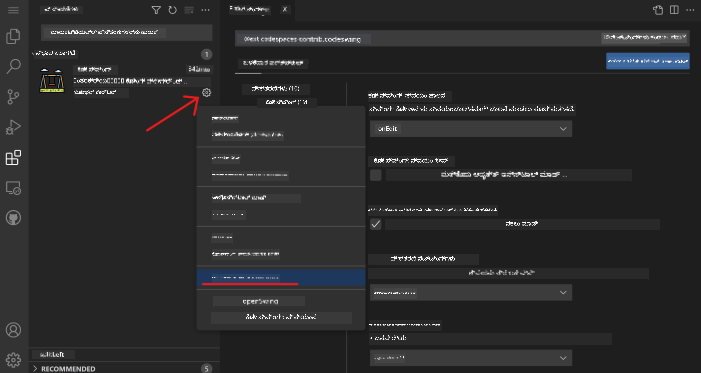

**ನೀವು ನವೀಕರಿಸಲು ಇಚ್ಛಿಸಬಹುದಾದ ಸಾಮಾನ್ಯ ವಸ್ತುಗಳು:**
- ನಿಮ್ಮ ಕೋಡ್ ಹೇಗೆ ಫಾರ್ಮ್ಯಾಟ್ ಆಗುತ್ತದೆ (ಟ್ಯಾಬ್‌ಗಳು ಅಥವಾ ಜಾಗಗಳು, ಸಾಲು ಉದ್ದ, ಇತ್ಯಾದಿ)
- ಬೇರೆ ಬೇರೆ ಕ್ರಿಯೆಗಳಿಗೆ ಯಾವ ಕೀಲಿಮಣೆ ಶಾರ್ಟ್‌ಕಟ್‌ಗಳು ಹೊಣೆ ಹೊತ್ತಿವೆ
- ವಿಸ್ತಾರ ಯಾವ ಫೈಲ್ ಪ್ರಕಾರಗಳಲ್ಲಿ ಕಾರ್ಯನಿರ್ವಹಿಸಬೇಕು
- ನಿರ್ದಿಷ್ಟ ವೈಶಿಷ್ಟ್ಯಗಳನ್ನು ಆನ್ ಅಥವಾ ಆಫ್ ಮಾಡಿ ವಾತಾವರಣವನ್ನು ಸರಳವಾಗಿಡಿ

### ನಿಮ್ಮ ವಿಸ್ತಾರಗಳನ್ನು ಸಂಘಟಿತವಾಗಿರಿಸುವುದು

ನೀವು ಇನ್ನಷ್ಟು ಕುತೂಹಲಕರ ವಿಸ್ತಾರಗಳನ್ನು ಕಂಡುಹಿಡಿದಂತೆ, ನೀವು ಅವುಗಳನ್ನು ಸರಿಯಾದ ಕ್ರಮದಲ್ಲಿ ಮತ್ತು ಉತ್ತಮವಾಗಿ ನಿರ್ವಹಿಸಲು ಬಯಸುತ್ತೀರಿ. VSCode.dev ಇದನ್ನು ಸುಲಭವಾಗಿ ನಿರ್ವಹಿಸಲು ಸುಧಾರಿಸಿದೆ.

**ನಿಮ್ಮ ವಿಸ್ತಾರ ನಿರ್ವಹಣಾ ಆಯ್ಕೆಗಳು:**

| ನೀವು ಏನು ಮಾಡಬಹುದು | ಇದು ಎಷ್ಟಿಗೆ ಸಹಾಯಕ | ಪ್ರೊ ಸಲಹೆ |
|--------|---------|----------|
| **ನಿಷ್ಕ್ರಿಯಗೊಳಿಸಿ** | ವಿಸ್ತಾರ ಸಮಸ್ಯೆ ಉಂಟುಮಾಡಿದೆಯಾ ಎಂದು ಪರೀಕ್ಷೆ ಮಾಡುತ್ತಿರುವಾಗ | ಬದಲಾವಣೆ ಯಾದಸ್ಸಾಗಬಹುದು ಬೇಕಾದರೆ ಮತ್ತೆ ಸಕ್ರಿಯಗೊಳಿಸಬಹುದು |
| **ಅಳಿಸು** | ನೀವು ಬಳಸದೇ ಇರುವ ವಿಸ್ತಾರಗಳನ್ನು ಸಂಪೂರ್ಣವಾಗಿ ತೆರವುಗೊಳಿಸುವಾಗ | ನಿಮ್ಮ ವಾತಾವರಣವನ್ನು ಸ್ವಚ್ಛ ಮತ್ತು ವೇಗವಾಗಿ ಇಡುವುದು |
| **ನವೀಕರಿಸಿ** | ಹೊಸ ವೈಶಿಷ್ಟ್ಯಗಳು ಮತ್ತು ದೋಷ ಪರಿಹಾರಗಳನ್ನು ಪಡೆಯಲು | ಸಾಮಾನ್ಯವಾಗಿ ಸ್ವಯಂಚಾಲಿತವಾಗುತ್ತದೆಯಾದರೂ ಪರಿಶೀಲಿಸುವುದು ಮುಖ್ಯ |

**ನಾನು ವಿಸ್ತಾರಗಳನ್ನು ಹೇಗೆ ನಿರ್ವಹಿಸುತ್ತೇನೆ:**
- ಪ್ರತಿಯೊಂದು ಕೆಲ ತಿಂಗಳಿಗೆ ನಾನು ಸ್ಥಾಪಿಸಿದ ವಿಸ್ತಾರಗಳನ್ನು ಪರಿಶೀಲಿಸಿ ಬಳಸದವನನ್ನು ತೆಗೆದುಹಾಕುತ್ತೇನೆ
- ನವೀಕರಣಗಳನ್ನು ಬಿಟ್ಟುಬಿಡದೆ ನವೀಕರಿಸಿ ಗೆಲುವಾಗುತ್ತೇನೆ
- ಏನಾದರೂ ನಿಧಾನವಾಗಿದ್ದರೆ, ಕೆಲವು ವಿಸ್ತಾರಗಳನ್ನು ತಾತ್ಕಾಲಿಕವಾಗಿ ನಿಷ್ಕ್ರಿಯಗೊಳಿಸಿ ಸಮಸ್ಯೆ ಏನು ಎಂದು ನೋಡುತ್ತೇನೆ
- ವಿಸ್ತಾರಗಳನ್ನು ದೊಡ್ಡ ನವೀಕರಣ ಬರುವಾಗ ವಿಮರ್ಶೆಯೂ ಮಾಡುತ್ತೇನೆ – ಕೆಲವೊಮ್ಮೆ ಹೊಸ ವೈಶಿಷ್ಟ್ಯಗಳಿವೆ!

> ⚠️ **ಕಾರ್ಯಕ್ಷಮತಾ ಸಲಹೆ**: ವಿಸ್ತಾರಗಳು ಅದ್ಭುತವಾಗಿವೆ, ಆದರೆ ಹೆಚ್ಚಾಗಿದ್ದರೆ ಸಿಸ್ಟಮ್ ನಿಧಾನವಾಗಬಹುದು. ನಿಮ್ಮ ಜೀವನವನ್ನು ನಿಜವಾಗಿಯೇ ಸುಲಭ ಮಾಡುತ್ತಿವೆಯೆಂಬ ವಿಸ್ತಾರಗಳನ್ನು ಮಾತ್ರ ಉಪಯೋಗಿಸಿ ಮತ್ತು ಬಳಸದ ವಿಸ್ತಾರಗಳನ್ನು ಅಳಿಸಲು ಮನಸ್ಸು ಮಾಡಿರಿ.

### 🎯 ಪಠ್ಯ ಪರಿಕ್ಷಣ: ಅಭಿವೃದ್ಧಿ ಪರಿಸರ ಕಸ್ಟಮೈಜೆಶನ್

**ವಾಸ್ತುಶಿಲ್ಪದ ಅರ್ಥ**: ಸಮುದಾಯ ಸೃಷ್ಟಿಸಿದ ವಿಸ್ತಾರಗಳನ್ನು ಬಳಸಿ ವೃತ್ತಿಪರ ಅಭಿವೃದ್ಧಿ ಪರಿಸರವನ್ನು ಕಸ್ಟಮೈಸ್ ಮಾಡಲು ನೀವು ಕಲಿತಿದ್ದೀರಿ. ಇದು ಉದ್ಯಮ ಅಭಿವೃದ್ಧಿ ತಂಡಗಳು ನಿರ್ದಿಷ್ಟವಾದ ಉಪಕರಣ ಸರಣಿಗಳನ್ನು ಏನೆಂದರೆ ಅದೇ ರೀತಿಯ ಅಳವಡಿಕೆಯಾಗುತ್ತದೆ.

**ಮುಖ್ಯ ತತ್ವಗಳು ಅಧ್ಯಯನಗೊಂಡವು**:
- **ವಿಸ್ತಾರ ಅನ್ವೇಷಣೆ**: ನಿರ್ದಿಷ್ಟ ಅಭಿವೃದ್ಧಿ ಸವಾಲುಗಳನ್ನು ಪರಿಹರಿಸುವ ಸಾಧನಗಳನ್ನು ಹುಡುಕುವುದು
- **ಪರಿಸರ ಸಂರಚನೆ**: ವೈಯಕ್ತಿಕ ಅಥವಾ ತಂಡದ ಆದ್ಯತೆಗಳಿಗೆ ಹೊಂದಿಸಲಾದ ಸಾಧನಗಳ ಕಸ್ಟಮೈಜೆಶನ್
- **ಕಾರ್ಯಕ್ಷಮತಾ ಸುಧಾರಣೆ**: ಕಾರ್ಯಪಟುತ್ವವನ್ನು ವ್ಯವಸ್ಥೆಯ ಕಾರ್ಯಕ್ಷಮತೆ ಜೊತೆಗೆ ಸಮತೋಲನಗೊಳಿಸುವುದು
- **ಸಮುದಾಯ ಸಹಕಾರ**: ಜಾಗತಿಕ ಅಭಿವೃದ್ಧಿಪಡಿಸಿದ ಸಮುದಾಯ ರಚಿಸಿದ ಸಾಧನಗಳನ್ನು ಬಳಸುವುದು

**ಕಲಿಕಾ ಸಂಪರ್ಕ**: ವಿಸ್ತಾರ ಪರಿಕಲ್ಪನೆಗಳು VS Code, Chrome DevTools ಮತ್ತು ಆಧುನಿಕ IDE ಗಳಂತಹ ಪ್ರಮುಖ ಅಭಿವೃದ್ಧಿ ವೇದಿಕೆಗಳಿಗೆ ಅಭಿವೃದ್ಧಿ ಮಾಡಲಾಗುತ್ತವೆ. ವಿಸ್ತಾರಗಳನ್ನು ಮೌಲ್ಯಮಾಪನ, ಸ್ಥಾಪನೆ ಮತ್ತು ಕಸ್ಟಮೈಸ್ ಮಾಡುವುದು ವೃತ್ತಿಪರ ಅಭಿವೃದ್ಧಿ ಕಾರ್ಯವಿಧಾನಗಳಿಗೆ ಅವಶ್ಯಕ.

**ಪರಿವಿಮರ್ಶಾ ಪ್ರಶ್ನೆ**: ನೀವು 10 ಅಭಿವೃದ್ಧಿಪಡಿಸಿದವರ ತಂಡಕ್ಕೆ ಡೆವಲಪ್‌ಮೆಂಟ್ ಪರಿಸರವನ್ನು ಹೇಗೆ ನಿಯಮಿತಗೊಳಿಸುತ್ತೀರಿ? ಒಂದುಸಾರಿ ಸಪಟ್, ಕಾರ್ಯಪಟುತ್ವ ಮತ್ತು ವೈಯಕ್ತಿಕ ಆದ್ಯತೆಗಳನ್ನು ಪರಿಗಣಿಸಿ.

## 📈 ನಿಮ್ಮ ಕ್ಲೌಡ್ ಅಭಿವೃದ್ಧಿ ನಿಪುಣತೆ ಸಮಯ ರೇಖೆ

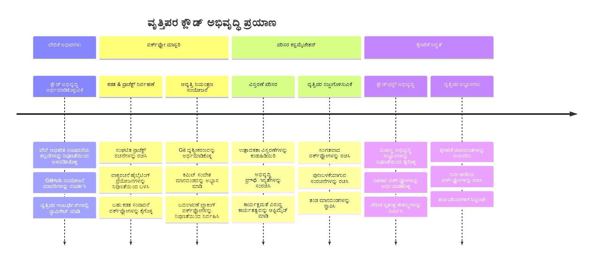
**🎓 ಪದವೀಧರ ಹಂತ**: ನೀವು ಪ್ರಮುಖ ತಂತ್ರಜ್ಞಾನ ಕಂಪನಿಗಳ ವೃತ್ತಿಪರ ಅಭಿವೃದ್ಧಿಪಡಿಸಿದವರ ಬಳಸಿ ಸಮಾನ ಸಾಧನಗಳು ಮತ್ತು ಕಾರ್ಯಪ್ರವಾಹವನ್ನು ಬಳಸಿಕೊಂಡು ಕ್ಲೌಡ್ ಆಧಾರಿತ ಅಭಿವೃದ್ಧಿಯನ್ನು ಯಶಸ್ವಿಯಾಗಿ ನಿಪುಣವಾಗಿ ಮಾಡಿಕೊಂಡಿದ್ದೀರಿ. ಈ ಕೌಶಲ್ಯಗಳು ಸಾಫ್ಟ್‌ವೇರ್ ಅಭಿವೃದ್ಧಿಯ ಭವಿಷ್ಯವನ್ನು ಪ್ರತಿಬಿಂಬಿಸುತ್ತವೆ.

**🔄 ಮುಂದಿನ ಹಂತದ ಸಾಮರ್ಥ್ಯಗಳು**:
- ಕೋಡ್ಸ್‌ಪೇಸಸ್, GitPod ಮುಂತಾದ ಮುಂದಿನ ತಲೆಮಾರಿನ ಕ್ಲೌಡ್ ಅಭಿವೃದ್ಧಿ ವೇದಿಕೆಗಳನ್ನು ಅನ್ವೇಷಿಸಲು ಸಿದ್ಧ
- ವಿತರಿತ ಅಭಿವೃದ್ಧಿ ತಂಡಗಳಲ್ಲಿ ಕಾರ್ಯನಿರ್ವಹಿಸಲು ಸಿದ್ಧ
- ಜಾಗತಿಕವಾಗಿ ಓಪನ್ ಸೋರ್ಸ್ ಪ್ರಾಜೆಕ್ಟ್‌ಗಳಿಗೆ ಕೊಡುಗೆ ನೀಡಲು ಸಜ್ಜುಗೊಂಡಿದ್ದಾರೆ
- ಆಧುನಿಕ DevOps ಹಾಗೂ ನಿರಂತರ ಸಮ್ಮಿಲನ ಆಚಾರಗಳನ್ನು ಸ್ಥಾಪಿಸಲು ನೆಲೆಸಿದ ಮೇಲ್ಮೈ

## GitHub Copilot ಏಜೆಂಟ್ ಚಾಲೆಂಜ್ 🚀

ನಾಸಾ ಬಳಸುವ ಕಟ್ಟಿಕೆಯಾಗಿರುವ ವಿಧಾನವನ್ನು ಹೋಲುವಂತೆ, ಈ ಪ್ರಶಿಕ್ಷಣದಲ್ಲಿ VSCode.dev ಕೌಶಲ್ಯಗಳ ಸಂಯೋಜಿತ ಬಳಕೆಗೆ ಸಂಪೂರ್ಣ ಕೆಲಸದ ಸಮಯ ಪಧ್ಯತಿಯನ್ನು ಅನುಸರಿಸಲಾಗಿದೆ.

**ಉದ್ದೇಶ**: VSCode.dev ನ್ನು ಸಂಪೂರ್ಣ ವೆಬ್ ಅಭಿವೃದ್ಧಿ ಕಾರ್ಯವಿಧಾನವನ್ನು ಸ್ಥಾಪಿಸುವ ಮೂಲಕ ಪ್ರಾಮಾಣಿಕತೆಗೆ ತಲುಪಿಸುವುದು.

**ಪ್ರಾಜೆಕ್ಟ್ ಅಗತ್ಯಗಳು:** ಏಜೆಂಟ್ ಮೋಡ್ ಸಹಾಯದಿಂದ ಈ ಕಾರ್ಯಗಳನ್ನು ಪೂರ್ಣಗೊಳಿಸಿ:
1. ಈಗಿರುವ ರೆಪೋವನ್ನು ಫರ್ಕ್ ಮಾಡುವುದು ಅಥವಾ ಹೊಸದನ್ನು ಸೃಷ್ಟಿಸುವುದು
2. HTML, CSS ಮತ್ತು ಜಾವಾಸ್ಕ್ರಿಪ್ಟ್ ಫೈಲ್‌ಗಳೊಂದಿಗೆ ಕಾರ್ಯನಿರ್ವಹಿಸುವ ಪ್ರಾಜೆಕ್ಟ್ ರಚನೆ ಸ್ಥಾಪಿಸುವುದು
3. ಮೂರು ಅಭಿವೃದ್ಧಿ ಉತ್ತೇಜಕ ವಿಸ್ತಾರಗಳನ್ನು ಸ್ಥಾಪಿಸಿ ಸಂರಚಿಸುವುದು
4. ವಿವರಣಾತ್ಮಕ ಕಮಿಟ್ ಸಂದೇಶಗಳೊಂದಿಗೆ ಸಂಸ್ಕರಣಾ ನಿಯಂತ್ರಣ ಅಭ್ಯಾಸ
5. ವೈಶಿಷ್ಟ್ಯ ಶಾಖೆ ಸೃಷ್ಟಿ ಮತ್ತು ಪರಿಷ್ಕರಣೆ ಅಭ್ಯಾಸ
6. README.md ಕಡತದಲ್ಲಿ ಪ್ರಕ್ರಿಯೆ ಮತ್ತು ಕಲಿತ ವಿಷಯಗಳನ್ನು ದಾಖಲಿಸುವುದು

ಈ ಅಭ್ಯಾಸವು ಎಲ್ಲ VSCode.dev ತತ್ವಗಳನ್ನು ಭವಿಷ್ಯದಲ್ಲಿ ಅಭಿವೃದ್ಧಿ ಪ್ರಾಜೆಕ್ಟ್ಗಳಿಗೆ ಅನ್ವಯಿಸುವ ಪ್ರಾಯೋಗಿಕ ಕಾರ್ಯಪದ್ಧತಿಯಲ್ಲಿ ಸಂಯೋಜಿಸುತ್ತದೆ.

ಇಲ್ಲಿ [agent mode](https://code.visualstudio.com/blogs/2025/02/24/introducing-copilot-agent-mode) ಬಗ್ಗೆ ಹೆಚ್ಚಿನ ವಿವರಗಳನ್ನು ತಿಳಿದುಕೊಳ್ಳಿ.

## ಅಸೈನ್‌ಮೆಂಟ್

ಈ ಕೌಶಲ್ಯಗಳನ್ನು ಪ್ರಾಯೋಗಿಕ ಪರೀಕ್ಷೆಗೆ ತರುತ್ತೇವೆ! ನಿಮಗಾಗಿ ಒಂದು ಹಸ್ತಪ್ರದರ್ಶನ ಪ್ರಾಜೆಕ್ಟ್ ಇದೆ: [VSCode.dev ಬಳಸಿ ರೆಸ್ಯೂಮ್ ವೆಬ್‌ಸೈಟ್ ಸೃಷ್ಟಿಸಿ](./assignment.md)

ಈ ಅಸೈನ್‌ಮೆಂಟ್ ನಿಮ್ಮ ಬ್ರೌಸರ್‌ನಲ್ಲಿ ಸಂಪೂರ್ಣವಾಗಿ ವೃತ್ತಿಪರ ರೆಸ್ಯೂಮ್ ವೆಬ್‌ಸೈಟ್ ನಿರ್ಮಿಸುವಂತೆ ಮಾರ್ಗದರ್ಶನ ನೀಡುತ್ತದೆ. ನೀವು ಎಲ್ಲ VSCode.dev ವೈಶಿಷ್ಟ್ಯಗಳನ್ನು ಬಳಸುತ್ತೀರಿ ಮತ್ತು ಅಂತ್ಯಕ್ಕೆ ನೀವು ಒಳ್ಳೆಯ ವೆಬ್‌ಸೈಟ್ ಮತ್ತು ನಿಮ್ಮ ಹೊಸ ಕಾರ್ಯವಿಧಾನದಲ್ಲಿ ದೃಢ ವಿಶ್ವಾಸ ಹೊಂದಿದ್ದೀರಿ.

## ಮುಂದೂಡಿ ಅನ್ವೇಷಿಸಿ ಮತ್ತು ನಿಮ್ಮ ಕೌಶಲ್ಯಗಳನ್ನು ಬೆಳೆಸಿಕೊಳ್ಳಿ

ಈಗ ನಿಮಗೆ ಉತ್ತಮ ನೆಲೆ ಇದೆ, ಆದರೆ ಇನ್ನೂ ಅನೇಕ ಕುತೂಹಲಕರ ವಿಷಯಗಳನ್ನು ಅನ್ವೇಷಿಸಬಹುದು! ನಿಮ್ಮ VSCode.dev ಕೌಶಲ್ಯಗಳನ್ನು ಮುಂದಿನ ಮಟ್ಟಿಗೆ ತಳ್ಳಲು ಇಲ್ಲಿ ಕೆಲವು ಸಂಪನ್ಮೂಲಗಳು ಮತ್ತು ಯೋಚನೆಗಳು:

**ಸರಕಾರಿ ಡಾಕ್ಯುಮೆಂಟ್‌ಗಳು ಗರ್ಭಿಡಲು ಮಿಗಿಲಾದವು:**
- [VSCode ವೆಬ್ ಡಾಕ್ಯುಮೆಂಟೇಶನ್](https://code.visualstudio.com/docs/editor/vscode-web?WT.mc_id=academic-0000-alfredodeza) – ಬ್ರೌಸರ್ ಆಧಾರಿತ ಸಂಪಾದನೆಗೆ ಸಂಪೂರ್ಣ ಮಾರ್ಗದರ್ಶಿ
- [GitHub Codespaces](https://docs.github.com/en/codespaces) – ಕ್ಲೌಡ್‌ನಲ್ಲಿ ಇನ್ನಷ್ಟು ಶಕ್ತಿ ಬಯಸಿದಾಗ

**ಮುಂದಿನ ಅವಕಾಶಗಳನ್ನು ಪ್ರಯೋಗಿಸಲು ಕುತೂಹಲಕರ ವೈಶಿಷ್ಟ್ಯಗಳು:**
- **ಕೀಲಿಮಣೆ ಶಾರ್ಟ್‌ಕಟ್‌ಗಳು**: ನೀವು ಕೋಡಿಂಗ್ ನಿಂಜಾ ಎನ್ನಿಸಿಕೊಳ್ಳುವ ಕೀ ಸಂಯೋಜನೆಗಳನ್ನು ಕಲಿಯಿರಿ
- **ಕಾರ್ಯಪ್ರದೇಶ ಸೆಟ್ಟಿಂಗ್‌ಗಳು**: ವಿಭಿನ್ನ ಪ್ರಾಜೆಕ್ಟ್ ಪ್ರಕಾರಗಳಿಗೆ ವಿಭಿನ್ನ ಪರಿಸರಗಳನ್ನು ಹೊಂದಿಸಿ
- **ಬಹುಮೂಲ ಪ್ರದೇಶ ಕಾರ್ಯಪ್ರದೇಶಗಳು**: ಒಂದೇ ಸಮಯದಲ್ಲಿ ಹಲವಾರು ರೆಪೋಗಳಿಗೆ ಕೆಲಸ ಮಾಡಿ (ಬಹು ಉಪಯುಕ್ತ!)
- **ಟರ್ಮಿನಲ್ ಸಂಯೋಜನೆ**: ನಿಮ್ಮ ಬ್ರೌಸರ್‌ನಲ್ಲೇ ಕಮಾಂಡ್-ಲೈನ್ ಉಪಕರಣಗಳಿಗೆ ಪ್ರವೇಶ ಹೊಂದಿ

**ಇವುಗಳನ್ನು ಅಭ್ಯಾಸ ಮಾಡಲು ಸಲಹೆಗಳು:**
- ಕೆಲ ಓಪನ್ ಸೋರ್ಸ್ ಪ್ರಾಜೆಕ್ಟ್ ಗಳಲ್ಲಿ VSCode.dev ಬಳಸಿ ಕೊಡುಗೆ ನೀಡಿ – ಇದು ಕೊಡುಗೆ ನೀಡಲು ಉತ್ತಮ ಮಾರ್ಗ!
- ನಿಮ್ಮ ಪರಿಪೂರ್ಣ ಸೆಟ್ ಅಪ್ ಕಂಡುಹಿಡಿಯಲು ವಿವಿಧ ವಿಸ್ತಾರಗಳನ್ನು ಪ್ರಯೋಗಿಸಿ
- ನೀವು ಹೆಚ್ಚಾಗಿ ನಿರ್ಮಿಸುವ ತಾಣಗಳಿಗೆ ಪ್ರಾಜೆಕ್ಟ್ ಟೆಂಪ್ಲೇಟ್ಗಳನ್ನು ರಚಿಸಿ
- ಬ್ರಾಂಚಿಂಗ್ ಮತ್ತು ಮರ್ಜಿಂಗ್ ಮುಂತಾದ Git ಕಾರ್ಯವಿಧಾನಗಳನ್ನು ಅಭ್ಯಾಸ ಮಾಡಿ – ತಂಡದ ಪ್ರಾಜೆಕ್ಟ್‌ಗಳಲ್ಲಿ ಈ ಕೌಶಲ್ಯಗಳು ಬಂಗಾರದಷ್ಟು ಮೌಲ್ಯಯುತವೆ

---

**ನೀವು ಬ್ರೌಸರ್ ಆಧಾರಿತ ಅಭಿವೃದ್ಧಿಯಲ್ಲಿ ನಿಪುಣರಾಗಿದ್ದೀರಿ!** 🎉 ಪೋರ್ಟಬಲ್ ಸಾಧನಗಳ ಆವಿಷ್ಕಾರವು ವಿಜ್ಞಾನಿಗಳನ್ನು ದೂರದ ಸ್ಥಳಗಳಲ್ಲಿಯೂ ಸಂಶೋಧನೆ ಮಾಡಲು ಸಹಾಯ ಮಾಡಿದ್ದಂತೆ, VSCode.dev ಯಾವುದೇ ಇಂಟರ್ನೆಟ್ ಸಂಪರ್ಕ ಹೊಂದಿರುವ ಸಾಧನದಿಂದ ವೃತ್ತಿಪರ ಕೋಡಿಂಗ್ ಮಾಡಿಕೊಳ್ಳಲು ಅವಕಾಶ ನೀಡುತ್ತದೆ.

ಈ ಕೌಶಲ್ಯಗಳು ಪ್ರಸ್ತುತ ಉದ್ಯಮದ ಪ್ರವರ್ತನೆಗಳನ್ನು ಪ್ರತಿಬಿಂಬಿಸುತ್ತವೆ – ಅನೇಕ ವೃತ್ತಿಪರ ಅಭಿವೃದ್ಧಿಪಡಿಸಿದವರು ತಮ್ಮ ಹಗಲು ಕಾರ್ಯದಲ್ಲಿ ಕ್ಲೌಡ್ ಆಧಾರಿತ ಅಭಿವೃದ್ಧಿ ಪರಿಸರಗಳನ್ನು ಬಳಸುತ್ತಾರೆ, ಇದು ಲವಚಿಕತೆ ಮತ್ತು ಸುಲಭ ಪ್ರವೇಶದ ಕಾರಣವಾಗಿ. ನೀವು ವೈಯಕ್ತಿಕ ಪ್ರಾಜೆಕ್ಟ್ ಗಳಿಂದ ದೊಡ್ಡ ತಂಡಗಳ ಸಹಯೋಗದವರೆಗೆ ವ್ಯಾಪಿಸುವ workflows ಅನ್ನು ಕಲಿತಿದ್ದೀರಿ.

ನಿಮ್ಮ ಮುಂದಿನ ಅಭಿವೃದ್ಧಿ ಪ್ರಾಜೆಕ್ಟ್ ಗೆ ಈ ತಂತ್ರಗಳನ್ನು ಅನ್ವಯಿಸಿ! 🚀

---

<!-- CO-OP TRANSLATOR DISCLAIMER START -->
**ಡಿಸ್ಕ್ಲೇಮರ್**:  
ಈ ದಸ್ತಾವೇಜನ್ನು AI ಅನುವಾದ ಸೇವೆ [Co-op Translator](https://github.com/Azure/co-op-translator) ಬಳಸಿ ಅನುವಾದಿಸಲಾಗಿದೆ. ನಾವು ಶುದ್ಧತೆಯನ್ನು ಪ್ರಯತ್ನಿಸುತ್ತಿದ್ದರೂ, ಸ್ವಯಂಚಾಲಿತ ಅನುವಾದಗಳಲ್ಲಿ ತಪ್ಪುಗಳು ಅಥವಾ ಅಸತ್ಯತೆಗಳಿರಬಹುದು ಎಂದು ಗಮನಿಸಿ. ಮೂಲ ಭಾಷೆಯಲ್ಲಿರುವ ಮೂಲ ದಸ್ತಾವೇಜಿನನ್ನೇ ಅಧಿಕೃತ ಮೂಲವಾಗಿ ಪರಿಗಣಿಸಬೇಕು. ಮಹತ್ವದ ಮಾಹಿತಿಗಾಗಿ, ವೃತ್ತಿಪರ ಮಾನವ अनುವಾದವನ್ನು ಶಿಫಾರಸು ಮಾಡಲಾಗುತ್ತದೆ. ಈ ಅನುವಾದದ ಬಳಕೆ ನಿಂದ ಉಂಟಾಗುವ ಯಾವುದೇ ತಪ್ಪಾಗು ಎೖ ಅಥವಾ ತಪ್ಪುನಿರ್ದೇಶನಗಳಿಗೆ ನಾವು ಜವಾಬ್ದಾರರಾಗುವುದಿಲ್ಲ.
<!-- CO-OP TRANSLATOR DISCLAIMER END -->