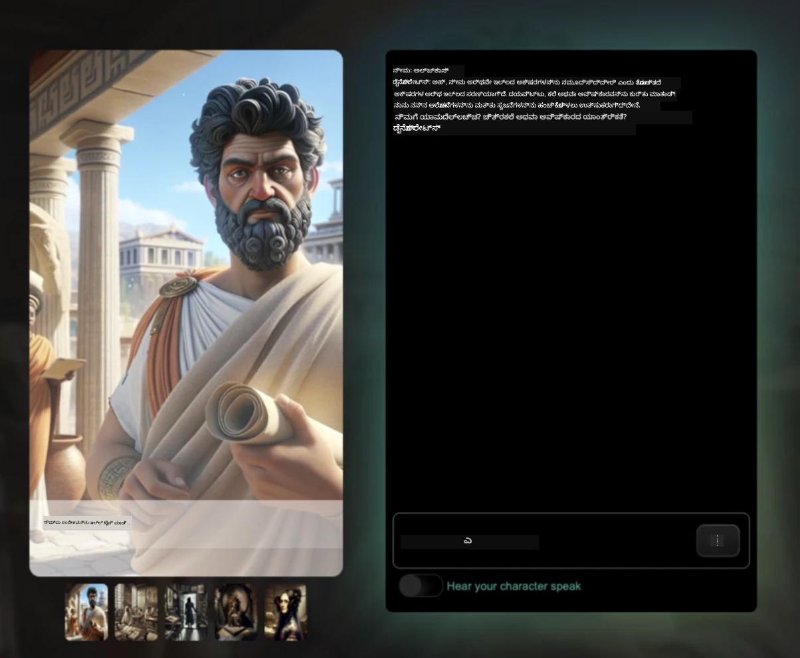
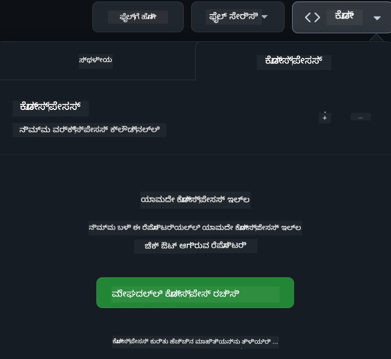

[](https://github.com/microsoft/Web-Dev-For-Beginners/blob/master/LICENSE)
[](https://GitHub.com/microsoft/Web-Dev-For-Beginners/graphs/contributors/)
[](https://GitHub.com/microsoft/Web-Dev-For-Beginners/issues/)
[](https://GitHub.com/microsoft/Web-Dev-For-Beginners/pulls/)
[](http://makeapullrequest.com)

[](https://GitHub.com/microsoft/Web-Dev-For-Beginners/watchers/)
[](https://GitHub.com/microsoft/Web-Dev-For-Beginners/network/)
[](https://GitHub.com/microsoft/Web-Dev-For-Beginners/stargazers/)

[](https://discord.gg/nTYy5BXMWG)

# ಆರಂಭಿಕರಿಗೆ ವೆಬ್ ಡೆವಲಪ್‌ಮೆಂಟ್ - ಒಂದು ಪಠ್ಯಕ್ರಮ

Microsoft Cloud Advocates ಅವರ 12 ವಾರಗಳ ಸಂಪೂರ್ಣ ಪಠ್ಯಕ್ರಮದಿಂದ ವೆಬ್ ಡೆವಲಪ್‌ಮೆಂಟ್ ಮೂಲಭೂತಗಳನ್ನು ಕಲಿಯಿರಿ. 24 ಪಾಠಗಳಲ್ಲೆಲ್ಲಾ, ಜಾವಾಸ್ಕ್ರಿಪ್ಟ್, ಸಿಎಸ್‌ಎಸ್ ಮತ್ತು HTML ಅನ್ನು ವೇಳೆ ಕೆಲಸದ ಯೋಜನೆಗಳ ಮೂಲಕ - ಟೆರಾರಿಯಮ್‌ಗಳು, ಬ್ರೌಸರ್ ವಿಸ್ತರಣೆಗಳು ಮತ್ತು ಬಾಹ್ಯಾಕಾಶ ಆಟಗಳು - ಆಯ್ತು. ಕುಯಿಜ್‌ಗಳು, ಚರ್ಚೆಗಳು ಮತ್ತು ವಾಸ್ತವಿಕ ಕೆಲಸದ ಮೂಲಕ ತೊಡಗಿಸಿ. ನಿಮ್ಮ ಕೌಶಲ್ಯಗಳನ್ನು ಅಭಿವೃದ್ಧಿಪಡಿಸಿ ಮತ್ತು ನಮ್ಮ ಪರಿಣಾಮಕಾರಿ ಯೋಜನೆ ಆಧಾರಿತ ವರ್ಗದ ಮೂಲಕ ваше ಜ್ಞಾನ ನಿಖರಗೊಳಿಸಿ. ನಿಮ್ಮ ಕೋಡಿಂಗ್ ಯಾತ್ರೆಯನ್ನು ಇಂದೇ ಆರಂಭಿಸಿ!

Azure AI Foundry Discord ಸಮುದಾಯದಲ್ಲಿ ಸೇರಿಕೊಳ್ಳಿ

[](https://discord.gg/nTYy5BXMWG)

ಈ ಸಂಪನ್ಮೂಲಗಳನ್ನು ಬಳಸಲು ಈ ಹಂತಗಳನ್ನು ಅನುಸರಿಸಿ:
1. **ರಿಪೊಸಿಟರಿಯನ್ನು ಫೋರ್ಕ್ ಮಾಡಿ**: ಕ್ಲಿಕ್ ಮಾಡಿ [](https://GitHub.com/microsoft/Web-Dev-For-Beginners/fork)
2. **ರಿಪೊಸಿಟರಿಯನ್ನು ಕ್ಲೋನ್ ಮಾಡಿ**:   `git clone https://github.com/microsoft/Web-Dev-For-Beginners.git`
3. [**Azure AI Foundry Discord ಗೆ ಸೇರಿ ಮತ್ತು ತಜ್ಞರು ಮತ್ತು ಅನ್ಯ ಡೆವಲಪರ್‌ಗಳನ್ನು ಭೇಟಿ ಮಾಡಿ**](https://discord.com/invite/ByRwuEEgH4)

### 🌐 ಬಹುಭಾಷಾ ಬೆಂಬಲ

#### GitHub ಕ್ರಿಯೆ ಮೂಲಕ ಬೆಂಬಲಿಸಲ್ಪಟ್ಟಿದೆ (ಸ್ವಯಂಚಾಲಿತ ಮತ್ತು ಸದಾಕಾಲ ನವೀಕೃತ)

<!-- CO-OP TRANSLATOR LANGUAGES TABLE START -->
[Arabic](../ar/README.md) | [Bengali](../bn/README.md) | [Bulgarian](../bg/README.md) | [Burmese (Myanmar)](../my/README.md) | [Chinese (Simplified)](../zh-CN/README.md) | [Chinese (Traditional, Hong Kong)](../zh-HK/README.md) | [Chinese (Traditional, Macau)](../zh-MO/README.md) | [Chinese (Traditional, Taiwan)](../zh-TW/README.md) | [Croatian](../hr/README.md) | [Czech](../cs/README.md) | [Danish](../da/README.md) | [Dutch](../nl/README.md) | [Estonian](../et/README.md) | [Finnish](../fi/README.md) | [French](../fr/README.md) | [German](../de/README.md) | [Greek](../el/README.md) | [Hebrew](../he/README.md) | [Hindi](../hi/README.md) | [Hungarian](../hu/README.md) | [Indonesian](../id/README.md) | [Italian](../it/README.md) | [Japanese](../ja/README.md) | [Kannada](./README.md) | [Korean](../ko/README.md) | [Lithuanian](../lt/README.md) | [Malay](../ms/README.md) | [Malayalam](../ml/README.md) | [Marathi](../mr/README.md) | [Nepali](../ne/README.md) | [Nigerian Pidgin](../pcm/README.md) | [Norwegian](../no/README.md) | [Persian (Farsi)](../fa/README.md) | [Polish](../pl/README.md) | [Portuguese (Brazil)](../pt-BR/README.md) | [Portuguese (Portugal)](../pt-PT/README.md) | [Punjabi (Gurmukhi)](../pa/README.md) | [Romanian](../ro/README.md) | [Russian](../ru/README.md) | [Serbian (Cyrillic)](../sr/README.md) | [Slovak](../sk/README.md) | [Slovenian](../sl/README.md) | [Spanish](../es/README.md) | [Swahili](../sw/README.md) | [Swedish](../sv/README.md) | [Tagalog (Filipino)](../tl/README.md) | [Tamil](../ta/README.md) | [Telugu](../te/README.md) | [Thai](../th/README.md) | [Turkish](../tr/README.md) | [Ukrainian](../uk/README.md) | [Urdu](../ur/README.md) | [Vietnamese](../vi/README.md)

> **ಸ್ಥಾನಿಕವಾಗಿ ಕ್ಲೋನ್ ಮಾಡಲು ಇಚ್ಛಿಸುತ್ತೀರಾ?**

> ಈ ರಿಪೊಸಿಟರಿ 50+ ಭಾಷಾ ಅನುವಾದಗಳನ್ನು ಒಳಗೊಂಡಿದೆ, ಇದು ಡೌನ್ಲೋಡ್ ಗಾತ್ರವನ್ನು ತುಂಬಾ ಹೆಚ್ಚಿಸುತ್ತದೆ. ಅನುವಾದಗಳನ್ನು ಇಲ್ಲದೆ ಕ್ಲೋನ್ ಮಾಡಲು sparse checkout ಬಳಸಿ:
> ```bash
> git clone --filter=blob:none --sparse https://github.com/microsoft/Web-Dev-For-Beginners.git
> cd Web-Dev-For-Beginners
> git sparse-checkout set --no-cone '/*' '!translations' '!translated_images'
> ```
> ಇದರಿಂದ ಈ ಕೋರ್ಸ್ ಅನ್ನು ಸಂಪೂರ್ಣ ಮಾಡಲು ಬೇಕಾದ ಎಲ್ಲಾ ವಸ್ತುಗಳು ತುಂಬಾ ವೇಗವಾಗಿ ಲಭ್ಯವಾಗುತ್ತವೆ.
<!-- CO-OP TRANSLATOR LANGUAGES TABLE END -->

**ಹೆಚ್ಚಿನ ಅನುವಾದ ಭಾಷೆಗಳು ಬೆಂಬಲಿಸಲು ನೀವು ಬಯಸಿದರೆ ಅವು [ಇಲ್ಲಿ](https://github.com/Azure/co-op-translator/blob/main/getting_started/supported-languages.md) ಪಟ್ಟಿಯನ್ನು ಕಾಣಬಹುದು**

[](https://open.vscode.dev/microsoft/Web-Dev-For-Beginners)

#### 🧑‍🎓 _ನೀವು ವಿದ್ಯಾರ್ಥಿಯಾದೀರಾ?_

[**Student Hub ಪುಟ**](https://docs.microsoft.com/learn/student-hub/?WT.mc_id=academic-77807-sagibbon) ಭೇಟಿಕೊಳ್ಲಿರಿ ಇಲ್ಲಿ ನೀವು ಪ್ರಾಥಮಿಕ ಸಂಪನ್ಮೂಲಗಳು, ವಿದ್ಯಾರ್ಥಿ ಪ್ಯಾಕ್ಗಳು ಹಾಗೂ ಉಚಿತ ಪ್ರಮಾಣಪತ್ರ ವೌಚರ್ ಪಡೆದುಕೊಳ್ಳಲು ಮಾರ್ಗಗಳನ್ನು ಕಾಣುತ್ತೀರಿ. ಈ ಪುಟವನ್ನು ನಿಮ್ಮ ಬುಕ್ಮಾರ್ಕ್ ಮಾಡಿಕೊಳ್ಳಿ ಮತ್ತು ತಿಂಗಳಿಗೆ ವಿಷಯ ಬದಲಾಗುತ್ತಿದ್ದಂತೆ ಪರಿಶೀಲಿಸಿ.

### 📣 ಘೋಷಣೆ - GitHub Copilot Agent ಮೋಡ್ ನ ಹೊಸ ನಾವುಗಳು ಪೂರ್ಣಗೊಳಿಸಲು!

ಹೊಸ ನಾವು ಸೇರಿಸಲಾಗಿದೆ, ಬಹುತೇಕ ಅಧ್ಯಾಯಗಳಲ್ಲಿ "GitHub Copilot Agent Challenge 🚀" ಅನ್ನು ಹುಡುಕಿ. ಇದು GitHub Copilot ಮತ್ತು Agent ಮೋಡ್ ಬಳಸಿಕೊಂಡು ನೀವು ಪೂರ್ಣಗೊಳಿಸಬೇಕಾದ ಹೊಸ ನಾವು. ನೀವು ಮೊದಲು Agent ಮೋಡ್ ಉಪಯೋಗಿಸಿರದಿದ್ದರೆ ಇದು ಕೇವಲ ಪಠ್ಯ ವಿನ್ಯಾಸ ಮಾಡದೇ, ಕಡತಗಳನ್ನು ರಚಿಸಲು ಮತ್ತು ಸಂಪಾದಿಸಲು, ಆಜ್ಞೆಗಳನ್ನು ಚಾಲನೆ ಮಾಡಲು ಮತ್ತು ಇನ್ನಷ್ಟು ಮಾಡಲು ಸಾಮರ್ಥ್ಯವಿದೆ.

### 📣 ಘೋಷಣೆ - _ಜನರೇಟಿವ್ AI ಬಳಸಿ ನಿರ್ಮಿಸಲು ಹೊಸ ಯೋಜನೆ_

ಹೊಸ AI ಸಹಾಯಕ ಯೋಜನೆ ಸೇರಿಸಲಾಗಿದೆ, ಪರಿಶೀಲಿಸಿ [ಯೋಜನೆ](./9-chat-project/README.md)

### 📣 ಘೋಷಣೆ - _ಜನರೇಟಿವ್ AIಗಾಗಿ ಜಾವಾಸ್ಕ್ರಿಪ್ಟ್ ಹೊಸ ಪಠ್ಯಕ್ರಮ_ ಬಿಡುಗಡೆಯಾಗಿದೆ

ನಮ್ಮ ಹೊಸ ಜನರೇಟಿವ್ AI ಪಠ್ಯಕ್ರಮವನ್ನು ತಪ್ಪಿಸಿಕೊಳ್ಳಬೇಡಿ!

ಪ್ರಾರಂಭಿಸಲು ಭೇಟಿ ನೀಡಿ [https://aka.ms/genai-js-course](https://aka.ms/genai-js-course)


- ಮೂಲಗಳಿಂದ RAG ವರೆಗೆ ಎಲ್ಲವನ್ನೂ ಒಳಗೊಂಡ ಪಾಠಗಳು.
- GenAI ಮತ್ತು ನಮ್ಮ ಸಂಗಾತಿ ಅಪ್ ಬಳಸಿ ಐತಿಹಾಸಿಕ ಪಾತ್ರಗಳೊಂದಿಗೆ ಸಂವಹನ ಮಾಡಿ.
- ಮನರಂಜನೆ ಮತ್ತು ಆಕರ್ಷಕ ಕಥಾನಕ, ನೀವು ಕಾಲ ಯಾತ್ರೆ ಮಾಡುತ್ತಿದ್ದೀರಿ!



ಪ್ರತಿ ಪಾಠದಲ್ಲಿ ಪೂರ್ಣಗೊಳಿಸಲು ಒಂದು ಕಾರ್ಯ, ಜ್ಞಾನ ಪರೀಕ್ಷೆ ಮತ್ತು ಸವಾಲು ಇದೆ,ದಲ್ಲಿ ಕಲಿಯುವ ವಿಷಯಗಳು:
- ಪ್ರಾಂಪ್ಟ್‌ಗಾಗಿ ಮತ್ತು ಪ್ರಾಂಪ್ಟ್ ಇಂಜಿನಿಯರಿಂಗ್
- ಪಠ್ಯ ಮತ್ತು ಚಿತ್ರ ಅಪ್ಲಿಕೇಶನ್ ತಯಾರಿ
- ಹುಡುಕಾಟ ಅಪ್ಲಿಕೇಶನ್ಗಳು

ಪ್ರಾರಂಭಿಸಲು ಭೇಟಿ ನೀಡಿ [https://aka.ms/genai-js-course](../../[https:/aka.ms/genai-js-course)

## 🌱 ಪ್ರಾರಂಭಿಸುವುದು

> **ಆಚಾರಕರು**, ನಾವು ಈ ಪಠ್ಯಕ್ರಮವನ್ನು ಬಳಸುವ ಕುರಿತು ಕೆಲವು ಸಲಹೆಗಳನ್ನು [ಸೇರಿಸಿದ್ದೇವೆ](for-teachers.md). ನಿಮ್ಮ ಪ್ರತಿಕ್ರಿಯೆಯನ್ನು ನಾವು [ನಮ್ಮ ಚರ್ಚೆ ವೇದಿಕೆ](https://github.com/microsoft/Web-Dev-For-Beginners/discussions/categories/teacher-corner) ನಲ್ಲಿ ಆವश्यकತೆ ಇರುತ್ತದೆ!

**[ಕಲಿಯುವವರು](https://aka.ms/student-page/?WT.mc_id=academic-77807-sagibbon)**, ಪ್ರತಿ ಪಾಠಕ್ಕಾಗಿ, ಪ್ರಥಮವಾಗಿ ಪೂರ್ವ-ಪಾಠ ಕುಯಿಜ್ ಸಂಪರ್ಕಿಸಿ ನಂತರ ಪಾಠದ ವಸ್ತು ಓದಿ, ವಿವಿಧ ಚಟುವಟಿಕೆಗಳನ್ನು ಪೂರ್ಣಗೊಳಿಸಿ ಮತ್ತು ನಂತರದ ಪಾಠ ಕುಯಿಜ್ ಮೂಲಕ ನಿಮ್ಮ ಅರ್ಥಮಾಡಿಕೊಳ್ಳುವಿಕೆ ಪರಿಶೀಲಿಸಿ.

ನಿಮ್ಮ ಕಲಿಕೆಯ ಅನುಭವವನ್ನು ಮತ್ತಷ್ಟು ಸುಧಾರಿಸಲು, ನಿಮ್ಮ ಸಹಪಾಠಿಗಳೊಂದಿಗೆ ಸಂಪರ್ಕಿಸಿ ಮತ್ತು ಯೋಜನೆಗಳ ಮೇಲೆ ಒಟ್ಟಾಗಿ ಕೆಲಸ ಮಾಡಿ! ಚರ್ಚೆಗಳು ನಮ್ಮ [ಚರ್ಚೆ ವೇದಿಕೆ](https://github.com/microsoft/Web-Dev-For-Beginners/discussions) ನಲ್ಲಿ ಪ್ರೋತ್ಸಾಹಿಸಲಾಗುತ್ತವೆ, ಇಲ್ಲಿ ನಮ್ಮ ಮೊಡರೇಟರ್ ತಂಡ ನಿಮ್ಮ ಪ್ರಶ್ನೆಗಳಿಗೆ ಉತ್ತರ ಕೊಡಲು ದೊರೆಯುತ್ತದೆ.

ನಿಮ್ಮ ವಿದ್ಯಾಭ್ಯಾಸವನ್ನು ಮುಂದುವರಿಸಲು, ನಾವು ಹೆಚ್ಚುವರಿ ಅಧ್ಯಯನ ಸಾಮಗ್ರಿಗಾಗಿ [Microsoft Learn](https://learn.microsoft.com/users/wirelesslife/collections/p1ddcy5jwy0jkm?WT.mc_id=academic-77807-sagibbon) ಅನಾವರಣ ಮಾಡಲು ಶಿಫಾರಸು ಮಾಡುತ್ತೇವೆ.

### 📋 ನಿಮ್ಮ ಅಭ್ಯಾಸ ಸೃಷ್ಟಿಸುವುದು

ಈ ಪಠ್ಯಕ್ರಮಕ್ಕೆ ಅಭಿವೃದ್ಧಿ ಪರಿಸರ ಸಿದ್ಧವಾಗಿದೆ! ಪ್ರಾರಂಭಿಸಿದಂತೆ ನೀವು ಕುಸಿತದಲ್ಲಿ ಈ ಪಠ್ಯಕ್ರಮವನ್ನು [Codespace](https://github.com/features/codespaces/) (_ಬ್ರೌಸರ್ ಆಧಾರಿತ, ಇನ್‌ಸ್ಟಾಲ್ ಅಗತ್ಯವಿಲ್ಲದ ವಾತಾವರಣ_) ನಲ್ಲಿ ಅಥವಾ ನಿಮ್ಮ ಕಂಪ್ಯೂಟರ್‌ನಲ್ಲಿ ಸ್ಥಳೀಯವಾಗಿ [Visual Studio Code](https://code.visualstudio.com/?WT.mc_id=academic-77807-sagibbon) ನಂತಹ ಪಠ್ಯ ಸಂಪಾದಕ ಬಳಸಿ ಆಯ್ಕೆ ಮಾಡಬಹುದು.

#### ನಿಮ್ಮ ರಿಪೊಸಿಟರಿಯನ್ನು ರಚಿಸಿ
ನಿಮ್ಮ ಕೆಲಸವನ್ನು ಸುಲಭವಾಗಿ ಉಳಿಸಲು, ಈ ರಿಪೊಸಿಟರಿಯು ನಿಮ್ಮ ಸ್ವಂತ ನಕಲನ್ನು ನಿರ್ಮಿಸುವುದನ್ನು ಶಿಫಾರಸು ಮಾಡಲಾಗುತ್ತದೆ. ನಿಮ್ಮ GitHub ಖಾತೆಯಲ್ಲಿ ಈ ಪಠ್ಯಕ್ರಮದ ನಕಲಿನೊಂದಿಗೆ ಹೊಸ ರಿಪೊಸಿಟರಿ ಸೃಷ್ಟಿಸಲು ಪುಟದ ಮೇಲ್ಭಾಗದ **Use this template** ಬಟನ್ ಕ್ಲಿಕ್ ಮಾಡಿ.

ಈ ಹಂತಗಳನ್ನು ಅನುಸರಿಸಿ:
1. **ರಿಪೊಸಿಟರಿಯನ್ನು ಫೋರ್ಕ್ ಮಾಡಿ**: ಈ ಪುಟದ ಮೇಲ್ದಡಿಯಲ್ಲಿ ಇರುವ "Fork" ಬಟನ್ ಅನ್ನು ಕ್ಲಿಕ್ ಮಾಡಿ.
2. **ರಿಪೊಸಿಟರಿಯನ್ನು ಕ್ಲೋನ್ ಮಾಡಿ**:   `git clone https://github.com/microsoft/Web-Dev-For-Beginners.git`

#### Codespace ನಲ್ಲಿ ಪಠ್ಯಕ್ರಮವನ್ನು ಚಲಾಯಿಸುವುದು

ನೀವು ರಚಿಸಿದ ಈ ರಿಪೊಸಿಟರಿಯ ನಕಲಿನಲ್ಲಿ, **Code** ಬಟನ್ ಕ್ಲಿಕ್ ಮಾಡಿ ನಂತರ **Open with Codespaces** ಆಯ್ಕೆಮಾಡಿ. ಇದು ನಿಮ್ಮ ಕೆಲಸಕ್ಕೆ ಹೊಸ Codespace を ಸೃಷ್ಟಿಸುತ್ತದೆ.



#### ನಿಮ್ಮ ಕಂಪ್ಯೂಟರ್‌ನಲ್ಲಿ ಸ್ಥಳೀಯವಾಗಿ ಪಠ್ಯಕ್ರಮವನ್ನು ಚಲಾಯಿಸುವುದು

ಈ ಪಠ್ಯಕ್ರಮವನ್ನು ನಿಮ್ಮ ಕಂಪ್ಯೂಟರ್‌ನಲ್ಲಿ ಚಲಾಯಿಸಲು, ನಿಮಗೆ ಪಠ್ಯ ಸಂಪಾದಕ, ಬ್ರೌಸರ್ ಮತ್ತು ಕಮಾಂಡ್ ಲೈನ್ ಉಪಕರಣ ಬೇಕಾಗುತ್ತದೆ. ನಮ್ಮ ಮೊದಲ ಪಾಠ, [ಪ್ರೋಗ್ರಾಮಿಂಗ್ ಭಾಷೆಗಳ ಪರಿಚಯ ಮತ್ತು ವ್ಯಾಪಾರದ ಉಪಕರಣಗಳು](../../1-getting-started-lessons/1-intro-to-programming-languages), ನಿಮ್ಮ ಅವಶ್ಯಕತೆಗಳಿಗೆ ಸರಿಯಾದ ಆಯ್ಕೆ ಮಾಡಲು ಆ ವಿವಿಧ ಆಯ್ಕೆಗಳನ್ನು ನಿಮಗೆ ಪರಿಚಯಿಸುತ್ತದೆ.

ನಮ್ಮ ಶಿಫಾರಸು [Visual Studio Code](https://code.visualstudio.com/?WT.mc_id=academic-77807-sagibbon) ಅನ್ನು ಸಂಪಾದಕವಾಗಿ ಬಳಸುವುದಾಗಿದೆ, ಇದರಲ್ಲಿ [Terminal](https://code.visualstudio.com/docs/terminal/basics/?WT.mc_id=academic-77807-sagibbon) ಅಂತರ್ನಿಹಿತವಿರುತ್ತದೆ. ನೀವು Visual Studio Code ಅನ್ನು [ಇಲ್ಲಿ](https://code.visualstudio.com/?WT.mc_id=academic-77807-sagibbon) ಡೌನ್ಲೋಡ್ ಮಾಡಬಹುದು.

1. ನಿಮ್ಮ ರಿಪೊಸಿಟರಿಯ ನಕಲನ್ನು ನಿಮ್ಮ ಕಂಪ್ಯೂಟರ್‌ಗೆ ಕ್ಲೋನ್ ಮಾಡಿ. ನೀವು **Code** ಬಟನ್ ಕ್ಲಿಕ್ ಮಾಡಿ URL ನಕಲಿಸಬಹುದು:

    [CodeSpace](./images/createcodespace.png)
ಆಮೇಲೆ, [Visual Studio Code](https://code.visualstudio.com/?WT.mc_id=academic-77807-sagibbon) ಅಂತರ್ನಿಹಿತವಾಗಿ [Terminal](https://code.visualstudio.com/docs/terminal/basics/?WT.mc_id=academic-77807-sagibbon) ಅನ್ನು ತೆರೆಯಿರಿ ಮತ್ತು ಕೆಳಗಿನ ಆಜ್ಞೆಯನ್ನು ಚಲಾಯಿಸಿ, `<your-repository-url>` ಅನ್ನು ನೀವು ಈಗ ನಕಲಿಸಿದ URL ಮೂಲಕ ಬದಲಿ ಮಾಡಿಕೊಳ್ಳಿ:

    ```bash 
    git clone <your-repository-url>
    ```

2. Visual Studio Code ನಲ್ಲಿ ಫೋಲ್ಡರ್ ಆಗು ತೆಗೆಯಿರಿ. ನೀವು ಇದನ್ನು **File** > **Open Folder** ಕ್ಲಿಕ್ ಮಾಡಿ ಮತ್ತು ನೀವು ಈಗ ಕ್ಲೋನ್ ಮಾಡಿದ ಫೋಲ್ಡರ್ ಆಯ್ಕೆಮಾಡಿ ಮಾಡಬಹುದು.


> ಶಿಫಾರಸುಮಾಡಲಾದ Visual Studio Code ವಿಸ್ತರಣೆಗಳು:
>
> * [Live Server](https://marketplace.visualstudio.com/items?itemName=ritwickdey.LiveServer&WT.mc_id=academic-77807-sagibbon) - Visual Studio Code ಒಳಗಿನ HTML ಪುಟಗಳ ಪೂರ್ವದರ್ಶನಕ್ಕೆ
> * [Copilot](https://marketplace.visualstudio.com/items?itemName=GitHub.copilot&WT.mc_id=academic-77807-sagibbon) - ನಿಮ್ಮ ಕೋಡ್ ಅನ್ನು ವೇಗವಾಗಿ ಬರೆಯಲು ಸಹಾಯ ಮಾಡಲು

## 📂 ಪ್ರತಿಯೊಂದು ಪಾಠದಲ್ಲಿ ಸೇರ್ಪಡೆಯಾಗಿರುವುದು:

- ಐಚ್ಛಿಕ ಸ್ಕೆಚ್‌ನೋಟ್
- ಐಚ್ಛಿಕ ಪೂರಕ ವೀಡಿಯೋ
- ಪಾಠದ ಮುಂಚಿತ ಉರಿವೀಕ್ಷಣಾತ್ಮಕ ಕ್ವಿಜ್
- ಬರೆಯಲ್ಪಟ್ಟ ಪಾಠ
- ಯೋಜನೆ ಆಧಾರಿತ ಪಾಠಗಳಿಗಾಗಿ, ಯೋಜನೆ ನಿರ್ಮಾಣದ ಕ್ರಮಬದ್ಧ ಮಾರ್ಗದರ್ಶಿಗಳು
- ಜ್ಞಾನ ಪರಿಶೀಲನೆಗಳು
- ಒಂದು ಸವಾಲು
- ಪೂರಕ ಓದು
- ನಿಯೋಜನೆ
- [ಪಾಠದ ನಂತರದ ಕ್ವಿಜ್](https://ff-quizzes.netlify.app/web/)

> **ಕ್ವಿಜ್‌ಗಳ ಬಗ್ಗೆ ಒಂದು ಟಿಪ್ಪಣಿ**: ಎಲ್ಲಾ ಕ್ವಿಜ್‌ಗಳು Quiz-app ಫೋಲ್ಡರ್‌ನಲ್ಲಿ ಇರಲಿದೆ, ಒಟ್ಟು 48 ಕ್ವಿಜ್‌ಗಳು, ಪ್ರತಿ ಕ್ವಿಜ್‌ನಲ್ಲಿ ಮೂರು ಪ್ರಶ್ನೆಗಳಿವೆ. ಅವುಗಳನ್ನು ಇಲ್ಲಿ [ಎಲ್ಲಾ](https://ff-quizzes.netlify.app/web/) ಲಭ್ಯವಿವೆ; ಕ್ವಿಜ್ ಅಪ್ಲಿಕೇಶನ್ ಅನ್ನು ಸ್ಥಳೀಯವಾಗಿ ಚಾಲನೆ ಮಾಡಬಹುದು ಅಥವಾ Azure ಗೆ ನಿಯೋಜಿಸಬಹುದು; `quiz-app` ಫೋಲ್ಡರ್‌ನ ಸೂಚನೆ ಅನುಸರಿಸಿ.

## 🗃️ ಪಾಠಗಳು

|     |                       ಯೋಜನೆಯ ಹೆಸರು                      |                            ಕಲಿಸಿದ ಅಂಶಗಳು                             | ಅಧ್ಯಯನ ಉದ್ದೇಶಗಳು                                                                                                                 |                                                         ಸಂಬಂಧಿಸಿದ ಪಾಠ                                                           |         ರಚನೆಕಾರರು          |
| :-: | :-------------------------------------------------------: | :------------------------------------------------------------------: | -------------------------------------------------------------------------------------------------------------------------------- | :----------------------------------------------------------------------------------------------------------------------------: | :---------------------: |
| 01  |                     ಪ್ರಾರಂಭಿಸುವುದು                         |           ಪ್ರೋಗ್ರಾಮಿಂಗ್ ಪರಿಚಯ ಮತ್ತು ಉಪಕರಣಗಳ ಪರಿಚಯ            | ಬಹುತೇಕ ಪ್ರೋಗ್ರಾಮಿಂಗ್ ಭಾಷೆಗಳ ಮೂಲಭೂತ ಅಂಶಗಳ ಬಗ್ಗೆ ಮತ್ತು ವೃತ್ತಿಪರ ಡೆವಲಪರ್‌ಗಳು ತಮ್ಮ ಕೆಲಸಗಳನ್ನು ಮಾಡಲು ಸಹಾಯ ಮಾಡುವ ಸಾಫ್ಟ್‌ವೇರ್ ಬಗ್ಗೆ ಕಲಿಯಿರಿ | [ಪ್ರೋಗ್ರಾಮಿಂಗ್ ಭಾಷೆಗಳ ಮತ್ತು ಉಪಕರಣಗಳ ಪರಿಚಯ](./1-getting-started-lessons/1-intro-to-programming-languages/README.md) |         ಜಾಸ್ಮಿನ್          |
| 02  |                     ಪ್ರಾರಂಭಿಸುವುದು                         |             ಗಿಥಬ್‌ನ ಮೂಲಭೂತಗಳು, ತಂಡದೊಂದಿಗೆ ಕೆಲಸ ಸೇರಿಸುತ್ತದೆ        | ನಿಮ್ಮ ಯೋಜನೆಯಲ್ಲಿ GitHub ಅನ್ನು ಹೇಗೆ ಬಳಸುವುದು, ಕೋಡ್ ಬೇಸ್ ಮೇಲೆ ಇತರರೊಂದಿಗೆ ಸಹಕಾರ ಮಾಡುವುದು                    |                            [GitHub ಪ್ರಾರಂಭಿಕ](./1-getting-started-lessons/2-github-basics/README.md)                             |          ಫ್ಲೋರ್          |
| 03  |                     ಪ್ರಾರಂಭಿಸುವುದು                         |                             ಪ್ರವೇಶೋಪಯೋಗಿತ್ವ                              | ವೆಬ್ ಪ್ರವೇಶೋಪಯೋಗಿತ್ವದ ಮೂಲಭೂತಗಳು ಕಲಿಯಿರಿ                                                                                           |                       [ಪ್ರವೇಶೋಪಯೋಗಿತ್ವ ಮೂಲತತ್ವಗಳು](./1-getting-started-lessons/3-accessibility/README.md)                       |       ಕ್ರಿಸ್ಟೊಫರ್       |
| 04  |                        JS ಮೂಲಭೂತಗಳು                         |                         ಜಾವಾಸ್ಕ್ರಿಪ್ಟ್ ಡೇಟಾ ಪ್ರಕಾರಗಳು                          | ಜಾವಾಸ್ಕ್ರಿಪ್ಟ್ ಡೇಟಾ ಪ್ರಕಾರಗಳ ಮೂಲಭೂತ ವಿವರಗಳು                                                                                                 |                                       [ಡೇಟಾ ಪ್ರಕಾರಗಳು](./2-js-basics/1-data-types/README.md)                                        |         ಜಾಸ್ಮಿನ್         |
| 05  |                        JS ಮೂಲಭೂತಗಳು                         |                         ಫಂಕ್ಷನ್‌ಗಳು ಮತ್ತು ವಿಧಾನಗಳು                          | ಅಪ್ಲಿಕೇಶನ್ ಲಾಜಿಕ್ ಪ್ರವಾಹವನ್ನು ನಿರ್ವಹಿಸಲು ಫಂಕ್ಷನ್‌ಗಳು ಮತ್ತು ವಿಧಾನಗಳ ಬಗ್ಗೆ ತಿಳಿದುಕೊಳ್ಳಿ                                                             |                              [ಫಂಕ್ಷನ್‌ಗಳು ಮತ್ತು ವಿಧಾನಗಳು](./2-js-basics/2-functions-methods/README.md)                               | ಜಾಸ್ಮಿನ್ ಮತ್ತು ಕ್ರಿಸ್ಟೊಫರ್ |
| 06  |                        JS ಮೂಲಭೂತಗಳು                         |                        JS ಜೊತೆಗೆ ನಿರ್ಣಯಗಳನ್ನು ಮಾಡುವುದು                        | ನಿರ್ಣಯ-ಮಾದರಿ ವಿಧಾನಗಳನ್ನು ಬಳಸಿಕೊಂಡು ನಿಮ್ಮ ಕೋಡ್‌ನಲ್ಲಿ ಶರತ್ತುಗಳನ್ನು ರಚಿಸುವ ವಿಧಾನ ಕಲಿಯಿರಿ                                                           |                                 [ನಿರ್ಣಯ ಮಾಡಲು](./2-js-basics/3-making-decisions/README.md)                                  |         ಜಾಸ್ಮಿನ್         |
| 07  |                        JS ಮೂಲಭೂತಗಳು                         |                            ಅರೇಗಳು ಮತ್ತು ಲೂಪ್ಗಳು                            | ಜಾವಾಸ್ಕ್ರಿಪ್ಟ್‌ನಲ್ಲಿ ಅರೇಗಳು ಮತ್ತು ಲೂಪ್ಗಳೊಂದಿಗೆ ಡೇಟಾದೊಂದಿಗೆ ಕೆಲಸಮಾಡಿ                                                                                 |                                   [ಅರೇಗಳು ಮತ್ತು ಲೂಪ್ಗಳು](./2-js-basics/4-arrays-loops/README.md)                                    |         ಜಾಸ್ಮಿನ್         |
| 08  |       [ಟೆರೇರಿಯಂ](./3-terrarium/solution/README.md)       |                            HTML ಅಭ್ಯಾಸದಲ್ಲಿ                            | ಆನ್ಲೈನ್ ಟೆರೇರಿಯಂ ರಚಿಸಲು HTML ನಿರ್ಮಿಸಿ, ವಿನ್ಯಾಸ ನಿರ್ಮಾಣದ ಮೇಲೆ ಕೇಂದ್ರೀಕರಿಸಿ                                                         |                                 [HTML ಪರಿಚಯ](./3-terrarium/1-intro-to-html/README.md)                                 |           ಜೆನ್           |
| 09  |       [ಟೆರೇರಿಯಂ](./3-terrarium/solution/README.md)       |                            CSS ಅಭ್ಯಾಸದಲ್ಲಿ                             | ಆನ್ಲೈನ್ ಟೆರೇರಿಯಂ ರಚಿಸಲು CSS ರಚಿಸಿ, CSS ಮೂಲಭೂತಗಳನ್ನು ಒಳಗೊಂಡು ಪುಟ ಪ್ರತಿಕ್ರಿಯಾಶೀಲವಾಗಿಸಲು ಗಮನಕೊಡಿ                     |                                  [CSS ಪರಿಚಯ](./3-terrarium/2-intro-to-css/README.md)                                  |           ಜೆನ್           |
| 10  |            [ಟೆರೇರಿಯಂ](./3-terrarium/solution/README.md)            |                 ಜಾವಾಸ್ಕ್ರಿಪ್ಟ್ ಕ್ಲೋಶರ್ ಗಳು, DOM ನಿರ್ವಹಣೆ                  | ಡ್ರಾಗ್/ಡ್ರಾಪ್ ಇಂಟರ್ಫೇಸ್ ಮೂಲಕ ಟೆರೇರಿಯಂ ಕಾರ್ಯನಿರ್ವಹಿಸಲು ಜಾವಾಸ್ಕ್ರಿಪ್ಟ್ ನಿರ್ಮಿಸಿ, ಕ್ಲೋಶರ್‌ಗಳು ಮತ್ತು DOM ನಿರ್ವಹಣೆಯ ಮೇಲೆ ಗಮನಹರಿಸಿ             |                  [ಜಾವಾಸ್ಕ್ರಿಪ್ಟ್ ಕ್ಲೋಶರ್ ಗಳು, DOM ನಿರ್ವಹಣೆ](./3-terrarium/3-intro-to-DOM-and-closures/README.md)                   |           ಜೆನ್           |
| 11  |          [ಟೈಪಿಂಗ್ ಆಟ](./4-typing-game/solution/README.md)          |                          ಟೈಪಿಂಗ್ ಆಟ ನಿರ್ಮಿಸಿ                           | ಕೀಬೋರ್ಡ್ ಇವೆಂಟ್‌ಗಳ ಬಳಕೆಯಿಂದ ನಿಮ್ಮ ಜಾವಾಸ್ಕ್ರಿಪ್ಟ್ ಅಪ್ಲಿಕೇಶನ್ ಲಾಜಿಕ್ ಮೊರೆಹೋಗುವ ವಿಧಾನ ಕಲಿಯಿರಿ                                                          |                                [ಇವೆಂಟ್-ಚಾಲಿತ ಪ್ರೋಗ್ರಾಮಿಂಗ್](./4-typing-game/typing-game/README.md)                                |       ಕ್ರಿಸ್ಟೊಫರ್       |
| 12  | [ಹಸಿರು ಬ್ರೌಸರಿನ ವಿಸ್ತರಣೆ](./5-browser-extension/solution/README.md) |                         ಬ್ರೌಸರಿನ ಜೊತೆಗೆ ಕೆಲಸ                          | ಬ್ರೌಸರಿನ ಕಾರ್ಯವಿಧಾನ, ಅವುಗಳ ಇತಿಹಾಸ ಮತ್ತು ಬ್ರೌಸರಿನ ವಿಸ್ತರಣೆಯ ಪ್ರಾರಂಭಿಕ ಅಂಶಗಳನ್ನು ನಿರ್ಮಿಸುವ ವಿಧಾನ ಕಲಿಯಿರಿ                               |                               [ಬ್ರೌಸರಿನ ಬಗ್ಗೆ](./5-browser-extension/1-about-browsers/README.md)                                |           ಜೆನ್           |
| 13  | [ಹಸಿರು ಬ್ರೌಸರಿನ ವಿಸ್ತರಣೆ](./5-browser-extension/solution/README.md) | ಫಾರ್ಮ್ ನಿರ್ಮಾಣ, API ಕರೆ ಮತ್ತು ಸ್ಥಳೀಯ ಸಂಗ್ರಹಣೆಲ್ಲಿಲ್ಲಿ ಚರಗಳನ್ನು ಸಂಗ್ರಹಿಸುವುದು | API ಅನ್ನು ಕರೆಯಲು ಮತ್ತು ಸ್ಥಳೀಯ ಸಂಗ್ರಹಣೆಯಲ್ಲಿ ಸંગ્રಹಿತ ಚರಗಳನ್ನು ಬಳಸಿಕೊಂಡು ಬ್ರೌಸರಿನ ವಿಸ್ತರಣೆಯ ಜಾವಾಸ್ಕ್ರಿಪ್ಟ್ ಅಂಶಗಳನ್ನು ನಿರ್ಮಿಸಿ                      |                [APIಗಳು, ಫಾರ್ಮ್ಗಳು, ಮತ್ತು ಸ್ಥಳೀಯ ಸಂಗ್ರಹಣೆ](./5-browser-extension/2-forms-browsers-local-storage/README.md)                 |           ಜೆನ್           |
| 14  | [ಹಸಿರು ಬ್ರೌಸರಿನ ವಿಸ್ತರಣೆ](./5-browser-extension/solution/README.md) |          ಬ್ರೌಸರಿನ ಹಿನ್ನಲೆ ಪ್ರಕ್ರಿಯೆಗಳು, ವೆಬ್ ಕಾರ್ಯಕ್ಷಮತೆ          | ವಿಸ್ತರಣೆಯ ಐಕಾನ್ ನಿರ್ವಹಿಸಲು ಬ್ರೌಸರಿನ ಹಿನ್ನಲೆ ಪ್ರಕ್ರಿಯೆಗಳನ್ನು ಬಳಸಿ; ವೆಬ್ ಕಾರ್ಯಕ್ಷಮತೆ ಮತ್ತು ಅದನ್ನು ಉತ್ತಮಗೊಳಿಸುವ ಕೆಲವು ಉಪಾಯಗಳನ್ನು ತಿಳಿದುಕೊಳ್ಳಿ   |             [ಹಿನ್ನೆಲೆ ಕಾರ್ಯಗಳು ಮತ್ತು ಕಾರ್ಯಕ್ಷಮತೆ](./5-browser-extension/3-background-tasks-and-performance/README.md)              |           ಜೆನ್           |
| 15  |           [ಸ್ಪೇಸ್ ಆಟ](./6-space-game/solution/README.md)           |             ಜಾವಾಸ್ಕ್ರಿಪ್ಟ್‌ನೊಂದಿಗೆ ಹೆಚ್ಚು ಉನ್ನತ ಆಟ ಅಭಿವೃದ್ಧಿ             | ವರ್ಗಗಳು ಮತ್ತು ಸಂಯೋಜನೆಯನ್ನು ಬಳಸಿ ವಂಶಪಾರಂಪರ್ಯ ಮತ್ತು Pub/Sub ಮಾದರಿಯನ್ನು ಕಲಿತು, ಆಟವನ್ನು ರಚಿಸಲು ಸಿದ್ಧತೆಯಾಗಿರಿ              |                      [ಅತ್ಯಾಧುನಿಕ ಆಟ ಅಭಿವೃದ್ಧಿಗೆ ಪರಿಚಯ](./6-space-game/1-introduction/README.md)                       |          ಕ್ರಿಸ್          |
| 16  |           [ಸ್ಪೇಸ್ ಆಟ](./6-space-game/solution/README.md)           |                           ಕ್ಯಾನ್‌ವಾಸ್‌ಗೆ ಚಿತ್ರರಚನೆ                            | ಪರದೆಗೆ ಅಂಶಗಳನ್ನು ಚಿತ್ರಿಸಲು ಬಳಸುವ ಕ್ಯಾನ್‌ವಾಸ್ API ಬಗ್ಗೆ ಕಲಿಯಿರಿ                                                                       |                                [ಕ್ಯಾನ್‌ವಾಸ್‌ಗೆ ಚಿತ್ರರಚನೆ](./6-space-game/2-drawing-to-canvas/README.md)                                |          ಕ್ರಿಸ್          |
| 17  |           [ಸ್ಪೇಸ್ ಆಟ](./6-space-game/solution/README.md)           |                   ಪರದೆ ಸುತ್ತಲಿ ಅಂಶಗಳ ಚಲನೆ                    | ಕಾರ್ಟೀಸಿಯನ್ ನಿರ್ದೇಖನಗಳು ಮತ್ತು ಕ್ಯಾನ್‌ವಾಸ್ API ಬಳಸಿ ಅಂಶಗಳು ಹೇಗೆ ಚಲಿಸುತ್ತದೆ ಎಂಬುದನ್ನು ಕಂಡುಹಿಡಿಯಿರಿ                                            |                           [ಅಂಶಗಳನ್ನು ಸುತ್ತಲಿ ಚಲಿಸುವುದು](./6-space-game/3-moving-elements-around/README.md)                           |          ಕ್ರಿಸ್          |
| 18  |           [ಸ್ಪೇಸ್ ಆಟ](./6-space-game/solution/README.md)           |                          ಘರ್ಷಣೆ ಪತ್ತೆಮಾಡುವುದು                           | ಕೀಪ್ರೆಸ್ ಬಳಸಿಕೊಂಡು ಅಂಶಗಳನ್ನು ಘರ್ಷಣೆಯಲ್ಲಿ ಮೂಡಿಸಿ ಮತ್ತು ಆಟದ ಕಾರ್ಯಕ್ಷಮತೆಯನ್ನು ಖಚಿತಪಡಿಸಲು ಶಿಶುಶೀತಲ ಕಾರ್ಯವಿಧಾನವನ್ನು ನೀಡಿರಿ    |                              [ಘರ್ಷಣೆ ಪತ್ತೆಮಾಡುವುದು](./6-space-game/4-collision-detection/README.md)                              |          ಕ್ರಿಸ್          |
| 19  |           [ಸ್ಪೇಸ್ ಆಟ](./6-space-game/solution/README.md)           |                             ಅಂಕೆಗಳು ಸંગ્રಹಿಸುವುದು                              | ಆಟದ ಸ್ಥಿತಿಗತಿಯ ಮತ್ತು ಕಾರ್ಯಕ್ಷಮತೆಯ ಆಧಾರದ ಮೇಲೆ ಗಣಿತ ಹಿಸುಕುಗಳನ್ನು ನಿರ್ವಹಿಸಿ                                                                |                                    [ಅಂಕೆಗಳನ್ನು ಕಾಪಾಡುವುದು](./6-space-game/5-keeping-score/README.md)                                    |          ಕ್ರಿಸ್          |
| 20  |           [ಸ್ಪೇಸ್ ಆಟ](./6-space-game/solution/README.md)           |                     ಆಟವನ್ನು ಅಂತ್ಯಗೊಳಿಸುವುದು ಮತ್ತು ಪುನಃಪ್ರಾರಂಭಿಸುವುದು                     | ಆಟದ ಅಂತ್ಯಗೊಳಿಸುವಿಕೆ ಮತ್ತು ಪುನಃಪ್ರಾರಂಭಿಸುವಿಕೆ, ಆಸ್ತಿ ಸ್ವಚ್ಛಗೊಳಿಸುವುದು ಮತ್ತು ಚರ ಮೌಲ್ಯಗಳನ್ನು ಮರುಹೊಂದಿಸುವಿಕೆ ಬಗ್ಗೆ ಕಲಿಯಿರಿ                              |                                [ಅಂತಿಮ ಶರತ್ತು](./6-space-game/6-end-condition/README.md)                                 |          ಕ್ರಿಸ್          |
| 21  |         [ಬ್ಯಾಂಕಿಂಗ್ ಅಪ್ಲಿಕೇಶನ್](./7-bank-project/solution/README.md)          |                 ವೆಬ್ ಅಪ್ಲಿಕೇಶನೆಯಲ್ಲಿ HTML ಟೆಂಪ್ಲೇಟುಗಳು ಮತ್ತು ಮಾರ್ಗಗಳು                 | ಮಾರ್ಗ ನಿರ್ವಹಣೆ ಮತ್ತು HTML ಟೆಂಪ್ಲೇಟುಗಳ ಬಳಕೆ ಮೂಲಕ ಬಹುಪುಟ ವೆಬ್‌ಸೈಟ್ معماري ಸೃಷ್ಟಿಸುವ ವಿಧಾನ ಕಲಿಯಿರಿ                             |                            [HTML ಟೆಂಪ್ಲೇಟುಗಳು ಮತ್ತು ಮಾರ್ಗಗಳು](./7-bank-project/1-template-route/README.md)                             |          ಯೋಹಾನ್          |
| 22  |         [ಬ್ಯಾಂಕಿಂಗ್ ಅಪ್ಲಿಕೇಶನ್](./7-bank-project/solution/README.md)          |                  ಲಾಗಿನ್ ಮತ್ತು ನೋಂದಣಿ ಫಾರ್ಮ್ ನಿರ್ಮಿಸಿ                   | ಫಾರ್ಮ್‌ಗಳನ್ನು ನಿರ್ಮಿಸುವುದು ಮತ್ತು ಪಟ್ಟಿ ಪರಿಶೀಲನೆ ಕ್ರಮಗಳನ್ನು ನಿರ್ವಹಿಸುವುದು ಕುರಿತು ತಿಳಿದುಕೊಳ್ಳಿ                                                                          |                                           [ಫಾರ್ಮ್ಗಳು](./7-bank-project/2-forms/README.md)                                           |          ಯೋಹಾನ್          |
| 23  |         [ಬ್ಯಾಂಕಿಂಗ್ ಅಪ್ಲಿಕೇಶನ್](./7-bank-project/solution/README.md)          |                   ಡೇಟಾ ಪಡೆದುಕೊಳ್ಳಲು ಮತ್ತು ಬಳಸಲು ವಿಧಾನಗಳು                   | ನಿಮ್ಮ ಅಪ್ಲಿಕೇಶನಿನಲ್ಲಿ ಡೇಟಾ ಹೇಗೆ ಪ್ರವಾಹಿಸುತ್ತದೆ, ಅದನ್ನು ಹೇಗೆ ಪಡೆದುಕೊಳ್ಳುವುದು, ಸಂಗ್ರಹಿಸುವುದು ಮತ್ತು ನಾಶಪಡಿಸುವುದು                       |                                            [ಡೇಟಾ](./7-bank-project/3-data/README.md)                                            |          ಯೋಹಾನ್          |
| 24  |         [ಬ್ಯಾಂಕಿಂಗ್ ಅಪ್ಲಿಕೇಶನ್](./7-bank-project/solution/README.md)          |                      ರಾಜ್ಯ ನಿರ್ವಹಣೆ ಪರಿಕಲ್ಪನೆಗಳು                      | ನಿಮ್ಮ ಅಪ್ಲಿಕೇಶನಿನಲ್ಲಿ ರಾಜ್ಯವನ್ನು ಹೇಗೆ ಕಾಯ್ದುಕೊಳ್ಳುವುದು ಮತ್ತು ಪ್ರೋಗ್ರಾಮ್ ಮೂಲಕ ಅದನ್ನು ನಿರ್ವಹಿಸುವುದು                                                              |                                [ರಾಜ್ಯ ನಿರ್ವಹಣೆ](./7-bank-project/4-state-management/README.md)                                |          ಯೋಹಾನ್          |
| 25 | [ಬ್ರೌಸರ/VSಕೋಡ್ ಕೋಡ್](../../8-code-editor) | VSಕೋಡ್ ಜೊತೆಗೆ ಕೆಲಸ ಮಾಡುವುದು | ಕೋಡ್ ಸಂಪಾದಕ ಬಳಕೆ ಮಾಡುವ ವಿಧಾನ ಕಲಿಯಿರಿ| [VSಕೋಡ್ ಕೋಡ್ ಸಂಪಾದಕ ಬಳಕೆ](./8-code-editor/1-using-a-code-editor/README.md) | ಕ್ರಿಸ್ |
| 26 | [AI ಸಹಾಯಕರ](./9-chat-project/README.md) | AI ಜೊತೆಗೆ ಕೆಲಸ | ನಿಮ್ಮದೇ AI ಸಹಾಯಕ ಅನ್ನು ರಚಿಸುವ ವಿಧಾನ ಕಲಿಯಿರಿ | [AI ಸಹಾಯಕ ಯೋಜನೆ](./9-chat-project/README.md) | ಕ್ರಿಸ್ |

## 🏫 ಪಠ್ಯಶಾಸ್ತ್ರ

ನಮ್ಮ ಅಧ್ಯಯನಕ್ರಮವು ಎರಡು ಪ್ರಮುಖ ಪಠ್ಯಶಾಸ್ತ್ರ 원칙ಗಳೊಂದಿಗೆ ವಿನ್ಯಾಸಗೊಳಿಸಲಾಗಿದೆ:
* ಯೋಜನೆ ಆಧಾರಿತ ಅಧ್ಯಯನ
* ಆಗಾಗಾಗ್ಗೆ ಕ್ವಿಜ್‌ಗಳು

ಕಾರ್ಯಕ್ರಮ ಜಾವಾಸ್ಕ್ರಿಪ್ಟ್, HTML, ಮತ್ತು CSS ಅವರ ಮೂಲಭೂತ ವಿಷಯಗಳನ್ನು ಮತ್ತು ಇಂದಿನ ವೆಬ್ ডೆವಲಪರ್ ಗಳ ಬಳಕೆ ಮಾಡುವ ಇತ್ತೀಚಿನ ಉಪಕರಣಗಳು ಮತ್ತು ತಂತ್ರಗಳನ್ನು ಕಲಿಸುತ್ತದೆ. ವಿದ್ಯಾರ್ಥಿಗಳು ಟೈಪಿಂಗ್ ಆಟ, ವರ್ಚುವಲ್ ಟೆರೇರಿಯಂ, ಪರಿಸರ ಸ್ನೇಹಿ ಬ್ರೌಸರ್ ವಿಸ್ತರಣೆ, ಅಂತರಿಕ್ಷ ಆಟ ಸ್ನೈಪರ್ ಶೈಲಿ ಆಟ, ಮತ್ತು ವ್ಯವಹಾರಗಳಿಗಾಗಿ ಬ್ಯಾಂಕಿಂಗ್ ಅಪ್ಲಿಕೇಶನ್‌ಗಳನ್ನು ಸ್ಥಾಪಿಸುವ ಮೂಲಕ ಪ್ರಯೋಗಾತ್ಮಕ ಅನುಭವವನ್ನು ಪಡೆಯುತ್ತಾರೆ. ಸರಣಿಯ ಅಂತ್ಯದಲ್ಲಿ, ವಿದ್ಯಾರ್ಥಿಗಳು ವೆಬ್ ಅಭಿವೃದ್ಧಿಯಲ್ಲಿ ಸದೃಢ ತಿಳಿವಳಿಕೆಯನ್ನು ಹೊಂದಿರುತ್ತಾರೆ.

> 🎓 ನೀವು ಈ ಪಠ್ಯಕ್ರಮದ ಕೆಲವು ಮೊದಲ ಪಾಠಗಳನ್ನು Microsoft Learn ನಲ್ಲಿ [ಕಲಿಯುವ ಪಥ](https://docs.microsoft.com/learn/paths/web-development-101/?WT.mc_id=academic-77807-sagibbon) ಆಗಿ ತೆಗೆದುಕೊಳ್ಳಬಹುದು!

ವಿಷಯವು ಪ್ರಾಜೆಕ್ಟ್‌ಗಳಿಗೆ ಹೊಂದಿಕೊಳ್ಳುವುದನ್ನು ಖಚಿತಪಡಿಸುವ ಮೂಲಕ, ವಿದ್ಯಾರ್ಥಿಗಳ ಆಸಕ್ತಿಯನ್ನು ಹೆಚ್ಚಿಸಲಾಗುತ್ತದೆ ಮತ್ತು ತತ್ವಾಂಶಗಳ ಸೇರುವುದು ಸುಲಭವಾಗುತ್ತದೆ. ನಾವು ಜಾವಾಸ್ಕ್ರಿಪ್ಟ್ ಮೂಲಭೂತಗಳ ಮೇಲೆ ಹಲವಾರು ಪ್ರಾರಂಭ ಪಾಠಗಳನ್ನು ಬರೆದಿದ್ದೇವೆ, ಮತ್ತು "[ಜನಪ್ರಿಯರ ಸರಣಿ: ಜಾವಾಸ್ಕ್ರಿಪ್ಟ್](https://channel9.msdn.com/Series/Beginners-Series-to-JavaScript/?WT.mc_id=academic-77807-sagibbon)" ವೀಡಿಯೊಗಳ ಸಂಗ್ರಹದಿಂದ ವೀಡಿಯೋಗಳನ್ನು ಸೇರಿಸಿದ್ದೇವೆ, ಇದರ ಕೆಲವು ರಚನೆಕಾರರು ಈ ಅಧ್ಯಯನಕ್ರಮಕ್ಕೆ ಸಹಾಯ ಮಾಡಿದ್ದಾರೆ.

ಇನ್ನಷ್ಟು, ತರಗತಿಗೆ ಮುಂಚಿತವಾಗಿ ಕಡಿಮೆ-ಏತುದಾಯಕವಾದ ಕ್ವಿಜ್ವು ವಿದ್ಯಾರ್ಥಿಯ ಕಲಿಕೆ ನಿರ್ಧಾರವನ್ನು ನಿರ್ದಿಷ್ಟಗೊಳಿಸುತ್ತದೆ, ಮತ್ತು ತರಗತಿ ನಂತರದ ಎರಡನೇ ಕ್ವಿಜ್ ದೃಢತೆ ಹೆಚ್ಚಿಸುತ್ತದೆ. ಈ ಅಧ್ಯಯನಕ್ರಮವನ್ನು ಸೌಕರ್ಯವಾಗಿ ಮತ್ತು ಮನೋರಂಜನೆಯಾಗಿ ರೂಪಿಸಲಾಗಿದೆ ಮತ್ತು ಸಂಪೂರ್ಣ ಅಥವಾ ಭಾಗಶಃ ತೆಗೆದುಕೊಳ್ಳಬಹುದು. ಯೋಜನೆಗಳು ಚಿಕ್ಕದಾಗಿ ಪ್ರಾರಂಭವಾಗಿ 12-ವಾರದ ಚಕ್ರದ ಅಂತ್ಯದಲ್ಲಿ ಹಿಂದುಳಿದ ವಷಯಗಳಾಗಿ ಪರಿಗಣಿಸಲ್ಪಡುತ್ತವೆ.

ನಾವು ಉದ್ದೇಶಿತವಾಗಿ ಜಾವಾಸ್ಕ್ರಿಪ್ಟ್ ಫ್ರೇಮ್‌ವರ್ಕ್‌ಗಳನ್ನು ಪರಿಚಯಿಸುವುದನ್ನು ತಪ್ಪಿಸಿದ್ದೇವೆ, ಬೇಸಿಕ್ ಕೌಶಲ್ಯಗಳ ಮೇಲೆ ಗಮನಹರಿಸಿ, ಬರುವ ಒಂದು ಉತ್ತಮ ಹೆಜ್ಜೆಯಾಗಿ ಈ ಅಧ್ಯಯನಕ್ರಮವು ಮುಕ್ತಾಯವಾದ ಮೇಲೆ ನೋಡ್.ಜೆಎಸ್ನ ಬಗ್ಗೆ ಮತ್ತೊಂದು ವೀಡಿಯೊ ಸಂಗ್ರಹದಿಂದ ಕಲಿಯಬಹುದು: "[ಪ್ರಾರಂಭಿಕರ ಸರಣಿ: ನೋಡ್.ಜೆಎಸ್](https://channel9.msdn.com/Series/Beginners-Series-to-Nodejs/?WT.mc_id=academic-77807-sagibbon)".

> ನಮ್ಮ [ನಡುಪಾಲನೆ ಕೋಡ್](CODE_OF_CONDUCT.md) ಮತ್ತು [ಚೇತನιστα](CONTRIBUTING.md) ಮಾರ್ಗಸೂಚಿಗಳನ್ನು ಭೇಟಿಯಾಗಿರಿ. ನಿಮ್ಮ ರಚನಾತ್ಮಕ ಪ್ರತಿಕ್ರಿಯೆಗಳಿಗೆ ನಾವು ಸ್ವಾಗತ ಸಲ್ಲಿಸುತ್ತೇವೆ!


## 🧭 ಆಫ್‌ಲೈನ್ ಪ್ರವೇಶ

ನೀವು [Docsify](https://docsify.js.org/#/) ಬಳಸಿ ಈ ಪ್ರलेಖನವನ್ನು ಆಫ್‌ಲೈನ್‌ನಲ್ಲಿ ಓಡಿಸಬಹುದು. ಈ ರೆಪೊವನ್ನು ಫೋರ್ಕ್ ಮಾಡಿ, ನಿಮ್ಮ ಸ್ಥಳೀಯ ಯಂತ್ರದಲ್ಲಿ [Docsifyನ್ನು ಸೆಟ್‌ಅಪ್ ಮಾಡಿ](https://docsify.js.org/#/quickstart) ಮತ್ತು ನಂತರ ಈ ರೆಪೊ ಮೂಲಪಾತ್ರದಲ್ಲಿಳ `docsify serve` ಟೈಪ್ ಮಾಡಿ. ವೆಬ್‌ಸೈಟ್ ನಿಮ್ಮ ಲೊಕಲ್‌ಹೋಸ್ಟ್‌ನಲ್ಲಿ 3000 ಪೋರ್ಟ್‌ನಲ್ಲಿ ಸರ್ವ್ ಆಗುತ್ತದೆ: `localhost:3000`.

## 📘 ಪಿಡಿಎಫ್

ಎಲ್ಲಾ ಪಾಠಗಳ ಪಿಡಿಎಫ್ ಅನ್ನು ಇಲ್ಲಿ [ಇಡಲಾಗಿದೆ](https://microsoft.github.io/Web-Dev-For-Beginners/pdf/readme.pdf).


## 🎒 ಇತರ ಕೋರ್ಸ್‌ಗಳು
ನಮ್ಮ ತಂಡವು ಇತರ 코ರ್ಸ್ಗಳನ್ನು ನಿರ್ಮಿಸುತ್ತದೆ! ಚೆಕ್ ಮಾಡಿ:

<!-- CO-OP TRANSLATOR OTHER COURSES START -->
### LangChain
[](https://aka.ms/langchain4j-for-beginners)
[](https://aka.ms/langchainjs-for-beginners?WT.mc_id=m365-94501-dwahlin)

---

### Azure / Edge / MCP / Agents
[](https://github.com/microsoft/AZD-for-beginners?WT.mc_id=academic-105485-koreyst)
[](https://github.com/microsoft/edgeai-for-beginners?WT.mc_id=academic-105485-koreyst)
[](https://github.com/microsoft/mcp-for-beginners?WT.mc_id=academic-105485-koreyst)
[](https://github.com/microsoft/ai-agents-for-beginners?WT.mc_id=academic-105485-koreyst)

---
 
### Generative AI Series
[](https://github.com/microsoft/generative-ai-for-beginners?WT.mc_id=academic-105485-koreyst)
[-9333EA?style=for-the-badge&labelColor=E5E7EB&color=9333EA)](https://github.com/microsoft/Generative-AI-for-beginners-dotnet?WT.mc_id=academic-105485-koreyst)
[-C084FC?style=for-the-badge&labelColor=E5E7EB&color=C084FC)](https://github.com/microsoft/generative-ai-for-beginners-java?WT.mc_id=academic-105485-koreyst)
[-E879F9?style=for-the-badge&labelColor=E5E7EB&color=E879F9)](https://github.com/microsoft/generative-ai-with-javascript?WT.mc_id=academic-105485-koreyst)

---
 
### Core Learning
[](https://aka.ms/ml-beginners?WT.mc_id=academic-105485-koreyst)
[](https://aka.ms/datascience-beginners?WT.mc_id=academic-105485-koreyst)
[](https://aka.ms/ai-beginners?WT.mc_id=academic-105485-koreyst)
[](https://github.com/microsoft/Security-101?WT.mc_id=academic-96948-sayoung)
[](https://aka.ms/webdev-beginners?WT.mc_id=academic-105485-koreyst)
[](https://aka.ms/iot-beginners?WT.mc_id=academic-105485-koreyst)
[](https://github.com/microsoft/xr-development-for-beginners?WT.mc_id=academic-105485-koreyst)

---
 
### Copilot Series
[](https://aka.ms/GitHubCopilotAI?WT.mc_id=academic-105485-koreyst)
[](https://github.com/microsoft/mastering-github-copilot-for-dotnet-csharp-developers?WT.mc_id=academic-105485-koreyst)
[](https://github.com/microsoft/CopilotAdventures?WT.mc_id=academic-105485-koreyst)
<!-- CO-OP TRANSLATOR OTHER COURSES END -->

## ಸಹಾಯ ಪಡೆಯುವುದು

ನೀವು ಅಡಗಿ ಹೋಗಿದ್ದರೆ ಅಥವಾ AI ಅಪ್ಲಿಕೇಶನ್‌ಗಳನ್ನು ನಿರ್ಮಿಸುವುದರ ಬಗ್ಗೆ ಯಾವುದೇ ಪ್ರಶ್ನೆಗಳಿದ್ದರೆ, ಸಹಭಾಗಿಗಳೊಂದಿಗೆ ಮತ್ತು ಅನುಭವಜ್ಞರೊಂದಿಗೆ MCP ಕುರಿತು ಚರ್ಚೆಗಳಲ್ಲಿ ಸೇರಿ. ಇದು ಪ್ರಶ್ನೆಗಳನ್ನು ಸ್ವಾಗತಿಸುವ ಮತ್ತು ಜ್ಞಾನವನ್ನು ಮುಕ್ತವಾಗಿ ಹಂಚಿಕೊಳ್ಳುವ ಒಂದು ಬೆಂಬಲನೆಯ ಸಮುದಾಯವಾಗಿದೆ.

[](https://discord.gg/nTYy5BXMWG)

ನಿಮಗೆ ಉತ್ಪನ್ನ ಪ್ರತಿಕ್ರಿಯೆಗಳು ಅಥವಾ ನಿರ್ಮಿಸುವಾಗ ಎರ್ರರ್‌ಗಳು ಇದ್ದರೆ ಭೇಟಿ ನೀಡಿ:

[](https://aka.ms/foundry/forum)

## ಪರವಾನಗಿ

ಈ ಸಂಗ್ರಹಾಲಯವನ್ನು MIT ಪರವಾನಗಿಯಡಿಯಲ್ಲಿ ಲೈಸೆನ್ಸ್ ಮಾಡಲಾಗಿದೆ. ಹೆಚ್ಚಿನ ಮಾಹಿತಿಗಾಗಿ [LICENSE](../../LICENSE) ಫೈಲ್ ಅನ್ನು ನೋಡಿ.

---

<!-- CO-OP TRANSLATOR DISCLAIMER START -->
**ಜಾರಿಗೊಳಿಸುವಿಕೆ**:  
ಈ ಡಾಕ್ಯುಮೆಂಟ್ ಅನ್ನು AI ಭಾಷಾಂತರ ಸೇವೆ [Co-op Translator](https://github.com/Azure/co-op-translator) ಬಳಸಿ ಅನುವದಿಸಲಾಗಿದೆ. ನಾವು ನಿಖರತೆಗಾಗಿ ಪ್ರಯತ್ನಿಸುತ್ತಿದ್ದರೂ, ಸ್ವಯಂಚಾಲಿತ ಅನುವಾದಗಳಲ್ಲ ದೃಷ್ಟಿಗೆ ಬರುವ ತಪ್ಪುಗಳು ಅಥವಾ ಅಸತ್ಯತೆಗಳು ಇರಬಹುದು ಎಂದು ದಯವಿಟ್ಟು ಗಮನಿಸಿ. ಮೂಲ ಡಾಕ್ಯುಮೆಂಟ್ ಅನ್ನು ಅದರ ಮೂಲ ಭಾಷೆಯಲ್ಲಿ ಪ್ರಾಮಾಣಿಕ ಮೂಲವೆಂದು ಪರಿಗಣಿಸಲಾಗುತ್ತದೆ. ಪ್ರಮುಖ ಮಾಹಿತಿಗಾಗಿ ವೃತ್ತಿಪರ ಮಾನವ ಅನುವಾದವನ್ನು ಸ್ನೇಹಪೂರ್ವಕವಾಗಿ ಶಿಫಾರಸು ಮಾಡಲಾಗುತ್ತದೆ. ಈ ಭಾಷಾಂತರ ಬಳಕೆಯಿಂದ ಉಂಟಾಗುವ ಯಾವುದೇ ತಪ್ಪು ಅರ್ಥಮಾಡಿಕೊಳ್ಳುವಿಕೆಗಳಿಗೆ ಅಥವಾ ವ್ಯತ್ಯಯಗಳಿಗೆ ನಾವು ಜವಾಬ್ದಾರಿಯಾಗಿರುವುದಿಲ್ಲ.
<!-- CO-OP TRANSLATOR DISCLAIMER END -->